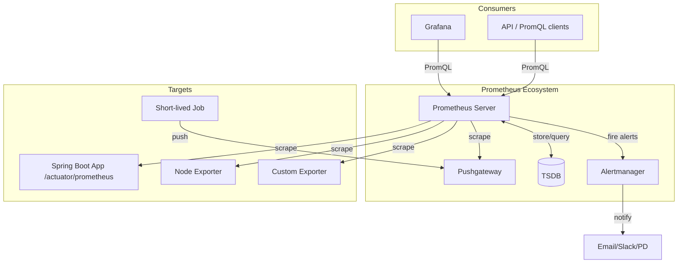
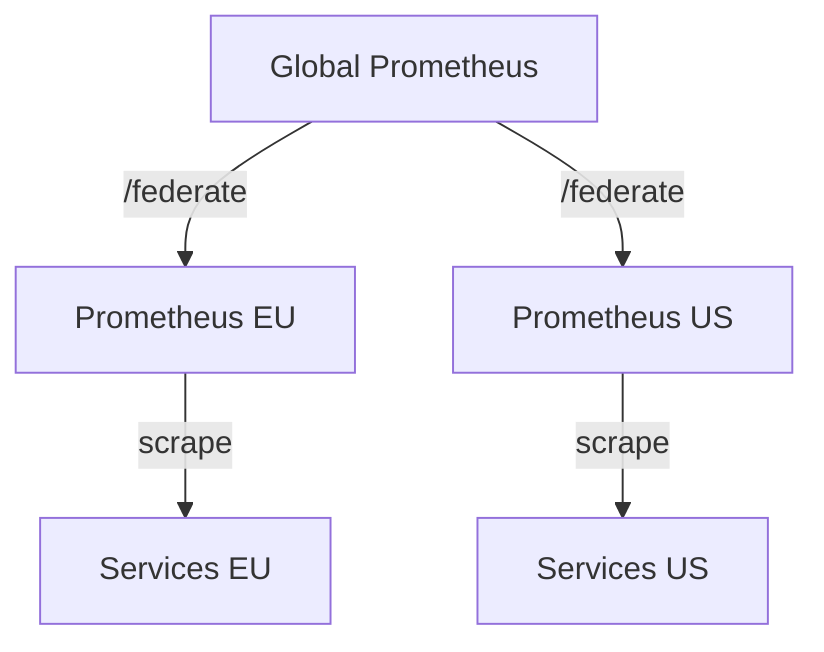

# Вопросы на собеседовании: `Prometheus` и `Grafana`

Шпаргалка охватывает архитектуру `Prometheus`, типы метрик, язык запросов `PromQL`, настройку алертов через `Alertmanager`, интеграцию с `Spring Boot` через `Micrometer`, визуализацию в `Grafana`, а также решения для долгосрочного хранения — `Thanos` и `VictoriaMetrics`.

**`Prometheus`** — система мониторинга с открытым исходным кодом, основанная на pull-модели сбора метрик и собственной TSDB. **`Grafana`** — платформа визуализации, которая подключается к `Prometheus` как источнику данных и строит дашборды.

## Полезные ссылки

### Официальная документация

- [Prometheus Documentation](https://prometheus.io/docs/) — официальная документация Prometheus
- [PromQL Reference](https://prometheus.io/docs/prometheus/latest/querying/basics/) — язык запросов PromQL
- [Grafana Documentation](https://grafana.com/docs/grafana/latest/) — документация Grafana
- [Micrometer Documentation](https://docs.micrometer.io/micrometer/reference/) — документация Micrometer
- [Grafana Loki](https://grafana.com/docs/loki/latest/) — документация Loki
- [Baeldung: Monitor a Spring Boot App Using Prometheus](https://www.baeldung.com/spring-boot-prometheus) — практическое руководство
- [Baeldung: Quick Guide to Micrometer](https://www.baeldung.com/micrometer) — основы Micrometer

## Содержание

- [Полезные ссылки](#полезные-ссылки)
- [See also](#see-also)

**Архитектура Prometheus**
- [Q1. (!) Опишите архитектуру Prometheus. Из каких компонентов она состоит?](#q1-опишите-архитектуру-prometheus-из-каких-компонентов-она-состоит)
- [Q2. Что такое TSDB в Prometheus? Как данные хранятся на диске?](#q2-что-такое-tsdb-в-prometheus-как-данные-хранятся-на-диске)
- [Q3. (!) Что такое pull-модель сбора метрик и почему Prometheus её использует?](#q3-что-такое-pull-модель-сбора-метрик-и-почему-prometheus-её-использует)
- [Q4. Что такое Pushgateway и когда его использовать?](#q4-что-такое-pushgateway-и-когда-его-использовать)
- [Q5. Что такое Alertmanager? Как он связан с Prometheus Server?](#q5-что-такое-alertmanager-как-он-связан-с-prometheus-server)

**Типы метрик**
- [Q6. (!) Какие типы метрик существуют в Prometheus? Когда какой использовать?](#q6-какие-типы-метрик-существуют-в-prometheus-когда-какой-использовать)
- [Q7. В чём разница между Histogram и Summary?](#q7-в-чём-разница-между-histogram-и-summary)
- [Q8. Как правильно назвать метрику в Prometheus? Какие конвенции именования?](#q8-как-правильно-назвать-метрику-в-prometheus-какие-конвенции-именования)

**PromQL**
- [Q9. (!) Чем отличаются функции rate() и irate()?](#q9-чем-отличаются-функции-rate-и-irate)
- [Q10. Что делает функция increase()? Когда предпочесть её rate()?](#q10-что-делает-функция-increase-когда-предпочесть-её-rate)
- [Q11. (!) Как работает histogram_quantile()? Приведите пример.](#q11-как-работает-histogram_quantile-приведите-пример)
- [Q12. Что такое label_replace() и для чего используется?](#q12-что-такое-label_replace-и-для-чего-используется)
- [Q13. Как агрегировать метрики по лейблам в PromQL?](#q13-как-агрегировать-метрики-по-лейблам-в-promql)
- [Q14. Что такое instant vector и range vector в PromQL?](#q14-что-такое-instant-vector-и-range-vector-в-promql)
- [Q15. Как вычислить процент ошибок HTTP-запросов с помощью PromQL?](#q15-как-вычислить-процент-ошибок-http-запросов-с-помощью-promql)

**Labels и Cardinality**
- [Q16. (!) Что такое high cardinality в Prometheus и почему это проблема?](#q16-что-такое-high-cardinality-в-prometheus-и-почему-это-проблема)
- [Q17. Какие лейблы не стоит добавлять в метрики?](#q17-какие-лейблы-не-стоит-добавлять-в-метрики)

**Recording rules и Alert rules**
- [Q18. (!) Что такое recording rules и зачем они нужны?](#q18-что-такое-recording-rules-и-зачем-они-нужны)
- [Q19. Как устроены alert rules в Prometheus? Что такое pending и firing?](#q19-как-устроены-alert-rules-в-prometheus-что-такое-pending-и-firing)
- [Q20. Что такое for: в alert rule? Зачем это нужно?](#q20-что-такое-for-в-alert-rule-зачем-это-нужно)

**Alertmanager**
- [Q21. (!) Как устроена маршрутизация алертов в Alertmanager?](#q21-как-устроена-маршрутизация-алертов-в-alertmanager)
- [Q22. Что такое inhibition rules в Alertmanager?](#q22-что-такое-inhibition-rules-в-alertmanager)
- [Q23. Что такое silences в Alertmanager и как их применять?](#q23-что-такое-silences-в-alertmanager-и-как-их-применять)
- [Q24. Как Alertmanager дедуплицирует и группирует алерты?](#q24-как-alertmanager-дедуплицирует-и-группирует-алерты)

**Spring Boot + Micrometer + Prometheus**
- [Q25. (!) Как подключить Prometheus к Spring Boot приложению?](#q25-как-подключить-prometheus-к-spring-boot-приложению)
- [Q26. Как создать кастомную метрику с помощью Micrometer?](#q26-как-создать-кастомную-метрику-с-помощью-micrometer)
- [Q27. Какие метрики Spring Boot экспортирует автоматически?](#q27-какие-метрики-spring-boot-экспортирует-автоматически)
- [Q28. Как добавить общие теги (common tags) ко всем метрикам приложения?](#q28-как-добавить-общие-теги-common-tags-ко-всем-метрикам-приложения)

**Grafana**
- [Q29. (!) Что такое Data Sources в Grafana? Как добавить Prometheus?](#q29-что-такое-data-sources-в-grafana-как-добавить-prometheus)
- [Q30. Что такое templating и переменные в Grafana?](#q30-что-такое-templating-и-переменные-в-grafana)
- [Q31. Чем отличаются Grafana Alerts от Alertmanager?](#q31-чем-отличаются-grafana-alerts-от-alertmanager)
- [Q32. Что такое Grafana Loki? Как он отличается от Prometheus?](#q32-что-такое-grafana-loki-как-он-отличается-от-prometheus)

**Service Discovery**
- [Q33. Какие механизмы service discovery поддерживает Prometheus?](#q33-какие-механизмы-service-discovery-поддерживает-prometheus)
- [Q34. Как работает Kubernetes service discovery в Prometheus?](#q34-как-работает-kubernetes-service-discovery-в-prometheus)

**Remote Write / Remote Read / Federation**
- [Q35. (!) Что такое Remote Write в Prometheus и зачем используется?](#q35-что-такое-remote-write-в-prometheus-и-зачем-используется)
- [Q36. Что такое Prometheus Federation?](#q36-что-такое-prometheus-federation)
- [Q37. Чем Thanos отличается от VictoriaMetrics? Когда использовать каждый?](#q37-чем-thanos-отличается-от-victoriametrics-когда-использовать-каждый)

**SLI / SLO**
- [Q38. Что такое SLI и SLO? Какие метрики обычно используются?](#q38-что-такое-sli-и-slo-какие-метрики-обычно-используются)
- [Q39. Что такое error budget и как его считать через PromQL?](#q39-что-такое-error-budget-и-как-его-считать-через-promql)

---

## Q1. Опишите архитектуру Prometheus. Из каких компонентов она состоит?

**Prometheus** — система мониторинга, построенная на pull-архитектуре. Основные компоненты:



| Компонент | Роль |
|-----------|------|
| **Prometheus Server** | Сбор метрик (scrape), хранение в TSDB, вычисление alert rules |
| **TSDB** | Встроенная time-series БД; хранит данные локально на диске |
| **Alertmanager** | Получает алерты от сервера, маршрутизирует по receivers |
| **Pushgateway** | Промежуточный буфер для short-lived jobs, которые не доживают до scrape |
| **Exporters** | Агенты-переходники для систем без нативной поддержки (Node Exporter, JMX, Redis) |

**На интервью**: подчеркни разделение ответственности — Prometheus Server только детектирует (`FIRING`), а `Alertmanager` решает, кому и как отправить уведомление.

---

## Q2. Что такое TSDB в Prometheus? Как данные хранятся на диске?

**TSDB (Time Series Database)** — встроенное хранилище `Prometheus`, оптимизированное для записи и чтения временных рядов.

**Структура на диске:**

```
data/
├── 01BKGV7JC0RY8A6FHJF7H6Q68R/   ← Block (2-часовой блок)
│   ├── chunks/
│   │   └── 000001                 ← сжатые данные сэмплов
│   ├── index                      ← индекс лейблов → временные ряды
│   ├── meta.json
│   └── tombstones
├── chunks_head/                   ← текущие данные в памяти (WAL)
└── wal/                           ← Write-Ahead Log
```

**Ключевые особенности:**
- Данные делятся на **блоки** (~2 часа по умолчанию)
- Последние ~2 часа хранятся в памяти (head block) + WAL для durability
- Старые блоки **compaction** — слияние и сжатие в более крупные блоки
- Сжатие применяет алгоритм Gorilla (double-delta для timestamps, XOR для float64 значений)
- По умолчанию данные хранятся **15 дней** (`--storage.tsdb.retention.time`)

---

## Q3. (!) Что такое pull-модель сбора метрик и почему Prometheus её использует?

**Pull-модель** означает, что `Prometheus Server` сам периодически опрашивает (`scrapes`) таргеты по HTTP, а не таргеты отправляют данные серверу.

**Преимущества pull:**
- `Prometheus` контролирует нагрузку — сам решает как часто scrape
- Легко определить, что таргет недоступен (метрика `up == 0`)
- Упрощённое service discovery — нужно только знать адрес
- Конфигурация централизована на стороне `Prometheus`
- Не нужно настраивать firewall rules для входящего трафика на каждом таргете

**Когда push всё же нужен:**
- Short-lived jobs (batch, cron) — не доживают до следующего scrape → используют `Pushgateway`
- Ситуации с NAT/firewall, когда `Prometheus` не может достучаться до таргета напрямую

**Сравнение:**

| | Pull | Push |
|-|------|------|
| Нагрузка | Контролируется Prometheus | Контролируется таргетом |
| Доступность | up/down автоматически | Нужен heartbeat |
| Масштаб | Узкое место — Prometheus | Сервер может быть перегружен |
| Firewall | Prometheus → таргет | Таргет → сервер |

---

## Q4. Что такое Pushgateway и когда его использовать?

**Pushgateway** — промежуточный компонент, который принимает метрики по HTTP push от short-lived jobs и хранит их до следующего scrape от `Prometheus Server`.

**Сценарии использования:**
- Cron jobs, batch jobs, CI/CD pipelines — завершаются быстрее, чем scrape interval
- Тесты производительности — нужно записать результат разово

**Пример отправки метрики через Pushgateway:**
```bash
echo "batch_job_duration_seconds 120.5" | curl --data-binary @- \
  http://pushgateway:9091/metrics/job/batch_import/instance/server01
```

**Важные ограничения:**
- `Pushgateway` НЕ рекомендуется как единственный способ сбора метрик из long-running сервисов
- Метрика живёт в Pushgateway навсегда, пока не удалена явно — нет автоматического TTL
- Не подходит для горизонтально масштабированных сервисов (несколько инстансов перезапишут друг друга)

---

## Q5. Что такое Alertmanager? Как он связан с Prometheus Server?

**Alertmanager** — отдельный компонент, отвечающий за управление алертами: дедупликацию, группировку, маршрутизацию и отправку уведомлений.

**Разделение ответственности:**
- `Prometheus Server` — **вычисляет** alert rules и определяет состояние `FIRING`/`PENDING`
- `Alertmanager` — **управляет** что делать с firing-алертами (кому, когда, как уведомить)

**Поток алерта:**
```
Prometheus Server
  → evaluates PromQL rule
  → state becomes FIRING
  → sends alert to Alertmanager via HTTP POST /api/v2/alerts
  → Alertmanager deduplicates, groups, routes
  → sends notification (email/Slack/PagerDuty/etc.)
```

Один `Alertmanager` может принимать алерты от нескольких `Prometheus Server`-ов.

---

## Q6. (!) Какие типы метрик существуют в Prometheus? Когда какой использовать?

`Prometheus` поддерживает 4 типа метрик:

| Тип | Описание | Когда использовать |
|-----|----------|--------------------|
| **Counter** | Монотонно возрастающий счётчик, сбрасывается при рестарте | Число запросов, ошибок, обработанных событий |
| **Gauge** | Произвольное значение, может расти и падать | CPU, память, температура, число соединений |
| **Histogram** | Распределение значений по бакетам + sum + count | Время ответа, размер запроса/ответа |
| **Summary** | Квантили, вычисленные на стороне клиента + sum + count | Когда нужны точные квантили, но без агрегации |

**Counter:**
```java
// Micrometer
Counter requestCounter = Counter.builder("http_requests_total")
    .tag("method", "GET")
    .tag("status", "200")
    .register(meterRegistry);
requestCounter.increment();
```

**Gauge:**
```java
Gauge.builder("queue_size", queue, Queue::size)
    .register(meterRegistry);
```

**Histogram (Timer в Micrometer):**
```java
Timer timer = Timer.builder("http_request_duration_seconds")
    .publishPercentileHistogram()  // для histogram_quantile в PromQL
    .register(meterRegistry);
timer.record(() -> handleRequest());
```

**Правило выбора**: если значение только растёт → `Counter`; если может убывать → `Gauge`; если нужно распределение → `Histogram`/`Summary`.

---

## Q7. В чём разница между Histogram и Summary?

| | Histogram | Summary |
|-|-----------|---------|
| Квантили | Вычисляются в PromQL на стороне сервера | Вычисляются на стороне клиента |
| Агрегация | Можно агрегировать по нескольким инстансам | Нельзя агрегировать (квантили не суммируются) |
| Накладные расходы | На сервере (PromQL) | На клиенте (CPU приложения) |
| Точность | Зависит от конфигурации бакетов | Точная, но только для одного инстанса |
| Бакеты | Предопределены заранее | Не требуются |

**Histogram** экспортирует:
- `http_request_duration_seconds_bucket{le="0.1"}` — число запросов <= 0.1s
- `http_request_duration_seconds_sum`
- `http_request_duration_seconds_count`

**Summary** экспортирует:
- `http_request_duration_seconds{quantile="0.99"}` — P99 на клиенте
- `http_request_duration_seconds_sum`
- `http_request_duration_seconds_count`

**Рекомендация**: в современных системах предпочитают `Histogram` + `histogram_quantile()` в `PromQL`, так как позволяет агрегировать данные по нескольким инстансам.

---

## Q8. Как правильно назвать метрику в Prometheus? Какие конвенции именования?

**Правила именования:**
1. Формат: `<namespace>_<subsystem>_<name>_<unit>` в `snake_case`
2. Суффикс обозначает единицу измерения в базовых единицах СИ: `_seconds`, `_bytes`, `_total`
3. `Counter` всегда заканчивается на `_total`
4. Не дублировать единицы в имени (`request_duration_seconds_total` — плохо)

**Примеры:**
```
http_requests_total              # counter: общее число HTTP-запросов
http_request_duration_seconds    # histogram: длительность в секундах
process_resident_memory_bytes    # gauge: память в байтах
jvm_gc_pause_seconds_total       # counter sum: суммарное время GC
kafka_consumer_lag               # gauge: отставание консьюмера
```

**Плохие примеры:**
```
requestCount        # нет namespace, нет единиц
http_request_ms     # нестандартная единица (ms вместо seconds)
user_id_total       # лейбл в имени метрики
```

---

## Q9. (!) Чем отличаются функции rate() и irate()?

Обе функции вычисляют скорость изменения `Counter` в секунду, но по-разному.

| | `rate()` | `irate()` |
|-|----------|-----------|
| Алгоритм | Средняя скорость за весь range | Мгновенная скорость по последним 2 точкам |
| Сглаживание | Сильное (устойчив к выбросам) | Отсутствует (реагирует на спайки) |
| Применение | Дашборды, алертинг | Отладка, real-time метрики |
| Рекомендация | Большинство случаев | Только для диагностики |

```promql
# Среднее число запросов в секунду за последние 5 минут
rate(http_requests_total[5m])

# Мгновенная скорость (последние 2 точки)
irate(http_requests_total[5m])
```

**Важно**: `irate()` нельзя использовать в alert rules — слишком нестабилен, вызывает ложные срабатывания. Для алертов всегда используй `rate()` с достаточным window (минимум 5m).

---

## Q10. Что делает функция increase()? Когда предпочесть её rate()?

`increase(v[d])` — возвращает абсолютный прирост `Counter` за период `d`.

```promql
# Сколько запросов было за последний час
increase(http_requests_total[1h])

# Эквивалентно rate * seconds:
rate(http_requests_total[1h]) * 3600
```

**Когда использовать `increase()` вместо `rate()`:**
- Когда нужно **абсолютное число событий** (не скорость): "сколько ошибок за сутки"
- В отчётах и SLO-расчётах
- Для заголовков дашборда типа "Всего запросов за час: 12 345"

**Нюанс**: `increase()` экстраполирует значения, поэтому может возвращать нецелые числа.

---

## Q11. (!) Как работает histogram_quantile()? Приведите пример.

`histogram_quantile(φ, b)` вычисляет квантиль φ (от 0 до 1) из гистограммы `b`.

**Как работает:**
1. Принимает вектор с метриками типа `_bucket`
2. Выполняет линейную интерполяцию внутри бакета, в котором находится квантиль
3. Возвращает аппроксимированное значение

**Пример — P99 latency:**
```promql
histogram_quantile(
  0.99,
  rate(http_request_duration_seconds_bucket[5m])
)
```

**P99 latency по сервисам:**
```promql
histogram_quantile(
  0.99,
  sum by (service, le) (
    rate(http_request_duration_seconds_bucket[5m])
  )
)
```

**Важные нюансы:**
- Нужно применять `rate()` к `_bucket` перед `histogram_quantile()`
- Чем лучше подобраны бакеты, тем точнее результат
- Стандартные бакеты в `Micrometer`: `.005, .01, .025, .05, .1, .25, .5, 1, 2.5, 5, 10` секунд
- Значение `le="+Inf"` всегда равно `_count`

---

## Q12. Что такое label_replace() и для чего используется?

`label_replace()` — функция для манипуляции лейблами: создание нового лейбла или изменение существующего с помощью regex.

**Синтаксис:**
```promql
label_replace(v, dst_label, replacement, src_label, regex)
```

**Пример — извлечь имя сервиса из namespace:**
```promql
label_replace(
  up,
  "short_name",      -- новый лейбл
  "$1",              -- значение: первая группа regex
  "job",             -- источник
  "(.+)-service"     -- regex
)
```

**Применение:**
- Нормализация лейблов из разных источников
- Создание "удобных" лейблов для отображения в Grafana
- Извлечение части строки (hostname, namespace) в отдельный лейбл

---

## Q13. Как агрегировать метрики по лейблам в PromQL?

`PromQL` поддерживает агрегирующие операторы: `sum`, `avg`, `min`, `max`, `count`, `topk`, `bottomk`, `stddev`.

**Ключевые слова:**
- `by (label1, label2)` — агрегировать, сохранив только указанные лейблы
- `without (label1)` — агрегировать, убрав указанные лейблы

```promql
# Суммарный RPS по всем инстансам, сгруппированный по сервису
sum by (service) (rate(http_requests_total[5m]))

# Максимальный heap по всем podам
max without (pod) (jvm_memory_used_bytes{area="heap"})

# Топ 5 эндпоинтов по числу запросов
topk(5, sum by (path) (rate(http_requests_total[5m])))

# Процент ошибок по сервису
sum by (service) (rate(http_requests_total{status=~"5.."}[5m]))
/
sum by (service) (rate(http_requests_total[5m]))
* 100
```

---

## Q14. Что такое instant vector и range vector в PromQL?

| | Instant vector | Range vector |
|-|----------------|--------------|
| Синтаксис | `metric_name{labels}` | `metric_name{labels}[5m]` |
| Результат | Одно значение на каждый time series на момент t | Набор значений за период [d] |
| Применение | Арифметика, сравнения | Ввод для rate(), increase(), delta() |

```promql
# Instant vector — текущее значение
http_requests_total{job="api"}

# Range vector — значения за 5 минут (только как аргумент функции)
rate(http_requests_total{job="api"}[5m])
```

**Range vector нельзя использовать напрямую** — только как аргумент функций (`rate`, `irate`, `increase`, `delta`, `deriv`, `predict_linear`, `resets`).

---

## Q15. Как вычислить процент ошибок HTTP-запросов с помощью PromQL?

**Процент 5xx ошибок:**
```promql
100 * (
  sum(rate(http_requests_total{status=~"5.."}[5m]))
  /
  sum(rate(http_requests_total[5m]))
)
```

**Error rate по сервисам:**
```promql
100 * sum by (service) (
  rate(http_server_requests_seconds_count{status=~"5.."}[5m])
)
/ sum by (service) (
  rate(http_server_requests_seconds_count[5m])
)
```

**Метрика для SLO (availability):**
```promql
# Доступность = (1 - error_rate) за 30 дней
1 - (
  sum(increase(http_requests_total{status=~"5.."}[30d]))
  /
  sum(increase(http_requests_total[30d]))
)
```

---

## Q16. (!) Что такое high cardinality в Prometheus и почему это проблема?

**Cardinality (мощность)** — количество уникальных комбинаций лейблов для одной метрики.

Метрика с лейблами `{method, path, status}`, где `path` принимает 10 000 уникальных значений, создаст **10 000 временных рядов**.

**Почему это проблема:**
- Каждый уникальный time series требует памяти в TSDB
- Растёт размер индекса → медленнее запросы
- Scrape становится дольше
- Больше данных для `Prometheus Server` → OOM, нестабильность

**Типичные источники high cardinality (запрещено использовать как лейблы):**
```
user_id, request_id, session_id,
email, IP-адрес, UUID,
timestamp, version (если много релизов)
```

**Допустимые лейблы** (ограниченное множество значений):
```
method (GET/POST/...), status (200/400/500),
environment (dev/staging/prod), region (eu/us),
service, job, instance
```

---

## Q17. Какие лейблы не стоит добавлять в метрики?

**Правило**: никогда не используй как лейбл значения с неограниченным или очень большим множеством значений.

**Нельзя:**
```
user_id="user-12345"        # миллионы пользователей
request_id="abc-def-123"    # уникален для каждого запроса
url="/api/users/12345"      # ID в URL → тысячи вариантов
```

**Можно (нормализуй):**
```
endpoint="/api/users/{id}"  # шаблон вместо реального ID
status="404"                # конечное множество
method="GET"                # конечное множество
```

**Как проверить cardinality:**
```promql
# Топ метрик по числу уникальных time series
topk(10, count by (__name__)({__name__=~".+"}))
```

---

## Q18. (!) Что такое recording rules и зачем они нужны?

**Recording rules** — предвычисленные PromQL-выражения, результат которых сохраняется как новая метрика в TSDB.

**Зачем:**
- Ускорение дашбордов — сложные запросы уже вычислены
- Уменьшение нагрузки — запрос выполняется раз в `evaluation_interval`, а не при каждом открытии дашборда
- Нормализация имён для удобства
- Повторное использование в нескольких alert rules

**Пример конфигурации:**
```yaml
groups:
  - name: api_recording_rules
    interval: 30s
    rules:
      # Предвычисленный RPS по сервису
      - record: job:http_requests:rate5m
        expr: sum by (job) (rate(http_requests_total[5m]))

      # P99 latency по сервису
      - record: job:http_request_duration_p99:rate5m
        expr: |
          histogram_quantile(0.99,
            sum by (job, le) (
              rate(http_request_duration_seconds_bucket[5m])
            )
          )
```

**Конвенция именования**: `<level>:<metric>:<operation>`
- `job:http_requests:rate5m` → уровень aggregation = `job`, метрика = `http_requests`, операция = `rate5m`

---

## Q19. Как устроены alert rules в Prometheus? Что такое pending и firing?

**Alert rule** — PromQL-выражение, при истинности которого (`> 0`) генерируется алерт.

**Состояния алерта:**
- `inactive` — условие ложно
- `pending` — условие истинно, но не прошёл `for:` период
- `firing` — условие истинно дольше `for:` → отправлен в `Alertmanager`

**Пример:**
```yaml
groups:
  - name: api_alerts
    rules:
      - alert: HighErrorRate
        expr: |
          sum(rate(http_requests_total{status=~"5.."}[5m]))
          /
          sum(rate(http_requests_total[5m])) > 0.05
        for: 5m
        labels:
          severity: critical
          team: backend
        annotations:
          summary: "High error rate on {{ $labels.job }}"
          description: "Error rate is {{ $value | humanizePercentage }}"
```

---

## Q20. Что такое for: в alert rule? Зачем это нужно?

`for:` — задержка перед переходом алерта из `pending` в `firing`. Условие должно быть истинным **непрерывно** в течение этого периода.

**Зачем:**
- Фильтрация кратковременных спайков — избегаем ложных срабатываний
- Snooze для временных аномалий

**Рекомендации:**
- Для критичных алертов: `for: 2m` — `5m`
- Для предупреждений: `for: 10m` — `15m`
- `for: 0m` или отсутствие `for:` — алерт срабатывает немедленно (не рекомендуется для production)

```yaml
- alert: MemoryPressure
  expr: jvm_memory_used_bytes{area="heap"} / jvm_memory_max_bytes{area="heap"} > 0.9
  for: 5m          # только если > 90% heap в течение 5 минут
  labels:
    severity: warning
```

---

## Q21. (!) Как устроена маршрутизация алертов в Alertmanager?

**Маршрутизация** — дерево правил, определяющее какой receiver получит алерт на основе лейблов.

```yaml
route:
  group_by: ['alertname', 'cluster']
  group_wait: 30s        # ждать перед отправкой первой группы
  group_interval: 5m     # интервал между отправками группы
  repeat_interval: 4h    # повторять если алерт не resolved
  receiver: 'default-slack'

  routes:
    # Критичные алерты → PagerDuty
    - matchers:
        - severity = critical
      receiver: pagerduty-critical
      continue: false    # не проверять следующие маршруты

    # Backend-команда
    - matchers:
        - team = backend
      receiver: backend-slack

receivers:
  - name: 'default-slack'
    slack_configs:
      - api_url: 'https://hooks.slack.com/...'
        channel: '#alerts'

  - name: 'pagerduty-critical'
    pagerduty_configs:
      - routing_key: '<KEY>'
```

**Ключевые параметры:**
- `group_by` — лейблы для группировки алертов в одно уведомление
- `group_wait` — сколько ждать чтобы собрать группу перед первой отправкой
- `continue: true` — проверять следующие маршруты (по умолчанию — остановиться на первом совпадении)

---

## Q22. Что такое inhibition rules в Alertmanager?

**Inhibition** — заглушение одних алертов при наличии других. Используется для устранения "шторма алертов" при каскадных сбоях.

**Сценарий**: если `Kubernetes Node` недоступна, все pod-алерты с этой node бессмысленны.

```yaml
inhibit_rules:
  - source_matchers:
      - alertname = NodeDown
    target_matchers:
      - alertname =~ "Pod.*"
    # Подавлять только если совпадает node
    equal: ['node']
```

**Другой пример**: если `DatacenterDown`, заглушить все сервисные алерты из этого датацентра:
```yaml
inhibit_rules:
  - source_matchers:
      - severity = critical
      - alertname = DatacenterDown
    target_matchers:
      - severity =~ "warning|info"
    equal: ['datacenter']
```

---

## Q23. Что такое silences в Alertmanager и как их применять?

**Silence** — временное заглушение алертов по матчерам лейблов. Алерты всё равно приходят в `Alertmanager`, но уведомления не отправляются.

**Применение:**
- Плановые maintenance window
- Деплои — на время деплоя отключить некритичные алерты
- Тестирование alert rules без засорения каналов

**Через UI Alertmanager**: `/alertmanager/#/silences/new`

**Через API:**
```bash
curl -X POST http://alertmanager:9093/api/v2/silences \
  -H 'Content-Type: application/json' \
  -d '{
    "matchers": [
      {"name": "environment", "value": "staging", "isRegex": false}
    ],
    "startsAt": "2026-04-13T10:00:00Z",
    "endsAt": "2026-04-13T12:00:00Z",
    "createdBy": "admin",
    "comment": "Planned deployment"
  }'
```

**Отличие от inhibition**: silence — ручное/временное действие; inhibition — автоматическое правило.

---

## Q24. Как Alertmanager дедуплицирует и группирует алерты?

**Дедупликация**: `Alertmanager` получает алерты от нескольких `Prometheus Server`-ов (для HA). Алерты с одинаковыми лейблами считаются дубликатами.

**Группировка**: алерты с одинаковыми `group_by` лейблами объединяются в одно уведомление.

**Пример без группировки**: 100 pod-ов упали → 100 уведомлений в Slack.

**Пример с группировкой** `group_by: ['alertname', 'cluster']`:
```
[FIRING: 100] PodCrashLooping (cluster=prod-eu)
 - pod: backend-1
 - pod: backend-2
 - ... (98 more)
```

**Тайминги:**
```yaml
route:
  group_wait: 30s      # ждём 30 сек собирая группу перед первой отправкой
  group_interval: 5m   # если группа пополнилась — ждём 5 мин перед повторной отправкой
  repeat_interval: 4h  # повторять уведомление каждые 4ч пока не resolved
```

---

## Q25. (!) Как подключить Prometheus к Spring Boot приложению?

**Шаг 1 — зависимости:**
```xml
<dependency>
    <groupId>org.springframework.boot</groupId>
    <artifactId>spring-boot-starter-actuator</artifactId>
</dependency>
<dependency>
    <groupId>io.micrometer</groupId>
    <artifactId>micrometer-registry-prometheus</artifactId>
</dependency>
```

**Шаг 2 — конфигурация приложения:**
```yaml
# application.yml
management:
  endpoints:
    web:
      exposure:
        include: prometheus,health,info
  endpoint:
    prometheus:
      enabled: true
  metrics:
    tags:
      application: ${spring.application.name}
      environment: ${spring.profiles.active:default}
```

**Шаг 3 — конфигурация Prometheus:**
```yaml
# prometheus.yml
scrape_configs:
  - job_name: 'spring-boot-app'
    metrics_path: '/actuator/prometheus'
    scrape_interval: 15s
    static_configs:
      - targets: ['localhost:8080']
        labels:
          service: 'my-service'
```

**Эндпоинт** будет доступен по: `GET /actuator/prometheus` — возвращает метрики в формате `text/plain; version=0.0.4`.

---

## Q26. Как создать кастомную метрику с помощью Micrometer?

**Counter:**
```java
@Service
public class OrderService {
    private final Counter orderCreatedCounter;
    private final Counter orderFailedCounter;

    public OrderService(MeterRegistry registry) {
        this.orderCreatedCounter = Counter.builder("orders_created_total")
            .description("Total number of created orders")
            .tag("type", "standard")
            .register(registry);
        this.orderFailedCounter = Counter.builder("orders_failed_total")
            .register(registry);
    }

    public void createOrder(Order order) {
        try {
            // ...
            orderCreatedCounter.increment();
        } catch (Exception e) {
            orderFailedCounter.increment();
            throw e;
        }
    }
}
```

**Timer (автоматически создаёт Histogram):**
```java
private final Timer orderProcessingTimer;

orderProcessingTimer = Timer.builder("order_processing_duration_seconds")
    .description("Time to process an order")
    .publishPercentileHistogram(true)  // для histogram_quantile
    .sla(Duration.ofMillis(100), Duration.ofMillis(500))  // SLA бакеты
    .register(registry);

orderProcessingTimer.record(() -> processOrder(order));
```

**@Timed аннотация (Spring AOP):**
```java
@Timed(value = "payment_duration", percentiles = {0.5, 0.95, 0.99})
public PaymentResult processPayment(PaymentRequest request) { ... }
```

---

## Q27. Какие метрики Spring Boot экспортирует автоматически?

`Spring Boot Actuator + Micrometer` автоматически регистрирует следующие метрики:

| Группа | Примеры метрик |
|--------|---------------|
| **JVM** | `jvm_memory_used_bytes`, `jvm_gc_pause_seconds`, `jvm_threads_live_threads` |
| **HTTP сервер** | `http_server_requests_seconds` (histogram), `http_server_requests_seconds_count` |
| **HTTP клиент** | `http_client_requests_seconds` (RestTemplate, WebClient) |
| **Data Source** | `hikaricp_connections`, `hikaricp_connections_active`, `hikaricp_connections_timeout_total` |
| **Cache** | `cache_gets_total`, `cache_puts_total`, `cache_evictions_total` |
| **Kafka** | `kafka_consumer_fetch_manager_records_lag`, `kafka_producer_record_send_rate` |
| **System** | `process_cpu_usage`, `system_cpu_usage`, `process_uptime_seconds` |
| **Logback** | `logback_events_total{level="error"}` |

**Полезный PromQL для мониторинга Spring Boot:**
```promql
# Процент ошибок эндпоинтов
sum by (uri) (
  rate(http_server_requests_seconds_count{status=~"5.."}[5m])
) /
sum by (uri) (
  rate(http_server_requests_seconds_count[5m])
)

# P99 latency по эндпоинтам
histogram_quantile(0.99,
  sum by (uri, le) (
    rate(http_server_requests_seconds_bucket[5m])
  )
)
```

---

## Q28. Как добавить общие теги (common tags) ко всем метрикам приложения?

**Через конфигурацию:**
```yaml
management:
  metrics:
    tags:
      application: ${spring.application.name}
      environment: production
      region: eu-west-1
```

**Программно через `MeterRegistryCustomizer`:**
```java
@Bean
MeterRegistryCustomizer<MeterRegistry> commonTags() {
    return registry -> registry.config()
        .commonTags(
            "application", appName,
            "version", buildVersion,
            "datacenter", datacenter
        );
}
```

**Зачем:** все метрики будут автоматически помечены этими тегами, что позволит фильтровать и агрегировать в `Grafana` по `application`, `environment` и т.д.

---

## Q29. (!) Что такое Data Sources в Grafana? Как добавить Prometheus?

**Data Source** — подключение к источнику данных. `Grafana` поддерживает `Prometheus`, `Loki`, `InfluxDB`, `MySQL`, `PostgreSQL`, `Elasticsearch`, `Jaeger` и десятки других.

**Добавление Prometheus:**
1. `Configuration → Data Sources → Add data source`
2. Выбрать `Prometheus`
3. Указать URL: `http://prometheus:9090`
4. Настроить `Scrape interval` (должен совпадать с `prometheus.yml`)
5. `Save & Test`

**Через provisioning (как код):**
```yaml
# grafana/provisioning/datasources/prometheus.yml
apiVersion: 1
datasources:
  - name: Prometheus
    type: prometheus
    url: http://prometheus:9090
    access: proxy
    isDefault: true
    jsonData:
      timeInterval: 15s
      httpMethod: POST
```

---

## Q30. Что такое templating и переменные в Grafana?

**Templating** — механизм динамических переменных в дашборде, позволяющий переключаться между инстансами, сервисами, временными интервалами без редактирования запросов.

**Типы переменных:**

| Тип | Описание |
|-----|----------|
| `Query` | Значения из PromQL-запроса к источнику данных |
| `Interval` | Временные интервалы (1m, 5m, 1h) |
| `Custom` | Фиксированный список значений |
| `Constant` | Константа, скрытая от пользователя |
| `Textbox` | Произвольный ввод пользователя |

**Пример переменной `service`:**
```
Query: label_values(http_requests_total, service)
```

**Использование в панели:**
```promql
rate(http_requests_total{service="$service"}[5m])
```

**Переменная `$__interval`** — автоматически подбирается Grafana под zoom уровень:
```promql
rate(http_requests_total[${__interval}])
```

---

## Q31. Чем отличаются Grafana Alerts от Alertmanager?

| | Grafana Alerts | Alertmanager |
|-|----------------|--------------|
| Источник данных | Любой Grafana data source | Только Prometheus |
| Хранение правил | В Grafana | В Prometheus (файлы/ConfigMap) |
| Визуализация | В дашборде | Отдельный UI |
| Маршрутизация | Contact points + Notification policies | Routes + Receivers |
| Silences | Есть | Есть |
| Inhibition | Нет | Есть |
| Интеграции | Slack, email, PD, OpsGenie, webhook | То же самое |

**Рекомендация Grafana**: использовать `Grafana-managed alerts` как основной инструмент при наличии `Grafana`. `Alertmanager` остаётся актуальным для команд, работающих с `Prometheus` напрямую и хранящих правила как код (GitOps).

**Оба могут сосуществовать**: `Alertmanager` как data source в `Grafana` для просмотра и управления silences через UI.

---

## Q32. Что такое Grafana Loki? Как он отличается от Prometheus?

**Grafana Loki** — горизонтально масштабируемая система хранения и агрегации логов, вдохновлённая `Prometheus`.

| | Prometheus | Loki |
|-|------------|------|
| Тип данных | Метрики (числа) | Логи (строки) |
| Хранение | Значения + лейблы | Сжатые log-потоки + лейблы |
| Язык запросов | PromQL | LogQL |
| Индексирование | Полный индекс по лейблам | Только лейблы (без полнотекстового индекса) |
| Scrape | Pull | Push (через Promtail/Alloy) |

**LogQL пример:**
```logql
# Найти ERROR-логи по сервису
{service="order-service"} |= "ERROR"

# Метрика из логов — частота ошибок
rate({service="order-service"} |= "Exception" [5m])
```

**Стек Grafana LGTM:**
```
Loki      — логи
Grafana   — визуализация
Tempo     — трейсы
Mimir     — метрики (Prometheus-совместимый)
```

**Корреляция**: в `Grafana` можно переходить из trace → metrics → logs в одном интерфейсе.

---

## Q33. Какие механизмы service discovery поддерживает Prometheus?

`Prometheus` поддерживает более 20 механизмов service discovery:

| SD механизм | Применение |
|-------------|-----------|
| `static_configs` | Статический список хостов |
| `file_sd_configs` | Из JSON/YAML файла (обновляется без reload) |
| `kubernetes_sd_configs` | Pod, Service, Node, Endpoint в Kubernetes |
| `consul_sd_configs` | Consul service registry |
| `ec2_sd_configs` | AWS EC2 instances |
| `dns_sd_configs` | DNS A/SRV записи |
| `http_sd_configs` | HTTP endpoint возвращающий список таргетов |

**Пример Kubernetes SD:**
```yaml
scrape_configs:
  - job_name: 'kubernetes-pods'
    kubernetes_sd_configs:
      - role: pod
    relabel_configs:
      # Только pods с аннотацией prometheus.io/scrape: "true"
      - source_labels: [__meta_kubernetes_pod_annotation_prometheus_io_scrape]
        action: keep
        regex: true
      # Переопределить metrics path из аннотации
      - source_labels: [__meta_kubernetes_pod_annotation_prometheus_io_path]
        action: replace
        target_label: __metrics_path__
        regex: (.+)
```

---

## Q34. Как работает Kubernetes service discovery в Prometheus?

`Prometheus` использует `Kubernetes API` для получения списка ресурсов. Поддерживаемые роли: `pod`, `service`, `endpoints`, `node`, `ingress`.

**Аннотации для управления scraping:**
```yaml
# deployment.yaml
spec:
  template:
    metadata:
      annotations:
        prometheus.io/scrape: "true"
        prometheus.io/path: "/actuator/prometheus"
        prometheus.io/port: "8080"
```

**Prometheus Operator** упрощает конфигурацию через CRD:
```yaml
apiVersion: monitoring.coreos.com/v1
kind: ServiceMonitor
metadata:
  name: spring-boot-app
spec:
  selector:
    matchLabels:
      app: order-service
  endpoints:
    - port: http
      path: /actuator/prometheus
      interval: 15s
```

---

## Q35. (!) Что такое Remote Write в Prometheus и зачем используется?

**Remote Write** — механизм форвардинга метрик из `Prometheus` во внешнее хранилище в real-time.

**Зачем:**
- Долгосрочное хранение (TSDB хранит данные 15 дней по умолчанию)
- Глобальная агрегация из нескольких кластеров
- Интеграция с `Thanos`, `VictoriaMetrics`, `Cortex`, `Mimir`

**Конфигурация:**
```yaml
# prometheus.yml
remote_write:
  - url: "https://victoriametrics:8480/insert/0/prometheus/api/v1/write"
    queue_config:
      max_samples_per_send: 10000
      max_shards: 200
      capacity: 2500
    basic_auth:
      username: prometheus
      password: secret
```

**Remote Read** — обратный механизм: `Prometheus` запрашивает исторические данные из внешнего хранилища прозрачно для пользователя.

```yaml
remote_read:
  - url: "https://thanos-query:9090/api/v1/read"
    read_recent: false  # только для данных старше TSDB retention
```

---

## Q36. Что такое Prometheus Federation?

**Federation** — механизм иерархической агрегации, при котором один `Prometheus` (global) scrape-ит метрики с других `Prometheus`-серверов (local).



**Конфигурация на global Prometheus:**
```yaml
scrape_configs:
  - job_name: 'federate'
    honor_labels: true
    metrics_path: '/federate'
    params:
      match[]:
        - '{job=~".*"}'    # какие метрики забирать
    static_configs:
      - targets:
        - 'prometheus-eu:9090'
        - 'prometheus-us:9090'
```

**Отличие от Remote Write**: federation работает по pull, Remote Write — по push. Remote Write предпочтительнее для больших объёмов данных и low latency.

---

## Q37. Чем Thanos отличается от VictoriaMetrics? Когда использовать каждый?

| | Thanos | VictoriaMetrics |
|-|--------|-----------------|
| Подход | Расширяет Prometheus, sidecar/receive | Заменяет TSDB Prometheus |
| Хранение | Object storage (S3/GCS) | Собственное эффективное хранилище |
| Деплой | Микросервисы (Querier, Store, Compactor...) | Один бинарь (single-node) или кластер |
| Ресурсы | Больше компонентов, сложнее | Проще, меньше ресурсов, ~5-10x лучше сжатие |
| Совместимость | Полностью совместим с Prometheus | Prometheus-совместимый API |
| Remote Write | Thanos Receive | Встроен |

**Когда Thanos**: уже есть Prometheus, нужен глобальный query view, object storage (S3), multi-tenancy.

**Когда VictoriaMetrics**: новый проект, хочется простоты, важна производительность и экономия ресурсов, высокая скорость записи.

---

## Q38. Что такое SLI и SLO? Какие метрики обычно используются?

**SLI (Service Level Indicator)** — измеримая метрика, описывающая качество сервиса.
**SLO (Service Level Objective)** — целевое значение для SLI (99.9% запросов успешны).

**Типичные SLI и как их мерить:**

| SLI | PromQL |
|-----|--------|
| **Availability** (доступность) | `1 - sum(rate(http_errors[5m])) / sum(rate(http_requests[5m]))` |
| **Latency** (задержка P99 < 500ms) | `histogram_quantile(0.99, rate(http_request_duration_seconds_bucket[5m]))` |
| **Error rate** | `sum(rate(http_requests_total{status=~"5.."}[5m])) / sum(rate(http_requests_total[5m]))` |
| **Throughput** | `sum(rate(http_requests_total[5m]))` |
| **Saturation** (насыщенность) | `jvm_memory_used_bytes / jvm_memory_max_bytes` |

**Пример SLO alert:**
```yaml
- alert: SLOViolation
  expr: |
    (
      sum(rate(http_requests_total{status=~"5.."}[30m]))
      /
      sum(rate(http_requests_total[30m]))
    ) > 0.001   # больше 0.1% ошибок = нарушение SLO 99.9%
  for: 5m
  labels:
    severity: critical
```

---

## Q39. Что такое error budget и как его считать через PromQL?

**Error budget** — допустимый объём ошибок/деградаций в рамках SLO за период.

Если SLO = 99.9% availability за 30 дней:
- Допустимое downtime = 0.1% × 30 × 24 × 60 = **43.2 минуты** в месяц

**PromQL расчёт:**
```promql
# Процент "хороших" запросов за 30 дней
(
  sum(increase(http_requests_total{status!~"5.."}[30d]))
  /
  sum(increase(http_requests_total[30d]))
) * 100

# Оставшийся error budget (% от допустимого)
(
  1 - (
    sum(increase(http_requests_total{status=~"5.."}[30d]))
    /
    sum(increase(http_requests_total[30d]))
  )
) / 0.001  # 0.001 = 100% - SLO 99.9%
```

**Когда error budget исчерпан** — команда прекращает feature work и фокусируется на reliability.

---

## See also

- [Observability](observability-interview.md) — три столпа observability: метрики, логи, трейсы; связь с Prometheus и Grafana
- [Метрики и трейсинг](metrics-tracing-interview.md) — концепции метрик, RED/USE методы, distributed tracing
- [Стратегии логирования](logging-strategies-interview.md) — структурированные логи, ELK стек, Grafana Loki
- [Spring Boot Actuator](../frameworks/spring/spring-boot-actuator-interview.md) — endpoints, health checks, metrics через Actuator
- [Kubernetes](../devops/kubernetes-interview.md) — мониторинг кластера, kube-state-metrics, node-exporter в K8s
- [Распределённые системы](../architecture/distributed-systems-interview.md) — мониторинг распределённых систем, latency, availability
- [Микросервисная архитектура](../architecture/microservices-interview.md) — мониторинг микросервисов, golden signals, circuit breaker metrics

- [ELK Stack](elk-stack-interview.md)
- [Jaeger и Zipkin](jaeger-zipkin-interview.md)
- [Стратегии логирования](logging-strategies-interview.md)
- [Loki и Grafana](loki-grafana-interview.md)
- [Метрики и трейсинг](metrics-tracing-interview.md)
- [Observability](observability-interview.md)
