# Вопросы на собеседовании: `Application Profiling`

Практичные вопросы и ответы по profiling для `Senior Java Developer`: как находить узкие места по `CPU`, памяти, блокировкам и сетевым операциям в production. Покрывает `JFR`, `async-profiler`, `flame graphs`, `heap/thread dumps`, `GC`-анализ, `APM`-инструменты и `continuous profiling`.

## Полезные ссылки

### Официальная документация

- [Java Flight Recorder](https://docs.oracle.com/javase/9/troubleshoot/diagnostic-tools.htm#JSTGD356) — диагностика JVM через встроенный рекордер
- [JVM Tool Interface (JVMTI)](https://docs.oracle.com/javase/9/docs/specs/jvmti.html) — низкоуровневый API для инструментирования JVM
- [async-profiler GitHub](https://github.com/async-profiler/async-profiler) — низко-overhead профайлер для Linux/macOS
- [JDK Mission Control](https://www.oracle.com/java/technologies/jdk-mission-control.html) — GUI-анализатор JFR-записей
- [Eclipse MAT](https://eclipse.dev/mat/) — анализатор heap dump
- [Datadog Continuous Profiler](https://docs.datadoghq.com/profiler/) — APM с continuous profiling
- [Pyroscope](https://grafana.com/oss/pyroscope/) — open-source continuous profiling (Grafana)
- [Monitoring Java Applications with Flight Recorder](https://www.baeldung.com/java-flight-recorder-monitoring) — JFR для мониторинга Java-приложений
- [A Guide to Java Profilers](https://www.baeldung.com/java-profilers) — обзор профайлеров Java
- [Diagnosing a Running JVM](https://www.baeldung.com/running-jvm-diagnose) — диагностика работающей JVM
- [JFR View Command in Java](https://www.baeldung.com/java-flight-recorder-view) — использование команды jfr view

## Содержание

- [Полезные ссылки](#полезные-ссылки)
- [See also](#see-also)

**Основы профилирования**
- [Q1. (!) Что такое profiling и чем он отличается от мониторинга?](#q1--что-такое-profiling-и-чем-он-отличается-от-мониторинга)
- [Q2. (!) Как выбрать между sampling и instrumentation?](#q2--как-выбрать-между-sampling-и-instrumentation)
- [Q3. Что такое safepoint bias и как он влияет на точность профилирования?](#q3-что-такое-safepoint-bias-и-как-он-влияет-на-точность-профилирования)
- [Q4. Какие метрики обязательно связать с профилем?](#q4-какие-метрики-обязательно-связать-с-профилем)

**Java Flight Recorder (JFR)**
- [Q5. (!) Что такое JFR и как он работает?](#q5--что-такое-jfr-и-как-он-работает)
- [Q6. Как запустить JFR и какие настройки использовать?](#q6-как-запустить-jfr-и-какие-настройки-использовать)
- [Q7. Как анализировать JFR-записи?](#q7-как-анализировать-jfr-записи)
- [Q8. Какие ключевые JFR-события нужно знать?](#q8-какие-ключевые-jfr-события-нужно-знать)

**async-profiler**
- [Q9. (!) Как работает async-profiler и чем он лучше стандартных инструментов?](#q9--как-работает-async-profiler-и-чем-он-лучше-стандартных-инструментов)
- [Q10. Как использовать async-profiler на практике?](#q10-как-использовать-async-profiler-на-практике)
- [Q11. Когда использовать JFR, а когда async-profiler?](#q11-когда-использовать-jfr-а-когда-async-profiler)

**Flame Graphs**
- [Q12. (!) Как читать flame graph корректно?](#q12--как-читать-flame-graph-корректно)
- [Q13. Какие типы flame graph существуют и когда каждый полезен?](#q13-какие-типы-flame-graph-существуют-и-когда-каждый-полезен)

**CPU-профилирование**
- [Q14. (!) Как профилировать CPU bottleneck?](#q14--как-профилировать-cpu-bottleneck)
- [Q15. Что такое on-CPU и off-CPU анализ, и зачем оба?](#q15-что-такое-on-cpu-и-off-cpu-анализ-и-зачем-оба)
- [Q16. Как интерпретировать профиль и не ошибиться с root cause?](#q16-как-интерпретировать-профиль-и-не-ошибиться-с-root-cause)

**Allocation Profiling и Memory**
- [Q17. (!) Как профилировать allocation и memory pressure?](#q17--как-профилировать-allocation-и-memory-pressure)
- [Q18. Как снять и проанализировать heap dump?](#q18-как-снять-и-проанализировать-heap-dump)
- [Q19. Как найти memory leak с помощью профилирования?](#q19-как-найти-memory-leak-с-помощью-профилирования)

**Thread Dumps и Lock Contention**
- [Q20. (!) Как снять и анализировать thread dump?](#q20--как-снять-и-анализировать-thread-dump)
- [Q21. Как находить lock contention через профилирование?](#q21-как-находить-lock-contention-через-профилирование)

**GC-анализ**
- [Q22. (!) Как анализировать GC и связать его с профилированием?](#q22--как-анализировать-gc-и-связать-его-с-профилированием)
- [Q23. Как профилировать GC pauses и их влияние на latency?](#q23-как-профилировать-gc-pauses-и-их-влияние-на-latency)

**APM и Continuous Profiling**
- [Q24. (!) Что такое APM и как он дополняет профилирование?](#q24--что-такое-apm-и-как-он-дополняет-профилирование)
- [Q25. (!) Что такое continuous profiling и зачем он нужен?](#q25--что-такое-continuous-profiling-и-зачем-он-нужен)
- [Q26. Как работает Datadog Continuous Profiler?](#q26-как-работает-datadog-continuous-profiler)

**Профилирование в Production**
- [Q27. (!) Как профилировать production безопасно?](#q27--как-профилировать-production-безопасно)
- [Q28. Как профилировать сервис в Kubernetes/Docker?](#q28-как-профилировать-сервис-в-kubernetesdocker)
- [Q29. Как связать profiling с Prometheus/Grafana и алертингом?](#q29-как-связать-profiling-с-prometheusgrafana-и-алертингом)

**Heap dump и flame graphs — практика**
- [Q33. (!) Как анализировать heap dump с Eclipse MAT: практический сценарий?](#q33-как-анализировать-heap-dump-с-eclipse-mat-практический-сценарий)
- [Q34. Как читать flame graph и находить проблемы?](#q34-как-читать-flame-graph-и-находить-проблемы)

**Продвинутые темы профилирования**
- [Q35. Async Profiler vs JFR — когда что выбирать, отличия](#q35-async-profiler-vs-jfr--когда-что-выбирать-отличия)
- [Q36. Profiling в production — low-overhead инструменты](#q36-profiling-в-production--low-overhead-инструменты)
- [Q37. Heap Dump анализ — MAT, VisualVM, утечки памяти](#q37-heap-dump-анализ--mat-visualvm-утечки-памяти)
- [Q38. Thread Dump анализ — deadlock detection, jstack](#q38-thread-dump-анализ--deadlock-detection-jstack)
- [Q39. CPU Profiling — sampling vs instrumentation](#q39-cpu-profiling--sampling-vs-instrumentation)
- [Q40. Allocation Profiling — TLAB, allocation rate](#q40-allocation-profiling--tlab-allocation-rate)
- [Q41. Database Query Profiling — slow query log, EXPLAIN](#q41-database-query-profiling--slow-query-log-explain)
- [Q42. Profiling реактивных приложений — особенности Project Reactor](#q42-profiling-реактивных-приложений--особенности-project-reactor)

**Практика и Anti-patterns**
- [Q30. Какие anti-patterns в profiling чаще всего встречаются?](#q30-какие-anti-patterns-в-profiling-чаще-всего-встречаются)
- [Q31. Как построить системный процесс профилирования в команде?](#q31-как-построить-системный-процесс-профилирования-в-команде)
- [Q32. (!) Как ответить про profiling на senior-раунде за 1 минуту?](#q32--как-ответить-про-profiling-на-senior-раунде-за-1-минуту)

---

## Q1. (!) Что такое profiling и чем он отличается от мониторинга?

`Profiling` — это измерение реального поведения приложения на уровне отдельных методов и стек-трейсов: где тратится CPU, как аллоцируется память, где возникают блокировки.

**Ключевое отличие от мониторинга:**

| Аспект | Мониторинг | Профилирование |
|--------|-----------|----------------|
| Гранулярность | Метрики на уровне сервиса (p99, CPU%) | Стек-трейсы на уровне методов |
| Когда | Постоянно (24/7) | По запросу или continuous |
| Overhead | Минимальный (<1%) | Низкий-средний (1-5%) |
| Цель | Обнаружение проблемы | Локализация root cause |
| Пример | "p99 latency вырос до 500ms" | "60% CPU тратится в `JsonParser.parse()`" |

Профилирование нужно не "вместо метрик", а после сигнала о деградации или при оптимизации критичных сценариев.

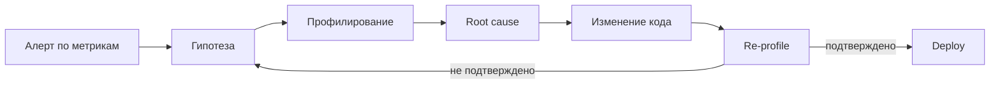

Ключевой принцип: **profile → hypothesis → change → re-profile**.

## Q2. (!) Как выбрать между sampling и instrumentation?

Это два фундаментально разных подхода к сбору данных:

**`Sampling` (выборочный):**
- Периодически (например, каждые 10мс) снимает стек-трейсы всех потоков
- Низкий overhead (~1-5%), подходит для production
- Даёт вероятностную картину — может пропустить короткие методы
- Инструменты: `async-profiler`, `JFR`, `perf`

**`Instrumentation` (инструментальный):**
- Вставляет код до/после каждого вызова метода
- Точный подсчёт вызовов и времени
- Высокий overhead (10-50%+), искажает картину ("observer effect")
- Инструменты: `JProfiler` (instrumentation mode), `YourKit`, `BTrace`

```java
// Instrumentation по сути добавляет такой код в каждый метод:
public void processOrder(Order order) {
    long start = System.nanoTime();
    try {
        // оригинальный код
    } finally {
        Profiler.record("processOrder", System.nanoTime() - start);
    }
}
```

**Практика:** в production — только `sampling` (`JFR`, `async-profiler`). `Instrumentation` — точечно в dev/test для конкретных классов, когда нужен точный подсчёт вызовов.

## Q3. Что такое safepoint bias и как он влияет на точность профилирования?

`Safepoint bias` — критическая проблема стандартных JVM-профайлеров. JVM может безопасно снять стек потока только в `safepoint` — специальных точках кода, где состояние потока полностью определено.

**Проблема:** стандартный `JVM TI GetStackTrace()` работает только в `safepoint`. Если метод выполняет длинный цикл без safepoint-а, профайлер его "не видит":

```java
// Этот цикл с counted loop может НЕ содержать safepoint
// до JDK 17 (JEP 401 добавил safepoints в counted loops)
for (int i = 0; i < array.length; i++) {
    sum += array[i]; // safepoint bias — профайлер не покажет этот код
}
```

**Решение:** `async-profiler` использует `AsyncGetCallTrace` — недокументированный API, который снимает стеки без ожидания safepoint. Это даёт честную картину.

| Профайлер | Safepoint bias | Точность |
|-----------|---------------|----------|
| `VisualVM` (sampling) | Да | Низкая |
| `JProfiler` (sampling) | Да | Низкая |
| `JFR` (execution sample) | Минимальный | Высокая |
| `async-profiler` | Нет | Высокая |

## Q4. Какие метрики обязательно связать с профилем?

Минимальный набор метрик для контекста профилирования:

- **Latency** p50/p95/p99 — основной SLI для пользователя
- **Throughput** (RPS) — нагрузка в момент снятия профиля
- **CPU utilization** — общая загрузка и по ядрам
- **GC pauses** — частота и длительность пауз (см. [Memory Management](memory-management-interview.md))
- **Error rate** — процент ошибок
- **Heap usage** — утилизация памяти

Без метрик профиль легко интерпретировать неверно: "горячий" метод может не быть причиной пользовательской деградации. Например, `GC` может занимать 30% CPU, но если паузы не влияют на p99, оптимизировать его бессмысленно.

## Q5. (!) Что такое JFR и как он работает?

`Java Flight Recorder (JFR)` — встроенный в JVM механизм сбора событий с минимальным overhead (<1% в production-конфигурации). С `JDK 11` полностью бесплатный (ранее был частью коммерческой лицензии `Oracle JDK`).

**Архитектура JFR:**

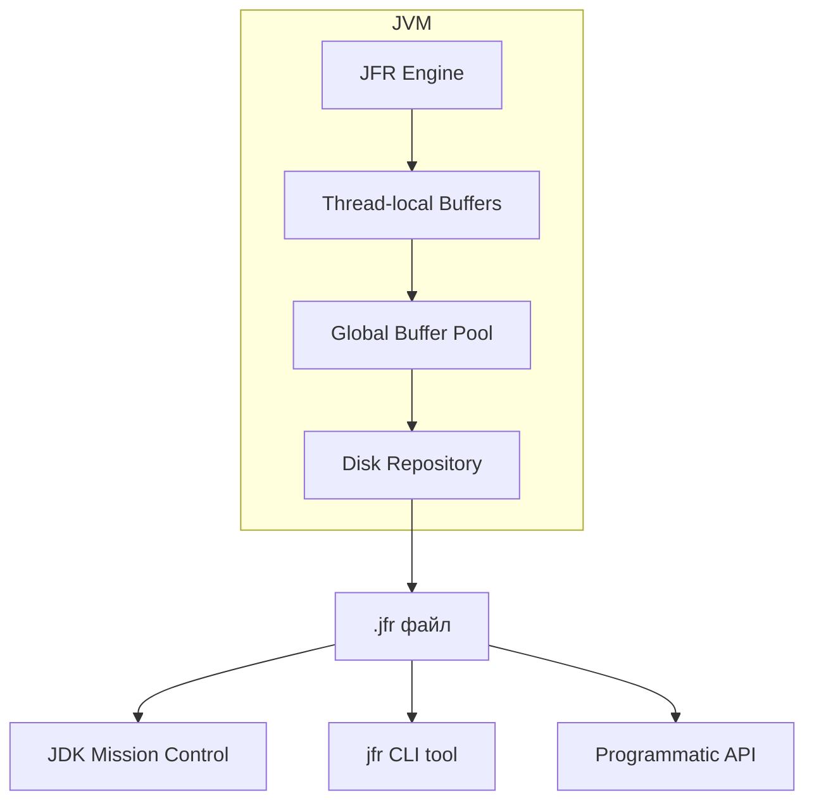

**Ключевые особенности:**
- Данные пишутся в thread-local буферы без lock contention
- Событийная модель — JFR записывает не только стеки, но и GC-события, I/O, monitor enter, exceptions и др.
- Два встроенных профиля: `default` (~1% overhead) и `profile` (~2% overhead, больше деталей)
- Circular buffer — может работать непрерывно, перезаписывая старые данные

## Q6. Как запустить JFR и какие настройки использовать?

**Запуск при старте JVM:**

```bash
# С default-профилем (production-safe)
java -XX:StartFlightRecording=duration=60s,filename=recording.jfr \
     -jar myapp.jar

# С расширенным профилем
java -XX:StartFlightRecording=settings=profile,duration=300s,\
     filename=detailed.jfr -jar myapp.jar

# Continuous recording с maxsize
java -XX:StartFlightRecording=disk=true,maxsize=500m,maxage=1h \
     -jar myapp.jar
```

**Запуск на работающем приложении через `jcmd`:**

```bash
# Найти PID
jcmd | grep myapp

# Начать запись
jcmd <PID> JFR.start name=profile settings=profile duration=60s \
     filename=/tmp/recording.jfr

# Dump текущего continuous recording
jcmd <PID> JFR.dump name=default filename=/tmp/dump.jfr

# Остановить
jcmd <PID> JFR.stop name=profile
```

**Программный запуск (JDK 14+):**

```java
try (Recording recording = new Recording(Configuration.getConfiguration("profile"))) {
    recording.setMaxAge(Duration.ofMinutes(5));
    recording.setDestination(Path.of("/tmp/recording.jfr"));
    recording.start();
    
    // ... выполнение нагрузки ...
    
    recording.stop();
}
```

## Q7. Как анализировать JFR-записи?

**1. CLI-инструмент `jfr` (JDK 17+):**

```bash
# Вывод сводки
jfr summary recording.jfr

# Просмотр конкретных событий
jfr print --events jdk.ExecutionSample recording.jfr

# Фильтрация по времени
jfr print --events jdk.GCPhasePause --json recording.jfr | jq .

# Получение flame graph через jfr-datasource
jfr print --events jdk.ExecutionSample --stack-depth 64 recording.jfr
```

**2. JDK Mission Control (JMC):**
- GUI для глубокого анализа
- Автоматические правила обнаружения проблем (Automated Analysis)
- Heat map, histogram, dependency view
- Лучший инструмент для комплексного анализа JFR

**3. Программный доступ (JDK 14+):**

```java
try (RecordingFile file = new RecordingFile(Path.of("recording.jfr"))) {
    while (file.hasMoreEvents()) {
        RecordedEvent event = file.readEvent();
        if (event.getEventType().getName().equals("jdk.ExecutionSample")) {
            RecordedStackTrace stack = event.getStackTrace();
            RecordedMethod topMethod = stack.getFrames().get(0).getMethod();
            System.out.println(topMethod.getType().getName() 
                + "." + topMethod.getName());
        }
    }
}
```

## Q8. Какие ключевые JFR-события нужно знать?

| Событие | Категория | Что показывает |
|---------|----------|----------------|
| `jdk.ExecutionSample` | CPU | Стек-трейсы активных потоков (CPU profiling) |
| `jdk.ObjectAllocationInNewTLAB` | Memory | Аллокации в новый TLAB |
| `jdk.ObjectAllocationOutsideTLAB` | Memory | Аллокации вне TLAB (медленный путь) |
| `jdk.GCPhasePause` | GC | Длительность GC-пауз |
| `jdk.GarbageCollection` | GC | Общая информация о GC-циклах |
| `jdk.JavaMonitorEnter` | Locks | Ожидание synchronized-блоков (>20ms) |
| `jdk.JavaMonitorWait` | Locks | `Object.wait()` вызовы |
| `jdk.ThreadPark` | Locks | `LockSupport.park()` — concurrent locks |
| `jdk.FileRead` / `jdk.FileWrite` | I/O | Файловые операции с длительностью |
| `jdk.SocketRead` / `jdk.SocketWrite` | I/O | Сетевые операции |
| `jdk.JavaExceptionThrow` | Errors | Выброшенные исключения со стеками |

Совет: в production используйте `default`-профиль, но для диагностики проблем аллокации переключите на `profile` — он включает `ObjectAllocationInNewTLAB`.

## Q9. (!) Как работает async-profiler и чем он лучше стандартных инструментов?

`async-profiler` — это open-source профайлер для JVM на Linux и macOS, решающий проблему `safepoint bias`. Он использует два механизма:

**1. `AsyncGetCallTrace`** — недокументированный API OpenJDK для получения Java-стеков в произвольный момент (без ожидания safepoint).

**2. `perf_events`** (Linux) — ядерный механизм аппаратных счётчиков. Это позволяет видеть native-стеки (JIT, GC, kernel) вместе с Java-стеками.

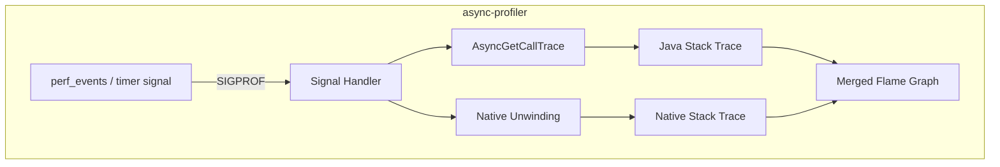

**Преимущества:**
- Нет `safepoint bias` — видит код внутри counted loops
- Объединяет Java + native стеки (видно JNI, GC, компилятор)
- Overhead ~1-2% в sampling mode
- Поддерживает CPU, allocation, lock, wall-clock профилирование
- Встроенная генерация `flame graph` в HTML/SVG

## Q10. Как использовать async-profiler на практике?

**Базовые команды:**

```bash
# CPU profiling на 30 секунд с flame graph
./asprof -d 30 -f cpu-flamegraph.html <PID>

# Allocation profiling (показывает, где создаются объекты)
./asprof -d 30 -e alloc -f alloc-flamegraph.html <PID>

# Lock contention profiling
./asprof -d 30 -e lock -f lock-flamegraph.html <PID>

# Wall-clock profiling (on-CPU + off-CPU)
./asprof -d 30 -e wall -f wall-flamegraph.html <PID>

# С фильтрацией по потокам
./asprof -d 30 -e cpu -t -f cpu-per-thread.html <PID>

# Только конкретные потоки (по имени)
./asprof -d 30 -e cpu --filter "http-nio-*" -f http-threads.html <PID>
```

**Запуск как Java-agent:**

```bash
java -agentpath:/path/to/libasyncProfiler.so=start,event=cpu,\
     file=profile.html,duration=60 -jar myapp.jar
```

**Программный API (JDK):**

```java
// Через Attach API
AsyncProfiler profiler = AsyncProfiler.getInstance();
profiler.execute("start,event=cpu,file=profile.html");
// ... нагрузка ...
profiler.execute("stop");
```

## Q11. Когда использовать JFR, а когда async-profiler?

| Критерий | JFR | async-profiler |
|----------|-----|----------------|
| Встроенность | Часть JDK | Внешняя библиотека |
| ОС | Любая | Linux, macOS |
| CPU profiling | Хорошо (минимальный bias) | Отлично (без bias) |
| Allocation | Только TLAB events | Точный alloc sampling |
| Lock profiling | Monitor events | lock + wall-clock |
| Native стеки | Нет | Да (Java + native) |
| GC/IO events | Да (богатая модель) | Нет |
| Continuous mode | Да | Ограниченно |
| Flame graphs | Через конвертацию | Встроенные |

**Практика:** сначала `JFR` для общего контекста (GC, I/O, exceptions), затем `async-profiler` для детализации конкретного hot-path с честными стеками.

## Q12. (!) Как читать flame graph корректно?

`Flame graph` — визуализация стек-трейсов, изобретённая Brendan Gregg. Правила чтения:

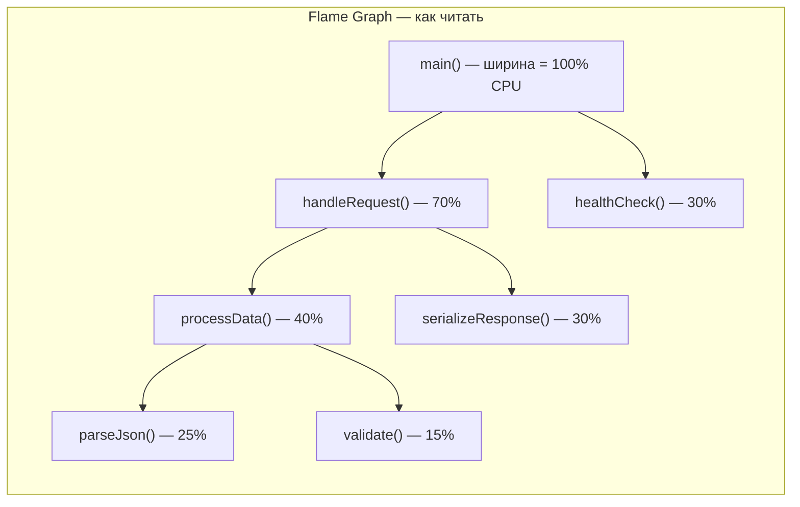

**Ключевые принципы:**
- **Ширина блока** = доля ресурса (времени CPU / аллокаций / lock waits)
- **Высота** = глубина стека вызовов
- **Горизонтальный порядок** — алфавитный (НЕ хронологический!)
- Искать нужно **широкие "плато"** — методы, занимающие значительную долю

**Типичные ошибки:**
1. Оптимизировать верхний helper-метод вместо настоящей причины внизу дерева
2. Принимать ширину за абсолютное время (это доля от общего)
3. Думать, что порядок слева направо = порядок выполнения
4. Игнорировать `[unknown]` фреймы — это могут быть JIT stubs или native код

**Совет:** для сравнения до/после используйте **differential flame graph** — он показывает красным/зелёным изменения между двумя профилями.

## Q13. Какие типы flame graph существуют и когда каждый полезен?

| Тип | Ось X | Когда использовать |
|-----|-------|--------------------|
| CPU flame graph | CPU time | Где тратится процессорное время |
| Allocation flame graph | Bytes allocated | Где создаются объекты (memory pressure) |
| Off-CPU flame graph | Wall-clock wait time | Где потоки ждут (I/O, locks) |
| Wall-clock flame graph | Wall time | Полная картина (on-CPU + off-CPU) |
| Differential flame graph | Разница двух профилей | Сравнение до/после оптимизации |
| Icicle graph | Инвертированная ось Y | Анализ bottom-up (от листьев к корню) |

**Генерация flame graph:**

```bash
# async-profiler — встроенная генерация
./asprof -d 30 -f flamegraph.html <PID>

# Из JFR через конвертер
jfr print --events jdk.ExecutionSample --stack-depth 64 recording.jfr \
  | java -jar converter.jar > flamegraph.html

# Из perf через FlameGraph tools (Brendan Gregg)
perf script | stackcollapse-perf.pl | flamegraph.pl > perf-flamegraph.svg
```

## Q14. (!) Как профилировать CPU bottleneck?

Системный подход:

**1. Зафиксировать окно деградации** — связать с метриками (см. [метрики и трассировка](../monitoring/metrics-tracing-interview.md)):

```bash
# Быстрая проверка: что делает JVM прямо сейчас
jcmd <PID> Thread.print | head -100

# CPU utilization по процессу
top -Hp <PID>  # Linux: показать потоки
```

**2. Снять CPU profile:**

```bash
# async-profiler: 60 секунд CPU sampling
./asprof -d 60 -e cpu -f cpu.html <PID>

# JFR: с execution samples
jcmd <PID> JFR.start name=cpu settings=profile duration=60s \
     filename=/tmp/cpu.jfr
```

**3. Анализ flame graph:**

```bash
# Найти top-N горячих методов
./asprof -d 60 -e cpu -o flat <PID>

# Пример вывода:
#   --- Execution profile ---
#   Total samples: 12543
#       3214 (25.62%) com.example.JsonParser.parse
#       1987 (15.84%) java.util.HashMap.resize
#       1245 ( 9.93%) com.example.Validator.validate
```

**4. Оценить и исправить:**
- Алгоритмическая сложность (O(n²) → O(n log n))
- Лишние аллокации в горячем цикле
- Неэффективная сериализация
- Результат: "после оптимизации hot path CPU -22%, p99 -18%"

## Q15. Что такое on-CPU и off-CPU анализ, и зачем оба?

**`on-CPU`:** где поток реально выполняет код на процессоре.

**`off-CPU`:** где поток ожидает — lock, I/O, sleep, park, сетевой вызов.

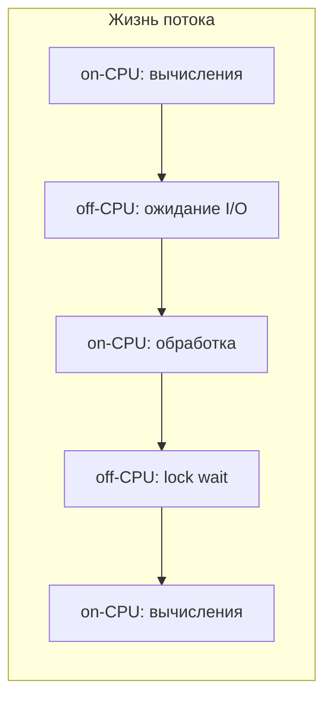

Только `on-CPU` анализ часто пропускает корень проблемы:
- Поток ждёт ответа от БД — off-CPU
- Поток заблокирован на `synchronized` — off-CPU
- Поток ждёт DNS resolution — off-CPU

```bash
# Wall-clock profiling покажет ОБА типа
./asprof -d 30 -e wall -t -f wall.html <PID>

# Только off-CPU (async-profiler 3.0+)
./asprof -d 30 -e wall --wall-filter off-cpu -f offcpu.html <PID>
```

**Правило:** если приложение "медленное, но CPU низкий" — проблема почти всегда off-CPU.

## Q16. Как интерпретировать профиль и не ошибиться с root cause?

Проверять три вещи:

**1. Воспроизводимость** — картина повторяется в нескольких прогонах?

**2. Корреляция с метриками** — горячий метод действительно влияет на latency пользователя?

```bash
# Сопоставить timestamp профиля с метриками
# В Grafana: наложить window профилирования на график latency/CPU
```

**3. Подтверждение гипотезы** — после изменения кода проблема исчезла?

**Частые ловушки:**
- `Thread.sleep()` / `Object.wait()` в CPU-профиле — это не проблема CPU
- Горячий `HashMap.get()` — возможно, проблема в размере map или hash collision
- `GC` в top — проблема не в GC, а в аллокациях (ищите allocation profile)
- `JIT compilation` в начале записи — это warm-up, не steady-state

Если подтверждения нет — это была не root cause, а симптом.

## Q17. (!) Как профилировать allocation и memory pressure?

Чрезмерные аллокации создают давление на `GC`, увеличивают паузы и ухудшают latency. Подробнее о влиянии GC на производительность — в [Memory Management](memory-management-interview.md).

**Инструменты:**

```bash
# async-profiler: allocation profiling
./asprof -d 60 -e alloc -f alloc.html <PID>

# JFR: включить allocation events
jcmd <PID> JFR.start settings=profile duration=60s \
     filename=/tmp/alloc.jfr
# profile-настройки включают ObjectAllocationInNewTLAB
```

**Что искать в allocation flame graph:**
- **Allocation hotspots** — где создаётся больше всего объектов
- **Churn** — часто создаваемые и сразу умирающие объекты (temporary objects)
- **Promotion** — объекты, попадающие в Old Gen

**Типичные находки и решения:**

```java
// ПРОБЛЕМА: аллокация строк в горячем цикле
for (Order order : orders) {
    String key = "order:" + order.getId() + ":status"; // новый String каждый раз
    cache.get(key);
}

// РЕШЕНИЕ: StringBuilder или предвычисленные ключи
StringBuilder sb = new StringBuilder(32);
for (Order order : orders) {
    sb.setLength(0);
    sb.append("order:").append(order.getId()).append(":status");
    cache.get(sb.toString());
}
```

```java
// ПРОБЛЕМА: autoboxing в горячем пути
Map<Long, Integer> scores = new HashMap<>(); // autoboxing Long, Integer
scores.put(userId, score); // 2 объекта на каждый put

// РЕШЕНИЕ: примитивные коллекции (Eclipse Collections, fastutil)
LongIntHashMap scores = new LongIntHashMap(); // нет autoboxing
scores.put(userId, score);
```

## Q18. Как снять и проанализировать heap dump?

`Heap dump` — полный снимок содержимого Java Heap в формате HPROF.

**Снятие heap dump:**

```bash
# Через jcmd (рекомендуется)
jcmd <PID> GC.heap_dump /tmp/heap.hprof

# Через jmap
jmap -dump:format=b,file=/tmp/heap.hprof <PID>

# Автоматически при OutOfMemoryError
java -XX:+HeapDumpOnOutOfMemoryError \
     -XX:HeapDumpPath=/tmp/dumps/ -jar myapp.jar
```

**Анализ в Eclipse MAT:**
1. Открыть dump → Leak Suspects Report (автоматический анализ)
2. Dominator Tree — кто удерживает больше всего памяти
3. Histogram — количество и размер объектов по классам
4. Path to GC Roots — цепочка ссылок от объекта до root

**Ключевые термины:**
- **Shallow size** — размер самого объекта (без ссылок)
- **Retained size** — сколько памяти освободится, если удалить объект и всё, что он держит
- **Dominator** — объект, через который идут все пути от GC root

**Предупреждение:** снятие heap dump вызывает `STW`-паузу, пропорциональную размеру heap. На 8GB heap это может быть 5-10 секунд. В production — согласуйте с SRE.

## Q19. Как найти memory leak с помощью профилирования?

`Memory leak` в Java — объекты, которые больше не нужны, но не освобождаются из-за нежелательных ссылок.

**Стратегия поиска:**

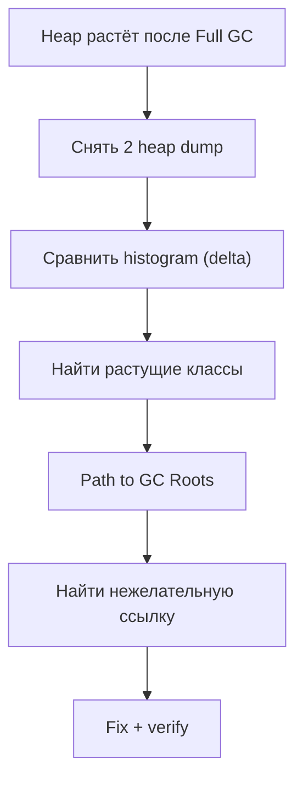

**Практические шаги:**

```bash
# 1. Снять baseline dump
jcmd <PID> GC.heap_dump /tmp/heap1.hprof

# 2. Подождать (или дать нагрузку)
sleep 300

# 3. Снять второй dump
jcmd <PID> GC.heap_dump /tmp/heap2.hprof

# 4. Сравнить в MAT: File → Compare Heap Dumps
```

**Типичные причины утечек:**
- `static` коллекции без eviction (кэши без `maxSize` / TTL)
- Listeners/callbacks, не отписанные при закрытии
- `ThreadLocal` без `remove()` в пуле потоков
- `ClassLoader` leak (особенно при hot redeploy)
- `InputStream` / `Connection` без закрытия (не прямая утечка, но держат native-ресурсы)

## Q20. (!) Как снять и анализировать thread dump?

`Thread dump` — снимок состояния всех потоков JVM с их стек-трейсами.

**Снятие:**

```bash
# Через jcmd (рекомендуемый способ)
jcmd <PID> Thread.print > /tmp/threads.txt

# Через jstack
jstack <PID> > /tmp/threads.txt

# Через kill (Unix) — не убивает процесс
kill -3 <PID>   # вывод в stdout JVM

# Несколько снимков с интервалом (для анализа тренда)
for i in 1 2 3; do jcmd <PID> Thread.print > /tmp/td_$i.txt; sleep 5; done
```

**Состояния потоков:**

| Состояние | Значение | На что обратить внимание |
|-----------|---------|--------------------------|
| `RUNNABLE` | Выполняется | Горячий код или I/O (может быть и off-CPU) |
| `BLOCKED` | Ждёт монитора | Lock contention — кто держит lock? |
| `WAITING` | `Object.wait()` / `LockSupport.park()` | Ожидание условия |
| `TIMED_WAITING` | `sleep()` / `wait(timeout)` | Polling или timeout |

**Что искать:**
1. Много потоков в `BLOCKED` на одном мониторе → lock contention
2. Потоки застряли в одном методе → возможный deadlock или бесконечный цикл
3. Все потоки пула заняты → исчерпание пула (проверить pool size)

```
// Пример: lock contention в thread dump
"http-nio-8080-exec-15" BLOCKED
    at com.example.CacheService.get(CacheService.java:42)
    - waiting to lock <0x00000007a4c8e8d0> (a java.util.HashMap)
    
"http-nio-8080-exec-3" RUNNABLE
    at com.example.CacheService.put(CacheService.java:58)
    - locked <0x00000007a4c8e8d0> (a java.util.HashMap)
```

## Q21. Как находить lock contention через профилирование?

**Сигналы lock contention:**
- Много потоков в `BLOCKED` / `WAITING`
- Рост времени в monitor/lock событиях
- Падение throughput при увеличении потоков (negative scalability)

**Инструменты:**

```bash
# async-profiler: lock profiling
./asprof -d 30 -e lock -f lock.html <PID>
# Показывает: на каких lock-ах потоки ждут и кто их держит

# JFR: monitor events
jcmd <PID> JFR.start settings=profile duration=60s \
     filename=/tmp/locks.jfr
# Анализ jdk.JavaMonitorEnter, jdk.ThreadPark событий
```

**Типичные решения:**
- `synchronized HashMap` → `ConcurrentHashMap` (lock striping)
- Один глобальный lock → lock per partition
- `synchronized` → `ReadWriteLock` (если чтений больше)
- `Lock` → lock-free структуры (`AtomicReference`, `LongAdder`)

```java
// ПРОБЛЕМА: один lock на все операции
public class MetricsCollector {
    private final Map<String, Long> counters = new HashMap<>();
    
    public synchronized void increment(String key) { // global lock
        counters.merge(key, 1L, Long::sum);
    }
}

// РЕШЕНИЕ: ConcurrentHashMap + LongAdder
public class MetricsCollector {
    private final ConcurrentHashMap<String, LongAdder> counters = 
        new ConcurrentHashMap<>();
    
    public void increment(String key) { // lock-free
        counters.computeIfAbsent(key, k -> new LongAdder()).increment();
    }
}
```

## Q22. (!) Как анализировать GC и связать его с профилированием?

Детальный анализ GC описан в [Memory Management](memory-management-interview.md) и [JVM Performance Tuning](jvm-performance-tuning-interview.md). Здесь — интеграция с profiling.

**Включение GC-логов:**

```bash
# JDK 17+ unified logging
java -Xlog:gc*:file=gc.log:time,uptime,level,tags:filecount=5,filesize=50m \
     -jar myapp.jar
```

**Ключевые метрики GC для связи с профилем:**

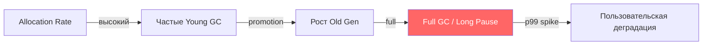

**Анализ GC через JFR:**

```bash
# GC-события в JFR
jfr print --events "jdk.GarbageCollection,jdk.GCPhasePause" recording.jfr

# Пример вывода:
# jdk.GCPhasePause {
#   gcId = 142
#   name = "Pause Young (Normal)"
#   duration = 12.4 ms
# }
```

**Инструменты визуализации:**
- [GCEasy](https://gceasy.io) — онлайн-анализатор GC-логов
- [GCViewer](https://github.com/chewiebug/GCViewer) — десктопный анализатор
- JMC → GC tab — анализ GC из JFR-записи
- Grafana + `jmx_exporter` — realtime GC-дашборд

## Q23. Как профилировать GC pauses и их влияние на latency?

**Связь GC pauses с latency:**

GC-паузы (`STW` — Stop-The-World) напрямую добавляются к latency запроса. Если p99 latency = 100ms, а GC-пауза = 80ms, то GC — главный contributor.

```bash
# Быстрый скрипт: извлечь паузы >50ms из GC-лога
grep "pause" gc.log | awk '$NF > 50 {print}'
```

**Профилирование аллокаций → снижение GC pressure:**

```java
// ПРОБЛЕМА: 100MB/s allocation rate из-за temporary объектов
public List<OrderDTO> toDto(List<Order> orders) {
    return orders.stream()
        .map(o -> new OrderDTO(               // новый DTO
            o.getId(),
            formatDate(o.getCreated()),        // новый String
            formatMoney(o.getTotal()),         // новый String
            o.getItems().stream()              // новый Stream + Iterator
                .map(ItemDTO::from)            // новый DTO на каждый item
                .collect(toList())             // новый ArrayList
        ))
        .collect(toList());                    // новый ArrayList
}

// РЕШЕНИЕ: переиспользование, pre-sized collections
public List<OrderDTO> toDto(List<Order> orders) {
    List<OrderDTO> result = new ArrayList<>(orders.size()); // pre-sized
    for (Order o : orders) {
        result.add(orderDtoPool.acquire(o)); // object pool для hot path
    }
    return result;
}
```

**Выбор GC-коллектора:**

| Коллектор | Цель по паузе | Когда использовать |
|-----------|--------------|-------------------|
| `G1GC` | <200ms | Универсальный (default с JDK 9) |
| `ZGC` | <1ms | Низкая latency, большой heap |
| `Shenandoah` | <10ms | Низкая latency, RedHat/OpenJDK |
| `Parallel GC` | throughput | Batch-задачи, не критична latency |

## Q24. (!) Что такое APM и как он дополняет профилирование?

`APM (Application Performance Management)` — платформа для мониторинга производительности приложений: трассировка, метрики, профилирование, логи в едином UI.

**Популярные APM-решения:**

| APM | Профилирование | Трассировка | Особенности |
|-----|---------------|-------------|-------------|
| `Datadog` | Continuous Profiler | Distributed traces | Корреляция traces → profiles |
| `New Relic` | Thread Profiler | Distributed traces | Code-level visibility |
| `Dynatrace` | PurePath | Полная трассировка | AI-driven root cause |
| `Elastic APM` | Есть (JFR-based) | Distributed traces | Open source core |
| `Grafana` + `Pyroscope` | Continuous profiling | Tempo | Полностью open source |

**Ключевая интеграция APM с профилированием:**

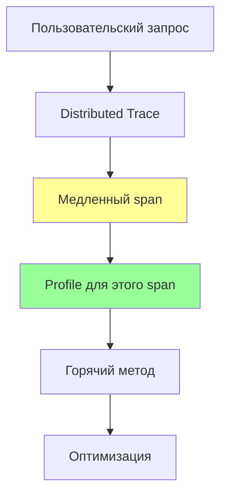

Например, в `Datadog`: кликаешь на медленный span в trace → видишь CPU profile именно для этого запроса. Это bridge между мониторингом и профилированием.

## Q25. (!) Что такое continuous profiling и зачем он нужен?

`Continuous profiling` — постоянное (24/7) low-overhead профилирование в production. В отличие от ad-hoc профилирования, данные всегда доступны ретроспективно.

**Зачем:**
- Проблема произошла вчера в 3:00 — профиль уже есть
- Можно сравнивать профили между версиями/деплоями
- Обнаружение постепенных деградаций (regression detection)
- Оптимизация расходов: CPU flame graph показывает, что 20% CPU — логирование

**Архитектура:**

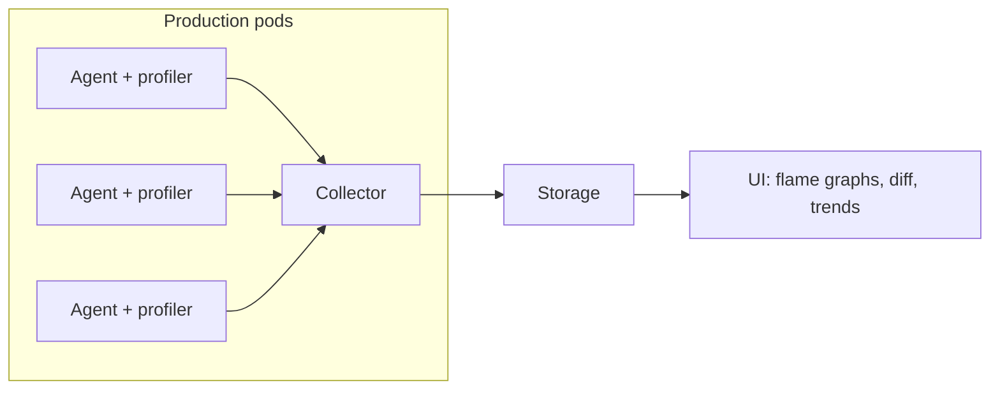

**Инструменты:**

| Инструмент | Тип | Overhead | Хранение |
|-----------|-----|---------|----------|
| `Datadog Continuous Profiler` | SaaS | ~1% | Cloud |
| `Pyroscope` (Grafana) | OSS/Cloud | ~1% | Local/Cloud |
| `Parca` | OSS | ~1% | Local |
| `JFR` + custom pipeline | DIY | ~1% | Custom |
| `async-profiler` + custom | DIY | ~1-2% | Custom |

**Пример: интеграция Pyroscope с Spring Boot:**

```java
// build.gradle
implementation 'io.pyroscope:agent:0.13.0'

// application.yml
pyroscope:
  application-name: order-service
  server-address: http://pyroscope:4040
  profiling-event: cpu,alloc,lock
  profiling-interval: 10ms
  upload-interval: 15s
```

## Q26. Как работает Datadog Continuous Profiler?

`Datadog Continuous Profiler` — промышленное решение для continuous profiling в production.

**Архитектура:**

```bash
# Подключение Java-agent
java -javaagent:/opt/dd-java-agent.jar \
     -Ddd.profiling.enabled=true \
     -Ddd.profiling.allocation.enabled=true \
     -Ddd.service=order-service \
     -Ddd.env=production \
     -Ddd.version=1.2.3 \
     -jar myapp.jar
```

**Ключевые возможности:**
- **Trace → Profile** корреляция: из медленного span открыть профиль конкретного запроса
- **Endpoint profiling** — агрегированный flame graph по HTTP-эндпоинту
- **Version comparison** — diff flame graph между версиями v1.2.2 и v1.2.3
- **Cost attribution** — "этот метод стоит $X/месяц в cloud-инфраструктуре"
- Timeline view — CPU, allocation, lock profiling на временной оси

**Типы профилей:**
- CPU time — где тратится CPU
- Wall time — общее время (on-CPU + off-CPU)
- Allocations — где создаются объекты
- Heap live objects — что сейчас живёт в heap
- Lock contention — ожидание на lock-ах
- Thrown exceptions — откуда летят исключения

## Q27. (!) Как профилировать production безопасно?

**Принципы безопасного профилирования:**

1. **Короткие сессии** — 30-60 секунд, не более
2. **Sampling, а не instrumentation** — overhead <2%
3. **Минимально достаточный набор событий** — не включать всё сразу
4. **Чёткий rollback-план** — как остановить, если пойдёт не так
5. **Согласовать с SRE** — кто включает, кто анализирует, где хранятся артефакты

**Чеклист перед production profiling:**

```markdown
- [ ] Проверить overhead инструмента на staging
- [ ] Убедиться, что есть место на диске для артефактов
- [ ] Согласовать окно с on-call SRE
- [ ] Подготовить команды stop/rollback
- [ ] Не профилировать во время пиковой нагрузки (если можно)
- [ ] Не снимать heap dump без крайней необходимости (STW пауза!)
```

**Безопасные инструменты для production:**

| Инструмент | Overhead | Безопасность |
|-----------|---------|-------------|
| `JFR` (default profile) | <1% | Максимально safe |
| `async-profiler` (cpu) | ~1% | Safe |
| `async-profiler` (alloc) | ~2% | Safe |
| `jcmd Thread.print` | Мгновенный | Safe |
| `jmap heap dump` | STW пауза | Осторожно! |
| Instrumentation agents | 10-50% | Не для production |

## Q28. Как профилировать сервис в Kubernetes/Docker?

Профилирование в контейнерной среде имеет свои нюансы. Подробнее о `Kubernetes` — в [Kubernetes](../devops/kubernetes-interview.md).

**Проблемы:**
- `cgroup` limits — JVM может не видеть реальные лимиты CPU/memory
- Ephemeral pods — файлы профиля теряются при рестарте
- Network isolation — не всегда можно подключиться через `jcmd`

**Решения:**

```bash
# 1. Exec в pod и снять профиль
kubectl exec -it <pod> -- jcmd 1 JFR.start duration=60s \
    filename=/tmp/recording.jfr

# 2. Скопировать файл
kubectl cp <pod>:/tmp/recording.jfr ./recording.jfr

# 3. async-profiler в Docker (нужны capabilities)
# Dockerfile:
# COPY async-profiler/ /opt/async-profiler/
kubectl exec -it <pod> -- /opt/async-profiler/asprof -d 30 \
    -f /tmp/profile.html 1
```

**Docker security requirements для async-profiler:**

```yaml
# В Kubernetes: добавить securityContext
securityContext:
  capabilities:
    add:
      - SYS_PTRACE    # для attach к процессу
  # или для perf_events:
  # privileged: true  # крайний случай
```

**Учёт cgroup limits:**

```bash
# JDK 17+ автоматически определяет cgroup limits
# Проверить:
jcmd 1 VM.info | grep "container"
# Available CPUs: 2 (container limited)
# Memory Limit: 4096M (container limited)
```

**Anti-pattern:** анализировать локальный профиль (8 CPU, 32GB RAM) и переносить выводы на pod (2 CPU, 4GB RAM) — поведение будет совершенно другим.

## Q29. Как связать profiling с Prometheus/Grafana и алертингом?

Интеграция профилирования в операционный цикл (см. [метрики и трассировка](../monitoring/metrics-tracing-interview.md)):

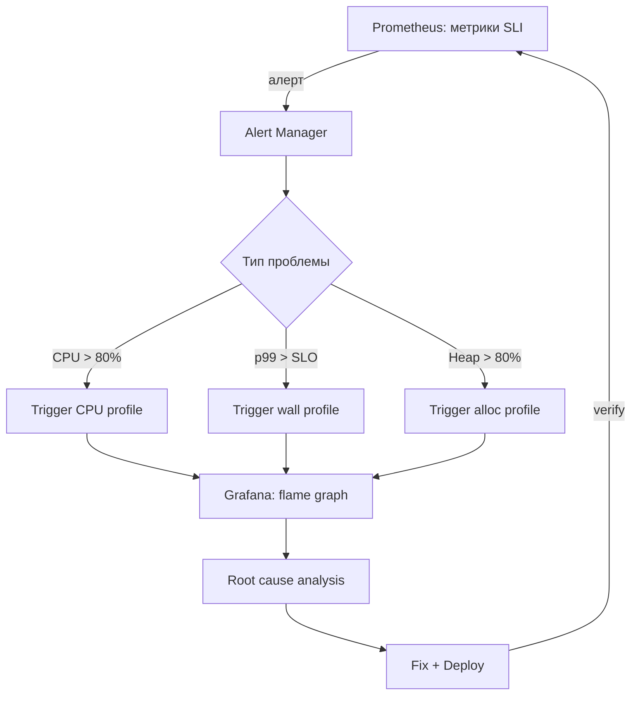

**Автоматический trigger профилирования:**

```java
// Spring Boot Actuator + custom endpoint
@Component
public class ProfilingTrigger {
    
    @EventListener
    public void onHighCpu(HighCpuEvent event) {
        // Автоматически запустить JFR при CPU > 80%
        Runtime.getRuntime().exec(new String[]{
            "jcmd", "1", "JFR.start",
            "name=auto-cpu", "duration=60s",
            "filename=/tmp/auto-" + Instant.now() + ".jfr"
        });
    }
}
```

**Grafana + Pyroscope** для continuous profiling:
- Встроенный flame graph panel в Grafana
- Annotations на графиках — когда был деплой, когда снят профиль
- Exemplar links: из метрики → в trace → в profile

Так профилирование становится частью операционного цикла, а не "разовой магией".

## Q30. Какие anti-patterns в profiling чаще всего встречаются?

| Anti-pattern | Почему плохо | Правильный подход |
|-------------|-------------|-------------------|
| Профилируют без репрезентативной нагрузки | Результат не отражает production | Использовать realistic load (replay, shadow traffic) |
| Оптимизируют micro-hotspot без бизнес-эффекта | Потраченное время без улучшения SLI | Сначала проверить влияние на p99/throughput |
| Делают выводы по одному профилю | Может быть артефакт / случайный всплеск | Минимум 3 прогона, сравнивать |
| Смешивают cold-start и steady-state | JIT-компиляция искажает картину | Дать warm-up перед снятием профиля |
| Игнорируют off-CPU | Пропускают I/O, lock waits, network | Снимать wall-clock профиль |
| Профилируют с heavy instrumentation в prod | Искажение поведения, деградация | Только sampling с low overhead |
| Анализируют локальный профиль для prod | Другое железо, другая нагрузка | Профилировать в production-like среде |
| Оптимизируют GC-флагами вместо кода | Лечат симптом, не причину | Сначала снизить allocation rate |

## Q31. Как построить системный процесс профилирования в команде?

**Зрелая организация профилирования:**

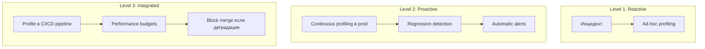

**Практические шаги:**

1. **Инструментарий** — выбрать и стандартизировать инструменты (`JFR` + `async-profiler` + APM)
2. **Runbook** — документировать: как снять профиль, где хранить, как интерпретировать
3. **Continuous profiling** — развернуть `Pyroscope` или подключить `Datadog Profiler`
4. **Baseline** — зафиксировать "нормальный" профиль для ключевых сценариев
5. **Performance tests** — интегрировать профилирование в нагрузочные тесты
6. **Review** — на post-mortem всегда включать анализ профиля

## Q32. (!) Как ответить про profiling на senior-раунде за 1 минуту?

Шаблон:

**1. Симптом:** "p99 вырос после релиза X".

**2. Диагностика:** "По метрикам в [Grafana](../monitoring/observability-interview.md) нашли окно деградации, сняли `JFR` + `async-profiler`".

**3. Находка:** "Lock contention в connection pool + лишние аллокации в сериализации JSON".

**4. Решение/результат:** "Переделали синхронизацию на `ConcurrentHashMap`, закэшировали `ObjectMapper`, p99 −35%, CPU −15%".

**Ключевые моменты для senior:**
- Показать **системный подход**: метрики → гипотеза → профиль → подтверждение
- Упомянуть конкретные инструменты: `JFR`, `async-profiler`, `flame graphs`
- Знать разницу `sampling` vs `instrumentation`, `on-CPU` vs `off-CPU`
- Понимать `safepoint bias` и почему `async-profiler` точнее
- Говорить об **измеримом результате** — "CPU −X%, p99 −Y%"
- Показать, что profiling — часть операционного процесса, а не разовая акция

## Q33. (!) Как анализировать heap dump с Eclipse MAT: практический сценарий?

**Eclipse MAT** (`Memory Analyzer Tool`) — стандарт для анализа Java heap dump. Умеет работать с файлами от сотен MB до десятков GB.

**Получение heap dump:**
```bash
# 1. При OOM (автоматически с флагом)
-XX:+HeapDumpOnOutOfMemoryError
-XX:HeapDumpPath=/tmp/heapdump.hprof

# 2. Вручную без остановки процесса
jmap -dump:format=b,file=/tmp/heapdump.hprof <PID>

# 3. Через jcmd (предпочтительнее, live=true только живые объекты)
jcmd <PID> GC.heap_dump /tmp/heapdump.hprof

# 4. В Kubernetes (сначала exec в pod)
kubectl exec -it my-pod -- jcmd 1 GC.heap_dump /tmp/heapdump.hprof
kubectl cp my-pod:/tmp/heapdump.hprof ./heapdump.hprof
```

**Анализ в Eclipse MAT — шаги:**

**1. Leak Suspects Report** — первый шаг всегда
```
File → Open Heap Dump → Reports → Leak Suspects
```
MAT автоматически ищет объекты с аномально большим retained heap.

**2. Dominator Tree** — кто удерживает больше всего памяти
```
Window → Heap Dump Details → Dominator Tree
```
Показывает дерево: если удалить объект X, сколько памяти освободится.

```
# Пример вывода Dominator Tree:
Class                          Shallow Heap   Retained Heap
HashMap$Entry[]                    1.2 MB        287 MB  ← проблема!
  └─ SomeCache.cache                  32 B        287 MB
      └─ HashMap                      48 B        287 MB
```

**3. OQL (Object Query Language)** — SQL для heap
```sql
-- Найти все HashMap с размером > 10000 записей
SELECT * FROM java.util.HashMap h WHERE h.size > 10000

-- Найти все String, содержащие "password" (поиск утечки секретов)
SELECT s FROM java.lang.String s WHERE s.toString().contains("password")

-- Найти все экземпляры кастомного класса
SELECT * FROM com.company.app.service.OrderService
```

**4. Histogram** — сколько объектов каждого типа
```
Window → Heap Dump Details → Histogram

Наиболее опасные признаки:
- Много byte[] → буферы не освобождены (FileInputStream, ByteArrayOutputStream)
- Много char[] или String → строки накапливаются (кэши, логи в памяти)
- Много ThreadLocal → MDC leak через thread pools
```

**Типичный сценарий: ThreadLocal leak**
```java
// Причина: после задачи MDC не очищается
executor.submit(() -> {
    MDC.put("sessionId", session.getId());
    processRequest();
    // MDC.clear() забыли!
});

// В MAT: ищем ThreadLocalMap$Entry с большим retained heap
// OQL: SELECT * FROM java.lang.ThreadLocal$ThreadLocalMap$Entry
```

**Практические советы:**
- Используйте `jcmd GC.heap_dump` вместо `jmap` (более безопасен для production)
- Флаг `live=true` (в jcmd) снимает dump только живых объектов — меньше размер, быстрее анализ
- Для production: анализируйте локально, не на production-сервере

## Q34. Как читать flame graph и находить проблемы?

**Flame graph** — визуализация стектрейсов, собранных во время профилирования. Каждая полоса = один стектрейс-уровень.

**Правила чтения:**
```
┌──────────── processOrder (50% CPU) ──────────────┐  ← широкий = дорогой
│  ┌──── serializeJson (30%) ───┐  ┌─ dbQuery(20%)─┐ │
│  │ Jackson.write(30%)         │  │ HikariCP(20%) │ │
│  └────────────────────────────┘  └───────────────┘ │
└──────────────────────────────────────────────────────┘
         ↑ ось X = % времени (не хронологический порядок!)
         ↑ ось Y = глубина стека
```

**Что искать:**
1. **Широкие плоские вершины** — методы, которые сами по себе долгие (не вызовы внутри) → bottleneck
2. **Тонкие высокие башни** — глубокая рекурсия или chain вызовов → возможная оптимизация
3. **Неожиданные методы в верхушке** — например, `ObjectMapper.writeValue` занимает 40% → кэшировать ObjectMapper

**Типы flame graphs в async-profiler:**
```bash
# CPU flame graph (on-CPU — что реально выполнялось)
./profiler.sh -e cpu -d 30 -f cpu.html <PID>

# Allocation flame graph (что выделяло память)
./profiler.sh -e alloc -d 30 -f alloc.html <PID>

# Lock contention (что ждало мьютексов)
./profiler.sh -e lock -d 30 -f lock.html <PID>

# Wall clock (on-CPU + off-CPU, видны блокировки IO)
./profiler.sh -e wall -d 30 -f wall.html <PID>
```

**Практический анализ: пример из production**
```
Симптом: p99 latency 2s при нагрузке 500 RPS

Flame graph показал:
  processOrder (100%)
  └─ getConnectionFromPool (65%)   ← занимает 65% времени!
      └─ HikariPool.getConnection (65%)
          └─ AbstractQueuedSynchronizer.acquireSharedInterruptibly (65%)

Root cause: пул соединений = 10, но 100 потоков ждут → deadlock-подобная ситуация

Решение:
hikari.maximum-pool-size: 50
hikari.connection-timeout: 3000

Результат: p99 200ms → 95ms
```

**Ключевые паттерны:**
- `GC` в верхушке flame graph → много allocation, нужен alloc-профиль
- `park` / `wait` / `sleep` в верхушке → off-CPU паузы → используй wall clock профиль
- `Unsafe.park` → потоки ждут Lock → используй lock-профиль

---

## Q35. Async Profiler vs JFR — когда что выбирать, отличия

**Java Flight Recorder (JFR):**
- Встроен в JDK (с Java 11 — бесплатно), нулевой дополнительный deплой.
- Низкий overhead: ~1-2% для профиля по умолчанию.
- Собирает широкий контекст: GC, I/O, locks, JIT, network, allocation.
- Sampling через safepoints → **safepoint bias**: методы, которые редко доходят до safepoint, могут быть недооценены.
- Лучший выбор: комплексный анализ «что происходит в целом», мониторинг production с непрерывной записью.

**async-profiler:**
- Работает через `perf_events` (Linux) и AsyncGetCallTrace API — не привязан к safepoints.
- Точнее для CPU и allocation: видит «застрявшие» методы (native, системные вызовы, JNI).
- Поддерживает: CPU, allocation, wall clock, lock, `perf` events (cache misses и др.).
- Требует: Linux (полный функционал), права на perf_events или `CAP_SYS_ADMIN`, jar или agent.
- Лучший выбор: точный CPU bottleneck-анализ, allocation hotspot, исследование нативного кода.

```bash
# JFR — запуск
java -XX:StartFlightRecording=duration=60s,filename=profile.jfr,settings=profile MyApp

# async-profiler — запуск
./profiler.sh -e cpu -d 60 -f profile.html <PID>         # CPU
./profiler.sh -e alloc -d 60 -f alloc.html <PID>          # Allocation
./profiler.sh -e wall -d 60 -f wall.html <PID>            # Wall clock (on+off CPU)
```

| Критерий | JFR | async-profiler |
|---|---|---|
| Safepoint bias | Есть | Нет |
| Overhead | ~1-2% | ~1-5% (зависит от rate) |
| Нативный код | Частично | Да (`perf_events`) |
| Контекст | Богатый (GC, IO, etc.) | CPU/alloc/lock |
| ОС | Любая | Linux (полный), macOS (CPU only) |
| Деплой | Встроен в JDK | Отдельный агент |

---

## Q36. Profiling в production — low-overhead инструменты

**Принцип:** production profiling должен иметь overhead < 3%, не блокировать потоки, не влиять на latency > 5%.

**Инструменты low-overhead profiling:**

**1. JFR (Continuous Recording):**
```bash
# Постоянная запись с rolling-окном 1 час
java -XX:StartFlightRecording=name=continuous,settings=profile,disk=true,\
  maxage=1h,maxsize=500m MyApp

# Скачать дамп по требованию (без остановки)
jcmd <PID> JFR.dump name=continuous filename=/tmp/dump.jfr
```

**2. async-profiler с низким rate:**
```bash
# Низкочастотный sampling (100 samples/sec вместо 1000)
./profiler.sh start -e cpu --interval 10000000 <PID>  # 10ms interval
```

**3. Datadog / Pyroscope (Continuous Profiling):**
```yaml
# Datadog Java Agent — включить профилирование
DD_PROFILING_ENABLED=true
DD_PROFILING_CPU_ENABLED=true
DD_PROFILING_ALLOCATION_ENABLED=true
# Overhead: ~2-5%
```

**4. Micrometer + JFR метрики:**
```java
// Экспортировать JFR события в Prometheus
@Bean
public JfrMeterRegistry jfrMeterRegistry(JfrConfig config) {
    return new JfrMeterRegistry(config, Clock.SYSTEM);
}
```

**Что НЕЛЬЗЯ в production:**
- `jstack` в tight loop — останавливает JVM (Stop-the-World).
- instrumentation-профайлер (YourKit, JProfiler) с полным трассированием — overhead 50-200%.
- HEAP dump без предупреждения — остановка JVM на секунды/минуты.

**Что МОЖНО:**
- JFR profile recording (`settings=profile`, не `default` — чуть выше overhead, но богаче данные).
- async-profiler с низким rate на короткое время (30-60 секунд).
- Continuous profiling агенты (Datadog, Pyroscope) — спроектированы для production.

---

## Q37. Heap Dump анализ — MAT, VisualVM, утечки памяти

**Heap dump** — снимок всего состояния памяти JVM в формате `.hprof`. Содержит все объекты, ссылки, классы.

**Как получить heap dump:**
```bash
# 1. Автоматически при OutOfMemoryError
java -XX:+HeapDumpOnOutOfMemoryError -XX:HeapDumpPath=/tmp/heapdump.hprof MyApp

# 2. По требованию (без остановки приложения — кратковременная пауза)
jcmd <PID> GC.heap_dump /tmp/heapdump.hprof
jmap -dump:format=b,file=/tmp/heapdump.hprof <PID>  # устаревший способ

# 3. Через JFR (менее полный, но менее инвазивный)
```

**Eclipse MAT (Memory Analyzer Tool) — основные операции:**

```
1. Open heap dump → MAT строит Object Graph
2. Leak Suspects Report → автоматически находит подозрительные accumulation points
3. Dominator Tree → объекты, удерживающие больше всего памяти
4. OQL (Object Query Language):
   SELECT * FROM java.util.HashMap$Entry WHERE key.toString().startsWith("SESSION_")
5. Retained Heap → сколько памяти освободится, если удалить объект
```

**Типичные утечки и как выглядят в MAT:**

```
Утечка 1: Static Map без ограничения размера
Dominator Tree: HashMap → удерживает 800MB → ключи — никогда не очищаемые Session ID

Утечка 2: ThreadLocal без remove()
Shallow heap ThreadLocalMap$Entry: много объектов с expired thread refs

Утечка 3: Listeners/Callbacks не отписаны
OutgoingReferences: EventBus → List<Listener> → 10k объектов → все живые
```

**Практический checklist:**
1. Открыть Dominator Tree → найти топ-10 по Retained Heap.
2. Посмотреть Path to GC Roots (почему объект не собирается GC).
3. Запустить Leak Suspects Report.
4. Проверить Duplicate Strings (часто 30-50% heap — дубликаты строк).

---

## Q38. Thread Dump анализ — deadlock detection, jstack

**Thread dump** — снимок состояния всех потоков JVM в момент снятия.

**Как получить:**
```bash
# jstack — классический способ
jstack <PID> > thread_dump.txt
jstack -l <PID>  # с блокировками (-l = long listing)

# jcmd — современный способ
jcmd <PID> Thread.print > thread_dump.txt

# kill -3 (SIGQUIT) — дамп в stdout приложения
kill -3 <PID>

# JFR — включить запись состояния потоков
```

**Состояния потоков:**
```
RUNNABLE      — выполняется или ожидает CPU
BLOCKED       — ждёт монитора (synchronized)
WAITING       — Object.wait(), LockSupport.park() без таймаута
TIMED_WAITING — Thread.sleep(), wait(timeout), park(timeout)
```

**Обнаружение deadlock:**
```
"Thread-1" waiting to lock <0x000...> held by "Thread-2"
"Thread-2" waiting to lock <0x000...> held by "Thread-1"
← jstack автоматически выводит "Found 1 deadlock"
```

**Анализ thread dump — паттерны:**
```
# Много потоков в состоянии BLOCKED на одном мониторе
→ Contention: один поток держит synchronized слишком долго

# Все потоки в WAITING на HikariPool
"at com.zaxxer.hikari.pool.HikariPool.getConnection(HikariPool.java:213)"
→ Pool exhaustion: увеличить pool size или найти долгие транзакции

# Потоки в TIMED_WAITING на sleep()
→ Проверить, нет ли busy-wait антипаттерна

# Много потоков RUNNABLE, высокое CPU
→ CPU-intensive работа или tight loop без park/sleep
```

**Инструменты анализа:** fastThread.io (онлайн-анализатор), IntelliJ IDEA (встроенный анализатор дампов), IBM Thread and Monitor Dump Analyzer, VisualVM Threads view.

---

## Q39. CPU Profiling — sampling vs instrumentation

**Sampling profiling:**
- С заданной частотой (например, 1000 раз/сек) прерывает каждый поток и записывает его стектрейс.
- Overhead пропорционален частоте сэмплирования, а не числу методов.
- **Safepoint bias (у JVMTI-based):** прерывание происходит только в safepoint → методы между safepoints невидимы.
- **async-profiler** решает это через AsyncGetCallTrace — работает вне safepoints.

```bash
# async-profiler — sampling CPU (10ms interval = 100 samples/sec)
./profiler.sh -e cpu --interval 10000000 -d 30 -f cpu.html <PID>

# JFR — sampling CPU
java -XX:StartFlightRecording=duration=30s,settings=profile,filename=cpu.jfr MyApp
# JFR по умолчанию: 10ms sampling rate
```

**Instrumentation profiling:**
- В каждый метод добавляется байт-код для замера времени.
- 100% покрытие — видны все вызовы, точное время.
- Overhead: 10-200x — неприемлемо для production.
- Используется: разработка, тест-окружение, точный анализ короткоживущих методов.

```java
// Ручная инструментация (micro-benchmark)
@BenchmarkMode(Mode.AverageTime)
@Warmup(iterations = 5)
@Measurement(iterations = 10)
public void benchmarkJsonSerialization(Blackhole bh) {
    bh.consume(objectMapper.writeValueAsString(payload));
}
// JMH — Java Microbenchmark Harness — правильный способ измерять
```

**Когда что:**
| Ситуация | Инструмент |
|---|---|
| Production CPU hotspot | async-profiler sampling |
| Точное время метода в dev | JMH + instrumentation |
| Регрессия между версиями | JMH benchmark |
| Нативный код + Java | async-profiler + perf_events |

---

## Q40. Allocation Profiling — TLAB, allocation rate

**TLAB (Thread-Local Allocation Buffer)** — каждый поток получает свой буфер в young generation heap. Аллокация в TLAB — просто сдвиг указателя, нет синхронизации → крайне быстро.

**Allocation rate** — количество байт/объектов, выделяемых в секунду. Высокий allocation rate → частые minor GC → GC pressure.

**Как профилировать allocation:**

```bash
# async-profiler — allocation profiling (TLAB events)
./profiler.sh -e alloc -d 30 -f alloc.html <PID>
# Показывает: какие методы аллоцируют больше всего байт

# JFR — allocation sampling
java -XX:StartFlightRecording=duration=30s,\
  +jdk.ObjectAllocationInNewTLAB#enabled=true,\
  +jdk.ObjectAllocationOutsideTLAB#enabled=true,\
  filename=alloc.jfr MyApp
```

**Интерпретация allocation flame graph:**
```
processOrder (100% allocation)
├── JsonSerializer.serialize (60%)   ← много временных String объектов
│   └── String.format (40%)          ← заменить на StringBuilder
└── Hibernate.buildQuery (30%)       ← много QueryImpl объектов → query cache
```

**Типичные проблемы и решения:**
```java
// ПРОБЛЕМА: String.format в hot path → много String objects
log.debug("Processing order {} for customer {}", String.format("(%d, %s)", id, name));
// РЕШЕНИЕ: Lazy logging + прямая конкатенация
log.debug("Processing order ({}, {}) for customer", id, name);

// ПРОБЛЕМА: new ArrayList<>() внутри цикла
for (Order order : orders) {
    List<Item> items = new ArrayList<>();  // N аллокаций
    items.addAll(order.getItems());
}
// РЕШЕНИЕ: переиспользование или stream
orders.stream().flatMap(o -> o.getItems().stream()).collect(toList());

// Мониторинг allocation rate через JMX / Micrometer
Gauge.builder("jvm.gc.allocation.rate", ...)
```

**Метрика:** allocation rate > 500MB/s обычно является сигналом проблемы для сервисов с умеренной нагрузкой.

---

## Q41. Database Query Profiling — slow query log, EXPLAIN

**Slow Query Log в PostgreSQL:**
```sql
-- postgresql.conf (или ALTER SYSTEM)
log_min_duration_statement = 100   -- логировать запросы дольше 100ms
log_duration = on
log_statement = 'all'              -- осторожно: очень много логов в production

-- pg_stat_statements — агрегированная статистика
CREATE EXTENSION IF NOT EXISTS pg_stat_statements;

SELECT query,
       calls,
       round(total_exec_time::numeric / calls, 2) AS avg_ms,
       round(total_exec_time::numeric, 2) AS total_ms,
       rows / calls AS avg_rows
FROM pg_stat_statements
ORDER BY avg_ms DESC
LIMIT 20;
```

**EXPLAIN ANALYZE — интерпретация:**
```sql
EXPLAIN (ANALYZE, BUFFERS, FORMAT TEXT)
SELECT o.*, c.name
FROM orders o
JOIN customers c ON c.id = o.customer_id
WHERE o.status = 'PENDING' AND o.created_at > now() - interval '1 day';

-- Что искать:
-- Seq Scan на большой таблице → нет индекса → CREATE INDEX
-- Nested Loop с большим числом строк → рассмотреть Hash Join
-- "Rows Removed by Filter" большое → selectivity индекса низкая
-- "Buffers: shared hit=X read=Y" → read >> hit → много disk I/O
-- actual time >> estimated time → устаревшая статистика → ANALYZE
```

**Индексы — быстрый checklist:**
```sql
-- Найти таблицы без индексов или с редко используемыми индексами
SELECT relname, seq_scan, idx_scan,
       round(100.0 * idx_scan / NULLIF(seq_scan + idx_scan, 0), 1) AS idx_pct
FROM pg_stat_user_tables
WHERE seq_scan > 100
ORDER BY seq_scan DESC;

-- Найти неиспользуемые индексы
SELECT indexrelname, idx_scan
FROM pg_stat_user_indexes
WHERE idx_scan = 0 AND indexrelname NOT LIKE 'pg_%';
```

**Spring/Hibernate — включить логирование запросов:**
```yaml
# application.yml
spring.jpa.show-sql: false  # в production не включать!
logging.level.org.hibernate.SQL: DEBUG       # SQL
logging.level.org.hibernate.orm.jdbc.bind: TRACE  # параметры

# p6spy — профилирование с временем выполнения
# datasource-proxy — для детальных метрик
```

---

## Q42. Profiling реактивных приложений — особенности Project Reactor

**Особенности:** реактивный код работает на пуле потоков (обычно 1 поток на CPU). Традиционный thread dump / CPU profiling по потокам неинформативен — один поток обрабатывает много запросов.

**Проблемы стандартного profiling:**
```
Thread-1 (reactor-http-nio-1): RUNNABLE
  processOrder → flatMap → map → ...
← Непонятно, к какому запросу принадлежит стектрейс!
```

**Reactor Debugger Agent:**
```java
// Включить в dev/test — overhead до 100%, не для production!
ReactorDebugAgent.init();  // из io.projectreactor:reactor-tools

// Или через блокирующий debugger
Hooks.onOperatorDebug();  // аналогично, overhead высокий
```

**Reactor Context для трассировки:**
```java
// Micrometer Tracing + Reactor
// spring-boot-starter-actuator + reactor-core + micrometer-tracing
Flux<Order> orders = orderService.getOrders()
    .contextWrite(Context.of("traceId", traceId));
// Трейс пробрасывается через Context, виден в Zipkin/Jaeger
```

**Checkpoint — найти "где в цепочке проблема":**
```java
orderFlux
    .map(this::enrich)
    .checkpoint("after-enrich")   // имя появится в stacktrace при ошибке
    .flatMap(this::persist)
    .checkpoint("after-persist")
    .subscribe();
```

**async-profiler + wall clock для реактивных приложений:**
```bash
# Wall clock профиль — видит on-CPU И off-CPU (ожидание I/O)
./profiler.sh -e wall -d 30 --wall-sampling-interval 10ms -f wall.html <PID>
# Позволяет увидеть, где реально тратится время (в т.ч. ожидание БД)
```

**Метрики для реактивных приложений:**
```yaml
# application.yml
management.metrics.enable.reactor: true
# Экспортирует: reactor.flow.duration, reactor.flow.errors, pending requests
```

**Ключевые метрики реактивного сервиса:** event loop utilization (> 80% — bottleneck), pending count, upstream latency через r2dbc/WebClient метрики.

---

## See also

- [JVM Performance Tuning](jvm-performance-tuning-interview.md) — настройка JVM-параметров
- [Memory Management](memory-management-interview.md) — управление памятью и GC
- [JVM Fundamentals](../jvm/jvm-interview.md) — основы JVM
- [Метрики и трассировка](../monitoring/metrics-tracing-interview.md) — Prometheus, distributed tracing
- [Observability](../monitoring/observability-interview.md) — наблюдаемость систем
- [Kubernetes](../devops/kubernetes-interview.md) — оркестрация контейнеров

- [Caching Performance](caching-performance-interview.md)
- [Database Performance](database-performance-interview.md)
- [JVM Performance Tuning](jvm-performance-tuning-interview.md)
- [Memory Management](memory-management-interview.md)
- [Network Performance](network-performance-interview.md)
- [Performance Testing](performance-testing-interview.md)
