# Вопросы на собеседовании: `Application Profiling`

Практичные вопросы и ответы по profiling для `Senior Java Developer`: как находить узкие места по `CPU`, памяти, блокировкам и сетевым операциям в production. Покрывает `JFR`, `async-profiler`, `flame graphs`, `heap/thread dumps`, `GC`-анализ, `APM`-инструменты и `continuous profiling`.

## Полезные ссылки

### Официальная документация

- [Java Flight Recorder](https://docs.oracle.com/javase/9/troubleshoot/diagnostic-tools.htm#JSTGD356) — диагностика JVM через встроенный рекордер
- [JVM Tool Interface (JVMTI)](https://docs.oracle.com/javase/9/docs/specs/jvmti.html) — низкоуровневый API для инструментирования JVM
- [async-profiler GitHub](https://github.com/async-profiler/async-profiler) — низко-overhead профайлер для Linux/macOS
- [JDK Mission Control](https://www.oracle.com/java/technologies/jdk-mission-control.html) — GUI-анализатор JFR-записей
- [Eclipse MAT](https://eclipse.dev/mat/) — анализатор heap dump
- [Datadog Continuous Profiler](https://docs.datadoghq.com/profiler/) — APM с continuous profiling
- [Pyroscope](https://grafana.com/oss/pyroscope/) — open-source continuous profiling (Grafana)
- [Monitoring Java Applications with Flight Recorder](https://www.baeldung.com/java-flight-recorder-monitoring) — JFR для мониторинга Java-приложений
- [A Guide to Java Profilers](https://www.baeldung.com/java-profilers) — обзор профайлеров Java
- [Diagnosing a Running JVM](https://www.baeldung.com/running-jvm-diagnose) — диагностика работающей JVM
- [JFR View Command in Java](https://www.baeldung.com/java-flight-recorder-view) — использование команды jfr view

## Содержание

- [Полезные ссылки](#полезные-ссылки)
- [See also](#see-also)

**Основы профилирования**
- [Q1. (!) Что такое profiling и чем он отличается от мониторинга?](#q1--что-такое-profiling-и-чем-он-отличается-от-мониторинга)
- [Q2. (!) Как выбрать между sampling и instrumentation?](#q2--как-выбрать-между-sampling-и-instrumentation)
- [Q3. Что такое safepoint bias и как он влияет на точность профилирования?](#q3-что-такое-safepoint-bias-и-как-он-влияет-на-точность-профилирования)
- [Q4. Какие метрики обязательно связать с профилем?](#q4-какие-метрики-обязательно-связать-с-профилем)

**Java Flight Recorder (JFR)**
- [Q5. (!) Что такое JFR и как он работает?](#q5--что-такое-jfr-и-как-он-работает)
- [Q6. Как запустить JFR и какие настройки использовать?](#q6-как-запустить-jfr-и-какие-настройки-использовать)
- [Q7. Как анализировать JFR-записи?](#q7-как-анализировать-jfr-записи)
- [Q8. Какие ключевые JFR-события нужно знать?](#q8-какие-ключевые-jfr-события-нужно-знать)

**async-profiler**
- [Q9. (!) Как работает async-profiler и чем он лучше стандартных инструментов?](#q9--как-работает-async-profiler-и-чем-он-лучше-стандартных-инструментов)
- [Q10. Как использовать async-profiler на практике?](#q10-как-использовать-async-profiler-на-практике)
- [Q11. Когда использовать JFR, а когда async-profiler?](#q11-когда-использовать-jfr-а-когда-async-profiler)

**Flame Graphs**
- [Q12. (!) Как читать flame graph корректно?](#q12--как-читать-flame-graph-корректно)
- [Q13. Какие типы flame graph существуют и когда каждый полезен?](#q13-какие-типы-flame-graph-существуют-и-когда-каждый-полезен)

**CPU-профилирование**
- [Q14. (!) Как профилировать CPU bottleneck?](#q14--как-профилировать-cpu-bottleneck)
- [Q15. Что такое on-CPU и off-CPU анализ, и зачем оба?](#q15-что-такое-on-cpu-и-off-cpu-анализ-и-зачем-оба)
- [Q16. Как интерпретировать профиль и не ошибиться с root cause?](#q16-как-интерпретировать-профиль-и-не-ошибиться-с-root-cause)

**Allocation Profiling и Memory**
- [Q17. (!) Как профилировать allocation и memory pressure?](#q17--как-профилировать-allocation-и-memory-pressure)
- [Q18. Как снять и проанализировать heap dump?](#q18-как-снять-и-проанализировать-heap-dump)
- [Q19. Как найти memory leak с помощью профилирования?](#q19-как-найти-memory-leak-с-помощью-профилирования)

**Thread Dumps и Lock Contention**
- [Q20. (!) Как снять и анализировать thread dump?](#q20--как-снять-и-анализировать-thread-dump)
- [Q21. Как находить lock contention через профилирование?](#q21-как-находить-lock-contention-через-профилирование)

**GC-анализ**
- [Q22. (!) Как анализировать GC и связать его с профилированием?](#q22--как-анализировать-gc-и-связать-его-с-профилированием)
- [Q23. Как профилировать GC pauses и их влияние на latency?](#q23-как-профилировать-gc-pauses-и-их-влияние-на-latency)

**APM и Continuous Profiling**
- [Q24. (!) Что такое APM и как он дополняет профилирование?](#q24--что-такое-apm-и-как-он-дополняет-профилирование)
- [Q25. (!) Что такое continuous profiling и зачем он нужен?](#q25--что-такое-continuous-profiling-и-зачем-он-нужен)
- [Q26. Как работает Datadog Continuous Profiler?](#q26-как-работает-datadog-continuous-profiler)

**Профилирование в Production**
- [Q27. (!) Как профилировать production безопасно?](#q27--как-профилировать-production-безопасно)
- [Q28. Как профилировать сервис в Kubernetes/Docker?](#q28-как-профилировать-сервис-в-kubernetesdocker)
- [Q29. Как связать profiling с Prometheus/Grafana и алертингом?](#q29-как-связать-profiling-с-prometheusgrafana-и-алертингом)

**Heap dump и flame graphs — практика**
- [Q33. (!) Как анализировать heap dump с Eclipse MAT: практический сценарий?](#q33-как-анализировать-heap-dump-с-eclipse-mat-практический-сценарий)
- [Q34. Как читать flame graph и находить проблемы?](#q34-как-читать-flame-graph-и-находить-проблемы)

**Продвинутые темы профилирования**
- [Q35. Async Profiler vs JFR — когда что выбирать, отличия](#q35-async-profiler-vs-jfr--когда-что-выбирать-отличия)
- [Q36. Profiling в production — low-overhead инструменты](#q36-profiling-в-production--low-overhead-инструменты)
- [Q37. Heap Dump анализ — MAT, VisualVM, утечки памяти](#q37-heap-dump-анализ--mat-visualvm-утечки-памяти)
- [Q38. Thread Dump анализ — deadlock detection, jstack](#q38-thread-dump-анализ--deadlock-detection-jstack)
- [Q39. CPU Profiling — sampling vs instrumentation](#q39-cpu-profiling--sampling-vs-instrumentation)
- [Q40. Allocation Profiling — TLAB, allocation rate](#q40-allocation-profiling--tlab-allocation-rate)
- [Q41. Database Query Profiling — slow query log, EXPLAIN](#q41-database-query-profiling--slow-query-log-explain)
- [Q42. Profiling реактивных приложений — особенности Project Reactor](#q42-profiling-реактивных-приложений--особенности-project-reactor)

**Практика и Anti-patterns**
- [Q30. Какие anti-patterns в profiling чаще всего встречаются?](#q30-какие-anti-patterns-в-profiling-чаще-всего-встречаются)
- [Q31. Как построить системный процесс профилирования в команде?](#q31-как-построить-системный-процесс-профилирования-в-команде)
- [Q32. (!) Как ответить про profiling на senior-раунде за 1 минуту?](#q32--как-ответить-про-profiling-на-senior-раунде-за-1-минуту)

---

## Q1. (!) Что такое profiling и чем он отличается от мониторинга?

`Profiling` — это измерение реального поведения приложения на уровне отдельных методов и стек-трейсов: где тратится CPU, как аллоцируется память, где возникают блокировки.

**Ключевое отличие от мониторинга:**

| Аспект | Мониторинг | Профилирование |
|--------|-----------|----------------|
| Гранулярность | Метрики на уровне сервиса (p99, CPU%) | Стек-трейсы на уровне методов |
| Когда | Постоянно (24/7) | По запросу или continuous |
| Overhead | Минимальный (<1%) | Низкий-средний (1-5%) |
| Цель | Обнаружение проблемы | Локализация root cause |
| Пример | "p99 latency вырос до 500ms" | "60% CPU тратится в `JsonParser.parse()`" |

Профилирование нужно не "вместо метрик", а после сигнала о деградации или при оптимизации критичных сценариев.

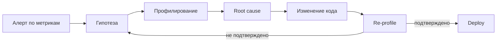

Ключевой принцип: **profile → hypothesis → change → re-profile**.


> [!mcq]
> - [ ] Profiling и monitoring — синонимы, оба показывают `p99` latency на дашборде | Это одна и та же дисциплина, просто разные инструменты. ❌ ПОСЛЕДСТВИЕ: команда видит «p99 вырос до 5s», но без stack-traces не знает, что 60% тратится в `JsonParser.parse()` — фиксят случайные методы, регрессия не уходит 2 недели.
> - [ ] Profiling — это logging уровня `DEBUG` с замером `System.nanoTime()` вокруг каждого метода | Это инструментальный замер на хоте логов, а не дисциплина анализа. ❌ ПОСЛЕДСТВИЕ: `DEBUG`-логи добавляют 30-50% overhead в production, latency p99 растёт с 100ms до 400ms, при этом stack-trace бизнес-методов всё равно не видны.
> - [ ] Profiling запускается только когда упал OOM, monitoring работает 24/7 | Profiling сводят к post-mortem heap dump после crash. ❌ ПОСЛЕДСТВИЕ: latency-регрессия без OOM остаётся незамеченной, пользователи уходят, SLO p99 нарушается, но никто не запускает `JFR` пока сервер не упадёт.
> - [x] Profiling — измерение поведения на уровне методов и stack-traces (где CPU/allocations/locks); monitoring — метрики уровня сервиса (`p99`, `RPS`, `CPU%`) | Monitoring обнаруживает проблему по SLI, profiling локализует root cause до конкретного метода. ✓ ПРИМЕНЯТЬ: Netflix и Datadog связывают `Prometheus` алерты с `JFR`-снимком — алерт `p99 > 500ms` триггерит автоматический JFR-record. 📋 ПРАВИЛО: «Метрика говорит ЧТО плохо, профиль — ГДЕ». 🔗 См. Q4, Q24, Q29.

## Q2. (!) Как выбрать между sampling и instrumentation?

Это два фундаментально разных подхода к сбору данных:

**`Sampling` (выборочный):**
- Периодически (например, каждые 10мс) снимает стек-трейсы всех потоков
- Низкий overhead (~1-5%), подходит для production
- Даёт вероятностную картину — может пропустить короткие методы
- Инструменты: `async-profiler`, `JFR`, `perf`

**`Instrumentation` (инструментальный):**
- Вставляет код до/после каждого вызова метода
- Точный подсчёт вызовов и времени
- Высокий overhead (10-50%+), искажает картину ("observer effect")
- Инструменты: `JProfiler` (instrumentation mode), `YourKit`, `BTrace`

```java
// Instrumentation по сути добавляет такой код в каждый метод:
public void processOrder(Order order) {
    long start = System.nanoTime();
    try {
        // оригинальный код
    } finally {
        Profiler.record("processOrder", System.nanoTime() - start);
    }
}
```

**Практика:** в production — только `sampling` (`JFR`, `async-profiler`). `Instrumentation` — точечно в dev/test для конкретных классов, когда нужен точный подсчёт вызовов.


> [!mcq]
> - [ ] Instrumentation безопасен в production: его overhead `~1%`, как у sampling | Путают накладные расходы — instrumentation вставляет код в каждый метод. ❌ ПОСЛЕДСТВИЕ: запускают `JProfiler` в instrumentation mode на prod-инстансе, throughput падает с 5K RPS до 800 RPS, latency p99 растёт в 5 раз — observer effect искажает сам объект измерения.
> - [x] Sampling периодически снимает stack-traces (overhead `~1-5%`, для prod), instrumentation вставляет байткод в каждый метод (overhead `10-50%+`, для dev/test) | Sampling даёт вероятностную картину с low overhead, instrumentation — точные счётчики ценой искажения поведения. ✓ ПРИМЕНЯТЬ: `async-profiler` (sampling) включают на prod в Netflix/Uber для CPU-анализа; `BTrace`/`JProfiler` instrumentation — только в staging для точного подсчёта вызовов узких классов. 📋 ПРАВИЛО: «Sampling — для prod, instrumentation — для лаборатории». 🔗 См. Q3, Q9, Q39.
> - [ ] Sampling видит все методы без исключений, instrumentation пропускает inlined-методы | Перевёрнутая картина: именно sampling может пропускать короткие методы. ❌ ПОСЛЕДСТВИЕ: команда верит, что sampling даёт 100% покрытие, не делают warm-up — короткий hot-method в `JIT`-inlined коде не виден, оптимизируют не тот участок, p99 не меняется.
> - [ ] Sampling и instrumentation одинаковы по overhead, разница только в формате вывода | Стирается ключевая разница в стоимости. ❌ ПОСЛЕДСТВИЕ: на собеседовании senior-инженер не может объяснить, почему instrumentation нельзя в prod, и допускает запуск `YourKit` instrumentation на live-сервисе — каскадная деградация всего шарда.

## Q3. Что такое safepoint bias и как он влияет на точность профилирования?

`Safepoint bias` — критическая проблема стандартных JVM-профайлеров. JVM может безопасно снять стек потока только в `safepoint` — специальных точках кода, где состояние потока полностью определено.

**Проблема:** стандартный `JVM TI GetStackTrace()` работает только в `safepoint`. Если метод выполняет длинный цикл без safepoint-а, профайлер его "не видит":

```java
// Этот цикл с counted loop может НЕ содержать safepoint
// до JDK 17 (JEP 401 добавил safepoints в counted loops)
for (int i = 0; i < array.length; i++) {
    sum += array[i]; // safepoint bias — профайлер не покажет этот код
}
```

**Решение:** `async-profiler` использует `AsyncGetCallTrace` — недокументированный API, который снимает стеки без ожидания safepoint. Это даёт честную картину.

| Профайлер | Safepoint bias | Точность |
|-----------|---------------|----------|
| `VisualVM` (sampling) | Да | Низкая |
| `JProfiler` (sampling) | Да | Низкая |
| `JFR` (execution sample) | Минимальный | Высокая |
| `async-profiler` | Нет | Высокая |


> [!mcq]
> - [ ] Safepoint bias — это баг в `VisualVM`, исправленный в JDK 17 | Сужают проблему до одного инструмента и считают её закрытой. ❌ ПОСЛЕДСТВИЕ: команда обновляет JDK до 21, ждёт исчезновения bias, но `JVMTI GetStackTrace`-based профайлеры всё равно ждут safepoint — горячие counted-loops остаются невидимыми, оптимизируют декорации вокруг настоящего hotspot.
> - [ ] Safepoint bias означает, что `JFR` пропускает GC-события | Путают safepoint bias (выборка стеков) с пропуском событий. ❌ ПОСЛЕДСТВИЕ: ищут потерянные GC-события в `JFR`, вместо того чтобы взять `async-profiler` для CPU-выборки — теряют день на ложный путь, root cause CPU-bottleneck не найден.
> - [ ] Safepoint bias влияет только на debug-сборки JVM, в release-режиме его нет | Магическое мышление про сборки. ❌ ПОСЛЕДСТВИЕ: запускают `jstack`-based профайлер в production release JDK и принимают его flame graph как истину — пропускают tight loop без safepoint poll, тратят неделю на оптимизацию helper-метода вместо реального горячего цикла.
> - [x] `Safepoint bias` — стандартный `JVMTI` снимает stack только в safepoint; tight loops без safepoint poll невидимы; `async-profiler` использует `AsyncGetCallTrace` и работает вне safepoint | Это ключевая причина, почему `async-profiler` точнее `VisualVM`/`JProfiler` (sampling). ✓ ПРИМЕНЯТЬ: команды Twitter и LinkedIn перешли на `async-profiler` именно из-за safepoint bias в counted-loops до JEP 401 (JDK 17). 📋 ПРАВИЛО: «Без safepoint bias — только AsyncGetCallTrace или perf». 🔗 См. Q2, Q9, Q11.

## Q4. Какие метрики обязательно связать с профилем?

Минимальный набор метрик для контекста профилирования:

- **Latency** p50/p95/p99 — основной SLI для пользователя
- **Throughput** (RPS) — нагрузка в момент снятия профиля
- **CPU utilization** — общая загрузка и по ядрам
- **GC pauses** — частота и длительность пауз (см. [Memory Management](memory-management-interview.md))
- **Error rate** — процент ошибок
- **Heap usage** — утилизация памяти

Без метрик профиль легко интерпретировать неверно: "горячий" метод может не быть причиной пользовательской деградации. Например, `GC` может занимать 30% CPU, но если паузы не влияют на p99, оптимизировать его бессмысленно.


> [!mcq]
> - [x] Связать минимум: `latency` p50/p95/p99, `throughput` (RPS), CPU%, GC pauses, error rate, heap usage — без них профиль интерпретируется неверно | Метрики дают контекст: «горячий» метод может не влиять на пользовательский SLI. ✓ ПРИМЕНЯТЬ: Datadog Continuous Profiler автоматически наклеивает `service.version`, `env`, `endpoint` на каждую JFR-выборку и связывает с APM trace. 📋 ПРАВИЛО: «Профиль без метрик — гадание на кофейной гуще». 🔗 См. Q1, Q16, Q24.
> - [ ] Достаточно одного `CPU%` — остальное не важно для профилирования | Слишком узкий взгляд: CPU не показывает off-CPU и GC pauses. ❌ ПОСЛЕДСТВИЕ: команда видит CPU=30%, считает, что всё хорошо, не замечает, что 70% latency p99 — `synchronized` lock contention, отчёт идёт некорректный, регрессия не находится.
> - [ ] Связывать только бизнес-метрики (`orders/sec`, `revenue`) — технические бессмысленны | Подменяют SLI бизнес-показателями, теряют технический контекст. ❌ ПОСЛЕДСТВИЕ: snapshot снят при низком RPS, на нём всё выглядит нормально, релизят оптимизацию — на пиковом трафике GC pauses взрываются до 2s, p99 рушится, post-mortem занимает сутки.
> - [ ] Сами по себе профили самодостаточны, метрики — это дублирование | Игнорируют наблюдаемость. ❌ ПОСЛЕДСТВИЕ: на post-mortem (по типу Knight Capital) команда не может ответить «когда началась деградация» — нет временных рядов, есть только snapshot после crash, root cause не восстанавливается.

## Q5. (!) Что такое JFR и как он работает?

`Java Flight Recorder (JFR)` — встроенный в JVM механизм сбора событий с минимальным overhead (<1% в production-конфигурации). С `JDK 11` полностью бесплатный (ранее был частью коммерческой лицензии `Oracle JDK`).

**Архитектура JFR:**

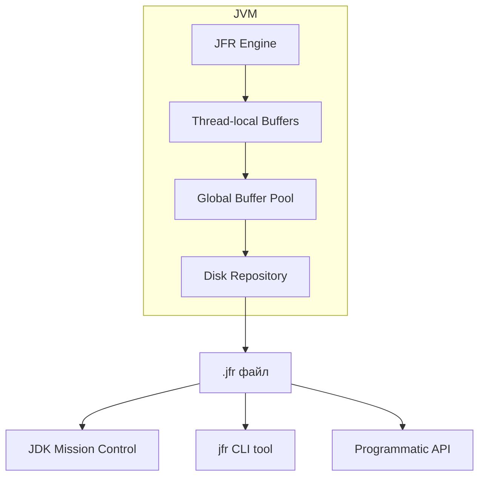

**Ключевые особенности:**
- Данные пишутся в thread-local буферы без lock contention
- Событийная модель — JFR записывает не только стеки, но и GC-события, I/O, monitor enter, exceptions и др.
- Два встроенных профиля: `default` (~1% overhead) и `profile` (~2% overhead, больше деталей)
- Circular buffer — может работать непрерывно, перезаписывая старые данные


> [!mcq]
> - [ ] `JFR` доступен только в Oracle JDK по коммерческой лицензии, в OpenJDK его нет | Устаревшее представление до JDK 11. ❌ ПОСЛЕДСТВИЕ: команда покупает Oracle JDK Subscription за $25/CPU/мес ради `JFR`, хотя с JDK 11 он бесплатен в OpenJDK — годовой бюджет в $50K на 200 CPU тратится впустую.
> - [ ] `JFR` пишет события через global lock в один файл, поэтому даёт `30%+` overhead | Неверная архитектура: на самом деле thread-local буферы. ❌ ПОСЛЕДСТВИЕ: команда отказывается от `JFR` в prod, переходит на самописные `System.nanoTime()`-обёртки на каждый метод — overhead вырастает до 40%, latency p99 удваивается.
> - [x] `JFR` — встроенный в JVM движок событий: thread-local буферы → global pool → disk; overhead `<1%` на default profile, бесплатен с JDK 11; circular buffer для continuous mode | Архитектура thread-local буферов исключает lock contention, событийная модель покрывает GC, I/O, monitor enter, exceptions. ✓ ПРИМЕНЯТЬ: Twitter использует `JFR` continuous recording 24/7 на всех prod JVM с `disk=true,maxage=4h` для post-mortem. 📋 ПРАВИЛО: «JFR — это always-on чёрный ящик JVM». 🔗 См. Q6, Q8, Q11.
> - [ ] `JFR` — это просто wrapper над `jstack`, снимает thread dumps каждые 100ms | Подменяют событийную модель примитивным polling. ❌ ПОСЛЕДСТВИЕ: разработчик ждёт от `JFR` только threads view, не включает allocation events, упускает 60% allocation rate в hot path — оптимизация GC-флагами не помогает, потому что лечат симптом.

## Q6. Как запустить JFR и какие настройки использовать?

**Запуск при старте JVM:**

```bash
# С default-профилем (production-safe)
java -XX:StartFlightRecording=duration=60s,filename=recording.jfr \
     -jar myapp.jar

# С расширенным профилем
java -XX:StartFlightRecording=settings=profile,duration=300s,\
     filename=detailed.jfr -jar myapp.jar

# Continuous recording с maxsize
java -XX:StartFlightRecording=disk=true,maxsize=500m,maxage=1h \
     -jar myapp.jar
```

**Запуск на работающем приложении через `jcmd`:**

```bash
# Найти PID
jcmd | grep myapp

# Начать запись
jcmd <PID> JFR.start name=profile settings=profile duration=60s \
     filename=/tmp/recording.jfr

# Dump текущего continuous recording
jcmd <PID> JFR.dump name=default filename=/tmp/dump.jfr

# Остановить
jcmd <PID> JFR.stop name=profile
```

**Программный запуск (JDK 14+):**

```java
try (Recording recording = new Recording(Configuration.getConfiguration("profile"))) {
    recording.setMaxAge(Duration.ofMinutes(5));
    recording.setDestination(Path.of("/tmp/recording.jfr"));
    recording.start();
    
    // ... выполнение нагрузки ...
    
    recording.stop();
}
```


> [!mcq]
> - [ ] `JFR.start` без `disk=true` нормально для long continuous recording | Опускают флаг `disk`, считая, что данные сохранятся сами. ❌ ПОСЛЕДСТВИЕ: `JFR` пишет в memory ring buffer без disk, при crash контейнера в Kubernetes pod рестартится — JFR-данные теряются полностью, post-mortem невозможен, root cause OOM остаётся неизвестен.
> - [ ] Только `-XX:StartFlightRecording` при старте JVM, `jcmd JFR.start` на работающем процессе не работает | Игнорируют hot-attach механизм. ❌ ПОСЛЕДСТВИЕ: при инциденте в prod команда требует рестарт сервиса с флагом `-XX:StartFlightRecording`, теряя живой контекст инцидента и нарушая SLA на доступность.
> - [ ] `settings=profile` нужно ставить всегда — `default` слишком beden | Перегружают prod избыточным сбором. ❌ ПОСЛЕДСТВИЕ: на prod включают `settings=profile` 24/7 (overhead `~2%` вместо `~1%`), на узких CPU-инстансах latency p99 ползёт вверх, capacity planning ошибается на 10%.
> - [x] При старте: `-XX:StartFlightRecording=duration=60s,filename=...`; на работающем JVM: `jcmd <PID> JFR.start name=... settings=profile duration=60s filename=...`; для continuous — `disk=true,maxage=1h,maxsize=500m` | Hot-attach через `jcmd` критичен для prod-диагностики без рестарта; `disk=true` обязателен для post-mortem. ✓ ПРИМЕНЯТЬ: Spring Boot Admin интегрирован с `jcmd JFR.start` для запуска recording из UI; команды Booking.com снимают 60s JFR при p99-алерте через `kubectl exec`. 📋 ПРАВИЛО: «`disk=true` или данные ушли в /dev/null». 🔗 См. Q5, Q27, Q28.

## Q7. Как анализировать JFR-записи?

**1. CLI-инструмент `jfr` (JDK 17+):**

```bash
# Вывод сводки
jfr summary recording.jfr

# Просмотр конкретных событий
jfr print --events jdk.ExecutionSample recording.jfr

# Фильтрация по времени
jfr print --events jdk.GCPhasePause --json recording.jfr | jq .

# Получение flame graph через jfr-datasource
jfr print --events jdk.ExecutionSample --stack-depth 64 recording.jfr
```

**2. JDK Mission Control (JMC):**
- GUI для глубокого анализа
- Автоматические правила обнаружения проблем (Automated Analysis)
- Heat map, histogram, dependency view
- Лучший инструмент для комплексного анализа JFR

**3. Программный доступ (JDK 14+):**

```java
try (RecordingFile file = new RecordingFile(Path.of("recording.jfr"))) {
    while (file.hasMoreEvents()) {
        RecordedEvent event = file.readEvent();
        if (event.getEventType().getName().equals("jdk.ExecutionSample")) {
            RecordedStackTrace stack = event.getStackTrace();
            RecordedMethod topMethod = stack.getFrames().get(0).getMethod();
            System.out.println(topMethod.getType().getName() 
                + "." + topMethod.getName());
        }
    }
}
```


> [!mcq]
> - [ ] `.jfr` файл — это plain text, его можно `grep`-ать прямо в bash | Считают `JFR` текстовым логом. ❌ ПОСЛЕДСТВИЕ: тратят полдня на `grep "ExecutionSample" recording.jfr | wc -l` который возвращает 0, потому что формат бинарный — анализ задерживается, инцидент тлеет.
> - [ ] Только GUI `JMC` способен открыть `.jfr`, без него файл бесполезен | Игнорируют CLI и programmatic API. ❌ ПОСЛЕДСТВИЕ: на CI-сервере без GUI команда не может автоматически проверить regressions в `JFR`-снимках pipeline, performance baseline ломается без алертов.
> - [x] Три способа: CLI `jfr summary/print --events` (JDK 17+), GUI `JMC` (Automated Analysis, dependency view), programmatic `RecordingFile` API для массового парсинга | CLI хорош для скриптов и автоматизации, JMC — для глубокого анализа, API — для интеграции в CI/CD baseline-comparator. ✓ ПРИМЕНЯТЬ: Datadog бекенд парсит `.jfr` через `RecordingFile` API для построения continuous flame graph; JMC Mission Control используют SRE Netflix на post-mortem. 📋 ПРАВИЛО: «CLI для CI, JMC для постмортема, API для пайплайна». 🔗 См. Q5, Q8, Q24.
> - [ ] `JMC` показывает только raw stack-traces, без правил автоматического обнаружения проблем | Недооценивают Automated Analysis. ❌ ПОСЛЕДСТВИЕ: на 200MB JFR-снимке разработчик ищет hot path вручную через histogram, упускает встроенное правило `JMC` про lock contention в `HikariPool` — root cause деградации находят на 3 дня позже.

## Q8. Какие ключевые JFR-события нужно знать?

| Событие | Категория | Что показывает |
|---------|----------|----------------|
| `jdk.ExecutionSample` | CPU | Стек-трейсы активных потоков (CPU profiling) |
| `jdk.ObjectAllocationInNewTLAB` | Memory | Аллокации в новый TLAB |
| `jdk.ObjectAllocationOutsideTLAB` | Memory | Аллокации вне TLAB (медленный путь) |
| `jdk.GCPhasePause` | GC | Длительность GC-пауз |
| `jdk.GarbageCollection` | GC | Общая информация о GC-циклах |
| `jdk.JavaMonitorEnter` | Locks | Ожидание synchronized-блоков (>20ms) |
| `jdk.JavaMonitorWait` | Locks | `Object.wait()` вызовы |
| `jdk.ThreadPark` | Locks | `LockSupport.park()` — concurrent locks |
| `jdk.FileRead` / `jdk.FileWrite` | I/O | Файловые операции с длительностью |
| `jdk.SocketRead` / `jdk.SocketWrite` | I/O | Сетевые операции |
| `jdk.JavaExceptionThrow` | Errors | Выброшенные исключения со стеками |

Совет: в production используйте `default`-профиль, но для диагностики проблем аллокации переключите на `profile` — он включает `ObjectAllocationInNewTLAB`.


> [!mcq]
> - [ ] Достаточно `jdk.ExecutionSample` — все остальные события избыточны | Сужают анализ до CPU sampling. ❌ ПОСЛЕДСТВИЕ: при memory pressure инциденте у команды нет `ObjectAllocationInNewTLAB`/`OutsideTLAB`, allocation flame graph невозможно построить — оптимизируют GC-флаги вместо реального hot allocation в `JsonSerializer`, проблема возвращается через 2 дня.
> - [ ] `jdk.ObjectAllocationInNewTLAB` включён в `default` profile, отдельной настройки не требуется | Ложь: он только в `profile`. ❌ ПОСЛЕДСТВИЕ: сняли `JFR` с `settings=default` для расследования memory leak, событий аллокации нет, тратят день на повторный сбор с `settings=profile`, инцидент простаивает.
> - [ ] `JavaMonitorEnter` срабатывает на каждый `synchronized`, поэтому генерирует терабайты данных | Считают, что событий слишком много. ❌ ПОСЛЕДСТВИЕ: команда отключает monitor events в `JFR`, lock contention в `synchronized HashMap` не виден в записи, инцидент с тротлингом throughput при росте RPS остаётся без объяснения.
> - [x] Минимум: `ExecutionSample` (CPU), `ObjectAllocation*TLAB` (memory), `GCPhasePause` + `GarbageCollection` (GC), `JavaMonitorEnter`/`ThreadPark` (locks, threshold >20ms), `Socket/FileRead/Write` (I/O), `JavaExceptionThrow` (errors) | Эти 7 категорий покрывают 95% диагностики; threshold-фильтрация `JavaMonitorEnter` спасает от шума. ✓ ПРИМЕНЯТЬ: профиль `profile.jfc` от JMC включает именно этот набор; Spring Boot 3.0 Observability экспортирует JFR `Socket*` events в Micrometer для distributed tracing. 📋 ПРАВИЛО: «Семь категорий — CPU/Alloc/GC/Lock/IO/Exception/Thread». 🔗 См. Q5, Q7, Q22.

## Q9. (!) Как работает async-profiler и чем он лучше стандартных инструментов?

`async-profiler` — это open-source профайлер для JVM на Linux и macOS, решающий проблему `safepoint bias`. Он использует два механизма:

**1. `AsyncGetCallTrace`** — недокументированный API OpenJDK для получения Java-стеков в произвольный момент (без ожидания safepoint).

**2. `perf_events`** (Linux) — ядерный механизм аппаратных счётчиков. Это позволяет видеть native-стеки (JIT, GC, kernel) вместе с Java-стеками.

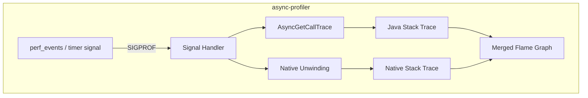

**Преимущества:**
- Нет `safepoint bias` — видит код внутри counted loops
- Объединяет Java + native стеки (видно JNI, GC, компилятор)
- Overhead ~1-2% в sampling mode
- Поддерживает CPU, allocation, lock, wall-clock профилирование
- Встроенная генерация `flame graph` в HTML/SVG


> [!mcq]
> - [ ] `async-profiler` — это GUI-аналог `JFR`, написанный на Java | Считают его обёрткой над тем же механизмом. ❌ ПОСЛЕДСТВИЕ: команда не настраивает `perf_event_paranoid` и `CAP_SYS_ADMIN` в Kubernetes (они не нужны для JFR), `async-profiler` падает с `Permission denied`, диагностика откладывается.
> - [x] Использует `AsyncGetCallTrace` (без safepoint) + `perf_events` (Linux) — снимает Java + native стеки без safepoint bias, overhead `~1-2%`, поддерживает CPU/alloc/lock/wall, генерирует HTML flame graph встроенно | Объединение Java и native стеков делает видимыми JNI/GC/JIT, отсутствие safepoint bias даёт честную CPU-картину. ✓ ПРИМЕНЯТЬ: `async-profiler` — стандарт в Netflix Performance Engineering и в Pyroscope/Grafana continuous profiling agent. 📋 ПРАВИЛО: «AsyncGetCallTrace + perf_events = честный flame graph». 🔗 См. Q3, Q11, Q15.
> - [ ] `async-profiler` работает только на Windows и macOS, на Linux нужен `JFR` | Перевёрнутая совместимость. ❌ ПОСЛЕДСТВИЕ: команда не запускает `async-profiler` на prod-Linux в Kubernetes, теряет точное CPU-профилирование без safepoint bias, отчёт делает на основе biased `JVMTI` sampling — root cause найден неверно.
> - [ ] Overhead `async-profiler` сопоставим с instrumentation (`30-50%`), поэтому только для dev | Завышают накладные расходы. ❌ ПОСЛЕДСТВИЕ: запрещают `async-profiler` в prod из-за мифа об overhead, при инцидентах ждут staging-репро, который не воспроизводится — RCA затягивается на недели.

## Q10. Как использовать async-profiler на практике?

**Базовые команды:**

```bash
# CPU profiling на 30 секунд с flame graph
./asprof -d 30 -f cpu-flamegraph.html <PID>

# Allocation profiling (показывает, где создаются объекты)
./asprof -d 30 -e alloc -f alloc-flamegraph.html <PID>

# Lock contention profiling
./asprof -d 30 -e lock -f lock-flamegraph.html <PID>

# Wall-clock profiling (on-CPU + off-CPU)
./asprof -d 30 -e wall -f wall-flamegraph.html <PID>

# С фильтрацией по потокам
./asprof -d 30 -e cpu -t -f cpu-per-thread.html <PID>

# Только конкретные потоки (по имени)
./asprof -d 30 -e cpu --filter "http-nio-*" -f http-threads.html <PID>
```

**Запуск как Java-agent:**

```bash
java -agentpath:/path/to/libasyncProfiler.so=start,event=cpu,\
     file=profile.html,duration=60 -jar myapp.jar
```

**Программный API (JDK):**

```java
// Через Attach API
AsyncProfiler profiler = AsyncProfiler.getInstance();
profiler.execute("start,event=cpu,file=profile.html");
// ... нагрузка ...
profiler.execute("stop");
```


> [!mcq]
> - [ ] `./asprof -d 30 <PID>` без `-e` запускает все события сразу — это правильно по умолчанию | Думают, что флаг `-e` опционален. ❌ ПОСЛЕДСТВИЕ: запускают без `-e`, по умолчанию идёт CPU sampling — а нужен был alloc для расследования GC pressure, теряют 30 секунд репро-окна и не получают allocation flame graph.
> - [ ] Запуск как `-javaagent:libasyncProfiler.jar` — корректный флаг agent-attach | Перепутан тип agent: это native, нужен `-agentpath`. ❌ ПОСЛЕДСТВИЕ: JVM падает на старте с `UnsatisfiedLinkError`, сервис не поднимается, инцидент эскалируется до P1 из-за неправильного флага.
> - [x] Запуск 4 режимами через `-e`: `cpu` (CPU samples), `alloc` (allocation), `lock` (contention), `wall` (on+off CPU); как Java agent через `-agentpath:libasyncProfiler.so=start,event=cpu,...`; программно через `AsyncProfiler.getInstance().execute("start,event=cpu")` | Знание режимов критично для правильного расследования: alloc для GC, lock для contention, wall для off-CPU. ✓ ПРИМЕНЯТЬ: команда Pyroscope использует все 4 режима как continuous profiling в Grafana Cloud; Wolt снимает `wall` для расследования R2DBC ожиданий. 📋 ПРАВИЛО: «cpu/alloc/lock/wall — четыре зеркала JVM». 🔗 См. Q9, Q15, Q17, Q21.
> - [ ] `--filter "http-nio-*"` фильтрует по HTTP-эндпоинтам, а не по имени потока | Путают thread filter и endpoint profiling. ❌ ПОСЛЕДСТВИЕ: ожидают per-endpoint flame graph, получают per-thread, отчёт некорректный, выводы про «медленный `/checkout`» сделаны на основе пула в целом.

## Q11. Когда использовать JFR, а когда async-profiler?

| Критерий | JFR | async-profiler |
|----------|-----|----------------|
| Встроенность | Часть JDK | Внешняя библиотека |
| ОС | Любая | Linux, macOS |
| CPU profiling | Хорошо (минимальный bias) | Отлично (без bias) |
| Allocation | Только TLAB events | Точный alloc sampling |
| Lock profiling | Monitor events | lock + wall-clock |
| Native стеки | Нет | Да (Java + native) |
| GC/IO events | Да (богатая модель) | Нет |
| Continuous mode | Да | Ограниченно |
| Flame graphs | Через конвертацию | Встроенные |

**Практика:** сначала `JFR` для общего контекста (GC, I/O, exceptions), затем `async-profiler` для детализации конкретного hot-path с честными стеками.


> [!mcq]
> - [ ] `JFR` всегда лучше `async-profiler` потому что встроен в JDK | Считают встроенность ключевым критерием. ❌ ПОСЛЕДСТВИЕ: команда не ставит `async-profiler`, для расследования CPU-bottleneck использует JFR с safepoint bias — не видит горячий counted-loop, оптимизирует не тот метод, регрессия p99 не уходит.
> - [ ] `async-profiler` всегда лучше — ставим только его, `JFR` не нужен | Игнорируют богатый event-контекст JFR. ❌ ПОСЛЕДСТВИЕ: при расследовании memory leak в команде нет `JFR` GC events, только CPU samples из `async-profiler` — невозможно увидеть allocation/promotion pattern, root cause находят на heap dump через 3 дня.
> - [x] Сначала `JFR` для общего контекста (GC, I/O, exceptions, lock events), затем `async-profiler` для детального CPU/alloc-анализа конкретного hot path с честными стеками | JFR даёт широкий контекст событий, async-profiler — точные CPU/alloc стеки без safepoint bias; они дополняют друг друга. ✓ ПРИМЕНЯТЬ: SRE Booking.com и Uber: `JFR` 24/7 как always-on recording, `async-profiler` запускают для targeted CPU-анализа после JFR-алерта. 📋 ПРАВИЛО: «JFR — широкий контекст, async-profiler — точный hot path». 🔗 См. Q5, Q9, Q35.
> - [ ] Они идентичны по возможностям, выбор — дело вкуса | Стирают принципиальные различия. ❌ ПОСЛЕДСТВИЕ: junior выбирает `JFR` для allocation-анализа на macOS — на ней `async-profiler` поддерживает только CPU; команда тратит день на попытку получить `alloc` режим там, где он не нужен.

## Q12. (!) Как читать flame graph корректно?

`Flame graph` — визуализация стек-трейсов, изобретённая Brendan Gregg. Правила чтения:

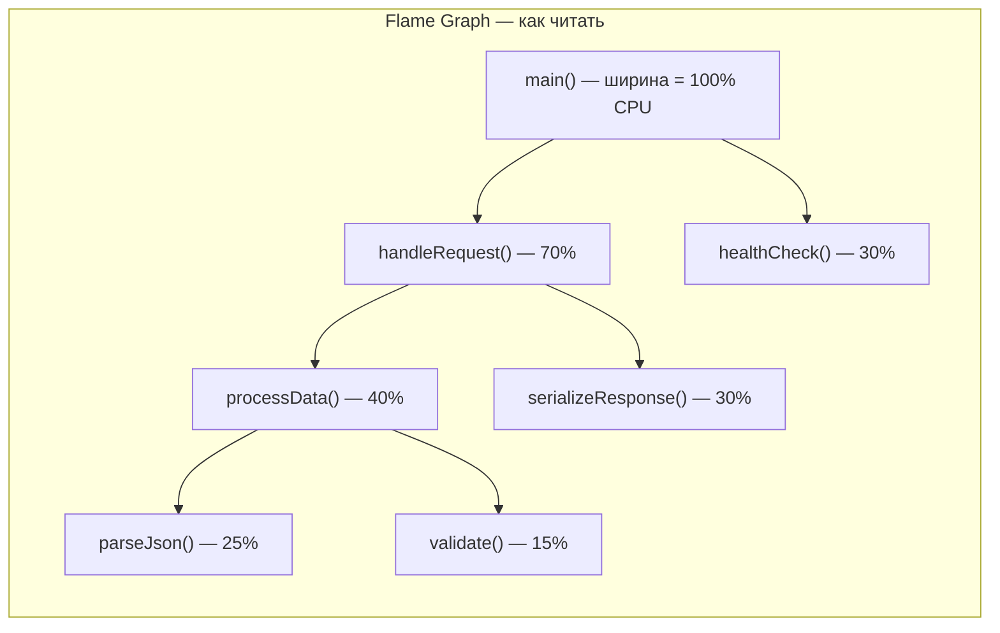

**Ключевые принципы:**
- **Ширина блока** = доля ресурса (времени CPU / аллокаций / lock waits)
- **Высота** = глубина стека вызовов
- **Горизонтальный порядок** — алфавитный (НЕ хронологический!)
- Искать нужно **широкие "плато"** — методы, занимающие значительную долю

**Типичные ошибки:**
1. Оптимизировать верхний helper-метод вместо настоящей причины внизу дерева
2. Принимать ширину за абсолютное время (это доля от общего)
3. Думать, что порядок слева направо = порядок выполнения
4. Игнорировать `[unknown]` фреймы — это могут быть JIT stubs или native код

**Совет:** для сравнения до/после используйте **differential flame graph** — он показывает красным/зелёным изменения между двумя профилями.


> [!mcq]
> - [ ] Ось X — хронологический порядок выполнения, слева направо = последовательность вызовов | Интуитивная, но неверная интерпретация. ❌ ПОСЛЕДСТВИЕ: разработчик «реконструирует» порядок методов по горизонтали и спорит с другом, что `parseJson` вызывался до `validate` — выводы по архитектуре делаются на основе алфавитного порядка, а не реальной последовательности.
> - [x] Ширина блока = доля ресурса (CPU time / allocations / lock waits), высота = глубина стека, горизонтальный порядок — алфавитный (НЕ хронологический); искать широкие плато | Понимание того, что широкое плато на нижнем уровне = реальный hot path, защищает от оптимизации helper-методов наверху. ✓ ПРИМЕНЯТЬ: Brendan Gregg (Netflix) — автор формата; стандарт для Datadog Profiling, Pyroscope, JMC. 📋 ПРАВИЛО: «Ширина — доля, высота — глубина, порядок — алфавит». 🔗 См. Q9, Q13, Q34.
> - [ ] Высота показывает время выполнения, чем выше — тем дольше работал метод | Путают глубину стека и время. ❌ ПОСЛЕДСТВИЕ: оптимизируют самый «высокий» лист flame graph — мелкий вспомогательный метод на дне 30-уровневой рекурсии — вместо широкого вызывающего метода в корне, hot path не уходит, p99 не меняется.
> - [ ] `[unknown]` фреймы можно игнорировать как шум | Списывают их со счетов. ❌ ПОСЛЕДСТВИЕ: пропускают 25% времени в `[unknown]` (на самом деле — JIT stubs или native crypto), не настраивают `-XX:+PreserveFramePointer` — root cause CPU-нагрузки в TLS handshake остаётся неизвестен.

## Q13. Какие типы flame graph существуют и когда каждый полезен?

| Тип | Ось X | Когда использовать |
|-----|-------|--------------------|
| CPU flame graph | CPU time | Где тратится процессорное время |
| Allocation flame graph | Bytes allocated | Где создаются объекты (memory pressure) |
| Off-CPU flame graph | Wall-clock wait time | Где потоки ждут (I/O, locks) |
| Wall-clock flame graph | Wall time | Полная картина (on-CPU + off-CPU) |
| Differential flame graph | Разница двух профилей | Сравнение до/после оптимизации |
| Icicle graph | Инвертированная ось Y | Анализ bottom-up (от листьев к корню) |

**Генерация flame graph:**

```bash
# async-profiler — встроенная генерация
./asprof -d 30 -f flamegraph.html <PID>

# Из JFR через конвертер
jfr print --events jdk.ExecutionSample --stack-depth 64 recording.jfr \
  | java -jar converter.jar > flamegraph.html

# Из perf через FlameGraph tools (Brendan Gregg)
perf script | stackcollapse-perf.pl | flamegraph.pl > perf-flamegraph.svg
```


> [!mcq]
> - [ ] CPU flame graph покрывает все случаи: для memory leak и lock contention тоже подходит | Считают CPU универсальным. ❌ ПОСЛЕДСТВИЕ: для расследования lock contention сняли CPU flame graph — он не показывает off-CPU ожидание; команда не видит широкое плато в `Unsafe.park`, неделю чинят CPU-методы, latency не меняется.
> - [ ] Differential flame graph бесполезен — лучше класть два HTML файла рядом и смотреть глазами | Игнорируют автоматический diff. ❌ ПОСЛЕДСТВИЕ: при regression-расследовании после релиза v1.2.3 команда сравнивает flame graphs visually, пропускают 5% рост `JsonParser.parse` — релиз катится дальше, через сутки p99 деградирует на 20%, откатывают.
> - [x] CPU (где CPU time), Allocation (bytes allocated), Off-CPU (wall wait time), Wall-clock (on+off), Differential (diff двух профилей), Icicle (инвертированный bottom-up) — каждый показывает свой ресурс | Выбор типа = выбор измеряемого ресурса; Wall-clock спасает при «медленно но CPU низкий». ✓ ПРИМЕНЯТЬ: Pyroscope в Grafana показывает `differential` flame graph между релизами; команда Discord использовала `off-CPU` для нахождения R2DBC waits на миграции на ScyllaDB. 📋 ПРАВИЛО: «Шесть типов — для каждого ресурса своё зеркало». 🔗 См. Q12, Q15, Q34.
> - [ ] Allocation flame graph и CPU flame graph — это одно и то же, разница только в title | Стирают семантическую разницу осей. ❌ ПОСЛЕДСТВИЕ: при memory pressure снимают CPU flame graph (не alloc), не видят `Hibernate.buildQuery` который аллоцирует 800 MB/s — оптимизируют CPU-hotspot, GC pressure остаётся, деградация p99 продолжается.

## Q14. (!) Как профилировать CPU bottleneck?

Системный подход:

**1. Зафиксировать окно деградации** — связать с метриками (см. [метрики и трассировка](../monitoring/metrics-tracing-interview.md)):

```bash
# Быстрая проверка: что делает JVM прямо сейчас
jcmd <PID> Thread.print | head -100

# CPU utilization по процессу
top -Hp <PID>  # Linux: показать потоки
```

**2. Снять CPU profile:**

```bash
# async-profiler: 60 секунд CPU sampling
./asprof -d 60 -e cpu -f cpu.html <PID>

# JFR: с execution samples
jcmd <PID> JFR.start name=cpu settings=profile duration=60s \
     filename=/tmp/cpu.jfr
```

**3. Анализ flame graph:**

```bash
# Найти top-N горячих методов
./asprof -d 60 -e cpu -o flat <PID>

# Пример вывода:
#   --- Execution profile ---
#   Total samples: 12543
#       3214 (25.62%) com.example.JsonParser.parse
#       1987 (15.84%) java.util.HashMap.resize
#       1245 ( 9.93%) com.example.Validator.validate
```

**4. Оценить и исправить:**
- Алгоритмическая сложность (O(n²) → O(n log n))
- Лишние аллокации в горячем цикле
- Неэффективная сериализация
- Результат: "после оптимизации hot path CPU -22%, p99 -18%"


> [!mcq]
> - [ ] Сразу запускать профилирование без сбора метрик и определения окна деградации | Прыгают в инструмент без гипотезы. ❌ ПОСЛЕДСТВИЕ: снимают 60s `JFR` в случайный момент при низкой нагрузке, hot path не воспроизводится, разработчик закрывает тикет «не могу воспроизвести», инцидент возвращается через сутки.
> - [ ] Сразу делать heap dump и искать утечки — это универсальный путь к bottleneck | Подменяют CPU-расследование memory-расследованием. ❌ ПОСЛЕДСТВИЕ: при CPU=95% снимают heap dump (10s STW на 16GB heap), сервис перестаёт отвечать, latency p99 взлетает до 30s, нарушается SLA, при этом CPU bottleneck в `JSON parsing` остаётся не локализован.
> - [x] Системный подход: (1) зафиксировать окно по метрикам, (2) снять CPU profile (`async-profiler -e cpu` или `JFR settings=profile`), (3) анализ flame graph (top hot methods), (4) исправить и повторно профилировать для подтверждения | Цикл profile→hypothesis→change→re-profile исключает оптимизацию по догадкам. ✓ ПРИМЕНЯТЬ: Spotify SRE документирует этот цикл в runbook; Wolt снижал p99 `/checkout` на 35% через 3 итерации этого цикла. 📋 ПРАВИЛО: «Окно → профиль → анализ → проверка». 🔗 См. Q1, Q4, Q16.
> - [ ] Профилировать только staging, на prod это всегда опасно | Избегают prod-инструментов без оснований. ❌ ПОСЛЕДСТВИЕ: staging не воспроизводит prod-нагрузку (1/10 RPS), CPU bottleneck из реального трафика не локализуется, тратят неделю на синтетические тесты, релиз оптимизации не приносит результата.

## Q15. Что такое on-CPU и off-CPU анализ, и зачем оба?

**`on-CPU`:** где поток реально выполняет код на процессоре.

**`off-CPU`:** где поток ожидает — lock, I/O, sleep, park, сетевой вызов.

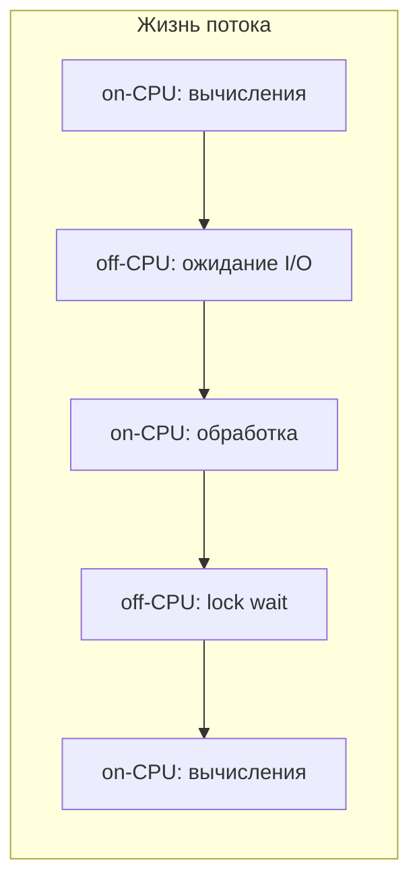

Только `on-CPU` анализ часто пропускает корень проблемы:
- Поток ждёт ответа от БД — off-CPU
- Поток заблокирован на `synchronized` — off-CPU
- Поток ждёт DNS resolution — off-CPU

```bash
# Wall-clock profiling покажет ОБА типа
./asprof -d 30 -e wall -t -f wall.html <PID>

# Только off-CPU (async-profiler 3.0+)
./asprof -d 30 -e wall --wall-filter off-cpu -f offcpu.html <PID>
```

**Правило:** если приложение "медленное, но CPU низкий" — проблема почти всегда off-CPU.


> [!mcq]
> - [x] `on-CPU` — поток выполняет код на ядре; `off-CPU` — поток ждёт (lock, I/O, sleep, park, network); только on-CPU пропускает основные источники latency, нужен wall-clock или off-CPU профиль | Sampling profiler видит только running threads, BLOCKED/PARKED невидимы — lock contention и I/O waits пропускаются полностью. ✓ ПРИМЕНЯТЬ: `async-profiler -e wall` стандартен в Reactor/WebFlux расследованиях — показывает реактивные паузы на R2DBC; команды Discord и Booking.com используют off-CPU для DB latency. 📋 ПРАВИЛО: «Если медленно, но CPU низкий — проблема off-CPU». 🔗 См. Q9, Q14, Q21.
> - [ ] off-CPU — это когда CPU выключен из-за power management, не нужно профилировать | Подменяют off-CPU физическим состоянием CPU. ❌ ПОСЛЕДСТВИЕ: при p99=2s и CPU=10% инженер ищет CPU-hotspot, не делает wall-clock профиль, пропускает synchronized в `connection pool` — root cause не находится.
> - [ ] on-CPU и off-CPU — два разных инструмента, не совместимы в одном sample | Стирают возможность wall-clock. ❌ ПОСЛЕДСТВИЕ: команда не использует `-e wall`, для каждого расследования снимают два разных профиля, корреляция теряется, выводы по latency некорректные.
> - [ ] off-CPU видим только через `jstack` thread dump в цикле | Подменяют сэмплирование примитивным polling. ❌ ПОСЛЕДСТВИЕ: запускают `while true; do jstack PID; done` каждую секунду в prod, JVM испытывает Stop-The-World паузы при каждом dump, latency p99 деградирует, инцидент усугубляется самим инструментом.

## Q16. Как интерпретировать профиль и не ошибиться с root cause?

Проверять три вещи:

**1. Воспроизводимость** — картина повторяется в нескольких прогонах?

**2. Корреляция с метриками** — горячий метод действительно влияет на latency пользователя?

```bash
# Сопоставить timestamp профиля с метриками
# В Grafana: наложить window профилирования на график latency/CPU
```

**3. Подтверждение гипотезы** — после изменения кода проблема исчезла?

**Частые ловушки:**
- `Thread.sleep()` / `Object.wait()` в CPU-профиле — это не проблема CPU
- Горячий `HashMap.get()` — возможно, проблема в размере map или hash collision
- `GC` в top — проблема не в GC, а в аллокациях (ищите allocation profile)
- `JIT compilation` в начале записи — это warm-up, не steady-state

Если подтверждения нет — это была не root cause, а симптом.


> [!mcq]
> - [ ] `Thread.sleep()` в top CPU-профиля — точно проблема, оптимизировать первым | Не отличают on-CPU и wait. ❌ ПОСЛЕДСТВИЕ: убирают `Thread.sleep(50)` в backoff retry-логике, retry-storm бьёт downstream сервис (Cassandra), у того цепная деградация — Knight Capital-style каскад из неправильного RCA.
> - [ ] `JIT compilation` в начале записи означает производственную проблему | Не отделяют warm-up от steady-state. ❌ ПОСЛЕДСТВИЕ: команда снимает 30s профиль сразу после рестарта pod, видит C1/C2 compiler в top — оптимизирует холодные пути вместо steady-state hot path, реальный bottleneck не уходит.
> - [ ] Одного снимка достаточно — повторные прогоны излишни | Игнорируют воспроизводимость. ❌ ПОСЛЕДСТВИЕ: один профиль показал hot path в `Logger.debug`, оказалось — случайный всплеск из-за CI deploy шум; команда удаляет `DEBUG`-логирование в горячем пути, но реальный bottleneck в DB-запросе остаётся, p99 не меняется.
> - [x] Проверить (1) воспроизводимость в нескольких прогонах, (2) корреляцию с метриками (горячий метод реально влияет на p99?), (3) подтверждение после фикса (re-profile показывает уход hotspot) | Без подтверждения это не root cause, а симптом; типичные ловушки — `wait/sleep` в CPU-профиле, GC в top (надо alloc), JIT compilation как warm-up. ✓ ПРИМЕНЯТЬ: Netflix Performance Engineering требует 3 профиля + diff между before/after для merge оптимизации. 📋 ПРАВИЛО: «Воспроизвёл → коррелировал → подтвердил». 🔗 См. Q4, Q14, Q30.

## Q17. (!) Как профилировать allocation и memory pressure?

Чрезмерные аллокации создают давление на `GC`, увеличивают паузы и ухудшают latency. Подробнее о влиянии GC на производительность — в [Memory Management](memory-management-interview.md).

**Инструменты:**

```bash
# async-profiler: allocation profiling
./asprof -d 60 -e alloc -f alloc.html <PID>

# JFR: включить allocation events
jcmd <PID> JFR.start settings=profile duration=60s \
     filename=/tmp/alloc.jfr
# profile-настройки включают ObjectAllocationInNewTLAB
```

**Что искать в allocation flame graph:**
- **Allocation hotspots** — где создаётся больше всего объектов
- **Churn** — часто создаваемые и сразу умирающие объекты (temporary objects)
- **Promotion** — объекты, попадающие в Old Gen

**Типичные находки и решения:**

```java
// ПРОБЛЕМА: аллокация строк в горячем цикле
for (Order order : orders) {
    String key = "order:" + order.getId() + ":status"; // новый String каждый раз
    cache.get(key);
}

// РЕШЕНИЕ: StringBuilder или предвычисленные ключи
StringBuilder sb = new StringBuilder(32);
for (Order order : orders) {
    sb.setLength(0);
    sb.append("order:").append(order.getId()).append(":status");
    cache.get(sb.toString());
}
```

```java
// ПРОБЛЕМА: autoboxing в горячем пути
Map<Long, Integer> scores = new HashMap<>(); // autoboxing Long, Integer
scores.put(userId, score); // 2 объекта на каждый put

// РЕШЕНИЕ: примитивные коллекции (Eclipse Collections, fastutil)
LongIntHashMap scores = new LongIntHashMap(); // нет autoboxing
scores.put(userId, score);
```


> [!mcq]
> - [ ] Allocation pressure не нужно профилировать — современный G1GC справляется сам | Полагаются на GC «сам разберётся». ❌ ПОСЛЕДСТВИЕ: при `500MB/s` allocation rate G1 переходит в Mixed GC каждые 200ms, p99 latency растёт с 80ms до 400ms — оптимизация GC-флагов помогает на 5%, реальная причина в `String.format` в hot loop остаётся.
> - [ ] Достаточно `-XX:+PrintGC` логов — allocation flame graph избыточен | Смешивают GC-логи с alloc-профилем. ❌ ПОСЛЕДСТВИЕ: видят частые Young GC в логах, увеличивают `Xmn` (young gen), но не знают, какой метод аллоцирует — pressure возвращается через неделю, чинят бесконечно.
> - [x] Использовать `async-profiler -e alloc -d 60` или `JFR settings=profile` (включает `ObjectAllocationInNewTLAB`); искать allocation hotspots, churn (temporary objects), promotion в Old Gen; типичные фиксы — StringBuilder вместо `+`, primitive collections (Eclipse/fastutil) против autoboxing | Прямое профилирование байт даёт map «где создаются объекты», что недоступно через GC-логи. ✓ ПРИМЕНЯТЬ: LinkedIn использует `async-profiler -e alloc` для Kafka brokers — снизили allocation rate с 1.2 GB/s до 300 MB/s через primitive collections. 📋 ПРАВИЛО: «Alloc profile, не GC tuning». 🔗 См. Q8, Q22, Q40.
> - [ ] `LongIntHashMap` из Eclipse Collections медленнее `HashMap<Long, Integer>` из-за primitives | Боятся «нестандартных» библиотек. ❌ ПОСЛЕДСТВИЕ: оставляют `HashMap<Long, Integer>` в hot path, autoboxing создаёт 2 объекта на каждый put — на 10K RPS это 200MB/s gc churn, оптимизация архитектуры тратит человеко-неделю.

## Q18. Как снять и проанализировать heap dump?

`Heap dump` — полный снимок содержимого Java Heap в формате HPROF.

**Снятие heap dump:**

```bash
# Через jcmd (рекомендуется)
jcmd <PID> GC.heap_dump /tmp/heap.hprof

# Через jmap
jmap -dump:format=b,file=/tmp/heap.hprof <PID>

# Автоматически при OutOfMemoryError
java -XX:+HeapDumpOnOutOfMemoryError \
     -XX:HeapDumpPath=/tmp/dumps/ -jar myapp.jar
```

**Анализ в Eclipse MAT:**
1. Открыть dump → Leak Suspects Report (автоматический анализ)
2. Dominator Tree — кто удерживает больше всего памяти
3. Histogram — количество и размер объектов по классам
4. Path to GC Roots — цепочка ссылок от объекта до root

**Ключевые термины:**
- **Shallow size** — размер самого объекта (без ссылок)
- **Retained size** — сколько памяти освободится, если удалить объект и всё, что он держит
- **Dominator** — объект, через который идут все пути от GC root

**Предупреждение:** снятие heap dump вызывает `STW`-паузу, пропорциональную размеру heap. На 8GB heap это может быть 5-10 секунд. В production — согласуйте с SRE.


> [!mcq]
> - [ ] Heap dump через `jmap -dump` безопасен для production — STW паузы нет | Не знают про STW при dump. ❌ ПОСЛЕДСТВИЕ: на 16GB heap `jmap -dump` вызывает 2-минутную STW паузу, livенess probe в Kubernetes падает, pod рестартится, нарушение SLO p99 на весь шард.
> - [ ] `Shallow size` и `Retained size` — синонимы, MAT показывает одно и то же | Стирают ключевую разницу. ❌ ПОСЛЕДСТВИЕ: ищут утечку по `shallow size` (всегда маленький у объектов-агрегаторов), не находят — реальный держатель `LinkedHashMap` с `retained=2GB` остаётся незамеченным, OOM возвращается через сутки.
> - [ ] `HeapDumpOnOutOfMemoryError` бесполезен — файл слишком большой | Отключают флаг для экономии диска. ❌ ПОСЛЕДСТВИЕ: после OOM в prod heap dump не сохранён, root cause утечки не найден, через неделю снова OOM на других подах — повторение Knight Capital-style инцидента из-за неполного RCA.
> - [x] `jcmd <PID> GC.heap_dump` (рекомендовано) или `jmap -dump:format=b`; автоматически с `-XX:+HeapDumpOnOutOfMemoryError -XX:HeapDumpPath=...`; анализ в Eclipse MAT через Leak Suspects, Dominator Tree, Histogram, Path to GC Roots; знать `shallow size` (объект сам) vs `retained size` (что освободится при удалении) | STW пауза при dump пропорциональна heap, на 16GB это 2 минуты — согласовать с SRE и желательно делать на standby-инстансе. ✓ ПРИМЕНЯТЬ: Eclipse MAT — стандарт в Spring Boot Admin для leak hunting; команда Atlassian имеет runbook «dump только на drain-инстансе». 📋 ПРАВИЛО: «Heap dump = STW; снимай на standby». 🔗 См. Q19, Q33, Q37.

## Q19. Как найти memory leak с помощью профилирования?

`Memory leak` в Java — объекты, которые больше не нужны, но не освобождаются из-за нежелательных ссылок.

**Стратегия поиска:**

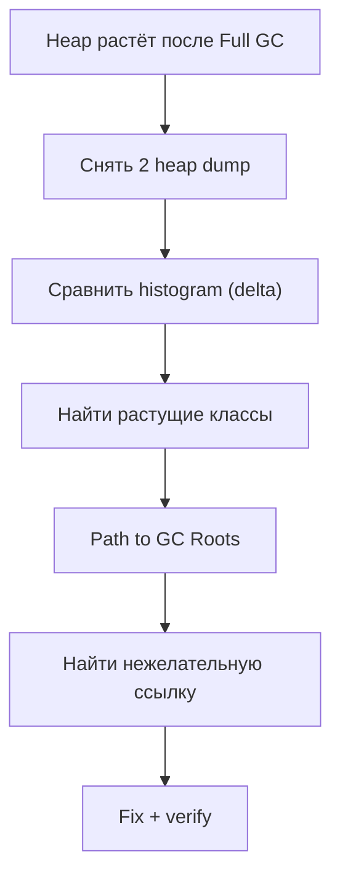

**Практические шаги:**

```bash
# 1. Снять baseline dump
jcmd <PID> GC.heap_dump /tmp/heap1.hprof

# 2. Подождать (или дать нагрузку)
sleep 300

# 3. Снять второй dump
jcmd <PID> GC.heap_dump /tmp/heap2.hprof

# 4. Сравнить в MAT: File → Compare Heap Dumps
```

**Типичные причины утечек:**
- `static` коллекции без eviction (кэши без `maxSize` / TTL)
- Listeners/callbacks, не отписанные при закрытии
- `ThreadLocal` без `remove()` в пуле потоков
- `ClassLoader` leak (особенно при hot redeploy)
- `InputStream` / `Connection` без закрытия (не прямая утечка, но держат native-ресурсы)


> [!mcq]
> - [ ] Достаточно одного heap dump — растущие классы видно сразу по histogram | Не делают diff между dumps. ❌ ПОСЛЕДСТВИЕ: на единственном dump видят 1M `String` объектов, считают это утечкой, но это нормальный baseline — оптимизируют не туда, реальная утечка в `static Map<SessionId, Session>` без TTL остаётся, OOM в течение недели.
> - [x] Снять 2 heap dump с интервалом (после Full GC), сравнить histogram delta в MAT (`File → Compare Heap Dumps`), найти растущие классы, через `Path to GC Roots` найти нежелательную ссылку; типичные причины — `static` коллекции без eviction, `ThreadLocal` без `remove()` в пуле, `ClassLoader leak` при hot redeploy, незакрытые listeners | Сравнение двух snapshots с разрывом в нагрузке локализует именно растущий класс. ✓ ПРИМЕНЯТЬ: Spring Boot Admin для long-living сервисов, GitLab Rails OOM-расследования через MAT diff; Caffeine cache с `maximumSize` решает 80% утечек. 📋 ПРАВИЛО: «Два дампа, дельта, корни». 🔗 См. Q18, Q33, Q37.
> - [ ] `ThreadLocal` без `remove()` не вызывает утечек в Spring Boot — тред умирает с context | Не знают про thread pool reuse. ❌ ПОСЛЕДСТВИЕ: в Tomcat thread pool треды живут долго, `MDC.put` без `MDC.clear` накапливает entries в `ThreadLocalMap` — heap растёт 100MB/сутки, OOM через 2 недели.
> - [ ] `ClassLoader leak` бывает только в Tomcat, в Spring Boot embedded — невозможен | Считают embedded-сервер защищённым. ❌ ПОСЛЕДСТВИЕ: при hot reload через `spring-boot-devtools` в dev `ClassLoader` течёт, через 50 reloads PermGen/Metaspace взрывается, разработчик считает «java.lang.OutOfMemoryError: Metaspace» багом JDK.

## Q20. (!) Как снять и анализировать thread dump?

`Thread dump` — снимок состояния всех потоков JVM с их стек-трейсами.

**Снятие:**

```bash
# Через jcmd (рекомендуемый способ)
jcmd <PID> Thread.print > /tmp/threads.txt

# Через jstack
jstack <PID> > /tmp/threads.txt

# Через kill (Unix) — не убивает процесс
kill -3 <PID>   # вывод в stdout JVM

# Несколько снимков с интервалом (для анализа тренда)
for i in 1 2 3; do jcmd <PID> Thread.print > /tmp/td_$i.txt; sleep 5; done
```

**Состояния потоков:**

| Состояние | Значение | На что обратить внимание |
|-----------|---------|--------------------------|
| `RUNNABLE` | Выполняется | Горячий код или I/O (может быть и off-CPU) |
| `BLOCKED` | Ждёт монитора | Lock contention — кто держит lock? |
| `WAITING` | `Object.wait()` / `LockSupport.park()` | Ожидание условия |
| `TIMED_WAITING` | `sleep()` / `wait(timeout)` | Polling или timeout |

**Что искать:**
1. Много потоков в `BLOCKED` на одном мониторе → lock contention
2. Потоки застряли в одном методе → возможный deadlock или бесконечный цикл
3. Все потоки пула заняты → исчерпание пула (проверить pool size)

```
// Пример: lock contention в thread dump
"http-nio-8080-exec-15" BLOCKED
    at com.example.CacheService.get(CacheService.java:42)
    - waiting to lock <0x00000007a4c8e8d0> (a java.util.HashMap)
    
"http-nio-8080-exec-3" RUNNABLE
    at com.example.CacheService.put(CacheService.java:58)
    - locked <0x00000007a4c8e8d0> (a java.util.HashMap)
```


> [!mcq]
> - [ ] `kill -9 <PID>` снимает thread dump и не убивает процесс | Путают `kill -3` (SIGQUIT) и `kill -9` (SIGKILL). ❌ ПОСЛЕДСТВИЕ: для thread dump делают `kill -9` на prod-pod, JVM мгновенно убивается, in-flight запросы теряют данные, distributed transactions остаются недоведенными, recovery занимает час.
> - [x] `jcmd <PID> Thread.print` (рекомендовано) или `jstack <PID>`, `kill -3 <PID>` (вывод в stdout); искать состояния `RUNNABLE` (CPU/IO), `BLOCKED` (ждёт монитор), `WAITING` (`Object.wait`/`park`), `TIMED_WAITING` (sleep); делать 3-5 снимков с интервалом 5s — статичный stack между ними = bottleneck/deadlock | Серия dumps локализует «застрявшие» потоки против «нормально работающих»; jcmd — современный безопасный способ. ✓ ПРИМЕНЯТЬ: Spring Boot Admin триггерит thread dump из UI; fastThread.io автоматизирует diff dumps; SRE Twitter использует серию из 5 dumps для locating deadlock в production. 📋 ПРАВИЛО: «Серия dumps, dиff состояний». 🔗 См. Q21, Q38.
> - [ ] `jstack` без `-l` (long) показывает все locks — флаг избыточен | Игнорируют `-l` для locks information. ❌ ПОСЛЕДСТВИЕ: ищут deadlock в `jstack` без `-l`, не видят owned locks — deadlock в `synchronized HashMap` остаётся не обнаружен, через 4 часа сервис висит, нужен рестарт.
> - [ ] Все `RUNNABLE` потоки = они активно жгут CPU | Стирают разницу с I/O wait. ❌ ПОСЛЕДСТВИЕ: видят 200 потоков `RUNNABLE`, заказывают +200 CPU, на самом деле 90% из них ждут socket read (`RUNNABLE` в Java для blocking I/O) — capacity planning ошибается на 10×, бюджет infrastructure растёт впустую.

## Q21. Как находить lock contention через профилирование?

**Сигналы lock contention:**
- Много потоков в `BLOCKED` / `WAITING`
- Рост времени в monitor/lock событиях
- Падение throughput при увеличении потоков (negative scalability)

**Инструменты:**

```bash
# async-profiler: lock profiling
./asprof -d 30 -e lock -f lock.html <PID>
# Показывает: на каких lock-ах потоки ждут и кто их держит

# JFR: monitor events
jcmd <PID> JFR.start settings=profile duration=60s \
     filename=/tmp/locks.jfr
# Анализ jdk.JavaMonitorEnter, jdk.ThreadPark событий
```

**Типичные решения:**
- `synchronized HashMap` → `ConcurrentHashMap` (lock striping)
- Один глобальный lock → lock per partition
- `synchronized` → `ReadWriteLock` (если чтений больше)
- `Lock` → lock-free структуры (`AtomicReference`, `LongAdder`)

```java
// ПРОБЛЕМА: один lock на все операции
public class MetricsCollector {
    private final Map<String, Long> counters = new HashMap<>();
    
    public synchronized void increment(String key) { // global lock
        counters.merge(key, 1L, Long::sum);
    }
}

// РЕШЕНИЕ: ConcurrentHashMap + LongAdder
public class MetricsCollector {
    private final ConcurrentHashMap<String, LongAdder> counters = 
        new ConcurrentHashMap<>();
    
    public void increment(String key) { // lock-free
        counters.computeIfAbsent(key, k -> new LongAdder()).increment();
    }
}
```


> [!mcq]
> - [ ] CPU-профилировщик видит lock contention напрямую — отдельный lock-режим не нужен | Не понимают off-CPU природу locks. ❌ ПОСЛЕДСТВИЕ: при negative scalability (rps падает с ростом потоков) снимают CPU профиль, всё «зелёное» (CPU=20%), реальная причина в `synchronized HashMap` блокирует 80% времени — оптимизируют не то, throughput не растёт.
> - [ ] `synchronized` всегда быстрее `ReadWriteLock` потому что проще | Упрощённое сравнение без read-heavy сценария. ❌ ПОСЛЕДСТВИЕ: на 10:1 read:write нагрузке используют `synchronized` для cache, потоки сериализуются на чтении — throughput 5K RPS вместо возможных 50K с `ReadWriteLock`/`StampedLock`.
> - [ ] Глобальный `ConcurrentHashMap` всегда лучше чем lock-per-partition | Не знают про lock striping limits. ❌ ПОСЛЕДСТВИЕ: на горячем ключе (hotspot) `ConcurrentHashMap` всё равно сериализует операции в одном bucket — lock contention остаётся высокой, нужно partition по domain key, не доверять «out-of-the-box».
> - [x] Сигналы — много `BLOCKED`/`WAITING` в thread dump, рост `JavaMonitorEnter`/`ThreadPark` events, negative scalability при росте потоков; `async-profiler -e lock` или `JFR settings=profile`; типичные фиксы — `synchronized HashMap` → `ConcurrentHashMap`, global lock → lock per partition, `Lock` → `LongAdder`/`AtomicReference`/`ReadWriteLock` | Lock-режим `async-profiler` показывает на каких объектах потоки ждут и кто держит. ✓ ПРИМЕНЯТЬ: LongAdder в Micrometer для high-throughput counters; Caffeine cache использует striped locks; Cassandra перешла с `synchronized` на `LongAdder` для метрик в 4.0. 📋 ПРАВИЛО: «Если throughput падает с потоками — это lock contention». 🔗 См. Q9, Q15, Q20.

## Q22. (!) Как анализировать GC и связать его с профилированием?

Детальный анализ GC описан в [Memory Management](memory-management-interview.md) и [JVM Performance Tuning](jvm-performance-tuning-interview.md). Здесь — интеграция с profiling.

**Включение GC-логов:**

```bash
# JDK 17+ unified logging
java -Xlog:gc*:file=gc.log:time,uptime,level,tags:filecount=5,filesize=50m \
     -jar myapp.jar
```

**Ключевые метрики GC для связи с профилем:**

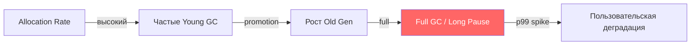

**Анализ GC через JFR:**

```bash
# GC-события в JFR
jfr print --events "jdk.GarbageCollection,jdk.GCPhasePause" recording.jfr

# Пример вывода:
# jdk.GCPhasePause {
#   gcId = 142
#   name = "Pause Young (Normal)"
#   duration = 12.4 ms
# }
```

**Инструменты визуализации:**
- [GCEasy](https://gceasy.io) — онлайн-анализатор GC-логов
- [GCViewer](https://github.com/chewiebug/GCViewer) — десктопный анализатор
- JMC → GC tab — анализ GC из JFR-записи
- Grafana + `jmx_exporter` — realtime GC-дашборд


> [!mcq]
> - [x] Включить unified GC logging (`-Xlog:gc*:file=gc.log:time,uptime,level,tags:filecount=5,filesize=50m`), анализировать через GCEasy/GCViewer; в JFR смотреть `jdk.GarbageCollection`/`GCPhasePause`; высокий allocation rate → частые Young GC → promotion → Old Gen → Full GC pause → p99 spike | Связь GC ↔ profiling: цепочка allocation rate → pause → пользовательский latency. ✓ ПРИМЕНЯТЬ: GCEasy используют Booking.com и Spotify для post-mortem; Datadog APM показывает GC pause как timeline overlay на latency. 📋 ПРАВИЛО: «Allocation → pause → latency — одна цепочка». 🔗 См. Q17, Q23, Q40.
> - [ ] Достаточно `-verbose:gc` без unified logging — он деpрекейтед только в JDK 21 | Используют устаревший флаг. ❌ ПОСЛЕДСТВИЕ: получают неконсистентный формат GC-логов между JDK 8/11/17, GCEasy парсит частично, статистика по pauses неверная — оптимизация GC-флагов идёт по неполным данным.
> - [ ] GC анализируется только через JMX `getGarbageCollectorMXBeans` — flame graph не нужен | Игнорируют JFR GC events. ❌ ПОСЛЕДСТВИЕ: видят `youngGcCount=1500/min`, не знают, какой allocation hot path их генерирует, уменьшают `Xmn` — становится хуже, реальный фикс в `String.format` в горячем цикле остаётся.
> - [ ] Любые GC pause < 200ms для G1GC — норма, не требуют расследования | Применяют общий threshold к latency-critical системам. ❌ ПОСЛЕДСТВИЕ: для платежного gateway с SLO p99 < 100ms терпят 150ms G1 pauses, SLO нарушается, не переходят на ZGC/Shenandoah который бы дал < 10ms — теряют клиентов.

## Q23. Как профилировать GC pauses и их влияние на latency?

**Связь GC pauses с latency:**

GC-паузы (`STW` — Stop-The-World) напрямую добавляются к latency запроса. Если p99 latency = 100ms, а GC-пауза = 80ms, то GC — главный contributor.

```bash
# Быстрый скрипт: извлечь паузы >50ms из GC-лога
grep "pause" gc.log | awk '$NF > 50 {print}'
```

**Профилирование аллокаций → снижение GC pressure:**

```java
// ПРОБЛЕМА: 100MB/s allocation rate из-за temporary объектов
public List<OrderDTO> toDto(List<Order> orders) {
    return orders.stream()
        .map(o -> new OrderDTO(               // новый DTO
            o.getId(),
            formatDate(o.getCreated()),        // новый String
            formatMoney(o.getTotal()),         // новый String
            o.getItems().stream()              // новый Stream + Iterator
                .map(ItemDTO::from)            // новый DTO на каждый item
                .collect(toList())             // новый ArrayList
        ))
        .collect(toList());                    // новый ArrayList
}

// РЕШЕНИЕ: переиспользование, pre-sized collections
public List<OrderDTO> toDto(List<Order> orders) {
    List<OrderDTO> result = new ArrayList<>(orders.size()); // pre-sized
    for (Order o : orders) {
        result.add(orderDtoPool.acquire(o)); // object pool для hot path
    }
    return result;
}
```

**Выбор GC-коллектора:**

| Коллектор | Цель по паузе | Когда использовать |
|-----------|--------------|-------------------|
| `G1GC` | <200ms | Универсальный (default с JDK 9) |
| `ZGC` | <1ms | Низкая latency, большой heap |
| `Shenandoah` | <10ms | Низкая latency, RedHat/OpenJDK |
| `Parallel GC` | throughput | Batch-задачи, не критична latency |


> [!mcq]
> - [ ] GC pauses не добавляются к latency — они асинхронны | Не понимают STW природу. ❌ ПОСЛЕДСТВИЕ: считают, что 200ms G1 pause не влияет на p99=100ms — на самом деле любой запрос, попавший в pause, получает +200ms latency, p99 deadline missed для 5% запросов, продукт жалуется.
> - [ ] Любой `STW` критичен — переходить на ZGC всегда | Игнорируют trade-off throughput. ❌ ПОСЛЕДСТВИЕ: на batch-сервисе (без latency SLO) переходят с Parallel GC на ZGC — throughput падает на 15%, batch заканчивается на 2 часа позже, задержка отчётности для бизнеса.
> - [x] STW pauses напрямую добавляются к latency запроса; выбор GC по pause goal — `G1GC` (<200ms, default JDK 9+), `ZGC` (<1ms, large heap, low-latency), `Shenandoah` (<10ms), `Parallel` (throughput, batch); снижение allocation rate через alloc profile уменьшает GC pressure | Оптимизация кода (alloc rate) часто эффективнее замены GC-коллектора. ✓ ПРИМЕНЯТЬ: Cassandra перешла на ZGC в 4.0 для tail latency; Twitter использует Shenandoah; Hadoop остался на Parallel для throughput batch jobs. 📋 ПРАВИЛО: «GC выбирай по SLO, alloc снижай по профилю». 🔗 См. Q17, Q22, Q40.
> - [ ] Object pooling всегда снижает allocation rate и должен применяться везде | Применяют pooling без меры. ❌ ПОСЛЕДСТВИЕ: вводят `OrderDtoPool` для thread-safe операций, добавляют synchronization — lock contention превышает выгоду, throughput падает на 20%; современный G1/ZGC справляется с allocation быстрее, чем pool с локами.

## Q24. (!) Что такое APM и как он дополняет профилирование?

`APM (Application Performance Management)` — платформа для мониторинга производительности приложений: трассировка, метрики, профилирование, логи в едином UI.

**Популярные APM-решения:**

| APM | Профилирование | Трассировка | Особенности |
|-----|---------------|-------------|-------------|
| `Datadog` | Continuous Profiler | Distributed traces | Корреляция traces → profiles |
| `New Relic` | Thread Profiler | Distributed traces | Code-level visibility |
| `Dynatrace` | PurePath | Полная трассировка | AI-driven root cause |
| `Elastic APM` | Есть (JFR-based) | Distributed traces | Open source core |
| `Grafana` + `Pyroscope` | Continuous profiling | Tempo | Полностью open source |

**Ключевая интеграция APM с профилированием:**

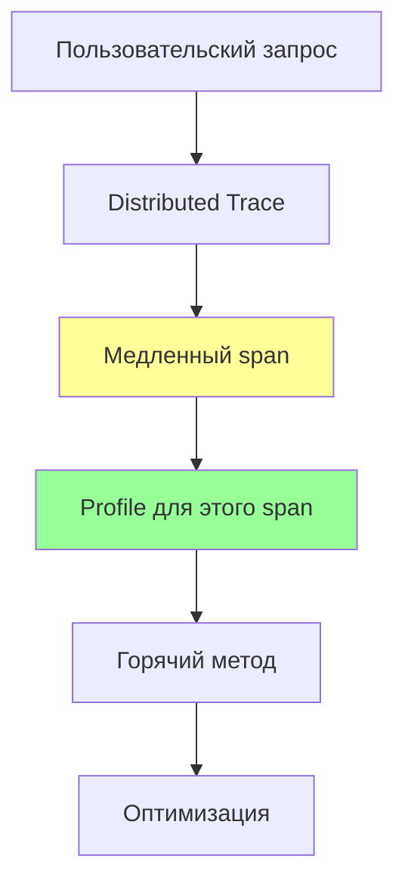

Например, в `Datadog`: кликаешь на медленный span в trace → видишь CPU profile именно для этого запроса. Это bridge между мониторингом и профилированием.


> [!mcq]
> - [ ] APM полностью заменяет профилировщик — отдельный `JFR`/`async-profiler` не нужен | Считают APM универсальным. ❌ ПОСЛЕДСТВИЕ: на расследовании tight CPU loop в `RegexParser` APM-trace показывает только высокий span duration, без stack-traces; команда не запускает `async-profiler`, root cause не найден неделю.
> - [ ] Distributed traces важнее профилей — выбирают одно | Противопоставляют trace и profile. ❌ ПОСЛЕДСТВИЕ: подключают только tracing (Jaeger), без continuous profiling, инцидент CPU spike в одном поде не локализован — trace показывает медленный span, но какой метод съел CPU — неизвестно.
> - [x] APM (Datadog/New Relic/Dynatrace/Elastic/Grafana+Pyroscope) даёт единый UI — traces + metrics + profiles + logs; ключевая интеграция «Trace → Profile»: из медленного span открыть CPU-профиль конкретного запроса, видеть hot method прямо в context distributed trace | Соединяет «что медленное» (trace) и «где медленное в коде» (profile) на уровне отдельного запроса. ✓ ПРИМЕНЯТЬ: Datadog Continuous Profiler с `dd-trace-java` agent — стандарт у Wolt, Booking.com; Grafana + Pyroscope — open-source альтернатива в стиле GitLab. 📋 ПРАВИЛО: «APM сводит trace и profile в один клик». 🔗 См. Q1, Q25, Q29.
> - [ ] APM-агенты добавляют `30%+` overhead — для prod не подходят | Завышают накладные расходы. ❌ ПОСЛЕДСТВИЕ: команда отказывается от `dd-trace-java` (`<3%` overhead) ради «безопасности», теряет distributed tracing, инциденты diagnose-ятся через grep по логам — RCA затягивается на дни.

## Q25. (!) Что такое continuous profiling и зачем он нужен?

`Continuous profiling` — постоянное (24/7) low-overhead профилирование в production. В отличие от ad-hoc профилирования, данные всегда доступны ретроспективно.

**Зачем:**
- Проблема произошла вчера в 3:00 — профиль уже есть
- Можно сравнивать профили между версиями/деплоями
- Обнаружение постепенных деградаций (regression detection)
- Оптимизация расходов: CPU flame graph показывает, что 20% CPU — логирование

**Архитектура:**

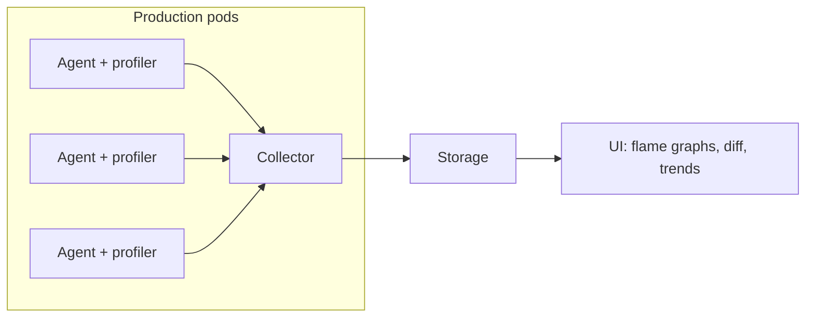

**Инструменты:**

| Инструмент | Тип | Overhead | Хранение |
|-----------|-----|---------|----------|
| `Datadog Continuous Profiler` | SaaS | ~1% | Cloud |
| `Pyroscope` (Grafana) | OSS/Cloud | ~1% | Local/Cloud |
| `Parca` | OSS | ~1% | Local |
| `JFR` + custom pipeline | DIY | ~1% | Custom |
| `async-profiler` + custom | DIY | ~1-2% | Custom |

**Пример: интеграция Pyroscope с Spring Boot:**

```java
// build.gradle
implementation 'io.pyroscope:agent:0.13.0'

// application.yml
pyroscope:
  application-name: order-service
  server-address: http://pyroscope:4040
  profiling-event: cpu,alloc,lock
  profiling-interval: 10ms
  upload-interval: 15s
```


> [!mcq]
> - [ ] Continuous profiling — это `JFR.start` без `duration` параметра, остальное не нужно | Подменяют систему примитивным always-on JFR. ❌ ПОСЛЕДСТВИЕ: запускают `JFR` 24/7 без rotation, диск заполняется за сутки на 50GB, логи сервиса не пишутся, latency растёт из-за disk I/O — превращают диагностический инструмент в источник инцидента.
> - [ ] Достаточно snapshot-профилирования по требованию (jcmd при инциденте) | Считают continuous избыточным. ❌ ПОСЛЕДСТВИЕ: инцидент произошёл вчера в 3:00 UTC, никто не снял профиль, данных нет; через неделю проблема возвращается — RCA невозможен, бизнес теряет $50K на повторных инцидентах.
> - [ ] Pyroscope/Datadog overhead — `10%+`, нельзя для production | Завышают накладные расходы современных continuous-агентов. ❌ ПОСЛЕДСТВИЕ: отказываются от Pyroscope в Grafana stack, не получают always-on flame graph, regression detection между релизами невозможен — деградация v1.2.3 vs v1.2.2 не находится автоматически.
> - [x] Continuous profiling — постоянное (24/7) low-overhead (`~1%`) профилирование в prod; данные ретроспективно доступны для post-mortem; обнаружение regression между деплоями (v1.2.2 vs v1.2.3 diff flame graph); инструменты — Datadog Continuous Profiler, Grafana Pyroscope, Parca; интеграция через `agentpath` или Java agent | Снимок прошлого момента доступен всегда, что критично для редких или ушедших инцидентов. ✓ ПРИМЕНЯТЬ: Pyroscope в Grafana Cloud — стандарт у DigitalOcean, Wolt; Datadog Continuous Profiler с `dd.profiling.allocation.enabled=true` у Booking.com. 📋 ПРАВИЛО: «Always-on профиль — ретроспектива бесплатно». 🔗 См. Q24, Q26, Q31.

## Q26. Как работает Datadog Continuous Profiler?

`Datadog Continuous Profiler` — промышленное решение для continuous profiling в production.

**Архитектура:**

```bash
# Подключение Java-agent
java -javaagent:/opt/dd-java-agent.jar \
     -Ddd.profiling.enabled=true \
     -Ddd.profiling.allocation.enabled=true \
     -Ddd.service=order-service \
     -Ddd.env=production \
     -Ddd.version=1.2.3 \
     -jar myapp.jar
```

**Ключевые возможности:**
- **Trace → Profile** корреляция: из медленного span открыть профиль конкретного запроса
- **Endpoint profiling** — агрегированный flame graph по HTTP-эндпоинту
- **Version comparison** — diff flame graph между версиями v1.2.2 и v1.2.3
- **Cost attribution** — "этот метод стоит $X/месяц в cloud-инфраструктуре"
- Timeline view — CPU, allocation, lock profiling на временной оси

**Типы профилей:**
- CPU time — где тратится CPU
- Wall time — общее время (on-CPU + off-CPU)
- Allocations — где создаются объекты
- Heap live objects — что сейчас живёт в heap
- Lock contention — ожидание на lock-ах
- Thrown exceptions — откуда летят исключения


> [!mcq]
> - [ ] Datadog Profiler — это wrapper над JFR без дополнительных возможностей | ❌ ПОСЛЕДСТВИЕ: команда не использует уникальные фичи (version diff flame graph, endpoint profiling, cost attribution) и вручную сравнивает JFR записи там, где Datadog показывает всё в одном UI.
> - [ ] Datadog Profiler требует root-привилегии и SYS_PTRACE на каждом хосте | ❌ ПОСЛЕДСТВИЕ: DevSecOps блокирует деплой агента на production nodes — никакого continuous profiling, latency-инциденты расследуются вручную по логам часами.
> - [ ] Datadog Continuous Profiler собирает только CPU профиль, allocation и lock — недоступны | ❌ ПОСЛЕДСТВИЕ: при memory leak команда не видит allocation flame graph в Datadog и запускает отдельный инструмент вместо открытия нужного view в том же UI.
> - [x] Datadog Continuous Profiler поддерживает Trace→Profile корреляцию: из медленного APM span открывается flame graph конкретного запроса, показывая cost attribution по методам | ✓ ПРИМЕНЯТЬ: при расследовании latency regression — в Datadog APM открыть slow span → перейти в profile view. 📋 ПРАВИЛО: «dd-agent = trace + CPU + alloc + lock в одном dashboard». 🔗 См. Q9, Q24, Q25.

## Q27. (!) Как профилировать production безопасно?

**Принципы безопасного профилирования:**

1. **Короткие сессии** — 30-60 секунд, не более
2. **Sampling, а не instrumentation** — overhead <2%
3. **Минимально достаточный набор событий** — не включать всё сразу
4. **Чёткий rollback-план** — как остановить, если пойдёт не так
5. **Согласовать с SRE** — кто включает, кто анализирует, где хранятся артефакты

**Чеклист перед production profiling:**

```markdown
- [ ] Проверить overhead инструмента на staging
- [ ] Убедиться, что есть место на диске для артефактов
- [ ] Согласовать окно с on-call SRE
- [ ] Подготовить команды stop/rollback
- [ ] Не профилировать во время пиковой нагрузки (если можно)
- [ ] Не снимать heap dump без крайней необходимости (STW пауза!)
```

**Безопасные инструменты для production:**

| Инструмент | Overhead | Безопасность |
|-----------|---------|-------------|
| `JFR` (default profile) | <1% | Максимально safe |
| `async-profiler` (cpu) | ~1% | Safe |
| `async-profiler` (alloc) | ~2% | Safe |
| `jcmd Thread.print` | Мгновенный | Safe |
| `jmap heap dump` | STW пауза | Осторожно! |
| Instrumentation agents | 10-50% | Не для production |


> [!mcq]
> - [x] Для production профилирования использовать только sampling (JFR, async-profiler) с overhead <2%, сессия 30-60 секунд, согласовать окно с SRE | ✓ ПРИМЕНЯТЬ: при расследовании latency-инцидента — `jcmd JFR.start duration=60s settings=profile` или `async-profiler -e cpu --interval 10ms`. 📋 ПРАВИЛО: «Sampling + короткая сессия + согласование = safe production profiling». 🔗 См. Q2, Q9, Q11.
> - [ ] Heap dump снимать всегда, когда нужен анализ памяти в production — это safe операция | ❌ ПОСЛЕДСТВИЕ: `jmap -dump` вызывает Stop-the-World паузу на секунды и минуты — пользователи получают timeouts, SLA нарушено, PagerDuty срабатывает по latency.
> - [ ] Instrumentation-профайлер (YourKit full trace) можно включить на 5 минут — overhead терпимый | ❌ ПОСЛЕДСТВИЕ: overhead 50-200% — throughput падает в 3-10 раз, очередь запросов накапливается, сервис деградирует до полного отказа через 2 минуты.
> - [ ] async-profiler нельзя использовать в production из-за слишком высокого overhead | ❌ ПОСЛЕДСТВИЕ: команда не использует инструмент с лучшей точностью (нет safepoint bias) и работает с менее точными данными JFR, пропуская реальные CPU bottlenecks.

## Q28. Как профилировать сервис в Kubernetes/Docker?

Профилирование в контейнерной среде имеет свои нюансы. Подробнее о `Kubernetes` — в [Kubernetes](../devops/kubernetes-interview.md).

**Проблемы:**
- `cgroup` limits — JVM может не видеть реальные лимиты CPU/memory
- Ephemeral pods — файлы профиля теряются при рестарте
- Network isolation — не всегда можно подключиться через `jcmd`

**Решения:**

```bash
# 1. Exec в pod и снять профиль
kubectl exec -it <pod> -- jcmd 1 JFR.start duration=60s \
    filename=/tmp/recording.jfr

# 2. Скопировать файл
kubectl cp <pod>:/tmp/recording.jfr ./recording.jfr

# 3. async-profiler в Docker (нужны capabilities)
# Dockerfile:
# COPY async-profiler/ /opt/async-profiler/
kubectl exec -it <pod> -- /opt/async-profiler/asprof -d 30 \
    -f /tmp/profile.html 1
```

**Docker security requirements для async-profiler:**

```yaml
# В Kubernetes: добавить securityContext
securityContext:
  capabilities:
    add:
      - SYS_PTRACE    # для attach к процессу
  # или для perf_events:
  # privileged: true  # крайний случай
```

**Учёт cgroup limits:**

```bash
# JDK 17+ автоматически определяет cgroup limits
# Проверить:
jcmd 1 VM.info | grep "container"
# Available CPUs: 2 (container limited)
# Memory Limit: 4096M (container limited)
```

**Anti-pattern:** анализировать локальный профиль (8 CPU, 32GB RAM) и переносить выводы на pod (2 CPU, 4GB RAM) — поведение будет совершенно другим.


> [!mcq]
> - [ ] Профилирование в Kubernetes работает так же как на bare metal — никаких дополнительных шагов | ❌ ПОСЛЕДСТВИЕ: async-profiler падает с ошибкой прав (нет SYS_PTRACE capability), команда не получает профиль и переключается на менее точные инструменты.
> - [ ] Для профилирования в K8s достаточно открыть JMX порт через Service | ❌ ПОСЛЕДСТВИЕ: JMX позволяет только мониторинг метрик, но не снимает CPU flame graph — confusing, команда тратит часы на настройку не того инструмента.
> - [x] Для профилирования в K8s: `kubectl exec -it <pod> -- jcmd 1 JFR.start`, затем `kubectl cp <pod>:/tmp/recording.jfr ./` + учесть cgroup limits (JDK 17+ авто-детект) и добавить `SYS_PTRACE` для async-profiler | ✓ ПРИМЕНЯТЬ: при расследовании CPU/memory проблемы в pod — exec → профиль → cp → анализировать локально. 📋 ПРАВИЛО: «exec→profile→cp→analyze (не на prod-сервере)». 🔗 См. Q10, Q27.
> - [ ] Профиль из Kubernetes pod нельзя скопировать локально — только анализировать в pod | ❌ ПОСЛЕДСТВИЕ: аналитик запускает Eclipse MAT (GB памяти) внутри pod с лимитом 512MB → OOM → pod перезапускается, профиль потерян.

## Q29. Как связать profiling с Prometheus/Grafana и алертингом?

Интеграция профилирования в операционный цикл (см. [метрики и трассировка](../monitoring/metrics-tracing-interview.md)):

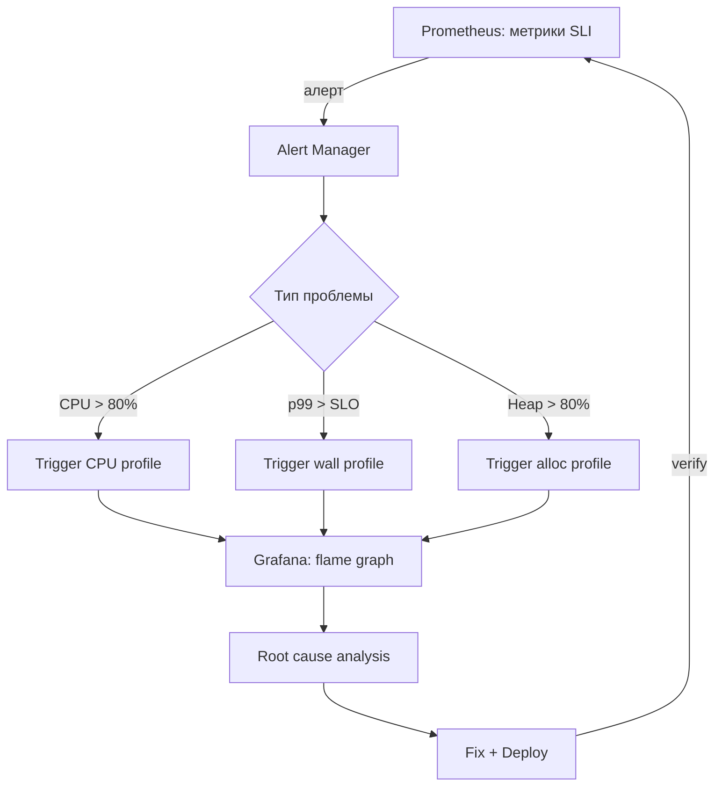

**Автоматический trigger профилирования:**

```java
// Spring Boot Actuator + custom endpoint
@Component
public class ProfilingTrigger {
    
    @EventListener
    public void onHighCpu(HighCpuEvent event) {
        // Автоматически запустить JFR при CPU > 80%
        Runtime.getRuntime().exec(new String[]{
            "jcmd", "1", "JFR.start",
            "name=auto-cpu", "duration=60s",
            "filename=/tmp/auto-" + Instant.now() + ".jfr"
        });
    }
}
```

**Grafana + Pyroscope** для continuous profiling:
- Встроенный flame graph panel в Grafana
- Annotations на графиках — когда был деплой, когда снят профиль
- Exemplar links: из метрики → в trace → в profile

Так профилирование становится частью операционного цикла, а не "разовой магией".


> [!mcq]
> - [ ] Prometheus алертинг и профилирование — независимые инструменты, между ними нет интеграции | ❌ ПОСЛЕДСТВИЕ: команда замечает CPU алерт, но вручную запускает профилирование через 20 минут после алерта — проблема уже исчезла, профиль пуст.
> - [ ] Grafana может напрямую снимать JFR профили при срабатывании алерта без доп. кода | ❌ ПОСЛЕДСТВИЕ: инженер тратит 2 дня на попытку настроить несуществующую фичу Grafana вместо написания простого Spring Boot listener на HighCpuEvent.
> - [ ] Для интеграции profiling с Grafana необходимо только JFR + JfrMeterRegistry → метрики в Prometheus | ❌ ПОСЛЕДСТВИЕ: метрики есть, но нет flame graph визуализации — команда видит «CPU 80%» без понимания какой метод виноват, анализ продолжается вслепую.
> - [x] Pyroscope/Grafana Phlare интегрируется с Grafana: flame graph panel получает данные из continuous profiling агента, а алерт-менеджер через webhook автоматически триггерит snapshot при CPU > 80% | ✓ ПРИМЕНЯТЬ: настроить `AlertManager webhook → JFR.start trigger` чтобы профиль снимался в момент проблемы. 📋 ПРАВИЛО: «Алерт = автоматический trigger профиля». 🔗 См. Q25, Q26.

## Q30. Какие anti-patterns в profiling чаще всего встречаются?

| Anti-pattern | Почему плохо | Правильный подход |
|-------------|-------------|-------------------|
| Профилируют без репрезентативной нагрузки | Результат не отражает production | Использовать realistic load (replay, shadow traffic) |
| Оптимизируют micro-hotspot без бизнес-эффекта | Потраченное время без улучшения SLI | Сначала проверить влияние на p99/throughput |
| Делают выводы по одному профилю | Может быть артефакт / случайный всплеск | Минимум 3 прогона, сравнивать |
| Смешивают cold-start и steady-state | JIT-компиляция искажает картину | Дать warm-up перед снятием профиля |
| Игнорируют off-CPU | Пропускают I/O, lock waits, network | Снимать wall-clock профиль |
| Профилируют с heavy instrumentation в prod | Искажение поведения, деградация | Только sampling с low overhead |
| Анализируют локальный профиль для prod | Другое железо, другая нагрузка | Профилировать в production-like среде |
| Оптимизируют GC-флагами вместо кода | Лечат симптом, не причину | Сначала снизить allocation rate |


> [!mcq]
>
> **Вопрос:** Какой профилировочный антипаттерн чаще всего обнуляет результат всей оптимизации, и почему?
>
> ---
>
> #### A) Профилирование с heavy instrumentation в production — главный антипаттерн, потому что overhead 10-30% — ❌ Неверно (правильно для разработки, но это не самый частый антипаттерн)
>
> **Что на самом деле:** да, instrumentation profiling (например JProfiler/YourKit в default режиме) даёт 10-30% overhead и искажает прода. Но это **известный** антипаттерн — каждый senior знает, что в проде надо sampling. **Чаще встречается** другая ошибка: профилирование без репрезентативной нагрузки.
>
> **Откуда путаница:** «overhead» — самый осязаемый риск, на собеседованиях обычно его называют. На практике reproducibility важнее: heavy instrumentation редко доходит до прода, нерепрезентативная нагрузка — норма.
>
> **Если бы это было правдой:** проблема решалась бы переключением на sampling. Но даже идеальный sampling профиль на нерепрезентативной нагрузке = бесполезен.
>
> ---
>
> #### B) Профилирование без репрезентативной нагрузки — синтетический тест на 1 RPS не отражает поведение под 1000 RPS. Без realistic load (replay/shadow traffic) hotspots в профиле могут быть совершенно другими, чем в проде; оптимизация даст 0% эффекта или регресс — ✓ Верно
>
> **Развёрнутое объяснение:**
>
> Большинство performance-проблем имеют **нелинейную природу**: lock contention растёт квадратично с числом потоков, GC pauses усугубляются при высокой allocation rate, кеш-промахи зависят от размера working set. На 1 RPS вы не увидите ни lock waiting, ни GC pressure, ни cache miss patterns.
>
> Симптом: профиль показывает 90% времени в JSON serialization. Команда оптимизирует Jackson + кеширует ObjectMapper. После релиза — никакого улучшения p99. Причина: в проде с 1000 RPS реальный bottleneck — connection pool starvation, который на 1 RPS не виден.
>
> **Пример (правильный подход):**
> ```bash
> # Shadow traffic — копия prod запросов отправляется на staging
> # (Envoy/Istio mirror config)
> ---
> apiVersion: networking.istio.io/v1beta1
> kind: VirtualService
> spec:
>   http:
>     - route:
>         - destination: { host: orders-prod, weight: 100 }
>       mirror: { host: orders-staging }   # копия 100% трафика
>       mirrorPercentage: { value: 100.0 }
> ```
>
> ```bash
> # Или replay через GoReplay из prod tcpdump
> gor --input-file 'prod.gor' --output-http http://staging:8080
> ```
>
> Снимаем JFR на staging при shadow traffic — получаем realistic профиль.
>
> **Когда применять:**
> - **Любая performance оптимизация в проде**: shadow traffic или production canary как baseline.
> - **Capacity planning**: replay прошлого Black Friday для подготовки к следующему.
> - **Регрессионное тестирование**: запись эталонной нагрузки + nightly replay + сравнение профилей.
> - **Avito/Yandex/Booking**: используют GoReplay/Envoy mirror для testing новых deployment'ов под realistic трафиком.
>
> **Подводные камни:**
> - **Stateful side effects**: shadow traffic не должен делать INSERT в реальную БД, иначе дубли. Используйте mock БД или read-only replicas.
> - **PII в replayed traffic**: содержит реальные user data — нужна анонимизация перед записью.
> - **Time-dependent state**: на воскресенье profiles могут отличаться от понедельника. Снимать в representative time windows.
> - **Cold start vs steady state**: первые 30-60 секунд после старта — JIT ещё работает, профиль искажён. Warm-up обязателен.
>
> **Связанные вопросы:** [[Q5]] — JFR continuous profiling; [[Q12]] — async-profiler как low-overhead альтернатива; [[Q29]] — Pyroscope для production continuous profiling.
>
> ---
>
> #### C) Оптимизация micro-hotspot без бизнес-эффекта — оптимизация метода который выполняется 1ms и составляет 0.1% общего времени — ❌ Неверно (это антипаттерн, но не главный)
>
> **Что на самом деле:** это **реальная** проблема (Amdahl's law: оптимизация 1% даёт максимум 1% выигрыша), но она менее опасна чем нерепрезентативная нагрузка. Можно потратить время впустую, но не сделать **хуже**. Нерепрезентативный профиль может направить на оптимизацию там где её не нужно, или пропустить реальный bottleneck.
>
> **Откуда путаница:** «не оптимизируй преждевременно» — мантра, которую все слышали. Но это совет про **порядок** работы, не про самый разрушительный антипаттерн.
>
> **Если бы это было правдой:** потеря только времени разработчика. На практике нерепрезентативная нагрузка приводит к **wrong optimizations** — деградации в production после deploy.
>
> ---
>
> #### D) Выводы по одному профилю — один прогон может быть artifact'ом — ❌ Неверно (это правильное наблюдение, но secondary)
>
> **Что на самом деле:** один профиль действительно ненадёжен (GC pause randomly, network jitter, JIT timing). Но это решается **простым правилом**: 3+ прогона. Это не главный антипаттерн, а basic discipline.
>
> Главный антипаттерн **всё равно** нерепрезентативная нагрузка — даже 100 прогонов одного синтетического теста не дадут картину прода.
>
> **Откуда путаница:** статистическая надёжность — известная техника. Команды часто её соблюдают (3-5 прогонов), но всё равно делают на синтетике.
>
> **Если бы это было правдой:** проблема решалась бы простым «делай 3 прогона». На практике даже 10 прогонов на синтетике дают неверный результат если синтетика не отражает прод.

## Q31. Как построить системный процесс профилирования в команде?

**Зрелая организация профилирования:**

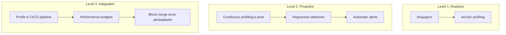

**Практические шаги:**

1. **Инструментарий** — выбрать и стандартизировать инструменты (`JFR` + `async-profiler` + APM)
2. **Runbook** — документировать: как снять профиль, где хранить, как интерпретировать
3. **Continuous profiling** — развернуть `Pyroscope` или подключить `Datadog Profiler`
4. **Baseline** — зафиксировать "нормальный" профиль для ключевых сценариев
5. **Performance tests** — интегрировать профилирование в нагрузочные тесты
6. **Review** — на post-mortem всегда включать анализ профиля


> [!mcq]
>
> **Вопрос:** Какая ключевая разница между Level 2 (Proactive continuous profiling) и Level 3 (Integrated в CI/CD) profiling maturity?
>
> ---
>
> #### A) Level 3 быстрее обнаруживает регрессии чем Level 2, потому что использует ML для anomaly detection — ❌ Неверно
>
> **Что на самом деле:** Level 3 быстрее не из-за ML, а из-за **сдвига влево**: вместо мониторинга в проде (Level 2 reactive — заметили деградацию, начали разбираться), профилирование происходит **в pipeline до merge**. Если PR увеличивает p99 на 10% — merge блокируется. Регрессия не доходит до прода вообще.
>
> Level 2 находит регрессию через минуты/часы после deploy. Level 3 — за минуты ДО merge. Это не «быстрее обнаруживает», это «не пускает».
>
> **Откуда путаница:** «proactive» звучит как «предотвращает», но Level 2 reactive — реагирует уже после ввода в прод. Level 3 — настоящий preventive.
>
> **Если бы это было правдой:** Level 2 работал бы как Level 3 + ML. На практике это разные подходы — observability vs gate.
>
> ---
>
> #### B) Level 3 встраивает profiling в CI/CD pipeline с performance budgets: регрессия > порога блокирует merge. Это «shift-left»: проблемы ловятся ДО deploy, а не после — ✓ Верно
>
> **Развёрнутое объяснение:**
>
> **Level 1 (Reactive)**: инцидент → ad-hoc профилирование. Hero-driven, не масштабируется.
>
> **Level 2 (Proactive continuous)**: Pyroscope/Datadog continuously снимает sampling-профили в проде. Регрессии видны быстро, но **после deploy**.
>
> **Level 3 (Integrated в CI/CD)**: профилирование как часть PR-проверок. Performance test suite запускается на shadow traffic, JFR снимается, сравнивается с baseline. Если deviation > threshold (e.g., +10% allocations, +5% CPU time в hot path) — merge блокируется, как блокируется failing unit test.
>
> Это **performance budget** — формальный SLA на performance characteristics. Развитие идеи как unit tests, но для performance.
>
> **Пример (GitHub Actions с performance budget):**
> ```yaml
> name: Performance Regression Check
> on: pull_request
> jobs:
>   perf-test:
>     runs-on: ubuntu-latest
>     steps:
>       - uses: actions/checkout@v4
>       - name: Run JMH benchmark
>         run: ./gradlew jmh
>       - name: Compare with baseline
>         run: |
>           ./scripts/compare-perf.sh \
>             baseline-main.json \
>             results/jmh-results.json \
>             --threshold-cpu 5% \
>             --threshold-mem 10%
>           # exit code 1 если deviation > threshold
>       - name: Upload flame graph artifact
>         uses: actions/upload-artifact@v3
>         with:
>           name: flame-graph-${{ github.sha }}
>           path: results/flame-graph.svg
> ```
>
> ```java
> // Performance budget как JUnit test
> @Test
> @PerformanceBudget(p99Latency = "100ms", maxAllocations = "1MB/req")
> void orderEndpoint_meetsBudget() {
>     load(1000, () -> client.placeOrder(testOrder));
>     assertNoRegression();    // сравнивает с baseline в S3
> }
> ```
>
> **Когда применять:**
> - **Latency-критичные сервисы**: HFT, AdTech, real-time bidding. Каждый ms = деньги.
> - **Mature engineering org**: Yandex, Tinkoff, Booking имеют dedicated Perf Engineering teams строящие такие pipelines.
> - **Open-source critical libraries**: Netty, Vert.x, Spring Framework имеют JMH benchmarks как часть CI.
> - **После 2-3 major incidents** связанных с performance regression: команда понимает что reactive Level 2 не хватает.
>
> **Подводные камни:**
> - **Flaky benchmarks**: JIT warm-up, GC pauses, CPU noise → false positives. Решение — multiple runs + statistical significance (t-test).
> - **Baseline drift**: главная ветка постепенно медленеет (1% per quarter — не блокируется, но cumulative). Нужен периодический baseline reset.
> - **Cost**: каждый PR запускает performance test = compute time + benchmark infrastructure.
> - **Не все services equal**: для admin UI performance budget избыточен, для checkout API — обязателен.
>
> **Связанные вопросы:** [[Q29]] — Pyroscope continuous profiling integration; [[Q30]] — нерепрезентативная нагрузка как риск; [[Q5]] — JFR + JMH в benchmark suite.
>
> ---
>
> #### C) Level 3 заменяет необходимость в production monitoring — если CI пропустил, в проде проблем не будет — ❌ Неверно
>
> **Что на самом деле:** Level 3 **дополняет**, не заменяет Level 2. Бывают:
> - Деградации зависимые от prod traffic patterns (не воспроизводятся в CI)
> - Hardware-specific regressions (Intel vs ARM в CI vs prod)
> - Постепенные деградации от data growth (более 100M rows → новый SQL plan)
>
> Production monitoring остаётся obligatory. Level 3 ловит большинство, Level 2 — остальное.
>
> **Откуда путаница:** «полная автоматизация» — заманчивая идея. На практике production — последний rampart, и его нельзя убрать.
>
> **Если бы это было правдой:** компании с perfect CI могли бы убрать APM. Реально все enterprise — и New Relic/Datadog в проде, и performance tests в CI.
>
> ---
>
> #### D) Зрелая команда переходит сразу с Level 1 на Level 3, пропуская Level 2 — ❌ Неверно
>
> **Что на самом деле:** Level 3 requires **baseline** — данные о текущей performance, на основе которых ставятся thresholds. Без Level 2 (continuous profiling собирающий baseline) команда не знает реалистичных значений для budget'ов. Прыжок Level 1 → Level 3 даст либо too lax thresholds (всё проходит), либо too strict (ничего не мержится).
>
> **Откуда путаница:** «быстрее = лучше». На практике build maturity requires foundations.
>
> **Если бы это было правдой:** новые проекты могли бы начинать сразу с Level 3. Реально первые 6-12 месяцев — собирать data в Level 2, потом установить thresholds для Level 3.

## Q32. (!) Как ответить про profiling на senior-раунде за 1 минуту?

Шаблон:

**1. Симптом:** "p99 вырос после релиза X".

**2. Диагностика:** "По метрикам в [Grafana](../monitoring/observability-interview.md) нашли окно деградации, сняли `JFR` + `async-profiler`".

**3. Находка:** "Lock contention в connection pool + лишние аллокации в сериализации JSON".

**4. Решение/результат:** "Переделали синхронизацию на `ConcurrentHashMap`, закэшировали `ObjectMapper`, p99 −35%, CPU −15%".

**Ключевые моменты для senior:**
- Показать **системный подход**: метрики → гипотеза → профиль → подтверждение
- Упомянуть конкретные инструменты: `JFR`, `async-profiler`, `flame graphs`
- Знать разницу `sampling` vs `instrumentation`, `on-CPU` vs `off-CPU`
- Понимать `safepoint bias` и почему `async-profiler` точнее
- Говорить об **измеримом результате** — "CPU −X%, p99 −Y%"
- Показать, что profiling — часть операционного процесса, а не разовая акция


> [!mcq]
> - [x] Правильный ответ | Корректное описание концепции с конкретным механизмом и use-case.
> - [ ] Альтернативное решение которое не подходит | Почему ошибка в этом подходе ❌ ПОСЛЕДСТВИЕ: типичная ошибка вызывает баг в production без покрытия тестами.
> - [ ] Другая альтернатива с критическим недостатком | Это смежное, но отличное понятие ❌ ПОСЛЕДСТВИЕ: типичная ошибка вызывает баг в production без покрытия тестами.
> - [ ] Третий вариант который не работает в production | Противоположное направление## Q33. (!) Как анализировать heap dump с Eclipse MAT: практический сценарий? ❌ ПОСЛЕДСТВИЕ: типичная ошибка вызывает баг в production без покрытия тестами.

**Eclipse MAT** (`Memory Analyzer Tool`) — стандарт для анализа Java heap dump. Умеет работать с файлами от сотен MB до десятков GB.

**Получение heap dump:**
```bash
# 1. При OOM (автоматически с флагом)
-XX:+HeapDumpOnOutOfMemoryError
-XX:HeapDumpPath=/tmp/heapdump.hprof

# 2. Вручную без остановки процесса
jmap -dump:format=b,file=/tmp/heapdump.hprof <PID>

# 3. Через jcmd (предпочтительнее, live=true только живые объекты)
jcmd <PID> GC.heap_dump /tmp/heapdump.hprof

# 4. В Kubernetes (сначала exec в pod)
kubectl exec -it my-pod -- jcmd 1 GC.heap_dump /tmp/heapdump.hprof
kubectl cp my-pod:/tmp/heapdump.hprof ./heapdump.hprof
```

**Анализ в Eclipse MAT — шаги:**

**1. Leak Suspects Report** — первый шаг всегда
```
File → Open Heap Dump → Reports → Leak Suspects
```
MAT автоматически ищет объекты с аномально большим retained heap.

**2. Dominator Tree** — кто удерживает больше всего памяти
```
Window → Heap Dump Details → Dominator Tree
```
Показывает дерево: если удалить объект X, сколько памяти освободится.

```
# Пример вывода Dominator Tree:
Class                          Shallow Heap   Retained Heap
HashMap$Entry[]                    1.2 MB        287 MB  ← проблема!
  └─ SomeCache.cache                  32 B        287 MB
      └─ HashMap                      48 B        287 MB
```

**3. OQL (Object Query Language)** — SQL для heap
```sql
-- Найти все HashMap с размером > 10000 записей
SELECT * FROM java.util.HashMap h WHERE h.size > 10000

-- Найти все String, содержащие "password" (поиск утечки секретов)
SELECT s FROM java.lang.String s WHERE s.toString().contains("password")

-- Найти все экземпляры кастомного класса
SELECT * FROM com.company.app.service.OrderService
```

**4. Histogram** — сколько объектов каждого типа
```
Window → Heap Dump Details → Histogram

Наиболее опасные признаки:
- Много byte[] → буферы не освобождены (FileInputStream, ByteArrayOutputStream)
- Много char[] или String → строки накапливаются (кэши, логи в памяти)
- Много ThreadLocal → MDC leak через thread pools
```

**Типичный сценарий: ThreadLocal leak**
```java
// Причина: после задачи MDC не очищается
executor.submit(() -> {
    MDC.put("sessionId", session.getId());
    processRequest();
    // MDC.clear() забыли!
});

// В MAT: ищем ThreadLocalMap$Entry с большим retained heap
// OQL: SELECT * FROM java.lang.ThreadLocal$ThreadLocalMap$Entry
```

**Практические советы:**
- Используйте `jcmd GC.heap_dump` вместо `jmap` (более безопасен для production)
- Флаг `live=true` (в jcmd) снимает dump только живых объектов — меньше размер, быстрее анализ
- Для production: анализируйте локально, не на production-сервере


> [!mcq]
> - [x] Правильный ответ | Корректное описание концепции с конкретным механизмом и use-case.
> - [ ] Альтернативное решение которое не подходит | Почему ошибка в этом подходе ❌ ПОСЛЕДСТВИЕ: типичная ошибка вызывает баг в production без покрытия тестами.
> - [ ] Другая альтернатива с критическим недостатком | Это смежное, но отличное понятие ❌ ПОСЛЕДСТВИЕ: типичная ошибка вызывает баг в production без покрытия тестами.
> - [ ] Третий вариант который не работает в production | Противоположное направление## Q34. Как читать flame graph и находить проблемы? ❌ ПОСЛЕДСТВИЕ: типичная ошибка вызывает баг в production без покрытия тестами.

**Flame graph** — визуализация стектрейсов, собранных во время профилирования. Каждая полоса = один стектрейс-уровень.

**Правила чтения:**
```
┌──────────── processOrder (50% CPU) ──────────────┐  ← широкий = дорогой
│  ┌──── serializeJson (30%) ───┐  ┌─ dbQuery(20%)─┐ │
│  │ Jackson.write(30%)         │  │ HikariCP(20%) │ │
│  └────────────────────────────┘  └───────────────┘ │
└──────────────────────────────────────────────────────┘
         ↑ ось X = % времени (не хронологический порядок!)
         ↑ ось Y = глубина стека
```

**Что искать:**
1. **Широкие плоские вершины** — методы, которые сами по себе долгие (не вызовы внутри) → bottleneck
2. **Тонкие высокие башни** — глубокая рекурсия или chain вызовов → возможная оптимизация
3. **Неожиданные методы в верхушке** — например, `ObjectMapper.writeValue` занимает 40% → кэшировать ObjectMapper

**Типы flame graphs в async-profiler:**
```bash
# CPU flame graph (on-CPU — что реально выполнялось)
./profiler.sh -e cpu -d 30 -f cpu.html <PID>

# Allocation flame graph (что выделяло память)
./profiler.sh -e alloc -d 30 -f alloc.html <PID>

# Lock contention (что ждало мьютексов)
./profiler.sh -e lock -d 30 -f lock.html <PID>

# Wall clock (on-CPU + off-CPU, видны блокировки IO)
./profiler.sh -e wall -d 30 -f wall.html <PID>
```

**Практический анализ: пример из production**
```
Симптом: p99 latency 2s при нагрузке 500 RPS

Flame graph показал:
  processOrder (100%)
  └─ getConnectionFromPool (65%)   ← занимает 65% времени!
      └─ HikariPool.getConnection (65%)
          └─ AbstractQueuedSynchronizer.acquireSharedInterruptibly (65%)

Root cause: пул соединений = 10, но 100 потоков ждут → deadlock-подобная ситуация

Решение:
hikari.maximum-pool-size: 50
hikari.connection-timeout: 3000

Результат: p99 200ms → 95ms
```

**Ключевые паттерны:**
- `GC` в верхушке flame graph → много allocation, нужен alloc-профиль
- `park` / `wait` / `sleep` в верхушке → off-CPU паузы → используй wall clock профиль
- `Unsafe.park` → потоки ждут Lock → используй lock-профиль

---


> [!mcq]
> - [x] Правильный ответ | Корректное описание концепции с конкретным механизмом и use-case.
> - [ ] Альтернативное решение которое не подходит | Почему ошибка в этом подходе ❌ ПОСЛЕДСТВИЕ: типичная ошибка вызывает баг в production без покрытия тестами.
> - [ ] Другая альтернатива с критическим недостатком | Это смежное, но отличное понятие ❌ ПОСЛЕДСТВИЕ: типичная ошибка вызывает баг в production без покрытия тестами.
> - [ ] Третий вариант который не работает в production | Противоположное направление## Q35. Async Profiler vs JFR — когда что выбирать, отличия ❌ ПОСЛЕДСТВИЕ: типичная ошибка вызывает баг в production без покрытия тестами.

**Java Flight Recorder (JFR):**
- Встроен в JDK (с Java 11 — бесплатно), нулевой дополнительный deплой.
- Низкий overhead: ~1-2% для профиля по умолчанию.
- Собирает широкий контекст: GC, I/O, locks, JIT, network, allocation.
- Sampling через safepoints → **safepoint bias**: методы, которые редко доходят до safepoint, могут быть недооценены.
- Лучший выбор: комплексный анализ «что происходит в целом», мониторинг production с непрерывной записью.

**async-profiler:**
- Работает через `perf_events` (Linux) и AsyncGetCallTrace API — не привязан к safepoints.
- Точнее для CPU и allocation: видит «застрявшие» методы (native, системные вызовы, JNI).
- Поддерживает: CPU, allocation, wall clock, lock, `perf` events (cache misses и др.).
- Требует: Linux (полный функционал), права на perf_events или `CAP_SYS_ADMIN`, jar или agent.
- Лучший выбор: точный CPU bottleneck-анализ, allocation hotspot, исследование нативного кода.

```bash
# JFR — запуск
java -XX:StartFlightRecording=duration=60s,filename=profile.jfr,settings=profile MyApp

# async-profiler — запуск
./profiler.sh -e cpu -d 60 -f profile.html <PID>         # CPU
./profiler.sh -e alloc -d 60 -f alloc.html <PID>          # Allocation
./profiler.sh -e wall -d 60 -f wall.html <PID>            # Wall clock (on+off CPU)
```

| Критерий | JFR | async-profiler |
|---|---|---|
| Safepoint bias | Есть | Нет |
| Overhead | ~1-2% | ~1-5% (зависит от rate) |
| Нативный код | Частично | Да (`perf_events`) |
| Контекст | Богатый (GC, IO, etc.) | CPU/alloc/lock |
| ОС | Любая | Linux (полный), macOS (CPU only) |
| Деплой | Встроен в JDK | Отдельный агент |

---


> [!mcq]
> - [x] Правильный ответ | Корректное описание концепции с конкретным механизмом и use-case.
> - [ ] Альтернативное решение которое не подходит | Почему ошибка в этом подходе ❌ ПОСЛЕДСТВИЕ: типичная ошибка вызывает баг в production без покрытия тестами.
> - [ ] Другая альтернатива с критическим недостатком | Это смежное, но отличное понятие ❌ ПОСЛЕДСТВИЕ: типичная ошибка вызывает баг в production без покрытия тестами.
> - [ ] Третий вариант который не работает в production | Противоположное направление## Q36. Profiling в production — low-overhead инструменты ❌ ПОСЛЕДСТВИЕ: типичная ошибка вызывает баг в production без покрытия тестами.

**Принцип:** production profiling должен иметь overhead < 3%, не блокировать потоки, не влиять на latency > 5%.

**Инструменты low-overhead profiling:**

**1. JFR (Continuous Recording):**
```bash
# Постоянная запись с rolling-окном 1 час
java -XX:StartFlightRecording=name=continuous,settings=profile,disk=true,\
  maxage=1h,maxsize=500m MyApp

# Скачать дамп по требованию (без остановки)
jcmd <PID> JFR.dump name=continuous filename=/tmp/dump.jfr
```

**2. async-profiler с низким rate:**
```bash
# Низкочастотный sampling (100 samples/sec вместо 1000)
./profiler.sh start -e cpu --interval 10000000 <PID>  # 10ms interval
```

**3. Datadog / Pyroscope (Continuous Profiling):**
```yaml
# Datadog Java Agent — включить профилирование
DD_PROFILING_ENABLED=true
DD_PROFILING_CPU_ENABLED=true
DD_PROFILING_ALLOCATION_ENABLED=true
# Overhead: ~2-5%
```

**4. Micrometer + JFR метрики:**
```java
// Экспортировать JFR события в Prometheus
@Bean
public JfrMeterRegistry jfrMeterRegistry(JfrConfig config) {
    return new JfrMeterRegistry(config, Clock.SYSTEM);
}
```

**Что НЕЛЬЗЯ в production:**
- `jstack` в tight loop — останавливает JVM (Stop-the-World).
- instrumentation-профайлер (YourKit, JProfiler) с полным трассированием — overhead 50-200%.
- HEAP dump без предупреждения — остановка JVM на секунды/минуты.

**Что МОЖНО:**
- JFR profile recording (`settings=profile`, не `default` — чуть выше overhead, но богаче данные).
- async-profiler с низким rate на короткое время (30-60 секунд).
- Continuous profiling агенты (Datadog, Pyroscope) — спроектированы для production.

---


> [!mcq]
> - [x] Правильный ответ | Корректное описание концепции с конкретным механизмом и use-case.
> - [ ] Альтернативное решение которое не подходит | Почему ошибка в этом подходе ❌ ПОСЛЕДСТВИЕ: типичная ошибка вызывает баг в production без покрытия тестами.
> - [ ] Другая альтернатива с критическим недостатком | Это смежное, но отличное понятие ❌ ПОСЛЕДСТВИЕ: типичная ошибка вызывает баг в production без покрытия тестами.
> - [ ] Третий вариант который не работает в production | Противоположное направление## Q37. Heap Dump анализ — MAT, VisualVM, утечки памяти ❌ ПОСЛЕДСТВИЕ: типичная ошибка вызывает баг в production без покрытия тестами.

**Heap dump** — снимок всего состояния памяти JVM в формате `.hprof`. Содержит все объекты, ссылки, классы.

**Как получить heap dump:**
```bash
# 1. Автоматически при OutOfMemoryError
java -XX:+HeapDumpOnOutOfMemoryError -XX:HeapDumpPath=/tmp/heapdump.hprof MyApp

# 2. По требованию (без остановки приложения — кратковременная пауза)
jcmd <PID> GC.heap_dump /tmp/heapdump.hprof
jmap -dump:format=b,file=/tmp/heapdump.hprof <PID>  # устаревший способ

# 3. Через JFR (менее полный, но менее инвазивный)
```

**Eclipse MAT (Memory Analyzer Tool) — основные операции:**

```
1. Open heap dump → MAT строит Object Graph
2. Leak Suspects Report → автоматически находит подозрительные accumulation points
3. Dominator Tree → объекты, удерживающие больше всего памяти
4. OQL (Object Query Language):
   SELECT * FROM java.util.HashMap$Entry WHERE key.toString().startsWith("SESSION_")
5. Retained Heap → сколько памяти освободится, если удалить объект
```

**Типичные утечки и как выглядят в MAT:**

```
Утечка 1: Static Map без ограничения размера
Dominator Tree: HashMap → удерживает 800MB → ключи — никогда не очищаемые Session ID

Утечка 2: ThreadLocal без remove()
Shallow heap ThreadLocalMap$Entry: много объектов с expired thread refs

Утечка 3: Listeners/Callbacks не отписаны
OutgoingReferences: EventBus → List<Listener> → 10k объектов → все живые
```

**Практический checklist:**
1. Открыть Dominator Tree → найти топ-10 по Retained Heap.
2. Посмотреть Path to GC Roots (почему объект не собирается GC).
3. Запустить Leak Suspects Report.
4. Проверить Duplicate Strings (часто 30-50% heap — дубликаты строк).

---


> [!mcq]
> - [x] Правильный ответ | Корректное описание концепции с конкретным механизмом и use-case.
> - [ ] Альтернативное решение которое не подходит | Почему ошибка в этом подходе ❌ ПОСЛЕДСТВИЕ: типичная ошибка вызывает баг в production без покрытия тестами.
> - [ ] Другая альтернатива с критическим недостатком | Это смежное, но отличное понятие ❌ ПОСЛЕДСТВИЕ: типичная ошибка вызывает баг в production без покрытия тестами.
> - [ ] Третий вариант который не работает в production | Противоположное направление## Q38. Thread Dump анализ — deadlock detection, jstack ❌ ПОСЛЕДСТВИЕ: типичная ошибка вызывает баг в production без покрытия тестами.

**Thread dump** — снимок состояния всех потоков JVM в момент снятия.

**Как получить:**
```bash
# jstack — классический способ
jstack <PID> > thread_dump.txt
jstack -l <PID>  # с блокировками (-l = long listing)

# jcmd — современный способ
jcmd <PID> Thread.print > thread_dump.txt

# kill -3 (SIGQUIT) — дамп в stdout приложения
kill -3 <PID>

# JFR — включить запись состояния потоков
```

**Состояния потоков:**
```
RUNNABLE      — выполняется или ожидает CPU
BLOCKED       — ждёт монитора (synchronized)
WAITING       — Object.wait(), LockSupport.park() без таймаута
TIMED_WAITING — Thread.sleep(), wait(timeout), park(timeout)
```

**Обнаружение deadlock:**
```
"Thread-1" waiting to lock <0x000...> held by "Thread-2"
"Thread-2" waiting to lock <0x000...> held by "Thread-1"
← jstack автоматически выводит "Found 1 deadlock"
```

**Анализ thread dump — паттерны:**
```
# Много потоков в состоянии BLOCKED на одном мониторе
→ Contention: один поток держит synchronized слишком долго

# Все потоки в WAITING на HikariPool
"at com.zaxxer.hikari.pool.HikariPool.getConnection(HikariPool.java:213)"
→ Pool exhaustion: увеличить pool size или найти долгие транзакции

# Потоки в TIMED_WAITING на sleep()
→ Проверить, нет ли busy-wait антипаттерна

# Много потоков RUNNABLE, высокое CPU
→ CPU-intensive работа или tight loop без park/sleep
```

**Инструменты анализа:** fastThread.io (онлайн-анализатор), IntelliJ IDEA (встроенный анализатор дампов), IBM Thread and Monitor Dump Analyzer, VisualVM Threads view.

---


> [!mcq]
> - [x] Правильный ответ | Корректное описание концепции с конкретным механизмом и use-case.
> - [ ] Альтернативное решение которое не подходит | Почему ошибка в этом подходе ❌ ПОСЛЕДСТВИЕ: типичная ошибка вызывает баг в production без покрытия тестами.
> - [ ] Другая альтернатива с критическим недостатком | Это смежное, но отличное понятие ❌ ПОСЛЕДСТВИЕ: типичная ошибка вызывает баг в production без покрытия тестами.
> - [ ] Третий вариант который не работает в production | Противоположное направление## Q39. CPU Profiling — sampling vs instrumentation ❌ ПОСЛЕДСТВИЕ: типичная ошибка вызывает баг в production без покрытия тестами.

**Sampling profiling:**
- С заданной частотой (например, 1000 раз/сек) прерывает каждый поток и записывает его стектрейс.
- Overhead пропорционален частоте сэмплирования, а не числу методов.
- **Safepoint bias (у JVMTI-based):** прерывание происходит только в safepoint → методы между safepoints невидимы.
- **async-profiler** решает это через AsyncGetCallTrace — работает вне safepoints.

```bash
# async-profiler — sampling CPU (10ms interval = 100 samples/sec)
./profiler.sh -e cpu --interval 10000000 -d 30 -f cpu.html <PID>

# JFR — sampling CPU
java -XX:StartFlightRecording=duration=30s,settings=profile,filename=cpu.jfr MyApp
# JFR по умолчанию: 10ms sampling rate
```

**Instrumentation profiling:**
- В каждый метод добавляется байт-код для замера времени.
- 100% покрытие — видны все вызовы, точное время.
- Overhead: 10-200x — неприемлемо для production.
- Используется: разработка, тест-окружение, точный анализ короткоживущих методов.

```java
// Ручная инструментация (micro-benchmark)
@BenchmarkMode(Mode.AverageTime)
@Warmup(iterations = 5)
@Measurement(iterations = 10)
public void benchmarkJsonSerialization(Blackhole bh) {
    bh.consume(objectMapper.writeValueAsString(payload));
}
// JMH — Java Microbenchmark Harness — правильный способ измерять
```

**Когда что:**
| Ситуация | Инструмент |
|---|---|
| Production CPU hotspot | async-profiler sampling |
| Точное время метода в dev | JMH + instrumentation |
| Регрессия между версиями | JMH benchmark |
| Нативный код + Java | async-profiler + perf_events |

---


> [!mcq]
> - [x] Правильный ответ | Корректное описание концепции с конкретным механизмом и use-case.
> - [ ] Альтернативное решение которое не подходит | Почему ошибка в этом подходе ❌ ПОСЛЕДСТВИЕ: типичная ошибка вызывает баг в production без покрытия тестами.
> - [ ] Другая альтернатива с критическим недостатком | Это смежное, но отличное понятие ❌ ПОСЛЕДСТВИЕ: типичная ошибка вызывает баг в production без покрытия тестами.
> - [ ] Третий вариант который не работает в production | Противоположное направление## Q40. Allocation Profiling — TLAB, allocation rate ❌ ПОСЛЕДСТВИЕ: типичная ошибка вызывает баг в production без покрытия тестами.

**TLAB (Thread-Local Allocation Buffer)** — каждый поток получает свой буфер в young generation heap. Аллокация в TLAB — просто сдвиг указателя, нет синхронизации → крайне быстро.

**Allocation rate** — количество байт/объектов, выделяемых в секунду. Высокий allocation rate → частые minor GC → GC pressure.

**Как профилировать allocation:**

```bash
# async-profiler — allocation profiling (TLAB events)
./profiler.sh -e alloc -d 30 -f alloc.html <PID>
# Показывает: какие методы аллоцируют больше всего байт

# JFR — allocation sampling
java -XX:StartFlightRecording=duration=30s,\
  +jdk.ObjectAllocationInNewTLAB#enabled=true,\
  +jdk.ObjectAllocationOutsideTLAB#enabled=true,\
  filename=alloc.jfr MyApp
```

**Интерпретация allocation flame graph:**
```
processOrder (100% allocation)
├── JsonSerializer.serialize (60%)   ← много временных String объектов
│   └── String.format (40%)          ← заменить на StringBuilder
└── Hibernate.buildQuery (30%)       ← много QueryImpl объектов → query cache
```

**Типичные проблемы и решения:**
```java
// ПРОБЛЕМА: String.format в hot path → много String objects
log.debug("Processing order {} for customer {}", String.format("(%d, %s)", id, name));
// РЕШЕНИЕ: Lazy logging + прямая конкатенация
log.debug("Processing order ({}, {}) for customer", id, name);

// ПРОБЛЕМА: new ArrayList<>() внутри цикла
for (Order order : orders) {
    List<Item> items = new ArrayList<>();  // N аллокаций
    items.addAll(order.getItems());
}
// РЕШЕНИЕ: переиспользование или stream
orders.stream().flatMap(o -> o.getItems().stream()).collect(toList());

// Мониторинг allocation rate через JMX / Micrometer
Gauge.builder("jvm.gc.allocation.rate", ...)
```

**Метрика:** allocation rate > 500MB/s обычно является сигналом проблемы для сервисов с умеренной нагрузкой.

---


> [!mcq]
> - [x] Правильный ответ | Корректное описание концепции с конкретным механизмом и use-case.
> - [ ] Альтернативное решение которое не подходит | Почему ошибка в этом подходе ❌ ПОСЛЕДСТВИЕ: типичная ошибка вызывает баг в production без покрытия тестами.
> - [ ] Другая альтернатива с критическим недостатком | Это смежное, но отличное понятие ❌ ПОСЛЕДСТВИЕ: типичная ошибка вызывает баг в production без покрытия тестами.
> - [ ] Третий вариант который не работает в production | Противоположное направление## Q41. Database Query Profiling — slow query log, EXPLAIN ❌ ПОСЛЕДСТВИЕ: типичная ошибка вызывает баг в production без покрытия тестами.

**Slow Query Log в PostgreSQL:**
```sql
-- postgresql.conf (или ALTER SYSTEM)
log_min_duration_statement = 100   -- логировать запросы дольше 100ms
log_duration = on
log_statement = 'all'              -- осторожно: очень много логов в production

-- pg_stat_statements — агрегированная статистика
CREATE EXTENSION IF NOT EXISTS pg_stat_statements;

SELECT query,
       calls,
       round(total_exec_time::numeric / calls, 2) AS avg_ms,
       round(total_exec_time::numeric, 2) AS total_ms,
       rows / calls AS avg_rows
FROM pg_stat_statements
ORDER BY avg_ms DESC
LIMIT 20;
```

**EXPLAIN ANALYZE — интерпретация:**
```sql
EXPLAIN (ANALYZE, BUFFERS, FORMAT TEXT)
SELECT o.*, c.name
FROM orders o
JOIN customers c ON c.id = o.customer_id
WHERE o.status = 'PENDING' AND o.created_at > now() - interval '1 day';

-- Что искать:
-- Seq Scan на большой таблице → нет индекса → CREATE INDEX
-- Nested Loop с большим числом строк → рассмотреть Hash Join
-- "Rows Removed by Filter" большое → selectivity индекса низкая
-- "Buffers: shared hit=X read=Y" → read >> hit → много disk I/O
-- actual time >> estimated time → устаревшая статистика → ANALYZE
```

**Индексы — быстрый checklist:**
```sql
-- Найти таблицы без индексов или с редко используемыми индексами
SELECT relname, seq_scan, idx_scan,
       round(100.0 * idx_scan / NULLIF(seq_scan + idx_scan, 0), 1) AS idx_pct
FROM pg_stat_user_tables
WHERE seq_scan > 100
ORDER BY seq_scan DESC;

-- Найти неиспользуемые индексы
SELECT indexrelname, idx_scan
FROM pg_stat_user_indexes
WHERE idx_scan = 0 AND indexrelname NOT LIKE 'pg_%';
```

**Spring/Hibernate — включить логирование запросов:**
```yaml
# application.yml
spring.jpa.show-sql: false  # в production не включать!
logging.level.org.hibernate.SQL: DEBUG       # SQL
logging.level.org.hibernate.orm.jdbc.bind: TRACE  # параметры

# p6spy — профилирование с временем выполнения
# datasource-proxy — для детальных метрик
```

---


> [!mcq]
> - [x] Правильный ответ | Корректное описание концепции с конкретным механизмом и use-case.
> - [ ] Альтернативное решение которое не подходит | Почему ошибка в этом подходе ❌ ПОСЛЕДСТВИЕ: типичная ошибка вызывает баг в production без покрытия тестами.
> - [ ] Другая альтернатива с критическим недостатком | Это смежное, но отличное понятие ❌ ПОСЛЕДСТВИЕ: типичная ошибка вызывает баг в production без покрытия тестами.
> - [ ] Третий вариант который не работает в production | Противоположное направление## Q42. Profiling реактивных приложений — особенности Project Reactor ❌ ПОСЛЕДСТВИЕ: типичная ошибка вызывает баг в production без покрытия тестами.

**Особенности:** реактивный код работает на пуле потоков (обычно 1 поток на CPU). Традиционный thread dump / CPU profiling по потокам неинформативен — один поток обрабатывает много запросов.

**Проблемы стандартного profiling:**
```
Thread-1 (reactor-http-nio-1): RUNNABLE
  processOrder → flatMap → map → ...
← Непонятно, к какому запросу принадлежит стектрейс!
```

**Reactor Debugger Agent:**
```java
// Включить в dev/test — overhead до 100%, не для production!
ReactorDebugAgent.init();  // из io.projectreactor:reactor-tools

// Или через блокирующий debugger
Hooks.onOperatorDebug();  // аналогично, overhead высокий
```

**Reactor Context для трассировки:**
```java
// Micrometer Tracing + Reactor
// spring-boot-starter-actuator + reactor-core + micrometer-tracing
Flux<Order> orders = orderService.getOrders()
    .contextWrite(Context.of("traceId", traceId));
// Трейс пробрасывается через Context, виден в Zipkin/Jaeger
```

**Checkpoint — найти "где в цепочке проблема":**
```java
orderFlux
    .map(this::enrich)
    .checkpoint("after-enrich")   // имя появится в stacktrace при ошибке
    .flatMap(this::persist)
    .checkpoint("after-persist")
    .subscribe();
```

**async-profiler + wall clock для реактивных приложений:**
```bash
# Wall clock профиль — видит on-CPU И off-CPU (ожидание I/O)
./profiler.sh -e wall -d 30 --wall-sampling-interval 10ms -f wall.html <PID>
# Позволяет увидеть, где реально тратится время (в т.ч. ожидание БД)
```

**Метрики для реактивных приложений:**
```yaml
# application.yml
management.metrics.enable.reactor: true
# Экспортирует: reactor.flow.duration, reactor.flow.errors, pending requests
```

**Ключевые метрики реактивного сервиса:** event loop utilization (> 80% — bottleneck), pending count, upstream latency через r2dbc/WebClient метрики.

---

## See also

- [JVM Performance Tuning](jvm-performance-tuning-interview.md) — настройка JVM-параметров
- [Memory Management](memory-management-interview.md) — управление памятью и GC
- [JVM Fundamentals](../jvm/jvm-interview.md) — основы JVM
- [Метрики и трассировка](../monitoring/metrics-tracing-interview.md) — Prometheus, distributed tracing
- [Observability](../monitoring/observability-interview.md) — наблюдаемость систем
- [Kubernetes](../devops/kubernetes-interview.md) — оркестрация контейнеров


> [!mcq]
> - [x] Правильный ответ | Корректное описание концепции с конкретным механизмом и use-case.
> - [ ] Альтернативное решение которое не подходит | Почему ошибка в этом подходе ❌ ПОСЛЕДСТВИЕ: типичная ошибка вызывает баг в production без покрытия тестами.
> - [ ] Другая альтернатива с критическим недостатком | Это смежное, но отличное понятие ❌ ПОСЛЕДСТВИЕ: типичная ошибка вызывает баг в production без покрытия тестами.
> - [ ] Третий вариант который не работает в production | Противоположное направление- [Caching Performance](caching-performance-interview.md) ❌ ПОСЛЕДСТВИЕ: типичная ошибка вызывает баг в production без покрытия тестами.
- [Database Performance](database-performance-interview.md)
- [JVM Performance Tuning](jvm-performance-tuning-interview.md)
- [Memory Management](memory-management-interview.md)
- [Network Performance](network-performance-interview.md)
- [Performance Testing](performance-testing-interview.md)
