# Вопросы на собеседовании: `JVM Performance Tuning`

Практичные вопросы и ответы по тюнингу `JVM`: как измерять, диагностировать и улучшать производительность без регрессий в production. Покрыты `GC`-алгоритмы, `JIT`-компиляция, native memory, контейнерные среды и продвинутые техники оптимизации.

## Полезные ссылки

### Официальная документация

- [Java GC Tuning Guide (JDK 21)](https://docs.oracle.com/en/java/javase/21/gctuning/) — актуальное руководство по настройке GC
- [JVM Diagnostic Tools](https://docs.oracle.com/en/java/javase/21/troubleshoot/diagnostic-tools.html) — инструменты диагностики
- [JFR / JMC](https://docs.oracle.com/en/java/javase/21/jfapi/) — Java Flight Recorder API
- [JEP 376: ZGC Concurrent Thread-Stack Processing](https://openjdk.org/jeps/376) — финализация ZGC
- [JEP 379: Shenandoah Production-Ready](https://openjdk.org/jeps/379) — Shenandoah в production
- [Baeldung — JVM Parameters](https://www.baeldung.com/jvm-parameters) — обзор ключевых JVM-флагов
- [Baeldung — JVM Garbage Collectors](https://www.baeldung.com/jvm-garbage-collectors) — сравнение сборщиков мусора
- [An Introduction to ZGC](https://www.baeldung.com/jvm-zgc-garbage-collector) — ZGC: low-latency сборщик мусора
- [Choosing a GC Algorithm in Java](https://www.baeldung.com/java-choosing-gc-algorithm) — как выбрать GC для продакшена
- [Generational ZGC in Java](https://www.baeldung.com/java-21-generational-z-garbage-collector) — Generational ZGC в Java 21

## Содержание

- [Полезные ссылки](#полезные-ссылки)
- [See also](#see-also)

**Подход к тюнингу**
- [Q1. (!) С чего начинать JVM tuning, чтобы не делать "магии флагов"?](#q1--с-чего-начинать-jvm-tuning-чтобы-не-делать-магии-флагов)
- [Q2. Какие метрики обязательно мониторить перед изменениями?](#q2-какие-метрики-обязательно-мониторить-перед-изменениями)
- [Q3. Как корректно проверять эффект тюнинга?](#q3-как-корректно-проверять-эффект-тюнинга)

**GC-алгоритмы: обзор и выбор**
- [Q4. (!) Какие сборщики мусора доступны в современной JVM и чем они отличаются?](#q4--какие-сборщики-мусора-доступны-в-современной-jvm-и-чем-они-отличаются)
- [Q5. (!) Как устроен G1 GC и какие у него фазы?](#q5--как-устроен-g1-gc-и-какие-у-него-фазы)
- [Q6. (!) Как работает ZGC и почему у него паузы менее 1 мс?](#q6--как-работает-zgc-и-почему-у-него-паузы-менее-1-мс)
- [Q7. Как работает Shenandoah GC и чем он отличается от ZGC?](#q7-как-работает-shenandoah-gc-и-чем-он-отличается-от-zgc)
- [Q8. Как выбирать GC под разные SLA?](#q8-как-выбирать-gc-под-разные-sla)
- [Q9. Когда имеет смысл переходить с G1 на ZGC/Shenandoah?](#q9-когда-имеет-смысл-переходить-с-g1-на-zgcshenandoah)

**GC-диагностика и тюнинг**
- [Q10. (!) Какие ключевые JVM-флаги управляют G1 GC?](#q10--какие-ключевые-jvm-флаги-управляют-g1-gc)
- [Q11. Какие сигналы в GC-логах говорят о реальной проблеме?](#q11-какие-сигналы-в-gc-логах-говорят-о-реальной-проблеме)
- [Q12. Как включить и анализировать GC-логи?](#q12-как-включить-и-анализировать-gc-логи)
- [Q13. Как объяснить влияние allocation/promotion на latency?](#q13-как-объяснить-влияние-allocationpromotion-на-latency)
- [Q14. Что такое Humongous Allocations в G1 и как с ними бороться?](#q14-что-такое-humongous-allocations-в-g1-и-как-с-ними-бороться)

**Память: heap и beyond**
- [Q15. (!) Из каких областей состоит память JVM-процесса?](#q15--из-каких-областей-состоит-память-jvm-процесса)
- [Q16. Что такое Native Memory и как его отслеживать?](#q16-что-такое-native-memory-и-как-его-отслеживать)
- [Q17. (!) Как правильно рассчитать размер heap и off-heap?](#q17--как-правильно-рассчитать-размер-heap-и-off-heap)
- [Q18. Что такое String Deduplication и когда она полезна?](#q18-что-такое-string-deduplication-и-когда-она-полезна)
- [Q19. Как настроить Metaspace и зачем?](#q19-как-настроить-metaspace-и-зачем)

**JIT-компиляция**
- [Q20. (!) Как работает JIT-компилятор и Tiered Compilation?](#q20--как-работает-jit-компилятор-и-tiered-compilation)
- [Q21. Как JIT и warm-up влияют на производительность в проде?](#q21-как-jit-и-warm-up-влияют-на-производительность-в-проде)
- [Q22. (!) Что такое Escape Analysis и какие оптимизации она включает?](#q22--что-такое-escape-analysis-и-какие-оптимизации-она-включает)
- [Q23. Как посмотреть, какие методы JIT скомпилировал, и диагностировать деоптимизации?](#q23-как-посмотреть-какие-методы-jit-скомпилировал-и-диагностировать-деоптимизации)
- [Q24. Что такое On-Stack Replacement (OSR) и Inlining?](#q24-что-такое-on-stack-replacement-osr-и-inlining)

**CPU и профилирование**
- [Q25. Как искать CPU bottleneck в JVM-приложении?](#q25-как-искать-cpu-bottleneck-в-jvm-приложении)
- [Q26. Что такое safepoint bias и почему профили могут врать?](#q26-что-такое-safepoint-bias-и-почему-профили-могут-врать)

**Class Loading**
- [Q27. Как устроен Class Loading в JVM и какие проблемы он вызывает?](#q27-как-устроен-class-loading-в-jvm-и-какие-проблемы-он-вызывает)
- [Q28. Что такое Metaspace leak и как его диагностировать?](#q28-что-такое-metaspace-leak-и-как-его-диагностировать)

**Контейнеры и облако**
- [Q29. (!) Как правильно настроить JVM в Kubernetes/Docker?](#q29--как-правильно-настроить-jvm-в-kubernetesdocker)
- [Q30. Какие ошибки в контейнерном tuning встречаются чаще всего?](#q30-какие-ошибки-в-контейнерном-tuning-встречаются-чаще-всего)
- [Q31. Как JVM определяет ресурсы в контейнере (Container-Aware JVM)?](#q31-как-jvm-определяет-ресурсы-в-контейнере-container-aware-jvm)
- [Q32. Как оптимизировать startup time JVM в контейнерах?](#q32-как-оптимизировать-startup-time-jvm-в-контейнерах)

**Продвинутые техники**
- [Q33. Какие JVM-флаги обязательны для production?](#q33-какие-jvm-флаги-обязательны-для-production)
- [Q34. Что такое CDS/AppCDS и как это ускоряет запуск?](#q34-что-такое-cdsappcds-и-как-это-ускоряет-запуск)
- [Q35. Как работают Compressed Oops и Compressed Class Pointers?](#q35-как-работают-compressed-oops-и-compressed-class-pointers)
- [Q36. Что такое NUMA-aware GC и когда это важно?](#q36-что-такое-numa-aware-gc-и-когда-это-важно)

**Senior-подача**
- [Q37. Какие anti-patterns JVM tuning звучат слабо на интервью?](#q37-какие-anti-patterns-jvm-tuning-звучат-слабо-на-интервью)
- [Q38. Как дать сильный ответ по JVM tuning за 60 секунд?](#q38-как-дать-сильный-ответ-по-jvm-tuning-за-60-секунд)

---

## Q1. (!) С чего начинать JVM tuning, чтобы не делать "магии флагов"?

Начинать нужно с **baseline** — без него любой тюнинг превращается в гадание:

1. **Зафиксировать текущие SLI/SLO** — `latency` (p50/p95/p99), `error rate`, `throughput`
2. **Описать профиль нагрузки** — пиковый RPS, среднее количество concurrent users
3. **Задокументировать окружение** — версия `JDK`, контейнерные лимиты, текущие JVM-флаги
4. **Собрать GC-логи и JFR-записи** хотя бы за сутки под реальной нагрузкой

```bash
# Минимальный набор флагов для сбора baseline
java -Xlog:gc*:file=gc.log:time,uptime,level,tags:filecount=5,filesize=100m \
     -XX:StartFlightRecording=filename=baseline.jfr,duration=60m,settings=profile \
     -jar app.jar
```

> На интервью подчёркивайте: тюнинг — это **инженерный процесс** с гипотезой, измерением и верификацией, а не "поигрались с флагами и стало лучше".

## Q2. Какие метрики обязательно мониторить перед изменениями?

Минимальный набор метрик для JVM-тюнинга:

| Категория | Метрики | Источник |
|-----------|---------|----------|
| Latency | p50, p95, p99 response time | Prometheus / Micrometer |
| Throughput | RPS, transactions/sec | Application metrics |
| CPU | utilization, load average, system vs user | `cAdvisor` / node exporter |
| Heap | used, committed, max | `jvm_memory_bytes_used` |
| GC | pause duration p95/p99, frequency, overhead % | `jvm_gc_pause_seconds` |
| Allocation | allocation rate (MB/s), promotion rate | GC logs / JFR |
| Threads | thread count, blocked threads | `jvm_threads_current` |

Полезно держать бизнес-метрику рядом (конверсия, ошибки заказов), чтобы видеть реальный пользовательский impact.

## Q3. Как корректно проверять эффект тюнинга?

Правило: меняем **один** параметр за итерацию и прогоняем одинаковый нагрузочный профиль.

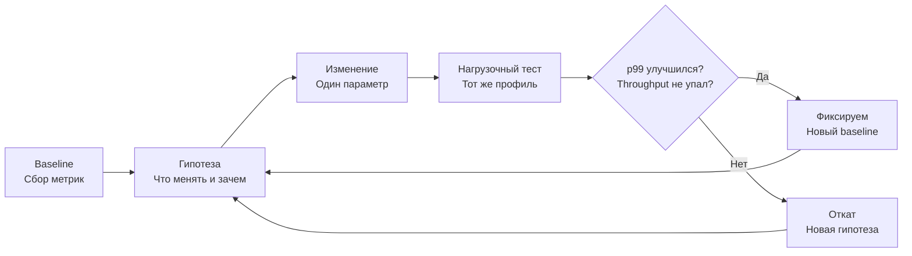

Сравнение должно включать не только средние значения, но и **хвосты** (`p99`, `p999`), а также стабильность во времени. Лучший формат: **A/B по двум одинаковым инстансам** под одинаковой нагрузкой.

## Q4. (!) Какие сборщики мусора доступны в современной JVM и чем они отличаются?

В `JDK 21+` доступны следующие production-ready сборщики:

| Сборщик | Тип | Max пауза | Heap | Подходит для |
|---------|-----|-----------|------|--------------|
| `Serial` | STW | секунды | малый | embedded, single-core |
| `Parallel` (Throughput) | STW | сотни ms | средний | batch, offline задачи |
| `G1` (default) | concurrent + STW | десятки ms | средний-большой | универсальный backend |
| `ZGC` | concurrent | < 1 ms | большой | low-latency, большие heap |
| `Shenandoah` | concurrent | < 10 ms | средний-большой | low-latency (OpenJDK) |

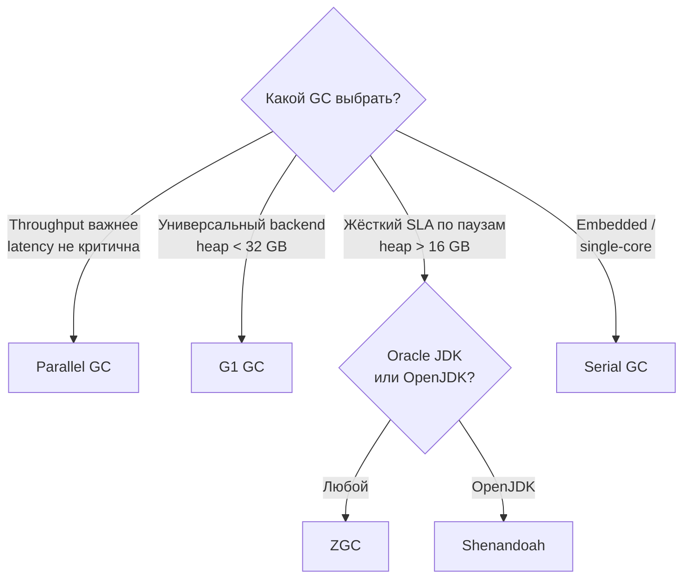

Ключевое отличие: `Serial` и `Parallel` останавливают все потоки для всех фаз, `G1` делает concurrent marking но STW-компактизацию, а `ZGC` и `Shenandoah` выполняют почти всю работу concurrent.

## Q5. (!) Как устроен G1 GC и какие у него фазы?

`G1` (`Garbage-First`) делит heap на **регионы** одинакового размера (обычно 1-32 МБ) и собирает в первую очередь те регионы, где больше всего мусора (отсюда название):

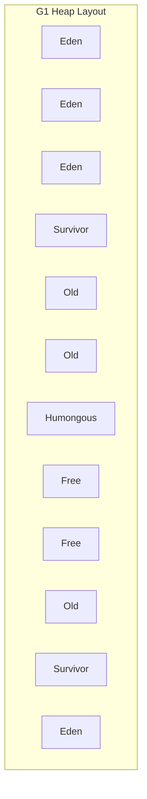

**Фазы работы G1:**

1. **Young GC (STW)** — эвакуация живых объектов из `Eden` и `Survivor` регионов. Самая частая операция.
2. **Concurrent Marking** — определение живых объектов во всём heap параллельно с приложением:
   - Initial Mark (STW, piggyback на Young GC)
   - Concurrent Mark
   - Remark (STW)
   - Cleanup (частично STW)
3. **Mixed GC (STW)** — эвакуация Young + часть Old регионов с наибольшим количеством мусора
4. **Full GC (STW)** — fallback, когда G1 не успевает. **Этого нужно избегать** — это сигнал о проблеме

```java
// Ключевые флаги G1
// -XX:+UseG1GC                        (default в JDK 9+)
// -XX:MaxGCPauseMillis=200            (target pause, default 200ms)
// -XX:G1HeapRegionSize=16m            (размер региона, степень 2)
// -XX:InitiatingHeapOccupancyPercent=45  (порог запуска marking)
```

## Q6. (!) Как работает ZGC и почему у него паузы менее 1 мс?

`ZGC` — сборщик мусора с **sub-millisecond** паузами, не зависящими от размера heap. Это достигается за счёт:

1. **Colored pointers** — ZGC использует биты в указателях объектов для хранения метаинформации о состоянии объекта (marked, remapped, finalizable). Это позволяет обновлять ссылки без STW.

2. **Load barriers** — при каждом чтении ссылки JIT вставляет проверку (barrier). Если объект перемещён, barrier прозрачно обновляет ссылку.

3. **Concurrent relocation** — объекты перемещаются параллельно с работой приложения через forwarding tables.

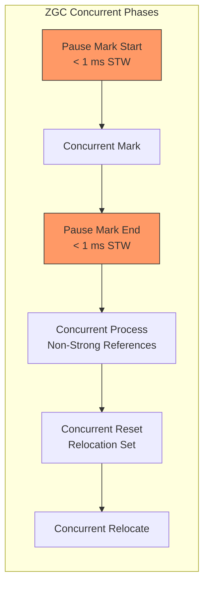

**Характеристики ZGC (JDK 21+):**
- Паузы: < 1 мс (не растут с размером heap)
- Heap: от МБ до **16 ТБ**
- CPU overhead: 10-15% на barriers
- Generational ZGC (`-XX:+UseZGC -XX:+ZGenerational`) — с JDK 21 (default в JDK 23+)

```bash
# Включение ZGC
java -XX:+UseZGC -XX:+ZGenerational \
     -Xmx8g -Xms8g \
     -jar app.jar
```

> `Generational ZGC` значительно эффективнее классического — он разделяет heap на young/old генерации и реже сканирует long-lived объекты.

## Q7. Как работает Shenandoah GC и чем он отличается от ZGC?

`Shenandoah` — concurrent сборщик в `OpenJDK` с low-pause целями. Главное отличие от ZGC — использует **Brooks pointers** (дополнительный указатель на forwarding address в каждом объекте) вместо colored pointers:

| Аспект | `ZGC` | `Shenandoah` |
|--------|-------|--------------|
| Механизм | Colored pointers + load barriers | Brooks pointers + load/store barriers |
| Паузы | < 1 мс | < 10 мс (обычно 1-5 мс) |
| Max Heap | 16 ТБ | ограничен RAM |
| Overhead на объект | 0 | +1 machine word (forwarding ptr) |
| Доступность | Oracle JDK + OpenJDK | Только OpenJDK (Red Hat) |
| Generational | Да (JDK 21+) | Experimental (JEP 404) |

```bash
# Включение Shenandoah
java -XX:+UseShenandoahGC \
     -XX:ShenandoahGCHeuristics=adaptive \
     -Xmx8g -Xms8g \
     -jar app.jar
```

На практике `ZGC` чаще выбирают для новых проектов из-за меньших пауз и отсутствия memory overhead на объект. `Shenandoah` остаётся хорошим выбором, если вы на `OpenJDK` и нужен low-latency GC с проверенной историей.

## Q8. Как выбирать GC под разные SLA?

Выбор GC определяется **SLA** и характеристиками нагрузки:

| SLA | Рекомендация | Почему |
|-----|-------------|--------|
| p99 latency < 500 мс | `G1` с тюнингом | default, достаточно для большинства |
| p99 latency < 50 мс | `ZGC` или `Shenandoah` | concurrent компактизация |
| Max throughput (batch) | `Parallel GC` | минимальный overhead |
| Heap > 32 ГБ, low latency | `ZGC` | масштабируется до ТБ |
| Минимальный footprint | `Serial` или `Epsilon` | embedded, short-lived процессы |

**Trade-off:** чем ниже паузы, тем выше требования к CPU (barriers, concurrent threads) и операционной дисциплине.

```java
// Пример: сервис с жёстким SLA p99 < 20ms
// До: G1, p99 = 45ms из-за mixed GC пауз
// -XX:+UseG1GC -Xmx16g -XX:MaxGCPauseMillis=20

// После: ZGC, p99 = 8ms
// -XX:+UseZGC -XX:+ZGenerational -Xmx16g
// CPU вырос на ~12%, но SLA выполняется стабильно
```

## Q9. Когда имеет смысл переходить с G1 на ZGC/Shenandoah?

Переход оправдан, когда **одновременно** выполняются условия:

1. Требуется низкая tail latency под большой нагрузкой (`p99`/`p999` критичны для бизнеса)
2. `G1` после разумного тюнинга не укладывается в SLA (mixed GC паузы > target)
3. Heap достаточно большой (> 8-16 ГБ), чтобы concurrent GC дал выигрыш
4. Есть CPU headroom (10-15% на GC barriers)

**Перед переходом обязательно:**
- Провести нагрузочное тестирование с реальным профилем трафика
- Оценить рост CPU utilization
- Проверить совместимость с используемыми библиотеками (weak references, finalizers)
- Убедиться, что JDK-версия поддерживает выбранный GC в production-ready состоянии

## Q10. (!) Какие ключевые JVM-флаги управляют G1 GC?

```bash
# === Размер Heap ===
-Xms4g -Xmx4g               # Фиксированный heap (Xms = Xmx для production)

# === G1 основные ===
-XX:MaxGCPauseMillis=200     # Target пауза (default 200ms)
-XX:G1HeapRegionSize=16m     # Размер региона (1-32MB, степень 2)
-XX:G1NewSizePercent=20      # Минимум Young Gen (% от heap)
-XX:G1MaxNewSizePercent=60   # Максимум Young Gen (% от heap)

# === Concurrent Marking ===
-XX:InitiatingHeapOccupancyPercent=45  # Порог запуска marking
-XX:G1MixedGCCountTarget=8            # Кол-во mixed GC циклов
-XX:G1MixedGCLiveThresholdPercent=85   # Макс. liveness для mixed GC

# === Параллелизм ===
-XX:ParallelGCThreads=8               # STW потоки (обычно = CPU cores)
-XX:ConcGCThreads=2                   # Concurrent потоки (1/4 от parallel)
```

Важно: **не трогайте флаги без baseline метрик**. `G1` хорошо самонастраивается через `-XX:MaxGCPauseMillis`. Начинайте тюнинг только с него, и лишь потом подкручивайте остальное.

## Q11. Какие сигналы в GC-логах говорят о реальной проблеме?

**Красные флаги:**
- Рост pause `p99` при неизменной нагрузке
- Частые **Full GC** — `G1` не успевает concurrent marking
- Слабое освобождение памяти после сборок — утечка или слишком много live data
- Ускоряющийся рост `Old Generation` occupancy
- `To-space exhausted` — нет свободных регионов для эвакуации
- `Evacuation Failure` — heap фрагментирован

**Не проблема сама по себе:**
- "GC стал чаще" — если latency/SLO не деградируют
- Рост `Eden` usage — нормально при росте нагрузки
- Единичные длинные паузы при startup (JIT warm-up)

```bash
# Анализ GC-логов через GCViewer или GCEasy
# Ключевые метрики из лога:
# [gc,heap] GC(42) Eden: 2048M -> 0M  Survivors: 128M -> 128M  Old: 3200M -> 2800M
# [gc      ] GC(42) Pause Young (Normal) 5380M -> 2928M 23.456ms
```

## Q12. Как включить и анализировать GC-логи?

С `JDK 9+` используется **Unified Logging** (замена старых `-XX:+PrintGCDetails`):

```bash
# Полный GC-лог для production
java -Xlog:gc*:file=gc-%t.log:time,uptime,level,tags:filecount=10,filesize=50m \
     -jar app.jar

# Краткий вывод (только паузы)
java -Xlog:gc:stdout:time,uptime \
     -jar app.jar

# Подробный (включая age table, heap regions)
java -Xlog:gc*,gc+age=trace,gc+heap=debug:file=gc-detailed.log:time,uptime,level,tags \
     -jar app.jar
```

**Инструменты анализа:**
- [GCEasy](https://gceasy.io/) — онлайн-анализ GC-логов
- [GCViewer](https://github.com/chewiebug/GCViewer) — desktop-приложение
- `JFR` + `JMC` — встроенный в JDK, самый мощный
- `Censum` (Azul) — для Zing/Zulu

## Q13. Как объяснить влияние allocation/promotion на latency?

- Высокий **allocation rate** (> 1 GB/s) увеличивает частоту Young GC
- Высокий **promotion rate** перегружает Old Generation, провоцируя Mixed/Full GC
- Итог: растут паузы и нестабильность tail latency

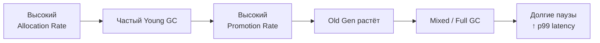

**Как снизить allocation rate:**

```java
// ❌ Плохо: создание объектов в hot path
public String processRequest(Request req) {
    // Каждый вызов создаёт StringBuilder, DateTimeFormatter, промежуточные строки
    return new StringBuilder()
        .append(DateTimeFormatter.ISO_DATE.format(LocalDate.now()))
        .append(" - ")
        .append(req.getData().toUpperCase())
        .toString();
}

// ✅ Лучше: переиспользование, избегание лишних аллокаций
private static final DateTimeFormatter FORMATTER = DateTimeFormatter.ISO_DATE;

public String processRequest(Request req) {
    // Переиспользуем formatter, избегаем промежуточных строк
    return FORMATTER.format(LocalDate.now()) + " - " + req.getData().toUpperCase();
}
```

> Сильный ответ: "мы снизили временные аллокации в hot-path, allocation rate упал с 1.2 GB/s до 400 MB/s, pause p99 снизился на 30%".

## Q14. Что такое Humongous Allocations в G1 и как с ними бороться?

В `G1` объект считается **humongous**, если он занимает более **50% размера региона**. Humongous объекты:
- Размещаются напрямую в Old Generation (занимают один или несколько смежных регионов)
- Не перемещаются (до JDK 8u60, после — могут собираться в Young GC)
- Фрагментируют heap

```bash
# Обнаружение в GC-логах
# [gc,heap] GC(12) Humongous regions: 42->38

# Увеличение размера региона уменьшает кол-во humongous
-XX:G1HeapRegionSize=32m   # Теперь humongous > 16 МБ
```

**Частые причины:**
- Большие `byte[]` (сериализация, I/O буферы)
- Крупные `String` (JSON/XML ответы)
- Большие коллекции, создаваемые за раз (`Arrays.copyOf` при расширении `ArrayList`)

**Решения:**
1. Увеличить `-XX:G1HeapRegionSize`
2. Использовать streaming вместо буферизации (подробнее в [[memory-management-interview|вопросах по Memory Management]])
3. Пулить буферы (`ByteBuffer.allocateDirect` + pool)

## Q15. (!) Из каких областей состоит память JVM-процесса?

Память JVM **не ограничивается heap**. Полная картина:

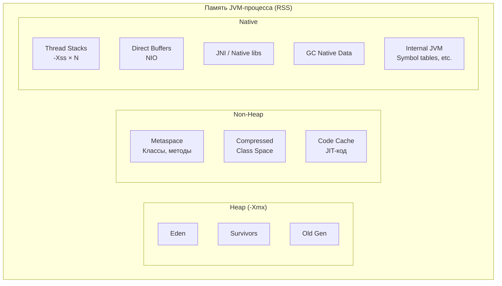

**Формула для расчёта общего потребления:**

```
RSS ≈ Heap (Xmx)
    + Metaspace (MaxMetaspaceSize)
    + Code Cache (~240 MB default)
    + Thread stacks (Xss × thread_count)
    + Direct Buffers (MaxDirectMemorySize)
    + GC overhead (10-20% от heap для G1)
    + JNI / native libraries
    + Internal JVM structures
```

> В контейнерах это критически важно — `Xmx` = container memory limit приводит к `OOMKilled`, потому что не учитывает non-heap память.

## Q16. Что такое Native Memory и как его отслеживать?

**Native Memory** — память, выделенная JVM за пределами Java heap через `malloc`/`mmap`. Включает:
- Thread stacks, `Metaspace`, Code Cache, GC structures, Direct Buffers, JNI

**Native Memory Tracking (NMT):**

```bash
# Включение NMT (5-10% overhead)
java -XX:NativeMemoryTracking=summary -jar app.jar

# Снимок через jcmd
jcmd <pid> VM.native_memory summary

# Пример вывода:
# Total: reserved=5234MB, committed=3891MB
# - Java Heap (reserved=4096MB, committed=4096MB)
# - Class (reserved=1056MB, committed=42MB)      # Metaspace
# - Thread (reserved=256MB, committed=256MB)       # 256 threads × 1MB
# - Code (reserved=248MB, committed=68MB)          # JIT Code Cache
# - GC (reserved=198MB, committed=198MB)
# - Internal (reserved=12MB, committed=12MB)
# - Direct (reserved=64MB, committed=64MB)         # NIO Direct Buffers

# Сравнение двух снимков (baseline)
jcmd <pid> VM.native_memory baseline
# ... через время ...
jcmd <pid> VM.native_memory summary.diff
```

Подробнее о диагностике утечек памяти — в [[memory-management-interview|Memory Management]].

## Q17. (!) Как правильно рассчитать размер heap и off-heap?

Правило для контейнеров: **оставляйте 25-30% от memory limit на non-heap**:

```bash
# Container memory limit = 4 GB
# Расчёт:
# Heap:          3 GB  (-Xmx3g)
# Metaspace:     ~256 MB (обычно 100-300 MB)
# Code Cache:    ~240 MB
# Thread stacks: ~200 MB (200 threads × 1 MB)
# Direct buffers: ~128 MB
# GC overhead:   ~150 MB
# Итого non-heap: ~974 MB → берём 1 GB запас

java -Xms3g -Xmx3g \
     -XX:MaxMetaspaceSize=256m \
     -XX:ReservedCodeCacheSize=256m \
     -XX:MaxDirectMemorySize=128m \
     -Xss512k \
     -jar app.jar
```

**Типичные ошибки:**
- `-Xmx` равен container limit (100% памяти на heap → `OOMKilled`)
- Не ограничен `MaxMetaspaceSize` (по умолчанию unlimited)
- Не учтён `MaxDirectMemorySize` (по умолчанию = `-Xmx`)
- Thread stack (`-Xss`) слишком большой (default 1 MB, часто достаточно 512 KB)

## Q18. Что такое String Deduplication и когда она полезна?

`String Deduplication` — функция `G1` GC, которая находит строки с одинаковым `char[]/byte[]` содержимым и заменяет дубликаты ссылкой на один массив:

```bash
# Включение (только для G1 и ZGC)
-XX:+UseStringDeduplication
-XX:StringDeduplicationAgeThreshold=3  # после N GC циклов (default 3)
```

**Когда полезна:**
- Приложение держит много строк в памяти (кеши, справочники)
- Много дублирующихся значений (коды стран, статусы, имена полей)
- Heap pressure высокий, а аллокации нельзя изменить

**Когда НЕ полезна:**
- Строки уникальные (UUID, hash-значения)
- Приложение с маленьким heap (overhead на dedup tables)
- Строки короткоживущие (собираются Young GC раньше, чем dedup сработает)

> На практике String Deduplication может сэкономить 10-30% heap в приложениях с кешами. Проверяйте через `jcmd <pid> GC.string_dedup_stats`.

## Q19. Как настроить Metaspace и зачем?

`Metaspace` (замена `PermGen` с JDK 8) хранит метаданные классов: `Class` объекты, vtables, методы, constant pool:

```bash
# Ограничение Metaspace (по умолчанию unlimited!)
-XX:MaxMetaspaceSize=256m

# Начальный размер (избегает ресайзов при старте)
-XX:MetaspaceSize=128m

# Compressed Class Space (часть Metaspace для class pointers)
-XX:CompressedClassSpaceSize=128m
```

**Почему важно ограничивать:**
- Без ограничения Metaspace может расти до исчерпания native memory
- В контейнерах неограниченный Metaspace → `OOMKilled` без Java `OutOfMemoryError`
- Leak классов (через ClassLoaders) может съесть всю доступную память

**Нормальный размер:**
- Микросервис на Spring Boot: 100-200 МБ
- Монолит с большим количеством зависимостей: 200-400 МБ
- Приложение с dynamic class generation (Groovy, CGLIB): 300-500 МБ

Подробнее о Metaspace leaks — в [Q28](#q28-что-такое-metaspace-leak-и-как-его-диагностировать).

## Q20. (!) Как работает JIT-компилятор и Tiered Compilation?

`JIT` (`Just-In-Time`) компилирует байт-код в нативный машинный код во время выполнения. В `HotSpot JVM` используется **Tiered Compilation** — пятиуровневая система:

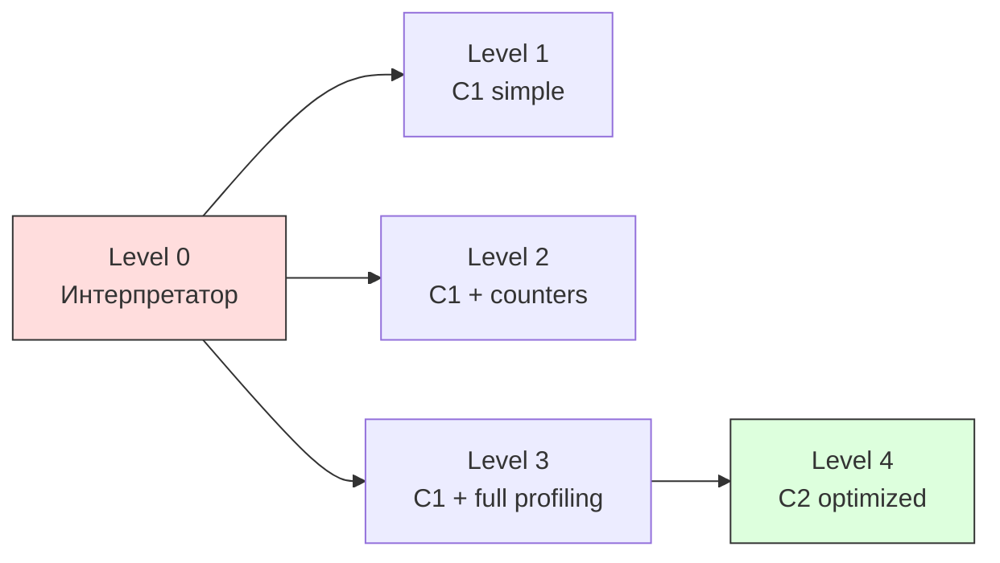

| Уровень | Компилятор | Описание |
|---------|-----------|----------|
| 0 | Интерпретатор | Байт-код интерпретируется, собирается профиль |
| 1 | C1 (Client) | Быстрая компиляция, без профилирования |
| 2 | C1 + counters | С invocation/backedge counters |
| 3 | C1 + MDO | Полное профилирование (Method Data Object) |
| 4 | C2 (Server) | Агрессивная оптимизация на основе профиля |

```bash
# Tiered Compilation включён по умолчанию (JDK 8+)
-XX:+TieredCompilation                # default: true
-XX:TieredStopAtLevel=4               # можно ограничить (1 = только C1)
-XX:CompileThreshold=10000            # порог компиляции (invocations)
```

**C2** применяет агрессивные оптимизации: **inlining**, **loop unrolling**, **escape analysis**, **dead code elimination**, **vectorization**. Но компиляция C2 медленнее, поэтому hot methods сначала быстро компилируются C1, а потом C2.

## Q21. Как JIT и warm-up влияют на производительность в проде?

На старте методы исполняются интерпретатором и `C1`, позже оптимизируются `C2`. Поэтому **cold-start** и первые минуты работы часто медленнее в 5-10 раз:


**Практики для production:**

```bash
# 1. Прогрев перед подачей трафика (Kubernetes readiness probe)
# readinessProbe:
#   httpGet:
#     path: /actuator/health
#   initialDelaySeconds: 60      # дать время на warm-up

# 2. Предварительная компиляция часто используемых классов
-XX:CompileCommandFile=hotmethods.txt

# 3. CDS для ускорения загрузки классов (см. Q34)
-XX:SharedArchiveFile=app-cds.jsa
```

**Не делайте:** бенчмарки без warm-up, сравнение cold vs warm instances, прямое переключение 100% трафика на новый pod.

## Q22. (!) Что такое Escape Analysis и какие оптимизации она включает?

`Escape Analysis` — анализ JIT-компилятора (`C2`), определяющий, **выходит ли объект за пределы метода или потока**. На основе результата применяются три оптимизации:

**1. Scalar Replacement (разложение объекта в поля):**

```java
// До оптимизации: аллокация Point на heap
public double distance(double x1, double y1, double x2, double y2) {
    Point p = new Point(x2 - x1, y2 - y1);  // объект не escape
    return Math.sqrt(p.x * p.x + p.y * p.y);
}

// После Escape Analysis + Scalar Replacement:
// JIT заменяет Point на два поля dx, dy — без аллокации
public double distance(double x1, double y1, double x2, double y2) {
    double dx = x2 - x1;  // scalar
    double dy = y2 - y1;  // scalar
    return Math.sqrt(dx * dx + dy * dy);
}
```

**2. Stack Allocation** (размещение на стеке вместо heap) — в HotSpot через scalar replacement.

**3. Lock Elision** (удаление ненужных synchronized):

```java
// JIT удаляет синхронизацию, если объект не escape
public String concat(String a, String b) {
    StringBuffer sb = new StringBuffer();  // не escape → lock elision
    sb.append(a);
    sb.append(b);
    return sb.toString();
}
```

```bash
# Escape Analysis включён по умолчанию (JDK 6u23+)
-XX:+DoEscapeAnalysis          # default: true
-XX:+EliminateAllocations      # scalar replacement, default: true
-XX:+EliminateLocks            # lock elision, default: true

# Диагностика (dev only)
-XX:+PrintEscapeAnalysis
-XX:+PrintEliminateAllocations
```

> На интервью: Escape Analysis — причина, по которой создание short-lived объектов в Java может быть **бесплатным**. JIT превращает `new Point(x, y)` в два поля на стеке.

## Q23. Как посмотреть, какие методы JIT скомпилировал, и диагностировать деоптимизации?

```bash
# Лог компиляций
-XX:+PrintCompilation
# Вывод:
#  1234  456  4  com.app.Service::process (42 bytes)
#  ^      ^   ^  ^                         ^
#  time  id  tier  method                  size

# Подробные решения компилятора
-XX:+UnlockDiagnosticVMOptions -XX:+PrintInlining

# JFR-событие для анализа
# jdk.Compilation, jdk.CompilerInlining, jdk.Deoptimization
```

**Деоптимизация** (`deopt`) — откат с C2 на интерпретатор, когда assumptions нарушены:

```bash
# Причины деоптимизации:
# - Uncommon trap: ветка кода, которая раньше не выполнялась
# - Class hierarchy change: загружен новый подкласс (ломает devirtualization)
# - Null check: null-ссылка в месте, где раньше всегда был non-null
# - Array bounds: выход за границы массива

# Диагностика
-XX:+TraceDeoptimization
# В JFR: jdk.Deoptimization events
```

Частые деоптимизации — сигнал о нестабильном профиле нагрузки или о коде, который "сюрпризит" JIT (megamorphic calls, непредсказуемые ветвления).

## Q24. Что такое On-Stack Replacement (OSR) и Inlining?

**OSR (On-Stack Replacement)** — замена интерпретируемого кода на JIT-скомпилированный **прямо во время выполнения метода** (без ожидания следующего вызова). Важно для длинных циклов:

```java
// Без OSR: метод оптимизируется только при следующем вызове
// С OSR: JIT подменяет код прямо в середине цикла
public long compute() {
    long sum = 0;
    for (int i = 0; i < 10_000_000; i++) {  // OSR может сработать здесь
        sum += transform(i);
    }
    return sum;
}
```

**Inlining** — встраивание тела вызываемого метода в вызывающий. Самая важная оптимизация JIT:

```java
// До inlining:
public int calculate(int x) {
    return doubleIt(x) + 1;
}
private int doubleIt(int x) { return x * 2; }

// После inlining:
public int calculate(int x) {
    return x * 2 + 1;  // вызов doubleIt() устранён
}
```

```bash
# Флаги inlining
-XX:MaxInlineSize=35          # макс. размер метода для inlining (байт-код)
-XX:FreqInlineSize=325        # макс. размер для hot методов
-XX:InlineSmallCode=2000      # макс. размер уже скомпилированного кода

# Диагностика
-XX:+UnlockDiagnosticVMOptions -XX:+PrintInlining
# Показывает: inlined / too big / callee is too large / hot method too big
```

> Для интервью: inlining важен не сам по себе, а потому что **открывает двери** для других оптимизаций — escape analysis, constant folding, dead code elimination работают лучше на развёрнутом коде.

## Q25. Как искать CPU bottleneck в JVM-приложении?

Рабочий путь:

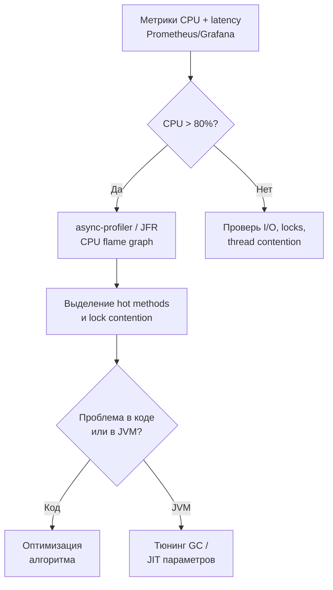

```bash
# async-profiler — лучший инструмент для CPU профилирования
# Не имеет safepoint bias (см. Q26)
./profiler.sh -d 30 -f flamegraph.html -e cpu <pid>

# JFR — встроенный в JDK
jcmd <pid> JFR.start duration=60s filename=cpu.jfr settings=profile

# Allocation profiling (поиск hot allocations)
./profiler.sh -d 30 -f alloc.html -e alloc <pid>
```

Частая ошибка: пытаться решить алгоритмическую проблему через тюнинг GC. Подробнее о профилировании — в [[application-profiling-interview|Application Profiling]].

## Q26. Что такое safepoint bias и почему профили могут врать?

**Safepoint** — точка в коде, где JVM может безопасно остановить поток (для GC, deopt, etc.). Часть профилировщиков (включая стандартный `-XX:+PrintCompilation`) снимает стеки **только в safepoint**:


**Последствия:**
- Короткие hot методы между safepoints **недооцениваются**
- Counted loops без safepoint polls **невидимы** для профилировщика
- Профиль может показать 100% времени в `Thread.sleep()` вместо реального bottleneck

**Решение:** использовать **async-profiler** или `JFR` (AsyncGetCallTrace), которые снимают стеки в произвольных точках:

```bash
# async-profiler — НЕ имеет safepoint bias
./profiler.sh -e cpu -d 30 <pid>

# JFR — использует AsyncGetCallTrace
jcmd <pid> JFR.start settings=profile
```

> Плохая практика: делать вывод по одному профилю без верификации и cross-check разными инструментами.

## Q27. Как устроен Class Loading в JVM и какие проблемы он вызывает?

`ClassLoader` в JVM организован по принципу **delegation hierarchy**:

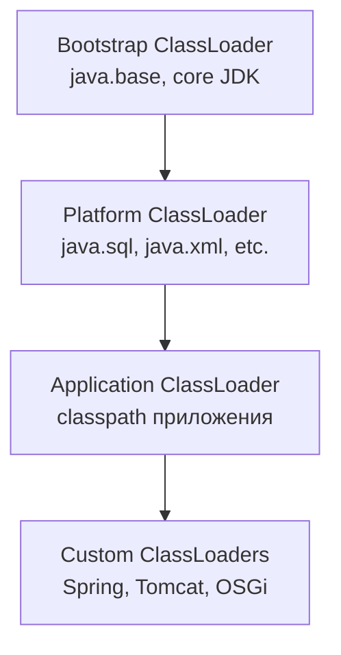

**Принцип parent-first delegation:**
1. ClassLoader спрашивает **родителя** первым
2. Только если родитель не нашёл — загружает сам
3. Это обеспечивает, что `java.lang.String` всегда один

**Проблемы class loading:**

| Проблема | Причина | Симптом |
|----------|---------|--------|
| `ClassNotFoundException` | Класс не в classpath | Startup crash |
| `NoClassDefFoundError` | Класс был, но не инициализировался | Runtime crash |
| `LinkageError` | Разные ClassLoader-ы загрузили один класс | Class cast fails |
| Metaspace leak | ClassLoader не GC'd из-за ссылки | Растущий Metaspace |
| Slow startup | Тысячи классов при старте | High startup time |

```bash
# Диагностика class loading
-verbose:class                        # JDK 8
-Xlog:class+load=info:stdout          # JDK 9+
-Xlog:class+unload=info:stdout        # отслеживание выгрузки классов
```

## Q28. Что такое Metaspace leak и как его диагностировать?

**Metaspace leak** — ситуация, когда классы загружаются, но не выгружаются, потому что их `ClassLoader` удерживается от GC:

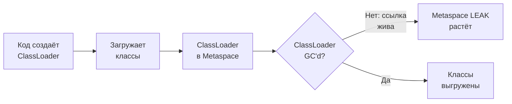

**Частые причины:**
- Dynamic proxy / CGLIB generation без кеширования
- `Groovy` / `Kotlin Script` — каждый eval создаёт новый ClassLoader
- Leak через `ThreadLocal` → ссылка на ClassLoader
- Hot-reload фреймворки (Spring DevTools) при неправильной конфигурации

**Диагностика:**

```bash
# 1. Мониторинг Metaspace
jcmd <pid> VM.native_memory summary | grep Class

# 2. Количество загруженных классов
jcmd <pid> VM.classloader_stats

# 3. Heap dump — ищем множественные ClassLoader-ы
jmap -dump:live,format=b,file=heap.hprof <pid>
# В MAT/VisualVM: Histogram → ClassLoader → retained size

# 4. JFR events
# jdk.ClassLoad, jdk.ClassUnload
```

```bash
# Защита в production
-XX:MaxMetaspaceSize=256m     # ограничить рост
# При достижении лимита → OutOfMemoryError: Metaspace
# Лучше OOM, чем тихий OOMKilled контейнера
```

## Q29. (!) Как правильно настроить JVM в Kubernetes/Docker?

Ключевые правила для контейнерной JVM:

```bash
# 1. Фиксированный heap (Xms = Xmx) — избегаем resize
# 2. Heap = 60-75% от container memory limit
# 3. Ограничить off-heap компоненты
# 4. Container-aware настройки

java -XX:+UseContainerSupport \
     -XX:MaxRAMPercentage=75.0 \
     -XX:InitialRAMPercentage=75.0 \
     -XX:MaxMetaspaceSize=256m \
     -XX:ReservedCodeCacheSize=256m \
     -XX:MaxDirectMemorySize=128m \
     -Xss512k \
     -Xlog:gc*:file=/var/log/gc.log:time,uptime,level,tags \
     -jar app.jar
```

**Или с явным Xmx (предпочтительнее для предсказуемости):**

```yaml
# Kubernetes deployment
resources:
  requests:
    memory: "2Gi"
    cpu: "1000m"
  limits:
    memory: "2Gi"   # limits = requests для QoS Guaranteed
    cpu: "2000m"
env:
  - name: JAVA_OPTS
    value: "-Xms1536m -Xmx1536m -XX:MaxMetaspaceSize=256m"
```

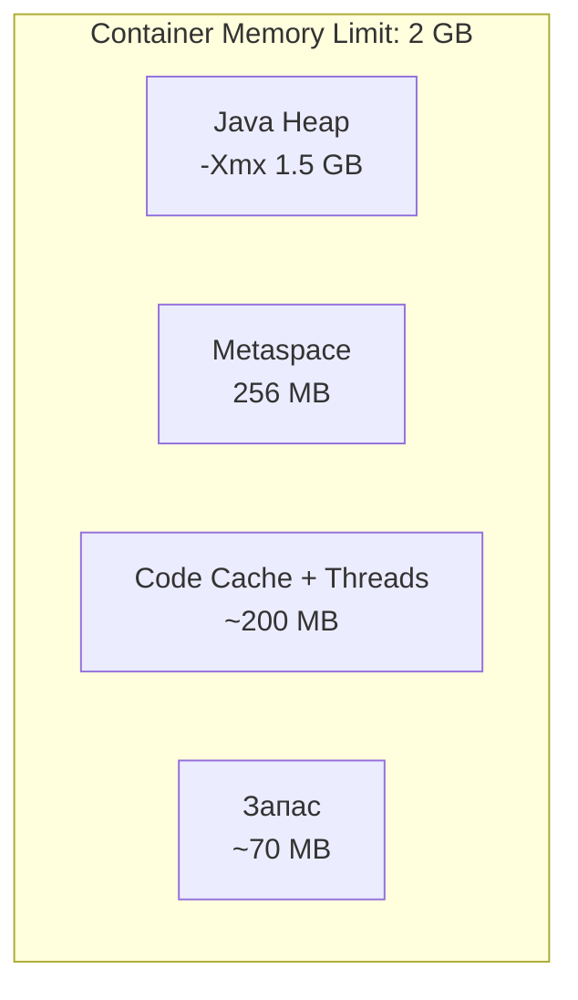

> В production важна **повторяемая конфигурация** на уровне Helm chart/manifest, а не "ручные" флаги на конкретном pod.

## Q30. Какие ошибки в контейнерном tuning встречаются чаще всего?

| Ошибка | Последствие | Решение |
|--------|------------|---------|
| `-Xmx` = memory limit | `OOMKilled` (non-heap не учтён) | `-Xmx` = 60-75% от limit |
| Нет `MaxMetaspaceSize` | Metaspace grows → `OOMKilled` | Ограничить 256-512 MB |
| Игнорирование Direct Buffers | NIO съедает native memory | `-XX:MaxDirectMemorySize` |
| Одинаковые флаги для всех сервисов | Over/under provisioning | Профиль под каждый сервис |
| CPU limits слишком жёсткие | CPU throttling → GC паузы растут | Мониторинг throttling |
| Нет `-XX:+UseContainerSupport` | JVM видит host resources | Включён по умолчанию с JDK 10+ |
| Нет стресс-тестов autoscaling | Падение под нагрузкой | Test scale-up/down сценарии |

```bash
# Проверка: сколько CPU/RAM видит JVM в контейнере
jcmd <pid> VM.info | grep -E "available_processors|MaxHeap"

# Или через Java API
Runtime.getRuntime().availableProcessors();
Runtime.getRuntime().maxMemory();
```

## Q31. Как JVM определяет ресурсы в контейнере (Container-Aware JVM)?

С `JDK 10+` JVM по умолчанию **читает cgroup limits** вместо host-ресурсов:

```bash
# Container-Aware JVM (default: true в JDK 10+)
-XX:+UseContainerSupport

# Как JVM определяет ресурсы:
# CPU:    reads cgroup cpu.cfs_quota_us / cpu.cfs_period_us
# Memory: reads cgroup memory.limit_in_bytes (cgroup v1) 
#         или memory.max (cgroup v2)
```

**Что JVM настраивает автоматически на основе cgroup:**
- `Runtime.availableProcessors()` — по CPU limit/shares
- Default heap size (если нет `-Xmx`) — 25% от memory limit (или 50% для small heaps)
- GC threads (`ParallelGCThreads`, `ConcGCThreads`) — по доступным CPU

**Подводные камни:**

```bash
# Проблема: CPU limit = 1 core → JVM видит 1 CPU
# GC threads = 1, что может быть недостаточно
# Решение: явно задать
-XX:ParallelGCThreads=4 -XX:ConcGCThreads=1

# Проблема: JDK 8 до update 191 НЕ поддерживает cgroup
# Решение: обновить JDK или использовать экспериментальные флаги
-XX:+UnlockExperimentalVMOptions -XX:+UseCGroupMemoryLimitForHeap  # JDK 8u131+
```

## Q32. Как оптимизировать startup time JVM в контейнерах?

Быстрый startup критичен для autoscaling и rolling deployments:

| Техника | Экономия | Сложность |
|---------|----------|-----------|
| AppCDS (см. [Q34](#q34-что-такое-cdsappcds-и-как-это-ускоряет-запуск)) | 20-40% | средняя |
| Tiered Compilation `-XX:TieredStopAtLevel=1` | 30-50% start | низкая (но хуже peak perf) |
| Spring AOT (GraalVM native) | 80-95% | высокая |
| Lazy initialization | 10-30% | средняя |
| Reduce classpath | 10-20% | низкая |

```bash
# Быстрый старт за счёт только C1 (убираем C2)
# Подходит для short-lived tasks, не для long-running сервисов
java -XX:TieredStopAtLevel=1 -jar app.jar

# Spring Boot: ленивая инициализация бинов
spring.main.lazy-initialization=true

# Ускорение через CDS
java -XX:SharedArchiveFile=app-cds.jsa -jar app.jar
```

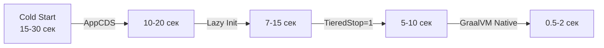

## Q33. Какие JVM-флаги обязательны для production?

```bash
# === Обязательные для любого production-сервиса ===

# Память
-Xms4g -Xmx4g                        # Xms = Xmx (фиксированный heap)
-XX:MaxMetaspaceSize=256m             # ограничить Metaspace

# GC логи (бесценны для диагностики)
-Xlog:gc*:file=/var/log/gc.log:time,uptime,level,tags:filecount=10,filesize=50m

# Heap dump при OOM
-XX:+HeapDumpOnOutOfMemoryError
-XX:HeapDumpPath=/var/log/heapdump.hprof
-XX:+ExitOnOutOfMemoryError           # или CrashOnOutOfMemoryError

# Flight Recorder (always-on в production, ~1% overhead)
-XX:StartFlightRecording=disk=true,maxage=24h,maxsize=1g,dumponexit=true,filename=/var/log/flight.jfr

# === Рекомендуемые ===

# Контейнеры
-XX:+UseContainerSupport              # default в JDK 10+

# Диагностика
-XX:+UnlockDiagnosticVMOptions
-XX:NativeMemoryTracking=summary      # 5-10% overhead, но invaluable

# Encoding
-Dfile.encoding=UTF-8
```

> Главное правило: **GC-логи и heap dump on OOM** должны быть **всегда**. Без них post-mortem диагностика невозможна.

## Q34. Что такое CDS/AppCDS и как это ускоряет запуск?

**CDS** (`Class Data Sharing`) — механизм JVM, который сохраняет предобработанные метаданные классов в shared archive (`.jsa` файл) и переиспользует их при последующих запусках через memory-mapped files:

```bash
# Шаг 1: Создание списка классов
java -XX:DumpLoadedClassList=classes.lst \
     -jar app.jar
# Остановить после полной загрузки

# Шаг 2: Создание архива
java -Xshare:dump \
     -XX:SharedClassListFile=classes.lst \
     -XX:SharedArchiveFile=app-cds.jsa \
     -jar app.jar

# Шаг 3: Запуск с архивом
java -Xshare:on \
     -XX:SharedArchiveFile=app-cds.jsa \
     -jar app.jar
```

**Что даёт CDS/AppCDS:**
- Классы загружаются из memory-mapped archive → **быстрее**, чем parsing из JAR
- Общая память между JVM-процессами на одном хосте (shared pages)
- Экономия 20-40% startup time, 10-15% memory footprint

**Dynamic CDS (JDK 13+)** — автоматическое создание архива:

```bash
# Автоматический CDS при выходе
java -XX:ArchiveClassesAtExit=app-cds.jsa -jar app.jar

# Использование
java -XX:SharedArchiveFile=app-cds.jsa -jar app.jar
```

## Q35. Как работают Compressed Oops и Compressed Class Pointers?

**Compressed Oops** (`Ordinary Object Pointers`) — оптимизация, при которой 64-битные указатели на объекты сжимаются до **32 бит** через сдвиг и base:

```bash
# Включены по умолчанию при heap < 32 GB
-XX:+UseCompressedOops        # default: true (если Xmx < 32 GB)
-XX:+UseCompressedClassPointers  # default: true
```

**Как это работает:**
- 32-бит pointer может адресовать 4 ГБ
- С 8-байтовым выравниванием объектов: 4 ГБ × 8 = **32 ГБ** адресного пространства
- JVM хранит `compressed_oop = real_address >> 3`, при использовании `real_address = compressed_oop << 3`

**Почему это важно:**
- Экономия **~30-40% heap** за счёт меньших указателей
- При `-Xmx` > 32 ГБ Compressed Oops **выключаются** → объекты становятся больше
- Парадокс: heap 31 ГБ может быть **эффективнее**, чем 33 ГБ

```bash
# Проверка
java -XX:+PrintCompressedOopsMode -version
# Вывод: heap address: 0x..., Compressed Oops mode: 32-bit
```

> На интервью: "не ставьте `-Xmx` между 32 и 38 ГБ — вы потеряете Compressed Oops и получите меньше полезного пространства, чем при 31 ГБ".

## Q36. Что такое NUMA-aware GC и когда это важно?

**NUMA** (`Non-Uniform Memory Access`) — архитектура многопроцессорных систем, где у каждого CPU своя "локальная" память с быстрым доступом и "удалённая" с медленным:

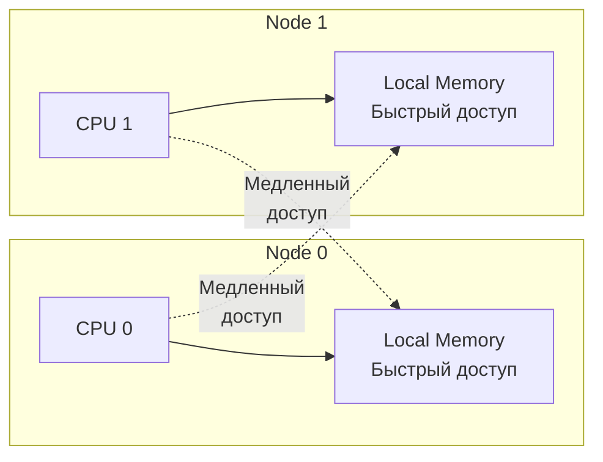

```bash
# NUMA-aware аллокация в G1 (default: true если NUMA detected)
-XX:+UseNUMA

# Проверка NUMA-топологии
numactl --hardware
# node distances:
# node   0   1
#   0:  10  21    ← доступ к remote node в 2x медленнее
#   1:  21  10
```

**Когда важно:**
- Серверы с 2+ CPU sockets (физические серверы, bare metal)
- Heap > 32 ГБ
- Latency-sensitive приложения

**Когда НЕ важно:**
- Контейнеры с CPU limit 1-4 cores (обычно на одном NUMA node)
- Виртуальные машины с малым количеством vCPU
- Облачные инстансы (обычно NUMA-прозрачны)

## Q37. Какие anti-patterns JVM tuning звучат слабо на интервью?

| Anti-pattern | Почему плохо | Лучше сказать |
|-------------|-------------|---------------|
| "Ставим random флаги из интернета" | Нет инженерного подхода | "Мы анализировали GC-логи и JFR" |
| "Увеличили heap, стало лучше" (без метрик) | Нет baseline, нет proof | "p99 снизился с X до Y мс" |
| "Нам помогло один раз → универсальное решение" | Нет понимания trade-offs | "Это работает при условии X, Y, Z" |
| "Перешли на ZGC, всё починилось" | Игнорирование root cause | "Сначала снизили allocation rate, затем..." |
| Игнорирование версии `JDK` | Разные JDK — разное поведение | "На JDK 21 с G1 мы получили..." |
| "У нас нет GC-логов в production" | Диагностика невозможна | "GC-логи always-on, ~0 overhead" |

## Q38. Как дать сильный ответ по JVM tuning за 60 секунд?

Структура **CDIC** (Context → Diagnostics → Intervention → Consequence):

> 1. **Контекст:** "E-commerce сервис, SLA p99 < 300ms, 5000 RPS, `JDK 21`, `G1`, heap 8 ГБ"
> 2. **Диагностика:** "`JFR` + GC logs показали allocation rate 1.5 GB/s, частый promotion в Old Gen, mixed GC паузы до 450ms"
> 3. **Изменение:** "Оптимизировали allocation hot-path (pooling буферов, lazy init), увеличили `-XX:G1NewSizePercent` до 40%, подняли `-XX:InitiatingHeapOccupancyPercent` до 55%"
> 4. **Результат:** "p99 с 460ms до 180ms, allocation rate снизился до 500 MB/s, CPU +5%"

Такой ответ показывает:
- Понимание метрик и SLA
- Умение диагностировать через данные, а не интуицию
- Знание конкретных JVM-механизмов
- Измеримый результат

> Подробнее об инженерном подходе к диагностике — в [[application-profiling-interview|Application Profiling]] и [[jvm-interview|JVM Fundamentals]].

---

## See also

- [[memory-management-interview|Memory Management]] — управление памятью, GC roots и диагностика утечек
- [[application-profiling-interview|Application Profiling]] — JFR, async-profiler, flame graphs
- [[jvm-interview|JVM Fundamentals]] — архитектура JVM, ClassLoader, байткод
- [[java-concurrency-interview|Java Concurrency]] — многопоточность, lock contention, memory model
- [[kubernetes-interview|Kubernetes]] — container-aware JVM, resource limits и OOM killer
- [[spring-boot-interview|Spring Boot]] — warm-up, startup time, Actuator-метрики

- [[application-profiling-interview|Application Profiling]]
- [[caching-performance-interview|Caching Performance]]
- [[database-performance-interview|Database Performance]]
- [[memory-management-interview|Memory Management]]
- [[network-performance-interview|Network Performance]]
- [[performance-testing-interview|Performance Testing]]
