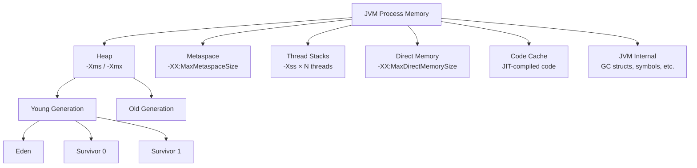
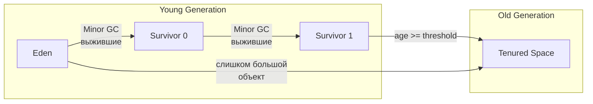
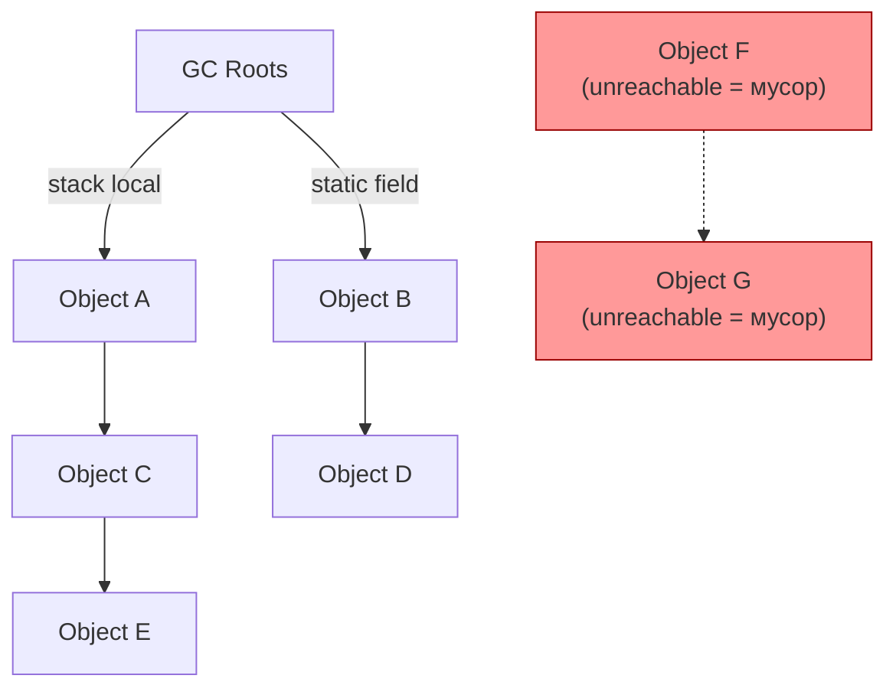
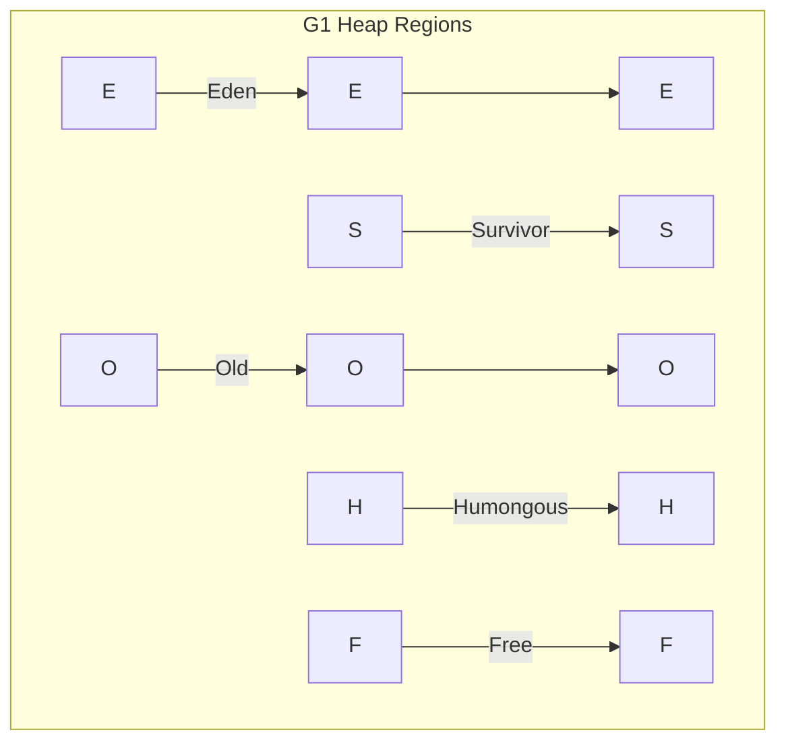
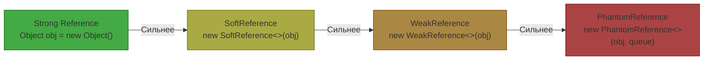
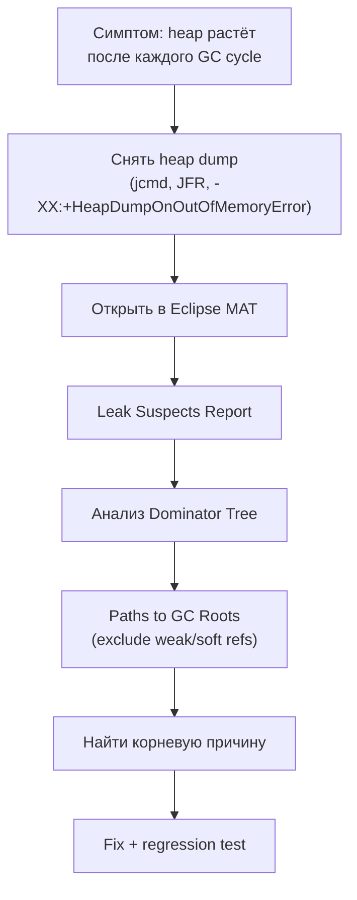
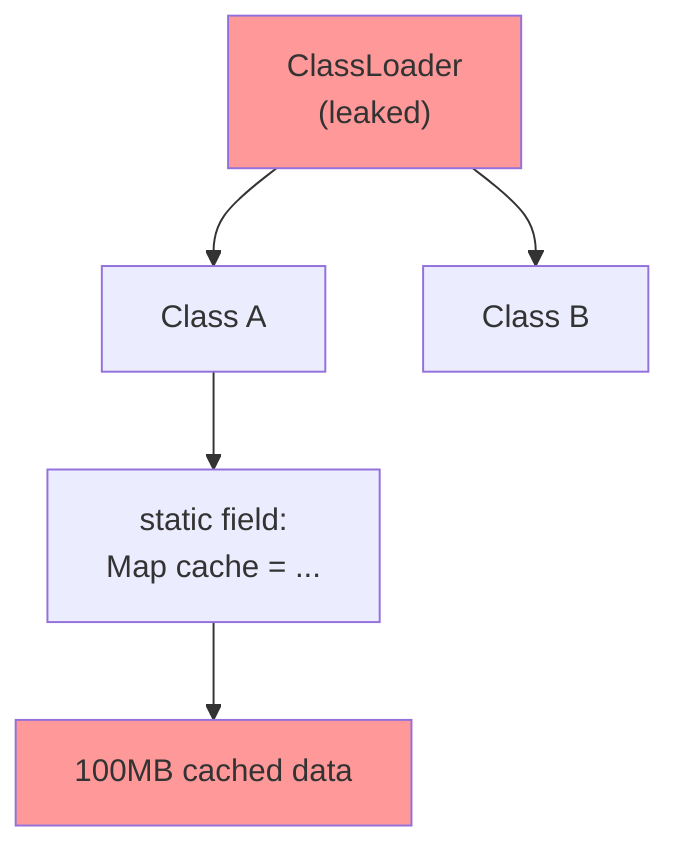
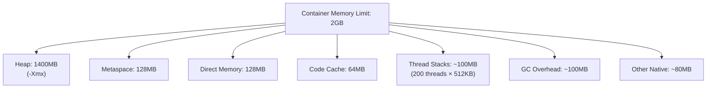

# Вопросы на собеседовании: `Memory Management`

Практичные вопросы и ответы по memory management для `Senior Java Developer`: модель памяти `JVM`, области heap/metaspace/stack/direct, `GC` roots и алгоритмы сборки, типы ссылок (`WeakReference`/`SoftReference`/`PhantomReference`), утечки памяти и их диагностика, off-heap и memory-mapped files, размер объектов, memory barriers, false sharing, `NUMA`, тюнинг и эксплуатация в production.

## Полезные ссылки

### Официальная документация

- [JVM Spec — Run-Time Data Areas](https://docs.oracle.com/javase/specs/jvms/se21/html/jvms-2.html#jvms-2.5) — описание всех областей памяти JVM
- [Garbage Collection Tuning Guide (JDK 21)](https://docs.oracle.com/en/java/javase/21/gctuning/) — официальный гайд по настройке GC
- [Java Flight Recorder](https://docs.oracle.com/en/java/javase/21/jfapi/) — JFR API и документация
- [java.lang.ref package](https://docs.oracle.com/en/java/javase/21/docs/api/java.base/java/lang/ref/package-summary.html) — Reference API
- [JEP 393: Foreign Memory Access API](https://openjdk.org/jeps/393) — Panama Foreign Memory
- [JEP 376: ZGC Concurrent Thread-Stack Processing](https://openjdk.org/jeps/376) — ZGC internals

### Baeldung

- [JVM Memory Model](https://www.baeldung.com/java-stack-heap) — heap vs stack
- [Weak, Soft, and Phantom References](https://www.baeldung.com/java-weak-reference) — типы ссылок
- [Memory Leaks in Java](https://www.baeldung.com/java-memory-leaks) — причины и диагностика утечек
- [Java Object Memory Layout](https://www.baeldung.com/java-memory-layout) — структура объектов в памяти
- [Off-Heap Memory in Java](https://www.baeldung.com/java-off-heap-memory) — direct и mapped буферы
- [False Sharing in Java](https://www.baeldung.com/java-false-sharing-contended) — `@Contended` и padding

## Содержание

- [Полезные ссылки](#полезные-ссылки)
- [See also](#see-also)

**Модель памяти JVM**
- [Q1. (!) Как устроена память JVM? Какие основные области существуют?](#q1--как-устроена-память-jvm-какие-основные-области-существуют)
- [Q2. (!) Чем `heap` отличается от `stack` и когда какая область используется?](#q2--чем-heap-отличается-от-stack-и-когда-какая-область-используется)
- [Q3. Что такое `Metaspace` и чем он отличается от старого `PermGen`?](#q3-что-такое-metaspace-и-чем-он-отличается-от-старого-permgen)
- [Q4. Что такое `Direct Memory` и как ей управлять?](#q4-что-такое-direct-memory-и-как-ей-управлять)
- [Q5. Как устроен `Thread Stack` и что влияет на его размер?](#q5-как-устроен-thread-stack-и-что-влияет-на-его-размер)

**Generational GC и алгоритмы сборки**
- [Q6. (!) Как объяснить generational hypothesis и зачем heap делят на поколения?](#q6--как-объяснить-generational-hypothesis-и-зачем-heap-делят-на-поколения)
- [Q7. (!) Что такое GC roots и как сборщик определяет, какие объекты живы?](#q7--что-такое-gc-roots-и-как-сборщик-определяет-какие-объекты-живы)
- [Q8. (!) Как выбрать GC под требования latency/throughput?](#q8--как-выбрать-gc-под-требования-latencythroughput)
- [Q9. Как работает `G1 GC` и что такое mixed collections?](#q9-как-работает-g1-gc-и-что-такое-mixed-collections)
- [Q10. Как работает `ZGC` и почему он обеспечивает паузы менее 1 мс?](#q10-как-работает-zgc-и-почему-он-обеспечивает-паузы-менее-1-мс)
- [Q11. Что такое `safepoint` и почему он важен для latency?](#q11-что-такое-safepoint-и-почему-он-важен-для-latency)

**Reference API: `WeakReference`, `SoftReference`, `PhantomReference`**
- [Q12. (!) Какие типы ссылок существуют в Java и чем они отличаются?](#q12--какие-типы-ссылок-существуют-в-java-и-чем-они-отличаются)
- [Q13. Как использовать `WeakReference` и `WeakHashMap` для кэширования?](#q13-как-использовать-weakreference-и-weakhashmap-для-кэширования)
- [Q14. Как работает `SoftReference` и когда GC её очищает?](#q14-как-работает-softreference-и-когда-gc-её-очищает)
- [Q15. Зачем нужен `PhantomReference` и как он связан с `Cleaner`?](#q15-зачем-нужен-phantomreference-и-как-он-связан-с-cleaner)

**Утечки памяти: причины и диагностика**
- [Q16. (!) Как выявлять memory leak системно?](#q16--как-выявлять-memory-leak-системно)
- [Q17. (!) Какие самые частые причины утечек памяти в Java?](#q17--какие-самые-частые-причины-утечек-памяти-в-java)
- [Q18. Как анализировать heap dump с помощью Eclipse MAT?](#q18-как-анализировать-heap-dump-с-помощью-eclipse-mat)
- [Q19. Как управлять `Metaspace` и предотвращать classloader leaks?](#q19-как-управлять-metaspace-и-предотвращать-classloader-leaks)

**Off-heap память и Memory-Mapped Files**
- [Q20. (!) Когда полезен off-heap и в чем риски?](#q20--когда-полезен-off-heap-и-в-чем-риски)
- [Q21. Как работают memory-mapped files (`MappedByteBuffer`)?](#q21-как-работают-memory-mapped-files-mappedbytebuffer)
- [Q22. Что даёт Panama Foreign Memory API по сравнению с `Unsafe`?](#q22-что-даёт-panama-foreign-memory-api-по-сравнению-с-unsafe)

**Размер объектов и layout в памяти**
- [Q23. (!) Как устроен объект в памяти JVM (object header, alignment)?](#q23--как-устроен-объект-в-памяти-jvm-object-header-alignment)
- [Q24. Как измерить реальный размер объекта в Java?](#q24-как-измерить-реальный-размер-объекта-в-java)
- [Q25. Что такое Compressed Oops и как они экономят память?](#q25-что-такое-compressed-oops-и-как-они-экономят-память)

**Memory Barriers и False Sharing**
- [Q26. (!) Что такое memory barrier и зачем он нужен?](#q26--что-такое-memory-barrier-и-зачем-он-нужен)
- [Q27. (!) Что такое false sharing и как с ним бороться?](#q27--что-такое-false-sharing-и-как-с-ним-бороться)
- [Q28. Что такое NUMA и как JVM работает с NUMA-архитектурой?](#q28-что-такое-numa-и-как-jvm-работает-с-numa-архитектурой)

**Оптимизация allocation и promotion**
- [Q29. Что такое `allocation rate` и как на него влиять?](#q29-что-такое-allocation-rate-и-как-на-него-влиять)
- [Q30. Что такое `promotion rate` и почему он часто ломает p99?](#q30-что-такое-promotion-rate-и-почему-он-часто-ломает-p99)
- [Q31. Когда имеет смысл `String Deduplication`?](#q31-когда-имеет-смысл-string-deduplication)
- [Q32. Что такое Escape Analysis и Scalar Replacement?](#q32-что-такое-escape-analysis-и-scalar-replacement)

**Инструменты и GC-логи**
- [Q33. Какие инструменты выбрать для анализа памяти в dev и production?](#q33-какие-инструменты-выбрать-для-анализа-памяти-в-dev-и-production)
- [Q34. Как читать GC-логи и не делать ложных выводов?](#q34-как-читать-gc-логи-и-не-делать-ложных-выводов)

**Production-практика**
- [Q35. (!) Какие метрики памяти обязательны на дашборде?](#q35--какие-метрики-памяти-обязательны-на-дашборде)
- [Q36. Как строить алерты по памяти без шума?](#q36-как-строить-алерты-по-памяти-без-шума)
- [Q37. Какие anti-patterns memory tuning встречаются чаще всего?](#q37-какие-anti-patterns-memory-tuning-встречаются-чаще-всего)
- [Q38. Как память JVM взаимодействует с container limits в Docker/K8s?](#q38-как-память-jvm-взаимодействует-с-container-limits-в-dockerk8s)
- [Q39. Как отвечать на memory-вопросы на senior-раунде?](#q39-как-отвечать-на-memory-вопросы-на-senior-раунде)

---

## Q1. (!) Как устроена память JVM? Какие основные области существуют?

Память JVM — это не один большой блок, а несколько независимых областей. Каждая хранит свой тип данных, управляется по-своему и настраивается отдельным флагом. Понимать это деление важно потому, что переполнение разных областей даёт разные ошибки (`OutOfMemoryError: Java heap space` против `StackOverflowError`), и потому что суммарное потребление процесса намного больше, чем один `-Xmx`.



| Область | Хранит | Управление | Ключевой флаг |
|---------|--------|------------|---------------|
| `Heap` | Объекты, массивы | GC | `-Xmx`, `-Xms` |
| `Metaspace` | Метаданные классов, constant pool | GC (частично) | `-XX:MaxMetaspaceSize` |
| `Thread Stack` | Фреймы вызовов, локальные переменные | Автоматически при выходе из метода | `-Xss` |
| `Direct Memory` | `ByteBuffer.allocateDirect()` | `Cleaner`/`GC` | `-XX:MaxDirectMemorySize` |
| `Code Cache` | JIT-скомпилированный код | JVM | `-XX:ReservedCodeCacheSize` |

**Главный вывод:** суммарное потребление процесса = heap + metaspace + stacks + direct + code cache + native-структуры GC. В контейнере под лимит памяти надо закладывать все эти компоненты, а не только `-Xmx`. Типичная ошибка — поставить `-Xmx` равным лимиту контейнера и получить OOM-kill от ядра: всё, что вне heap, ядро посчитало сверх лимита.

## Q2. (!) Чем `heap` отличается от `stack` и когда какая область используется?

Коротко: **heap** — общая для всех потоков область, где живут все объекты (всё, что создано через `new`), и где работает GC; **stack** — приватная для каждого потока область, где хранятся фреймы вызовов методов с примитивами и ссылками, и которая освобождается автоматически по выходе из метода. Объект всегда в heap, ссылка на него — на стеке.

| Характеристика | `Heap` | `Stack` |
|----------------|--------|---------|
| Что хранит | Объекты (через `new`) | Фреймы вызовов, примитивы, ссылки |
| Видимость | Общий для всех потоков | Приватный для каждого потока |
| Размер | Большой (сотни МБ — десятки ГБ) | Маленький (обычно 512KB-1MB на поток) |
| Управление | `GC` | Автоматически (LIFO) |
| Ошибка переполнения | `OutOfMemoryError: Java heap space` | `StackOverflowError` |
| Скорость аллокации | Быстрая (TLAB bump pointer) | Мгновенная (смещение указателя) |

```java
public void example() {
    // primitive 'x' — на стеке
    int x = 42;

    // ссылка 'list' — на стеке, объект ArrayList — в heap
    List<String> list = new ArrayList<>();

    // строка "hello" — в heap (String pool / intern table)
    String s = "hello";
}
```

**Практические следствия:**
- Рекурсия глубиной больше ~5000 вызовов при дефолтном `-Xss` обычно валится в `StackOverflowError` — каждый вызов кладёт новый фрейм на стек.
- Увеличивать `-Xss` дорого, потому что размер умножается на число потоков: 1000 потоков по 1 MB = 1 GB только под стеки. При тысячах потоков логичнее уменьшать `-Xss`, а не наращивать.

## Q3. Что такое `Metaspace` и чем он отличается от старого `PermGen`?

`Metaspace` появился в Java 8 вместо `PermGen` и хранит метаданные загруженных классов: структуры `Class`, constant pool, аннотации, информацию о методах. Принципиальное отличие в одном: `Metaspace` вынесен из heap в native-память и по умолчанию не имеет жёсткого потолка — он растёт до лимита ОС. Это убрало частую в Java 7 ошибку `OutOfMemoryError: PermGen space`, но взамен создало риск тихого роста в native-памяти, если классы грузятся без остановки.

**Ключевые отличия от `PermGen`:**

| Характеристика | `PermGen` (Java 7-) | `Metaspace` (Java 8+) |
|----------------|---------------------|----------------------|
| Расположение | Внутри heap (фиксированный сегмент) | Native memory (вне heap) |
| Размер по умолчанию | Фиксированный (64-256MB) | Неограничен (растёт до лимита ОС) |
| Настройка | `-XX:MaxPermSize` | `-XX:MaxMetaspaceSize` |
| GC | Собирается при Full GC | Собирается при достижении порога |

```bash
# Рекомендация для production: всегда ограничивать
-XX:MaxMetaspaceSize=256m
-XX:MetaspaceSize=128m    # начальный порог для GC
```

**Подводный камень:** без явного `MaxMetaspaceSize` приложение, которое активно генерирует классы в рантайме (Groovy-скрипты, CGLIB-прокси, динамические proxy, `Reflections`), способно неограниченно расти в native-памяти и в итоге упасть с OOM-kill от ядра — без красивого heap-дампа. Поэтому в production лимит ставят всегда: пусть лучше упадёт предсказуемый `OutOfMemoryError: Metaspace`, чем процесс убьёт OOM-killer.

## Q4. Что такое `Direct Memory` и как ей управлять?

`Direct Memory` — это память вне heap, которую выделяют через `ByteBuffer.allocateDirect()`. GC не управляет ей напрямую: сам объект-обёртка `DirectByteBuffer` лежит в heap, а нативный буфер за ним освобождается через `Cleaner` (бывший `sun.misc.Cleaner`), когда обёртку соберёт GC. Отсюда главная особенность: освобождение native-памяти привязано к сборке heap-объекта, а не к моменту, когда буфер перестал быть нужен.

```java
// Аллокация direct buffer — память вне heap
ByteBuffer directBuf = ByteBuffer.allocateDirect(1024 * 1024); // 1 MB

// Heap buffer для сравнения — в managed heap
ByteBuffer heapBuf = ByteBuffer.allocate(1024 * 1024);
```

**Зачем нужна:**
- **I/O без лишнего копирования.** При записи в сокет или файл ОС умеет работать только с native-буфером. Если данные в heap, JVM сначала копирует их в скрытый временный native-буфер; direct-буфер уже native, поэтому копирование пропускается.
- **Стабильный адрес.** GC не перемещает direct-буферы, поэтому их адрес можно безопасно отдать в нативный код через JNI.
- **NIO-каналы.** `FileChannel`, `SocketChannel` работают с direct-буферами эффективнее именно из-за отсутствия промежуточного копирования.

**Риски:**
- Утечка, если потерять ссылку на буфер и не вызвать явно `((DirectBuffer) buf).cleaner().clean()` — память освободится только когда (и если) GC доберётся до обёртки.
- `OutOfMemoryError: Direct buffer memory`, если превышен `-XX:MaxDirectMemorySize`.
- Эта память не попадает в стандартные heap-метрики — её легко не заметить на дашборде. Мониторить надо отдельно, через `BufferPoolMXBean`.

```java
// Мониторинг direct memory
ManagementFactory.getPlatformMXBeans(BufferPoolMXBean.class)
    .forEach(pool -> System.out.printf("%s: used=%d, capacity=%d%n",
        pool.getName(), pool.getMemoryUsed(), pool.getTotalCapacity()));
```

## Q5. Как устроен `Thread Stack` и что влияет на его размер?

У каждого потока JVM есть собственный стек — стопка фреймов, по одному на каждый активный вызов метода. Фрейм создаётся при входе в метод и уничтожается при выходе, поэтому стековая память управляется автоматически, без GC. Каждый фрейм содержит:
- Локальные переменные (примитивы и ссылки на объекты)
- Операндный стек (рабочая область байткод-инструкций)
- Ссылку на constant pool текущего класса

```
Thread Stack (-Xss)
┌─────────────────────┐
│ Frame: main()       │ ← текущий фрейм
│  locals: args       │
│  operand stack      │
├─────────────────────┤
│ Frame: processOrder │
│  locals: order, i   │
│  operand stack      │
├─────────────────────┤
│ Frame: validate     │
│  locals: result     │
│  operand stack      │
└─────────────────────┘
```

**Что влияет на размер стека:**
- **Глубина рекурсии** — каждый вложенный вызов добавляет фрейм (~100–300 байт, зависит от метода). Именно глубина упирается в лимит `-Xss` и даёт `StackOverflowError`.
- **Количество локальных переменных** — чем их больше, тем толще каждый фрейм.
- **Количество потоков** — это умножает общий расход памяти: 1000 потоков по `-Xss1m` = 1 GB только на стеки. Здесь дело не в глубине одного стека, а в их числе.

```bash
# Типичные настройки
-Xss512k    # уменьшить для приложений с тысячами потоков
-Xss1m      # default (зависит от платформы)
-Xss2m      # для глубокой рекурсии
```

**Виртуальные потоки (`Project Loom`)** меняют картину: их стек хранится в heap и растёт динамически по мере надобности. Поэтому фиксированный `-Xss`-бюджет на поток перестаёт быть ограничением, и миллионы виртуальных потоков перестают «съедать» память стеками так, как это делают платформенные.

## Q6. (!) Как объяснить generational hypothesis и зачем heap делят на поколения?

**Generational hypothesis** (слабая гипотеза поколений): подавляющее большинство объектов «умирают молодыми» — создаются и становятся мусором в рамках одного вызова метода или запроса. Деление heap на поколения — прямое следствие этого наблюдения: раз почти весь мусор молодой, выгодно собирать только небольшую молодую область часто и быстро, а большую старую — трогать редко. Так сборщик делает много дешёвой работы вместо редкой, но очень дорогой полной сборки.



**Как это работает на практике.** Новый объект рождается в Eden. Переживший Minor GC переезжает в Survivor и копит «возраст» (age) — число пережитых сборок; дойдя до порога `MaxTenuringThreshold`, он повышается (promotion) в Old. Слишком крупный объект может попасть в Old сразу, минуя Survivor.

Отсюда три типа сборок по стоимости:
1. **Young GC (Minor)** — частые и быстрые (единицы мс), собирают Eden и один Survivor. Это «рабочая лошадка», именно сюда уходит почти весь мусор.
2. **Old GC (Major/Mixed)** — редкие и дорогие, дают более длинные паузы.
3. **Full GC** — весь heap плюс metaspace; самые длинные паузы и фактически аварийный сценарий, которого стараются избегать.

```bash
# Настройка размера поколений
-Xmn512m                          # размер Young generation
-XX:NewRatio=2                     # Old/Young = 2:1
-XX:SurvivorRatio=8                # Eden/Survivor = 8:1
-XX:MaxTenuringThreshold=15        # сколько Minor GC объект выдержит в Survivor
```

Если в Old Generation слишком быстро попадают временные объекты (высокий promotion rate), растут паузы — подробнее в [вопросах по JVM tuning](jvm-performance-tuning-interview.md).

## Q7. (!) Что такое GC roots и как сборщик определяет, какие объекты живы?

`GC roots` — набор «корневых» ссылок, от которых сборщик начинает обход графа объектов (tracing). Правило достижимости простое: объект жив, если до него есть путь по ссылкам хотя бы от одного GC root; если такого пути нет — объект мусор, даже если на него ссылаются другие мусорные объекты. Именно поэтому циклические ссылки между двумя «висящими» объектами не мешают их собрать — важна не наличие ссылок вообще, а достижимость от корня.

**Виды GC roots:**

| GC Root | Пример |
|---------|--------|
| Локальные переменные на стеке | Параметры и переменные в текущих вызовах методов |
| Активные потоки | Объект `Thread`, пока поток работает |
| Статические поля | `static Map<> cache` в любом загруженном классе |
| JNI-ссылки | Ссылки из нативного кода |
| Синхронизированные объекты | Объекты, по которым взята `synchronized` блокировка |
| Classloader | Пока classloader жив, все его классы и их static-поля живы |



Алгоритм **Mark-and-Sweep**:
1. **Mark** — обход от всех GC roots, помечаем достижимые объекты
2. **Sweep** — удаляем непомеченные
3. **Compact** (опционально) — уплотняем heap для избежания фрагментации

**Частая ошибка на собеседовании:** считать, что `finalize()` или `System.gc()` «гарантируют» сборку. `System.gc()` — лишь подсказка (hint), JVM вправе её проигнорировать. А объект соберётся не потому, что «вызвали GC», а потому что он стал недостижим от GC roots — это единственный критерий.

## Q8. (!) Как выбрать GC под требования latency/throughput?

Выбор GC — это всегда компромис между **latency** (длиной пауз) и **throughput** (полезной работой на единицу CPU). Сборщики с короткими паузами (ZGC, Shenandoah) достигают их ценой дополнительного CPU на барьеры; сборщики с максимальным throughput (Parallel) расплачиваются длинными stop-the-world паузами. Универсального «лучшего» GC нет — есть подходящий под ваш SLA.

| GC | Паузы | Throughput | Heap | Когда использовать |
|-----|-------|-----------|------|-------------------|
| `Parallel GC` | Десятки-сотни мс | Максимальный | Любой | Batch, MapReduce, throughput-first |
| `G1 GC` | 10-200 мс (настраиваемый target) | Хороший | 4GB+ | Default с Java 9, balanced |
| `ZGC` | < 1 мс | Чуть ниже | 8GB-16TB | Строгие SLA по latency |
| `Shenandoah` | < 10 мс | Чуть ниже | Средний-большой | Альтернатива ZGC (OpenJDK) |
| `Serial GC` | Длинные STW | Минимальный overhead | Маленький | Микросервисы с heap < 256MB |
| `Epsilon` | Нет GC | Максимальный (нет GC) | Зависит от задачи | Бенчмарки, short-lived процессы |

```bash
# Примеры запуска
java -XX:+UseG1GC -XX:MaxGCPauseMillis=50 -jar app.jar
java -XX:+UseZGC -jar app.jar
java -XX:+UseShenandoahGC -jar app.jar
```

**Эмпирическое правило:** не выбирайте GC «по совету из блога» — решайте по замерам p95/p99 и стоимости CPU под реальной нагрузкой. Практичный путь: начать с `G1` (дефолт, разумный баланс), и переходить на `ZGC` только если p99 не укладывается в SLA, заранее заложив запас CPU и памяти под его барьеры.

## Q9. Как работает `G1 GC` и что такое mixed collections?

`G1` (Garbage First) делит heap не на сплошные поколения, а на множество одинаковых регионов (обычно 1–32 MB). Поколения становятся логическими: любой регион может быть Eden, Survivor или Old, и роли переназначаются по ходу работы. Это даёт G1 ключевую способность — собирать heap не целиком, а инкрементально, по нескольку регионов за раз, укладываясь в заданный бюджет паузы. Само имя «Garbage First» означает стратегию: в первую очередь собирать регионы с наибольшей долей мусора, чтобы за фиксированное время освободить максимум памяти.



**Фазы работы `G1`:**
1. **Young-only** — собирает только Eden + Survivor регионы, быстро и часто.
2. **Concurrent Marking** — параллельно с приложением выясняет, насколько заполнены Old-регионы мусором. Запускается, когда занятость heap превысит `InitiatingHeapOccupancyPercent`.
3. **Mixed Collection** — собирает Young плюс часть самых «грязных» Old-регионов (отсюда и Garbage First). Это позволяет чистить Old небольшими порциями, не уходя в полную сборку.
4. **Full GC** (аварийный) — если mixed-сборки не успевают за темпом аллокаций, G1 откатывается на однопоточную stop-the-world Full GC. Частый Full GC у G1 — почти всегда сигнал проблемы (слишком высокий allocation/promotion rate или мало heap).

```bash
# Ключевые настройки G1
-XX:MaxGCPauseMillis=200          # target паузы (default)
-XX:G1HeapRegionSize=16m          # размер региона
-XX:InitiatingHeapOccupancyPercent=45  # когда начинать concurrent marking
-XX:G1MixedGCCountTarget=8        # сколько mixed collections для очистки old
```

**Подводный камень — `Humongous objects`:** объекты крупнее 50% размера региона. G1 размещает их в выделенных humongous-регионах в обход обычного пути аллокации, и собираются они хуже — отсюда фрагментация и неожиданные Full GC. Лечится либо уменьшением таких объектов, либо увеличением `G1HeapRegionSize`, чтобы объект перестал быть humongous.

## Q10. Как работает `ZGC` и почему он обеспечивает паузы менее 1 мс?

`ZGC` — concurrent, region-based, compacting-сборщик с паузами меньше миллисекунды, причём длина паузы **не зависит от размера heap** (от 8 MB до 16 TB). Это и есть его главное обещание: даже на терабайтном heap пауза остаётся sub-millisecond. Секрет в том, что почти вся работа — разметка, перемещение объектов, обновление ссылок — идёт **параллельно** с приложением, а в stop-the-world уходят только короткие служебные операции.

Чтобы делать это безопасно, пока приложение продолжает менять граф объектов, ZGC опирается на три технологии:
- **Colored pointers** — состояние объекта (помечен ли, перемещён ли) хранится прямо в неиспользуемых битах 64-битного указателя, а не в отдельной структуре. Так проверка состояния — это просто чтение указателя.
- **Load barriers** — при каждом чтении ссылки вставляется маленькая проверка: если объект уже перемещён, барьер на лету подменяет ссылку на новый адрес. Это позволяет переносить объекты, не останавливая приложение.
- **Concurrent relocation** — само перемещение (compaction) идёт параллельно с работой приложения, а load barriers гарантируют, что потоки всегда видят актуальный адрес объекта.

```
Фазы ZGC (все concurrent, кроме коротких пауз < 1мс):

1. Pause Mark Start      (< 1мс) — начинаем marking
2. Concurrent Mark                — обход графа параллельно приложению
3. Pause Mark End         (< 1мс) — завершаем marking
4. Concurrent Process References  — обработка Reference API
5. Concurrent Relocate            — перемещаем объекты, уплотняем heap
6. Concurrent Remap               — обновляем ссылки
```

```bash
# Включение ZGC
java -XX:+UseZGC -Xmx16g -jar app.jar

# Generational ZGC (Java 21+) — лучший вариант
java -XX:+UseZGC -XX:+ZGenerational -Xmx16g -jar app.jar
```

**Компромисс:** короткие паузы не бесплатны. Load barriers стоят CPU (~5–15% overhead на throughput), а colored pointers требуют multi-mapping одной физической памяти на несколько виртуальных адресов, что увеличивает потребление. Поэтому ZGC берут, когда жёсткий SLA по latency важнее, чем пиковый throughput, и есть запас CPU и памяти.

## Q11. Что такое `safepoint` и почему он важен для latency?

`Safepoint` — состояние, в котором JVM может безопасно остановить поток: все его ссылки и состояние в согласованном виде, и его можно «заморозить» для служебной операции. К safepoint привязаны GC, деоптимизация, переопределение классов, отзыв biased-локов. Важно для latency вот что: чтобы начать stop-the-world операцию, JVM должна дождаться, пока **все** потоки доедут до своего safepoint. Один «застрявший» поток задерживает всех — и эта задержка добавляется к паузе сверх времени самого GC.

```
Проблема "Time To Safepoint" (TTSP):

Thread 1: ──────●──────────────── (уже на safepoint)
Thread 2: ─────────────●──────── (пришёл через 5мс)
Thread 3: ──────────────────●─── (пришёл через 15мс — это TTSP!)
                              │
                         GC начнётся только здесь
```

**Что задерживает приход к safepoint** (растит TTSP — Time To Safepoint):
- **Counted loops** — цикл со счётчиком `int`: JIT считает его коротким и не вставляет внутрь проверку safepoint (poll). Если итераций на деле миллионы, поток не сможет остановиться до конца цикла. Лечится заменой счётчика на `long` (тогда poll вставляется).
- **Длинные JNI-вызовы** — пока поток в нативном коде, он не реагирует на запрос safepoint.
- **Проход большого массива в одном цикле** — частный случай counted loop: долгая работа без точек проверки.

```bash
# Диагностика safepoint delays
-XX:+PrintSafepointStatistics
-Xlog:safepoint=debug  # JDK 11+

# Looping thread threshold (выявляет "застрявших")
-XX:GuaranteedSafepointInterval=1000
```

**Практика:** при разборе пауз смотрите не только длительность самого GC, но и общее safepoint time и TTSP. Бывает, что 90% «паузы GC» — это ожидание, пока последний поток доедет до safepoint, а собственно сборка занимает доли этого времени. Тогда тюнить надо не GC, а код с длинными циклами.

## Q12. (!) Какие типы ссылок существуют в Java и чем они отличаются?

В Java четыре типа ссылок (пакет `java.lang.ref`), и различаются они «силой» — тем, насколько настойчиво ссылка удерживает объект от сборки. Идея в одной фразе: чем слабее ссылка, тем при первой же возможности GC её обнулит. Это даёт инструмент для кэшей и автоматической очистки ресурсов — держать объект «пока есть память» или «пока на него есть нормальная ссылка», не мешая GC делать своё дело.



| Тип | Когда собирается GC | `get()` после сборки | Основное применение |
|-----|---------------------|---------------------|---------------------|
| `Strong` | Никогда (пока есть strong ref) | N/A | Обычные переменные |
| `SoftReference` | При нехватке памяти (перед `OOME`) | `null` | Memory-sensitive кэши |
| `WeakReference` | При любом GC (если нет strong ref) | `null` | Канонические маппинги, listeners |
| `PhantomReference` | После финализации | Всегда `null` | Cleanup ресурсов, `Cleaner` |

```java
// Пример использования разных типов ссылок
Object strongRef = new Object();                    // strong
SoftReference<byte[]> cache = new SoftReference<>(new byte[1024 * 1024]); // soft
WeakReference<Object> weakRef = new WeakReference<>(strongRef);          // weak

// Phantom — всегда с ReferenceQueue
ReferenceQueue<Object> queue = new ReferenceQueue<>();
PhantomReference<Object> phantom = new PhantomReference<>(new Object(), queue);
// phantom.get() — ВСЕГДА null
```

## Q13. Как использовать `WeakReference` и `WeakHashMap` для кэширования?

`WeakReference` позволяет держать ссылку на объект, не мешая GC его собрать: как только на объект не осталось обычных (strong) ссылок, GC при ближайшей сборке его уберёт, а `get()` начнёт возвращать `null`. `WeakHashMap` строит на этом автоудаление: её **ключи** хранятся как `WeakReference`, поэтому запись исчезает сама, когда ключ больше нигде не используется.

```java
// WeakHashMap — ключи автоматически удаляются при GC
Map<Key, Value> cache = new WeakHashMap<>();

// Пока на Key есть strong reference — запись живёт
Key key = new Key("session-123");
cache.put(key, computeExpensiveValue(key));

// Как только key = null и GC пройдёт — запись удалится
key = null;
System.gc(); // hint
// cache.size() может быть 0
```

**Подводные камни:**
- `WeakHashMap` слабо держит только **ключи**, а значения — обычными ссылками. Если значение само ссылается на свой ключ, ключ никогда не станет недостижимым — запись не удалится, и вместо самоочищающегося кэша получится утечка.
- Строковые литералы (`"abc"`) в роли ключей не сработают: на них всегда есть strong-ссылка из string pool, поэтому они не собираются.
- `WeakHashMap` не потокобезопасна — оборачивайте в `Collections.synchronizedMap()` или берите `Caffeine` с `weakKeys()`.

```java
// Паттерн: канонический маппинг (canonical map)
private final Map<String, WeakReference<Metadata>> metadataCache = new ConcurrentHashMap<>();

public Metadata getMetadata(String className) {
    WeakReference<Metadata> ref = metadataCache.get(className);
    Metadata meta = (ref != null) ? ref.get() : null;
    if (meta == null) {
        meta = loadMetadata(className);
        metadataCache.put(className, new WeakReference<>(meta));
    }
    return meta;
}
```

## Q14. Как работает `SoftReference` и когда GC её очищает?

`SoftReference` держит объект сильнее, чем `WeakReference`: GC не трогает его, пока хватает памяти, и очищает только под давлением — непосредственно перед тем, как бросить `OutOfMemoryError`. Отсюда естественный сценарий: кэш, который сам сжимается, когда памяти становится мало. На бумаге это звучит идеально, но на практике у такого кэша есть серьёзные оговорки (см. ниже).

```java
// Memory-sensitive кэш на SoftReference
public class SoftCache<K, V> {
    private final Map<K, SoftReference<V>> map = new ConcurrentHashMap<>();

    public V get(K key) {
        SoftReference<V> ref = map.get(key);
        if (ref != null) {
            V value = ref.get();
            if (value != null) return value;
            map.remove(key); // запись протухла
        }
        return null;
    }

    public void put(K key, V value) {
        map.put(key, new SoftReference<>(value));
    }
}
```

**Политика GC для soft references:**
- Очищаются в порядке LRU (least recently used): давно не читанные — первыми.
- `-XX:SoftRefLRUPolicyMSPerMB=1000` (default) задаёт «время жизни»: примерно 1 секунда на каждый MB свободной памяти. То есть чем больше свободного heap, тем дольше soft-объект переживёт без обращений.
- Перед `OutOfMemoryError` JVM очищает все soft-ссылки — это их последний рубеж защиты от OOM.

**Почему на практике лучше `Caffeine`/`Guava Cache`:**
- `SoftReference`-кэш не контролирует свой размер — он растёт до самой OOM-границы, превращаясь в «память до отказа».
- Нет нормальных политик вытеснения (TTL, max size) — момент очистки решает GC, а не ваша логика.
- Много `Reference`-объектов = больше работы для GC на их обработку, отсюда рост пауз. Поэтому управляемый кэш с явным `maximumSize`/TTL почти всегда предсказуемее.

## Q15. Зачем нужен `PhantomReference` и как он связан с `Cleaner`?

`PhantomReference` — самая слабая ссылка, и её `get()` всегда возвращает `null` (через неё нельзя «оживить» объект). Единственное, что она даёт, — надёжное уведомление через `ReferenceQueue` о том, что объект уже недостижим и вот-вот будет собран. Это точка, где можно безопасно освободить связанные с ним нативные ресурсы — и именно для этого её используют как замену `finalize()`.

```java
// Паттерн: очистка нативных ресурсов через Cleaner (Java 9+)
public class NativeResource implements AutoCloseable {
    private static final Cleaner CLEANER = Cleaner.create();

    private final Cleaner.Cleanable cleanable;
    private final long nativePointer;

    public NativeResource() {
        this.nativePointer = allocateNative();
        // CleanAction НЕ должен ссылаться на this!
        this.cleanable = CLEANER.register(this, new CleanAction(nativePointer));
    }

    @Override
    public void close() {
        cleanable.clean(); // детерминированная очистка
    }

    // Статический класс — критически важно, чтобы не захватить this
    private static class CleanAction implements Runnable {
        private final long ptr;
        CleanAction(long ptr) { this.ptr = ptr; }

        @Override
        public void run() {
            freeNative(ptr);
        }
    }
}
```

**Зачем `PhantomReference` вместо `finalize()`:**
- `finalize()` устарел (deprecated с Java 9, удалён в Java 18): момент вызова непредсказуем, он может вообще не вызваться и тормозит сборку.
- `PhantomReference` + `ReferenceQueue` даёт явный контроль: вы сами решаете, когда и в каком потоке обработать очередь и освободить ресурс.
- `Cleaner` API (Java 9+) — готовая обёртка поверх этого механизма, не нужно вручную крутить очередь.
- Нет проблемы «воскрешения» (resurrection): в `finalize()` объект можно случайно «оживить», переприсвоив ссылку, — у phantom такой возможности нет, потому что `get()` всегда `null`.

**Важный нюанс в коде ниже:** объект-действие очистки (`CleanAction`) — статический класс и не должен ссылаться на `this`. Иначе он удержит сам объект живым, и `Cleaner` никогда не сработает — ресурс не освободится.

## Q16. (!) Как выявлять memory leak системно?

Утечку ищут не «по наитию», а по воспроизводимому процессу: сначала отличают реальную утечку от нормального пилообразного поведения heap, затем снимают несколько heap-дампов и сравнивают, кто из объектов растёт и кто их держит. Ключевая идея — найти не объект, который занял память, а цепочку ссылок от GC root, из-за которой он не собирается.



**Процесс:**
1. **Зафиксировать симптом.** Главный признак утечки — растёт *baseline*, то есть уровень heap сразу после Full GC. Если он линейно ползёт вверх от сборки к сборке — это leak. А обычные «зубцы» (нарастание между сборками и резкое падение после) — нормальная работа GC, не утечка.
2. **Снять несколько heap-дампов** с интервалом (например, после каждого Full GC):
   ```bash
   jcmd <pid> GC.heap_dump /tmp/heap1.hprof
   # ... через 10 минут ...
   jcmd <pid> GC.heap_dump /tmp/heap2.hprof
   ```
3. **Сравнить dominator tree** двух дампов — какие объекты выросли в количестве и retained size между снимками. Растущая группа и есть подозреваемый.
4. **Paths to GC roots** (с исключением weak/soft-ссылок) — выяснить, кто именно держит подозреваемого. Weak/soft исключают, потому что такие ссылки утечку не создают.
5. **Найти причину** по характерной цепочке: бесконечный кэш, `ThreadLocal` без `remove()`, подписка на событие без отписки.

```bash
# Автоматический heap dump при OOM (обязателен для production!)
-XX:+HeapDumpOnOutOfMemoryError
-XX:HeapDumpPath=/var/log/app/heapdump.hprof
```

## Q17. (!) Какие самые частые причины утечек памяти в Java?

Утечка в Java — это всегда «забытая strong-ссылка»: объект логически больше не нужен, но что-то его удерживает, и GC не вправе его собрать. Почти все типовые утечки — частные случаи этого: коллекция растёт без вытеснения, поток в пуле живёт «вечно» и тащит за собой `ThreadLocal`, подписчик не отписался. Зная этот общий механизм, легко распознать причину по таблице.

| Причина | Механизм | Как обнаружить | Как исправить |
|---------|----------|----------------|---------------|
| Unbounded кэш | `Map` растёт без eviction | Dominator tree: огромный `HashMap` | `Caffeine` с `maximumSize` и TTL |
| `ThreadLocal` без `remove()` | В thread pool поток живёт "вечно" | MAT: `ThreadLocalMap$Entry` с retained size | `try/finally { threadLocal.remove(); }` |
| Listener/callback leak | Подписка без отписки | Огромные списки в event dispatcher | `WeakReference` для listeners или явный `removeListener()` |
| Classloader leak | Старый classloader не GC-ится | Metaspace growth, MAT: дублирующиеся классы | Аудит hot-reload, убрать ссылки на classloader |
| Незакрытые ресурсы | `InputStream`, `Connection`, `ResultSet` | Leak detector (Netty), warning-логи | `try-with-resources` |
| `String.intern()` злоупотребление | String table растёт бесконтрольно | Native memory tracking | Ограничить или убрать intern |
| Inner class holds outer ref | Нестатический inner class ссылается на outer | MAT: unexpected retaining path | Сделать класс `static` |

```java
// Классический пример: ThreadLocal leak в thread pool
public class RequestContext {
    private static final ThreadLocal<UserSession> SESSION = new ThreadLocal<>();

    public void processRequest(Request req) {
        SESSION.set(loadSession(req));
        try {
            // ... обработка запроса ...
        } finally {
            SESSION.remove(); // ОБЯЗАТЕЛЬНО! Без этого — leak
        }
    }
}
```

## Q18. Как анализировать heap dump с помощью Eclipse MAT?

`Eclipse MAT` (Memory Analyzer Tool) — основной инструмент для разбора heap-дампа. Ключ к его использованию — понять разницу между **shallow size** (память самого объекта) и **retained size** (память, которую освободит сборка этого объекта вместе со всем, что держит только он). Утечку выдаёт именно retained size: один объект с retained в гигабайты — главный подозреваемый.

**Ключевые представления:**

1. **Leak Suspects Report** — автоматический отчёт: сразу показывает объекты с подозрительно большим retained size. С него стоит начинать.
2. **Dominator Tree** — объекты, отсортированные по retained heap. Доминатор объекта X — ближайший объект на пути от GC root, удаление которого освободит X. Это прямой ответ на вопрос «кто держит память».
3. **Histogram** — сколько экземпляров каждого класса и их суммарный shallow/retained size. Удобно искать «слишком много объектов одного типа».
4. **Paths to GC Roots** — цепочка ссылок от объекта до корня; именно она объясняет, *почему* объект не собирается.

**OQL-запросы** (Object Query Language) для поиска:

```sql
-- Найти все HashMap с более чем 10000 записей
SELECT * FROM java.util.HashMap WHERE size > 10000

-- Найти все ThreadLocal значения
SELECT tl.value FROM java.lang.ThreadLocal$ThreadLocalMap$Entry tl
WHERE tl.value != null

-- Найти строки длиннее 1MB
SELECT s FROM java.lang.String s WHERE s.value.@length > 1000000
```

Практический совет: в production снимайте heap dump в отдельную filesystem (не `/tmp`), чтобы не забить диск дампом на десятки ГБ.

## Q19. Как управлять `Metaspace` и предотвращать classloader leaks?

`Metaspace` растёт по мере загрузки классов. Classloader leak — одна из самых коварных утечек именно из-за эффекта домино: classloader жив, пока жив хоть один из загруженных им классов, а класс жив, пока на него или на любой его статический объект есть ссылка. Поэтому одна забытая ссылка на статическое поле удерживает весь classloader, все его классы, их static-поля и транзитивно — всё, на что они ссылаются. Утекают сразу мегабайты, причём в native-памяти Metaspace, а не в heap.



**Типичные сценарии:**
- **Hot-reload в dev** (Spring DevTools, JRebel) — при перезагрузке создаётся новый classloader, а старый не освобождается, если на него осталась ссылка.
- **Redeploy web-приложения в servlet-контейнере** — старый classloader удерживают «общие» с контейнером ссылки: `ThreadLocal` в пуле потоков, зарегистрированные JDBC-драйверы, logging. Классический источник «`Metaspace` растёт после каждого redeploy».
- **Scripting engines** (Groovy, Nashorn) — каждая компиляция скрипта порождает новый класс; без выгрузки Metaspace ползёт вверх.

```bash
# Мониторинг и защита
-XX:MaxMetaspaceSize=256m          # жёсткий лимит
-XX:MetaspaceSize=128m             # начальный порог GC
-Xlog:class+load=info              # логировать загрузку классов
-Xlog:class+unload=info            # логировать выгрузку
```

```java
// Диагностика: количество загруженных классов
ClassLoadingMXBean cl = ManagementFactory.getClassLoadingMXBean();
System.out.printf("Loaded: %d, Unloaded: %d, Total: %d%n",
    cl.getLoadedClassCount(),
    cl.getUnloadedClassCount(),
    cl.getTotalLoadedClassCount());
```

## Q20. (!) Когда полезен off-heap и в чем риски?

`Off-heap` — память вне управляемого heap, которую GC не видит и не двигает. Главный мотив её использовать один: убрать данные из-под GC, чтобы они не создавали pause-давления и не участвовали в обходе графа. Это особенно ценно для больших долгоживущих кэшей (которые иначе раздували бы Old gen и удлиняли паузы) и для I/O, где нужен стабильный native-адрес. Расплата — вы берёте на себя ручное управление жизненным циклом этой памяти. Типичные сценарии:

| Сценарий | Механизм | Пример |
|----------|----------|--------|
| Высокоскоростной I/O | `DirectByteBuffer` | `Netty` channel buffers |
| Большие кэши без GC pressure | Off-heap storage | `Apache Ignite`, `Chronicle Map` |
| IPC (inter-process communication) | Shared memory / mmap | `SharedMemory` через `FileChannel` |
| JNI / Foreign Function | Native allocation | Panama FFM API |

```java
// Пример: off-heap буфер для сетевого I/O
ByteBuffer directBuffer = ByteBuffer.allocateDirect(64 * 1024);
SocketChannel channel = SocketChannel.open(address);

// Запись без копирования heap → native
directBuffer.put(data);
directBuffer.flip();
channel.write(directBuffer); // zero-copy path

// Очистка — важно!
((sun.nio.ch.DirectBuffer) directBuffer).cleaner().clean();
```

**Риски off-heap** (та же сторона медали — память вне GC):
- **Невидимость для GC и метрик** — стандартные heap-графики не покажут это потребление, проблему легко проглядеть.
- **OOM-killer вместо OOME** — при превышении лимита процесс убивает ядро ОС, и вы не получаете аккуратный `OutOfMemoryError` с heap-дампом для разбора.
- **Утечки** — без явного `free`/`clean` память не освобождается сама; забытый буфер течёт молча.
- **Сложная отладка** — MAT работает с heap-дампом и off-heap-данные просто не видит, нужны другие инструменты (NMT, `BufferPoolMXBean`).

```bash
# Мониторинг native memory
jcmd <pid> VM.native_memory summary
-XX:NativeMemoryTracking=summary   # включить трекинг (2-5% overhead)
-XX:MaxDirectMemorySize=256m       # лимит direct memory
```

## Q21. Как работают memory-mapped files (`MappedByteBuffer`)?

`Memory-mapped files` — механизм ОС, который отображает файл прямо в адресное пространство процесса: вы работаете с ним как с массивом байт в памяти, а загрузку нужных страниц с диска и их обратную запись берёт на себя ядро. В JVM это `FileChannel.map()`, возвращающий `MappedByteBuffer`. Выигрыш в том, что нет явных системных вызовов `read`/`write` на каждый кусок и нет копирования через буферы JVM — обращение к памяти само превращается в подгрузку страницы (page fault).

```java
// Чтение большого файла через mmap
try (FileChannel channel = FileChannel.open(Path.of("data.bin"), READ)) {
    MappedByteBuffer buffer = channel.map(
        FileChannel.MapMode.READ_ONLY, 0, channel.size());

    // Доступ как к обычному ByteBuffer — но данные читаются
    // страницами из файла, без загрузки всего в память
    while (buffer.hasRemaining()) {
        processByte(buffer.get());
    }
}

// Чтение + запись (изменения записываются в файл)
try (FileChannel channel = FileChannel.open(Path.of("data.bin"),
        READ, WRITE)) {
    MappedByteBuffer buffer = channel.map(
        FileChannel.MapMode.READ_WRITE, 0, channel.size());
    buffer.putInt(0, 42); // записать int в начало файла
    buffer.force();       // flush на диск
}
```

**Преимущества:**
- **Ленивая загрузка** — в память подтягиваются только реально запрошенные страницы (page fault → read), а не весь файл.
- **Разделяемая память** — два процесса могут отобразить один файл и обмениваться данными без копирования через ядро.
- **Файлы больше RAM** — поскольку грузятся только нужные страницы, mmap работает с файлами любого размера.

**Ограничения:**
- У `MappedByteBuffer` нет явного `unmap()` — освобождение маппинга зависит от GC. На Windows это особенно болезненно: пока маппинг жив, файл нельзя удалить или перезаписать.
- Один вызов `map()` ограничен `Integer.MAX_VALUE` (~2 GB); файлы больше маппят несколькими сегментами.
- Если файл стал недоступен (диск отвалился), обращение к странице даёт `SIGBUS` — и JVM падает целиком, это не ловится как обычное исключение.

Применение: `Kafka` (segment files), `Lucene`/`Elasticsearch` (индексы), `LMDB`, `Chronicle Queue`.

## Q22. Что даёт Panama Foreign Memory API по сравнению с `Unsafe`?

`Foreign Memory API` (часть Panama; финализирован в Java 22, preview с Java 14) — это стандартная и безопасная замена `sun.misc.Unsafe` для работы с off-heap-памятью. Два ключевых улучшения над `Unsafe`: появилась проверка границ (выход за пределы — исключение, а не тихий segfault, ломающий всю JVM), и появилось управление временем жизни через `Arena` — память освобождается детерминированно при закрытии arena, а не «когда-нибудь, если не забыли вызвать `freeMemory`».

```java
// Старый способ (Unsafe) — опасно, нет bounds checking
Unsafe unsafe = getUnsafe();
long address = unsafe.allocateMemory(1024);
unsafe.putInt(address, 42);
unsafe.freeMemory(address); // забыли — leak

// Новый способ (Panama Foreign Memory API)
try (Arena arena = Arena.ofConfined()) {
    MemorySegment segment = arena.allocate(1024);
    segment.set(ValueLayout.JAVA_INT, 0, 42);
    // автоматическое освобождение при выходе из try
}
```

| Характеристика | `Unsafe` | Foreign Memory API |
|----------------|----------|-------------------|
| Bounds checking | Нет (segfault) | Да (исключение) |
| Lifecycle | Ручной `freeMemory()` | `Arena`-based (автоматический) |
| Thread safety | Никакой | `Arena.ofConfined()` / `ofShared()` |
| Доступность | Internal API, может быть убран | Стандартный API |
| Interop с native | Через JNI | `Linker` + `SymbolLookup` (FFM) |

**Типы `Arena`** (выбираются по модели владения памятью):
- `Arena.ofConfined()` — доступ только из создавшего потока; самый быстрый, освобождается при закрытии. Дефолтный выбор.
- `Arena.ofShared()` — доступ из нескольких потоков, ценой более дорогой синхронизации при закрытии.
- `Arena.global()` — не освобождается никогда; для констант, живущих всё время работы приложения.
- `Arena.ofAuto()` — освобождается сборщиком, как `DirectByteBuffer`: удобно, но теряется детерминированность.

## Q23. (!) Как устроен объект в памяти JVM (object header, alignment)?

Любой объект в `HotSpot JVM` — это не только его поля: к ним всегда добавляется служебный заголовок и выравнивание. Понимать это нужно, чтобы не удивляться, почему `new Object()` весит 16 байт, а `Integer` ради одного `int` — те же 16. Объект состоит из трёх частей: **заголовок** (header), **поля экземпляра** и **padding** для выравнивания по 8 байт.

```
┌────────────────────────────────────────┐
│         Object Header                  │
│  ┌──────────────────────────────────┐  │
│  │ Mark Word (8 bytes)              │  │
│  │ hash:25 | age:4 | biased:1 |    │  │
│  │ lock:2 | ...                    │  │
│  ├──────────────────────────────────┤  │
│  │ Klass Pointer (4 bytes*)        │  │
│  │ → указатель на Class metadata   │  │
│  ├──────────────────────────────────┤  │
│  │ Array Length (4 bytes, if array) │  │
│  └──────────────────────────────────┘  │
├────────────────────────────────────────┤
│       Instance Fields                  │
│  (отсортированы JVM для компактности)  │
├────────────────────────────────────────┤
│       Padding (alignment to 8 bytes)   │
└────────────────────────────────────────┘

* 4 bytes с Compressed Oops, 8 bytes без
```

Размеры типичных объектов (64-bit JVM, Compressed Oops):

| Объект | Shallow Size | Из чего складывается |
|--------|-------------|---------------------|
| `new Object()` | 16 bytes | 12 header + 4 padding |
| `new Integer(42)` | 16 bytes | 12 header + 4 int field |
| `new Long(42L)` | 24 bytes | 12 header + 4 padding + 8 long field |
| `new byte[0]` | 16 bytes | 16 header (с array length) |
| `new byte[1]` | 24 bytes | 16 header + 1 byte + 7 padding |
| `new String("abc")` | 24 bytes + array | 12 header + fields (value, hash, coder) |

**Почему мелкие объекты «дорогие».** Заголовок (12 байт с Compressed Oops) плюс выравнивание до кратного 8 означают, что объект почти никогда не весит ровно столько, сколько его поля. Для `Integer` 4 байта данных тонут в 12 байтах заголовка — отсюда совет избегать boxing в hot-path: миллион `Integer` стоит дороже миллиона `int` не на проценты, а в разы.

Чтобы padding не съедал ещё больше, JVM сама переупорядочивает поля (field packing): сначала `long`/`double`, затем `int`/`float`, `short`/`char`, `byte`/`boolean`, в конце ссылки. Порядок объявления полей в коде на layout не влияет.

## Q24. Как измерить реальный размер объекта в Java?

Заранее размер посчитать на глаз тяжело (заголовок, padding, переупорядочивание полей), поэтому его измеряют инструментами. Главное — различать **shallow size** (только сам объект) и **deep/retained size** (объект вместе со всем, на что он ссылается). Три рабочих подхода:

**1. `java.lang.instrument` (Instrumentation API)** — даёт shallow size без сторонних библиотек, но требует подключения java-агента

```java
// Агент для измерения shallow size
public class ObjectSizeAgent {
    private static Instrumentation instrumentation;

    public static void premain(String args, Instrumentation inst) {
        instrumentation = inst;
    }

    public static long sizeOf(Object obj) {
        return instrumentation.getObjectSize(obj); // shallow size
    }
}
```

```bash
# Запуск с агентом
java -javaagent:size-agent.jar -jar app.jar
```

**2. JOL (Java Object Layout) — рекомендованный способ**

```java
// org.openjdk.jol:jol-core
System.out.println(ClassLayout.parseInstance(new Object()).toPrintable());
// Output:
// java.lang.Object object internals:
//  OFFSET  SIZE  TYPE   DESCRIPTION
//       0    12        (object header)
//      12     4        (loss due to alignment)
// Instance size: 16 bytes

System.out.println(GraphLayout.parseInstance(myObject).totalSize());
// deep size — с учётом всех referenced объектов
```

**3. Оценка через heap dump** — без отдельного прогона, по снятому дампу

В Eclipse MAT смотрят «Shallow Size» (сам объект) против «Retained Size» (объект плюс всё, что держит *только* он). Для поиска утечек и тяжёлых структур именно retained size отвечает на вопрос «сколько освободится, если убрать этот объект».

## Q25. Что такое Compressed Oops и как они экономят память?

`Compressed Oops` (Ordinary Object Pointers) — оптимизация 64-битной JVM, которая хранит ссылки на объекты в 4 байтах вместо 8. На 64-битной системе ссылка по умолчанию весит 8 байт, а ссылок в типичном приложении очень много — отсюда заметная экономия.

**Принцип — почему это вообще возможно.** Объекты в heap выровнены по 8 байт, значит 3 младших бита любого адреса всегда нулевые и хранить их бессмысленно. JVM отбрасывает их (сдвиг на 3 бита), упаковывая фактически 35-битный адрес в 32-битное число, а при разыменовании сдвигает обратно. 2^35 = 32 GB — вот откуда граница, до которой Compressed Oops работают.

```
Без Compressed Oops (heap > 32GB):
  Ссылка = 8 bytes
  Object header = 16 bytes (8 mark + 8 klass)

С Compressed Oops (heap <= 32GB):
  Ссылка = 4 bytes
  Object header = 12 bytes (8 mark + 4 klass)
```

**Контринтуитивное следствие:** экономия достигает 20–30% памяти на типичном приложении, поэтому **heap 31 GB часто эффективнее, чем 33 GB**. Перешагнув границу 32 GB, JVM отключает Compressed Oops, все ссылки разом становятся 8-байтными — и реальная вместимость может оказаться меньше, чем была при 31 GB. Если нужен heap около 32 GB, выгоднее остаться чуть ниже порога.

```bash
# Управление (по умолчанию включено при heap <= 32GB)
-XX:+UseCompressedOops             # включить (default)
-XX:-UseCompressedOops             # выключить
-XX:+UseCompressedClassPointers    # сжатие klass pointer (отдельно)
```

## Q26. (!) Что такое memory barrier и зачем он нужен?

`Memory barrier` (memory fence) — инструкция процессора, которая запрещает переставлять операции чтения/записи через себя. Нужна, чтобы изменения, сделанные одним потоком, стали корректно видны другим в правильном порядке.

**Зачем это нужно.** Ради скорости и CPU, и JIT-компилятор свободно переупорядочивают инструкции и кэшируют значения в регистрах/кэшах ядра. В однопоточном коде это незаметно — результат тот же. Но другой поток может увидеть записи в порядке, отличном от исходного, или вовсе не увидеть их. Барьер ставит «забор»: всё, что записано до него, гарантированно видно тем, кто прочитал после соответствующего барьера. Java-разработчик расставляет такие барьеры не вручную, а через `volatile`, `synchronized` и `VarHandle` — компилятор сам подставляет нужные fence-инструкции.

```java
// Пример: double-checked locking без volatile — BROKEN
class BrokenSingleton {
    private static BrokenSingleton instance;

    public static BrokenSingleton getInstance() {
        if (instance == null) {
            synchronized (BrokenSingleton.class) {
                if (instance == null) {
                    // Три шага: 1) allocate, 2) init fields, 3) assign ref
                    // Без barrier шаги 2 и 3 могут быть переупорядочены!
                    instance = new BrokenSingleton(); // другой поток может увидеть
                                                       // частично инициализированный объект
                }
            }
        }
        return instance;
    }
}

// Исправление: volatile добавляет store-load barrier
class CorrectSingleton {
    private static volatile CorrectSingleton instance; // volatile = barrier
    // ... rest is the same
}
```

Типы барьеров в Java Memory Model:

| Конструкция Java | Тип барьера | Гарантия |
|-----------------|-------------|----------|
| `volatile` write | StoreStore + StoreLoad | Все предыдущие записи видны до volatile write |
| `volatile` read | LoadLoad + LoadStore | Все последующие чтения видят актуальные данные |
| `synchronized` exit | Release (StoreStore + StoreLoad) | Записи внутри блока видны другим потокам |
| `synchronized` enter | Acquire (LoadLoad + LoadStore) | Чтения видят все предшествующие записи |
| `VarHandle.setRelease()` | Release fence | Лёгкий аналог volatile write |
| `VarHandle.getAcquire()` | Acquire fence | Лёгкий аналог volatile read |

Подробнее о многопоточности — в [вопросах по Java Concurrency](../programming-languages/java/java-concurrency-interview.md).

## Q27. (!) Что такое false sharing и как с ним бороться?

`False sharing` — ситуация, когда два потока на разных ядрах пишут в разные переменные, но эти переменные лежат в одной кэш-линии (обычно 64 байта). Кэш работает не байтами, а линиями целиком: запись в любой байт линии помечает её копию в кэше другого ядра недействительной (invalidate), и тому приходится перечитывать линию из общего кэша. Получается, что логически независимые данные конкурируют за одну линию — отсюда «ложное» разделение. Внешне код выглядит lock-free и масштабируемым, а по факту ядра постоянно гоняют линию друг у друга и производительность падает в разы.

```
Cache Line (64 bytes):
┌────────────────────────────────────────────┐
│ counter1 (Thread A) │ counter2 (Thread B)  │
│ 8 bytes             │ 8 bytes              │
└────────────────────────────────────────────┘
         ↕ invalidate ↕
Каждая запись в counter1 сбрасывает кэш для counter2 и наоборот
```

```java
// Проблема: поля рядом в памяти — false sharing
class FalseSharingProblem {
    volatile long counter1; // Thread A пишет сюда
    volatile long counter2; // Thread B пишет сюда
    // Оба поля в одной cache line — катастрофа для производительности
}

// Решение 1: @Contended (JDK 8+)
class FixedWithContended {
    @jdk.internal.misc.Contended // или @sun.misc.Contended
    volatile long counter1;

    @jdk.internal.misc.Contended
    volatile long counter2;
}
// Требует: --add-opens java.base/jdk.internal.misc=ALL-UNNAMED
// или -XX:-RestrictContended

// Решение 2: ручной padding
class FixedWithPadding {
    volatile long counter1;
    long p1, p2, p3, p4, p5, p6, p7; // 56 bytes padding

    volatile long counter2;
    long q1, q2, q3, q4, q5, q6, q7;
}
```

**Идея решения общая:** «развести» горячие поля по разным кэш-линиям — либо аннотацией `@Contended` (JVM сама добавит отступ), либо ручным padding из dummy-полей на 56+ байт. Платим памятью, выигрываем в латентности.

**Где false sharing встречается на практике:**
- Массивы атомарных счётчиков (метрики, counters), к которым обращаются разные потоки.
- `LongAdder` / `Striped64` — внутри уже применяют padding именно против false sharing; это часть того, почему `LongAdder` масштабируется лучше `AtomicLong`.
- Ring buffers — `LMAX Disruptor` намеренно паддит sequence-счётчики.
- Concurrent-структуры с per-thread состоянием, разложенным в смежной памяти.

**Диагностика:** `perf stat -e cache-misses` (Linux), Intel VTune, либо контролируемый JMH-бенчмарк с `@State(Scope.Group)`.

## Q28. Что такое NUMA и как JVM работает с NUMA-архитектурой?

`NUMA` (Non-Uniform Memory Access) — архитектура многосокетных серверов, где у каждого процессорного сокета есть «своя» локальная память. Доступ к локальной памяти быстрый, к памяти чужого сокета (remote) — заметно медленнее, потому что идёт через межпроцессорную шину (QPI/UPI). Слово Non-Uniform как раз про это: время доступа к памяти зависит от того, на каком сокете она физически лежит относительно работающего ядра. Практический вывод — выгодно, чтобы поток и его данные жили на одном NUMA-узле.

```
┌─────────────────┐     QPI/UPI     ┌─────────────────┐
│   Socket 0      │ ←────────────→  │   Socket 1      │
│  ┌───────────┐  │                 │  ┌───────────┐  │
│  │  CPU 0-7  │  │                 │  │  CPU 8-15 │  │
│  └───────────┘  │                 │  └───────────┘  │
│  ┌───────────┐  │                 │  ┌───────────┐  │
│  │ Local RAM │  │                 │  │ Local RAM │  │
│  │  64 GB    │  │                 │  │  64 GB    │  │
│  └───────────┘  │                 │  └───────────┘  │
└─────────────────┘                 └─────────────────┘

Local access:  ~80ns
Remote access: ~130ns (1.5-2x latency)
```

JVM и NUMA:

```bash
# G1 GC с NUMA-aware allocation (Java 14+)
-XX:+UseG1GC -XX:+UseNUMA

# ZGC — NUMA-aware по умолчанию
-XX:+UseZGC  # автоматически использует NUMA

# Parallel GC — поддерживает NUMA
-XX:+UseParallelGC -XX:+UseNUMA
```

**Как NUMA влияет на производительность:**
- NUMA-aware GC аллоцирует Eden на том же узле, где работает поток, — тогда новые объекты лежат в локальной памяти, и доступ к ним быстрый.
- Если планировщик ОС перенесёт поток на другой узел, его объекты останутся на прежнем и станут «remote» — латентность доступа вырастет, возможна деградация. Это аргумент за привязку (pinning) потоков.
- В контейнерах (K8s) важен CPU pinning: если pod «размазан» по нескольким NUMA-узлам, часть обращений неизбежно идёт к remote-памяти, и производительность проседает.

```bash
# Проверить NUMA-топологию (Linux)
numactl --hardware
# Привязка к одному NUMA-узлу
numactl --cpunodebind=0 --membind=0 java -jar app.jar
```

## Q29. Что такое `allocation rate` и как на него влиять?

`Allocation rate` — скорость выделения памяти под новые объекты (`MB/s`). Это одна из важнейших метрик нагрузки на GC: чем быстрее заполняется Eden, тем чаще срабатывает Young GC. Каждая сборка — это пауза и работа CPU, поэтому высокий allocation rate каскадно бьёт по latency и throughput, даже если объекты сразу же становятся мусором. Часто оптимизация памяти начинается именно со снижения allocation rate, а не с тюнинга флагов GC.

Как измерить:
```bash
# Из GC-логов: разница eden used между Minor GC / время между Minor GC
-Xlog:gc*:file=gc.log:time,uptime,level,tags

# Через JFR
jcmd <pid> JFR.start duration=60s filename=alloc.jfr
# В JFR: Event 'jdk.ObjectAllocationInNewTLAB' и 'jdk.ObjectAllocationOutsideTLAB'
```

**Рычаги снижения:**
- **Меньше временных объектов в hot-path** — избегать boxing (`Integer` вместо `int`) и конкатенации строк в цикле; каждый такой объект — лишняя аллокация.
- **Переиспользование буферов** — `ThreadLocal<byte[]>` или object pool для тяжёлых объектов, чтобы не создавать их заново на каждый вызов.
- **Stream API против for-loop в горячем коде** — streams создают промежуточные объекты (lambda-замыкания, Spliterator); на критическом пути обычный цикл может аллоцировать меньше.
- **Контроль сериализации** — переиспользовать `ObjectMapper` (Jackson), а не создавать его на каждый запрос.

```java
// Антипаттерн: высокий allocation rate
public String formatResponse(List<Item> items) {
    String result = ""; // N конкатенаций = N объектов String
    for (Item item : items) {
        result += item.getName() + ":" + item.getValue() + "\n";
    }
    return result;
}

// Исправление: StringBuilder — один объект
public String formatResponse(List<Item> items) {
    StringBuilder sb = new StringBuilder(items.size() * 64);
    for (Item item : items) {
        sb.append(item.getName()).append(':')
          .append(item.getValue()).append('\n');
    }
    return sb.toString();
}
```

## Q30. Что такое `promotion rate` и почему он часто ломает p99?

`Promotion rate` — скорость, с которой объекты переезжают из Young в Old generation (`MB/s`). Почему именно она ломает p99: Old собирается дорогими Mixed/Full GC, и чем быстрее туда «протекают» объекты, тем чаще и тяжелее эти сборки. Особенно коварна **преждевременная promotion** — когда в Old попадают объекты, которым полагалось умереть молодыми в Young. Они засоряют Old мусором, который придётся вычищать дорогой сборкой, и именно это даёт всплески хвостовой latency.

**Причины высокого promotion rate:**
1. **Маленький Young generation** — объекты не успевают «умереть» в Eden до следующей Minor GC и уходят в Old ещё живыми.
2. **Долгоживущие промежуточные объекты** — кэши запросов, batch-обработка: они переживают несколько Minor GC и легитимно повышаются.
3. **Низкий tenuring threshold** — объект слишком быстро признаётся «старым» и повышается раньше времени.

```bash
# Диагностика: в GC-логах смотреть "promoted" / "to-space overflow"
-Xlog:gc+age=debug  # распределение по возрастам

# Настройка: увеличить Young gen
-Xmn1g                            # Young generation = 1GB
-XX:MaxTenuringThreshold=15        # дольше держать в Survivor
-XX:SurvivorRatio=6                # больше места в Survivor
```

Практика: снижать долгоживущие промежуточные объекты и проверять влияние на p99 под нагрузкой. Иногда увеличение Young Gen с 512MB до 1GB кардинально снижает promotion и стабилизирует p99.

## Q31. Когда имеет смысл `String Deduplication`?

`-XX:+UseStringDeduplication` (G1/ZGC) — фоновая работа GC, который находит разные объекты `String` с одинаковым содержимым и заставляет их делить один внутренний массив `char[]/byte[]`. Сами объекты `String` остаются разными, экономится только их «начинка». Смысл оправдан тем, что строки часто занимают 25–50% heap, и в этих данных много дубликатов (статусы, категории, коды). В отличие от `String.intern()`, дедупликация автоматическая, не требует менять код и не рискует переполнить string table.

```bash
# Включение (только G1 и ZGC)
-XX:+UseStringDeduplication
-XX:StringDeduplicationAgeThreshold=3  # после скольких GC-циклов дедуплицировать
```

**Когда полезно:**
- Много повторяющихся строк: каталоги товаров, JSON-поля, коды стран/валют.
- ORM/JDBC: результаты запросов пестрят одинаковыми значениями (`status`, `category`).

**Когда НЕ полезно:**
- Строки в основном уникальны (UUID, hash, timestamps) — дедуплицировать нечего, остаётся только overhead.
- Heap маленький — экономия не окупит затрат.
- CPU-bound нагрузка — фоновая дедупликация сама тратит CPU, которого и так не хватает.

**Подводный камень:** включать все GC-флаги «на всякий случай» без профилирования — типичная ошибка. Дедупликация может как сэкономить память, так и просто отнять CPU, не дав выигрыша; решать должны замеры на вашем workload.

## Q32. Что такое Escape Analysis и Scalar Replacement?

`Escape Analysis` — анализ JIT-компилятора, который выясняет, «убегает» ли объект за пределы метода или потока (передаётся ли наружу, сохраняется ли в поле, виден ли другим потокам). Логика проста: если объект гарантированно не покидает метод, то о нём знает только этот метод — и тогда можно вообще не размещать его в heap по общим правилам. Это включает целый набор оптимизаций, главная из которых — не аллоцировать такой объект вовсе.

```java
// Объект НЕ "убегает" — кандидат на оптимизацию
public int sumPoints() {
    Point p = new Point(3, 4);  // создаётся и умирает внутри метода
    return p.x + p.y;           // JIT может вообще не аллоцировать объект
}
```

Три оптимизации на основе Escape Analysis:

| Оптимизация | Что делает | Эффект |
|------------|-----------|--------|
| **Scalar Replacement** | Разбивает объект на отдельные переменные (скаляры) | Объект не аллоцируется в heap вообще |
| **Stack Allocation** | Аллоцирует объект на стеке | Автоматическое освобождение без GC |
| **Lock Elision** | Убирает синхронизацию на не-escape объекте | Снижает overhead `synchronized` |

```java
// JIT после Scalar Replacement:
public int sumPoints() {
    // Point p = new Point(3, 4); — убрано
    int p_x = 3;  // скаляр вместо поля объекта
    int p_y = 4;
    return p_x + p_y;  // никакой аллокации!
}
```

```bash
# Управление (по умолчанию включено)
-XX:+DoEscapeAnalysis             # включить (default)
-XX:+EliminateAllocations         # scalar replacement (default)
-XX:+EliminateLocks               # lock elision (default)

# Диагностика: что JIT оптимизировал
-XX:+PrintEscapeAnalysis          # debug
-XX:+PrintEliminateAllocations
```

**Ограничения.** Escape Analysis срабатывает только там, где JIT может полностью проследить судьбу объекта. Если объект передан в полиморфный вызов (JIT не знает наверняка, какой метод исполнится), в слишком большой или не заинлайненный метод — анализ считает, что объект «убежал», и оптимизация не применяется. Поэтому на неё нельзя жёстко рассчитывать: маленькое изменение кода (например, новый виртуальный вызов в горячем методе) может незаметно её отключить и вернуть аллокации.

## Q33. Какие инструменты выбрать для анализа памяти в dev и production?

Главный критерий выбора — допустимый overhead. В dev можно позволить тяжёлый профайлер с детальной картиной; в production инструмент должен почти ничего не стоить, иначе сам станет источником проблем. Отсюда деление: для рантайма — лёгкие `JFR`/`jcmd`/async-profiler, для разбора снятых дампов — `MAT` (нулевой overhead, потому что работает офлайн).

| Инструмент | Среда | Overhead | Что даёт |
|-----------|-------|----------|----------|
| `Eclipse MAT` | Dev/Post-mortem | 0 (анализ дампов) | Dominator tree, leak suspects, OQL |
| `VisualVM` | Dev | Средний | Heap monitor, sampling, thread dump |
| `JProfiler` / `YourKit` | Dev | Средний | Allocation tracking, call tree, heap walker |
| `JFR` (Flight Recorder) | Dev + Production | < 2% | Allocation, GC events, locks, I/O |
| `jcmd` | Production | 0 (одноразовые команды) | Heap dump, GC info, VM info |
| `Async Profiler` | Dev + Production | < 5% | Allocation flamegraph, wall-clock profiling |
| `JOL` | Dev | 0 | Object layout analysis |
| `NMT` (Native Memory Tracking) | Dev/Staging | 2-5% | Breakdown native memory |

```bash
# Минимальный набор для production
jcmd <pid> GC.heap_dump /tmp/dump.hprof    # heap dump
jcmd <pid> VM.native_memory summary         # native memory breakdown
jcmd <pid> GC.heap_info                     # текущее состояние heap
jcmd <pid> JFR.start duration=60s filename=/tmp/recording.jfr  # JFR запись

# Allocation flamegraph через async-profiler
./asprof -e alloc -d 30 -f alloc.html <pid>
```

Принцип: в production минимальный overhead (`JFR`, `jcmd`), в dev — максимальная детализация (`MAT`, `JProfiler`). Подробнее — в [вопросах по профилированию](application-profiling-interview.md).

## Q34. Как читать GC-логи и не делать ложных выводов?

GC-лог отвечает на главные вопросы эксплуатации: укладываются ли паузы в SLA, не растёт ли heap после сборок (утечка) и не слишком ли высоки allocation/promotion rate. Но в нём легко сделать неверный вывод, приняв нормальное поведение за проблему — поэтому важно знать не только что смотреть, но и какие сигналы тревожны, а какие штатны.

```bash
# Включение unified GC logging (JDK 11+)
-Xlog:gc*:file=gc.log:time,uptime,level,tags:filecount=5,filesize=50m
```

Что смотреть:

```
[2026-04-11T10:15:30.123+0300][12.456s] GC(42) Pause Young (Normal)
    (G1 Evacuation Pause) 1024M->256M(2048M) 8.123ms
     ↑ тип сборки          ↑ before→after(total)  ↑ пауза
```

Ключевые метрики из GC-логов:

| Метрика | Что означает | Тревожный сигнал |
|---------|-------------|-----------------|
| Pause time (p95/p99) | Длительность STW пауз | > SLA target |
| Frequency | Как часто GC | Full GC чаще 1/час |
| Reclaimed | Сколько освобождено | Мало — возможна утечка |
| Before → After | Heap до и после GC | After растёт — leak |
| Allocation rate | MB/s аллокаций | > 1 GB/s — hot allocation |
| Promotion rate | MB/s в old gen | Высокий — premature promotion |

**Распространённые ловушки (ложные выводы):**
- «Частый GC = плохо.» Нет: если паузы короткие и SLA соблюдается, сама по себе частота не проблема — это просто означает интенсивную, но дешёвую сборку молодого мусора.
- «Full GC = катастрофа.» Один Full GC на старте — норма (прогрев, метаданные, classloading). Тревожен не факт Full GC, а его регулярность.
- «Увеличу heap — GC станет реже.» Реже-то станет, но каждая сборка будет дольше, потому что обходить и уплотнять придётся больше памяти. Это размен частоты на длину паузы, а не бесплатное улучшение.

Инструменты анализа GC-логов: `GCViewer`, `GCEasy`, `Censum`.

## Q35. (!) Какие метрики памяти обязательны на дашборде?

Дашборд памяти должен отвечать на три вопроса: не утекаем ли мы (тренд heap и Old gen), укладываемся ли в SLA по паузам (GC pause p99), и какова нагрузка на GC (allocation/promotion rate). Плюс обязательно метрики, которые легко проглядеть, потому что они вне heap, — Metaspace и direct-буферы. Минимальный набор через [Micrometer/Prometheus](../monitoring/metrics-tracing-interview.md):

```yaml
# Grafana dashboard: минимальный набор
panels:
  - title: "Heap Usage"
    metric: jvm_memory_used_bytes{area="heap"}  # used vs max
  - title: "Old Gen Occupancy"
    metric: jvm_memory_used_bytes{id="G1 Old Gen"}
  - title: "GC Pause Duration (p99)"
    metric: histogram_quantile(0.99, jvm_gc_pause_seconds_bucket)
  - title: "GC Pause Count"
    metric: rate(jvm_gc_pause_seconds_count[5m])
  - title: "Allocation Rate"
    metric: rate(jvm_gc_memory_allocated_bytes_total[5m])
  - title: "Promotion Rate"
    metric: rate(jvm_gc_memory_promoted_bytes_total[5m])
  - title: "Metaspace"
    metric: jvm_memory_used_bytes{area="nonheap", id="Metaspace"}
  - title: "Direct Buffers"
    metric: jvm_buffer_memory_used_bytes{id="direct"}
  - title: "Thread Count"
    metric: jvm_threads_live_threads
```

Плюс сервисный контекст: latency/error rate, чтобы видеть реальный impact. Рост heap без деградации latency — штатная работа GC. Рост heap + рост p99 — сигнал к расследованию.

## Q36. Как строить алерты по памяти без шума?

Главная причина шумных алертов по памяти — реакция на отдельный пик. Heap по своей природе пилообразный: всплеск перед сборкой и спад после — норма, а не инцидент. Поэтому алертить нужно по устойчивому тренду и реальному impact, а не по мгновенному значению. Рабочие правила:
- **Алертить по тренду и impact**, а не по одному пику — отсюда обязательное условие `for:` (держится N минут).
- **Разделять `warning` и `critical`** — чтобы дежурного будил только настоящий инцидент.
- **Привязывать к SLO** — порог имеет смысл лишь в контексте обещанного уровня сервиса.
- **Класть runbook прямо в алерт** — чтобы реакция начиналась мгновенно, без поиска инструкции.

Примеры (Prometheus alerting rules):

```yaml
groups:
  - name: memory-alerts
    rules:
      # Critical: Old Gen > 85% более 10 минут
      - alert: HighOldGenUsage
        expr: |
          jvm_memory_used_bytes{id="G1 Old Gen"} /
          jvm_memory_max_bytes{id="G1 Old Gen"} > 0.85
        for: 10m
        labels:
          severity: critical
        annotations:
          summary: "Old Gen > 85% for 10m — possible memory leak"
          runbook: "https://wiki/runbooks/memory-leak"

      # Warning: allocation rate аномально высокий
      - alert: HighAllocationRate
        expr: rate(jvm_gc_memory_allocated_bytes_total[5m]) > 2e9  # > 2 GB/s
        for: 5m
        labels:
          severity: warning

      # Critical: Full GC чаще чем 2 раза за 30 минут
      - alert: FrequentFullGC
        expr: increase(jvm_gc_pause_seconds_count{action="end of major GC"}[30m]) > 2
        for: 1m
        labels:
          severity: critical
```

## Q37. Какие anti-patterns memory tuning встречаются чаще всего?

Общая черта почти всех ошибок тюнинга — действовать без данных: крутить флаги вместо поиска root cause, копировать чужие настройки вместо профилирования своего workload, менять много параметров разом и не понимать, что сработало. Правильный подход обратный: сначала измерение и гипотеза, затем одно изменение, затем проверка эффекта.

| Anti-pattern | Почему плохо | Что делать вместо |
|-------------|-------------|-------------------|
| "Увеличим heap и проблема уйдёт" | Без root cause утечка просто растёт дольше | Найти причину через heap dump |
| Тюнинг 10 флагов одновременно | Невозможно понять, что помогло | Менять по одному, измерять A/B |
| Игнорирование container limits | JVM не знает о cgroup limits (старые JDK) | `-XX:MaxRAMPercentage`, JDK 11+ |
| Копирование настроек из блога | Настройки зависят от workload | Профилировать свой workload |
| `-XX:+DisableExplicitGC` без анализа | Ломает `DirectByteBuffer` cleanup | Понять, кто вызывает `System.gc()` |
| `System.gc()` в коде | Не гарантирует сборку, добавляет STW | Убрать, довериться GC |
| `-Xms` = `-Xmx` всегда | Не даёт GC адаптировать heap | Оправдано для стабильного workload |
| Отсутствие regression-профилирования | Деградация незаметна до production | JFR/benchmark в CI pipeline |

## Q38. Как память JVM взаимодействует с container limits в Docker/K8s?

Суть проблемы в одном: лимит контейнера ограничивает **всю** память процесса, а `-Xmx` ограничивает только heap. Между ними — metaspace, стеки потоков, direct-память, code cache и native-структуры GC. Если приравнять `-Xmx` к лимиту контейнера, всё это окажется «сверху» — и ядро убьёт процесс OOM-killer'ом ещё до того, как JVM поймёт, что памяти не хватает. С Java 10+ JVM хотя бы корректно читает cgroup-лимиты (раньше видела память всего хоста), но закладывать запас под non-heap всё равно ваша задача.

```bash
# Container: 2GB memory limit
# JVM видит container limit, а не host memory

# Рекомендация: использовать процентные настройки
java -XX:MaxRAMPercentage=75.0 \     # 75% от container limit = 1.5GB heap
     -XX:InitialRAMPercentage=50.0 \  # 50% = 1GB начальный heap
     -jar app.jar

# Или явно задать, оставив запас для non-heap
java -Xmx1400m -Xms1400m \           # heap
     -XX:MaxMetaspaceSize=128m \      # metaspace
     -XX:MaxDirectMemorySize=128m \   # direct memory
     -XX:ReservedCodeCacheSize=64m \  # code cache
     -jar app.jar
# Сумма: ~1720MB + thread stacks + GC overhead → укладываемся в 2GB
```



Критические ошибки:
- `-Xmx` = container limit → OOM-kill, потому что non-heap memory не учтена
- Старый JDK (< 10) без `-XX:+UseContainerSupport` → JVM видит всю память хоста
- `MaxRAMPercentage=100` → гарантированный OOM-kill

Подробнее о контейнерах — в [вопросах по Docker](../devops/docker-interview.md) и [Kubernetes](../devops/kubernetes-interview.md).

## Q39. Как отвечать на memory-вопросы на senior-раунде?

На senior-раунде проверяют не знание теории GC, а инженерный метод: умеете ли вы пройти путь от симптома до измеримого результата. Поэтому сильный ответ — это всегда конкретный кейс, развёрнутый по цепочке «симптом → диагностика → root cause → решение → метрика», а не пересказ устройства поколений heap.

Шаблон сильного ответа:

1. **Симптом**: "p99 вырос с 50ms до 200ms, Full GC участились до 10/час"
2. **Диагностика**: "Включил JFR, снял heap dump через `jcmd`, проанализировал в MAT"
3. **Root cause**: "Unbounded кэш `ConcurrentHashMap` с сессиями — 2M записей, 800MB retained"
4. **Решение**: "Заменил на `Caffeine` с `maximumSize=10000` и `expireAfterAccess=30m`"
5. **Результат**: "Full GC с 10/ч до 0/ч, heap baseline снизился с 1.8GB до 400MB, p99 стабильно < 50ms"

Что интервьюер хочет услышать:
- **Системный подход**: симптом → данные → гипотеза → проверка → решение → метрика
- **Знание инструментов**: конкретные команды `jcmd`, умение читать MAT dominator tree
- **Trade-off мышление**: "мы рассмотрели `WeakHashMap`, но выбрали `Caffeine`, потому что..."
- **Бизнес-контекст**: "это привело к снижению error rate на checkout на 15%"

Антипаттерн ответа: пересказывать теорию GC без привязки к реальному кейсу. Сильный ответ всегда связывает JVM-детали с эксплуатационным и бизнес-эффектом.

## See also

- [JVM Performance Tuning](jvm-performance-tuning-interview.md) — GC-флаги, escape analysis, JIT warm-up
- [Application Profiling](application-profiling-interview.md) — JFR, heap/thread dumps, allocation profiling
- [JVM Fundamentals](../jvm/jvm-interview.md) — архитектура JVM, ClassLoader, байткод
- [Java Concurrency](../programming-languages/java/java-concurrency-interview.md) — многопоточность, volatile, memory model
- [Java Collections](../programming-languages/java/java-collections-interview.md) — коллекции и их влияние на allocation rate
- [Docker](../devops/docker-interview.md) — container memory limits и cgroups
- [Kubernetes](../devops/kubernetes-interview.md) — resource requests/limits и OOM killer в поде

- [Caching Performance](caching-performance-interview.md)
- [Database Performance](database-performance-interview.md)
- [JVM Performance Tuning](jvm-performance-tuning-interview.md)
- [Network Performance](network-performance-interview.md)
- [Performance Testing](performance-testing-interview.md)
