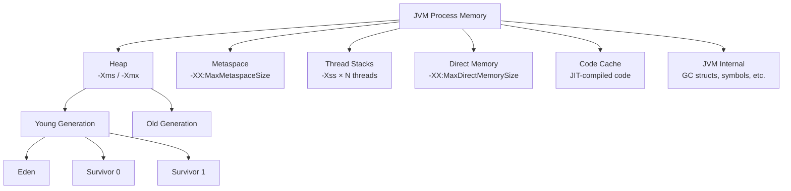
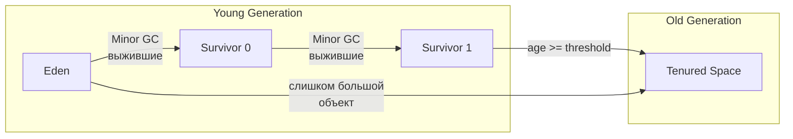
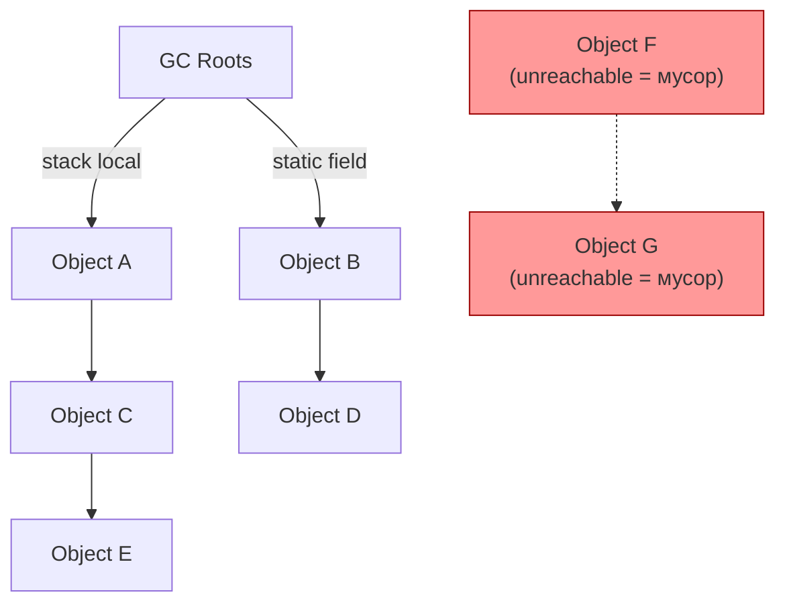
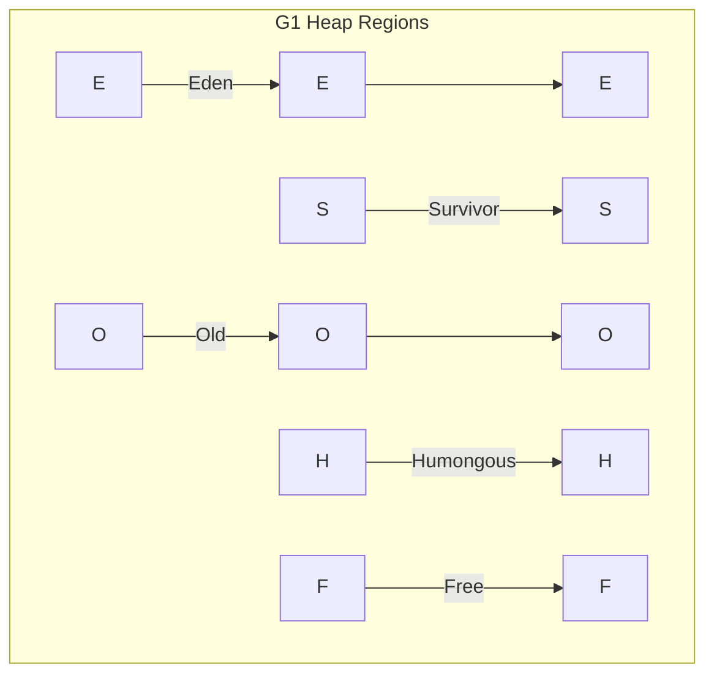
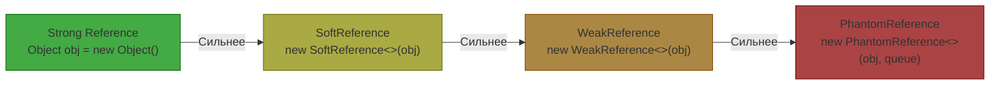
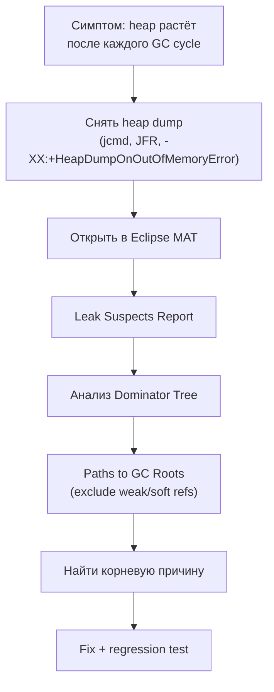
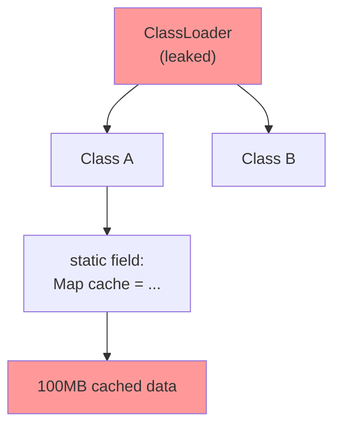
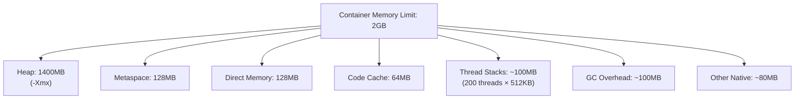

# Вопросы на собеседовании: `Memory Management`

Практичные вопросы и ответы по memory management для `Senior Java Developer`: модель памяти `JVM`, области heap/metaspace/stack/direct, `GC` roots и алгоритмы сборки, типы ссылок (`WeakReference`/`SoftReference`/`PhantomReference`), утечки памяти и их диагностика, off-heap и memory-mapped files, размер объектов, memory barriers, false sharing, `NUMA`, тюнинг и эксплуатация в production.

## Полезные ссылки

### Официальная документация

- [JVM Spec — Run-Time Data Areas](https://docs.oracle.com/javase/specs/jvms/se21/html/jvms-2.html#jvms-2.5) — описание всех областей памяти JVM
- [Garbage Collection Tuning Guide (JDK 21)](https://docs.oracle.com/en/java/javase/21/gctuning/) — официальный гайд по настройке GC
- [Java Flight Recorder](https://docs.oracle.com/en/java/javase/21/jfapi/) — JFR API и документация
- [java.lang.ref package](https://docs.oracle.com/en/java/javase/21/docs/api/java.base/java/lang/ref/package-summary.html) — Reference API
- [JEP 393: Foreign Memory Access API](https://openjdk.org/jeps/393) — Panama Foreign Memory
- [JEP 376: ZGC Concurrent Thread-Stack Processing](https://openjdk.org/jeps/376) — ZGC internals

### Baeldung

- [JVM Memory Model](https://www.baeldung.com/java-stack-heap) — heap vs stack
- [Weak, Soft, and Phantom References](https://www.baeldung.com/java-weak-reference) — типы ссылок
- [Memory Leaks in Java](https://www.baeldung.com/java-memory-leaks) — причины и диагностика утечек
- [Java Object Memory Layout](https://www.baeldung.com/java-memory-layout) — структура объектов в памяти
- [Off-Heap Memory in Java](https://www.baeldung.com/java-off-heap-memory) — direct и mapped буферы
- [False Sharing in Java](https://www.baeldung.com/java-false-sharing-contended) — `@Contended` и padding

## Содержание

- [Полезные ссылки](#полезные-ссылки)
- [See also](#see-also)

**Модель памяти JVM**
- [Q1. (!) Как устроена память JVM? Какие основные области существуют?](#q1--как-устроена-память-jvm-какие-основные-области-существуют)
- [Q2. (!) Чем `heap` отличается от `stack` и когда какая область используется?](#q2--чем-heap-отличается-от-stack-и-когда-какая-область-используется)
- [Q3. Что такое `Metaspace` и чем он отличается от старого `PermGen`?](#q3-что-такое-metaspace-и-чем-он-отличается-от-старого-permgen)
- [Q4. Что такое `Direct Memory` и как ей управлять?](#q4-что-такое-direct-memory-и-как-ей-управлять)
- [Q5. Как устроен `Thread Stack` и что влияет на его размер?](#q5-как-устроен-thread-stack-и-что-влияет-на-его-размер)

**Generational GC и алгоритмы сборки**
- [Q6. (!) Как объяснить generational hypothesis и зачем heap делят на поколения?](#q6--как-объяснить-generational-hypothesis-и-зачем-heap-делят-на-поколения)
- [Q7. (!) Что такое GC roots и как сборщик определяет, какие объекты живы?](#q7--что-такое-gc-roots-и-как-сборщик-определяет-какие-объекты-живы)
- [Q8. (!) Как выбрать GC под требования latency/throughput?](#q8--как-выбрать-gc-под-требования-latencythroughput)
- [Q9. Как работает `G1 GC` и что такое mixed collections?](#q9-как-работает-g1-gc-и-что-такое-mixed-collections)
- [Q10. Как работает `ZGC` и почему он обеспечивает паузы менее 1 мс?](#q10-как-работает-zgc-и-почему-он-обеспечивает-паузы-менее-1-мс)
- [Q11. Что такое `safepoint` и почему он важен для latency?](#q11-что-такое-safepoint-и-почему-он-важен-для-latency)

**Reference API: `WeakReference`, `SoftReference`, `PhantomReference`**
- [Q12. (!) Какие типы ссылок существуют в Java и чем они отличаются?](#q12--какие-типы-ссылок-существуют-в-java-и-чем-они-отличаются)
- [Q13. Как использовать `WeakReference` и `WeakHashMap` для кэширования?](#q13-как-использовать-weakreference-и-weakhashmap-для-кэширования)
- [Q14. Как работает `SoftReference` и когда GC её очищает?](#q14-как-работает-softreference-и-когда-gc-её-очищает)
- [Q15. Зачем нужен `PhantomReference` и как он связан с `Cleaner`?](#q15-зачем-нужен-phantomreference-и-как-он-связан-с-cleaner)

**Утечки памяти: причины и диагностика**
- [Q16. (!) Как выявлять memory leak системно?](#q16--как-выявлять-memory-leak-системно)
- [Q17. (!) Какие самые частые причины утечек памяти в Java?](#q17--какие-самые-частые-причины-утечек-памяти-в-java)
- [Q18. Как анализировать heap dump с помощью Eclipse MAT?](#q18-как-анализировать-heap-dump-с-помощью-eclipse-mat)
- [Q19. Как управлять `Metaspace` и предотвращать classloader leaks?](#q19-как-управлять-metaspace-и-предотвращать-classloader-leaks)

**Off-heap память и Memory-Mapped Files**
- [Q20. (!) Когда полезен off-heap и в чем риски?](#q20--когда-полезен-off-heap-и-в-чем-риски)
- [Q21. Как работают memory-mapped files (`MappedByteBuffer`)?](#q21-как-работают-memory-mapped-files-mappedbytebuffer)
- [Q22. Что даёт Panama Foreign Memory API по сравнению с `Unsafe`?](#q22-что-даёт-panama-foreign-memory-api-по-сравнению-с-unsafe)

**Размер объектов и layout в памяти**
- [Q23. (!) Как устроен объект в памяти JVM (object header, alignment)?](#q23--как-устроен-объект-в-памяти-jvm-object-header-alignment)
- [Q24. Как измерить реальный размер объекта в Java?](#q24-как-измерить-реальный-размер-объекта-в-java)
- [Q25. Что такое Compressed Oops и как они экономят память?](#q25-что-такое-compressed-oops-и-как-они-экономят-память)

**Memory Barriers и False Sharing**
- [Q26. (!) Что такое memory barrier и зачем он нужен?](#q26--что-такое-memory-barrier-и-зачем-он-нужен)
- [Q27. (!) Что такое false sharing и как с ним бороться?](#q27--что-такое-false-sharing-и-как-с-ним-бороться)
- [Q28. Что такое NUMA и как JVM работает с NUMA-архитектурой?](#q28-что-такое-numa-и-как-jvm-работает-с-numa-архитектурой)

**Оптимизация allocation и promotion**
- [Q29. Что такое `allocation rate` и как на него влиять?](#q29-что-такое-allocation-rate-и-как-на-него-влиять)
- [Q30. Что такое `promotion rate` и почему он часто ломает p99?](#q30-что-такое-promotion-rate-и-почему-он-часто-ломает-p99)
- [Q31. Когда имеет смысл `String Deduplication`?](#q31-когда-имеет-смысл-string-deduplication)
- [Q32. Что такое Escape Analysis и Scalar Replacement?](#q32-что-такое-escape-analysis-и-scalar-replacement)

**Инструменты и GC-логи**
- [Q33. Какие инструменты выбрать для анализа памяти в dev и production?](#q33-какие-инструменты-выбрать-для-анализа-памяти-в-dev-и-production)
- [Q34. Как читать GC-логи и не делать ложных выводов?](#q34-как-читать-gc-логи-и-не-делать-ложных-выводов)

**Production-практика**
- [Q35. (!) Какие метрики памяти обязательны на дашборде?](#q35--какие-метрики-памяти-обязательны-на-дашборде)
- [Q36. Как строить алерты по памяти без шума?](#q36-как-строить-алерты-по-памяти-без-шума)
- [Q37. Какие anti-patterns memory tuning встречаются чаще всего?](#q37-какие-anti-patterns-memory-tuning-встречаются-чаще-всего)
- [Q38. Как память JVM взаимодействует с container limits в Docker/K8s?](#q38-как-память-jvm-взаимодействует-с-container-limits-в-dockerk8s)
- [Q39. Как отвечать на memory-вопросы на senior-раунде?](#q39-как-отвечать-на-memory-вопросы-на-senior-раунде)

---

## Q1. (!) Как устроена память JVM? Какие основные области существуют?

Память `JVM` делится на несколько логических областей, каждая из которых имеет свое назначение и режим управления:



| Область | Хранит | Управление | Ключевой флаг |
|---------|--------|------------|---------------|
| `Heap` | Объекты, массивы | GC | `-Xmx`, `-Xms` |
| `Metaspace` | Метаданные классов, constant pool | GC (частично) | `-XX:MaxMetaspaceSize` |
| `Thread Stack` | Фреймы вызовов, локальные переменные | Автоматически при выходе из метода | `-Xss` |
| `Direct Memory` | `ByteBuffer.allocateDirect()` | `Cleaner`/`GC` | `-XX:MaxDirectMemorySize` |
| `Code Cache` | JIT-скомпилированный код | JVM | `-XX:ReservedCodeCacheSize` |

Важно: суммарное потребление процесса = heap + metaspace + stacks + direct + code cache + native memory GC. В контейнерах необходимо учитывать все компоненты, а не только `-Xmx`.

## Q2. (!) Чем `heap` отличается от `stack` и когда какая область используется?

| Характеристика | `Heap` | `Stack` |
|----------------|--------|---------|
| Что хранит | Объекты (через `new`) | Фреймы вызовов, примитивы, ссылки |
| Видимость | Общий для всех потоков | Приватный для каждого потока |
| Размер | Большой (сотни МБ — десятки ГБ) | Маленький (обычно 512KB-1MB на поток) |
| Управление | `GC` | Автоматически (LIFO) |
| Ошибка переполнения | `OutOfMemoryError: Java heap space` | `StackOverflowError` |
| Скорость аллокации | Быстрая (TLAB bump pointer) | Мгновенная (смещение указателя) |

```java
public void example() {
    // primitive 'x' — на стеке
    int x = 42;

    // ссылка 'list' — на стеке, объект ArrayList — в heap
    List<String> list = new ArrayList<>();

    // строка "hello" — в heap (String pool / intern table)
    String s = "hello";
}
```

Практический вывод: рекурсия с глубиной > ~5000 вызовов обычно приводит к `StackOverflowError` при дефолтном `-Xss`. Увеличение `-Xss` множит потребление: 1000 потоков x 1MB = 1GB только на стеки.

## Q3. Что такое `Metaspace` и чем он отличается от старого `PermGen`?

`Metaspace` (с Java 8) заменил `PermGen` и хранит метаданные загруженных классов: структуры `Class`, constant pool, аннотации, информацию о методах.

Ключевые отличия от `PermGen`:

| Характеристика | `PermGen` (Java 7-) | `Metaspace` (Java 8+) |
|----------------|---------------------|----------------------|
| Расположение | Внутри heap (фиксированный сегмент) | Native memory (вне heap) |
| Размер по умолчанию | Фиксированный (64-256MB) | Неограничен (растёт до лимита ОС) |
| Настройка | `-XX:MaxPermSize` | `-XX:MaxMetaspaceSize` |
| GC | Собирается при Full GC | Собирается при достижении порога |

```bash
# Рекомендация для production: всегда ограничивать
-XX:MaxMetaspaceSize=256m
-XX:MetaspaceSize=128m    # начальный порог для GC
```

Без явного лимита `MaxMetaspaceSize` приложение с динамической загрузкой классов (Groovy, CGLIB-прокси, `Reflections`) может неконтролируемо расти в native memory.

## Q4. Что такое `Direct Memory` и как ей управлять?

`Direct Memory` -- это память вне heap, выделяемая через `ByteBuffer.allocateDirect()`. Она не подчиняется GC напрямую и освобождается через `Cleaner` (бывший `sun.misc.Cleaner`).

```java
// Аллокация direct buffer — память вне heap
ByteBuffer directBuf = ByteBuffer.allocateDirect(1024 * 1024); // 1 MB

// Heap buffer для сравнения — в managed heap
ByteBuffer heapBuf = ByteBuffer.allocate(1024 * 1024);
```

Зачем нужна:
- **I/O без копирования**: при записи в сокет/файл JVM не копирует данные из heap в native буфер
- **Стабильный адрес**: GC не перемещает direct буферы, поэтому они безопасны для JNI
- **NIO-каналы**: `FileChannel`, `SocketChannel` работают эффективнее с direct buffers

Риски:
- Утечка при потере ссылки без явного вызова `((DirectBuffer) buf).cleaner().clean()`
- `OutOfMemoryError: Direct buffer memory` если превышен `-XX:MaxDirectMemorySize`
- Память не видна в стандартных heap-метриках — нужен мониторинг через `BufferPoolMXBean`

```java
// Мониторинг direct memory
ManagementFactory.getPlatformMXBeans(BufferPoolMXBean.class)
    .forEach(pool -> System.out.printf("%s: used=%d, capacity=%d%n",
        pool.getName(), pool.getMemoryUsed(), pool.getTotalCapacity()));
```

## Q5. Как устроен `Thread Stack` и что влияет на его размер?

Каждый поток JVM имеет свой стек, состоящий из фреймов вызовов. Каждый фрейм содержит:
- Локальные переменные (примитивы и ссылки)
- Операндный стек (для байткод-инструкций)
- Ссылку на constant pool текущего класса

```
Thread Stack (-Xss)
┌─────────────────────┐
│ Frame: main()       │ ← текущий фрейм
│  locals: args       │
│  operand stack      │
├─────────────────────┤
│ Frame: processOrder │
│  locals: order, i   │
│  operand stack      │
├─────────────────────┤
│ Frame: validate     │
│  locals: result     │
│  operand stack      │
└─────────────────────┘
```

Что влияет на размер стека:
- **Глубина рекурсии**: каждый вызов добавляет фрейм (~100-300 байт в зависимости от метода)
- **Количество локальных переменных**: больше переменных = больший фрейм
- **Количество потоков**: 1000 потоков x `-Xss1m` = 1GB на стеки

```bash
# Типичные настройки
-Xss512k    # уменьшить для приложений с тысячами потоков
-Xss1m      # default (зависит от платформы)
-Xss2m      # для глубокой рекурсии
```

При виртуальных потоках (`Project Loom`) стек хранится в heap и растет динамически, что снимает проблему фиксированного размера стека.

## Q6. (!) Как объяснить generational hypothesis и зачем heap делят на поколения?

**Generational hypothesis** (слабая гипотеза поколений): большинство объектов "умирают молодыми" — создаются и становятся мусором в рамках одного вызова метода или запроса.



Практические следствия:
1. **Young GC (Minor)** — частые, быстрые (единицы мс), собирают Eden + один Survivor
2. **Old GC (Major/Mixed)** — редкие, дорогие, вызывают более длинные паузы
3. **Full GC** — весь heap + metaspace; самые длинные паузы, аварийный сценарий

```bash
# Настройка размера поколений
-Xmn512m                          # размер Young generation
-XX:NewRatio=2                     # Old/Young = 2:1
-XX:SurvivorRatio=8                # Eden/Survivor = 8:1
-XX:MaxTenuringThreshold=15        # сколько Minor GC объект выдержит в Survivor
```

Если в Old Generation слишком быстро попадают временные объекты (высокий promotion rate), растут паузы — подробнее в [вопросах по JVM tuning](jvm-performance-tuning-interview.md).

## Q7. (!) Что такое GC roots и как сборщик определяет, какие объекты живы?

`GC roots` — это набор "корневых" ссылок, от которых начинается обход графа объектов (tracing). Объект жив, если до него можно добраться от хотя бы одного GC root.

**Виды GC roots:**

| GC Root | Пример |
|---------|--------|
| Локальные переменные на стеке | Параметры и переменные в текущих вызовах методов |
| Активные потоки | Объект `Thread`, пока поток работает |
| Статические поля | `static Map<> cache` в любом загруженном классе |
| JNI-ссылки | Ссылки из нативного кода |
| Синхронизированные объекты | Объекты, по которым взята `synchronized` блокировка |
| Classloader | Пока classloader жив, все его классы и их static-поля живы |



Алгоритм **Mark-and-Sweep**:
1. **Mark** — обход от всех GC roots, помечаем достижимые объекты
2. **Sweep** — удаляем непомеченные
3. **Compact** (опционально) — уплотняем heap для избежания фрагментации

Частая ошибка на собеседовании: считать, что `finalize()` или `System.gc()` "гарантируют" сборку. `System.gc()` — лишь _hint_, JVM может проигнорировать.

## Q8. (!) Как выбрать GC под требования latency/throughput?

| GC | Паузы | Throughput | Heap | Когда использовать |
|-----|-------|-----------|------|-------------------|
| `Parallel GC` | Десятки-сотни мс | Максимальный | Любой | Batch, MapReduce, throughput-first |
| `G1 GC` | 10-200 мс (настраиваемый target) | Хороший | 4GB+ | Default с Java 9, balanced |
| `ZGC` | < 1 мс | Чуть ниже | 8GB-16TB | Строгие SLA по latency |
| `Shenandoah` | < 10 мс | Чуть ниже | Средний-большой | Альтернатива ZGC (OpenJDK) |
| `Serial GC` | Длинные STW | Минимальный overhead | Маленький | Микросервисы с heap < 256MB |
| `Epsilon` | Нет GC | Максимальный (нет GC) | Зависит от задачи | Бенчмарки, short-lived процессы |

```bash
# Примеры запуска
java -XX:+UseG1GC -XX:MaxGCPauseMillis=50 -jar app.jar
java -XX:+UseZGC -jar app.jar
java -XX:+UseShenandoahGC -jar app.jar
```

Выбор делается не "по совету", а по замерам p95/p99 и CPU cost под реальной нагрузкой. Рекомендация: начните с `G1`, переходите на `ZGC` только если p99 не укладывается в SLA.

## Q9. Как работает `G1 GC` и что такое mixed collections?

`G1` (Garbage First) делит heap на одинаковые регионы (обычно 1-32MB) и работает инкрементально:



Фазы работы `G1`:
1. **Young-only**: собирает только Eden + Survivor регионы (быстро)
2. **Concurrent Marking**: параллельно с приложением определяет occupancy Old-регионов
3. **Mixed Collection**: собирает Young + часть Old-регионов с наибольшим количеством мусора (отсюда Garbage First)
4. **Full GC** (аварийный): если mixed не успевает, fallback на STW Full GC

```bash
# Ключевые настройки G1
-XX:MaxGCPauseMillis=200          # target паузы (default)
-XX:G1HeapRegionSize=16m          # размер региона
-XX:InitiatingHeapOccupancyPercent=45  # когда начинать concurrent marking
-XX:G1MixedGCCountTarget=8        # сколько mixed collections для очистки old
```

`Humongous objects` — объекты > 50% размера региона. Они аллоцируются в специальных регионах и могут вызывать фрагментацию.

## Q10. Как работает `ZGC` и почему он обеспечивает паузы менее 1 мс?

`ZGC` — concurrent, region-based, compacting сборщик с sub-millisecond паузами независимо от размера heap (от 8MB до 16TB).

Ключевые технологии:
- **Colored pointers**: метаданные о состоянии объекта хранятся в самом указателе (используются 4 бита из 64-битного адреса)
- **Load barriers**: при каждом чтении ссылки JVM проверяет, не перемещён ли объект
- **Concurrent relocation**: перемещение объектов происходит параллельно с работой приложения

```
Фазы ZGC (все concurrent, кроме коротких пауз < 1мс):

1. Pause Mark Start      (< 1мс) — начинаем marking
2. Concurrent Mark                — обход графа параллельно приложению
3. Pause Mark End         (< 1мс) — завершаем marking
4. Concurrent Process References  — обработка Reference API
5. Concurrent Relocate            — перемещаем объекты, уплотняем heap
6. Concurrent Remap               — обновляем ссылки
```

```bash
# Включение ZGC
java -XX:+UseZGC -Xmx16g -jar app.jar

# Generational ZGC (Java 21+) — лучший вариант
java -XX:+UseZGC -XX:+ZGenerational -Xmx16g -jar app.jar
```

Компромисс: `ZGC` тратит больше CPU на load barriers (~5-15% overhead) и потребляет больше памяти (colored pointers требуют multi-mapping).

## Q11. Что такое `safepoint` и почему он важен для latency?

`Safepoint` — момент, когда JVM может безопасно остановить все потоки для служебных операций: GC, deoptimization, class redefinition, biased lock revocation.

```
Проблема "Time To Safepoint" (TTSP):

Thread 1: ──────●──────────────── (уже на safepoint)
Thread 2: ─────────────●──────── (пришёл через 5мс)
Thread 3: ──────────────────●─── (пришёл через 15мс — это TTSP!)
                              │
                         GC начнётся только здесь
```

Что задерживает приход к safepoint:
- Counted loops (цикл с `int` счётчиком без safepoint poll) — JIT не вставляет safepoint внутри
- Длинные JNI-вызовы
- Чтение большого массива в одном цикле

```bash
# Диагностика safepoint delays
-XX:+PrintSafepointStatistics
-Xlog:safepoint=debug  # JDK 11+

# Looping thread threshold (выявляет "застрявших")
-XX:GuaranteedSafepointInterval=1000
```

Практика: смотреть не только длительность GC pause, но и общее safepoint time. Иногда 90% задержки — это ожидание прихода потоков к safepoint, а не сам GC.

## Q12. (!) Какие типы ссылок существуют в Java и чем они отличаются?

Java предоставляет четыре типа ссылок через пакет `java.lang.ref`, каждый с разной "силой" удержания объекта:



| Тип | Когда собирается GC | `get()` после сборки | Основное применение |
|-----|---------------------|---------------------|---------------------|
| `Strong` | Никогда (пока есть strong ref) | N/A | Обычные переменные |
| `SoftReference` | При нехватке памяти (перед `OOME`) | `null` | Memory-sensitive кэши |
| `WeakReference` | При любом GC (если нет strong ref) | `null` | Канонические маппинги, listeners |
| `PhantomReference` | После финализации | Всегда `null` | Cleanup ресурсов, `Cleaner` |

```java
// Пример использования разных типов ссылок
Object strongRef = new Object();                    // strong
SoftReference<byte[]> cache = new SoftReference<>(new byte[1024 * 1024]); // soft
WeakReference<Object> weakRef = new WeakReference<>(strongRef);          // weak

// Phantom — всегда с ReferenceQueue
ReferenceQueue<Object> queue = new ReferenceQueue<>();
PhantomReference<Object> phantom = new PhantomReference<>(new Object(), queue);
// phantom.get() — ВСЕГДА null
```

## Q13. Как использовать `WeakReference` и `WeakHashMap` для кэширования?

`WeakReference` позволяет ссылаться на объект, не препятствуя его сборке GC. `WeakHashMap` использует `WeakReference` для ключей.

```java
// WeakHashMap — ключи автоматически удаляются при GC
Map<Key, Value> cache = new WeakHashMap<>();

// Пока на Key есть strong reference — запись живёт
Key key = new Key("session-123");
cache.put(key, computeExpensiveValue(key));

// Как только key = null и GC пройдёт — запись удалится
key = null;
System.gc(); // hint
// cache.size() может быть 0
```

Важные нюансы:
- `WeakHashMap` слабо держит **ключи**, а не значения. Если значение ссылается на ключ — утечка!
- Строковые литералы (`"abc"`) никогда не собираются, т.к. на них всегда есть strong ref из string pool
- Не thread-safe — оборачивать в `Collections.synchronizedMap()` или использовать `Caffeine` с `weakKeys()`

```java
// Паттерн: канонический маппинг (canonical map)
private final Map<String, WeakReference<Metadata>> metadataCache = new ConcurrentHashMap<>();

public Metadata getMetadata(String className) {
    WeakReference<Metadata> ref = metadataCache.get(className);
    Metadata meta = (ref != null) ? ref.get() : null;
    if (meta == null) {
        meta = loadMetadata(className);
        metadataCache.put(className, new WeakReference<>(meta));
    }
    return meta;
}
```

## Q14. Как работает `SoftReference` и когда GC её очищает?

`SoftReference` гарантирует, что объект не будет собран до тех пор, пока JVM не решит, что памяти недостаточно. Это делает soft references идеальными для кэшей.

```java
// Memory-sensitive кэш на SoftReference
public class SoftCache<K, V> {
    private final Map<K, SoftReference<V>> map = new ConcurrentHashMap<>();

    public V get(K key) {
        SoftReference<V> ref = map.get(key);
        if (ref != null) {
            V value = ref.get();
            if (value != null) return value;
            map.remove(key); // запись протухла
        }
        return null;
    }

    public void put(K key, V value) {
        map.put(key, new SoftReference<>(value));
    }
}
```

Политика GC для soft references:
- JVM очищает soft ref'ы в порядке LRU (least recently used): давно не читанные — первыми
- Параметр `-XX:SoftRefLRUPolicyMSPerMB=1000` (default) означает: soft ref живёт ~1 секунду на каждый MB свободной памяти
- Все soft ref'ы очищаются перед бросанием `OutOfMemoryError`

Почему на практике лучше `Caffeine`/`Guava Cache`:
- `SoftReference`-кэш не контролирует размер — растёт до OOM-границы
- Нет eviction-политик (TTL, max size)
- GC паузы растут из-за обработки большого количества Reference-объектов

## Q15. Зачем нужен `PhantomReference` и как он связан с `Cleaner`?

`PhantomReference` — самая слабая ссылка. `get()` всегда возвращает `null`. Единственная цель — получить уведомление (через `ReferenceQueue`) о том, что объект финализирован и готов к сборке.

```java
// Паттерн: очистка нативных ресурсов через Cleaner (Java 9+)
public class NativeResource implements AutoCloseable {
    private static final Cleaner CLEANER = Cleaner.create();

    private final Cleaner.Cleanable cleanable;
    private final long nativePointer;

    public NativeResource() {
        this.nativePointer = allocateNative();
        // CleanAction НЕ должен ссылаться на this!
        this.cleanable = CLEANER.register(this, new CleanAction(nativePointer));
    }

    @Override
    public void close() {
        cleanable.clean(); // детерминированная очистка
    }

    // Статический класс — критически важно, чтобы не захватить this
    private static class CleanAction implements Runnable {
        private final long ptr;
        CleanAction(long ptr) { this.ptr = ptr; }

        @Override
        public void run() {
            freeNative(ptr);
        }
    }
}
```

Зачем `PhantomReference` вместо `finalize()`:
- `finalize()` deprecated (Java 9) и removed (Java 18) — ненадёжный, непредсказуемый
- `PhantomReference` + `ReferenceQueue` даёт явный контроль над моментом очистки
- `Cleaner` API — удобная обёртка поверх `PhantomReference`
- Нет проблемы "resurrection" (объект не может быть "оживлён" в phantom-фазе)

## Q16. (!) Как выявлять memory leak системно?

Системный процесс диагностики утечки памяти:



Процесс:
1. **Зафиксировать симптом**: "baseline heap после full GC растет линейно" — это leak. Пилообразный паттерн — это нормально.
2. **Снять несколько heap dump** с интервалом (например, после каждого full GC):
   ```bash
   jcmd <pid> GC.heap_dump /tmp/heap1.hprof
   # ... через 10 минут ...
   jcmd <pid> GC.heap_dump /tmp/heap2.hprof
   ```
3. **Сравнить dominator tree**: какие объекты выросли между дампами?
4. **Paths to GC roots** (exclude weak/soft refs): кто держит ссылку?
5. **Найти причину**: бесконечный кэш, `ThreadLocal` без `remove`, подписка на событие без отписки.

```bash
# Автоматический heap dump при OOM (обязателен для production!)
-XX:+HeapDumpOnOutOfMemoryError
-XX:HeapDumpPath=/var/log/app/heapdump.hprof
```

## Q17. (!) Какие самые частые причины утечек памяти в Java?

| Причина | Механизм | Как обнаружить | Как исправить |
|---------|----------|----------------|---------------|
| Unbounded кэш | `Map` растёт без eviction | Dominator tree: огромный `HashMap` | `Caffeine` с `maximumSize` и TTL |
| `ThreadLocal` без `remove()` | В thread pool поток живёт "вечно" | MAT: `ThreadLocalMap$Entry` с retained size | `try/finally { threadLocal.remove(); }` |
| Listener/callback leak | Подписка без отписки | Огромные списки в event dispatcher | `WeakReference` для listeners или явный `removeListener()` |
| Classloader leak | Старый classloader не GC-ится | Metaspace growth, MAT: дублирующиеся классы | Аудит hot-reload, убрать ссылки на classloader |
| Незакрытые ресурсы | `InputStream`, `Connection`, `ResultSet` | Leak detector (Netty), warning-логи | `try-with-resources` |
| `String.intern()` злоупотребление | String table растёт бесконтрольно | Native memory tracking | Ограничить или убрать intern |
| Inner class holds outer ref | Нестатический inner class ссылается на outer | MAT: unexpected retaining path | Сделать класс `static` |

```java
// Классический пример: ThreadLocal leak в thread pool
public class RequestContext {
    private static final ThreadLocal<UserSession> SESSION = new ThreadLocal<>();

    public void processRequest(Request req) {
        SESSION.set(loadSession(req));
        try {
            // ... обработка запроса ...
        } finally {
            SESSION.remove(); // ОБЯЗАТЕЛЬНО! Без этого — leak
        }
    }
}
```

## Q18. Как анализировать heap dump с помощью Eclipse MAT?

`Eclipse MAT` (Memory Analyzer Tool) — основной инструмент для анализа heap dump:

**Ключевые представления:**

1. **Leak Suspects Report** — автоматический анализ, находит подозрительные объекты с большим retained size
2. **Dominator Tree** — показывает объекты, отсортированные по retained heap. Dominator объекта X — это ближайший объект на пути от GC root, удаление которого освободит X
3. **Histogram** — количество и shallow/retained size каждого класса
4. **Paths to GC Roots** — цепочка ссылок от объекта до GC root

**OQL-запросы** (Object Query Language) для поиска:

```sql
-- Найти все HashMap с более чем 10000 записей
SELECT * FROM java.util.HashMap WHERE size > 10000

-- Найти все ThreadLocal значения
SELECT tl.value FROM java.lang.ThreadLocal$ThreadLocalMap$Entry tl
WHERE tl.value != null

-- Найти строки длиннее 1MB
SELECT s FROM java.lang.String s WHERE s.value.@length > 1000000
```

Практический совет: в production снимайте heap dump в отдельную filesystem (не `/tmp`), чтобы не забить диск дампом на десятки ГБ.

## Q19. Как управлять `Metaspace` и предотвращать classloader leaks?

`Metaspace` растёт с загрузкой классов. Classloader leak — одна из самых коварных утечек, потому что один "протёкший" classloader удерживает все его классы, их статические поля и транзитивно — все объекты, на которые они ссылаются.



Типичные сценарии:
- **Hot-reload в dev** (Spring DevTools, JRebel): старый classloader не освобождается
- **Web-приложения в servlet container**: при redeploy остаются ссылки из `ThreadLocal`, JDBC-драйверов, logging
- **Scripting engines** (Groovy, Nashorn): каждая компиляция скрипта создаёт новый класс

```bash
# Мониторинг и защита
-XX:MaxMetaspaceSize=256m          # жёсткий лимит
-XX:MetaspaceSize=128m             # начальный порог GC
-Xlog:class+load=info              # логировать загрузку классов
-Xlog:class+unload=info            # логировать выгрузку
```

```java
// Диагностика: количество загруженных классов
ClassLoadingMXBean cl = ManagementFactory.getClassLoadingMXBean();
System.out.printf("Loaded: %d, Unloaded: %d, Total: %d%n",
    cl.getLoadedClassCount(),
    cl.getUnloadedClassCount(),
    cl.getTotalLoadedClassCount());
```

## Q20. (!) Когда полезен off-heap и в чем риски?

`Off-heap` память — память вне managed heap, не подчиняющаяся GC. Используется для:

| Сценарий | Механизм | Пример |
|----------|----------|--------|
| Высокоскоростной I/O | `DirectByteBuffer` | `Netty` channel buffers |
| Большие кэши без GC pressure | Off-heap storage | `Apache Ignite`, `Chronicle Map` |
| IPC (inter-process communication) | Shared memory / mmap | `SharedMemory` через `FileChannel` |
| JNI / Foreign Function | Native allocation | Panama FFM API |

```java
// Пример: off-heap буфер для сетевого I/O
ByteBuffer directBuffer = ByteBuffer.allocateDirect(64 * 1024);
SocketChannel channel = SocketChannel.open(address);

// Запись без копирования heap → native
directBuffer.put(data);
directBuffer.flip();
channel.write(directBuffer); // zero-copy path

// Очистка — важно!
((sun.nio.ch.DirectBuffer) directBuffer).cleaner().clean();
```

Риски off-heap:
- **Невидимость для GC**: стандартные метрики heap не покажут потребление
- **OOM-killer**: процесс убивается ОС, а не JVM с красивым heap dump
- **Утечки**: без явного `free`/`clean` память не освобождается
- **Сложная отладка**: MAT не видит off-heap данные

```bash
# Мониторинг native memory
jcmd <pid> VM.native_memory summary
-XX:NativeMemoryTracking=summary   # включить трекинг (2-5% overhead)
-XX:MaxDirectMemorySize=256m       # лимит direct memory
```

## Q21. Как работают memory-mapped files (`MappedByteBuffer`)?

`Memory-mapped files` — механизм ОС, позволяющий отобразить файл прямо в адресное пространство процесса. JVM предоставляет доступ через `FileChannel.map()`.

```java
// Чтение большого файла через mmap
try (FileChannel channel = FileChannel.open(Path.of("data.bin"), READ)) {
    MappedByteBuffer buffer = channel.map(
        FileChannel.MapMode.READ_ONLY, 0, channel.size());

    // Доступ как к обычному ByteBuffer — но данные читаются
    // страницами из файла, без загрузки всего в память
    while (buffer.hasRemaining()) {
        processByte(buffer.get());
    }
}

// Чтение + запись (изменения записываются в файл)
try (FileChannel channel = FileChannel.open(Path.of("data.bin"),
        READ, WRITE)) {
    MappedByteBuffer buffer = channel.map(
        FileChannel.MapMode.READ_WRITE, 0, channel.size());
    buffer.putInt(0, 42); // записать int в начало файла
    buffer.force();       // flush на диск
}
```

Преимущества:
- **Lazy loading**: загружаются только запрошенные страницы (page fault → read)
- **Shared memory**: два процесса могут маппить один файл и обмениваться данными
- **Обработка файлов > RAM**: mmap работает с файлами любого размера

Ограничения:
- `MappedByteBuffer` не имеет явного `unmap()` — зависит от GC (проблема на Windows)
- Максимальный размер маппинга = `Integer.MAX_VALUE` (2GB) на одну операцию `map()`
- I/O ошибки (диск недоступен) приводят к `SIGBUS` — JVM крашится

Применение: `Kafka` (segment files), `Lucene`/`Elasticsearch` (индексы), `LMDB`, `Chronicle Queue`.

## Q22. Что даёт Panama Foreign Memory API по сравнению с `Unsafe`?

`Foreign Memory API` (finalized в Java 22, preview с Java 14) — безопасная замена `sun.misc.Unsafe` для работы с off-heap памятью:

```java
// Старый способ (Unsafe) — опасно, нет bounds checking
Unsafe unsafe = getUnsafe();
long address = unsafe.allocateMemory(1024);
unsafe.putInt(address, 42);
unsafe.freeMemory(address); // забыли — leak

// Новый способ (Panama Foreign Memory API)
try (Arena arena = Arena.ofConfined()) {
    MemorySegment segment = arena.allocate(1024);
    segment.set(ValueLayout.JAVA_INT, 0, 42);
    // автоматическое освобождение при выходе из try
}
```

| Характеристика | `Unsafe` | Foreign Memory API |
|----------------|----------|-------------------|
| Bounds checking | Нет (segfault) | Да (исключение) |
| Lifecycle | Ручной `freeMemory()` | `Arena`-based (автоматический) |
| Thread safety | Никакой | `Arena.ofConfined()` / `ofShared()` |
| Доступность | Internal API, может быть убран | Стандартный API |
| Interop с native | Через JNI | `Linker` + `SymbolLookup` (FFM) |

Типы `Arena`:
- `Arena.ofConfined()` — только из создавшего потока, автоматическое освобождение
- `Arena.ofShared()` — многопоточный доступ
- `Arena.global()` — никогда не освобождается (для констант)
- `Arena.ofAuto()` — освобождается при GC (как `DirectByteBuffer`)

## Q23. (!) Как устроен объект в памяти JVM (object header, alignment)?

Каждый объект в `HotSpot JVM` состоит из трёх частей:

```
┌────────────────────────────────────────┐
│         Object Header                  │
│  ┌──────────────────────────────────┐  │
│  │ Mark Word (8 bytes)              │  │
│  │ hash:25 | age:4 | biased:1 |    │  │
│  │ lock:2 | ...                    │  │
│  ├──────────────────────────────────┤  │
│  │ Klass Pointer (4 bytes*)        │  │
│  │ → указатель на Class metadata   │  │
│  ├──────────────────────────────────┤  │
│  │ Array Length (4 bytes, if array) │  │
│  └──────────────────────────────────┘  │
├────────────────────────────────────────┤
│       Instance Fields                  │
│  (отсортированы JVM для компактности)  │
├────────────────────────────────────────┤
│       Padding (alignment to 8 bytes)   │
└────────────────────────────────────────┘

* 4 bytes с Compressed Oops, 8 bytes без
```

Размеры типичных объектов (64-bit JVM, Compressed Oops):

| Объект | Shallow Size | Из чего складывается |
|--------|-------------|---------------------|
| `new Object()` | 16 bytes | 12 header + 4 padding |
| `new Integer(42)` | 16 bytes | 12 header + 4 int field |
| `new Long(42L)` | 24 bytes | 12 header + 4 padding + 8 long field |
| `new byte[0]` | 16 bytes | 16 header (с array length) |
| `new byte[1]` | 24 bytes | 16 header + 1 byte + 7 padding |
| `new String("abc")` | 24 bytes + array | 12 header + fields (value, hash, coder) |

JVM переупорядочивает поля для минимизации padding (field packing): `long`/`double` первыми, затем `int`/`float`, `short`/`char`, `byte`/`boolean`, ссылки.

## Q24. Как измерить реальный размер объекта в Java?

Три подхода:

**1. `java.lang.instrument` (Instrumentation API)**

```java
// Агент для измерения shallow size
public class ObjectSizeAgent {
    private static Instrumentation instrumentation;

    public static void premain(String args, Instrumentation inst) {
        instrumentation = inst;
    }

    public static long sizeOf(Object obj) {
        return instrumentation.getObjectSize(obj); // shallow size
    }
}
```

```bash
# Запуск с агентом
java -javaagent:size-agent.jar -jar app.jar
```

**2. JOL (Java Object Layout) — рекомендованный способ**

```java
// org.openjdk.jol:jol-core
System.out.println(ClassLayout.parseInstance(new Object()).toPrintable());
// Output:
// java.lang.Object object internals:
//  OFFSET  SIZE  TYPE   DESCRIPTION
//       0    12        (object header)
//      12     4        (loss due to alignment)
// Instance size: 16 bytes

System.out.println(GraphLayout.parseInstance(myObject).totalSize());
// deep size — с учётом всех referenced объектов
```

**3. Оценка через heap dump**

В Eclipse MAT: "Shallow Size" (сам объект) vs "Retained Size" (объект + всё, что только он держит).

## Q25. Что такое Compressed Oops и как они экономят память?

`Compressed Oops` (Ordinary Object Pointers) — оптимизация 64-bit JVM, позволяющая использовать 32-bit указатели для ссылок на объекты.

Принцип: объекты в heap выравнены по 8 байт, поэтому 3 младших бита адреса всегда нулевые. JVM сдвигает адрес на 3 бита вправо, сжимая 35-bit адрес в 32 бита. Это покрывает heap до 32GB (2^35 = 32GB).

```
Без Compressed Oops (heap > 32GB):
  Ссылка = 8 bytes
  Object header = 16 bytes (8 mark + 8 klass)

С Compressed Oops (heap <= 32GB):
  Ссылка = 4 bytes
  Object header = 12 bytes (8 mark + 4 klass)
```

Экономия: ~20-30% памяти на типичном приложении. Поэтому **heap 31GB часто лучше, чем 33GB** — при 33GB Compressed Oops отключаются и потребление памяти растёт.

```bash
# Управление (по умолчанию включено при heap <= 32GB)
-XX:+UseCompressedOops             # включить (default)
-XX:-UseCompressedOops             # выключить
-XX:+UseCompressedClassPointers    # сжатие klass pointer (отдельно)
```

## Q26. (!) Что такое memory barrier и зачем он нужен?

`Memory barrier` (memory fence) — инструкция процессора, которая запрещает переупорядочивание операций чтения/записи через барьер. Необходим для корректной видимости изменений между потоками.

Проблема: без барьеров CPU и компилятор могут переупорядочить инструкции, и поток B увидит записи потока A в другом порядке, чем они были выполнены.

```java
// Пример: double-checked locking без volatile — BROKEN
class BrokenSingleton {
    private static BrokenSingleton instance;

    public static BrokenSingleton getInstance() {
        if (instance == null) {
            synchronized (BrokenSingleton.class) {
                if (instance == null) {
                    // Три шага: 1) allocate, 2) init fields, 3) assign ref
                    // Без barrier шаги 2 и 3 могут быть переупорядочены!
                    instance = new BrokenSingleton(); // другой поток может увидеть
                                                       // частично инициализированный объект
                }
            }
        }
        return instance;
    }
}

// Исправление: volatile добавляет store-load barrier
class CorrectSingleton {
    private static volatile CorrectSingleton instance; // volatile = barrier
    // ... rest is the same
}
```

Типы барьеров в Java Memory Model:

| Конструкция Java | Тип барьера | Гарантия |
|-----------------|-------------|----------|
| `volatile` write | StoreStore + StoreLoad | Все предыдущие записи видны до volatile write |
| `volatile` read | LoadLoad + LoadStore | Все последующие чтения видят актуальные данные |
| `synchronized` exit | Release (StoreStore + StoreLoad) | Записи внутри блока видны другим потокам |
| `synchronized` enter | Acquire (LoadLoad + LoadStore) | Чтения видят все предшествующие записи |
| `VarHandle.setRelease()` | Release fence | Лёгкий аналог volatile write |
| `VarHandle.getAcquire()` | Acquire fence | Лёгкий аналог volatile read |

Подробнее о многопоточности — в [вопросах по Java Concurrency](../programming-languages/java/java-concurrency-interview.md).

## Q27. (!) Что такое false sharing и как с ним бороться?

`False sharing` — ситуация, когда два потока модифицируют разные переменные, которые попадают в одну cache line (обычно 64 байта). Каждая запись инвалидирует cache line в кэше другого ядра, несмотря на то что данные логически независимы.

```
Cache Line (64 bytes):
┌────────────────────────────────────────────┐
│ counter1 (Thread A) │ counter2 (Thread B)  │
│ 8 bytes             │ 8 bytes              │
└────────────────────────────────────────────┘
         ↕ invalidate ↕
Каждая запись в counter1 сбрасывает кэш для counter2 и наоборот
```

```java
// Проблема: поля рядом в памяти — false sharing
class FalseSharingProblem {
    volatile long counter1; // Thread A пишет сюда
    volatile long counter2; // Thread B пишет сюда
    // Оба поля в одной cache line — катастрофа для производительности
}

// Решение 1: @Contended (JDK 8+)
class FixedWithContended {
    @jdk.internal.misc.Contended // или @sun.misc.Contended
    volatile long counter1;

    @jdk.internal.misc.Contended
    volatile long counter2;
}
// Требует: --add-opens java.base/jdk.internal.misc=ALL-UNNAMED
// или -XX:-RestrictContended

// Решение 2: ручной padding
class FixedWithPadding {
    volatile long counter1;
    long p1, p2, p3, p4, p5, p6, p7; // 56 bytes padding

    volatile long counter2;
    long q1, q2, q3, q4, q5, q6, q7;
}
```

Где false sharing встречается на практике:
- Массивы атомарных счётчиков (metrics, counters)
- `LongAdder` / `Striped64` — используют padding внутри для борьбы с false sharing
- Ring buffers (`LMAX Disruptor` применяет padding для sequence counters)
- Concurrent data structures с per-thread state

Диагностика: `perf stat -e cache-misses` (Linux), Intel VTune, JMH с `@State(Scope.Group)`.

## Q28. Что такое NUMA и как JVM работает с NUMA-архитектурой?

`NUMA` (Non-Uniform Memory Access) — архитектура серверов с несколькими процессорными сокетами, где каждый процессор имеет "свою" память (local) и может обращаться к памяти других сокетов (remote), но медленнее.

```
┌─────────────────┐     QPI/UPI     ┌─────────────────┐
│   Socket 0      │ ←────────────→  │   Socket 1      │
│  ┌───────────┐  │                 │  ┌───────────┐  │
│  │  CPU 0-7  │  │                 │  │  CPU 8-15 │  │
│  └───────────┘  │                 │  └───────────┘  │
│  ┌───────────┐  │                 │  ┌───────────┐  │
│  │ Local RAM │  │                 │  │ Local RAM │  │
│  │  64 GB    │  │                 │  │  64 GB    │  │
│  └───────────┘  │                 │  └───────────┘  │
└─────────────────┘                 └─────────────────┘

Local access:  ~80ns
Remote access: ~130ns (1.5-2x latency)
```

JVM и NUMA:

```bash
# G1 GC с NUMA-aware allocation (Java 14+)
-XX:+UseG1GC -XX:+UseNUMA

# ZGC — NUMA-aware по умолчанию
-XX:+UseZGC  # автоматически использует NUMA

# Parallel GC — поддерживает NUMA
-XX:+UseParallelGC -XX:+UseNUMA
```

Как NUMA влияет на производительность:
- `GC` с NUMA-awareness аллоцирует Eden на том же NUMA-узле, где работает поток — снижает latency доступа
- При миграции потока на другой NUMA-узел объекты становятся "remote" — возможна деградация
- В контейнерах (K8s) важно pinning CPU: если pod размазан по NUMA-узлам, performance страдает

```bash
# Проверить NUMA-топологию (Linux)
numactl --hardware
# Привязка к одному NUMA-узлу
numactl --cpunodebind=0 --membind=0 java -jar app.jar
```

## Q29. Что такое `allocation rate` и как на него влиять?

`Allocation rate` — сколько памяти выделяется в единицу времени (`MB/s`). Высокий allocation rate нагружает Young GC и может каскадно ухудшить latency.

Как измерить:
```bash
# Из GC-логов: разница eden used между Minor GC / время между Minor GC
-Xlog:gc*:file=gc.log:time,uptime,level,tags

# Через JFR
jcmd <pid> JFR.start duration=60s filename=alloc.jfr
# В JFR: Event 'jdk.ObjectAllocationInNewTLAB' и 'jdk.ObjectAllocationOutsideTLAB'
```

Рычаги снижения:
- **Меньше временных объектов в hot-path**: избегать boxing (`Integer` вместо `int`), лишних `String` конкатенаций
- **Переиспользование буферов**: `ThreadLocal<byte[]>` или object pool для тяжёлых объектов
- **Stream API vs for-loop**: streams создают intermediate объекты (lambda, Spliterator)
- **Контроль сериализации**: Jackson `ObjectMapper` переиспользовать, не создавать на каждый запрос

```java
// Антипаттерн: высокий allocation rate
public String formatResponse(List<Item> items) {
    String result = ""; // N конкатенаций = N объектов String
    for (Item item : items) {
        result += item.getName() + ":" + item.getValue() + "\n";
    }
    return result;
}

// Исправление: StringBuilder — один объект
public String formatResponse(List<Item> items) {
    StringBuilder sb = new StringBuilder(items.size() * 64);
    for (Item item : items) {
        sb.append(item.getName()).append(':')
          .append(item.getValue()).append('\n');
    }
    return sb.toString();
}
```

## Q30. Что такое `promotion rate` и почему он часто ломает p99?

`Promotion rate` — скорость перехода объектов из Young в Old generation (`MB/s`). Высокий promotion ведет к росту Old occupancy и более тяжёлым сборкам (Mixed/Full GC), что убивает p99 latency.

Причины высокого promotion rate:
1. **Маленький Young generation**: объекты не успевают "умереть" в Eden
2. **Долгоживущие промежуточные объекты**: кэши запросов, batch-обработка
3. **Premature promotion**: tenuring threshold слишком низкий

```bash
# Диагностика: в GC-логах смотреть "promoted" / "to-space overflow"
-Xlog:gc+age=debug  # распределение по возрастам

# Настройка: увеличить Young gen
-Xmn1g                            # Young generation = 1GB
-XX:MaxTenuringThreshold=15        # дольше держать в Survivor
-XX:SurvivorRatio=6                # больше места в Survivor
```

Практика: снижать долгоживущие промежуточные объекты и проверять влияние на p99 под нагрузкой. Иногда увеличение Young Gen с 512MB до 1GB кардинально снижает promotion и стабилизирует p99.

## Q31. Когда имеет смысл `String Deduplication`?

`-XX:+UseStringDeduplication` (G1/ZGC) — GC автоматически находит строки с одинаковым содержимым `char[]/byte[]` и делает их ссылающимися на один массив.

```bash
# Включение (только G1 и ZGC)
-XX:+UseStringDeduplication
-XX:StringDeduplicationAgeThreshold=3  # после скольких GC-циклов дедуплицировать
```

Когда полезно:
- Приложения с большим количеством повторяющихся строк: каталоги товаров, JSON-поля, коды стран/валют
- ORM/JDBC: результаты запросов часто содержат повторяющиеся значения (`status`, `category`)
- По статистике, строки занимают 25-50% heap в типичном Java-приложении

Когда НЕ полезно:
- Если строки уникальны (UUID, hash, timestamps)
- Если heap маленький — overhead дедупликации не окупится
- CPU-bound приложения — дедупликация тоже стоит CPU

Антипаттерн: включить все GC-флаги "на всякий случай" без профилирования.

## Q32. Что такое Escape Analysis и Scalar Replacement?

`Escape Analysis` — оптимизация JIT-компилятора, определяющая, "убегает" ли объект из метода или потока. Если нет — JVM может применить агрессивные оптимизации.

```java
// Объект НЕ "убегает" — кандидат на оптимизацию
public int sumPoints() {
    Point p = new Point(3, 4);  // создаётся и умирает внутри метода
    return p.x + p.y;           // JIT может вообще не аллоцировать объект
}
```

Три оптимизации на основе Escape Analysis:

| Оптимизация | Что делает | Эффект |
|------------|-----------|--------|
| **Scalar Replacement** | Разбивает объект на отдельные переменные (скаляры) | Объект не аллоцируется в heap вообще |
| **Stack Allocation** | Аллоцирует объект на стеке | Автоматическое освобождение без GC |
| **Lock Elision** | Убирает синхронизацию на не-escape объекте | Снижает overhead `synchronized` |

```java
// JIT после Scalar Replacement:
public int sumPoints() {
    // Point p = new Point(3, 4); — убрано
    int p_x = 3;  // скаляр вместо поля объекта
    int p_y = 4;
    return p_x + p_y;  // никакой аллокации!
}
```

```bash
# Управление (по умолчанию включено)
-XX:+DoEscapeAnalysis             # включить (default)
-XX:+EliminateAllocations         # scalar replacement (default)
-XX:+EliminateLocks               # lock elision (default)

# Диагностика: что JIT оптимизировал
-XX:+PrintEscapeAnalysis          # debug
-XX:+PrintEliminateAllocations
```

Ограничения: Escape Analysis работает только для объектов, которые JIT может полностью проанализировать. Полиморфные вызовы, большие методы или объекты, переданные в не-инлайнированные методы, "убегают".

## Q33. Какие инструменты выбрать для анализа памяти в dev и production?

| Инструмент | Среда | Overhead | Что даёт |
|-----------|-------|----------|----------|
| `Eclipse MAT` | Dev/Post-mortem | 0 (анализ дампов) | Dominator tree, leak suspects, OQL |
| `VisualVM` | Dev | Средний | Heap monitor, sampling, thread dump |
| `JProfiler` / `YourKit` | Dev | Средний | Allocation tracking, call tree, heap walker |
| `JFR` (Flight Recorder) | Dev + Production | < 2% | Allocation, GC events, locks, I/O |
| `jcmd` | Production | 0 (одноразовые команды) | Heap dump, GC info, VM info |
| `Async Profiler` | Dev + Production | < 5% | Allocation flamegraph, wall-clock profiling |
| `JOL` | Dev | 0 | Object layout analysis |
| `NMT` (Native Memory Tracking) | Dev/Staging | 2-5% | Breakdown native memory |

```bash
# Минимальный набор для production
jcmd <pid> GC.heap_dump /tmp/dump.hprof    # heap dump
jcmd <pid> VM.native_memory summary         # native memory breakdown
jcmd <pid> GC.heap_info                     # текущее состояние heap
jcmd <pid> JFR.start duration=60s filename=/tmp/recording.jfr  # JFR запись

# Allocation flamegraph через async-profiler
./asprof -e alloc -d 30 -f alloc.html <pid>
```

Принцип: в production минимальный overhead (`JFR`, `jcmd`), в dev — максимальная детализация (`MAT`, `JProfiler`). Подробнее — в [вопросах по профилированию](application-profiling-interview.md).

## Q34. Как читать GC-логи и не делать ложных выводов?

```bash
# Включение unified GC logging (JDK 11+)
-Xlog:gc*:file=gc.log:time,uptime,level,tags:filecount=5,filesize=50m
```

Что смотреть:

```
[2026-04-11T10:15:30.123+0300][12.456s] GC(42) Pause Young (Normal)
    (G1 Evacuation Pause) 1024M->256M(2048M) 8.123ms
     ↑ тип сборки          ↑ before→after(total)  ↑ пауза
```

Ключевые метрики из GC-логов:

| Метрика | Что означает | Тревожный сигнал |
|---------|-------------|-----------------|
| Pause time (p95/p99) | Длительность STW пауз | > SLA target |
| Frequency | Как часто GC | Full GC чаще 1/час |
| Reclaimed | Сколько освобождено | Мало — возможна утечка |
| Before → After | Heap до и после GC | After растёт — leak |
| Allocation rate | MB/s аллокаций | > 1 GB/s — hot allocation |
| Promotion rate | MB/s в old gen | Высокий — premature promotion |

Распространённые ловушки:
- "Частый GC = плохо" — если паузы короткие и SLA соблюдается, частота сама по себе не проблема
- "Full GC = катастрофа" — один Full GC при старте нормален (метаданные, classloading)
- "Увеличу heap — GC станет реже" — паузы при этом станут длиннее

Инструменты анализа GC-логов: `GCViewer`, `GCEasy`, `Censum`.

## Q35. (!) Какие метрики памяти обязательны на дашборде?

Минимальный набор метрик для мониторинга памяти JVM через [Micrometer/Prometheus](../monitoring/metrics-tracing-interview.md):

```yaml
# Grafana dashboard: минимальный набор
panels:
  - title: "Heap Usage"
    metric: jvm_memory_used_bytes{area="heap"}  # used vs max
  - title: "Old Gen Occupancy"
    metric: jvm_memory_used_bytes{id="G1 Old Gen"}
  - title: "GC Pause Duration (p99)"
    metric: histogram_quantile(0.99, jvm_gc_pause_seconds_bucket)
  - title: "GC Pause Count"
    metric: rate(jvm_gc_pause_seconds_count[5m])
  - title: "Allocation Rate"
    metric: rate(jvm_gc_memory_allocated_bytes_total[5m])
  - title: "Promotion Rate"
    metric: rate(jvm_gc_memory_promoted_bytes_total[5m])
  - title: "Metaspace"
    metric: jvm_memory_used_bytes{area="nonheap", id="Metaspace"}
  - title: "Direct Buffers"
    metric: jvm_buffer_memory_used_bytes{id="direct"}
  - title: "Thread Count"
    metric: jvm_threads_live_threads
```

Плюс сервисный контекст: latency/error rate, чтобы видеть реальный impact. Рост heap без деградации latency — штатная работа GC. Рост heap + рост p99 — сигнал к расследованию.

## Q36. Как строить алерты по памяти без шума?

Рабочие правила:
- Алертить по **тренду и impact**, а не по одному пику
- Разделять `warning` / `critical`
- Привязывать к SLO
- Держать runbook прямо в алерте

Примеры (Prometheus alerting rules):

```yaml
groups:
  - name: memory-alerts
    rules:
      # Critical: Old Gen > 85% более 10 минут
      - alert: HighOldGenUsage
        expr: |
          jvm_memory_used_bytes{id="G1 Old Gen"} /
          jvm_memory_max_bytes{id="G1 Old Gen"} > 0.85
        for: 10m
        labels:
          severity: critical
        annotations:
          summary: "Old Gen > 85% for 10m — possible memory leak"
          runbook: "https://wiki/runbooks/memory-leak"

      # Warning: allocation rate аномально высокий
      - alert: HighAllocationRate
        expr: rate(jvm_gc_memory_allocated_bytes_total[5m]) > 2e9  # > 2 GB/s
        for: 5m
        labels:
          severity: warning

      # Critical: Full GC чаще чем 2 раза за 30 минут
      - alert: FrequentFullGC
        expr: increase(jvm_gc_pause_seconds_count{action="end of major GC"}[30m]) > 2
        for: 1m
        labels:
          severity: critical
```

## Q37. Какие anti-patterns memory tuning встречаются чаще всего?

| Anti-pattern | Почему плохо | Что делать вместо |
|-------------|-------------|-------------------|
| "Увеличим heap и проблема уйдёт" | Без root cause утечка просто растёт дольше | Найти причину через heap dump |
| Тюнинг 10 флагов одновременно | Невозможно понять, что помогло | Менять по одному, измерять A/B |
| Игнорирование container limits | JVM не знает о cgroup limits (старые JDK) | `-XX:MaxRAMPercentage`, JDK 11+ |
| Копирование настроек из блога | Настройки зависят от workload | Профилировать свой workload |
| `-XX:+DisableExplicitGC` без анализа | Ломает `DirectByteBuffer` cleanup | Понять, кто вызывает `System.gc()` |
| `System.gc()` в коде | Не гарантирует сборку, добавляет STW | Убрать, довериться GC |
| `-Xms` = `-Xmx` всегда | Не даёт GC адаптировать heap | Оправдано для стабильного workload |
| Отсутствие regression-профилирования | Деградация незаметна до production | JFR/benchmark в CI pipeline |

## Q38. Как память JVM взаимодействует с container limits в Docker/K8s?

С Java 10+ JVM правильно читает cgroup limits, но есть нюансы:

```bash
# Container: 2GB memory limit
# JVM видит container limit, а не host memory

# Рекомендация: использовать процентные настройки
java -XX:MaxRAMPercentage=75.0 \     # 75% от container limit = 1.5GB heap
     -XX:InitialRAMPercentage=50.0 \  # 50% = 1GB начальный heap
     -jar app.jar

# Или явно задать, оставив запас для non-heap
java -Xmx1400m -Xms1400m \           # heap
     -XX:MaxMetaspaceSize=128m \      # metaspace
     -XX:MaxDirectMemorySize=128m \   # direct memory
     -XX:ReservedCodeCacheSize=64m \  # code cache
     -jar app.jar
# Сумма: ~1720MB + thread stacks + GC overhead → укладываемся в 2GB
```



Критические ошибки:
- `-Xmx` = container limit → OOM-kill, потому что non-heap memory не учтена
- Старый JDK (< 10) без `-XX:+UseContainerSupport` → JVM видит всю память хоста
- `MaxRAMPercentage=100` → гарантированный OOM-kill

Подробнее о контейнерах — в [вопросах по Docker](../devops/docker-interview.md) и [Kubernetes](../devops/kubernetes-interview.md).

## Q39. Как отвечать на memory-вопросы на senior-раунде?

Шаблон сильного ответа:

1. **Симптом**: "p99 вырос с 50ms до 200ms, Full GC участились до 10/час"
2. **Диагностика**: "Включил JFR, снял heap dump через `jcmd`, проанализировал в MAT"
3. **Root cause**: "Unbounded кэш `ConcurrentHashMap` с сессиями — 2M записей, 800MB retained"
4. **Решение**: "Заменил на `Caffeine` с `maximumSize=10000` и `expireAfterAccess=30m`"
5. **Результат**: "Full GC с 10/ч до 0/ч, heap baseline снизился с 1.8GB до 400MB, p99 стабильно < 50ms"

Что интервьюер хочет услышать:
- **Системный подход**: симптом → данные → гипотеза → проверка → решение → метрика
- **Знание инструментов**: конкретные команды `jcmd`, умение читать MAT dominator tree
- **Trade-off мышление**: "мы рассмотрели `WeakHashMap`, но выбрали `Caffeine`, потому что..."
- **Бизнес-контекст**: "это привело к снижению error rate на checkout на 15%"

Антипаттерн ответа: пересказывать теорию GC без привязки к реальному кейсу. Сильный ответ всегда связывает JVM-детали с эксплуатационным и бизнес-эффектом.

---

## See also

- [JVM Performance Tuning](jvm-performance-tuning-interview.md) — GC-флаги, escape analysis, JIT warm-up
- [Application Profiling](application-profiling-interview.md) — JFR, heap/thread dumps, allocation profiling
- [JVM Fundamentals](../jvm/jvm-interview.md) — архитектура JVM, ClassLoader, байткод
- [Java Concurrency](../programming-languages/java/java-concurrency-interview.md) — многопоточность, volatile, memory model
- [Java Collections](../programming-languages/java/java-collections-interview.md) — коллекции и их влияние на allocation rate
- [Docker](../devops/docker-interview.md) — container memory limits и cgroups
- [Kubernetes](../devops/kubernetes-interview.md) — resource requests/limits и OOM killer в поде

- [Application Profiling](application-profiling-interview.md)
- [Caching Performance](caching-performance-interview.md)
- [Database Performance](database-performance-interview.md)
- [JVM Performance Tuning](jvm-performance-tuning-interview.md)
- [Network Performance](network-performance-interview.md)
- [Performance Testing](performance-testing-interview.md)
