# Вопросы на собеседовании: `Performance Testing`

Практичные вопросы и ответы по нагрузочному тестированию: как планировать, запускать и анализировать `load`, `stress`, `soak`, `spike` и `volume`-тесты. Покрыты инструменты `JMeter`, `Gatling`, `k6`, `Locust`, ключевые метрики (`throughput`, `p50/p95/p99`, `Apdex`), дизайн реалистичной нагрузки и интеграция с `CI/CD`.

**Performance Testing** — это проверка поведения системы под нагрузкой: сколько RPS она держит, как растёт latency, где breaking point, есть ли утечки при длительной работе. Это не баг-хантинг, а **инженерный процесс** верификации SLA/SLO с измеримыми результатами.

## Полезные ссылки

### Официальная документация

- [Apache JMeter User Manual](https://jmeter.apache.org/usermanual/index.html) — официальное руководство по JMeter
- [Gatling Documentation](https://docs.gatling.io/) — официальная документация Gatling (Java/Scala/Kotlin DSL)
- [Grafana k6 Documentation](https://grafana.com/docs/k6/latest/) — документация k6
- [Locust Documentation](https://docs.locust.io/en/stable/) — документация Locust (Python)
- [Types of load testing — Grafana Labs](https://grafana.com/load-testing/types-of-load-testing/) — классификация типов нагрузочного тестирования
- [Baeldung — Intro to Performance Testing using JMeter](https://www.baeldung.com/jmeter) — введение в JMeter
- [Baeldung — Load Testing Rest Endpoint Using Gatling](https://www.baeldung.com/gatling-load-testing-rest-endpoint) — Gatling Java DSL на практике
- [Baeldung — Gatling vs JMeter vs The Grinder](https://www.baeldung.com/gatling-jmeter-grinder-comparison) — сравнение инструментов
- [Baeldung — Distributed Performance Testing with JMeter](https://www.baeldung.com/jmeter-distributed-testing) — распределённое тестирование в JMeter
- [Baeldung — Analyzing JMeter Results](https://www.baeldung.com/jmeter-analyze-results) — анализ результатов JMeter
- [Baeldung — Understanding Ramp-up in JMeter](https://www.baeldung.com/java-jmeter-ramp-up) — ramp-up и throughput
- [Gatling injection reference](https://docs.gatling.io/concepts/injection/) — injection-модели Gatling
- [k6 Thresholds](https://grafana.com/docs/k6/latest/using-k6/thresholds/) — пороги качества в k6
- [k6 Scenarios](https://grafana.com/docs/k6/latest/using-k6/scenarios/) — сценарии и executors

## Содержание

- [Полезные ссылки](#полезные-ссылки)
- [See also](#see-also)

**Основы performance testing**
- [Q1. (!) Что такое performance testing и зачем он нужен?](#q1--что-такое-performance-testing-и-зачем-он-нужен)
- [Q2. (!) Какие бывают типы performance-тестов и чем они отличаются?](#q2--какие-бывают-типы-performance-тестов-и-чем-они-отличаются)
- [Q3. Что такое baseline, benchmark и SLA в performance testing?](#q3-что-такое-baseline-benchmark-и-sla-в-performance-testing)
- [Q4. Как performance testing вписывается в пирамиду тестирования?](#q4-как-performance-testing-вписывается-в-пирамиду-тестирования)

**Типы тестов подробнее**
- [Q5. (!) Что такое load testing и как его правильно спроектировать?](#q5--что-такое-load-testing-и-как-его-правильно-спроектировать)
- [Q6. (!) Что такое stress testing и как найти breaking point?](#q6--что-такое-stress-testing-и-как-найти-breaking-point)
- [Q7. Что такое soak (endurance) testing и какие баги он ловит?](#q7-что-такое-soak-endurance-testing-и-какие-баги-он-ловит)
- [Q8. Что такое spike testing и когда он критичен?](#q8-что-такое-spike-testing-и-когда-он-критичен)
- [Q9. Что такое volume и scalability testing?](#q9-что-такое-volume-и-scalability-testing)
- [Q10. Что такое smoke и recovery testing в контексте нагрузки?](#q10-что-такое-smoke-и-recovery-testing-в-контексте-нагрузки)

**Ключевые метрики**
- [Q11. (!) Что такое throughput, latency и response time?](#q11--что-такое-throughput-latency-и-response-time)
- [Q12. (!) Почему p99 важнее среднего и как читать percentile latency?](#q12--почему-p99-важнее-среднего-и-как-читать-percentile-latency)
- [Q13. Что такое Apdex и как он используется?](#q13-что-такое-apdex-и-как-он-используется)
- [Q14. Что такое SLI, SLO, SLA и как они связаны с нагрузочным тестированием?](#q14-что-такое-sli-slo-sla-и-как-они-связаны-с-нагрузочным-тестированием)
- [Q15. Какие метрики ресурсов обязательно мониторить во время теста?](#q15-какие-метрики-ресурсов-обязательно-мониторить-во-время-теста)

**JMeter**
- [Q16. (!) Что такое Apache JMeter и как устроен его Test Plan?](#q16--что-такое-apache-jmeter-и-как-устроен-его-test-plan)
- [Q17. Что такое Thread Group и какие варианты есть?](#q17-что-такое-thread-group-и-какие-варианты-есть)
- [Q18. Какие Samplers и Listeners самые важные в JMeter?](#q18-какие-samplers-и-listeners-самые-важные-в-jmeter)
- [Q19. (!) Что такое JSR223 Sampler и почему BeanShell устарел?](#q19--что-такое-jsr223-sampler-и-почему-beanshell-устарел)
- [Q20. Как правильно запускать JMeter в production-режиме (CLI, non-GUI)?](#q20-как-правильно-запускать-jmeter-в-production-режиме-cli-non-gui)
- [Q21. Как организовать distributed load testing в JMeter?](#q21-как-организовать-distributed-load-testing-в-jmeter)

**Gatling**
- [Q22. (!) Что такое Gatling и чем он отличается от JMeter?](#q22--что-такое-gatling-и-чем-он-отличается-от-jmeter)
- [Q23. (!) Как устроена Gatling Simulation на Java DSL?](#q23--как-устроена-gatling-simulation-на-java-dsl)
- [Q24. Что такое Open vs Closed injection model в Gatling?](#q24-что-такое-open-vs-closed-injection-model-в-gatling)
- [Q25. Что такое Feeders и как подавать тестовые данные?](#q25-что-такое-feeders-и-как-подавать-тестовые-данные)
- [Q26. Что такое Assertions и Checks в Gatling?](#q26-что-такое-assertions-и-checks-в-gatling)

**k6**
- [Q27. (!) Что такое k6 и в чём его сильные стороны?](#q27--что-такое-k6-и-в-чём-его-сильные-стороны)
- [Q28. (!) Как написать сценарий на k6 и использовать options?](#q28--как-написать-сценарий-на-k6-и-использовать-options)
- [Q29. Что такое Thresholds в k6 и как они кодируют SLO?](#q29-что-такое-thresholds-в-k6-и-как-они-кодируют-slo)
- [Q30. Какие Scenarios и Executors есть в k6?](#q30-какие-scenarios-и-executors-есть-в-k6)
- [Q31. Как запускать k6 в Kubernetes через k6-operator?](#q31-как-запускать-k6-в-kubernetes-через-k6-operator)

**Locust и другие инструменты**
- [Q32. Что такое Locust и когда его выбирать?](#q32-что-такое-locust-и-когда-его-выбирать)
- [Q33. (!) JMeter vs Gatling vs k6 vs Locust — сравнительная таблица](#q33--jmeter-vs-gatling-vs-k6-vs-locust--сравнительная-таблица)

**Дизайн теста**
- [Q34. (!) Что такое ramp-up, think time и realistic workload?](#q34--что-такое-ramp-up-think-time-и-realistic-workload)
- [Q35. Как подготовить тестовые данные и окружение?](#q35-как-подготовить-тестовые-данные-и-окружение)
- [Q36. Как моделировать реалистичный user behavior?](#q36-как-моделировать-реалистичный-user-behavior)

**CI/CD и анализ**
- [Q37. (!) Как интегрировать нагрузочные тесты в CI/CD pipeline?](#q37--как-интегрировать-нагрузочные-тесты-в-cicd-pipeline)
- [Q38. Как анализировать результаты теста и строить отчёты?](#q38-как-анализировать-результаты-теста-и-строить-отчёты)
- [Q39. Как связать load testing с Grafana/Prometheus и APM?](#q39-как-связать-load-testing-с-grafanaprometheus-и-apm)

**Anti-patterns и senior-подача**
- [Q40. (!) Какие anti-patterns и типичные ошибки в нагрузочном тестировании?](#q40--какие-anti-patterns-и-типичные-ошибки-в-нагрузочном-тестировании)
- [Q41. Что такое coordinated omission и почему многие инструменты врут?](#q41-что-такое-coordinated-omission-и-почему-многие-инструменты-врут)
- [Q42. (!) Как дать сильный ответ про performance testing за 60 секунд?](#q42--как-дать-сильный-ответ-про-performance-testing-за-60-секунд)

---

## Q1. (!) Что такое performance testing и зачем он нужен?

**Performance testing** — это систематическая проверка нефункциональных характеристик системы под нагрузкой: `throughput`, `latency`, `resource utilization`, `scalability` и `stability`. Цель — убедиться, что система выдерживает ожидаемый и пиковый трафик, и найти границы её применимости до того, как их найдут пользователи.

**Что проверяем:**

| Вопрос | Тип теста |
|--------|-----------|
| Держит ли система ожидаемый RPS с нужной latency? | `Load` |
| Когда и как она ломается? | `Stress` |
| Есть ли деградация при длительной работе? | `Soak` |
| Как реагирует на внезапный всплеск трафика? | `Spike` |
| Работает ли с большим объёмом данных? | `Volume` |
| Масштабируется ли горизонтально/вертикально? | `Scalability` |

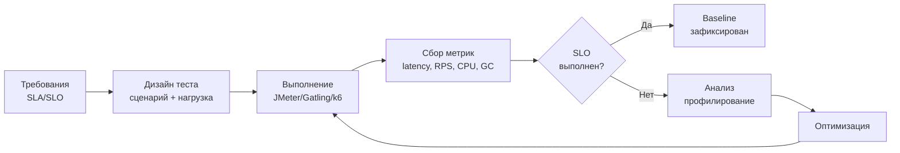

> На интервью подчёркивайте: performance testing — это **воспроизводимый процесс с цифровым результатом** ("p99 = 180ms при 2000 RPS"), а не "мы погоняли нагрузку, вроде держит".

## Q2. (!) Какие бывают типы performance-тестов и чем они отличаются?

Каждый тип отвечает на свой вопрос о поведении системы:

| Тип | Цель | Профиль нагрузки | Длительность |
|-----|------|------------------|--------------|
| `Smoke` | Тест работоспособности скрипта | Минимальная (1-10 VU) | 1-5 мин |
| `Load` | Проверка SLA под ожидаемой нагрузкой | Целевая (e.g. 1000 RPS) | 15-60 мин |
| `Stress` | Найти breaking point | Плавный рост до отказа | 30-60 мин |
| `Spike` | Резкий всплеск и откат | Быстрый рост и падение | 5-15 мин |
| `Soak` (endurance) | Поиск утечек и деградации | Целевая, долго | 4-72 часа |
| `Volume` | Работа с большим объёмом данных | Нормальная, большая БД | 30-60 мин |
| `Scalability` | Как растёт throughput при росте ресурсов | Нагрузка × разные конфиги | серия тестов |

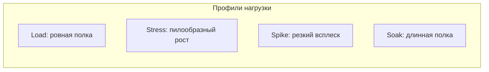

Важно: это **не разные инструменты**, а разные **профили нагрузки** на одном скрипте. Тот же Gatling/k6-сценарий можно запускать как load, так и stress — меняя injection-профиль.

## Q3. Что такое baseline, benchmark и SLA в performance testing?

Три разных понятия, которые легко спутать:

- **Baseline** — эталонное измерение текущего состояния системы. Фиксируется до изменений, чтобы сравнивать "до" и "после".
- **Benchmark** — сравнение с внешним эталоном (конкурент, референсная архитектура, теоретический максимум).
- **SLA/SLO** — контрактные/целевые требования, которые система **должна** выполнять.

```java
// Пример
// Baseline:  p99 = 240 ms, 800 RPS   (то, что есть сейчас)
// Benchmark: p99 = 150 ms, 1200 RPS  (у конкурента)
// SLO:       p99 < 300 ms, >= 1000 RPS  (что мы обещаем)
// SLA:       p99 < 500 ms, 99.9% uptime (что в контракте)
```

**Рабочий цикл:**
1. Зафиксировать baseline под одним и тем же профилем нагрузки
2. Сравнивать каждое изменение с baseline (A/B)
3. Проверять, что SLO выполняется
4. Баг — это когда SLA/SLO не выполняется, не просто "медленно"

Подробнее о SLA/SLO/SLI — в [Q14](#q14-что-такое-sli-slo-sla-и-как-они-связаны-с-нагрузочным-тестированием).

## Q4. Как performance testing вписывается в пирамиду тестирования?

`Performance testing` лежит **сбоку от классической пирамиды** — это отдельная ось нефункциональных тестов. Но внутри него тоже есть иерархия:

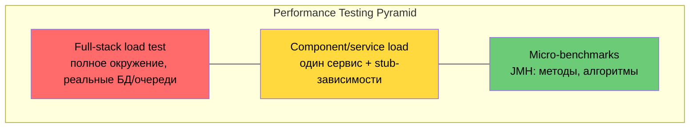

| Уровень | Инструмент | Когда |
|---------|-----------|-------|
| Micro-benchmark | `JMH` | Оптимизация hot-path алгоритма |
| Service / component | `k6` + `Testcontainers`, `Gatling` | На PR, smoke-нагрузка |
| End-to-end | `JMeter`/`Gatling` на stage-окружении | Перед релизом, еженедельно |

Shift-left: базовые smoke-тесты гонять на каждом PR, чтобы ловить регрессии рано. Полный load/soak — на pre-prod окружении по расписанию.

## Q5. (!) Что такое load testing и как его правильно спроектировать?

**Load testing** — проверка, что система выдерживает **ожидаемую** (а не максимальную) нагрузку с соблюдением SLA. Цель — не сломать систему, а подтвердить, что при типовом трафике p99, error rate и ресурсы в пределах норм.

**Алгоритм дизайна:**

1. Определить целевой профиль (RPS, concurrent users, распределение эндпоинтов)
2. Зафиксировать SLO (p95, p99, error rate, throughput)
3. Спроектировать сценарий — реалистичный user journey, а не молотьбу одного эндпоинта
4. Ramp-up до целевой нагрузки (1-5 мин), steady state (15-60 мин)
5. Проверить SLO на steady state, а не на ramp-up

```java
// Gatling: load-тест сервиса заказов, 200 RPS, 20 минут
public class OrderLoadSimulation extends Simulation {
    HttpProtocolBuilder httpProtocol = http
        .baseUrl("https://stage.example.com")
        .acceptHeader("application/json");

    ScenarioBuilder scn = scenario("Place order")
        .exec(http("list products").get("/api/products"))
        .pause(Duration.ofSeconds(2))              // think time
        .exec(http("create order").post("/api/orders")
            .body(StringBody("{\"productId\":42}"))
            .check(status().is(201)));

    {
        setUp(
            scn.injectOpen(
                rampUsersPerSec(0).to(200).during(Duration.ofMinutes(2)),
                constantUsersPerSec(200).during(Duration.ofMinutes(20))
            )
        ).protocols(httpProtocol)
         .assertions(global().responseTime().percentile3().lt(300));   // p95 < 300ms
    }
}
```

**Не путать с stress**: load-тест — это "выполняется ли SLO при нормальной нагрузке", а не "где граница".

## Q6. (!) Что такое stress testing и как найти breaking point?

**Stress testing** — постепенное увеличение нагрузки выше ожидаемой, чтобы найти **breaking point**: точку, где система перестаёт отвечать SLO или падает.

**Что ищем:**
- Максимальный стабильный RPS (до роста error rate)
- Первое звено, которое ломается (CPU, GC, DB pool, очередь)
- Характер отказа (graceful degradation vs cascading failure)
- Скорость восстановления после снятия нагрузки


```javascript
// k6 stress test: от 100 до 2000 VU за 30 минут
export const options = {
    stages: [
        { duration: '5m',  target: 100  },   // baseline
        { duration: '10m', target: 500  },   // повышенная
        { duration: '10m', target: 1500 },   // высокая
        { duration: '5m',  target: 2000 },   // экстремальная
        { duration: '5m',  target: 0    },   // recovery
    ],
    thresholds: {
        http_req_failed: ['rate<0.05'],         // error rate < 5%
    },
};
```

> Сильный ответ: "stress-тест показал breaking point на 1800 RPS — DB connection pool из 50 соединений становился bottleneck, p99 прыгал с 180ms до 3s". Это — конкретика, которую ждут интервьюеры.

## Q7. Что такое soak (endurance) testing и какие баги он ловит?

**Soak testing** (он же `endurance testing`) — длительная прогонка под **целевой** нагрузкой в течение часов или суток. Ловит проблемы, которые не видны за 15 минут load-теста.

**Что находит:**
- `Memory leaks` — heap растёт, GC paused длиннее, в итоге `OOM`
- Утечки нативной памяти (`Metaspace`, direct buffers, thread leaks)
- Утечки ресурсов (connection leaks в БД, файловые дескрипторы)
- Накопление state в кешах без eviction
- Fragmentation (heap, disk)
- Медленные деградации: latency растёт на 2ms/час


**Практика:**
- Длительность: минимум 4 часа, часто 24-72 часа
- Профиль — **steady state** на 60-80% от максимальной нагрузки
- Обязательный мониторинг: heap, non-heap memory, connection pools, thread count, open file descriptors
- Полезно снимать `heap dump` в начале и конце теста для diff-анализа

Подробнее о leak-диагностике — в [вопросах по Memory Management](memory-management-interview.md).

## Q8. Что такое spike testing и когда он критичен?

**Spike testing** — резкое увеличение нагрузки в 5-10× от нормы за секунды, удержание короткое время, затем откат. Имитирует Black Friday, вирусный пост, рассылку push-уведомлений.

**Что проверяем:**
- Выдерживает ли autoscaling (HPA, Kubernetes)
- Не уходит ли система в cascading failure при перегрузке
- Насколько быстро восстанавливается latency после спада нагрузки
- Срабатывают ли circuit breakers и rate limiters

```javascript
// k6 spike: 50 → 1500 VU за 10 секунд, держим 2 мин, откат
export const options = {
    stages: [
        { duration: '1m',  target: 50   },
        { duration: '10s', target: 1500 },   // spike!
        { duration: '2m',  target: 1500 },
        { duration: '10s', target: 50   },
        { duration: '2m',  target: 50   },   // recovery
    ],
};
```

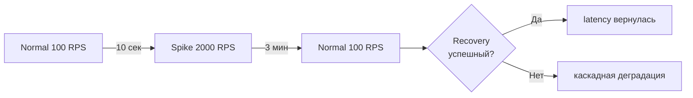

**Критичен для:**
- E-commerce с распродажами и маркетинговыми акциями
- Media / news при viral-событиях
- Сервисов с notification push (flash traffic)
- Любой системы с autoscaling (проверить, что scale-up успевает)

## Q9. Что такое volume и scalability testing?

Это два разных теста, которые часто путают:

**Volume testing** — проверка работы с **большим объёмом данных** (миллионы записей в БД, большие payload'ы, огромные файлы). Нагрузка по пользователям может быть нормальной, но данных — много.

```
Вопросы, которые решает:
- Как работают запросы при 100M записей в таблице?
- Выдерживает ли сервис payload 50 MB?
- Как ведёт себя full-text search на БД 500 GB?
```

**Scalability testing** — проверка, **как растёт пропускная способность** при добавлении ресурсов. Серия тестов с разными конфигурациями.

| Конфигурация | CPU | RAM | Max RPS |
|--------------|-----|-----|---------|
| 1 pod × 1 CPU | 1 | 2 GB | 400 |
| 2 pod × 1 CPU | 2 | 4 GB | 780 (94% линейно) |
| 4 pod × 1 CPU | 4 | 8 GB | 1450 (87% линейно) |
| 8 pod × 1 CPU | 8 | 16 GB | 2400 (75% линейно) |

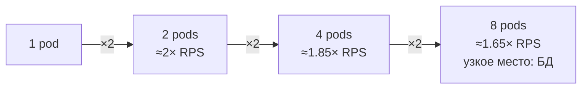

Если масштабирование **не линейно** — ищем bottleneck: общая БД, distributed lock, Kafka partition, кеш.

## Q10. Что такое smoke и recovery testing в контексте нагрузки?

**Smoke test в load testing** — минимальный прогон (1-10 VU, 1-5 мин), чтобы убедиться, что **сам скрипт работает**: URL правильные, авторизация не сломана, сервер отвечает. Запускается перед любым серьёзным тестом.

```javascript
// k6 smoke
export const options = {
    vus: 1,
    duration: '1m',
    thresholds: { http_req_failed: ['rate<0.01'] },
};
```

**Recovery testing** — проверка, что система **восстанавливается** после:
- Снятия нагрузки (spike recovery)
- Перезапуска компонента (pod restart под нагрузкой)
- Восстановления сети (network partition recovery)
- Восстановления БД (failover к replica)

Это на стыке с [Chaos Engineering](../testing/test-strategies-interview.md): добавляете failure к нагрузке и измеряете время восстановления SLO.

## Q11. (!) Что такое throughput, latency и response time?

Три базовые метрики, которые постоянно путают:

| Метрика | Что измеряет | Единица |
|---------|-------------|---------|
| `Throughput` (RPS/TPS) | Сколько запросов обрабатывается в единицу времени | req/sec |
| `Latency` | Время, затраченное только на передачу и ожидание | ms |
| `Response time` | Полное время от отправки до получения ответа | ms |
| `Load time` | Время загрузки ресурса (часто = response time + render) | ms |

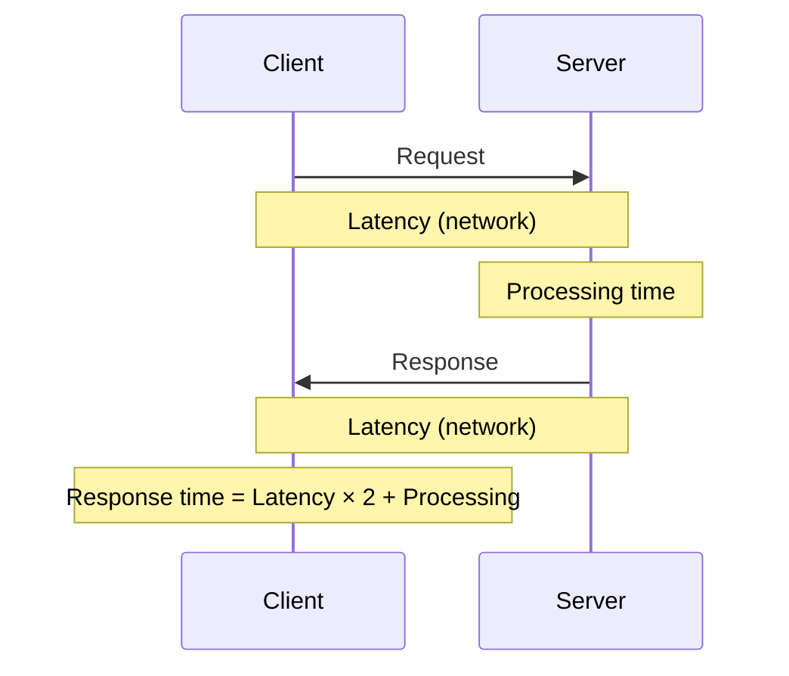

**В JMeter:**
- `Latency` = время от отправки запроса до получения **первого байта** ответа (TTFB)
- `Load time` = время от отправки до получения **последнего байта** (полный ответ)
- На практике для API `Load time ≈ Response time`

**Связь throughput и latency (закон Литтла):**

```
L = λ × W

L — количество одновременных запросов в системе (concurrency)
λ — throughput (RPS)
W — среднее время ответа (response time)
```

Пример: `500 RPS × 200 ms = 100 одновременных запросов в системе`. Если добавить ещё мощности, можно увеличить либо throughput (при той же latency), либо уменьшить latency (при том же throughput).

## Q12. (!) Почему p99 важнее среднего и как читать percentile latency?

**Среднее (mean) латенси скрывает проблемы**. Если из 1000 запросов 990 выполнились за 50ms, а 10 — за 5 секунд, среднее ≈ 100ms, но **1% пользователей видит 5-секундный ответ**.

**Percentile latency:** `pX = значение, ниже которого находится X% измерений`.

| Метрика | Значение | Интерпретация |
|---------|----------|--------------|
| `p50` (медиана) | 80 ms | Половина пользователей получает ответ за ≤80ms |
| `p95` | 220 ms | 5% пользователей ждут дольше 220ms |
| `p99` | 480 ms | 1% — дольше 480ms (у крупного сервиса это тысячи RPS) |
| `p99.9` | 1200 ms | Редкие, но реальные случаи |
| `max` | 8500 ms | Одиночные выбросы — часто шум, но полезно видеть |

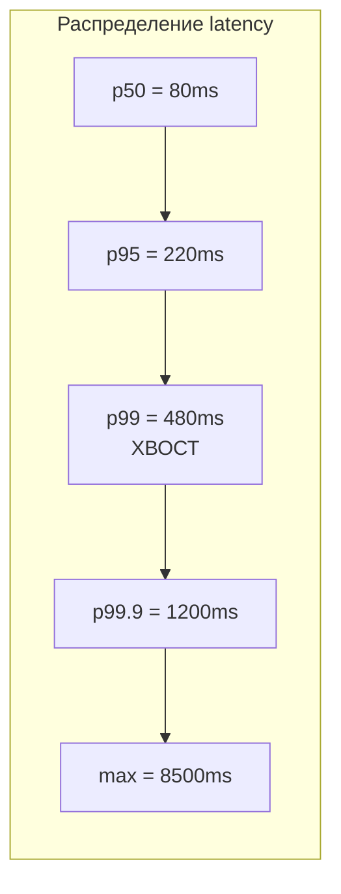

**Почему p99 критичен:**
- У одного пользователя за сессию — 100+ запросов → **он с высокой вероятностью попал в 1%**
- Агрегатор-сервисы делают fan-out по 10+ бэкендам → итоговая latency определяется **худшим** из них
- SLA обычно формулируется в процентилях: "p99 < 300ms для 99.9% месяца"

**Причины tail latency:**
- GC паузы (см. [JVM Performance Tuning](jvm-performance-tuning-interview.md))
- Лок-контеншен
- Cache miss + медленный fetch из БД
- Network retry / timeout
- Переключение контекста, throttling

> На интервью: "мы смотрим не на average, а на p95/p99, и привязываем их к SLO — average врёт при наличии выбросов".

## Q13. Что такое Apdex и как он используется?

**Apdex** (`Application Performance Index`) — индустриальный стандарт оценки удовлетворённости пользователей через latency. Сводит распределение latency в **одно число от 0 до 1**.

```
Apdex = (Satisfied + Tolerating / 2) / Total

где:
- Satisfied  — запросы с latency ≤ T
- Tolerating — запросы с T < latency ≤ 4T
- Frustrated — запросы с latency > 4T (не учитываются в числителе)
- T          — порог удовлетворённости (threshold)
```

**Пример для T=500ms:**
- 850 запросов < 500ms (satisfied)
- 100 запросов 500-2000ms (tolerating)
- 50 запросов > 2000ms (frustrated)
- Apdex = (850 + 100/2) / 1000 = **0.90**

| Apdex | Интерпретация |
|-------|--------------|
| 1.00-0.94 | Excellent |
| 0.93-0.85 | Good |
| 0.84-0.70 | Fair |
| 0.69-0.50 | Poor |
| < 0.50 | Unacceptable |

Apdex удобен для **executive-reporting** и алертов, но скрывает причины и хвосты. На инженерном уровне лучше смотреть percentile latency + error rate отдельно.

## Q14. Что такое SLI, SLO, SLA и как они связаны с нагрузочным тестированием?

Три уровня требований к сервису:

- **SLI** (`Service Level Indicator`) — **что измеряем**: конкретная метрика (p99 latency, error rate, availability)
- **SLO** (`Service Level Objective`) — **цель**: какое значение SLI хотим держать (p99 < 300ms 99.9% времени)
- **SLA** (`Service Level Agreement`) — **контракт**: обязательства перед клиентом, с санкциями за нарушение (доступность 99.9% или возврат денег)

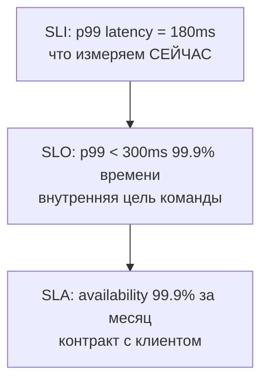

**Связь с performance testing:**
- Performance-тесты проектируются вокруг SLO (какая latency, при какой нагрузке)
- `Error budget = 100% - SLO`: сколько можно "потратить" на инциденты в месяц
- Thresholds в k6 / assertions в Gatling — это **кодирование SLO в тесте**

```javascript
// k6: SLO как pass/fail thresholds
export const options = {
    thresholds: {
        http_req_duration: ['p(95)<200', 'p(99)<500'],  // SLO
        http_req_failed:   ['rate<0.01'],                // error rate < 1%
    },
};
```

Подробнее про SLO-based подход — в [Observability](../monitoring/observability-interview.md).

## Q15. Какие метрики ресурсов обязательно мониторить во время теста?

Нельзя смотреть только на latency — без системных метрик невозможно понять **почему** латенси растёт.

| Категория | Метрика | Инструмент |
|-----------|---------|-----------|
| **Приложение** | p50/p95/p99, RPS, error rate | Prometheus, Micrometer |
| **JVM** | Heap used, GC pause p99, GC overhead, thread count | `jvm_gc_*`, JMX exporter |
| **CPU** | Utilization, load average, throttling (K8s) | node_exporter, cAdvisor |
| **Memory** | RSS, swap, page faults | node_exporter |
| **Сеть** | Bandwidth, retransmits, connections count | node_exporter |
| **Диск** | IOPS, throughput, latency, % util | node_exporter, iostat |
| **БД** | Connection pool saturation, slow queries, replication lag | pg_stat, Prometheus exporter |
| **Очереди** | Consumer lag, queue depth, publish rate | Kafka exporter, RabbitMQ |

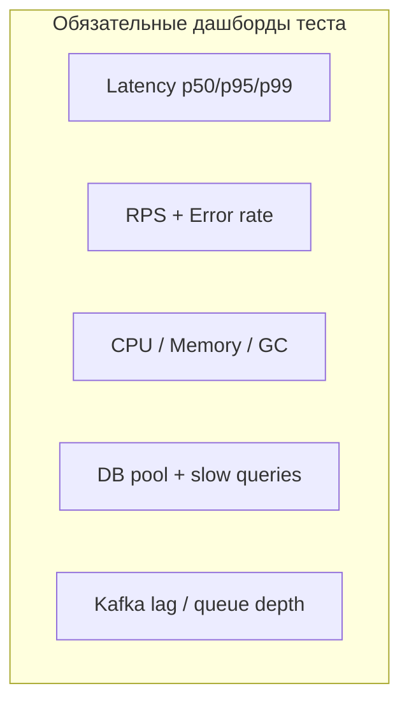

Если growing latency коррелирует с:
- ростом CPU → узкое место в compute / алгоритмах
- ростом GC time → вопрос [JVM-тюнинга](jvm-performance-tuning-interview.md) или allocation rate
- ростом DB pool saturation → узкое место в БД
- ростом network retransmits → сетевая проблема

## Q16. (!) Что такое Apache JMeter и как устроен его Test Plan?

**Apache JMeter** — open-source инструмент нагрузочного тестирования на Java. Старый (с 1998), но самый распространённый в enterprise благодаря поддержке десятков протоколов (HTTP, FTP, JDBC, JMS, SOAP, LDAP, MQTT).

**Иерархия Test Plan:**

```
Test Plan
├── Thread Group (1..N)              # сколько пользователей и как
│   ├── Config Elements              # HTTP Header Manager, CSV Dataset
│   ├── Pre-Processors               # подготовка данных перед запросом
│   ├── Samplers                     # сами запросы (HTTP, JDBC, JSR223)
│   │   └── Post-Processors          # regex extractor, JSON extractor
│   ├── Assertions                   # проверки ответа
│   ├── Timers                       # think time
│   └── Listeners                    # сбор результатов
├── WorkBench (shared config)
└── Listeners (global)
```

```xml
<!-- Упрощённый фрагмент .jmx файла -->
<ThreadGroup>
  <stringProp name="ThreadGroup.num_threads">100</stringProp>
  <stringProp name="ThreadGroup.ramp_time">60</stringProp>
  <longProp name="ThreadGroup.duration">600</longProp>
  <HTTPSamplerProxy>
    <stringProp name="HTTPSampler.domain">stage.example.com</stringProp>
    <stringProp name="HTTPSampler.path">/api/orders</stringProp>
    <stringProp name="HTTPSampler.method">POST</stringProp>
  </HTTPSamplerProxy>
</ThreadGroup>
```

**Сильные стороны JMeter:**
- GUI для визуального построения тестов (удобно для QA-команд)
- Огромный plugin-экосистема ([JMeter Plugins](https://jmeter-plugins.org/))
- Поддержка protocols far beyond HTTP
- Distributed mode из коробки

**Слабые стороны:**
- Thread-per-user → высокое потребление памяти при 10k+ VU
- XML-формат `.jmx` — плохо ревьюится в git
- GUI-ориентированный подход (но CLI-режим обязателен для CI)

## Q17. Что такое Thread Group и какие варианты есть?

**Thread Group** — корневой элемент нагрузки. Задаёт, сколько виртуальных пользователей (threads), как они ramp up и сколько работают.

```
Основные параметры:
- Number of Threads (users)   — сколько виртуальных пользователей
- Ramp-up period              — за сколько секунд все пользователи запустятся
- Loop count / Duration       — сколько итераций или сколько секунд работать
```

**Варианты Thread Group:**

| Тип | Что делает |
|-----|-----------|
| `Standard Thread Group` | Базовая: N юзеров, ramp-up, iterations |
| `setUp Thread Group` | Выполняется **до** основных (подготовка данных) |
| `tearDown Thread Group` | Выполняется **после** (cleanup) |
| `Ultimate Thread Group` (plugin) | Гибкая кривая: несколько ступеней |
| `Stepping Thread Group` (plugin) | Постепенное увеличение нагрузки |
| `Arrivals Thread Group` (plugin) | Open model: arrivals/sec вместо concurrent users |
| `Concurrency Thread Group` (plugin) | Поддерживает заданный уровень concurrency |

```
Ramp-up formula (ориентир):
- Short ramp-up    → simulates simultaneous arrival (spike)
- Gradual ramp-up  → simulates realistic traffic growth

100 threads × 60 sec ramp-up = 1.67 thread/sec arrival
```

Для реалистичного load-теста обычно: ramp-up 2-5 минут, затем steady state 15-60 минут.

## Q18. Какие Samplers и Listeners самые важные в JMeter?

**Samplers** — то, что выполняет реальный запрос к системе:

| Sampler | Назначение |
|---------|-----------|
| `HTTP Request` | REST/HTTP/HTTPS-запросы (самый частый) |
| `JDBC Request` | SQL-запросы к БД |
| `JSR223 Sampler` | Произвольная Groovy/Java-логика |
| `FTP Request` | FTP-операции |
| `SOAP Request` | SOAP web services |
| `JMS Publisher/Subscriber` | Kafka/ActiveMQ/RabbitMQ (через JMS) |
| `Debug Sampler` | Отладка переменных |

**Listeners** — сбор и отображение результатов:

| Listener | Когда использовать |
|----------|-------------------|
| `View Results Tree` | Отладка — **выключать** в production-тесте (memory heavy) |
| `Summary Report` | Агрегированные метрики |
| `Aggregate Report` | + percentiles (p50, p90, p95, p99) |
| `Backend Listener` | Стрим в InfluxDB/Prometheus для Grafana |
| `Simple Data Writer` | Запись .jtl-файла (CSV) для последующего анализа |

> Правило: в CI-прогоне используйте **только** `Simple Data Writer` + `Backend Listener`. Все GUI-листенеры при 1000+ RPS съедают heap и искажают результаты.

## Q19. (!) Что такое JSR223 Sampler и почему BeanShell устарел?

**JSR223 Sampler** — универсальный элемент JMeter для выполнения скриптов на любом JSR-223-совместимом языке: `Groovy` (рекомендуется), JavaScript (Nashorn), Python (Jython).

**Почему именно Groovy:**
- JIT-компиляция (cache compiled script)
- В 10-100× быстрее BeanShell
- Доступ ко всем Java-классам + сокращённый синтаксис

```groovy
// JSR223 Pre-Processor на Groovy — подготовка OAuth-токена
import org.apache.http.client.methods.HttpPost
import org.apache.http.impl.client.HttpClients
import groovy.json.JsonSlurper

def client = HttpClients.createDefault()
def post = new HttpPost("https://auth.example.com/token")
post.setEntity(new StringEntity("grant_type=client_credentials&client_id=...&client_secret=..."))
def response = client.execute(post)
def token = new JsonSlurper().parse(response.getEntity().getContent()).access_token

vars.put("auth_token", token)            // передать в другие Samplers через ${auth_token}
```

**Почему BeanShell устарел:**
- Каждый запуск **парсит** скрипт заново → медленно
- Единственный способ ускорить — компилировать через плагины
- Groovy делает это автоматически

**Важно:** в JSR223 Sampler ставьте галочку `Cache compiled script if available` — иначе теряете весь смысл от Groovy.

## Q20. Как правильно запускать JMeter в production-режиме (CLI, non-GUI)?

**Никогда не запускайте load-тест из GUI!** GUI съедает CPU/RAM на отрисовку и искажает результаты. Для реальных тестов — только **non-GUI CLI-режим**.

```bash
# Запуск теста в non-GUI режиме
jmeter -n -t test-plan.jmx \
       -l results.jtl \
       -e -o report-dir \
       -Jthreads=500 \
       -Jduration=600

# Ключи:
# -n           — non-GUI
# -t           — test plan файл
# -l           — файл с результатами (JTL/CSV)
# -e -o dir    — сгенерировать HTML-отчёт в dir
# -Jkey=value  — передать property в test plan
```

**В test plan используйте `__P()` для параметризации:**

```
Number of Threads: ${__P(threads,100)}
Duration:          ${__P(duration,300)}
Host:              ${__P(host,stage.example.com)}
```

**Для JMeter нужно правильно тюнить JVM:**

```bash
# В bin/jmeter:
HEAP="-Xms4g -Xmx8g"
# Generation ratio, GC, etc. — как для обычного Java-приложения
```

При больших нагрузках (>5000 VU) один JMeter-мастер не справится — нужен **distributed mode** (см. [Q21](#q21-как-организовать-distributed-load-testing-в-jmeter)).

## Q21. Как организовать distributed load testing в JMeter?

JMeter поддерживает **master-slave** архитектуру: один master координирует N slave-нод, каждая из которых генерирует часть нагрузки.

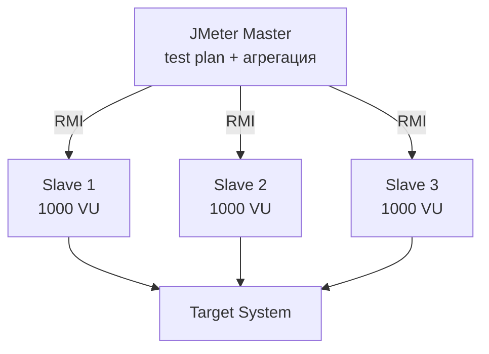

**Настройка:**

```properties
# jmeter.properties на master
remote_hosts=slave1.example.com:1099,slave2.example.com:1099,slave3.example.com:1099
```

```bash
# На каждой slave-ноде
jmeter-server -Djava.rmi.server.hostname=slave1.example.com

# Запуск с master — все slave выполнят одинаковый test plan
jmeter -n -t test.jmx -r -l results.jtl
# или с указанием конкретных slaves:
jmeter -n -t test.jmx -R slave1,slave2 -l results.jtl
```

**Важные моменты:**
- Все slaves получают **копию** test plan и выполняют её → суммарная нагрузка = N × VU
- CSV-файлы с данными нужно **распределять**: делить файл по slaves или использовать подход "общий ID через Redis"
- Master не должен быть на том же хосте, что и slaves — он агрегирует результаты
- Файрволы RMI-портов — частая причина "slave не подключается"

**Альтернатива:** для большой нагрузки часто проще использовать `Gatling` или `k6` (один генератор = десятки тысяч VU) либо облачные сервисы ([BlazeMeter](https://www.blazemeter.com/), [k6 Cloud](https://k6.io/cloud/)).

## Q22. (!) Что такое Gatling и чем он отличается от JMeter?

**Gatling** — современный инструмент нагрузочного тестирования на `Scala`/`Akka`, с 2023 года поддерживает `Java` и `Kotlin` DSL. Фокус — **high performance per agent** и **code-first** подход.

**Ключевые отличия от JMeter:**

| Аспект | `JMeter` | `Gatling` |
|--------|----------|-----------|
| Модель потоков | Thread-per-user | Async non-blocking (Akka) |
| Max VU на один инстанс | ~1000-3000 | 10 000+ |
| Описание теста | XML (.jmx) | Code (Java/Scala/Kotlin DSL) |
| Git-friendly | Слабо (бинарный XML) | Отлично (чистый код) |
| Reports | Базовые + plugins | Богатые HTML из коробки |
| Протоколы | Десятки | HTTP/S, JMS, MQTT, SSE, WebSocket, gRPC |
| IDE-поддержка | JMeter GUI | Любая Java/Scala IDE |
| Плагины | Много готовых | Меньше, но пишутся кодом |

**Типичная архитектура теста:**

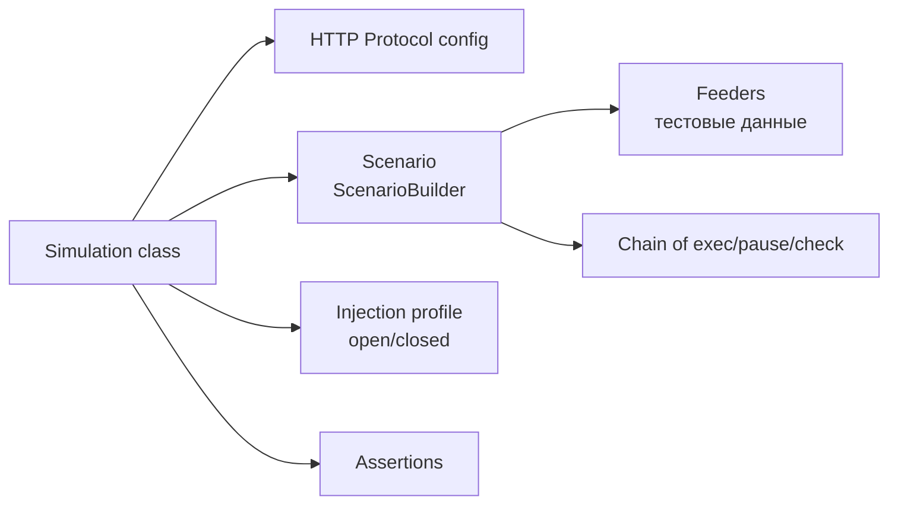

Gatling чаще выбирают для:
- Greenfield-проектов с code-first culture
- Высокой нагрузки с одного агента
- Интеграции в Java/JVM-стек (Maven/Gradle plugin)

## Q23. (!) Как устроена Gatling Simulation на Java DSL?

Gatling Simulation — обычный Java-класс, наследник `Simulation`. Состоит из трёх частей: **HTTP-протокол**, **сценарий**, **injection profile**.

```java
import io.gatling.javaapi.core.*;
import io.gatling.javaapi.http.*;
import static io.gatling.javaapi.core.CoreDsl.*;
import static io.gatling.javaapi.http.HttpDsl.*;
import java.time.Duration;

public class OrdersSimulation extends Simulation {

    // 1. HTTP protocol: базовый URL, заголовки, таймауты
    HttpProtocolBuilder httpProtocol = http
        .baseUrl("https://stage.example.com")
        .acceptHeader("application/json")
        .contentTypeHeader("application/json")
        .userAgentHeader("Gatling/Load-Test");

    // 2. Feeder: тестовые данные из CSV, каждый VU получает свою строку
    FeederBuilder<String> users = csv("users.csv").random();

    // 3. Scenario: цепочка действий одного виртуального пользователя
    ScenarioBuilder scn = scenario("Browse and order")
        .feed(users)
        .exec(http("login")
            .post("/api/login")
            .body(StringBody("{\"user\":\"#{username}\"}"))
            .check(status().is(200))
            .check(jsonPath("$.token").saveAs("authToken")))
        .pause(Duration.ofSeconds(2))                                  // think time
        .exec(http("list products")
            .get("/api/products")
            .header("Authorization", "Bearer #{authToken}")
            .check(jsonPath("$[0].id").saveAs("productId")))
        .pause(Duration.ofSeconds(3))
        .exec(http("create order")
            .post("/api/orders")
            .header("Authorization", "Bearer #{authToken}")
            .body(StringBody("{\"productId\":\"#{productId}\"}"))
            .check(status().is(201)));

    // 4. Setup: какая нагрузка + assertions
    {
        setUp(
            scn.injectOpen(
                rampUsersPerSec(0).to(100).during(Duration.ofMinutes(2)),
                constantUsersPerSec(100).during(Duration.ofMinutes(20))
            )
        ).protocols(httpProtocol)
         .assertions(
             global().responseTime().percentile3().lt(300),       // p95 < 300ms
             global().successfulRequests().percent().gt(99.0)     // success > 99%
         );
    }
}
```

**Запуск через Maven-plugin:**

```bash
mvn gatling:test -Dgatling.simulationClass=com.example.OrdersSimulation
```

**Структура результатов:** Gatling генерирует богатый HTML-отчёт с графиками response time, RPS, percentiles по каждому запросу.

## Q24. Что такое Open vs Closed injection model в Gatling?

Две принципиально разные модели подачи нагрузки:

**Closed model** — задаём **количество concurrent users**. Если сервис замедлился, новые юзеры **не** добавляются — фактический RPS падает. Имитирует приложения с ограниченным пулом сессий (банкоматы, десктоп-клиенты).

```java
setUp(scn.injectClosed(
    constantConcurrentUsers(100).during(Duration.ofMinutes(10)),
    rampConcurrentUsers(100).to(500).during(Duration.ofMinutes(5))
));
```

**Open model** — задаём **arrival rate** (пользователей в секунду). Новые юзеры приходят независимо от скорости сервиса — при замедлении очередь растёт. Имитирует web/mobile-пользователей (люди не ждут завершения предыдущего).

```java
setUp(scn.injectOpen(
    constantUsersPerSec(50).during(Duration.ofMinutes(10)),
    rampUsersPerSec(50).to(500).during(Duration.ofMinutes(5))
));
```

| Модель | Когда |
|--------|-------|
| **Closed** | Фиксированная парк клиентов (kiosk, desktop app), тестируем max concurrency |
| **Open** | Web/mobile с открытым потоком, тестируем max arrival rate |

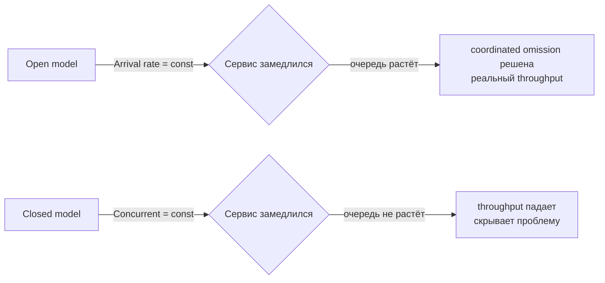

> Best practice для web-приложений: **open model**. Она вскрывает coordinated omission (см. [Q41](#q41-что-такое-coordinated-omission-и-почему-многие-инструменты-врут)).

## Q25. Что такое Feeders и как подавать тестовые данные?

**Feeder** — поставщик данных в сценарий. Каждый виртуальный пользователь, проходя через `.feed(feeder)`, получает следующую запись.

```java
// CSV-файл: один пользователь — одна строка
FeederBuilder<String> csvFeeder = csv("users.csv").random();

// JSON-файл
FeederBuilder<Object> jsonFeeder = jsonFile("products.json").circular();

// JDBC — данные из БД
FeederBuilder<Object> jdbcFeeder = jdbcFeeder(
    "jdbc:postgresql://host/db", "user", "pass",
    "SELECT id, name FROM products WHERE active = true"
);

// Программный (inline)
Iterator<Map<String, Object>> inlineFeeder = Stream.generate(() ->
    Map.<String, Object>of("id", UUID.randomUUID().toString())
).iterator();
```

**Стратегии чтения:**

| Стратегия | Поведение |
|-----------|-----------|
| `.queue()` (default) | По порядку, падает при исчерпании |
| `.random()` | Случайный выбор (с повторами) |
| `.shuffle()` | Случайный без повторов |
| `.circular()` | По кругу, бесконечно |

```java
ScenarioBuilder scn = scenario("Browse")
    .feed(csvFeeder)                                  // получили {"username": "...", "password": "..."}
    .exec(http("login")
        .post("/api/login")
        .body(StringBody("{\"user\":\"#{username}\",\"pass\":\"#{password}\"}"))
    );
```

**Важно:** если feeder `.queue()` и данных меньше VU — тест упадёт с "feeder is empty". Для больших тестов используйте `.circular()` или `.random()`.

## Q26. Что такое Assertions и Checks в Gatling?

Два разных механизма проверок:

**Checks** — проверки на уровне **одного HTTP-запроса**. Если check провалился — запрос считается KO (Failed).

```java
.exec(http("get order")
    .get("/api/orders/#{orderId}")
    .check(status().is(200))                       // код ответа 200
    .check(responseTimeInMillis().lt(500))          // response time < 500ms
    .check(jsonPath("$.status").is("PAID"))         // поле status = PAID
    .check(jsonPath("$.id").saveAs("id")))          // сохранить для следующих запросов
```

**Assertions** — глобальные проверки на **результат всего теста**. Определяют, проходит ли тест в CI.

```java
setUp(scn.injectOpen(...))
    .protocols(httpProtocol)
    .assertions(
        global().responseTime().percentile3().lt(300),     // p95 < 300ms по всему тесту
        global().responseTime().percentile4().lt(800),     // p99 < 800ms
        global().successfulRequests().percent().gt(99.5),  // success rate > 99.5%
        details("create order").failedRequests().count().lt(10L)  // < 10 fail на этом endpoint
    );
```

Если хотя бы одна assertion не выполнена — Gatling завершается с non-zero exit code → **падает CI/CD pipeline**.

## Q27. (!) Что такое k6 и в чём его сильные стороны?

**k6** — open-source инструмент нагрузочного тестирования от Grafana Labs. Написан на Go, сценарии — на **JavaScript/TypeScript**. Единичный k6-агент держит десятки тысяч VU.

**Сильные стороны:**

| Фича | Значение |
|------|---------|
| JS/TS сценарии | Знакомо frontend/backend разработчикам |
| Go runtime | Десятки тысяч VU на одной ноде |
| CLI-first | Никакого GUI, чистая интеграция в CI |
| Thresholds | Декларативные SLO pass/fail |
| Grafana Cloud | Готовые дашборды, облачные runs |
| k6-operator | Distributed load в Kubernetes |
| Extensions (xk6) | Kafka, gRPC, Redis, SQL |
| Output plugins | InfluxDB, Prometheus, Datadog, JSON |

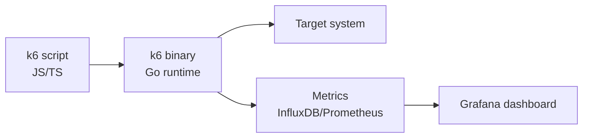

**Когда k6 — правильный выбор:**
- Команда пишет на JS/TS и не хочет учить Java/Scala
- CI/CD-first подход с декларативными SLO
- Нужна высокая плотность нагрузки (>10k VU) на малом количестве агентов
- Интеграция с Grafana stack

**Слабые стороны:**
- JS-сценарии без node_modules ("k6 runtime" — ограниченный набор API)
- Нет GUI для non-technical QA
- Для расширенных протоколов (SOAP, JDBC) нужны xk6-расширения

## Q28. (!) Как написать сценарий на k6 и использовать options?

Простейший k6-скрипт: default-функция = сценарий одного VU.

```javascript
// test.js
import http from 'k6/http';
import { sleep, check } from 'k6';

// 1. Options: как подавать нагрузку
export const options = {
    stages: [
        { duration: '2m',  target: 100 },    // ramp-up
        { duration: '10m', target: 100 },    // steady state
        { duration: '1m',  target: 0   },    // ramp-down
    ],
    thresholds: {
        http_req_duration: ['p(95)<300', 'p(99)<800'],
        http_req_failed:   ['rate<0.01'],
    },
};

// 2. setup() выполняется один раз до теста (подготовка данных, получение токена)
export function setup() {
    const res = http.post('https://auth.example.com/token', { /* creds */ });
    return { token: res.json('access_token') };
}

// 3. Default function — выполняется каждым VU в цикле
export default function (data) {
    const headers = { 'Authorization': `Bearer ${data.token}` };

    const listRes = http.get('https://api.example.com/products', { headers });
    check(listRes, {
        'list status 200':    (r) => r.status === 200,
        'list duration <200': (r) => r.timings.duration < 200,
    });

    sleep(2);  // think time

    const orderRes = http.post('https://api.example.com/orders',
        JSON.stringify({ productId: 42 }),
        { headers: { ...headers, 'Content-Type': 'application/json' } }
    );
    check(orderRes, { 'order created': (r) => r.status === 201 });

    sleep(3);
}

// 4. teardown() — один раз после теста
export function teardown(data) {
    http.del('https://api.example.com/session', null, {
        headers: { 'Authorization': `Bearer ${data.token}` }
    });
}
```

**Запуск:**

```bash
k6 run test.js                                              # локально
k6 run --vus 50 --duration 5m test.js                       # override options
k6 run --out influxdb=http://influx:8086/k6 test.js         # стрим в InfluxDB
k6 run --out prometheus-remote test.js                      # в Prometheus
```

## Q29. Что такое Thresholds в k6 и как они кодируют SLO?

**Thresholds** — декларативные pass/fail критерии. Если threshold нарушен, k6 завершается с non-zero exit code → CI падает.

```javascript
export const options = {
    thresholds: {
        // Базовые метрики
        http_req_duration:   ['p(95)<300', 'p(99)<800'],    // latency
        http_req_failed:     ['rate<0.01'],                  // error rate < 1%
        iteration_duration:  ['avg<5000'],                   // полная итерация

        // Tagged метрики: только для "create order" эндпоинта
        'http_req_duration{name:create_order}': ['p(99)<500'],

        // Группы сценариев
        'http_req_failed{scenario:checkout}': ['rate<0.005'],

        // Custom метрики
        'orders_created': ['count>100'],
    },
};
```

**Механика:** threshold = SLO в виде кода. Пример соответствия:

```
SLO:          "p99 < 300ms для /api/orders, error rate < 0.1%"
Threshold:    http_req_duration{name:orders}: ['p(99)<300']
              http_req_failed:                ['rate<0.001']
```

**Abort on fail:**

```javascript
thresholds: {
    http_req_failed: [
        { threshold: 'rate<0.01', abortOnFail: true, delayAbortEval: '30s' }
    ],
}
// тест прервётся досрочно, если error rate > 1% после первых 30 сек
```

Это делает k6 идеальным для **shift-left performance testing** — SLO проверяются на каждом PR.

## Q30. Какие Scenarios и Executors есть в k6?

`Scenarios` позволяют одновременно запускать **несколько разных нагрузочных профилей** в одном тесте — что-то как несколько Thread Group в JMeter.

```javascript
export const options = {
    scenarios: {
        anonymous_browsing: {
            executor: 'constant-vus',
            vus: 50,
            duration: '10m',
            exec: 'browse',                // вызывает export function browse()
        },
        checkout_flow: {
            executor: 'ramping-arrival-rate',
            startRate: 5,
            timeUnit: '1s',
            stages: [
                { duration: '2m',  target: 50 },
                { duration: '10m', target: 50 },
            ],
            preAllocatedVUs: 100,
            exec: 'checkout',
        },
        background_jobs: {
            executor: 'constant-arrival-rate',
            rate: 10,
            timeUnit: '1s',
            duration: '10m',
            preAllocatedVUs: 20,
            exec: 'jobs',
        },
    },
};

export function browse()   { /* scenario 1 */ }
export function checkout() { /* scenario 2 */ }
export function jobs()     { /* scenario 3 */ }
```

**Executors** — разные модели подачи нагрузки:

| Executor | Модель | Когда использовать |
|----------|--------|-------------------|
| `shared-iterations` | N итераций делятся между VU | Дата-driven smoke |
| `per-vu-iterations` | Каждый VU делает N итераций | Контролируемый объём |
| `constant-vus` | Постоянное число VU | Closed model, SLA-check |
| `ramping-vus` | VU меняются по стадиям | Stress, spike |
| `constant-arrival-rate` | Постоянный RPS | **Open model, рекомендуется** |
| `ramping-arrival-rate` | RPS меняется по стадиям | Stress с open-model |
| `externally-controlled` | VU меняются через k6 API | Динамические сценарии |

> Для web-приложений обычно `constant-arrival-rate`/`ramping-arrival-rate` — правильный выбор (open model, см. [Q24](#q24-что-такое-open-vs-closed-injection-model-в-gatling)).

## Q31. Как запускать k6 в Kubernetes через k6-operator?

**k6-operator** — Kubernetes-оператор, который разворачивает distributed load test как набор Pod'ов. Каждый Pod = один k6-агент, мастер-оператор координирует и агрегирует.

```yaml
# test-run.yaml
apiVersion: k6.io/v1alpha1
kind: K6
metadata:
    name: my-load-test
spec:
    parallelism: 10                          # 10 k6-подов параллельно
    script:
        configMap:
            name: test-script
            file: test.js
    arguments: --out influxdb=http://influx.monitoring:8086/k6 --tag env=stage
    runner:
        image: grafana/k6:latest
        resources:
            requests:
                cpu: 500m
                memory: 512Mi
```

```bash
# Запуск теста
kubectl apply -f test-run.yaml

# Следить за прогрессом
kubectl get pods -l app=k6
kubectl logs -l app=k6 -f
```

**Что делает оператор:**
- Распределяет скрипт по N-подам
- Автоматически делит VU/iterations между ними (`parallelism: 10` при `vus: 1000` → каждому 100)
- Собирает результаты в единый output
- Масштабируется в кластере с минимальным overhead

Для облачного запуска без своего кластера — [Grafana Cloud k6](https://grafana.com/products/cloud/k6/) (managed).

## Q32. Что такое Locust и когда его выбирать?

**Locust** — load testing на **Python**, event-driven (на `gevent`). Фокус — "пишешь тесты как обычный Python-код", UI показывает real-time график.

```python
# locustfile.py
from locust import HttpUser, task, between

class WebsiteUser(HttpUser):
    wait_time = between(1, 3)                # think time 1-3 сек между задачами

    def on_start(self):
        """выполняется один раз при старте VU"""
        self.client.post("/api/login", json={"user": "test", "pass": "test"})

    @task(3)                                 # вес 3 (в 3 раза чаще чем create_order)
    def browse_products(self):
        self.client.get("/api/products")

    @task(1)
    def create_order(self):
        self.client.post("/api/orders", json={"productId": 42})
```

**Запуск:**

```bash
# С UI
locust -f locustfile.py --host=https://stage.example.com

# Headless
locust -f locustfile.py --headless -u 1000 -r 50 --run-time 10m

# Distributed
locust -f locustfile.py --master                          # на мастере
locust -f locustfile.py --worker --master-host=master.ip  # на каждой воркер-ноде
```

**Когда выбирать Locust:**
- Команда — Python-first (data science, ML)
- Нужен real-time UI с графиками
- Тест-сценарий сложнее, чем можно описать декларативно
- Pytest-стиль тестов близок

**Слабые стороны:**
- Single-threaded Python → один процесс держит меньше VU, чем Gatling/k6 (нужен distributed)
- Меньше протоколов "из коробки" (SOAP, JMS — через сторонние lib)
- Меньше готовых reports, чем у Gatling

## Q33. (!) JMeter vs Gatling vs k6 vs Locust — сравнительная таблица

| Критерий | `JMeter` | `Gatling` | `k6` | `Locust` |
|----------|---------|-----------|------|----------|
| **Язык сценариев** | XML / GUI / Groovy | Java/Scala/Kotlin | JS/TypeScript | Python |
| **Модель I/O** | Thread-per-user | Async (Akka) | Coroutines (Go) | Async (gevent) |
| **Max VU / нода** | ~1-3k | ~10k | ~30k+ | ~5-10k |
| **Протоколы** | Десятки (HTTP/JDBC/JMS/FTP/SOAP/MQTT/LDAP) | HTTP/JMS/WebSocket/SSE/gRPC | HTTP/WS/gRPC (+xk6) | HTTP (+lib) |
| **Git-friendly** | Слабо (XML) | Отлично | Отлично | Отлично |
| **Reports** | Базовый HTML + plugins | Богатый HTML | CLI + Grafana | UI + CSV |
| **CI-friendly** | Нужен CLI-flag | Maven/Gradle plugin | Native | Headless mode |
| **Thresholds/SLO** | Assertion plugin | `assertions {}` | `thresholds {}` | В коде Python |
| **Distributed** | Master-slave (RMI) | Gatling Enterprise | k6-operator / Cloud | master-worker |
| **Лицензия** | Apache 2.0 | Apache 2.0 (OSS) | AGPL v3 | MIT |
| **GUI для QA** | Да, родной | Нет (Enterprise GUI платный) | Нет | Web UI real-time |
| **Стоимость prod-scale** | Бесплатно | OSS free, Enterprise €89/мес+ | OSS free, Cloud платный | Бесплатно |

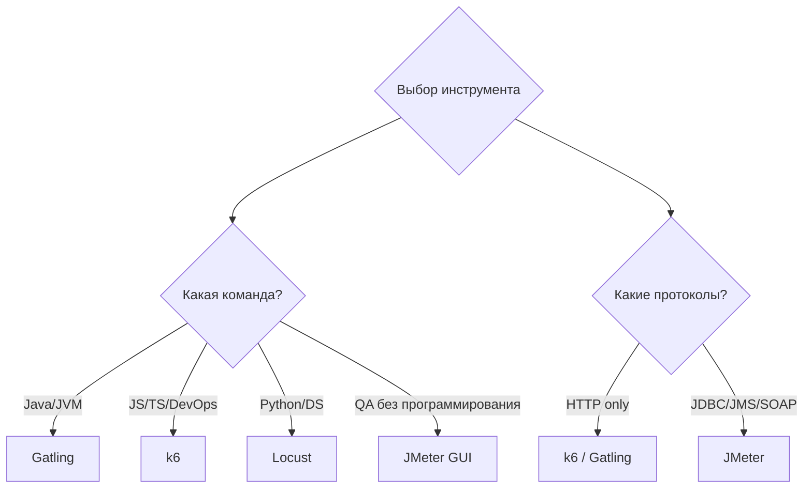

> Практичный совет: **Gatling** для Java-команд, **k6** для CI-heavy сред и Grafana-стека, **JMeter** для enterprise с legacy-протоколами, **Locust** для Python-команд. В корпоративных проектах часто **k6 для регрессии** в CI + **Gatling/JMeter для больших end-of-cycle прогонов**.

## Q34. (!) Что такое ramp-up, think time и realistic workload?

Три ключевых параметра дизайна теста, которые часто делают неправильно:

**Ramp-up** — период, за который нагрузка поднимается с 0 до целевой. Без ramp-up вы получаете **spike**, а не load.

```
Плохо: 1000 VU стартуют за 1 секунду → тест ловит spike, а не steady state
Хорошо: ramp-up 2-5 минут, затем 20+ минут steady state
```

**Think time** — пауза между действиями одного пользователя. Реальные пользователи **не** долбят API в цикле.

| Действие | Realistic think time |
|----------|---------------------|
| Читает карточку товара | 3-15 сек |
| Заполняет форму | 10-60 сек |
| Клик между страницами | 1-3 сек |
| Автоматизированный клиент (API consumer) | 0-1 сек |

```java
// Gatling
.pause(Duration.ofSeconds(2), Duration.ofSeconds(5))    // random 2-5 сек
// k6
sleep(randomIntBetween(2, 5));
```

**Realistic workload** — распределение запросов, как в реальном трафике:

```
Плохо: 100% VU долбят /api/orders (POST)
Хорошо: распределение из analytics:
  - GET /products     : 60%
  - GET /product/{id} : 20%
  - POST /cart        : 10%
  - POST /orders      :  5%
  - GET /orders/{id}  :  5%
```

В Gatling это делается через `randomSwitch()`, в k6 — через рандомный выбор из массива функций:

```java
// Gatling — взвешенный выбор
.randomSwitch()
    .on(percent(60.0), exec(http("browse").get("/products")))
    .on(percent(20.0), exec(http("view").get("/product/#{id}")))
    .on(percent(10.0), exec(http("add to cart").post("/cart")))
    .on(percent(5.0),  exec(http("checkout").post("/orders")))
    .on(percent(5.0),  exec(http("order status").get("/orders/#{id}")))
```

## Q35. Как подготовить тестовые данные и окружение?

Реалистичный тест требует **реалистичных данных**. Плохо подготовленные данные = искажённые результаты.

**Подготовка БД:**

```sql
-- Plохо: пустая БД
-- Query на пустой таблице быстрый, индексы не используются

-- Хорошо: БД размером с prod (или 10-30% от неё)
-- Генерируем через pg_bench / sqlload / custom-скрипт
INSERT INTO products (id, name, price)
SELECT generate_series(1, 10_000_000),
       'Product ' || generate_series(1, 10_000_000),
       random() * 1000;

-- Обновить статистику планировщика
ANALYZE products;
```

**Данные для VU:**

```csv
# users.csv — уникальные учётки, чтобы не сталкивались при login
username,password,userId
user00001,pass123,1001
user00002,pass123,1002
...
```

**Важные моменты:**

- **Cold cache vs warm cache**: первые 30 секунд cache прогревается — не меряйте SLO на ramp-up
- **Stateful actions**: POST /orders создаёт уникальный order_id → не повторяйте одни и те же данные бесконечно
- **Rate limits / auth**: если сервис делает rate limit per user, распределяйте нагрузку между N пользователями
- **Cleanup**: после soak-теста БД может вырасти на ГБ → автоматизируйте cleanup через teardown

**Окружение:**
- Отдельный stage/perf-cluster, не shared с dev
- Конфигурация ресурсов близкая к prod
- Realistic data volume
- Мониторинг настроен заранее (см. [Observability](../monitoring/observability-interview.md))

## Q36. Как моделировать реалистичный user behavior?

Реальный пользователь — это **сценарий**, а не "GET /api/x в цикле". Нужно моделировать путь.

**Типовые сценарии для e-commerce:**

```
1. Gogol-shopper (60% VU)
   GET /search?q=... → GET /product/{id} → выход

2. Browsing (20% VU)
   GET /catalog → GET /catalog/category → GET /product/{id} → GET /product/{id}

3. Buyer (15% VU)
   GET /catalog → GET /product/{id} → POST /cart → GET /cart → POST /checkout

4. Existing customer (5% VU)
   POST /login → GET /orders → GET /orders/{id}
```

**Gatling:**

```java
ScenarioBuilder googleShopper = scenario("Google shopper")...;
ScenarioBuilder browser = scenario("Browser")...;
ScenarioBuilder buyer = scenario("Buyer")...;
ScenarioBuilder existing = scenario("Existing customer")...;

setUp(
    googleShopper.injectOpen(rampUsersPerSec(0).to(60).during(Duration.ofMinutes(2))),
    browser.injectOpen     (rampUsersPerSec(0).to(20).during(Duration.ofMinutes(2))),
    buyer.injectOpen       (rampUsersPerSec(0).to(15).during(Duration.ofMinutes(2))),
    existing.injectOpen    (rampUsersPerSec(0).to(5).during(Duration.ofMinutes(2)))
).protocols(httpProtocol);
```

**Дополнительно:**
- Учитывайте **сезонность**: дневные пики, ночные низкие нагрузки — для soak-тестов
- Учитывайте **error paths**: реальные пользователи вводят невалидные данные, бросают корзину
- Учитывайте **cache-busting**: часть запросов должна падать на cold cache

> Источник данных: используйте access logs / analytics (Google Analytics, product analytics) для извлечения реального распределения.

## Q37. (!) Как интегрировать нагрузочные тесты в CI/CD pipeline?

Два уровня интеграции:

**1. Быстрые smoke/perf-тесты в CI (shift-left)**

На каждом PR запускаем минимальный load (1-5 минут) с жёсткими thresholds. Цель — поймать регрессии рано.

```yaml
# .gitlab-ci.yml (пример)
performance-smoke:
  stage: test
  image: grafana/k6:latest
  script:
    - k6 run --vus 10 --duration 3m smoke.js
  # если threshold нарушен — pipeline падает
```

```yaml
# GitHub Actions (k6)
- uses: grafana/k6-action@v0.3.0
  with:
    filename: tests/smoke.js
    flags: --vus 10 --duration 3m
```

```yaml
# Gatling с Maven plugin в Jenkins
stage('Performance smoke') {
    steps {
        sh 'mvn gatling:test -Dgatling.simulationClass=SmokeSimulation'
    }
    post {
        always {
            gatlingArchive()    // опубликовать HTML-отчёт
        }
    }
}
```

**2. Полноценный load/stress по расписанию (nightly/weekly)**

На pre-prod окружении: 30-60 минут, реалистичная нагрузка, сравнение с baseline.

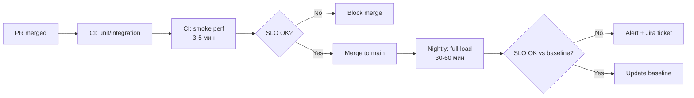

**Ключевые практики:**
- Thresholds = SLO → nonzero exit → CI fails
- Результаты **пушить в Grafana/InfluxDB** для history
- Артефакты сохранять в CI (HTML-отчёт, JTL/JSON)
- Сравнение с baseline (плагины: [Gatling Performance Trend](https://plugins.jenkins.io/gatling/), k6 cloud)

## Q38. Как анализировать результаты теста и строить отчёты?

Правильный разбор результатов — **больше чем "p99 = X"**.

**Что смотреть в отчёте:**

1. **Percentiles по времени** — p50/p95/p99 на графике времени. Не плоские ли они? Не растёт ли p99 к концу теста (soak leak)?
2. **Throughput (RPS) vs latency** — классический график. При увеличении нагрузки обычно видна "колено" (knee).
3. **Error rate** — коды ошибок, распределение по эндпоинтам
4. **Распределение latency** (histogram) — одногорбое или двугорбое?
5. **Связь с метриками системы** — корреляция latency с CPU, GC, DB, Kafka lag

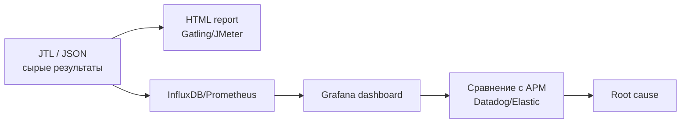

**Признаки проблем:**

| Паттерн | Возможная причина |
|---------|------------------|
| p99 > 10× p50 | GC паузы, lock contention, outliers |
| Latency растёт линейно со временем | Memory leak, connection leak |
| Двугорбое распределение | Hot/cold code path, cache hit/miss |
| Throughput падает при росте VU | Backend bottleneck (DB pool, очередь) |
| Error rate только на одном эндпоинте | Локальная проблема в handler |
| Корреляция с Full GC | JVM-tuning (см. [JVM Performance Tuning](jvm-performance-tuning-interview.md)) |

**Gatling HTML-отчёт** содержит: response time percentiles, RPS over time, requests per endpoint, response time distribution. Всё из коробки.

**JMeter**: используйте `-e -o` флаг для HTML-отчёта, либо Backend Listener + Grafana для real-time.

**k6**: `--summary-export=summary.json` + парсинг в CI либо стрим в Grafana.

## Q39. Как связать load testing с Grafana/Prometheus и APM?

Полноценный perf-test = нагрузка **+ наблюдение**. Только latency-график не покажет root cause.

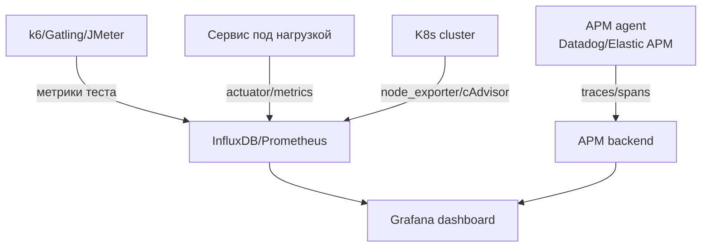

**k6 → Prometheus:**

```bash
k6 run --out experimental-prometheus-rw test.js
# или
K6_PROMETHEUS_RW_SERVER_URL=http://prom:9090/api/v1/write k6 run test.js
```

**Gatling → InfluxDB (real-time):**

```
# gatling.conf
gatling {
  data {
    writers = [console, file, graphite]
    graphite {
      host = "influxdb"
      port = 2003
      rootPathPrefix = "gatling.perftest"
    }
  }
}
```

**JMeter → InfluxDB (Backend Listener):**
- Добавьте `Backend Listener` в Test Plan
- Implementation: `InfluxdbBackendListenerClient`
- URL: `http://influxdb:8086/write?db=jmeter`

**В Grafana:**
- **Overview dashboard**: VU/RPS, latency percentiles, error rate (из k6/Gatling)
- **Service dashboard**: heap, GC, thread count, connection pool (из app actuator)
- **Infrastructure**: CPU, memory, network, disk (из node_exporter)
- **APM dashboard**: slow traces, span breakdown

Связь через **общий label** (environment=perf, test_run_id=20261015-001) позволяет совмещать все дашборды за конкретный тест.

Подробнее — в [Metrics & Tracing](../monitoring/metrics-tracing-interview.md) и [Observability](../monitoring/observability-interview.md).

## Q40. (!) Какие anti-patterns и типичные ошибки в нагрузочном тестировании?

| Anti-pattern | Почему плохо | Как делать правильно |
|--------------|-------------|---------------------|
| Тест из GUI JMeter в prod-режиме | GUI съедает CPU/RAM, искажает результаты | Только CLI non-GUI режим |
| Одна конечная точка молотится в цикле | Нереалистично, не ловит real-world bottleneck | Realistic user journey с весами |
| Нет ramp-up | Стартовый spike ломает кеши/пулы | Ramp-up 1-5 мин |
| Нет think time | Неестественно давит на сервис | 1-5 сек между действиями |
| Одни и те же данные | Cache hit 100%, не репрезентативно | Feeder с разнообразными данными |
| Closed model при open-model трафике | Coordinated omission, заниженные latency | Open model для web |
| Тест на пустой БД | Планировщик выбирает другие планы | Prod-like volume |
| Нет мониторинга сервиса | "Что-то замедлилось, не знаем что" | Grafana dashboard + APM |
| Меряем average | Скрывает хвосты | Percentiles (p95, p99, p99.9) |
| Клиент и сервер на одной машине | Конкуренция за CPU/сеть | Разные хосты (или K8s node anti-affinity) |
| Нет baseline | Невозможно сказать "стало лучше" | Baseline before changes, A/B |
| Запускаем раз в квартал | Регрессии копятся | Smoke на каждом PR + nightly full |

**Типичные ошибки интерпретации:**
- "p99 = 500ms, среднее 50ms → всё ок": **нет**, 1% пользователей ждёт полсекунды
- "Throughput 2000 RPS, latency 100ms → система быстрая": **ок, но** при каком VU и какой error rate?
- "Load-тест прошёл → продакшен выдержит": **нет**, если окружение не совпадает

## Q41. Что такое coordinated omission и почему многие инструменты врут?

**Coordinated omission** — систематическое занижение latency в инструментах с closed model. Термин от Gil Tene (создатель HdrHistogram).

**Как это возникает:**

```
Closed model: VU отправляет запрос → ждёт ответа → отправляет следующий.

Если сервис "завис" на 10 секунд:
- Вместо 100 ожидаемых запросов за это время было 1
- Но latency этого одного: "всего" 10 секунд
- Остальные 99 "пропущенных" запросов — не засчитались нигде!
- Итог: percentile latency посчитан как "99 нормальных + 1 плохой"
                    вместо "99 пропущенных + 1 плохой"
```

**Последствия:**
- p99 выглядит нормальным, хотя реально деградация была на 10 секунд
- Метрики лгут в ту сторону, где им выгодно
- Решения принимаются на плохих данных

**Как избежать:**

1. **Open model** (arrival rate): новые запросы идут **независимо** от скорости ответа
   - Gatling: `injectOpen + constantUsersPerSec`
   - k6: `constant-arrival-rate` / `ramping-arrival-rate`
   - JMeter: `Throughput Shaping Timer` + plugins

2. **HdrHistogram** для latency: корректно учитывает "missing" requests

3. **Коррекция в анализе**: вычисляем "intended start time" и латенси от него, а не от фактической отправки

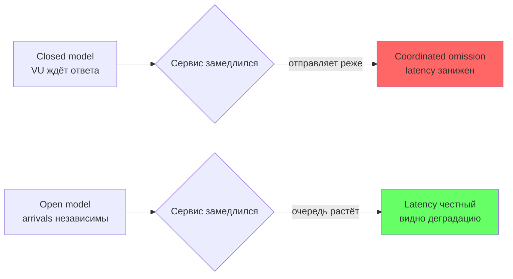

> На интервью: "мы используем open model в k6 с `constant-arrival-rate` — это избегает coordinated omission и даёт честную картину latency при перегрузке".

## Q42. (!) Как дать сильный ответ про performance testing за 60 секунд?

Структура **CSAT-R** (Context → Scope → Approach → Tools → Result):

> 1. **Контекст**: "E-commerce API, SLO p99 < 300ms при 2000 RPS, Kubernetes, Java 21"
> 2. **Scope**: "Проверяем три типа нагрузки — load (подтверждение SLO), stress (breaking point), soak (24h на утечки). Spike — для Black Friday отдельно."
> 3. **Подход**: "Open model (arrival rate), realistic workload с 4 сценариями (browse 60%, cart 20%, checkout 15%, account 5%), ramp-up 2 мин, steady 30 мин. Данные — снапшот prod-БД."
> 4. **Инструменты**: "k6 для smoke-тестов на каждом PR в CI (shift-left). Gatling для nightly full-load на pre-prod. Метрики в Prometheus, APM — Elastic. Grafana dashboard совмещает load + app + infra метрики."
> 5. **Результат**: "Baseline p99 = 180ms, breaking point 2800 RPS (DB pool), соблюдаем SLO 99.9% месяца. Spike-тест подтвердил, что HPA успевает отмасштабироваться за 45 сек."

Такой ответ показывает:
- Понимание **типов** тестов и **когда** каждый нужен
- Знание **open vs closed model** и coordinated omission
- **Инженерная дисциплина**: baseline, CI-интеграция, observability
- **Конкретика и цифры**, а не "погоняли нагрузку, вроде ок"

Антипаттерн-ответ: "Используем JMeter, он гоняет HTTP-запросы, смотрим на среднюю latency". Слабо, потому что:
- Нет привязки к SLO
- "Среднее" — метрика, скрывающая tail latency
- Нет разговора о реалистичности нагрузки
- Нет упоминания CI, baseline, observability

## See also

- [Application Profiling](application-profiling-interview.md) — JFR/async-profiler/flame graphs для поиска root cause под нагрузкой
- [JVM Performance Tuning](jvm-performance-tuning-interview.md) — GC, heap, allocation rate: что тюнить после perf-теста
- [Memory Management](memory-management-interview.md) — soak-тесты и memory leaks, NMT, heap dump analysis
- [Стратегии тестирования](../testing/test-strategies-interview.md) — где performance testing в общей стратегии, risk-based подход
- [Test Automation](../testing/test-automation-interview.md) — интеграция нагрузочных тестов в автоматизированный pipeline
- [Integration Testing](../testing/integration-testing-interview.md) — smoke-перекрытие с нагрузочными smoke-тестами
- [Metrics & Tracing](../monitoring/metrics-tracing-interview.md) — Prometheus/Grafana/APM для observability во время нагрузки
- [Observability](../monitoring/observability-interview.md) — SLI/SLO/SLA, error budgets, три pillars observability
- [Scalability Patterns](../architecture/scalability-patterns-interview.md) — горизонтальное масштабирование, которое проверяет scalability testing
- [Kubernetes](../devops/kubernetes-interview.md) — k6-operator, HPA и проверка autoscaling через spike-тесты

- [Caching Performance](caching-performance-interview.md)
- [Database Performance](database-performance-interview.md)
- [JVM Performance Tuning](jvm-performance-tuning-interview.md)
- [Memory Management](memory-management-interview.md)
- [Network Performance](network-performance-interview.md)
