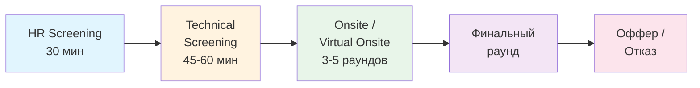
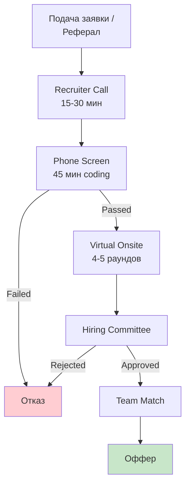
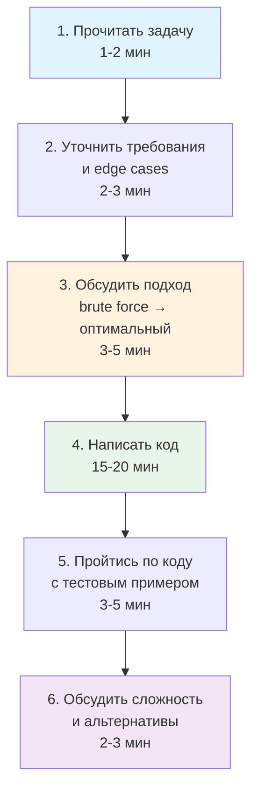
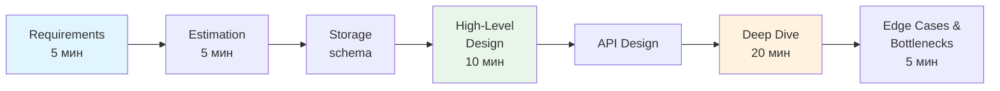
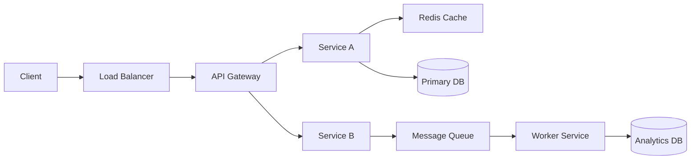
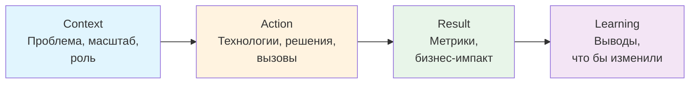
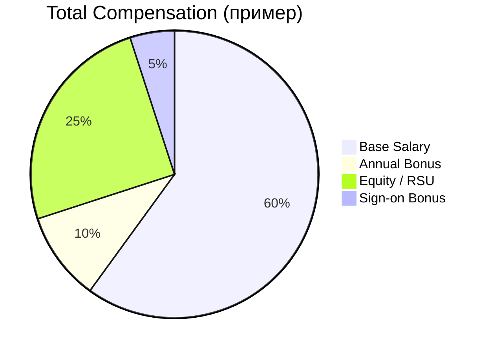

# Вопросы на собеседовании: `Interview Preparation`

Комплексное руководство по подготовке к техническому собеседованию для `Senior Java Developer`. Включает стратегии подготовки, структуру интервью, типичные вопросы, тайм-менеджмент, переговоры по офферу и best practices.

## Полезные ссылки

### Официальная документация

- [LeetCode](https://leetcode.com/) — алгоритмические задачи
- [System Design Primer](https://github.com/donnemartin/system-design-primer) — репозиторий с основами system design
- [Cracking the Coding Interview](https://www.crackingthecodinginterview.com/) — классическая книга по подготовке
- [Tech Interview Handbook](https://www.techinterviewhandbook.org/) — комплексный гайд по техническим собеседованиям
- [interviewing.io](https://interviewing.io/) — платформа для mock-интервью с инженерами из FAANG
- [Pramp](https://www.pramp.com/) — бесплатные peer-to-peer mock-интервью
- [ByteByteGo](https://bytebytego.com/) — system design курс от Alex Xu
- [Java Interview Questions](https://www.baeldung.com/java-interview-questions) — вопросы по Java Core с ответами
- [Java Concurrency Interview Questions](https://www.baeldung.com/java-concurrency-interview-questions) — вопросы по многопоточности
- [Top Spring Framework Interview Questions](https://www.baeldung.com/spring-interview-questions) — вопросы по Spring Framework
- [Java 8 Interview Questions](https://www.baeldung.com/java-8-interview-questions) — вопросы по Java 8 фичам

## Содержание

- [Полезные ссылки](#полезные-ссылки)
- [See also](#see-also)

**Структура и процесс интервью**
- [Q1. (!) Как структурировано типичное техническое собеседование?](#q1--как-структурировано-типичное-техническое-собеседование)
- [Q2. (!) Как выглядит процесс найма в крупных компаниях (FAANG)?](#q2--как-выглядит-процесс-найма-в-крупных-компаниях-faang)
- [Q3. Чем отличается интервью в стартапе от крупной компании?](#q3-чем-отличается-интервью-в-стартапе-от-крупной-компании)
- [Q4. Как составить план подготовки на 4-8 недель?](#q4-как-составить-план-подготовки-на-4-8-недель)

**Алгоритмы и кодинг**
- [Q5. (!) Как подготовиться к алгоритмической части?](#q5--как-подготовиться-к-алгоритмической-части)
- [Q6. Какие основные алгоритмические паттерны нужно знать?](#q6-какие-основные-алгоритмические-паттерны-нужно-знать)
- [Q7. (!) Как вести себя на coding-раунде?](#q7--как-вести-себя-на-coding-раунде)
- [Q8. Как оценивать сложность решения (Big O)?](#q8-как-оценивать-сложность-решения-big-o)
- [Q9. Как решать задачи на whiteboard / в онлайн-редакторе?](#q9-как-решать-задачи-на-whiteboard--в-онлайн-редакторе)
- [Q10. Как тестировать решение во время интервью?](#q10-как-тестировать-решение-во-время-интервью)

**System Design**
- [Q11. (!) Как подготовиться к System Design интервью?](#q11--как-подготовиться-к-system-design-интервью)
- [Q12. (!) Какой фреймворк использовать для System Design задачи?](#q12--какой-фреймворк-использовать-для-system-design-задачи)
- [Q13. Какие типичные System Design задачи встречаются?](#q13-какие-типичные-system-design-задачи-встречаются)
- [Q14. Как рисовать архитектурные диаграммы на интервью?](#q14-как-рисовать-архитектурные-диаграммы-на-интервью)
- [Q15. Какие ключевые компоненты системы нужно знать?](#q15-какие-ключевые-компоненты-системы-нужно-знать)

**Рассказ о проектах и поведенческие вопросы**
- [Q16. (!) Как рассказывать о своих проектах?](#q16--как-рассказывать-о-своих-проектах)
- [Q17. Как отвечать на поведенческие вопросы?](#q17-как-отвечать-на-поведенческие-вопросы)
- [Q18. Как отвечать на вопрос «Расскажите о себе»?](#q18-как-отвечать-на-вопрос-расскажите-о-себе)
- [Q19. Как подготовить вопросы интервьюеру?](#q19-как-подготовить-вопросы-интервьюеру)

**Стресс-менеджмент и коммуникация**
- [Q20. Как справляться с нервами и стрессом?](#q20-как-справляться-с-нервами-и-стрессом)
- [Q21. Что делать, если не знаешь ответа?](#q21-что-делать-если-не-знаешь-ответа)
- [Q22. Как использовать подсказки интервьюера?](#q22-как-использовать-подсказки-интервьюера)
- [Q23. (!) Как думать вслух на интервью?](#q23--как-думать-вслух-на-интервью)

**Mock-интервью и самооценка**
- [Q24. (!) Как проводить mock-интервью?](#q24--как-проводить-mock-интервью)
- [Q25. Как оценивать свой прогресс подготовки?](#q25-как-оценивать-свой-прогресс-подготовки)
- [Q26. Какие платформы использовать для подготовки?](#q26-какие-платформы-использовать-для-подготовки)

**Оффер и переговоры**
- [Q27. (!) Как вести переговоры по зарплате (salary negotiation)?](#q27--как-вести-переговоры-по-зарплате-salary-negotiation)
- [Q28. Как оценивать оффер (total compensation)?](#q28-как-оценивать-оффер-total-compensation)
- [Q29. Что делать после отказа?](#q29-что-делать-после-отказа)

**Специфика Senior-уровня**
- [Q30. (!) Чего ожидают от Senior инженера на интервью?](#q30--чего-ожидают-от-senior-инженера-на-интервью)
- [Q31. Как демонстрировать лидерские качества на интервью?](#q31-как-демонстрировать-лидерские-качества-на-интервью)
- [Q32. Какие вопросы по архитектуре задают Senior-кандидатам?](#q32-какие-вопросы-по-архитектуре-задают-senior-кандидатам)

**AI и современные тенденции**
- [Q33. Как AI меняет технические собеседования в 2025-2026?](#q33-как-ai-меняет-технические-собеседования-в-2025-2026)
- [Q34. (!) Best practices для успешного прохождения интервью](#q34--best-practices-для-успешного-прохождения-интервью)
- [Q35. Типичные ошибки на интервью и как их избежать](#q35-типичные-ошибки-на-интервью-и-как-их-избежать)

**Коммуникация и подача**
- [Q36. Как рассказать о сложном техническом проекте простым языком?](#q36-как-рассказать-о-сложном-техническом-проекте-простым-языком)
- [Q37. Топ-10 вопросов, которые нужно задать интервьюеру](#q37-топ-10-вопросов-которые-нужно-задать-интервьюеру)
- [Q38. Whiteboard и live coding — стратегии когда не знаешь ответа](#q38-whiteboard-и-live-coding--стратегии-когда-не-знаешь-ответа)

**Переговоры и оффер**
- [Q39. (!) Salary negotiation — как обсуждать компенсацию профессионально?](#q39--salary-negotiation--как-обсуждать-компенсацию-профессионально)

**Подготовка артефактов**
- [Q40. Portfolio подготовка — GitHub, pet projects, открытые контрибьюции](#q40-portfolio-подготовка--github-pet-projects-открытые-контрибьюции)
- [Q41. Follow-up после интервью — письмо благодарности и дальнейшие шаги](#q41-follow-up-после-интервью--письмо-благодарности-и-дальнейшие-шаги)
- [Q42. Remote interview — технические аспекты и подача себя онлайн](#q42-remote-interview--технические-аспекты-и-подача-себя-онлайн)

## Q1. (!) Как структурировано типичное техническое собеседование?

Типичное техническое собеседование для `Senior Java Developer` проходит в несколько этапов. Каждый этап оценивает разные компетенции, и понимание структуры помогает лучше подготовиться.



### Этапы интервью

1. **`HR Screening`** (30 мин):
   - Обсуждение резюме и мотивации смены работы
   - Зарплатные ожидания
   - Общие вопросы о компании

2. **`Technical Screening`** (45-60 мин):
   - 1-2 алгоритмические задачи (`LeetCode Easy / Medium`)
   - Базовые вопросы по технологиям (`Java`, `Spring`, `SQL`)
   - `Live` coding в онлайн-редакторе (`CoderPad`, `HackerRank`)

3. **`Onsite / Virtual Onsite`** (3-5 раундов по 45-60 мин):
   - **Раунд 1: `Coding / Algorithms`** — 2-3 задачи (`Medium / Hard`), оптимизация решений
   - **Раунд 2: `System Design`** — проектирование масштабируемой системы, `trade-offs`
   - **Раунд 3: `Domain Knowledge`** — глубокие вопросы по `Java`, `JVM`, `Spring`, многопоточности (подробнее в [[java-core-interview|Java Core]] и [[java-concurrency-interview|Java Concurrency]])
   - **Раунд 4: `Behavioral / Leadership`** — `STAR`-метод, конфликты, менторство (подробнее в [[behavioral-interview|Behavioral]])
   - **Раунд 5: `Hiring Manager`** — обсуждение проектов, мотивация, карьерные цели

4. **Финальный раунд** (опционально): `Bar Raiser` (`Amazon`), `Executive interview`, `Team matching`

### Критерии оценки

| Критерий | Что оценивают |
|---|---|
| `Problem Solving` | Способность разбивать задачу на части |
| `Coding` | Чистота, читаемость, edge cases |
| `Communication` | Объяснение мыслей, think aloud |
| `Technical Depth` | Глубина знаний, trade-offs |
| `System Design` | Архитектурное мышление |
| `Leadership` | Лидерские качества (для `Senior`+) |
| `Cultural Fit` | Соответствие ценностям компании |

## Q2. (!) Как выглядит процесс найма в крупных компаниях (FAANG)?

Процесс найма в `FAANG` (`Google`, `Amazon`, `Meta`, `Apple`, `Netflix`) и аналогичных компаниях имеет свои особенности. Обычно весь цикл занимает 4-8 недель.



**Особенности по компаниям:**

- **`Google`**: Hiring Committee принимает решение, не интервьюер. Сильный фокус на `Googleyness` (коллаборация, скромность)
- **`Amazon`**: `Bar Raiser` — независимый интервьюер из другой команды. 14 Leadership Principles
- **`Meta`**: Coding + System Design + Behavioral. Быстрый процесс (2-3 недели)
- **`Apple`**: Больше domain-specific вопросов. Фокус на конкретной команде
- **`Netflix`**: Сильный culture fit. Высокие ожидания по автономности

**Реферал** увеличивает шансы на первый звонок с рекрутером в 5-10 раз. Ищите контакты через `LinkedIn`, митапы, конференции.

## Q3. Чем отличается интервью в стартапе от крупной компании?

| Аспект | Стартап | Крупная компания |
|---|---|---|
| Процесс | 1-3 раунда, быстро (1-2 недели) | 4-6 раундов, долго (4-8 недель) |
| Фокус | Практический опыт, ready-to-ship код | Алгоритмы, system design, масштаб |
| Coding | Часто take-home задание | Live coding, `LeetCode`-style |
| System Design | Проектирование конкретной фичи | Абстрактные задачи (Twitter, Uber) |
| Culture Fit | Скорость, startup mindset | Процессы, collaboration |
| Переговоры | Гибкость, больше equity | Структурированные pay bands |

В стартапах чаще дают **take-home assignment** — задание на 4-8 часов, приближённое к реальной работе. Интервьюеры обращают внимание на:
- Чистоту кода и архитектуру решения
- Тесты (наличие unit/integration тестов)
- `README` с описанием решения и trade-offs
- Готовность объяснить каждое решение на follow-up звонке

## Q4. Как составить план подготовки на 4-8 недель?

Структурированный план подготовки — ключ к успеху. Ниже — рекомендуемый маршрут для `Senior Java Developer`.

```mermaid
gantt
    title План подготовки к интервью (8 недель)
    dateFormat  X
    axisFormat %s нед.

    section Алгоритмы
    Основы (Arrays, Strings, Hash)    :a1, 0, 2
    Деревья, графы, DP                :a2, 2, 2

    section System Design
    Основы (scaling, caching, DB)     :sd1, 2, 2
    Практика задач                    :sd2, 4, 2

    section Domain
    Java/JVM/Spring                   :d1, 4, 2

    section Behavioral
    STAR-истории, mock                :b1, 6, 2

    section Mock Interviews
    Mock-интервью (2-3 в неделю)      :m1, 4, 4
```



### Рекомендуемый маршрут (8 недель)

1. **Недели 1-2: Алгоритмы и код** — изучите [[algorithms-interview|алгоритмы]], решайте 3-5 задач на `LeetCode` ежедневно
2. **Недели 3-4: System Design** — пройдите [[system-design-interview|System Design]], читайте «Designing Data-Intensive Applications»
3. **Недели 5-6: Domain и Runtime** — повторите [[java-core-interview|Java Core]], [[memory-management-interview|Memory Management]], [[spring-boot-interview|Spring Boot]]
4. **Недели 7-8: Behavioral и коммуникация** — подготовьте STAR-истории ([[behavioral-interview|Behavioral]]), [[code-review-interview|Code Review]]

**На каждую неделю** фиксируйте 2-3 измеримых результата:
- Количество решённых задач
- Число mock-интервью
- Список слабых зон и план закрытия

## Q5. (!) Как подготовиться к алгоритмической части?

Подготовка к алгоритмической части требует 4-8 недель систематической работы. Ключ — решать по темам, а не рандомно, и повторять задачи через интервалы (spaced repetition).

### План подготовки

| Недели | Темы | Количество задач |
|---|---|---|
| 1-2 | `Arrays`, `Strings`, `Hash Tables`, `Linked Lists` | 30-40 |
| 3-4 | `Trees`, `Graphs`, `DFS/BFS`, `Trie` | 25-35 |
| 5-6 | `DP`, `Binary Search`, `Greedy`, `Backtracking` | 25-35 |
| 7-8 | `Heap`, `Union Find`, `Sliding Window`, `Mock` | 20-30 |

### Стратегия решения задач

1. **Начинайте с `Easy`**, переходите к `Medium` (70-80% задач на интервью — `Medium`)
2. **30-минутное правило**: если задача не решается за 30 минут — смотрите решение и разбирайте
3. **Повторяйте** задачи через 1, 3 и 7 дней
4. **Практикуйте объяснение вслух** — как будто рассказываете интервьюеру
5. **Решайте вариации** — меняйте constraints, добавляйте edge cases

### Пример типичной задачи с разбором

```java
// Two Sum — классическая задача (LeetCode #1)
// Подход: HashMap для O(n) решения
public int[] twoSum(int[] nums, int target) {
    Map<Integer, Integer> seen = new HashMap<>();
    for (int i = 0; i < nums.length; i++) {
        int complement = target - nums[i];
        if (seen.containsKey(complement)) {
            return new int[]{seen.get(complement), i};
        }
        seen.put(nums[i], i);
    }
    throw new IllegalArgumentException("No solution");
}
// Время: O(n), Память: O(n)
// Brute force: O(n²) — два вложенных цикла
```

Подробнее о паттернах и структурах данных — в [[algorithms-interview|Алгоритмы]].

### Ресурсы

- **`LeetCode`** — 150-200 задач из Top Interview Questions
- **`NeetCode 150`** — курированный список задач по паттернам
- **«Cracking the Coding Interview»** — Gayle Laakmann McDowell
- **«Elements of Programming Interviews in Java»** — подробные разборы

## Q6. Какие основные алгоритмические паттерны нужно знать?

Знание паттернов помогает быстро распознать тип задачи и выбрать подход вместо перебора вариантов.

| Паттерн | Когда применять | Примеры задач |
|---|---|---|
| `Sliding Window` | Подмассивы/подстроки с условием | Longest Substring Without Repeating Characters, Minimum Window Substring |
| `Two Pointers` | Сортированные массивы, пары | Two Sum (sorted), Container With Most Water |
| `Fast & Slow` | Циклы в списках, нахождение середины | Linked List Cycle, Find Middle |
| `Binary Search` | Поиск в отсортированных данных, границы | Search in Rotated Array, Find Peak Element |
| `DFS / BFS` | Графы, деревья, матрицы | Number of Islands, Word Ladder |
| `Dynamic Programming` | Перекрывающиеся подзадачи, оптимизация | LIS, Coin Change, Knapsack |
| `Greedy` | Локальный оптимум = глобальный | Activity Selection, Jump Game |
| `Backtracking` | Комбинации, перестановки, constraint satisfaction | N-Queens, Subsets, Permutations |
| `Monotonic Stack` | Следующий больший/меньший элемент | Next Greater Element, Largest Rectangle |
| `Union Find` | Компоненты связности, группировка | Number of Connected Components |

```java
// Пример: Sliding Window — максимальная сумма подмассива длины k
public int maxSumSubarray(int[] nums, int k) {
    int windowSum = 0;
    for (int i = 0; i < k; i++) windowSum += nums[i];

    int maxSum = windowSum;
    for (int i = k; i < nums.length; i++) {
        windowSum += nums[i] - nums[i - k]; // сдвигаем окно
        maxSum = Math.max(maxSum, windowSum);
    }
    return maxSum;
}
```

## Q7. (!) Как вести себя на coding-раунде?

Coding-раунд — это не только про написание правильного кода, но и про демонстрацию процесса мышления. Интервьюеры оценивают 4 критерия: **коммуникация**, **problem solving**, **техническая компетенция**, **тестирование**.

### Пошаговый алгоритм



### Ключевые правила

1. **Не прыгайте сразу в код** — сначала обсудите подход
2. **Думайте вслух** — интервьюер хочет видеть процесс мышления
3. **Начинайте с brute force**, затем оптимизируйте: «Brute force — O(n²), но мы можем улучшить до O(n) с помощью `HashMap`»
4. **Задавайте уточняющие вопросы**:
   - «Данные отсортированы?»
   - «Могут ли быть дубликаты / отрицательные числа?»
   - «Каков размер входных данных?»
   - «Что возвращать, если решения нет?»
5. **Пишите чистый код** — понятные имена переменных, не однобуквенные
6. **Тестируйте** — прогоните 2-3 примера: нормальный, edge case, пустой вход

## Q8. Как оценивать сложность решения (Big O)?

Умение оценивать сложность — обязательный навык. После решения **всегда озвучивайте** временную и пространственную сложность.

### Шпаргалка по сложностям

| Сложность | Пример | Для n=10⁶ |
|---|---|---|
| `O(1)` | Доступ по индексу, `HashMap.get()` | Мгновенно |
| `O(log n)` | `Binary Search` | ~20 операций |
| `O(n)` | Один проход по массиву | 10⁶ операций |
| `O(n log n)` | `Merge Sort`, `Arrays.sort()` | ~20 × 10⁶ |
| `O(n²)` | Два вложенных цикла | 10¹² — **слишком медленно** |
| `O(2^n)` | Все подмножества | Невозможно |

**Как озвучивать:** «Сложность по времени `O(n)`, потому что один проход по массиву. По памяти `O(n)` — `HashMap` хранит до `n` элементов. Можно оптимизировать память до `O(1)`, если данные отсортированы — через `Two Pointers`.»

### Типичные оптимизации

- **Время за счёт памяти**: `HashMap` превращает `O(n²)` в `O(n)`
- **Сортировка**: даёт `O(n log n)` и открывает `Binary Search`, `Two Pointers`
- **Предвычисление**: `Prefix Sum` превращает range sum из `O(n)` в `O(1)`

## Q9. Как решать задачи на whiteboard / в онлайн-редакторе?

Whiteboard coding и онлайн-редактор (`CoderPad`, `CodeSignal`) отличаются от IDE — нет автодополнения, подсветки ошибок и рефакторинга.

### Whiteboard-специфичные советы

1. **Пишите крупно и разборчиво** — экономьте место, но не мельчите
2. **Оставляйте место для правок** — между строками, по краям
3. **Используйте короткие имена** — допустимо `i`, `j`, `res` на доске (в отличие от production-кода)
4. **Проработайте алгоритм до начала написания** — на доске нет `Ctrl+Z`
5. **Рисуйте** — визуализация структур данных помогает и вам, и интервьюеру

### Онлайн-редактор

1. **Заранее потренируйтесь** в `CoderPad` / `HackerRank` без IDE
2. **Напишите skeleton** — сигнатуру метода, `main` для тестирования
3. **Компилируйте часто** — маленькие итерации лучше, чем большой блок кода с ошибками
4. **Держите шаблоны в голове**:

```java
// Шаблон решения задачи
public class Solution {
    public ReturnType solve(InputType input) {
        // 1. Edge cases
        if (input == null || input.isEmpty()) return defaultValue;

        // 2. Инициализация структур данных
        Map<Key, Value> map = new HashMap<>();

        // 3. Основная логика
        for (var item : input) {
            // обработка
        }

        // 4. Возврат результата
        return result;
    }
}
```

## Q10. Как тестировать решение во время интервью?

Тестирование решения — важная часть, которую часто пропускают. Интервьюеры ожидают, что вы проверите код до слов «готово».

### Три обязательных теста

1. **Нормальный случай** — типичный ввод, ожидаемый вывод
2. **Edge case** — пустой ввод, один элемент, все одинаковые, максимальные значения
3. **Большой случай** — проверка, что сложность действительно такая, как вы заявили

### Техника dry-run

Пройдитесь по коду **вручную с конкретными значениями**, показывая интервьюеру:

```
Вход: nums = [2, 7, 11, 15], target = 9

i=0: complement = 9-2 = 7, seen={}, seen.put(2,0) → seen={2:0}
i=1: complement = 9-7 = 2, seen={2:0}, found! → return [0, 1] ✓
```

Это демонстрирует внимание к деталям и умение отлаживать код без дебаггера.

## Q11. (!) Как подготовиться к System Design интервью?

`System Design` интервью оценивает способность проектировать масштабируемые распределённые системы. Для `Senior`-уровня этот раунд имеет равный или больший вес, чем coding. Подробнее об архитектурных паттернах — в [[distributed-systems-interview|Распределённые системы]] и [[microservices-interview|Микросервисы]].

### План подготовки (4-6 недель)

| Неделя | Темы |
|---|---|
| 1 | `Scalability`, `Load Balancing`, `Caching`, `Database` (SQL vs NoSQL) |
| 2 | `CDN`, `Message Queue` (`Kafka`, `RabbitMQ`), `API Gateway` |
| 3 | Паттерны: `Microservices`, `CQRS`, `Event Sourcing`, `Saga` |
| 4 | Практика: `URL Shortener`, `Twitter`, `Uber`, `Netflix` |
| 5-6 | Mock-интервью, разбор альтернативных решений |

### Ресурсы

- **«Designing Data-Intensive Applications»** — Martin Kleppmann (must-read)
- **«System Design Interview»** — Alex Xu (Volume 1 & 2)
- **[System Design Primer](https://github.com/donnemartin/system-design-primer)** — GitHub
- **[ByteByteGo](https://bytebytego.com/)** — визуальные объяснения
- Подробнее о стратегиях кэширования — в [[caching-strategies-interview|Caching Strategies]]
- О балансировке нагрузки — в [[load-balancing-interview|Load Balancing]]

## Q12. (!) Какой фреймворк использовать для System Design задачи?

Используйте структурированный подход — это показывает системное мышление и помогает не упустить важные аспекты.

### Фреймворк RESHADED (45 мин)



### Детали каждого шага

**1. Requirements (5 мин)** — уточните scope:
- Функциональные: «Что система должна делать?»
- Нефункциональные: latency, availability, consistency
- Constraints: «Сколько пользователей? Какой QPS?»

**2. Estimation (5 мин)** — back-of-envelope расчёты:
```
Пример для URL Shortener:
- 100M URLs/день = ~1200 QPS write
- Read/Write ratio 100:1 → 120K QPS read
- 1 URL ≈ 500 bytes → 100M × 500 = 50 GB/день
- 5 лет: 50 × 365 × 5 = ~90 TB storage
```

**3. High-Level Design (10 мин)** — нарисуйте основные компоненты:



**4. Deep Dive (20 мин)** — выберите 2-3 компонента:
- Схема БД, индексы
- Sharding strategy, consistent hashing
- Trade-offs: «SQL vs NoSQL — выбираем NoSQL, потому что...»

**5. Wrap Up (5 мин)** — bottlenecks, monitoring, improvements

## Q13. Какие типичные System Design задачи встречаются?

| Задача | Ключевые аспекты |
|---|---|
| `URL Shortener` | Hashing, база данных, высокий QPS, кэширование |
| `Twitter / Instagram` | Feed generation, fan-out, follow-граф |
| `Uber / Lyft` | Геолокация, matching, real-time |
| `Netflix / YouTube` | Video streaming, CDN, рекомендации |
| `Chat (WhatsApp)` | WebSocket, message ordering, delivery guarantees |
| `Search Engine` | Inverted index, ranking, crawling |
| `Rate Limiter` | Token bucket, sliding window, distributed rate limiting |
| `Notification System` | Push/Pull, приоритеты, retry |
| `E-commerce` | Inventory, ordering, payment, eventual consistency |

Для каждой задачи готовьте вариации: «Как масштабировать до 1M QPS?», «Как обеспечить 99.99% availability?», «Как обрабатывать пики нагрузки?». Подробнее о паттернах масштабирования — в [[scalability-patterns-interview|Scalability Patterns]].

## Q14. Как рисовать архитектурные диаграммы на интервью?

Хорошая диаграмма показывает не только компоненты, но и **потоки данных**. На whiteboard или в online-tool рисуйте слева направо.

### Шаблон архитектурной диаграммы

```
┌────────┐     ┌──────────┐     ┌──────────────┐
│ Client │────▶│ LB / CDN │────▶│  API Gateway  │
└────────┘     └──────────┘     └──────┬───────┘
                                       │
                          ┌────────────┼────────────┐
                          ▼            ▼            ▼
                    ┌──────────┐ ┌──────────┐ ┌──────────┐
                    │Service A │ │Service B │ │Service C │
                    └────┬─────┘ └────┬─────┘ └────┬─────┘
                         │            │            │
                    ┌────▼─────┐ ┌────▼─────┐ ┌────▼─────┐
                    │  DB (SQL)│ │  Cache    │ │ Queue    │
                    └──────────┘ └──────────┘ └──────────┘
```

### Правила

1. **Слева направо** — клиент → инфраструктура → сервисы → хранилища
2. **Подписывайте стрелки** — что передаётся (HTTP, gRPC, events)
3. **Показывайте потоки** — write path и read path отдельно
4. **Не перегружайте** — 5-10 компонентов максимум на high-level
5. **Используйте стандартные обозначения** — цилиндр для БД, облако для внешних сервисов

## Q15. Какие ключевые компоненты системы нужно знать?

Каждый компонент нужно знать с точки зрения **когда использовать**, **trade-offs** и **альтернативы**.

| Компонент | Зачем | Примеры |
|---|---|---|
| `Load Balancer` | Распределение нагрузки | `Nginx`, `HAProxy`, `AWS ALB` |
| `API Gateway` | Маршрутизация, rate limiting, auth | `Kong`, `AWS API Gateway` |
| `Cache` | Ускорение чтения, снижение нагрузки на БД | `Redis`, `Memcached` |
| `Message Queue` | Асинхронная коммуникация, decoupling | `Kafka`, `RabbitMQ`, `SQS` |
| `CDN` | Раздача статики, снижение latency | `CloudFront`, `Akamai` |
| `Search Engine` | Полнотекстовый поиск | `Elasticsearch`, `Solr` |
| `Object Storage` | Файлы, изображения, видео | `S3`, `GCS` |

Подробнее о кэшировании — [[caching-strategies-interview|Caching Strategies]], о message queue — [[kafka-interview|Kafka]], о базах данных — [[database-architecture-interview|Database Architecture]].

## Q16. (!) Как рассказывать о своих проектах?

Используйте структуру **Context — Action — Result — Learning** (CARL). Подготовьте 3-5 проектов, для каждого — метрики, диаграмму и 5-7 минутный рассказ.

### Структура рассказа



### Пример

**Плохо:**
> «Я работал над микросервисной архитектурой. Использовали `Spring Boot` и `Kafka`.»

**Хорошо:**
> «Мы мигрировали монолит на микросервисы для улучшения масштабируемости. Система обрабатывала 10K `RPS`, но deployment занимал 2 часа. Я спроектировал архитектуру из 15 микросервисов с `Spring Boot`, `Kafka` и `Kubernetes`. Результат: deployment — 15 минут, latency −40%, деплои 10 раз/день вместо 1 раза/неделю. Лично отвечал за `API Gateway`, `CI/CD` и миграцию 3 критичных сервисов. Если бы начинал заново — использовал бы `strangler fig` pattern для более плавной миграции.»

### Подготовка

1. Выбрать 3-5 проектов с **измеримыми результатами**
2. Для каждого подготовить: диаграмму архитектуры, метрики до/после, вызовы и решения
3. Практиковать рассказ (5-7 минут на проект)
4. Быть готовым к глубоким follow-up вопросам

## Q17. Как отвечать на поведенческие вопросы?

Используйте `STAR`-метод: **Situation** — контекст; **Task** — ваша задача; **Action** — конкретные действия; **Result** — результат и выводы. Подробный разбор — в [[behavioral-interview|Behavioral]].

### Типичные вопросы и категории

| Категория | Примеры вопросов |
|---|---|
| Лидерство | «Расскажите, когда лидировали проект», «Как мотивируете команду?» |
| Конфликты | «Конфликт с коллегой», «Как справляетесь с disagreement?» |
| Неудачи | «Проект, который провалился», «Самая большая ошибка» |
| Обучение | «Как изучаете новые технологии?», «Выход из зоны комфорта» |
| Менторство | «Как помогали расти джуниорам?», «Онбординг нового члена команды» |

### Подготовка

1. Подготовить **10-15 историй** из опыта
2. Для каждой написать структурированный `STAR` (3-5 предложений на каждый пункт)
3. Практиковать рассказ (2-3 минуты)
4. **Фокусируйтесь на «я»**, а не «мы» — интервьюер оценивает вас
5. Будьте честны — не придумывайте истории

## Q18. Как отвечать на вопрос «Расскажите о себе»?

Это часто первый вопрос, и он задаёт тон всему интервью. Используйте формулу **Present → Past → Future** (2-3 минуты).

### Шаблон

```
1. Present (30 сек): «Сейчас я Senior Java Developer в [компания],
   работаю над [что делаете] — [ключевые технологии].»

2. Past (60 сек): «До этого я [предыдущий опыт]. Ключевой проект —
   [кратко про проект и результат]. Это дало мне глубокий опыт в [навыки].»

3. Future (30 сек): «Ищу возможность [что хотите] — меня привлекает
   [что конкретно в этой компании/роли].»
```

### Советы

- **Не пересказывайте резюме** — выделите 2-3 самых релевантных момента
- **Привяжите к роли** — покажите, почему ваш опыт подходит
- **Покажите мотивацию** — почему именно эта компания/позиция
- **Не затягивайте** — 2-3 минуты максимум

## Q19. Как подготовить вопросы интервьюеру?

Вопросы показывают интерес и помогают вам оценить компанию. Подготовьте 5-7 вопросов — часть может отпасть по ходу разговора.

### Хорошие вопросы

**О команде и процессах:**
- «Как у вас устроен code review? Какие стандарты качества?»
- «Как балансируете между скоростью доставки и качеством кода?»
- «Как работаете с техдолгом?»

**О технологиях:**
- «Какие самые большие технические вызовы сейчас?»
- «Есть ли планы по миграции / обновлению стека?»
- «Как принимаются архитектурные решения?»

**О роли и росте:**
- «Каких результатов вы ожидаете в первые 3-6 месяцев?»
- «Как устроен карьерный рост для инженеров?»
- «Как выглядит типичный день/неделя?»

### Плохие вопросы

- Ответ легко найти на сайте компании
- «Какой у вас стек?» (слишком общий)
- Вопросы только про зарплату и отпуск (на первых раундах)

## Q20. Как справляться с нервами и стрессом?

Подготовка — лучшее лекарство от тревоги. Чем больше практики (mock interviews, задачи, system design), тем увереннее чувствуете себя.

### До интервью

| Когда | Что делать |
|---|---|
| За 1-2 недели | Изучить компанию, повторить ключевые темы, решить 5-10 задач |
| За 1 день | Хороший сон (7-8 часов), лёгкое повторение, НЕ зубрить |
| За 1 час | Проверить технику (камера, микрофон), подготовить воду, дыхательные упражнения |

### Во время интервью

- Помните: **интервью — диалог, а не экзамен**
- Интервьюер хочет увидеть, как вы думаете, а не поймать на незнании
- Если задача кажется нерешаемой — **разбейте на части**, начните с простого случая
- **Паузы нормальны** — 10-15 секунд тишины для размышления допустимы
- Если совсем волнуетесь — скажите об этом: «Немного волнуюсь, дайте секунду собраться с мыслями»

### Growth Mindset

Каждое интервью — опыт для следующего. Даже при отказе вы получаете:
- Понимание формата и типичных вопросов
- Опыт работы под давлением
- Конкретные зоны для улучшения

## Q21. Что делать, если не знаешь ответа?

Не блефуйте — интервьюеры быстро распознают незнание. Честность ценится больше, чем неуверенные попытки угадать.

### Стратегии

1. **Гипотеза**: «Я с этим не сталкивался, но моя гипотеза — это работает так, потому что...»
2. **Аналогия**: «Если это похоже на X, то, возможно, подход Y применим...»
3. **Смежная тема**: «Это выходит за рамки моего опыта. Могу рассказать о смежной теме Y.»
4. **Процесс изучения**: «Вот как бы я стал это изучать: документация, эксперимент, code review...»

**Один провальный ответ не равен провалу всего интервью.** После интервью — отметьте вопрос и заполните пробел.

## Q22. Как использовать подсказки интервьюера?

Подсказки — это **помощь**, а не ловушка. Интервьюер хочет направить вас, когда видит, что вы застряли.

### Как реагировать

1. **Слушайте внимательно**: «А если подумать о хэш-таблице?» → `HashMap` релевантен
2. **Поблагодарите**: «Спасибо, попробую через `HashMap`...»
3. **Развивайте мысль**: не просто примите подсказку, а покажите, как она меняет решение
4. **Уточняйте**, если непонятно: «Вы имеете в виду, что можно хранить частоты?»

**Не обижайтесь и не defensive** — подсказка показывает, как вы реагируете на помощь в реальной работе. Это модель того, как вы будете работать в команде — принимать feedback и итерировать.

## Q23. (!) Как думать вслух на интервью?

**Think aloud** — один из самых важных навыков на интервью. Даже если решение неидеальное, процесс мышления может вытянуть раунд.

### Что озвучивать

```
Пример внутреннего монолога (вслух):

«Мне нужно найти два числа с суммой target...
Brute force — два цикла, O(n²). Но можно лучше.
Если я буду хранить уже виденные числа в HashMap,
для каждого числа проверю, есть ли complement = target - num.
Это даст O(n) по времени, O(n) по памяти.

Давайте сначала обсудим edge cases:
- пустой массив → исключение
- один элемент → нет пары
- дубликаты → нужно хранить индексы, не значения

Окей, начну писать код...»
```

### Правила

1. **Озвучивайте варианты** — «Здесь можно использовать A или B, выбираю A, потому что...»
2. **Признавайте тупики** — «Этот подход не работает, потому что... Попробую другой»
3. **Не молчите дольше 20-30 секунд** — если думаете, скажите «Дайте мне полминуты подумать»
4. **Комментируйте, что пишете** — «Инициализирую HashMap для хранения индексов...»

## Q24. (!) Как проводить mock-интервью?

Mock-интервью — **самый эффективный** способ подготовки. Они симулируют давление реального интервью и выявляют слабые зоны.

### Форматы

| Формат | Плюсы | Минусы |
|---|---|---|
| С другом/коллегой | Бесплатно, гибко | Может не быть experience |
| [interviewing.io](https://interviewing.io/) | Анонимно, с инженерами FAANG | Платно |
| [Pramp](https://www.pramp.com/) | Peer-to-peer, бесплатно | Разный уровень партнёров |
| Запись себя на видео | Удобно, можно пересмотреть | Нет feedback |

### Как проводить эффективно

1. **Полная симуляция** — 45 минут, без подглядывания, таймер
2. **Чередуйте роли** — быть интервьюером даёт insight в то, что ищут
3. **Записывайте feedback** — конкретно: «не озвучивал подход», «забыл edge cases»
4. **Частота** — 2-3 раза в неделю в последние 2-3 недели перед интервью
5. **Разные типы** — coding, system design, behavioral

### Чеклист после mock-интервью

- [ ] Уточнял ли требования перед решением?
- [ ] Думал ли вслух?
- [ ] Начал ли с brute force?
- [ ] Обсудил ли сложность?
- [ ] Протестировал ли решение?
- [ ] Уложился ли во время?

## Q25. Как оценивать свой прогресс подготовки?

Отслеживайте прогресс по **конкретным метрикам**, а не по ощущениям.

### Метрики

| Метрика | Целевое значение |
|---|---|
| `LeetCode Easy` решаю за | < 15 минут |
| `LeetCode Medium` решаю за | < 25 минут |
| `LeetCode Hard` решаю за | < 45 минут |
| System Design задачу раскрываю за | < 45 минут |
| STAR-историю рассказываю за | 2-3 минуты |
| Mock-интервью пройдено | 5+ до реального |

### Трекинг

Ведите таблицу решённых задач:

```
| Дата       | Задача           | Сложность | Решил сам? | Время  | Паттерн        |
|------------|------------------|-----------|------------|--------|----------------|
| 2026-04-01 | Two Sum          | Easy      | Да         | 8 мин  | Hash Map       |
| 2026-04-01 | 3Sum             | Medium    | С подсказк | 30 мин | Two Pointers   |
| 2026-04-02 | LRU Cache        | Medium    | Да         | 25 мин | LinkedHashMap   |
```

**Красные флаги** — вы не готовы, если:
- `Medium` задачи стабильно занимают > 35 минут
- Не можете нарисовать high-level design за 10 минут
- Не можете рассказать про свой проект без подготовки

## Q26. Какие платформы использовать для подготовки?

| Платформа | Для чего | Стоимость |
|---|---|---|
| [LeetCode](https://leetcode.com/) | Алгоритмы (150-200 задач) | Free / Premium |
| [NeetCode](https://neetcode.io/) | Курированные задачи по паттернам | Free |
| [System Design Primer](https://github.com/donnemartin/system-design-primer) | System Design основы | Free |
| [ByteByteGo](https://bytebytego.com/) | System Design (визуально) | Paid |
| [interviewing.io](https://interviewing.io/) | Mock-интервью с FAANG | Paid |
| [Pramp](https://www.pramp.com/) | Peer mock-интервью | Free |
| [Educative](https://www.educative.io/) | Grokking System Design | Paid |
| [HackerRank](https://www.hackerrank.com/) | Практика + mock | Free / Paid |

### Книги

| Книга | Область |
|---|---|
| «Cracking the Coding Interview» — G. McDowell | Алгоритмы, процесс |
| «Elements of Programming Interviews in Java» | Алгоритмы |
| «Designing Data-Intensive Applications» — M. Kleppmann | System Design |
| «System Design Interview» — Alex Xu (Vol. 1 & 2) | System Design |
| «Staff Engineer» — Will Larson | Карьерный рост |

## Q27. (!) Как вести переговоры по зарплате (salary negotiation)?

Переговоры — нормальная и ожидаемая часть процесса. Компании **заранее закладывают** возможность повышения оффера.

### Ключевые правила

1. **Не называйте число первым** — «Я хотел бы узнать ваш бюджет на эту позицию»
2. **Исследуйте рынок** — `levels.fyi`, `Glassdoor`, общение с коллегами
3. **Не спешите** — попросите 1-2 недели на обдумывание
4. **Конкурирующие офферы** — самый сильный рычаг в переговорах
5. **Торгуйте по компонентам** — не только base salary

### Компоненты компенсации



### Переговорная стратегия

| Порядок торга | Компонент | Гибкость |
|---|---|---|
| 1 | `Sign-on bonus` | Самый гибкий |
| 2 | `Equity / RSU` | Средняя |
| 3 | `Base salary` | Привязан к pay band |
| 4 | `Relocation` / бенефиты | Зависит от компании |

**Фраза-шаблон:** «Спасибо за оффер. Я очень заинтересован в этой позиции. Однако, основываясь на моём опыте и рыночных данных, я ожидал бы компенсацию в диапазоне X-Y. Есть ли гибкость?»

## Q28. Как оценивать оффер (total compensation)?

Не сравнивайте только base salary — считайте **Total Compensation (TC)** за год и за 4 года (с учётом vesting equity).

### Чеклист оценки оффера

**Финансы:**
- [ ] Base salary
- [ ] Бонус (гарантированный или performance-based?)
- [ ] Equity (RSU, options — schedule вестинга?)
- [ ] Sign-on bonus

**Нефинансы:**
- [ ] Work-life balance (переработки?)
- [ ] Remote / гибридный формат
- [ ] Отпуск и больничные
- [ ] Обучение (бюджет, конференции)
- [ ] Технологический стек и задачи
- [ ] Команда и менеджер
- [ ] Карьерный рост

### Формула сравнения

```
TC (годовой) = Base + Bonus + Equity/год + SignOn/год
TC (4 года)  = Base×4 + Bonus×4 + Total Equity + SignOn

Пример:
Оффер A: 200K base + 15% bonus + 100K RSU/4yr + 20K sign-on
TC/год = 200 + 30 + 25 + 5 = 260K

Оффер B: 180K base + 20% bonus + 200K RSU/4yr + 0 sign-on
TC/год = 180 + 36 + 50 + 0 = 266K ← лучше!
```

## Q29. Что делать после отказа?

Отказ — нормальная часть процесса. Даже сильные кандидаты получают отказы в 50-70% случаев.

### Алгоритм действий

1. **Попросите feedback** — «Спасибо за уделённое время. Не могли бы вы поделиться областями для улучшения?»
2. **Проанализируйте** — запишите, на каких раундах было слабо
3. **Заполните пробелы** — изучите темы, которые вызвали трудности
4. **Не останавливайтесь** — подавайте заявки в несколько компаний параллельно
5. **Повторная подача** — большинство компаний позволяют через 6-12 месяцев

### Частые причины отказов

| Причина | Что делать |
|---|---|
| Слабый coding | Больше практики на `LeetCode`, фокус на `Medium` |
| Слабый system design | Читать «DDIA», практиковать mock SD |
| Плохая коммуникация | Записывать себя, mock-интервью |
| Не знал domain | Изучить стек компании до интервью |
| Culture fit | Изучить ценности компании, подготовить истории |

## Q30. (!) Чего ожидают от Senior инженера на интервью?

`Senior` — это не только про количество лет опыта. Интервьюеры ожидают демонстрации определённых компетенций. Подробнее — в [[team-leadership-interview|Team Leadership]].

### Ожидания по раундам

| Раунд | Junior/Middle | Senior |
|---|---|---|
| Coding | Решить задачу | Решить + обсудить trade-offs, масштабируемость |
| System Design | Не ожидается | Полный design от requirements до monitoring |
| Behavioral | Работа в команде | Лидерство, влияние, менторство |
| Domain | Знание основ | Глубокое понимание, опыт отладки, production issues |

### Ключевые компетенции Senior

1. **Технический лидерство** — проектирование систем, принятие архитектурных решений
2. **Коммуникация** — объяснение сложных вещей простым языком
3. **Менторство** — как помогаете расти другим
4. **Ownership** — ответственность за результат, не только за код
5. **Trade-offs** — умение выбирать между вариантами и объяснять выбор
6. **Incident management** — опыт с production-проблемами

## Q31. Как демонстрировать лидерские качества на интервью?

Лидерство для `Senior` — это не управление людьми, а **техническое влияние** и **ownership**.

### Примеры демонстрации

**Вместо:**
> «Я написал сервис на Spring Boot»

**Говорите:**
> «Я инициировал миграцию на микросервисы: написал RFC, провёл design review с командой, определил стратегию rollout. Менторил двух мидлов при реализации. Результат — время деплоя сократилось с 2 часов до 15 минут.»

### Темы для подготовки

- **Инициатива**: когда вы предложили улучшение без запроса
- **Менторство**: как помогали расти джуниорам/мидлам
- **Conflict resolution**: как решали технические разногласия
- **Incident management**: как действовали в критической ситуации
- **Cross-team collaboration**: как работали с другими командами

Подробнее — [[code-review-practices-interview|Code Review Practices]] и [[team-leadership-interview|Team Leadership]].

## Q32. Какие вопросы по архитектуре задают Senior-кандидатам?

Senior-кандидатам задают вопросы, требующие **глубокого понимания trade-offs** и **опыта production-систем**.

### Типичные вопросы

1. «Как бы вы спроектировали систему, обрабатывающую 100K RPS?» → [[scalability-patterns-interview|Scalability Patterns]]
2. «Когда выбрать SQL vs NoSQL?» → [[database-architecture-interview|Database Architecture]]
3. «Как обеспечить consistency в распределённой системе?» → [[consistency-patterns-interview|Consistency Patterns]], [[cap-theorem-interview|CAP-теорема]]
4. «Как организовать взаимодействие микросервисов?» → [[microservices-interview|Микросервисы]], [[event-driven-patterns-interview|Event-Driven]]
5. «Как вы подходите к observability и мониторингу?» → [[observability-interview|Observability]]

### Как отвечать

- **Начните с requirements** — «Зависит от контекста. Какой consistency model нужен?»
- **Покажите trade-offs** — «SQL даёт ACID, но NoSQL лучше масштабируется горизонтально»
- **Приведите пример из опыта** — «В проекте X мы выбрали Kafka, потому что...»
- **Обсудите эволюцию** — «Начали с монолита, затем мигрировали по мере роста нагрузки»

## Q33. Как AI меняет технические собеседования в 2025-2026?

`AI`-инструменты (`Copilot`, `ChatGPT`, `Claude`) меняют и процесс подготовки, и сами интервью.

### Использование AI для подготовки

| Для чего | Как |
|---|---|
| Генерация задач | «Дай мне задачу на `Sliding Window` уровня Medium» |
| Объяснение концепций | «Объясни `consistent hashing` для собеседования» |
| Review решения | «Проверь мой код и предложи оптимизацию» |
| Mock-интервью | «Будь интервьюером и задай system design задачу» |
| Подготовка STAR | «Помоги структурировать мою историю по STAR» |

### Изменения в формате интервью

- Компании переходят от `LeetCode`-style к **real-world coding** задачам
- Больше внимания **system design** и **domain knowledge** — это сложнее загуглить
- Некоторые компании разрешают AI-инструменты в take-home, но **не в live coding**
- Фокус смещается на **умение оценивать и рефакторить AI-сгенерированный код**

**Важно:** использование AI-инструментов на live coding интервью — это **cheating**. Будет дисквалификация.

## Q34. (!) Best practices для успешного прохождения интервью

Успешное прохождение интервью складывается из подготовки, коммуникации и правильного mindset.

### Перед интервью

- [ ] Начать подготовку за 2-3 месяца
- [ ] Изучить компанию (продукты, культуру, технологии, недавние новости)
- [ ] Решить 100-150 задач на `LeetCode` (по паттернам)
- [ ] Пройти 5+ mock-интервью
- [ ] Подготовить 3-5 проектных историй с метриками
- [ ] Подготовить 5-7 вопросов интервьюеру
- [ ] Проверить технику за день до

### Во время интервью

- [ ] **Думать вслух** — объяснять ход мыслей
- [ ] **Уточнять требования** — не делать предположений
- [ ] **Начинать с brute force** — затем оптимизировать
- [ ] **Тестировать решение** — edge cases, dry-run
- [ ] **Обсуждать trade-offs** — показывать глубину понимания
- [ ] **Рисовать диаграммы** — для system design
- [ ] **Быть честным** — не блефовать, если не знаете

### После интервью

- [ ] Отправить thank-you email в течение 24 часов
- [ ] Записать вопросы, которые были
- [ ] Оценить свою performance по каждому раунду
- [ ] При оффере — не спешить, сравнить варианты
- [ ] При отказе — попросить feedback

### Ключевые принципы

1. **Growth Mindset** — каждое интервью учит чему-то новому
2. **Resilience** — не сдаваться после отказов
3. **Аутентичность** — быть собой, показывать настоящий passion
4. **Humility** — признавать незнание и готовность учиться

## Q35. Типичные ошибки на интервью и как их избежать

### Технические ошибки

| Ошибка | Как избежать |
|---|---|
| Прыгать сразу в код | Сначала обсудите подход, нарисуйте |
| Не уточнять requirements | Задайте 3-5 вопросов перед решением |
| Не тестировать решение | Пройдитесь по коду с тестовым примером |
| Молчать при решении | Думайте вслух, озвучивайте варианты |
| Игнорировать edge cases | Проговорите: пустой вход, один элемент, максимум |
| Не знать сложность | Озвучивайте Big O после каждого решения |

### Поведенческие ошибки

| Ошибка | Как избежать |
|---|---|
| Критиковать предыдущего работодателя | Говорите о том, что ищете, а не от чего уходите |
| Не готовить вопросы | Подготовьте 5-7 вопросов |
| Быть слишком самоуверенным | Показывайте humility и готовность учиться |
| Не показывать энтузиазм | Изучите компанию, задавайте глубокие вопросы |
| Перебивать интервьюера | Слушайте подсказки, дослушивайте до конца |

### Коммуникационные ошибки

| Ошибка | Как избежать |
|---|---|
| Спорить с интервьюером | Принимайте feedback, итерируйте |
| Не слушать подсказки | Подсказка = направление, благодарите и развивайте |
| Использовать жаргон без объяснения | Определяйте термины при первом упоминании |
| Говорить «мы» вместо «я» | Фокусируйтесь на своём вкладе |

## Q36. Как рассказать о сложном техническом проекте простым языком?

Умение объяснить сложное просто — ключевой навык Senior-инженера. Интервьюер хочет понять ваш вклад, а не запутаться в деталях реализации.

### Структура "From Problem to Impact"

```
1. КОНТЕКСТ (30 сек): Что за система, сколько пользователей, какая нагрузка
2. ПРОБЛЕМА (30 сек): Что пошло не так или чего не хватало
3. ВАШЕ РЕШЕНИЕ (60 сек): Что вы сделали, какие альтернативы рассматривали
4. РЕЗУЛЬТАТ (30 сек): Измеримый эффект — цифры, метрики, бизнес-impact
```

### Пример плохого и хорошего ответа

**Плохо (технический дамп):**
> «Мы использовали Kafka с 12 партициями, настроили consumer group с batch-size 500, использовали Avro-схемы через Schema Registry, настроили dead-letter queue...»

**Хорошо (Problem → Solution → Impact):**
> «Наш сервис обработки заказов начал терять события при пиковой нагрузке — 5000 заказов в минуту в Black Friday. Мы перешли с синхронного REST на асинхронную обработку через очередь сообщений. Добавили retry-логику и dead-letter queue для проблемных событий. В результате потери снизились с 2% до 0.01%, а latency обработки упала с 800мс до 150мс.»

### Техники упрощения

| Техника | Как применить |
|---|---|
| **Аналогия** | «Kafka как конвейер на заводе — каждый рабочий берёт задачи и обрабатывает независимо» |
| **Цифры вместо абстракций** | «100k RPS» вместо «высокая нагрузка» |
| **Три ключевых слова** | Выберите 3 термина максимум, остальное — обычный язык |
| **Проверка "бабушкин тест"** | Если бабушка не поймёт — упростите ещё раз |

> Правило: если вы не можете объяснить решение за 2 минуты без жаргона — вы ещё недостаточно его понимаете.

## Q37. Топ-10 вопросов, которые нужно задать интервьюеру

Вопросы интервьюеру — не формальность, а инструмент оценки компании и демонстрации вашей зрелости. Подготовьте 7-10 вопросов, 5-6 из которых обычно успевают задать.

### Вопросы о технической культуре

1. **«Как выглядит типичный code review? Сколько человек ревьюит PR и какие стандарты?»**
   — Показывает качество инженерной культуры
2. **«Как команда принимает архитектурные решения — RFC-процесс, ADR или иначе?»**
   — Зрелость инженерной практики
3. **«Как работаете с техническим долгом — есть ли выделенное время?»**
   — Баланс между скоростью и качеством

### Вопросы об инфраструктуре и процессах

4. **«Как устроен CI/CD pipeline? Как долго идёт деплой?»**
   — DevOps-зрелость
5. **«Как мониторите production? Какие алерты считаете важными?»**
   — Операционная культура
6. **«Какие самые большие технические вызовы стоят перед командой сейчас?»**
   — Честный взгляд на реальные проблемы

### Вопросы о роли и росте

7. **«Каких результатов вы ожидаете от нового человека в первые 3 месяца?»**
   — Конкретные ожидания, можно ли их выполнить
8. **«Как устроен карьерный рост инженеров — есть ли IC и менеджерские треки?»**
   — Возможности развития
9. **«Как выглядит день Senior-инженера в вашей команде — соотношение coding/meetings?»**
   — Реальный контекст работы

### Вопрос-финалист

10. **«Есть ли что-то, что вас беспокоит в моём профиле для этой роли? Я готов обсудить.»**
    — Демонстрирует уверенность, даёт шанс снять возражения

> Плохие вопросы: «Какой стек?», «Какая зарплата?» (на первых раундах), вопросы, ответ на которые есть на сайте компании.

## Q38. Whiteboard и live coding — стратегии когда не знаешь ответа

Не знать ответ на интервью — нормально. Важно, как вы реагируете.

### Универсальный алгоритм при затруднении

```
1. Прочитайте задачу вслух — часто помогает найти зацепку
2. Перефразируйте условие — «Если я правильно понимаю, нам нужно...»
3. Назовите brute force — даже плохое решение лучше молчания
4. Обсудите trade-offs — покажите что думаете о качестве
5. Спросите разрешения попробовать другой подход — «Могу начать с X, потом улучшим?»
```

### Конкретные тактики

**Если не знаете API/синтаксис:**
> «Я помню идею, но не точный синтаксис — напишу псевдокод, потом уточним детали.»

**Если не знаете алгоритм:**
> «Это похоже на задачу X. Попробую адаптировать подход Two Pointers / BFS / DP...»

**Если совсем потеряны:**
> «Позвольте подумать вслух. Брутфорс — перебрать все варианты за O(n²). Можно ли лучше? Если отсортировать...»

**Если забыли тему теоретического вопроса:**
> «С этим конкретным механизмом не сталкивался в таком контексте. Могу рассказать как решал похожую задачу через [смежную технологию]?»

### Что демонстрирует сильный кандидат в трудный момент

| Поведение | Что показывает |
|---|---|
| Думает вслух при затруднении | Структурированное мышление |
| Задаёт уточняющие вопросы | Профессиональный инстинкт |
| Называет trade-offs неоптимального решения | Инженерную зрелость |
| Честно говорит «не знаю» с рефлексией | Самосознание и честность |
| Итерирует после подсказки | Обучаемость |

> Самый опасный паттерн — молчать 5 минут. Любая вербализация мыслей лучше тишины.

## Q39. (!) Salary negotiation — как обсуждать компенсацию профессионально?

Переговоры о зарплате — навык, которому можно научиться. Большинство компаний **ожидают** переговоров и закладывают на это бюджет.

### Принципы переговоров

**1. Никогда не называйте число первым**

```
Рекрутер: «Какую зарплату вы ожидаете?»
Вы: «Я хотел бы услышать, какой бюджет вы рассматриваете для этой позиции.
     После обсуждения оффера я смогу дать конкретный ответ.»
```

**2. Исследуйте рынок заранее**

Источники: `levels.fyi`, `Glassdoor`, `hh.ru`, разговоры с коллегами, телеграм-каналы о карьере. Знайте свой диапазон до первого звонка.

**3. Используйте конкурирующие офферы**

```
«У меня есть оффер от X на [сумма]. Ваша компания — приоритет, 
 но я хотел бы понять, можете ли вы улучшить предложение.»
```

**4. Торгуйтесь по компонентам, не только по базе**

| Компонент | Тактика |
|---|---|
| **Base salary** | Попросите верхнюю границу диапазона |
| **Sign-on bonus** | Компенсирует потерянный бонус с прошлого места |
| **Equity / RSU** | Уточните vesting schedule и cliff |
| **Удалёнка** | Полная удалёнка экономит время и деньги |
| **Обучение** | Конференции, курсы, книги за счёт компании |
| **Оборудование** | MacBook, монитор, дополнительные девайсы |

**5. Попросите время**

```
«Мне нужно 3-5 дней, чтобы обсудить с семьёй и взвесить все факторы.
 Когда вам нужен финальный ответ?»
```

### Что не делать

- Называть число первым без исследования рынка
- Принимать первый оффер без переговоров
- Торговаться агрессивно, создавая напряжение
- Торговаться только по деньгам, игнорируя total comp

> По данным Glassdoor, 84% работодателей ожидают переговоров. Не договариваться — значит оставить деньги на столе.

## Q40. Portfolio подготовка — GitHub, pet projects, открытые контрибьюции

Portfolio — это доказательная база вашей компетенции, которую можно изучить до интервью.

### GitHub профиль

**Обязательные элементы:**

```markdown
# README.md профиля (создаётся в репо username/username)
- Кто вы и чем занимаетесь
- Ключевые технологии (Spring Boot, Kafka, Kubernetes...)
- Ссылки на значимые проекты
- Контакты / LinkedIn
```

**Метрики привлекательного GitHub:**
- Активная история коммитов (хотя бы несколько месяцев)
- README в каждом проекте (что делает, как запустить, архитектура)
- Осмысленные commit messages, не "fix" / "WIP"
- Тесты в коде (показывают профессионализм)

### Требования к pet project

Хороший pet project для Senior должен демонстрировать:

| Аспект | Примеры |
|---|---|
| **Архитектурное решение** | Микросервисы, event-driven, CQRS |
| **Технологический стек** | Spring Boot + Kafka + PostgreSQL + Docker |
| **Тесты** | Unit + Integration + E2E |
| **CI/CD** | GitHub Actions, автодеплой |
| **Документация** | ADR, OpenAPI, README с диаграммами |

### Открытые контрибьюции

Контрибьюция в open source — сильный сигнал:

```bash
# Типы контрибьюций (от простого к сложному):
1. Исправление опечаток в документации
2. Добавление тестов
3. Исправление мелких багов (good first issue)
4. Новые фичи по обсуждённому issue
5. Ревью чужих PR
```

**Популярные проекты для старта:** Spring Framework, Apache Commons, Quarkus, Micronaut, любые Java-библиотеки которые используете.

> Нет времени на pet project? Задокументируйте реальные решения из работы (без NDA-деталей) как технические статьи на Habr или личном блоге — это тоже portfolio.

## Q41. Follow-up после интервью — письмо благодарности и дальнейшие шаги

Follow-up после интервью — недооценённый инструмент. Он показывает профессионализм и поддерживает интерес компании.

### Thank-you email: структура и тайминг

**Когда отправлять:** в течение 24 часов после интервью (идеально — в тот же день вечером).

**Кому:** рекрутеру и, если известен email, техническому интервьюеру.

**Структура письма:**

```
Тема: Thank you — [Ваше имя] / [Позиция]

Привет [Имя],

Спасибо за время, которое вы уделили на интервью сегодня.

Было интересно обсудить [конкретная тема из разговора — например, 
подход к event-driven архитектуре или вызовы с масштабированием].
[Одно предложение почему это резонирует с вашим опытом.]

После разговора ещё больше убеждён(а), что [конкретная причина 
почему компания/роль интересна].

Буду рад(а) ответить на любые дополнительные вопросы.

С уважением,
[Имя]
[LinkedIn / GitHub]
```

### Если затянулся ответ

```
Неделя без ответа → вежливо напомните:

«Привет [Имя], хотел(а) уточнить статус рассмотрения моей кандидатуры
для позиции [X]. Буду рад(а) узнать следующие шаги.»
```

### При получении оффера

- Попросите письменный оффер (не verbal)
- Уточните deadline для ответа (обычно 3-7 дней)
- Не принимайте на месте — возьмите время

### При отказе

```
«Спасибо за обратную связь. Мог(ла) бы я узнать, какие аспекты 
стали решающими? Это поможет мне в дальнейшем развитии.»
```

> Отказ с feedback — ценный ресурс. Многие компании открыты к диалогу, особенно если кандидат запомнился.

## Q42. Remote interview — технические аспекты и подача себя онлайн

Удалённые интервью требуют дополнительной подготовки — технической и коммуникационной.

### Техническая подготовка

**За день до интервью:**

```
Checklist:
☐ Камера: чистая, на уровне глаз (не снизу вверх)
☐ Освещение: источник света ПЕРЕД вами, не за спиной
☐ Микрофон: протестировать качество звука
☐ Интернет: проводное соединение > Wi-Fi; иметь мобильный hotspot как backup
☐ Фон: нейтральный или blurred, без хаоса
☐ Браузер/платформа: установить, протестировать (Zoom, Google Meet, Teams)
☐ Второй монитор: удобно для live coding
☐ Кодинговая среда: IntelliJ IDEA / VSCode открыты, настроены
```

**Во время интервью:**
- Закройте лишние вкладки и приложения (уведомления!)
- Отключите мессенджеры
- Держите воду рядом
- Смотрите в камеру при ответе, а не на экран

### Подача себя онлайн

**Коммуникационные нюансы:**

| Проблема | Решение |
|---|---|
| Задержка аудио | Чуть дольше паузы перед ответом |
| Не видно жестов | Больше вербальных маркеров («во-первых», «с другой стороны») |
| Трудно читать реакцию | Периодически спрашивайте «Я в верном направлении?» |
| Live coding на шаринге экрана | Шрифт крупнее обычного, комментируйте каждый шаг |

**Как показать энергию онлайн:**
- Чуть более оживлённая интонация (экран "гасит" эмоции)
- Кивайте когда слушаете — показывает внимание
- Используйте имя интервьюера — создаёт контакт

### Если что-то пошло не так технически

```
Связь оборвалась:
→ Перезвоните немедленно, начните с «Прошу прощения за технические проблемы»

Шумный сосед / ребёнок / собака:
→ «Прошу прощения за шум — мне нужна секунда»
→ Заранее: предупредите домашних, закройтесь в комнате

Завис компьютер:
→ Имейте готовый телефон как backup для звонка
```

> Технические проблемы случаются со всеми. Важно как вы реагируете — спокойно и профессионально. Это тоже оценивается.

---

[Наверх](../)

*Обновлено: 2026-04-13*

---

## See also

- [[behavioral-interview|Поведенческие (Behavioral)]] — поведенческие вопросы и STAR-метод
- [[algorithms-interview|Алгоритмы]] — алгоритмы и структуры данных
- [[system-design-interview|System Design]] — проектирование систем
- [[code-review-interview|Code review]] — code review и quality mindset
- [[logging-strategies-interview|Стратегии логирования]] — observability и эксплуатация
- [[memory-management-interview|Memory Management]] — performance и JVM
- [[team-leadership-interview|Team Leadership]] — лидерство и управление командой
- [[java-core-interview|Java Core]] — базовые вопросы по Java
- [[spring-boot-interview|Spring Boot]] — вопросы по Spring Boot

- [[ai-agents-interview|AI Agents]]
- [[embeddings-interview|Embeddings]]
- [[llm-basics-interview|LLM Basics]]
- [[llm-integration-patterns-interview|LLM Integration Patterns]]
- [[mlops-interview|MLOps]]
- [[model-serving-interview|Model Serving]]
