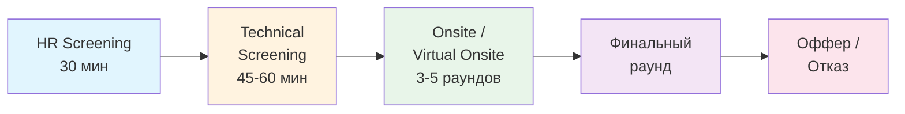
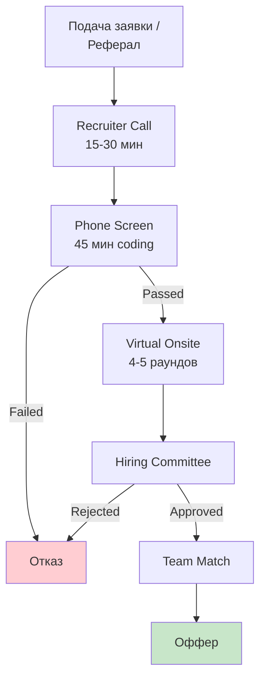
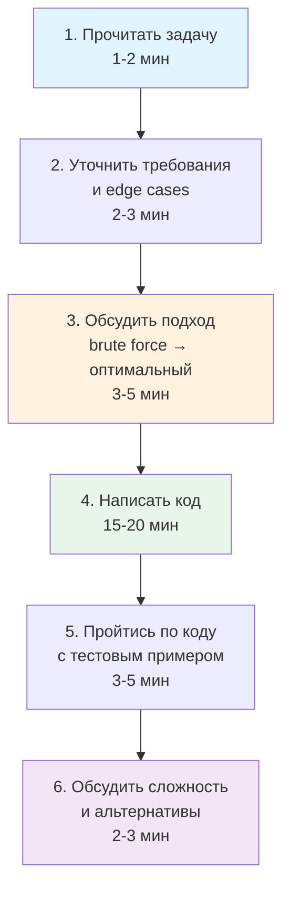
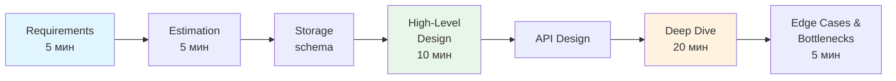
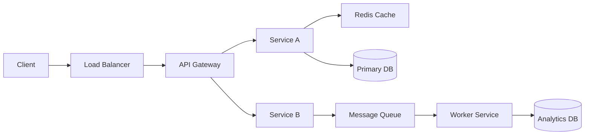
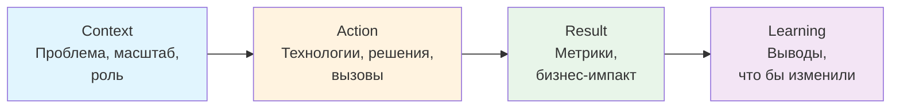
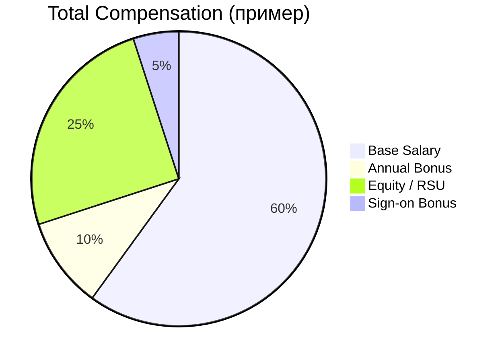

# Вопросы на собеседовании: `Interview Preparation`

Комплексное руководство по подготовке к техническому собеседованию для `Senior Java Developer`. Включает стратегии подготовки, структуру интервью, типичные вопросы, тайм-менеджмент, переговоры по офферу и best practices.

## Полезные ссылки

### Официальная документация

- [LeetCode](https://leetcode.com/) — алгоритмические задачи
- [System Design Primer](https://github.com/donnemartin/system-design-primer) — репозиторий с основами system design
- [Cracking the Coding Interview](https://www.crackingthecodinginterview.com/) — классическая книга по подготовке
- [Tech Interview Handbook](https://www.techinterviewhandbook.org/) — комплексный гайд по техническим собеседованиям
- [interviewing.io](https://interviewing.io/) — платформа для mock-интервью с инженерами из FAANG
- [Pramp](https://www.pramp.com/) — бесплатные peer-to-peer mock-интервью
- [ByteByteGo](https://bytebytego.com/) — system design курс от Alex Xu
- [Java Interview Questions](https://www.baeldung.com/java-interview-questions) — вопросы по Java Core с ответами
- [Java Concurrency Interview Questions](https://www.baeldung.com/java-concurrency-interview-questions) — вопросы по многопоточности
- [Top Spring Framework Interview Questions](https://www.baeldung.com/spring-interview-questions) — вопросы по Spring Framework
- [Java 8 Interview Questions](https://www.baeldung.com/java-8-interview-questions) — вопросы по Java 8 фичам

## Содержание

- [Полезные ссылки](#полезные-ссылки)
- [See also](#see-also)

**Структура и процесс интервью**
- [Q1. (!) Как структурировано типичное техническое собеседование?](#q1--как-структурировано-типичное-техническое-собеседование)
- [Q2. (!) Как выглядит процесс найма в крупных компаниях (FAANG)?](#q2--как-выглядит-процесс-найма-в-крупных-компаниях-faang)
- [Q3. Чем отличается интервью в стартапе от крупной компании?](#q3-чем-отличается-интервью-в-стартапе-от-крупной-компании)
- [Q4. Как составить план подготовки на 4-8 недель?](#q4-как-составить-план-подготовки-на-4-8-недель)

**Алгоритмы и кодинг**
- [Q5. (!) Как подготовиться к алгоритмической части?](#q5--как-подготовиться-к-алгоритмической-части)
- [Q6. Какие основные алгоритмические паттерны нужно знать?](#q6-какие-основные-алгоритмические-паттерны-нужно-знать)
- [Q7. (!) Как вести себя на coding-раунде?](#q7--как-вести-себя-на-coding-раунде)
- [Q8. Как оценивать сложность решения (Big O)?](#q8-как-оценивать-сложность-решения-big-o)
- [Q9. Как решать задачи на whiteboard / в онлайн-редакторе?](#q9-как-решать-задачи-на-whiteboard--в-онлайн-редакторе)
- [Q10. Как тестировать решение во время интервью?](#q10-как-тестировать-решение-во-время-интервью)

**System Design**
- [Q11. (!) Как подготовиться к System Design интервью?](#q11--как-подготовиться-к-system-design-интервью)
- [Q12. (!) Какой фреймворк использовать для System Design задачи?](#q12--какой-фреймворк-использовать-для-system-design-задачи)
- [Q13. Какие типичные System Design задачи встречаются?](#q13-какие-типичные-system-design-задачи-встречаются)
- [Q14. Как рисовать архитектурные диаграммы на интервью?](#q14-как-рисовать-архитектурные-диаграммы-на-интервью)
- [Q15. Какие ключевые компоненты системы нужно знать?](#q15-какие-ключевые-компоненты-системы-нужно-знать)

**Рассказ о проектах и поведенческие вопросы**
- [Q16. (!) Как рассказывать о своих проектах?](#q16--как-рассказывать-о-своих-проектах)
- [Q17. Как отвечать на поведенческие вопросы?](#q17-как-отвечать-на-поведенческие-вопросы)
- [Q18. Как отвечать на вопрос «Расскажите о себе»?](#q18-как-отвечать-на-вопрос-расскажите-о-себе)
- [Q19. Как подготовить вопросы интервьюеру?](#q19-как-подготовить-вопросы-интервьюеру)

**Стресс-менеджмент и коммуникация**
- [Q20. Как справляться с нервами и стрессом?](#q20-как-справляться-с-нервами-и-стрессом)
- [Q21. Что делать, если не знаешь ответа?](#q21-что-делать-если-не-знаешь-ответа)
- [Q22. Как использовать подсказки интервьюера?](#q22-как-использовать-подсказки-интервьюера)
- [Q23. (!) Как думать вслух на интервью?](#q23--как-думать-вслух-на-интервью)

**Mock-интервью и самооценка**
- [Q24. (!) Как проводить mock-интервью?](#q24--как-проводить-mock-интервью)
- [Q25. Как оценивать свой прогресс подготовки?](#q25-как-оценивать-свой-прогресс-подготовки)
- [Q26. Какие платформы использовать для подготовки?](#q26-какие-платформы-использовать-для-подготовки)

**Оффер и переговоры**
- [Q27. (!) Как вести переговоры по зарплате (salary negotiation)?](#q27--как-вести-переговоры-по-зарплате-salary-negotiation)
- [Q28. Как оценивать оффер (total compensation)?](#q28-как-оценивать-оффер-total-compensation)
- [Q29. Что делать после отказа?](#q29-что-делать-после-отказа)

**Специфика Senior-уровня**
- [Q30. (!) Чего ожидают от Senior инженера на интервью?](#q30--чего-ожидают-от-senior-инженера-на-интервью)
- [Q31. Как демонстрировать лидерские качества на интервью?](#q31-как-демонстрировать-лидерские-качества-на-интервью)
- [Q32. Какие вопросы по архитектуре задают Senior-кандидатам?](#q32-какие-вопросы-по-архитектуре-задают-senior-кандидатам)

**AI и современные тенденции**
- [Q33. Как AI меняет технические собеседования в 2025-2026?](#q33-как-ai-меняет-технические-собеседования-в-2025-2026)
- [Q34. (!) Best practices для успешного прохождения интервью](#q34--best-practices-для-успешного-прохождения-интервью)
- [Q35. Типичные ошибки на интервью и как их избежать](#q35-типичные-ошибки-на-интервью-и-как-их-избежать)

**Коммуникация и подача**
- [Q36. Как рассказать о сложном техническом проекте простым языком?](#q36-как-рассказать-о-сложном-техническом-проекте-простым-языком)
- [Q37. Топ-10 вопросов, которые нужно задать интервьюеру](#q37-топ-10-вопросов-которые-нужно-задать-интервьюеру)
- [Q38. Whiteboard и live coding — стратегии когда не знаешь ответа](#q38-whiteboard-и-live-coding--стратегии-когда-не-знаешь-ответа)

**Переговоры и оффер**
- [Q39. (!) Salary negotiation — как обсуждать компенсацию профессионально?](#q39--salary-negotiation--как-обсуждать-компенсацию-профессионально)

**Подготовка артефактов**
- [Q40. Portfolio подготовка — GitHub, pet projects, открытые контрибьюции](#q40-portfolio-подготовка--github-pet-projects-открытые-контрибьюции)
- [Q41. Follow-up после интервью — письмо благодарности и дальнейшие шаги](#q41-follow-up-после-интервью--письмо-благодарности-и-дальнейшие-шаги)
- [Q42. Remote interview — технические аспекты и подача себя онлайн](#q42-remote-interview--технические-аспекты-и-подача-себя-онлайн)

## Q1. (!) Как структурировано типичное техническое собеседование?

Типичное техническое собеседование для `Senior Java Developer` проходит в несколько этапов. Каждый этап оценивает разные компетенции, и понимание структуры помогает лучше подготовиться.



### Этапы интервью

1. **`HR Screening`** (30 мин):
   - Обсуждение резюме и мотивации смены работы
   - Зарплатные ожидания
   - Общие вопросы о компании

2. **`Technical Screening`** (45-60 мин):
   - 1-2 алгоритмические задачи (`LeetCode Easy / Medium`)
   - Базовые вопросы по технологиям (`Java`, `Spring`, `SQL`)
   - `Live` coding в онлайн-редакторе (`CoderPad`, `HackerRank`)

3. **`Onsite / Virtual Onsite`** (3-5 раундов по 45-60 мин):
   - **Раунд 1: `Coding / Algorithms`** — 2-3 задачи (`Medium / Hard`), оптимизация решений
   - **Раунд 2: `System Design`** — проектирование масштабируемой системы, `trade-offs`
   - **Раунд 3: `Domain Knowledge`** — глубокие вопросы по `Java`, `JVM`, `Spring`, многопоточности (подробнее в [Java Core](../programming-languages/java/java-core-interview.md) и [Java Concurrency](../programming-languages/java/java-concurrency-interview.md))
   - **Раунд 4: `Behavioral / Leadership`** — `STAR`-метод, конфликты, менторство (подробнее в [Behavioral](../behavioral/behavioral-interview.md))
   - **Раунд 5: `Hiring Manager`** — обсуждение проектов, мотивация, карьерные цели

4. **Финальный раунд** (опционально): `Bar Raiser` (`Amazon`), `Executive interview`, `Team matching`

### Критерии оценки

| Критерий | Что оценивают |
|---|---|
| `Problem Solving` | Способность разбивать задачу на части |
| `Coding` | Чистота, читаемость, edge cases |
| `Communication` | Объяснение мыслей, think aloud |
| `Technical Depth` | Глубина знаний, trade-offs |
| `System Design` | Архитектурное мышление |
| `Leadership` | Лидерские качества (для `Senior`+) |
| `Cultural Fit` | Соответствие ценностям компании |

> [!mcq]
> - [x] HR screening → technical screening → onsite (3-5 раундов: coding, system design, behavioral, hiring manager) → финал | Стандартная воронка: дешёвые фильтры до дорогих onsite. ✓ ПРИМЕНЯТЬ: планировать подготовку по этапам, не ставить system design до прохождения phone screen. 📋 ПРАВИЛО: «Воронка cheap→expensive: HR→screen→onsite». 🔗 См. Q1.
> - [ ] Сразу onsite из 5 раундов без предварительного screening — компании экономят на воронке | Phone screen всегда есть для отсева — onsite дорогой. ❌ ПОСЛЕДСТВИЕ: придёшь без подготовки к screening и провалишь до onsite, потеряв шанс на оффер.
> - [ ] Один большой 4-часовой раунд, оценивающий все компетенции одновременно | Так выгорают и кандидат, и интервьюер; компетенции оценивают раздельно. ❌ ПОСЛЕДСТВИЕ: будешь готовиться к мифическому формату и не натренируешь переключение контекста между раундами.
> - [ ] Только behavioral раунды — технические скиллы проверяют по резюме | Технические компетенции проверяют живым coding/system design, не по резюме. ❌ ПОСЛЕДСТВИЕ: пропустишь алгоритмическую подготовку и провалишься на coding-раунде.

## Q2. (!) Как выглядит процесс найма в крупных компаниях (FAANG)?

Процесс найма в `FAANG` (`Google`, `Amazon`, `Meta`, `Apple`, `Netflix`) и аналогичных компаниях имеет свои особенности. Обычно весь цикл занимает 4-8 недель.



**Особенности по компаниям:**

- **`Google`**: Hiring Committee принимает решение, не интервьюер. Сильный фокус на `Googleyness` (коллаборация, скромность)
- **`Amazon`**: `Bar Raiser` — независимый интервьюер из другой команды. 14 Leadership Principles
- **`Meta`**: Coding + System Design + Behavioral. Быстрый процесс (2-3 недели)
- **`Apple`**: Больше domain-specific вопросов. Фокус на конкретной команде
- **`Netflix`**: Сильный culture fit. Высокие ожидания по автономности

**Реферал** увеличивает шансы на первый звонок с рекрутером в 5-10 раз. Ищите контакты через `LinkedIn`, митапы, конференции.

> [!mcq]
> - [ ] Решение принимает интервьюер, проводивший последний раунд — у него самый свежий взгляд на кандидата | В FAANG решение принимает Hiring Committee, а не отдельный интервьюер. ❌ ПОСЛЕДСТВИЕ: будешь стараться угодить одному человеку вместо системно сильного выступления на всех раундах.
> - [x] Hiring Committee/Bar Raiser принимает решение на основе packets от всех интервьюеров; реферал увеличивает шанс первого звонка в 5-10 раз | Комитет нивелирует bias одного интервьюера; реферал — главный инструмент пробиться через resume screen. ✓ ПРИМЕНЯТЬ: искать рефералов через LinkedIn/митапы; писать сильные сигналы на каждом раунде, чтобы packet был убедительным. 📋 ПРАВИЛО: «FAANG: committee решает, реферал открывает дверь». 🔗 См. Q2.
> - [ ] Bar Raiser в Amazon — внешний консультант из агентства | Bar Raiser — независимый сотрудник Amazon из ДРУГОЙ команды, не внешний. ❌ ПОСЛЕДСТВИЕ: неправильно поймёшь динамику раунда и не подготовишь Leadership Principles-истории.
> - [ ] Реферал даёт автоматический оффер минуя screening | Реферал лишь увеличивает шанс первого звонка, не пропускает раунды. ❌ ПОСЛЕДСТВИЕ: понадеешься на знакомого и придёшь на screen без подготовки → отказ.

## Q3. Чем отличается интервью в стартапе от крупной компании?

| Аспект | Стартап | Крупная компания |
|---|---|---|
| Процесс | 1-3 раунда, быстро (1-2 недели) | 4-6 раундов, долго (4-8 недель) |
| Фокус | Практический опыт, ready-to-ship код | Алгоритмы, system design, масштаб |
| Coding | Часто take-home задание | Live coding, `LeetCode`-style |
| System Design | Проектирование конкретной фичи | Абстрактные задачи (Twitter, Uber) |
| Culture Fit | Скорость, startup mindset | Процессы, collaboration |
| Переговоры | Гибкость, больше equity | Структурированные pay bands |

В стартапах чаще дают **take-home assignment** — задание на 4-8 часов, приближённое к реальной работе. Интервьюеры обращают внимание на:
- Чистоту кода и архитектуру решения
- Тесты (наличие unit/integration тестов)
- `README` с описанием решения и trade-offs
- Готовность объяснить каждое решение на follow-up звонке

> [!mcq]
> - [ ] Стартапы фокусируются на абстрактных system design задачах типа «спроектируй Twitter», корпорации — на take-home | Наоборот: стартапы дают take-home, корпорации — абстрактный SD. ❌ ПОСЛЕДСТВИЕ: подготовишься не к тому формату и завалишь технический раунд.
> - [ ] В стартапе и в FAANG идентичный процесс — 5 раундов, 4-8 недель | Стартапы делают 1-3 раунда за 1-2 недели, FAANG — 4-6 раундов за 4-8 недель. ❌ ПОСЛЕДСТВИЕ: спланируешь 8 недель на стартап и потеряешь оффер из-за паузы.
> - [x] Стартап: 1-3 раунда за 1-2 недели, take-home assignment, фокус на ready-to-ship коде; FAANG: 4-6 раундов за 4-8 недель, live coding LeetCode-style, абстрактный SD | Стартапы продают скорость и реальные задачи, FAANG — масштабируемое мышление. ✓ ПРИМЕНЯТЬ: для стартапа полировать take-home и тесты; для FAANG — алгоритмы и SD-фреймворки. 📋 ПРАВИЛО: «Стартап = take-home + ship; FAANG = live + scale». 🔗 См. Q3.
> - [ ] В стартапе нет переговоров по компенсации — фиксированные pay bands | Pay bands — у крупных компаний; стартап гибче, особенно по equity. ❌ ПОСЛЕДСТВИЕ: примешь первый оффер стартапа без торга по equity и потеряешь десятки процентов TC.

## Q4. Как составить план подготовки на 4-8 недель?

Структурированный план подготовки — ключ к успеху. Ниже — рекомендуемый маршрут для `Senior Java Developer`.

```mermaid
gantt
    title План подготовки к интервью (8 недель)
    dateFormat  X
    axisFormat %s нед.

    section Алгоритмы
    Основы (Arrays, Strings, Hash)    :a1, 0, 2
    Деревья, графы, DP                :a2, 2, 2

    section System Design
    Основы (scaling, caching, DB)     :sd1, 2, 2
    Практика задач                    :sd2, 4, 2

    section Domain
    Java/JVM/Spring                   :d1, 4, 2

    section Behavioral
    STAR-истории, mock                :b1, 6, 2

    section Mock Interviews
    Mock-интервью (2-3 в неделю)      :m1, 4, 4
```



### Рекомендуемый маршрут (8 недель)

1. **Недели 1-2: Алгоритмы и код** — изучите [алгоритмы](../algorithms/algorithms-interview.md), решайте 3-5 задач на `LeetCode` ежедневно
2. **Недели 3-4: System Design** — пройдите [System Design](../system-design/system-design-interview.md), читайте «Designing Data-Intensive Applications»
3. **Недели 5-6: Domain и Runtime** — повторите [Java Core](../programming-languages/java/java-core-interview.md), [Memory Management](../performance/memory-management-interview.md), [Spring Boot](../frameworks/spring/spring-boot-interview.md)
4. **Недели 7-8: Behavioral и коммуникация** — подготовьте STAR-истории ([Behavioral](../behavioral/behavioral-interview.md)), [Code Review](../code-quality/code-review-interview.md)

**На каждую неделю** фиксируйте 2-3 измеримых результата:
- Количество решённых задач
- Число mock-интервью
- Список слабых зон и план закрытия

> [!mcq]
> - [ ] Сначала behavioral 4 недели, потом всё остальное — soft skills важнее | Без алгоритмов и SD не пройдёшь технические раунды; behavioral — финальная неделя. ❌ ПОСЛЕДСТВИЕ: завалишь coding-раунд, до behavioral не дойдёшь.
> - [ ] Только LeetCode 8 недель, остальное по ходу — алгоритмы решают всё | Senior без system design не получит оффер; пропуск SD = провал key-раунда. ❌ ПОСЛЕДСТВИЕ: на onsite system design провалишь архитектурный раунд и не получишь Senior-уровень.
> - [ ] Все 8 недель параллельно по часу на каждую тему — равномерное распределение | Контекст-свитч убивает глубину; нужны блоки фокуса по темам. ❌ ПОСЛЕДСТВИЕ: получишь поверхностное знание во всём и не достигнешь senior-уровня ни в одной области.
> - [x] Недели 1-2 алгоритмы → 3-4 system design → 5-6 domain (Java/JVM/Spring) → 7-8 behavioral + mocks; 2-3 измеримых метрики на неделю | От базовых к сложным компетенциям, mock в последних неделях для финальной полировки. ✓ ПРИМЕНЯТЬ: фиксировать недельные метрики (задачи решено, mocks пройдено), пересматривать слабые зоны. 📋 ПРАВИЛО: «8w: algo → SD → domain → behavioral, mocks в финале». 🔗 См. Q4.

## Q5. (!) Как подготовиться к алгоритмической части?

Подготовка к алгоритмической части требует 4-8 недель систематической работы. Ключ — решать по темам, а не рандомно, и повторять задачи через интервалы (spaced repetition).

### План подготовки

| Недели | Темы | Количество задач |
|---|---|---|
| 1-2 | `Arrays`, `Strings`, `Hash Tables`, `Linked Lists` | 30-40 |
| 3-4 | `Trees`, `Graphs`, `DFS/BFS`, `Trie` | 25-35 |
| 5-6 | `DP`, `Binary Search`, `Greedy`, `Backtracking` | 25-35 |
| 7-8 | `Heap`, `Union Find`, `Sliding Window`, `Mock` | 20-30 |

### Стратегия решения задач

1. **Начинайте с `Easy`**, переходите к `Medium` (70-80% задач на интервью — `Medium`)
2. **30-минутное правило**: если задача не решается за 30 минут — смотрите решение и разбирайте
3. **Повторяйте** задачи через 1, 3 и 7 дней
4. **Практикуйте объяснение вслух** — как будто рассказываете интервьюеру
5. **Решайте вариации** — меняйте constraints, добавляйте edge cases

### Пример типичной задачи с разбором

```java
// Two Sum — классическая задача (LeetCode #1)
// Подход: HashMap для O(n) решения
public int[] twoSum(int[] nums, int target) {
    Map<Integer, Integer> seen = new HashMap<>();
    for (int i = 0; i < nums.length; i++) {
        int complement = target - nums[i];
        if (seen.containsKey(complement)) {
            return new int[]{seen.get(complement), i};
        }
        seen.put(nums[i], i);
    }
    throw new IllegalArgumentException("No solution");
}
// Время: O(n), Память: O(n)
// Brute force: O(n²) — два вложенных цикла
```

Подробнее о паттернах и структурах данных — в [Алгоритмы](../algorithms/algorithms-interview.md).

### Ресурсы

- **`LeetCode`** — 150-200 задач из Top Interview Questions
- **`NeetCode 150`** — курированный список задач по паттернам
- **«Cracking the Coding Interview»** — Gayle Laakmann McDowell
- **«Elements of Programming Interviews in Java»** — подробные разборы

> [!mcq]
> - [ ] Решать 500+ задач Hard random-порядком за 2 недели — больше задач = выше шансы | Random без паттернов и без spaced repetition даёт иллюзию готовности. ❌ ПОСЛЕДСТВИЕ: на интервью увидишь похожую задачу и не вспомнишь паттерн — провал coding.
> - [x] Решать по темам/паттернам, 70-80% Medium, 30-минутное правило, повтор задач через 1/3/7 дней, объяснение вслух | Spaced repetition + паттерны + tier-сложности отражают реальный распределение интервью. ✓ ПРИМЕНЯТЬ: вести трекер задач с датой повтора; озвучивать решение как интервьюеру. 📋 ПРАВИЛО: «70% Medium, 30 мин cap, повтор 1/3/7 дней». 🔗 См. Q5.
> - [ ] Только Hard задачи — если решаешь Hard, Medium тоже сможешь | На интервью 70-80% задач Medium, и без отработки Medium-паттернов будешь медленно решать. ❌ ПОСЛЕДСТВИЕ: потратишь весь хронометраж на «недогрев» и не успеешь дойти до оптимального решения.
> - [ ] Никогда не смотреть решение — только сам, иначе не выучишь | После 30 минут без прогресса смотреть решение и разбирать обязательно — иначе тратишь время впустую. ❌ ПОСЛЕДСТВИЕ: застрянешь на одной задаче на 4 часа и не охватишь нужный объём за 8 недель.

## Q6. Какие основные алгоритмические паттерны нужно знать?

Знание паттернов помогает быстро распознать тип задачи и выбрать подход вместо перебора вариантов.

| Паттерн | Когда применять | Примеры задач |
|---|---|---|
| `Sliding Window` | Подмассивы/подстроки с условием | Longest Substring Without Repeating Characters, Minimum Window Substring |
| `Two Pointers` | Сортированные массивы, пары | Two Sum (sorted), Container With Most Water |
| `Fast & Slow` | Циклы в списках, нахождение середины | Linked List Cycle, Find Middle |
| `Binary Search` | Поиск в отсортированных данных, границы | Search in Rotated Array, Find Peak Element |
| `DFS / BFS` | Графы, деревья, матрицы | Number of Islands, Word Ladder |
| `Dynamic Programming` | Перекрывающиеся подзадачи, оптимизация | LIS, Coin Change, Knapsack |
| `Greedy` | Локальный оптимум = глобальный | Activity Selection, Jump Game |
| `Backtracking` | Комбинации, перестановки, constraint satisfaction | N-Queens, Subsets, Permutations |
| `Monotonic Stack` | Следующий больший/меньший элемент | Next Greater Element, Largest Rectangle |
| `Union Find` | Компоненты связности, группировка | Number of Connected Components |

```java
// Пример: Sliding Window — максимальная сумма подмассива длины k
public int maxSumSubarray(int[] nums, int k) {
    int windowSum = 0;
    for (int i = 0; i < k; i++) windowSum += nums[i];

    int maxSum = windowSum;
    for (int i = k; i < nums.length; i++) {
        windowSum += nums[i] - nums[i - k]; // сдвигаем окно
        maxSum = Math.max(maxSum, windowSum);
    }
    return maxSum;
}
```

> [!mcq]
> - [ ] `Sliding Window` для поиска компонент связности в графе | Для компонент связности — `Union Find` или `BFS/DFS`; sliding window работает с подмассивами. ❌ ПОСЛЕДСТВИЕ: применишь не тот паттерн и придёшь к O(n²) вместо O(n+m).
> - [ ] `Dynamic Programming` для задач без перекрывающихся подзадач | DP оправдан только при перекрывающихся подзадачах; без них = бессмысленный overhead. ❌ ПОСЛЕДСТВИЕ: усложнишь решение memo-таблицами и потратишь время впустую → не успеешь дописать.
> - [x] `Sliding Window` для подмассивов/подстрок с условием, `Two Pointers` для отсортированных, `BFS/DFS` для графов, `DP` для перекрывающихся подзадач, `Monotonic Stack` для next greater | Каждый паттерн отвечает на конкретный сигнал в условии задачи. ✓ ПРИМЕНЯТЬ: на интервью читать задачу через паттерны — «вижу подмассив с длиной k → sliding window». 📋 ПРАВИЛО: «Распознай сигнал → выбери паттерн». 🔗 См. Q6.
> - [ ] `Greedy` всегда даёт оптимум для любой задачи оптимизации | Greedy работает только когда локальный оптимум = глобальный (Activity Selection); часто требует DP. ❌ ПОСЛЕДСТВИЕ: на задаче типа Coin Change применишь greedy, получишь неверный ответ и провалишь раунд.

## Q7. (!) Как вести себя на coding-раунде?

Coding-раунд — это не только про написание правильного кода, но и про демонстрацию процесса мышления. Интервьюеры оценивают 4 критерия: **коммуникация**, **problem solving**, **техническая компетенция**, **тестирование**.

### Пошаговый алгоритм



### Ключевые правила

1. **Не прыгайте сразу в код** — сначала обсудите подход
2. **Думайте вслух** — интервьюер хочет видеть процесс мышления
3. **Начинайте с brute force**, затем оптимизируйте: «Brute force — O(n²), но мы можем улучшить до O(n) с помощью `HashMap`»
4. **Задавайте уточняющие вопросы**:
   - «Данные отсортированы?»
   - «Могут ли быть дубликаты / отрицательные числа?»
   - «Каков размер входных данных?»
   - «Что возвращать, если решения нет?»
5. **Пишите чистый код** — понятные имена переменных, не однобуквенные
6. **Тестируйте** — прогоните 2-3 примера: нормальный, edge case, пустой вход

> [!mcq]
> - [x] Прочитать → уточнить requirements/edge cases → обсудить brute force и оптимальный подход → написать код → dry-run → обсудить Big O | Структурный подход: интервьюер видит мышление до кода, ты не уходишь в тупик. ✓ ПРИМЕНЯТЬ: отрабатывать алгоритм на каждом mock-интервью; не начинать кодить раньше согласования подхода. 📋 ПРАВИЛО: «Read → Clarify → Approach → Code → Test → Big O». 🔗 См. Q7.
> - [ ] Молча прочитать задачу и сразу писать оптимальное решение — это покажет уверенность | Молчание = чёрный ящик для интервьюера; он не видит, как ты думаешь. ❌ ПОСЛЕДСТВИЕ: даже при правильном коде получишь «poor communication» и hire→no hire.
> - [ ] Не задавать уточняющих вопросов — это покажет, что ты понял задачу | Вопросы — обязательный сигнал зрелости; их отсутствие = делаешь предположения. ❌ ПОСЛЕДСТВИЕ: решишь не ту задачу из-за неправильного допущения по edge case → fail.
> - [ ] Сразу прыгать к O(n) решению, минуя brute force — экономит время | Brute force обязателен как baseline для обсуждения trade-offs. ❌ ПОСЛЕДСТВИЕ: интервьюер не увидит структуру оптимизации → оценка «угадал, не вывел».

## Q8. Как оценивать сложность решения (Big O)?

Умение оценивать сложность — обязательный навык. После решения **всегда озвучивайте** временную и пространственную сложность.

### Шпаргалка по сложностям

| Сложность | Пример | Для n=10⁶ |
|---|---|---|
| `O(1)` | Доступ по индексу, `HashMap.get()` | Мгновенно |
| `O(log n)` | `Binary Search` | ~20 операций |
| `O(n)` | Один проход по массиву | 10⁶ операций |
| `O(n log n)` | `Merge Sort`, `Arrays.sort()` | ~20 × 10⁶ |
| `O(n²)` | Два вложенных цикла | 10¹² — **слишком медленно** |
| `O(2^n)` | Все подмножества | Невозможно |

**Как озвучивать:** «Сложность по времени `O(n)`, потому что один проход по массиву. По памяти `O(n)` — `HashMap` хранит до `n` элементов. Можно оптимизировать память до `O(1)`, если данные отсортированы — через `Two Pointers`.»

### Типичные оптимизации

- **Время за счёт памяти**: `HashMap` превращает `O(n²)` в `O(n)`
- **Сортировка**: даёт `O(n log n)` и открывает `Binary Search`, `Two Pointers`
- **Предвычисление**: `Prefix Sum` превращает range sum из `O(n)` в `O(1)`

> [!mcq]
> - [ ] `O(n²)` приемлемо для n=10⁶ на интервью — современные процессоры быстрые | 10¹² операций ≈ часы; это provably слишком медленно для interview-input. ❌ ПОСЛЕДСТВИЕ: интервьюер скажет «оптимизируй», ты не сможешь — оценка «не понимает performance».
> - [ ] Big O нужно озвучивать только если интервьюер спросил | После решения ВСЕГДА озвучивать time/space — это сигнал зрелости. ❌ ПОСЛЕДСТВИЕ: получишь «не показывает technical depth» в feedback и потеряешь Senior signal.
> - [x] После решения озвучить time и space, объяснить trade-off (например HashMap даёт O(n) time за O(n) space, sorting open's Two Pointers с O(1) space) | Big O показывает понимание стоимости и альтернатив, что ключевое для Senior. ✓ ПРИМЕНЯТЬ: после каждого решения произносить «time O(...), space O(...), потому что...». 📋 ПРАВИЛО: «Always state time + space + why». 🔗 См. Q8.
> - [ ] Сложность стоит указывать только для оптимального решения, brute force не нужен | Brute force с его O(n²) — точка отсчёта; без него не показать оптимизацию. ❌ ПОСЛЕДСТВИЕ: не покажешь improvement-журнал и потеряешь сигнал «умеет улучшать».

## Q9. Как решать задачи на whiteboard / в онлайн-редакторе?

Whiteboard coding и онлайн-редактор (`CoderPad`, `CodeSignal`) отличаются от IDE — нет автодополнения, подсветки ошибок и рефакторинга.

### Whiteboard-специфичные советы

1. **Пишите крупно и разборчиво** — экономьте место, но не мельчите
2. **Оставляйте место для правок** — между строками, по краям
3. **Используйте короткие имена** — допустимо `i`, `j`, `res` на доске (в отличие от production-кода)
4. **Проработайте алгоритм до начала написания** — на доске нет `Ctrl+Z`
5. **Рисуйте** — визуализация структур данных помогает и вам, и интервьюеру

### Онлайн-редактор

1. **Заранее потренируйтесь** в `CoderPad` / `HackerRank` без IDE
2. **Напишите skeleton** — сигнатуру метода, `main` для тестирования
3. **Компилируйте часто** — маленькие итерации лучше, чем большой блок кода с ошибками
4. **Держите шаблоны в голове**:

```java
// Шаблон решения задачи
public class Solution {
    public ReturnType solve(InputType input) {
        // 1. Edge cases
        if (input == null || input.isEmpty()) return defaultValue;

        // 2. Инициализация структур данных
        Map<Key, Value> map = new HashMap<>();

        // 3. Основная логика
        for (var item : input) {
            // обработка
        }

        // 4. Возврат результата
        return result;
    }
}
```

> [!mcq]
> - [ ] Полагаться на автодополнение IDE — в CoderPad оно тоже есть | CoderPad/HackerRank часто без IDE-фич; нужно знать сигнатуры наизусть. ❌ ПОСЛЕДСТВИЕ: будешь искать `Map.Entry.getValue()` 5 минут вместо решения задачи.
> - [ ] Писать большой блок кода без компиляций — компилировать только в конце | Малые итерации с частой компиляцией ловят ошибки рано. ❌ ПОСЛЕДСТВИЕ: получишь 30 ошибок одним списком и не успеешь их разобрать за оставшееся время.
> - [ ] Использовать длинные имена переменных типа `currentMaxFoundElement` на доске | На whiteboard допустимы короткие `i`, `j`, `res` — экономия места. ❌ ПОСЛЕДСТВИЕ: исчерпаешь место на доске и не сможешь дописать решение или alternative.
> - [x] Тренироваться в CoderPad/HackerRank без IDE заранее, держать в голове skeleton (edge cases → структуры данных → main loop → return), писать крупно, оставлять место для правок | Готовый mental template + тренировка инструмента = меньше когнитивной нагрузки на интервью. ✓ ПРИМЕНЯТЬ: за 2 недели до интервью решать в CoderPad, использовать предзаготовленный skeleton. 📋 ПРАВИЛО: «Train on the actual tool; carry skeleton in head». 🔗 См. Q9.

## Q10. Как тестировать решение во время интервью?

Тестирование решения — важная часть, которую часто пропускают. Интервьюеры ожидают, что вы проверите код до слов «готово».

### Три обязательных теста

1. **Нормальный случай** — типичный ввод, ожидаемый вывод
2. **Edge case** — пустой ввод, один элемент, все одинаковые, максимальные значения
3. **Большой случай** — проверка, что сложность действительно такая, как вы заявили

### Техника dry-run

Пройдитесь по коду **вручную с конкретными значениями**, показывая интервьюеру:

```
Вход: nums = [2, 7, 11, 15], target = 9

i=0: complement = 9-2 = 7, seen={}, seen.put(2,0) → seen={2:0}
i=1: complement = 9-7 = 2, seen={2:0}, found! → return [0, 1] ✓
```

Это демонстрирует внимание к деталям и умение отлаживать код без дебаггера.

> [!mcq]
> - [x] Прогнать 3 теста — нормальный, edge case (пустой/один элемент/максимум), большой случай — и сделать dry-run по коду с конкретными значениями | Покрывает обычные ошибки, off-by-one и performance-проверку без дебаггера. ✓ ПРИМЕНЯТЬ: всегда после написания решения вслух прогонять `nums=[2,7,11,15], target=9` итеративно по коду. 📋 ПРАВИЛО: «Normal + Edge + Big + dry-run». 🔗 См. Q10.
> - [ ] Сказать «готово» и ждать вопросов интервьюера — экономия времени | Без явного тестирования теряешь сигнал «careful engineer». ❌ ПОСЛЕДСТВИЕ: интервьюер найдёт баг с edge case → оценка «не проверяет свой код».
> - [ ] Тестировать только при наличии явных ошибок компиляции | Логические баги (off-by-one, null, overflow) компилятор не ловит. ❌ ПОСЛЕДСТВИЕ: пройдёт компиляция, но решение упадёт на edge → fail.
> - [ ] Запускать debugger через breakpoint — это покажет seniority | На coding pad обычно нет debugger; ручной dry-run — стандарт интервью. ❌ ПОСЛЕДСТВИЕ: попробуешь поставить breakpoint, окажется недоступно, потеряешь 5 минут на адаптацию.

## Q11. (!) Как подготовиться к System Design интервью?

`System Design` интервью оценивает способность проектировать масштабируемые распределённые системы. Для `Senior`-уровня этот раунд имеет равный или больший вес, чем coding. Подробнее об архитектурных паттернах — в [Распределённые системы](../architecture/distributed-systems-interview.md) и [Микросервисы](../architecture/microservices-interview.md).

### План подготовки (4-6 недель)

| Неделя | Темы |
|---|---|
| 1 | `Scalability`, `Load Balancing`, `Caching`, `Database` (SQL vs NoSQL) |
| 2 | `CDN`, `Message Queue` (`Kafka`, `RabbitMQ`), `API Gateway` |
| 3 | Паттерны: `Microservices`, `CQRS`, `Event Sourcing`, `Saga` |
| 4 | Практика: `URL Shortener`, `Twitter`, `Uber`, `Netflix` |
| 5-6 | Mock-интервью, разбор альтернативных решений |

### Ресурсы

- **«Designing Data-Intensive Applications»** — Martin Kleppmann (must-read)
- **«System Design Interview»** — Alex Xu (Volume 1 & 2)
- **[System Design Primer](https://github.com/donnemartin/system-design-primer)** — GitHub
- **[ByteByteGo](https://bytebytego.com/)** — визуальные объяснения
- Подробнее о стратегиях кэширования — в [Caching Strategies](../architecture/caching-strategies-interview.md)
- О балансировке нагрузки — в [Load Balancing](../architecture/load-balancing-interview.md)

> [!mcq]
> - [ ] Запомнить готовые архитектуры Twitter/Uber/Netflix и воспроизводить на интервью | Готовые решения без обоснования через requirements выглядят как заучивание. ❌ ПОСЛЕДСТВИЕ: интервьюер изменит constraint и ты не сможешь адаптировать решение → fail.
> - [x] 4-6 недель: scaling/caching/DB/CDN/queue/API gateway → паттерны (microservices, CQRS, Saga) → практика 5+ задач (URL shortener, Twitter, Uber) → mocks; читать DDIA + Alex Xu | Comprehensive curriculum с теорией + practical задачами + iterative mocks. ✓ ПРИМЕНЯТЬ: первая неделя — основы, последняя — mocks с разбором альтернатив. 📋 ПРАВИЛО: «Theory → patterns → practice → mocks». 🔗 См. Q11.
> - [ ] Учить только trendy технологии (Kafka, Redis, K8s) без основ scaling и consistency | Senior SD оценивает trade-offs основ, технологии — инструмент. ❌ ПОСЛЕДСТВИЕ: знаешь Kafka, но не объяснишь, почему именно очередь vs синхронный REST → провал deep dive.
> - [ ] Делать SD только по DDIA, без практики решения задач | Без mock-практики не научишься укладываться в 45 минут и структурировать ответ. ❌ ПОСЛЕДСТВИЕ: на реальном интервью провалишь тайминг и не дойдёшь до deep dive.

## Q12. (!) Какой фреймворк использовать для System Design задачи?

Используйте структурированный подход — это показывает системное мышление и помогает не упустить важные аспекты.

### Фреймворк RESHADED (45 мин)



### Детали каждого шага

**1. Requirements (5 мин)** — уточните scope:
- Функциональные: «Что система должна делать?»
- Нефункциональные: latency, availability, consistency
- Constraints: «Сколько пользователей? Какой QPS?»

**2. Estimation (5 мин)** — back-of-envelope расчёты:
```
Пример для URL Shortener:
- 100M URLs/день = ~1200 QPS write
- Read/Write ratio 100:1 → 120K QPS read
- 1 URL ≈ 500 bytes → 100M × 500 = 50 GB/день
- 5 лет: 50 × 365 × 5 = ~90 TB storage
```

**3. High-Level Design (10 мин)** — нарисуйте основные компоненты:



**4. Deep Dive (20 мин)** — выберите 2-3 компонента:
- Схема БД, индексы
- Sharding strategy, consistent hashing
- Trade-offs: «SQL vs NoSQL — выбираем NoSQL, потому что...»

**5. Wrap Up (5 мин)** — bottlenecks, monitoring, improvements

> [!mcq]
> - [ ] Сразу рисовать high-level diagram, requirements уточнять по ходу | Без requirements нельзя оценить QPS, storage, scope; решение получится не привязано к реальности. ❌ ПОСЛЕДСТВИЕ: спроектируешь не ту систему — оценка «не уточняет требования» = no hire.
> - [ ] Тратить 30 минут на estimation, чтобы точно посчитать storage | Estimation 5 минут — back-of-envelope, не точные расчёты. ❌ ПОСЛЕДСТВИЕ: не успеешь до deep dive — провалишь технический core раунда.
> - [x] RESHADED 45 мин: Requirements (5) → Estimation (5) → High-Level Design (10) → API → Deep Dive 2-3 компонентов (20) → Edge cases/bottlenecks (5) | Тайм-боксированный фреймворк гарантирует покрытие всех аспектов и Deep Dive где Senior signal. ✓ ПРИМЕНЯТЬ: использовать на каждом mock SD с таймером; deep dive выбирать там, где знаешь trade-offs. 📋 ПРАВИЛО: «5-5-10-20-5: req-est-HLD-deep-edges». 🔗 См. Q12.
> - [ ] Проектировать одну монолитную диаграмму на 30+ компонентов сразу | High-level — 5-10 компонентов; больше = шум, потеря фокуса на trade-offs. ❌ ПОСЛЕДСТВИЕ: интервьюер не поймёт критические связи, deep dive станет хаотичным.

## Q13. Какие типичные System Design задачи встречаются?

| Задача | Ключевые аспекты |
|---|---|
| `URL Shortener` | Hashing, база данных, высокий QPS, кэширование |
| `Twitter / Instagram` | Feed generation, fan-out, follow-граф |
| `Uber / Lyft` | Геолокация, matching, real-time |
| `Netflix / YouTube` | Video streaming, CDN, рекомендации |
| `Chat (WhatsApp)` | WebSocket, message ordering, delivery guarantees |
| `Search Engine` | Inverted index, ranking, crawling |
| `Rate Limiter` | Token bucket, sliding window, distributed rate limiting |
| `Notification System` | Push/Pull, приоритеты, retry |
| `E-commerce` | Inventory, ordering, payment, eventual consistency |

Для каждой задачи готовьте вариации: «Как масштабировать до 1M QPS?», «Как обеспечить 99.99% availability?», «Как обрабатывать пики нагрузки?». Подробнее о паттернах масштабирования — в [Scalability Patterns](../architecture/scalability-patterns-interview.md).

> [!mcq]
> - [x] Готовить 8-10 классических задач (URL shortener, Twitter, Uber, Netflix, chat, search, rate limiter, notification) с вариациями: «масштаб до 1M QPS», «99.99% availability», «пики нагрузки» | Покрывает 80% реальных SD-вопросов и тренирует адаптацию решения под constraints. ✓ ПРИМЕНЯТЬ: к каждой задаче готовить 3 варианта constraint и решения. 📋 ПРАВИЛО: «Топ-10 задач × 3 вариации constraints». 🔗 См. Q13.
> - [ ] Готовить только URL shortener — это база для остальных задач | URL shortener учит только hashing и DB, но не fan-out, real-time или search. ❌ ПОСЛЕДСТВИЕ: получишь Uber и не сможешь обсудить geospatial indexing.
> - [ ] Не готовить SD задачи — они слишком разные, всё равно дадут что-то новое | 80% задач — вариации классики; без подготовки нет шанса уложиться в 45 мин. ❌ ПОСЛЕДСТВИЕ: на интервью будешь думать с нуля и не дойдёшь до deep dive — провал.
> - [ ] Учить только cutting-edge LLM/vector DB задачи | Большинство интервью — про базовые distributed systems; LLM появляется только для AI-команд. ❌ ПОСЛЕДСТВИЕ: получишь стандартный chat и не сможешь обсудить message ordering и delivery guarantees.

## Q14. Как рисовать архитектурные диаграммы на интервью?

Хорошая диаграмма показывает не только компоненты, но и **потоки данных**. На whiteboard или в online-tool рисуйте слева направо.

### Шаблон архитектурной диаграммы

```
┌────────┐     ┌──────────┐     ┌──────────────┐
│ Client │────▶│ LB / CDN │────▶│  API Gateway  │
└────────┘     └──────────┘     └──────┬───────┘
                                       │
                          ┌────────────┼────────────┐
                          ▼            ▼            ▼
                    ┌──────────┐ ┌──────────┐ ┌──────────┐
                    │Service A │ │Service B │ │Service C │
                    └────┬─────┘ └────┬─────┘ └────┬─────┘
                         │            │            │
                    ┌────▼─────┐ ┌────▼─────┐ ┌────▼─────┐
                    │  DB (SQL)│ │  Cache    │ │ Queue    │
                    └──────────┘ └──────────┘ └──────────┘
```

### Правила

1. **Слева направо** — клиент → инфраструктура → сервисы → хранилища
2. **Подписывайте стрелки** — что передаётся (HTTP, gRPC, events)
3. **Показывайте потоки** — write path и read path отдельно
4. **Не перегружайте** — 5-10 компонентов максимум на high-level
5. **Используйте стандартные обозначения** — цилиндр для БД, облако для внешних сервисов

> [!mcq]
> - [ ] Рисовать снизу вверх, начиная с БД — она основа системы | Стандарт читаемости — слева направо: client → infra → services → storage. ❌ ПОСЛЕДСТВИЕ: интервьюер потеряет нить и попросит перерисовать → потеряешь 5 минут.
> - [ ] Не подписывать стрелки — это очевидно из контекста | HTTP vs gRPC vs events — критическое различие, влияет на обсуждение latency и delivery. ❌ ПОСЛЕДСТВИЕ: интервьюер спросит «какой протокол?» — придётся переделывать диаграмму.
> - [x] Рисовать слева направо: Client → LB/CDN → API Gateway → Services → DB/Cache/Queue; подписывать стрелки протоколами; разделять write path и read path; макс. 5-10 компонентов на high-level | Структурированная диаграмма с потоками данных = понятная коммуникация архитектуры. ✓ ПРИМЕНЯТЬ: использовать стандартные обозначения (цилиндр-БД, облако-external); сначала write path, потом read path. 📋 ПРАВИЛО: «L→R, label arrows, split paths, 5-10 nodes». 🔗 См. Q14.
> - [ ] Рисовать максимально детальную диаграмму с 30+ компонентами и всеми связями | Перегруженная диаграмма скрывает trade-offs; интервьюер хочет видеть концепции, не детали. ❌ ПОСЛЕДСТВИЕ: потратишь 25 минут на рисование и не успеешь deep dive — провал.

## Q15. Какие ключевые компоненты системы нужно знать?

Каждый компонент нужно знать с точки зрения **когда использовать**, **trade-offs** и **альтернативы**.

| Компонент | Зачем | Примеры |
|---|---|---|
| `Load Balancer` | Распределение нагрузки | `Nginx`, `HAProxy`, `AWS ALB` |
| `API Gateway` | Маршрутизация, rate limiting, auth | `Kong`, `AWS API Gateway` |
| `Cache` | Ускорение чтения, снижение нагрузки на БД | `Redis`, `Memcached` |
| `Message Queue` | Асинхронная коммуникация, decoupling | `Kafka`, `RabbitMQ`, `SQS` |
| `CDN` | Раздача статики, снижение latency | `CloudFront`, `Akamai` |
| `Search Engine` | Полнотекстовый поиск | `Elasticsearch`, `Solr` |
| `Object Storage` | Файлы, изображения, видео | `S3`, `GCS` |

Подробнее о кэшировании — [Caching Strategies](../architecture/caching-strategies-interview.md), о message queue — [Kafka](../messaging/kafka-interview.md), о базах данных — [Database Architecture](../databases/database-architecture-interview.md).

> [!mcq]
> - [ ] Знать только названия компонентов (LB, Cache, Queue) без понимания, когда применять | Без trade-offs и use-cases ответ выглядит как заучивание учебника. ❌ ПОСЛЕДСТВИЕ: интервьюер спросит «почему Kafka, а не RabbitMQ?» — провалишь deep dive.
> - [x] Для каждого компонента знать: когда использовать, trade-offs, альтернативы и конкретные продукты (Nginx/HAProxy для LB, Redis/Memcached для cache, Kafka/RabbitMQ для MQ) | Senior signal — выбор технологии под constraints, не упоминание модных слов. ✓ ПРИМЕНЯТЬ: для каждого компонента готовить 2 альтернативы и критерии выбора. 📋 ПРАВИЛО: «When + trade-offs + alternatives для каждого компонента». 🔗 См. Q15.
> - [ ] Изучать только AWS-конкретные продукты (ALB, SQS, S3) | Интервью оценивают concepts, не вендора; AWS-only ответ выглядит узко. ❌ ПОСЛЕДСТВИЕ: на интервью в Google/Yandex упомянешь S3 и потеряешь сигнал understanding fundamentals.
> - [ ] Не разделять Cache и CDN — они делают одно и то же | Cache — для часто читаемых данных в RAM; CDN — для статики ближе к юзеру; разные цели. ❌ ПОСЛЕДСТВИЕ: спутаешь use-case на интервью и потеряешь архитектурный signal.

## Q16. (!) Как рассказывать о своих проектах?

Используйте структуру **Context — Action — Result — Learning** (CARL). Подготовьте 3-5 проектов, для каждого — метрики, диаграмму и 5-7 минутный рассказ.

### Структура рассказа



### Пример

**Плохо:**
> «Я работал над микросервисной архитектурой. Использовали `Spring Boot` и `Kafka`.»

**Хорошо:**
> «Мы мигрировали монолит на микросервисы для улучшения масштабируемости. Система обрабатывала 10K `RPS`, но deployment занимал 2 часа. Я спроектировал архитектуру из 15 микросервисов с `Spring Boot`, `Kafka` и `Kubernetes`. Результат: deployment — 15 минут, latency −40%, деплои 10 раз/день вместо 1 раза/неделю. Лично отвечал за `API Gateway`, `CI/CD` и миграцию 3 критичных сервисов. Если бы начинал заново — использовал бы `strangler fig` pattern для более плавной миграции.»

### Подготовка

1. Выбрать 3-5 проектов с **измеримыми результатами**
2. Для каждого подготовить: диаграмму архитектуры, метрики до/после, вызовы и решения
3. Практиковать рассказ (5-7 минут на проект)
4. Быть готовым к глубоким follow-up вопросам

> [!mcq]
> - [ ] «Я работал над микросервисами на Spring Boot и Kafka» — кратко и по делу | Без context/scale/result/lesson ответ не даёт сигнала о вкладе и impact. ❌ ПОСЛЕДСТВИЕ: интервьюер не поймёт masштаб и роль → low signal Senior.
> - [ ] Перечислить весь technology stack из 15 технологий | Stack-dump без Problem→Solution→Impact = «не понимает свой проект». ❌ ПОСЛЕДСТВИЕ: оценка «не объясняет ценность решения» — провал project deep dive.
> - [ ] Только метрики без контекста: «Latency -40%, RPS x3» | Цифры без проблемы и решения — pure boasting; не показывают, как ты к ним пришёл. ❌ ПОСЛЕДСТВИЕ: интервьюер спросит «как именно?» и ты не сможешь связать действия с результатом.
> - [x] Использовать CARL: Context (масштаб, роль) → Action (технологии, вызовы, твой вклад) → Result (метрики, бизнес-impact) → Learning (что бы изменил); готовить 3-5 проектов по 5-7 минут | Структура показывает problem-solving, ownership, метрику и рефлексию = все Senior signals. ✓ ПРИМЕНЯТЬ: к каждому проекту готовить диаграмму архитектуры и метрики до/после. 📋 ПРАВИЛО: «CARL: Context-Action-Result-Learning». 🔗 См. Q16.

## Q17. Как отвечать на поведенческие вопросы?

Используйте `STAR`-метод: **Situation** — контекст; **Task** — ваша задача; **Action** — конкретные действия; **Result** — результат и выводы. Подробный разбор — в [Behavioral](../behavioral/behavioral-interview.md).

### Типичные вопросы и категории

| Категория | Примеры вопросов |
|---|---|
| Лидерство | «Расскажите, когда лидировали проект», «Как мотивируете команду?» |
| Конфликты | «Конфликт с коллегой», «Как справляетесь с disagreement?» |
| Неудачи | «Проект, который провалился», «Самая большая ошибка» |
| Обучение | «Как изучаете новые технологии?», «Выход из зоны комфорта» |
| Менторство | «Как помогали расти джуниорам?», «Онбординг нового члена команды» |

### Подготовка

1. Подготовить **10-15 историй** из опыта
2. Для каждой написать структурированный `STAR` (3-5 предложений на каждый пункт)
3. Практиковать рассказ (2-3 минуты)
4. **Фокусируйтесь на «я»**, а не «мы» — интервьюер оценивает вас
5. Будьте честны — не придумывайте истории

> [!mcq]
> - [x] STAR: Situation → Task → Action (твои действия) → Result; готовить 10-15 историй по категориям (лидерство, конфликты, неудачи, обучение, менторство), фокусироваться на «я», не «мы» | Структура отвечает на вопросы интервьюера и показывает индивидуальный вклад. ✓ ПРИМЕНЯТЬ: писать STAR-истории по 3-5 предложений на пункт; репетировать 2-3 минуты на историю. 📋 ПРАВИЛО: «STAR + 10-15 историй + I-not-we». 🔗 См. Q17.
> - [ ] Импровизировать истории — естественность важнее структуры | Без структуры ответы расплывчаты, без metrics, без action — низкий behavioral signal. ❌ ПОСЛЕДСТВИЕ: будешь рассказывать 5 минут без point, интервьюер прервёт → потеряешь behavioral раунд.
> - [ ] Говорить «мы» — это показывает командную работу | «Мы» скрывает индивидуальный вклад, который хочет оценить интервьюер. ❌ ПОСЛЕДСТВИЕ: оценка «непонятно, что именно сделал кандидат» — недостаточный signal Senior.
> - [ ] Использовать одну историю для всех вопросов — экономия времени на подготовку | Одна история не подходит ко всем категориям; интервьюер хочет разнообразия. ❌ ПОСЛЕДСТВИЕ: в одном раунде 2-3 категории — поплывёшь, получишь low signal.

## Q18. Как отвечать на вопрос «Расскажите о себе»?

Это часто первый вопрос, и он задаёт тон всему интервью. Используйте формулу **Present → Past → Future** (2-3 минуты).

### Шаблон

```
1. Present (30 сек): «Сейчас я Senior Java Developer в [компания],
   работаю над [что делаете] — [ключевые технологии].»

2. Past (60 сек): «До этого я [предыдущий опыт]. Ключевой проект —
   [кратко про проект и результат]. Это дало мне глубокий опыт в [навыки].»

3. Future (30 сек): «Ищу возможность [что хотите] — меня привлекает
   [что конкретно в этой компании/роли].»
```

### Советы

- **Не пересказывайте резюме** — выделите 2-3 самых релевантных момента
- **Привяжите к роли** — покажите, почему ваш опыт подходит
- **Покажите мотивацию** — почему именно эта компания/позиция
- **Не затягивайте** — 2-3 минуты максимум

> [!mcq]
> - [ ] Пересказать всё резюме хронологически от первой работы | 15 минут на резюме = потеря интереса интервьюера и пропуск ключевых раундов. ❌ ПОСЛЕДСТВИЕ: затянутый ответ = «не умеет приоритезировать», low communication signal.
> - [x] Формула Present → Past → Future за 2-3 минуты: «сейчас Senior Java в X, работаю над Y» → «до этого Z, ключевой проект A с результатом B» → «ищу возможность C, привлекает D в этой компании» | Кратко, релевантно роли, показывает мотивацию и подходит как ice-breaker. ✓ ПРИМЕНЯТЬ: подбирать 2-3 момента, релевантных JD; репетировать ровно 2-3 минуты. 📋 ПРАВИЛО: «Present → Past → Future за 2-3 мин». 🔗 См. Q18.
> - [ ] Рассказать только про текущую позицию без past и future | Без past нет компетенций, без future — нет мотивации; интервьюер не поймёт fit. ❌ ПОСЛЕДСТВИЕ: оценка «не показал мотивацию» = слабый сигнал на behavioral.
> - [ ] Начать с детства — «Я полюбил программирование в 12 лет» | На interview оценивают профессиональный fit, а не биографию; время дорого. ❌ ПОСЛЕДСТВИЕ: потратишь 5 минут на нерелевантное и не успеешь до Future, упустишь шанс показать motivation.

## Q19. Как подготовить вопросы интервьюеру?

Вопросы показывают интерес и помогают вам оценить компанию. Подготовьте 5-7 вопросов — часть может отпасть по ходу разговора.

### Хорошие вопросы

**О команде и процессах:**
- «Как у вас устроен code review? Какие стандарты качества?»
- «Как балансируете между скоростью доставки и качеством кода?»
- «Как работаете с техдолгом?»

**О технологиях:**
- «Какие самые большие технические вызовы сейчас?»
- «Есть ли планы по миграции / обновлению стека?»
- «Как принимаются архитектурные решения?»

**О роли и росте:**
- «Каких результатов вы ожидаете в первые 3-6 месяцев?»
- «Как устроен карьерный рост для инженеров?»
- «Как выглядит типичный день/неделя?»

### Плохие вопросы

- Ответ легко найти на сайте компании
- «Какой у вас стек?» (слишком общий)
- Вопросы только про зарплату и отпуск (на первых раундах)

> [!mcq]
> - [ ] «Какие у вас бенефиты и сколько отпуска?» на phone screen с инженером | Вопросы про деньги/отпуск на первых раундах = «не интересуется работой». ❌ ПОСЛЕДСТВИЕ: получишь сигнал «not engaged» в feedback и провалишь cultural fit.
> - [ ] Не задавать вопросы — «У меня всё ясно из описания» | Отсутствие вопросов = отсутствие интереса, типичная ошибка отказов. ❌ ПОСЛЕДСТВИЕ: интервьюер запишет «no curiosity» в hiring packet → no hire.
> - [x] Подготовить 5-7 вопросов разных категорий: о команде/процессах (code review, tech debt), о технологиях (вызовы, миграции, decision-making), о роли/росте (3-6 месяцев, карьерный трек, типичный день) | Демонстрирует интерес, помогает оценить компанию, показывает зрелость. ✓ ПРИМЕНЯТЬ: задавать вопросы, релевантные конкретному интервьюеру (с инженером — про код, с manager — про процессы). 📋 ПРАВИЛО: «5-7 вопросов из 3 категорий, адаптировать под собеседника». 🔗 См. Q19.
> - [ ] Задавать вопросы, ответы на которые есть на сайте компании | Сигнал «не подготовился» — критическая ошибка. ❌ ПОСЛЕДСТВИЕ: интервьюер ответит «это написано на сайте», ты потеряешь время и сигнал «engaged».

## Q20. Как справляться с нервами и стрессом?

Подготовка — лучшее лекарство от тревоги. Чем больше практики (mock interviews, задачи, system design), тем увереннее чувствуете себя.

### До интервью

| Когда | Что делать |
|---|---|
| За 1-2 недели | Изучить компанию, повторить ключевые темы, решить 5-10 задач |
| За 1 день | Хороший сон (7-8 часов), лёгкое повторение, НЕ зубрить |
| За 1 час | Проверить технику (камера, микрофон), подготовить воду, дыхательные упражнения |

### Во время интервью

- Помните: **интервью — диалог, а не экзамен**
- Интервьюер хочет увидеть, как вы думаете, а не поймать на незнании
- Если задача кажется нерешаемой — **разбейте на части**, начните с простого случая
- **Паузы нормальны** — 10-15 секунд тишины для размышления допустимы
- Если совсем волнуетесь — скажите об этом: «Немного волнуюсь, дайте секунду собраться с мыслями»

### Growth Mindset

Каждое интервью — опыт для следующего. Даже при отказе вы получаете:
- Понимание формата и типичных вопросов
- Опыт работы под давлением
- Конкретные зоны для улучшения

> [!mcq]
> - [x] Подготовка как лекарство от тревоги: 5+ mocks, 100+ задач, изученная компания + sleep 7-8h перед, проверка техники за час, growth mindset на интервью; разрешить себе паузы 10-15 сек и сказать «дайте секунду собраться» | Системная подготовка снижает стресс через предсказуемость; mindset делает отказ опытом, а не катастрофой. ✓ ПРИМЕНЯТЬ: за день — лёгкое повторение, не зубрить; рассматривать каждый вопрос как dialogue. 📋 ПРАВИЛО: «Prep + Sleep + Pauses + Growth». 🔗 См. Q20.
> - [ ] Зубрить материал ночь перед интервью — свежие знания | Недосып катастрофически снижает problem-solving и memory recall. ❌ ПОСЛЕДСТВИЕ: 4 часа сна → не сможешь думать на coding раунде, забудешь подготовленный stuff.
> - [ ] Скрывать волнение любой ценой — показывать слабость нельзя | Признание «немного волнуюсь, дайте секунду» — нормально, признак зрелости. ❌ ПОСЛЕДСТВИЕ: накопишь напряжение и провалишь несколько вопросов из-за блокировки мышления.
> - [ ] Считать каждое интервью пан-или-пропал моментом | Fixed mindset усиливает стресс; growth mindset — каждое интервью = опыт. ❌ ПОСЛЕДСТВИЕ: после первого отказа сдашься и не подашь в 5+ компаний параллельно.

## Q21. Что делать, если не знаешь ответа?

Не блефуйте — интервьюеры быстро распознают незнание. Честность ценится больше, чем неуверенные попытки угадать.

### Стратегии

1. **Гипотеза**: «Я с этим не сталкивался, но моя гипотеза — это работает так, потому что...»
2. **Аналогия**: «Если это похоже на X, то, возможно, подход Y применим...»
3. **Смежная тема**: «Это выходит за рамки моего опыта. Могу рассказать о смежной теме Y.»
4. **Процесс изучения**: «Вот как бы я стал это изучать: документация, эксперимент, code review...»

**Один провальный ответ не равен провалу всего интервью.** После интервью — отметьте вопрос и заполните пробел.

> [!mcq]
> - [ ] Блефовать — выдумать правдоподобный ответ; интервьюер не проверит | Senior-интервьюер за минуту распознаёт блеф через follow-up вопросы. ❌ ПОСЛЕДСТВИЕ: «trust break» = автоматический red flag и no hire.
> - [ ] Просто сказать «не знаю» и ждать следующего вопроса | Без рефлексии теряешь шанс показать reasoning и approach. ❌ ПОСЛЕДСТВИЕ: оценка «не борется с задачей» = слабый Senior signal.
> - [x] Применить структурированный подход: гипотеза («моя гипотеза — это работает так, потому что...») → аналогия с похожей областью → смежная тема, которую знаешь → процесс изучения; помнить, что один провальный ответ не равен провалу интервью | Показывает intellectual honesty + problem-solving + learning approach. ✓ ПРИМЕНЯТЬ: после интервью отметить пробел и закрыть его до следующего раунда. 📋 ПРАВИЛО: «Honesty > bluff: hypothesis → analogy → adjacent → learning process». 🔗 См. Q21.
> - [ ] Перевести разговор на тему, которую знаешь хорошо — отвлечь интервьюера | Очевидный deflect вызывает раздражение и сигнал «не справляется с прямыми вопросами». ❌ ПОСЛЕДСТВИЕ: интервьюер вернёт к исходному вопросу и ты выглядишь хуже.

## Q22. Как использовать подсказки интервьюера?

Подсказки — это **помощь**, а не ловушка. Интервьюер хочет направить вас, когда видит, что вы застряли.

### Как реагировать

1. **Слушайте внимательно**: «А если подумать о хэш-таблице?» → `HashMap` релевантен
2. **Поблагодарите**: «Спасибо, попробую через `HashMap`...»
3. **Развивайте мысль**: не просто примите подсказку, а покажите, как она меняет решение
4. **Уточняйте**, если непонятно: «Вы имеете в виду, что можно хранить частоты?»

**Не обижайтесь и не defensive** — подсказка показывает, как вы реагируете на помощь в реальной работе. Это модель того, как вы будете работать в команде — принимать feedback и итерировать.

> [!mcq]
> - [ ] Игнорировать подсказку — показать, что справишься сам | Игнорирование = «не работает с командой»; интервьюер моделирует реальный код-ревью. ❌ ПОСЛЕДСТВИЕ: оценка «не reagiruet on feedback» = no hire по collaboration.
> - [ ] Defensive: «Я и сам думал об этом» — защитить эго | Defensive поведение — главный red flag для team fit. ❌ ПОСЛЕДСТВИЕ: получишь negative behavioral signal, даже если решишь задачу.
> - [ ] Принять подсказку, но не объяснять, как она меняет решение | Без объяснения интервьюер не видит, понял ли ты подсказку. ❌ ПОСЛЕДСТВИЕ: сигнал «принял, но не понял» = тот же эффект, что игнорирование.
> - [x] Слушать внимательно подсказку, поблагодарить, явно интегрировать в решение («попробую через HashMap, тогда complement = ...»), уточнить, если не понял | Подсказка = collaboration signal; принятие feedback с развитием идеи показывает работу в команде. ✓ ПРИМЕНЯТЬ: на каждой подсказке озвучивать, как она меняет план. 📋 ПРАВИЛО: «Listen → thank → integrate → clarify». 🔗 См. Q22.

## Q23. (!) Как думать вслух на интервью?

**Think aloud** — один из самых важных навыков на интервью. Даже если решение неидеальное, процесс мышления может вытянуть раунд.

### Что озвучивать

```
Пример внутреннего монолога (вслух):

«Мне нужно найти два числа с суммой target...
Brute force — два цикла, O(n²). Но можно лучше.
Если я буду хранить уже виденные числа в HashMap,
для каждого числа проверю, есть ли complement = target - num.
Это даст O(n) по времени, O(n) по памяти.

Давайте сначала обсудим edge cases:
- пустой массив → исключение
- один элемент → нет пары
- дубликаты → нужно хранить индексы, не значения

Окей, начну писать код...»
```

### Правила

1. **Озвучивайте варианты** — «Здесь можно использовать A или B, выбираю A, потому что...»
2. **Признавайте тупики** — «Этот подход не работает, потому что... Попробую другой»
3. **Не молчите дольше 20-30 секунд** — если думаете, скажите «Дайте мне полминуты подумать»
4. **Комментируйте, что пишете** — «Инициализирую HashMap для хранения индексов...»

> [!mcq]
> - [ ] Молчать, пока не нашёл оптимальное решение, потом озвучить готовый ответ | Без think-aloud интервьюер не видит процесс мышления, оценивает только финал. ❌ ПОСЛЕДСТВИЕ: даже правильное решение получит «poor communication, weak signal» из-за молчания.
> - [x] Озвучивать варианты («можно A или B, выбираю A потому что...»), признавать тупики, не молчать дольше 20-30 сек, комментировать, что пишешь, обсуждать edge cases вслух | Думать вслух — главный сигнал для интервьюера; даже неидеальное решение можно вытянуть процессом. ✓ ПРИМЕНЯТЬ: тренировать на mocks; если думаешь — говорить «дайте полминуты подумать». 📋 ПРАВИЛО: «No silence > 30 sec; verbalize options/dead-ends/edges». 🔗 См. Q23.
> - [ ] Озвучивать ТОЛЬКО финальное решение — экономить когнитивный ресурс | Финал без процесса = угадал, не вывел; нет сигнала Senior. ❌ ПОСЛЕДСТВИЕ: оценка «not enough technical depth signal» — провал coding раунда.
> - [ ] Молчать на тупиках — признание неудачи покажет слабость | Признание тупика и pivot — признак инженерной зрелости. ❌ ПОСЛЕДСТВИЕ: 5 минут молчания → интервьюер вынужден дать большую подсказку и снижает score.

## Q24. (!) Как проводить mock-интервью?

Mock-интервью — **самый эффективный** способ подготовки. Они симулируют давление реального интервью и выявляют слабые зоны.

### Форматы

| Формат | Плюсы | Минусы |
|---|---|---|
| С другом/коллегой | Бесплатно, гибко | Может не быть experience |
| [interviewing.io](https://interviewing.io/) | Анонимно, с инженерами FAANG | Платно |
| [Pramp](https://www.pramp.com/) | Peer-to-peer, бесплатно | Разный уровень партнёров |
| Запись себя на видео | Удобно, можно пересмотреть | Нет feedback |

### Как проводить эффективно

1. **Полная симуляция** — 45 минут, без подглядывания, таймер
2. **Чередуйте роли** — быть интервьюером даёт insight в то, что ищут
3. **Записывайте feedback** — конкретно: «не озвучивал подход», «забыл edge cases»
4. **Частота** — 2-3 раза в неделю в последние 2-3 недели перед интервью
5. **Разные типы** — coding, system design, behavioral

### Чеклист после mock-интервью

- [ ] Уточнял ли требования перед решением?
- [ ] Думал ли вслух?
- [ ] Начал ли с brute force?
- [ ] Обсудил ли сложность?
- [ ] Протестировал ли решение?
- [ ] Уложился ли во время?

> [!mcq]
> - [ ] Делать mocks только в день перед интервью — свежие | Один mock не выявит паттерны слабостей; нужно 5+ для калибровки. ❌ ПОСЛЕДСТВИЕ: на реальном интервью повторишь те же ошибки, которые могли быть выявлены раньше.
> - [ ] Только смотреть mocks на YouTube — теория важнее практики | Просмотр без активного участия не симулирует давление и тайминг. ❌ ПОСЛЕДСТВИЕ: на реальном интервью не справишься с pressure → low signal.
> - [ ] Mocks только с друзьями без инженерного опыта | Без качественного feedback от senior-инженера не выявишь реальные пробелы. ❌ ПОСЛЕДСТВИЕ: пропустишь критические ошибки в SD/coding и провалишь реальное интервью.
> - [x] 2-3 mocks/неделю в последние 2-3 недели через Pramp/interviewing.io/коллегу; полная симуляция 45 мин с таймером, без подглядывания; чередовать роли, записывать конкретный feedback («не озвучил подход», «забыл edge cases»); разные типы (coding, SD, behavioral) | Mocks под давлением — самый эффективный метод подготовки; разнообразие форматов и feedback калибруют слабые зоны. ✓ ПРИМЕНЯТЬ: после каждого mock — заполнять чеклист и фиксировать 2-3 действия на улучшение. 📋 ПРАВИЛО: «5+ mocks, full simulation, mixed formats, recorded feedback». 🔗 См. Q24.

## Q25. Как оценивать свой прогресс подготовки?

Отслеживайте прогресс по **конкретным метрикам**, а не по ощущениям.

### Метрики

| Метрика | Целевое значение |
|---|---|
| `LeetCode Easy` решаю за | < 15 минут |
| `LeetCode Medium` решаю за | < 25 минут |
| `LeetCode Hard` решаю за | < 45 минут |
| System Design задачу раскрываю за | < 45 минут |
| STAR-историю рассказываю за | 2-3 минуты |
| Mock-интервью пройдено | 5+ до реального |

### Трекинг

Ведите таблицу решённых задач:

```
| Дата       | Задача           | Сложность | Решил сам? | Время  | Паттерн        |
|------------|------------------|-----------|------------|--------|----------------|
| 2026-04-01 | Two Sum          | Easy      | Да         | 8 мин  | Hash Map       |
| 2026-04-01 | 3Sum             | Medium    | С подсказк | 30 мин | Two Pointers   |
| 2026-04-02 | LRU Cache        | Medium    | Да         | 25 мин | LinkedHashMap   |
```

**Красные флаги** — вы не готовы, если:
- `Medium` задачи стабильно занимают > 35 минут
- Не можете нарисовать high-level design за 10 минут
- Не можете рассказать про свой проект без подготовки

> [!mcq]
> - [x] Конкретные метрики: Easy <15 мин, Medium <25 мин, Hard <45 мин, SD <45 мин, STAR 2-3 мин, 5+ mocks; вести таблицу решённых задач с датой/паттерном/временем; красные флаги — Medium > 35 мин, не можешь нарисовать HLD за 10 мин | Метрики дают объективную картину готовности и выявляют конкретные пробелы. ✓ ПРИМЕНЯТЬ: вести трекер ежедневно; red flags = триггер увеличения подготовки. 📋 ПРАВИЛО: «Measure: Easy 15, Medium 25, Hard 45, SD 45, STAR 3». 🔗 См. Q25.
> - [ ] Оценивать прогресс по ощущениям «я готов / я не готов» | Субъективная оценка коррелирует с уверенностью, не с готовностью; high impostor → откладывание. ❌ ПОСЛЕДСТВИЕ: будешь готовиться вечно или подашься слишком рано → провал из-за непонимания gap.
> - [ ] Считать себя готовым после 50 решённых Easy задач | Easy не покрывает 70-80% задач интервью (Medium); готовность к Easy ≠ готовность к interview. ❌ ПОСЛЕДСТВИЕ: на первой Medium на интервью провалишь тайминг и не оптимизируешь решение.
> - [ ] Сравнивать прогресс с другими кандидатами в чатах | Чужие метрики не учитывают твой baseline; вызывает только тревогу. ❌ ПОСЛЕДСТВИЕ: впадёшь в impostor mode и откладываешь подачу → пропустишь окно компании.

## Q26. Какие платформы использовать для подготовки?

| Платформа | Для чего | Стоимость |
|---|---|---|
| [LeetCode](https://leetcode.com/) | Алгоритмы (150-200 задач) | Free / Premium |
| [NeetCode](https://neetcode.io/) | Курированные задачи по паттернам | Free |
| [System Design Primer](https://github.com/donnemartin/system-design-primer) | System Design основы | Free |
| [ByteByteGo](https://bytebytego.com/) | System Design (визуально) | Paid |
| [interviewing.io](https://interviewing.io/) | Mock-интервью с FAANG | Paid |
| [Pramp](https://www.pramp.com/) | Peer mock-интервью | Free |
| [Educative](https://www.educative.io/) | Grokking System Design | Paid |
| [HackerRank](https://www.hackerrank.com/) | Практика + mock | Free / Paid |

### Книги

| Книга | Область |
|---|---|
| «Cracking the Coding Interview» — G. McDowell | Алгоритмы, процесс |
| «Elements of Programming Interviews in Java» | Алгоритмы |
| «Designing Data-Intensive Applications» — M. Kleppmann | System Design |
| «System Design Interview» — Alex Xu (Vol. 1 & 2) | System Design |
| «Staff Engineer» — Will Larson | Карьерный рост |

> [!mcq]
> - [ ] Только бесплатные ресурсы — Pramp + бесплатные LeetCode + GitHub | Без курированных списков (NeetCode 150) и FAANG-mocks (interviewing.io) можно потерять 8 недель на random. ❌ ПОСЛЕДСТВИЕ: пропустишь системный подход и провалишь паттерны на реальном интервью.
> - [ ] Только платные платформы — гарантия результата | Платно ≠ эффективно; LeetCode + NeetCode + System Design Primer (бесплатно) покрывают 80%. ❌ ПОСЛЕДСТВИЕ: потратишь $500+ на Educative и Premium вместо приоритезированной практики.
> - [x] Комбинировать: LeetCode (150-200 задач) + NeetCode (паттерны, free) + System Design Primer (free) + ByteByteGo/Educative (визуально) + interviewing.io/Pramp (mocks) + книги (CtCI, EPI, DDIA, Alex Xu) | Каждый источник закрывает свой пробел: задачи, паттерны, SD-теория, mocks, глубина. ✓ ПРИМЕНЯТЬ: 80% задач из NeetCode 150 + DDIA для SD + 5 mocks через Pramp/interviewing.io. 📋 ПРАВИЛО: «LeetCode + NeetCode + DDIA + Mocks». 🔗 См. Q26.
> - [ ] Использовать одну платформу (например только LeetCode) — иначе потеряешь фокус | LeetCode без curated паттернов = random; без mocks = нет тренировки давления. ❌ ПОСЛЕДСТВИЕ: решишь 300 задач, но не научишься паттернам и провалишь interview pressure.

## Q27. (!) Как вести переговоры по зарплате (salary negotiation)?

Переговоры — нормальная и ожидаемая часть процесса. Компании **заранее закладывают** возможность повышения оффера.

### Ключевые правила

1. **Не называйте число первым** — «Я хотел бы узнать ваш бюджет на эту позицию»
2. **Исследуйте рынок** — `levels.fyi`, `Glassdoor`, общение с коллегами
3. **Не спешите** — попросите 1-2 недели на обдумывание
4. **Конкурирующие офферы** — самый сильный рычаг в переговорах
5. **Торгуйте по компонентам** — не только base salary

### Компоненты компенсации



### Переговорная стратегия

| Порядок торга | Компонент | Гибкость |
|---|---|---|
| 1 | `Sign-on bonus` | Самый гибкий |
| 2 | `Equity / RSU` | Средняя |
| 3 | `Base salary` | Привязан к pay band |
| 4 | `Relocation` / бенефиты | Зависит от компании |

**Фраза-шаблон:** «Спасибо за оффер. Я очень заинтересован в этой позиции. Однако, основываясь на моём опыте и рыночных данных, я ожидал бы компенсацию в диапазоне X-Y. Есть ли гибкость?»

> [!mcq]
> - [x] Никогда не называть число первым → исследовать рынок (levels.fyi, Glassdoor) → попросить 1-2 недели на обдумывание → использовать конкурирующие офферы → торговать по компонентам (sign-on > equity > base > бенефиты) | Стандартная стратегия максимизации TC; компании ожидают переговоров и закладывают бюджет. ✓ ПРИМЕНЯТЬ: фраза-шаблон «спасибо за оффер, основываясь на опыте и рынке, ожидаю X-Y, есть ли гибкость?». 📋 ПРАВИЛО: «Don't go first; component-by-component; competing offer is leverage». 🔗 См. Q27.
> - [ ] Сразу назвать желаемую цифру — это сэкономит время рекрутеру | Первое озвученное число становится якорем; ты теряешь leverage. ❌ ПОСЛЕДСТВИЕ: озвучишь ниже их бюджета и потеряешь $20-50K в год.
> - [ ] Принимать первый оффер без переговоров — компания может обидеться | 84% работодателей ожидают переговоров; принять без торга = оставить деньги. ❌ ПОСЛЕДСТВИЕ: потеряешь 10-20% TC, которые легко получить вежливым counter.
> - [ ] Торговать только по base salary — это главное | Base жёстко привязан к pay band; sign-on и equity гибче. ❌ ПОСЛЕДСТВИЕ: упустишь $30-50K sign-on, который компания готова дать без вопросов.

## Q28. Как оценивать оффер (total compensation)?

Не сравнивайте только base salary — считайте **Total Compensation (TC)** за год и за 4 года (с учётом vesting equity).

### Чеклист оценки оффера

**Финансы:**
- [ ] Base salary
- [ ] Бонус (гарантированный или performance-based?)
- [ ] Equity (RSU, options — schedule вестинга?)
- [ ] Sign-on bonus

**Нефинансы:**
- [ ] Work-life balance (переработки?)
- [ ] Remote / гибридный формат
- [ ] Отпуск и больничные
- [ ] Обучение (бюджет, конференции)
- [ ] Технологический стек и задачи
- [ ] Команда и менеджер
- [ ] Карьерный рост

### Формула сравнения

```
TC (годовой) = Base + Bonus + Equity/год + SignOn/год
TC (4 года)  = Base×4 + Bonus×4 + Total Equity + SignOn

Пример:
Оффер A: 200K base + 15% bonus + 100K RSU/4yr + 20K sign-on
TC/год = 200 + 30 + 25 + 5 = 260K

Оффер B: 180K base + 20% bonus + 200K RSU/4yr + 0 sign-on
TC/год = 180 + 36 + 50 + 0 = 266K ← лучше!
```

> [!mcq]
> - [ ] Сравнивать только base salary — это самая стабильная часть | Base без bonus/equity/sign-on не отражает реальный TC; разница до 30%. ❌ ПОСЛЕДСТВИЕ: примешь оффер с высоким base, но низким equity и потеряешь $100K+ за 4 года.
> - [x] Считать TC = Base + Bonus + Equity/год + SignOn/год для года и за 4 года; учитывать нефинансы — work-life balance, remote, отпуск, обучение, стек, команда, рост | TC и нефинансы дают полную картину; equity vesting — ключевой фактор за 4 года. ✓ ПРИМЕНЯТЬ: при сравнении 2 офферов всегда считать 4-летний TC + чек-лист нефинансов. 📋 ПРАВИЛО: «TC over 4yr + non-financial checklist». 🔗 См. Q28.
> - [ ] Брать оффер с большим sign-on — деньги сразу | Sign-on amortизируется на 1 год; через 12 месяцев исчезает из comp. ❌ ПОСЛЕДСТВИЕ: после года compensation окажется ниже альтернативы → разочарование и поиск новой работы.
> - [ ] Игнорировать equity, потому что «может ничего не стоить» | Equity в публичных компаниях = реальные RSU; в FAANG это 25-50% TC. ❌ ПОСЛЕДСТВИЕ: пропустишь оффер с большой equity, потеряешь сотни тысяч за 4 года.

## Q29. Что делать после отказа?

Отказ — нормальная часть процесса. Даже сильные кандидаты получают отказы в 50-70% случаев.

### Алгоритм действий

1. **Попросите feedback** — «Спасибо за уделённое время. Не могли бы вы поделиться областями для улучшения?»
2. **Проанализируйте** — запишите, на каких раундах было слабо
3. **Заполните пробелы** — изучите темы, которые вызвали трудности
4. **Не останавливайтесь** — подавайте заявки в несколько компаний параллельно
5. **Повторная подача** — большинство компаний позволяют через 6-12 месяцев

### Частые причины отказов

| Причина | Что делать |
|---|---|
| Слабый coding | Больше практики на `LeetCode`, фокус на `Medium` |
| Слабый system design | Читать «DDIA», практиковать mock SD |
| Плохая коммуникация | Записывать себя, mock-интервью |
| Не знал domain | Изучить стек компании до интервью |
| Culture fit | Изучить ценности компании, подготовить истории |

> [!mcq]
> - [ ] Сразу подавать в ту же компанию через неделю — авось другой интервьюер | Большинство компаний имеют cooldown 6-12 месяцев; повторная подача без работы над пробелами = тот же отказ. ❌ ПОСЛЕДСТВИЕ: формальный отказ от рекрутера ещё до screening, испортишь отношения.
> - [ ] Сделать перерыв на 6 месяцев, чтобы «остыть» | Без анализа пробелов и параллельных подач теряешь moment momentum и market window. ❌ ПОСЛЕДСТВИЕ: за 6 месяцев потеряешь форму подготовки + изменится рынок → ещё один отказ.
> - [x] Попросить feedback (вежливо «не могли бы поделиться областями для улучшения?») → проанализировать слабые раунды → закрыть пробелы → подавать в несколько компаний параллельно → повторная подача через 6-12 месяцев | Feedback + параллелизм + рефлексия = постоянное улучшение и максимизация шансов. ✓ ПРИМЕНЯТЬ: после каждого отказа — debrief + план закрытия 1-2 пробелов. 📋 ПРАВИЛО: «Feedback → analyze → fix → reapply parallel». 🔗 См. Q29.
> - [ ] Сменить стек/технологию после первого отказа — может проблема в ней | Один отказ редко связан со стеком; проблема обычно в коммуникации/SD/algo. ❌ ПОСЛЕДСТВИЕ: потратишь 3 месяца на изучение нового стека и провалишься по тем же причинам.

## Q30. (!) Чего ожидают от Senior инженера на интервью?

`Senior` — это не только про количество лет опыта. Интервьюеры ожидают демонстрации определённых компетенций. Подробнее — в [Team Leadership](../leadership/team-leadership-interview.md).

### Ожидания по раундам

| Раунд | Junior/Middle | Senior |
|---|---|---|
| Coding | Решить задачу | Решить + обсудить trade-offs, масштабируемость |
| System Design | Не ожидается | Полный design от requirements до monitoring |
| Behavioral | Работа в команде | Лидерство, влияние, менторство |
| Domain | Знание основ | Глубокое понимание, опыт отладки, production issues |

### Ключевые компетенции Senior

1. **Технический лидерство** — проектирование систем, принятие архитектурных решений
2. **Коммуникация** — объяснение сложных вещей простым языком
3. **Менторство** — как помогаете расти другим
4. **Ownership** — ответственность за результат, не только за код
5. **Trade-offs** — умение выбирать между вариантами и объяснять выбор
6. **Incident management** — опыт с production-проблемами

> [!mcq]
> - [x] Демонстрировать: техническое лидерство (RFC, design review), коммуникацию (объяснять сложное просто), менторство, ownership (отвечает за результат), trade-offs с обоснованием, incident management с production-опытом | Senior signal — system thinking + influence + responsibility, не только code quality. ✓ ПРИМЕНЯТЬ: к каждой категории готовить конкретную story с метрикой и личным вкладом. 📋 ПРАВИЛО: «Senior = leadership + communication + ownership + trade-offs + incidents». 🔗 См. Q30.
> - [ ] Senior — это про количество лет опыта; знание Java 17+ годами | Years ≠ seniority; некоторые мидлы Senior через 4 года, кто-то Senior 10 лет всё ещё мидл. ❌ ПОСЛЕДСТВИЕ: подашься на Senior с 8 годами без impact-историй и провалишь behavioral.
> - [ ] Senior должен знать все алгоритмы LeetCode Hard | LeetCode Hard — не главное для Senior; SD и trade-offs важнее. ❌ ПОСЛЕДСТВИЕ: потратишь 4 недели на Hard и провалишь SD-раунд, который весит больше для Senior.
> - [ ] Senior просто пишет более чистый код, чем мидлы | Чистый код — Middle expectation; Senior должен влиять на architecture/team/processes. ❌ ПОСЛЕДСТВИЕ: на behavioral раунде расскажешь про clean code и провалишь leadership signal.

## Q31. Как демонстрировать лидерские качества на интервью?

Лидерство для `Senior` — это не управление людьми, а **техническое влияние** и **ownership**.

### Примеры демонстрации

**Вместо:**
> «Я написал сервис на Spring Boot»

**Говорите:**
> «Я инициировал миграцию на микросервисы: написал RFC, провёл design review с командой, определил стратегию rollout. Менторил двух мидлов при реализации. Результат — время деплоя сократилось с 2 часов до 15 минут.»

### Темы для подготовки

- **Инициатива**: когда вы предложили улучшение без запроса
- **Менторство**: как помогали расти джуниорам/мидлам
- **Conflict resolution**: как решали технические разногласия
- **Incident management**: как действовали в критической ситуации
- **Cross-team collaboration**: как работали с другими командами

Подробнее — [Code Review Practices](../leadership/code-review-practices-interview.md) и [Team Leadership](../leadership/team-leadership-interview.md).

> [!mcq]
> - [ ] Лидерство = управление людьми и performance reviews | Для Senior IC лидерство — техническое влияние, не people management. ❌ ПОСЛЕДСТВИЕ: расскажешь про people management и интервьюер скажет «вы хотите EM, а не Senior IC?».
> - [x] Демонстрировать через истории: инициатива (предлагал улучшения без запроса), менторство (как помогал мидлам), conflict resolution (разрешал технические разногласия), incident management (действовал в критических ситуациях), cross-team collaboration | Конкретные примеры влияния = Senior signal без управленческого титула. ✓ ПРИМЕНЯТЬ: готовить 5 STAR-историй по каждой категории с измеримым impact. 📋 ПРАВИЛО: «Initiative + Mentorship + Conflict + Incident + Cross-team». 🔗 См. Q31.
> - [ ] Просто рассказать «я Senior, поэтому лидер» — должность говорит сама | Должность ≠ влияние; нужны конкретные примеры с impact. ❌ ПОСЛЕДСТВИЕ: получишь «no concrete examples» в feedback и low leadership signal.
> - [ ] Лидерство показывают только в behavioral раунде | Coding/SD раунды тоже оценивают leadership через communication и trade-offs. ❌ ПОСЛЕДСТВИЕ: на coding не озвучишь подходы команды → потеряешь leadership signal во всех раундах.

## Q32. Какие вопросы по архитектуре задают Senior-кандидатам?

Senior-кандидатам задают вопросы, требующие **глубокого понимания trade-offs** и **опыта production-систем**.

### Типичные вопросы

1. «Как бы вы спроектировали систему, обрабатывающую 100K RPS?» → [Scalability Patterns](../architecture/scalability-patterns-interview.md)
2. «Когда выбрать SQL vs NoSQL?» → [Database Architecture](../databases/database-architecture-interview.md)
3. «Как обеспечить consistency в распределённой системе?» → [Consistency Patterns](../architecture/consistency-patterns-interview.md), [CAP-теорема](../architecture/cap-theorem-interview.md)
4. «Как организовать взаимодействие микросервисов?» → [Микросервисы](../architecture/microservices-interview.md), [Event-Driven](../architecture/event-driven-patterns-interview.md)
5. «Как вы подходите к observability и мониторингу?» → [Observability](../monitoring/observability-interview.md)

### Как отвечать

- **Начните с requirements** — «Зависит от контекста. Какой consistency model нужен?»
- **Покажите trade-offs** — «SQL даёт ACID, но NoSQL лучше масштабируется горизонтально»
- **Приведите пример из опыта** — «В проекте X мы выбрали Kafka, потому что...»
- **Обсудите эволюцию** — «Начали с монолита, затем мигрировали по мере роста нагрузки»

> [!mcq]
> - [ ] Сразу давать решение «использовать Kafka» без уточнения context | Senior signal — начать с requirements; рекомендация без context = junior approach. ❌ ПОСЛЕДСТВИЕ: интервьюер увидит «не уточняет требования» = критическая ошибка для Senior.
> - [ ] Использовать только cutting-edge технологии в ответах (event-driven, CQRS, ML) | Не каждая система требует event-driven; навязывать = «over-engineering» signal. ❌ ПОСЛЕДСТВИЕ: интервьюер скажет «зачем CQRS для CRUD?» и получишь over-engineering red flag.
> - [x] Начинать с requirements/context («какой consistency model нужен?»), показывать trade-offs (SQL vs NoSQL, consistency vs availability), приводить пример из опыта, обсуждать эволюцию (монолит → микросервисы по мере роста) | Senior мыслит в terms of trade-offs и evolution, не absolute statements. ✓ ПРИМЕНЯТЬ: на каждом архитектурном вопросе сначала clarify, потом trade-offs, потом experience. 📋 ПРАВИЛО: «Context → trade-offs → experience → evolution». 🔗 См. Q32.
> - [ ] Избегать обсуждения trade-offs — выглядит неуверенно | Trade-offs — главный Senior signal; их отсутствие = «не понимает alternatives». ❌ ПОСЛЕДСТВИЕ: оценка «черно-белое мышление» — провал deep dive.

## Q33. Как AI меняет технические собеседования в 2025-2026?

`AI`-инструменты (`Copilot`, `ChatGPT`, `Claude`) меняют и процесс подготовки, и сами интервью.

### Использование AI для подготовки

| Для чего | Как |
|---|---|
| Генерация задач | «Дай мне задачу на `Sliding Window` уровня Medium» |
| Объяснение концепций | «Объясни `consistent hashing` для собеседования» |
| Review решения | «Проверь мой код и предложи оптимизацию» |
| Mock-интервью | «Будь интервьюером и задай system design задачу» |
| Подготовка STAR | «Помоги структурировать мою историю по STAR» |

### Изменения в формате интервью

- Компании переходят от `LeetCode`-style к **real-world coding** задачам
- Больше внимания **system design** и **domain knowledge** — это сложнее загуглить
- Некоторые компании разрешают AI-инструменты в take-home, но **не в live coding**
- Фокус смещается на **умение оценивать и рефакторить AI-сгенерированный код**

**Важно:** использование AI-инструментов на live coding интервью — это **cheating**. Будет дисквалификация.

> [!mcq]
> - [ ] Использовать ChatGPT во время live coding — интервьюер не заметит | Современные системы (proctoring, поведенческий анализ) ловят AI; даже без них — поведение выдаёт. ❌ ПОСЛЕДСТВИЕ: дисквалификация + blacklist в company database на годы.
> - [ ] Игнорировать AI — это hype, через год пройдёт | AI меняет интервью прямо сейчас (2025-2026); компании переходят на real-world задачи. ❌ ПОСЛЕДСТВИЕ: придёшь к LeetCode-style подготовке, а получишь evaluate AI-generated code → растеряешься.
> - [ ] Учиться писать только AI-prompts вместо алгоритмов | Алгоритмы и SD остаются core; интервью оценивают reasoning, не prompt-инженерию. ❌ ПОСЛЕДСТВИЕ: на live coding не сможешь решить Medium и провалишь технический core.
> - [x] Использовать AI для подготовки (генерация задач, объяснение концепций, review кода, mock-интервью, STAR-структура), но НЕ на live coding; готовиться к новому формату — real-world задачи, оценка/рефакторинг AI-кода | AI ускоряет подготовку; формат интервью меняется в сторону evaluating AI-output. ✓ ПРИМЕНЯТЬ: «Будь интервьюером и задай SD задачу» в ChatGPT для практики; на live coding — без AI. 📋 ПРАВИЛО: «AI for prep, never for live coding». 🔗 См. Q33.

## Q34. (!) Best practices для успешного прохождения интервью

Успешное прохождение интервью складывается из подготовки, коммуникации и правильного mindset.

### Перед интервью

- [ ] Начать подготовку за 2-3 месяца
- [ ] Изучить компанию (продукты, культуру, технологии, недавние новости)
- [ ] Решить 100-150 задач на `LeetCode` (по паттернам)
- [ ] Пройти 5+ mock-интервью
- [ ] Подготовить 3-5 проектных историй с метриками
- [ ] Подготовить 5-7 вопросов интервьюеру
- [ ] Проверить технику за день до

### Во время интервью

- [ ] **Думать вслух** — объяснять ход мыслей
- [ ] **Уточнять требования** — не делать предположений
- [ ] **Начинать с brute force** — затем оптимизировать
- [ ] **Тестировать решение** — edge cases, dry-run
- [ ] **Обсуждать trade-offs** — показывать глубину понимания
- [ ] **Рисовать диаграммы** — для system design
- [ ] **Быть честным** — не блефовать, если не знаете

### После интервью

- [ ] Отправить thank-you email в течение 24 часов
- [ ] Записать вопросы, которые были
- [ ] Оценить свою performance по каждому раунду
- [ ] При оффере — не спешить, сравнить варианты
- [ ] При отказе — попросить feedback

### Ключевые принципы

1. **Growth Mindset** — каждое интервью учит чему-то новому
2. **Resilience** — не сдаваться после отказов
3. **Аутентичность** — быть собой, показывать настоящий passion
4. **Humility** — признавать незнание и готовность учиться

> [!mcq]
> - [x] До: 2-3 месяца подготовки, изучение компании, 100-150 LeetCode задач, 5+ mocks, 3-5 проектных историй с метриками, 5-7 вопросов интервьюеру; во время: думать вслух, уточнять requirements, brute force first, тестировать, обсуждать trade-offs, рисовать диаграммы, быть честным; после: thank-you email за 24 часа, оценка performance, при оффере не спешить, при отказе — попросить feedback | Полный жизненный цикл подготовки и поведения для максимизации шансов и обучения. ✓ ПРИМЕНЯТЬ: использовать как чек-лист для каждого интервью. 📋 ПРАВИЛО: «Prep 2-3 months → think aloud + clarify + brute force + test → thank-you email 24h». 🔗 См. Q34.
> - [ ] Готовиться 1 неделю перед интервью — за месяц всё забудешь | Senior подготовка требует 2-3 месяцев; неделя = поверхностное знание. ❌ ПОСЛЕДСТВИЕ: провалишь algo/SD из-за отсутствия паттернов и mocks.
> - [ ] Не отправлять thank-you email — может выглядеть навязчиво | Thank-you за 24 часа = стандарт; его отсутствие = слабый сигнал. ❌ ПОСЛЕДСТВИЕ: при tie-break двух кандидатов выберут того, кто отправил follow-up.
> - [ ] Принимать первый оффер сразу — не упустить возможность | Решение принимать на месте без оценки TC и нефинансов = поспешность. ❌ ПОСЛЕДСТВИЕ: упустишь $30K+ через торг и не сравнишь с альтернативами.

## Q35. Типичные ошибки на интервью и как их избежать

### Технические ошибки

| Ошибка | Как избежать |
|---|---|
| Прыгать сразу в код | Сначала обсудите подход, нарисуйте |
| Не уточнять requirements | Задайте 3-5 вопросов перед решением |
| Не тестировать решение | Пройдитесь по коду с тестовым примером |
| Молчать при решении | Думайте вслух, озвучивайте варианты |
| Игнорировать edge cases | Проговорите: пустой вход, один элемент, максимум |
| Не знать сложность | Озвучивайте Big O после каждого решения |

### Поведенческие ошибки

| Ошибка | Как избежать |
|---|---|
| Критиковать предыдущего работодателя | Говорите о том, что ищете, а не от чего уходите |
| Не готовить вопросы | Подготовьте 5-7 вопросов |
| Быть слишком самоуверенным | Показывайте humility и готовность учиться |
| Не показывать энтузиазм | Изучите компанию, задавайте глубокие вопросы |
| Перебивать интервьюера | Слушайте подсказки, дослушивайте до конца |

### Коммуникационные ошибки

| Ошибка | Как избежать |
|---|---|
| Спорить с интервьюером | Принимайте feedback, итерируйте |
| Не слушать подсказки | Подсказка = направление, благодарите и развивайте |
| Использовать жаргон без объяснения | Определяйте термины при первом упоминании |
| Говорить «мы» вместо «я» | Фокусируйтесь на своём вкладе |

> [!mcq]
> - [ ] Прыгать сразу в код — экономит время на coding раунде | Без обсуждения подхода интервьюер не видит мышление; типичная ошибка отказов. ❌ ПОСЛЕДСТВИЕ: реализуешь не тот алгоритм и потеряешь 30 минут на переписывание → fail.
> - [ ] Критиковать предыдущего работодателя — показать осознанность | Критика прошлой компании = red flag; интервьюер думает «он будет так же говорить о нас». ❌ ПОСЛЕДСТВИЕ: автоматический no hire по cultural fit.
> - [x] Избегать: прыгать в код без подхода, не уточнять requirements, молчать при решении, игнорировать edge cases, не знать сложность; критиковать прошлых работодателей, не готовить вопросы, спорить с интервьюером; использовать «мы» вместо «я» | Чек-лист типичных ошибок по 3 категориям (technical, behavioral, communication) — самая частая причина отказов. ✓ ПРИМЕНЯТЬ: после каждого mock проверять по чек-листу и отмечать ошибки. 📋 ПРАВИЛО: «Avoid: jump-to-code, criticize-employer, say-we, ignore-edges». 🔗 См. Q35.
> - [ ] Спорить с интервьюером, отстаивая своё решение — показать уверенность | Спор без аргументов = defensive поведение; принимать feedback и итерировать — Senior signal. ❌ ПОСЛЕДСТВИЕ: получишь «doesn't take feedback» в hiring packet → no hire.

## Q36. Как рассказать о сложном техническом проекте простым языком?

Умение объяснить сложное просто — ключевой навык Senior-инженера. Интервьюер хочет понять ваш вклад, а не запутаться в деталях реализации.

### Структура "From Problem to Impact"

```
1. КОНТЕКСТ (30 сек): Что за система, сколько пользователей, какая нагрузка
2. ПРОБЛЕМА (30 сек): Что пошло не так или чего не хватало
3. ВАШЕ РЕШЕНИЕ (60 сек): Что вы сделали, какие альтернативы рассматривали
4. РЕЗУЛЬТАТ (30 сек): Измеримый эффект — цифры, метрики, бизнес-impact
```

### Пример плохого и хорошего ответа

**Плохо (технический дамп):**
> «Мы использовали Kafka с 12 партициями, настроили consumer group с batch-size 500, использовали Avro-схемы через Schema Registry, настроили dead-letter queue...»

**Хорошо (Problem → Solution → Impact):**
> «Наш сервис обработки заказов начал терять события при пиковой нагрузке — 5000 заказов в минуту в Black Friday. Мы перешли с синхронного REST на асинхронную обработку через очередь сообщений. Добавили retry-логику и dead-letter queue для проблемных событий. В результате потери снизились с 2% до 0.01%, а latency обработки упала с 800мс до 150мс.»

### Техники упрощения

| Техника | Как применить |
|---|---|
| **Аналогия** | «Kafka как конвейер на заводе — каждый рабочий берёт задачи и обрабатывает независимо» |
| **Цифры вместо абстракций** | «100k RPS» вместо «высокая нагрузка» |
| **Три ключевых слова** | Выберите 3 термина максимум, остальное — обычный язык |
| **Проверка "бабушкин тест"** | Если бабушка не поймёт — упростите ещё раз |

> Правило: если вы не можете объяснить решение за 2 минуты без жаргона — вы ещё недостаточно его понимаете.

> [!mcq]
> - [ ] Перечислить весь technology stack: «Kafka 12 партиций, Avro, Schema Registry, dead-letter queue, batch-size 500» | Stack-dump без проблемы и impact = технический шум, не понятно почему важно. ❌ ПОСЛЕДСТВИЕ: интервьюер потеряет нить и не оценит твой реальный вклад → low signal.
> - [x] Структура «From Problem to Impact»: контекст (масштаб, нагрузка) → проблема (что пошло не так) → решение (что сделал, какие альтернативы) → результат (метрики, бизнес-impact); техники упрощения — аналогии, цифры вместо абстракций, 3 ключевых слова, бабушкин тест | Senior signal — объяснять сложное просто; структура показывает problem-solving + impact + ownership. ✓ ПРИМЕНЯТЬ: «если не объясню за 2 минуты без жаргона — не понимаю до конца». 📋 ПРАВИЛО: «Problem → Solution → Impact + аналогии + цифры». 🔗 См. Q36.
> - [ ] Использовать максимум технических терминов, чтобы показать экспертизу | Жаргон без объяснения = «не умеет коммуницировать» = критическая ошибка для Senior. ❌ ПОСЛЕДСТВИЕ: оценка «cannot translate complex to simple» — провал project deep dive.
> - [ ] Скрывать challenges и говорить только об успехах | Без обсуждения challenges непонятен реальный вклад; интервьюер ищет проблемно-решающее мышление. ❌ ПОСЛЕДСТВИЕ: рассказ выглядит сглаженным и поверхностным → low credibility.

## Q37. Топ-10 вопросов, которые нужно задать интервьюеру

Вопросы интервьюеру — не формальность, а инструмент оценки компании и демонстрации вашей зрелости. Подготовьте 7-10 вопросов, 5-6 из которых обычно успевают задать.

### Вопросы о технической культуре

1. **«Как выглядит типичный code review? Сколько человек ревьюит PR и какие стандарты?»**
   — Показывает качество инженерной культуры
2. **«Как команда принимает архитектурные решения — RFC-процесс, ADR или иначе?»**
   — Зрелость инженерной практики
3. **«Как работаете с техническим долгом — есть ли выделенное время?»**
   — Баланс между скоростью и качеством

### Вопросы об инфраструктуре и процессах

4. **«Как устроен CI/CD pipeline? Как долго идёт деплой?»**
   — DevOps-зрелость
5. **«Как мониторите production? Какие алерты считаете важными?»**
   — Операционная культура
6. **«Какие самые большие технические вызовы стоят перед командой сейчас?»**
   — Честный взгляд на реальные проблемы

### Вопросы о роли и росте

7. **«Каких результатов вы ожидаете от нового человека в первые 3 месяца?»**
   — Конкретные ожидания, можно ли их выполнить
8. **«Как устроен карьерный рост инженеров — есть ли IC и менеджерские треки?»**
   — Возможности развития
9. **«Как выглядит день Senior-инженера в вашей команде — соотношение coding/meetings?»**
   — Реальный контекст работы

### Вопрос-финалист

10. **«Есть ли что-то, что вас беспокоит в моём профиле для этой роли? Я готов обсудить.»**
    — Демонстрирует уверенность, даёт шанс снять возражения

> Плохие вопросы: «Какой стек?», «Какая зарплата?» (на первых раундах), вопросы, ответ на которые есть на сайте компании.

> [!mcq]
> - [x] Готовить 7-10 вопросов трёх категорий: техническая культура (code review, RFC/ADR процессы, tech debt), инфраструктура и процессы (CI/CD, monitoring, текущие вызовы), роль и рост (3 месяца ожидания, IC vs manager track, день Senior); финальный — «есть ли что-то, что вас беспокоит в моём профиле?» | Покрывает все важные аспекты + finalist demonstrirует confidence + chance снять возражения. ✓ ПРИМЕНЯТЬ: использовать 5-6 за раунд, остальные на запас. 📋 ПРАВИЛО: «7-10 вопросов × 3 категории + finalist для возражений». 🔗 См. Q37.
> - [ ] Спрашивать только про зарплату и benefits на первом раунде | Деньги/benefits — для финального раунда с recruiter, не с инженером. ❌ ПОСЛЕДСТВИЕ: «not engaged» сигнал на технических раундах = no hire.
> - [ ] Задавать вопросы, ответы на которые есть на сайте компании | Сигнал «не подготовился» — критическая ошибка. ❌ ПОСЛЕДСТВИЕ: интервьюер ответит «это на about-странице» → потеряешь сигнал интерес.
> - [ ] Не задавать вопросы — у меня всё ясно | Отсутствие вопросов = отсутствие интереса; типичная причина отказов. ❌ ПОСЛЕДСТВИЕ: «no curiosity» в hiring packet → red flag для Senior.

## Q38. Whiteboard и live coding — стратегии когда не знаешь ответа

Не знать ответ на интервью — нормально. Важно, как вы реагируете.

### Универсальный алгоритм при затруднении

```
1. Прочитайте задачу вслух — часто помогает найти зацепку
2. Перефразируйте условие — «Если я правильно понимаю, нам нужно...»
3. Назовите brute force — даже плохое решение лучше молчания
4. Обсудите trade-offs — покажите что думаете о качестве
5. Спросите разрешения попробовать другой подход — «Могу начать с X, потом улучшим?»
```

### Конкретные тактики

**Если не знаете API/синтаксис:**
> «Я помню идею, но не точный синтаксис — напишу псевдокод, потом уточним детали.»

**Если не знаете алгоритм:**
> «Это похоже на задачу X. Попробую адаптировать подход Two Pointers / BFS / DP...»

**Если совсем потеряны:**
> «Позвольте подумать вслух. Брутфорс — перебрать все варианты за O(n²). Можно ли лучше? Если отсортировать...»

**Если забыли тему теоретического вопроса:**
> «С этим конкретным механизмом не сталкивался в таком контексте. Могу рассказать как решал похожую задачу через [смежную технологию]?»

### Что демонстрирует сильный кандидат в трудный момент

| Поведение | Что показывает |
|---|---|
| Думает вслух при затруднении | Структурированное мышление |
| Задаёт уточняющие вопросы | Профессиональный инстинкт |
| Называет trade-offs неоптимального решения | Инженерную зрелость |
| Честно говорит «не знаю» с рефлексией | Самосознание и честность |
| Итерирует после подсказки | Обучаемость |

> Самый опасный паттерн — молчать 5 минут. Любая вербализация мыслей лучше тишины.

> [!mcq]
> - [ ] Молчать 5 минут, пока не придумаешь идеальное решение | Молчание — самый опасный паттерн; интервьюер не видит мышления и предполагает худшее. ❌ ПОСЛЕДСТВИЕ: «not problem-solving under pressure» → провал coding раунда.
> - [ ] Сказать «не знаю» и сдаться | Без рефлексии и попыток теряешь шанс показать reasoning approach. ❌ ПОСЛЕДСТВИЕ: оценка «не борется с задачей» — слабый Senior signal.
> - [x] Универсальный алгоритм: прочитать вслух → перефразировать («если правильно понимаю, нам нужно...») → назвать brute force даже плохой → обсудить trade-offs → попросить разрешения попробовать другой подход; конкретные тактики: «помню идею, не точный синтаксис — псевдокод», «похоже на задачу X, попробую Two Pointers/BFS», честное «не сталкивался, могу рассказать о смежной теме» | Структурированный подход показывает problem-solving, обучаемость и честность даже при незнании. ✓ ПРИМЕНЯТЬ: тренировать на mocks с задачами вне зоны комфорта. 📋 ПРАВИЛО: «Read → rephrase → brute force → trade-offs → pivot». 🔗 См. Q38.
> - [ ] Догадываться вслух random ответами — что-нибудь да попадёт | Random угадайки = unstructured thinking signal; не Senior approach. ❌ ПОСЛЕДСТВИЕ: интервьюер увидит хаос вместо мышления → low technical signal.

## Q39. (!) Salary negotiation — как обсуждать компенсацию профессионально?

Переговоры о зарплате — навык, которому можно научиться. Большинство компаний **ожидают** переговоров и закладывают на это бюджет.

### Принципы переговоров

**1. Никогда не называйте число первым**

```
Рекрутер: «Какую зарплату вы ожидаете?»
Вы: «Я хотел бы услышать, какой бюджет вы рассматриваете для этой позиции.
     После обсуждения оффера я смогу дать конкретный ответ.»
```

**2. Исследуйте рынок заранее**

Источники: `levels.fyi`, `Glassdoor`, `hh.ru`, разговоры с коллегами, телеграм-каналы о карьере. Знайте свой диапазон до первого звонка.

**3. Используйте конкурирующие офферы**

```
«У меня есть оффер от X на [сумма]. Ваша компания — приоритет, 
 но я хотел бы понять, можете ли вы улучшить предложение.»
```

**4. Торгуйтесь по компонентам, не только по базе**

| Компонент | Тактика |
|---|---|
| **Base salary** | Попросите верхнюю границу диапазона |
| **Sign-on bonus** | Компенсирует потерянный бонус с прошлого места |
| **Equity / RSU** | Уточните vesting schedule и cliff |
| **Удалёнка** | Полная удалёнка экономит время и деньги |
| **Обучение** | Конференции, курсы, книги за счёт компании |
| **Оборудование** | MacBook, монитор, дополнительные девайсы |

**5. Попросите время**

```
«Мне нужно 3-5 дней, чтобы обсудить с семьёй и взвесить все факторы.
 Когда вам нужен финальный ответ?»
```

### Что не делать

- Называть число первым без исследования рынка
- Принимать первый оффер без переговоров
- Торговаться агрессивно, создавая напряжение
- Торговаться только по деньгам, игнорируя total comp

> По данным Glassdoor, 84% работодателей ожидают переговоров. Не договариваться — значит оставить деньги на столе.

> [!mcq]
> - [x] 5 принципов: никогда не называть число первым → исследовать рынок (levels.fyi, Glassdoor, телеграм-каналы) → использовать конкурирующие офферы → торговать по компонентам (base, sign-on, equity, удалёнка, обучение, оборудование) → попросить 3-5 дней на обдумывание | 84% работодателей ожидают переговоров; компонентная стратегия максимизирует TC и нефинансы. ✓ ПРИМЕНЯТЬ: фраза «у меня есть оффер от X на сумму, ваша компания приоритет, можете ли улучшить?». 📋 ПРАВИЛО: «5 принципов: don't go first → research → competing → components → time». 🔗 См. Q39.
> - [ ] Назвать желаемую цифру первым, чтобы рекрутер сразу понял уровень | Первое число становится якорем; ты теряешь $20-50K/год. ❌ ПОСЛЕДСТВИЕ: озвучишь ниже их бюджета — потеряешь leverage и деньги.
> - [ ] Торговаться агрессивно, требуя ультиматум | Агрессивный тон = «трудный человек»; компания может отозвать оффер. ❌ ПОСЛЕДСТВИЕ: испортишь отношения и получишь rejection после verbal offer.
> - [ ] Не торговаться — компания может обидеться и отозвать | Компании ожидают торга и закладывают бюджет; rejection из-за counter — миф. ❌ ПОСЛЕДСТВИЕ: оставишь $30-50K/год на столе из-за необоснованного страха.

## Q40. Portfolio подготовка — GitHub, pet projects, открытые контрибьюции

Portfolio — это доказательная база вашей компетенции, которую можно изучить до интервью.

### GitHub профиль

**Обязательные элементы:**

```markdown
# README.md профиля (создаётся в репо username/username)
- Кто вы и чем занимаетесь
- Ключевые технологии (Spring Boot, Kafka, Kubernetes...)
- Ссылки на значимые проекты
- Контакты / LinkedIn
```

**Метрики привлекательного GitHub:**
- Активная история коммитов (хотя бы несколько месяцев)
- README в каждом проекте (что делает, как запустить, архитектура)
- Осмысленные commit messages, не "fix" / "WIP"
- Тесты в коде (показывают профессионализм)

### Требования к pet project

Хороший pet project для Senior должен демонстрировать:

| Аспект | Примеры |
|---|---|
| **Архитектурное решение** | Микросервисы, event-driven, CQRS |
| **Технологический стек** | Spring Boot + Kafka + PostgreSQL + Docker |
| **Тесты** | Unit + Integration + E2E |
| **CI/CD** | GitHub Actions, автодеплой |
| **Документация** | ADR, OpenAPI, README с диаграммами |

### Открытые контрибьюции

Контрибьюция в open source — сильный сигнал:

```bash
# Типы контрибьюций (от простого к сложному):
1. Исправление опечаток в документации
2. Добавление тестов
3. Исправление мелких багов (good first issue)
4. Новые фичи по обсуждённому issue
5. Ревью чужих PR
```

**Популярные проекты для старта:** Spring Framework, Apache Commons, Quarkus, Micronaut, любые Java-библиотеки которые используете.

> Нет времени на pet project? Задокументируйте реальные решения из работы (без NDA-деталей) как технические статьи на Habr или личном блоге — это тоже portfolio.

> [!mcq]
> - [ ] GitHub без README в репозиториях, коммиты «fix», «WIP» | Отсутствие документации и осмысленных commits = непрофессиональный сигнал. ❌ ПОСЛЕДСТВИЕ: интервьюер посмотрит profile, увидит хаос → пропустит resume в trash.
> - [x] GitHub: README профиля + активная история коммитов + README в каждом проекте (что делает, как запустить, архитектура) + осмысленные commit messages + тесты; pet project с архитектурным решением (микросервисы/event-driven) + полный стек + тесты + CI/CD + ADR; контрибьюции в open source от опечаток до фич; альтернатива — статьи на Habr/блоге | Полное portfolio = доказательство компетенции, которое можно изучить до интервью. ✓ ПРИМЕНЯТЬ: до подачи привести GitHub в порядок, написать 1-2 статьи. 📋 ПРАВИЛО: «GitHub README + pet project с CI/CD + OSS contrib + статьи». 🔗 См. Q40.
> - [ ] Публиковать только pet projects без статей и open source | Один pet project без других сигналов слабее, чем разнообразный portfolio. ❌ ПОСЛЕДСТВИЕ: упустишь сигналы community engagement и technical writing skills.
> - [ ] Скрыть GitHub — пусть оценивают только по интервью | Скрытый GitHub = «нет ничего показать»; пустой profile хуже отсутствия. ❌ ПОСЛЕДСТВИЕ: рекрутер не сможет сделать pre-screen и отдаст приоритет другим кандидатам.

## Q41. Follow-up после интервью — письмо благодарности и дальнейшие шаги

Follow-up после интервью — недооценённый инструмент. Он показывает профессионализм и поддерживает интерес компании.

### Thank-you email: структура и тайминг

**Когда отправлять:** в течение 24 часов после интервью (идеально — в тот же день вечером).

**Кому:** рекрутеру и, если известен email, техническому интервьюеру.

**Структура письма:**

```
Тема: Thank you — [Ваше имя] / [Позиция]

Привет [Имя],

Спасибо за время, которое вы уделили на интервью сегодня.

Было интересно обсудить [конкретная тема из разговора — например, 
подход к event-driven архитектуре или вызовы с масштабированием].
[Одно предложение почему это резонирует с вашим опытом.]

После разговора ещё больше убеждён(а), что [конкретная причина 
почему компания/роль интересна].

Буду рад(а) ответить на любые дополнительные вопросы.

С уважением,
[Имя]
[LinkedIn / GitHub]
```

### Если затянулся ответ

```
Неделя без ответа → вежливо напомните:

«Привет [Имя], хотел(а) уточнить статус рассмотрения моей кандидатуры
для позиции [X]. Буду рад(а) узнать следующие шаги.»
```

### При получении оффера

- Попросите письменный оффер (не verbal)
- Уточните deadline для ответа (обычно 3-7 дней)
- Не принимайте на месте — возьмите время

### При отказе

```
«Спасибо за обратную связь. Мог(ла) бы я узнать, какие аспекты 
стали решающими? Это поможет мне в дальнейшем развитии.»
```

> Отказ с feedback — ценный ресурс. Многие компании открыты к диалогу, особенно если кандидат запомнился.

> [!mcq]
> - [ ] Не отправлять follow-up — это навязчиво и непрофессионально | Thank-you за 24 часа — стандарт; отсутствие = слабый сигнал. ❌ ПОСЛЕДСТВИЕ: при tie-break с другим кандидатом выберут того, кто отправил → проиграешь оффер.
> - [ ] Принять verbal оффер сразу, не дожидаясь письменного | Verbal оффер не имеет юридической силы; компания может отозвать. ❌ ПОСЛЕДСТВИЕ: ушёл с прошлой работы, оффер отозвали — окажешься без работы.
> - [x] Отправить thank-you email в течение 24 часов рекрутеру и техническому интервьюеру: упомянуть конкретную тему из разговора, объяснить почему резонирует, подтвердить интерес; через неделю без ответа — вежливо напомнить; при оффере — попросить письменный, уточнить deadline (3-7 дней), не принимать на месте; при отказе — попросить feedback | Полный follow-up жизненный цикл показывает профессионализм и поддерживает интерес. ✓ ПРИМЕНЯТЬ: подготовить шаблон thank-you заранее, адаптировать после раунда. 📋 ПРАВИЛО: «Thank-you 24h + remind 1w + ask feedback on rejection». 🔗 См. Q41.
> - [ ] При отказе не просить feedback — это унижение | Feedback от отказа — ценный ресурс для следующих интервью; компании открыты к диалогу. ❌ ПОСЛЕДСТВИЕ: не узнаешь конкретные пробелы, повторишь те же ошибки в следующих интервью.

## Q42. Remote interview — технические аспекты и подача себя онлайн

Удалённые интервью требуют дополнительной подготовки — технической и коммуникационной.

### Техническая подготовка

**За день до интервью:**

```
Checklist:
☐ Камера: чистая, на уровне глаз (не снизу вверх)
☐ Освещение: источник света ПЕРЕД вами, не за спиной
☐ Микрофон: протестировать качество звука
☐ Интернет: проводное соединение > Wi-Fi; иметь мобильный hotspot как backup
☐ Фон: нейтральный или blurred, без хаоса
☐ Браузер/платформа: установить, протестировать (Zoom, Google Meet, Teams)
☐ Второй монитор: удобно для live coding
☐ Кодинговая среда: IntelliJ IDEA / VSCode открыты, настроены
```

**Во время интервью:**
- Закройте лишние вкладки и приложения (уведомления!)
- Отключите мессенджеры
- Держите воду рядом
- Смотрите в камеру при ответе, а не на экран

### Подача себя онлайн

**Коммуникационные нюансы:**

| Проблема | Решение |
|---|---|
| Задержка аудио | Чуть дольше паузы перед ответом |
| Не видно жестов | Больше вербальных маркеров («во-первых», «с другой стороны») |
| Трудно читать реакцию | Периодически спрашивайте «Я в верном направлении?» |
| Live coding на шаринге экрана | Шрифт крупнее обычного, комментируйте каждый шаг |

**Как показать энергию онлайн:**
- Чуть более оживлённая интонация (экран "гасит" эмоции)
- Кивайте когда слушаете — показывает внимание
- Используйте имя интервьюера — создаёт контакт

### Если что-то пошло не так технически

```
Связь оборвалась:
→ Перезвоните немедленно, начните с «Прошу прощения за технические проблемы»

Шумный сосед / ребёнок / собака:
→ «Прошу прощения за шум — мне нужна секунда»
→ Заранее: предупредите домашних, закройтесь в комнате

Завис компьютер:
→ Имейте готовый телефон как backup для звонка
```

> Технические проблемы случаются со всеми. Важно как вы реагируете — спокойно и профессионально. Это тоже оценивается.

> [!mcq]
> - [ ] Использовать Wi-Fi и встроенный микрофон ноутбука — стандарт работает | Wi-Fi нестабилен в критический момент; встроенный мик даёт плохой звук + эхо. ❌ ПОСЛЕДСТВИЕ: связь оборвётся в середине coding раунда → потеряешь время и сигнал «не подготовился».
> - [ ] Сидеть с источником света за спиной (окно) — естественное освещение | Свет за спиной создаёт силуэт; интервьюер не видит лицо и эмоции. ❌ ПОСЛЕДСТВИЕ: невербальная коммуникация теряется → плохой communication signal.
> - [ ] Не проверять платформу заранее — Zoom/Meet/Teams все одинаковые | Каждая платформа имеет особенности (виртуальный фон, шумоподавление, шаринг); незнание = трата времени. ❌ ПОСЛЕДСТВИЕ: 5 минут на разбор интерфейса в начале интервью → опоздаешь и испортишь первое впечатление.
> - [x] За день: камера на уровне глаз, свет ПЕРЕД, проводной интернет + мобильный hotspot backup, протестировать платформу, нейтральный фон, второй монитор для live coding; во время — закрыть лишние вкладки и мессенджеры, смотреть в камеру при ответе; коммуникация — чуть оживлённее, периодически «я в верном направлении?», шрифт крупнее на шаринге; при технических проблемах — спокойно «прошу прощения за технические проблемы», иметь телефон как backup | Системная подготовка минимизирует технические риски и максимизирует подачу. ✓ ПРИМЕНЯТЬ: за день — полный технический чек-лист; backup-каналы готовы. 📋 ПРАВИЛО: «Tech check 24h before + wired + light front + backup hotspot + camera-eye-level». 🔗 См. Q42.

---

[Наверх](../)

*Обновлено: 2026-04-13*

---

## See also

- [Поведенческие (Behavioral)](../behavioral/behavioral-interview.md) — поведенческие вопросы и STAR-метод
- [Алгоритмы](../algorithms/algorithms-interview.md) — алгоритмы и структуры данных
- [System Design](../system-design/system-design-interview.md) — проектирование систем
- [Code review](../code-quality/code-review-interview.md) — code review и quality mindset
- [Стратегии логирования](../monitoring/logging-strategies-interview.md) — observability и эксплуатация
- [Memory Management](../performance/memory-management-interview.md) — performance и JVM
- [Team Leadership](../leadership/team-leadership-interview.md) — лидерство и управление командой
- [Java Core](../programming-languages/java/java-core-interview.md) — базовые вопросы по Java
- [Spring Boot](../frameworks/spring/spring-boot-interview.md) — вопросы по Spring Boot

- [AI Agents](../ai-ml/ai-agents-interview.md)
- [Embeddings](../ai-ml/embeddings-interview.md)
- [LLM Basics](../ai-ml/llm-basics-interview.md)
- [LLM Integration Patterns](../ai-ml/llm-integration-patterns-interview.md)
- [MLOps](../ai-ml/mlops-interview.md)
- [Model Serving](../ai-ml/model-serving-interview.md)
