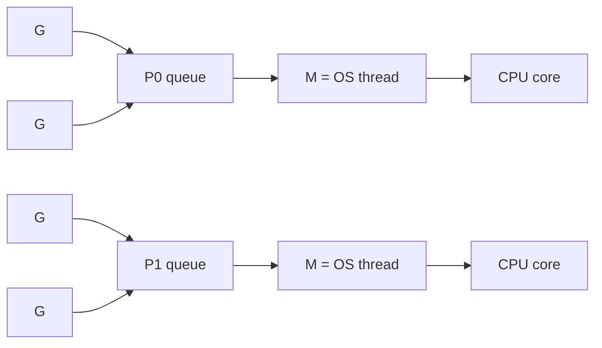

# Вопросы на собеседовании: `Go Concurrency`

Goroutines и channels — главная фича Go: они делают конкурентное программирование дешёвым и читаемым. Goroutine стоит ~2 KB памяти против ~1 MB у OS thread, поэтому их можно запускать сотнями тысяч. На собеседовании по этой теме чаще всего спрашивают: как устроен scheduler (модель M:N), чем отличаются buffered и unbuffered channels, как работает `select`, когда брать mutex, а когда atomic, и типовые паттерны — worker pool, fan-out/fan-in, pipeline.

## Полезные ссылки

### Официальная документация и авторитетные источники

- [Concurrency in Go — Official Docs](https://go.dev/doc/effective_go#concurrency)
- [Go Memory Model](https://go.dev/ref/mem)
- [Go Concurrency Patterns (Rob Pike talk)](https://www.youtube.com/watch?v=f6kdp27TYZs)
- [The Go Scheduler — Ardan Labs](https://www.ardanlabs.com/blog/2018/08/scheduling-in-go-part1.html)
- [Go by Example: Goroutines](https://gobyexample.com/goroutines)
- [sync package documentation](https://pkg.go.dev/sync)

## Содержание

- [Полезные ссылки](#полезные-ссылки)
- [See also](#see-also)

**Goroutines**
- [Q1. (!) Что такое goroutine?](#q1--что-такое-goroutine)
- [Q2. (!) Чем goroutine отличается от OS thread?](#q2--чем-goroutine-отличается-от-os-thread)
- [Q3. (!) Как работает Go scheduler (M:N модель)?](#q3--как-работает-go-scheduler-mn-модель)
- [Q4. (!) Как запустить и остановить goroutine?](#q4--как-запустить-и-остановить-goroutine)
- [Q5. GOMAXPROCS — что это?](#q5-gomaxprocs--что-это)

**Channels**
- [Q6. (!) Что такое channel?](#q6--что-такое-channel)
- [Q7. (!) Чем отличаются buffered и unbuffered channels?](#q7--чем-отличаются-buffered-и-unbuffered-channels)
- [Q8. (!) Send, receive, close — семантика?](#q8--send-receive-close--семантика)
- [Q9. (!) Что происходит при чтении из закрытого channel?](#q9--что-происходит-при-чтении-из-закрытого-channel)
- [Q10. (!) Что происходит при записи в закрытый channel?](#q10--что-происходит-при-записи-в-закрытый-channel)
- [Q11. range над channel?](#q11-range-над-channel)

**select**
- [Q12. (!) Что такое select и как работает?](#q12--что-такое-select-и-как-работает)
- [Q13. (!) Default case в select?](#q13--default-case-в-select)
- [Q14. Timeout через select + time.After?](#q14-timeout-через-select--timeafter)

**sync пакет**
- [Q15. (!) Как работает `sync.Mutex` (Lock, Unlock, defer)?](#q15--как-работает-syncmutex-lock-unlock-defer)
- [Q16. (!) sync.RWMutex — когда использовать?](#q16--syncrwmutex--когда-использовать)
- [Q17. (!) sync.WaitGroup — синхронизация goroutines?](#q17--syncwaitgroup--синхронизация-goroutines)
- [Q18. sync.Once — однократная инициализация?](#q18-synconce--однократная-инициализация)
- [Q19. sync.Map — когда использовать?](#q19-syncmap--когда-использовать)
- [Q20. Что такое `sync.Pool` и когда он нужен?](#q20-что-такое-syncpool-и-когда-он-нужен)

**Atomic**
- [Q21. (!) sync/atomic — для счётчиков?](#q21--syncatomic--для-счётчиков)
- [Q22. atomic vs Mutex — производительность?](#q22-atomic-vs-mutex--производительность)

**Context**
- [Q23. (!) context.Context — концепция?](#q23--contextcontext--концепция)
- [Q24. (!) Чем различаются `WithCancel`, `WithTimeout`, `WithDeadline`?](#q24--чем-различаются-withcancel-withtimeout-withdeadline)
- [Q25. Распространение context через goroutines?](#q25-распространение-context-через-goroutines)

**Patterns**
- [Q26. (!) Как устроен паттерн Worker Pool?](#q26--как-устроен-паттерн-worker-pool)
- [Q27. (!) Как работают паттерны Fan-out и Fan-in?](#q27--как-работают-паттерны-fan-out-и-fan-in)
- [Q28. Как устроен паттерн Pipeline?](#q28-как-устроен-паттерн-pipeline)
- [Q29. Errgroup — обработка ошибок в параллельных задачах?](#q29-errgroup--обработка-ошибок-в-параллельных-задачах)

**Race conditions и debugging**
- [Q30. (!) Что такое race condition?](#q30--что-такое-race-condition)
- [Q31. (!) Как использовать race detector?](#q31--как-использовать-race-detector)
- [Q32. Goroutine leak — что это и как избежать?](#q32-goroutine-leak--что-это-и-как-избежать)
- [Q33. (!) Deadlock в Go?](#q33--deadlock-в-go)

**Сравнения**
- [Q34. (!) Чем goroutines отличаются от Java threads?](#q34--чем-goroutines-отличаются-от-java-threads)
- [Q35. Чем Go channels отличаются от Java BlockingQueue?](#q35-чем-go-channels-отличаются-от-java-blockingqueue)

## Q1. (!) Что такое goroutine?

**Goroutine** — легковесный поток исполнения, которым управляет не ОС, а Go runtime. Запускается словом `go` перед вызовом функции; вызывающий код не ждёт — goroutine начинает работать параллельно.

```go
func say(s string) {
    fmt.Println(s)
}

go say("hello") // запуск в отдельной goroutine
say("world")    // в основной (main) goroutine
```

**Почему это дёшево.** Runtime мультиплексирует множество goroutines на небольшое число OS threads (M:N-модель), поэтому создание goroutine — это не системный вызов, а почти аллокация структуры. Отсюда и характеристики:

- Стартует с **2 KB stack** против ~1 MB у OS thread.
- Stack растёт и сжимается динамически (до 1 GB), runtime копирует его при необходимости.
- Создание стоит **наносекунды**, а не микросекунды, как у OS thread.
- Один Go-процесс спокойно держит **сотни тысяч goroutines** одновременно.

**Важный нюанс.** `main` сама по себе goroutine; когда она завершается, программа выходит, не дожидаясь остальных goroutines. Поэтому их завершение нужно синхронизировать явно — через `WaitGroup`, channel или `context`.

## Q2. (!) Чем goroutine отличается от OS thread?

Главное различие — кто управляет потоком и в каком пространстве происходит переключение. Goroutine живёт в user-space и переключается Go-планировщиком, OS thread управляется ядром.

| Критерий | Goroutine | OS Thread |
|----------|-----------|-----------|
| Размер стека | 2 KB (растёт) | 1-8 MB (фиксирован) |
| Создание | ~3 μs | ~10-100 μs |
| Context switch | Быстрый (user-space) | Медленный (kernel) |
| Управляется | Go scheduler | OS kernel |
| Количество | 100K+ легко | 1K — уже много |
| Связь | M goroutines на N threads | 1:1 с OS thread |

**Почему goroutine дешевле.** Переключение между goroutines не требует входа в ядро: планировщик сам решает, кому отдать процессор, прямо в user-space. Переключение OS thread — это syscall с сохранением полного контекста и сбросом кэшей, отсюда разница в скорости и в допустимом количестве.

Go scheduler мультиплексирует goroutines на ограниченное число OS threads — обычно равное `runtime.GOMAXPROCS()` (по умолчанию `NumCPU()`). Именно поэтому 100K goroutines не означают 100K thread'ов: за ними стоит горстка реальных потоков.

## Q3. (!) Как работает Go scheduler (M:N модель)?

Go scheduler работает по модели **M:N**: M goroutines мультиплексируются на N OS threads. В этом участвуют три сущности — G, M и P:

```
G — Goroutine
M — Machine (OS thread)
P — Processor (logical, хранит queue goroutines)

Default: GOMAXPROCS = NumCPU. Создаётся столько P.
```

`P` — это право на исполнение Go-кода: чтобы M запускал goroutine, ему нужен свободный P. Число P фиксировано (`GOMAXPROCS`) и ограничивает реальный параллелизм; M может быть больше (например, когда поток заблокирован в syscall).



Чтобы M-thread'ы не простаивали, а одна «зависшая» goroutine не блокировала остальных, планировщик применяет три ключевых механизма:

- **Work stealing** — если у P закончились свои goroutines, он не простаивает, а ворует половину из очереди соседнего P. Так нагрузка балансируется между ядрами без центрального диспетчера.
- **Preemptive scheduling** (с Go 1.14+) — раньше goroutine отдавала процессор только в «точках уступки» (вызовы функций, channel-операции), и цикл без них мог застрять навсегда. Теперь scheduler асинхронно прерывает goroutine, которая работает дольше ~10 мс.
- **Network poller** — когда goroutine блокируется на сетевом I/O, она снимается с M, а M отдаётся другой goroutine. Готовность сокета отслеживает отдельный poller (epoll/kqueue), и заблокированная goroutine не держит реальный поток.

В сумме это даёт **высокую concurrency** без накладных расходов «один OS thread на goroutine».

## Q4. (!) Как запустить и остановить goroutine?

**Запуск** — слово `go` перед любым вызовом, чаще всего перед анонимной функцией:

```go
go func() {
    fmt.Println("hello")
}()
```

**Остановка — главная идея:** в Go нет принудительного `kill` для goroutine. Завершить её можно только кооперативно — отправить сигнал, который goroutine сама проверяет и по которому возвращается из функции. Два канонических способа:

1. **Через done channel** — отдельный канал, по закрытию/записи в который goroutine выходит:
```go
done := make(chan bool)
go func() {
    for {
        select {
        case <-done:
            return
        default:
            // работаем
        }
    }
}()
done <- true // сигнал остановки
```

2. **Через context** — тот же приём, но сигнал отмены распространяется по дереву вызовов автоматически (см. Q23-Q25):
```go
ctx, cancel := context.WithCancel(context.Background())
go func(ctx context.Context) {
    for {
        select {
        case <-ctx.Done():
            return
        default:
            // работаем
        }
    }
}(ctx)
cancel() // остановит
```

**Рекомендация:** для долгоживущих goroutines используй `context`, а не голый done-channel — он переносит и отмену, и таймаут, и связь с родителем. Всегда передавай `context.Context` первым параметром.

## Q5. GOMAXPROCS — что это?

`GOMAXPROCS` — максимальное число goroutines, выполняющих Go-код **одновременно**, то есть число логических процессоров `P` в планировщике. По умолчанию равно `runtime.NumCPU()`. Это потолок реального параллелизма (concurrency может быть выше — goroutines просто чередуются на этих P).

```go
import "runtime"

runtime.GOMAXPROCS(4) // ограничить 4 cores
n := runtime.GOMAXPROCS(0) // получить текущее
```

**Подводный камень в контейнерах.** В Docker/Kubernetes с CPU limit `NumCPU()` видит все ядра host-машины, а не выделенную квоту. В итоге `GOMAXPROCS` оказывается завышен: лишние P порождают паразитные переключения и борьбу за CPU, который cgroups всё равно троттлит. Решение — задать значение по квоте: библиотека `automaxprocs` от Uber читает cgroups и выставляет корректный `GOMAXPROCS`; Go 1.21+ умеет это из коробки.

## Q6. (!) Что такое channel?

`Channel` — типизированная труба для передачи значений между goroutines. Это не просто очередь: channel ещё и **синхронизирует** отправителя с получателем, поэтому отдельный mutex для защиты передаваемых данных не нужен.

```go
ch := make(chan int)         // unbuffered
ch := make(chan int, 10)      // buffered (capacity 10)

ch <- 42         // send
v := <-ch        // receive
v, ok := <-ch    // receive, ok=false если canal closed

close(ch)        // закрытие
```

**Зачем они нужны.** Главная идиома Go: *«Don't communicate by sharing memory; share memory by communicating»* — не защищай общую память блокировками, а передавай владение данными через канал. Кто получил значение из channel, тот им и владеет — гонок по этим данным быть не может.

Channels типобезопасны (хранят значения одного типа) и потокобезопасны (вся синхронизация встроена в send/receive).

## Q7. (!) Чем отличаются buffered и unbuffered channels?

Разница в одном: есть ли у канала внутренний буфер. От этого зависит, **когда** блокируется отправитель.

**Unbuffered** (`make(chan int)`) — буфера нет, передача происходит «из рук в руки» (rendezvous). Отправитель блокируется, пока получатель не заберёт значение, — это точка синхронизации двух goroutines.

```go
ch := make(chan int)
go func() {
    ch <- 1 // блокируется до приёма
    fmt.Println("sent")
}()
fmt.Println("waiting")
v := <-ch // принимает
fmt.Println("got:", v)
// Output: waiting → got: 1 → sent
```

`sent` печатается **после** `got` именно потому, что отправка не завершится, пока приём не состоялся.

**Buffered** (`make(chan int, 3)`) — отправитель не блокируется, пока в буфере есть место; блокировка наступает, только когда буфер полон. Канал работает как ограниченная очередь.

```go
ch := make(chan int, 3)
ch <- 1
ch <- 2
ch <- 3 // OK
ch <- 4 // блокируется! буфер полон
```

| Тип | Семантика | Использование |
|-----|-----------|---------------|
| Unbuffered | Synchronization (rendezvous) | Координация goroutines |
| Buffered | Очередь сообщений | Producer-consumer с буфером |

**Эмпирическое правило:** unbuffered — когда нужна гарантия «получатель действительно принял»; buffered — когда нужно сгладить всплески нагрузки и развязать producer от consumer. Размер буфера выбирай осознанно: слишком большой маскирует backpressure и прячет проблему медленного потребителя.

## Q8. (!) Send, receive, close — семантика?

Три базовые операции и их поведение в граничных ситуациях — частый источник вопросов на собеседовании.

```go
ch := make(chan int)

// SEND
ch <- 42

// RECEIVE (два варианта)
v := <-ch
v, ok := <-ch  // ok=true если ОК, false если канал закрыт И пуст

// CLOSE
close(ch)
```

**Ключевые правила.**

- `close` означает «данных больше не будет», поэтому закрывать должен **тот, кто пишет** (sender), и никогда — получатель. Иначе sender может записать в уже закрытый канал и упадёт с panic.
- Если senders несколько, ни один из них не знает, последний ли он. Координируй закрытие извне: `sync.Once`, отдельная sentinel-goroutine или `WaitGroup` + закрытие после `Wait`.
- Поведение **закрытого** канала:
  - Чтение сразу возвращает zero value и `ok=false` (не блокируется).
  - Запись — **panic** `send on closed channel`.
- Операции с **nil**-каналом (объявлен, но не создан через `make`) блокируются **навсегда**. Звучит как баг, но это рабочий приём: присвоив `case`-канал в `nil`, можно «выключить» ветку `select`, не убирая её из кода.

## Q9. (!) Что происходит при чтении из закрытого channel?

Чтение из закрытого канала **не блокируется и не паникует** — это безопасная операция. Если канал пуст, оно немедленно возвращает zero value типа и `ok=false`:

```go
ch := make(chan int)
close(ch)

v, ok := <-ch
fmt.Println(v, ok) // 0 false
```

Если до `close` в буфере **остались значения**, они сначала вычитываются по одному, и только когда буфер опустеет, чтения начнут отдавать `ok=false`. То есть close не теряет уже отправленные данные:

```go
ch := make(chan int, 3)
ch <- 1
ch <- 2
close(ch)

for v := range ch {
    fmt.Println(v) // 1, 2
}
```

Именно поэтому `range` по каналу — идиоматичный способ прочитать всё «до конца»: он сам останавливается на закрытии. Различать «пришёл zero value» и «канал закрыт» помогает форма `v, ok := <-ch`.

## Q10. (!) Что происходит при записи в закрытый channel?

Запись в закрытый канал вызывает **panic** `send on closed channel` — и это не восстанавливаемая ситуация по смыслу: канал говорит «данных больше не будет», а кто-то всё равно шлёт.

```go
ch := make(chan int)
close(ch)
ch <- 1 // panic: send on closed channel
```

Отсюда и правило из Q8: закрывать должен sender, и желательно ровно один. Когда senders несколько, факт закрытия нужно сделать однократным — например, через `sync.Once`:

```go
// Если несколько senders
var once sync.Once
once.Do(func() { close(ch) })
```

**Подводный камень:** даже `sync.Once` не спасёт, если другой sender попытается записать **после** того, как Once уже закрыл канал. Надёжнее закрывать канал только когда гарантированно завершились все отправители (например, после `wg.Wait()`).

## Q11. range над channel?

`for v := range ch` читает значения из канала по одному, пока канал не закроют. Это самый чистый способ обработать поток данных «до конца».

```go
ch := make(chan int, 3)
go func() {
    for i := 1; i <= 5; i++ {
        ch <- i
    }
    close(ch) // важно — иначе range блокируется навсегда
}()

for v := range ch {
    fmt.Println(v) // 1, 2, 3, 4, 5
}
```

**Как ведёт себя цикл:** на пустом канале он блокируется и ждёт следующего значения, а на `close` — корректно выходит. Поэтому `close` обязателен: без него получатель навечно зависнет на пустом канале, ожидая значение, которое никто не пришлёт — классический **goroutine leak**.

## Q12. (!) Что такое select и как работает?

`select` ждёт сразу **несколько** channel-операций и выполняет ту, что готова первой. Это аналог `switch`, но ветвление идёт не по значению, а по готовности каналов — то, без чего невозможно одновременно слушать несколько источников.

```go
ch1 := make(chan int)
ch2 := make(chan int)

select {
case v := <-ch1:
    fmt.Println("from ch1:", v)
case v := <-ch2:
    fmt.Println("from ch2:", v)
case ch1 <- 42:
    fmt.Println("sent to ch1")
}
```

**Как работает:**
- Если ни одна case не готова — `select` блокируется и ждёт, пока готовой станет хоть одна.
- Если готовы **сразу несколько** — выбирается случайная (а не первая по тексту). Случайность не даёт «голодать» какому-то одному каналу при постоянной нагрузке.
- `case` может быть как receive, так и send — `select` слушает оба направления.
- Ветка `default` снимает блокировку (см. Q13).

## Q13. (!) Default case в select?

Ветка `default` выполняется, когда ни один канал не готов прямо сейчас. С ней `select` превращается из блокирующего в **неблокирующий**: попробовал — не вышло — пошёл дальше.

```go
select {
case v := <-ch:
    fmt.Println("got:", v)
default:
    fmt.Println("no message, not blocking")
}
```

**Сценарии применения:**
- **Non-blocking read/write** — забрать значение, только если оно уже есть; не ждать.
- **Polling** — периодически проверять канал, не останавливая основной цикл.
- **Health checks** — мгновенно опросить состояние без риска зависнуть.

**Подводный камень:** `select { default: }` в цикле без паузы превращается в busy-loop, который крутит CPU вхолостую. Если опрашиваешь в цикле — добавляй таймер или `time.Sleep`, а лучше переходи на блокирующий `select` без `default`.

## Q14. Timeout через select + time.After?

Таймаут — это просто ещё одна ветка `select`, которая «выстрелит», если основной канал не ответил вовремя. `time.After(d)` возвращает канал, в который через `d` придёт значение; что наступит раньше — данные или таймер, — то и выберет `select`:

```go
select {
case v := <-ch:
    fmt.Println("got:", v)
case <-time.After(5 * time.Second):
    fmt.Println("timeout")
}
```

**Подводный камень:** каждый вызов `time.After` создаёт новый timer, и пока он не сработает, его нельзя освободить (а в `select`-цикле они накапливаются). На горячем пути это утечка таймеров — используй `time.NewTimer` и явно вызывай `Stop`:

```go
timer := time.NewTimer(5 * time.Second)
defer timer.Stop()

select {
case v := <-ch:
    if !timer.Stop() { <-timer.C } // drain
case <-timer.C:
    fmt.Println("timeout")
}
```

## Q15. (!) Как работает `sync.Mutex` (Lock, Unlock, defer)?

`sync.Mutex` — взаимная блокировка, которая допускает к защищённому участку (critical section) ровно одну goroutine в момент времени. Всё, что между `Lock()` и `Unlock()`, выполняется эксклюзивно.

```go
import "sync"

var (
    mu      sync.Mutex
    counter int
)

func increment() {
    mu.Lock()
    defer mu.Unlock()
    counter++
}
```

**Правила работы.**
- `Lock()` блокирует goroutine, если mutex уже захвачен другой, — она ждёт `Unlock`.
- `Unlock()` может вызвать любая goroutine, но разблокировать уже свободный mutex — panic; поэтому держи симметрию Lock/Unlock в одном месте.
- **Всегда** ставь `defer mu.Unlock()` сразу после `Lock()`. Иначе ранний `return` или panic внутри секции оставит mutex захваченным навсегда — и все остальные goroutines повиснут (deadlock).

**Не копируй Mutex.** У mutex есть внутреннее состояние; `var mu2 = mu` копирует его наполовину захваченным и ломает инвариант. Поэтому `go vet` ругается на копирование, а struct с mutex передавай по указателю.

## Q16. (!) sync.RWMutex — когда использовать?

`sync.RWMutex` разделяет блокировку на два режима. `RLock` (read) могут одновременно держать сколько угодно читателей — они не мешают друг другу, ведь чтение не меняет данные. `Lock` (write) эксклюзивен: писатель ждёт, пока освободятся все читатели, и на время записи никого не пускает.

```go
var (
    mu   sync.RWMutex
    data map[string]int
)

func read(key string) int {
    mu.RLock()
    defer mu.RUnlock()
    return data[key]
}

func write(key string, value int) {
    mu.Lock()
    defer mu.Unlock()
    data[key] = value
}
```

**Когда применять.** Выигрыш есть только на **read-heavy** нагрузке — когда чтений в разы (ориентир: 10+) больше, чем записей: параллельные читатели не блокируют друг друга. На сбалансированной или write-heavy нагрузке обычный `Mutex` обычно быстрее — у `RWMutex` дороже бухгалтерия (учёт числа читателей), и преимущество не окупается.

## Q17. (!) sync.WaitGroup — синхронизация goroutines?

`sync.WaitGroup` — счётчик незавершённых goroutines, который позволяет дождаться, пока все они отработают. `Add(n)` увеличивает счётчик, `Done()` уменьшает на 1, `Wait()` блокирует, пока счётчик не дойдёт до нуля.

```go
var wg sync.WaitGroup

for i := 0; i < 5; i++ {
    wg.Add(1)
    go func(id int) {
        defer wg.Done()
        // работа
        fmt.Println("worker", id)
    }(i)
}

wg.Wait() // блок до wg.count = 0
fmt.Println("all done")
```

**Подводные камни.**
- `Add` вызывай **до** запуска goroutine, в основной goroutine. Если сделать `wg.Add(1)` внутри уже запущенной goroutine, `Wait()` может проскочить до того, как счётчик увеличится — race и преждевременный выход.
- `Done` ставь через `defer` — тогда счётчик уменьшится даже при panic или раннем `return`, и `Wait()` не зависнет навсегда.
- Не копируй `WaitGroup` после использования — как и mutex, она хранит внутреннее состояние; передавай по указателю.

## Q18. sync.Once — однократная инициализация?

`sync.Once` гарантирует, что переданная функция выполнится **ровно один раз** за всё время жизни программы, даже если `Do` зовут параллельно из десятка goroutines. Это потокобезопасная ленивая инициализация без ручных блокировок.

```go
var (
    once sync.Once
    cfg  *Config
)

func GetConfig() *Config {
    once.Do(func() {
        cfg = loadConfigFromFile()
    })
    return cfg
}
```

**Как это работает.** Первая goroutine, дошедшая до `Do`, выполняет `f`, остальные **блокируются** до её завершения — и только потом возвращаются. Поэтому к моменту выхода из `Do` результат инициализации уже виден всем (загруженный `cfg` гарантированно готов).

**Сценарии применения:** lazy initialization дорогих ресурсов, потокобезопасные singletons, однократное закрытие канала из Q10. Важно: `Once` нельзя переиспользовать — повторный `Do` ничего не выполнит, даже с другой функцией.

## Q19. sync.Map — когда использовать?

`sync.Map` — готовая потокобезопасная map. Нужна она нечасто: обычная `map` под `sync.Mutex` подходит для большинства случаев, а `sync.Map` оправдана лишь в узких сценариях, под которые оптимизирована.

```go
var m sync.Map

m.Store("alice", 30)

v, ok := m.Load("alice")
if ok { fmt.Println(v) }

m.Delete("alice")

m.Range(func(k, v any) bool {
    fmt.Printf("%v: %v\n", k, v)
    return true // continue
})
```

**Когда `sync.Map` выигрывает.** Она внутри использует копию-для-чтения, поэтому хороша там, где:
- много goroutines читают преимущественно **разные** ключи (контеншн почти нулевой);
- набор ключей стабилен, а read:write ratio высок — типичные кэши «записали один раз, читаем много».

**Когда лучше `map` + `Mutex`:**
- частые записи — `sync.Map` оптимизирована под чтение и на write-heavy проигрывает;
- нужна типизация — `sync.Map` работает через `any`, теряя проверки на этапе компиляции;
- обычные, простые случаи — меньше кода и предсказуемее поведение.

**Эмпирическое правило:** начинай с `map + sync.Mutex`; переходи на `sync.Map` только если профилировка показала контеншн на этой map.

## Q20. Что такое `sync.Pool` и когда он нужен?

`sync.Pool` — пул переиспользуемых временных объектов, который снижает давление на аллокатор и GC. Вместо того чтобы каждый раз создавать новый объект, ты берёшь его из пула (`Get`), используешь и возвращаешь (`Put`). Если пул пуст, вызывается фабрика `New`.

```go
var bufferPool = sync.Pool{
    New: func() any {
        return new(bytes.Buffer)
    },
}

func process() {
    buf := bufferPool.Get().(*bytes.Buffer)
    defer func() {
        buf.Reset()
        bufferPool.Put(buf)
    }()

    // используем buf
}
```

Обрати внимание на `buf.Reset()` перед возвратом: объект из пула приходит «как есть», с прежним содержимым, поэтому его нужно очистить, иначе следующий потребитель получит чужие данные.

**Сценарии применения:**
- тяжёлые короткоживущие объекты (buffers, временные структуры), которые создаются часто;
- когда аллокации этих объектов заметны в профилировке (`pprof`, allocs/op).

**Не подходит для:**
- connection pools — у соединений есть жизненный цикл и состояние, для них есть специализированные библиотеки;
- объектов со сложным state, который дорого или опасно сбрасывать.

**Ключевой нюанс:** GC может очистить пул в любой момент, поэтому `Pool` нельзя использовать как кэш с гарантией наличия объекта. Это оптимизация скорости, а не часть корректности программы — код должен работать и тогда, когда пул пуст.

## Q21. (!) sync/atomic — для счётчиков?

Пакет `sync/atomic` даёт **безблокировочные** (lock-free) операции над примитивами. Они выполняются как одна неделимая инструкция процессора, поэтому два потока не могут «перезатереть» друг друга — без mutex и без переключения в ядро.

```go
import "sync/atomic"

var counter int64

// Increment
atomic.AddInt64(&counter, 1)

// Read
v := atomic.LoadInt64(&counter)

// Set
atomic.StoreInt64(&counter, 100)

// Compare-and-swap
swapped := atomic.CompareAndSwapInt64(&counter, 100, 200)
```

`CompareAndSwap` (CAS) — основа lock-free алгоритмов: «запиши новое значение, только если текущее равно ожидаемому». Если кто-то успел изменить значение, CAS вернёт `false`, и операцию повторяют в цикле.

С Go 1.19+ есть типизированный API — `atomic.Int64`, `atomic.Pointer[T]` и т.п. Он удобнее и безопаснее: невозможно случайно прочитать переменную не-атомарно, мимо обёртки.

```go
var counter atomic.Int64
counter.Add(1)
counter.Load()
```

**Граница применимости:** atomic работает только с **одним примитивом** (int, pointer, bool, uint). Как только нужно согласованно менять несколько полей или поддерживать инвариант между ними — это уже Mutex.

## Q22. atomic vs Mutex — производительность?

Для простых операций (инкремент, чтение, запись одного значения) **atomic обычно в 2-5 раз быстрее** Mutex. Причина в том, что atomic — это одна процессорная инструкция без обращения к ядру, тогда как mutex при контеншне может уйти в syscall и переключение goroutine.

```go
// Mutex — ~50ns per op
var mu sync.Mutex
mu.Lock(); counter++; mu.Unlock()

// Atomic — ~10ns per op
atomic.AddInt64(&counter, 1)
```

**Компромисс.** Скорость atomic не бесплатна — она ограничивает тебя **одной** атомарной операцией. Как только под защитой должно быть несколько связанных действий (проверить-и-изменить два поля, поддержать инвариант), atomic уже не гарантирует согласованности — нужен Mutex или продуманный lock-free алгоритм на CAS. Эмпирическое правило: счётчик/флаг — atomic, любая сложнее логика — Mutex.

## Q23. (!) context.Context — концепция?

`context.Context` — стандартный способ протащить через всю цепочку вызовов сигнал «пора останавливаться» и сопутствующие метаданные. Он решает проблему: как отменить работу, разбросанную по множеству goroutines и слоёв, не передавая в каждую функцию отдельный done-channel. Context несёт три вещи:

- **Cancellation signal** — отмену операции (по `cancel()` или ошибке).
- **Deadline / timeout** — автоматическую отмену по времени.
- **Request-scoped values** — данные на время запроса: request ID, информация о пользователе, trace.

```go
import "context"

func main() {
    ctx, cancel := context.WithTimeout(context.Background(), 5*time.Second)
    defer cancel()

    result, err := slowOp(ctx)
    if err != nil {
        log.Fatal(err)
    }
    fmt.Println(result)
}

func slowOp(ctx context.Context) (string, error) {
    select {
    case <-time.After(10 * time.Second):
        return "done", nil
    case <-ctx.Done():
        return "", ctx.Err() // context.DeadlineExceeded или context.Canceled
    }
}
```

Канал `ctx.Done()` закрывается при отмене или истечении дедлайна — функция слушает его в `select` и возвращается досрочно. `ctx.Err()` уточняет причину: `context.Canceled` (вызвали `cancel`) или `context.DeadlineExceeded` (вышло время).

**Рекомендация:** делай `ctx context.Context` **первым** параметром функции — это устоявшаяся идиома. Context не кладут в поля структур и не передают `nil`; если контекста ещё нет, используй `context.TODO()`.

## Q24. (!) Чем различаются `WithCancel`, `WithTimeout`, `WithDeadline`?

Три конструктора порождают отменяемый context из родительского — различаются лишь тем, **что** триггерит отмену: ручной вызов, относительный таймаут или абсолютный момент времени.

```go
// Manual cancellation
ctx, cancel := context.WithCancel(context.Background())
defer cancel() // важно!

// Cancel когда нужно
go func() {
    time.Sleep(2 * time.Second)
    cancel()
}()

// Timeout (relative)
ctx, cancel := context.WithTimeout(context.Background(), 5*time.Second)

// Deadline (absolute)
deadline := time.Now().Add(5 * time.Second)
ctx, cancel := context.WithDeadline(context.Background(), deadline)

// Values (для request-scoped data)
ctx := context.WithValue(parent, "userID", 42)
userID := ctx.Value("userID").(int)
```

- **WithCancel** — отмена только вручную, по вызову `cancel()`.
- **WithTimeout** — отмена через заданный интервал (`5s` от текущего момента); по сути `WithDeadline(now + d)`.
- **WithDeadline** — отмена в конкретный момент времени.
- **WithValue** — кладёт пару ключ-значение; для cancellation не используется, только для метаданных.

**Рекомендация:** **всегда** ставь `defer cancel()` сразу после `WithCancel/WithTimeout/WithDeadline` — даже если context отменится по таймауту. `cancel` освобождает связанные с context ресурсы (таймер, дочерние goroutines); без него — goroutine/timer leak. `go vet` предупреждает о потерянном `cancel`.

## Q25. Распространение context через goroutines?

Context **иммутабелен**: каждый `WithCancel/WithTimeout/...` не меняет родителя, а создаёт нового потомка, ссылающегося на него. Так выстраивается дерево, и отмена распространяется по нему **только вниз**: отмена родителя отменяет всех потомков; отмена потомка на родителя не влияет.

```go
parent, cancelParent := context.WithCancel(context.Background())
child, cancelChild := context.WithTimeout(parent, 5*time.Second)
defer cancelChild()

// Отмена parent → отменяет child (5 секунд может не наступить)
cancelParent()
```

Здесь `child` отменится раньше своих 5 секунд — потому что отменили `parent`. Это и есть смысл дерева: отменив корень запроса (например, при разрыве HTTP-соединения), ты разом гасишь все порождённые им операции.

**Иерархия:**
```
Background (root)
  ├── parent (cancellable)
  │    ├── child1 (timeout)
  │    └── child2 (deadline)
  └── другой parent
```

При cancel parent — все дочерние получают сигнал.

## Q26. (!) Как устроен паттерн Worker Pool?

**Worker pool** — фиксированное число goroutines-воркеров, которые разбирают задачи из общего канала `jobs` и складывают результаты в `results`. Так ограничивается параллелизм: вместо «по goroutine на задачу» (что при тысячах задач съест память) работает ровно N воркеров.

```go
func worker(id int, jobs <-chan int, results chan<- int) {
    for j := range jobs {
        fmt.Printf("worker %d processing %d\n", id, j)
        time.Sleep(time.Second)
        results <- j * 2
    }
}

func main() {
    jobs := make(chan int, 100)
    results := make(chan int, 100)

    // 3 workers
    for w := 1; w <= 3; w++ {
        go worker(w, jobs, results)
    }

    // Send 5 jobs
    for j := 1; j <= 5; j++ {
        jobs <- j
    }
    close(jobs)

    // Receive results
    for a := 1; a <= 5; a++ {
        <-results
    }
}
```

**Как это работает.** Все воркеры читают из одного `jobs` — Go-runtime раздаёт задачи свободным воркерам сам. `close(jobs)` после отправки задач завершает `for range` во всех воркерах, и они выходят. `<-chan` (read-only) и `chan<-` (write-only) в сигнатуре — это направленные каналы: компилятор не даст воркеру случайно записать в `jobs` или прочитать из `results`.

**Сценарий применения:** ограничение нагрузки на внешний ресурс (БД, API), где нельзя запускать неограниченное число параллельных запросов. Размер пула подбирают под пропускную способность ресурса.

## Q27. (!) Как работают паттерны Fan-out и Fan-in?

Два дополняющих друг друга приёма для распараллеливания этапа и сбора его результатов:

- **Fan-out** — несколько workers читают из **одного** входного канала, разбирая работу между собой (параллельная обработка).
- **Fan-in** — несколько каналов-источников сливаются в **один** выходной, который читает единственный consumer.

Связка fan-out → fan-in: раскидали работу по N воркерам, затем собрали все их выходы в один поток. Функция `merge` ниже как раз делает fan-in — для каждого входного канала запускает goroutine, перекладывающую значения в общий `out`, а `WaitGroup` закрывает `out`, когда опустели все источники.

```go
// Fan-out: 3 workers
input := make(chan int, 100)
out1 := make(chan int)
out2 := make(chan int)
out3 := make(chan int)

go worker(input, out1)
go worker(input, out2)
go worker(input, out3)

// Fan-in: merge всех outputs
merged := merge(out1, out2, out3)

func merge(channels ...<-chan int) <-chan int {
    var wg sync.WaitGroup
    out := make(chan int)

    for _, ch := range channels {
        wg.Add(1)
        go func(c <-chan int) {
            defer wg.Done()
            for v := range c {
                out <- v
            }
        }(ch)
    }

    go func() {
        wg.Wait()
        close(out)
    }()
    return out
}
```

**Сценарий применения:** обработка независимых элементов (запросы к разным сервисам, парсинг файлов), где порядок результатов не важен, а важна пропускная способность. Закрытие `out` строго после `wg.Wait()` — обязательная деталь: закрой раньше, и goroutine, ещё пишущая в `out`, упадёт с panic.

## Q28. Как устроен паттерн Pipeline?

**Pipeline** — цепочка этапов (stages), соединённых каналами: каждый этап читает из входного канала, выполняет свою трансформацию и пишет в выходной, который становится входом следующего. Этапы работают **параллельно** — пока `square` обрабатывает первое число, `generate` уже шлёт второе.

```go
func generate(nums ...int) <-chan int {
    out := make(chan int)
    go func() {
        defer close(out)
        for _, n := range nums {
            out <- n
        }
    }()
    return out
}

func square(in <-chan int) <-chan int {
    out := make(chan int)
    go func() {
        defer close(out)
        for n := range in {
            out <- n * n
        }
    }()
    return out
}

// Pipeline
nums := generate(1, 2, 3, 4)
squares := square(nums)
for v := range squares {
    fmt.Println(v) // 1, 4, 9, 16
}
```

Это та же идея, что Unix-конвейер `cat | grep | sort`, только в коде: каждый этап — отдельная goroutine, данные текут между ними по каналам. Обрати внимание на `defer close(out)` в каждом этапе — закрытие выходного канала каскадно завершает `range` в следующем этапе, и pipeline разбирается сам, без утечек goroutines.

## Q29. Errgroup — обработка ошибок в параллельных задачах?

`errgroup` из `golang.org/x/sync` — это `WaitGroup`, который умеет собирать ошибки и связан с `context`. Голый `WaitGroup` лишь ждёт завершения, но не даёт удобно вернуть ошибку из goroutine и отменить остальные; `errgroup` закрывает обе проблемы.

```go
import "golang.org/x/sync/errgroup"

g, ctx := errgroup.WithContext(context.Background())

g.Go(func() error {
    return fetch(ctx, url1)
})
g.Go(func() error {
    return fetch(ctx, url2)
})

if err := g.Wait(); err != nil {
    log.Fatal(err)
}
```

**Как работает.** `g.Go` запускает функцию, возвращающую `error`. Как только одна из них вернёт не-`nil`, `errgroup` отменяет связанный `ctx` — остальные goroutines, которые слушают `ctx.Done()`, могут прекратить работу досрочно вместо бесполезного продолжения. `g.Wait()` дожидается всех и возвращает **первую** возникшую ошибку.

**Сценарий применения:** параллельные операции по принципу «всё или ничего» — например, обогатить заказ данными из трёх сервисов: если хоть один упал, остальные нет смысла ждать.

## Q30. (!) Что такое race condition?

**Race condition (гонка данных)** — две и более goroutine обращаются к одной переменной без синхронизации, и хотя бы одна из них пишет. Результат зависит от случайного порядка выполнения, поэтому программа выдаёт разные ответы от запуска к запуску.

```go
var counter int

func main() {
    for i := 0; i < 1000; i++ {
        go func() { counter++ }() // RACE!
    }
    time.Sleep(time.Second)
    fmt.Println(counter) // не 1000, а случайное число
}
```

**Почему теряются инкременты.** `counter++` выглядит как одно действие, но на деле это три шага: прочитать значение, прибавить 1, записать обратно. Две goroutines могут прочитать одно и то же старое значение, обе прибавить 1 и записать — итог увеличится на 1 вместо 2. Часть инкрементов «затирается».

**Решения (выбор зависит от задачи):**
- `atomic.AddInt64` — для простого счётчика, самый дешёвый вариант.
- `sync.Mutex` — когда под защитой несколько связанных полей или инвариант.
- Channel-based design — передать владение данными через канал, чтобы общей переменной вообще не было.

## Q31. (!) Как использовать race detector?

Флаг `-race` включает встроенный детектор гонок — компилятор инструментирует доступы к памяти, и runtime ловит несинхронизированные обращения по ходу выполнения.

```bash
go run -race main.go
go test -race ./...
go build -race
```

**Важная особенность:** detector находит только те гонки, что **реально произошли** на данном прогоне, — он не доказывает их отсутствие. Поэтому гонять `-race` нужно на тестах с хорошим покрытием конкурентного кода. Инструментирование замедляет программу в 5-10 раз и поднимает потребление памяти, так что в проде его не держат, но в CI прогон тестов под `-race` — практически обязателен.

```
WARNING: DATA RACE
Read at 0x00c0000aa008 by goroutine 7:
  main.main.func1()
      /path/main.go:10 +0x44
Previous write at 0x00c0000aa008 by goroutine 6:
  main.main.func1()
      /path/main.go:10 +0x55
```

Отчёт показывает конфликтующую пару: **где** прочитали, **где** раньше записали, и какие goroutines это сделали — по стектрейсам легко найти место в коде и добавить синхронизацию.

## Q32. Goroutine leak — что это и как избежать?

**Goroutine leak** — goroutine навсегда заблокирована и не завершается. В отличие от обычной утечки памяти, здесь утекает и стек goroutine, и всё, на что она ссылается; со временем число «висящих» goroutines растёт и подъедает память.

```go
// LEAK
ch := make(chan int)
go func() {
    v := <-ch // никогда не получит — leak
    fmt.Println(v)
}()
// Если никто не пишет в ch — goroutine висит навсегда
```

**Корень проблемы** почти всегда один: goroutine заблокирована на канале (send или receive), а второй стороны больше не будет — никто не пишет, не читает или не закрывает канал. Goroutine не умеет «передумать» сама — её нужно дать возможность выйти.

**Профилактика:**
- передавай `context.Context` и в долгих операциях слушай `ctx.Done()` в `select` — это даёт точку выхода;
- читай каналы через `for range` — он корректно завершается при `close`;
- следи, чтобы у каждой блокирующей операции был «выход»: таймаут, отмена или гарантированный close;
- не забывай `defer cancel()` после `WithCancel/WithTimeout` — иначе утекает уже сам context.

**Как обнаружить:**
- `runtime.NumGoroutine()` — счётчик: если он монотонно растёт под стабильной нагрузкой, есть утечка;
- `pprof` goroutine-профиль — даёт стектрейсы всех goroutines и показывает, на какой строке они застряли.

## Q33. (!) Deadlock в Go?

**Deadlock** — goroutines заблокированы в ожидании друг друга так, что ни одна не может продвинуться. Самый простой случай — отправка в unbuffered-канал, из которого никто не читает:

```go
ch := make(chan int)
ch <- 1 // BLOCK forever — нет receiver
// fatal error: all goroutines are asleep - deadlock!
```

Go runtime умеет **детектировать тотальный deadlock**: когда заблокированы абсолютно все goroutines, он печатает `all goroutines are asleep` и аварийно завершает программу. Но если хотя бы одна goroutine жива (например, крутит `for {}`), runtime не считает это deadlock — частичную взаимоблокировку он не ловит, искать её придётся вручную (по `pprof`).

Вторая частая причина — повторный захват уже взятого mutex:

```go
// Mutex deadlock
var mu sync.Mutex

mu.Lock()
mu.Lock() // deadlock — pthread re-entry не поддерживается
```

`sync.Mutex` **не reentrant**: повторный `Lock` из той же goroutine не разрешён (в отличие от Java `ReentrantLock`). Обычно это всплывает, когда метод под локом вызывает другой метод, который снова берёт тот же mutex.

**Как избегать:** захватывай несколько mutex всегда в одном и том же порядке (профилактика классического deadlock'а из двух локов), держи критические секции короткими и не вызывай под локом внешний код, который может захотеть тот же mutex.

## Q34. (!) Чем goroutines отличаются от Java threads?

Исторически главное различие — модель планирования: goroutine лёгкая и управляется runtime (M:N), классический Java thread — это обёртка над OS thread (1:1), потому он тяжёлый.

| Критерий | Goroutine | Java Thread |
|----------|-----------|-------------|
| Размер | ~2KB | ~1MB |
| Scheduler | Go runtime (M:N) | OS (1:1) до Loom |
| Context switch | User-space (быстро) | Kernel (медленно) |
| API | `go func() {}` | `Thread`, `Executor` |
| Cancellation | context.Context | `Thread.interrupt()` |

**Следствие модели 1:1.** Раз каждый Java thread — это OS thread по ~1 MB, их нельзя плодить десятками тысяч; отсюда в Java культура пулов потоков и `Executor`. В Go дешёвая goroutine снимает эту проблему — на запрос можно спокойно стартовать отдельную.

**Project Loom (Java 21).** В Java появились **virtual threads** — лёгкие потоки поверх несущих OS threads, та же по сути M:N-модель, что и у goroutines. По цене создания и масштабированию Java в этом аспекте догнала Go; разница теперь больше в API и в способе отмены, чем в самой модели.

Подробнее — в [Java Concurrency](../java/java-concurrency-interview.md).

## Q35. Чем Go channels отличаются от Java BlockingQueue?

Оба — потокобезопасные конвейеры для передачи данных между потоками с блокировкой. Концептуально близки, но у Go-канала есть две выразительные возможности, которых у `BlockingQueue` нет: явное `close` и `select`.

| Критерий | Channel | BlockingQueue |
|----------|---------|---------------|
| Закрытие | `close(ch)` явное | Нет close |
| Range | `for v := range ch` | Через `take()` в цикле |
| Select | Multi-channel `select` | Нет аналога |
| Buffered/Unbuffered | Оба | Bounded/Unbounded |

**Что даёт `close`.** В Go получатель узнаёт «данных больше не будет» прямо из канала (`for range` сам завершится). В Java сигнал «конец потока» приходится моделировать вручную — например, класть в очередь специальное «отравленное» сообщение (poison pill).

**Что даёт `select`.** Можно ждать сразу несколько каналов, таймаут или отмену в одной конструкции. У `BlockingQueue` прямого аналога нет.

**Итог.** Channels выразительнее за счёт `close` и `select`. `BlockingQueue` — зрелая часть стандартной библиотеки Java и полностью закрывает классический producer-consumer, просто требует больше ручной обвязки для тех же сценариев.

---

## See also

- [Go (базовый)](go-interview.md) — основы языка
- [Go Memory & GC](go-memory-gc-interview.md) — escape analysis, GC pauses
- [Go Standard Library](go-stdlib-interview.md) — net/http, context
- [Java Concurrency](../java/java-concurrency-interview.md) — для сравнения
- [Kotlin Coroutines](../kotlin/kotlin-coroutines-interview.md) — для сравнения
- [Event-driven паттерны](../../architecture/event-driven-patterns-interview.md) — channels вписываются
- [Микросервисы](../../architecture/microservices-interview.md) — Go идеален для них
- [gRPC](../../api/grpc-interview.md) — Go реализация сильна

