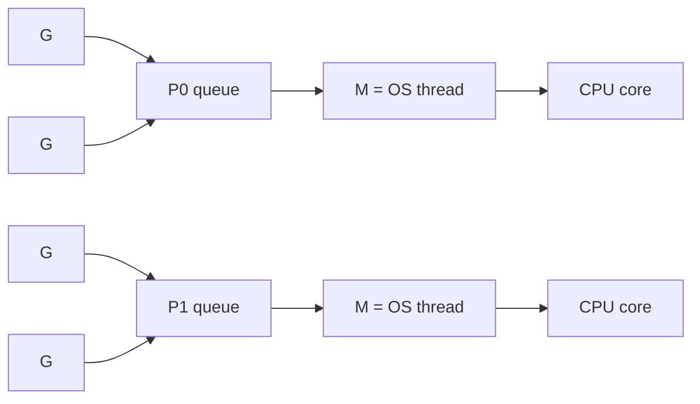

# Вопросы на собеседовании: `Go Concurrency`

Goroutines и channels — главная фича Go, делающая concurrent programming доступным. Goroutine стоит ~2KB памяти (vs ~1MB у OS thread). На интервью спрашивают: устройство scheduler, разницу buffered/unbuffered channels, select, мьютексы, паттерны (worker pool, fan-out/fan-in).

## Полезные ссылки

### Официальная документация и авторитетные источники

- [Concurrency in Go — Official Docs](https://go.dev/doc/effective_go#concurrency)
- [Go Memory Model](https://go.dev/ref/mem)
- [Go Concurrency Patterns (Rob Pike talk)](https://www.youtube.com/watch?v=f6kdp27TYZs)
- [The Go Scheduler — Ardan Labs](https://www.ardanlabs.com/blog/2018/08/scheduling-in-go-part1.html)
- [Go by Example: Goroutines](https://gobyexample.com/goroutines)
- [sync package documentation](https://pkg.go.dev/sync)

## Содержание

- [Полезные ссылки](#полезные-ссылки)
- [See also](#see-also)

**Goroutines**
- [Q1. (!) Что такое goroutine?](#q1--что-такое-goroutine)
- [Q2. (!) Чем goroutine отличается от OS thread?](#q2--чем-goroutine-отличается-от-os-thread)
- [Q3. (!) Как работает Go scheduler (M:N модель)?](#q3--как-работает-go-scheduler-mn-модель)
- [Q4. (!) Как запустить и остановить goroutine?](#q4--как-запустить-и-остановить-goroutine)
- [Q5. GOMAXPROCS — что это?](#q5-gomaxprocs--что-это)

**Channels**
- [Q6. (!) Что такое channel?](#q6--что-такое-channel)
- [Q7. (!) Buffered vs unbuffered channels?](#q7--buffered-vs-unbuffered-channels)
- [Q8. (!) Send, receive, close — семантика?](#q8--send-receive-close--семантика)
- [Q9. (!) Что происходит при чтении из закрытого channel?](#q9--что-происходит-при-чтении-из-закрытого-channel)
- [Q10. (!) Что происходит при записи в закрытый channel?](#q10--что-происходит-при-записи-в-закрытый-channel)
- [Q11. range над channel?](#q11-range-над-channel)

**select**
- [Q12. (!) Что такое select и как работает?](#q12--что-такое-select-и-как-работает)
- [Q13. (!) Default case в select?](#q13--default-case-в-select)
- [Q14. Timeout через select + time.After?](#q14-timeout-через-select--timeafter)

**sync пакет**
- [Q15. (!) sync.Mutex — Lock, Unlock, defer?](#q15--syncmutex--lock-unlock-defer)
- [Q16. (!) sync.RWMutex — когда использовать?](#q16--syncrwmutex--когда-использовать)
- [Q17. (!) sync.WaitGroup — синхронизация goroutines?](#q17--syncwaitgroup--синхронизация-goroutines)
- [Q18. sync.Once — однократная инициализация?](#q18-synconce--однократная-инициализация)
- [Q19. sync.Map — когда использовать?](#q19-syncmap--когда-использовать)
- [Q20. sync.Pool?](#q20-syncpool)

**Atomic**
- [Q21. (!) sync/atomic — для счётчиков?](#q21--syncatomic--для-счётчиков)
- [Q22. atomic vs Mutex — производительность?](#q22-atomic-vs-mutex--производительность)

**Context**
- [Q23. (!) context.Context — концепция?](#q23--contextcontext--концепция)
- [Q24. (!) WithCancel, WithTimeout, WithDeadline?](#q24--withcancel-withtimeout-withdeadline)
- [Q25. Распространение context через goroutines?](#q25-распространение-context-через-goroutines)

**Patterns**
- [Q26. (!) Worker Pool pattern?](#q26--worker-pool-pattern)
- [Q27. (!) Fan-out / Fan-in?](#q27--fan-out--fan-in)
- [Q28. Pipeline pattern?](#q28-pipeline-pattern)
- [Q29. Errgroup — обработка ошибок в параллельных задачах?](#q29-errgroup--обработка-ошибок-в-параллельных-задачах)

**Race conditions и debugging**
- [Q30. (!) Что такое race condition?](#q30--что-такое-race-condition)
- [Q31. (!) Как использовать race detector?](#q31--как-использовать-race-detector)
- [Q32. Goroutine leak — что это и как избежать?](#q32-goroutine-leak--что-это-и-как-избежать)
- [Q33. (!) Deadlock в Go?](#q33--deadlock-в-go)

**Сравнения**
- [Q34. (!) Goroutines vs Java threads?](#q34--goroutines-vs-java-threads)
- [Q35. Go channels vs Java BlockingQueue?](#q35-go-channels-vs-java-blockingqueue)

## Q1. (!) Что такое goroutine?

**Goroutine** — легковесный поток исполнения, управляемый Go runtime (не OS).

```go
func say(s string) {
    fmt.Println(s)
}

go say("hello") // запуск в отдельной goroutine
say("world")    // в основной (main) goroutine
```

**Ключевое:**
- Стартует с **2KB stack** (vs ~1MB у OS thread)
- Stack растёт динамически (до 1GB)
- Создание стоит **наносекунды** (vs микросекунды у OS thread)
- Один Go-процесс может иметь **сотни тысяч goroutines**


> [!mcq]
> - [ ] OS-поток, создаваемый Go runtime через syscall для каждой goroutine | ❌ ПОСЛЕДСТВИЕ: путаница goroutine/thread → ожидание 1:1 mapping, непонимание почему 100K goroutines возможны при ~NumCPU threads
> - [x] Легковесный user-space поток исполнения, управляемый Go scheduler; начальный stack 2KB, создание за наносекунды, сотни тысяч одновременно | ✓ ПРИМЕНЯТЬ: любая асинхронная работа; go keyword запускает goroutine 📋 ПРАВИЛО: goroutine ≠ OS thread; N:M модель → дёшево создавать 🔗 См. Q2
> - [ ] Функция с ключевым словом async для асинхронного исполнения как в JavaScript | ❌ ПОСЛЕДСТВИЕ: goroutine — не promise/async; нет await; параллелизм управляется scheduler, не event loop → неправильные ожидания о синхронизации
> - [ ] Корутина с явными suspend/resume точками через yield | ❌ ПОСЛЕДСТВИЕ: goroutine не требует yield (preemptive с Go 1.14); нет явного suspend — scheduler сам переключает → ожидание cooperative scheduling ломает CPU-bound код

## Q2. (!) Чем goroutine отличается от OS thread?

| Критерий | Goroutine | OS Thread |
|----------|-----------|-----------|
| Размер стека | 2 KB (растёт) | 1-8 MB (фиксирован) |
| Создание | ~3 μs | ~10-100 μs |
| Context switch | Быстрый (user-space) | Медленный (kernel) |
| Управляется | Go scheduler | OS kernel |
| Количество | 100K+ легко | 1K — уже много |
| Связь | M goroutines на N threads | 1:1 с OS thread |

Goroutines — **user-space** концепция. Go scheduler мультиплексирует их на ограниченное число OS threads (обычно = `runtime.GOMAXPROCS()`, по умолчанию `NumCPU()`).


> [!mcq]
> - [ ] Goroutine и OS thread идентичны; разница только в синтаксисе запуска (`go` vs `new Thread`) | ❌ ПОСЛЕДСТВИЕ: ожидание одинаковой стоимости → избыточная экономия на goroutines или попытка запустить 1M OS threads → OOM
> - [ ] Goroutine использует выделенный OS thread на всё время жизни (1:1 модель) | ❌ ПОСЛЕДСТВИЕ: 1:1 — это Java/Python threads до Loom; Go — M:N; непонимание блокирует объяснение почему 100K goroutines без 100K OS threads
> - [ ] Goroutine — user-space легковесный поток (~2KB stack), мультиплексируемый Go scheduler на N OS threads; context switch без syscall | ✓ ПРИМЕНЯТЬ: создавать goroutines свободно для I/O-bound задач 📋 ПРАВИЛО: M goroutines на N threads (M>>N); стек растёт динамически 🔗 См. Q3
> - [ ] Goroutine не может выполняться параллельно на нескольких CPU; только concurrent (однопоточно) | ❌ ПОСЛЕДСТВИЕ: Go — true parallelism через GOMAXPROCS; непонимание → ожидание последовательного исполнения CPU-bound goroutines

## Q3. (!) Как работает Go scheduler (M:N модель)?

```
G — Goroutine
M — Machine (OS thread)
P — Processor (logical, хранит queue goroutines)

Default: GOMAXPROCS = NumCPU. Создаётся столько P.
```



**Стратегии:**
- **Work stealing** — если P простаивает, забирает goroutine из чужой очереди
- **Preemptive scheduling** (с Go 1.14+) — если goroutine долго не yields, scheduler её прерывает
- **Network poller** — goroutines на блокирующих сетевых операциях не занимают M; M освобождается, scheduler переключается на другую G

Это даёт **высокую concurrency** без затрат на OS thread per goroutine.


> [!mcq]
> - [ ] Go scheduler — кооперативный; goroutine должна явно вызвать runtime.Gosched() чтобы уступить CPU | ❌ ПОСЛЕДСТВИЕ: до Go 1.14 это было так; сейчас preemptive (signal-based); CPU-bound goroutine без Gosched() больше не блокирует → устаревшие туториалы вводят в заблуждение
> - [ ] M:N означает M goroutines на N процессах ОС; каждый процесс — отдельная goroutine | ❌ ПОСЛЕДСТВИЕ: N — это OS threads (не processes); путаница с fork() → неправильное понимание изоляции goroutines
> - [ ] Go scheduler использует G, M, P триаду; P хранит очередь goroutines; M — OS thread; work stealing между P при простое | ✓ ПРИМЕНЯТЬ: понимание GOMAXPROCS для CPU-bound; network poller для I/O-bound 📋 ПРАВИЛО: P = logical processor = очередь G; М = реальный поток; work stealing = балансировка 🔗 См. Q5
> - [ ] В Go каждая goroutine получает свой OS thread; scheduler только следит за их приоритетами | ❌ ПОСЛЕДСТВИЕ: это 1:1 модель (Java threads до Loom); Go M:N мультиплексирует G на M; ожидание 1:1 объясняет непонимание почему 100K goroutines не = 100K threads

## Q4. (!) Как запустить и остановить goroutine?

```go
go func() {
    fmt.Println("hello")
}()
```

**Остановка** — Go не предоставляет принудительного `kill` для goroutine. Стратегии:

1. **Через done channel:**
```go
done := make(chan bool)
go func() {
    for {
        select {
        case <-done:
            return
        default:
            // работаем
        }
    }
}()
done <- true // сигнал остановки
```

2. **Через context:**
```go
ctx, cancel := context.WithCancel(context.Background())
go func(ctx context.Context) {
    for {
        select {
        case <-ctx.Done():
            return
        default:
            // работаем
        }
    }
}(ctx)
cancel() // остановит
```

**Идиома:** всегда передавай `context.Context` в долгоживущие goroutines.


> [!mcq]
> - [ ] Goroutine запускается через `goroutine func() {}`; остановить можно вызовом `goroutine.Stop()` | ❌ ПОСЛЕДСТВИЕ: нет синтаксиса goroutine.Stop() в Go; попытка его использовать → compile error; goroutine нельзя убить извне
> - [ ] Goroutine запускается через `go`; остановить можно через `runtime.KillGoroutine(id)` | ❌ ПОСЛЕДСТВИЕ: нет runtime.KillGoroutine(); Go намеренно не даёт принудительного kill; только cooperative cancellation через context/channel
> - [ ] Goroutine запускается через `go func(){}()`; остановить нельзя — только ждать завершения через WaitGroup | ❌ ПОСЛЕДСТВИЕ: можно сигнализировать через done channel или context; ожидание только WaitGroup ведёт к goroutine leak при нужде остановки раньше времени
> - [ ] Goroutine запускается через `go`; остановить через context.WithCancel (cancel()) или done channel с select; нет принудительного kill | ✓ ПРИМЕНЯТЬ: долгоживущие goroutines обязательно получают ctx; defer cancel() 📋 ПРАВИЛО: launch=go; stop=context/channel; no kill API 🔗 См. Q32

## Q5. GOMAXPROCS — что это?

`GOMAXPROCS` — число OS threads, которые Go scheduler использует параллельно. По умолчанию = `runtime.NumCPU()`.

```go
import "runtime"

runtime.GOMAXPROCS(4) // ограничить 4 cores
n := runtime.GOMAXPROCS(0) // получить текущее
```

В контейнерах (Docker, Kubernetes) с CPU limit `NumCPU()` может вернуть число всех CPU host-машины. Для правильного значения — `automaxprocs` от Uber или Go 1.21+ авто-detection из cgroups.


> [!mcq]
> - [x] GOMAXPROCS = максимальное число OS threads, работающих параллельно; default=NumCPU; в контейнерах может быть больше CPU-лимита → нужен automaxprocs | ✓ ПРИМЕНЯТЬ: Kubernetes pod с CPU limit — добавить uber-go/automaxprocs 📋 ПРАВИЛО: GOMAXPROCS=host CPUs в контейнере → лишние P → overhead scheduling 🔗 См. Q3
> - [ ] GOMAXPROCS — максимальное число goroutines, которые могут работать одновременно | ❌ ПОСЛЕДСТВИЕ: goroutines не ограничены GOMAXPROCS (их может быть 100K); GOMAXPROCS ограничивает OS threads → попытка "выделить goroutine per request" всё равно будет работать
> - [ ] GOMAXPROCS влияет только на I/O-операции; CPU-bound goroutines игнорируют это значение | ❌ ПОСЛЕДСТВИЕ: CPU-bound goroutines как раз зависят от GOMAXPROCS для true parallelism; I/O-bound goroutines используют network poller вне GOMAXPROCS ограничения
> - [ ] GOMAXPROCS по умолчанию 1; нужно явно ставить NumCPU() для параллелизма | ❌ ПОСЛЕДСТВИЕ: с Go 1.5+ default = NumCPU(); явная установка в 1 деградирует до однопоточного исполнения → CPU-bound задачи не параллелятся

## Q6. (!) Что такое channel?

`Channel` — типизированный канал передачи значений между goroutines.

```go
ch := make(chan int)         // unbuffered
ch := make(chan int, 10)      // buffered (capacity 10)

ch <- 42         // send
v := <-ch        // receive
v, ok := <-ch    // receive, ok=false если canal closed

close(ch)        // закрытие
```

**"Don't communicate by sharing memory; share memory by communicating"** — главная идиома Go.

Channels — type-safe, thread-safe (синхронизация встроена).


> [!mcq]
> - [ ] Channel — глобальная переменная, доступная всем goroutines для синхронизации | ❌ ПОСЛЕДСТВИЕ: channel — typed conduit, не глобальная переменная; создаётся через make; непередача channel как параметра → нарушение encapsulation
> - [ ] Channel может хранить значения любого типа без указания типа при создании | ❌ ПОСЛЕДСТВИЕ: channel строго типизирован (`chan int`, `chan string`); `chan any` возможен, но требует type assertion → runtime panics при неправильном cast
> - [ ] Channel — типизированный двунаправленный канал между goroutines; make(chan T) создаёт unbuffered, make(chan T, N) — buffered; send/receive встроенно синхронизированы | ✓ ПРИМЕНЯТЬ: координация goroutines без явных мьютексов 📋 ПРАВИЛО: channel = pipe между goroutines; type-safe + thread-safe by design 🔗 См. Q7
> - [ ] Channel работает только внутри одной goroutine для асинхронного кода | ❌ ПОСЛЕДСТВИЕ: channels существуют именно для МЕЖГОРУТИННОГО общения; использование внутри одной goroutine → deadlock при unbuffered channel

## Q7. (!) Buffered vs unbuffered channels?

**Unbuffered** (`make(chan int)`) — sender блокируется, пока receiver не возьмёт значение.

```go
ch := make(chan int)
go func() {
    ch <- 1 // блокируется до приёма
    fmt.Println("sent")
}()
fmt.Println("waiting")
v := <-ch // принимает
fmt.Println("got:", v)
// Output: waiting → got: 1 → sent
```

**Buffered** (`make(chan int, 3)`) — sender не блокируется, пока есть место в буфере.

```go
ch := make(chan int, 3)
ch <- 1
ch <- 2
ch <- 3 // OK
ch <- 4 // блокируется! буфер полон
```

| Тип | Семантика | Использование |
|-----|-----------|---------------|
| Unbuffered | Synchronization (rendezvous) | Координация goroutines |
| Buffered | Очередь сообщений | Producer-consumer с буфером |


> [!mcq]
> - [x] Unbuffered блокирует sender до получения receiver (rendezvous); buffered не блокирует пока буфер не заполнен — sender продолжает без ожидания | ✓ ПРИМЕНЯТЬ: unbuffered для синхронизации goroutines; buffered для decoupled producer-consumer 📋 ПРАВИЛО: unbuffered=sync; buffered=async queue; оба блокируют при полном/пустом 🔗 См. Q8
> - [ ] Buffered channel быстрее unbuffered для любых нагрузок; всегда предпочитать buffered | ❌ ПОСЛЕДСТВИЕ: buffered без синхронизации теряет сигнальную семантику; слишком большой буфер скрывает backpressure → memory bloat при переполнении очереди
> - [ ] Unbuffered channel — асинхронный; sender не ждёт receiver | ❌ ПОСЛЕДСТВИЕ: unbuffered — синхронный (blocking); перепутаны async/sync свойства → неожиданный deadlock при ожидании неблокирующего поведения
> - [ ] Buffered channel с capacity 1 эквивалентен unbuffered | ❌ ПОСЛЕДСТВИЕ: buffered(1) позволяет sender отправить без ожидания receiver (отличие от unbuffered rendezvous) → разное timing поведения нарушит race-free гарантии

## Q8. (!) Send, receive, close — семантика?

```go
ch := make(chan int)

// SEND
ch <- 42

// RECEIVE (два варианта)
v := <-ch
v, ok := <-ch  // ok=true если ОК, false если канал закрыт И пуст

// CLOSE
close(ch)
```

**Правила:**
- `close` могут вызывать **только sender'ы** (никогда receiver)
- Если несколько senders — координация через `sync.Once` или sentinel goroutine
- Закрытый channel:
  - Read возвращает zero value + `ok=false`
  - Write — **panic**
- Передача по `nil` channel — **блокировка навсегда** (полезно для disabling case в `select`)


> [!mcq]
> - [ ] Receiver может вызвать close(ch) чтобы сигнализировать sender что данные не нужны | ❌ ПОСЛЕДСТВИЕ: close из receiver → panic если sender попытается писать в закрытый channel; паттерн "receiver closes" — антипаттерн; нужен done channel для сигнала
> - [ ] Запись в nil channel возвращает ошибку; чтение из nil возвращает zero value | ❌ ПОСЛЕДСТВИЕ: и запись, и чтение в nil channel блокируются навсегда (не паника); используется в select для dynamic disabling; ожидание error → неправильный error handling
> - [ ] Только sender должен вызывать close; запись в закрытый channel = panic; чтение из закрытого возвращает zero+ok=false | ✓ ПРИМЕНЯТЬ: при нескольких senders используй sync.Once для close; всегда проверяй ok при range-free чтении 📋 ПРАВИЛО: close=sender only; write after close=panic; read after close=zero,false 🔗 См. Q9
> - [ ] close(ch) освобождает память; после close channel переходит в nil | ❌ ПОСЛЕДСТВИЕ: close не освобождает память GC-дует; закрытый channel не nil → `ch == nil` будет false, можно читать (zero + ok=false)

## Q9. (!) Что происходит при чтении из закрытого channel?

Чтение из **закрытого и пустого** channel возвращает zero value + `ok=false`:

```go
ch := make(chan int)
close(ch)

v, ok := <-ch
fmt.Println(v, ok) // 0 false
```

Если в канале **остались значения** до close — они сначала будут прочитаны:

```go
ch := make(chan int, 3)
ch <- 1
ch <- 2
close(ch)

for v := range ch {
    fmt.Println(v) // 1, 2
}
```

`range` корректно завершается при закрытии.


> [!mcq]
> - [ ] Чтение из закрытого channel вызывает panic | ❌ ПОСЛЕДСТВИЕ: panic — при ЗАПИСИ в закрытый; чтение — безопасно (zero+false); перепутаны → неправильная defensive логика в коде
> - [ ] Чтение из закрытого channel блокируется навсегда | ❌ ПОСЛЕДСТВИЕ: блокируется чтение из nil channel; закрытый channel немедленно возвращает zero+false → бесконечный цикл ожидания вместо корректного завершения
> - [x] Возвращает оставшиеся значения по очереди, затем zero value + ok=false; range автоматически завершается при закрытии | ✓ ПРИМЕНЯТЬ: close сигнализирует range что данных больше нет; проверять ok при ручном чтении 📋 ПРАВИЛО: closed+buffered → drain буфер; closed+empty → zero,false немедленно 🔗 См. Q10
> - [ ] Возвращает специальное значение ErrChannelClosed | ❌ ПОСЛЕДСТВИЕ: нет ErrChannelClosed в Go; вместо этого ok=false; ожидание error type → неправильный error handling при чтении channels

## Q10. (!) Что происходит при записи в закрытый channel?

**Panic.**

```go
ch := make(chan int)
close(ch)
ch <- 1 // panic: send on closed channel
```

Это причина, почему `close` должны делать только senders — и обычно один.

```go
// Если несколько senders
var once sync.Once
once.Do(func() { close(ch) })
```


> [!mcq]
> - [x] Запись в закрытый channel вызывает panic: "send on closed channel"; синхронизировать close через sync.Once при нескольких senders | ✓ ПРИМЕНЯТЬ: проверять что channel не закрыт перед записью; использовать recover() только как крайнюю меру 📋 ПРАВИЛО: write to closed = panic; multiple senders → Once.Do(close) 🔗 См. Q8
> - [ ] Запись в закрытый channel возвращает false (ok semantics) | ❌ ПОСЛЕДСТВИЕ: нет ok semantics для send; Go намеренно делает это panic чтобы принудить к правильному дизайну → ожидание silent fail приведёт к потере данных без индикации
> - [ ] Запись в закрытый channel блокируется пока он не откроется снова | ❌ ПОСЛЕДСТВИЕ: channel нельзя "открыть снова"; закрытие — необратимо; блокировки нет → panic немедленно
> - [ ] Запись в закрытый channel игнорируется; значение просто теряется | ❌ ПОСЛЕДСТВИЕ: silent discard скрыл бы программные ошибки; Go выбрал panic как явный сигнал ошибки → ожидание discard приведёт к игнорированию ошибок дизайна

## Q11. range над channel?

```go
ch := make(chan int, 3)
go func() {
    for i := 1; i <= 5; i++ {
        ch <- i
    }
    close(ch) // важно — иначе range блокируется навсегда
}()

for v := range ch {
    fmt.Println(v) // 1, 2, 3, 4, 5
}
```

`range` блокируется при пустом канале, останавливается при `close`. Без `close` — **goroutine leak**.


> [!mcq]
> - [ ] range над channel итерирует ровно N раз, где N указывается в make(chan int, N) | ❌ ПОСЛЕДСТВИЕ: N в make — capacity буфера, не количество итераций; range итерирует до close; ожидание N-bounded range → прерывание до обработки всех данных
> - [ ] range закрывает channel автоматически по завершении цикла | ❌ ПОСЛЕДСТВИЕ: range НЕ закрывает channel; это ответственность sender; без явного close после sender → goroutine с range зависнет навсегда (goroutine leak)
> - [ ] range над channel блокируется при пустом канале и завершается при close; без close — goroutine leak | ✓ ПРИМЕНЯТЬ: sender всегда вызывает close(ch) после последнего send 📋 ПРАВИЛО: range+channel = блок при empty, exit при close; забыть close = goroutine leak 🔗 См. Q32
> - [ ] range над channel работает только для buffered channels; для unbuffered нужен цикл for с ok check | ❌ ПОСЛЕДСТВИЕ: range работает для обоих типов; ограничение только buffered — неверное; использование for+ok вместо range — более verbose без преимуществ

## Q12. (!) Что такое select и как работает?

`select` — выбор из **нескольких** channel операций:

```go
ch1 := make(chan int)
ch2 := make(chan int)

select {
case v := <-ch1:
    fmt.Println("from ch1:", v)
case v := <-ch2:
    fmt.Println("from ch2:", v)
case ch1 <- 42:
    fmt.Println("sent to ch1")
}
```

**Семантика:**
- Блокируется, пока ни одна case не готова
- Если несколько готовы — выбирается **случайно**
- Если есть `default` — не блокируется (см. ниже)

Аналог `switch` для channels.


> [!mcq]
> - [ ] select выбирает первый готовый case в порядке объявления (priority-based) | ❌ ПОСЛЕДСТВИЕ: Go выбирает случайный из готовых (не первый); ожидание priority-order → starvation одних channels при одновременной готовности нескольких
> - [ ] select может работать только с receive операциями; send нельзя в case | ❌ ПОСЛЕДСТВИЕ: select поддерживает и send (ch<-) и receive (<-ch) в case; ограничение только receive → избыточный код с отдельными goroutines для send
> - [x] select ждёт пока хотя бы один channel-case станет готов; при нескольких готовых — выбор случайный; блокируется без default | ✓ ПРИМЕНЯТЬ: multiplexing нескольких channels; с timeout через time.After 📋 ПРАВИЛО: select = switch для channels; random при нескольких готовых → fairness 🔗 См. Q13
> - [ ] select работает как switch — если ни один case не готов, переходит к следующему выражению | ❌ ПОСЛЕДСТВИЕ: без default select блокируется (не продолжает); с default — не блокируется → ожидание fall-through поведения ломает logic

## Q13. (!) Default case в select?

```go
select {
case v := <-ch:
    fmt.Println("got:", v)
default:
    fmt.Println("no message, not blocking")
}
```

С `default` — `select` **не блокируется**. Полезно для:
- Non-blocking read/write
- Polling
- Health checks


> [!mcq]
> - [ ] default в select выполняется только если все channels закрыты | ❌ ПОСЛЕДСТВИЕ: default выполняется когда НИКАКОЙ channel-case не готов прямо сейчас; закрытость channels здесь не при чём → неправильное использование default для cleanup
> - [ ] default превращает select в неблокирующий для всех future вызовов в программе | ❌ ПОСЛЕДСТВИЕ: default влияет только на конкретный select; каждый select-statement независим → ожидание глобального эффекта
> - [x] default делает select неблокирующим: если ни один channel не готов — выполняется default; используется для non-blocking try-read/try-write | ✓ ПРИМЕНЯТЬ: polling без блокировки; попытка send без ожидания 📋 ПРАВИЛО: select без default = блок; с default = non-blocking (try semantics) 🔗 См. Q12
> - [ ] default обязателен в каждом select; без него программа не компилируется | ❌ ПОСЛЕДСТВИЕ: default опционален; select без default — нормальный blocking select; ожидание обязательности → избыточные empty default branches

## Q14. Timeout через select + time.After?

```go
select {
case v := <-ch:
    fmt.Println("got:", v)
case <-time.After(5 * time.Second):
    fmt.Println("timeout")
}
```

`time.After` — создаёт channel, который получит значение через указанное время.

**Подвох:** `time.After` создаёт новый timer каждый раз. В горячем коде используй `time.NewTimer` с явным `Stop`:

```go
timer := time.NewTimer(5 * time.Second)
defer timer.Stop()

select {
case v := <-ch:
    if !timer.Stop() { <-timer.C } // drain
case <-timer.C:
    fmt.Println("timeout")
}
```


> [!mcq]
> - [x] time.After создаёт channel-таймер для select; удобно для одноразового timeout; в горячем коде лучше time.NewTimer + Stop для предотвращения goroutine leak | ✓ ПРИМЕНЯТЬ: one-shot timeout в select; в цикле — NewTimer+Stop+Reset 📋 ПРАВИЛО: time.After в loop = goroutine leak (timer не garbage collected до fire); NewTimer = explicit control 🔗 См. Q4
> - [ ] time.After блокирует текущую goroutine на указанное время | ❌ ПОСЛЕДСТВИЕ: time.Sleep блокирует; time.After возвращает channel — не блокирует само по себе; путаница Sleep/After → неправильное использование для timeout логики
> - [ ] Timeout в select реализуется через context.WithTimeout; time.After не рекомендован | ❌ ПОСЛЕДСТВИЕ: оба подхода валидны; context.WithTimeout лучше для propagating cancellation; time.After + select — для локальных timeouts; запрет time.After избыточен
> - [ ] time.After с одним и тем же duration можно переиспользовать в цикле без проблем | ❌ ПОСЛЕДСТВИЕ: каждый вызов time.After создаёт новый timer; старые timers не GC до fire → memory leak в tight loop с timeout

## Q15. (!) sync.Mutex — Lock, Unlock, defer?

```go
import "sync"

var (
    mu      sync.Mutex
    counter int
)

func increment() {
    mu.Lock()
    defer mu.Unlock()
    counter++
}
```

**Правила:**
- `Lock()` блокируется, если уже locked
- `Unlock()` — только из той goroutine, что locked (или panic)
- **Всегда** используй `defer mu.Unlock()` — иначе при panic останется locked

**Не копируй Mutex** — mutex имеет state. `var mu2 = mu` — undefined behavior. Используй pointer на struct с mutex.


> [!mcq]
> - [ ] sync.Mutex reentrant: одна goroutine может вызвать Lock() дважды без deadlock | ❌ ПОСЛЕДСТВИЕ: Go Mutex НЕ reentrant; второй Lock() из той же goroutine → deadlock; в отличие от Java ReentrantLock → рекурсивный код требует другого подхода
> - [ ] Unlock() можно вызывать из любой goroutine, не обязательно той, что вызвала Lock() | ❌ ПОСЛЕДСТВИЕ: концептуально Unlock из другой goroutine — ошибка дизайна; хотя Go не проверяет это в runtime, такой паттерн ведёт к tricky races
> - [ ] Копирование sync.Mutex через value assignment — нормальная практика для создания независимых мьютексов | ❌ ПОСЛЕДСТВИЕ: копирование Mutex копирует его внутреннее состояние (locked/unlocked); если оригинал locked → копия тоже locked → immediate deadlock при попытке Lock
> - [x] Lock() блокирует если уже locked; всегда defer Unlock(); не копировать Mutex (копирование state → deadlock) | ✓ ПРИМЕНЯТЬ: защита общих структур данных; defer Unlock() гарантирует unlock даже при panic 📋 ПРАВИЛО: mutex = non-reentrant; defer unlock; передавать как pointer 🔗 См. Q16

## Q16. (!) sync.RWMutex — когда использовать?

`RWMutex` — для **read-heavy** нагрузок. Множественные readers могут держать lock одновременно, writer — эксклюзивно.

```go
var (
    mu   sync.RWMutex
    data map[string]int
)

func read(key string) int {
    mu.RLock()
    defer mu.RUnlock()
    return data[key]
}

func write(key string, value int) {
    mu.Lock()
    defer mu.Unlock()
    data[key] = value
}
```

**Когда:** если **read'ов в 10+ раз больше**, чем write'ов. Иначе обычный Mutex быстрее (overhead RWMutex выше).


> [!mcq]
> - [ ] RWMutex всегда быстрее обычного Mutex; следует заменить все Mutex на RWMutex | ❌ ПОСЛЕДСТВИЕ: RWMutex медленнее Mutex при write-heavy или balanced нагрузке из-за bookkeeping overhead; слепая замена → деградация производительности
> - [ ] RWMutex позволяет множественным writers работать одновременно | ❌ ПОСЛЕДСТВИЕ: RWMutex позволяет множественным READERS одновременно; writer — эксклюзивный; путаница → data race при параллельных записях
> - [x] RWMutex оптимален при read-heavy (10:1+ соотношение); множественные RLock() одновременно; Writer — эксклюзивен | ✓ ПРИМЕНЯТЬ: read-heavy кеши, конфиги; при write-heavy — обычный Mutex 📋 ПРАВИЛО: reads concurrent, writes exclusive; overhead выше Mutex → бенчмарк перед заменой 🔗 См. Q15
> - [ ] RLock() автоматически повышается до Lock() при обнаружении необходимости записи | ❌ ПОСЛЕДСТВИЕ: нет auto-upgrade в Go RWMutex; попытка Lock() при RLock() в одной goroutine → deadlock; нужно явно RUnlock() перед Lock()

## Q17. (!) sync.WaitGroup — синхронизация goroutines?

`WaitGroup` — ждать завершения N goroutines.

```go
var wg sync.WaitGroup

for i := 0; i < 5; i++ {
    wg.Add(1)
    go func(id int) {
        defer wg.Done()
        // работа
        fmt.Println("worker", id)
    }(i)
}

wg.Wait() // блок до wg.count = 0
fmt.Println("all done")
```

**Подводные камни:**
- `Add` **до** запуска goroutine, не внутри (race)
- `Done` через `defer` — гарантирует вызов
- Не копировать `WaitGroup` после первого использования


> [!mcq]
> - [ ] wg.Add(1) можно вызывать внутри goroutine сразу после запуска | ❌ ПОСЛЕДСТВИЕ: Add внутри goroutine — race condition; если main goroutine вызовет Wait() до Add → Wait вернётся немедленно не дождавшись → пропущенные goroutines
> - [x] Add(N) вызывать ДО запуска goroutine; Done() через defer; Wait() блокирует до счётчика=0; не копировать WaitGroup | ✓ ПРИМЕНЯТЬ: параллельный запуск N задач с ожиданием всех 📋 ПРАВИЛО: Add before go; Done via defer; Wait last; copy=deadlock 🔗 См. Q29
> - [ ] WaitGroup может переиспользоваться для нескольких волн goroutines через Reset() | ❌ ПОСЛЕДСТВИЕ: нет метода Reset() в sync.WaitGroup; переиспользование без сброса возможно если Wait() завершился; создавать новый WaitGroup для каждой волны
> - [ ] Done() всегда безопасно вызывать несколько раз — WaitGroup игнорирует лишние вызовы | ❌ ПОСЛЕДСТВИЕ: лишний Done() декрементирует счётчик ниже нуля → panic "sync: negative WaitGroup counter"; строгий баланс Add/Done обязателен

## Q18. sync.Once — однократная инициализация?

```go
var (
    once sync.Once
    cfg  *Config
)

func GetConfig() *Config {
    once.Do(func() {
        cfg = loadConfigFromFile()
    })
    return cfg
}
```

`once.Do(f)` гарантирует: `f` вызывается **ровно один раз** в всей программе, даже из конкурентных goroutines.

Полезно для lazy initialization, singletons.


> [!mcq]
> - [x] sync.Once гарантирует однократное выполнение функции даже при конкурентных вызовах; идеально для lazy singleton initialization | ✓ ПРИМЕНЯТЬ: инициализация DB connection, config, logger при первом обращении 📋 ПРАВИЛО: Once.Do = guaranteed-once; все concurrent callers блокируются до завершения 🔗 См. Q15
> - [ ] sync.Once можно reset для повторного использования через once.Reset() | ❌ ПОСЛЕДСТВИЕ: нет метода Reset() в sync.Once; после первого Do функция никогда не выполнится снова → паттерн "reinit конфига" через Once невозможен без нового Once
> - [ ] sync.Once только для однопоточных программ; в concurrent коде нужен Mutex | ❌ ПОСЛЕДСТВИЕ: Once именно для concurrent кода; Mutex тоже работает, но verbose; Once — идиоматичнее и безопаснее для initialization pattern
> - [ ] Если функция в once.Do паникует, следующий вызов once.Do выполнит функцию снова | ❌ ПОСЛЕДСТВИЕ: если Do паникует, Once помечается как "done" и не выполнится снова; panic propagates к caller → инициализация не завершилась, но Once больше не вызовет её

## Q19. sync.Map — когда использовать?

`sync.Map` — concurrent map. Без неё — обычная `map` + `Mutex`.

```go
var m sync.Map

m.Store("alice", 30)

v, ok := m.Load("alice")
if ok { fmt.Println(v) }

m.Delete("alice")

m.Range(func(k, v any) bool {
    fmt.Printf("%v: %v\n", k, v)
    return true // continue
})
```

**Когда `sync.Map` лучше:**
- Множество goroutines читают **разные** ключи (не пересекающиеся)
- Кэши с высоким read:write ratio

**Когда обычная `map` + `Mutex` лучше:**
- Часто пишут (`sync.Map` оптимизирован для read-heavy)
- Нужна типизация (`sync.Map` — `any`)
- Простые случаи

В большинстве случаев — `map + sync.Mutex` достаточно.


> [!mcq]
> - [ ] sync.Map всегда превосходит map+Mutex по производительности | ❌ ПОСЛЕДСТВИЕ: sync.Map оптимизирован для read-heavy со стабильными ключами; при write-heavy нагрузке map+Mutex быстрее → неоправданная сложность API (Load/Store вместо [key])
> - [x] sync.Map лучше при read-heavy нагрузке с non-overlapping ключами; map+Mutex лучше для write-heavy и типобезопасности | ✓ ПРИМЕНЯТЬ: кеш где пишут редко, читают часто; иначе map+Mutex 📋 ПРАВИЛО: sync.Map = untyped (any) + read-optimized; map+Mutex = typed + general 🔗 См. Q15
> - [ ] sync.Map потокобезопасна через RWMutex под капотом | ❌ ПОСЛЕДСТВИЕ: sync.Map использует более сложный load/store алгоритм с двумя maps (read/dirty); RWMutex — только часть; неправильная модель → недооценка overhead при dirty map promotions
> - [ ] sync.Map поддерживает type-safe generics через sync.Map[K comparable, V any] | ❌ ПОСЛЕДСТВИЕ: sync.Map — не generic в стандартной библиотеке (as of Go 1.21); все операции через any; type assertion необходима → runtime panics при неправильном типе

## Q20. sync.Pool?

```go
var bufferPool = sync.Pool{
    New: func() any {
        return new(bytes.Buffer)
    },
}

func process() {
    buf := bufferPool.Get().(*bytes.Buffer)
    defer func() {
        buf.Reset()
        bufferPool.Put(buf)
    }()

    // используем buf
}
```

**Использовать когда:**
- Тяжёлые объекты (buffers, structs) создаются часто и недолго живут
- Аллокации видны в профилировке

**Не использовать для:**
- Connection pools (есть специальные библиотеки)
- Объектов с сложным state

GC может **очистить пул** в любой момент. `Pool` — оптимизация, не корректность.


> [!mcq]
> - [ ] sync.Pool гарантирует что объект вернётся обратно после Put; можно полагаться на это для корректности | ❌ ПОСЛЕДСТВИЕ: GC очищает Pool в любой момент; объекты из Pool нельзя использовать для корректности (только performance); хранение state → corrupted state после GC очистки
> - [ ] sync.Pool — лучший способ реализовать connection pool в Go | ❌ ПОСЛЕДСТВИЕ: Connection pool требует lifecycle management (keepalive, close); sync.Pool очищается GC → connections могут быть потеряны; для DB/HTTP нужен специализированный pool (database/sql встроен)
> - [x] sync.Pool переиспользует короткоживущие объекты снижая GC pressure; GC может очистить пул; не для объектов с lifecycle (connections) | ✓ ПРИМЕНЯТЬ: bytes.Buffer, encoder/decoder объекты в hot path 📋 ПРАВИЛО: Pool = performance optimization only; GC может сбросить → всегда готов к New() 🔗 См. Q3
> - [ ] sync.Pool автоматически вызывает Reset() при Put() | ❌ ПОСЛЕДСТВИЕ: Reset() нужно вызывать вручную перед Put(); без Reset → следующий Get() получит объект с grязным state → subtle bugs с буферами

## Q21. (!) sync/atomic — для счётчиков?

Atomic операции — безблокировочные модификации примитивов:

```go
import "sync/atomic"

var counter int64

// Increment
atomic.AddInt64(&counter, 1)

// Read
v := atomic.LoadInt64(&counter)

// Set
atomic.StoreInt64(&counter, 100)

// Compare-and-swap
swapped := atomic.CompareAndSwapInt64(&counter, 100, 200)
```

С Go 1.19+ — `atomic.Int64`, `atomic.Pointer[T]` — типизированный API:

```go
var counter atomic.Int64
counter.Add(1)
counter.Load()
```

**Когда:** только для **примитивов** (int, pointer, bool). Для сложных структур — Mutex.


> [!mcq]
> - [ ] atomic.AddInt64 безопасен для модификации любого типа данных включая struct | ❌ ПОСЛЕДСТВИЕ: atomic только для примитивов (int32/64, pointer, bool); struct — Mutex; попытка atomic на struct → compile error или UB
> - [x] sync/atomic обеспечивает lock-free операции для примитивов (int, pointer); быстрее Mutex; для сложных операций spanning несколько полей — Mutex | ✓ ПРИМЕНЯТЬ: single-value counters, flags, atomic pointer swaps 📋 ПРАВИЛО: atomic = single primitive; Mutex = multiple fields или complex invariants 🔗 См. Q22
> - [ ] atomic.LoadInt64 не нужен если другие goroutines только читают; только Write требует atomic | ❌ ПОСЛЕДСТВИЕ: без atomic.Load reader может увидеть stale value из кеша CPU; Go memory model требует atomic для всех concurrent accesses даже read-only
> - [ ] atomic операции в Go автоматически применяются к int переменным при конкурентном доступе | ❌ ПОСЛЕДСТВИЕ: Go не автоматизирует atomicity; `counter++` — это 3 операции (load, increment, store) без атомарности → data race; нужен явный atomic.AddInt64

## Q22. atomic vs Mutex — производительность?

**Atomic** обычно **в 2-5 раз быстрее** Mutex для простых операций — нет syscall'ов, lock-free.

```go
// Mutex — ~50ns per op
var mu sync.Mutex
mu.Lock(); counter++; mu.Unlock()

// Atomic — ~10ns per op
atomic.AddInt64(&counter, 1)
```

**Но:** atomic подходит только для **одной** операции. Если нужно несколько связанных — Mutex (или сложные lock-free алгоритмы).


> [!mcq]
> - [x] Atomic в 2-5х быстрее Mutex для single-primitive операций (lock-free); Mutex нужен для атомарного изменения нескольких полей одновременно | ✓ ПРИМЕНЯТЬ: счётчики, flags — atomic; несколько взаимосвязанных полей — Mutex 📋 ПРАВИЛО: atomic=hardware instruction; Mutex=syscall overhead; Mutex для compound operations 🔗 См. Q21
> - [ ] Mutex всегда быстрее atomic из-за kernel-level оптимизаций | ❌ ПОСЛЕДСТВИЕ: обратное верно; atomic lock-free (CPU инструкция); Mutex может уходить в kernel (futex) при contention → в hot path счётчика atomic значительно быстрее
> - [ ] Разница atomic vs Mutex незначительна; выбор только вопрос удобства API | ❌ ПОСЛЕДСТВИЕ: при 10M операций/сек разница в 50ns vs 10ns → 400ms vs 100ms; при high-throughput счётчиках (metrics, rate limiting) разница критична
> - [ ] atomic можно использовать для защиты набора полей struct одновременно | ❌ ПОСЛЕДСТВИЕ: atomic защищает одно значение; несколько полей требуют Mutex для consistency; atomic на каждое поле отдельно не даёт атомарного обновления всей struct

## Q23. (!) context.Context — концепция?

`context.Context` — для передачи через цепочку вызовов:
- **Cancellation signal** — отмена операции
- **Deadline / timeout** — таймауты
- **Request-scoped values** — request ID, user info

```go
import "context"

func main() {
    ctx, cancel := context.WithTimeout(context.Background(), 5*time.Second)
    defer cancel()

    result, err := slowOp(ctx)
    if err != nil {
        log.Fatal(err)
    }
    fmt.Println(result)
}

func slowOp(ctx context.Context) (string, error) {
    select {
    case <-time.After(10 * time.Second):
        return "done", nil
    case <-ctx.Done():
        return "", ctx.Err() // context.DeadlineExceeded или context.Canceled
    }
}
```

**Идиома:** первый параметр функции — `ctx context.Context`.


> [!mcq]
> - [ ] context.Context — только для хранения request-scoped значений (как ThreadLocal в Java) | ❌ ПОСЛЕДСТВИЕ: основная функция context — cancellation и deadline propagation; использование только как key-value store упускает ключевую возможность отмены операций
> - [x] context.Context передаёт cancellation signal, deadline/timeout и request-scoped values через цепочку вызовов; первый параметр каждой функции | ✓ ПРИМЕНЯТЬ: HTTP handler → service → repository → DB каждый получает ctx; ctx.Done() для ранней отмены 📋 ПРАВИЛО: context = cancellation+deadline+values; всегда первый параметр 🔗 См. Q24
> - [ ] context.Context — это goroutine-local storage; каждая goroutine имеет свой автоматический context | ❌ ПОСЛЕДСТВИЕ: context создаётся явно и передаётся вручную; нет автоматического per-goroutine context; забыть передать ctx → никакой cancellation propagation
> - [ ] context.Background() создаёт context с 30-секундным default timeout | ❌ ПОСЛЕДСТВИЕ: context.Background() — root context без timeout, без cancellation; default timeout нет; все ограничения добавляются явно через WithTimeout/WithDeadline

## Q24. (!) WithCancel, WithTimeout, WithDeadline?

```go
// Manual cancellation
ctx, cancel := context.WithCancel(context.Background())
defer cancel() // важно!

// Cancel когда нужно
go func() {
    time.Sleep(2 * time.Second)
    cancel()
}()

// Timeout (relative)
ctx, cancel := context.WithTimeout(context.Background(), 5*time.Second)

// Deadline (absolute)
deadline := time.Now().Add(5 * time.Second)
ctx, cancel := context.WithDeadline(context.Background(), deadline)

// Values (для request-scoped data)
ctx := context.WithValue(parent, "userID", 42)
userID := ctx.Value("userID").(int)
```

**Идиома:** **всегда** `defer cancel()` после `WithCancel/Timeout/Deadline`. Иначе goroutine leak.


> [!mcq]
> - [ ] WithTimeout и WithDeadline идентичны; prefer один из них | ❌ ПОСЛЕДСТВИЕ: WithTimeout принимает duration (относительный); WithDeadline — absolute time.Time; в некоторых сценариях (retry с deadline из upstream) нужен именно absolute deadline
> - [ ] defer cancel() не нужен если context отменяется по timeout — он освобождается автоматически | ❌ ПОСЛЕДСТВИЕ: без cancel() resources не освобождаются до deadline истечения; при 1000 rps без cancel → 1000 * 5s = 5000 concurrent context-timers → goroutine leak
> - [x] WithCancel — ручная отмена через cancel(); WithTimeout — relative duration; WithDeadline — absolute time; всегда defer cancel() для освобождения resources | ✓ ПРИМЕНЯТЬ: defer cancel() сразу после создания; propagate ctx в дочерние вызовы 📋 ПРАВИЛО: no defer cancel = goroutine/timer leak; child ctx отменяется вместе с parent 🔗 См. Q25
> - [ ] context.WithValue — основной способ отменить операции | ❌ ПОСЛЕДСТВИЕ: WithValue хранит значения, не управляет cancellation; отмена через cancel() из WithCancel; путаница → данные в context но нет cancellation → goroutines не останавливаются

## Q25. Распространение context через goroutines?

`Context` иммутабелен. Отмена parent — отменяет все children. Cancel child — НЕ отменяет parent.

```go
parent, cancelParent := context.WithCancel(context.Background())
child, cancelChild := context.WithTimeout(parent, 5*time.Second)
defer cancelChild()

// Отмена parent → отменяет child (5 секунд может не наступить)
cancelParent()
```

**Иерархия:**
```
Background (root)
  ├── parent (cancellable)
  │    ├── child1 (timeout)
  │    └── child2 (deadline)
  └── другой parent
```

При cancel parent — все дочерние получают сигнал.


> [!mcq]
> - [ ] Отмена дочернего context отменяет родительский context | ❌ ПОСЛЕДСТВИЕ: cancellation только нисходящая (parent→child); cancel child не влияет на parent или siblings → ошибочная попытка отменить запрос через cancel sub-context
> - [ ] Goroutines автоматически получают родительский context; передавать вручную не нужно | ❌ ПОСЛЕДСТВИЕ: context передаётся явно через параметры функций; нет автоматического наследования; забыть передать → goroutine не реагирует на cancellation
> - [x] Context иерархичен: cancel parent отменяет всех children; cancel child не влияет на parent; явная передача через параметры | ✓ ПРИМЕНЯТЬ: HTTP handler создаёт ctx → передаёт в service → все дочерние ctx отменяются при disconnect 📋 ПРАВИЛО: parent cancel cascades down; child cancel local only; передавать явно 🔗 См. Q24
> - [ ] context.Background() можно передавать в горячий путь вместо derived context для производительности | ❌ ПОСЛЕДСТВИЕ: Background() без deadline/cancel → операция не может быть отменена; при client disconnect → DB query продолжает выполняться → resource waste

## Q26. (!) Worker Pool pattern?

```go
func worker(id int, jobs <-chan int, results chan<- int) {
    for j := range jobs {
        fmt.Printf("worker %d processing %d\n", id, j)
        time.Sleep(time.Second)
        results <- j * 2
    }
}

func main() {
    jobs := make(chan int, 100)
    results := make(chan int, 100)

    // 3 workers
    for w := 1; w <= 3; w++ {
        go worker(w, jobs, results)
    }

    // Send 5 jobs
    for j := 1; j <= 5; j++ {
        jobs <- j
    }
    close(jobs)

    // Receive results
    for a := 1; a <= 5; a++ {
        <-results
    }
}
```

`<-chan` — read-only channel, `chan<-` — write-only. Type safety на уровне channel.


> [!mcq]
> - [ ] Worker pool — запускать отдельную goroutine на каждый job без channel | ❌ ПОСЛЕДСТВИЕ: goroutine per job без pool → OOM при 1M jobs; неконтролируемый параллелизм → перегрузка downstream сервисов; pool ограничивает concurrency
> - [ ] close(jobs) нужно вызывать внутри worker'а после последнего job | ❌ ПОСЛЕДСТВИЕ: producer закрывает channel, не consumer/worker; worker не знает сколько jobs ещё придёт → double close → panic
> - [ ] <-chan и chan<- обозначения не влияют на функциональность; только стилистика | ❌ ПОСЛЕДСТВИЕ: directional channels обеспечивают compile-time safety; передача chan<- как <-chan → compile error; без них worker может случайно закрыть input channel
> - [x] Worker Pool: N workers читают из jobs channel (range); producer closes jobs; directional channels (<-chan, chan<-) для type safety | ✓ ПРИМЕНЯТЬ: ограничение concurrency для CPU-bound или rate-limited downstream 📋 ПРАВИЛО: pool size = GOMAXPROCS для CPU-bound; higher для I/O-bound 🔗 См. Q17

## Q27. (!) Fan-out / Fan-in?

**Fan-out:** один producer, много workers (parallel processing).
**Fan-in:** много producers, один consumer.

```go
// Fan-out: 3 workers
input := make(chan int, 100)
out1 := make(chan int)
out2 := make(chan int)
out3 := make(chan int)

go worker(input, out1)
go worker(input, out2)
go worker(input, out3)

// Fan-in: merge всех outputs
merged := merge(out1, out2, out3)

func merge(channels ...<-chan int) <-chan int {
    var wg sync.WaitGroup
    out := make(chan int)

    for _, ch := range channels {
        wg.Add(1)
        go func(c <-chan int) {
            defer wg.Done()
            for v := range c {
                out <- v
            }
        }(ch)
    }

    go func() {
        wg.Wait()
        close(out)
    }()
    return out
}
```

Классический паттерн для **параллельной обработки** + сбор результатов.


> [!mcq]
> - [x] Fan-out: один input channel читают несколько workers параллельно; Fan-in: несколько output channels мержатся в один; merge закрывает output после WaitGroup.Wait() | ✓ ПРИМЕНЯТЬ: параллельная обработка одной очереди; сбор результатов из параллельных потоков 📋 ПРАВИЛО: fan-out=distribute work; fan-in=collect results; merge через WaitGroup 🔗 См. Q26
> - [ ] Fan-out требует отдельный channel для каждого worker; один shared channel нельзя | ❌ ПОСЛЕДСТВИЕ: один shared channel — стандартный pattern для worker pool; несколько input channels на worker — излишняя сложность; Go channels уже thread-safe
> - [ ] Fan-in автоматически происходит если несколько goroutines пишут в один channel | ❌ ПОСЛЕДСТВИЕ: физически они могут писать в один channel (это безопасно), но merge pattern нужен когда нужно корректно close output после завершения всех sources; без WaitGroup — преждевременный close
> - [ ] Fan-in паттерн не нужен в Go; достаточно WaitGroup.Wait() для сбора результатов | ❌ ПОСЛЕДСТВИЕ: WaitGroup ждёт завершения, но не собирает значения; Fan-in через merge channel нужен для streaming результатов пока workers ещё работают

## Q28. Pipeline pattern?

Stages, соединённые channels — каждый делает свою трансформацию.

```go
func generate(nums ...int) <-chan int {
    out := make(chan int)
    go func() {
        defer close(out)
        for _, n := range nums {
            out <- n
        }
    }()
    return out
}

func square(in <-chan int) <-chan int {
    out := make(chan int)
    go func() {
        defer close(out)
        for n := range in {
            out <- n * n
        }
    }()
    return out
}

// Pipeline
nums := generate(1, 2, 3, 4)
squares := square(nums)
for v := range squares {
    fmt.Println(v) // 1, 4, 9, 16
}
```

Как Unix-конвейер (`cat | grep | sort`), но в коде.


> [!mcq]
> - [x] Pipeline: каждый stage — goroutine, соединённая channels; значения проходят через цепочку трансформаций; каждый stage закрывает свой output channel | ✓ ПРИМЕНЯТЬ: streaming трансформация данных без буферизации в memory 📋 ПРАВИЛО: stage = goroutine + in channel + out channel; defer close(out) в каждом stage 🔗 См. Q27
> - [ ] Pipeline pattern требует буферизовать все результаты в slice перед передачей следующему stage | ❌ ПОСЛЕДСТВИЕ: буферизация в slice = O(N) memory; streaming pipeline — O(1); потеря ключевого преимущества (backpressure через channel blocking)
> - [ ] В Go pipeline stages должны быть синхронными функциями, не goroutines | ❌ ПОСЛЕДСТВИЕ: синхронные stages выполняются последовательно без параллелизма; горутиновые stages — concurrent; Pipeline pattern специально использует goroutines для overlap
> - [ ] Ошибки из stages нельзя обработать в pipeline pattern | ❌ ПОСЛЕДСТВИЕ: ошибки обрабатываются через errgroup или отдельный error channel; pipeline с error handling — стандартная практика; ограничение "нельзя" — неверно

## Q29. Errgroup — обработка ошибок в параллельных задачах?

`golang.org/x/sync/errgroup` — расширение `WaitGroup` с error handling:

```go
import "golang.org/x/sync/errgroup"

g, ctx := errgroup.WithContext(context.Background())

g.Go(func() error {
    return fetch(ctx, url1)
})
g.Go(func() error {
    return fetch(ctx, url2)
})

if err := g.Wait(); err != nil {
    log.Fatal(err)
}
```

При первой ошибке — `ctx` отменяется, остальные goroutines могут завершиться раньше.


> [!mcq]
> - [ ] errgroup.Wait() возвращает все ошибки из всех goroutines | ❌ ПОСЛЕДСТВИЕ: errgroup возвращает только первую ошибку; остальные теряются; для сбора всех ошибок — custom channel с []error
> - [ ] errgroup автоматически ретраит goroutines при ошибке | ❌ ПОСЛЕДСТВИЕ: errgroup не ретраит; g.Go запускает функцию один раз; retry logic нужно реализовывать внутри функции явно
> - [x] errgroup параллельно запускает goroutines с error handling; Wait() возвращает первую ошибку; WithContext отменяет ctx при первой ошибке | ✓ ПРИМЕНЯТЬ: параллельные HTTP запросы, DB queries с fast-fail на первой ошибке 📋 ПРАВИЛО: errgroup = WaitGroup + first-error + context cancellation 🔗 См. Q17
> - [ ] errgroup идентичен sync.WaitGroup; оба из стандартной библиотеки | ❌ ПОСЛЕДСТВИЕ: errgroup — golang.org/x/sync (не stdlib); WaitGroup без error handling; errgroup добавляет g.Go(func() error) + ctx cancellation; разные импорты → compile error при путанице

## Q30. (!) Что такое race condition?

**Race condition** — две goroutines читают/пишут одну переменную **без синхронизации**.

```go
var counter int

func main() {
    for i := 0; i < 1000; i++ {
        go func() { counter++ }() // RACE!
    }
    time.Sleep(time.Second)
    fmt.Println(counter) // не 1000, а случайное число
}
```

`counter++` — **не атомарная** операция (read, increment, write). Несколько goroutines могут "перезатирать" друг друга.

**Решения:**
- `sync.Mutex`
- `atomic.AddInt64`
- Channel-based design


> [!mcq]
> - [x] Race condition: несколько goroutines обращаются к общим данным без синхронизации; counter++ — 3 операции (read/add/write), не атомарные | ✓ ПРИМЕНЯТЬ: всегда sync при shared mutable state; -race флаг в тестах 📋 ПРАВИЛО: shared mutable data → sync.Mutex или atomic или channel 🔗 См. Q31
> - [ ] Race condition возможна только при записи; concurrent reads безопасны без синхронизации | ❌ ПОСЛЕДСТВИЕ: Go memory model требует synchronization даже для concurrent reads если один из них write; незащищённый concurrent read+write → undefined behavior
> - [ ] Race condition детектируется компилятором Go и выдаёт compile error | ❌ ПОСЛЕДСТВИЕ: компилятор не обнаруживает races; нужен race detector (-race flag) или ручной анализ; ожидание compile error → races пройдут в production незамеченными
> - [ ] time.Sleep в горячем пути предотвращает race conditions через введение задержки | ❌ ПОСЛЕДСТВИЕ: Sleep не создаёт happens-before relationship; races возможны несмотря на Sleep; только sync primitives гарантируют корректность

## Q31. (!) Как использовать race detector?

```bash
go run -race main.go
go test -race ./...
go build -race
```

Race detector обнаруживает races в runtime. Замедляет программу в 5-10 раз, использует больше памяти, но **обязателен** в CI.

```
WARNING: DATA RACE
Read at 0x00c0000aa008 by goroutine 7:
  main.main.func1()
      /path/main.go:10 +0x44
Previous write at 0x00c0000aa008 by goroutine 6:
  main.main.func1()
      /path/main.go:10 +0x55
```

Race detector показывает **где** и **какие** goroutines конфликтуют.


> [!mcq]
> - [ ] Race detector обнаруживает все возможные races статически без запуска кода | ❌ ПОСЛЕДСТВИЕ: race detector — runtime инструмент; только dynamic analysis при фактическом исполнении; нетестируемые пути кода не будут проверены → не все races найдены
> - [ ] go test -race замедляет тесты в 2-3 раза; использование в CI необязательно | ❌ ПОСЛЕДСТВИЕ: замедление 5-10x; критически важно запускать в CI; пропуск в CI → races попадают в production (data corruption, panics)
> - [ ] Race detector отображает только места чтения; запись не логируется | ❌ ПОСЛЕДСТВИЕ: race detector показывает оба горутины: и reader и writer с точными file:line; неполная информация не поможет debug конфликта
> - [x] go test -race запускает тесты с runtime race detector; показывает conflicting goroutines с точными stacktrace; в 5-10x медленнее, но обязателен в CI | ✓ ПРИМЕНЯТЬ: go test -race ./... в CI всегда; -race в dev при concurrent код 📋 ПРАВИЛО: race detector = dynamic; нужно хорошее тест-покрытие concurrent paths для максимальной эффективности 🔗 См. Q30

## Q32. Goroutine leak — что это и как избежать?

**Goroutine leak** — goroutine не завершается, занимает память и слот в scheduler.

```go
// LEAK
ch := make(chan int)
go func() {
    v := <-ch // никогда не получит — leak
    fmt.Println(v)
}()
// Если никто не пишет в ch — goroutine висит навсегда
```

**Профилактика:**
- **Всегда** передавай `context.Context` для cancellation
- Используй `select` с `ctx.Done()` для прерываний
- Используй `for range channel` — корректно останавливается при `close`
- Не забывай `defer cancel()` после `WithCancel/Timeout`

**Detection:**
- `runtime.NumGoroutine()` — счётчик
- `pprof goroutine profile` — стектрейсы всех goroutines


> [!mcq]
> - [ ] Goroutine leak автоматически обнаруживается и логируется Go runtime | ❌ ПОСЛЕДСТВИЕ: runtime не логирует leaks; только deadlock детектируется (все goroutines blocked); частичный leak (N goroutines blocked) незаметен → OOM в production
> - [x] Goroutine leak: goroutine заблокирована навсегда (ожидание channel без close); профилактика — context + defer cancel(), close channels, select с Done() | ✓ ПРИМЕНЯТЬ: pprof goroutine профиль в production для диагностики; leak-check в тестах 📋 ПРАВИЛО: goroutine = resource; каждая goroutine должна иметь exit path 🔗 См. Q4
> - [ ] Goroutine leak не критичен; GC автоматически удаляет ненужные goroutines | ❌ ПОСЛЕДСТВИЕ: GC не управляет goroutines; заблокированные goroutines живут до завершения программы → OOM при 100K leaking goroutines в long-running service
> - [ ] runtime.NumGoroutine() == 0 гарантирует отсутствие leaks | ❌ ПОСЛЕДСТВИЕ: NumGoroutine включает все живые goroutines (main + background); == 0 означает программа завершилась; нормально иметь N фоновых goroutines; baseline comparison более информативна

## Q33. (!) Deadlock в Go?

**Deadlock** — все goroutines ждут друг друга, никто не движется.

```go
ch := make(chan int)
ch <- 1 // BLOCK forever — нет receiver
// fatal error: all goroutines are asleep - deadlock!
```

Go runtime **детектирует deadlock** в main goroutine и завершает программу.

```go
// Mutex deadlock
var mu sync.Mutex

mu.Lock()
mu.Lock() // deadlock — pthread re-entry не поддерживается
```

`sync.Mutex` **не reentrant** (в отличие от Java `ReentrantLock`).


> [!mcq]
> - [ ] Go runtime автоматически разрешает deadlocks через goroutine preemption | ❌ ПОСЛЕДСТВИЕ: Go детектирует deadlock (все goroutines asleep) и завершает программу с fatal error; разрешить deadlock невозможно — это логическая ошибка программы
> - [x] Deadlock: все goroutines заблокированы в circular wait; Go runtime обнаруживает полный deadlock и завершается; sync.Mutex не reentrant → двойной Lock = deadlock | ✓ ПРИМЕНЯТЬ: избегать circular channel dependencies; Mutex не reentrant → рефакторить рекурсию 📋 ПРАВИЛО: deadlock = circular wait; full deadlock detected at runtime; Mutex non-reentrant unlike Java 🔗 См. Q15
> - [ ] Go Mutex reentrant как Java ReentrantLock; одна goroutine может Lock() дважды | ❌ ПОСЛЕДСТВИЕ: Go Mutex НЕ reentrant; второй Lock() из той же goroutine → deadlock немедленно; замена Java кода с ReentrantLock на Go Mutex без рефакторинга → deadlock
> - [ ] Deadlock возможен только в программах с Mutex; channel-based код не deadlock-ит | ❌ ПОСЛЕДСТВИЕ: channels тоже создают deadlock (send без receiver, receive без sender); Go детектирует оба случая; unbuffered channel без goroutine → "all goroutines are asleep"

## Q34. (!) Goroutines vs Java threads?

| Критерий | Goroutine | Java Thread |
|----------|-----------|-------------|
| Размер | ~2KB | ~1MB |
| Scheduler | Go runtime (M:N) | OS (1:1) до Loom |
| Context switch | User-space (быстро) | Kernel (медленно) |
| API | `go func() {}` | `Thread`, `Executor` |
| Cancellation | context.Context | `Thread.interrupt()` |

С **Java 21 (Project Loom)** появились **virtual threads** — концептуально похожие на goroutines (M:N модель). Java догнала Go в этом аспекте.

Подробнее — в [Java Concurrency](../java/java-concurrency-interview.md).


> [!mcq]
> - [x] Goroutines (~2KB, M:N scheduler, user-space switch) легче Java threads (~1MB, 1:1 OS, kernel switch); Java Loom virtual threads (21+) концептуально похожи | ✓ ПРИМЕНЯТЬ: объяснение почему Go эффективен для high-concurrency servers 📋 ПРАВИЛО: goroutine = lightweight; Java thread = heavyweight; Loom сократил gap 🔗 См. Q2
> - [ ] Java threads и goroutines идентичны с точки зрения производительности; разница только в синтаксисе | ❌ ПОСЛЕДСТВИЕ: Java thread ~1MB stack → 1K threads = 1GB RAM; goroutine ~2KB → 1M goroutines = 2GB RAM; реальная разница в 500x → неправильная оценка capacity
> - [ ] Java 21 virtual threads полностью заменяют goroutines и делают Go obsolete | ❌ ПОСЛЕДСТВИЕ: virtual threads решают один аспект (M:N concurrency); Go имеет и другие преимущества (built-in tooling, select, channels, memory safety); "obsolete" — преувеличение
> - [ ] context.Context в Go эквивалентен ThreadLocal в Java | ❌ ПОСЛЕДСТВИЕ: ThreadLocal — per-thread storage; context — явная передача через параметры с cancellation; разные паттерны → замена ThreadLocal на context без понимания propagation нарушит cancellation

## Q35. Go channels vs Java BlockingQueue?

| Критерий | Channel | BlockingQueue |
|----------|---------|---------------|
| Закрытие | `close(ch)` явное | Нет close |
| Range | `for v := range ch` | Через `take()` в цикле |
| Select | Multi-channel `select` | Нет аналога |
| Buffered/Unbuffered | Оба | Bounded/Unbounded |

Channels более выразительны (особенно `select`). BlockingQueue — стандартная библиотека Java, тоже мощная.

---

## See also

- [Go (базовый)](go-interview.md) — основы языка
- [Go Memory & GC](go-memory-gc-interview.md) — escape analysis, GC pauses
- [Go Standard Library](go-stdlib-interview.md) — net/http, context
- [Java Concurrency](../java/java-concurrency-interview.md) — для сравнения
- [Kotlin Coroutines](../kotlin/kotlin-coroutines-interview.md) — для сравнения
- [Event-driven паттерны](../../architecture/event-driven-patterns-interview.md) — channels вписываются
- [Микросервисы](../../architecture/microservices-interview.md) — Go идеален для них
- [gRPC](../../api/grpc-interview.md) — Go реализация сильна


> [!mcq]
> - [ ] Go channels и Java BlockingQueue идентичны; миграция один-к-одному | ❌ ПОСЛЕДСТВИЕ: channels имеют close/range/select семантику которой нет в BlockingQueue; прямая замена сломает logic зависящую от "channel closed" сигнала
> - [ ] Java BlockingQueue не поддерживает timeout при put/take | ❌ ПОСЛЕДСТВИЕ: BlockingQueue поддерживает offer(e, timeout, unit) и poll(timeout, unit) для timeout semantics; ключевое отличие — отсутствие multi-queue select, не timeout
> - [x] Channels: close сигнализирует окончание, range auto-iterate, select мультиплексирует несколько channels; у BlockingQueue нет аналога select | ✓ ПРИМЕНЯТЬ: при migration Java→Go учесть close/range паттерны 📋 ПРАВИЛО: главное отличие = select на channels; BlockingQueue требует отдельных threads для multiplexing 🔗 См. Q12
> - [ ] sync.Map в Go — прямой аналог ConcurrentHashMap в Java | ❌ ПОСЛЕДСТВИЕ: этот вопрос про channels vs BlockingQueue, а не про maps; и sync.Map и ConcurrentHashMap — read-optimized, но sync.Map untyped (any) а ConcurrentHashMap generic
