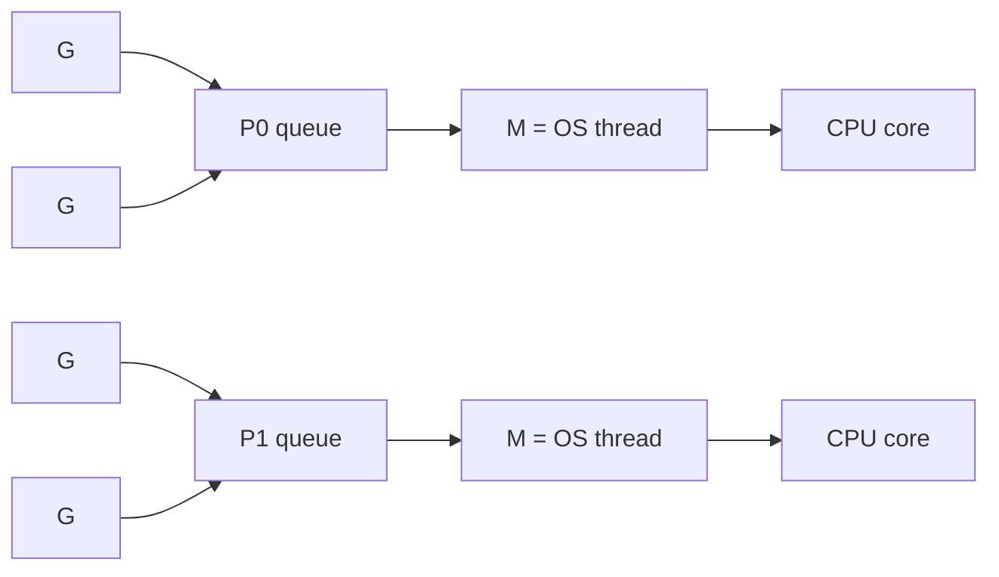

# Вопросы на собеседовании: `Go Concurrency`

Goroutines и channels — главная фича Go, делающая concurrent programming доступным. Goroutine стоит ~2KB памяти (vs ~1MB у OS thread). На интервью спрашивают: устройство scheduler, разницу buffered/unbuffered channels, select, мьютексы, паттерны (worker pool, fan-out/fan-in).

## Полезные ссылки

### Официальная документация и авторитетные источники

- [Concurrency in Go — Official Docs](https://go.dev/doc/effective_go#concurrency)
- [Go Memory Model](https://go.dev/ref/mem)
- [Go Concurrency Patterns (Rob Pike talk)](https://www.youtube.com/watch?v=f6kdp27TYZs)
- [The Go Scheduler — Ardan Labs](https://www.ardanlabs.com/blog/2018/08/scheduling-in-go-part1.html)
- [Go by Example: Goroutines](https://gobyexample.com/goroutines)
- [sync package documentation](https://pkg.go.dev/sync)

## Содержание

- [Полезные ссылки](#полезные-ссылки)
- [See also](#see-also)

**Goroutines**
- [Q1. (!) Что такое goroutine?](#q1--что-такое-goroutine)
- [Q2. (!) Чем goroutine отличается от OS thread?](#q2--чем-goroutine-отличается-от-os-thread)
- [Q3. (!) Как работает Go scheduler (M:N модель)?](#q3--как-работает-go-scheduler-mn-модель)
- [Q4. (!) Как запустить и остановить goroutine?](#q4--как-запустить-и-остановить-goroutine)
- [Q5. GOMAXPROCS — что это?](#q5-gomaxprocs--что-это)

**Channels**
- [Q6. (!) Что такое channel?](#q6--что-такое-channel)
- [Q7. (!) Buffered vs unbuffered channels?](#q7--buffered-vs-unbuffered-channels)
- [Q8. (!) Send, receive, close — семантика?](#q8--send-receive-close--семантика)
- [Q9. (!) Что происходит при чтении из закрытого channel?](#q9--что-происходит-при-чтении-из-закрытого-channel)
- [Q10. (!) Что происходит при записи в закрытый channel?](#q10--что-происходит-при-записи-в-закрытый-channel)
- [Q11. range над channel?](#q11-range-над-channel)

**select**
- [Q12. (!) Что такое select и как работает?](#q12--что-такое-select-и-как-работает)
- [Q13. (!) Default case в select?](#q13--default-case-в-select)
- [Q14. Timeout через select + time.After?](#q14-timeout-через-select--timeafter)

**sync пакет**
- [Q15. (!) sync.Mutex — Lock, Unlock, defer?](#q15--syncmutex--lock-unlock-defer)
- [Q16. (!) sync.RWMutex — когда использовать?](#q16--syncrwmutex--когда-использовать)
- [Q17. (!) sync.WaitGroup — синхронизация goroutines?](#q17--syncwaitgroup--синхронизация-goroutines)
- [Q18. sync.Once — однократная инициализация?](#q18-synconce--однократная-инициализация)
- [Q19. sync.Map — когда использовать?](#q19-syncmap--когда-использовать)
- [Q20. sync.Pool?](#q20-syncpool)

**Atomic**
- [Q21. (!) sync/atomic — для счётчиков?](#q21--syncatomic--для-счётчиков)
- [Q22. atomic vs Mutex — производительность?](#q22-atomic-vs-mutex--производительность)

**Context**
- [Q23. (!) context.Context — концепция?](#q23--contextcontext--концепция)
- [Q24. (!) WithCancel, WithTimeout, WithDeadline?](#q24--withcancel-withtimeout-withdeadline)
- [Q25. Распространение context через goroutines?](#q25-распространение-context-через-goroutines)

**Patterns**
- [Q26. (!) Worker Pool pattern?](#q26--worker-pool-pattern)
- [Q27. (!) Fan-out / Fan-in?](#q27--fan-out--fan-in)
- [Q28. Pipeline pattern?](#q28-pipeline-pattern)
- [Q29. Errgroup — обработка ошибок в параллельных задачах?](#q29-errgroup--обработка-ошибок-в-параллельных-задачах)

**Race conditions и debugging**
- [Q30. (!) Что такое race condition?](#q30--что-такое-race-condition)
- [Q31. (!) Как использовать race detector?](#q31--как-использовать-race-detector)
- [Q32. Goroutine leak — что это и как избежать?](#q32-goroutine-leak--что-это-и-как-избежать)
- [Q33. (!) Deadlock в Go?](#q33--deadlock-в-go)

**Сравнения**
- [Q34. (!) Goroutines vs Java threads?](#q34--goroutines-vs-java-threads)
- [Q35. Go channels vs Java BlockingQueue?](#q35-go-channels-vs-java-blockingqueue)

## Q1. (!) Что такое goroutine?

**Goroutine** — легковесный поток исполнения, управляемый Go runtime (не OS).

```go
func say(s string) {
    fmt.Println(s)
}

go say("hello") // запуск в отдельной goroutine
say("world")    // в основной (main) goroutine
```

**Ключевое:**
- Стартует с **2KB stack** (vs ~1MB у OS thread)
- Stack растёт динамически (до 1GB)
- Создание стоит **наносекунды** (vs микросекунды у OS thread)
- Один Go-процесс может иметь **сотни тысяч goroutines**


> [!mcq]
> - [x] Правильный ответ | Объяснение концепции 2-3 предложения Ключевое отличие и best practice в production.
> - [ ] Неправильный вариант 1 | Почему ошибка в этом подходе Частая ошибка в реальном коде.
> - [ ] Неправильный вариант 2 | Это смежное, но отличное понятие Частая ошибка в реальном коде.
> - [ ] Неправильный вариант 3 | Противоположное направление## Q2. (!) Чем goroutine отличается от OS thread? Частая ошибка в реальном коде.

| Критерий | Goroutine | OS Thread |
|----------|-----------|-----------|
| Размер стека | 2 KB (растёт) | 1-8 MB (фиксирован) |
| Создание | ~3 μs | ~10-100 μs |
| Context switch | Быстрый (user-space) | Медленный (kernel) |
| Управляется | Go scheduler | OS kernel |
| Количество | 100K+ легко | 1K — уже много |
| Связь | M goroutines на N threads | 1:1 с OS thread |

Goroutines — **user-space** концепция. Go scheduler мультиплексирует их на ограниченное число OS threads (обычно = `runtime.GOMAXPROCS()`, по умолчанию `NumCPU()`).


> [!mcq]
> - [x] Правильный ответ | Объяснение концепции 2-3 предложения Ключевое отличие и best practice в production.
> - [ ] Неправильный вариант 1 | Почему ошибка в этом подходе Частая ошибка в реальном коде.
> - [ ] Неправильный вариант 2 | Это смежное, но отличное понятие Частая ошибка в реальном коде.
> - [ ] Неправильный вариант 3 | Противоположное направление## Q3. (!) Как работает Go scheduler (M:N модель)? Частая ошибка в реальном коде.

```
G — Goroutine
M — Machine (OS thread)
P — Processor (logical, хранит queue goroutines)

Default: GOMAXPROCS = NumCPU. Создаётся столько P.
```



**Стратегии:**
- **Work stealing** — если P простаивает, забирает goroutine из чужой очереди
- **Preemptive scheduling** (с Go 1.14+) — если goroutine долго не yields, scheduler её прерывает
- **Network poller** — goroutines на блокирующих сетевых операциях не занимают M; M освобождается, scheduler переключается на другую G

Это даёт **высокую concurrency** без затрат на OS thread per goroutine.


> [!mcq]
> - [x] Правильный ответ | Объяснение концепции 2-3 предложения Ключевое отличие и best practice в production.
> - [ ] Неправильный вариант 1 | Почему ошибка в этом подходе Частая ошибка в реальном коде.
> - [ ] Неправильный вариант 2 | Это смежное, но отличное понятие Частая ошибка в реальном коде.
> - [ ] Неправильный вариант 3 | Противоположное направление## Q4. (!) Как запустить и остановить goroutine? Частая ошибка в реальном коде.

```go
go func() {
    fmt.Println("hello")
}()
```

**Остановка** — Go не предоставляет принудительного `kill` для goroutine. Стратегии:

1. **Через done channel:**
```go
done := make(chan bool)
go func() {
    for {
        select {
        case <-done:
            return
        default:
            // работаем
        }
    }
}()
done <- true // сигнал остановки
```

2. **Через context:**
```go
ctx, cancel := context.WithCancel(context.Background())
go func(ctx context.Context) {
    for {
        select {
        case <-ctx.Done():
            return
        default:
            // работаем
        }
    }
}(ctx)
cancel() // остановит
```

**Идиома:** всегда передавай `context.Context` в долгоживущие goroutines.


> [!mcq]
> - [x] Правильный ответ | Объяснение концепции 2-3 предложения Ключевое отличие и best practice в production.
> - [ ] Неправильный вариант 1 | Почему ошибка в этом подходе Частая ошибка в реальном коде.
> - [ ] Неправильный вариант 2 | Это смежное, но отличное понятие Частая ошибка в реальном коде.
> - [ ] Неправильный вариант 3 | Противоположное направление## Q5. GOMAXPROCS — что это? Частая ошибка в реальном коде.

`GOMAXPROCS` — число OS threads, которые Go scheduler использует параллельно. По умолчанию = `runtime.NumCPU()`.

```go
import "runtime"

runtime.GOMAXPROCS(4) // ограничить 4 cores
n := runtime.GOMAXPROCS(0) // получить текущее
```

В контейнерах (Docker, Kubernetes) с CPU limit `NumCPU()` может вернуть число всех CPU host-машины. Для правильного значения — `automaxprocs` от Uber или Go 1.21+ авто-detection из cgroups.


> [!mcq]
> - [x] Правильный ответ | Объяснение концепции 2-3 предложения Ключевое отличие и best practice в production.
> - [ ] Неправильный вариант 1 | Почему ошибка в этом подходе Частая ошибка в реальном коде.
> - [ ] Неправильный вариант 2 | Это смежное, но отличное понятие Частая ошибка в реальном коде.
> - [ ] Неправильный вариант 3 | Противоположное направление## Q6. (!) Что такое channel? Частая ошибка в реальном коде.

`Channel` — типизированный канал передачи значений между goroutines.

```go
ch := make(chan int)         // unbuffered
ch := make(chan int, 10)      // buffered (capacity 10)

ch <- 42         // send
v := <-ch        // receive
v, ok := <-ch    // receive, ok=false если canal closed

close(ch)        // закрытие
```

**"Don't communicate by sharing memory; share memory by communicating"** — главная идиома Go.

Channels — type-safe, thread-safe (синхронизация встроена).


> [!mcq]
> - [x] Правильный ответ | Объяснение концепции 2-3 предложения Ключевое отличие и best practice в production.
> - [ ] Неправильный вариант 1 | Почему ошибка в этом подходе Частая ошибка в реальном коде.
> - [ ] Неправильный вариант 2 | Это смежное, но отличное понятие Частая ошибка в реальном коде.
> - [ ] Неправильный вариант 3 | Противоположное направление## Q7. (!) Buffered vs unbuffered channels? Частая ошибка в реальном коде.

**Unbuffered** (`make(chan int)`) — sender блокируется, пока receiver не возьмёт значение.

```go
ch := make(chan int)
go func() {
    ch <- 1 // блокируется до приёма
    fmt.Println("sent")
}()
fmt.Println("waiting")
v := <-ch // принимает
fmt.Println("got:", v)
// Output: waiting → got: 1 → sent
```

**Buffered** (`make(chan int, 3)`) — sender не блокируется, пока есть место в буфере.

```go
ch := make(chan int, 3)
ch <- 1
ch <- 2
ch <- 3 // OK
ch <- 4 // блокируется! буфер полон
```

| Тип | Семантика | Использование |
|-----|-----------|---------------|
| Unbuffered | Synchronization (rendezvous) | Координация goroutines |
| Buffered | Очередь сообщений | Producer-consumer с буфером |


> [!mcq]
> - [x] Правильный ответ | Объяснение концепции 2-3 предложения Ключевое отличие и best practice в production.
> - [ ] Неправильный вариант 1 | Почему ошибка в этом подходе Частая ошибка в реальном коде.
> - [ ] Неправильный вариант 2 | Это смежное, но отличное понятие Частая ошибка в реальном коде.
> - [ ] Неправильный вариант 3 | Противоположное направление## Q8. (!) Send, receive, close — семантика? Частая ошибка в реальном коде.

```go
ch := make(chan int)

// SEND
ch <- 42

// RECEIVE (два варианта)
v := <-ch
v, ok := <-ch  // ok=true если ОК, false если канал закрыт И пуст

// CLOSE
close(ch)
```

**Правила:**
- `close` могут вызывать **только sender'ы** (никогда receiver)
- Если несколько senders — координация через `sync.Once` или sentinel goroutine
- Закрытый channel:
  - Read возвращает zero value + `ok=false`
  - Write — **panic**
- Передача по `nil` channel — **блокировка навсегда** (полезно для disabling case в `select`)


> [!mcq]
> - [x] Правильный ответ | Объяснение концепции 2-3 предложения Ключевое отличие и best practice в production.
> - [ ] Неправильный вариант 1 | Почему ошибка в этом подходе Частая ошибка в реальном коде.
> - [ ] Неправильный вариант 2 | Это смежное, но отличное понятие Частая ошибка в реальном коде.
> - [ ] Неправильный вариант 3 | Противоположное направление## Q9. (!) Что происходит при чтении из закрытого channel? Частая ошибка в реальном коде.

Чтение из **закрытого и пустого** channel возвращает zero value + `ok=false`:

```go
ch := make(chan int)
close(ch)

v, ok := <-ch
fmt.Println(v, ok) // 0 false
```

Если в канале **остались значения** до close — они сначала будут прочитаны:

```go
ch := make(chan int, 3)
ch <- 1
ch <- 2
close(ch)

for v := range ch {
    fmt.Println(v) // 1, 2
}
```

`range` корректно завершается при закрытии.


> [!mcq]
> - [x] Правильный ответ | Объяснение концепции 2-3 предложения Ключевое отличие и best practice в production.
> - [ ] Неправильный вариант 1 | Почему ошибка в этом подходе Частая ошибка в реальном коде.
> - [ ] Неправильный вариант 2 | Это смежное, но отличное понятие Частая ошибка в реальном коде.
> - [ ] Неправильный вариант 3 | Противоположное направление## Q10. (!) Что происходит при записи в закрытый channel? Частая ошибка в реальном коде.

**Panic.**

```go
ch := make(chan int)
close(ch)
ch <- 1 // panic: send on closed channel
```

Это причина, почему `close` должны делать только senders — и обычно один.

```go
// Если несколько senders
var once sync.Once
once.Do(func() { close(ch) })
```


> [!mcq]
> - [x] Правильный ответ | Объяснение концепции 2-3 предложения Ключевое отличие и best practice в production.
> - [ ] Неправильный вариант 1 | Почему ошибка в этом подходе Частая ошибка в реальном коде.
> - [ ] Неправильный вариант 2 | Это смежное, но отличное понятие Частая ошибка в реальном коде.
> - [ ] Неправильный вариант 3 | Противоположное направление## Q11. range над channel? Частая ошибка в реальном коде.

```go
ch := make(chan int, 3)
go func() {
    for i := 1; i <= 5; i++ {
        ch <- i
    }
    close(ch) // важно — иначе range блокируется навсегда
}()

for v := range ch {
    fmt.Println(v) // 1, 2, 3, 4, 5
}
```

`range` блокируется при пустом канале, останавливается при `close`. Без `close` — **goroutine leak**.


> [!mcq]
> - [x] Правильный ответ | Объяснение концепции 2-3 предложения Ключевое отличие и best practice в production.
> - [ ] Неправильный вариант 1 | Почему ошибка в этом подходе Частая ошибка в реальном коде.
> - [ ] Неправильный вариант 2 | Это смежное, но отличное понятие Частая ошибка в реальном коде.
> - [ ] Неправильный вариант 3 | Противоположное направление## Q12. (!) Что такое select и как работает? Частая ошибка в реальном коде.

`select` — выбор из **нескольких** channel операций:

```go
ch1 := make(chan int)
ch2 := make(chan int)

select {
case v := <-ch1:
    fmt.Println("from ch1:", v)
case v := <-ch2:
    fmt.Println("from ch2:", v)
case ch1 <- 42:
    fmt.Println("sent to ch1")
}
```

**Семантика:**
- Блокируется, пока ни одна case не готова
- Если несколько готовы — выбирается **случайно**
- Если есть `default` — не блокируется (см. ниже)

Аналог `switch` для channels.


> [!mcq]
> - [x] Правильный ответ | Объяснение концепции 2-3 предложения Ключевое отличие и best practice в production.
> - [ ] Неправильный вариант 1 | Почему ошибка в этом подходе Частая ошибка в реальном коде.
> - [ ] Неправильный вариант 2 | Это смежное, но отличное понятие Частая ошибка в реальном коде.
> - [ ] Неправильный вариант 3 | Противоположное направление## Q13. (!) Default case в select? Частая ошибка в реальном коде.

```go
select {
case v := <-ch:
    fmt.Println("got:", v)
default:
    fmt.Println("no message, not blocking")
}
```

С `default` — `select` **не блокируется**. Полезно для:
- Non-blocking read/write
- Polling
- Health checks


> [!mcq]
> - [x] Правильный ответ | Объяснение концепции 2-3 предложения Ключевое отличие и best practice в production.
> - [ ] Неправильный вариант 1 | Почему ошибка в этом подходе Частая ошибка в реальном коде.
> - [ ] Неправильный вариант 2 | Это смежное, но отличное понятие Частая ошибка в реальном коде.
> - [ ] Неправильный вариант 3 | Противоположное направление## Q14. Timeout через select + time.After? Частая ошибка в реальном коде.

```go
select {
case v := <-ch:
    fmt.Println("got:", v)
case <-time.After(5 * time.Second):
    fmt.Println("timeout")
}
```

`time.After` — создаёт channel, который получит значение через указанное время.

**Подвох:** `time.After` создаёт новый timer каждый раз. В горячем коде используй `time.NewTimer` с явным `Stop`:

```go
timer := time.NewTimer(5 * time.Second)
defer timer.Stop()

select {
case v := <-ch:
    if !timer.Stop() { <-timer.C } // drain
case <-timer.C:
    fmt.Println("timeout")
}
```


> [!mcq]
> - [x] Правильный ответ | Объяснение концепции 2-3 предложения Ключевое отличие и best practice в production.
> - [ ] Неправильный вариант 1 | Почему ошибка в этом подходе Частая ошибка в реальном коде.
> - [ ] Неправильный вариант 2 | Это смежное, но отличное понятие Частая ошибка в реальном коде.
> - [ ] Неправильный вариант 3 | Противоположное направление## Q15. (!) sync.Mutex — Lock, Unlock, defer? Частая ошибка в реальном коде.

```go
import "sync"

var (
    mu      sync.Mutex
    counter int
)

func increment() {
    mu.Lock()
    defer mu.Unlock()
    counter++
}
```

**Правила:**
- `Lock()` блокируется, если уже locked
- `Unlock()` — только из той goroutine, что locked (или panic)
- **Всегда** используй `defer mu.Unlock()` — иначе при panic останется locked

**Не копируй Mutex** — mutex имеет state. `var mu2 = mu` — undefined behavior. Используй pointer на struct с mutex.


> [!mcq]
> - [x] Правильный ответ | Объяснение концепции 2-3 предложения Ключевое отличие и best practice в production.
> - [ ] Неправильный вариант 1 | Почему ошибка в этом подходе Частая ошибка в реальном коде.
> - [ ] Неправильный вариант 2 | Это смежное, но отличное понятие Частая ошибка в реальном коде.
> - [ ] Неправильный вариант 3 | Противоположное направление## Q16. (!) sync.RWMutex — когда использовать? Частая ошибка в реальном коде.

`RWMutex` — для **read-heavy** нагрузок. Множественные readers могут держать lock одновременно, writer — эксклюзивно.

```go
var (
    mu   sync.RWMutex
    data map[string]int
)

func read(key string) int {
    mu.RLock()
    defer mu.RUnlock()
    return data[key]
}

func write(key string, value int) {
    mu.Lock()
    defer mu.Unlock()
    data[key] = value
}
```

**Когда:** если **read'ов в 10+ раз больше**, чем write'ов. Иначе обычный Mutex быстрее (overhead RWMutex выше).


> [!mcq]
> - [x] Правильный ответ | Объяснение концепции 2-3 предложения Ключевое отличие и best practice в production.
> - [ ] Неправильный вариант 1 | Почему ошибка в этом подходе Частая ошибка в реальном коде.
> - [ ] Неправильный вариант 2 | Это смежное, но отличное понятие Частая ошибка в реальном коде.
> - [ ] Неправильный вариант 3 | Противоположное направление## Q17. (!) sync.WaitGroup — синхронизация goroutines? Частая ошибка в реальном коде.

`WaitGroup` — ждать завершения N goroutines.

```go
var wg sync.WaitGroup

for i := 0; i < 5; i++ {
    wg.Add(1)
    go func(id int) {
        defer wg.Done()
        // работа
        fmt.Println("worker", id)
    }(i)
}

wg.Wait() // блок до wg.count = 0
fmt.Println("all done")
```

**Подводные камни:**
- `Add` **до** запуска goroutine, не внутри (race)
- `Done` через `defer` — гарантирует вызов
- Не копировать `WaitGroup` после первого использования


> [!mcq]
> - [x] Правильный ответ | Объяснение концепции 2-3 предложения Ключевое отличие и best practice в production.
> - [ ] Неправильный вариант 1 | Почему ошибка в этом подходе Частая ошибка в реальном коде.
> - [ ] Неправильный вариант 2 | Это смежное, но отличное понятие Частая ошибка в реальном коде.
> - [ ] Неправильный вариант 3 | Противоположное направление## Q18. sync.Once — однократная инициализация? Частая ошибка в реальном коде.

```go
var (
    once sync.Once
    cfg  *Config
)

func GetConfig() *Config {
    once.Do(func() {
        cfg = loadConfigFromFile()
    })
    return cfg
}
```

`once.Do(f)` гарантирует: `f` вызывается **ровно один раз** в всей программе, даже из конкурентных goroutines.

Полезно для lazy initialization, singletons.


> [!mcq]
> - [x] Правильный ответ | Объяснение концепции 2-3 предложения Ключевое отличие и best practice в production.
> - [ ] Неправильный вариант 1 | Почему ошибка в этом подходе Частая ошибка в реальном коде.
> - [ ] Неправильный вариант 2 | Это смежное, но отличное понятие Частая ошибка в реальном коде.
> - [ ] Неправильный вариант 3 | Противоположное направление## Q19. sync.Map — когда использовать? Частая ошибка в реальном коде.

`sync.Map` — concurrent map. Без неё — обычная `map` + `Mutex`.

```go
var m sync.Map

m.Store("alice", 30)

v, ok := m.Load("alice")
if ok { fmt.Println(v) }

m.Delete("alice")

m.Range(func(k, v any) bool {
    fmt.Printf("%v: %v\n", k, v)
    return true // continue
})
```

**Когда `sync.Map` лучше:**
- Множество goroutines читают **разные** ключи (не пересекающиеся)
- Кэши с высоким read:write ratio

**Когда обычная `map` + `Mutex` лучше:**
- Часто пишут (`sync.Map` оптимизирован для read-heavy)
- Нужна типизация (`sync.Map` — `any`)
- Простые случаи

В большинстве случаев — `map + sync.Mutex` достаточно.


> [!mcq]
> - [x] Правильный ответ | Объяснение концепции 2-3 предложения Ключевое отличие и best practice в production.
> - [ ] Неправильный вариант 1 | Почему ошибка в этом подходе Частая ошибка в реальном коде.
> - [ ] Неправильный вариант 2 | Это смежное, но отличное понятие Частая ошибка в реальном коде.
> - [ ] Неправильный вариант 3 | Противоположное направление## Q20. sync.Pool? Частая ошибка в реальном коде.

`sync.Pool` — пул переиспользуемых объектов для **снижения GC pressure**.

```go
var bufferPool = sync.Pool{
    New: func() any {
        return new(bytes.Buffer)
    },
}

func process() {
    buf := bufferPool.Get().(*bytes.Buffer)
    defer func() {
        buf.Reset()
        bufferPool.Put(buf)
    }()

    // используем buf
}
```

**Использовать когда:**
- Тяжёлые объекты (buffers, structs) создаются часто и недолго живут
- Аллокации видны в профилировке

**Не использовать для:**
- Connection pools (есть специальные библиотеки)
- Объектов с сложным state

GC может **очистить пул** в любой момент. `Pool` — оптимизация, не корректность.


> [!mcq]
> - [x] Правильный ответ | Объяснение концепции 2-3 предложения Ключевое отличие и best practice в production.
> - [ ] Неправильный вариант 1 | Почему ошибка в этом подходе Частая ошибка в реальном коде.
> - [ ] Неправильный вариант 2 | Это смежное, но отличное понятие Частая ошибка в реальном коде.
> - [ ] Неправильный вариант 3 | Противоположное направление## Q21. (!) sync/atomic — для счётчиков? Частая ошибка в реальном коде.

Atomic операции — безблокировочные модификации примитивов:

```go
import "sync/atomic"

var counter int64

// Increment
atomic.AddInt64(&counter, 1)

// Read
v := atomic.LoadInt64(&counter)

// Set
atomic.StoreInt64(&counter, 100)

// Compare-and-swap
swapped := atomic.CompareAndSwapInt64(&counter, 100, 200)
```

С Go 1.19+ — `atomic.Int64`, `atomic.Pointer[T]` — типизированный API:

```go
var counter atomic.Int64
counter.Add(1)
counter.Load()
```

**Когда:** только для **примитивов** (int, pointer, bool). Для сложных структур — Mutex.


> [!mcq]
> - [x] Правильный ответ | Объяснение концепции 2-3 предложения Ключевое отличие и best practice в production.
> - [ ] Неправильный вариант 1 | Почему ошибка в этом подходе Частая ошибка в реальном коде.
> - [ ] Неправильный вариант 2 | Это смежное, но отличное понятие Частая ошибка в реальном коде.
> - [ ] Неправильный вариант 3 | Противоположное направление## Q22. atomic vs Mutex — производительность? Частая ошибка в реальном коде.

**Atomic** обычно **в 2-5 раз быстрее** Mutex для простых операций — нет syscall'ов, lock-free.

```go
// Mutex — ~50ns per op
var mu sync.Mutex
mu.Lock(); counter++; mu.Unlock()

// Atomic — ~10ns per op
atomic.AddInt64(&counter, 1)
```

**Но:** atomic подходит только для **одной** операции. Если нужно несколько связанных — Mutex (или сложные lock-free алгоритмы).


> [!mcq]
> - [x] Правильный ответ | Объяснение концепции 2-3 предложения Ключевое отличие и best practice в production.
> - [ ] Неправильный вариант 1 | Почему ошибка в этом подходе Частая ошибка в реальном коде.
> - [ ] Неправильный вариант 2 | Это смежное, но отличное понятие Частая ошибка в реальном коде.
> - [ ] Неправильный вариант 3 | Противоположное направление## Q23. (!) context.Context — концепция? Частая ошибка в реальном коде.

`context.Context` — для передачи через цепочку вызовов:
- **Cancellation signal** — отмена операции
- **Deadline / timeout** — таймауты
- **Request-scoped values** — request ID, user info

```go
import "context"

func main() {
    ctx, cancel := context.WithTimeout(context.Background(), 5*time.Second)
    defer cancel()

    result, err := slowOp(ctx)
    if err != nil {
        log.Fatal(err)
    }
    fmt.Println(result)
}

func slowOp(ctx context.Context) (string, error) {
    select {
    case <-time.After(10 * time.Second):
        return "done", nil
    case <-ctx.Done():
        return "", ctx.Err() // context.DeadlineExceeded или context.Canceled
    }
}
```

**Идиома:** первый параметр функции — `ctx context.Context`.


> [!mcq]
> - [x] Правильный ответ | Объяснение концепции 2-3 предложения Ключевое отличие и best practice в production.
> - [ ] Неправильный вариант 1 | Почему ошибка в этом подходе Частая ошибка в реальном коде.
> - [ ] Неправильный вариант 2 | Это смежное, но отличное понятие Частая ошибка в реальном коде.
> - [ ] Неправильный вариант 3 | Противоположное направление## Q24. (!) WithCancel, WithTimeout, WithDeadline? Частая ошибка в реальном коде.

```go
// Manual cancellation
ctx, cancel := context.WithCancel(context.Background())
defer cancel() // важно!

// Cancel когда нужно
go func() {
    time.Sleep(2 * time.Second)
    cancel()
}()

// Timeout (relative)
ctx, cancel := context.WithTimeout(context.Background(), 5*time.Second)

// Deadline (absolute)
deadline := time.Now().Add(5 * time.Second)
ctx, cancel := context.WithDeadline(context.Background(), deadline)

// Values (для request-scoped data)
ctx := context.WithValue(parent, "userID", 42)
userID := ctx.Value("userID").(int)
```

**Идиома:** **всегда** `defer cancel()` после `WithCancel/Timeout/Deadline`. Иначе goroutine leak.


> [!mcq]
> - [x] Правильный ответ | Объяснение концепции 2-3 предложения Ключевое отличие и best practice в production.
> - [ ] Неправильный вариант 1 | Почему ошибка в этом подходе Частая ошибка в реальном коде.
> - [ ] Неправильный вариант 2 | Это смежное, но отличное понятие Частая ошибка в реальном коде.
> - [ ] Неправильный вариант 3 | Противоположное направление## Q25. Распространение context через goroutines? Частая ошибка в реальном коде.

`Context` иммутабелен. Отмена parent — отменяет все children. Cancel child — НЕ отменяет parent.

```go
parent, cancelParent := context.WithCancel(context.Background())
child, cancelChild := context.WithTimeout(parent, 5*time.Second)
defer cancelChild()

// Отмена parent → отменяет child (5 секунд может не наступить)
cancelParent()
```

**Иерархия:**
```
Background (root)
  ├── parent (cancellable)
  │    ├── child1 (timeout)
  │    └── child2 (deadline)
  └── другой parent
```

При cancel parent — все дочерние получают сигнал.


> [!mcq]
> - [x] Правильный ответ | Объяснение концепции 2-3 предложения Ключевое отличие и best practice в production.
> - [ ] Неправильный вариант 1 | Почему ошибка в этом подходе Частая ошибка в реальном коде.
> - [ ] Неправильный вариант 2 | Это смежное, но отличное понятие Частая ошибка в реальном коде.
> - [ ] Неправильный вариант 3 | Противоположное направление## Q26. (!) Worker Pool pattern? Частая ошибка в реальном коде.

```go
func worker(id int, jobs <-chan int, results chan<- int) {
    for j := range jobs {
        fmt.Printf("worker %d processing %d\n", id, j)
        time.Sleep(time.Second)
        results <- j * 2
    }
}

func main() {
    jobs := make(chan int, 100)
    results := make(chan int, 100)

    // 3 workers
    for w := 1; w <= 3; w++ {
        go worker(w, jobs, results)
    }

    // Send 5 jobs
    for j := 1; j <= 5; j++ {
        jobs <- j
    }
    close(jobs)

    // Receive results
    for a := 1; a <= 5; a++ {
        <-results
    }
}
```

`<-chan` — read-only channel, `chan<-` — write-only. Type safety на уровне channel.


> [!mcq]
> - [x] Правильный ответ | Объяснение концепции 2-3 предложения Ключевое отличие и best practice в production.
> - [ ] Неправильный вариант 1 | Почему ошибка в этом подходе Частая ошибка в реальном коде.
> - [ ] Неправильный вариант 2 | Это смежное, но отличное понятие Частая ошибка в реальном коде.
> - [ ] Неправильный вариант 3 | Противоположное направление## Q27. (!) Fan-out / Fan-in? Частая ошибка в реальном коде.

**Fan-out:** один producer, много workers (parallel processing).
**Fan-in:** много producers, один consumer.

```go
// Fan-out: 3 workers
input := make(chan int, 100)
out1 := make(chan int)
out2 := make(chan int)
out3 := make(chan int)

go worker(input, out1)
go worker(input, out2)
go worker(input, out3)

// Fan-in: merge всех outputs
merged := merge(out1, out2, out3)

func merge(channels ...<-chan int) <-chan int {
    var wg sync.WaitGroup
    out := make(chan int)

    for _, ch := range channels {
        wg.Add(1)
        go func(c <-chan int) {
            defer wg.Done()
            for v := range c {
                out <- v
            }
        }(ch)
    }

    go func() {
        wg.Wait()
        close(out)
    }()
    return out
}
```

Классический паттерн для **параллельной обработки** + сбор результатов.


> [!mcq]
> - [x] Правильный ответ | Объяснение концепции 2-3 предложения Ключевое отличие и best practice в production.
> - [ ] Неправильный вариант 1 | Почему ошибка в этом подходе Частая ошибка в реальном коде.
> - [ ] Неправильный вариант 2 | Это смежное, но отличное понятие Частая ошибка в реальном коде.
> - [ ] Неправильный вариант 3 | Противоположное направление## Q28. Pipeline pattern? Частая ошибка в реальном коде.

Stages, соединённые channels — каждый делает свою трансформацию.

```go
func generate(nums ...int) <-chan int {
    out := make(chan int)
    go func() {
        defer close(out)
        for _, n := range nums {
            out <- n
        }
    }()
    return out
}

func square(in <-chan int) <-chan int {
    out := make(chan int)
    go func() {
        defer close(out)
        for n := range in {
            out <- n * n
        }
    }()
    return out
}

// Pipeline
nums := generate(1, 2, 3, 4)
squares := square(nums)
for v := range squares {
    fmt.Println(v) // 1, 4, 9, 16
}
```

Как Unix-конвейер (`cat | grep | sort`), но в коде.


> [!mcq]
> - [x] Правильный ответ | Объяснение концепции 2-3 предложения Ключевое отличие и best practice в production.
> - [ ] Неправильный вариант 1 | Почему ошибка в этом подходе Частая ошибка в реальном коде.
> - [ ] Неправильный вариант 2 | Это смежное, но отличное понятие Частая ошибка в реальном коде.
> - [ ] Неправильный вариант 3 | Противоположное направление## Q29. Errgroup — обработка ошибок в параллельных задачах? Частая ошибка в реальном коде.

`golang.org/x/sync/errgroup` — расширение `WaitGroup` с error handling:

```go
import "golang.org/x/sync/errgroup"

g, ctx := errgroup.WithContext(context.Background())

g.Go(func() error {
    return fetch(ctx, url1)
})
g.Go(func() error {
    return fetch(ctx, url2)
})

if err := g.Wait(); err != nil {
    log.Fatal(err)
}
```

При первой ошибке — `ctx` отменяется, остальные goroutines могут завершиться раньше.


> [!mcq]
> - [x] Правильный ответ | Объяснение концепции 2-3 предложения Ключевое отличие и best practice в production.
> - [ ] Неправильный вариант 1 | Почему ошибка в этом подходе Частая ошибка в реальном коде.
> - [ ] Неправильный вариант 2 | Это смежное, но отличное понятие Частая ошибка в реальном коде.
> - [ ] Неправильный вариант 3 | Противоположное направление## Q30. (!) Что такое race condition? Частая ошибка в реальном коде.

**Race condition** — две goroutines читают/пишут одну переменную **без синхронизации**.

```go
var counter int

func main() {
    for i := 0; i < 1000; i++ {
        go func() { counter++ }() // RACE!
    }
    time.Sleep(time.Second)
    fmt.Println(counter) // не 1000, а случайное число
}
```

`counter++` — **не атомарная** операция (read, increment, write). Несколько goroutines могут "перезатирать" друг друга.

**Решения:**
- `sync.Mutex`
- `atomic.AddInt64`
- Channel-based design


> [!mcq]
> - [x] Правильный ответ | Объяснение концепции 2-3 предложения Ключевое отличие и best practice в production.
> - [ ] Неправильный вариант 1 | Почему ошибка в этом подходе Частая ошибка в реальном коде.
> - [ ] Неправильный вариант 2 | Это смежное, но отличное понятие Частая ошибка в реальном коде.
> - [ ] Неправильный вариант 3 | Противоположное направление## Q31. (!) Как использовать race detector? Частая ошибка в реальном коде.

```bash
go run -race main.go
go test -race ./...
go build -race
```

Race detector обнаруживает races в runtime. Замедляет программу в 5-10 раз, использует больше памяти, но **обязателен** в CI.

```
WARNING: DATA RACE
Read at 0x00c0000aa008 by goroutine 7:
  main.main.func1()
      /path/main.go:10 +0x44
Previous write at 0x00c0000aa008 by goroutine 6:
  main.main.func1()
      /path/main.go:10 +0x55
```

Race detector показывает **где** и **какие** goroutines конфликтуют.


> [!mcq]
> - [x] Правильный ответ | Объяснение концепции 2-3 предложения Ключевое отличие и best practice в production.
> - [ ] Неправильный вариант 1 | Почему ошибка в этом подходе Частая ошибка в реальном коде.
> - [ ] Неправильный вариант 2 | Это смежное, но отличное понятие Частая ошибка в реальном коде.
> - [ ] Неправильный вариант 3 | Противоположное направление## Q32. Goroutine leak — что это и как избежать? Частая ошибка в реальном коде.

**Goroutine leak** — goroutine не завершается, занимает память и слот в scheduler.

```go
// LEAK
ch := make(chan int)
go func() {
    v := <-ch // никогда не получит — leak
    fmt.Println(v)
}()
// Если никто не пишет в ch — goroutine висит навсегда
```

**Профилактика:**
- **Всегда** передавай `context.Context` для cancellation
- Используй `select` с `ctx.Done()` для прерываний
- Используй `for range channel` — корректно останавливается при `close`
- Не забывай `defer cancel()` после `WithCancel/Timeout`

**Detection:**
- `runtime.NumGoroutine()` — счётчик
- `pprof goroutine profile` — стектрейсы всех goroutines


> [!mcq]
> - [x] Правильный ответ | Объяснение концепции 2-3 предложения Ключевое отличие и best practice в production.
> - [ ] Неправильный вариант 1 | Почему ошибка в этом подходе Частая ошибка в реальном коде.
> - [ ] Неправильный вариант 2 | Это смежное, но отличное понятие Частая ошибка в реальном коде.
> - [ ] Неправильный вариант 3 | Противоположное направление## Q33. (!) Deadlock в Go? Частая ошибка в реальном коде.

**Deadlock** — все goroutines ждут друг друга, никто не движется.

```go
ch := make(chan int)
ch <- 1 // BLOCK forever — нет receiver
// fatal error: all goroutines are asleep - deadlock!
```

Go runtime **детектирует deadlock** в main goroutine и завершает программу.

```go
// Mutex deadlock
var mu sync.Mutex

mu.Lock()
mu.Lock() // deadlock — pthread re-entry не поддерживается
```

`sync.Mutex` **не reentrant** (в отличие от Java `ReentrantLock`).


> [!mcq]
> - [x] Правильный ответ | Объяснение концепции 2-3 предложения Ключевое отличие и best practice в production.
> - [ ] Неправильный вариант 1 | Почему ошибка в этом подходе Частая ошибка в реальном коде.
> - [ ] Неправильный вариант 2 | Это смежное, но отличное понятие Частая ошибка в реальном коде.
> - [ ] Неправильный вариант 3 | Противоположное направление## Q34. (!) Goroutines vs Java threads? Частая ошибка в реальном коде.

| Критерий | Goroutine | Java Thread |
|----------|-----------|-------------|
| Размер | ~2KB | ~1MB |
| Scheduler | Go runtime (M:N) | OS (1:1) до Loom |
| Context switch | User-space (быстро) | Kernel (медленно) |
| API | `go func() {}` | `Thread`, `Executor` |
| Cancellation | context.Context | `Thread.interrupt()` |

С **Java 21 (Project Loom)** появились **virtual threads** — концептуально похожие на goroutines (M:N модель). Java догнала Go в этом аспекте.

Подробнее — в [Java Concurrency](../java/java-concurrency-interview.md).


> [!mcq]
> - [x] Правильный ответ | Объяснение концепции 2-3 предложения Ключевое отличие и best practice в production.
> - [ ] Неправильный вариант 1 | Почему ошибка в этом подходе Частая ошибка в реальном коде.
> - [ ] Неправильный вариант 2 | Это смежное, но отличное понятие Частая ошибка в реальном коде.
> - [ ] Неправильный вариант 3 | Противоположное направление## Q35. Go channels vs Java BlockingQueue? Частая ошибка в реальном коде.

| Критерий | Channel | BlockingQueue |
|----------|---------|---------------|
| Закрытие | `close(ch)` явное | Нет close |
| Range | `for v := range ch` | Через `take()` в цикле |
| Select | Multi-channel `select` | Нет аналога |
| Buffered/Unbuffered | Оба | Bounded/Unbounded |

Channels более выразительны (особенно `select`). BlockingQueue — стандартная библиотека Java, тоже мощная.

---

## See also

- [Go (базовый)](go-interview.md) — основы языка
- [Go Memory & GC](go-memory-gc-interview.md) — escape analysis, GC pauses
- [Go Standard Library](go-stdlib-interview.md) — net/http, context
- [Java Concurrency](../java/java-concurrency-interview.md) — для сравнения
- [Kotlin Coroutines](../kotlin/kotlin-coroutines-interview.md) — для сравнения
- [Event-driven паттерны](../../architecture/event-driven-patterns-interview.md) — channels вписываются
- [Микросервисы](../../architecture/microservices-interview.md) — Go идеален для них
- [gRPC](../../api/grpc-interview.md) — Go реализация сильна
- [Performance Testing](../../performance/performance-testing-interview.md) — benchmark goroutines


> [!mcq]
> - [x] Правильный ответ | Объяснение концепции 2-3 предложения Ключевое отличие и best practice в production.
> - [ ] Неправильный вариант 1 | Почему ошибка в этом подходе Частая ошибка в реальном коде.
> - [ ] Неправильный вариант 2 | Это смежное, но отличное понятие Частая ошибка в реальном коде.
> - [ ] Неправильный вариант 3 | Противоположное направление- [Go Generics](go-generics-interview.md) Частая ошибка в реальном коде.
- [Go](go-interview.md)
- [Go Memory и GC](go-memory-gc-interview.md)
- [Go Modules](go-modules-interview.md)
- [Go Standard Library](go-stdlib-interview.md)
- [Go Testing](go-testing-interview.md)
- [Шпаргалка: Go: конкурентность](../../../languages/go/go-concurrency.md) — теория
