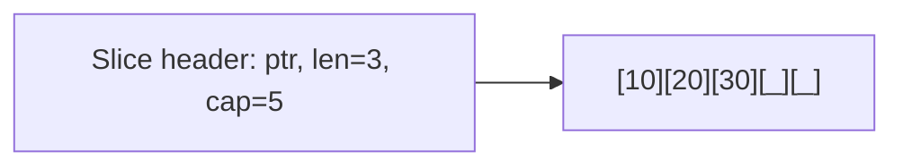

# Вопросы на собеседовании: `Go`

`Go` (Golang) — статически типизированный compiled язык от Google (с 2009). Дизайн: простота, явность, низкие накладные расходы. Главные применения: микросервисы, инфраструктура (Docker, Kubernetes, Terraform), CLI tools, network services.

## Полезные ссылки

### Официальная документация и авторитетные источники

- [Go Official Documentation](https://go.dev/doc/)
- [The Go Programming Language Specification](https://go.dev/ref/spec)
- [Effective Go](https://go.dev/doc/effective_go)
- [Tour of Go](https://go.dev/tour/)
- [Go by Example](https://gobyexample.com/)
- [Go Code Review Comments](https://github.com/golang/go/wiki/CodeReviewComments)
- [Go Wiki](https://go.dev/wiki/)
- [Standard Library](https://pkg.go.dev/std)

## Содержание

- [Полезные ссылки](#полезные-ссылки)
- [See also](#see-also)

**Базовые понятия**
- [Q1. (!) Что такое Go и почему его выбирают?](#q1--что-такое-go-и-почему-его-выбирают)
- [Q2. (!) Чем Go отличается от Java?](#q2--чем-go-отличается-от-java)
- [Q3. (!) Какова философия Go?](#q3--какова-философия-go)
- [Q4. Какие основные особенности языка?](#q4-какие-основные-особенности-языка)

**Переменные и типы**
- [Q5. (!) var, const, := — в чём разница?](#q5--var-const---в-чём-разница)
- [Q6. (!) Какие базовые типы в Go?](#q6--какие-базовые-типы-в-go)
- [Q7. Zero values — что это?](#q7-zero-values--что-это)
- [Q8. Как работают конвертации типов?](#q8-как-работают-конвертации-типов)
- [Q9. (!) Что такое pointer и как работает?](#q9--что-такое-pointer-и-как-работает)

**Композитные типы**
- [Q10. (!) Чем slice отличается от array?](#q10--чем-slice-отличается-от-array)
- [Q11. (!) Внутреннее устройство slice (length, capacity)?](#q11--внутреннее-устройство-slice-length-capacity)
- [Q12. (!) Как работают append и подводные камни?](#q12--как-работают-append-и-подводные-камни)
- [Q13. (!) Как устроена map?](#q13--как-устроена-map)
- [Q14. struct и embedding?](#q14-struct-и-embedding)

**Функции и методы**
- [Q15. (!) Множественные возвращаемые значения (multiple return values)?](#q15--множественные-возвращаемые-значения-multiple-return-values)
- [Q16. (!) Methods и receivers (value vs pointer)?](#q16--methods-и-receivers-value-vs-pointer)
- [Q17. (!) Variadic функции?](#q17--variadic-функции)
- [Q18. Closures в Go?](#q18-closures-в-go)

**Интерфейсы**
- [Q19. (!) Как устроены интерфейсы в Go?](#q19--как-устроены-интерфейсы-в-go)
- [Q20. (!) Неявная реализация интерфейсов (implicit implementation)?](#q20--неявная-реализация-интерфейсов-implicit-implementation)
- [Q21. (!) Empty interface — interface{} и any?](#q21--empty-interface--interface-и-any)
- [Q22. Type assertion и type switch?](#q22-type-assertion-и-type-switch)
- [Q23. (!) Interface satisfaction по structurality?](#q23--interface-satisfaction-по-structurality)

**Error handling**
- [Q24. (!) Как обрабатываются ошибки?](#q24--как-обрабатываются-ошибки)
- [Q25. (!) errors.Is, errors.As и оборачивание ошибок?](#q25--errorsis-errorsas-и-оборачивание-ошибок)
- [Q26. Как работают panic, recover и defer?](#q26-как-работают-panic-recover-и-defer)

**defer**
- [Q27. (!) Как работает defer?](#q27--как-работает-defer)
- [Q28. defer + ошибки в функции?](#q28-defer--ошибки-в-функции)

**Runtime и компиляция**
- [Q29. (!) Как устроен Go runtime?](#q29--как-устроен-go-runtime)
- [Q30. Cross-compilation — как работает?](#q30-cross-compilation--как-работает)
- [Q31. Статическая vs динамическая линковка?](#q31-статическая-vs-динамическая-линковка)

**Стандартная библиотека**
- [Q32. (!) Какие основные пакеты стандартной библиотеки?](#q32--какие-основные-пакеты-стандартной-библиотеки)
- [Q33. context.Context — что это?](#q33-contextcontext--что-это)

**Применение**
- [Q34. (!) Где Go используют в production?](#q34--где-go-используют-в-production)
- [Q35. Какие минусы Go?](#q35-какие-минусы-go)
- [Q36. (!) Когда выбирать Go вместо Java/Kotlin?](#q36--когда-выбирать-go-вместо-javakotlin)

## Q1. (!) Что такое Go и почему его выбирают?

`Go` (Golang) — compiled, статически типизированный язык со сборкой мусора от Google (авторы: Robert Griesemer, Rob Pike, Ken Thompson; первый релиз — 2009). Создавался как ответ на медленную компиляцию и сложность C++ при разработке серверного ПО в больших командах.

Главная идея: язык намеренно маленький, чтобы любой инженер быстро вошёл в незнакомый код, а компилятор и инструменты делали остальное. Отсюда и причины, по которым его выбирают:

- **Простой синтаксис** — спецификация умещается в голове, новый разработчик продуктивен за пару дней.
- **Быстрая компиляция** — секунды даже на крупных проектах, что ускоряет цикл правка–сборка–запуск.
- **Один бинарник (single binary)** — деплой одним файлом без рантайма и внешних зависимостей.
- **Goroutines** — тысячи конкурентных операций при минимальной цене на каждую (стек растёт по мере надобности).
- **Богатая стандартная библиотека** — `net/http`, `encoding/json` и другое доступно из коробки, без сторонних пакетов.
- **Кросс-компиляция из коробки** — `GOOS=linux GOARCH=arm64 go build` собирает под любую целевую платформу.
- **Низкое потребление памяти** — 10–50 MB на типичный сервис.

**Где применяют:** Docker, Kubernetes, Terraform, Prometheus, etcd, Grafana, Vault — почти вся cloud-native инфраструктура написана на Go. Именно поэтому он стал языком по умолчанию для инфраструктурных инструментов.

## Q2. (!) Чем Go отличается от Java?

Главное отличие в философии: Go — маленький императивный язык с native-компиляцией и встроенным runtime, Java — большая объектно-ориентированная платформа поверх JVM. Из этого вытекает почти всё остальное — быстрый холодный старт и малый расход памяти у Go против богатой экосистемы и зрелого OOP у Java.

| Критерий | Go | Java |
|----------|-----|------|
| Тип компиляции | AOT (native binary) | JIT (через JVM) |
| Runtime | Минимальный (goroutines, GC) | JVM |
| GC | Concurrent (low-latency) | G1, ZGC, Parallel |
| Memory | ~10-50 MB | ~100-300 MB |
| Cold start | Миллисекунды | Секунды |
| Generics | Да (с Go 1.18) | Да (с erasure) |
| OOP | Нет классов, только структуры + интерфейсы | Полноценное OOP |
| Inheritance | Нет (только composition + embedding) | Да |
| Exceptions | Нет (errors as values) | Да (checked + unchecked) |
| Concurrency | Goroutines + channels | Threads, executors, virtual threads (Loom) |
| Null | nil pointer | NPE |
| Многословность | Минимальная | Высокая |

**Разница на практике** хорошо видна по одинаковому по функциональности сервису:

- Java Spring Boot: ~50 MB JAR + ~200 MB RAM, старт в секундах (прогрев JVM и JIT).
- Go: ~10 MB бинарник + ~30 MB RAM, старт в миллисекундах.

Поэтому Go выигрывает там, где важны плотность инстансов и мгновенный cold start (serverless, контейнеры с быстрым автоскейлом), а Java — там, где нужны зрелый OOP, сложная доменная логика и готовая enterprise-экосистема.

## Q3. (!) Какова философия Go?

Философия Go сводится к одному принципу: **простота как осознанный выбор**. Язык намеренно отказывается от множества возможностей, чтобы код оставался читаемым и единообразным в больших командах. Лучше всего это выражают слоганы создателей:

1. **«Simplicity is complicated»** — простота даётся трудно, но язык её сознательно выбирает.
2. **«Less is exponentially more»** (Rob Pike) — меньше возможностей в языке означает лучший результат на практике.
3. **«Don't communicate by sharing memory; share memory by communicating»** — каналы вместо блокировок: данные передаются через channels, а не защищаются locks.
4. **«Errors are values»** — нет исключений, ошибка — это обычное возвращаемое значение.
5. **«Composition over inheritance»** — нет наследования, есть встраивание (embedding).

Из той же философии растёт принцип **«один способ сделать»**: для форматирования есть `gofmt`, для зависимостей — `go mod`, для тестов — `go test`. Чем меньше выбора в стиле и инструментах, тем меньше бесплодных споров (bikeshedding) и тем единообразнее код в команде.

## Q4. Какие основные особенности языка?

Если описывать Go одним абзацем: это компилируемый в native-код язык со статической типизацией, сборкой мусора и встроенной поддержкой конкурентности. Ключевые черты:

- **Компилируемый** — нет виртуальной машины, на выходе native-бинарник.
- **Статическая типизация** — типы проверяются на этапе компиляции, а не в рантайме.
- **Сборка мусора** — конкурентный GC с малыми паузами (low-latency).
- **Безопасность памяти** — есть указатели, но без арифметики над ними, поэтому без типичных C-багов с выходом за границы.
- **Конкурентность как часть языка** — goroutines и channels встроены, а не вынесены в библиотеку.
- **Интерфейсы с неявной реализацией** — duck typing, но с проверкой соответствия компилятором.
- **Множественные возвращаемые значения** — отсюда идиома `(результат, error)`.
- **Defer / panic / recover** — для гарантированной очистки ресурсов и восстановления после аварий.
- **Нет исключений** — ошибки передаются как значения (errors as values).
- **Generics** — отсутствовали до Go 1.18, теперь есть (но ограниченные).

## Q5. (!) var, const, := — в чём разница?

Три способа ввести имя в Go: `var` объявляет переменную (с типом или с выводом типа), `const` задаёт неизменяемую константу, известную на этапе компиляции, а `:=` — это короткое объявление с присваиванием, доступное только внутри функций. На package-уровне работают лишь `var` и `const`.

```go
// var — явное объявление
var x int = 5
var y = 10        // тип выводится
var z int          // zero value (0)

// const — константа compile-time
const Pi = 3.14
const (
    Red   = "red"
    Green = "green"
)

// := — short variable declaration (только внутри функций)
x := 5      // выводит тип
name := "Alice"

// Multiple declaration
a, b := 1, 2

// Различие
var x int = 5  // можно на package-level
y := 5         // только внутри функций
```

**Эмпирическое правило:** внутри функций используют `:=` — это самый частый способ, он одновременно объявляет переменную и присваивает ей значение. `var` нужен, когда тип важно указать явно, когда нужно zero value без присваивания или когда объявление идёт на package-уровне.

## Q6. (!) Какие базовые типы в Go?

Базовые типы делятся на числовые (целые `int`/`int8..int64`, беззнаковые `uint`, числа с плавающей точкой `float32`/`float64`, комплексные), `string` (неизменяемая UTF-8 строка), `bool` и алиасы `byte` (= `uint8`) и `rune` (= `int32`, Unicode code point). Из них собираются композитные типы: массивы, slices, maps, channels, функции и указатели.

```go
// Numeric
var i int    = 42        // platform-dependent (32 или 64)
var i32 int32 = 42       // exactly 32 bit
var i64 int64 = 42
var u uint8  = 255       // alias for byte
var f float64 = 3.14
var c complex128 = complex(1, 2)

// String
var s string = "hello"   // immutable, UTF-8

// Boolean
var b bool = true

// Aliases
byte = uint8
rune = int32             // Unicode code point

// Composite
var arr [5]int           // array
var sl []int             // slice
var m map[string]int     // map
var ch chan int          // channel
var fn func(int) int     // function type
var ptr *int             // pointer
```

**Типы строгие:** даже совместимые на вид числовые типы не смешиваются неявно — нельзя присвоить `int64` в `int32` без явной конвертации `int32(x)`. Это убирает класс скрытых багов с переполнением и потерей точности.

## Q7. Zero values — что это?

**Zero value** — значение по умолчанию, которое Go автоматически присваивает переменной, объявленной без инициализации. В отличие от C или JavaScript, в Go нет «мусора» в памяти и нет `undefined`: любая переменная сразу имеет валидное значение своего типа.

| Тип | Zero value |
|-----|------------|
| `int`, `float`, complex | `0` |
| `bool` | `false` |
| `string` | `""` |
| pointer, slice, map, channel, func, interface | `nil` |
| array | каждый элемент = zero value |
| struct | все поля = zero values |

```go
var x int          // 0
var s string       // ""
var p *int         // nil
var sl []int       // nil — но можно сразу append!
var u User         // {Name: "", Age: 0}
```

Практическая ценность: zero value часто делают **полезным по умолчанию**. Например, `nil`-slice можно сразу передавать в `append`, а `var mu sync.Mutex` готов к работе без инициализации — структуру не нужно «конструировать».

## Q8. Как работают конвертации типов?

В Go все конвертации типов **явные** — неявного приведения нет вообще. Преобразование пишется синтаксисом `T(x)`: вы всегда видите в коде, где меняется тип, а значит и где возможна потеря данных.

```go
var i int = 42
var f float64 = float64(i)
var u uint = uint(f)

// String <-> []byte
s := "hello"
b := []byte(s)
back := string(b)

// String <-> rune
r := 'A' // int32
s := string(r) // "A"

// String <-> int — через strconv
import "strconv"
n, err := strconv.Atoi("42")
s := strconv.Itoa(42)
```

**Важная деталь:** строка и число не конвертируются напрямую — `string(65)` даст не `"65"`, а символ `"A"` (rune с кодом 65). Для разбора и форматирования чисел используют пакет `strconv` (`Atoi`, `Itoa`, `ParseFloat` и т.д.).

## Q9. (!) Что такое pointer и как работает?

Указатель (pointer) хранит не само значение, а его адрес в памяти. Тип `*T` — это «указатель на `T`». Оператор `&` берёт адрес переменной, оператор `*` — разыменовывает указатель, то есть обращается к значению по адресу. Указатели нужны, чтобы функция или метод могли изменить переданное значение, а не его копию, и чтобы не копировать большие структуры.

```go
x := 42
p := &x        // *int, указывает на x
fmt.Println(*p) // 42 — разыменование

*p = 100
fmt.Println(x) // 100 — изменили через pointer

// nil pointer
var p *int
*p = 5         // panic: nil pointer dereference
```

**Чем указатели Go безопаснее, чем в C/C++:**

- Нет арифметики указателей (`p++` запрещён) — нельзя случайно выйти за границы памяти.
- Память собирает GC — не нужно вручную вызывать `free()`, нет use-after-free и двойного освобождения.
- Объект живёт, пока на него есть хоть один указатель, — висячих указателей не бывает.

Поэтому возвращать адрес локальной переменной безопасно: компилятор через **escape analysis** сам решает, что объект «убегает» из функции, и размещает его в куче (heap) вместо стека.

```go
func newUser() *User {
    return &User{Name: "Alice"} // OK — escape analysis перенесёт в heap
}
```

## Q10. (!) Чем slice отличается от array?

Коротко: array — это значение фиксированного размера, которое копируется целиком, а slice — это лёгкий заголовок (header), ссылающийся на общий underlying-массив. Размер у массива — часть типа (`[3]int` и `[4]int` — разные типы), поэтому при присваивании массив копируется. Slice же при присваивании копирует только заголовок, а данные остаются общими — отсюда разное поведение в примере ниже.

```go
// Array — фиксированный размер, value type
var arr [3]int = [3]int{1, 2, 3}
arr2 := arr  // КОПИЯ всего массива!
arr2[0] = 100
fmt.Println(arr[0]) // 1 — оригинал не изменён

// Slice — динамический размер, reference type (header)
sl := []int{1, 2, 3}
sl2 := sl    // shared underlying array!
sl2[0] = 100
fmt.Println(sl[0]) // 100 — изменился!
```

| Критерий | Array | Slice |
|----------|-------|-------|
| Размер | Фиксированный (часть типа!) | Динамический |
| Семантика | Value (копируется) | Reference (header) |
| Объявление | `[3]int` | `[]int` |
| Использование | Редко | **Постоянно** |

В реальном коде Go почти всегда используют **slices**: они динамические и дешёвые в передаче. Массивы нужны редко — когда размер действительно фиксирован (например, ключ хеша или буфер известной длины).

## Q11. (!) Внутреннее устройство slice (length, capacity)?

Slice — это не контейнер данных, а маленькая структура из трёх полей: указатель на underlying-массив, длина (`len` — сколько элементов сейчас видно) и ёмкость (`cap` — сколько элементов помещается в массив без перевыделения). Понимание разницы между `len` и `cap` — ключ к тому, чтобы не наступать на подводные камни `append`.

```go
type slice struct {
    array unsafe.Pointer // указатель на underlying array
    len   int            // текущая длина
    cap   int            // capacity (max длина без re-allocation)
}
```

```go
sl := make([]int, 3, 10) // len=3, cap=10
fmt.Println(len(sl), cap(sl)) // 3 10

sl = append(sl, 1, 2)
fmt.Println(len(sl), cap(sl)) // 5 10 — место есть, не перевыделяем
```

Когда `len == cap` и приходит `append`, расти уже некуда: рантайм выделяет **новый** underlying-массив (обычно вдвое больше для небольших slice), копирует туда данные и возвращает slice, указывающий на новую память. Старый массив остаётся жить, только если на него ещё кто-то ссылается. Именно поэтому результат `append` обязательно нужно присваивать обратно.



## Q12. (!) Как работают append и подводные камни?

`append` добавляет элементы в конец slice и возвращает (возможно, новый) slice. Подвох в слове «возможно»: если в underlying-массиве есть запас (`cap > len`), append пишет на месте и новый slice разделяет память со старым; если запаса нет — выделяется новый массив, и связь со старым теряется. Из этой двойственности рождаются три классические ловушки.

```go
sl := []int{1, 2, 3}
sl2 := append(sl, 4)  // sl2 — НОВЫЙ slice (или нет — зависит от cap)

// Подвох 1: append может изменить или не изменить оригинал
sl := make([]int, 3, 5)  // cap=5
copy(sl, []int{1, 2, 3})
sl2 := append(sl, 4)
// sl и sl2 разделяют тот же underlying array (cap был достаточен)
sl[0] = 100
fmt.Println(sl2[0]) // 100!

// Подвох 2: возвращаемое значение append обязательно
append(sl, 4)        // BUG: новый slice не сохранён
sl = append(sl, 4)   // OK

// Подвох 3: nil slice — можно append
var sl []int  // nil
sl = append(sl, 1) // OK, создаст underlying array
```

**Правило:** всегда сохраняй результат `append` (`s = append(s, x)`) — иначе при перевыделении массива новые данные потеряются, а при общем массиве можно незаметно затереть чужой slice.

## Q13. (!) Как устроена map?

`map` — встроенная хеш-таблица, отображающая ключи в значения. Создаётся через `make` или литерал, читается с idiom-проверкой `v, ok := m[key]` (где `ok` отличает «ключа нет» от «значение равно zero value»). Порядок обхода намеренно случаен. Ключевые операции и их синтаксис:

```go
m := make(map[string]int)
m["alice"] = 30
m["bob"] = 25

// Чтение
v, ok := m["alice"]  // ok = true
v, ok = m["charlie"] // v = 0, ok = false

// Удаление
delete(m, "alice")

// Итерация (порядок НЕ гарантирован!)
for k, v := range m {
    fmt.Printf("%s: %d\n", k, v)
}

// Литерал
m := map[string]int{"alice": 30, "bob": 25}
```

**Под капотом** — хеш-таблица с бакетами (по 8 пар ключ-значение на бакет), с разрешением коллизий через цепочки переполнения. Порядок итерации с Go 1.0 **рандомизирован специально**: рантайм стартует обход с разного бакета, чтобы код не закладывался на порядок, который не гарантирован спецификацией.

**Подводные камни:**

- **Не потокобезопасна** — одновременная запись из нескольких goroutine роняет программу с `fatal error: concurrent map writes`. Для конкурентного доступа нужен `sync.Mutex` или `sync.Map`.
- **Нельзя взять адрес значения** — `&m["a"]` не компилируется, потому что при росте map значения перемещаются в памяти. Если нужно менять значение по месту, храните указатели: `map[string]*T`.
- **Изменение во время обхода** — удалять текущий ключ безопасно, а вот добавление новых ключей во время `range` приводит к неопределённому поведению (новый ключ может попасть или не попасть в обход).

## Q14. struct и embedding?

`struct` — это набор именованных полей; основной способ описывать данные в Go (классов нет). Встраивание (embedding) — когда одну структуру кладут в другую без имени поля: тогда поля и методы вложенного типа **продвигаются** (promote) во внешний и доступны напрямую, как будто свои. Это механизм композиции, а не наследования.

```go
type Animal struct {
    Name string
}

func (a *Animal) Greet() string {
    return "Hello, I am " + a.Name
}

// Composition через embedding
type Dog struct {
    Animal      // embedded — все поля и методы Animal доступны
    Breed string
}

d := Dog{Animal: Animal{Name: "Rex"}, Breed: "Labrador"}
fmt.Println(d.Name)     // "Rex" — promoted поле
fmt.Println(d.Greet())  // "Hello, I am Rex" — promoted метод
```

**Это не наследование** — это синтаксический сахар над композицией. Метод можно «переопределить», просто объявив одноимённый метод на внешнем типе: при вызове `d.Greet()` Go выберет более специфичный метод `Dog`, а не продвинутый из `Animal`.

```go
func (d *Dog) Greet() string {
    return "Woof! I am " + d.Name
}
```

**Важное ограничение:** `Dog` НЕ является подтипом `Animal`. Полиморфизма через embedding нет — нельзя положить `Dog` туда, где ожидается `Animal`. Подстановка работает только через интерфейсы: если оба удовлетворяют общему интерфейсу, их можно использовать единообразно.

## Q15. (!) Множественные возвращаемые значения (multiple return values)?

Функция в Go может вернуть сразу несколько значений — это не кортеж и не объект, а полноценные отдельные возвраты. Ненужные значения отбрасывают через `_`. Возвраты можно именовать в сигнатуре (named return values) — тогда они работают как заранее объявленные переменные, а пустой `return` («naked return») вернёт их текущие значения.

```go
func divmod(a, b int) (int, int) {
    return a / b, a % b
}

q, r := divmod(17, 5) // 3, 2

// Игнорирование — _
_, remainder := divmod(17, 5)

// Named return values
func parse(s string) (n int, err error) {
    n, err = strconv.Atoi(s)
    return // naked return — возвращает named значения
}
```

**Главная идиома** строится именно на этом: последним значением возвращают `error`, а вызывающий проверяет его сразу после вызова. Так обработка ошибок становится явной и локальной.

```go
func openFile(path string) (*os.File, error) {
    f, err := os.Open(path)
    if err != nil {
        return nil, fmt.Errorf("failed to open: %w", err)
    }
    return f, nil
}

f, err := openFile("data.txt")
if err != nil {
    log.Fatal(err)
}
```

## Q16. (!) Methods и receivers (value vs pointer)?

Метод в Go — это функция с особым параметром-получателем (receiver), указанным перед именем. Получатель бывает двух видов, и выбор между ними определяет, видит метод оригинал или его копию:

- **Value receiver** (`func (c Counter)`) — метод получает копию, изменения её не влияют на оригинал.
- **Pointer receiver** (`func (c *Counter)`) — метод получает указатель, поэтому может менять исходный объект.

Go автоматически берёт адрес при вызове pointer-метода на адресуемой переменной, поэтому писать `(&c).Increment()` вручную не нужно.

```go
type Counter struct {
    count int
}

// Value receiver — копия
func (c Counter) Get() int {
    return c.count
}

// Pointer receiver — оригинал
func (c *Counter) Increment() {
    c.count++
}

c := Counter{}
c.Increment()  // OK — Go автоматически делает (&c).Increment()
fmt.Println(c.Get()) // 1
```

**Когда какой выбрать:**

- **Pointer receiver** — если метод меняет состояние ИЛИ структура большая (чтобы не копировать её на каждый вызов). Также pointer-receiver нужен, если тип содержит `sync.Mutex` или другие поля, которые нельзя копировать.
- **Value receiver** — для маленьких неизменяемых структур, которые дёшево копировать (например, `time.Time`).

**Эмпирическое правило:** все методы одного типа должны иметь одинаковый вид получателя. Смешивать value- и pointer-receiver у одного типа — плохая практика: это путает method set и приводит к тонким багам с тем, какие методы попадают в интерфейс.

**Само правило method sets:** метод с pointer receiver входит в method set только типа `*T`; у значения `T` в method set есть лишь методы с value receiver (а у `*T` — и те, и другие). Следствие для интерфейсов: значение `T` НЕ удовлетворяет интерфейсу, в котором есть pointer-receiver методы. Для примера выше: `Counter{}` нельзя положить в интерфейс с методом `Increment()` — подойдёт только `&Counter{}`. Автоматическое взятие адреса спасает при прямом вызове `c.Increment()`, но не при присваивании в интерфейсную переменную (как интерфейс хранит значение — см. Q19).

## Q17. (!) Variadic функции?

Вариативная (variadic) функция принимает переменное число аргументов одного типа — параметр объявляется как `...T`. Внутри функции этот параметр доступен как обычный slice `[]T`. Если данные уже лежат в slice, их «распаковывают» в аргументы через `...`.

```go
func sum(nums ...int) int {
    total := 0
    for _, n := range nums {
        total += n
    }
    return total
}

sum(1, 2, 3)        // 6
sum()               // 0

// Передача slice
nums := []int{1, 2, 3}
sum(nums...)        // распаковка через ...
```

Самые известные примеры — `fmt.Println` и `fmt.Printf`: они объявлены как вариативные с `...interface{}` (`...any`), поэтому принимают любое число аргументов любых типов.

## Q18. Closures в Go?

Замыкание (closure) — это функция, которая «помнит» переменные из окружающей области видимости, где она была создана. В примере ниже возвращённая функция продолжает иметь доступ к `count` даже после того, как `counter()` завершилась, — каждый вызов хранит своё состояние.

```go
func counter() func() int {
    count := 0
    return func() int {
        count++
        return count
    }
}

c := counter()
c() // 1
c() // 2
c() // 3
```

Ключевая деталь: замыкание захватывает переменную **по ссылке**, а не её значение в момент создания. Отсюда классический подвох в циклах — все замыкания делят одну и ту же переменную цикла:

```go
funcs := []func() int{}
for i := 0; i < 3; i++ {
    funcs = append(funcs, func() int { return i }) // BUG в Go < 1.22!
}
// До Go 1.22 все вернут 3 (i захвачена)
// С Go 1.22 — каждая итерация имеет свою i

// Workaround для старых версий
for i := 0; i < 3; i++ {
    i := i // shadow
    funcs = append(funcs, func() int { return i })
}
```

## Q19. (!) Как устроены интерфейсы в Go?

Интерфейс в Go — это просто набор сигнатур методов. Любой тип, у которого есть все эти методы, автоматически удовлетворяет интерфейсу (без ключевого слова `implements`). Интерфейс описывает поведение, а не данные.

```go
type Stringer interface {
    String() string
}

type User struct {
    Name string
    Age  int
}

// Реализация — просто наличие метода
func (u User) String() string {
    return fmt.Sprintf("%s (%d)", u.Name, u.Age)
}

var s Stringer = User{Name: "Alice", Age: 30}
fmt.Println(s) // "Alice (30)"
```

**Под капотом** значение интерфейса — это пара (type, value): дескриптор конкретного типа плюс указатель на сами данные. Поэтому интерфейс знает, какой реальный тип в нём лежит, — на этом строятся type assertion и type switch.

```
Stringer:
┌─────────────┬──────────┐
│ type: User  │ value: → │ → User{Name: "Alice", Age: 30}
└─────────────┴──────────┘
```

**Главное практическое следствие — typed-nil.** Интерфейс равен `nil`, только когда пусты ОБЕ половины пары — и type, и value. Если положить в интерфейс nil-указатель (`var p *User; var s Stringer = p`), получится пара (type = `*User`, value = nil) — и проверка `s == nil` вернёт `false`, хотя внутри лежит nil. Самое болезненное проявление этой ловушки — возврат ошибок конкретного указательного типа, см. Q24.

## Q20. (!) Неявная реализация интерфейсов (implicit implementation)?

Неявная реализация означает, что тип удовлетворяет интерфейсу автоматически, как только у него появляются нужные методы, — связь нигде не объявляется. В Go нет слова `implements`: соответствие проверяет компилятор в точке, где значение присваивают переменной интерфейсного типа.

```go
type Reader interface {
    Read(p []byte) (n int, err error)
}

// File реализует Reader, не зная об этом
type File struct{ /* ... */ }
func (f *File) Read(p []byte) (n int, err error) { /* ... */ }

var r Reader = &File{} // OK — File имеет метод Read с правильной сигнатурой
```

**Плюс:** слабая связанность (decoupling). Интерфейс можно объявить там, где он *используется*, а не там, где определяется тип, — и удовлетворить интерфейс из чужой библиотеки, не меняя её код.

**Минус:** нет защиты намерения — легко случайно «реализовать» не тот интерфейс или, наоборот, сломать реализацию, изменив сигнатуру метода, а компилятор смолчит до точки использования. Найти все реализации интерфейса тоже сложнее (нет явного `implements`, нужна помощь IDE).

## Q21. (!) Empty interface — interface{} и any?

`interface{}` — пустой интерфейс: у него нет методов, поэтому ему удовлетворяет **любой** тип. Это ближайший аналог `Object` в Java — способ хранить значение неизвестного заранее типа.

```go
var x interface{} = 42
x = "hello"
x = User{}
```

С Go 1.18 у него появился короткий псевдоним `any` — это буквально алиас `interface{}`, читается лучше:

```go
var x any = 42  // эквивалентно interface{}
```

**Где применяют:**

- `fmt.Println(...args any)` — функция должна печатать значения любого типа.
- `json.Unmarshal(data, &result)` — когда структура JSON заранее не известна, результат разбирают в `any`.
- Разнородные коллекции — хотя для них с Go 1.18 чаще лучше взять generics.

**Минус:** теряется статическая типобезопасность. Чтобы что-то сделать со значением внутри `any`, его сначала нужно «достать» через type assertion или type switch, а это может упасть в рантайме. Поэтому `any` берут как крайнее средство.

## Q22. Type assertion и type switch?

Когда значение лежит в интерфейсе (например, в `any`), его конкретный тип достают двумя способами. **Type assertion** `x.(T)` извлекает значение конкретного типа `T`; в безопасной форме `v, ok := x.(T)` второе значение сообщает об успехе, а в форме с одним результатом — паникует при несовпадении. **Type switch** — это `switch` по динамическому типу: удобно, когда вариантов несколько.

```go
var x any = 42

// Type assertion
n, ok := x.(int)  // n=42, ok=true (safe)
n := x.(int)       // n=42 (panic если не int)

s, ok := x.(string) // s="", ok=false

// Type switch
switch v := x.(type) {
case int:
    fmt.Println("int:", v)
case string:
    fmt.Println("string:", v)
case []int:
    fmt.Println("slice:", v)
default:
    fmt.Println("unknown")
}
```

**Рекомендация:** используйте безопасную форму `v, ok := x.(T)` — она не паникует, а возвращает признак успеха. Type switch — стандартный приём при разборе значений типа `any` (например, при работе с разобранным JSON).

## Q23. (!) Interface satisfaction по structurality?

Речь о том, *как* тип становится реализацией интерфейса. Есть два подхода: по имени (nominal) и по форме (structural). Go использует второй.

- **Nominal typing (Java):** `class Cat implements Animal {}` — связь объявляется явно, по имени интерфейса.
- **Structural typing (Go):** если у `Cat` есть все методы интерфейса `Animal`, он реализует его автоматически — важна форма (набор методов), а не объявленное имя.

```go
// Чужая библиотека
type Logger interface {
    Log(msg string)
}

// Моя библиотека
type MyLogger struct {}
func (m MyLogger) Log(msg string) { /* ... */ }

// MyLogger реализует Logger автоматически — без import
var l Logger = MyLogger{}
```

**Подводный камень:** так же легко молча *потерять* совместимость. Изменив сигнатуру метода, вы можете перестать удовлетворять интерфейсу, но компилятор узнает об этом только в точке присваивания — а не у определения типа, ведь он не знает, что этот тип задумывался как реализация.

## Q24. (!) Как обрабатываются ошибки?

В Go **нет исключений**. Ошибка — это обычное значение типа `error` (интерфейс с единственным методом `Error() string`), которое функция возвращает последним параметром. Вызывающий проверяет его сразу после вызова идиомой `if err != nil`. Путь ошибки виден прямо в коде, а не «выпрыгивает» откуда-то снизу по стеку, как исключение.

```go
func openFile(path string) (*os.File, error) {
    file, err := os.Open(path)
    if err != nil {
        return nil, err
    }
    return file, nil
}

// Использование
file, err := openFile("data.txt")
if err != nil {
    log.Fatal(err)
}
defer file.Close()
```

**Компромисс:** да, это многословно — `if err != nil` повторяется повсюду. Зато явно: ни одну ошибку нельзя случайно «проглотить», как непойманное исключение, и в каждой точке видно, что именно может пойти не так.

**Классическая ловушка — typed-nil error.** Функция возвращает `error`, но внутри держит ошибку в переменной конкретного типа: `var e *MyErr; ...; return e`. Даже если `e` остался nil, при возврате он упакуется в интерфейс `error` парой (type = `*MyErr`, value = nil) — и у вызывающего сработает `err != nil` на «пустой» ошибке (механика пары — см. Q19). Правило: объявляй переменные и возвращай ошибки как `error` (интерфейсный тип) либо возвращай явный `nil` — не конкретный указательный тип ошибки.

## Q25. (!) errors.Is, errors.As и оборачивание ошибок?

С Go 1.13 ошибки можно **оборачивать**, сохраняя цепочку причин. Глагол `%w` в `fmt.Errorf` упаковывает исходную ошибку внутрь новой, добавляя контекст и не теряя оригинал. Дальше по этой цепочке работают две функции:

- `errors.Is(err, target)` — проверяет, есть ли в цепочке конкретная ошибка-значение (например, `os.ErrNotExist`).
- `errors.As(err, &target)` — ищет в цепочке ошибку нужного *типа* и записывает её в `target`, чтобы достать поля.

```go
import "errors"

// Wrapping
err := openFile("...")
if err != nil {
    return fmt.Errorf("failed to start: %w", err)  // %w оборачивает
}

// Unwrapping и проверка
if errors.Is(err, os.ErrNotExist) {
    // обрабатываем "file not found"
}

// Type assertion для custom errors
var pathErr *os.PathError
if errors.As(err, &pathErr) {
    fmt.Println(pathErr.Path)
}

// Custom error
type ValidationError struct {
    Field string
    Msg   string
}

func (v *ValidationError) Error() string {
    return fmt.Sprintf("validation failed for %s: %s", v.Field, v.Msg)
}
```

**Ключевое отличие:** `errors.Is` сравнивает по *значению* (нашли ли мы конкретную ошибку-маркер), а `errors.As` — по *типу* (нашли ли ошибку нужного типа, чтобы извлечь её поля). Поэтому при оборачивании всегда используйте `%w`, а не `%v`: с `%v` цепочка рвётся, и обе функции перестают видеть исходную ошибку.

## Q26. Как работают panic, recover и defer?

Это механизм аварийного завершения, не замена обычной обработки ошибок. `panic` останавливает нормальный поток выполнения и начинает раскручивать стек, выполняя по пути отложенные функции (`defer`). `recover` — единственный способ перехватить panic и вернуть управление, но работает он **только внутри `defer`**. Если до конца goroutine никто не вызвал `recover`, программа падает.

`panic` — нечто похожее на исключение:

```go
func divide(a, b int) int {
    if b == 0 {
        panic("division by zero")
    }
    return a / b
}
```

`recover` перехватывает panic — и работает только из отложенной функции:

```go
func safeDivide(a, b int) (result int, err error) {
    defer func() {
        if r := recover(); r != nil {
            err = fmt.Errorf("recovered: %v", r)
        }
    }()
    return a / b, nil // panic если b=0
}
```

**Эмпирическое правило:** `panic` оставляют для **программных ошибок** — нарушенных инвариантов, недостижимых веток, багов, после которых продолжать бессмысленно. Все ожидаемые, штатные ошибки (файл не найден, неверный ввод, сетевой сбой) возвращают через `error`. `recover` уместен на границе — например, чтобы один упавший HTTP-обработчик не уронил весь сервер.

## Q27. (!) Как работает defer?

`defer` откладывает вызов функции до момента **выхода** из текущей функции — неважно, через обычный `return` или из-за паники. Это главный инструмент гарантированной очистки ресурсов: код освобождения пишут рядом с кодом захвата, и забыть его на каком-то из путей выхода невозможно.

```go
func processFile(path string) error {
    file, err := os.Open(path)
    if err != nil {
        return err
    }
    defer file.Close() // выполнится при return или panic

    // ... работа с файлом
    return nil
}
```

**Три особенности, которые любят спрашивать:**

- Несколько `defer` выполняются в порядке **LIFO** (стек): последний отложенный — первым. Это естественно для освобождения ресурсов в обратном порядке захвата.
- Аргументы отложенного вызова **вычисляются в момент `defer`**, а не при выполнении. Поэтому `defer fmt.Println(x)` запомнит значение `x` на момент строки с `defer`.
- Отложенная функция может **менять named return values** — на этом строится приём с перехватом ошибки (см. Q28).

```go
func multiDefer() {
    defer fmt.Println("1")
    defer fmt.Println("2")
    defer fmt.Println("3")
}
// Output: 3 2 1

func deferArgs() {
    x := 1
    defer fmt.Println(x) // печатает 1 (не 100)
    x = 100
}
```

## Q28. defer + ошибки в функции?

Подвох в том, что `defer file.Close()` молча отбрасывает ошибку закрытия — а при записи в файл она важна (данные могли не сброситься на диск). Решение: отложить не сам `Close`, а анонимную функцию, которая запишет ошибку закрытия в **named return value** `err` — но только если функция ещё не возвращала свою ошибку.

```go
func write() (err error) {
    f, _ := os.Create("file")
    defer f.Close() // ошибка закрытия игнорируется

    // Лучше:
    defer func() {
        if cerr := f.Close(); cerr != nil && err == nil {
            err = cerr
        }
    }()
    // ... write data
    return nil
}
```

Если важно сохранить *обе* ошибки (и из тела функции, и из `Close`), а не выбирать одну, в Go 1.21+ для этого есть `errors.Join` — он объединяет несколько ошибок в одну, по которой работают `errors.Is`/`errors.As`.

## Q29. (!) Как устроен Go runtime?

Go runtime — это небольшая библиотека (написана на Go плюс немного ассемблера), которую компилятор вшивает в каждый бинарник. Она делает то, что в Java делает JVM, но без отдельной виртуальной машины и интерпретации: код уже скомпилирован в native, а runtime лишь обслуживает его во время работы. Основные подсистемы:

1. **Планировщик goroutines** — модель M:N: множество goroutine мультиплексируются на меньшее число OS-потоков, переключение дешёвое и происходит в user space.
2. **Сборщик мусора** — конкурентный mark-and-sweep с малыми паузами.
3. **Аллокатор памяти** — в стиле tcmalloc, с per-thread кэшами, чтобы выделение шло без глобальных блокировок.
4. **Реализация channels** — примитив обмена данными между goroutines.
5. **Сетевой poller** — epoll/kqueue под капотом: блокирующий с виду I/O на самом деле асинхронный, поэтому тысячи goroutine на сети не съедают тысячи потоков.
6. **Механизмы defer / panic / recover**.

Поскольку runtime встроен в бинарник (нет внешней «VM», как JVM), Go-бинарники относительно крупные — 5–15 MB даже для простого приложения. Это плата за самодостаточность: на целевой машине ничего доустанавливать не нужно.

Подробнее о goroutines — в [Go Concurrency](go-concurrency-interview.md).

## Q30. Cross-compilation — как работает?

Кросс-компиляция — это сборка бинарника под платформу, отличную от той, на которой вы компилируете. В Go это встроено и не требует тулчейнов: целевую систему и архитектуру задают переменными окружения `GOOS` и `GOARCH`, и `go build` выдаёт native-бинарник под них.

```bash
# Сборка для Linux ARM64 на macOS M1
GOOS=linux GOARCH=arm64 go build -o myapp

# Поддерживаемые ОС: linux, darwin, windows, freebsd, netbsd, ...
# Архитектуры: amd64, arm64, 386, arm, mips, ppc64, ...

go tool dist list  # все возможные комбинации
```

**Компромисс с Java:** один JAR действительно запускается везде, где есть JVM, — но эта JVM должна быть установлена. Go же компилируется в **native-бинарник под конкретную платформу**, поэтому собрать нужно под каждую цель отдельно. Зато кросс-компиляция тривиальна (одна команда), а на целевой машине не нужен никакой рантайм.

## Q31. Статическая vs динамическая линковка?

Линковка определяет, где живёт код зависимостей: при статической он целиком вшит в бинарник, при динамической — подгружается из системных библиотек (`.so`/`.dll`) в рантайме. По умолчанию Go **линкует статически** — всё, включая runtime, оказывается внутри одного файла.

```bash
go build -o myapp main.go
file myapp
# myapp: ELF 64-bit LSB executable, x86-64, statically linked
```

**Плюсы статической линковки:**

- Один файл, никаких зависимостей в рантайме.
- Простой деплой — бинарник можно положить даже в пустой `scratch`-образ Docker.
- Нет «DLL hell» — конфликтов версий разделяемых библиотек.

**Подвох:** некоторые пакеты (`net`, `os/user`) по умолчанию используют CGO, а он тянет динамическую линковку с glibc — и бинарник перестаёт быть полностью статическим. Чтобы получить **полностью статический** портируемый бинарник, CGO отключают:

```bash
CGO_ENABLED=0 go build -o myapp
```

`CGO_ENABLED=0` отключает C-зависимости (Go использует чисто Go-реализации пакетов вроде `net`), но взамен даёт по-настоящему переносимый бинарник, который запустится где угодно без системных библиотек.

## Q32. (!) Какие основные пакеты стандартной библиотеки?

Стандартная библиотека Go большая и закрывает типовые задачи серверной разработки. Минимальный набор, который полезно знать наизусть:

| Пакет | Назначение |
|-------|------------|
| `fmt` | Форматирование, печать |
| `strings`, `bytes` | Манипуляции строк/байтов |
| `strconv` | Конвертация string ↔ числа |
| `errors` | Error handling |
| `os` | OS-зависимые операции |
| `io`, `bufio` | I/O абстракции |
| `net/http` | HTTP сервер и клиент |
| `encoding/json`, `encoding/xml` | Сериализация |
| `database/sql` | SQL абстракция (нужен driver) |
| `context` | Cancellation, deadlines, request-scoped values |
| `sync`, `sync/atomic` | Синхронизация |
| `time` | Время, таймеры |
| `regexp` | RE2 регулярки |
| `crypto/...` | TLS, hash, AES, RSA |
| `log/slog` | Structured logging (Go 1.21+) |
| `testing` | Unit tests, benchmarks |

Сила стандартной библиотеки Go в том, что она покрывает порядка 80% потребностей среднего сервиса (HTTP, JSON, БД, логи, тесты) без единого стороннего пакета. Это уменьшает дерево зависимостей и риски, связанные с supply chain.

## Q33. context.Context — что это?

`context.Context` — стандартный способ протянуть через цепочку вызовов три вещи: **сигнал отмены** (cancellation), **дедлайн/таймаут** и **request-scoped значения** (привязанные к одному запросу). Главная задача — корректно останавливать работу: когда запрос отменён или истёк таймаут, контекст оповещает все goroutine, которые его обслуживают, чтобы они не делали лишнюю работу впустую.

```go
import "context"

func handleRequest(w http.ResponseWriter, r *http.Request) {
    ctx, cancel := context.WithTimeout(r.Context(), 5*time.Second)
    defer cancel()

    result, err := slowOperation(ctx)
    if err != nil {
        http.Error(w, err.Error(), 500)
        return
    }
    w.Write(result)
}

func slowOperation(ctx context.Context) ([]byte, error) {
    select {
    case <-ctx.Done():
        return nil, ctx.Err()  // отмена или timeout
    case data := <-resultChan:
        return data, nil
    }
}
```

**Идиома:** контекст передают **первым параметром** функции (`ctx context.Context`) и пробрасывают везде, где есть долгая операция — сетевой вызов, запрос в БД, ожидание на channel. Контекст не хранят в структурах и не передают `nil` — если контекста нет, используют `context.Background()`. Значения в контексте (`WithValue`) держат только для request-scoped данных (trace-id и т.п.), но не для передачи обязательных параметров функции.

Подробнее — в [Go Concurrency](go-concurrency-interview.md).

## Q34. (!) Где Go используют в production?

Go — фактически язык по умолчанию для cloud-native инфраструктуры: на нём написана большая часть инструментов, на которых держится современный деплой. Помимо инфраструктуры его активно применяют в бэкендах высоконагруженных сервисов — там, где важны конкурентность и предсказуемая латентность.

**Cloud-native инфраструктура:**
- Docker, Kubernetes, etcd, containerd
- Terraform, Vault, Consul, Nomad (HashiCorp)
- Prometheus, Grafana Loki, Jaeger
- CockroachDB, TiDB, InfluxDB, NATS
- Caddy, Traefik (web-серверы)
- Hugo (static site generator)
- Helm, Skaffold (K8s tools)

**Компании:**
- Google (исконно)
- Uber (~ 90% backend)
- Twitch
- Cloudflare
- Dropbox (часть инфры)
- Netflix (некоторые сервисы)
- Twitter (рост использования)

## Q35. Какие минусы Go?

Большинство минусов Go — обратная сторона его же простоты: язык сознательно отказался от многих возможностей, и иногда этого не хватает.

1. **Многословная обработка ошибок** — `if err != nil` повторяется повсюду, бизнес-логика тонет в проверках.
2. **Generics добавили поздно** (Go 1.18, 2022) и они ограничены по возможностям.
3. **Нет sum types / полноценных enum** — константы `iota` лишь бледный аналог.
4. **Сборка мусора обязательна** — для жёсткого real-time с гарантированными паузами Go не подходит.
5. **Нет тернарного оператора, нет map/filter в стандарте** — циклы пишут вручную.
6. **Крупные бинарники** — 5–15 MB даже для почти пустого приложения (внутри весь runtime).
7. **Мало метапрограммирования** — нет макросов, generics ограничены.
8. **Субъективно:** `gofmt` навязывает единый стиль и не оставляет выбора (для кого-то это плюс).
9. **`nil`-указатели** — порождают те же ошибки разыменования, что NPE в Java.
10. **Слабее система типов** по сравнению со Scala или Rust (нет, например, ownership и алгебраических типов).

## Q36. (!) Когда выбирать Go вместо Java/Kotlin?

Короткий ответ: Go выигрывает там, где ценят малый footprint, мгновенный старт и простоту, а Java/Kotlin — там, где нужны зрелый OOP, сложная доменная логика и богатая enterprise-экосистема.

**Выбирай Go, когда:**

- Микросервис, где критично **низкое потребление памяти** и плотность инстансов.
- Нужен **один бинарник** без рантайма на хосте (контейнеры, serverless, CLI).
- Сетевые, CLI- или инфраструктурные инструменты.
- Команде комфортен императивный стиль без тяжёлого OOP.
- Cloud-native стек (Kubernetes, Docker) — Go там «родной».
- Важны простота онбординга и быстрая компиляция.

**Не выбирай Go, когда:**

- Сложная доменная логика — зрелые Java/Kotlin с их ООП справятся лучше.
- ML / Data Science — экосистема за Python и Scala.
- Жёсткий real-time — нужен Rust или C++ без обязательного GC.
- Тяжёлые enterprise-интеграции — у Spring уже есть готовое решение почти для всего.
- Нужны generics со сложными ограничениями типов — тут сильнее Scala.

**Итог:** Go доминирует в **cloud-native инфраструктуре**, но в обычном backend Java, Kotlin и .NET остаются вполне конкурентоспособными — выбор определяется задачей и командой, а не модой.

## See also

- [Go Concurrency](go-concurrency-interview.md) — goroutines, channels, sync
- [Go Memory & GC](go-memory-gc-interview.md) — память и сборщик мусора
- [Go Generics](go-generics-interview.md) — Go 1.18+ generics
- [Go Standard Library](go-stdlib-interview.md) — net/http, encoding, и т.д.
- [Go Testing](go-testing-interview.md) — unit tests, benchmarks
- [Go Modules](go-modules-interview.md) — управление зависимостями
- [Java Core](../java/java-core-interview.md) — для сравнения
- [Kotlin](../kotlin/kotlin-interview.md) — другой современный язык
- [Микросервисы](../../architecture/microservices-interview.md) — Go хорош для них
- [Docker](../../devops/docker-interview.md) — написан на Go
- [Kubernetes](../../devops/kubernetes-interview.md) — написан на Go
- [gRPC](../../api/grpc-interview.md) — популярная пара с Go
- [Performance Testing](../../performance/performance-testing-interview.md) — Go бенчмарки

- [Go Generics](go-generics-interview.md)
- [Go Memory и GC](go-memory-gc-interview.md)
- [Go Modules](go-modules-interview.md)
- [Go Standard Library](go-stdlib-interview.md)
- [Go Testing](go-testing-interview.md)
