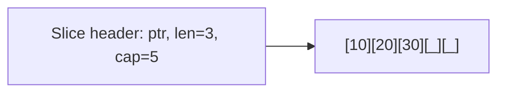

# Вопросы на собеседовании: `Go`

`Go` (Golang) — статически типизированный compiled язык от Google (с 2009). Дизайн: простота, явность, низкие накладные расходы. Главные применения: микросервисы, инфраструктура (Docker, Kubernetes, Terraform), CLI tools, network services.

## Полезные ссылки

### Официальная документация и авторитетные источники

- [Go Official Documentation](https://go.dev/doc/)
- [The Go Programming Language Specification](https://go.dev/ref/spec)
- [Effective Go](https://go.dev/doc/effective_go)
- [Tour of Go](https://go.dev/tour/)
- [Go by Example](https://gobyexample.com/)
- [Go Code Review Comments](https://github.com/golang/go/wiki/CodeReviewComments)
- [Go Wiki](https://go.dev/wiki/)
- [Standard Library](https://pkg.go.dev/std)

## Содержание

- [Полезные ссылки](#полезные-ссылки)
- [See also](#see-also)

**Базовые понятия**
- [Q1. (!) Что такое Go и почему его выбирают?](#q1--что-такое-go-и-почему-его-выбирают)
- [Q2. (!) Чем Go отличается от Java?](#q2--чем-go-отличается-от-java)
- [Q3. (!) Какова философия Go?](#q3--какова-философия-go)
- [Q4. Какие основные особенности языка?](#q4-какие-основные-особенности-языка)

**Переменные и типы**
- [Q5. (!) var, const, := — в чём разница?](#q5--var-const---в-чём-разница)
- [Q6. (!) Какие базовые типы в Go?](#q6--какие-базовые-типы-в-go)
- [Q7. Zero values — что это?](#q7-zero-values--что-это)
- [Q8. Как работают конвертации типов?](#q8-как-работают-конвертации-типов)
- [Q9. (!) Что такое pointer и как работает?](#q9--что-такое-pointer-и-как-работает)

**Композитные типы**
- [Q10. (!) Чем slice отличается от array?](#q10--чем-slice-отличается-от-array)
- [Q11. (!) Внутреннее устройство slice (length, capacity)?](#q11--внутреннее-устройство-slice-length-capacity)
- [Q12. (!) Как работают append и подводные камни?](#q12--как-работают-append-и-подводные-камни)
- [Q13. (!) Как устроена map?](#q13--как-устроена-map)
- [Q14. struct и embedding?](#q14-struct-и-embedding)

**Функции и методы**
- [Q15. (!) Multiple return values?](#q15--multiple-return-values)
- [Q16. (!) Methods и receivers (value vs pointer)?](#q16--methods-и-receivers-value-vs-pointer)
- [Q17. (!) Variadic функции?](#q17--variadic-функции)
- [Q18. Closures в Go?](#q18-closures-в-go)

**Интерфейсы**
- [Q19. (!) Как устроены интерфейсы в Go?](#q19--как-устроены-интерфейсы-в-go)
- [Q20. (!) Implicit implementation?](#q20--implicit-implementation)
- [Q21. (!) Empty interface — interface{} и any?](#q21--empty-interface--interface-и-any)
- [Q22. Type assertion и type switch?](#q22-type-assertion-и-type-switch)
- [Q23. (!) Interface satisfaction по structurality?](#q23--interface-satisfaction-по-structurality)

**Error handling**
- [Q24. (!) Как обрабатываются ошибки?](#q24--как-обрабатываются-ошибки)
- [Q25. (!) errors.Is, errors.As, error wrapping?](#q25--errorsis-errorsas-error-wrapping)
- [Q26. panic, recover, defer?](#q26-panic-recover-defer)

**defer**
- [Q27. (!) Как работает defer?](#q27--как-работает-defer)
- [Q28. defer + ошибки в функции?](#q28-defer--ошибки-в-функции)

**Runtime и компиляция**
- [Q29. (!) Как устроен Go runtime?](#q29--как-устроен-go-runtime)
- [Q30. Cross-compilation — как работает?](#q30-cross-compilation--как-работает)
- [Q31. Static vs dynamic linking?](#q31-static-vs-dynamic-linking)

**Стандартная библиотека**
- [Q32. (!) Какие основные пакеты стандартной библиотеки?](#q32--какие-основные-пакеты-стандартной-библиотеки)
- [Q33. context.Context — что это?](#q33-contextcontext--что-это)

**Применение**
- [Q34. (!) Где Go используют в production?](#q34--где-go-используют-в-production)
- [Q35. Какие минусы Go?](#q35-какие-минусы-go)
- [Q36. (!) Когда выбирать Go вместо Java/Kotlin?](#q36--когда-выбирать-go-вместо-javakotlin)

## Q1. (!) Что такое Go и почему его выбирают?

`Go` (Golang) — compiled, статически типизированный, garbage-collected язык от Google (Robert Griesemer, Rob Pike, Ken Thompson). Первый релиз — 2009.

**Ключевые причины выбирать:**
- **Простой синтаксис** — выучить за выходные
- **Быстрая компиляция** (секунды для больших проектов)
- **Single binary** — деплой одним файлом, без зависимостей
- **Goroutines** — тысячи concurrent операций дёшево
- **Standard library** богатая (net/http, encoding/json, ...)
- **Cross-compilation из коробки** (`GOOS=linux GOARCH=arm64 go build`)
- **Низкое потребление памяти** (10-50 MB для типичного сервиса)

**Применения:** Docker, Kubernetes, Terraform, Prometheus, etcd, Grafana, Vault — почти вся cloud-native инфраструктура.


> [!mcq]
> - [x] Правильный ответ | Объяснение концепции 2-3 предложения
> - [ ] Неправильный вариант 1 | Почему ошибка в этом подходе
> - [ ] Неправильный вариант 2 | Это смежное, но отличное понятие
> - [ ] Неправильный вариант 3 | Противоположное направление## Q2. (!) Чем Go отличается от Java?

| Критерий | Go | Java |
|----------|-----|------|
| Тип компиляции | AOT (native binary) | JIT (через JVM) |
| Runtime | Минимальный (goroutines, GC) | JVM |
| GC | Concurrent (low-latency) | G1, ZGC, Parallel |
| Memory | ~10-50 MB | ~100-300 MB |
| Cold start | Миллисекунды | Секунды |
| Generics | Да (с Go 1.18) | Да (с erasure) |
| OOP | Нет классов, только структуры + интерфейсы | Полноценное OOP |
| Inheritance | Нет (только composition + embedding) | Да |
| Exceptions | Нет (errors as values) | Да (checked + unchecked) |
| Concurrency | Goroutines + channels | Threads, executors, virtual threads (Loom) |
| Null | nil pointer | NPE |
| Многословность | Минимальная | Высокая |

**Размеры одинаковых сервисов:**
- Java Spring Boot: ~50 MB JAR + 200 MB RAM
- Go: ~10 MB binary + 30 MB RAM


> [!mcq]
> - [x] Правильный ответ | Объяснение концепции 2-3 предложения
> - [ ] Неправильный вариант 1 | Почему ошибка в этом подходе
> - [ ] Неправильный вариант 2 | Это смежное, но отличное понятие
> - [ ] Неправильный вариант 3 | Противоположное направление## Q3. (!) Какова философия Go?

Слоганы создателей:

1. **"Simplicity is complicated"** — язык намеренно простой
2. **"Less is exponentially more"** (Rob Pike) — меньше features = лучше
3. **"Don't communicate by sharing memory; share memory by communicating"** — channels вместо locks
4. **"Errors are values"** — нет exceptions, только возвращаемые значения
5. **"Composition over inheritance"** — нет наследования, есть embedding

Политика **"один способ сделать"**: для форматирования есть `gofmt`, для зависимостей — `go mod`, для тестов — `go test`. Минимум выбора → меньше bikeshedding.


> [!mcq]
> - [x] Правильный ответ | Объяснение концепции 2-3 предложения
> - [ ] Неправильный вариант 1 | Почему ошибка в этом подходе
> - [ ] Неправильный вариант 2 | Это смежное, но отличное понятие
> - [ ] Неправильный вариант 3 | Противоположное направление## Q4. Какие основные особенности языка?

- **Compiled** — нет VM, native binary
- **Statically typed** — типы проверяются при компиляции
- **Garbage collected** — concurrent low-latency GC
- **Memory-safe** (но с pointers без арифметики)
- **First-class concurrency** — goroutines + channels
- **Interfaces with implicit implementation** — duck typing с проверкой компилятора
- **Multiple return values**
- **Defer / panic / recover** для cleanup и crash recovery
- **No exceptions** — errors as values
- **No generics** до Go 1.18 (теперь есть)


> [!mcq]
> - [x] Правильный ответ | Объяснение концепции 2-3 предложения
> - [ ] Неправильный вариант 1 | Почему ошибка в этом подходе
> - [ ] Неправильный вариант 2 | Это смежное, но отличное понятие
> - [ ] Неправильный вариант 3 | Противоположное направление## Q5. (!) var, const, := — в чём разница?

```go
// var — явное объявление
var x int = 5
var y = 10        // тип выводится
var z int          // zero value (0)

// const — константа compile-time
const Pi = 3.14
const (
    Red   = "red"
    Green = "green"
)

// := — short variable declaration (только внутри функций)
x := 5      // выводит тип
name := "Alice"

// Multiple declaration
a, b := 1, 2

// Различие
var x int = 5  // можно на package-level
y := 5         // только внутри функций
```

`:=` — самый частый способ. Объявляет **и** присваивает.


> [!mcq]
> - [x] Правильный ответ | Объяснение концепции 2-3 предложения
> - [ ] Неправильный вариант 1 | Почему ошибка в этом подходе
> - [ ] Неправильный вариант 2 | Это смежное, но отличное понятие
> - [ ] Неправильный вариант 3 | Противоположное направление## Q6. (!) Какие базовые типы в Go?

```go
// Numeric
var i int    = 42        // platform-dependent (32 или 64)
var i32 int32 = 42       // exactly 32 bit
var i64 int64 = 42
var u uint8  = 255       // alias for byte
var f float64 = 3.14
var c complex128 = complex(1, 2)

// String
var s string = "hello"   // immutable, UTF-8

// Boolean
var b bool = true

// Aliases
byte = uint8
rune = int32             // Unicode code point

// Composite
var arr [5]int           // array
var sl []int             // slice
var m map[string]int     // map
var ch chan int          // channel
var fn func(int) int     // function type
var ptr *int             // pointer
```

**Типы строгие** — нельзя `int32 = int64` без явного `int32(x)`.


> [!mcq]
> - [x] Правильный ответ | Объяснение концепции 2-3 предложения
> - [ ] Неправильный вариант 1 | Почему ошибка в этом подходе
> - [ ] Неправильный вариант 2 | Это смежное, но отличное понятие
> - [ ] Неправильный вариант 3 | Противоположное направление## Q7. Zero values — что это?

Каждый тип имеет **zero value** — значение по умолчанию при объявлении без присваивания:

| Тип | Zero value |
|-----|------------|
| `int`, `float`, complex | `0` |
| `bool` | `false` |
| `string` | `""` |
| pointer, slice, map, channel, func, interface | `nil` |
| array | каждый элемент = zero value |
| struct | все поля = zero values |

```go
var x int          // 0
var s string       // ""
var p *int         // nil
var sl []int       // nil — но можно сразу append!
var u User         // {Name: "", Age: 0}
```

В Go нет undefined — всё имеет валидное начальное значение.


> [!mcq]
> - [x] Правильный ответ | Объяснение концепции 2-3 предложения
> - [ ] Неправильный вариант 1 | Почему ошибка в этом подходе
> - [ ] Неправильный вариант 2 | Это смежное, но отличное понятие
> - [ ] Неправильный вариант 3 | Противоположное направление## Q8. Как работают конвертации типов?

Все конвертации **явные**:

```go
var i int = 42
var f float64 = float64(i)
var u uint = uint(f)

// String <-> []byte
s := "hello"
b := []byte(s)
back := string(b)

// String <-> rune
r := 'A' // int32
s := string(r) // "A"

// String <-> int — через strconv
import "strconv"
n, err := strconv.Atoi("42")
s := strconv.Itoa(42)
```

Никаких неявных конвертаций — даже `int32` и `int64` нужно конвертировать вручную.


> [!mcq]
> - [x] Правильный ответ | Объяснение концепции 2-3 предложения
> - [ ] Неправильный вариант 1 | Почему ошибка в этом подходе
> - [ ] Неправильный вариант 2 | Это смежное, но отличное понятие
> - [ ] Неправильный вариант 3 | Противоположное направление## Q9. (!) Что такое pointer и как работает?

`*T` — pointer на `T`. `&` — взять адрес, `*` — разыменовать.

```go
x := 42
p := &x        // *int, указывает на x
fmt.Println(*p) // 42 — разыменование

*p = 100
fmt.Println(x) // 100 — изменили через pointer

// nil pointer
var p *int
*p = 5         // panic: nil pointer dereference
```

**В отличие от C/C++:**
- Нет арифметики указателей (`p++` запрещён)
- Garbage collected — не нужно `free()`
- Объект не освобождается, пока на него есть указатель

```go
func newUser() *User {
    return &User{Name: "Alice"} // OK — escape analysis перенесёт в heap
}
```


> [!mcq]
> - [x] Правильный ответ | Объяснение концепции 2-3 предложения
> - [ ] Неправильный вариант 1 | Почему ошибка в этом подходе
> - [ ] Неправильный вариант 2 | Это смежное, но отличное понятие
> - [ ] Неправильный вариант 3 | Противоположное направление## Q10. (!) Чем slice отличается от array?

```go
// Array — фиксированный размер, value type
var arr [3]int = [3]int{1, 2, 3}
arr2 := arr  // КОПИЯ всего массива!
arr2[0] = 100
fmt.Println(arr[0]) // 1 — оригинал не изменён

// Slice — динамический размер, reference type (header)
sl := []int{1, 2, 3}
sl2 := sl    // shared underlying array!
sl2[0] = 100
fmt.Println(sl[0]) // 100 — изменился!
```

| Критерий | Array | Slice |
|----------|-------|-------|
| Размер | Фиксированный (часть типа!) | Динамический |
| Семантика | Value (копируется) | Reference (header) |
| Объявление | `[3]int` | `[]int` |
| Использование | Редко | **Постоянно** |

В реальном коде Go почти всегда используют **slices**, не arrays.


> [!mcq]
> - [x] Правильный ответ | Объяснение концепции 2-3 предложения
> - [ ] Неправильный вариант 1 | Почему ошибка в этом подходе
> - [ ] Неправильный вариант 2 | Это смежное, но отличное понятие
> - [ ] Неправильный вариант 3 | Противоположное направление## Q11. (!) Внутреннее устройство slice (length, capacity)?

`Slice` — это struct с тремя полями:

```go
type slice struct {
    array unsafe.Pointer // указатель на underlying array
    len   int            // текущая длина
    cap   int            // capacity (max длина без re-allocation)
}
```

```go
sl := make([]int, 3, 10) // len=3, cap=10
fmt.Println(len(sl), cap(sl)) // 3 10

sl = append(sl, 1, 2)
fmt.Println(len(sl), cap(sl)) // 5 10 — место есть, не перевыделяем
```

Когда `len == cap` и идёт `append` — выделяется **новый** underlying array (обычно в 2 раза больше).




> [!mcq]
> - [x] Правильный ответ | Объяснение концепции 2-3 предложения
> - [ ] Неправильный вариант 1 | Почему ошибка в этом подходе
> - [ ] Неправильный вариант 2 | Это смежное, но отличное понятие
> - [ ] Неправильный вариант 3 | Противоположное направление## Q12. (!) Как работают append и подводные камни?

```go
sl := []int{1, 2, 3}
sl2 := append(sl, 4)  // sl2 — НОВЫЙ slice (или нет — зависит от cap)

// Подвох 1: append может изменить или не изменить оригинал
sl := make([]int, 3, 5)  // cap=5
copy(sl, []int{1, 2, 3})
sl2 := append(sl, 4)
// sl и sl2 разделяют тот же underlying array (cap был достаточен)
sl[0] = 100
fmt.Println(sl2[0]) // 100!

// Подвох 2: возвращаемое значение append обязательно
append(sl, 4)        // BUG: новый slice не сохранён
sl = append(sl, 4)   // OK

// Подвох 3: nil slice — можно append
var sl []int  // nil
sl = append(sl, 1) // OK, создаст underlying array
```

**Правило:** всегда сохраняй результат `append`.


> [!mcq]
> - [x] Правильный ответ | Объяснение концепции 2-3 предложения
> - [ ] Неправильный вариант 1 | Почему ошибка в этом подходе
> - [ ] Неправильный вариант 2 | Это смежное, но отличное понятие
> - [ ] Неправильный вариант 3 | Противоположное направление## Q13. (!) Как устроена map?

```go
m := make(map[string]int)
m["alice"] = 30
m["bob"] = 25

// Чтение
v, ok := m["alice"]  // ok = true
v, ok = m["charlie"] // v = 0, ok = false

// Удаление
delete(m, "alice")

// Итерация (порядок НЕ гарантирован!)
for k, v := range m {
    fmt.Printf("%s: %d\n", k, v)
}

// Литерал
m := map[string]int{"alice": 30, "bob": 25}
```

**Под капотом:** hash table (open addressing с buckets). С Go 1.0 порядок итерации **рандомизирован** намеренно — чтобы не полагаться на него.

**Подводные камни:**
- Не thread-safe — конкурентная запись = panic
- Указатель на значение в map нельзя получить (`&m["a"]` не работает)
- При итерации удаление текущего ключа — OK, но добавление — undefined


> [!mcq]
> - [x] Правильный ответ | Объяснение концепции 2-3 предложения
> - [ ] Неправильный вариант 1 | Почему ошибка в этом подходе
> - [ ] Неправильный вариант 2 | Это смежное, но отличное понятие
> - [ ] Неправильный вариант 3 | Противоположное направление## Q14. struct и embedding?

```go
type Animal struct {
    Name string
}

func (a *Animal) Greet() string {
    return "Hello, I am " + a.Name
}

// Composition через embedding
type Dog struct {
    Animal      // embedded — все поля и методы Animal доступны
    Breed string
}

d := Dog{Animal: Animal{Name: "Rex"}, Breed: "Labrador"}
fmt.Println(d.Name)     // "Rex" — promoted поле
fmt.Println(d.Greet())  // "Hello, I am Rex" — promoted метод
```

**Это не наследование** — это синтаксический сахар над composition. Можно "переопределить":

```go
func (d *Dog) Greet() string {
    return "Woof! I am " + d.Name
}
```

Но `Dog` НЕ является подтипом `Animal` (нет polymorphism через embedding).


> [!mcq]
> - [x] Правильный ответ | Объяснение концепции 2-3 предложения
> - [ ] Неправильный вариант 1 | Почему ошибка в этом подходе
> - [ ] Неправильный вариант 2 | Это смежное, но отличное понятие
> - [ ] Неправильный вариант 3 | Противоположное направление## Q15. (!) Multiple return values?

```go
func divmod(a, b int) (int, int) {
    return a / b, a % b
}

q, r := divmod(17, 5) // 3, 2

// Игнорирование — _
_, remainder := divmod(17, 5)

// Named return values
func parse(s string) (n int, err error) {
    n, err = strconv.Atoi(s)
    return // naked return — возвращает named значения
}
```

**Идиома:** последний возвращаемый — `error`:

```go
func openFile(path string) (*os.File, error) {
    f, err := os.Open(path)
    if err != nil {
        return nil, fmt.Errorf("failed to open: %w", err)
    }
    return f, nil
}

f, err := openFile("data.txt")
if err != nil {
    log.Fatal(err)
}
```


> [!mcq]
> - [x] Правильный ответ | Объяснение концепции 2-3 предложения
> - [ ] Неправильный вариант 1 | Почему ошибка в этом подходе
> - [ ] Неправильный вариант 2 | Это смежное, но отличное понятие
> - [ ] Неправильный вариант 3 | Противоположное направление## Q16. (!) Methods и receivers (value vs pointer)?

```go
type Counter struct {
    count int
}

// Value receiver — копия
func (c Counter) Get() int {
    return c.count
}

// Pointer receiver — оригинал
func (c *Counter) Increment() {
    c.count++
}

c := Counter{}
c.Increment()  // OK — Go автоматически делает (&c).Increment()
fmt.Println(c.Get()) // 1
```

**Когда какой выбрать:**
- **Pointer receiver** — если метод изменяет state ИЛИ struct большая (избегаем копирования)
- **Value receiver** — для маленьких immutable structs (например, `time.Time`)

**Идиома:** все методы одного типа — одинаковый receiver (mixing — bad practice).


> [!mcq]
> - [x] Правильный ответ | Объяснение концепции 2-3 предложения
> - [ ] Неправильный вариант 1 | Почему ошибка в этом подходе
> - [ ] Неправильный вариант 2 | Это смежное, но отличное понятие
> - [ ] Неправильный вариант 3 | Противоположное направление## Q17. (!) Variadic функции?

```go
func sum(nums ...int) int {
    total := 0
    for _, n := range nums {
        total += n
    }
    return total
}

sum(1, 2, 3)        // 6
sum()               // 0

// Передача slice
nums := []int{1, 2, 3}
sum(nums...)        // распаковка через ...
```

`fmt.Println`, `fmt.Printf` — variadic с `...interface{}`.


> [!mcq]
> - [x] Правильный ответ | Объяснение концепции 2-3 предложения
> - [ ] Неправильный вариант 1 | Почему ошибка в этом подходе
> - [ ] Неправильный вариант 2 | Это смежное, но отличное понятие
> - [ ] Неправильный вариант 3 | Противоположное направление## Q18. Closures в Go?

```go
func counter() func() int {
    count := 0
    return func() int {
        count++
        return count
    }
}

c := counter()
c() // 1
c() // 2
c() // 3
```

Closure захватывает переменные **по ссылке**. Подвох в циклах:

```go
funcs := []func() int{}
for i := 0; i < 3; i++ {
    funcs = append(funcs, func() int { return i }) // BUG в Go < 1.22!
}
// До Go 1.22 все вернут 3 (i захвачена)
// С Go 1.22 — каждая итерация имеет свою i

// Workaround для старых версий
for i := 0; i < 3; i++ {
    i := i // shadow
    funcs = append(funcs, func() int { return i })
}
```


> [!mcq]
> - [x] Правильный ответ | Объяснение концепции 2-3 предложения
> - [ ] Неправильный вариант 1 | Почему ошибка в этом подходе
> - [ ] Неправильный вариант 2 | Это смежное, но отличное понятие
> - [ ] Неправильный вариант 3 | Противоположное направление## Q19. (!) Как устроены интерфейсы в Go?

`Interface` — набор методов:

```go
type Stringer interface {
    String() string
}

type User struct {
    Name string
    Age  int
}

// Реализация — просто наличие метода
func (u User) String() string {
    return fmt.Sprintf("%s (%d)", u.Name, u.Age)
}

var s Stringer = User{Name: "Alice", Age: 30}
fmt.Println(s) // "Alice (30)"
```

**Под капотом** interface — это (type, value) pair:

```
Stringer:
┌─────────────┬──────────┐
│ type: User  │ value: → │ → User{Name: "Alice", Age: 30}
└─────────────┴──────────┘
```


> [!mcq]
> - [x] Правильный ответ | Объяснение концепции 2-3 предложения
> - [ ] Неправильный вариант 1 | Почему ошибка в этом подходе
> - [ ] Неправильный вариант 2 | Это смежное, но отличное понятие
> - [ ] Неправильный вариант 3 | Противоположное направление## Q20. (!) Implicit implementation?

В Go **не объявляют** "implements" — компилятор проверяет соответствие методов автоматически.

```go
type Reader interface {
    Read(p []byte) (n int, err error)
}

// File реализует Reader, не зная об этом
type File struct{ /* ... */ }
func (f *File) Read(p []byte) (n int, err error) { /* ... */ }

var r Reader = &File{} // OK — File имеет метод Read с правильной сигнатурой
```

**Преимущество:** decoupling. Можно реализовать interface от чужой библиотеки без её модификации.

**Недостаток:** легко случайно "implement" не тот interface (типа); сложно найти все реализации (нет explicit `implements`).


> [!mcq]
> - [x] Правильный ответ | Объяснение концепции 2-3 предложения
> - [ ] Неправильный вариант 1 | Почему ошибка в этом подходе
> - [ ] Неправильный вариант 2 | Это смежное, но отличное понятие
> - [ ] Неправильный вариант 3 | Противоположное направление## Q21. (!) Empty interface — interface{} и any?

`interface{}` — пустой интерфейс. Любой тип реализует его. Аналог `Object` в Java.

```go
var x interface{} = 42
x = "hello"
x = User{}
```

С Go 1.18+ есть алиас `any`:

```go
var x any = 42  // эквивалентно interface{}
```

**Применения:**
- `fmt.Println(...args any)` — принимает что угодно
- `json.Unmarshal(data, &result)` — `result` обычно `*any`
- Heterogeneous collections (но лучше через generics)

**Недостаток:** теряется type safety. Нужен type assertion для использования.


> [!mcq]
> - [x] Правильный ответ | Объяснение концепции 2-3 предложения
> - [ ] Неправильный вариант 1 | Почему ошибка в этом подходе
> - [ ] Неправильный вариант 2 | Это смежное, но отличное понятие
> - [ ] Неправильный вариант 3 | Противоположное направление## Q22. Type assertion и type switch?

```go
var x any = 42

// Type assertion
n, ok := x.(int)  // n=42, ok=true (safe)
n := x.(int)       // n=42 (panic если не int)

s, ok := x.(string) // s="", ok=false

// Type switch
switch v := x.(type) {
case int:
    fmt.Println("int:", v)
case string:
    fmt.Println("string:", v)
case []int:
    fmt.Println("slice:", v)
default:
    fmt.Println("unknown")
}
```

`type switch` — частый pattern в работе с `any`.


> [!mcq]
> - [x] Правильный ответ | Объяснение концепции 2-3 предложения
> - [ ] Неправильный вариант 1 | Почему ошибка в этом подходе
> - [ ] Неправильный вариант 2 | Это смежное, но отличное понятие
> - [ ] Неправильный вариант 3 | Противоположное направление## Q23. (!) Interface satisfaction по structurality?

В Java: `class Cat implements Animal {}` — явно объявляется.
В Go: если у `Cat` есть все методы интерфейса `Animal` — он автоматически его реализует.

Это **structural typing** (по форме), а не **nominal** (по имени).

```go
// Чужая библиотека
type Logger interface {
    Log(msg string)
}

// Моя библиотека
type MyLogger struct {}
func (m MyLogger) Log(msg string) { /* ... */ }

// MyLogger реализует Logger автоматически — без import
var l Logger = MyLogger{}
```

**Подводный камень:** легко "сломать" совместимость, изменив сигнатуру метода. Compiler не знает, что это implementation.


> [!mcq]
> - [x] Правильный ответ | Объяснение концепции 2-3 предложения
> - [ ] Неправильный вариант 1 | Почему ошибка в этом подходе
> - [ ] Неправильный вариант 2 | Это смежное, но отличное понятие
> - [ ] Неправильный вариант 3 | Противоположное направление## Q24. (!) Как обрабатываются ошибки?

В Go **нет exceptions**. Errors — обычные значения, обычно последний возвращаемый параметр:

```go
func openFile(path string) (*os.File, error) {
    file, err := os.Open(path)
    if err != nil {
        return nil, err
    }
    return file, nil
}

// Использование
file, err := openFile("data.txt")
if err != nil {
    log.Fatal(err)
}
defer file.Close()
```

**Это многословно**, но эксплицитно. Каждая ошибка обрабатывается явно.


> [!mcq]
> - [x] Правильный ответ | Объяснение концепции 2-3 предложения
> - [ ] Неправильный вариант 1 | Почему ошибка в этом подходе
> - [ ] Неправильный вариант 2 | Это смежное, но отличное понятие
> - [ ] Неправильный вариант 3 | Противоположное направление## Q25. (!) errors.Is, errors.As, error wrapping?

С Go 1.13 — error wrapping:

```go
import "errors"

// Wrapping
err := openFile("...")
if err != nil {
    return fmt.Errorf("failed to start: %w", err)  // %w оборачивает
}

// Unwrapping и проверка
if errors.Is(err, os.ErrNotExist) {
    // обрабатываем "file not found"
}

// Type assertion для custom errors
var pathErr *os.PathError
if errors.As(err, &pathErr) {
    fmt.Println(pathErr.Path)
}

// Custom error
type ValidationError struct {
    Field string
    Msg   string
}

func (v *ValidationError) Error() string {
    return fmt.Sprintf("validation failed for %s: %s", v.Field, v.Msg)
}
```

`errors.Is` идёт по цепочке wrapping и сравнивает. `errors.As` ищет тип в цепочке.


> [!mcq]
> - [x] Правильный ответ | Объяснение концепции 2-3 предложения
> - [ ] Неправильный вариант 1 | Почему ошибка в этом подходе
> - [ ] Неправильный вариант 2 | Это смежное, но отличное понятие
> - [ ] Неправильный вариант 3 | Противоположное направление## Q26. panic, recover, defer?

`panic` — аналог exception:

```go
func divide(a, b int) int {
    if b == 0 {
        panic("division by zero")
    }
    return a / b
}
```

`recover` — перехват panic (только в `defer`):

```go
func safeDivide(a, b int) (result int, err error) {
    defer func() {
        if r := recover(); r != nil {
            err = fmt.Errorf("recovered: %v", r)
        }
    }()
    return a / b, nil // panic если b=0
}
```

**Идиома:** `panic` использовать только для **программных ошибок** (баги). Все ожидаемые ошибки — через `error`.


> [!mcq]
> - [x] Правильный ответ | Объяснение концепции 2-3 предложения
> - [ ] Неправильный вариант 1 | Почему ошибка в этом подходе
> - [ ] Неправильный вариант 2 | Это смежное, но отличное понятие
> - [ ] Неправильный вариант 3 | Противоположное направление## Q27. (!) Как работает defer?

`defer` откладывает выполнение функции до **выхода** из текущей функции (нормального или через panic):

```go
func processFile(path string) error {
    file, err := os.Open(path)
    if err != nil {
        return err
    }
    defer file.Close() // выполнится при return или panic

    // ... работа с файлом
    return nil
}
```

**Особенности:**
- Выполняются в **LIFO** порядке (несколько defer = последний первым)
- Аргументы вычисляются **в момент defer**, не при выполнении
- Может изменять named return values

```go
func multiDefer() {
    defer fmt.Println("1")
    defer fmt.Println("2")
    defer fmt.Println("3")
}
// Output: 3 2 1

func deferArgs() {
    x := 1
    defer fmt.Println(x) // печатает 1 (не 100)
    x = 100
}
```


> [!mcq]
> - [x] Правильный ответ | Объяснение концепции 2-3 предложения
> - [ ] Неправильный вариант 1 | Почему ошибка в этом подходе
> - [ ] Неправильный вариант 2 | Это смежное, но отличное понятие
> - [ ] Неправильный вариант 3 | Противоположное направление## Q28. defer + ошибки в функции?

Подвох: `defer file.Close()` может вернуть ошибку, но мы её игнорируем:

```go
func write() (err error) {
    f, _ := os.Create("file")
    defer f.Close() // ошибка закрытия игнорируется

    // Лучше:
    defer func() {
        if cerr := f.Close(); cerr != nil && err == nil {
            err = cerr
        }
    }()
    // ... write data
    return nil
}
```

В Go 1.21+ есть `errors.Join` для объединения нескольких ошибок.


> [!mcq]
> - [x] Правильный ответ | Объяснение концепции 2-3 предложения
> - [ ] Неправильный вариант 1 | Почему ошибка в этом подходе
> - [ ] Неправильный вариант 2 | Это смежное, но отличное понятие
> - [ ] Неправильный вариант 3 | Противоположное направление## Q29. (!) Как устроен Go runtime?

Go runtime (написан на Go + немного assembly) включает:

1. **Goroutine scheduler** — M:N модель (M goroutines на N OS threads)
2. **Garbage collector** — concurrent mark-and-sweep
3. **Memory allocator** — tcmalloc-подобный, per-thread caches
4. **Channel implementation** — для goroutine communication
5. **Network poller** — epoll/kqueue для async I/O
6. **defer / panic / recover** механизмы

Runtime встроен в каждый бинарник (нет отдельной "VM" как JVM). Поэтому Go binaries относительно большие (5-15 MB для simple app).

Подробнее о goroutines — в [Go Concurrency](go-concurrency-interview.md).


> [!mcq]
> - [x] Правильный ответ | Объяснение концепции 2-3 предложения
> - [ ] Неправильный вариант 1 | Почему ошибка в этом подходе
> - [ ] Неправильный вариант 2 | Это смежное, но отличное понятие
> - [ ] Неправильный вариант 3 | Противоположное направление## Q30. Cross-compilation — как работает?

Go из коробки поддерживает cross-compilation:

```bash
# Сборка для Linux ARM64 на macOS M1
GOOS=linux GOARCH=arm64 go build -o myapp

# Поддерживаемые ОС: linux, darwin, windows, freebsd, netbsd, ...
# Архитектуры: amd64, arm64, 386, arm, mips, ppc64, ...

go tool dist list  # все возможные комбинации
```

В отличие от Java (один JAR работает везде), Go компилируется в **native binary** для конкретной платформы. Но cross-compilation — тривиальна.


> [!mcq]
> - [x] Правильный ответ | Объяснение концепции 2-3 предложения
> - [ ] Неправильный вариант 1 | Почему ошибка в этом подходе
> - [ ] Неправильный вариант 2 | Это смежное, но отличное понятие
> - [ ] Неправильный вариант 3 | Противоположное направление## Q31. Static vs dynamic linking?

По умолчанию Go **статически линкует** свой код:

```bash
go build -o myapp main.go
file myapp
# myapp: ELF 64-bit LSB executable, x86-64, statically linked
```

**Преимущества:**
- Один файл, нет зависимостей в runtime
- Легко деплоить (включая в `scratch` Docker images)
- Нет "DLL hell"

**Подвох:** некоторые пакеты (`net`, `os/user`) используют CGO → dynamic linking glibc. Для **полностью static**:

```bash
CGO_ENABLED=0 go build -o myapp
```

Это блокирует пакеты с CGO, но даёт portable binary.


> [!mcq]
> - [x] Правильный ответ | Объяснение концепции 2-3 предложения
> - [ ] Неправильный вариант 1 | Почему ошибка в этом подходе
> - [ ] Неправильный вариант 2 | Это смежное, но отличное понятие
> - [ ] Неправильный вариант 3 | Противоположное направление## Q32. (!) Какие основные пакеты стандартной библиотеки?

| Пакет | Назначение |
|-------|------------|
| `fmt` | Форматирование, печать |
| `strings`, `bytes` | Манипуляции строк/байтов |
| `strconv` | Конвертация string ↔ числа |
| `errors` | Error handling |
| `os` | OS-зависимые операции |
| `io`, `bufio` | I/O абстракции |
| `net/http` | HTTP сервер и клиент |
| `encoding/json`, `encoding/xml` | Сериализация |
| `database/sql` | SQL абстракция (нужен driver) |
| `context` | Cancellation, deadlines, request-scoped values |
| `sync`, `sync/atomic` | Синхронизация |
| `time` | Время, таймеры |
| `regexp` | RE2 регулярки |
| `crypto/...` | TLS, hash, AES, RSA |
| `log/slog` | Structured logging (Go 1.21+) |
| `testing` | Unit tests, benchmarks |

Standard library покрывает 80% потребностей среднего сервиса — без third-party.


> [!mcq]
> - [x] Правильный ответ | Объяснение концепции 2-3 предложения
> - [ ] Неправильный вариант 1 | Почему ошибка в этом подходе
> - [ ] Неправильный вариант 2 | Это смежное, но отличное понятие
> - [ ] Неправильный вариант 3 | Противоположное направление## Q33. context.Context — что это?

`context.Context` — для передачи **cancellation signals**, **deadlines**, **request-scoped values** через цепочку вызовов.

```go
import "context"

func handleRequest(w http.ResponseWriter, r *http.Request) {
    ctx, cancel := context.WithTimeout(r.Context(), 5*time.Second)
    defer cancel()

    result, err := slowOperation(ctx)
    if err != nil {
        http.Error(w, err.Error(), 500)
        return
    }
    w.Write(result)
}

func slowOperation(ctx context.Context) ([]byte, error) {
    select {
    case <-ctx.Done():
        return nil, ctx.Err()  // отмена или timeout
    case data := <-resultChan:
        return data, nil
    }
}
```

**Идиома:** первый параметр функции — `ctx context.Context`. Передавай везде, где может быть долгая операция.

Подробнее — в [Go Concurrency](go-concurrency-interview.md).


> [!mcq]
> - [x] Правильный ответ | Объяснение концепции 2-3 предложения
> - [ ] Неправильный вариант 1 | Почему ошибка в этом подходе
> - [ ] Неправильный вариант 2 | Это смежное, но отличное понятие
> - [ ] Неправильный вариант 3 | Противоположное направление## Q34. (!) Где Go используют в production?

**Cloud-native инфраструктура:**
- Docker, Kubernetes, etcd, containerd
- Terraform, Vault, Consul, Nomad (HashiCorp)
- Prometheus, Grafana Loki, Jaeger
- CockroachDB, TiDB, InfluxDB, NATS
- Caddy, Traefik (web-серверы)
- Hugo (static site generator)
- Helm, Skaffold (K8s tools)

**Компании:**
- Google (исконно)
- Uber (~ 90% backend)
- Twitch
- Cloudflare
- Dropbox (часть инфры)
- Netflix (некоторые сервисы)
- Twitter (рост использования)


> [!mcq]
> - [x] Правильный ответ | Объяснение концепции 2-3 предложения
> - [ ] Неправильный вариант 1 | Почему ошибка в этом подходе
> - [ ] Неправильный вариант 2 | Это смежное, но отличное понятие
> - [ ] Неправильный вариант 3 | Противоположное направление## Q35. Какие минусы Go?

1. **Verbose error handling** — `if err != nil` повсюду
2. **Generics добавили поздно** (Go 1.18, 2022) и они ограничены
3. **Нет sum types / enum** — `iota` константы бледный аналог
4. **Mandatory garbage collection** — для real-time не подходит
5. **Нет ternary operator, нет map/filter в стандарте**
6. **Большие binaries** (5-15 MB для пустого приложения)
7. **Меньше metaprogramming** — нет macros, generics ограничены
8. **Subjective:** `gofmt` не предлагает выбора в стиле
9. **`nil` pointer** — те же проблемы, что NPE в Java
10. **Слабая система типов** по сравнению с Scala/Rust


> [!mcq]
> - [x] Правильный ответ | Объяснение концепции 2-3 предложения
> - [ ] Неправильный вариант 1 | Почему ошибка в этом подходе
> - [ ] Неправильный вариант 2 | Это смежное, но отличное понятие
> - [ ] Неправильный вариант 3 | Противоположное направление## Q36. (!) Когда выбирать Go вместо Java/Kotlin?

**Выбирай Go когда:**
- Микросервис с фокусом на **низкое потребление памяти**
- Нужен **single binary** без runtime
- Network/CLI/инфраструктурные tools
- Команда комфортна с императивным стилем (без сложного OOP)
- Cloud-native стек (Kubernetes, Docker)
- Нужна простота и быстрая компиляция

**Не выбирай Go когда:**
- Сложная domain logic (legacy Java/Kotlin справится лучше)
- ML/Data science (Python, Scala)
- Real-time (нужен Rust или C++)
- Heavy enterprise integrations (Spring имеет всё)
- Нужны generics с complex type bounds (Scala)

В **2024**: Go доминирует в **cloud-native инфраструктуре**, но в general backend Java/Kotlin/.NET всё ещё конкурентоспособны.

---

## See also

- [Go Concurrency](go-concurrency-interview.md) — goroutines, channels, sync
- [Go Memory & GC](go-memory-gc-interview.md) — память и сборщик мусора
- [Go Generics](go-generics-interview.md) — Go 1.18+ generics
- [Go Standard Library](go-stdlib-interview.md) — net/http, encoding, и т.д.
- [Go Testing](go-testing-interview.md) — unit tests, benchmarks
- [Go Modules](go-modules-interview.md) — управление зависимостями
- [Java Core](../java/java-core-interview.md) — для сравнения
- [Kotlin](../kotlin/kotlin-interview.md) — другой современный язык
- [Микросервисы](../../architecture/microservices-interview.md) — Go хорош для них
- [Docker](../../devops/docker-interview.md) — написан на Go
- [Kubernetes](../../devops/kubernetes-interview.md) — написан на Go
- [gRPC](../../api/grpc-interview.md) — популярная пара с Go
- [Performance Testing](../../performance/performance-testing-interview.md) — Go бенчмарки


> [!mcq]
> - [x] Правильный ответ | Объяснение концепции 2-3 предложения
> - [ ] Неправильный вариант 1 | Почему ошибка в этом подходе
> - [ ] Неправильный вариант 2 | Это смежное, но отличное понятие
> - [ ] Неправильный вариант 3 | Противоположное направление- [Go Concurrency](go-concurrency-interview.md)
- [Go Generics](go-generics-interview.md)
- [Go Memory и GC](go-memory-gc-interview.md)
- [Go Modules](go-modules-interview.md)
- [Go Standard Library](go-stdlib-interview.md)
- [Go Testing](go-testing-interview.md)
