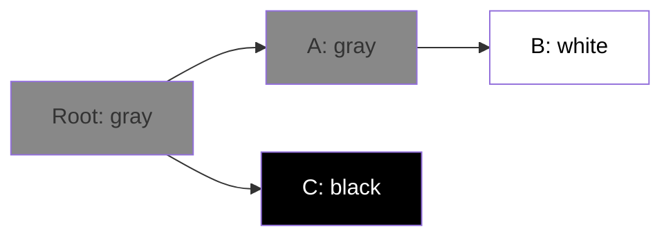

# Вопросы на собеседовании: `Go Memory и GC`

Go GC — concurrent mark-and-sweep с **низкой латентностью** (под 1ms паузы). Понимание escape analysis (что попадает в stack, что в heap), tuning через `GOGC`/`GOMEMLIMIT` и профилирование памяти — частые темы для middle/senior Go-разработчиков.

## Полезные ссылки

### Официальная документация и авторитетные источники

- [A Guide to the Go Garbage Collector](https://go.dev/doc/gc-guide)
- [Go Memory Model](https://go.dev/ref/mem)
- [Diagnostics in Go](https://go.dev/doc/diagnostics)
- [Go Garbage Collection — Ardan Labs](https://www.ardanlabs.com/blog/2018/12/garbage-collection-in-go-part1-semantics.html)
- [Escape Analysis — Bill Kennedy](https://www.ardanlabs.com/blog/2017/05/language-mechanics-on-escape-analysis.html)

## Содержание

- [Полезные ссылки](#полезные-ссылки)
- [See also](#see-also)

**Stack vs Heap**
- [Q1. (!) Что такое stack и heap в Go?](#q1--что-такое-stack-и-heap-в-go)
- [Q2. (!) Что такое escape analysis?](#q2--что-такое-escape-analysis)
- [Q3. (!) Когда переменная переходит в heap?](#q3--когда-переменная-переходит-в-heap)
- [Q4. Как посмотреть решения escape analysis?](#q4-как-посмотреть-решения-escape-analysis)
- [Q5. Как растёт стек goroutine?](#q5-как-растёт-стек-goroutine)

**Garbage Collector**
- [Q6. (!) Какой сборщик мусора в Go?](#q6--какой-сборщик-мусора-в-go)
- [Q7. (!) Как работает tri-color marking?](#q7--как-работает-tri-color-marking)
- [Q8. (!) Что такое write barrier и зачем он нужен?](#q8--что-такое-write-barrier-и-зачем-он-нужен)
- [Q9. Какие фазы STW (Stop the World) есть в Go GC?](#q9-какие-фазы-stw-stop-the-world-есть-в-go-gc)
- [Q10. (!) Сколько длятся паузы GC?](#q10--сколько-длятся-паузы-gc)

**Tuning**
- [Q11. (!) Что такое GOGC?](#q11--что-такое-gogc)
- [Q12. (!) Что делает GOMEMLIMIT (Go 1.19+)?](#q12--что-делает-gomemlimit-go-119)
- [Q13. Чем отличается SetGCPercent от SetMemoryLimit?](#q13-чем-отличается-setgcpercent-от-setmemorylimit)
- [Q14. Когда стоит вызывать runtime.GC()?](#q14-когда-стоит-вызывать-runtimegc)

**Профилирование**
- [Q15. (!) Как снять memory-профиль через pprof?](#q15--как-снять-memory-профиль-через-pprof)
- [Q16. Как найти утечки памяти?](#q16-как-найти-утечки-памяти)
- [Q17. Что показывает allocs/op в бенчмарках?](#q17-что-показывает-allocsop-в-бенчмарках)

**Подводные камни**
- [Q18. (!) Как slice вызывает утечку памяти?](#q18--как-slice-вызывает-утечку-памяти)
- [Q19. (!) Освобождает ли map память после delete?](#q19--освобождает-ли-map-память-после-delete)
- [Q20. Влияет ли утечка goroutine на память?](#q20-влияет-ли-утечка-goroutine-на-память)
- [Q21. Что такое finalizer и зачем он нужен?](#q21-что-такое-finalizer-и-зачем-он-нужен)

**Сравнения**
- [Q22. (!) Чем Go GC отличается от JVM (G1, ZGC)?](#q22--чем-go-gc-отличается-от-jvm-g1-zgc)
- [Q23. Почему Go использует меньше памяти, чем Java?](#q23-почему-go-использует-меньше-памяти-чем-java)

**Performance**
- [Q24. (!) Как sync.Pool снижает нагрузку на GC?](#q24--как-syncpool-снижает-нагрузку-на-gc)
- [Q25. Зачем заранее выделять ёмкость для slice и map?](#q25-зачем-заранее-выделять-ёмкость-для-slice-и-map)
- [Q26. (!) Что такое inlining?](#q26--что-такое-inlining)
- [Q27. Когда GC становится узким местом?](#q27-когда-gc-становится-узким-местом)

## Q1. (!) Что такое stack и heap в Go?

Это две области памяти с разной стоимостью и временем жизни. Главное отличие Go: программист **не выбирает** между ними руками — компилятор сам решает, куда положить каждую переменную, через escape analysis.

**Stack** — память под локальные переменные функции. У каждой goroutine свой отдельный стек.
- Растёт и сжимается по принципу LIFO: при вызове функции кадр (frame) кладётся на стек, при `return` — снимается.
- Аллокация и освобождение почти бесплатны: достаточно сдвинуть указатель стека на нужное число байт.
- GC стек не трогает — память освобождается автоматически при выходе из функции.

**Heap** — память под объекты, которые переживают свою функцию или слишком велики для стека.
- Аллокация дороже: нужно найти и зарезервировать свободный блок.
- Освобождает память сборщик мусора, а не выход из функции.
- Объект на heap можно безопасно расшарить между несколькими goroutine.

**Вывод:** stack дешёвый, но локальный; heap дорогой, но позволяет объекту жить дольше функции. Решение, что куда положить, принимает компилятор на этапе сборки — см. escape analysis.

## Q2. (!) Что такое escape analysis?

**Escape analysis** — статический анализ на этапе компиляции, который определяет, «убегает» ли переменная за пределы своей функции. Если ссылка на переменную доживает до момента после `return`, переменную приходится размещать на heap; если нет — она остаётся на stack.

«Убегает» — значит, что после возврата из функции к переменной всё ещё может кто-то обратиться (через возвращённый указатель, замыкание, интерфейс). Стек к этому моменту уже разрушен, поэтому такой объект обязан жить на heap.

```go
// Stack — переменная не уходит из функции
func sumStack() int {
    x := 5
    return x + 10
}

// Heap — указатель возвращается наружу
func newUser() *User {
    u := User{Name: "Alice"} // ESCAPES to heap
    return &u
}
```

**Зачем это важно:** каждый объект на heap создаёт нагрузку на сборщик мусора (GC pressure). Понимая, что заставляет переменную «убежать», вы пишете код, который чаще остаётся на дешёвом стеке и реже тревожит GC.

## Q3. (!) Когда переменная переходит в heap?

Компилятор перемещает переменную на heap, когда не может доказать, что она безопасно умрёт вместе с функцией. Типичные триггеры:

1. **Возвращается указатель** — `return &x`: ссылка переживает функцию, значит сама переменная тоже должна.
2. **Захватывается closure** — замыкание ссылается на переменную и может пережить родительскую функцию.
3. **Передаётся в interface** — упаковка в `interface{}` скрывает конкретный тип и размер, компилятор перестраховывается и кладёт значение на heap.
4. **Слишком большая** для стека (обычно > 64 KB) — большой массив не помещается в кадр.
5. **Используется через reflection** — компилятор не может статически отследить время жизни.
6. **Передаётся в goroutine** — переменные, к которым обращается отдельная goroutine, обычно уходят на heap, так как стек родителя им не принадлежит.

Общий принцип: **любая неопределённость во времени жизни → heap**. Компилятор выбирает безопасность, а не оптимальность.

```go
// 1. Указатель возвращается
func a() *int {
    x := 5
    return &x // escape
}

// 2. Closure
func b() func() int {
    x := 5
    return func() int { return x } // x escapes
}

// 3. Interface
func c() {
    x := 5
    fmt.Println(x) // x → interface{} → escape
}

// 4. Большая структура
func d() {
    var arr [100000]int // вероятно escape
    _ = arr
}
```

## Q4. Как посмотреть решения escape analysis?

Передайте компилятору флаг `-m` — он напечатает, какие переменные ушли на heap и почему.

```bash
go build -gcflags="-m" main.go
```

Вывод читается так: для каждой строки указано решение компилятора.
```
./main.go:5:10: &x escapes to heap
./main.go:4:2: moved to heap: x
./main.go:11:13: x escapes to heap (passed to ...interface{})
```
- `escapes to heap` / `moved to heap` — переменная попала на heap.
- В скобках — причина (например, передача в `...interface{}`).

Удвоенный флаг `-m -m` (или `-m=2`) даёт более детальный разбор — с цепочкой рассуждений, почему компилятор принял такое решение:

```bash
go build -gcflags="-m -m" main.go
```

**Совет:** этот вывод — основной инструмент, чтобы проверить гипотезу «эта аллокация на стеке или на heap?» перед оптимизацией горячего кода.

## Q5. Как растёт стек goroutine?

Стек goroutine не фиксирован — он растёт по мере надобности. Goroutine стартует всего с **2 KB**, и когда этого места не хватает, runtime его расширяет.

Механика роста (stack copying):

1. Выделяет новый стек **вдвое больше** текущего.
2. Копирует в него все кадры (frames) со старого стека.
3. Освобождает старый стек.

```
Goroutine stack growth:
2 KB → 4 KB → 8 KB → ... → 1 GB (max default)
```

**Зачем так:** OS-поток выделяет фиксированный стек (~1 MB) сразу при создании. Goroutine же начинает с крохотных 2 KB, поэтому миллион «лёгких» goroutine реально умещается в памяти. Платой за гибкость становятся редкие паузы на копирование стека и риск упереться в потолок (по умолчанию 1 GB) при неконтролируемой рекурсии.

## Q6. (!) Какой сборщик мусора в Go?

В Go — **concurrent mark-and-sweep** с трёхцветной маркировкой (tri-color marking). Это сборщик, заточенный под одну цель: минимальные паузы.

**Ключевые свойства и что они дают:**
- **Concurrent** — основная работа GC идёт **параллельно** с приложением, поэтому остановки мира (STW) сведены к минимуму.
- **Не поколенческий (non-generational)** — нет деления на Young/Old, как в JVM. Сборщик за один проход обходит весь живой граф объектов.
- **Без уплотнения (non-compacting)** — объекты не перемещаются в памяти. Это упрощает GC и write barrier, но не борется с фрагментацией (ею занимается аллокатор с size-классами).
- **Tri-color** — конкретный алгоритм маркировки достижимых объектов (см. Q7).

**Главная цель:** **низкая задержка** — паузы STW под 1 мс. Go сознательно жертвует частью CPU ради того, чтобы приложение почти не «замирало».

## Q7. (!) Как работает tri-color marking?

Это способ за один проход найти все достижимые объекты, при этом позволяя приложению работать параллельно. Каждому объекту присваивается один из трёх цветов, которые отражают стадию обхода:

- **Белый** — ещё не обнаружен; кандидат на удаление.
- **Серый** — обнаружен (достижим), но его исходящие ссылки ещё не просмотрены — «фронт волны».
- **Чёрный** — полностью обработан: и сам достижим, и все его ссылки уже учтены; не будет удалён.

Алгоритм — это обход графа в ширину, где серое множество и есть очередь:

```
1. Все объекты — белые
2. Roots (stack, globals) → серые
3. Берём серый, его reachable объекты → серые, сам → чёрный
4. Повторяем 3 пока серых нет
5. Все белые → удалить
```

Когда серых не осталось, обход завершён: всё чёрное — живое, всё белое — мусор. Инвариант, который нельзя нарушать: **чёрный объект не должен ссылаться напрямую на белый** — иначе живой объект будет ошибочно удалён. Поддерживать этот инвариант при параллельной работе приложения и помогает write barrier (см. Q8).



После завершения фазы маркировки все недостижимые (белые) объекты освобождаются в фазе sweep.

## Q8. (!) Что такое write barrier и зачем он нужен?

**Write barrier** — небольшой фрагмент кода, который компилятор вставляет перед каждой записью указателя в куче. Он нужен, чтобы concurrent-сборщик оставался **корректным**, пока приложение меняет ссылки прямо во время маркировки.

**В чём проблема.** Мутатор (приложение) перекидывает ссылки **одновременно** с обходом GC. Без защиты живой объект может остаться белым и быть ошибочно удалён:

```
Объекты: A (чёрный, уже просканирован), B (белый, ещё не помечен),
         C (серый, в очереди на сканирование). Единственная ссылка
         на B — у серого C: C.next = B.

1. Мутатор: A.next = B   — чёрный A получает ссылку на белый B
2. Мутатор: C.next = nil — единственная серая ссылка на B удалена
3. GC досканирует C — ссылки на B там уже нет;
   A чёрный, повторно не сканируется → GC про B не узнаёт
4. B остаётся белым → sweep освобождает живой объект (A.next → мусор)
```

Корень проблемы — нарушение инварианта «чёрный не ссылается на белый»: уже просканированный чёрный объект получает ссылку на ещё не отмеченный белый, а сборщик об этом не узнаёт.

**Решение.** Write barrier перехватывает запись указателя и «затеняет» (помечает серым) объекты, восстанавливая инвариант. Два классических варианта:

- **Dijkstra insertion barrier** — затеняет **новую цель записи** (B на шаге 1): чёрный объект не может незаметно получить ссылку на белый.
- **Yuasa deletion barrier** — затеняет **перезаписываемый (старый) указатель** (B на шаге 2): подход snapshot-at-the-beginning — всё, что было достижимо на старте маркировки, доживёт до её конца.

До Go 1.8 применялся чистый Dijkstra-барьер. С **Go 1.8** работает **hybrid write barrier** — комбинация Yuasa deletion + Dijkstra insertion. Его главный эффект — **отказ от повторного STW-рескана стеков goroutine** в конце маркировки (ради этого его и вводили): re-scan заменён затенением указателей при записях в стек и кучу. Стоимость — порядка ~2–5 нс на одну запись указателя; это та небольшая плата за CPU, которой Go покупает короткие паузы.

## Q9. Какие фазы STW (Stop the World) есть в Go GC?

В цикле сборки всего **две короткие фазы STW**, когда приложение полностью останавливается:

1. **Mark Setup** (~10–100 μs) — включение write barrier и подготовка к маркировке.
2. **Mark Termination** (~10–100 μs) — завершение маркировки и выключение write barrier.

Всё остальное идёт **без остановки мира**: между этими двумя точками — **concurrent mark** (приложение работает параллельно с маркировкой), а после — **concurrent sweep** (освобождение белых объектов, тоже без STW).

```
Time:   STW1   ─── concurrent mark ───  STW2  ─── concurrent sweep ───
Apps:   ⏸     ▶                        ⏸    ▶
GC:     ▶     ▶                        ▶    ▶
```

**Эмпирическое правило:** STW < 100 μs для большинства приложений. На очень больших кучах (десятки GB) паузы могут быть выше.

## Q10. (!) Сколько длятся паузы GC?

Коротко: паузы измеряются микросекундами, а не миллисекундами — это главное конкурентное преимущество Go GC.

**Что закладывает дизайн Go GC:**
- STW-пауза < 100 μs (микросекунд!).
- До 25% CPU отводится сборщику при пиковой нагрузке (значение по умолчанию).

**Что получается на практике:**
- Небольшие приложения: паузы **< 1 мс** (часто < 100 μs).
- Большие приложения (heap 10 GB+): паузы **1–10 мс**.

```bash
GODEBUG=gctrace=1 ./myapp
# Логи каждого GC цикла
gc 1 @0.012s 0%: 0.018+0.83+0.058 ms clock, ...
#                ^ STW1   ^ concurrent ^ STW2
```

**Сравнение с JVM:**
- G1 GC: типичные паузы — десятки миллисекунд, целевой максимум по умолчанию `MaxGCPauseMillis=200`; «до секунды» возможно лишь в патологических Full GC
- ZGC: паузы < 10 мс
- Shenandoah: паузы < 10 мс

По задержкам Go GC обычно **не хуже** ZGC, оставаясь при этом заметно проще в устройстве.

## Q11. (!) Что такое GOGC?

`GOGC` — переменная окружения, задающая, **как часто запускается сборка**. Она выражает компромисс между расходом памяти и расходом CPU: чем чаще GC, тем меньше пиковая память, но тем больше тратится процессорного времени.

```bash
GOGC=100  # default — GC при росте heap на 100%
GOGC=50   # GC чаще (50% роста) — меньше memory, больше CPU
GOGC=200  # GC реже — больше memory, меньше CPU
GOGC=off  # отключить GC (только для debug!)
```

**Формула:** GC запускается, когда `heap = (1 + GOGC/100) * live_size_after_last_gc`, то есть когда куча выросла относительно объёма живых данных после прошлой сборки на заданный процент.

Пример: после GC живых данных 100 MB. При `GOGC=100` следующая сборка стартует, когда куча дорастёт до 200 MB (рост на 100%).

```go
import "runtime/debug"
debug.SetGCPercent(50) // программно
```

## Q12. (!) Что делает GOMEMLIMIT (Go 1.19+)?

`GOMEMLIMIT` задаёт **мягкий лимит памяти**: сборщик старается удержать общее потребление под этим порогом и для этого запускается чаще по мере приближения к нему. «Мягкий» — значит лимит не гарантирован абсолютно (при реальной нехватке памяти он может быть превышен), но GC делает всё, чтобы его соблюсти.

```bash
GOMEMLIMIT=4GiB ./myapp  # стараться не превышать 4 GiB
GOMEMLIMIT=4000000000    # в байтах
GOMEMLIMIT=off            # отключить (default)
```

**Сценарий применения:** **контейнеры** (Docker, K8s). Установив лимит чуть ниже memory limit контейнера, вы заставляете GC активнее освобождать память до того, как ядро убьёт процесс по OOM kill.

```go
debug.SetMemoryLimit(4 << 30) // 4 GiB
```

По мере приближения к `GOMEMLIMIT` сборщик становится агрессивнее: чаще запускает циклы, чтобы не пробить лимит.

## Q13. Чем отличается SetGCPercent от SetMemoryLimit?

Это два разных рычага: один задаёт **темп** сборки, другой — **потолок** по памяти. Они не взаимоисключающие, а дополняющие.

| Параметр | Что контролирует |
|----------|------------------|
| `GOGC` / `SetGCPercent` | Частоту GC (через целевой рост heap) |
| `GOMEMLIMIT` / `SetMemoryLimit` | Верхний предел (ceiling) потребления памяти |

**Рекомендация для контейнеров** — использовать оба вместе: `GOGC` задаёт обычный режим, а `GOMEMLIMIT` страхует от OOM kill:

```bash
# K8s container с limit 1GB
GOGC=100
GOMEMLIMIT=900MiB  # < container limit, чтобы избежать OOM kill
```

При приближении кучи к `GOMEMLIMIT` Go запускает GC чаще, чем диктует `GOGC`, и старается не пробить лимит.

## Q14. Когда стоит вызывать runtime.GC()?

`runtime.GC()` запускает **принудительный синхронный цикл сборки** — вызов не вернётся, пока GC не завершится. В обычном коде это не нужно: сборщик и сам решает, когда работать. Ручной вызов оправдан лишь там, где важна детерминированность.

```go
import "runtime"
runtime.GC() // принудительный GC цикл (синхронный)
```

**Когда уместно:**
- В тестах — чтобы убрать недетерминированность момента сборки.
- Перед снятием memory profile (`pprof.WriteHeapProfile`) — чтобы профиль отражал реально живые объекты, а не ещё не собранный мусор.
- После разового освобождения большого объёма памяти, прямо перед чувствительной к памяти операцией.

**Когда не нужно:**
- В production «на всякий случай» — Go GC отлично справляется сам, а лишние принудительные циклы только жгут CPU.

## Q15. (!) Как снять memory-профиль через pprof?

Анонимный импорт `net/http/pprof` регистрирует диагностические HTTP-эндпоинты, после чего к работающему процессу можно подключиться утилитой `go tool pprof` и посмотреть, кто и сколько памяти держит.

```go
import _ "net/http/pprof"

go func() { http.ListenAndServe(":6060", nil) }()
```

```bash
go tool pprof http://localhost:6060/debug/pprof/heap
> top
> list <function>
> web  # graph через SVG
```

Четыре режима профиля — отвечают на разные вопросы:
- **inuse_space** (по умолчанию) — сколько байт занято **прямо сейчас**; для поиска того, что «течёт».
- **alloc_space** — сколько байт **аллоцировано суммарно** с момента старта; для поиска того, что много мусорит.
- **inuse_objects** — число живых объектов сейчас.
- **alloc_objects** — суммарное число аллокаций за всё время.

```bash
go tool pprof -alloc_objects http://localhost:6060/debug/pprof/heap
```

## Q16. Как найти утечки памяти?

Базовый приём — diff-профилирование: сравнить два снимка кучи во времени и посмотреть, что растёт между ними. Растущая утечка обязательно проявится как прирост в разнице.

1. **Снимите два снимка кучи с интервалом и вычтите первый из второго:**
```bash
curl http://localhost:6060/debug/pprof/heap > heap1.pb.gz
sleep 60
curl http://localhost:6060/debug/pprof/heap > heap2.pb.gz

go tool pprof -base heap1.pb.gz heap2.pb.gz
```
Флаг `-base` показывает именно **разницу** — что наросло за минуту, отсекая статичный фон.

2. **Отдельно проверьте утечку goroutine** (частая причина роста памяти — см. Q20):
```bash
curl http://localhost:6060/debug/pprof/goroutine?debug=1
```

3. **Для постоянного наблюдения** интегрируйте pprof с continuous-profiling (Datadog / Pyroscope / Grafana) — так медленные утечки видны на длинной дистанции, а не только в момент отладки.

## Q17. Что показывает allocs/op в бенчмарках?

`allocs/op` — это число аллокаций на heap, приходящихся на одну итерацию бенчмарка. Метрика напрямую отражает нагрузку на GC: меньше аллокаций — реже сборки и стабильнее latency. Чтобы её увидеть, включите `b.ReportAllocs()` (или флаг `-benchmem`).

```go
func BenchmarkConcat(b *testing.B) {
    b.ReportAllocs()
    for i := 0; i < b.N; i++ {
        s := "" + "a" + "b" + "c"
        _ = s
    }
}
```

```bash
go test -bench=. -benchmem
BenchmarkConcat-8   100000000   12.3 ns/op   8 B/op   1 allocs/op
```

Как читать колонки: `B/op` — байт на итерацию, `allocs/op` — аллокаций на итерацию. Значение **0 allocs/op** — идеал: всё уместилось на стеке, ни одного обращения к GC, максимальная производительность.

**Цель оптимизации:** снижать `allocs/op` в горячих местах — именно там аллокации превращаются в паузы.

## Q18. (!) Как slice вызывает утечку памяти?

Slice — это лишь «окно» (указатель + длина + ёмкость) в подлежащий массив. Пока живёт хоть один slice, **весь** массив остаётся в памяти. Поэтому маленький под-slice, вырезанный из большого, удерживает целый большой массив и не даёт GC его освободить.

```go
func keepFirstByte() byte {
    big := make([]byte, 1_000_000)
    // ... fill big
    return big[0] // OK — копирует byte
}

func leakBig() []byte {
    big := make([]byte, 1_000_000)
    // ... fill big
    return big[:10] // LEAK — держит весь миллион
}

// Правильно
func noLeak() []byte {
    big := make([]byte, 1_000_000)
    result := make([]byte, 10)
    copy(result, big[:10])
    return result // big освобождается
}
```

**Решение** — скопировать нужный кусок в новый, маленький slice (как в `noLeak`): тогда большой массив теряет последнюю ссылку и собирается GC.

Тот же эффект возможен и с **подстроками**: срез строки разделяет с ней общий нижележащий массив байт, поэтому короткая подстрока способна удерживать в памяти длинный исходник.

## Q19. (!) Освобождает ли map память после delete?

Нет. Map **не уменьшает** свой внутренний backing-storage при удалении элементов: память под bucket'ы, единожды выделенная под пик размера, остаётся за map'ой даже после того, как вы удалили из неё всё. `delete` убирает запись, но не возвращает память.

```go
m := make(map[int]int, 1_000_000)
for i := 0; i < 1_000_000; i++ {
    m[i] = i
}
// Memory: ~30 MB

for i := 0; i < 1_000_000; i++ {
    delete(m, i)
}
// Memory всё ещё ~30 MB!

m = nil // или
m = make(map[int]int) // создать заново
runtime.GC()
// Теперь освободится
```

**Эмпирическое правило:** если map после пика сильно «сжимается» по числу элементов, не полагайтесь на `delete` — пересоздайте её заново (присвоив `nil` или `make(...)`), чтобы вернуть память.

## Q20. Влияет ли утечка goroutine на память?

Да, и напрямую. Каждая «зависшая» goroutine удерживает минимум **2 KB стека** плюс все переменные, на которые ссылается её замыкание (а через них — и другие объекты). Заблокированная навсегда goroutine не завершается, поэтому GC не может освободить ни её стек, ни эти объекты.

Простая арифметика показывает масштаб: утечка 100 тыс. goroutine — это **минимум 200 MB** только под стеки, не считая удерживаемых данных.

Подробнее о причинах утечек goroutine — в [Go Concurrency](go-concurrency-interview.md).

## Q21. Что такое finalizer и зачем он нужен?

`runtime.SetFinalizer` регистрирует функцию, которую GC вызовет перед тем, как окончательно уничтожить объект. По сути это «последний шанс» прибраться, если штатный cleanup забыли сделать.

```go
file := openSomething()
runtime.SetFinalizer(file, func(f *File) {
    f.Close() // safety net
})
```

**Сценарии применения:**
- Освобождение внешних ресурсов (файловые дескрипторы, mmap), которые GC сам не закроет.
- Подстраховка от утечек — например, паника, если ресурс забыли закрыть явно.

**Подводные камни:**
- Финализатор может вообще не вызваться (например, при завершении программы) — на него нельзя полагаться как на гарантию.
- Он замедляет GC: объект с финализатором приходится обходить дважды и переживать лишний цикл сборки.
- Момент вызова непредсказуем — ресурс может остаться открытым произвольно долго.

**Вывод:** в подавляющем большинстве случаев finalizer не нужен — используйте явный cleanup через `defer`. Finalizer оставляйте только как страховочную сетку для внешних ресурсов.

## Q22. (!) Чем Go GC отличается от JVM (G1, ZGC)?

Главная разница в философии: Go оптимизирует **простоту и низкую задержку**, JVM-сборщики — **гибкость и throughput на огромных кучах**.

| Критерий | Go GC | JVM G1 | JVM ZGC |
|----------|-------|--------|---------|
| Тип | Concurrent mark-sweep | Generational, regions | Concurrent, regions |
| Поколения | Нет | Да (Young, Old) | Нет (concurrent) |
| Уплотнение (compacting) | Нет | Да | Да |
| Паузы STW | < 1 мс | 10–200 мс | < 10 мс |
| Размер кучи | До сотен GB | Комфортная зона — десятки GB, работает и на куда больших | До 16 TB |
| Сложность | Простой | Сложный (regions, mixed GC) | Сложный (colored pointers) |

**Вывод:** Go GC проще и выгоднее для микросервисов с кучей < 10 GB — минимум настроек, предсказуемо короткие паузы. JVM-сборщики гибче там, где нужны огромные кучи и высокий throughput, но платят за это сложностью тюнинга. Для огромных куч с требованием суб-миллисекундных пауз выбирают ZGC или Shenandoah, а не G1.

## Q23. Почему Go использует меньше памяти, чем Java?

Go экономит память на нескольких уровнях сразу — от устройства рантайма до представления данных:

1. **Нет накладных расходов JVM** — сама JVM до запуска кода занимает 100–200 MB; у Go-бинарника такого «налога» нет.
2. **Нет JIT-кода в памяти** — Go компилируется заранее (AOT), тогда как JVM держит в памяти и интерпретатор, и результаты JIT-компиляции.
3. **Меньше объектов** — в Go есть полноценные value-типы (struct), поэтому числа и структуры не приходится упаковывать в объекты (boxing).
4. **Компактное представление** — у Go-структур нет служебных object header'ов (в JVM это ~16 байт на каждый объект), поэтому они плотнее лежат в памяти.
5. **Маленькие стеки goroutine** — 2 KB против ~1 MB у потока JVM (см. Q5).

В сумме это даёт ощутимую разницу: типичный микросервис на Java ест ~200–500 MB, на Go — ~30–100 MB.

## Q24. (!) Как sync.Pool снижает нагрузку на GC?

`sync.Pool` — это кэш временных объектов для переиспользования. Вместо того чтобы аллоцировать новый объект на каждый запрос (и потом отдавать его GC), вы берёте готовый из пула и возвращаете обратно. Меньше аллокаций → меньше работы сборщику → меньше пауз.

```go
var bufPool = sync.Pool{
    New: func() any { return new(bytes.Buffer) },
}

func handle(req string) {
    buf := bufPool.Get().(*bytes.Buffer)
    defer func() {
        buf.Reset()
        bufPool.Put(buf)
    }()
    buf.WriteString(req)
    // ... обработка
}
```

**Важный нюанс:** GC **может опустошить пул** в любой момент (между циклами сборки), поэтому пул — это кэш без гарантий, а не хранилище. Отсюда правило: используйте `sync.Pool` только для короткоживущих временных объектов (буферы, парсеры), но никогда — для долгоживущего состояния, которое нельзя терять.

Подробнее — в [Go Concurrency](go-concurrency-interview.md).

## Q25. Зачем заранее выделять ёмкость для slice и map?

Если расти будете от нуля, каждый `append` сверх текущей ёмкости вызывает реаллокацию: выделяется новый, больший массив, и старые данные копируются. Это и лишние аллокации (нагрузка на GC), и лишнее копирование. Зная финальный размер, ёмкость стоит зарезервировать сразу.

```go
// BAD — много реаллокаций
sl := []int{}
for i := 0; i < 1000; i++ {
    sl = append(sl, i) // потенциальные реаллокации
}

// GOOD — pre-allocate
sl := make([]int, 0, 1000)
for i := 0; i < 1000; i++ {
    sl = append(sl, i) // никаких реаллокаций
}

// Maps
m := make(map[string]int, 1000) // hint — резервирует buckets
```

**Эмпирическое правило:** в `make(T, length, capacity)` для slice указывайте ёмкость всегда, когда финальный размер известен или хотя бы оценим — это убирает реаллокации в цикле. Для map третий аргумент `make` работает как hint и резервирует bucket'ы заранее.

## Q26. (!) Что такое inlining?

**Inlining** — это когда компилятор подставляет тело небольшой функции прямо в место вызова, вместо того чтобы реально вызывать её. Так исчезают накладные расходы на вызов (пролог/эпилог, передача аргументов), а заодно открываются новые оптимизации.

```go
//go:noinline  // явный запрет (для тестов/benchmarks)
func small() int { return 42 }

func caller() int {
    return small() + 1 // может быть заинлайнен в return 42 + 1
}
```

**Чем полезно:**
- Убирает накладные расходы на сам вызов функции.
- Расширяет горизонт escape analysis: подставив тело функции, компилятор «видит» больше контекста и может оставить объекты на стеке, которые иначе ушли бы на heap. То есть inlining косвенно снижает и аллокации.

Какие функции были встроены, покажет тот же флаг `-m`:

```bash
go build -gcflags="-m" main.go
# "can inline small"
# "inlining call to small"
```

Начиная с Go 1.20 inliner стал агрессивнее, поэтому больше функций встраивается автоматически.

## Q27. Когда GC становится узким местом?

Сборщик превращается в bottleneck, когда на него уходит заметная доля CPU или когда его паузы бьют по хвосту латентности. Признаки:

1. **GC съедает > 25% CPU** — видно в `GODEBUG=gctrace=1`.
2. **Скачки latency на p99** — приложение «дёргается» в моменты сборки.
3. **Большие `allocs/op` в горячих путях** — много мусора, частые циклы GC.

Лечится атакой на причину (аллокации) и настройкой темпа сборки:

1. **Снизить аллокации** — `sync.Pool`, преаллокация, value-типы вместо указателей. Это первый и главный рычаг: меньше мусора → реже GC.
2. **Поднять `GOGC`** — реже запускать сборку, если есть запас по памяти (платите памятью за CPU).
3. **`GOMEMLIMIT`** — для предсказуемости поведения под лимитом.
4. **Переписать горячий путь** — арены памяти (в планах для Go) или `unsafe` для самых критичных участков.

**Важно:** в большинстве приложений GC — **не** узкое место. Если он им стал, вы уже в зоне высоконагруженной оптимизации, где счёт идёт на наносекунды.

## See also

- [Go (базовый)](go-interview.md) — типы, pointers
- [Go Concurrency](go-concurrency-interview.md) — goroutine stacks
- [Go Standard Library](go-stdlib-interview.md) — runtime/pprof
- [Memory Management](../../performance/memory-management-interview.md) — общие концепции
- [JVM Performance Tuning](../../performance/jvm-performance-tuning-interview.md) — для сравнения с JVM GC
- [Application Profiling](../../performance/application-profiling-interview.md) — pprof и аналоги
- [Performance Testing](../../performance/performance-testing-interview.md) — Go bench
- [Микросервисы](../../architecture/microservices-interview.md) — где Go экономит память

- [Go Generics](go-generics-interview.md)
- [Go](go-interview.md)
- [Go Modules](go-modules-interview.md)
- [Go Standard Library](go-stdlib-interview.md)
- [Go Testing](go-testing-interview.md)
