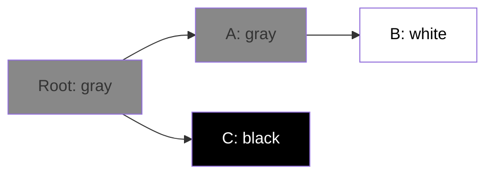

# Вопросы на собеседовании: `Go Memory и GC`

Go GC — concurrent mark-and-sweep с **низкой латентностью** (под 1ms паузы). Понимание escape analysis (что попадает в stack, что в heap), tuning через `GOGC`/`GOMEMLIMIT` и профилирование памяти — частые темы для middle/senior Go-разработчиков.

## Полезные ссылки

### Официальная документация и авторитетные источники

- [A Guide to the Go Garbage Collector](https://go.dev/doc/gc-guide)
- [Go Memory Model](https://go.dev/ref/mem)
- [Diagnostics in Go](https://go.dev/doc/diagnostics)
- [Go Garbage Collection — Ardan Labs](https://www.ardanlabs.com/blog/2018/12/garbage-collection-in-go-part1-semantics.html)
- [Escape Analysis — Bill Kennedy](https://www.ardanlabs.com/blog/2017/05/language-mechanics-on-escape-analysis.html)

## Содержание

- [Полезные ссылки](#полезные-ссылки)
- [See also](#see-also)

**Stack vs Heap**
- [Q1. (!) Что такое stack и heap в Go?](#q1--что-такое-stack-и-heap-в-go)
- [Q2. (!) Что такое escape analysis?](#q2--что-такое-escape-analysis)
- [Q3. (!) Когда переменная переходит в heap?](#q3--когда-переменная-переходит-в-heap)
- [Q4. Как посмотреть escape analysis?](#q4-как-посмотреть-escape-analysis)
- [Q5. Стек goroutine — как растёт?](#q5-стек-goroutine--как-растёт)

**Garbage Collector**
- [Q6. (!) Какой GC в Go?](#q6--какой-gc-в-go)
- [Q7. (!) Как работает tri-color marking?](#q7--как-работает-tri-color-marking)
- [Q8. (!) Что такое write barrier?](#q8--что-такое-write-barrier)
- [Q9. STW (Stop the World) фазы — какие?](#q9-stw-stop-the-world-фазы--какие)
- [Q10. (!) Сколько длятся GC паузы?](#q10--сколько-длятся-gc-паузы)

**Tuning**
- [Q11. (!) Что такое GOGC?](#q11--что-такое-gogc)
- [Q12. (!) GOMEMLIMIT (Go 1.19+)?](#q12--gomemlimit-go-119)
- [Q13. SetGCPercent vs SetMemoryLimit?](#q13-setgcpercent-vs-setmemorylimit)
- [Q14. runtime.GC() — когда использовать?](#q14-runtimegc--когда-использовать)

**Профилирование**
- [Q15. (!) pprof memory profile?](#q15--pprof-memory-profile)
- [Q16. Как найти memory leaks?](#q16-как-найти-memory-leaks)
- [Q17. allocs/op в benchmarks?](#q17-allocsop-в-benchmarks)

**Подводные камни**
- [Q18. (!) Slice memory leak?](#q18--slice-memory-leak)
- [Q19. (!) Map memory release?](#q19--map-memory-release)
- [Q20. Goroutine leak влияет на память?](#q20-goroutine-leak-влияет-на-память)
- [Q21. Что такое finalizer и зачем?](#q21-что-такое-finalizer-и-зачем)

**Сравнения**
- [Q22. (!) Go GC vs JVM (G1, ZGC)?](#q22--go-gc-vs-jvm-g1-zgc)
- [Q23. Почему Go использует меньше памяти, чем Java?](#q23-почему-go-использует-меньше-памяти-чем-java)

**Performance**
- [Q24. (!) sync.Pool — снижение GC pressure?](#q24--syncpool--снижение-gc-pressure)
- [Q25. Pre-allocation slices/maps?](#q25-pre-allocation-slicesmaps)
- [Q26. (!) Inlining — что это?](#q26--inlining--что-это)
- [Q27. Когда GC становится bottleneck?](#q27-когда-gc-становится-bottleneck)

## Q1. (!) Что такое stack и heap в Go?

**Stack** — область памяти, где хранятся локальные переменные функций. Каждая goroutine имеет свой стек.
- Растёт LIFO (push при вызове функции, pop при return)
- Очень быстрый allocation/deallocation (просто move stack pointer)
- Не нужна GC

**Heap** — область памяти, где живут объекты, переживающие функцию (или слишком большие).
- Allocation медленнее (нужно найти свободное место)
- Требует GC для освобождения
- Можно делиться между goroutines

В Go **компилятор сам решает** через **escape analysis**, где разместить переменную.

## Q2. (!) Что такое escape analysis?

**Escape analysis** — анализ компилятором, "сбегает" ли переменная из своей функции. Если да — heap, иначе — stack.

```go
// Stack — переменная не уходит из функции
func sumStack() int {
    x := 5
    return x + 10
}

// Heap — указатель возвращается наружу
func newUser() *User {
    u := User{Name: "Alice"} // ESCAPES to heap
    return &u
}
```

Цель — **минимизировать heap allocations** для снижения GC pressure.

## Q3. (!) Когда переменная переходит в heap?

1. **Возвращается указатель** — `return &x`
2. **Захватывается closure** — переменная переживает функцию
3. **Передаётся в interface** — `interface{}` неизвестного размера
4. **Слишком большая** для стека (обычно > 64KB)
5. **Используется через reflection**
6. **Goroutine** — переменные goroutine обычно в heap

```go
// 1. Указатель возвращается
func a() *int {
    x := 5
    return &x // escape
}

// 2. Closure
func b() func() int {
    x := 5
    return func() int { return x } // x escapes
}

// 3. Interface
func c() {
    x := 5
    fmt.Println(x) // x → interface{} → escape
}

// 4. Большая структура
func d() {
    var arr [100000]int // вероятно escape
    _ = arr
}
```

## Q4. Как посмотреть escape analysis?

```bash
go build -gcflags="-m" main.go
```

Output:
```
./main.go:5:10: &x escapes to heap
./main.go:4:2: moved to heap: x
./main.go:11:13: x escapes to heap (passed to ...interface{})
```

Двойной `-m` для более подробного:

```bash
go build -gcflags="-m -m" main.go
```

`go build -gcflags="-m=2"` показывает причины escape.

## Q5. Стек goroutine — как растёт?

Goroutine стартует с **2 KB stack**. Когда стек заполняется:

1. Allocates новый стек **в 2 раза больше**
2. Копирует все frames в новый
3. Старый освобождается

```
Goroutine stack growth:
2 KB → 4 KB → 8 KB → ... → 1 GB (max default)
```

В отличие от OS thread (фиксированный stack ~1MB), goroutine **экономит память** для коротких задач, но может расти для глубоких рекурсий.

## Q6. (!) Какой GC в Go?

**Concurrent mark-and-sweep** GC с tri-color marking.

**Особенности:**
- Concurrent — работает **параллельно** с приложением (минимум pause time)
- **Non-generational** (в отличие от JVM, где есть Young/Old)
- **Non-compacting** (не двигает объекты — нет фрагментации защиты)
- **Tri-color** — алгоритм маркировки

**Цель:** **низкая latency** (< 1ms pause), даже ценой большего CPU usage.

## Q7. (!) Как работает tri-color marking?

Каждый объект имеет один из трёх цветов:

- **Белый** — кандидат на удаление
- **Серый** — обнаружен, но дочерние ссылки ещё не пройдены
- **Чёрный** — обработан, не будет удалён

```
1. Все объекты — белые
2. Roots (stack, globals) → серые
3. Берём серый, его reachable объекты → серые, сам → чёрный
4. Повторяем 3 пока серых нет
5. Все белые → удалить
```



После марк-фазы все недостижимые (белые) — освобождаются.

## Q8. (!) Что такое write barrier?

**Write barrier** — код, выполняемый при записи указателя. Нужен для **корректности** concurrent GC.

**Проблема:** мутатор (приложение) изменяет ссылки **во время** маркировки.

```
1. GC видит черный B и серый A. A → B (ссылка нет).
2. Мутатор: A.next = nil, C.next = B (новая ссылка C → B).
3. GC проходит C → B (но B уже черный, не пометит)
4. C.next = B сохранился, но мы можем "потерять" другие ссылки на B
```

**Решение:** при изменении указателя, write barrier помечает новый объект серым (Yuasa-style snapshot).

В Go используется **Dijkstra-style write barrier** (с Go 1.8). Стоимость — ~2-5 ns per pointer write.

## Q9. STW (Stop the World) фазы — какие?

В Go GC есть **две короткие STW** фазы:

1. **Mark Setup** (~10-100 μs) — включение write barrier
2. **Mark Termination** (~10-100 μs) — финализация маркировки

Между ними — **concurrent mark** (мутаторы работают). После — **concurrent sweep** (тоже без STW).

```
Time:   STW1   ─── concurrent mark ───  STW2  ─── concurrent sweep ───
Apps:   ⏸     ▶                        ⏸    ▶
GC:     ▶     ▶                        ▶    ▶
```

Goal: STW < 100 μs для большинства apps. Для очень больших heaps (десятки GB) может быть выше.

## Q10. (!) Сколько длятся GC паузы?

**Цели Go GC:**
- STW pause < 100 μs (микросекунд!)
- 25% CPU дедикейтид GC при пиковой нагрузке (по умолчанию)

В реальности:
- Маленькие apps: pauses **< 1 ms** (часто < 100 μs)
- Большие apps (heap 10GB+): pauses **1-10 ms**

```bash
GODEBUG=gctrace=1 ./myapp
# Логи каждого GC цикла
gc 1 @0.012s 0%: 0.018+0.83+0.058 ms clock, ...
#                ^ STW1   ^ concurrent ^ STW2
```

**Сравнение с JVM:**
- G1 GC: пauses от 100ms до 1s
- ZGC: pauses < 10ms
- Shenandoah: pauses < 10ms

Go GC обычно **лучше или равен** ZGC по latency.

## Q11. (!) Что такое GOGC?

`GOGC` — environment variable, контролирующий **частоту GC**.

```bash
GOGC=100  # default — GC при росте heap на 100%
GOGC=50   # GC чаще (50% роста) — меньше memory, больше CPU
GOGC=200  # GC реже — больше memory, меньше CPU
GOGC=off  # отключить GC (только для debug!)
```

**Формула:** GC запускается, когда heap = `(1 + GOGC/100) * live_size_after_last_gc`.

Пример: после GC live = 100 MB. С GOGC=100, следующий GC — при 200 MB.

```go
import "runtime/debug"
debug.SetGCPercent(50) // программно
```

## Q12. (!) GOMEMLIMIT (Go 1.19+)?

`GOMEMLIMIT` — soft memory limit. GC старается не превысить этот лимит.

```bash
GOMEMLIMIT=4GiB ./myapp  # стараться не превышать 4 GiB
GOMEMLIMIT=4000000000    # в байтах
GOMEMLIMIT=off            # отключить (default)
```

Полезно в **контейнерах** (Docker, K8s) — чтобы не получить OOM kill.

```go
debug.SetMemoryLimit(4 << 30) // 4 GiB
```

С `GOMEMLIMIT` — GC становится более агрессивным при приближении к лимиту.

## Q13. SetGCPercent vs SetMemoryLimit?

| Параметр | Что контролирует |
|----------|------------------|
| `GOGC` / `SetGCPercent` | Частоту GC (через рост heap) |
| `GOMEMLIMIT` / `SetMemoryLimit` | Hard ceiling на память |

**Best practice для контейнеров:**

```bash
# K8s container с limit 1GB
GOGC=100
GOMEMLIMIT=900MiB  # < container limit, чтобы избежать OOM kill
```

С `GOMEMLIMIT` Go начнёт GC чаще, если heap приближается к лимиту, но не превысит его (по возможности).

## Q14. runtime.GC() — когда использовать?

```go
import "runtime"
runtime.GC() // принудительный GC цикл (синхронный)
```

**Когда:**
- В тестах (для предсказуемости)
- Перед измерением memory profile (`pprof.WriteHeapProfile`)
- После большого освобождения, перед чувствительной к памяти операцией

**Когда НЕ:**
- В production коде "просто так" — Go GC отлично сам справляется

## Q15. (!) pprof memory profile?

```go
import _ "net/http/pprof"

go func() { http.ListenAndServe(":6060", nil) }()
```

```bash
go tool pprof http://localhost:6060/debug/pprof/heap
> top
> list <function>
> web  # graph через SVG
```

Доступны:
- **inuse_space** (default) — текущее использование
- **alloc_space** — все аллокации с начала
- **inuse_objects** — число объектов
- **alloc_objects** — общее число аллокаций

```bash
go tool pprof -alloc_objects http://localhost:6060/debug/pprof/heap
```

## Q16. Как найти memory leaks?

1. **Сделай два snapshots с интервалом:**
```bash
curl http://localhost:6060/debug/pprof/heap > heap1.pb.gz
sleep 60
curl http://localhost:6060/debug/pprof/heap > heap2.pb.gz

go tool pprof -base heap1.pb.gz heap2.pb.gz
```
Покажет **разницу** — что наросло.

2. **Goroutine leak** — отдельная тема:
```bash
curl http://localhost:6060/debug/pprof/goroutine?debug=1
```

3. **Continuous monitoring:** интегрируй pprof с Datadog/Pyroscope/Grafana.

## Q17. allocs/op в benchmarks?

```go
func BenchmarkConcat(b *testing.B) {
    b.ReportAllocs()
    for i := 0; i < b.N; i++ {
        s := "" + "a" + "b" + "c"
        _ = s
    }
}
```

```bash
go test -bench=. -benchmem
BenchmarkConcat-8   100000000   12.3 ns/op   8 B/op   1 allocs/op
```

`allocs/op` — число heap allocations на одну итерацию. **Snip 0** = весь stack, max performance.

Цель — снизить allocs/op в горячих местах.

## Q18. (!) Slice memory leak?

Slice держит ссылку на underlying array. Маленький slice от большого — не освобождает большой.

```go
func keepFirstByte() byte {
    big := make([]byte, 1_000_000)
    // ... fill big
    return big[0] // OK — копирует byte
}

func leakBig() []byte {
    big := make([]byte, 1_000_000)
    // ... fill big
    return big[:10] // LEAK — держит весь миллион
}

// Правильно
func noLeak() []byte {
    big := make([]byte, 1_000_000)
    result := make([]byte, 10)
    copy(result, big[:10])
    return result // big освобождается
}
```

Аналогично для **substrings** (с Go 1.21 строки могут разделять underlying массив).

## Q19. (!) Map memory release?

Map **не уменьшает** свой backing storage при удалении элементов:

```go
m := make(map[int]int, 1_000_000)
for i := 0; i < 1_000_000; i++ {
    m[i] = i
}
// Memory: ~30 MB

for i := 0; i < 1_000_000; i++ {
    delete(m, i)
}
// Memory всё ещё ~30 MB!

m = nil // или
m = make(map[int]int) // создать заново
runtime.GC()
// Теперь освободится
```

**Паттерн:** если map сильно сжимается — пересоздай.

## Q20. Goroutine leak влияет на память?

Да. Каждая goroutine = минимум **2 KB stack** + переменные closure.

Утечка 100K goroutines = **минимум 200 MB**.

Подробнее — в [Go Concurrency](go-concurrency-interview.md).

## Q21. Что такое finalizer и зачем?

`runtime.SetFinalizer` — функция, вызываемая GC перед уничтожением объекта.

```go
file := openSomething()
runtime.SetFinalizer(file, func(f *File) {
    f.Close() // safety net
})
```

**Use cases:**
- Cleanup внешних resources (FDs, mmap)
- Detection утечек (paniс если не закрыли)

**Подводные камни:**
- Финализаторы могут НЕ вызваться при exit
- Замедляют GC (объект надо обходить дважды)
- Лучше использовать **explicit cleanup** через `defer`

В большинстве случаев — **не используй finalizer**. Используй `defer` для cleanup.

## Q22. (!) Go GC vs JVM (G1, ZGC)?

| Критерий | Go GC | JVM G1 | JVM ZGC |
|----------|-------|--------|---------|
| Тип | Concurrent mark-sweep | Generational, regions | Concurrent, regions |
| Generations | Нет | Да (Young, Old) | Нет (concurrent) |
| Compacting | Нет | Да | Да |
| STW pauses | < 1 ms | 10-200 ms | < 10 ms |
| Heap size | До 100s GB | До 64 GB | До 16 TB |
| Cost | Простой | Сложный (regions, mixed GC) | Сложный (colored pointers) |

Go GC **проще и выгоднее** для микросервисов с heap < 10GB. JVM **гибче** для huge heaps и heavy throughput.

## Q23. Почему Go использует меньше памяти, чем Java?

1. **Нет JVM overhead** — JVM сама занимает 100-200 MB
2. **Нет JIT-компилируемого кода в памяти** — Go компилируется заранее
3. **Меньше objects** — Go allows value types (struct), без boxing
4. **Compact representation** — Go structs более компактны (нет object headers по 16 байт)
5. **Меньшие goroutine стеки** (2 KB vs 1 MB)

Типичный microservice: Java ~200-500 MB, Go ~30-100 MB.

## Q24. (!) sync.Pool — снижение GC pressure?

`sync.Pool` — переиспользование объектов, **снижение allocations**.

```go
var bufPool = sync.Pool{
    New: func() any { return new(bytes.Buffer) },
}

func handle(req string) {
    buf := bufPool.Get().(*bytes.Buffer)
    defer func() {
        buf.Reset()
        bufPool.Put(buf)
    }()
    buf.WriteString(req)
    // ... обработка
}
```

GC **может очистить пул** в любой момент (между циклами). Не используй для долгоживущих объектов.

Подробнее — в [Go Concurrency](go-concurrency-interview.md).

## Q25. Pre-allocation slices/maps?

```go
// BAD — много реаллокаций
sl := []int{}
for i := 0; i < 1000; i++ {
    sl = append(sl, i) // потенциальные реаллокации
}

// GOOD — pre-allocate
sl := make([]int, 0, 1000)
for i := 0; i < 1000; i++ {
    sl = append(sl, i) // никаких реаллокаций
}

// Maps
m := make(map[string]int, 1000) // hint — резервирует buckets
```

`make(T, length, capacity)` для slice — если знаешь capacity, **обязательно** указывай.

## Q26. (!) Inlining — что это?

Compiler может **встраивать** маленькие функции в caller — без вызова. Снижает overhead.

```go
//go:noinline  // явный запрет (для тестов/benchmarks)
func small() int { return 42 }

func caller() int {
    return small() + 1 // может быть заинлайнен в return 42 + 1
}
```

**Влияние:**
- Меньше overhead вызова
- Возможность escape analysis "увидеть" больше — некоторые объекты остаются на стеке

```bash
go build -gcflags="-m" main.go
# "can inline small"
# "inlining call to small"
```

С Go 1.20+ inliner стал агрессивнее.

## Q27. Когда GC становится bottleneck?

Признаки:
1. **GC time > 25%** в `GODEBUG=gctrace=1`
2. **Latency spikes** на p99
3. **Большие allocs/op** в hot paths

Решения:
1. **Снизить allocations** — sync.Pool, pre-allocation, value types
2. **Поднять GOGC** — реже GC (если есть memory headroom)
3. **GOMEMLIMIT** — для предсказуемости
4. **Переписать hot path** — арены памяти (в плане для Go), unsafe для очень критичного

В большинстве apps GC **не bottleneck**. Если стал — это уже high-perf scenario.

---

## See also

- [Go (базовый)](go-interview.md) — типы, pointers
- [Go Concurrency](go-concurrency-interview.md) — goroutine stacks
- [Go Standard Library](go-stdlib-interview.md) — runtime/pprof
- [Memory Management](../../performance/memory-management-interview.md) — общие концепции
- [JVM Performance Tuning](../../performance/jvm-performance-tuning-interview.md) — для сравнения с JVM GC
- [Application Profiling](../../performance/application-profiling-interview.md) — pprof и аналоги
- [Performance Testing](../../performance/performance-testing-interview.md) — Go bench
- [Микросервисы](../../architecture/microservices-interview.md) — где Go экономит память

- [Go Concurrency](go-concurrency-interview.md)
- [Go Generics](go-generics-interview.md)
- [Go](go-interview.md)
- [Go Modules](go-modules-interview.md)
- [Go Standard Library](go-stdlib-interview.md)
- [Go Testing](go-testing-interview.md)
