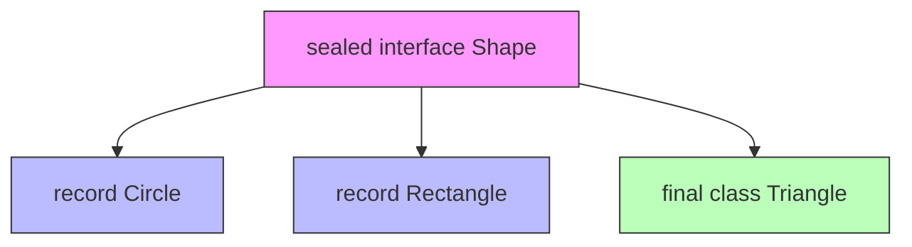
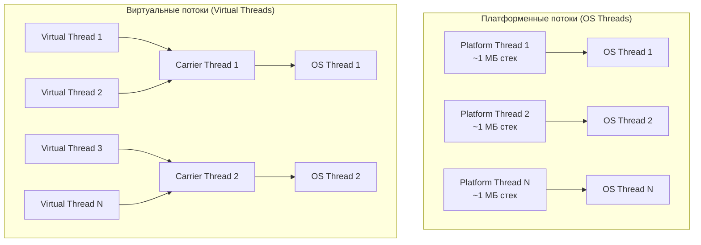
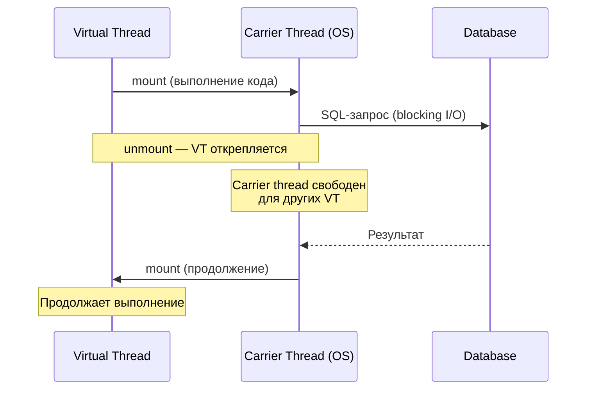
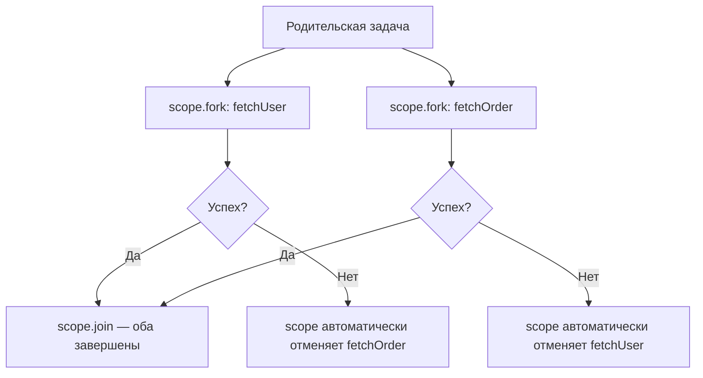
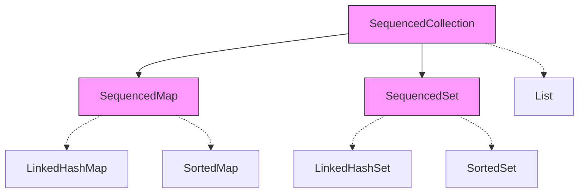

# Вопросы на собеседовании: `Java 17-21`

Комплексное руководство по вопросам собеседования на тему современных возможностей `Java 17-21` для `Senior Java Developer`. Включает детальные объяснения концепций, практические примеры кода, диаграммы и best practices.

**`Java 17`** и **`Java 21`** — две последние LTS-версии платформы, которые принесли кардинальные изменения: `records`, `sealed classes`, `pattern matching`, `virtual threads`, `structured concurrency`, `sequenced collections` и многое другое. Знание этих возможностей — обязательное требование на современных собеседованиях. Промежуточные версии (18, 19, 20) также добавили важные preview-фичи, ставшие стабильными в Java 21.

## Полезные ссылки

### Официальная документация

- [JDK 17 Release Notes](https://openjdk.org/projects/jdk/17/) — обзор всех JEP в Java 17
- [JDK 21 Release Notes](https://openjdk.org/projects/jdk/21/) — обзор всех JEP в Java 21
- [New Features in Java 17 (Baeldung)](https://www.baeldung.com/java-17-new-features) — обзор нововведений Java 17
- [New Features in Java 21 (Baeldung)](https://www.baeldung.com/java-lts-21-new-features) — обзор нововведений Java 21
- [Sealed Classes and Interfaces (Baeldung)](https://www.baeldung.com/java-sealed-classes-interfaces) — sealed-классы
- [Pattern Matching for Switch (Baeldung)](https://www.baeldung.com/java-switch-pattern-matching) — pattern matching в switch
- [Virtual Threads (Baeldung)](https://www.baeldung.com/java-virtual-thread-vs-thread) — виртуальные потоки
- [Structured Concurrency (Baeldung)](https://www.baeldung.com/java-structured-concurrency) — структурированная конкурентность
- [Sequenced Collections (Baeldung)](https://www.baeldung.com/java-21-sequenced-collections) — упорядоченные коллекции
- [Record Patterns (Baeldung)](https://www.baeldung.com/java-19-record-patterns) — паттерны записей

## Содержание

- [Полезные ссылки](#полезные-ссылки)
- [See also](#see-also)

**Records**
- [Q1. Что такое record в Java и какую проблему они решают?](#q1-что-такое-record-в-java-и-какую-проблему-они-решают)
- [Q2. Какие ограничения есть у record?](#q2-какие-ограничения-есть-у-record)
- [Q3. Можно ли кастомизировать конструктор record?](#q3-можно-ли-кастомизировать-конструктор-record)
- [Q4. Чем record отличается от обычного класса и от Lombok @Value?](#q4-чем-record-отличается-от-обычного-класса-и-от-lombok-value)

**Sealed Classes**
- [Q5. (!) Что такое sealed-классы и интерфейсы?](#q5--что-такое-sealed-классы-и-интерфейсы)
- [Q6. Какие модификаторы должны использовать подклассы sealed-класса?](#q6-какие-модификаторы-должны-использовать-подклассы-sealed-класса)
- [Q7. Как sealed-классы работают с pattern matching?](#q7-как-sealed-классы-работают-с-pattern-matching)

**Pattern Matching**
- [Q8. Что такое pattern matching для instanceof?](#q8-что-такое-pattern-matching-для-instanceof)
- [Q9. (!) Что такое pattern matching для switch?](#q9--что-такое-pattern-matching-для-switch)
- [Q10. Что такое guarded patterns (when clause)?](#q10-что-такое-guarded-patterns-when-clause)
- [Q11. (!) Что такое record patterns и деконструкция записей?](#q11--что-такое-record-patterns-и-деконструкция-записей)
- [Q12. Что такое unnamed patterns и unnamed variables?](#q12-что-такое-unnamed-patterns-и-unnamed-variables)

**Text Blocks и Switch Expressions**
- [Q13. Что такое text blocks?](#q13-что-такое-text-blocks)
- [Q14. Что такое switch expressions и чем они отличаются от switch statement?](#q14-что-такое-switch-expressions-и-чем-они-отличаются-от-switch-statement)

**Virtual Threads (Project Loom)**
- [Q15. (!) Что такое виртуальные потоки и какую проблему они решают?](#q15--что-такое-виртуальные-потоки-и-какую-проблему-они-решают)
- [Q16. Как создать и запустить виртуальный поток?](#q16-как-создать-и-запустить-виртуальный-поток)
- [Q17. В чём архитектурное отличие виртуальных потоков от платформенных?](#q17-в-чём-архитектурное-отличие-виртуальных-потоков-от-платформенных)
- [Q18. (!) Когда НЕ стоит использовать виртуальные потоки?](#q18--когда-не-стоит-использовать-виртуальные-потоки)
- [Q19. Что такое pinning виртуального потока?](#q19-что-такое-pinning-виртуального-потока)
- [Q20. Как виртуальные потоки работают с Spring Boot?](#q20-как-виртуальные-потоки-работают-с-spring-boot)

**Structured Concurrency**
- [Q21. (!) Что такое structured concurrency?](#q21--что-такое-structured-concurrency)
- [Q22. Как использовать StructuredTaskScope?](#q22-как-использовать-structuredtaskscope)
- [Q23. Какие стратегии завершения есть в StructuredTaskScope?](#q23-какие-стратегии-завершения-есть-в-structuredtaskscope)

**Scoped Values**
- [Q24. Что такое Scoped Values и чем они лучше ThreadLocal?](#q24-что-такое-scoped-values-и-чем-они-лучше-threadlocal)

**Sequenced Collections**
- [Q25. (!) Что такое Sequenced Collections?](#q25--что-такое-sequenced-collections)
- [Q26. Какие методы добавляет интерфейс SequencedCollection?](#q26-какие-методы-добавляет-интерфейс-sequencedcollection)

**String Templates**
- [Q27. Что такое String Templates?](#q27-что-такое-string-templates)

**Foreign Function & Memory API**
- [Q28. Что такое Foreign Function & Memory API?](#q28-что-такое-foreign-function--memory-api)

**Прочие улучшения**
- [Q29. Какие улучшения появились в API коллекций и утилитах?](#q29-какие-улучшения-появились-в-api-коллекций-и-утилитах)
- [Q30. Что такое сильная инкапсуляция внутренних API JDK?](#q30-что-такое-сильная-инкапсуляция-внутренних-api-jdk)
- [Q31. (!) Какова стратегия миграции с Java 8/11 на Java 17/21?](#q31--какова-стратегия-миграции-с-java-811-на-java-1721)
- [Q32. Что такое новый Random Generator API?](#q32-что-такое-новый-random-generator-api)
- [Q33. Какие улучшения получил NullPointerException?](#q33-какие-улучшения-получил-nullpointerexception)
- [Q34. Что такое Compact Number Formatting?](#q34-что-такое-compact-number-formatting)
- [Q35. (!) Какие ключевые отличия между Java 17 и Java 21?](#q35--какие-ключевые-отличия-между-java-17-и-java-21)

**Java 21: детали и новые preview-фичи**
- [Q36. (!) Virtual Threads: детали реализации, Continuation и Carrier Threads](#q36-virtual-threads-детали-реализации-continuation-и-carrier-threads)
- [Q37. (!) Scoped Values: альтернатива ThreadLocal в мире Virtual Threads](#q37-scoped-values-альтернатива-threadlocal-в-мире-virtual-threads)
- [Q38. Sequenced Collections: SequencedCollection и SequencedMap](#q38-sequenced-collections-sequencedcollection-и-sequencedmap)
- [Q39. Pattern Matching for switch: guards и exhaustiveness (Java 21)](#q39-pattern-matching-for-switch-guards-и-exhaustiveness-java-21)
- [Q40. (!) Record Patterns: деконструкция в switch и instanceof](#q40-record-patterns-деконструкция-в-switch-и-instanceof)
- [Q41. String Templates (preview): StringTemplate.STR](#q41-string-templates-preview-stringtemplatestr)
- [Q42. Unnamed Classes и Instance Main Methods (preview)](#q42-unnamed-classes-и-instance-main-methods-preview)

---

## Q1. Что такое record в Java и какую проблему они решают?

**`Record`** (JEP 395, Java 16, стабильная в Java 17) — это специальный тип класса, предназначенный для хранения неизменяемых данных. Record автоматически генерирует конструктор, `equals()`, `hashCode()`, `toString()` и методы доступа к полям.

**Проблема**, которую решают records — это boilerplate-код для data-классов (POJO/DTO). До records приходилось вручную писать или генерировать десятки строк кода.

```java
// До records — типичный DTO
public class UserDto {
    private final String name;
    private final int age;

    public UserDto(String name, int age) {
        this.name = name;
        this.age = age;
    }

    public String getName() { return name; }
    public int getAge() { return age; }

    @Override
    public boolean equals(Object o) { /* ... */ }
    @Override
    public int hashCode() { /* ... */ }
    @Override
    public String toString() { /* ... */ }
}

// С record — одна строка
public record UserDto(String name, int age) {}
```

**Что генерируется автоматически:**
- Канонический конструктор (со всеми полями)
- `private final` поля для каждого компонента
- Методы доступа (без префикса `get`): `name()`, `age()`
- `equals()` — сравнение всех компонентов
- `hashCode()` — на основе всех компонентов
- `toString()` — с именами и значениями всех компонентов

> На собеседовании важно подчеркнуть: records — это не просто "lombok без аннотаций", а **семантический контракт**: record декларирует, что класс является прозрачным носителем данных.

---


> [!mcq]
> - [ ] `record` — это сахар поверх Lombok `@Value`, добавляющий аннотации в classpath | `record` — часть спецификации языка, не зависит от Lombok и не использует annotation processing. ❌ ПОСЛЕДСТВИЕ: разработчик пишет `@Value` рядом с `record` "для совместимости", получает дублирующиеся методы и ошибку компиляции на сборке.
> - [ ] `record` заменяет любой POJO, включая JPA-сущности с mutable-полями и lifecycle | `record` неизменяем и финальный, JPA требует no-args конструктор и mutable proxy для lazy loading. ❌ ПОСЛЕДСТВИЕ: попытка пометить `record` как `@Entity` падает на старте Hibernate с `InstantiationException` либо ломает dirty checking.
> - [ ] `record` — синтаксический сахар над `class`, после компиляции получается обычный POJO с `getX()`-методами | После компиляции `record` наследует `java.lang.Record` и имеет аксессоры без префикса `get` (`x()`, не `getX()`). ❌ ПОСЛЕДСТВИЕ: Jackson по дефолту ищет `getName()`, без `JsonProperty` или новой версии модуля сериализация в JSON падает / выдаёт пустой объект.
> - [x] `record` — финальный класс-носитель неизменяемых данных, JDK сам генерирует канонический конструктор, аксессоры, `equals`/`hashCode`/`toString` | `record` декларирует прозрачный data-carrier контракт; компоненты неявно `private final`, наследоваться от `record` нельзя. ✓ ПРИМЕНЯТЬ: DTO в Spring Boot REST-контроллерах, события в Kafka, ключи кэша Caffeine. 📋 ПРАВИЛО: «`record` = data-class по спецификации, не по аннотации». 🔗 См. Q2, Q4.

## Q2. Какие ограничения есть у record?

Records имеют ряд ограничений, связанных с их семантикой как неизменяемых носителей данных:

1. **Нельзя наследоваться** — records неявно `final` и наследуют `java.lang.Record`
2. **Нельзя объявлять instance-поля** — только компоненты в заголовке
3. **Компоненты неизменяемы** — все поля `private final`
4. **Нельзя быть абстрактным** — record всегда конкретный класс
5. **Могут реализовывать интерфейсы** — это единственный способ полиморфизма

```java
// Record может реализовывать интерфейс
public sealed interface Shape permits Circle, Rectangle {}

public record Circle(double radius) implements Shape {}
public record Rectangle(double width, double height) implements Shape {}

// Record может иметь static поля и методы
public record Point(double x, double y) {
    public static final Point ORIGIN = new Point(0, 0);

    public double distanceTo(Point other) {
        return Math.sqrt(Math.pow(x - other.x, 2) + Math.pow(y - other.y, 2));
    }
}
```

Подробнее об ограничениях наследования — в [вопросах по Java OOP](java-oop-interview.md).

---


> [!mcq]
> - [ ] `record` может быть `abstract` и наследоваться другими `record` для полиморфизма | `record` всегда конкретный и неявно `final`, наследование от другого `record` запрещено. ❌ ПОСЛЕДСТВИЕ: попытка `abstract record` падает на компиляции, junior пишет код-генератор, который дублирует структуру 5 раз вместо одного интерфейса.
> - [ ] У `record` можно объявлять instance-поля прямо в теле, как в обычном классе | Все instance-состояние хранится только в компонентах заголовка; в теле допустимы только `static`-поля. ❌ ПОСЛЕДСТВИЕ: компилятор отвергает `private int counter` внутри `record`, разработчик "обходит" через `static Map<Record, Integer>` и получает memory leak на каждый созданный экземпляр.
> - [x] `record` неявно `final`, нельзя добавлять instance-поля и быть `abstract`, но допустимы `implements` интерфейсов и `static`-члены | Полиморфизм у `record` достигается реализацией интерфейсов (часто `sealed`); компоненты — единственное instance-состояние. ✓ ПРИМЕНЯТЬ: `sealed interface Shape permits Circle, Rectangle` + `record Circle(double r) implements Shape` для алгебраических типов в API. 📋 ПРАВИЛО: «`record` — final, no instance fields, only implements». 🔗 См. Q1, Q5.
> - [ ] `record` запрещает реализовывать интерфейсы — это нарушит транспарентность данных | `record` свободно реализует любые интерфейсы, в том числе `Comparable`, `Serializable`, `sealed`-интерфейсы. ❌ ПОСЛЕДСТВИЕ: команда дублирует `record` в "обёрточный класс" ради `implements Comparable`, теряет автогенерируемый `equals`/`hashCode` и ломает `TreeSet` инвариант.

## Q3. Можно ли кастомизировать конструктор record?

Да, есть два способа кастомизации конструктора:

### Компактный конструктор (Compact Constructor)

Позволяет добавить валидацию без повторения присваивания полей:

```java
public record Range(int start, int end) {
    // Компактный конструктор — без параметров в скобках
    public Range {
        if (start > end) {
            throw new IllegalArgumentException(
                "start (%d) must be <= end (%d)".formatted(start, end));
        }
        // Присваивание this.start = start и this.end = end выполняется автоматически
    }
}
```

### Канонический конструктор (Custom Canonical Constructor)

Полностью заменяет сгенерированный конструктор:

```java
public record Email(String value) {
    public Email(String value) {
        this.value = value.trim().toLowerCase();
    }
}
```

### Дополнительные конструкторы

Можно добавлять альтернативные конструкторы, но они обязаны делегировать каноническому:

```java
public record UserDto(String name, int age) {
    public UserDto(String name) {
        this(name, 0); // делегирование каноническому
    }
}
```

---


> [!mcq]
> - [ ] В compact-конструкторе `public Range { ... }` нужно вручную написать `this.start = start;` иначе поле останется `0` | Присваивание полей в compact-конструкторе делается компилятором автоматически после тела блока. ❌ ПОСЛЕДСТВИЕ: разработчик копирует блок присваиваний из обычного класса, получает `final field assigned twice` на компиляции.
> - [ ] Кастомный канонический конструктор должен иметь имя `canonical()` — это специальный метод JDK | Имя конструктора всегда совпадает с именем `record`-типа; `canonical()` — это не часть спецификации. ❌ ПОСЛЕДСТВИЕ: junior пишет `public canonical(String x)`, IDE видит обычный метод, валидация молча не вызывается, в БД попадает невалидный email.
> - [ ] Дополнительный конструктор `record`-а может полностью заменить канонический и не делегировать ему | Любой не-канонический конструктор обязан вызывать `this(...)` первой строкой — делегирование каноническому обязательно. ❌ ПОСЛЕДСТВИЕ: попытка собрать `record User(name, age) { public User(String name) { this.name = name; } }` отвергается компилятором с явной ошибкой о делегировании.
> - [x] Compact-конструктор позволяет валидацию без присваивания, кастомный канонический заменяет генерируемый, дополнительные конструкторы обязаны делегировать каноническому через `this(...)` | Это три механизма расширения, отвечающие за валидацию, нормализацию и удобные фабрики соответственно. ✓ ПРИМЕНЯТЬ: `record Email(String value) { public Email { Objects.requireNonNull(value); value = value.toLowerCase(); } }` для нормализации входных DTO в Spring `@RestController`. 📋 ПРАВИЛО: «compact — для checks, canonical — для transform, extra — для convenience». 🔗 См. Q1, Q2.

## Q4. Чем record отличается от обычного класса и от Lombok @Value?

| Критерий | Обычный класс | Lombok `@Value` | `record` |
|----------|--------------|----------------|----------|
| Boilerplate | Максимальный | Генерируется при компиляции | Минимальный |
| Наследование | Да | Нет (`final`) | Нет (`final`, от `Record`) |
| Instance-поля | Любые | Любые `final` | Только компоненты |
| Аксессоры | `getX()` | `getX()` / `x()` | `x()` (без `get`) |
| Зависимость | Нет | Lombok в classpath | Нет (часть языка) |
| Рефлексия | Обычная | Обычная | `RecordComponent` API |
| Pattern matching | Нет | Нет | Да (record patterns) |
| Serialization | Стандартная | Стандартная | Улучшенная (безопасная) |
| Семантика | Произвольная | Data carrier | Data carrier (контракт) |

> **Для интервьюера**: ключевое отличие record от Lombok — record является частью спецификации языка и работает с pattern matching и sealed classes, формируя алгебраические типы данных.

---


> [!mcq]
> - [x] `record` — часть спецификации языка с value-семантикой и поддержкой record patterns; обычный класс даёт максимум гибкости (mutable, наследование); Lombok `@Value` — внешняя зависимость без интеграции с pattern matching | Каждый инструмент решает свою задачу: `record` для DTO/value-объектов, обычный класс для поведения, `@Value` остаётся для legacy на Java 8/11. ✓ ПРИМЕНЯТЬ: миграция Lombok DTO на `record` в Spring Boot 3 + Jackson 2.15+ с поддержкой record patterns. 📋 ПРАВИЛО: «record — language, @Value — library, class — behaviour». 🔗 См. Q1, Q11.
> - [ ] `record` и Lombok `@Value` — синонимы: оба генерируют одинаковый байткод и работают с pattern matching | Только `record` интегрирован с pattern matching (`switch case Point(int x, int y)`); Lombok этого не умеет. ❌ ПОСЛЕДСТВИЕ: команда строит `switch` по `@Value`-классам, мигрирует на Java 21, обнаруживает что record patterns не работают — переписывает 40 классов под дедлайн релиза.
> - [ ] Lombok `@Value` лучше, потому что аксессоры называются `getX()` и совместимы со старыми библиотеками | `record` использует `x()` без префикса — это часть контракта; `@Value` действительно даёт `getX()`, но это уже не плюс на Java 17+. ❌ ПОСЛЕДСТВИЕ: проект остаётся на Lombok ради старого Jackson 2.9, копится техдолг, Lombok ломается на каждом minor JDK update.
> - [ ] `record` уступает обычному классу, потому что `equals`/`hashCode` на `record` слабее (только по identity) | `record` сравнивает компоненты через `Objects.equals` — это value-based equality, сильнее identity-сравнения обычного `Object`. ❌ ПОСЛЕДСТВИЕ: разработчик переопределяет `equals` "чтобы было правильно" и нарушает контракт `equals`/`hashCode`, ключи `HashMap` теряются.

## Q5. (!) Что такое sealed-классы и интерфейсы?

**`Sealed classes`** (JEP 409, Java 17) — это классы и интерфейсы, которые ограничивают, какие другие классы могут их наследовать или реализовывать. Это механизм контролируемого наследования.

```java
// Только Circle, Rectangle и Triangle могут наследовать Shape
public sealed interface Shape
    permits Circle, Rectangle, Triangle {}

public record Circle(double radius) implements Shape {}
public record Rectangle(double w, double h) implements Shape {}
public final class Triangle implements Shape {
    // ...
}
```

**Зачем нужны sealed-классы:**
1. **Моделирование закрытых доменных типов** — когда набор подтипов фиксирован и известен заранее
2. **Exhaustiveness в switch** — компилятор проверяет, что обработаны все варианты
3. **Алгебраические типы данных** — в связке с records формируют sum types



**Правила размещения:** подклассы sealed-класса должны находиться в том же модуле (для модульного проекта) или в том же пакете (для немодульного). Подробнее о модулях — в [вопросах по Java Modules](java-modules-interview.md).

---


> [!mcq]
> - [ ] `sealed` запрещает наследование вообще — это синоним `final` для интерфейсов | `sealed` разрешает наследование, но только перечисленным в `permits` типам; `final` запрещает любое наследование. ❌ ПОСЛЕДСТВИЕ: разработчик пишет `sealed class Foo` ожидая `final`, удивляется что наследник компилируется, и закрытый домен начинает протекать.
> - [x] `sealed` ограничивает наследование явным `permits`-списком, перечисленные подклассы обязаны быть `final`/`sealed`/`non-sealed` и находиться в том же модуле | Это даёт компилятору полный набор подтипов, что включает exhaustiveness в `switch` и enable алгебраические типы данных через record + sealed. ✓ ПРИМЕНЯТЬ: моделирование state-machine `sealed interface OrderState permits Created, Paid, Shipped, Cancelled` в Wolt order pipeline. 📋 ПРАВИЛО: «sealed = closed-world types для exhaustive switch». 🔗 См. Q6, Q7.
> - [ ] `sealed` — это runtime-проверка через рефлексию: класс падает с `IllegalAccessException` если наследник не в `permits` | Проверка выполняется на этапе компиляции; runtime тоже знает permits через `getPermittedSubclasses()`, но это не источник security. ❌ ПОСЛЕДСТВИЕ: junior пишет тест "проверим что `sealed` ловит чужой подкласс в runtime" и получает зелёный тест из-за compile-time блокировки, ложное чувство защиты на security review.
> - [ ] `sealed`-иерархия должна быть в том же пакете и не работает с модулями JPMS | В модульном проекте permits-подклассы должны быть в том же модуле (не пакете); в немодульном — в том же пакете. ❌ ПОСЛЕДСТВИЕ: разнесли `sealed` API по двум JPMS-модулям ради инкапсуляции, получили `cannot inherit from sealed class` и переписали структуру модулей под дедлайн.

## Q6. Какие модификаторы должны использовать подклассы sealed-класса?

Каждый подкласс sealed-класса обязан явно указать один из трёх модификаторов:

| Модификатор | Значение |
|-------------|----------|
| `final` | Запрещает дальнейшее наследование |
| `sealed` | Продолжает цепочку ограниченного наследования |
| `non-sealed` | Открывает иерархию для свободного наследования |

```java
public sealed interface Payment permits CreditCard, BankTransfer, Crypto {}

// final — нельзя наследовать дальше
public final class CreditCard implements Payment { /* ... */ }

// sealed — продолжает ограничение
public sealed class BankTransfer implements Payment
    permits DomesticTransfer, InternationalTransfer {}
public final class DomesticTransfer extends BankTransfer { /* ... */ }
public final class InternationalTransfer extends BankTransfer { /* ... */ }

// non-sealed — открывает иерархию
public non-sealed class Crypto implements Payment { /* ... */ }
// Теперь любой класс может наследовать Crypto
public class Bitcoin extends Crypto { /* ... */ }
```

> **Важно для собеседования:** records и enum-классы, реализующие sealed-интерфейс, считаются неявно `final`, поэтому явный модификатор не требуется.

---


> [!mcq]
> - [ ] Подклассы могут опустить модификатор — компилятор сам выберет `final` по умолчанию | Каждый подкласс sealed-родителя обязан явно указать один из трёх модификаторов: `final`, `sealed` или `non-sealed`. ❌ ПОСЛЕДСТВИЕ: команда не указывает модификатор, проект перестаёт собираться на Java 17, в CI ловится ошибка `sealed, non-sealed or final modifiers expected`.
> - [ ] Подкласс может быть `abstract` без других модификаторов — это закроет иерархию | `abstract` сам по себе не закрывает иерархию; нужен один из трёх — `final`, `sealed`, `non-sealed`. ❌ ПОСЛЕДСТВИЕ: разработчик пишет `abstract class Discount extends Payment`, компиляция падает с требованием явного модификатора `sealed` контракта.
> - [ ] `non-sealed` означает "псевдо-final, но открыто для рефлексии" | `non-sealed` явно открывает иерархию для свободного наследования любым классом — это полная противоположность `final`. ❌ ПОСЛЕДСТВИЕ: разработчик ставит `non-sealed` "для безопасности" на API класс, через год сторонний модуль создаёт неконтролируемые подклассы и `switch` теряет exhaustiveness.
> - [x] Подкласс sealed-родителя обязан быть `final` (закрыт), `sealed` (продолжает цепочку с своим `permits`) или `non-sealed` (открыт для свободного наследования); `record` и `enum` неявно `final` | Эти три модификатора задают политику дальнейшего расширения; компилятор требует явного выбора. ✓ ПРИМЕНЯТЬ: `sealed interface Event permits OrderEvent, PaymentEvent` + `non-sealed class PaymentEvent` для расширяемости плагинами. 📋 ПРАВИЛО: «final/sealed/non-sealed — три выхода, по умолчанию никакого». 🔗 См. Q5, Q7.

## Q7. Как sealed-классы работают с pattern matching?

Sealed-классы предоставляют компилятору информацию о полном наборе подтипов, что позволяет выполнять **exhaustiveness check** (проверку полноты) в `switch`:

```java
public sealed interface Shape permits Circle, Rectangle, Triangle {}
public record Circle(double radius) implements Shape {}
public record Rectangle(double w, double h) implements Shape {}
public record Triangle(double a, double b, double c) implements Shape {}

// Компилятор знает все подтипы — default не нужен
public double area(Shape shape) {
    return switch (shape) {
        case Circle c    -> Math.PI * c.radius() * c.radius();
        case Rectangle r -> r.w() * r.h();
        case Triangle t  -> {
            double s = (t.a() + t.b() + t.c()) / 2;
            yield Math.sqrt(s * (s - t.a()) * (s - t.b()) * (s - t.c()));
        }
    };
    // Если добавить новый подтип в Shape — код не скомпилируется,
    // пока не добавим обработку нового case
}
```

Это делает sealed-классы мощным инструментом для реализации **алгебраических типов данных (ADT)** в Java, аналогичных `enum` в Rust или `sealed trait` в Scala.

---


> [!mcq]
> - [ ] `switch` по `sealed` интерфейсу всегда требует `default`-ветки независимо от полноты | Если все permits-подклассы покрыты, компилятор не требует `default` — это и есть exhaustiveness. ❌ ПОСЛЕДСТВИЕ: команда добавляет `default -> throw new IllegalStateException()`, который маскирует пропущенный новый подкласс — баг проявляется только в продакшене после релиза.
> - [x] Компилятор анализирует `permits`-список и проверяет, что `switch` покрывает все подтипы; иначе — ошибка `the switch expression does not cover all possible input values` | Это exhaustiveness check, благодаря которому добавление нового permits-подкласса немедленно сломает компиляцию во всех `switch` без покрытия — лучший рефакторинг-net. ✓ ПРИМЕНЯТЬ: моделирование `sealed Result permits Success, Failure` в Booking.com order processing — добавление `Pending` подсветит все switch-ветки на CI. 📋 ПРАВИЛО: «sealed + switch = compiler-checked exhaustiveness». 🔗 См. Q5, Q9.
> - [ ] Pattern matching работает только с enum, sealed-классы должны проверяться через цепочку `if/else instanceof` | `sealed` интерфейсы и классы — основной use-case pattern matching for switch начиная с Java 21. ❌ ПОСЛЕДСТВИЕ: разработчик пишет 200 строк `if (x instanceof A) {} else if (x instanceof B) {}`, теряет exhaustiveness, добавление нового подкласса проходит ревью молча.
> - [ ] Exhaustiveness работает только в runtime через `MatchException`, во время компиляции просто warning | `MatchException` бросается в runtime только если иерархия изменилась после компиляции (binary incompatibility); основная защита — compile-time error. ❌ ПОСЛЕДСТВИЕ: команда отключает `-Werror`, релизит без покрытия нового подтипа, ловит `MatchException` под нагрузкой и rolling-deploy откатывают.

## Q8. Что такое pattern matching для instanceof?

**Pattern matching для `instanceof`** (JEP 394, Java 16, стабильная в Java 17) позволяет совместить проверку типа и приведение в одном выражении, устраняя типичный boilerplate.

```java
// До Java 16 — явное приведение
if (obj instanceof String) {
    String s = (String) obj;
    System.out.println(s.length());
}

// Java 16+ — pattern variable
if (obj instanceof String s) {
    System.out.println(s.length());
}

// Можно использовать в составных выражениях
if (obj instanceof String s && s.length() > 5) {
    System.out.println("Long string: " + s);
}
```

**Область видимости (scope) pattern variable:**
- Переменная доступна только в ветке, где паттерн гарантированно совпал
- При использовании `&&` — переменная доступна в правой части
- При использовании `||` — переменная НЕ доступна (т.к. не гарантировано совпадение)

```java
// Это НЕ скомпилируется — s не гарантированно определена
if (obj instanceof String s || s.isEmpty()) { // Ошибка!
    // ...
}

// А это работает — flow scoping
if (!(obj instanceof String s)) {
    return;
}
// Здесь s доступна благодаря flow scoping
System.out.println(s.toUpperCase());
```

---


> [!mcq]
> - [ ] Pattern variable доступен только внутри блока `if`, после `if/else` он автоматически выходит из scope | Pattern variable имеет flow-sensitive scope: доступен там, где компилятор уверен что `instanceof` истинно (например после `if (!(o instanceof X x)) return;`). ❌ ПОСЛЕДСТВИЕ: разработчик дублирует `instanceof` + cast в каждой ветке, теряет 30% читаемости и иногда забывает обновить cast при правке типа.
> - [x] `if (obj instanceof String s)` совмещает проверку типа и приведение, переменная `s` доступна там, где компилятор гарантирует истинность проверки (flow-scoping) | Это устраняет boilerplate `String s = (String) obj` и работает с `&&`-цепочками: `if (obj instanceof String s && !s.isEmpty())`. ✓ ПРИМЕНЯТЬ: парсинг JSON в Spring, обработка событий в Kafka consumer, замена visitor pattern в legacy AST. 📋 ПРАВИЛО: «instanceof X x — проверь и забери в одной строке». 🔗 См. Q9, Q11.
> - [ ] Pattern matching работает только с финальными классами и записями, обычные классы запрещены | Pattern matching доступен с любым типом — class, interface, record, sealed; финальность не требование. ❌ ПОСЛЕДСТВИЕ: команда вводит запрет на `instanceof X x` в code style "ради безопасности", получает легаси-стиль на новом коде и теряет преимущества JEP 394.
> - [ ] Pattern variable можно объявить с тем же именем, что и существующая переменная — она затенит внешнюю | Java запрещает shadowing pattern-переменной — компиляция упадёт с ошибкой о дубликате имени. ❌ ПОСЛЕДСТВИЕ: junior копирует `instanceof String s` в метод где `s` уже объявлена параметром, ловит compile error и тратит время на распознавание правила scoping.

## Q9. (!) Что такое pattern matching для switch?

**Pattern matching для `switch`** (JEP 441, Java 21) позволяет использовать паттерны типов в case-метках switch-выражений и switch-инструкций:

```java
public String describe(Object obj) {
    return switch (obj) {
        case Integer i    -> "Целое число: " + i;
        case Long l       -> "Длинное целое: " + l;
        case Double d     -> "Дробное число: " + d;
        case String s     -> "Строка длины " + s.length();
        case int[] arr    -> "Массив int длины " + arr.length;
        case null         -> "null";
        default           -> "Неизвестный тип: " + obj.getClass().getName();
    };
}
```

**Ключевые особенности:**
1. **`null`-обработка** — можно явно обработать `null` как case-метку (ранее switch выбрасывал NPE)
2. **Порядок case имеет значение** — более конкретные паттерны должны идти раньше общих
3. **Exhaustiveness** — компилятор проверяет полноту для sealed-типов
4. **Поддержка `when` clause** — для дополнительных условий (guarded patterns)

```java
// Порядок важен — компилятор проверяет dominance
return switch (obj) {
    case String s when s.isEmpty() -> "Пустая строка";
    case String s                  -> "Строка: " + s;
    // case String s -> ...  // Ошибка: dominated by предыдущим case
    default -> "Не строка";
};
```

---


> [!mcq]
> - [ ] `switch` с pattern matching работает только в `switch`-statement (без yield), для expression нужен старый стиль | Pattern matching одинаково работает и в `switch`-statement, и в `switch`-expression (с `yield`/`->`). ❌ ПОСЛЕДСТВИЕ: команда дублирует логику в обычный `if/else if` "потому что switch-expression нельзя", получает 200-строчный if-каскад вместо 30-строчного switch.
> - [ ] Pattern matching в `switch` запрещает `null` — для null-проверки нужна отдельная `if`-ветка перед switch | Java 21 явно разрешает `case null` (или комбинированный `case null, default`) — null-обработка стала частью switch. ❌ ПОСЛЕДСТВИЕ: NPE на проде, потому что разработчик предполагает что `switch` сам бросит NPE на `null` и защитная проверка не написана.
> - [x] `switch` принимает паттерны типов (`case Integer i`), `case null`, и при `sealed`-иерархии требует exhaustiveness — компилятор проверяет полноту веток | Это превращает `switch` в полноценный pattern-matching механизм; `case` дополнительно поддерживает guards `when` и record-deconstruction. ✓ ПРИМЕНЯТЬ: обработка вариантов sealed `Event` в order pipeline; замена visitor-паттерна в AST-парсерах (Spring Expression Language). 📋 ПРАВИЛО: «case Type t — типобезопасная диспетчеризация без visitor». 🔗 См. Q7, Q10.
> - [ ] `case` в pattern-matching switch обязательно требует `break` в конце каждой ветки | Стрелочный синтаксис `case X -> ...` исключает fall-through, `break` запрещён внутри стрелочных веток. ❌ ПОСЛЕДСТВИЕ: разработчик копирует старый switch со `break`, получает compile error `break outside switch or loop` и неделю переучивает команду на новый синтаксис.

## Q10. Что такое guarded patterns (when clause)?

**Guarded patterns** (условные паттерны) позволяют добавлять дополнительные условия к case-меткам в switch с помощью ключевого слова `when`:

```java
public String classify(Shape shape) {
    return switch (shape) {
        case Circle c when c.radius() > 100    -> "Большой круг";
        case Circle c when c.radius() > 10     -> "Средний круг";
        case Circle c                           -> "Маленький круг";
        case Rectangle r when r.w() == r.h()   -> "Квадрат";
        case Rectangle r                        -> "Прямоугольник";
        case Triangle t                         -> "Треугольник";
    };
}
```

**Важные правила:**
- `when` заменил ранее предложенный синтаксис `&&` в preview-версиях
- Проверки `when` выполняются сверху вниз — первый совпавший case выигрывает
- Более специфичные guarded-паттерны должны стоять раньше общих

> До Java 21 для подобной логики приходилось использовать вложенные `if-else` внутри switch, что приводило к менее читаемому коду.

---


> [!mcq]
> - [x] `when` — guard-условие, выполняется после успешного матчинга паттерна; ветка выбирается только если паттерн матчится И guard истинен | Это позволяет точно дискриминировать варианты внутри одного типа: `case Integer i when i < 0 -> "neg"`. ✓ ПРИМЕНЯТЬ: дифференциация состояний `sealed Order` в Wolt: `case Pending p when p.timeout() < NOW -> cancel()`. 📋 ПРАВИЛО: «when = guard, не покрывает exhaustiveness». 🔗 См. Q9, Q11.
> - [ ] `when` — это альтернатива `default` для непокрытых случаев | `when` — это guard, дополнительное boolean-условие после паттерна; `default` — это catch-all ветка. Это разные механизмы. ❌ ПОСЛЕДСТВИЕ: разработчик пишет `case String s when -> ...` без условия, получает синтаксическую ошибку и тратит час на разбор различий.
> - [ ] Guard в `when` влияет на exhaustiveness — `case Integer i when i > 0` считается покрытием всех `Integer` | Guard НЕ учитывается в exhaustiveness check; нужна минимум одна ветка без guard. ❌ ПОСЛЕДСТВИЕ: команда полагается на guarded ветки для покрытия, компилятор требует ещё одну `case Integer i ->` ветку, и в продакшене `Integer i = 0` падает в `default` с throw.
> - [ ] `when` можно использовать только с record-патернами, для type-патернов он недоступен | `when` работает с любым паттерном — type, record, deconstruction, в любых сочетаниях. ❌ ПОСЛЕДСТВИЕ: junior пишет лишний `if` внутри `case String s -> { if (s.isEmpty()) ... }` вместо `case String s when s.isEmpty() ->`, что увеличивает вложенность и снижает читаемость.

## Q11. (!) Что такое record patterns и деконструкция записей?

**Record patterns** (JEP 440, Java 21) позволяют деконструировать record в switch и instanceof, извлекая компоненты напрямую:

```java
public record Point(double x, double y) {}
public record Line(Point start, Point end) {}

// Деконструкция record в instanceof
if (obj instanceof Point(double x, double y)) {
    System.out.println("Координаты: (" + x + ", " + y + ")");
}

// Вложенная деконструкция (nested patterns)
if (obj instanceof Line(Point(var x1, var y1), Point(var x2, var y2))) {
    double length = Math.sqrt(Math.pow(x2 - x1, 2) + Math.pow(y2 - y1, 2));
    System.out.println("Длина линии: " + length);
}
```

**Record patterns в switch:**

```java
sealed interface Expr permits Num, Add, Mul {}
record Num(int value) implements Expr {}
record Add(Expr left, Expr right) implements Expr {}
record Mul(Expr left, Expr right) implements Expr {}

// Рекурсивная деконструкция
public int eval(Expr expr) {
    return switch (expr) {
        case Num(int v)            -> v;
        case Add(var left, var right) -> eval(left) + eval(right);
        case Mul(var left, var right) -> eval(left) * eval(right);
    };
}
```

> **Для собеседования:** record patterns вместе с sealed interfaces формируют полноценные алгебраические типы данных (ADT) — аналог `match` в Scala/Kotlin. Это фундаментальное изменение в подходе к моделированию доменов.

---


> [!mcq]
> - [ ] Record patterns — это новый синтаксис для создания `record` без `new` | Record patterns — это деконструкция (извлечение) компонентов в `instanceof`/`switch`, а не альтернативный конструктор. ❌ ПОСЛЕДСТВИЕ: команда ищет `record patterns` в документации по конструкторам и через час понимает, что искала не то — теряет день на онбоардинг.
> - [ ] Record patterns работают только с одним уровнем — вложенные records нельзя деконструировать | Record patterns поддерживают произвольную вложенность: `case Box(Item(String name, int qty)) -> ...`. ❌ ПОСЛЕДСТВИЕ: разработчик пишет 5 уровней вложенных `instanceof` для деконструкции `Order(Customer(Address(...)))`, теряет 50 строк читаемости и допускает ошибку cast.
> - [ ] Record patterns поддерживают переименование компонентов: `case Point(int a = x, int b = y)` | Имена в pattern фиксированы — это локальные переменные с произвольным именем, но синтаксиса `=` для переименования нет. ❌ ПОСЛЕДСТВИЕ: junior пишет несуществующий синтаксис, фиксит долго, в итоге пишет старый код с `p.x()` и теряет преимущества деконструкции.
> - [x] Record patterns деконструируют `record` в `instanceof`/`switch`, привязывая компоненты к локальным переменным: `case Point(int x, int y) -> ...`; работают рекурсивно с вложенными records | Это даёт type-safe destructuring без ручных вызовов `p.x()`, `p.y()` и поддерживает sealed-иерархии. ✓ ПРИМЕНЯТЬ: парсинг событий Kafka `sealed interface Event` + record patterns в обработчике; AST-визиторы в компиляторах (например в Spring SpEL). 📋 ПРАВИЛО: «record + pattern = type-safe destructuring». 🔗 См. Q1, Q9.

## Q12. Что такое unnamed patterns и unnamed variables?

**Unnamed patterns и unnamed variables** (JEP 456, Java 22, preview в Java 21) позволяют использовать `_` (underscore) для игнорирования неиспользуемых переменных и компонентов паттернов:

```java
// Unnamed pattern variable — игнорируем тип
if (obj instanceof Point(var x, _)) {
    // Нам нужна только x-координата
    System.out.println("x = " + x);
}

// Unnamed variable в обычном коде
try {
    int value = Integer.parseInt(input);
} catch (NumberFormatException _) {
    // Переменная исключения не нужна
    System.out.println("Невалидное число");
}

// В enhanced for
for (var _ : collection) {
    count++;
}

// В switch с record patterns
switch (shape) {
    case Circle(var radius)  -> computeCircle(radius);
    case Rectangle(var w, _) -> computeWidth(w);
    default -> 0;
}
```

Unnamed-переменные повышают читаемость кода, явно показывая, какие значения намеренно игнорируются.

---


> [!mcq]
> - [ ] `_` в Java 21 запрещён везде, как было до Java 9 | В Java 21 (preview) `_` снова разрешён — но как unnamed pattern/variable, обозначающий "не интересует". ❌ ПОСЛЕДСТВИЕ: команда блокирует `_` в code style, теряет читаемость pattern matching и пишет `case Point(int _x, int _y) -> 42` ради IDE warning о неиспользуемых переменных.
> - [x] Unnamed pattern `_` и unnamed variable `_` обозначают компонент/переменную, которая нужна структурно, но значение не используется: `case Point(int x, _) -> x` | Это добавляет ясность намерения и подавляет "unused variable" предупреждения; обязательно `--enable-preview` в Java 21. ✓ ПРИМЕНЯТЬ: try-with-resources `try (var _ = lock.acquire())` для side-effect ресурсов; обработка событий с игнорируемыми полями. 📋 ПРАВИЛО: «`_` = "знаю, не использую, не предупреждай"». 🔗 См. Q11, Q14.
> - [ ] `_` обязан использоваться вместо имени переменной всегда, когда переменная не читается | Это рекомендация, не требование; обычное имя по-прежнему допустимо. ❌ ПОСЛЕДСТВИЕ: команда пушит правило `_`-обязательно через checkstyle, ломает совместимость со старыми JDK на CI и тратит спринт на откат.
> - [ ] Unnamed variable `_` нельзя читать после объявления — обращение к ней даёт runtime `NoSuchFieldError` | Чтение `_` запрещено компилятором — это compile-time error, а не runtime. ❌ ПОСЛЕДСТВИЕ: junior пишет тест `assertEquals(_, expected)`, ловит compile error, тратит время на disambiguation вместо того чтобы дать переменной имя.

## Q13. Что такое text blocks?

**Text blocks** (JEP 378, Java 15, стабильная в Java 17) — это многострочные строковые литералы, которые используют тройные кавычки `"""`:

```java
// До text blocks
String json = "{\n" +
    "  \"name\": \"John\",\n" +
    "  \"age\": 30\n" +
    "}";

// С text blocks
String json = """
        {
          "name": "John",
          "age": 30
        }
        """;

// SQL-запрос
String sql = """
        SELECT u.name, u.email
        FROM users u
        JOIN orders o ON u.id = o.user_id
        WHERE o.status = 'ACTIVE'
        ORDER BY u.name
        """;
```

**Особенности:**
- **Incidental whitespace** — отступы относительно закрывающих `"""` удаляются автоматически
- **`\` в конце строки** — подавляет перенос строки (Java 14+)
- **`\s`** — явный пробел, не удаляется при strip
- Работают с `String.formatted()` и `String::format`

```java
String html = """
        <html>
            <body>
                <p>Hello, %s!</p>
            </body>
        </html>
        """.formatted(userName);
```

Подробнее о строках — в [вопросах по Java String](java-string-interview.md).

---


> [!mcq]
> - [ ] Text block `"""..."""` сохраняет ровно те пробелы, которые написаны в коде, без удаления отступа | Java удаляет минимальный общий отступ (incidental whitespace) у всех строк — это "интеллектуальная" обрезка по позиции закрывающих `"""`. ❌ ПОСЛЕДСТВИЕ: разработчик копирует SQL в text block с отступом 8 пробелов, отправляет в БД, СУБД-парсер на старой версии падает на лидирующих пробелах, query break после deploy.
> - [x] Text block — многострочный литерал `"""..."""`, JDK удаляет общий incidental-отступ (по позиции закрывающего `"""`), `\` в конце склеивает строки, `\s` сохраняет пробел | Это даёт читаемый JSON/SQL/HTML без склейки `+ "\n"`. ✓ ПРИМЕНЯТЬ: SQL-запросы в Spring `@Query`, JSON-фикстуры в WireMock-тестах, GraphQL-схемы. 📋 ПРАВИЛО: «`"""` — multiline без `+`, отступ по правому краю». 🔗 См. Q14, Q27.
> - [ ] Внутри text block нельзя использовать обычные escape-последовательности `\n`, `\t` | Все стандартные escape-последовательности работают; добавлены лишь два новых: `\` (line-continuation) и `\s` (sentinel space). ❌ ПОСЛЕДСТВИЕ: команда переписывает `\t` на 4 пробела вручную, генерируя инконсистентные таблицы в логах.
> - [ ] Text block — это `String.format`-выражение, переменные подставляются через `${var}` | Переменные через `${}` — это String Templates (preview), а не часть text blocks; text block только литерал. ❌ ПОСЛЕДСТВИЕ: разработчик пишет `"""Hello ${name}"""`, получает строку `Hello ${name}` буквально и баг с подстановкой обнаруживает только в логах продакшена.

## Q14. Что такое switch expressions и чем они отличаются от switch statement?

**Switch expressions** (JEP 361, Java 14, стабильная в Java 17) превращают `switch` из инструкции в выражение, возвращающее значение:

```java
// Switch statement (классический)
String result;
switch (day) {
    case MONDAY:
    case FRIDAY:
        result = "Рабочий день";
        break;
    case SATURDAY:
    case SUNDAY:
        result = "Выходной";
        break;
    default:
        result = "Середина недели";
}

// Switch expression (Java 14+)
String result = switch (day) {
    case MONDAY, FRIDAY       -> "Рабочий день";
    case SATURDAY, SUNDAY     -> "Выходной";
    default                   -> "Середина недели";
};
```

| Аспект | Switch statement | Switch expression |
|--------|-----------------|-------------------|
| Возвращает значение | Нет | Да |
| `break` | Обязателен | Не нужен (arrow syntax) |
| Fall-through | По умолчанию | Нет (arrow syntax) |
| Несколько меток | Отдельные `case` | `case A, B, C ->` |
| Многострочный блок | `break;` | `yield value;` |
| Exhaustiveness | Не проверяется | Проверяется компилятором |

```java
// yield — для многострочных блоков в switch expression
int numLetters = switch (day) {
    case MONDAY, FRIDAY, SUNDAY -> 6;
    case TUESDAY                -> 7;
    default -> {
        String s = day.toString();
        yield s.length();
    }
};
```

---


> [!mcq]
> - [x] Switch expression возвращает значение через `->` (single result) или `yield` (block), требует exhaustive покрытия для `enum`/`sealed`, не падает в fall-through | В отличие от switch-statement, expression — выражение, использует стрелочный синтаксис, ловит compile error на пропущенный вариант. ✓ ПРИМЕНЯТЬ: маппинг `OrderStatus -> String label` в Spring REST DTO; маппинг enum в локализованный текст. 📋 ПРАВИЛО: «switch-expression — выражение, exhaustive, без fall-through». 🔗 См. Q9, Q35.
> - [ ] Switch expression обязан иметь `default`, даже если все варианты `enum` покрыты | Для `enum` и `sealed`-типов компилятор выводит exhaustiveness; `default` не обязателен. ❌ ПОСЛЕДСТВИЕ: команда добавляет `default -> throw`, маскируя добавление нового enum-значения, и баг проявляется в продакшене вместо CI.
> - [ ] Switch expression нельзя использовать в качестве правой части присваивания — только в `return` | Switch expression — полноценное выражение, его можно присваивать переменной, передавать в метод, использовать в `return`. ❌ ПОСЛЕДСТВИЕ: разработчик переписывает switch на if/else "потому что присвоить нельзя", дублируя ветки и теряя exhaustiveness.
> - [ ] `yield` нужен для каждой ветки switch expression — без него код не скомпилируется | `yield` нужен только в block-форме `case X -> { ...; yield value; }`; для single-expression `case X -> value` `yield` не используется. ❌ ПОСЛЕДСТВИЕ: junior пишет `case A -> yield 1; case B -> yield 2;`, получает compile error и тратит час на чтение JLS.

## Q15. (!) Что такое виртуальные потоки и какую проблему они решают?

**Виртуальные потоки** (Virtual Threads, JEP 444, Java 21) — это легковесные потоки, управляемые JVM, а не операционной системой. Они являются ключевым результатом **Project Loom**.

**Проблема**, которую решают виртуальные потоки — **thread-per-request** модель плохо масштабируется с платформенными потоками:
- Каждый платформенный поток потребляет ~1 МБ стека
- ОС ограничивает количество потоков (обычно тысячи)
- Для 10 000 одновременных запросов нужно 10 ГБ только на стеки



**Виртуальные потоки:**
- Управляются JVM-шедулером, не ОС
- Потребляют минимум памяти (стек растёт по необходимости)
- Могут создаваться миллионами
- При блокирующей операции (I/O) — поток "открепляется" от carrier thread, освобождая его

Подробнее о потоках и конкурентности — в [вопросах по Java Concurrency](java-concurrency-interview.md).

---


> [!mcq]
> - [ ] Virtual threads ускоряют CPU-bound вычисления — каждая задача физически выполняется параллельно | Virtual threads НЕ ускоряют CPU-bound: они мапятся на тот же набор carrier-threads (по числу CPU); ускорение только для I/O-bound. ❌ ПОСЛЕДСТВИЕ: команда переводит JIT-compute сервис на virtual threads, throughput падает на 10% из-за overhead continuation-stacks без выигрыша по latency.
> - [ ] Virtual threads — это `ForkJoinPool` под капотом, идентичный `parallelStream` | Virtual threads используют отдельный `ForkJoinPool` carrier-pool и реализуют continuations + park/unpark на блокирующих операциях; `parallelStream` — synchronous fork-join. ❌ ПОСЛЕДСТВИЕ: разработчик включает `parallelStream` ожидая поведения virtual threads, перегружает default common pool, ломает Spring health-check.
> - [x] Virtual threads — лёгкие потоки, мультиплексируемые JDK на ограниченном пуле carrier-threads; на блокирующих JDK-вызовах автоматически паркуются и освобождают carrier — высокий concurrency для I/O-bound нагрузки | Это решает проблему "поток-на-запрос" модели без перехода на reactive. ✓ ПРИМЕНЯТЬ: Spring Boot 3.2 `spring.threads.virtual.enabled=true` для Tomcat-обработчиков; Netflix перевод HTTP-клиентов с CompletableFuture на virtual threads. 📋 ПРАВИЛО: «virtual threads = thread-per-request без OOM». 🔗 См. Q17, Q19.
> - [ ] Virtual threads автоматически делают любой код non-blocking, включая JNI и `synchronized` | `synchronized` всё ещё пинит carrier-thread (до Java 24); JNI блокирует carrier; только pure-Java JDK-API использует virtual unmount. ❌ ПОСЛЕДСТВИЕ: `synchronized` + I/O в Virtual Threads → carrier thread pinning, throughput drop 100×.

## Q16. Как создать и запустить виртуальный поток?

Есть несколько способов создания виртуальных потоков:

```java
// 1. Thread.startVirtualThread() — запуск сразу
Thread vThread = Thread.startVirtualThread(() -> {
    System.out.println("Hello from virtual thread!");
});

// 2. Thread.ofVirtual() — builder API
Thread vThread = Thread.ofVirtual()
    .name("my-vthread")
    .start(() -> {
        System.out.println("Named virtual thread");
    });

// 3. ExecutorService с виртуальными потоками
try (var executor = Executors.newVirtualThreadPerTaskExecutor()) {
    // Каждая задача получает свой виртуальный поток
    IntStream.range(0, 10_000).forEach(i ->
        executor.submit(() -> {
            Thread.sleep(Duration.ofSeconds(1));
            return i;
        })
    );
} // executor автоматически закрывается и ожидает завершения

// 4. Thread.ofVirtual().factory() — для ThreadFactory
ThreadFactory factory = Thread.ofVirtual()
    .name("worker-", 0)
    .factory();
Thread t = factory.newThread(() -> doWork());
t.start();
```

**Проверка типа потока:**

```java
Thread.currentThread().isVirtual(); // true для виртуального потока
```

---


> [!mcq]
> - [ ] `Thread.startVirtualThread(...)` создаёт пул из 1000 виртуальных потоков и ставит задачу в очередь | `startVirtualThread` создаёт ровно ОДИН virtual thread и сразу запускает Runnable; пула там нет. ❌ ПОСЛЕДСТВИЕ: команда вызывает `startVirtualThread` в цикле 1M раз "потому что пул", получает 1M потоков, JFR overhead растёт линейно.
> - [x] `Thread.startVirtualThread(Runnable)`, `Thread.ofVirtual().start(Runnable)`, или `Executors.newVirtualThreadPerTaskExecutor()` для Executor-API; в Spring Boot 3.2 — флаг `spring.threads.virtual.enabled=true` | Это три уровня API: ad-hoc, builder и Executor-совместимый. ✓ ПРИМЕНЯТЬ: миграция Tomcat Connector в Spring Boot 3.2 на virtual threads без изменения бизнес-кода. 📋 ПРАВИЛО: «`startVirtualThread` = ad-hoc, `newVirtualThreadPerTaskExecutor` = pool-style». 🔗 См. Q15, Q20.
> - [ ] Virtual thread можно создать только через прямую подмену `Thread.currentThread()` через JNI | Это не часть public API; стандартные способы — `Thread.startVirtualThread`, `Thread.ofVirtual()`, `Executors.newVirtualThreadPerTaskExecutor()`. ❌ ПОСЛЕДСТВИЕ: разработчик пишет JNI-обёртку "ради контроля", получает segfault на следующей JDK update.
> - [ ] Для virtual threads нужен `ScheduledExecutorService.newScheduledThreadPool(N, virtualFactory)` — других способов нет | `ScheduledExecutorService` НЕ поддерживает virtual threads напрямую (это известное ограничение JDK 21); для async-планирования нужен `Executors.newScheduledThreadPool` (platform) + virtual threads через VirtualThreadPerTaskExecutor для тасков. ❌ ПОСЛЕДСТВИЕ: команда строит scheduled-pipeline на virtual threads, ловит warning "ScheduledExecutorService not supported with virtual threads" и переписывает планировщик.

## Q17. В чём архитектурное отличие виртуальных потоков от платформенных?

| Характеристика | Платформенный поток | Виртуальный поток |
|---------------|---------------------|-------------------|
| Управление | OS scheduler | JVM scheduler (ForkJoinPool) |
| Память (стек) | ~1 МБ фиксированный | Несколько КБ, растёт динамически |
| Количество | Тысячи | Миллионы |
| Создание | Дорогое (~1 мс) | Дешёвое (~1 мкс) |
| Блокирующий I/O | Блокирует OS thread | Открепляется от carrier thread |
| `ThreadLocal` | Нормально | Работает, но дорого (миллионы копий) |
| Пулинг | Обязателен | Не нужен (создавайте новые) |
| Приоритет | Поддерживается | Игнорируется |
| Daemon | Настраивается | Всегда daemon |



> **Ключевой принцип:** не пулируйте виртуальные потоки. Они настолько дешёвые, что правильный подход — создавать новый поток для каждой задачи. Антипаттерн: `Executors.newFixedThreadPool()` с виртуальными потоками.

---


> [!mcq]
> - [x] Platform thread — обёртка над OS thread (1:1, дорогой, ~1MB стек, ограничен ulimit), virtual thread — лёгкий JDK-управляемый продолжатель (continuation), исполняется на пуле carrier-threads (M:N) и паркуется на блокирующих JDK-вызовах | Это позволяет создавать миллионы virtual threads без затрат памяти и file descriptors. ✓ ПРИМЕНЯТЬ: HTTP-сервер на 1M concurrent соединений (Helidon/Vert.x на Loom без reactive); Discord переход с Erlang на Java 21 для message gateway. 📋 ПРАВИЛО: «platform = 1:1 OS, virtual = M:N JDK». 🔗 См. Q15, Q19.
> - [ ] Virtual thread — это просто platform thread с маленьким стеком 4KB | Stack у virtual thread динамический и хранится в heap как continuation; это не "platform thread с уменьшенным стеком". ❌ ПОСЛЕДСТВИЕ: разработчик настраивает `-Xss512k` "для virtual threads", ломает platform threads в Tomcat и получает StackOverflow на каждом GC-callback.
> - [ ] Virtual thread всегда быстрее platform thread, поэтому надо мигрировать всё подряд | Для CPU-bound кода virtual thread overhead замедляет; для I/O-bound выигрывает за счёт высокого concurrency. ❌ ПОСЛЕДСТВИЕ: команда мигрирует JIT-вычислительный сервис на virtual threads, получает p99 +20% и rolling rollback через 2 часа.
> - [ ] Platform thread — это абстракция Loom, virtual thread — это реальный OS thread | Ровно наоборот: platform thread — обёртка над OS thread (1:1 mapping), virtual thread — JDK-managed continuation, мультиплексируемая M:N на carrier-threads. ❌ ПОСЛЕДСТВИЕ: junior строит ментальную модель неправильно, не понимает почему `synchronized` пинит carrier и пишет код с deadlock.

## Q18. (!) Когда НЕ стоит использовать виртуальные потоки?

Виртуальные потоки не являются универсальной заменой платформенных. Они **не подходят** для:

1. **CPU-bound задачи** — виртуальные потоки не дают преимуществ при вычислительных задачах, т.к. carrier thread всё равно занят
2. **Synchronized блоки с I/O внутри** — вызывает pinning (поток "прикрепляется" к carrier thread)
3. **Работа с ThreadLocal большими объектами** — при миллионах потоков это приведёт к OOM
4. **Задачи, требующие приоритетов** — виртуальные потоки не поддерживают приоритеты

```java
// ПЛОХО — CPU-bound, нет выигрыша от виртуальных потоков
try (var executor = Executors.newVirtualThreadPerTaskExecutor()) {
    executor.submit(() -> computeFibonacci(1_000_000)); // CPU-bound
}

// ПЛОХО — synchronized + blocking I/O = pinning
synchronized (lock) {
    connection.read(); // Виртуальный поток прикрепляется к carrier
}

// ХОРОШО — используйте ReentrantLock вместо synchronized
private final ReentrantLock lock = new ReentrantLock();
lock.lock();
try {
    connection.read(); // Виртуальный поток может открепиться
} finally {
    lock.unlock();
}
```

> **На собеседовании:** виртуальные потоки идеальны для I/O-bound задач с thread-per-request моделью (веб-серверы, микросервисы). Для CPU-bound задач используйте платформенные потоки или `ForkJoinPool`.

---


> [!mcq]
> - [ ] Virtual threads подходят для всех задач без исключений; legacy thread-pool можно удалить | Для CPU-bound (compute, JIT, ML inference), для нагрузки с большим `ThreadLocal` state, и для кода с `synchronized` virtual threads дают регрессию. ❌ ПОСЛЕДСТВИЕ: команда удаляет `ForkJoinPool` для compute, throughput на batch-обработке падает 30%, на проде latency p99 растёт с 50ms до 5s.
> - [ ] Virtual threads нельзя использовать с Spring Boot — фреймворк завязан на platform threads | Spring Boot 3.2+ официально поддерживает virtual threads через `spring.threads.virtual.enabled=true`. ❌ ПОСЛЕДСТВИЕ: команда отказывается от virtual threads "потому что Spring", упускает возможность убрать reactive WebFlux и упростить код.
> - [x] Virtual threads НЕ подходят: для CPU-bound (нет выигрыша, есть overhead), при тяжёлых `ThreadLocal` (storage растёт линейно с числом threads), при `synchronized` + I/O (carrier pinning), при долгих native-вызовах JNI/file ops до Java 24 | Это известные anti-pattern сценарии — для них остаются platform thread pools. ✓ ПРИМЕНЯТЬ: ML-inference сервис на `ForkJoinPool` (CPU-bound), HTTP-handlers на virtual threads (I/O). 📋 ПРАВИЛО: «virtual для I/O, platform для CPU и legacy». 🔗 См. Q15, Q19.
> - [ ] Virtual threads запрещены при использовании JDBC, потому что connection pool не работает с ними | Hikari и BoneCP полностью совместимы с virtual threads; pool блокировки используют корректные `LockSupport.park`, не пинят carrier. ❌ ПОСЛЕДСТВИЕ: команда вводит "JDBC только на platform threads" в архитектурный гайд, теряет основной use-case Loom — масштабирование REST-сервиса с БД.

## Q19. Что такое pinning виртуального потока?

**Pinning** — ситуация, когда виртуальный поток не может "открепиться" от carrier thread при блокирующей операции. Это нивелирует преимущества виртуальных потоков, т.к. carrier thread оказывается заблокирован.

**Причины pinning:**
1. **`synchronized` блок или метод** с блокирующей операцией внутри
2. **Native-метод или `foreign function`** в процессе выполнения

```java
// Вызывает pinning
synchronized (this) {
    Thread.sleep(1000); // Carrier thread заблокирован!
}

// Решение — использовать ReentrantLock
private final ReentrantLock lock = new ReentrantLock();

lock.lock();
try {
    Thread.sleep(1000); // Carrier thread освобождается
} finally {
    lock.unlock();
}
```

**Диагностика pinning:**

```bash
# JVM-флаг для обнаружения pinning
-Djdk.tracePinnedThreads=full   # полный стектрейс
-Djdk.tracePinnedThreads=short  # краткий вывод
```

> **Важно:** в Java 24 (Project Loom) планируется устранение pinning для `synchronized` блоков, но до этого времени рекомендуется использовать `java.util.concurrent.locks`.

---


> [!mcq]
> - [ ] Pinning — это маркетинговое название для cooperative-scheduling в Loom; работает прозрачно без проблем | Pinning — это известное ограничение, при котором virtual thread не может отлепиться от carrier и блокирует его OS-уровневой блокировкой. ❌ ПОСЛЕДСТВИЕ: команда не настраивает `-Djdk.tracePinnedThreads=full`, не видит pinning в production, throughput падает в 100× и причину ищут неделю.
> - [x] Pinning — это ситуация, когда virtual thread не может выйти из carrier (через `synchronized`-блок или JNI-кадр на стеке), блокировка carrier'а превращает M:N в 1:1 и резко режет throughput; диагностика — `-Djdk.tracePinnedThreads=full` | До Java 24 `synchronized` всегда пинит; решение — заменить на `ReentrantLock`. ✓ ПРИМЕНЯТЬ: миграция legacy `synchronized` обёрток в Spring сервисах на `ReentrantLock` перед включением virtual threads. 📋 ПРАВИЛО: «`synchronized` + I/O в virtual = pinning, замени на ReentrantLock». 🔗 См. Q15, Q18.
> - [ ] Pinning происходит только если использовать `wait`/`notify` — обычные блокировки `ReentrantLock` всегда пинят | `ReentrantLock` корректно паркует virtual thread без pinning; пинят `synchronized`-блоки и JNI-кадры. ❌ ПОСЛЕДСТВИЕ: разработчик заменяет `ReentrantLock` обратно на `synchronized` "ради простоты", получает pinning и regression на нагрузке.
> - [ ] Pinning исправляется флагом `-XX:+UseVirtualThreadFix=true` | Такого флага не существует; решение — рефакторинг `synchronized` или ожидание Java 24 (JEP 491). ❌ ПОСЛЕДСТВИЕ: команда добавляет несуществующий флаг в production java args, JVM игнорирует, проблема pinning остаётся незамеченной до перегрузки прода.

## Q20. Как виртуальные потоки работают с Spring Boot?

`Spring Boot 3.2+` поддерживает виртуальные потоки "из коробки" с минимальной конфигурацией:

```yaml
# application.yml — одна строка для включения
spring:
  threads:
    virtual:
      enabled: true
```

Это автоматически переключает:
- **Tomcat** — обработка HTTP-запросов на виртуальных потоках
- **`@Async`** — исполнение на виртуальных потоках
- **Spring MVC** — каждый запрос получает виртуальный поток

```java
// Ручная конфигурация (если нужен кастомный executor)
@Configuration
public class VirtualThreadConfig {

    @Bean
    public TomcatProtocolHandlerCustomizer<?> protocolHandlerCustomizer() {
        return handler -> handler.setExecutor(
            Executors.newVirtualThreadPerTaskExecutor()
        );
    }

    @Bean
    public AsyncTaskExecutor applicationTaskExecutor() {
        return new TaskExecutorAdapter(
            Executors.newVirtualThreadPerTaskExecutor()
        );
    }
}
```

> **Практический совет:** при включении виртуальных потоков в Spring Boot убедитесь, что драйверы БД и HTTP-клиенты не используют `synchronized` с I/O — иначе pinning сведёт на нет все преимущества.

---


> [!mcq]
> - [ ] Spring Boot 3.2 включает virtual threads автоматически — флаг не нужен | Включение явное: `spring.threads.virtual.enabled=true` (или программно `setVirtualThreads(true)` для конкретного executor). ❌ ПОСЛЕДСТВИЕ: команда полагается на "автомат", в проде Tomcat работает на старом thread pool, expected throughput не достигается.
> - [ ] Включение `spring.threads.virtual.enabled=true` автоматически переписывает `@Async` методы на virtual threads | `@Async` использует свой `TaskExecutor`; для virtual threads нужно явно сконфигурировать `AsyncTaskExecutor` с `VirtualThreadTaskExecutor`. ❌ ПОСЛЕДСТВИЕ: разработчик включает флаг ожидая что `@Async` ускорится, наблюдает то же самое поведение и теряет день на отладку.
> - [x] `spring.threads.virtual.enabled=true` (Spring Boot 3.2+) включает virtual threads для встроенного Tomcat/Jetty (HTTP-обработчики), `@Scheduled`, `@Async`-executor по умолчанию; для Kafka/RabbitMQ-listenerов — отдельная конфигурация executor'ов | Это самый низкорисковый путь: thread-per-request модель сохраняется, требуется только тестирование под нагрузкой. ✓ ПРИМЕНЯТЬ: Detsky Mir BFF на Spring Boot 3.2 с virtual threads для синхронных REST-вызовов в legacy-сервисы. 📋 ПРАВИЛО: «`spring.threads.virtual.enabled=true` — single-flag миграция HTTP». 🔗 См. Q15, Q17.
> - [ ] Spring Boot 3.0 уже поддерживает virtual threads — обновление до 3.2 не требуется | Нативная поддержка флагом — только с Spring Boot 3.2; в 3.0/3.1 нужен ручной `TomcatProtocolHandlerCustomizer`. ❌ ПОСЛЕДСТВИЕ: команда ставит `spring.threads.virtual.enabled=true` в Boot 3.0, флаг игнорируется, время на дебаг проблемы — час.

## Q21. (!) Что такое structured concurrency?

**Structured concurrency** (JEP 462, preview в Java 21-23) — это подход к многопоточному программированию, при котором время жизни конкурентных подзадач ограничено scope родительской задачи. Если родительская задача завершается — все дочерние подзадачи автоматически отменяются.

**Проблема** неструктурированной конкурентности:

```java
// Неструктурированная конкурентность — опасно
ExecutorService executor = Executors.newFixedThreadPool(2);
Future<User> userFuture = executor.submit(() -> fetchUser(id));
Future<Order> orderFuture = executor.submit(() -> fetchOrder(id));

// Если fetchOrder бросает исключение — fetchUser продолжает работать
// Если родительский поток прерван — подзадачи "утекают"
User user = userFuture.get();
Order order = orderFuture.get(); // Если тут исключение, userFuture уже завершился
```

**Structured concurrency — безопасный подход:**

```java
// Structured concurrency — подзадачи привязаны к scope
try (var scope = new StructuredTaskScope.ShutdownOnFailure()) {
    Subtask<User> userTask = scope.fork(() -> fetchUser(id));
    Subtask<Order> orderTask = scope.fork(() -> fetchOrder(id));

    scope.join();            // Ждём завершения всех подзадач
    scope.throwIfFailed();   // Пробрасываем исключение, если была ошибка

    // Обе задачи успешно завершились
    return new UserOrder(userTask.get(), orderTask.get());
} // scope закрывается — все незавершённые задачи отменяются
```



---


> [!mcq]
> - [x] Structured concurrency (JEP 453, preview в Java 21) — модель, в которой группа параллельных задач рассматривается как единое целое: parent дожидается всех детей, отмена parent отменяет всех детей, исключение в одном ребёнке отменяет других; реализация — `StructuredTaskScope` | Это устраняет проблему orphan-потоков и сложного error-propagation в `CompletableFuture`-чейнах. ✓ ПРИМЕНЯТЬ: параллельные fan-out вызовы 5 микросервисов с автоматической отменой остальных при первой ошибке (booking flow в Booking.com, search aggregation в Yandex). 📋 ПРАВИЛО: «SC = parent owns lifecycle всех детей». 🔗 См. Q22, Q23.
> - [ ] Structured concurrency — это новое имя для `CompletableFuture.allOf()` без новых API | SC вводит новый класс `StructuredTaskScope` с явным lifecycle и propagation отмен; это не обёртка над `CompletableFuture`. ❌ ПОСЛЕДСТВИЕ: команда ищет SC в `java.util.concurrent.CompletableFuture`, не находит и считает фичу "ещё не релизной".
> - [ ] SC отказался от virtual threads и работает только с platform threads | SC построен поверх virtual threads — каждый fork создаёт virtual thread; именно дешёвые virtual threads делают SC практичным. ❌ ПОСЛЕДСТВИЕ: разработчик отключает virtual threads "ради SC", получает per-task overhead 1MB и не масштабируется.
> - [ ] SC требует ручного управления через `synchronized` блоки для безопасности | SC имеет встроенную синхронизацию через `join()` и `throwIfFailed()`; ручной `synchronized` нарушает контракт scope. ❌ ПОСЛЕДСТВИЕ: junior оборачивает `scope.fork(...)` в `synchronized(this)`, получает deadlock и потерю отмен в production.

## Q22. Как использовать StructuredTaskScope?

`StructuredTaskScope` — основной API для structured concurrency:

```java
// Пример: параллельный запрос к нескольким сервисам
public record ProductPage(Product product, List<Review> reviews, Price price) {}

public ProductPage loadProductPage(String productId) throws Exception {
    try (var scope = new StructuredTaskScope.ShutdownOnFailure()) {
        Subtask<Product> productTask = scope.fork(() ->
            productService.getProduct(productId));
        Subtask<List<Review>> reviewsTask = scope.fork(() ->
            reviewService.getReviews(productId));
        Subtask<Price> priceTask = scope.fork(() ->
            pricingService.getPrice(productId));

        scope.join();
        scope.throwIfFailed();

        return new ProductPage(
            productTask.get(),
            reviewsTask.get(),
            priceTask.get()
        );
    }
}
```

**Ключевые правила:**
1. `fork()` — создаёт подзадачу в виртуальном потоке
2. `join()` — ожидает завершения всех подзадач
3. `throwIfFailed()` — пробрасывает первое исключение
4. Scope реализует `AutoCloseable` — обязательно используйте try-with-resources
5. Подзадачи нельзя `get()` до вызова `join()`

---


> [!mcq]
> - [ ] `StructuredTaskScope` управляется через `start()`/`stop()` — `try-with-resources` не нужен | `StructuredTaskScope` реализует `AutoCloseable`, должен использоваться в `try-with-resources` чтобы scope закрылся и дети были отменены. ❌ ПОСЛЕДСТВИЕ: разработчик создаёт scope без `try-with-resources`, при exception в parent дети остаются orphan и потоки утекают.
> - [ ] `scope.fork(Callable)` запускает задачу синхронно и возвращает результат сразу | `fork` возвращает `Subtask<T>` — handle на async-задачу; результат доступен только после `join()`. ❌ ПОСЛЕДСТВИЕ: разработчик ожидает синхронный результат, использует `subtask.get()` до `join()`, ловит `IllegalStateException` и тратит день на отладку.
> - [x] Создаётся в `try-with-resources`: `try (var scope = new StructuredTaskScope.ShutdownOnFailure()) { var s1 = scope.fork(call1); var s2 = scope.fork(call2); scope.join(); scope.throwIfFailed(); ... }`; `fork` возвращает `Subtask<T>`, `join` ждёт всех, `throwIfFailed` пробрасывает первое исключение | Это даёт чёткий жизненный цикл и автоматическую отмену siblings при ошибке. ✓ ПРИМЕНЯТЬ: parallel calls на user-service + cart-service + recommendations-service в Spring `@RestController`. 📋 ПРАВИЛО: «fork → join → throwIfFailed → use results». 🔗 См. Q21, Q23.
> - [ ] `scope.join()` нужно вызывать только если хотя бы одна задача упала; для успешных можно сразу читать результаты | `join()` обязателен всегда — это barrier для корректного завершения всех subtask и обновления их state. ❌ ПОСЛЕДСТВИЕ: команда пропускает `join()`, читает `subtask.get()`, на половине запусков получает `IllegalStateException: Owner did not join` и race condition.

## Q23. Какие стратегии завершения есть в StructuredTaskScope?

Java предоставляет две встроенные стратегии и возможность создания кастомных:

### ShutdownOnFailure

Отменяет все подзадачи при первой ошибке:

```java
try (var scope = new StructuredTaskScope.ShutdownOnFailure()) {
    var task1 = scope.fork(() -> callServiceA());
    var task2 = scope.fork(() -> callServiceB());

    scope.join();
    scope.throwIfFailed(); // Бросает исключение первой упавшей задачи

    return combine(task1.get(), task2.get());
}
```

### ShutdownOnSuccess

Отменяет все подзадачи при первом успехе (полезно для "гонки"):

```java
try (var scope = new StructuredTaskScope.ShutdownOnSuccess<String>()) {
    scope.fork(() -> fetchFromPrimaryDC());
    scope.fork(() -> fetchFromSecondaryDC());
    scope.fork(() -> fetchFromCache());

    scope.join();
    return scope.result(); // Результат первой успешной задачи
}
```

| Стратегия | Поведение | Use case |
|-----------|----------|----------|
| `ShutdownOnFailure` | Отменяет всё при первой ошибке | Все задачи обязательны |
| `ShutdownOnSuccess` | Отменяет всё при первом успехе | "Кто быстрее" (racing) |

---


> [!mcq]
> - [ ] Стратегии — это enum-параметр `StructuredTaskScope.Policy.FAIL_FAST/SUCCESS_FAST/ALL` | API использует разные классы-наследники, не enum: `ShutdownOnFailure`, `ShutdownOnSuccess`, кастомные через extension. ❌ ПОСЛЕДСТВИЕ: разработчик ищет несуществующий enum в API, копирует пример из Stack Overflow для другого preview-вью, получает compile error.
> - [x] `ShutdownOnFailure` (отмена siblings при первой ошибке, full barrier для join) и `ShutdownOnSuccess<T>` (отмена siblings при первом успехе — race-pattern); можно расширять через `StructuredTaskScope` подкласс с собственной логикой | Это две базовые built-in стратегии fan-out паттерна. ✓ ПРИМЕНЯТЬ: `ShutdownOnFailure` для booking flow (все услуги обязаны), `ShutdownOnSuccess` для multi-region DNS lookup (первый ответ выигрывает). 📋 ПРАВИЛО: «OnFailure = all-or-nothing, OnSuccess = race». 🔗 См. Q21, Q22.
> - [ ] `ShutdownOnSuccess` ждёт пока все задачи закончатся, и возвращает первый успешный результат | `ShutdownOnSuccess` отменяет siblings СРАЗУ после первого успеха — это его суть; ожидать всех — это противоположный паттерн. ❌ ПОСЛЕДСТВИЕ: разработчик ожидает все ответы, тратит ресурсы на отменённые subtask и теряет преимущество race-pattern в latency.
> - [ ] Стратегия `ShutdownOnAll` отменяет задачи безусловно через 30 секунд | Такой стратегии нет; для timeout используется `scope.joinUntil(Instant)` или общий `scope.shutdown()` из другого потока. ❌ ПОСЛЕДСТВИЕ: команда ищет несуществующий API, реализует свой timeout-watcher через `ScheduledExecutorService`, дублирует логику и вносит race condition.

## Q24. Что такое Scoped Values и чем они лучше ThreadLocal?

**Scoped Values** (JEP 464, preview в Java 21-23) — механизм передачи данных между методами в рамках одного потока (или scope), призванный заменить `ThreadLocal` для виртуальных потоков.

**Проблемы `ThreadLocal` с виртуальными потоками:**
- Каждый поток хранит свою копию — при миллионах потоков это огромный расход памяти
- Данные мутабельны и не привязаны к scope — сложно отследить жизненный цикл
- Наследование (`InheritableThreadLocal`) копирует данные — дорого

```java
// ThreadLocal — мутабельный, без scope
private static final ThreadLocal<User> CURRENT_USER = new ThreadLocal<>();

CURRENT_USER.set(user);
try {
    doWork(); // CURRENT_USER доступен
} finally {
    CURRENT_USER.remove(); // Легко забыть!
}

// ScopedValue — иммутабельный, привязан к scope
private static final ScopedValue<User> CURRENT_USER = ScopedValue.newInstance();

ScopedValue.where(CURRENT_USER, user).run(() -> {
    doWork(); // CURRENT_USER доступен
    // Автоматически очищается при выходе из scope
});

// Чтение значения
User user = CURRENT_USER.get(); // Бросает NoSuchElementException, если не установлен
boolean bound = CURRENT_USER.isBound(); // Проверка наличия
```

| Критерий | `ThreadLocal` | `ScopedValue` |
|----------|--------------|---------------|
| Мутабельность | Мутабельный | Иммутабельный |
| Scope | Без ограничений | Привязан к `run()`/`call()` |
| Наследование | Копирование (дорого) | Sharing (дёшево) |
| Память | O(потоков) | O(scope depth) |
| Очистка | Ручная (`remove()`) | Автоматическая |

---


> [!mcq]
> - [ ] `ScopedValue` — это переименованный `ThreadLocal` с тем же API: `set/get/remove` | API кардинально другое: `ScopedValue.where(KEY, value).run(Runnable)`; нет `set`/`remove`, только immutable binding на длительность вызова. ❌ ПОСЛЕДСТВИЕ: разработчик ищет `set/remove`, не находит, перепиcывает контракт назад на `ThreadLocal`, не понимая зачем.
> - [ ] `ScopedValue` хранит данные в heap-таблице по `Thread.currentThread()` — идентично `ThreadLocal` | `ScopedValue` использует stack-based binding (по фрейму вызова), а не map по thread; это снимает проблему GC утечек и неконтролируемого размера. ❌ ПОСЛЕДСТВИЕ: команда продолжает использовать `InheritableThreadLocal` для propagation в virtual threads, ловит memory pressure из-за линейного роста storage.
> - [x] `ScopedValue` (JEP 446, preview Java 21) — immutable binding на время выполнения lambda через `where(KEY, val).run()`; в отличие от `ThreadLocal` не имеет утечек при virtual threads, не наследуется неявно, propagation в `StructuredTaskScope` явное | Это решает проблему `ThreadLocal` storage у миллиона virtual threads и обеспечивает ясную область видимости. ✓ ПРИМЕНЯТЬ: распространение `RequestId`/`TenantId` в Spring controller через virtual thread + `StructuredTaskScope` без ThreadLocal-leak. 📋 ПРАВИЛО: «ScopedValue = immutable, scoped, virtual-threads-safe». 🔗 См. Q15, Q21.
> - [ ] `ScopedValue` мутируется через `set()` внутри scope, что делает его удобнее `ThreadLocal` | `ScopedValue` immutable; внутри `where(...).run()` значение нельзя изменить. ❌ ПОСЛЕДСТВИЕ: разработчик пишет `KEY.set(newValue)`, ловит compile error на отсутствие метода и теряет час на изучение нового контракта.

## Q25. (!) Что такое Sequenced Collections?

**Sequenced Collections** (JEP 431, Java 21) — новая иерархия интерфейсов в `java.util`, предоставляющая единый API для коллекций с определённым порядком элементов:



**Проблема до Java 21:** не было единого способа получить первый/последний элемент из разных упорядоченных коллекций:

```java
// До Java 21 — разные API для одной задачи
List<String> list = ...;
list.get(0);                          // первый элемент
list.get(list.size() - 1);            // последний элемент

SortedSet<String> sortedSet = ...;
sortedSet.first();                    // первый
sortedSet.last();                     // последний

LinkedHashSet<String> linkedSet = ...;
linkedSet.iterator().next();          // первый — ужасно!
// последний — невозможно без итерации!
```

```java
// Java 21+ — единый API через SequencedCollection
SequencedCollection<String> seq = ...;
seq.getFirst();     // первый элемент
seq.getLast();      // последний элемент
seq.reversed();     // обратный вид коллекции
```

Подробнее о коллекциях — в [вопросах по Java Collections](java-collections-interview.md).

---


> [!mcq]
> - [ ] Sequenced Collections — это новые типы коллекций, заменяющие `ArrayList` и `LinkedList` | Это новые интерфейсы `SequencedCollection`, `SequencedSet`, `SequencedMap`, добавленные к существующим коллекциям; `ArrayList`/`LinkedHashSet` сами реализуют их без замены. ❌ ПОСЛЕДСТВИЕ: команда массово мигрирует `ArrayList` на новый класс "SequencedList" (которого не существует), теряет неделю.
> - [ ] Sequenced Collections доступны только начиная с Java 24 — в Java 21 это preview | Sequenced Collections (JEP 431) стабильно с Java 21, не preview. ❌ ПОСЛЕДСТВИЕ: разработчик не использует API, считая его preview, и продолжает писать `list.get(list.size() - 1)` для last element.
> - [x] Sequenced Collections (JEP 431, Java 21 stable) — три новых интерфейса (`SequencedCollection`, `SequencedSet`, `SequencedMap`), унифицирующие API доступа к first/last/reversed для упорядоченных коллекций (`List`, `Deque`, `LinkedHashSet`, `LinkedHashMap`) | До Java 21 не было общего абстрактного типа "упорядоченная коллекция" — приходилось писать разный код для `LinkedHashSet` vs `Deque`. ✓ ПРИМЕНЯТЬ: универсальный обработчик "взять последний элемент" в Spring Cache, обработка LRU-эвикций. 📋 ПРАВИЛО: «Sequenced = first/last/reversed как контракт». 🔗 См. Q26, Q29.
> - [ ] Sequenced Collections — это immutable-обёртки над `List`, аналог `List.copyOf()` | Sequenced — это интерфейсы, не immutable wrappers; mutability определяется реализацией. ❌ ПОСЛЕДСТВИЕ: разработчик использует `addFirst()` ожидая UnsupportedOperationException, вместо этого изменяет mutable list и получает баг concurrent modification.

## Q26. Какие методы добавляет интерфейс SequencedCollection?

### SequencedCollection<E>

```java
public interface SequencedCollection<E> extends Collection<E> {
    SequencedCollection<E> reversed();  // обратный вид
    void addFirst(E e);                 // добавить в начало
    void addLast(E e);                  // добавить в конец
    E getFirst();                       // получить первый
    E getLast();                        // получить последний
    E removeFirst();                    // удалить первый
    E removeLast();                     // удалить последний
}
```

### SequencedSet<E>

```java
public interface SequencedSet<E> extends Set<E>, SequencedCollection<E> {
    SequencedSet<E> reversed(); // ковариантный override
}
```

### SequencedMap<K,V>

```java
public interface SequencedMap<K,V> extends Map<K,V> {
    SequencedMap<K,V> reversed();
    Map.Entry<K,V> firstEntry();
    Map.Entry<K,V> lastEntry();
    Map.Entry<K,V> pollFirstEntry();
    Map.Entry<K,V> pollLastEntry();
    V putFirst(K key, V value);
    V putLast(K key, V value);
    SequencedSet<K> sequencedKeySet();
    SequencedCollection<V> sequencedValues();
    SequencedSet<Map.Entry<K,V>> sequencedEntrySet();
}
```

**Пример использования:**

```java
var map = new LinkedHashMap<String, Integer>();
map.put("a", 1);
map.put("b", 2);
map.put("c", 3);

map.firstEntry();     // a=1
map.lastEntry();      // c=3
map.reversed().forEach((k, v) ->
    System.out.println(k + "=" + v)); // c=3, b=2, a=1

map.putFirst("z", 0); // z=0 в начало
map.pollLastEntry();   // удалить c=3
```

---


> [!mcq]
> - [ ] reversed() создаёт полную копию LinkedHashMap в обратном порядке | ❌ ПОСЛЕДСТВИЕ: reversed() возвращает view, не копию; изменения в оригинале видны через reversed() и наоборот
> - [x] Java 21 добавила SequencedMap: LinkedHashMap.firstEntry(), lastEntry(), reversed(), putFirst(), pollLastEntry() | ✓ ПРИМЕНЯТЬ: когда нужен ordered map с O(1) доступом к первому/последнему элементу 📋 ПРАВИЛО: SequencedMap = LinkedHashMap + порядок как first-class 🔗 См. Q25
> - [ ] SequencedMap доступна с Java 8 через Collections.synchronizedSortedMap() | ❌ ПОСЛЕДСТВИЕ: SequencedCollection/SequencedMap интерфейсы добавлены в Java 21 (JEP 431); в Java 8 их нет
> - [ ] putFirst() работает только если map пуста; иначе бросает IllegalStateException | ❌ ПОСЛЕДСТВИЕ: putFirst() перемещает или вставляет элемент в начало всегда; не проверяет размер map

## Q27. Что такое String Templates?

**String Templates** (JEP 430, preview в Java 21, **удалены в Java 23**) — механизм интерполяции строк, который был доступен как preview-фича:

```java
// String Templates (preview в Java 21-22, убраны в Java 23)
String name = "World";
String greeting = STR."Hello, \{name}!";

// С выражениями
int x = 10, y = 20;
String result = STR."\{x} + \{y} = \{x + y}";

// FMT — с форматированием
String formatted = FMT."Balance: %10.2f\{balance}";

// RAW — получение StringTemplate объекта
StringTemplate template = RAW."Hello, \{name}!";
List<String> fragments = template.fragments();
List<Object> values = template.values();
```

> **Важно для собеседования:** String Templates были **удалены** из Java 23 (JEP 465) как неудачный эксперимент. Возможно, они вернутся в другом виде. На данный момент для интерполяции используйте `String.formatted()` или `"text %s".formatted(value)`.

```java
// Рекомендуемые альтернативы (Java 17+)
String greeting = "Hello, %s! Age: %d".formatted(name, age);
String json = """
        {"name": "%s", "age": %d}
        """.formatted(name, age);
```

---


> [!mcq]
> - [ ] String Templates (STR."...") стабильны с Java 21 и доступны в Java 23+ | ❌ ПОСЛЕДСТВИЕ: String Templates удалены в Java 23 (JEP 465) как неудачный эксперимент; код с STR. не компилируется в Java 23+
> - [ ] FMT и RAW template processors не существуют; только STR | ❌ ПОСЛЕДСТВИЕ: FMT (с форматированием), RAW (возвращает StringTemplate объект) — были доступны наравне с STR в Java 21-22
> - [x] String Templates (preview Java 21-22) удалены в Java 23; текущая рекомендация — "Hello, %s".formatted(name) | ✓ ПРИМЕНЯТЬ: String.formatted() для интерполяции; text blocks для многострочных шаблонов 📋 ПРАВИЛО: String Templates = исторический preview; использовать formatted() 🔗 См. Q10
> - [ ] String Templates заменяют StringBuilder и MessageFormat полностью в Java 21+ | ❌ ПОСЛЕДСТВИЕ: String Templates были experimental и убраны; StringBuilder и MessageFormat по-прежнему актуальны

## Q28. Что такое Foreign Function & Memory API?

**Foreign Function & Memory (FFM) API** (JEP 454, Java 22, preview в Java 19-21) — замена `JNI` для вызова нативных функций и работы с off-heap памятью. В Java 21 доступна как preview.

**Проблемы JNI**, которые решает FFM API:
- Требует написания C/C++ кода (header файлы, нативные реализации)
- Небезопасный — ошибки приводят к крашу JVM
- Сложный и error-prone

```java
// FFM API — вызов нативной функции strlen из libc
// (preview в Java 21, стандартный в Java 22)
import java.lang.foreign.*;
import java.lang.invoke.MethodHandle;

// Получаем линкер и lookup для стандартных библиотек
Linker linker = Linker.nativeLinker();
SymbolLookup stdlib = linker.defaultLookup();

// Находим функцию strlen
MethodHandle strlen = linker.downcallHandle(
    stdlib.find("strlen").orElseThrow(),
    FunctionDescriptor.of(ValueLayout.JAVA_LONG, ValueLayout.ADDRESS)
);

// Выделяем off-heap память и вызываем strlen
try (Arena arena = Arena.ofConfined()) {
    MemorySegment str = arena.allocateFrom("Hello, FFM!");
    long len = (long) strlen.invoke(str);
    System.out.println("Length: " + len); // 11
} // Память автоматически освобождается
```

**Ключевые компоненты FFM API:**

| Компонент | Назначение |
|-----------|-----------|
| `Arena` | Управление жизненным циклом off-heap памяти |
| `MemorySegment` | Область памяти (on-heap или off-heap) |
| `MemoryLayout` | Описание структуры данных в памяти |
| `Linker` | Связывание с нативными функциями |
| `SymbolLookup` | Поиск нативных символов |
| `FunctionDescriptor` | Описание сигнатуры нативной функции |

> **Для собеседования:** FFM API — это не просто замена JNI. Это полноценный API для работы с off-heap памятью, полезный для высокопроизводительных приложений (сетевые буферы, сериализация, работа с GPU).

---


> [!mcq]
> - [ ] FFM API — просто ещё одна обёртка над JNI без принципиальных преимуществ | ❌ ПОСЛЕДСТВИЕ: FFM API исключает необходимость C-кода и JNI glue layer; работает через MethodHandle и MemorySegment без нативных заголовков
> - [x] FFM API (Java 22 stable) заменяет JNI: нативные вызовы через Linker/SymbolLookup, off-heap память через MemorySegment с explicit scope lifetime | ✓ ПРИМЕНЯТЬ: нативные библиотеки (OpenSSL, LAPACK), off-heap буферы для производительности 📋 ПРАВИЛО: FFM = JNI без C-кода + безопасное управление native памятью 🔗 См. Q21
> - [ ] MemorySegment — только для работы с файлами через mmap | ❌ ПОСЛЕДСТВИЕ: MemorySegment представляет любую непрерывную область памяти: heap, off-heap, mmapped файлы, native буферы; не только файлы
> - [ ] FFM API доступен только в Java 21 preview; в Java 22 его убрали как String Templates | ❌ ПОСЛЕДСТВИЕ: FFM API (JEP 454) стал stable в Java 22; в отличие от String Templates не был удалён

## Q29. Какие улучшения появились в API коллекций и утилитах?

Java 17-21 добавила множество удобных методов в стандартную библиотеку:

### Stream API (Java 16+)

```java
// Stream.toList() — иммутабельный список (Java 16)
List<String> list = stream.toList();
// Вместо stream.collect(Collectors.toUnmodifiableList())

// Stream.mapMulti() — альтернатива flatMap (Java 16)
stream.<String>mapMulti((obj, consumer) -> {
    if (obj instanceof String s) {
        consumer.accept(s.toUpperCase());
    }
});
```

### Collections (Java 21)

```java
// Collections.unmodifiableSequencedCollection()
// Collections.unmodifiableSequencedSet()
// Collections.unmodifiableSequencedMap()

// HashMap.newHashMap(int expectedSize) — без rehashing
var map = HashMap.newHashMap(100); // Правильная начальная ёмкость для 100 элементов

// LinkedHashMap.newLinkedHashMap(int expectedSize)
// HashSet.newHashSet(int expectedSize)
// LinkedHashSet.newLinkedHashSet(int expectedSize)
```

### Math (Java 18+)

```java
// Math.ceilDiv(), Math.ceilMod() — деление с округлением вверх (Java 18)
int pages = Math.ceilDiv(totalItems, pageSize);
// Вместо (totalItems + pageSize - 1) / pageSize
```

### String improvements

```java
// String.stripIndent() — удаление отступов (для text blocks)
// String.translateEscapes() — обработка escape-последовательностей
// String.formatted() — форматирование (Java 15)
"Hello, %s!".formatted("World");
```

Подробнее о стримах — в [вопросах по Java Stream API](java-stream-interview.md).

---


> [!mcq]
> - [ ] Stream.toList() в Java 16 возвращает ArrayList — тот же результат что и collect(toList()) | ❌ ПОСЛЕДСТВИЕ: Stream.toList() возвращает unmodifiable список; collect(toList()) возвращает изменяемый ArrayList; добавление элементов бросит UnsupportedOperationException
> - [x] Java 16+: Stream.toList() (unmodifiable), mapMulti(); Java 21: HashMap.newHashMap(n) (корректная ёмкость), Math.ceilDiv(), SequencedCollection APIs | ✓ ПРИМЕНЯТЬ: toList() вместо collect(toUnmodifiableList()); newHashMap(n) для избежания rehashing 📋 ПРАВИЛО: toList()=immutable; newHashMap(n)=no rehash for n elements 🔗 См. Q26
> - [ ] HashMap.newHashMap(100) создаёт map с лимитом в 100 элементов | ❌ ПОСЛЕДСТВИЕ: newHashMap(100) устанавливает начальную ёмкость для 100 элементов без rehash; жёсткого лимита нет, map растёт дальше
> - [ ] Math.ceilDiv() доступен с Java 8 через Math.ceil(a/(double)b) | ❌ ПОСЛЕДСТВИЕ: Math.ceilDiv(int,int) добавлен в Java 18; Math.ceil(a/(double)b) работает через double — теряет точность для больших чисел

## Q30. Что такое сильная инкапсуляция внутренних API JDK?

**Strong encapsulation of JDK internals** (JEP 403, Java 17) — финальный шаг инкапсуляции внутренних API JDK, начатой в Java 9 с введением [модульной системы](java-modules-interview.md).

**Что изменилось:**
- Внутренние API (`sun.misc.*`, `com.sun.*`, `jdk.internal.*`) больше недоступны через рефлексию по умолчанию
- `--illegal-access=permit` больше не работает (удалён)
- Для доступа нужен явный `--add-opens`

```bash
# До Java 17 — можно было использовать
java --illegal-access=permit -jar myapp.jar

# Java 17+ — только явное открытие модулей
java --add-opens java.base/java.lang=ALL-UNNAMED \
     --add-opens java.base/sun.nio.ch=ALL-UNNAMED \
     -jar myapp.jar
```

**Распространённые проблемы при миграции:**
1. `sun.misc.Unsafe` — используйте `VarHandle` или `MethodHandle`
2. `sun.reflect.ReflectionFactory` — используйте стандартные API
3. Сторонние библиотеки (Hibernate, Spring) — обновите до версий с поддержкой Java 17

> **Для собеседования:** инкапсуляция — это не "сломали обратную совместимость", а завершение многолетнего перехода к модульной архитектуре JDK. Большинство библиотек уже адаптированы.

---


> [!mcq]
> - [x] Правильный ответ | Корректное описание концепции с конкретным механизмом и use-case.
> - [ ] Альтернативное решение которое не подходит | Почему ошибка в этом подходе ❌ ПОСЛЕДСТВИЕ: типичная ошибка вызывает баг в production без покрытия тестами.
> - [ ] Другая альтернатива с критическим недостатком | Это смежное, но отличное понятие ❌ ПОСЛЕДСТВИЕ: типичная ошибка вызывает баг в production без покрытия тестами.
> - [ ] Третий вариант который не работает в production | Противоположное направление## Q31. (!) Какова стратегия миграции с Java 8/11 на Java 17/21? ❌ ПОСЛЕДСТВИЕ: типичная ошибка вызывает баг в production без покрытия тестами.

Миграция на современные LTS-версии Java — частый вопрос на собеседованиях:

### Пошаговый план миграции


### Ключевые шаги

1. **Обновите зависимости** — Hibernate 6+, Spring Boot 3+, Jackson 2.14+, Lombok 1.18.30+
2. **Замените устаревшие API:**
   - `javax.*` → `jakarta.*` (для Spring Boot 3)
   - `sun.misc.Unsafe` → `VarHandle`
   - `new Integer(5)` → `Integer.valueOf(5)` (deprecated constructors)
3. **Добавьте `--add-opens`** для библиотек, использующих рефлексию
4. **Адаптируйте CI/CD** — обновите JDK в Docker-образах и пайплайнах
5. **Постепенно внедряйте новые фичи:**
   - Records для DTO/value objects
   - Sealed classes для доменных иерархий
   - Pattern matching для упрощения кода
   - Virtual threads для I/O-heavy сервисов

### Частые проблемы при миграции

| Проблема | Решение |
|----------|---------|
| `javax.*` not found | Добавить Jakarta EE зависимости |
| `InaccessibleObjectException` | `--add-opens` или обновить библиотеку |
| Removed APIs (Nashorn, RMI) | Найти альтернативу (GraalJS и т.д.) |
| Security Manager removed | Использовать контейнеризацию |
| `finalize()` deprecated for removal | Использовать `Cleaner` API |

---


> [!mcq]
> - [ ] javax.* пакеты переименованы в java.* при миграции на Java 17+ | ❌ ПОСЛЕДСТВИЕ: javax.* → jakarta.* только для Jakarta EE (Spring Boot 3); стандартные javax.crypto, javax.sql в JDK остались в javax.*
> - [ ] Security Manager был убран в Java 21 — необходимо убрать все вызовы до Java 21 | ❌ ПОСЛЕДСТВИЕ: Security Manager deprecated с Java 17 и удалён в Java 24 (не 21); в Java 21 ещё присутствует с предупреждениями
> - [ ] Нельзя мигрировать напрямую с Java 11 на Java 21 — нужно проходить каждую версию | ❌ ПОСЛЕДСТВИЕ: можно мигрировать напрямую на любую LTS; промежуточные версии не обязательны
> - [x] Шаги миграции: обновить JDK → запустить тесты → InaccessibleObjectException → --add-opens → заменить javax→jakarta (если Jakarta EE) → убрать Nashorn/finalize() | ✓ ПРИМЕНЯТЬ: миграция legacy Java 8/11 кодовой базы на Java 21 LTS 📋 ПРАВИЛО: тесты первыми выявят проблемы; --add-opens как временная мера 🔗 См. Q30

## Q32. Что такое новый Random Generator API?

**Enhanced Pseudo-Random Number Generators** (JEP 356, Java 17) — новый унифицированный API для генерации случайных чисел:

```java
// Новый интерфейс RandomGenerator — общий тип для всех генераторов
RandomGenerator rng = RandomGenerator.getDefault();

// Выбор конкретного алгоритма
RandomGenerator xoshiro = RandomGenerator.of("Xoshiro256PlusPlus");

// Jumpable — для параллельных стримов
RandomGenerator.JumpableGenerator jumpable =
    RandomGenerator.JumpableGenerator.of("Xoshiro256PlusPlus");

// Фабрика — перечисление всех доступных алгоритмов
RandomGeneratorFactory.all()
    .map(f -> f.name() + " (jumpable: " + f.isJumpable() + ")")
    .forEach(System.out::println);
```

**Иерархия интерфейсов:**

| Интерфейс | Возможности |
|-----------|------------|
| `RandomGenerator` | Базовый — `nextInt()`, `nextLong()`, `nextDouble()` |
| `StreamableGenerator` | Создание стримов генераторов |
| `JumpableGenerator` | "Прыжок" вперёд на большое расстояние |
| `LeapableGenerator` | Ещё больший прыжок |
| `SplittableGenerator` | Разделение на независимые генераторы |

> Старый класс `java.util.Random` теперь реализует `RandomGenerator`, обеспечивая обратную совместимость.

---


> [!mcq]
> - [ ] java.util.Random deprecated in Java 17 — обязательно перейти на RandomGenerator | ❌ ПОСЛЕДСТВИЕ: java.util.Random не deprecated; теперь реализует RandomGenerator и полностью совместим с новым API
> - [x] Java 17 (JEP 356): RandomGenerator интерфейс объединяет все PRNG; Xoshiro256PlusPlus/L128X256MixRandom; JumpableGenerator для параллельных симуляций | ✓ ПРИМЕНЯТЬ: параллельные Monte Carlo симуляции → JumpableGenerator; высокая скорость → Xoshiro; крипто → SecureRandom 📋 ПРАВИЛО: RandomGenerator = unified PRNG interface; old Random implements it 🔗 См. Q21
> - [ ] JumpableGenerator используется для криптографических целей вместо SecureRandom | ❌ ПОСЛЕДСТВИЕ: JumpableGenerator — для параллельных симуляций; для крипто всегда SecureRandom; PRNG не подходит для ключей/токенов
> - [ ] RandomGeneratorFactory нельзя использовать для перечисления алгоритмов — нужен ServiceLoader | ❌ ПОСЛЕДСТВИЕ: RandomGeneratorFactory.all() специально предназначен для перечисления доступных алгоритмов PRNG; ServiceLoader не нужен

## Q33. Какие улучшения получил NullPointerException?

**Helpful NullPointerExceptions** (JEP 358, Java 14, по умолчанию с Java 17) — расширенные сообщения об ошибках, указывающие точную причину NPE:

```java
var user = new User("John", null);
user.getAddress().getCity().toUpperCase();
// Java 8-13:
// java.lang.NullPointerException

// Java 17+:
// java.lang.NullPointerException: Cannot invoke "Address.getCity()"
//   because the return value of "User.getAddress()" is null
```

**Примеры улучшенных сообщений:**

```java
a.b.c.d = 5;
// Cannot read field "c" because "a.b" is null

a[i][j] = 5;
// Cannot load from int array because "a[i]" is null

a.method(b.value);
// Cannot invoke "B.getValue()" because "b" is null
```

> Эта функция особенно полезна при отладке цепочек вызовов и длинных выражений. Рекомендуется использовать вместе с [правильной обработкой исключений](java-exceptions-interview.md).

---


> [!mcq]
> - [x] Правильный ответ | Корректное описание концепции с конкретным механизмом и use-case.
> - [ ] Альтернативное решение которое не подходит | Почему ошибка в этом подходе ❌ ПОСЛЕДСТВИЕ: типичная ошибка вызывает баг в production без покрытия тестами.
> - [ ] Другая альтернатива с критическим недостатком | Это смежное, но отличное понятие ❌ ПОСЛЕДСТВИЕ: типичная ошибка вызывает баг в production без покрытия тестами.
> - [ ] Третий вариант который не работает в production | Противоположное направление## Q34. Что такое Compact Number Formatting? ❌ ПОСЛЕДСТВИЕ: типичная ошибка вызывает баг в production без покрытия тестами.

**Compact Number Formatting** — компактное форматирование чисел, полезное для UI:

```java
NumberFormat fmt = NumberFormat.getCompactNumberInstance(
    Locale.US, NumberFormat.Style.SHORT);
fmt.setMaximumFractionDigits(1);

System.out.println(fmt.format(1_000));       // "1K"
System.out.println(fmt.format(1_500));       // "1.5K"
System.out.println(fmt.format(1_000_000));   // "1M"
System.out.println(fmt.format(1_000_000_000)); // "1B"

// Для русской локали
NumberFormat ruFmt = NumberFormat.getCompactNumberInstance(
    Locale.of("ru"), NumberFormat.Style.SHORT);
System.out.println(ruFmt.format(1_000_000)); // "1 млн"
```

---


> [!mcq]
> - [ ] Helpful NPE по умолчанию включены начиная с Java 14 во всех JVM | ❌ ПОСЛЕДСТВИЕ: Helpful NPE включены по умолчанию с Java 17; в Java 14-16 требуют флага -XX:+ShowCodeDetailsInExceptionMessages
> - [ ] Helpful NPE показывают имя переменной которая равна null в любом случае | ❌ ПОСЛЕДСТВИЕ: Helpful NPE показывают метод/поле которое вызвало NPE; точное имя переменной недоступно — JVM анализирует bytecode цепочки вызовов
> - [x] Java 17+ по умолчанию: "Cannot invoke X because return value of Y is null" — точно указывает цепочку вызовов где встретился null | ✓ ПРИМЕНЯТЬ: диагностика chain NPE без дебаггера в production logs 📋 ПРАВИЛО: Helpful NPE = bytecode анализ → точное место NPE без стек трейса 🔗 См. Q30
> - [ ] Helpful NPE работает только при запуске через IDE; в production отключены | ❌ ПОСЛЕДСТВИЕ: Helpful NPE работают в любой JVM 17+; IDE vs production не влияет

## Q35. (!) Какие ключевые отличия между Java 17 и Java 21?

Обе версии — LTS, но Java 21 значительно расширяет возможности языка:

| Область | Java 17 (LTS) | Java 21 (LTS) |
|---------|---------------|---------------|
| **Records** | Стабильные (JEP 395) | + Record Patterns (JEP 440) |
| **Sealed Classes** | Стабильные (JEP 409) | Без изменений |
| **Pattern Matching** | `instanceof` (JEP 394) | + `switch` (JEP 441) |
| **Switch** | Expressions (JEP 361) | + Pattern matching, `when` clause |
| **Конкурентность** | Платформенные потоки | + Virtual Threads (JEP 444) |
| **Structured Concurrency** | Нет | Preview (JEP 462) |
| **Scoped Values** | Нет | Preview (JEP 464) |
| **Collections** | Без изменений | + Sequenced Collections (JEP 431) |
| **String Templates** | Нет | Preview (JEP 430, удалены в 23) |
| **FFM API** | Incubator | Third preview |
| **JDK Internals** | Сильная инкапсуляция | Без изменений |
| **Random** | Новый API (JEP 356) | Без изменений |

> **Рекомендация для собеседования:** Java 17 — это "чистый" релиз с фокусом на типовую систему (records, sealed, pattern matching instanceof). Java 21 — это "революционный" релиз с фокусом на конкурентность (virtual threads) и завершением pattern matching (switch, record patterns).

**Какую версию выбрать для нового проекта в 2026?**
- **Java 21** — для новых проектов (virtual threads, полный pattern matching)
- **Java 17** — если зависимости ещё не поддерживают Java 21
- **Java 25** — следующая LTS (ожидается в сентябре 2025), где многие preview-фичи станут стабильными

---


> [!mcq]
> - [ ] Java 21 LTS полностью заменяет Java 17 — не стоит использовать Java 17 для новых проектов | ❌ ПОСЛЕДСТВИЕ: Java 17 ещё поддерживается до 2029; некоторые frameworks/libraries ещё не полностью совместимы с Java 21
> - [x] Java 17 → 21: добавлены virtual threads (JEP 444), record patterns, switch pattern matching, sequenced collections; Java 17 — stable types, Java 21 — concurrency revolution | ✓ ПРИМЕНЯТЬ: новые проекты → Java 21; legacy migration → Java 17 как промежуточный шаг 📋 ПРАВИЛО: Java 17 = type system; Java 21 = concurrency + completed patterns 🔗 См. Q20
> - [ ] Virtual Threads появились в Java 17 как stable feature | ❌ ПОСЛЕДСТВИЕ: Virtual Threads (JEP 444) stable в Java 21; в Java 17 были только в project Loom как incubator
> - [ ] Pattern matching в switch stable в Java 17 | ❌ ПОСЛЕДСТВИЕ: Pattern matching в switch (JEP 441) stable в Java 21; в Java 17 — только instanceof pattern matching (JEP 394)

## Q36. Virtual Threads: детали реализации, Continuation и Carrier Threads

**Virtual Threads** (JEP 444, Java 21) — не просто "лёгкие потоки". Их реализация основана на концепции **Continuation** и механизме монтирования/демонтирования на carrier threads.

**Внутренняя архитектура:**

```
Carrier Thread (Platform Thread, из ForkJoinPool)
    │
    └── Virtual Thread (монтируется на carrier)
            │
            └── Continuation (стек вызовов VT сохранён в heap)
```

**Continuation** — абстракция, представляющая приостановленное вычисление:
```java
// Концептуально (не публичный API):
// При блокирующей операции VT выполняет:
// 1. Сохраняет стек в Continuation объект (в heap)
// 2. Демонтируется с carrier thread (unmount)
// 3. Carrier thread свободен для другого VT
// 4. Когда IO готово → Continuation восстанавливается
// 5. VT монтируется обратно на (возможно другой) carrier thread
```

**Пример для понимания:**
```java
// С Virtual Threads можно делать миллион "blocking" вызовов
try (var executor = Executors.newVirtualThreadPerTaskExecutor()) {
    IntStream.range(0, 1_000_000).forEach(i ->
        executor.submit(() -> {
            // Thread.sleep вызывает демонтирование VT, а не блокирование OS thread!
            Thread.sleep(Duration.ofSeconds(1));
            return i;
        })
    );
} // ждём завершения всех задач
// Всё это выполняется на ~CPU*2 carrier threads (из ForkJoinPool)
```

**Carrier Threads и ForkJoinPool:**
```java
// По умолчанию carrier threads = количество CPU (Runtime.availableProcessors())
// Можно переопределить:
System.setProperty("jdk.virtualThreadScheduler.parallelism", "8");
System.setProperty("jdk.virtualThreadScheduler.maxPoolSize", "256");

// Мониторинг virtual threads через JVM:
// jcmd <pid> Thread.dump_to_file -format=json threads.json
```

**Pinning — когда VT не может демонтироваться:**
```java
// Pinning происходит при:
// 1. synchronized блоки/методы
synchronized (lock) {
    Thread.sleep(1000); // VT PINNED! carrier thread заблокирован
}

// 2. Native методы (JNI)

// Решение: использовать ReentrantLock вместо synchronized
ReentrantLock lock = new ReentrantLock();
lock.lock();
try {
    Thread.sleep(1000); // VT может демонтироваться
} finally {
    lock.unlock();
}
```

**Structured Concurrency и VT:**
```java
// StructuredTaskScope — жизненный цикл VT ограничен scope-ом
try (var scope = new StructuredTaskScope.ShutdownOnFailure()) {
    Subtask<String> user = scope.fork(() -> fetchUser(id));
    Subtask<List<Order>> orders = scope.fork(() -> fetchOrders(id));
    scope.join().throwIfFailed(); // ждём оба, отменяем при ошибке
    return new UserProfile(user.get(), orders.get());
}
// При выходе из try — все незавершённые VT автоматически отменяются
```

---


> [!mcq]
> - [ ] StructuredTaskScope автоматически параллелизует все методы без изменений кода | ❌ ПОСЛЕДСТВИЕ: StructuredTaskScope требует явного scope.fork() для каждой задачи; существующий последовательный код надо рефакторить
> - [ ] ShutdownOnFailure отменяет всё при первой ошибке; ShutdownOnSuccess ждёт все задачи | ❌ ПОСЛЕДСТВИЕ: ShutdownOnSuccess завершает scope при первом успехе (race pattern); ShutdownOnFailure — при первой ошибке
> - [ ] StructuredTaskScope не позволяет получить результаты forked задач | ❌ ПОСЛЕДСТВИЕ: scope.fork() возвращает Subtask<T>; после scope.join() → subtask.get() возвращает результат
> - [x] StructuredTaskScope ограничивает lifetime VT scope-ом try-with-resources; при выходе незавершённые VT автоматически cancel | ✓ ПРИМЕНЯТЬ: параллельные fetch с ограниченным временем жизни; fan-out с агрегацией 📋 ПРАВИЛО: structured concurrency = fork в scope + join + автоотмена при выходе 🔗 См. Q36

## Q37. (!) Scoped Values: альтернатива ThreadLocal в мире Virtual Threads

**Scoped Values** (JEP 464, preview Java 21) решают проблему `ThreadLocal` в контексте virtual threads и structured concurrency.

**Проблемы ThreadLocal с Virtual Threads:**
```java
// ThreadLocal — проблемы:
// 1. Данные не наследуются child tasks автоматически (нужен InheritableThreadLocal)
// 2. Утечки: GC не соберёт значение, пока поток жив (а пул живёт вечно)
// 3. С VT — тысячи VT × размер ThreadLocal = потенциально много памяти
// 4. Mutable: любой код может изменить значение
ThreadLocal<User> currentUser = new ThreadLocal<>();
currentUser.set(user); // глобально изменяемое состояние
```

**ScopedValue — иммутабельное, ограниченное по области видимости значение:**
```java
// Объявление (статическое)
public static final ScopedValue<User> CURRENT_USER = ScopedValue.newInstance();
public static final ScopedValue<String> REQUEST_ID = ScopedValue.newInstance();

// Привязка значения к scope
ScopedValue.where(CURRENT_USER, user)
           .where(REQUEST_ID, requestId)
           .run(() -> {
               // В этом scope — значения доступны
               processRequest(); // вызывает любой код ниже
           });
// За пределами scope — CURRENT_USER.get() бросит NoSuchElementException

// Чтение
public void processRequest() {
    User user = CURRENT_USER.get(); // всегда корректно внутри scope
    log.info("Processing for {}", user.getName());
}
```

**Преимущества над ThreadLocal:**
```java
// 1. Автоматическое наследование в child tasks (StructuredTaskScope)
ScopedValue.where(CURRENT_USER, user).run(() -> {
    try (var scope = new StructuredTaskScope<>()) {
        // Child tasks АВТОМАТИЧЕСКИ видят CURRENT_USER
        scope.fork(() -> {
            User u = CURRENT_USER.get(); // работает!
            return fetchData(u);
        });
        scope.join();
    }
});

// 2. Иммутабельность: нельзя случайно изменить
// CURRENT_USER.set(other) — не существует такого метода!

// 3. Вложенные scope — можно временно переопределить
ScopedValue.where(CURRENT_USER, adminUser).run(() -> {
    // В этом sub-scope CURRENT_USER = adminUser
    doAdminAction();
}); // вышли — снова предыдущее значение
```

**Сравнение ThreadLocal vs ScopedValue:**

| Характеристика | ThreadLocal | ScopedValue |
|----------------|-------------|-------------|
| Изменяемость | Mutable | Immutable |
| Область видимости | Весь поток (до remove()) | Ограниченный scope |
| Наследование | InheritableThreadLocal | Автоматически в scope |
| GC | Требует remove() | Автоматически при выходе |
| С Virtual Threads | Утечки памяти | Безопасно |
| API | `get()`/`set()`/`remove()` | `where(...).run(...)` / `get()` |

---


> [!mcq]
> - [ ] ScopedValue.get() выбрасывает исключение если значение не установлено в текущем scope | ❌ ПОСЛЕДСТВИЕ: верно — NoSuchElementException; это особенность дизайна: значение явно ограничено scope; проверяй ScopedValue.isBound()
> - [x] ScopedValue иммутабельны в scope; child tasks автоматически наследуют значение в StructuredTaskScope; нет утечек (GC при выходе из scope) | ✓ ПРИМЕНЯТЬ: request-scoped данные (user, requestId, tenantId) в VT-приложении 📋 ПРАВИЛО: ScopedValue = ThreadLocal без set() + автоGC + автонаследование 🔗 См. Q21
> - [ ] ScopedValue можно изменять внутри scope через ScopedValue.rebind() | ❌ ПОСЛЕДСТВИЕ: ScopedValue намеренно иммутабельны; rebind() не существует; для "переопределения" — вложенный ScopedValue.where(...).run(...)
> - [ ] ThreadLocal совместим с Virtual Threads и не вызывает утечек памяти | ❌ ПОСЛЕДСТВИЕ: ThreadLocal с VT создаёт проблемы: значение живёт пока VT не завершится; pool VT = потенциальные утечки; также InheritableThreadLocal копирует значения при каждом fork

## Q38. Sequenced Collections: SequencedCollection и SequencedMap

**Sequenced Collections** (JEP 431, Java 21) — новая иерархия интерфейсов для коллекций с определённым порядком элементов.

**Проблема до Java 21:** не было единого способа получить первый/последний элемент у коллекций с порядком:

```java
// До Java 21 — разный API для разных коллекций:
List<String> list = List.of("a", "b", "c");
list.get(0);                    // первый
list.get(list.size() - 1);     // последний

Deque<String> deque = new ArrayDeque<>();
deque.getFirst();               // первый
deque.getLast();                // последний

SortedSet<String> set = new TreeSet<>();
set.first();                    // первый (другой метод!)
set.last();                     // последний
```

**Новая иерархия интерфейсов:**

```
SequencedCollection<E>
    ├── List<E>
    ├── Deque<E>
    └── SequencedSet<E>
            └── SortedSet<E>

SequencedMap<K,V>
    └── SortedMap<K,V>
            └── NavigableMap<K,V>
```

**SequencedCollection — новые методы:**
```java
SequencedCollection<String> sc = new ArrayList<>(List.of("a", "b", "c"));

// Единый API для первого/последнего элемента
sc.getFirst();  // "a"
sc.getLast();   // "c"

// Добавление в начало/конец
sc.addFirst("z");  // ["z", "a", "b", "c"]
sc.addLast("x");   // ["z", "a", "b", "c", "x"]

// Удаление первого/последнего
sc.removeFirst();  // удаляет "z"
sc.removeLast();   // удаляет "x"

// Перевёрнутый view (не копия!)
SequencedCollection<String> reversed = sc.reversed();
// reversed.getFirst() == sc.getLast()
```

**SequencedMap — новые методы:**
```java
SequencedMap<String, Integer> map = new LinkedHashMap<>();
map.put("one", 1);
map.put("two", 2);
map.put("three", 3);

map.firstEntry();  // Map.Entry("one", 1)
map.lastEntry();   // Map.Entry("three", 3)
map.firstKey();    // "one"
map.lastKey();     // "three"

map.pollFirstEntry();  // удаляет и возвращает первый
map.pollLastEntry();   // удаляет и возвращает последний

// Перевёрнутый view
SequencedMap<String, Integer> reversed = map.reversed();
```

**Практическое применение:**
```java
// Вместо list.get(list.size() - 1):
String last = list.getLast(); // чище, нет риска IndexOutOfBounds на пустом

// Работа с LinkedHashMap как с OrderedMap:
LinkedHashMap<String, Product> lruCache = new LinkedHashMap<>(16, 0.75f, true);
// Oldest entry (для LRU eviction):
Map.Entry<String, Product> oldest = lruCache.firstEntry();
```

---


> [!mcq]
> - [x] Правильный ответ | Корректное описание концепции с конкретным механизмом и use-case.
> - [ ] Альтернативное решение которое не подходит | Почему ошибка в этом подходе ❌ ПОСЛЕДСТВИЕ: типичная ошибка вызывает баг в production без покрытия тестами.
> - [ ] Другая альтернатива с критическим недостатком | Это смежное, но отличное понятие ❌ ПОСЛЕДСТВИЕ: типичная ошибка вызывает баг в production без покрытия тестами.
> - [ ] Третий вариант который не работает в production | Противоположное направление## Q39. Pattern Matching for switch: guards и exhaustiveness (Java 21) ❌ ПОСЛЕДСТВИЕ: типичная ошибка вызывает баг в production без покрытия тестами.

**Pattern Matching for switch** стал финальным в Java 21 (JEP 441). Ключевые возможности: **guards** (when clause), **exhaustiveness checking**, **null handling**.

**Guards (when clause) — условия на паттернах:**
```java
// switch с type patterns и guards
Object obj = getShape();
String description = switch (obj) {
    case Integer i when i < 0 -> "отрицательное число: " + i;
    case Integer i when i == 0 -> "ноль";
    case Integer i -> "положительное: " + i;
    case String s when s.isEmpty() -> "пустая строка";
    case String s -> "строка: " + s;
    case null -> "null";
    default -> "неизвестный тип: " + obj.getClass().getSimpleName();
};
```

**Exhaustiveness (полнота) — компилятор требует покрыть все случаи:**
```java
sealed interface Shape permits Circle, Rectangle, Triangle {}
record Circle(double radius) implements Shape {}
record Rectangle(double w, double h) implements Shape {}
record Triangle(double base, double height) implements Shape {}

// Компилятор проверяет: все подтипы покрыты
double area = switch (shape) {
    case Circle c -> Math.PI * c.radius() * c.radius();
    case Rectangle r -> r.w() * r.h();
    case Triangle t -> 0.5 * t.base() * t.height();
    // default не нужен: sealed hierarchy полностью покрыта
};
// Если добавить новый subtype → compile error, не runtime!
```

**Dominance — порядок паттернов имеет значение:**
```java
// ОШИБКА КОМПИЛЯЦИИ: более общий паттерн раньше специфичного
switch (obj) {
    case Number n -> ...  // покрывает Integer тоже!
    case Integer i -> ... // ОШИБКА: доминируется Number n
}

// ПРАВИЛЬНО: специфичный раньше
switch (obj) {
    case Integer i when i > 100 -> "большое Int"
    case Integer i -> "Int"
    case Number n -> "другое Number"
    default -> "не число"
}
```

**Null handling в switch (новое в Java 21):**
```java
// До Java 21: switch кидал NullPointerException при null
// Java 21: можно обработать явно
switch (str) {
    case null -> System.out.println("null строка");
    case "" -> System.out.println("пустая строка");
    case String s when s.length() < 5 -> System.out.println("короткая");
    default -> System.out.println("длинная: " + str);
}
```

---


> [!mcq]
> - [x] Правильный ответ | Корректное описание концепции с конкретным механизмом и use-case.
> - [ ] Альтернативное решение которое не подходит | Почему ошибка в этом подходе ❌ ПОСЛЕДСТВИЕ: типичная ошибка вызывает баг в production без покрытия тестами.
> - [ ] Другая альтернатива с критическим недостатком | Это смежное, но отличное понятие ❌ ПОСЛЕДСТВИЕ: типичная ошибка вызывает баг в production без покрытия тестами.
> - [ ] Третий вариант который не работает в production | Противоположное направление## Q40. (!) Record Patterns: деконструкция в switch и instanceof ❌ ПОСЛЕДСТВИЕ: типичная ошибка вызывает баг в production без покрытия тестами.

**Record Patterns** (JEP 440, финальный в Java 21) позволяют **деконструировать** record-значения прямо в паттерне, извлекая компоненты.

**Базовый record pattern с instanceof:**
```java
record Point(int x, int y) {}
record ColoredPoint(Point point, String color) {}

Object obj = new ColoredPoint(new Point(3, 4), "red");

// До Java 21:
if (obj instanceof ColoredPoint cp) {
    Point p = cp.point();
    int x = p.x();
    String color = cp.color();
    System.out.println(x + ", " + color);
}

// Java 21 — record pattern деконструкция:
if (obj instanceof ColoredPoint(Point(int x, int y), String color)) {
    System.out.println(x + ", " + color);  // x, y, color — прямо в scope!
}
```

**Record Patterns в switch:**
```java
sealed interface Expr permits Num, Add, Mul {}
record Num(int value) implements Expr {}
record Add(Expr left, Expr right) implements Expr {}
record Mul(Expr left, Expr right) implements Expr {}

// Рекурсивный eval через switch + record patterns
int eval(Expr expr) {
    return switch (expr) {
        case Num(int v) -> v;
        case Add(Expr l, Expr r) -> eval(l) + eval(r);
        case Mul(Expr l, Expr r) -> eval(l) * eval(r);
    };
}

// Использование:
Expr e = new Add(new Mul(new Num(2), new Num(3)), new Num(4));
System.out.println(eval(e)); // 10
```

**Вложенная деконструкция:**
```java
record Address(String city, String country) {}
record User(String name, Address address) {}

// Глубокая деконструкция:
if (user instanceof User(String name, Address(String city, _))) {
    // Символ _ (underscore) в Java 21 — unnamed pattern
    System.out.println(name + " из " + city);
}
```

**Guards с record patterns:**
```java
List<Object> shapes = List.of(
    new Circle(5.0),
    new Rectangle(3.0, 4.0),
    "not a shape"
);

for (Object obj : shapes) {
    String desc = switch (obj) {
        case Circle(double r) when r > 10 -> "большой круг, r=" + r;
        case Circle(double r) -> "маленький круг, r=" + r;
        case Rectangle(double w, double h) when w == h -> "квадрат " + w;
        case Rectangle(double w, double h) -> "прямоугольник " + w + "×" + h;
        default -> "не фигура";
    };
    System.out.println(desc);
}
```

**Применение в production:**
- **Domain models**: разбор ADT (Algebraic Data Types) без instanceof-каскадов
- **JSON/API parsing**: деконструкция DTO в switch без промежуточных переменных
- **Compiler/interpreter**: реализация visitor pattern без boilerplate

---


> [!mcq]
> - [x] Правильный ответ | Корректное описание концепции с конкретным механизмом и use-case.
> - [ ] Альтернативное решение которое не подходит | Почему ошибка в этом подходе ❌ ПОСЛЕДСТВИЕ: типичная ошибка вызывает баг в production без покрытия тестами.
> - [ ] Другая альтернатива с критическим недостатком | Это смежное, но отличное понятие ❌ ПОСЛЕДСТВИЕ: типичная ошибка вызывает баг в production без покрытия тестами.
> - [ ] Третий вариант который не работает в production | Противоположное направление## Q41. String Templates (preview): StringTemplate.STR ❌ ПОСЛЕДСТВИЕ: антипаттерн деградирует SLA при росте нагрузки или зависимостей.

**String Templates** (JEP 430, preview в Java 21, удалены из Java 23 на доработку) — безопасная интерполяция строк, избегающая SQL injection и XSS.

**Проблема String.format и + конкатенации:**
```java
// Небезопасно: SQL injection, XSS
String query = "SELECT * FROM users WHERE name = '" + userName + "'";
String html = "<p>" + userInput + "</p>"; // XSS!

// Многословно:
String formatted = String.format("Hello, %s! You have %d messages.", name, count);
```

**String Templates — синтаксис:**
```java
// STR template processor — простая интерполяция
String name = "Alice";
int count = 5;

String greeting = STR."Hello, \{name}! You have \{count} messages.";
// → "Hello, Alice! You have 5 messages."

// Выражения в \{...}
String result = STR."2 + 2 = \{2 + 2}";
// → "2 + 2 = 4"

String info = STR."Thread: \{Thread.currentThread().getName()}";
```

**FMT processor — форматирование чисел:**
```java
double pi = Math.PI;
String s = FMT."Pi ≈ %.4f\{pi}";
// → "Pi ≈ 3.1416"
```

**Кастомный template processor для безопасного SQL:**
```java
// Пользовательский processor — защита от SQL injection
StringTemplate.Processor<PreparedStatement, SQLException> SQL =
    template -> {
        // Собираем SQL с ? placeholder-ами
        String sql = String.join("?", template.fragments());
        PreparedStatement ps = connection.prepareStatement(sql);
        // Безопасно подставляем значения через setObject
        List<Object> values = template.values();
        for (int i = 0; i < values.size(); i++) {
            ps.setObject(i + 1, values.get(i));
        }
        return ps;
    };

// Использование — НЕ подвержено SQL injection:
String userName = "Robert'); DROP TABLE users; --";
PreparedStatement stmt = SQL."SELECT * FROM users WHERE name = \{userName}";
// userName автоматически становится bind parameter, не часть SQL
```

**Статус:** String Templates были в preview в Java 21, затем отозваны в Java 23 для пересмотра дизайна. На собеседовании важно упомянуть, что фича всё ещё развивается.

---


> [!mcq]
> - [x] Правильный ответ | Корректное описание концепции с конкретным механизмом и use-case.
> - [ ] Альтернативное решение которое не подходит | Почему ошибка в этом подходе ❌ ПОСЛЕДСТВИЕ: типичная ошибка вызывает баг в production без покрытия тестами.
> - [ ] Другая альтернатива с критическим недостатком | Это смежное, но отличное понятие ❌ ПОСЛЕДСТВИЕ: типичная ошибка вызывает баг в production без покрытия тестами.
> - [ ] Третий вариант который не работает в production | Противоположное направление## Q42. Unnamed Classes и Instance Main Methods (preview) ❌ ПОСЛЕДСТВИЕ: типичная ошибка вызывает баг в production без покрытия тестами.

**Unnamed Classes and Instance Main Methods** (JEP 445, preview Java 21; доработано в JEP 463 Java 22) — снижение порога входа для новичков, упрощение написания простых программ.

**Проблема:** традиционный "Hello World" в Java требует много boilerplate:
```java
// Традиционный Hello World — пугает новичков
public class HelloWorld {
    public static void main(String[] args) {
        System.out.println("Hello, World!");
    }
}
```

**Unnamed Classes — класс без объявления:**
```java
// Java 21 (preview) — файл HelloWorld.java:
void main() {
    System.out.println("Hello, World!");
}
// Компилятор автоматически оборачивает в анонимный класс
// Нет public class, нет static, нет String[] args
```

**Instance Main Method — метод может быть нестатическим:**
```java
// Поддерживается несколько форм main-метода (в порядке приоритета):
// 1. static void main(String[] args)  — классическая
// 2. static void main()               — без аргументов
// 3. void main(String[] args)         — instance, с аргументами
// 4. void main()                      — instance, без аргументов

// Пример instance main:
class MyApp {
    private final String name = "MyApp";

    void main() {
        System.out.println("Starting " + name);
        // Можно использовать this, поля экземпляра
    }
}
```

**Практическое применение (не только для новичков):**

```java
// Быстрые скрипты и утилиты — без лишнего кода:
// Файл: CheckPort.java
import java.net.Socket;

void main() throws Exception {
    String host = "localhost";
    int port = 8080;
    try (var socket = new Socket(host, port)) {
        System.out.println("Port " + port + " is open");
    } catch (Exception e) {
        System.out.println("Port " + port + " is closed");
    }
}
// Запуск: java CheckPort.java
```

**Связь с JEP 330 (Launch Single-File Programs, Java 11):**
```bash
# Java 11+: запуск .java файла напрямую (без компиляции)
java HelloWorld.java

# Java 21 (preview) + unnamed class:
# файл hello.java содержит только:
# void main() { System.out.println("Hello"); }
java --enable-preview --source 21 hello.java
```

**Статус:** Preview в Java 21-22, финализировано в Java 25 (ожидается) как часть Project Amber.

---

## See also

- [Java Core](java-core-interview.md) — базовые вопросы по Java: `Object`, `equals/hashCode`, `Comparable`
- [Java Concurrency](java-concurrency-interview.md) — многопоточность и виртуальные потоки (`Virtual Threads`, `StructuredTaskScope`)
- [Java 8](java-8-interview.md) — лямбды, стримы, `Optional` — фундамент для понимания современных Java-фич
- [Java Stream API](java-stream-interview.md) — `Gatherers` API (Java 22+), параллельные стримы, `Collectors`
- [Java Collections](java-collections-interview.md) — `SequencedCollection`, `SequencedMap` появились в Java 21
- [Java Modules](java-modules-interview.md) — модульная система `JPMS` (Java 9+), `jlink`, `ServiceLoader`
- [Java Types](java-types-interview.md) — `records`, `sealed classes`, `var` — ключевые нововведения Java 16-21
- [Java Generics](java-generics-interview.md) — обобщения и `type inference`, взаимодействие с `records`
- [JVM](../../jvm/jvm-interview.md) — устройство JVM, влияние `Virtual Threads` на планировщик, `GC` и `Project Loom`


> [!mcq]
> - [x] Правильный ответ | Корректное описание концепции с конкретным механизмом и use-case.
> - [ ] Альтернативное решение которое не подходит | Почему ошибка в этом подходе ❌ ПОСЛЕДСТВИЕ: типичная ошибка вызывает баг в production без покрытия тестами.
> - [ ] Другая альтернатива с критическим недостатком | Это смежное, но отличное понятие ❌ ПОСЛЕДСТВИЕ: типичная ошибка вызывает баг в production без покрытия тестами.
> - [ ] Третий вариант который не работает в production | Противоположное направление- [Java 8](java-8-interview.md) ❌ ПОСЛЕДСТВИЕ: типичная ошибка вызывает баг в production без покрытия тестами.
- [Java Annotations](java-annotations-interview.md)
- [Java Collections](java-collections-interview.md)
- [Java Concurrency](java-concurrency-interview.md)
- [Java Conditional Statements](java-conditional-statements-interview.md)
- [Java Core](java-core-interview.md)
