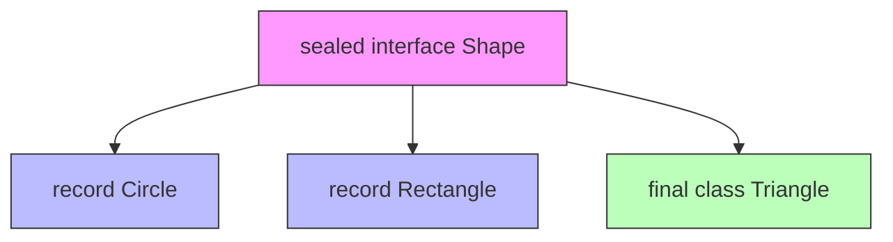
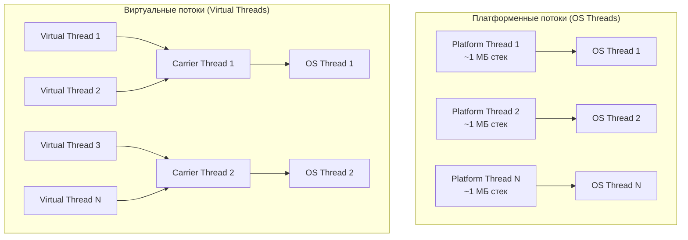
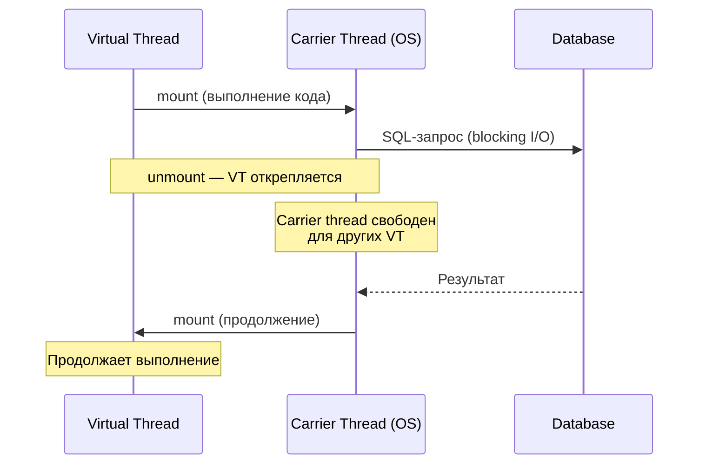
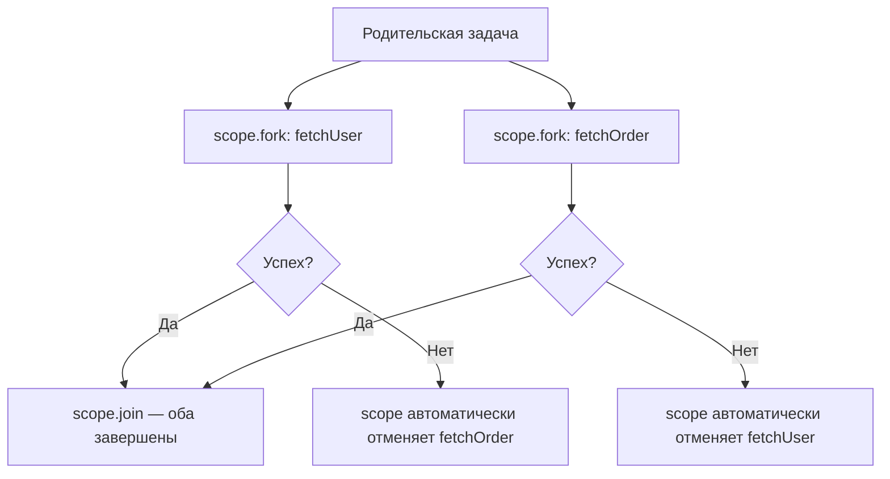
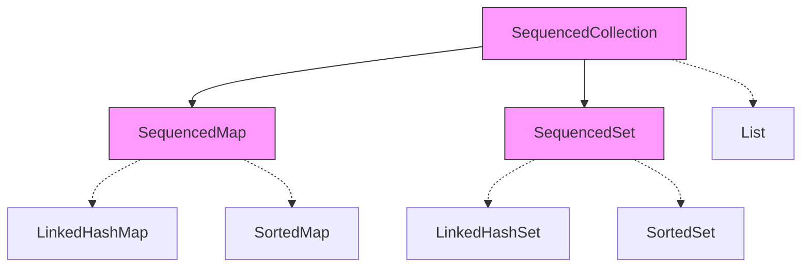

# Вопросы на собеседовании: `Java 17-21`

Комплексное руководство по вопросам собеседования на тему современных возможностей `Java 17-21` для `Senior Java Developer`. Включает детальные объяснения концепций, практические примеры кода, диаграммы и best practices.

**`Java 17`** и **`Java 21`** — две последние LTS-версии платформы, которые принесли кардинальные изменения: `records`, `sealed classes`, `pattern matching`, `virtual threads`, `structured concurrency`, `sequenced collections` и многое другое. Знание этих возможностей — обязательное требование на современных собеседованиях. Промежуточные версии (18, 19, 20) также добавили важные preview-фичи, ставшие стабильными в Java 21.

## Полезные ссылки

### Официальная документация

- [JDK 17 Release Notes](https://openjdk.org/projects/jdk/17/) — обзор всех JEP в Java 17
- [JDK 21 Release Notes](https://openjdk.org/projects/jdk/21/) — обзор всех JEP в Java 21
- [New Features in Java 17 (Baeldung)](https://www.baeldung.com/java-17-new-features) — обзор нововведений Java 17
- [New Features in Java 21 (Baeldung)](https://www.baeldung.com/java-lts-21-new-features) — обзор нововведений Java 21
- [Sealed Classes and Interfaces (Baeldung)](https://www.baeldung.com/java-sealed-classes-interfaces) — sealed-классы
- [Pattern Matching for Switch (Baeldung)](https://www.baeldung.com/java-switch-pattern-matching) — pattern matching в switch
- [Virtual Threads (Baeldung)](https://www.baeldung.com/java-virtual-thread-vs-thread) — виртуальные потоки
- [Structured Concurrency (Baeldung)](https://www.baeldung.com/java-structured-concurrency) — структурированная конкурентность
- [Sequenced Collections (Baeldung)](https://www.baeldung.com/java-21-sequenced-collections) — упорядоченные коллекции
- [Record Patterns (Baeldung)](https://www.baeldung.com/java-19-record-patterns) — паттерны записей

## Содержание

- [Полезные ссылки](#полезные-ссылки)
- [See also](#see-also)

**Records**
- [Q1. Что такое record в Java и какую проблему они решают?](#q1-что-такое-record-в-java-и-какую-проблему-они-решают)
- [Q2. Какие ограничения есть у record?](#q2-какие-ограничения-есть-у-record)
- [Q3. Можно ли кастомизировать конструктор record?](#q3-можно-ли-кастомизировать-конструктор-record)
- [Q4. Чем record отличается от обычного класса и от Lombok @Value?](#q4-чем-record-отличается-от-обычного-класса-и-от-lombok-value)

**Sealed Classes**
- [Q5. (!) Что такое sealed-классы и интерфейсы?](#q5--что-такое-sealed-классы-и-интерфейсы)
- [Q6. Какие модификаторы должны использовать подклассы sealed-класса?](#q6-какие-модификаторы-должны-использовать-подклассы-sealed-класса)
- [Q7. Как sealed-классы работают с pattern matching?](#q7-как-sealed-классы-работают-с-pattern-matching)

**Pattern Matching**
- [Q8. Что такое pattern matching для instanceof?](#q8-что-такое-pattern-matching-для-instanceof)
- [Q9. (!) Что такое pattern matching для switch?](#q9--что-такое-pattern-matching-для-switch)
- [Q10. Что такое guarded patterns (when clause)?](#q10-что-такое-guarded-patterns-when-clause)
- [Q11. (!) Что такое record patterns и деконструкция записей?](#q11--что-такое-record-patterns-и-деконструкция-записей)
- [Q12. Что такое unnamed patterns и unnamed variables?](#q12-что-такое-unnamed-patterns-и-unnamed-variables)

**Text Blocks и Switch Expressions**
- [Q13. Что такое text blocks?](#q13-что-такое-text-blocks)
- [Q14. Что такое switch expressions и чем они отличаются от switch statement?](#q14-что-такое-switch-expressions-и-чем-они-отличаются-от-switch-statement)

**Virtual Threads (Project Loom)**
- [Q15. (!) Что такое виртуальные потоки и какую проблему они решают?](#q15--что-такое-виртуальные-потоки-и-какую-проблему-они-решают)
- [Q16. Как создать и запустить виртуальный поток?](#q16-как-создать-и-запустить-виртуальный-поток)
- [Q17. В чём архитектурное отличие виртуальных потоков от платформенных?](#q17-в-чём-архитектурное-отличие-виртуальных-потоков-от-платформенных)
- [Q18. (!) Когда НЕ стоит использовать виртуальные потоки?](#q18--когда-не-стоит-использовать-виртуальные-потоки)
- [Q19. Что такое pinning виртуального потока?](#q19-что-такое-pinning-виртуального-потока)
- [Q20. Как виртуальные потоки работают с Spring Boot?](#q20-как-виртуальные-потоки-работают-с-spring-boot)

**Structured Concurrency**
- [Q21. (!) Что такое structured concurrency?](#q21--что-такое-structured-concurrency)
- [Q22. Как использовать StructuredTaskScope?](#q22-как-использовать-structuredtaskscope)
- [Q23. Какие стратегии завершения есть в StructuredTaskScope?](#q23-какие-стратегии-завершения-есть-в-structuredtaskscope)

**Scoped Values**
- [Q24. Что такое Scoped Values и чем они лучше ThreadLocal?](#q24-что-такое-scoped-values-и-чем-они-лучше-threadlocal)

**Sequenced Collections**
- [Q25. (!) Что такое Sequenced Collections?](#q25--что-такое-sequenced-collections)
- [Q26. Какие методы добавляет интерфейс SequencedCollection?](#q26-какие-методы-добавляет-интерфейс-sequencedcollection)

**String Templates**
- [Q27. Что такое String Templates?](#q27-что-такое-string-templates)

**Foreign Function & Memory API**
- [Q28. Что такое Foreign Function & Memory API?](#q28-что-такое-foreign-function--memory-api)

**Прочие улучшения**
- [Q29. Какие улучшения появились в API коллекций и утилитах?](#q29-какие-улучшения-появились-в-api-коллекций-и-утилитах)
- [Q30. Что такое сильная инкапсуляция внутренних API JDK?](#q30-что-такое-сильная-инкапсуляция-внутренних-api-jdk)
- [Q31. (!) Какова стратегия миграции с Java 8/11 на Java 17/21?](#q31--какова-стратегия-миграции-с-java-811-на-java-1721)
- [Q32. Что такое новый Random Generator API?](#q32-что-такое-новый-random-generator-api)
- [Q33. Какие улучшения получил NullPointerException?](#q33-какие-улучшения-получил-nullpointerexception)
- [Q34. Что такое Compact Number Formatting?](#q34-что-такое-compact-number-formatting)
- [Q35. (!) Какие ключевые отличия между Java 17 и Java 21?](#q35--какие-ключевые-отличия-между-java-17-и-java-21)

**Java 21: детали и новые preview-фичи**
- [Q36. Virtual Threads: детали реализации, Continuation и Carrier Threads](#q36-virtual-threads-детали-реализации-continuation-и-carrier-threads)
- [Q37. (!) Scoped Values: альтернатива ThreadLocal в мире Virtual Threads](#q37--scoped-values-альтернатива-threadlocal-в-мире-virtual-threads)
- [Q38. Sequenced Collections: SequencedCollection и SequencedMap](#q38-sequenced-collections-sequencedcollection-и-sequencedmap)
- [Q39. Pattern Matching for switch: guards и exhaustiveness (Java 21)](#q39-pattern-matching-for-switch-guards-и-exhaustiveness-java-21)
- [Q40. (!) Record Patterns: деконструкция в switch и instanceof](#q40--record-patterns-деконструкция-в-switch-и-instanceof)
- [Q41. Как работали String Templates (preview) и процессор `STR`?](#q41-как-работали-string-templates-preview-и-процессор-str)
- [Q42. Unnamed Classes и Instance Main Methods (preview)](#q42-unnamed-classes-и-instance-main-methods-preview)

---

## Q1. Что такое record в Java и какую проблему они решают?

**`Record`** (JEP 395, Java 16, стабильная в Java 17) — это компактный синтаксис для неизменяемого класса-носителя данных. Вы объявляете только список компонентов в заголовке, а компилятор сам генерирует конструктор, `equals()`, `hashCode()`, `toString()` и методы доступа.

**Какую проблему решает.** До records data-класс (POJO/DTO) требовал десятки строк рукописного или сгенерированного кода: поля, конструктор, геттеры, три переопределённых метода. Этот boilerplate легко рассинхронизировать — добавил поле, забыл про `equals()` — и получил тонкий баг. Record устраняет проблему в корне: единственный источник правды — список компонентов, всё остальное выводится из него.

```java
// До records — типичный DTO
public class UserDto {
    private final String name;
    private final int age;

    public UserDto(String name, int age) {
        this.name = name;
        this.age = age;
    }

    public String getName() { return name; }
    public int getAge() { return age; }

    @Override
    public boolean equals(Object o) { /* ... */ }
    @Override
    public int hashCode() { /* ... */ }
    @Override
    public String toString() { /* ... */ }
}

// С record — одна строка
public record UserDto(String name, int age) {}
```

**Что генерируется автоматически:**
- Канонический конструктор (со всеми полями)
- `private final` поля для каждого компонента
- Методы доступа (без префикса `get`): `name()`, `age()`
- `equals()` — сравнение всех компонентов
- `hashCode()` — на основе всех компонентов
- `toString()` — с именами и значениями всех компонентов

> На собеседовании важно подчеркнуть: record — это не просто «Lombok без аннотаций», а **семантический контракт**. Объявляя record, вы заявляете: этот класс — прозрачный носитель данных, его состояние полностью описывается компонентами. Именно поэтому компилятор вправе вывести `equals`/`hashCode`/`toString` за вас, а pattern matching умеет деконструировать record по компонентам.

---

## Q2. Какие ограничения есть у record?

Ограничения record не случайны — каждое вытекает из его роли неизменяемого носителя данных:

1. **Нельзя наследовать** — record неявно `final` и уже наследует `java.lang.Record`, поэтому свой `extends` запрещён. Это гарантирует, что подкласс не подменит сгенерированный `equals`.
2. **Нельзя объявлять instance-поля** — разрешены только компоненты в заголовке. Иначе появилось бы скрытое состояние, не участвующее в `equals`/`hashCode`, и контракт «состояние = компоненты» сломался бы.
3. **Компоненты неизменяемы** — все поля `private final`, сеттеров нет. Неизменяемость делает record безопасным для шаринга между потоками и пригодным в качестве ключа в `Map`/`Set`.
4. **Не может быть абстрактным** — record всегда конкретный класс.
5. **Может реализовывать интерфейсы** — поскольку наследование закрыто, интерфейсы остаются единственным каналом полиморфизма (и связкой с sealed-иерархиями).

```java
// Record может реализовывать интерфейс
public sealed interface Shape permits Circle, Rectangle {}

public record Circle(double radius) implements Shape {}
public record Rectangle(double width, double height) implements Shape {}

// Record может иметь static поля и методы
public record Point(double x, double y) {
    public static final Point ORIGIN = new Point(0, 0);

    public double distanceTo(Point other) {
        return Math.sqrt(Math.pow(x - other.x, 2) + Math.pow(y - other.y, 2));
    }
}
```

Подробнее об ограничениях наследования — в [вопросах по Java OOP](java-oop-interview.md).

---

## Q3. Можно ли кастомизировать конструктор record?

Да. Сгенерированный канонический конструктор можно дополнить или заменить — есть три варианта, от самого частого к самому редкому.

### Компактный конструктор (compact constructor)

Самый частый случай: добавить валидацию или нормализацию входных данных, не переписывая присваивания. Параметры в скобках не указываются, а `this.field = field` для всех компонентов JVM подставит после вашего кода автоматически.

```java
public record Range(int start, int end) {
    // Компактный конструктор — без параметров в скобках
    public Range {
        if (start > end) {
            throw new IllegalArgumentException(
                "start (%d) must be <= end (%d)".formatted(start, end));
        }
        // Присваивание this.start = start и this.end = end выполняется автоматически
    }
}
```

### Полный канонический конструктор

Нужен, когда требуется не просто проверить, а **преобразовать** значение перед записью в поле (здесь — привести email к нижнему регистру). В этой форме вы сами пишете присваивания `this.field = ...`, поэтому сигнатура должна точно повторять список компонентов.

```java
public record Email(String value) {
    public Email(String value) {
        this.value = value.trim().toLowerCase();
    }
}
```

### Дополнительные конструкторы

Можно добавить перегрузки с другим набором параметров (например, со значениями по умолчанию), но первой строкой каждая обязана вызвать канонический конструктор через `this(...)`. Так гарантируется, что вся валидация из канонического конструктора отработает при любом способе создания.

```java
public record UserDto(String name, int age) {
    public UserDto(String name) {
        this(name, 0); // делегирование каноническому
    }
}
```

---

## Q4. Чем record отличается от обычного класса и от Lombok @Value?

| Критерий | Обычный класс | Lombok `@Value` | `record` |
|----------|--------------|----------------|----------|
| Boilerplate | Максимальный | Генерируется при компиляции | Минимальный |
| Наследование | Да | Нет (`final`) | Нет (`final`, от `Record`) |
| Instance-поля | Любые | Любые `final` | Только компоненты |
| Аксессоры | `getX()` | `getX()` / `x()` | `x()` (без `get`) |
| Зависимость | Нет | Lombok в classpath | Нет (часть языка) |
| Рефлексия | Обычная | Обычная | `RecordComponent` API |
| Pattern matching | Нет | Нет | Да (record patterns) |
| Serialization | Стандартная | Стандартная | Улучшенная (безопасная) |
| Семантика | Произвольная | Носитель данных | Носитель данных (контракт) |

**Главное отличие одной фразой.** Lombok дописывает методы на этапе компиляции внешним инструментом — для языка это всё ещё обычный класс. Record же встроен в спецификацию языка: компилятор и JVM знают про его компоненты, поэтому работают связки, недоступные Lombok — деконструкция в pattern matching, exhaustiveness в `switch` для sealed-иерархий, безопасная сериализация. Record — не «генератор геттеров», а строительный блок алгебраических типов данных.

---

## Q5. (!) Что такое sealed-классы и интерфейсы?

**`Sealed classes`** (JEP 409, Java 17) — классы и интерфейсы, которые в объявлении через `permits` явно перечисляют свой полный, закрытый список наследников. Никакой другой класс наследовать или реализовать их не сможет. Это контролируемое наследование: автор типа берёт под контроль, кто вправе его расширять.

```java
// Только Circle, Rectangle и Triangle могут наследовать Shape
public sealed interface Shape
    permits Circle, Rectangle, Triangle {}

public record Circle(double radius) implements Shape {}
public record Rectangle(double w, double h) implements Shape {}
public final class Triangle implements Shape {
    // ...
}
```

**Зачем нужны sealed-классы:**
1. **Моделирование закрытых доменных типов** — когда набор подтипов фиксирован по смыслу задачи (фигура — это круг, прямоугольник или треугольник; платёж — карта, перевод или крипта). `permits` фиксирует это правило в коде, а не в комментарии.
2. **Exhaustiveness в `switch`** — зная полный список подтипов, компилятор проверяет, что обработаны все варианты, и не требует `default`. Добавили новый подтип — код перестаёт компилироваться, пока вы не добавите его обработку. Ошибка ловится в компайл-тайме, а не в проде.
3. **Алгебраические типы данных** — в связке с records образуют sum types (закрытое «ИЛИ» вариантов), аналог `enum` Rust или `sealed trait` Scala.



**Правила размещения:** подклассы sealed-класса должны находиться в том же модуле (для модульного проекта) или в том же пакете (для немодульного). Подробнее о модулях — в [вопросах по Java Modules](java-modules-interview.md).

---

## Q6. Какие модификаторы должны использовать подклассы sealed-класса?

Каждый прямой наследник sealed-класса обязан сам объявить, что будет с наследованием **дальше вниз** по иерархии. Поэтому компилятор требует у него ровно один из трёх модификаторов — иначе ограничение «утекло» бы через незакрытого потомка.

| Модификатор | Значение |
|-------------|----------|
| `final` | Запрещает дальнейшее наследование — лист иерархии |
| `sealed` | Продолжает закрытую цепочку: сам задаёт `permits` для своих потомков |
| `non-sealed` | Сознательно открывает ветку — дальше наследовать может кто угодно |

```java
public sealed interface Payment permits CreditCard, BankTransfer, Crypto {}

// final — нельзя наследовать дальше
public final class CreditCard implements Payment { /* ... */ }

// sealed — продолжает ограничение
public sealed class BankTransfer implements Payment
    permits DomesticTransfer, InternationalTransfer {}
public final class DomesticTransfer extends BankTransfer { /* ... */ }
public final class InternationalTransfer extends BankTransfer { /* ... */ }

// non-sealed — открывает иерархию
public non-sealed class Crypto implements Payment { /* ... */ }
// Теперь любой класс может наследовать Crypto
public class Bitcoin extends Crypto { /* ... */ }
```

> **Важно для собеседования:** records и enum-классы, реализующие sealed-интерфейс, считаются неявно `final`, поэтому явный модификатор не требуется.

---

## Q7. Как sealed-классы работают с pattern matching?

Связка работает так: `permits` сообщает компилятору полный набор подтипов, и тот может проверить **полноту (exhaustiveness)** `switch` — все ли варианты обработаны. Если да, ветку `default` писать не нужно: «лишних» подтипов взяться неоткуда.

```java
public sealed interface Shape permits Circle, Rectangle, Triangle {}
public record Circle(double radius) implements Shape {}
public record Rectangle(double w, double h) implements Shape {}
public record Triangle(double a, double b, double c) implements Shape {}

// Компилятор знает все подтипы — default не нужен
public double area(Shape shape) {
    return switch (shape) {
        case Circle c    -> Math.PI * c.radius() * c.radius();
        case Rectangle r -> r.w() * r.h();
        case Triangle t  -> {
            double s = (t.a() + t.b() + t.c()) / 2;
            yield Math.sqrt(s * (s - t.a()) * (s - t.b()) * (s - t.c()));
        }
    };
    // Если добавить новый подтип в Shape — код не скомпилируется,
    // пока не добавим обработку нового case
}
```

Главная практическая выгода — **отказ от `default`**. С `default` забытый новый подтип молча провалится в ветку «по умолчанию» и проявится багом в рантайме. Без `default`, благодаря exhaustiveness, тот же забытый подтип ломает компиляцию — ошибку видно сразу. Это и делает sealed-классы инструментом надёжных **алгебраических типов данных (ADT)**, аналогичных `enum` в Rust или `sealed trait` в Scala.

---

## Q8. Что такое pattern matching для instanceof?

**Pattern matching для `instanceof`** (JEP 394, Java 16, стабильная в Java 17) объединяет проверку типа и приведение в одной конструкции: если `obj instanceof String s` истинно, переменная `s` уже объявлена и хранит `obj`, приведённый к `String`. Классическая тройка «проверил → привёл → присвоил» схлопывается в одну строку, а заодно исчезает риск рассинхронизации проверки и приведения.

```java
// До Java 16 — явное приведение
if (obj instanceof String) {
    String s = (String) obj;
    System.out.println(s.length());
}

// Java 16+ — pattern variable
if (obj instanceof String s) {
    System.out.println(s.length());
}

// Можно использовать в составных выражениях
if (obj instanceof String s && s.length() > 5) {
    System.out.println("Long string: " + s);
}
```

**Flow scoping — где видна pattern-переменная.** Её область видимости определяется не фигурными скобками, а потоком управления: компилятор пускает переменную туда, куда выполнение доходит только при успешном совпадении паттерна.

- В правой части `&&` — да: до неё дойдём, лишь если левая проверка `instanceof` уже прошла.
- В правой части `||` — нет: туда мы попадаем как раз когда `instanceof` дал `false`, то есть переменная не определена.
- После `if`, завершающегося `return`/`throw` при несовпадении (ранний выход) — да: в коде ниже остаются только случаи, где паттерн совпал.

```java
// Это НЕ скомпилируется — s не гарантированно определена
if (obj instanceof String s || s.isEmpty()) { // Ошибка!
    // ...
}

// А это работает — flow scoping
if (!(obj instanceof String s)) {
    return;
}
// Здесь s доступна благодаря flow scoping
System.out.println(s.toUpperCase());
```

---

## Q9. (!) Что такое pattern matching для switch?

**Pattern matching для `switch`** (JEP 441, Java 21) разрешает писать в `case` не только константы, но и паттерны типов. Один `switch` заменяет цепочку `if (obj instanceof A a) ... else if (obj instanceof B b) ...`, выбирая ветку по типу значения и сразу связывая типизированную переменную:

```java
public String describe(Object obj) {
    return switch (obj) {
        case Integer i    -> "Целое число: " + i;
        case Long l       -> "Длинное целое: " + l;
        case Double d     -> "Дробное число: " + d;
        case String s     -> "Строка длины " + s.length();
        case int[] arr    -> "Массив int длины " + arr.length;
        case null         -> "null";
        default           -> "Неизвестный тип: " + obj.getClass().getName();
    };
}
```

**Ключевые особенности:**
1. **Явная обработка `null`** — `case null` ловит `null` прямо в switch. Раньше `null` гарантированно бросал NPE на входе в switch, и его приходилось отсеивать заранее.
2. **Порядок `case` важен** — ветки проверяются сверху вниз, поэтому более конкретные паттерны должны идти раньше общих. Если общий паттерн «перекрывает» (dominates) последующий конкретный, это ошибка компиляции, а не молчаливый пропуск.
3. **Exhaustiveness** — для sealed-типов и enum компилятор проверяет, что покрыты все варианты; иначе требует `default`.
4. **Условия через `when`** — guarded patterns добавляют к паттерну булеву проверку (см. Q10).

```java
// Порядок важен — компилятор проверяет dominance
return switch (obj) {
    case String s when s.isEmpty() -> "Пустая строка";
    case String s                  -> "Строка: " + s;
    // case String s -> ...  // Ошибка: dominated by предыдущим case
    default -> "Не строка";
};
```

---

## Q10. Что такое guarded patterns (when clause)?

**Guarded patterns** (условные паттерны) добавляют к паттерну в `case` булево условие через ключевое слово `when`. Ветка срабатывает, только если совпал и тип, и условие. Это позволяет разветвлять логику не просто по типу, а по типу плюс значению полей — прямо в `switch`:

```java
public String classify(Shape shape) {
    return switch (shape) {
        case Circle c when c.radius() > 100    -> "Большой круг";
        case Circle c when c.radius() > 10     -> "Средний круг";
        case Circle c                           -> "Маленький круг";
        case Rectangle r when r.w() == r.h()   -> "Квадрат";
        case Rectangle r                        -> "Прямоугольник";
        case Triangle t                         -> "Треугольник";
    };
}
```

**Важные правила:**
- `when` — это контекстное ключевое слово (не зарезервированное), оно заменило синтаксис `&&` из ранних preview-версий.
- Условия проверяются сверху вниз, выигрывает первый совпавший `case` — поэтому порядок задаёт приоритет: сначала самые узкие условия (`radius > 100`), потом более широкие (`radius > 10`), в конце безусловная ветка того же типа.
- Безусловный `case` для типа должен идти после всех его guarded-веток — иначе он перекроет их и компилятор выдаст ошибку «label dominated».

> До Java 21 ту же логику писали вложенными `if-else` внутри `switch` — больше отступов, проще ошибиться в ветвлении. `when` делает условие частью самой метки.

---

## Q11. (!) Что такое record patterns и деконструкция записей?

**Record patterns** (JEP 440, Java 21) — это деконструкция: вместо того чтобы сначала сматчить record по типу, а потом руками вызывать аксессоры (`p.x()`, `p.y()`), вы прямо в паттерне разбираете его на компоненты и сразу получаете их как локальные переменные. Работает и в `instanceof`, и в `switch`:

```java
public record Point(double x, double y) {}
public record Line(Point start, Point end) {}

// Деконструкция record в instanceof
if (obj instanceof Point(double x, double y)) {
    System.out.println("Координаты: (" + x + ", " + y + ")");
}

// Вложенная деконструкция (nested patterns)
if (obj instanceof Line(Point(var x1, var y1), Point(var x2, var y2))) {
    double length = Math.sqrt(Math.pow(x2 - x1, 2) + Math.pow(y2 - y1, 2));
    System.out.println("Длина линии: " + length);
}
```

**Record patterns в switch:**

```java
sealed interface Expr permits Num, Add, Mul {}
record Num(int value) implements Expr {}
record Add(Expr left, Expr right) implements Expr {}
record Mul(Expr left, Expr right) implements Expr {}

// Рекурсивная деконструкция
public int eval(Expr expr) {
    return switch (expr) {
        case Num(int v)            -> v;
        case Add(var left, var right) -> eval(left) + eval(right);
        case Mul(var left, var right) -> eval(left) * eval(right);
    };
}
```

Обратите внимание на пример `eval`: рекурсивный обход дерева выражений умещается в три `case` без единого приведения типа и без `default` — sealed-иерархия `Expr` гарантирует полноту.

> **Для собеседования:** record patterns + sealed interfaces дают полноценные алгебраические типы данных (ADT) и сопоставление по структуре — аналог `match` в Scala/Kotlin. Каскады `instanceof` и visitor-классы заменяются одним выразительным `switch`; это меняет сам подход к моделированию доменов.

---

## Q12. Что такое unnamed patterns и unnamed variables?

**Unnamed patterns и unnamed variables** (JEP 456, Java 22, preview в Java 21) — это символ `_` (underscore) на месте переменной, которая нужна синтаксически, но не используется. Имя не придумываешь, и читатель сразу видит: значение здесь намеренно отбрасывается, а не забыто по ошибке.

```java
// Unnamed pattern variable — игнорируем тип
if (obj instanceof Point(var x, _)) {
    // Нам нужна только x-координата
    System.out.println("x = " + x);
}

// Unnamed variable в обычном коде
try {
    int value = Integer.parseInt(input);
} catch (NumberFormatException _) {
    // Переменная исключения не нужна
    System.out.println("Невалидное число");
}

// В enhanced for
for (var _ : collection) {
    count++;
}

// В switch с record patterns
switch (shape) {
    case Circle(var radius)  -> computeCircle(radius);
    case Rectangle(var w, _) -> computeWidth(w);
    default -> 0;
}
```

Применяют `_` там, где переменная обязательна по синтаксису, но не нужна по смыслу: пойманное, но не анализируемое исключение; элемент цикла, когда важен лишь сам факт итерации; компонент record-паттерна, который не участвует в логике. Бонус: компилятор не предупреждает о неиспользуемой переменной с именем `_`.

---

## Q13. Что такое text blocks?

**Text blocks** (JEP 378, Java 15, стабильная в Java 17) — многострочные строковые литералы в тройных кавычках `"""`. Внутри не нужно экранировать кавычки и расставлять `\n` с `+` — текст пишется как есть. Это убирает «частокол» из `\"` и конкатенаций, в котором тонет читаемость встроенных JSON, SQL и HTML.

```java
// До text blocks
String json = "{\n" +
    "  \"name\": \"John\",\n" +
    "  \"age\": 30\n" +
    "}";

// С text blocks
String json = """
        {
          "name": "John",
          "age": 30
        }
        """;

// SQL-запрос
String sql = """
        SELECT u.name, u.email
        FROM users u
        JOIN orders o ON u.id = o.user_id
        WHERE o.status = 'ACTIVE'
        ORDER BY u.name
        """;
```

**Особенности:**
- **Лишние отступы убираются автоматически (incidental whitespace).** Общий отступ всех строк определяется по позиции закрывающих `"""` и срезается — так в строку не попадают пробелы, которыми вы выровняли блок в коде. Поэтому отступ закрывающих кавычек влияет на результат.
- **`\` в конце строки** подавляет перенос — длинную логическую строку можно разбить на несколько физических, не вставляя `\n`.
- **`\s`** — явный пробел, который не срезается при удалении хвостовых пробелов; нужен, когда значимый пробел стоит в конце строки.
- Работают как обычные строки: можно вызвать `String.formatted()` или передать в `String.format`.

```java
String html = """
        <html>
            <body>
                <p>Hello, %s!</p>
            </body>
        </html>
        """.formatted(userName);
```

Подробнее о строках — в [вопросах по Java String](java-string-interview.md).

---

## Q14. Что такое switch expressions и чем они отличаются от switch statement?

**Switch expressions** (JEP 361, Java 14, стабильная в Java 17) превращают `switch` из инструкции (statement) в выражение (expression), которое возвращает значение и его можно присвоить переменной. Заодно появляется arrow-синтаксис `case X -> ...`, который закрывает два исторических минуса классического switch — обязательный `break` и проваливание (fall-through):

```java
// Switch statement (классический)
String result;
switch (day) {
    case MONDAY:
    case FRIDAY:
        result = "Рабочий день";
        break;
    case SATURDAY:
    case SUNDAY:
        result = "Выходной";
        break;
    default:
        result = "Середина недели";
}

// Switch expression (Java 14+)
String result = switch (day) {
    case MONDAY, FRIDAY       -> "Рабочий день";
    case SATURDAY, SUNDAY     -> "Выходной";
    default                   -> "Середина недели";
};
```

| Аспект | Switch statement | Switch expression |
|--------|-----------------|-------------------|
| Возвращает значение | Нет | Да |
| `break` | Обязателен | Не нужен (arrow syntax) |
| Fall-through | По умолчанию | Нет (arrow syntax) |
| Несколько меток | Отдельные `case` | `case A, B, C ->` |
| Многострочный блок | `break;` | `yield value;` |
| Exhaustiveness | Не проверяется | Проверяется компилятором |

Главное практическое следствие — **безопасность по умолчанию**. В классическом switch забытый `break` молча проваливается в соседнюю ветку, а пропущенный вариант остаётся необработанным незаметно. В switch expression проваливания нет в принципе, а компилятор требует покрыть все случаи (для enum и sealed-типов — все варианты, иначе нужен `default`). Поэтому каждая ветка обязана дать значение.

Когда тело ветки многострочное, значение из блока возвращают через `yield` (стрелка `->` сама по себе работает для однострочных выражений):

```java
// yield — для многострочных блоков в switch expression
int numLetters = switch (day) {
    case MONDAY, FRIDAY, SUNDAY -> 6;
    case TUESDAY                -> 7;
    default -> {
        String s = day.toString();
        yield s.length();
    }
};
```

---

## Q15. (!) Что такое виртуальные потоки и какую проблему они решают?

**Виртуальные потоки** (Virtual Threads, JEP 444, Java 21) — лёгкие потоки, которые планирует сама JVM поверх небольшого пула платформенных (OS) потоков. Это ключевой результат **Project Loom**: тот же знакомый блокирующий код, но масштабируемый до миллионов одновременных задач.

**Какую проблему решают.** Привычная и простая модель «поток на запрос» (thread-per-request) упирается в стоимость платформенного потока:
- Каждый платформенный поток резервирует ~1 МБ под стек.
- ОС держит ограниченное число потоков — обычно тысячи, не миллионы.
- 10 000 одновременных запросов = ~10 ГБ только под стеки. Дальше — либо OOM, либо переход на сложный асинхронный/реактивный код ради экономии потоков.

Виртуальные потоки снимают этот компромисс: можно остаться на простом блокирующем коде и при этом обслуживать десятки и сотни тысяч запросов, потому что заблокированный виртуальный поток почти ничего не стоит.



**Что делает их дешёвыми:**
- Планирует JVM-шедулер, а не ОС, — переключение происходит в user space, без системных вызовов.
- Стек живёт в куче и растёт по мере надобности, начиная с нескольких сотен байт, — отсюда возможность держать миллионы потоков.
- На блокирующей операции (I/O, `sleep`) виртуальный поток **открепляется** от несущего (carrier) платформенного потока и освобождает его для других задач. Заблокирован виртуальный поток, а не дефицитный OS-поток — в этом вся суть.

Подробнее о потоках и конкурентности — в [вопросах по Java Concurrency](java-concurrency-interview.md).

---

## Q16. Как создать и запустить виртуальный поток?

API не нужно «учить заново» — это те же `Thread` и `ExecutorService`, просто с виртуальными потоками внутри. Способов четыре, под разные задачи: разовый запуск, именованный поток, пул-на-задачу для массовых вызовов и фабрика для интеграции с существующим кодом.

```java
// 1. Thread.startVirtualThread() — запуск сразу
Thread vThread = Thread.startVirtualThread(() -> {
    System.out.println("Hello from virtual thread!");
});

// 2. Thread.ofVirtual() — builder API
Thread vThread = Thread.ofVirtual()
    .name("my-vthread")
    .start(() -> {
        System.out.println("Named virtual thread");
    });

// 3. ExecutorService с виртуальными потоками
try (var executor = Executors.newVirtualThreadPerTaskExecutor()) {
    // Каждая задача получает свой виртуальный поток
    IntStream.range(0, 10_000).forEach(i ->
        executor.submit(() -> {
            Thread.sleep(Duration.ofSeconds(1));
            return i;
        })
    );
} // executor автоматически закрывается и ожидает завершения

// 4. Thread.ofVirtual().factory() — для ThreadFactory
ThreadFactory factory = Thread.ofVirtual()
    .name("worker-", 0)
    .factory();
Thread t = factory.newThread(() -> doWork());
t.start();
```

**Проверка типа потока:**

```java
Thread.currentThread().isVirtual(); // true для виртуального потока
```

---

## Q17. В чём архитектурное отличие виртуальных потоков от платформенных?

| Характеристика | Платформенный поток | Виртуальный поток |
|---------------|---------------------|-------------------|
| Управление | OS scheduler | JVM scheduler (ForkJoinPool) |
| Память (стек) | ~1 МБ фиксированный | Несколько КБ, растёт динамически |
| Количество | Тысячи | Миллионы |
| Создание | Дорогое (~1 мс) | Дешёвое (~1 мкс) |
| Блокирующий I/O | Блокирует OS thread | Открепляется от carrier thread |
| `ThreadLocal` | Нормально | Работает, но дорого (миллионы копий) |
| Пулинг | Обязателен | Не нужен (создавайте новые) |
| Приоритет | Поддерживается | Игнорируется |
| Daemon | Настраивается | Всегда daemon |

Главное в этой таблице — последние две строки и стоимость создания. Из-за того что виртуальный поток дешёв в создании и не привязывает к себе OS-поток на время блокировки, привычные приёмы оптимизации платформенных потоков (пулы, переиспользование) для него становятся ненужными, а то и вредными — об этом в примечании ниже.

Сам цикл «mount → блокировка → unmount → mount» выглядит так:



> **Ключевой принцип:** не пулируйте виртуальные потоки. Они настолько дешёвые, что правильный подход — создавать новый поток для каждой задачи. Антипаттерн: `Executors.newFixedThreadPool()` с виртуальными потоками.

---

## Q18. (!) Когда НЕ стоит использовать виртуальные потоки?

Виртуальные потоки — не универсальная замена платформенных, а инструмент под конкретный класс задач (I/O-bound, много ожидания). Их преимущество — дёшево ждать; там, где ждать нечего, выгоды нет. Они **не подходят** для:

1. **CPU-bound задач.** Выигрыш виртуального потока — в дешёвом откреплении на время ожидания. У чисто вычислительной задачи ожидания нет: несущий поток всё равно занят счётом, и количество параллельных вычислений упирается в число ядер. Миллион виртуальных потоков на CPU-задачах не ускорит расчёт, а только добавит накладных расходов.
2. **`synchronized` с блокирующим I/O внутри.** Вызывает pinning: виртуальный поток не может открепиться и держит несущий заблокированным (см. Q19). Лекарство — `ReentrantLock` вместо `synchronized`.
3. **Больших объектов в `ThreadLocal`.** У платформенных потоков их немного, и копии терпимы. С миллионами виртуальных потоков по копии на каждый — прямой путь к OOM. Для передачи контекста используйте `ScopedValue` (Q24/Q37).
4. **Задач, где нужны приоритеты потоков.** Виртуальные потоки приоритеты игнорируют; если планирование по приоритету критично, остаются платформенные.

```java
// ПЛОХО — CPU-bound, нет выигрыша от виртуальных потоков
try (var executor = Executors.newVirtualThreadPerTaskExecutor()) {
    executor.submit(() -> computeFibonacci(1_000_000)); // CPU-bound
}

// ПЛОХО — synchronized + blocking I/O = pinning
synchronized (lock) {
    connection.read(); // Виртуальный поток прикрепляется к carrier
}

// ХОРОШО — используйте ReentrantLock вместо synchronized
private final ReentrantLock lock = new ReentrantLock();
lock.lock();
try {
    connection.read(); // Виртуальный поток может открепиться
} finally {
    lock.unlock();
}
```

> **На собеседовании:** виртуальные потоки идеальны для I/O-bound задач с thread-per-request моделью (веб-серверы, микросервисы). Для CPU-bound задач используйте платформенные потоки или `ForkJoinPool`.

---

## Q19. Что такое pinning виртуального потока?

**Pinning** (закрепление) — ситуация, когда виртуальный поток на время блокирующей операции **не может** открепиться от несущего потока и удерживает его заблокированным. Это сводит на нет главное преимущество виртуальных потоков: дефицитный OS-поток простаивает в ожидании вместо того, чтобы обслуживать другие задачи. При массовом pinning несущих потоков перестаёт хватать, и пропускная способность падает.

**Причины pinning:**
1. **`synchronized`-блок или метод**, внутри которого происходит блокирующая операция. JVM не умеет откреплять поток, находящийся под монитором объекта.
2. **Native-метод или вызов через FFM/JNI** — пока выполнение находится в нативном коде, открепление невозможно.

```java
// Вызывает pinning
synchronized (this) {
    Thread.sleep(1000); // Carrier thread заблокирован!
}

// Решение — использовать ReentrantLock
private final ReentrantLock lock = new ReentrantLock();

lock.lock();
try {
    Thread.sleep(1000); // Carrier thread освобождается
} finally {
    lock.unlock();
}
```

**Диагностика pinning:**

```bash
# JVM-флаг для обнаружения pinning
-Djdk.tracePinnedThreads=full   # полный стектрейс
-Djdk.tracePinnedThreads=short  # краткий вывод
```

> **Важно:** в Java 24 pinning от `synchronized` устранён (JEP 491) — монитор больше не закрепляет виртуальный поток. Но на Java 21 это всё ещё актуальная ловушка, поэтому в горячих путях с I/O предпочитайте `java.util.concurrent.locks` (`ReentrantLock`) вместо `synchronized`.

---

## Q20. Как виртуальные потоки работают с Spring Boot?

`Spring Boot 3.2+` (на Java 21) включает виртуальные потоки одним свойством — переписывать код контроллеров и сервисов не нужно:

```yaml
# application.yml — одна строка для включения
spring:
  threads:
    virtual:
      enabled: true
```

Один флаг переключает на виртуальные потоки сразу несколько компонентов:
- **Tomcat** обрабатывает каждый HTTP-запрос в своём виртуальном потоке вместо потока из ограниченного пула.
- **Spring MVC** — обработчик запроса (и весь блокирующий код в нём) выполняется на виртуальном потоке.
- **`@Async`** и планировщик задач переключаются на виртуальные потоки.

Смысл прост: блокирующий стек Spring MVC + JDBC остаётся как был, но перестаёт упираться в размер пула Tomcat — параллельных запросов держится столько, сколько позволяют ресурсы, а не двести потоков по умолчанию.

```java
// Ручная конфигурация (если нужен кастомный executor)
@Configuration
public class VirtualThreadConfig {

    @Bean
    public TomcatProtocolHandlerCustomizer<?> protocolHandlerCustomizer() {
        return handler -> handler.setExecutor(
            Executors.newVirtualThreadPerTaskExecutor()
        );
    }

    @Bean
    public AsyncTaskExecutor applicationTaskExecutor() {
        return new TaskExecutorAdapter(
            Executors.newVirtualThreadPerTaskExecutor()
        );
    }
}
```

> **Практический совет:** при включении виртуальных потоков в Spring Boot убедитесь, что драйверы БД и HTTP-клиенты не используют `synchronized` с I/O — иначе pinning сведёт на нет все преимущества.

---

## Q21. (!) Что такое structured concurrency?

**Structured concurrency** (JEP 462, preview в Java 21-23) переносит на конкурентность принцип блочной структуры: подзадачи, запущенные в пределах блока, не могут пережить этот блок. Их время жизни ограничено scope родительской задачи — выход из блока означает, что все подзадачи либо завершились, либо отменены. Никаких «утёкших» фоновых задач.

**Проблема** неструктурированной конкурентности — связь «родитель ↔ подзадачи» теряется, как только задачи отправлены в `ExecutorService`:

```java
// Неструктурированная конкурентность — опасно
ExecutorService executor = Executors.newFixedThreadPool(2);
Future<User> userFuture = executor.submit(() -> fetchUser(id));
Future<Order> orderFuture = executor.submit(() -> fetchOrder(id));

// Если fetchOrder бросает исключение — fetchUser продолжает работать
// Если родительский поток прерван — подзадачи "утекают"
User user = userFuture.get();
Order order = orderFuture.get(); // Если тут исключение, userFuture уже завершился
```

Итог неструктурированного подхода: при сбое одной подзадачи остальные продолжают зря жечь ресурсы, при прерывании родителя они «утекают», а ошибки приходится собирать вручную из каждого `Future`.

**Structured concurrency — безопасный подход.** `try`-блок становится границей: `fork` запускает подзадачи внутри, `join` ждёт их, а закрытие scope гарантированно отменяет всё незавершённое — на нормальном выходе, при ошибке и при отмене:

```java
// Structured concurrency — подзадачи привязаны к scope
try (var scope = new StructuredTaskScope.ShutdownOnFailure()) {
    Subtask<User> userTask = scope.fork(() -> fetchUser(id));
    Subtask<Order> orderTask = scope.fork(() -> fetchOrder(id));

    scope.join();            // Ждём завершения всех подзадач
    scope.throwIfFailed();   // Пробрасываем исключение, если была ошибка

    // Обе задачи успешно завершились
    return new UserOrder(userTask.get(), orderTask.get());
} // scope закрывается — все незавершённые задачи отменяются
```



---

## Q22. Как использовать StructuredTaskScope?

`StructuredTaskScope` — основной API structured concurrency. Типичный сценарий: собрать страницу из нескольких независимых вызовов (товар, отзывы, цена), запустив их параллельно, дождавшись всех и аккуратно обработав ошибку любого:

```java
// Пример: параллельный запрос к нескольким сервисам
public record ProductPage(Product product, List<Review> reviews, Price price) {}

public ProductPage loadProductPage(String productId) throws Exception {
    try (var scope = new StructuredTaskScope.ShutdownOnFailure()) {
        Subtask<Product> productTask = scope.fork(() ->
            productService.getProduct(productId));
        Subtask<List<Review>> reviewsTask = scope.fork(() ->
            reviewService.getReviews(productId));
        Subtask<Price> priceTask = scope.fork(() ->
            pricingService.getPrice(productId));

        scope.join();
        scope.throwIfFailed();

        return new ProductPage(
            productTask.get(),
            reviewsTask.get(),
            priceTask.get()
        );
    }
}
```

**Порядок вызовов фиксирован** — нарушите его, и получите ошибку или исключение:
1. `fork()` запускает подзадачу в отдельном виртуальном потоке и сразу возвращает управление — здесь три `fork` означают три параллельных вызова.
2. `join()` блокирует текущий поток, пока все подзадачи не завершатся (успехом, ошибкой или отменой).
3. `throwIfFailed()` (у `ShutdownOnFailure`) пробрасывает исключение первой упавшей подзадачи — если всё прошло, ничего не делает.
4. Scope реализует `AutoCloseable`, поэтому создаётся только в try-with-resources: закрытие гарантирует отмену незавершённых подзадач.
5. `subtask.get()` законен лишь **после** `join()` — иначе результат ещё не готов и будет исключение.

---

## Q23. Какие стратегии завершения есть в StructuredTaskScope?

Стратегия завершения определяет, когда scope считает работу законченной и отменяет остаток. Java даёт две готовые — под два противоположных требования — и позволяет написать свою, переопределив `handleComplete`.

### ShutdownOnFailure — «нужны все, любая ошибка фатальна»

Ждёт все подзадачи, но при первой же ошибке немедленно отменяет остальные (нет смысла продолжать, если результат всё равно будет неполным):

```java
try (var scope = new StructuredTaskScope.ShutdownOnFailure()) {
    var task1 = scope.fork(() -> callServiceA());
    var task2 = scope.fork(() -> callServiceB());

    scope.join();
    scope.throwIfFailed(); // Бросает исключение первой упавшей задачи

    return combine(task1.get(), task2.get());
}
```

### ShutdownOnSuccess — «достаточно любого одного»

Запускает несколько источников «наперегонки» и при первом успешном результате отменяет остальные. Подходит, когда нужен любой ответ, а не все: реплики БД, зеркала, обращение к кэшу и источнику одновременно:

```java
try (var scope = new StructuredTaskScope.ShutdownOnSuccess<String>()) {
    scope.fork(() -> fetchFromPrimaryDC());
    scope.fork(() -> fetchFromSecondaryDC());
    scope.fork(() -> fetchFromCache());

    scope.join();
    return scope.result(); // Результат первой успешной задачи
}
```

| Стратегия | Поведение | Сценарий применения |
|-----------|----------|----------|
| `ShutdownOnFailure` | Отменяет всё при первой ошибке | Нужны результаты всех подзадач (fan-out + join) |
| `ShutdownOnSuccess` | Отменяет всё при первом успехе | Достаточно любого ответа («кто быстрее», racing) |

---

## Q24. Что такое Scoped Values и чем они лучше ThreadLocal?

**Scoped Values** (JEP 464, preview в Java 21-23) — способ передать данные (текущего пользователя, request-id, транзакцию) сквозь стек вызовов без параметров, как `ThreadLocal`, но иммутабельно и с чёткими границами. Создан как замена `ThreadLocal` для мира виртуальных потоков.

**Чем `ThreadLocal` плох в этом мире:**
- **Память.** Каждый поток держит свою копию. На тысячах платформенных потоков терпимо, на миллионах виртуальных — копий миллионы, и это бьёт по памяти.
- **Жизненный цикл.** Значение мутабельно и живёт, пока его явно не уберут через `remove()`. Забыли убрать на переиспользуемом потоке — получили утечку или, хуже, чужие данные в следующем запросе.
- **Наследование.** `InheritableThreadLocal` отдаёт дочерним потокам собственную копию значения — снова копирование, снова расход.

```java
// ThreadLocal — мутабельный, без scope
private static final ThreadLocal<User> CURRENT_USER = new ThreadLocal<>();

CURRENT_USER.set(user);
try {
    doWork(); // CURRENT_USER доступен
} finally {
    CURRENT_USER.remove(); // Легко забыть!
}

// ScopedValue — иммутабельный, привязан к scope
private static final ScopedValue<User> CURRENT_USER = ScopedValue.newInstance();

ScopedValue.where(CURRENT_USER, user).run(() -> {
    doWork(); // CURRENT_USER доступен
    // Автоматически очищается при выходе из scope
});

// Чтение значения
User user = CURRENT_USER.get(); // Бросает NoSuchElementException, если не установлен
boolean bound = CURRENT_USER.isBound(); // Проверка наличия
```

| Критерий | `ThreadLocal` | `ScopedValue` |
|----------|--------------|---------------|
| Мутабельность | Мутабельный | Иммутабельный |
| Scope | Без ограничений | Привязан к `run()`/`call()` |
| Наследование | Копирование (дорого) | Sharing (дёшево) |
| Память | O(потоков) | O(scope depth) |
| Очистка | Ручная (`remove()`) | Автоматическая |

---

## Q25. (!) Что такое Sequenced Collections?

**Sequenced Collections** (JEP 431, Java 21) — три новых интерфейса в `java.util` (`SequencedCollection`, `SequencedSet`, `SequencedMap`), которые задают единый API для всех коллекций с определённым порядком элементов: единообразный доступ к первому и последнему элементу и к перевёрнутому представлению:



**Проблема до Java 21.** Все эти коллекции упорядочены, но «первый» и «последний» получались по-разному — каждый тип изобретал свой способ, а у `LinkedHashSet` дойти до последнего элемента вообще можно было только итерацией до конца:

```java
// До Java 21 — разные API для одной задачи
List<String> list = ...;
list.get(0);                          // первый элемент
list.get(list.size() - 1);            // последний элемент

SortedSet<String> sortedSet = ...;
sortedSet.first();                    // первый
sortedSet.last();                     // последний

LinkedHashSet<String> linkedSet = ...;
linkedSet.iterator().next();          // первый — ужасно!
// последний — невозможно без итерации!
```

```java
// Java 21+ — единый API через SequencedCollection
SequencedCollection<String> seq = ...;
seq.getFirst();     // первый элемент
seq.getLast();      // последний элемент
seq.reversed();     // обратный вид коллекции
```

Подробнее о коллекциях — в [вопросах по Java Collections](java-collections-interview.md).

---

## Q26. Какие методы добавляет интерфейс SequencedCollection?

Интерфейс закрывает три операции с краями коллекции — чтение, добавление и удаление первого/последнего элемента — плюс перевёрнутое представление. Важно: существующие коллекции получили это бесплатно — `List`, `Deque`, `LinkedHashSet`, `SortedSet` уже реализуют `SequencedCollection`, ничего подключать не нужно.

### SequencedCollection<E>

```java
public interface SequencedCollection<E> extends Collection<E> {
    SequencedCollection<E> reversed();  // обратный вид
    void addFirst(E e);                 // добавить в начало
    void addLast(E e);                  // добавить в конец
    E getFirst();                       // получить первый
    E getLast();                        // получить последний
    E removeFirst();                    // удалить первый
    E removeLast();                     // удалить последний
}
```

### SequencedSet<E>

Добавляет лишь ковариантное переопределение `reversed()` (возвращает `SequencedSet`, а не общий `SequencedCollection`) — чтобы для множества вернуть множество:

```java
public interface SequencedSet<E> extends Set<E>, SequencedCollection<E> {
    SequencedSet<E> reversed(); // ковариантный override
}
```

### SequencedMap<K,V>

```java
public interface SequencedMap<K,V> extends Map<K,V> {
    SequencedMap<K,V> reversed();
    Map.Entry<K,V> firstEntry();
    Map.Entry<K,V> lastEntry();
    Map.Entry<K,V> pollFirstEntry();
    Map.Entry<K,V> pollLastEntry();
    V putFirst(K key, V value);
    V putLast(K key, V value);
    SequencedSet<K> sequencedKeySet();
    SequencedCollection<V> sequencedValues();
    SequencedSet<Map.Entry<K,V>> sequencedEntrySet();
}
```

**Пример использования:**

```java
var map = new LinkedHashMap<String, Integer>();
map.put("a", 1);
map.put("b", 2);
map.put("c", 3);

map.firstEntry();     // a=1
map.lastEntry();      // c=3
map.reversed().forEach((k, v) ->
    System.out.println(k + "=" + v)); // c=3, b=2, a=1

map.putFirst("z", 0); // z=0 в начало
map.pollLastEntry();   // удалить c=3
```

---

## Q27. Что такое String Templates?

**String Templates** (JEP 430, preview в Java 21, **удалены в Java 23**) — preview-механизм интерполяции строк: подстановка значений выражений прямо в литерал через `\{...}` с обязательным процессором (`STR`, `FMT`, `RAW`) перед строкой. Процессор — не просто синтаксис, а точка контроля: он видит фрагменты и значения по отдельности и может, например, экранировать их (защита от инъекций), а не слепо склеивать.

```java
// String Templates (preview в Java 21-22, убраны в Java 23)
String name = "World";
String greeting = STR."Hello, \{name}!";

// С выражениями
int x = 10, y = 20;
String result = STR."\{x} + \{y} = \{x + y}";

// FMT — с форматированием
String formatted = FMT."Balance: %10.2f\{balance}";

// RAW — получение StringTemplate объекта
StringTemplate template = RAW."Hello, \{name}!";
List<String> fragments = template.fragments();
List<Object> values = template.values();
```

> **Важно для собеседования:** String Templates были **удалены** из Java 23 (JEP 465) как неудачный эксперимент. Возможно, они вернутся в другом виде. На данный момент для интерполяции используйте `String.formatted()` или `"text %s".formatted(value)`.

```java
// Рекомендуемые альтернативы (Java 17+)
String greeting = "Hello, %s! Age: %d".formatted(name, age);
String json = """
        {"name": "%s", "age": %d}
        """.formatted(name, age);
```

---

## Q28. Что такое Foreign Function & Memory API?

**Foreign Function & Memory (FFM) API** (JEP 454, Java 22, preview в Java 19-21) — современная замена `JNI`: вызов нативных функций и работа с off-heap памятью **из чистой Java**, без C-обвязки. В Java 21 — preview.

**Проблемы JNI**, которые решает FFM API:
- **Нужен C/C++.** Под каждый нативный вызов писались header-файлы и C-реализация-мост — отдельный язык, отдельная сборка, отдельная боль.
- **Небезопасность.** Ошибка с указателем или типом роняла всю JVM. FFM добавляет проверки и привязывает off-heap память к `Arena`, которая детерминированно её освобождает.
- **Сложность и хрупкость.** JNI многословен и легко ошибиться; FFM выражает вызов декларативно — через `MethodHandle` и `FunctionDescriptor`.

```java
// FFM API — вызов нативной функции strlen из libc
// (preview в Java 21, стандартный в Java 22)
import java.lang.foreign.*;
import java.lang.invoke.MethodHandle;

// Получаем линкер и lookup для стандартных библиотек
Linker linker = Linker.nativeLinker();
SymbolLookup stdlib = linker.defaultLookup();

// Находим функцию strlen
MethodHandle strlen = linker.downcallHandle(
    stdlib.find("strlen").orElseThrow(),
    FunctionDescriptor.of(ValueLayout.JAVA_LONG, ValueLayout.ADDRESS)
);

// Выделяем off-heap память и вызываем strlen
try (Arena arena = Arena.ofConfined()) {
    MemorySegment str = arena.allocateFrom("Hello, FFM!");
    long len = (long) strlen.invoke(str);
    System.out.println("Length: " + len); // 11
} // Память автоматически освобождается
```

**Ключевые компоненты FFM API:**

| Компонент | Назначение |
|-----------|-----------|
| `Arena` | Управление жизненным циклом off-heap памяти |
| `MemorySegment` | Область памяти (on-heap или off-heap) |
| `MemoryLayout` | Описание структуры данных в памяти |
| `Linker` | Связывание с нативными функциями |
| `SymbolLookup` | Поиск нативных символов |
| `FunctionDescriptor` | Описание сигнатуры нативной функции |

> **Для собеседования:** FFM API — это не просто замена JNI. Это полноценный API для работы с off-heap памятью, полезный для высокопроизводительных приложений (сетевые буферы, сериализация, работа с GPU).

---

## Q29. Какие улучшения появились в API коллекций и утилитах?

Помимо крупных JEP, Java 17-21 принесла набор небольших, но регулярно полезных методов в стандартную библиотеку — каждый убирает свой устоявшийся «костыль».

### Stream API (Java 16+)

```java
// Stream.toList() — иммутабельный список (Java 16)
List<String> list = stream.toList();
// Вместо stream.collect(Collectors.toUnmodifiableList())

// Stream.mapMulti() — альтернатива flatMap (Java 16)
stream.<String>mapMulti((obj, consumer) -> {
    if (obj instanceof String s) {
        consumer.accept(s.toUpperCase());
    }
});
```

### Collections (Java 21)

```java
// Collections.unmodifiableSequencedCollection()
// Collections.unmodifiableSequencedSet()
// Collections.unmodifiableSequencedMap()

// HashMap.newHashMap(int expectedSize) — без rehashing
var map = HashMap.newHashMap(100); // Правильная начальная ёмкость для 100 элементов

// LinkedHashMap.newLinkedHashMap(int expectedSize)
// HashSet.newHashSet(int expectedSize)
// LinkedHashSet.newLinkedHashSet(int expectedSize)
```

### Math (Java 18+)

```java
// Math.ceilDiv(), Math.ceilMod() — деление с округлением вверх (Java 18)
int pages = Math.ceilDiv(totalItems, pageSize);
// Вместо (totalItems + pageSize - 1) / pageSize
```

### String improvements

```java
// String.stripIndent() — удаление отступов (для text blocks)
// String.translateEscapes() — обработка escape-последовательностей
// String.formatted() — форматирование (Java 15)
"Hello, %s!".formatted("World");
```

Подробнее о стримах — в [вопросах по Java Stream API](java-stream-interview.md).

---

## Q30. Что такое сильная инкапсуляция внутренних API JDK?

**Strong encapsulation of JDK internals** (JEP 403, Java 17) — финальный шаг многолетней инкапсуляции внутренних API JDK, начатой в Java 9 вместе с [модульной системой](java-modules-interview.md). Раньше доступ к ним лишь предупреждался; с Java 17 он по умолчанию закрыт.

**Что изменилось:**
- Внутренние API (`sun.misc.*`, `com.sun.*`, `jdk.internal.*`) больше недоступны через рефлексию по умолчанию — попытка приводит к `InaccessibleObjectException`.
- Лазейка `--illegal-access=permit`, временно открывавшая всё разом, удалена.
- Открыть конкретный пакет теперь можно только явно — флагом `--add-opens`, по одному на пакет.

```bash
# До Java 17 — можно было использовать
java --illegal-access=permit -jar myapp.jar

# Java 17+ — только явное открытие модулей
java --add-opens java.base/java.lang=ALL-UNNAMED \
     --add-opens java.base/sun.nio.ch=ALL-UNNAMED \
     -jar myapp.jar
```

**Распространённые проблемы при миграции:**
1. `sun.misc.Unsafe` — используйте `VarHandle` или `MethodHandle`
2. `sun.reflect.ReflectionFactory` — используйте стандартные API
3. Сторонние библиотеки (Hibernate, Spring) — обновите до версий с поддержкой Java 17

> **Для собеседования:** инкапсуляция — это не "сломали обратную совместимость", а завершение многолетнего перехода к модульной архитектуре JDK. Большинство библиотек уже адаптированы.

---

## Q31. (!) Какова стратегия миграции с Java 8/11 на Java 17/21?

Главная мысль для собеседования: миграция идёт **в два захода**. Сначала «просто заработать на Java 17» — обновить зависимости, прибить deprecated-API, починить рефлексию через `--add-opens`. И только потом, отдельно и постепенно, внедрять новые фичи (records, sealed, pattern matching, virtual threads). Смешивать «поднять версию» и «переписать код под новые фичи» в один шаг — частая причина затяжной миграции.

### Пошаговый план миграции


### Ключевые шаги

1. **Обновите зависимости** — Hibernate 6+, Spring Boot 3+, Jackson 2.14+, Lombok 1.18.30+
2. **Замените устаревшие API:**
   - `javax.*` → `jakarta.*` (для Spring Boot 3)
   - `sun.misc.Unsafe` → `VarHandle`
   - `new Integer(5)` → `Integer.valueOf(5)` (deprecated constructors)
3. **Добавьте `--add-opens`** для библиотек, использующих рефлексию
4. **Адаптируйте CI/CD** — обновите JDK в Docker-образах и пайплайнах
5. **Постепенно внедряйте новые фичи:**
   - Records для DTO/value objects
   - Sealed classes для доменных иерархий
   - Pattern matching для упрощения кода
   - Virtual threads для I/O-heavy сервисов

### Частые проблемы при миграции

| Проблема | Решение |
|----------|---------|
| `javax.*` not found | Добавить Jakarta EE зависимости |
| `InaccessibleObjectException` | `--add-opens` или обновить библиотеку |
| Removed APIs (Nashorn, RMI) | Найти альтернативу (GraalJS и т.д.) |
| Security Manager removed | Использовать контейнеризацию |
| `finalize()` deprecated for removal | Использовать `Cleaner` API |

---

## Q32. Что такое новый Random Generator API?

**Enhanced Pseudo-Random Number Generators** (JEP 356, Java 17) — единый интерфейс `RandomGenerator` поверх множества алгоритмов ГПСЧ. Раньше выбор был беден: `Random` (быстрый, но слабый и с глобальной синхронизацией) либо `SecureRandom`. Теперь алгоритм выбирается по имени, а код пишется против общего интерфейса, не привязываясь к конкретной реализации:

```java
// Новый интерфейс RandomGenerator — общий тип для всех генераторов
RandomGenerator rng = RandomGenerator.getDefault();

// Выбор конкретного алгоритма
RandomGenerator xoshiro = RandomGenerator.of("Xoshiro256PlusPlus");

// Jumpable — для параллельных стримов
RandomGenerator.JumpableGenerator jumpable =
    RandomGenerator.JumpableGenerator.of("Xoshiro256PlusPlus");

// Фабрика — перечисление всех доступных алгоритмов
RandomGeneratorFactory.all()
    .map(f -> f.name() + " (jumpable: " + f.isJumpable() + ")")
    .forEach(System.out::println);
```

**Иерархия интерфейсов:**

| Интерфейс | Возможности |
|-----------|------------|
| `RandomGenerator` | Базовый — `nextInt()`, `nextLong()`, `nextDouble()` |
| `StreamableGenerator` | Создание стримов генераторов |
| `JumpableGenerator` | "Прыжок" вперёд на большое расстояние |
| `LeapableGenerator` | Ещё больший прыжок |
| `SplittableGenerator` | Разделение на независимые генераторы |

> Старый класс `java.util.Random` теперь реализует `RandomGenerator`, обеспечивая обратную совместимость.

---

## Q33. Какие улучшения получил NullPointerException?

**Helpful NullPointerExceptions** (JEP 358, Java 14, по умолчанию с Java 17) — расширенные сообщения NPE, которые называют **что именно** оказалось `null`. В цепочке вызовов вроде `a.getB().getC()` старый NPE не подсказывал, какое из звеньев пустое; новый указывает конкретную переменную или выражение:

```java
var user = new User("John", null);
user.getAddress().getCity().toUpperCase();
// Java 8-13:
// java.lang.NullPointerException

// Java 17+:
// java.lang.NullPointerException: Cannot invoke "Address.getCity()"
//   because the return value of "User.getAddress()" is null
```

**Примеры улучшенных сообщений:**

```java
a.b.c.d = 5;
// Cannot read field "c" because "a.b" is null

a[i][j] = 5;
// Cannot load from int array because "a[i]" is null

a.method(b.value);
// Cannot invoke "B.getValue()" because "b" is null
```

> Эта функция особенно полезна при отладке цепочек вызовов и длинных выражений. Рекомендуется использовать вместе с [правильной обработкой исключений](java-exceptions-interview.md).

---

## Q34. Что такое Compact Number Formatting?

**Compact Number Formatting** (JEP 357, Java 12) — форматирование больших чисел в короткой человекочитаемой форме («1.5K», «1M», «1 млн») средствами `NumberFormat`. Удобно для UI: вместо «1 000 000» на кнопке или в счётчике показывается «1M». Формат локалезависим — для каждого языка `NumberFormat` берёт правильные сокращения из данных CLDR:

```java
NumberFormat fmt = NumberFormat.getCompactNumberInstance(
    Locale.US, NumberFormat.Style.SHORT);
fmt.setMaximumFractionDigits(1);

System.out.println(fmt.format(1_000));       // "1K"
System.out.println(fmt.format(1_500));       // "1.5K"
System.out.println(fmt.format(1_000_000));   // "1M"
System.out.println(fmt.format(1_000_000_000)); // "1B"

// Для русской локали
NumberFormat ruFmt = NumberFormat.getCompactNumberInstance(
    Locale.of("ru"), NumberFormat.Style.SHORT);
System.out.println(ruFmt.format(1_000_000)); // "1 млн"
```

---

## Q35. (!) Какие ключевые отличия между Java 17 и Java 21?

Обе версии — LTS, но решают разные задачи. Java 17 достроила **типовую систему** (records, sealed-классы, pattern matching для `instanceof`), а Java 21 сделала два больших шага дальше: завершила pattern matching (`switch` + record patterns) и принесла **новую модель конкурентности** — virtual threads. Ниже — что изменилось по областям:

| Область | Java 17 (LTS) | Java 21 (LTS) |
|---------|---------------|---------------|
| **Records** | Стабильные (JEP 395) | + Record Patterns (JEP 440) |
| **Sealed Classes** | Стабильные (JEP 409) | Без изменений |
| **Pattern Matching** | `instanceof` (JEP 394) | + `switch` (JEP 441) |
| **Switch** | Expressions (JEP 361) | + Pattern matching, `when` clause |
| **Конкурентность** | Платформенные потоки | + Virtual Threads (JEP 444) |
| **Structured Concurrency** | Нет | Preview (JEP 462) |
| **Scoped Values** | Нет | Preview (JEP 464) |
| **Collections** | Без изменений | + Sequenced Collections (JEP 431) |
| **String Templates** | Нет | Preview (JEP 430, удалены в 23) |
| **FFM API** | Incubator | Third preview |
| **JDK Internals** | Сильная инкапсуляция | Без изменений |
| **Random** | Новый API (JEP 356) | Без изменений |

> **Рекомендация для собеседования:** Java 17 — это "чистый" релиз с фокусом на типовую систему (records, sealed, pattern matching instanceof). Java 21 — это "революционный" релиз с фокусом на конкурентность (virtual threads) и завершением pattern matching (switch, record patterns).

**Какую версию выбрать для нового проекта в 2026?**
- **Java 21** — для новых проектов (virtual threads, полный pattern matching)
- **Java 17** — если зависимости ещё не поддерживают Java 21
- **Java 25** — следующая LTS (ожидается в сентябре 2025), где многие preview-фичи станут стабильными

---

## Q36. Virtual Threads: детали реализации, Continuation и Carrier Threads

**Virtual Threads** (JEP 444, Java 21) под капотом — это пара «`Continuation` + шедулер». `Continuation` хранит приостановленный стек вызовов в куче, а шедулер монтирует виртуальный поток на несущий (carrier) платформенный поток, чтобы тот исполнялся, и демонтирует на время блокировки. Именно поэтому «блокирующий» вызов виртуального потока не блокирует OS-поток.

**Внутренняя архитектура:**

```
Carrier Thread (Platform Thread, из ForkJoinPool)
    │
    └── Virtual Thread (монтируется на carrier)
            │
            └── Continuation (стек вызовов VT сохранён в heap)
```

**Continuation** — внутренняя абстракция «замороженного» вычисления, которое можно приостановить и позже продолжить с того же места. На блокирующей операции виртуальный поток как раз и «замораживает» себя в `Continuation`, освобождая несущий поток:
```java
// Концептуально (не публичный API):
// При блокирующей операции VT выполняет:
// 1. Сохраняет стек в Continuation объект (в heap)
// 2. Демонтируется с carrier thread (unmount)
// 3. Carrier thread свободен для другого VT
// 4. Когда IO готово → Continuation восстанавливается
// 5. VT монтируется обратно на (возможно другой) carrier thread
```

**Пример для понимания:**
```java
// С Virtual Threads можно делать миллион "blocking" вызовов
try (var executor = Executors.newVirtualThreadPerTaskExecutor()) {
    IntStream.range(0, 1_000_000).forEach(i ->
        executor.submit(() -> {
            // Thread.sleep вызывает демонтирование VT, а не блокирование OS thread!
            Thread.sleep(Duration.ofSeconds(1));
            return i;
        })
    );
} // ждём завершения всех задач
// Всё это выполняется на ~CPU*2 carrier threads (из ForkJoinPool)
```

**Carrier Threads и ForkJoinPool.** Несущие потоки — это небольшой выделенный `ForkJoinPool`. По умолчанию их столько, сколько ядер CPU: больше не нужно, потому что они должны лишь крутить готовый к работе код, а ожидающие виртуальные потоки в этот момент демонтированы. Параметры пула при необходимости тюнятся системными свойствами:
```java
// По умолчанию carrier threads = количество CPU (Runtime.availableProcessors())
// Можно переопределить:
System.setProperty("jdk.virtualThreadScheduler.parallelism", "8");
System.setProperty("jdk.virtualThreadScheduler.maxPoolSize", "256");

// Мониторинг virtual threads через JVM:
// jcmd <pid> Thread.dump_to_file -format=json threads.json
```

**Pinning — когда VT не может демонтироваться:**
```java
// Pinning происходит при:
// 1. synchronized блоки/методы
synchronized (lock) {
    Thread.sleep(1000); // VT PINNED! carrier thread заблокирован
}

// 2. Native методы (JNI)

// Решение: использовать ReentrantLock вместо synchronized
ReentrantLock lock = new ReentrantLock();
lock.lock();
try {
    Thread.sleep(1000); // VT может демонтироваться
} finally {
    lock.unlock();
}
```

**Structured Concurrency и VT:**
```java
// StructuredTaskScope — жизненный цикл VT ограничен scope-ом
try (var scope = new StructuredTaskScope.ShutdownOnFailure()) {
    Subtask<String> user = scope.fork(() -> fetchUser(id));
    Subtask<List<Order>> orders = scope.fork(() -> fetchOrders(id));
    scope.join().throwIfFailed(); // ждём оба, отменяем при ошибке
    return new UserProfile(user.get(), orders.get());
}
// При выходе из try — все незавершённые VT автоматически отменяются
```

---

## Q37. (!) Scoped Values: альтернатива ThreadLocal в мире Virtual Threads

**Scoped Values** (JEP 464, preview Java 21) — иммутабельная, ограниченная по области видимости замена `ThreadLocal`. Значение привязывается к scope (`where(...).run(...)`), доступно любому коду внутри этого scope через `get()` и автоматически исчезает на выходе. Это решает сразу три застарелые беды `ThreadLocal`, особенно болезненные с virtual threads и structured concurrency: расход памяти, ручную очистку и неконтролируемую мутабельность.

**Проблемы ThreadLocal с Virtual Threads:**
```java
// ThreadLocal — проблемы:
// 1. Данные не наследуются child tasks автоматически (нужен InheritableThreadLocal)
// 2. Утечки: GC не соберёт значение, пока поток жив (а пул живёт вечно)
// 3. С VT — тысячи VT × размер ThreadLocal = потенциально много памяти
// 4. Mutable: любой код может изменить значение
ThreadLocal<User> currentUser = new ThreadLocal<>();
currentUser.set(user); // глобально изменяемое состояние
```

**ScopedValue — иммутабельное, ограниченное по области видимости значение:**
```java
// Объявление (статическое)
public static final ScopedValue<User> CURRENT_USER = ScopedValue.newInstance();
public static final ScopedValue<String> REQUEST_ID = ScopedValue.newInstance();

// Привязка значения к scope
ScopedValue.where(CURRENT_USER, user)
           .where(REQUEST_ID, requestId)
           .run(() -> {
               // В этом scope — значения доступны
               processRequest(); // вызывает любой код ниже
           });
// За пределами scope — CURRENT_USER.get() бросит NoSuchElementException

// Чтение
public void processRequest() {
    User user = CURRENT_USER.get(); // всегда корректно внутри scope
    log.info("Processing for {}", user.getName());
}
```

**Преимущества над ThreadLocal:**
```java
// 1. Автоматическое наследование в child tasks (StructuredTaskScope)
ScopedValue.where(CURRENT_USER, user).run(() -> {
    try (var scope = new StructuredTaskScope<>()) {
        // Child tasks АВТОМАТИЧЕСКИ видят CURRENT_USER
        scope.fork(() -> {
            User u = CURRENT_USER.get(); // работает!
            return fetchData(u);
        });
        scope.join();
    }
});

// 2. Иммутабельность: нельзя случайно изменить
// CURRENT_USER.set(other) — не существует такого метода!

// 3. Вложенные scope — можно временно переопределить
ScopedValue.where(CURRENT_USER, adminUser).run(() -> {
    // В этом sub-scope CURRENT_USER = adminUser
    doAdminAction();
}); // вышли — снова предыдущее значение
```

**Сравнение ThreadLocal vs ScopedValue:**

| Характеристика | ThreadLocal | ScopedValue |
|----------------|-------------|-------------|
| Изменяемость | Mutable | Immutable |
| Область видимости | Весь поток (до remove()) | Ограниченный scope |
| Наследование | InheritableThreadLocal | Автоматически в scope |
| GC | Требует remove() | Автоматически при выходе |
| С Virtual Threads | Утечки памяти | Безопасно |
| API | `get()`/`set()`/`remove()` | `where(...).run(...)` / `get()` |

---

## Q38. Sequenced Collections: SequencedCollection и SequencedMap

**Sequenced Collections** (JEP 431, Java 21) — новая прослойка интерфейсов (`SequencedCollection`, `SequencedSet`, `SequencedMap`), встроенная в существующую иерархию коллекций и дающая единый API для работы с краями упорядоченной коллекции.

**Проблема до Java 21:** у каждой упорядоченной коллекции был свой способ добраться до первого и последнего элемента — общего API не существовало:

```java
// До Java 21 — разный API для разных коллекций:
List<String> list = List.of("a", "b", "c");
list.get(0);                    // первый
list.get(list.size() - 1);     // последний

Deque<String> deque = new ArrayDeque<>();
deque.getFirst();               // первый
deque.getLast();                // последний

SortedSet<String> set = new TreeSet<>();
set.first();                    // первый (другой метод!)
set.last();                     // последний
```

**Новая иерархия интерфейсов:**

```
SequencedCollection<E>
    ├── List<E>
    ├── Deque<E>
    └── SequencedSet<E>
            └── SortedSet<E>

SequencedMap<K,V>
    └── SortedMap<K,V>
            └── NavigableMap<K,V>
```

**SequencedCollection — новые методы:**
```java
SequencedCollection<String> sc = new ArrayList<>(List.of("a", "b", "c"));

// Единый API для первого/последнего элемента
sc.getFirst();  // "a"
sc.getLast();   // "c"

// Добавление в начало/конец
sc.addFirst("z");  // ["z", "a", "b", "c"]
sc.addLast("x");   // ["z", "a", "b", "c", "x"]

// Удаление первого/последнего
sc.removeFirst();  // удаляет "z"
sc.removeLast();   // удаляет "x"

// Перевёрнутый view (не копия!)
SequencedCollection<String> reversed = sc.reversed();
// reversed.getFirst() == sc.getLast()
```

**SequencedMap — новые методы:**
```java
SequencedMap<String, Integer> map = new LinkedHashMap<>();
map.put("one", 1);
map.put("two", 2);
map.put("three", 3);

map.firstEntry();  // Map.Entry("one", 1)
map.lastEntry();   // Map.Entry("three", 3)
map.firstKey();    // "one"
map.lastKey();     // "three"

map.pollFirstEntry();  // удаляет и возвращает первый
map.pollLastEntry();   // удаляет и возвращает последний

// Перевёрнутый view
SequencedMap<String, Integer> reversed = map.reversed();
```

**Практическое применение:**
```java
// Вместо list.get(list.size() - 1):
String last = list.getLast(); // чище, нет риска IndexOutOfBounds на пустом

// Работа с LinkedHashMap как с OrderedMap:
LinkedHashMap<String, Product> lruCache = new LinkedHashMap<>(16, 0.75f, true);
// Oldest entry (для LRU eviction):
Map.Entry<String, Product> oldest = lruCache.firstEntry();
```

---

## Q39. Pattern Matching for switch: guards и exhaustiveness (Java 21)

**Pattern Matching for switch** стал финальным в Java 21 (JEP 441). Помимо самих type patterns в `case`, он добавляет три механизма, которые делают `switch` по-настоящему мощным: **guards** (условие `when` на паттерне), **exhaustiveness** (компилятор требует покрыть все случаи) и **обработку `null`** прямо в switch.

**Guards (`when`) — условия на паттернах:**
```java
// switch с type patterns и guards
Object obj = getShape();
String description = switch (obj) {
    case Integer i when i < 0 -> "отрицательное число: " + i;
    case Integer i when i == 0 -> "ноль";
    case Integer i -> "положительное: " + i;
    case String s when s.isEmpty() -> "пустая строка";
    case String s -> "строка: " + s;
    case null -> "null";
    default -> "неизвестный тип: " + obj.getClass().getSimpleName();
};
```

**Exhaustiveness (полнота) — компилятор требует покрыть все случаи:**
```java
sealed interface Shape permits Circle, Rectangle, Triangle {}
record Circle(double radius) implements Shape {}
record Rectangle(double w, double h) implements Shape {}
record Triangle(double base, double height) implements Shape {}

// Компилятор проверяет: все подтипы покрыты
double area = switch (shape) {
    case Circle c -> Math.PI * c.radius() * c.radius();
    case Rectangle r -> r.w() * r.h();
    case Triangle t -> 0.5 * t.base() * t.height();
    // default не нужен: sealed hierarchy полностью покрыта
};
// Если добавить новый subtype → compile error, не runtime!
```

**Dominance (доминирование) — порядок паттернов имеет значение.** Ветки проверяются сверху вниз, поэтому более общий паттерн, стоящий выше, «перехватит» (доминирует) всё, что предназначалось более конкретному ниже. Компилятор это видит и не даёт собрать недостижимую ветку — частая ошибка вроде «`Number` раньше `Integer`» ловится сразу:
```java
// ОШИБКА КОМПИЛЯЦИИ: более общий паттерн раньше специфичного
switch (obj) {
    case Number n -> ...  // покрывает Integer тоже!
    case Integer i -> ... // ОШИБКА: доминируется Number n
}

// ПРАВИЛЬНО: специфичный раньше
switch (obj) {
    case Integer i when i > 100 -> "большое Int"
    case Integer i -> "Int"
    case Number n -> "другое Number"
    default -> "не число"
}
```

**Null handling в switch (новое в Java 21):**
```java
// До Java 21: switch кидал NullPointerException при null
// Java 21: можно обработать явно
switch (str) {
    case null -> System.out.println("null строка");
    case "" -> System.out.println("пустая строка");
    case String s when s.length() < 5 -> System.out.println("короткая");
    default -> System.out.println("длинная: " + str);
}
```

---

## Q40. (!) Record Patterns: деконструкция в switch и instanceof

**Record Patterns** (JEP 440, финальный в Java 21) **деконструируют** record прямо в паттерне: сматчили по типу — и тут же разобрали на компоненты, получив их как локальные переменные. Это убирает промежуточный шаг «привести → вызвать аксессоры» и читается как сопоставление по структуре, а не по типу.

**Базовый record pattern с instanceof:**
```java
record Point(int x, int y) {}
record ColoredPoint(Point point, String color) {}

Object obj = new ColoredPoint(new Point(3, 4), "red");

// До Java 21:
if (obj instanceof ColoredPoint cp) {
    Point p = cp.point();
    int x = p.x();
    String color = cp.color();
    System.out.println(x + ", " + color);
}

// Java 21 — record pattern деконструкция:
if (obj instanceof ColoredPoint(Point(int x, int y), String color)) {
    System.out.println(x + ", " + color);  // x, y, color — прямо в scope!
}
```

**Record Patterns в switch:**
```java
sealed interface Expr permits Num, Add, Mul {}
record Num(int value) implements Expr {}
record Add(Expr left, Expr right) implements Expr {}
record Mul(Expr left, Expr right) implements Expr {}

// Рекурсивный eval через switch + record patterns
int eval(Expr expr) {
    return switch (expr) {
        case Num(int v) -> v;
        case Add(Expr l, Expr r) -> eval(l) + eval(r);
        case Mul(Expr l, Expr r) -> eval(l) * eval(r);
    };
}

// Использование:
Expr e = new Add(new Mul(new Num(2), new Num(3)), new Num(4));
System.out.println(eval(e)); // 10
```

**Вложенная деконструкция:**
```java
record Address(String city, String country) {}
record User(String name, Address address) {}

// Глубокая деконструкция:
if (user instanceof User(String name, Address(String city, _))) {
    // Символ _ (underscore) в Java 21 — unnamed pattern
    System.out.println(name + " из " + city);
}
```

**Guards с record patterns:**
```java
List<Object> shapes = List.of(
    new Circle(5.0),
    new Rectangle(3.0, 4.0),
    "not a shape"
);

for (Object obj : shapes) {
    String desc = switch (obj) {
        case Circle(double r) when r > 10 -> "большой круг, r=" + r;
        case Circle(double r) -> "маленький круг, r=" + r;
        case Rectangle(double w, double h) when w == h -> "квадрат " + w;
        case Rectangle(double w, double h) -> "прямоугольник " + w + "×" + h;
        default -> "не фигура";
    };
    System.out.println(desc);
}
```

**Применение в production:**
- **Domain models**: разбор ADT (Algebraic Data Types) без instanceof-каскадов
- **JSON/API parsing**: деконструкция DTO в switch без промежуточных переменных
- **Compiler/interpreter**: реализация visitor pattern без boilerplate

---

## Q41. Как работали String Templates (preview) и процессор `STR`?

**String Templates** (JEP 430, preview в Java 21, удалены из Java 23 на доработку) — интерполяция строк, спроектированная так, чтобы быть **безопасной по умолчанию**. В отличие от конкатенации, значения подставляются не вслепую: их обрабатывает процессор (`STR`, `FMT` или ваш собственный), который может экранировать или биндить их — отсюда защита от SQL injection и XSS.

**Чем плохи `String.format` и конкатенация через `+`:**
```java
// Небезопасно: SQL injection, XSS
String query = "SELECT * FROM users WHERE name = '" + userName + "'";
String html = "<p>" + userInput + "</p>"; // XSS!

// Многословно:
String formatted = String.format("Hello, %s! You have %d messages.", name, count);
```

**String Templates — синтаксис:**
```java
// STR template processor — простая интерполяция
String name = "Alice";
int count = 5;

String greeting = STR."Hello, \{name}! You have \{count} messages.";
// → "Hello, Alice! You have 5 messages."

// Выражения в \{...}
String result = STR."2 + 2 = \{2 + 2}";
// → "2 + 2 = 4"

String info = STR."Thread: \{Thread.currentThread().getName()}";
```

**FMT processor — форматирование чисел:**
```java
double pi = Math.PI;
String s = FMT."Pi ≈ %.4f\{pi}";
// → "Pi ≈ 3.1416"
```

**Кастомный template processor для безопасного SQL:**
```java
// Пользовательский processor — защита от SQL injection
StringTemplate.Processor<PreparedStatement, SQLException> SQL =
    template -> {
        // Собираем SQL с ? placeholder-ами
        String sql = String.join("?", template.fragments());
        PreparedStatement ps = connection.prepareStatement(sql);
        // Безопасно подставляем значения через setObject
        List<Object> values = template.values();
        for (int i = 0; i < values.size(); i++) {
            ps.setObject(i + 1, values.get(i));
        }
        return ps;
    };

// Использование — НЕ подвержено SQL injection:
String userName = "Robert'); DROP TABLE users; --";
PreparedStatement stmt = SQL."SELECT * FROM users WHERE name = \{userName}";
// userName автоматически становится bind parameter, не часть SQL
```

**Статус:** String Templates были в preview в Java 21, затем отозваны в Java 23 для пересмотра дизайна. На собеседовании важно упомянуть, что фича всё ещё развивается.

---

## Q42. Unnamed Classes и Instance Main Methods (preview)

**Unnamed Classes and Instance Main Methods** (JEP 445, preview Java 21; доработано в JEP 463 Java 22) — две связанные поблажки, снижающие порог входа: разрешают не оборачивать программу в `public class` (unnamed class) и не делать `main` статическим методом с `String[] args`. Простую программу или скрипт можно написать в несколько строк.

**Проблема:** в традиционном «Hello World» новичок раньше времени сталкивается с `public class`, `static`, `String[] args` — концепциями, которые ему пока нечем объяснить:
```java
// Традиционный Hello World — пугает новичков
public class HelloWorld {
    public static void main(String[] args) {
        System.out.println("Hello, World!");
    }
}
```

**Unnamed Classes — класс без объявления:**
```java
// Java 21 (preview) — файл HelloWorld.java:
void main() {
    System.out.println("Hello, World!");
}
// Компилятор автоматически оборачивает в анонимный класс
// Нет public class, нет static, нет String[] args
```

**Instance Main Method — метод может быть нестатическим:**
```java
// Поддерживается несколько форм main-метода (в порядке приоритета):
// 1. static void main(String[] args)  — классическая
// 2. static void main()               — без аргументов
// 3. void main(String[] args)         — instance, с аргументами
// 4. void main()                      — instance, без аргументов

// Пример instance main:
class MyApp {
    private final String name = "MyApp";

    void main() {
        System.out.println("Starting " + name);
        // Можно использовать this, поля экземпляра
    }
}
```

**Практическое применение (не только для новичков):**

```java
// Быстрые скрипты и утилиты — без лишнего кода:
// Файл: CheckPort.java
import java.net.Socket;

void main() throws Exception {
    String host = "localhost";
    int port = 8080;
    try (var socket = new Socket(host, port)) {
        System.out.println("Port " + port + " is open");
    } catch (Exception e) {
        System.out.println("Port " + port + " is closed");
    }
}
// Запуск: java CheckPort.java
```

**Связь с JEP 330 (Launch Single-File Programs, Java 11):**
```bash
# Java 11+: запуск .java файла напрямую (без компиляции)
java HelloWorld.java

# Java 21 (preview) + unnamed class:
# файл hello.java содержит только:
# void main() { System.out.println("Hello"); }
java --enable-preview --source 21 hello.java
```

**Статус:** Preview в Java 21-22, финализировано в Java 25 (ожидается) как часть Project Amber.

---

## See also

- [Java Core](java-core-interview.md) — базовые вопросы по Java: `Object`, `equals/hashCode`, `Comparable`
- [Java Concurrency](java-concurrency-interview.md) — многопоточность и виртуальные потоки (`Virtual Threads`, `StructuredTaskScope`)
- [Java 8](java-8-interview.md) — лямбды, стримы, `Optional` — фундамент для понимания современных Java-фич
- [Java Stream API](java-stream-interview.md) — `Gatherers` API (Java 22+), параллельные стримы, `Collectors`
- [Java Collections](java-collections-interview.md) — `SequencedCollection`, `SequencedMap` появились в Java 21
- [Java Modules](java-modules-interview.md) — модульная система `JPMS` (Java 9+), `jlink`, `ServiceLoader`
- [Java Types](java-types-interview.md) — `records`, `sealed classes`, `var` — ключевые нововведения Java 16-21
- [Java Generics](java-generics-interview.md) — обобщения и `type inference`, взаимодействие с `records`
- [JVM](../../jvm/jvm-interview.md) — устройство JVM, влияние `Virtual Threads` на планировщик, `GC` и `Project Loom`
