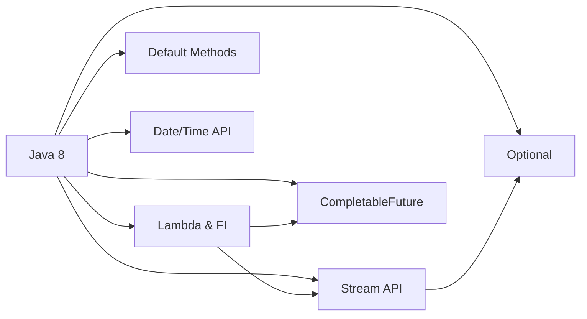
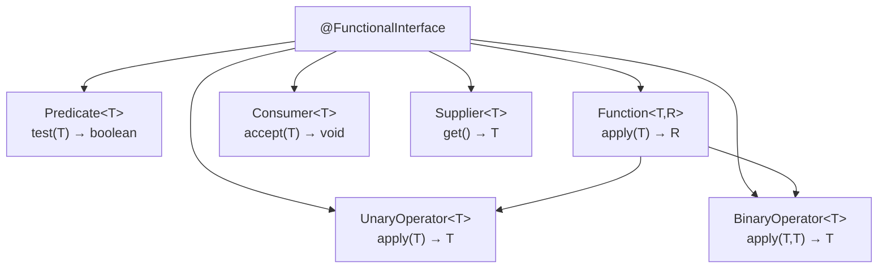
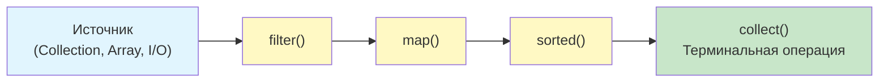
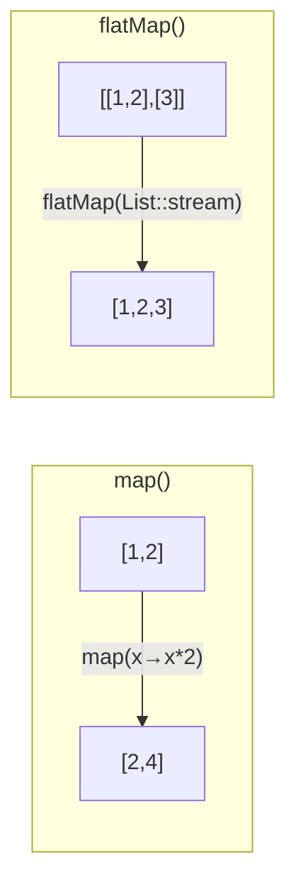

# Вопросы на собеседовании: `Java 8`

Комплексное руководство по вопросам собеседования на тему `Java 8` для `Senior Java Developer`. Включает детальные объяснения концепций, практические примеры кода, диаграммы и best practices.

Дата последнего обновления: 2026-04-13

**`Java 8`** — одна из самых значимых версий платформы, которая принесла функциональное программирование в мир `Java`. Основные нововведения: лямбда-выражения, `Stream API`, `Optional`, default-методы в интерфейсах, новый `Date/Time API` и `CompletableFuture`. Эти темы — обязательная часть любого Java-собеседования.

## Полезные ссылки

### Официальная документация

- [Java 8 Documentation](https://docs.oracle.com/javase/8/docs/) — официальная документация Oracle
- [Lambda Expressions Tutorial](https://docs.oracle.com/javase/tutorial/java/javaOO/lambdaexpressions.html) — туториал по лямбдам
- [Stream API JavaDoc](https://docs.oracle.com/en/java/javase/17/docs/api/java.base/java/util/stream/Stream.html) — API-документация Stream
- [java.time Package](https://docs.oracle.com/javase/8/docs/api/java/time/package-summary.html) — новый Date/Time API

### Baeldung

- [Java 8 Interview Questions — Baeldung](https://www.baeldung.com/java-8-interview-questions) — подборка вопросов с ответами
- [New Features in Java 8 — Baeldung](https://www.baeldung.com/java-8-new-features) — обзор всех нововведений
- [Guide To Java Optional — Baeldung](https://www.baeldung.com/java-optional) — полное руководство по Optional
- [Functional Interfaces in Java — Baeldung](https://www.baeldung.com/java-8-functional-interfaces) — Predicate, Function, Consumer, Supplier и другие

## Содержание

- [Полезные ссылки](#полезные-ссылки)
- [See also](#see-also)

**Обзор Java 8**
- [Q1. (!) Какие ключевые нововведения появились в Java 8?](#q1--какие-ключевые-нововведения-появились-в-java-8)
- [Q2. Какие важные изменения появились в Java 9–21?](#q2-какие-важные-изменения-появились-в-java-921)

**Функциональные интерфейсы и лямбды**
- [Q3. (!) Что такое функциональный интерфейс?](#q3--что-такое-функциональный-интерфейс)
- [Q4. (!) Какие стандартные функциональные интерфейсы есть в java.util.function?](#q4--какие-стандартные-функциональные-интерфейсы-есть-в-javautilfunction)
- [Q5. (!) Что такое лямбда-выражение и какой у него синтаксис?](#q5--что-такое-лямбда-выражение-и-какой-у-него-синтаксис)
- [Q6. Что такое аннотация @FunctionalInterface?](#q6-что-такое-аннотация-functionalinterface)
- [Q7. Что такое effectively final и зачем это ограничение в лямбдах?](#q7-что-такое-effectively-final-и-зачем-это-ограничение-в-лямбдах)
- [Q8. (!) Какие существуют типы ссылок на методы (Method Reference)?](#q8--какие-существуют-типы-ссылок-на-методы-method-reference)
- [Q9. Будет ли компилироваться интерфейс с default-методом и одним абстрактным?](#q9-будет-ли-компилироваться-интерфейс-с-default-методом-и-одним-абстрактным)
- [Q10. Чем лямбда-выражение отличается от анонимного класса?](#q10-чем-лямбда-выражение-отличается-от-анонимного-класса)

**Optional**
- [Q11. (!) Что такое Optional и зачем он нужен?](#q11--что-такое-optional-и-зачем-он-нужен)
- [Q12. В чём разница между orElse и orElseGet?](#q12-в-чём-разница-между-orelse-и-orelseget)
- [Q13. Что такое Optional.flatMap и когда использовать?](#q13-что-такое-optionalflatmap-и-когда-использовать)
- [Q14. Какие антипаттерны использования Optional вы знаете?](#q14-какие-антипаттерны-использования-optional-вы-знаете)

**Default-методы в интерфейсах**
- [Q15. Что такое default-метод в интерфейсе и зачем он нужен?](#q15-что-такое-default-метод-в-интерфейсе-и-зачем-он-нужен)
- [Q16. (!) Как разрешаются конфликты при наследовании нескольких default-методов?](#q16--как-разрешаются-конфликты-при-наследовании-нескольких-default-методов)
- [Q17. Можно ли объявить static-метод в интерфейсе?](#q17-можно-ли-объявить-static-метод-в-интерфейсе)

**Stream API**
- [Q18. (!) Что такое Stream и чем он отличается от коллекции?](#q18--что-такое-stream-и-чем-он-отличается-от-коллекции)
- [Q19. (!) В чём разница между промежуточными и терминальными операциями?](#q19--в-чём-разница-между-промежуточными-и-терминальными-операциями)
- [Q20. Что такое Stream Pipeline?](#q20-что-такое-stream-pipeline)
- [Q21. (!) В чём разница между map() и flatMap()?](#q21--в-чём-разница-между-map-и-flatmap)
- [Q22. Что такое reduce() и как его использовать?](#q22-что-такое-reduce-и-как-его-использовать)
- [Q23. В чём разница между findFirst() и findAny()?](#q23-в-чём-разница-между-findfirst-и-findany)
- [Q24. (!) Какие основные Collectors вы знаете?](#q24--какие-основные-collectors-вы-знаете)
- [Q25. Что такое Stream.peek() и когда его использовать?](#q25-что-такое-streampeek-и-когда-его-использовать)
- [Q26. Как группировать элементы с помощью Collectors.groupingBy?](#q26-как-группировать-элементы-с-помощью-collectorsgroupingby)
- [Q27. Что такое примитивные стримы IntStream, LongStream, DoubleStream?](#q27-что-такое-примитивные-стримы-intstream-longstream-doublestream)
- [Q28. (!) Что такое parallel stream и когда его применять?](#q28--что-такое-parallel-stream-и-когда-его-применять)
- [Q29. Можно ли повторно использовать Stream?](#q29-можно-ли-повторно-использовать-stream)
- [Q30. Как создать Stream из различных источников?](#q30-как-создать-stream-из-различных-источников)

**Date/Time API**
- [Q31. (!) Какие ключевые классы входят в новый Date/Time API?](#q31--какие-ключевые-классы-входят-в-новый-datetime-api)
- [Q32. В чём разница между LocalDateTime и ZonedDateTime?](#q32-в-чём-разница-между-localdatetime-и-zoneddatetime)
- [Q33. Чем Duration отличается от Period?](#q33-чем-duration-отличается-от-period)

**CompletableFuture и асинхронность**
- [Q34. (!) Что такое CompletableFuture и чем он лучше Future?](#q34--что-такое-completablefuture-и-чем-он-лучше-future)
- [Q35. Как комбинировать несколько CompletableFuture?](#q35-как-комбинировать-несколько-completablefuture)
- [Q36. Как обрабатывать исключения в CompletableFuture?](#q36-как-обрабатывать-исключения-в-completablefuture)

**Обработка исключений и практические паттерны**
- [Q37. Как обработать checked-исключения в лямбдах и Stream?](#q37-как-обработать-checked-исключения-в-лямбдах-и-stream)
- [Q38. Какие типичные ошибки допускают при работе со Stream API?](#q38-какие-типичные-ошибки-допускают-при-работе-со-stream-api)

**Продвинутые темы Java 8**
- [Q39. (!) Как написать собственный `Collector`?](#q39--как-написать-собственный-collector)
- [Q40. Какие типы `Method Reference` существуют и чем отличаются?](#q40-какие-типы-method-reference-существуют-и-чем-отличаются)
- [Q41. Как правильно использовать `Optional` и каких антипаттернов избегать?](#q41-как-правильно-использовать-optional-и-каких-антипаттернов-избегать)
- [Q42. Что такое `Stream Pipeline` и как работает ленивость?](#q42-что-такое-stream-pipeline-и-как-работает-ленивость)

---

## Q1. (!) Какие ключевые нововведения появились в `Java 8`?

`Java 8` (март 2014) — одна из самых значимых версий платформы. Ключевые нововведения:

| Фича | Описание |
|-------|----------|
| **Лямбда-выражения** | Компактный синтаксис анонимных функций |
| **Функциональные интерфейсы** | Интерфейсы с одним абстрактным методом (`SAM`) |
| **Method References** | Ссылки на методы (`Class::method`) |
| **`Stream API`** | Функциональная обработка коллекций |
| **`Optional`** | Обёртка для nullable-значений |
| **Default-методы** | Методы с реализацией в интерфейсах |
| **`Date/Time API`** | Новый пакет `java.time` (замена `Date`/`Calendar`) |
| **`CompletableFuture`** | Асинхронное программирование с цепочками |
| **`Nashorn`** | JavaScript-движок (удалён в Java 15) |



На собеседовании важно не просто перечислить фичи, а показать, как они связаны: лямбды — основа для `Stream API` и `CompletableFuture`; `Optional` — естественный результат терминальных операций стримов.

## Q2. Какие важные изменения появились в `Java 9–21`?

Краткий обзор эволюции после `Java 8`:

| Версия | Ключевые фичи |
|--------|---------------|
| **Java 9** | `List.of()`, `Set.of()`, `Map.of()`, `Optional.or()`, `Stream.takeWhile()`/`dropWhile()`, модули (JPMS) |
| **Java 10** | `var` для локальных переменных, `List.copyOf()` |
| **Java 11** | `String.isBlank()`/`strip()`/`lines()`, `Optional.isEmpty()`, `HttpClient` |
| **Java 14** | `switch`-выражения, `instanceof` pattern matching (preview) |
| **Java 16** | `record`, `Stream.toList()` |
| **Java 17** | `sealed` классы, pattern matching for `instanceof` |
| **Java 21** | Виртуальные потоки, `SequencedCollection`, record patterns |

```java
// Java 9: фабрики неизменяемых коллекций
List<String> list = List.of("a", "b", "c");

// Java 10: var
var names = List.of("Alice", "Bob");

// Java 16: Stream.toList() — неизменяемый список
List<String> filtered = names.stream()
    .filter(n -> n.startsWith("A"))
    .toList();
```

На собеседовании достаточно знать основные фичи каждой LTS-версии (8, 11, 17, 21) и уметь объяснить практическую пользу.

## Q3. (!) Что такое функциональный интерфейс?

**Функциональный интерфейс** — интерфейс с ровно одним абстрактным методом (Single Abstract Method, `SAM`). Default- и static-методы не считаются.

Функциональные интерфейсы — это **целевые типы** для лямбда-выражений и ссылок на методы.

```java
@FunctionalInterface
public interface Converter<F, T> {
    T convert(F from);

    // default-метод — не нарушает SAM
    default Converter<F, T> andThen(Converter<T, ?> after) {
        return (F f) -> after.convert(this.convert(f));
    }
}

// Использование через лямбду
Converter<String, Integer> toInt = Integer::valueOf;
Integer result = toInt.convert("123"); // 123
```



Подробнее о коллекциях, использующих функциональные интерфейсы — в [вопросах по Java Collections](java-collections-interview.md).

## Q4. (!) Какие стандартные функциональные интерфейсы есть в `java.util.function`?

Пакет `java.util.function` содержит 43+ функциональных интерфейса. Основные:

| Интерфейс | Метод | Описание |
|-----------|-------|----------|
| `Predicate<T>` | `test(T) → boolean` | Проверка условия |
| `Function<T,R>` | `apply(T) → R` | Преобразование T в R |
| `Consumer<T>` | `accept(T) → void` | Потребление значения |
| `Supplier<T>` | `get() → T` | Поставка значения |
| `UnaryOperator<T>` | `apply(T) → T` | Функция T → T |
| `BinaryOperator<T>` | `apply(T,T) → T` | Функция (T,T) → T |
| `BiFunction<T,U,R>` | `apply(T,U) → R` | Два аргумента → R |
| `BiPredicate<T,U>` | `test(T,U) → boolean` | Два аргумента → boolean |
| `BiConsumer<T,U>` | `accept(T,U) → void` | Два аргумента → void |

```java
// Predicate — фильтрация
Predicate<String> isLong = s -> s.length() > 5;
Predicate<String> startsWithJ = s -> s.startsWith("J");
Predicate<String> combined = isLong.and(startsWithJ);

// Function — преобразование и композиция
Function<String, Integer> toLength = String::length;
Function<Integer, String> toStr = i -> "len=" + i;
Function<String, String> composed = toLength.andThen(toStr);
// composed.apply("Hello") → "len=5"

// Consumer — побочные эффекты
Consumer<String> printer = System.out::println;
Consumer<String> logger = s -> log.info("Value: {}", s);
Consumer<String> both = printer.andThen(logger);

// Supplier — отложенное создание
Supplier<List<String>> listFactory = ArrayList::new;
```

Примитивные специализации (избегают боксинга): `IntPredicate`, `LongFunction<R>`, `ToIntFunction<T>`, `IntConsumer`, `IntSupplier`, `IntUnaryOperator`, `IntBinaryOperator` и аналогичные для `long`/`double`.

## Q5. (!) Что такое лямбда-выражение и какой у него синтаксис?

**Лямбда-выражение** — компактная запись анонимной функции, совместимой с функциональным интерфейсом.

Синтаксис:

```java
// Полная форма
(Type1 param1, Type2 param2) -> { statements; return result; }

// Сокращённые формы
(a, b) -> a + b          // типы выводятся, одно выражение
a -> a.length()           // один параметр — скобки не нужны
() -> System.out.println("Hi")  // без параметров
```

Практические примеры:

```java
// Сортировка списка
List<String> names = Arrays.asList("Charlie", "Alice", "Bob");
names.sort((a, b) -> a.compareTo(b));
// или через method reference:
names.sort(String::compareTo);

// Runnable
Runnable task = () -> System.out.println("Running in " + Thread.currentThread().getName());
new Thread(task).start();

// Обработка коллекций
Map<String, List<String>> grouped = names.stream()
    .collect(Collectors.groupingBy(name -> name.substring(0, 1)));
```

Под капотом лямбда компилируется не в анонимный класс, а через `invokedynamic` (JEP 276), что эффективнее: нет дополнительного `.class`-файла, нет аллокации нового объекта при каждом вызове (JVM может кэшировать).

## Q6. Что такое аннотация `@FunctionalInterface`?

`@FunctionalInterface` — маркерная аннотация, которая сообщает компилятору, что интерфейс должен содержать ровно один абстрактный метод.

```java
@FunctionalInterface
public interface Validator<T> {
    boolean isValid(T value);

    // OK: default-метод
    default Validator<T> negate() {
        return t -> !isValid(t);
    }

    // OK: static-метод
    static <T> Validator<T> alwaysTrue() {
        return t -> true;
    }

    // ОШИБКА КОМПИЛЯЦИИ: второй абстрактный метод
    // String describe();
}
```

**Важно**: аннотация не обязательна для использования лямбд — любой SAM-интерфейс может быть целевым типом лямбды. Но аннотация защищает от случайного добавления второго абстрактного метода. Стандартные примеры: `Runnable`, `Callable`, `Comparator`, `Consumer`.

## Q7. Что такое `effectively final` и зачем это ограничение в лямбдах?

Переменная **effectively final** — это локальная переменная, которая не объявлена как `final`, но ни разу не изменяется после инициализации.

В лямбдах и анонимных классах можно захватывать **только** effectively final (или `final`) локальные переменные:

```java
String prefix = "Hello"; // effectively final

// OK — prefix не изменяется
Function<String, String> greeter = name -> prefix + ", " + name;

// ОШИБКА КОМПИЛЯЦИИ — prefix модифицируется
// prefix = "Hi";
// Function<String, String> greeter2 = name -> prefix + ", " + name;
```

**Причина ограничения**: лямбда захватывает **копию** значения переменной (capture by value). Если бы переменную можно было менять, возникла бы иллюзия shared mutable state между лямбдой и внешним кодом.

**Обходные пути** для изменяемого состояния:

```java
// AtomicInteger для счётчика
AtomicInteger counter = new AtomicInteger(0);
list.forEach(item -> counter.incrementAndGet());

// Массив из одного элемента
int[] sum = {0};
list.forEach(item -> sum[0] += item.length());
```

## Q8. (!) Какие существуют типы ссылок на методы (`Method Reference`)?

Ссылка на метод — сокращённая форма лямбды, когда лямбда просто вызывает существующий метод.

Четыре типа:

| Тип | Синтаксис | Эквивалент лямбды |
|-----|-----------|-------------------|
| Статический метод | `ClassName::staticMethod` | `(args) -> ClassName.staticMethod(args)` |
| Метод экземпляра (конкретного) | `object::instanceMethod` | `(args) -> object.instanceMethod(args)` |
| Метод экземпляра (произвольного) | `ClassName::instanceMethod` | `(obj, args) -> obj.instanceMethod(args)` |
| Конструктор | `ClassName::new` | `(args) -> new ClassName(args)` |

```java
// 1. Статический метод
Function<String, Integer> parser = Integer::parseInt;

// 2. Метод конкретного экземпляра
String prefix = "Mr. ";
Function<String, String> addPrefix = prefix::concat;

// 3. Метод произвольного экземпляра — первый аргумент = объект
Function<String, String> toUpper = String::toUpperCase;
BiFunction<String, String, Boolean> checker = String::startsWith;

// 4. Конструктор
Supplier<ArrayList<String>> listFactory = ArrayList::new;
Function<String, Integer> intFactory = Integer::new;
```

На собеседовании часто просят объяснить разницу между типами 2 и 3 — в типе 3 первый параметр функционального интерфейса становится объектом, у которого вызывается метод.

## Q9. Будет ли компилироваться интерфейс с `default`-методом и одним абстрактным?

```java
@FunctionalInterface
public interface Function2<T, U, V> {
    V apply(T t, U u);

    default void count() {
        // реализация по умолчанию
    }
}
```

**Да**, код скомпилируется. Интерфейс содержит ровно один абстрактный метод `apply()` — это соответствует контракту `@FunctionalInterface`. Метод `count()` — default-метод с реализацией, он не считается абстрактным.

Такой интерфейс можно использовать как целевой тип лямбды:

```java
Function2<String, Integer, String> repeater = (s, n) -> s.repeat(n);
```

## Q10. Чем лямбда-выражение отличается от анонимного класса?

| Критерий | Лямбда | Анонимный класс |
|----------|--------|-----------------|
| Целевой тип | Только функциональный интерфейс | Любой интерфейс / абстрактный класс |
| `this` | Ссылается на внешний класс | Ссылается на сам анонимный класс |
| Компиляция | `invokedynamic` | Отдельный `.class`-файл |
| Производительность | Обычно быстрее (нет аллокации класса) | Создаёт новый объект каждый раз |
| Состояние (поля) | Нет собственных полей | Может иметь поля |
| Shadowing | Не может переопределить переменную из scope | Может |

```java
public class Example {
    private String name = "outer";

    void demo() {
        // Лямбда — this = Example
        Runnable lambda = () -> System.out.println(this.name); // "outer"

        // Анонимный класс — this = экземпляр анонимного класса
        Runnable anon = new Runnable() {
            private String name = "inner";
            @Override
            public void run() {
                System.out.println(this.name); // "inner"
            }
        };
    }
}
```

## Q11. (!) Что такое `Optional` и зачем он нужен?

`Optional<T>` — контейнер, который может содержать значение типа `T` или быть пустым. Введён в `Java 8` для явного выражения отсутствия значения вместо `null`.

```java
// Создание
Optional<String> present = Optional.of("hello");
Optional<String> empty = Optional.empty();
Optional<String> nullable = Optional.ofNullable(possiblyNull);

// Основные операции
String value = present
    .filter(s -> s.length() > 3)
    .map(String::toUpperCase)
    .orElse("default");
// "HELLO"

// Цепочка Optional в бизнес-логике
Optional<String> city = findUser(userId)
    .flatMap(User::getAddress)
    .map(Address::getCity);
```

**Ключевые методы:**

| Метод | Описание |
|-------|----------|
| `of(value)` | Создаёт `Optional`; бросает `NPE` если `null` |
| `ofNullable(value)` | Создаёт `Optional`; пустой если `null` |
| `isPresent()` / `isEmpty()` | Проверка наличия значения |
| `ifPresent(Consumer)` | Выполнить действие если есть значение |
| `map(Function)` | Преобразование значения |
| `flatMap(Function)` | Преобразование в другой `Optional` |
| `filter(Predicate)` | Фильтрация значения |
| `orElse(T)` | Значение по умолчанию |
| `orElseGet(Supplier)` | Ленивое значение по умолчанию |
| `orElseThrow()` | Бросить исключение если пусто |

**Важно**: `Optional` не реализует `Serializable` — не использовать как поле сущности или DTO. Его назначение — возвращаемый тип методов.

Подробнее о работе с `null`-безопасными коллекциями — в [вопросах по Collections](java-collections-interview.md).

## Q12. В чём разница между `orElse` и `orElseGet`?

```java
// orElse — аргумент ВСЕГДА вычисляется
Optional<String> opt = Optional.of("value");
String result1 = opt.orElse(expensiveCall());     // expensiveCall() вызван!

// orElseGet — Supplier вызывается ТОЛЬКО при пустом Optional
String result2 = opt.orElseGet(() -> expensiveCall()); // НЕ вызван
```

Практическое правило:
- **`orElse(value)`** — когда значение по умолчанию уже готово (литерал, константа)
- **`orElseGet(Supplier)`** — когда вычисление дорогое (запрос в БД, создание объекта, HTTP-вызов)
- **`orElseThrow()`** — когда отсутствие значения = ошибка

```java
// Типичная ошибка — побочный эффект в orElse
Optional<User> user = findById(id);
User result = user.orElse(createDefaultUser()); // создаст пользователя ВСЕГДА!
User correct = user.orElseGet(() -> createDefaultUser()); // создаст только если user пуст
```

## Q13. Что такое `Optional.flatMap` и когда использовать?

`flatMap` используется, когда функция преобразования сама возвращает `Optional` — он «разворачивает» вложенный `Optional`:

```java
// Без flatMap — получим Optional<Optional<Address>>
Optional<Optional<Address>> nested = user.map(User::getAddress);

// С flatMap — получим Optional<Address>
Optional<Address> address = user.flatMap(User::getAddress);

// Цепочка flatMap для глубокой навигации
Optional<String> zipCode = findUser(userId)
    .flatMap(User::getAddress)       // User → Optional<Address>
    .flatMap(Address::getZipCode);   // Address → Optional<String>
```

**Правило**: `map` — когда функция возвращает обычное значение; `flatMap` — когда функция возвращает `Optional`.

## Q14. Какие антипаттерны использования `Optional` вы знаете?

```java
// ❌ Антипаттерн 1: Optional как параметр метода
void process(Optional<String> name) { ... }
// ✅ Вместо этого — перегрузка или @Nullable

// ❌ Антипаттерн 2: Optional как поле класса
class User {
    private Optional<String> middleName; // не Serializable!
}
// ✅ Вместо этого — nullable поле + Optional-getter

// ❌ Антипаттерн 3: isPresent() + get()
if (opt.isPresent()) {
    return opt.get();
}
// ✅ Вместо этого — orElse / map / ifPresent

// ❌ Антипаттерн 4: Optional.of(null) — бросит NPE
Optional.of(null);
// ✅ Вместо этого — Optional.ofNullable(value)

// ❌ Антипаттерн 5: Optional в коллекциях
List<Optional<String>> list;
// ✅ Вместо этого — фильтровать null перед добавлением
```

## Q15. Что такое `default`-метод в интерфейсе и зачем он нужен?

Default-метод — метод интерфейса с реализацией, помеченный ключевым словом `default`. Классы-реализаторы наследуют его «из коробки», но могут переопределить.

```java
public interface Collection<E> {
    // абстрактный метод
    int size();

    // default-метод — добавлен в Java 8
    default boolean isEmpty() {
        return size() == 0;
    }

    // static-метод — тоже можно с Java 8
    static <T> Collection<T> empty() {
        return Collections.emptyList();
    }
}
```

**Зачем нужен**: позволяет добавлять новые методы в существующие интерфейсы (`Collection`, `List`, `Map`) без ломки всех реализаций. Именно так были добавлены `forEach()`, `stream()`, `sort()`, `removeIf()` и другие методы в стандартные интерфейсы коллекций.

Подробнее о методах коллекций — в [вопросах по Collections](java-collections-interview.md).

## Q16. (!) Как разрешаются конфликты при наследовании нескольких `default`-методов?

Если класс реализует два интерфейса с одинаковым default-методом — **конфликт**, и класс обязан явно переопределить метод:

```java
interface A {
    default String greet() { return "Hello from A"; }
}

interface B {
    default String greet() { return "Hello from B"; }
}

// ОШИБКА КОМПИЛЯЦИИ без переопределения
class C implements A, B {
    @Override
    public String greet() {
        // Явный выбор реализации
        return A.super.greet();
    }
}
```

**Правила разрешения:**
1. Класс всегда побеждает интерфейс
2. Более специфичный интерфейс (подинтерфейс) побеждает менее специфичный
3. Если конфликт не разрешён — компилятор требует явного переопределения

## Q17. Можно ли объявить `static`-метод в интерфейсе?

Да, с `Java 8` интерфейсы могут содержать `static`-методы. В отличие от default-методов, они **не наследуются** реализующими классами:

```java
public interface StringUtils {
    static boolean isNullOrEmpty(String s) {
        return s == null || s.isEmpty();
    }

    static String defaultIfEmpty(String s, String defaultValue) {
        return isNullOrEmpty(s) ? defaultValue : s;
    }
}

// Вызов — только через имя интерфейса
boolean empty = StringUtils.isNullOrEmpty("");
```

Это позволяет создавать утилитные методы прямо в интерфейсе, не прибегая к отдельным utility-классам.

## Q18. (!) Что такое `Stream` и чем он отличается от коллекции?

`Stream` — последовательность элементов, поддерживающая последовательные и параллельные агрегатные операции. Это **не** структура данных.

| Критерий | `Collection` | `Stream` |
|----------|-------------|----------|
| Хранит данные | Да | Нет (вычисляет лениво) |
| Модификация | Можно добавлять/удалять | Не модифицирует источник |
| Повторное использование | Многократно | Одноразовый |
| Ленивость | Нет | Да (промежуточные операции) |
| Параллелизм | Вручную | Встроенный (`parallelStream()`) |
| Размер | Конечный | Может быть бесконечным |

```java
// Stream не модифицирует источник
List<String> names = new ArrayList<>(List.of("Alice", "Bob", "Charlie"));
List<String> filtered = names.stream()
    .filter(n -> n.length() > 3)
    .map(String::toUpperCase)
    .sorted()
    .collect(Collectors.toList());

// names — не изменился: ["Alice", "Bob", "Charlie"]
// filtered: ["ALICE", "CHARLIE"]
```



Подробнее — в [отдельном файле по Stream API](java-stream-interview.md).

## Q19. (!) В чём разница между промежуточными и терминальными операциями?

**Промежуточные** (intermediate) — ленивые, возвращают новый `Stream`:
- `filter()`, `map()`, `flatMap()`, `sorted()`, `distinct()`, `peek()`, `limit()`, `skip()`

**Терминальные** (terminal) — запускают пайплайн, возвращают результат или void:
- `collect()`, `forEach()`, `reduce()`, `count()`, `findFirst()`, `findAny()`, `anyMatch()`, `allMatch()`, `noneMatch()`, `toArray()`, `min()`, `max()`

```java
List<String> names = List.of("Alice", "Bob", "Charlie", "David");

// Ничего не выполняется — нет терминальной операции!
Stream<String> lazy = names.stream()
    .filter(n -> {
        System.out.println("filtering: " + n); // НЕ будет вызван
        return n.length() > 3;
    });

// Выполнение начнётся только при вызове терминальной операции
long count = lazy.count(); // Теперь выполнится
```

**Ключевой момент**: без терминальной операции промежуточные не выполняются вообще. Это и есть **ленивость** стримов.

## Q20. Что такое `Stream Pipeline`?

**Pipeline** — цепочка: источник → 0..N промежуточных операций → 1 терминальная операция.

```java
// Pipeline = source → filter → map → sorted → collect
List<String> result = employees.stream()          // источник
    .filter(e -> e.getSalary() > 50_000)          // промежуточная
    .map(Employee::getName)                        // промежуточная
    .sorted()                                      // промежуточная
    .collect(Collectors.toList());                 // терминальная
```

**Оптимизации pipeline** (выполняет JVM):
- **Short-circuiting**: `limit()`, `findFirst()`, `anyMatch()` — могут остановить обработку раньше
- **Loop fusion**: несколько операций объединяются в один проход по элементам
- Элементы обрабатываются **по одному** через весь pipeline, а не «все через filter, потом все через map»

## Q21. (!) В чём разница между `map()` и `flatMap()`?

`map()` — преобразует каждый элемент 1:1.
`flatMap()` — преобразует каждый элемент в `Stream` и объединяет результаты в один плоский поток.

```java
// map: String → Integer (1:1)
List<String> words = List.of("Hello", "World");
List<Integer> lengths = words.stream()
    .map(String::length)
    .collect(Collectors.toList()); // [5, 5]

// flatMap: List<String> → Stream<String> (1:N, "разворачивание")
List<List<String>> nested = List.of(
    List.of("a", "b"),
    List.of("c", "d"),
    List.of("e")
);
List<String> flat = nested.stream()
    .flatMap(Collection::stream)
    .collect(Collectors.toList()); // ["a", "b", "c", "d", "e"]

// Практический пример: извлечение тегов из статей
List<String> allTags = articles.stream()
    .flatMap(article -> article.getTags().stream())
    .distinct()
    .sorted()
    .collect(Collectors.toList());
```



## Q22. Что такое `reduce()` и как его использовать?

`reduce()` — терминальная операция свёртки, которая последовательно применяет бинарную функцию к элементам, накапливая результат.

```java
// Три формы reduce:

// 1. С identity — всегда возвращает результат
int sum = List.of(1, 2, 3, 4, 5).stream()
    .reduce(0, Integer::sum); // 15

// 2. Без identity — возвращает Optional (поток может быть пустым)
Optional<Integer> max = List.of(1, 2, 3).stream()
    .reduce(Integer::max); // Optional[3]

// 3. С identity, accumulator и combiner (для parallel)
String concatenated = List.of("a", "b", "c").stream()
    .reduce("",
        (partial, element) -> partial + element,  // accumulator
        (left, right) -> left + right);            // combiner
// "abc"
```

**Когда использовать**: для кастомных агрегаций, когда нет готового коллектора. Для простых случаев предпочтительнее `sum()`, `min()`, `max()`, `count()`.

**Подвох**: identity-значение должно быть нейтральным элементом: `0` для суммы, `1` для произведения, `""` для конкатенации.

## Q23. В чём разница между `findFirst()` и `findAny()`?

| | `findFirst()` | `findAny()` |
|---|---|---|
| Гарантия порядка | Да — первый элемент в encounter order | Нет — любой элемент |
| В sequential stream | Первый подходящий | Обычно тоже первый |
| В parallel stream | Первый (может быть дороже) | Любой (быстрее) |
| Возвращает | `Optional<T>` | `Optional<T>` |

```java
// findAny — предпочтительнее в parallel stream
Optional<String> any = names.parallelStream()
    .filter(n -> n.startsWith("A"))
    .findAny(); // не ждёт обработки всех элементов

// findFirst — когда нужен именно первый
Optional<String> first = names.stream()
    .filter(n -> n.startsWith("A"))
    .findFirst();
```

## Q24. (!) Какие основные `Collectors` вы знаете?

```java
List<Employee> employees = getEmployees();

// toList / toSet / toMap
List<String> names = employees.stream().map(Employee::getName).collect(Collectors.toList());
Map<Long, Employee> byId = employees.stream().collect(Collectors.toMap(Employee::getId, e -> e));

// joining — конкатенация строк
String csv = employees.stream().map(Employee::getName).collect(Collectors.joining(", "));

// groupingBy — группировка
Map<Department, List<Employee>> byDept = employees.stream()
    .collect(Collectors.groupingBy(Employee::getDepartment));

// groupingBy с downstream-коллектором
Map<Department, Long> countByDept = employees.stream()
    .collect(Collectors.groupingBy(Employee::getDepartment, Collectors.counting()));

// partitioningBy — разбиение на true/false
Map<Boolean, List<Employee>> partitioned = employees.stream()
    .collect(Collectors.partitioningBy(e -> e.getSalary() > 100_000));

// summarizingInt — статистика
IntSummaryStatistics stats = employees.stream()
    .collect(Collectors.summarizingInt(Employee::getAge));
// stats.getAverage(), stats.getMax(), stats.getCount()

// toUnmodifiableList (Java 10+) — неизменяемый список
List<String> immutable = names.stream().collect(Collectors.toUnmodifiableList());
```

## Q25. Что такое `Stream.peek()` и когда его использовать?

`peek(Consumer)` — промежуточная операция, которая выполняет побочный эффект для каждого элемента, не изменяя поток.

```java
// Основное применение — отладка pipeline
List<String> result = Stream.of("one", "two", "three", "four")
    .filter(e -> e.length() > 3)
    .peek(e -> System.out.println("After filter: " + e))
    .map(String::toUpperCase)
    .peek(e -> System.out.println("After map: " + e))
    .collect(Collectors.toList());
```

**Предостережения:**
- `peek` ленивый — без терминальной операции не выполнится
- В parallel stream порядок вызовов не гарантирован
- Не использовать для мутации объектов в потоке — это нарушает контракт `Stream`
- В production-коде предпочтительнее полноценное логирование

## Q26. Как группировать элементы с помощью `Collectors.groupingBy`?

```java
List<Transaction> transactions = getTransactions();

// Простая группировка
Map<String, List<Transaction>> byCategory = transactions.stream()
    .collect(Collectors.groupingBy(Transaction::getCategory));

// Группировка с подсчётом
Map<String, Long> countByCategory = transactions.stream()
    .collect(Collectors.groupingBy(Transaction::getCategory, Collectors.counting()));

// Группировка с суммированием
Map<String, Double> totalByCategory = transactions.stream()
    .collect(Collectors.groupingBy(
        Transaction::getCategory,
        Collectors.summingDouble(Transaction::getAmount)));

// Многоуровневая группировка
Map<String, Map<Integer, List<Transaction>>> byCategoryAndYear = transactions.stream()
    .collect(Collectors.groupingBy(
        Transaction::getCategory,
        Collectors.groupingBy(t -> t.getDate().getYear())));

// partitioningBy — частный случай (два раздела)
Map<Boolean, List<Transaction>> expensive = transactions.stream()
    .collect(Collectors.partitioningBy(t -> t.getAmount() > 1000));
```

## Q27. Что такое примитивные стримы `IntStream`, `LongStream`, `DoubleStream`?

Специализированные стримы для примитивных типов, которые **избегают autoboxing/unboxing**:

```java
// Создание
IntStream range = IntStream.range(1, 10);       // 1..9
IntStream closed = IntStream.rangeClosed(1, 10); // 1..10
IntStream of = IntStream.of(1, 2, 3);

// Преобразование из Stream<Integer>
IntStream intStream = Stream.of(1, 2, 3).mapToInt(Integer::intValue);

// Специальные методы
int sum = IntStream.rangeClosed(1, 100).sum();                    // 5050
OptionalDouble avg = IntStream.of(1, 2, 3).average();             // 2.0
IntSummaryStatistics stats = IntStream.of(1, 2, 3).summaryStatistics();

// Обратно к объектному стриму
Stream<Integer> boxed = IntStream.of(1, 2, 3).boxed();

// Генерация случайных чисел
IntStream random = new Random().ints(10, 1, 100); // 10 чисел от 1 до 99
```

**Когда использовать**: при работе с числовыми данными для повышения производительности и доступа к агрегатным методам (`sum`, `average`, `min`, `max`).

## Q28. (!) Что такое parallel `stream` и когда его применять?

`parallelStream()` выполняет операции в `ForkJoinPool.commonPool()`, разбивая данные на части и обрабатывая их параллельно.

```java
// Создание
List<String> names = List.of("Alice", "Bob", "Charlie");
Stream<String> parallel = names.parallelStream();
// или: names.stream().parallel()

// Пример с тяжёлой операцией
List<Result> results = urls.parallelStream()
    .map(url -> fetchData(url))    // I/O-bound операция
    .filter(Result::isSuccess)
    .collect(Collectors.toList());
```

**Когда применять:**
- Большой объём данных (тысячи+ элементов)
- Тяжёлые вычисления на каждый элемент
- Нет общего изменяемого состояния
- Порядок элементов не критичен

**Когда НЕ применять:**
- Мало элементов (накладные расходы > выигрыш)
- Операции с побочными эффектами (race condition)
- `LinkedList` как источник (плохо разбивается)
- Работа в контейнере (общий `ForkJoinPool` с другими потоками)

```java
// ❌ Опасно — мутация общей коллекции
List<String> shared = new ArrayList<>();
names.parallelStream().forEach(shared::add); // race condition!

// ✅ Безопасно — collect
List<String> safe = names.parallelStream()
    .map(String::toUpperCase)
    .collect(Collectors.toList());
```

Подробнее о проблемах параллелизма — в [вопросах по Java Concurrency](java-concurrency-interview.md).

## Q29. Можно ли повторно использовать `Stream`?

**Нет.** После вызова терминальной операции стрим «закрывается» и не может быть использован повторно:

```java
Stream<String> stream = List.of("a", "b", "c").stream();

stream.forEach(System.out::println); // OK — первый раз

// IllegalStateException: stream has already been operated upon or closed
stream.forEach(System.out::println); // ОШИБКА!
```

**Решение** — создавать стрим заново при каждом использовании:

```java
Supplier<Stream<String>> streamFactory = () -> List.of("a", "b", "c").stream();

long count = streamFactory.get().count();
List<String> upper = streamFactory.get().map(String::toUpperCase).toList();
```

## Q30. Как создать `Stream` из различных источников?

```java
// Из коллекции
Stream<String> s1 = list.stream();

// Из массива
Stream<String> s2 = Arrays.stream(array);
Stream<String> s3 = Stream.of("a", "b", "c");

// Из значений
Stream<String> s4 = Stream.of("one", "two");
Stream<String> s5 = Stream.empty();

// Генерация
Stream<Double> s6 = Stream.generate(Math::random).limit(10);
Stream<Integer> s7 = Stream.iterate(0, n -> n + 2).limit(5); // 0, 2, 4, 6, 8

// Java 9: iterate с предикатом
Stream<Integer> s8 = Stream.iterate(1, n -> n < 100, n -> n * 2); // 1, 2, 4, 8, 16, 32, 64

// Из файла
Stream<String> lines = Files.lines(Path.of("data.txt"));

// Из строки
IntStream chars = "hello".chars();

// Из Map
Stream<Map.Entry<String, Integer>> entries = map.entrySet().stream();

// Из Optional (Java 9)
Stream<String> s9 = Optional.of("value").stream();
```

## Q31. (!) Какие ключевые классы входят в новый `Date/Time API`?

`Java 8` представила пакет `java.time` (JSR 310) — замену устаревших `java.util.Date` и `Calendar`. Все классы **неизменяемые** и **потокобезопасные**.

| Класс | Описание | Пример |
|-------|----------|--------|
| `LocalDate` | Дата без времени | `2026-04-12` |
| `LocalTime` | Время без даты | `14:30:15` |
| `LocalDateTime` | Дата + время (без зоны) | `2026-04-12T14:30:15` |
| `ZonedDateTime` | Дата + время + временная зона | `2026-04-12T14:30+03:00[Europe/Moscow]` |
| `OffsetDateTime` | Дата + время + смещение UTC | `2026-04-12T14:30+03:00` |
| `Instant` | Момент на timeline (UTC) | Timestamp |
| `Duration` | Промежуток (часы, минуты, секунды) | `PT2H30M` |
| `Period` | Промежуток (годы, месяцы, дни) | `P1Y2M3D` |
| `DateTimeFormatter` | Форматирование/парсинг | `dd.MM.yyyy` |
| `ZoneId` | Временная зона | `Europe/Moscow` |

```java
// Создание
LocalDate today = LocalDate.now();
LocalDate birthday = LocalDate.of(1990, Month.MARCH, 15);
LocalTime noon = LocalTime.of(12, 0);
LocalDateTime meeting = LocalDateTime.of(today, noon);
ZonedDateTime zoned = ZonedDateTime.now(ZoneId.of("Europe/Moscow"));
Instant now = Instant.now();

// Операции (неизменяемые — возвращают новый объект)
LocalDate nextWeek = today.plusWeeks(1);
LocalDate lastMonth = today.minusMonths(1);
Period age = Period.between(birthday, today);
long daysBetween = ChronoUnit.DAYS.between(birthday, today);

// Форматирование
DateTimeFormatter formatter = DateTimeFormatter.ofPattern("dd.MM.yyyy HH:mm");
String formatted = meeting.format(formatter); // "12.04.2026 12:00"
LocalDateTime parsed = LocalDateTime.parse("12.04.2026 12:00", formatter);

// Конвертация из legacy
Instant fromDate = new Date().toInstant();
LocalDateTime fromLegacy = LocalDateTime.ofInstant(fromDate, ZoneId.systemDefault());
```

## Q32. В чём разница между `LocalDateTime` и `ZonedDateTime`?

| | `LocalDateTime` | `ZonedDateTime` |
|---|---|---|
| Временная зона | Нет | Есть (`ZoneId`) |
| Использование | Для локальных операций, UI | Для хранения, API, конвертации зон |
| Сравнение времени | Только если зона одна | Корректно между зонами |

```java
// LocalDateTime — не знает о зоне
LocalDateTime local = LocalDateTime.of(2026, 4, 12, 15, 0);

// ZonedDateTime — привязан к зоне
ZonedDateTime moscow = local.atZone(ZoneId.of("Europe/Moscow"));
ZonedDateTime tokyo = moscow.withZoneSameInstant(ZoneId.of("Asia/Tokyo"));
// moscow: 2026-04-12T15:00+03:00[Europe/Moscow]
// tokyo:  2026-04-12T21:00+09:00[Asia/Tokyo]

// Instant — для хранения в БД и передачи по API
Instant instant = moscow.toInstant(); // UTC момент
```

**Правило**: для хранения и передачи по сети всегда использовать `Instant` или `ZonedDateTime`/`OffsetDateTime`. `LocalDateTime` — только для отображения пользователю в его локальной зоне.

## Q33. Чем `Duration` отличается от `Period`?

| | `Duration` | `Period` |
|---|---|---|
| Единицы | Секунды + наносекунды | Годы + месяцы + дни |
| Точность | Точная (абсолютная длительность) | Календарная (относительная) |
| Применение | Время выполнения, таймауты | Возраст, сроки |

```java
// Duration — для измерения времени выполнения
Instant start = Instant.now();
doWork();
Duration elapsed = Duration.between(start, Instant.now());
System.out.println("Выполнено за: " + elapsed.toMillis() + " мс");

// Period — для календарных промежутков
LocalDate birth = LocalDate.of(1990, 3, 15);
Period age = Period.between(birth, LocalDate.now());
System.out.println("Возраст: " + age.getYears() + " лет, " + age.getMonths() + " мес.");

// Duration: можно создать из часов, минут
Duration timeout = Duration.ofSeconds(30);
Duration longRun = Duration.ofHours(2).plusMinutes(30);
```

## Q34. (!) Что такое `CompletableFuture` и чем он лучше `Future`?

`CompletableFuture<T>` — расширение `Future<T>`, добавляющее:
- Неблокирующие цепочки операций (`thenApply`, `thenCompose`, `thenAccept`)
- Комбинирование нескольких `Future` (`allOf`, `anyOf`, `thenCombine`)
- Обработку ошибок (`exceptionally`, `handle`)
- Возможность завершить вручную (`complete`, `completeExceptionally`)

| | `Future` | `CompletableFuture` |
|---|---|---|
| Получение результата | `get()` — блокирует | `thenApply()` — неблокирующее |
| Цепочки | Нет | Да |
| Комбинирование | Нет | `allOf`, `anyOf`, `thenCombine` |
| Обработка ошибок | `try/catch` на `get()` | `exceptionally`, `handle` |
| Ручное завершение | Нет | `complete()` |

```java
// Асинхронное выполнение
CompletableFuture<String> future = CompletableFuture
    .supplyAsync(() -> fetchData("https://api.example.com"))
    .thenApply(data -> parseJson(data))
    .thenApply(json -> json.get("name").asText())
    .exceptionally(ex -> "default");

// Комбинирование двух future
CompletableFuture<String> nameFuture = fetchNameAsync(userId);
CompletableFuture<String> emailFuture = fetchEmailAsync(userId);

CompletableFuture<UserInfo> combined = nameFuture
    .thenCombine(emailFuture, (name, email) -> new UserInfo(name, email));

// Ожидание всех
CompletableFuture<Void> all = CompletableFuture.allOf(
    task1, task2, task3
);
all.thenRun(() -> System.out.println("Все задачи завершены"));
```

Подробнее об асинхронности — в [вопросах по Java Concurrency](java-concurrency-interview.md).

## Q35. Как комбинировать несколько `CompletableFuture`?

```java
// thenCompose — последовательная цепочка (flatMap для Future)
CompletableFuture<Order> orderFuture = findUser(userId)
    .thenCompose(user -> findOrdersForUser(user.getId()))
    .thenCompose(orders -> enrichWithDetails(orders.get(0)));

// thenCombine — параллельное выполнение + объединение результатов
CompletableFuture<Double> priceFuture = getPrice(productId);
CompletableFuture<Double> discountFuture = getDiscount(userId);
CompletableFuture<Double> finalPrice = priceFuture
    .thenCombine(discountFuture, (price, discount) -> price * (1 - discount));

// allOf — ждать завершения всех
List<CompletableFuture<String>> futures = urls.stream()
    .map(url -> CompletableFuture.supplyAsync(() -> fetch(url)))
    .toList();

CompletableFuture<List<String>> allResults = CompletableFuture
    .allOf(futures.toArray(new CompletableFuture[0]))
    .thenApply(v -> futures.stream()
        .map(CompletableFuture::join)
        .toList());

// anyOf — первый завершившийся
CompletableFuture<Object> fastest = CompletableFuture.anyOf(
    fetchFromMirror1(), fetchFromMirror2(), fetchFromMirror3()
);
```

**Разница `thenApply` vs `thenCompose`:**
- `thenApply(Function<T, U>)` — аналог `map`: T → U
- `thenCompose(Function<T, CompletableFuture<U>>)` — аналог `flatMap`: T → CF<U>

## Q36. Как обрабатывать исключения в `CompletableFuture`?

```java
CompletableFuture<String> future = CompletableFuture
    .supplyAsync(() -> riskyOperation())

    // exceptionally — обработка только ошибок
    .exceptionally(ex -> {
        log.error("Ошибка: {}", ex.getMessage());
        return "fallback";
    });

// handle — обработка и результата, и ошибки
CompletableFuture<String> handled = CompletableFuture
    .supplyAsync(() -> riskyOperation())
    .handle((result, ex) -> {
        if (ex != null) {
            return "error: " + ex.getMessage();
        }
        return "success: " + result;
    });

// whenComplete — побочный эффект (логирование), не меняет результат
CompletableFuture<String> logged = CompletableFuture
    .supplyAsync(() -> riskyOperation())
    .whenComplete((result, ex) -> {
        if (ex != null) {
            log.error("Failed", ex);
        } else {
            log.info("Result: {}", result);
        }
    });
```

| Метод | Меняет результат | Получает ошибку | Получает результат |
|-------|-----------------|-----------------|-------------------|
| `exceptionally` | Да (при ошибке) | Да | Нет |
| `handle` | Да | Да | Да |
| `whenComplete` | Нет | Да | Да |

## Q37. Как обработать `checked`-исключения в лямбдах и `Stream`?

Функциональные интерфейсы из `java.util.function` не объявляют checked-исключений. Есть несколько подходов:

```java
// Подход 1: try-catch внутри лямбды
List<URL> urls = paths.stream()
    .map(path -> {
        try {
            return new URL(path);
        } catch (MalformedURLException e) {
            throw new UncheckedIOException(new IOException(e));
        }
    })
    .toList();

// Подход 2: вспомогательный метод-обёртка
@FunctionalInterface
interface ThrowingFunction<T, R> {
    R apply(T t) throws Exception;
}

static <T, R> Function<T, R> unchecked(ThrowingFunction<T, R> f) {
    return t -> {
        try {
            return f.apply(t);
        } catch (Exception e) {
            throw new RuntimeException(e);
        }
    };
}

// Использование
List<URL> urls = paths.stream()
    .map(unchecked(URL::new))
    .toList();

// Подход 3: библиотека Vavr — Try
List<URL> urls = paths.stream()
    .map(path -> Try.of(() -> new URL(path)))
    .filter(Try::isSuccess)
    .map(Try::get)
    .toList();
```

## Q38. Какие типичные ошибки допускают при работе со `Stream API`?

**1. Повторное использование стрима:**
```java
Stream<String> stream = list.stream();
stream.forEach(System.out::println);
stream.count(); // IllegalStateException!
```

**2. Мутация внешнего состояния:**
```java
// ❌ Не потокобезопасно
List<String> result = new ArrayList<>();
stream.parallel().forEach(result::add);

// ✅ Использовать collect
List<String> result = stream.parallel().collect(Collectors.toList());
```

**3. Бесконечный стрим без limit:**
```java
// ❌ Зависнет
Stream.generate(Math::random).forEach(System.out::println);

// ✅ Ограничить
Stream.generate(Math::random).limit(10).forEach(System.out::println);
```

**4. Побочные эффекты в промежуточных операциях:**
```java
// ❌ peek для бизнес-логики
stream.peek(item -> sendToKafka(item)).collect(toList());

// ✅ forEach для побочных эффектов
list.forEach(item -> sendToKafka(item));
```

**5. Неэффективное использование для простых операций:**
```java
// ❌ Излишне для одного элемента
Optional<String> first = List.of("one").stream().findFirst();

// ✅ Проще
String first = list.get(0);
```

Подробнее о типичных ошибках и best practices — в [вопросах по Stream API](java-stream-interview.md).

## Q39. (!) Как написать собственный `Collector`?

`Collector<T, A, R>` — интерфейс из трёх параметров: `T` — тип элементов стрима, `A` — тип аккумулятора, `R` — тип результата. Реализуется через `Collector.of()` или явную реализацию интерфейса.

```java
// Задача: собрать в неизменяемый LinkedHashMap (сохраняет порядок + иммутабелен)
Collector<Map.Entry<String, Integer>, LinkedHashMap<String, Integer>, Map<String, Integer>>
    toLinkedMap = Collector.of(
        LinkedHashMap::new,                          // supplier — создаём аккумулятор
        (map, e) -> map.put(e.getKey(), e.getValue()), // accumulator — добавляем элемент
        (left, right) -> { left.putAll(right); return left; }, // combiner — merge (parallel)
        Collections::unmodifiableMap,                // finisher — финальное преобразование
        Collector.Characteristics.IDENTITY_FINISH    // (убрать если есть finisher)
    );

// Использование
Map<String, Integer> result = Stream.of(
    Map.entry("b", 2), Map.entry("a", 1), Map.entry("c", 3)
).collect(toLinkedMap);

// Практичный пример: статистика по словам
record WordStat(String word, long count, double avgLength) {}

Collector<String, ?, WordStat> wordStatCollector = Collector.of(
    () -> new long[]{0L, 0L}, // [count, totalLength]
    (acc, s)  -> { acc[0]++; acc[1] += s.length(); },
    (a, b)    -> new long[]{a[0] + b[0], a[1] + b[1]},
    acc       -> new WordStat("result", acc[0], acc[0] > 0 ? (double) acc[1] / acc[0] : 0)
);

WordStat stat = Stream.of("hello", "world", "java").collect(wordStatCollector);
// WordStat[word=result, count=3, avgLength=4.666...]
```

**Характеристики `Collector`:**
- `CONCURRENT` — аккумулятор потокобезопасен (не нужен combiner)
- `UNORDERED` — порядок элементов не важен (оптимизация для параллельных стримов)
- `IDENTITY_FINISH` — finisher = identity (аккумулятор IS результат, finisher не вызывается)

```java
// Простой вариант: через существующие коллекторы
Collector<String, ?, Map<Integer, List<String>>> byLength =
    Collectors.groupingBy(String::length, Collectors.toList());

// Downstream collector — вложенная агрегация
Map<Integer, Long> countByLength = words.stream()
    .collect(Collectors.groupingBy(String::length, Collectors.counting()));
```

## Q40. Какие типы `Method Reference` существуют и чем отличаются?

Ссылка на метод — сокращённый синтаксис лямбды, когда лямбда лишь вызывает существующий метод. Четыре типа:

```java
// Тип 1: Ссылка на статический метод (ClassName::staticMethod)
Function<String, Integer> parseInt = Integer::parseInt;
// эквивалент: s -> Integer.parseInt(s)
List<Integer> nums = Stream.of("1", "2", "3").map(Integer::parseInt).toList();

// Тип 2: Ссылка на метод экземпляра конкретного объекта (object::instanceMethod)
String prefix = "Hello, ";
Function<String, String> greet = prefix::concat;
// эквивалент: s -> prefix.concat(s)
List<String> greetings = names.stream().map(prefix::concat).toList();

// Тип 3: Ссылка на метод экземпляра произвольного объекта (ClassName::instanceMethod)
Function<String, String> lower = String::toLowerCase;
// эквивалент: s -> s.toLowerCase()
// Первый параметр лямбды становится receiver-объектом
Comparator<String> byLength = Comparator.comparing(String::length);

// Тип 4: Ссылка на конструктор (ClassName::new)
Supplier<ArrayList<String>> listFactory = ArrayList::new;
// эквивалент: () -> new ArrayList<>()
Function<Integer, ArrayList<String>> sized = ArrayList::new;
// эквивалент: n -> new ArrayList<>(n)
```

**Таблица соответствия:**

| Тип | Синтаксис | Эквивалентная лямбда | Пример |
|---|---|---|---|
| Статический метод | `Class::method` | `(args) -> Class.method(args)` | `Integer::parseInt` |
| Метод объекта (bound) | `obj::method` | `(args) -> obj.method(args)` | `System.out::println` |
| Метод объекта (unbound) | `Class::method` | `(obj, args) -> obj.method(args)` | `String::toLowerCase` |
| Конструктор | `Class::new` | `(args) -> new Class(args)` | `ArrayList::new` |

**Когда использовать vs лямбду:**
```java
// ✅ Method reference — лаконичнее, когда параметры просто пробрасываются
stream.map(String::trim).filter(String::isEmpty)

// ✅ Лямбда — нужна дополнительная логика
stream.map(s -> s.trim().toLowerCase()).filter(s -> s.length() > 3)
```

## Q41. Как правильно использовать `Optional` и каких антипаттернов избегать?

`Optional<T>` (Java 8) — контейнер, который явно выражает возможное отсутствие значения. Предназначен для **возвращаемых значений методов**, а не для хранения в полях или передачи как параметра.

```java
// ✅ Правильное использование — цепочка трансформаций
Optional<String> email = userRepo.findById(userId)    // Optional<User>
    .map(User::getEmail)                               // Optional<String>
    .filter(e -> e.contains("@"))                     // фильтрация
    .map(String::toLowerCase);                         // трансформация

// ✅ Безопасное извлечение с дефолтом
String emailStr = email.orElse("unknown@example.com");

// ✅ orElseGet — вычисляется только при отсутствии (ленивый)
String computed = email.orElseGet(() -> generateDefaultEmail(userId));

// ✅ orElseThrow — бросить исключение если пусто
String required = email.orElseThrow(() -> new UserNotFoundException(userId));

// ✅ ifPresentOrElse (Java 9)
email.ifPresentOrElse(
    e -> sendEmail(e),
    () -> log.warn("Email отсутствует для userId={}", userId)
);

// ✅ flatMap — когда метод сам возвращает Optional
Optional<Address> address = userRepo.findById(userId)
    .flatMap(User::getAddress); // User::getAddress возвращает Optional<Address>

// ✅ or() — альтернативный Optional (Java 9)
Optional<String> result = primarySource.findEmail(userId)
    .or(() -> fallbackSource.findEmail(userId));
```

**Антипаттерны:**

```java
// ❌ Проверка isPresent() + get() — теряем смысл Optional
if (email.isPresent()) {
    sendEmail(email.get()); // заменить на ifPresent
}

// ❌ Optional как поле класса
class User { Optional<String> email; } // сериализация сломается

// ❌ Optional как параметр метода
void sendEmail(Optional<String> email) {} // лучше два метода или nullable

// ❌ Optional.get() без проверки — NoSuchElementException
String e = email.get(); // если пусто — исключение

// ❌ orElse с дорогим вычислением
String s = email.orElse(expensiveDefault()); // вычисляется ВСЕГДА
// ✅ Правильно:
String s = email.orElseGet(() -> expensiveDefault()); // только при отсутствии

// ❌ Optional<Optional<T>>
Optional<Optional<User>> nested = ...; // используй flatMap
```

## Q42. Что такое `Stream Pipeline` и как работает ленивость?

`Stream Pipeline` — цепочка: **источник → промежуточные операции → терминальная операция**. Промежуточные операции **ленивые** (lazy): они не выполняются до вызова терминальной операции.

```java
// Демонстрация ленивости
List<String> names = List.of("Alice", "Bob", "Charlie", "David");

Stream<String> pipeline = names.stream()
    .filter(s -> { System.out.println("filter: " + s); return s.length() > 3; })
    .map(s -> { System.out.println("map: " + s); return s.toUpperCase(); });

System.out.println("Pipeline создан — ещё ничего не выполнялось");
// После этой строки: ни одна строка не напечатана!

String first = pipeline.findFirst().orElse(""); // ТЕПЕРЬ запускается
// Вывод:
// filter: Alice → map: Alice → findFirst вернёт ALICE
// Bob не обрабатывается! (short-circuit)
```

**Классификация операций:**

| Категория | Примеры | Характеристики |
|---|---|---|
| Промежуточные stateless | `filter`, `map`, `peek`, `flatMap` | Элементы независимы |
| Промежуточные stateful | `sorted`, `distinct`, `limit`, `skip` | Нужно накопить элементы |
| Терминальные | `collect`, `forEach`, `reduce`, `count`, `findFirst`, `anyMatch` | Запускают pipeline |

```java
// Short-circuit операции — завершаются досрочно
boolean hasAdmin = users.stream()
    .filter(User::isActive)
    .anyMatch(User::isAdmin); // останавливается при первом admin

long count = Stream.iterate(0, i -> i + 1) // бесконечный стрим
    .filter(i -> i % 2 == 0)
    .limit(1000)        // ограничение — обязательно для бесконечных!
    .count();           // 1000

// Оптимизация: filter до map (уменьшаем количество трансформаций)
// ❌ Неоптимально
names.stream().map(String::toUpperCase).filter(s -> s.startsWith("A")).toList();
// ✅ Оптимально
names.stream().filter(s -> s.startsWith("A")).map(String::toUpperCase).toList();
```

---

## See also

- [Java Stream API](java-stream-interview.md) — углублённые вопросы по `Stream API`, `Collectors`, параллельные стримы
- [Java Collections](java-collections-interview.md) — коллекции и их взаимодействие со стримами
- [Java Concurrency](java-concurrency-interview.md) — многопоточность, `CompletableFuture`, `ForkJoinPool`
- [Java Core](java-core-interview.md) — базовые вопросы по Java, `Optional`, `Records`
- [Java Generics](java-generics-interview.md) — обобщения и `type inference` в Java 8+
- [OOP & Java](java-oop-interview.md) — функциональные интерфейсы как развитие ООП
- [Java 17-21](java-17-21-interview.md) — продолжение эволюции: `records`, `sealed`, `pattern matching`
- [Система типов Java](java-types-interview.md) — примитивы vs обёртки в стримах
- [Java String](java-string-interview.md) — работа со строками в `Stream API`
- [Design Patterns](../../design-patterns/design-patterns-interview.md) — паттерны функционального программирования
- [Spring Boot](../../frameworks/spring/spring-boot-interview.md) — `Spring WebFlux`, реактивное программирование как развитие идей Java 8
