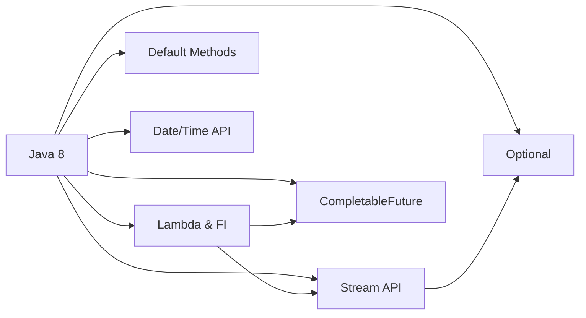
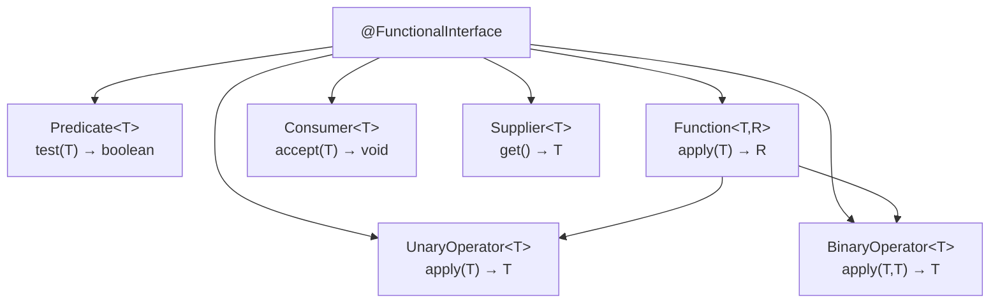
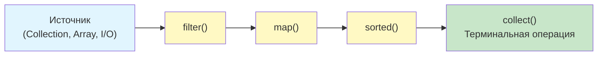
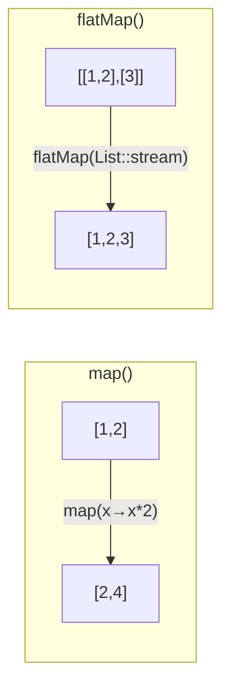

# Вопросы на собеседовании: `Java 8`

Комплексное руководство по вопросам собеседования на тему `Java 8` для `Senior Java Developer`. Включает детальные объяснения концепций, практические примеры кода, диаграммы и best practices.

**`Java 8`** — одна из самых значимых версий платформы, которая принесла функциональное программирование в мир `Java`. Основные нововведения: лямбда-выражения, `Stream API`, `Optional`, default-методы в интерфейсах, новый `Date/Time API` и `CompletableFuture`. Эти темы — обязательная часть любого Java-собеседования.

## Полезные ссылки

### Официальная документация

- [Java 8 Documentation](https://docs.oracle.com/javase/8/docs/) — официальная документация Oracle
- [Lambda Expressions Tutorial](https://docs.oracle.com/javase/tutorial/java/javaOO/lambdaexpressions.html) — туториал по лямбдам
- [Stream API JavaDoc](https://docs.oracle.com/en/java/javase/17/docs/api/java.base/java/util/stream/Stream.html) — API-документация Stream
- [java.time Package](https://docs.oracle.com/javase/8/docs/api/java/time/package-summary.html) — новый Date/Time API

### Baeldung

- [Java 8 Interview Questions — Baeldung](https://www.baeldung.com/java-8-interview-questions) — подборка вопросов с ответами
- [New Features in Java 8 — Baeldung](https://www.baeldung.com/java-8-new-features) — обзор всех нововведений
- [Guide To Java Optional — Baeldung](https://www.baeldung.com/java-optional) — полное руководство по Optional
- [Functional Interfaces in Java — Baeldung](https://www.baeldung.com/java-8-functional-interfaces) — Predicate, Function, Consumer, Supplier и другие

## Содержание

- [Полезные ссылки](#полезные-ссылки)
- [See also](#see-also)

**Обзор Java 8**
- [Q1. (!) Какие ключевые нововведения появились в Java 8?](#q1--какие-ключевые-нововведения-появились-в-java-8)
- [Q2. Какие важные изменения появились в Java 9–21?](#q2-какие-важные-изменения-появились-в-java-921)

**Функциональные интерфейсы и лямбды**
- [Q3. (!) Что такое функциональный интерфейс?](#q3--что-такое-функциональный-интерфейс)
- [Q4. (!) Какие стандартные функциональные интерфейсы есть в java.util.function?](#q4--какие-стандартные-функциональные-интерфейсы-есть-в-javautilfunction)
- [Q5. (!) Что такое лямбда-выражение и какой у него синтаксис?](#q5--что-такое-лямбда-выражение-и-какой-у-него-синтаксис)
- [Q6. Что такое аннотация @FunctionalInterface?](#q6-что-такое-аннотация-functionalinterface)
- [Q7. Что такое effectively final и зачем это ограничение в лямбдах?](#q7-что-такое-effectively-final-и-зачем-это-ограничение-в-лямбдах)
- [Q8. (!) Какие существуют типы ссылок на методы (Method Reference)?](#q8--какие-существуют-типы-ссылок-на-методы-method-reference)
- [Q9. Будет ли компилироваться интерфейс с default-методом и одним абстрактным?](#q9-будет-ли-компилироваться-интерфейс-с-default-методом-и-одним-абстрактным)
- [Q10. Чем лямбда-выражение отличается от анонимного класса?](#q10-чем-лямбда-выражение-отличается-от-анонимного-класса)

**Optional**
- [Q11. (!) Что такое Optional и зачем он нужен?](#q11--что-такое-optional-и-зачем-он-нужен)
- [Q12. В чём разница между orElse и orElseGet?](#q12-в-чём-разница-между-orelse-и-orelseget)
- [Q13. Что такое Optional.flatMap и когда использовать?](#q13-что-такое-optionalflatmap-и-когда-использовать)
- [Q14. Какие антипаттерны использования Optional вы знаете?](#q14-какие-антипаттерны-использования-optional-вы-знаете)

**Default-методы в интерфейсах**
- [Q15. Что такое default-метод в интерфейсе и зачем он нужен?](#q15-что-такое-default-метод-в-интерфейсе-и-зачем-он-нужен)
- [Q16. (!) Как разрешаются конфликты при наследовании нескольких default-методов?](#q16--как-разрешаются-конфликты-при-наследовании-нескольких-default-методов)
- [Q17. Можно ли объявить static-метод в интерфейсе?](#q17-можно-ли-объявить-static-метод-в-интерфейсе)

**Stream API**
- [Q18. (!) Что такое Stream и чем он отличается от коллекции?](#q18--что-такое-stream-и-чем-он-отличается-от-коллекции)
- [Q19. (!) В чём разница между промежуточными и терминальными операциями?](#q19--в-чём-разница-между-промежуточными-и-терминальными-операциями)
- [Q20. Что такое Stream Pipeline?](#q20-что-такое-stream-pipeline)
- [Q21. (!) В чём разница между map() и flatMap()?](#q21--в-чём-разница-между-map-и-flatmap)
- [Q22. Что такое reduce() и как его использовать?](#q22-что-такое-reduce-и-как-его-использовать)
- [Q23. В чём разница между findFirst() и findAny()?](#q23-в-чём-разница-между-findfirst-и-findany)
- [Q24. (!) Какие основные Collectors вы знаете?](#q24--какие-основные-collectors-вы-знаете)
- [Q25. Что такое Stream.peek() и когда его использовать?](#q25-что-такое-streampeek-и-когда-его-использовать)
- [Q26. Как группировать элементы с помощью Collectors.groupingBy?](#q26-как-группировать-элементы-с-помощью-collectorsgroupingby)
- [Q27. Что такое примитивные стримы IntStream, LongStream, DoubleStream?](#q27-что-такое-примитивные-стримы-intstream-longstream-doublestream)
- [Q28. (!) Что такое parallel stream и когда его применять?](#q28--что-такое-parallel-stream-и-когда-его-применять)
- [Q29. Можно ли повторно использовать Stream?](#q29-можно-ли-повторно-использовать-stream)
- [Q30. Как создать Stream из различных источников?](#q30-как-создать-stream-из-различных-источников)

**Date/Time API**
- [Q31. (!) Какие ключевые классы входят в новый Date/Time API?](#q31--какие-ключевые-классы-входят-в-новый-datetime-api)
- [Q32. В чём разница между LocalDateTime и ZonedDateTime?](#q32-в-чём-разница-между-localdatetime-и-zoneddatetime)
- [Q33. Чем Duration отличается от Period?](#q33-чем-duration-отличается-от-period)

**CompletableFuture и асинхронность**
- [Q34. (!) Что такое CompletableFuture и чем он лучше Future?](#q34--что-такое-completablefuture-и-чем-он-лучше-future)
- [Q35. Как комбинировать несколько CompletableFuture?](#q35-как-комбинировать-несколько-completablefuture)
- [Q36. Как обрабатывать исключения в CompletableFuture?](#q36-как-обрабатывать-исключения-в-completablefuture)

**Обработка исключений и практические паттерны**
- [Q37. Как обработать checked-исключения в лямбдах и Stream?](#q37-как-обработать-checked-исключения-в-лямбдах-и-stream)
- [Q38. Какие типичные ошибки допускают при работе со Stream API?](#q38-какие-типичные-ошибки-допускают-при-работе-со-stream-api)

**Продвинутые темы Java 8**
- [Q39. (!) Как написать собственный `Collector`?](#q39--как-написать-собственный-collector)
- [Q40. Какие типы `Method Reference` существуют и чем отличаются?](#q40-какие-типы-method-reference-существуют-и-чем-отличаются)
- [Q41. Как правильно использовать `Optional` и каких антипаттернов избегать?](#q41-как-правильно-использовать-optional-и-каких-антипаттернов-избегать)
- [Q42. Что такое `Stream Pipeline` и как работает ленивость?](#q42-что-такое-stream-pipeline-и-как-работает-ленивость)

---

## Q1. (!) Какие ключевые нововведения появились в `Java 8`?

`Java 8` (март 2014) — одна из самых значимых версий платформы. Ключевые нововведения:

| Фича | Описание |
|-------|----------|
| **Лямбда-выражения** | Компактный синтаксис анонимных функций |
| **Функциональные интерфейсы** | Интерфейсы с одним абстрактным методом (`SAM`) |
| **Method References** | Ссылки на методы (`Class::method`) |
| **`Stream API`** | Функциональная обработка коллекций |
| **`Optional`** | Обёртка для nullable-значений |
| **Default-методы** | Методы с реализацией в интерфейсах |
| **`Date/Time API`** | Новый пакет `java.time` (замена `Date`/`Calendar`) |
| **`CompletableFuture`** | Асинхронное программирование с цепочками |
| **`Nashorn`** | JavaScript-движок (удалён в Java 15) |



На собеседовании важно не просто перечислить фичи, а показать, как они связаны: лямбды — основа для `Stream API` и `CompletableFuture`; `Optional` — естественный результат терминальных операций стримов.

> [!mcq] Какие технологии впервые появились именно в Java 8?
>
> - [x] A. Lambda + Stream API + Optional + CompletableFuture + default-методы интерфейсов — это связный пакет, открывший функциональное программирование в платформе.
>
>     **Развёрнутое объяснение.** Java 8 (март 2014) — один из крупнейших релизов: лямбды дали SAM-target для замены анонимных классов, Stream API построен поверх лямбд для деклативной обработки коллекций, Optional оформил отсутствие значения как тип, CompletableFuture заменил блокирующий Future неблокирующими цепочками, default-методы позволили расширить `Collection` и `Iterable` без breaking-changes. Параллельно добавлены `java.time` (JSR 310) и Nashorn JS engine.
>
>     **Пример.** Типичный pipeline 2014+: `orders.stream().filter(Order::isPaid).map(toDto).collect(toList())`; `Comparator.comparing(Person::getAge)`; цепочка `CompletableFuture.supplyAsync(...).thenApply(...).exceptionally(...)`.
>
>     **Когда применять.** Любой современный enterprise-проект на JVM, миграция legacy кода с императивных циклов на декларативные стримы, замена ручных `Thread`/`Future` на `CompletableFuture` для асинхронных pipeline.
>
>     **Подводные камни.** `parallelStream` использует общий `ForkJoinPool.commonPool` — блокирующий I/O в нём ломает весь сервис; `Optional` нельзя сериализовать (не `Serializable`); default-методы могут конфликтовать в диамонде.
>
>     **Связанные вопросы.** [[java-8-interview#Q3]] функциональные интерфейсы; [[java-8-interview#Q5]] лямбды; [[java-8-interview#Q18]] Stream API.
>
> - [ ] B. Generics появились именно в Java 8 для параметризации типов коллекций и type-safety на этапе компиляции.
>
>     **Что на самом деле.** Generics вошли в Java 5 (2004, JSR 14) — это `List<String>`, `Map<K, V>` и type erasure. К Java 8 они уже 10 лет были стандартом.
>
>     **Откуда путаница.** Generics часто упоминаются в одних главах с лямбдами и Stream API — оба связаны с типобезопасностью коллекций; новички ассоциируют их с одним релизом.
>
>     **Если бы это было правдой.** До Java 8 невозможно было бы писать `List<Integer>` — все коллекции были raw-типами с runtime-кастами; миллионы строк pre-Java-5 кода с `(String) list.get(0)` всё ещё были бы нормой, а pre-Java-8 Spring не имел бы типизированных `JdbcTemplate.queryForList(String.class)`.
>
>     **Как было бы правильно.** Назвать generics частью Java 5, а в Java 8 — только улучшение type inference (`<>` diamond ещё с Java 7, target typing для лямбд в Java 8).
>
> - [ ] C. Аннотации (`@Override`, `@Deprecated`) появились в Java 8 как механизм метаданных без влияния на бизнес-логику.
>
>     **Что на самом деле.** Annotations — Java 5 (2004, JSR 175). `@Override`, `@Deprecated`, `@SuppressWarnings` доступны с 2004 года. В Java 8 добавили лишь `@FunctionalInterface` и type annotations (JSR 308).
>
>     **Откуда путаница.** `@FunctionalInterface` действительно появилась в Java 8, и при изучении лямбд новички предполагают, что и сам механизм аннотаций тоже новый.
>
>     **Если бы это было правдой.** Spring 2.x (2008) не мог бы использовать `@Autowired`, `@Component`; Hibernate не имел бы `@Entity`, `@Column`; весь XML-конфиг существовал бы до сих пор как единственная опция.
>
>     **Как было бы правильно.** Сказать, что аннотации с Java 5, а в Java 8 — только новые: `@FunctionalInterface` и type annotations на типах (`List<@NonNull String>`).
>
> - [ ] D. Многопоточность через класс `Thread` появилась в Java 8 и впервые позволила запускать код параллельно в OS-потоках.
>
>     **Что на самом деле.** Класс `Thread` есть с Java 1.0 (1996); `java.util.concurrent` с executors и `Future` — Java 5 (2004). В Java 8 добавили лишь `CompletableFuture` и `parallelStream` поверх существующего `ForkJoinPool` (Java 7).
>
>     **Откуда путаница.** В Java 8 многопоточность стала «модной» через `CompletableFuture` и parallel streams — это создаёт впечатление, что многопоточность вообще появилась тогда.
>
>     **Если бы это было правдой.** Tomcat/Jetty до 2014 не имели бы request-per-thread модели; никакой `synchronized` блок не работал бы; вся ранняя Java EE-стек развалился бы при отсутствии `Thread`.
>
>     **Как было бы правильно.** Признать `Thread` как часть Java 1.0, а Java 8 — за `CompletableFuture` (новый класс) и `parallelStream` (новый API над существующим ForkJoinPool).

> [!mcq] Что является ключевой архитектурной новинкой Java 8 для эволюции стандартных интерфейсов?
>
> - [ ] A. Default-методы — это компромисс, позволяющий добавлять реализации в `abstract`-классы; интерфейсы остались чисто абстрактными.
>
>     **Что на самом деле.** Default-методы появились именно в интерфейсах, а не в abstract-классах. `abstract class` с методами-реализациями был доступен с Java 1.0 — это не нововведение.
>
>     **Откуда путаница.** Concept «класс с частичной реализацией» исторически ассоциируется с abstract class в OOP-литературе; default-методы воспринимаются как «то же самое для интерфейсов», и название «default» путает с access-модификатором.
>
>     **Если бы это было правдой.** Невозможно было бы добавить `stream()`, `forEach()`, `removeIf()` в `Collection` без поломки всех существующих имплементаций (включая чужие библиотеки) — Java 8 миграция стала бы breaking change для каждого проекта.
>
>     **Как было бы правильно.** Назвать default-методы свойством интерфейсов (не abstract-классов), которое позволило расширить `Collection`/`Comparator`/`Iterable` без breaking changes.
>
> - [ ] B. Stream API появился как часть пакета `java.util.concurrent` и заменил `ExecutorService` для функциональной обработки данных.
>
>     **Что на самом деле.** Stream API живёт в `java.util.stream`. `java.util.concurrent` — это пакет concurrency-примитивов (`ExecutorService`, `ConcurrentHashMap`, `CompletableFuture`), который не пересекается со Stream API концептуально.
>
>     **Откуда путаница.** `parallelStream()` использует `ForkJoinPool.commonPool` (живущий в `java.util.concurrent`) — кажется, что Stream — это часть concurrency.
>
>     **Если бы это было правдой.** Импорт `import java.util.concurrent.Stream;` ломал бы любой существующий код; IDE-автокомплит вёл бы не туда; миллионы туториалов с `import java.util.stream.Stream;` оказались бы неверными.
>
>     **Как было бы правильно.** Stream API живёт в `java.util.stream`, а `java.util.concurrent` — только источник `ForkJoinPool` для parallel-режима.
>
> - [x] C. Default-методы в интерфейсах — главный архитектурный приём Java 8: позволили добавить `stream()`, `forEach()`, `removeIf()` в `Collection` без поломки существующих реализаций.
>
>     **Развёрнутое объяснение.** До Java 8 добавление метода в interface ломало всех его реализаторов — нельзя было эволюционировать `Collection`, `List`, `Map` без миграции всей экосистемы. Default-методы позволяют дать реализацию по умолчанию, которая наследуется автоматически; класс может переопределить её при необходимости. Это backward-compatible способ расширить API.
>
>     **Пример.** `Iterable.forEach(Consumer)`, `Collection.removeIf(Predicate)`, `Collection.stream()`, `Comparator.thenComparing`, `Map.getOrDefault`/`computeIfAbsent` — все добавлены через `default`. Внешние реализаторы `List` (Apache Commons, Guava `ImmutableList`) продолжили работать без изменений.
>
>     **Когда применять.** Эволюция публичного API библиотек/SPI без breaking changes; добавление composability-методов (`and`, `or`, `negate`) в functional interfaces; template-method-pattern на уровне interface вместо abstract base class.
>
>     **Подводные камни.** Diamond-проблема при наследовании двух default-методов с одинаковым именем требует явного override через `Iface.super.method()`; `Object`-методы (`equals`, `toString`) нельзя сделать default; default-метод не может ссылаться на private поля.
>
>     **Связанные вопросы.** [[java-8-interview#Q15]] default-метод; [[java-8-interview#Q16]] diamond conflict; [[java-8-interview#Q17]] static-методы в интерфейсе.
>
> - [ ] D. `var` для локальных переменных и `record` появились в Java 8 как часть сокращения boilerplate-кода вместе с лямбдами.
>
>     **Что на самом деле.** `var` — Java 10 (2018), `record` стабильно — Java 16 (2021). Java 8 не имеет ни того, ни другого; в ней boilerplate сокращали только лямбды и method references.
>
>     **Откуда путаника.** `var`, `record` и лямбды связаны общей темой «меньше boilerplate в Java» — новички склеивают их в одну версию.
>
>     **Если бы это было правдой.** Spring Boot 1.x (2014–2018) уже использовал бы `record` для DTO; Lombok с его `@Value` потерял бы смысл за 4 года до фактического выхода `record`.
>
>     **Как было бы правильно.** Признать `var` за Java 10, `record` за Java 16, и оставить за Java 8 только лямбды + method references как механизм сокращения boilerplate.

## Q2. Какие важные изменения появились в `Java 9–21`?

Краткий обзор эволюции после `Java 8`:

| Версия | Ключевые фичи |
|--------|---------------|
| **Java 9** | `List.of()`, `Set.of()`, `Map.of()`, `Optional.or()`, `Stream.takeWhile()`/`dropWhile()`, модули (JPMS) |
| **Java 10** | `var` для локальных переменных, `List.copyOf()` |
| **Java 11** | `String.isBlank()`/`strip()`/`lines()`, `Optional.isEmpty()`, `HttpClient` |
| **Java 14** | `switch`-выражения, `instanceof` pattern matching (preview) |
| **Java 16** | `record`, `Stream.toList()` |
| **Java 17** | `sealed` классы, pattern matching for `instanceof` |
| **Java 21** | Виртуальные потоки, `SequencedCollection`, record patterns |

```java
// Java 9: фабрики неизменяемых коллекций
List<String> list = List.of("a", "b", "c");

// Java 10: var
var names = List.of("Alice", "Bob");

// Java 16: Stream.toList() — неизменяемый список
List<String> filtered = names.stream()
    .filter(n -> n.startsWith("A"))
    .toList();
```

На собеседовании достаточно знать основные фичи каждой LTS-версии (8, 11, 17, 21) и уметь объяснить практическую пользу.

> [!mcq] В какой версии Java стабильно появился `record`?
>
> - [x] A. В Java 16 — неизменяемый носитель данных с авто-генерируемыми конструктором, геттерами, `equals`/`hashCode`/`toString`.
>
>     **Развёрнутое объяснение.** Records были введены как preview в Java 14 (2020), preview во второй итерации в Java 15, и стабильно в Java 16 (март 2021). Запись `record Point(int x, int y) {}` автоматически генерирует канонический конструктор, accessor-методы `x()`/`y()`, `equals`/`hashCode` по value-семантике, `toString` с именами полей. Класс implicitly `final`, не может extends, но может implements interfaces. Pattern matching for records — Java 21.
>
>     **Пример.** REST DTO: `record UserDto(Long id, String email, Instant createdAt) {}` заменяет 50 строк boilerplate с Lombok `@Value`; JPA projection через `record OrderSummary(Long id, BigDecimal total)` в `JpaRepository.findBy...`; tuple-like возврат `record Pair<A, B>(A first, B second)`.
>
>     **Когда применять.** DTO между слоями (REST, JPA), value objects в DDD, immutable конфигурация, ключи `Map`/`Set` с auto-equals/hashCode, замена Lombok `@Value` без annotation processor.
>
>     **Подводные камни.** `record` нельзя extends; компактный конструктор валидирует но не присваивает поля; mutable-поле внутри record (`List<String>`) ломает immutability — оборачивайте в `List.copyOf` в compact constructor.
>
>     **Связанные вопросы.** [[java-8-interview#Q1]] нововведения Java 8; [[java-8-interview#Q31]] Date/Time API; [[java-8-interview#Q42]] Stream pipeline.
>
> - [ ] B. `var` для локальных переменных появился в Java 16 для сокращения boilerplate при объявлениях.
>
>     **Что на самом деле.** `var` — Java 10 (март 2018, JEP 286), доступен 6 лет до Java 16. Это локальная type inference для `var x = new HashMap<String, List<Integer>>()`; в Java 11 добавили `var` для lambda parameters.
>
>     **Откуда путаника.** `var` и `record` относятся к «модернизации синтаксиса» — новички помнят оба как «что-то новое», не различая релизы.
>
>     **Если бы это было правдой.** Все туториалы по Java 10–15 с `var x = ...` оказались бы неверными; IntelliJ IDEA-фичи `inline variable` через `var` (с 2018) не существовали бы.
>
>     **Как было бы правильно.** `var` стабильно в Java 10, доступен сразу после LTS Java 11 — это стандарт уже 6+ лет.
>
> - [ ] C. `record` стал стабильным в Java 17 как часть LTS-релиза с модернизацией модели данных.
>
>     **Что на самом деле.** Records стабильны с Java 16 (март 2021), а не Java 17. К моменту выхода LTS Java 17 (сентябрь 2021) records уже были production-готовы и использовались в Spring Boot 3.0, Hibernate 6.
>
>     **Откуда путаника.** Java 17 — LTS, и многие команды мигрируют сразу на неё, минуя Java 16; ассоциация «стабильно = LTS» приводит к ошибке.
>
>     **Если бы это было правдой.** Команды, мигрировавшие с Java 11 на Java 16 (есть production-кейсы Wolt, Booking), не имели бы доступа к `record` до Java 17 — но факт миграций обратное.
>
>     **Как было бы правильно.** Records стабильны с Java 16 (не-LTS), доступны и используются в production до Java 17 LTS.
>
> - [ ] D. `record` появился стабильно в Java 21 как часть финальной модернизации модели данных.
>
>     **Что на самом деле.** Records стабильны с Java 16 (2021), а Java 21 LTS (сентябрь 2023) добавила Record Patterns (pattern matching для records) и Sequenced Collections.
>
>     **Откуда путаника.** Java 21 LTS активно продвигается с record patterns; в маркетинге смешивают сами records (Java 16) и их pattern-matching (Java 21).
>
>     **Если бы это было правдой.** Spring Framework 6.0 (2022) и Hibernate 6 (2022), использующие records, не могли бы выйти до 2023; противоречит истории релизов.
>
>     **Как было бы правильно.** Records стабильны с Java 16, Record Patterns — с Java 21. Это разные фичи разных версий.

## Q3. (!) Что такое функциональный интерфейс?

**Функциональный интерфейс** — интерфейс с ровно одним абстрактным методом (Single Abstract Method, `SAM`). Default- и static-методы не считаются.

Функциональные интерфейсы — это **целевые типы** для лямбда-выражений и ссылок на методы.

```java
@FunctionalInterface
public interface Converter<F, T> {
    T convert(F from);

    // default-метод — не нарушает SAM
    default Converter<F, T> andThen(Converter<T, ?> after) {
        return (F f) -> after.convert(this.convert(f));
    }
}

// Использование через лямбду
Converter<String, Integer> toInt = Integer::valueOf;
Integer result = toInt.convert("123"); // 123
```



Подробнее о коллекциях, использующих функциональные интерфейсы — в [вопросах по Java Collections](java-collections-interview.md).

> [!mcq] Что такое функциональный интерфейс в Java 8?
>
> - [x] A. Интерфейс ровно с одним абстрактным методом (SAM, Single Abstract Method) — целевой тип для лямбд и method references; default/static/Object-методы не нарушают контракт.
>
>     **Развёрнутое объяснение.** SAM-контракт — единственное обязательное условие. Default- и static-методы имеют реализацию, поэтому не считаются абстрактными. Object-методы (`equals`, `hashCode`, `toString`), даже если объявлены abstract в interface, не учитываются — они уже имеют реализацию в `java.lang.Object`. Аннотация `@FunctionalInterface` опциональна: любой SAM-интерфейс работает как target лямбды, но аннотация даёт compile-time проверку.
>
>     **Пример.** Кастомный FI для domain-логики: `@FunctionalInterface interface Validator<T> { boolean validate(T value); default Validator<T> and(Validator<T> other) { return v -> validate(v) && other.validate(v); } }`. JDK-примеры без аннотации, но являющиеся FI: `Comparator`, `Runnable`, `Callable`, `Closeable`.
>
>     **Когда применять.** Domain callback (`EventHandler<E>`, `Mapper<F,T>`), composable validators/transformers, замена Strategy pattern из GoF; для всех custom FI добавляйте `@FunctionalInterface` для защиты от случайного добавления второго abstract метода.
>
>     **Подводные камни.** Если поверх FI с generic-параметром лежит wildcard (`Function<? super T, ? extends R>`), type inference может не вывести нужный SAM-target; добавление второго abstract-метода в FI без `@FunctionalInterface` ломает все лямбды callers без warning от компилятора.
>
>     **Связанные вопросы.** [[java-8-interview#Q4]] стандартные FI из `java.util.function`; [[java-8-interview#Q5]] синтаксис лямбд; [[java-8-interview#Q6]] `@FunctionalInterface`.
>
> - [ ] B. Интерфейс, у которого все методы помечены `@FunctionalInterface`, что гарантирует возможность использования лямбд.
>
>     **Что на самом деле.** Аннотация ставится на сам интерфейс, а не на отдельные методы; для использования лямбд аннотация вообще не требуется. Любой SAM-интерфейс — валидный target лямбды.
>
>     **Откуда путаника.** В Java часто аннотации ставят на методы (`@Override`, `@Deprecated`); по аналогии новички думают, что и `@FunctionalInterface` тоже метод-уровневая.
>
>     **Если бы это было правдой.** `Comparator.comparing(Person::getAge)` не работал бы (в `Comparator` нет такой аннотации на методе `compare`); 90% кода Java 8 с лямбдами вообще не скомпилировался бы.
>
>     **Как было бы правильно.** Аннотация ставится на интерфейс, опциональна, проверяет SAM в compile-time; для работы лямбд достаточно факта SAM, без аннотации.
>
> - [ ] C. Интерфейс без default- и static-методов, содержащий ровно один абстрактный метод для совместимости с лямбдами.
>
>     **Что на самом деле.** Default- и static-методы прямо разрешены в functional interface и не нарушают SAM. JDK активно использует это: `Predicate` имеет `and/or/negate` как default, `Function` — `andThen/compose`, `Comparator` — `thenComparing/reversed`.
>
>     **Откуда путаника.** Слово «functional» ассоциируется с «чистой функцией без побочных эффектов», а наличие default-метода кажется отступлением от чистоты.
>
>     **Если бы это было правдой.** Composability `predicate1.and(predicate2)` была бы невозможна — пришлось бы писать utility-классы `Predicates.and(p1, p2)`; код раздулся бы static-helpers как до Java 8.
>
>     **Как было бы правильно.** Default/static/private (Java 9+) методы разрешены и активно используются в стандартных FI для composability.
>
> - [ ] D. Интерфейс, расширяющий `java.util.function.Function`, что даёт совместимость с `andThen` и `compose`.
>
>     **Что на самом деле.** Functional interface не обязан наследоваться от `Function` — это просто любой SAM. `Runnable`, `Callable`, `Comparator`, `Predicate` не наследуют `Function`, но всё равно — functional interfaces.
>
>     **Откуда путаника.** `Function` — самый «универсальный» FI (T → R), и кажется, что он базовый класс иерархии FI.
>
>     **Если бы это было правдой.** `Comparator<T>` extends Function?? Тогда `int compare(T, T)` должен был бы быть `R apply(T)` — несовместимо. JDK не мог бы иметь Predicate (`boolean test(T)`), Consumer (`void accept(T)`), Supplier (`T get()`).
>
>     **Как было бы правильно.** Functional interfaces — это набор независимых SAM-интерфейсов; `Function`, `Predicate`, `Consumer`, `Supplier` не связаны иерархически.

> [!mcq] Какие исключения из SAM-правила допускает `@FunctionalInterface`?
>
> - [ ] A. Методы Object (`equals`, `hashCode`, `toString`), объявленные `abstract` в интерфейсе, считаются вторым абстрактным методом и нарушают `@FunctionalInterface`.
>
>     **Что на самом деле.** JLS §9.8 явно исключает publicly-overridable методы `Object` из подсчёта abstract-методов для SAM-проверки. `Comparator` имеет `abstract boolean equals(Object obj)` именно для этого — усиление контракта equality.
>
>     **Откуда путаника.** Логически второй abstract method = нарушение SAM, но Object-методы — особый случай: их реализация уже есть в `java.lang.Object`, поэтому compiler не считает их «не имеющими реализации».
>
>     **Если бы это было правдой.** `Comparator` (имеющий `abstract equals(Object)`) не был бы functional interface, и `list.sort((a,b) -> a.compareTo(b))` не компилировалось бы — но это базовый Java 8 idiom.
>
>     **Как было бы правильно.** Object-методы (`equals`, `hashCode`, `toString`), даже объявленные abstract в interface, не считаются дополнительными SAM-методами — компилятор знает, что реализация унаследована.
>
> - [ ] B. `@FunctionalInterface` имеет `@Retention(RUNTIME)`, JVM проверяет при загрузке класса и бросает `ClassFormatError` при нарушении SAM.
>
>     **Что на самом деле.** `@FunctionalInterface` имеет `@Retention(SOURCE)` — проверка только compile-time, в bytecode аннотация не попадает (для retention RUNTIME) и в runtime недоступна через рефлексию.
>
>     **Откуда путаника.** Многие validation-аннотации (`@NotNull` Hibernate) имеют RUNTIME retention; по аналогии новички думают и про `@FunctionalInterface`.
>
>     **Если бы это было правдой.** SPI-фреймворки могли бы валидировать плагины в runtime через `clazz.isAnnotationPresent(FunctionalInterface.class)` — но `getAnnotation` возвращает `null`, такая валидация невозможна.
>
>     **Как было бы правильно.** Retention = `SOURCE` (или CLASS в зависимости от точной версии JDK source), проверка SAM только compile-time, в runtime аннотация не видна.
>
> - [ ] C. Если интерфейс наследует другой functional interface без новых методов, он теряет SAM-контракт и не может быть target лямбды.
>
>     **Что на самом деле.** Наследование SAM сохраняет SAM. `interface MyStringFunc extends Function<String, String> {}` — валидный functional interface, target для `MyStringFunc f = s -> s.toUpperCase();`.
>
>     **Откуда путаника.** Можно подумать, что «пустой» наследник — это деградация; на деле это валидный паттерн для именования domain-typed функций.
>
>     **Если бы это было правдой.** Spring `Function<T, R>` extends `Converter<T, R>` (или наоборот) ломал бы все custom converters; невозможно было бы создавать typed-aliases для домена.
>
>     **Как было бы правильно.** SAM сохраняется при наследовании; `extends Function<T,R>` создаёт именованный alias для лямбды.
>
> - [x] D. `@FunctionalInterface` гарантирует compile-time проверку SAM, но допускает: `default`, `static`, `private` (Java 9+) методы, и `abstract`-переопределения Object-методов — последние не считаются дополнительными SAM.
>
>     **Развёрнутое объяснение.** Compiler при проверке SAM игнорирует: (1) default-методы (имеют реализацию), (2) static-методы (не наследуются instance-методами), (3) private-методы (Java 9+, видны только внутри interface, не extends interface contract), (4) abstract-объявления Object-методов (`equals`, `hashCode`, `toString` — реализация есть в `Object`). Это позволяет писать богатые functional interfaces с composability и усиленным контрактом equality.
>
>     **Пример.** `@FunctionalInterface interface Comparator<T> { int compare(T o1, T o2); boolean equals(Object obj); default Comparator<T> reversed() { return (a,b) -> compare(b,a); } static <T extends Comparable<T>> Comparator<T> naturalOrder() { return Comparable::compareTo; } }` — SAM=`compare`, остальное допустимо.
>
>     **Когда применять.** Сильный equality для custom Comparator-like интерфейсов; private-хелперы (Java 9+) для shared логики между default-методами без загрязнения public API; static-фабрики (`Predicate.isEqual(value)`) внутри интерфейса.
>
>     **Подводные камни.** Object-методы должны объявляться без модификации сигнатуры (точное `boolean equals(Object o)`, не `boolean equals(T o)`) — иначе считаются новым abstract-методом; private-методы недоступны в Java 8, только с Java 9+.
>
>     **Связанные вопросы.** [[java-8-interview#Q6]] аннотация `@FunctionalInterface`; [[java-8-interview#Q9]] default+SAM компиляция; [[java-8-interview#Q15]] default-методы.

## Q4. (!) Какие стандартные функциональные интерфейсы есть в `java.util.function`?

Пакет `java.util.function` содержит 43+ функциональных интерфейса. Основные:

| Интерфейс | Метод | Описание |
|-----------|-------|----------|
| `Predicate<T>` | `test(T) → boolean` | Проверка условия |
| `Function<T,R>` | `apply(T) → R` | Преобразование T в R |
| `Consumer<T>` | `accept(T) → void` | Потребление значения |
| `Supplier<T>` | `get() → T` | Поставка значения |
| `UnaryOperator<T>` | `apply(T) → T` | Функция T → T |
| `BinaryOperator<T>` | `apply(T,T) → T` | Функция (T,T) → T |
| `BiFunction<T,U,R>` | `apply(T,U) → R` | Два аргумента → R |
| `BiPredicate<T,U>` | `test(T,U) → boolean` | Два аргумента → boolean |
| `BiConsumer<T,U>` | `accept(T,U) → void` | Два аргумента → void |

```java
// Predicate — фильтрация
Predicate<String> isLong = s -> s.length() > 5;
Predicate<String> startsWithJ = s -> s.startsWith("J");
Predicate<String> combined = isLong.and(startsWithJ);

// Function — преобразование и композиция
Function<String, Integer> toLength = String::length;
Function<Integer, String> toStr = i -> "len=" + i;
Function<String, String> composed = toLength.andThen(toStr);
// composed.apply("Hello") → "len=5"

// Consumer — побочные эффекты
Consumer<String> printer = System.out::println;
Consumer<String> logger = s -> log.info("Value: {}", s);
Consumer<String> both = printer.andThen(logger);

// Supplier — отложенное создание
Supplier<List<String>> listFactory = ArrayList::new;
```

Примитивные специализации (избегают боксинга): `IntPredicate`, `LongFunction<R>`, `ToIntFunction<T>`, `IntConsumer`, `IntSupplier`, `IntUnaryOperator`, `IntBinaryOperator` и аналогичные для `long`/`double`.

> [!mcq] Какой набор сигнатур правильно описывает базовые функциональные интерфейсы из `java.util.function`?
>
> - [x] A. `Predicate<T>` — `test(T)→boolean`; `Function<T,R>` — `apply(T)→R`; `Consumer<T>` — `accept(T)→void`; `Supplier<T>` — `get()→T`.
>
>     **Развёрнутое объяснение.** Это четыре «базы» functional interfaces. `Predicate` для фильтрации (используется в `Stream.filter`, `Collection.removeIf`); `Function` для трансформации (`Stream.map`, `Map.computeIfAbsent`); `Consumer` для побочных эффектов (`Stream.forEach`, `Optional.ifPresent`); `Supplier` для отложенного создания (`Optional.orElseGet`, `Stream.generate`). Каждый имеет default-методы для composability: `Predicate.and/or/negate`, `Function.andThen/compose`, `Consumer.andThen`.
>
>     **Пример.** Композиция predicates в Wolt order validation: `Predicate<Order> notEmpty = o -> !o.items().isEmpty(); Predicate<Order> paidOnline = o -> o.payment() == ONLINE; Predicate<Order> isVip = o -> o.customer().tier() == VIP; orders.stream().filter(notEmpty.and(paidOnline).or(isVip)).count();`.
>
>     **Когда применять.** `Predicate` — domain-валидация, `Stream.filter`; `Function` — DTO mapping, lookup; `Consumer` — logging, side-effects, sink; `Supplier` — lazy init, factory, exception suppliers (`orElseThrow(() -> new NotFoundException())`).
>
>     **Подводные камни.** Boxing/unboxing для primitives — используйте `IntPredicate`, `ToIntFunction`, `IntConsumer`, `IntSupplier` в hot-path; `Function<T,T>` стоит заменить на `UnaryOperator<T>` для семантической ясности; checked-exception нельзя кидать из стандартных FI — оборачивайте в `RuntimeException`.
>
>     **Связанные вопросы.** [[java-8-interview#Q3]] функциональные интерфейсы; [[java-8-interview#Q5]] синтаксис лямбд; [[java-8-interview#Q18]] Stream API.
>
> - [ ] B. `Consumer<T>` принимает аргумент `T` и возвращает результат `R` через метод `apply(T)→R`.
>
>     **Что на самом деле.** `Consumer<T>` имеет сигнатуру `void accept(T t)` — принимает, ничего не возвращает. Сигнатура `apply(T)→R` принадлежит `Function<T,R>`.
>
>     **Откуда путаника.** Имя `Consumer` напоминает «потребитель, который что-то возвращает после обработки»; на деле он «потребляет и забывает».
>
>     **Если бы это было правдой.** `list.forEach(System.out::println)` не работал бы — `println` возвращает void, не R. Любой `forEach`-вызов отвергался бы компилятором.
>
>     **Как было бы правильно.** `Consumer<T>` — `accept(T)→void`; для возврата R нужен `Function<T,R>`.
>
> - [ ] C. `Supplier<T>` принимает аргумент `T` и выполняет действие с побочным эффектом через `accept(T)→void`.
>
>     **Что на самом деле.** `Supplier<T>` имеет сигнатуру `T get()` — без аргументов, возвращает значение. Описанная сигнатура `accept(T)→void` принадлежит `Consumer<T>`.
>
>     **Откуда путаника.** Слово «supplier» в обыденной речи может звучать как «поставщик чего-то кому-то» (двусторонний обмен), но в Java это однонаправленная фабрика.
>
>     **Если бы это было правдой.** `Optional.orElseGet(() -> compute())` не работал бы — лямбда без аргументов не подходила бы под `Consumer`; `Stream.generate(Math::random)` не существовал бы.
>
>     **Как было бы правильно.** `Supplier<T>` — `get()→T` без аргументов; `Consumer<T>` — `accept(T)→void` с аргументом.
>
> - [ ] D. `Predicate<T>` принимает `T` и возвращает `T`, применяя унарную операцию через `apply(T)→T`.
>
>     **Что на самом деле.** `Predicate<T>` возвращает `boolean` через `test(T)`. Сигнатура `T→T` принадлежит `UnaryOperator<T> extends Function<T,T>`.
>
>     **Откуда путаника.** Слово «Predicate» в логике связано с тем, что что-то «применяется к аргументу» — детали возвращаемого типа теряются в спешке.
>
>     **Если бы это было правдой.** `Stream.filter(s -> s.length() > 5)` не компилировался бы — лямбда возвращает boolean, а ожидалось бы `T`. Базовый Stream API не работал бы.
>
>     **Как было бы правильно.** `Predicate<T>` — `test(T)→boolean`; `UnaryOperator<T>` — `apply(T)→T`.

> [!mcq] Зачем нужны примитивные специализации (`IntFunction`, `IntPredicate`, `IntUnaryOperator`)?
>
> - [ ] A. `Function<Integer,Integer>` для `IntStream` так же эффективен как `IntUnaryOperator` — JIT inline-ит boxing и устраняет накладные расходы.
>
>     **Что на самом деле.** JIT (C2) может escape-analysis-ить и устранять boxing в простых случаях, но это не гарантировано — особенно в megamorphic call-sites, через interface dispatch, или в виртуальных потоках (Java 21+). В benchmark-ах с `Integer` allocation наблюдается реальное создание `Integer`-объектов и GC pressure.
>
>     **Откуда путаника.** «JIT всё inline-ит» — народная мудрость, особенно после Java 9+ туториалов про escape analysis; на деле escape analysis срабатывает на простых local-cases, не глобально.
>
>     **Если бы это было правдой.** Не было бы смысла в `mapToInt`/`IntStream` — JEP-авторы Java 8 явно создавали примитивные специализации именно из-за невозможности гарантированно устранить boxing; JMH-бенчмарки в hot-path показывают 3-5x throughput для `IntStream.sum()` vs `Stream<Integer>.mapToInt(Integer::intValue).sum()`.
>
>     **Как было бы правильно.** JIT может устранить boxing в простых случаях, но в hot-path 100M+ операций primitive specializations дают 3-5x throughput; используйте `IntStream`/`LongStream`/`DoubleStream` для числовых workloads.
>
> - [ ] B. `BiFunction<T,U,R>` имеет примитивные специализации `IntBiFunction`, `LongBiFunction`, `DoubleBiFunction` для избежания боксинга в `Map.merge`.
>
>     **Что на самом деле.** Таких интерфейсов нет в `java.util.function`. Доступны: `IntBinaryOperator` для `(int,int)→int`, `LongBinaryOperator` для `(long,long)→long`, `ToIntBiFunction<T,U>` для `(T,U)→int`, `ToLongBiFunction<T,U>`, `ToDoubleBiFunction<T,U>`.
>
>     **Откуда путаника.** По аналогии с `IntFunction<R>`, `IntPredicate`, `IntUnaryOperator` — кажется логичным, что должен быть и `IntBiFunction`.
>
>     **Если бы это было правдой.** Импорт `import java.util.function.IntBiFunction;` работал бы, но `javac` после Java 8 жалуется на ненахождение класса; туториалы с этим классом не было бы.
>
>     **Как было бы правильно.** Для `(int,int)→int` используйте `IntBinaryOperator`; для `(T,U)→int` используйте `ToIntBiFunction<T,U>`; чистого `IntBiFunction` в JDK нет.
>
> - [ ] C. Префикс `To` в `ToIntFunction<T>` означает bridge-интерфейс для конвертации legacy API в Stream — без него pipeline не компилируется.
>
>     **Что на самом деле.** Префикс `To` означает «возвращает примитив, принимает Object». `ToIntFunction<T>` — это `int applyAsInt(T t)`, нужно для `Stream<T>.mapToInt(ToIntFunction)` для перехода с `Stream<T>` на `IntStream`.
>
>     **Откуда путаника.** Слово «To» в английском часто читается как «направление перехода»; кажется, что это адаптер.
>
>     **Если бы это было правдой.** Можно было бы оборачивать любые legacy-функции в `ToIntFunction`-cast и они становились бы Stream-совместимыми; на деле это просто конвенция именования.
>
>     **Как было бы правильно.** `To`-префикс = «возвращает примитив»; `ToIntFunction<T>` принимает T, возвращает int.
>
> - [x] D. Примитивные специализации (`IntFunction<R>`, `ToIntFunction<T>`, `IntPredicate`, `IntUnaryOperator`, `IntBinaryOperator`) избегают boxing `int↔Integer`; `IntBiFunction` отсутствует — используйте `IntBinaryOperator` или `ToIntBiFunction<T,U>`.
>
>     **Развёрнутое объяснение.** В `java.util.function` есть три группы primitive-FI: (1) `IntFunction<R>` для `int→R`; (2) `ToIntFunction<T>` для `T→int`; (3) `IntPredicate`, `IntUnaryOperator`, `IntBinaryOperator`, `IntConsumer`, `IntSupplier` для чистой работы с int. Аналогично для `long` и `double`. Эти специализации избегают auto-boxing `int↔Integer`, что критично в hot-path: один `Integer.valueOf(int)` это allocation на 16 байт.
>
>     **Пример.** Расчёт суммы средней длины строк: `int total = strings.stream().mapToInt(String::length).sum();` (без boxing). Сравните с `int total = strings.stream().map(String::length).reduce(0, Integer::sum);` — `map(String::length)` боксит каждый length в `Integer`. JMH: 3-5x throughput для primitive version.
>
>     **Когда применять.** Численные агрегации в Stream (`sum`, `average`, `min`, `max`, `summaryStatistics`); hot-path обработка событий метрик/телеметрии; financial calculations с большим объёмом BigDecimal-операций (там naming primitive — `DoubleFunction`).
>
>     **Подводные камни.** `IntBiFunction` не существует — для `(int,int)→int` используйте `IntBinaryOperator`; преобразование `IntStream → Stream<Integer>` через `boxed()` для пользовательских коллекторов; `IntStream.average()` возвращает `OptionalDouble`, не `double` — поток может быть пуст.
>
>     **Связанные вопросы.** [[java-8-interview#Q3]] функциональные интерфейсы; [[java-8-interview#Q27]] примитивные стримы; [[java-8-interview#Q28]] parallel stream.

## Q5. (!) Что такое лямбда-выражение и какой у него синтаксис?

**Лямбда-выражение** — компактная запись анонимной функции, совместимой с функциональным интерфейсом.

Синтаксис:

```java
// Полная форма
(Type1 param1, Type2 param2) -> { statements; return result; }

// Сокращённые формы
(a, b) -> a + b          // типы выводятся, одно выражение
a -> a.length()           // один параметр — скобки не нужны
() -> System.out.println("Hi")  // без параметров
```

Практические примеры:

```java
// Сортировка списка
List<String> names = Arrays.asList("Charlie", "Alice", "Bob");
names.sort((a, b) -> a.compareTo(b));
// или через method reference:
names.sort(String::compareTo);

// Runnable
Runnable task = () -> System.out.println("Running in " + Thread.currentThread().getName());
new Thread(task).start();

// Обработка коллекций
Map<String, List<String>> grouped = names.stream()
    .collect(Collectors.groupingBy(name -> name.substring(0, 1)));
```

Под капотом лямбда компилируется не в анонимный класс, а через `invokedynamic` (JEP 276), что эффективнее: нет дополнительного `.class`-файла, нет аллокации нового объекта при каждом вызове (JVM может кэшировать).

> [!mcq] Допустим ли синтаксис `a -> a.length()` для лямбды с одним параметром?
>
> - [x] A. Да — это допустимый синтаксис лямбды с одним параметром; для одиночного параметра скобки необязательны, тип выводится компилятором из target functional interface.
>
>     **Развёрнутое объяснение.** Java позволяет три формы для одного параметра: `a -> a.length()` (без скобок, без типа), `(a) -> a.length()` (со скобками), `(String a) -> a.length()` (с явным типом), `(var a) -> a.length()` (Java 11+, для аннотаций). Все четыре эквивалентны. Type inference работает через target type: компилятор смотрит на сигнатуру FI (например `Function<String, Integer>`) и выводит тип `a` как `String`. Тело может быть expression (`a.length()`) или statement block (`{ return a.length(); }`).
>
>     **Пример.** `list.stream().filter(s -> s.length() > 5)`, `Map.computeIfAbsent(k -> expensiveCompute(k))`, `Optional.map(s -> s.toUpperCase())`. Все три — single-parameter без скобок, без типа.
>
>     **Когда применять.** Сокращённая форма читается лучше в pipeline; expression body предпочтительнее statement body когда возможно; добавляйте скобки только если требуется явная type аннотация или Java 11+ `(var x)` для добавления аннотаций (`@NonNull var x`).
>
>     **Подводные камни.** При overload-разрешении (несколько кандидатов с разной сигнатурой FI) компилятор может не вывести тип однозначно — добавляйте явный type cast `(Function<String, Integer>)(s -> s.length())`; в Java 8 нельзя смешивать `var` и без `var` в одной лямбде с несколькими параметрами.
>
>     **Связанные вопросы.** [[java-8-interview#Q3]] функциональные интерфейсы; [[java-8-interview#Q4]] стандартные FI; [[java-8-interview#Q7]] effectively final.
>
> - [ ] B. Запись недопустима — для одного параметра без явного типа нужно писать `(var a) -> a.length()` начиная с Java 11.
>
>     **Что на самом деле.** `(var a)` появилось в Java 11 как опциональная форма для добавления аннотаций к параметру лямбды; обычная форма `a -> a.length()` работает с Java 8 и не deprecated.
>
>     **Откуда путаника.** Java 10 ввела `var` для локальных переменных, Java 11 расширила его на параметры лямбды — у некоторых это вызвало ощущение, что `var` стал «обязательным» для type inference.
>
>     **Если бы это было правдой.** Весь Java 8 код с лямбдами (`s -> s.toUpperCase()`) ломался бы при компиляции в Java 11+; миллионы существующих проектов не работали бы; pre-Java-11 туториалы оказались бы неправильными.
>
>     **Как было бы правильно.** `(var a)` опционален и нужен только для добавления аннотаций; `a -> a.length()` работает с Java 8 и далее без изменений.
>
> - [ ] C. Запись недопустима — параметры лямбды всегда должны быть в скобках: `(a) -> a.length()`.
>
>     **Что на самом деле.** Скобки обязательны только для: нуля параметров `() -> doSomething()`, двух+ параметров `(a, b) -> a + b`, явных типов `(String a) -> a.length()`. Для одного параметра без типа скобки опциональны.
>
>     **Откуда путаника.** В other languages (Kotlin: `it`, без скобок и переменной; C#: `(x) =>` со скобками) синтаксис отличается; разработчики переносят чужие правила в Java.
>
>     **Если бы это было правдой.** Стандартные туториалы Oracle с `s -> s.length()` оказались бы неправильным синтаксисом; вся литература потребовала бы обновления; IDE подсвечивала бы это как error.
>
>     **Как было бы правильно.** Для одного параметра без явного типа скобки опциональны; добавление скобок — стилистический выбор, не требование компилятора.
>
> - [ ] D. Запись недопустима — тело лямбды должно быть в фигурных скобках с `return`: `a -> { return a.length(); }`.
>
>     **Что на самом деле.** Java поддерживает два варианта тела: expression body (`a -> a.length()`) и statement body (`a -> { return a.length(); }`). Expression body — синтаксический сахар, который автоматически возвращает значение выражения.
>
>     **Откуда путаника.** В JavaScript ES6 arrow functions имеют похожее различие, но обе формы там одинаково популярны; в Java идеоматика — предпочтение expression body для single-expression.
>
>     **Если бы это было правдой.** `stream.filter(s -> s.length() > 5)` не компилировался бы — пришлось бы писать `stream.filter(s -> { return s.length() > 5; })`; код раздулся бы вдвое.
>
>     **Как было бы правильно.** Expression body допустим и предпочтителен для single-expression; statement body — для multi-line логики с `if`, `try-catch`, multiple statements.

> [!mcq] Во что компилируется лямбда-выражение в Java 8?
>
> - [ ] A. Лямбда компилируется в отдельный анонимный `.class`-файл, как и анонимный класс, что позволяет JVM переиспользовать его через classloader.
>
>     **Что на самом деле.** Лямбда не компилируется javac в отдельный `.class`. Compiler генерирует `invokedynamic` инструкцию + private static synthetic метод; класс-имплементацию SAM генерирует JVM в runtime через `LambdaMetafactory` + ASM.
>
>     **Откуда путаника.** Анонимные классы (которые лямбды заменили) компилировались в `Outer$1.class`, `Outer$2.class` — по аналогии новички ждут тех же артефактов от лямбд.
>
>     **Если бы это было правдой.** В `target/classes` появлялись бы сотни `*$Lambda$N.class` от javac; reflection-инструменты (Spring `ClassPathScanningCandidateComponentProvider`) находили бы лямбды как обычные классы; jar-files раздувались бы пропорционально количеству лямбд.
>
>     **Как было бы правильно.** Compile-time javac не создаёт класс-файлы для лямбд; класс генерируется JVM в runtime, в classpath не появляется.
>
> - [x] B. Лямбда компилируется через `invokedynamic` инструкцию байткода, что позволяет JVM отложить стратегию связывания до runtime и кэшировать экземпляр.
>
>     **Развёрнутое объяснение.** JEP 276 ввёл механизм: javac на месте лямбды генерирует `invokedynamic` инструкцию, которая при первом вызове обращается к `LambdaMetafactory.metafactory()`. Этот bootstrap-метод генерирует синтетический класс-имплементацию SAM-интерфейса (через `LambdaForm` + ASM или Hidden Classes в Java 15+) и возвращает MethodHandle, который JVM кэширует. Для non-capturing лямбд (без захвата переменных) экземпляр singleton; для capturing — новый объект при каждом вызове, но класс общий.
>
>     **Пример.** `IntStream.range(0, 1_000_000).filter(i -> i % 2 == 0).count();` — лямбда `i -> i % 2 == 0` non-capturing, создаётся один экземпляр и переиспользуется 1M раз. Сравните: `int threshold = 5; list.stream().filter(x -> x > threshold);` — capturing, новый объект на каждый `.stream()` вызов (но не на каждый элемент).
>
>     **Когда применять.** Понимание `invokedynamic` важно для performance-обсуждений; non-capturing лямбды дешёвые по allocation; в hot-path избегайте capture (особенно `this`), либо используйте method reference (`String::length` — singleton).
>
>     **Подводные камни.** `Class.getMethods()` не находит lambda-классы (они «hidden» с Java 15+); stack trace показывает `Lambda$1/0x000000080...` — затрудняет debug; `LambdaMetafactory` может бросить `BootstrapMethodError` если sig mismatch.
>
>     **Связанные вопросы.** [[java-8-interview#Q5]] лямбды; [[java-8-interview#Q10]] лямбда vs анонимный класс; [[java-8-interview#Q7]] effectively final.
>
> - [ ] C. Лямбда компилируется в статический метод вызывающего класса и всегда создаёт новый объект через `new` при каждом вызове.
>
>     **Что на самом деле.** Compiler действительно генерирует private static synthetic метод с телом лямбды, но «всегда new при каждом вызове» — неверно. Non-capturing лямбды кэшируются JVM (singleton); capturing — новый объект, но не «через `new`», а через `LambdaMetafactory`.
>
>     **Откуда путаника.** Половина утверждения корректна (synthetic static-метод), что делает остальное правдоподобным.
>
>     **Если бы это было правдой.** В hot-path с лямбдами наблюдался бы аллокационный spike на каждом вызове; GC pressure от non-capturing лямбд был бы виден в `jstat`; на деле profilers показывают нулевую аллокацию для non-capturing.
>
>     **Как было бы правильно.** Compiler генерирует static-метод-тело + `invokedynamic`; JVM кэширует non-capturing лямбды, для capturing создаёт новый объект — не через `new`, а через `LambdaMetafactory`.
>
> - [ ] D. Лямбда компилируется через reflection-вызов метода интерфейса в runtime, что гибко но медленнее анонимных классов.
>
>     **Что на самом деле.** `invokedynamic` — это direct method invocation через cached `MethodHandle`, не reflection. После JIT-warmup лямбда inline-ится и работает как direct call; performance ≥ анонимного класса.
>
>     **Откуда путаника.** Слово «invoke» в `invokedynamic` ассоциируется с `Method.invoke()` (reflection); и то и другое связано с MethodHandle/MethodType.
>
>     **Если бы это было правдой.** JMH benchmarks показывали бы регрессию от лямбд на 10-100x (типичный reflection overhead); Java 8 миграция замедлила бы существующий код; на деле benchmarks показывают равенство или ускорение лямбд.
>
>     **Как было бы правильно.** `invokedynamic` — это direct invocation через MethodHandle, не reflection; performance ≥ анонимного класса после JIT-warmup.

## Q6. Что такое аннотация `@FunctionalInterface`?

`@FunctionalInterface` — маркерная аннотация, которая сообщает компилятору, что интерфейс должен содержать ровно один абстрактный метод.

```java
@FunctionalInterface
public interface Validator<T> {
    boolean isValid(T value);

    // OK: default-метод
    default Validator<T> negate() {
        return t -> !isValid(t);
    }

    // OK: static-метод
    static <T> Validator<T> alwaysTrue() {
        return t -> true;
    }

    // ОШИБКА КОМПИЛЯЦИИ: второй абстрактный метод
    // String describe();
}
```

**Важно**: аннотация не обязательна для использования лямбд — любой SAM-интерфейс может быть целевым типом лямбды. Но аннотация защищает от случайного добавления второго абстрактного метода. Стандартные примеры: `Runnable`, `Callable`, `Comparator`, `Consumer`.

> [!mcq] Что делает аннотация `@FunctionalInterface`?
>
> - [ ] A. Аннотация обязательна — без неё компилятор не позволит использовать интерфейс как целевой тип лямбды.
>
>     **Что на самом деле.** `@FunctionalInterface` опциональна. Любой SAM-интерфейс — валидный target лямбды. JDK-интерфейсы `Comparator`, `Runnable`, `Callable` существовали с Java 1.x и стали functional interfaces автоматически без аннотации.
>
>     **Откуда путаника.** `@Override` обязательна-by-convention (хотя тоже опциональна); по аналогии новички ждут «обязательности» от всех маркерных аннотаций.
>
>     **Если бы это было правдой.** Pre-Java-8 интерфейсы (`Runnable`, `Comparator`) не могли бы быть target лямбды; команды массово добавляли бы `@FunctionalInterface` ретроактивно ко всем SAM-интерфейсам; миллионы строк существующего кода ломались бы.
>
>     **Как было бы правильно.** Аннотация опциональна; для использования лямбд достаточно факта SAM, а `@FunctionalInterface` лишь добавляет compile-time проверку.
>
> - [ ] B. Аннотация запрещает добавление default-методов в интерфейс, оставляя только один абстрактный метод.
>
>     **Что на самом деле.** `@FunctionalInterface` явно разрешает default/static/private методы — это даже основной use-case для composability. `Predicate.and/or/negate`, `Function.andThen/compose` — все default, у самого `Predicate` стоит `@FunctionalInterface`.
>
>     **Откуда путаника.** Идеология functional programming в академическом виде — «чистые функции без состояния»; некоторые трактуют это как «никаких extra-методов в интерфейсе».
>
>     **Если бы это было правдой.** JDK не мог бы иметь composability в FI; `predicate1.and(predicate2)` не работало бы; код был бы переполнен static-utility helpers.
>
>     **Как было бы правильно.** Default-методы разрешены и активно используются для composability; SAM-правило относится только к abstract-методам.
>
> - [x] C. Аннотация маркерная и заставляет компилятор проверять SAM (ровно один abstract метод), защищая от случайного нарушения контракта при будущих изменениях.
>
>     **Развёрнутое объяснение.** `@FunctionalInterface` — marker annotation (без полей), с retention `SOURCE` (или CLASS), которая инструктирует javac проверить SAM-инвариант. Если в интерфейсе появляется второй abstract-метод — compile error на самом интерфейсе. Аннотация **не** влияет на bytecode, не нужна для работы лямбд, не имеет runtime-эффекта. Защита от случайной деградации API при эволюции.
>
>     **Пример.** Без аннотации: `interface Validator<T> { boolean validate(T t); }` — кто-то добавляет `void log(String msg);`, лямбды через codebase ломаются с непонятным error. С аннотацией: `@FunctionalInterface interface Validator<T> { boolean validate(T t); }` — добавление второго abstract метода даёт compile error прямо на интерфейсе с явным message.
>
>     **Когда применять.** На все custom functional interfaces в вашем коде; для domain-callbacks, validators, mappers, event handlers; особенно если интерфейс — часть публичного API библиотеки/SPI.
>
>     **Подводные камни.** Не путать с `@FunctionalAnnotation` (нет такой) или Spring-аннотациями (`@Component`); удаление аннотации silently превращает SAM-нарушение в runtime-ошибку при попытке использования как target лямбды; на legacy-интерфейсах (Comparator, Runnable) добавлять не нужно — они уже в JDK.
>
>     **Связанные вопросы.** [[java-8-interview#Q3]] функциональные интерфейсы; [[java-8-interview#Q4]] стандартные FI; [[java-8-interview#Q5]] лямбды.
>
> - [ ] D. Аннотация генерирует дополнительный bytecode, обеспечивающий совместимость лямбды с интерфейсом через `invokedynamic` в runtime.
>
>     **Что на самом деле.** `@FunctionalInterface` имеет SOURCE retention — в bytecode не попадает, не влияет на runtime-поведение. `invokedynamic` генерируется javac на месте лямбды независимо от наличия аннотации; работает только из SAM-структуры.
>
>     **Откуда путаника.** Многие аннотации (`@Autowired`, `@Transactional`) имеют runtime-эффект через CGLIB/Reflection — кажется, что и `@FunctionalInterface` должна делать что-то магическое.
>
>     **Если бы это было правдой.** `Comparator` (без аннотации в Java 7) не мог бы быть target лямбды в Java 8 без ретроактивного добавления `@FunctionalInterface` — но JDK 8 показывает, что так оно и работает.
>
>     **Как было бы правильно.** Аннотация — чисто compile-time проверка SAM; runtime-эффект полностью отсутствует; работа лямбды зависит только от SAM-структуры интерфейса.

## Q7. Что такое `effectively final` и зачем это ограничение в лямбдах?

Переменная **effectively final** — это локальная переменная, которая не объявлена как `final`, но ни разу не изменяется после инициализации.

В лямбдах и анонимных классах можно захватывать **только** effectively final (или `final`) локальные переменные:

```java
String prefix = "Hello"; // effectively final

// OK — prefix не изменяется
Function<String, String> greeter = name -> prefix + ", " + name;

// ОШИБКА КОМПИЛЯЦИИ — prefix модифицируется
// prefix = "Hi";
// Function<String, String> greeter2 = name -> prefix + ", " + name;
```

**Причина ограничения**: лямбда захватывает **копию** значения переменной (capture by value). Если бы переменную можно было менять, возникла бы иллюзия shared mutable state между лямбдой и внешним кодом.

**Обходные пути** для изменяемого состояния:

```java
// AtomicInteger для счётчика
AtomicInteger counter = new AtomicInteger(0);
list.forEach(item -> counter.incrementAndGet());

// Массив из одного элемента
int[] sum = {0};
list.forEach(item -> sum[0] += item.length());
```

> [!mcq] Почему лямбда требует effectively final для захватываемых локальных переменных?
>
> - [ ] A. Лямбда захватывает переменную **по ссылке**, поэтому изменение переменной снаружи сразу видно внутри лямбды — это позволяет менять состояние из обоих мест.
>
>     **Что на самом деле.** Java capture is **by value**: лямбда сохраняет копию значения локальной переменной в момент создания. Изменение исходной переменной после этого не отражается в лямбде; именно поэтому требуется effectively final — чтобы не было иллюзии shared state.
>
>     **Откуда путаника.** В Kotlin замыкания захватывают по ссылке (через wrapper-объект); в JavaScript closures тоже by reference; разработчики переносят чужую семантику в Java.
>
>     **Если бы это было правдой.** `int counter = 0; list.forEach(x -> counter++);` компилировался бы и обновлял внешний счётчик — но это вызвало бы race condition в parallel stream и нарушило JLS requirement на final-capture для verifiability.
>
>     **Как было бы правильно.** Java capture **by value**; effectively final требуется именно потому, что копия — иначе менялась бы только локальная копия, что вводило бы в заблуждение.
>
> - [x] B. Лямбда захватывает **копию значения** локальной переменной, поэтому она обязана быть effectively final — чтобы избежать иллюзии shared mutable state между лямбдой и внешним кодом.
>
>     **Развёрнутое объяснение.** При создании лямбды JVM копирует значения захваченных локальных переменных в скрытые поля синтетического класса-имплементации. Изменение исходной локальной переменной после этого не повлияло бы на копию. Чтобы избежать confusing-семантики «снаружи менял, внутри не изменилось», JLS требует effectively final: переменная не модифицируется после инициализации. Поля instance/class — мутируемы (захватывается `this`, а не значение поля), что позволяет менять состояние через объект.
>
>     **Пример.** Workaround для счётчика: `AtomicInteger counter = new AtomicInteger(0); list.forEach(x -> counter.incrementAndGet());` — захват ссылки на `AtomicInteger` (которая сама effectively final), мутация внутреннего state объекта. Или `int[] sum = {0}; list.forEach(x -> sum[0] += x.size());` — массив — это object, сама ссылка не меняется.
>
>     **Когда применять.** Для accumulator-паттернов в forEach используйте `Atomic*` классы или массив-обёртку; для агрегации предпочитайте `Stream.reduce`, `Collectors.summingInt`, `Stream.collect(toList())` — это идиоматично; модификация полей экземпляра через лямбду — нормально (`list.forEach(x -> this.total += x.size());`).
>
>     **Подводные камни.** Capture `this` через нестатический метод неявно фиксирует ссылку на enclosing instance — может вызвать utilization leaks в long-lived лямбдах (Spring scheduler, listeners); `synchronized` блок вокруг лямбды не синхронизирует доступ к захваченным значениям; в Java 21+ Virtual Threads пятна с captured mutable arrays могут pinning carrier thread.
>
>     **Связанные вопросы.** [[java-8-interview#Q5]] лямбды и synthax; [[java-8-interview#Q10]] лямбда vs анонимный класс; [[java-8-interview#Q3]] functional interface.
>
> - [ ] C. Лямбда требует явного `final` для всех захватываемых переменных — без `final` компилятор не разрешит использование.
>
>     **Что на самом деле.** Java 8 ввела понятие effectively final: переменная без модификатора `final`, но не модифицируемая после инициализации, считается «как бы final» и допустима в лямбдах. Это сокращает boilerplate vs анонимные классы (Java 7), где требовался явный `final`.
>
>     **Откуда путаника.** В Java 7 анонимные классы требовали явного `final` для capture — разработчики, мигрирующие с Java 7, переносят правило на лямбды.
>
>     **Если бы это было правдой.** Каждая локальная переменная в hot-path с лямбдами требовала бы `final` — для-loops с лямбдами захламлялись бы `final int i = ...`; IDE warnings про redundant `final` множились бы.
>
>     **Как было бы правильно.** С Java 8 effectively final достаточно; явный `final` опционален и часто redundant (IDE предлагает удалить).
>
> - [ ] D. Лямбда может изменять любые локальные переменные внешнего метода — компилятор автоматически оборачивает их в массив для обхода ограничений.
>
>     **Что на самом деле.** Никакого автоматического оборачивания нет. Компилятор требует effectively final; для мутируемости разработчик сам оборачивает в массив (`int[] sum = {0}`) или Atomic. Это идиома, но не магия компилятора.
>
>     **Откуда путаника.** Workaround с массивом-обёрткой настолько распространён, что новички принимают его за встроенную magic.
>
>     **Если бы это было правдой.** Compiler автоматически генерировал бы skрытые массивы; performance был бы непредсказуем; debugger показывал бы странные synthetic-fields; на деле compiler жёстко требует effectively final.
>
>     **Как было бы правильно.** Компилятор не делает автоматических обёрток; программист сам использует `int[]`/`AtomicInteger` для мутирующих accumulators.

## Q8. (!) Какие существуют типы ссылок на методы (`Method Reference`)?

Ссылка на метод — сокращённая форма лямбды, когда лямбда просто вызывает существующий метод.

Четыре типа:

| Тип | Синтаксис | Эквивалент лямбды |
|-----|-----------|-------------------|
| Статический метод | `ClassName::staticMethod` | `(args) -> ClassName.staticMethod(args)` |
| Метод экземпляра (конкретного) | `object::instanceMethod` | `(args) -> object.instanceMethod(args)` |
| Метод экземпляра (произвольного) | `ClassName::instanceMethod` | `(obj, args) -> obj.instanceMethod(args)` |
| Конструктор | `ClassName::new` | `(args) -> new ClassName(args)` |

```java
// 1. Статический метод
Function<String, Integer> parser = Integer::parseInt;

// 2. Метод конкретного экземпляра
String prefix = "Mr. ";
Function<String, String> addPrefix = prefix::concat;

// 3. Метод произвольного экземпляра — первый аргумент = объект
Function<String, String> toUpper = String::toUpperCase;
BiFunction<String, String, Boolean> checker = String::startsWith;

// 4. Конструктор
Supplier<ArrayList<String>> listFactory = ArrayList::new;
Function<String, Integer> intFactory = Integer::new;
```

На собеседовании часто просят объяснить разницу между типами 2 и 3 — в типе 3 первый параметр функционального интерфейса становится объектом, у которого вызывается метод.

> [!mcq] Какому типу method reference соответствует `String::toUpperCase`?
>
> - [ ] A. Это ссылка на статический метод, эквивалентная `() -> String.toUpperCase()` без аргументов.
>
>     **Что на самом деле.** `toUpperCase()` — instance-метод класса `String`, не static. `String::toUpperCase` — это unbound instance method reference, эквивалентная `(String s) -> s.toUpperCase()`, где первый параметр становится receiver-объектом.
>
>     **Откуда путаника.** Синтаксис `Class::method` напоминает вызов static-метода (`Math::abs`, `Integer::parseInt`); compiler различает по тому, является ли метод static или instance.
>
>     **Если бы это было правдой.** `Stream.of("a", "b").map(String::toUpperCase)` не работало бы (нет static `toUpperCase`); попытка использовать как `Supplier<String>` (no-arg) компилировалась бы; но реальность другая.
>
>     **Как было бы правильно.** `String::toUpperCase` — unbound instance reference `(String s) -> s.toUpperCase()`; работает в `Function<String, String>` контексте.
>
> - [ ] B. `Integer::parseInt` — это ссылка на конструктор, создающая новый Integer через `new Integer(s)`.
>
>     **Что на самом деле.** `parseInt` — static-метод (`public static int parseInt(String)`). `Integer::parseInt` — это static method reference, эквивалентная `s -> Integer.parseInt(s)`. Constructor reference записывается как `Integer::new`.
>
>     **Откуда путаника.** Оба варианта связаны с созданием/получением `Integer`; новички ассоциируют через семантику, не синтаксис.
>
>     **Если бы это было правдой.** `Integer::parseInt` должен был бы возвращать `Integer` через autoboxing — он действительно возвращает `int`, но это не делает его конструктором.
>
>     **Как было бы правильно.** `Integer::parseInt` — static method reference (`String → int`); `Integer::new` — constructor reference (`int → Integer` или `String → Integer`).
>
> - [x] C. `String::toUpperCase` — это ссылка на метод экземпляра произвольного объекта (unbound), эквивалентная `(String s) -> s.toUpperCase()`, где первый параметр становится receiver.
>
>     **Развёрнутое объяснение.** Существуют 4 типа method reference: (1) `Class::staticMethod` — static; (2) `obj::instanceMethod` — bound (receiver фиксирован); (3) `Class::instanceMethod` — unbound (receiver = первый аргумент функции); (4) `Class::new` — constructor. `String::toUpperCase` — тип 3 (unbound): SAM `Function<String, String>` получает `s` как первый аргумент, на нём вызывается `toUpperCase()`. Это позволяет унифицировать вызов одного instance-метода для всех экземпляров типа.
>
>     **Пример.** `Stream<String>.map(String::toUpperCase)` — каждый элемент потока становится receiver; `Comparator.comparing(String::length)` — `String → int`; `list.forEach(String::trim)` — `Consumer<String>`.
>
>     **Когда применять.** Когда лямбда сводится к вызову instance-метода без дополнительной логики; method reference читается лаконичнее; для `Comparator.comparing(...)`, `Stream.map(...)`, `groupingBy(...)`.
>
>     **Подводные камни.** При нескольких overload методов (например `Integer::valueOf` имеет `(int)` и `(String)`) compiler может не вывести тип; перепутать unbound `String::toUpperCase` и bound `someString::toUpperCase` — разные сигнатуры FI; method reference не может ссылаться на abstract-метод.
>
>     **Связанные вопросы.** [[java-8-interview#Q5]] лямбды; [[java-8-interview#Q40]] типы Method Reference; [[java-8-interview#Q3]] functional interface.
>
> - [ ] D. `ArrayList::new` — это ссылка на статический фабричный метод `ArrayList.create()`, создающий пустой список через reflection.
>
>     **Что на самом деле.** `ArrayList` не имеет метода `create()`. `ArrayList::new` — это constructor reference, эквивалентная `() -> new ArrayList<>()` (no-arg) или `(int n) -> new ArrayList<>(n)` (initial capacity), в зависимости от target SAM. Никакого reflection — JVM генерирует direct invocation через `invokedynamic`.
>
>     **Откуда путаника.** `::new` синтаксически похож на `::staticMethod`, и новички ищут метод `create()` или `of()` как в `List.of(...)`.
>
>     **Если бы это было правдой.** Performance был бы deǵradated из-за reflection-overhead; миллион `ArrayList::new` в hot-path был бы медленнее обычного `new ArrayList<>()`; на деле они равны после JIT-warmup.
>
>     **Как было бы правильно.** `ArrayList::new` — constructor reference, эквивалентная лямбде с `new ArrayList<>()`; никакой `create()` метод не нужен, никакого reflection.

> [!mcq] Что обеспечивает performance лямбд и method references в Java 8?
>
> - [ ] A. Method reference `String::toUpperCase` компилируется в анонимный inner-класс (`Class$Lambda$1.class`) на этапе javac — поэтому в `target/classes` появляются дополнительные `.class`-файлы.
>
>     **Что на самом деле.** Javac генерирует только `invokedynamic`-инструкцию + synthetic метод; никаких `.class`-файлов на этапе компиляции. Класс-имплементация SAM генерируется JVM в runtime через `LambdaMetafactory` + ASM, в anonymous classloader (или Hidden Classes с Java 15+).
>
>     **Откуда путаника.** Анонимные классы (которые лямбды заменили) действительно генерировали `Outer$1.class` через javac; по аналогии новички ждут того же от лямбд.
>
>     **Если бы это было правдой.** Build-tools жаловались бы на «лямбда-spam» в `target/classes`; size JAR-files рос бы пропорционально количеству лямбд; на деле size JAR практически не меняется при добавлении лямбд.
>
>     **Как было бы правильно.** Javac генерирует `invokedynamic` + synthetic-метод; класс генерируется JVM в runtime, не появляется в `target/classes`.
>
> - [ ] B. `Class::instanceMethod` (unbound) **медленнее** обычной лямбды потому что требует дополнительной dispatch-таблицы для resolve receiver в runtime.
>
>     **Что на самом деле.** Performance одинакова или MR быстрее. JIT inline-ит оба варианта до direct method invocation; для non-capturing MR (`String::length`) JVM кэширует singleton-instance; для лямбды с capture создаётся новый объект.
>
>     **Откуда путаника.** «Unbound» звучит как «недостающая привязка, которая делается позже»; кажется, что это runtime-cost.
>
>     **Если бы это было правдой.** JMH benchmarks показывали бы 10-30% регрессию для `String::length` vs `s -> s.length()`; команды массово переписывали бы MR на лямбды — но benchmarks показывают обратное или равенство.
>
>     **Как было бы правильно.** Performance MR ≥ лямбды; в hot-path предпочитайте MR без capture для лучшего allocation profile.
>
> - [ ] C. При первом вызове JVM генерирует класс через `sun.misc.ProxyGenerator` и кэширует в Metaspace навсегда — это потенциальная утечка.
>
>     **Что на самом деле.** Используется `LambdaMetafactory` + ASM (или `LambdaForm` + Hidden Classes с Java 15+), не `ProxyGenerator`. Классы выгружаются вместе с classloader (для Hidden Classes — могут выгружаться независимо).
>
>     **Откуда путаника.** `ProxyGenerator` — старый механизм генерации dynamic proxies (`java.lang.reflect.Proxy`); и тот, и другой — runtime class generation.
>
>     **Если бы это было правдой.** `-XX:MaxMetaspaceSize` агрессивно установленный приводил бы к `OutOfMemoryError: Metaspace` под нагрузкой лямбд; на деле Hibernate/CGLIB proxies (динамические) — настоящий источник Metaspace pressure, не лямбды.
>
>     **Как было бы правильно.** `LambdaMetafactory` + ASM/Hidden Classes; классы выгружаются с classloader; настоящий источник Metaspace leak — Hibernate proxies, CGLIB.
>
> - [x] D. `invokedynamic` + `LambdaMetafactory` лениво генерирует класс-имплементацию при первом вызове; method reference без capture часто быстрее эквивалентной лямбды — JVM переиспользует singleton-instance.
>
>     **Развёрнутое объяснение.** Javac генерирует bootstrap-метод, JVM при первом вызове `invokedynamic` обращается к `LambdaMetafactory.metafactory()`, который создаёт класс-имплементацию SAM через ASM/Hidden Classes и возвращает MethodHandle. Для non-capturing MR (`String::length`, `Integer::parseInt`) экземпляр singleton; для constructor reference (`ArrayList::new`) — тоже singleton (создаётся фабрика, не сам объект). Для capturing лямбд (`x -> outer.method(x)`) — новый объект при каждом вызове, но класс общий.
>
>     **Пример.** В hot-path рекомендация: `IntStream.range(0, N).mapToObj(Integer::valueOf)` vs `mapToObj(i -> Integer.valueOf(i))` — первая форма даёт стабильный allocation profile (singleton MR), вторая может создавать дополнительные allocations при capture. Бенчмарки JMH показывают 5-15% преимущество MR на cold start, равенство после warmup.
>
>     **Когда применять.** В hot-path с тысячами вызовов в секунду; для constructor references (`HashMap::new` в `groupingBy`); для метрик-обработки, finance pricing engines, real-time trading systems где cold start latency критичен.
>
>     **Подводные камни.** MR с capture (`obj::method`) тоже создаёт объект на каждый вызов выражения; type inference сложнее для overloaded methods; `Class::new` для generic-классов требует target type для type inference (`HashMap::new` без `<K, V>`).
>
>     **Связанные вопросы.** [[java-8-interview#Q5]] лямбды; [[java-8-interview#Q10]] лямбда vs анонимный класс; [[java-8-interview#Q40]] типы Method Reference.

## Q9. Будет ли компилироваться интерфейс с `default`-методом и одним абстрактным?

```java
@FunctionalInterface
public interface Function2<T, U, V> {
    V apply(T t, U u);

    default void count() {
        // реализация по умолчанию
    }
}
```

**Да**, код скомпилируется. Интерфейс содержит ровно один абстрактный метод `apply()` — это соответствует контракту `@FunctionalInterface`. Метод `count()` — default-метод с реализацией, он не считается абстрактным.

Такой интерфейс можно использовать как целевой тип лямбды:

```java
Function2<String, Integer, String> repeater = (s, n) -> s.repeat(n);
```

> [!mcq] Будет ли компилироваться `@FunctionalInterface` с одним abstract-методом и одним default-методом?
>
> - [ ] A. Не скомпилируется — default-метод считается абстрактным и нарушает контракт `@FunctionalInterface`, требующий ровно одного метода.
>
>     **Что на самом деле.** Default-метод имеет реализацию (ключевое слово `default` + тело), поэтому не считается abstract. SAM-инвариант проверяет только методы без реализации. Все ключевые JDK functional interfaces имеют default-методы: `Predicate.and/or/negate`, `Function.andThen/compose`, `Comparator.thenComparing/reversed`.
>
>     **Откуда путаника.** Newby могут считать «все методы интерфейса по умолчанию abstract» (до Java 8 так и было); default-методы — Java 8 novelty.
>
>     **Если бы это было правдой.** `Predicate<T>` (имеющий `and`, `or`, `negate`, `isEqual`) не мог бы быть functional interface; `Stream.filter(predicate)` не работало бы с composable predicates; composability в JDK не существовала бы.
>
>     **Как было бы правильно.** Default не считается abstract; интерфейс с одним abstract и N default — валидный FI.
>
> - [x] B. Скомпилируется — default-метод имеет реализацию и не считается абстрактным; интерфейс с одним abstract `apply()` соответствует контракту SAM.
>
>     **Развёрнутое объяснение.** SAM-инвариант для `@FunctionalInterface` считает только методы, не имеющие реализации. Default-методы (имеют тело с `default` keyword), static-методы (имеют тело и не наследуются), private методы (Java 9+, только внутри interface), `abstract`-переопределения Object-методов — все игнорируются при подсчёте SAM. Интерфейс с N default + 1 abstract — валидный FI.
>
>     **Пример.** `@FunctionalInterface interface Function2<T, U, V> { V apply(T t, U u); default void count() {} static <T,U,V> Function2<T,U,V> dummy() { return (a,b) -> null; } }` — compile OK. Лямбда `(s, n) -> s.repeat(n)` валидна как target.
>
>     **Когда применять.** Добавляйте composability default-методы (`and`, `or`, `andThen`, `compose`) к custom FI; static-фабрики (`Validator.always()`, `Mapper.identity()`); private-helper для shared логики между default-методами (Java 9+).
>
>     **Подводные камни.** Object-методы (`equals`, `hashCode`, `toString`), объявленные abstract, не считаются SAM, но если переименовать (`boolean isEqual(Object o)`) — становятся; default-метод не может вызвать private поле extends-классов; conflict default-методов из двух интерфейсов требует явного override.
>
>     **Связанные вопросы.** [[java-8-interview#Q3]] functional interface; [[java-8-interview#Q6]] `@FunctionalInterface`; [[java-8-interview#Q15]] default-метод.
>
> - [ ] C. Не скомпилируется — `@FunctionalInterface` запрещает наличие любых методов кроме одного абстрактного, включая default и static.
>
>     **Что на самом деле.** `@FunctionalInterface` явно разрешает default, static, private (Java 9+), и abstract-объявления Object-методов. Запрет распространяется только на дополнительные abstract-методы (без реализации).
>
>     **Откуда путаника.** Идеология «functional purity» — кажется, что FI должен быть «голым»; на деле JDK сразу пошёл по пути богатой composability.
>
>     **Если бы это было правдой.** Невозможна была бы composability `predicate1.and(predicate2)`; код был бы переполнен static-utility helpers; Stream API stem без default-методов был бы намного беднее.
>
>     **Как было бы правильно.** Default/static/private/Object-методы разрешены и активно используются в JDK для composability.
>
> - [ ] D. Не скомпилируется — default-метод требует extending абстрактного класса, а интерфейс не может содержать реализацию методов.
>
>     **Что на самом деле.** С Java 8 интерфейсы могут содержать реализацию через default и static-методы. Это одно из ключевых нововведений Java 8, позволившее эволюционировать `Collection`, `Iterable`, `Comparator` без breaking changes.
>
>     **Откуда путаника.** Pre-Java-8 интерфейсы действительно не могли содержать реализацию; разработчики, не следящие за JLS, могут считать это до сих пор актуальным.
>
>     **Если бы это было правдой.** `Collection.stream()`, `Collection.removeIf()`, `Iterable.forEach()` не существовали бы — Stream API был бы недоступен через интерфейсы коллекций.
>
>     **Как было бы правильно.** С Java 8 default-методы в интерфейсах разрешены; abstract-class extension не требуется.

## Q10. Чем лямбда-выражение отличается от анонимного класса?

| Критерий | Лямбда | Анонимный класс |
|----------|--------|-----------------|
| Целевой тип | Только функциональный интерфейс | Любой интерфейс / абстрактный класс |
| `this` | Ссылается на внешний класс | Ссылается на сам анонимный класс |
| Компиляция | `invokedynamic` | Отдельный `.class`-файл |
| Производительность | Обычно быстрее (нет аллокации класса) | Создаёт новый объект каждый раз |
| Состояние (поля) | Нет собственных полей | Может иметь поля |
| Shadowing | Не может переопределить переменную из scope | Может |

```java
public class Example {
    private String name = "outer";

    void demo() {
        // Лямбда — this = Example
        Runnable lambda = () -> System.out.println(this.name); // "outer"

        // Анонимный класс — this = экземпляр анонимного класса
        Runnable anon = new Runnable() {
            private String name = "inner";
            @Override
            public void run() {
                System.out.println(this.name); // "inner"
            }
        };
    }
}
```

> [!mcq] Чем лямбда-выражение отличается от анонимного класса в Java 8?
>
> - [ ] A. В лямбде `this` ссылается на сам лямбда-объект, как и в анонимном классе — это позволяет вызывать методы лямбды через `this`.
>
>     **Что на самом деле.** В лямбде `this` ссылается на enclosing class (внешний контекст); в анонимном классе — на сам анонимный экземпляр. Это одно из ключевых отличий, влияющее на shadowing и доступ к полям.
>
>     **Откуда путаника.** В анонимных классах `this` действительно ссылается на сам класс — разработчик, привыкший к Java 7, переносит правило на лямбды.
>
>     **Если бы это было правдой.** `Runnable r = () -> this.someField = "x";` внутри метода класса не позволял бы доступ к полю enclosing class; всё лямбды были бы изолированы от внешнего state; типичные паттерны event handler (`button.addListener(e -> this.handle(e))`) не работали бы.
>
>     **Как было бы правильно.** В лямбде `this` = enclosing class; анонимный класс — `this` = сам экземпляр.
>
> - [ ] B. И лямбда, и анонимный класс компилируются в отдельный `.class`-файл — это требуется для bytecode verification и classloader integration.
>
>     **Что на самом деле.** Анонимный класс генерирует `Outer$1.class` файл javac; лямбда — только `invokedynamic` инструкция + synthetic-метод, без `.class` от javac. Класс лямбды генерируется JVM в runtime через `LambdaMetafactory`.
>
>     **Откуда путаника.** «Bytecode verification требует класса» — частично правда (verification работает на bytecode), но source-to-class compilation не обязательна.
>
>     **Если бы это было правдой.** При анализе heap dump через MAT находились бы предсказуемые `Lambda$1.class` — но на деле они называются `Outer$$Lambda$1/0x000000080...` и генерируются runtime.
>
>     **Как было бы правильно.** Анонимный класс → `.class` файл от javac; лямбда → runtime-generated class через JVM bootstrap.
>
> - [x] C. В лямбде `this` ссылается на enclosing class, в анонимном классе — на сам анонимный экземпляр; лямбда не имеет своих полей и не может shadow переменные scope.
>
>     **Развёрнутое объяснение.** Лямбда — это «лёгкое» представление функции, без собственного contextual state. Семантика: (1) `this` = enclosing instance; (2) нет полей у самой лямбды (только захваченные значения); (3) нет shadowing — переменная из enclosing scope не может быть переопределена в лямбде; (4) компилируется в `invokedynamic` (cached non-capturing instance); (5) target type — только functional interface. Анонимный класс — полноценный класс: свой `this`, свои поля, может shadow, отдельный `.class`-файл, может implement любой interface/extend класс.
>
>     **Пример.** `class Service { private String env = "prod"; Runnable r1 = () -> System.out.println(this.env); /* "prod" */ Runnable r2 = new Runnable() { String env = "test"; public void run() { System.out.println(this.env); /* "test" */ } }; }`.
>
>     **Когда применять.** Лямбда — stateless callbacks: `Predicate`, `Comparator`, `Runnable`, event listeners; анонимный класс — когда нужны поля/конструктор/несколько методов (старый `WindowAdapter` с `windowOpened`+`windowClosed`), или target — abstract class (не SAM).
>
>     **Подводные камни.** Лямбда захватывает enclosing `this` неявно — может вызвать memory leak в long-lived лямбдах (Spring scheduler, listeners в Swing); рекурсивная лямбда невозможна напрямую (нужно использовать `static`-метод или Y-combinator); лямбда не может расширять abstract class.
>
>     **Связанные вопросы.** [[java-8-interview#Q5]] лямбды; [[java-8-interview#Q7]] effectively final; [[java-8-interview#Q3]] functional interface.
>
> - [ ] D. Анонимный класс быстрее лямбды, потому что не требует вызова `LambdaMetafactory` в runtime и сразу создаётся через `new`.
>
>     **Что на самом деле.** Performance лямбды ≥ анонимного класса. Анонимный класс создаётся через `new Outer$1()` при каждом упоминании, аллокация на каждый раз. Лямбда для non-capturing использует singleton-instance (нулевая аллокация), для capturing — один объект, но через invokedynamic-cache, после JIT-warmup inline-ится в direct call.
>
>     **Откуда путаника.** «`LambdaMetafactory` в runtime» звучит как overhead; на деле он работает один раз на cold start, потом всё кэшируется.
>
>     **Если бы это было правдой.** Команды массово мигрировали бы с лямбд обратно на анонимные классы «ради performance»; на деле benchmarks JMH показывают регрессию для анонимных классов в hot-path из-за per-call allocation.
>
>     **Как было бы правильно.** Performance лямбды ≥ анонимного класса после JIT-warmup; non-capturing лямбды дешевле всех; анонимный класс — самый дорогой по allocation.

## Q11. (!) Что такое `Optional` и зачем он нужен?

`Optional<T>` — контейнер, который может содержать значение типа `T` или быть пустым. Введён в `Java 8` для явного выражения отсутствия значения вместо `null`.

```java
// Создание
Optional<String> present = Optional.of("hello");
Optional<String> empty = Optional.empty();
Optional<String> nullable = Optional.ofNullable(possiblyNull);

// Основные операции
String value = present
    .filter(s -> s.length() > 3)
    .map(String::toUpperCase)
    .orElse("default");
// "HELLO"

// Цепочка Optional в бизнес-логике
Optional<String> city = findUser(userId)
    .flatMap(User::getAddress)
    .map(Address::getCity);
```

**Ключевые методы:**

| Метод | Описание |
|-------|----------|
| `of(value)` | Создаёт `Optional`; бросает `NPE` если `null` |
| `ofNullable(value)` | Создаёт `Optional`; пустой если `null` |
| `isPresent()` / `isEmpty()` | Проверка наличия значения |
| `ifPresent(Consumer)` | Выполнить действие если есть значение |
| `map(Function)` | Преобразование значения |
| `flatMap(Function)` | Преобразование в другой `Optional` |
| `filter(Predicate)` | Фильтрация значения |
| `orElse(T)` | Значение по умолчанию |
| `orElseGet(Supplier)` | Ленивое значение по умолчанию |
| `orElseThrow()` | Бросить исключение если пусто |

**Важно**: `Optional` не реализует `Serializable` — не использовать как поле сущности или DTO. Его назначение — возвращаемый тип методов.

Подробнее о работе с `null`-безопасными коллекциями — в [вопросах по Collections](java-collections-interview.md).

> [!mcq] Для какого назначения предназначен `Optional<T>` в Java 8?
>
> - [x] A. Контейнер для явного выражения возможного отсутствия значения, предназначенный как тип возвращаемого значения метода; не реализует `Serializable` и не должен использоваться как поле сущности или параметр.
>
>     **Развёрнутое объяснение.** `Optional<T>` — value-based container из `java.util`, который явно типизирует «значение может отсутствовать». Brian Goetz (language architect Oracle) явно ограничил scope: только как return-тип методов, для случаев когда «отсутствие» — это часть domain-семантики (например, `findById` для несуществующего ID). Класс не `Serializable` — нельзя в JPA entities, distributed sessions, RMI; класс final — нельзя extend; это value-type — в Java 16+ может быть оптимизирован как inline class.
>
>     **Пример.** `JpaRepository.findById(id)` возвращает `Optional<User>`; цепочки `userRepo.findById(id).map(User::getEmail).filter(e -> e.contains("@")).orElseGet(() -> defaultEmail(id));`; в Wolt order service: `orderRepo.findActiveByCustomer(customerId).orElseThrow(() -> new ActiveOrderNotFoundException(customerId));`.
>
>     **Когда применять.** Return-тип методов `findX`, `getX` когда отсутствие — нормальный сценарий; цепочки null-safe navigation; явное API «может не быть значения» вместо документации `@Nullable`.
>
>     **Подводные камни.** Не использовать как поле (нет Serializable, занимает ~16 байт vs nullable reference); не как параметр (caller всегда вынужден wrap); не в коллекциях (`List<Optional<T>>` — antipattern, фильтруйте `null` до добавления); не оборачивать exceptions (для этого Vavr `Try` или Spring `Either`).
>
>     **Связанные вопросы.** [[java-8-interview#Q12]] orElse vs orElseGet; [[java-8-interview#Q13]] flatMap; [[java-8-interview#Q14]] антипаттерны.
>
> - [ ] B. `Optional<T>` реализует `Serializable` и предназначен для полей JPA-сущности для явного выражения опциональных колонок БД.
>
>     **Что на самом деле.** `Optional` НЕ реализует `Serializable`. JavaDoc явно говорит: «не предназначен для использования как поле». В JPA опциональные колонки выражаются через nullable references + `@Column(nullable=true)`; при необходимости — `Optional`-getter (`public Optional<String> getMiddleName() { return Optional.ofNullable(middleName); }`).
>
>     **Откуда путаника.** Логика «явное выражение опциональности» — соблазнительная идея применить везде; разработчики не читают JavaDoc до конца.
>
>     **Если бы это было правдой.** Tomcat с session replication работал бы с `Optional` в сессии; на деле первый ребут приложения через cluster даёт `NotSerializableException: java.util.Optional`; production incident.
>
>     **Как было бы правильно.** Поля — nullable reference + `Optional`-getter; Serializable — только для transport-объектов, не для Optional.
>
> - [ ] C. `Optional<T>` — замена `null`, которая должна использоваться как тип параметра во всех методах для явного выражения nullable-аргументов.
>
>     **Что на самом деле.** Использование `Optional` как параметра — антипаттерн. Caller всегда вынужден wrap: `process(Optional.of("x"))` или `process(Optional.empty())` — это хуже, чем `@Nullable String` или overload `process(String)` / `process()`. Brian Goetz явно против.
>
>     **Откуда путаника.** «Замена null везде» — соблазнительная идея сделать всё API null-safe.
>
>     **Если бы это было правдой.** Все Spring controllers с `@RequestParam` принимали бы `Optional<String>` вместо `String name`; код был бы переполнен `.orElse("")` на каждом параметре; обратной совместимости с pre-Optional API не было бы.
>
>     **Как было бы правильно.** Для опциональных параметров — overload или default values; для `null`-аргументов — `@Nullable` annotation; `Optional` — только return-тип.
>
> - [ ] D. `Optional<T>` — полная замена `try-catch` блоков, оборачивающая исключения в пустой `Optional` при ошибке.
>
>     **Что на самом деле.** `Optional` не связан с exception handling. `Optional.ofNullable(riskyCall())` не ловит исключения — если `riskyCall()` бросает, исключение пробрасывается выше. Для оборачивания exceptions в monad есть Vavr `Try<T>`, Scala `Either[E, A]`.
>
>     **Откуда путаника.** В Scala `Try` и `Option` — соседние классы из `scala.util`; разработчики, мигрирующие со Scala, путают.
>
>     **Если бы это было правдой.** `Optional.ofNullable(database.query())` глотал бы `SQLException`, скрывая production errors; logs/metrics показывали бы тишину при сбоях БД.
>
>     **Как было бы правильно.** `Optional` — для absence, не для exceptions; для exceptions используйте Vavr `Try` или custom Result type.

> [!mcq] Чем `Optional.of(value)` отличается от `Optional.ofNullable(value)`?
>
> - [ ] A. `Optional.of(value)` и `Optional.ofNullable(value)` идентичны — оба создают пустой `Optional` при `null`-аргументе и непустой при ненулевом значении.
>
>     **Что на самом деле.** `Optional.of(null)` бросает `NullPointerException` — он гарантирует non-null контракт (fail-fast). `Optional.ofNullable(null)` возвращает `Optional.empty()` — он толерантен к `null` источнику.
>
>     **Откуда путаника.** Имена методов созвучны — `of` / `ofNullable` различаются всего одним суффиксом, который легко пропустить.
>
>     **Если бы это было правдой.** `Optional.of(repository.findByEmail(email))` (где `findByEmail` возвращает `null`) работал бы как `Optional.empty()`; в реальности это NPE в production.
>
>     **Как было бы правильно.** `of` строго non-null, `ofNullable` толерантен к `null`; назначение — разное.
>
> - [x] B. `Optional.of(value)` бросает `NullPointerException` при `null` (для гарантированно ненулевых значений); `Optional.ofNullable(value)` возвращает `Optional.empty()` при `null` (для возможно-null источников).
>
>     **Развёрнутое объяснение.** Два метода различаются контрактом fail-fast vs silent-empty. `Optional.of(value)` использует `Objects.requireNonNull(value)` внутри — это документация «я знаю, что value не null»; `Optional.ofNullable(value)` использует `value == null ? empty() : of(value)` — это «value может быть null, обработай корректно». Выбор зависит от семантики: literal/константа → `of`, legacy-API возвращающий null → `ofNullable`.
>
>     **Пример.** `Optional.of("default")` — для literals; `Optional.ofNullable(map.get(key))` — `Map.get` возвращает null для missing key; `Optional.ofNullable(httpResponse.getHeader("X-Trace-Id"))` — header может отсутствовать; `Optional.empty()` — явное пустое значение в factory.
>
>     **Когда применять.** `of` для constants, computed-non-null values (после validation), enum-values; `ofNullable` для bridge от legacy null-returning API (`Map.get`, `Properties.get`, JDBC `ResultSet.getString` без `wasNull`).
>
>     **Подводные камни.** `Optional.of(map.get(key))` — частый bug: ключ отсутствует → NPE; используйте `ofNullable`; в parallel-streams двойной `Optional.of(null)` race-condition unsafe; `Optional.of("")` создаёт non-empty с пустой строкой — для filter-семантики используйте `.filter(s -> !s.isBlank())`.
>
>     **Связанные вопросы.** [[java-8-interview#Q12]] orElse vs orElseGet; [[java-8-interview#Q14]] Optional антипаттерны; [[java-8-interview#Q41]] Optional best practices.
>
> - [ ] C. `Optional.of(null)` создаёт пустой `Optional` — это safe-фабрика, защищающая от `NullPointerException`.
>
>     **Что на самом деле.** `Optional.of(null)` всегда бросает `NullPointerException` через `Objects.requireNonNull`. Это умышленный design: метод документирует «non-null контракт» — если caller передал null, это bug, который должен fail-fast.
>
>     **Откуда путаника.** Имя «Optional» ассоциируется с «безопасностью от null»; кажется логичным, что все factory-методы должны быть null-safe.
>
>     **Если бы это было правдой.** Code review пропускал бы `Optional.of(map.get(key))` (где `Map.get` возвращает null) — никаких NPE; на деле каждый missing key в production бросает NPE.
>
>     **Как было бы правильно.** `Optional.of` строго non-null (fail-fast NPE); для null-tolerant используйте `Optional.ofNullable(value)`.
>
> - [ ] D. `Optional.ofNullable(value)` бросает исключение если `value` равен `null` — это валидатор для строгих контрактов.
>
>     **Что на самом деле.** `Optional.ofNullable(null)` возвращает `Optional.empty()` — это silent-empty семантика. Fail-fast NPE — это `Optional.of(null)`.
>
>     **Откуда путаника.** Слово «Nullable» можно интерпретировать как «проверяет на null» (валидатор) или «принимает null» (толерантный) — двусмысленно.
>
>     **Если бы это было правдой.** Команды массово мигрировали бы с `of` на `ofNullable` ожидая ту же fail-fast семантику; null-значения тихо превращались бы в empty Optional, баги «исчезающих данных» не ловились бы.
>
>     **Как было бы правильно.** `ofNullable` толерантен к null (silent-empty); для fail-fast используйте `of(value)`.

## Q12. В чём разница между `orElse` и `orElseGet`?

```java
// orElse — аргумент ВСЕГДА вычисляется
Optional<String> opt = Optional.of("value");
String result1 = opt.orElse(expensiveCall());     // expensiveCall() вызван!

// orElseGet — Supplier вызывается ТОЛЬКО при пустом Optional
String result2 = opt.orElseGet(() -> expensiveCall()); // НЕ вызван
```

Практическое правило:
- **`orElse(value)`** — когда значение по умолчанию уже готово (литерал, константа)
- **`orElseGet(Supplier)`** — когда вычисление дорогое (запрос в БД, создание объекта, HTTP-вызов)
- **`orElseThrow()`** — когда отсутствие значения = ошибка

```java
// Типичная ошибка — побочный эффект в orElse
Optional<User> user = findById(id);
User result = user.orElse(createDefaultUser()); // создаст пользователя ВСЕГДА!
User correct = user.orElseGet(() -> createDefaultUser()); // создаст только если user пуст
```

> [!mcq] В чём разница между `Optional.orElse(value)` и `Optional.orElseGet(Supplier)`?
>
> - [ ] A. `orElse(value)` вычисляет аргумент только если Optional пуст — это lazy-семантика, идентичная `orElseGet(Supplier)`.
>
>     **Что на самом деле.** `orElse(value)` — eager: аргумент ВСЕГДА вычисляется до вызова метода, независимо от того, пуст Optional или нет (Java вычисляет аргументы метода before invocation). Lazy-семантика — это `orElseGet(Supplier)`.
>
>     **Откуда путаника.** Слово «orElse» подразумевает условную семантику «иначе вот это»; новички ассоциируют с if-else, который вычисляет только нужную ветку.
>
>     **Если бы это было правдой.** `optional.orElse(database.findDefault())` в hot path не вызывал бы БД когда Optional не пуст; на деле БД вызывается всегда — latency растёт ×2-×10.
>
>     **Как было bылo правильно.** `orElse(value)` eager (вычисляет всегда); `orElseGet(Supplier)` lazy (вычисляет только при empty).
>
> - [ ] B. `orElseGet(Supplier)` всегда вызывает Supplier, как и `orElse` — разница только в синтаксисе через лямбду.
>
>     **Что на самом деле.** `orElseGet(Supplier)` вызывает `supplier.get()` ТОЛЬКО при empty Optional. Если Optional содержит значение — Supplier не вызывается вообще.
>
>     **Откуда путаника.** Лямбда выглядит как «обёртка над тем же значением»; разница в lazy/eager не визуальна.
>
>     **Если бы это было правдой.** `orElseGet(() -> expensiveComputation())` был бы синонимом `orElse(expensiveComputation())`; в code review разработчик заменял бы одно на другое без последствий — performance regression проходил бы.
>
>     **Как было бы правильно.** `orElseGet` lazy — вызывает Supplier только при empty; `orElse` eager — вычисляет всегда.
>
> - [x] C. `orElse(value)` принимает готовое значение и **всегда** его вычисляет (eager); `orElseGet(Supplier)` принимает поставщика и вызывает его **только** при пустом Optional (lazy).
>
>     **Развёрнутое объяснение.** Семантика метода Java: аргументы вычисляются ПЕРЕД вызовом метода. Поэтому `orElse(expensiveCall())` сначала выполняет `expensiveCall()`, потом передаёт результат в `orElse`. Если Optional не пуст, результат `expensiveCall()` не используется — но уже посчитан. `orElseGet(Supplier)` принимает функцию-фабрику; внутри `orElseGet` сначала проверяется `isPresent`, и только при empty вызывается `supplier.get()`. Это позволяет защитить дорогие вычисления.
>
>     **Пример.** `String email = userOpt.map(User::getEmail).orElse("guest@example.com");` — `orElse` OK, потому что строковый literal дешевый. `String defaultEmail = userOpt.map(User::getEmail).orElseGet(() -> defaultEmailService.generate(userId));` — `orElseGet` обязателен, потому что генерация default — отдельный HTTP-вызов.
>
>     **Когда применять.** `orElse` для constants, literals, дешевых выражений; `orElseGet` для DB-queries, HTTP-calls, object creation, anything requiring computation; `orElseThrow` когда absence — это ошибка domain-логики.
>
>     **Подводные камни.** `orElse(null)` — типичная антипаттерн (теряется смысл Optional); `orElseGet(() -> null)` тоже плохо; `orElseGet(() -> { log.warn(); return default; })` — не использовать для логирования, для этого `ifPresentOrElse`; в Reactor/RxJava аналог `switchIfEmpty` (lazy) vs `defaultIfEmpty` (eager).
>
>     **Связанные вопросы.** [[java-8-interview#Q11]] Optional; [[java-8-interview#Q14]] Optional антипаттерны; [[java-8-interview#Q41]] Optional best practices.
>
> - [ ] D. `orElse(value)` бросает исключение если Optional пуст, а `orElseGet(Supplier)` возвращает значение из supplier.
>
>     **Что на самом деле.** `orElse` НЕ бросает исключение — возвращает аргумент при empty. Исключение бросает `orElseThrow(() -> new Exception())`. Это три разных метода: `orElse` (eager value), `orElseGet` (lazy value), `orElseThrow` (exception).
>
>     **Откуда путаника.** «orElse» в естественном языке может намекать на «иначе ошибка»; на деле это просто fallback-value.
>
>     **Если бы это было правдой.** `opt.orElse(null)` бросал бы NPE; на деле он возвращает null (что само по себе антипаттерн, но компилируется).
>
>     **Как было бы правильно.** `orElse(value)` — fallback eager; `orElseGet(Supplier)` — fallback lazy; `orElseThrow(supplier)` — бросить exception при empty.

## Q13. Что такое `Optional.flatMap` и когда использовать?

`flatMap` используется, когда функция преобразования сама возвращает `Optional` — он «разворачивает» вложенный `Optional`:

```java
// Без flatMap — получим Optional<Optional<Address>>
Optional<Optional<Address>> nested = user.map(User::getAddress);

// С flatMap — получим Optional<Address>
Optional<Address> address = user.flatMap(User::getAddress);

// Цепочка flatMap для глубокой навигации
Optional<String> zipCode = findUser(userId)
    .flatMap(User::getAddress)       // User → Optional<Address>
    .flatMap(Address::getZipCode);   // Address → Optional<String>
```

**Правило**: `map` — когда функция возвращает обычное значение; `flatMap` — когда функция возвращает `Optional`.

> [!mcq] Когда использовать `Optional.flatMap` вместо `Optional.map`?
>
> - [ ] A. `flatMap` используется когда функция-аргумент возвращает обычное значение, чтобы избежать создания вложенных Optional через автоматическую обёртку.
>
>     **Что на самом деле.** Это `map` — он принимает функцию `T → R` и оборачивает результат в Optional. `flatMap` нужен наоборот: когда функция уже возвращает `Optional<R>`, и без `flatMap` получился бы `Optional<Optional<R>>`.
>
>     **Откуда путаника.** Слово «flat» намекает на «выравнивание/упрощение»; разработчик может ассоциировать с автоматической обёрткой plain value в Optional.
>
>     **Если бы это было правдой.** `user.flatMap(User::getName)` (где `getName` возвращает `String`) был бы валиден — на деле compile error, потому что `flatMap` ожидает `Function<T, Optional<R>>`.
>
>     **Как было бы правильно.** `map(T → R)` для plain values; `flatMap(T → Optional<R>)` для функций, уже возвращающих Optional.
>
> - [x] B. `flatMap` используется когда функция-аргумент сама возвращает `Optional`, чтобы избежать вложенности `Optional<Optional<T>>` и получить плоский `Optional<T>`.
>
>     **Развёрнутое объяснение.** `Optional.map(Function<T, R>)` возвращает `Optional<R>` — оборачивает результат функции в Optional. Если функция сама возвращает `Optional<R>`, получается `Optional<Optional<R>>` — двойная обёртка, которая бесполезна. `Optional.flatMap(Function<T, Optional<R>>)` берёт результат функции «как есть», без дополнительного оборачивания. Это monad-операция: `T → Optional<R>` склеивается с цепочкой Optional без вложенности.
>
>     **Пример.** Репозитории JPA возвращают `Optional<Entity>`: `userRepo.findById(userId).flatMap(user -> addressRepo.findByUserId(user.getId())).flatMap(address -> cityRepo.findById(address.getCityId())).map(City::getName).orElse("Unknown");`. Без `flatMap` получились бы `Optional<Optional<Optional<...>>>`.
>
>     **Когда применять.** Каскадные null-safe lookups через цепочки репозиториев; навигация через optional fields (`user.flatMap(User::getOptionalAddress).flatMap(Address::getOptionalZipCode)`); композиция monad-операций.
>
>     **Подводные камни.** Compile error «cannot infer type» при путанице `map`/`flatMap` — сначала проверьте return type функции; в очень глубоких цепочках `flatMap` теряется читаемость — рассмотрите Vavr `For-comprehension` или Spring `Try` для сложной логики; парные `Optional.empty()` в цепочке коротко-замыкаются (lazy evaluation).
>
>     **Связанные вопросы.** [[java-8-interview#Q11]] Optional; [[java-8-interview#Q21]] Stream flatMap; [[java-8-interview#Q41]] Optional best practices.
>
> - [ ] C. `flatMap` идентичен `map` и применяется когда нужно явно подчеркнуть монадическую природу Optional, без функциональной разницы.
>
>     **Что на самом деле.** Семантика разная: `map(T → R)` оборачивает результат в Optional, `flatMap(T → Optional<R>)` не оборачивает. Type signatures разные, результаты разные.
>
>     **Откуда путаника.** Оба метода вызываются на Optional и принимают функцию — выглядят синонимично; «монадическая природа» — академический термин, который не объясняет различия.
>
>     **Если бы это было правдой.** `user.map(User::getAddress)` (где `getAddress` возвращает `Optional<Address>`) был бы взаимозаменяем с `user.flatMap(User::getAddress)`; на деле первый даёт `Optional<Optional<Address>>`, второй — `Optional<Address>`.
>
>     **Как было бы правильно.** `map` оборачивает, `flatMap` не оборачивает; выбор зависит от return type функции.
>
> - [ ] D. `flatMap` автоматически разворачивает любой контейнер (`List`, `Stream`, `Optional`) в значение, обеспечивая универсальный интерфейс для всех монад.
>
>     **Что на самом деле.** `Optional.flatMap` работает только с `Optional` — функция должна возвращать `Optional<R>`. `Stream.flatMap` работает только с `Stream` (`T → Stream<R>`). Они одноимённые, но не взаимозаменяемые — это разные monad-операции.
>
>     **Откуда путаника.** В Scala/Haskell `flatMap` — общая операция для разных monad через type classes; в Java каждый класс имеет свой `flatMap` с разной сигнатурой.
>
>     **Если бы это было правдой.** `Optional.flatMap(opt -> someList.stream())` возвращал бы `Optional<Element>` (или Stream?); на деле compile error «cannot convert Stream to Optional».
>
>     **Как было bылo правильно.** `Optional.flatMap` — `T → Optional<R>`; `Stream.flatMap` — `T → Stream<R>`; они не interchangeable.

## Q14. Какие антипаттерны использования `Optional` вы знаете?

```java
// ❌ Антипаттерн 1: Optional как параметр метода
void process(Optional<String> name) { ... }
// ✅ Вместо этого — перегрузка или @Nullable

// ❌ Антипаттерн 2: Optional как поле класса
class User {
    private Optional<String> middleName; // не Serializable!
}
// ✅ Вместо этого — nullable поле + Optional-getter

// ❌ Антипаттерн 3: isPresent() + get()
if (opt.isPresent()) {
    return opt.get();
}
// ✅ Вместо этого — orElse / map / ifPresent

// ❌ Антипаттерн 4: Optional.of(null) — бросит NPE
Optional.of(null);
// ✅ Вместо этого — Optional.ofNullable(value)

// ❌ Антипаттерн 5: Optional в коллекциях
List<Optional<String>> list;
// ✅ Вместо этого — фильтровать null перед добавлением
```

> [!mcq] Какое из следующих утверждений про антипаттерны Optional верно?
>
> - [ ] A. `Optional.of(null)` — корректный способ создать пустой Optional, эквивалентный `Optional.empty()`.
>
>     **Что на самом деле.** `Optional.of(null)` бросает NPE через `Objects.requireNonNull` — это умышленный fail-fast контракт. Для null-tolerant нужен `Optional.ofNullable(null)` (возвращает `Optional.empty()`).
>
>     **Откуда путаника.** `Optional` ассоциируется с «защитой от NPE»; кажется логичным, что все factory-методы должны быть null-safe.
>
>     **Если бы это было правдой.** `return Optional.of(repository.findByEmail(email));` (где findByEmail может вернуть null) работал бы; на деле production падает с NPE при первом null-значении.
>
>     **Как было бы правильно.** Для безопасного создания из nullable источника — `Optional.ofNullable(value)`; `Optional.of(null)` всегда бросает NPE.
>
> - [ ] B. `Optional` как поле класса — рекомендованный паттерн, поскольку явно показывает опциональность колонки в JPA-сущности.
>
>     **Что на самом деле.** Brian Goetz явно против; `Optional` не `Serializable` — нельзя в JPA, distributed sessions, RMI. Для опциональных колонок — nullable reference + `Optional`-getter.
>
>     **Откуда путаника.** Логика «явное API лучше неявного» соблазнительна; разработчики не читают JavaDoc «not intended as field».
>
>     **Если бы это было правдой.** Tomcat session replication работал бы с `Optional` в HttpSession; на деле — `NotSerializableException: java.util.Optional`, кластер падает.
>
>     **Как было бы правильно.** Поля — nullable reference (`private String middleName`); геттер — `public Optional<String> getMiddleName() { return Optional.ofNullable(middleName); }`.
>
> - [x] C. `if (opt.isPresent()) opt.get();` — антипаттерн, воспроизводящий null-check логику; правильно использовать `ifPresent`/`map`/`orElse` для функционального стиля.
>
>     **Развёрнутое объяснение.** Связка `isPresent()` + `get()` эквивалентна if-null check — это процедурный стиль, который не использует потенциал `Optional` как monad. Цель `Optional` — заставить разработчика писать explicit-non-null-handling через `map`, `flatMap`, `ifPresent`, `orElse`, `orElseThrow`. SonarQube правило `java:S3553` явно flags этот паттерн.
>
>     **Пример.** Антипаттерн: `if (user.isPresent()) { sendEmail(user.get().getEmail()); }`. Идиоматично: `user.map(User::getEmail).ifPresent(this::sendEmail);` или `user.ifPresent(u -> sendEmail(u.getEmail()));`. Для возврата: `user.map(User::getEmail).orElse("guest");` вместо `if (user.isPresent()) return user.get().getEmail(); else return "guest";`.
>
>     **Когда применять.** Во всех случаях избегать `isPresent + get` — используйте `ifPresent` (side-effect), `map`/`flatMap` (transform), `orElse`/`orElseGet`/`orElseThrow` (extract); `ifPresentOrElse` (Java 9+) для if-else-style; `or` (Java 9+) для chain fallback.
>
>     **Подводные камни.** `get()` без проверки бросает `NoSuchElementException` (не NPE); IDE warnings подсказывают рефакторинг; SonarQube reporting — best practice для команды; в Vavr `Option.get()` имеет ту же проблему.
>
>     **Связанные вопросы.** [[java-8-interview#Q11]] Optional; [[java-8-interview#Q12]] orElse vs orElseGet; [[java-8-interview#Q41]] Optional best practices.
>
> - [ ] D. `Optional<Optional<T>>` возникает только при явной двойной упаковке через `Optional.of(Optional.of(x))` и не получается через `map`/`flatMap`.
>
>     **Что на самом деле.** Часто возникает через `map`: `user.map(User::getAddress)` (где `getAddress` возвращает `Optional<Address>`) даёт `Optional<Optional<Address>>`. Для плоского результата — `flatMap`.
>
>     **Откуда путаника.** Кажется, что вложенность — это явная двойная обёртка; на деле compiler сам её создаёт через `map` когда функция возвращает Optional.
>
>     **Если бы это было правдой.** Compile error не возникал бы при `user.map(User::getOptionalAddress).map(Address::getCity)` — но на деле второй `.map` пытается вызвать `getCity` на `Optional<Address>` и compile падает.
>
>     **Как было бы правильно.** `Optional<Optional<T>>` часто возникает через `map` если функция возвращает Optional; решение — `flatMap` для распрямления.

## Q15. Что такое `default`-метод в интерфейсе и зачем он нужен?

Default-метод — метод интерфейса с реализацией, помеченный ключевым словом `default`. Классы-реализаторы наследуют его «из коробки», но могут переопределить.

```java
public interface Collection<E> {
    // абстрактный метод
    int size();

    // default-метод — добавлен в Java 8
    default boolean isEmpty() {
        return size() == 0;
    }

    // static-метод — тоже можно с Java 8
    static <T> Collection<T> empty() {
        return Collections.emptyList();
    }
}
```

**Зачем нужен**: позволяет добавлять новые методы в существующие интерфейсы (`Collection`, `List`, `Map`) без ломки всех реализаций. Именно так были добавлены `forEach()`, `stream()`, `sort()`, `removeIf()` и другие методы в стандартные интерфейсы коллекций.

Подробнее о методах коллекций — в [вопросах по Collections](java-collections-interview.md).

> [!mcq] Что такое default-метод в интерфейсе Java 8?
>
> - [x] A. Метод интерфейса с реализацией по ключевому слову `default`, позволяющий эволюционировать API интерфейса без ломки существующих реализаций (как `Collection.stream()` в Java 8).
>
>     **Развёрнутое объяснение.** Default-метод — это метод с телом, объявленный в interface с ключевым словом `default`. Implementing классы наследуют его «из коробки» без необходимости переопределять; могут override при необходимости. Основная цель — backward compatibility: добавление нового метода в существующий interface ломало бы все его реализации (которые компилировались бы с ошибкой «abstract method not implemented»). Default-метод даёт реализацию по умолчанию, поэтому старые реализаторы продолжают работать.
>
>     **Пример.** Java 8 добавила `Iterable.forEach(Consumer)`, `Collection.removeIf(Predicate)`, `Collection.stream()`, `Map.getOrDefault(K, V)`, `Map.computeIfAbsent(K, Function)` — все default. Apache Commons `CollectionUtils`, Guava `ImmutableList` продолжили работать без изменений. Composability в FI: `Predicate.and(other) { return t -> test(t) && other.test(t); }`.
>
>     **Когда применять.** Эволюция публичного API библиотек/SPI без breaking changes; composability default-методы (`and`, `or`, `andThen`, `compose`) на functional interfaces; template-method-pattern на interface (default-метод вызывает abstract-методы); shared-логика между implementing классами.
>
>     **Подводные камни.** Diamond-проблема при наследовании двух default-методов с одинаковым именем требует явного override через `Iface.super.method()`; default-метод не может ссылаться на private state (только interface-методы); Object-методы (`equals`, `hashCode`, `toString`) НЕЛЬЗЯ сделать default; private (Java 9+) методы доступны только внутри interface.
>
>     **Связанные вопросы.** [[java-8-interview#Q9]] default+SAM компиляция; [[java-8-interview#Q16]] diamond conflict; [[java-8-interview#Q17]] static-методы в интерфейсе.
>
> - [ ] B. Default-метод — метод абстрактного класса с реализацией, помеченный как `default` для отличия от обычных методов.
>
>     **Что на самом деле.** Default-методы существуют только в interfaces. В abstract classes методы с реализацией не имеют префикса `default` — просто обычные методы. Ключевое слово `default` в abstract class даёт compile error.
>
>     **Откуда путаника.** Семантически «метод с реализацией в интерфейсе» похож на «метод с реализацией в abstract class»; новички путают concept.
>
>     **Если бы это было правдой.** `public abstract class A { default void m() {} }` компилировалось бы; на деле compile error «modifier 'default' not allowed here».
>
>     **Как было бы правильно.** Default-методы — только в interfaces; в abstract classes обычные методы с реализацией.
>
> - [ ] C. Default-метод должен быть переопределён каждым реализующим классом, иначе компилятор бросит ошибку.
>
>     **Что на самом деле.** Override НЕ обязателен — это и есть смысл default-метода: класс получает реализацию автоматически. Override только если нужно изменить поведение.
>
>     **Откуда путаника.** Слово «default» в естественном языке намекает на «значение по умолчанию, которое нужно заменить»; но в Java default-методы — финальная реализация для большинства случаев.
>
>     **Если бы это было правдой.** Каждый `class MyList implements List<T>` должен был бы override `stream()`, `forEach()`, `removeIf()`, `sort()` — boilerplate в каждой реализации; смысл Java 8 миграции терялся бы.
>
>     **Как было бы правильно.** Override default-метода опционален; компилятор не требует переопределения.
>
> - [ ] D. Default-метод — синтаксический сахар для статического метода интерфейса с вызовом через имя интерфейса.
>
>     **Что на самом деле.** Default-метод — instance-метод, вызывается на экземпляре класса-реализатора (`myList.stream()`). Static-метод вызывается через имя интерфейса (`List.of(1, 2, 3)`). Это разные механизмы.
>
>     **Откуда путаника.** И default, и static появились в Java 8 для интерфейсов; новички склеивают их в одно понятие.
>
>     **Если бы это было правдой.** `Collection.stream()` без instance не имел бы смысла (откуда брать elements?); compile error «cannot reference non-static method».
>
>     **Как было bылo правильно.** Default = instance-метод с реализацией, наследуется implementations; Static = метод класса interface, не наследуется, вызывается через `Iface.method()`.

## Q16. (!) Как разрешаются конфликты при наследовании нескольких `default`-методов?

Если класс реализует два интерфейса с одинаковым default-методом — **конфликт**, и класс обязан явно переопределить метод:

```java
interface A {
    default String greet() { return "Hello from A"; }
}

interface B {
    default String greet() { return "Hello from B"; }
}

// ОШИБКА КОМПИЛЯЦИИ без переопределения
class C implements A, B {
    @Override
    public String greet() {
        // Явный выбор реализации
        return A.super.greet();
    }
}
```

**Правила разрешения:**
1. Класс всегда побеждает интерфейс
2. Более специфичный интерфейс (подинтерфейс) побеждает менее специфичный
3. Если конфликт не разрешён — компилятор требует явного переопределения

> [!mcq] Как разрешается diamond-конфликт при наследовании двух default-методов с одинаковым именем?
>
> - [ ] A. JVM выбирает первый интерфейс из списка `implements` — порядок объявления определяет приоритет.
>
>     **Что на самом деле.** Компилятор требует явного override независимо от порядка `implements`. JLS §8.4.8.4 описывает правила: класс > подинтерфейс > супер-интерфейс; при равенстве — override обязателен.
>
>     **Откуда путаника.** В C++ multiple inheritance действительно зависит от порядка через MRO/C3 linearization; разработчики переносят чужие правила.
>
>     **Если бы это было правдой.** Поведение `class C implements A, B` отличалось бы от `class C implements B, A`; рефакторинг (просто перестановка интерфейсов) ломал бы logic; refactoring-tools должны были бы предупреждать про порядок.
>
>     **Как было бы правильно.** Компилятор требует явного override через `A.super.method()` или `B.super.method()`; порядок `implements` не влияет.
>
> - [x] B. Класс **обязан** явно переопределить конфликтный default-метод (через `A.super.method()`); правила приоритета: класс > подинтерфейс > супер-интерфейс.
>
>     **Развёрнутое объяснение.** При наследовании двух default-методов из несвязанных интерфейсов (`A` и `B`, оба имеют `default String greet()`) компилятор бросает «class C inherits unrelated defaults». Решение — явное override в `class C`: либо новая реализация, либо вызов одной из родительских через `return A.super.greet();` (синтаксис явной супер-вызова). Если интерфейсы связаны (`B extends A` с override default-метода), действует правило «более специфичный» — конфликт автоматически разрешается в пользу `B`.
>
>     **Пример.** `interface Greeter { default String greet() { return "Hello"; } } interface Farewell { default String greet() { return "Goodbye"; } } class C implements Greeter, Farewell { @Override public String greet() { return Greeter.super.greet() + " / " + Farewell.super.greet(); } }`. Результат: «Hello / Goodbye».
>
>     **Когда применять.** Намеренное использование `Iface.super.m()` для combining поведения двух интерфейсов; намеренный override для domain-логики; в большинстве JDK кода diamond не возникает (один основной + utility-интерфейсы).
>
>     **Подводные камни.** `super.method()` без префикса интерфейса — это вызов parent class, не interface; забыть `@Override` — компилятор не подскажет если изменилась сигнатура одного из default-методов в parent; добавление default-метода в существующий interface может ломать всех клиентов, реализующих несколько интерфейсов.
>
>     **Связанные вопросы.** [[java-8-interview#Q15]] default-метод; [[java-8-interview#Q9]] default+SAM компиляция; [[java-8-interview#Q17]] static-методы в интерфейсе.
>
> - [ ] C. Компилятор автоматически генерирует bridge-метод, объединяющий обе реализации через chain-of-responsibility.
>
>     **Что на самом деле.** Никакой автоматической bridge-генерации нет. Компилятор бросает «class C inherits unrelated defaults» и требует явного override.
>
>     **Откуда путаника.** Bridge-методы существуют в Java (для generic type erasure), и разработчики переносят concept на diamond-конфликты.
>
>     **Если бы это было правдой.** `class C implements A, B {}` компилировался бы; вызов `c.greet()` каскадно возвращал бы оба значения; на деле это удобно, но не реализовано — JDK предпочитает явность.
>
>     **Как было бы правильно.** Compile error при diamond; override обязателен; разработчик сам определяет combining-логику.
>
> - [ ] D. JVM выкидывает `IncompatibleClassChangeError` в runtime при первом вызове конфликтного метода.
>
>     **Что на самом деле.** Это compile-time error, не runtime. Code с diamond-конфликтом без override не компилируется — production exception невозможен.
>
>     **Откуда путаника.** `IncompatibleClassChangeError` — реальное JVM-исключение, но возникает в других сценариях (binary compatibility при отдельной компиляции client/library).
>
>     **Если бы это было правдой.** Тесты проходили бы на compile, в production падали — типичный «works on my machine» сценарий; на деле compile блокирует до production.
>
>     **Как было бы правильно.** Diamond конфликт — compile-time error; runtime `IncompatibleClassChangeError` — для других сценариев (binary incompatibility).

> [!mcq] Какой синтаксис используется для явного выбора default-метода конкретного интерфейса?
>
> - [ ] A. Для вызова default-метода используется обычный `super.greet()` — JVM найдёт нужную реализацию по сигнатуре.
>
>     **Что на самом деле.** `super.method()` ссылается на parent class (наследование от Object при отсутствии extends). У `class C implements A, B` нет супер-класса с методом `greet()` — компиляция падает с «cannot find symbol».
>
>     **Откуда путаника.** `super` — известный keyword для вызова parent class methods; разработчики переносят синтаксис на интерфейсы.
>
>     **Если бы это было правдой.** При diamond `super.greet()` выбирал бы какую-то реализацию автоматически; на деле compile error.
>
>     **Как было бы правильно.** Для default-методов интерфейса нужен явный префикс: `A.super.greet()` или `B.super.greet()`.
>
> - [ ] B. Класс может выбрать через `@Inherit(A.class)` аннотацию над методом, и JVM подставит реализацию из помеченного интерфейса.
>
>     **Что на самом деле.** Аннотации `@Inherit` не существует. Выбор делается явно в теле метода через `Iface.super.method()`.
>
>     **Откуда путаника.** Многие frameworks используют annotations для resolution (`@Autowired(required=false)`, `@Qualifier`); junior ищет похожее решение для diamond.
>
>     **Если бы это было правдой.** В Stack Overflow обсуждалось бы тысячами; туториалы Oracle документировали бы эту аннотацию — но её нет.
>
>     **Как было бы правильно.** Никакой `@Inherit` нет; явный выбор в теле метода через `Iface.super.method()`.
>
> - [ ] C. Если один интерфейс — суб-интерфейс другого (`B extends A`) с override default-методом, всё равно требуется явный override — компилятор не понимает иерархию.
>
>     **Что на самом деле.** Компилятор отлично понимает иерархию. При `B extends A` с override default-метода `B`-версия выбирается автоматически (правило «более специфичный побеждает»). Conflict — только между несвязанными интерфейсами.
>
>     **Откуда путаника.** Перенос правила conflict (несвязанные интерфейсы → override обязателен) на subtype-отношение.
>
>     **Если бы это было правдой.** Каждый класс, реализующий `Comparator` (extends Comparable-related interfaces), требовал бы override `equals`; огромный boilerplate в JDK.
>
>     **Как было бы правильно.** Sub-interface override default → conflict resolves automatically (sub wins); явный override нужен только для несвязанных интерфейсов.
>
> - [x] D. Синтаксис явного выбора — `InterfaceName.super.methodName()`; `super.method()` без префикса ссылается на parent class, а не на интерфейс.
>
>     **Развёрнутое объяснение.** В Java 8+ для вызова default-метода конкретного интерфейса используется специальный синтаксис `Iface.super.method()`. Это позволяет: (1) явно выбрать реализацию из A или B при diamond conflict; (2) комбинировать default-методы (`A.super.greet() + B.super.greet()`); (3) добавить домен-логику поверх default через override. Префикс интерфейса обязателен — без него `super` ссылается на parent class (Object по умолчанию).
>
>     **Пример.** `class Translator implements Greeter, Farewell { @Override public String greet() { return Greeter.super.greet() + " / " + Farewell.super.greet(); } }`. В Comparator: `Comparator<String> byLengthDesc = Comparator.comparing(String::length).reversed();` — `reversed()` это default; при override `return Comparator.super.reversed();` для базовой логики + дополнительная.
>
>     **Когда применять.** Diamond conflict resolution; combining default-методов из двух интерфейсов; добавление логики поверх default (audit logging, validation); вы можете явно делегировать к default через `Iface.super.method()` даже при отсутствии конфликта.
>
>     **Подводные камни.** `super.method()` без префикса — вызов parent class, не interface — типичная синтаксическая ошибка; static-методы интерфейса вызываются через `Iface.method()` (без `super`); если интерфейс extends другой, `Sub.super.method()` вызовет default из `Sub`, не из родителя.
>
>     **Связанные вопросы.** [[java-8-interview#Q15]] default-метод; [[java-8-interview#Q9]] default+SAM компиляция; [[java-8-interview#Q10]] лямбда vs анонимный класс.

## Q17. Можно ли объявить `static`-метод в интерфейсе?

Да, с `Java 8` интерфейсы могут содержать `static`-методы. В отличие от default-методов, они **не наследуются** реализующими классами:

```java
public interface StringUtils {
    static boolean isNullOrEmpty(String s) {
        return s == null || s.isEmpty();
    }

    static String defaultIfEmpty(String s, String defaultValue) {
        return isNullOrEmpty(s) ? defaultValue : s;
    }
}

// Вызов — только через имя интерфейса
boolean empty = StringUtils.isNullOrEmpty("");
```

Это позволяет создавать утилитные методы прямо в интерфейсе, не прибегая к отдельным utility-классам.

> [!mcq] Что верно про static-методы в интерфейсах Java 8?
>
> - [ ] A. Static-методы в интерфейсе наследуются реализующими классами и могут быть вызваны через `instance.staticMethod()` как и default-методы.
>
>     **Что на самом деле.** Static-методы интерфейса НЕ наследуются. Вызов только через имя интерфейса (`Comparator.naturalOrder()`, `List.of(1,2,3)`, `Stream.of(...)`). Default-методы — instance, наследуются; static — class-level, не наследуются.
>
>     **Откуда путаника.** Default и static появились одновременно в Java 8 — новички склеивают их семантику.
>
>     **Если бы это было правдой.** `myComparator.naturalOrder()` или `myList.of(1, 2, 3)` работали бы; на деле compile error «cannot reference static method through instance».
>
>     **Как было бы правильно.** Static в interface = class-level, не наследуется, вызов только через `Iface.method()`.
>
> - [x] B. Static-методы в интерфейсе разрешены с Java 8, **не** наследуются реализующими классами и вызываются только через имя интерфейса (`Interface.method()`).
>
>     **Развёрнутое объяснение.** Java 8 разрешила объявлять static-методы в interfaces — раньше это было запрещено. Static-метод принадлежит самому интерфейсу (не его instance), не наследуется implementations, вызывается через `Iface.method()`. Это позволило размещать factory-методы и утилиты прямо в interface без отдельного `*Utils` класса. Канонический pattern: factory-методы для functional interfaces (`Comparator.comparing`, `Function.identity`, `Predicate.isEqual`).
>
>     **Пример.** `Comparator<Person> byAge = Comparator.comparing(Person::getAge);` — `comparing` — static в `Comparator`. `Stream<String> s = Stream.of("a", "b", "c");` — `of` static. `List<Integer> l = List.of(1, 2, 3);` (Java 9+, аналогично) — immutable list factory.
>
>     **Когда применять.** Factory-методы functional interfaces; утилиты на уровне interface без отдельного `*Utils`-класса; конкретный constants/empty-values (`Stream.empty()`, `Optional.empty()`); type-coercion factories (`Function.identity()`).
>
>     **Подводные камни.** Static-метод не виден в sub-interfaces (`B extends A` не имеет доступа к `A.staticMethod()` через `B.staticMethod()` — только `A.staticMethod()`); нельзя override static-методы; static в interface не могут вызывать default-методы (нет `this`).
>
>     **Связанные вопросы.** [[java-8-interview#Q15]] default-метод; [[java-8-interview#Q16]] diamond conflict; [[java-8-interview#Q3]] functional interface.
>
> - [ ] C. Static-методы в интерфейсе запрещены — Java 8 разрешает только default-методы; static-методы остаются прерогативой классов.
>
>     **Что на самом деле.** Java 8 разрешает static-методы в interfaces (это одно из ключевых нововведений вместе с default). До Java 8 это действительно было запрещено.
>
>     **Откуда путаника.** Pre-Java-8 ограничение — старая правда; разработчики, не следящие за версиями, могут считать это до сих пор актуальным.
>
>     **Если бы это было правдой.** Команды создавали бы `ComparatorUtils.comparing(...)`, `StreamUtils.of(...)` рядом с каждым interface; в кодовой базе расцветали бы дубликаты *Utils* классов.
>
>     **Как было бы правильно.** Java 8+ разрешает static в interface; используется для factory-методов JDK (`Comparator.comparing`, `Stream.of`, `Predicate.isEqual`).
>
> - [ ] D. Static-методы интерфейса можно вызвать как через `Interface.method()`, так и через `implementor.method()` — JVM подменяет статический контекст.
>
>     **Что на самом деле.** Вызов только через `Interface.method()`. Попытка `implementor.staticMethod()` даёт compile error «cannot reference static method through instance». Это отличается от classes, где можно (хотя и не рекомендуется) вызывать static через instance.
>
>     **Откуда путаника.** В classes вызов `myInstance.staticMethod()` компилируется (с warning), как backward compatibility; интерфейсы строже.
>
>     **Если бы это было правдой.** `myList.of(1, 2, 3)` работал бы; на деле compile error; junior получает «несовпадение моделей».
>
>     **Как было бы правильно.** Static в interface — строго через `Iface.method()`; через instance — compile error.

## Q18. (!) Что такое `Stream` и чем он отличается от коллекции?

`Stream` — последовательность элементов, поддерживающая последовательные и параллельные агрегатные операции. Это **не** структура данных.

| Критерий | `Collection` | `Stream` |
|----------|-------------|----------|
| Хранит данные | Да | Нет (вычисляет лениво) |
| Модификация | Можно добавлять/удалять | Не модифицирует источник |
| Повторное использование | Многократно | Одноразовый |
| Ленивость | Нет | Да (промежуточные операции) |
| Параллелизм | Вручную | Встроенный (`parallelStream()`) |
| Размер | Конечный | Может быть бесконечным |

```java
// Stream не модифицирует источник
List<String> names = new ArrayList<>(List.of("Alice", "Bob", "Charlie"));
List<String> filtered = names.stream()
    .filter(n -> n.length() > 3)
    .map(String::toUpperCase)
    .sorted()
    .collect(Collectors.toList());

// names — не изменился: ["Alice", "Bob", "Charlie"]
// filtered: ["ALICE", "CHARLIE"]
```



Подробнее — в [отдельном файле по Stream API](java-stream-interview.md).

> [!mcq] Что такое `Stream` в Java 8 и чем он отличается от `Collection`?
>
> - [ ] A. `Stream` — улучшенная коллекция, которая хранит данные и поддерживает функциональные операции `filter`/`map` с ленивыми преобразованиями.
>
>     **Что на самом деле.** `Stream` НЕ хранит данные. Это абстракция над pipeline операций над источником (коллекция, массив, генератор, файл). Stream не имеет внутреннего storage — каждый элемент проходит через цепочку операций «по требованию».
>
>     **Откуда путаника.** Stream создаётся из коллекции (`list.stream()`) и используется в коде в похожих контекстах; разработчик думает о нём как о «коллекции с filter/map методами».
>
>     **Если бы это было правдой.** `Stream<User> cache = users.stream()` мог бы переиспользоваться как in-memory cache; на деле после `count()` дальнейшие вызовы дают `IllegalStateException: stream has already been operated upon`.
>
>     **Как было бы правильно.** Stream — pipeline без storage; для cache используйте `List<User>` (повторно стримуемое).
>
> - [ ] B. `Stream` модифицирует исходную коллекцию через `filter`/`sorted` in-place — альтернатива `removeIf` с более читаемым API.
>
>     **Что на самом деле.** Stream НЕ модифицирует источник. `list.stream().filter(...)` возвращает новый Stream с отфильтрованными элементами; исходный список не меняется. Для in-place модификации — `list.removeIf(predicate)`.
>
>     **Откуда путаника.** Параллель с SQL-операциями (UPDATE с WHERE) или Active Record паттернами создаёт впечатление модификации.
>
>     **Если бы это было правдой.** `list.stream().filter(predicate)` без `.collect()` уже убирал бы элементы; на деле без collect/forEach ничего не происходит (ленивость).
>
>     **Как было бы правильно.** Stream — immutable pipeline; для модификации источника — `removeIf`, `replaceAll`, или новый список через `.collect(toList())`.
>
> - [x] C. `Stream` — последовательность элементов с **ленивыми** агрегатными операциями; не хранит данные, не модифицирует источник, одноразовый, поддерживает `parallelStream()`.
>
>     **Развёрнутое объяснение.** Stream — это абстракция data pipeline: источник (Collection, Array, Generator, IO) → 0..N ленивых intermediate operations (filter, map, sorted) → 1 terminal operation (collect, forEach, count). Промежуточные операции не выполняются до вызова terminal — это и есть «ленивость». Stream одноразовый: после terminal операции — `IllegalStateException` при повторе. `parallelStream()` использует `ForkJoinPool.commonPool` для разбиения работы между потоками.
>
>     **Пример.** ETL-pipeline в Wolt order analytics: `orders.stream().filter(Order::isPaid).map(toDto).collect(toList());` — один проход по коллекции, ленивая обработка. Финансовый pricing: `prices.parallelStream().filter(InMarket).mapToDouble(Price::amount).average().orElse(0.0);`.
>
>     **Когда применять.** Декларативная обработка коллекций; ETL pipelines; агрегация метрик (`groupingBy`, `summarizingInt`); конвертация между DTO; reactive-style processing — но для truly reactive используйте Project Reactor.
>
>     **Подводные камни.** `Stream` одноразовый — нельзя хранить как поле; `parallelStream()` использует общий `ForkJoinPool`, блокирующий I/O ломает других consumers (HTTP threads); inside lambda нельзя бросать checked exceptions без оборачивания; `sorted()` — stateful, ломает full lazy evaluation.
>
>     **Связанные вопросы.** [[java-8-interview#Q19]] intermediate vs terminal; [[java-8-interview#Q20]] Stream pipeline; [[java-8-interview#Q29]] одноразовость.
>
> - [ ] D. `Stream` всегда параллельный — `stream()` использует `ForkJoinPool` под капотом для ускорения map/filter в любых случаях.
>
>     **Что на самом деле.** По умолчанию `.stream()` возвращает sequential stream — обработка в одном потоке. Для параллельного режима нужно `.parallelStream()` или `.stream().parallel()` — только тогда задействуется `ForkJoinPool.commonPool`.
>
>     **Откуда путаника.** Stream API подаётся как «современный API для concurrent processing»; новички предполагают параллельность по умолчанию.
>
>     **Если бы это было правдой.** Любой `list.stream()` забивал бы общий ForkJoinPool; тяжёлая обработка одного списка блокировала бы другие parallel-операции в JVM; latency growth был бы хаотичным.
>
>     **Как было бы правильно.** По умолчанию sequential; для parallel — явно `parallelStream()` или `.parallel()`.

> [!mcq] Можно ли переиспользовать `Stream` после терминальной операции?
>
> - [ ] A. Можно через `stream.reset()` — это аналог `Iterator.reset` и работает для любого источника.
>
>     **Что на самом деле.** Метода `reset()` в `Stream` нет. Попытка вызвать даёт compile error «cannot find symbol». Stream одноразовый по дизайну — JLS гарантирует это для thread safety и предотвращения двойной обработки.
>
>     **Откуда путаника.** `Iterator` в некоторых коллекциях позволяет переход к началу; разработчик переносит правило на Stream.
>
>     **Если бы это было правдой.** Можно было бы хранить Stream как поле сервиса и вызывать `count`/`forEach` многократно; на деле production падает с `IllegalStateException`.
>
>     **Как было бы правильно.** Stream одноразовый; для multi-pass — `Supplier<Stream<T>>` factory или повторный `source.stream()`.
>
> - [ ] B. После terminal операции Stream остаётся валидным, но дальнейший вызов вернёт пустой результат — «закрытие» pipeline без exception.
>
>     **Что на самом деле.** Stream бросает `IllegalStateException: stream has already been operated upon or closed` при попытке использовать после terminal. Это не silent-empty, а явный fail-fast.
>
>     **Откуда путаника.** Идея «закрыт = пустой» интуитивна, как у `Iterator` после `hasNext() == false`.
>
>     **Если бы это было правдой.** В тестах stream-reuse возвращал бы 0/empty; production endpoints молча обрабатывали бы 0 элементов; bugs «data not flowing» долго не находились бы.
>
>     **Как было бы правильно.** Stream throws `IllegalStateException` после terminal — fail-fast; для multi-pass нужен либо новый stream, либо Supplier factory.
>
> - [ ] C. Stream можно сохранить в `Supplier<Stream<T>>` и переиспользовать через `supplier.get()`, но это антипаттерн и так делать не следует.
>
>     **Что на самом деле.** `Supplier<Stream<T>> factory = () -> orders.stream()` — это рабочий и рекомендованный паттерн для multi-pass агрегации. Каждый вызов `factory.get()` возвращает новый Stream от того же источника.
>
>     **Откуда путаника.** Из-за immutable-нюансов Stream новички могут считать любое «переиспользование» антипаттерном.
>
>     **Если бы это было правдой.** Команды дублировали бы `list.stream()` в 5 местах разных методов; при рефакторинге фильтра половина мест отставала бы; consistency bugs.
>
>     **Как было bылo правильно.** `Supplier<Stream<T>>` — идиоматичный паттерн для multi-pass; антипаттерн — хранить сам `Stream<T>` (одноразовый), не Supplier.
>
> - [x] D. Stream **single-use**: после первой terminal операции повторное использование бросает `IllegalStateException`; для multi-pass — либо новый `source.stream()`, либо `Supplier<Stream<T>>`.
>
>     **Развёрнутое объяснение.** Java Streams реализованы как pull-based pipelines с внутренним состоянием «consumed». После вызова terminal operation (collect, forEach, count, findFirst и т.д.) внутреннее состояние помечает stream закрытым. Любая попытка вызвать ещё одну операцию (intermediate или terminal) даёт `IllegalStateException: stream has already been operated upon or closed`. Для повторного использования нужен либо новый Stream от источника, либо factory-Supplier.
>
>     **Пример.** Multi-pass report для отдела продаж: `Supplier<Stream<Order>> ordersStream = () -> orders.stream(); long total = ordersStream.get().count(); BigDecimal sum = ordersStream.get().map(Order::amount).reduce(ZERO, BigDecimal::add); Map<String, Long> byCountry = ordersStream.get().collect(groupingBy(Order::country, counting()));`. Три независимых stream — один источник.
>
>     **Когда применять.** Multi-pass aggregations (sum + count + groupBy в одном отчёте); в DAO кешируйте `List<T>` (повторно стримуемое); никогда не сохраняйте сам `Stream` как поле сервиса/Spring bean; для бесконечных источников (`Stream.generate`) — только один проход, переиспользование невозможно в принципе.
>
>     **Подводные камни.** `parallelStream()` ещё капризнее в reuse — статистика собирается thread-locally; `Stream.iterate(seed, op)` без `limit` — бесконечный, после `count()` навечно повисает в первый раз; в Spring Batch если step хранит Stream — крах в `JobRepository.update` шаге.
>
>     **Связанные вопросы.** [[java-8-interview#Q19]] intermediate vs terminal; [[java-8-interview#Q29]] одноразовость; [[java-8-interview#Q42]] pipeline и ленивость.

## Q19. (!) В чём разница между промежуточными и терминальными операциями?

**Промежуточные** (intermediate) — ленивые, возвращают новый `Stream`:
- `filter()`, `map()`, `flatMap()`, `sorted()`, `distinct()`, `peek()`, `limit()`, `skip()`

**Терминальные** (terminal) — запускают пайплайн, возвращают результат или void:
- `collect()`, `forEach()`, `reduce()`, `count()`, `findFirst()`, `findAny()`, `anyMatch()`, `allMatch()`, `noneMatch()`, `toArray()`, `min()`, `max()`

```java
List<String> names = List.of("Alice", "Bob", "Charlie", "David");

// Ничего не выполняется — нет терминальной операции!
Stream<String> lazy = names.stream()
    .filter(n -> {
        System.out.println("filtering: " + n); // НЕ будет вызван
        return n.length() > 3;
    });

// Выполнение начнётся только при вызове терминальной операции
long count = lazy.count(); // Теперь выполнится
```

**Ключевой момент**: без терминальной операции промежуточные не выполняются вообще. Это и есть **ленивость** стримов.

> [!mcq] В чём разница между промежуточными и терминальными операциями Stream?
>
> - [ ] A. Промежуточные операции `filter`/`map` выполняются сразу при вызове, а терминальная только финализирует результат.
>
>     **Что на самом деле.** Intermediate операции (filter, map, sorted, peek) ленивые — они только описывают pipeline, но не выполняются до вызова terminal. Без `collect`/`forEach`/`count`/`findFirst` ни одна intermediate не запускается.
>
>     **Откуда путаника.** Стиль вызова `.filter().map().collect()` выглядит как «по очереди выполнить»; новички ждут eager evaluation.
>
>     **Если бы это было правдой.** `stream.filter(...).peek(log::info)` без terminal операции уже логировал бы; на деле «логи пропали», час дебага.
>
>     **Как было bылo правильно.** Intermediate ленивые; terminal запускает pipeline; без terminal intermediate не выполняются.
>
> - [ ] B. Терминальные операции возвращают `Stream`, промежуточные возвращают результат — терминальные нужны для дальнейшей цепочки.
>
>     **Что на самом деле.** Наоборот: intermediate возвращают новый Stream (для chaining), terminal возвращают конкретный результат (List, count, Optional) или void.
>
>     **Откуда путаника.** «Терминальный» в естественном языке = «финальный, last», что может ассоциироваться с «возвращает stream для дальнейшего использования».
>
>     **Если бы это было правдой.** `.collect(toList()).filter(...)` работал бы как Stream API на List; на деле compile error — у List нет filter.
>
>     **Как было бы правильно.** Intermediate → Stream (chaining); terminal → final result или void.
>
> - [x] C. Промежуточные (`filter`, `map`, `sorted`, `peek`) — ленивые, возвращают Stream; терминальные (`collect`, `forEach`, `count`, `findFirst`) — запускают pipeline и возвращают результат или void.
>
>     **Развёрнутое объяснение.** Stream API строит pipeline лениво: каждая intermediate операция возвращает новый Stream и описывает шаг, не выполняя его. Terminal операция — триггер выполнения; именно она инициирует обход элементов через всю цепочку. Список intermediate: filter, map, flatMap, sorted, distinct, peek, limit, skip. Terminal: collect, forEach, reduce, count, findFirst/findAny, anyMatch/allMatch/noneMatch, toArray, min/max.
>
>     **Пример.** `users.stream().filter(User::isActive).map(User::toDto).collect(toList());` — `filter` и `map` строят pipeline, `collect` запускает обработку всех элементов. `users.stream().anyMatch(User::isAdmin);` — `anyMatch` короткозамыкающий, останавливается на первом match.
>
>     **Когда применять.** Декларативная обработка коллекций; ETL pipelines; агрегации в analytics endpoints; short-circuit для проверок (`anyMatch` для validation, `findFirst` для search-and-stop).
>
>     **Подводные камни.** Stateful intermediate (`sorted`, `distinct`) требуют буферизации — могут не работать на бесконечных Stream; `limit` после `sorted` всё равно требует полную сортировку (Java 8) или partial sort (Java 9+); только одна terminal на Stream — повторный вызов даёт `IllegalStateException`.
>
>     **Связанные вопросы.** [[java-8-interview#Q18]] Stream API; [[java-8-interview#Q20]] Stream pipeline; [[java-8-interview#Q42]] lazy evaluation.
>
> - [ ] D. Терминальная операция должна быть только одна — `count()`, после которой Stream остаётся открытым для следующей `forEach`.
>
>     **Что на самом деле.** После любой terminal операции Stream закрыт. `count()` — лишь одна из многих terminal операций. Любая попытка использовать stream после terminal даёт `IllegalStateException`.
>
>     **Откуда путаника.** `count()` действительно «не возвращает Stream», что может быть интерпретировано как «не закрывает».
>
>     **Если бы это было правдой.** `s.count(); s.forEach(...)` работал бы; на деле Spring Batch job падает в проде с `IllegalStateException`.
>
>     **Как было бы правильно.** Любая terminal операция закрывает stream; для multi-pass нужен новый stream или Supplier factory.

## Q20. Что такое `Stream Pipeline`?

**Pipeline** — цепочка: источник → 0..N промежуточных операций → 1 терминальная операция.

```java
// Pipeline = source → filter → map → sorted → collect
List<String> result = employees.stream()          // источник
    .filter(e -> e.getSalary() > 50_000)          // промежуточная
    .map(Employee::getName)                        // промежуточная
    .sorted()                                      // промежуточная
    .collect(Collectors.toList());                 // терминальная
```

**Оптимизации pipeline** (выполняет JVM):
- **Short-circuiting**: `limit()`, `findFirst()`, `anyMatch()` — могут остановить обработку раньше
- **Loop fusion**: несколько операций объединяются в один проход по элементам
- Элементы обрабатываются **по одному** через весь pipeline, а не «все через filter, потом все через map»

> [!mcq] Что такое Stream Pipeline и как JVM его оптимизирует?
>
> - [ ] A. Элементы pipeline проходят пакетами: сначала **все** через `filter`, потом **все** через `map`, потом `collect` — поэтому порядок операций влияет только на читаемость.
>
>     **Что на самом деле.** JVM применяет loop fusion — элементы проходят через всю цепочку поэлементно. Один элемент через filter → map → collect; затем следующий. Это позволяет `findFirst()` после `filter` остановиться на первом match, не обходя коллекцию.
>
>     **Откуда путаника.** В SQL-стиле «WHERE → SELECT → ORDER BY» этапы видятся как batches; разработчики переносят модель.
>
>     **Если бы это было правдой.** Бесконечный stream через `Stream.iterate(0, i -> i + 1).filter(...).findFirst()` зависал бы, обрабатывая бесконечность; на деле работает за константное время.
>
>     **Как было бы правильно.** Loop fusion — поэлементная обработка через всю цепочку; short-circuit operations останавливают досрочно.
>
> - [x] B. Pipeline — это `источник → 0..N intermediate → 1 terminal`; JVM применяет **loop fusion** (один проход по элементам) и **short-circuiting** (`limit`/`findFirst`/`anyMatch`) для досрочного выхода.
>
>     **Развёрнутое объяснение.** Pipeline = source → intermediate(s) → terminal. JVM анализирует pipeline и применяет оптимизации: (1) **loop fusion** — все intermediate операции склеиваются в один проход; элемент проходит через filter → map → ... последовательно; (2) **short-circuiting** — terminal операции `findFirst`, `findAny`, `anyMatch`, `allMatch`, `noneMatch`, `limit` могут прекратить обработку как только найден результат. Это позволяет работать с бесконечными streams через `Stream.iterate`/`Stream.generate`.
>
>     **Пример.** Поиск первого простого числа > 1000: `IntStream.iterate(1001, i -> i + 1).filter(this::isPrime).findFirst().getAsInt();` — бесконечный source, но findFirst останавливается на первом match. Validation: `users.stream().anyMatch(User::isAdmin);` — короткозамыкается на первом admin, не обходя весь список.
>
>     **Когда применять.** Поиск первого подходящего элемента (`findFirst`, `findAny`); validation на наличие/отсутствие (`anyMatch`, `noneMatch`); сэмплирование с `limit`; обработка бесконечных streams с `limit` или короткозамыканием.
>
>     **Подводные камни.** Stateful intermediate (`sorted`, `distinct`) ломают full lazy — требуют буферизации; `peek` в Java 9+ может быть optimized away если результат не используется; `forEach` не гарантирует order в parallel — используйте `forEachOrdered`.
>
>     **Связанные вопросы.** [[java-8-interview#Q19]] intermediate vs terminal; [[java-8-interview#Q42]] lazy evaluation; [[java-8-interview#Q21]] flatMap.
>
> - [ ] C. Pipeline может содержать несколько terminal операций подряд: `.collect(...).count()` запускает разные пайплайны на одном Stream.
>
>     **Что на самом деле.** На один Stream может быть только одна terminal операция. `.collect(toList()).count()` работает потому, что `.count()` вызывается на List (Collection.count() через size()), не на Stream — это разные API.
>
>     **Откуда путаника.** Возможность chaining `.collect(...).count()` создаёт впечатление, что вторая terminal относится к Stream; на деле List.size() (за псевдо-методом count).
>
>     **Если бы это было правдой.** `s.count(); s.forEach(...)` на одном Stream работало бы; на деле — `IllegalStateException`.
>
>     **Как было бы правильно.** Один Stream → одна terminal; повторные terminal должны быть на новом Stream от источника или Supplier factory.
>
> - [ ] D. `limit(N)` и `skip(N)` — терминальные операции, потому что определяют размер результата.
>
>     **Что на самом деле.** `limit` и `skip` — intermediate, stateful. Возвращают Stream и не запускают обработку. Stateful — требуют отслеживания счётчика.
>
>     **Откуда путаника.** Слова «limit» и «skip» звучат как «финальные ограничения»; ассоциация с SQL LIMIT/OFFSET, который обычно последний.
>
>     **Если бы это было правдой.** `stream.limit(10)` без terminal операции возвращал бы List или Collection; на деле возвращает Stream и не выполняется.
>
>     **Как было бы правильно.** `limit`, `skip` — intermediate stateful; для остановки нужен terminal (`findFirst`, `collect`, `count`).

## Q21. (!) В чём разница между `map()` и `flatMap()`?

`map()` — преобразует каждый элемент 1:1.
`flatMap()` — преобразует каждый элемент в `Stream` и объединяет результаты в один плоский поток.

```java
// map: String → Integer (1:1)
List<String> words = List.of("Hello", "World");
List<Integer> lengths = words.stream()
    .map(String::length)
    .collect(Collectors.toList()); // [5, 5]

// flatMap: List<String> → Stream<String> (1:N, "разворачивание")
List<List<String>> nested = List.of(
    List.of("a", "b"),
    List.of("c", "d"),
    List.of("e")
);
List<String> flat = nested.stream()
    .flatMap(Collection::stream)
    .collect(Collectors.toList()); // ["a", "b", "c", "d", "e"]

// Практический пример: извлечение тегов из статей
List<String> allTags = articles.stream()
    .flatMap(article -> article.getTags().stream())
    .distinct()
    .sorted()
    .collect(Collectors.toList());
```



> [!mcq] В чём разница между `Stream.map()` и `Stream.flatMap()`?
>
> - [ ] A. `map()` объединяет вложенные стримы в один плоский результат.
>
>     **Что на самом деле.** `map()` — это 1:1 преобразование: каждый элемент → один новый элемент. Разворачивание вложенности делает `flatMap()`: `T → Stream<U>`, результаты склеиваются в плоский Stream<U>.
>
>     **Откуда путаника.** Слово «map» в functional programming часто ассоциируется со всем set операций; новички не различают map/flatMap до первого `Stream<Stream<T>>`.
>
>     **Если бы это было правдой.** `nested.stream().map(Collection::stream)` возвращал бы плоский `Stream<T>`; на деле получается `Stream<Stream<T>>`, и второй `.map()` уже не работает с элементами.
>
>     **Как было бы правильно.** `map(T → R)` — 1:1; `flatMap(T → Stream<R>)` — 1:N с разворачиванием.
>
> - [ ] B. `flatMap()` всегда быстрее `map()` за счёт ленивости.
>
>     **Что на самом деле.** Оба ленивые intermediate. Скорость зависит от логики функции и количества output-элементов, а не от типа операции. `flatMap` может быть медленнее `map` если генерирует много элементов на input.
>
>     **Откуда путаника.** «flat» звучит как «оптимизированный» в технических контекстах (flat data structure).
>
>     **Если бы это было правдой.** Команды массово заменяли бы `map` на `flatMap(x -> Stream.of(transform(x)))` ради perf; на деле benchmarks показывают равенство для 1:1 случаев и регрессию для большого выхода.
>
>     **Как было бы правильно.** Скорость зависит от логики (количество элементов на input, complexity функции), не от выбора map vs flatMap.
>
> - [x] C. `map()` — преобразование 1:1 (`T → R`); `flatMap()` — 1:N с разворачиванием в плоский стрим (`T → Stream<R>`, результаты конкатенируются).
>
>     **Развёрнутое объяснение.** `map(Function<T, R>)` принимает функцию, возвращающую один элемент, и применяет её к каждому: `Stream<T> → Stream<R>`. `flatMap(Function<T, Stream<R>>)` принимает функцию, возвращающую Stream, и склеивает все полученные streams в один плоский `Stream<R>`. Это monad-операция (bind/flatMap) для Stream. Распространённый use case — извлечение коллекций из элементов с последующей плоской обработкой.
>
>     **Пример.** Извлечь все теги из статей: `articles.stream().flatMap(article -> article.getTags().stream()).distinct().sorted().collect(toList());` — каждая статья даёт Stream<String> тегов, всё склеивается в один поток уникальных отсортированных тегов. Без flatMap: `articles.stream().map(Article::getTags)` → `Stream<List<String>>`, нужно ещё .flatMap или дополнительная обработка.
>
>     **Когда применять.** Извлечение коллекций из объектов (теги, items в заказе); парсинг файлов построчно (`paths.stream().flatMap(Files::lines)`); фильтрация + map в одном шаге (`flatMap(x -> isValid(x) ? Stream.of(transform(x)) : Stream.empty())`).
>
>     **Подводные камни.** Inside-stream closing — flatMap сам закрывает inner streams от `Files.lines` после consume; в parallel порядок результатов сохраняется; для primitive streams (`IntStream.flatMap`) функция возвращает `IntStream`, не `Stream<Integer>`.
>
>     **Связанные вопросы.** [[java-8-interview#Q18]] Stream API; [[java-8-interview#Q13]] Optional.flatMap; [[java-8-interview#Q42]] Stream pipeline.
>
> - [ ] D. `flatMap()` работает только с Optional.
>
>     **Что на самом деле.** `flatMap` существует и в `Stream`, и в `Optional`, и в Vavr `Try`, и в других monad-like классах. Сигнатуры разные: `Stream.flatMap(T → Stream<R>)`, `Optional.flatMap(T → Optional<R>)`.
>
>     **Откуда путаника.** Optional.flatMap чаще обсуждается в туториалах по null-safety; новички ассоциируют flatMap только с Optional.
>
>     **Если бы это было правдой.** Stream API лишился бы ключевого инструмента агрегации; `articles.stream().flatMap(Article::getTags)` не работал бы; пришлось бы использовать nested loops.
>
>     **Как было бы правильно.** `flatMap` есть на Stream, Optional, и других monad-классах; каждый принимает функцию, возвращающую соответствующий контейнер.

> [!mcq] Что произойдёт, если функция в `Stream.flatMap` возвращает `Stream.empty()` для некоторых элементов?
>
> - [ ] A. Это compile error — `flatMap` требует ровно одного элемента на input.
>
>     **Что на самом деле.** `Stream.empty()` — валидный return value. `flatMap` поддерживает 1:N где N ∈ {0, 1, many}. Пустой Stream просто означает «этот input не даёт output», результаты конкатенируются как обычно.
>
>     **Откуда путаника.** Если думать о flatMap как о «преобразовать в Stream и склеить», ноль элементов может казаться нарушением контракта.
>
>     **Если бы это было правдой.** Idiom `flatMap(s -> matches ? Stream.of(value) : Stream.empty())` не компилировался бы; команды теряли бы один из самых элегантных filter+transform паттернов.
>
>     **Как было бы правильно.** `Stream.empty()` валиден; flatMap поддерживает 1:0, 1:1, 1:N — это позволяет выражать filter+map одной операцией.
>
> - [x] B. `flatMap` поддерживает 1:N **включая 1:0 (`Stream.empty()`) и 1:1** — это позволяет одной операцией выразить filter+map+expand; внутренние стримы закрываются автоматически после consume.
>
>     **Развёрнутое объяснение.** `Stream.flatMap` принимает `Function<T, Stream<R>>` — функция может вернуть Stream любого размера: пустой (для skip), single (для transform), multi (для expansion). Это делает flatMap очень выразительным: одной операцией выражается filter+map+expansion. Inner Streams (например `Files.lines`) автоматически закрываются после consume — JVM управляет их lifecycle через `onClose`.
>
>     **Пример.** Filter+transform: `entries.stream().flatMap(e -> e.isValid() ? Stream.of(transform(e)) : Stream.empty()).collect(toList());` — один проход вместо filter+map. Конкатенация файлов: `paths.stream().flatMap(Files::lines).filter(notBlank).count();` — auto-close для каждого открытого файла.
>
>     **Когда применять.** Filter+transform в одной операции; конкатенация коллекций из объектов; парсинг multi-line/multi-file data с auto-close; expansion 1:N (например split строки на слова, разворачивание `Stream<List<T>>` в `Stream<T>`).
>
>     **Подводные камни.** `flatMap` не работает с `null` — функция, возвращающая `null` вместо `Stream.empty()` бросит NPE; для бесконечного inner Stream `flatMap` может не короткозамкнуться правильно (Java 8 — известный bug, fix в Java 10+); inner Stream должен быть «не-параллельным» если требуется stable order.
>
>     **Связанные вопросы.** [[java-8-interview#Q13]] Optional.flatMap; [[java-8-interview#Q24]] Collectors; [[java-8-interview#Q30]] Stream sources.
>
> - [ ] C. Inner Streams внутри `flatMap` (`Files.lines(path)`) надо явно закрывать через try-with-resources — иначе утечка дескрипторов.
>
>     **Что на самом деле.** `flatMap` сам закрывает inner streams через их `onClose` callback после consume. Это документировано в JavaDoc `Stream.flatMap`.
>
>     **Откуда путаника.** `Files.lines` возвращает Stream, который требует try-with-resources при прямом использовании — разработчик переносит правило на flatMap.
>
>     **Если бы это было правдой.** `paths.stream().flatMap(Files::lines)` ловил бы handle leak; на деле работает корректно и закрывает каждый файл после обхода.
>
>     **Как было бы правильно.** Для inner streams внутри flatMap — auto-close; для внешнего outer Stream — try-with-resources обязательно (например `try (Stream<Path> paths = Files.list(dir)) { ... }`).
>
> - [ ] D. `flatMap(x -> Stream.of(x, x))` удваивает каждый элемент в обратном порядке — flatMap итерирует справа налево.
>
>     **Что на самом деле.** Порядок сохраняется. `Stream.of(1, 2).flatMap(x -> Stream.of(x, x))` даёт `[1, 1, 2, 2]`, не обратный порядок.
>
>     **Откуда путаника.** В некоторых fold-операциях (foldRight vs foldLeft) направление действительно матерится — концепция переносится на flatMap.
>
>     **Если бы это было правдой.** Тесты ожидали бы reverse-order; на больших данных тесты ловили бы edge case ordering; день потерян на дебаг.
>
>     **Как было бы правильно.** `flatMap` сохраняет encounter order; элементы и внутренние streams обходятся в order.

## Q22. Что такое `reduce()` и как его использовать?

`reduce()` — терминальная операция свёртки, которая последовательно применяет бинарную функцию к элементам, накапливая результат.

```java
// Три формы reduce:

// 1. С identity — всегда возвращает результат
int sum = List.of(1, 2, 3, 4, 5).stream()
    .reduce(0, Integer::sum); // 15

// 2. Без identity — возвращает Optional (поток может быть пустым)
Optional<Integer> max = List.of(1, 2, 3).stream()
    .reduce(Integer::max); // Optional[3]

// 3. С identity, accumulator и combiner (для parallel)
String concatenated = List.of("a", "b", "c").stream()
    .reduce("",
        (partial, element) -> partial + element,  // accumulator
        (left, right) -> left + right);            // combiner
// "abc"
```

**Когда использовать**: для кастомных агрегаций, когда нет готового коллектора. Для простых случаев предпочтительнее `sum()`, `min()`, `max()`, `count()`.

**Подвох**: identity-значение должно быть нейтральным элементом: `0` для суммы, `1` для произведения, `""` для конкатенации.

> [!mcq] Какие формы есть у метода `Stream.reduce()`?
>
> - [ ] A. `reduce()` без identity всегда возвращает `T`.
>
>     **Что на самом деле.** `reduce(BinaryOperator)` без identity возвращает `Optional<T>` — поток может быть пустым, и значение по умолчанию неизвестно.
>
>     **Откуда путаника.** Identity-форма возвращает `T` напрямую; новички ожидают аналогичного поведения и без identity.
>
>     **Если бы это было правдой.** `IntStream.empty().reduce(Integer::sum)` возвращал бы 0 (или произвольное значение); на деле возвращает `Optional.empty()`, и игнорирование этого даёт NPE/NoSuchElementException.
>
>     **Как было бы правильно.** Без identity → `Optional<T>` (защита от empty stream); с identity → `T` напрямую (identity — fallback при пустом).
>
> - [ ] B. Identity-значение может быть любым — например, `1` для суммы.
>
>     **Что на самом деле.** Identity должно быть нейтральным элементом для операции: `0` для суммы (`x + 0 = x`), `1` для умножения (`x * 1 = x`), `""` для конкатенации, `Integer.MIN_VALUE` для max. Иначе результат смещён на величину identity.
>
>     **Откуда путаника.** Слово «identity» может звучать как «начальное значение, любое»; на деле — математический neutral element.
>
>     **Если бы это было правдой.** `Stream.of(1, 2, 3).reduce(1, Integer::sum)` возвращал бы 6, на деле возвращает 7 (1 + 1 + 2 + 3).
>
>     **Как было бы правильно.** Identity — нейтральный элемент для операции; неправильный identity даёт смещённый результат.
>
> - [ ] C. `combiner` нужен только для sequential-стрима.
>
>     **Что на самом деле.** Combiner нужен в parallel-режиме для слияния partial-результатов из разных потоков. В sequential combiner не вызывается, но обязан быть указан в 3-argument форме `reduce(identity, accumulator, combiner)`.
>
>     **Откуда путаника.** В sequential-стриме combiner действительно не используется во время выполнения; новички считают это обоснованием опционализации.
>
>     **Если бы это было правдой.** `reduce(0, (a, b) -> a + b)` (без combiner) был бы валидной 3-arg формой; на деле compile error «cannot resolve method reduce(int, BinaryOperator)» если accumulator имеет тип `BiFunction<U, T, U>`, не BinaryOperator.
>
>     **Как было бы правильно.** Combiner всегда указывается в 3-arg форме; используется только в parallel; должен быть ассоциативным и совместимым с accumulator.
>
> - [x] D. `reduce()` имеет три формы: `reduce(identity, BinaryOperator)`, `reduce(BinaryOperator)` (Optional), `reduce(identity, accumulator, combiner)` — выбор формы определяет тип результата и поддержку parallel.
>
>     **Развёрнутое объяснение.** Три формы: (1) `T reduce(T identity, BinaryOperator<T> op)` — identity + bin-op, возвращает T; (2) `Optional<T> reduce(BinaryOperator<T> op)` — без identity, защищает от empty; (3) `<U> U reduce(U identity, BiFunction<U,T,U> accumulator, BinaryOperator<U> combiner)` — accumulator имеет другой тип `U`, combiner сливает partial results в parallel. Identity должно быть нейтральным; combiner ассоциативным; accumulator + combiner должны быть совместимы: `combiner.apply(u, accumulator.apply(identity, t)) == accumulator.apply(u, t)`.
>
>     **Пример.** Сумма: `int sum = nums.stream().reduce(0, Integer::sum);`. Max: `Optional<Integer> max = nums.stream().reduce(Integer::max);`. Конкатенация в parallel: `String s = words.parallelStream().reduce("", (acc, w) -> acc + w, (l, r) -> l + r);` — accumulator добавляет к partial, combiner склеивает partials.
>
>     **Когда применять.** Кастомные агрегации без готового Collector; математические свёртки (sum, product, max, min); конкатенация строк (но `Collectors.joining` лучше); для большинства случаев предпочтительнее `summingInt`/`maxBy`/`joining` от Collectors.
>
>     **Подводные камни.** Identity must be нейтральным — иначе результат смещён; в parallel BinaryOperator должен быть ассоциативным (`(a+b)+c == a+(b+c)`), иначе результат не детерминирован; для mutable accumulator (`StringBuilder`) используйте `collect`, не `reduce`.
>
>     **Связанные вопросы.** [[java-8-interview#Q19]] intermediate vs terminal; [[java-8-interview#Q24]] Collectors; [[java-8-interview#Q39]] custom Collector.

## Q23. В чём разница между `findFirst()` и `findAny()`?

| | `findFirst()` | `findAny()` |
|---|---|---|
| Гарантия порядка | Да — первый элемент в encounter order | Нет — любой элемент |
| В sequential stream | Первый подходящий | Обычно тоже первый |
| В parallel stream | Первый (может быть дороже) | Любой (быстрее) |
| Возвращает | `Optional<T>` | `Optional<T>` |

```java
// findAny — предпочтительнее в parallel stream
Optional<String> any = names.parallelStream()
    .filter(n -> n.startsWith("A"))
    .findAny(); // не ждёт обработки всех элементов

// findFirst — когда нужен именно первый
Optional<String> first = names.stream()
    .filter(n -> n.startsWith("A"))
    .findFirst();
```

> [!mcq] В чём ключевая разница между `findFirst()` и `findAny()` в Stream API?
>
> - [ ] A. `findAny()` всегда возвращает первый элемент в encounter order — контракт идентичен `findFirst()`, отличаются только именем для читабельности.
>
>     **Что на самом деле.** `findAny()` намеренно НЕ гарантирует encounter order — он возвращает **любой** подходящий элемент. В sequential-стриме это часто (но не контрактно) первый, в parallel — реально любой из тех, что первым обработался каким-либо воркером.
>
>     **Откуда путаница.** В sequential-стриме `findAny()` действительно почти всегда возвращает первый элемент (имплементация так устроена), и разработчик ошибочно делает вывод о контрактной гарантии — на parallel-стриме иллюзия рушится.
>
>     **Если бы это было правдой.** Не было бы смысла в существовании двух методов: API design предполагает, что `findAny()` существует именно для отказа от order-гарантии в обмен на производительность; идентичный контракт сделал бы `findAny()` избыточным.
>
>     **Как было бы правильно.** Признать, что `findAny()` явно опускает order-гарантию (см. JavaDoc: "may return any element"), и использовать `findFirst()` если порядок важен.
>
> - [x] B. `findFirst()` гарантирует возврат первого элемента в encounter order даже в `parallelStream()`, а `findAny()` отказывается от этой гарантии в обмен на меньшую синхронизацию между воркерами ForkJoinPool.
>
>     **Развёрнутое объяснение.** Оба метода возвращают `Optional<T>` и являются short-circuit terminal-операциями. `findFirst()` в parallel-режиме вынужден координировать воркеров: ждать результат «левого» сплита перед тем как зафиксировать ответ, даже если «правый» сплит нашёл match раньше. `findAny()` отдаёт первый match от любого воркера без межпоточной синхронизации — отсюда выигрыш на больших коллекциях. На sequential-стриме разница в производительности нулевая, оба обходят элементы по порядку.
>
>     **Пример.** Поиск «активного» пользователя в массиве 10M записей: `users.parallelStream().filter(User::isActive).findAny()` отдаст результат быстрее, чем `findFirst()`, если match есть в разных частях массива — воркеры не блокируются друг другом. В тестах Spring Boot Admin (мониторинг health-эндпоинтов) используется `findAny()` для проверки «есть ли хоть один UP-инстанс».
>
>     **Когда применять.** `findAny()` — когда нужна сама находка, а не её позиция: проверка существования с быстрым возвратом, выборка «любого валидного» элемента из большого набора, parallel-обработка где порядок не критичен. `findFirst()` — UI-выдача, лог-репорты, тесты с детерминированным выводом.
>
>     **Подводные камни.** В sequential-стриме обе операции выглядят одинаково — разработчик может закрепить `findAny()` в коде, потом кто-то добавит `.parallel()` для оптимизации, и тесты «иногда» начнут падать из-за разного выбранного элемента. Контракт `findAny()` намеренно non-deterministic — это **не баг**.
>
>     **Связанные вопросы.** [[java-8-interview#Q19]] intermediate vs terminal; [[java-8-interview#Q28]] parallelStream; [[java-8-interview#Q42]] short-circuit и lazy.
>
> - [ ] C. Обе операции возвращают `T` напрямую — `Optional` обёртка добавляется только при использовании `.filter()` перед ними.
>
>     **Что на самом деле.** Обе возвращают `Optional<T>` независимо от наличия `.filter()` — это базовый контракт: поток может быть пустым, и тогда `Optional.empty()` сигнализирует «ничего не найдено» без необходимости в `null` или исключении.
>
>     **Откуда путаница.** Многие методы Stream API возвращают `T` напрямую (`count()`, `sum()`, `reduce(identity, ...)`), и разработчик ошибочно обобщает паттерн на все «find»-методы.
>
>     **Если бы это было правдой.** `Stream.empty().findFirst()` возвращал бы `null` (или бросал исключение), и появилась бы целая категория NPE; смысл Optional как явного «может быть пусто» терялся бы именно в самом частом use case.
>
>     **Как было бы правильно.** Принять, что find-операции на потоке всегда возвращают `Optional<T>`, и обрабатывать пустой случай явно через `orElse`/`orElseThrow`/`ifPresent`.
>
> - [ ] D. `findFirst()` нельзя использовать в `parallelStream()` — JVM бросает `UnsupportedOperationException` при попытке такой комбинации.
>
>     **Что на самом деле.** `findFirst()` полностью совместим с `parallelStream()`, никакого исключения нет. Просто его реализация в parallel-режиме дороже: воркеры должны соблюсти encounter order, поэтому теряется часть выигрыша от параллелизма.
>
>     **Откуда путаница.** Аналогия с другими API, где есть жёсткие ограничения совместимости (например, `LinkedList` плохо разбивается в parallel-стриме); разработчик переносит «плохо работает» в «запрещено».
>
>     **Если бы это было правдой.** Парсеры лог-файлов на parallel-стримах теряли бы возможность находить «первое вхождение» паттерна без замены на sequential — на деле они спокойно используют `findFirst()` и принимают small overhead.
>
>     **Как было бы правильно.** Использовать `findFirst()` свободно в parallel; если порядок не нужен — заменять на `findAny()` ради скорости.

## Q24. (!) Какие основные `Collectors` вы знаете?

```java
List<Employee> employees = getEmployees();

// toList / toSet / toMap
List<String> names = employees.stream().map(Employee::getName).collect(Collectors.toList());
Map<Long, Employee> byId = employees.stream().collect(Collectors.toMap(Employee::getId, e -> e));

// joining — конкатенация строк
String csv = employees.stream().map(Employee::getName).collect(Collectors.joining(", "));

// groupingBy — группировка
Map<Department, List<Employee>> byDept = employees.stream()
    .collect(Collectors.groupingBy(Employee::getDepartment));

// groupingBy с downstream-коллектором
Map<Department, Long> countByDept = employees.stream()
    .collect(Collectors.groupingBy(Employee::getDepartment, Collectors.counting()));

// partitioningBy — разбиение на true/false
Map<Boolean, List<Employee>> partitioned = employees.stream()
    .collect(Collectors.partitioningBy(e -> e.getSalary() > 100_000));

// summarizingInt — статистика
IntSummaryStatistics stats = employees.stream()
    .collect(Collectors.summarizingInt(Employee::getAge));
// stats.getAverage(), stats.getMax(), stats.getCount()

// toUnmodifiableList (Java 10+) — неизменяемый список
List<String> immutable = names.stream().collect(Collectors.toUnmodifiableList());
```

> [!mcq] Какой набор `Collectors` корректно описывает стандартный арсенал агрегации Stream API?
>
> - [ ] A. `Collectors.toMap(keyMapper, valueMapper)` молча игнорирует дубликаты ключей — последнее значение остаётся в карте, как в Python dict.
>
>     **Что на самом деле.** `Collectors.toMap` без `mergeFunction` бросает `IllegalStateException: Duplicate key X` при коллизии — это защита от тихой потери данных. Для merge-стратегий используется перегрузка `toMap(k, v, mergeFunction)` или `toMap(k, v, merge, mapFactory)`.
>
>     **Откуда путаница.** В JavaScript `Object.fromEntries`, Python `dict()`, Kotlin `associate` тихо берут последнее значение — разработчик переносит паттерн в Java.
>
>     **Если бы это было правдой.** Не было бы документированных production-инцидентов вроде «миграция данных молча потеряла N записей из-за дубль-ключей»; на деле такие падения происходят регулярно при ETL-задачах, где данные в источнике не нормализованы.
>
>     **Как было бы правильно.** Признать, что `toMap` без `mergeFunction` бросает `IllegalStateException` на дублях; для допустимых коллизий явно указать `(a, b) -> a` (взять первое), `(a, b) -> b` (взять последнее) или merge-логику.
>
> - [ ] B. `Collectors.groupingBy` возвращает `LinkedHashMap` по умолчанию, сохраняя порядок появления ключей в потоке.
>
>     **Что на самом деле.** Дефолтная реализация возвращает `HashMap`, порядок ключей не гарантирован. Для `LinkedHashMap`/`TreeMap` нужна 3-arg форма: `groupingBy(classifier, LinkedHashMap::new, downstream)`.
>
>     **Откуда путаница.** Spring и Jackson часто рендерят Map в порядке вставки, и разработчику кажется, что это поведение `groupingBy`; на деле они применяют свою сортировку.
>
>     **Если бы это было правдой.** Performance `groupingBy` была бы хуже (LinkedHashMap дороже HashMap из-за doubly-linked list), и Java-разработчики оптимизировали бы агрегации руками; вместо этого `groupingBy` остаётся быстрым выбором.
>
>     **Как было бы правильно.** Понимать, что для порядка нужен явный `mapFactory`: `groupingBy(byMonth, LinkedHashMap::new, toList())` для insertion order, `TreeMap::new` для natural order.
>
> - [x] C. Базовый набор: `toList`/`toSet`/`toMap` (сборка), `joining` (строки), `groupingBy`/`partitioningBy` (группировка), `counting`/`summingInt`/`averagingDouble`/`summarizingInt` (агрегации), `mapping`/`reducing` (трансформации) — покрывают ~90% типичных задач.
>
>     **Развёрнутое объяснение.** Класс `Collectors` — статический фабричный метод-фабрика готовых `Collector<T, A, R>`. Делятся на: (1) **сборщики** — `toList/toSet/toMap/toCollection/toUnmodifiableList` (Java 10+); (2) **строковые** — `joining(delimiter, prefix, suffix)`; (3) **группировка** — `groupingBy(classifier)` возвращает `Map<K, List<T>>`, `partitioningBy(predicate)` → `Map<Boolean, List<T>>`; (4) **агрегации** — `counting()` (`Long`), `summingInt/summingLong/summingDouble`, `averagingX`, `summarizingX` (IntSummaryStatistics с min/max/avg/sum/count); (5) **downstream-трансформации** — `mapping(mapper, downstream)`, `reducing`, `collectingAndThen`. Все поддерживают композицию через downstream-параметр.
>
>     **Пример.** В Wildberries обработка заказов: `orders.stream().collect(groupingBy(Order::getStatus, summingDouble(Order::getAmount)))` — мапа «статус → сумма всех заказов». В Spring Actuator metrics: `metrics.stream().collect(partitioningBy(m -> m.getValue() > threshold))` для разбиения SLA-нарушений.
>
>     **Когда применять.** ETL pipeline (CSV → DTO → агрегаты), отчёты (Top-N по категории), API-эндпоинты с aggregation-логикой; везде где императивный код `for+if+Map.merge` заменяется одной декларативной строкой. Альтернатива — Eclipse Collections / Guava `Multimap`, но они тянут зависимость.
>
>     **Подводные камни.** `toMap` бросает на дублях — всегда продумать merge или использовать `groupingBy`; `groupingBy` создаёт `HashMap` (порядок не гарантирован); `Collectors.toList()` возвращает mutable `ArrayList` — для immutability используйте `toUnmodifiableList()` (Java 10+) или `Stream.toList()` (Java 16+).
>
>     **Связанные вопросы.** [[java-8-interview#Q22]] reduce vs collect; [[java-8-interview#Q26]] groupingBy details; [[java-8-interview#Q39]] custom Collector.
>
> - [ ] D. `Collectors.toList()` возвращает неизменяемый список начиная с Java 8 — попытка `add` всегда бросает `UnsupportedOperationException`.
>
>     **Что на самом деле.** До Java 10 `Collectors.toList()` возвращает **mutable** `ArrayList` (как и `toSet` — `HashSet`). Неизменяемая версия — `Collectors.toUnmodifiableList()` (Java 10+) или `Stream.toList()` (Java 16+).
>
>     **Откуда путаница.** Java 9 ввела `List.of()`/`Set.of()` — immutable factory methods; разработчик ассоциирует «коллекции из Stream API» с «всё immutable».
>
>     **Если бы это было правдой.** Не было бы JEP 269 `Collectors.toUnmodifiableX` (Java 10) — он добавился именно потому, что базовый `toList()` возвращает mutable; и `Stream.toList()` (Java 16) не имел бы смысла.
>
>     **Как было бы правильно.** Использовать `toUnmodifiableList()` или `Stream.toList()` (Java 16+) для immutability; помнить, что `Collectors.toList()` mutable — это удобно для последующих модификаций, но опасно при возврате из метода без defensive copy.

> [!mcq] Какое утверждение верно описывает продвинутые формы `groupingBy`, `toMap` и `counting` из `Collectors`?
>
> - [x] A. `groupingBy` имеет 3-аргументную форму `groupingBy(classifier, mapFactory, downstream)`: первый параметр определяет ключ, второй — тип результирующей `Map` (например `TreeMap::new` для сортировки), третий — downstream-коллектор для вложенной агрегации значений.
>
>     **Развёрнутое объяснение.** Полная сигнатура: `<T, K, D, A, M extends Map<K, D>> Collector<T, ?, M> groupingBy(Function<T, K> classifier, Supplier<M> mapFactory, Collector<T, A, D> downstream)`. Это даёт три точки контроля: (1) **classifier** — функция извлечения ключа; (2) **mapFactory** — фабрика типа `Map` (`HashMap::new` default, `TreeMap::new`, `LinkedHashMap::new`, `ConcurrentHashMap::new`); (3) **downstream** — что собирать в значениях (`toList()`, `toSet()`, `counting()`, вложенный `groupingBy`, `mapping`, `reducing`, кастомный Collector). Без mapFactory дефолт — `HashMap`; без downstream — `toList()`.
>
>     **Пример.** Сортировка департаментов с количеством сотрудников: `Map<Dept, Long> sorted = emp.stream().collect(groupingBy(Employee::getDept, TreeMap::new, counting()));` — `TreeMap` обеспечивает natural order по ключу. Multi-level: `Map<Year, Map<Month, List<Transaction>>>` через вложенный `groupingBy(byYear, groupingBy(byMonth))`. В `partitioningBy(predicate, toSet())` — разбиение на 2 set'а уникальных элементов.
>
>     **Когда применять.** Когда нужен **специальный тип Map** (sorted/insertion-ordered/concurrent) и одновременно **downstream-агрегация** в одном проходе по потоку — это избегает лишнего копирования O(n) `new TreeMap<>(hashMap)` после сбора. Часто используется в API-репортах (top-N по сегменту), agg-логике dashboard-ов.
>
>     **Подводные камни.** В parallel-стриме mapFactory должен быть thread-safe для `Collectors.toConcurrentMap`/`groupingByConcurrent` — обычный `groupingBy` собирает через combiner; downstream-коллектор должен быть совместим с mapFactory (для concurrent варианта downstream тоже concurrent-friendly).
>
>     **Связанные вопросы.** [[java-8-interview#Q22]] reduce vs collect; [[java-8-interview#Q26]] groupingBy details; [[java-8-interview#Q39]] custom Collector.
>
> - [ ] B. `Collectors.groupingBy` всегда создаёт `HashMap` без возможности выбора — для `TreeMap` нужно вызывать отдельный `Collectors.toTreeMap`, который тоже существует в стандартной библиотеке.
>
>     **Что на самом деле.** Метода `Collectors.toTreeMap` в JDK нет; вместо него используется 3-arg форма `groupingBy(classifier, TreeMap::new, downstream)` или `toMap(k, v, merge, TreeMap::new)` для общего случая.
>
>     **Откуда путаница.** Симметрия с `toList/toSet/toMap` подсказывает «должен быть и `toTreeMap`» — но дизайн API через mapFactory покрывает все варианты Map без отдельного метода на каждый.
>
>     **Если бы это было правдой.** В JavaDoc `Collectors` был бы метод `toTreeMap` — но его нет: грепом по OpenJDK `Collectors.java` его не найти, есть только overloaded `groupingBy` с 3 аргументами.
>
>     **Как было бы правильно.** Использовать `groupingBy(classifier, TreeMap::new, downstream)` или `toMap(..., TreeMap::new)`; писать `.collect(groupingBy(...))` затем `new TreeMap<>(result)` — антипаттерн с лишним O(n log n) копированием на каждый вызов.
>
> - [ ] C. `Collectors.toMap(key, value)` при коллизии ключей берёт последнее значение, скрывая дубликаты — это поведение «last wins», стандартное для Java-коллекций.
>
>     **Что на самом деле.** Без `mergeFunction` `toMap` бросает `IllegalStateException: Duplicate key X` — намеренно громко, чтобы не терять данные тихо. «Last wins» получается только с явным `(a, b) -> b` в качестве mergeFunction.
>
>     **Откуда путаница.** `Map.put(k, v)` действительно возвращает предыдущее значение и заменяет на новое — разработчик переносит логику императивного `put` на декларативный `toMap`.
>
>     **Если бы это было правдой.** При миграции `List<User>` → `Map<Long, User> byId` тихо терялись бы записи; типичный production-баг был бы «у нас в БД 1000 юзеров, а в кэше 980 — почему?» — на деле баг проявляется как `IllegalStateException` сразу, и разработчик решает явно.
>
>     **Как было бы правильно.** Признать default-поведение «throw on duplicate»; для разрешения дублей передать `mergeFunction`: `toMap(User::getId, u -> u, (a, b) -> a)` (keep first), `(a, b) -> b` (keep last), или merge-логика «суммируй amount».
>
> - [ ] D. `Collectors.counting()` возвращает `int` — оптимизация под небольшие группы; для групп > 2 млрд элементов нужен отдельный `countingLong()`.
>
>     **Что на самом деле.** `Collectors.counting()` имеет сигнатуру `Collector<T, ?, Long>` — всегда возвращает `Long` независимо от размера группы. Отдельного `countingLong()` в JDK нет.
>
>     **Откуда путаница.** API `Stream.count()` возвращает `long` (примитив), и разработчик ассоциирует «counting in streams» с `int`/`long` зависимо от метода; на деле Collectors-форма всегда `Long` (обёртка).
>
>     **Если бы это было правдой.** `Map<String, Integer> counts = stream.collect(groupingBy(k, counting()))` компилировался бы; на деле — compile error «cannot convert Long to Integer», и разработчик правит тип на `Map<String, Long>`.
>
>     **Как было бы правильно.** Использовать `Map<K, Long>` как тип результата `groupingBy(..., counting())`; если действительно нужен `int` (что редко) — `collectingAndThen(counting(), Long::intValue)`.

## Q25. Что такое `Stream.peek()` и когда его использовать?

`peek(Consumer)` — промежуточная операция, которая выполняет побочный эффект для каждого элемента, не изменяя поток.

```java
// Основное применение — отладка pipeline
List<String> result = Stream.of("one", "two", "three", "four")
    .filter(e -> e.length() > 3)
    .peek(e -> System.out.println("After filter: " + e))
    .map(String::toUpperCase)
    .peek(e -> System.out.println("After map: " + e))
    .collect(Collectors.toList());
```

**Предостережения:**
- `peek` ленивый — без терминальной операции не выполнится
- В parallel stream порядок вызовов не гарантирован
- Не использовать для мутации объектов в потоке — это нарушает контракт `Stream`
- В production-коде предпочтительнее полноценное логирование

> [!mcq] Какое утверждение верно про `Stream.peek()` и сферу его применения?
>
> - [ ] A. `peek()` — терминальная операция, которая запускает pipeline и попутно вызывает `Consumer` на каждом элементе, аналогично `forEach`.
>
>     **Что на самом деле.** `peek(Consumer)` — **промежуточная** (intermediate) операция, возвращает `Stream<T>` и сама по себе ничего не выполняет. Без терминальной операции (`collect`, `forEach`, `count`, `findFirst`) pipeline лениво ждёт и `Consumer` ни разу не вызовется.
>
>     **Откуда путаница.** Сигнатура `peek(Consumer<? super T>)` совпадает с `forEach(Consumer<? super T>)` — оба принимают `Consumer`; разработчик путает их роль.
>
>     **Если бы это было правдой.** `stream.peek(System.out::println)` сразу печатал бы элементы — на деле тишина в консоли, пока нет терминала; это документированное поведение `peek` как intermediate-операции, и наличие тишины — частый сигнал бага «забыл terminal».
>
>     **Как было бы правильно.** Понимать, что `peek` ленивый (intermediate); для запуска нужна terminal-операция. Для немедленного исполнения с побочным эффектом — `forEach`.
>
> - [x] B. `peek()` — промежуточная операция для отладки и наблюдения за pipeline; начиная с Java 9 (JEP 269) JVM имеет право **пропустить** вызовы `peek` если результат не влияет на финальный результат (например, перед `count()` на `Stream` с известным размером).
>
>     **Развёрнутое объяснение.** `peek(Consumer)` возвращает `Stream<T>`, идентичный исходному, и попутно вызывает `Consumer` для каждого элемента, проходящего через эту точку pipeline. Java 9+ оптимизирует pipeline: если терминал — `count()` на sized-стриме (например `List.stream()`), JVM может вернуть размер напрямую без обхода элементов, и `peek` не выполнится. Это документировано и не считается багом. Поэтому `peek` пригоден для **наблюдения** (debug log), но не для **сайд-эффектов с обязательным выполнением** (отправка в Kafka, запись в БД).
>
>     **Пример.** Debug-pipeline: `users.stream().filter(User::isActive).peek(u -> log.debug("after filter: {}", u)).map(User::getEmail).peek(e -> log.debug("after map: {}", e)).collect(toList())` — два peek помогают видеть промежуточные значения в логе при разборе багов. В Netflix Hystrix и Resilience4j аналогичный паттерн используется для метрик circuit breaker.
>
>     **Когда применять.** Debug-логи во время разработки и в редких prod-сценариях для трассировки; observability-callback'и где потеря части событий не критична; визуализация stream-flow в UI-туториалах. **НЕ применять** для бизнес-логики, которая должна выполниться обязательно.
>
>     **Подводные камни.** В parallel-стриме порядок вызовов `peek` не гарантирован (логи перемешаются); JVM 9+ может пропустить peek при оптимизации (JEP 269); peek-консьюмер должен быть non-interfering (без мутации источника) и stateless — иначе результаты race-condition'ны.
>
>     **Связанные вопросы.** [[java-8-interview#Q19]] intermediate vs terminal; [[java-8-interview#Q28]] parallelStream; [[java-8-interview#Q38]] типичные ошибки Stream.
>
> - [ ] C. `peek()` гарантирует строго детерминированный порядок вызова `Consumer` даже в `parallelStream()` — это часть его контракта для отладки.
>
>     **Что на самом деле.** В parallel-режиме `peek` вызывается воркерами ForkJoinPool **в недетерминированном порядке** — отражает фактический порядок обработки сплитов. Только sequential-стрим гарантирует encounter order вызовов.
>
>     **Откуда путаница.** В sequential-стриме peek действительно вызывается строго по порядку, разработчик закрепляет наблюдение как «контрактный порядок» — и удивляется при `parallelStream()`.
>
>     **Если бы это было правдой.** Не было бы смысла в `forEachOrdered` (terminal с гарантией порядка для parallel) — он существует именно потому, что обычные intermediate/terminal в parallel порядок не сохраняют; peek наследует то же поведение.
>
>     **Как было бы правильно.** Для гарантированного порядка в parallel — `.sequential().peek(...)` или `.forEachOrdered(...)`; помнить, что peek в parallel — для агрегированной observability, не для упорядоченных логов.
>
> - [ ] D. `peek()` можно использовать для модификации элементов потока (например, `peek(user -> user.setActive(true))`) — это лёгкий способ обновить состояние всех элементов в pipeline.
>
>     **Что на самом деле.** `peek` принимает `Consumer<? super T>`, но JavaDoc явно требует **non-interfering** поведения: callback не должен мутировать ни источник, ни элементы. Мутация — нарушение контракта Stream API, в parallel — гарантированный race condition.
>
>     **Откуда путаница.** Императивный код часто меняет объекты в цикле — кажется, что Stream-эквивалент такого `for-each` это `peek` с мутацией.
>
>     **Если бы это было правдой.** Stream-операции были бы side-effect-friendly как Java Streams в Kotlin/Scala с mutable collections — но дизайн Stream API явно функциональный (non-interference, statelessness — фундаментальные требования из package-doc `java.util.stream`).
>
>     **Как было бы правильно.** Для трансформации использовать `map(user -> user.toBuilder().active(true).build())` (immutable) или `forEach(user -> user.setActive(true))` (terminal, мутация осознанная); peek — только observation, без модификации.

## Q26. Как группировать элементы с помощью `Collectors.groupingBy`?

```java
List<Transaction> transactions = getTransactions();

// Простая группировка
Map<String, List<Transaction>> byCategory = transactions.stream()
    .collect(Collectors.groupingBy(Transaction::getCategory));

// Группировка с подсчётом
Map<String, Long> countByCategory = transactions.stream()
    .collect(Collectors.groupingBy(Transaction::getCategory, Collectors.counting()));

// Группировка с суммированием
Map<String, Double> totalByCategory = transactions.stream()
    .collect(Collectors.groupingBy(
        Transaction::getCategory,
        Collectors.summingDouble(Transaction::getAmount)));

// Многоуровневая группировка
Map<String, Map<Integer, List<Transaction>>> byCategoryAndYear = transactions.stream()
    .collect(Collectors.groupingBy(
        Transaction::getCategory,
        Collectors.groupingBy(t -> t.getDate().getYear())));

// partitioningBy — частный случай (два раздела)
Map<Boolean, List<Transaction>> expensive = transactions.stream()
    .collect(Collectors.partitioningBy(t -> t.getAmount() > 1000));
```

> [!mcq] Какое утверждение про `Collectors.groupingBy` и `partitioningBy` корректно?
>
> - [ ] A. `groupingBy(classifier)` без downstream-коллектора возвращает `Map<K, K>`, где значения совпадают с ключами — это самая компактная форма группировки.
>
>     **Что на самом деле.** `groupingBy(classifier)` возвращает `Map<K, List<T>>` — собирает все элементы с одинаковым ключом в `List<T>`. Это эквивалентно `groupingBy(classifier, toList())`; downstream по умолчанию `toList()`.
>
>     **Откуда путаница.** Аналогия с `Collectors.toMap(k, k)` где value-mapper = key-mapper; разработчик ошибочно переносит на `groupingBy`.
>
>     **Если бы это было правдой.** Не нужны были бы downstream-коллекторы — на деле `groupingBy(byCategory, counting())` или `groupingBy(byDept, mapping(Employee::getName, toList()))` — основные use cases.
>
>     **Как было бы правильно.** Принять, что результат — `Map<K, List<T>>`; если нужен `Map<K, T>` (единичные элементы вместо списков) — использовать `toMap(classifier, identity())` с осознанием, что дубликаты ключей бросят `IllegalStateException`.
>
> - [x] B. `groupingBy(classifier, downstream)` позволяет применить вторичную агрегацию к группе: `counting()` (количество), `summingDouble` (сумма), `mapping(mapper, downstream)` (трансформация + сбор), вложенный `groupingBy` (multi-level) — downstream определяет тип значения результирующей `Map`.
>
>     **Развёрнутое объяснение.** Сигнатура `<T, K, A, D> Collector<T, ?, Map<K, D>> groupingBy(Function<T, K> classifier, Collector<T, A, D> downstream)`. Это даёт композицию: classifier строит ключ, downstream — что именно собирать в каждой группе. Доступные downstream: `toList/toSet`, `counting`, `summing/averaging/summarizing`, `joining`, `minBy/maxBy`, `mapping`, `flatMapping` (Java 9), `filtering` (Java 9), `reducing`, `collectingAndThen`, вложенный `groupingBy`/`partitioningBy`. Тип значения `D` мапы определяется downstream.
>
>     **Пример.** Сумма транзакций по категориям: `Map<String, Double> sum = tx.stream().collect(groupingBy(Tx::getCategory, summingDouble(Tx::getAmount)))` — мапа категория → сумма. Multi-level: `Map<Country, Map<City, Long>> visits = events.stream().collect(groupingBy(Event::getCountry, groupingBy(Event::getCity, counting())))` — двухуровневая группировка для отчёта по географии.
>
>     **Когда применять.** ETL и аналитика: «продажи по регионам», «топ-5 ошибок по сервису», «average response time по эндпоинту»; везде где императивный цикл с вложенными Map'ами заменяется одним декларативным выражением. Используется в Wildberries dashboard, в Spring Actuator metrics aggregation.
>
>     **Подводные камни.** В parallel: downstream должен быть thread-safe combinable (стандартные Collectors из JDK таковы); deeply nested groupingBy быстро становится нечитаемым — после 2 уровней лучше выделять промежуточный record. Дефолтный `HashMap` не гарантирует порядок — для sorted результата явно `groupingBy(..., TreeMap::new, downstream)`.
>
>     **Связанные вопросы.** [[java-8-interview#Q22]] reduce vs collect; [[java-8-interview#Q24]] базовые Collectors; [[java-8-interview#Q39]] custom Collector.
>
> - [ ] C. `partitioningBy(predicate)` принимает любую `Function<T, K>` как и `groupingBy`, просто специализирован под Boolean-ключи для скорости.
>
>     **Что на самом деле.** `partitioningBy` принимает строго `Predicate<T>` (то есть `Function<T, Boolean>`), возвращает `Map<Boolean, List<T>>` ровно с двумя ключами `true` и `false` — оба гарантированно присутствуют, даже если одна группа пуста.
>
>     **Откуда путаница.** Симметрия имён `groupingBy/partitioningBy` подсказывает «partitioning — это group by с N сегментами»; на деле partition в Java строго binary (true/false), как в Kotlin `partition()`.
>
>     **Если бы это было правдой.** Код `partitioningBy(Employee::getDept)` (Function вместо Predicate) компилировался бы — на деле compile error «incompatible types: Function cannot be converted to Predicate», и разработчик переключается на `groupingBy`.
>
>     **Как было бы правильно.** Для бинарного разбиения с обязательным присутствием обоих ключей — `partitioningBy(Predicate)`; для произвольного количества сегментов — `groupingBy(Function)`. Производительность `partitioningBy` чуть выше за счёт оптимизированной структуры под 2 bucket'а.
>
> - [ ] D. Многоуровневая группировка `Map<A, Map<B, List<T>>>` невозможна стандартными Collectors — требует явного императивного цикла или сторонней библиотеки.
>
>     **Что на самом деле.** Multi-level группировка — основной use case downstream-параметра: `groupingBy(classifier1, groupingBy(classifier2, toList()))` даёт `Map<K1, Map<K2, List<T>>>`. Глубина неограничена, но читаемость падает после 2-3 уровней.
>
>     **Откуда путаница.** Stream API кажется ограниченным «плоскими» операциями — на деле downstream-параметр был дизайн-решением именно ради композиции.
>
>     **Если бы это было правдой.** Vavr `groupBy`, Eclipse Collections и Guava `Multimap` имели бы решающее преимущество — но в реальности стандартные Collectors покрывают 90% задач multi-level агрегации без сторонних зависимостей.
>
>     **Как было бы правильно.** Использовать вложенные `groupingBy` для multi-level; для >3 уровней выделять промежуточный record как ключ (например, `record CountryCity(String country, String city)` — плоская группировка по составному ключу читаемее, чем тройная вложенность).

## Q27. Что такое примитивные стримы `IntStream`, `LongStream`, `DoubleStream`?

Специализированные стримы для примитивных типов, которые **избегают autoboxing/unboxing**:

```java
// Создание
IntStream range = IntStream.range(1, 10);       // 1..9
IntStream closed = IntStream.rangeClosed(1, 10); // 1..10
IntStream of = IntStream.of(1, 2, 3);

// Преобразование из Stream<Integer>
IntStream intStream = Stream.of(1, 2, 3).mapToInt(Integer::intValue);

// Специальные методы
int sum = IntStream.rangeClosed(1, 100).sum();                    // 5050
OptionalDouble avg = IntStream.of(1, 2, 3).average();             // 2.0
IntSummaryStatistics stats = IntStream.of(1, 2, 3).summaryStatistics();

// Обратно к объектному стриму
Stream<Integer> boxed = IntStream.of(1, 2, 3).boxed();

// Генерация случайных чисел
IntStream random = new Random().ints(10, 1, 100); // 10 чисел от 1 до 99
```

**Когда использовать**: при работе с числовыми данными для повышения производительности и доступа к агрегатным методам (`sum`, `average`, `min`, `max`).

> [!mcq] Что верно про примитивные стримы `IntStream`/`LongStream`/`DoubleStream` в Java 8?
>
> - [ ] A. `IntStream.range(1, 10)` создаёт стрим из 10 элементов `1, 2, ..., 10` — границы интервала включающие с обеих сторон.
>
>     **Что на самом деле.** `IntStream.range(1, 10)` — полузакрытый интервал `[1, 10)`, то есть 9 элементов `1, 2, ..., 9`. Для закрытого интервала `[1, 10]` используется `IntStream.rangeClosed(1, 10)` — 10 элементов.
>
>     **Откуда путаница.** В SQL `BETWEEN 1 AND 10` включает обе границы; в Python `range(1, 10)` совпадает с Java по семантике (полузакрытый), но разработчик может путать языки.
>
>     **Если бы это было правдой.** `IntStream.range(0, n).count()` возвращал бы `n+1`; на деле `n`. Это влияет на пагинацию: «вывести строки 0..9» — `range(0, 10)` корректно, `rangeClosed(0, 10)` даст 11 строк.
>
>     **Как было бы правильно.** Запомнить: `range(from, to)` = `[from, to)` (как Python/Kotlin/Rust); `rangeClosed(from, to)` = `[from, to]` (как SQL BETWEEN); для индексации массивов всегда `range(0, array.length)`.
>
> - [ ] B. `IntStream` наследует `Stream<Integer>`, поэтому везде где требуется `Stream<Integer>` можно передать `IntStream` напрямую без преобразования.
>
>     **Что на самом деле.** `IntStream` и `Stream<Integer>` — независимые иерархии: оба наследуют `BaseStream`, но не друг друга. Для конвертации `IntStream.boxed()` → `Stream<Integer>`, `Stream<Integer>.mapToInt(...)` → `IntStream`.
>
>     **Откуда путаница.** Имя «IntStream» подсказывает «специализация Stream под int» — кажется естественным, что специализация это subtype.
>
>     **Если бы это было правдой.** `void process(Stream<Integer> s)` принимал бы `IntStream.range(1, 10)` напрямую; на деле compile error «cannot convert IntStream to Stream<Integer>», требуется `.boxed()`.
>
>     **Как было бы правильно.** Понимать, что примитивные стримы — sibling-ы, не дети `Stream`; для конвертации использовать `boxed()` или `mapToObj(Integer::valueOf)`.
>
> - [ ] C. Преобразование `Stream<Integer> → IntStream` выполняется методом `.toIntStream()` — это симметричная замена `.boxed()` в обратную сторону.
>
>     **Что на самом деле.** Метода `.toIntStream()` в JDK нет. Конвертация делается через `.mapToInt(Integer::intValue)` или `.mapToInt(i -> i)` (auto-unboxing). Симметричная пара — `mapToInt(toPrimitive) ↔ boxed()/mapToObj`.
>
>     **Откуда путаница.** Симметрия `IntStream.boxed() → Stream<Integer>` подсказывает обратный метод `.toIntStream()`; на деле дизайн API асимметричен — `mapTo*` family для преобразований между потоками.
>
>     **Если бы это было правдой.** Не было бы методов `mapToInt`, `mapToLong`, `mapToDouble`, `mapToObj` — на деле они существуют именно для конвертации между Stream-иерархиями.
>
>     **Как было бы правильно.** Использовать `.mapToInt(Integer::intValue)` или `.mapToInt(i -> i)`; помнить, что аналогично `mapToLong`, `mapToDouble`, и обратно `mapToObj(Integer::valueOf)`.
>
> - [x] D. `IntStream`/`LongStream`/`DoubleStream` избегают autoboxing/unboxing (нет `Integer` wrapper'ов на heap) и предоставляют специализированные агрегации `sum()`, `average()`, `min()`, `max()`, `summaryStatistics()`, недоступные в обычном `Stream<Integer>`.
>
>     **Развёрнутое объяснение.** Примитивные стримы хранят и обрабатывают `int`/`long`/`double` напрямую через `IntPipeline`/`LongPipeline`/`DoublePipeline`, не создавая `Integer` объекты — это экономит heap (нет boxing) и избегает unboxing-cost (≈ 5-10ns на элемент). Доступны специальные терминалы: `sum()` возвращает `int/long/double` (а не `Optional`), `average()` → `OptionalDouble`, `summaryStatistics()` → `IntSummaryStatistics`/`LongSummaryStatistics`/`DoubleSummaryStatistics` с полями `count/sum/min/max/average` в одном проходе. Конвертация: `Stream<T>.mapToInt(ToIntFunction)`, `IntStream.boxed()` или `IntStream.mapToObj(IntFunction)`.
>
>     **Пример.** Расчёт среднего возраста сотрудников: `double avg = employees.stream().mapToInt(Employee::getAge).average().orElse(0.0);` — без mapToInt пришлось бы `.collect(averagingInt(Employee::getAge))` (Collectors path) или ручное boxing. Статистика в одном проходе: `IntSummaryStatistics stats = orders.stream().mapToInt(Order::getItemCount).summaryStatistics(); stats.getMin(); stats.getMax(); stats.getAverage();`.
>
>     **Когда применять.** Числовые агрегации (sum, avg, min/max, статистика); генерация диапазонов индексов (`IntStream.range(0, n)`); работа с большими объёмами numeric data где boxing-overhead заметен (миллионы элементов в parallel-pipeline). В Spring Boot Metrics, в JMH-бенчмарках, в numeric-DSL для финансовых расчётов.
>
>     **Подводные камни.** `IntStream.average()` возвращает `OptionalDouble` (поток может быть пуст); `IntStream.sum()` возвращает `int` — при суммировании больших чисел возможен overflow без warning, для безопасности использовать `mapToLong(i -> i).sum()`; примитивные стримы не имеют terminal `collect(Collectors.toList())` — нужен `boxed().collect(toList())` или `toArray()`.
>
>     **Связанные вопросы.** [[java-8-interview#Q5]] базовые функциональные интерфейсы; [[java-8-interview#Q6]] примитивные специализации; [[java-8-interview#Q22]] reduce.

## Q28. (!) Что такое parallel `stream` и когда его применять?

`parallelStream()` выполняет операции в `ForkJoinPool.commonPool()`, разбивая данные на части и обрабатывая их параллельно.

```java
// Создание
List<String> names = List.of("Alice", "Bob", "Charlie");
Stream<String> parallel = names.parallelStream();
// или: names.stream().parallel()

// Пример с тяжёлой операцией
List<Result> results = urls.parallelStream()
    .map(url -> fetchData(url))    // I/O-bound операция
    .filter(Result::isSuccess)
    .collect(Collectors.toList());
```

**Когда применять:**
- Большой объём данных (тысячи+ элементов)
- Тяжёлые вычисления на каждый элемент
- Нет общего изменяемого состояния
- Порядок элементов не критичен

**Когда НЕ применять:**
- Мало элементов (накладные расходы > выигрыш)
- Операции с побочными эффектами (race condition)
- `LinkedList` как источник (плохо разбивается)
- Работа в контейнере (общий `ForkJoinPool` с другими потоками)

```java
// ❌ Опасно — мутация общей коллекции
List<String> shared = new ArrayList<>();
names.parallelStream().forEach(shared::add); // race condition!

// ✅ Безопасно — collect
List<String> safe = names.parallelStream()
    .map(String::toUpperCase)
    .collect(Collectors.toList());
```

Подробнее о проблемах параллелизма — в [вопросах по Java Concurrency](java-concurrency-interview.md).

> [!mcq] На каком пуле потоков выполняется `parallelStream()` и какие ограничения это накладывает?
>
> - [ ] A. `parallelStream()` создаёт новый изолированный `ForkJoinPool` под каждый вызов — потоки уничтожаются по завершении pipeline, нет shared resources с другими параллельными операциями JVM.
>
>     **Что на самом деле.** `parallelStream()` использует **общий** `ForkJoinPool.commonPool()` — один на всю JVM (по умолчанию `Runtime.availableProcessors() - 1` воркеров). Все parallel-операции в JVM (parallel streams, `CompletableFuture.runAsync` без executor, `Arrays.parallelSort`) делят этот пул.
>
>     **Откуда путаница.** Аналогия с `ExecutorService` где создаётся новый пул на каждый `Executors.newFixedThreadPool(n)`; разработчик переносит модель на parallel streams.
>
>     **Если бы это было правдой.** Не было бы документированных проблем «parallel stream блокирует common pool и ломает другие async-задачи» — на деле такие инциденты происходят в любом приложении, где смешан CPU-bound parallel stream и I/O в CompletableFuture без custom executor.
>
>     **Как было бы правильно.** Использовать `customPool.submit(() -> stream.parallel().collect(...)).get()` для изоляции от common pool; помнить, что parallelism настраивается JVM-флагом `-Djava.util.concurrent.ForkJoinPool.common.parallelism=N`.
>
> - [x] B. `parallelStream()` использует общий `ForkJoinPool.commonPool()` на всю JVM; неэффективен при I/O-блокировках (блокирует воркеров пула) и race condition при доступе к shared mutable state (`forEach(list::add)`).
>
>     **Развёрнутое объяснение.** `parallelStream()` декомпозирует pipeline на task'и `ForkJoinTask` и отправляет их в `commonPool` — статический пул с числом воркеров `parallelism = availableProcessors - 1` (минимум 1). Pipeline должен быть **stateless, non-interfering, associative** для корректной работы. Блокирующий I/O в parallel-stream блокирует воркера commonPool — потенциально все воркеры заняты ожиданием, а другие parallel-операции JVM (CompletableFuture, Arrays.parallelSort) тоже стоят. Spliterator определяет, насколько хорошо источник разбивается: `ArrayList`/`HashMap` → отлично, `LinkedList` → плохо (последовательный обход).
>
>     **Пример.** CPU-bound: `numbers.parallelStream().mapToLong(this::primeFactorization).sum()` — эффективно на больших массивах. Антипаттерн I/O: `urls.parallelStream().map(this::httpGet).collect(toList())` — каждый GET блокирует воркера commonPool на сотни мс, сервис деградирует. Изоляция через custom pool: `var pool = new ForkJoinPool(8); pool.submit(() -> data.parallelStream().map(heavy).collect(toList())).get();`.
>
>     **Когда применять.** Большой объём данных (>10000 элементов), CPU-bound операции без I/O, без shared mutable state, splittable источник (`ArrayList`, `int[]`, `HashMap`). Использовать в Spring Batch для CPU-heavy шагов с custom `ForkJoinPool`. Производительность измерять JMH, а не угадывать.
>
>     **Подводные камни.** На малых коллекциях накладные расходы (task decomposition, work stealing) превышают выигрыш — для < 1000 элементов sequential обычно быстрее; `LinkedList`/`Stream.iterate` плохо разбиваются → деградация; в web-сервисах commonPool делится со всем приложением, тяжёлый pipeline тормозит другие parallel-операции; results-merge через `Collectors` thread-safe, но `forEach(list::add)` — race condition.
>
>     **Связанные вопросы.** [[java-8-interview#Q23]] findAny в parallel; [[java-8-interview#Q34]] CompletableFuture executor; [[java-8-interview#Q38]] типичные ошибки Stream.
>
> - [ ] C. `parallelStream()` всегда быстрее sequential — JVM анализирует размер коллекции и автоматически выбирает оптимальный режим.
>
>     **Что на самом деле.** `parallelStream()` имеет постоянные накладные расходы: декомпозиция Spliterator на task'и, work stealing scheduler, combiner на merge. На малых коллекциях (< 1000 элементов) sequential обычно быстрее; для I/O-bound любой размер — sequential выигрывает (блокирующие воркеры commonPool).
>
>     **Откуда путаница.** «Parallel = N потоков = N-кратный speedup» — упрощение, игнорирующее накладные расходы и Amdahl's law (часть работы остаётся sequential).
>
>     **Если бы это было правдой.** Каждый `stream()` в JDK был бы заменён на `parallelStream()` — на деле дизайн API оставляет выбор разработчику; в JEP-301 нет планов автопереключения.
>
>     **Как было бы правильно.** Измерять JMH-бенчмарками; правило большого пальца: >10K элементов + CPU-bound + ArrayList/array → пробовать parallel; для прочего — sequential.
>
> - [ ] D. `parallelStream().forEach(list::add)` для `ArrayList` безопасен — JVM добавляет неявную синхронизацию при использовании Stream API.
>
>     **Что на самом деле.** `ArrayList.add` не thread-safe; вызов из разных воркеров commonPool — гарантированный race condition: потерянные элементы, `ArrayIndexOutOfBoundsException` при resize, неконсистентное состояние `size`.
>
>     **Откуда путаница.** Декларативный стиль Stream API создаёт иллюзию «всё под капотом safe»; на деле safety обеспечивает только terminal `collect(Collectors.toList())` через ConcurrentReduce.
>
>     **Если бы это было правдой.** Не было бы CR/JEP'ов на тему «thread-safe collectors» — на деле всё API спроектировано вокруг non-interference, и mutable shared state — нарушение контракта.
>
>     **Как было бы правильно.** Использовать `collect(Collectors.toList())` — Collectors собирают через thread-local accumulators + combiner; или `Collections.synchronizedList`/`CopyOnWriteArrayList` если действительно нужен `forEach(list::add)` (но это медленнее `collect`).

> [!mcq] Как корректно изолировать `parallelStream` от `ForkJoinPool.commonPool()` в web-сервисе?
>
> - [ ] A. Размер `commonPool()` равен числу CPU и не настраивается — JVM-флаг `-Djava.util.concurrent.ForkJoinPool.common.parallelism` игнорируется в production-режиме, нужен патч JDK.
>
>     **Что на самом деле.** Флаг `-Djava.util.concurrent.ForkJoinPool.common.parallelism=N` работает в любом JDK 8+ и принимается ForkJoinPool при первой инициализации `commonPool`. По умолчанию `parallelism = availableProcessors() - 1`.
>
>     **Откуда путаница.** Внутри Docker-контейнеров с CPU-limit через cgroups, до Java 10 `Runtime.availableProcessors()` возвращал число физических CPU хоста, а не лимит контейнера — и многим казалось, что parallelism вообще не управляется.
>
>     **Если бы это было правдой.** Не было бы оптимизаций «уменьшить commonPool до 2 в k8s-pod с CPU-limit=2» — на деле такая настройка применяется в каждом боевом стеке через JVM-args в Dockerfile.
>
>     **Как было бы правильно.** Настраивать `-Djava.util.concurrent.ForkJoinPool.common.parallelism=N` через JVM-args; в Java 10+ JVM сам учитывает cgroup CPU limit при расчёте `availableProcessors()` через `-XX:+UseContainerSupport` (включён по умолчанию).
>
> - [ ] B. Чтобы изолировать `parallelStream` от common pool, достаточно вызвать `.parallel()` после `.stream()` — JVM распознаёт явный вызов и создаёт fresh pool на каждый pipeline.
>
>     **Что на самом деле.** `.parallel()` и `parallelStream()` — синонимы; оба используют **общий** `commonPool`. JVM не создаёт fresh pool — без `submit` в custom `ForkJoinPool` изоляции не получить.
>
>     **Откуда путаница.** Семантика «parallel» интуитивно подсказывает «новый набор потоков на эту операцию»; разработчик не подозревает про shared commonPool как deliberate design choice.
>
>     **Если бы это было правдой.** Каждый `parallelStream` создавал бы и уничтожал N потоков — overhead на pool creation/teardown был бы катастрофическим; на деле дизайн commonPool именно для амортизации этого cost через переиспользование.
>
>     **Как было бы правильно.** Принять, что `.parallel()` использует commonPool; для изоляции — `customPool.submit(() -> stream.parallel().collect(...)).get()`.
>
> - [x] C. Для изоляции от `ForkJoinPool.commonPool()` используется паттерн `customPool.submit(() -> stream.parallel().collect(...)).get()` — `ForkJoinTask`, поданная в custom pool, выполняет stream-операции на воркерах этого пула (документированная особенность ForkJoinPool).
>
>     **Развёрнутое объяснение.** Это работает потому, что parallel-stream декомпозирует pipeline через `ForkJoinTask.fork()`, и эти task'и наследуют пул того потока, в котором были созданы. Если стрим запущен внутри `customPool.submit(...)`, текущий поток — воркер customPool, и все sub-task'и тоже идут в customPool. Это документированный workaround (см. JEP 266, Stack Overflow paper Brian Goetz, JCIP errata). Альтернатива в Java 9+ — `ExecutorService.submit(Callable)` с `Executors.newWorkStealingPool(N)` (вернёт ForkJoinPool с custom parallelism).
>
>     **Пример.** Web-сервис с heavy ETL: `private final ForkJoinPool etlPool = new ForkJoinPool(4); CompletableFuture<List<Result>> processBatch(List<Item> items) { return CompletableFuture.supplyAsync(() -> etlPool.submit(() -> items.parallelStream().map(this::heavyTransform).collect(toList())).get(), executor); }` — этот ETL не блокирует commonPool, http-handler'ы (тоже через commonPool в CompletableFuture без executor) продолжают работать. В Spring Batch CPU-bound step используется аналогично.
>
>     **Когда применять.** Web-сервис где commonPool занят HTTP handler'ами и async tasks; batch-обработка большого объёма данных где важна предсказуемая capacity; multi-tenant приложения где разные tenant'ы не должны мешать друг другу. Обязательно `pool.shutdown()` в `@PreDestroy`/`finally`.
>
>     **Подводные камни.** `Future.get()` блокирует вызывающий поток — нельзя вызывать из `commonPool`-воркера (cascade блокировка); custom pool требует sizing (часто `N = CPU` или `N = CPU * 2` для mixed-load); shutdown обязателен — иначе утечка потоков; внутри `submit(Callable)` не должно быть других `submit` в `commonPool` (риск deadlock через ограниченный common pool).
>
>     **Связанные вопросы.** [[java-8-interview#Q23]] findAny в parallel; [[java-8-interview#Q34]] CompletableFuture executor; [[java-8-interview#Q38]] типичные ошибки Stream.
>
> - [ ] D. `parallelStream` автоматически создаёт изолированный `ForkJoinPool` при detection долгих задач — JVM анализирует время выполнения по JIT-профилю и переключает пул на лету.
>
>     **Что на самом деле.** Никакой адаптивной логики нет: `parallelStream` всегда использует тот пул, в котором текущий поток — воркер (по дефолту commonPool). JIT может оптимизировать сам код callback'ов, но не диспетчеризацию task'ов.
>
>     **Откуда путаница.** Modern JVM имеет много автоматических оптимизаций (escape analysis, JIT inlining, GC tuning) — разработчик переносит ожидание «JVM сам разберётся» на pool-management, где такой логики нет и не предвидится.
>
>     **Если бы это было правдой.** Не было бы документированных production-инцидентов «parallelStream забивает commonPool, веб-сервис деградирует» — на деле такие инциденты типичны, и SRE команды стандартно учат разработчиков изолировать heavy parallel-стримы через custom pool.
>
>     **Как было бы правильно.** Признать, что pool management — ответственность разработчика; для CPU-bound heavy workload явно выделять `new ForkJoinPool(N)`; мониторить commonPool queue length через JMX/Micrometer.

## Q29. Можно ли повторно использовать `Stream`?

**Нет.** После вызова терминальной операции стрим «закрывается» и не может быть использован повторно:

```java
Stream<String> stream = List.of("a", "b", "c").stream();

stream.forEach(System.out::println); // OK — первый раз

// IllegalStateException: stream has already been operated upon or closed
stream.forEach(System.out::println); // ОШИБКА!
```

**Решение** — создавать стрим заново при каждом использовании:

```java
Supplier<Stream<String>> streamFactory = () -> List.of("a", "b", "c").stream();

long count = streamFactory.get().count();
List<String> upper = streamFactory.get().map(String::toUpperCase).toList();
```

> [!mcq] Можно ли повторно использовать `Stream<T>` после терминальной операции?
>
> - [ ] A. Да, `Stream` можно использовать многократно — каждая терминальная операция запускает свой обход с начала, как с итератором у `Iterable`.
>
>     **Что на самом деле.** `Stream` — **одноразовый** объект. После любой terminal-операции (`count`, `collect`, `forEach`, `findFirst`, `reduce`) стрим переходит в состояние «consumed» и повторный вызов любой операции бросает `IllegalStateException: stream has already been operated upon or closed`.
>
>     **Откуда путаница.** Аналогия с `Collection`/`Iterable`, которые можно итерировать многократно — каждый `for (var x : list)` создаёт новый Iterator. Stream скорее похож на Iterator, чем на Iterable.
>
>     **Если бы это было правдой.** Не было бы JavaDoc-предупреждения «A stream should be operated on (invoking an intermediate or terminal stream operation) only once» — это центральный design constraint, явно прописанный в `java.util.stream` package-info.
>
>     **Как было бы правильно.** Принять одноразовость: для повторного использования — `Supplier<Stream<T>> factory = () -> source.stream()` и каждый раз `factory.get()`.
>
> - [ ] B. `Stream` reset-ится автоматически перед каждым новым методом — JVM отслеживает место использования и заново заполняет pipeline из источника.
>
>     **Что на самом деле.** Метода `Stream.reset()` или подобной автоматики нет. Состояние «consumed» — финальное; стрим становится unusable после terminal.
>
>     **Откуда путаница.** Аналогия с `Scanner.reset()`, `ByteBuffer.reset()`, `Iterator` reset-паттернами из других API.
>
>     **Если бы это было правдой.** Был бы метод `Stream.reset()` или `Stream.fresh()` в JavaDoc — на деле single-use is contract, и переиспользование требует Supplier-фабрики.
>
>     **Как было бы правильно.** Использовать `Supplier<Stream<T>>`: `Supplier<Stream<String>> sup = list::stream; sup.get().count(); sup.get().forEach(...);` — каждый `get()` создаёт fresh stream.
>
> - [x] C. Нет, `Stream` строго одноразовый: после первой terminal-операции повторное использование бросает `IllegalStateException`; для повторного обхода — создать новый стрим через `Supplier<Stream<T>>` или вызвать `.stream()` на источнике повторно.
>
>     **Развёрнутое объяснение.** Поток хранит флаг `linkedOrConsumed` в `AbstractPipeline` — он переключается в `true` при первой intermediate/terminal-операции, и любой последующий вызов проверяет флаг и бросает `IllegalStateException`. Это design constraint: stream — это **pipeline над источником**, не сам источник. Один pipeline один раз обходит данные. Для повторного обхода нужен новый pipeline. `Supplier<Stream<T>>` инкапсулирует создание свежего стрима из того же источника.
>
>     **Пример.** Повторное использование через Supplier: `Supplier<Stream<Order>> orders = orderRepo.findAll()::stream; long count = orders.get().count(); double total = orders.get().mapToDouble(Order::getAmount).sum(); List<Long> ids = orders.get().map(Order::getId).toList();` — три pipeline-а над одним источником. В Spring Boot часто видно в репортных сервисах: `Supplier<Stream<Transaction>> tx = () -> txRepo.findByDate(date);`.
>
>     **Когда применять.** Когда нужно несколько агрегаций над одним набором данных без двойной выборки из БД (Supplier с in-memory списком); helper-методы возвращающие Supplier вместо Stream для безопасной переиспользуемости; библиотечный код где Stream передаётся как параметр (предпочесть `Iterable<T>` или `Collection<T>` параметром).
>
>     **Подводные камни.** `Supplier<Stream>` может скрывать дорогую инициализацию (вызов БД каждый раз) — если источник дорогой, лучше материализовать в `List` и брать `list::stream`; стрим из I/O-источника (`Files.lines`) требует close после каждого get — иначе file descriptor leak.
>
>     **Связанные вопросы.** [[java-8-interview#Q19]] intermediate vs terminal; [[java-8-interview#Q30]] источники Stream; [[java-8-interview#Q38]] типичные ошибки.
>
> - [ ] D. `Stream` можно использовать повторно, если не было `forEach` — другие терминалы (`count`, `collect`, `findFirst`) сохраняют состояние стрима.
>
>     **Что на самом деле.** **Любая** terminal-операция закрывает стрим: `count`, `collect`, `findFirst`, `findAny`, `anyMatch`, `allMatch`, `noneMatch`, `forEach`, `forEachOrdered`, `reduce`, `min`, `max`, `toArray`, `toList`. Все они в финале выставляют флаг `linkedOrConsumed`.
>
>     **Откуда путаница.** `forEach` — самая «видимая» terminal-операция (имеет side effect), и разработчик ассоциирует «consumed» именно с ней; на деле любая.
>
>     **Если бы это было правдой.** В JavaDoc было бы исключение для read-only терминалов — на деле явно сказано «any terminal operation, after which the stream cannot be used».
>
>     **Как было бы правильно.** Признать, что любая terminal-операция закрывает стрим; для нескольких terminal'ов на одном источнике — Supplier-паттерн или один `collect` + последующие операции на коллекции.

## Q30. Как создать `Stream` из различных источников?

```java
// Из коллекции
Stream<String> s1 = list.stream();

// Из массива
Stream<String> s2 = Arrays.stream(array);
Stream<String> s3 = Stream.of("a", "b", "c");

// Из значений
Stream<String> s4 = Stream.of("one", "two");
Stream<String> s5 = Stream.empty();

// Генерация
Stream<Double> s6 = Stream.generate(Math::random).limit(10);
Stream<Integer> s7 = Stream.iterate(0, n -> n + 2).limit(5); // 0, 2, 4, 6, 8

// Java 9: iterate с предикатом
Stream<Integer> s8 = Stream.iterate(1, n -> n < 100, n -> n * 2); // 1, 2, 4, 8, 16, 32, 64

// Из файла
Stream<String> lines = Files.lines(Path.of("data.txt"));

// Из строки
IntStream chars = "hello".chars();

// Из Map
Stream<Map.Entry<String, Integer>> entries = map.entrySet().stream();

// Из Optional (Java 9)
Stream<String> s9 = Optional.of("value").stream();
```

> [!mcq] Из каких источников можно создать `Stream` в Java 8/9, и какие ограничения у каждого?
>
> - [ ] A. `Stream.iterate(seed, op)` создаёт ограниченный стрим — JVM сама определяет точку остановки на основе анализа bytecode.
>
>     **Что на самом деле.** Двухаргументная форма `Stream.iterate(T seed, UnaryOperator<T> op)` создаёт **бесконечный** стрим. Для ограничения нужен `.limit(n)` или 3-аргументная форма `Stream.iterate(seed, hasNext, op)` (Java 9+) с предикатом-остановкой.
>
>     **Откуда путаница.** В Kotlin `generateSequence(seed) { it + 1 }` тоже бесконечная, но обычно используется с `take(n)` — синтаксически явнее ограничение.
>
>     **Если бы это было правдой.** `Stream.iterate(0, n -> n+1).forEach(System.out::println)` завершался бы; на деле зависает и крутится forever — типичный баг при первом знакомстве со Stream API.
>
>     **Как было бы правильно.** Всегда добавлять `.limit(n)` после двухаргументного `iterate`/`generate`; в Java 9+ предпочитать `Stream.iterate(0, n -> n < 100, n -> n + 1)` — фабрика с встроенным предикатом.
>
> - [ ] B. `Files.lines(Path)` загружает весь файл в память при создании стрима — это блокирующая операция, неэффективна для файлов > 1 GB.
>
>     **Что на самом деле.** `Files.lines(Path)` возвращает **ленивый** стрим, который читает файл построчно по требованию через `BufferedReader.lines()`. Память используется только под текущую строку + буфер reader (по умолчанию 8 KB).
>
>     **Откуда путаница.** Аналогия с `Files.readAllLines(Path)` — этот действительно eager-loading всего файла в `List<String>`; разработчик путает методы.
>
>     **Если бы это было правдой.** Парсинг 10-GB log-файла через `Files.lines(path).filter(...).count()` падал бы с `OutOfMemoryError`; на деле эта операция стандартная и работает с heap'ом порядка 50 MB.
>
>     **Как было бы правильно.** Использовать `Files.lines(path)` для построчного процессинга больших файлов; обязательно `try-with-resources`, иначе утечка file descriptor: `try (Stream<String> lines = Files.lines(path)) { ... }`.
>
> - [x] C. `Stream` создаётся из множества источников: коллекций (`collection.stream()`), массивов (`Arrays.stream(array)`), отдельных значений (`Stream.of(a, b, c)`), генераторов (`Stream.generate(supplier)`, `Stream.iterate(seed, op)`), файлов (`Files.lines(path)`), `Optional.stream()` (Java 9+), `BufferedReader.lines()`, `Pattern.splitAsStream(str)`, `Random.ints/longs/doubles`.
>
>     **Развёрнутое объяснение.** Stream API намеренно даёт unified-интерфейс над разными источниками: (1) **коллекции** — `Collection.stream()`/`parallelStream()`, любой `Iterable` через `StreamSupport.stream(spliterator, false)`; (2) **массивы** — `Arrays.stream(int[])` (примитивный IntStream), `Arrays.stream(T[])` (Stream<T>), `Stream.of(varargs)`; (3) **генераторы** — `Stream.generate(Supplier)` (бесконечный), `Stream.iterate(seed, op)` (бесконечный), `Stream.iterate(seed, predicate, op)` (Java 9, ограниченный); (4) **I/O** — `Files.lines(path)`, `BufferedReader.lines()`; (5) **строки** — `Pattern.splitAsStream`, `String.chars()` (IntStream); (6) **Optional** — `Optional.stream()` (Java 9, 0 или 1 элемент); (7) **Random** — генерация случайных чисел.
>
>     **Пример.** Парсинг CSV: `try (Stream<String> lines = Files.lines(Path.of("data.csv"))) { lines.skip(1).map(line -> line.split(",")).map(this::toUser).forEach(repo::save); }`. Из `Optional`: `users.stream().flatMap(u -> u.getEmail().stream()).collect(toSet())` — flatMap пропускает empty, выдаёт только присутствующие email'ы (паттерн вместо filter+map+get).
>
>     **Когда применять.** Streaming-парсинг файлов (logs, CSV, JSON-lines); конвертация легаси API через `StreamSupport`/`Spliterators`; генерация тестовых данных через `Stream.generate`; flat-map через `Optional.stream()` для null-safe цепочек. В Spring Data часто используется `Files.lines` для импорта дампов.
>
>     **Подводные камни.** I/O-стримы (`Files.lines`) требуют `try-with-resources` — иначе file descriptor leak; `Stream.iterate`/`generate` без `limit` зависают forever; `Arrays.stream(int[])` возвращает `IntStream`, не `Stream<Integer>` — для boxing нужен `.boxed()`; `Random.ints()` без аргументов — бесконечный стрим (как iterate).
>
>     **Связанные вопросы.** [[java-8-interview#Q18]] Stream vs Collection; [[java-8-interview#Q27]] примитивные стримы; [[java-8-interview#Q29]] переиспользование Stream.
>
> - [ ] D. `Arrays.stream(int[])` возвращает `Stream<Integer>` с автоматическим boxing — это удобно для последующего использования объектных Collectors.
>
>     **Что на самом деле.** `Arrays.stream(int[])` возвращает **примитивный** `IntStream`, БЕЗ boxing. Аналогично `Arrays.stream(long[])` → `LongStream`, `Arrays.stream(double[])` → `DoubleStream`. Только `Arrays.stream(T[])` (где T — reference type) возвращает `Stream<T>`.
>
>     **Откуда путаница.** В большинстве примеров в туториалах используется `Stream<Integer>` (объектный) — кажется, что любой числовой стрим объектный.
>
>     **Если бы это было правдой.** Был бы performance overhead от boxing на каждом элементе примитивного массива — теряется главное преимущество примитивных стримов; на деле дизайн API специально хранит `int[]` без boxing.
>
>     **Как было бы правильно.** Использовать `IntStream` для `int[]`, методы `sum()`, `average()`, `min()`, `max()` доступны напрямую; для конвертации в `Stream<Integer>` — `.boxed()`; для terminal `collect(toList())` нужен `.boxed().collect(toList())` или `.boxed().toList()` (Java 16+).

## Q31. (!) Какие ключевые классы входят в новый `Date/Time API`?

`Java 8` представила пакет `java.time` (JSR 310) — замену устаревших `java.util.Date` и `Calendar`. Все классы **неизменяемые** и **потокобезопасные**.

| Класс | Описание | Пример |
|-------|----------|--------|
| `LocalDate` | Дата без времени | `2026-04-12` |
| `LocalTime` | Время без даты | `14:30:15` |
| `LocalDateTime` | Дата + время (без зоны) | `2026-04-12T14:30:15` |
| `ZonedDateTime` | Дата + время + временная зона | `2026-04-12T14:30+03:00[Europe/Moscow]` |
| `OffsetDateTime` | Дата + время + смещение UTC | `2026-04-12T14:30+03:00` |
| `Instant` | Момент на timeline (UTC) | Timestamp |
| `Duration` | Промежуток (часы, минуты, секунды) | `PT2H30M` |
| `Period` | Промежуток (годы, месяцы, дни) | `P1Y2M3D` |
| `DateTimeFormatter` | Форматирование/парсинг | `dd.MM.yyyy` |
| `ZoneId` | Временная зона | `Europe/Moscow` |

```java
// Создание
LocalDate today = LocalDate.now();
LocalDate birthday = LocalDate.of(1990, Month.MARCH, 15);
LocalTime noon = LocalTime.of(12, 0);
LocalDateTime meeting = LocalDateTime.of(today, noon);
ZonedDateTime zoned = ZonedDateTime.now(ZoneId.of("Europe/Moscow"));
Instant now = Instant.now();

// Операции (неизменяемые — возвращают новый объект)
LocalDate nextWeek = today.plusWeeks(1);
LocalDate lastMonth = today.minusMonths(1);
Period age = Period.between(birthday, today);
long daysBetween = ChronoUnit.DAYS.between(birthday, today);

// Форматирование
DateTimeFormatter formatter = DateTimeFormatter.ofPattern("dd.MM.yyyy HH:mm");
String formatted = meeting.format(formatter); // "12.04.2026 12:00"
LocalDateTime parsed = LocalDateTime.parse("12.04.2026 12:00", formatter);

// Конвертация из legacy
Instant fromDate = new Date().toInstant();
LocalDateTime fromLegacy = LocalDateTime.ofInstant(fromDate, ZoneId.systemDefault());
```

> [!mcq] Какое утверждение верно характеризует пакет `java.time` (JSR 310) в Java 8?
>
> - [ ] A. Классы `java.time` изменяемы по аналогии с `Calendar`: методы вроде `LocalDate.plusDays(1)` модифицируют исходный объект для эффективности.
>
>     **Что на самом деле.** Все классы `java.time` (`LocalDate`, `LocalTime`, `LocalDateTime`, `ZonedDateTime`, `Instant`, `Duration`, `Period`) — **immutable и thread-safe**. Методы вроде `plusDays`, `with*`, `minus*` возвращают новый объект, исходный не меняется.
>
>     **Откуда путаница.** Аналогия с legacy `Calendar` (`cal.add(Calendar.DAY, 1)` мутирует) — разработчик переносит привычку на новый API.
>
>     **Если бы это было правдой.** `java.time` имел бы те же baseline-проблемы что `Calendar`/`SimpleDateFormat` — race condition при шаринге между потоками, defensive copy в каждом setter; именно поэтому immutability — центральное design-решение JSR 310.
>
>     **Как было бы правильно.** Признать immutability: `date = date.plusDays(1)` (присваивание обязательно), `formatter` можно безопасно объявить `static final` и переиспользовать из любого потока без синхронизации.
>
> - [x] B. `java.time` (JSR 310) — пакет неизменяемых thread-safe классов: `LocalDate`/`LocalTime`/`LocalDateTime` (без зоны), `ZonedDateTime`/`OffsetDateTime` (с зоной), `Instant` (UTC момент), `Duration`/`Period` (интервалы), `DateTimeFormatter` (форматтер) — заменяет legacy `Date`/`Calendar`/`SimpleDateFormat` во всех новых проектах.
>
>     **Развёрнутое объяснение.** JSR 310 разработан Stephen Colebourne (автор Joda-Time) и интегрирован как пакет `java.time` в Java 8. Ключевые принципы: (1) **immutability** — все объекты неизменяемы, можно безопасно шарить между потоками; (2) **clear separation** — даты, времена, моменты разделены типами (`LocalDate` для дат без времени, `Instant` для UTC момента); (3) **explicit zones** — работа с timezone явная (`ZoneId`, `ZoneOffset`), без скрытого system default; (4) **fluent API** — методы `plus`/`minus`/`with` для трансформаций, `Duration.between` для разностей; (5) **ChronoUnit/ChronoField** — type-safe enum'ы для единиц измерения.
>
>     **Пример.** Wildberries / Yandex backend в часе X (Europe/Moscow) сохраняет timestamp заказа как `Instant.now()` (UTC момент в DB столбец `timestamptz`), а при отдаче клиенту в Сеуле конвертирует: `instant.atZone(ZoneId.of("Asia/Seoul")).format(formatter)`. В Spring `@DateTimeFormat(pattern = "dd.MM.yyyy")` валидирует `LocalDate` в request DTO, JPA через `@Convert` маппит на `DATE`/`TIMESTAMP WITH TIME ZONE`.
>
>     **Когда применять.** Всегда вместо `java.util.Date`/`Calendar` в новом коде; `Instant` для timestamp в БД и API; `LocalDate` для бизнес-дат (DOB, deadline); `ZonedDateTime` для пользовательских расписаний с учётом DST; `Duration` для таймаутов; `Period` для возраста и календарных интервалов.
>
>     **Подводные камни.** `ZonedDateTime.now()` использует `ZoneId.systemDefault()` — на сервере с измененной TZ результат непредсказуем; `LocalDateTime` не имеет зоны — нельзя надёжно сравнивать с другими timezone; парсинг через `DateTimeFormatter` бросает `DateTimeParseException` (unchecked) — нужна обработка при работе с пользовательским вводом; mongo-driver и старые ORM могут не уметь работать с `java.time` без конвертеров.
>
>     **Связанные вопросы.** [[java-8-interview#Q32]] LocalDateTime vs ZonedDateTime; [[java-8-interview#Q33]] Duration vs Period; [[java-8-interview#Q21]] Stream.flatMap.
>
> - [ ] C. `Instant` хранит дату в локальной зоне сервера — это momentum, привязанный к `ZoneId.systemDefault()`.
>
>     **Что на самом деле.** `Instant` — это **точка на UTC-таймлайне** без какой-либо зоны, точное число наносекунд от epoch (1970-01-01T00:00:00Z). Сам класс не содержит ZoneId; зона применяется только при конвертации в `ZonedDateTime` или форматировании.
>
>     **Откуда путаница.** `Instant.now()` вызывает системные часы — кажется, что результат «привязан к серверу»; на деле он отражает UTC момент, одинаковый на всех серверах в мире в один и тот же момент.
>
>     **Если бы это было правдой.** При репликации БД между Москвой и Сан-Франциско значения `created_at` (Instant) расходились бы на 11 часов — на деле они идентичны, потому что Instant нормализуется к UTC.
>
>     **Как было бы правильно.** Понимать, что `Instant` — это zone-агностичный момент; для UI и расписаний нужна явная конвертация `instant.atZone(zoneId)` → `ZonedDateTime`.
>
> - [ ] D. `LocalDate.plusDays(1)` мутирует исходный объект и возвращает `void` — это оптимизация для уменьшения allocation.
>
>     **Что на самом деле.** `LocalDate.plusDays(n)` возвращает **новый** `LocalDate` (immutable, как `String.toUpperCase()`); исходный не меняется. Сигнатура: `LocalDate plusDays(long daysToAdd)` — возвращает `LocalDate`.
>
>     **Откуда путаница.** Legacy `Calendar.add(Calendar.DAY, 1)` мутирует — разработчик переносит привычку; void-возврат подсказывал бы мутацию.
>
>     **Если бы это было правдой.** Не нужно было бы присваивание `date = date.plusDays(1)` — на деле это самый частый «забытый» баг: написал `date.plusDays(1);` (без присваивания) и удивляешься, что значение не изменилось.
>
>     **Как было бы правильно.** Помнить про immutability: `var tomorrow = today.plusDays(1)` — новая переменная или присваивание; `today` остаётся прежним.

> [!mcq] В чём концептуальная разница между `Instant` и `ZonedDateTime` и как это влияет на выбор для хранения/расчётов?
>
> - [ ] A. `Instant` и `ZonedDateTime` хранят одно и то же (момент времени с зоной); разница только в API — `ZonedDateTime` удобнее для форматирования, `Instant` для арифметики.
>
>     **Что на самом деле.** `Instant` — **точка** на UTC-таймлайне без зоны (хранит только секунды + нано от epoch). `ZonedDateTime` = `Instant + ZoneId` — тот же момент **плюс** правила timezone (offset, DST-переходы). Семантика разная: `Instant` отвечает «когда» (физический момент), `ZonedDateTime` — «когда + где/как отобразить».
>
>     **Откуда путаница.** Оба представляют «момент времени», и при простом форматировании выводят похоже — кажется, что они взаимозаменяемы.
>
>     **Если бы это было правдой.** Не было бы двух разных типов; на деле дизайн JSR 310 намеренно разделил «физический момент» и «момент в контексте зоны» — это разные доменные концепции.
>
>     **Как было бы правильно.** Использовать `Instant` для timeline-position (logging, event timestamps, БД); `ZonedDateTime` для wall-clock с правилами зоны (UI расписания, recurring meetings).
>
> - [ ] B. `Instant.now()` возвращает время в системной timezone сервера, а `ZonedDateTime.now()` всегда в UTC — это противоположность тому, как звучат имена.
>
>     **Что на самом деле.** **Наоборот**: `Instant.now()` — точка на UTC-таймлайне (UTC момент по системным часам, но без зоны); `ZonedDateTime.now()` — в `ZoneId.systemDefault()` (timezone сервера). `ZonedDateTime.now(ZoneId.of("UTC"))` — UTC явно.
>
>     **Откуда путаница.** Слово «Zoned» намекает на «привязан к специальной зоне», и кажется, что это UTC.
>
>     **Если бы это было правдой.** Миграция сервера Europe/Moscow → UTC меняла бы значения `Instant.now()` (разница 3 часа), а `ZonedDateTime.now()` оставался бы — но в реальности всё наоборот: `Instant.now()` стабилен, `ZonedDateTime.now()` сдвигается на 3 часа при смене TZ сервера; SLA-репорты искажаются.
>
>     **Как было бы правильно.** Использовать `Instant.now()` для timestamp событий (UTC независим от TZ сервера); `ZonedDateTime.now(explicitZone)` если действительно нужна зона (не полагаться на `systemDefault`).
>
> - [x] C. `Instant` — это «когда» (момент на UTC-таймлайне, без зоны), `ZonedDateTime` — это «когда + правила зоны» (тот же момент + ZoneId с DST-правилами для отображения); для хранения и сравнения — `Instant`, для wall-clock-логики и DST-aware расписаний — `ZonedDateTime`.
>
>     **Развёрнутое объяснение.** `Instant` физически содержит `long seconds` и `int nanos` от epoch UTC — это absolute point in time, одинаковый для всех наблюдателей в Москве, Токио и Лос-Анджелесе. `ZonedDateTime` хранит `LocalDateTime` (год/месяц/день/час/мин/сек/нано) + `ZoneOffset` + `ZoneId` — тот же физический момент **плюс** правила его отображения в конкретной зоне (включая DST-переходы). Конвертация: `instant.atZone(zoneId)` → `ZonedDateTime`, `zonedDateTime.toInstant()` → `Instant`. Сравнение моментов корректно работает на обоих типах через `compareTo`/`isBefore` (внутри сравниваются UTC-моменты).
>
>     **Пример.** Wildberries event-sourcing: в Kafka каждое событие имеет `timestamp: Instant` (UTC, для упорядочивания и replay); в Postgres колонка `created_at TIMESTAMPTZ` хранит `Instant`. UI заказа клиенту в Алматы (UTC+6) показывает: `instant.atZone(ZoneId.of("Asia/Almaty")).format(formatter)`. Recurring meeting «каждый понедельник 10:00 Europe/Moscow» — `ZonedDateTime` с правильным учётом DST (Россия с 2011 не переходит, но Europe/Berlin переходит — `ZonedDateTime.plus(Period.ofWeeks(1))` сохранит «10:00 wall-clock» автоматически).
>
>     **Когда применять.** `Instant` — `created_at`/`updated_at` в БД, event timestamps в логах и Kafka, `Duration.between(t1, t2)` для измерения интервалов выполнения, JWT `exp`/`iat` (секунды UNIX epoch). `ZonedDateTime` — пользовательские schedules (cron-like с DST), business hours («магазин открыт с 10:00 до 22:00 Europe/Moscow»), отображение в UI с правильным wall-clock.
>
>     **Подводные камни.** Прямое сохранение `LocalDateTime` в БД теряет зону — события «плавают» при смене TZ сервера; `ZonedDateTime.now()` использует `systemDefault()` — лучше явно `ZonedDateTime.now(ZoneId.of("Europe/Moscow"))`; при DST overlap (2:30 AM встречается дважды) `ZonedDateTime` использует pre-DST offset по дефолту (см. `ZoneRules.getValidOffsets`); сериализация в JSON через Jackson требует `JavaTimeModule` для корректной работы.
>
>     **Связанные вопросы.** [[java-8-interview#Q32]] LocalDateTime vs ZonedDateTime; [[java-8-interview#Q33]] Duration vs Period.
>
> - [ ] D. При DST-переходе `Instant.plus(Duration.ofHours(24))` сохраняет «то же время суток» — например, 10:00 wall-clock остаётся 10:00 следующего дня.
>
>     **Что на самом деле.** `Instant` оперирует чистым UTC-таймлайном без понятия «время суток» или зоны. `Instant.plus(Duration.ofHours(24))` добавляет ровно 86400 секунд UTC; в зоне с DST это может означать сдвиг wall-clock на 23 или 25 часов (в день перехода). Для wall-clock-семантики нужен `ZonedDateTime.plus(Period.ofDays(1))`.
>
>     **Откуда путаница.** На большинстве дней разницы нет, и разработчик не замечает проблему до перехода DST (раз в полгода).
>
>     **Если бы это было правдой.** Cron-задача «в 10 утра каждый день» через `Instant.plus(Duration.ofDays(1))` работала бы стабильно — на деле она «уезжает» на час дважды в год в зонах с DST, события сдвигаются в логах, alerts срабатывают неправильно.
>
>     **Как было бы правильно.** Для wall-clock-semantics использовать `ZonedDateTime.plus(Period.ofDays(1))` — учитывает DST-правила зоны; для физического интервала 24 часа — `Instant.plus(Duration.ofHours(24))`. Это два разных use case.

## Q32. В чём разница между `LocalDateTime` и `ZonedDateTime`?

| | `LocalDateTime` | `ZonedDateTime` |
|---|---|---|
| Временная зона | Нет | Есть (`ZoneId`) |
| Использование | Для локальных операций, UI | Для хранения, API, конвертации зон |
| Сравнение времени | Только если зона одна | Корректно между зонами |

```java
// LocalDateTime — не знает о зоне
LocalDateTime local = LocalDateTime.of(2026, 4, 12, 15, 0);

// ZonedDateTime — привязан к зоне
ZonedDateTime moscow = local.atZone(ZoneId.of("Europe/Moscow"));
ZonedDateTime tokyo = moscow.withZoneSameInstant(ZoneId.of("Asia/Tokyo"));
// moscow: 2026-04-12T15:00+03:00[Europe/Moscow]
// tokyo:  2026-04-12T21:00+09:00[Asia/Tokyo]

// Instant — для хранения в БД и передачи по API
Instant instant = moscow.toInstant(); // UTC момент
```

**Правило**: для хранения и передачи по сети всегда использовать `Instant` или `ZonedDateTime`/`OffsetDateTime`. `LocalDateTime` — только для отображения пользователю в его локальной зоне.

> [!mcq]
> - [ ] `LocalDateTime` хранит зону по умолчанию `UTC` | Вообще не хранит зону — это «дата+время без контекста». ❌ ПОСЛЕДСТВИЕ: при сравнении пользователей из разных зон расчёты сдвигаются.
> - [x] `LocalDateTime` без зоны (для UI/локальных вычислений), `ZonedDateTime` с `ZoneId` (для хранения и кросс-зональных операций) | Зона нужна, чтобы корректно сравнивать моменты. ✓ ПРИМЕНЯТЬ: `Instant`/`ZonedDateTime` для БД и API, `LocalDateTime` — только для отображения. 📋 ПРАВИЛО: «есть пользователь → ZonedDateTime, нет → Instant». 🔗 См. Q31.
> - [ ] `ZonedDateTime` и `LocalDateTime` сравниваются между собой через `compareTo` | Прямого сравнения нет: нужно сначала привести к одной зоне или `Instant`. ❌ ПОСЛЕДСТВИЕ: ошибка компиляции или неверная логика.
> - [ ] Хранить в БД лучше `LocalDateTime` — занимает меньше места | Хранить надо `Instant`/`OffsetDateTime` — иначе теряется зона и моменты «плавают» при миграции серверов. ❌ ПОСЛЕДСТВИЕ: события сдвигаются на ±N часов после смены TZ сервера.

## Q33. Чем `Duration` отличается от `Period`?

| | `Duration` | `Period` |
|---|---|---|
| Единицы | Секунды + наносекунды | Годы + месяцы + дни |
| Точность | Точная (абсолютная длительность) | Календарная (относительная) |
| Применение | Время выполнения, таймауты | Возраст, сроки |

```java
// Duration — для измерения времени выполнения
Instant start = Instant.now();
doWork();
Duration elapsed = Duration.between(start, Instant.now());
System.out.println("Выполнено за: " + elapsed.toMillis() + " мс");

// Period — для календарных промежутков
LocalDate birth = LocalDate.of(1990, 3, 15);
Period age = Period.between(birth, LocalDate.now());
System.out.println("Возраст: " + age.getYears() + " лет, " + age.getMonths() + " мес.");

// Duration: можно создать из часов, минут
Duration timeout = Duration.ofSeconds(30);
Duration longRun = Duration.ofHours(2).plusMinutes(30);
```

> [!mcq]
> - [ ] `Period` хранит часы/минуты/секунды | `Period` — годы/месяцы/дни. Часы хранит `Duration`. ❌ ПОСЛЕДСТВИЕ: некорректный таймаут или возраст.
> - [ ] `Duration.between(LocalDate, LocalDate)` работает корректно | `Duration` требует точного времени; для дат — `Period`. ❌ ПОСЛЕДСТВИЕ: `UnsupportedTemporalTypeException`.
> - [x] `Duration` — точная длительность (секунды+нано), `Period` — календарный промежуток (годы/месяцы/дни) с учётом високосных | Разные единицы и точность. ✓ ПРИМЕНЯТЬ: `Duration` для таймаутов, `Period` для возраста и сроков. 📋 ПРАВИЛО: «Duration для часов на таймере, Period для дат в календаре». 🔗 См. Q31.
> - [ ] Оба класса учитывают переход на летнее время одинаково | `Duration` точная (секунды), `Period` календарный — итоговый момент может различаться при переходе DST. ❌ ПОСЛЕДСТВИЕ: смещение события на час дважды в год.

## Q34. (!) Что такое `CompletableFuture` и чем он лучше `Future`?

`CompletableFuture<T>` — расширение `Future<T>`, добавляющее:
- Неблокирующие цепочки операций (`thenApply`, `thenCompose`, `thenAccept`)
- Комбинирование нескольких `Future` (`allOf`, `anyOf`, `thenCombine`)
- Обработку ошибок (`exceptionally`, `handle`)
- Возможность завершить вручную (`complete`, `completeExceptionally`)

| | `Future` | `CompletableFuture` |
|---|---|---|
| Получение результата | `get()` — блокирует | `thenApply()` — неблокирующее |
| Цепочки | Нет | Да |
| Комбинирование | Нет | `allOf`, `anyOf`, `thenCombine` |
| Обработка ошибок | `try/catch` на `get()` | `exceptionally`, `handle` |
| Ручное завершение | Нет | `complete()` |

```java
// Асинхронное выполнение
CompletableFuture<String> future = CompletableFuture
    .supplyAsync(() -> fetchData("https://api.example.com"))
    .thenApply(data -> parseJson(data))
    .thenApply(json -> json.get("name").asText())
    .exceptionally(ex -> "default");

// Комбинирование двух future
CompletableFuture<String> nameFuture = fetchNameAsync(userId);
CompletableFuture<String> emailFuture = fetchEmailAsync(userId);

CompletableFuture<UserInfo> combined = nameFuture
    .thenCombine(emailFuture, (name, email) -> new UserInfo(name, email));

// Ожидание всех
CompletableFuture<Void> all = CompletableFuture.allOf(
    task1, task2, task3
);
all.thenRun(() -> System.out.println("Все задачи завершены"));
```

Подробнее об асинхронности — в [вопросах по Java Concurrency](java-concurrency-interview.md).

> [!mcq]
> - [ ] `Future.get()` неблокирующий — сразу возвращает promise | `Future.get()` блокирует поток до завершения. ❌ ПОСЛЕДСТВИЕ: thread starvation в HTTP-обработчиках.
> - [x] `CompletableFuture` добавляет неблокирующие цепочки (`thenApply`, `thenCompose`), композицию (`allOf`, `thenCombine`) и обработку ошибок (`exceptionally`, `handle`) | Контролируется `Executor`-ом, по умолчанию — `ForkJoinPool.commonPool()`. ✓ ПРИМЕНЯТЬ: цепочки async-операций без блокировки. 📋 ПРАВИЛО: «не блокировать — связывать через thenXxx». 🔗 См. Q35.
> - [ ] `supplyAsync` без `Executor` использует выделенный пул для I/O | Использует общий `ForkJoinPool.commonPool()` — не для блокирующего I/O. ❌ ПОСЛЕДСТВИЕ: блокировка common pool ломает parallel streams и другие async-задачи всего JVM.
> - [ ] `CompletableFuture` нельзя завершить вручную | Метод `complete(value)` позволяет завершить вручную. ❌ ПОСЛЕДСТВИЕ: упустите паттерн «адаптер коллбеков».

```java
// thenCompose — последовательная цепочка (flatMap для Future)
CompletableFuture<Order> orderFuture = findUser(userId)
    .thenCompose(user -> findOrdersForUser(user.getId()))
    .thenCompose(orders -> enrichWithDetails(orders.get(0)));

// thenCombine — параллельное выполнение + объединение результатов
CompletableFuture<Double> priceFuture = getPrice(productId);
CompletableFuture<Double> discountFuture = getDiscount(userId);
CompletableFuture<Double> finalPrice = priceFuture
    .thenCombine(discountFuture, (price, discount) -> price * (1 - discount));

// allOf — ждать завершения всех
List<CompletableFuture<String>> futures = urls.stream()
    .map(url -> CompletableFuture.supplyAsync(() -> fetch(url)))
    .toList();

CompletableFuture<List<String>> allResults = CompletableFuture
    .allOf(futures.toArray(new CompletableFuture[0]))
    .thenApply(v -> futures.stream()
        .map(CompletableFuture::join)
        .toList());

// anyOf — первый завершившийся
CompletableFuture<Object> fastest = CompletableFuture.anyOf(
    fetchFromMirror1(), fetchFromMirror2(), fetchFromMirror3()
);
```

**Разница `thenApply` vs `thenCompose`:**
- `thenApply(Function<T, U>)` — аналог `map`: T → U
- `thenCompose(Function<T, CompletableFuture<U>>)` — аналог `flatMap`: T → CF<U>

> [!mcq]
> - [ ] `thenApply` принимает `Function<T, CompletableFuture<U>>` | `thenApply` — это `T -> U`; `T -> CF<U>` — это `thenCompose`. ❌ ПОСЛЕДСТВИЕ: получите `CF<CF<U>>` вместо `CF<U>`.
> - [x] `thenCompose` — flatMap для `CF` (избегает вложенности), `thenCombine` — параллельное объединение двух `CF`, `allOf`/`anyOf` — ожидание всех/любого | Разные операции для разных композиций. ✓ ПРИМЕНЯТЬ: `findUser().thenCompose(this::loadOrders)`. 📋 ПРАВИЛО: «следующий шаг async → thenCompose, два независимых → thenCombine». 🔗 См. Q34.
> - [ ] `allOf` возвращает `CompletableFuture<List<T>>` | Возвращает `CompletableFuture<Void>`; список собирается отдельно через `.join()`. ❌ ПОСЛЕДСТВИЕ: `ClassCastException` при попытке использовать как список.
> - [ ] `anyOf` возвращает результат самого быстрого с типизацией | Возвращает `CompletableFuture<Object>` без типизации. ❌ ПОСЛЕДСТВИЕ: ручное приведение типов и потенциальный `ClassCastException`.

## Q36. Как обрабатывать исключения в `CompletableFuture`?

```java
CompletableFuture<String> future = CompletableFuture
    .supplyAsync(() -> riskyOperation())

    // exceptionally — обработка только ошибок
    .exceptionally(ex -> {
        log.error("Ошибка: {}", ex.getMessage());
        return "fallback";
    });

// handle — обработка и результата, и ошибки
CompletableFuture<String> handled = CompletableFuture
    .supplyAsync(() -> riskyOperation())
    .handle((result, ex) -> {
        if (ex != null) {
            return "error: " + ex.getMessage();
        }
        return "success: " + result;
    });

// whenComplete — побочный эффект (логирование), не меняет результат
CompletableFuture<String> logged = CompletableFuture
    .supplyAsync(() -> riskyOperation())
    .whenComplete((result, ex) -> {
        if (ex != null) {
            log.error("Failed", ex);
        } else {
            log.info("Result: {}", result);
        }
    });
```

| Метод | Меняет результат | Получает ошибку | Получает результат |
|-------|-----------------|-----------------|-------------------|
| `exceptionally` | Да (при ошибке) | Да | Нет |
| `handle` | Да | Да | Да |
| `whenComplete` | Нет | Да | Да |

> [!mcq]
> - [ ] `whenComplete` меняет результат `CompletableFuture` | `whenComplete` — побочный эффект, результат остаётся прежним. ❌ ПОСЛЕДСТВИЕ: «исчезающие» преобразования при ожидании, что значение изменится.
> - [x] `exceptionally` обрабатывает только ошибки, `handle` — и ошибку, и результат, `whenComplete` — наблюдает без изменения | Каждый метод имеет свою сигнатуру и контракт. ✓ ПРИМЕНЯТЬ: `handle` когда нужно вернуть fallback с учётом result/ex; `whenComplete` для логирования. 📋 ПРАВИЛО: «exceptionally — recovery, handle — transform-or-recover, whenComplete — observe». 🔗 См. Q34.
> - [ ] `exceptionally` ловит ошибку и продолжает только для checked-исключений | Ловит любое `Throwable` (обычно завёрнутый в `CompletionException`). ❌ ПОСЛЕДСТВИЕ: пропустите runtime-исключения и они вылетят на `get()`.
> - [ ] Внутри `exceptionally` ошибка приходит без обёртки | Часто приходит как `CompletionException` — нужно `getCause()`. ❌ ПОСЛЕДСТВИЕ: ваш `instanceof BusinessException` всегда false.

## Q37. Как обработать `checked`-исключения в лямбдах и `Stream`?

Функциональные интерфейсы из `java.util.function` не объявляют checked-исключений. Есть несколько подходов:

```java
// Подход 1: try-catch внутри лямбды
List<URL> urls = paths.stream()
    .map(path -> {
        try {
            return new URL(path);
        } catch (MalformedURLException e) {
            throw new UncheckedIOException(new IOException(e));
        }
    })
    .toList();

// Подход 2: вспомогательный метод-обёртка
@FunctionalInterface
interface ThrowingFunction<T, R> {
    R apply(T t) throws Exception;
}

static <T, R> Function<T, R> unchecked(ThrowingFunction<T, R> f) {
    return t -> {
        try {
            return f.apply(t);
        } catch (Exception e) {
            throw new RuntimeException(e);
        }
    };
}

// Использование
List<URL> urls = paths.stream()
    .map(unchecked(URL::new))
    .toList();

// Подход 3: библиотека Vavr — Try
List<URL> urls = paths.stream()
    .map(path -> Try.of(() -> new URL(path)))
    .filter(Try::isSuccess)
    .map(Try::get)
    .toList();
```

> [!mcq]
> - [ ] Просто переписать тип сигнатуры лямбды как `(throws IOException)` — компилятор разрешит | Тип `Function<T,R>` не объявляет `throws`, изменить его нельзя. ❌ ПОСЛЕДСТВИЕ: код вообще не компилируется.
> - [x] Обернуть в `try-catch` внутри лямбды или использовать utility-обёртку (`UncheckedFunction`/`Try` из Vavr/`SneakyThrows` Lombok) — `Function<T,R>` не объявляет `throws` | Стандартные функциональные интерфейсы не пропускают checked, оборачивание в RuntimeException — стандартный приём. ✓ ПРИМЕНЯТЬ: для I/O в `map`/`filter`. 📋 ПРАВИЛО: «лямбда не пробрасывает checked — оборачивай или используй Try». 🔗 См. Q5, Q42.
> - [ ] Лямбды в Java 8 автоматически конвертируют `IOException` в `RuntimeException` | Никакой автоматической конверсии нет. ❌ ПОСЛЕДСТВИЕ: разработчик удивляется, что `Files.readString` в `map` не компилируется.
> - [ ] Применить `@SuppressWarnings("checked")` — компилятор пропустит | Аннотация не подавляет ошибки, только warnings. ❌ ПОСЛЕДСТВИЕ: ошибка компиляции остаётся.

## Q38. Какие типичные ошибки допускают при работе со `Stream API`?

**1. Повторное использование стрима:**
```java
Stream<String> stream = list.stream();
stream.forEach(System.out::println);
stream.count(); // IllegalStateException!
```

**2. Мутация внешнего состояния:**
```java
// ❌ Не потокобезопасно
List<String> result = new ArrayList<>();
stream.parallel().forEach(result::add);

// ✅ Использовать collect
List<String> result = stream.parallel().collect(Collectors.toList());
```

**3. Бесконечный стрим без limit:**
```java
// ❌ Зависнет
Stream.generate(Math::random).forEach(System.out::println);

// ✅ Ограничить
Stream.generate(Math::random).limit(10).forEach(System.out::println);
```

**4. Побочные эффекты в промежуточных операциях:**
```java
// ❌ peek для бизнес-логики
stream.peek(item -> sendToKafka(item)).collect(toList());

// ✅ forEach для побочных эффектов
list.forEach(item -> sendToKafka(item));
```

**5. Неэффективное использование для простых операций:**
```java
// ❌ Излишне для одного элемента
Optional<String> first = List.of("one").stream().findFirst();

// ✅ Проще
String first = list.get(0);
```

Подробнее о типичных ошибках и best practices — в [вопросах по Stream API](java-stream-interview.md).

> [!mcq]
> - [ ] Повторное использование стрима — после `.forEach` можно вызвать `.count()` | Stream одноразовый — повторный terminal вызов кидает `IllegalStateException`. ❌ ПОСЛЕДСТВИЕ: NPE/IllegalState под нагрузкой.
> - [ ] `.peek` идеально подходит для логирования бизнес-операций (отправка в Kafka) | `peek` гарантирован только для отлаженных pipeline и может пропускаться оптимизатором (Java 9+). ❌ ПОСЛЕДСТВИЕ: события теряются в production.
> - [x] Накапливание результатов через `forEach(result::add)` в parallel-стриме небезопасно — нужен `collect(Collectors.toList())` | `ArrayList` не thread-safe; `collect` использует thread-local аккумуляторы и потокобезопасный merge. ✓ ПРИМЕНЯТЬ: всегда для parallel. 📋 ПРАВИЛО: «parallel + add ⇒ collect, не forEach». 🔗 См. Q19, Q42.
> - [ ] `Stream.generate(...)` без `limit()` — нормальная практика, JVM сама остановит | Бесконечный стрим без `limit` зависает forever. ❌ ПОСЛЕДСТВИЕ: thread starvation, поток жрёт CPU 100%.

## Q39. (!) Как написать собственный `Collector`?

`Collector<T, A, R>` — интерфейс из трёх параметров: `T` — тип элементов стрима, `A` — тип аккумулятора, `R` — тип результата. Реализуется через `Collector.of()` или явную реализацию интерфейса.

```java
// Задача: собрать в неизменяемый LinkedHashMap (сохраняет порядок + иммутабелен)
Collector<Map.Entry<String, Integer>, LinkedHashMap<String, Integer>, Map<String, Integer>>
    toLinkedMap = Collector.of(
        LinkedHashMap::new,                          // supplier — создаём аккумулятор
        (map, e) -> map.put(e.getKey(), e.getValue()), // accumulator — добавляем элемент
        (left, right) -> { left.putAll(right); return left; }, // combiner — merge (parallel)
        Collections::unmodifiableMap,                // finisher — финальное преобразование
        Collector.Characteristics.IDENTITY_FINISH    // (убрать если есть finisher)
    );

// Использование
Map<String, Integer> result = Stream.of(
    Map.entry("b", 2), Map.entry("a", 1), Map.entry("c", 3)
).collect(toLinkedMap);

// Практичный пример: статистика по словам
record WordStat(String word, long count, double avgLength) {}

Collector<String, ?, WordStat> wordStatCollector = Collector.of(
    () -> new long[]{0L, 0L}, // [count, totalLength]
    (acc, s)  -> { acc[0]++; acc[1] += s.length(); },
    (a, b)    -> new long[]{a[0] + b[0], a[1] + b[1]},
    acc       -> new WordStat("result", acc[0], acc[0] > 0 ? (double) acc[1] / acc[0] : 0)
);

WordStat stat = Stream.of("hello", "world", "java").collect(wordStatCollector);
// WordStat[word=result, count=3, avgLength=4.666...]
```

**Характеристики `Collector`:**
- `CONCURRENT` — аккумулятор потокобезопасен (не нужен combiner)
- `UNORDERED` — порядок элементов не важен (оптимизация для параллельных стримов)
- `IDENTITY_FINISH` — finisher = identity (аккумулятор IS результат, finisher не вызывается)

```java
// Простой вариант: через существующие коллекторы
Collector<String, ?, Map<Integer, List<String>>> byLength =
    Collectors.groupingBy(String::length, Collectors.toList());

// Downstream collector — вложенная агрегация
Map<Integer, Long> countByLength = words.stream()
    .collect(Collectors.groupingBy(String::length, Collectors.counting()));
```

> [!mcq]
> - [ ] `Collector<T, A, R>` — это два параметра (`T` элемент, `R` результат), `A` опционален | `A` обязателен, описывает тип внутреннего аккумулятора. ❌ ПОСЛЕДСТВИЕ: `Collector.of` без supplier не компилируется.
> - [ ] `combiner` нужен только для `parallel`-стримов и можно его не указывать | `Collector.of` требует combiner всегда (5 обязательных аргументов перед characteristics). ❌ ПОСЛЕДСТВИЕ: `NoSuchMethodError` при overload-разрешении.
> - [x] Кастомный коллектор объявляет 5 параметров: `supplier`, `accumulator`, `combiner`, `finisher`, `characteristics` (включая `IDENTITY_FINISH`/`UNORDERED`/`CONCURRENT`); `combiner` обязателен даже для последовательных стримов | Полный API `Collector.of()`. ✓ ПРИМЕНЯТЬ: для специальных агрегаций (LinkedHashMap, статистики). 📋 ПРАВИЛО: «5 шагов: создал → добавил → склеил → завершил → охарактеризовал». 🔗 См. Q19, Q33.
> - [ ] `IDENTITY_FINISH` означает «вызвать finisher 1 раз в конце» | Наоборот: означает «finisher НЕ вызывается, аккумулятор IS результат». ❌ ПОСЛЕДСТВИЕ: попытка финального преобразования ломает результат.

## Q40. Какие типы `Method Reference` существуют и чем отличаются?

Ссылка на метод — сокращённый синтаксис лямбды, когда лямбда лишь вызывает существующий метод. Четыре типа:

```java
// Тип 1: Ссылка на статический метод (ClassName::staticMethod)
Function<String, Integer> parseInt = Integer::parseInt;
// эквивалент: s -> Integer.parseInt(s)
List<Integer> nums = Stream.of("1", "2", "3").map(Integer::parseInt).toList();

// Тип 2: Ссылка на метод экземпляра конкретного объекта (object::instanceMethod)
String prefix = "Hello, ";
Function<String, String> greet = prefix::concat;
// эквивалент: s -> prefix.concat(s)
List<String> greetings = names.stream().map(prefix::concat).toList();

// Тип 3: Ссылка на метод экземпляра произвольного объекта (ClassName::instanceMethod)
Function<String, String> lower = String::toLowerCase;
// эквивалент: s -> s.toLowerCase()
// Первый параметр лямбды становится receiver-объектом
Comparator<String> byLength = Comparator.comparing(String::length);

// Тип 4: Ссылка на конструктор (ClassName::new)
Supplier<ArrayList<String>> listFactory = ArrayList::new;
// эквивалент: () -> new ArrayList<>()
Function<Integer, ArrayList<String>> sized = ArrayList::new;
// эквивалент: n -> new ArrayList<>(n)
```

**Таблица соответствия:**

| Тип | Синтаксис | Эквивалентная лямбда | Пример |
|---|---|---|---|
| Статический метод | `Class::method` | `(args) -> Class.method(args)` | `Integer::parseInt` |
| Метод объекта (bound) | `obj::method` | `(args) -> obj.method(args)` | `System.out::println` |
| Метод объекта (unbound) | `Class::method` | `(obj, args) -> obj.method(args)` | `String::toLowerCase` |
| Конструктор | `Class::new` | `(args) -> new Class(args)` | `ArrayList::new` |

**Когда использовать vs лямбду:**
```java
// ✅ Method reference — лаконичнее, когда параметры просто пробрасываются
stream.map(String::trim).filter(String::isEmpty)

// ✅ Лямбда — нужна дополнительная логика
stream.map(s -> s.trim().toLowerCase()).filter(s -> s.length() > 3)
```

> [!mcq]
> - [ ] `String::toLowerCase` (unbound) и `obj::toLowerCase` (bound) идентичны при одинаковом количестве аргументов | Различаются: unbound берёт receiver из первого параметра, bound фиксирует receiver в `obj`. ❌ ПОСЛЕДСТВИЕ: `Function<String, String>` vs `Supplier<String>` — разные сигнатуры.
> - [ ] `ClassName::new` создаёт новый объект через рефлексию | Не рефлексия — компилятор генерирует `invokedynamic`+`LambdaMetafactory`, как для обычных лямбд. ❌ ПОСЛЕДСТВИЕ: ложный страх медленности method-reference.
> - [x] Существует 4 вида: статический (`Integer::parseInt`), bound instance (`obj::m`), unbound instance (`String::toLowerCase`), конструктор (`ArrayList::new`); unbound — первый параметр становится receiver | Полный набор синтаксиса method reference. ✓ ПРИМЕНЯТЬ: для лаконичности там, где лямбда просто пробрасывает аргументы. 📋 ПРАВИЛО: «4 вида — static / bound / unbound / new». 🔗 См. Q3, Q42.
> - [ ] `System.out::println` — пример unbound reference | Это bound reference: receiver — конкретный объект `System.out`. ❌ ПОСЛЕДСТВИЕ: путаница с типами параметров на интервью.

## Q41. Как правильно использовать `Optional` и каких антипаттернов избегать?

`Optional<T>` (Java 8) — контейнер, который явно выражает возможное отсутствие значения. Предназначен для **возвращаемых значений методов**, а не для хранения в полях или передачи как параметра.

```java
// ✅ Правильное использование — цепочка трансформаций
Optional<String> email = userRepo.findById(userId)    // Optional<User>
    .map(User::getEmail)                               // Optional<String>
    .filter(e -> e.contains("@"))                     // фильтрация
    .map(String::toLowerCase);                         // трансформация

// ✅ Безопасное извлечение с дефолтом
String emailStr = email.orElse("unknown@example.com");

// ✅ orElseGet — вычисляется только при отсутствии (ленивый)
String computed = email.orElseGet(() -> generateDefaultEmail(userId));

// ✅ orElseThrow — бросить исключение если пусто
String required = email.orElseThrow(() -> new UserNotFoundException(userId));

// ✅ ifPresentOrElse (Java 9)
email.ifPresentOrElse(
    e -> sendEmail(e),
    () -> log.warn("Email отсутствует для userId={}", userId)
);

// ✅ flatMap — когда метод сам возвращает Optional
Optional<Address> address = userRepo.findById(userId)
    .flatMap(User::getAddress); // User::getAddress возвращает Optional<Address>

// ✅ or() — альтернативный Optional (Java 9)
Optional<String> result = primarySource.findEmail(userId)
    .or(() -> fallbackSource.findEmail(userId));
```

**Антипаттерны:**

```java
// ❌ Проверка isPresent() + get() — теряем смысл Optional
if (email.isPresent()) {
    sendEmail(email.get()); // заменить на ifPresent
}

// ❌ Optional как поле класса
class User { Optional<String> email; } // сериализация сломается

// ❌ Optional как параметр метода
void sendEmail(Optional<String> email) {} // лучше два метода или nullable

// ❌ Optional.get() без проверки — NoSuchElementException
String e = email.get(); // если пусто — исключение

// ❌ orElse с дорогим вычислением
String s = email.orElse(expensiveDefault()); // вычисляется ВСЕГДА
// ✅ Правильно:
String s = email.orElseGet(() -> expensiveDefault()); // только при отсутствии

// ❌ Optional<Optional<T>>
Optional<Optional<User>> nested = ...; // используй flatMap
```

> [!mcq]
> - [ ] `Optional<String>` идеально подходит как тип поля DTO для опциональных значений | Поля `Optional` ломают сериализацию (Jackson/JPA), занимают лишнюю память. ❌ ПОСЛЕДСТВИЕ: ошибки при де/сериализации, deformed JSON в API.
> - [ ] `orElse(expensiveCompute())` ленивый и не вызовет `expensiveCompute()` если значение есть | `orElse` — eager, всегда вычисляет аргумент. ❌ ПОСЛЕДСТВИЕ: дорогой вызов выполняется впустую при каждой записи.
> - [x] `orElseGet(() -> expensiveCompute())` — ленивая версия `orElse`: вычислит только при пустом `Optional`; используй для дорогих fallback-значений | `orElseGet` принимает `Supplier`, выполняется по требованию. ✓ ПРИМЕНЯТЬ: когда default требует БД/IO. 📋 ПРАВИЛО: «дорогой default → orElseGet, дешёвый → orElse». 🔗 См. Q15, Q42.
> - [ ] `Optional.get()` без проверки `isPresent` безопасен — вернёт null | Возвращает `NoSuchElementException`, не null. ❌ ПОСЛЕДСТВИЕ: production NPE-replacement крашит запрос.

## Q42. Что такое `Stream Pipeline` и как работает ленивость?

`Stream Pipeline` — цепочка: **источник → промежуточные операции → терминальная операция**. Промежуточные операции **ленивые** (lazy): они не выполняются до вызова терминальной операции.

```java
// Демонстрация ленивости
List<String> names = List.of("Alice", "Bob", "Charlie", "David");

Stream<String> pipeline = names.stream()
    .filter(s -> { System.out.println("filter: " + s); return s.length() > 3; })
    .map(s -> { System.out.println("map: " + s); return s.toUpperCase(); });

System.out.println("Pipeline создан — ещё ничего не выполнялось");
// После этой строки: ни одна строка не напечатана!

String first = pipeline.findFirst().orElse(""); // ТЕПЕРЬ запускается
// Вывод:
// filter: Alice → map: Alice → findFirst вернёт ALICE
// Bob не обрабатывается! (short-circuit)
```

**Классификация операций:**

| Категория | Примеры | Характеристики |
|---|---|---|
| Промежуточные stateless | `filter`, `map`, `peek`, `flatMap` | Элементы независимы |
| Промежуточные stateful | `sorted`, `distinct`, `limit`, `skip` | Нужно накопить элементы |
| Терминальные | `collect`, `forEach`, `reduce`, `count`, `findFirst`, `anyMatch` | Запускают pipeline |

```java
// Short-circuit операции — завершаются досрочно
boolean hasAdmin = users.stream()
    .filter(User::isActive)
    .anyMatch(User::isAdmin); // останавливается при первом admin

long count = Stream.iterate(0, i -> i + 1) // бесконечный стрим
    .filter(i -> i % 2 == 0)
    .limit(1000)        // ограничение — обязательно для бесконечных!
    .count();           // 1000

// Оптимизация: filter до map (уменьшаем количество трансформаций)
// ❌ Неоптимально
names.stream().map(String::toUpperCase).filter(s -> s.startsWith("A")).toList();
// ✅ Оптимально
names.stream().filter(s -> s.startsWith("A")).map(String::toUpperCase).toList();
```

> [!mcq]
> - [ ] Промежуточные операции (`filter`, `map`) запускают обработку немедленно | Они lazy: выполняются только когда вызван terminal-оператор. ❌ ПОСЛЕДСТВИЕ: разработчик вешает logger на `peek` без terminal-вызова и удивляется тишине.
> - [ ] Stream pipeline всегда обрабатывает ВСЕ элементы источника | Short-circuit (`findFirst`, `anyMatch`, `limit`) останавливаются досрочно. ❌ ПОСЛЕДСТВИЕ: лишняя работа на больших коллекциях.
> - [ ] Порядок `filter` и `map` не важен для производительности | Важен: фильтрация ДО трансформации уменьшает количество дорогостоящих `map`. ❌ ПОСЛЕДСТВИЕ: лишний CPU-trash в hot path.
> - [x] Промежуточные операции lazy и собираются в pipeline; terminal-операция запускает обработку, при этом short-circuit-операции (`findFirst`, `anyMatch`, `limit`) могут останавливать pipeline досрочно — за счёт этого работают бесконечные стримы (`Stream.iterate`) | Обработка по элементу через всю цепочку, не batch-пер-операция. ✓ ПРИМЕНЯТЬ: композиция бесконечных и условных pipeline-ов. 📋 ПРАВИЛО: «lazy + per-element + short-circuit = магия Stream». 🔗 См. Q31, Q38.

---

## See also

- [Java Stream API](java-stream-interview.md) — углублённые вопросы по `Stream API`, `Collectors`, параллельные стримы
- [Java Collections](java-collections-interview.md) — коллекции и их взаимодействие со стримами
- [Java Concurrency](java-concurrency-interview.md) — многопоточность, `CompletableFuture`, `ForkJoinPool`
- [Java Core](java-core-interview.md) — базовые вопросы по Java, `Optional`, `Records`
- [Java Generics](java-generics-interview.md) — обобщения и `type inference` в Java 8+
- [OOP & Java](java-oop-interview.md) — функциональные интерфейсы как развитие ООП
- [Java 17-21](java-17-21-interview.md) — продолжение эволюции: `records`, `sealed`, `pattern matching`
- [Система типов Java](java-types-interview.md) — примитивы vs обёртки в стримах
- [Java String](java-string-interview.md) — работа со строками в `Stream API`
- [Design Patterns](../../design-patterns/design-patterns-interview.md) — паттерны функционального программирования
- [Spring Boot](../../frameworks/spring/spring-boot-interview.md) — `Spring WebFlux`, реактивное программирование как развитие идей Java 8
