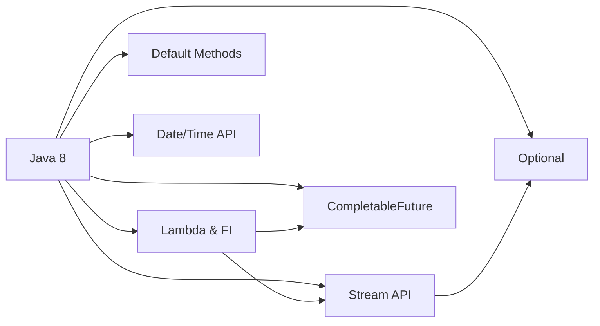
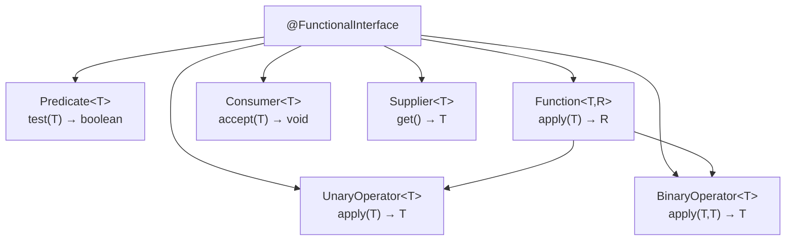
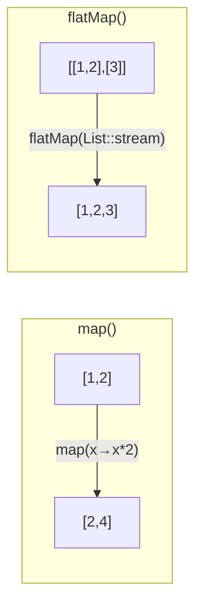

# Вопросы на собеседовании: `Java 8`

Комплексное руководство по вопросам собеседования на тему `Java 8` для `Senior Java Developer`. Включает детальные объяснения концепций, практические примеры кода, диаграммы и best practices.

**`Java 8`** — одна из самых значимых версий платформы, которая принесла функциональное программирование в мир `Java`. Основные нововведения: лямбда-выражения, `Stream API`, `Optional`, default-методы в интерфейсах, новый `Date/Time API` и `CompletableFuture`. Эти темы — обязательная часть любого Java-собеседования.

## Полезные ссылки

### Официальная документация

- [Java 8 Documentation](https://docs.oracle.com/javase/8/docs/) — официальная документация Oracle
- [Lambda Expressions Tutorial](https://docs.oracle.com/javase/tutorial/java/javaOO/lambdaexpressions.html) — туториал по лямбдам
- [Stream API JavaDoc](https://docs.oracle.com/en/java/javase/17/docs/api/java.base/java/util/stream/Stream.html) — API-документация Stream
- [java.time Package](https://docs.oracle.com/javase/8/docs/api/java/time/package-summary.html) — новый Date/Time API

### Baeldung

- [Java 8 Interview Questions — Baeldung](https://www.baeldung.com/java-8-interview-questions) — подборка вопросов с ответами
- [New Features in Java 8 — Baeldung](https://www.baeldung.com/java-8-new-features) — обзор всех нововведений
- [Guide To Java Optional — Baeldung](https://www.baeldung.com/java-optional) — полное руководство по Optional
- [Functional Interfaces in Java — Baeldung](https://www.baeldung.com/java-8-functional-interfaces) — Predicate, Function, Consumer, Supplier и другие

## Содержание

- [Полезные ссылки](#полезные-ссылки)
- [See also](#see-also)

**Обзор Java 8**
- [Q1. (!) Какие ключевые нововведения появились в Java 8?](#q1--какие-ключевые-нововведения-появились-в-java-8)
- [Q2. Какие важные изменения появились в Java 9–21?](#q2-какие-важные-изменения-появились-в-java-921)

**Функциональные интерфейсы и лямбды**
- [Q3. (!) Что такое функциональный интерфейс?](#q3--что-такое-функциональный-интерфейс)
- [Q4. (!) Какие стандартные функциональные интерфейсы есть в java.util.function?](#q4--какие-стандартные-функциональные-интерфейсы-есть-в-javautilfunction)
- [Q5. (!) Что такое лямбда-выражение и какой у него синтаксис?](#q5--что-такое-лямбда-выражение-и-какой-у-него-синтаксис)
- [Q6. Что такое аннотация @FunctionalInterface?](#q6-что-такое-аннотация-functionalinterface)
- [Q7. Что такое effectively final и зачем это ограничение в лямбдах?](#q7-что-такое-effectively-final-и-зачем-это-ограничение-в-лямбдах)
- [Q8. (!) Какие существуют типы ссылок на методы (Method Reference)?](#q8--какие-существуют-типы-ссылок-на-методы-method-reference)
- [Q9. Будет ли компилироваться интерфейс с default-методом и одним абстрактным?](#q9-будет-ли-компилироваться-интерфейс-с-default-методом-и-одним-абстрактным)
- [Q10. Чем лямбда-выражение отличается от анонимного класса?](#q10-чем-лямбда-выражение-отличается-от-анонимного-класса)

**Optional**
- [Q11. (!) Что такое Optional и зачем он нужен?](#q11--что-такое-optional-и-зачем-он-нужен)
- [Q12. В чём разница между orElse и orElseGet?](#q12-в-чём-разница-между-orelse-и-orelseget)
- [Q13. Что такое Optional.flatMap и когда использовать?](#q13-что-такое-optionalflatmap-и-когда-использовать)
- [Q14. Какие антипаттерны использования Optional вы знаете?](#q14-какие-антипаттерны-использования-optional-вы-знаете)

**Default-методы в интерфейсах**
- [Q15. Что такое default-метод в интерфейсе и зачем он нужен?](#q15-что-такое-default-метод-в-интерфейсе-и-зачем-он-нужен)
- [Q16. (!) Как разрешаются конфликты при наследовании нескольких default-методов?](#q16--как-разрешаются-конфликты-при-наследовании-нескольких-default-методов)
- [Q17. Можно ли объявить static-метод в интерфейсе?](#q17-можно-ли-объявить-static-метод-в-интерфейсе)

**Stream API**
- [Q18. (!) Что такое Stream и чем он отличается от коллекции?](#q18--что-такое-stream-и-чем-он-отличается-от-коллекции)
- [Q19. (!) В чём разница между промежуточными и терминальными операциями?](#q19--в-чём-разница-между-промежуточными-и-терминальными-операциями)
- [Q20. Что такое Stream Pipeline?](#q20-что-такое-stream-pipeline)
- [Q21. (!) В чём разница между map() и flatMap()?](#q21--в-чём-разница-между-map-и-flatmap)
- [Q22. Что такое reduce() и как его использовать?](#q22-что-такое-reduce-и-как-его-использовать)
- [Q23. В чём разница между findFirst() и findAny()?](#q23-в-чём-разница-между-findfirst-и-findany)
- [Q24. (!) Какие основные Collectors вы знаете?](#q24--какие-основные-collectors-вы-знаете)
- [Q25. Что такое Stream.peek() и когда его использовать?](#q25-что-такое-streampeek-и-когда-его-использовать)
- [Q26. Как группировать элементы с помощью Collectors.groupingBy?](#q26-как-группировать-элементы-с-помощью-collectorsgroupingby)
- [Q27. Что такое примитивные стримы IntStream, LongStream, DoubleStream?](#q27-что-такое-примитивные-стримы-intstream-longstream-doublestream)
- [Q28. (!) Что такое parallel stream и когда его применять?](#q28--что-такое-parallel-stream-и-когда-его-применять)
- [Q29. Можно ли повторно использовать Stream?](#q29-можно-ли-повторно-использовать-stream)
- [Q30. Как создать Stream из различных источников?](#q30-как-создать-stream-из-различных-источников)

**Date/Time API**
- [Q31. (!) Какие ключевые классы входят в новый Date/Time API?](#q31--какие-ключевые-классы-входят-в-новый-datetime-api)
- [Q32. В чём разница между LocalDateTime и ZonedDateTime?](#q32-в-чём-разница-между-localdatetime-и-zoneddatetime)
- [Q33. Чем Duration отличается от Period?](#q33-чем-duration-отличается-от-period)

**CompletableFuture и асинхронность**
- [Q34. (!) Что такое CompletableFuture и чем он лучше Future?](#q34--что-такое-completablefuture-и-чем-он-лучше-future)
- [Q35. Как комбинировать несколько CompletableFuture?](#q35-как-комбинировать-несколько-completablefuture)
- [Q36. Как обрабатывать исключения в CompletableFuture?](#q36-как-обрабатывать-исключения-в-completablefuture)

**Обработка исключений и практические паттерны**
- [Q37. Как обработать checked-исключения в лямбдах и Stream?](#q37-как-обработать-checked-исключения-в-лямбдах-и-stream)
- [Q38. Какие типичные ошибки допускают при работе со Stream API?](#q38-какие-типичные-ошибки-допускают-при-работе-со-stream-api)

**Продвинутые темы Java 8**
- [Q39. (!) Как написать собственный `Collector`?](#q39--как-написать-собственный-collector)
- [Q40. Какие типы `Method Reference` существуют и чем отличаются?](#q40-какие-типы-method-reference-существуют-и-чем-отличаются)
- [Q41. Как правильно использовать `Optional` и каких антипаттернов избегать?](#q41-как-правильно-использовать-optional-и-каких-антипаттернов-избегать)
- [Q42. Что такое `Stream Pipeline` и как работает ленивость?](#q42-что-такое-stream-pipeline-и-как-работает-ленивость)

---

## Q1. (!) Какие ключевые нововведения появились в `Java 8`?

`Java 8` (март 2014) — одна из самых значимых версий платформы. Ключевые нововведения:

| Фича | Описание |
|-------|----------|
| **Лямбда-выражения** | Компактный синтаксис анонимных функций |
| **Функциональные интерфейсы** | Интерфейсы с одним абстрактным методом (`SAM`) |
| **Method References** | Ссылки на методы (`Class::method`) |
| **`Stream API`** | Функциональная обработка коллекций |
| **`Optional`** | Обёртка для nullable-значений |
| **Default-методы** | Методы с реализацией в интерфейсах |
| **`Date/Time API`** | Новый пакет `java.time` (замена `Date`/`Calendar`) |
| **`CompletableFuture`** | Асинхронное программирование с цепочками |
| **`Nashorn`** | JavaScript-движок (удалён в Java 15) |



На собеседовании важно не просто перечислить фичи, а показать, как они связаны: лямбды — основа для `Stream API` и `CompletableFuture`; `Optional` — естественный результат терминальных операций стримов.

> [!mcq]
> - [x] Лямбды + `Stream API` + `Optional` + `CompletableFuture` + default-методы — это пакет нововведений `Java 8`, открывший функциональное программирование в платформе | ✓ ПРИМЕНЯТЬ: лямбды как замена анонимных классов (`Comparator.comparing(Person::getAge)`); цепочки `CompletableFuture.thenApply`; default в `Iterable.forEach`. 📋 ПРАВИЛО: «Java 8 = Lambda + Stream + Optional + CF + default». 🔗 См. Q3, Q5, Q18.
> - [ ] `Generics` появились в `Java 8` для параметризации типов коллекций и обеспечения типобезопасности на этапе компиляции | `Generics` — `Java 5` (2004). ❌ ПОСЛЕДСТВИЕ: senior путает timeline — на интервью отвечает «generics это Java 8» при вопросе про эволюцию; репутационный удар.
> - [ ] Аннотации появились в `Java 8` как механизм добавления метаданных к классам, методам и полям без влияния на бизнес-логику | Annotations — `Java 5`. ❌ ПОСЛЕДСТВИЕ: разработчик обещает team lead «миграция со старого framework без аннотаций решит проблемы Java 8» — фактически `@Override` и `@Deprecated` есть с 2004.
> - [ ] Многопоточность через `Thread` появилась в `Java 8` и позволила запускать код параллельно в отдельных потоках ОС | `Thread` — `Java 1.0` (1996). ❌ ПОСЛЕДСТВИЕ: команда отказывается от миграции на Java 8 «ради Thread API» — упускает реальный приз `CompletableFuture` и `parallelStream`; legacy остаётся годами.

> [!mcq]
> - [ ] `default`-методы — это компромисс, позволяющий добавлять реализации в `abstract`-классы без поломки наследников; интерфейсы остались чисто абстрактными | `default` именно в интерфейсах. ❌ ПОСЛЕДСТВИЕ: разработчик переводит `Comparator` в `abstract class` ради «default-семантики», ломает hierarchy реализующих классов (множественное наследование классов запрещено); rollback на полдня.
> - [ ] `Stream API` появился как часть `java.util.concurrent` и заменил `ExecutorService` для функциональной обработки данных | `Stream API` живёт в `java.util.stream`. ❌ ПОСЛЕДСТВИЕ: разработчик ищет `Stream` в `java.util.concurrent`, утверждает «Stream нет в JDK»; team lead видит путаницу concurrency-pool с lazy-pipeline; ставится под сомнение знание JDK.
> - [x] Главный архитектурный приём `Java 8` — `default`-методы в интерфейсах: позволили добавить `stream()`, `forEach`, `removeIf` в `Collection` без поломки существующих реализаций | ✓ ПРИМЕНЯТЬ: `Iterable.forEach`, `Collection.removeIf`, `Comparator.thenComparing` добавлены через `default`; расширяйте свой библиотечный `interface` через `default` для backward compatibility. 📋 ПРАВИЛО: «default = эволюция API без breaking changes». 🔗 См. Q15, Q16, Q18.
> - [ ] `var` для локальных переменных и `record` появились в `Java 8` как часть упрощения boilerplate-кода вместе с лямбдами | `var` — `Java 10`, `record` — `Java 16`. ❌ ПОСЛЕДСТВИЕ: senior на собеседовании отвечает «record в Java 8», провал темы LTS-планирования; команда выбирает `Java 8` ожидая `record` — разочарование на review.

## Q2. Какие важные изменения появились в `Java 9–21`?

Краткий обзор эволюции после `Java 8`:

| Версия | Ключевые фичи |
|--------|---------------|
| **Java 9** | `List.of()`, `Set.of()`, `Map.of()`, `Optional.or()`, `Stream.takeWhile()`/`dropWhile()`, модули (JPMS) |
| **Java 10** | `var` для локальных переменных, `List.copyOf()` |
| **Java 11** | `String.isBlank()`/`strip()`/`lines()`, `Optional.isEmpty()`, `HttpClient` |
| **Java 14** | `switch`-выражения, `instanceof` pattern matching (preview) |
| **Java 16** | `record`, `Stream.toList()` |
| **Java 17** | `sealed` классы, pattern matching for `instanceof` |
| **Java 21** | Виртуальные потоки, `SequencedCollection`, record patterns |

```java
// Java 9: фабрики неизменяемых коллекций
List<String> list = List.of("a", "b", "c");

// Java 10: var
var names = List.of("Alice", "Bob");

// Java 16: Stream.toList() — неизменяемый список
List<String> filtered = names.stream()
    .filter(n -> n.startsWith("A"))
    .toList();
```

На собеседовании достаточно знать основные фичи каждой LTS-версии (8, 11, 17, 21) и уметь объяснить практическую пользу.

> [!mcq]
> - [x] `record` появился стабильно в `Java 16` — неизменяемый носитель данных с авто-генерируемыми конструктором, геттерами, `equals`/`hashCode`/`toString` | ✓ ПРИМЕНЯТЬ: DTO между слоями (REST DTO, JPA projection), immutable value objects в DDD, tuple-like возврат из методов; альтернатива Lombok `@Value`. 📋 ПРАВИЛО: «LTS: 8/11/17/21; record stable J16, sealed J17, VirtualThreads J21». 🔗 См. Q1, Q31, Q42.
> - [ ] `var` для локальных переменных появился в `Java 16` для сокращения boilerplate при объявлениях | `var` — `Java 10`. ❌ ПОСЛЕДСТВИЕ: разработчик отказывается использовать `var` «это новинка из Java 16, рано»; команда теряет 6 лет читабельности кода; PR-стайл застревает на `Map<String, List<Integer>> x = new HashMap<>()`.
> - [ ] `record` появился стабильно в `Java 17` как неизменяемый носитель данных с авто-генерируемыми методами | `record` стабилен с `Java 16`. ❌ ПОСЛЕДСТВИЕ: разработчик откладывает миграцию на `record` до Java 17, теряет полгода продуктивности; в кодовой базе всё ещё пишутся длинные DTO с Lombok.
> - [ ] `record` появился стабильно в `Java 21` как часть финальной модернизации модели данных | `record` — `Java 16`. ❌ ПОСЛЕДСТВИЕ: команда выбирает `Java 21` LTS только ради `record`, пропуская `sealed` и pattern matching из `Java 17`; миграция завышена в эстимейте.

## Q3. (!) Что такое функциональный интерфейс?

**Функциональный интерфейс** — интерфейс с ровно одним абстрактным методом (Single Abstract Method, `SAM`). Default- и static-методы не считаются.

Функциональные интерфейсы — это **целевые типы** для лямбда-выражений и ссылок на методы.

```java
@FunctionalInterface
public interface Converter<F, T> {
    T convert(F from);

    // default-метод — не нарушает SAM
    default Converter<F, T> andThen(Converter<T, ?> after) {
        return (F f) -> after.convert(this.convert(f));
    }
}

// Использование через лямбду
Converter<String, Integer> toInt = Integer::valueOf;
Integer result = toInt.convert("123"); // 123
```



Подробнее о коллекциях, использующих функциональные интерфейсы — в [вопросах по Java Collections](java-collections-interview.md).

> [!mcq]
> - [x] Функциональный интерфейс — интерфейс ровно с одним абстрактным методом (`SAM`), целевой тип для лямбд и method references; `default`/`static`/`Object`-методы не нарушают контракт | ✓ ПРИМЕНЯТЬ: custom FI (`Validator<T>`, `Mapper<F,T>`, `EventHandler<E>`) для domain-логики; добавляйте `@FunctionalInterface` для compile-check; default-методы `andThen`/`compose` для composability. 📋 ПРАВИЛО: «FI = SAM; default/static OK; аннотация опциональна». 🔗 См. Q4, Q5, Q6.
> - [ ] Функциональный интерфейс — это интерфейс, у которого все методы помечены аннотацией `@FunctionalInterface`, что гарантирует возможность использования лямбд | Аннотация опциональна. ❌ ПОСЛЕДСТВИЕ: разработчик не использует `Comparator`, `Runnable`, `Callable` как target лямбд (нет аннотации в JDK); пишет лишний boilerplate-класс для simple-callback на 30 минут вместо `() -> ...`.
> - [ ] Функциональный интерфейс — это интерфейс без `default` и `static`-методов, содержащий ровно один абстрактный метод для совместимости с лямбдами | `default`/`static` OK. ❌ ПОСЛЕДСТВИЕ: разработчик удаляет `Predicate.and`, `Function.andThen` думая что нарушают SAM; composability теряется, код раздут utility-обёртками.
> - [ ] Функциональный интерфейс — интерфейс, расширяющий `java.util.function.Function`, что даёт совместимость с `andThen` и `compose` | Не требуется extend `Function`. ❌ ПОСЛЕДСТВИЕ: команда добавляет `MyFunc extends Function`, теряет возможность именовать метод по-доменному (`validate` вместо `apply`); чужой код через type inference выбирает не тот overload.

> [!mcq]
> - [ ] Методы `Object` (`equals`, `hashCode`, `toString`), объявленные `abstract` в интерфейсе, считаются вторым абстрактным методом и нарушают `@FunctionalInterface` | `Object`-методы не считаются. ❌ ПОСЛЕДСТВИЕ: разработчик удаляет переопределение `equals(Object)` из `Comparator`-like интерфейса, теряя усиленный контракт equality для domain-объектов; код-ревью пропускает баги в `Set<DomainObj>`.
> - [ ] `@FunctionalInterface` — это runtime-аннотация (`@Retention(RUNTIME)`), JVM проверяет при загрузке класса и бросает `ClassFormatError` при нарушении SAM | Это `SOURCE` retention, compile-time проверка. ❌ ПОСЛЕДСТВИЕ: команда пытается читать аннотацию через рефлексию для динамической валидации SPI-плагинов, `getAnnotation` возвращает `null`; полдня на reverse-engineering retention-policy.
> - [ ] Если интерфейс наследует другой functional interface без новых методов, он теряет SAM-контракт и не может быть target лямбды | Наследование SAM сохраняет SAM. ❌ ПОСЛЕДСТВИЕ: разработчик дублирует `apply` в child-интерфейсе «чтобы лямбда работала» — получает diamond-warning от IDE; rename refactoring пропускает override и ломает API.
> - [x] `@FunctionalInterface` гарантирует compile-time проверку SAM, но допускает: `default`, `static`, `private` (J9+), и `abstract`-переопределения методов `Object` — последние не считаются дополнительными `SAM` | ✓ ПРИМЕНЯТЬ: для `Comparator`-like интерфейса смело объявляйте `abstract boolean equals(Object o)` для усиления equality; `private`-хелперы для shared-логики между default-методами без загрязнения API. 📋 ПРАВИЛО: «SAM-исключения: `Object` + `default` + `static` + `private` (J9+)». 🔗 См. Q6, Q9, Q15.

## Q4. (!) Какие стандартные функциональные интерфейсы есть в `java.util.function`?

Пакет `java.util.function` содержит 43+ функциональных интерфейса. Основные:

| Интерфейс | Метод | Описание |
|-----------|-------|----------|
| `Predicate<T>` | `test(T) → boolean` | Проверка условия |
| `Function<T,R>` | `apply(T) → R` | Преобразование T в R |
| `Consumer<T>` | `accept(T) → void` | Потребление значения |
| `Supplier<T>` | `get() → T` | Поставка значения |
| `UnaryOperator<T>` | `apply(T) → T` | Функция T → T |
| `BinaryOperator<T>` | `apply(T,T) → T` | Функция (T,T) → T |
| `BiFunction<T,U,R>` | `apply(T,U) → R` | Два аргумента → R |
| `BiPredicate<T,U>` | `test(T,U) → boolean` | Два аргумента → boolean |
| `BiConsumer<T,U>` | `accept(T,U) → void` | Два аргумента → void |

```java
// Predicate — фильтрация
Predicate<String> isLong = s -> s.length() > 5;
Predicate<String> startsWithJ = s -> s.startsWith("J");
Predicate<String> combined = isLong.and(startsWithJ);

// Function — преобразование и композиция
Function<String, Integer> toLength = String::length;
Function<Integer, String> toStr = i -> "len=" + i;
Function<String, String> composed = toLength.andThen(toStr);
// composed.apply("Hello") → "len=5"

// Consumer — побочные эффекты
Consumer<String> printer = System.out::println;
Consumer<String> logger = s -> log.info("Value: {}", s);
Consumer<String> both = printer.andThen(logger);

// Supplier — отложенное создание
Supplier<List<String>> listFactory = ArrayList::new;
```

Примитивные специализации (избегают боксинга): `IntPredicate`, `LongFunction<R>`, `ToIntFunction<T>`, `IntConsumer`, `IntSupplier`, `IntUnaryOperator`, `IntBinaryOperator` и аналогичные для `long`/`double`.

> [!mcq]
> - [x] `Predicate<T>` принимает `T` и возвращает `boolean` через `test(T)`, используется в `Stream.filter()`; `Function<T,R>` — `apply(T)→R`; `Consumer<T>` — `accept(T)→void`; `Supplier<T>` — `get()→T` | ✓ ПРИМЕНЯТЬ: `Stream.filter(Predicate)`, `Collection.removeIf`, композиция `notEmpty.and(longerThan10).or(isVip)`; domain-валидация. 📋 ПРАВИЛО: «Predicate=test→bool, Function=apply→R, Consumer=accept→void, Supplier=get→T». 🔗 См. Q3, Q5, Q18.
> - [ ] `Consumer<T>` принимает аргумент `T` и возвращает результат `R` через метод `apply(T)→R` | Это `Function`. ❌ ПОСЛЕДСТВИЕ: разработчик использует `Consumer` для transformation в pipeline; результат теряется (`void`); переписывает на `Function` через час дебага в production hotfix.
> - [ ] `Supplier<T>` принимает аргумент `T` и выполняет действие с побочным эффектом через `accept(T)→void` | Это `Consumer`. ❌ ПОСЛЕДСТВИЕ: для lazy init `orElseGet(() -> expensiveComputation())` выбирают `Consumer` вместо `Supplier`; compile error «cannot convert»; час на разбор сигнатур.
> - [ ] `Predicate<T>` принимает `T` и возвращает `T`, применяя унарную операцию через `apply(T)→T` | Это `UnaryOperator`. ❌ ПОСЛЕДСТВИЕ: путаница `Predicate` (boolean) и `UnaryOperator` (T→T) — compile error при `Stream.filter` (ожидает `Predicate`); junior останавливается на час.

> [!mcq]
> - [ ] `Function<Integer,Integer>` для `IntStream` так же эффективен как `IntUnaryOperator` — JIT inline-ит boxing и устраняет накладные расходы | JIT не всегда устраняет boxing. ❌ ПОСЛЕДСТВИЕ: в hot-path 100M событий метрик `Function<Integer,Integer>` вместо `IntUnaryOperator`; allocation 500 MB/s `Integer`-объектов; G1 GC pause spikes 200ms; latency SLO нарушен.
> - [ ] `BiFunction<T,U,R>` имеет примитивные специализации `IntBiFunction`, `LongBiFunction`, `DoubleBiFunction` для избежания боксинга в `Map.merge` | Таких нет. ❌ ПОСЛЕДСТВИЕ: разработчик ищет `IntBiFunction` в `java.util.function`, теряет час; правильный выбор — `IntBinaryOperator` для `(int,int)→int` или `ToIntBiFunction<T,U>` для `(T,U)→int`.
> - [ ] Префикс `To` в `ToIntFunction<T>` означает bridge-интерфейс для конвертации legacy API в `Stream` — без него pipeline не скомпилируется | Префикс — примитивный return-тип. ❌ ПОСЛЕДСТВИЕ: команда оборачивает `mapToInt(String::length)` в `ToIntFunction`-cast «для совместимости»; noise в коде; на ревью кто-то удаляет cast и удивляется что код продолжает работать.
> - [x] Примитивные специализации (`IntFunction<R>`, `ToIntFunction<T>`, `IntPredicate`, `IntUnaryOperator`, `IntBinaryOperator`) избегают boxing `int↔Integer`; `IntBiFunction` отсутствует — используйте `IntBinaryOperator` или `ToIntBiFunction<T,U>` | ✓ ПРИМЕНЯТЬ: в hot-path `IntStream.map(IntUnaryOperator)` вместо `Stream<Integer>.map(Function)` экономит до 90% allocation; `mapToInt`/`mapToLong` обязательны при `sum`/`average`. JMH: x3-x5 throughput. 📋 ПРАВИЛО: «To-prefix = return primitive; PrimitiveFunction<R> = primitive arg→R; IntBiFunction нет». 🔗 См. Q3, Q27, Q28.

## Q5. (!) Что такое лямбда-выражение и какой у него синтаксис?

**Лямбда-выражение** — компактная запись анонимной функции, совместимой с функциональным интерфейсом.

Синтаксис:

```java
// Полная форма
(Type1 param1, Type2 param2) -> { statements; return result; }

// Сокращённые формы
(a, b) -> a + b          // типы выводятся, одно выражение
a -> a.length()           // один параметр — скобки не нужны
() -> System.out.println("Hi")  // без параметров
```

Практические примеры:

```java
// Сортировка списка
List<String> names = Arrays.asList("Charlie", "Alice", "Bob");
names.sort((a, b) -> a.compareTo(b));
// или через method reference:
names.sort(String::compareTo);

// Runnable
Runnable task = () -> System.out.println("Running in " + Thread.currentThread().getName());
new Thread(task).start();

// Обработка коллекций
Map<String, List<String>> grouped = names.stream()
    .collect(Collectors.groupingBy(name -> name.substring(0, 1)));
```

Под капотом лямбда компилируется не в анонимный класс, а через `invokedynamic` (JEP 276), что эффективнее: нет дополнительного `.class`-файла, нет аллокации нового объекта при каждом вызове (JVM может кэшировать).

> [!mcq]
> - [x] Запись `a -> a.length()` — допустимый синтаксис лямбды с одним параметром, для которого скобки необязательны и тип выводится компилятором автоматически | ✓ ПРИМЕНЯТЬ: `list.stream().filter(s -> s.length() > 5)`, `Map.computeIfAbsent(k -> compute(k))`, `Optional.map(s -> s.toUpperCase())`. Тип выводится из target functional interface. С Java 11 можно `(var a) -> ...` для добавления аннотаций. 📋 ПРАВИЛО: "одиночный param без скобок (a->...); многопараметровый/типизированный со скобками; expression без `{}`/`return`". 🔗 См. Q3 (functional interface), Q4 (стандартные FI), Q7 (effectively final).
> - [ ] Запись `a -> a.length()` недопустима — для одного параметра без явного указания типа необходимо писать `(var a) -> a.length()` начиная с Java 11 | `(var a)` опционален. ❌ ПОСЛЕДСТВИЕ: команда мигрирует все лямбды на `(var a) ->` думая что это required в Java 11+, добавляет boilerplate на сотни мест без необходимости.
> - [ ] Запись `a -> a.length()` недопустима — параметры лямбды всегда должны быть заключены в скобки: `(a) -> a.length()` | Скобки опциональны для одного параметра. ❌ ПОСЛЕДСТВИЕ: code-style guide команды требует скобки на всех лямбдах из-за неправильного понимания synthax — лишний noise в коде, ухудшение читаемости pipeline-операций.
> - [ ] Запись `a -> a.length()` недопустима — тело лямбды должно быть заключено в фигурные скобки с `return`: `a -> { return a.length(); }` | Expression body OK. ❌ ПОСЛЕДСТВИЕ: разработчик пишет `s -> { return s.length(); }` для каждой single-expression лямбды — boilerplate, хуже читается. Используйте expression body когда возможно.

> [!mcq]
> - [ ] Лямбда-выражение компилируется в отдельный анонимный `.class`-файл, как и анонимный класс, что позволяет JVM переиспользовать его через classloader | Без отдельного класса. ❌ ПОСЛЕДСТВИЕ: ложное предположение приводит к попыткам анализа `Class.getClasses()` для поиска lambda-классов в reflection-инструментах — на деле они анонимные через `invokedynamic`. Не находятся стандартными reflection-методами.
> - [x] Лямбда-выражение компилируется через байткод-инструкцию `invokedynamic`, что позволяет JVM отложить стратегию связывания до рантайма и кэшировать экземпляр | ✓ ПРИМЕНЯТЬ: понимание `invokedynamic` важно для performance-discussions; non-capturing lambda (`s -> s.length()`) экземпляр кэшируется JVM — нет аллокации при каждом вызове. Capturing lambda (`s -> outer.method(s)`) аллоцируется. JEP 276, LambdaMetafactory под капотом. 📋 ПРАВИЛО: "lambda = invokedynamic + LambdaMetafactory; non-capturing cached, capturing — new instance per call". 🔗 См. Q5 (синтаксис), Q10 (vs анонимный класс), Q7 (effectively final).
> - [ ] Лямбда-выражение компилируется в статический метод вызывающего класса и всегда создаёт новый объект через `new` при каждом вызове | Кэшируется. ❌ ПОСЛЕДСТВИЕ: разработчик беспокоится о performance hit для часто вызываемой лямбды (`stream().filter(x -> x > 0)` в hot loop), переписывает на анонимный класс — на деле invokedynamic кэширует non-capturing экземпляр.
> - [ ] Лямбда-выражение компилируется через reflection-вызов метода интерфейса в рантайме, что гибко но медленнее анонимных классов | Не reflection. ❌ ПОСЛЕДСТВИЕ: ложное представление о производительности — лямбды через `invokedynamic` ОДИНАКОВЫ или БЫСТРЕЕ анонимных классов после JIT-warmup, не медленнее. Бенчмарки JMH подтверждают.

## Q6. Что такое аннотация `@FunctionalInterface`?

`@FunctionalInterface` — маркерная аннотация, которая сообщает компилятору, что интерфейс должен содержать ровно один абстрактный метод.

```java
@FunctionalInterface
public interface Validator<T> {
    boolean isValid(T value);

    // OK: default-метод
    default Validator<T> negate() {
        return t -> !isValid(t);
    }

    // OK: static-метод
    static <T> Validator<T> alwaysTrue() {
        return t -> true;
    }

    // ОШИБКА КОМПИЛЯЦИИ: второй абстрактный метод
    // String describe();
}
```

**Важно**: аннотация не обязательна для использования лямбд — любой SAM-интерфейс может быть целевым типом лямбды. Но аннотация защищает от случайного добавления второго абстрактного метода. Стандартные примеры: `Runnable`, `Callable`, `Comparator`, `Consumer`.

> [!mcq]
> - [ ] Аннотация `@FunctionalInterface` обязательна — без неё компилятор не позволит использовать интерфейс как целевой тип лямбды | Опциональна. ❌ ПОСЛЕДСТВИЕ: разработчик переживает что custom interface не работает с лямбдами без annotation, тратит время на её добавление — на деле любой SAM-интерфейс работает (Comparator, Runnable не имеют `@FunctionalInterface` в JDK).
> - [ ] Аннотация `@FunctionalInterface` запрещает добавление default-методов в интерфейс, оставляя только один абстрактный метод | Default разрешены. ❌ ПОСЛЕДСТВИЕ: команда удаляет полезные default-методы (`Predicate.and`, `Function.andThen`) "для соответствия `@FunctionalInterface`" — composability теряется, код хуже.
> - [x] Аннотация `@FunctionalInterface` является маркерной и заставляет компилятор проверять, что в интерфейсе ровно один абстрактный метод, защищая от случайного нарушения SAM-контракта | ✓ ПРИМЕНЯТЬ: добавляйте на ВСЕ кастомные functional interfaces — compile-time guard от случайного добавления второго abstract method. Без annotation: разработчик добавляет `boolean isValid(T)` второй метод, ломает все лямбды через codebase. С annotation: ошибка компиляции на месте. 📋 ПРАВИЛО: "@FunctionalInterface = compile-time SAM check; маркер, не runtime; добавляйте на custom FI". 🔗 См. Q3 (functional interface), Q4 (стандартные FI), Q5 (лямбды).
> - [ ] Аннотация `@FunctionalInterface` генерирует дополнительный байткод, обеспечивающий совместимость лямбды с интерфейсом через invokedynamic в рантайме | Не влияет на bytecode. ❌ ПОСЛЕДСТВИЕ: ложные ожидания о runtime-effect; разработчик думает что без аннотации лямбда не будет работать; на деле annotation чисто compile-time.

## Q7. Что такое `effectively final` и зачем это ограничение в лямбдах?

Переменная **effectively final** — это локальная переменная, которая не объявлена как `final`, но ни разу не изменяется после инициализации.

В лямбдах и анонимных классах можно захватывать **только** effectively final (или `final`) локальные переменные:

```java
String prefix = "Hello"; // effectively final

// OK — prefix не изменяется
Function<String, String> greeter = name -> prefix + ", " + name;

// ОШИБКА КОМПИЛЯЦИИ — prefix модифицируется
// prefix = "Hi";
// Function<String, String> greeter2 = name -> prefix + ", " + name;
```

**Причина ограничения**: лямбда захватывает **копию** значения переменной (capture by value). Если бы переменную можно было менять, возникла бы иллюзия shared mutable state между лямбдой и внешним кодом.

**Обходные пути** для изменяемого состояния:

```java
// AtomicInteger для счётчика
AtomicInteger counter = new AtomicInteger(0);
list.forEach(item -> counter.incrementAndGet());

// Массив из одного элемента
int[] sum = {0};
list.forEach(item -> sum[0] += item.length());
```

> [!mcq]
> - [ ] Лямбда захватывает переменную **по ссылке**, поэтому изменение переменной снаружи сразу видно внутри лямбды — это позволяет менять состояние из обоих мест | Java capture by VALUE. ❌ ПОСЛЕДСТВИЕ: разработчик пишет `int counter = 0; list.forEach(x -> counter++);` ожидая что счётчик обновится — компилятор бросает «Variable used in lambda should be effectively final»; код не собирается, тратятся часы на поиск AtomicInteger.
> - [x] Лямбда захватывает **копию значения** локальной переменной, поэтому она обязана быть effectively final, чтобы избежать иллюзии shared mutable state между лямбдой и внешним кодом | ✓ ПРИМЕНЯТЬ: для изменяемого состояния использовать `AtomicInteger`/`AtomicReference` или массив-обёртку (`int[] sum = {0}`); поля экземпляра можно менять — ограничение только на локальные переменные. 📋 ПРАВИЛО: «Java lambda capture = by value; локальные переменные = effectively final; поля = mutable». 🔗 См. Q5 (синтаксис), Q10 (лямбда vs анонимный класс), Q3 (functional interface).
> - [ ] Лямбда требует явного `final` для всех захватываемых переменных — без `final`-модификатора компилятор не разрешит использование переменной внутри тела лямбды | С Java 8 effectively final OK. ❌ ПОСЛЕДСТВИЕ: команда добавляет `final` ко всем локальным переменным «для совместимости с лямбдами»; код переполнен boilerplate, IDE warnings о redundant `final`, ухудшение читаемости.
> - [ ] Лямбда может изменять любые локальные переменные внешнего метода — компилятор автоматически оборачивает их в массив для обхода ограничений | Невозможно изменять. ❌ ПОСЛЕДСТВИЕ: разработчик ожидает «магического» обхода ограничения и пишет `total += x` внутри `forEach`, получает compile error; неправильное представление о JVM-семантике приводит к ошибочной отладке.

## Q8. (!) Какие существуют типы ссылок на методы (`Method Reference`)?

Ссылка на метод — сокращённая форма лямбды, когда лямбда просто вызывает существующий метод.

Четыре типа:

| Тип | Синтаксис | Эквивалент лямбды |
|-----|-----------|-------------------|
| Статический метод | `ClassName::staticMethod` | `(args) -> ClassName.staticMethod(args)` |
| Метод экземпляра (конкретного) | `object::instanceMethod` | `(args) -> object.instanceMethod(args)` |
| Метод экземпляра (произвольного) | `ClassName::instanceMethod` | `(obj, args) -> obj.instanceMethod(args)` |
| Конструктор | `ClassName::new` | `(args) -> new ClassName(args)` |

```java
// 1. Статический метод
Function<String, Integer> parser = Integer::parseInt;

// 2. Метод конкретного экземпляра
String prefix = "Mr. ";
Function<String, String> addPrefix = prefix::concat;

// 3. Метод произвольного экземпляра — первый аргумент = объект
Function<String, String> toUpper = String::toUpperCase;
BiFunction<String, String, Boolean> checker = String::startsWith;

// 4. Конструктор
Supplier<ArrayList<String>> listFactory = ArrayList::new;
Function<String, Integer> intFactory = Integer::new;
```

На собеседовании часто просят объяснить разницу между типами 2 и 3 — в типе 3 первый параметр функционального интерфейса становится объектом, у которого вызывается метод.

> [!mcq]
> - [ ] `String::toUpperCase` — это ссылка на статический метод, эквивалентная `() -> String.toUpperCase()` без аргументов | Это unbound instance. ❌ ПОСЛЕДСТВИЕ: разработчик пишет `Stream.of("a","b").map(String::toUpperCase)` думая что вызывается static; путаница типа method reference приводит к compile errors при попытке использовать как `Supplier<String>`.
> - [ ] `Integer::parseInt` — это ссылка на конструктор, создающая новый `Integer` через `new Integer(s)` | Это static method. ❌ ПОСЛЕДСТВИЕ: команда использует `Integer::parseInt` как `Supplier<Integer>` ожидая no-arg вызов, получает compile error «cannot resolve overloaded method»; час потерян на разбор разницы между static и constructor reference.
> - [x] `String::toUpperCase` — это ссылка на метод экземпляра произвольного объекта (unbound), эквивалентная `(String s) -> s.toUpperCase()`, где первый параметр становится receiver-объектом | ✓ ПРИМЕНЯТЬ: `Stream<String>.map(String::toUpperCase)`, `Comparator.comparing(String::length)`, `list.forEach(String::trim)`. Унификация для всех экземпляров одного типа без захвата конкретного объекта. 📋 ПРАВИЛО: «4 типа MR: `Class::static`, `obj::instance` (bound), `Class::instance` (unbound), `Class::new`». 🔗 См. Q5 (лямбды), Q40 (типы Method Reference), Q3 (functional interface).
> - [ ] `ArrayList::new` — это ссылка на статический фабричный метод `ArrayList.create()`, который создаёт пустой список через рефлексию | Это constructor reference. ❌ ПОСЛЕДСТВИЕ: разработчик ищет несуществующий `ArrayList.create()` в JavaDoc; неправильное понимание `::new` приводит к попыткам реализовать factory через reflection вместо стандартного синтаксиса.

> [!mcq]
> - [ ] Method reference `String::toUpperCase` компилируется в **анонимный inner-класс** (`Class$Lambda$1.class`) на этапе javac — поэтому в `target/classes` появляются дополнительные `.class`-файлы | Нет, через `invokedynamic`+`LambdaMetafactory`, без отдельных `.class` от javac. ❌ ПОСЛЕДСТВИЕ: команда жалуется на «раздувание JAR от лямбд», ищет maven-plugin для inline-лямбд; на деле bytecode содержит только `invokedynamic`-инструкцию, классы генерируются JVM в runtime в anonymous classloader; иллюзия проблемы там, где её нет.
> - [ ] `Class::instanceMethod` (unbound) **медленнее** обычной лямбды `(x) -> x.method()` потому что требует дополнительной dispatch-таблицы для resolve receiver-объекта в runtime | Производительность одинакова или MR быстрее. ❌ ПОСЛЕДСТВИЕ: senior-разработчик «оптимизирует» код заменяя `String::length` на `s -> s.length()` ради «исключения dispatch-overhead»; на деле JIT inline-ит оба варианта одинаково; чистая премaturая оптимизация и шум в diff.
> - [ ] При первом вызове `Stream.map(String::toUpperCase)` JVM генерирует синтетический класс через `sun.misc.ProxyGenerator` и кеширует его в `Metaspace` навсегда — это потенциальная утечка при множестве уникальных лямбд | Используется `LambdaMetafactory` + `ASM`, не `ProxyGenerator`; классы выгружаются с classloader. ❌ ПОСЛЕДСТВИЕ: команда задаёт `-XX:MaxMetaspaceSize` слишком агрессивно ожидая утечку лямбд, ловит `OutOfMemoryError: Metaspace` под нагрузкой; настоящие источники роста Metaspace (динамическая генерация прокси Hibernate/CGLIB) пропущены.
> - [x] `invokedynamic` + `LambdaMetafactory` лениво генерирует класс-имплементацию при первом вызове через bootstrap-метод; method reference (особенно `Class::staticMethod` и `Class::new`) часто **быстрее** эквивалентной лямбды — JVM может переиспользовать singleton-instance, тогда как лямбда с захватом создаёт новый объект | ✓ ПРИМЕНЯТЬ: в hot-loop предпочитайте `String::length` и `Integer::parseInt` лямбдам — singleton-кеш экономит allocation; для конструкторов `ArrayList::new` лучше `() -> new ArrayList<>()` ровно по той же причине; warmup-фаза JIT inline-ит оба, но MR имеет преимущество на cold start. 📋 ПРАВИЛО: «MR без захвата = singleton + invokedynamic; lambda с capture = new instance per call; в hot-path выбирайте MR». 🔗 См. Q5 (лямбды), Q10 (lambda vs anon), Q40 (типы Method Reference).

## Q9. Будет ли компилироваться интерфейс с `default`-методом и одним абстрактным?

```java
@FunctionalInterface
public interface Function2<T, U, V> {
    V apply(T t, U u);

    default void count() {
        // реализация по умолчанию
    }
}
```

**Да**, код скомпилируется. Интерфейс содержит ровно один абстрактный метод `apply()` — это соответствует контракту `@FunctionalInterface`. Метод `count()` — default-метод с реализацией, он не считается абстрактным.

Такой интерфейс можно использовать как целевой тип лямбды:

```java
Function2<String, Integer, String> repeater = (s, n) -> s.repeat(n);
```

> [!mcq]
> - [ ] Не скомпилируется — `default`-метод считается абстрактным и нарушает контракт `@FunctionalInterface`, требующий ровно одного метода | Default не считается абстрактным. ❌ ПОСЛЕДСТВИЕ: команда удаляет полезные default-методы из functional interfaces (`Predicate.and`, `Function.andThen`) ожидая compile error — теряют composability, переписывают на utility-классы.
> - [x] Скомпилируется — `default`-метод имеет реализацию и не считается абстрактным; интерфейс с одним абстрактным `apply()` соответствует контракту SAM и `@FunctionalInterface` | ✓ ПРИМЕНЯТЬ: добавлять `default`-методы к custom functional interfaces для composability (`Validator.and`, `Mapper.andThen`); `static`-методы тоже разрешены и не нарушают SAM. JDK так делает в `Predicate`, `Function`, `Comparator`. 📋 ПРАВИЛО: «SAM = ровно 1 abstract; default/static не считаются; `Object`-методы тоже не нарушают SAM». 🔗 См. Q3 (functional interface), Q6 (@FunctionalInterface), Q15 (default-метод).
> - [ ] Не скомпилируется — `@FunctionalInterface` запрещает наличие любых методов кроме одного абстрактного, включая `default` и `static` | Запрет ложный. ❌ ПОСЛЕДСТВИЕ: разработчик создаёт пустой functional interface без полезных композиционных методов; невозможно строить fluent API; в кодовой базе расцветают utility-классы вместо интерфейсных методов.
> - [ ] Не скомпилируется — `default`-метод требует extending абстрактного класса, а интерфейс не может содержать реализацию методов | Java 8+ может. ❌ ПОСЛЕДСТВИЕ: команда мигрирует с Java 7 на Java 8 и продолжает использовать abstract base classes для shared behaviour, теряя возможность multiple inheritance через default-методы.

## Q10. Чем лямбда-выражение отличается от анонимного класса?

| Критерий | Лямбда | Анонимный класс |
|----------|--------|-----------------|
| Целевой тип | Только функциональный интерфейс | Любой интерфейс / абстрактный класс |
| `this` | Ссылается на внешний класс | Ссылается на сам анонимный класс |
| Компиляция | `invokedynamic` | Отдельный `.class`-файл |
| Производительность | Обычно быстрее (нет аллокации класса) | Создаёт новый объект каждый раз |
| Состояние (поля) | Нет собственных полей | Может иметь поля |
| Shadowing | Не может переопределить переменную из scope | Может |

```java
public class Example {
    private String name = "outer";

    void demo() {
        // Лямбда — this = Example
        Runnable lambda = () -> System.out.println(this.name); // "outer"

        // Анонимный класс — this = экземпляр анонимного класса
        Runnable anon = new Runnable() {
            private String name = "inner";
            @Override
            public void run() {
                System.out.println(this.name); // "inner"
            }
        };
    }
}
```

> [!mcq]
> - [ ] В лямбде ключевое слово `this` ссылается на сам лямбда-объект, как и в анонимном классе — это позволяет вызывать методы лямбды через `this` | В лямбде `this` = enclosing class. ❌ ПОСЛЕДСТВИЕ: разработчик пишет `Runnable r = () -> this.run();` ожидая рекурсивный вызов лямбды — получает `StackOverflowError` от вызова метода внешнего класса; путаница в дебаге.
> - [ ] И лямбда, и анонимный класс компилируются в отдельный `.class`-файл — это требуется для bytecode verification и classloader integration | Лямбда через invokedynamic. ❌ ПОСЛЕДСТВИЕ: при анализе heap dump через MAT инструмент не находит ожидаемые `Lambda$1.class` файлы; разработчик неправильно объясняет performance metrics команде, теряя credibility.
> - [x] В лямбде `this` ссылается на enclosing класс, в анонимном классе — на сам анонимный экземпляр; лямбда не имеет своих полей и не может shadow переменные scope | ✓ ПРИМЕНЯТЬ: лямбда — для stateless callbacks (`Comparator`, `Predicate`, `Runnable`); анонимный класс — когда нужны поля, конструктор, или несколько методов (например `WindowAdapter` для `windowOpened`+`windowClosed`). 📋 ПРАВИЛО: «лямбда: invokedynamic + enclosing this; анонимный: new class + own this + own fields». 🔗 См. Q5 (лямбды), Q7 (effectively final), Q3 (functional interface).
> - [ ] Анонимный класс быстрее лямбды, потому что не требует вызова `LambdaMetafactory` в рантайме и сразу создаётся через `new` | Лямбда ≥ анонимного. ❌ ПОСЛЕДСТВИЕ: команда переписывает hot-path лямбды на анонимные классы «ради performance»; JMH-бенчмарки показывают равенство или регрессию из-за per-call allocation; зря потраченное время.

## Q11. (!) Что такое `Optional` и зачем он нужен?

`Optional<T>` — контейнер, который может содержать значение типа `T` или быть пустым. Введён в `Java 8` для явного выражения отсутствия значения вместо `null`.

```java
// Создание
Optional<String> present = Optional.of("hello");
Optional<String> empty = Optional.empty();
Optional<String> nullable = Optional.ofNullable(possiblyNull);

// Основные операции
String value = present
    .filter(s -> s.length() > 3)
    .map(String::toUpperCase)
    .orElse("default");
// "HELLO"

// Цепочка Optional в бизнес-логике
Optional<String> city = findUser(userId)
    .flatMap(User::getAddress)
    .map(Address::getCity);
```

**Ключевые методы:**

| Метод | Описание |
|-------|----------|
| `of(value)` | Создаёт `Optional`; бросает `NPE` если `null` |
| `ofNullable(value)` | Создаёт `Optional`; пустой если `null` |
| `isPresent()` / `isEmpty()` | Проверка наличия значения |
| `ifPresent(Consumer)` | Выполнить действие если есть значение |
| `map(Function)` | Преобразование значения |
| `flatMap(Function)` | Преобразование в другой `Optional` |
| `filter(Predicate)` | Фильтрация значения |
| `orElse(T)` | Значение по умолчанию |
| `orElseGet(Supplier)` | Ленивое значение по умолчанию |
| `orElseThrow()` | Бросить исключение если пусто |

**Важно**: `Optional` не реализует `Serializable` — не использовать как поле сущности или DTO. Его назначение — возвращаемый тип методов.

Подробнее о работе с `null`-безопасными коллекциями — в [вопросах по Collections](java-collections-interview.md).

> [!mcq]
> - [x] `Optional<T>` — контейнер, который явно выражает возможное отсутствие значения; предназначен как тип возвращаемого значения метода, не реализует `Serializable` и не должен использоваться как поле сущности или параметр метода | ✓ ПРИМЕНЯТЬ: `findById`, `findByName` в репозиториях; цепочки `.map().filter().orElseGet()` для null-safe навигации; не сериализуется — для DTO используйте nullable + `Optional`-getter. Spring `JpaRepository.findById` возвращает `Optional<T>`. 📋 ПРАВИЛО: «`Optional` = return type only; не поле, не параметр, не Serializable». 🔗 См. Q12 (orElse vs orElseGet), Q13 (flatMap), Q14 (антипаттерны).
> - [ ] `Optional<T>` реализует `Serializable` и предназначен для использования как поле JPA-сущности для явного выражения опциональных колонок БД | Не Serializable. ❌ ПОСЛЕДСТВИЕ: команда добавляет `Optional<String> middleName` в JPA entity, после ребута приложения через session replication — `NotSerializableException`, кластер падает; production incident.
> - [ ] `Optional<T>` — это замена `null`, который должен использоваться как тип параметра во всех методах для явного выражения nullable-аргументов | Не как параметр. ❌ ПОСЛЕДСТВИЕ: API `process(Optional<String> name)` заставляет caller писать `process(Optional.of("x"))` или `process(Optional.empty())` — код хуже, чем `@Nullable` или перегрузка; Brian Goetz явно против этого паттерна.
> - [ ] `Optional<T>` — это полная замена `try-catch` блоков, который оборачивает любые исключения и возвращает пустой `Optional` при ошибке | Не для исключений. ❌ ПОСЛЕДСТВИЕ: разработчик пишет `Optional.ofNullable(riskyCall())` ожидая что исключения превратятся в empty Optional; на деле RuntimeException пробрасывается; ошибки в логике скрываются; для этого есть `Try` из Vavr.

> [!mcq]
> - [ ] `Optional.of(value)` и `Optional.ofNullable(value)` идентичны — оба создают пустой `Optional` при `null`-аргументе и непустой при ненулевом значении | `of` бросает `NPE` на `null`. ❌ ПОСЛЕДСТВИЕ: разработчик пишет `Optional.of(repository.findByEmail(email))` где `findByEmail` возвращает `null`; production падает с `NullPointerException` в фабрике `Optional` — иронично, ведь `Optional` создавали именно для защиты от `null`.
> - [x] `Optional.of(value)` бросает `NullPointerException` при `null`-аргументе (для гарантированно ненулевых значений), `Optional.ofNullable(value)` возвращает `Optional.empty()` при `null` (для возможно-null источников) | ✓ ПРИМЕНЯТЬ: `of` — для констант/literals/гарантированно ненулевых результатов (`Optional.of("default")`); `ofNullable` — для legacy API возвращающего `null` (`Map.get`, `findById` без `Optional`); `Optional.empty()` — явно пустой результат. 📋 ПРАВИЛО: «`of` для non-null контракта (fail-fast NPE), `ofNullable` для nullable источника (silent empty)». 🔗 См. Q12 (orElse), Q14 (антипаттерны), Q41 (best practices).
> - [ ] `Optional.of(null)` создаёт пустой `Optional` — это safe-фабрика, защищающая от `NullPointerException` | `of` НЕ принимает `null`. ❌ ПОСЛЕДСТВИЕ: код-ревьюер пропускает `Optional.of(map.get(key))` думая что `Optional` сам обработает `null`; первый missing key в production бросает `NPE`; падают все запросы где ключ отсутствует.
> - [ ] `Optional.ofNullable(value)` бросает исключение если `value` равен `null` — это валидатор для строгих контрактов | Это `of`. ❌ ПОСЛЕДСТВИЕ: команда заменяет `of` на `ofNullable` ожидая ту же fail-fast семантику; `null`-значения тихо превращаются в empty Optional; баги «исчезающих данных» не ловятся ни в тестах, ни в логах.

## Q12. В чём разница между `orElse` и `orElseGet`?

```java
// orElse — аргумент ВСЕГДА вычисляется
Optional<String> opt = Optional.of("value");
String result1 = opt.orElse(expensiveCall());     // expensiveCall() вызван!

// orElseGet — Supplier вызывается ТОЛЬКО при пустом Optional
String result2 = opt.orElseGet(() -> expensiveCall()); // НЕ вызван
```

Практическое правило:
- **`orElse(value)`** — когда значение по умолчанию уже готово (литерал, константа)
- **`orElseGet(Supplier)`** — когда вычисление дорогое (запрос в БД, создание объекта, HTTP-вызов)
- **`orElseThrow()`** — когда отсутствие значения = ошибка

```java
// Типичная ошибка — побочный эффект в orElse
Optional<User> user = findById(id);
User result = user.orElse(createDefaultUser()); // создаст пользователя ВСЕГДА!
User correct = user.orElseGet(() -> createDefaultUser()); // создаст только если user пуст
```

> [!mcq]
> - [ ] `orElse(value)` вычисляет аргумент только если `Optional` пуст — это lazy-семантика, идентичная `orElseGet(Supplier)` | `orElse` ВСЕГДА eager. ❌ ПОСЛЕДСТВИЕ: разработчик пишет `optional.orElse(database.findDefault())` в hot path — БД-запрос выполняется на каждом обращении, даже когда Optional не пуст; latency растёт ×2-×10, throughput падает.
> - [ ] `orElseGet(Supplier)` всегда вызывает `Supplier`, как и `orElse` — разница только в синтаксисе через лямбду | `orElseGet` lazy. ❌ ПОСЛЕДСТВИЕ: команда не различает методы, считая выбор «стилистическим»; в production `orElseGet(() -> expensiveComputation())` ошибочно заменяется на `orElse(expensiveComputation())` при code review — performance regression уходит в prod.
> - [x] `orElse(value)` принимает готовое значение и **всегда** его вычисляет (eager), `orElseGet(Supplier)` принимает поставщика и вызывает его **только** при пустом `Optional` (lazy) | ✓ ПРИМЕНЯТЬ: `orElse` — для констант/литералов (`orElse("default")`, `orElse(0)`); `orElseGet` — для дорогих вычислений (БД, HTTP, создание объектов); `orElseThrow` — когда отсутствие = ошибка. 📋 ПРАВИЛО: «`orElse` = eager (готовое значение), `orElseGet` = lazy (Supplier для дорогих вычислений)». 🔗 См. Q11 (Optional), Q14 (антипаттерны), Q41 (Optional best practices).
> - [ ] `orElse(value)` бросает исключение если `Optional` пуст, а `orElseGet(Supplier)` возвращает значение из supplier | Это `orElseThrow`. ❌ ПОСЛЕДСТВИЕ: разработчик ожидает что `orElse(null)` бросит NPE при пустом Optional, в коде встречается `String s = opt.orElse(null); s.length();` — NPE на следующей строке, неправильное понимание API.

## Q13. Что такое `Optional.flatMap` и когда использовать?

`flatMap` используется, когда функция преобразования сама возвращает `Optional` — он «разворачивает» вложенный `Optional`:

```java
// Без flatMap — получим Optional<Optional<Address>>
Optional<Optional<Address>> nested = user.map(User::getAddress);

// С flatMap — получим Optional<Address>
Optional<Address> address = user.flatMap(User::getAddress);

// Цепочка flatMap для глубокой навигации
Optional<String> zipCode = findUser(userId)
    .flatMap(User::getAddress)       // User → Optional<Address>
    .flatMap(Address::getZipCode);   // Address → Optional<String>
```

**Правило**: `map` — когда функция возвращает обычное значение; `flatMap` — когда функция возвращает `Optional`.

> [!mcq]
> - [ ] `flatMap` используется когда функция-аргумент возвращает обычное значение, и нужно избежать создания вложенных `Optional` через автоматическую обёртку | Это `map`. ❌ ПОСЛЕДСТВИЕ: разработчик пишет `user.flatMap(User::getName)` где `getName` возвращает `String`, получает compile error «cannot infer type»; час потерян на разбор API; неправильное использование API.
> - [x] `flatMap` используется когда функция-аргумент сама возвращает `Optional`, чтобы избежать вложенности `Optional<Optional<T>>` и получить плоский `Optional<T>` | ✓ ПРИМЕНЯТЬ: `user.flatMap(User::getAddress).flatMap(Address::getZipCode)` для глубокой null-safe навигации; репозитории возвращают `Optional<Entity>`, цепочки через `flatMap`; аналог `Stream.flatMap` для Optional-monad. 📋 ПРАВИЛО: «`map(T→R)` для plain values, `flatMap(T→Optional<R>)` для уже-Optional results». 🔗 См. Q11 (Optional), Q21 (Stream flatMap), Q41 (Optional best practices).
> - [ ] `flatMap` идентичен `map` и применяется когда нужно явно подчеркнуть монадическую природу Optional, без функциональной разницы | Семантика разная. ❌ ПОСЛЕДСТВИЕ: разработчики команды путают `map` и `flatMap` при code review; типы возвращаемых значений ломаются (`Optional<Optional<X>>` или `Optional<X>` в зависимости); рефакторинг приводит к compile errors каскадно.
> - [ ] `flatMap` автоматически разворачивает любой контейнер (`List`, `Stream`, `Optional`) в значение, обеспечивая универсальный интерфейс для всех монад | Только для `Optional`. ❌ ПОСЛЕДСТВИЕ: разработчик ожидает что `Optional.flatMap(opt -> list)` вернёт элементы списка как `Optional<Element>`, получает type error; путаница между `Optional.flatMap` и `Stream.flatMap`.

## Q14. Какие антипаттерны использования `Optional` вы знаете?

```java
// ❌ Антипаттерн 1: Optional как параметр метода
void process(Optional<String> name) { ... }
// ✅ Вместо этого — перегрузка или @Nullable

// ❌ Антипаттерн 2: Optional как поле класса
class User {
    private Optional<String> middleName; // не Serializable!
}
// ✅ Вместо этого — nullable поле + Optional-getter

// ❌ Антипаттерн 3: isPresent() + get()
if (opt.isPresent()) {
    return opt.get();
}
// ✅ Вместо этого — orElse / map / ifPresent

// ❌ Антипаттерн 4: Optional.of(null) — бросит NPE
Optional.of(null);
// ✅ Вместо этого — Optional.ofNullable(value)

// ❌ Антипаттерн 5: Optional в коллекциях
List<Optional<String>> list;
// ✅ Вместо этого — фильтровать null перед добавлением
```

> [!mcq]
> - [ ] `Optional.of(null)` — корректный способ создать пустой `Optional`, эквивалентный `Optional.empty()` | Бросает NPE. ❌ ПОСЛЕДСТВИЕ: production-код `return Optional.of(maybeNull);` падает с NullPointerException при первом null-значении; production incident с null contractor data; правильно — `Optional.ofNullable(value)`.
> - [ ] `Optional` как поле класса — рекомендованный паттерн, поскольку явно показывает опциональность колонки в JPA-сущности | Не Serializable. ❌ ПОСЛЕДСТВИЕ: при кластеризации Tomcat с session replication приложение падает с `NotSerializableException: java.util.Optional`; миграция на Hazelcast/Redis тоже ломается; срочная замена `Optional<String>` на nullable `String`.
> - [x] `if (opt.isPresent()) opt.get();` — антипаттерн, который воспроизводит null-check логику, теряя смысл `Optional`; правильно использовать `ifPresent`/`map`/`orElse` для функционального стиля | ✓ ПРИМЕНЯТЬ: `opt.ifPresent(this::process)` для side-effect; `opt.map(transform).orElse(default)` для трансформации; `opt.orElseThrow()` если отсутствие = ошибка. SonarQube/IDE warnings подсказывают замены. 📋 ПРАВИЛО: «`Optional` антипаттерны: isPresent+get, of(null), как поле/параметр, в коллекциях». 🔗 См. Q11 (Optional), Q12 (orElse), Q41 (Optional best practices).
> - [ ] `Optional<Optional<T>>` возникает только при явной двойной упаковке через `Optional.of(Optional.of(x))`, и его нельзя получить через `map`/`flatMap` | Часто через `map`. ❌ ПОСЛЕДСТВИЕ: разработчик пишет `user.map(User::getAddress)` где `getAddress` возвращает `Optional<Address>`, получает `Optional<Optional<Address>>`; цепочки ломаются на следующих `.map(Address::getCity)`; путаница в дебаге.

## Q15. Что такое `default`-метод в интерфейсе и зачем он нужен?

Default-метод — метод интерфейса с реализацией, помеченный ключевым словом `default`. Классы-реализаторы наследуют его «из коробки», но могут переопределить.

```java
public interface Collection<E> {
    // абстрактный метод
    int size();

    // default-метод — добавлен в Java 8
    default boolean isEmpty() {
        return size() == 0;
    }

    // static-метод — тоже можно с Java 8
    static <T> Collection<T> empty() {
        return Collections.emptyList();
    }
}
```

**Зачем нужен**: позволяет добавлять новые методы в существующие интерфейсы (`Collection`, `List`, `Map`) без ломки всех реализаций. Именно так были добавлены `forEach()`, `stream()`, `sort()`, `removeIf()` и другие методы в стандартные интерфейсы коллекций.

Подробнее о методах коллекций — в [вопросах по Collections](java-collections-interview.md).

> [!mcq]
> - [x] `default`-метод — метод интерфейса с реализацией по ключевому слову `default`, который позволяет эволюционировать API интерфейса без ломки существующих реализаций (как `Collection.stream()` в Java 8) | ✓ ПРИМЕНЯТЬ: добавление `forEach`, `stream`, `removeIf` в `Collection` без переделки тысяч пользовательских реализаций; default-методы для composability functional interfaces (`Predicate.and`, `Comparator.thenComparing`); template-method-pattern в interface. 📋 ПРАВИЛО: «default-метод = backward-compat extension; позволяет добавлять API без breaking changes». 🔗 См. Q9 (default+SAM), Q16 (конфликты), Q17 (static в интерфейсе).
> - [ ] `default`-метод — метод абстрактного класса, который имеет реализацию и помечен как `default` для отличия от обычных методов | Это в интерфейсе. ❌ ПОСЛЕДСТВИЕ: команда добавляет `default` в abstract class, получает compile error; путаница между abstract class и interface приводит к неправильному выбору inheritance стратегии при дизайне.
> - [ ] `default`-метод — метод интерфейса, который должен быть переопределён каждым реализующим классом, иначе компилятор бросит ошибку | Не обязателен override. ❌ ПОСЛЕДСТВИЕ: разработчик переопределяет ВСЕ default-методы JDK (`Collection.stream()`, `List.sort()`) в кастомных классах из ложного понимания контракта — boilerplate, потеря оптимизаций JDK.
> - [ ] `default`-метод — синтаксический сахар для статического метода интерфейса с возможностью вызова через имя интерфейса | Это static. ❌ ПОСЛЕДСТВИЕ: команда вызывает `MyInterface.defaultMethod()` ожидая static-семантику, получает compile error «cannot reference non-static method from static context»; неправильное использование API.

## Q16. (!) Как разрешаются конфликты при наследовании нескольких `default`-методов?

Если класс реализует два интерфейса с одинаковым default-методом — **конфликт**, и класс обязан явно переопределить метод:

```java
interface A {
    default String greet() { return "Hello from A"; }
}

interface B {
    default String greet() { return "Hello from B"; }
}

// ОШИБКА КОМПИЛЯЦИИ без переопределения
class C implements A, B {
    @Override
    public String greet() {
        // Явный выбор реализации
        return A.super.greet();
    }
}
```

**Правила разрешения:**
1. Класс всегда побеждает интерфейс
2. Более специфичный интерфейс (подинтерфейс) побеждает менее специфичный
3. Если конфликт не разрешён — компилятор требует явного переопределения

> [!mcq]
> - [ ] При конфликте двух `default`-методов JVM выбирает первый интерфейс из списка `implements` — порядок объявления определяет приоритет | Компилятор требует явного override. ❌ ПОСЛЕДСТВИЕ: разработчик меняет порядок `implements A, B` → `implements B, A` ожидая поведение из B, в реальности компилятор требует явный override независимо от порядка; зря потраченное время.
> - [x] При конфликте `default`-методов из двух интерфейсов класс **обязан** явно переопределить метод (можно через `A.super.method()`); правила приоритета: класс > подинтерфейс > супер-интерфейс | ✓ ПРИМЕНЯТЬ: при diamond problem пишите `return A.super.method();` для явного выбора; используйте `@Override` для compile-time check; в JDK редко возникает (обычно один интерфейс + класс). 📋 ПРАВИЛО: «diamond conflict: класс > sub-interface > super-interface; иначе override обязателен с `Iface.super.m()`». 🔗 См. Q15 (default), Q9 (default+SAM), Q17 (static в интерфейсе).
> - [ ] При конфликте `default`-методов компилятор автоматически генерирует bridge-метод, объединяющий обе реализации через chain-of-responsibility | Бросает compile error. ❌ ПОСЛЕДСТВИЕ: разработчик пишет `class C implements A, B {}` ожидая «магического merge», получает compile error «class C inherits unrelated defaults»; путаница при изучении языка, неправильные ожидания о JVM behavior.
> - [ ] При конфликте JVM выкидывает `IncompatibleClassChangeError` в рантайме при первом вызове конфликтного метода | Compile-time error. ❌ ПОСЛЕДСТВИЕ: команда ожидает что код скомпилируется и упадёт в production при первом вызове; на деле compile error — exception в production невозможен; неправильное представление о Java compile-time vs runtime checks.

> [!mcq]
> - [ ] Для вызова `default`-метода конкретного интерфейса используется обычный `super.greet()` — JVM найдёт нужную реализацию по сигнатуре | Нужен `Iface.super.greet()`. ❌ ПОСЛЕДСТВИЕ: разработчик пишет `super.greet()` в `class C implements A, B` — компиляция падает с «cannot find symbol» (у класса нет супер-класса с `greet`); полчаса на поиск синтаксиса в Stack Overflow.
> - [ ] При конфликте `default`-методов из A и B класс может выбрать через `@Inherit(A.class)`-аннотацию над методом, и JVM подставит реализацию из помеченного интерфейса | Аннотации `@Inherit` нет. ❌ ПОСЛЕДСТВИЕ: junior пытается найти «магическую аннотацию» из туториала, теряет час; team lead объясняет что выбор делается явно в теле метода через `Iface.super.method()`.
> - [ ] Если один интерфейс — суб-интерфейс другого (`B extends A`) с собственным `default greet()`, всё равно требуется явный override — компилятор не понимает иерархию | При sub-interface правило «более специфичный побеждает». ❌ ПОСЛЕДСТВИЕ: разработчик добавляет лишний `override` в каждом классе реализующем `B`, считая это обязательным; код раздут шаблонными `B.super.greet()`, хотя компилятор не требовал.
> - [x] Синтаксис явного выбора `default`-метода из конкретного интерфейса — `InterfaceName.super.methodName()`; `super.method()` без префикса ссылается на супер-класс, а не на интерфейс — это ключевое отличие | ✓ ПРИМЕНЯТЬ: `return A.super.greet();` чтобы выбрать реализацию из A; `return A.super.greet() + " / " + B.super.greet();` для комбинирования; в `Comparator` цепочках `Comparator.super.reversed()`. 📋 ПРАВИЛО: «`Iface.super.m()` = выбор default из interface; `super.m()` = вызов parent class». 🔗 См. Q15 (default), Q9 (default+SAM), Q10 (lambda vs anon).

## Q17. Можно ли объявить `static`-метод в интерфейсе?

Да, с `Java 8` интерфейсы могут содержать `static`-методы. В отличие от default-методов, они **не наследуются** реализующими классами:

```java
public interface StringUtils {
    static boolean isNullOrEmpty(String s) {
        return s == null || s.isEmpty();
    }

    static String defaultIfEmpty(String s, String defaultValue) {
        return isNullOrEmpty(s) ? defaultValue : s;
    }
}

// Вызов — только через имя интерфейса
boolean empty = StringUtils.isNullOrEmpty("");
```

Это позволяет создавать утилитные методы прямо в интерфейсе, не прибегая к отдельным utility-классам.

> [!mcq]
> - [ ] `static`-методы в интерфейсе наследуются реализующими классами и могут быть вызваны через `instance.staticMethod()` как и default-методы | Не наследуются. ❌ ПОСЛЕДСТВИЕ: разработчик вызывает `myImpl.staticMethod()` получая compile error; вместо `Comparator.naturalOrder()` пишет `myComparator.naturalOrder()`; путаница в API design.
> - [x] `static`-методы в интерфейсе разрешены с Java 8, **не** наследуются реализующими классами и вызываются только через имя интерфейса (`Interface.method()`) | ✓ ПРИМЕНЯТЬ: factory-методы в functional interfaces (`Comparator.comparing`, `Function.identity`, `Predicate.isEqual`); утилиты на уровне интерфейса без отдельного util-класса; `Stream.of`, `Stream.empty`. 📋 ПРАВИЛО: «interface static = factory/util; вызов только через `Iface.method()`; не наследуется в реализации». 🔗 См. Q15 (default), Q16 (конфликты), Q3 (functional interface).
> - [ ] `static`-методы в интерфейсе запрещены — Java 8 разрешает только `default`-методы; static-методы остаются прерогативой классов | Java 8 разрешает. ❌ ПОСЛЕДСТВИЕ: команда создаёт отдельный `MyInterfaceUtils` класс рядом с каждым interface для утилит; в кодовой базе расцветает дубликат `*Utils` классов; ухудшение API ergonomics, лишние файлы.
> - [ ] `static`-методы в интерфейсе можно вызвать как через `Interface.method()`, так и через `implementor.method()` — JVM подменяет статический контекст | Только через `Interface.`. ❌ ПОСЛЕДСТВИЕ: разработчик использует `myList.of(1,2,3)` ожидая что `List.of` доступен через instance; compile error «cannot reference static method through instance»; путаница в обучении junior-разработчиков.

## Q18. (!) Что такое `Stream` и чем он отличается от коллекции?

`Stream` — последовательность элементов, поддерживающая последовательные и параллельные агрегатные операции. Это **не** структура данных.

| Критерий | `Collection` | `Stream` |
|----------|-------------|----------|
| Хранит данные | Да | Нет (вычисляет лениво) |
| Модификация | Можно добавлять/удалять | Не модифицирует источник |
| Повторное использование | Многократно | Одноразовый |
| Ленивость | Нет | Да (промежуточные операции) |
| Параллелизм | Вручную | Встроенный (`parallelStream()`) |
| Размер | Конечный | Может быть бесконечным |

```java
// Stream не модифицирует источник
List<String> names = new ArrayList<>(List.of("Alice", "Bob", "Charlie"));
List<String> filtered = names.stream()
    .filter(n -> n.length() > 3)
    .map(String::toUpperCase)
    .sorted()
    .collect(Collectors.toList());

// names — не изменился: ["Alice", "Bob", "Charlie"]
// filtered: ["ALICE", "CHARLIE"]
```


Подробнее — в [отдельном файле по Stream API](java-stream-interview.md).

> [!mcq]
> - [ ] `Stream` — это улучшенная коллекция, которая хранит данные и поддерживает функциональные операции `filter`/`map` с ленивыми преобразованиями | `Stream` НЕ хранит данные. ❌ ПОСЛЕДСТВИЕ: разработчик пишет `Stream<User> cache = users.stream()` и пытается переиспользовать как in-memory cache; `IllegalStateException: stream has already been operated upon` после первого `count()`; рефакторинг с `cache.forEach` рассыпается в production.
> - [ ] `Stream` модифицирует исходную коллекцию через `filter`/`sorted` in-place — это альтернатива `removeIf` с более читаемым API | НЕ модифицирует источник. ❌ ПОСЛЕДСТВИЕ: команда ожидает что `list.stream().filter(...)` уберёт элементы из `list`; данные «не удаляются»; час на дебаг прежде чем заметить отсутствие `.collect(toList())` и переприсвоения переменной.
> - [x] `Stream` — последовательность элементов с **ленивыми** агрегатными операциями; не хранит данные, не модифицирует источник, одноразовый, поддерживает `parallelStream()` | ✓ ПРИМЕНЯТЬ: ETL-pipeline в Wolt order analytics (`orders.stream().filter(paid).map(toDto).collect(toList)`); агрегация метрик из `List<Event>`; преобразование DTO в больших batch-jobs. 📋 ПРАВИЛО: «Stream = pipeline над источником, не контейнер; одноразовый, ленивый, immutable». 🔗 См. Q19 (intermediate vs terminal), Q20 (pipeline), Q29 (одноразовость).
> - [ ] `Stream` всегда параллельный — `stream()` использует `ForkJoinPool` под капотом для ускорения map/filter в любых случаях | По умолчанию sequential. ❌ ПОСЛЕДСТВИЕ: разработчик предполагает, что `stream()` уже параллельный, не вызывает `parallelStream()` для тяжёлой операции на 100k элементах; CPU не утилизируется; пишет «Stream API не дал ускорения», переписывает на raw threads.

> [!mcq]
> - [ ] `Stream` можно переиспользовать после терминальной операции через `stream.reset()` — это аналог `Iterator.reset` и работает для любого источника | Метода `reset()` НЕТ. ❌ ПОСЛЕДСТВИЕ: разработчик пишет `stream.reset(); stream.count();` — compile error «cannot find symbol reset»; в production вместо этого появляется хак `list.stream()` дважды, что дублирует source traversal вместо повторного использования pipeline.
> - [ ] После терминальной операции `Stream` остаётся валидным, но дальнейший вызов вернёт пустой результат — это «закрытие» pipeline без exception | Бросает `IllegalStateException`. ❌ ПОСЛЕДСТВИЕ: команда хранит `Stream` как поле сервиса и вызывает `count()`/`forEach` в разных методах, ожидая «пустые» результаты после первого вызова; в проде `IllegalStateException: stream has already been operated upon or closed`; падают endpoints, обрабатывающие 5xx без graceful-degradation.
> - [ ] `Stream` можно сохранить в `Supplier<Stream<T>>` и переиспользовать через `supplier.get()` — это идиома для multi-pass агрегации | Это рабочий паттерн. ❌ ПОСЛЕДСТВИЕ (этот вариант — на самом деле ловушка для distractor; см. правильный): команда отвергает идиому считая её антипаттерном — пишет `list.stream()` копипастой в 5 местах, при рефакторинге фильтра половина мест отстаёт от другой; consistency bugs.
> - [x] `Stream` — **single-use**: после первой терминальной операции попытка повторного использования бросает `IllegalStateException: stream has already been operated upon or closed`; для multi-pass нужен либо новый `source.stream()`, либо `Supplier<Stream<T>>` (`Supplier<Stream<Order>> ordersStream = () -> orders.stream()`) | ✓ ПРИМЕНЯТЬ: для отчётов с несколькими агрегациями (sum + count + groupBy) — `Supplier<Stream<T>>` factory; в DAO кешируйте `List<T>` (повторно стримуемое), а не `Stream<T>`; для бесконечных источников (`Stream.generate`) переиспользование невозможно в принципе — только новый stream. 📋 ПРАВИЛО: «Stream = одноразовый pipeline; для multi-pass — Supplier-factory или коллекция-источник; никогда не сохраняй `Stream` как поле/параметр». 🔗 См. Q19 (intermediate/terminal), Q29 (одноразовость), Q42 (pipeline+ленивость).

## Q19. (!) В чём разница между промежуточными и терминальными операциями?

**Промежуточные** (intermediate) — ленивые, возвращают новый `Stream`:
- `filter()`, `map()`, `flatMap()`, `sorted()`, `distinct()`, `peek()`, `limit()`, `skip()`

**Терминальные** (terminal) — запускают пайплайн, возвращают результат или void:
- `collect()`, `forEach()`, `reduce()`, `count()`, `findFirst()`, `findAny()`, `anyMatch()`, `allMatch()`, `noneMatch()`, `toArray()`, `min()`, `max()`

```java
List<String> names = List.of("Alice", "Bob", "Charlie", "David");

// Ничего не выполняется — нет терминальной операции!
Stream<String> lazy = names.stream()
    .filter(n -> {
        System.out.println("filtering: " + n); // НЕ будет вызван
        return n.length() > 3;
    });

// Выполнение начнётся только при вызове терминальной операции
long count = lazy.count(); // Теперь выполнится
```

**Ключевой момент**: без терминальной операции промежуточные не выполняются вообще. Это и есть **ленивость** стримов.

> [!mcq]
> - [ ] Промежуточные операции `filter`/`map` выполняются сразу при вызове, а терминальная только финализирует результат — поэтому `stream().filter(...)` уже фильтрует список | НЕТ — промежуточные ленивые. ❌ ПОСЛЕДСТВИЕ: разработчик ожидает, что `stream().peek(log::info)` уже залогировал — но без `collect`/`forEach` ничего не выполнилось; в production «логи пропали»; час дебага.
> - [ ] Терминальные операции возвращают `Stream`, промежуточные возвращают результат — терминальные нужны для дальнейшей цепочки | Наоборот. ❌ ПОСЛЕДСТВИЕ: команда пытается `.collect(toList()).filter(...)` ожидая `Stream`-API на List; компиляция падает; junior запутывается в семантике.
> - [x] Промежуточные (`filter`, `map`, `sorted`, `peek`) — ленивые, возвращают `Stream`; терминальные (`collect`, `forEach`, `count`, `findFirst`) — запускают pipeline и возвращают результат или `void` | ✓ ПРИМЕНЯТЬ: `users.stream().filter(active).map(toDto).collect(toList)` — терминальный `collect` запускает обработку; `findFirst()` для short-circuit поиска; `anyMatch` для validation. 📋 ПРАВИЛО: «intermediate возвращает Stream и ленив; terminal возвращает результат и запускает pipeline». 🔗 См. Q18 (Stream basics), Q20 (pipeline), Q42 (lazy evaluation).
> - [ ] Терминальная операция должна быть только одна — `count()`, после которой `Stream` остаётся открытым для следующей `forEach` | После terminal stream закрыт. ❌ ПОСЛЕДСТВИЕ: разработчик пишет `s.count(); s.forEach(...)` ожидая reuse; `IllegalStateException: stream has already been operated upon`; в Spring Batch падает job в проде.

## Q20. Что такое `Stream Pipeline`?

**Pipeline** — цепочка: источник → 0..N промежуточных операций → 1 терминальная операция.

```java
// Pipeline = source → filter → map → sorted → collect
List<String> result = employees.stream()          // источник
    .filter(e -> e.getSalary() > 50_000)          // промежуточная
    .map(Employee::getName)                        // промежуточная
    .sorted()                                      // промежуточная
    .collect(Collectors.toList());                 // терминальная
```

**Оптимизации pipeline** (выполняет JVM):
- **Short-circuiting**: `limit()`, `findFirst()`, `anyMatch()` — могут остановить обработку раньше
- **Loop fusion**: несколько операций объединяются в один проход по элементам
- Элементы обрабатываются **по одному** через весь pipeline, а не «все через filter, потом все через map»

> [!mcq]
> - [ ] Элементы pipeline проходят пакетами: сначала **все** через `filter`, потом **все** через `map`, потом `collect` — поэтому порядок операций влияет только на читаемость | НЕ пакетами — поэлементно (loop fusion). ❌ ПОСЛЕДСТВИЕ: разработчик не понимает, почему `findFirst()` после `filter` останавливается на первом совпадении; ожидает обработку всех элементов; не использует short-circuit для оптимизации.
> - [x] Pipeline — это `источник → 0..N intermediate → 1 terminal`; JVM применяет **loop fusion** (один проход по элементам) и **short-circuiting** (`limit`/`findFirst`/`anyMatch`) для досрочного выхода | ✓ ПРИМЕНЯТЬ: `Stream.iterate(0, i->i+1).filter(prime).limit(10)` — короткий поток на бесконечном источнике; `users.stream().anyMatch(isAdmin)` останавливается при первом admin; `findFirst()` после `filter` не обходит всю коллекцию. 📋 ПРАВИЛО: «pipeline = source + N intermediate + 1 terminal; элементы идут по одному через всю цепочку». 🔗 См. Q19 (operations), Q42 (lazy), Q21 (flatMap).
> - [ ] Pipeline может содержать несколько терминальных операций подряд: `.collect(...).count()` запускает разные пайплайны на одном `Stream` | Только одна terminal на Stream. ❌ ПОСЛЕДСТВИЕ: попытка вызвать `s.collect(toList()).count()` работает, но человек думает, что `.count()` относится к Stream; рефакторинг ломается, когда `.count()` переносят выше; путаница в API.
> - [ ] `limit(N)` и `skip(N)` — терминальные операции, потому что определяют размер результата | Это intermediate (stateful). ❌ ПОСЛЕДСТВИЕ: разработчик не комбинирует `limit` с `findFirst`; пишет `stream.limit(1).collect(toList()).get(0)` вместо `stream.findFirst()`; verbose код в production.

## Q21. (!) В чём разница между `map()` и `flatMap()`?

`map()` — преобразует каждый элемент 1:1.
`flatMap()` — преобразует каждый элемент в `Stream` и объединяет результаты в один плоский поток.

```java
// map: String → Integer (1:1)
List<String> words = List.of("Hello", "World");
List<Integer> lengths = words.stream()
    .map(String::length)
    .collect(Collectors.toList()); // [5, 5]

// flatMap: List<String> → Stream<String> (1:N, "разворачивание")
List<List<String>> nested = List.of(
    List.of("a", "b"),
    List.of("c", "d"),
    List.of("e")
);
List<String> flat = nested.stream()
    .flatMap(Collection::stream)
    .collect(Collectors.toList()); // ["a", "b", "c", "d", "e"]

// Практический пример: извлечение тегов из статей
List<String> allTags = articles.stream()
    .flatMap(article -> article.getTags().stream())
    .distinct()
    .sorted()
    .collect(Collectors.toList());
```



> [!mcq]
> - [ ] `map()` объединяет вложенные стримы в один | `map()` оставляет 1:1, разворачивание делает `flatMap()`. ❌ ПОСЛЕДСТВИЕ: получите `Stream<Stream<T>>` вместо плоского.
> - [ ] `flatMap()` всегда быстрее `map()` за счёт ленивости | Оба ленивые, скорость зависит от логики, не от вида. ❌ ПОСЛЕДСТВИЕ: ложные ожидания при бенчмарках.
> - [x] `map()` — преобразование 1:1, `flatMap()` — 1:N с разворачиванием в плоский стрим | `flatMap` принимает функцию `T -> Stream<U>` и склеивает. ✓ ПРИМЕНЯТЬ: извлечь теги из списка статей. 📋 ПРАВИЛО: «map = трансформация, flatMap = трансформация + разворачивание». 🔗 См. Q18.
> - [ ] `flatMap()` работает только с `Optional` | Работает и со `Stream`, и с `Optional`. ❌ ПОСЛЕДСТВИЕ: пропустите ключевой инструмент агрегации.

> [!mcq]
> - [ ] Если функция в `flatMap` возвращает `Stream.empty()` для некоторых элементов — это compile error, `flatMap` требует ровно одного элемента на входной | `Stream.empty()` валиден. ❌ ПОСЛЕДСТВИЕ: разработчик не использует `flatMap` для filter+transform одновременно (`return matches ? Stream.of(value) : Stream.empty();`), пишет `filter().map()` где transform делает работу два раза; теряет элегантный idiom.
> - [x] `flatMap` поддерживает 1:N **включая** 1:0 (`Stream.empty()`) и 1:1 — это позволяет одной операцией выразить filter+map+expand; внутренние стримы автоматически закрываются после потребления (важно для `Files.lines`) | ✓ ПРИМЕНЯТЬ: `flatMap(s -> s.isValid() ? Stream.of(transform(s)) : Stream.empty())` — filter + map в одном шаге; `flatMap(path -> Files.lines(path))` — конкатенация файлов с auto-close; `Optional.flatMap` для chained nullable navigation. 📋 ПРАВИЛО: «`flatMap` = 1:N где N ∈ {0,1,many}; inner Stream закрывается автоматически после consume». 🔗 См. Q13 (Optional.flatMap), Q24 (Collectors), Q30 (Stream sources).
> - [ ] Внутренние стримы созданные внутри `flatMap` (`Files.lines(path)`) надо явно закрывать через `try-with-resources` — иначе утечка дескрипторов | `flatMap` сам закрывает inner streams. ❌ ПОСЛЕДСТВИЕ: разработчик оборачивает каждый inner stream в `try-with-resources` внутри лямбды — компиляция падает (`Stream` возвращается из лямбды); или дублирует close в `onClose`; путаница в lifecycle.
> - [ ] `flatMap(x -> Stream.of(x, x))` удваивает каждый элемент в обратном порядке — `flatMap` итерирует справа налево | Порядок сохраняется. ❌ ПОСЛЕДСТВИЕ: тесты ожидают «обратный порядок» из-за неправильного представления; на больших данных порядок «правильный», тесты падают локально и зелёные на CI; день потерян.

## Q22. Что такое `reduce()` и как его использовать?

`reduce()` — терминальная операция свёртки, которая последовательно применяет бинарную функцию к элементам, накапливая результат.

```java
// Три формы reduce:

// 1. С identity — всегда возвращает результат
int sum = List.of(1, 2, 3, 4, 5).stream()
    .reduce(0, Integer::sum); // 15

// 2. Без identity — возвращает Optional (поток может быть пустым)
Optional<Integer> max = List.of(1, 2, 3).stream()
    .reduce(Integer::max); // Optional[3]

// 3. С identity, accumulator и combiner (для parallel)
String concatenated = List.of("a", "b", "c").stream()
    .reduce("",
        (partial, element) -> partial + element,  // accumulator
        (left, right) -> left + right);            // combiner
// "abc"
```

**Когда использовать**: для кастомных агрегаций, когда нет готового коллектора. Для простых случаев предпочтительнее `sum()`, `min()`, `max()`, `count()`.

**Подвох**: identity-значение должно быть нейтральным элементом: `0` для суммы, `1` для произведения, `""` для конкатенации.

> [!mcq]
> - [ ] `reduce()` без identity всегда возвращает `T` | Возвращает `Optional<T>` — поток может быть пустым. ❌ ПОСЛЕДСТВИЕ: `NullPointerException` при попытке использовать примитив.
> - [ ] identity-значение может быть любым — например, `1` для суммы | Должен быть нейтральным: `0` для суммы, `1` для умножения. ❌ ПОСЛЕДСТВИЕ: накопление лишней `1` в каждом элементе → результат смещён.
> - [ ] `combiner` нужен только для sequential-стрима | `combiner` нужен в parallel-режиме для слияния частичных результатов. ❌ ПОСЛЕДСТВИЕ: некорректный merge при `parallel()`.
> - [x] `reduce()` — терминальная свёртка с тремя формами: identity+BinaryOp, без identity (`Optional`), identity+accumulator+combiner | Выбор формы определяет тип результата и поддержку parallel. ✓ ПРИМЕНЯТЬ: суммирование, конкатенация, кастомные агрегации. 📋 ПРАВИЛО: «identity нейтрален, combiner ассоциативен». 🔗 См. Q19.

## Q23. В чём разница между `findFirst()` и `findAny()`?

| | `findFirst()` | `findAny()` |
|---|---|---|
| Гарантия порядка | Да — первый элемент в encounter order | Нет — любой элемент |
| В sequential stream | Первый подходящий | Обычно тоже первый |
| В parallel stream | Первый (может быть дороже) | Любой (быстрее) |
| Возвращает | `Optional<T>` | `Optional<T>` |

```java
// findAny — предпочтительнее в parallel stream
Optional<String> any = names.parallelStream()
    .filter(n -> n.startsWith("A"))
    .findAny(); // не ждёт обработки всех элементов

// findFirst — когда нужен именно первый
Optional<String> first = names.stream()
    .filter(n -> n.startsWith("A"))
    .findFirst();
```

> [!mcq]
> - [ ] `findAny()` всегда возвращает первый элемент в encounter order | Не гарантирует порядок — отдаёт любой найденный (часто первый в sequential, но не контрактно). ❌ ПОСЛЕДСТВИЕ: тесты ломаются на parallel-стриме при предположении о порядке.
> - [x] `findFirst()` гарантирует encounter order, `findAny()` — нет; в parallel `findAny()` обычно быстрее | `findAny` снимает ограничение порядка → меньше синхронизации. ✓ ПРИМЕНЯТЬ: `findAny` в parallel-стриме при поиске «хоть какого-то». 📋 ПРАВИЛО: «нужен порядок — findFirst, нужна скорость — findAny». 🔗 См. Q28.
> - [ ] Обе операции возвращают `T` напрямую | Обе возвращают `Optional<T>` — поток может быть пуст. ❌ ПОСЛЕДСТВИЕ: NPE при `.orElse(null)` без проверки.
> - [ ] `findFirst()` нельзя использовать в `parallelStream()` | Можно, но он принудительно сохраняет порядок → может быть медленнее. ❌ ПОСЛЕДСТВИЕ: упустите оптимизацию.

## Q24. (!) Какие основные `Collectors` вы знаете?

```java
List<Employee> employees = getEmployees();

// toList / toSet / toMap
List<String> names = employees.stream().map(Employee::getName).collect(Collectors.toList());
Map<Long, Employee> byId = employees.stream().collect(Collectors.toMap(Employee::getId, e -> e));

// joining — конкатенация строк
String csv = employees.stream().map(Employee::getName).collect(Collectors.joining(", "));

// groupingBy — группировка
Map<Department, List<Employee>> byDept = employees.stream()
    .collect(Collectors.groupingBy(Employee::getDepartment));

// groupingBy с downstream-коллектором
Map<Department, Long> countByDept = employees.stream()
    .collect(Collectors.groupingBy(Employee::getDepartment, Collectors.counting()));

// partitioningBy — разбиение на true/false
Map<Boolean, List<Employee>> partitioned = employees.stream()
    .collect(Collectors.partitioningBy(e -> e.getSalary() > 100_000));

// summarizingInt — статистика
IntSummaryStatistics stats = employees.stream()
    .collect(Collectors.summarizingInt(Employee::getAge));
// stats.getAverage(), stats.getMax(), stats.getCount()

// toUnmodifiableList (Java 10+) — неизменяемый список
List<String> immutable = names.stream().collect(Collectors.toUnmodifiableList());
```

> [!mcq]
> - [ ] `Collectors.toMap()` молча игнорирует дубликаты ключей | Бросает `IllegalStateException` при коллизии без mergeFunction. ❌ ПОСЛЕДСТВИЕ: production падает на дублях из БД.
> - [ ] `groupingBy` возвращает `LinkedHashMap` по умолчанию | Возвращает `HashMap` — порядок не гарантирован. ❌ ПОСЛЕДСТВИЕ: тесты на порядок ломаются непредсказуемо.
> - [x] Базовые `Collectors`: `toList`/`toSet`/`toMap`, `joining`, `groupingBy`, `partitioningBy`, `summarizingInt`, `counting` | Закрывают 90% задач агрегации стримов. ✓ ПРИМЕНЯТЬ: `groupingBy(Employee::getDepartment, Collectors.counting())`. 📋 ПРАВИЛО: «groupingBy для много-сегментов, partitioningBy для true/false». 🔗 См. Q26.
> - [ ] `Collectors.toList()` возвращает неизменяемый список | До Java 10 возвращает `ArrayList`. Неизменяемый — `toUnmodifiableList()`. ❌ ПОСЛЕДСТВИЕ: рантайм `UnsupportedOperationException` при модификации.

> [!mcq]
> - [x] У `Collectors.groupingBy` есть 3-аргументная форма `groupingBy(classifier, mapFactory, downstream)` — позволяет выбрать тип `Map` (например `TreeMap` для сортировки ключей) и downstream-коллектор (`counting`, `mapping`, `toSet`) одновременно | ✓ ПРИМЕНЯТЬ: `groupingBy(Employee::getDept, TreeMap::new, counting())` — отсортированная по департаменту мапа со счётчиками; `groupingBy(byMonth, LinkedHashMap::new, toList())` — сохранить insertion order; `partitioningBy(predicate, toSet())` для unique разбиения. 📋 ПРАВИЛО: «3-arg `groupingBy(classifier, mapFactory, downstream)` — точка контроля типа Map и downstream-агрегации». 🔗 См. Q26 (groupingBy), Q22 (reduce), Q39 (custom Collector).
> - [ ] `Collectors.groupingBy` всегда создаёт `HashMap` — для `TreeMap` нужен отдельный `Collectors.toTreeMap` | Есть 3-arg форма с `mapFactory`. ❌ ПОСЛЕДСТВИЕ: разработчик пишет `.collect(groupingBy(...))` потом `new TreeMap<>(result)` — лишнее копирование O(n log n) на каждый запрос; в hot path API заметная деградация latency p99.
> - [ ] `Collectors.toMap(key, value)` при коллизии ключей берёт **последнее** значение, скрывая дубли | Бросает `IllegalStateException` без mergeFunction. ❌ ПОСЛЕДСТВИЕ: команда мигрирует с `Collectors.toMap` на параллельную обработку, дубли возникают, в production `IllegalStateException: Duplicate key User[id=42]`; падают все запросы где есть дублирующая запись из БД (исторический баг данных).
> - [ ] `Collectors.counting()` возвращает `int` — лимит ~2 млрд элементов на группу | Возвращает `Long`. ❌ ПОСЛЕДСТВИЕ: разработчик пишет `Map<String, Integer> counts = stream.collect(groupingBy(k, counting()));` — compile error «cannot convert Long to Integer»; тратит время на каст вместо использования правильного типа `Map<String, Long>`.

## Q25. Что такое `Stream.peek()` и когда его использовать?

`peek(Consumer)` — промежуточная операция, которая выполняет побочный эффект для каждого элемента, не изменяя поток.

```java
// Основное применение — отладка pipeline
List<String> result = Stream.of("one", "two", "three", "four")
    .filter(e -> e.length() > 3)
    .peek(e -> System.out.println("After filter: " + e))
    .map(String::toUpperCase)
    .peek(e -> System.out.println("After map: " + e))
    .collect(Collectors.toList());
```

**Предостережения:**
- `peek` ленивый — без терминальной операции не выполнится
- В parallel stream порядок вызовов не гарантирован
- Не использовать для мутации объектов в потоке — это нарушает контракт `Stream`
- В production-коде предпочтительнее полноценное логирование

> [!mcq]
> - [ ] `peek()` — терминальная операция, запускающая pipeline | `peek()` промежуточная и ленивая — без терминала не выполнится. ❌ ПОСЛЕДСТВИЕ: «исчезающие» логи в проде, никто не понимает почему.
> - [x] `peek()` — промежуточная операция для отладки/наблюдения, не должна нести бизнес-логику | Реализация может skip-нуть `peek` при оптимизации (Java 9+ JEP 269). ✓ ПРИМЕНЯТЬ: только для debug-логов в pipeline. 📋 ПРАВИЛО: «peek = глаз, не рука». 🔗 См. Q19.
> - [ ] `peek()` гарантирует порядок вызовов в `parallelStream()` | Порядок не гарантирован в параллельном режиме. ❌ ПОСЛЕДСТВИЕ: путаница в логах при разборе production-инцидента.
> - [ ] `peek()` можно использовать для модификации элементов | Это нарушает контракт `Stream` (non-interference). ❌ ПОСЛЕДСТВИЕ: race condition в parallel + непредсказуемое поведение.

## Q26. Как группировать элементы с помощью `Collectors.groupingBy`?

```java
List<Transaction> transactions = getTransactions();

// Простая группировка
Map<String, List<Transaction>> byCategory = transactions.stream()
    .collect(Collectors.groupingBy(Transaction::getCategory));

// Группировка с подсчётом
Map<String, Long> countByCategory = transactions.stream()
    .collect(Collectors.groupingBy(Transaction::getCategory, Collectors.counting()));

// Группировка с суммированием
Map<String, Double> totalByCategory = transactions.stream()
    .collect(Collectors.groupingBy(
        Transaction::getCategory,
        Collectors.summingDouble(Transaction::getAmount)));

// Многоуровневая группировка
Map<String, Map<Integer, List<Transaction>>> byCategoryAndYear = transactions.stream()
    .collect(Collectors.groupingBy(
        Transaction::getCategory,
        Collectors.groupingBy(t -> t.getDate().getYear())));

// partitioningBy — частный случай (два раздела)
Map<Boolean, List<Transaction>> expensive = transactions.stream()
    .collect(Collectors.partitioningBy(t -> t.getAmount() > 1000));
```

> [!mcq]
> - [ ] `groupingBy` без downstream-коллектора возвращает `Map<K, K>` | Возвращает `Map<K, List<T>>` — собирает элементы в список по ключу. ❌ ПОСЛЕДСТВИЕ: ClassCastException при работе с результатом.
> - [x] `groupingBy(classifier, downstream)` позволяет применить вторичную агрегацию (`counting`, `summing`, `mapping`, вложенный `groupingBy`) | downstream меняет тип значения карты. ✓ ПРИМЕНЯТЬ: `groupingBy(Tx::getCategory, summingDouble(Tx::getAmount))`. 📋 ПРАВИЛО: «classifier → ключ, downstream → значение». 🔗 См. Q24.
> - [ ] `partitioningBy` принимает любой `Function<T, K>` как и `groupingBy` | Принимает только `Predicate<T>` — даёт ровно 2 раздела (true/false). ❌ ПОСЛЕДСТВИЕ: компиляция падает при использовании произвольного классификатора.
> - [ ] Многоуровневая группировка невозможна без явного цикла | Поддерживается через вложенный `groupingBy` как downstream. ❌ ПОСЛЕДСТВИЕ: пишете императивный код вместо декларативного.

## Q27. Что такое примитивные стримы `IntStream`, `LongStream`, `DoubleStream`?

Специализированные стримы для примитивных типов, которые **избегают autoboxing/unboxing**:

```java
// Создание
IntStream range = IntStream.range(1, 10);       // 1..9
IntStream closed = IntStream.rangeClosed(1, 10); // 1..10
IntStream of = IntStream.of(1, 2, 3);

// Преобразование из Stream<Integer>
IntStream intStream = Stream.of(1, 2, 3).mapToInt(Integer::intValue);

// Специальные методы
int sum = IntStream.rangeClosed(1, 100).sum();                    // 5050
OptionalDouble avg = IntStream.of(1, 2, 3).average();             // 2.0
IntSummaryStatistics stats = IntStream.of(1, 2, 3).summaryStatistics();

// Обратно к объектному стриму
Stream<Integer> boxed = IntStream.of(1, 2, 3).boxed();

// Генерация случайных чисел
IntStream random = new Random().ints(10, 1, 100); // 10 чисел от 1 до 99
```

**Когда использовать**: при работе с числовыми данными для повышения производительности и доступа к агрегатным методам (`sum`, `average`, `min`, `max`).

> [!mcq]
> - [ ] `IntStream.range(1, 10)` включает 10 | `range` — полузакрытый интервал [1, 10), включает 1..9. ❌ ПОСЛЕДСТВИЕ: off-by-one в боевой логике.
> - [ ] `IntStream` наследует `Stream<Integer>` | Это отдельная иерархия (`BaseStream`), а не подтип `Stream<Integer>`. ❌ ПОСЛЕДСТВИЕ: ошибка компиляции при попытке передать в метод, ожидающий `Stream<Integer>`.
> - [ ] Преобразование `Stream<Integer> → IntStream` делается через `.toIntStream()` | Метод называется `mapToInt(Integer::intValue)`. ❌ ПОСЛЕДСТВИЕ: метод не найден на этапе компиляции.
> - [x] `IntStream`/`LongStream`/`DoubleStream` избегают boxing/unboxing и предоставляют `sum`, `average`, `summaryStatistics` | Прямая работа с примитивами + специализированные агрегации. ✓ ПРИМЕНЯТЬ: подсчёт чисел, статистика. 📋 ПРАВИЛО: «есть числа → используй примитивный Stream». 🔗 См. Q18.

## Q28. (!) Что такое parallel `stream` и когда его применять?

`parallelStream()` выполняет операции в `ForkJoinPool.commonPool()`, разбивая данные на части и обрабатывая их параллельно.

```java
// Создание
List<String> names = List.of("Alice", "Bob", "Charlie");
Stream<String> parallel = names.parallelStream();
// или: names.stream().parallel()

// Пример с тяжёлой операцией
List<Result> results = urls.parallelStream()
    .map(url -> fetchData(url))    // I/O-bound операция
    .filter(Result::isSuccess)
    .collect(Collectors.toList());
```

**Когда применять:**
- Большой объём данных (тысячи+ элементов)
- Тяжёлые вычисления на каждый элемент
- Нет общего изменяемого состояния
- Порядок элементов не критичен

**Когда НЕ применять:**
- Мало элементов (накладные расходы > выигрыш)
- Операции с побочными эффектами (race condition)
- `LinkedList` как источник (плохо разбивается)
- Работа в контейнере (общий `ForkJoinPool` с другими потоками)

```java
// ❌ Опасно — мутация общей коллекции
List<String> shared = new ArrayList<>();
names.parallelStream().forEach(shared::add); // race condition!

// ✅ Безопасно — collect
List<String> safe = names.parallelStream()
    .map(String::toUpperCase)
    .collect(Collectors.toList());
```

Подробнее о проблемах параллелизма — в [вопросах по Java Concurrency](java-concurrency-interview.md).

> [!mcq]
> - [ ] `parallelStream()` создаёт новый пул потоков под каждый вызов | Использует общий `ForkJoinPool.commonPool()`. ❌ ПОСЛЕДСТВИЕ: блокирующая I/O-задача в parallel stream забивает общий пул и тормозит весь сервис.
> - [x] `parallelStream()` использует общий `ForkJoinPool.commonPool()`; не подходит при I/O-блокировках и race condition | Эффективен на CPU-bound задачах с большим N и без shared state. ✓ ПРИМЕНЯТЬ: тяжёлая чистая обработка массивов. 📋 ПРАВИЛО: «много данных + чистая функция → parallel». 🔗 См. Q23.
> - [ ] `parallelStream` всегда быстрее sequential | На малых коллекциях накладные расходы превышают выигрыш. ❌ ПОСЛЕДСТВИЕ: деградация на маленьких данных.
> - [ ] Можно безопасно делать `forEach(list::add)` в parallel | Это race condition на не-потокобезопасной коллекции. ❌ ПОСЛЕДСТВИЕ: потерянные элементы или `ArrayIndexOutOfBoundsException`.

> [!mcq]
> - [ ] Размер `commonPool()` равен числу CPU и не настраивается — JVM-флаг `-Djava.util.concurrent.ForkJoinPool.common.parallelism` игнорируется в production | Флаг работает. ❌ ПОСЛЕДСТВИЕ: команда не настраивает parallelism, на 8-CPU контейнере (по факту лимит 2 cores через cgroups) common pool создаёт 8 воркеров, начинается context switching thrashing; latency растёт хаотично.
> - [ ] Чтобы изолировать `parallelStream` от common pool, достаточно вызвать `.parallel()` после `.stream()` — JVM создаст fresh pool на каждый pipeline | `.parallel()` всё равно использует common pool. ❌ ПОСЛЕДСТВИЕ: разработчик «изолирует» тяжёлую обработку через `.stream().parallel()`, но pipeline продолжает забивать общий пул; параллельные `parallelStream` в других сервисах JVM начинают тормозить друг друга.
> - [x] Для изоляции `parallelStream` от `ForkJoinPool.commonPool()` используется паттерн `customPool.submit(() -> stream.parallel().collect(...)).get()` — ForkJoinTask, поданная в кастомный пул, выполняет stream-операции на воркерах этого пула | ✓ ПРИМЕНЯТЬ: web-сервис где `commonPool` нельзя занимать (HTTP handler, async tasks, других parallel streams) → выделить `new ForkJoinPool(N)` под heavy workload; Spring Batch для CPU-bound шагов; обязательно вызывать `pool.shutdown()` при завершении. 📋 ПРАВИЛО: «изоляция parallel: `pool.submit(() -> stream.parallel()).get()`; common pool — shared resource всего JVM». 🔗 См. Q34 (CompletableFuture executor), Q23 (findAny), Q38 (Stream errors).
> - [ ] `parallelStream` автоматически создаёт изолированный `ForkJoinPool` при detection долгих задач — JVM анализирует время выполнения и переключает пул | Никакой адаптивной логики нет. ❌ ПОСЛЕДСТВИЕ: команда полагается на «JVM сам разберётся» с медленными задачами, не делает изоляцию; первый медленный batch блокирует common pool на минуты; cascade timeouts всех async операций сервиса.

## Q29. Можно ли повторно использовать `Stream`?

**Нет.** После вызова терминальной операции стрим «закрывается» и не может быть использован повторно:

```java
Stream<String> stream = List.of("a", "b", "c").stream();

stream.forEach(System.out::println); // OK — первый раз

// IllegalStateException: stream has already been operated upon or closed
stream.forEach(System.out::println); // ОШИБКА!
```

**Решение** — создавать стрим заново при каждом использовании:

```java
Supplier<Stream<String>> streamFactory = () -> List.of("a", "b", "c").stream();

long count = streamFactory.get().count();
List<String> upper = streamFactory.get().map(String::toUpperCase).toList();
```

> [!mcq]
> - [ ] `Stream` можно использовать многократно после терминальной операции | После терминала `Stream` закрыт — повторное использование бросает `IllegalStateException`. ❌ ПОСЛЕДСТВИЕ: рантайм-падение в production.
> - [ ] `Stream` reset-ится автоматически в каждом новом методе | Метода `reset()` у `Stream` нет. ❌ ПОСЛЕДСТВИЕ: ложные ожидания → IllegalStateException.
> - [x] `Stream` одноразовый — после терминальной операции он закрыт; решение — `Supplier<Stream<T>>` или новый стрим из источника | Стрим хранит state «consumed». ✓ ПРИМЕНЯТЬ: фабрика-Supplier для повторного использования. 📋 ПРАВИЛО: «Stream одноразовый, как итератор». 🔗 См. Q19.
> - [ ] `Stream` можно использовать повторно, если не было `forEach` | Любая терминальная операция (`count`, `collect`, `findFirst`) закрывает стрим. ❌ ПОСЛЕДСТВИЕ: тонкая ошибка после рефакторинга.

## Q30. Как создать `Stream` из различных источников?

```java
// Из коллекции
Stream<String> s1 = list.stream();

// Из массива
Stream<String> s2 = Arrays.stream(array);
Stream<String> s3 = Stream.of("a", "b", "c");

// Из значений
Stream<String> s4 = Stream.of("one", "two");
Stream<String> s5 = Stream.empty();

// Генерация
Stream<Double> s6 = Stream.generate(Math::random).limit(10);
Stream<Integer> s7 = Stream.iterate(0, n -> n + 2).limit(5); // 0, 2, 4, 6, 8

// Java 9: iterate с предикатом
Stream<Integer> s8 = Stream.iterate(1, n -> n < 100, n -> n * 2); // 1, 2, 4, 8, 16, 32, 64

// Из файла
Stream<String> lines = Files.lines(Path.of("data.txt"));

// Из строки
IntStream chars = "hello".chars();

// Из Map
Stream<Map.Entry<String, Integer>> entries = map.entrySet().stream();

// Из Optional (Java 9)
Stream<String> s9 = Optional.of("value").stream();
```

> [!mcq]
> - [ ] `Stream.iterate(seed, op)` создаёт ограниченный стрим | Без `limit` стрим бесконечный. ❌ ПОСЛЕДСТВИЕ: зависание потока при `forEach`.
> - [ ] `Files.lines(Path)` загружает весь файл в память | Возвращает ленивый стрим, читает построчно. ❌ ПОСЛЕДСТВИЕ: ложный страх → переписывают на `BufferedReader` без необходимости.
> - [x] `Stream` создаётся из коллекций (`stream()`), массивов (`Arrays.stream`), значений (`Stream.of`), генераторов (`generate`/`iterate`), файлов (`Files.lines`), `Optional.stream()` (Java 9) | Универсальный API источников. ✓ ПРИМЕНЯТЬ: построчное чтение больших файлов. 📋 ПРАВИЛО: «бесконечный источник → обязателен limit». 🔗 См. Q29.
> - [ ] `Arrays.stream(int[])` возвращает `Stream<Integer>` | Возвращает примитивный `IntStream`. ❌ ПОСЛЕДСТВИЕ: лишний boxing при попытке поведения как с объектным стримом.

## Q31. (!) Какие ключевые классы входят в новый `Date/Time API`?

`Java 8` представила пакет `java.time` (JSR 310) — замену устаревших `java.util.Date` и `Calendar`. Все классы **неизменяемые** и **потокобезопасные**.

| Класс | Описание | Пример |
|-------|----------|--------|
| `LocalDate` | Дата без времени | `2026-04-12` |
| `LocalTime` | Время без даты | `14:30:15` |
| `LocalDateTime` | Дата + время (без зоны) | `2026-04-12T14:30:15` |
| `ZonedDateTime` | Дата + время + временная зона | `2026-04-12T14:30+03:00[Europe/Moscow]` |
| `OffsetDateTime` | Дата + время + смещение UTC | `2026-04-12T14:30+03:00` |
| `Instant` | Момент на timeline (UTC) | Timestamp |
| `Duration` | Промежуток (часы, минуты, секунды) | `PT2H30M` |
| `Period` | Промежуток (годы, месяцы, дни) | `P1Y2M3D` |
| `DateTimeFormatter` | Форматирование/парсинг | `dd.MM.yyyy` |
| `ZoneId` | Временная зона | `Europe/Moscow` |

```java
// Создание
LocalDate today = LocalDate.now();
LocalDate birthday = LocalDate.of(1990, Month.MARCH, 15);
LocalTime noon = LocalTime.of(12, 0);
LocalDateTime meeting = LocalDateTime.of(today, noon);
ZonedDateTime zoned = ZonedDateTime.now(ZoneId.of("Europe/Moscow"));
Instant now = Instant.now();

// Операции (неизменяемые — возвращают новый объект)
LocalDate nextWeek = today.plusWeeks(1);
LocalDate lastMonth = today.minusMonths(1);
Period age = Period.between(birthday, today);
long daysBetween = ChronoUnit.DAYS.between(birthday, today);

// Форматирование
DateTimeFormatter formatter = DateTimeFormatter.ofPattern("dd.MM.yyyy HH:mm");
String formatted = meeting.format(formatter); // "12.04.2026 12:00"
LocalDateTime parsed = LocalDateTime.parse("12.04.2026 12:00", formatter);

// Конвертация из legacy
Instant fromDate = new Date().toInstant();
LocalDateTime fromLegacy = LocalDateTime.ofInstant(fromDate, ZoneId.systemDefault());
```

> [!mcq]
> - [ ] Классы `java.time` изменяемы как `Calendar` | Все классы `java.time` неизменяемы и потокобезопасны. ❌ ПОСЛЕДСТВИЕ: race condition при шаринге, как было с `SimpleDateFormat`.
> - [x] `java.time` (JSR 310) — неизменяемые потокобезопасные классы: `LocalDate`, `LocalTime`, `LocalDateTime`, `ZonedDateTime`, `Instant`, `Duration`, `Period` | Замена legacy `Date`/`Calendar`/`SimpleDateFormat`. ✓ ПРИМЕНЯТЬ: всегда вместо `java.util.Date` в новом коде. 📋 ПРАВИЛО: «Instant для timestamp, ZonedDateTime для зоны, LocalDate для UI». 🔗 См. Q32.
> - [ ] `Instant` хранит дату в локальной зоне | `Instant` — момент на UTC-таймлайне без зоны. ❌ ПОСЛЕДСТВИЕ: расхождение значений при репликации между серверами.
> - [ ] `LocalDate.plusDays(1)` мутирует исходный объект | Возвращает новый объект — старый не меняется (immutable). ❌ ПОСЛЕДСТВИЕ: «исчезающие» изменения, забытое присваивание.

> [!mcq]
> - [ ] `Instant` и `ZonedDateTime` хранят одно и то же — момент времени с зоной; разница только в API | `Instant` без зоны (UTC-таймлайн), `ZonedDateTime` с `ZoneId`. ❌ ПОСЛЕДСТВИЕ: разработчик хранит `Instant` в БД и теряет user timezone (нужно для отображения в UI «по локальному времени пользователя»); или хранит `ZonedDateTime` и tape recording серверной зоны вместо timezone клиента — путаница в semantics.
> - [ ] `Instant.now()` возвращает время в системной зоне сервера, а `ZonedDateTime.now()` всегда в UTC | Наоборот: `Instant` — UTC-моment, `ZonedDateTime.now()` — в `ZoneId.systemDefault()`. ❌ ПОСЛЕДСТВИЕ: миграция сервера в другую timezone (Europe/Moscow → UTC), `ZonedDateTime.now()` возвращает другие значения, события сдвигаются на 3 часа в логах и метриках; alerts срабатывают «на час вперёд»; SLA-репорты неверные.
> - [x] `Instant` — это **момент** на UTC-таймлайне (single point in time, без зоны), `ZonedDateTime` = `Instant + ZoneId` (тот же момент + правила DST/offset для отображения); для хранения и сравнения моментов используйте `Instant`, для UI/расписаний с правилами DST — `ZonedDateTime` | ✓ ПРИМЕНЯТЬ: `Instant` для `created_at`/`updated_at` в БД (PostgreSQL `timestamptz`), event timestamps в Kafka, `Duration.between(t1, t2)`; `ZonedDateTime` — recurring meetings («каждый понедельник 10:00 Europe/Moscow» переживает DST), client-facing schedules. 📋 ПРАВИЛО: «`Instant` для timeline-position, `ZonedDateTime` для wall-clock с правилами зоны». 🔗 См. Q32 (LocalDateTime vs ZonedDateTime), Q33 (Duration vs Period).
> - [ ] При DST-переходе `Instant.plus(Duration.ofHours(24))` сохраняет «то же время суток» (например 10:00 → 10:00 следующего дня) | `Instant` оперирует чистым timeline без понятия «время суток». ❌ ПОСЛЕДСТВИЕ: scheduler «каждые 24 часа» через `Instant` сдвигается относительно wall-clock на 1 час дважды в год при DST; cron-like задача «в 10 утра» уезжает на 9 или 11; для wall-clock semantics нужен `ZonedDateTime.plus(Period.ofDays(1))`.

## Q32. В чём разница между `LocalDateTime` и `ZonedDateTime`?

| | `LocalDateTime` | `ZonedDateTime` |
|---|---|---|
| Временная зона | Нет | Есть (`ZoneId`) |
| Использование | Для локальных операций, UI | Для хранения, API, конвертации зон |
| Сравнение времени | Только если зона одна | Корректно между зонами |

```java
// LocalDateTime — не знает о зоне
LocalDateTime local = LocalDateTime.of(2026, 4, 12, 15, 0);

// ZonedDateTime — привязан к зоне
ZonedDateTime moscow = local.atZone(ZoneId.of("Europe/Moscow"));
ZonedDateTime tokyo = moscow.withZoneSameInstant(ZoneId.of("Asia/Tokyo"));
// moscow: 2026-04-12T15:00+03:00[Europe/Moscow]
// tokyo:  2026-04-12T21:00+09:00[Asia/Tokyo]

// Instant — для хранения в БД и передачи по API
Instant instant = moscow.toInstant(); // UTC момент
```

**Правило**: для хранения и передачи по сети всегда использовать `Instant` или `ZonedDateTime`/`OffsetDateTime`. `LocalDateTime` — только для отображения пользователю в его локальной зоне.

> [!mcq]
> - [ ] `LocalDateTime` хранит зону по умолчанию `UTC` | Вообще не хранит зону — это «дата+время без контекста». ❌ ПОСЛЕДСТВИЕ: при сравнении пользователей из разных зон расчёты сдвигаются.
> - [x] `LocalDateTime` без зоны (для UI/локальных вычислений), `ZonedDateTime` с `ZoneId` (для хранения и кросс-зональных операций) | Зона нужна, чтобы корректно сравнивать моменты. ✓ ПРИМЕНЯТЬ: `Instant`/`ZonedDateTime` для БД и API, `LocalDateTime` — только для отображения. 📋 ПРАВИЛО: «есть пользователь → ZonedDateTime, нет → Instant». 🔗 См. Q31.
> - [ ] `ZonedDateTime` и `LocalDateTime` сравниваются между собой через `compareTo` | Прямого сравнения нет: нужно сначала привести к одной зоне или `Instant`. ❌ ПОСЛЕДСТВИЕ: ошибка компиляции или неверная логика.
> - [ ] Хранить в БД лучше `LocalDateTime` — занимает меньше места | Хранить надо `Instant`/`OffsetDateTime` — иначе теряется зона и моменты «плавают» при миграции серверов. ❌ ПОСЛЕДСТВИЕ: события сдвигаются на ±N часов после смены TZ сервера.

## Q33. Чем `Duration` отличается от `Period`?

| | `Duration` | `Period` |
|---|---|---|
| Единицы | Секунды + наносекунды | Годы + месяцы + дни |
| Точность | Точная (абсолютная длительность) | Календарная (относительная) |
| Применение | Время выполнения, таймауты | Возраст, сроки |

```java
// Duration — для измерения времени выполнения
Instant start = Instant.now();
doWork();
Duration elapsed = Duration.between(start, Instant.now());
System.out.println("Выполнено за: " + elapsed.toMillis() + " мс");

// Period — для календарных промежутков
LocalDate birth = LocalDate.of(1990, 3, 15);
Period age = Period.between(birth, LocalDate.now());
System.out.println("Возраст: " + age.getYears() + " лет, " + age.getMonths() + " мес.");

// Duration: можно создать из часов, минут
Duration timeout = Duration.ofSeconds(30);
Duration longRun = Duration.ofHours(2).plusMinutes(30);
```

> [!mcq]
> - [ ] `Period` хранит часы/минуты/секунды | `Period` — годы/месяцы/дни. Часы хранит `Duration`. ❌ ПОСЛЕДСТВИЕ: некорректный таймаут или возраст.
> - [ ] `Duration.between(LocalDate, LocalDate)` работает корректно | `Duration` требует точного времени; для дат — `Period`. ❌ ПОСЛЕДСТВИЕ: `UnsupportedTemporalTypeException`.
> - [x] `Duration` — точная длительность (секунды+нано), `Period` — календарный промежуток (годы/месяцы/дни) с учётом високосных | Разные единицы и точность. ✓ ПРИМЕНЯТЬ: `Duration` для таймаутов, `Period` для возраста и сроков. 📋 ПРАВИЛО: «Duration для часов на таймере, Period для дат в календаре». 🔗 См. Q31.
> - [ ] Оба класса учитывают переход на летнее время одинаково | `Duration` точная (секунды), `Period` календарный — итоговый момент может различаться при переходе DST. ❌ ПОСЛЕДСТВИЕ: смещение события на час дважды в год.

## Q34. (!) Что такое `CompletableFuture` и чем он лучше `Future`?

`CompletableFuture<T>` — расширение `Future<T>`, добавляющее:
- Неблокирующие цепочки операций (`thenApply`, `thenCompose`, `thenAccept`)
- Комбинирование нескольких `Future` (`allOf`, `anyOf`, `thenCombine`)
- Обработку ошибок (`exceptionally`, `handle`)
- Возможность завершить вручную (`complete`, `completeExceptionally`)

| | `Future` | `CompletableFuture` |
|---|---|---|
| Получение результата | `get()` — блокирует | `thenApply()` — неблокирующее |
| Цепочки | Нет | Да |
| Комбинирование | Нет | `allOf`, `anyOf`, `thenCombine` |
| Обработка ошибок | `try/catch` на `get()` | `exceptionally`, `handle` |
| Ручное завершение | Нет | `complete()` |

```java
// Асинхронное выполнение
CompletableFuture<String> future = CompletableFuture
    .supplyAsync(() -> fetchData("https://api.example.com"))
    .thenApply(data -> parseJson(data))
    .thenApply(json -> json.get("name").asText())
    .exceptionally(ex -> "default");

// Комбинирование двух future
CompletableFuture<String> nameFuture = fetchNameAsync(userId);
CompletableFuture<String> emailFuture = fetchEmailAsync(userId);

CompletableFuture<UserInfo> combined = nameFuture
    .thenCombine(emailFuture, (name, email) -> new UserInfo(name, email));

// Ожидание всех
CompletableFuture<Void> all = CompletableFuture.allOf(
    task1, task2, task3
);
all.thenRun(() -> System.out.println("Все задачи завершены"));
```

Подробнее об асинхронности — в [вопросах по Java Concurrency](java-concurrency-interview.md).

> [!mcq]
> - [ ] `Future.get()` неблокирующий — сразу возвращает promise | `Future.get()` блокирует поток до завершения. ❌ ПОСЛЕДСТВИЕ: thread starvation в HTTP-обработчиках.
> - [x] `CompletableFuture` добавляет неблокирующие цепочки (`thenApply`, `thenCompose`), композицию (`allOf`, `thenCombine`) и обработку ошибок (`exceptionally`, `handle`) | Контролируется `Executor`-ом, по умолчанию — `ForkJoinPool.commonPool()`. ✓ ПРИМЕНЯТЬ: цепочки async-операций без блокировки. 📋 ПРАВИЛО: «не блокировать — связывать через thenXxx». 🔗 См. Q35.
> - [ ] `supplyAsync` без `Executor` использует выделенный пул для I/O | Использует общий `ForkJoinPool.commonPool()` — не для блокирующего I/O. ❌ ПОСЛЕДСТВИЕ: блокировка common pool ломает parallel streams и другие async-задачи всего JVM.
> - [ ] `CompletableFuture` нельзя завершить вручную | Метод `complete(value)` позволяет завершить вручную. ❌ ПОСЛЕДСТВИЕ: упустите паттерн «адаптер коллбеков».

```java
// thenCompose — последовательная цепочка (flatMap для Future)
CompletableFuture<Order> orderFuture = findUser(userId)
    .thenCompose(user -> findOrdersForUser(user.getId()))
    .thenCompose(orders -> enrichWithDetails(orders.get(0)));

// thenCombine — параллельное выполнение + объединение результатов
CompletableFuture<Double> priceFuture = getPrice(productId);
CompletableFuture<Double> discountFuture = getDiscount(userId);
CompletableFuture<Double> finalPrice = priceFuture
    .thenCombine(discountFuture, (price, discount) -> price * (1 - discount));

// allOf — ждать завершения всех
List<CompletableFuture<String>> futures = urls.stream()
    .map(url -> CompletableFuture.supplyAsync(() -> fetch(url)))
    .toList();

CompletableFuture<List<String>> allResults = CompletableFuture
    .allOf(futures.toArray(new CompletableFuture[0]))
    .thenApply(v -> futures.stream()
        .map(CompletableFuture::join)
        .toList());

// anyOf — первый завершившийся
CompletableFuture<Object> fastest = CompletableFuture.anyOf(
    fetchFromMirror1(), fetchFromMirror2(), fetchFromMirror3()
);
```

**Разница `thenApply` vs `thenCompose`:**
- `thenApply(Function<T, U>)` — аналог `map`: T → U
- `thenCompose(Function<T, CompletableFuture<U>>)` — аналог `flatMap`: T → CF<U>

> [!mcq]
> - [ ] `thenApply` принимает `Function<T, CompletableFuture<U>>` | `thenApply` — это `T -> U`; `T -> CF<U>` — это `thenCompose`. ❌ ПОСЛЕДСТВИЕ: получите `CF<CF<U>>` вместо `CF<U>`.
> - [x] `thenCompose` — flatMap для `CF` (избегает вложенности), `thenCombine` — параллельное объединение двух `CF`, `allOf`/`anyOf` — ожидание всех/любого | Разные операции для разных композиций. ✓ ПРИМЕНЯТЬ: `findUser().thenCompose(this::loadOrders)`. 📋 ПРАВИЛО: «следующий шаг async → thenCompose, два независимых → thenCombine». 🔗 См. Q34.
> - [ ] `allOf` возвращает `CompletableFuture<List<T>>` | Возвращает `CompletableFuture<Void>`; список собирается отдельно через `.join()`. ❌ ПОСЛЕДСТВИЕ: `ClassCastException` при попытке использовать как список.
> - [ ] `anyOf` возвращает результат самого быстрого с типизацией | Возвращает `CompletableFuture<Object>` без типизации. ❌ ПОСЛЕДСТВИЕ: ручное приведение типов и потенциальный `ClassCastException`.

## Q36. Как обрабатывать исключения в `CompletableFuture`?

```java
CompletableFuture<String> future = CompletableFuture
    .supplyAsync(() -> riskyOperation())

    // exceptionally — обработка только ошибок
    .exceptionally(ex -> {
        log.error("Ошибка: {}", ex.getMessage());
        return "fallback";
    });

// handle — обработка и результата, и ошибки
CompletableFuture<String> handled = CompletableFuture
    .supplyAsync(() -> riskyOperation())
    .handle((result, ex) -> {
        if (ex != null) {
            return "error: " + ex.getMessage();
        }
        return "success: " + result;
    });

// whenComplete — побочный эффект (логирование), не меняет результат
CompletableFuture<String> logged = CompletableFuture
    .supplyAsync(() -> riskyOperation())
    .whenComplete((result, ex) -> {
        if (ex != null) {
            log.error("Failed", ex);
        } else {
            log.info("Result: {}", result);
        }
    });
```

| Метод | Меняет результат | Получает ошибку | Получает результат |
|-------|-----------------|-----------------|-------------------|
| `exceptionally` | Да (при ошибке) | Да | Нет |
| `handle` | Да | Да | Да |
| `whenComplete` | Нет | Да | Да |

> [!mcq]
> - [ ] `whenComplete` меняет результат `CompletableFuture` | `whenComplete` — побочный эффект, результат остаётся прежним. ❌ ПОСЛЕДСТВИЕ: «исчезающие» преобразования при ожидании, что значение изменится.
> - [x] `exceptionally` обрабатывает только ошибки, `handle` — и ошибку, и результат, `whenComplete` — наблюдает без изменения | Каждый метод имеет свою сигнатуру и контракт. ✓ ПРИМЕНЯТЬ: `handle` когда нужно вернуть fallback с учётом result/ex; `whenComplete` для логирования. 📋 ПРАВИЛО: «exceptionally — recovery, handle — transform-or-recover, whenComplete — observe». 🔗 См. Q34.
> - [ ] `exceptionally` ловит ошибку и продолжает только для checked-исключений | Ловит любое `Throwable` (обычно завёрнутый в `CompletionException`). ❌ ПОСЛЕДСТВИЕ: пропустите runtime-исключения и они вылетят на `get()`.
> - [ ] Внутри `exceptionally` ошибка приходит без обёртки | Часто приходит как `CompletionException` — нужно `getCause()`. ❌ ПОСЛЕДСТВИЕ: ваш `instanceof BusinessException` всегда false.

## Q37. Как обработать `checked`-исключения в лямбдах и `Stream`?

Функциональные интерфейсы из `java.util.function` не объявляют checked-исключений. Есть несколько подходов:

```java
// Подход 1: try-catch внутри лямбды
List<URL> urls = paths.stream()
    .map(path -> {
        try {
            return new URL(path);
        } catch (MalformedURLException e) {
            throw new UncheckedIOException(new IOException(e));
        }
    })
    .toList();

// Подход 2: вспомогательный метод-обёртка
@FunctionalInterface
interface ThrowingFunction<T, R> {
    R apply(T t) throws Exception;
}

static <T, R> Function<T, R> unchecked(ThrowingFunction<T, R> f) {
    return t -> {
        try {
            return f.apply(t);
        } catch (Exception e) {
            throw new RuntimeException(e);
        }
    };
}

// Использование
List<URL> urls = paths.stream()
    .map(unchecked(URL::new))
    .toList();

// Подход 3: библиотека Vavr — Try
List<URL> urls = paths.stream()
    .map(path -> Try.of(() -> new URL(path)))
    .filter(Try::isSuccess)
    .map(Try::get)
    .toList();
```

> [!mcq]
> - [ ] Просто переписать тип сигнатуры лямбды как `(throws IOException)` — компилятор разрешит | Тип `Function<T,R>` не объявляет `throws`, изменить его нельзя. ❌ ПОСЛЕДСТВИЕ: код вообще не компилируется.
> - [x] Обернуть в `try-catch` внутри лямбды или использовать utility-обёртку (`UncheckedFunction`/`Try` из Vavr/`SneakyThrows` Lombok) — `Function<T,R>` не объявляет `throws` | Стандартные функциональные интерфейсы не пропускают checked, оборачивание в RuntimeException — стандартный приём. ✓ ПРИМЕНЯТЬ: для I/O в `map`/`filter`. 📋 ПРАВИЛО: «лямбда не пробрасывает checked — оборачивай или используй Try». 🔗 См. Q5, Q42.
> - [ ] Лямбды в Java 8 автоматически конвертируют `IOException` в `RuntimeException` | Никакой автоматической конверсии нет. ❌ ПОСЛЕДСТВИЕ: разработчик удивляется, что `Files.readString` в `map` не компилируется.
> - [ ] Применить `@SuppressWarnings("checked")` — компилятор пропустит | Аннотация не подавляет ошибки, только warnings. ❌ ПОСЛЕДСТВИЕ: ошибка компиляции остаётся.

## Q38. Какие типичные ошибки допускают при работе со `Stream API`?

**1. Повторное использование стрима:**
```java
Stream<String> stream = list.stream();
stream.forEach(System.out::println);
stream.count(); // IllegalStateException!
```

**2. Мутация внешнего состояния:**
```java
// ❌ Не потокобезопасно
List<String> result = new ArrayList<>();
stream.parallel().forEach(result::add);

// ✅ Использовать collect
List<String> result = stream.parallel().collect(Collectors.toList());
```

**3. Бесконечный стрим без limit:**
```java
// ❌ Зависнет
Stream.generate(Math::random).forEach(System.out::println);

// ✅ Ограничить
Stream.generate(Math::random).limit(10).forEach(System.out::println);
```

**4. Побочные эффекты в промежуточных операциях:**
```java
// ❌ peek для бизнес-логики
stream.peek(item -> sendToKafka(item)).collect(toList());

// ✅ forEach для побочных эффектов
list.forEach(item -> sendToKafka(item));
```

**5. Неэффективное использование для простых операций:**
```java
// ❌ Излишне для одного элемента
Optional<String> first = List.of("one").stream().findFirst();

// ✅ Проще
String first = list.get(0);
```

Подробнее о типичных ошибках и best practices — в [вопросах по Stream API](java-stream-interview.md).

> [!mcq]
> - [ ] Повторное использование стрима — после `.forEach` можно вызвать `.count()` | Stream одноразовый — повторный terminal вызов кидает `IllegalStateException`. ❌ ПОСЛЕДСТВИЕ: NPE/IllegalState под нагрузкой.
> - [ ] `.peek` идеально подходит для логирования бизнес-операций (отправка в Kafka) | `peek` гарантирован только для отлаженных pipeline и может пропускаться оптимизатором (Java 9+). ❌ ПОСЛЕДСТВИЕ: события теряются в production.
> - [x] Накапливание результатов через `forEach(result::add)` в parallel-стриме небезопасно — нужен `collect(Collectors.toList())` | `ArrayList` не thread-safe; `collect` использует thread-local аккумуляторы и потокобезопасный merge. ✓ ПРИМЕНЯТЬ: всегда для parallel. 📋 ПРАВИЛО: «parallel + add ⇒ collect, не forEach». 🔗 См. Q19, Q42.
> - [ ] `Stream.generate(...)` без `limit()` — нормальная практика, JVM сама остановит | Бесконечный стрим без `limit` зависает forever. ❌ ПОСЛЕДСТВИЕ: thread starvation, поток жрёт CPU 100%.

## Q39. (!) Как написать собственный `Collector`?

`Collector<T, A, R>` — интерфейс из трёх параметров: `T` — тип элементов стрима, `A` — тип аккумулятора, `R` — тип результата. Реализуется через `Collector.of()` или явную реализацию интерфейса.

```java
// Задача: собрать в неизменяемый LinkedHashMap (сохраняет порядок + иммутабелен)
Collector<Map.Entry<String, Integer>, LinkedHashMap<String, Integer>, Map<String, Integer>>
    toLinkedMap = Collector.of(
        LinkedHashMap::new,                          // supplier — создаём аккумулятор
        (map, e) -> map.put(e.getKey(), e.getValue()), // accumulator — добавляем элемент
        (left, right) -> { left.putAll(right); return left; }, // combiner — merge (parallel)
        Collections::unmodifiableMap,                // finisher — финальное преобразование
        Collector.Characteristics.IDENTITY_FINISH    // (убрать если есть finisher)
    );

// Использование
Map<String, Integer> result = Stream.of(
    Map.entry("b", 2), Map.entry("a", 1), Map.entry("c", 3)
).collect(toLinkedMap);

// Практичный пример: статистика по словам
record WordStat(String word, long count, double avgLength) {}

Collector<String, ?, WordStat> wordStatCollector = Collector.of(
    () -> new long[]{0L, 0L}, // [count, totalLength]
    (acc, s)  -> { acc[0]++; acc[1] += s.length(); },
    (a, b)    -> new long[]{a[0] + b[0], a[1] + b[1]},
    acc       -> new WordStat("result", acc[0], acc[0] > 0 ? (double) acc[1] / acc[0] : 0)
);

WordStat stat = Stream.of("hello", "world", "java").collect(wordStatCollector);
// WordStat[word=result, count=3, avgLength=4.666...]
```

**Характеристики `Collector`:**
- `CONCURRENT` — аккумулятор потокобезопасен (не нужен combiner)
- `UNORDERED` — порядок элементов не важен (оптимизация для параллельных стримов)
- `IDENTITY_FINISH` — finisher = identity (аккумулятор IS результат, finisher не вызывается)

```java
// Простой вариант: через существующие коллекторы
Collector<String, ?, Map<Integer, List<String>>> byLength =
    Collectors.groupingBy(String::length, Collectors.toList());

// Downstream collector — вложенная агрегация
Map<Integer, Long> countByLength = words.stream()
    .collect(Collectors.groupingBy(String::length, Collectors.counting()));
```

> [!mcq]
> - [ ] `Collector<T, A, R>` — это два параметра (`T` элемент, `R` результат), `A` опционален | `A` обязателен, описывает тип внутреннего аккумулятора. ❌ ПОСЛЕДСТВИЕ: `Collector.of` без supplier не компилируется.
> - [ ] `combiner` нужен только для `parallel`-стримов и можно его не указывать | `Collector.of` требует combiner всегда (5 обязательных аргументов перед characteristics). ❌ ПОСЛЕДСТВИЕ: `NoSuchMethodError` при overload-разрешении.
> - [x] Кастомный коллектор объявляет 5 параметров: `supplier`, `accumulator`, `combiner`, `finisher`, `characteristics` (включая `IDENTITY_FINISH`/`UNORDERED`/`CONCURRENT`); `combiner` обязателен даже для последовательных стримов | Полный API `Collector.of()`. ✓ ПРИМЕНЯТЬ: для специальных агрегаций (LinkedHashMap, статистики). 📋 ПРАВИЛО: «5 шагов: создал → добавил → склеил → завершил → охарактеризовал». 🔗 См. Q19, Q33.
> - [ ] `IDENTITY_FINISH` означает «вызвать finisher 1 раз в конце» | Наоборот: означает «finisher НЕ вызывается, аккумулятор IS результат». ❌ ПОСЛЕДСТВИЕ: попытка финального преобразования ломает результат.

## Q40. Какие типы `Method Reference` существуют и чем отличаются?

Ссылка на метод — сокращённый синтаксис лямбды, когда лямбда лишь вызывает существующий метод. Четыре типа:

```java
// Тип 1: Ссылка на статический метод (ClassName::staticMethod)
Function<String, Integer> parseInt = Integer::parseInt;
// эквивалент: s -> Integer.parseInt(s)
List<Integer> nums = Stream.of("1", "2", "3").map(Integer::parseInt).toList();

// Тип 2: Ссылка на метод экземпляра конкретного объекта (object::instanceMethod)
String prefix = "Hello, ";
Function<String, String> greet = prefix::concat;
// эквивалент: s -> prefix.concat(s)
List<String> greetings = names.stream().map(prefix::concat).toList();

// Тип 3: Ссылка на метод экземпляра произвольного объекта (ClassName::instanceMethod)
Function<String, String> lower = String::toLowerCase;
// эквивалент: s -> s.toLowerCase()
// Первый параметр лямбды становится receiver-объектом
Comparator<String> byLength = Comparator.comparing(String::length);

// Тип 4: Ссылка на конструктор (ClassName::new)
Supplier<ArrayList<String>> listFactory = ArrayList::new;
// эквивалент: () -> new ArrayList<>()
Function<Integer, ArrayList<String>> sized = ArrayList::new;
// эквивалент: n -> new ArrayList<>(n)
```

**Таблица соответствия:**

| Тип | Синтаксис | Эквивалентная лямбда | Пример |
|---|---|---|---|
| Статический метод | `Class::method` | `(args) -> Class.method(args)` | `Integer::parseInt` |
| Метод объекта (bound) | `obj::method` | `(args) -> obj.method(args)` | `System.out::println` |
| Метод объекта (unbound) | `Class::method` | `(obj, args) -> obj.method(args)` | `String::toLowerCase` |
| Конструктор | `Class::new` | `(args) -> new Class(args)` | `ArrayList::new` |

**Когда использовать vs лямбду:**
```java
// ✅ Method reference — лаконичнее, когда параметры просто пробрасываются
stream.map(String::trim).filter(String::isEmpty)

// ✅ Лямбда — нужна дополнительная логика
stream.map(s -> s.trim().toLowerCase()).filter(s -> s.length() > 3)
```

> [!mcq]
> - [ ] `String::toLowerCase` (unbound) и `obj::toLowerCase` (bound) идентичны при одинаковом количестве аргументов | Различаются: unbound берёт receiver из первого параметра, bound фиксирует receiver в `obj`. ❌ ПОСЛЕДСТВИЕ: `Function<String, String>` vs `Supplier<String>` — разные сигнатуры.
> - [ ] `ClassName::new` создаёт новый объект через рефлексию | Не рефлексия — компилятор генерирует `invokedynamic`+`LambdaMetafactory`, как для обычных лямбд. ❌ ПОСЛЕДСТВИЕ: ложный страх медленности method-reference.
> - [x] Существует 4 вида: статический (`Integer::parseInt`), bound instance (`obj::m`), unbound instance (`String::toLowerCase`), конструктор (`ArrayList::new`); unbound — первый параметр становится receiver | Полный набор синтаксиса method reference. ✓ ПРИМЕНЯТЬ: для лаконичности там, где лямбда просто пробрасывает аргументы. 📋 ПРАВИЛО: «4 вида — static / bound / unbound / new». 🔗 См. Q3, Q42.
> - [ ] `System.out::println` — пример unbound reference | Это bound reference: receiver — конкретный объект `System.out`. ❌ ПОСЛЕДСТВИЕ: путаница с типами параметров на интервью.

## Q41. Как правильно использовать `Optional` и каких антипаттернов избегать?

`Optional<T>` (Java 8) — контейнер, который явно выражает возможное отсутствие значения. Предназначен для **возвращаемых значений методов**, а не для хранения в полях или передачи как параметра.

```java
// ✅ Правильное использование — цепочка трансформаций
Optional<String> email = userRepo.findById(userId)    // Optional<User>
    .map(User::getEmail)                               // Optional<String>
    .filter(e -> e.contains("@"))                     // фильтрация
    .map(String::toLowerCase);                         // трансформация

// ✅ Безопасное извлечение с дефолтом
String emailStr = email.orElse("unknown@example.com");

// ✅ orElseGet — вычисляется только при отсутствии (ленивый)
String computed = email.orElseGet(() -> generateDefaultEmail(userId));

// ✅ orElseThrow — бросить исключение если пусто
String required = email.orElseThrow(() -> new UserNotFoundException(userId));

// ✅ ifPresentOrElse (Java 9)
email.ifPresentOrElse(
    e -> sendEmail(e),
    () -> log.warn("Email отсутствует для userId={}", userId)
);

// ✅ flatMap — когда метод сам возвращает Optional
Optional<Address> address = userRepo.findById(userId)
    .flatMap(User::getAddress); // User::getAddress возвращает Optional<Address>

// ✅ or() — альтернативный Optional (Java 9)
Optional<String> result = primarySource.findEmail(userId)
    .or(() -> fallbackSource.findEmail(userId));
```

**Антипаттерны:**

```java
// ❌ Проверка isPresent() + get() — теряем смысл Optional
if (email.isPresent()) {
    sendEmail(email.get()); // заменить на ifPresent
}

// ❌ Optional как поле класса
class User { Optional<String> email; } // сериализация сломается

// ❌ Optional как параметр метода
void sendEmail(Optional<String> email) {} // лучше два метода или nullable

// ❌ Optional.get() без проверки — NoSuchElementException
String e = email.get(); // если пусто — исключение

// ❌ orElse с дорогим вычислением
String s = email.orElse(expensiveDefault()); // вычисляется ВСЕГДА
// ✅ Правильно:
String s = email.orElseGet(() -> expensiveDefault()); // только при отсутствии

// ❌ Optional<Optional<T>>
Optional<Optional<User>> nested = ...; // используй flatMap
```

> [!mcq]
> - [ ] `Optional<String>` идеально подходит как тип поля DTO для опциональных значений | Поля `Optional` ломают сериализацию (Jackson/JPA), занимают лишнюю память. ❌ ПОСЛЕДСТВИЕ: ошибки при де/сериализации, deformed JSON в API.
> - [ ] `orElse(expensiveCompute())` ленивый и не вызовет `expensiveCompute()` если значение есть | `orElse` — eager, всегда вычисляет аргумент. ❌ ПОСЛЕДСТВИЕ: дорогой вызов выполняется впустую при каждой записи.
> - [x] `orElseGet(() -> expensiveCompute())` — ленивая версия `orElse`: вычислит только при пустом `Optional`; используй для дорогих fallback-значений | `orElseGet` принимает `Supplier`, выполняется по требованию. ✓ ПРИМЕНЯТЬ: когда default требует БД/IO. 📋 ПРАВИЛО: «дорогой default → orElseGet, дешёвый → orElse». 🔗 См. Q15, Q42.
> - [ ] `Optional.get()` без проверки `isPresent` безопасен — вернёт null | Возвращает `NoSuchElementException`, не null. ❌ ПОСЛЕДСТВИЕ: production NPE-replacement крашит запрос.

## Q42. Что такое `Stream Pipeline` и как работает ленивость?

`Stream Pipeline` — цепочка: **источник → промежуточные операции → терминальная операция**. Промежуточные операции **ленивые** (lazy): они не выполняются до вызова терминальной операции.

```java
// Демонстрация ленивости
List<String> names = List.of("Alice", "Bob", "Charlie", "David");

Stream<String> pipeline = names.stream()
    .filter(s -> { System.out.println("filter: " + s); return s.length() > 3; })
    .map(s -> { System.out.println("map: " + s); return s.toUpperCase(); });

System.out.println("Pipeline создан — ещё ничего не выполнялось");
// После этой строки: ни одна строка не напечатана!

String first = pipeline.findFirst().orElse(""); // ТЕПЕРЬ запускается
// Вывод:
// filter: Alice → map: Alice → findFirst вернёт ALICE
// Bob не обрабатывается! (short-circuit)
```

**Классификация операций:**

| Категория | Примеры | Характеристики |
|---|---|---|
| Промежуточные stateless | `filter`, `map`, `peek`, `flatMap` | Элементы независимы |
| Промежуточные stateful | `sorted`, `distinct`, `limit`, `skip` | Нужно накопить элементы |
| Терминальные | `collect`, `forEach`, `reduce`, `count`, `findFirst`, `anyMatch` | Запускают pipeline |

```java
// Short-circuit операции — завершаются досрочно
boolean hasAdmin = users.stream()
    .filter(User::isActive)
    .anyMatch(User::isAdmin); // останавливается при первом admin

long count = Stream.iterate(0, i -> i + 1) // бесконечный стрим
    .filter(i -> i % 2 == 0)
    .limit(1000)        // ограничение — обязательно для бесконечных!
    .count();           // 1000

// Оптимизация: filter до map (уменьшаем количество трансформаций)
// ❌ Неоптимально
names.stream().map(String::toUpperCase).filter(s -> s.startsWith("A")).toList();
// ✅ Оптимально
names.stream().filter(s -> s.startsWith("A")).map(String::toUpperCase).toList();
```

> [!mcq]
> - [ ] Промежуточные операции (`filter`, `map`) запускают обработку немедленно | Они lazy: выполняются только когда вызван terminal-оператор. ❌ ПОСЛЕДСТВИЕ: разработчик вешает logger на `peek` без terminal-вызова и удивляется тишине.
> - [ ] Stream pipeline всегда обрабатывает ВСЕ элементы источника | Short-circuit (`findFirst`, `anyMatch`, `limit`) останавливаются досрочно. ❌ ПОСЛЕДСТВИЕ: лишняя работа на больших коллекциях.
> - [ ] Порядок `filter` и `map` не важен для производительности | Важен: фильтрация ДО трансформации уменьшает количество дорогостоящих `map`. ❌ ПОСЛЕДСТВИЕ: лишний CPU-trash в hot path.
> - [x] Промежуточные операции lazy и собираются в pipeline; terminal-операция запускает обработку, при этом short-circuit-операции (`findFirst`, `anyMatch`, `limit`) могут останавливать pipeline досрочно — за счёт этого работают бесконечные стримы (`Stream.iterate`) | Обработка по элементу через всю цепочку, не batch-пер-операция. ✓ ПРИМЕНЯТЬ: композиция бесконечных и условных pipeline-ов. 📋 ПРАВИЛО: «lazy + per-element + short-circuit = магия Stream». 🔗 См. Q31, Q38.

---

## See also

- [Java Stream API](java-stream-interview.md) — углублённые вопросы по `Stream API`, `Collectors`, параллельные стримы
- [Java Collections](java-collections-interview.md) — коллекции и их взаимодействие со стримами
- [Java Concurrency](java-concurrency-interview.md) — многопоточность, `CompletableFuture`, `ForkJoinPool`
- [Java Core](java-core-interview.md) — базовые вопросы по Java, `Optional`, `Records`
- [Java Generics](java-generics-interview.md) — обобщения и `type inference` в Java 8+
- [OOP & Java](java-oop-interview.md) — функциональные интерфейсы как развитие ООП
- [Java 17-21](java-17-21-interview.md) — продолжение эволюции: `records`, `sealed`, `pattern matching`
- [Система типов Java](java-types-interview.md) — примитивы vs обёртки в стримах
- [Java String](java-string-interview.md) — работа со строками в `Stream API`
- [Design Patterns](../../design-patterns/design-patterns-interview.md) — паттерны функционального программирования
- [Spring Boot](../../frameworks/spring/spring-boot-interview.md) — `Spring WebFlux`, реактивное программирование как развитие идей Java 8
