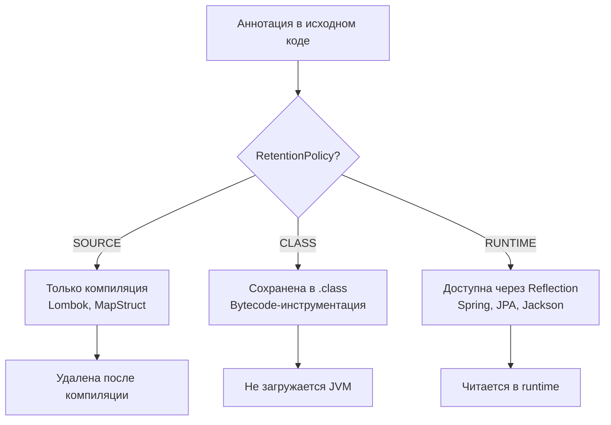
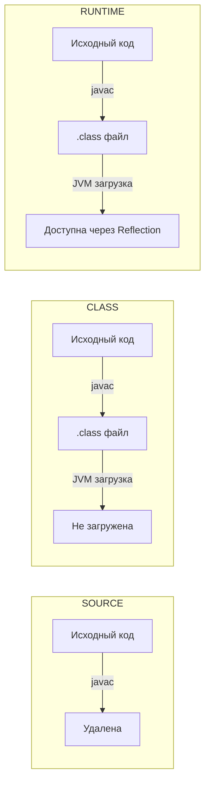
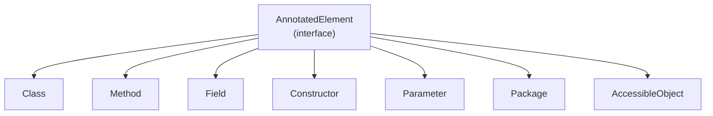
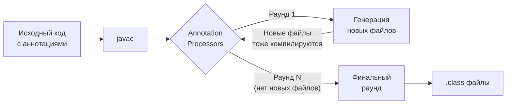
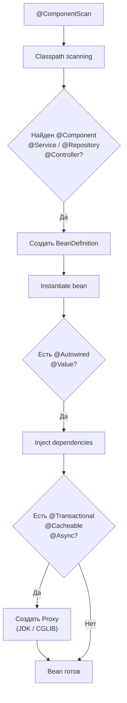

# Вопросы на собеседовании: `Java Annotations`

Комплексное руководство по вопросам собеседования на тему `Java Annotations` для `Senior Java Developer`. Включает
детальные объяснения концепций, практические примеры на `Java` + `Spring`, best practices и troubleshooting.

## Полезные ссылки

### Официальная документация

- [Java Annotations Documentation](https://docs.oracle.com/javase/tutorial/java/annotations/) — официальное руководство Oracle
- [Annotation API](https://docs.oracle.com/en/java/javase/17/docs/api/java.base/java/lang/annotation/package-summary.html) — API пакета java.lang.annotation
- [Reflection API](https://docs.oracle.com/en/java/javase/17/docs/api/java.base/java/lang/reflect/package-summary.html) — рефлексия для работы с аннотациями

### Baeldung

- [Java Annotation Processing and Creating a Builder — Baeldung](https://www.baeldung.com/java-annotation-processing-builder) — annotation processing и генерация кода
- [Creating a Custom Annotation in Java — Baeldung](https://www.baeldung.com/java-custom-annotation) — создание кастомных аннотаций
- [Scanning Java Annotations at Runtime — Baeldung](https://www.baeldung.com/java-scan-annotations-runtime) — сканирование аннотаций через рефлексию
- [Overview of Java Built-in Annotations — Baeldung](https://www.baeldung.com/java-default-annotations) — встроенные аннотации Java (@Override, @Deprecated, @SuppressWarnings)

## Содержание

- [Полезные ссылки](#полезные-ссылки)
- [See also](#see-also)

**Основы аннотаций**
- [Q1. (!) Что такое `Annotation` в Java?](#q1--что-такое-annotation-в-java)
- [Q2. (!) Какие стандартные аннотации есть в Java?](#q2--какие-стандартные-аннотации-есть-в-java)
- [Q3. (!) Как создать собственную аннотацию?](#q3--как-создать-собственную-аннотацию)
- [Q4. (!) Какие типы допустимы для элементов аннотации?](#q4--какие-типы-допустимы-для-элементов-аннотации)
- [Q5. Какие элементы программы могут быть аннотированы?](#q5-какие-элементы-программы-могут-быть-аннотированы)
- [Q6. Что такое `value()` и `default` в аннотациях?](#q6-что-такое-value-и-default-в-аннотациях)

**Мета-аннотации и `RetentionPolicy`**
- [Q7. (!) Что такое мета-аннотации?](#q7--что-такое-мета-аннотации)
- [Q8. (!) Что такое `RetentionPolicy` и как выбрать нужную?](#q8--что-такое-retentionpolicy-и-как-выбрать-нужную)
- [Q9. Что такое `@Target` и `ElementType`?](#q9-что-такое-target-и-elementtype)
- [Q10. Что такое `@Documented` и `@Inherited`?](#q10-что-такое-documented-и-inherited)
- [Q11. Как `@Inherited` работает с интерфейсами и методами?](#q11-как-inherited-работает-с-интерфейсами-и-методами)
- [Q12. Что такое `TYPE_USE` и `TYPE_PARAMETER` (`Java 8`)?](#q12-что-такое-type_use-и-type_parameter-java-8)

**Повторяемые и составные аннотации**
- [Q13. (!) Что такое повторяемые аннотации (`@Repeatable`)?](#q13--что-такое-повторяемые-аннотации-repeatable)
- [Q14. Что такое составные (composed) аннотации?](#q14-что-такое-составные-composed-аннотации)
- [Q15. Можно ли наследовать аннотации через `extends`?](#q15-можно-ли-наследовать-аннотации-через-extends)

**Рефлексия и обработка аннотаций в `Runtime`**
- [Q16. (!) Как получить аннотации через `Reflection`?](#q16--как-получить-аннотации-через-reflection)
- [Q17. В чём разница между `getAnnotation()` и `getDeclaredAnnotation()`?](#q17-в-чём-разница-между-getannotation-и-getdeclaredannotation)
- [Q18. Как сканировать аннотации по пакету в runtime?](#q18-как-сканировать-аннотации-по-пакету-в-runtime)
- [Q19. Как получить аннотации параметров метода?](#q19-как-получить-аннотации-параметров-метода)
- [Q20. Как работает `AnnotatedElement` API?](#q20-как-работает-annotatedelement-api)

**`Annotation Processing` (compile-time)**
- [Q21. (!) Что такое `Annotation Processor` и как он работает?](#q21--что-такое-annotation-processor-и-как-он-работает)
- [Q22. (!) Как написать собственный `Annotation Processor`?](#q22--как-написать-собственный-annotation-processor)
- [Q23. Что такое раунды обработки (`processing rounds`)?](#q23-что-такое-раунды-обработки-processing-rounds)
- [Q24. Как зарегистрировать `Annotation Processor`?](#q24-как-зарегистрировать-annotation-processor)
- [Q25. Какие ограничения есть у `Annotation Processing API`?](#q25-какие-ограничения-есть-у-annotation-processing-api)
- [Q26. Какие фреймворки используют `Annotation Processing`?](#q26-какие-фреймворки-используют-annotation-processing)

**Аннотации в `Spring` и `Bean Validation`**
- [Q27. (!) Как аннотации используются в `Spring`?](#q27--как-аннотации-используются-в-spring)
- [Q28. Как `Spring AOP` использует аннотации и прокси?](#q28-как-spring-aop-использует-аннотации-и-прокси)
- [Q29. (!) Как создать собственную аннотацию для `Spring AOP`?](#q29--как-создать-собственную-аннотацию-для-spring-aop)
- [Q30. (!) Как аннотации используются в `Bean Validation`?](#q30--как-аннотации-используются-в-bean-validation)
- [Q31. Как создать кастомный валидатор с `@Constraint`?](#q31-как-создать-кастомный-валидатор-с-constraint)

**Аннотации в `Jackson`, `JPA` и других библиотеках**
- [Q32. Как аннотации используются в `Jackson`?](#q32-как-аннотации-используются-в-jackson)
- [Q33. Как аннотации используются в `JPA`/`Hibernate`?](#q33-как-аннотации-используются-в-jpahibernate)

**Специальные случаи и best practices**
- [Q34. Что такое `@SafeVarargs` и `@FunctionalInterface`?](#q34-что-такое-safevarargs-и-functionalinterface)
- [Q35. Будет ли компилироваться аннотация с дубликатами в `@Target`?](#q35-будет-ли-компилироваться-аннотация-с-дубликатами-в-target)
- [Q36. (!) Best practices при создании кастомных аннотаций?](#q36--best-practices-при-создании-кастомных-аннотаций)
- [Q37. Как аннотации влияют на производительность?](#q37-как-аннотации-влияют-на-производительность)

**APT, Lombok, MapStruct, KSP и новые темы**
- [Q38. Как работает APT (Annotation Processing Tool) и каковы фазы javac?](#q38-как-работает-apt-annotation-processing-tool-и-каковы-фазы-javac)
- [Q39. Как Lombok использует APT и какие подводные камни при работе с Kotlin?](#q39-как-lombok-использует-apt-и-какие-подводные-камни-при-работе-с-kotlin)
- [Q40. Как MapStruct генерирует маппинги через APT?](#q40-как-mapstruct-генерирует-маппинги-через-apt)
- [Q41. Что такое KSP (Kotlin Symbol Processing) и чем лучше KAPT?](#q41-что-такое-ksp-kotlin-symbol-processing-и-чем-лучше-kapt)
- [Q42. Что такое Repeatable аннотации (@Repeatable) и container annotation?](#q42-что-такое-repeatable-аннотации-repeatable-и-container-annotation)
- [Q43. Аннотации на TYPE_USE — @NonNull и Checker Framework](#q43-аннотации-на-type_use--nonnull-и-checker-framework)

## Q1. (!) Что такое `Annotation` в Java?

Аннотации (`Annotations`) -- механизм метапрограммирования в `Java`, позволяющий добавлять метаданные к элементам кода (классам, методам, полям, параметрам) без изменения их семантики. Введены в `Java 5` (JSR 175), стали неотъемлемой частью современной разработки, особенно в [Java Core](java-core-interview.md) и фреймворках типа `Spring`.

Аннотации предоставляют информацию, которую используют:
- **Компилятор** -- `@Override` гарантирует правильное переопределение метода
- **Инструменты компиляции** -- `Lombok` генерирует геттеры/сеттеры, `MapStruct` -- мапперы
- **Runtime-фреймворки** -- `Spring` использует аннотации для `dependency injection`



Пример использования аннотаций в реальном приложении:

```java
@Entity
@Table(name = "users")
public class User {
    @Id
    @GeneratedValue(strategy = GenerationType.IDENTITY)
    private Long id;

    @Column(name = "username", nullable = false)
    @NotNull
    @Size(min = 3, max = 50)
    private String username;

    @Override
    public String toString() {
        return "User{id=" + id + "}";
    }
}

@Service
@Transactional
public class UserService {
    @Autowired
    private UserRepository userRepository;

    @PreAuthorize("hasRole('ADMIN')")
    public User createUser(@Valid @RequestBody User user) {
        return userRepository.save(user);
    }
}
```

> [!mcq]
> - [ ] Аннотации — это директивы препроцессора, которые модифицируют исходный код до компиляции байт-кода. | В Java нет препроцессора как в C/C++; аннотации обрабатываются `javac` или рефлексией, а не подстановкой текста. ❌ ПОСЛЕДСТВИЕ: разработчик ждёт, что `@MyAnnotation` развернётся в код «как в C-макросе», и пишет «магические» имена методов — кодогенерация не происходит, сборка ломается на `cannot find symbol`.
> - [ ] Аннотации — это специальные комментарии для `Javadoc`, которые игнорируются компилятором. | `Javadoc`-теги (`@param`, `@return`) живут только в `/** ... */` и читаются `javadoc`-тулом; настоящие аннотации — полноценные типы `@interface` с проверкой компилятора и runtime-доступом. ❌ ПОСЛЕДСТВИЕ: команда добавляет `@param userId` как «аннотацию» вместо параметра `@interface` — Spring не видит метаданных, бины не регистрируются.
> - [ ] Аннотации — это бинарные флаги в байт-коде, недоступные из исходного кода. | Аннотации объявляются в исходнике через `@interface`; `RetentionPolicy` определяет, попадут ли они в `.class` и в runtime — это управляемая, а не «скрытая бинарная» вещь. ❌ ПОСЛЕДСТВИЕ: попытка читать «скрытый флаг» через `javap -p` без понимания `RetentionPolicy.SOURCE` приводит к выводу «аннотации потеряны» и переходу на bytecode-манипуляции вместо `RUNTIME`.
> - [x] Аннотации — это механизм метапрограммирования, добавляющий метаданные к элементам кода без изменения семантики программы. | Сами по себе аннотации ничего не делают; их интерпретируют `javac`, `Annotation Processor`, инструменты сборки или runtime-фреймворки через `Reflection`. ✓ ПРИМЕНЯТЬ: `Spring` (`@Component`, `@Transactional`), `JPA` (`@Entity`, `@Column`), `Jackson` (`@JsonProperty`), `Bean Validation` (`@NotNull`) — все читают аннотации как декларативную конфигурацию вместо XML. 📋 ПРАВИЛО: «аннотация — это пометка, поведение — у читателя». 🔗 См. Q2, Q8, Q21.

> [!mcq]
> - [ ] Аннотация и Javadoc-тег (`@param`, `@return`) — синонимы: оба читаются компилятором и доступны через `Reflection`. | Javadoc-теги живут только в комментариях `/** ... */` и обрабатываются `javadoc`-тулом, а не `javac`; через `Reflection` их не достать. ❌ ПОСЛЕДСТВИЕ: разработчик ставит `@param` в коде вместо параметра аннотации и удивляется, почему Spring не видит метаданных.
> - [x] Marker-интерфейс (`Serializable`, `Cloneable`) и marker-аннотация (`@Override`) решают похожую задачу — пометить тип/элемент, — но аннотация работает на любых элементах (метод, поле, параметр), а интерфейс — только на типах через `implements`. | Marker-аннотация декларативнее: не вынуждает наследование, переживает рефакторинг иерархии и читается через `AnnotatedElement`; marker-интерфейс — наследие до Java 5, когда аннотаций не было. ✓ ПРИМЕНЯТЬ: для метаданных метода/поля/параметра — аннотация; для контракта типа, проверяемого через `instanceof` (например, `Serializable` для сериализатора) — marker-интерфейс. 📋 ПРАВИЛО: «контракт типа — интерфейс, метаданные элемента — аннотация». 🔗 См. Q5.
> - [ ] Аннотация — это разновидность generic-параметра, ограничивающая тип во время компиляции. | Generics и аннотации — независимые механизмы: дженерики работают с системой типов, аннотации — с метаданными; путать их — концептуальная ошибка. ❌ ПОСЛЕДСТВИЕ: попытка использовать аннотацию для type-safety вместо `<T extends X>` приводит к runtime-ошибкам, которых компилятор не ловит.
> - [ ] Любой `interface` автоматически становится аннотацией, если на него поставить `@Retention`. | Аннотация требует именно `@interface` — другое ключевое слово; обычный `interface` с `@Retention` — это просто аннотированный интерфейс, а не аннотация. ❌ ПОСЛЕДСТВИЕ: `@MyInterface` на классе даст compile error «is not an annotation type».

## Q2. (!) Какие стандартные аннотации есть в Java?

В пакетах `java.lang` и `java.lang.annotation` есть ключевые аннотации:

| Аннотация | Назначение | `RetentionPolicy` |
|-----------|-----------|-------------------|
| `@Override` | Переопределение метода суперкласса | `SOURCE` |
| `@Deprecated` | Пометка устаревшего элемента | `RUNTIME` |
| `@SuppressWarnings` | Подавление предупреждений компилятора | `SOURCE` |
| `@FunctionalInterface` | Функциональный интерфейс (`Java 8`) | `RUNTIME` |
| `@SafeVarargs` | Безопасные varargs с дженериками | `RUNTIME` |
| `@Repeatable` | Повторяемая аннотация (`Java 8`) | `RUNTIME` |
| `@Native` | Поле доступно из нативного кода (`Java 8`) | `SOURCE` |

Начиная с `Java 9` у `@Deprecated` появились атрибуты `since` и `forRemoval`:

```java
@Deprecated(since = "11", forRemoval = true)
public void oldMethod() {
    // Будет удалён в будущей версии
}

@SuppressWarnings({"unchecked", "deprecation"})
List<String> list = (List<String>) getRawList();

@FunctionalInterface
public interface Calculator {
    int calculate(int a, int b);
    // default и static методы не нарушают контракт
    default int add(int a, int b) { return a + b; }
}
```

> [!mcq]
> - [ ] Аннотация `@Override` имеет `RetentionPolicy.RUNTIME` и доступна через рефлексию. | `@Override` имеет `RetentionPolicy.SOURCE`: существует только для проверки компилятором и в `.class` не попадает; через `Reflection` её не достать. ❌ ПОСЛЕДСТВИЕ: собственный «фреймворк override-tracker» строит на `method.isAnnotationPresent(Override.class)` отчёт по переопределённым методам и получает пустой результат на проде.
> - [x] Аннотация `@Deprecated` имеет `RetentionPolicy.RUNTIME` и с Java 9 поддерживает `since` и `forRemoval`. | `@Deprecated` сохраняется в байт-коде, её видят компилятор, IDE и runtime-инструменты; JEP 277 добавил `since` (версия устаревания) и `forRemoval` (планируется удаление). ✓ ПРИМЕНЯТЬ: при выводе из эксплуатации публичного API (миграция Spring 5 → 6, Jakarta EE) — `@Deprecated(since = "6.0", forRemoval = true)` плюс `jdeprscan` для поиска использований в зависимостях. 📋 ПРАВИЛО: «`@Deprecated` живёт в runtime — `@Override` умирает в `.class`». 🔗 См. Q8, Q34.
> - [ ] Аннотация `@SuppressWarnings` сохраняется в байт-коде и доступна через `Method.getAnnotation()`. | `@SuppressWarnings` имеет `RetentionPolicy.SOURCE`: нужна только `javac` для подавления предупреждений и в `.class` не попадает. ❌ ПОСЛЕДСТВИЕ: статический анализатор пытается через `Reflection` понять, какие warnings подавлены в коде, и видит пустоту — вывод «никаких suppressions», ложные алерты в SonarQube.
> - [ ] Аннотация `@FunctionalInterface` допускает два абстрактных метода при условии, что один из них `default`. | Контракт `@FunctionalInterface` — *ровно один* абстрактный метод; `default`/`static` не абстрактные и не считаются, два абстрактных = compile error «not a functional interface». ❌ ПОСЛЕДСТВИЕ: попытка передать лямбду в интерфейс с двумя abstract-методами падает с «target type ... is not a functional interface», PR блокируется.

> [!mcq]
> - [ ] `@SuppressWarnings("unchecked")` на классе подавляет unchecked-предупреждения во всех методах класса и во всех вложенных лямбдах, включая вызывающий код. | Действие `@SuppressWarnings` ограничено лексическим scope элемента, на котором она стоит: на классе — внутри тела этого класса, но не в вызывающем коде, который видит warning заново. ❌ ПОСЛЕДСТВИЕ: разработчик ставит подавление на класс-«библиотеку» и удивляется, почему IDE мигает у потребителя — пытается «починить» ещё одной аннотацией.
> - [x] `@SuppressWarnings("unchecked")` действует строго в scope элемента, на который поставлена: метод подавляет только в теле метода, переменная — только в области её видимости; чем уже scope — тем безопаснее. | Best practice: ставить аннотацию на минимально возможный элемент (локальная переменная, а не метод; метод, а не класс) — тогда warning подавлен только там, где есть осознанное обоснование, а новые подозрительные касты в других местах продолжат подсвечиваться. ✓ ПРИМЕНЯТЬ: при `(Map<String, Object>) raw` ставить аннотацию на саму переменную `Map<String,Object> map = ...`, не на весь метод. 📋 ПРАВИЛО: «подавляй только там, где знаешь почему — не на класс, а на строку». 🔗 См. Q8.
> - [ ] `@SuppressWarnings("all")` — стандартное и переносимое значение, гарантированно работающее во всех компиляторах. | `"all"` — нестандартное значение: JLS определяет только `"unchecked"` и `"deprecation"`, остальные (`"rawtypes"`, `"serial"`, `"all"`) зависят от реализации компилятора и IDE. ❌ ПОСЛЕДСТВИЕ: код собирается в IntelliJ без warning'ов, а на CI с другим `javac` или линтером сыпет.
> - [ ] `@Deprecated(forRemoval = true)` автоматически блокирует компиляцию кода, использующего метод. | `forRemoval = true` лишь повышает уровень warning'а до error в некоторых IDE/линтерах, но `javac` по-прежнему компилирует — это сигнал «удалим скоро», а не запрет. ❌ ПОСЛЕДСТВИЕ: команда полагается на `forRemoval` как на enforcement и пропускает использование удаляемого API в production.

## Q3. (!) Как создать собственную аннотацию?

Аннотация объявляется ключевым словом `@interface`. Элементы аннотации выглядят как методы без параметров и могут иметь значения по умолчанию через `default`.

```java
@Retention(RetentionPolicy.RUNTIME)
@Target({ElementType.METHOD, ElementType.TYPE})
@Documented
public @interface Auditable {
    String action();
    String description() default "";
    AuditLevel level() default AuditLevel.INFO;

    enum AuditLevel { DEBUG, INFO, WARN, ERROR }
}
```

Применение:

```java
@Auditable(action = "CREATE_USER", level = Auditable.AuditLevel.WARN)
public User createUser(User user) {
    return repository.save(user);
}
```

Ключевые правила:
- Элементы не могут принимать параметры
- Элементы не могут бросать исключения
- Имя `value()` позволяет опускать имя при использовании: `@MyAnnotation("text")`
- Если все элементы имеют `default`, аннотацию можно применять без скобок: `@MyAnnotation`

> [!mcq]
> - [ ] Аннотация объявляется ключевым словом `annotation` и наследует `java.lang.Annotation`. | Ключевого слова `annotation` в Java нет (только в Kotlin); в Java используется `@interface`, а супертип — `java.lang.annotation.Annotation` (с маленькой `lang.annotation`). ❌ ПОСЛЕДСТВИЕ: разработчик копирует Kotlin-сниппет `annotation class Foo` в `.java`-файл и получает 5 минут compile error «class, interface, or enum expected», теряет время в code review.
> - [ ] Элементы аннотации объявляются как обычные поля класса с модификатором доступа. | Элементы аннотации синтаксически выглядят как абстрактные методы без параметров (`String value();`), не как поля; модификаторы `private`/`protected` запрещены — все элементы публичные. ❌ ПОСЛЕДСТВИЕ: попытка `private String value;` → compile error «interface methods cannot have body or `private` modifier», команда переписывает на классы и теряет смысл аннотации.
> - [ ] Элементы аннотации могут объявлять `throws`, чтобы сигнализировать об ошибках обработки. | Элементы аннотации не имеют тела и не могут бросать `throws`; ошибки обработки сообщает `Annotation Processor` через `Messager.printMessage(ERROR, ...)`. ❌ ПОСЛЕДСТВИЕ: попытка `String value() throws ParseException;` → «throws clause not allowed for annotation type element», разработчик вынужден переделывать API.
> - [x] Аннотация объявляется ключевым словом `@interface`, а её элементы — как методы без параметров с опциональным `default`. | Синтаксически похоже на интерфейс: каждый элемент — абстрактный метод; типы возвращаемых значений ограничены (примитивы, `String`, `Class`, `enum`, аннотация, массивы), параметры и тело запрещены. ✓ ПРИМЕНЯТЬ: при создании собственных аннотаций уровня сервиса — `@Auditable(action="CREATE_USER", level=WARN)`, `@RateLimited(perSecond=100)`; элементы — это «именованные параметры» аннотации. 📋 ПРАВИЛО: «`@interface` — не `interface` и не `class`; элементы — методы без тела». 🔗 См. Q4, Q6.

> [!mcq]
> - [ ] Без `default` элемент аннотации становится опциональным и при отсутствии возвращает `null`. | Ровно наоборот: без `default` элемент *обязателен* — компилятор требует его указать на каждом применении; `null` элемент аннотации вернуть в принципе не может. ❌ ПОСЛЕДСТВИЕ: разработчик пишет `@MyAnnotation` без обязательного `value()` и получает compile error «missing default value for element».
> - [x] `default` задаёт значение по умолчанию для элемента: `String value() default ""` делает элемент опциональным, и при `@MyAnnotation` (без скобок) `value()` вернёт пустую строку. | Если у *всех* элементов есть `default`, аннотацию можно применять вообще без скобок — `@MyAnnotation`; если хотя бы один элемент без `default`, его придётся указывать явно. ✓ ПРИМЕНЯТЬ: для опциональных параметров — всегда `default` с осмысленным «нейтральным» значением (`""`, `0`, `{}`, `Void.class`); для обязательных — без `default`, тогда компилятор не даст забыть. 📋 ПРАВИЛО: «есть `default` — опционально, нет — обязательно». 🔗 См. Q4.
> - [ ] `default null` — стандартный способ указать «значение не задано» для строковых элементов. | `null` запрещён в качестве `default` для любого типа элемента аннотации (JLS §9.6.1) — компилятор отвергнет; нужно использовать sentinel-значение (пустая строка, `Void.class`). ❌ ПОСЛЕДСТВИЕ: попытка `default null` даёт ошибку компиляции «element value must be a constant expression».
> - [ ] `default` может ссылаться на любую `static final` переменную, включая результаты вызова методов. | `default`-выражение должно быть *constant expression*: литерал, ссылка на `static final` примитив/`String`, литерал класса, enum-константа или массив этих значений; вызов метода — не constant. ❌ ПОСЛЕДСТВИЕ: `default UUID.randomUUID().toString()` — compile error, разработчик пытается обойти и хардкодит магические строки.

## Q4. (!) Какие типы допустимы для элементов аннотации?

Тип возвращаемого значения элемента аннотации строго ограничен. Допустимы:

- Примитивные типы (`int`, `long`, `boolean` и т.д.)
- `String`
- `Class` (с wildcards: `Class<? extends Serializable>`)
- `Enum`
- Другая аннотация
- Массив любого из перечисленных типов

```java
enum Priority { LOW, MEDIUM, HIGH }

public @interface ComplexAnnotation {
    int count();                          // примитив
    String value();                       // String
    Class<? extends Runnable> runner();   // Class
    Priority priority();                  // enum
    Deprecated deprecation();             // аннотация
    String[] tags() default {};           // массив
}
```

**НЕ допустимы**: `Object`, `Map`, `List`, обёртки (`Integer`, `Boolean`), пользовательские классы:

```java
public @interface InvalidAnnotation {
    Object value();     // ОШИБКА компиляции
    List<String> items; // ОШИБКА компиляции
    Integer count;      // ОШИБКА компиляции
}
```

> [!mcq]
> - [ ] Допустимы примитивы, `String`, `Class`, `Enum`, коллекции (`List`, `Map`) и пользовательские классы. | Коллекции и произвольные классы запрещены JLS §9.6.1; разрешены только восемь категорий: примитивы, `String`, `Class<?>`, `enum`, аннотация, массивы из этих типов. ❌ ПОСЛЕДСТВИЕ: попытка `List<String> tags();` → compile error «invalid type for annotation member», разработчик заменяет на `String[]` после потери времени в дизайне.
> - [ ] Допустимы все типы, кроме `Object` и обобщённых интерфейсов. | Запрещены также `Integer`/`Long`/`Double` (обёртки), `Map`, любые пользовательские классы и интерфейсы — формулировка «всё, кроме Object» намного шире реальных правил JLS. ❌ ПОСЛЕДСТВИЕ: команда строит API на `Integer count();` (для «nullable count»), получает «invalid type» — приходится использовать sentinel `-1` через `int`, что меняет семантику.
> - [ ] Допустимы только примитивы и `String`; для сложных данных используется сериализация в `byte[]`. | Это слишком узко: `Class`, `enum`, вложенные аннотации и массивы тоже работают из коробки и type-safe; `byte[]`-сериализация — антипаттерн, нарушающий статические проверки компилятора. ❌ ПОСЛЕДСТВИЕ: разработчик пакует config в `byte[] data();` через JSON-encoding и теряет проверку схемы на этапе компиляции — runtime-парсинг падает в production.
> - [x] Допустимы примитивы, `String`, `Class`, `enum`, другая аннотация и массив любого из перечисленных. | Это исчерпывающий список JLS §9.6.1; `Class` может иметь wildcards (`Class<? extends Annotation>`), вложенные аннотации работают (`@Repeatable(MyContainer.class)`), массивы — для повторяющихся значений (`@Target({METHOD, FIELD})`). ✓ ПРИМЕНЯТЬ: `@RequestMapping(method = {GET, POST})` (массив enum), `@Validated(groups = {Default.class, Strict.class})` (массив `Class`), `@Repeatable(value = Schedules.class)` (`Class`-аргумент). 📋 ПРАВИЛО: «8 категорий типов в `@interface`, всё остальное — через sentinel-значения». 🔗 См. Q3, Q6.

> [!mcq]
> - [ ] Чтобы пометить элемент как «не задан», достаточно поставить `default null` — это конвенция Spring и Hibernate. | `null` запрещён JLS как `default` для любого типа: компилятор отвергнет; ни Spring, ни Hibernate не используют такой паттерн — у них работают sentinel-значения. ❌ ПОСЛЕДСТВИЕ: разработчик ловит compile error «element value must be a constant expression» и не понимает, что делать.
> - [x] Поскольку `null` как `default` запрещён, для «не задано» используют sentinel: пустая строка `""` для `String`, `Void.class` для `Class<?>`, специальный `enum`-член `NONE` или пустой массив `{}`. | Это стандартный паттерн: `Class<? extends Annotation> by() default Annotation.class` (например, в `@Qualifier`-подобных), `String name() default ""`, `Class<? extends Validator>[] validators() default {}`. Логика проверки sentinel переносится в processor/reflection-код. ✓ ПРИМЕНЯТЬ: для «опционального класса» — `Void.class` или специальный marker `None.class`; для строки — `""` + проверка `isEmpty()`; для enum — добавить член `NONE`/`UNDEFINED`. 📋 ПРАВИЛО: «`null` запрещён → выбирай sentinel из тех же допустимых типов». 🔗 См. Q3.
> - [ ] `Class<? extends Annotation>` запрещён как тип элемента из-за рекурсии. | Любой `Class<...>` (с wildcards и bounds) — допустимый тип элемента; именно `Class<? extends Annotation>` используют, например, `@Repeatable(MyContainer.class)`, где аргумент — класс-контейнер. ❌ ПОСЛЕДСТВИЕ: разработчик отказывается от type-safe API и берёт `Class<?>` без bounds, теряя проверки компилятора.
> - [ ] Массив из enum-значений (`MyEnum[]`) недопустим, потому что массив объектов запрещён. | Массив *любого* допустимого типа элемента — допустим (JLS §9.6.1): массив `String[]`, `Class<?>[]`, `MyEnum[]` и `MyAnnotation[]` — все валидны и активно используются (например, `@Target(value = {METHOD, FIELD})`). ❌ ПОСЛЕДСТВИЕ: разработчик заменяет массив строкой с разделителями `"a,b,c"` и вынужден парсить — теряет type-safety и проверку на этапе компиляции.

## Q5. Какие элементы программы могут быть аннотированы?

Аннотации применяются к классам, конструкторам, полям, методам, параметрам, локальным переменным, пакетам (через `package-info.java`) и другим аннотациям.

Начиная с [Java 8](java-8-interview.md), добавлены `TYPE_USE` и `TYPE_PARAMETER`:

```java
// TYPE_USE -- аннотация на использовании типа
@Target(ElementType.TYPE_USE)
@Retention(RetentionPolicy.RUNTIME)
public @interface NonNull {}

// Примеры TYPE_USE:
@NonNull String name;                                    // поле
List<@NonNull String> items;                             // параметр типа
String text = (@NonNull String) obj;                     // приведение
void process() throws @NonNull IOException {}            // исключение
new @NonNull ArrayList<>();                              // создание объекта

// TYPE_PARAMETER -- аннотация на объявлении параметра типа
@Target(ElementType.TYPE_PARAMETER)
public @interface Covariant {}

public class Box<@Covariant T> {}                        // параметр типа
```

> [!mcq]
> - [ ] `TYPE_USE` применяется только к объявлению параметров типа, например `class Box<@Covariant T>`. | Это описание `TYPE_PARAMETER` (на объявлении `<T>`), а не `TYPE_USE`; `TYPE_USE` целится в *использование* типа: cast `(@NonNull T)`, throws `throws @Audit IOException`, generic-аргумент `List<@NonNull String>`. ❌ ПОСЛЕДСТВИЕ: разработчик ставит `@Target(TYPE_USE)` на `class Box<@Covariant T>` и получает «annotation type not applicable to this kind of declaration» — статический анализатор не видит ковариантности.
> - [x] `TYPE_USE` позволяет аннотировать любое использование типа: cast, throws, аргументы generics, объявление поля. | Введено в Java 8 (JSR 308) для статических анализаторов `Checker Framework`/`NullAway`/`JSpecify`, которые проверяют nullability и immutability на конкретных позициях типа, а не на объявлении элемента. ✓ ПРИМЕНЯТЬ: `List<@NonNull String> items` (NullAway проверяет, что все элементы не null), `String s = (@NonNull String) obj` (cast с проверкой), `JSpecify @NullMarked` пакеты в современных проектах. 📋 ПРАВИЛО: «аннотация на позиции типа — `TYPE_USE`; на объявлении `<T>` — `TYPE_PARAMETER`». 🔗 См. Q9, Q12, Q43.
> - [ ] `TYPE_USE` применимо только к аннотациям с `RetentionPolicy.SOURCE`, иначе компилятор выдаст ошибку. | Ограничения по retention нет — `TYPE_USE`-аннотации бывают и `SOURCE` (для статических чекеров), и `CLASS`, и `RUNTIME`; выбор зависит от задачи (анализатор времени компиляции vs runtime-валидация). ❌ ПОСЛЕДСТВИЕ: команда меняет `RUNTIME` на `SOURCE` ради «не ломать @Target», теряет runtime-валидацию аргументов через `Reflection`.
> - [ ] `TYPE_USE` — это псевдоним для `ElementType.TYPE` и нужен только для обратной совместимости. | `TYPE_USE` семантически отличается от `TYPE`: `TYPE` ставится на объявлении класса/интерфейса/enum (`@Entity public class User`), `TYPE_USE` — на любом использовании типа (`new @Audit User()`, `(@NonNull String) obj`). ❌ ПОСЛЕДСТВИЕ: разработчик считает их синонимами и ставит `@Target(TYPE)`, потом не может написать `List<@MyMarker String>` — компилятор отвергает.

## Q6. Что такое `value()` и `default` в аннотациях?

Элемент `value()` имеет особый статус: если это единственный указанный элемент, его имя можно опустить.

```java
public @interface Tag {
    String value();
    int priority() default 0;
}

@Tag("important")               // value = "important", priority = 0
@Tag(value = "low", priority = 5) // явное указание обоих
```

`default` позволяет не указывать элемент при применении. Если все элементы имеют `default`, аннотация может быть маркерной (без скобок):

```java
public @interface Cacheable {
    String cacheName() default "default";
    int ttlSeconds() default 300;
    boolean enabled() default true;
}

@Cacheable  // все по умолчанию
@Cacheable(cacheName = "users", ttlSeconds = 600)
```

> [!mcq]
> - [ ] Элемент `value()` разрешает опускать имя только если все остальные элементы имеют `default`. | Это близко, но точнее: имя `value()` опускают, когда `value()` — *единственный указываемый* элемент при применении; другие элементы могут не иметь `default`, если их не указывают (но если без `default` — указать обязаны явно). ❌ ПОСЛЕДСТВИЕ: разработчик добавляет `default` ко всем «на всякий случай», теряя обязательность ключевых параметров — забытое значение молча подставляется.
> - [ ] `default` обязателен для всех элементов аннотации, иначе компилятор сообщит об ошибке. | `default` опциональный модификатор; без него элемент *обязателен* и должен быть указан на каждом применении (`@MyAnnotation(value = "x")`); компилятор требует обязательные элементы, а не наличие `default`. ❌ ПОСЛЕДСТВИЕ: разработчик добавляет `default ""` к обязательному `String role();` в `@RequiresRole` — security-аннотация молча применяется без роли, доступ открыт всем.
> - [ ] Имя `value()` можно опускать только если оно единственное объявлено в аннотации. | Условие слабее: `value()` может быть не единственным элементом — достаточно, чтобы остальные элементы имели `default` и не указывались на этом конкретном применении (`@Tag("important")` валиден при `int priority() default 0`). ❌ ПОСЛЕДСТВИЕ: команда не использует `value()` shorthand из-за ложной строгости и пишет везде многословное `@Tag(value = "x")` — лишний boilerplate в DSL.
> - [x] Если все элементы имеют `default`, аннотацию можно применять без скобок как маркерную (`@MyAnnotation`). | Это синтаксический сахар: пустое применение эквивалентно явной записи со всеми значениями `default`; чистый маркер вообще не объявляет элементов и применяется как `@Override`, `@FunctionalInterface`. ✓ ПРИМЕНЯТЬ: `@Cacheable` с `default` для `cacheName`/`ttl` (можно ставить на класс без аргументов), маркер-аннотации `@AuditEnabled` без элементов вообще. 📋 ПРАВИЛО: «все `default` → можно без скобок; `value()` → можно без имени». 🔗 См. Q3, Q4.

## Q7. (!) Что такое мета-аннотации?

Мета-аннотации -- аннотации, которые применяются к другим аннотациям для определения их поведения. Стандартные мета-аннотации в `Java`:

| Мета-аннотация | Назначение |
|----------------|-----------|
| `@Retention` | Когда аннотация доступна (SOURCE / CLASS / RUNTIME) |
| `@Target` | К каким элементам применима |
| `@Documented` | Включать ли в Javadoc |
| `@Inherited` | Наследуется ли подклассами |
| `@Repeatable` | Можно ли применять несколько раз (`Java 8`) |

```java
// Определение аннотации с полным набором мета-аннотаций
@Retention(RetentionPolicy.RUNTIME)
@Target({ElementType.TYPE, ElementType.METHOD})
@Documented
@Inherited
public @interface Trackable {
    String value() default "";
}
```

Все аннотации, не имеющие `@Target` или с `@Target(ANNOTATION_TYPE)`, могут использоваться как мета-аннотации.

> [!mcq]
> - [ ] Мета-аннотации — это аннотации, которые автоматически применяются ко всем классам в пакете. | Такого механизма в Java нет: аннотации применяются *явно*; `package-info.java` аннотирует сам пакет (для `Package.getAnnotations()`), но не каждый класс в пакете. ❌ ПОСЛЕДСТВИЕ: команда ждёт «глобального `@Transactional` на пакет», помещает аннотацию в `package-info.java` — Spring не видит её на `UserService`, транзакции не работают, данные теряются после rolling restart.
> - [ ] Мета-аннотации — это набор аннотаций `Spring` (`@Service`, `@Repository`), наследующих `@Component`. | Это *составные* (composed) аннотации Spring, а не мета-аннотации; путаница терминов: JLS определяет мета-аннотации в `java.lang.annotation` (`@Retention`, `@Target`), Spring-композиция строится поверх них. ❌ ПОСЛЕДСТВИЕ: автор кастомной аннотации копирует `@Service` как «мета-аннотацию», добавляет `@interface MyService` без `@Target(ANNOTATION_TYPE)` — Spring не сканирует, бины не создаются.
> - [ ] Мета-аннотации — это аннотации, видимые только в `Reflection API` через `MetaAnnotation.class`. | Такого класса `MetaAnnotation` в JDK нет; мета-аннотация — это языковая концепция (любая аннотация на `@interface`-объявлении), а Spring-обход идёт через `AnnotatedElementUtils.findMergedAnnotation()`. ❌ ПОСЛЕДСТВИЕ: разработчик ищет `MetaAnnotation.class` в JDK, не находит, отказывается от composed-паттерна и дублирует `@Component + @Transactional` на каждом сервисе.
> - [x] Мета-аннотации — это аннотации, применяемые к другим аннотациям для задания их поведения: `@Retention`, `@Target`, `@Documented`, `@Inherited`, `@Repeatable`. | Это «аннотации над аннотациями»; набор стандартных определён в `java.lang.annotation` и фиксирует жизненный цикл (`@Retention`), область применения (`@Target`), наследование (`@Inherited`) и видимость в Javadoc (`@Documented`). ✓ ПРИМЕНЯТЬ: на каждой собственной аннотации — обязательно `@Retention` (`SOURCE`/`CLASS`/`RUNTIME` под задачу) и `@Target` (`METHOD`/`TYPE`/`FIELD`); для composed-аннотаций Spring — `@Target(ANNOTATION_TYPE)`. 📋 ПРАВИЛО: «4 стандартные мета: `@Retention` + `@Target` обязательны, `@Documented` + `@Inherited` — по контексту». 🔗 См. Q8, Q9, Q10.

> [!mcq]
> - [ ] `@Documented` влияет на runtime-поведение и обязательна для аннотаций, читаемых через `Reflection`. | `@Documented` отвечает только за включение аннотации в `Javadoc` и никак не связана с `Reflection`; без неё `getAnnotation()` работает так же. ❌ ПОСЛЕДСТВИЕ: разработчик добавляет лишний boilerplate ради «runtime-видимости», которая не нужна.
> - [x] Мета-аннотация на `@interface` действует только если её собственный `@Target` включает `ANNOTATION_TYPE` (или `@Target` не указан вовсе). | Без `ANNOTATION_TYPE` в `@Target` компилятор не разрешит ставить аннотацию на другую аннотацию; стандартные `@Retention`/`@Target`/`@Documented`/`@Inherited`/`@Repeatable` все имеют `ANNOTATION_TYPE`. ✓ ПРИМЕНЯТЬ: при создании своих мета-аннотаций (qualifier для `Spring`, marker для `Bean Validation`) явно ставить `@Target(ElementType.ANNOTATION_TYPE)`. 📋 ПРАВИЛО: «нет `ANNOTATION_TYPE` — не мета-аннотация». 🔗 См. Q9.
> - [ ] `@Repeatable` сама по себе является мета-мета-аннотацией и применяется к `@Retention`. | `@Repeatable` ставится на пользовательские повторяемые аннотации, а не на мета-аннотации; путаница уровней. ❌ ПОСЛЕДСТВИЕ: попытка `@Repeatable(...)` на стандартных мета-аннотациях даёт ошибку компиляции.
> - [ ] `@Inherited` — мета-аннотация, расширяющая наследование на параметры типа и `TYPE_USE`. | `@Inherited` действует только на аннотации классов и не имеет отношения к `TYPE_USE`/`TYPE_PARAMETER`. ❌ ПОСЛЕДСТВИЕ: ожидание, что `@NonNull` унаследуется через `extends` на generic-параметре — приведёт к ложным срабатываниям статического анализатора.

## Q8. (!) Что такое `RetentionPolicy` и как выбрать нужную?

`RetentionPolicy` определяет жизненный цикл аннотации:



| `RetentionPolicy` | Где доступна | Примеры использования |
|-------------------|-------------|----------------------|
| `SOURCE` | Только исходный код | `@Override`, `@SuppressWarnings`, `Lombok`, `MapStruct` |
| `CLASS` | Исходный код + `.class` файл | `AspectJ` bytecode weaving, анализ байт-кода |
| `RUNTIME` | Исходный код + `.class` + JVM | `Spring`, `JPA`, `Jackson`, `Bean Validation` |

Как выбрать:
- **`SOURCE`** -- когда аннотация нужна только компилятору или `Annotation Processor` для генерации кода
- **`CLASS`** -- когда нужна инструментация байт-кода, но не runtime-рефлексия (уменьшает memory footprint)
- **`RUNTIME`** -- когда фреймворк читает аннотации через рефлексию во время выполнения

```java
@Retention(RetentionPolicy.SOURCE)
public @interface Generated {
    // Удаляется после компиляции, не нагружает runtime
}

@Retention(RetentionPolicy.RUNTIME)
public @interface Transactional {
    // Spring читает через рефлексию при создании прокси
}
```

> [!mcq]
> - [ ] `RetentionPolicy.SOURCE` сохраняет аннотацию в `.class`, но скрывает её от рефлексии. | `SOURCE` удаляется *до* генерации байт-кода — в `.class` её физически нет; «сохраняется в `.class`, но скрыта от рефлексии» — это `CLASS` (атрибут `RuntimeInvisibleAnnotations`). ❌ ПОСЛЕДСТВИЕ: разработчик пишет собственный `Annotation Processor`, ставит `@Retention(SOURCE)` и потом ждёт runtime-доступа через `getAnnotation()` — `null`, hot-reload механизм бьёт по продакшену.
> - [ ] `RetentionPolicy.CLASS` — значение по умолчанию, и аннотация всегда доступна через `getAnnotation()`. | `CLASS` действительно default, *но* при нём `getAnnotation()` возвращает `null` — JVM не загружает атрибут `RuntimeInvisibleAnnotations` в memory. ❌ ПОСЛЕДСТВИЕ: автор фреймворка забывает явно указать `@Retention(RUNTIME)`, его собственная аннотация не находится через `Reflection` — собственный фреймворк не находит метку, автодискавери эндпоинтов не работает, `404` в production.
> - [ ] `RetentionPolicy.RUNTIME` требует обязательного `@Target(ElementType.TYPE)`, иначе компиляция не пройдёт. | `@Retention` и `@Target` независимы: `RUNTIME`-аннотация применима к любому `ElementType` (`METHOD`, `FIELD`, `PARAMETER` — все валидны); компилятор не требует именно `TYPE`. ❌ ПОСЛЕДСТВИЕ: разработчик ставит `@Target(TYPE)` на `@Inject`, и DI не работает на конструкторах/полях — Spring не находит точки внедрения, `NoSuchBeanDefinitionException`.
> - [x] `RetentionPolicy.RUNTIME` сохраняет аннотацию в `.class` и делает её доступной через `Reflection` в работающей JVM. | Именно это отличает `RUNTIME` от `CLASS`: JVM при загрузке класса парсит атрибут `RuntimeVisibleAnnotations` и публикует через `AnnotatedElement`; так работают `Spring` (`@Component`, `@Transactional`), `JPA` (`@Entity`), `Jackson` (`@JsonProperty`), `Bean Validation` (`@NotNull`). ✓ ПРИМЕНЯТЬ: для любых аннотаций, читаемых runtime-фреймворком через `Reflection` — `@Retention(RUNTIME)` обязательно. 📋 ПРАВИЛО: «`SOURCE` — для `javac`/APT; `CLASS` — для bytecode weaving; `RUNTIME` — для `Reflection`». 🔗 См. Q2, Q9, Q21.

> [!mcq]
> - [x] `SOURCE` — для аннотаций, потребляемых компилятором или `Annotation Processor` (`Lombok`, `MapStruct`); удаляются после компиляции и не нагружают runtime. | После работы `javac` в `.class` нет ни байта от `SOURCE`-аннотации, поэтому она идеальна для генерации кода и подсказок IDE. ✓ ПРИМЕНЯТЬ: для своих маркеров под `APT` (`@AutoValue`, `@Generated`), когда код нужен только во время сборки. 📋 ПРАВИЛО: «нужен только компилятору — `SOURCE`». 🔗 См. Q21.
> - [ ] `SOURCE` подходит для `Bean Validation` (`@NotNull`, `@Size`), потому что валидация выполняется компилятором. | `Bean Validation` работает в runtime через `Reflection`, поэтому требует `RUNTIME`; `SOURCE` сделает аннотации невидимыми для валидатора. ❌ ПОСЛЕДСТВИЕ: `@NotNull` молча перестаёт срабатывать — все запросы пройдут с пустыми полями.
> - [ ] `CLASS` — единственный способ, чтобы `Spring` нашёл аннотацию через `@ComponentScan`. | `Spring` сканирует `RUNTIME`-аннотации; `CLASS` для него невидим, потому что JVM не загружает соответствующий атрибут. ❌ ПОСЛЕДСТВИЕ: бин с `@Service(retention=CLASS)` не будет создан и `NoSuchBeanDefinitionException` в runtime.
> - [ ] `CLASS` нельзя использовать для bytecode-инструментации, потому что `.class` уже скомпилирован. | Наоборот: `CLASS` именно для bytecode-инструментации (`AspectJ` weaving, `ASM`-агенты), которые читают атрибуты `.class` без загрузки в JVM. ❌ ПОСЛЕДСТВИЕ: разработчик ставит `RUNTIME` без необходимости и платит memory overhead на каждый класс.

## Q9. Что такое `@Target` и `ElementType`?

`@Target` ограничивает, к каким элементам программы применима аннотация. Значения `ElementType`:

| `ElementType` | Применяется к |
|---------------|---------------|
| `TYPE` | Класс, интерфейс, enum, record |
| `FIELD` | Поле (включая enum-константы) |
| `METHOD` | Метод |
| `PARAMETER` | Параметр метода |
| `CONSTRUCTOR` | Конструктор |
| `LOCAL_VARIABLE` | Локальная переменная |
| `ANNOTATION_TYPE` | Другая аннотация (мета-аннотация) |
| `PACKAGE` | Пакет (через `package-info.java`) |
| `TYPE_PARAMETER` | Параметр типа (`Java 8`) |
| `TYPE_USE` | Использование типа (`Java 8`) |
| `MODULE` | Модуль (`Java 9`) |
| `RECORD_COMPONENT` | Компонент record (`Java 16`) |

```java
@Target({ElementType.METHOD, ElementType.FIELD})
@Retention(RetentionPolicy.RUNTIME)
public @interface Inject {}

// @Target({}) -- аннотация ни к чему не применима,
// используется как тип-член в составных аннотациях
```

Если `@Target` не указан, аннотация применима ко всем элементам кроме `TYPE_PARAMETER` и `TYPE_USE`.

> [!mcq]
> - [ ] `@Target({})` означает «применимо ко всему, включая `TYPE_USE` и `TYPE_PARAMETER`». | Пустой массив `@Target({})` означает обратное: аннотация *ни к чему* не применима напрямую и используется только как тип-член/компонент других аннотаций (через включение). ❌ ПОСЛЕДСТВИЕ: разработчик ставит `@Target({})` ради «универсальности», получает «annotation type is not applicable» на любом элементе — приходится откатывать дизайн, теряется день в code review.
> - [x] Если `@Target` не указан, аннотация применима ко всем стандартным местам, кроме `TYPE_USE` и `TYPE_PARAMETER`. | Это зафиксировано в JLS §9.6.4.1: отсутствие `@Target` эквивалентно применимости ко всем `ElementType`, существовавшим до Java 8 (`TYPE`, `FIELD`, `METHOD`, `PARAMETER`, `CONSTRUCTOR`, `LOCAL_VARIABLE`, `ANNOTATION_TYPE`, `PACKAGE`); `TYPE_USE`/`TYPE_PARAMETER` нужно подключать явно. ✓ ПРИМЕНЯТЬ: маркер-аннотации общего назначения (`@Generated`, `@Beta`) пишут без `@Target`, чтобы можно было ставить везде; для строгих API всегда указывают конкретный `@Target` явно. 📋 ПРАВИЛО: «нет `@Target` — везде, кроме `TYPE_USE`/`TYPE_PARAMETER`; `@Target({})` — нигде». 🔗 См. Q5, Q12.
> - [ ] `@Target(ElementType.TYPE)` разрешает применение только к классам, но не к интерфейсам или enum'ам. | `ElementType.TYPE` — общая категория «объявление типа»: покрывает классы, интерфейсы, enum, records и аннотации (`@interface` сам по себе тоже `TYPE`); не «только классы». ❌ ПОСЛЕДСТВИЕ: автор аннотации `@Service` пишет `@Target(TYPE)` думая «только классы», потом удивляется, что аннотация ставится на `interface UserRepository` — в Spring это нормально и желаемо.
> - [ ] `ElementType.RECORD_COMPONENT` появился в Java 8 одновременно с `TYPE_USE`. | `RECORD_COMPONENT` добавлен в Java 16 (JEP 395) вместе с records; `TYPE_USE`/`TYPE_PARAMETER` пришли в Java 8 (JSR 308) — это разные эпохи и JEP'ы. ❌ ПОСЛЕДСТВИЕ: команда на Java 11 пытается использовать `@Target(RECORD_COMPONENT)`, получает «cannot find symbol», тратит время на поиск — оказывается, нужен upgrade JDK.

> [!mcq]
> - [ ] Для аннотации `@NonNull` на `List<String> items` достаточно `@Target(ElementType.FIELD)`. | `FIELD` разрешает только `@NonNull` на самом поле; для `List<@NonNull String>` нужен `TYPE_USE`, потому что аннотация ставится внутри generic-аргумента. ❌ ПОСЛЕДСТВИЕ: `Checker Framework`/`NullAway` не увидят null-safety на элементах коллекции и пропустят NPE.
> - [ ] `@Target(ElementType.TYPE_USE)` запрещает применять аннотацию к объявлению поля, только к generic-аргументам. | `TYPE_USE` покрывает любое использование типа, включая позицию типа поля (`@NonNull String name`); это надмножество, а не альтернатива. ❌ ПОСЛЕДСТВИЕ: разработчик дублирует `@Target({FIELD, TYPE_USE})` без необходимости.
> - [x] Для аннотаций `@NonNull` на `List<@NonNull String>`, `T cast = (@NonNull T) obj`, `throws @Audit Exception` нужен `@Target(ElementType.TYPE_USE)` (Java 8+). | `TYPE_USE` — единственный `ElementType`, разрешающий аннотации в позиции *использования* типа: generic args, casts, throws, instanceof, new. ✓ ПРИМЕНЯТЬ: при интеграции с `Checker Framework`/`NullAway`/`JSpecify` — обязательный target для null-safety аннотаций. 📋 ПРАВИЛО: «аннотация внутри `<>` или после cast — это `TYPE_USE`». 🔗 См. Q12.
> - [ ] `TYPE_USE` появился в Java 5 вместе с дженериками, но был расширен в Java 8 на `throws`. | `TYPE_USE` целиком из Java 8 (JSR 308); в Java 5 нельзя было аннотировать ни generic-аргументы, ни casts. ❌ ПОСЛЕДСТВИЕ: попытка `List<@NonNull String>` на Java 7 даст ошибку компиляции «annotation not allowed here».

## Q10. Что такое `@Documented` и `@Inherited`?

`@Documented` указывает, что аннотация должна отображаться в `Javadoc`. Без неё аннотация не попадает в документацию. Рекомендуется для аннотаций, являющихся частью публичного API.

`@Inherited` указывает, что аннотация класса наследуется подклассами:

```java
@Inherited
@Retention(RetentionPolicy.RUNTIME)
@Target(ElementType.TYPE)
public @interface Audited {}

@Audited
public class BaseService {}

public class UserService extends BaseService {
    // UserService.class.getAnnotation(Audited.class) != null
    // Аннотация унаследована от BaseService
}
```

> [!mcq]
> - [ ] `@Documented` обязательна для всех аннотаций, иначе `javac` выдаст предупреждение. | `@Documented` опциональна; её отсутствие легально и не вызывает warnings — просто аннотация не попадает в сгенерированный Javadoc. ❌ ПОСЛЕДСТВИЕ: команда добавляет `@Documented` ко всем внутренним маркерам (`@Internal`, `@VisibleForTesting`), раздувает Javadoc публичного API внутренними деталями — клиенты библиотеки путаются.
> - [ ] `@Inherited` заставляет аннотацию наследоваться интерфейсами и методами подклассов. | `@Inherited` работает *только* для аннотаций на классах через `extends`; на `implements`, методах, полях и параметрах не срабатывает (JLS §9.6.4.3). ❌ ПОСЛЕДСТВИЕ: автор `@Auditable` ждёт, что `@Inherited` поднимет аннотацию с интерфейса `UserRepository` на реализацию `UserRepositoryImpl` — Spring AOP не оборачивает прокси, audit log пуст после quarter-end review.
> - [ ] `@Inherited` отсутствует по умолчанию, но компилятор добавляет её ко всем `@Retention(RUNTIME)` автоматически. | Никакого автодобавления нет: `@Inherited` всегда явная, и её отсутствие — норма; большинство стандартных аннотаций (`@Override`, `@FunctionalInterface`, `@Deprecated`) не имеют `@Inherited`. ❌ ПОСЛЕДСТВИЕ: разработчик опускает `@Inherited` на собственной `@RequiresAuth` думая «компилятор сам добавит» — security-чек не наследуется на подклассы, доступ открывается для непривилегированных endpoint'ов.
> - [x] `@Documented` включает аннотацию в Javadoc, `@Inherited` заставляет подклассы наследовать аннотацию с суперкласса (только классы, только `extends`). | `@Documented` управляет видимостью в `javadoc`-генерации, `@Inherited` — единственный механизм автоматического наследования аннотаций (и работает только по цепочке `extends` на классах, не на интерфейсах/методах/полях). ✓ ПРИМЕНЯТЬ: `@Documented` — на публичные API-аннотации (`@Beta`, `@Deprecated`); `@Inherited` — для маркеров типа `@AuditableEntity` на базовых классах JPA-сущностей. 📋 ПРАВИЛО: «`@Documented` — для Javadoc; `@Inherited` — только классы и только `extends`». 🔗 См. Q11, Q15.

## Q11. Как `@Inherited` работает с интерфейсами и методами?

`@Inherited` работает **только** с аннотациями на классах. Ограничения:
- Аннотации на **интерфейсах** не наследуются реализующими классами
- Аннотации на **методах** не наследуются переопределяющими методами
- Аннотации на **полях** не наследуются

```java
@Inherited
@Retention(RetentionPolicy.RUNTIME)
@Target({ElementType.TYPE, ElementType.METHOD})
public @interface Tracked {}

@Tracked
public interface Processable {}

public class Processor implements Processable {
    // Processor.class.getAnnotation(Tracked.class) == null!
    // @Inherited НЕ работает с интерфейсами
}

public class Base {
    @Tracked
    public void execute() {}
}

public class Child extends Base {
    @Override
    public void execute() {}
    // Child.execute().getAnnotation(Tracked.class) == null!
    // @Inherited НЕ работает с методами
}
```

`Spring` решает это через `AnnotatedElementUtils.findMergedAnnotation()`, который обходит иерархию типов вручную.

> [!mcq]
> - [ ] `@Inherited` работает и для классов, и для интерфейсов, если они реализуют `java.lang.annotation.Annotation`. | `@Inherited` не действует через `implements`: даже если интерфейс помечен, реализация не наследует аннотацию автоматически — JLS §9.6.4.3 покрывает только `extends` на классах. ❌ ПОСЛЕДСТВИЕ: автор фреймворка ставит `@Auditable` на `interface UserService`, реализация `UserServiceImpl` не получает аннотации, AOP-прокси не оборачивает методы — пропадают аудит-логи в production.
> - [ ] `@Inherited` заставляет `@Override`-методы подхватывать аннотации родительского метода. | На уровне методов `@Inherited` не работает вообще; дочерний `@Override` метод не наследует никакие аннотации родителя — их нужно явно повторить или искать через `Spring AnnotatedElementUtils`. ❌ ПОСЛЕДСТВИЕ: `@PreAuthorize("hasRole('ADMIN')")` на абстрактном методе родителя не работает в реализации, security-чек обходится — Equifax-style инцидент с открытым endpoint'ом.
> - [ ] Spring использует `@Inherited` напрямую через `Class.getAnnotation()` для поиска мета-аннотаций. | Spring обходит иерархию вручную через `AnnotatedElementUtils.findMergedAnnotation()` / `MergedAnnotations.from()`, потому что стандартный `@Inherited` слишком ограничен (только `extends`, только классы). ❌ ПОСЛЕДСТВИЕ: автор кастомного валидатора пишет `clazz.getAnnotation(MyValidator.class)` и не находит аннотацию на интерфейсе — валидация не запускается, грязные данные попадают в БД.
> - [x] `@Inherited` наследует аннотацию только с класса-предка на класс-потомок; интерфейсы, методы и поля исключены. | Это жёсткое ограничение JLS §9.6.4.3: обход только по цепочке `extends`, и только для аннотаций, поставленных на сам класс; всё остальное (методы, поля, интерфейсы) — только через ручной обход или `Spring AnnotatedElementUtils`. ✓ ПРИМЕНЯТЬ: при дизайне базовых JPA-классов (`AbstractAuditable extends BaseEntity`) — ставить `@Inherited` на классовые маркеры; для метода/интерфейса/поля сразу планировать чтение через Spring-утилиты, не через JDK. 📋 ПРАВИЛО: «`@Inherited` = `extends` + класс; всё остальное — `MergedAnnotations`». 🔗 См. Q10, Q14, Q16.

> [!mcq]
> - [ ] `Class.getAnnotation()` сам обходит интерфейсы и переопределённые методы, если родитель помечен `@Inherited`. | Стандартный JDK-метод не делает обхода: `@Inherited` работает только по цепочке `extends` для классов, и `getAnnotation()` поднимется только по `superclass`-ссылкам. ❌ ПОСЛЕДСТВИЕ: ожидание автоматического подхвата `@Transactional` с интерфейса оборачивается тем, что прокси не создаётся.
> - [x] Чтобы найти аннотацию через интерфейсы и переопределённые методы, `Spring` использует `AnnotatedElementUtils.findMergedAnnotation()`/`MergedAnnotations.from(...)`, обходя иерархию вручную. | `Spring` обходит и `superclass`, и `interfaces`, и `Method.getDeclaringClass()` цепочку, а ещё мерджит атрибуты мета-аннотаций — это и есть «расширенный `@Inherited`». ✓ ПРИМЕНЯТЬ: при чтении пользовательских аннотаций (`@MyAuditable`, `@Cacheable`) через `Spring AOP`/`ApplicationContext` — всегда `MergedAnnotations`/`AnnotatedElementUtils`, а не `getAnnotation()`. 📋 ПРАВИЛО: «`@Inherited` слабая — спроси `Spring`». 🔗 См. Q14.
> - [ ] Аннотация на абстрактном методе автоматически наследуется конкретной реализацией, потому что интерфейс «не считается». | Никакого исключения для абстрактных методов нет; аннотация на методе никогда не наследуется через `@Override`, даже от абстрактного. ❌ ПОСЛЕДСТВИЕ: `@PreAuthorize` на абстрактном методе игнорируется в реализации, и проверка прав не выполняется.
> - [ ] `@Inherited` работает для методов, если суперкласс — `abstract` и метод объявлен `final`. | Модификаторы метода (`abstract`/`final`) не влияют на `@Inherited` — он вообще не применим к методам. ❌ ПОСЛЕДСТВИЕ: разработчик строит дизайн на ложной гарантии и теряет аннотации на runtime.

## Q12. Что такое `TYPE_USE` и `TYPE_PARAMETER` (`Java 8`)?

`TYPE_USE` позволяет аннотировать любое **использование типа**, а не только объявление. Это полезно для статических анализаторов (`Checker Framework`, `NullAway`) и инструментов верификации типов:

```java
@Target(ElementType.TYPE_USE)
@Retention(RetentionPolicy.RUNTIME)
public @interface NonNull {}

// Аннотация на типе в разных контекстах:
@NonNull String name;                         // тип поля
List<@NonNull String> items;                  // аргумент типа
Map<@NonNull String, @NonNull Integer> map;   // ключ и значение
@NonNull String @NonNull [] array;            // тип массива и элемента
```

`TYPE_PARAMETER` аннотирует **объявление** параметра типа, подробнее в [вопросах по дженерикам](java-generics-interview.md):

```java
@Target(ElementType.TYPE_PARAMETER)
@Retention(RetentionPolicy.RUNTIME)
public @interface Immutable {}

public class Container<@Immutable T> {
    // Инструменты статического анализа могут проверить,
    // что T используется только для immutable-типов
}
```

> [!mcq]
> - [ ] `TYPE_USE` и `TYPE_PARAMETER` — это одно и то же, разница только в именовании. | Это разные `ElementType` с разной семантикой: `TYPE_USE` — на любой *позиции типа* (cast, throws, generic-аргумент, поле), `TYPE_PARAMETER` — на *объявлении параметра типа* (`<T>`); компилятор строго различает их по контексту. ❌ ПОСЛЕДСТВИЕ: разработчик ставит `@Target(TYPE_USE)` на `class Box<@Covariant T>` — `Covariant` отвергается компилятором, статический чекер не видит ковариантности, type safety теряется.
> - [ ] `TYPE_USE` появился в Java 5 вместе с дженериками и `@Override`. | `TYPE_USE` и `TYPE_PARAMETER` оба добавлены в Java 8 (JSR 308) — до этого нельзя было аннотировать ни generic-аргументы, ни casts, ни throws-исключения; в Java 5 аннотации работали только на объявлениях. ❌ ПОСЛЕДСТВИЕ: команда на legacy Java 7 пытается интегрировать `Checker Framework` с `List<@NonNull String>`, получает «annotation not allowed here» — миграция блокируется до апгрейда JDK.
> - [ ] `TYPE_PARAMETER` разрешает аннотировать `extends`/`super` bounds, но не объявления классов-дженериков. | Ровно наоборот: `TYPE_PARAMETER` — именно на объявлении `<T>` в классе/методе, а аннотация на bound (`<T extends @NonNull Object>` на самом `Object`) — это `TYPE_USE`. ❌ ПОСЛЕДСТВИЕ: разработчик путает позиции, ставит `@Target(TYPE_PARAMETER)` на nullability-аннотацию — её нельзя применить ни внутри generic-bound, ни в cast, NullAway не видит проверок.
> - [x] `TYPE_USE` аннотирует позицию использования типа (cast, throws, generic arg, тип поля), `TYPE_PARAMETER` — объявление параметра типа `<T>`. | Пример: `List<@NonNull String>` — `@NonNull` стоит на `TYPE_USE` (использование типа `String`); `class Box<@Covariant T>` — `@Covariant` стоит на `TYPE_PARAMETER` (объявление `T`); это разные позиции для компилятора. ✓ ПРИМЕНЯТЬ: nullability-аннотации (`@Nullable`, `@NonNull` из JSpecify) — `TYPE_USE`; variance/immutability маркеры (`@Covariant`, `@Immutable` Checker Framework) — `TYPE_PARAMETER`. 📋 ПРАВИЛО: «использование — `TYPE_USE`; объявление `<T>` — `TYPE_PARAMETER`». 🔗 См. Q5, Q9, Q43.

## Q13. (!) Что такое повторяемые аннотации (`@Repeatable`)?

Повторяемые аннотации (`Java 8+`) можно применять несколько раз к одному элементу. Реализация требует двух объявлений: повторяемая аннотация с `@Repeatable` и аннотация-контейнер:

```java
@Repeatable(Schedules.class)
@Retention(RetentionPolicy.RUNTIME)
@Target(ElementType.METHOD)
public @interface Schedule {
    String cron();
    String zone() default "UTC";
}

@Retention(RetentionPolicy.RUNTIME)
@Target(ElementType.METHOD)
public @interface Schedules {
    Schedule[] value(); // обязательно value() типа массива
}
```

Применение и чтение:

```java
@Schedule(cron = "0 0 8 * * MON-FRI")
@Schedule(cron = "0 0 12 * * SAT", zone = "Europe/Moscow")
public void sendReport() {}

// Чтение через Reflection:
Method method = MyClass.class.getMethod("sendReport");

// Вариант 1: getAnnotationsByType (рекомендуется)
Schedule[] schedules = method.getAnnotationsByType(Schedule.class);

// Вариант 2: через контейнер
Schedules container = method.getAnnotation(Schedules.class);
Schedule[] all = container.value();
```

> [!mcq]
> - [ ] `@Repeatable` позволяет применять аннотацию несколько раз без объявления контейнера. | Контейнер *обязателен*: `@Repeatable(Container.class)` ссылается на отдельную аннотацию-контейнер с `value()` типа массива повторяемой аннотации; без неё — compile error «invalid repeatable annotation». ❌ ПОСЛЕДСТВИЕ: `@Repeatable` без containing-аннотации = compile error «duplicate annotation», команда добавляет одиночную и теряет преимущество множественного применения.
> - [x] `@Repeatable` требует объявления аннотации-контейнера с `value()` типа массива повторяемой аннотации. | JLS §9.6.3: компилятор автоматически оборачивает два и более применения в контейнер; контейнер должен иметь `value()`-метод массива, совместимые `@Retention` (не слабее) и `@Target` (не уже). ✓ ПРИМЕНЯТЬ: `@Schedule` + `@Schedules`, `@Role` + `@Roles`, `@RequestMapping` (Spring 4.3+ через `@RequestMappings`) — стандартный паттерн для нескольких cron-расписаний или ролей на методе. 📋 ПРАВИЛО: «`@Repeatable(Container.class)` + контейнер с `value() Type[]`». 🔗 См. Q16, Q42.
> - [ ] Контейнерная аннотация должна быть помечена `@Repeatable`, как и вложенная. | `@Repeatable` ставится только на «одиночной» аннотации и ссылается на контейнер; сам контейнер `@Repeatable` не несёт — иначе бесконечная рекурсия в семантике. ❌ ПОСЛЕДСТВИЕ: разработчик ставит `@Repeatable` на оба, получает «containing annotation type cannot be itself repeatable», теряет час на разбор JLS.
> - [ ] Для чтения повторяемых аннотаций подходит `getAnnotation()` — он возвращает массив. | `getAnnotation(Schedule.class)` при двух применениях вернёт `null` (нет одиночной), а `getAnnotation(Schedules.class)` — контейнер; правильный API — `getAnnotationsByType(Schedule.class)`, который разворачивает контейнер автоматически. ❌ ПОСЛЕДСТВИЕ: scheduler читает через `getAnnotation(Schedule.class)`, пропускает методы с двумя `@Schedule` — задачи не запускаются, business logic стоит.

> [!mcq]
> - [ ] `Retention` и `Target` контейнера могут быть слабее, чем у повторяемой аннотации (например, `Schedule = RUNTIME`, `Schedules = SOURCE`). | JLS §9.6.3 требует, чтобы `Retention` контейнера был не слабее, а `Target` — не уже, чем у повторяемой; иначе ошибка компиляции `containing annotation type's retention is shorter`. ❌ ПОСЛЕДСТВИЕ: сборка падает на этапе `javac`, и автор путается в диагностике.
> - [x] При двух и более `@Schedule` компилятор автоматически оборачивает их в `@Schedules(value = {...})`; при одном применении контейнер не создаётся, и в `.class` лежит обычная одиночная `@Schedule`. | Это поведение JLS: «один → одиночка, два+ → контейнер»; именно поэтому `getAnnotationsByType()` нужен — он унифицирует оба случая. ✓ ПРИМЕНЯТЬ: при чтении `@Role`/`@Schedule` всегда использовать `getAnnotationsByType()`, никогда не предполагать наличие контейнера. 📋 ПРАВИЛО: «один — голый, два — в коробке». 🔗 См. Q17.
> - [ ] Чтобы добавить `@Repeatable` к существующей аннотации, достаточно объявить контейнер; старый код, использующий одиночное применение, придётся перекомпилировать. | Это бинарно-совместимое изменение: одиночное применение продолжает компилироваться без перекомпиляции, потому что в `.class` для одного экземпляра контейнера нет. ❌ ПОСЛЕДСТВИЕ: команда тратит время на лишнюю перекомпиляцию модулей-потребителей без необходимости.
> - [ ] `@Repeatable` несовместима с `@Inherited`: повторяемая аннотация не может наследоваться. | `@Repeatable` и `@Inherited` ортогональны и могут сочетаться; `getAnnotationsByType()` корректно поднимает повторы с суперкласса при `@Inherited`. ❌ ПОСЛЕДСТВИЕ: разработчик дублирует аннотации на каждом подклассе, раздувая код.

## Q14. Что такое составные (composed) аннотации?

Составная аннотация -- аннотация, помеченная другими аннотациями, объединяющая их семантику. `Spring` активно использует этот паттерн:

```java
// @RestController = @Controller + @ResponseBody
@Target(ElementType.TYPE)
@Retention(RetentionPolicy.RUNTIME)
@Controller
@ResponseBody
public @interface RestController {}

// Собственная составная аннотация:
@Target(ElementType.TYPE)
@Retention(RetentionPolicy.RUNTIME)
@Service
@Transactional(readOnly = true)
public @interface ReadOnlyService {}

@ReadOnlyService  // эквивалент @Service + @Transactional(readOnly = true)
public class ReportService {
    public List<Report> findAll() { ... }
}
```

`Spring` использует `AnnotatedElementUtils` для поиска аннотаций с учётом мета-аннотаций. При `Component Scan` составная аннотация с `@Component` (или его подтипом) регистрирует бин.

> [!mcq]
> - [x] Составная аннотация — это аннотация, помеченная другими аннотациями, чтобы объединить их семантику в одном имени. | Пример — `@RestController = @Controller + @ResponseBody`; Spring читает мета-аннотации через `AnnotatedElementUtils.findMergedAnnotation()` и трактует их как явные. ✓ ПРИМЕНЯТЬ: Spring stereotype-аннотации (`@Service`, `@Repository`, `@RestController`) и кастомные `@TenantScoped extends @Component` для multi-tenant сервисов. 📋 ПРАВИЛО: «Composed = stereotype через мета-аннотацию, не массив». 🔗 См. Q7, Q15.
> - [ ] Составная аннотация — это аннотация, содержащая другие аннотации как элементы через `Annotation[] value()`. | Это композиция через поля (как у `@Repeatable`-контейнера), а не мета-аннотирование, которое лежит в основе Spring composed-паттерна. ❌ ПОСЛЕДСТВИЕ: разработчик пакует `@Controller` и `@ResponseBody` в массив — Spring `Component Scan` не видит stereotype, и контроллер не регистрируется как бин, 404 на всех endpoint'ах после деплоя.
> - [ ] Составная аннотация автоматически включает поведение родителя только при `@Inherited`. | `@Inherited` действует на уровне «класс наследует аннотацию с предка», а composed annotations работают на уровне «аннотация помечена другой аннотацией» — это разные механизмы. ❌ ПОСЛЕДСТВИЕ: команда добавляет `@Inherited` к `@RestController`, ждёт автоматическую регистрацию наследников — `Component Scan` всё равно требует мета-`@Component`, контроллеры молча игнорируются.
> - [ ] Составные аннотации — это стандартный механизм JLS для расширения аннотаций через `extends`. | JLS запрещает `extends` у аннотаций (все неявно расширяют `java.lang.annotation.Annotation`); composed — это библиотечный паттерн Spring, а не языковая фича. ❌ ПОСЛЕДСТВИЕ: попытка `public @interface MyController extends RestController` падает на этапе компиляции, build CI красный, релиз блокирован до удаления `extends`.

## Q15. Можно ли наследовать аннотации через `extends`?

Нет. Аннотации всегда неявно расширяют `java.lang.annotation.Annotation`. Ключевое слово `extends` в объявлении аннотации вызывает ошибку компиляции.

Альтернативы:
1. **Композиция** -- одна аннотация включает другую как элемент
2. **Мета-аннотации** -- общая мета-аннотация объединяет семейство
3. **Составные аннотации** (Spring-стиль) -- мета-аннотирование с обходом через `AnnotatedElementUtils`

```java
// Композиция аннотаций:
public @interface Validation {
    String message() default "";
}

public @interface FieldCheck {
    Validation validation() default @Validation;  // включение
    int maxLength() default 255;
}

@FieldCheck(validation = @Validation(message = "Invalid"), maxLength = 100)
private String name;
```

> [!mcq]
> - [ ] Да, через `public @interface Child extends Parent` можно наследовать элементы. | `extends` в объявлении аннотации запрещён JLS: все аннотации неявно расширяют `java.lang.annotation.Annotation`, явное `extends` — ошибка компиляции. ❌ ПОСЛЕДСТВИЕ: попытка вынести общие поля валидации в базовую аннотацию `extends BaseValidation` — `error: '{' expected`, build падает в CI, релиз блокирован.
> - [ ] Да, но только если родительская аннотация помечена `@Inherited`. | `@Inherited` распространяет аннотацию с класса-предка на наследников при `getAnnotation()`, но не позволяет наследовать саму аннотацию-тип через `extends`. ❌ ПОСЛЕДСТВИЕ: команда часами ищет «правильную мета-аннотацию», добавляет `@Inherited` к родителю — компилятор всё равно падает на `extends`, человекочасы тратятся на тупик.
> - [x] Нет, аннотации неявно расширяют `java.lang.annotation.Annotation`; для переиспользования применяют композицию, мета-аннотации или составные аннотации. | Явное `extends` запрещено JLS; на практике используют Spring-стиль «composed annotations» (мета-аннотирование) или включение аннотации как элемента. ✓ ПРИМЕНЯТЬ: Spring `@Transactional` мета-аннотируется кастомной `@RequiresNewTx`; Bean Validation `@Email` поверх `@Pattern`. 📋 ПРАВИЛО: «Аннотации не наследуются — мета-аннотируй». 🔗 См. Q7, Q14.
> - [ ] Нет, но можно реализовать интерфейс `Annotation` вручную для эмуляции наследования. | Класс `implements Annotation` остаётся обычным классом, а не аннотацией: `method.getAnnotation()` его не возвращает, JVM не записывает атрибут `RuntimeVisibleAnnotations`. ❌ ПОСЛЕДСТВИЕ: разработчик создаёт `class CachedImpl implements Cached`, ждёт работу `@Cached` через рефлексию — `getAnnotation()` возвращает `null`, кэш не активируется, нагрузка на БД растёт x10.

## Q16. (!) Как получить аннотации через `Reflection`?

Для чтения аннотаций в runtime они должны иметь `@Retention(RetentionPolicy.RUNTIME)`. Основные методы `Reflection API`:

```java
@Retention(RetentionPolicy.RUNTIME)
@Target({ElementType.TYPE, ElementType.METHOD, ElementType.FIELD})
public @interface Info {
    String value();
}

@Info("user entity")
public class User {
    @Info("user name")
    private String name;

    @Info("display")
    public String toString() { return name; }
}

// Чтение аннотации класса:
Info classInfo = User.class.getAnnotation(Info.class);
System.out.println(classInfo.value()); // "user entity"

// Чтение аннотации поля:
Field field = User.class.getDeclaredField("name");
Info fieldInfo = field.getAnnotation(Info.class);

// Чтение аннотации метода:
Method method = User.class.getMethod("toString");
boolean hasInfo = method.isAnnotationPresent(Info.class);

// Все аннотации элемента:
Annotation[] all = User.class.getAnnotations();          // включая @Inherited
Annotation[] declared = User.class.getDeclaredAnnotations(); // только свои
```

> [!mcq]
> - [ ] Аннотации с `RetentionPolicy.SOURCE` можно читать через `getAnnotation()` при флаге `-parameters`. | `SOURCE`-аннотации удаляются `javac` сразу после обработки и физически отсутствуют в `.class` — никакой runtime-флаг их не возвращает. ❌ ПОСЛЕДСТВИЕ: команда добавляет `@MyApiDoc(retention=SOURCE)` для генерации Swagger через рефлексию — endpoint'ы не появляются в OpenAPI, документация пустая, integration тесты frontend падают.
> - [ ] `isAnnotationPresent(X.class)` всегда вернёт `true`, если аннотация есть в исходнике. | `isAnnotationPresent` смотрит только runtime-видимые аннотации; для `SOURCE`/`CLASS` всегда `false`, независимо от исходника. ❌ ПОСЛЕДСТВИЕ: Lombok `@Getter` (CLASS retention) проверяется через `isAnnotationPresent` в кастомном валидаторе — всегда `false`, валидация пропускает баг, dev-у час на отладку «почему `else` ветка».
> - [x] Для чтения через рефлексию аннотация должна иметь `@Retention(RetentionPolicy.RUNTIME)`. | Это единственный уровень, при котором JVM записывает атрибут `RuntimeVisibleAnnotations` в `.class` и делает данные доступными через `AnnotatedElement`. ✓ ПРИМЕНЯТЬ: Spring `@Autowired`, `@Transactional`, `@RequestMapping`; JUnit `@Test`; Jackson `@JsonProperty` — все RUNTIME для рефлексивной обработки. 📋 ПРАВИЛО: «Reflection видит только RUNTIME — остальное призрак». 🔗 См. Q8, Q17.
> - [ ] `getAnnotations()` возвращает только аннотации, объявленные на самом элементе, игнорируя `@Inherited`. | Это описание `getDeclaredAnnotations()`; `getAnnotations()` поднимает аннотации с суперкласса при наличии `@Inherited`. ❌ ПОСЛЕДСТВИЕ: разработчик пишет аудит через `getDeclaredAnnotations()` на наследниках `BaseEntity`, ожидая `@Audited` с предка — массив пустой, audit log молча не пишется, compliance-аудит выявляет пробел через 3 месяца.

> [!mcq]
> - [ ] `getAnnotations()` и `getDeclaredAnnotations()` возвращают одно и то же — просто разные имена для совместимости. | Разница принципиальна: `getAnnotations()` поднимает `@Inherited` с суперкласса, `getDeclaredAnnotations()` — нет; на классе без иерархии они совпадут случайно. ❌ ПОСЛЕДСТВИЕ: в наследниках `BaseService` пропадают аудит-аннотации с предка, и audit log оказывается пустым.
> - [ ] `getDeclaredAnnotations()` обходит все суперклассы и интерфейсы, в отличие от `getAnnotations()`. | Логика обратная: `Declared` — *только своё*, без иерархии; `getAnnotations()` идёт по `extends` для `@Inherited`, и тоже не трогает интерфейсы. ❌ ПОСЛЕДСТВИЕ: ложное доверие к `Declared` приводит к чтению аннотации с предка, которой там нет, и `NullPointerException`.
> - [x] `getAnnotations()` учитывает `@Inherited` (поднимает аннотацию с суперкласса), `getDeclaredAnnotations()` — только то, что объявлено непосредственно на элементе. | Разделение `Declared`/`non-Declared` пронизывает весь `Reflection API` (`getFields`/`getDeclaredFields`, `getMethods`/`getDeclaredMethods`) — везде «без `Declared`» = «с учётом наследования». ✓ ПРИМЕНЯТЬ: для аудита/логирования с `@Inherited` использовать `getAnnotations()`; для генерации документации по конкретному классу — `getDeclaredAnnotations()`. 📋 ПРАВИЛО: «`Declared` — только своё, без `Declared` — с предком». 🔗 См. Q11.
> - [ ] Оба метода возвращают аннотации с интерфейсов, реализованных классом. | Ни один не идёт по `implements`: `@Inherited` JLS-обход — только `extends`; для интерфейсов нужен `Spring AnnotatedElementUtils`. ❌ ПОСЛЕДСТВИЕ: `@Transactional` на интерфейсе сервиса не находится через JDK-методы, и proxy не оборачивается.

## Q17. В чём разница между `getAnnotation()` и `getDeclaredAnnotation()`?

| Метод | Учитывает `@Inherited` | Повторяемые |
|-------|----------------------|-------------|
| `getAnnotation(Class)` | Да | Нет (вернёт контейнер) |
| `getDeclaredAnnotation(Class)` | Нет | Нет |
| `getAnnotations()` | Да | Все (включая контейнеры) |
| `getDeclaredAnnotations()` | Нет | Все (только собственные) |
| `getAnnotationsByType(Class)` | Да | Да (разворачивает контейнер) |
| `getDeclaredAnnotationsByType(Class)` | Нет | Да |

```java
@Inherited
@Retention(RetentionPolicy.RUNTIME)
public @interface Label { String value(); }

@Label("base")
public class Base {}
public class Child extends Base {}

Child.class.getAnnotation(Label.class);         // @Label("base") -- от Base
Child.class.getDeclaredAnnotation(Label.class);  // null -- нет собственной
```

> [!mcq]
> - [x] `getAnnotation()` учитывает `@Inherited`, а `getDeclaredAnnotation()` возвращает только аннотации, объявленные непосредственно на элементе. | Первый поднимает аннотацию с суперкласса (если она `@Inherited`), второй строго читает «собственные» — паттерн `Reflection API` (`getMethods` vs `getDeclaredMethods`). ✓ ПРИМЕНЯТЬ: Spring `MergedAnnotations` для composed annotations; JPA `@Entity` валидируется через declared, чтобы наследники не получали родительский маппинг. 📋 ПРАВИЛО: «`Declared` — только моё». 🔗 См. Q10, Q16.
> - [ ] `getAnnotation()` разворачивает контейнер повторяемых аннотаций в массив. | `getAnnotation()` для повторяемой аннотации вернёт контейнер (`Schedules` для `@Schedule`), а не сами элементы; для разворачивания нужен `getAnnotationsByType()`. ❌ ПОСЛЕДСТВИЕ: разработчик ждёт массив `@Schedule`, получает один контейнер, кастует к `Schedule[]` — `ClassCastException`, scheduler стартует с пустым расписанием, cron-задачи не выполняются.
> - [ ] `getDeclaredAnnotation()` возвращает `null` для всех `RUNTIME`-аннотаций. | `null` возвращается только когда аннотации нет на самом элементе; для собственных `RUNTIME`-аннотаций метод возвращает их инстанс. ❌ ПОСЛЕДСТВИЕ: разработчик решает «`Declared` всегда `null`, забью на проверку», добавляет `@SuppressWarnings("null")` — NPE на первом запросе, 5xx errors в проде до отката деплоя.
> - [ ] Оба метода идентичны; `getDeclaredAnnotation()` оставлен для совместимости с Java 5. | Методы различаются семантикой учёта `@Inherited`: на классе с предком, имеющим `@Inherited`-аннотацию, результаты разные. ❌ ПОСЛЕДСТВИЕ: рефакторинг «упрощения» меняет `getAnnotation()` на `getDeclaredAnnotation()` в audit-фреймворке, аннотации `@Audited` с базового класса перестают находиться, compliance-логи теряют 60% событий.

## Q18. Как сканировать аннотации по пакету в runtime?

Стандартная `Java` не предоставляет API для сканирования classpath. Используются библиотеки:

**`Spring` -- `ClassPathScanningCandidateComponentProvider`:**

```java
ClassPathScanningCandidateComponentProvider scanner =
    new ClassPathScanningCandidateComponentProvider(false);
scanner.addIncludeFilter(new AnnotationTypeFilter(MyAnnotation.class));

Set<BeanDefinition> beans = scanner.findCandidateComponents("com.example");
for (BeanDefinition bd : beans) {
    Class<?> clazz = Class.forName(bd.getBeanClassName());
    MyAnnotation ann = clazz.getAnnotation(MyAnnotation.class);
}
```

**`Reflections` (библиотека):**

```java
Reflections reflections = new Reflections("com.example");
Set<Class<?>> annotated = reflections.getTypesAnnotatedWith(MyAnnotation.class);
```

**`ClassGraph` (более современная альтернатива):**

```java
try (ScanResult result = new ClassGraph()
        .acceptPackages("com.example")
        .enableAnnotationInfo()
        .scan()) {
    ClassInfoList classes = result.getClassesWithAnnotation(MyAnnotation.class);
}
```

> [!mcq]
> - [ ] Достаточно вызвать `Package.getPackage("com.example").getAnnotations()` и отфильтровать классы. | `Package.getAnnotations()` возвращает аннотации самого пакета из `package-info.java`, а не классы внутри пакета — JDK не предоставляет API «список классов в пакете». ❌ ПОСЛЕДСТВИЕ: разработчик пишет кастомный component scan через `Package.getAnnotations()`, фреймворк не находит ни одного `@Service`, на старте приложения `BeanCreationException`, прод-инстансы крашатся в crash-loop.
> - [x] Стандартный JDK не имеет API сканирования classpath; используют `Spring`, `Reflections`, `ClassGraph`. | Classpath-сканирование не входит в стандарт; библиотеки реализуют его через чтение JAR/директорий и парсинг `.class` (10-100x медленнее рефлексии, кэшируется на старте). ✓ ПРИМЕНЯТЬ: Spring `ClassPathScanningCandidateComponentProvider` для `@ComponentScan`, `ClassGraph` в OpenAPI generator для поиска контроллеров, Hibernate `@Entity` discovery. 📋 ПРАВИЛО: «Classpath scan — внешний инструмент, не JDK». 🔗 См. Q16, Q26.
> - [ ] В Java 9+ через `ModuleLayer.boot().modules()` можно получить все аннотированные классы напрямую. | `ModuleLayer` возвращает только список модулей; перечислить классы внутри него стандартного API нет — нужны `ClassGraph` или `Reflections`. ❌ ПОСЛЕДСТВИЕ: команда мигрирует с `ClassGraph` на «нативный JPMS-подход», на старте Spring `Component Scan` не находит ни одного бина, приложение падает с `NoSuchBeanDefinition` при первом запросе.
> - [ ] `ClassLoader.getAllLoadedClasses()` возвращает список классов для дальнейшего анализа. | Такого публичного метода нет; перечисление загруженных классов доступно только через `Instrumentation.getAllLoadedClasses()` с javaagent. ❌ ПОСЛЕДСТВИЕ: dev пишет код «по памяти», CI компилируется с ошибкой `cannot find symbol`, час уходит на поиск замены, sprint выбивается из графика.

## Q19. Как получить аннотации параметров метода?

Начиная с [Java 8](java-8-interview.md), API `Parameter` позволяет работать с аннотациями параметров. Флаг компиляции `-parameters` сохраняет имена параметров.

```java
public void process(@NotNull @Valid User user,
                    @RequestParam("q") String query) {}

Method method = getClass().getMethod("process", User.class, String.class);
Parameter[] params = method.getParameters();

for (Parameter param : params) {
    System.out.println(param.getName()); // "user", "query" (с -parameters)
    Annotation[] annotations = param.getAnnotations();
    NotNull nn = param.getAnnotation(NotNull.class);
}

// Альтернативный способ (до Java 8):
Annotation[][] paramAnnotations = method.getParameterAnnotations();
// paramAnnotations[0] -- аннотации первого параметра
// paramAnnotations[1] -- аннотации второго параметра
```

> [!mcq]
> - [x] `Method.getParameters()` (Java 8+) возвращает `Parameter[]`, через который можно читать и аннотации, и имена (с флагом `-parameters`). | `Parameter` реализует `AnnotatedElement`, а имена доступны только если `.class` скомпилирован с сохранением имён параметров. ✓ ПРИМЕНЯТЬ: Spring `@RequestParam` без `value` берёт имя из `Parameter.getName()` — обязателен `-parameters` в `compilerArgs`; jOOQ DSL для именованных параметров. 📋 ПРАВИЛО: «`Parameter` API + `-parameters` — иначе `arg0`». 🔗 См. Q16, Q20.
> - [ ] `Method.getParameters()` возвращает имена параметров без дополнительных флагов компиляции. | Без `-parameters` `javac` стирает имена, и `Parameter.getName()` возвращает `arg0`, `arg1` — имена просто не сохраняются в байт-коде. ❌ ПОСЛЕДСТВИЕ: команда деплоит Spring контроллер с `@RequestParam` без явного имени, приходит запрос — `MissingServletRequestParameterException: Required String parameter 'arg0'`, 400 на каждый вызов API.
> - [ ] `Method.getParameterAnnotations()` возвращает `List<Annotation>`, общий для всех параметров. | Возвращается `Annotation[][]` — двумерный массив: внешний индекс — позиция параметра, внутренний — массив его аннотаций. ❌ ПОСЛЕДСТВИЕ: разработчик кастит результат к `List<Annotation>` — `ClassCastException` в кастомном валидаторе, integration тесты валятся, MR отправляется на доработку.
> - [ ] До Java 8 нельзя было получить аннотации параметров — только через `Parameter` API. | Наоборот: `getParameterAnnotations()` доступен с Java 5; `Parameter` API из Java 8 — удобная обёртка над тем же атрибутом класса. ❌ ПОСЛЕДСТВИЕ: миграция legacy-фреймворка на Java 8 переписывает работающий код через `Parameter`, теряет совместимость с runtime Java 7-агентами, downstream-сервисы рушатся.

## Q20. Как работает `AnnotatedElement` API?

`AnnotatedElement` -- корневой интерфейс для всех элементов, поддерживающих аннотации. Его реализуют `Class`, `Method`, `Field`, `Constructor`, `Parameter`, `Package`.



Ключевые методы:

```java
// Общий подход для любого AnnotatedElement:
public <T extends Annotation> void inspect(AnnotatedElement element) {
    // Проверка наличия
    if (element.isAnnotationPresent(MyAnnotation.class)) {
        // Получение одной аннотации
        MyAnnotation ann = element.getAnnotation(MyAnnotation.class);

        // Все аннотации
        Annotation[] all = element.getAnnotations();

        // Повторяемые аннотации
        MyAnnotation[] repeated = element.getAnnotationsByType(MyAnnotation.class);
    }
}

// Вызов для разных элементов:
inspect(User.class);                              // класс
inspect(User.class.getDeclaredField("name"));     // поле
inspect(User.class.getMethod("toString"));        // метод
```

> [!mcq]
> - [ ] `AnnotatedElement` реализуют только `Class` и `Method`, остальные элементы используют отдельные API. | `Field`, `Constructor`, `Parameter`, `Package`, `AccessibleObject` все реализуют `AnnotatedElement` — API унифицирован для генерик-обхода. ❌ ПОСЛЕДСТВИЕ: разработчик пишет дублирующий код для `Field` и `Method` через `instanceof`, кодовая база раздувается на 200 строк, при добавлении `Constructor` забывает ветку — кастомные аннотации на конструкторах не находятся, DI-фреймворк не инжектит зависимости.
> - [x] `AnnotatedElement` — общий интерфейс для всех элементов, поддерживающих аннотации: `Class`, `Method`, `Field`, `Constructor`, `Parameter`, `Package`. | Единая точка входа: абстрактный код для работы с аннотациями пишется один раз и переиспользуется через `AnnotatedElement`. ✓ ПРИМЕНЯТЬ: Spring `MergedAnnotations.from(AnnotatedElement)` для `@Transactional` на классах и методах, Bean Validation `ConstraintValidator` обходит `Field`/`Method`/`Parameter` единообразно. 📋 ПРАВИЛО: «`AnnotatedElement` — единый API, не `instanceof`». 🔗 См. Q16, Q19.
> - [ ] `AnnotatedElement` — класс в `java.lang.annotation`, напрямую расширяющий `Class`. | Это интерфейс в пакете `java.lang.reflect`, а `Class` — одна из его реализаций, а не предок; путаница между пакетами `annotation` и `reflect` распространена у джуниоров. ❌ ПОСЛЕДСТВИЕ: dev пишет `extends AnnotatedElement` в reflection-helper, build падает с `cannot resolve in java.lang.annotation`, полчаса на поиск правильного пакета вместо доставки фичи в спринте.
> - [ ] Методы `AnnotatedElement` работают даже с `SOURCE`-аннотациями через `getAnnotationsByType`. | `SOURCE`-аннотации удалены `javac` и физически отсутствуют в `.class`; никакой метод `AnnotatedElement` их не вытащит. ❌ ПОСЛЕДСТВИЕ: команда полагается на `@Generated(SOURCE)` для генерации OpenAPI-схемы через рефлексию — все вызовы возвращают пустой массив, документация для frontend пуста, релиз отложен на доделку.

## Q21. (!) Что такое `Annotation Processor` и как он работает?

`Annotation Processor` -- механизм обработки аннотаций на этапе компиляции. Компилятор `javac` вызывает зарегистрированные процессоры для аннотаций, которые они поддерживают. Процессоры могут **генерировать новый код**, **создавать файлы** и **сообщать об ошибках компиляции**.



Ключевые компоненты API (пакет `javax.annotation.processing`):

| Компонент | Назначение |
|-----------|-----------|
| `AbstractProcessor` | Базовый класс для процессоров |
| `RoundEnvironment` | Доступ к элементам текущего раунда |
| `ProcessingEnvironment` | Утилиты: `Filer`, `Messager`, `Elements`, `Types` |
| `Filer` | Создание новых файлов (исходный код, ресурсы) |
| `Messager` | Сообщения компиляции (ошибки, предупреждения) |

> [!mcq]
> - [ ] `Annotation Processor` выполняется JVM при старте приложения и заменяет рефлексию на прекомпилированный код. | APT работает в `javac` на этапе компиляции, до сборки `.class`-файлов; в JVM ничего не запускается, и runtime-рефлексия остаётся прежней. ❌ ПОСЛЕДСТВИЕ: команда деплоит сервис без подключенного annotationProcessor в Gradle, ожидает сгенерированные DTO-классы в runtime — `ClassNotFoundException` при первом запросе, контейнеры в crash-loop.
> - [x] `Annotation Processor` вызывается `javac` на этапе компиляции и может генерировать новые файлы и сообщения, но не модифицировать существующие. | Стандартный APT — forward-only: только создание новых исходников через `Filer`; модификация требует внутренних API (Lombok через `JavacProcessingEnvironment`). ✓ ПРИМЕНЯТЬ: MapStruct (`*MapperImpl`), Dagger 2 (`Dagger*Component`), Immutables — все через стандартный APT. 📋 ПРАВИЛО: «APT — генерация, не модификация». 🔗 См. Q22, Q26.
> - [ ] `Annotation Processor` работает на этапе загрузки классов JVM и кэширует аннотации для ускорения рефлексии. | JVM при `ClassLoader.defineClass` ничего не обрабатывает в смысле APT; кэширование рефлексии делают фреймворки приложения (Spring `MergedAnnotations`). ❌ ПОСЛЕДСТВИЕ: senior пишет в design-doc «APT ускорит рефлексию на старте» — реализация показывает ноль изменений latency, sprint потерян на бесполезный POC.
> - [ ] Процессор может удалять `.java` файлы, помеченные аннотацией. | `Filer` имеет только `createSourceFile`/`createClassFile`; удаление противоречит модели incremental compilation, такого API нет. ❌ ПОСЛЕДСТВИЕ: попытка `@Deprecated`-чистильщика через APT — `FilerException: cannot delete`, build падает, cleanup откладывается на спринт, технический долг растёт.

## Q22. (!) Как написать собственный `Annotation Processor`?

Шаг 1 -- объявить аннотацию:

```java
@Retention(RetentionPolicy.SOURCE)
@Target(ElementType.TYPE)
public @interface GenerateBuilder {}
```

Шаг 2 -- реализовать процессор:

```java
@SupportedAnnotationTypes("com.example.GenerateBuilder")
@SupportedSourceVersion(SourceVersion.RELEASE_17)
public class BuilderProcessor extends AbstractProcessor {

    @Override
    public boolean process(Set<? extends TypeElement> annotations,
                           RoundEnvironment roundEnv) {
        for (Element element : roundEnv.getElementsAnnotatedWith(GenerateBuilder.class)) {
            if (element.getKind() != ElementKind.CLASS) {
                processingEnv.getMessager().printMessage(
                    Diagnostic.Kind.ERROR,
                    "@GenerateBuilder applicable only to classes",
                    element
                );
                continue;
            }

            TypeElement typeElement = (TypeElement) element;
            String className = typeElement.getSimpleName() + "Builder";
            String packageName = processingEnv.getElementUtils()
                .getPackageOf(typeElement).getQualifiedName().toString();

            try {
                JavaFileObject file = processingEnv.getFiler()
                    .createSourceFile(packageName + "." + className);
                try (Writer writer = file.openWriter()) {
                    writer.write(generateBuilderCode(typeElement, className, packageName));
                }
            } catch (IOException e) {
                processingEnv.getMessager().printMessage(
                    Diagnostic.Kind.ERROR, e.getMessage(), element);
            }
        }
        return true; // true = аннотация обработана, другие процессоры не нужны
    }
}
```

> [!mcq]
> - [x] Процессор расширяет `AbstractProcessor`, аннотируется `@SupportedAnnotationTypes`/`@SupportedSourceVersion` и регистрируется через `META-INF/services`. | `AbstractProcessor` даёт хуки `init`/`process`, мета-аннотации описывают контракт для `javac`, регистрация через SPI или `@AutoService` делает процессор видимым на `processorpath`. ✓ ПРИМЕНЯТЬ: MapStruct `MappingProcessor`, Dagger 2 `ComponentProcessor`, Immutables — все наследуют `AbstractProcessor` и регистрируются через `@AutoService(Processor.class)`. 📋 ПРАВИЛО: «`AbstractProcessor` + `@AutoService` — стандарт APT». 🔗 См. Q21, Q24.
> - [ ] Процессор расширяет `RoundEnvironment` и переопределяет метод `processRound()`. | `RoundEnvironment` — параметр метода `process(Set, RoundEnvironment)`, а не базовый класс; собственный процессор наследуется от `AbstractProcessor`. ❌ ПОСЛЕДСТВИЕ: разработчик пишет `class MyProcessor extends RoundEnvironment` — компилятор «cannot inherit from RoundEnvironment (abstract)», полдня ищет «правильный супер-класс» вместо чтения JavaDoc.
> - [ ] Процессор реализует `java.lang.reflect.AnnotationHandler` и регистрируется в `module-info`. | Такого интерфейса в JDK не существует; регистрация процессоров — через `META-INF/services/javax.annotation.processing.Processor`, а не `module-info.java`. ❌ ПОСЛЕДСТВИЕ: senior копипастит «правильный код» с чужого ответа в StackOverflow, build падает с `cannot find symbol AnnotationHandler`, час уходит на поиск реального API вместо доставки фичи.
> - [ ] Процессор запускается командой `java -agentlib:apt` во время выполнения. | APT встроен в `javac` (флаги `-processor`, `-processorpath`); runtime-агенты `-agentlib` — это JVMTI, к процессорам аннотаций отношения не имеют. ❌ ПОСЛЕДСТВИЕ: команда добавляет `-agentlib:apt` в JVM-параметры production, JVM не стартует с `Could not find agent library`, контейнеры в OOMKilled crash-loop, сервис недоступен.

## Q23. Что такое раунды обработки (`processing rounds`)?

Компиляция с `Annotation Processing` происходит в **раундах**. Каждый раунд:
1. Компилятор находит аннотации в исходных файлах
2. Вызывает подходящие процессоры
3. Если процессоры сгенерировали **новые** файлы -- начинается новый раунд
4. Финальный раунд наступает, когда новых файлов не создано

```java
@Override
public boolean process(Set<? extends TypeElement> annotations,
                       RoundEnvironment roundEnv) {
    if (roundEnv.processingOver()) {
        // Финальный раунд -- очистка, финализация
        return false;
    }

    if (roundEnv.errorRaised()) {
        // В предыдущем раунде были ошибки
        return false;
    }

    // Обработка элементов текущего раунда
    Set<? extends Element> elements =
        roundEnv.getElementsAnnotatedWith(MyAnnotation.class);

    // Генерация файлов (запустит новый раунд)
    for (Element element : elements) {
        generateCode(element);
    }

    return true;
}
```

> [!mcq]
> - [ ] Раунд — это один вызов `process()` на одну аннотацию; несколько аннотаций обрабатываются параллельно в нескольких раундах. | В одном раунде `process()` получает все поддерживаемые аннотации сразу через `Set<TypeElement>`; параллельности нет, число раундов определяется генерацией новых файлов. ❌ ПОСЛЕДСТВИЕ: dev пытается распараллелить процессор через `parallelStream()` внутри `process()`, ловит `ConcurrentModificationException` от `Filer`, build CI флакающий — ночные сборки то падают, то проходят, neverending бага в Jira.
> - [x] Раунды повторяются до тех пор, пока процессоры генерируют новые файлы; финальный раунд отмечается `roundEnv.processingOver() == true`. | `javac` обеспечивает компиляцию сгенерированного кода: новые файлы сами могут содержать аннотации, цикл продолжается до стабилизации (отсутствия новых файлов). ✓ ПРИМЕНЯТЬ: MapStruct в multi-round mode дополняет частично сгенерированные мапперы; Dagger обрабатывает граф зависимостей за несколько раундов. 📋 ПРАВИЛО: «Раунды — fixed point по `Filer.createSourceFile`». 🔗 См. Q21, Q22.
> - [ ] Раунд обработки — это JVM-термин для `Just-In-Time` компиляции аннотаций. | Раунды — compile-time понятие `javac`, относящееся к фазе `ANNOTATION_PROCESSING`; JIT работает в runtime над байт-кодом и к APT отношения не имеет. ❌ ПОСЛЕДСТВИЕ: команда добавляет `-XX:+PrintCompilation` для отладки «зависающих раундов», часами анализирует JIT-логи — раунды APT там не видны, источник проблемы (cycle в `Filer`) находится случайно.
> - [ ] Процессор обязан возвращать `true` во всех раундах, чтобы не прерывать обработку. | Возвращаемое значение — это «claim» аннотации: `true` означает «я обработал, другим процессорам не передавать»; цикл раундов не зависит от него. ❌ ПОСЛЕДСТВИЕ: процессор A возвращает `true` для всех `*` — Lombok не получает `@Getter`, классы без геттеров, downstream-сервис не может десериализовать DTO, integration тесты падают.

## Q24. Как зарегистрировать `Annotation Processor`?

Есть два способа регистрации:

**Способ 1 -- файл `META-INF/services` (стандартный SPI):**

Создать файл `META-INF/services/javax.annotation.processing.Processor` с полным именем класса процессора:

```
com.example.processor.BuilderProcessor
com.example.processor.ValidatorProcessor
```

**Способ 2 -- `@AutoService` от Google (рекомендуется):**

```java
@AutoService(Processor.class)
@SupportedAnnotationTypes("com.example.GenerateBuilder")
@SupportedSourceVersion(SourceVersion.RELEASE_17)
public class BuilderProcessor extends AbstractProcessor {
    // ...
}
```

`@AutoService` сам генерирует файл `META-INF/services` через собственный `Annotation Processor`.

**В Gradle:**

```groovy
dependencies {
    annotationProcessor 'com.example:my-processor:1.0'
    // или для Kotlin:
    kapt 'com.example:my-processor:1.0'
}
```

> [!mcq]
> - [ ] Достаточно положить класс-процессор в classpath проекта -- `javac` сам найдёт всё, что наследует `AbstractProcessor`. ❌ ПОСЛЕДСТВИЕ: без файла `META-INF/services/javax.annotation.processing.Processor` (или `@AutoService`) `javac` не запустит процессор и кодогенерация молча не произойдёт -- сборка пройдёт, а сгенерированных классов не будет.
> - [ ] `dependencies { implementation 'my-processor:1.0' }` корректно регистрирует процессор и компилирует код -- так делают многие туториалы. ❌ ПОСЛЕДСТВИЕ: в `implementation` процессор попадает в runtime classpath приложения и раздувает jar; для процессоров нужна конфигурация `annotationProcessor` -- иначе `javac` его не подхватит как processor (`-processorpath`).
> - [x] Регистрация процессора идёт через файл `META-INF/services/javax.annotation.processing.Processor` (Java SPI), а `@AutoService(Processor.class)` -- это сам annotation processor от Google, который генерирует этот файл за разработчика. ✓ ПРИМЕНЯТЬ: для собственных процессоров (`Lombok`-style, валидация конфигов в compile-time). 📋 ПРАВИЛО: «`@AutoService` = SPI-файл из коробки + `annotationProcessor` в Gradle». 🔗 См. Q24.
> - [ ] В Kotlin-проекте конфигурация `annotationProcessor` работает идентично Java -- `kapt` это просто алиас. ❌ ПОСЛЕДСТВИЕ: `annotationProcessor` запускает процессор только над Java-исходниками; чтобы обработать Kotlin-классы, нужен `kapt` (или `KSP`) -- иначе аннотации в `.kt` файлах будут проигнорированы и сгенерированный код не появится.

## Q25. Какие ограничения есть у `Annotation Processing API`?

Ключевые ограничения:

1. **Нельзя модифицировать существующие файлы** -- только генерировать новые. Это принципиальное ограничение API
2. **Нельзя удалять файлы** -- только создавать
3. `Lombok` обходит это ограничение, напрямую манипулируя AST через internal API (`com.sun.tools.javac`), что делает его "хаком"
4. Процессор не может зависеть от кода, который он сам генерирует
5. Порядок вызова процессоров не гарантирован

```java
// Процессор может:
processingEnv.getFiler().createSourceFile("com.example.Generated");   // OK
processingEnv.getFiler().createResource(                              // OK
    StandardLocation.CLASS_OUTPUT, "", "META-INF/config.properties");
processingEnv.getMessager().printMessage(Diagnostic.Kind.ERROR, "!");  // OK

// Процессор НЕ может:
// - Изменить User.java (исходный файл)
// - Добавить метод в существующий класс
// - Удалить сгенерированный файл
```

> [!mcq]
> - [ ] Процессор может удалять `.java`-файлы через `Filer.delete()` | API не предоставляет такого метода. ❌ ПОСЛЕДСТВИЕ: попытка обойти через `File.delete()` ломает инкрементальную сборку Gradle.
> - [x] Процессор может только создавать новые исходники, но не модифицировать существующие | `Filer.createSourceFile()` -- единственный способ. ✓ ПРИМЕНЯТЬ: генерация `*MapperImpl`, `*Builder`. 📋 ПРАВИЛО: «APT add-only». 🔗 См. Q39.
> - [ ] Порядок вызова процессоров строго определяется алфавитом по имени класса | Порядок не гарантирован спецификацией JSR 269. ❌ ПОСЛЕДСТВИЕ: процессор A читает результат B на одной машине, не читает на другой.
> - [ ] Процессор может зависеть от собственного сгенерированного кода в том же раунде | Раунды защищают от такой циклической зависимости. ❌ ПОСЛЕДСТВИЕ: `cannot find symbol` для `Generated*Impl`.

## Q26. Какие фреймворки используют `Annotation Processing`?

| Фреймворк | Аннотация | Что генерирует |
|-----------|-----------|----------------|
| `Lombok` | `@Getter`, `@Setter`, `@Builder` | Геттеры, сеттеры, билдеры (через AST-хак) |
| `MapStruct` | `@Mapper` | Реализации мапперов |
| `Dagger 2` | `@Inject`, `@Component` | DI-контейнер |
| `AutoValue` (Google) | `@AutoValue` | Immutable value-классы |
| `Immutables` | `@Value.Immutable` | Immutable-объекты с билдерами |
| `QueryDSL` | JPA-аннотации | Q-классы для типобезопасных запросов |
| `Micronaut` | `@Controller`, `@Inject` | DI и маршрутизация без рефлексии |
| `JPA Metamodel` | `@Entity` | Метамодель для `Criteria API` |

`Micronaut` и `Quarkus` используют `Annotation Processing` вместо runtime-рефлексии, что обеспечивает быстрый старт и низкое потребление памяти (важно для cloud-native и GraalVM).

> [!mcq]
> - [ ] `Lombok` -- стандартный APT, использующий только `Filer.createSourceFile()` | Lombok манипулирует AST через `com.sun.tools.javac` internals. ❌ ПОСЛЕДСТВИЕ: при апгрейде JDK без `--add-opens` Lombok падает с `IllegalAccessError`.
> - [ ] `MapStruct` генерирует прокси через CGLIB в рантайме | MapStruct генерирует чистый Java-код в `target/generated-sources` на этапе компиляции. ❌ ПОСЛЕДСТВИЕ: ошибка типа компиляции маскируется под runtime `ClassCastException`.
> - [x] `Micronaut` и `Quarkus` обрабатывают DI-аннотации в compile-time для быстрого старта | Без runtime-рефлексии работают на GraalVM native image. ✓ ПРИМЕНЯТЬ: serverless и cold-start критичные сервисы. 📋 ПРАВИЛО: «compile-time DI = native-friendly». 🔗 См. Q40.
> - [ ] `Dagger 2` использует runtime-рефлексию через `@Inject` | Dagger 2 -- compile-time DI, рефлексии нет. ❌ ПОСЛЕДСТВИЕ: разработчик дублирует Spring-патерны на Android и теряет 100ms cold-start.

## Q27. (!) Как аннотации используются в `Spring`?

`Spring` построен на аннотациях с `RetentionPolicy.RUNTIME`. При старте контекста `Spring` сканирует classpath и читает аннотации через рефлексию.



Основные категории аннотаций в `Spring`:

```java
// Стереотипы (регистрация бинов):
@Component, @Service, @Repository, @Controller, @RestController, @Configuration

// Инъекция зависимостей:
@Autowired, @Value, @Qualifier, @Primary, @Lazy

// Веб:
@RequestMapping, @GetMapping, @PostMapping, @PathVariable, @RequestParam

// AOP и декларативное поведение:
@Transactional, @Cacheable, @Async, @Scheduled, @EventListener

// Конфигурация:
@Bean, @Scope, @Profile, @Conditional, @EnableAutoConfiguration
```

> [!mcq]
> - [x] Stereotype-аннотации требуют `RUNTIME` retention для component scan | Spring читает их рефлексией при старте контекста. ✓ ПРИМЕНЯТЬ: всегда указывать `@Retention(RUNTIME)` на собственных мета-аннотациях. 📋 ПРАВИЛО: «no RUNTIME = no scan». 🔗 См. Q8.
> - [ ] `@Service` и `@Repository` функционально идентичны | `@Repository` дополнительно переводит persistence-исключения в `DataAccessException`. ❌ ПОСЛЕДСТВИЕ: DAO бросает raw `SQLException` мимо Spring exception translation.
> - [ ] `@Component` сканируется автоматически без `@ComponentScan` | Сканирование требует явного `@ComponentScan` или `@SpringBootApplication`. ❌ ПОСЛЕДСТВИЕ: бин не зарегистрирован, `NoSuchBeanDefinitionException` при `@Autowired`.
> - [ ] `@Autowired` работает на `private`-полях без рефлексии | Spring ставит значения через `Field.setAccessible(true)`. ❌ ПОСЛЕДСТВИЕ: на GraalVM native image без явной reflect-config поле остаётся null.

## Q28. Как `Spring AOP` использует аннотации и прокси?

`Spring AOP` создаёт **прокси** для бинов с аннотациями вроде `@Transactional`, `@Cacheable`, `@Async`. При вызове метода прокси перехватывает вызов и применяет нужное поведение.

```java
@Service
public class OrderService {
    @Transactional  // Spring создаст прокси
    public Order placeOrder(Order order) {
        // Прокси: BEGIN TRANSACTION
        Order saved = repository.save(order);
        // Прокси: COMMIT (или ROLLBACK при исключении)
        return saved;
    }

    public void internalCall() {
        placeOrder(new Order()); // ВНИМАНИЕ: прокси НЕ сработает!
        // Вызов через this обходит прокси
    }
}
```

Важные нюансы:
- `Spring` использует **JDK Dynamic Proxy** (для интерфейсов) или **CGLIB** (для классов)
- **Self-invocation** (вызов аннотированного метода через `this`) обходит прокси -- аннотация не сработает
- Аннотации должны иметь `RUNTIME` retention
- `@Transactional` на `private` методе игнорируется (CGLIB не может перехватить)

> [!mcq]
> - [ ] Self-invocation через `this.placeOrder()` срабатывает прокси `@Transactional` | Прокси перехватывает только внешние вызовы. ❌ ПОСЛЕДСТВИЕ: транзакция не открывается, `commit/rollback` игнорируется -- грязные данные в БД.
> - [ ] `@Transactional` на `private`-методе работает через CGLIB | CGLIB генерирует subclass и переопределяет только `public`/`protected`. ❌ ПОСЛЕДСТВИЕ: разработчик считает, что транзакция есть, на проде её нет.
> - [x] Кастомная AOP-аннотация требует `RUNTIME` retention и `@Aspect`-бина | Spring читает её рефлексией и привязывает advice. ✓ ПРИМЕНЯТЬ: `@LogExecutionTime`, `@AuditTrail`, `@RetryOnException`. 📋 ПРАВИЛО: «AOP = RUNTIME + @Aspect». 🔗 См. Q29.
> - [ ] `final`-метод можно перехватить CGLIB-прокси | CGLIB не может переопределить `final` -- silently skip. ❌ ПОСЛЕДСТВИЕ: `@Cacheable` на `final` -- кэш не работает, метод бьёт в БД каждый раз.

## Q29. (!) Как создать собственную аннотацию для `Spring AOP`?

Создание кастомной AOP-аннотации для логирования времени выполнения:

```java
// Шаг 1: Объявить аннотацию
@Retention(RetentionPolicy.RUNTIME)
@Target(ElementType.METHOD)
public @interface LogExecutionTime {
    String label() default "";
}

// Шаг 2: Реализовать аспект
@Aspect
@Component
public class LogExecutionTimeAspect {

    private static final Logger log = LoggerFactory.getLogger(LogExecutionTimeAspect.class);

    @Around("@annotation(logExecutionTime)")
    public Object logTime(ProceedingJoinPoint joinPoint,
                          LogExecutionTime logExecutionTime) throws Throwable {
        String label = logExecutionTime.label().isEmpty()
            ? joinPoint.getSignature().getName()
            : logExecutionTime.label();

        long start = System.currentTimeMillis();
        try {
            return joinPoint.proceed();
        } finally {
            long elapsed = System.currentTimeMillis() - start;
            log.info("{} executed in {} ms", label, elapsed);
        }
    }
}

// Шаг 3: Использовать
@Service
public class ReportService {
    @LogExecutionTime(label = "generate-report")
    public Report generate(ReportRequest request) {
        // бизнес-логика
    }
}
```

> [!mcq]
> - [ ] Достаточно объявить `@LogExecutionTime` с `@Target(METHOD)` -- `Spring AOP` сам поднимет proxy на все методы, помеченные аннотацией. ❌ ПОСЛЕДСТВИЕ: без `@Aspect`+`@EnableAspectJAutoProxy` (или `spring-boot-starter-aop`) аннотация просто игнорируется -- на проде «логика залогирована», а в логе тишина.
> - [ ] Аннотация может иметь `@Retention(CLASS)`, потому что `Spring AOP` читает её через bytecode-инструментацию во время загрузки класса. ❌ ПОСЛЕДСТВИЕ: `@Around("@annotation(...)")` использует runtime reflection -- с `CLASS` retention аннотация исчезает после компиляции и pointcut никогда не срабатывает.
> - [x] Кастомная аннотация для `Spring AOP` обязана иметь `@Retention(RUNTIME)`, а pointcut `@Around("@annotation(logExecutionTime)")` биндит экземпляр аннотации к параметру аспекта -- это позволяет читать `label()` без рефлексии. ✓ ПРИМЕНЯТЬ: для cross-cutting concerns (метрики, логирование, ретраи) с per-method конфигурацией. 📋 ПРАВИЛО: «AOP-аннотация = `RUNTIME` + `@annotation(arg)` биндинг». 🔗 См. Q29.
> - [ ] Аспект сработает на private-методе того же класса, если он помечен `@LogExecutionTime` -- proxy перехватывает все вызовы. ❌ ПОСЛЕДСТВИЕ: `Spring AOP` через CGLIB/JDK-proxy перехватывает только public-методы и только при внешнем вызове через bean-ссылку -- self-invocation и private-методы не оборачиваются, разработчик «забыл» это и тратит часы на отладку.

## Q30. (!) Как аннотации используются в `Bean Validation`?

`Bean Validation` (JSR 380, `Hibernate Validator`) -- стандарт декларативной валидации через аннотации. Все аннотации валидации имеют `RUNTIME` retention.

Стандартные аннотации:

| Аннотация | Проверяет |
|-----------|----------|
| `@NotNull` | Не null |
| `@NotEmpty` | Не null и не пустой |
| `@NotBlank` | Не null, не пустой, не пробелы |
| `@Size(min, max)` | Размер коллекции/строки |
| `@Min`, `@Max` | Числовые границы |
| `@Email` | Формат email |
| `@Pattern(regexp)` | Соответствие регулярному выражению |
| `@Past`, `@Future` | Дата в прошлом / будущем |
| `@Valid` | Каскадная валидация вложенных объектов |

```java
public class CreateUserRequest {
    @NotBlank(message = "Имя обязательно")
    @Size(min = 2, max = 50, message = "Имя от 2 до 50 символов")
    private String name;

    @Email(message = "Некорректный email")
    private String email;

    @Min(value = 18, message = "Минимальный возраст 18")
    private int age;

    @Valid  // каскадная валидация
    @NotNull
    private Address address;
}
```

> [!mcq]
> - [x] `@Valid` запускает каскадную валидацию вложенного объекта, а `@NotNull` лишь требует, чтобы ссылка не была `null` -- без `@Valid` поля внутри `Address` не будут проверяться, даже если у них есть `@NotBlank`. ✓ ПРИМЕНЯТЬ: для DTO с агрегатами (`Order` → `Address` → `Country`). 📋 ПРАВИЛО: «`@NotNull` -- про ссылку, `@Valid` -- про содержимое». 🔗 См. Q30.
> - [ ] `@Valid` на параметре контроллера автоматически валидирует объект и возвращает 400 -- но `@Validated` на классе сервиса делает то же самое, поэтому они взаимозаменяемы. ❌ ПОСЛЕДСТВИЕ: разработчик заменил `@Valid` на `@Validated` в DTO-параметре контроллера и каскадная валидация перестала запускаться -- `@Validated` поддерживает только method-level validation на сервисах.
> - [ ] `@NotEmpty` и `@NotBlank` идентичны для `String`: оба отвергают `null`, пустую строку и строку из пробелов. ❌ ПОСЛЕДСТВИЕ: `@NotEmpty` принимает строку `"   "` -- запрос с пустыми пробелами проходит, и в БД попадают невидимые пустые имена.
> - [ ] Все аннотации `Bean Validation` имеют `CLASS` retention, чтобы быть доступными процессору `Hibernate Validator` на этапе компиляции. ❌ ПОСЛЕДСТВИЕ: при попытке прочитать аннотацию через рефлексию во фреймворке (например, для генерации `OpenAPI`) аннотация отсутствует -- валидация не работает в runtime.

## Q31. Как создать кастомный валидатор с `@Constraint`?

Для создания кастомной валидационной аннотации нужно:
1. Объявить аннотацию с `@Constraint(validatedBy = ...)`
2. Реализовать `ConstraintValidator<A, T>`

```java
// Аннотация:
@Constraint(validatedBy = PhoneNumberValidator.class)
@Target({ElementType.FIELD, ElementType.PARAMETER})
@Retention(RetentionPolicy.RUNTIME)
@Documented
public @interface ValidPhone {
    String message() default "Некорректный номер телефона";
    Class<?>[] groups() default {};
    Class<? extends Payload>[] payload() default {};
    String region() default "RU";
}

// Валидатор:
public class PhoneNumberValidator implements ConstraintValidator<ValidPhone, String> {

    private String region;

    @Override
    public void initialize(ValidPhone annotation) {
        this.region = annotation.region();
    }

    @Override
    public boolean isValid(String value, ConstraintValidatorContext context) {
        if (value == null) return true; // null проверяется через @NotNull
        return switch (region) {
            case "RU" -> value.matches("\\+7\\d{10}");
            case "US" -> value.matches("\\+1\\d{10}");
            default -> false;
        };
    }
}

// Использование:
public class ContactForm {
    @ValidPhone(region = "RU")
    private String phone;
}
```

Обязательные элементы аннотации для `Bean Validation`: `message()`, `groups()`, `payload()`.

> [!mcq]
> - [ ] Метод `isValid()` обязан возвращать `false` на `null`-значениях, иначе валидация поля будет пропускать `null`. ❌ ПОСЛЕДСТВИЕ: дублирование логики `@NotNull` -- кастомная аннотация начинает требовать значения там, где `null` допустим, и ломает PATCH-семантику.
> - [ ] Класс-валидатор должен быть `@Component`, чтобы `Spring` мог инжектить в него `@Autowired` зависимости через `ConstraintValidatorFactory`. ❌ ПОСЛЕДСТВИЕ: `Hibernate Validator` создаёт валидатор сам через `newInstance()`, и без интеграции `SpringConstraintValidatorFactory` `@Autowired` остаётся `null` и при первой валидации летит `NullPointerException`.
> - [ ] Аннотация без `@Documented` не будет работать с `@Valid` каскадно, потому что `Hibernate Validator` обходит вложенные объекты только по документированным аннотациям. ❌ ПОСЛЕДСТВИЕ: программист удалил `@Documented`, чтобы убрать шум в Javadoc, и каскадная валидация молча перестала срабатывать на `Address`.
> - [x] Аннотация валидации обязана объявлять `message()`, `groups()`, `payload()` -- это контракт `Bean Validation API`, без них `ValidationException` бросается при инициализации, а валидатор подхватывается через `@Constraint(validatedBy=...)` и работает на любом инстансе. ✓ ПРИМЕНЯТЬ: для DSL-валидаций (`@ValidIban`, `@ValidPhone`) с runtime-параметрами. 📋 ПРАВИЛО: «`message`+`groups`+`payload` -- три кита `@Constraint`». 🔗 См. Q31.

## Q32. Как аннотации используются в `Jackson`?

`Jackson` использует аннотации для управления сериализацией/десериализацией JSON:

```java
@JsonIgnoreProperties(ignoreUnknown = true)
@JsonNaming(PropertyNamingStrategies.SnakeCaseStrategy.class)
public class UserDto {

    @JsonProperty("user_id")
    private Long id;

    @JsonInclude(JsonInclude.Include.NON_NULL)
    private String middleName;

    @JsonFormat(pattern = "yyyy-MM-dd")
    private LocalDate birthDate;

    @JsonIgnore
    private String internalCode;

    @JsonCreator
    public UserDto(@JsonProperty("user_id") Long id,
                   @JsonProperty("name") String name) {
        this.id = id;
        this.name = name;
    }
}
```

Ключевые аннотации `Jackson`:

| Аннотация | Назначение |
|-----------|-----------|
| `@JsonProperty` | Имя поля в JSON |
| `@JsonIgnore` | Исключить поле |
| `@JsonIgnoreProperties` | Игнорировать неизвестные поля |
| `@JsonFormat` | Формат даты/числа |
| `@JsonCreator` | Конструктор для десериализации |
| `@JsonInclude` | Условие включения поля |
| `@JsonNaming` | Стратегия именования |
| `@JsonSerialize` / `@JsonDeserialize` | Кастомные сериализаторы |

> [!mcq]
> - [ ] `@JsonIgnore` на поле исключает его и при сериализации, и при десериализации, но `@JsonProperty` на том же поле перекрывает `@JsonIgnore`. ❌ ПОСЛЕДСТВИЕ: на поле `password` поставили `@JsonIgnore` + `@JsonProperty("pwd")` для логирования и пароль внезапно ушёл наружу в API-ответе.
> - [x] `@JsonCreator` указывает `Jackson` использовать конкретный конструктор/фабрику для десериализации, а каждый параметр должен быть помечен `@JsonProperty` -- иначе после `-parameters` отключится и `Jackson` упадёт с `Unable to find a default constructor`. ✓ ПРИМЕНЯТЬ: для immutable-DTO с `final` полями без сеттеров. 📋 ПРАВИЛО: «`@JsonCreator` без `@JsonProperty` на параметрах = бомба замедленного действия». 🔗 См. Q32.
> - [ ] `@JsonInclude(NON_NULL)` на классе исключает `null`-поля только при сериализации; при десериализации `null` всё равно записывается в поле. ❌ ПОСЛЕДСТВИЕ: команда думала, что `NON_NULL` блокирует входящие `null` в PATCH-запросах, и затирала валидные данные нулями.
> - [ ] `@JsonFormat(pattern = "yyyy-MM-dd")` на `LocalDate` работает только если в classpath есть `jackson-datatype-jsr310` и модуль зарегистрирован в `ObjectMapper`. ❌ ПОСЛЕДСТВИЕ: дефолтный `ObjectMapper` без `JavaTimeModule` сериализует `LocalDate` как массив `[2024,1,15]` вместо строки.

## Q33. Как аннотации используются в `JPA`/`Hibernate`?

`JPA` аннотации маппят Java-классы на таблицы БД. `Hibernate` как реализация `JPA` дополнительно предоставляет свои аннотации:

```java
@Entity
@Table(name = "orders", indexes = {
    @Index(name = "idx_order_status", columnList = "status"),
    @Index(name = "idx_order_date", columnList = "created_at")
})
@NamedQuery(name = "Order.findByStatus",
            query = "SELECT o FROM Order o WHERE o.status = :status")
public class Order {

    @Id
    @GeneratedValue(strategy = GenerationType.IDENTITY)
    private Long id;

    @Column(nullable = false, length = 20)
    @Enumerated(EnumType.STRING)
    private OrderStatus status;

    @ManyToOne(fetch = FetchType.LAZY)
    @JoinColumn(name = "customer_id", nullable = false)
    private Customer customer;

    @OneToMany(mappedBy = "order", cascade = CascadeType.ALL, orphanRemoval = true)
    private List<OrderItem> items = new ArrayList<>();

    @CreationTimestamp
    @Column(name = "created_at", updatable = false)
    private LocalDateTime createdAt;

    @Version  // Optimistic locking
    private Long version;
}
```

Все `JPA` аннотации имеют `RUNTIME` retention -- `Hibernate` читает их при старте `EntityManagerFactory` через рефлексию.

> [!mcq]
> - [ ] `@Entity` без `@Table` использует имя класса в нижнем регистре с подчёркиваниями | По умолчанию имя таблицы = simple name класса (без преобразования) -- `Order`, не `order`. ❌ ПОСЛЕДСТВИЕ: разработчик ожидает таблицу `order_item`, Hibernate ищет `OrderItem` -- `relation does not exist`.
> - [x] `@OneToMany(mappedBy=..., orphanRemoval=true)` удаляет ребёнка при `setItems(null)` | `orphanRemoval` срабатывает на разрыв ассоциации. ✓ ПРИМЕНЯТЬ: composition-style ассоциации (Order → OrderItems). 📋 ПРАВИЛО: «owns lifecycle = `orphanRemoval`». 🔗 См. Q33 в Hibernate.
> - [ ] `@Version` для optimistic locking -- runtime-only, JPA не использует её для UPDATE | Hibernate инкрементирует `@Version` в `UPDATE ... WHERE version = ?`. ❌ ПОСЛЕДСТВИЕ: разработчик «вручную» проверяет версию, теряя автоматический `OptimisticLockException`.
> - [ ] `@Enumerated` по умолчанию хранит enum как `ORDINAL` -- это рекомендованный режим | Дефолт `ORDINAL`, но рекомендация -- `EnumType.STRING`. ❌ ПОСЛЕДСТВИЕ: добавление нового enum-значения в середину списка ломает все существующие данные в БД.

## Q34. Что такое `@SafeVarargs` и `@FunctionalInterface`?

`@SafeVarargs` подавляет предупреждения о **heap pollution** при использовании varargs с [дженериками](java-generics-interview.md). Применяется только к `final`, `static` или `private` методам и конструкторам:

```java
@SafeVarargs
public static <T> List<T> listOf(T... elements) {
    return Arrays.asList(elements);
}

// Без @SafeVarargs компилятор выдаст предупреждение:
// "Possible heap pollution from parameterized vararg type"
```

`@FunctionalInterface` гарантирует, что интерфейс содержит ровно один абстрактный метод (подробнее в [вопросах по Java 8](java-8-interview.md)):

```java
@FunctionalInterface
public interface Transformer<T, R> {
    R transform(T input);

    // default и static методы не нарушают контракт:
    default <V> Transformer<T, V> andThen(Transformer<R, V> after) {
        return input -> after.transform(this.transform(input));
    }

    static <T> Transformer<T, T> identity() {
        return input -> input;
    }

    // Второй абстрактный метод = ОШИБКА КОМПИЛЯЦИИ
}
```

> [!mcq]
> - [ ] `@SafeVarargs` подавляет любые предупреждения, как `@SuppressWarnings("all")` | Подавляет только heap pollution warning от varargs + generics. ❌ ПОСЛЕДСТВИЕ: команда лепит `@SafeVarargs` на не-varargs методы, ловит compile error «not applicable».
> - [ ] `@FunctionalInterface` -- maker-аннотация без runtime-эффекта и без compile-check | Это compile-time check: 2+ абстрактных метода = ошибка компиляции. ❌ ПОСЛЕДСТВИЕ: лямбда-API ломается тихо при добавлении второго метода в интерфейс без аннотации.
> - [x] `@SafeVarargs` применим только к `final`, `static`, `private` методам и конструкторам | Метод должен быть неперекрываемым, чтобы гарантия heap-safety не сломалась в наследнике. ✓ ПРИМЕНЯТЬ: `static <T> List<T> of(T... items)` в утилитарных классах. 📋 ПРАВИЛО: «`SafeVarargs` = non-overridable». 🔗 См. Q4.
> - [ ] `@FunctionalInterface` запрещает `default` и `static` методы в интерфейсе | `default` и `static` НЕ нарушают контракт -- они конкретные, не абстрактные. ❌ ПОСЛЕДСТВИЕ: разработчик дублирует утилиты вне интерфейса, теряя fluent-API стиль.

## Q35. Будет ли компилироваться аннотация с дубликатами в `@Target`?

Нет. Дублирование константы `ElementType` в `@Target` вызывает ошибку компиляции:

```java
// ОШИБКА: duplicate element ElementType.FIELD
@Target({ElementType.FIELD, ElementType.TYPE, ElementType.FIELD})
public @interface Broken {}

// Правильно:
@Target({ElementType.FIELD, ElementType.TYPE})
public @interface Correct {}
```

> [!mcq]
> - [ ] Дубликаты `ElementType` в `@Target` молча игнорируются компилятором | Это compile-error: `duplicate element ElementType.FIELD`. ❌ ПОСЛЕДСТВИЕ: разработчик копипастит мета-аннотацию из примера и не понимает, почему build падает.
> - [x] Дубль `ElementType.FIELD` в `@Target` -- ошибка компиляции | Спецификация запрещает повторяющиеся константы в массиве `@Target`. ✓ ПРИМЕНЯТЬ: проверить уникальность при code review кастомных аннотаций. 📋 ПРАВИЛО: «`@Target` = unique set». 🔗 См. Q9.
> - [ ] Дубликаты допустимы, но вызывают `IllegalArgumentException` в runtime | Это compile-time check, runtime сюда не доходит. ❌ ПОСЛЕДСТВИЕ: команда добавляет защитный try-catch на старте контекста, маскируя реальные ошибки конфигурации.
> - [ ] `@Target({})` (пустой массив) запрещает применять аннотацию вообще нигде | Пустой массив компилируется, но делает аннотацию бесполезной (нельзя поставить ни на что). ❌ ПОСЛЕДСТВИЕ: «отключенная» аннотация остаётся в коде как мёртвая ссылка.

## Q36. (!) Best practices при создании кастомных аннотаций?

1. **Всегда указывайте `@Retention`** -- по умолчанию `CLASS`, что обычно не то, что нужно
2. **Всегда указывайте `@Target`** -- ограничивает область применения и улучшает ошибки компиляции
3. **Добавляйте `@Documented`** для публичных API-аннотаций
4. **Используйте `value()`** для основного атрибута -- позволяет краткую запись
5. **Задавайте `default`** для необязательных атрибутов
6. **Именование**: существительное или прилагательное (`@Transactional`, `@Cacheable`, `@Audited`)
7. **Не дублируйте** стандартные или фреймворковые аннотации
8. **Группируйте** связанные аннотации через составные (composed) аннотации
9. **Валидируйте** значения атрибутов в процессоре или при чтении через рефлексию
10. **Документируйте** семантику и контракт в Javadoc

```java
/**
 * Кэширует результат метода на указанное время.
 * Применяется к public-методам бинов Spring.
 * Self-invocation не поддерживается (вызов через this обходит прокси).
 */
@Documented
@Retention(RetentionPolicy.RUNTIME)
@Target(ElementType.METHOD)
public @interface CacheResult {
    /** Имя кэша */
    String value();
    /** Время жизни в секундах */
    int ttl() default 300;
    /** Кэшировать ли null-результаты */
    boolean cacheNull() default false;
}
```

> [!mcq]
> - [ ] По умолчанию аннотация имеет `RetentionPolicy.RUNTIME` -- указывать `@Retention` необязательно | По умолчанию `CLASS`, и runtime-фреймворки её не увидят. ❌ ПОСЛЕДСТВИЕ: кастомная `@Audited` без `@Retention(RUNTIME)` -- AOP молча игнорирует, аудит-логи пусты.
> - [x] Всегда явно ставить `@Retention` и `@Target`, плюс `@Documented` для публичных API | Делает контракт явным, ограничивает применение, попадает в Javadoc. ✓ ПРИМЕНЯТЬ: каждая кастомная аннотация в проекте. 📋 ПРАВИЛО: «3 meta = Retention + Target + Documented». 🔗 См. Q7.
> - [ ] `value()` нужен только для совместимости с Java 5, в современном коде избыточен | `value()` даёт краткую запись `@Cacheable("users")` вместо `@Cacheable(value = "users")`. ❌ ПОСЛЕДСТВИЕ: API получается verbose, читаемость падает на больших конфигах.
> - [ ] `default` для атрибута запрещён в кастомных аннотациях | `default` -- стандартный механизм для опциональных параметров. ❌ ПОСЛЕДСТВИЕ: каждое использование требует все атрибуты -- нечитаемый код, миграция при добавлении нового поля ломает всех клиентов.

## Q37. Как аннотации влияют на производительность?

Аннотации с `RetentionPolicy.SOURCE` и `CLASS` не влияют на runtime-производительность -- они не загружаются JVM.

Аннотации с `RUNTIME` retention:
- **Хранение** -- незначительный overhead: метаданные загружаются в `PermGen`/`Metaspace` вместе с классом
- **Чтение** -- рефлексия медленнее прямого вызова, но результат обычно кэшируется фреймворками
- **`Spring`** -- читает аннотации **при старте** контекста, не при каждом запросе
- **`JPA`** -- маппинг строится один раз при создании `EntityManagerFactory`
- **`Jackson`** -- `AnnotationIntrospector` кэширует результаты для каждого типа

```java
// Spring кэширует метаданные аннотаций:
// BeanDefinition создаётся один раз при component scan
// TransactionInterceptor кэширует TransactionAttribute

// Если нужна максимальная производительность:
// 1. Используйте Annotation Processing вместо рефлексии (Micronaut, Quarkus)
// 2. Кэшируйте результаты рефлексии, если обрабатываете аннотации вручную

// Пример кэширования:
private static final Map<Method, MyAnnotation> CACHE = new ConcurrentHashMap<>();

public MyAnnotation getAnnotation(Method method) {
    return CACHE.computeIfAbsent(method,
        m -> m.getAnnotation(MyAnnotation.class));
}
```

Для GraalVM native image рефлексия аннотаций требует явной конфигурации в `reflect-config.json`, поэтому фреймворки `Micronaut` и `Quarkus` предпочитают compile-time annotation processing.

> [!mcq]
> - [ ] `@Retention(SOURCE)` создаёт runtime-overhead на уровне `RUNTIME` | `SOURCE` стирается компилятором, в `.class` её нет, JVM не видит. ❌ ПОСЛЕДСТВИЕ: команда «оптимизирует» аннотации, удаляя `@Override` ради «производительности» -- теряет compile-time check.
> - [ ] Spring читает `@Transactional` через рефлексию при каждом вызове метода | Spring строит `TransactionAttribute` один раз в `BeanFactory`, потом кэш. ❌ ПОСЛЕДСТВИЕ: «оптимизация» через свой кэш дублирует работу Spring -- лишний код без выигрыша.
> - [x] Самостоятельная обработка `RUNTIME`-аннотаций требует кэшировать результат рефлексии | `Method.getAnnotation()` каждый раз парсит метаданные. ✓ ПРИМЕНЯТЬ: `ConcurrentHashMap<Method, MyAnnotation>` в hot path. 📋 ПРАВИЛО: «reflection = cache». 🔗 См. Q16.
> - [ ] GraalVM native image видит все runtime-аннотации без конфигурации | Native image требует `reflect-config.json` для классов с runtime-рефлексией. ❌ ПОСЛЕДСТВИЕ: контроллер с `@RequestMapping` пропадает в native image -- 404 в production.

---

## Q38. Как работает APT (Annotation Processing Tool) и каковы фазы javac?

**APT** (Annotation Processing Tool) — механизм компилятора `javac`, позволяющий запускать пользовательский код во время компиляции. Процессоры читают аннотации в исходном коде и могут генерировать новые исходники, ресурсы или сообщения об ошибках.

**Фазы компиляции javac с APT:**

```
1. Парсинг .java → AST (Abstract Syntax Tree)
2. Annotation Processing Round 1:
   - Процессоры получают RoundEnvironment
   - Анализируют аннотированные элементы
   - Генерируют новые .java или .class файлы
3. Если сгенерированы новые файлы → Round 2 (повторить)
4. ...последний round: процессоры вызываются с isLastRound() == true
5. Финальная компиляция всех исходников (в т.ч. сгенерированных)
```

**Реализация AbstractProcessor:**
```java
@SupportedAnnotationTypes("com.example.MyAnnotation")
@SupportedSourceVersion(SourceVersion.RELEASE_21)
@AutoService(Processor.class)  // google/auto для авторегистрации
public class MyAnnotationProcessor extends AbstractProcessor {

    @Override
    public boolean process(Set<? extends TypeElement> annotations,
                           RoundEnvironment roundEnv) {
        for (Element element : roundEnv.getElementsAnnotatedWith(MyAnnotation.class)) {
            // element — аннотированный класс/метод/поле
            TypeElement typeElement = (TypeElement) element;
            String className = typeElement.getSimpleName().toString();

            // Генерация нового файла
            try {
                JavaFileObject file = processingEnv.getFiler()
                    .createSourceFile("Generated" + className);
                try (PrintWriter writer = new PrintWriter(file.openWriter())) {
                    writer.println("public class Generated" + className + " {}");
                }
            } catch (IOException e) {
                processingEnv.getMessager()
                    .printMessage(Diagnostic.Kind.ERROR, e.getMessage(), element);
            }
        }
        return true; // аннотации "claimed" — другие процессоры не получат
    }
}
```

**Ключевые API:**
- `ProcessingEnvironment` — доступ к `Filer` (генерация файлов), `Messager` (диагностика), `Elements`/`Types` (модель типов)
- `RoundEnvironment` — элементы, помеченные аннотациями в текущем раунде
- `Element` — абстракция исходного кода (классы, методы, поля, пакеты)
- `TypeMirror` — представление типа на этапе компиляции

**Регистрация процессора:**
```
resources/META-INF/services/javax.annotation.processing.Processor
→ com.example.MyAnnotationProcessor
```

> [!mcq]
> - [ ] APT работает в одном раунде, всегда ровно один проход | APT работает в нескольких раундах, пока остаются сгенерированные `.java`-файлы. ❌ ПОСЛЕДСТВИЕ: процессор не учитывает `roundEnv.processingOver()` и пишет лог дважды на каждой сборке.
> - [x] Регистрация процессора -- `META-INF/services/javax.annotation.processing.Processor` или `@AutoService` | Это SPI-механизм, который javac читает при старте APT. ✓ ПРИМЕНЯТЬ: `@AutoService(Processor.class)` от Google для автогенерации SPI-файла. 📋 ПРАВИЛО: «APT = SPI или AutoService». 🔗 См. Q24.
> - [ ] `Filer.createSourceFile()` может перезаписать уже существующий исходник пользователя | API запрещает перезапись -- `FilerException` при попытке. ❌ ПОСЛЕДСТВИЕ: разработчик борется с «исчезающими» правками, пока не найдёт конфликт имён.
> - [ ] `process()` возвращает `false` -- сигнал «прервать обработку» | `false` = «я не claim'ил аннотации, передайте другим процессорам». ❌ ПОСЛЕДСТВИЕ: цепочка процессоров получает дубль-обработку, ломая инкрементальную сборку.

---

## Q39. Как Lombok использует APT и какие подводные камни при работе с Kotlin?

**Lombok** — библиотека, использующая APT для модификации AST (дерева синтаксического разбора) во время компиляции. В отличие от большинства процессоров, Lombok **модифицирует существующий AST**, а не генерирует новые файлы.

**Как Lombok обходит ограничения APT:**

Стандартный APT не позволяет модифицировать существующий AST (только создавать новые файлы). Lombok использует **хак через `com.sun.tools.javac` internal API** — он напрямую изменяет AST javac:

```java
// Lombok делает примерно это внутри:
// 1. Получает JCTree (AST) для класса
// 2. Добавляет синтетические методы (getters, setters, toString, etc.)
// 3. AST модифицирован → javac продолжает компиляцию с новым содержимым
```

**Проблемы с Kotlin:**

1. **KAPT (Kotlin Annotation Processing)**: Kotlin компилирует код в заглушки Java перед APT. Lombok-аннотации на Kotlin-классах **не работают** — KAPT не может видеть сгенерированные Lombok-методы в заглушках.

```kotlin
// НЕ работает:
@Data  // Lombok
class User(val name: String)

// Kotlin data class сам генерирует equals/hashCode/toString/copy — используйте их
data class User(val name: String)
```

2. **Interop Java → Kotlin**: Java-класс с `@Data` → Kotlin видит lombok-геттеры, но `val` Kotlin-свойство не биндится автоматически к Lombok-геттеру без `-Xlint:` конфигурации.

3. **KSP vs KAPT**: KSP работает напрямую с Kotlin AST и не имеет описанных проблем с Lombok. При переходе на KSP Lombok-интеграция ещё менее стабильна.

**Рекомендация:** в Kotlin-проектах не использовать Lombok — data class, `@JvmField`, `@JvmStatic` решают те же задачи нативно.

> [!mcq]
> - [ ] Lombok -- стандартный APT-процессор, использующий только публичный `Filer.createSourceFile()` | Lombok хакает `com.sun.tools.javac` internals и модифицирует AST на месте. ❌ ПОСЛЕДСТВИЕ: апгрейд JDK без `--add-opens jdk.compiler/...` ломает сборку с `IllegalAccessError`.
> - [ ] `@Data` на Kotlin-классе работает идентично Java `@Data` | KAPT генерирует stubs до Lombok -- сгенерированных getter/setter в Kotlin не видно. ❌ ПОСЛЕДСТВИЕ: Kotlin-вызов `user.name` падает с `unresolved reference`, баг находят на CI.
> - [x] В Kotlin лучше использовать `data class` вместо Lombok `@Data` | `data class` нативно генерирует `equals/hashCode/toString/copy`. ✓ ПРИМЕНЯТЬ: всегда `data class` для DTO в Kotlin, Lombok оставить для Java-модулей. 📋 ПРАВИЛО: «Kotlin = data class, Java = `@Data`». 🔗 См. Q26.
> - [ ] Lombok `@Builder` модифицирует существующий `.java`-файл на диске | Lombok модифицирует только AST в памяти javac, исходники не трогает. ❌ ПОСЛЕДСТВИЕ: безопасный коммит `*.java` -- разработчик ищет «изменённые» файлы и не находит.

---

## Q40. Как MapStruct генерирует маппинги через APT?

**MapStruct** — библиотека маппинга объектов, которая через APT генерирует **чистый Java-код** (без рефлексии) для преобразования между типами.

**Аннотации MapStruct:**

```java
// Интерфейс-маппер
@Mapper(componentModel = "spring")  // Spring @Component
public interface UserMapper {

    @Mapping(source = "firstName", target = "name")
    @Mapping(source = "address.city", target = "city")
    @Mapping(target = "createdAt", expression = "java(LocalDateTime.now())")
    @Mapping(target = "passwordHash", ignore = true)
    UserDto toDto(User user);

    @InheritInverseConfiguration  // Автоматически перевернуть маппинг
    User toEntity(UserDto dto);

    List<UserDto> toDtoList(List<User> users);
}
```

**Что генерирует APT:**

```java
// Сгенерированный класс (в target/generated-sources):
@Component
public class UserMapperImpl implements UserMapper {

    @Override
    public UserDto toDto(User user) {
        if (user == null) return null;

        UserDto dto = new UserDto();
        dto.setName(user.getFirstName());            // @Mapping source→target
        dto.setCity(user.getAddress().getCity());    // nested access
        dto.setCreatedAt(LocalDateTime.now());        // expression
        // passwordHash — ignore
        return dto;
    }

    @Override
    public User toEntity(UserDto dto) { ... }       // @InheritInverseConfiguration
}
```

**Полезные аннотации:**
- `@Mapper(uses = {OtherMapper.class})` — композиция маппинов
- `@BeanMapping(nullValuePropertyMappingStrategy = IGNORE)` — пропускать null при patch
- `@MappingTarget` — обновить существующий объект (для PATCH)
- `@AfterMapping` / `@BeforeMapping` — хуки для кастомной логики

```java
@AfterMapping
default void setDefaults(@MappingTarget UserDto dto) {
    if (dto.getRole() == null) dto.setRole("USER");
}
```

**Преимущество перед ModelMapper/Dozer:** нет рефлексии в рантайме → нет overhead, ошибки обнаруживаются при компиляции.

> [!mcq]
> - [ ] MapStruct мапит поля через рефлексию в `Mapper.toDto()` в рантайме | MapStruct генерирует чистый Java-код без рефлексии в `*MapperImpl`. ❌ ПОСЛЕДСТВИЕ: измерение CPU-профайлером показывает MapStruct «нагружает рефлексию» -- ложный диагноз.
> - [ ] `@Mapping(target = "createdAt", expression = "java(LocalDateTime.now())")` выполняется в compile-time | Expression -- это код, вставляемый в сгенерированный метод, исполняется в runtime при каждом вызове. ❌ ПОСЛЕДСТВИЕ: ожидание «закешированного значения», на деле -- разные timestamps на каждом вызове.
> - [x] MapStruct + Spring требует `@Mapper(componentModel = "spring")` для регистрации `*MapperImpl` как бина | Без этого `@Autowired UserMapper` падает с `NoSuchBeanDefinitionException`. ✓ ПРИМЕНЯТЬ: всегда `componentModel = "spring"` в Spring Boot проектах. 📋 ПРАВИЛО: «Spring + MapStruct = `componentModel`». 🔗 См. Q27.
> - [ ] `@InheritInverseConfiguration` поддерживает только `Long → Long` -- не nested-объекты | Поддерживает любые маппинги, включая nested. ❌ ПОСЛЕДСТВИЕ: разработчик вручную пишет `toEntity()` -- расхождение с `toDto()` при изменении модели.

---

## Q41. Что такое KSP (Kotlin Symbol Processing) и чем лучше KAPT?

**KSP** (Kotlin Symbol Processing) — официальная альтернатива KAPT для обработки аннотаций в Kotlin. Разработана JetBrains, доступна с Kotlin 1.5+.

**Проблемы KAPT:**

```
Kotlin → (KAPT stubs) → Java stubs → APT (Java annotation processors) → Generated Java
```
- Генерирует заглушки Java для всего Kotlin-кода — **медленно**
- До 2x замедление компиляции на больших проектах
- Не понимает Kotlin-специфичные конструкции (extension functions, inline classes)

**KSP-подход:**

```
Kotlin → KSP (Kotlin IR) → Generated Kotlin/Java
```
- Работает напрямую с Kotlin AST — нет Java-заглушек
- **В 2-4 раза быстрее** KAPT
- Нативная поддержка Kotlin: suspend functions, value class, sealed class, etc.

**API KSP:**
```kotlin
// KSP-процессор
class MyProcessor(val codeGenerator: CodeGenerator, val logger: KSPLogger) : SymbolProcessor {

    override fun process(resolver: Resolver): List<KSAnnotated> {
        val symbols = resolver.getSymbolsWithAnnotation("com.example.MyAnnotation")
            .filterIsInstance<KSClassDeclaration>()

        symbols.forEach { classDecl ->
            val className = classDecl.simpleName.asString()
            logger.info("Processing: $className")

            // Генерация файла
            val file = codeGenerator.createNewFile(
                Dependencies(false, classDecl.containingFile!!),
                classDecl.packageName.asString(),
                "Generated$className"
            )
            file.writer().use { writer ->
                writer.write("class Generated$className")
            }
        }
        return emptyList() // отложенные символы — те, что нельзя обработать сейчас
    }
}
```

**Поддержка библиотек:**
- **Room** (Android) — мигрировал с KAPT на KSP
- **Moshi** — поддерживает KSP
- **Dagger/Hilt** — поддерживает KSP с Dagger 2.51+
- **MapStruct** — пока работает через KAPT (активно ведётся KSP-поддержка)

**Когда использовать:** новые Kotlin-проекты → KSP. Если библиотека не поддерживает KSP — KAPT неизбежен.

> [!mcq]
> - [ ] KAPT работает напрямую с Kotlin AST без генерации Java-stubs | KAPT именно генерирует Java-заглушки -- источник медленной сборки. ❌ ПОСЛЕДСТВИЕ: команда верит, что KAPT и KSP равны по скорости -- упускает 2-4× ускорение CI.
> - [x] KSP работает с Kotlin IR напрямую и в 2-4 раза быстрее KAPT | Без Java-stubs нативно понимает `suspend`, `value class`, `sealed`. ✓ ПРИМЕНЯТЬ: новые Kotlin-проекты, Room/Moshi/Hilt поддерживают KSP. 📋 ПРАВИЛО: «новый Kotlin = KSP first». 🔗 См. Q21.
> - [ ] KSP-процессоры пишутся на Java через стандартный `AbstractProcessor` | KSP API -- это `SymbolProcessor` на Kotlin (`KSAnnotated`, `Resolver`). ❌ ПОСЛЕДСТВИЕ: попытка переиспользовать APT-процессор в KSP -- compile-error на отсутствующих API.
> - [ ] MapStruct в 2026 году полностью на KSP, KAPT не поддерживается | MapStruct по-прежнему работает через KAPT, KSP-поддержка в active development. ❌ ПОСЛЕДСТВИЕ: миграция Kotlin-проекта на KSP ломает MapStruct -- пустые `*Impl`-классы.

---

## Q42. Что такое Repeatable аннотации (@Repeatable) и container annotation?

До **Java 8** одну аннотацию нельзя было применить к элементу дважды. `@Repeatable` снимает это ограничение, вводя понятие **container annotation**.

**Определение повторяемой аннотации:**

```java
// Шаг 1: Container annotation (хранит массив повторений)
@Retention(RetentionPolicy.RUNTIME)
@Target(ElementType.TYPE)
public @interface Roles {
    Role[] value();  // массив повторяемых аннотаций
}

// Шаг 2: Повторяемая аннотация ссылается на container
@Repeatable(Roles.class)
@Retention(RetentionPolicy.RUNTIME)
@Target(ElementType.TYPE)
public @interface Role {
    String value();
}
```

**Использование:**
```java
@Role("USER")
@Role("ADMIN")
@Role("MODERATOR")
public class AdminController { ... }

// Компилятор преобразует это в:
@Roles({
    @Role("USER"),
    @Role("ADMIN"),
    @Role("MODERATOR")
})
public class AdminController { ... }
```

**Чтение через рефлексию:**
```java
// Получить все повторения
Role[] roles = AdminController.class.getAnnotationsByType(Role.class);
// → [@Role("USER"), @Role("ADMIN"), @Role("MODERATOR")]

// Получить container (если аннотация была применена 2+ раз)
Roles container = AdminController.class.getAnnotation(Roles.class);

// Если аннотация применена один раз:
Role singleRole = SingleRoleClass.class.getDeclaredAnnotation(Role.class);
// → @Role("USER") (не null, даже без container)
```

**Реальные примеры из Spring:**
```java
// @ComponentScans содержит несколько @ComponentScan
@ComponentScan("com.example.users")
@ComponentScan("com.example.orders")
public class AppConfig { ... }

// @Schedules / @Scheduled
@Scheduled(cron = "0 0 9 * * MON-FRI")
@Scheduled(cron = "0 0 18 * * MON-FRI")
public void sendReport() { ... }
```

**Важный нюанс:** `getAnnotation(Role.class)` вернёт `null` если аннотация применена дважды (там container), но `null` если применена один раз и класс возвращает её напрямую. Поэтому правильный метод для Repeatable — `getAnnotationsByType()`.

> [!mcq]
> - [ ] `@Repeatable` работает без объявления container annotation | Compiler требует ссылку на container через `@Repeatable(Container.class)`. ❌ ПОСЛЕДСТВИЕ: `error: containing type ... not found` -- проект не собирается.
> - [x] Для чтения повторяемых аннотаций нужен `getAnnotationsByType()`, а не `getAnnotation()` | `getAnnotation(Role.class)` вернёт `null`, если применена дважды (там сидит container). ✓ ПРИМЕНЯТЬ: чтение `@Scheduled`, `@ComponentScan`, кастомных `@Role`. 📋 ПРАВИЛО: «Repeatable = ByType». 🔗 См. Q16.
> - [ ] Container annotation не обязан повторять `@Retention` повторяемой аннотации | Retention container'а должен совпадать или превосходить -- иначе reflection не увидит. ❌ ПОСЛЕДСТВИЕ: `@Role` есть в исходнике, в runtime пустой массив, security-логика молча пропускает доступ.
> - [ ] `@Repeatable` появился ещё в Java 5 вместе с базовыми аннотациями | Введён в Java 8 (JSR 308) -- до этого использовали ручной массив. ❌ ПОСЛЕДСТВИЕ: код с `@Repeatable` под Java 7 не компилируется на legacy-контуре.

---

## Q43. Аннотации на TYPE_USE — @NonNull и Checker Framework

`TYPE_USE` (`ElementType.TYPE_USE`, Java 8+) позволяет аннотировать **любое использование типа** — не только объявление переменной, но и дженерики, массивы, cast, throws.

**Применение TYPE_USE:**

```java
// Аннотация с @Target(ElementType.TYPE_USE)
@Retention(RetentionPolicy.RUNTIME)
@Target(ElementType.TYPE_USE)
public @interface NonNull {}

// Примеры использования:
@NonNull String name;                          // поле
List<@NonNull String> names;                  // дженерик-параметр
@NonNull String[] array;                       // массив
String @NonNull [] array2;                     // не-null сам массив (элементы могут быть null)
Map<@NonNull String, @NonNull Integer> map;    // оба параметра
void process() throws @NonNull IOException {}  // тип в throws
Object obj = (@NonNull String) value;          // cast
```

**Checker Framework:**

Checker Framework использует `TYPE_USE` аннотации для **статического анализа** nullability прямо в javac:

```java
// Checker Framework аннотации
import org.checkerframework.checker.nullness.qual.NonNull;
import org.checkerframework.checker.nullness.qual.Nullable;
import org.checkerframework.checker.nullness.qual.MonotonicNonNull;

public class UserService {
    private @Nullable User currentUser;  // может быть null

    public @NonNull User getOrCreate(@NonNull String username) {
        // Checker знает: username не null, метод обязан вернуть не-null
        return userRepo.findByUsername(username)
            .orElseGet(() -> createUser(username));
    }

    public void setUser(@NonNull User user) {
        this.currentUser = user;  // OK: user @NonNull → поле @Nullable принимает
    }
}
```

**Jakarta EE Bean Validation vs Spring аннотации:**

```java
// Jakarta EE (javax.validation → jakarta.validation)
@NotNull    // runtime validation через Validator
@NonNull    // Jakarta @NonNull (TYPE_USE, для Lombok и IDE)

// Spring Framework
@NonNull    // org.springframework.lang.NonNull (TYPE_USE)
@Nullable   // org.springframework.lang.Nullable

// Lombok
@NonNull    // lombok.NonNull — генерирует null-check в конструкторе/методе

// Смешивание в Spring проекте:
public @org.springframework.lang.NonNull User getUser(
        @jakarta.validation.constraints.NotNull @RequestParam String id) {
    // @NotNull — валидируется Bean Validation
    // @NonNull — подсказка для IDE/анализатора
}
```

**Важное различие:**
- `@NotNull` (Bean Validation) — **runtime** проверка через `Validator.validate()`
- `@NonNull` (TYPE_USE) — **compile-time** подсказка для IDE и статических анализаторов (NullAway, Checker Framework)
- Они дополняют друг друга: `@NonNull` предупредит при компиляции, `@NotNull` — при вызове API с некорректными данными

> [!mcq]
> - [ ] `@NonNull` (Spring/Checker) бросает `NullPointerException` в runtime при null | Это compile-time hint, никакого runtime-кода нет. ❌ ПОСЛЕДСТВИЕ: разработчик убирает `Objects.requireNonNull()` -- NPE прорывается в прод незамеченным.
> - [ ] `TYPE_USE` нельзя применить к параметру дженерика `List<@NonNull String>` | Именно для этого `TYPE_USE` и был введён в Java 8. ❌ ПОСЛЕДСТВИЕ: команда вручную пишет null-check в каждом методе вместо аннотации на дженерике.
> - [x] `@NotNull` (Bean Validation) и `@NonNull` (TYPE_USE) -- разные слои: runtime-валидация vs static analysis | Они дополняют друг друга, не заменяют. ✓ ПРИМЕНЯТЬ: `@NotNull` на DTO-полях контроллера, `@NonNull` на сигнатурах сервисов. 📋 ПРАВИЛО: «`NotNull` = runtime, `NonNull` = compile». 🔗 См. Q30.
> - [ ] Lombok `@NonNull` идентичен Spring `@NonNull` -- оба только hint | Lombok генерирует runtime null-check в байткоде конструктора/метода. ❌ ПОСЛЕДСТВИЕ: миграция на Spring `@NonNull` тихо убирает защиту, NPE проявляется глубоко в стеке.

---

## See also

- [Java Core](java-core-interview.md) — базовые концепции: рефлексия, `Class<?>`, метаданные классов — основа работы с аннотациями
- [Java 8](java-8-interview.md) — лямбды и функциональные интерфейсы, часто аннотируются `@FunctionalInterface`
- [Java Generics](java-generics-interview.md) — дженерики в аннотациях (`@Qualifier`, `@Bean`), типобезопасность элементов
- [Java OOP](java-oop-interview.md) — наследование аннотаций через `@Inherited`, применение в иерархиях классов
- [JVM](../../jvm/jvm-interview.md) — `RetentionPolicy.RUNTIME` и Metaspace, overhead рефлексии аннотаций
- [Java Modules](java-modules-interview.md) — Annotation Processors в модульном контексте, `opens` для доступа к аннотациям
- [Spring Framework](../../frameworks/spring/spring-framework-interview.md) — аннотации как основа Spring IoC: `@Component`, `@Autowired`, `@Transactional`

- [Java 17-21](java-17-21-interview.md)
- [Java 8](java-8-interview.md)
- [Java Collections](java-collections-interview.md)
- [Java Concurrency](java-concurrency-interview.md)
- [Java Conditional Statements](java-conditional-statements-interview.md)
- [Java Core](java-core-interview.md)
