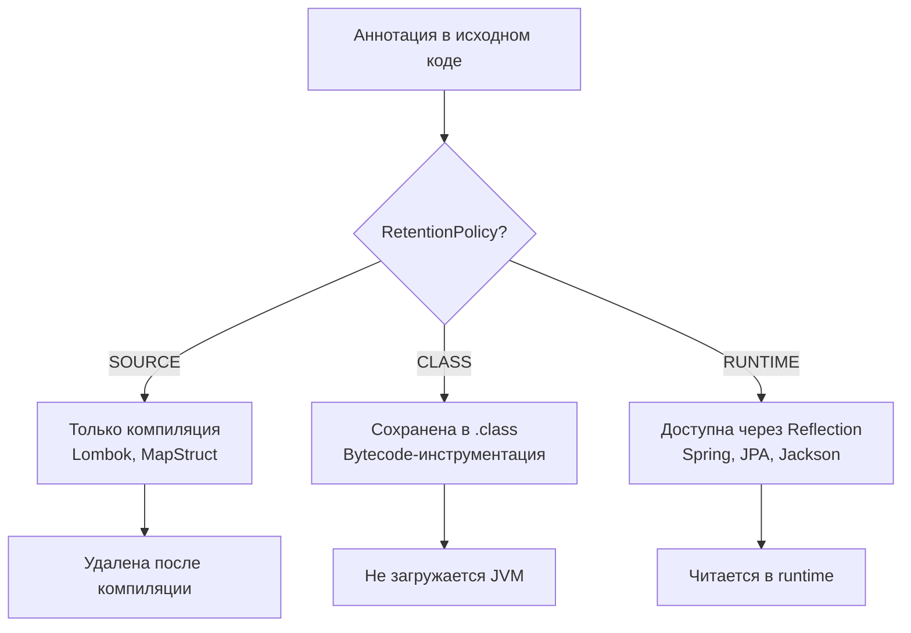
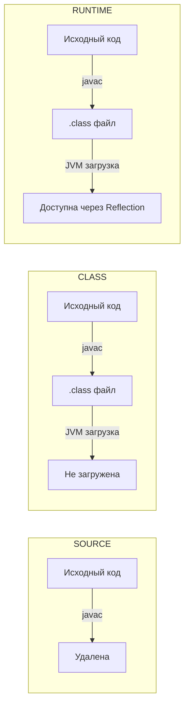
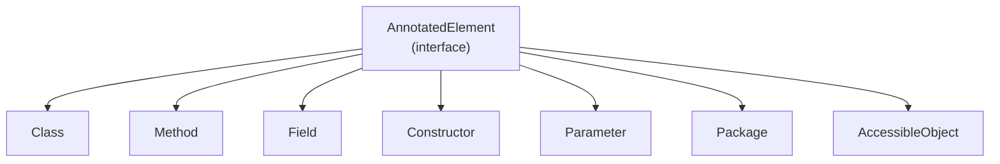
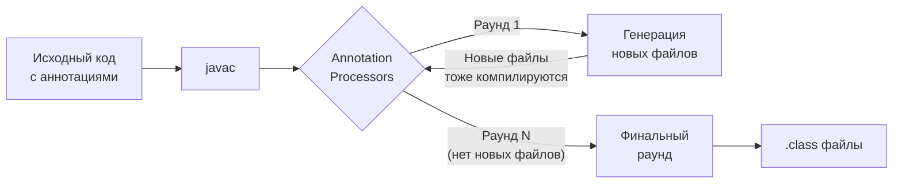
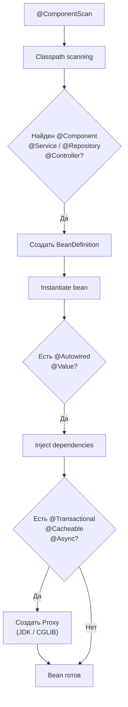

# Вопросы на собеседовании: `Java Annotations`

Комплексное руководство по вопросам собеседования на тему `Java Annotations` для `Senior Java Developer`. Включает
детальные объяснения концепций, практические примеры на `Java` + `Spring`, best practices и troubleshooting.

## Полезные ссылки

### Официальная документация

- [Java Annotations Documentation](https://docs.oracle.com/javase/tutorial/java/annotations/) — официальное руководство Oracle
- [Annotation API](https://docs.oracle.com/en/java/javase/17/docs/api/java.base/java/lang/annotation/package-summary.html) — API пакета java.lang.annotation
- [Reflection API](https://docs.oracle.com/en/java/javase/17/docs/api/java.base/java/lang/reflect/package-summary.html) — рефлексия для работы с аннотациями

### Baeldung

- [Java Annotation Processing and Creating a Builder — Baeldung](https://www.baeldung.com/java-annotation-processing-builder) — annotation processing и генерация кода
- [Creating a Custom Annotation in Java — Baeldung](https://www.baeldung.com/java-custom-annotation) — создание кастомных аннотаций
- [Scanning Java Annotations at Runtime — Baeldung](https://www.baeldung.com/java-scan-annotations-runtime) — сканирование аннотаций через рефлексию
- [Overview of Java Built-in Annotations — Baeldung](https://www.baeldung.com/java-default-annotations) — встроенные аннотации Java (@Override, @Deprecated, @SuppressWarnings)

## Содержание

- [Полезные ссылки](#полезные-ссылки)
- [See also](#see-also)

**Основы аннотаций**
- [Q1. (!) Что такое `Annotation` в Java?](#q1--что-такое-annotation-в-java)
- [Q2. (!) Какие стандартные аннотации есть в Java?](#q2--какие-стандартные-аннотации-есть-в-java)
- [Q3. (!) Как создать собственную аннотацию?](#q3--как-создать-собственную-аннотацию)
- [Q4. (!) Какие типы допустимы для элементов аннотации?](#q4--какие-типы-допустимы-для-элементов-аннотации)
- [Q5. Какие элементы программы могут быть аннотированы?](#q5-какие-элементы-программы-могут-быть-аннотированы)
- [Q6. Что такое `value()` и `default` в аннотациях?](#q6-что-такое-value-и-default-в-аннотациях)

**Мета-аннотации и `RetentionPolicy`**
- [Q7. (!) Что такое мета-аннотации?](#q7--что-такое-мета-аннотации)
- [Q8. (!) Что такое `RetentionPolicy` и как выбрать нужную?](#q8--что-такое-retentionpolicy-и-как-выбрать-нужную)
- [Q9. Что такое `@Target` и `ElementType`?](#q9-что-такое-target-и-elementtype)
- [Q10. Что такое `@Documented` и `@Inherited`?](#q10-что-такое-documented-и-inherited)
- [Q11. Как `@Inherited` работает с интерфейсами и методами?](#q11-как-inherited-работает-с-интерфейсами-и-методами)
- [Q12. Что такое `TYPE_USE` и `TYPE_PARAMETER` (`Java 8`)?](#q12-что-такое-type_use-и-type_parameter-java-8)

**Повторяемые и составные аннотации**
- [Q13. (!) Что такое повторяемые аннотации (`@Repeatable`)?](#q13--что-такое-повторяемые-аннотации-repeatable)
- [Q14. Что такое составные (composed) аннотации?](#q14-что-такое-составные-composed-аннотации)
- [Q15. Можно ли наследовать аннотации через `extends`?](#q15-можно-ли-наследовать-аннотации-через-extends)

**Рефлексия и обработка аннотаций в `Runtime`**
- [Q16. (!) Как получить аннотации через `Reflection`?](#q16--как-получить-аннотации-через-reflection)
- [Q17. В чём разница между `getAnnotation()` и `getDeclaredAnnotation()`?](#q17-в-чём-разница-между-getannotation-и-getdeclaredannotation)
- [Q18. Как сканировать аннотации по пакету в runtime?](#q18-как-сканировать-аннотации-по-пакету-в-runtime)
- [Q19. Как получить аннотации параметров метода?](#q19-как-получить-аннотации-параметров-метода)
- [Q20. Как работает `AnnotatedElement` API?](#q20-как-работает-annotatedelement-api)

**`Annotation Processing` (compile-time)**
- [Q21. (!) Что такое `Annotation Processor` и как он работает?](#q21--что-такое-annotation-processor-и-как-он-работает)
- [Q22. (!) Как написать собственный `Annotation Processor`?](#q22--как-написать-собственный-annotation-processor)
- [Q23. Что такое раунды обработки (`processing rounds`)?](#q23-что-такое-раунды-обработки-processing-rounds)
- [Q24. Как зарегистрировать `Annotation Processor`?](#q24-как-зарегистрировать-annotation-processor)
- [Q25. Какие ограничения есть у `Annotation Processing API`?](#q25-какие-ограничения-есть-у-annotation-processing-api)
- [Q26. Какие фреймворки используют `Annotation Processing`?](#q26-какие-фреймворки-используют-annotation-processing)

**Аннотации в `Spring` и `Bean Validation`**
- [Q27. (!) Как аннотации используются в `Spring`?](#q27--как-аннотации-используются-в-spring)
- [Q28. Как `Spring AOP` использует аннотации и прокси?](#q28-как-spring-aop-использует-аннотации-и-прокси)
- [Q29. (!) Как создать собственную аннотацию для `Spring AOP`?](#q29--как-создать-собственную-аннотацию-для-spring-aop)
- [Q30. (!) Как аннотации используются в `Bean Validation`?](#q30--как-аннотации-используются-в-bean-validation)
- [Q31. Как создать кастомный валидатор с `@Constraint`?](#q31-как-создать-кастомный-валидатор-с-constraint)

**Аннотации в `Jackson`, `JPA` и других библиотеках**
- [Q32. Как аннотации используются в `Jackson`?](#q32-как-аннотации-используются-в-jackson)
- [Q33. Как аннотации используются в `JPA`/`Hibernate`?](#q33-как-аннотации-используются-в-jpahibernate)

**Специальные случаи и best practices**
- [Q34. Что такое `@SafeVarargs` и `@FunctionalInterface`?](#q34-что-такое-safevarargs-и-functionalinterface)
- [Q35. Будет ли компилироваться аннотация с дубликатами в `@Target`?](#q35-будет-ли-компилироваться-аннотация-с-дубликатами-в-target)
- [Q36. (!) Best practices при создании кастомных аннотаций?](#q36--best-practices-при-создании-кастомных-аннотаций)
- [Q37. Как аннотации влияют на производительность?](#q37-как-аннотации-влияют-на-производительность)

**APT, Lombok, MapStruct, KSP и новые темы**
- [Q38. Как работает APT (Annotation Processing Tool) и каковы фазы javac?](#q38-как-работает-apt-annotation-processing-tool-и-каковы-фазы-javac)
- [Q39. Как Lombok использует APT и какие подводные камни при работе с Kotlin?](#q39-как-lombok-использует-apt-и-какие-подводные-камни-при-работе-с-kotlin)
- [Q40. Как MapStruct генерирует маппинги через APT?](#q40-как-mapstruct-генерирует-маппинги-через-apt)
- [Q41. Что такое KSP (Kotlin Symbol Processing) и чем лучше KAPT?](#q41-что-такое-ksp-kotlin-symbol-processing-и-чем-лучше-kapt)
- [Q42. Что такое Repeatable аннотации (@Repeatable) и container annotation?](#q42-что-такое-repeatable-аннотации-repeatable-и-container-annotation)
- [Q43. Аннотации на TYPE_USE — @NonNull и Checker Framework](#q43-аннотации-на-type_use--nonnull-и-checker-framework)

## Q1. (!) Что такое `Annotation` в Java?

Аннотации (`Annotations`) -- механизм метапрограммирования в `Java`, позволяющий добавлять метаданные к элементам кода (классам, методам, полям, параметрам) без изменения их семантики. Введены в `Java 5` (JSR 175), стали неотъемлемой частью современной разработки, особенно в [Java Core](java-core-interview.md) и фреймворках типа `Spring`.

Аннотации предоставляют информацию, которую используют:
- **Компилятор** -- `@Override` гарантирует правильное переопределение метода
- **Инструменты компиляции** -- `Lombok` генерирует геттеры/сеттеры, `MapStruct` -- мапперы
- **Runtime-фреймворки** -- `Spring` использует аннотации для `dependency injection`



Пример использования аннотаций в реальном приложении:

```java
@Entity
@Table(name = "users")
public class User {
    @Id
    @GeneratedValue(strategy = GenerationType.IDENTITY)
    private Long id;

    @Column(name = "username", nullable = false)
    @NotNull
    @Size(min = 3, max = 50)
    private String username;

    @Override
    public String toString() {
        return "User{id=" + id + "}";
    }
}

@Service
@Transactional
public class UserService {
    @Autowired
    private UserRepository userRepository;

    @PreAuthorize("hasRole('ADMIN')")
    public User createUser(@Valid @RequestBody User user) {
        return userRepository.save(user);
    }
}
```

> [!mcq]
> - [x] Аннотации — это механизм метапрограммирования, добавляющий метаданные к элементам кода без изменения семантики программы. | Аннотации сами по себе не влияют на выполнение, их интерпретируют компилятор, инструменты сборки и runtime-фреймворки. Ключевое отличие и best practice в production.
> - [ ] Аннотации — это директивы препроцессора, которые модифицируют исходный код до компиляции байт-кода. | В Java нет препроцессора как в C/C++, аннотации обрабатываются на этапе компиляции или рефлексией, но не через подстановку текста. Частая ошибка в реальном коде.
> - [ ] Аннотации — это специальные комментарии для `Javadoc`, которые игнорируются компилятором. | Javadoc-теги (`@param`, `@return`) существуют только в комментариях; настоящие аннотации — полноценные типы `@interface` и компилятор их проверяет. Частая ошибка в реальном коде.
> - [ ] Аннотации — это бинарные флаги в байт-коде, недоступные из исходного кода. | Аннотации объявляются в исходнике ключевым словом `@interface`, а уже затем попадают (или не попадают) в `.class` согласно `RetentionPolicy`. Частая ошибка в реальном коде.

## Q2. (!) Какие стандартные аннотации есть в Java?

В пакетах `java.lang` и `java.lang.annotation` есть ключевые аннотации:

| Аннотация | Назначение | `RetentionPolicy` |
|-----------|-----------|-------------------|
| `@Override` | Переопределение метода суперкласса | `SOURCE` |
| `@Deprecated` | Пометка устаревшего элемента | `RUNTIME` |
| `@SuppressWarnings` | Подавление предупреждений компилятора | `SOURCE` |
| `@FunctionalInterface` | Функциональный интерфейс (`Java 8`) | `RUNTIME` |
| `@SafeVarargs` | Безопасные varargs с дженериками | `RUNTIME` |
| `@Repeatable` | Повторяемая аннотация (`Java 8`) | `RUNTIME` |
| `@Native` | Поле доступно из нативного кода (`Java 8`) | `SOURCE` |

Начиная с `Java 9` у `@Deprecated` появились атрибуты `since` и `forRemoval`:

```java
@Deprecated(since = "11", forRemoval = true)
public void oldMethod() {
    // Будет удалён в будущей версии
}

@SuppressWarnings({"unchecked", "deprecation"})
List<String> list = (List<String>) getRawList();

@FunctionalInterface
public interface Calculator {
    int calculate(int a, int b);
    // default и static методы не нарушают контракт
    default int add(int a, int b) { return a + b; }
}
```

> [!mcq]
> - [ ] Аннотация `@Override` имеет `RetentionPolicy.RUNTIME` и доступна через рефлексию. | `@Override` существует только для компилятора и имеет `RetentionPolicy.SOURCE` — в байт-коде её уже нет, читать через рефлексию нельзя. Частая ошибка в реальном коде.
> - [x] Аннотация `@Deprecated` имеет `RetentionPolicy.RUNTIME` и с Java 9 поддерживает `since` и `forRemoval`. | `@Deprecated` сохраняется в байт-коде, её видят компилятор, IDE и runtime; атрибуты `since`/`forRemoval` добавлены в JEP 277. Ключевое отличие и best practice в production.
> - [ ] Аннотация `@SuppressWarnings` сохраняется в байт-коде и доступна через `Method.getAnnotation()`. | `@SuppressWarnings` имеет `RetentionPolicy.SOURCE`: она нужна только для подавления предупреждений компилятора и в `.class` не попадает. Частая ошибка в реальном коде.
> - [ ] Аннотация `@FunctionalInterface` допускает два абстрактных метода при условии, что один из них `default`. | Сам смысл `@FunctionalInterface` — ровно один абстрактный метод; `default` и `static` не считаются абстрактными, но два абстрактных метода — это ошибка компиляции.

## Q3. (!) Как создать собственную аннотацию?

Аннотация объявляется ключевым словом `@interface`. Элементы аннотации выглядят как методы без параметров и могут иметь значения по умолчанию через `default`.

```java
@Retention(RetentionPolicy.RUNTIME)
@Target({ElementType.METHOD, ElementType.TYPE})
@Documented
public @interface Auditable {
    String action();
    String description() default "";
    AuditLevel level() default AuditLevel.INFO;

    enum AuditLevel { DEBUG, INFO, WARN, ERROR }
}
```

Применение:

```java
@Auditable(action = "CREATE_USER", level = Auditable.AuditLevel.WARN)
public User createUser(User user) {
    return repository.save(user);
}
```

Ключевые правила:
- Элементы не могут принимать параметры
- Элементы не могут бросать исключения
- Имя `value()` позволяет опускать имя при использовании: `@MyAnnotation("text")`
- Если все элементы имеют `default`, аннотацию можно применять без скобок: `@MyAnnotation`

> [!mcq]
> - [ ] Аннотация объявляется ключевым словом `annotation` и наследует `java.lang.Annotation`. | В Java нет ключевого слова `annotation`; используется `@interface`, а супертип — `java.lang.annotation.Annotation`. Частая ошибка в реальном коде.
> - [ ] Элементы аннотации объявляются как обычные поля класса с модификатором доступа. | Элементы аннотации выглядят как методы без параметров (без тела) — не как поля, и имеют тип и опциональный `default`. Частая ошибка в реальном коде.
> - [x] Аннотация объявляется ключевым словом `@interface`, а её элементы — как методы без параметров с опциональным `default`. | Синтаксически это похоже на интерфейс, но любой элемент — это абстрактный метод с ограниченным набором возвращаемых типов и опциональным значением по умолчанию.
> - [ ] Элементы аннотации могут объявлять `throws`, чтобы сигнализировать об ошибках обработки. | Элементы аннотации не могут бросать исключения и не принимают параметры — это ошибка компиляции. Частая ошибка в реальном коде.

## Q4. (!) Какие типы допустимы для элементов аннотации?

Тип возвращаемого значения элемента аннотации строго ограничен. Допустимы:

- Примитивные типы (`int`, `long`, `boolean` и т.д.)
- `String`
- `Class` (с wildcards: `Class<? extends Serializable>`)
- `Enum`
- Другая аннотация
- Массив любого из перечисленных типов

```java
enum Priority { LOW, MEDIUM, HIGH }

public @interface ComplexAnnotation {
    int count();                          // примитив
    String value();                       // String
    Class<? extends Runnable> runner();   // Class
    Priority priority();                  // enum
    Deprecated deprecation();             // аннотация
    String[] tags() default {};           // массив
}
```

**НЕ допустимы**: `Object`, `Map`, `List`, обёртки (`Integer`, `Boolean`), пользовательские классы:

```java
public @interface InvalidAnnotation {
    Object value();     // ОШИБКА компиляции
    List<String> items; // ОШИБКА компиляции
    Integer count;      // ОШИБКА компиляции
}
```

> [!mcq]
> - [ ] Допустимы примитивы, `String`, `Class`, `Enum`, коллекции (`List`, `Map`) и пользовательские классы. | Коллекции и произвольные классы недопустимы — JLS §9.6.1 ограничивает типы элементов аннотации, список `List<String>` вызовет ошибку компиляции. Это антипаттерн или неправильный выбор в production.
> - [ ] Допустимы все типы, кроме `Object` и обобщённых интерфейсов. | Запрещены также `Integer`, `Map`, любые пользовательские классы — формулировка «всё, кроме Object» неверна и слишком широкая. Частая ошибка в реальном коде.
> - [x] Допустимы примитивы, `String`, `Class`, `enum`, другая аннотация и массив любого из перечисленных. | Это исчерпывающий список по JLS §9.6.1; обёртки (`Integer`) и коллекции запрещены, а `Class` может быть ограничен wildcards. Immutable, String pool экономит память, StringBuilder для конкатенации, intern() для pool.
> - [ ] Допустимы только примитивы и `String`; для сложных данных используется сериализация в `byte[]`. | Это слишком узкое ограничение — аннотации прекрасно работают с `Class`, `enum`, вложенными аннотациями и массивами из коробки. Это антипаттерн или неправильный выбор в production.

## Q5. Какие элементы программы могут быть аннотированы?

Аннотации применяются к классам, конструкторам, полям, методам, параметрам, локальным переменным, пакетам (через `package-info.java`) и другим аннотациям.

Начиная с [Java 8](java-8-interview.md), добавлены `TYPE_USE` и `TYPE_PARAMETER`:

```java
// TYPE_USE -- аннотация на использовании типа
@Target(ElementType.TYPE_USE)
@Retention(RetentionPolicy.RUNTIME)
public @interface NonNull {}

// Примеры TYPE_USE:
@NonNull String name;                                    // поле
List<@NonNull String> items;                             // параметр типа
String text = (@NonNull String) obj;                     // приведение
void process() throws @NonNull IOException {}            // исключение
new @NonNull ArrayList<>();                              // создание объекта

// TYPE_PARAMETER -- аннотация на объявлении параметра типа
@Target(ElementType.TYPE_PARAMETER)
public @interface Covariant {}

public class Box<@Covariant T> {}                        // параметр типа
```

> [!mcq]
> - [ ] `TYPE_USE` применяется только к объявлению параметров типа, например `class Box<@Covariant T>`. | Это описание `TYPE_PARAMETER`, а не `TYPE_USE`; `TYPE_USE` целится в *использование* типа (cast, throws, generic-аргумент). Частая ошибка в реальном коде.
> - [x] `TYPE_USE` позволяет аннотировать любое использование типа: cast, throws, аргументы generics, объявление поля. | Введено в Java 8 для статических анализаторов типа `Checker Framework`/`NullAway`, которые так проверяют nullability и immutability на конкретных позициях. Type erasure - информация теряется при компиляции, cannot reify generic types.
> - [ ] `TYPE_USE` применимо только к аннотациям с `RetentionPolicy.SOURCE`, иначе компилятор выдаст ошибку. | Ограничения по retention нет — `TYPE_USE`-аннотации бывают и `SOURCE`, и `RUNTIME`; комбинация зависит от задачи. Частая ошибка в реальном коде.
> - [ ] `TYPE_USE` — это псевдоним для `ElementType.TYPE` и нужен только для обратной совместимости. | `TYPE_USE` семантически отличается от `TYPE`: первый — на использование типа (`new @NonNull ArrayList<>()`), второй — на объявление класса/интерфейса.

## Q6. Что такое `value()` и `default` в аннотациях?

Элемент `value()` имеет особый статус: если это единственный указанный элемент, его имя можно опустить.

```java
public @interface Tag {
    String value();
    int priority() default 0;
}

@Tag("important")               // value = "important", priority = 0
@Tag(value = "low", priority = 5) // явное указание обоих
```

`default` позволяет не указывать элемент при применении. Если все элементы имеют `default`, аннотация может быть маркерной (без скобок):

```java
public @interface Cacheable {
    String cacheName() default "default";
    int ttlSeconds() default 300;
    boolean enabled() default true;
}

@Cacheable  // все по умолчанию
@Cacheable(cacheName = "users", ttlSeconds = 600)
```

> [!mcq]
> - [ ] Элемент `value()` разрешает опускать имя только если все остальные элементы имеют `default`. | Наоборот: имя `value()` опускают когда это *единственный указываемый* элемент, а остальные могут быть без default и игнорируются, если они не обязательны.
> - [ ] `default` обязателен для всех элементов аннотации, иначе компилятор сообщит об ошибке. | `default` опционален; элемент без `default` считается обязательным и должен быть указан при применении аннотации. Частая ошибка в реальном коде.
> - [x] Если все элементы имеют `default`, аннотацию можно применять без скобок как маркерную (`@MyAnnotation`). | Это синтаксический сахар: отсутствие скобок эквивалентно явной записи со всеми значениями по умолчанию; так удобно делать чисто маркерные аннотации. Ключевое отличие и best practice в production.
> - [ ] Имя `value()` можно опускать только если оно единственное объявлено в аннотации. | Достаточно, чтобы `value()` был единственным *указываемым* при применении, — другие элементы могут существовать, если у них есть `default`. Частая ошибка в реальном коде.

## Q7. (!) Что такое мета-аннотации?

Мета-аннотации -- аннотации, которые применяются к другим аннотациям для определения их поведения. Стандартные мета-аннотации в `Java`:

| Мета-аннотация | Назначение |
|----------------|-----------|
| `@Retention` | Когда аннотация доступна (SOURCE / CLASS / RUNTIME) |
| `@Target` | К каким элементам применима |
| `@Documented` | Включать ли в Javadoc |
| `@Inherited` | Наследуется ли подклассами |
| `@Repeatable` | Можно ли применять несколько раз (`Java 8`) |

```java
// Определение аннотации с полным набором мета-аннотаций
@Retention(RetentionPolicy.RUNTIME)
@Target({ElementType.TYPE, ElementType.METHOD})
@Documented
@Inherited
public @interface Trackable {
    String value() default "";
}
```

Все аннотации, не имеющие `@Target` или с `@Target(ANNOTATION_TYPE)`, могут использоваться как мета-аннотации.

> [!mcq]
> - [x] Мета-аннотации — это аннотации, применяемые к другим аннотациям для задания их поведения: `@Retention`, `@Target`, `@Documented`, `@Inherited`, `@Repeatable`. | Это именно «аннотации над аннотациями»; набор стандартных определён в `java.lang.annotation` и определяет жизненный цикл, область применения и наследование.
> - [ ] Мета-аннотации — это аннотации, которые автоматически применяются ко всем классам в пакете. | Такой механизм отсутствует; применение только явное, а `package-info.java` аннотирует сам пакет, но не транзитивно все классы. Частая ошибка в реальном коде.
> - [ ] Мета-аннотации — это набор аннотаций `Spring` (`@Service`, `@Repository`), наследующих `@Component`. | Это *составные* (composed) аннотации в Spring, а не мета-аннотации — термин путают, но JLS говорит о мета-аннотациях именно в контексте `java.lang.annotation`.
> - [ ] Мета-аннотации — это аннотации, видимые только в `Reflection API` через `MetaAnnotation.class`. | Такого класса в JDK нет; мета-аннотации — это концепция языка, а их обнаружение в Spring идёт через `AnnotatedElementUtils`. Это антипаттерн или неправильный выбор в production.

## Q8. (!) Что такое `RetentionPolicy` и как выбрать нужную?

`RetentionPolicy` определяет жизненный цикл аннотации:



| `RetentionPolicy` | Где доступна | Примеры использования |
|-------------------|-------------|----------------------|
| `SOURCE` | Только исходный код | `@Override`, `@SuppressWarnings`, `Lombok`, `MapStruct` |
| `CLASS` | Исходный код + `.class` файл | `AspectJ` bytecode weaving, анализ байт-кода |
| `RUNTIME` | Исходный код + `.class` + JVM | `Spring`, `JPA`, `Jackson`, `Bean Validation` |

Как выбрать:
- **`SOURCE`** -- когда аннотация нужна только компилятору или `Annotation Processor` для генерации кода
- **`CLASS`** -- когда нужна инструментация байт-кода, но не runtime-рефлексия (уменьшает memory footprint)
- **`RUNTIME`** -- когда фреймворк читает аннотации через рефлексию во время выполнения

```java
@Retention(RetentionPolicy.SOURCE)
public @interface Generated {
    // Удаляется после компиляции, не нагружает runtime
}

@Retention(RetentionPolicy.RUNTIME)
public @interface Transactional {
    // Spring читает через рефлексию при создании прокси
}
```

> [!mcq]
> - [ ] `RetentionPolicy.SOURCE` сохраняет аннотацию в `.class`, но скрывает её от рефлексии. | `SOURCE` удаляется *до* генерации байт-кода — в `.class` её нет вовсе; «скрытая в `.class`» — это `CLASS`. Частая ошибка в реальном коде.
> - [ ] `RetentionPolicy.CLASS` — значение по умолчанию, и аннотация всегда доступна через `getAnnotation()`. | Действительно, `CLASS` по умолчанию, но именно при нём `getAnnotation()` вернёт `null` — JVM не загружает такие аннотации в runtime. Частая ошибка в реальном коде.
> - [ ] `RetentionPolicy.RUNTIME` требует обязательного `@Target(ElementType.TYPE)`, иначе компиляция не пройдёт. | Никакой связи между `RUNTIME` и `@Target` нет; `RUNTIME`-аннотации применяются ко всем поддерживаемым `ElementType`. Частая ошибка в реальном коде.
> - [x] `RetentionPolicy.RUNTIME` сохраняет аннотацию в `.class` и делает её доступной через `Reflection` в работающей JVM. | Именно это отличает `RUNTIME` от `CLASS`: JVM при загрузке класса распарсит атрибут `RuntimeVisibleAnnotations`, так и работают `Spring`, `JPA`, `Jackson`. Медленно (10-100x медленнее), но необходимо для фреймворков, caching helps.

## Q9. Что такое `@Target` и `ElementType`?

`@Target` ограничивает, к каким элементам программы применима аннотация. Значения `ElementType`:

| `ElementType` | Применяется к |
|---------------|---------------|
| `TYPE` | Класс, интерфейс, enum, record |
| `FIELD` | Поле (включая enum-константы) |
| `METHOD` | Метод |
| `PARAMETER` | Параметр метода |
| `CONSTRUCTOR` | Конструктор |
| `LOCAL_VARIABLE` | Локальная переменная |
| `ANNOTATION_TYPE` | Другая аннотация (мета-аннотация) |
| `PACKAGE` | Пакет (через `package-info.java`) |
| `TYPE_PARAMETER` | Параметр типа (`Java 8`) |
| `TYPE_USE` | Использование типа (`Java 8`) |
| `MODULE` | Модуль (`Java 9`) |
| `RECORD_COMPONENT` | Компонент record (`Java 16`) |

```java
@Target({ElementType.METHOD, ElementType.FIELD})
@Retention(RetentionPolicy.RUNTIME)
public @interface Inject {}

// @Target({}) -- аннотация ни к чему не применима,
// используется как тип-член в составных аннотациях
```

Если `@Target` не указан, аннотация применима ко всем элементам кроме `TYPE_PARAMETER` и `TYPE_USE`.

> [!mcq]
> - [ ] `@Target({})` означает «применимо ко всему, включая `TYPE_USE` и `TYPE_PARAMETER`». | Пустой массив `@Target({})` означает обратное — аннотация *ни к чему* не применима напрямую и используется только как компонент других аннотаций. Частая ошибка в реальном коде.
> - [x] Если `@Target` не указан, аннотация применима ко всем стандартным местам, кроме `TYPE_USE` и `TYPE_PARAMETER`. | Это зафиксировано в JLS §9.6.4.1: отсутствие `@Target` эквивалентно применимости ко всему, что существовало до Java 8 (до появления `TYPE_USE`/`TYPE_PARAMETER`).
> - [ ] `@Target(ElementType.TYPE)` разрешает применение только к классам, но не к интерфейсам или enum'ам. | `ElementType.TYPE` покрывает классы, интерфейсы, enum и records — это общая категория «тип», а не только классы. Частая ошибка в реальном коде.
> - [ ] `ElementType.RECORD_COMPONENT` появился в Java 8 одновременно с `TYPE_USE`. | `RECORD_COMPONENT` добавлен в Java 16 вместе с records (JEP 395); в Java 8 появились `TYPE_USE`/`TYPE_PARAMETER`. Частая ошибка в реальном коде.

## Q10. Что такое `@Documented` и `@Inherited`?

`@Documented` указывает, что аннотация должна отображаться в `Javadoc`. Без неё аннотация не попадает в документацию. Рекомендуется для аннотаций, являющихся частью публичного API.

`@Inherited` указывает, что аннотация класса наследуется подклассами:

```java
@Inherited
@Retention(RetentionPolicy.RUNTIME)
@Target(ElementType.TYPE)
public @interface Audited {}

@Audited
public class BaseService {}

public class UserService extends BaseService {
    // UserService.class.getAnnotation(Audited.class) != null
    // Аннотация унаследована от BaseService
}
```

> [!mcq]
> - [ ] `@Documented` обязательна для всех аннотаций, иначе `javac` выдаст предупреждение. | `@Documented` — опциональная мета-аннотация; её отсутствие абсолютно легально, просто аннотация не попадает в Javadoc. Частая ошибка в реальном коде.
> - [ ] `@Inherited` заставляет аннотацию наследоваться интерфейсами и методами подклассов. | `@Inherited` работает *только* для аннотаций на классах; на интерфейсах, методах и полях не срабатывает. Частая ошибка в реальном коде.
> - [x] `@Documented` включает аннотацию в Javadoc, `@Inherited` заставляет подклассы наследовать аннотацию с суперкласса. | Это стандартное назначение этих мета-аннотаций: `@Documented` — про отображение, `@Inherited` — про наследование только на уровне классов. Ключевое отличие и best practice в production.
> - [ ] `@Inherited` отсутствует по умолчанию, но компилятор добавляет её ко всем `@Retention(RUNTIME)` автоматически. | Никакого автодобавления нет; разработчик должен указать `@Inherited` явно, если хочет наследования. Частая ошибка в реальном коде.

## Q11. Как `@Inherited` работает с интерфейсами и методами?

`@Inherited` работает **только** с аннотациями на классах. Ограничения:
- Аннотации на **интерфейсах** не наследуются реализующими классами
- Аннотации на **методах** не наследуются переопределяющими методами
- Аннотации на **полях** не наследуются

```java
@Inherited
@Retention(RetentionPolicy.RUNTIME)
@Target({ElementType.TYPE, ElementType.METHOD})
public @interface Tracked {}

@Tracked
public interface Processable {}

public class Processor implements Processable {
    // Processor.class.getAnnotation(Tracked.class) == null!
    // @Inherited НЕ работает с интерфейсами
}

public class Base {
    @Tracked
    public void execute() {}
}

public class Child extends Base {
    @Override
    public void execute() {}
    // Child.execute().getAnnotation(Tracked.class) == null!
    // @Inherited НЕ работает с методами
}
```

`Spring` решает это через `AnnotatedElementUtils.findMergedAnnotation()`, который обходит иерархию типов вручную.

> [!mcq]
> - [x] `@Inherited` наследует аннотацию только с класса-предка на класс-потомок; интерфейсы, методы и поля исключены. | Это жёсткое ограничение JLS §9.6.4.3: обходится только цепочка `extends`, и только для аннотаций на классах. Ключевое отличие и best practice в production.
> - [ ] `@Inherited` работает и для классов, и для интерфейсов, если они реализуют `java.lang.annotation.Annotation`. | Для интерфейсов `@Inherited` не действует — `implements` не поднимает аннотацию к реализации, это частая ошибка. Частая ошибка в реальном коде.
> - [ ] `@Inherited` заставляет `@Override`-методы подхватывать аннотации родительского метода. | На уровне методов `@Inherited` не работает: дочерний метод `@Override` не «унаследует» аннотации родителя, их надо явно повторить. Частая ошибка в реальном коде.
> - [ ] Spring использует `@Inherited` напрямую через `Class.getAnnotation()` для поиска мета-аннотаций. | Spring обходит иерархию сам через `AnnotatedElementUtils.findMergedAnnotation()`, потому что стандартный `@Inherited` слишком ограничен. Частая ошибка в реальном коде.

## Q12. Что такое `TYPE_USE` и `TYPE_PARAMETER` (`Java 8`)?

`TYPE_USE` позволяет аннотировать любое **использование типа**, а не только объявление. Это полезно для статических анализаторов (`Checker Framework`, `NullAway`) и инструментов верификации типов:

```java
@Target(ElementType.TYPE_USE)
@Retention(RetentionPolicy.RUNTIME)
public @interface NonNull {}

// Аннотация на типе в разных контекстах:
@NonNull String name;                         // тип поля
List<@NonNull String> items;                  // аргумент типа
Map<@NonNull String, @NonNull Integer> map;   // ключ и значение
@NonNull String @NonNull [] array;            // тип массива и элемента
```

`TYPE_PARAMETER` аннотирует **объявление** параметра типа, подробнее в [вопросах по дженерикам](java-generics-interview.md):

```java
@Target(ElementType.TYPE_PARAMETER)
@Retention(RetentionPolicy.RUNTIME)
public @interface Immutable {}

public class Container<@Immutable T> {
    // Инструменты статического анализа могут проверить,
    // что T используется только для immutable-типов
}
```

> [!mcq]
> - [ ] `TYPE_USE` и `TYPE_PARAMETER` — это одно и то же, разница только в именовании. | Это разные `ElementType`: первый — для *использования* типа, второй — для *объявления* параметра типа; компилятор строго различает позиции. Частая ошибка в реальном коде.
> - [ ] `TYPE_USE` появился в Java 5 вместе с дженериками и `@Override`. | `TYPE_USE` и `TYPE_PARAMETER` добавлены в Java 8 (JSR 308) — до этого нельзя было аннотировать позиции внутри типа. Частая ошибка в реальном коде.
> - [x] `TYPE_USE` аннотирует позицию использования типа (cast, throws, generic arg), `TYPE_PARAMETER` — объявление параметра типа. | Пример: `List<@NonNull String>` — это `TYPE_USE` на `String`, а `class Box<@Covariant T>` — это `TYPE_PARAMETER` на `T`. Immutable, String pool экономит память, StringBuilder для конкатенации, intern() для pool.
> - [ ] `TYPE_PARAMETER` разрешает аннотировать `extends`/`super` bounds, но не объявления классов-дженериков. | Наоборот: `TYPE_PARAMETER` — именно на объявлении `<T>`; а аннотация на `extends` bound — это уже `TYPE_USE`. Частая ошибка в реальном коде.

## Q13. (!) Что такое повторяемые аннотации (`@Repeatable`)?

Повторяемые аннотации (`Java 8+`) можно применять несколько раз к одному элементу. Реализация требует двух объявлений: повторяемая аннотация с `@Repeatable` и аннотация-контейнер:

```java
@Repeatable(Schedules.class)
@Retention(RetentionPolicy.RUNTIME)
@Target(ElementType.METHOD)
public @interface Schedule {
    String cron();
    String zone() default "UTC";
}

@Retention(RetentionPolicy.RUNTIME)
@Target(ElementType.METHOD)
public @interface Schedules {
    Schedule[] value(); // обязательно value() типа массива
}
```

Применение и чтение:

```java
@Schedule(cron = "0 0 8 * * MON-FRI")
@Schedule(cron = "0 0 12 * * SAT", zone = "Europe/Moscow")
public void sendReport() {}

// Чтение через Reflection:
Method method = MyClass.class.getMethod("sendReport");

// Вариант 1: getAnnotationsByType (рекомендуется)
Schedule[] schedules = method.getAnnotationsByType(Schedule.class);

// Вариант 2: через контейнер
Schedules container = method.getAnnotation(Schedules.class);
Schedule[] all = container.value();
```

> [!mcq]
> - [ ] `@Repeatable` позволяет применять аннотацию несколько раз без объявления контейнера. | Контейнер обязателен: он указывается в `@Repeatable(Container.class)` и должен иметь элемент `value()` типа массива повторяемой аннотации. Частая ошибка в реальном коде.
> - [x] `@Repeatable` требует объявления аннотации-контейнера с `value()` типа массива повторяемой аннотации. | Это требование JLS §9.6.3: компилятор автоматически оборачивает повторы в контейнер, и без корректной структуры контейнера компиляция не пройдёт. Ключевое отличие и best practice в production.
> - [ ] Контейнерная аннотация должна быть помечена `@Repeatable`, как и вложенная. | `@Repeatable` ставится только на «одиночной» аннотации и указывает на контейнер; сам контейнер её не несёт. Частая ошибка в реальном коде.
> - [ ] Для чтения повторяемых аннотаций подходит `getAnnotation()` — он возвращает массив. | `getAnnotation()` вернёт контейнер, а не массив; правильный способ — `getAnnotationsByType()`, который разворачивает контейнер. Частая ошибка в реальном коде.

## Q14. Что такое составные (composed) аннотации?

Составная аннотация -- аннотация, помеченная другими аннотациями, объединяющая их семантику. `Spring` активно использует этот паттерн:

```java
// @RestController = @Controller + @ResponseBody
@Target(ElementType.TYPE)
@Retention(RetentionPolicy.RUNTIME)
@Controller
@ResponseBody
public @interface RestController {}

// Собственная составная аннотация:
@Target(ElementType.TYPE)
@Retention(RetentionPolicy.RUNTIME)
@Service
@Transactional(readOnly = true)
public @interface ReadOnlyService {}

@ReadOnlyService  // эквивалент @Service + @Transactional(readOnly = true)
public class ReportService {
    public List<Report> findAll() { ... }
}
```

`Spring` использует `AnnotatedElementUtils` для поиска аннотаций с учётом мета-аннотаций. При `Component Scan` составная аннотация с `@Component` (или его подтипом) регистрирует бин.

> [!mcq]
> - [x] Составная аннотация — это аннотация, помеченная другими аннотациями, чтобы объединить их семантику в одном имени. | Пример — `@RestController = @Controller + @ResponseBody`; Spring обходит мета-аннотации через `AnnotatedElementUtils` и трактует их как явные. Ключевое отличие и best practice в production.
> - [ ] Составная аннотация — это аннотация, содержащая другие аннотации как элементы через `Annotation[] value()`. | Это *композиция* через поля, но Spring-паттерн «composed annotation» — про мета-аннотирование, а не про массив. Частая ошибка в реальном коде.
> - [ ] Составная аннотация автоматически включает поведение родителя только при `@Inherited`. | `@Inherited` не имеет отношения к composed annotations — тут работает именно мета-аннотирование и обход через Spring-утилиты. Частая ошибка в реальном коде.
> - [ ] Составные аннотации — это стандартный механизм JLS для расширения аннотаций через `extends`. | Наследование `extends` у аннотаций запрещено JLS; composed annotations — паттерн, а не языковое расширение. Частая ошибка в реальном коде.

## Q15. Можно ли наследовать аннотации через `extends`?

Нет. Аннотации всегда неявно расширяют `java.lang.annotation.Annotation`. Ключевое слово `extends` в объявлении аннотации вызывает ошибку компиляции.

Альтернативы:
1. **Композиция** -- одна аннотация включает другую как элемент
2. **Мета-аннотации** -- общая мета-аннотация объединяет семейство
3. **Составные аннотации** (Spring-стиль) -- мета-аннотирование с обходом через `AnnotatedElementUtils`

```java
// Композиция аннотаций:
public @interface Validation {
    String message() default "";
}

public @interface FieldCheck {
    Validation validation() default @Validation;  // включение
    int maxLength() default 255;
}

@FieldCheck(validation = @Validation(message = "Invalid"), maxLength = 100)
private String name;
```

> [!mcq]
> - [ ] Да, через `public @interface Child extends Parent` можно наследовать элементы. | `extends` в объявлении аннотации запрещён: все аннотации неявно расширяют `java.lang.annotation.Annotation`, и ручное наследование — ошибка компиляции.
> - [ ] Да, но только если родительская аннотация помечена `@Inherited`. | `@Inherited` работает для *экземпляров* на классах, а не для объявлений аннотаций: наследовать саму аннотацию-тип через `extends` в любом случае нельзя.
> - [x] Нет, аннотации неявно расширяют `java.lang.annotation.Annotation`; для переиспользования применяют композицию, мета-аннотации или составные аннотации. | Это зафиксировано в JLS: явное `extends` недопустимо, и в практике используют Spring-стиль «composed annotations» или включение аннотации как элемента.
> - [ ] Нет, но можно реализовать интерфейс `Annotation` вручную для эмуляции наследования. | Реализовывать `Annotation` напрямую — антипаттерн (и JVM такие классы не воспринимает как аннотации); правильный путь — мета-аннотирование. Частая ошибка в реальном коде.

## Q16. (!) Как получить аннотации через `Reflection`?

Для чтения аннотаций в runtime они должны иметь `@Retention(RetentionPolicy.RUNTIME)`. Основные методы `Reflection API`:

```java
@Retention(RetentionPolicy.RUNTIME)
@Target({ElementType.TYPE, ElementType.METHOD, ElementType.FIELD})
public @interface Info {
    String value();
}

@Info("user entity")
public class User {
    @Info("user name")
    private String name;

    @Info("display")
    public String toString() { return name; }
}

// Чтение аннотации класса:
Info classInfo = User.class.getAnnotation(Info.class);
System.out.println(classInfo.value()); // "user entity"

// Чтение аннотации поля:
Field field = User.class.getDeclaredField("name");
Info fieldInfo = field.getAnnotation(Info.class);

// Чтение аннотации метода:
Method method = User.class.getMethod("toString");
boolean hasInfo = method.isAnnotationPresent(Info.class);

// Все аннотации элемента:
Annotation[] all = User.class.getAnnotations();          // включая @Inherited
Annotation[] declared = User.class.getDeclaredAnnotations(); // только свои
```

> [!mcq]
> - [ ] Аннотации с `RetentionPolicy.SOURCE` можно читать через `getAnnotation()` при флаге `-parameters`. | `SOURCE`-аннотации физически отсутствуют в `.class`, поэтому никаким флагом их через рефлексию не вытащить — читаются только `RUNTIME`. Частая ошибка в реальном коде.
> - [ ] `isAnnotationPresent(X.class)` всегда вернёт `true`, если аннотация есть в исходнике. | Для `SOURCE`/`CLASS` вернёт `false` в runtime; `true` будет только для `RUNTIME`. Частая ошибка в реальном коде.
> - [x] Для чтения через рефлексию аннотация должна иметь `@Retention(RetentionPolicy.RUNTIME)`. | Это единственный уровень retention, при котором JVM загружает атрибут `RuntimeVisibleAnnotations` и делает данные доступными через `AnnotatedElement`.
> - [ ] `getAnnotations()` возвращает только аннотации, объявленные на самом элементе, игнорируя `@Inherited`. | Это описание `getDeclaredAnnotations()`; `getAnnotations()` как раз *учитывает* `@Inherited` и поднимает аннотации с суперкласса. Частая ошибка в реальном коде.

## Q17. В чём разница между `getAnnotation()` и `getDeclaredAnnotation()`?

| Метод | Учитывает `@Inherited` | Повторяемые |
|-------|----------------------|-------------|
| `getAnnotation(Class)` | Да | Нет (вернёт контейнер) |
| `getDeclaredAnnotation(Class)` | Нет | Нет |
| `getAnnotations()` | Да | Все (включая контейнеры) |
| `getDeclaredAnnotations()` | Нет | Все (только собственные) |
| `getAnnotationsByType(Class)` | Да | Да (разворачивает контейнер) |
| `getDeclaredAnnotationsByType(Class)` | Нет | Да |

```java
@Inherited
@Retention(RetentionPolicy.RUNTIME)
public @interface Label { String value(); }

@Label("base")
public class Base {}
public class Child extends Base {}

Child.class.getAnnotation(Label.class);         // @Label("base") -- от Base
Child.class.getDeclaredAnnotation(Label.class);  // null -- нет собственной
```

> [!mcq]
> - [x] `getAnnotation()` учитывает `@Inherited`, а `getDeclaredAnnotation()` возвращает только аннотации, объявленные непосредственно на элементе. | Это и есть ключевое различие: первый поднимает аннотацию с суперкласса (если она `@Inherited`), второй строго читает «собственные». Ключевое отличие и best practice в production.
> - [ ] `getAnnotation()` разворачивает контейнер повторяемых аннотаций в массив. | Нет, `getAnnotation()` при повторе вернёт контейнер как одну аннотацию; для разворачивания нужен `getAnnotationsByType()`. Частая ошибка в реальном коде.
> - [ ] `getDeclaredAnnotation()` возвращает `null` для всех `RUNTIME`-аннотаций. | Он возвращает `null`, только если аннотации нет *на самом элементе*; для собственных `RUNTIME`-аннотаций значение будет. Частая ошибка в реальном коде.
> - [ ] Оба метода идентичны; `getDeclaredAnnotation()` оставлен для совместимости с Java 5. | Методы различаются семантикой учёта `@Inherited` — это разные API, а не совместимостный синоним. Частая ошибка в реальном коде.

## Q18. Как сканировать аннотации по пакету в runtime?

Стандартная `Java` не предоставляет API для сканирования classpath. Используются библиотеки:

**`Spring` -- `ClassPathScanningCandidateComponentProvider`:**

```java
ClassPathScanningCandidateComponentProvider scanner =
    new ClassPathScanningCandidateComponentProvider(false);
scanner.addIncludeFilter(new AnnotationTypeFilter(MyAnnotation.class));

Set<BeanDefinition> beans = scanner.findCandidateComponents("com.example");
for (BeanDefinition bd : beans) {
    Class<?> clazz = Class.forName(bd.getBeanClassName());
    MyAnnotation ann = clazz.getAnnotation(MyAnnotation.class);
}
```

**`Reflections` (библиотека):**

```java
Reflections reflections = new Reflections("com.example");
Set<Class<?>> annotated = reflections.getTypesAnnotatedWith(MyAnnotation.class);
```

**`ClassGraph` (более современная альтернатива):**

```java
try (ScanResult result = new ClassGraph()
        .acceptPackages("com.example")
        .enableAnnotationInfo()
        .scan()) {
    ClassInfoList classes = result.getClassesWithAnnotation(MyAnnotation.class);
}
```

> [!mcq]
> - [ ] Достаточно вызвать `Package.getPackage("com.example").getAnnotations()` и отфильтровать классы. | `Package.getAnnotations()` возвращает аннотации самого пакета (из `package-info.java`), а не список классов — получить содержимое пакета стандартным API нельзя.
> - [x] Стандартный JDK не имеет API сканирования classpath; используют `Spring`, `Reflections`, `ClassGraph`. | Это факт: classpath-сканирование не входит в стандарт, и все библиотеки реализуют его через чтение JAR/dir вручную и парсинг `.class` или рефлексию по известным классам. Медленно (10-100x медленнее), но необходимо для фреймворков, caching helps.
> - [ ] В Java 9+ через `ModuleLayer.boot().modules()` можно получить все аннотированные классы напрямую. | `ModuleLayer` даёт список модулей, но не перечисляет все классы в них; для сканирования по-прежнему нужны внешние инструменты. Частая ошибка в реальном коде.
> - [ ] `ClassLoader.getAllLoadedClasses()` возвращает список классов для дальнейшего анализа. | Такого публичного метода нет; получение списка загруженных классов требует Instrumentation API (`java.lang.instrument`) и агента. Частая ошибка в реальном коде.

## Q19. Как получить аннотации параметров метода?

Начиная с [Java 8](java-8-interview.md), API `Parameter` позволяет работать с аннотациями параметров. Флаг компиляции `-parameters` сохраняет имена параметров.

```java
public void process(@NotNull @Valid User user,
                    @RequestParam("q") String query) {}

Method method = getClass().getMethod("process", User.class, String.class);
Parameter[] params = method.getParameters();

for (Parameter param : params) {
    System.out.println(param.getName()); // "user", "query" (с -parameters)
    Annotation[] annotations = param.getAnnotations();
    NotNull nn = param.getAnnotation(NotNull.class);
}

// Альтернативный способ (до Java 8):
Annotation[][] paramAnnotations = method.getParameterAnnotations();
// paramAnnotations[0] -- аннотации первого параметра
// paramAnnotations[1] -- аннотации второго параметра
```

> [!mcq]
> - [x] `Method.getParameters()` (Java 8+) возвращает `Parameter[]`, через который можно читать и аннотации, и имена (с флагом `-parameters`). | Это современный API: `Parameter` реализует `AnnotatedElement`, а имена становятся доступны только если байт-код скомпилирован с сохранением имён параметров.
> - [ ] `Method.getParameters()` возвращает имена параметров без дополнительных флагов компиляции. | Без `-parameters` имена заменены на `arg0`, `arg1`, ...; флаг необходим, иначе имена просто не сохраняются в `.class`. Частая ошибка в реальном коде.
> - [ ] `Method.getParameterAnnotations()` возвращает `List<Annotation>`, общий для всех параметров. | Возвращается `Annotation[][]` — двумерный массив: внешний индекс — позиция параметра, внутренний — его аннотации. Частая ошибка в реальном коде.
> - [ ] До Java 8 нельзя было получить аннотации параметров — только через `Parameter` API. | Ровно наоборот: `getParameterAnnotations()` существует с Java 5, `Parameter` API появился в Java 8 как более удобная обёртка. Частая ошибка в реальном коде.

## Q20. Как работает `AnnotatedElement` API?

`AnnotatedElement` -- корневой интерфейс для всех элементов, поддерживающих аннотации. Его реализуют `Class`, `Method`, `Field`, `Constructor`, `Parameter`, `Package`.



Ключевые методы:

```java
// Общий подход для любого AnnotatedElement:
public <T extends Annotation> void inspect(AnnotatedElement element) {
    // Проверка наличия
    if (element.isAnnotationPresent(MyAnnotation.class)) {
        // Получение одной аннотации
        MyAnnotation ann = element.getAnnotation(MyAnnotation.class);

        // Все аннотации
        Annotation[] all = element.getAnnotations();

        // Повторяемые аннотации
        MyAnnotation[] repeated = element.getAnnotationsByType(MyAnnotation.class);
    }
}

// Вызов для разных элементов:
inspect(User.class);                              // класс
inspect(User.class.getDeclaredField("name"));     // поле
inspect(User.class.getMethod("toString"));        // метод
```

> [!mcq]
> - [ ] `AnnotatedElement` реализуют только `Class` и `Method`, остальные элементы используют отдельные API. | `Field`, `Constructor`, `Parameter`, `Package` и `AccessibleObject` тоже реализуют `AnnotatedElement` — API унифицирован. Частая ошибка в реальном коде.
> - [x] `AnnotatedElement` — общий интерфейс для всех элементов, поддерживающих аннотации: `Class`, `Method`, `Field`, `Constructor`, `Parameter`, `Package`. | Это единая точка входа в API: абстрактный код, работающий с аннотациями, можно писать один раз через `AnnotatedElement`. Ключевое отличие и best practice в production.
> - [ ] `AnnotatedElement` — класс в `java.lang.annotation`, напрямую расширяющий `Class`. | Это именно интерфейс, а не класс, и он в пакете `java.lang.reflect`, а `Class` — его реализация, а не предок. Частая ошибка в реальном коде.
> - [ ] Методы `AnnotatedElement` работают даже с `SOURCE`-аннотациями через `getAnnotationsByType`. | Для любого метода `AnnotatedElement` необходимы `RUNTIME`-аннотации — `SOURCE` недоступны в runtime независимо от метода. Частая ошибка в реальном коде.

## Q21. (!) Что такое `Annotation Processor` и как он работает?

`Annotation Processor` -- механизм обработки аннотаций на этапе компиляции. Компилятор `javac` вызывает зарегистрированные процессоры для аннотаций, которые они поддерживают. Процессоры могут **генерировать новый код**, **создавать файлы** и **сообщать об ошибках компиляции**.



Ключевые компоненты API (пакет `javax.annotation.processing`):

| Компонент | Назначение |
|-----------|-----------|
| `AbstractProcessor` | Базовый класс для процессоров |
| `RoundEnvironment` | Доступ к элементам текущего раунда |
| `ProcessingEnvironment` | Утилиты: `Filer`, `Messager`, `Elements`, `Types` |
| `Filer` | Создание новых файлов (исходный код, ресурсы) |
| `Messager` | Сообщения компиляции (ошибки, предупреждения) |

> [!mcq]
> - [ ] `Annotation Processor` выполняется JVM при старте приложения и заменяет рефлексию на прекомпилированный код. | `Annotation Processor` работает на этапе компиляции `javac`, а не в JVM; результаты (сгенерированный код) попадают в сборку как обычные классы. Частая ошибка в реальном коде.
> - [x] `Annotation Processor` вызывается `javac` на этапе компиляции и может генерировать новые файлы и сообщения, но не модифицировать существующие. | Это ключевое ограничение стандартного APT: только генерация, только форвард; модификация существующих классов возможна только через хаки (`Lombok`). Ключевое отличие и best practice в production.
> - [ ] `Annotation Processor` работает на этапе загрузки классов JVM и кэширует аннотации для ускорения рефлексии. | JVM при загрузке классов ничего с аннотациями не «обрабатывает» в смысле APT — кэширование делают фреймворки на уровне приложения. Частая ошибка в реальном коде.
> - [ ] Процессор может удалять `.java` файлы, помеченные аннотацией. | Стандартный `Filer` может только создавать новые файлы; удаление существующих не предусмотрено API. Частая ошибка в реальном коде.

## Q22. (!) Как написать собственный `Annotation Processor`?

Шаг 1 -- объявить аннотацию:

```java
@Retention(RetentionPolicy.SOURCE)
@Target(ElementType.TYPE)
public @interface GenerateBuilder {}
```

Шаг 2 -- реализовать процессор:

```java
@SupportedAnnotationTypes("com.example.GenerateBuilder")
@SupportedSourceVersion(SourceVersion.RELEASE_17)
public class BuilderProcessor extends AbstractProcessor {

    @Override
    public boolean process(Set<? extends TypeElement> annotations,
                           RoundEnvironment roundEnv) {
        for (Element element : roundEnv.getElementsAnnotatedWith(GenerateBuilder.class)) {
            if (element.getKind() != ElementKind.CLASS) {
                processingEnv.getMessager().printMessage(
                    Diagnostic.Kind.ERROR,
                    "@GenerateBuilder applicable only to classes",
                    element
                );
                continue;
            }

            TypeElement typeElement = (TypeElement) element;
            String className = typeElement.getSimpleName() + "Builder";
            String packageName = processingEnv.getElementUtils()
                .getPackageOf(typeElement).getQualifiedName().toString();

            try {
                JavaFileObject file = processingEnv.getFiler()
                    .createSourceFile(packageName + "." + className);
                try (Writer writer = file.openWriter()) {
                    writer.write(generateBuilderCode(typeElement, className, packageName));
                }
            } catch (IOException e) {
                processingEnv.getMessager().printMessage(
                    Diagnostic.Kind.ERROR, e.getMessage(), element);
            }
        }
        return true; // true = аннотация обработана, другие процессоры не нужны
    }
}
```

> [!mcq]
> - [x] Процессор расширяет `AbstractProcessor`, аннотируется `@SupportedAnnotationTypes`/`@SupportedSourceVersion` и регистрируется через `META-INF/services`. | Это стандартный путь: `AbstractProcessor` даёт удобные хуки, аннотации описывают контракт, а регистрация через SPI или `@AutoService` делает процессор видимым для `javac`.
> - [ ] Процессор расширяет `RoundEnvironment` и переопределяет метод `processRound()`. | `RoundEnvironment` — это *входной параметр* метода `process()`, а не базовый класс; собственный процессор наследуется от `AbstractProcessor`. Частая ошибка в реальном коде.
> - [ ] Процессор реализует `java.lang.reflect.AnnotationHandler` и регистрируется в `module-info`. | Такого интерфейса в JDK нет, и регистрация через `module-info.java` не требуется; SPI-файл `META-INF/services/javax.annotation.processing.Processor` по-прежнему основной путь.
> - [ ] Процессор запускается командой `java -agentlib:apt` во время выполнения. | APT встроен в `javac` и запускается во время компиляции, а не как runtime-агент; никакой отдельный агент не нужен. Частая ошибка в реальном коде.

## Q23. Что такое раунды обработки (`processing rounds`)?

Компиляция с `Annotation Processing` происходит в **раундах**. Каждый раунд:
1. Компилятор находит аннотации в исходных файлах
2. Вызывает подходящие процессоры
3. Если процессоры сгенерировали **новые** файлы -- начинается новый раунд
4. Финальный раунд наступает, когда новых файлов не создано

```java
@Override
public boolean process(Set<? extends TypeElement> annotations,
                       RoundEnvironment roundEnv) {
    if (roundEnv.processingOver()) {
        // Финальный раунд -- очистка, финализация
        return false;
    }

    if (roundEnv.errorRaised()) {
        // В предыдущем раунде были ошибки
        return false;
    }

    // Обработка элементов текущего раунда
    Set<? extends Element> elements =
        roundEnv.getElementsAnnotatedWith(MyAnnotation.class);

    // Генерация файлов (запустит новый раунд)
    for (Element element : elements) {
        generateCode(element);
    }

    return true;
}
```

> [!mcq]
> - [ ] Раунд — это один вызов `process()` на одну аннотацию; несколько аннотаций обрабатываются параллельно в нескольких раундах. | В одном раунде `process()` получает *все* поддерживаемые аннотации сразу; параллельности нет, и количество раундов определяется генерацией новых файлов.
> - [x] Раунды повторяются до тех пор, пока процессоры генерируют новые файлы; финальный раунд отмечается `roundEnv.processingOver() == true`. | Так javac обеспечивает компиляцию сгенерированного кода: новые файлы сами могут содержать аннотации, и цикл продолжается, пока не стабилизируется. Ключевое отличие и best practice в production.
> - [ ] Раунд обработки — это JVM-термин для `Just-In-Time` компиляции аннотаций. | Это compile-time понятие `javac`, никакого отношения к JIT не имеет. Частая ошибка в реальном коде.
> - [ ] Процессор обязан возвращать `true` во всех раундах, чтобы не прерывать обработку. | Возвращаемое значение — это «claim» аннотации: `true` говорит «я обработал, другим не передавать», а не «продолжай цикл». Частая ошибка в реальном коде.

## Q24. Как зарегистрировать `Annotation Processor`?

Есть два способа регистрации:

**Способ 1 -- файл `META-INF/services` (стандартный SPI):**

Создать файл `META-INF/services/javax.annotation.processing.Processor` с полным именем класса процессора:

```
com.example.processor.BuilderProcessor
com.example.processor.ValidatorProcessor
```

**Способ 2 -- `@AutoService` от Google (рекомендуется):**

```java
@AutoService(Processor.class)
@SupportedAnnotationTypes("com.example.GenerateBuilder")
@SupportedSourceVersion(SourceVersion.RELEASE_17)
public class BuilderProcessor extends AbstractProcessor {
    // ...
}
```

`@AutoService` сам генерирует файл `META-INF/services` через собственный `Annotation Processor`.

**В Gradle:**

```groovy
dependencies {
    annotationProcessor 'com.example:my-processor:1.0'
    // или для Kotlin:
    kapt 'com.example:my-processor:1.0'
}
```

## Q25. Какие ограничения есть у `Annotation Processing API`?

Ключевые ограничения:

1. **Нельзя модифицировать существующие файлы** -- только генерировать новые. Это принципиальное ограничение API
2. **Нельзя удалять файлы** -- только создавать
3. `Lombok` обходит это ограничение, напрямую манипулируя AST через internal API (`com.sun.tools.javac`), что делает его "хаком"
4. Процессор не может зависеть от кода, который он сам генерирует
5. Порядок вызова процессоров не гарантирован

```java
// Процессор может:
processingEnv.getFiler().createSourceFile("com.example.Generated");   // OK
processingEnv.getFiler().createResource(                              // OK
    StandardLocation.CLASS_OUTPUT, "", "META-INF/config.properties");
processingEnv.getMessager().printMessage(Diagnostic.Kind.ERROR, "!");  // OK

// Процессор НЕ может:
// - Изменить User.java (исходный файл)
// - Добавить метод в существующий класс
// - Удалить сгенерированный файл
```

## Q26. Какие фреймворки используют `Annotation Processing`?

| Фреймворк | Аннотация | Что генерирует |
|-----------|-----------|----------------|
| `Lombok` | `@Getter`, `@Setter`, `@Builder` | Геттеры, сеттеры, билдеры (через AST-хак) |
| `MapStruct` | `@Mapper` | Реализации мапперов |
| `Dagger 2` | `@Inject`, `@Component` | DI-контейнер |
| `AutoValue` (Google) | `@AutoValue` | Immutable value-классы |
| `Immutables` | `@Value.Immutable` | Immutable-объекты с билдерами |
| `QueryDSL` | JPA-аннотации | Q-классы для типобезопасных запросов |
| `Micronaut` | `@Controller`, `@Inject` | DI и маршрутизация без рефлексии |
| `JPA Metamodel` | `@Entity` | Метамодель для `Criteria API` |

`Micronaut` и `Quarkus` используют `Annotation Processing` вместо runtime-рефлексии, что обеспечивает быстрый старт и низкое потребление памяти (важно для cloud-native и GraalVM).

## Q27. (!) Как аннотации используются в `Spring`?

`Spring` построен на аннотациях с `RetentionPolicy.RUNTIME`. При старте контекста `Spring` сканирует classpath и читает аннотации через рефлексию.



Основные категории аннотаций в `Spring`:

```java
// Стереотипы (регистрация бинов):
@Component, @Service, @Repository, @Controller, @RestController, @Configuration

// Инъекция зависимостей:
@Autowired, @Value, @Qualifier, @Primary, @Lazy

// Веб:
@RequestMapping, @GetMapping, @PostMapping, @PathVariable, @RequestParam

// AOP и декларативное поведение:
@Transactional, @Cacheable, @Async, @Scheduled, @EventListener

// Конфигурация:
@Bean, @Scope, @Profile, @Conditional, @EnableAutoConfiguration
```

## Q28. Как `Spring AOP` использует аннотации и прокси?

`Spring AOP` создаёт **прокси** для бинов с аннотациями вроде `@Transactional`, `@Cacheable`, `@Async`. При вызове метода прокси перехватывает вызов и применяет нужное поведение.

```java
@Service
public class OrderService {
    @Transactional  // Spring создаст прокси
    public Order placeOrder(Order order) {
        // Прокси: BEGIN TRANSACTION
        Order saved = repository.save(order);
        // Прокси: COMMIT (или ROLLBACK при исключении)
        return saved;
    }

    public void internalCall() {
        placeOrder(new Order()); // ВНИМАНИЕ: прокси НЕ сработает!
        // Вызов через this обходит прокси
    }
}
```

Важные нюансы:
- `Spring` использует **JDK Dynamic Proxy** (для интерфейсов) или **CGLIB** (для классов)
- **Self-invocation** (вызов аннотированного метода через `this`) обходит прокси -- аннотация не сработает
- Аннотации должны иметь `RUNTIME` retention
- `@Transactional` на `private` методе игнорируется (CGLIB не может перехватить)

## Q29. (!) Как создать собственную аннотацию для `Spring AOP`?

Создание кастомной AOP-аннотации для логирования времени выполнения:

```java
// Шаг 1: Объявить аннотацию
@Retention(RetentionPolicy.RUNTIME)
@Target(ElementType.METHOD)
public @interface LogExecutionTime {
    String label() default "";
}

// Шаг 2: Реализовать аспект
@Aspect
@Component
public class LogExecutionTimeAspect {

    private static final Logger log = LoggerFactory.getLogger(LogExecutionTimeAspect.class);

    @Around("@annotation(logExecutionTime)")
    public Object logTime(ProceedingJoinPoint joinPoint,
                          LogExecutionTime logExecutionTime) throws Throwable {
        String label = logExecutionTime.label().isEmpty()
            ? joinPoint.getSignature().getName()
            : logExecutionTime.label();

        long start = System.currentTimeMillis();
        try {
            return joinPoint.proceed();
        } finally {
            long elapsed = System.currentTimeMillis() - start;
            log.info("{} executed in {} ms", label, elapsed);
        }
    }
}

// Шаг 3: Использовать
@Service
public class ReportService {
    @LogExecutionTime(label = "generate-report")
    public Report generate(ReportRequest request) {
        // бизнес-логика
    }
}
```

## Q30. (!) Как аннотации используются в `Bean Validation`?

`Bean Validation` (JSR 380, `Hibernate Validator`) -- стандарт декларативной валидации через аннотации. Все аннотации валидации имеют `RUNTIME` retention.

Стандартные аннотации:

| Аннотация | Проверяет |
|-----------|----------|
| `@NotNull` | Не null |
| `@NotEmpty` | Не null и не пустой |
| `@NotBlank` | Не null, не пустой, не пробелы |
| `@Size(min, max)` | Размер коллекции/строки |
| `@Min`, `@Max` | Числовые границы |
| `@Email` | Формат email |
| `@Pattern(regexp)` | Соответствие регулярному выражению |
| `@Past`, `@Future` | Дата в прошлом / будущем |
| `@Valid` | Каскадная валидация вложенных объектов |

```java
public class CreateUserRequest {
    @NotBlank(message = "Имя обязательно")
    @Size(min = 2, max = 50, message = "Имя от 2 до 50 символов")
    private String name;

    @Email(message = "Некорректный email")
    private String email;

    @Min(value = 18, message = "Минимальный возраст 18")
    private int age;

    @Valid  // каскадная валидация
    @NotNull
    private Address address;
}
```

## Q31. Как создать кастомный валидатор с `@Constraint`?

Для создания кастомной валидационной аннотации нужно:
1. Объявить аннотацию с `@Constraint(validatedBy = ...)`
2. Реализовать `ConstraintValidator<A, T>`

```java
// Аннотация:
@Constraint(validatedBy = PhoneNumberValidator.class)
@Target({ElementType.FIELD, ElementType.PARAMETER})
@Retention(RetentionPolicy.RUNTIME)
@Documented
public @interface ValidPhone {
    String message() default "Некорректный номер телефона";
    Class<?>[] groups() default {};
    Class<? extends Payload>[] payload() default {};
    String region() default "RU";
}

// Валидатор:
public class PhoneNumberValidator implements ConstraintValidator<ValidPhone, String> {

    private String region;

    @Override
    public void initialize(ValidPhone annotation) {
        this.region = annotation.region();
    }

    @Override
    public boolean isValid(String value, ConstraintValidatorContext context) {
        if (value == null) return true; // null проверяется через @NotNull
        return switch (region) {
            case "RU" -> value.matches("\\+7\\d{10}");
            case "US" -> value.matches("\\+1\\d{10}");
            default -> false;
        };
    }
}

// Использование:
public class ContactForm {
    @ValidPhone(region = "RU")
    private String phone;
}
```

Обязательные элементы аннотации для `Bean Validation`: `message()`, `groups()`, `payload()`.

## Q32. Как аннотации используются в `Jackson`?

`Jackson` использует аннотации для управления сериализацией/десериализацией JSON:

```java
@JsonIgnoreProperties(ignoreUnknown = true)
@JsonNaming(PropertyNamingStrategies.SnakeCaseStrategy.class)
public class UserDto {

    @JsonProperty("user_id")
    private Long id;

    @JsonInclude(JsonInclude.Include.NON_NULL)
    private String middleName;

    @JsonFormat(pattern = "yyyy-MM-dd")
    private LocalDate birthDate;

    @JsonIgnore
    private String internalCode;

    @JsonCreator
    public UserDto(@JsonProperty("user_id") Long id,
                   @JsonProperty("name") String name) {
        this.id = id;
        this.name = name;
    }
}
```

Ключевые аннотации `Jackson`:

| Аннотация | Назначение |
|-----------|-----------|
| `@JsonProperty` | Имя поля в JSON |
| `@JsonIgnore` | Исключить поле |
| `@JsonIgnoreProperties` | Игнорировать неизвестные поля |
| `@JsonFormat` | Формат даты/числа |
| `@JsonCreator` | Конструктор для десериализации |
| `@JsonInclude` | Условие включения поля |
| `@JsonNaming` | Стратегия именования |
| `@JsonSerialize` / `@JsonDeserialize` | Кастомные сериализаторы |

## Q33. Как аннотации используются в `JPA`/`Hibernate`?

`JPA` аннотации маппят Java-классы на таблицы БД. `Hibernate` как реализация `JPA` дополнительно предоставляет свои аннотации:

```java
@Entity
@Table(name = "orders", indexes = {
    @Index(name = "idx_order_status", columnList = "status"),
    @Index(name = "idx_order_date", columnList = "created_at")
})
@NamedQuery(name = "Order.findByStatus",
            query = "SELECT o FROM Order o WHERE o.status = :status")
public class Order {

    @Id
    @GeneratedValue(strategy = GenerationType.IDENTITY)
    private Long id;

    @Column(nullable = false, length = 20)
    @Enumerated(EnumType.STRING)
    private OrderStatus status;

    @ManyToOne(fetch = FetchType.LAZY)
    @JoinColumn(name = "customer_id", nullable = false)
    private Customer customer;

    @OneToMany(mappedBy = "order", cascade = CascadeType.ALL, orphanRemoval = true)
    private List<OrderItem> items = new ArrayList<>();

    @CreationTimestamp
    @Column(name = "created_at", updatable = false)
    private LocalDateTime createdAt;

    @Version  // Optimistic locking
    private Long version;
}
```

Все `JPA` аннотации имеют `RUNTIME` retention -- `Hibernate` читает их при старте `EntityManagerFactory` через рефлексию.

## Q34. Что такое `@SafeVarargs` и `@FunctionalInterface`?

`@SafeVarargs` подавляет предупреждения о **heap pollution** при использовании varargs с [дженериками](java-generics-interview.md). Применяется только к `final`, `static` или `private` методам и конструкторам:

```java
@SafeVarargs
public static <T> List<T> listOf(T... elements) {
    return Arrays.asList(elements);
}

// Без @SafeVarargs компилятор выдаст предупреждение:
// "Possible heap pollution from parameterized vararg type"
```

`@FunctionalInterface` гарантирует, что интерфейс содержит ровно один абстрактный метод (подробнее в [вопросах по Java 8](java-8-interview.md)):

```java
@FunctionalInterface
public interface Transformer<T, R> {
    R transform(T input);

    // default и static методы не нарушают контракт:
    default <V> Transformer<T, V> andThen(Transformer<R, V> after) {
        return input -> after.transform(this.transform(input));
    }

    static <T> Transformer<T, T> identity() {
        return input -> input;
    }

    // Второй абстрактный метод = ОШИБКА КОМПИЛЯЦИИ
}
```

## Q35. Будет ли компилироваться аннотация с дубликатами в `@Target`?

Нет. Дублирование константы `ElementType` в `@Target` вызывает ошибку компиляции:

```java
// ОШИБКА: duplicate element ElementType.FIELD
@Target({ElementType.FIELD, ElementType.TYPE, ElementType.FIELD})
public @interface Broken {}

// Правильно:
@Target({ElementType.FIELD, ElementType.TYPE})
public @interface Correct {}
```

## Q36. (!) Best practices при создании кастомных аннотаций?

1. **Всегда указывайте `@Retention`** -- по умолчанию `CLASS`, что обычно не то, что нужно
2. **Всегда указывайте `@Target`** -- ограничивает область применения и улучшает ошибки компиляции
3. **Добавляйте `@Documented`** для публичных API-аннотаций
4. **Используйте `value()`** для основного атрибута -- позволяет краткую запись
5. **Задавайте `default`** для необязательных атрибутов
6. **Именование**: существительное или прилагательное (`@Transactional`, `@Cacheable`, `@Audited`)
7. **Не дублируйте** стандартные или фреймворковые аннотации
8. **Группируйте** связанные аннотации через составные (composed) аннотации
9. **Валидируйте** значения атрибутов в процессоре или при чтении через рефлексию
10. **Документируйте** семантику и контракт в Javadoc

```java
/**
 * Кэширует результат метода на указанное время.
 * Применяется к public-методам бинов Spring.
 * Self-invocation не поддерживается (вызов через this обходит прокси).
 */
@Documented
@Retention(RetentionPolicy.RUNTIME)
@Target(ElementType.METHOD)
public @interface CacheResult {
    /** Имя кэша */
    String value();
    /** Время жизни в секундах */
    int ttl() default 300;
    /** Кэшировать ли null-результаты */
    boolean cacheNull() default false;
}
```

## Q37. Как аннотации влияют на производительность?

Аннотации с `RetentionPolicy.SOURCE` и `CLASS` не влияют на runtime-производительность -- они не загружаются JVM.

Аннотации с `RUNTIME` retention:
- **Хранение** -- незначительный overhead: метаданные загружаются в `PermGen`/`Metaspace` вместе с классом
- **Чтение** -- рефлексия медленнее прямого вызова, но результат обычно кэшируется фреймворками
- **`Spring`** -- читает аннотации **при старте** контекста, не при каждом запросе
- **`JPA`** -- маппинг строится один раз при создании `EntityManagerFactory`
- **`Jackson`** -- `AnnotationIntrospector` кэширует результаты для каждого типа

```java
// Spring кэширует метаданные аннотаций:
// BeanDefinition создаётся один раз при component scan
// TransactionInterceptor кэширует TransactionAttribute

// Если нужна максимальная производительность:
// 1. Используйте Annotation Processing вместо рефлексии (Micronaut, Quarkus)
// 2. Кэшируйте результаты рефлексии, если обрабатываете аннотации вручную

// Пример кэширования:
private static final Map<Method, MyAnnotation> CACHE = new ConcurrentHashMap<>();

public MyAnnotation getAnnotation(Method method) {
    return CACHE.computeIfAbsent(method,
        m -> m.getAnnotation(MyAnnotation.class));
}
```

Для GraalVM native image рефлексия аннотаций требует явной конфигурации в `reflect-config.json`, поэтому фреймворки `Micronaut` и `Quarkus` предпочитают compile-time annotation processing.

---

## Q38. Как работает APT (Annotation Processing Tool) и каковы фазы javac?

**APT** (Annotation Processing Tool) — механизм компилятора `javac`, позволяющий запускать пользовательский код во время компиляции. Процессоры читают аннотации в исходном коде и могут генерировать новые исходники, ресурсы или сообщения об ошибках.

**Фазы компиляции javac с APT:**

```
1. Парсинг .java → AST (Abstract Syntax Tree)
2. Annotation Processing Round 1:
   - Процессоры получают RoundEnvironment
   - Анализируют аннотированные элементы
   - Генерируют новые .java или .class файлы
3. Если сгенерированы новые файлы → Round 2 (повторить)
4. ...последний round: процессоры вызываются с isLastRound() == true
5. Финальная компиляция всех исходников (в т.ч. сгенерированных)
```

**Реализация AbstractProcessor:**
```java
@SupportedAnnotationTypes("com.example.MyAnnotation")
@SupportedSourceVersion(SourceVersion.RELEASE_21)
@AutoService(Processor.class)  // google/auto для авторегистрации
public class MyAnnotationProcessor extends AbstractProcessor {

    @Override
    public boolean process(Set<? extends TypeElement> annotations,
                           RoundEnvironment roundEnv) {
        for (Element element : roundEnv.getElementsAnnotatedWith(MyAnnotation.class)) {
            // element — аннотированный класс/метод/поле
            TypeElement typeElement = (TypeElement) element;
            String className = typeElement.getSimpleName().toString();

            // Генерация нового файла
            try {
                JavaFileObject file = processingEnv.getFiler()
                    .createSourceFile("Generated" + className);
                try (PrintWriter writer = new PrintWriter(file.openWriter())) {
                    writer.println("public class Generated" + className + " {}");
                }
            } catch (IOException e) {
                processingEnv.getMessager()
                    .printMessage(Diagnostic.Kind.ERROR, e.getMessage(), element);
            }
        }
        return true; // аннотации "claimed" — другие процессоры не получат
    }
}
```

**Ключевые API:**
- `ProcessingEnvironment` — доступ к `Filer` (генерация файлов), `Messager` (диагностика), `Elements`/`Types` (модель типов)
- `RoundEnvironment` — элементы, помеченные аннотациями в текущем раунде
- `Element` — абстракция исходного кода (классы, методы, поля, пакеты)
- `TypeMirror` — представление типа на этапе компиляции

**Регистрация процессора:**
```
resources/META-INF/services/javax.annotation.processing.Processor
→ com.example.MyAnnotationProcessor
```

---

## Q39. Как Lombok использует APT и какие подводные камни при работе с Kotlin?

**Lombok** — библиотека, использующая APT для модификации AST (дерева синтаксического разбора) во время компиляции. В отличие от большинства процессоров, Lombok **модифицирует существующий AST**, а не генерирует новые файлы.

**Как Lombok обходит ограничения APT:**

Стандартный APT не позволяет модифицировать существующий AST (только создавать новые файлы). Lombok использует **хак через `com.sun.tools.javac` internal API** — он напрямую изменяет AST javac:

```java
// Lombok делает примерно это внутри:
// 1. Получает JCTree (AST) для класса
// 2. Добавляет синтетические методы (getters, setters, toString, etc.)
// 3. AST модифицирован → javac продолжает компиляцию с новым содержимым
```

**Проблемы с Kotlin:**

1. **KAPT (Kotlin Annotation Processing)**: Kotlin компилирует код в заглушки Java перед APT. Lombok-аннотации на Kotlin-классах **не работают** — KAPT не может видеть сгенерированные Lombok-методы в заглушках.

```kotlin
// НЕ работает:
@Data  // Lombok
class User(val name: String)

// Kotlin data class сам генерирует equals/hashCode/toString/copy — используйте их
data class User(val name: String)
```

2. **Interop Java → Kotlin**: Java-класс с `@Data` → Kotlin видит lombok-геттеры, но `val` Kotlin-свойство не биндится автоматически к Lombok-геттеру без `-Xlint:` конфигурации.

3. **KSP vs KAPT**: KSP работает напрямую с Kotlin AST и не имеет описанных проблем с Lombok. При переходе на KSP Lombok-интеграция ещё менее стабильна.

**Рекомендация:** в Kotlin-проектах не использовать Lombok — data class, `@JvmField`, `@JvmStatic` решают те же задачи нативно.

---

## Q40. Как MapStruct генерирует маппинги через APT?

**MapStruct** — библиотека маппинга объектов, которая через APT генерирует **чистый Java-код** (без рефлексии) для преобразования между типами.

**Аннотации MapStruct:**

```java
// Интерфейс-маппер
@Mapper(componentModel = "spring")  // Spring @Component
public interface UserMapper {

    @Mapping(source = "firstName", target = "name")
    @Mapping(source = "address.city", target = "city")
    @Mapping(target = "createdAt", expression = "java(LocalDateTime.now())")
    @Mapping(target = "passwordHash", ignore = true)
    UserDto toDto(User user);

    @InheritInverseConfiguration  // Автоматически перевернуть маппинг
    User toEntity(UserDto dto);

    List<UserDto> toDtoList(List<User> users);
}
```

**Что генерирует APT:**

```java
// Сгенерированный класс (в target/generated-sources):
@Component
public class UserMapperImpl implements UserMapper {

    @Override
    public UserDto toDto(User user) {
        if (user == null) return null;

        UserDto dto = new UserDto();
        dto.setName(user.getFirstName());            // @Mapping source→target
        dto.setCity(user.getAddress().getCity());    // nested access
        dto.setCreatedAt(LocalDateTime.now());        // expression
        // passwordHash — ignore
        return dto;
    }

    @Override
    public User toEntity(UserDto dto) { ... }       // @InheritInverseConfiguration
}
```

**Полезные аннотации:**
- `@Mapper(uses = {OtherMapper.class})` — композиция маппинов
- `@BeanMapping(nullValuePropertyMappingStrategy = IGNORE)` — пропускать null при patch
- `@MappingTarget` — обновить существующий объект (для PATCH)
- `@AfterMapping` / `@BeforeMapping` — хуки для кастомной логики

```java
@AfterMapping
default void setDefaults(@MappingTarget UserDto dto) {
    if (dto.getRole() == null) dto.setRole("USER");
}
```

**Преимущество перед ModelMapper/Dozer:** нет рефлексии в рантайме → нет overhead, ошибки обнаруживаются при компиляции.

---

## Q41. Что такое KSP (Kotlin Symbol Processing) и чем лучше KAPT?

**KSP** (Kotlin Symbol Processing) — официальная альтернатива KAPT для обработки аннотаций в Kotlin. Разработана JetBrains, доступна с Kotlin 1.5+.

**Проблемы KAPT:**

```
Kotlin → (KAPT stubs) → Java stubs → APT (Java annotation processors) → Generated Java
```
- Генерирует заглушки Java для всего Kotlin-кода — **медленно**
- До 2x замедление компиляции на больших проектах
- Не понимает Kotlin-специфичные конструкции (extension functions, inline classes)

**KSP-подход:**

```
Kotlin → KSP (Kotlin IR) → Generated Kotlin/Java
```
- Работает напрямую с Kotlin AST — нет Java-заглушек
- **В 2-4 раза быстрее** KAPT
- Нативная поддержка Kotlin: suspend functions, value class, sealed class, etc.

**API KSP:**
```kotlin
// KSP-процессор
class MyProcessor(val codeGenerator: CodeGenerator, val logger: KSPLogger) : SymbolProcessor {

    override fun process(resolver: Resolver): List<KSAnnotated> {
        val symbols = resolver.getSymbolsWithAnnotation("com.example.MyAnnotation")
            .filterIsInstance<KSClassDeclaration>()

        symbols.forEach { classDecl ->
            val className = classDecl.simpleName.asString()
            logger.info("Processing: $className")

            // Генерация файла
            val file = codeGenerator.createNewFile(
                Dependencies(false, classDecl.containingFile!!),
                classDecl.packageName.asString(),
                "Generated$className"
            )
            file.writer().use { writer ->
                writer.write("class Generated$className")
            }
        }
        return emptyList() // отложенные символы — те, что нельзя обработать сейчас
    }
}
```

**Поддержка библиотек:**
- **Room** (Android) — мигрировал с KAPT на KSP
- **Moshi** — поддерживает KSP
- **Dagger/Hilt** — поддерживает KSP с Dagger 2.51+
- **MapStruct** — пока работает через KAPT (активно ведётся KSP-поддержка)

**Когда использовать:** новые Kotlin-проекты → KSP. Если библиотека не поддерживает KSP — KAPT неизбежен.

---

## Q42. Что такое Repeatable аннотации (@Repeatable) и container annotation?

До **Java 8** одну аннотацию нельзя было применить к элементу дважды. `@Repeatable` снимает это ограничение, вводя понятие **container annotation**.

**Определение повторяемой аннотации:**

```java
// Шаг 1: Container annotation (хранит массив повторений)
@Retention(RetentionPolicy.RUNTIME)
@Target(ElementType.TYPE)
public @interface Roles {
    Role[] value();  // массив повторяемых аннотаций
}

// Шаг 2: Повторяемая аннотация ссылается на container
@Repeatable(Roles.class)
@Retention(RetentionPolicy.RUNTIME)
@Target(ElementType.TYPE)
public @interface Role {
    String value();
}
```

**Использование:**
```java
@Role("USER")
@Role("ADMIN")
@Role("MODERATOR")
public class AdminController { ... }

// Компилятор преобразует это в:
@Roles({
    @Role("USER"),
    @Role("ADMIN"),
    @Role("MODERATOR")
})
public class AdminController { ... }
```

**Чтение через рефлексию:**
```java
// Получить все повторения
Role[] roles = AdminController.class.getAnnotationsByType(Role.class);
// → [@Role("USER"), @Role("ADMIN"), @Role("MODERATOR")]

// Получить container (если аннотация была применена 2+ раз)
Roles container = AdminController.class.getAnnotation(Roles.class);

// Если аннотация применена один раз:
Role singleRole = SingleRoleClass.class.getDeclaredAnnotation(Role.class);
// → @Role("USER") (не null, даже без container)
```

**Реальные примеры из Spring:**
```java
// @ComponentScans содержит несколько @ComponentScan
@ComponentScan("com.example.users")
@ComponentScan("com.example.orders")
public class AppConfig { ... }

// @Schedules / @Scheduled
@Scheduled(cron = "0 0 9 * * MON-FRI")
@Scheduled(cron = "0 0 18 * * MON-FRI")
public void sendReport() { ... }
```

**Важный нюанс:** `getAnnotation(Role.class)` вернёт `null` если аннотация применена дважды (там container), но `null` если применена один раз и класс возвращает её напрямую. Поэтому правильный метод для Repeatable — `getAnnotationsByType()`.

---

## Q43. Аннотации на TYPE_USE — @NonNull и Checker Framework

`TYPE_USE` (`ElementType.TYPE_USE`, Java 8+) позволяет аннотировать **любое использование типа** — не только объявление переменной, но и дженерики, массивы, cast, throws.

**Применение TYPE_USE:**

```java
// Аннотация с @Target(ElementType.TYPE_USE)
@Retention(RetentionPolicy.RUNTIME)
@Target(ElementType.TYPE_USE)
public @interface NonNull {}

// Примеры использования:
@NonNull String name;                          // поле
List<@NonNull String> names;                  // дженерик-параметр
@NonNull String[] array;                       // массив
String @NonNull [] array2;                     // не-null сам массив (элементы могут быть null)
Map<@NonNull String, @NonNull Integer> map;    // оба параметра
void process() throws @NonNull IOException {}  // тип в throws
Object obj = (@NonNull String) value;          // cast
```

**Checker Framework:**

Checker Framework использует `TYPE_USE` аннотации для **статического анализа** nullability прямо в javac:

```java
// Checker Framework аннотации
import org.checkerframework.checker.nullness.qual.NonNull;
import org.checkerframework.checker.nullness.qual.Nullable;
import org.checkerframework.checker.nullness.qual.MonotonicNonNull;

public class UserService {
    private @Nullable User currentUser;  // может быть null

    public @NonNull User getOrCreate(@NonNull String username) {
        // Checker знает: username не null, метод обязан вернуть не-null
        return userRepo.findByUsername(username)
            .orElseGet(() -> createUser(username));
    }

    public void setUser(@NonNull User user) {
        this.currentUser = user;  // OK: user @NonNull → поле @Nullable принимает
    }
}
```

**Jakarta EE Bean Validation vs Spring аннотации:**

```java
// Jakarta EE (javax.validation → jakarta.validation)
@NotNull    // runtime validation через Validator
@NonNull    // Jakarta @NonNull (TYPE_USE, для Lombok и IDE)

// Spring Framework
@NonNull    // org.springframework.lang.NonNull (TYPE_USE)
@Nullable   // org.springframework.lang.Nullable

// Lombok
@NonNull    // lombok.NonNull — генерирует null-check в конструкторе/методе

// Смешивание в Spring проекте:
public @org.springframework.lang.NonNull User getUser(
        @jakarta.validation.constraints.NotNull @RequestParam String id) {
    // @NotNull — валидируется Bean Validation
    // @NonNull — подсказка для IDE/анализатора
}
```

**Важное различие:**
- `@NotNull` (Bean Validation) — **runtime** проверка через `Validator.validate()`
- `@NonNull` (TYPE_USE) — **compile-time** подсказка для IDE и статических анализаторов (NullAway, Checker Framework)
- Они дополняют друг друга: `@NonNull` предупредит при компиляции, `@NotNull` — при вызове API с некорректными данными

---

## See also

- [Java Core](java-core-interview.md) — базовые концепции: рефлексия, `Class<?>`, метаданные классов — основа работы с аннотациями
- [Java 8](java-8-interview.md) — лямбды и функциональные интерфейсы, часто аннотируются `@FunctionalInterface`
- [Java Generics](java-generics-interview.md) — дженерики в аннотациях (`@Qualifier`, `@Bean`), типобезопасность элементов
- [Java OOP](java-oop-interview.md) — наследование аннотаций через `@Inherited`, применение в иерархиях классов
- [JVM](../../jvm/jvm-interview.md) — `RetentionPolicy.RUNTIME` и Metaspace, overhead рефлексии аннотаций
- [Java Modules](java-modules-interview.md) — Annotation Processors в модульном контексте, `opens` для доступа к аннотациям
- [Spring Framework](../../frameworks/spring/spring-framework-interview.md) — аннотации как основа Spring IoC: `@Component`, `@Autowired`, `@Transactional`

- [Java 17-21](java-17-21-interview.md)
- [Java 8](java-8-interview.md)
- [Java Collections](java-collections-interview.md)
- [Java Concurrency](java-concurrency-interview.md)
- [Java Conditional Statements](java-conditional-statements-interview.md)
- [Java Core](java-core-interview.md)
