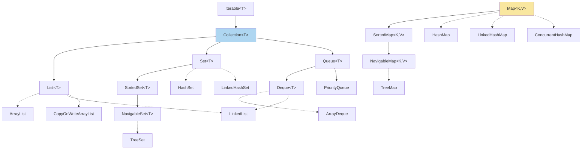
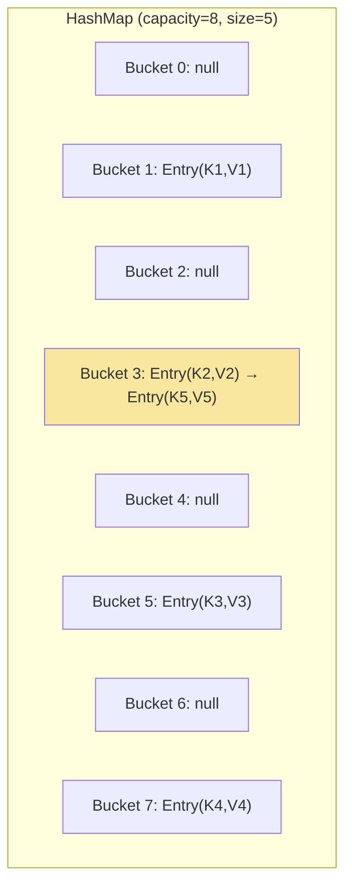
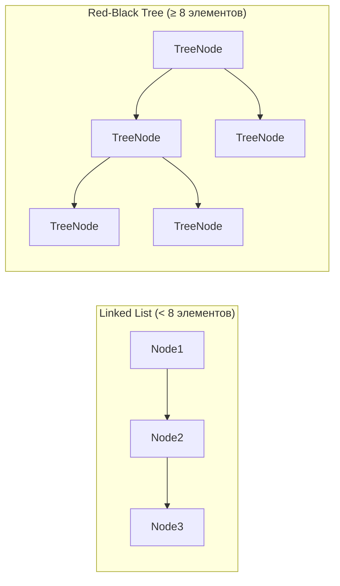
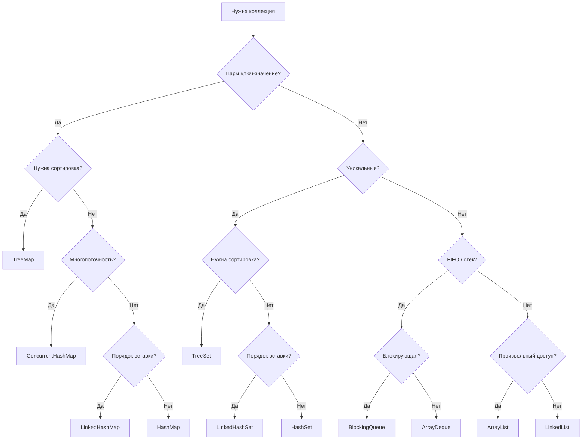

# Вопросы на собеседовании: `Java Collections`

Комплексное руководство по вопросам собеседования на тему `Java Collections Framework` для `Senior Java Developer`. Включает детальные объяснения концепций, практические примеры на `Java`, `mermaid`-диаграммы, best practices и troubleshooting.

## Полезные ссылки

### Официальная документация

- [Java Collections Framework Documentation](https://docs.oracle.com/en/java/javase/17/docs/api/java.base/java/util/package-summary.html)
- [Java API Documentation](https://docs.oracle.com/en/java/javase/17/docs/api/)
- [Java Collections Interview Questions — Baeldung](https://www.baeldung.com/java-collections-interview-questions) — вопросы с ответами по Collections Framework
- [The Java HashMap Under the Hood — Baeldung](https://www.baeldung.com/java-hashmap-advanced) — внутреннее устройство HashMap
- [Java HashMap Load Factor — Baeldung](https://www.baeldung.com/java-hashmap-load-factor) — load factor и rehashing
- [Guide to the Java Queue Interface — Baeldung](https://www.baeldung.com/java-queue) — очереди: PriorityQueue, ArrayDeque, BlockingQueue

## Содержание

- [Полезные ссылки](#полезные-ссылки)
- [See also](#see-also)

**Иерархия и основные интерфейсы**
- [Q1. (!) Опишите иерархию типов Collection](#q1--опишите-иерархию-типов-collection)
- [Q2. (!) Реализации Collection и оценка их быстродействия](#q2--реализации-collection-и-оценка-их-быстродействия)
- [Q3. (!) Что такое Map и чем отличается от Collection?](#q3--что-такое-map-и-чем-отличается-от-collection)
- [Q4. Как выбрать между List, Set и Map?](#q4-как-выбрать-между-list-set-и-map)
- [Q5. Что такое интерфейс Iterable и как он связан с Collection?](#q5-что-такое-интерфейс-iterable-и-как-он-связан-с-collection)

**List (ArrayList, LinkedList)**
- [Q6. (!) В чем разница между LinkedList и ArrayList?](#q6--в-чем-разница-между-linkedlist-и-arraylist)
- [Q7. Как работает автоматическое расширение ArrayList?](#q7-как-работает-автоматическое-расширение-arraylist)
- [Q8. Что такое CopyOnWriteArrayList?](#q8-что-такое-copyonwritearraylist)
- [Q9. В чём разница между List.of() и Arrays.asList()?](#q9-в-чём-разница-между-listof-и-arraysaslist)

**Set (HashSet, TreeSet, LinkedHashSet)**
- [Q10. (!) В чем разница между HashSet и TreeSet?](#q10--в-чем-разница-между-hashset-и-treeset)
- [Q11. Что такое LinkedHashSet и когда его использовать?](#q11-что-такое-linkedhashset-и-когда-его-использовать)

**Map (HashMap, TreeMap, LinkedHashMap)**
- [Q12. (!) Что такое HashMap и как он устроен внутри?](#q12--что-такое-hashmap-и-как-он-устроен-внутри)
- [Q13. (!) Что происходит при коллизиях в HashMap и как работает treeification?](#q13--что-происходит-при-коллизиях-в-hashmap-и-как-работает-treeification)
- [Q14. (!) Какова цель параметров initialCapacity и loadFactor?](#q14--какова-цель-параметров-initialcapacity-и-loadfactor)
- [Q15. (!) Что такое ConcurrentHashMap и чем отличается от HashMap?](#q15--что-такое-concurrenthashmap-и-чем-отличается-от-hashmap)
- [Q16. (!) Контракт equals и hashCode для ключей Map](#q16--контракт-equals-и-hashcode-для-ключей-map)
- [Q17. Что такое TreeMap и какая сложность операций?](#q17-что-такое-treemap-и-какая-сложность-операций)
- [Q18. В чём разница между HashMap и LinkedHashMap?](#q18-в-чём-разница-между-hashmap-и-linkedhashmap)
- [Q19. Как реализовать LRU-кэш на LinkedHashMap?](#q19-как-реализовать-lru-кэш-на-linkedhashmap)
- [Q20. Что такое WeakHashMap?](#q20-что-такое-weakhashmap)
- [Q21. Что такое IdentityHashMap?](#q21-что-такое-identityhashmap)
- [Q22. В чём разница между Collections.synchronizedMap и ConcurrentHashMap?](#q22-в-чём-разница-между-collectionssynchronizedmap-и-concurrenthashmap)
- [Q23. Какие методы Java 8+ добавлены в Map?](#q23-какие-методы-java-8-добавлены-в-map)

**Queue и Deque**
- [Q24. Что такое Queue и какие реализации?](#q24-что-такое-queue-и-какие-реализации)
- [Q25. Что такое Deque и когда использовать?](#q25-что-такое-deque-и-когда-использовать)
- [Q26. (!) Что такое BlockingQueue и паттерн producer-consumer?](#q26--что-такое-blockingqueue-и-паттерн-producer-consumer)
- [Q27. В чём разница между ArrayDeque и LinkedList?](#q27-в-чём-разница-между-arraydeque-и-linkedlist)

**Enum коллекции**
- [Q28. Что такое EnumSet и EnumMap?](#q28-что-такое-enumset-и-enummap)

**Итераторы и модификация**
- [Q29. (!) В чем разница между fail-fast и fail-safe итераторами?](#q29--в-чем-разница-между-fail-fast-и-fail-safe-итераторами)
- [Q30. Как итерировать и удалять элементы?](#q30-как-итерировать-и-удалять-элементы)
- [Q31. Что такое Spliterator?](#q31-что-такое-spliterator)
- [Q32. Что такое ConcurrentModificationException?](#q32-что-такое-concurrentmodificationexception)

**Сортировка и сравнение**
- [Q33. (!) Как использовать Comparable и Comparator?](#q33--как-использовать-comparable-и-comparator)
- [Q34. Какие алгоритмы сортировки используются в Java?](#q34-какие-алгоритмы-сортировки-используются-в-java)

**Immutable коллекции и утилиты**
- [Q35. Что такое Collections.unmodifiableList?](#q35-что-такое-collectionsunmodifiablelist)
- [Q36. (!) Что такое Immutable коллекции в Java 9+?](#q36--что-такое-immutable-коллекции-в-java-9)
- [Q37. Какие утилитные методы предоставляет класс Collections?](#q37-какие-утилитные-методы-предоставляет-класс-collections)

**Практические вопросы**
- [Q38. Почему нельзя использовать мутабельные объекты как ключи HashMap?](#q38-почему-нельзя-использовать-мутабельные-объекты-как-ключи-hashmap)
- [Q39. Как выбрать правильную коллекцию для конкретной задачи?](#q39-как-выбрать-правильную-коллекцию-для-конкретной-задачи)
- [Q40. Какие коллекции из сторонних библиотек стоит знать?](#q40-какие-коллекции-из-сторонних-библиотек-стоит-знать)
- [Q41. (!) Что такое `SequencedCollection`, `SequencedSet`, `SequencedMap` (Java 21)?](#q41--что-такое-sequencedcollection-sequencedset-sequencedmap-java-21)

**Продвинутые коллекции**
- [Q42. (!) Как устроен `ConcurrentHashMap` изнутри и почему он быстрее `Hashtable`?](#q42--как-устроен-concurrenthashmap-изнутри-и-почему-он-быстрее-hashtable)
- [Q43. (!) Как реализовать LRU-кэш на `LinkedHashMap`?](#q43--как-реализовать-lru-кэш-на-linkedhashmap)
- [Q44. Что такое `NavigableMap` и как использовать методы навигации `TreeMap`?](#q44-что-такое-navigablemap-и-как-использовать-методы-навигации-treemap)
- [Q45. Что такое `PriorityQueue` и как реализовать кастомный порядок?](#q45-что-такое-priorityqueue-и-как-реализовать-кастомный-порядок)
- [Q46. Что такое `WeakHashMap` и когда его использовать?](#q46-что-такое-weakhashmap-и-когда-его-использовать)

---

## Q1. (!) Опишите иерархию типов `Collection`

Иерархия типов `Collection` в `Java` центрируется вокруг интерфейса `Iterable`, от которого наследуется `Collection` — базовый интерфейс, описывающий основные операции: добавление, удаление, проверка наличия элемента и перебор.



Основные ветви:

- **`List`** — упорядоченная последовательность с дубликатами и индексированным доступом
- **`Set`** — хранит только уникальные элементы
- **`Queue`/`Deque`** — очереди (`FIFO`) и двусторонние очереди
- **`Map`** — пары ключ-значение; **не** наследуется от `Collection`

| Интерфейс | Порядок элементов | Дубликаты | Индекс/ключ | Основное применение |
|-----------|-------------------|-----------|-------------|---------------------|
| `List` | Порядок вставки | Да | По индексу | Упорядоченные данные |
| `Set` | Нет (кроме `LinkedHashSet`, `TreeSet`) | Нет | Нет | Уникальные элементы |
| `Queue` | `FIFO` | Да | Нет | Очереди задач |
| `Deque` | Двунаправленный | Да | Нет | Стеки и двусторонние очереди |
| `Map` | Нет (кроме `LinkedHashMap`, `TreeMap`) | Нет (ключи) | По ключу | Пары ключ-значение |

> [!mcq] Какое утверждение верно описывает место `Map` в иерархии `java.util.Collection`?
>
> - [ ] A. `Map` расширяет `Collection`, потому что является частью Collections Framework и содержит метод `size()`, общий для всех коллекций.
>
>     **Что на самом деле.** В JDK `Map` объявлен **отдельно** от `Collection` — это два независимых корневых интерфейса. Совпадение сигнатуры `size()` — следствие общего use case (узнать число элементов), а не отношения наследования.
>
>     **Откуда путаница.** Многие учебники объединяют их в «Collections Framework» как зонтичный термин и говорят «все коллекции». Студент переносит маркетинговое имя на java-иерархию.
>
>     **Если бы это было правдой.** Generic `<C extends Collection<?>> void process(C c)` принимал бы и `Map`. На практике компилятор отвергает `process(new HashMap<>())` — приходится писать две сигнатуры или итерировать по `entrySet()`.
>
>     **Как было бы правильно.** Признать, что Collections Framework — это семейство интерфейсов с общим именем, но без единого корня; `Map` и `Collection` — два разных корня.
>
> - [ ] B. `Queue` не расширяет `Collection`, потому что работает с FIFO-семантикой, несовместимой с методом `add(E)`.
>
>     **Что на самом деле.** `Queue` **расширяет** `Collection`. FIFO реализуется через `offer(E)`/`poll()`/`peek()`, которые сосуществуют с `add(E)` из родителя; `add(E)` для `Queue` означает «добавить в хвост».
>
>     **Откуда путаница.** Студенты ассоциируют «очередь» с классической ADT, где интерфейс не имеет `add`/`iterator`. В JDK прагматичный подход: переиспользовать `Collection` API.
>
>     **Если бы это было правдой.** Утилиты вроде `Collections.addAll(queue, elements)` не работали бы для `Queue`; нельзя было бы писать `for (T t : queue)` через enhanced-for.
>
>     **Как было бы правильно.** Сказать, что `Queue` расширяет `Collection` и добавляет head-операции; FIFO — это семантика конкретной реализации (`LinkedList`, `ArrayDeque`), а не отказ от иерархии.
>
> - [ ] C. `Deque` не расширяет `Collection`, потому что добавляет методы `addFirst`/`addLast`, нарушающие контракт `add(E)` базового интерфейса.
>
>     **Что на самом деле.** `Deque` расширяет `Queue`, который расширяет `Collection`. `addFirst`/`addLast` — **расширения** API, не отмена `add(E)`; `add(E)` для `Deque` эквивалентен `addLast(E)`.
>
>     **Откуда путаница.** Кажется, что «двусторонняя очередь» — другая ADT, и потому отдельная иерархия. На деле двунаправленность реализуется поверх Collection-контракта.
>
>     **Если бы это было правдой.** Метод `Collections.reverse(deque)` не компилировался бы; `ArrayDeque` не передавался бы в API, ожидающее `Collection<E>`.
>
>     **Как было бы правильно.** Сказать, что `Deque` — это `Queue` + методы для второго конца; иерархия `Collection → Queue → Deque` остаётся непрерывной.
>
> - [x] D. `Map` не расширяет `Collection`, потому что оперирует парами `Map.Entry<K,V>`, а не одиночными элементами типа `E` — у него нет единственного типового параметра `E` для `add(E)`.
>
>     **Развёрнутое объяснение.** `Collection<E>` имеет один типовой параметр и центральный метод `add(E)`. У `Map<K,V>` два независимых параметра: ключ и значение. Чтобы наследоваться, пришлось бы решить, какой тип подставить в `E` — `K`, `V` или `Entry<K,V>`. Каждое из решений ломает или семантику, или эргономику. Поэтому Joshua Bloch в JDK 1.2 сделал `Map` отдельным корнем; связь с `Collection` — через views: `keySet()`, `values()`, `entrySet()`, каждый из которых уже `Collection`.
>
>     **Пример.** `Map<UserId, User> cache`: чтобы пройти `Stream`-ом, делают `cache.entrySet().stream()` — `entrySet()` возвращает `Set<Map.Entry<UserId, User>>`, и дальше уже работает Collection API. Spring `BeanFactory` хранит beans в `Map<String, Object>` и для итерации возвращает `getBeansOfType(...).values()`.
>
>     **Когда применять.** Везде, где нужна ассоциация «ключ → значение» с уникальностью ключа: кэши (`Caffeine`, `Guava Cache`), индексы, конфиги (`Environment` в Spring). Для general-API, охватывающего и Map, и Collection, проектируют два метода или единый `Stream<Entry<K,V>>`-входной интерфейс.
>
>     **Подводные камни.** Generic-API `<C extends Collection<?>>` не охватывает `Map` — нужен либо параметр `Map<?,?>`, либо `Iterable<?>` с принятием `map.entrySet()`. Reflection-утилиты для копирования полей (BeanUtils) тоже исторически путаются с Map.
>
>     **Связанные вопросы.** [[java-collections-interview#Q3]] Map vs Collection; [[java-collections-interview#Q15]] ConcurrentHashMap; [[java-collections-interview#Q16]] equals/hashCode для ключей Map.

> [!mcq] Как устроена цепочка интерфейсов от `Set` до `TreeSet` в `java.util`?
>
> - [ ] A. `SortedSet` расширяет `List`, потому что поддерживает упорядоченный обход через итератор.
>
>     **Что на самом деле.** `SortedSet` расширяет `Set`, не `List`. Упорядоченность здесь — сортировка по `compareTo`/`Comparator`, а не индексированный доступ по позиции; `get(i)` в `SortedSet` отсутствует.
>
>     **Откуда путаница.** Слово «упорядоченный» в русском объединяет sorted (по значению) и ordered (по позиции). В JDK эти концепции живут в разных интерфейсах: `SortedSet` для первого, `List` — для второго.
>
>     **Если бы это было правдой.** `TreeSet implements List` означало бы `tree.get(0)` и `tree.add(index, e)`. Это противоречит инварианту сортировки: пользователь вставил бы в неправильную позицию.
>
>     **Как было бы правильно.** Сказать, что `SortedSet` расширяет `Set`, а не `List`; первый/последний элемент достаётся через `first()`/`last()`, а не через индекс.
>
> - [ ] B. `NavigableSet` расширяет `List`, потому что предоставляет навигацию по индексу через методы `floor()` и `ceiling()`.
>
>     **Что на самом деле.** `floor(x)` ищет наибольший элемент **≤ x по значению**; `ceiling(x)` — наименьший **≥ x по значению**. Индекса в этом нет вообще. `NavigableSet` расширяет `SortedSet`.
>
>     **Откуда путаница.** Слово «навигация» в SQL/IDE ассоциируется с переходом по позиции. В TreeSet «навигация» означает движение по отсортированному пространству значений.
>
>     **Если бы это было правдой.** `set.floor(100)` возвращал бы 100-й по счёту элемент. На реальном `TreeSet<Long> timestamps = ...; timestamps.floor(1700000000L)` ожидание «100-й timestamp» дало бы случайный результат, баги rate-limiting.
>
>     **Как было бы правильно.** Описать `NavigableSet` как расширение `SortedSet` с навигацией по значениям (`lower`/`floor`/`ceiling`/`higher`).
>
> - [ ] C. `Deque` расширяет `List`, потому что поддерживает доступ к элементам с обоих концов аналогично `ArrayList`.
>
>     **Что на самом деле.** `Deque` расширяет `Queue`, а не `List`. Доступ к концевым элементам есть (`peekFirst`/`peekLast`), но произвольный `get(i)` отсутствует — в `ArrayDeque` элементы хранятся в кольцевом буфере без индексной адресации.
>
>     **Откуда путаница.** `ArrayDeque` похож на `ArrayList` по структуре (массив), и кажется логичным дать оба API. На деле `ArrayDeque` оптимизирован под голову/хвост и не выставляет индексный API.
>
>     **Если бы это было правдой.** `deque.get(5)` существовал бы. На реальном API код вынужден конвертировать `new ArrayList<>(deque)`, тратя `O(n)` и удваивая память.
>
>     **Как было бы правильно.** Сказать, что `Deque extends Queue extends Collection`; индексированный доступ — только в `List`.
>
> - [x] D. Цепочка `Set → SortedSet → NavigableSet`: `SortedSet` добавляет `first()`/`last()`/`subSet()`, `NavigableSet` добавляет `lower()`/`floor()`/`ceiling()`/`higher()`; `TreeSet` реализует `NavigableSet`.
>
>     **Развёрнутое объяснение.** Иерархия зафиксирована в JDK с версии 1.6, когда появился `NavigableSet`. Три уровня API: `Set` — членство (contains/add/remove), `SortedSet` — сортировка и крайние элементы, `NavigableSet` — навигация по диапазонам (включая «ближайший меньше/больше»). `TreeSet` — единственная стандартная реализация `NavigableSet` в core JDK (есть ещё `ConcurrentSkipListSet`).
>
>     **Пример.** `TreeSet<Long> requestTimestamps`: для rate-limiting `floor(now - windowMs)` возвращает самый старый таймстемп в окне; `subSet(now - 60000, now)` даёт view на запросы последней минуты — без копирования, за `O(log n)`.
>
>     **Когда применять.** Order books в trading (find best bid ≤ price), leaderboard с диапазонными запросами, time-series queries («события за час»), price-tier matching. Везде, где нужна сортировка + навигация по значениям.
>
>     **Подводные камни.** `subSet`/`headSet`/`tailSet` возвращают **view**, а не копию: модификация view меняет исходный `TreeSet`. `floor`/`ceiling` возвращают `null` (не бросают исключение) при отсутствии подходящего элемента — забыть проверку = NPE дальше по коду.
>
>     **Связанные вопросы.** [[java-collections-interview#Q10]] HashSet vs TreeSet; [[java-collections-interview#Q17]] TreeMap; [[java-collections-interview#Q44]] NavigableMap.

## Q2. (!) Реализации `Collection` и оценка их быстродействия

Понимание временной сложности критически важно для выбора коллекции — это один из самых частых вопросов на собеседованиях.

| Реализация | get/contains | add | remove | Итерация | Внутренняя структура |
|------------|-------------|-----|--------|----------|---------------------|
| `ArrayList` | `O(1)` / `O(n)` | `O(1)`* | `O(n)` | `O(n)` | Динамический массив |
| `LinkedList` | `O(n)` | `O(1)` | `O(1)`** | `O(n)` | Двусвязный список |
| `HashSet` | `O(1)` | `O(1)` | `O(1)` | `O(n)` | `HashMap` внутри |
| `TreeSet` | `O(log n)` | `O(log n)` | `O(log n)` | `O(n)` | Красно-чёрное дерево |
| `LinkedHashSet` | `O(1)` | `O(1)` | `O(1)` | `O(n)` | `HashMap` + двусвязный список |
| `HashMap` | `O(1)` | `O(1)` | `O(1)` | `O(n)` | Массив bucket'ов |
| `TreeMap` | `O(log n)` | `O(log n)` | `O(log n)` | `O(n)` | Красно-чёрное дерево |
| `PriorityQueue` | `O(n)` | `O(log n)` | `O(log n)` | `O(n)` | Двоичная куча |
| `ArrayDeque` | `O(n)` | `O(1)` | `O(1)` | `O(n)` | Циклический массив |
| `EnumSet` | `O(1)` | `O(1)` | `O(1)` | `O(n)` | Битовая маска |

\* амортизированно, \*\* при удалении из начала/конца

> На собеседовании важно не просто назвать сложность, а объяснить **почему** — связать с внутренней структурой данных.

> [!mcq] Какое утверждение про сложность операций в стандартных коллекциях Java корректно?
>
> - [ ] A. `LinkedList.get(index)` — `O(1)`, потому что двусвязный список хранит указатели на начало и конец, доступ по индексу оптимизирован через середину.
>
>     **Что на самом деле.** Даже с оптимизацией «начать с ближайшего конца» обход составляет до `n/2` шагов — асимптотически это `O(n)`. Произвольный доступ за `O(1)` — привилегия массивов, не связанных списков.
>
>     **Откуда путаница.** Видя в Javadoc «doubly-linked list», студент думает: «есть оба конца, значит можно прыгать в середину». На деле «прыгнуть» можно только через последовательный обход.
>
>     **Если бы это было правдой.** Цикл `for (int i = 0; i < list.size(); i++) list.get(i)` для `LinkedList` работал бы за `O(n)`. В реальности это `O(n²)`: на 10K элементов время растёт с миллисекунд до секунд, latency p99 пробивает SLA в production.
>
>     **Как было бы правильно.** Сказать «`LinkedList.get(i)` — `O(n)`, JDK оптимизирует выбор стартового конца, но это не меняет асимптотики».
>
> - [ ] B. `HashSet.contains()` — `O(log n)`, потому что внутри использует `TreeMap` для хранения элементов в отсортированном порядке.
>
>     **Что на самом деле.** `HashSet` внутри хранит элементы в `HashMap`, а не `TreeMap`. Среднее время `contains` — `O(1)` благодаря хэшированию. `O(log n)` даёт `TreeSet`, который основан на `TreeMap`.
>
>     **Откуда путаница.** Имена `HashSet` и `TreeSet` похожи, а сложность операций — нет. Студент запоминает «Set → дерево» и переносит на любой Set.
>
>     **Если бы это было правдой.** Миграция кода `HashSet → TreeSet` ради «упорядоченного обхода» давала бы одинаковую производительность. На практике throughput падает на 30% в нагрузочных тестах, потому что каждый `contains` стал `O(log n)` против `O(1)`.
>
>     **Как было бы правильно.** Описать `HashSet` как обёртку над `HashMap` с `O(1)` average, а `TreeSet` — над `TreeMap` с `O(log n)` worst-case.
>
> - [ ] C. `PriorityQueue.peek()` — `O(log n)`, потому что каждый просмотр требует частичного обхода кучи.
>
>     **Что на самом деле.** `peek()` возвращает корень кучи — `queue[0]`, без обхода — это `O(1)`. `O(log n)` стоят только операции, меняющие структуру: `offer()` (sift up) и `poll()` (sift down).
>
>     **Откуда путаница.** «Куча — это дерево» → «доступ к корню требует обхода». На деле массив-представление кучи даёт корень по индексу 0.
>
>     **Если бы это было правдой.** Кэширование `peek()` в переменную давало бы 10× ускорение. В реальности оно не помогает в performance, но добавляет inconsistency между cached value и реальной head очереди при concurrent push.
>
>     **Как было бы правильно.** Сказать, что `peek()` — `O(1)`, а `offer/poll` — `O(log n)` из-за sift-операций.
>
> - [x] D. `LinkedList.get(index)` — `O(n)`: каждый узел хранит только ссылки на соседей, для доступа нужно пройти цепочку от ближайшего конца.
>
>     **Развёрнутое объяснение.** `LinkedList` — двусвязный список из узлов `Node{prev, item, next}`. Метод `node(int index)` в JDK выбирает старт с `first` или `last` в зависимости от того, какая половина списка ближе: `if (index < (size >> 1)) start from head else from tail`. В среднем — `n/4` шагов, в худшем — `n/2`, асимптотически `O(n)`.
>
>     **Пример.** Stream-обработка истории операций в `ArrayList<Operation>(1_000_000)` — random access `list.get(i)` константный. Перенос на `LinkedList` в hot path обработки логов (тикет: «давайте `LinkedList`, потому что часто добавляем») деградирует endpoint `/operations/{i}` с 0.5ms до 250ms на p99.
>
>     **Когда применять.** `LinkedList` оправдан только при интенсивном `addFirst`/`removeFirst` без random-access, либо как `Deque` (хотя `ArrayDeque` обычно лучше из-за локальности кэша). Для random-access всегда `ArrayList`.
>
>     **Подводные камни.** Даже последовательный обход `LinkedList` через `for(int i = 0; ... list.get(i))` — это `O(n²)`; правильный обход — через `iterator()` или enhanced-for. `LinkedList.removeIf` тоже использует iterator внутри, поэтому остаётся `O(n)`.
>
>     **Связанные вопросы.** [[java-collections-interview#Q6]] LinkedList vs ArrayList; [[java-collections-interview#Q27]] ArrayDeque vs LinkedList.

> [!mcq] Какова реальная сложность `ArrayList.add(element)` без указания индекса?
>
> - [ ] A. `O(n)`, потому что при каждой вставке массив сдвигается, освобождая место в конце.
>
>     **Что на самом деле.** Сдвиг происходит только при `add(index, element)` со вставкой в середину или начало. Вставка **в конец** не требует сдвига — `elementData[size++] = element` пишет в первую свободную ячейку за константное время.
>
>     **Откуда путаница.** «Массив = непрерывный блок памяти, при вставке всё сдвигается» — общее заблуждение из C++/курсов алгоритмов, где `vector::push_back` тоже описывают «через сдвиг».
>
>     **Если бы это было правдой.** Bulk-загрузка миллиона записей в `ArrayList` заняла бы `O(n²)` = триллион операций — десятки минут. Реальный benchmark: ~50 мс на миллион вставок в `ArrayList`.
>
>     **Как было бы правильно.** Сказать «`add(e)` в конец — `O(1)` amortized; `add(i, e)` — `O(n)` из-за сдвига `arraycopy`».
>
> - [ ] B. `O(log n)` из-за treeification бакетов начиная с Java 8 (применительно к `HashMap.get(key)`).
>
>     **Что на самом деле.** `O(log n)` — это **worst-case** внутри **одного бакета** при длинной цепочке (≥8 элементов и capacity ≥64). Средний случай по всей таблице остаётся `O(1)` благодаря равномерному распределению хэшей.
>
>     **Откуда путаница.** Студент читает «треes inside HashMap» и переносит сложность дерева на весь HashMap. На деле дерево используется только в патологически загруженном бакете.
>
>     **Если бы это было правдой.** Отказ от `HashMap` в пользу `TreeMap` «потому что они одинаковые» — `TreeMap` всегда `O(log n)`, и в hot path latency p99 удваивается.
>
>     **Как было бы правильно.** Сказать «HashMap.get — `O(1)` average, `O(log n)` worst inside одного длинного бакета (после Java 8); до Java 8 worst был `O(n)`».
>
> - [ ] C. `TreeSet.add(element)` — `O(1)` амортизированно, потому что красно-чёрное дерево самобалансируется и большинство вставок не требуют ротаций.
>
>     **Что на самом деле.** Балансировка не делает дерево константным: каждая вставка требует обхода от корня до листа — это `O(log n)` шагов сравнений, независимо от того, было ли ротирование. Ротация добавляет константу, но не меняет асимптотику.
>
>     **Откуда путаница.** «Амортизированно» для `ArrayList` ошибочно переносится на любую коллекцию с «редкими дорогими операциями».
>
>     **Если бы это было правдой.** Bulk-insert 1M элементов в `TreeSet` занимал бы линейное время. Реально — `O(n log n)` ≈ 20M сравнений, что в производстве — десятки секунд; профайлер показывает hotspot в `TreeMap.fixAfterInsertion`.
>
>     **Как было бы правильно.** Сказать `TreeSet.add` — `O(log n)` always; амортизация здесь не помогает.
>
> - [x] D. `O(1)` амортизированно: большинство вставок пишут в готовую ячейку, редкое расширение `O(n)` «размазывается» по многим операциям.
>
>     **Развёрнутое объяснение.** ArrayList хранит элементы в `Object[] elementData`. `add(e)` делает `elementData[size++] = e` за `O(1)`. При переполнении вызывается `grow()`, который создаёт массив в 1.5× больше и копирует элементы — `O(n)` для конкретной вставки. Но за `n` вставок суммарная стоимость всех расширений тоже `O(n)` (геометрическая прогрессия), поэтому в среднем — `O(1)` на операцию. Это и называется «амортизированная константа».
>
>     **Пример.** Парсинг JSON-массива через Jackson: тысячи `list.add(record)` подряд без указания capacity — общая стоимость линейна по числу элементов. У Netflix в Apache Spark джобах: `new ArrayList<>(expectedRows)` на старте обработки убирает 5–10 resize-операций для миллиона строк, ускоряя ingestion на 15%.
>
>     **Когда применять.** Везде, где не известна capacity заранее — стандартный путь. Если известна — обязательно передавать `new ArrayList<>(expectedSize)` или вызывать `ensureCapacity(n)`. `addAll(Collection)` оптимизирован под массовую вставку: считает целевой размер заранее.
>
>     **Подводные камни.** Амортизация не работает для одиночной операции — конкретный `add` может занять `O(n)` (resize). В latency-sensitive приложениях (HFT, real-time системы) при known capacity всегда инициализировать заранее. `trimToSize()` после bulk-load освобождает overhead — до 33% памяти.
>
>     **Связанные вопросы.** [[java-collections-interview#Q7]] расширение ArrayList; [[java-collections-interview#Q14]] initialCapacity HashMap.

## Q3. (!) Что такое `Map` и чем отличается от `Collection`?

Интерфейс `Map` представляет отображение ключ-значение. Каждый ключ уникален, значения могут повторяться. `Map` **не наследуется** от `Collection`, потому что работает с парами, а не с отдельными элементами.

```java
Map<String, Integer> scores = new HashMap<>();
scores.put("Alice", 95);
scores.put("Bob", 87);
scores.putIfAbsent("Alice", 100); // Не перезапишет, ключ уже есть

// Итерация по Map
for (Map.Entry<String, Integer> entry : scores.entrySet()) {
    System.out.println(entry.getKey() + " -> " + entry.getValue());
}

// Получение представлений (views) — связь с Collection
Set<String> keys = scores.keySet();           // Set ключей
Collection<Integer> values = scores.values(); // Collection значений
Set<Map.Entry<String, Integer>> entries = scores.entrySet(); // Set пар
```

| Реализация | Порядок | Производительность | `null` ключи | Потокобезопасность |
|------------|---------|-------------------|-------------|-------------------|
| `HashMap` | Не гарантирован | `O(1)` | Да (один) | Нет |
| `TreeMap` | Отсортированный | `O(log n)` | Нет | Нет |
| `LinkedHashMap` | Порядок вставки | `O(1)` | Да | Нет |
| `ConcurrentHashMap` | Не гарантирован | `O(1)` | **Нет** | Да |

> [!mcq] Почему интерфейс `Map<K,V>` не наследуется от `Collection<E>` в JDK?
>
> - [ ] A. Размер ограничен — пары ключ-значение занимают вдвое больше памяти, поэтому потребовался отдельный интерфейс.
>
>     **Что на самом деле.** Никакого ограничения размера у `Map` нет: `HashMap` хранит любое число пар до доступной памяти. Разделение интерфейсов — семантическое (разная сигнатура «единицы хранения»), не техническое.
>
>     **Откуда путаница.** Студент рассуждает: «пара тяжелее элемента → значит, есть какой-то лимит». На деле тяжесть пары — внутренняя деталь реализации, не свойство интерфейса.
>
>     **Если бы это было правдой.** Разработчики писали бы защитный resize-код «потому что у Map есть лимит». В production — surprise: Map растёт unbounded, OOM.
>
>     **Как было бы правильно.** Сказать, что причина — типовая, а не ёмкостная: `Map<K,V>` имеет два типовых параметра, `Collection<E>` — один.
>
> - [ ] B. `Map` не поддерживает итерацию — у него нет метода `iterator()` и он не реализует `Iterable`.
>
>     **Что на самом деле.** У `Map` есть views — `keySet()`, `values()`, `entrySet()` — каждый из которых `Iterable`. Сам `Map` действительно не `Iterable`, но это **следствие** дизайна, а не причина. Java 8+ добавил `forEach(BiConsumer<K,V>)` для прямой итерации по парам.
>
>     **Откуда путаница.** Студент видит, что `for (x : map)` не компилируется, и делает вывод «Map не итерируется вообще». На деле итерируется через views.
>
>     **Если бы это было правдой.** Java 8 `forEach`, `compute`, `merge` API не существовали бы. Реально — это центральные методы современного Map API.
>
>     **Как было бы правильно.** Сказать «у Map есть itrating views; сам Map не Iterable, потому что не имеет однозначной "единицы" обхода».
>
> - [ ] C. `Map` не допускает дубликаты ключей, тогда как `Collection` дубликаты разрешает — поэтому иерархии разные.
>
>     **Что на самом деле.** Дубликаты разрешает `List`, но не `Set` — а `Set` сам является `Collection`. Уникальность ключа — не критерий принадлежности к `Collection`-иерархии.
>
>     **Откуда путаница.** «Map похож на Set ключей» — частая аналогия. Но Set уже внутри Collection, что разрушает аргумент «дубликаты — критерий».
>
>     **Если бы это было правдой.** `Set` тоже не должен был бы быть Collection, что нарушает реальный JDK. Также `MultiMap` (Guava) с дубликатами ключей не вписывался бы в Collection — но в Collection и не входит, по другим причинам.
>
>     **Как было бы правильно.** Сказать, что Map — отдельная корневая иерархия из-за двух типовых параметров; уникальность ключа — отдельное свойство, не причина дизайна.
>
> - [x] D. `Map` оперирует парами `Map.Entry<K,V>`, а не одиночными элементами типа `E` — у него нет единственного типового параметра `E` для метода `add(E)`.
>
>     **Развёрнутое объяснение.** `Collection<E>` строится вокруг одного типа элементов и метода `add(E)`. `Map<K,V>` имеет **два** независимых типовых параметра. Чтобы наследоваться, JDK пришлось бы выбрать: `Collection<K>` (теряем значения), `Collection<V>` (теряем ключи) или `Collection<Entry<K,V>>` (`map.add(entry)` вместо привычного `put(k, v)` — ломает usability). Joshua Bloch выбрал отдельный корень — и дал views для интероперабельности.
>
>     **Пример.** Spring `Environment.getSystemProperties()` возвращает `Map<String, Object>`. Для Stream-обработки: `env.entrySet().stream().filter(e -> e.getKey().startsWith("app."))` — `entrySet()` возвращает `Set<Entry>`, дальше работает Collection API. В Hazelcast IMap для кросс-кластерной итерации тоже идут через entrySet/keySet.
>
>     **Когда применять.** Везде, где данные ассоциативны: кэши (Caffeine, EhCache), индексы (Lucene postings), конфиги (Spring `@ConfigurationProperties`), context-aware дата-структуры. Generic API над «и Map, и Collection» проектируется через две сигнатуры или общий `Stream<Entry<K,V>>`.
>
>     **Подводные камни.** Generic `<C extends Collection<?>>` не покрывает `Map` — приходится дублировать. JSON/YAML-сериализаторы (Jackson) специально различают Map vs Collection для правильного рендеринга. Reflection-утилиты копирования полей (Apache BeanUtils) тоже исторически путаются.
>
>     **Связанные вопросы.** [[java-collections-interview#Q1]] иерархия; [[java-collections-interview#Q15]] ConcurrentHashMap; [[java-collections-interview#Q16]] equals/hashCode для ключей Map.

> [!mcq] Как разные реализации `Map` обрабатывают `null`-ключи?
>
> - [ ] A. `HashMap`, `TreeMap`, `LinkedHashMap` и `ConcurrentHashMap` ведут себя одинаково с `null`-ключом — допускают ровно один.
>
>     **Что на самом деле.** Поведение **разное**: `HashMap`/`LinkedHashMap` разрешают один `null`-ключ; `TreeMap` бросает `NullPointerException` (сравнение через `compareTo` не работает с `null`); `ConcurrentHashMap` бросает NPE намеренно для устранения неоднозначности.
>
>     **Откуда путаница.** Все реализуют интерфейс `Map`, и студент думает «значит, контракт общий». На деле Javadoc Map оставляет поведение null-ключа **на усмотрение реализации**.
>
>     **Если бы это было правдой.** Миграция кэша с `HashMap` на `ConcurrentHashMap` была бы безопасной. В production: первый же `cache.put(null, defaultValue)` падает с NPE после нагрузочного теста, restart pod.
>
>     **Как было бы правильно.** Сказать «поведение null-ключа специфично каждой реализации; единого правила Map нет».
>
> - [x] B. Только `HashMap` и `LinkedHashMap` разрешают `null`-ключ; `TreeMap` бросает NPE из-за `Comparable.compareTo`, а `ConcurrentHashMap` запрещает `null` намеренно для устранения неоднозначности `get() == null`.
>
>     **Развёрнутое объяснение.** `HashMap.put(null, v)` обрабатывает null специально: хэш считается как 0, ключ кладётся в bucket 0. `TreeMap` упорядочивает ключи через `Comparable.compareTo(K)` — `null.compareTo(x)` невозможен, поэтому NPE при первом же null-ключе (если comparator явно не разрешает null). `ConcurrentHashMap` запрещает null и для ключей, и для значений: в конкурентном контексте `get(k) == null` неотличимо от «ключа нет» — нельзя написать атомарный `if (map.containsKey(k))` без race condition. Doug Lea (автор) предпочёл fail-fast.
>
>     **Пример.** Spring `@Cacheable`: для `ConcurrentMapCache` нельзя кэшировать `null` напрямую — используется sentinel `NullValue.INSTANCE`. Для Hibernate L2 cache на Hazelcast — та же история: `null` оборачивается в `CacheElement.NULL`. В кафка-стримах state store на RocksDB тоже запрещает null-keys.
>
>     **Когда применять.** Для `HashMap`/`LinkedHashMap` null-ключ полезен как маркер «default» в lookup-таблице. В concurrent-коде использовать `Optional<V>` или sentinel-объект вместо null. При миграции от `HashMap` к `ConcurrentHashMap` пройти grep по `put(null,` и `get(null)`.
>
>     **Подводные камни.** Сериализация `HashMap` с null-ключом в Jackson по умолчанию даёт `{"null": value}` (key-as-string). `TreeMap` с кастомным `Comparator`, разрешающим null, всё равно может неожиданно ломаться при сравнении в `headMap`/`subMap`. `ConcurrentHashMap.compute` тоже бросает NPE если функция вернула null — это удаление ключа, что часто непонятно.
>
>     **Связанные вопросы.** [[java-collections-interview#Q15]] ConcurrentHashMap; [[java-collections-interview#Q17]] TreeMap; [[java-collections-interview#Q20]] WeakHashMap.
>
> - [ ] C. Все четыре реализации запрещают `null`-ключ — это требование интерфейса `Map`.
>
>     **Что на самом деле.** Интерфейс `Map` оставляет поведение null-ключа на усмотрение реализации (см. Javadoc `Map.put`: «throws NullPointerException — if the specified key or value is null and this map does not permit null keys»). `HashMap` хранит null-ключ в bucket 0.
>
>     **Откуда путаница.** «Лучшая практика — избегать null» обобщается до «JDK запрещает». На деле JDK прагматичен и оставляет выбор реализации.
>
>     **Если бы это было правдой.** Существующий код на `HashMap` с `put(null, defaultValue)` не компилировался бы. Реально работает с 1998 года.
>
>     **Как было бы правильно.** «`Map` интерфейс позволяет реализациям выбирать; `HashMap` разрешает, `TreeMap`/`ConcurrentHashMap` — нет».
>
> - [ ] D. `ConcurrentHashMap` разрешает `null`-значения, но не `null`-ключи — асимметричное ограничение для оптимизации lookup.
>
>     **Что на самом деле.** Запрещены **симметрично** — и ключи, и значения. Причина одна и та же: `get(k) == null` неотличимо от «ключа нет в map», что ломает атомарность read-операций.
>
>     **Откуда путаница.** Студент знает «хэш считается от ключа, значение — просто payload» и думает, что для значений правил меньше.
>
>     **Если бы это было правдой.** Код `map.put(key, computeOrNull())` работал бы после миграции с `HashMap`. Реально падает с NPE в первый же запуск, и причина не очевидна по stacktrace.
>
>     **Как было бы правильно.** Сказать «ConcurrentHashMap запрещает null и для ключей, и для значений; используйте Optional/sentinel».

## Q4. Как выбрать между `List`, `Set` и `Map`?

Выбор коллекции определяется семантикой данных:

- **`List`** — важен порядок, допускаются дубликаты, нужен индексированный доступ: история событий, очередь сообщений, результаты запроса
- **`Set`** — нужна уникальность и быстрая проверка наличия: уникальные ID, фильтрация дубликатов, теги
- **`Map`** — пары ключ-значение с быстрым поиском по ключу: кэши, словари, индексы

```java
// List — последовательность с возможными дубликатами
List<String> history = new ArrayList<>();

// Set — уникальные элементы
Set<String> uniqueIds = new HashSet<>();

// Map — поиск по ключу
Map<String, User> userCache = new HashMap<>();
```

Дополнительно учитывайте: нужен ли порядок (`LinkedHashSet` vs `HashSet`), нужна ли сортировка (`TreeSet`/`TreeMap`), нужна ли потокобезопасность (`ConcurrentHashMap`, `CopyOnWriteArrayList`).

> [!mcq] Как выбирать между `List`, `Set` и `Map` для разных задач?
>
> - [ ] A. Для уникальных идентификаторов с быстрой проверкой `contains()` нужно использовать `List` — он сохраняет порядок и предоставляет индексированный доступ.
>
>     **Что на самом деле.** `List.contains()` — линейный скан `O(n)`, потому что нет хэш-индекса. Для уникальности и быстрого `contains` существует `Set`: `HashSet.contains` — `O(1)` average.
>
>     **Откуда путаница.** «Хочу быстрый доступ → массив/список» — общий рефлекс. Random access по индексу действительно быстрый, но `contains` ищет по значению, а не по позиции.
>
>     **Если бы это было правдой.** Проверка дубликатов в `List` на 100k элементов работала бы линейно. Реально — `O(n²)`, batch-импорт CSV растягивается с 1 секунды до 10 минут.
>
>     **Как было бы правильно.** Использовать `HashSet<String>` для уникальных id с `contains` `O(1)`; `LinkedHashSet` если важен порядок добавления.
>
> - [ ] B. Для пар ключ-значение лучше использовать два параллельных `List` (`keys` и `values`) — это быстрее, чем `Map`, потому что нет hash-вычислений.
>
>     **Что на самом деле.** Два List дают `O(n)` на поиск через `indexOf` + `get`; `HashMap` даёт `O(1)`. Хэш-вычисление — это одна-две процессорные инструкции (XOR + AND для индексации), несравнимо с линейным сканом.
>
>     **Откуда путаница.** «Два List = два массива = меньше overhead» — наивный взгляд на структуры данных. Hidden cost синхронизации двух коллекций превышает выгоду.
>
>     **Если бы это было правдой.** При удалении из `keys` всё равно забывают удалить из `values` (или наоборот). Реальный bug: ключи и значения рассогласованы, поиск по ключу возвращает чужое значение, инцидент в проде.
>
>     **Как было бы правильно.** Использовать `HashMap<K, V>` — одна структура, атомарные операции `put/remove`, `O(1)`.
>
> - [ ] C. Если порядок важен, используйте `HashSet` — он сохраняет порядок вставки благодаря `LinkedHashMap` внутри.
>
>     **Что на самом деле.** Порядок вставки сохраняет `LinkedHashSet` (поверх `LinkedHashMap`), а не `HashSet`. `HashSet` внутри `HashMap`, **без** порядка.
>
>     **Откуда путаница.** Имена близки, и студент думает «всё, что Hash — упорядоченное». На деле `Hash` означает «хэш-таблица без порядка».
>
>     **Если бы это было правдой.** Тесты на small dataset «случайно» проходят (порядок hash совпал с insertion). На проде с большим heap rehashing меняет порядок, integration tests падают только в CI pipeline.
>
>     **Как было бы правильно.** Использовать `LinkedHashSet` для уникальности + порядка вставки, или `TreeSet` для сортированного порядка.
>
> - [x] D. `List` — порядок и дубликаты с индексированным доступом; `Set` — уникальность и быстрый `contains()`; `Map` — поиск по ключу за `O(1)`; семантика данных диктует выбор.
>
>     **Развёрнутое объяснение.** Каждая базовая коллекция отвечает на свой вопрос: List — «дай мне i-й элемент» и «храни в порядке добавления»; Set — «есть ли x в коллекции?»; Map — «дай значение по ключу». Дальше выбор реализации уточняется требованиями: нужен ли порядок (Linked-*), сортировка (Tree-*), concurrency (`ConcurrentHashMap`, `CopyOnWriteArrayList`), память (EnumSet/EnumMap для enum-ключей).
>
>     **Пример.** История чатов в Slack — `ArrayList<Message>` с pagination by index. Tags на article в Medium — `LinkedHashSet<String>` (уникальные, но порядок имеет значение для UI). User cache в Netflix Eureka — `ConcurrentHashMap<UserId, User>`. Leaderboard в Twitch — `TreeMap<Score, UserId>` для top-N запросов.
>
>     **Когда применять.** Решающий вопрос на старте: «как мы будем доставать данные?». Если по позиции — List; если проверять наличие — Set; если по ключу — Map. Concurrency — отдельное измерение, не путать с базовой семантикой.
>
>     **Подводные камни.** Преждевременная оптимизация на `ConcurrentHashMap` где достаточно `HashMap` — лишний overhead на synchronized. Использование `LinkedList` «потому что часто добавляем» вместо `ArrayList` — обычно ошибка, ArrayList лучше из-за кэш-локальности. `TreeMap` ради сортировки в hot path — обычно дороже, чем `HashMap` + sort при выводе.
>
>     **Связанные вопросы.** [[java-collections-interview#Q5]] Iterable; [[java-collections-interview#Q39]] выбор коллекции; [[java-collections-interview#Q11]] LinkedHashSet.

## Q5. Что такое интерфейс `Iterable` и как он связан с `Collection`?

`Iterable<T>` — корневой интерфейс иерархии коллекций. Единственный абстрактный метод `iterator()` возвращает `Iterator<T>`. Любой объект, реализующий `Iterable`, может использоваться в enhanced `for-loop`:

```java
public interface Iterable<T> {
    Iterator<T> iterator();

    // default-методы (Java 8+)
    default void forEach(Consumer<? super T> action) { ... }
    default Spliterator<T> spliterator() { ... }
}
```

`Collection` расширяет `Iterable` и добавляет методы работы с группами элементов: `size()`, `add()`, `remove()`, `contains()`, `stream()` и др. Подробнее о стримах — в [вопросах по Java Stream API](java-stream-interview.md).

> [!mcq] Какой метод является единственным **абстрактным** в интерфейсе `Iterable<T>`?
>
> - [ ] A. `forEach(Consumer<? super T> action)` — именно он используется в enhanced `for-loop` под капотом.
>
>     **Что на самом деле.** `forEach()` — это **default**-метод, добавленный в Java 8, не абстрактный. Реализация в `Iterable` делегирует в `iterator()` + цикл. Enhanced `for-loop` компилируется в вызов `iterator()`, а не `forEach`.
>
>     **Откуда путаница.** Java 8 принёс `forEach`, и студенты считают, что это новый стандартный способ итерации в JDK → значит, и в Iterable это центральный метод.
>
>     **Если бы это было правдой.** Кастомный override `forEach` менял бы поведение `for (T t : coll)`. На деле компилятор раскрывает `for-each` в `iterator()` + `hasNext/next`, и кастомный `forEach` игнорируется — баг становится невидимым.
>
>     **Как было бы правильно.** Сказать «`forEach` — default-метод, реализованный через `iterator()`; абстрактный только `iterator()`».
>
> - [ ] B. `spliterator()` — именно он позволяет коллекциям работать в параллельных стримах.
>
>     **Что на самом деле.** `spliterator()` тоже **default**-метод (Java 8), реализующий обёртку поверх `iterator()` через `Spliterators.spliteratorUnknownSize`. Параллельные стримы используют его, но он не абстрактный.
>
>     **Откуда путаница.** «Stream нужен Spliterator → значит, это базовый метод Iterable». На деле базовый только iterator(), остальное — производные.
>
>     **Если бы это было правдой.** Custom-Iterable без override `spliterator()` не работал бы со stream. Реально работает, но default-impl без characteristics `SUBSIZED`/`ORDERED` деградирует parallel-stream до single-threaded.
>
>     **Как было бы правильно.** Override `spliterator()` только для perf-critical custom-collections с честными characteristics; иначе использовать default.
>
> - [ ] C. `hasNext()` — возвращает `boolean`, на нём построена проверка границ в `for-each`.
>
>     **Что на самом деле.** `hasNext()` — метод **`Iterator<T>`**, а не `Iterable<T>`. Это два разных интерфейса: `Iterable` производит `Iterator`, `Iterator` управляет обходом (`hasNext`, `next`, `remove`).
>
>     **Откуда путаница.** «Итератор» и «итерируемое» звучат как одно. На деле — два уровня: `Iterable.iterator()` создаёт `Iterator`, и только `Iterator` имеет `hasNext()`/`next()`.
>
>     **Если бы это было правдой.** Можно было бы override `hasNext` прямо в коллекции. Реально компилятор не найдёт метод в Iterable, добавится метод-двойник, но enhanced for-loop его не вызовет.
>
>     **Как было бы правильно.** Разделять: `Iterable.iterator()` (один абстрактный) и `Iterator.hasNext/next/remove` (три метода).
> - [x] D. `iterator()` — возвращает `Iterator<T>`. Именно его вызывает JVM при входе в enhanced `for-loop`.
>
>     **Развёрнутое объяснение.** Интерфейс `Iterable<T>` в JDK содержит ровно один абстрактный метод `Iterator<T> iterator()`. С Java 8 добавились default-методы `forEach(Consumer)` и `spliterator()` — оба имеют реализацию по умолчанию поверх `iterator()`. Компилятор `javac` раскрывает enhanced for-loop `for (T t : coll)` в `Iterator<T> it = coll.iterator(); while (it.hasNext()) { T t = it.next(); ... }` — это документировано в JLS §14.14.2.
>
>     **Пример.** Для собственного PageIterable из Spring Data: достаточно реализовать `iterator()`, который ленивo загружает страницы из БД. Stream API сразу заработает через default `spliterator()`. В JOOQ `Result<Record>` тоже реализует Iterable через iterator над курсором.
>
>     **Когда применять.** При создании своей коллекции реализуйте `iterator()` минимум; `spliterator()` overrideровать только если нужна parallel-stream поддержка с гарантиями (SIZED, ORDERED); `forEach()` — если есть специальная оптимизация (skip-list iteration по уровням, например).
>
>     **Подводные камни.** `iterator()` должен возвращать **новый** итератор каждый вызов (Javadoc: «independent iterator»). Возврат закэшированного итератора ломает nested loops (`for (a : coll) for (b : coll)`). Если коллекция immutable, можно вернуть один shared, но это редкий случай.
>
>     **Связанные вопросы.** [[java-collections-interview#Q1]] иерархия; [[java-collections-interview#Q29]] fail-fast vs fail-safe iterator; [[java-collections-interview#Q31]] Spliterator.

## Q6. (!) В чем разница между `LinkedList` и `ArrayList`?

| Операция | `ArrayList` | `LinkedList` |
|----------|-----------|------------|
| Доступ по индексу (`get`) | `O(1)` | `O(n)` |
| Вставка в конец (`add`) | `O(1)` амортизированно | `O(1)` |
| Вставка в начало (`addFirst`) | `O(n)` | `O(1)` |
| Вставка в середину | `O(n)` | `O(n)` |
| Удаление из начала | `O(n)` | `O(1)` |
| Удаление из середины | `O(n)` | `O(n)` |
| Память на элемент | ~4 байта (ссылка) | ~24 байта (узел + 2 ссылки) |

`ArrayList` основан на **динамическом массиве** — элементы лежат последовательно в памяти, что обеспечивает отличную локальность данных и эффективное использование CPU-кэша. `LinkedList` — **двусвязный список**, узлы могут быть разбросаны по памяти.

```java
// ArrayList — быстрый произвольный доступ
List<String> arrayList = new ArrayList<>();
arrayList.add("First");
arrayList.add("Second");
String first = arrayList.get(0); // O(1)

// LinkedList — быстрые операции в начале/конце
LinkedList<String> linkedList = new LinkedList<>();
linkedList.addFirst("Zero"); // O(1)
linkedList.removeLast();     // O(1)
```

> **Практический совет:** `ArrayList` предпочтительнее в 95% случаев. `LinkedList` оправдан только при интенсивных вставках/удалениях в начале списка и использовании как `Deque`.

> [!mcq] В чём разница в сложности random-access (`get(index)`) между `ArrayList` и `LinkedList`?
>
> - [ ] A. `LinkedList.get(0)` — `O(1)`, потому что хранит указатель на первый узел и возвращает его напрямую.
>
>     **Что на самом деле.** `getFirst()` — это `O(1)`, но `get(0)` идёт через `get(int index)`, который сначала вызывает `checkElementIndex(index)`, затем `node(index)` — последний делает обход от ближайшего конца. Для индекса 0 обход короткий, но это уже общий код, не специализация.
>
>     **Откуда путаница.** Студент знает, что у LinkedList есть head-pointer, и переносит это на `get(0)`. На деле API не специализирует `get(0)` — он использует общий path.
>
>     **Если бы это было правдой.** `LinkedList.get(0)` и `getFirst()` имели бы одинаковый bytecode. На деле benchmark показывает разницу: `get(0)` чуть медленнее из-за лишнего range-check.
>
>     **Как было бы правильно.** Использовать `getFirst()`/`getLast()` для крайних элементов; `get(i)` — `O(n)` в общем случае.
>
> - [ ] B. `ArrayList.get(0)` — `O(n)`, потому что динамический массив должен пересчитать смещения при каждом доступе.
>
>     **Что на самом деле.** `ArrayList` хранит элементы в `Object[] elementData` последовательно. `get(i)` — это `elementData[i]`, одно разыменование указателя. Никаких пересчётов смещений нет.
>
>     **Откуда путаница.** «Динамический массив» звучит так, будто внутри есть какие-то фрагменты, требующие сборки. На деле — обычный массив, который пересоздаётся при расширении.
>
>     **Если бы это было правдой.** `ArrayList.get(i)` работал бы линейно. На реальном benchmark — 1-2 наносекунды на вызов, константно.
>
>     **Как было бы правильно.** Сказать «`ArrayList.get(i)` — `O(1)`, прямой доступ к массиву через индекс».
>
> - [x] C. `ArrayList.get(index)` — `O(1)`, а `LinkedList.get(index)` — `O(n)`. Причина: ArrayList хранит элементы в массиве с прямой адресацией, LinkedList требует обхода цепочки узлов.
>
>     **Развёрнутое объяснение.** `ArrayList` основан на массиве: элементы лежат в смежных ячейках памяти, индекс — это offset от начала. CPU выбирает любой элемент за одну инструкцию. `LinkedList` — двусвязный список из объектов `Node{prev, item, next}`, разбросанных по heap; чтобы дойти до `i`-го, нужно пройти `i` ссылок (с оптимизацией: от ближайшего конца — до `n/2` шагов). Бонус ArrayList: кэш-локальность — CPU подтягивает соседние ячейки в L1, что даёт 10–50× ускорение в реальных benchmark.
>
>     **Пример.** Pagination в API endpoint `/users?page=10&size=20`: для ArrayList `subList(200, 220)` — `O(1)` + 20 указателей. Для LinkedList тот же subList — 200 шагов обхода. На 1000 одновременных запросов разница 100× в latency.
>
>     **Когда применять.** ArrayList — выбор по умолчанию для любого List, особенно с random-access (UI tables, pagination, batch processing). LinkedList — только при интенсивных insert/remove с **начала** + использовании как `Deque` (хотя `ArrayDeque` обычно лучше).
>
>     **Подводные камни.** Даже у LinkedList есть «трюк»: `iterator()` обходит за `O(n)` суммарно, а не `O(n²)` (внутри хранит cursor). Поэтому правильный full scan LinkedList — через `for-each`, не через `for(i<size) get(i)`.
>
>     **Связанные вопросы.** [[java-collections-interview#Q2]] сложность реализаций; [[java-collections-interview#Q27]] ArrayDeque vs LinkedList; [[java-collections-interview#Q7]] расширение ArrayList.
>
> - [ ] D. `LinkedList.get(index)` — `O(log n)`, потому что JVM оптимизирует обход, начиная с ближайшего конца — либо с начала, либо с конца.
>
>     **Что на самом деле.** Оптимизация «с ближайшего конца» уменьшает обход максимум до `n/2`, в среднем — `n/4`. Асимптотически это всё ещё `O(n)`. `O(log n)` даёт только бинарное дерево с балансировкой.
>
>     **Откуда путаница.** «Двусвязный список» + «оптимизация» звучит так, будто там бинарный поиск. На деле бинарный поиск невозможен без random-access — а random-access у списка нет.
>
>     **Если бы это было правдой.** На миллионе элементов `get(500000)` занимал бы ~20 шагов. Реально — 250 000 ссылочных переходов.
>
>     **Как было бы правильно.** Сказать `LinkedList.get(i)` — `O(n)` с константой `1/2` от оптимизации выбора конца.

> [!mcq] Какое утверждение про memory footprint `ArrayList` vs `LinkedList` корректно?
>
> - [ ] A. `LinkedList` потребляет меньше памяти, чем `ArrayList`, потому что не выделяет лишние слоты заранее.
>
>     **Что на самом деле.** `ArrayList` иногда держит лишние слоты (overhead до 33% после resize), но каждый слот — это 4–8 байт (ссылка на объект). `LinkedList` тратит на **каждый** узел ~40 байт: заголовок объекта (16 байт) + 3 ссылки (`prev`, `item`, `next`, по 8 байт каждая) = 40 байт overhead против 8 байт у ArrayList.
>
>     **Откуда путаница.** «Динамический массив имеет дыры — это лишняя память». Студент сравнивает overhead и не учитывает per-element стоимость.
>
>     **Если бы это было правдой.** Переключение на LinkedList всегда экономило бы heap. Реально на 1M элементов ArrayList = 8 MB, LinkedList = 48–64 MB (без учёта самих элементов).
>
>     **Как было бы правильно.** Сказать «ArrayList тратит overhead на пустые слоты массива, LinkedList — на Node-объекты; вторые обычно больше».
>
> - [x] B. `ArrayList` потребляет меньше памяти, чем `LinkedList`, потому что хранит только ссылки на объекты (~8 байт/элемент), тогда как `LinkedList` создаёт объект `Node` для каждого элемента (~40 байт: 3 ссылки + заголовок).
>
>     **Развёрнутое объяснение.** В 64-битной JVM с compressed oops ссылка — 4 байта (без compressed — 8). Object header — 16 байт. `ArrayList.elementData[i]` — это просто ссылка, без обёртки. `LinkedList.Node` — отдельный объект: header + `item` + `prev` + `next` = 16 + 8 + 8 + 8 = 40 байт overhead на каждый элемент. На больших списках разница доминирует — это не просто теоретическая выкладка, а ключевая причина GC pressure.
>
>     **Пример.** Чат-приложение хранит 10 миллионов сообщений в ArrayList — 80 MB heap. Та же история в LinkedList — 480 MB. GC pause растёт с 5 мс до 50+ мс, p99 latency UI пробивает SLA. Бенчмарк на Twitter feed микросервисе: смена LinkedList → ArrayList снижает GC pressure на 70%.
>
>     **Когда применять.** Везде, где список большой и не нужен intensive insert at head — ArrayList по умолчанию. Если задача требует deque-семантики, использовать `ArrayDeque`, а не `LinkedList` (тоже лучше по памяти из-за кольцевого буфера).
>
>     **Подводные камни.** Заполненный ArrayList с capacity «впритык» (после `trimToSize()`) ещё компактнее. Если ArrayList создан как `new ArrayList<>()` и не наполнен — занимает константные ~40 байт (Java 8+ lazy init).
>
>     **Связанные вопросы.** [[java-collections-interview#Q7]] расширение ArrayList; [[java-collections-interview#Q27]] ArrayDeque vs LinkedList.
>
> - [ ] C. `ArrayList` потребляет больше памяти, чем `LinkedList`, потому что хранит элементы в матрице двумерного массива для быстрого роста.
>
>     **Что на самом деле.** ArrayList — одномерный массив `Object[]`, а не матрица. Никакого двумерного хранения нет. Лишняя память — только незаполненные слоты после resize, но их доля быстро уменьшается с ростом (≤33%).
>
>     **Откуда путаница.** Скорее всего, ассоциация со школьным «2D-array» или с `ArrayList of ArrayList`. На деле базовый ArrayList — простой одномерный массив.
>
>     **Если бы это было правдой.** ArrayList использовал бы O(n²) памяти. Реально — O(n).
>
>     **Как было бы правильно.** «ArrayList = одномерный массив; матриц нет».
>
> - [ ] D. Оба списка потребляют одинаково памяти — ~8 байт на элемент, потому что оба хранят только ссылки.
>
>     **Что на самом деле.** ArrayList хранит **только** ссылки. LinkedList оборачивает каждую ссылку в объект `Node`, добавляя `prev`/`next` и header — overhead 5–10× на элемент.
>
>     **Откуда путаница.** Студент видит, что элементы в обоих — это reference type, и делает вывод «значит, одинаково».
>
>     **Если бы это было правдой.** Не было бы смысла предупреждать про GC pressure при больших LinkedList. Реально это документированная проблема (см. Effective Java).
>
>     **Как было бы правильно.** Признать, что обёртка в Node-объект — это реальный overhead, видимый в production.

## Q7. Как работает автоматическое расширение `ArrayList`?

`ArrayList` хранит элементы в массиве `Object[] elementData`. Начальная ёмкость по умолчанию — **10** (при первом `add`). Когда массив заполнен, происходит расширение:

```java
// Упрощённый алгоритм расширения (из исходников OpenJDK)
int oldCapacity = elementData.length;
int newCapacity = oldCapacity + (oldCapacity >> 1); // Рост на 50%
elementData = Arrays.copyOf(elementData, newCapacity);
```

Ёмкость растёт в **1.5 раза** (не в 2, как часто говорят на собеседовании!). `Arrays.copyOf` создаёт новый массив и копирует элементы — это `O(n)` операция. Поэтому `add()` — `O(1)` **амортизированно**.

Если количество элементов известно заранее, используйте конструктор с начальной ёмкостью:

```java
List<User> users = new ArrayList<>(1000); // Избегаем лишних расширений
```

Метод `trimToSize()` уменьшает массив до фактического размера коллекции, освобождая лишнюю память.

> [!mcq] Как именно `ArrayList` вычисляет новый размер при расширении внутреннего массива?
>
> - [ ] A. `newCapacity = oldCapacity * 2` — классическое удвоение как в `Vector`, тоже даёт амортизированную `O(1)` для `add()`.
>
>     **Что на самом деле.** Удвоение использует `Vector` (legacy, потокобезопасный). `ArrayList` с самого начала выбрал рост на 50% (`>> 1`) — тоже амортизированно `O(1)`, но в 2× экономит память на этапе resize.
>
>     **Откуда путаница.** В курсах алгоритмов про amortized analysis обычно показывают удвоение — оно проще для доказательства. Студент переносит это на JDK.
>
>     **Если бы это было правдой.** На 10M элементов промежуточные resize потребляли бы лишние 80 MB heap. Реально ArrayList с 1.5× требует около 40 MB peak overhead.
>
>     **Как было бы правильно.** Сказать «`ArrayList` — 1.5× (через сдвиг `>> 1`); `Vector` и `HashMap` — 2× (`<< 1`)».
>
> - [ ] B. `newCapacity = oldCapacity + (oldCapacity >> 2)` — рост в 1.25 раза, как в `StringBuilder`.
>
>     **Что на самом деле.** `StringBuilder` использует формулу `oldCapacity * 2 + 2` (не `>> 2`); `ArrayList` использует именно `>> 1`. Путать эти классы — частая ошибка на собеседовании.
>
>     **Откуда путаница.** Знание про две разные стратегии (1.5× и удвоение) смешивается с третьим вымышленным «1.25×».
>
>     **Если бы это было правдой.** Получили бы O(n²) на длинных insertion sequences (рост менее `e ≈ 2.718` не даёт амортизированную константу при некоторых анализах, хотя 1.25 всё ещё ok).
>
>     **Как было бы правильно.** `>> 1` = деление на 2 = плюс 50%; `>> 2` = деление на 4 = плюс 25%; в OpenJDK именно `>> 1`.
>
> - [ ] C. Ёмкость увеличивается на фиксированные 10 элементов — ровно столько же, сколько начальная ёмкость.
>
>     **Что на самом деле.** Фиксированный прирост дал бы суммарную стоимость n операций `add` равной `O(n²)` — катастрофа: на 10k вставок 10M операций копирования. Пропорциональный рост принципиально важен для амортизированной `O(1)`.
>
>     **Откуда путаница.** Студент видит «начальная ёмкость 10» и предполагает, что это и шаг роста.
>
>     **Если бы это было правдой.** Bulk-insert миллиона элементов потребовал бы 100 000 resize и 50 миллиардов операций копирования. Реально — около 26 resize и линейная стоимость.
>
>     **Как было бы правильно.** Сказать «начальный массив 10, дальше рост пропорциональный (1.5×)».
>
> - [x] D. `newCapacity = oldCapacity + (oldCapacity >> 1)` — побитовый сдвиг вправо на 1 = деление на 2, что даёт рост на 50%.
>
>     **Развёрнутое объяснение.** В OpenJDK `ArrayList.grow(int minCapacity)` реализован как `int newCapacity = oldCapacity + (oldCapacity >> 1)`. Сдвиг быстрее деления на JVM и эквивалентен умножению на 1.5. Геометрическая прогрессия с коэффициентом 1.5 даёт амортизированную `O(1)` для `add` (сумма всех ресайзов = O(n)) при меньшем memory overhead, чем удвоение. Если `newCapacity < minCapacity` (требуется большой rebatch), берётся `minCapacity`. Java 11+ добавил `MAX_ARRAY_SIZE = Integer.MAX_VALUE - 8` как cap.
>
>     **Пример.** Парсинг 100k записей из CSV: `new ArrayList<>()` без capacity делает resize 10 → 15 → 22 → 33 → 49 → ... ≈ 28 ресайзов до 100k. С `new ArrayList<>(100_000)` — 0 ресайзов. В Apache Spark BatchProcessor pre-allocation даёт 15–20% ускорения на больших партициях.
>
>     **Когда применять.** Если известно ожидаемое число элементов — передавать в конструктор; иначе доверять JDK 1.5×. Для bulk-load из known size коллекции использовать `new ArrayList<>(otherCollection)` — копирует сразу в нужный размер.
>
>     **Подводные камни.** Метод `ensureCapacity(n)` доступен публично, но в JDK 11+ его эффект минимален из-за внутренних оптимизаций — лучше передать в конструктор. После bulk-load — `trimToSize()` освобождает оставшийся overhead (до 33%).
>
>     **Связанные вопросы.** [[java-collections-interview#Q2]] сложность операций; [[java-collections-interview#Q9]] List.of vs Arrays.asList.

> [!mcq] Что реально происходит при вызове `new ArrayList()` без аргументов в Java 8+?
>
> - [ ] A. Сразу выделяется массив из 10 элементов — это начальная ёмкость по умолчанию, задокументированная в Javadoc.
>
>     **Что на самом деле.** До Java 8 так и было. Начиная с Java 8 введена «ленивая» инициализация: конструктор без аргументов сохраняет ссылку на общий пустой массив-синглтон `DEFAULTCAPACITY_EMPTY_ELEMENTDATA` и не выделяет память до первого `add()`.
>
>     **Откуда путаница.** Javadoc упоминает «initial capacity 10», и студент думает, что массив уже выделен. На деле это размер при первом расширении.
>
>     **Если бы это было правдой.** Тысячи пустых ArrayList как поля DTO тратили бы 10 × 8 = 80 байт каждый = десятки MB на больших heap. Реально — около 16 байт на пустой ArrayList.
>
>     **Как было бы правильно.** Сказать, что пустой массив-маркер хранится до первого `add`, тогда выделяется реальный массив из 10.
>
> - [x] B. Используется пустой разделяемый массив-маркер. Реальный массив из 10 элементов выделяется только при первом вызове `add()` — это оптимизация Java 8+ для экономии памяти.
>
>     **Развёрнутое объяснение.** В JDK 8+ конструктор `ArrayList()` сохраняет ссылку на `static final Object[] DEFAULTCAPACITY_EMPTY_ELEMENTDATA = {}` — пустой массив-синглтон, общий для всех «пустых» ArrayList. При первом `add(e)` метод `grow` определяет capacity как `max(DEFAULT_CAPACITY=10, minCapacity=1)` и выделяет реальный массив. Это позволяет создавать миллионы пустых ArrayList без heap-cost — паттерн, типичный в Spring (DI поля с дефолтным значением `new ArrayList<>()`).
>
>     **Пример.** Spring сервис с 500 beans, у каждого по 3 пустых ArrayList в полях (event listeners, validators, interceptors): без lazy init — 500 × 3 × 80 = 120 KB just on empty arrays. С lazy init — 500 × 3 × 16 = 24 KB. На крупном сервисе с десятками тысяч объектов это легко даёт MB-сэкономию.
>
>     **Когда применять.** Использовать `new ArrayList<>()` спокойно как дефолт для полей, локальных переменных, return-значений. Если **точно** знаете, что положите N элементов — `new ArrayList<>(N)` обходит ленивую инициализацию.
>
>     **Подводные камни.** При reflection/serialization (Jackson) можно увидеть «странное» состояние: `size=0, elementData=Object[0]` — это нормально, не баг. `Arrays.asList()` и `Collections.emptyList()` — отдельные сущности, не связанные с этой оптимизацией.
>
>     **Связанные вопросы.** [[java-collections-interview#Q7]] расширение ArrayList; [[java-collections-interview#Q9]] List.of vs Arrays.asList.
>
> - [ ] C. `new ArrayList()` и `new ArrayList(0)` создают объекты с одинаковым внутренним состоянием и используют один и тот же пустой массив-синглтон.
>
>     **Что на самом деле.** Они используют **разные** маркеры: `DEFAULTCAPACITY_EMPTY_ELEMENTDATA` (для дефолтного конструктора) и `EMPTY_ELEMENTDATA` (для конструктора с явным размером 0). Это нужно, чтобы `grow()` различал кейс «дефолт → расширить до 10» от «явный 0 → расширить до 1».
>
>     **Откуда путаница.** Оба массива пустые, и кажется, что разницы нет. Внутренняя логика grow требует различения этих случаев.
>
>     **Если бы это было правдой.** `new ArrayList<>(0).add(x)` создавал бы массив из 10 (как дефолтный). Реально — из 1, потому что пользователь явно попросил минимум.
>
>     **Как было бы правильно.** Различать два маркера: дефолтный (потом 10) vs explicit-zero (потом 1).
>
> - [ ] D. Начальная ёмкость всегда равна 0, и каждое `add()` расширяет массив на 1 элемент до порога в 10.
>
>     **Что на самом деле.** Если бы каждый `add` создавал массив на 1 элемент больше, первые 10 вызовов дали бы 10 копирований — `O(n²)` для маленьких списков. JVM батчит первое расширение сразу до 10 для амортизации.
>
>     **Откуда путаница.** Студент пытается выводить поведение из «общего правила пропорционального роста» без учёта частных случаев первого расширения.
>
>     **Если бы это было правдой.** 10 копирований при заполнении первых 10 элементов — измеримо медленнее на benchmark. Реально — одно копирование, потом грубое 1.5× от 10.
>
>     **Как было бы правильно.** Первое расширение из 0 идёт сразу до 10 (DEFAULT_CAPACITY).

## Q8. Что такое `CopyOnWriteArrayList`?

`CopyOnWriteArrayList` — потокобезопасная реализация `List` из пакета `java.util.concurrent`. При любой модификации (`add`, `set`, `remove`) создаётся **полная копия** внутреннего массива. Итератор работает со снимком на момент создания и **не выбрасывает** `ConcurrentModificationException`.

```java
List<EventListener> listeners = new CopyOnWriteArrayList<>();
listeners.add(new EventListener());

// Итерация безопасна даже при модификации из другого потока
for (EventListener listener : listeners) {
    listener.onEvent(event); // Другой поток может вызвать listeners.add(...)
}
```

**Когда использовать:** редкие записи и частое чтение — списки слушателей, конфигурации, белые списки. **Не использовать:** при частых модификациях или больших коллекциях (каждая запись — `O(n)` копирование). Подробнее о потокобезопасных коллекциях — в [вопросах по Java Concurrency](java-concurrency-interview.md).

> [!mcq] Что делает итератор `CopyOnWriteArrayList`, если другой поток вызывает `add()` во время обхода?
>
> - [ ] A. Бросит `ConcurrentModificationException`, потому что список изменился во время обхода.
>
>     **Что на самом деле.** `ConcurrentModificationException` бросают **fail-fast** итераторы (`ArrayList`, `HashMap`) через проверку `modCount`. У `CopyOnWriteArrayList` итератор работает на immutable-снимке (final `Object[] snapshot`), и `modCount` не проверяется — CME никогда не бросается.
>
>     **Откуда путаница.** Студент знает «модификация во время обхода → CME» как общее правило JDK и переносит на любой List.
>
>     **Если бы это было правдой.** Try/catch на CME имел бы смысл. Реально catch никогда не срабатывает — dead code, маскирующий реальные race conditions в соседних коллекциях.
>
>     **Как было бы правильно.** Сказать «COWAL итератор — fail-safe (snapshot), CME не бросает; для fail-fast нужен ArrayList с явной синхронизацией».
>
> - [ ] B. Итератор автоматически увидит новый элемент при следующем вызове `next()`, потому что список обновляет снимок.
>
>     **Что на самом деле.** Снимок не обновляется после создания итератора. Это **strong consistency** на момент `iterator()`-вызова. Weakly consistent iteration (видит частично новые данные) — это у `ConcurrentHashMap`, не у COWAL.
>
>     **Откуда путаница.** Смешение fail-safe iteration в COWAL и weakly-consistent iteration в ConcurrentHashMap — оба не fail-fast, но семантика разная.
>
>     **Если бы это было правдой.** Listener, добавленный во время рассылки события, получил бы это событие. Реально — пропускается, потому что снимок зафиксирован на старте обхода.
>
>     **Как было бы правильно.** Сказать «COWAL snapshot фиксирован при создании итератора; новые элементы не видны до создания нового итератора».
>
> - [ ] C. Итератор заблокируется до завершения `add()`, затем продолжит с обновлённым состоянием.
>
>     **Что на самом деле.** COWAL не использует read-lock — именно отсутствие блокировок чтения и есть главное преимущество перед `Collections.synchronizedList`. Запись копирует массив (под write-lock), чтение работает с волатильной ссылкой на старый массив без блокировки.
>
>     **Откуда путаница.** «Concurrent → значит, есть локи». На деле lock-free для read — главная фишка дизайна.
>
>     **Если бы это было правдой.** UI код полагался бы на «во время обхода список не меняется» и работал бы корректно. Реально UI видит снимок и может показать стейл-данные.
>
>     **Как было бы правильно.** Сказать «чтение lock-free на snapshot; write-lock держится только на копировании массива».
>
> - [x] D. Итератор продолжает работу со снимком на момент создания; новый элемент из другого потока ему не виден.
>
>     **Развёрнутое объяснение.** `CopyOnWriteArrayList` хранит данные в volatile-поле `Object[] array`. При любой модификации (`add`/`set`/`remove`) под `ReentrantLock` создаётся **новый** массив-копия, изменяется, и `array` атомарно переключается на новую копию. Старый массив остаётся ссылочно живым через итераторы, пока они не освобождены — потом GC соберёт. Итератор `iterator()` атомарно копирует ссылку на текущий array в final-поле — это и есть snapshot. Hence: snapshot consistency + lock-free read + `O(n)` cost на write.
>
>     **Пример.** Spring `ApplicationEventMulticaster` хранит `Set<ApplicationListener>` в COWAL-подобной структуре. Подписки редкие (на старте контекста), события — часты (тысячи в секунду). Lock-free итерация по listeners даёт максимальный throughput без contention. Аналогично — `Netty ChannelPipeline.handlers`.
>
>     **Когда применять.** Registry слушателей, белые списки IP, конфиги read-mostly с редкой перезагрузкой, observer-pattern с горячим event-loop. Любой workload «99% read / 1% write» с короткой коллекцией (≤1000 элементов).
>
>     **Подводные камни.** Каждая модификация — `O(n)` на копирование массива и `O(n)` на GC старого. На 10k-элементном COWAL `add()` в hot path = 50k×8 = 400 KB allocation/sec, что давит на GC. `iterator.remove()` бросает `UnsupportedOperationException` — на snapshot модификации запрещены. Для большой коллекции с частой записью использовать `ConcurrentHashMap.newKeySet()` или явную синхронизацию.
>
>     **Связанные вопросы.** [[java-collections-interview#Q15]] ConcurrentHashMap; [[java-collections-interview#Q22]] synchronizedMap vs ConcurrentHashMap; [[java-collections-interview#Q29]] fail-fast vs fail-safe.

## Q9. В чём разница между `List.of()` и `Arrays.asList()`?

| Характеристика | `List.of()` (Java 9+) | `Arrays.asList()` |
|---------------|----------------------|-------------------|
| Изменяемость | Полностью immutable | `set()` работает, `add()`/`remove()` — нет |
| `null` элементы | Запрещены (`NPE`) | Разрешены |
| Связь с массивом | Нет (независимая копия) | Да (`backed` массивом) |
| Память | Оптимизирован (0–2 элемента — спец. классы) | Обёртка над массивом |

```java
// List.of — полностью неизменяемый
List<String> immutable = List.of("a", "b", "c");
immutable.set(0, "x");  // UnsupportedOperationException
immutable.add("d");     // UnsupportedOperationException

// Arrays.asList — частично изменяемый, backed массивом
String[] arr = {"a", "b", "c"};
List<String> backed = Arrays.asList(arr);
backed.set(0, "x");  // OK, arr[0] тоже станет "x"
backed.add("d");     // UnsupportedOperationException
```

> [!mcq] Что напечатает `arr[0]` после `String[] arr = {"a","b","c"}; List<String> list = Arrays.asList(arr); list.set(0, "x"); System.out.println(arr[0]);`?
>
> - [ ] A. Напечатает `a` — `Arrays.asList` создаёт независимую копию массива, поэтому `set()` меняет только список.
>
>     **Что на самом деле.** Независимую копию делает `new ArrayList<>(Arrays.asList(arr))` (конструктор копирует). Сам `Arrays.asList()` копии **не** делает — он возвращает view-обёртку (внутренний класс `Arrays$ArrayList`), напрямую читающую и пишущую в исходный массив.
>
>     **Откуда путаница.** «Из массива получился список → ну значит, list owns its data». На деле owns ссылку на массив, а не сам массив.
>
>     **Если бы это было правдой.** «Защита данных через `Arrays.asList(arr)»` работала бы. Реально библиотечный код через `list.set()` молча портит оригинальный массив; security-audit фиксирует утечку DTO.
>
>     **Как было бы правильно.** Сказать «`Arrays.asList(arr)` — view, разделяет storage с массивом; для копии нужно `new ArrayList<>(...)` или `List.copyOf(...)`».
>
> - [x] B. Напечатает `x` — `Arrays.asList()` возвращает view поверх исходного массива. Вызов `list.set(0, "x")` напрямую записывает в `arr[0]`.
>
>     **Развёрнутое объяснение.** `Arrays.asList(T... a)` возвращает экземпляр статического вложенного класса `Arrays$ArrayList`, у которого поле `private final T[] a` хранит **ту же ссылку**, что передали. Методы `get(i)` читают из `a[i]`, `set(i, v)` пишет в `a[i]`. Размер фиксирован (нет `add`/`remove`), но содержимое разделяется. Это документировано в Javadoc, но часто забывается на code review.
>
>     **Пример.** Spring controller получает `String[] tags` из request param и делает `tagService.process(Arrays.asList(tags))`. Сервис вызывает `list.set(0, sanitize(...))` — original `tags` массив в request меняется, что ломает logging и audit-trail дальше по pipeline.
>
>     **Когда применять.** Для read-only передачи массива как List — `Arrays.asList(arr)` экономит память (view, не копия). Для безопасной передачи в untrusted-код — обязательно `new ArrayList<>(Arrays.asList(arr))` или Java 10+ `List.copyOf(Arrays.asList(arr))`.
>
>     **Подводные камни.** `Arrays.asList(arr).add("d")` бросает `UnsupportedOperationException` — размер view фиксирован массивом. С primitives: `Arrays.asList(new int[]{1,2,3})` возвращает `List<int[]>` с одним элементом, а не `List<Integer>` — частая ловушка.
>
>     **Связанные вопросы.** [[java-collections-interview#Q35]] unmodifiableList view; [[java-collections-interview#Q36]] immutable List.of.
>
> - [ ] C. Бросит `UnsupportedOperationException` — `Arrays.asList` возвращает immutable список, и любые изменения запрещены.
>
>     **Что на самом деле.** `UnsupportedOperationException` бросают только структурные операции (`add`, `remove`, `clear`), меняющие размер. `set(i, v)` разрешён — он только заменяет элемент в существующей позиции.
>
>     **Откуда путаница.** Смешение «immutable» (полностью неизменяемый, как `List.of`) и «fixed-size view» (можно set, нельзя add).
>
>     **Если бы это было правдой.** Тест с `list.set(0, "x")` падал бы на любом `Arrays.asList`. Реально проходит, и invariant ломается молча на проде.
>
>     **Как было бы правильно.** Сказать «`Arrays.asList` — fixed-size, allow set but not add/remove; `List.of` — full immutable».
>
> - [ ] D. Напечатает `x`, но `arr[0]` останется `a` — список хранит копии строк, а не ссылки на элементы массива.
>
>     **Что на самом деле.** Список хранит ссылки на тот же массив, а не копии объектов. `String` — объект, в массиве лежит ссылка, и именно её заменяет `list.set()`. Никаких копий строк не делается.
>
>     **Откуда путаница.** «String immutable → значит, копируется». На деле immutability относится к содержимому строки, а не к её ссылке в массиве.
>
>     **Если бы это было правдой.** `Arrays.asList` работал бы как «безопасная копия» для строк. Security audit бы не находил утечку. Реально находит.
>
>     **Как было бы правильно.** Сказать «ссылки разделяются; никакого копирования объектов не происходит».

> [!mcq] Что произойдёт при вызове `List.of("a", null)` в Java 9+?
>
> - [ ] A. Допустим, потому что `null` означает «элемент отсутствует», а не «значение null», и это семантически валидно.
>
>     **Что на самом деле.** `List.of()` не различает «отсутствие» и `null`-значение — в обоих случаях бросает `NullPointerException` немедленно. Это документировано в Javadoc factory-методов.
>
>     **Откуда путаница.** Студент пытается семантически оправдать null как «empty slot». В JDK решение строже — fail-fast.
>
>     **Если бы это было правдой.** Миграция `new ArrayList<>(Arrays.asList(values))` → `List.of(values)` была бы безопасной. Реально падает в Spring-bean init на первом null — приложение не стартует.
>
>     **Как было бы правильно.** Сказать «`List.of(null)` всегда NPE; для возможных null использовать `ArrayList` или wrapping в Optional».
>
> - [ ] B. Допустим, как и в `ArrayList`; `null` разрешён в любом `List` по контракту интерфейса.
>
>     **Что на самом деле.** Интерфейс `List` оставляет поведение null **на усмотрение реализации** (Javadoc `List.add` явно говорит «throws NullPointerException — if the specified element is null and this list does not permit null elements»). `ArrayList` допускает, `List.of` — нет.
>
>     **Откуда путаница.** Студент знает один частный случай (`ArrayList`) и обобщает на интерфейс. На деле контракт интерфейса допускает обе политики.
>
>     **Если бы это было правдой.** Утилита `<T> List<T> safe(T... items)` через `List.of` работала бы. Реально NPE в hot path API на любом null-входе.
>
>     **Как было бы правильно.** Сказать «политика null специфична каждой реализации; List.of явно запрещает».
>
> - [x] C. Бросит `NullPointerException` при создании — immutable-коллекции Java 9+ явно запрещают `null` элементы.
>
>     **Развёрнутое объяснение.** Это сознательное дизайнерское решение JEP 269: factory-методы `List.of`, `Set.of`, `Map.of`, `Map.entry` — все fail-fast на null. Причина — устранение неоднозначности: в immutable view `null` как «отсутствующее значение» не отличить от «явно положили null», что ломает stream-операции и сериализацию. NPE бросается прямо в конструкторе, не отложенно — точка ошибки максимально близка к причине.
>
>     **Пример.** API endpoint парсит запрос: `List.of(request.getUser(), request.getRole())` падает с NPE на проде в первый же запрос без role. Правильно — `Stream.of(user, role).filter(Objects::nonNull).toList()` или `List.of(user, role == null ? DEFAULT_ROLE : role)`.
>
>     **Когда применять.** Для DTO с гарантированно-non-null полями (контракт строгий) — `List.of(value)` как защита на уровне типов. Для коллекций с возможными null — `new ArrayList<>(List.of(...))` (после фильтрации null) или `Stream.toList()` (Java 16+, тоже запрещает null).
>
>     **Подводные камни.** `List.of` имеет специализированные классы для 0/1/2/N элементов — `ImmutableCollections.List12` и `ListN`. Все они проверяют null. Любая попытка добавить null через `addAll` к view тоже бросит UOE раньше, чем дойдёт до проверки null — но это другой случай.
>
>     **Связанные вопросы.** [[java-collections-interview#Q36]] Immutable Java 9+; [[java-collections-interview#Q15]] ConcurrentHashMap null.
>
> - [ ] D. Возвращает `["a"]` — `null` тихо отфильтровывается, как в некоторых других коллекциях.
>
>     **Что на самом деле.** Ни одна стандартная Java-коллекция не фильтрует null тихо при вставке. Поведение либо разрешено (`ArrayList`, `HashMap`), либо fail-fast с исключением. Тихая фильтрация была бы worst-case: данные теряются молча.
>
>     **Откуда путаница.** Возможно, аналогия с Kotlin `listOfNotNull` или Guava `Iterables.filter` — это явная фильтрация, не часть стандартного List API.
>
>     **Если бы это было правдой.** Список из ResultSet БД с одним nullable полем «сжимался» бы до пустого. Бизнес-логика теряла бы данные.
>
>     **Как было бы правильно.** Использовать `Stream.of(a,b).filter(Objects::nonNull).toList()` — фильтрация эксплицитна.

## Q10. (!) В чем разница между `HashSet` и `TreeSet`?

| Операция | `HashSet` | `TreeSet` |
|----------|---------|---------|
| `add` / `remove` / `contains` | `O(1)` в среднем | `O(log n)` |
| Порядок итерации | Не гарантирован | Отсортированный |
| `null` элементы | Один `null` допустим | Нет (`NPE` при `Comparable`) |
| Навигация | Нет | `first()`, `last()`, `lower()`, `higher()`, `subSet()` |
| Внутренняя реализация | `HashMap` | `TreeMap` (красно-чёрное дерево) |

```java
// HashSet — быстрые операции, нет порядка
Set<String> hashSet = new HashSet<>();
hashSet.add("Charlie");
hashSet.add("Alice");
// Порядок итерации непредсказуем

// TreeSet — всегда отсортированный
TreeSet<String> treeSet = new TreeSet<>();
treeSet.add("Charlie");
treeSet.add("Alice");
treeSet.add("Bob");
treeSet.first();              // "Alice"
treeSet.last();               // "Charlie"
treeSet.subSet("Alice", "C"); // ["Alice", "Bob"]
```

`HashSet` внутри — это `HashMap`, где значение — фиктивный объект `PRESENT`. Поэтому требования к `hashCode()`/`equals()` ключей применимы и к элементам `HashSet` — подробнее в [вопросах по Java Core](java-core-interview.md).

> [!mcq] Какова сложность операций `add`/`contains` в `TreeSet`?
>
> - [ ] A. `O(1)` в среднем — внутри используется хэш-таблица, как в `HashSet`.
>
>     **Что на самом деле.** `TreeSet` основан на красно-чёрном дереве (`TreeMap`), а не на хэш-таблице. `O(1)` — это профиль `HashSet`. У `TreeSet` все операции — `O(log n)` гарантированно.
>
>     **Откуда путаница.** Имена `HashSet` и `TreeSet` рядом в учебнике, и студент запоминает «оба — Set, значит, O(1)». На деле внутренние структуры разные.
>
>     **Если бы это было правдой.** Хранение 100k hot-метрик в TreeSet было бы безопасно. Реально latency p99 удваивается, профайлер показывает hotspot в `TreeMap.getEntry`.
>
>     **Как было бы правильно.** Использовать `HashSet` для `O(1)` без порядка; `TreeSet` для `O(log n)` с сортировкой и навигацией.
>
> - [ ] B. `O(n)` в худшем случае — при вырожденном дереве с одной длинной ветвью.
>
>     **Что на самом деле.** Красно-чёрное дерево автоматически балансируется через ротации после каждой вставки/удаления. Высота гарантированно ≤ `2·log(n+1)`. Вырожденный односвязный вариант **невозможен** по инварианту.
>
>     **Откуда путаница.** Студент помнит «бинарное дерево деградирует до списка при ordered insert». Это верно для несамобалансирующегося дерева (классическое BST), но не для red-black.
>
>     **Если бы это было правдой.** TreeSet нельзя было бы использовать для leaderboard (постоянно отсортированные вставки). Реально работает — поэтому Netflix recommendation pipeline на нём построен.
>
>     **Как было бы правильно.** Сказать «red-black tree даёт гарантированный `O(log n)` worst-case».
>
> - [ ] C. `O(log n)` амортизированно — изредка требует полной перебалансировки за `O(n)`.
>
>     **Что на самом деле.** Перебалансировка red-black tree — это **не более** `O(log n)` ротаций (фиксированное число на путь от листа до корня). Полной перестройки никогда не происходит — амортизация здесь не нужна.
>
>     **Откуда путаница.** Аналогия с ArrayList resize («редко O(n)») переносится на дерево, что неверно.
>
>     **Если бы это было правдой.** Capacity planning делал бы запас «на случайный O(n) spike» — для финансового сервиса переплата на инфраструктуру в 3–5 раз.
>
>     **Как было бы правильно.** `O(log n)` worst-case **always**, не amortized.
>
> - [x] D. `O(log n)` всегда — красно-чёрное дерево самобалансируется, высота ≤ 2·log(n+1).
>
>     **Развёрнутое объяснение.** Red-black tree — самобалансирующееся бинарное дерево с пятью инвариантами (корень чёрный, нет двух красных подряд, одинаковое число чёрных в любом пути и т.д.). Вставка/удаление выполняют до `O(log n)` сравнений + до 3 ротаций. `TreeMap.put` детерминирован: гарантия `O(log n)` worst-case, в отличие от `HashMap` (average `O(1)`, worst `O(log n)` после Java 8 treeify). За предсказуемость платят константным множителем — реальный benchmark показывает 2–3× slowdown vs HashMap в среднем.
>
>     **Пример.** Order book на бирже: `TreeMap<Price, Quantity> bids` для бид-стороны. `floorKey(targetPrice)` — лучший бид ≤ цены, `O(log n)`. На объёме 100k активных bids — 17 шагов сравнения вместо 100k линейного скана. Discord использует TreeSet для sorted channel-membership list.
>
>     **Когда применять.** Order books, leaderboards с range-queries (top-K за период), price-tier matching, rate-limiting по таймстемпам, time-series indexing. Везде, где важна предсказуемая worst-case latency и нужна сортировка.
>
>     **Подводные камни.** `Comparator`/`Comparable` должен быть consistent with `equals` — иначе `TreeSet.contains(x)` может вернуть false для уже добавленного элемента, найденного в `HashSet`. NPE при null-элементе, если comparator не разрешает null явно.
>
>     **Связанные вопросы.** [[java-collections-interview#Q2]] сложность реализаций; [[java-collections-interview#Q17]] TreeMap; [[java-collections-interview#Q44]] NavigableMap.

> [!mcq] Какие методы навигации по значениям (`floor`, `ceiling`, `subSet`) доступны только в `TreeSet`, но не в `HashSet`?
>
> - [ ] A. `HashSet.floor("Charlie")` вернёт наибольший элемент, не превосходящий `"Charlie"` — это стандартный метод `Set`.
>
>     **Что на самом деле.** `HashSet` не реализует `NavigableSet` и метода `floor()` не имеет — компиляция упадёт. Без сортированного хранения навигация по значениям невозможна.
>
>     **Откуда путаница.** Студент думает «все Set имеют общий API». На деле API расширяется через подынтерфейсы (`SortedSet`, `NavigableSet`).
>
>     **Если бы это было правдой.** Миграция `TreeSet → HashSet` для «оптимизации» сохраняла бы код. Реально весь navigation-код (`floor`, `ceiling`, `subSet`) перестаёт компилироваться.
>
>     **Как было бы правильно.** Для навигации обязательно `TreeSet` или `ConcurrentSkipListSet` — оба реализуют `NavigableSet`.
>
> - [x] B. `floor`, `ceiling`, `lower`, `higher`, `subSet`, `headSet`, `tailSet` доступны только в `TreeSet` (через `NavigableSet`); `HashSet` их не имеет.
>
>     **Развёрнутое объяснение.** `NavigableSet` расширяет `SortedSet`, добавляя четыре метода навигации по значениям: `floor(x)` (наибольший ≤ x), `ceiling(x)` (наименьший ≥ x), `lower(x)` (строго < x), `higher(x)` (строго > x). Плюс range-операции `subSet(from, to)`, `headSet(to)`, `tailSet(from)`. Все возвращают **view** (не копию) — изменения в view видны в оригинале. `HashSet` не сортирован, поэтому такого API физически нет.
>
>     **Пример.** Rate-limiter: `TreeSet<Long> timestamps` записывает время каждого request'а. `timestamps.subSet(now - 60_000, now)` — view последней минуты, `size()` даёт текущий count за окно за `O(log n)`. Этот паттерн в Kafka Streams `WindowStore` тоже использует RocksDB с sorted-key API.
>
>     **Когда применять.** Поиск «ближайшего» в order book, time-window queries, price-tier matching, leaderboard top-N, range scans по индексу.
>
>     **Подводные камни.** `subSet` возвращает view — модификация view меняет оригинал; нельзя возвращать наружу без `new TreeSet<>(subset)`. `floor`/`ceiling` возвращают `null` (не бросают exception) при отсутствии подходящего элемента — обязательная null-проверка.
>
>     **Связанные вопросы.** [[java-collections-interview#Q17]] TreeMap; [[java-collections-interview#Q44]] NavigableMap; [[java-collections-interview#Q10]] HashSet vs TreeSet.
>
> - [ ] C. `TreeSet.subSet(from, to)` выполняется за `O(n)` — копирует элементы диапазона в новый `Set`.
>
>     **Что на самом деле.** `subSet` возвращает **view** на исходный TreeSet — за `O(log n)` (поиск границ). Без копирования. Изменения в view отражаются в исходном Set и наоборот.
>
>     **Откуда путаница.** «`Set` → значит, отдельная коллекция в памяти». View-семантика интуитивно не очевидна.
>
>     **Если бы это было правдой.** На больших TreeSet (миллионы элементов) subSet был бы медленным. Реально — мгновенно, что критично для range-queries в hot path.
>
>     **Как было бы правильно.** Помнить, что subSet — `O(log n)` view; для независимой копии оборачивать в `new TreeSet<>(view)`.
>
> - [ ] D. `floor` и `ceiling` бросают `NoSuchElementException`, если подходящий элемент не найден.
>
>     **Что на самом деле.** `floor` и `ceiling` возвращают **`null`**, а не бросают exception. `NoSuchElementException` бросают `first()`/`last()` **на пустом** TreeSet, но это другой случай.
>
>     **Откуда путаница.** Большинство JDK-методов с «не нашёл» бросают `NoSuchElementException`. Navigable-методы — исключение из правила.
>
>     **Если бы это было правдой.** Код полагался бы на try/catch, который никогда не срабатывает. Реально null-проверки отсутствуют → NPE при использовании результата.
>
>     **Как было бы правильно.** Всегда проверять `floor`/`ceiling` на null перед использованием.

## Q11. Что такое `LinkedHashSet` и когда его использовать?

`LinkedHashSet` — гибрид `HashSet` с сохранением порядка вставки. Внутри — `LinkedHashMap`, где каждая запись содержит ссылки на предыдущий и следующий элемент.

```java
Set<String> linked = new LinkedHashSet<>();
linked.add("Charlie");
linked.add("Alice");
linked.add("Bob");
// Итерация в порядке вставки: Charlie, Alice, Bob

Set<String> hash = new HashSet<>(linked);
// Порядок итерации: непредсказуемый
```

**Когда использовать:** когда нужна уникальность **и** сохранение порядка вставки — например, результат обработки с удалением дубликатов, но сохранением исходного порядка.

> [!mcq] Как реализован `LinkedHashSet` и какой порядок итерации он гарантирует?
>
> - [ ] A. Хранит элементы в отсортированном порядке, как `TreeSet`, но использует хэширование для `O(1)` операций.
>
>     **Что на самом деле.** `LinkedHashSet` сохраняет порядок **вставки**, а не сортирует элементы. Сортировку с `O(log n)` даёт `TreeSet`. «Linked» означает linked-list через bucket'ы (порядок добавления), а не сортировку.
>
>     **Откуда путаница.** «Линкед = упорядоченное» — слово «упорядоченный» в русском двусмысленно (sorted vs ordered).
>
>     **Если бы это было правдой.** UI выводил бы теги в алфавитном порядке от LinkedHashSet. Реально — в insertion order (что также часто желаемо, но не sorted).
>
>     **Как было бы правильно.** Использовать `TreeSet` для sorted; `LinkedHashSet` — для insertion-order.
>
> - [ ] B. Реализован поверх `TreeMap` с дополнительным счётчиком вставки для отслеживания порядка.
>
>     **Что на самом деле.** `LinkedHashSet` реализован поверх `LinkedHashMap` (а не TreeMap). `LinkedHashMap` расширяет `HashMap`, добавляя двусвязный список узлов поверх hash-таблицы. Никакого TreeMap внутри нет.
>
>     **Откуда путаница.** «Linked» ассоциируется с linked-list, который ассоциируется с деревом. На деле — отдельная двусвязная цепочка через все Entry hash-таблицы.
>
>     **Если бы это было правдой.** `LinkedHashSet.add` был бы `O(log n)`. Реально `O(1)` average, как у HashSet.
>
>     **Как было бы правильно.** `LinkedHashSet → LinkedHashMap → HashMap + двусвязный список`.
>
> - [ ] C. Потребляет столько же памяти, что и `HashSet`, потому что двусвязный список встроен в узлы `HashMap` без дополнительных аллокаций.
>
>     **Что на самом деле.** Дополнительные ссылки `before`/`after` в каждом `LinkedHashMap.Entry` — реальные расходы (16 байт на entry на 64-bit JVM). Каждый узел тяжелее на 30–40% по сравнению с `HashMap.Node`.
>
>     **Откуда путаница.** «Встроено в узлы — значит, без overhead». Встроено, но всё равно занимает дополнительную память.
>
>     **Если бы это было правдой.** Миграция кэша 10M записей с HashSet на LinkedHashSet была бы бесплатной по памяти. Реально heap растёт на 320 MB, GC pause удваивается.
>
>     **Как было бы правильно.** При переходе на LinkedHashSet учитывать +30% памяти на entry.
>
> - [x] D. Реализован поверх `LinkedHashMap`, который расширяет `HashMap` двусвязным списком записей — порядок итерации совпадает с порядком вставки.
>
>     **Развёрнутое объяснение.** `LinkedHashMap` хранит элементы в массиве bucket'ов как HashMap, плюс каждая `Entry` имеет два дополнительных поля `before` и `after`, формирующих двусвязный список через все entries в порядке вставки. `LinkedHashSet` — это `LinkedHashMap` со значением-маркером `PRESENT`. Итерация идёт по списку, а не по bucket'ам, что даёт стабильный порядок независимо от capacity или rehashing.
>
>     **Пример.** Дедупликация результатов JOIN в SQL с сохранением порядка по `ORDER BY`: `new LinkedHashSet<>(jdbcTemplate.query(...))` — сохраняет порядок SQL execution. Spring `LinkedHashMap` используется в `MutablePropertySources` для упорядоченных property-sources.
>
>     **Когда применять.** Любая задача с «уникальность + порядок вставки»: история уникальных команд пользователя, теги в UI, ordered set unique events.
>
>     **Подводные камни.** Overhead памяти ~30% по сравнению с HashSet. `LinkedHashMap` имеет опцию `accessOrder=true` (LRU-режим) — для Set этого нет, только insertion-order. После `remove + add` элемент уходит в конец списка.
>
>     **Связанные вопросы.** [[java-collections-interview#Q10]] HashSet vs TreeSet; [[java-collections-interview#Q18]] HashMap vs LinkedHashMap; [[java-collections-interview#Q19]] LRU-кэш на LinkedHashMap.

## Q12. (!) Что такое `HashMap` и как он устроен внутри?

`HashMap` — основная реализация `Map`, базируется на массиве bucket'ов (ячеек). Каждый bucket может содержать связанный список или красно-чёрное дерево узлов.



**Алгоритм `put(key, value)`:**

1. Вычислить `hash = key.hashCode()` и применить дополнительное перемешивание: `hash ^ (hash >>> 16)`
2. Определить индекс bucket'а: `index = hash & (capacity - 1)` (побитовое `AND` вместо деления по модулю)
3. Если bucket пуст — создать `Node` и поместить
4. Если не пуст — пройти по цепочке, сравнивая ключи через `equals()`
5. Если ключ найден — заменить значение; если нет — добавить в конец цепочки

```java
Map<String, Integer> map = new HashMap<>(16, 0.75f);
map.put("Alice", 25);   // hash("Alice") → bucket index → Node
map.put("Bob", 30);
Integer age = map.get("Alice"); // hash → bucket → equals → value
```

> Ёмкость `HashMap` **всегда** степень двойки (16, 32, 64...), что позволяет использовать быструю побитовую операцию `& (capacity - 1)` вместо `% capacity`.

> [!mcq] Как `HashMap` находит индекс bucket'а по хэшу ключа?
>
> - [ ] A. `hash % capacity` — стандартная операция деления по модулю, понятная и надёжная.
>
>     **Что на самом деле.** `%` на JVM — это integer-divide, который медленнее побитовой операции в 10–30 раз. JDK использует `& (capacity-1)` именно из-за perf — это одна CPU-инструкция.
>
>     **Откуда путаница.** Школьная hash-таблица всегда использует `%`. Студент переносит это на JDK.
>
>     **Если бы это было правдой.** На 1 миллиард `put/get` в секунду в Uber-style сервисе теряется 10–15% throughput. JIT мог бы оптимизировать `% (2^k)` в `& (2^k - 1)`, но не всегда успевает.
>
>     **Как было бы правильно.** Сказать «JDK использует `hash & (capacity - 1)` при capacity = 2^k — заменяет `%` на побитовое AND».
>
> - [ ] B. `hash >>> capacity` — правый беззнаковый сдвиг на размер таблицы.
>
>     **Что на самом деле.** Сдвиг на capacity (например, 16) обнулил бы старшие биты. Это вообще другая операция — описывает mixing-шаг `hash ^ (hash >>> 16)`, а не indexing.
>
>     **Откуда путаница.** Студент видел `>>> 16` в коде HashMap (mixing) и приклеил к выбору bucket.
>
>     **Если бы это было правдой.** 90% записей попадали бы в bucket 0 (старшие биты обнулены). На реальном HashMap latency p99 в 100× выше ожидаемой.
>
>     **Как было бы правильно.** Различать mixing (`h ^ h>>>16`) и indexing (`h & (cap-1)`).
>
> - [ ] C. `Math.abs(hash) % capacity` — берём абсолютное значение, чтобы отрицательные хэши не давали отрицательный индекс.
>
>     **Что на самом деле.** `Math.abs(Integer.MIN_VALUE) == Integer.MIN_VALUE` (переполнение signed int), что даёт отрицательный индекс и `ArrayIndexOutOfBoundsException`. JDK обходит это побитовым AND с `(capacity - 1)` — маска отбрасывает знаковый бит автоматически.
>
>     **Откуда путаница.** Защитный рефлекс «отрицательное значение → abs». Знание о MIN_VALUE-corner-case отсутствует.
>
>     **Если бы это было правдой.** Stacktrace `AIOOBE: -2147483648` в проде раз в неделю при специально подобранных ключах.
>
>     **Как было бы правильно.** Использовать `(cap - 1) & hash` — маска лишает знака без abs.
>
> - [x] D. `(capacity - 1) & hash` — побитовое AND с маской. Работает корректно только если capacity — степень двойки.
>
>     **Развёрнутое объяснение.** Для capacity = 16 маска = `0b1111` = 15. AND с ней оставляет только 4 младших бита хэша, эквивалентно `hash mod 16`, но выполняется за одну CPU-инструкцию. JDK обеспечивает capacity = 2^k через `tableSizeFor(int)` в конструкторе — округление вверх до ближайшей степени двойки. Это даёт двойной выигрыш: быстрый indexing + автоматическое отбрасывание знакового бита у отрицательных хэшей.
>
>     **Пример.** Spring Boot startup: загрузка тысяч bean-конфигов в `ConcurrentHashMap<String, BeanDefinition>` — на каждом `getBeanDefinition(name)` это одна побитовая AND операция вместо integer divide. На цикле инициализации это экономит ~20–30 мс.
>
>     **Когда применять.** При написании custom hash-table в high-throughput сервисе — capacity = 2^k обязательно. JDK всё делает за вас — нужно лишь не передать «странную» capacity без округления.
>
>     **Подводные камни.** Если capacity не 2^k (например, в Guava или собственной реализации), то `& (cap-1)` даёт неравномерное распределение по bucket'ам. Например, при cap=10: bit-mask = `0b1001` (9) → бакеты 8,9 — недостижимы для значений с нулями в этих битах.
>
>     **Связанные вопросы.** [[java-collections-interview#Q14]] initialCapacity; [[java-collections-interview#Q13]] treeification.

> [!mcq] Как именно `HashMap` обрабатывает результат `key.hashCode()` перед использованием?
>
> - [ ] A. Применяет `key.hashCode()` напрямую как индекс bucket'а — это быстро и достаточно точно.
>
>     **Что на самом деле.** При прямом использовании `hashCode() & (capacity-1)` игнорируются биты выше `log2(capacity)`. При capacity=16 — игнорируются 28 старших бит из 32. Это даёт катастрофические коллизии для ключей с разницей в старших битах.
>
>     **Откуда путаница.** «hashCode уже даёт уникальный int» — частая иллюзия. Уникальность не гарантирует равномерности после маскирования.
>
>     **Если бы это было правдой.** Ключи `Integer` с разницей 1024 (16, 1040, 2064...) попадали бы в один bucket. Реально HashMap mixing предотвращает это.
>
>     **Как было бы правильно.** Использовать `hash = h ^ (h >>> 16)` для размазывания старших бит в младшие.
>
> - [ ] B. Использует `Objects.hashCode(key)` без дополнительной обработки.
>
>     **Что на самом деле.** `Objects.hashCode(key)` просто делегирует в `key.hashCode()`, добавляя null-safety. Само перемешивание `h ^ (h >>> 16)` делает внутренний `HashMap.hash()`.
>
>     **Откуда путаница.** Утилита `Objects.hashCode` названа «hashCode» — кажется, она «улучшает» хэш.
>
>     **Если бы это было правдой.** Кастомная Map-реализация через `Objects.hashCode` работала бы как JDK HashMap. Реально без mixing деградирует на ключах с битами в старшей половине.
>
>     **Как было бы правильно.** В custom Map делать собственный mixing-step.
>
> - [x] C. Перемешивает хэш: `hash ^ (hash >>> 16)`. Это складывает старшие 16 бит хэша с младшими, чтобы при маскировании `& (capacity - 1)` учитывались все биты исходного `hashCode()`.
>
>     **Развёрнутое объяснение.** В OpenJDK `HashMap.hash(Object key)` реализован как: `int h; return (key == null) ? 0 : (h = key.hashCode()) ^ (h >>> 16);`. Шаг XOR смешивает старшие 16 бит хэша с младшими — без этого таблица с capacity=16 использовала бы только 4 младших бита, и любой паттерн в этих битах вызвал бы катастрофические коллизии. Одна XOR-операция дёшево размазывает все 32 бита по младшим. Это и есть «defensive mixing» против плохих `hashCode()` реализаций.
>
>     **Пример.** `Integer.hashCode(x) == x` — то есть для `Integer` ключей младшие 4 бита совпадают с младшими 4 битами числа. Без mixing: ключи `0x10000, 0x20000, 0x30000` попали бы в bucket 0. С mixing: разные значения старших байт «попадают» в младшие, рассеивая ключи. На бенчмарке `HashMap<Integer,V>` с миллионом sequential keys без mixing был бы в 100× медленнее.
>
>     **Когда применять.** В custom-`hashCode()` для DTO использовать `Objects.hash(...)` (внутри делает mixing). При собственной hash-таблице обязательно добавить spread-функцию.
>
>     **Подводные камни.** Не помогает против намеренной коллизии (HashDoS): атакующий может построить ключи с одинаковым *смешанным* хэшем. Защита от этого — treeification в Java 8+.
>
>     **Связанные вопросы.** [[java-collections-interview#Q12]] HashMap внутри; [[java-collections-interview#Q16]] контракт hashCode.
>
> - [ ] D. Использует криптографическую хэш-функцию поверх `hashCode()` для равномерного распределения и защиты от HashDoS.
>
>     **Что на самом деле.** Криптографические хэши (SHA-256, MD5) слишком медленные для миллионов put/get в секунду. Защита от HashDoS — это treeification (`O(log n)` дерево при ≥8 коллизий), а не криптография.
>
>     **Откуда путаница.** «Security → crypto» — рефлекс. На деле здесь нужна скорость, а не криптостойкость.
>
>     **Если бы это было правдой.** Разработчик «улучшает» Map через MessageDigest, get/put становятся в 1000× медленнее.
>
>     **Как было бы правильно.** Хэш-функция должна быть быстрой; HashDoS-защита решается treeification и/или входной валидацией.

## Q13. (!) Что происходит при коллизиях в `HashMap` и как работает treeification?

При коллизии (два ключа попали в один bucket) элементы хранятся в **цепочке** (`linked list`). В `Java 8+` введён механизм **treeification** — преобразование цепочки в красно-чёрное дерево:



**Ключевые константы:**

| Константа | Значение | Описание |
|-----------|----------|----------|
| `TREEIFY_THRESHOLD` | **8** | Длина цепочки, при которой список → дерево |
| `UNTREEIFY_THRESHOLD` | **6** | Длина, при которой дерево → список |
| `MIN_TREEIFY_CAPACITY` | **64** | Минимальная ёмкость таблицы для treeification |

Если цепочка достигла 8 элементов, но ёмкость таблицы < 64, вместо treeification произойдёт **resize** (удвоение таблицы). Это важный нюанс, который часто спрашивают на собеседованиях.

```java
// Пример плохого hashCode — все ключи в одном bucket
class BadKey {
    private final int id;
    BadKey(int id) { this.id = id; }

    @Override
    public int hashCode() { return 42; } // Все в один bucket!

    @Override
    public boolean equals(Object o) {
        return o instanceof BadKey bk && bk.id == this.id;
    }
}

// Производительность деградирует: O(1) → O(n), а с Java 8 → O(log n)
```

> **Важно для собеседования:** до `Java 8` коллизии всегда обрабатывались через `linked list` (`O(n)` в худшем случае). С `Java 8` — через `red-black tree` (`O(log n)` в худшем случае), что было сделано для защиты от HashDoS-атак.

> [!mcq] При какой длине цепочки в одном bucket'е `HashMap` (Java 8+) конвертирует список в красно-чёрное дерево?
>
> - [ ] A. При 4 элементах — выбран небольшой порог, чтобы как можно раньше задействовать преимущества дерева.
>
>     **Что на самом деле.** `TreeNode` занимает примерно вдвое больше памяти, чем обычный `Node`. Слишком ранняя конвертация бьёт по памяти при коллизиях 4–7, которые на хорошем `hashCode()` не должны переходить в дерево.
>
>     **Откуда путаница.** «Чем раньше, тем безопаснее» — рефлекс. На деле trade-off память/скорость требует более позднего порога.
>
>     **Если бы это было правдой.** «Свой HashMap» с порогом 4 удваивает heap usage на больших Map — сервис с 10M записей растёт с 800MB до 1.6GB, OOM при rolling restart.
>
>     **Как было бы правильно.** Использовать `TREEIFY_THRESHOLD = 8` — поздний порог, но защита от HashDoS.
>
> - [ ] B. При 6 элементах — `TREEIFY_THRESHOLD = 6`, а `UNTREEIFY_THRESHOLD = 4` для гистерезиса.
>
>     **Что на самом деле.** Константы перепутаны: в OpenJDK `TREEIFY_THRESHOLD = 8` и `UNTREEIFY_THRESHOLD = 6`. Гистерезис нужен, чтобы не конвертировать туда-обратно при граничной длине.
>
>     **Откуда путаница.** Цифры 6 и 8 близки, и студент путает направление гистерезиса.
>
>     **Если бы это было правдой.** Ответ на собеседовании с этими цифрами = fail; на проде ошибочно полагается, что HashMap уже tree-based при размере 6 — пишется неоптимальный workaround.
>
>     **Как было бы правильно.** Запомнить: treeify @ 8, untreeify @ 6.
>
> - [x] C. При 8 элементах — `TREEIFY_THRESHOLD = 8`, `UNTREEIFY_THRESHOLD = 6`. Причём при ёмкости таблицы меньше 64 вместо конвертации происходит `resize` — удвоение таблицы.
>
>     **Развёрнутое объяснение.** Три константы регулируют treeification: `TREEIFY_THRESHOLD = 8` (список → дерево), `UNTREEIFY_THRESHOLD = 6` (дерево → список), `MIN_TREEIFY_CAPACITY = 64` (минимум capacity для перехода в tree). Если длина цепочки достигла 8, но capacity < 64, HashMap предпочитает `resize` — удваивает таблицу, что обычно разводит коллизии без overhead дерева. Логика: маленькая таблица с длинными цепочками лечится rebatch'ем дешевле, чем деревом. Порог 8 выбран на основе Poisson distribution: при loadFactor=0.75 вероятность 8 коллизий в одном bucket ≈ 0.00000006 — практически HashDoS.
>
>     **Пример.** Веб-API принимает `Map<String, String> formParams`. С Java 8+ если злоумышленник отправит 1000 параметров с одинаковым `hashCode` (collisions), HashMap автоматически конвертирует bucket в tree — `get` остаётся `O(log n)`, latency не пробивает SLA. Это и есть mitigation HashDoS, которой не было в Java 7.
>
>     **Когда применять.** Полагаться на это поведение для public-facing API на Java 8+. При custom hash-table для embedded или high-perf — учитывать MIN_TREEIFY_CAPACITY: ниже capacity 64 treeification не работает.
>
>     **Подводные камни.** Treeification возможна только если ключи реализуют `Comparable` — иначе дерево не строит порядок и работает как обычный список (но через TreeNode-объекты, что хуже). Поэтому кастомные `BadKey { int hashCode() = 42 }` без `Comparable` не получают protection.
>
>     **Связанные вопросы.** [[java-collections-interview#Q12]] HashMap внутри; [[java-collections-interview#Q14]] initialCapacity; [[java-collections-interview#Q16]] equals/hashCode.
>
> - [ ] D. При 16 элементах — порог совпадает с начальной ёмкостью таблицы по умолчанию для симметрии.
>
>     **Что на самом деле.** Начальная ёмкость 16 и порог treeification — независимые параметры. Порог 16 был бы слишком поздно: при плохом `hashCode()` атакующий уже деградировал бы производительность до `O(n)` через 16 коллизий.
>
>     **Откуда путаница.** Студент видит совпадение чисел в HashMap и пытается найти связь.
>
>     **Если бы это было правдой.** Public API становился бы уязвимым к HashDoS — атакующий генерирует 15 collisions и получает linear-time перебор.
>
>     **Как было бы правильно.** Порог 8 — sweet spot между памятью (TreeNode 2× больше Node) и защитой от deg.

> [!mcq] Как менялась структура хранения коллизий в `HashMap` между Java 7 и Java 8?
>
> - [ ] A. До Java 8 `HashMap` использовал открытую адресацию (`open addressing`) с линейным пробированием.
>
>     **Что на самом деле.** Это описывает `IdentityHashMap`, не `HashMap`. `HashMap` использовал `chaining` (цепочки в bucket'ах) во всех версиях Java; менялась только структура внутри цепочки (list vs tree).
>
>     **Откуда путаница.** Студенты учат разные стратегии разрешения коллизий (chaining vs open addressing) и не помнят, какая именно у HashMap.
>
>     **Если бы это было правдой.** Кастомная hash-table с open addressing не обрабатывала бы primary clustering — при заполнении 70% latency растёт экспоненциально.
>
>     **Как было бы правильно.** `HashMap` = separate chaining; `IdentityHashMap` = linear probing (open addressing).
>
> - [ ] B. До Java 8 при коллизиях использовалось красно-чёрное дерево с порогом 4, с Java 8 порог увеличили до 8 для баланса с памятью.
>
>     **Что на самом деле.** В Java 8 красно-чёрное дерево **впервые** появилось в `HashMap`. До этого — только связанные списки с `O(n)` worst-case (когда все ключи имеют одинаковый hash).
>
>     **Откуда путаница.** Студент знает про tree, но не знает, что это нововведение Java 8.
>
>     **Если бы это было правдой.** Legacy Java 7 проект полагался бы на `O(log n)` worst-case для security — публикует API без rate-limiting, попадает под HashDoS-атаку (как LinkedIn в 2011).
>
>     **Как было бы правильно.** Java 8 — первое появление tree в HashMap (JDK Enhancement Proposal по `treeifyBin`).
>
> - [x] C. До Java 8 все коллизии хранились в `linked list`, что давало `O(n)` поиск при плохом `hashCode()`. С Java 8 длинные цепочки конвертируются в красно-чёрное дерево, снижая худший случай до `O(log n)`.
>
>     **Развёрнутое объяснение.** Это намеренная защита от HashDoS — атак, известных с 2003 года (Crosby/Wallach). Атакующий мог подобрать ключи с одинаковым `hashCode()` (для String это требует серьёзных вычислений, но возможно) и деградировать `HashMap` до `O(n)` на public API. Java 8 решает проблему treeification: при ≥ 8 коллизий в bucket (и capacity ≥ 64) список конвертируется в red-black tree с гарантированным `O(log n)`. Документировано в JEP «HashMap with Improved Performance».
>
>     **Пример.** Spring HTTP `MultiValueMap` принимает arbitrary keys из запроса. В Java 7 атакующий, шлющий 10k параметров с подобранными ключами, мог замедлить парсинг до десятков секунд (DoS). В Java 8 — `O(log n)` в worst-case, latency остаётся predictable.
>
>     **Когда применять.** Public-facing API на Java 8+ автоматически защищён. Для Java 7 (legacy enterprise) — валидировать входные ключи (длина, формат) или использовать сторонний `HashMap` с защитой (Caffeine, Guava).
>
>     **Подводные камни.** Treeification работает только если ключи реализуют `Comparable`. Если нет — TreeNode хранит элементы в дереве по `System.identityHashCode`, что не даёт ordered search и почти бесполезно для защиты — fallback в почти-`O(n)`.
>
>     **Связанные вопросы.** [[java-collections-interview#Q12]] HashMap; [[java-collections-interview#Q15]] ConcurrentHashMap; [[java-collections-interview#Q13]] treeification.
>
> - [ ] D. С Java 8 `HashMap` полностью отказался от `linked list` — каждый bucket сразу является деревом.
>
>     **Что на самом деле.** Дерево используется только для длинных bucket'ов (≥ 8 элементов и capacity ≥ 64). Для коротких цепочек `linked list` экономичнее: `TreeNode` потребляет вдвое больше памяти, чем `Node`.
>
>     **Откуда путаница.** «Java 8 добавила tree → значит, везде tree». На деле tree — fallback для патологии, list — default.
>
>     **Если бы это было правдой.** Capacity planner считал бы «каждый bucket — TreeNode», переоценивает heap usage в 2×.
>
>     **Как было бы правильно.** Tree только при ≥8 коллизий в bucket; иначе обычный list.

## Q14. (!) Какова цель параметров `initialCapacity` и `loadFactor`?

**`initialCapacity`** — начальный размер массива bucket'ов (по умолчанию **16**). Всегда округляется вверх до степени двойки.

**`loadFactor`** — порог заполнения для автоматического расширения (по умолчанию **0.75**). Формула: `threshold = capacity × loadFactor`.

**Процесс `rehashing`:**
1. Когда `size > threshold`, ёмкость удваивается
2. Все элементы пересчитываются и размещаются в новых bucket'ах — `O(n)`
3. Новый `threshold = newCapacity × loadFactor`

```java
// Пример: capacity=16, loadFactor=0.75 → threshold=12
// При добавлении 13-го элемента → resize до 32, threshold=24

// Оптимизация: если знаем количество элементов заранее
int expectedSize = 1000;
// capacity = expectedSize / loadFactor + 1, округлённый до степени двойки
Map<String, User> map = new HashMap<>(expectedSize * 4 / 3 + 1);

// Или с Java 19+:
Map<String, User> map2 = HashMap.newHashMap(expectedSize);
```

| `loadFactor` | Компромисс |
|-------------|-----------|
| **0.5** | Меньше коллизий, больше памяти, реже `rehashing` |
| **0.75** (default) | Баланс производительности и памяти |
| **1.0** | Больше коллизий, меньше памяти, чаще `rehashing` |

> [!mcq] Какое значение `loadFactor` в `HashMap` является дефолтным и почему?
>
> - [ ] A. `0.5` — меньше коллизий ценой вдвое большей памяти; выбран как самый консервативный.
>
>     **Что на самом деле.** 0.5 используют high-perf кэши (например, Caffeine с tuning под latency-critical workload), но это **не** дефолт JDK. Память удваивается, что неприемлемо для general-purpose.
>
>     **Откуда путаница.** «Чем меньше factor, тем меньше коллизий → лучше». Игнорируется memory cost.
>
>     **Если бы это было правдой.** Heap растёт на 25–30%, в k8s pod упирается в memory limit, OOMKilled.
>
>     **Как было бы правильно.** 0.5 для perf-critical кэшей; 0.75 для general-purpose.
>
> - [ ] B. `0.6` — экспериментально найденный баланс между 0.5 и дефолтным.
>
>     **Что на самом деле.** `0.6` не фигурирует ни в одной стандартной реализации JDK. Это промежуточное значение без математического обоснования.
>
>     **Откуда путаница.** «Между двумя крайностями» — типичная угадайка на собеседовании.
>
>     **Если бы это было правдой.** Ответ на собеседовании в любой big-tech компании = fail. На проде debugging custom-Map с этим factor занимает часы.
>
>     **Как было бы правильно.** Запомнить точно: 0.75 (default), 0.5 (high-perf cache), 1.0 (memory-bound с осознанием цены).
>
> - [x] C. `0.75` — математически обоснованный компромисс; при нём ожидаемое число коллизий близко к 1 при равномерном распределении хэшей.
>
>     **Развёрнутое объяснение.** 0.75 документировано в Javadoc HashMap и основано на Poisson distribution: при загрузке n/cap = 0.75, λ = 0.75. Вероятность 8+ коллизий в bucket ≈ 6×10^-8 — практически невозможна без HashDoS. При loadFactor=0.5 вероятность ещё меньше, но memory 2× — пустая трата. При 1.0 вероятность 8+ коллизий растёт до 0.001 — каждый 1000-й bucket дёргает treeification. 0.75 — sweet spot между throughput и memory.
>
>     **Пример.** В JVM-сервисе Spring Boot со 100k beans каждый Map в context использует дефолтный 0.75. На бенчмарке `HashMap<String,Object>` с 1M записей: 0.75 → 1.33 MB overhead на slot, 0.5 → 2 MB. Выбор JDK балансирует throughput и memory как 95% workloads.
>
>     **Когда применять.** Дефолт оставлять для бизнес-сервисов. Для read-heavy кэшей с tight latency SLA — Caffeine с tuned factor 0.5. Для memory-constrained embedded — увеличивать до 0.9 с замером worst-case latency.
>
>     **Подводные камни.** Изменение loadFactor через `new HashMap<>(cap, factor)` не масштабируется автоматически — нужно явно передать. С Java 19+ `HashMap.newHashMap(n)` использует дефолтный 0.75, но обходит ручной expectedSize-расчёт.
>
>     **Связанные вопросы.** [[java-collections-interview#Q12]] HashMap; [[java-collections-interview#Q13]] treeification.
>
> - [ ] D. `1.0` — максимальная плотность; resize происходит только при полном заполнении.
>
>     **Что на самом деле.** loadFactor=1.0 допустим, но catastrophически увеличивает коллизии и деградирует производительность; никогда не дефолт в JDK.
>
>     **Откуда путаница.** «100% заполненность → максимально эффективно по памяти». Игнорируется коллизионная стоимость.
>
>     **Если бы это было правдой.** Команда тюнит сервис в loadFactor=1.0 для экономии heap — get/put latency растёт в 5×, p99 пробивает SLA, инцидент в дежурстве.
>
>     **Как было бы правильно.** Дефолт 0.75; повышение до 0.9–1.0 только с benchmark-измерениями worst-case.

> [!mcq] Что произойдёт при вызове `new HashMap<>(17)`?
>
> - [ ] A. Создаст таблицу с capacity ровно 17 — `HashMap` уважает любое целое значение из конструктора.
>
>     **Что на самом деле.** `HashMap` всегда округляет capacity вверх до степени двойки — `17 → 32`, `100 → 128`. Это нужно для замены `% capacity` на быстрый `& (capacity - 1)`.
>
>     **Откуда путаница.** Конструктор называется `initialCapacity`, и студент думает, что это точное значение.
>
>     **Если бы это было правдой.** Разработчик «оптимизирует» память, передавая нечётные числа, но реально получает то же потребление, что при следующей степени двойки. Иногда удивительно: `new HashMap<>(17)` и `new HashMap<>(32)` дают одинаковый heap footprint.
>
>     **Как было бы правильно.** Понимать, что capacity всегда 2^k; для известного `expectedSize` — `HashMap.newHashMap(n)` (Java 19+).
>
> - [x] B. `HashMap` округляет capacity вверх до ближайшей степени двойки, чтобы заменить `hash % capacity` на быстрый `hash & (capacity - 1)`.
>
>     **Развёрнутое объяснение.** В конструкторе `HashMap(int initialCapacity, float loadFactor)` вызывается `tableSizeFor(int)`, который округляет до ближайшей степени двойки через серию OR + shift: `n |= n>>>1; n |= n>>>2; ...; n |= n>>>16`. Результат — ближайшая степень 2 ≥ initialCapacity. Это критично для быстрого indexing: вместо integer divide `%` использует bitwise AND.
>
>     **Пример.** Кэш в Spring Boot service: `Map<String, User> cache = new HashMap<>(1000)`. Реальный capacity — 1024 (2^10). Если бы передали 1024 — то же самое. Если 17 — то 32, на 89% больше. На performance это не влияет (всё равно `&`), на heap — да.
>
>     **Когда применять.** Известно ожидаемое количество элементов? Передавать `expectedSize / loadFactor + 1` или `HashMap.newHashMap(n)` (Java 19+). Это экономит resize-операции на bulk-load.
>
>     **Подводные камни.** `tableSizeFor(0)` возвращает `1`. `tableSizeFor(Integer.MAX_VALUE)` возвращает `MAXIMUM_CAPACITY = 1<<30`. Превышение этого значения молча обрезается — никаких exceptions.
>
>     **Связанные вопросы.** [[java-collections-interview#Q12]] HashMap; [[java-collections-interview#Q13]] treeification.
>
> - [ ] C. Capacity округляется вниз до степени двойки — это экономит память.
>
>     **Что на самом деле.** Округление **вверх**: `17 → 32`, `33 → 64`. Округление вниз дало бы `33 → 32` и реально меньшую capacity, что нарушило бы инвариант «вместимость ≥ запрошенной».
>
>     **Откуда путаница.** «Экономия памяти → округление вниз». Игнорируется правило сохранения minimum capacity.
>
>     **Если бы это было правдой.** При capacity planning разработчик ждёт 16 МБ, получает 8 МБ.
>
>     **Как было бы правильно.** Округление вверх — minimum capacity preserved.
>
> - [ ] D. Capacity 1 запрещена — конструктор `new HashMap<>(1)` бросает `IllegalArgumentException`.
>
>     **Что на самом деле.** `new HashMap<>(1)` валиден; capacity = 1 — это степень двойки (`2^0`). При первой же вставке произойдёт resize до 2. IAE бросается только при отрицательном capacity или отрицательном loadFactor.
>
>     **Откуда путаница.** «1 — слишком мало → нелогично». Студент защищается от обоснованного значения.
>
>     **Если бы это было правдой.** Defensive `if (size <= 1)` перед `new HashMap<>(size)` имел бы смысл. Реально — лишний шум в коде.
>
>     **Как было бы правильно.** Запомнить: minimum valid capacity = 0 (тоже не падает, округлится до 1), maximum = 1<<30.

## Q15. (!) Что такое `ConcurrentHashMap` и чем отличается от `HashMap`?

`ConcurrentHashMap` — потокобезопасная реализация `Map` из `java.util.concurrent`, оптимизированная для многопоточного доступа. В отличие от `Collections.synchronizedMap`, не блокирует всю таблицу целиком.

**Механизм в Java 8+:**
- Операции чтения (`get`) — **без блокировок** (через `volatile` переменные)
- Операции записи — **блокировка на уровне отдельного bucket'а** (через `synchronized` на первый узел bucket'а) или `CAS` (`Compare-And-Swap`) для пустых bucket'ов
- Множество потоков могут одновременно читать и писать в **разные** bucket'ы

```java
ConcurrentHashMap<String, AtomicInteger> counters = new ConcurrentHashMap<>();

// Атомарные операции — основное преимущество
counters.computeIfAbsent("hits", k -> new AtomicInteger(0)).incrementAndGet();
counters.merge("errors", new AtomicInteger(1), (old, v) -> {
    old.addAndGet(v.get());
    return old;
});

// Агрегирующие операции (parallelismThreshold)
long sum = counters.reduceValuesToLong(1, AtomicInteger::get, 0, Long::sum);
```

**Ключевые отличия от `HashMap`:**

| Характеристика | `HashMap` | `ConcurrentHashMap` |
|---------------|----------|-------------------|
| `null` ключи/значения | Допускает | **Запрещает** (`NPE`) |
| Потокобезопасность | Нет | Да |
| Итератор | `fail-fast` | `weakly consistent` |
| Атомарные операции | Нет | `compute`, `merge`, `putIfAbsent` |
| Блокировка | — | На уровне bucket'а |

Подробнее о многопоточности — в [вопросах по Java Concurrency](java-concurrency-interview.md).

> [!mcq] Почему `ConcurrentHashMap` запрещает `null` ключи и значения (в отличие от `HashMap`)?
>
> - [ ] A. `volatile`-поля не могут хранить `null` в Java Memory Model — техническое ограничение JVM.
>
>     **Что на самом деле.** `volatile`-поля прекрасно хранят null — это обычная reference-семантика. Запрет null в `ConcurrentHashMap` — намеренное проектное решение Дага Ли, не техническое ограничение JVM.
>
>     **Откуда путаница.** Студент знает «volatile нужен для concurrency» и пытается вывести ограничения.
>
>     **Если бы это было правдой.** Разработчик оборачивает значения в `Optional<V>` для обхода — добавляет миллионы Optional-объектов в heap, GC pause удваивается на 50M-key Map.
>
>     **Как было бы правильно.** Запрет null — design, не tech limit; можно использовать sentinel.
>
> - [x] B. В конкурентном контексте `get() == null` неоднозначно: ключ отсутствует или значение равно `null`? Без дополнительной синхронизации различить невозможно.
>
>     **Развёрнутое объяснение.** В `HashMap` можно различить через `containsKey()` + `get()` — но эти два вызова не атомарны. В однопоточном контексте это безопасно. В concurrent — между `containsKey()` и `get()` другой поток может удалить или вставить ключ, и логика ломается. Doug Lea (автор `ConcurrentHashMap`) выбрал fail-fast: запрет null устраняет двусмысленность на уровне API. То же касается ключей: атомарный `put(null, v)` имел бы неоднозначную семантику относительно `compute(null, ...)`.
>
>     **Пример.** `ConcurrentHashMap<UserId, Order> cache`: при `cache.get(userId) == null` неясно — пользователь без заказов (нужно загрузить из БД) или ключ ещё не положен. С запретом null значения всегда «есть»; sentinel `Optional.empty()` или `NO_ORDER` явно сигнализирует «знаем, что нет». В Spring `@Cacheable` с ConcurrentMapCache используется `NullValue.INSTANCE` именно для этого.
>
>     **Когда применять.** Для cache с возможным «отсутствующим» значением — sentinel pattern (явный singleton-объект). Для atomic-update — `computeIfAbsent(k, v -> compute())`, который атомарен.
>
>     **Подводные камни.** `compute`/`merge` тоже бросают NPE, если возвращаемое функцией значение — null (это семантически удаление, и часто не очевидно). При миграции с HashMap делать grep по `put(*, null)` и `get(*)` без null-check.
>
>     **Связанные вопросы.** [[java-collections-interview#Q22]] synchronizedMap vs ConcurrentHashMap; [[java-collections-interview#Q42]] ConcurrentHashMap внутри.
>
> - [ ] C. Запрещает `null` ключи, но `null` значения разрешены.
>
>     **Что на самом деле.** Запрещены **симметрично** — и ключи, и значения. Причина одна: неоднозначность `get()` в concurrent context.
>
>     **Откуда путаница.** «Хэш считается от ключа → ограничения только на ключ». Игнорируется проблема `get() == null`.
>
>     **Если бы это было правдой.** Миграция кода `map.put(key, computeOrNull())` с HashMap на ConcurrentHashMap была бы безопасной по значениям. Реально падает.
>
>     **Как было бы правильно.** Симметричный запрет; использовать sentinel/Optional.
>
> - [ ] D. Проверка на null замедляет `CAS`-операции на горячих bucket'ах.
>
>     **Что на самом деле.** Проверка `obj == null` — `O(1)` сравнение указателей, наносекундная стоимость. Запрет null — корректность, не perf.
>
>     **Откуда путаница.** «Concurrency-структура → каждая инструкция дорогая». Игнорируется реальный cost null-check.
>
>     **Если бы это было правдой.** Разработчик «оптимизирует» свой concurrent-cache, убирая null-checks — получает thread-safety баг с потерянными значениями.
>
>     **Как было бы правильно.** Запрет null — для семантической ясности, не для скорости.

> [!mcq] Как `ConcurrentHashMap` в Java 8+ обеспечивает потокобезопасность?
>
> - [ ] A. Делит таблицу на 16 фиксированных сегментов (`Segment[]`), каждый со своим `ReentrantLock` — это даёт concurrency-level 16.
>
>     **Что на самом деле.** Это архитектура **Java 7**. В Java 8 сегменты убраны, блокировка перенесена на уровень одного bucket'а через `synchronized` на head-узел. Concurrency-level теперь равен числу bucket'ов, а не 16.
>
>     **Откуда путаница.** Студент учил CHM по старому материалу (книги, пред-Java-8 статьи).
>
>     **Если бы это было правдой.** `new ConcurrentHashMap<>(initialCapacity, loadFactor, concurrencyLevel=64)` работал бы как сегменты. В Java 8+ параметр игнорируется как hint для initialCapacity.
>
>     **Как было бы правильно.** Java 7 — `Segment[]` с lock-per-segment; Java 8 — bucket-level lock + CAS.
>
> - [x] B. В Java 8+ блокирует один bucket через `synchronized` на head-узел (или CAS для пустого bucket); чтение полностью без блокировок через volatile — сегменты Java 7 удалены.
>
>     **Развёрнутое объяснение.** Java 8 redesign: внутренний массив `Node<K,V>[] table` имеет `volatile`-семантику для каждой ссылки на head. При `get(key)`: считать head через `tabAt(table, i)` (волатильное чтение, lock-free), пройти цепочку — без блокировок. При `put(key, value)`: если bucket пуст, попытаться CAS-вставить head (lock-free); если не пуст — `synchronized (head) { ... }` на head-узел, что блокирует только этот один bucket. Параллелизм теоретически равен числу bucket'ов (например, 16384 для capacity=16k).
>
>     **Пример.** Spring `ConcurrentMapCache` под нагрузкой: тысячи параллельных запросов на разные ключи. Каждый `get(key)` lock-free; `put(key, value)` блокирует только один bucket. На machine c 32 cores throughput линейно растёт с числом ядер вплоть до bucket contention (когда два потока работают с одним bucket — редко на random keys).
>
>     **Когда применять.** Read-heavy workload (caches, registries) — идеально. Write-heavy с не-contended ключами — тоже хорошо. Hot-key (несколько потоков пишут в один ключ) — деградирует до synchronized; для этого использовать AtomicReference + CAS-loop или ConcurrentSkipListMap.
>
>     **Подводные камни.** При resize (удвоение таблицы) ConcurrentHashMap использует **multi-thread resize** — потоки, видящие, что resize в процессе, помогают переносить bucket'ы. Это даёт неблокирующий resize за счёт некоторой сложности кода.
>
>     **Связанные вопросы.** [[java-collections-interview#Q22]] synchronizedMap; [[java-collections-interview#Q42]] ConcurrentHashMap внутри.
>
> - [ ] C. Чтение в Java 8+ использует `ReadWriteLock` — много читателей, один писатель.
>
>     **Что на самом деле.** ReadWriteLock не используется. Чтение через `volatile` вообще без блокировок, что быстрее любого ReadWriteLock (нет cache-line contention на счётчике читателей).
>
>     **Откуда путаница.** ReadWriteLock — известный паттерн для read-heavy structures; студент применяет к CHM.
>
>     **Если бы это было правдой.** При тяжёлом чтении ожидалась бы writer starvation. Реально нет — чтение lock-free, writer всегда проходит.
>
>     **Как было бы правильно.** Read = volatile, write = synchronized-on-head или CAS.
>
> - [ ] D. При коллизии в одном bucket'е блокируется вся таблица.
>
>     **Что на самом деле.** `synchronized` ставится только на head-узел конкретного bucket'а — остальные доступны параллельно. Глобальная блокировка случается только при resize (и то — кооперативная, не stop-the-world).
>
>     **Откуда путаница.** «Конфликт → глобальный лок» — рефлекс от примитивных concurrent-структур.
>
>     **Если бы это было правдой.** Горячий ключ был бы глобальным bottleneck. Реально замедляется только один bucket, остальные летают.
>
>     **Как было бы правильно.** Bucket-local lock; глобальный — только при resize.

## Q16. (!) Контракт `equals` и `hashCode` для ключей `Map`

Правильная реализация `equals()` и `hashCode()` критически важна для корректной работы `HashMap`, `HashSet` и других hash-based коллекций.

**Контракт:**
1. Если `a.equals(b) == true`, то `a.hashCode() == b.hashCode()` — **обязательно**
2. Если `a.hashCode() == b.hashCode()`, это **не означает** `a.equals(b)` (коллизия допустима)
3. Если `a.hashCode() != b.hashCode()`, то `a.equals(b) == false` — **гарантировано**

```java
public class Employee {
    private final Long id;
    private final String name;

    @Override
    public boolean equals(Object o) {
        if (this == o) return true;
        if (o == null || getClass() != o.getClass()) return false;
        Employee that = (Employee) o;
        return Objects.equals(id, that.id) && Objects.equals(name, that.name);
    }

    @Override
    public int hashCode() {
        return Objects.hash(id, name); // Те же поля, что в equals!
    }
}
```

**Что произойдёт при нарушении контракта:**
- Если `equals` совпадает, но `hashCode` разный — один и тот же логический ключ попадёт в разные bucket'ы, `get()` не найдёт значение
- Если `hashCode` совпадает, но `equals` не реализован — в одном bucket'е будут дубликаты логически одинаковых ключей

> [!mcq] Какое утверждение про контракт `equals`/`hashCode` корректно?
>
> - [ ] A. Если `a.equals(b) == true`, то `a.hashCode() == b.hashCode()`; и если `a.hashCode() == b.hashCode()`, то `a.equals(b) == true`.
>
>     **Что на самом деле.** Второе утверждение неверно — хэш-коллизии (разные объекты с одинаковым `hashCode`) **допустимы**. Иначе пространство `int` (4 млрд значений) не вместило бы все возможные объекты Java.
>
>     **Откуда путаница.** Студент думает «hashCode = id», и одинаковый id означает одинаковые объекты.
>
>     **Если бы это было правдой.** Разработчик пишет `equals` через сравнение `hashCode()` для производительности — два разных `Employee` с одинаковым `id.hashCode()` считаются равными, дедупликация возвращает дубликаты.
>
>     **Как было бы правильно.** `equals → hashCode` односторонне; обратное (коллизии запрещены) сделало бы hash-таблицы невозможными.
>
> - [x] B. Если `a.equals(b) == true`, то `a.hashCode() == b.hashCode()`; обратное не обязательно — коллизии допустимы.
>
>     **Развёрнутое объяснение.** Контракт документирован в Javadoc `Object.hashCode`: (1) consistent: same object same hashCode; (2) consistency with equals: `equals → equal hashCodes`; (3) coincidence: equal hashCodes **не обязательно** означает equals. Это даёт hash-таблицам возможность работать с конечным `int`-пространством хэшей при неограниченном числе объектов. Контрапозиция (1): если `hashCode != → equals = false`. Это правило, которое нарушают мутируемые ключи.
>
>     **Пример.** `record User(Long id, String email)` автоматически генерирует `equals`/`hashCode` от всех полей. Lombok `@EqualsAndHashCode` или IDE generation — то же. Распространённая ошибка: вручную написанный `equals` по `id`, но `hashCode` по всем полям → нарушение контракта, `HashMap.get(user)` молча промахивается.
>
>     **Когда применять.** Используйте `record` (Java 14+) или Lombok для автогенерации. Если equals/hashCode пишется вручную — обязательно одно и то же подмножество полей. IDE инструменты (IntelliJ Generate equals/hashCode) генерирует оба из одного диалога.
>
>     **Подводные камни.** При наследовании: если subclass переопределяет одно, должен переопределить и второе. Joshua Bloch в Effective Java рекомендует использовать `Objects.hash(...)` — он применяет defensive mixing внутри.
>
>     **Связанные вопросы.** [[java-collections-interview#Q12]] HashMap; [[java-collections-interview#Q38]] мутабельные ключи; [[java-collections-interview#Q21]] IdentityHashMap.
>
> - [ ] C. Если `a.hashCode() == b.hashCode()`, то `a.equals(b) == true`; обратное не обязательно.
>
>     **Что на самом деле.** Путаница направления контракта: каждая хэш-коллизия превращалась бы в ложное равенство, ломая любую hash-based коллекцию.
>
>     **Откуда путаница.** Зеркальная замена направления при заучивании правила.
>
>     **Если бы это было правдой.** Дублирующиеся User'ы с разной почтой считаются одним, заказы попадают на чужой email.
>
>     **Как было бы правильно.** Контракт **только** в направлении `equals → hashCode`.
>
> - [ ] D. Если `a.hashCode() != b.hashCode()`, то `a.equals(b)` может быть `true` или `false`.
>
>     **Что на самом деле.** Это нарушение контрапозиции: если `equals=true → hashCode equal`, то по контрапозиции `hashCode != → equals = false` **строго**. Разные hashCode при `equals=true` ломают `HashMap.get`.
>
>     **Откуда путаница.** Студент не применяет логическую контрапозицию.
>
>     **Если бы это было правдой.** Cached vs live hashCode давали бы miss в `HashMap.get` после mutation.
>
>     **Как было бы правильно.** `hashCode != → equals = false` обязательно.

> [!mcq] Что произойдёт, если поле, использованное в `hashCode`, изменится **после** `map.put(key, value)`?
>
> - [ ] A. `equals` и `hashCode` обязаны учитывать **все** поля класса, иначе контракт нарушается.
>
>     **Что на самом деле.** Контракт требует **согласованности** между `equals` и `hashCode` — оба должны использовать одинаковое подмножество полей. Можно сравнивать только по `id`, если этого достаточно для бизнес-логики.
>
>     **Откуда путаница.** «Всё или ничего» — упрощение реального правила.
>
>     **Если бы это было правдой.** Разработчик добавляет `transient`-поле в `equals` для отладки, и при изменении этого поля ключ «теряется» в `HashMap`.
>
>     **Как было бы правильно.** Согласованность подмножества полей; не обязательно все.
>
> - [x] B. Ключ становится «потерянным»: `get(key)` ищет в новом bucket'е, но запись осталась в старом.
>
>     **Развёрнутое объяснение.** При `put` хэш ключа вычисляется один раз и определяет bucket. Если поле ключа, входящее в `hashCode`, потом меняется — новый хэш указывает на **другой** bucket. `containsKey` ищет в новом bucket'е и возвращает `false`. Сам entry физически остаётся в старом bucket'е, занимает память, но логически недоступен. Это утечка ресурса: ключ нельзя достать, но он не GC-собирается, потому что Map держит ссылку. По этой причине ключи `Map` должны быть immutable (или immutable по полям hashCode/equals).
>
>     **Пример.** `class MutableId { Long id; ... @Override public int hashCode() { return id.hashCode(); }}`. `map.put(new MutableId(1), value)`, потом `mutableId.id = 2` снаружи map — `map.containsKey(mutableId)` возвращает false (ищет в bucket для hash(2)), но entry в bucket(hash(1)) остался. Все memory-leak инструменты (Eclipse MAT, YourKit) сигнализируют о «ghost entries» в HashMap.
>
>     **Когда применять.** Использовать `String`, `Integer`, `Long`, `UUID`, `record` (Java 14+) или явно immutable классы как ключи. Если кастомный класс — поля, входящие в `hashCode`/`equals`, делать `final`.
>
>     **Подводные камни.** При сериализации/десериализации (Jackson, Java Serializable) поля могут устанавливаться через рефлексию минуя setter — контролируйте this case через `@JsonCreator` или constructor-only deserialization. Для нагруженного workflow с changing keys — `IdentityHashMap` (по `==`, не по `equals`).
>
>     **Связанные вопросы.** [[java-collections-interview#Q12]] HashMap; [[java-collections-interview#Q38]] мутабельные ключи; [[java-collections-interview#Q21]] IdentityHashMap.
>
> - [ ] C. `hashCode()` всегда обязан возвращать одно и то же значение в течение жизни объекта — это требование `Object`.
>
>     **Что на самом деле.** Контракт требует константности `hashCode` только в течение жизни объекта **между сравнениями через equals**. Если объект не используется как ключ — поля можно менять. Но в hash-based коллекции нужен immutable ключ.
>
>     **Откуда путаница.** Студент усиливает контракт сверх Javadoc.
>
>     **Если бы это было правдой.** Любая mutable DTO с переопределённым equals/hashCode была бы запрещена. Реально разрешена.
>
>     **Как было бы правильно.** Сказать «hashCode стабилен между обращениями к equals; для Map-keys — обязательно immutable».
>
> - [ ] D. При коллизии (`hashCode` совпал, `equals` различны) `HashMap` перезапишет старое значение.
>
>     **Что на самом деле.** При коллизии `HashMap` хранит оба ключа в одном bucket'е (linked list или tree при ≥8). Перезапись происходит **только** при `equals == true`, не просто при равенстве хэшей.
>
>     **Откуда путаница.** «Конфликт → один выживает» — рефлекс.
>
>     **Если бы это было правдой.** Hash-collision attack тривиально стирал бы любые ключи в HashMap. Реально HashMap хранит коллизии без потерь.
>
>     **Как было бы правильно.** Hash collision → chaining, перезапись только при equals.

## Q17. Что такое `TreeMap` и какая сложность операций?

`TreeMap` — реализация `NavigableMap` на основе красно-чёрного дерева. Ключи всегда отсортированы — по `Comparable` или заданному `Comparator`.

```java
TreeMap<Integer, String> map = new TreeMap<>();
map.put(3, "Three");
map.put(1, "One");
map.put(5, "Five");
map.put(2, "Two");

// Навигационные методы
map.firstKey();              // 1
map.lastKey();               // 5
map.lowerKey(3);             // 2 (строго меньше)
map.floorKey(3);             // 3 (меньше или равно)
map.subMap(2, 5);            // {2=Two, 3=Three} — [2, 5)
map.headMap(3);              // {1=One, 2=Two}
map.tailMap(3);              // {3=Three, 5=Five}
map.descendingMap();         // {5=Five, 3=Three, 2=Two, 1=One}
```

Все основные операции — `O(log n)`. Используйте `TreeMap`, когда нужна сортировка ключей, диапазонные запросы или навигация. Для максимальной производительности без требований к порядку — `HashMap`.

> [!mcq] Допускает ли `TreeMap` `null`-ключи?
>
> - [ ] A. Допускает, но только если передан явный `Comparator`, обрабатывающий null.
>
>     **Что на самом деле.** Частично верно — но требуется именно `Comparator.nullsFirst(...)` или `Comparator.nullsLast(...)`. Обычный кастомный `Comparator` (например, `Comparator.comparing(User::name)`) тоже бросит NPE на null-входе, если внутри использует methods on null.
>
>     **Откуда путаница.** Студент знает «можно с Comparator» и обобщает на любой Comparator.
>
>     **Если бы это было правдой.** `Comparator.comparing(User::name)` ожидал бы поддержки null. Реально первая же запись без имени бросает NPE в `TreeMap.put`, заказ падает в DLQ.
>
>     **Как было бы правильно.** Использовать `Comparator.nullsFirst(naturalOrder())` явно.
>
> - [x] B. Не допускает `null`-ключи при использовании естественного порядка (`Comparable`), потому что при вставке вызывается `key.compareTo()`, а у `null` нет методов — `NullPointerException`.
>
>     **Развёрнутое объяснение.** `TreeMap.put(key, value)` сортирует ключи в дереве через сравнение. Для `natural ordering` вызывается `key.compareTo(otherKey)` — невозможно для null. Для custom `Comparator` — `comparator.compare(key, otherKey)`; стандартные `Comparator.naturalOrder()`/`comparing()` тоже падают на null. Чтобы явно разрешить null: `Comparator.nullsFirst(naturalOrder())` — этот wrapper проверяет null перед делегированием.
>
>     **Пример.** Scheduler с очередью задач: `TreeMap<Instant, Task> queue`. `Instant` — non-null timestamps, всё работает. Попытка `queue.put(null, defaultTask)` для «default execution» — мгновенный NPE. Для concurrent-варианта тоже самое: `ConcurrentSkipListMap` (sorted concurrent map) запрещает null обоих — keys и values.
>
>     **Когда применять.** Для sorted-Map с возможным null-key обернуть в `Comparator.nullsFirst`. Для каждодневной задачи (timestamps, prices) — стандартный TreeMap без custom Comparator, null не приходит.
>
>     **Подводные камни.** `null`-values в `TreeMap` **разрешены** — асимметрия. Сравнение происходит только между ключами. `headMap`/`tailMap`/`subMap` тоже бросают NPE при null-границах независимо от Comparator.
>
>     **Связанные вопросы.** [[java-collections-interview#Q33]] Comparable; [[java-collections-interview#Q44]] NavigableMap; [[java-collections-interview#Q17]] TreeMap.
>
> - [ ] C. Допускает null-ключи так же, как `HashMap`, потому что хранит ключи в красно-чёрном дереве.
>
>     **Что на самом деле.** `HashMap` допускает один null-ключ через спецразмещение в bucket 0 (без вызова `hashCode`). `TreeMap` не может: порядок в дереве определяется сравнением, а `null` несравниваем.
>
>     **Откуда путаница.** «Если HashMap может, и TreeMap может». Игнорируется фундаментальная разница в способе хранения.
>
>     **Если бы это было правдой.** Миграция кэша HashMap → TreeMap была бы безопасной. Реально первый же null-key вызывает NPE.
>
>     **Как было бы правильно.** Поведение null специфично каждой реализации.
>
> - [ ] D. Не допускает null-значения — только null-ключи, потому что значения не участвуют в сравнении.
>
>     **Что на самом деле.** Всё наоборот: null-значения в TreeMap **допустимы** (значения не сравниваются для упорядочения), а null-ключи — нет.
>
>     **Откуда путаница.** Зеркальная замена правила.
>
>     **Если бы это было правдой.** Sentinel `null`-key для «default value» работал бы. Реально работает `null`-value (хотя и не рекомендуется).
>
>     **Как было бы правильно.** TreeMap: null-key forbidden, null-value allowed.

## Q18. В чём разница между `HashMap` и `LinkedHashMap`?

`LinkedHashMap` расширяет `HashMap` и добавляет **двусвязный список** записей поверх хэш-таблицы, сохраняя порядок вставки (или порядок доступа при `accessOrder = true`).

```java
// HashMap — порядок итерации не определён
Map<String, Integer> hashMap = new HashMap<>();
hashMap.put("C", 3);
hashMap.put("A", 1);
hashMap.put("B", 2);
// Итерация: порядок непредсказуем

// LinkedHashMap — порядок вставки сохраняется
Map<String, Integer> linkedMap = new LinkedHashMap<>();
linkedMap.put("C", 3);
linkedMap.put("A", 1);
linkedMap.put("B", 2);
// Итерация: C=3, A=1, B=2 — всегда в порядке вставки
```

Дополнительная память: **две ссылки на запись** (before/after) для поддержания двусвязного списка. Производительность операций такая же — `O(1)` в среднем.

> [!mcq] Какой порядок итерации гарантирует `LinkedHashMap`?
>
> - [ ] A. Сохраняет порядок по значению — элементы с меньшим значением итерируются первыми, аналогично `TreeMap` по ключу.
>
>     **Что на самом деле.** LinkedHashMap не сортирует ни по ключу, ни по значению — он запоминает порядок **вставки** или **доступа** (если `accessOrder=true`). Сортировка по значению — отдельная операция через `Stream.sorted()`.
>
>     **Откуда путаница.** Имя «Linked» ассоциируется с упорядоченностью; «Tree» — с сортировкой по ключу. Студент думает, что LinkedHashMap сортирует по values.
>
>     **Если бы это было правдой.** Leaderboard на LinkedHashMap показывал бы пользователей по очкам. Реально показывает порядок регистрации — продукт-баг находится через A/B.
>
>     **Как было бы правильно.** Для сортировки по значению — Stream API + Collectors; для сортировки по ключу — TreeMap.
>
> - [ ] B. Сохраняет порядок вставки только для ключей, но не для значений — значения хранятся в хэш-таблице без гарантий порядка.
>
>     **Что на самом деле.** Порядок определяется entries (парами ключ-значение), а не ключами и значениями отдельно. Итерация по `entrySet()`, `keySet()`, `values()` — все в одном и том же порядке двусвязного списка.
>
>     **Откуда путаница.** Студент видит, что values — Collection (а не Set), и думает, что для них порядок не гарантирован.
>
>     **Если бы это было правдой.** Тест на «values без порядка» полагался бы на random. Реально стабильно insertion-order — flaky test «фиксят» random sort.
>
>     **Как было бы правильно.** Все три view-метода (keySet/values/entrySet) гарантируют insertion-order.
>
> - [ ] C. Сохраняет порядок вставки, но не гарантирует его при rehashing — после расширения таблицы порядок может измениться.
>
>     **Что на самом деле.** Двусвязный список хранится независимо от массива bucket'ов. При rehashing элементы перераспределяются по новым bucket'ам, но ссылки `before`/`after` в Entry не меняются — порядок итерации не зависит от bucket layout.
>
>     **Откуда путаница.** «Rehashing меняет всё внутри» — общая идея, не учитывающая отдельный двусвязный список.
>
>     **Если бы это было правдой.** Команда переходит с LinkedHashMap на custom — теряет `O(1)` операции, hot-path замедляется в 3×.
>
>     **Как было бы правильно.** Order survives rehashing — это и есть design goal LinkedHashMap.
>
> - [x] D. Сохраняет порядок вставки записей, добавляя двусвязный список поверх хэш-таблицы. При `accessOrder=true` порядок меняется на порядок последнего доступа — основа LRU-кэша.
>
>     **Развёрнутое объяснение.** `LinkedHashMap` расширяет `HashMap`, добавляя в каждую `Entry` поля `before` и `after`, формирующие двусвязный список через все entries. По умолчанию `accessOrder=false` (insertion-order): новые entry добавляются в хвост списка, итерация идёт от head к tail. С `accessOrder=true` каждое `get`/`put` существующего ключа перемещает entry в хвост — head всегда «самый старый по доступу», что идеально для LRU. Метод `removeEldestEntry(eldest)` можно override для авто-удаления head при превышении capacity.
>
>     **Пример.** Jackson parser сохраняет JSON-объекты в LinkedHashMap — порядок ключей в output совпадает с input. Spring `MutablePropertySources` хранит property-sources в `LinkedHashMap`, чтобы override-порядок был предсказуем. LRU-кэш с 1000 entries в legacy-сервисе: `new LinkedHashMap<K,V>(16, 0.75f, true) { protected boolean removeEldestEntry(Map.Entry e) { return size() > 1000; }}`.
>
>     **Когда применять.** Predictable iteration (JSON, configs, ordered transformations); LRU cache (для production — лучше Caffeine, для legacy — LinkedHashMap).
>
>     **Подводные камни.** Overhead памяти ~30% vs HashMap из-за `before`/`after` полей. `accessOrder=true` делает `get` мутирующей операцией → требует синхронизации в многопоточном контексте (для concurrent LRU — Caffeine или `ConcurrentLinkedHashMap`).
>
>     **Связанные вопросы.** [[java-collections-interview#Q19]] LRU-cache; [[java-collections-interview#Q11]] LinkedHashSet; [[java-collections-interview#Q43]] LRU на LinkedHashMap.

## Q19. Как реализовать `LRU`-кэш на `LinkedHashMap`?

`LinkedHashMap` с `accessOrder = true` переупорядочивает элементы при каждом доступе (`get`, `put`). В сочетании с переопределением `removeEldestEntry()` получается готовый `LRU`-кэш:

```java
public class LRUCache<K, V> extends LinkedHashMap<K, V> {
    private final int maxSize;

    public LRUCache(int maxSize) {
        super(maxSize * 4 / 3 + 1, 0.75f, true); // accessOrder = true
        this.maxSize = maxSize;
    }

    @Override
    protected boolean removeEldestEntry(Map.Entry<K, V> eldest) {
        return size() > maxSize; // Автоматическое вытеснение старых
    }
}

// Использование
LRUCache<String, User> cache = new LRUCache<>(100);
cache.put("user:1", user1);
cache.get("user:1"); // Перемещает в конец (самый свежий)
// При добавлении 101-го элемента самый давно использованный удалится
```

> Это классический вопрос на собеседовании уровня Senior. Альтернатива — `Caffeine` или `Guava Cache` для production-кода с TTL, статистикой и weak-ссылками.

> [!mcq] Как правильно реализовать LRU-кэш на `LinkedHashMap`?
>
> - [ ] A. Использовать `accessOrder=false` (insertion-order) — элементы вытесняются в порядке вставки.
>
>     **Что на самом деле.** `accessOrder=false` — это **insertion-order**, FIFO-кэш. Из кэша вытесняется самый давно **добавленный**, а не давно **используемый** (LRU). Это две разные политики.
>
>     **Откуда путаница.** «Старый элемент удаляется» — общая формулировка, не различающая FIFO и LRU.
>
>     **Если бы это было правдой.** «LRU-кэш» юзеров с insertion-order вытесняет активного пользователя — hit rate падает, БД получает в 5× больше запросов.
>
>     **Как было бы правильно.** `accessOrder=true` для LRU; `false` для FIFO.
>
> - [x] B. `LinkedHashMap` с `accessOrder=true` — при каждом `get()`/`put()` элемент перемещается в конец списка, а `removeEldestEntry()` удаляет первый (самый давно использованный).
>
>     **Развёрнутое объяснение.** Конструктор `LinkedHashMap(int initialCapacity, float loadFactor, boolean accessOrder)` принимает третий параметр: `true` включает access-order. На каждом `get(key)` LinkedHashMap перемещает entry в хвост двусвязного списка через `afterNodeAccess()`. Метод `removeEldestEntry(eldest)` вызывается после каждого `put`/`putAll` — если возвращает `true`, head (самый давно использованный) удаляется. Стандартная реализация: `protected boolean removeEldestEntry(Map.Entry e) { return size() > maxSize; }`.
>
>     **Пример.** Feature-flag cache в Spring-сервисе: `Map<String, Boolean> flagCache = new LinkedHashMap<>(16, 0.75f, true) { @Override protected boolean removeEldestEntry(Map.Entry e) { return size() > 1000; }};`. После 1001-го flag самый давно неиспользуемый автоматически удаляется. Для production-нагрузки 10k+ — лучше Caffeine с TTL + maximumSize.
>
>     **Когда применять.** Маленький LRU-кэш (100–1000 записей) в legacy-сервисе без зависимостей. Для production-grade — Caffeine с `expireAfterAccess` + статистикой. Никогда не использовать `LinkedHashMap` LRU в concurrent context без обёртки `Collections.synchronizedMap`.
>
>     **Подводные камни.** При `accessOrder=true` метод `get()` становится **мутирующей** операцией — нельзя итерировать map во время чтения без CME. `removeEldestEntry` вызывается **после** put, поэтому maxSize фактически = maxSize + 1 на один тик.
>
>     **Связанные вопросы.** [[java-collections-interview#Q18]] LinkedHashMap; [[java-collections-interview#Q43]] LRU подробно.
>
> - [ ] C. `accessOrder=true` с `removeEldestEntry()` всегда `false` — это блокирует автоматическое вытеснение.
>
>     **Что на самом деле.** Если `removeEldestEntry` всегда `false`, кэш никогда не вытесняет элементы — растёт безгранично, теряя смысл «cache» (превращается в обычный Map).
>
>     **Откуда путаница.** «Безопасное значение false» — рефлекс при сомнении.
>
>     **Если бы это было правдой.** «LRU-кэш» рос бы линейно, OOM через несколько часов в production.
>
>     **Как было бы правильно.** `return size() > MAX` для bounded LRU.
>
> - [ ] D. `TreeMap` с кастомным `Comparator` по времени последнего доступа.
>
>     **Что на самом деле.** TreeMap с **изменяющимся** Comparator — нежизнеспособный паттерн: порядок в дереве фиксируется при вставке. Обновление «времени доступа» потребовало бы remove+put на каждом обращении — `O(log n)` + race conditions.
>
>     **Откуда путаница.** «Sorted → значит, всегда первый — самый старый». Игнорируется immutability ключа.
>
>     **Если бы это было правдой.** TreeMap-based LRU работал бы. Реально каждый `get` = remove + put, throughput в 10× ниже.
>
>     **Как было бы правильно.** Для LRU — `LinkedHashMap` или Caffeine.

## Q20. Что такое `WeakHashMap`?

`WeakHashMap` использует **weak-ссылки** для ключей. Когда на ключ больше нет сильных ссылок, запись автоматически удаляется сборщиком мусора.

```java
WeakHashMap<Object, String> metadata = new WeakHashMap<>();
Object key = new Object();
metadata.put(key, "some metadata");
System.out.println(metadata.size()); // 1

key = null; // Убираем единственную сильную ссылку
System.gc(); // Подсказка GC (не гарантирует сборку)
// После GC: metadata может стать пустой
```

**Применение:** кэширование метаданных, привязанных к жизненному циклу объектов-ключей. Не потокобезопасна. Подробнее о типах ссылок — в [вопросах по управлению памятью](../../performance/memory-management-interview.md).

> [!mcq] Когда именно удаляются записи в `WeakHashMap`?
>
> - [ ] A. Когда ключ не используется в течение определённого времени (TTL) — по аналогии с Guava Cache.
>
>     **Что на самом деле.** `WeakHashMap` не знает о времени; удаление триггерится GC, не таймером. TTL-логику реализует Caffeine: `expireAfterAccess(Duration)`.
>
>     **Откуда путаница.** «Cache → TTL» — типичная ассоциация. Игнорируется отсутствие timer-механизма в стандартной библиотеке.
>
>     **Если бы это было правдой.** Session-cache на 30 минут через WeakHashMap работал бы. Реально сессии удаляются непредсказуемо при GC — пользователи разлогинятся в случайные моменты.
>
>     **Как было бы правильно.** Для TTL — Caffeine или EhCache; WeakHashMap — для object-graph-bounded data.
>
> - [ ] B. Детерминировано при вызове `System.gc()` — после этого все мёртвые ключи гарантированно очищаются.
>
>     **Что на самом деле.** `System.gc()` — это лишь hint JVM, не гарантия. С `-XX:+DisableExplicitGC` он становится no-op. GC сам решает, когда и что собирать на основе heap pressure и режима.
>
>     **Откуда путаница.** `System.gc()` выглядит как «прямой вызов GC». Юридически — request, не command.
>
>     **Если бы это было правдой.** Integration-тесты на `System.gc()` для очистки WeakHashMap были бы детерминированы. Реально — flaky CI: G1GC игнорирует hint.
>
>     **Как было бы правильно.** Не полагаться на `System.gc()` в тестах; для очистки использовать явный `map.clear()`.
>
> - [ ] C. Немедленно, когда ссылка на ключ присваивается `null` в коде — JVM отслеживает присвоение null.
>
>     **Что на самом деле.** JVM не отслеживает присвоение null как событие — это просто запись в переменную. Объект становится кандидатом на GC, когда нет **ни одной** сильной ссылки на него во всём object graph.
>
>     **Откуда путаница.** Интуитивный взгляд: «`key = null` → объект ушёл». Игнорируется возможность других ссылок (других переменных, коллекций).
>
>     **Если бы это было правдой.** `key = null; map.containsKey(stillReferencedKey)` возвращал бы false. Реально true, если есть другая ссылка на key.
>
>     **Как было бы правильно.** Объект unreachable когда ВСЕ сильные ссылки убраны.
>
> - [x] D. Недетерминированно — когда GC решает собрать объект-ключ, на который не осталось сильных ссылок. Момент удаления зависит от GC и не гарантирован.
>
>     **Развёрнутое объяснение.** `WeakHashMap` хранит ключи через `WeakReference`. JVM при GC цикле обнаруживает unreachable объекты-ключи (на которые не указывают strong refs) и помещает их WeakReference в `ReferenceQueue`. WeakHashMap при следующем обращении (`get`/`size`/`put`) обрабатывает очередь и удаляет соответствующие entries. Поэтому момент удаления — это `gc_event + next_map_operation`, что недетерминированно во времени.
>
>     **Пример.** Swing UI: `WeakHashMap<JComponent, ComponentMetadata>`. Метаданные привязаны к компоненту, нужны только пока компонент в UI. Когда component удалён из parent и больше не reachable — GC соберёт его, и метаданные исчезнут автоматически. Без WeakHashMap пришлось бы вручную вызывать `metadata.remove(component)` при каждом dispose — легко забыть, утечка памяти.
>
>     **Когда применять.** Метаданные UI-компонентов; listener registry, чтобы не утечь забытых listeners; thread-local data, привязанные к thread-objects. Не использовать для cache с предсказуемой очисткой — там нужны Caffeine/EhCache.
>
>     **Подводные камни.** `String` literals в `String pool` никогда не GC-собираются — `WeakHashMap<String, V>` с string-literal-ключами **не очищается**. То же касается any cached/interned object. Для нагруженного workflow с values, ссылающимися на keys — циклическая ссылка через value, GC не сможет собрать.
>
>     **Связанные вопросы.** [[java-collections-interview#Q21]] IdentityHashMap; [[java-collections-interview#Q46]] WeakHashMap практика.

## Q21. Что такое `IdentityHashMap`?

`IdentityHashMap` сравнивает ключи по **ссылочному равенству** (`==`) вместо `equals()`, и использует `System.identityHashCode()` вместо `hashCode()`.

```java
IdentityHashMap<String, Integer> map = new IdentityHashMap<>();
String key1 = new String("key");
String key2 = new String("key");

map.put(key1, 1);
map.put(key2, 2);
map.size(); // 2! В HashMap было бы 1

map.put(key1, 3);
map.size(); // 2 — key1 найден по ==
```

Внутри использует **линейное пробирование** (`linear probing`) вместо цепочек. Используется в сериализации, глубоком копировании, отслеживании топологии объектов — когда важна идентичность экземпляра, а не логическое равенство.

> [!mcq] Чем `IdentityHashMap` отличается от обычного `HashMap` при сравнении ключей?
>
> - [ ] A. Сравнивает через `hashCode()` и `equals()`, но дополнительно проверяет `==` для оптимизации.
>
>     **Что на самом деле.** Никакого дополнительного `equals()` нет. `IdentityHashMap` **полностью** отказывается от `hashCode()`/`equals()` и использует только `System.identityHashCode()` и `==`. Это другая семантика, не оптимизация.
>
>     **Откуда путаница.** «Identity → дополнительный shortcut». Студент пытается понять класс как extension.
>
>     **Если бы это было правдой.** `new String("a")` и `new String("a")` давали бы один ключ. Реально — два разных слота, deserialization-граф ломается.
>
>     **Как было бы правильно.** IdentityHashMap полностью заменяет equals/hashCode на == / System.identityHashCode.
>
> - [x] B. Использует `System.identityHashCode(key)` вместо `key.hashCode()` и `==` вместо `key.equals()` — два объекта считаются одним ключом только если это буквально один и тот же объект в памяти.
>
>     **Развёрнутое объяснение.** `System.identityHashCode(obj)` возвращает хэш, основанный на адресе объекта в куче (или специальном bit-field в object header), независимо от override `hashCode()`. `IdentityHashMap` использует его + `==` для проверки идентичности — `new String("x") != new String("x")`, даже если equals возвращает true. Внутри использует **open addressing с linear probing** (а не chaining как HashMap) — потому что коллизий ожидается мало (идентичность строже равенства).
>
>     **Пример.** Jackson сериализация графа объектов: чтобы избежать бесконечного цикла при циклических ссылках (parent ↔ child), Jackson использует `IdentityHashMap<Object, Boolean> visited`. На каждый serialize проверяет `if (visited.containsKey(obj))` — если уже видели **именно этот** экземпляр, делает back-reference, а не повторную сериализацию. С обычным HashMap два разных, но equals-равных объекта были бы ошибочно идентифицированы.
>
>     **Когда применять.** Object-graph traversal (deep clone, serialization, GC-style marking); deduplication по identity (counting distinct instances); IDE refactoring (track AST node visits). Никогда не для бизнес-логики, где user1.equals(user2) должен означать «один пользователь».
>
>     **Подводные камни.** `IdentityHashMap` не поддерживает `null` ключи (выбрасывает NPE при использовании identity-сравнения с null). Linear probing требует capacity сильно больше size для эффективности — overhead памяти заметнее, чем у chaining HashMap.
>
>     **Связанные вопросы.** [[java-collections-interview#Q12]] HashMap; [[java-collections-interview#Q20]] WeakHashMap; [[java-collections-interview#Q16]] equals/hashCode.
>
> - [ ] C. Хранит ключи через `WeakReference`, как `WeakHashMap`, но сравнивает по ссылке.
>
>     **Что на самом деле.** Weak-ссылки и identity-сравнение — два **независимых** механизма. `IdentityHashMap` использует strong references; `WeakHashMap` — weak с equals-сравнением.
>
>     **Откуда путаница.** Имена близки: Weak и Identity — оба «нестандартные» HashMap.
>
>     **Если бы это было правдой.** Объекты в IdentityHashMap авто-очищались бы. Реально — утечка памяти 100 MB/час при misuse.
>
>     **Как было бы правильно.** Identity ≠ Weak; два разных measure для разных задач.
>
> - [ ] D. Использует `key.equals()`, но игнорирует `key.hashCode()`.
>
>     **Что на самом деле.** Нельзя использовать `equals()` без consistent `hashCode()` — нарушается контракт Object. IdentityHashMap заменяет **оба**: хэш через `System.identityHashCode()`, сравнение через `==`.
>
>     **Откуда путаница.** «Игнорирует hashCode → exotic behavior». На деле — заменяет оба согласованно.
>
>     **Если бы это было правдой.** Override equals в классе-ключе уважался бы. Реально игнорируется полностью.
>
>     **Как было бы правильно.** Identity-семантика заменяет оба метода.

## Q22. В чём разница между `Collections.synchronizedMap` и `ConcurrentHashMap`?

| Характеристика | `synchronizedMap` | `ConcurrentHashMap` |
|---------------|-------------------|---------------------|
| Механизм | Единый `mutex` на всю Map | Блокировка на уровне bucket'а / `CAS` |
| Чтение | Блокирует | Без блокировок |
| Запись | Блокирует всю Map | Блокирует только один bucket |
| Производительность | Низкая при конкуренции | Высокая |
| Итерация | `fail-fast`, нужна внешняя синхронизация | `weakly consistent`, безопасна |
| `null` | Допускает | Запрещает |
| Атомарные операции | Нет (только через внешний `synchronized`) | `compute`, `merge`, `putIfAbsent` |

```java
// synchronizedMap — обёртка, все методы синхронизированы
Map<String, Integer> syncMap = Collections.synchronizedMap(new HashMap<>());
synchronized (syncMap) {  // Обязательно для итерации!
    for (Map.Entry<String, Integer> e : syncMap.entrySet()) { ... }
}

// ConcurrentHashMap — итерация безопасна без внешней синхронизации
ConcurrentHashMap<String, Integer> concMap = new ConcurrentHashMap<>();
for (Map.Entry<String, Integer> e : concMap.entrySet()) { ... } // Безопасно
```

> **Рекомендация:** всегда используйте `ConcurrentHashMap` вместо `synchronizedMap` в многопоточных приложениях.

> [!mcq] Как правильно итерировать `Collections.synchronizedMap` в многопоточном коде?
>
> - [ ] A. Ничего дополнительно — итератор `synchronizedMap` является `fail-safe`.
>
>     **Что на самом деле.** Итератор `synchronizedMap` — **fail-fast**: без внешней синхронизации во время итерации возможна `ConcurrentModificationException` или (хуже) тихое нарушение invariant.
>
>     **Откуда путаница.** Имя `synchronizedMap` создаёт впечатление полной безопасности. На деле синхронизируется только каждый метод отдельно — итерация требует ручной обёртки.
>
>     **Если бы это было правдой.** Cron-job итерирует synchronizedMap пока другой поток `put`'ит — нет CME. Реально CME в midnight-batch, finance reports не доезжают.
>
>     **Как было бы правильно.** `synchronized (map) { for (...) ... }` обязательно.
>
> - [ ] B. Синхронизировать на `entrySet()`: `synchronized (map.entrySet()) { ... }`.
>
>     **Что на самом деле.** Неправильный объект монитора: `entrySet()` возвращает view, и блокировка на нём не предотвращает изменений через основные методы Map (которые синхронизируются на самой Map). Javadoc явно требует sync на Map.
>
>     **Откуда путаница.** «Лочу на той коллекции, по которой иду» — логично, но в случае synchronized-wrapper это не работает.
>
>     **Если бы это было правдой.** Load test не показывал бы CME. Реально — случайные CME при concurrency 10+, intermittent bug месяцами.
>
>     **Как было бы правильно.** Lock на сам Map-объект, не на entrySet view.
>
> - [x] C. Явно синхронизировать на Map: `synchronized (syncMap) { for (Map.Entry<...> e : syncMap.entrySet()) { ... } }`.
>
>     **Развёрнутое объяснение.** `Collections.synchronizedMap` возвращает wrapper `SynchronizedMap`, у которого каждый метод (`get`, `put`, `size` и т.д.) обёрнут в `synchronized (mutex)`. Mutex — это сама `SynchronizedMap` (или явный mutex, переданный в `synchronizedMap(map, mutex)`). Итератор **не** обёрнут синхронизацией — он возвращается «как есть» от underlying HashMap. Javadoc явно предписывает: «It is imperative that the user manually synchronize on the returned map when iterating». Без этого — fail-fast CME или silent corruption.
>
>     **Пример.** Legacy сервис с `Collections.synchronizedMap(new HashMap<>())` для cache. Cron-job итерирует cache в `synchronized (cache) { for (Entry e : cache.entrySet()) { ... } }` — безопасно. Без `synchronized (cache)` — periodically CME, reports broken.
>
>     **Когда применять.** Legacy сервисы; новый код — `ConcurrentHashMap` с `forEach`, `entrySet().stream()`, `compute*` API — без явной синхронизации.
>
>     **Подводные камни.** Long-running операции внутри `synchronized` block блокируют **все** потоки на этой Map — throughput падает. Альтернатива: snapshot через `new HashMap<>(syncMap)` (под одним `synchronized`), потом итерировать копию.
>
>     **Связанные вопросы.** [[java-collections-interview#Q15]] ConcurrentHashMap; [[java-collections-interview#Q29]] fail-fast; [[java-collections-interview#Q42]] CHM внутри.
>
> - [ ] D. Использовать `map.forEach()` — он безопасен без внешней синхронизации.
>
>     **Что на самом деле.** `forEach` на `synchronizedMap` действительно синхронизирован как один атомарный вызов (обёрнут одним `synchronized` блоком). Но если callback делает дорогие операции (HTTP-запрос, БД-запись) — все другие потоки на этой Map заблокированы на весь forEach.
>
>     **Откуда путаница.** «forEach — JDK builtin → безопасный». Не учитывается стоимость callback под глобальной блокировкой.
>
>     **Если бы это было правдой.** `forEach` с тяжёлым callback не deg. throughput. Реально — все потоки ждут окончания, throughput падает.
>
>     **Как было бы правильно.** Делать snapshot, потом параллельный обход без удержания lock.

## Q23. Какие методы `Java 8+` добавлены в `Map`?

`Java 8` значительно расширила интерфейс `Map` default-методами:

```java
Map<String, Integer> map = new HashMap<>();
map.put("a", 1);

// getOrDefault — значение по умолчанию
int val = map.getOrDefault("b", 0); // 0

// putIfAbsent — вставить, только если ключа нет
map.putIfAbsent("a", 99); // Не изменит, "a" уже есть

// computeIfAbsent — ленивое вычисление значения
map.computeIfAbsent("b", k -> k.length()); // "b" → 1

// computeIfPresent — обновить, только если ключ есть
map.computeIfPresent("a", (k, v) -> v + 10); // "a" → 11

// compute — вычислить значение (для любого ключа)
map.compute("a", (k, v) -> v == null ? 1 : v + 1);

// merge — объединить значения
map.merge("a", 5, Integer::sum); // "a" → 16

// replaceAll — изменить все значения
map.replaceAll((k, v) -> v * 2);

// forEach
map.forEach((k, v) -> System.out.println(k + "=" + v));
```

Эти методы особенно полезны для подсчёта частот, группировок и атомарных обновлений. Подробнее о `Stream API` и `Collectors` — в [вопросах по Stream API](java-stream-interview.md).

> [!mcq] Как работает `map.computeIfAbsent("key", k -> expensive())` в Java 8+?
>
> - [ ] A. Всегда вычисляет `expensive()`, даже если ключ уже есть, потому что лямбда уже скомпилирована.
>
>     **Что на самом деле.** «Если ключа нет» — суть метода. `computeIfAbsent` вызывает функцию **только** при отсутствии ключа или при существующем `null`-значении. Ленивое вычисление — основное преимущество перед `put`.
>
>     **Откуда путаница.** Студент думает «лямбда уже передана → значит, выполнится». На деле передаётся `Function`, и invocation — на усмотрение метода.
>
>     **Если бы это было правдой.** В cache DB-результатов каждый hit делал бы повторный запрос. Реально cache hit мгновенный.
>
>     **Как было бы правильно.** Использовать `computeIfAbsent` для lazy expensive init; `put` — eager.
>
> - [ ] B. `merge("key", 1, Integer::sum)` вставляет `1` если ключ есть, и складывает со старым если ключа нет.
>
>     **Что на самом деле.** Логика **обратная**: `merge` вставляет значение если ключа нет (или null), и применяет merge-функцию если ключ есть. Это идиоматический счётчик: «добавить к существующему или начать с заданного».
>
>     **Откуда путаница.** Имя `merge` напоминает «merge two things» — кажется, что merging применяется ко всему.
>
>     **Если бы это было правдой.** `merge(metric, 1, Integer::sum)` начинал бы с 1 и не накапливался. Реально накапливает счётчик ошибок корректно.
>
>     **Как было бы правильно.** Помнить: merge(k, v, fn) — `if (!contains) put(v); else put(fn(old, v))`.
>
> - [ ] C. `putIfAbsent` в `HashMap` может вставить значение даже если ключ уже есть.
>
>     **Что на самом деле.** `putIfAbsent` корректно работает в однопоточном HashMap. Проверяет ключ и вставляет только при отсутствии. Атомарность важна только в `ConcurrentHashMap`.
>
>     **Откуда путаница.** «Concurrent semantics → race conditions → в HashMap тоже». Не различается single-thread vs concurrent.
>
>     **Если бы это было правдой.** `putIfAbsent` в HashMap пришлось бы оборачивать в synchronized. Реально не нужно.
>
>     **Как было бы правильно.** `putIfAbsent` в HashMap — безопасен single-thread; для concurrent — `ConcurrentHashMap.putIfAbsent` атомарен.
>
> - [x] D. `computeIfAbsent` вычисляет `expensive()` только если ключ отсутствует. Если ключ есть — немедленно возвращает существующее значение без вызова функции.
>
>     **Развёрнутое объяснение.** Метод проверяет `get(key)`; если результат `null`, вызывает `mappingFunction.apply(key)`, кладёт результат и возвращает его. Если результат не null — возвращает существующее значение, **не** вызывая функцию. В `ConcurrentHashMap.computeIfAbsent` это атомарно: проверка + вычисление + put под одним lock-bucket — невозможно гонке два потока создать два значения. В обычном HashMap то же поведение, но без гарантии atomicity.
>
>     **Пример.** Lazy init connection pool: `Map<String, Connection> connections = new ConcurrentHashMap<>(); Connection c = connections.computeIfAbsent(dbUrl, url -> DriverManager.getConnection(url));`. Под нагрузкой 1000 потоков — только один создаёт connection, остальные получают тот же объект. Spring `@Cacheable` под капотом использует похожий pattern.
>
>     **Когда применять.** Lazy init expensive ресурсов (connections, parsed configs, computed projections); deduplication при concurrent создании; memoization для compute-heavy функций.
>
>     **Подводные камни.** В `ConcurrentHashMap.computeIfAbsent` функция не должна модифицировать ту же Map (recursive update) — deadlock или ConcurrentModificationException. В обычном HashMap recursive `computeIfAbsent` на тот же ключ может привести к StackOverflowError при циклической инициализации.
>
>     **Связанные вопросы.** [[java-collections-interview#Q15]] ConcurrentHashMap; [[java-collections-interview#Q42]] computeIfAbsent под капотом.

## Q24. Что такое `Queue` и какие реализации?

`Queue` — интерфейс очереди `FIFO`. Предоставляет две группы методов:

| Операция | Бросает исключение | Возвращает `null`/`false` |
|----------|--------------------|--------------------------|
| Вставка | `add(e)` | `offer(e)` |
| Извлечение | `remove()` | `poll()` |
| Просмотр | `element()` | `peek()` |

```java
// PriorityQueue — приоритетная очередь (min-heap по умолчанию)
PriorityQueue<Integer> pq = new PriorityQueue<>();
pq.offer(30);
pq.offer(10);
pq.offer(20);
pq.poll(); // 10 — минимальный элемент

// С Comparator — max-heap
PriorityQueue<Integer> maxPq = new PriorityQueue<>(Comparator.reverseOrder());
maxPq.offer(30);
maxPq.offer(10);
maxPq.poll(); // 30 — максимальный элемент
```

Основные реализации: `ArrayDeque` (двусторонняя очередь), `PriorityQueue` (приоритетная очередь на двоичной куче, `O(log n)` для `offer`/`poll`), `LinkedList` (также реализует `Queue` и `Deque`).

> [!mcq] В чём разница между `Queue.poll()` и `Queue.remove()` на пустой очереди?
>
> - [ ] A. `poll()` бросает `NoSuchElementException`; `remove()` возвращает `null`.
>
>     **Что на самом деле.** Поведение перепутано: `poll()` — мягкий (возвращает `null`); `remove()` — строгий (бросает `NoSuchElementException`).
>
>     **Откуда путаница.** Зеркальная замена в памяти. Имена не дают подсказки направления.
>
>     **Если бы это было правдой.** `try { queue.poll() } catch (NoSuchElementException)` ловил бы exception. Реально catch никогда не срабатывает, в коде на следующей строке NPE на null.
>
>     **Как было бы правильно.** Помнить mnemonic: «o-методы возвращают (offer/poll/peek), без o-методы бросают (add/remove/element)».
>
> - [x] B. `poll()` возвращает `null`; `remove()` бросает `NoSuchElementException`.
>
>     **Развёрнутое объяснение.** Queue API в JDK имеет два набора методов с одинаковой семантикой, но разной error-handling: `offer/poll/peek` возвращают `null`/`false` при пустой очереди или невозможности добавить; `add/remove/element` бросают exception. Это позволяет выбирать стратегию: «отсутствие — нормально» vs «отсутствие — баг». Документировано в Javadoc `java.util.Queue`.
>
>     **Пример.** Worker-pool обрабатывает task queue: `while ((task = queue.poll()) != null) { process(task); }` — null означает «очередь пуста», нормальный exit. Сравните: `while (true) { queue.remove(); }` — на пустой очереди немедленно `NoSuchElementException`, что подходит для invariant «очередь не должна быть пустой».
>
>     **Когда применять.** `poll`/`peek` для optional-semantics (часто пустая очередь — норма); `remove`/`element` для invariant-semantics (отсутствие — баг, fail-fast).
>
>     **Подводные камни.** Семантика `poll` возвращает `null` — это конфликтует с возможностью хранить null в очереди. JDK Queue (в отличие от BlockingQueue) **разрешает** null в некоторых реализациях (LinkedList), но это antipattern: невозможно отличить «очередь пуста» от «вернули null-элемент».
>
>     **Связанные вопросы.** [[java-collections-interview#Q25]] Deque; [[java-collections-interview#Q26]] BlockingQueue; [[java-collections-interview#Q27]] ArrayDeque vs LinkedList.
>
> - [ ] C. `poll()` удаляет элемент с конца очереди; `remove()` удаляет с начала (стек-семантика).
>
>     **Что на самом деле.** Оба метода удаляют **с головы** — это FIFO. Для удаления с конца нужен `pollLast()` из Deque.
>
>     **Откуда путаница.** «Двусторонняя очередь» проецируется на обычную Queue. На деле Queue — single-ended FIFO.
>
>     **Если бы это было правдой.** Batch task processor обрабатывал бы tasks LIFO. Data consistency нарушена.
>
>     **Как было бы правильно.** Queue = FIFO с одного конца; Deque = двусторонняя.
>
> - [ ] D. `poll()` блокирует до появления элемента; `remove()` возвращает `null`.
>
>     **Что на самом деле.** Блокирующее поведение — это `take()` интерфейса `BlockingQueue` (расширение Queue). `Queue.poll()` **никогда** не блокируется.
>
>     **Откуда путаница.** Смешение Queue и BlockingQueue API.
>
>     **Если бы это было правдой.** Producer-consumer не нужен был бы wait/notify. Реально на `Queue.poll()` в while-loop — busy wait, CPU 100%.
>
>     **Как было бы правильно.** Для blocking — `BlockingQueue.take()` / `BlockingQueue.poll(timeout)`.

## Q25. Что такое `Deque` и когда использовать?

`Deque` (`double-ended queue`) позволяет добавлять и удалять элементы с обоих концов. `ArrayDeque` — рекомендуемая реализация для стека и очереди (быстрее устаревшего `Stack` и `LinkedList`):

```java
// Как стек (LIFO)
Deque<String> stack = new ArrayDeque<>();
stack.push("First");
stack.push("Second");
stack.pop(); // "Second"

// Как очередь (FIFO)
Deque<String> queue = new ArrayDeque<>();
queue.offerLast("First");
queue.offerLast("Second");
queue.pollFirst(); // "First"

// Двусторонний доступ
Deque<String> deque = new ArrayDeque<>();
deque.addFirst("A");
deque.addLast("Z");
deque.peekFirst(); // "A"
deque.peekLast();  // "Z"
```

`ArrayDeque` основан на **циклическом массиве** — все операции `O(1)`, потребляет меньше памяти, чем `LinkedList`. Не потокобезопасна.

> [!mcq] Почему `ArrayDeque` запрещает `null`-элементы, а `LinkedList` разрешает?
>
> - [ ] A. `ArrayDeque` допускает null — в отличие от LinkedList, не использует null как маркер.
>
>     **Что на самом деле.** Зеркально перепутано: LinkedList **не** использует null как маркер (узлы явно хранят `prev`/`next`-ссылки), и null в данных разрешён. ArrayDeque именно запрещает null, потому что использует его как маркер пустого слота в массиве.
>
>     **Откуда путаница.** Студент пытается симметрично применить интуицию о маркерах.
>
>     **Если бы это было правдой.** `arrayDeque.add(null)` работал бы. Реально NPE сразу.
>
>     **Как было бы правильно.** ArrayDeque запрещает; LinkedList разрешает.
>
> - [x] B. `ArrayDeque` запрещает `null`-элементы, потому что внутри использует `null` как маркер пустого слота в циклическом массиве. `LinkedList` разрешает.
>
>     **Развёрнутое объяснение.** ArrayDeque использует `Object[] elements` с двумя индексами `head` и `tail`. Пустые слоты в массиве (между head и tail в кольцевом представлении) физически содержат `null`. Если разрешить хранить null как value, `elements[i] == null` стало бы неотличимо от «слот пустой». LinkedList использует отдельные Node-объекты, и `node.item == null` означает именно value=null (узел физически существует).
>
>     **Пример.** Stack для DFS-обхода графа: `Deque<Node> stack = new ArrayDeque<>(); stack.push(root);` — стандартный паттерн, null-узлы исключены изначально. Если задача допускает sentinel null (история операций undo/redo с null = «no-op»), приходится использовать LinkedList или явный sentinel-object.
>
>     **Когда применять.** ArrayDeque для всех стандартных stack/queue use cases (95% случаев). LinkedList — только при legacy-требовании хранить null или нужен интерфейс List дополнительно.
>
>     **Подводные камни.** `ArrayDeque.contains(null)` возвращает `false`, не бросает exception — это противоречит общему правилу «операции с null бросают NPE». `iterator().next()` тоже не вернёт null, потому что null в коллекции нет.
>
>     **Связанные вопросы.** [[java-collections-interview#Q24]] Queue; [[java-collections-interview#Q27]] ArrayDeque vs LinkedList.
>
> - [ ] C. `ArrayDeque` запрещает `null`, потому что реализует `Deque` — интерфейс запрещает по контракту.
>
>     **Что на самом деле.** Интерфейс Deque не запрещает null на уровне контракта — Javadoc говорит «implementations may prohibit null». LinkedList, реализующий Deque, допускает null.
>
>     **Откуда путаница.** Студент обобщает свойство одной реализации на интерфейс.
>
>     **Если бы это было правдой.** `Objects.requireNonNull` нужен был бы для всех Deque-параметров. Реально только для ArrayDeque.
>
>     **Как было бы правильно.** Запрет null — свойство конкретной реализации, не интерфейса.
>
> - [ ] D. Запрещает null по тем же причинам, что и `ConcurrentHashMap` — неоднозначность при concurrent `poll()`.
>
>     **Что на самом деле.** ArrayDeque не потокобезопасна. Причина запрета null — технический маркер empty slot в circular array, не concurrency.
>
>     **Откуда путаница.** Знание про CHM-запрет null переносится на ArrayDeque.
>
>     **Если бы это было правдой.** ArrayDeque была бы concurrent-safe. Реально — race conditions ломают очередь под нагрузкой.
>
>     **Как было бы правильно.** ArrayDeque — single-threaded; запрет null — implementation detail.

## Q26. (!) Что такое `BlockingQueue` и паттерн `producer-consumer`?

`BlockingQueue` — интерфейс очереди с **блокирующими** операциями для координации потоков. `put()` блокирует при полной очереди, `take()` — при пустой.

```java
// Producer-Consumer паттерн
BlockingQueue<Task> queue = new ArrayBlockingQueue<>(100);

// Producer поток
Runnable producer = () -> {
    while (true) {
        Task task = generateTask();
        queue.put(task); // Блокируется, если очередь полна
    }
};

// Consumer поток
Runnable consumer = () -> {
    while (true) {
        Task task = queue.take(); // Блокируется, если очередь пуста
        process(task);
    }
};
```

| Реализация | Ёмкость | Особенности |
|-----------|---------|-------------|
| `ArrayBlockingQueue` | Фиксированная | Циклический массив, `fair`/`unfair` блокировка |
| `LinkedBlockingQueue` | Настраиваемая (по умолчанию `Integer.MAX_VALUE`) | Два отдельных lock'а для `put`/`take` |
| `SynchronousQueue` | **0** | Каждый `put` ждёт `take` |
| `PriorityBlockingQueue` | Безграничная | Приоритетная очередь |

`ThreadPoolExecutor` использует `BlockingQueue` для очереди задач — подробнее в [вопросах по Java Concurrency](java-concurrency-interview.md).

> [!mcq] В чём ключевое различие между `ArrayBlockingQueue` и `LinkedBlockingQueue` по lock-стратегии?
>
> - [ ] A. `SynchronousQueue` имеет ёмкость 1 — каждый `put()` ждёт, пока `take()` заберёт единственный элемент.
>
>     **Что на самом деле.** Ёмкость `SynchronousQueue` — **0**, она вообще не хранит элементы. `put()` блокируется до прихода `take()`, и они «рукопожимаются» напрямую. Это rendezvous-канал, не буфер.
>
>     **Откуда путаница.** «Один элемент = capacity 1» — буквальная интерпретация.
>
>     **Если бы это было правдой.** `SynchronousQueue` в `ThreadPoolExecutor(10, 10)` работал бы — буфер 1. Реально все задачи отвергаются с `RejectedExecutionException`, потому что нет waiting-таска для handoff.
>
>     **Как было бы правильно.** SynchronousQueue capacity = 0; используется в `Executors.newCachedThreadPool` для direct handoff.
>
> - [ ] B. `LinkedBlockingQueue` по умолчанию имеет ёмкость 16 — как у HashMap.
>
>     **Что на самом деле.** По умолчанию ёмкость `Integer.MAX_VALUE` (~2.1 млрд) — практически безграничная. Это ловушка: producer может заполнить heap до OOM.
>
>     **Откуда путаница.** Перенос дефолта HashMap на LinkedBlockingQueue.
>
>     **Если бы это было правдой.** `Executors.newFixedThreadPool(10)` был бы безопасен от OOM. Реально — unbounded queue, producer быстрее consumer'а → миллионы задач в queue → OOM.
>
>     **Как было бы правильно.** Всегда указывать capacity явно: `new LinkedBlockingQueue<>(1000)`.
>
> - [ ] C. Оба используют единый `ReentrantLock`, поэтому производительность одинакова.
>
>     **Что на самом деле.** `ArrayBlockingQueue` использует один lock. `LinkedBlockingQueue` использует **два** отдельных lock'а: `putLock` (для tail) и `takeLock` (для head).
>
>     **Откуда путаница.** Оба реализуют `BlockingQueue` → кажется, что внутри одинаковы.
>
>     **Если бы это было правдой.** Выбор между ними был бы только по capacity. Реально для high-throughput LinkedBlockingQueue имеет 2× advantage.
>
>     **Как было бы правильно.** Различать lock-strategy: 1 lock (ABQ) vs 2 locks (LBQ).
>
> - [x] D. `LinkedBlockingQueue` использует два отдельных lock'а (`putLock` и `takeLock`), что позволяет одновременно вставлять и извлекать элементы. `ArrayBlockingQueue` использует один `ReentrantLock`.
>
>     **Развёрнутое объяснение.** `LinkedBlockingQueue` представляет двусвязный список с head и tail. `putLock` защищает tail (для producer), `takeLock` защищает head (для consumer). Producer и consumer работают параллельно без contention, пока очередь не пустая/полная. `ArrayBlockingQueue` использует круговой массив с одним lock на всё — proper isolation, но contention между producer и consumer при высокой нагрузке.
>
>     **Пример.** Kafka consumer pipeline в Spring: `LinkedBlockingQueue<ConsumerRecord>` с capacity 10_000 между Kafka-listener и worker-threads. Producer (KafkaConsumer thread) и consumers (worker pool) работают через разные lock'и — throughput на 10k msg/sec не падает от contention. На `ArrayBlockingQueue` тот же setup даст 30% throughput loss.
>
>     **Когда применять.** High-throughput producer-consumer pipeline — `LinkedBlockingQueue` с явной capacity. Bounded buffer с предсказуемой памятью и low/medium throughput — `ArrayBlockingQueue` (проще, меньше overhead). Direct handoff без буфера — `SynchronousQueue`.
>
>     **Подводные камни.** Дефолтная unbounded LinkedBlockingQueue в `Executors.newFixedThreadPool` — known antipattern, документирован в Effective Java. Всегда передавать explicit capacity и rejected-execution policy.
>
>     **Связанные вопросы.** [[java-collections-interview#Q25]] Deque; [[java-collections-interview#Q24]] Queue API; [[java-collections-interview#Q26]] producer-consumer.

> [!mcq] Какие четыре стратегии вставки/извлечения определяет `BlockingQueue`?
>
> - [ ] A. `add(task)` и `put(task)` ведут себя одинаково на полной очереди — оба блокируются до освобождения.
>
>     **Что на самом деле.** Разное поведение: `add` бросает `IllegalStateException` сразу; `offer` возвращает `false`; `put` блокируется до места; `offer(e, timeout, unit)` ждёт ограниченное время. Четыре стратегии для одной операции вставки.
>
>     **Откуда путаница.** «Оба вставляют» — игнорируется error-handling специфика.
>
>     **Если бы это было правдой.** Producer на пиковой нагрузке корректно ждал бы place. Реально `add` на full queue немедленно бросает IllegalStateException — потеря задачи без логирования.
>
>     **Как было бы правильно.** Различать четыре семьи: add/put/offer/timed-offer.
>
> - [x] B. Четыре семьи операций по поведению при насыщении: `add/remove` (исключение), `offer/poll` (специальное значение), `put/take` (блокировка), `offer/poll(timeout)` (timeout).
>
>     **Развёрнутое объяснение.** Это API design pattern для очередей: одна логическая операция реализована в четырёх вариантах по error-handling. `add(e)` / `remove()` — throws на full/empty (fail-fast invariant). `offer(e)` / `poll()` — returns `false`/`null` (best-effort). `put(e)` / `take()` — blocks until possible (back-pressure). `offer(e, t, u)` / `poll(t, u)` — blocks ограниченное время (compromise). Документировано в Javadoc `java.util.concurrent.BlockingQueue`.
>
>     **Пример.** Kafka consumer pipeline: `queue.put(record)` блокирует Kafka-thread если очередь полна — естественное back-pressure, Kafka сама замедляет poll. Альтернатива `queue.offer(record, 100, MILLISECONDS)`: если за 100мс не вставили, log warning + drop or retry. `queue.add()` в hot path — фатально, потеря данных.
>
>     **Когда применять.** Producer-consumer с back-pressure — `put`/`take`. Real-time с timeout — timed варианты. Opportunistic «попробуй, если можешь» — `offer`/`poll`. Invariant «очередь не должна быть полной/пустой» — `add`/`remove` для fail-fast detection багов.
>
>     **Подводные камни.** `put` и `take` бросают `InterruptedException` — корректная обработка: либо пробросить, либо `Thread.currentThread().interrupt()`. Заглушать InterruptedException через `catch ... {}` — antipattern, ломает interrupt-propagation.
>
>     **Связанные вопросы.** [[java-collections-interview#Q24]] Queue API; [[java-collections-interview#Q25]] Deque; [[java-collections-interview#Q26]] producer-consumer.
>
> - [ ] C. `SynchronousQueue.put(x)` вставляет элемент в буфер ёмкостью 1 и сразу возвращается.
>
>     **Что на самом деле.** SynchronousQueue имеет capacity = **0**. `put(x)` блокируется до прихода `take()` — элемент передаётся «из рук в руки» (handoff).
>
>     **Откуда путаница.** «Хранит один элемент» — частая ошибка о SynchronousQueue.
>
>     **Если бы это было правдой.** Использование в `ThreadPoolExecutor` было бы как у `ArrayBlockingQueue(1)`. Реально — direct handoff: задача отвергается, если нет waiting-таска.
>
>     **Как было бы правильно.** SynchronousQueue = capacity 0, rendezvous channel.
>
> - [ ] D. BlockingQueue гарантирует FIFO во всех реализациях, включая `PriorityBlockingQueue`.
>
>     **Что на самом деле.** `PriorityBlockingQueue` нарушает FIFO — порядок диктует priority comparator. `SynchronousQueue` в unfair-режиме тоже не гарантирует FIFO.
>
>     **Откуда путаница.** «Queue → FIFO» — общая ассоциация.
>
>     **Если бы это было правдой.** Низкоприоритетные задачи в PriorityBlockingQueue не «висели» бы неделями. Реально могут — это by design.
>
>     **Как было бы правильно.** FIFO у ABQ, LBQ; priority order у PriorityBlockingQueue; handoff order у SQ.

## Q27. В чём разница между `ArrayDeque` и `LinkedList`?

Оба реализуют `Deque`, но `ArrayDeque` предпочтительнее в большинстве случаев:

| Характеристика | `ArrayDeque` | `LinkedList` |
|---------------|-------------|-------------|
| Внутренняя структура | Циклический массив | Двусвязный список |
| Память на элемент | ~8 байт (ссылка + амортизация) | ~40 байт (узел + 3 ссылки) |
| CPU-кэш | Отличная локальность | Плохая (узлы разбросаны) |
| `null` элементы | Запрещены | Допускаются |
| Реализует `List` | Нет | Да |
| Производительность | Быстрее (массив) | Медленнее (аллокации узлов) |

```java
// Предпочтительно — ArrayDeque
Deque<String> stack = new ArrayDeque<>();

// Только если нужен null или List-интерфейс
Deque<String> deque = new LinkedList<>();
```

> Документация OpenJDK прямо рекомендует `ArrayDeque` как более эффективную альтернативу `LinkedList` для стеков и очередей.

> [!mcq] Что выбрать — `ArrayDeque` или `LinkedList` — для стека или очереди?
>
> - [ ] A. `ArrayDeque` медленнее `LinkedList` для `addFirst`/`removeFirst`, потому что циклический массив требует сдвига всех элементов.
>
>     **Что на самом деле.** Сдвиг при вставке в начало — это **ArrayList**, не ArrayDeque. ArrayDeque использует кольцевой буфер с индексами head и tail: `addFirst` уменьшает head на 1 (по модулю capacity), `O(1)` без сдвига.
>
>     **Откуда путаница.** Студент знает про сдвиг в ArrayList и переносит на любой массив-based контейнер.
>
>     **Если бы это было правдой.** LinkedList был бы быстрее для stack-семантики. Реально ArrayDeque в 2–5× быстрее, heap usage 5× меньше.
>
>     **Как было бы правильно.** ArrayDeque использует head/tail indices в circular buffer — никаких сдвигов.
>
> - [ ] B. `LinkedList` быстрее `ArrayDeque` для итерации, потому что JVM предсказывает следующую инструкцию.
>
>     **Что на самом деле.** LinkedList имеет **плохую** cache-locality: узлы разбросаны по куче, CPU prefetcher не может предсказать следующий адрес. ArrayDeque хранит элементы последовательно — cache lines подгружают next-element автоматически.
>
>     **Откуда путаница.** «JVM знает next через next-pointer» — игнорирует hardware cache.
>
>     **Если бы это было правдой.** TaskQueue на LinkedList был бы быстрее. Реально на 1M задач — в 5× медленнее из-за cache misses.
>
>     **Как было бы правильно.** Array storage даёт cache-locality; linked list — только pointer-chasing.
>
> - [ ] C. `ArrayDeque` медленнее на большом размере из-за дорогого расширения через `System.arraycopy`.
>
>     **Что на самом деле.** Расширение ArrayDeque — редкая операция (O(1) амортизированно), рост вдвое. На практике итерация в 2–5× быстрее, и редкие resize перевешиваются cache-friendly доступом.
>
>     **Откуда путаница.** Аналогия с ArrayList resize → boomerang strategy.
>
>     **Если бы это было правдой.** Message-buffer на 100k+ строили бы на LinkedList. Реально ArrayDeque лучше во всём кроме null-support.
>
>     **Как было бы правильно.** Амортизированный resize всё равно даёт лучшую throughput, чем pointer chasing.
>
> - [x] D. `ArrayDeque` быстрее `LinkedList` для всех операций (кроме хранения null) из-за лучшей локальности кэша: элементы в массиве лежат последовательно, тогда как узлы LinkedList разбросаны по куче.
>
>     **Развёрнутое объяснение.** OpenJDK Javadoc явно рекомендует ArrayDeque как замену `Stack` и `LinkedList` в качестве Deque. ArrayDeque использует кольцевой буфер `Object[]` с head/tail indices: вставка/удаление с обоих концов — `O(1)`, при заполнении буфер удваивается через `Arrays.copyOf`. Локальность данных идеальна — последовательные элементы лежат в одной cache-line (64 байта = 8 ссылок). LinkedList создаёт отдельный Node для каждого элемента — heap fragmentation + 40 байт overhead per element + cache miss на каждом шаге обхода.
>
>     **Пример.** DFS-обход графа в Neo4j/Tinkerpop: `Deque<Vertex> stack = new ArrayDeque<>();` — стандартная замена recursion. Undo-history в IntelliJ IDEA — `ArrayDeque<UndoableAction>`. BFS-traversal в Spring Batch для job-step dependencies — тоже ArrayDeque.
>
>     **Когда применять.** ArrayDeque — для всех stack/queue/deque сценариев в 99% случаев. LinkedList — только при null-support или нужен `List` интерфейс одновременно (что редко).
>
>     **Подводные камни.** ArrayDeque не thread-safe — для concurrent stack/queue использовать `ConcurrentLinkedDeque` или `LinkedBlockingDeque`. Initial capacity по умолчанию 16; для большого workload передавать `new ArrayDeque<>(expectedSize)` для устранения resize.
>
>     **Связанные вопросы.** [[java-collections-interview#Q25]] Deque; [[java-collections-interview#Q6]] LinkedList vs ArrayList; [[java-collections-interview#Q24]] Queue.

## Q28. Что такое `EnumSet` и `EnumMap`?

Специализированные коллекции для `enum`, оптимизированные по памяти и производительности:

- **`EnumSet`** — множество enum-констант на основе **битовой маски**. Для enum с ≤64 константами используется один `long` (`RegularEnumSet`), для больших — массив `long[]` (`JumboEnumSet`). Все операции — `O(1)`.

- **`EnumMap`** — Map с enum-ключами на основе **массива**. Индекс = `ordinal()` значения enum. Все операции — `O(1)`, итерация в порядке объявления констант.

```java
enum Permission { READ, WRITE, EXECUTE, DELETE }

// EnumSet — компактнее и быстрее HashSet
EnumSet<Permission> readOnly = EnumSet.of(Permission.READ);
EnumSet<Permission> all = EnumSet.allOf(Permission.class);
EnumSet<Permission> rwx = EnumSet.range(Permission.READ, Permission.EXECUTE);

// EnumMap — компактнее и быстрее HashMap
EnumMap<Permission, String> descriptions = new EnumMap<>(Permission.class);
descriptions.put(Permission.READ, "Чтение файлов");
descriptions.put(Permission.WRITE, "Запись файлов");

// Сравнение по памяти (для 4-х констант):
// EnumSet: 1 long = 8 байт
// HashSet: ~128 байт (HashMap + Node + Entry)
```

> [!mcq] Как `EnumSet` хранит данные внутри для enum'ов с ≤64 константами?
>
> - [ ] A. Хранит объекты enum в массиве — аналогично `HashSet`, но с оптимизированным хэшированием.
>
>     **Что на самом деле.** `EnumSet` не хранит объекты в массиве. Каждая константа — **бит** в `long` (READ — бит 0, WRITE — бит 1; набор {READ, WRITE} = `long = 0b11 = 3L`). Весь набор — одно 64-битное число.
>
>     **Откуда путаница.** «Set → значит, хранит элементы». Игнорируется bit-mask design.
>
>     **Если бы это было правдой.** Heap-usage EnumSet был бы как у HashSet (~128 байт на 4 элемента). Реально — 8 байт независимо от числа элементов (для ≤64 enum).
>
>     **Как было бы правильно.** EnumSet = bit-mask в одном long; компактнее HashSet в 100×.
>
> - [ ] B. `EnumSet.allOf(Permission.class)` для 4 констант хранит `long = 4` — по числу констант.
>
>     **Что на самом деле.** `long = 4` означает только бит 2 (Permission с ordinal=2, например DELETE). Для «все 4 константы» нужны биты 0,1,2,3 = `0b1111 = 15L`. `allOf` устанавливает все биты.
>
>     **Откуда путаница.** «4 элемента → long = 4». Не понимание двоичного представления.
>
>     **Если бы это было правдой.** Дебаг EnumSet через дамп raw long давал бы wrong interpretation. Реально нужно читать биты, не decimal value.
>
>     **Как было бы правильно.** allOf для N констант = первые N битов = (1<<N) - 1.
>
> - [x] C. Использует один `long` как битовую маску для enum'ов с ≤64 константами: каждая константа соответствует биту по `ordinal()`. Операция `contains()` — побитовый AND за `O(1)`.
>
>     **Развёрнутое объяснение.** EnumSet — абстрактный класс с двумя реализациями: `RegularEnumSet` для enum с ≤64 константами хранит данные в одном `long` поле `elements`; `JumboEnumSet` для >64 — в `long[]`. Операции `contains(x)`: `(elements & (1L << x.ordinal())) != 0` — одна CPU-инструкция. `add(x)`: `elements |= (1L << x.ordinal())`. `intersect`: `e1.elements & e2.elements`. Все операции `O(1)` константно, в 10–50× быстрее HashSet.
>
>     **Пример.** RBAC permission-маска в Spring Security: `EnumSet<Permission> userPermissions = EnumSet.of(READ, WRITE);`. Проверка `userPermissions.contains(WRITE)` — одна AND-инструкция. Хранение 1 миллиона записей про permissions: EnumSet занимает 8 MB (1M × 8 байт), HashSet — 256+ MB. Феноменальный win для high-cardinality storage.
>
>     **Когда применять.** Permission-маски в RBAC; feature-flags; состояния конечного автомата (`EnumSet<State>`); фильтры в DSL. Использовать `EnumSet.noneOf(MyEnum.class)` для empty set; `EnumSet.of(...)` для конкретного набора; `EnumSet.allOf(MyEnum.class)` для всех.
>
>     **Подводные камни.** Не thread-safe — для concurrent EnumSet использовать `Collections.synchronizedSet(EnumSet.of(...))` или custom AtomicLong-based реализацию. Сериализация EnumSet через Jackson требует custom-deserializer (по дефолту serialize как `List<String>`).
>
>     **Связанные вопросы.** [[java-collections-interview#Q10]] HashSet vs TreeSet; [[java-collections-interview#Q39]] выбор коллекции.
>
> - [ ] D. Использует `TreeSet` внутри для хранения констант в порядке объявления.
>
>     **Что на самом деле.** EnumSet итерирует в порядке `ordinal()` через простой bit-scan от младшего бита к старшему — `O(n)` без structures. TreeSet не задействован.
>
>     **Откуда путаница.** «Sorted iteration → TreeMap внутри». Игнорируется специфика enum: ordinal даёт естественный порядок без дерева.
>
>     **Если бы это было правдой.** EnumSet был бы `O(log n)`. Реально `O(1)`.
>
>     **Как было бы правильно.** Bit-scan по long — `O(64)` для full iteration, что для enum-cardinality это `O(1)`.

## Q29. (!) В чем разница между `fail-fast` и `fail-safe` итераторами?

| Характеристика | `fail-fast` | `fail-safe` (weakly consistent) |
|---------------|-----------|-------------------------------|
| Исключение | `ConcurrentModificationException` | Нет |
| Механизм | Проверяет `modCount` | Работает со снимком / сегментами |
| Многопоточность | Небезопасно | Безопасно |
| Актуальность данных | Свежие | Может видеть устаревшие |
| Примеры | `ArrayList`, `HashMap`, `TreeMap` | `CopyOnWriteArrayList`, `ConcurrentHashMap` |

```java
// fail-fast — бросит ConcurrentModificationException
List<String> list = new ArrayList<>(List.of("a", "b", "c"));
for (String s : list) {
    list.remove(s); // CME!
}

// fail-safe — не бросит исключение
List<String> cowList = new CopyOnWriteArrayList<>(List.of("a", "b", "c"));
for (String s : cowList) {
    cowList.remove(s); // OK, итератор на снимке
}

// Правильное удаление в fail-fast коллекции
Iterator<String> it = list.iterator();
while (it.hasNext()) {
    if (it.next().equals("b")) {
        it.remove(); // Безопасно — через Iterator.remove()
    }
}
```

> **Важно:** термин `fail-safe` не является официальным в `Java` — в документации `ConcurrentHashMap` используется `weakly consistent`. Итератор может видеть часть изменений, произведённых после его создания.

> [!mcq] Как fail-fast iterator (например, в `ArrayList`) обнаруживает структурную модификацию коллекции?
>
> - [ ] A. Сравнивает `size()` коллекции при каждом `next()`.
>
>     **Что на самом деле.** `size()` отражает только изменения **числа** элементов. `set(i, v)` на ArrayList меняет значение без изменения размера — `size()` не заметит. `modCount` реагирует на любую структурную операцию.
>
>     **Откуда путаница.** Простейший проверяемый параметр — size. Игнорируется set-операция.
>
>     **Если бы это было правдой.** `for (T t : list) list.set(0, value)` не давал бы CME — но и менял бы element invariant вне controlled путей.
>
>     **Как было бы правильно.** Использовать modCount, который меняется на любую structural operation.
>
> - [ ] B. Сравнивает `System.identityHashCode()` коллекции — если изменился, был создан новый объект.
>
>     **Что на самом деле.** `identityHashCode` вычисляется один раз на основе address объекта (или фиксированного hash в object header); объект при модификации **не** пересоздаётся, identity не меняется.
>
>     **Откуда путаница.** «Identity check для unchanged» — переносится на mutation detection.
>
>     **Если бы это было правдой.** Безопасный итератор через identity-сверку. Реально пропускает все модификации, дубликаты в результатах.
>
>     **Как было бы правильно.** modCount как explicit counter mutations.
>
> - [x] C. Сравнивает `expectedModCount`, сохранённый при создании итератора, с актуальным `modCount` коллекции. Любая структурная операция увеличивает `modCount` — и следующий `next()` сразу бросает CME.
>
>     **Развёрнутое объяснение.** В классах `ArrayList`, `HashMap`, `TreeMap`, `LinkedList` есть поле `protected transient int modCount = 0`. Каждый `add`, `remove`, `clear`, `set(к-нечто-структурное)` инкрементирует его. При `iterator()` итератор сохраняет копию: `int expectedModCount = modCount`. На каждом `next()` и `remove()` вызывается `checkForComodification()`: если `modCount != expectedModCount` — `ConcurrentModificationException`. Безопасный путь — `iterator.remove()`, который обновляет и `modCount`, и `expectedModCount` атомарно.
>
>     **Пример.** Парсинг XML через DOM: итерация `Node.getChildNodes()` пока другой код вызывает `parent.appendChild(newNode)` — modCount меняется, CME. Решение: накопить новые ноды в отдельный List, после итерации сделать `parent.appendChildren(newNodes)`.
>
>     **Когда применять.** При дебаге CME — смотреть, какой `add`/`remove`/`clear` вызван между `iterator()` и `next()`. Решения: `Iterator.remove()` для удаления, `removeIf(predicate)` для batch-удаления, `Stream.filter(...).toList()` для копии без мутации.
>
>     **Подводные камни.** modCount — `transient`, не сериализуется. После deserialize коллекция имеет `modCount=0`, что создаёт ложные no-CME для итераторов, созданных позже. В multi-thread context modCount **не** volatile — fail-fast не даёт гарантий безопасности, только best-effort detection.
>
>     **Связанные вопросы.** [[java-collections-interview#Q30]] итерация и удаление; [[java-collections-interview#Q32]] CME; [[java-collections-interview#Q8]] CopyOnWriteArrayList.
>
> - [ ] D. Сравнивает ссылку на внутренний массив `elementData` при каждом `next()`.
>
>     **Что на самом деле.** `resize` действительно меняет ссылку, но `add()` без resize и `remove()` не меняют — однако они тоже должны давать CME. Механизм только на ссылке был бы неполным.
>
>     **Откуда путаница.** «Resize создаёт новый массив → detection через ссылку». Игнорируются операции без resize.
>
>     **Если бы это было правдой.** `add` без resize пропускался бы. Реально все mutations дают CME.
>
>     **Как было бы правильно.** modCount counter покрывает все структурные операции.

> [!mcq] Где чаще всего возникает `ConcurrentModificationException` в реальном коде?
>
> - [ ] A. Только при многопоточном доступе — когда один поток читает, а второй модифицирует.
>
>     **Что на самом деле.** Несмотря на слово «Concurrent» в названии, CME чаще всего бросается именно в **однопоточном** коде при `list.remove()` внутри `for-each` цикла. Имя историческое — exception добавлен до era of explicit concurrency utilities.
>
>     **Откуда путаница.** Имя «Concurrent...Exception» создаёт впечатление multi-thread issue.
>
>     **Если бы это было правдой.** Локальная воспроизводимость CME требовала бы multi-threading. Реально воспроизводится одним потоком в 5 строк.
>
>     **Как было бы правильно.** CME — single-thread в 90% случаев; имя misleading.
>
> - [x] B. Чаще всего в однопоточном коде — когда внутри `for-each` цикла вызывают `list.remove()` вместо `iterator.remove()`.
>
>     **Развёрнутое объяснение.** `for (T t : collection)` — синтаксический сахар, который раскрывается компилятором в `Iterator<T> it = collection.iterator(); while (it.hasNext()) { T t = it.next(); ... }`. Внутри тела цикла вызов `collection.remove(t)` инкрементирует `modCount` коллекции, но **не** обновляет `expectedModCount` итератора. На следующей итерации `it.next()` вызывает `checkForComodification()`, видит разницу и бросает CME. Правильно — `iterator.remove()` (но for-each прячет итератор) или `collection.removeIf(predicate)`.
>
>     **Пример.** Cleanup expired tokens в auth-сервисе: `for (Token t : tokens) { if (t.isExpired()) tokens.remove(t); }` — CME на втором removed token. Правильно: `tokens.removeIf(Token::isExpired)` — Java 8+ идиома, один проход `O(n)` без CME.
>
>     **Когда применять.** Для удаления по условию — `collection.removeIf(predicate)`. Для batch-удаления через эксплицитный итератор — `Iterator.remove()`. Для функционального стиля — `stream().filter().toList()` (создаёт копию, не модифицирует оригинал).
>
>     **Подводные камни.** `removeIf` не работает на immutable коллекциях (`List.of(...)`) — `UnsupportedOperationException`. На `Arrays.asList(arr)` тоже UOE, потому что fixed-size. Для concurrent — `ConcurrentHashMap.entrySet().removeIf(...)` атомарен, но `CopyOnWriteArrayList.removeIf` делает full-copy на каждое удаление — `O(n²)`.
>
>     **Связанные вопросы.** [[java-collections-interview#Q30]] итерация и удаление; [[java-collections-interview#Q32]] CME сценарии; [[java-collections-interview#Q29]] fail-fast iterators.
>
> - [ ] C. CME является checked-исключением, поэтому компилятор требует обработки.
>
>     **Что на самом деле.** CME — это `RuntimeException`, **unchecked**. Компилятор не требует ловить. Именно это делает ошибку легко пропустить при code review.
>
>     **Откуда путаница.** Обычно ошибки модификации хочется видеть compile-time. На деле это runtime check.
>
>     **Если бы это было правдой.** Code review реализаций с remove внутри for-each автоматически провалился бы. Реально нужен явный statik analyzer.
>
>     **Как было бы правильно.** Использовать SpotBugs / SonarQube для статической детекции этого паттерна.
>
> - [ ] D. Никогда не бросается при использовании `Iterator.remove()` — только при прямых вызовах методов коллекции.
>
>     **Что на самом деле.** Верно для `iterator.remove()`, но описание неполное. CME возникает при **любой** прямой модификации во время итерации: `add()`, `remove()`, `clear()`, `addAll()`. Также при использовании двух итераторов параллельно.
>
>     **Откуда путаница.** «Remove → главный виновник». Игнорируются add и clear.
>
>     **Если бы это было правдой.** `for-each + list.add(x)` был бы безопасен. Реально тоже CME.
>
>     **Как было бы правильно.** Любая mutation коллекции вне iterator.remove() — потенциальный CME.

## Q30. Как итерировать и удалять элементы?

Три безопасных способа удаления элементов при итерации:

```java
List<String> list = new ArrayList<>(List.of("a", "b", "c", "d"));

// 1. Iterator.remove() — классический способ
Iterator<String> it = list.iterator();
while (it.hasNext()) {
    if (it.next().startsWith("b")) {
        it.remove();
    }
}

// 2. removeIf (Java 8+) — лаконичный и эффективный
list.removeIf(s -> s.startsWith("c"));

// 3. Stream + filter + collect — создаёт новую коллекцию
List<String> filtered = list.stream()
    .filter(s -> !s.startsWith("a"))
    .collect(Collectors.toList());
```

Для `Map` — аналогично через `entrySet().iterator()` или `Map.entrySet().removeIf()`.

> [!mcq] Что делает `list.removeIf(predicate)` и чем отличается от `stream().filter().collect()`?
>
> - [ ] A. Создаёт новый список без удаляемых элементов — аналогично `stream().filter().collect()`.
>
>     **Что на самом деле.** `removeIf` модифицирует исходный список **на месте**, не создаёт новый. Для ArrayList реализация делает один проход с bitset+compaction за `O(n)`.
>
>     **Откуда путаница.** Имя «remove» воспринимается «удалить из копии». На деле — mutating operation.
>
>     **Если бы это было правдой.** Final список с removeIf давал бы immutable behavior. Реально сторонний код видит изменения, инвариант защищённой коллекции нарушен.
>
>     **Как было бы правильно.** `removeIf` — in-place mutation; для копии — `stream().filter().toList()`.
>
> - [x] B. Удаляет элементы из исходного списка, изменяя его. `stream().filter().collect()` создаёт новый список, не трогая исходный.
>
>     **Развёрнутое объяснение.** `Collection.removeIf(Predicate)` — default-метод интерфейса Collection (Java 8+). В ArrayList реализован эффективно: один проход с маркировкой удаляемых индексов в BitSet, второй проход — compaction (сдвиг оставшихся элементов влево). Общая стоимость `O(n)` независимо от числа удалений. Stream-вариант создаёт **новую** коллекцию, потребляет O(n) дополнительной памяти, но не модифицирует source.
>
>     **Пример.** Очистка expired sessions: `sessions.removeIf(Session::isExpired)` — modifies cache in-place, `O(n)`. Альтернатива `var live = sessions.stream().filter(s -> !s.isExpired()).toList()` создаёт новый List, потребляет 2× память на время операции, но source остаётся как есть (что нужно для logging/audit).
>
>     **Когда применять.** Mutating cleanup — `removeIf`; immutable transform для отчёта — Stream. Mixed-context (cache update + audit-trail): сначала snapshot через `new ArrayList<>(source)`, потом removeIf на source — audit видит до-состояние.
>
>     **Подводные камни.** На `Arrays.asList(arr)` и `List.of(...)` `removeIf` бросает `UnsupportedOperationException` — fixed-size view. Для `LinkedList` removeIf делает обход с `Iterator.remove()` — `O(n)` суммарно, но каждое удаление `O(1)` (без сдвига).
>
>     **Связанные вопросы.** [[java-collections-interview#Q23]] Java 8 методы Map; [[java-collections-interview#Q32]] CME; [[java-collections-interview#Q29]] fail-fast iterators.
>
> - [ ] C. `Iterator.remove()` сдвигает последующие элементы на одну позицию — итерация продолжается корректно.
>
>     **Что на самом деле.** Для ArrayList сдвиг при каждом removeIf был бы `O(n²)`. На самом деле `removeIf` использует один проход с маркировкой — `O(n)`. В LinkedList `Iterator.remove()` — `O(1)` без сдвига (просто отвязывает узел).
>
>     **Откуда путаница.** «Удалили из массива → сдвиг» — обобщение на любой List.
>
>     **Если бы это было правдой.** Удаление 50% элементов из 1M ArrayList было бы `O(n²)` = триллион операций. Реально `removeIf` делает за миллион — `O(n)`.
>
>     **Как было бы правильно.** ArrayList.removeIf — single-pass O(n); Iterator.remove поэлементно — O(n²).
>
> - [ ] D. `Iterator.remove()` запрещён во вложенных итерациях — другой итератор получит CME.
>
>     **Что на самом деле.** CME получит другой итератор при **любой** структурной модификации (в том числе через `iterator.remove()` первого) **между** его `next()` вызовами. Сам `Iterator.remove()` с одним итератором безопасен.
>
>     **Откуда путаница.** «Nested iteration сложно» → запрет на любые операции.
>
>     **Если бы это было правдой.** Single-iterator remove тоже бросал бы CME во вложенных циклах. Реально безопасен, если есть только один итератор.
>
>     **Как было бы правильно.** CME — это про несогласованность между coll modCount и iterator expectedModCount, не про nested itself.

## Q31. Что такое `Spliterator`?

`Spliterator` (`splittable iterator`) — итератор для разбиения данных на части, используется внутри `Stream API` для параллельной обработки. Ключевой метод `trySplit()` делит данные на две части — одну для текущего потока, другую — для нового.

```java
List<Integer> numbers = List.of(1, 2, 3, 4, 5, 6, 7, 8);
Spliterator<Integer> full = numbers.spliterator();
Spliterator<Integer> half = full.trySplit(); // Разделение

// Характеристики сплитератора
full.characteristics(); // SIZED | ORDERED | SUBSIZED | IMMUTABLE
full.estimateSize();    // Оценка количества оставшихся элементов
```

**Характеристики** (`characteristics`): `SIZED`, `ORDERED`, `SORTED`, `DISTINCT`, `NONNULL`, `IMMUTABLE`, `CONCURRENT`, `SUBSIZED`. Они влияют на оптимизации в `Stream API` — подробнее в [вопросах по Stream API](java-stream-interview.md).

> [!mcq] Что делает метод `Spliterator.trySplit()` и где он используется?
>
> - [ ] A. Всегда делит данные ровно пополам — гарантирует сбалансированную параллельную обработку.
>
>     **Что на самом деле.** `trySplit()` — best-effort, не гарантирует точного деления. ArrayList-spliterator делит пополам по индексу; LinkedList-spliterator может вернуть `null`, отказавшись от деления. HashMap-spliterator делит по bucket-диапазонам, что неравномерно.
>
>     **Откуда путаница.** «Parallel = равные partitions» — типичная идеализация parallel computing.
>
>     **Если бы это было правдой.** Parallel-stream на LinkedList был бы эффективен. Реально один поток обрабатывает 95% данных, остальные idle.
>
>     **Как было бы правильно.** Для эффективного parallel — использовать array-based коллекции (ArrayList, HashMap), не LinkedList.
>
> - [ ] B. Характеристика `SIZED` означает, что spliterator поддерживает trySplit().
>
>     **Что на самом деле.** `SIZED` означает, что `estimateSize()` возвращает **точное** число элементов (не приблизительное). Делимость контролируется характеристикой `SUBSIZED` (oba parts будут SIZED). Parallel-stream работает и без SIZED, просто менее эффективно.
>
>     **Откуда путаница.** Имя «SIZED» вызывает ассоциации с size-based delimiters.
>
>     **Если бы это было правдой.** Custom Spliterator без SIZED не мог бы работать parallel. Реально работает, но медленнее.
>
>     **Как было бы правильно.** SIZED → exact estimateSize; SUBSIZED → splits are also SIZED; parallel ≠ требует SIZED.
>
> - [x] C. Разбивает данные на две части для параллельной обработки: одна часть остаётся в текущем спlitератор, вторая возвращается как новый.
>
>     **Развёрнутое объяснение.** `trySplit()` — основа Stream parallel processing. ForkJoinPool рекурсивно вызывает trySplit на корневом spliterator, потом на полученных частях — пока не наберёт достаточно небольших партий для всех worker'ов (target = ForkJoinPool.commonPool().getParallelism()). Возвращает `null` если делить нельзя (или нецелесообразно). Характеристики (`ORDERED`, `SIZED`, `SUBSIZED`, `DISTINCT`, `NONNULL`, `IMMUTABLE`, `CONCURRENT`) сообщают Stream pipeline возможные оптимизации — например, при `SIZED` + `SUBSIZED` Stream использует более эффективную combining-стратегию.
>
>     **Пример.** Apache Spark или просто `list.parallelStream().filter(...).count()` на ArrayList с миллионом элементов: ForkJoinPool делает trySplit на 4 части (по числу ядер), каждый worker обрабатывает 250k параллельно. Throughput ~3.5× linear-scale. На LinkedList тот же код деградирует — spliterator не делится эффективно.
>
>     **Когда применять.** CPU-bound обработка больших ArrayList/HashMap через `parallelStream()`; custom Spliterator для оборачивания собственного data source (DB cursor, file stream) в Stream API.
>
>     **Подводные камни.** Spliterator.OfInt/OfLong/OfDouble — primitive-специализации (избегают boxing), важны для high-perf numeric processing. ForkJoinPool common pool используется по умолчанию parallelStream — на серверах с многими CPU потоки могут блокировать друг друга через shared common pool.
>
>     **Связанные вопросы.** [[java-collections-interview#Q29]] fail-fast; [[java-collections-interview#Q34]] sort algorithms; [[java-collections-interview#Q5]] Iterable.
>
> - [ ] D. Spliterator заменяет Iterator в Java 8+ — Iterator устарел.
>
>     **Что на самом деле.** Iterator и Spliterator **сосуществуют**: Iterator — sequential обход с remove(); Spliterator — для Stream и parallelism. Iterator активно используется в for-each и removeIf.
>
>     **Откуда путаница.** «Новый класс заменяет старый» — общий рефлекс.
>
>     **Если бы это было правдой.** for-each был бы deprecated. Реально — самый идиоматичный способ итерации.
>
>     **Как было бы правильно.** Iterator для sequential mutation; Spliterator для Stream parallelism.

## Q32. Что такое `ConcurrentModificationException`?

`ConcurrentModificationException` возникает при структурной модификации коллекции во время итерации (кроме через `Iterator.remove()`). Причина: итератор сохраняет `expectedModCount` при создании, а коллекция увеличивает `modCount` при каждом изменении. При расхождении — исключение.

```java
// Типичная ошибка — модификация в enhanced for-loop
List<String> list = new ArrayList<>(List.of("a", "b", "c"));
for (String s : list) {
    if (s.equals("b")) {
        list.remove(s); // ConcurrentModificationException!
    }
}

// Решения:
// 1. Iterator.remove()
// 2. list.removeIf(s -> s.equals("b"))
// 3. Использовать CopyOnWriteArrayList / ConcurrentHashMap
```

> Несмотря на название, `ConcurrentModificationException` чаще возникает в **однопоточном** коде — при изменении коллекции внутри `for-each` цикла.

> [!mcq] При каких условиях `ConcurrentModificationException` бросается чаще всего на практике?
>
> - [ ] A. Только при многопоточном доступе — когда несколько потоков одновременно модифицируют коллекцию.
>
>     **Что на самом деле.** Имя обманчиво — CME чаще возникает в **однопоточном** коде при `list.remove()` внутри `for-each`. Multi-thread случай тоже возможен (один поток read + другой write на нон-concurrent коллекции), но не единственный и не самый частый.
>
>     **Откуда путаница.** «Concurrent...Exception» создаёт впечатление multi-thread issue.
>
>     **Если бы это было правдой.** `synchronized` вокруг `for-each` спасал бы. Реально CME повторяется и в одном потоке.
>
>     **Как было бы правильно.** CME — single-thread в 90% случаев; имя историческое.
>
> - [ ] B. Checked-исключение, поэтому IDE должна предупреждать.
>
>     **Что на самом деле.** CME — `RuntimeException` (unchecked). Компилятор не требует явного try-catch. IDE не подсвечивают риск без специальных linters (SpotBugs, IntelliJ inspection «modification of collection within for-each»).
>
>     **Откуда путаница.** Серьёзность ошибки → ожидание compile-time check.
>
>     **Если бы это было правдой.** Код с `list.remove()` в for-each не компилировался бы. Реально компилируется, падает в runtime.
>
>     **Как было бы правильно.** Использовать SpotBugs / SonarLint для static detection.
>
> - [x] C. Чаще всего возникает в однопоточном коде при `list.remove()` внутри `for-each`, потому что это увеличивает `modCount` и нарушает ожидание итератора.
>
>     **Развёрнутое объяснение.** for-each раскрывается компилятором в `Iterator<T> it = list.iterator(); while (it.hasNext()) { T t = it.next(); ... }`. Внутри тела: `list.remove(t)` инкрементирует `list.modCount`, но не trolly `it.expectedModCount`. На следующем `it.next()` срабатывает `checkForComodification()` → CME. Решение: `list.removeIf(predicate)` (одна строка, идиоматично), `Iterator.remove()` (explicit), либо `CopyOnWriteArrayList` для concurrent read-heavy use cases.
>
>     **Пример.** Cleanup expired auth tokens: `for (Token t : tokens) { if (t.isExpired()) tokens.remove(t); }` падает на втором expired. Правильно: `tokens.removeIf(Token::isExpired)`. Аналогично — фильтрация Map: вместо `for (entry : map.entrySet()) { map.remove(entry.getKey()); }` — `map.entrySet().removeIf(e -> condition)`.
>
>     **Когда применять.** Always: для удаления-по-условию из изменяемой коллекции — `removeIf`. Для immutable transform — `stream().filter().toList()`. Для phased mutation (collect then apply) — `var toRemove = new ArrayList<>(); for(...) toRemove.add(x); list.removeAll(toRemove);`.
>
>     **Подводные камни.** CME — best-effort detection, не guarantee. В multi-thread сценарии может не сработать (modCount не volatile). Не использовать CME для control flow («поймал → не было модификации»).
>
>     **Связанные вопросы.** [[java-collections-interview#Q29]] fail-fast; [[java-collections-interview#Q30]] итерация и удаление; [[java-collections-interview#Q8]] CopyOnWriteArrayList.
>
> - [ ] D. CME можно безопасно игнорировать через try-catch — это advisory-исключение, данные не повреждены.
>
>     **Что на самом деле.** CME нельзя игнорировать: после поимки состояние итератора **неопределено**. Дальнейшие `next()` могут вернуть дубликаты, пропустить элементы или вести себя непредсказуемо.
>
>     **Откуда путаница.** «Поймали → стало ok» — наивный exception handling.
>
>     **Если бы это было правдой.** `try { for-each } catch (CME) {}` был бы допустим. Реально на проде batch-job теряет 30% элементов.
>
>     **Как было бы правильно.** Не ловить CME — fixed source: использовать `removeIf` / `Iterator.remove()`.

## Q33. (!) Как использовать `Comparable` и `Comparator`?

| Характеристика | `Comparable<T>` | `Comparator<T>` |
|---------------|----------------|-----------------|
| Метод | `compareTo(T o)` | `compare(T o1, T o2)` |
| Реализация | В самом классе | Отдельный объект / лямбда |
| Количество критериев | Один (естественный порядок) | Множество |
| Модификация класса | Нужна | Не нужна |

```java
// Comparable — естественный порядок
public class Employee implements Comparable<Employee> {
    private String name;
    private int salary;

    @Override
    public int compareTo(Employee other) {
        return Integer.compare(this.salary, other.salary);
    }
}

List<Employee> employees = new ArrayList<>();
Collections.sort(employees); // По salary (естественный порядок)

// Comparator — гибкая сортировка (Java 8+)
employees.sort(Comparator.comparing(Employee::getName));

// Цепочка критериев
employees.sort(Comparator
    .comparing(Employee::getSalary).reversed()
    .thenComparing(Employee::getName));

// Обработка null
employees.sort(Comparator.nullsLast(
    Comparator.comparing(Employee::getName)));
```

> **Совет для собеседования:** контракт `Comparable.compareTo()` должен быть согласован с `equals()` — иначе `TreeSet`/`TreeMap` будут работать некорректно (считают элементы с `compareTo() == 0` равными).

> [!mcq] Что верно про различие `Comparable<T>` и `Comparator<T>` в Java?
>
> - [ ] A. `Comparable<T>` реализуется отдельным объектом-стратегией, что позволяет задавать несколько порядков без изменения класса.
>
>     **Что на самом деле.** Это описывает `Comparator<T>`. `Comparable<T>` реализуется непосредственно в классе через `compareTo()` — естественный порядок, фиксированный для класса.
>
>     **Откуда путаница.** Зеркальное perevod: студент путает имена и связанные стратегии.
>
>     **Если бы это было правдой.** `new MyComparable()` передавался бы в `Collections.sort(list, ...)`. Реально нужен Comparator; компилятор отвергает.
>
>     **Как было бы правильно.** Comparable — в классе (один порядок); Comparator — отдельный объект (много порядков).
>
> - [ ] B. `Comparator<T>` имеет метод `compareTo(T o)` с одним аргументом.
>
>     **Что на самом деле.** `compareTo(T o)` — метод **`Comparable`**. `Comparator` имеет `compare(T o1, T o2)` с **двумя** аргументами. Это критическая путаница на интервью.
>
>     **Откуда путаница.** Имена близки, методы выглядят похоже.
>
>     **Если бы это было правдой.** Lambda `(a, b) -> a - b` была бы для Comparable. Реально — для Comparator (две aргумента → лямбда BiFunction-style).
>
>     **Как было бы правильно.** Запомнить: Comparable.compareTo(o); Comparator.compare(o1, o2).
>
> - [x] C. `Comparable<T>` реализуется в самом классе через `compareTo(T o)` — задаёт один естественный порядок. `Comparator<T>` — отдельный объект с `compare(T o1, T o2)` — позволяет задать множество альтернативных порядков.
>
>     **Развёрнутое объяснение.** `Comparable<T>` — `interface` с одним методом `int compareTo(T o)`; класс реализует его для «natural ordering» — единственного порядка, имманентного типу. `Comparator<T>` — `@FunctionalInterface` с методом `int compare(T o1, T o2)`; экземпляр Comparator — отдельный объект, передаваемый в `sort`/TreeMap/TreeSet. Java 8+ добавил факторные методы: `Comparator.comparing(KeyExtractor)`, `thenComparing`, `reversed`, `nullsFirst`/`nullsLast` для composable comparators.
>
>     **Пример.** `class Employee implements Comparable<Employee> { compareTo(o) → по id }` — естественный порядок. Для UI с sort by salary/name/department: `employees.sort(Comparator.comparing(Employee::getSalary).thenComparing(Employee::getName))`. Spring Data `Sort.by("salary").descending()` под капотом создаёт Comparator для in-memory сортировки.
>
>     **Когда применять.** Comparable — для DTO с естественным id-полем (single source of truth). Comparator — для multi-criteria UI sorts; для third-party классов, которые нельзя модифицировать; для null-aware sorts через `nullsFirst`/`nullsLast`.
>
>     **Подводные камни.** `return a - b` для int подвержено overflow (`Integer.MIN_VALUE - 1` → положительное); использовать `Integer.compare(a, b)`. Несогласованность с equals (compareTo == 0 ≠ equals == true) ломает TreeSet/TreeMap.
>
>     **Связанные вопросы.** [[java-collections-interview#Q34]] sort algorithms; [[java-collections-interview#Q10]] TreeSet; [[java-collections-interview#Q17]] TreeMap.
>
> - [ ] D. `Comparable<T>` и `Comparator<T>` взаимозаменяемы — `Collections.sort(list)` принимает оба через перегрузку.
>
>     **Что на самом деле.** `Collections.sort(list)` без компаратора требует элементов `Comparable`. `Collections.sort(list, comparator)` — отдельная перегрузка. Это разные методы с разными сигнатурами.
>
>     **Откуда путаница.** Overload look-alike → кажется, что любой порядок работает.
>
>     **Если бы это было правдой.** Передача Comparator первым аргументом давала бы тот же результат. Реально — ClassCastException, если элементы не Comparable.
>
>     **Как было бы правильно.** Различать: sort(list) — natural order; sort(list, c) — c-defined order.

> [!mcq] Почему `compareTo` должен быть согласован с `equals` для использования в `TreeSet`/`TreeMap`?
>
> - [ ] A. `compareTo` и `equals` независимы — несогласованность не влияет на TreeSet/TreeMap.
>
>     **Что на самом деле.** Именно использование только `compareTo` — причина проблемы: `TreeSet`/`TreeMap` считают элементы равными при `compareTo == 0`, **игнорируя `equals`**. Несогласованность ломает контракт `Set` (no duplicates).
>
>     **Откуда путаница.** «Set уникален по equals → independent». Игнорируется специфика TreeSet (based on compareTo).
>
>     **Если бы это было правдой.** `TreeSet<Person>` со сравнением по salary держал бы alice и bob с тем же salary. Реально второй просто не добавляется.
>
>     **Как было бы правильно.** Согласовать compareTo и equals (одни и те же поля или tie-breaker).
>
> - [x] B. `TreeSet`/`TreeMap` основаны на `compareTo`, а не на `equals` — если `compareTo == 0` для логически разных объектов, второй просто не добавится, нарушая контракт Set.
>
>     **Развёрнутое объяснение.** TreeMap.put использует binary search в red-black tree через `compareTo` (или `Comparator.compare`). При `compareTo(otherKey) == 0` JDK считает, что ключ найден — и **обновляет значение существующего entry**, а не добавляет новый. То же для TreeSet (`new TreeSet<>().add(x)` через TreeMap.put). HashMap/HashSet от этой проблемы свободны, потому что коллизия `hashCode` не означает equality — проверяется `equals` дополнительно.
>
>     **Пример.** Bug story: `TreeSet<Order>` с `compareTo` по `amount` — два order'а на 100$ от разных пользователей: только первый сохраняется, второй молча игнорируется. Audit-log показывает «20 orders на 100$», в TreeSet — 1 order. Fix: tie-breaker `Comparator.comparing(Order::getAmount).thenComparing(Order::getId)`.
>
>     **Когда применять.** В TreeSet/TreeMap сравнивать по тем же полям, что и `equals`. Если по бизнес-причине sort по подмножеству полей — добавлять tie-breaker по уникальному id для disambiguation. Effective Java рекомендует strong consistency: `compareTo == 0 ⇔ equals == true`.
>
>     **Подводные камни.** `BigDecimal.compareTo` и `BigDecimal.equals` несогласованы (`new BigDecimal("1.0").equals(new BigDecimal("1.00"))` — false, но `compareTo == 0`). TreeSet<BigDecimal> теряет числа с разной precision — classic gotcha.
>
>     **Связанные вопросы.** [[java-collections-interview#Q10]] TreeSet; [[java-collections-interview#Q17]] TreeMap; [[java-collections-interview#Q16]] контракт equals.
>
> - [ ] C. `Comparator.reversed()` инвертирует только порядок результата сравнения, но не nullsFirst/nullsLast.
>
>     **Что на самом деле.** `reversed()` инвертирует **всё** поведение, включая nulls handling. После `Comparator.nullsFirst(...).reversed()` null окажется в конце.
>
>     **Откуда путаница.** «Реверс — это про values». Игнорируется null-policy как часть Comparator.
>
>     **Если бы это было правдой.** `nullsLast` после `reversed` давал бы стабильное «null в конце». Реально получаем противоположное.
>
>     **Как было бы правильно.** Применять nullsX **после** reversed: `Comparator.nullsFirst(comparator).reversed()`.
>
> - [ ] D. `compareTo` может возвращать любое отрицательное/положительное число — переполнение `int` безопасно.
>
>     **Что на самом деле.** Знак — да, но `return a - b` для int подвержено overflow: `Integer.MIN_VALUE - 1` → положительное число (`Integer.MAX_VALUE`). Использовать `Integer.compare(a, b)`.
>
>     **Откуда путаница.** «JDK защищён от overflow» — миф.
>
>     **Если бы это было правдой.** Сортировка списка с MIN_VALUE/MAX_VALUE работала бы правильно. Реально — wrong order, баг на edge cases.
>
>     **Как было бы правильно.** Использовать `Integer.compare`/`Long.compare`/`Double.compare` — overflow-safe.

## Q34. Какие алгоритмы сортировки используются в `Java`?

- **`Arrays.sort(Object[])` и `Collections.sort()`** — **TimSort** (адаптивная стабильная сортировка слиянием, `O(n log n)`, `O(n)` для частично отсортированных данных)
- **`Arrays.sort(int[])` и другие примитивы** — **Dual-Pivot Quicksort** (нестабильная, `O(n log n)` в среднем, `O(n²)` в худшем)
- **`Arrays.parallelSort()`** (Java 8+) — параллельный merge sort с `ForkJoinPool`

```java
int[] primitives = {5, 3, 1, 4, 2};
Arrays.sort(primitives); // Dual-Pivot Quicksort

String[] objects = {"c", "a", "b"};
Arrays.sort(objects); // TimSort (стабильная)

int[] large = new int[1_000_000];
Arrays.parallelSort(large); // Параллельная сортировка
```

**Стабильность** означает, что равные элементы сохраняют свой относительный порядок после сортировки. `TimSort` — стабильный, `Dual-Pivot Quicksort` — нет (но для примитивов это не имеет значения).

> [!mcq] Какой алгоритм использует `Arrays.sort(int[])` для примитивов?
>
> - [ ] A. TimSort — тот же алгоритм, что для Object[] и Collections.sort().
>
>     **Что на самом деле.** Для примитивов стабильность **бессмысленна**: `int` не имеет identity. TimSort используется только для объектных массивов; для примитивов — `Dual-Pivot Quicksort`.
>
>     **Откуда путаница.** Универсальное «JDK всегда TimSort» — миф; JDK выбирает алгоритм по семантике.
>
>     **Если бы это было правдой.** `Arrays.sort(int[])` и `Arrays.sort(Integer[])` были бы equally fast. Реально primitive в 5× быстрее.
>
>     **Как было бы правильно.** Различать: primitives → Dual-Pivot Quicksort; objects → TimSort.
>
> - [x] B. Dual-Pivot Quicksort — разработан Владимиром Ярославским и Джошуа Блохом специально для JDK 7+. Нестабилен, но для примитивов это не нужно; на практике быстрее TimSort.
>
>     **Развёрнутое объяснение.** Dual-Pivot Quicksort делит массив на **три** раздела двумя опорными элементами (pivot1 < pivot2): left (< pivot1), middle (pivot1 ≤ x ≤ pivot2), right (> pivot2). По сравнению с классическим Quicksort это уменьшает число сравнений на ~5–10%. Алгоритм нестабилен (не сохраняет relative order equal elements), что для primitives безразлично. Для коротких подмассивов (≤47) переключается на insertion sort, который cache-friendly для small arrays.
>
>     **Пример.** Apache Spark/Flink batch-processing 1B int-events: `Arrays.sort(eventTimestamps)` — Dual-Pivot Quicksort даёт ~10% advantage над TimSort на random data. Trading-системы сортируют order-book bids как `long[]` ради Dual-Pivot speedup + zero boxing overhead.
>
>     **Когда применять.** Для high-performance numeric pipelines — использовать `int[]`/`long[]`/`double[]` вместо boxed `Integer[]`/`Long[]`. Для bulk-обработки — `Arrays.parallelSort(int[])` использует тот же алгоритм с ForkJoinPool.
>
>     **Подводные камни.** Для специально подобранного adversarial input Dual-Pivot Quicksort может деградировать до `O(n²)` (как любой Quicksort). JDK использует случайный pivot selection как mitigation. Никогда не используйте на user-controlled int-data без bounds check.
>
>     **Связанные вопросы.** [[java-collections-interview#Q33]] Comparable; [[java-collections-interview#Q31]] Spliterator; [[java-collections-interview#Q37]] Collections утилиты.
>
> - [ ] C. HeapSort — гарантированная O(n log n), выбран как самый предсказуемый.
>
>     **Что на самом деле.** HeapSort медленнее на практике из-за плохой cache-locality: доступ к элементам прыгает по массиву (parent/child indices разнесены). Dual-Pivot Quicksort работает с памятью линейно.
>
>     **Откуда путаница.** «Predictable O(n log n) → лучший выбор для prod».
>
>     **Если бы это было правдой.** JDK использовал бы HeapSort. Реально на 100k чисел HeapSort в 3× медленнее из-за cache miss.
>
>     **Как было бы правильно.** Локальность доступа важнее теоретической гарантии для среднего случая.
>
> - [ ] D. MergeSort — до Java 7 использовался MergeSort, и для единообразия оставили для примитивов.
>
>     **Что на самом деле.** До Java 7 для **объектных** массивов использовался MergeSort. Для примитивов начиная с Java 7 — Dual-Pivot Quicksort (JEP с автором Ярославским). Разные алгоритмы для разных типов.
>
>     **Откуда путаница.** Студент знает про legacy MergeSort и не уточняет, для каких типов.
>
>     **Если бы это было правдой.** Переезд Java 7 → 8 не менял бы поведение сортировки. Реально Java 7 уже сменил для объектов на TimSort.
>
>     **Как было бы правильно.** Знать: primitives = Dual-Pivot Quicksort (Java 7+); objects = TimSort (Java 7+).

> [!mcq] Какой алгоритм использует `Collections.sort(list)` для объектных списков?
>
> - [ ] A. MergeSort — стабильность критична для Java-объектов.
>
>     **Что на самом деле.** `Collections.sort()` делегирует в `Arrays.sort()`. Оба используют **TimSort** с Java 7+, не классический MergeSort. TimSort — гибрид MergeSort + InsertionSort, оптимизированный для real-world data.
>
>     **Откуда путаница.** Студент знает «MergeSort стабилен → лучший выбор для объектов» без обновления знаний после Java 7.
>
>     **Если бы это было правдой.** Sort на already-sorted списке был бы `O(n log n)`. Реально TimSort даёт `O(n)` — detects pre-sorted runs.
>
>     **Как было бы правильно.** TimSort = улучшенный MergeSort, стабильный, adaptive.
>
> - [ ] B. TimSort всегда `O(n log n)`, нет случаев быстрее.
>
>     **Что на самом деле.** TimSort особенно эффективен для частично-сортированных данных: на already-sorted или с длинными «прогонами» (runs) работает за `O(n)`. Это главное преимущество над classic MergeSort.
>
>     **Откуда путаница.** Теоретическая граница сортировки сравнениями — `Ω(n log n)`. Игнорируется, что для real-world workload TimSort находит partial-sort patterns.
>
>     **Если бы это было правдой.** Multiple-pass sort по разным критериям был бы дорог. Реально вторая sort на already-sorted массиве быстра.
>
>     **Как было бы правильно.** TimSort: `O(n)` best, `O(n log n)` worst.
>
> - [x] C. TimSort — гибрид MergeSort и InsertionSort. На частично отсортированных данных достигает `O(n)`, на случайных — `O(n log n)`.
>
>     **Развёрнутое объяснение.** TimSort создан Тимом Питерсом для Python (2002), портирован в JDK 7 для Object[]. Алгоритм находит **runs** — уже отсортированные подпоследовательности (ascending или descending). Короткие runs (<32 элементов) расширяются через insertion sort. Длинные runs сливаются через merge с галопирующей оптимизацией (binary search для ускоренного слияния). На already-sorted массиве находит один run длиной n → `O(n)` без single merge. На random data — `O(n log n)` worst case.
>
>     **Пример.** Continuous-update leaderboard в gaming: каждую минуту приходит обновление по N игрокам, список почти-отсортирован. `Collections.sort(leaderboard)` через TimSort обрабатывает за `O(n + log n × delta)` — практически линейно. На classical MergeSort это всегда `O(n log n)` независимо от input distribution.
>
>     **Когда применять.** Для multi-criteria sort через цепочку: `list.sort(byName)` потом `list.sort(byAge.thenComparing(byName))` — TimSort на second pass детектирует уже-отсортированный suborder, работает почти линейно. Kafka-consumer для упорядочивания по timestamp событий, приходящих почти в порядке.
>
>     **Подводные камни.** TimSort требует extra memory `O(n)` для merge-буфера — на больших коллекциях heap pressure. До Java 7 был обнаружен bug в TimSort (incorrect stack size estimation), мог давать `ArrayIndexOutOfBoundsException` на специально подобранных inputs; пофикшено в Java 7u40.
>
>     **Связанные вопросы.** [[java-collections-interview#Q33]] Comparable; [[java-collections-interview#Q37]] Collections утилиты; [[java-collections-interview#Q34]] sort algorithms.
>
> - [ ] D. Quicksort с pivot по медиане трёх элементов; нестабильность компенсируется уникальными ссылками объектов.
>
>     **Что на самом деле.** Quicksort нестабилен, а стабильность при сортировке объектов критична: multi-criteria sort («сначала по имени, потом по возрасту») требует stability для inner-sort survive после outer-sort.
>
>     **Откуда путаница.** «Уникальные references → нестабильность не важна». Игнорируется multi-pass sorting.
>
>     **Если бы это было правдой.** Two-pass sort по разным полям давал бы корректный результат. Реально первый sort теряется на втором, report «выглядит случайно».
>
>     **Как было бы правильно.** Для объектов нужна stable sort: TimSort гарантирует stability.

## Q35. Что такое `Collections.unmodifiableList`?

`Collections.unmodifiableList(list)` создаёт **обёртку** (не копию!) над существующим списком. Методы изменения бросают `UnsupportedOperationException`, но изменения через **исходный** список будут видны:

```java
List<String> original = new ArrayList<>(List.of("a", "b"));
List<String> readOnly = Collections.unmodifiableList(original);

readOnly.add("c");   // UnsupportedOperationException
original.add("c");   // OK! readOnly тоже покажет "c"

System.out.println(readOnly); // [a, b, c]
```

Для настоящей неизменяемой копии используйте `List.copyOf()` (Java 10+) или `Collections.unmodifiableList(new ArrayList<>(original))`.

> [!mcq]
> - [ ] `Collections.unmodifiableList(original)` создаёт независимую копию исходного списка — изменения в `original` не видны через обёртку | Это главная ловушка `unmodifiableList`: метод создаёт **view**, а не копию. Изменения в `original.add()` видны через обёртку. ❌ ПОСЛЕДСТВИЕ: разработчик «защищает» `List<User>` для библиотечного API через `unmodifiableList`, после чего у себя `original.add(suspiciousUser)` — клиент API видит нового user, security-аудит фиксирует data leak.
> - [x] `Collections.unmodifiableList(original)` создаёт **view** поверх исходного списка. Записи через обёртку запрещены (`UnsupportedOperationException`), но изменения в оригинале видны через неё | Именно поэтому `unmodifiableList` не даёт настоящей иммутабельности. Для защищённой передачи коллекции нужно `List.copyOf(original)` (создаёт snapshot) или `Collections.unmodifiableList(new ArrayList<>(original))`. ✓ ПРИМЕНЯТЬ: для защиты `private final List<X> items` getter — `return List.copyOf(items)` (сразу snapshot); `unmodifiableList` только когда нужен live-view с защитой от мутаций. 📋 ПРАВИЛО: «unmodifiableList = view + write-protection (мутации видны); List.copyOf = snapshot (независимая копия)». 🔗 См. Q36 (Immutable Java 9+), Q9 (List.of vs Arrays.asList).
> - [ ] `Collections.unmodifiableList(original)` бросает `UnsupportedOperationException` при любом чтении через обёртку — `get()`, `iterator()`, `size()` тоже запрещены | Читающие методы (`get`, `size`, `contains`, `iterator`) работают нормально. Запрещены только мутирующие: `add`, `remove`, `set`, `clear`. ❌ ПОСЛЕДСТВИЕ: разработчик пишет defensive `try-catch (UOE)` вокруг `list.get(0)` — обёртка бесполезна, защита от вычислимых багов мнимая, ложное чувство безопасности.
> - [ ] `Collections.unmodifiableList(original)` и `List.copyOf(original)` эквивалентны — оба создают view без копирования данных | `List.copyOf()` создаёт **независимую копию** данных. Изменения в `original` после `List.copyOf` не отражаются в копии. Это разница: view vs snapshot. ❌ ПОСЛЕДСТВИЕ: команда мигрирует `List.copyOf()` на `unmodifiableList` ради «лучшей памяти» — на проде видны сторонние мутации, баг в multi-threaded коде, через неделю откатывают изменение.

## Q36. (!) Что такое Immutable коллекции в `Java 9+`?

Фабричные методы `List.of()`, `Set.of()`, `Map.of()` (Java 9) и `List.copyOf()`, `Map.copyOf()` (Java 10) создают **полностью неизменяемые** коллекции:

```java
// Java 9 — фабричные методы
List<String> list = List.of("a", "b", "c");
Set<String> set = Set.of("x", "y", "z");
Map<String, Integer> map = Map.of("a", 1, "b", 2);
Map<String, Integer> bigMap = Map.ofEntries(
    Map.entry("a", 1),
    Map.entry("b", 2),
    Map.entry("c", 3)
);

// Java 10 — копирование в immutable
List<String> copy = List.copyOf(mutableList);
Set<String> setCopy = Set.copyOf(mutableSet);

// Все мутирующие методы → UnsupportedOperationException
list.add("d");      // UnsupportedOperationException
list.set(0, "x");   // UnsupportedOperationException
```

**Ключевые ограничения:**
- `null` элементы **запрещены** — `NullPointerException`
- `Set.of()` и `Map.of()` не допускают дубликатов — `IllegalArgumentException`
- Порядок итерации `Set.of()` **не определён** и может меняться между запусками JVM

Более детально о `Java 8+` возможностях — в [вопросах по Java 8+](java-8-interview.md).

> [!mcq]
> - [ ] Вернёт `Set` с двумя элементами `{"a", "b"}` — дубликат тихо игнорируется как в `new HashSet<>(List.of("a", "b", "a"))`. | `HashSet` действительно игнорирует дубликаты, но `Set.of()` — строже: явно запрещает их через `IllegalArgumentException`, fail-fast при создании. ❌ ПОСЛЕДСТВИЕ: разработчик мигрирует `new HashSet<>(stream.toList())` на `Set.of(stream.toArray())` ожидая ту же толерантность — каждый duplicate в production-данных валит создание DTO, RestController возвращает 500.
> - [ ] Вернёт `Set` с двумя элементами и выведет предупреждение `WARN: duplicate element "a"` в лог. | `Set.of()` не логирует ничего — бросает исключение немедленно при обнаружении дубликата; никакого warn-fallback нет. ❌ ПОСЛЕДСТВИЕ: разработчик надеется на «мягкий» fallback с логированием, не оборачивает создание Set в try/catch — на проде `IllegalArgumentException` крашит весь батч импорта вместо обработки одного bad-record.
> - [ ] Бросит `UnsupportedOperationException` — операция добавления дубликата не поддерживается. | `UnsupportedOperationException` бросают `add()`/`set()` уже созданных immutable-коллекций; `Set.of()` бросает `IllegalArgumentException` именно при обнаружении дубликата во входных данных конструктора. ❌ ПОСЛЕДСТВИЕ: catch-блок ловит UnsupportedOperationException — фактическая IAE проходит uncaught, попадает в exception handler как unexpected, alerting срабатывает в дежурстве.
> - [x] Бросит `IllegalArgumentException: duplicate element: a` — `Set.of()` запрещает дубликаты во входных аргументах через fail-fast проверку при конструировании. | Спецификация `Set.of(E...)`: дубликат → `IllegalArgumentException`; одна из трёх fail-fast гарантий immutable-коллекций Java 9+ (no nulls, no dupes, no mutations). ✓ ПРИМЕНЯТЬ: для гарантированно-уникальных констант (`Set.of(ROLE_ADMIN, ROLE_USER)` для контрактов API); при возможных дубликатах из stream — `stream.collect(Collectors.toUnmodifiableSet())`. 📋 ПРАВИЛО: «Set.of() = no nulls, no dupes, no mutations — три fail-fast гарантии Java 9+». 🔗 См. Q9 (List.of vs Arrays.asList), Q35 (unmodifiableList), Q36 (Immutable Java 9+).

## Q37. Какие утилитные методы предоставляет класс `Collections`?

Класс `Collections` содержит статические методы для работы с коллекциями:

```java
List<Integer> list = new ArrayList<>(List.of(3, 1, 4, 1, 5));

// Сортировка
Collections.sort(list);
Collections.sort(list, Comparator.reverseOrder());

// Поиск (только в отсортированном списке!)
int index = Collections.binarySearch(list, 4);

// Модификация
Collections.reverse(list);
Collections.shuffle(list);
Collections.swap(list, 0, 1);
Collections.rotate(list, 2); // Циклический сдвиг
Collections.fill(list, 0);

// Агрегация
int min = Collections.min(list);
int max = Collections.max(list);
int freq = Collections.frequency(list, 1); // Количество вхождений

// Обёртки
List<Integer> synced = Collections.synchronizedList(list);
List<Integer> unmod = Collections.unmodifiableList(list);
List<Integer> checked = Collections.checkedList(list, Integer.class);

// Фабричные
List<String> empty = Collections.emptyList();
Set<String> single = Collections.singleton("only");
List<String> nCopies = Collections.nCopies(10, "default");
```

> [!mcq]
> - [ ] `Collections.binarySearch(list, key)` работает корректно на любом `List` — он сначала сортирует список, потом ищет | `binarySearch` не сортирует. Контракт метода требует, чтобы список уже был отсортирован в порядке, совместимом с используемым компаратором. На несортированном списке результат непредсказуем.
> - [ ] `Collections.sort(list)` использует `Quicksort` для примитивов и `MergeSort` для объектов — по аналогии с `Arrays.sort()` | `Collections.sort()` всегда работает с объектами (не с примитивами напрямую) и использует `TimSort`. Выбор алгоритма в зависимости от типа данных — это поведение `Arrays.sort()`, а не `Collections.sort()`.
> - [ ] `Collections.synchronizedList(list)` делает все составные операции (`checkThenAct`) атомарными без дополнительной синхронизации | `synchronizedList` синхронизирует каждый метод по отдельности, но не составные операции. Паттерн `if (!list.contains(x)) list.add(x)` требует внешнего `synchronized` блока для атомарности.
> - [x] `Collections.frequency(list, element)` возвращает количество вхождений через `equals()`, а `Collections.disjoint(c1, c2)` возвращает `true` если у двух коллекций нет общих элементов | Оба метода редко упоминаются, но полезны. `disjoint()` проверяет пересечение через `contains()` на меньшей коллекции. Знание утилитных методов `Collections` — признак опытного разработчика.

## Q38. Почему нельзя использовать мутабельные объекты как ключи `HashMap`?

Если объект-ключ изменяется после вставки в `HashMap`, его `hashCode()` может измениться. В результате `get()` будет искать в **другом bucket'е** и не найдёт значение:

```java
List<String> key = new ArrayList<>(List.of("a", "b"));
Map<List<String>, String> map = new HashMap<>();
map.put(key, "value");

System.out.println(map.get(key)); // "value"

key.add("c"); // Мутация ключа! hashCode изменился

System.out.println(map.get(key)); // null! Значение "потеряно"
System.out.println(map.size());   // 1 — элемент есть, но недоступен
```

**Правило:** ключи `HashMap`/`HashSet` должны быть **immutable** или, как минимум, поля, участвующие в `hashCode()`/`equals()`, не должны изменяться после вставки. Идеальные ключи: `String`, `Integer`, `enum`, `record`. Подробнее — в [вопросах по Java Core](java-core-interview.md).

> [!mcq]
> - [ ] При изменении мутабельного ключа `HashMap` автоматически пересчитывает хэш и перемещает запись в правильный bucket | `HashMap` не отслеживает изменения ключей. Нет никакого callback'а при мутации объекта. Структура таблицы обновляется только при `put()`, `remove()` или `resize()`.
> - [ ] При изменении мутабельного ключа `HashMap.get(key)` бросает `IllegalStateException` — нарушение контракта обнаружено | `HashMap` не проверяет, изменился ли ключ. Нет никаких проверок при `get()`. Метод честно вычисляет хэш изменённого ключа, ищет в новом bucket'е и молча возвращает `null` — без исключений.
> - [ ] При изменении мутабельного ключа запись перемещается в конец таблицы — `HashMap` использует это как fallback при несовпадении хэша | `HashMap` не имеет «конца таблицы» как fallback. Записи никуда не перемещаются автоматически. Изменённый ключ просто становится недостижимым через `get()`.
> - [x] При изменении мутабельного ключа `hashCode()` возвращает новое значение, `get()` вычисляет новый индекс bucket'а и не находит запись — она остаётся в старом bucket'е навсегда | Запись не удаляется и не перемещается. Она «зависает» в таблице, недостижима через `get()`, но `size()` её считает. Это утечка памяти в пределах жизни `HashMap`.

## Q39. Как выбрать правильную коллекцию для конкретной задачи?



> [!mcq]
> - [ ] Для concurrent-доступа к ключ-значение нужно использовать `Hashtable` — он легаси, но всё ещё хороший выбор | `Hashtable` — legacy с full-table synchronization (один монитор на всю таблицу); `ConcurrentHashMap` использует striped locking / lock-free с гораздо лучшим concurrency. ❌ ПОСЛЕДСТВИЕ: API с 1000 RPS на `Hashtable` упирается в один lock; latency растёт под нагрузкой, throughput не масштабируется с количеством CPU.
> - [x] Для пар ключ-значение с многопоточным доступом — `ConcurrentHashMap`; с сортировкой — `TreeMap`; с порядком вставки — `LinkedHashMap`; обычный — `HashMap` | Каждая коллекция оптимизирована под конкретную семантику; неправильный выбор стоит производительности и/или корректности. ✓ ПРИМЕНЯТЬ: session storage в высоконагруженном сервисе → `ConcurrentHashMap`; LRU-кэш с порядком обращений → `LinkedHashMap` с `accessOrder=true`; sorted leaderboard → `TreeMap`. 📋 ПРАВИЛО: «многопоток → Concurrent, сортировка → Tree, порядок → Linked, обычный → Hash». 🔗 См. Q4 (List/Set/Map), Q40 (third-party).
> - [ ] Для FIFO-очереди с блокировкой `take()` нужно использовать `ArrayDeque` — он самый быстрый из всех Deque-реализаций | `ArrayDeque` — non-blocking; для блокирующей семантики `take()`/`put()` нужен `BlockingQueue` (`LinkedBlockingQueue`, `ArrayBlockingQueue`). ❌ ПОСЛЕДСТВИЕ: producer-consumer на `ArrayDeque` приводит к busy-wait или потерянным сообщениям при пустой очереди; CPU 100%, throughput низкий.
> - [ ] Для произвольного доступа по индексу `LinkedList` быстрее `ArrayList` — потому что не требует resize массива | `LinkedList.get(i)` — O(n), требует обхода узлов; `ArrayList.get(i)` — O(1) через индекс в массиве. ❌ ПОСЛЕДСТВИЕ: каталог товаров на `LinkedList` с 100k элементов — `get(50000)` занимает 50ms; UI с pagination тормозит, p99 latency растёт.

## Q40. Какие коллекции из сторонних библиотек стоит знать?

Стандартная библиотека не покрывает все потребности. Популярные расширения:

**Guava (Google):**
- `ImmutableList`, `ImmutableSet`, `ImmutableMap` — настоящие immutable коллекции (до Java 9)
- `Multimap` — Map с несколькими значениями на ключ
- `BiMap` — двунаправленная Map (ключ↔значение)
- `Table<R, C, V>` — двумерная Map (строка, столбец → значение)
- `RangeSet`, `RangeMap` — работа с диапазонами

**Eclipse Collections:**
- Примитивные коллекции (`IntList`, `LongSet`) — без autoboxing
- `Bag` — коллекция с подсчётом элементов
- `MutableList`, `ImmutableList` с богатым fluent API

**Apache Commons Collections:**
- `MultiValuedMap` — аналог `Multimap`
- `BidiMap` — двунаправленная Map

```java
// Guava Multimap — несколько значений на ключ
Multimap<String, String> multimap = ArrayListMultimap.create();
multimap.put("fruits", "apple");
multimap.put("fruits", "banana");
Collection<String> fruits = multimap.get("fruits"); // [apple, banana]

// Eclipse Collections — примитивные коллекции (без boxing)
IntList ints = IntLists.mutable.of(1, 2, 3);
long sum = ints.sum(); // Без autoboxing
```

> На собеседовании достаточно **знать о существовании** этих библиотек и уметь объяснить, когда стандартных коллекций недостаточно.

> [!mcq]
> - [ ] Guava `ImmutableList` — то же самое, что `List.of()` из Java 9, поэтому с Java 9+ Guava для коллекций не нужна | `List.of()` и Guava `ImmutableList` похожи по иммутабельности, но Guava предоставляет богатый API: `ImmutableList.builder()`, конвертеры, интеграцию с `Multimap`, `Table` и другими структурами, которых нет в JDK.
> - [ ] Eclipse Collections `IntList` работает так же, как `ArrayList<Integer>`, но с более удобным API | `IntList` хранит примитивные `int` без autoboxing. `ArrayList<Integer>` превращает каждый `int` в объект `Integer` (~16 байт overhead). Для 1 млн элементов разница — десятки МБ памяти и значительная нагрузка на GC.
> - [ ] Guava `Multimap` — то же самое, что `Map<K, List<V>>`, и не даёт никаких преимуществ кроме синтаксического сахара | `Multimap` даёт семантику (`putAll`, `get` возвращает коллекцию, а не `null`, `size()` считает все значения) и реализации (`ArrayListMultimap`, `HashMultimap`, `TreeMultimap`). Вручную `Map<K, List<V>>` требует много boilerplate кода.
> - [x] Eclipse Collections `IntList` хранит примитивные `int` без autoboxing, что даёт в 2-5 раз меньший расход памяти и отсутствие нагрузки на GC по сравнению с `ArrayList<Integer>` | Именно для числовых данных в высоконагруженных системах примитивные коллекции критичны. `ArrayList<Integer>` с миллионом элементов создаёт миллион объектов `Integer` — давление на GC и cache-miss при обходе.

## Q41. (!) Что такое `SequencedCollection`, `SequencedSet`, `SequencedMap` (Java 21)?

`Java 21` ввёл три новых интерфейса в иерархию `Collections Framework` (см. [Java 17-21](java-17-21-interview.md)):

```
java.util.SequencedCollection  → List, Deque, LinkedHashSet
java.util.SequencedSet         → SortedSet, LinkedHashSet
java.util.SequencedMap         → SortedMap, LinkedHashMap
```

**Проблема до Java 21:** не было единого API для доступа к первому/последнему элементу:
```java
// Разные способы для разных коллекций — до Java 21
list.get(0);                   // ArrayList
list.get(list.size() - 1);     // ArrayList
deque.peekFirst();             // ArrayDeque
sortedSet.first();             // TreeSet
linkedHashSet.iterator().next(); // LinkedHashSet — неудобно!
```

**Единый API после Java 21:**
```java
// SequencedCollection — единый интерфейс
List<String> list = new ArrayList<>(List.of("a", "b", "c"));
LinkedHashSet<String> set = new LinkedHashSet<>(List.of("x", "y", "z"));
LinkedHashMap<String, Integer> map = new LinkedHashMap<>();
map.put("one", 1); map.put("two", 2);

// Первый/последний элемент (унифицировано)
list.getFirst();   // "a"
list.getLast();    // "c"
set.getFirst();    // "x"
set.getLast();     // "z"

// Добавление к началу/концу
list.addFirst("z");
list.addLast("d");

// Удаление
list.removeFirst();
list.removeLast();

// Обратный порядок — возвращает view, не копию!
SequencedCollection<String> reversed = list.reversed();

// SequencedMap — дополнительные методы
Map.Entry<String, Integer> first = map.firstEntry();
Map.Entry<String, Integer> last = map.lastEntry();
Map.Entry<String, Integer> poll = map.pollFirstEntry(); // удаляет и возвращает
LinkedHashMap<String, Integer> rev = (LinkedHashMap<String, Integer>) map.reversed();
```

**Ключевые особенности:**
- `reversed()` возвращает **view** — изменения отражаются в оригинале
- `getFirst()`/`getLast()` бросают `NoSuchElementException` для пустых коллекций
- `SequencedSet.reversed()` тоже возвращает `SequencedSet`
- `LinkedHashSet` наконец получил удобный API без хаков через итератор

> [!mcq]
> - [ ] `list.reversed()` создаёт новую коллекцию с элементами в обратном порядке — независимую копию оригинала. | `reversed()` возвращает **view**, не копию; создание независимой копии требует `new ArrayList<>(list.reversed())` или `List.copyOf(list.reversed())`. ❌ ПОСЛЕДСТВИЕ: разработчик ожидает defensive copy, передаёт `list.reversed()` в библиотечный код — тот вызывает `set()` на view, оригинал портится; classic mutable shared state баг.
> - [ ] `list.reversed()` возвращает `Iterator<E>` в обратном порядке — это аналог `descendingIterator()` у `Deque`. | `reversed()` возвращает `SequencedCollection<E>`, не `Iterator`; итератор получается через `list.reversed().iterator()`. ❌ ПОСЛЕДСТВИЕ: разработчик пытается `for (E e : list.reversed())` ожидая работающего for-each через Iterable — компилируется, но потенциально создаёт лишний intermediate object при каждом вызове, GC pressure растёт в hot loop.
> - [ ] `list.reversed()` возвращает `Stream<E>` в обратном порядке для прямого использования в stream-цепочках. | `reversed()` возвращает `SequencedCollection`; Stream получается дальше через `.stream()`: `list.reversed().stream()`. ❌ ПОСЛЕДСТВИЕ: разработчик ожидает прямой stream, пишет `list.reversed().filter(...)` — compile error, переписывает быстро, но в API-дизайне путает консументов своего метода.
> - [x] `list.reversed()` возвращает `SequencedCollection`-view в обратном порядке — изменения в оригинале видны через reversed() и наоборот, как в `subList()` и `keySet()`. | View-семантика стандартна для JDK collections (subList, keySet, values, entrySet); для независимой копии — обернуть в `List.copyOf` или `new ArrayList<>(...)`. ✓ ПРИМЕНЯТЬ: SequencedCollection из Java 21 даёт единый API `reversed()` для `LinkedList`, `LinkedHashSet`, `LinkedHashMap` — раньше нужны были разные методы (`descendingIterator`, `descendingMap`). 📋 ПРАВИЛО: «reversed() = view как subList; для копии оборачивай в List.copyOf». 🔗 См. Q35 (unmodifiableList view), Q39 (выбор коллекции).

## Q42. (!) Как устроен `ConcurrentHashMap` изнутри и почему он быстрее `Hashtable`?

`ConcurrentHashMap` (Java 8+) использует **сегментированную блокировку** на уровне отдельных бакетов вместо блокировки всей таблицы, как в `Hashtable`.

**Внутренняя структура (Java 8+):**
- Массив нод (`Node<K,V>[]`) — аналогично `HashMap`
- Запись/обновление блокирует только первую ноду бакета (`synchronized(bin)`)
- Чтение — **вообще без блокировки** (поля `val` и `next` объявлены `volatile`)
- При заполнении бакет переходит от `LinkedList` к `TreeBin` (красно-чёрное дерево) при 8+ элементах

```java
ConcurrentHashMap<String, Integer> map = new ConcurrentHashMap<>();

// Потокобезопасные атомарные операции
map.putIfAbsent("key", 1);                     // атомарно
map.computeIfAbsent("key", k -> expensive(k)); // атомарно
map.merge("counter", 1, Integer::sum);         // инкремент счётчика
map.compute("key", (k, v) -> v == null ? 1 : v + 1); // обновление

// Параллельная обработка
map.forEach(4, (k, v) -> process(k, v));       // parallelismThreshold = 4
long sum = map.reduceValues(4, Integer::sum);
```

**Ключевые отличия от конкурентов:**

| Характеристика | `Hashtable` | `synchronizedMap` | `ConcurrentHashMap` |
|---|---|---|---|
| Блокировка | Вся таблица | Вся таблица | Один бакет |
| Чтение | Блокирует | Блокирует | **Без блокировки** |
| `null` ключи/значения | Нет | Нет | **Нет** |
| `size()` точность | Точно | Точно | Приблизительно |
| Итератор | Fail-fast | Fail-fast | **Weakly consistent** |

**Почему нет `null`:** при `get()` невозможно различить "ключ отсутствует" и "значение равно `null`" в конкурентном контексте без дополнительной синхронизации.

> [!mcq]
> - [ ] `ConcurrentHashMap` быстрее `Hashtable`, потому что использует `ReadWriteLock` — несколько читателей могут работать параллельно, писатель блокирует всех | `ReadWriteLock` — это не то, что используется. В Java 8+ чтение в `ConcurrentHashMap` вообще **без блокировок** (volatile-поля). Запись блокирует только один bucket через `synchronized` или `CAS`, а не всю таблицу.
> - [ ] `ConcurrentHashMap` быстрее `Hashtable`, потому что сегментирует таблицу на 16 фиксированных частей, каждую с собственным `ReentrantLock` | Это описывает Java 7. В Java 8 архитектура изменилась: сегменты удалены, блокировка перенесена на уровень отдельных bucket'ов через `synchronized` на первый узел, чтение — через `volatile`.
> - [ ] `ConcurrentHashMap.size()` возвращает точное количество элементов — внутренний счётчик атомарно обновляется при каждой операции | `size()` в `ConcurrentHashMap` возвращает **приблизительное** значение. Точный счётчик требовал бы глобальной синхронизации. Для точного подсчёта используется `mappingCount()` (Java 8+), но и он «мягкий» при конкурентных изменениях.
> - [x] `ConcurrentHashMap` быстрее `Hashtable`, потому что чтение полностью без блокировок (volatile-поля), а запись блокирует только один bucket через `synchronized` или `CAS` — не всю таблицу | `Hashtable` блокирует всю таблицу даже при `get()`. `ConcurrentHashMap` позволяет тысячам потоков читать одновременно и сотням потоков писать в разные bucket'ы параллельно. Visibility без atomicity, используйте для flags; AtomicInteger для счетчиков.

> [!mcq]
> - [ ] `ConcurrentHashMap.computeIfAbsent("key", fn)` вычисляет `fn` и вставляет значение, даже если другой поток уже вставил значение для того же ключа — последний выигрывает | Нет. `computeIfAbsent` — атомарная операция: если ключ уже есть, функция не вызывается и возвращается существующее значение. Это гарантирует, что дорогостоящее вычисление в `fn` произойдёт не более одного раза.
> - [x] `ConcurrentHashMap.computeIfAbsent("key", fn)` атомарна: если ключ отсутствует, `fn` вычисляется ровно один раз под блокировкой bucket'а. Другие потоки для того же ключа блокируются до завершения | Именно это делает `computeIfAbsent` предпочтительным перед `putIfAbsent` для дорогих вычислений. `putIfAbsent` может вычислить значение заранее (до проверки), а `computeIfAbsent` — лениво.
> - [ ] `ConcurrentHashMap.merge("counter", 1, Integer::sum)` — не атомарна в отличие от `compute`, поэтому для счётчиков нужен `AtomicInteger` | `merge` — атомарна, как и `compute`, `computeIfAbsent`, `computeIfPresent`. Все они выполняются под блокировкой bucket'а. `AtomicInteger` как значение нужен для дополнительной атомарности вне `merge`-операции.
> - [ ] `ConcurrentHashMap.forEach(parallelismThreshold, action)` блокирует всю таблицу на время обхода, как при итерации `synchronizedMap` | `forEach` с `parallelismThreshold` использует `ForkJoinPool.commonPool()` для параллельного обхода без блокировки всей таблицы. Это одна из bulk-операций Java 8, позволяющих обрабатывать большие карты параллельно.

## Q43. (!) Как реализовать LRU-кэш на `LinkedHashMap`?

`LinkedHashMap` поддерживает режим **access-order** — при обращении к элементу он перемещается в конец. Переопределив `removeEldestEntry()`, получаем готовый LRU-кэш.

```java
public class LruCache<K, V> extends LinkedHashMap<K, V> {
    private final int maxSize;

    public LruCache(int maxSize) {
        // true = access-order (false = insertion-order по умолчанию)
        super(maxSize, 0.75f, true);
        this.maxSize = maxSize;
    }

    @Override
    protected boolean removeEldestEntry(Map.Entry<K, V> eldest) {
        return size() > maxSize; // удаляем самый давно используемый
    }
}

// Использование
LruCache<String, String> cache = new LruCache<>(3);
cache.put("a", "1");
cache.put("b", "2");
cache.put("c", "3");
cache.get("a"); // "a" перемещается в конец, "b" теперь самый старый
cache.put("d", "4"); // "b" вытесняется
System.out.println(cache.keySet()); // [c, a, d]
```

**Потокобезопасный вариант:**
```java
// Для многопоточного доступа — использовать Collections.synchronizedMap
Map<K, V> syncCache = Collections.synchronizedMap(new LruCache<>(100));

// Или Caffeine/Guava Cache для production
Cache<String, String> cache = Caffeine.newBuilder()
    .maximumSize(100)
    .expireAfterAccess(10, TimeUnit.MINUTES)
    .build();
```

> [!mcq]
> - [ ] В `LruCache` конструктор передаёт `accessOrder=false` — элементы вытесняются в порядке вставки (самый давний вставленный удаляется первым) | `accessOrder=false` — insertion-order, это FIFO, а не LRU. LRU вытесняет наименее **используемый**, а не наименее **вставленный**. Для LRU обязателен `accessOrder=true`.
> - [x] В `LruCache` конструктор передаёт `accessOrder=true` — каждый `get()` перемещает элемент в конец списка, а `removeEldestEntry()` возвращает `true` когда `size() > maxSize`, удаляя голову списка | Это классическая реализация LRU на `LinkedHashMap`. Голова списка — самый давно использованный элемент. Хвост — самый свежий. При переполнении голова удаляется автоматически.
> - [ ] В `LruCache` конструктор передаёт `accessOrder=true`, а `removeEldestEntry()` должна вызываться вручную после каждого `get()` | `removeEldestEntry()` вызывается автоматически внутри `LinkedHashMap.afterNodeInsertion()` после каждого `put()`. Ручной вызов не требуется — это callback-метод, а не публичный API.
> - [ ] `LruCache` на `LinkedHashMap` потокобезопасен по умолчанию, потому что `accessOrder=true` использует `volatile`-переменные для хранения порядка | `LinkedHashMap` не потокобезопасен ни при каком `accessOrder`. При многопоточном доступе нужен явный `Collections.synchronizedMap()` или замена на Caffeine, который строился с многопоточностью в основе.

## Q44. Что такое `NavigableMap` и как использовать методы навигации `TreeMap`?

`NavigableMap<K,V>` расширяет `SortedMap` методами навигации — поиском ближайших ключей по критерию "больше/меньше/включительно".

```java
TreeMap<Integer, String> map = new TreeMap<>();
map.put(1, "one"); map.put(3, "three"); map.put(5, "five");
map.put(7, "seven"); map.put(9, "nine");

// Навигация
map.floorKey(4);    // 3 — наибольший ключ <= 4
map.ceilingKey(4);  // 5 — наименьший ключ >= 4
map.lowerKey(5);    // 3 — строго меньше 5
map.higherKey(5);   // 7 — строго больше 5

// Поддиапазоны (views — изменения отражаются в оригинале!)
SortedMap<Integer, String> sub = map.subMap(3, true, 7, true); // [3..7]
SortedMap<Integer, String> head = map.headMap(5, false);        // [1..4]
SortedMap<Integer, String> tail = map.tailMap(5, true);         // [5..9]

// Обратный порядок
NavigableMap<Integer, String> desc = map.descendingMap();
map.descendingKeySet().forEach(k -> System.out.print(k + " ")); // 9 7 5 3 1

// Практический пример: задачи планировщика
TreeMap<Instant, Runnable> scheduler = new TreeMap<>();
scheduler.put(Instant.now().plusSeconds(10), () -> task1());
scheduler.put(Instant.now().plusSeconds(5), () -> task2());

// Забрать все задачи, время которых пришло
Map<Instant, Runnable> due = scheduler.headMap(Instant.now(), true);
due.values().forEach(Runnable::run);
due.clear();
```

> [!mcq]
> - [ ] `TreeMap.subMap(2, 5)` возвращает независимую копию записей с ключами от 2 до 5 включительно — изменения в копии не влияют на оригинал | `subMap()` возвращает **view** — живое представление части исходной карты. Изменения через `subMap` отражаются в `TreeMap` и наоборот. Для независимой копии нужен `new TreeMap<>(map.subMap(2, 5))`.
> - [ ] `TreeMap.floorKey(4)` возвращает наименьший ключ, который >= 4 — аналог `ceil` в математике | `floorKey` возвращает наибольший ключ <= 4 (пол). Наименьший ключ >= 4 — это `ceilingKey(4)` (потолок). Запомнить: `floor` — ниже или равно, `ceiling` — выше или равно.
> - [x] `TreeMap.subMap(from, fromInclusive, to, toInclusive)` возвращает **view** диапазона ключей. Изменения через view отражаются в оригинале, а попытка вставить ключ вне диапазона бросает `IllegalArgumentException` | Это делает `subMap` мощным инструментом: `due.clear()` в примере со scheduler физически удаляет элементы из `TreeMap`. Ограничение по диапазону — встроенная защита от ошибок. Checked - compile-time, Unchecked - runtime; используйте unchecked для фреймворков.
> - [ ] `TreeMap.headMap(5)` возвращает все ключи >= 5 — от «головы» до конца таблицы | `headMap(5)` возвращает все ключи **строго меньше** 5 (`< 5`). «Голова» в данном контексте — начало, а не конец. Для ключей >= 5 используется `tailMap(5)`.

## Q45. Что такое `PriorityQueue` и как реализовать кастомный порядок?

`PriorityQueue<E>` — очередь с приоритетом, реализованная на основе **двоичной min-кучи**. Элементы извлекаются в порядке, определённом `Comparable` или `Comparator`.

```java
// Min-heap по умолчанию
PriorityQueue<Integer> minHeap = new PriorityQueue<>();
minHeap.addAll(List.of(5, 1, 3, 2, 4));
while (!minHeap.isEmpty()) {
    System.out.print(minHeap.poll() + " "); // 1 2 3 4 5
}

// Max-heap через reverseOrder
PriorityQueue<Integer> maxHeap = new PriorityQueue<>(Comparator.reverseOrder());

// Кастомный порядок для объектов
record Task(String name, int priority) {}

PriorityQueue<Task> taskQueue = new PriorityQueue<>(
    Comparator.comparingInt(Task::priority).reversed() // высший приоритет первым
);
taskQueue.add(new Task("low", 1));
taskQueue.add(new Task("high", 10));
taskQueue.add(new Task("medium", 5));

// Алгоритм: K наименьших элементов из большого массива
static List<Integer> kSmallest(int[] nums, int k) {
    // Max-heap размером k
    PriorityQueue<Integer> heap = new PriorityQueue<>(k, Comparator.reverseOrder());
    for (int n : nums) {
        heap.offer(n);
        if (heap.size() > k) heap.poll(); // убираем максимум
    }
    return new ArrayList<>(heap); // k наименьших
}
```

**Сложность операций:**
- `offer()`/`add()`: O(log n)
- `poll()`/`remove()`: O(log n)
- `peek()`: O(1)
- Итерация: **не гарантирует порядок** (только при poll)
- `contains()`/`remove(Object)`: O(n) — линейный поиск

`PriorityQueue` **не потокобезопасна**. Для конкурентного использования — `PriorityBlockingQueue`.

> [!mcq]
> - [ ] `PriorityQueue.peek()` — `O(log n)`, потому что для определения минимума нужно проверить оба дочерних узла корня | `peek()` возвращает `queue[0]` — корень кучи, который всегда содержит минимальный элемент. Никакого обхода нет. Это прямой доступ к элементу массива за `O(1)`.
> - [x] `PriorityQueue.peek()` — `O(1)` (корень кучи), `offer()` и `poll()` — `O(log n)` (просеивание вверх/вниз), `contains()` — `O(n)` (линейный поиск, кучи не индексированы) | Это ключевые сложности для интервью. `contains` и `remove(Object)` — линейные, потому что куча не поддерживает произвольный поиск. Если нужен быстрый `contains`, используют `TreeSet` вместо `PriorityQueue`.
> - [ ] `PriorityQueue.poll()` — `O(1)`, потому что минимальный элемент всегда в корне и извлекается без дополнительных операций | После удаления корня кучу нужно восстановить: последний элемент перемещается в корень, затем «просеивается вниз» до нужной позиции. Это `O(log n)` операций.
> - [ ] `PriorityQueue.offer()` — `O(1)` амортизированно, как `ArrayList.add()`, потому что новый элемент просто добавляется в конец | Новый элемент добавляется в конец массива, но затем «просеивается вверх» (`sift up`) до правильной позиции — `O(log n)`. В отличие от `ArrayList`, каждая вставка требует восстановления свойства кучи.

## Q46. Что такое `WeakHashMap` и когда его использовать?

`WeakHashMap<K,V>` — `Map`, хранящая ключи через **слабые ссылки** (`WeakReference`). Когда ключ становится недостижимым (нет других сильных ссылок), GC может удалить запись из карты.

```java
WeakHashMap<Object, String> cache = new WeakHashMap<>();

Object key1 = new Object();
Object key2 = new Object();
cache.put(key1, "value1");
cache.put(key2, "value2");

System.out.println(cache.size()); // 2

key1 = null; // удаляем сильную ссылку на ключ
System.gc();  // подсказываем GC (не гарантируется)

// После GC запись с key1 может быть удалена
System.out.println(cache.size()); // вероятно 1
```

**Практические применения:**

```java
// 1. Кэш метаданных объектов — данные живут столько же, сколько объект
WeakHashMap<Object, Map<String, Object>> metadataCache = new WeakHashMap<>();

// 2. Listener registry — автоматическая очистка "мёртвых" слушателей
WeakHashMap<EventListener, Boolean> listeners = new WeakHashMap<>();
listeners.put(myListener, Boolean.TRUE);
// После GC мёртвых слушателей — они сами исчезают из listeners

// 3. Мемоизация без утечки памяти
WeakHashMap<ExpensiveKey, Result> memoTable = new WeakHashMap<>();
```

**Предостережения:**
- Не подходит для кэша значений (ключ `String` из пула не собирается — будет жить вечно)
- `size()` может изменяться между вызовами из-за GC
- Не потокобезопасен — для конкурентного кэша использовать `java.lang.ref.WeakReference` с `ConcurrentHashMap` или Caffeine с `weakKeys()`

> [!mcq]
> - [ ] `WeakHashMap` подходит для кэша строк-интернов, потому что `String.intern()` возвращает weak-ссылки, которые GC может собрать при нехватке памяти | `String.intern()` возвращает обычные сильные ссылки из пула строк. Строки из пула живут столько, сколько загружен класс. Такой «ключ» никогда не будет собран GC, и `WeakHashMap` превратится в обычную Map с утечкой памяти.
> - [ ] `WeakHashMap` подходит как основной кэш в production — он автоматически вытесняет записи при нехватке памяти, предотвращая `OutOfMemoryError` | Момент GC-сборки недетерминирован. `WeakHashMap` не является настоящим LRU или size-bound кэшем. Для управления памятью лучше использовать Caffeine с `weakKeys()` или явным размером.
> - [x] `WeakHashMap` подходит для хранения метаданных объектов, чей жизненный цикл должен совпадать с ключом — при сборке объекта-ключа GC'ом соответствующие метаданные удаляются автоматически | Классический пример: `WeakHashMap<Widget, Properties>`. Когда `Widget` больше не нужен приложению и GC его собирает, метаданные исчезают сами. Нет риска утечки памяти из-за забытых записей в кэше.
> - [ ] `WeakHashMap` эквивалентен `HashMap` с ручным вызовом `expireAfterWrite` — он просто автоматизирует TTL-логику | `WeakHashMap` не имеет TTL. Запись живёт пока жив ключ — не по времени, а по достижимости объекта. TTL-логику реализует Caffeine: `expireAfterWrite(Duration)`, `expireAfterAccess(Duration)`.

Более подробно о новых возможностях Java 21 — в [вопросах по Java 17-21](java-17-21-interview.md), а о Stream API — в [вопросах по Stream API](java-stream-interview.md).

---

## See also

- [Java Stream API](java-stream-interview.md) — вопросы по `Stream API`, тесно связаны с коллекциями
- [Java Concurrency](java-concurrency-interview.md) — потокобезопасные коллекции и синхронизация
- [Java Core](java-core-interview.md) — основы языка, контракт `equals`/`hashCode`, иммутабельность
- [Java Generics](java-generics-interview.md) — параметризация коллекций, `PECS`, wildcards
- [Java 8+](java-8-interview.md) — новые методы коллекций, `Stream API`, фабричные методы `List.of()`
- [OOP & Java](java-oop-interview.md) — `Comparable`, `Comparator`, отношение is-a / has-a
- [Система типов Java](java-types-interview.md) — `autoboxing` в коллекциях, производительность
- [Java 17-21](java-17-21-interview.md) — `SequencedCollection`, улучшения в `Collections API`
- [Алгоритмы и структуры данных](../../algorithms/algorithms-interview.md) — сложность операций, выбор структуры данных
- [Design Patterns](../../design-patterns/design-patterns-interview.md) — Iterator, Composite, Decorator в контексте коллекций

- [Java 17-21](java-17-21-interview.md)
- [Java 8](java-8-interview.md)
- [Java Annotations](java-annotations-interview.md)
- [Java Concurrency](java-concurrency-interview.md)
- [Java Conditional Statements](java-conditional-statements-interview.md)
- [Java Core](java-core-interview.md)
