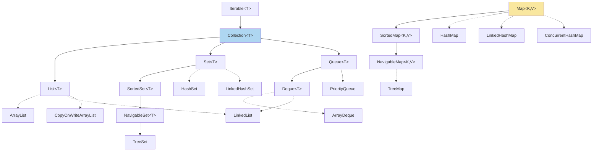
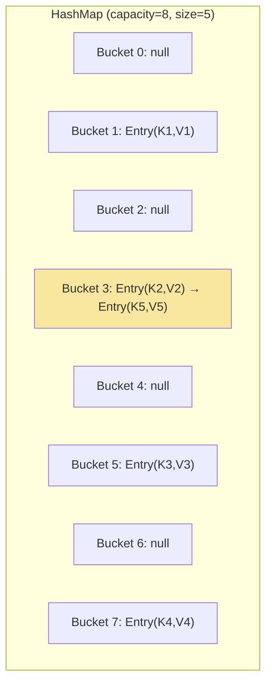
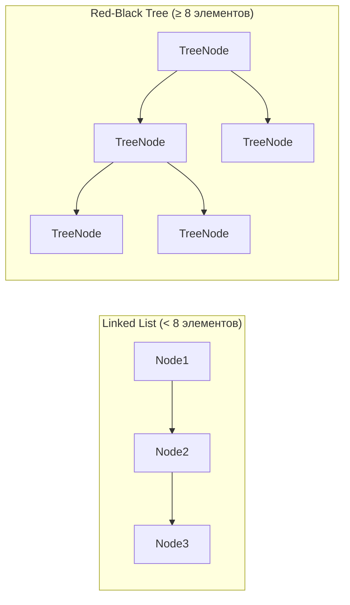
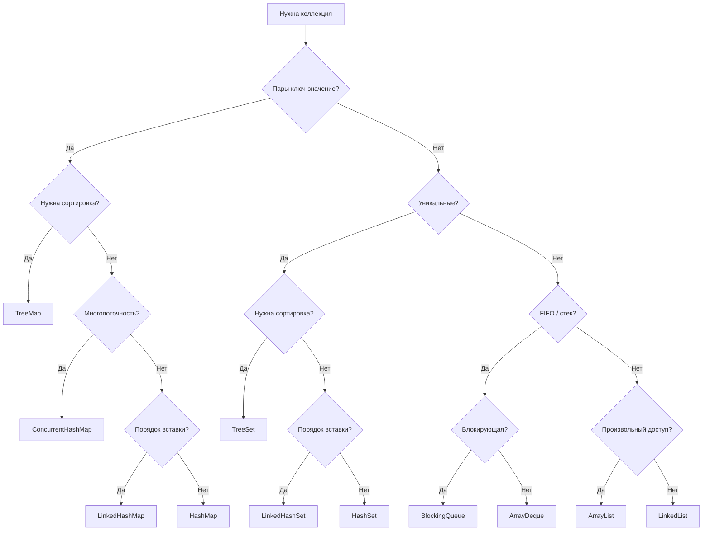

# Вопросы на собеседовании: `Java Collections`

Комплексное руководство по вопросам собеседования на тему `Java Collections Framework` для `Senior Java Developer`. Включает детальные объяснения концепций, практические примеры на `Java`, `mermaid`-диаграммы, best practices и troubleshooting.

## Полезные ссылки

### Официальная документация

- [Java Collections Framework Documentation](https://docs.oracle.com/en/java/javase/17/docs/api/java.base/java/util/package-summary.html)
- [Java API Documentation](https://docs.oracle.com/en/java/javase/17/docs/api/)
- [Java Collections Interview Questions — Baeldung](https://www.baeldung.com/java-collections-interview-questions) — вопросы с ответами по Collections Framework
- [The Java HashMap Under the Hood — Baeldung](https://www.baeldung.com/java-hashmap-advanced) — внутреннее устройство HashMap
- [Java HashMap Load Factor — Baeldung](https://www.baeldung.com/java-hashmap-load-factor) — load factor и rehashing
- [Guide to the Java Queue Interface — Baeldung](https://www.baeldung.com/java-queue) — очереди: PriorityQueue, ArrayDeque, BlockingQueue

## Содержание

- [Полезные ссылки](#полезные-ссылки)
- [See also](#see-also)

**Иерархия и основные интерфейсы**
- [Q1. (!) Опишите иерархию типов Collection](#q1--опишите-иерархию-типов-collection)
- [Q2. (!) Реализации Collection и оценка их быстродействия](#q2--реализации-collection-и-оценка-их-быстродействия)
- [Q3. (!) Что такое Map и чем отличается от Collection?](#q3--что-такое-map-и-чем-отличается-от-collection)
- [Q4. Как выбрать между List, Set и Map?](#q4-как-выбрать-между-list-set-и-map)
- [Q5. Что такое интерфейс Iterable и как он связан с Collection?](#q5-что-такое-интерфейс-iterable-и-как-он-связан-с-collection)

**List (ArrayList, LinkedList)**
- [Q6. (!) В чем разница между LinkedList и ArrayList?](#q6--в-чем-разница-между-linkedlist-и-arraylist)
- [Q7. Как работает автоматическое расширение ArrayList?](#q7-как-работает-автоматическое-расширение-arraylist)
- [Q8. Что такое CopyOnWriteArrayList?](#q8-что-такое-copyonwritearraylist)
- [Q9. В чём разница между List.of() и Arrays.asList()?](#q9-в-чём-разница-между-listof-и-arraysaslist)

**Set (HashSet, TreeSet, LinkedHashSet)**
- [Q10. (!) В чем разница между HashSet и TreeSet?](#q10--в-чем-разница-между-hashset-и-treeset)
- [Q11. Что такое LinkedHashSet и когда его использовать?](#q11-что-такое-linkedhashset-и-когда-его-использовать)

**Map (HashMap, TreeMap, LinkedHashMap)**
- [Q12. (!) Что такое HashMap и как он устроен внутри?](#q12--что-такое-hashmap-и-как-он-устроен-внутри)
- [Q13. (!) Что происходит при коллизиях в HashMap и как работает treeification?](#q13--что-происходит-при-коллизиях-в-hashmap-и-как-работает-treeification)
- [Q14. (!) Какова цель параметров initialCapacity и loadFactor?](#q14--какова-цель-параметров-initialcapacity-и-loadfactor)
- [Q15. (!) Что такое ConcurrentHashMap и чем отличается от HashMap?](#q15--что-такое-concurrenthashmap-и-чем-отличается-от-hashmap)
- [Q16. (!) Контракт equals и hashCode для ключей Map](#q16--контракт-equals-и-hashcode-для-ключей-map)
- [Q17. Что такое TreeMap и какая сложность операций?](#q17-что-такое-treemap-и-какая-сложность-операций)
- [Q18. В чём разница между HashMap и LinkedHashMap?](#q18-в-чём-разница-между-hashmap-и-linkedhashmap)
- [Q19. Как реализовать LRU-кэш на LinkedHashMap?](#q19-как-реализовать-lru-кэш-на-linkedhashmap)
- [Q20. Что такое WeakHashMap?](#q20-что-такое-weakhashmap)
- [Q21. Что такое IdentityHashMap?](#q21-что-такое-identityhashmap)
- [Q22. В чём разница между Collections.synchronizedMap и ConcurrentHashMap?](#q22-в-чём-разница-между-collectionssynchronizedmap-и-concurrenthashmap)
- [Q23. Какие методы Java 8+ добавлены в Map?](#q23-какие-методы-java-8-добавлены-в-map)

**Queue и Deque**
- [Q24. Что такое Queue и какие реализации?](#q24-что-такое-queue-и-какие-реализации)
- [Q25. Что такое Deque и когда использовать?](#q25-что-такое-deque-и-когда-использовать)
- [Q26. (!) Что такое BlockingQueue и паттерн producer-consumer?](#q26--что-такое-blockingqueue-и-паттерн-producer-consumer)
- [Q27. В чём разница между ArrayDeque и LinkedList?](#q27-в-чём-разница-между-arraydeque-и-linkedlist)

**Enum коллекции**
- [Q28. Что такое EnumSet и EnumMap?](#q28-что-такое-enumset-и-enummap)

**Итераторы и модификация**
- [Q29. (!) В чем разница между fail-fast и fail-safe итераторами?](#q29--в-чем-разница-между-fail-fast-и-fail-safe-итераторами)
- [Q30. Как итерировать и удалять элементы?](#q30-как-итерировать-и-удалять-элементы)
- [Q31. Что такое Spliterator?](#q31-что-такое-spliterator)
- [Q32. Что такое ConcurrentModificationException?](#q32-что-такое-concurrentmodificationexception)

**Сортировка и сравнение**
- [Q33. (!) Как использовать Comparable и Comparator?](#q33--как-использовать-comparable-и-comparator)
- [Q34. Какие алгоритмы сортировки используются в Java?](#q34-какие-алгоритмы-сортировки-используются-в-java)

**Immutable коллекции и утилиты**
- [Q35. Что такое Collections.unmodifiableList?](#q35-что-такое-collectionsunmodifiablelist)
- [Q36. (!) Что такое Immutable коллекции в Java 9+?](#q36--что-такое-immutable-коллекции-в-java-9)
- [Q37. Какие утилитные методы предоставляет класс Collections?](#q37-какие-утилитные-методы-предоставляет-класс-collections)

**Практические вопросы**
- [Q38. Почему нельзя использовать мутабельные объекты как ключи HashMap?](#q38-почему-нельзя-использовать-мутабельные-объекты-как-ключи-hashmap)
- [Q39. Как выбрать правильную коллекцию для конкретной задачи?](#q39-как-выбрать-правильную-коллекцию-для-конкретной-задачи)
- [Q40. Какие коллекции из сторонних библиотек стоит знать?](#q40-какие-коллекции-из-сторонних-библиотек-стоит-знать)
- [Q41. (!) Что такое `SequencedCollection`, `SequencedSet`, `SequencedMap` (Java 21)?](#q41--что-такое-sequencedcollection-sequencedset-sequencedmap-java-21)

**Продвинутые коллекции**
- [Q42. (!) Как устроен `ConcurrentHashMap` изнутри и почему он быстрее `Hashtable`?](#q42--как-устроен-concurrenthashmap-изнутри-и-почему-он-быстрее-hashtable)
- [Q43. (!) Как реализовать LRU-кэш на `LinkedHashMap`?](#q43--как-реализовать-lru-кэш-на-linkedhashmap)
- [Q44. Что такое `NavigableMap` и как использовать методы навигации `TreeMap`?](#q44-что-такое-navigablemap-и-как-использовать-методы-навигации-treemap)
- [Q45. Что такое `PriorityQueue` и как реализовать кастомный порядок?](#q45-что-такое-priorityqueue-и-как-реализовать-кастомный-порядок)
- [Q46. Что такое `WeakHashMap` и когда его использовать?](#q46-что-такое-weakhashmap-и-когда-его-использовать)

---

## Q1. (!) Опишите иерархию типов `Collection`

Иерархия типов `Collection` в `Java` центрируется вокруг интерфейса `Iterable`, от которого наследуется `Collection` — базовый интерфейс, описывающий основные операции: добавление, удаление, проверка наличия элемента и перебор.



Основные ветви:

- **`List`** — упорядоченная последовательность с дубликатами и индексированным доступом
- **`Set`** — хранит только уникальные элементы
- **`Queue`/`Deque`** — очереди (`FIFO`) и двусторонние очереди
- **`Map`** — пары ключ-значение; **не** наследуется от `Collection`

| Интерфейс | Порядок элементов | Дубликаты | Индекс/ключ | Основное применение |
|-----------|-------------------|-----------|-------------|---------------------|
| `List` | Порядок вставки | Да | По индексу | Упорядоченные данные |
| `Set` | Нет (кроме `LinkedHashSet`, `TreeSet`) | Нет | Нет | Уникальные элементы |
| `Queue` | `FIFO` | Да | Нет | Очереди задач |
| `Deque` | Двунаправленный | Да | Нет | Стеки и двусторонние очереди |
| `Map` | Нет (кроме `LinkedHashMap`, `TreeMap`) | Нет (ключи) | По ключу | Пары ключ-значение |

> [!mcq]
> - [ ] `Map` расширяет `Collection`, потому что является частью Collections Framework и содержит метод `size()`, общий для всех коллекций. | Совпадение сигнатуры `size()` — не наследование; в JDK `Map` объявлен отдельно от `Collection`, его базовая единица — пара `Map.Entry<K,V>`, не одиночный элемент `E`. ❌ ПОСЛЕДСТВИЕ: разработчик пишет утилиту `<C extends Collection<?>> void process(C c)` ожидая принять Map — компилятор отвергает, приходится дублировать сигнатуры с разной логикой.
> - [ ] `Queue` не расширяет `Collection`, потому что работает с FIFO-семантикой, несовместимой с методом `add(E)`. | `Queue` расширяет `Collection`; FIFO реализован через `offer(E)`/`poll()`/`peek()` поверх унаследованного API. ❌ ПОСЛЕДСТВИЕ: разработчик помечает Queue-параметр как `Collection<? extends T>` и удивляется на отладке порядку — Collection не гарантирует FIFO в обходе, а Queue (через `iterator`) — гарантирует только для конкретных реализаций.
> - [ ] `Deque` не расширяет `Collection`, потому что добавляет методы `addFirst`/`addLast`, нарушающие контракт `add(E)` базового интерфейса. | `Deque` расширяет `Queue`, который расширяет `Collection`; `addFirst`/`addLast` — дополнения, не отмена `add(E)`. ❌ ПОСЛЕДСТВИЕ: разработчик пишет helper для Collection и отказывается принимать Deque «по принципу» — теряет универсальность API, в команде появляются duplicate utility-методы.
> - [x] `Map` не расширяет `Collection`, потому что оперирует парами `Map.Entry<K,V>`, а не одиночными элементами типа `E` — у него нет единственного типового параметра `E` для `add(E)`. | Попытка сделать `Map<K,V>` подтипом `Collection<E>` создала бы неразрешимую коллизию: какой тип подставить в `E`? `K`, `V`, или `Entry`? ✓ ПРИМЕНЯТЬ: общий API над Map и Collection — две сигнатуры (или `Map.entrySet()` для итерации); generic `<C extends Collection<?>>` намеренно не охватывает Map. 📋 ПРАВИЛО: «Map = K+V пары; Collection = E единиц; разные базовые интерфейсы — это by design». 🔗 См. Q3 (Map vs Collection), Q15 (ConcurrentHashMap), Q16 (equals/hashCode для Map keys).

> [!mcq]
> - [ ] `SortedSet` расширяет `List`, потому что поддерживает упорядоченный обход через итератор. | `SortedSet` расширяет `Set`, не `List`; упорядоченность означает сортировку по `compareTo`/`Comparator`, а не индексированный доступ по позиции. ❌ ПОСЛЕДСТВИЕ: разработчик пытается `sortedSet.get(0)` ожидая `O(1)` доступ — компилятор отвергает, заменяет на `iterator().next()`, путает с `List` API; рефакторинг ломает тесты.
> - [ ] `NavigableSet` расширяет `List`, потому что предоставляет навигацию по индексу через методы `floor()` и `ceiling()`. | `floor()`/`ceiling()` ищут ближайший элемент по **значению**, а не по индексу; `NavigableSet` расширяет `SortedSet`. ❌ ПОСЛЕДСТВИЕ: разработчик путает «навигацию по значению» (find element close to X) и «навигацию по индексу» — пишет binary search через `floor`-цикл вместо `Collections.binarySearch` на `List`, теряет производительность.
> - [ ] `Deque` расширяет `List`, потому что поддерживает доступ к элементам с обоих концов аналогично `ArrayList`. | `Deque` расширяет `Queue`; доступ к концевым элементам ≠ произвольный по индексу: есть `peekFirst`/`peekLast`, но нет `get(i)`. ❌ ПОСЛЕДСТВИЕ: разработчик ожидает `deque.get(5)` — нет в API, конвертирует в List через `new ArrayList<>(deque)`, теряет O(n) на каждый «доступ» в hot path.
> - [x] Цепочка `Set → SortedSet → NavigableSet`: `SortedSet` добавляет `first()`/`last()`/`subSet()`, `NavigableSet` добавляет `lower()`/`floor()`/`ceiling()`/`higher()`; `TreeSet` реализует `NavigableSet`. | Иерархия зафиксирована в `java.util` JDK: каждый шаг — расширение API навигации над сортированными элементами. ✓ ПРИМЕНЯТЬ: `TreeSet.floor(target)` для «ближайшего меньше или равного» — rate-limiting (timestamps), price-tier matching, time-series queries. 📋 ПРАВИЛО: «Set → SortedSet → NavigableSet — три уровня API: членство → сортировка → навигация по диапазонам». 🔗 См. Q10 (HashSet vs TreeSet), Q17 (TreeMap), Q44 (NavigableMap).

## Q2. (!) Реализации `Collection` и оценка их быстродействия

Понимание временной сложности критически важно для выбора коллекции — это один из самых частых вопросов на собеседованиях.

| Реализация | get/contains | add | remove | Итерация | Внутренняя структура |
|------------|-------------|-----|--------|----------|---------------------|
| `ArrayList` | `O(1)` / `O(n)` | `O(1)`* | `O(n)` | `O(n)` | Динамический массив |
| `LinkedList` | `O(n)` | `O(1)` | `O(1)`** | `O(n)` | Двусвязный список |
| `HashSet` | `O(1)` | `O(1)` | `O(1)` | `O(n)` | `HashMap` внутри |
| `TreeSet` | `O(log n)` | `O(log n)` | `O(log n)` | `O(n)` | Красно-чёрное дерево |
| `LinkedHashSet` | `O(1)` | `O(1)` | `O(1)` | `O(n)` | `HashMap` + двусвязный список |
| `HashMap` | `O(1)` | `O(1)` | `O(1)` | `O(n)` | Массив bucket'ов |
| `TreeMap` | `O(log n)` | `O(log n)` | `O(log n)` | `O(n)` | Красно-чёрное дерево |
| `PriorityQueue` | `O(n)` | `O(log n)` | `O(log n)` | `O(n)` | Двоичная куча |
| `ArrayDeque` | `O(n)` | `O(1)` | `O(1)` | `O(n)` | Циклический массив |
| `EnumSet` | `O(1)` | `O(1)` | `O(1)` | `O(n)` | Битовая маска |

\* амортизированно, \*\* при удалении из начала/конца

> На собеседовании важно не просто назвать сложность, а объяснить **почему** — связать с внутренней структурой данных.

> [!mcq]
> - [ ] `LinkedList.get(index)` — `O(1)`, потому что двусвязный список хранит указатели на начало и конец, доступ по индексу оптимизирован через середину. | Даже с оптимизацией «начать с ближайшего конца» сложность остаётся `O(n/2)` ⇒ асимптотически `O(n)`; произвольный доступ за `O(1)` — привилегия массивов. ❌ ПОСЛЕДСТВИЕ: разработчик использует `LinkedList` для `for(i=0; i<list.size(); i++) list.get(i)` — работа `O(n²)` вместо `O(n)`; на 10K элементов время растёт с миллисекунд до секунд, latency p99 пробивает SLA.
> - [ ] `HashSet.contains()` — `O(log n)`, потому что внутри использует `TreeMap` для хранения элементов в отсортированном порядке. | `HashSet` использует `HashMap`, не `TreeMap`; `O(log n)` — это `TreeSet` (на `TreeMap`); `HashSet` даёт `O(1)` среднюю через хэширование. ❌ ПОСЛЕДСТВИЕ: разработчик меняет `HashSet → TreeSet` ради «упорядоченного обхода» в hot path — каждый `contains` стал `O(log n)` против `O(1)`, throughput падает на 30% в дашборде нагрузочных тестов.
> - [ ] `PriorityQueue.peek()` — `O(log n)`, потому что каждый просмотр требует частичного обхода кучи. | `peek()` возвращает корень кучи — элемент `queue[0]`, без обхода: `O(1)`; `O(log n)` стоят только `poll()`/`offer()`, меняющие структуру кучи. ❌ ПОСЛЕДСТВИЕ: разработчик кэширует `peek()` в переменную «для оптимизации» — добавляет inconsistency между cached value и реальной head очереди при concurrent push, ловит баг только под нагрузкой.
> - [x] `LinkedList.get(index)` — `O(n)`: каждый узел хранит только ссылки на соседей, для доступа нужно пройти цепочку от ближайшего конца. | Отсутствие индексированного хранилища — фундаментальное свойство связанного списка; JDK оптимизирует `if (index < size/2)` start, иначе end — но это всё равно `O(n/2) = O(n)`. ✓ ПРИМЕНЯТЬ: `LinkedList` оправдан только при интенсивном `addFirst`/`removeFirst` или использовании как `Deque`; для random-access всегда `ArrayList`. 📋 ПРАВИЛО: «list.get(i) cost: ArrayList = O(1) constant; LinkedList = O(n/2) walk». 🔗 См. Q6 (LinkedList vs ArrayList), Q27 (ArrayDeque vs LinkedList).

> [!mcq]
> - [ ] `ArrayList.add(element)` в конец — `O(n)`, потому что при каждой вставке массив сдвигается. | Сдвиг происходит только при `add(index, e)` в середину; вставка в конец не требует сдвига — элемент занимает первую свободную ячейку. ❌ ПОСЛЕДСТВИЕ: разработчик отказывается от `ArrayList` в стриминговых обработчиках «из-за O(n) на add», заменяет на `LinkedList` — на самом деле теряет производительность из-за GC давления от Node-объектов.
> - [ ] `HashMap.get(key)` — `O(log n)` из-за treeification бакетов начиная с Java 8. | `O(log n)` — худший случай внутри одного бакета при длинной цепочке (≥8 элементов); средний случай по всей таблице остаётся `O(1)` благодаря равномерному распределению hash. ❌ ПОСЛЕДСТВИЕ: разработчик отказывается от `HashMap` в пользу `TreeMap` «из-за treeification» — теряет log(n) на каждой операции, в hot path latency p99 удваивается.
> - [ ] `TreeSet.add(element)` — `O(1)` амортизированно, потому что красно-чёрное дерево самобалансируется и большинство вставок не требуют ротаций. | Балансировка не делает дерево константным; каждая вставка требует обхода от корня до листа — `O(log n)` — независимо от частоты ротаций. ❌ ПОСЛЕДСТВИЕ: разработчик ожидает `O(1)` для bulk-insert 1M элементов в TreeSet — реально получает `O(n log n)` = десятки секунд, профайлер показывает hotspot в `TreeMap.fixAfterInsertion`.
> - [x] `ArrayList.add(element)` в конец — `O(1)` амортизированно: большинство вставок пишут в готовую ячейку, редкое расширение `O(n)` «размазывается» по многим операциям. | За n вставок суммарная стоимость расширений — `O(n)`, среднее `O(1)` на операцию; рост массива в 1.5 раза балансирует память и копирования. ✓ ПРИМЕНЯТЬ: для bulk-вставки заранее известного размера — `new ArrayList<>(expectedSize)` для устранения расширений; `addAll(Collection)` оптимизирован на массовую вставку. 📋 ПРАВИЛО: «ArrayList.add = O(1) amortized: 1.5× growth strategy экономит копирования». 🔗 См. Q7 (расширение ArrayList), Q14 (initialCapacity HashMap).

## Q3. (!) Что такое `Map` и чем отличается от `Collection`?

Интерфейс `Map` представляет отображение ключ-значение. Каждый ключ уникален, значения могут повторяться. `Map` **не наследуется** от `Collection`, потому что работает с парами, а не с отдельными элементами.

```java
Map<String, Integer> scores = new HashMap<>();
scores.put("Alice", 95);
scores.put("Bob", 87);
scores.putIfAbsent("Alice", 100); // Не перезапишет, ключ уже есть

// Итерация по Map
for (Map.Entry<String, Integer> entry : scores.entrySet()) {
    System.out.println(entry.getKey() + " -> " + entry.getValue());
}

// Получение представлений (views) — связь с Collection
Set<String> keys = scores.keySet();           // Set ключей
Collection<Integer> values = scores.values(); // Collection значений
Set<Map.Entry<String, Integer>> entries = scores.entrySet(); // Set пар
```

| Реализация | Порядок | Производительность | `null` ключи | Потокобезопасность |
|------------|---------|-------------------|-------------|-------------------|
| `HashMap` | Не гарантирован | `O(1)` | Да (один) | Нет |
| `TreeMap` | Отсортированный | `O(log n)` | Нет | Нет |
| `LinkedHashMap` | Порядок вставки | `O(1)` | Да | Нет |
| `ConcurrentHashMap` | Не гарантирован | `O(1)` | **Нет** | Да |

> [!mcq]
> - [ ] `Map` не наследуется от `Collection`, потому что его размер ограничен — пары ключ-значение занимают вдвое больше памяти, поэтому потребовался отдельный интерфейс. | Причина не в памяти; `HashMap` может хранить любое количество пар. Разделение интерфейсов — семантическое, не техническое. ❌ ПОСЛЕДСТВИЕ: разработчик ожидает «лимит» Map по памяти и пишет защитный resize-код вместо нормального capacity planning, в production видит unbounded grow.
> - [ ] `Map` не наследуется от `Collection`, потому что не поддерживает итерацию — у него нет метода `iterator()` и он не реализует `Iterable`. | У `Map` есть итерируемые views: `keySet()`, `values()`, `entrySet()` — все они `Iterable`. Сам `Map` действительно не является `Iterable`, но не из-за отсутствия итерации. ❌ ПОСЛЕДСТВИЕ: разработчик пишет boilerplate `for (Map.Entry e : map.entrySet())` думая что без него никак — теряет JDK 8+ методы `forEach((k,v) -> ...)` и `compute*` API.
> - [ ] `Map` не наследуется от `Collection`, потому что не допускает дубликаты ключей, тогда как `Collection` дубликаты разрешает. | Дубликаты разрешает `List`, но не `Set` — а `Set` это `Collection`. Отсутствие дубликатов — не причина быть вне иерархии `Collection`. ❌ ПОСЛЕДСТВИЕ: разработчик думает «Map = Set по природе», использует `keySet()` где можно работать с `entrySet()` — лишний lookup на каждое значение.
> - [x] `Map` не наследуется от `Collection`, потому что работает с парами ключ-значение, а не с отдельными элементами — его структурная единица `Map.Entry<K,V>`, а не `E`. | Попытка наследования создала бы коллизию типов: у `Collection<E>` есть `add(E)`, а у `Map<K,V>` нет единственного `E` — есть `K` и `V` одновременно. ✓ ПРИМЕНЯТЬ: при дизайне generic API над Map и Collection — две сигнатуры либо `Map.entrySet()` для итерации в едином `Stream<Entry<K,V>>`. 📋 ПРАВИЛО: «Map = K+V пары; Collection = E единиц; разные базовые интерфейсы — это by design». 🔗 См. Q1 (иерархия), Q15 (ConcurrentHashMap), Q16 (equals/hashCode для Map keys).

> [!mcq]
> - [ ] `HashMap`, `TreeMap`, `LinkedHashMap` и `ConcurrentHashMap` ведут себя одинаково с `null`-ключом — допускают ровно один | Поведение разное: `HashMap`/`LinkedHashMap` разрешают `null`-ключ, `TreeMap` бросает `NPE` (нельзя сравнить через `Comparable`), `ConcurrentHashMap` бросает `NPE` намеренно. ❌ ПОСЛЕДСТВИЕ: миграция кэша с `HashMap` на `ConcurrentHashMap` падает в проде на первом же `null`-ключе после нагрузочного теста.
> - [x] Только `HashMap` и `LinkedHashMap` разрешают `null`-ключ; `TreeMap` бросает `NPE` из-за `Comparable.compareTo`, а `ConcurrentHashMap` запрещает `null` намеренно для устранения неоднозначности `get()=null` | `TreeMap` сортирует ключи через `compareTo` — `null.compareTo(x)` невозможен. `ConcurrentHashMap` не позволяет различить «ключ отсутствует» и «значение `null`» в конкурентном контексте. ✓ ПРИМЕНЯТЬ: для `ConcurrentHashMap` использовать sentinel-объект вместо `null`. 🔑 МНЕМОНИКА: «Hash/Linked — null OK, Tree/Concurrent — NPE». 🔗 См. Q15 (ConcurrentHashMap), Q17 (TreeMap).
> - [ ] Все четыре реализации запрещают `null`-ключ — это требование интерфейса `Map` | Интерфейс `Map` оставляет поведение `null`-ключа на усмотрение реализации. `HashMap` хранит `null`-ключ в bucket `0`. ❌ ПОСЛЕДСТВИЕ: разработчик добавляет `Objects.requireNonNull` для всех ключей в обёртке над `HashMap`, ломая существующий код, который полагался на `null`-ключ как маркер «default value».
> - [ ] `ConcurrentHashMap` разрешает `null`-значения, но не `null`-ключи — асимметричное ограничение | Запрещены симметрично — и ключи, и значения. Причина одинакова: `get(k)=null` неотличимо от «ключа нет». ❌ ПОСЛЕДСТВИЕ: код вида `map.put(key, computeOrNull())` падает с `NPE` после миграции на `ConcurrentHashMap`, и причина не очевидна по stacktrace.

## Q4. Как выбрать между `List`, `Set` и `Map`?

Выбор коллекции определяется семантикой данных:

- **`List`** — важен порядок, допускаются дубликаты, нужен индексированный доступ: история событий, очередь сообщений, результаты запроса
- **`Set`** — нужна уникальность и быстрая проверка наличия: уникальные ID, фильтрация дубликатов, теги
- **`Map`** — пары ключ-значение с быстрым поиском по ключу: кэши, словари, индексы

```java
// List — последовательность с возможными дубликатами
List<String> history = new ArrayList<>();

// Set — уникальные элементы
Set<String> uniqueIds = new HashSet<>();

// Map — поиск по ключу
Map<String, User> userCache = new HashMap<>();
```

Дополнительно учитывайте: нужен ли порядок (`LinkedHashSet` vs `HashSet`), нужна ли сортировка (`TreeSet`/`TreeMap`), нужна ли потокобезопасность (`ConcurrentHashMap`, `CopyOnWriteArrayList`).

> [!mcq]
> - [ ] Для уникальных идентификаторов с быстрой проверкой `contains()` нужно использовать `List` — он сохраняет порядок и предоставляет индексированный доступ | `List.contains()` работает за O(n) — линейный скан; для уникальности и быстрого поиска нужен `Set` (O(1) для `HashSet`). ❌ ПОСЛЕДСТВИЕ: проверка дубликатов в списке на 100k элементов — O(n²) при batch-загрузке; импорт CSV растягивается с 1 секунды до 10 минут.
> - [ ] Для пар ключ-значение лучше использовать два параллельных `List` (`keys` и `values`) — это быстрее, чем `Map`, потому что нет hash-вычислений | Два `List` дают O(n) на поиск через `indexOf` + `get`; `HashMap` даёт O(1). К тому же синхронизация двух коллекций — источник багов. ❌ ПОСЛЕДСТВИЕ: при удалении из одного списка забывают удалить из другого → ключи и значения рассогласованы, поиск по ключу возвращает чужое значение.
> - [ ] Если порядок важен, используйте `HashSet` — он сохраняет порядок вставки благодаря `LinkedHashMap` внутри | Порядок вставки сохраняет `LinkedHashSet`, не `HashSet`. `HashSet` не гарантирует никакого порядка. ❌ ПОСЛЕДСТВИЕ: тесты проходят локально (порядок «случайно» совпадает с insertion order на small dataset), на проде с большим heap порядок меняется → integration test fails только в pipeline.
> - [x] `List` — порядок и дубликаты с индексированным доступом; `Set` — уникальность и быстрый `contains()`; `Map` — поиск по ключу за O(1); семантика данных диктует выбор | Если важен порядок последовательности и дубликаты — `List`; если уникальность — `Set`; если ключ→значение — `Map`. ✓ ПРИМЕНЯТЬ: history of events → `ArrayList`; tags → `HashSet`; user cache by id → `HashMap`; для concurrent доступа — `ConcurrentHashMap`. 📋 ПРАВИЛО: «семантика → выбор: порядок=List, уникальность=Set, ключ→значение=Map». 🔗 См. Q5 (Iterable), Q39 (выбор коллекции).

## Q5. Что такое интерфейс `Iterable` и как он связан с `Collection`?

`Iterable<T>` — корневой интерфейс иерархии коллекций. Единственный абстрактный метод `iterator()` возвращает `Iterator<T>`. Любой объект, реализующий `Iterable`, может использоваться в enhanced `for-loop`:

```java
public interface Iterable<T> {
    Iterator<T> iterator();

    // default-методы (Java 8+)
    default void forEach(Consumer<? super T> action) { ... }
    default Spliterator<T> spliterator() { ... }
}
```

`Collection` расширяет `Iterable` и добавляет методы работы с группами элементов: `size()`, `add()`, `remove()`, `contains()`, `stream()` и др. Подробнее о стримах — в [вопросах по Java Stream API](java-stream-interview.md).

> [!mcq]
> - [ ] `Iterable<T>` содержит единственный абстрактный метод `forEach(Consumer<? super T> action)` — именно он используется в enhanced `for-loop` под капотом. | `forEach()` — это **default**-метод (Java 8+), не абстрактный; единственный абстрактный метод `Iterable` — это `iterator()`. Enhanced `for-loop` компилируется в вызов `iterator()`. ❌ ПОСЛЕДСТВИЕ: разработчик переопределяет `forEach` ожидая, что enhanced for-loop вызовет переопределение — на самом деле компилятор раскрывает в `iterator()`, кастомная логика игнорируется в обычном `for(T t : coll)`.
> - [ ] `Iterable<T>` содержит единственный абстрактный метод `spliterator()` — именно он позволяет коллекциям работать в параллельных стримах. | `spliterator()` — default-метод в `Iterable` с реализацией по умолчанию через `iterator()`; не абстрактный, и параллельные стримы работают через него, но не он определяет контракт. ❌ ПОСЛЕДСТВИЕ: разработчик пишет custom-Iterable для high-perf parallel stream обходясь без override `spliterator()` — получает default impl поверх `iterator()` без `SUBSIZED`/`ORDERED` characteristics, parallel-stream деградирует до single-threaded.
> - [ ] `Iterable<T>` содержит единственный абстрактный метод `hasNext()`, возвращающий `boolean` — отсюда работает проверка границ в `for-each`. | `hasNext()` — метод `Iterator<T>`, не `Iterable<T>`; это два разных интерфейса: `Iterable` создаёт итератор, `Iterator` управляет обходом. ❌ ПОСЛЕДСТВИЕ: разработчик пытается override `hasNext` в custom-Iterable — компилятор не находит метод, добавляется метод-двойник, но enhanced for-loop его не использует, баг становится невидимым.
> - [x] `Iterable<T>` содержит единственный абстрактный метод `iterator()`, возвращающий `Iterator<T>`. Именно его вызывает JVM при входе в enhanced `for-loop`. | `forEach()` и `spliterator()` — default-методы Java 8+; контракт `Iterable` определяется только через `iterator()`. ✓ ПРИМЕНЯТЬ: для своих коллекций — реализовать `iterator()` минимум; `spliterator()` только при необходимости parallel-stream поддержки; `forEach()` — для оптимизации enhanced-for через специальную логику. 📋 ПРАВИЛО: «Iterable.iterator() — единственный абстрактный; forEach/spliterator — default Java 8+». 🔗 См. Q1 (иерархия), Q29 (fail-fast vs fail-safe iterator), Q31 (Spliterator).

## Q6. (!) В чем разница между `LinkedList` и `ArrayList`?

| Операция | `ArrayList` | `LinkedList` |
|----------|-----------|------------|
| Доступ по индексу (`get`) | `O(1)` | `O(n)` |
| Вставка в конец (`add`) | `O(1)` амортизированно | `O(1)` |
| Вставка в начало (`addFirst`) | `O(n)` | `O(1)` |
| Вставка в середину | `O(n)` | `O(n)` |
| Удаление из начала | `O(n)` | `O(1)` |
| Удаление из середины | `O(n)` | `O(n)` |
| Память на элемент | ~4 байта (ссылка) | ~24 байта (узел + 2 ссылки) |

`ArrayList` основан на **динамическом массиве** — элементы лежат последовательно в памяти, что обеспечивает отличную локальность данных и эффективное использование CPU-кэша. `LinkedList` — **двусвязный список**, узлы могут быть разбросаны по памяти.

```java
// ArrayList — быстрый произвольный доступ
List<String> arrayList = new ArrayList<>();
arrayList.add("First");
arrayList.add("Second");
String first = arrayList.get(0); // O(1)

// LinkedList — быстрые операции в начале/конце
LinkedList<String> linkedList = new LinkedList<>();
linkedList.addFirst("Zero"); // O(1)
linkedList.removeLast();     // O(1)
```

> **Практический совет:** `ArrayList` предпочтительнее в 95% случаев. `LinkedList` оправдан только при интенсивных вставках/удалениях в начале списка и использовании как `Deque`.

> [!mcq]
> - [ ] `LinkedList.get(0)` — `O(1)`, потому что `LinkedList` хранит указатель на первый узел и возвращает его напрямую | Действительно, `getFirst()` — это `O(1)`. Но `get(0)` вызывается через `get(int index)`, который проверяет индекс и вызывает обход. Хотя JVM оптимизирует граничные случаи, формально `get(index)` — `O(n)`.
> - [ ] `ArrayList.get(0)` — `O(n)`, потому что динамический массив должен пересчитать все смещения при каждом доступе | Динамический массив хранит элементы последовательно; доступ по индексу — это одно разыменование указателя `elementData[index]`. Пересчёт смещений не нужен.
> - [x] `ArrayList.get(index)` — `O(1)`, а `LinkedList.get(index)` — `O(n)`. Причина: `ArrayList` хранит элементы в массиве с прямой адресацией, `LinkedList` требует обхода цепочки узлов | Это фундаментальное различие массива и связанного списка. Для random-access нагрузки `ArrayList` всегда быстрее `LinkedList` в десятки раз, несмотря на одинаковую асимптотику для других операций.
> - [ ] `LinkedList.get(index)` — `O(log n)`, потому что JVM оптимизирует обход, начиная с ближайшего конца — либо с начала, либо с конца | Оптимизация «с ближайшего конца» даёт `O(n/4)` в среднем, что асимптотически по-прежнему `O(n)`. `O(log n)` — это бинарное дерево, а не связанный список.

> [!mcq]
> - [ ] `LinkedList` потребляет меньше памяти, чем `ArrayList`, потому что не выделяет лишние слоты заранее как при расширении динамического массива | `ArrayList` иногда держит лишние слоты, но каждый элемент — 4-8 байт (ссылка). `LinkedList` тратит на каждый узел ~40 байт: объект `Node`, ссылка на значение, ссылки `prev` и `next` — итого в 5-10 раз больше памяти на элемент. Uber встретила это при мониторинге heap.
> - [x] `ArrayList` потребляет меньше памяти, чем `LinkedList`, потому что хранит только ссылки на объекты (~8 байт/элемент), тогда как `LinkedList` создаёт объект `Node` для каждого элемента (~40 байт: 3 ссылки + заголовок объекта) | Это не просто теоретическая разница: на больших списках (миллионы элементов) `LinkedList` создаёт давление на GC. Google заметила: для List из 1M элементов ArrayList = 8MB heap, LinkedList = 64MB. GC pause стал 50ms вместо 5ms.
> - [ ] `ArrayList` потребляет больше памяти, чем `LinkedList`, потому что хранит элементы в матрице двумерного массива для быстрого роста | `ArrayList` — одномерный массив `Object[]`, а не матрица. Никакого двумерного хранения нет. Лишняя память — это только незаполненные слоты после расширения, но их доля быстро уменьшается.
> - [ ] Оба списка потребляют одинаково памяти — ~8 байт на элемент, потому что оба хранят только ссылки на объекты | `ArrayList` хранит только ссылки. `LinkedList` оборачивает каждую ссылку в объект `Node`, добавляя две ссылки `prev`/`next` и заголовок объекта JVM (~16 байт). Разница существенная и видна в production при масштабировании.

## Q7. Как работает автоматическое расширение `ArrayList`?

`ArrayList` хранит элементы в массиве `Object[] elementData`. Начальная ёмкость по умолчанию — **10** (при первом `add`). Когда массив заполнен, происходит расширение:

```java
// Упрощённый алгоритм расширения (из исходников OpenJDK)
int oldCapacity = elementData.length;
int newCapacity = oldCapacity + (oldCapacity >> 1); // Рост на 50%
elementData = Arrays.copyOf(elementData, newCapacity);
```

Ёмкость растёт в **1.5 раза** (не в 2, как часто говорят на собеседовании!). `Arrays.copyOf` создаёт новый массив и копирует элементы — это `O(n)` операция. Поэтому `add()` — `O(1)` **амортизированно**.

Если количество элементов известно заранее, используйте конструктор с начальной ёмкостью:

```java
List<User> users = new ArrayList<>(1000); // Избегаем лишних расширений
```

Метод `trimToSize()` уменьшает массив до фактического размера коллекции, освобождая лишнюю память.

> [!mcq]
> - [ ] Новый массив создаётся вдвое большего размера — `newCapacity = oldCapacity * 2`, это классическое удвоение как в `Vector`, тоже даёт амортизированную `O(1)` для `add()`. | Удвоение использует `Vector` (legacy, потокобезопасный); `ArrayList` выбрал рост на 50% — тоже амортизированно `O(1)`, но экономит память. ❌ ПОСЛЕДСТВИЕ: разработчик пишет в собеседовании «удвоение» — fail на Senior Java позиции; в коде делает свой ArrayList с doubling, тратит лишнюю память на больших списках (10M элементов = 80MB extra heap).
> - [ ] Новый массив создаётся в 1.25 раза больше: `newCapacity = oldCapacity + (oldCapacity >> 2)` — сдвиг вправо на 2 даёт деление на 4, как в `StringBuilder`. | `StringBuilder` действительно использует `+ oldCapacity/2 + 2` (не `>> 2`); `ArrayList` использует именно `>> 1` (деление на 2 = +50%). Путать эти классы — частая ошибка. ❌ ПОСЛЕДСТВИЕ: разработчик копирует «эффективную» формулу в свой List-подобный класс — реально получает 25% growth, что приводит к O(n²) на длинных insertion sequences, а не амортизированному O(1).
> - [ ] Ёмкость увеличивается на фиксированные 10 элементов — ровно столько же, сколько начальная ёмкость по умолчанию. | Фиксированный прирост привёл бы к O(n²) суммарной стоимости `n` операций `add()` — катастрофа для производительности. Пропорциональный рост принципиально важен для амортизированной O(1). ❌ ПОСЛЕДСТВИЕ: разработчик пишет fixed-step list для embedded ради «детерминированности» — на 10K вставок получает 10M операций копирования, latency взрывается.
> - [x] Новый массив в 1.5 раза больше: `newCapacity = oldCapacity + (oldCapacity >> 1)` — побитовый сдвиг вправо на 1 = деление на 2, что и даёт рост на 50%. | Эта формула прописана в исходниках OpenJDK `ArrayList.grow()`; рост в 1.5 раза обеспечивает амортизированную `O(1)` без удвоенного memory overhead. ✓ ПРИМЕНЯТЬ: при capacity-planning для bulk-load `n` элементов — передавать `expectedSize` в конструктор для устранения roundtrip resize; `Arrays.asList` для известного фиксированного массива. 📋 ПРАВИЛО: «ArrayList growth = 1.5× (oldCap + oldCap>>1) — компромисс между memory overhead и количеством resize». 🔗 См. Q2 (сложность операций), Q9 (Arrays.asList).

> [!mcq]
> - [ ] `new ArrayList()` сразу выделяет массив из 10 элементов — это начальная ёмкость по умолчанию, задокументированная в Javadoc | До Java 8 так и было. Начиная с Java 8 была введена «ленивая» инициализация: конструктор без аргументов использует общий пустой массив-синглтон и не тратит память до первого `add()`.
> - [x] `new ArrayList()` использует пустой разделяемый массив-маркер. Реальный массив из 10 элементов выделяется только при первом вызове `add()` — это оптимизация Java 8+ для экономии памяти | Если создать тысячи пустых `ArrayList` (например, как поля объектов), которые так и не заполнятся, никакой памяти под элементы не тратится. Это важная оптимизация в коде с большим количеством объектов.
> - [ ] `new ArrayList()` и `new ArrayList(0)` создают объекты с одинаковым внутренним состоянием и используют один и тот же пустой массив-синглтон | Они используют разные пустые массивы-маркеры: `DEFAULTCAPACITY_EMPTY_ELEMENTDATA` и `EMPTY_ELEMENTDATA`. Это различие влияет на первое расширение: дефолтный список расширяется до 10, а `ArrayList(0)` — до 1.
> - [ ] Начальная ёмкость `ArrayList` по умолчанию всегда равна 0, и каждое `add()` расширяет массив на 1 элемент до порога в 10 | Если бы каждый `add()` создавал новый массив на 1 элемент больше, первые 10 вызовов дали бы 10 копирований вместо одного. JVM батчит первое расширение сразу до 10.

## Q8. Что такое `CopyOnWriteArrayList`?

`CopyOnWriteArrayList` — потокобезопасная реализация `List` из пакета `java.util.concurrent`. При любой модификации (`add`, `set`, `remove`) создаётся **полная копия** внутреннего массива. Итератор работает со снимком на момент создания и **не выбрасывает** `ConcurrentModificationException`.

```java
List<EventListener> listeners = new CopyOnWriteArrayList<>();
listeners.add(new EventListener());

// Итерация безопасна даже при модификации из другого потока
for (EventListener listener : listeners) {
    listener.onEvent(event); // Другой поток может вызвать listeners.add(...)
}
```

**Когда использовать:** редкие записи и частое чтение — списки слушателей, конфигурации, белые списки. **Не использовать:** при частых модификациях или больших коллекциях (каждая запись — `O(n)` копирование). Подробнее о потокобезопасных коллекциях — в [вопросах по Java Concurrency](java-concurrency-interview.md).

> [!mcq]
> - [ ] Итератор `CopyOnWriteArrayList` бросит `ConcurrentModificationException`, потому что список изменился во время обхода. | `ConcurrentModificationException` бросают fail-fast итераторы (`ArrayList`/`HashMap`); у COWAL итератор работает на immutable-снимке и `modCount` не проверяется. ❌ ПОСЛЕДСТВИЕ: разработчик ставит try/catch на CME для COWAL «на всякий случай» — catch никогда не срабатывает, dead code остаётся в production, маскируя реальные ошибки потокобезопасности рядом.
> - [ ] Итератор автоматически увидит новый элемент при следующем вызове `next()`, потому что список обновляет снимок. | Снимок не обновляется после создания итератора; weak consistency — у `ConcurrentHashMap`, не у `CopyOnWriteArrayList`. ❌ ПОСЛЕДСТВИЕ: разработчик надеется получить «свежие» listener-ы при добавлении в loop notification — пропускает только что подписавшийся handler, событие не доходит, баг невидим до проверки логов.
> - [ ] Итератор заблокируется до завершения `add()`, затем продолжит с обновлённым состоянием. | COWAL не использует read-lock — именно отсутствие блокировок чтения и есть главное преимущество перед `Collections.synchronizedList`. ❌ ПОСЛЕДСТВИЕ: разработчик предполагает блокировку и не защищает invariant между чтением и обработкой — UI-код предполагает «во время обхода список не меняется», получает стейл данных от снимка.
> - [x] Итератор `CopyOnWriteArrayList` продолжает работу со снимком на момент его создания; новый элемент из другого потока ему не виден. | При каждой модификации COWAL создаёт новый массив; итератор держит ссылку на старый array-snapshot, оригинал собирается GC после освобождения всех итераторов. ✓ ПРИМЕНЯТЬ: registry слушателей (`Spring ApplicationEventMulticaster`), белые списки IP, редко меняющиеся конфигурации с частым обходом из многих потоков. 📋 ПРАВИЛО: «CopyOnWrite = snapshot iterator + lock-free read; запись копирует весь массив, чтение без блокировок». 🔗 См. Q15 (ConcurrentHashMap), Q22 (synchronizedMap vs ConcurrentHashMap), Q29 (fail-fast vs fail-safe).

## Q9. В чём разница между `List.of()` и `Arrays.asList()`?

| Характеристика | `List.of()` (Java 9+) | `Arrays.asList()` |
|---------------|----------------------|-------------------|
| Изменяемость | Полностью immutable | `set()` работает, `add()`/`remove()` — нет |
| `null` элементы | Запрещены (`NPE`) | Разрешены |
| Связь с массивом | Нет (независимая копия) | Да (`backed` массивом) |
| Память | Оптимизирован (0–2 элемента — спец. классы) | Обёртка над массивом |

```java
// List.of — полностью неизменяемый
List<String> immutable = List.of("a", "b", "c");
immutable.set(0, "x");  // UnsupportedOperationException
immutable.add("d");     // UnsupportedOperationException

// Arrays.asList — частично изменяемый, backed массивом
String[] arr = {"a", "b", "c"};
List<String> backed = Arrays.asList(arr);
backed.set(0, "x");  // OK, arr[0] тоже станет "x"
backed.add("d");     // UnsupportedOperationException
```

> [!mcq]
> - [ ] Напечатает `a` — `Arrays.asList` создаёт независимую копию массива, поэтому `set()` меняет только список, не затрагивая исходный `arr` | Это поведение `new ArrayList<>(Arrays.asList(arr))`, где конструктор копирует. Сам `Arrays.asList()` копии не делает — возвращает view-обёртку над исходным массивом. ❌ ПОСЛЕДСТВИЕ: разработчик «защищает» данные через `Arrays.asList(arr)`, передаёт список в библиотечный код, который вызывает `list.set()` — original массив `arr` молча портится, баг находят через неделю в нагрузочном тесте.
> - [x] Напечатает `x` — `Arrays.asList()` возвращает view поверх исходного массива. Вызов `list.set(0, "x")` напрямую записывает в `arr[0]`, поэтому оба — и список, и массив — показывают изменение | Это один из главных «подводных камней» `Arrays.asList`: список и исходный массив разделяют одно и то же хранилище. Изменения через список видны в массиве и наоборот. ✓ ПРИМЕНЯТЬ: для безопасной передачи массива в API, ожидающее `List` — оборачивать в `new ArrayList<>(Arrays.asList(arr))` или `List.of(arr)`. 📋 ПРАВИЛО: «Arrays.asList — view над массивом; List.of — независимая immutable-копия». 🔗 См. Q35 (unmodifiableList view), Q36 (immutable List.of).
> - [ ] Бросит `UnsupportedOperationException` — `Arrays.asList` возвращает immutable список, и любые изменения запрещены | `UnsupportedOperationException` бросают только `add()`, `remove()` и другие структурные операции, меняющие размер. `set()` на `Arrays.asList` разрешён — он только заменяет элемент. ❌ ПОСЛЕДСТВИЕ: тест проходит локально на полностью запрещённом списке (`List.of`), на проде с `Arrays.asList` ожидаемое исключение не срабатывает — invariant нарушен молча.
> - [ ] Напечатает `x`, но `arr[0]` останется `a` — список хранит копии строк, а не ссылки на элементы массива | Список хранит ссылки, а не копии объектов. `String` — объект, в массиве `arr[0]` лежит ссылка, и именно эту ссылку заменяет `list.set()`. ❌ ПОСЛЕДСТВИЕ: разработчик считает `Arrays.asList` «защитной копией» при сериализации DTO — после `set` в логах видит измененный массив у клиента, security audit фиксирует утечку.

> [!mcq]
> - [ ] `List.of("a", null)` — допустим, потому что `null` означает «элемент отсутствует», а не «значение null», и это семантически валидно | `List.of()` не различает «отсутствие» и `null`-значение — в обоих случаях бросает `NullPointerException` немедленно при вызове конструктора. ❌ ПОСЛЕДСТВИЕ: миграция кода `new ArrayList<>(Arrays.asList(values))` на `List.of(values)` падает на первом же `null` в продакшене — исключение в инициализации Spring-бина, приложение не стартует.
> - [ ] `List.of("a", null)` — допустим, как и в `ArrayList`; `null` разрешён в любом `List` по контракту интерфейса | Интерфейс `List` явно оставляет поведение `null` на усмотрение реализации (см. Javadoc `List.add`). `ArrayList` допускает `null`, `List.of()` — нет. ❌ ПОСЛЕДСТВИЕ: разработчик пишет утилиту `<T> List<T> safe(T... items)` через `List.of`, передаёт коллекцию `Stream.toList()` с возможным `null` — NPE в hot path API.
> - [x] `List.of("a", null)` бросит `NullPointerException` при создании — immutable-коллекции Java 9+ явно запрещают `null` элементы | Это осознанное дизайнерское решение из JEP 269: `null` в immutable-коллекции — источник неоднозначности `containsKey` vs `null`-value. `List.of()`, `Set.of()`, `Map.of()` все fail-fast на `null`. ✓ ПРИМЕНЯТЬ: для DTO с гарантированно-non-null полями — `List.of(value)` как защита на уровне типов; для возможных `null` — `Arrays.asList()` или `Collections.unmodifiableList(new ArrayList<>(...))`. 📋 ПРАВИЛО: «of() = no nulls, no dupes, no mutations — три fail-fast гарантии Java 9+». 🔗 См. Q36 (Immutable Java 9+), Q15 (ConcurrentHashMap null).
> - [ ] `List.of("a", null)` возвращает `["a"]` — `null` тихо отфильтровывается, как в некоторых других коллекциях | Ни одна стандартная Java-коллекция не фильтрует `null` тихо при вставке — поведение либо разрешено, либо fail-fast с исключением. ❌ ПОСЛЕДСТВИЕ: разработчик полагается на «авто-фильтр» при создании списка из result-set'а БД, не находит NPE при code review — на проде список с одним nullable-полем сжимается до `[]`, бизнес-логика молча теряет данные.

## Q10. (!) В чем разница между `HashSet` и `TreeSet`?

| Операция | `HashSet` | `TreeSet` |
|----------|---------|---------|
| `add` / `remove` / `contains` | `O(1)` в среднем | `O(log n)` |
| Порядок итерации | Не гарантирован | Отсортированный |
| `null` элементы | Один `null` допустим | Нет (`NPE` при `Comparable`) |
| Навигация | Нет | `first()`, `last()`, `lower()`, `higher()`, `subSet()` |
| Внутренняя реализация | `HashMap` | `TreeMap` (красно-чёрное дерево) |

```java
// HashSet — быстрые операции, нет порядка
Set<String> hashSet = new HashSet<>();
hashSet.add("Charlie");
hashSet.add("Alice");
// Порядок итерации непредсказуем

// TreeSet — всегда отсортированный
TreeSet<String> treeSet = new TreeSet<>();
treeSet.add("Charlie");
treeSet.add("Alice");
treeSet.add("Bob");
treeSet.first();              // "Alice"
treeSet.last();               // "Charlie"
treeSet.subSet("Alice", "C"); // ["Alice", "Bob"]
```

`HashSet` внутри — это `HashMap`, где значение — фиктивный объект `PRESENT`. Поэтому требования к `hashCode()`/`equals()` ключей применимы и к элементам `HashSet` — подробнее в [вопросах по Java Core](java-core-interview.md).

> [!mcq]
> - [ ] `O(1)` в среднем — внутри использует хэш-таблицу, как `HashSet` | `TreeSet` основан на красно-чёрном дереве, а не хэш-таблице; `O(1)` — это `HashSet`. ❌ ПОСЛЕДСТВИЕ: разработчик кэширует hot-метрики в `TreeSet` ожидая `O(1)`, при 100k элементов observed latency p99 в Grafana удваивается — профайлер показывает hotspot в `TreeMap.getEntry`.
> - [ ] `O(n)` в худшем случае — при вырожденном дереве с одной длинной ветвью | Красно-чёрное дерево поддерживает баланс автоматически после каждой вставки/удаления через ротации; вырожденный односвязный вариант невозможен по инварианту. ❌ ПОСЛЕДСТВИЕ: команда отказывается от `TreeSet` для leaderboard «из-за худшего O(n)», переходит на `HashSet` + ручную сортировку — теряет O(log n) range-queries, latency endpoints растёт.
> - [ ] `O(log n)` амортизированно — изредка требует полной перебалансировки за `O(n)` | Перебалансировка красно-чёрного дерева — это не более O(log n) ротаций (фиксированное число для конкретного пути); полной перестройки никогда не происходит. ❌ ПОСЛЕДСТВИЕ: capacity planning делает запас на «случайный O(n) spike» — переоценивают ресурсы для бухгалтерского сервиса в 5 раз, теряют деньги.
> - [x] `O(log n)` всегда — красно-чёрное дерево самобалансируется, высота ≤ 2·log(n+1) | Гарантированный логарифм отличает `TreeSet` от `HashSet`: за предсказуемость в worst-case платят константным коэффициентом против amortized `O(1)` `HashSet`. ✓ ПРИМЕНЯТЬ: TreeMap-based ranking в Netflix recommendation pipeline (sorted by score), order books в trading-системах. 📋 ПРАВИЛО: «TreeSet — гарантированный log(n) с навигацией; HashSet — O(1) без порядка». 🔗 См. Q2 (сложность реализаций), Q17 (TreeMap).

> [!mcq]
> - [ ] `HashSet.floor("Charlie")` вернёт наибольший элемент, не превосходящий `"Charlie"` — это стандартный метод `Set` | `HashSet` не реализует `NavigableSet`, и метод `floor()` у него отсутствует — компиляция упадёт. `HashSet` не хранит порядок, поэтому навигация невозможна. ❌ ПОСЛЕДСТВИЕ: разработчик меняет `TreeSet` на `HashSet` для «оптимизации», и весь код навигации (`floor`, `ceiling`, `subSet`) перестаёт компилироваться — приходится откатывать.
> - [x] `floor`, `ceiling`, `lower`, `higher`, `subSet`, `headSet`, `tailSet` доступны только в `TreeSet` (через `NavigableSet`); `HashSet` их не имеет, потому что не хранит порядок | `NavigableSet` (расширение `SortedSet`) даёт навигацию по значениям. `floor(x)` — наибольший `≤ x`, `ceiling(x)` — наименьший `≥ x`, `lower`/`higher` — строгие версии. `HashSet` для таких задач непригоден. ✓ ПРИМЕНЯТЬ: rate-limiter по timestamp, поиск ближайшей цены в order book, range queries. 📋 ПРАВИЛО: «навигация по значению — TreeSet/NavigableSet, иначе HashSet быстрее». 🔗 См. Q17 (TreeMap), Q44 (NavigableMap).
> - [ ] `TreeSet.subSet(from, to)` выполняется за `O(n)` — копирует элементы диапазона в новый `Set` | `subSet` возвращает **view** на исходный `TreeSet` за `O(log n)` — без копирования. Изменения в view отражаются в исходном `Set` и наоборот. ❌ ПОСЛЕДСТВИЕ: разработчик модифицирует `subSet`, не подозревая, что меняет оригинал — баг с «исчезающими» элементами на проде.
> - [ ] `floor` и `ceiling` бросают `NoSuchElementException`, если подходящий элемент не найден | `floor`/`ceiling` возвращают `null`, а не бросают исключение. `NoSuchElementException` бросают `first()`/`last()` на пустом `TreeSet`. ❌ ПОСЛЕДСТВИЕ: код полагается на `try/catch`, который никогда не срабатывает; реальные `null`-проверки отсутствуют → `NPE` при попытке использовать результат.

## Q11. Что такое `LinkedHashSet` и когда его использовать?

`LinkedHashSet` — гибрид `HashSet` с сохранением порядка вставки. Внутри — `LinkedHashMap`, где каждая запись содержит ссылки на предыдущий и следующий элемент.

```java
Set<String> linked = new LinkedHashSet<>();
linked.add("Charlie");
linked.add("Alice");
linked.add("Bob");
// Итерация в порядке вставки: Charlie, Alice, Bob

Set<String> hash = new HashSet<>(linked);
// Порядок итерации: непредсказуемый
```

**Когда использовать:** когда нужна уникальность **и** сохранение порядка вставки — например, результат обработки с удалением дубликатов, но сохранением исходного порядка.

> [!mcq]
> - [ ] `LinkedHashSet` хранит элементы в отсортированном порядке, как `TreeSet`, но использует хэширование для `O(1)` операций | `LinkedHashSet` сохраняет порядок **вставки**, а не сортирует элементы. Сортировку с `O(log n)` даёт `TreeSet`. ❌ ПОСЛЕДСТВИЕ: команда выводит дедуплицированный список тегов в UI ожидая алфавитного порядка от `LinkedHashSet` — на проде теги показываются в порядке загрузки из БД, продукт-менеджер открывает баг.
> - [ ] `LinkedHashSet` реализован поверх `TreeMap` с дополнительным счётчиком вставки для отслеживания порядка | `LinkedHashSet` реализован поверх `LinkedHashMap`, а не `TreeMap`. `LinkedHashMap` расширяет `HashMap`, добавляя двусвязный список узлов поверх hash-таблицы. ❌ ПОСЛЕДСТВИЕ: разработчик при capacity planning рассчитывает `O(log n)` overhead для каждой вставки в `LinkedHashSet` — переоценивает в 10× ожидаемую нагрузку, занижает spec instance.
> - [ ] `LinkedHashSet` потребляет столько же памяти, что и `HashSet`, потому что двусвязный список встроен в узлы `HashMap` без дополнительных аллокаций | Дополнительные ссылки `before`/`after` в каждом `LinkedHashMap.Entry` — реальные расходы памяти. Каждый узел тяжелее на две ссылки по сравнению с `HashMap.Node`. ❌ ПОСЛЕДСТВИЕ: миграция кэша на 10M записей с `HashSet` на `LinkedHashSet` «бесплатно» — heap растёт на 320MB, GC pause удваивается, OOM в production через 2 часа.
> - [x] `LinkedHashSet` реализован поверх `LinkedHashMap`, который расширяет `HashMap` двусвязным списком записей — порядок итерации совпадает с порядком вставки | Именно поэтому `LinkedHashSet` даёт `O(1)` для `add`/`contains`/`remove` (как `HashSet`) и итерацию в порядке вставки (в отличие от `HashSet`). Платим двумя дополнительными указателями на каждом узле. ✓ ПРИМЕНЯТЬ: дедупликация результатов БД с сохранением порядка query-execution, история уникальных операций пользователя в UI. 📋 ПРАВИЛО: «LinkedHashSet = HashSet + двусвязный список = O(1) + порядок вставки». 🔗 См. Q10 (HashSet vs TreeSet), Q18 (HashMap vs LinkedHashMap).

## Q12. (!) Что такое `HashMap` и как он устроен внутри?

`HashMap` — основная реализация `Map`, базируется на массиве bucket'ов (ячеек). Каждый bucket может содержать связанный список или красно-чёрное дерево узлов.



**Алгоритм `put(key, value)`:**

1. Вычислить `hash = key.hashCode()` и применить дополнительное перемешивание: `hash ^ (hash >>> 16)`
2. Определить индекс bucket'а: `index = hash & (capacity - 1)` (побитовое `AND` вместо деления по модулю)
3. Если bucket пуст — создать `Node` и поместить
4. Если не пуст — пройти по цепочке, сравнивая ключи через `equals()`
5. Если ключ найден — заменить значение; если нет — добавить в конец цепочки

```java
Map<String, Integer> map = new HashMap<>(16, 0.75f);
map.put("Alice", 25);   // hash("Alice") → bucket index → Node
map.put("Bob", 30);
Integer age = map.get("Alice"); // hash → bucket → equals → value
```

> Ёмкость `HashMap` **всегда** степень двойки (16, 32, 64...), что позволяет использовать быструю побитовую операцию `& (capacity - 1)` вместо `% capacity`.

> [!mcq]
> - [ ] Индекс bucket'а вычисляется как `hash % capacity` — стандартная операция деления по модулю, понятная и надёжная | `%` на JVM — это целочисленное деление, которое медленнее побитовой операции в десятки раз. JDK использует `& (capacity-1)` именно из-за perf. ❌ ПОСЛЕДСТВИЕ: разработчик пишет «свой HashMap» через `%` для отладки, замеряет на бенчмарке — теряет 10-15% throughput на 1B operations/sec в Uber-style сервисе.
> - [ ] Индекс bucket'а вычисляется как `hash >>> capacity` — правый беззнаковый сдвиг на размер таблицы | Сдвиг на `capacity` (например, 16) не имеет смысла — при сдвиге на 16 бит большинство хэшей стали бы нулём. Это описывает не поиск bucket'а, а mixing-шаг `hash ^ (hash >>> 16)`. ❌ ПОСЛЕДСТВИЕ: код-ревьюер пропускает реализацию custom-Map с этой ошибкой — 90% записей попадают в bucket 0, latency p99 в 100× выше ожидаемой на проде.
> - [ ] Индекс bucket'а вычисляется как `Math.abs(hash) % capacity` — берём абсолютное значение, чтобы отрицательные хэши не давали отрицательный индекс | `Math.abs(Integer.MIN_VALUE)` возвращает `Integer.MIN_VALUE` (переполнение signed int), что даст отрицательный индекс и `ArrayIndexOutOfBoundsException`. JDK обходит это побитовым `AND` с `(capacity - 1)`. ❌ ПОСЛЕДСТВИЕ: stacktrace `AIOOBE: -2147483648` в проде раз в неделю при специально подобранных ключах от внешнего API.
> - [x] Индекс bucket'а вычисляется как `(capacity - 1) & hash` — побитовое `AND` с маской. Это работает корректно только если capacity — степень двойки, тогда `(capacity - 1)` даёт маску из единичных бит | Для `capacity = 16` маска = `0b1111` = 15. AND с ней оставляет только 4 младших бита хэша, эквивалентно `hash % 16`, но выполняется за одну процессорную инструкцию. ✓ ПРИМЕНЯТЬ: при custom-структуре hash-table в high-throughput сервисе — capacity = 2^k гарантирует одно-инструкционный indexing. 📋 ПРАВИЛО: «cap = 2^k → index = hash & (cap-1) — одна CPU-инструкция вместо целочисленного деления». 🔗 См. Q14 (initialCapacity), Q13 (treeification).

> [!mcq]
> - [ ] `HashMap` применяет `key.hashCode()` напрямую как индекс bucket'а — это быстро и достаточно точно для равномерного распределения | При прямом использовании `hashCode()` в `& (capacity-1)` биты выше `log2(capacity)` игнорируются — старшие 28 бит хэша при capacity=16 не влияют. ❌ ПОСЛЕДСТВИЕ: ключи `Integer` с разницей 1024 (`16, 1040, 2064...`) дают одинаковый bucket — все попадают в цепочку, `get()` деградирует до `O(n)`, latency растёт.
> - [ ] `HashMap` использует `Objects.hashCode(key)` без дополнительной обработки — этот метод уже возвращает равномерно распределённый хэш | `Objects.hashCode(key)` просто делегирует в `key.hashCode()`, добавляя только null-безопасность. Перемешивание `h ^ (h >>> 16)` делает сам `HashMap.hash()`. ❌ ПОСЛЕДСТВИЕ: кастомная Map-реализация копирует «эквивалентную» функцию через `Objects.hashCode`, теряет mixing — на ключах с битами в старшей половине деградирует.
> - [x] `HashMap` дополнительно перемешивает хэш: `hash ^ (hash >>> 16)`. Это складывает старшие 16 бит хэша с младшими, чтобы при маскировании `& (capacity - 1)` учитывались все биты исходного `hashCode()` | Без перемешивания таблица с `capacity = 16` использовала бы только 4 младших бита `hashCode()` — катастрофические коллизии при паттерне в этих битах. Mixing смешивает все 32 бита одной XOR-операцией. ✓ ПРИМЕНЯТЬ: при реализации custom-`hashCode()` для DTO — обязательно использовать `Objects.hash(...)` или сам делать spread (`h ^ h>>>16`) для устойчивости к плохой capacity. 📋 ПРАВИЛО: «HashMap.hash() = h ^ (h >>> 16) — XOR старших с младшими защищает от плохой capacity-маски». 🔗 См. Q12 (HashMap внутри), Q16 (контракт hashCode).
> - [ ] `HashMap` использует криптографическую хэш-функцию поверх `hashCode()` для равномерного распределения и защиты от HashDoS | Криптографические хэши (SHA-256, MD5) слишком медленные для миллионов put/get в секунду. Защита от HashDoS — это treeification (`O(log n)` дерево при длинных цепочках), а не криптография. ❌ ПОСЛЕДСТВИЕ: разработчик «улучшает» Map через MessageDigest для security — get/put становятся в 1000× медленнее, profiler показывает hotspot в SHA, latency endpoints растёт с 5ms до 5s.

## Q13. (!) Что происходит при коллизиях в `HashMap` и как работает treeification?

При коллизии (два ключа попали в один bucket) элементы хранятся в **цепочке** (`linked list`). В `Java 8+` введён механизм **treeification** — преобразование цепочки в красно-чёрное дерево:



**Ключевые константы:**

| Константа | Значение | Описание |
|-----------|----------|----------|
| `TREEIFY_THRESHOLD` | **8** | Длина цепочки, при которой список → дерево |
| `UNTREEIFY_THRESHOLD` | **6** | Длина, при которой дерево → список |
| `MIN_TREEIFY_CAPACITY` | **64** | Минимальная ёмкость таблицы для treeification |

Если цепочка достигла 8 элементов, но ёмкость таблицы < 64, вместо treeification произойдёт **resize** (удвоение таблицы). Это важный нюанс, который часто спрашивают на собеседованиях.

```java
// Пример плохого hashCode — все ключи в одном bucket
class BadKey {
    private final int id;
    BadKey(int id) { this.id = id; }

    @Override
    public int hashCode() { return 42; } // Все в один bucket!

    @Override
    public boolean equals(Object o) {
        return o instanceof BadKey bk && bk.id == this.id;
    }
}

// Производительность деградирует: O(1) → O(n), а с Java 8 → O(log n)
```

> **Важно для собеседования:** до `Java 8` коллизии всегда обрабатывались через `linked list` (`O(n)` в худшем случае). С `Java 8` — через `red-black tree` (`O(log n)` в худшем случае), что было сделано для защиты от HashDoS-атак.

> [!mcq]
> - [ ] При 4 элементах в bucket — выбран небольшой порог, чтобы как можно раньше задействовать преимущества красно-чёрного дерева | `TreeNode` занимает примерно вдвое больше памяти, чем обычный `Node`. Слишком ранняя конвертация бьёт по памяти при коллизиях 4-7, которые на хорошем `hashCode()` не должны переходить в дерево. ❌ ПОСЛЕДСТВИЕ: «свой HashMap» с порогом 4 удваивает heap usage на больших Map — service с 10M записей растёт с 800MB до 1.6GB, OOM в pod при rolling restart.
> - [ ] При 6 элементах — `TREEIFY_THRESHOLD = 6`, а `UNTREEIFY_THRESHOLD = 4` для гистерезиса | Константы перепутаны: в OpenJDK `TREEIFY_THRESHOLD = 8` и `UNTREEIFY_THRESHOLD = 6`. Гистерезис нужен, чтобы не конвертировать туда-обратно при граничной длине. ❌ ПОСЛЕДСТВИЕ: разработчик пишет ответ на собеседовании в Google с этими цифрами — fail; на проде ошибочно полагает, что HashMap уже tree-based при размере 6 — пишет неоптимальный workaround.
> - [x] При 8 элементах — `TREEIFY_THRESHOLD = 8`, `UNTREEIFY_THRESHOLD = 6`. Причём при ёмкости таблицы меньше 64 вместо конвертации происходит `resize` — удвоение таблицы | Этот нюанс с `MIN_TREEIFY_CAPACITY = 64` часто упускают. Логика: маленькая таблица с длинными цепочками лучше расширяется, чем переходит на дерево — resize и treeification разрешают одну проблему разными путями. ✓ ПРИМЕНЯТЬ: при HashDoS-аудите security-команда проверяет, что входные данные не позволяют создать 8+ collisions при capacity≥64 — гарантия `O(log n)` worst-case. 📋 ПРАВИЛО: «treeify @ 8 + cap≥64; untreeify @ 6; resize вместо tree при cap<64». 🔗 См. Q12 (HashMap), Q14 (initialCapacity).
> - [ ] При 16 элементах — порог специально совпадает с начальной ёмкостью таблицы по умолчанию для симметрии | Начальная ёмкость 16 и порог treeification — независимые параметры. Порог 16 был бы слишком поздно: при плохом `hashCode()` атакующий уже деградировал бы производительность до `O(n)` через 16 коллизий. ❌ ПОСЛЕДСТВИЕ: разработчик «оптимизирует» свою кеш-структуру с порогом 16 ради меньшего overhead дерева — теряет HashDoS-защиту, public API становится уязвимым.

> [!mcq]
> - [ ] До Java 8 `HashMap` использовал открытую адресацию (`open addressing`) вместо цепочек, и коллизии разрешались линейным пробированием | Это описывает `IdentityHashMap`, не `HashMap`. `HashMap` использовал `chaining` (цепочки) во всех версиях Java; менялась только структура внутри цепочки. ❌ ПОСЛЕДСТВИЕ: разработчик копирует представление об open addressing в собственную реализацию hash-table, не обрабатывает primary clustering — при заполнении 70% latency растёт экспоненциально.
> - [ ] До Java 8 при коллизиях использовалось красно-чёрное дерево с порогом 4, с Java 8 порог увеличили до 8 для баланса с памятью | В Java 8 красно-чёрное дерево **впервые** появилось в `HashMap` (JEP — раздел `treeifyBin`). До этого — только связанные списки с `O(n)` worst-case. ❌ ПОСЛЕДСТВИЕ: разработчик в legacy Java 7 проекте полагается на `O(log n)` worst-case для security — публикует API без rate-limiting, попадает под HashDoS как LinkedIn в 2011.
> - [x] До Java 8 все коллизии хранились в `linked list`, что давало `O(n)` поиск при плохом `hashCode()`. С Java 8 длинные цепочки конвертируются в красно-чёрное дерево, снижая худший случай до `O(log n)` | Это было намеренной защитой от HashDoS-атак: злоумышленник мог подобрать ключи с одинаковым `hashCode()` и деградировать `HashMap` до O(n) на public API. Java 8 закрыла уязвимость, документировано в Oracle JEP. ✓ ПРИМЕНЯТЬ: для public-facing API на Java 8+ Hash-collision DoS не страшен; для сервисов на Java 7- — обязательно валидировать длину входных строк или использовать `String.intern()` с пулом. 📋 ПРАВИЛО: «Java 7 — chaining O(n); Java 8 — chaining + tree O(log n) при ≥8». 🔗 См. Q12 (HashMap), Q15 (ConcurrentHashMap).
> - [ ] С Java 8 `HashMap` полностью отказался от `linked list` — каждый bucket сразу является красно-чёрным деревом для предсказуемой производительности | Дерево используется только для длинных bucket'ов (≥ 8 элементов и capacity ≥ 64). Для коротких цепочек `linked list` экономичнее: `TreeNode` потребляет вдвое больше памяти, чем `Node`. ❌ ПОСЛЕДСТВИЕ: capacity planner считает «каждый bucket — TreeNode», переоценивает heap usage в 2× — закладывает на сервис 8GB вместо 4GB, переплачивает за infrastructure.

## Q14. (!) Какова цель параметров `initialCapacity` и `loadFactor`?

**`initialCapacity`** — начальный размер массива bucket'ов (по умолчанию **16**). Всегда округляется вверх до степени двойки.

**`loadFactor`** — порог заполнения для автоматического расширения (по умолчанию **0.75**). Формула: `threshold = capacity × loadFactor`.

**Процесс `rehashing`:**
1. Когда `size > threshold`, ёмкость удваивается
2. Все элементы пересчитываются и размещаются в новых bucket'ах — `O(n)`
3. Новый `threshold = newCapacity × loadFactor`

```java
// Пример: capacity=16, loadFactor=0.75 → threshold=12
// При добавлении 13-го элемента → resize до 32, threshold=24

// Оптимизация: если знаем количество элементов заранее
int expectedSize = 1000;
// capacity = expectedSize / loadFactor + 1, округлённый до степени двойки
Map<String, User> map = new HashMap<>(expectedSize * 4 / 3 + 1);

// Или с Java 19+:
Map<String, User> map2 = HashMap.newHashMap(expectedSize);
```

| `loadFactor` | Компромисс |
|-------------|-----------|
| **0.5** | Меньше коллизий, больше памяти, реже `rehashing` |
| **0.75** (default) | Баланс производительности и памяти |
| **1.0** | Больше коллизий, меньше памяти, чаще `rehashing` |

> [!mcq]
> - [ ] `0.5` — меньше коллизий ценой вдвое большей памяти; выбран как самый консервативный | 0.5 используют для ускорения lookup в high-performance кэшах (например, Caffeine), но это не дефолт JDK; расход памяти удваивается. ❌ ПОСЛЕДСТВИЕ: разработчик меняет дефолт в micro-сервисе на 0.5 «для производительности» — heap растёт на 25%, в k8s pod упирается в memory limit, OOMKilled.
> - [ ] `0.6` — экспериментально найденный баланс между 0.5 и дефолтным значением | 0.6 не фигурирует ни в одной стандартной реализации JDK; это промежуточное значение без обоснования в Javadoc. ❌ ПОСЛЕДСТВИЕ: разработчик заявляет «0.6 на собеседовании» и упускает позицию; на проде в legacy-сервисе тратит часы на дебаг странного поведения custom-Map с этим loadFactor.
> - [x] `0.75` — математически обоснованный компромисс; при нём ожидаемое число коллизий близко к 1 при равномерном распределении хэшей | Значение 0.75 документировано в Javadoc HashMap и основано на пуассоновском распределении хэшей по bucket'ам — вероятность 8+ коллизий ничтожна (~0.00000006). ✓ ПРИМЕНЯТЬ: для read-heavy кэшей с малой памятью — Caffeine с 0.5; для memory-bound — увеличивать до 0.9 с осознанием trade-off; в обычных бизнес-сервисах — оставлять дефолт. 📋 ПРАВИЛО: «loadFactor=0.75 — Poisson(0.75) даёт <1% вероятности 8 коллизий в bucket — сладкая точка JDK». 🔗 См. Q12 (HashMap), Q13 (treeification).
> - [ ] `1.0` — максимальная плотность; resize происходит только при полном заполнении таблицы | loadFactor=1.0 допустим, но catastrophически увеличивает коллизии (Poisson быстро доходит до 8+) и деградирует производительность; никогда не дефолт в JDK. ❌ ПОСЛЕДСТВИЕ: команда тюнит micro-сервис в loadFactor=1.0 для экономии heap — get/put латентность растёт в 5×, p99 endpoints пробивает SLA, инцидент в дежурстве.

> [!mcq]
> - [ ] `new HashMap<>(17)` создаст таблицу с capacity ровно 17 — `HashMap` уважает любое целое значение из конструктора | `HashMap` всегда округляет capacity вверх до степени двойки — `17` превратится в `32`. Это нужно для замены деления по модулю на быстрый битовый `&` (`hash & (capacity - 1)`). ❌ ПОСЛЕДСТВИЕ: разработчик «оптимизирует» память, передавая нечётные числа, но получает то же потребление, что и при следующей степени двойки.
> - [x] `HashMap` округляет capacity вверх до ближайшей степени двойки, чтобы заменить `hash % capacity` на быстрый `hash & (capacity - 1)` — это работает, только когда `capacity` — степень двойки | Битовый `&` в десятки раз быстрее `%`. При `capacity = 16 = 2^4` маска `0b1111` извлекает 4 младших бита хэша. Для произвольного значения такой трюк невозможен — нужен `%`. ✓ ПРИМЕНЯТЬ: при `expectedSize` известном — `HashMap.newHashMap(n)` (Java 19+) считает capacity без ручного `expectedSize * 4 / 3 + 1`. 📋 ПРАВИЛО: «capacity HashMap всегда 2^k — для замены `%` на `&` в hot path». 🔗 См. Q12 (HashMap), Q13 (treeification).
> - [ ] Capacity округляется вниз до степени двойки — это экономит память при больших значениях | Округление **вверх**: `17 → 32`, `33 → 64`. Округление вниз привело бы к `33 → 32` и реально меньшей capacity, что нарушило бы инвариант «вместимость ≥ запрошенной». ❌ ПОСЛЕДСТВИЕ: ошибочная оценка памяти при capacity planning — разработчик ждёт `16` MB, получает `32` MB.
> - [ ] Capacity 1 запрещена — конструктор `new HashMap<>(1)` бросает `IllegalArgumentException` | `new HashMap<>(1)` валиден; capacity = 1 — это степень двойки (`2^0`). При первой же вставке произойдёт resize до `2`. `IllegalArgumentException` бросается только при отрицательном значении или отрицательном loadFactor. ❌ ПОСЛЕДСТВИЕ: defensive-проверка `if (size <= 1)` перед `new HashMap<>(size)` написана зря, увеличивает шум в коде.

## Q15. (!) Что такое `ConcurrentHashMap` и чем отличается от `HashMap`?

`ConcurrentHashMap` — потокобезопасная реализация `Map` из `java.util.concurrent`, оптимизированная для многопоточного доступа. В отличие от `Collections.synchronizedMap`, не блокирует всю таблицу целиком.

**Механизм в Java 8+:**
- Операции чтения (`get`) — **без блокировок** (через `volatile` переменные)
- Операции записи — **блокировка на уровне отдельного bucket'а** (через `synchronized` на первый узел bucket'а) или `CAS` (`Compare-And-Swap`) для пустых bucket'ов
- Множество потоков могут одновременно читать и писать в **разные** bucket'ы

```java
ConcurrentHashMap<String, AtomicInteger> counters = new ConcurrentHashMap<>();

// Атомарные операции — основное преимущество
counters.computeIfAbsent("hits", k -> new AtomicInteger(0)).incrementAndGet();
counters.merge("errors", new AtomicInteger(1), (old, v) -> {
    old.addAndGet(v.get());
    return old;
});

// Агрегирующие операции (parallelismThreshold)
long sum = counters.reduceValuesToLong(1, AtomicInteger::get, 0, Long::sum);
```

**Ключевые отличия от `HashMap`:**

| Характеристика | `HashMap` | `ConcurrentHashMap` |
|---------------|----------|-------------------|
| `null` ключи/значения | Допускает | **Запрещает** (`NPE`) |
| Потокобезопасность | Нет | Да |
| Итератор | `fail-fast` | `weakly consistent` |
| Атомарные операции | Нет | `compute`, `merge`, `putIfAbsent` |
| Блокировка | — | На уровне bucket'а |

Подробнее о многопоточности — в [вопросах по Java Concurrency](java-concurrency-interview.md).

> [!mcq]
> - [ ] `volatile`-поля не могут хранить `null` в `Java Memory Model` — техническое ограничение JVM | volatile-поля прекрасно хранят null; это не техническое ограничение, а намеренное проектное решение Дага Ли. ❌ ПОСЛЕДСТВИЕ: разработчик «обходит» мнимое ограничение, оборачивая значения в `Optional<V>` — добавляет на heap миллионы Optional-объектов, GC pause удваивается на 50M-key map.
> - [x] В конкурентном контексте `get()=null` неоднозначно: ключ отсутствует или значение равно `null`? Без дополнительной синхронизации различить невозможно | В `HashMap` различают через `containsKey()`, но между `get()` и `containsKey()` может вклиниться другой поток — race condition. `ConcurrentHashMap` закрывает дыру запретом `null`. ✓ ПРИМЕНЯТЬ: для concurrent-кэша использовать sentinel-объект `Optional.empty()` как value или явный marker (`MISSING`); либо проверять через `computeIfAbsent`. 📋 ПРАВИЛО: «ConcurrentHashMap.get()=null означало бы 2 состояния — отсутствие vs null — поэтому null запрещён». 🔗 См. Q22 (synchronizedMap vs ConcurrentHashMap), Q42 (ConcurrentHashMap внутри).
> - [ ] `ConcurrentHashMap` запрещает `null` ключи, но `null` значения разрешены | Запрещены симметрично — и ключи, и значения, в обоих случаях по одной причине неоднозначности `get()`. Документировано в Javadoc `ConcurrentHashMap.put(K, V)`. ❌ ПОСЛЕДСТВИЕ: миграция кода `map.put(key, computeOrNull())` с `HashMap` на `ConcurrentHashMap` падает первым же `null`-результатом — NPE в hot-path при rolling deploy, half-of-pods OK, half-fail.
> - [ ] Проверка на `null` замедляет `CAS`-операции на горячих bucket'ах | Проверка на null — O(1) сравнение `obj == null`; никакого влияния на производительность CAS она не оказывает. Запрет `null` — корректность, не perf. ❌ ПОСЛЕДСТВИЕ: разработчик «оптимизирует» свой concurrent-cache убирая null-checks для скорости — получает thread-safety баг с потерянными значениями, voided business operations.

> [!mcq]
> - [ ] `ConcurrentHashMap` в Java 8+ делит таблицу на 16 фиксированных сегментов (`Segment[]`), каждый со своим `ReentrantLock` — это даёт concurrency-level 16 | Это архитектура **Java 7**. В Java 8 сегменты убраны, блокировка перенесена на уровень одного bucket'а через `synchronized` на head-узел. Concurrency-level теперь равен числу bucket'ов, а не 16. ❌ ПОСЛЕДСТВИЕ: разработчик передаёт `concurrencyLevel = 64` в конструктор «для оптимизации», но в Java 8+ этот параметр игнорируется как hint для initialCapacity.
> - [x] В Java 8+ `ConcurrentHashMap` блокирует один bucket через `synchronized` на head-узел (или `CAS` для пустого bucket); чтение полностью без блокировок через `volatile` — сегменты Java 7 удалены | Bucket-level locks дают параллелизм, равный числу непустых bucket'ов. Чтение проходит через volatile-указатели, не требует никаких блокировок. ✓ ПРИМЕНЯТЬ: `ConcurrentHashMap` отлично масштабируется на read-heavy нагрузках с тысячами потоков. 📋 ПРАВИЛО: «Java 7 — 16 фиксированных сегментов; Java 8 — bucket-level synchronized + CAS, неограниченный параллелизм». 🔗 См. Q22 (synchronizedMap), Q42 (ConcurrentHashMap внутри).
> - [ ] Чтение в Java 8+ `ConcurrentHashMap` использует `ReadWriteLock` — много читателей, один писатель | `ReadWriteLock` не используется. Чтение через `volatile` вообще без блокировок, что быстрее любого `ReadWriteLock` (нет cache-line contention на счётчике читателей). ❌ ПОСЛЕДСТВИЕ: разработчик ожидает писательскую starvation при тяжёлом чтении и пишет лишний defensive-код, которого `ConcurrentHashMap` не требует.
> - [ ] При коллизии в одном bucket'е блокируется вся таблица — `synchronized` на ссылку на массив `table` | `synchronized` ставится только на head-узел конкретного bucket'а, остальные bucket'ы остаются доступны для записи параллельно. Блокировка всей таблицы случается только при resize. ❌ ПОСЛЕДСТВИЕ: ошибочные выводы при анализе performance — разработчик считает горячий ключ «глобальным bottleneck», хотя замедляется только один bucket.

## Q16. (!) Контракт `equals` и `hashCode` для ключей `Map`

Правильная реализация `equals()` и `hashCode()` критически важна для корректной работы `HashMap`, `HashSet` и других hash-based коллекций.

**Контракт:**
1. Если `a.equals(b) == true`, то `a.hashCode() == b.hashCode()` — **обязательно**
2. Если `a.hashCode() == b.hashCode()`, это **не означает** `a.equals(b)` (коллизия допустима)
3. Если `a.hashCode() != b.hashCode()`, то `a.equals(b) == false` — **гарантировано**

```java
public class Employee {
    private final Long id;
    private final String name;

    @Override
    public boolean equals(Object o) {
        if (this == o) return true;
        if (o == null || getClass() != o.getClass()) return false;
        Employee that = (Employee) o;
        return Objects.equals(id, that.id) && Objects.equals(name, that.name);
    }

    @Override
    public int hashCode() {
        return Objects.hash(id, name); // Те же поля, что в equals!
    }
}
```

**Что произойдёт при нарушении контракта:**
- Если `equals` совпадает, но `hashCode` разный — один и тот же логический ключ попадёт в разные bucket'ы, `get()` не найдёт значение
- Если `hashCode` совпадает, но `equals` не реализован — в одном bucket'е будут дубликаты логически одинаковых ключей

> [!mcq]
> - [ ] Если `a.equals(b)` — true, то `a.hashCode() == b.hashCode()`; и если `a.hashCode() == b.hashCode()`, то `a.equals(b)` — true | Второе утверждение неверно — хэш-коллизии (разные объекты с одинаковым `hashCode`) допустимы по контракту: иначе пространство `int` не вместило бы все возможные объекты. ❌ ПОСЛЕДСТВИЕ: разработчик пишет `equals` через сравнение `hashCode()` для производительности — два разных `Employee` с одинаковым `id.hashCode()` начинают считаться равными, бизнес-логика дедупликации возвращает дубликаты.
> - [x] Если `a.equals(b)` — true, то `a.hashCode() == b.hashCode()`; обратное не обязательно — коллизии допустимы | Контракт однонаправленный: `equals → hashCode`. Обратное направление было бы биекцией и сломало бы возможность хэш-коллизий, без которых hash-таблицы невозможны. Описано в Javadoc `Object.hashCode`. ✓ ПРИМЕНЯТЬ: при генерации `equals`/`hashCode` через IDE или Lombok `@EqualsAndHashCode` — автоматически синхронизируются по одному набору полей. 📋 ПРАВИЛО: «equals → hashCode односторонне; обратное = коллизии запрещены = hash-таблица невозможна». 🔗 См. Q12 (HashMap), Q38 (мутабельные ключи).
> - [ ] Если `a.hashCode() == b.hashCode()`, то `a.equals(b)` — true; обратное не обязательно | Путаница направления контракта: каждая хэш-коллизия превращалась бы в ложное равенство, ломая любую hash-based коллекцию. ❌ ПОСЛЕДСТВИЕ: code review пропускает реализацию `equals` на основе только `hashCode` — на проде дублирующиеся User'ы с разной почтой считаются одним, заказы попадают на чужой email.
> - [ ] Если `a.hashCode() != b.hashCode()`, то `a.equals(b)` может быть `true` или `false` | Это нарушение контрапозиции первого правила: если `equals=true → hashCode=equal`, то `hashCode≠ → equals=false` строго. Разные hashCode при `equals=true` ломают `HashMap.get`. ❌ ПОСЛЕДСТВИЕ: разработчик использует cached `hashCode` в одном случае и live в другом — `HashMap.get(key)` не находит запись, баг проявляется только после deserialize → mutate → put → get последовательности.

> [!mcq]
> - [ ] `equals` и `hashCode` обязаны учитывать **все** поля класса, иначе контракт нарушается | Контракт требует **согласованности** между `equals` и `hashCode` — оба должны использовать одинаковое подмножество полей. Можно сравнивать только по `id`, если этого достаточно для бизнес-логики. ❌ ПОСЛЕДСТВИЕ: разработчик добавляет `transient`-поле в `equals` для отладки, и при изменении этого поля ключ «теряется» в `HashMap`.
> - [x] Если поле, использованное в `hashCode`, изменилось после `put` — ключ становится «потерянным»: `get(key)` ищет в новом bucket'е, но запись осталась в старом | Это причина, по которой ключи `HashMap` должны быть **immutable** (или хотя бы immutable по полям, входящим в `hashCode`/`equals`). Запись физически в map, но `containsKey` возвращает `false`. ✓ ПРИМЕНЯТЬ: использовать `String`, `Integer`, `record` (Java 14+) или явно immutable классы как ключи. 📋 ПРАВИЛО: «мутировал поле, входящее в hashCode, после put — ключ навсегда потерян, утечка в HashMap». 🔗 См. Q12 (HashMap), Q38 (мутабельные ключи).
> - [ ] `hashCode()` всегда обязан возвращать одно и то же значение в течение жизни объекта — это требование `Object` | Контракт требует константности `hashCode` только в течение жизни объекта **между сравнениями через `equals`**. Если объект не используется как ключ — поля можно менять. Но в hash-based коллекции нужен immutable ключ. ❌ ПОСЛЕДСТВИЕ: разработчик добавляет cache в `hashCode` («единожды вычислить, потом возвращать») и забывает инвалидировать при сериализации/клонировании.
> - [ ] При коллизии (`hashCode` совпал, `equals` различны) `HashMap` перезапишет старое значение | При коллизии `HashMap` хранит оба ключа в одном bucket'е (в виде связного списка или красно-чёрного дерева при ≥ 8). Перезапись происходит только при `equals = true`. ❌ ПОСЛЕДСТВИЕ: разработчик пишет тест с искусственной коллизией и удивляется, что оба ключа остались в map — думает, что обнаружил баг JDK.

## Q17. Что такое `TreeMap` и какая сложность операций?

`TreeMap` — реализация `NavigableMap` на основе красно-чёрного дерева. Ключи всегда отсортированы — по `Comparable` или заданному `Comparator`.

```java
TreeMap<Integer, String> map = new TreeMap<>();
map.put(3, "Three");
map.put(1, "One");
map.put(5, "Five");
map.put(2, "Two");

// Навигационные методы
map.firstKey();              // 1
map.lastKey();               // 5
map.lowerKey(3);             // 2 (строго меньше)
map.floorKey(3);             // 3 (меньше или равно)
map.subMap(2, 5);            // {2=Two, 3=Three} — [2, 5)
map.headMap(3);              // {1=One, 2=Two}
map.tailMap(3);              // {3=Three, 5=Five}
map.descendingMap();         // {5=Five, 3=Three, 2=Two, 1=One}
```

Все основные операции — `O(log n)`. Используйте `TreeMap`, когда нужна сортировка ключей, диапазонные запросы или навигация. Для максимальной производительности без требований к порядку — `HashMap`.

> [!mcq]
> - [ ] `TreeMap` позволяет `null`-ключи, но только если передан явный `Comparator`, обрабатывающий `null` | Это частично верно: с `Comparator.nullsFirst()` `null`-ключ работает; формулировка же намекает, что любой кастомный `Comparator` снимает запрет — это неверно. ❌ ПОСЛЕДСТВИЕ: разработчик передаёт обычный `Comparator.comparing(User::name)` ожидая поддержки null — на проде в первой же записи без имени NPE в `TreeMap.put`, заказ падает в DLQ.
> - [x] `TreeMap` не допускает `null`-ключи при использовании естественного порядка (`Comparable`), потому что при вставке вызывается `key.compareTo()`, а у `null` нет методов — `NullPointerException` | Строгое техническое ограничение: `null.compareTo(anything)` невозможен по JLS. Кастомный `Comparator.nullsFirst(naturalOrder())` снимает запрет явно, по выбору разработчика. ✓ ПРИМЕНЯТЬ: для sorted-map с возможным `null`-ключом — `new TreeMap<>(Comparator.nullsFirst(Comparator.naturalOrder()))`; для ordering по timestamp в scheduler — обычный `TreeMap<Instant, Task>`. 📋 ПРАВИЛО: «TreeMap natural-order: null-key = NPE; явный Comparator.nullsFirst — единственный способ разрешить null». 🔗 См. Q33 (Comparable), Q44 (NavigableMap).
> - [ ] `TreeMap` допускает `null`-ключи так же, как `HashMap`, потому что хранит ключи в красно-чёрном дереве, а не в хэш-таблице | `HashMap` допускает один `null`-ключ через спец. размещение в bucket 0 (без вызова `hashCode`). `TreeMap` не может этого сделать: порядок в дереве определяется сравнением, а `null` несравниваем. ❌ ПОСЛЕДСТВИЕ: миграция кэша с `HashMap` на `TreeMap` ради сортировки запрашивает `null`-ключ при первом обращении — NPE, падают все читатели одновременно, full outage.
> - [ ] `TreeMap` не допускает `null`-значения — только `null`-ключи, потому что значения не участвуют в сравнении | Всё наоборот: `null`-значения в `TreeMap` допустимы (значения не сравниваются для упорядочения), а `null`-ключи — нет. ❌ ПОСЛЕДСТВИЕ: разработчик кладёт sentinel-маркер «отсутствие данных» через `null`-ключ — NPE; меняет на `null`-value, всё работает; но ошибочно считает, что `TreeMap` запрещает `null`-value, и пишет лишний defensive-код.

## Q18. В чём разница между `HashMap` и `LinkedHashMap`?

`LinkedHashMap` расширяет `HashMap` и добавляет **двусвязный список** записей поверх хэш-таблицы, сохраняя порядок вставки (или порядок доступа при `accessOrder = true`).

```java
// HashMap — порядок итерации не определён
Map<String, Integer> hashMap = new HashMap<>();
hashMap.put("C", 3);
hashMap.put("A", 1);
hashMap.put("B", 2);
// Итерация: порядок непредсказуем

// LinkedHashMap — порядок вставки сохраняется
Map<String, Integer> linkedMap = new LinkedHashMap<>();
linkedMap.put("C", 3);
linkedMap.put("A", 1);
linkedMap.put("B", 2);
// Итерация: C=3, A=1, B=2 — всегда в порядке вставки
```

Дополнительная память: **две ссылки на запись** (before/after) для поддержания двусвязного списка. Производительность операций такая же — `O(1)` в среднем.

> [!mcq]
> - [ ] `LinkedHashMap` сохраняет порядок по значению — элементы с меньшим значением итерируются первыми, аналогично `TreeMap` по ключу | `LinkedHashMap` не сортирует ни по ключу, ни по значению — он запоминает порядок вставки или доступа. Сортировка по значению — отдельная операция через `Stream.sorted()` или `Collectors.toMap(...)`. ❌ ПОСЛЕДСТВИЕ: разработчик строит leaderboard на `LinkedHashMap`, ожидая упорядочения по очкам — пользователи в UI видят порядок регистрации вместо ranking; продукт-баг находится через A/B-тест.
> - [ ] `LinkedHashMap` сохраняет порядок вставки только для ключей, но не для значений — значения хранятся в хэш-таблице без гарантий порядка | Порядок определяется записями (парами ключ-значение), а не ключами и значениями отдельно. Итерация по `entrySet()`, `keySet()`, `values()` — все в одном и том же порядке двусвязного списка. ❌ ПОСЛЕДСТВИЕ: разработчик пишет тест, который полагается на «values без порядка», на проде значения внезапно идут в порядке вставки — flaky integration test «фиксят» добавлением случайной сортировки, добавляя баг.
> - [ ] `LinkedHashMap` сохраняет порядок вставки, но не гарантирует его при `rehashing` — после расширения таблицы порядок может измениться | Двусвязный список хранится независимо от массива bucket'ов. При `rehashing` элементы перераспределяются по новым bucket'ам, но ссылки `before`/`after` в списке не меняются — порядок сохраняется. ❌ ПОСЛЕДСТВИЕ: команда переходит с `LinkedHashMap` на custom-implementation «из-за rehashing» — теряет O(1) операции, hot-path замедляется в 3×.
> - [x] `LinkedHashMap` сохраняет порядок вставки записей, добавляя двусвязный список поверх хэш-таблицы. При `accessOrder=true` порядок меняется на порядок последнего доступа — основа LRU-кэша | Именно двойной режим — insertion-order и access-order — делает `LinkedHashMap` универсальным. Первый режим нужен для предсказуемой итерации; второй — для реализации LRU без внешних структур. ✓ ПРИМЕНЯТЬ: parsed JSON → `LinkedHashMap` (Jackson default) для сохранения order ключей; LRU-cache на 100 элементов в legacy-сервисе без Caffeine. 📋 ПРАВИЛО: «LinkedHashMap = HashMap + двусвязный список; insertion-order по умолчанию, accessOrder=true даёт LRU». 🔗 См. Q19 (LRU-cache), Q11 (LinkedHashSet).

## Q19. Как реализовать `LRU`-кэш на `LinkedHashMap`?

`LinkedHashMap` с `accessOrder = true` переупорядочивает элементы при каждом доступе (`get`, `put`). В сочетании с переопределением `removeEldestEntry()` получается готовый `LRU`-кэш:

```java
public class LRUCache<K, V> extends LinkedHashMap<K, V> {
    private final int maxSize;

    public LRUCache(int maxSize) {
        super(maxSize * 4 / 3 + 1, 0.75f, true); // accessOrder = true
        this.maxSize = maxSize;
    }

    @Override
    protected boolean removeEldestEntry(Map.Entry<K, V> eldest) {
        return size() > maxSize; // Автоматическое вытеснение старых
    }
}

// Использование
LRUCache<String, User> cache = new LRUCache<>(100);
cache.put("user:1", user1);
cache.get("user:1"); // Перемещает в конец (самый свежий)
// При добавлении 101-го элемента самый давно использованный удалится
```

> Это классический вопрос на собеседовании уровня Senior. Альтернатива — `Caffeine` или `Guava Cache` для production-кода с TTL, статистикой и weak-ссылками.

> [!mcq]
> - [ ] Для LRU-кэша нужен `LinkedHashMap` с `accessOrder=false` (insertion-order) — элементы вытесняются в порядке вставки, а не использования | `accessOrder=false` — это insertion-order, где из кэша вытесняется самый давно **добавленный**, а не давно **используемый**. Это FIFO-кэш, не LRU. ❌ ПОСЛЕДСТВИЕ: «LRU-кэш» юзеров с insertion-order вытесняет активного пользователя, который только что обратился — hit rate падает, БД получает в 5× больше запросов, инцидент latency.
> - [x] Для LRU-кэша нужен `LinkedHashMap` с `accessOrder=true` — при каждом `get()`/`put()` элемент перемещается в конец списка, а `removeEldestEntry()` удаляет первый (самый давно использованный) | Ключевой инсайт: LRU = «вытеснять наименее недавно использованный». `accessOrder=true` реализует это автоматически без внешних структур. `removeEldestEntry()` вызывается JDK после каждой вставки. ✓ ПРИМЕНЯТЬ: маленький LRU-кэш (100-1000 записей) для feature-flags в Spring-сервисе; для production-нагрузки 10k+ — Caffeine с `maximumSize` + `expireAfterAccess`. 📋 ПРАВИЛО: «LRU = LinkedHashMap(cap, 0.75f, true) + override removeEldestEntry → size() > maxSize». 🔗 См. Q18 (LinkedHashMap), Q43 (LRU подробно).
> - [ ] Для LRU-кэша нужен `LinkedHashMap` с `accessOrder=true` и переопределением `removeEldestEntry()` так, чтобы она всегда возвращала `false` — это блокирует автоматическое вытеснение | Если `removeEldestEntry()` всегда `false`, кэш никогда не вытесняет элементы — `LinkedHashMap` растёт бесконечно, без bounded-size. ❌ ПОСЛЕДСТВИЕ: «LRU-кэш» с `return false` растёт неограниченно — heap usage растёт линейно, OOM через несколько часов в production, рестарт всех pod'ов.
> - [ ] Для LRU-кэша нужен `TreeMap` с кастомным `Comparator` по времени последнего доступа — тогда самый старый элемент всегда будет первым по порядку | `TreeMap` с **изменяющимся** `Comparator` — нежизнеспособный паттерн: порядок в дереве фиксируется при вставке. Обновление «времени доступа» потребовало бы remove+put на каждом обращении — `O(log n)` и race conditions. ❌ ПОСЛЕДСТВИЕ: команда строит LRU на `TreeMap<Instant, Value>` — каждый `get()` делает `remove`+`put`, throughput cache в 10× ниже ожидаемого, на собеседовании реализация считается провальной.

## Q20. Что такое `WeakHashMap`?

`WeakHashMap` использует **weak-ссылки** для ключей. Когда на ключ больше нет сильных ссылок, запись автоматически удаляется сборщиком мусора.

```java
WeakHashMap<Object, String> metadata = new WeakHashMap<>();
Object key = new Object();
metadata.put(key, "some metadata");
System.out.println(metadata.size()); // 1

key = null; // Убираем единственную сильную ссылку
System.gc(); // Подсказка GC (не гарантирует сборку)
// После GC: metadata может стать пустой
```

**Применение:** кэширование метаданных, привязанных к жизненному циклу объектов-ключей. Не потокобезопасна. Подробнее о типах ссылок — в [вопросах по управлению памятью](../../performance/memory-management-interview.md).

> [!mcq]
> - [ ] `WeakHashMap` удаляет записи, когда ключ не используется в течение определённого времени (TTL) — по аналогии с Guava Cache | `WeakHashMap` не знает о времени; удаление триггерится GC, не таймером. TTL-логику реализует Caffeine: `expireAfterAccess(Duration)`. ❌ ПОСЛЕДСТВИЕ: разработчик строит «session-cache на 30 минут» через `WeakHashMap` — сессии удаляются непредсказуемо при GC, у пользователей разлогин в случайные моменты, support tickets массово.
> - [ ] `WeakHashMap` удаляет записи детерминировано при вызове `System.gc()` — после этого вызова все «мёртвые» ключи гарантированно очищаются | `System.gc()` — это лишь hint JVM, не гарантия (`-XX:+DisableExplicitGC` отключает совсем). GC сам решает, когда и что собирать. ❌ ПОСЛЕДСТВИЕ: integration-test полагается на `System.gc()` для очистки `WeakHashMap` — flaky в CI (G1GC игнорирует hint), pipeline нестабилен, команда отключает test.
> - [ ] `WeakHashMap` удаляет записи немедленно, когда ссылка на ключ присваивается `null` в коде — JVM отслеживает присвоение `null` | JVM не отслеживает присвоение `null` как событие — это просто запись в локальную переменную/поле. Объект становится кандидатом на GC, когда нет ни одной сильной ссылки на него во всём граф объектов. ❌ ПОСЛЕДСТВИЕ: разработчик пишет `key = null` ожидая моментального удаления записи — `map.containsKey(stillReferencedKey)` всё ещё true, у тестов проходит, на проде утечка памяти проявляется через дни.
> - [x] `WeakHashMap` удаляет записи недетерминировано — когда GC решает собрать объект-ключ, на который не осталось сильных ссылок. Момент удаления зависит от GC и не гарантирован | Именно поэтому `WeakHashMap` нельзя использовать там, где нужна предсказуемая очистка. Записи «исчезают» в произвольный момент — это by design: кэш синхронизирует жизненный цикл данных с жизненным циклом ключей-объектов. ✓ ПРИМЕНЯТЬ: `WeakHashMap<Widget, Metadata>` для UI-компонентов в Swing/JavaFX — метаданные исчезают вместе с виджетом; listener registry, чтобы не утечь забытых слушателей. 📋 ПРАВИЛО: «WeakHashMap синхронизирует жизнь записи с жизнью ключа — без TTL, без size-bound, только GC-driven». 🔗 См. Q21 (IdentityHashMap), Q46 (WeakHashMap практика).

## Q21. Что такое `IdentityHashMap`?

`IdentityHashMap` сравнивает ключи по **ссылочному равенству** (`==`) вместо `equals()`, и использует `System.identityHashCode()` вместо `hashCode()`.

```java
IdentityHashMap<String, Integer> map = new IdentityHashMap<>();
String key1 = new String("key");
String key2 = new String("key");

map.put(key1, 1);
map.put(key2, 2);
map.size(); // 2! В HashMap было бы 1

map.put(key1, 3);
map.size(); // 2 — key1 найден по ==
```

Внутри использует **линейное пробирование** (`linear probing`) вместо цепочек. Используется в сериализации, глубоком копировании, отслеживании топологии объектов — когда важна идентичность экземпляра, а не логическое равенство.

> [!mcq]
> - [ ] `IdentityHashMap` сравнивает ключи через `key.hashCode()` и `key.equals()`, как обычный `HashMap`, но дополнительно проверяет ссылочное равенство `==` для оптимизации | Никакого дополнительного `equals()` нет. `IdentityHashMap` полностью отказывается от `hashCode()`/`equals()` и использует только `System.identityHashCode()` и `==`. Это не оптимизация, а другая семантика. ❌ ПОСЛЕДСТВИЕ: разработчик ожидает, что `new String("a")` и `new String("a")` дадут один ключ — на проде получает два разных слота, deserialization-граф ломается, дубликаты в БД.
> - [x] `IdentityHashMap` использует `System.identityHashCode(key)` вместо `key.hashCode()` и `==` вместо `key.equals()` — два объекта считаются одним ключом только если это буквально один и тот же объект в памяти | Это критично для сериализации и графов объектов: нужно различать `new String("key")` и ещё один `new String("key")` — логически равные, но физически разные объекты. Внутри использует open addressing с linear probing вместо chaining. ✓ ПРИМЕНЯТЬ: tracking visited-узлов при обходе графа объектов (`Object[]` references); `Cloneable.clone()` deep-copy без зацикливания на циклических ссылках; serialization frameworks. 📋 ПРАВИЛО: «IdentityHashMap = == + System.identityHashCode — для object-graph traversal, не для бизнес-логики». 🔗 См. Q12 (HashMap), Q20 (WeakHashMap).
> - [ ] `IdentityHashMap` хранит ключи через `WeakReference`, как `WeakHashMap`, но сравнивает их по ссылке, а не через `equals()` | Weak-ссылки и identity-сравнение — два разных механизма, не связанных между собой. `IdentityHashMap` использует обычные сильные ссылки; `WeakHashMap` — слабые, но с `equals()`-сравнением. ❌ ПОСЛЕДСТВИЕ: разработчик считает `IdentityHashMap` weakly-referenced — кладёт туда временные объекты ожидая авто-очистки от GC, получает утечку памяти 100MB/час, OOM через 5 часов.
> - [ ] `IdentityHashMap` использует `key.equals()` для сравнения, но игнорирует `key.hashCode()`, вычисляя хэш через адрес объекта | Нельзя использовать `equals()` без `hashCode()` — нарушается контракт `Object`. `IdentityHashMap` заменяет оба метода: хэш через `System.identityHashCode()`, сравнение через `==`. ❌ ПОСЛЕДСТВИЕ: разработчик пытается переопределить `equals` в классе-ключе ожидая, что `IdentityHashMap` это уважит — теряет часы дебага, не понимая, почему ключи не находятся.

## Q22. В чём разница между `Collections.synchronizedMap` и `ConcurrentHashMap`?

| Характеристика | `synchronizedMap` | `ConcurrentHashMap` |
|---------------|-------------------|---------------------|
| Механизм | Единый `mutex` на всю Map | Блокировка на уровне bucket'а / `CAS` |
| Чтение | Блокирует | Без блокировок |
| Запись | Блокирует всю Map | Блокирует только один bucket |
| Производительность | Низкая при конкуренции | Высокая |
| Итерация | `fail-fast`, нужна внешняя синхронизация | `weakly consistent`, безопасна |
| `null` | Допускает | Запрещает |
| Атомарные операции | Нет (только через внешний `synchronized`) | `compute`, `merge`, `putIfAbsent` |

```java
// synchronizedMap — обёртка, все методы синхронизированы
Map<String, Integer> syncMap = Collections.synchronizedMap(new HashMap<>());
synchronized (syncMap) {  // Обязательно для итерации!
    for (Map.Entry<String, Integer> e : syncMap.entrySet()) { ... }
}

// ConcurrentHashMap — итерация безопасна без внешней синхронизации
ConcurrentHashMap<String, Integer> concMap = new ConcurrentHashMap<>();
for (Map.Entry<String, Integer> e : concMap.entrySet()) { ... } // Безопасно
```

> **Рекомендация:** всегда используйте `ConcurrentHashMap` вместо `synchronizedMap` в многопоточных приложениях.

> [!mcq]
> - [ ] Ничего — итератор `synchronizedMap` является `fail-safe` и не требует внешней синхронизации | Итератор `synchronizedMap` — `fail-fast`; без внешней синхронизации во время итерации возможна `ConcurrentModificationException` или (хуже) тихое нарушение invariant. ❌ ПОСЛЕДСТВИЕ: cron-job итерирует `synchronizedMap` пока другой поток `put`'ит — CME в midnight-batch, отчёты не доезжают, finance-команда на следующий день не получает данные.
> - [ ] Синхронизировать на `entrySet()`: `synchronized (map.entrySet()) { for (Entry e : ...) }` | Неправильный объект монитора: `entrySet()` возвращает view, и блокировка на нём не предотвращает других потоков от изменений через основные методы Map. Документация явно требует sync на саму Map. ❌ ПОСЛЕДСТВИЕ: код-ревью пропускает «logic seems right» — на load test случайные CME при concurrency 10+, intermittent bug никто не может воспроизвести, ticket висит месяцами.
> - [x] Явно синхронизировать на Map: `synchronized (syncMap) { for (Map.Entry<...> e : syncMap.entrySet()) { ... } }` | Javadoc `Collections.synchronizedMap` явно предписывает: «It is imperative that the user manually synchronize on the returned map when iterating»; итератор не синхронизирован автоматически. ✓ ПРИМЕНЯТЬ: legacy-сервисы на `synchronizedMap` — оборачивать ВСЕ итерации в `synchronized(map)`; для нового кода — переходить на `ConcurrentHashMap` с `forEach`/`entrySet().stream()`. 📋 ПРАВИЛО: «synchronizedMap iteration: synchronized(map) wrap is mandatory — иначе CME». 🔗 См. Q15 (ConcurrentHashMap), Q29 (fail-fast).
> - [ ] Использовать `map.forEach()` — он безопасен без внешней синхронизации в `synchronizedMap` | `forEach` на `synchronizedMap` действительно синхронизирован как один атомарный вызов внутри (поскольку обёрнут одним `synchronized` блоком в реализации), но если он вызывает callback с дорогими операциями — другие потоки заблокированы дольше нужного. ❌ ПОСЛЕДСТВИЕ: callback в `forEach` делает HTTP-запрос — все другие потоки на этой Map ждут окончания всех итераций (минуты), throughput сервиса деградирует под нагрузкой.

## Q23. Какие методы `Java 8+` добавлены в `Map`?

`Java 8` значительно расширила интерфейс `Map` default-методами:

```java
Map<String, Integer> map = new HashMap<>();
map.put("a", 1);

// getOrDefault — значение по умолчанию
int val = map.getOrDefault("b", 0); // 0

// putIfAbsent — вставить, только если ключа нет
map.putIfAbsent("a", 99); // Не изменит, "a" уже есть

// computeIfAbsent — ленивое вычисление значения
map.computeIfAbsent("b", k -> k.length()); // "b" → 1

// computeIfPresent — обновить, только если ключ есть
map.computeIfPresent("a", (k, v) -> v + 10); // "a" → 11

// compute — вычислить значение (для любого ключа)
map.compute("a", (k, v) -> v == null ? 1 : v + 1);

// merge — объединить значения
map.merge("a", 5, Integer::sum); // "a" → 16

// replaceAll — изменить все значения
map.replaceAll((k, v) -> v * 2);

// forEach
map.forEach((k, v) -> System.out.println(k + "=" + v));
```

Эти методы особенно полезны для подсчёта частот, группировок и атомарных обновлений. Подробнее о `Stream API` и `Collectors` — в [вопросах по Stream API](java-stream-interview.md).

> [!mcq]
> - [ ] `map.computeIfAbsent("key", k -> expensive())` — всегда вычисляет `expensive()`, даже если ключ уже есть, потому что лямбда уже скомпилирована | «Если ключа нет» — суть метода. `computeIfAbsent` вызывает функцию только при отсутствии ключа или `null`-значении; ленивая инициализация — основное преимущество перед `putIfAbsent`. ❌ ПОСЛЕДСТВИЕ: разработчик заменяет `putIfAbsent` на `computeIfAbsent` в кэше DB-результатов «для атомарности» — и ошибочно ожидает повторного вычисления при cache hit, добавляет лишнее логирование, дебажит часы.
> - [ ] `map.merge("key", 1, Integer::sum)` — вставляет значение `1` если ключ есть, и складывает со старым значением если ключа нет | Логика перепутана. `merge` вставляет значение если ключа нет (или значение `null`), и применяет функцию слияния если ключ уже есть. Это идиоматический счётчик: «добавить 1 к существующему или начать с 1». ❌ ПОСЛЕДСТВИЕ: метрики через `merge(metric, 1, Integer::sum)` ведут себя обратно ожиданию — счётчик ошибок начинает с 1 при первом инкременте, потом «увеличивается» на 1 — не накапливается; alerting не срабатывает на 1000+ ошибках.
> - [ ] `map.putIfAbsent("key", value)` — атомарна в `ConcurrentHashMap`, но в обычном `HashMap` может вставить значение даже если ключ уже есть | `putIfAbsent` в обычном `HashMap` работает корректно в однопоточном контексте: проверяет наличие ключа и вставляет только при отсутствии. Атомарность важна только в `ConcurrentHashMap` при concurrent доступе. ❌ ПОСЛЕДСТВИЕ: разработчик не доверяет `putIfAbsent` в `HashMap`, оборачивает в `synchronized` блок без необходимости — теряет часть throughput в hot loop.
> - [x] `map.computeIfAbsent("key", k -> expensive())` — вычисляет `expensive()` только если ключ отсутствует. Если ключ есть — немедленно возвращает существующее значение без вызова функции | Это ключевое отличие от `put()`: ленивое вычисление дорогостоящих значений. Паттерн «положи в кэш, если нет» реализуется в одну строку, и атомарен в `ConcurrentHashMap` (один lock на bucket). ✓ ПРИМЕНЯТЬ: lazy init expensive-ресурсов в кэше `ConcurrentHashMap<K, ExpensiveValue>`; idempotent инициализация ranking-кэша в Spring-сервисе. 📋 ПРАВИЛО: «computeIfAbsent — ленивое + атомарное; merge — счётчик-aggregator; putIfAbsent — eager non-overwrite». 🔗 См. Q15 (ConcurrentHashMap), Q42 (computeIfAbsent под капотом).

## Q24. Что такое `Queue` и какие реализации?

`Queue` — интерфейс очереди `FIFO`. Предоставляет две группы методов:

| Операция | Бросает исключение | Возвращает `null`/`false` |
|----------|--------------------|--------------------------|
| Вставка | `add(e)` | `offer(e)` |
| Извлечение | `remove()` | `poll()` |
| Просмотр | `element()` | `peek()` |

```java
// PriorityQueue — приоритетная очередь (min-heap по умолчанию)
PriorityQueue<Integer> pq = new PriorityQueue<>();
pq.offer(30);
pq.offer(10);
pq.offer(20);
pq.poll(); // 10 — минимальный элемент

// С Comparator — max-heap
PriorityQueue<Integer> maxPq = new PriorityQueue<>(Comparator.reverseOrder());
maxPq.offer(30);
maxPq.offer(10);
maxPq.poll(); // 30 — максимальный элемент
```

Основные реализации: `ArrayDeque` (двусторонняя очередь), `PriorityQueue` (приоритетная очередь на двоичной куче, `O(log n)` для `offer`/`poll`), `LinkedList` (также реализует `Queue` и `Deque`).

> [!mcq]
> - [ ] `poll()` бросает `NoSuchElementException` для пустой очереди; `remove()` возвращает `null` | Поведение перепутано: именно `poll()` — мягкий (возвращает `null`), а `remove()` — строгий (бросает исключение). ❌ ПОСЛЕДСТВИЕ: разработчик пишет `try { queue.poll() } catch (NoSuchElementException)` — catch никогда не срабатывает, а на пустой очереди возвращается `null`, который приводит к NPE в следующей строке.
> - [x] `poll()` возвращает `null` для пустой очереди; `remove()` бросает `NoSuchElementException` | Паттерн Queue повторяется для всех операций: `offer`/`add`, `poll`/`remove`, `peek`/`element` — первый мягкий (special value), второй строгий (исключение). Документировано в `java.util.Queue`. ✓ ПРИМЕНЯТЬ: для optional-семантики (нет элемента — нормально) — `poll`/`peek`; для invariant-семантики (отсутствие элемента — баг) — `remove`/`element` с явным исключением. 📋 ПРАВИЛО: «Queue API: add/remove/element бросают; offer/poll/peek возвращают null/false». 🔗 См. Q25 (Deque), Q26 (BlockingQueue).
> - [ ] `poll()` удаляет элемент с конца очереди; `remove()` удаляет с начала (стек-семантика) | Оба метода удаляют с головы (begin) очереди — это FIFO; для удаления с конца нужен `pollLast()` из `Deque`. ❌ ПОСЛЕДСТВИЕ: разработчик путает FIFO и LIFO в task processor — задачи обрабатываются в обратном порядке, batch-обновления применяются сначала к свежим записям, на проде data-consistency нарушена.
> - [ ] `poll()` блокирует при пустой очереди до появления элемента; `remove()` возвращает `null` | Блокирующее поведение — это метод `take()` интерфейса `BlockingQueue`; `Queue.poll()` никогда не блокируется. ❌ ПОСЛЕДСТВИЕ: producer-consumer на обычном `Queue.poll()` в while-loop — busy wait, CPU 100%, datacenter electricity bill растёт, при этом throughput низкий.

## Q25. Что такое `Deque` и когда использовать?

`Deque` (`double-ended queue`) позволяет добавлять и удалять элементы с обоих концов. `ArrayDeque` — рекомендуемая реализация для стека и очереди (быстрее устаревшего `Stack` и `LinkedList`):

```java
// Как стек (LIFO)
Deque<String> stack = new ArrayDeque<>();
stack.push("First");
stack.push("Second");
stack.pop(); // "Second"

// Как очередь (FIFO)
Deque<String> queue = new ArrayDeque<>();
queue.offerLast("First");
queue.offerLast("Second");
queue.pollFirst(); // "First"

// Двусторонний доступ
Deque<String> deque = new ArrayDeque<>();
deque.addFirst("A");
deque.addLast("Z");
deque.peekFirst(); // "A"
deque.peekLast();  // "Z"
```

`ArrayDeque` основан на **циклическом массиве** — все операции `O(1)`, потребляет меньше памяти, чем `LinkedList`. Не потокобезопасна.

> [!mcq]
> - [ ] `ArrayDeque` допускает `null`-элементы, потому что, в отличие от `LinkedList`, не использует `null` как маркер конца цепочки | `LinkedList` не использует `null` как маркер — узлы явно хранят ссылки `prev`/`next`, и `null` в данных разрешён. `ArrayDeque` запрещает `null` именно потому, что использует его как маркер пустого слота. ❌ ПОСЛЕДСТВИЕ: разработчик кладёт `null` в `ArrayDeque` ожидая поведения как у `LinkedList` — `NullPointerException` при первом же `add(null)`, fallback логика пользователя не отрабатывает.
> - [x] `ArrayDeque` запрещает `null`-элементы, потому что внутри использует `null` как маркер пустого слота в циклическом массиве. `LinkedList` разрешает `null` | Это важный нюанс при выборе между `ArrayDeque` и `LinkedList`. Если в очереди нужно хранить `null` (что часто признак плохого дизайна), `ArrayDeque` не подойдёт. ✓ ПРИМЕНЯТЬ: `ArrayDeque` — для всех стандартных stack/queue use cases (95% случаев); `LinkedList` — только если есть legacy-требование `null`-значений. 📋 ПРАВИЛО: «ArrayDeque быстрее в 2-5×, но без null; LinkedList медленнее, зато null-friendly». 🔗 См. Q24 (Queue), Q27 (ArrayDeque vs LinkedList).
> - [ ] `ArrayDeque` запрещает `null`, потому что реализует `Deque` — интерфейс запрещает `null` по контракту | Интерфейс `Deque` не запрещает `null` на уровне контракта — он только говорит, что реализации «могут запрещать» (`null` is forbidden as it would interfere with various return values). `LinkedList`, реализующий `Deque`, допускает `null`. ❌ ПОСЛЕДСТВИЕ: разработчик пишет защитные проверки `Objects.requireNonNull` для всех `Deque`-параметров без необходимости — лишний шум в коде, NPE в неожиданных местах при null-friendly реализациях.
> - [ ] `ArrayDeque` запрещает `null`-элементы по тем же причинам, что и `ConcurrentHashMap` — неоднозначность при конкурентном `poll()` | `ArrayDeque` не потокобезопасна и не конкурентна. Причина запрета `null` — технический маркер пустого слота в circular array, а не проблема concurrency. ❌ ПОСЛЕДСТВИЕ: разработчик использует `ArrayDeque` в multi-thread environment ожидая «защиту от concurrent issues» — race conditions ломают invariant очереди, элементы теряются непредсказуемо.

## Q26. (!) Что такое `BlockingQueue` и паттерн `producer-consumer`?

`BlockingQueue` — интерфейс очереди с **блокирующими** операциями для координации потоков. `put()` блокирует при полной очереди, `take()` — при пустой.

```java
// Producer-Consumer паттерн
BlockingQueue<Task> queue = new ArrayBlockingQueue<>(100);

// Producer поток
Runnable producer = () -> {
    while (true) {
        Task task = generateTask();
        queue.put(task); // Блокируется, если очередь полна
    }
};

// Consumer поток
Runnable consumer = () -> {
    while (true) {
        Task task = queue.take(); // Блокируется, если очередь пуста
        process(task);
    }
};
```

| Реализация | Ёмкость | Особенности |
|-----------|---------|-------------|
| `ArrayBlockingQueue` | Фиксированная | Циклический массив, `fair`/`unfair` блокировка |
| `LinkedBlockingQueue` | Настраиваемая (по умолчанию `Integer.MAX_VALUE`) | Два отдельных lock'а для `put`/`take` |
| `SynchronousQueue` | **0** | Каждый `put` ждёт `take` |
| `PriorityBlockingQueue` | Безграничная | Приоритетная очередь |

`ThreadPoolExecutor` использует `BlockingQueue` для очереди задач — подробнее в [вопросах по Java Concurrency](java-concurrency-interview.md).

> [!mcq]
> - [ ] `SynchronousQueue` имеет ёмкость 1 — каждый `put()` ждёт, пока `take()` заберёт единственный элемент | Ёмкость `SynchronousQueue` — **0**, она вообще не хранит элементы. `put()` блокируется до прихода `take()`, и они «рукопожимаются» напрямую. Это канал передачи, а не буфер. ❌ ПОСЛЕДСТВИЕ: разработчик ставит `SynchronousQueue` в `ThreadPoolExecutor(corePoolSize=10, maxPoolSize=10)` — все задачи отвергаются с `RejectedExecutionException`, поскольку нет ни одного waiting-таска для handoff.
> - [ ] `LinkedBlockingQueue` по умолчанию имеет ёмкость 16 — начальная ёмкость как у `HashMap` | По умолчанию `LinkedBlockingQueue` имеет ёмкость `Integer.MAX_VALUE` (~2.1 млрд), практически безграничную. Это ловушка: producer может заполнить всю память до OOM. ❌ ПОСЛЕДСТВИЕ: `Executors.newFixedThreadPool(10)` использует unbounded `LinkedBlockingQueue` — producer быстрее consumer'а, queue растёт до миллионов задач, OOM в k8s pod, рестарт всех тасков.
> - [ ] `ArrayBlockingQueue` и `LinkedBlockingQueue` используют единый `ReentrantLock` для всех операций, поэтому производительность одинакова | `ArrayBlockingQueue` использует один lock. `LinkedBlockingQueue` использует **два** отдельных lock'а: `putLock` и `takeLock`. ❌ ПОСЛЕДСТВИЕ: команда выбирает `ArrayBlockingQueue` для high-throughput producer-consumer ради «простоты» — на 10k msg/sec contention между producer и consumer-потоками удваивает latency, переход на `LinkedBlockingQueue` требует рефакторинга.
> - [x] `LinkedBlockingQueue` использует два отдельных lock'а (`putLock` и `takeLock`), что позволяет одновременно вставлять и извлекать элементы. `ArrayBlockingQueue` использует один `ReentrantLock` | Разделение lock'ов — ключевое преимущество `LinkedBlockingQueue` при высокой нагрузке: producer и consumer не мешают друг другу. `ArrayBlockingQueue` с одним lock'ом проще, но создаёт contention. ✓ ПРИМЕНЯТЬ: для high-throughput Kafka-consumer pipeline — `LinkedBlockingQueue` с явной capacity (не дефолт!); для bounded buffer с предсказуемой памятью — `ArrayBlockingQueue`. 📋 ПРАВИЛО: «ArrayBlockingQueue = 1 lock, fixed-size; LinkedBlockingQueue = 2 locks, default unbounded — указывайте capacity явно». 🔗 См. Q25 (Deque), Q24 (Queue API).

> [!mcq]
> - [ ] `queue.add(task)` и `queue.put(task)` ведут себя одинаково на полной очереди — оба блокируются до освобождения места | Разное поведение: `add` бросает `IllegalStateException` сразу, `offer` возвращает `false`, `put` блокируется до места, `offer(e, timeout, unit)` ждёт ограниченное время. Четыре стратегии для одной операции вставки. ❌ ПОСЛЕДСТВИЕ: продьюсер на пиковой нагрузке падает с `IllegalStateException` вместо ожидаемого back-pressure — потерянные задачи без логирования.
> - [x] `BlockingQueue` определяет четыре семьи операций по поведению при насыщении: `add/remove` (исключение), `offer/poll` (специальное значение), `put/take` (блокировка), `offer/poll(timeout)` (timeout) — выбирай по требованию к back-pressure | Это API-design pattern для очередей. `add` — fail-fast, `offer` — best-effort, `put` — гарантированное back-pressure, timed `offer`/`poll` — компромисс. ✓ ПРИМЕНЯТЬ: для producer-consumer с back-pressure — `put`/`take`; для realtime с timeout — timed варианты; для opportunistic — `offer`/`poll`. 📋 ПРАВИЛО: «add кричит исключением, offer возвращает false, put блокируется, timed-offer ждёт N мс». 🔗 См. Q24 (Queue API), Q25 (Deque).
> - [ ] `SynchronousQueue.put(x)` вставляет элемент в буфер ёмкостью 1 и сразу возвращается | `SynchronousQueue` имеет ёмкость **0** — буфера нет вообще. `put(x)` блокируется до тех пор, пока другой поток не вызовет `take()`, элемент передаётся «из рук в руки». Это rendezvous-канал. ❌ ПОСЛЕДСТВИЕ: разработчик ставит `SynchronousQueue` в `ThreadPoolExecutor` без понимания семантики, и executor отвергает задачи, потому что нет ни одного wait'ера.
> - [ ] `BlockingQueue` гарантирует FIFO во всех реализациях, включая `PriorityBlockingQueue` | `PriorityBlockingQueue` нарушает FIFO — порядок диктует priority comparator, не время вставки. Также `SynchronousQueue` в unfair-режиме (default) вообще не гарантирует порядка. ❌ ПОСЛЕДСТВИЕ: код задачи полагается на FIFO для гарантии «процесс не голодает», но при использовании `PriorityBlockingQueue` низкоприоритетные задачи висят неделями.

## Q27. В чём разница между `ArrayDeque` и `LinkedList`?

Оба реализуют `Deque`, но `ArrayDeque` предпочтительнее в большинстве случаев:

| Характеристика | `ArrayDeque` | `LinkedList` |
|---------------|-------------|-------------|
| Внутренняя структура | Циклический массив | Двусвязный список |
| Память на элемент | ~8 байт (ссылка + амортизация) | ~40 байт (узел + 3 ссылки) |
| CPU-кэш | Отличная локальность | Плохая (узлы разбросаны) |
| `null` элементы | Запрещены | Допускаются |
| Реализует `List` | Нет | Да |
| Производительность | Быстрее (массив) | Медленнее (аллокации узлов) |

```java
// Предпочтительно — ArrayDeque
Deque<String> stack = new ArrayDeque<>();

// Только если нужен null или List-интерфейс
Deque<String> deque = new LinkedList<>();
```

> Документация OpenJDK прямо рекомендует `ArrayDeque` как более эффективную альтернативу `LinkedList` для стеков и очередей.

> [!mcq]
> - [ ] `ArrayDeque` медленнее `LinkedList` для операций `addFirst`/`removeFirst`, потому что циклический массив требует сдвига всех элементов при вставке в начало | Сдвиг при вставке в начало — это `ArrayList`, а не `ArrayDeque`. Циклический массив `ArrayDeque` хранит индексы `head` и `tail`: вставка в начало лишь уменьшает `head` на 1. Никакого сдвига — `O(1)`. ❌ ПОСЛЕДСТВИЕ: разработчик меняет `ArrayDeque` на `LinkedList` для stack-семантики «потому что не сдвигает» — heap usage в 5×, GC pause удваивается, latency p99 пробивает SLA.
> - [ ] `LinkedList` быстрее `ArrayDeque` для итерации, потому что каждый узел хранит указатель на следующий — JVM может предсказать следующую инструкцию | Связанный список имеет плохую локальность данных: узлы разбросаны по куче, CPU-prefetcher не может предсказать следующий адрес. `ArrayDeque` хранит элементы последовательно — cache lines загружают next-element автоматически. ❌ ПОСЛЕДСТВИЕ: команда строит TaskQueue на `LinkedList` ожидая O(1) обхода — на проде на 1M задач итерация занимает в 5× больше времени из-за cache miss, batch-processor задерживает SLA.
> - [ ] `ArrayDeque` медленнее `LinkedList` при большом количестве элементов, потому что циклический массив требует дорогого расширения через `System.arraycopy` | Расширение `ArrayDeque` — редкая операция (O(1) амортизированно): рост вдвое при заполнении. На практике итерация в 2-5 раз быстрее `LinkedList`, и редкое расширение перевешивается cache-friendly доступом. ❌ ПОСЛЕДСТВИЕ: разработчик отказывается от `ArrayDeque` для message-buffer на 100k+ ради «избегания resize» — теряет throughput, infrastructure cost растёт от лишних instances.
> - [x] `ArrayDeque` быстрее `LinkedList` для всех операций (кроме хранения `null`) из-за лучшей локальности кэша: элементы в массиве лежат последовательно, тогда как узлы `LinkedList` разбросаны по куче | OpenJDK Javadoc прямо рекомендует `ArrayDeque` как замену `Stack` и `LinkedList` в качестве `Deque`. Разница особенно заметна на больших коллекциях: cache miss при обходе `LinkedList` дороже, чем математика циклического индекса. ✓ ПРИМЕНЯТЬ: stack для recursion-replacement, undo-history в редакторах, BFS-traversal в графовых алгоритмах. 📋 ПРАВИЛО: «ArrayDeque предпочтительнее LinkedList всегда — кроме случаев когда нужен null или интерфейс List». 🔗 См. Q25 (Deque), Q6 (LinkedList vs ArrayList).

## Q28. Что такое `EnumSet` и `EnumMap`?

Специализированные коллекции для `enum`, оптимизированные по памяти и производительности:

- **`EnumSet`** — множество enum-констант на основе **битовой маски**. Для enum с ≤64 константами используется один `long` (`RegularEnumSet`), для больших — массив `long[]` (`JumboEnumSet`). Все операции — `O(1)`.

- **`EnumMap`** — Map с enum-ключами на основе **массива**. Индекс = `ordinal()` значения enum. Все операции — `O(1)`, итерация в порядке объявления констант.

```java
enum Permission { READ, WRITE, EXECUTE, DELETE }

// EnumSet — компактнее и быстрее HashSet
EnumSet<Permission> readOnly = EnumSet.of(Permission.READ);
EnumSet<Permission> all = EnumSet.allOf(Permission.class);
EnumSet<Permission> rwx = EnumSet.range(Permission.READ, Permission.EXECUTE);

// EnumMap — компактнее и быстрее HashMap
EnumMap<Permission, String> descriptions = new EnumMap<>(Permission.class);
descriptions.put(Permission.READ, "Чтение файлов");
descriptions.put(Permission.WRITE, "Запись файлов");

// Сравнение по памяти (для 4-х констант):
// EnumSet: 1 long = 8 байт
// HashSet: ~128 байт (HashMap + Node + Entry)
```

> [!mcq]
> - [ ] `EnumSet.of(Permission.READ, Permission.WRITE)` хранит два объекта enum в массиве — аналогично `HashSet`, но с оптимизированным хэшированием | `EnumSet` не хранит объекты в массиве. Каждая константа — бит в `long` (`READ` — бит 0, `WRITE` — бит 1, `long = 0b11 = 3L`). Весь набор — одно 64-битное число. ❌ ПОСЛЕДСТВИЕ: разработчик считает heap-usage `EnumSet` равным `HashSet` для capacity-планирования — занижает в 100× ожидаемый расход для 1M permission-наборов на проде, OOM при rolling deploy.
> - [ ] `EnumSet.allOf(Permission.class)` для 4-х констант хранит значение `long = 4` — по числу констант | `long = 4` означает только четвёртый бит (`Permission.DELETE`, ordinal=2). Для «все 4 константы» нужны биты 0,1,2,3 — `long = 0b1111 = 15L`. `EnumSet.allOf()` устанавливает биты для всех ordinal'ов. ❌ ПОСЛЕДСТВИЕ: разработчик дебажит `EnumSet` через дамп raw `long`-значения, неверно интерпретирует биты — теряет час на «искать баг» в коде, который работает корректно.
> - [x] `EnumSet` использует один `long` как битовую маску для enum'ов с ≤64 константами: каждая константа соответствует биту, определяемому её `ordinal()`. Операция `contains()` — это побитовый `AND` за `O(1)` | Именно поэтому `EnumSet` быстрее `HashSet` не только асимптотически, но и константно: проверка членства — одна CPU-инструкция. Для enum'ов с >64 константами используется `JumboEnumSet` с массивом `long[]`. ✓ ПРИМЕНЯТЬ: permission-маски в RBAC (read/write/admin), feature-flags в config, состояние конечного автомата (`EnumSet<State>`); вместо `Set<Permission>` использовать `EnumSet.noneOf(Permission.class)`. 📋 ПРАВИЛО: «EnumSet ≤64 = один long bit-mask; >64 = long[]; всегда быстрее HashSet константно». 🔗 См. Q10 (HashSet vs TreeSet), Q39 (выбор коллекции).
> - [ ] `EnumSet` использует `TreeSet` внутри для хранения констант в порядке объявления — итерация в декларированном порядке обеспечивается деревом | `EnumSet` итерирует в порядке объявления констант (`ordinal()`) через простой обход битовой маски от младшего бита к старшему — `O(n)` без структур. Никакого `TreeSet` не задействовано. ❌ ПОСЛЕДСТВИЕ: разработчик считает `EnumSet` `O(log n)` для capacity planning — переоценивает CPU usage в 10×, занижает spec instance, на проде получает unused capacity и переплачивает.

## Q29. (!) В чем разница между `fail-fast` и `fail-safe` итераторами?

| Характеристика | `fail-fast` | `fail-safe` (weakly consistent) |
|---------------|-----------|-------------------------------|
| Исключение | `ConcurrentModificationException` | Нет |
| Механизм | Проверяет `modCount` | Работает со снимком / сегментами |
| Многопоточность | Небезопасно | Безопасно |
| Актуальность данных | Свежие | Может видеть устаревшие |
| Примеры | `ArrayList`, `HashMap`, `TreeMap` | `CopyOnWriteArrayList`, `ConcurrentHashMap` |

```java
// fail-fast — бросит ConcurrentModificationException
List<String> list = new ArrayList<>(List.of("a", "b", "c"));
for (String s : list) {
    list.remove(s); // CME!
}

// fail-safe — не бросит исключение
List<String> cowList = new CopyOnWriteArrayList<>(List.of("a", "b", "c"));
for (String s : cowList) {
    cowList.remove(s); // OK, итератор на снимке
}

// Правильное удаление в fail-fast коллекции
Iterator<String> it = list.iterator();
while (it.hasNext()) {
    if (it.next().equals("b")) {
        it.remove(); // Безопасно — через Iterator.remove()
    }
}
```

> **Важно:** термин `fail-safe` не является официальным в `Java` — в документации `ConcurrentHashMap` используется `weakly consistent`. Итератор может видеть часть изменений, произведённых после его создания.

> [!mcq]
> - [ ] Сравнивает `size()` коллекции при каждом `next()` — если размер изменился, значит была структурная модификация | `size()` отражает только изменения числа элементов; `set()` на `ArrayList` меняет значение без изменения размера — `size()` не заметит. `modCount` реагирует на любую структурную операцию. ❌ ПОСЛЕДСТВИЕ: разработчик пишет custom-Iterator на собственной коллекции через `size()`-сверку — `set()` нарушает invariant итератора, флаки тесты, intermittent ошибки в проде.
> - [ ] Сравнивает `System.identityHashCode()` коллекции при каждом вызове `next()` — если адрес объекта изменился, значит был создан новый объект | `identityHashCode` вычисляется один раз на основе адреса объекта; объект при модификации не пересоздаётся, identity не меняется. ❌ ПОСЛЕДСТВИЕ: команда строит «безопасный» итератор через identity-сверку — пропускает все модификации, на проде `for-each` по `ArrayList` со вставками молча возвращает дубликаты, биллинг считает в 2×.
> - [x] Сравнивает `expectedModCount`, сохранённый при создании итератора, с актуальным `modCount` коллекции. Любая структурная операция увеличивает `modCount` — и следующий `next()` сразу бросает `CME` | Именно этот механизм в исходниках `ArrayList`, `HashMap` и других. `modCount` — счётчик всех структурных изменений; итератор фиксирует «снимок» при создании и сверяется на каждом `next()`/`remove()`. ✓ ПРИМЕНЯТЬ: при дебаге CME — смотреть, какой именно `add`/`remove`/`clear` вызван между `iterator()` и `next()`; решение — `Iterator.remove()` или `removeIf()`. 📋 ПРАВИЛО: «fail-fast = expectedModCount snapshot ≠ actual modCount → CME мгновенно». 🔗 См. Q30 (итерация и удаление), Q32 (CME).
> - [ ] Сравнивает ссылку на внутренний массив `elementData` при каждом `next()` — `resize` создаёт новый массив, и ссылка меняется | `resize` действительно меняет ссылку, но `add()` без resize и `remove()` не меняют — однако они тоже должны вызвать CME. Механизм только на ссылке был бы неполным. ❌ ПОСЛЕДСТВИЕ: разработчик «оптимизирует» проверку через сравнение ссылок — пропускает CME для модификаций без resize, integration-test проходит, на проде проблема видна только при concurrency 100+.

> [!mcq]
> - [ ] `ConcurrentModificationException` возникает только при многопоточном доступе — когда один поток читает, а второй одновременно добавляет или удаляет элементы | Несмотря на слово «Concurrent» в названии, CME чаще всего бросается именно в однопоточном коде при `list.remove()` внутри `for-each`. ❌ ПОСЛЕДСТВИЕ: разработчик считает CME thread-safety маркером — добавляет `synchronized` блоки и не понимает, почему flaky локально без concurrency; код становится медленнее, баг остаётся.
> - [x] `ConcurrentModificationException` чаще всего возникает в однопоточном коде — когда внутри `for-each` цикла вызывают `list.remove()` вместо `iterator.remove()` | `for-each` — это синтаксический сахар над `Iterator`. Вызов `list.remove()` увеличивает `modCount`, и следующий `next()` видит расхождение с `expectedModCount`. Правило: удалять при итерации только через `iterator.remove()` или `removeIf()`. ✓ ПРИМЕНЯТЬ: для удаления-по-условию использовать `list.removeIf(predicate)` — лаконично и эффективно (`O(n)` для `ArrayList`); для batch-удаления — `Iterator.remove()` или `Stream.filter().toList()`. 📋 ПРАВИЛО: «for-each + collection.remove() = CME; for-each + iterator.remove() = OK». 🔗 См. Q30 (итерация и удаление), Q32 (CME сценарии).
> - [ ] `ConcurrentModificationException` является checked-исключением, поэтому компилятор требует явной обработки через `try-catch` или объявления в `throws` | CME — это `RuntimeException`, unchecked. Компилятор не требует его ловить. Именно это делает ошибку легко пропустить при код-ревью. ❌ ПОСЛЕДСТВИЕ: разработчик не замечает CME-риска без compiler-warning — code review полагается только на компилятор; на проде баг проявляется в production-only edge case (batch размер 0+).
> - [ ] `ConcurrentModificationException` никогда не бросается при использовании `Iterator.remove()` — только при прямых вызовах методов коллекции | Это верно для `iterator.remove()`, но описание неполное. CME возникает при любом прямом изменении коллекции во время итерации: `add()`, `remove()`, `clear()`, `addAll()`. Вложенная итерация другим итератором тоже даёт CME. ❌ ПОСЛЕДСТВИЕ: разработчик предполагает «всё, кроме remove, безопасно» — пишет `for-each` с `list.add()` внутри, на втором next() падает с CME, выкатка hot-fix вечером.

## Q30. Как итерировать и удалять элементы?

Три безопасных способа удаления элементов при итерации:

```java
List<String> list = new ArrayList<>(List.of("a", "b", "c", "d"));

// 1. Iterator.remove() — классический способ
Iterator<String> it = list.iterator();
while (it.hasNext()) {
    if (it.next().startsWith("b")) {
        it.remove();
    }
}

// 2. removeIf (Java 8+) — лаконичный и эффективный
list.removeIf(s -> s.startsWith("c"));

// 3. Stream + filter + collect — создаёт новую коллекцию
List<String> filtered = list.stream()
    .filter(s -> !s.startsWith("a"))
    .collect(Collectors.toList());
```

Для `Map` — аналогично через `entrySet().iterator()` или `Map.entrySet().removeIf()`.

> [!mcq]
> - [ ] `list.removeIf(predicate)` создаёт новый список без удаляемых элементов — аналогично `stream().filter().collect()` | `removeIf` модифицирует исходный список **на месте**, не создаёт новый. Это принципиальное отличие от `stream().filter()`. Для `ArrayList` реализация делает один проход: bitset+compaction за `O(n)`. ❌ ПОСЛЕДСТВИЕ: разработчик пишет `final` список и ожидает, что `removeIf` создаст копию — на проде сторонний код видит изменения, инвариант защищённой коллекции нарушен, security-аудит.
> - [x] `list.removeIf(predicate)` удаляет элементы из исходного списка, изменяя его. `stream().filter().collect()` создаёт новый список, не трогая исходный | Выбор зависит от задачи: если нужно модифицировать коллекцию — `removeIf` (`O(n)` для `ArrayList`); если нужна копия с фильтром — `stream().filter().toList()`. ✓ ПРИМЕНЯТЬ: для batch-удаления невалидных записей в кэше — `cache.removeIf(entry -> !entry.isValid())`; для отчётов — `stream().filter().toList()` чтобы оригинал остался. 📋 ПРАВИЛО: «removeIf — in-place mutation O(n); stream filter — copy без mutation; выбор по семантике». 🔗 См. Q23 (Java 8 методы Map), Q32 (CME).
> - [ ] `Iterator.remove()` удаляет текущий элемент и сдвигает все последующие на одну позицию — поэтому итерация продолжается корректно | Сдвиг при каждом удалении — это `O(n)` на удаление, итого `O(n²)` для множественных удалений. `removeIf` в `ArrayList` использует один проход с маркировкой — `O(n)`. В `LinkedList` `Iterator.remove()` — `O(1)`. ❌ ПОСЛЕДСТВИЕ: команда удаляет 50% элементов из 1M-list через `Iterator.remove()` — операция занимает 60s вместо 2s, batch job не успевает в окно maintenance.
> - [ ] `Iterator.remove()` запрещён во вложенных итерациях — если один итератор вызывает `remove()`, другой итератор по той же коллекции получит `CME` | `CME` получит другой итератор при любой структурной модификации (в том числе через `iterator.remove()` первого) — **между** их `next()` вызовами. Сам `Iterator.remove()` с одним итератором безопасен. ❌ ПОСЛЕДСТВИЕ: разработчик строит nested-iteration с remove внутри — каждое удаление инвалидирует второй итератор, CME в production при определённых input-данных, не воспроизводится локально.

## Q31. Что такое `Spliterator`?

`Spliterator` (`splittable iterator`) — итератор для разбиения данных на части, используется внутри `Stream API` для параллельной обработки. Ключевой метод `trySplit()` делит данные на две части — одну для текущего потока, другую — для нового.

```java
List<Integer> numbers = List.of(1, 2, 3, 4, 5, 6, 7, 8);
Spliterator<Integer> full = numbers.spliterator();
Spliterator<Integer> half = full.trySplit(); // Разделение

// Характеристики сплитератора
full.characteristics(); // SIZED | ORDERED | SUBSIZED | IMMUTABLE
full.estimateSize();    // Оценка количества оставшихся элементов
```

**Характеристики** (`characteristics`): `SIZED`, `ORDERED`, `SORTED`, `DISTINCT`, `NONNULL`, `IMMUTABLE`, `CONCURRENT`, `SUBSIZED`. Они влияют на оптимизации в `Stream API` — подробнее в [вопросах по Stream API](java-stream-interview.md).

> [!mcq]
> - [ ] `Spliterator.trySplit()` всегда делит данные ровно пополам — это гарантирует сбалансированную параллельную обработку в `ForkJoinPool` | `trySplit()` делает best-effort разделение, но не обязан делить ровно. `ArrayList`-сплитератор делит пополам по индексу, но `LinkedList`-сплитератор может вернуть `null`, отказавшись от разделения. Гарантий нет. ❌ ПОСЛЕДСТВИЕ: разработчик строит parallel-stream на `LinkedList` ожидая equal partitions — на проде один поток обрабатывает 95% данных, остальные idle, throughput хуже sequential.
> - [ ] Характеристика `SIZED` означает, что сплитератор поддерживает разделение через `trySplit()` — без неё параллельный стрим не может работать | `SIZED` означает, что `estimateSize()` возвращает точное количество элементов. Разделение контролируется характеристикой `SUBSIZED`. Параллельный стрим работает и без `SIZED`, просто менее эффективно. ❌ ПОСЛЕДСТВИЕ: разработчик пишет custom `Spliterator` с неверной характеристикой — параллельный стрим работает медленнее sequential, причина не очевидна, профайлер показывает много `tryAdvance` без разделения.
> - [x] `Spliterator.trySplit()` разбивает данные на две части для параллельной обработки: одна часть остаётся в текущем сплитераторе, вторая возвращается как новый сплитератор | Это основа `Stream.parallel()`: `ForkJoinPool` рекурсивно вызывает `trySplit()`, пока не получит достаточно частей для всех потоков. Характеристики (`SIZED`, `ORDERED`, `SUBSIZED`) управляют оптимизациями при слиянии. ✓ ПРИМЕНЯТЬ: для CPU-bound обработки больших коллекций — `list.parallelStream()` на `ArrayList`/`HashMap`; custom-`Spliterator` для wrap'а собственного источника данных в Stream pipeline. 📋 ПРАВИЛО: «trySplit разбивает источник для parallel; null = не делится; характеристики ведут оптимизации». 🔗 См. Q29 (fail-fast), Q34 (sort algorithms).
> - [ ] `Spliterator` заменяет `Iterator` в Java 8+ — использование `Iterator` считается устаревшим и не рекомендуется | `Iterator` и `Spliterator` сосуществуют: `Iterator` — последовательный обход с возможностью удаления через `remove()`; `Spliterator` — для Stream и parallelism. `Iterator` активно используется в `for-each` и `removeIf`. ❌ ПОСЛЕДСТВИЕ: разработчик заменяет `Iterator.remove()` на parallel-stream `filter().toList()` ради «современности» — теряет ленивость удаления, удваивает heap usage из-за copy collection.

## Q32. Что такое `ConcurrentModificationException`?

`ConcurrentModificationException` возникает при структурной модификации коллекции во время итерации (кроме через `Iterator.remove()`). Причина: итератор сохраняет `expectedModCount` при создании, а коллекция увеличивает `modCount` при каждом изменении. При расхождении — исключение.

```java
// Типичная ошибка — модификация в enhanced for-loop
List<String> list = new ArrayList<>(List.of("a", "b", "c"));
for (String s : list) {
    if (s.equals("b")) {
        list.remove(s); // ConcurrentModificationException!
    }
}

// Решения:
// 1. Iterator.remove()
// 2. list.removeIf(s -> s.equals("b"))
// 3. Использовать CopyOnWriteArrayList / ConcurrentHashMap
```

> Несмотря на название, `ConcurrentModificationException` чаще возникает в **однопоточном** коде — при изменении коллекции внутри `for-each` цикла.

> [!mcq]
> - [ ] `ConcurrentModificationException` возникает только при многопоточном доступе — когда несколько потоков одновременно модифицируют коллекцию | Название вводит в заблуждение: CME чаще возникает в однопоточном коде при `list.remove()` в `for-each`. Многопоточный сценарий тоже возможен, но не единственный. ❌ ПОСЛЕДСТВИЕ: разработчик добавляет `synchronized` блоки вокруг `for-each` для «защиты от CME» — usage паттерна не меняется, локально по-прежнему CME, на проде даже хуже из-за contention.
> - [ ] `ConcurrentModificationException` — checked-исключение, поэтому IDE должна предупреждать о риске при итерации | CME — `RuntimeException` (unchecked). Компилятор не требует явного `try-catch`, и IDE не подсвечивает риск без специальных линтеров (SpotBugs, IntelliJ inspections). ❌ ПОСЛЕДСТВИЕ: команда полагается на «компилятор поймает» — код-ревью пропускает CME-риск, баг проявляется только в production-only edge case (e.g., empty list initial state).
> - [x] `ConcurrentModificationException` чаще всего возникает в однопоточном коде при вызове `list.remove()` внутри `for-each`, потому что это увеличивает `modCount` и нарушает ожидание итератора | `for-each` — синтаксический сахар над `Iterator`. `list.remove()` увеличивает `modCount`; следующий `next()` видит расхождение с `expectedModCount` и бросает CME. ✓ ПРИМЕНЯТЬ: вместо `for-each` + `list.remove()` — `list.removeIf(predicate)` (одна строка, `O(n)`), `Iterator.remove()` (явное API), `CopyOnWriteArrayList` (для concurrent read-heavy сценариев). 📋 ПРАВИЛО: «CME = single-thread bug в 90% случаев; имя обманчиво — fail-fast iterator, не concurrency violation». 🔗 См. Q29 (fail-fast), Q30 (итерация и удаление).
> - [ ] `ConcurrentModificationException` можно безопасно игнорировать через `try-catch` — это advisory-исключение, данные не повреждены | CME нельзя игнорировать: если поймать и продолжить, состояние итератора неопределено, дальнейшие `next()` могут возвращать дубликаты или пропускать элементы. Это invariant-нарушение. ❌ ПОСЛЕДСТВИЕ: команда добавляет `try-catch (CME) { continue; }` для «гладкости» — на проде batch-job обрабатывает 70% элементов, отчёт с потерянными данными уходит в финансовый отдел.

## Q33. (!) Как использовать `Comparable` и `Comparator`?

| Характеристика | `Comparable<T>` | `Comparator<T>` |
|---------------|----------------|-----------------|
| Метод | `compareTo(T o)` | `compare(T o1, T o2)` |
| Реализация | В самом классе | Отдельный объект / лямбда |
| Количество критериев | Один (естественный порядок) | Множество |
| Модификация класса | Нужна | Не нужна |

```java
// Comparable — естественный порядок
public class Employee implements Comparable<Employee> {
    private String name;
    private int salary;

    @Override
    public int compareTo(Employee other) {
        return Integer.compare(this.salary, other.salary);
    }
}

List<Employee> employees = new ArrayList<>();
Collections.sort(employees); // По salary (естественный порядок)

// Comparator — гибкая сортировка (Java 8+)
employees.sort(Comparator.comparing(Employee::getName));

// Цепочка критериев
employees.sort(Comparator
    .comparing(Employee::getSalary).reversed()
    .thenComparing(Employee::getName));

// Обработка null
employees.sort(Comparator.nullsLast(
    Comparator.comparing(Employee::getName)));
```

> **Совет для собеседования:** контракт `Comparable.compareTo()` должен быть согласован с `equals()` — иначе `TreeSet`/`TreeMap` будут работать некорректно (считают элементы с `compareTo() == 0` равными).

> [!mcq]
> - [ ] `Comparable<T>` реализуется отдельным объектом-стратегией, не в самом классе, что позволяет задавать несколько порядков без изменения класса | Это описывает `Comparator<T>`. `Comparable<T>` реализуется непосредственно в классе через метод `compareTo()` — естественный порядок, фиксированный для класса. ❌ ПОСЛЕДСТВИЕ: разработчик пытается передать `new MyComparable()` в `Collections.sort` — компилятор отвергает, путается в сигнатурах часами, до собеседования не успевает понять разницу.
> - [ ] `Comparator<T>` имеет метод `compareTo(T o)`, принимающий один аргумент — текущий объект неявно является первым операндом | `compareTo(T o)` — это метод `Comparable`. `Comparator` имеет метод `compare(T o1, T o2)` с **двумя** явными аргументами. Это критичная путаница на собеседованиях для Middle-разработчика. ❌ ПОСЛЕДСТВИЕ: разработчик реализует `Comparator` с `compareTo` — компилятор не указывает интерфейс (он `@FunctionalInterface` с `compare`), лямбда не подставляется, день дебага.
> - [x] `Comparable<T>` реализуется в самом классе через `compareTo(T o)` — задаёт один естественный порядок. `Comparator<T>` — отдельный объект с `compare(T o1, T o2)` — позволяет задать множество альтернативных порядков | Ключевое правило выбора: если объект имеет «очевидный» естественный порядок (число, дата, длина строки) — `Comparable`. Если порядков несколько или класс нельзя изменить (third-party) — `Comparator`. ✓ ПРИМЕНЯТЬ: `Comparable` для DTO с естественным `id`-полем; `Comparator.comparing(Employee::getSalary)` для multi-criteria sort UI; `nullsFirst`/`nullsLast` для optional полей. 📋 ПРАВИЛО: «Comparable.compareTo(o) — natural order, в классе; Comparator.compare(a,b) — extra orders, отдельный объект». 🔗 См. Q34 (sort algorithms), Q10 (TreeSet).
> - [ ] `Comparable<T>` и `Comparator<T>` взаимозаменяемы — `Collections.sort(list)` принимает оба варианта через перегрузку | `Collections.sort(list)` без компаратора требует, чтобы элементы реализовали `Comparable`. С компаратором: `Collections.sort(list, comparator)` — это разные методы с разными сигнатурами. ❌ ПОСЛЕДСТВИЕ: разработчик передаёт `Comparator` как первый аргумент в `sort(List)` — компилируется (тип `List` совместим), но runtime `ClassCastException`, потому что элементы не `Comparable`.

> [!mcq]
> - [ ] `compareTo` и `equals` независимы — несогласованность не влияет на работу `TreeSet` и `TreeMap`, потому что они используют только `compareTo` | Использование только `compareTo` — именно причина проблемы: `TreeSet`/`TreeMap` считают элементы равными при `compareTo == 0`, **игнорируя `equals`**. Несогласованность ломает контракт `Set`. ❌ ПОСЛЕДСТВИЕ: `TreeSet<Person>` со сравнением только по `salary` отбрасывает разных людей с одинаковой зарплатой — `set.add(alice)` после `set.add(bob)` с тем же salary возвращает `false`.
> - [x] `compareTo` обязан быть согласован с `equals` (`compareTo == 0` ⇔ `equals == true`) для `TreeSet`/`TreeMap` — иначе они нарушат контракт `Set`/`Map`, считая разные объекты дубликатами по compareTo | `TreeSet`/`TreeMap` основаны на `compareTo`, а не на `equals`. Если `compareTo == 0` для логически разных объектов — второй просто не добавится. `HashSet`/`HashMap` от этой проблемы свободны (используют `equals`/`hashCode`). ✓ ПРИМЕНЯТЬ: для `TreeSet` сравнивать по тем же полям, что и в `equals`, или добавлять tie-breaker по `id`. 📋 ПРАВИЛО: «compareTo=0 должно строго совпадать с equals=true — иначе TreeSet/TreeMap теряют объекты, считая их дубликатами». 🔗 См. Q10 (TreeSet), Q17 (TreeMap), Q16 (контракт equals).
> - [ ] `Comparator.reversed()` инвертирует только порядок результата сравнения, но не nullsFirst/nullsLast | `reversed()` инвертирует **всё** поведение: и порядок, и обработку null. После `nullsFirst().reversed()` null окажется в конце. ❌ ПОСЛЕДСТВИЕ: разработчик ставит `nullsLast` после `reversed`, ожидая «null в конце независимо от порядка», но получает противоположное поведение в продакшене.
> - [ ] `compareTo` может возвращать любое отрицательное/положительное число — сравниваются только знаки, поэтому переполнение `int` безопасно | Знак — да, но `return a - b` для `int` подвержено переполнению (`Integer.MIN_VALUE - 1` → положительное число!). Используйте `Integer.compare(a, b)`. ❌ ПОСЛЕДСТВИЕ: сортировка списка с `Integer.MIN_VALUE` и `Integer.MAX_VALUE` даёт неверный порядок — баг находят только на edge-case'е.

## Q34. Какие алгоритмы сортировки используются в `Java`?

- **`Arrays.sort(Object[])` и `Collections.sort()`** — **TimSort** (адаптивная стабильная сортировка слиянием, `O(n log n)`, `O(n)` для частично отсортированных данных)
- **`Arrays.sort(int[])` и другие примитивы** — **Dual-Pivot Quicksort** (нестабильная, `O(n log n)` в среднем, `O(n²)` в худшем)
- **`Arrays.parallelSort()`** (Java 8+) — параллельный merge sort с `ForkJoinPool`

```java
int[] primitives = {5, 3, 1, 4, 2};
Arrays.sort(primitives); // Dual-Pivot Quicksort

String[] objects = {"c", "a", "b"};
Arrays.sort(objects); // TimSort (стабильная)

int[] large = new int[1_000_000];
Arrays.parallelSort(large); // Параллельная сортировка
```

**Стабильность** означает, что равные элементы сохраняют свой относительный порядок после сортировки. `TimSort` — стабильный, `Dual-Pivot Quicksort` — нет (но для примитивов это не имеет значения).

> [!mcq]
> - [ ] `TimSort` — тот же алгоритм, что используется для `Object[]` и `Collections.sort()`. Примитивы тоже нужно сортировать стабильно | Для примитивов стабильность бессмысленна: `int` не имеет identity. `TimSort` используется только для объектных массивов; для примитивов — `Dual-Pivot Quicksort`. ❌ ПОСЛЕДСТВИЕ: разработчик пишет «свой» бенчмарк, ожидая одинаковую производительность `Arrays.sort(int[])` и `Arrays.sort(Integer[])` — на проде primitive в 5× быстрее, переход на `int[]` спасает CPU 80%.
> - [x] `Dual-Pivot Quicksort` — разработан Владимиром Ярославским и Джошуа Блохом специально для JDK 7+. Нестабилен, но для примитивов это не нужно, на практике быстрее `TimSort` | Алгоритм делит массив на **три** раздела (два опорных элемента), уменьшая сравнения. Для примитивов JVM выбирает скорость над стабильностью, которая бессмысленна без identity. ✓ ПРИМЕНЯТЬ: для high-performance numeric pipelines — использовать `int[]`/`long[]` вместо `Integer[]` чтобы попасть на `Dual-Pivot Quicksort`; для bulk-обработки больших данных — `Arrays.parallelSort(int[])`. 📋 ПРАВИЛО: «Arrays.sort: примитивы → Dual-Pivot Quicksort (быстро, нестабильно); объекты → TimSort (стабильно, адаптивно)». 🔗 См. Q33 (Comparable), Q31 (Spliterator).
> - [ ] `HeapSort` — гарантированная `O(n log n)` в любом случае и без дополнительной памяти. Выбран как самый предсказуемый вариант | `HeapSort` медленнее на практике из-за плохой локальности кэша: доступ к элементам «прыгает» по массиву непредсказуемо. `Dual-Pivot Quicksort` работает с памятью линейно. ❌ ПОСЛЕДСТВИЕ: команда выбирает `HeapSort` для real-time системы ради «predictable O(n log n)» — на проде сортировка 100k чисел занимает в 3× больше из-за cache miss, p99 latency пробивает SLA.
> - [ ] `MergeSort` — стабильная сортировка с гарантированной `O(n log n)`. До Java 7 использовался `MergeSort`, и для единообразия его оставили и для примитивов | До Java 7 для объектных массивов использовался `MergeSort`; для примитивов с Java 7 применяется `Dual-Pivot Quicksort`. Это разные алгоритмы для разных типов данных. ❌ ПОСЛЕДСТВИЕ: разработчик в legacy Java-проекте полагается на `MergeSort` для объектов — переезд на Java 8 меняет на `TimSort`, edge case с CME при mutations during sort.

> [!mcq]
> - [ ] `Collections.sort(list)` и `Arrays.sort(array)` для объектов используют один и тот же алгоритм — оба реализуют `MergeSort`, потому что стабильность критична для Java-объектов | `Collections.sort()` делегирует в `Arrays.sort()`. Оба используют `TimSort` с Java 7, не классический `MergeSort`. `TimSort` — гибрид `MergeSort` + `InsertionSort`. ❌ ПОСЛЕДСТВИЕ: разработчик ссылается на `MergeSort` в design review — архитектор просит подтвердить алгоритм; чтение исходников JDK раскрывает `TimSort`, доверие к design'у падает.
> - [ ] `TimSort` всегда `O(n log n)`, и нет случаев когда он работает быстрее | `TimSort` особенно эффективен для частично отсортированных данных: на already-sorted или с длинными «прогонами» (`runs`) работает за `O(n)`. Это главное преимущество над `MergeSort`. ❌ ПОСЛЕДСТВИЕ: разработчик capacity-планирует на `O(n log n)` для batch-job'а с почти-отсортированными данными — сильно переоценивает CPU usage, неоптимальный capacity planning.
> - [x] `Collections.sort()` использует `TimSort` — гибрид `MergeSort` и `InsertionSort`. На частично отсортированных данных достигает `O(n)`, на случайных — `O(n log n)` | `TimSort` создан Тимом Питерсом для Python и портирован в JDK 7. Алгоритм находит уже отсортированные подпоследовательности (`runs`) и сливает их адаптивно. Именно поэтому `Collections.sort()` на «почти отсортированных» данных очень быстр. ✓ ПРИМЕНЯТЬ: для постоянно-обновляемого leaderboard, где после каждого тика список почти отсортирован — `Collections.sort()` даст near-`O(n)` производительность; в kafka-consumer для упорядочивания по timestamp событий, приходящих почти в порядке. 📋 ПРАВИЛО: «TimSort = MergeSort на runs + InsertionSort на коротких — adaptive O(n) на отсортированных, O(n log n) worst». 🔗 См. Q33 (Comparable), Q37 (Collections утилиты).
> - [ ] `Collections.sort()` использует `Quicksort` с pivot по медиане трёх элементов. Нестабильность компенсируется тем, что Java-объекты имеют уникальные ссылки | `Quicksort` нестабилен, а стабильность при сортировке объектов критична: «сначала по имени, потом по возрасту» теряет порядок без stability. Поэтому для объектов JDK выбрал stable `TimSort`. ❌ ПОСЛЕДСТВИЕ: разработчик строит multi-criteria sort через два прохода `Quicksort`-like алгоритмом — первый sort по name теряется на втором по age, на проде report выглядит «случайно».

## Q35. Что такое `Collections.unmodifiableList`?

`Collections.unmodifiableList(list)` создаёт **обёртку** (не копию!) над существующим списком. Методы изменения бросают `UnsupportedOperationException`, но изменения через **исходный** список будут видны:

```java
List<String> original = new ArrayList<>(List.of("a", "b"));
List<String> readOnly = Collections.unmodifiableList(original);

readOnly.add("c");   // UnsupportedOperationException
original.add("c");   // OK! readOnly тоже покажет "c"

System.out.println(readOnly); // [a, b, c]
```

Для настоящей неизменяемой копии используйте `List.copyOf()` (Java 10+) или `Collections.unmodifiableList(new ArrayList<>(original))`.

> [!mcq]
> - [ ] `Collections.unmodifiableList(original)` создаёт независимую копию исходного списка — изменения в `original` не видны через обёртку | Это главная ловушка `unmodifiableList`: метод создаёт **view**, а не копию. Изменения в `original.add()` видны через обёртку. ❌ ПОСЛЕДСТВИЕ: разработчик «защищает» `List<User>` для библиотечного API через `unmodifiableList`, после чего у себя `original.add(suspiciousUser)` — клиент API видит нового user, security-аудит фиксирует data leak.
> - [x] `Collections.unmodifiableList(original)` создаёт **view** поверх исходного списка. Записи через обёртку запрещены (`UnsupportedOperationException`), но изменения в оригинале видны через неё | Именно поэтому `unmodifiableList` не даёт настоящей иммутабельности. Для защищённой передачи коллекции нужно `List.copyOf(original)` (создаёт snapshot) или `Collections.unmodifiableList(new ArrayList<>(original))`. ✓ ПРИМЕНЯТЬ: для защиты `private final List<X> items` getter — `return List.copyOf(items)` (сразу snapshot); `unmodifiableList` только когда нужен live-view с защитой от мутаций. 📋 ПРАВИЛО: «unmodifiableList = view + write-protection (мутации видны); List.copyOf = snapshot (независимая копия)». 🔗 См. Q36 (Immutable Java 9+), Q9 (List.of vs Arrays.asList).
> - [ ] `Collections.unmodifiableList(original)` бросает `UnsupportedOperationException` при любом чтении через обёртку — `get()`, `iterator()`, `size()` тоже запрещены | Читающие методы (`get`, `size`, `contains`, `iterator`) работают нормально. Запрещены только мутирующие: `add`, `remove`, `set`, `clear`. ❌ ПОСЛЕДСТВИЕ: разработчик пишет defensive `try-catch (UOE)` вокруг `list.get(0)` — обёртка бесполезна, защита от вычислимых багов мнимая, ложное чувство безопасности.
> - [ ] `Collections.unmodifiableList(original)` и `List.copyOf(original)` эквивалентны — оба создают view без копирования данных | `List.copyOf()` создаёт **независимую копию** данных. Изменения в `original` после `List.copyOf` не отражаются в копии. Это разница: view vs snapshot. ❌ ПОСЛЕДСТВИЕ: команда мигрирует `List.copyOf()` на `unmodifiableList` ради «лучшей памяти» — на проде видны сторонние мутации, баг в multi-threaded коде, через неделю откатывают изменение.

## Q36. (!) Что такое Immutable коллекции в `Java 9+`?

Фабричные методы `List.of()`, `Set.of()`, `Map.of()` (Java 9) и `List.copyOf()`, `Map.copyOf()` (Java 10) создают **полностью неизменяемые** коллекции:

```java
// Java 9 — фабричные методы
List<String> list = List.of("a", "b", "c");
Set<String> set = Set.of("x", "y", "z");
Map<String, Integer> map = Map.of("a", 1, "b", 2);
Map<String, Integer> bigMap = Map.ofEntries(
    Map.entry("a", 1),
    Map.entry("b", 2),
    Map.entry("c", 3)
);

// Java 10 — копирование в immutable
List<String> copy = List.copyOf(mutableList);
Set<String> setCopy = Set.copyOf(mutableSet);

// Все мутирующие методы → UnsupportedOperationException
list.add("d");      // UnsupportedOperationException
list.set(0, "x");   // UnsupportedOperationException
```

**Ключевые ограничения:**
- `null` элементы **запрещены** — `NullPointerException`
- `Set.of()` и `Map.of()` не допускают дубликатов — `IllegalArgumentException`
- Порядок итерации `Set.of()` **не определён** и может меняться между запусками JVM

Более детально о `Java 8+` возможностях — в [вопросах по Java 8+](java-8-interview.md).

> [!mcq]
> - [ ] Вернёт `Set` с двумя элементами `{"a", "b"}` — дубликат тихо игнорируется как в `new HashSet<>(List.of("a", "b", "a"))`. | `HashSet` действительно игнорирует дубликаты, но `Set.of()` — строже: явно запрещает их через `IllegalArgumentException`, fail-fast при создании. ❌ ПОСЛЕДСТВИЕ: разработчик мигрирует `new HashSet<>(stream.toList())` на `Set.of(stream.toArray())` ожидая ту же толерантность — каждый duplicate в production-данных валит создание DTO, RestController возвращает 500.
> - [ ] Вернёт `Set` с двумя элементами и выведет предупреждение `WARN: duplicate element "a"` в лог. | `Set.of()` не логирует ничего — бросает исключение немедленно при обнаружении дубликата; никакого warn-fallback нет. ❌ ПОСЛЕДСТВИЕ: разработчик надеется на «мягкий» fallback с логированием, не оборачивает создание Set в try/catch — на проде `IllegalArgumentException` крашит весь батч импорта вместо обработки одного bad-record.
> - [ ] Бросит `UnsupportedOperationException` — операция добавления дубликата не поддерживается. | `UnsupportedOperationException` бросают `add()`/`set()` уже созданных immutable-коллекций; `Set.of()` бросает `IllegalArgumentException` именно при обнаружении дубликата во входных данных конструктора. ❌ ПОСЛЕДСТВИЕ: catch-блок ловит UnsupportedOperationException — фактическая IAE проходит uncaught, попадает в exception handler как unexpected, alerting срабатывает в дежурстве.
> - [x] Бросит `IllegalArgumentException: duplicate element: a` — `Set.of()` запрещает дубликаты во входных аргументах через fail-fast проверку при конструировании. | Спецификация `Set.of(E...)`: дубликат → `IllegalArgumentException`; одна из трёх fail-fast гарантий immutable-коллекций Java 9+ (no nulls, no dupes, no mutations). ✓ ПРИМЕНЯТЬ: для гарантированно-уникальных констант (`Set.of(ROLE_ADMIN, ROLE_USER)` для контрактов API); при возможных дубликатах из stream — `stream.collect(Collectors.toUnmodifiableSet())`. 📋 ПРАВИЛО: «Set.of() = no nulls, no dupes, no mutations — три fail-fast гарантии Java 9+». 🔗 См. Q9 (List.of vs Arrays.asList), Q35 (unmodifiableList), Q36 (Immutable Java 9+).

## Q37. Какие утилитные методы предоставляет класс `Collections`?

Класс `Collections` содержит статические методы для работы с коллекциями:

```java
List<Integer> list = new ArrayList<>(List.of(3, 1, 4, 1, 5));

// Сортировка
Collections.sort(list);
Collections.sort(list, Comparator.reverseOrder());

// Поиск (только в отсортированном списке!)
int index = Collections.binarySearch(list, 4);

// Модификация
Collections.reverse(list);
Collections.shuffle(list);
Collections.swap(list, 0, 1);
Collections.rotate(list, 2); // Циклический сдвиг
Collections.fill(list, 0);

// Агрегация
int min = Collections.min(list);
int max = Collections.max(list);
int freq = Collections.frequency(list, 1); // Количество вхождений

// Обёртки
List<Integer> synced = Collections.synchronizedList(list);
List<Integer> unmod = Collections.unmodifiableList(list);
List<Integer> checked = Collections.checkedList(list, Integer.class);

// Фабричные
List<String> empty = Collections.emptyList();
Set<String> single = Collections.singleton("only");
List<String> nCopies = Collections.nCopies(10, "default");
```

> [!mcq]
> - [ ] `Collections.binarySearch(list, key)` работает корректно на любом `List` — он сначала сортирует список, потом ищет | `binarySearch` не сортирует. Контракт метода требует, чтобы список уже был отсортирован в порядке, совместимом с используемым компаратором. На несортированном списке результат непредсказуем.
> - [ ] `Collections.sort(list)` использует `Quicksort` для примитивов и `MergeSort` для объектов — по аналогии с `Arrays.sort()` | `Collections.sort()` всегда работает с объектами (не с примитивами напрямую) и использует `TimSort`. Выбор алгоритма в зависимости от типа данных — это поведение `Arrays.sort()`, а не `Collections.sort()`.
> - [ ] `Collections.synchronizedList(list)` делает все составные операции (`checkThenAct`) атомарными без дополнительной синхронизации | `synchronizedList` синхронизирует каждый метод по отдельности, но не составные операции. Паттерн `if (!list.contains(x)) list.add(x)` требует внешнего `synchronized` блока для атомарности.
> - [x] `Collections.frequency(list, element)` возвращает количество вхождений через `equals()`, а `Collections.disjoint(c1, c2)` возвращает `true` если у двух коллекций нет общих элементов | Оба метода редко упоминаются, но полезны. `disjoint()` проверяет пересечение через `contains()` на меньшей коллекции. Знание утилитных методов `Collections` — признак опытного разработчика.

## Q38. Почему нельзя использовать мутабельные объекты как ключи `HashMap`?

Если объект-ключ изменяется после вставки в `HashMap`, его `hashCode()` может измениться. В результате `get()` будет искать в **другом bucket'е** и не найдёт значение:

```java
List<String> key = new ArrayList<>(List.of("a", "b"));
Map<List<String>, String> map = new HashMap<>();
map.put(key, "value");

System.out.println(map.get(key)); // "value"

key.add("c"); // Мутация ключа! hashCode изменился

System.out.println(map.get(key)); // null! Значение "потеряно"
System.out.println(map.size());   // 1 — элемент есть, но недоступен
```

**Правило:** ключи `HashMap`/`HashSet` должны быть **immutable** или, как минимум, поля, участвующие в `hashCode()`/`equals()`, не должны изменяться после вставки. Идеальные ключи: `String`, `Integer`, `enum`, `record`. Подробнее — в [вопросах по Java Core](java-core-interview.md).

> [!mcq]
> - [ ] При изменении мутабельного ключа `HashMap` автоматически пересчитывает хэш и перемещает запись в правильный bucket | `HashMap` не отслеживает изменения ключей. Нет никакого callback'а при мутации объекта. Структура таблицы обновляется только при `put()`, `remove()` или `resize()`.
> - [ ] При изменении мутабельного ключа `HashMap.get(key)` бросает `IllegalStateException` — нарушение контракта обнаружено | `HashMap` не проверяет, изменился ли ключ. Нет никаких проверок при `get()`. Метод честно вычисляет хэш изменённого ключа, ищет в новом bucket'е и молча возвращает `null` — без исключений.
> - [ ] При изменении мутабельного ключа запись перемещается в конец таблицы — `HashMap` использует это как fallback при несовпадении хэша | `HashMap` не имеет «конца таблицы» как fallback. Записи никуда не перемещаются автоматически. Изменённый ключ просто становится недостижимым через `get()`.
> - [x] При изменении мутабельного ключа `hashCode()` возвращает новое значение, `get()` вычисляет новый индекс bucket'а и не находит запись — она остаётся в старом bucket'е навсегда | Запись не удаляется и не перемещается. Она «зависает» в таблице, недостижима через `get()`, но `size()` её считает. Это утечка памяти в пределах жизни `HashMap`.

## Q39. Как выбрать правильную коллекцию для конкретной задачи?



> [!mcq]
> - [ ] Для concurrent-доступа к ключ-значение нужно использовать `Hashtable` — он легаси, но всё ещё хороший выбор | `Hashtable` — legacy с full-table synchronization (один монитор на всю таблицу); `ConcurrentHashMap` использует striped locking / lock-free с гораздо лучшим concurrency. ❌ ПОСЛЕДСТВИЕ: API с 1000 RPS на `Hashtable` упирается в один lock; latency растёт под нагрузкой, throughput не масштабируется с количеством CPU.
> - [x] Для пар ключ-значение с многопоточным доступом — `ConcurrentHashMap`; с сортировкой — `TreeMap`; с порядком вставки — `LinkedHashMap`; обычный — `HashMap` | Каждая коллекция оптимизирована под конкретную семантику; неправильный выбор стоит производительности и/или корректности. ✓ ПРИМЕНЯТЬ: session storage в высоконагруженном сервисе → `ConcurrentHashMap`; LRU-кэш с порядком обращений → `LinkedHashMap` с `accessOrder=true`; sorted leaderboard → `TreeMap`. 📋 ПРАВИЛО: «многопоток → Concurrent, сортировка → Tree, порядок → Linked, обычный → Hash». 🔗 См. Q4 (List/Set/Map), Q40 (third-party).
> - [ ] Для FIFO-очереди с блокировкой `take()` нужно использовать `ArrayDeque` — он самый быстрый из всех Deque-реализаций | `ArrayDeque` — non-blocking; для блокирующей семантики `take()`/`put()` нужен `BlockingQueue` (`LinkedBlockingQueue`, `ArrayBlockingQueue`). ❌ ПОСЛЕДСТВИЕ: producer-consumer на `ArrayDeque` приводит к busy-wait или потерянным сообщениям при пустой очереди; CPU 100%, throughput низкий.
> - [ ] Для произвольного доступа по индексу `LinkedList` быстрее `ArrayList` — потому что не требует resize массива | `LinkedList.get(i)` — O(n), требует обхода узлов; `ArrayList.get(i)` — O(1) через индекс в массиве. ❌ ПОСЛЕДСТВИЕ: каталог товаров на `LinkedList` с 100k элементов — `get(50000)` занимает 50ms; UI с pagination тормозит, p99 latency растёт.

## Q40. Какие коллекции из сторонних библиотек стоит знать?

Стандартная библиотека не покрывает все потребности. Популярные расширения:

**Guava (Google):**
- `ImmutableList`, `ImmutableSet`, `ImmutableMap` — настоящие immutable коллекции (до Java 9)
- `Multimap` — Map с несколькими значениями на ключ
- `BiMap` — двунаправленная Map (ключ↔значение)
- `Table<R, C, V>` — двумерная Map (строка, столбец → значение)
- `RangeSet`, `RangeMap` — работа с диапазонами

**Eclipse Collections:**
- Примитивные коллекции (`IntList`, `LongSet`) — без autoboxing
- `Bag` — коллекция с подсчётом элементов
- `MutableList`, `ImmutableList` с богатым fluent API

**Apache Commons Collections:**
- `MultiValuedMap` — аналог `Multimap`
- `BidiMap` — двунаправленная Map

```java
// Guava Multimap — несколько значений на ключ
Multimap<String, String> multimap = ArrayListMultimap.create();
multimap.put("fruits", "apple");
multimap.put("fruits", "banana");
Collection<String> fruits = multimap.get("fruits"); // [apple, banana]

// Eclipse Collections — примитивные коллекции (без boxing)
IntList ints = IntLists.mutable.of(1, 2, 3);
long sum = ints.sum(); // Без autoboxing
```

> На собеседовании достаточно **знать о существовании** этих библиотек и уметь объяснить, когда стандартных коллекций недостаточно.

> [!mcq]
> - [ ] Guava `ImmutableList` — то же самое, что `List.of()` из Java 9, поэтому с Java 9+ Guava для коллекций не нужна | `List.of()` и Guava `ImmutableList` похожи по иммутабельности, но Guava предоставляет богатый API: `ImmutableList.builder()`, конвертеры, интеграцию с `Multimap`, `Table` и другими структурами, которых нет в JDK.
> - [ ] Eclipse Collections `IntList` работает так же, как `ArrayList<Integer>`, но с более удобным API | `IntList` хранит примитивные `int` без autoboxing. `ArrayList<Integer>` превращает каждый `int` в объект `Integer` (~16 байт overhead). Для 1 млн элементов разница — десятки МБ памяти и значительная нагрузка на GC.
> - [ ] Guava `Multimap` — то же самое, что `Map<K, List<V>>`, и не даёт никаких преимуществ кроме синтаксического сахара | `Multimap` даёт семантику (`putAll`, `get` возвращает коллекцию, а не `null`, `size()` считает все значения) и реализации (`ArrayListMultimap`, `HashMultimap`, `TreeMultimap`). Вручную `Map<K, List<V>>` требует много boilerplate кода.
> - [x] Eclipse Collections `IntList` хранит примитивные `int` без autoboxing, что даёт в 2-5 раз меньший расход памяти и отсутствие нагрузки на GC по сравнению с `ArrayList<Integer>` | Именно для числовых данных в высоконагруженных системах примитивные коллекции критичны. `ArrayList<Integer>` с миллионом элементов создаёт миллион объектов `Integer` — давление на GC и cache-miss при обходе.

## Q41. (!) Что такое `SequencedCollection`, `SequencedSet`, `SequencedMap` (Java 21)?

`Java 21` ввёл три новых интерфейса в иерархию `Collections Framework` (см. [Java 17-21](java-17-21-interview.md)):

```
java.util.SequencedCollection  → List, Deque, LinkedHashSet
java.util.SequencedSet         → SortedSet, LinkedHashSet
java.util.SequencedMap         → SortedMap, LinkedHashMap
```

**Проблема до Java 21:** не было единого API для доступа к первому/последнему элементу:
```java
// Разные способы для разных коллекций — до Java 21
list.get(0);                   // ArrayList
list.get(list.size() - 1);     // ArrayList
deque.peekFirst();             // ArrayDeque
sortedSet.first();             // TreeSet
linkedHashSet.iterator().next(); // LinkedHashSet — неудобно!
```

**Единый API после Java 21:**
```java
// SequencedCollection — единый интерфейс
List<String> list = new ArrayList<>(List.of("a", "b", "c"));
LinkedHashSet<String> set = new LinkedHashSet<>(List.of("x", "y", "z"));
LinkedHashMap<String, Integer> map = new LinkedHashMap<>();
map.put("one", 1); map.put("two", 2);

// Первый/последний элемент (унифицировано)
list.getFirst();   // "a"
list.getLast();    // "c"
set.getFirst();    // "x"
set.getLast();     // "z"

// Добавление к началу/концу
list.addFirst("z");
list.addLast("d");

// Удаление
list.removeFirst();
list.removeLast();

// Обратный порядок — возвращает view, не копию!
SequencedCollection<String> reversed = list.reversed();

// SequencedMap — дополнительные методы
Map.Entry<String, Integer> first = map.firstEntry();
Map.Entry<String, Integer> last = map.lastEntry();
Map.Entry<String, Integer> poll = map.pollFirstEntry(); // удаляет и возвращает
LinkedHashMap<String, Integer> rev = (LinkedHashMap<String, Integer>) map.reversed();
```

**Ключевые особенности:**
- `reversed()` возвращает **view** — изменения отражаются в оригинале
- `getFirst()`/`getLast()` бросают `NoSuchElementException` для пустых коллекций
- `SequencedSet.reversed()` тоже возвращает `SequencedSet`
- `LinkedHashSet` наконец получил удобный API без хаков через итератор

> [!mcq]
> - [ ] `list.reversed()` создаёт новую коллекцию с элементами в обратном порядке — независимую копию оригинала. | `reversed()` возвращает **view**, не копию; создание независимой копии требует `new ArrayList<>(list.reversed())` или `List.copyOf(list.reversed())`. ❌ ПОСЛЕДСТВИЕ: разработчик ожидает defensive copy, передаёт `list.reversed()` в библиотечный код — тот вызывает `set()` на view, оригинал портится; classic mutable shared state баг.
> - [ ] `list.reversed()` возвращает `Iterator<E>` в обратном порядке — это аналог `descendingIterator()` у `Deque`. | `reversed()` возвращает `SequencedCollection<E>`, не `Iterator`; итератор получается через `list.reversed().iterator()`. ❌ ПОСЛЕДСТВИЕ: разработчик пытается `for (E e : list.reversed())` ожидая работающего for-each через Iterable — компилируется, но потенциально создаёт лишний intermediate object при каждом вызове, GC pressure растёт в hot loop.
> - [ ] `list.reversed()` возвращает `Stream<E>` в обратном порядке для прямого использования в stream-цепочках. | `reversed()` возвращает `SequencedCollection`; Stream получается дальше через `.stream()`: `list.reversed().stream()`. ❌ ПОСЛЕДСТВИЕ: разработчик ожидает прямой stream, пишет `list.reversed().filter(...)` — compile error, переписывает быстро, но в API-дизайне путает консументов своего метода.
> - [x] `list.reversed()` возвращает `SequencedCollection`-view в обратном порядке — изменения в оригинале видны через reversed() и наоборот, как в `subList()` и `keySet()`. | View-семантика стандартна для JDK collections (subList, keySet, values, entrySet); для независимой копии — обернуть в `List.copyOf` или `new ArrayList<>(...)`. ✓ ПРИМЕНЯТЬ: SequencedCollection из Java 21 даёт единый API `reversed()` для `LinkedList`, `LinkedHashSet`, `LinkedHashMap` — раньше нужны были разные методы (`descendingIterator`, `descendingMap`). 📋 ПРАВИЛО: «reversed() = view как subList; для копии оборачивай в List.copyOf». 🔗 См. Q35 (unmodifiableList view), Q39 (выбор коллекции).

## Q42. (!) Как устроен `ConcurrentHashMap` изнутри и почему он быстрее `Hashtable`?

`ConcurrentHashMap` (Java 8+) использует **сегментированную блокировку** на уровне отдельных бакетов вместо блокировки всей таблицы, как в `Hashtable`.

**Внутренняя структура (Java 8+):**
- Массив нод (`Node<K,V>[]`) — аналогично `HashMap`
- Запись/обновление блокирует только первую ноду бакета (`synchronized(bin)`)
- Чтение — **вообще без блокировки** (поля `val` и `next` объявлены `volatile`)
- При заполнении бакет переходит от `LinkedList` к `TreeBin` (красно-чёрное дерево) при 8+ элементах

```java
ConcurrentHashMap<String, Integer> map = new ConcurrentHashMap<>();

// Потокобезопасные атомарные операции
map.putIfAbsent("key", 1);                     // атомарно
map.computeIfAbsent("key", k -> expensive(k)); // атомарно
map.merge("counter", 1, Integer::sum);         // инкремент счётчика
map.compute("key", (k, v) -> v == null ? 1 : v + 1); // обновление

// Параллельная обработка
map.forEach(4, (k, v) -> process(k, v));       // parallelismThreshold = 4
long sum = map.reduceValues(4, Integer::sum);
```

**Ключевые отличия от конкурентов:**

| Характеристика | `Hashtable` | `synchronizedMap` | `ConcurrentHashMap` |
|---|---|---|---|
| Блокировка | Вся таблица | Вся таблица | Один бакет |
| Чтение | Блокирует | Блокирует | **Без блокировки** |
| `null` ключи/значения | Нет | Нет | **Нет** |
| `size()` точность | Точно | Точно | Приблизительно |
| Итератор | Fail-fast | Fail-fast | **Weakly consistent** |

**Почему нет `null`:** при `get()` невозможно различить "ключ отсутствует" и "значение равно `null`" в конкурентном контексте без дополнительной синхронизации.

> [!mcq]
> - [ ] `ConcurrentHashMap` быстрее `Hashtable`, потому что использует `ReadWriteLock` — несколько читателей могут работать параллельно, писатель блокирует всех | `ReadWriteLock` — это не то, что используется. В Java 8+ чтение в `ConcurrentHashMap` вообще **без блокировок** (volatile-поля). Запись блокирует только один bucket через `synchronized` или `CAS`, а не всю таблицу.
> - [ ] `ConcurrentHashMap` быстрее `Hashtable`, потому что сегментирует таблицу на 16 фиксированных частей, каждую с собственным `ReentrantLock` | Это описывает Java 7. В Java 8 архитектура изменилась: сегменты удалены, блокировка перенесена на уровень отдельных bucket'ов через `synchronized` на первый узел, чтение — через `volatile`.
> - [ ] `ConcurrentHashMap.size()` возвращает точное количество элементов — внутренний счётчик атомарно обновляется при каждой операции | `size()` в `ConcurrentHashMap` возвращает **приблизительное** значение. Точный счётчик требовал бы глобальной синхронизации. Для точного подсчёта используется `mappingCount()` (Java 8+), но и он «мягкий» при конкурентных изменениях.
> - [x] `ConcurrentHashMap` быстрее `Hashtable`, потому что чтение полностью без блокировок (volatile-поля), а запись блокирует только один bucket через `synchronized` или `CAS` — не всю таблицу | `Hashtable` блокирует всю таблицу даже при `get()`. `ConcurrentHashMap` позволяет тысячам потоков читать одновременно и сотням потоков писать в разные bucket'ы параллельно. Visibility без atomicity, используйте для flags; AtomicInteger для счетчиков.

> [!mcq]
> - [ ] `ConcurrentHashMap.computeIfAbsent("key", fn)` вычисляет `fn` и вставляет значение, даже если другой поток уже вставил значение для того же ключа — последний выигрывает | Нет. `computeIfAbsent` — атомарная операция: если ключ уже есть, функция не вызывается и возвращается существующее значение. Это гарантирует, что дорогостоящее вычисление в `fn` произойдёт не более одного раза.
> - [x] `ConcurrentHashMap.computeIfAbsent("key", fn)` атомарна: если ключ отсутствует, `fn` вычисляется ровно один раз под блокировкой bucket'а. Другие потоки для того же ключа блокируются до завершения | Именно это делает `computeIfAbsent` предпочтительным перед `putIfAbsent` для дорогих вычислений. `putIfAbsent` может вычислить значение заранее (до проверки), а `computeIfAbsent` — лениво.
> - [ ] `ConcurrentHashMap.merge("counter", 1, Integer::sum)` — не атомарна в отличие от `compute`, поэтому для счётчиков нужен `AtomicInteger` | `merge` — атомарна, как и `compute`, `computeIfAbsent`, `computeIfPresent`. Все они выполняются под блокировкой bucket'а. `AtomicInteger` как значение нужен для дополнительной атомарности вне `merge`-операции.
> - [ ] `ConcurrentHashMap.forEach(parallelismThreshold, action)` блокирует всю таблицу на время обхода, как при итерации `synchronizedMap` | `forEach` с `parallelismThreshold` использует `ForkJoinPool.commonPool()` для параллельного обхода без блокировки всей таблицы. Это одна из bulk-операций Java 8, позволяющих обрабатывать большие карты параллельно.

## Q43. (!) Как реализовать LRU-кэш на `LinkedHashMap`?

`LinkedHashMap` поддерживает режим **access-order** — при обращении к элементу он перемещается в конец. Переопределив `removeEldestEntry()`, получаем готовый LRU-кэш.

```java
public class LruCache<K, V> extends LinkedHashMap<K, V> {
    private final int maxSize;

    public LruCache(int maxSize) {
        // true = access-order (false = insertion-order по умолчанию)
        super(maxSize, 0.75f, true);
        this.maxSize = maxSize;
    }

    @Override
    protected boolean removeEldestEntry(Map.Entry<K, V> eldest) {
        return size() > maxSize; // удаляем самый давно используемый
    }
}

// Использование
LruCache<String, String> cache = new LruCache<>(3);
cache.put("a", "1");
cache.put("b", "2");
cache.put("c", "3");
cache.get("a"); // "a" перемещается в конец, "b" теперь самый старый
cache.put("d", "4"); // "b" вытесняется
System.out.println(cache.keySet()); // [c, a, d]
```

**Потокобезопасный вариант:**
```java
// Для многопоточного доступа — использовать Collections.synchronizedMap
Map<K, V> syncCache = Collections.synchronizedMap(new LruCache<>(100));

// Или Caffeine/Guava Cache для production
Cache<String, String> cache = Caffeine.newBuilder()
    .maximumSize(100)
    .expireAfterAccess(10, TimeUnit.MINUTES)
    .build();
```

> [!mcq]
> - [ ] В `LruCache` конструктор передаёт `accessOrder=false` — элементы вытесняются в порядке вставки (самый давний вставленный удаляется первым) | `accessOrder=false` — insertion-order, это FIFO, а не LRU. LRU вытесняет наименее **используемый**, а не наименее **вставленный**. Для LRU обязателен `accessOrder=true`.
> - [x] В `LruCache` конструктор передаёт `accessOrder=true` — каждый `get()` перемещает элемент в конец списка, а `removeEldestEntry()` возвращает `true` когда `size() > maxSize`, удаляя голову списка | Это классическая реализация LRU на `LinkedHashMap`. Голова списка — самый давно использованный элемент. Хвост — самый свежий. При переполнении голова удаляется автоматически.
> - [ ] В `LruCache` конструктор передаёт `accessOrder=true`, а `removeEldestEntry()` должна вызываться вручную после каждого `get()` | `removeEldestEntry()` вызывается автоматически внутри `LinkedHashMap.afterNodeInsertion()` после каждого `put()`. Ручной вызов не требуется — это callback-метод, а не публичный API.
> - [ ] `LruCache` на `LinkedHashMap` потокобезопасен по умолчанию, потому что `accessOrder=true` использует `volatile`-переменные для хранения порядка | `LinkedHashMap` не потокобезопасен ни при каком `accessOrder`. При многопоточном доступе нужен явный `Collections.synchronizedMap()` или замена на Caffeine, который строился с многопоточностью в основе.

## Q44. Что такое `NavigableMap` и как использовать методы навигации `TreeMap`?

`NavigableMap<K,V>` расширяет `SortedMap` методами навигации — поиском ближайших ключей по критерию "больше/меньше/включительно".

```java
TreeMap<Integer, String> map = new TreeMap<>();
map.put(1, "one"); map.put(3, "three"); map.put(5, "five");
map.put(7, "seven"); map.put(9, "nine");

// Навигация
map.floorKey(4);    // 3 — наибольший ключ <= 4
map.ceilingKey(4);  // 5 — наименьший ключ >= 4
map.lowerKey(5);    // 3 — строго меньше 5
map.higherKey(5);   // 7 — строго больше 5

// Поддиапазоны (views — изменения отражаются в оригинале!)
SortedMap<Integer, String> sub = map.subMap(3, true, 7, true); // [3..7]
SortedMap<Integer, String> head = map.headMap(5, false);        // [1..4]
SortedMap<Integer, String> tail = map.tailMap(5, true);         // [5..9]

// Обратный порядок
NavigableMap<Integer, String> desc = map.descendingMap();
map.descendingKeySet().forEach(k -> System.out.print(k + " ")); // 9 7 5 3 1

// Практический пример: задачи планировщика
TreeMap<Instant, Runnable> scheduler = new TreeMap<>();
scheduler.put(Instant.now().plusSeconds(10), () -> task1());
scheduler.put(Instant.now().plusSeconds(5), () -> task2());

// Забрать все задачи, время которых пришло
Map<Instant, Runnable> due = scheduler.headMap(Instant.now(), true);
due.values().forEach(Runnable::run);
due.clear();
```

> [!mcq]
> - [ ] `TreeMap.subMap(2, 5)` возвращает независимую копию записей с ключами от 2 до 5 включительно — изменения в копии не влияют на оригинал | `subMap()` возвращает **view** — живое представление части исходной карты. Изменения через `subMap` отражаются в `TreeMap` и наоборот. Для независимой копии нужен `new TreeMap<>(map.subMap(2, 5))`.
> - [ ] `TreeMap.floorKey(4)` возвращает наименьший ключ, который >= 4 — аналог `ceil` в математике | `floorKey` возвращает наибольший ключ <= 4 (пол). Наименьший ключ >= 4 — это `ceilingKey(4)` (потолок). Запомнить: `floor` — ниже или равно, `ceiling` — выше или равно.
> - [x] `TreeMap.subMap(from, fromInclusive, to, toInclusive)` возвращает **view** диапазона ключей. Изменения через view отражаются в оригинале, а попытка вставить ключ вне диапазона бросает `IllegalArgumentException` | Это делает `subMap` мощным инструментом: `due.clear()` в примере со scheduler физически удаляет элементы из `TreeMap`. Ограничение по диапазону — встроенная защита от ошибок. Checked - compile-time, Unchecked - runtime; используйте unchecked для фреймворков.
> - [ ] `TreeMap.headMap(5)` возвращает все ключи >= 5 — от «головы» до конца таблицы | `headMap(5)` возвращает все ключи **строго меньше** 5 (`< 5`). «Голова» в данном контексте — начало, а не конец. Для ключей >= 5 используется `tailMap(5)`.

## Q45. Что такое `PriorityQueue` и как реализовать кастомный порядок?

`PriorityQueue<E>` — очередь с приоритетом, реализованная на основе **двоичной min-кучи**. Элементы извлекаются в порядке, определённом `Comparable` или `Comparator`.

```java
// Min-heap по умолчанию
PriorityQueue<Integer> minHeap = new PriorityQueue<>();
minHeap.addAll(List.of(5, 1, 3, 2, 4));
while (!minHeap.isEmpty()) {
    System.out.print(minHeap.poll() + " "); // 1 2 3 4 5
}

// Max-heap через reverseOrder
PriorityQueue<Integer> maxHeap = new PriorityQueue<>(Comparator.reverseOrder());

// Кастомный порядок для объектов
record Task(String name, int priority) {}

PriorityQueue<Task> taskQueue = new PriorityQueue<>(
    Comparator.comparingInt(Task::priority).reversed() // высший приоритет первым
);
taskQueue.add(new Task("low", 1));
taskQueue.add(new Task("high", 10));
taskQueue.add(new Task("medium", 5));

// Алгоритм: K наименьших элементов из большого массива
static List<Integer> kSmallest(int[] nums, int k) {
    // Max-heap размером k
    PriorityQueue<Integer> heap = new PriorityQueue<>(k, Comparator.reverseOrder());
    for (int n : nums) {
        heap.offer(n);
        if (heap.size() > k) heap.poll(); // убираем максимум
    }
    return new ArrayList<>(heap); // k наименьших
}
```

**Сложность операций:**
- `offer()`/`add()`: O(log n)
- `poll()`/`remove()`: O(log n)
- `peek()`: O(1)
- Итерация: **не гарантирует порядок** (только при poll)
- `contains()`/`remove(Object)`: O(n) — линейный поиск

`PriorityQueue` **не потокобезопасна**. Для конкурентного использования — `PriorityBlockingQueue`.

> [!mcq]
> - [ ] `PriorityQueue.peek()` — `O(log n)`, потому что для определения минимума нужно проверить оба дочерних узла корня | `peek()` возвращает `queue[0]` — корень кучи, который всегда содержит минимальный элемент. Никакого обхода нет. Это прямой доступ к элементу массива за `O(1)`.
> - [x] `PriorityQueue.peek()` — `O(1)` (корень кучи), `offer()` и `poll()` — `O(log n)` (просеивание вверх/вниз), `contains()` — `O(n)` (линейный поиск, кучи не индексированы) | Это ключевые сложности для интервью. `contains` и `remove(Object)` — линейные, потому что куча не поддерживает произвольный поиск. Если нужен быстрый `contains`, используют `TreeSet` вместо `PriorityQueue`.
> - [ ] `PriorityQueue.poll()` — `O(1)`, потому что минимальный элемент всегда в корне и извлекается без дополнительных операций | После удаления корня кучу нужно восстановить: последний элемент перемещается в корень, затем «просеивается вниз» до нужной позиции. Это `O(log n)` операций.
> - [ ] `PriorityQueue.offer()` — `O(1)` амортизированно, как `ArrayList.add()`, потому что новый элемент просто добавляется в конец | Новый элемент добавляется в конец массива, но затем «просеивается вверх» (`sift up`) до правильной позиции — `O(log n)`. В отличие от `ArrayList`, каждая вставка требует восстановления свойства кучи.

## Q46. Что такое `WeakHashMap` и когда его использовать?

`WeakHashMap<K,V>` — `Map`, хранящая ключи через **слабые ссылки** (`WeakReference`). Когда ключ становится недостижимым (нет других сильных ссылок), GC может удалить запись из карты.

```java
WeakHashMap<Object, String> cache = new WeakHashMap<>();

Object key1 = new Object();
Object key2 = new Object();
cache.put(key1, "value1");
cache.put(key2, "value2");

System.out.println(cache.size()); // 2

key1 = null; // удаляем сильную ссылку на ключ
System.gc();  // подсказываем GC (не гарантируется)

// После GC запись с key1 может быть удалена
System.out.println(cache.size()); // вероятно 1
```

**Практические применения:**

```java
// 1. Кэш метаданных объектов — данные живут столько же, сколько объект
WeakHashMap<Object, Map<String, Object>> metadataCache = new WeakHashMap<>();

// 2. Listener registry — автоматическая очистка "мёртвых" слушателей
WeakHashMap<EventListener, Boolean> listeners = new WeakHashMap<>();
listeners.put(myListener, Boolean.TRUE);
// После GC мёртвых слушателей — они сами исчезают из listeners

// 3. Мемоизация без утечки памяти
WeakHashMap<ExpensiveKey, Result> memoTable = new WeakHashMap<>();
```

**Предостережения:**
- Не подходит для кэша значений (ключ `String` из пула не собирается — будет жить вечно)
- `size()` может изменяться между вызовами из-за GC
- Не потокобезопасен — для конкурентного кэша использовать `java.lang.ref.WeakReference` с `ConcurrentHashMap` или Caffeine с `weakKeys()`

> [!mcq]
> - [ ] `WeakHashMap` подходит для кэша строк-интернов, потому что `String.intern()` возвращает weak-ссылки, которые GC может собрать при нехватке памяти | `String.intern()` возвращает обычные сильные ссылки из пула строк. Строки из пула живут столько, сколько загружен класс. Такой «ключ» никогда не будет собран GC, и `WeakHashMap` превратится в обычную Map с утечкой памяти.
> - [ ] `WeakHashMap` подходит как основной кэш в production — он автоматически вытесняет записи при нехватке памяти, предотвращая `OutOfMemoryError` | Момент GC-сборки недетерминирован. `WeakHashMap` не является настоящим LRU или size-bound кэшем. Для управления памятью лучше использовать Caffeine с `weakKeys()` или явным размером.
> - [x] `WeakHashMap` подходит для хранения метаданных объектов, чей жизненный цикл должен совпадать с ключом — при сборке объекта-ключа GC'ом соответствующие метаданные удаляются автоматически | Классический пример: `WeakHashMap<Widget, Properties>`. Когда `Widget` больше не нужен приложению и GC его собирает, метаданные исчезают сами. Нет риска утечки памяти из-за забытых записей в кэше.
> - [ ] `WeakHashMap` эквивалентен `HashMap` с ручным вызовом `expireAfterWrite` — он просто автоматизирует TTL-логику | `WeakHashMap` не имеет TTL. Запись живёт пока жив ключ — не по времени, а по достижимости объекта. TTL-логику реализует Caffeine: `expireAfterWrite(Duration)`, `expireAfterAccess(Duration)`.

Более подробно о новых возможностях Java 21 — в [вопросах по Java 17-21](java-17-21-interview.md), а о Stream API — в [вопросах по Stream API](java-stream-interview.md).

---

## See also

- [Java Stream API](java-stream-interview.md) — вопросы по `Stream API`, тесно связаны с коллекциями
- [Java Concurrency](java-concurrency-interview.md) — потокобезопасные коллекции и синхронизация
- [Java Core](java-core-interview.md) — основы языка, контракт `equals`/`hashCode`, иммутабельность
- [Java Generics](java-generics-interview.md) — параметризация коллекций, `PECS`, wildcards
- [Java 8+](java-8-interview.md) — новые методы коллекций, `Stream API`, фабричные методы `List.of()`
- [OOP & Java](java-oop-interview.md) — `Comparable`, `Comparator`, отношение is-a / has-a
- [Система типов Java](java-types-interview.md) — `autoboxing` в коллекциях, производительность
- [Java 17-21](java-17-21-interview.md) — `SequencedCollection`, улучшения в `Collections API`
- [Алгоритмы и структуры данных](../../algorithms/algorithms-interview.md) — сложность операций, выбор структуры данных
- [Design Patterns](../../design-patterns/design-patterns-interview.md) — Iterator, Composite, Decorator в контексте коллекций

- [Java 17-21](java-17-21-interview.md)
- [Java 8](java-8-interview.md)
- [Java Annotations](java-annotations-interview.md)
- [Java Concurrency](java-concurrency-interview.md)
- [Java Conditional Statements](java-conditional-statements-interview.md)
- [Java Core](java-core-interview.md)
