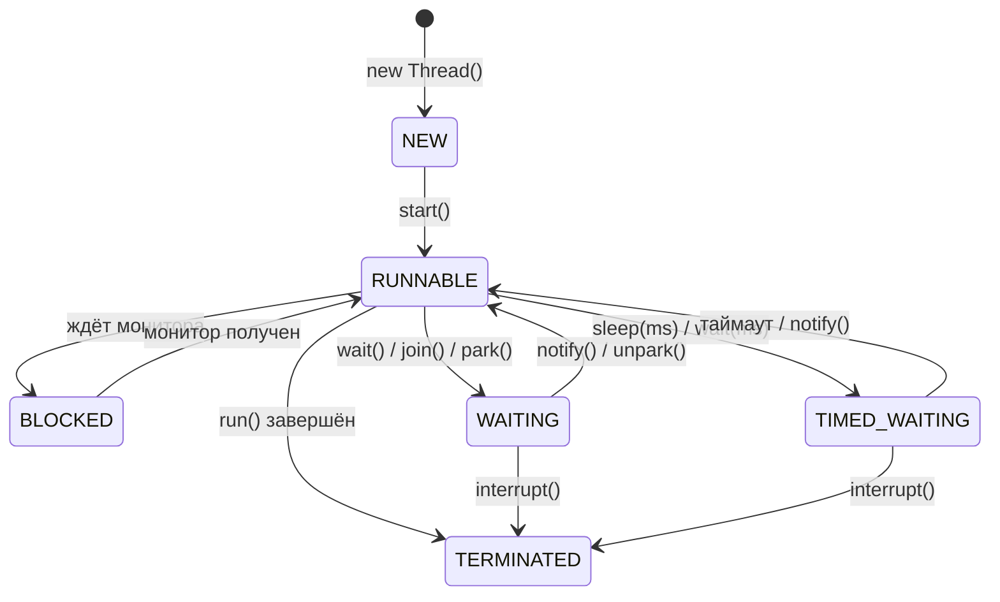
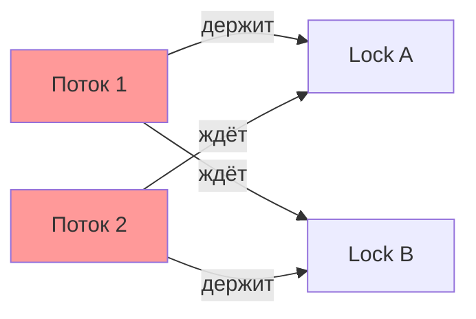
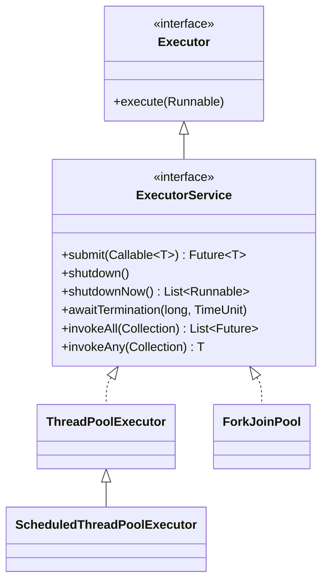
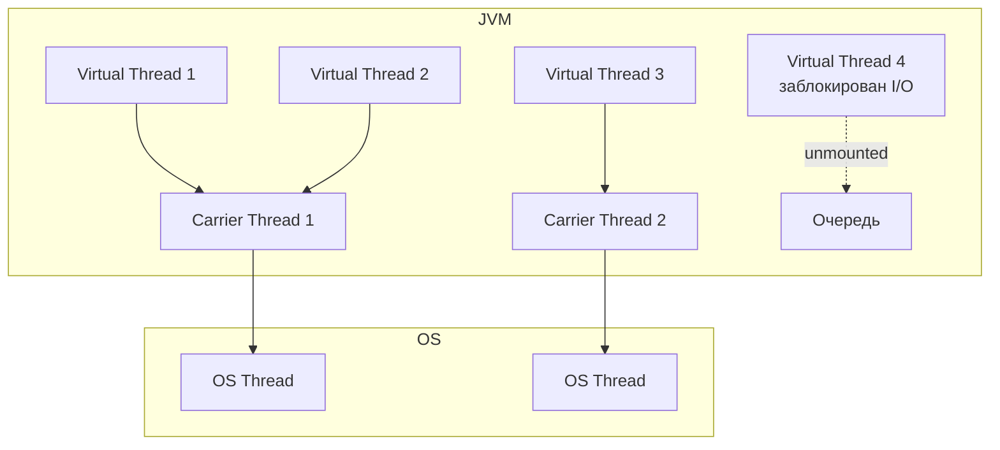

# Вопросы на собеседовании: `Java Concurrency`

Комплексное руководство по вопросам собеседования на тему `Java Concurrency` для `Senior Java Developer`. Включает потоки, синхронизацию, `java.util.concurrent`, `CompletableFuture`, `Virtual Threads` и `Structured Concurrency`.

## Полезные ссылки

### Официальная документация

- [Java Concurrency Tutorial](https://docs.oracle.com/javase/tutorial/essential/concurrency/) — базовое руководство Oracle
- [java.util.concurrent Package](https://docs.oracle.com/en/java/javase/21/docs/api/java.base/java/util/concurrent/package-summary.html) — Javadoc пакета
- [Java Memory Model (JLS 17)](https://docs.oracle.com/javase/specs/jls/se21/html/jls-17.html) — спецификация JMM
- [JEP 444: Virtual Threads](https://openjdk.org/jeps/444) — спецификация виртуальных потоков
- [JEP 453: Structured Concurrency](https://openjdk.org/jeps/453) — спецификация структурированной конкурентности

### Baeldung

- [Java Concurrency Interview Questions — Baeldung](https://www.baeldung.com/java-concurrency-interview-questions) — вопросы с ответами по многопоточности
- [Java Concurrency Series — Baeldung](https://www.baeldung.com/java-concurrency) — серия статей по всем аспектам конкурентности
- [What Is Thread-Safety and How to Achieve It? — Baeldung](https://www.baeldung.com/java-thread-safety) — потокобезопасность и способы её достижения
- [Life Cycle of a Thread in Java — Baeldung](https://www.baeldung.com/java-thread-lifecycle) — жизненный цикл потока с диаграммами

## Содержание

- [Полезные ссылки](#полезные-ссылки)
- [See also](#see-also)

**Потоки: создание, жизненный цикл, приоритеты**
- [Q1. (!) В чем разница между `Process` и `Thread`?](#q1--в-чем-разница-между-process-и-thread)
- [Q2. Как создать поток и запустить его?](#q2-как-создать-поток-и-запустить-его)
- [Q3. (!) Какие состояния есть у `Thread`?](#q3--какие-состояния-есть-у-thread)
- [Q4. Что такое `Thread Priority`?](#q4-что-такое-thread-priority)
- [Q5. (!) В чем разница между `Runnable` и `Callable`?](#q5--в-чем-разница-между-runnable-и-callable)
- [Q6. Что такое `Daemon Thread`?](#q6-что-такое-daemon-thread)
- [Q7. (!) Что такое `interrupt()`, `isInterrupted()`, `InterruptedException`?](#q7--что-такое-interrupt-isinterrupted-interruptedexception)
- [Q8. В чем разница между `yield()`, `join()` и `sleep()`?](#q8-в-чем-разница-между-yield-join-и-sleep)

**`Java Memory Model`, `volatile`, `final`**
- [Q9. (!) Что такое `Java Memory Model` (`JMM`)?](#q9--что-такое-java-memory-model-jmm)
- [Q10. (!) Что такое `volatile`? Что гарантирует `JMM` для `volatile` полей?](#q10--что-такое-volatile-что-гарантирует-jmm-для-volatile-полей)
- [Q11. Какие гарантии дает `JMM` для `final` полей?](#q11-какие-гарантии-дает-jmm-для-final-полей)
- [Q12. (!) Что такое `happens-before`?](#q12--что-такое-happens-before)

**Синхронизация: `synchronized`, `wait/notify`, потокобезопасность**
- [Q13. (!) Что такое `synchronized` блок и метод?](#q13--что-такое-synchronized-блок-и-метод)
- [Q14. В чем преимущество `synchronized` блока перед методом?](#q14-в-чем-преимущество-synchronized-блока-перед-методом)
- [Q15. (!) Разница между блокировкой на уровне класса и объекта](#q15--разница-между-блокировкой-на-уровне-класса-и-объекта)
- [Q16. Какова цель `wait()`, `notify()` и `notifyAll()`?](#q16-какова-цель-wait-notify-и-notifyall)
- [Q17. Что такое потокобезопасный класс?](#q17-что-такое-потокобезопасный-класс)

**Атомарные операции и классы**
- [Q18. (!) Что такое `Atomic` классы и `CAS`?](#q18--что-такое-atomic-классы-и-cas)
- [Q19. Чем `AtomicInteger` лучше `synchronized int`?](#q19-чем-atomicinteger-лучше-synchronized-int)

**Locks: `ReentrantLock`, `ReadWriteLock`, `StampedLock`**
- [Q20. (!) Что такое `ReentrantLock` и чем он лучше `synchronized`?](#q20--что-такое-reentrantlock-и-чем-он-лучше-synchronized)
- [Q21. (!) Что такое `ReadWriteLock` и `StampedLock`?](#q21--что-такое-readwritelock-и-stampedlock)
- [Q22. Что такое `Condition` в `java.util.concurrent.locks`?](#q22-что-такое-condition-в-javautilconcurrentlocks)

**Deadlock, Livelock, Starvation, Race Condition**
- [Q23. (!) Что такое `Deadlock`? Как предотвратить?](#q23--что-такое-deadlock-как-предотвратить)
- [Q24. В чем разница между `Deadlock`, `Livelock` и `Starvation`?](#q24-в-чем-разница-между-deadlock-livelock-и-starvation)
- [Q25. (!) Что такое `Race Condition`?](#q25--что-такое-race-condition)

**`ThreadLocal`**
- [Q26. Что такое `ThreadLocal`?](#q26-что-такое-threadlocal)
- [Q27. В чем разница между `ThreadLocal` и `InheritableThreadLocal`?](#q27-в-чем-разница-между-threadlocal-и-inheritablethreadlocal)

**`Executor`, пулы потоков**
- [Q28. (!) Что такое `Executor` и `ExecutorService`?](#q28--что-такое-executor-и-executorservice)
- [Q29. (!) Какие реализации `ExecutorService` есть в стандартной библиотеке?](#q29--какие-реализации-executorservice-есть-в-стандартной-библиотеке)
- [Q30. Разница между `shutdown()`, `shutdownNow()` и `awaitTermination()`](#q30-разница-между-shutdown-shutdownnow-и-awaittermination)
- [Q31. Разница между `submit()` и `execute()`](#q31-разница-между-submit-и-execute)
- [Q32. Что такое `ForkJoinPool` и work-stealing?](#q32-что-такое-forkjoinpool-и-work-stealing)

**`Future`, `CompletableFuture`**
- [Q33. (!) Что такое `Future` и `FutureTask`?](#q33--что-такое-future-и-futuretask)
- [Q34. (!) Что такое `CompletableFuture`?](#q34--что-такое-completablefuture)
- [Q35. (!) Разница между `thenApply()`, `thenCompose()` и `thenCombine()`](#q35--разница-между-thenapply-thencompose-и-thencombine)
- [Q36. Как обрабатывать исключения в `CompletableFuture`?](#q36-как-обрабатывать-исключения-в-completablefuture)
- [Q37. Как выполнить несколько `CompletableFuture` параллельно?](#q37-как-выполнить-несколько-completablefuture-параллельно)

**Синхронизаторы: `CountDownLatch`, `CyclicBarrier`, `Semaphore`, `Phaser`**
- [Q38. (!) Что такое `CountDownLatch` и `CyclicBarrier`?](#q38--что-такое-countdownlatch-и-cyclicbarrier)
- [Q39. Что такое `Semaphore`?](#q39-что-такое-semaphore)
- [Q40. Что такое `Phaser` и `Exchanger`?](#q40-что-такое-phaser-и-exchanger)

**Concurrent Collections**
- [Q41. (!) Что такое `Concurrent Collection Classes`?](#q41--что-такое-concurrent-collection-classes)
- [Q42. Как работает `ConcurrentHashMap`?](#q42-как-работает-concurrenthashmap)
- [Q43. Что такое `BlockingQueue`?](#q43-что-такое-blockingqueue)

**Практические задачи**
- [Q44. Как решить `Producer-Consumer` проблему?](#q44-как-решить-producer-consumer-проблему)
- [Q45. Что такое `Java Thread Dump` и как его получить?](#q45-что-такое-java-thread-dump-и-как-его-получить)

**Virtual Threads и Structured Concurrency (Java 21+)**
- [Q46. (!) Что такое `Virtual Threads` и чем они отличаются от platform threads?](#q46--что-такое-virtual-threads-и-чем-они-отличаются-от-platform-threads)
- [Q47. Когда использовать и когда НЕ использовать `Virtual Threads`?](#q47-когда-использовать-и-когда-не-использовать-virtual-threads)
- [Q48. (!) Что такое thread pinning в контексте `Virtual Threads`?](#q48--что-такое-thread-pinning-в-контексте-virtual-threads)
- [Q49. Что такое `Structured Concurrency`?](#q49-что-такое-structured-concurrency)
- [Q50. Что такое `Scoped Values` и чем они лучше `ThreadLocal`?](#q50-что-такое-scoped-values-и-чем-они-лучше-threadlocal)

**`ForkJoin`, `CompletableFuture` цепочки, синхронизаторы**
- [Q51. (!) Как работает `ForkJoinPool` и алгоритм work-stealing подробно?](#q51--как-работает-forkjoinpool-и-алгоритм-work-stealing-подробно)
- [Q52. (!) Как построить сложную цепочку `CompletableFuture` с обработкой ошибок?](#q52--как-построить-сложную-цепочку-completablefuture-с-обработкой-ошибок)
- [Q53. Что такое `StampedLock` и когда его использовать вместо `ReadWriteLock`?](#q53-что-такое-stampedlock-и-когда-его-использовать-вместо-readwritelock)
- [Q54. Что такое `Phaser` и чем он отличается от `CountDownLatch` и `CyclicBarrier`?](#q54-что-такое-phaser-и-чем-он-отличается-от-countdownlatch-и-cyclicbarrier)
- [Q55. Что такое `Exchanger` и в каких сценариях применяется?](#q55-что-такое-exchanger-и-в-каких-сценариях-применяется)
- [Q56. Как использовать `StructuredTaskScope` для параллельных запросов с отменой?](#q56-как-использовать-structuredtaskscope-для-параллельных-запросов-с-отменой)

---

## Q1. (!) В чем разница между `Process` и `Thread`?

Коротко: **процесс — это изолированная программа со своей памятью, поток — единица выполнения внутри процесса, разделяющая память с другими потоками того же процесса.**

**Процесс** (`Process`) — экземпляр выполняющейся программы с собственным адресным пространством, файловыми дескрипторами и ресурсами. Процессы изолированы друг от друга на уровне ОС: один процесс не может случайно испортить память другого.

**Поток** (`Thread`) — единица выполнения внутри процесса. Потоки одного процесса разделяют адресное пространство, кучу и статические поля, но имеют собственный стек вызовов и счётчик команд. Именно общая память делает потоки удобными (легко обмениваться данными) и одновременно опасными (нужна синхронизация — отсюда вся тема concurrency).

**Почему переключение потоков дешевле.** Context switching — это переключение CPU между потоками или процессами. Между потоками одного процесса оно дешевле, чем между процессами, потому что не требует смены адресного пространства и сброса TLB (буфера трансляции адресов): потоки уже работают в одной памяти.

| Характеристика | `Process` | `Thread` |
|---|---|---|
| Память | Изолированная | Общая куча |
| Создание | Дорогое (fork) | Дешёвое |
| Коммуникация | IPC (pipes, sockets) | Через общую память |
| Отказоустойчивость | Падение одного не влияет | Исключение может убить процесс |

## Q2. Как создать поток и запустить его?

Поток создаётся объектом `Thread`, а запускается методом `start()`. Есть два способа задать его работу.

**1. Через `Runnable` (предпочтительный):**

```java
Thread thread = new Thread(() -> System.out.println("Hello from thread!"));
thread.start();
```

**2. Наследование от `Thread`:**

```java
class MyThread extends Thread {
    @Override
    public void run() {
        System.out.println("Hello from MyThread!");
    }
}
new MyThread().start();
```

**Почему предпочтителен `Runnable`.** Java не поддерживает множественное наследование классов: если унаследоваться от `Thread`, класс уже не сможет расширить ничего другого. Реализуя `Runnable`, вы отделяете задачу (что делать) от механизма запуска (поток) — класс остаётся свободным для наследования и легче тестируется.

**Подводный камень.** Вызов `run()` напрямую вместо `start()` выполнит код в текущем потоке, не создавая новый. Новый поток ОС появляется только при `start()` — это частая ошибка на собеседовании.

## Q3. (!) Какие состояния есть у `Thread`?

У потока шесть состояний из перечисления `Thread.State`. Поток проходит их по жизненному циклу: создан → запущен → (попеременно работает и ждёт) → завершён.

1. **`NEW`** — поток создан, но `start()` ещё не вызван
2. **`RUNNABLE`** — поток выполняется или готов к выполнению (ждёт, когда планировщик даст ему CPU). Java не различает «выполняется» и «готов» — оба попадают в `RUNNABLE`
3. **`BLOCKED`** — ждёт захвата монитора на входе в `synchronized` блок (монитор занят другим потоком)
4. **`WAITING`** — ждёт бессрочно, пока его не разбудят: `Object.wait()`, `Thread.join()`, `LockSupport.park()`
5. **`TIMED_WAITING`** — то же, но с таймаутом: `Thread.sleep(ms)`, `wait(ms)`, `join(ms)`
6. **`TERMINATED`** — поток завершил выполнение (вышел из `run()` или упал с исключением)

**Тонкость для собеседования.** Поток, ждущий блокирующего I/O или сетевого ответа, остаётся в `RUNNABLE` — с точки зрения JVM он не заблокирован на мониторе. `BLOCKED` относится только к ожиданию монитора `synchronized`.



## Q4. Что такое `Thread Priority`?

Приоритет — целое число от 1 до 10, которое планировщик использует как **подсказку**, кому чаще давать CPU. Потоки с большим приоритетом получают больше шансов на выполнение, но это **не гарантия**: реальное поведение определяет планировщик ОС и может полностью игнорировать приоритеты Java.

```java
Thread.MIN_PRIORITY  // 1
Thread.NORM_PRIORITY // 5 (по умолчанию)
Thread.MAX_PRIORITY  // 10

Thread t = new Thread(task);
t.setPriority(Thread.MAX_PRIORITY);
```

Приоритет наследуется от родительского потока. Поскольку `main` имеет приоритет 5, все созданные из него потоки тоже получают 5, если не задать другой.

**Эмпирическое правило.** Никогда не закладывайте корректность программы в приоритеты: они влияют только на статистику планирования, но не на порядок выполнения. Нужна гарантированная очерёдность — используйте явную синхронизацию (`wait/notify`, `Lock`, `CountDownLatch`), а не приоритеты.

## Q5. (!) В чем разница между `Runnable` и `Callable`?

Оба — функциональные интерфейсы для задачи, выполняемой в потоке. Главное различие: **`Callable` возвращает результат и может бросать checked-исключения, а `Runnable` — нет.** Поэтому `Runnable` подходит для «выстрелил и забыл», а `Callable` — когда нужен результат или контролируемая обработка ошибок.

| Характеристика | `Runnable` | `Callable<V>` |
|---|---|---|
| Метод | `void run()` | `V call() throws Exception` |
| Возвращаемое значение | Нет | Есть (`V`) |
| Checked exceptions | Не может бросить | Может бросить |
| Используется с | `Thread`, `ExecutorService` | `ExecutorService` |

`Thread` принимает только `Runnable`: чтобы запустить `Callable`, его отдают в `ExecutorService.submit()` и получают результат через `Future`.

```java
// Runnable — без результата
Runnable task = () -> System.out.println("Running");
new Thread(task).start();

// Callable — с результатом
Callable<Integer> callable = () -> {
    TimeUnit.SECONDS.sleep(1);
    return 42;
};
ExecutorService executor = Executors.newSingleThreadExecutor();
Future<Integer> future = executor.submit(callable);
Integer result = future.get(); // 42
executor.shutdown();
```

## Q6. Что такое `Daemon Thread`?

`Daemon Thread` — фоновый поток, который **не удерживает JVM от завершения**. JVM работает, пока жив хотя бы один не-daemon (пользовательский) поток; как только последний из них завершился, JVM резко останавливает все daemon-потоки (без гарантии доработки и без выполнения `finally`) и выходит.

```java
Thread daemon = new Thread(() -> {
    while (true) {
        // фоновая очистка кэша
    }
});
daemon.setDaemon(true); // ВАЖНО: до start()
daemon.start();
```

Типичные примеры: сборщик мусора (`GC`), финализатор, потоки мониторинга — все они должны жить, пока работает приложение, и умирать вместе с ним.

**Подводные камни.**
- `setDaemon(true)` нужно вызвать **до** `start()`, иначе будет `IllegalThreadStateException`.
- В daemon-потоке нельзя выполнять работу, которую обязательно надо завершить (запись в файл, флаш буфера): JVM может убить его в любой момент, не дав доработать.

## Q7. (!) Что такое `interrupt()`, `isInterrupted()`, `InterruptedException`?

Прерывание в Java — **кооперативный** механизм: нельзя насильно остановить поток, можно лишь попросить его остановиться, выставив флаг. Поток сам решает, когда и как на этот флаг отреагировать. Поэтому грубый `Thread.stop()` объявлен deprecated, а корректная остановка строится на прерывании.

- **`interrupt()`** — выставляет флаг прерывания у целевого потока (просьба остановиться)
- **`isInterrupted()`** — проверяет флаг, **не сбрасывая** его
- **`Thread.interrupted()`** — статический метод: проверяет флаг текущего потока и **сбрасывает** его

Если поток в момент прерывания заблокирован в `sleep()`, `wait()` или `join()`, JVM не ждёт — она немедленно бросает `InterruptedException` и **сбрасывает флаг**. Поэтому отлавливая это исключение, флаг приходится восстанавливать вручную:

```java
Thread worker = new Thread(() -> {
    while (!Thread.currentThread().isInterrupted()) {
        try {
            // выполняем работу
            Thread.sleep(100);
        } catch (InterruptedException e) {
            // sleep сбрасывает флаг → восстанавливаем
            Thread.currentThread().interrupt();
            break;
        }
    }
    System.out.println("Поток корректно завершён");
});
worker.start();
// ...
worker.interrupt(); // сигнал на завершение
```

**Рекомендация.** В `catch (InterruptedException)` всегда либо восстанавливайте флаг (`Thread.currentThread().interrupt()`), либо пробрасывайте исключение выше. Молча «глотать» `InterruptedException` — антипаттерн: вышестоящий код потеряет сигнал об отмене и не сможет корректно завершиться.

## Q8. В чем разница между `yield()`, `join()` и `sleep()`?

Все три влияют на ход выполнения, но решают разные задачи. **Ключевой момент: ни один из них не освобождает удерживаемый монитор** — если поток зашёл в `synchronized` и вызвал `sleep()`, блокировку он не отдаёт (в отличие от `wait()`, который монитор отпускает).

| Метод | Что делает | Освобождает монитор? | Бросает `InterruptedException`? |
|---|---|---|---|
| `yield()` | Подсказка планировщику уступить CPU | Нет | Нет |
| `sleep(ms)` | Приостанавливает поток на N мс | Нет | Да |
| `join()` | Ждёт завершения другого потока | Нет | Да |

- **`yield()`** — лишь намёк планировщику «можешь дать поработать другим»; ОС вправе его проигнорировать. На практике почти не нужен.
- **`sleep(ms)`** — пауза на заданное время, поток переходит в `TIMED_WAITING`.
- **`join()`** — текущий поток ждёт, пока завершится другой; удобно для дожидания результата.

```java
Thread t = new Thread(() -> {
    // долгая работа
});
t.start();
t.join(); // текущий поток ждёт завершения t
System.out.println("t завершён");
```

## Q9. (!) Что такое `Java Memory Model` (`JMM`)?

`JMM` (Java Memory Model) — спецификация (JLS Chapter 17), которая отвечает на главный вопрос многопоточности: **при каких условиях изменение, сделанное одним потоком, гарантированно видно другому**. Она задаёт правила видимости и определяет, какие переупорядочения операций JVM и процессор имеют право делать.

JMM оперирует четырьмя понятиями:

1. **Видимость** — когда запись одного потока становится видна чтению другого
2. **Упорядочение** — компилятор, JIT и CPU могут переставлять инструкции ради оптимизации, и без синхронизации другой поток может увидеть их в другом порядке
3. **Атомарность** — неделимость операции (например, запись `long` без `volatile` на 32-битных платформах атомарной не гарантируется)
4. **`happens-before`** — базовое отношение: если оно установлено между двумя действиями, видимость гарантирована

**Почему это вообще проблема.** Без синхронизации JVM **не обязана** показывать одному потоку изменения другого — значения могут оставаться в регистрах и кэшах L1/L2 конкретного ядра. Поэтому поток в цикле `while(flag)` может крутиться вечно, не замечая, что другой поток давно выставил `flag = false`. Синхронизация (`volatile`, `synchronized`, `Lock`) как раз и проталкивает изменения через эти кэши.

Подробнее о том, как `JMM` связана с устройством `JVM`, см. в [вопросах по JVM](../../jvm/jvm-interview.md).

## Q10. (!) Что такое `volatile`? Что гарантирует `JMM` для `volatile` полей?

`volatile` — модификатор поля, который решает проблему **видимости и переупорядочения**, но не атомарности. Запись и чтение `volatile`-поля идут напрямую в общую память, минуя кэш конкретного ядра. Конкретно он даёт три гарантии:

1. **Видимость** — запись в `volatile`-поле сразу видна всем потокам при следующем чтении
2. **Запрет переупорядочения** — операции до записи в `volatile` нельзя перенести после неё, а чтения после `volatile`-чтения — до него (барьеры памяти)
3. **`happens-before`** — запись в `volatile` `happens-before` любого последующего чтения этого поля; значит, всё, что было записано до `volatile`-записи, тоже становится видно читателю

```java
public class VolatileFlag {
    private volatile boolean running = true;

    public void stop() {
        running = false; // видимо всем потокам
    }

    public void work() {
        while (running) {
            // без volatile поток может закэшировать running=true
            // и никогда не увидеть изменение
        }
    }
}
```

**Главное ограничение.** `volatile` **не обеспечивает атомарность** составных операций. `count++` — это три действия (прочитать, прибавить, записать), и между ними другой поток может вклиниться. Даже с `volatile` инкремент остаётся гонкой — для него нужны `Atomic`-классы или `synchronized`.

**Сценарий применения.** `volatile` идеален для флага-семафора (`boolean running`, `boolean initialized`), где один поток только пишет, а другие только читают. Для счётчиков и любых read-modify-write — нет.

## Q11. Какие гарантии дает `JMM` для `final` полей?

JMM даёт `final`-полям особую гарантию: значение, присвоенное `final`-полю в конструкторе, видно всем потокам **без какой-либо синхронизации** — но только если ссылка на объект не «утекла» наружу до завершения конструктора. То есть другой поток, получивший полностью сконструированный объект, гарантированно увидит проинициализированные `final`-поля, а не их значения по умолчанию (`0`/`null`).

```java
public class ImmutableHolder {
    private final int value;
    private final List<String> items;

    public ImmutableHolder(int value, List<String> items) {
        this.value = value;
        this.items = Collections.unmodifiableList(new ArrayList<>(items));
        // НЕ публикуем this до конца конструктора!
    }
}
```

**Почему это важно.** Именно эта гарантия делает неизменяемые (immutable) объекты автоматически потокобезопасными: их можно свободно публиковать между потоками без `volatile` и `synchronized`. Условие «не публиковать `this` до конца конструктора» критично — если передать ссылку наружу раньше времени (например, зарегистрировать листенер в конструкторе), другой поток может увидеть полусобранный объект. Подробнее о неизменяемости и паттернах проектирования — в [вопросах по паттернам](../../design-patterns/design-patterns-interview.md).

## Q12. (!) Что такое `happens-before`?

`happens-before` — центральное отношение JMM. Формула простая: **если действие A `happens-before` действия B, то всё, что сделал A (включая записи в любые поля), гарантированно видно потоку, выполняющему B.** Это и есть тот «мост видимости», который синхронизация строит между потоками. Если же между двумя действиями нет цепочки `happens-before`, JMM не даёт никаких гарантий о видимости — это и называют гонкой данных.

Отношение `happens-before` создаётся не магически, а конкретными правилами:

1. **Program Order** — внутри одного потока предшествующий по коду оператор `hb` последующего
2. **Monitor Lock** — `unlock()` монитора `hb` последующего `lock()` того же монитора (так `synchronized` обеспечивает видимость)
3. **Volatile** — запись в `volatile`-поле `hb` его последующего чтения
4. **Thread Start** — `thread.start()` `hb` первой инструкции в `run()` (новый поток видит всё, что было до старта)
5. **Thread Join** — последняя инструкция в `run()` `hb` возврата из `join()` (после `join()` виден результат работы потока)
6. **Транзитивность** — если A `hb` B и B `hb` C, то A `hb` C; именно она связывает правила в цепочки

**Как этим пользоваться на собеседовании.** Чтобы доказать, что код корректен, нужно показать цепочку `happens-before` от записи до чтения. Нет цепочки — есть гонка, и значение может «не дойти».

## Q13. (!) Что такое `synchronized` блок и метод?

`synchronized` — встроенный в язык механизм взаимного исключения: поток входит в защищённую секцию, только захватив **монитор** (intrinsic lock) объекта. Монитором владеет лишь один поток в момент времени, остальные ждут в состоянии `BLOCKED`. У каждого Java-объекта есть такой монитор.

```java
// synchronized метод — монитор = this (или Class для static)
public synchronized void increment() {
    count++;
}

// synchronized блок — монитор = указанный объект
public void increment() {
    synchronized (lock) {
        count++;
    }
}
```

`synchronized` решает сразу две задачи — взаимное исключение и видимость:

- **Взаимное исключение** — в критической секции одновременно лишь один поток
- **Видимость** — при входе в блок поток видит все изменения, сделанные предыдущим владельцем монитора (благодаря `happens-before` между `unlock` и `lock`)
- **Реентерабельность** — поток может повторно захватить монитор, который уже держит; без этого вложенные `synchronized`-вызовы того же объекта приводили бы к самоблокировке
- **`happens-before`** — `unlock` монитора `hb` последующего `lock` того же монитора

Именно поэтому `synchronized` достаточно для большинства задач: он закрывает и атомарность секции, и видимость её результатов одним механизмом.

## Q14. В чем преимущество `synchronized` блока перед методом?

Блок даёт более тонкий контроль, и всё это снижает конкуренцию (contention) за блокировку:

1. **Гранулярность** — синхронизируется только критическая секция, а не весь метод; чем короче секция под блокировкой, тем меньше потоки ждут друг друга
2. **Выбор монитора** — можно завести разные объекты-мониторы под разные ресурсы, чтобы независимые операции шли параллельно
3. **Защита от чужого монитора** — `synchronized`-метод блокирует на `this`, до которого может «дотянуться» внешний код; приватный объект-замок (`private final Object lock`) такую блокировку извне исключает

```java
public class BankAccount {
    private final Object balanceLock = new Object();
    private final Object historyLock = new Object();

    public void transfer(int amount) {
        synchronized (balanceLock) {
            balance += amount;
        }
        // Запись истории не блокирует операции с балансом
        synchronized (historyLock) {
            history.add("Transfer: " + amount);
        }
    }
}
```

## Q15. (!) Разница между блокировкой на уровне класса и объекта

Различие сводится к тому, **какой монитор захватывается**. Экземплярная блокировка использует монитор конкретного объекта (`this`), классовая — единственный монитор `Class`-объекта, общий для всех экземпляров. Это два разных монитора, и они **не пересекаются**: поток в экземплярном `synchronized`-методе и поток в статическом `synchronized`-методе того же класса друг друга не блокируют.

| Тип блокировки | Монитор | Область действия |
|---|---|---|
| Уровень объекта | `this` | Только один экземпляр |
| Уровень класса | `ClassName.class` | Все экземпляры |

```java
// Уровень объекта — разные экземпляры не блокируют друг друга
public synchronized void instanceMethod() { /* монитор = this */ }

// Уровень класса — блокирует для ВСЕХ экземпляров
public static synchronized void classMethod() { /* монитор = MyClass.class */ }

// Эквивалент через блок:
synchronized (MyClass.class) { /* уровень класса */ }
```

Если два потока вызывают `synchronized` экземплярный метод для **разных** объектов — они **не блокируют** друг друга. Для **статических** `synchronized` методов — всегда блокируют, так как монитор один на класс.

## Q16. Какова цель `wait()`, `notify()` и `notifyAll()`?

Это три метода класса `Object` для межпоточной координации по схеме «жди условие — сигналь о его выполнении». Все они **обязаны вызываться внутри `synchronized` на том же мониторе**, иначе будет `IllegalMonitorStateException`.

- **`wait()`** — поток **освобождает монитор** (в этом ключевое отличие от `sleep()`) и засыпает в `WAITING`, давая другим войти в секцию и изменить состояние
- **`notify()`** — будит один произвольный поток, ожидающий на этом мониторе
- **`notifyAll()`** — будит все ожидающие потоки; они конкурируют за монитор и входят по очереди

```java
synchronized (sharedObject) {
    while (!condition) {
        sharedObject.wait(); // ВСЕГДА в цикле, не в if!
    }
    // condition выполнено — работаем
}

// Другой поток:
synchronized (sharedObject) {
    condition = true;
    sharedObject.notifyAll(); // предпочтительнее notify()
}
```

**Почему `while`, а не `if`.** `wait()` всегда оборачивают в цикл `while`, проверяющий условие, по двум причинам: во-первых, бывают **spurious wakeups** (ложные пробуждения без вызова `notify`); во-вторых, после `notifyAll()` несколько потоков просыпаются, но условие к моменту захвата монитора может уже не выполняться (другой поток успел его «забрать»). Цикл перепроверяет условие после пробуждения и при необходимости снова уходит в `wait()`. С `if` поток продолжил бы работу при ложном условии — это баг.

**Рекомендация.** Предпочитайте `notifyAll()` вместо `notify()`: `notify()` будит произвольный поток, и если он ждёт не того условия, нужный поток может остаться спать навсегда (lost wakeup).

## Q17. Что такое потокобезопасный класс?

Потокобезопасный класс — класс, который ведёт себя корректно при одновременном доступе из множества потоков **без дополнительной синхронизации со стороны вызывающего кода**. То есть клиенту не нужно оборачивать вызовы в свои блокировки — класс сам гарантирует консистентность своего состояния.

Потокобезопасность достигается одним из подходов (или их сочетанием):

1. **Иммутабельность** — `final` поля, нет сеттеров (см. [Java Core](java-core-interview.md))
2. **`synchronized`** — синхронизация критических секций
3. **`Atomic` классы** — lock-free атомарные операции
4. **`ThreadLocal`** — изолированные данные для каждого потока
5. **`Lock` API** — `ReentrantLock`, `ReadWriteLock`
6. **Concurrent collections** — `ConcurrentHashMap`, `CopyOnWriteArrayList`

Примеры из JDK: `StringBuffer`, `ConcurrentHashMap`, `AtomicInteger`, `Vector` (устаревший).

**Важная оговорка.** Потокобезопасность отдельных методов ещё не делает безопасной последовательность вызовов. Даже у `ConcurrentHashMap` связка «проверить, потом изменить» (`if (!map.containsKey(k)) map.put(...)`) — это гонка: между двумя вызовами вклинивается другой поток. Поэтому такие классы дают атомарные комбинированные операции (`putIfAbsent`, `computeIfAbsent`, `merge`).

## Q18. (!) Что такое `Atomic` классы и `CAS`?

Классы из `java.util.concurrent.atomic` дают атомарные операции над одной переменной **без блокировок** (lock-free), опираясь на аппаратную инструкцию **CAS** (`Compare-And-Swap`). Вместо того чтобы захватывать монитор и усыплять конкурентов, поток просто повторяет попытку, пока не выиграет «гонку» за обновление:

```java
AtomicInteger counter = new AtomicInteger(0);
counter.incrementAndGet();     // атомарный ++
counter.compareAndSet(1, 10);  // если значение == 1, установить 10
counter.getAndUpdate(x -> x * 2); // атомарное преобразование
```

**Как работает CAS.** Это одна атомарная аппаратная инструкция: «если текущее значение == ожидаемому, запиши новое и верни успех, иначе ничего не меняй и верни текущее». `incrementAndGet()` под капотом — это цикл: прочитать значение, посчитать +1, попробовать CAS; если кто-то опередил, начать заново с нового значения. Поток не засыпает и не блокирует других — он лишь крутится в коротком retry-цикле.

**Компромисс.** Lock-free означает отсутствие deadlock и контекстных переключений, но при очень высокой конкуренции CAS постоянно «промахивается» и тратит CPU на повторы (spin). Поэтому для горячих счётчиков добавили `LongAdder`.

Основные классы:

| Класс | Назначение |
|---|---|
| `AtomicInteger`, `AtomicLong` | Атомарный int/long |
| `AtomicBoolean` | Атомарный boolean |
| `AtomicReference<V>` | Атомарная ссылка |
| `AtomicStampedReference<V>` | Ссылка + версия (решает ABA-проблему) |
| `LongAdder`, `LongAccumulator` | Высокопроизводительные счётчики (Java 8+) |

`AtomicStampedReference` решает **ABA-проблему**: при обычном CAS значение могло смениться с A на B и обратно на A — поток этого не заметит и решит, что ничего не менялось. Добавление версии (stamp) ловит такой случай.

`LongAdder` быстрее `AtomicLong` при высокой конкуренции, потому что разбивает счётчик на несколько ячеек (striping): потоки пишут в разные ячейки и не конкурируют за одну переменную, а итог считается суммированием при чтении. Минус — нет атомарного «прочитать-и-обновить», поэтому он годится для счётчиков, но не как замена `AtomicLong` везде.

## Q19. Чем `AtomicInteger` лучше `synchronized int`?

```java
// synchronized — поток блокируется при конкуренции
private int count;
public synchronized void increment() { count++; }

// AtomicInteger — lock-free, без блокировки
private final AtomicInteger count = new AtomicInteger();
public void increment() { count.incrementAndGet(); }
```

Суть: `synchronized` при конкуренции **усыпляет** поток (context switch, переход в `BLOCKED`), а `AtomicInteger` лишь повторяет CAS, оставаясь на CPU. Отсюда преимущества:

1. **Нет блокировки** — CAS вместо захвата монитора, нет перевода потока в ожидание
2. **Выше пропускная способность** при умеренной конкуренции — экономим на context switching
3. **Нет риска deadlock** — нечего захватывать в неправильном порядке

**Подводный камень.** При очень высокой конкуренции CAS постоянно промахивается и вырождается в spin-loop, сжигающий CPU. Тогда выгоднее `LongAdder`. И помни: атомарность одной операции (`incrementAndGet`) не делает атомарной связку из двух атомиков — для составной логики всё равно нужен `Lock` или `synchronized`.

## Q20. (!) Что такое `ReentrantLock` и чем он лучше `synchronized`?

`ReentrantLock` — это явная блокировка из `java.util.concurrent.locks` с той же семантикой взаимного исключения, что и `synchronized` (тоже реентерабельная), но с гораздо большей гибкостью: блокировкой управляют руками через `lock()`/`unlock()`, а не через границы блока.

```java
private final ReentrantLock lock = new ReentrantLock();

public void update() {
    lock.lock();
    try {
        // критическая секция
    } finally {
        lock.unlock(); // ВСЕГДА в finally!
    }
}
```

**Главная опасность** — обратная сторона гибкости: освобождение не автоматическое. `unlock()` обязан стоять в `finally`, иначе при исключении блокировка останется захваченной навсегда и все потоки зависнут.

Что даёт `ReentrantLock`, чего нет у `synchronized`:

| Возможность | `synchronized` | `ReentrantLock` |
|---|---|---|
| Попытка захвата (`tryLock`) | Нет | Да |
| Ожидание с таймаутом | Нет | `tryLock(time, unit)` |
| Прерываемое ожидание | Нет | `lockInterruptibly()` |
| Fairness (справедливость) | Нет | `new ReentrantLock(true)` |
| Множественные `Condition` | Один (`wait/notify`) | Несколько `newCondition()` |
| Автоматическое освобождение | Да (при выходе из блока) | Нет (нужен `finally`) |

- **`tryLock()`** позволяет не зависать на блокировке — это инструмент против deadlock (взял что смог, иначе отступил).
- **`lockInterruptibly()`** даёт прервать поток, ждущий блокировку, — с `synchronized` ожидание монитора не прерывается.
- **Fairness** выдаёт блокировку в порядке очереди (против starvation), но снижает пропускную способность.

**Эмпирическое правило.** По умолчанию берите `synchronized` — он проще и не забудешь освободить. Переходите на `ReentrantLock`, только когда реально нужны таймаут, прерываемость, fairness или несколько `Condition`.

## Q21. (!) Что такое `ReadWriteLock` и `StampedLock`?

Оба решают одну задачу — ускорить сценарий «много чтений, мало записей», где обычный взаимоисключающий замок избыточно сериализует читателей.

**`ReadWriteLock`** разделяет блокировку на две: чтение и запись. Много читателей могут держать read-lock **одновременно** (они друг другу не мешают), а write-lock эксклюзивен и не уживается ни с читателями, ни с другими писателями:

```java
ReadWriteLock rwLock = new ReentrantReadWriteLock();

// Множество читателей одновременно
rwLock.readLock().lock();
try { return cache.get(key); }
finally { rwLock.readLock().unlock(); }

// Только один писатель
rwLock.writeLock().lock();
try { cache.put(key, value); }
finally { rwLock.writeLock().unlock(); }
```

**`StampedLock`** (Java 8) идёт дальше и добавляет **оптимистичное чтение** — самый быстрый режим, который вообще не блокирует. Идея: читатель не берёт замок, а просто запоминает «штамп» (версию), читает поля и в конце проверяет `validate(stamp)`. Если между чтением и проверкой никто не писал — данные консистентны, мы сэкономили на блокировке; если писали — откатываемся на обычный read-lock и перечитываем:

```java
StampedLock sl = new StampedLock();

// Оптимистичное чтение — без блокировки!
long stamp = sl.tryOptimisticRead();
double x = this.x, y = this.y;
if (!sl.validate(stamp)) {
    // Была запись — переходим на обычный read lock
    stamp = sl.readLock();
    try { x = this.x; y = this.y; }
    finally { sl.unlockRead(stamp); }
}
return Math.sqrt(x * x + y * y);
```

| Тип | Реентерабельный | Оптимистичное чтение | Upgrade read→write |
|---|---|---|---|
| `ReentrantReadWriteLock` | Да | Нет | Нет |
| `StampedLock` | Нет | Да | Да (`tryConvertToWriteLock`) |

**Компромисс.** `StampedLock` быстрее при read-heavy нагрузке, но не реентерабелен (повторный захват из того же потока — deadlock) и сложнее в использовании. Если нужна реентерабельность или условные переменные — берите `ReentrantReadWriteLock`.

## Q22. Что такое `Condition` в `java.util.concurrent.locks`?

`Condition` — это `wait()`/`notify()` для `Lock`: `await()` усыпляет поток и отпускает замок, `signal()`/`signalAll()` будят ожидающих. Ключевое преимущество — на одном `Lock` можно завести **несколько** независимых очередей ожидания (по одной на каждое условие), тогда как `synchronized` даёт лишь одну на монитор:

```java
private final Lock lock = new ReentrantLock();
private final Condition notFull = lock.newCondition();
private final Condition notEmpty = lock.newCondition();

public void put(E item) throws InterruptedException {
    lock.lock();
    try {
        while (count == capacity) notFull.await();
        items[putIndex] = item;
        count++;
        notEmpty.signal();
    } finally {
        lock.unlock();
    }
}

public E take() throws InterruptedException {
    lock.lock();
    try {
        while (count == 0) notEmpty.await();
        E item = items[takeIndex];
        count--;
        notFull.signal();
        return item;
    } finally {
        lock.unlock();
    }
}
```

**Почему это эффективнее.** В примере выше «не полна» и «не пуста» — разные условия. Раздельные `Condition` будят только нужных: `notEmpty.signal()` поднимает читателя, не трогая писателей. С `synchronized` пришлось бы звать `notifyAll()` и будить всех подряд, включая тех, чьё условие не выполнено — они зря проснутся, перепроверят и снова уснут. Как и `wait()`, `await()` вызывают в цикле `while`.

## Q23. (!) Что такое `Deadlock`? Как предотвратить?

`Deadlock` (взаимоблокировка) — два или более потока навсегда зависают, потому что каждый ждёт ресурс, удерживаемый другим, и никто не готов отпустить свой. Классический случай — два потока берут две блокировки в **противоположном порядке**:

```java
// Классический deadlock
Object lock1 = new Object(), lock2 = new Object();

// Поток 1: lock1 → lock2
new Thread(() -> {
    synchronized (lock1) {
        synchronized (lock2) { /* ... */ }
    }
}).start();

// Поток 2: lock2 → lock1  (обратный порядок!)
new Thread(() -> {
    synchronized (lock2) {
        synchronized (lock1) { /* ... */ }
    }
}).start();
```

Deadlock возможен, только когда **одновременно** выполнены все четыре условия Коффмана — убери любое, и взаимоблокировки не будет:
1. **Mutual Exclusion** — ресурс используется эксклюзивно
2. **Hold and Wait** — поток держит один ресурс и ждёт другой, не отпуская первый
3. **No Preemption** — ресурс нельзя насильно отобрать
4. **Circular Wait** — есть цикл ожидания (A ждёт B, B ждёт A)

**Способы предотвращения** (каждый «ломает» одно из условий):
- **Единый порядок захвата блокировок** (lock ordering) — самый надёжный приём; если все берут A раньше B, цикл невозможен (ломает Circular Wait)
- **`tryLock()` с таймаутом** — взял не всё за отведённое время → отпустил захваченное и повторил (ломает Hold and Wait)
- Избегать вложенных `synchronized` — не держать одну блокировку, запрашивая другую
- Использовать готовые средства `java.util.concurrent` вместо ручной синхронизации



## Q24. В чем разница между `Deadlock`, `Livelock` и `Starvation`?

Все три — формы «застревания» потоков, но различаются тем, **что именно** мешает прогрессу.

| Проблема | Описание | Потоки активны? |
|---|---|---|
| **Deadlock** | Циклическое ожидание ресурсов | Нет, все заблокированы |
| **Livelock** | Потоки реагируют друг на друга, но не продвигаются | Да, но бесполезно |
| **Starvation** | Поток не получает ресурсы из-за приоритетов | Частично |

- **Deadlock** — потоки заблокированы и не выполняют ни инструкции; со стороны CPU простаивает.
- **Livelock** — потоки активно работают и реагируют друг на друга, но из-за этого никто не двигается вперёд. Аналогия: два человека в коридоре одновременно уступают в одну сторону, потом в другую — и так бесконечно. Часто это побочный эффект наивной обработки конфликтов (например, оба откатываются и тут же повторяют синхронно).
- **Starvation** — поток в принципе мог бы работать, но систематически не получает ресурс: низкоприоритетные потоки не дождутся CPU, пока высокоприоритетные его занимают, или «жадные» потоки вечно перехватывают блокировку. Решение — справедливая политика (fairness, `new ReentrantLock(true)`), которая выдаёт ресурс в порядке очереди.

## Q25. (!) Что такое `Race Condition`?

`Race Condition` (состояние гонки) — баг, при котором корректность результата зависит от **относительного тайминга** потоков: при одном чередовании всё работает, при другом — ломается. Возникает, когда несколько потоков обращаются к общим данным без должной синхронизации и хотя бы один из них пишет. Самый частый шаблон — «check-then-act»: проверил условие, а к моменту действия оно уже неверно, потому что между ними вклинился другой поток.

```java
// Race Condition: check-then-act
if (map.containsKey(key)) {       // 1. проверка
    return map.get(key);           // 2. чтение — между 1 и 2 другой поток
}                                  //    мог удалить ключ → NPE!

// Исправление: атомарная операция
return map.computeIfAbsent(key, k -> createValue(k));
```

Гонки коварны тем, что воспроизводятся редко и непредсказуемо. Способы их выловить:
- **Статический анализ** — `SpotBugs`, `IntelliJ Inspections` находят типичные шаблоны (незащищённый доступ к полю, check-then-act) ещё до запуска
- **Динамический анализ** — `ThreadSanitizer`, стресс-тестирование под высокой конкуренцией повышают шанс «поймать» гонку в рантайме
- **Стресс-тесты модели памяти** — `jcstress` (OpenJDK harness) и запись через `JFR` прицельно воспроизводят и фиксируют гонки, которые не всплывают при обычном прогоне

## Q26. Что такое `ThreadLocal`?

`ThreadLocal` — переменная, у которой **каждый поток держит собственную копию**. Потоки не видят значений друг друга, поэтому синхронизация не нужна вовсе. Это другой подход к потокобезопасности: вместо того чтобы защищать общий объект блокировками, мы вообще не делаем его общим — у каждого потока свой экземпляр. Типичный пример — небезопасный `SimpleDateFormat`, который дорого создавать на каждый вызов:

```java
private static final ThreadLocal<SimpleDateFormat> dateFormat =
    ThreadLocal.withInitial(() -> new SimpleDateFormat("yyyy-MM-dd"));

public String formatDate(Date date) {
    return dateFormat.get().format(date); // каждый поток — свой экземпляр
}
```

Типичные применения: `SimpleDateFormat`, `Connection` в пуле, контекст запроса (`MDC` в логировании, `RequestContextHolder` в `Spring`) — то, что должно «следовать» за потоком сквозь слои вызовов без передачи параметром.

**Главный подводный камень — утечка памяти и грязные данные в пулах.** Потоки в `ExecutorService` переиспользуются, поэтому если не очистить `ThreadLocal` после обработки запроса, его значение «достанется» следующему запросу на том же потоке (утечка чувствительных данных) и не будет собрано GC. Поэтому всегда вызывайте `threadLocal.remove()` в `finally`. В Java 21+ для этого сценария безопаснее `ScopedValue` (см. Q50).

## Q27. В чем разница между `ThreadLocal` и `InheritableThreadLocal`?

Разница в одном: **передаётся ли значение дочернему потоку при его создании.** Обычный `ThreadLocal` видит только тот поток, что его выставил; `InheritableThreadLocal` копирует значение в новый поток в момент `start()` — удобно, чтобы протащить контекст (id запроса) в порождённые потоки.

| Характеристика | `ThreadLocal` | `InheritableThreadLocal` |
|---|---|---|
| Наследование | Нет | Да — дочерний поток получает копию |
| Область | Только текущий поток | Текущий + дочерние потоки |

```java
InheritableThreadLocal<String> ctx = new InheritableThreadLocal<>();
ctx.set("request-123");

new Thread(() -> {
    System.out.println(ctx.get()); // "request-123" — унаследовано
}).start();
```

**Главное ограничение.** `InheritableThreadLocal` **не работает с пулами потоков**: наследование происходит лишь в момент создания потока, а в пуле потоки создаются один раз и переиспользуются — новые задачи не получат актуальный контекст, зато могут увидеть устаревший. Для передачи контекста в пулы и virtual threads в `Java 21+` рекомендуется `ScopedValue` (см. Q50).

## Q28. (!) Что такое `Executor` и `ExecutorService`?

`Executor` — базовый интерфейс с единственным методом `execute(Runnable)`. Его смысл — **отделить задачу (что выполнить) от механизма выполнения (как и где)**: код, отправляющий задачу, не знает, выполнится ли она в новом потоке, в пуле или синхронно. Это снимает с разработчика ручное управление `Thread`.

`ExecutorService` — расширение `Executor`, добавляющее то, чего не хватает для реальной работы: управление жизненным циклом (`shutdown`), получение результатов (`submit` → `Future`) и пакетные операции (`invokeAll`/`invokeAny`):



## Q29. (!) Какие реализации `ExecutorService` есть в стандартной библиотеке?

Готовые пулы создаются фабричными методами `Executors` — каждый под свой профиль нагрузки:

| Метод | Пул | Очередь | Когда использовать |
|---|---|---|---|
| `newFixedThreadPool(n)` | Фиксированный n потоков | `LinkedBlockingQueue` (unbounded) | Предсказуемая нагрузка |
| `newCachedThreadPool()` | 0 → ∞ потоков (60s idle) | `SynchronousQueue` | Много коротких задач |
| `newSingleThreadExecutor()` | 1 поток | `LinkedBlockingQueue` | Последовательное выполнение |
| `newScheduledThreadPool(n)` | Фиксированный n | `DelayedWorkQueue` | Периодические задачи |
| `newWorkStealingPool()` | `ForkJoinPool` | Deque per thread | Рекурсивные задачи |
| `newVirtualThreadPerTaskExecutor()` | Virtual threads | Нет пула | I/O-bound задачи (Java 21) |

**Подводный камень фабричных методов.** `newFixedThreadPool()` использует неограниченную очередь: при перегрузке задачи копятся бесконечно → `OutOfMemoryError`. `newCachedThreadPool()` плодит потоки без верхнего предела → исчерпание ресурсов ОС. Поэтому в продакшене обычно создают `ThreadPoolExecutor` напрямую: с ограниченной очередью (back-pressure) и явным `RejectedExecutionHandler`, чтобы перегрузка приводила к контролируемому отказу, а не к падению JVM.

## Q30. Разница между `shutdown()`, `shutdownNow()` и `awaitTermination()`

```java
ExecutorService executor = Executors.newFixedThreadPool(4);

// 1. Graceful shutdown — не принимает новые задачи, дорабатывает текущие
executor.shutdown();

// 2. Ждём завершения
if (!executor.awaitTermination(60, TimeUnit.SECONDS)) {
    // 3. Принудительная остановка — прерывает текущие задачи
    List<Runnable> pending = executor.shutdownNow();
    System.out.println("Не завершённые задачи: " + pending.size());
}
```

Эти три метода работают в паре: `shutdown()` инициирует остановку, `awaitTermination()` ждёт её завершения, а `shutdownNow()` — аварийный вариант. Стандартный graceful-паттерн именно такой, как в коде выше: мягко закрыть, подождать, при таймауте — добить.

| Метод | Новые задачи | Текущие задачи | Ожидающие задачи |
|---|---|---|---|
| `shutdown()` | Отклоняет | Дорабатывает | Дорабатывает |
| `shutdownNow()` | Отклоняет | Прерывает | Возвращает список |
| `awaitTermination()` | — | Блокирует до завершения | — |

**Тонкость.** `shutdown()` сам по себе не блокирует — он лишь переводит пул в режим завершения и возвращает управление сразу. Чтобы дождаться окончания работ, нужен `awaitTermination()`. А `shutdownNow()` прерывает текущие задачи через `interrupt()`, поэтому он сработает только если задачи реагируют на прерывание.

## Q31. Разница между `submit()` и `execute()`

Главное различие — в результате и в том, **куда уходит исключение**. `execute()` ничего не возвращает, а `submit()` отдаёт `Future`, через который можно получить результат и узнать об ошибке.

| Метод | Принимает | Возвращает | Обработка исключений |
|---|---|---|---|
| `execute(Runnable)` | `Runnable` | `void` | `UncaughtExceptionHandler` |
| `submit(Callable/Runnable)` | `Callable` или `Runnable` | `Future` | Исключение в `Future.get()` |

**Важный нюанс и частая ловушка.** У `submit()` исключение из задачи не выбрасывается в потоке пула — оно «упаковывается» в `Future` и всплывёт лишь при вызове `future.get()` (как `ExecutionException`). Если результат `submit()` проигнорировать, ошибка молча потеряется. У `execute()` непойманное исключение уходит в `UncaughtExceptionHandler` потока и обычно попадает в лог.

```java
// execute — исключение выбрасывается в потоке пула
executor.execute(() -> { throw new RuntimeException("oops"); });

// submit — исключение "проглатывается" до вызова future.get()
Future<?> f = executor.submit(() -> { throw new RuntimeException("oops"); });
try {
    f.get(); // здесь получим ExecutionException
} catch (ExecutionException e) {
    System.out.println(e.getCause()); // oops
}
```

## Q32. Что такое `ForkJoinPool` и work-stealing?

`ForkJoinPool` — пул потоков, заточенный под рекурсивные задачи типа «разделяй и властвуй»: задача дробится на подзадачи (`fork`), они считаются параллельно, результаты собираются (`join`). В отличие от обычного пула с одной общей очередью, здесь у **каждого** потока своя локальная двусторонняя очередь (deque).

**Work-stealing (воровство работы).** Простаивающий поток не сидит без дела: он «ворует» задачу с хвоста очереди другого, занятого потока. Это автоматически балансирует нагрузку — никто не простаивает, пока у соседа есть работа, и при этом потоки почти не конкурируют за общую структуру.

```java
class SumTask extends RecursiveTask<Long> {
    private final int[] arr;
    private final int from, to;
    private static final int THRESHOLD = 1000;

    @Override
    protected Long compute() {
        if (to - from <= THRESHOLD) {
            long sum = 0;
            for (int i = from; i < to; i++) sum += arr[i];
            return sum;
        }
        int mid = (from + to) / 2;
        SumTask left = new SumTask(arr, from, mid);
        SumTask right = new SumTask(arr, mid, to);
        left.fork();          // отправить в очередь
        long rightResult = right.compute(); // выполнить в текущем потоке
        long leftResult = left.join();      // дождаться результата
        return leftResult + rightResult;
    }
}

ForkJoinPool pool = new ForkJoinPool();
long total = pool.invoke(new SumTask(array, 0, array.length));
```

`ForkJoinPool.commonPool()` — общий пул на всю JVM, который по умолчанию используют `parallelStream()` и `CompletableFuture`. Его размер = `Runtime.getRuntime().availableProcessors() - 1`.

**Подводный камень commonPool.** Поскольку пул общий и небольшой, нельзя запускать в нём **блокирующие** операции (I/O, сетевые вызовы): они займут потоки надолго и затормозят все параллельные стримы приложения. `commonPool` рассчитан на короткие CPU-bound задачи; для блокирующей работы передавайте свой `Executor`.

## Q33. (!) Что такое `Future` и `FutureTask`?

**`Future<V>`** — «обещание» результата, который появится позже. Когда вы отдаёте `Callable` в `submit()`, сразу получаете `Future`: задача выполняется в фоне, а вы можете в любой момент спросить результат, проверить готовность или отменить задачу:

```java
Future<String> future = executor.submit(() -> "result");
String result = future.get();            // блокирующее ожидание
String result = future.get(5, SECONDS);  // с таймаутом
boolean done = future.isDone();
future.cancel(true);                     // прерывание задачи
```

**`FutureTask<V>`** — конкретная реализация `Future` + `Runnable`, можно запускать и через `Thread`, и через `ExecutorService`:

```java
FutureTask<Integer> task = new FutureTask<>(() -> 42);
new Thread(task).start();
Integer result = task.get(); // 42
```

**Главное ограничение `Future`.** Единственный способ забрать результат — `get()`, а он **блокирует** вызывающий поток до готовности. Нельзя навесить колбэк «сделай X, когда результат придёт», нельзя соединить несколько `Future` в цепочку без блокировок. Именно эти ограничения снимает `CompletableFuture` (Q34).

## Q34. (!) Что такое `CompletableFuture`?

`CompletableFuture` (Java 8+) — это `Future`, к которому можно прикреплять колбэки. Он решает все три проблемы обычного `Future`: позволяет описать обработку результата **без блокировки** (через `then*`-методы), строить цепочки и комбинировать несколько асинхронных операций, а также декларативно обрабатывать ошибки. По сути это построитель асинхронного пайплайна — аналог `Stream API`, но во времени:

```java
CompletableFuture.supplyAsync(() -> fetchUserFromDB(userId))    // async
    .thenApply(user -> enrichWithProfile(user))                  // transform
    .thenAccept(user -> sendNotification(user))                  // consume
    .exceptionally(ex -> {                                        // error handling
        log.error("Failed", ex);
        return null;
    });
```

Ключевые методы:

| Категория | Методы |
|---|---|
| Создание | `supplyAsync()`, `runAsync()`, `completedFuture()` |
| Трансформация | `thenApply()`, `thenCompose()`, `thenCombine()` |
| Потребление | `thenAccept()`, `thenRun()` |
| Ошибки | `exceptionally()`, `handle()`, `whenComplete()` |
| Комбинирование | `allOf()`, `anyOf()` |
| Async-варианты | `thenApplyAsync()`, `thenAcceptAsync()` |

**Где выполняется код.** По умолчанию `*Async`-методы используют `ForkJoinPool.commonPool()`; обычные `then*` (без `Async`) выполняются в том потоке, который завершил предыдущий этап. Поскольку `commonPool` мал и общий, для блокирующих операций передавайте свой `Executor` вторым аргументом — иначе рискуете застопорить весь пул. Подробнее об асинхронных API в [вопросах по Java 8](java-8-interview.md).

## Q35. (!) Разница между `thenApply()`, `thenCompose()` и `thenCombine()`

Все три продолжают цепочку, но различаются формой функции и числом источников. Проще всего понять через аналогию со `Stream API` (см. [Java Stream](java-stream-interview.md)):

| Метод | Аналог Stream | Что делает |
|---|---|---|
| `thenApply(f)` | `map()` | T → U, обёрнуто в CF |
| `thenCompose(f)` | `flatMap()` | T → CF<U>, разворачивает |
| `thenCombine(cf, f)` | — | Комбинирует два CF |

- **`thenApply`** — функция возвращает обычное значение; CF сам обернёт его. Если бы здесь функция вернула `CF`, получилось бы `CF<CF<U>>` — вложенность, которую неудобно разворачивать.
- **`thenCompose`** — функция возвращает `CF<U>`, и метод «склеивает» цепочку в плоский `CF<U>`. Это `flatMap` для асинхронных вызовов: когда следующий шаг сам асинхронный.
- **`thenCombine`** — ждёт **два независимых** CF и объединяет их результаты одной функцией; полезно, когда два запроса можно пустить параллельно и затем слить.

```java
// thenApply — синхронная трансформация
CompletableFuture<String> name = getUserId()
    .thenApply(id -> "User-" + id); // CF<String>

// thenCompose — асинхронная цепочка (flatMap)
CompletableFuture<Profile> profile = getUserId()
    .thenCompose(id -> fetchProfile(id)); // CF<Profile>, не CF<CF<Profile>>

// thenCombine — объединение двух независимых CF
CompletableFuture<String> combined = fetchName()
    .thenCombine(fetchAge(), (name, age) -> name + " (" + age + ")");
```

**Эмпирическое правило.** Функция возвращает `CompletableFuture` → `thenCompose()` (иначе получите вложенный `CF<CF<...>>`). Функция возвращает обычное значение → `thenApply()`.

## Q36. Как обрабатывать исключения в `CompletableFuture`?

Исключение в любом этапе цепочки не пробрасывается сразу — оно «переносится» дальше по цепочке как «завершение с ошибкой», пока его не перехватит один из трёх методов. Выбор между ними зависит от того, нужен ли fallback и хотите ли вы менять результат:

```java
CompletableFuture<String> cf = supplyAsync(() -> riskyOperation());

// 1. exceptionally — только ошибки, возвращает fallback
cf.exceptionally(ex -> "default");

// 2. handle — и успех, и ошибка, возвращает значение
cf.handle((result, ex) -> {
    if (ex != null) return "error: " + ex.getMessage();
    return result.toUpperCase();
});

// 3. whenComplete — побочный эффект (логирование), не меняет результат
cf.whenComplete((result, ex) -> {
    if (ex != null) log.error("Failed", ex);
});
```

| Метод | Доступ к результату | Доступ к ошибке | Может изменить результат |
|---|---|---|---|
| `exceptionally()` | Нет | Да | Да (fallback) |
| `handle()` | Да | Да | Да |
| `whenComplete()` | Да | Да | Нет |

**Как выбрать.** Нужен только запасной результат при ошибке — `exceptionally()`. Нужно по-разному обработать успех и ошибку и вернуть значение — `handle()`. Нужен лишь побочный эффект (лог, метрика) без изменения результата — `whenComplete()`.

## Q37. Как выполнить несколько `CompletableFuture` параллельно?

Несколько `supplyAsync` уже стартуют параллельно (каждый в своём потоке пула). Задача — дождаться их и собрать результаты. Для этого есть два комбинатора: `allOf` (нужны все) и `anyOf` (достаточно первого).

```java
CompletableFuture<String> cf1 = supplyAsync(() -> fetchFromServiceA());
CompletableFuture<String> cf2 = supplyAsync(() -> fetchFromServiceB());
CompletableFuture<Integer> cf3 = supplyAsync(() -> fetchFromServiceC());

// allOf — ждёт завершения ВСЕХ
CompletableFuture<Void> all = CompletableFuture.allOf(cf1, cf2, cf3);
all.thenRun(() -> {
    String a = cf1.join(); // гарантированно завершён
    String b = cf2.join();
    int c = cf3.join();
});

// anyOf — возвращает первый завершившийся
CompletableFuture<Object> any = CompletableFuture.anyOf(cf1, cf2);
any.thenAccept(result -> System.out.println("Первый результат: " + result));
```

**Неочевидный момент `allOf()`.** Он возвращает `CompletableFuture<Void>` — то есть сам результат не агрегирует. После его завершения значения приходится доставать из исходных CF через `join()` (они гарантированно готовы, поэтому `join()` не блокирует). Чтобы не писать это руками, в продакшене берут библиотеки (`Guava Futures`, `Mutiny`) или заводят утилитный метод-сборщик. Аналогично у `anyOf()` тип результата — `Object`, так как заранее неизвестно, какой из CF завершится первым.

## Q38. (!) Что такое `CountDownLatch` и `CyclicBarrier`?

Оба координируют потоки через счётчик, но семантика «кто кого ждёт» у них разная. `CountDownLatch` — «один (или несколько) ждут, пока произойдёт N событий». `CyclicBarrier` — «N потоков ждут друг друга в общей точке встречи».

| Характеристика | `CountDownLatch` | `CyclicBarrier` |
|---|---|---|
| Переиспользование | Нет (одноразовый) | Да (циклический) |
| Семантика | «Жди пока N событий произойдёт» | «Все N потоков должны дойти до точки» |
| Кто считает | Любой поток вызывает `countDown()` | Каждый поток вызывает `await()` |
| Действие по завершении | Нет | Можно задать `Runnable` |

Два ключевых отличия для собеседования: **(1)** `CountDownLatch` одноразовый — после обнуления счётчик не сбросить; `CyclicBarrier` переиспользуется в цикле (отсюда «cyclic»). **(2)** В `CountDownLatch` уменьшают счётчик одни потоки, а ждут — другие (роли разделены); в `CyclicBarrier` каждый участник и считает, и ждёт через один `await()`.

```java
// CountDownLatch — главный поток ждёт N воркеров
CountDownLatch latch = new CountDownLatch(3);

for (int i = 0; i < 3; i++) {
    executor.submit(() -> {
        doWork();
        latch.countDown(); // уменьшаем счётчик
    });
}
latch.await(); // блокируется пока счётчик > 0
System.out.println("Все воркеры завершены");

// CyclicBarrier — потоки ждут друг друга
CyclicBarrier barrier = new CyclicBarrier(3, () ->
    System.out.println("Все потоки достигли барьера"));

for (int i = 0; i < 3; i++) {
    executor.submit(() -> {
        prepareData();
        barrier.await(); // ждёт остальных
        processData();   // все продолжают одновременно
    });
}
```

## Q39. Что такое `Semaphore`?

`Semaphore` — счётчик разрешений (permits), ограничивающий, **сколько потоков одновременно** могут пользоваться ресурсом. `acquire()` забирает разрешение (или блокируется, если их нет), `release()` возвращает. По сути это «турникет» на N мест: пускаем не больше N потоков, остальные ждут освобождения. Типичное применение — ограничение параллелизма: пул соединений, лимит одновременных вызовов к внешнему API:

```java
// Ограничиваем параллельный доступ к БД до 5 соединений
Semaphore semaphore = new Semaphore(5);

public Connection getConnection() throws InterruptedException {
    semaphore.acquire(); // ждёт если нет свободных permits
    try {
        return pool.borrowConnection();
    } finally {
        semaphore.release(); // возвращаем permit
    }
}
```

**Отличие от `Lock`.** При `permits = 1` семафор работает как mutex, но с важным нюансом: у него **нет понятия владельца**. `Lock` обязан освобождать тот же поток, что захватил, а `release()` у `Semaphore` может вызвать любой поток. Это делает семафор удобным для сигнальных сценариев (один поток «выдаёт» разрешения другим), но снимает защиту от ошибочного двойного `release()`.

## Q40. Что такое `Phaser` и `Exchanger`?

Оба — менее известные синхронизаторы под специфические задачи.

**`Phaser`** — гибкая замена `CyclicBarrier` и `CountDownLatch`. Его два козыря, которых нет у тех: **динамическое число участников** (можно `register()`/`deregister()` на лету) и **много фаз** (потоки синхронизируются на каждом этапе многоступенчатого алгоритма). Удобен, когда участники появляются и исчезают, а работа идёт волнами-фазами:

```java
Phaser phaser = new Phaser(3); // 3 участника

for (int i = 0; i < 3; i++) {
    executor.submit(() -> {
        // Фаза 0
        doPhase0Work();
        phaser.arriveAndAwaitAdvance(); // ждём всех

        // Фаза 1
        doPhase1Work();
        phaser.arriveAndDeregister(); // выходим из phaser
    });
}
```

**`Exchanger<V>`** — точка обмена данными ровно между **двумя** потоками. Каждый вызывает `exchange(value)` и блокируется, пока второй не подойдёт; тогда они меняются значениями и оба продолжают. Классический сценарий — обмен буферами между producer и consumer без копирования:

```java
Exchanger<String> exchanger = new Exchanger<>();

// Поток 1
String received = exchanger.exchange("Данные от потока 1");

// Поток 2 (параллельно)
String received = exchanger.exchange("Данные от потока 2");
```

На практике оба нужны редко: `Phaser` — для сложных многофазных алгоритмов с переменным составом, `Exchanger` — для парного обмена буферами (например, double buffering). В большинстве случаев хватает `CountDownLatch`, `CyclicBarrier` и `BlockingQueue`.

## Q41. (!) Что такое `Concurrent Collection Classes`?

Это потокобезопасные коллекции из `java.util.concurrent`. Их ключевое отличие от «обёрток» `Collections.synchronizedXxx()` — они спроектированы под конкурентный доступ изнутри (тонкая блокировка, lock-free, copy-on-write), а не просто оборачивают каждый метод в один общий замок (подробнее в [вопросах по коллекциям](java-collections-interview.md)):

| Класс | Аналог | Механизм |
|---|---|---|
| `ConcurrentHashMap` | `HashMap` | Сегментированная блокировка (Java 8: CAS + `synchronized` per bucket) |
| `CopyOnWriteArrayList` | `ArrayList` | Копирование при записи |
| `CopyOnWriteArraySet` | `HashSet` | Копирование при записи |
| `ConcurrentLinkedQueue` | `LinkedList` | Lock-free (CAS) |
| `ConcurrentSkipListMap` | `TreeMap` | Lock-free skip list |
| `ConcurrentSkipListSet` | `TreeSet` | Lock-free skip list |

**Почему это важно.** `Collections.synchronizedMap()` блокирует **всю** map на каждой операции, поэтому при конкуренции потоки выстраиваются в очередь — масштабируемость нулевая. `ConcurrentHashMap` блокирует лишь отдельный бакет (или вообще обходится CAS), и независимые операции идут параллельно. На высокой нагрузке разница в пропускной способности — на порядки.

**Как выбрать структуру.** `CopyOnWriteArrayList` хорош, когда читают часто, а пишут редко (каждая запись копирует весь массив — дорого). `ConcurrentLinkedQueue` и skip-list-коллекции — lock-free для интенсивной записи. `ConcurrentHashMap` — универсальный выбор для конкурентной map.

## Q42. Как работает `ConcurrentHashMap`?

Главная идея — **блокировать как можно меньше**. До Java 8 это были сегменты (lock striping); с Java 8 синхронизация стала ещё тоньше — на уровне отдельного бакета. Конкретно:

1. **CAS** для вставки в пустой бакет — без всякой блокировки, оптимистично
2. **`synchronized` на первом узле бакета** — блокируется только при коллизии, и только этот бакет; остальная map остаётся доступной
3. **Красно-чёрные деревья** при длинных цепочках (> 8 элементов) — поиск в бакете деградирует с O(n) до O(log n)

Поскольку конфликтуют лишь операции с одним бакетом, потоки, работающие с разными ключами, почти не мешают друг другу — отсюда высокая масштабируемость.

```java
ConcurrentHashMap<String, Integer> map = new ConcurrentHashMap<>();

// Атомарные операции — не нужна внешняя синхронизация
map.putIfAbsent("key", 0);
map.computeIfAbsent("key", k -> expensiveComputation(k));
map.merge("key", 1, Integer::sum); // атомарный инкремент

// ОПАСНО — race condition:
if (map.containsKey("key")) {    // проверка
    map.get("key").doSomething(); // между ними другой поток мог удалить!
}
```

## Q43. Что такое `BlockingQueue`?

`BlockingQueue` — потокобезопасная очередь, где операции **умеют ждать**: `put()` блокируется, пока в полной очереди не освободится место, а `take()` — пока в пустой очереди не появится элемент. Это снимает с разработчика ручной `wait/notify` и автоматически даёт back-pressure: быстрый producer притормаживается, когда consumer не успевает.

| Реализация | Ограничена? | Порядок | Особенности |
|---|---|---|---|
| `ArrayBlockingQueue` | Да (fixed) | FIFO | Поддерживает fairness |
| `LinkedBlockingQueue` | Опционально | FIFO | Два lock (put/take) |
| `PriorityBlockingQueue` | Нет | По приоритету | Не FIFO! |
| `SynchronousQueue` | 0 элементов | — | Handoff: put ждёт take |
| `DelayQueue` | Нет | По задержке | Элементы доступны после delay |

Именно поэтому `BlockingQueue` — основа паттерна `Producer-Consumer` и внутренняя очередь задач в `ThreadPoolExecutor`. `SynchronousQueue` стоит выделить: у неё нет вместимости вовсе — `put()` напрямую передаёт элемент ждущему `take()` (handoff); её использует `newCachedThreadPool()`.

## Q44. Как решить `Producer-Consumer` проблему?

Producer-Consumer — это паттерн, где одни потоки производят данные, другие их обрабатывают, а между ними стоит буфер. Задача — согласовать их скорости и потокобезопасно передать элементы. Самое простое и правильное решение — `BlockingQueue`: она сама блокирует producer на полной очереди и consumer на пустой, так что ручной `wait/notify` не нужен:

```java
BlockingQueue<Task> queue = new LinkedBlockingQueue<>(100);

// Producer
executor.submit(() -> {
    while (running) {
        Task task = generateTask();
        queue.put(task); // блокируется если очередь полна
    }
});

// Consumer
executor.submit(() -> {
    while (running) {
        Task task = queue.take(); // блокируется если очередь пуста
        process(task);
    }
});
```

**Почему именно `BlockingQueue`.** Ограниченная вместимость (в примере 100) даёт back-pressure: если producer быстрее consumer, очередь заполнится и `put()` притормозит producer, не давая памяти разрастись. Масштабировать можно горизонтально — добавляя потоки producer/consumer на ту же очередь.

**Корректная остановка.** Чтобы консьюмеры не зависли вечно на `take()` пустой очереди, применяют «ядовитую пилюлю» (poison pill) — специальный объект-маркер: получив его, consumer завершает цикл. На каждого consumer кладут по одной пилюле.

## Q45. Что такое `Java Thread Dump` и как его получить?

`Thread Dump` — мгновенный снимок состояния всех потоков JVM: для каждого показаны имя, состояние (`RUNNABLE`/`BLOCKED`/`WAITING`...), стек вызовов и какие блокировки он держит или ждёт. Это главный инструмент диагностики «зависаний»: по дампу видно, кто застрял в `synchronized`, кто кого ждёт, а блок `Found one Java-level deadlock` прямо называет участников взаимоблокировки.

Способы получения:

```bash
# 1. jstack
jstack <PID>

# 2. kill -3 (SIGQUIT) — дамп в stdout/stderr
kill -3 <PID>

# 3. jcmd (предпочтительный в Java 17+)
jcmd <PID> Thread.print

# 4. Из кода
ThreadMXBean bean = ManagementFactory.getThreadMXBean();
ThreadInfo[] infos = bean.dumpAllThreads(true, true);

# 5. Обнаружение deadlock
long[] deadlocked = bean.findDeadlockedThreads();
```

**Совет.** `jcmd <PID> Thread.print` — предпочтительный способ в Java 17+ (работает без отдельного агента). Для удобного анализа дампов с графикой есть инструменты [тюнинга JVM](../../performance/jvm-performance-tuning-interview.md): `VisualVM` и `JFR` (`Java Flight Recorder`). А `bean.findDeadlockedThreads()` позволяет обнаруживать deadlock программно — например, в healthcheck.

## Q46. (!) Что такое `Virtual Threads` и чем они отличаются от platform threads?

`Virtual Threads` (Java 21, JEP 444) — сверхлёгкие потоки, которыми управляет JVM, а не ОС. Их можно создавать миллионами, потому что они не привязаны к дорогому OS-потоку постоянно: virtual thread «садится» на platform thread (`carrier`) лишь когда реально выполняет код, а на блокирующей операции (I/O) **снимается** с carrier, освобождая его для других. Так несколько carrier-потоков обслуживают огромное число virtual threads.

**Зачем это нужно.** Это возвращает простую модель «поток на запрос» (читаемый последовательный код, нормальные стектрейсы) на масштабах, где раньше требовался сложный реактивный/асинхронный код. Пишешь блокирующий код — а JVM сама делает его эффективным.

```java
// Создание virtual thread
Thread vt = Thread.ofVirtual().name("vt-1").start(() -> {
    System.out.println("Running on: " + Thread.currentThread());
});

// Executor с virtual threads — по потоку на задачу
try (var executor = Executors.newVirtualThreadPerTaskExecutor()) {
    for (int i = 0; i < 100_000; i++) { // 100K потоков — не проблема!
        executor.submit(() -> {
            var response = httpClient.send(request, bodyHandler);
            return response.body();
        });
    }
}
```

| Характеристика | Platform Thread | Virtual Thread |
|---|---|---|
| Стоимость создания | ~1 МБ стека, вызов ОС | ~несколько КБ, объект JVM |
| Макс. количество | Тысячи | Миллионы |
| Планировщик | ОС | `ForkJoinPool` в JVM |
| Блокирующий I/O | Блокирует OS thread | Освобождает carrier |
| `synchronized` | Нормально | Может pinning! |
| Пулинг | Нужен (`ExecutorService`) | Не нужен (thread-per-task) |



## Q47. Когда использовать и когда НЕ использовать `Virtual Threads`?

Базовый критерий простой: **virtual threads выигрывают там, где потоки много ждут (I/O), и не дают ничего там, где они грузят CPU.** Их преимущество — дешёвая блокировка, а не ускорение вычислений.

**Используйте:**
- I/O-bound задачи: HTTP-запросы, БД, файловый ввод-вывод — пока поток ждёт ответа, carrier освобождается
- Серверные приложения с моделью thread-per-request — простой блокирующий код на масштабе реактивного
- Когда нужны тысячи/миллионы конкурентных задач, которые большую часть времени ждут

**НЕ используйте:**
- CPU-bound задачи (вычисления, криптография) — потоку нечего ждать, он всё время держит carrier; параллелизм всё равно ограничен числом ядер, выгоды нет
- Код с `synchronized` вокруг блокирующего I/O — вызывает pinning и сводит преимущество на нет (см. Q48)
- `ThreadLocal` для кэширования дорогих объектов — virtual threads создаются миллионами, и каждый заведёт свою копию, что «съест» память (используйте `ScopedValue`, Q50)

```java
// Хороший кейс — параллельные HTTP-вызовы
try (var exec = Executors.newVirtualThreadPerTaskExecutor()) {
    List<Future<String>> futures = urls.stream()
        .map(url -> exec.submit(() -> httpClient.send(
            HttpRequest.newBuilder(URI.create(url)).build(),
            HttpResponse.BodyHandlers.ofString()).body()))
        .toList();

    for (var f : futures) {
        System.out.println(f.get());
    }
}
```

## Q48. (!) Что такое thread pinning в контексте `Virtual Threads`?

**Pinning** («пришпиливание») — ситуация, когда virtual thread на блокирующей операции **не может сняться** с carrier thread и удерживает его занятым. Это убивает главное преимущество virtual threads: carrier простаивает вместе с заблокированным VT вместо того, чтобы обслуживать другие задачи. Если таких pinning-точек много, пул carrier-потоков исчерпывается и пропускная способность падает. Происходит pinning в двух случаях:

1. **Внутри `synchronized` блока/метода** при выполнении блокирующей операции — реализация монитора привязана к carrier
2. **Внутри нативного метода (JNI)** или `foreign function` — JVM не контролирует нативный стек

```java
// ПЛОХО — pinning! synchronized + блокирующий I/O
synchronized (lock) {
    var result = httpClient.send(request, bodyHandler); // carrier заблокирован!
}

// ХОРОШО — замена на ReentrantLock
private final ReentrantLock lock = new ReentrantLock();
lock.lock();
try {
    var result = httpClient.send(request, bodyHandler); // carrier освобождён
} finally {
    lock.unlock();
}
```

**Решение** — заменить `synchronized` вокруг I/O на `ReentrantLock` (как в примере): он не привязывает VT к carrier, и поток корректно снимается на блокировке. **Обнаружить** pinning помогают флаг `-Djdk.tracePinnedThreads=full` или событие `JFR` `jdk.VirtualThreadPinned`. Замечу: краткий `synchronized` без блокирующих вызовов внутри не страшен — проблема именно в сочетании `synchronized` + блокировка.

## Q49. Что такое `Structured Concurrency`?

`Structured Concurrency` (Preview в Java 21, JEP 453) — подход, при котором **время жизни параллельных подзадач привязано к лексическому блоку**, который их породил. Принцип тот же, что у `try-with-resources` для ресурсов: подзадачи нельзя «забыть» — все они гарантированно завершатся (или будут отменены) до выхода из блока. Это лечит главную боль ручной работы с `ExecutorService`/`Future` — утечку потоков и потерю ошибок при разветвлённой асинхронности:

```java
// Java 21+ (preview)
try (var scope = new StructuredTaskScope.ShutdownOnFailure()) {
    Subtask<String> user = scope.fork(() -> fetchUser(userId));
    Subtask<String> order = scope.fork(() -> fetchOrder(orderId));

    scope.join();           // ждём завершения обеих задач
    scope.throwIfFailed();  // бросит исключение, если любая задача упала

    return new Response(user.get(), order.get());
}
// Если одна задача упала — вторая автоматически отменяется
```

Что это даёт:
- **Нет утечки потоков** — все подзадачи завершаются вместе со `scope`; «потерянных» фоновых задач не остаётся
- **Каскадная отмена** — упала одна подзадача, остальные тут же отменяются (не тратим ресурсы на заведомо ненужный результат)
- **Читаемый стек** — в thread dump видна иерархия «родитель → подзадачи», а не плоский набор анонимных потоков пула

Два готовых варианта политики:
- **`ShutdownOnFailure`** — нужны все результаты: первая же ошибка отменяет остальные подзадачи
- **`ShutdownOnSuccess`** — нужен любой первый успех: первый успешный результат отменяет остальные (аналог `anyOf`, паттерн «кто быстрее»)

## Q50. Что такое `Scoped Values` и чем они лучше `ThreadLocal`?

`ScopedValue` (Preview в Java 21, JEP 446) — безопасная замена `ThreadLocal`, особенно важная в эпоху virtual threads. Идея: значение задаётся **на время выполнения блока** (`runWhere`) и автоматически исчезает по выходе из него. Оно иммутабельно и не требует ручного `remove()` — а значит, исключены и утечки памяти, и «грязные» данные от предыдущего запроса, которыми грешит `ThreadLocal` в пулах:

```java
private static final ScopedValue<String> REQUEST_ID = ScopedValue.newInstance();

void handleRequest(String reqId) {
    ScopedValue.runWhere(REQUEST_ID, reqId, () -> {
        processRequest(); // внутри доступен REQUEST_ID.get()
    });
    // за пределами runWhere — значение недоступно
}

void processRequest() {
    String id = REQUEST_ID.get(); // "req-123"
    callService(); // значение автоматически передаётся в дочерние задачи
}
```

| Характеристика | `ThreadLocal` | `ScopedValue` |
|---|---|---|
| Мутабельность | Мутабельный (`set()`) | Иммутабельный (задаётся один раз) |
| Утечка памяти | Возможна (если не `remove()`) | Невозможна (привязан к scope) |
| Наследование в дочерних потоках | `InheritableThreadLocal` (ненадёжно с пулами) | Автоматически через `StructuredTaskScope` |
| Производительность | Медленнее (HashMap lookup) | Быстрее (stack-based) |

**Когда что.** Если можете задать контекст один раз на время обработки запроса и не менять его — берите `ScopedValue` (безопаснее и быстрее, особенно с virtual threads и structured concurrency). `ThreadLocal` оправдан лишь там, где значение действительно нужно менять по ходу выполнения.

## Q51. (!) Как работает `ForkJoinPool` и алгоритм work-stealing подробно?

`ForkJoinPool` — специализированный пул для рекурсивных, делимых задач (`ForkJoinTask`: `RecursiveTask` с результатом, `RecursiveAction` без). Модель работы — fork/join: задача рекурсивно дробится на подзадачи до порога `THRESHOLD`, ниже которого считается напрямую; подзадачи выполняются параллельно, результаты собираются обратно. Ключевая особенность — **work-stealing**: у каждого рабочего потока своя двусторонняя очередь (`deque`), и когда она пустеет, поток «крадёт» задачу из очереди другого, не давая себе простаивать.

```java
class SumTask extends RecursiveTask<Long> {
    private final long[] array;
    private final int from, to;
    private static final int THRESHOLD = 10_000;

    SumTask(long[] array, int from, int to) {
        this.array = array;
        this.from = from;
        this.to = to;
    }

    @Override
    protected Long compute() {
        if (to - from <= THRESHOLD) {
            // Базовый случай: считаем напрямую
            long sum = 0;
            for (int i = from; i < to; i++) sum += array[i];
            return sum;
        }
        int mid = (from + to) / 2;
        SumTask left = new SumTask(array, from, mid);
        SumTask right = new SumTask(array, mid, to);
        left.fork();                    // отправить left в очередь асинхронно
        long rightResult = right.compute(); // вычислить right в текущем потоке
        long leftResult = left.join();   // дождаться left
        return leftResult + rightResult;
    }
}

// Использование
ForkJoinPool pool = ForkJoinPool.commonPool();
long[] data = LongStream.rangeClosed(1, 1_000_000).toArray();
long sum = pool.invoke(new SumTask(data, 0, data.length));
```

**Почему work-stealing берёт с разных концов очереди:**
- Владелец deque работает с головы (LIFO) — это самые свежие, ещё «горячие» в кэше подзадачи; так лучше локальность данных
- «Вор» берёт с хвоста (FIFO) — там лежат самые старые и обычно самые крупные задачи; украсть одну большую выгоднее, чем много мелких
- Работа с разными концами минимизирует конкуренцию между владельцем и вором за одну и ту же структуру

Также важен порядок в `compute()`: сначала `left.fork()` (отдать в очередь), затем `right.compute()` (считать самому) и в конце `left.join()`. Это держит текущий поток занятым, пока left ждёт обработки, и избегает лишних блокировок.

| Характеристика | `ExecutorService` | `ForkJoinPool` |
|---|---|---|
| Задачи | Независимые | Рекурсивно делимые |
| Очередь | Одна общая | Отдельная на каждый поток |
| Work-stealing | Нет | Да |
| Применение | IO-bound задачи | CPU-bound рекурсивные задачи |

`ForkJoinPool.commonPool()` используется по умолчанию в `parallel streams` и `CompletableFuture.supplyAsync()` без явного Executor.

## Q52. (!) Как построить сложную цепочку `CompletableFuture` с обработкой ошибок?

Типовой продакшен-паттерн — пустить несколько независимых запросов параллельно, собрать результат и при этом по-разному реагировать на ошибки: один источник критичен (его падение валит всё), другие — нет (их можно подменить пустым значением). Это решается комбинацией `supplyAsync` + `thenCombine` + точечных `exceptionally`/`orTimeout`/`handle`:

```java
CompletableFuture<UserProfile> loadProfile(long userId) {
    // Параллельные запросы
    CompletableFuture<User> userFuture = CompletableFuture
        .supplyAsync(() -> userRepo.findById(userId))
        .orTimeout(2, TimeUnit.SECONDS);

    CompletableFuture<List<Order>> ordersFuture = CompletableFuture
        .supplyAsync(() -> orderRepo.findByUser(userId))
        .exceptionally(ex -> List.of()); // частичный fallback

    CompletableFuture<List<Review>> reviewsFuture = CompletableFuture
        .supplyAsync(() -> reviewRepo.findByUser(userId))
        .exceptionally(ex -> List.of()); // не критично

    // Дожидаемся всех и собираем профиль
    return userFuture
        .thenCombine(ordersFuture, (user, orders) -> new PartialProfile(user, orders))
        .thenCombine(reviewsFuture, (partial, reviews) ->
            new UserProfile(partial.user(), partial.orders(), reviews))
        .handle((profile, ex) -> {
            if (ex != null) throw new ProfileLoadException("userId=" + userId, ex);
            return profile;
        });
}
```

**Ключевые методы цепочки:**

| Метод | Принимает | Возвращает | Запускает в |
|---|---|---|---|
| `thenApply(fn)` | `T` | `U` | том же потоке |
| `thenApplyAsync(fn)` | `T` | `U` | `ForkJoinPool` |
| `thenCompose(fn)` | `T` | `CompletableFuture<U>` | flatMap для CF |
| `thenCombine(cf, fn)` | `T`, `U` | `V` | оба завершились |
| `exceptionally(fn)` | `Throwable` | `T` | только при ошибке |
| `handle(fn)` | `T`, `Throwable` | `U` | всегда |
| `whenComplete(fn)` | `T`, `Throwable` | `T` | всегда, не меняет результат |
| `orTimeout(n, unit)` | — | `CF<T>` | таймаут → `TimeoutException` |

## Q53. Что такое `StampedLock` и когда его использовать вместо `ReadWriteLock`?

`StampedLock` (Java 8) — более производительная альтернатива `ReentrantReadWriteLock` за счёт **оптимистичного чтения**: в read-heavy сценарии читатели в идеале вообще не берут блокировку. Каждая операция получает «штамп» — токен, подтверждающий версию состояния; по нему потом проверяют, не было ли записи. Три режима: эксклюзивная запись (`writeLock`), пессимистичное чтение (`readLock`) и оптимистичное чтение (`tryOptimisticRead`).

```java
class Point {
    private double x, y;
    private final StampedLock lock = new StampedLock();

    // Запись — эксклюзивная блокировка
    void move(double dx, double dy) {
        long stamp = lock.writeLock();
        try {
            x += dx;
            y += dy;
        } finally {
            lock.unlockWrite(stamp);
        }
    }

    // Оптимистичное чтение — БЕЗ блокировки
    double distanceFromOrigin() {
        long stamp = lock.tryOptimisticRead(); // не блокирует!
        double cx = x, cy = y;
        if (!lock.validate(stamp)) {          // проверяем, не было ли записи
            // Кто-то писал — берём пессимистичную блокировку
            stamp = lock.readLock();
            try {
                cx = x; cy = y;
            } finally {
                lock.unlockRead(stamp);
            }
        }
        return Math.sqrt(cx * cx + cy * cy);
    }

    // Апгрейд read → write без освобождения
    void conditionalUpdate(double newX) {
        long stamp = lock.readLock();
        try {
            while (x < newX) {
                long ws = lock.tryConvertToWriteLock(stamp);
                if (ws != 0L) {
                    stamp = ws;
                    x = newX;
                    break;
                } else {
                    lock.unlockRead(stamp);
                    stamp = lock.writeLock();
                }
            }
        } finally {
            lock.unlock(stamp);
        }
    }
}
```

| Характеристика | `ReentrantReadWriteLock` | `StampedLock` |
|---|---|---|
| Реентерабельность | Да | **Нет** |
| Оптимистичное чтение | Нет | **Да** |
| Апгрейд read→write | Нет | Да (`tryConvertToWriteLock`) |
| Производительность | Средняя | Выше при read-heavy нагрузке |
| Сложность | Невысокая | Высокая |

**Главное предостережение.** `StampedLock` **не реентерабелен**: попытка повторно захватить его из того же потока (например, вызвать другой залоченный метод изнутри) приведёт к самоблокировке. Поэтому его держат локально (как приватное поле класса) и не дают «утечь» в рекурсивные вызовы. Когда нужна реентерабельность — берите `ReentrantReadWriteLock`.

## Q54. Что такое `Phaser` и чем он отличается от `CountDownLatch` и `CyclicBarrier`?

`Phaser` — гибкий многоразовый синхронизатор фаз. В отличие от `CountDownLatch` (одноразовый) и `CyclicBarrier` (фиксированное число участников), `Phaser` поддерживает **динамическое добавление участников** и **произвольное количество фаз**.

```java
// Пример: параллельная обработка данных в несколько этапов
Phaser phaser = new Phaser(1); // 1 = регистрируем "main"

for (int i = 0; i < 5; i++) {
    phaser.register(); // регистрируем нового участника
    int taskId = i;
    Thread.ofVirtual().start(() -> {
        // Фаза 1: загрузка данных
        loadData(taskId);
        phaser.arriveAndAwaitAdvance(); // ждём всех

        // Фаза 2: обработка
        processData(taskId);
        phaser.arriveAndAwaitAdvance(); // ждём всех

        // Фаза 3: сохранение
        saveData(taskId);
        phaser.arriveAndDeregister(); // снимаем регистрацию
    });
}

phaser.arriveAndDeregister(); // main завершает участие
```

| Характеристика | `CountDownLatch` | `CyclicBarrier` | `Phaser` |
|---|---|---|---|
| Повторное использование | Нет | Да | Да |
| Количество участников | Фиксированное | Фиксированное | Динамическое |
| Количество фаз | 1 | Неограниченно (но 1 тип) | Неограниченно |
| Ожидание | `await()` | `await()` | `arriveAndAwaitAdvance()` |
| Переопределение фазы | Нет | Нет | Да (`onAdvance()`) |

```java
// Кастомная логика при переходе фазы
Phaser customPhaser = new Phaser(3) {
    @Override
    protected boolean onAdvance(int phase, int registeredParties) {
        System.out.println("Завершена фаза " + phase);
        return registeredParties == 0; // true = завершить Phaser
    }
};
```

## Q55. Что такое `Exchanger` и в каких сценариях применяется?

`Exchanger<V>` — точка синхронизации для **обмена данными между двумя потоками**. Поток вызывает `exchange(V)` и блокируется, пока второй поток не вызовет `exchange()` с своим значением. После этого оба получают данные друг друга.

```java
Exchanger<List<Integer>> exchanger = new Exchanger<>();

// Producer — генерирует данные и передаёт Consumer'у
Thread producer = Thread.ofVirtual().start(() -> {
    List<Integer> buffer = new ArrayList<>();
    try {
        for (int i = 0; i < 100; i++) {
            buffer.add(i);
            if (buffer.size() == 10) {
                // Обмениваем полный буфер на пустой от Consumer
                buffer = exchanger.exchange(buffer);
            }
        }
    } catch (InterruptedException e) {
        Thread.currentThread().interrupt();
    }
});

// Consumer — обрабатывает данные, возвращает пустой буфер
Thread consumer = Thread.ofVirtual().start(() -> {
    List<Integer> buffer = new ArrayList<>();
    try {
        while (true) {
            buffer = exchanger.exchange(buffer); // получаем полный буфер
            process(buffer);
            buffer.clear(); // очищаем и возвращаем при следующем exchange
        }
    } catch (InterruptedException e) {
        Thread.currentThread().interrupt();
    }
});
```

**Сценарии применения:**
- Паттерн "двойной буфер" (`double buffering`) — producer и consumer меняются буферами без копирования
- Пайплайны: передача данных между последовательными стадиями обработки
- Тестирование: синхронизация тест-треда и тестируемого кода

`exchanger.exchange(value, timeout, unit)` — вариант с таймаутом, бросает `TimeoutException` если второй поток не пришёл вовремя.

## Q56. Как использовать `StructuredTaskScope` для параллельных запросов с отменой?

`StructuredTaskScope` (Java 21 Preview, JEP 453) — рабочий API структурированной конкурентности. Подзадачи запускают через `fork()`, дожидаются через `join()`, а scope гарантирует, что **по выходе из `try` все они завершены или отменены** — потоки не утекают. На основе этого строятся два готовых сценария плюс вариант с таймаутом:

```java
// Сценарий 1: ShutdownOnFailure — нужны ВСЕ результаты
Response fetchAllOrFail(long userId, long orderId) throws Exception {
    try (var scope = new StructuredTaskScope.ShutdownOnFailure()) {
        Subtask<User> userTask = scope.fork(() -> fetchUser(userId));
        Subtask<Order> orderTask = scope.fork(() -> fetchOrder(orderId));

        scope.join()           // ждём завершения всех
             .throwIfFailed(); // если хоть одна упала — бросаем

        return new Response(userTask.get(), orderTask.get());
    }
}

// Сценарий 2: ShutdownOnSuccess — нужен ПЕРВЫЙ успешный результат
String fetchFastest(List<String> endpoints) throws Exception {
    try (var scope = new StructuredTaskScope.ShutdownOnSuccess<String>()) {
        for (String endpoint : endpoints) {
            scope.fork(() -> httpGet(endpoint));
        }
        scope.join(); // ждём первого успешного
        return scope.result(); // возвращаем победителя
    }
}

// Сценарий 3: Кастомный scope с таймаутом
Response fetchWithTimeout(long userId) throws Exception {
    try (var scope = new StructuredTaskScope.ShutdownOnFailure()) {
        Subtask<User> userTask = scope.fork(() -> fetchUser(userId));
        Subtask<Prefs> prefsTask = scope.fork(() -> fetchPrefs(userId));

        // Таймаут на всю группу задач
        scope.joinUntil(Instant.now().plusSeconds(5))
             .throwIfFailed();

        return new Response(userTask.get(), prefsTask.get());
    }
}
```

**Гарантии структурированной конкурентности:**
- Все дочерние задачи завершаются до выхода из блока `try` — нет «забытых» фоновых потоков
- При ошибке одной задачи остальные получают прерывание (каскадная отмена)
- Утечка потоков невозможна — нет «потерянных» задач, переживших родителя
- Трассировка стека читаемая: видна иерархия «родитель → подзадачи» в thread dump

В связке с virtual threads это особенно выгодно: каждый `fork()` создаёт дешёвый VT, поэтому даже широкий веер параллельных запросов не нагружает систему — масштабируется до тысяч подзадач почти бесплатно.

---

## See also

- [Java Core](java-core-interview.md) — основы Java, ключевые слова, `Object`, иммутабельность
- [Java Collections](java-collections-interview.md) — потокобезопасные коллекции (`ConcurrentHashMap`, `BlockingQueue`)
- [Java 8+](java-8-interview.md) — `CompletableFuture`, лямбды, функциональные интерфейсы
- [Java Generics](java-generics-interview.md) — параметрический полиморфизм и его влияние на коллекции
- [OOP & Java](java-oop-interview.md) — инкапсуляция и принципы SOLID в контексте многопоточности
- [Java 17-21](java-17-21-interview.md) — `Virtual Threads`, `Structured Concurrency`, `ScopedValue`
- [Java Stream API](java-stream-interview.md) — параллельные стримы и их связь с `ForkJoinPool`
- [JVM](../../jvm/jvm-interview.md) — управление памятью, `GC` и его влияние на производительность потоков
- [Spring Boot](../../frameworks/spring/spring-boot-interview.md) — `@Async`, `@Scheduled`, `ThreadPoolTaskExecutor`
- [Design Patterns](../../design-patterns/design-patterns-interview.md) — паттерны многопоточного программирования
- [Профилирование приложений](../../performance/application-profiling-interview.md) — анализ deadlock, thread dump, `JFR`

- [Java 17-21](java-17-21-interview.md)
- [Java 8](java-8-interview.md)
- [Java Annotations](java-annotations-interview.md)
- [Java Collections](java-collections-interview.md)
- [Java Conditional Statements](java-conditional-statements-interview.md)
- [Java Core](java-core-interview.md)
- [Rust](../rust/rust-interview.md) — ownership и borrowing, lifetimes, move/Copy/Clone, типы, struct и enum,…
