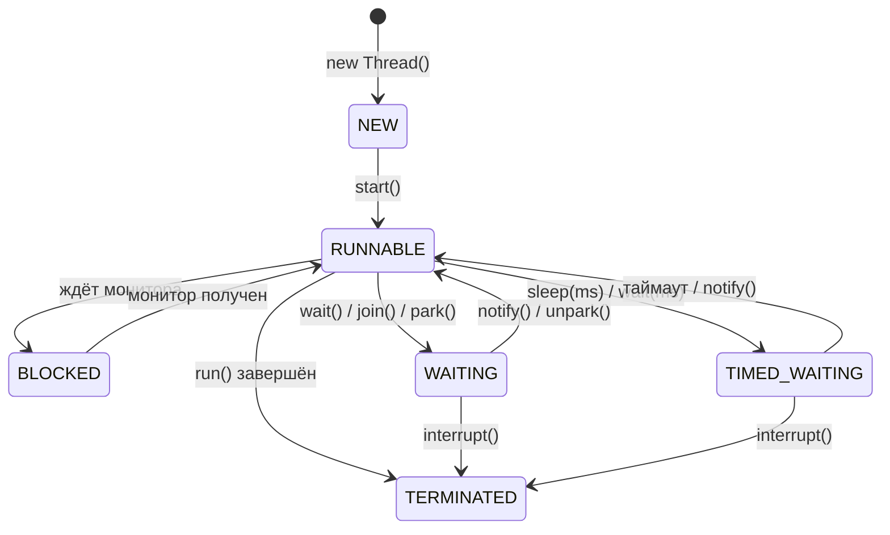
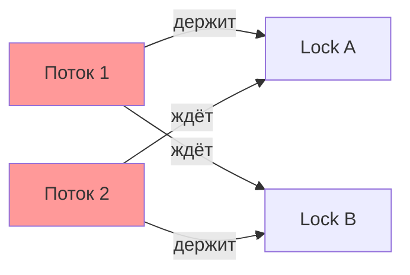
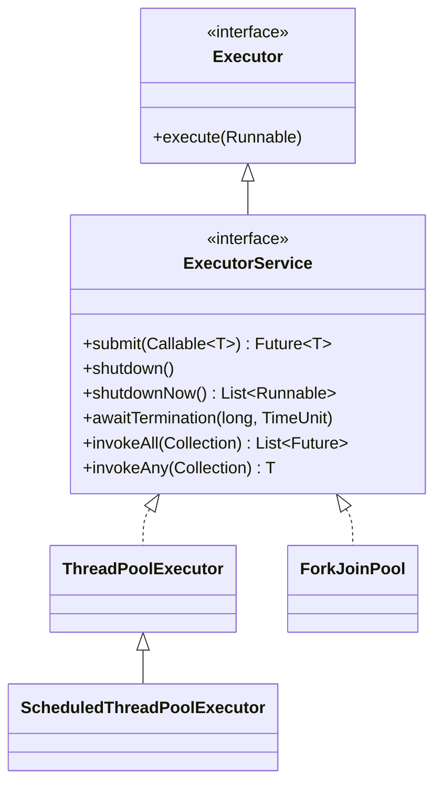
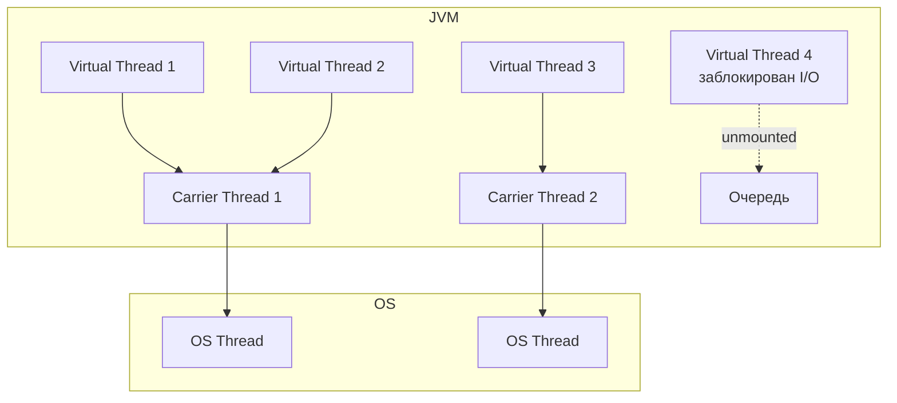

# Вопросы на собеседовании: `Java Concurrency`

Комплексное руководство по вопросам собеседования на тему `Java Concurrency` для `Senior Java Developer`. Включает потоки, синхронизацию, `java.util.concurrent`, `CompletableFuture`, `Virtual Threads` и `Structured Concurrency`.

## Полезные ссылки

### Официальная документация

- [Java Concurrency Tutorial](https://docs.oracle.com/javase/tutorial/essential/concurrency/) — базовое руководство Oracle
- [java.util.concurrent Package](https://docs.oracle.com/en/java/javase/21/docs/api/java.base/java/util/concurrent/package-summary.html) — Javadoc пакета
- [Java Memory Model (JLS 17)](https://docs.oracle.com/javase/specs/jls/se21/html/jls-17.html) — спецификация JMM
- [JEP 444: Virtual Threads](https://openjdk.org/jeps/444) — спецификация виртуальных потоков
- [JEP 453: Structured Concurrency](https://openjdk.org/jeps/453) — спецификация структурированной конкурентности

### Baeldung

- [Java Concurrency Interview Questions — Baeldung](https://www.baeldung.com/java-concurrency-interview-questions) — вопросы с ответами по многопоточности
- [Java Concurrency Series — Baeldung](https://www.baeldung.com/java-concurrency) — серия статей по всем аспектам конкурентности
- [What Is Thread-Safety and How to Achieve It? — Baeldung](https://www.baeldung.com/java-thread-safety) — потокобезопасность и способы её достижения
- [Life Cycle of a Thread in Java — Baeldung](https://www.baeldung.com/java-thread-lifecycle) — жизненный цикл потока с диаграммами

## Содержание

- [Полезные ссылки](#полезные-ссылки)
- [See also](#see-also)

**Потоки: создание, жизненный цикл, приоритеты**
- [Q1. (!) В чем разница между `Process` и `Thread`?](#q1--в-чем-разница-между-process-и-thread)
- [Q2. Как создать поток и запустить его?](#q2-как-создать-поток-и-запустить-его)
- [Q3. (!) Какие состояния есть у `Thread`?](#q3--какие-состояния-есть-у-thread)
- [Q4. Что такое `Thread Priority`?](#q4-что-такое-thread-priority)
- [Q5. (!) В чем разница между `Runnable` и `Callable`?](#q5--в-чем-разница-между-runnable-и-callable)
- [Q6. Что такое `Daemon Thread`?](#q6-что-такое-daemon-thread)
- [Q7. (!) Что такое `interrupt()`, `isInterrupted()`, `InterruptedException`?](#q7--что-такое-interrupt-isinterrupted-interruptedexception)
- [Q8. В чем разница между `yield()`, `join()` и `sleep()`?](#q8-в-чем-разница-между-yield-join-и-sleep)

**`Java Memory Model`, `volatile`, `final`**
- [Q9. (!) Что такое `Java Memory Model` (`JMM`)?](#q9--что-такое-java-memory-model-jmm)
- [Q10. (!) Что такое `volatile`? Что гарантирует `JMM` для `volatile` полей?](#q10--что-такое-volatile-что-гарантирует-jmm-для-volatile-полей)
- [Q11. Какие гарантии дает `JMM` для `final` полей?](#q11-какие-гарантии-дает-jmm-для-final-полей)
- [Q12. (!) Что такое `happens-before`?](#q12--что-такое-happens-before)

**Синхронизация: `synchronized`, `wait/notify`, потокобезопасность**
- [Q13. (!) Что такое `synchronized` блок и метод?](#q13--что-такое-synchronized-блок-и-метод)
- [Q14. В чем преимущество `synchronized` блока перед методом?](#q14-в-чем-преимущество-synchronized-блока-перед-методом)
- [Q15. (!) Разница между блокировкой на уровне класса и объекта](#q15--разница-между-блокировкой-на-уровне-класса-и-объекта)
- [Q16. Какова цель `wait()`, `notify()` и `notifyAll()`?](#q16-какова-цель-wait-notify-и-notifyall)
- [Q17. Что такое потокобезопасный класс?](#q17-что-такое-потокобезопасный-класс)

**Атомарные операции и классы**
- [Q18. (!) Что такое `Atomic` классы и `CAS`?](#q18--что-такое-atomic-классы-и-cas)
- [Q19. Чем `AtomicInteger` лучше `synchronized int`?](#q19-чем-atomicinteger-лучше-synchronized-int)

**Locks: `ReentrantLock`, `ReadWriteLock`, `StampedLock`**
- [Q20. (!) Что такое `ReentrantLock` и чем он лучше `synchronized`?](#q20--что-такое-reentrantlock-и-чем-он-лучше-synchronized)
- [Q21. (!) Что такое `ReadWriteLock` и `StampedLock`?](#q21--что-такое-readwritelock-и-stampedlock)
- [Q22. Что такое `Condition` в `java.util.concurrent.locks`?](#q22-что-такое-condition-в-javautilconcurrentlocks)

**Deadlock, Livelock, Starvation, Race Condition**
- [Q23. (!) Что такое `Deadlock`? Как предотвратить?](#q23--что-такое-deadlock-как-предотвратить)
- [Q24. В чем разница между `Deadlock`, `Livelock` и `Starvation`?](#q24-в-чем-разница-между-deadlock-livelock-и-starvation)
- [Q25. (!) Что такое `Race Condition`?](#q25--что-такое-race-condition)

**`ThreadLocal`**
- [Q26. Что такое `ThreadLocal`?](#q26-что-такое-threadlocal)
- [Q27. В чем разница между `ThreadLocal` и `InheritableThreadLocal`?](#q27-в-чем-разница-между-threadlocal-и-inheritablethreadlocal)

**`Executor`, пулы потоков**
- [Q28. (!) Что такое `Executor` и `ExecutorService`?](#q28--что-такое-executor-и-executorservice)
- [Q29. (!) Какие реализации `ExecutorService` есть в стандартной библиотеке?](#q29--какие-реализации-executorservice-есть-в-стандартной-библиотеке)
- [Q30. Разница между `shutdown()`, `shutdownNow()` и `awaitTermination()`](#q30-разница-между-shutdown-shutdownnow-и-awaittermination)
- [Q31. Разница между `submit()` и `execute()`](#q31-разница-между-submit-и-execute)
- [Q32. Что такое `ForkJoinPool` и work-stealing?](#q32-что-такое-forkjoinpool-и-work-stealing)

**`Future`, `CompletableFuture`**
- [Q33. (!) Что такое `Future` и `FutureTask`?](#q33--что-такое-future-и-futuretask)
- [Q34. (!) Что такое `CompletableFuture`?](#q34--что-такое-completablefuture)
- [Q35. (!) Разница между `thenApply()`, `thenCompose()` и `thenCombine()`](#q35--разница-между-thenapply-thencompose-и-thencombine)
- [Q36. Как обрабатывать исключения в `CompletableFuture`?](#q36-как-обрабатывать-исключения-в-completablefuture)
- [Q37. Как выполнить несколько `CompletableFuture` параллельно?](#q37-как-выполнить-несколько-completablefuture-параллельно)

**Синхронизаторы: `CountDownLatch`, `CyclicBarrier`, `Semaphore`, `Phaser`**
- [Q38. (!) Что такое `CountDownLatch` и `CyclicBarrier`?](#q38--что-такое-countdownlatch-и-cyclicbarrier)
- [Q39. Что такое `Semaphore`?](#q39-что-такое-semaphore)
- [Q40. Что такое `Phaser` и `Exchanger`?](#q40-что-такое-phaser-и-exchanger)

**Concurrent Collections**
- [Q41. (!) Что такое `Concurrent Collection Classes`?](#q41--что-такое-concurrent-collection-classes)
- [Q42. Как работает `ConcurrentHashMap`?](#q42-как-работает-concurrenthashmap)
- [Q43. Что такое `BlockingQueue`?](#q43-что-такое-blockingqueue)

**Практические задачи**
- [Q44. Как решить `Producer-Consumer` проблему?](#q44-как-решить-producer-consumer-проблему)
- [Q45. Что такое `Java Thread Dump` и как его получить?](#q45-что-такое-java-thread-dump-и-как-его-получить)

**Virtual Threads и Structured Concurrency (Java 21+)**
- [Q46. (!) Что такое `Virtual Threads` и чем они отличаются от platform threads?](#q46--что-такое-virtual-threads-и-чем-они-отличаются-от-platform-threads)
- [Q47. Когда использовать и когда НЕ использовать `Virtual Threads`?](#q47-когда-использовать-и-когда-не-использовать-virtual-threads)
- [Q48. (!) Что такое thread pinning в контексте `Virtual Threads`?](#q48--что-такое-thread-pinning-в-контексте-virtual-threads)
- [Q49. Что такое `Structured Concurrency`?](#q49-что-такое-structured-concurrency)
- [Q50. Что такое `Scoped Values` и чем они лучше `ThreadLocal`?](#q50-что-такое-scoped-values-и-чем-они-лучше-threadlocal)

**`ForkJoin`, `CompletableFuture` цепочки, синхронизаторы**
- [Q51. (!) Как работает `ForkJoinPool` и алгоритм work-stealing подробно?](#q51--как-работает-forkjoinpool-и-алгоритм-work-stealing-подробно)
- [Q52. (!) Как построить сложную цепочку `CompletableFuture` с обработкой ошибок?](#q52--как-построить-сложную-цепочку-completablefuture-с-обработкой-ошибок)
- [Q53. Что такое `StampedLock` и когда его использовать вместо `ReadWriteLock`?](#q53-что-такое-stampedlock-и-когда-его-использовать-вместо-readwritelock)
- [Q54. Что такое `Phaser` и чем он отличается от `CountDownLatch` и `CyclicBarrier`?](#q54-что-такое-phaser-и-чем-он-отличается-от-countdownlatch-и-cyclicbarrier)
- [Q55. Что такое `Exchanger` и в каких сценариях применяется?](#q55-что-такое-exchanger-и-в-каких-сценариях-применяется)
- [Q56. Как использовать `StructuredTaskScope` для параллельных запросов с отменой?](#q56-как-использовать-structuredtaskscope-для-параллельных-запросов-с-отменой)

---

## Q1. (!) В чем разница между `Process` и `Thread`?

**Процесс** (`Process`) — экземпляр выполняющейся программы с собственным адресным пространством, файловыми дескрипторами и ресурсами. Процессы изолированы друг от друга на уровне ОС.

**Поток** (`Thread`) — единица выполнения внутри процесса. Потоки одного процесса разделяют адресное пространство, кучу и статические поля, но имеют собственный стек вызовов и счетчик команд.

**Context Switching** — переключение CPU между потоками/процессами. Переключение между потоками одного процесса дешевле, чем между процессами, так как не требует сброса TLB и смены адресного пространства.

| Характеристика | `Process` | `Thread` |
|---|---|---|
| Память | Изолированная | Общая куча |
| Создание | Дорогое (fork) | Дешёвое |
| Коммуникация | IPC (pipes, sockets) | Через общую память |
| Отказоустойчивость | Падение одного не влияет | Исключение может убить процесс |

## Q2. Как создать поток и запустить его?

Два основных способа:

**1. Через `Runnable` (предпочтительный):**

```java
Thread thread = new Thread(() -> System.out.println("Hello from thread!"));
thread.start();
```

**2. Наследование от `Thread`:**

```java
class MyThread extends Thread {
    @Override
    public void run() {
        System.out.println("Hello from MyThread!");
    }
}
new MyThread().start();
```

Предпочтителен `Runnable`, так как `Java` не поддерживает множественное наследование. Реализуя `Runnable`, класс свободен наследовать другой класс.

Важно: вызов `run()` вместо `start()` выполнит код в текущем потоке, без создания нового.

## Q3. (!) Какие состояния есть у `Thread`?

Состояния определены в перечислении `Thread.State`:

1. **`NEW`** — поток создан, но `start()` ещё не вызван
2. **`RUNNABLE`** — поток выполняется или готов к выполнению (ждёт CPU)
3. **`BLOCKED`** — ждёт захвата монитора (вход в `synchronized` блок)
4. **`WAITING`** — ждёт бессрочно: `Object.wait()`, `Thread.join()`, `LockSupport.park()`
5. **`TIMED_WAITING`** — ждёт ограниченное время: `Thread.sleep(ms)`, `wait(ms)`, `join(ms)`
6. **`TERMINATED`** — поток завершил выполнение



## Q4. Что такое `Thread Priority`?

Приоритет потока — целое число от 1 до 10, используемое планировщиком потоков. Потоки с более высоким приоритетом получают больше шансов на выполнение, но это **не гарантировано** — зависит от ОС.

```java
Thread.MIN_PRIORITY  // 1
Thread.NORM_PRIORITY // 5 (по умолчанию)
Thread.MAX_PRIORITY  // 10

Thread t = new Thread(task);
t.setPriority(Thread.MAX_PRIORITY);
```

Приоритет наследуется от родительского потока. Поскольку `main` имеет приоритет 5, все потоки, созданные из `main`, также получат 5.

На собеседовании важно подчеркнуть: полагаться на приоритеты для обеспечения корректности программы нельзя — это лишь *подсказка* планировщику.

## Q5. (!) В чем разница между `Runnable` и `Callable`?

| Характеристика | `Runnable` | `Callable<V>` |
|---|---|---|
| Метод | `void run()` | `V call() throws Exception` |
| Возвращаемое значение | Нет | Есть (`V`) |
| Checked exceptions | Не может бросить | Может бросить |
| Используется с | `Thread`, `ExecutorService` | `ExecutorService` |

```java
// Runnable — без результата
Runnable task = () -> System.out.println("Running");
new Thread(task).start();

// Callable — с результатом
Callable<Integer> callable = () -> {
    TimeUnit.SECONDS.sleep(1);
    return 42;
};
ExecutorService executor = Executors.newSingleThreadExecutor();
Future<Integer> future = executor.submit(callable);
Integer result = future.get(); // 42
executor.shutdown();
```

## Q6. Что такое `Daemon Thread`?

`Daemon Thread` — фоновый поток, который не препятствует завершению `JVM`. Когда все не-daemon потоки завершены, `JVM` автоматически останавливает все daemon потоки и завершается.

```java
Thread daemon = new Thread(() -> {
    while (true) {
        // фоновая очистка кэша
    }
});
daemon.setDaemon(true); // ВАЖНО: до start()
daemon.start();
```

Типичные примеры: сборщик мусора (`GC`), финализатор, потоки мониторинга.

Важно: `setDaemon(true)` необходимо вызвать **до** `start()`, иначе будет `IllegalThreadStateException`.

## Q7. (!) Что такое `interrupt()`, `isInterrupted()`, `InterruptedException`?

Механизм прерывания — кооперативный способ сигнализировать потоку о необходимости остановки:

- **`interrupt()`** — устанавливает флаг прерывания потока
- **`isInterrupted()`** — проверяет флаг, не сбрасывая его
- **`Thread.interrupted()`** — проверяет и **сбрасывает** флаг

Если поток заблокирован в `sleep()`, `wait()`, `join()` — бросается `InterruptedException` и флаг сбрасывается:

```java
Thread worker = new Thread(() -> {
    while (!Thread.currentThread().isInterrupted()) {
        try {
            // выполняем работу
            Thread.sleep(100);
        } catch (InterruptedException e) {
            // sleep сбрасывает флаг → восстанавливаем
            Thread.currentThread().interrupt();
            break;
        }
    }
    System.out.println("Поток корректно завершён");
});
worker.start();
// ...
worker.interrupt(); // сигнал на завершение
```

Лучшая практика: всегда восстанавливать флаг прерывания в `catch (InterruptedException)` или пробрасывать исключение выше.

## Q8. В чем разница между `yield()`, `join()` и `sleep()`?

| Метод | Что делает | Освобождает монитор? | Бросает `InterruptedException`? |
|---|---|---|---|
| `yield()` | Подсказка планировщику уступить CPU | Нет | Нет |
| `sleep(ms)` | Приостанавливает поток на N мс | Нет | Да |
| `join()` | Ждёт завершения другого потока | Нет | Да |

```java
Thread t = new Thread(() -> {
    // долгая работа
});
t.start();
t.join(); // текущий поток ждёт завершения t
System.out.println("t завершён");
```

## Q9. (!) Что такое `Java Memory Model` (`JMM`)?

`JMM` — спецификация (JLS Chapter 17), определяющая правила видимости изменений между потоками и допустимые переупорядочения операций.

Ключевые концепции:

1. **Видимость** — когда изменение, сделанное одним потоком, становится видимым другому
2. **Упорядочение** — компилятор и CPU могут переупорядочивать инструкции для оптимизации
3. **Атомарность** — неделимость операции
4. **`happens-before`** — основное отношение, гарантирующее видимость

Без синхронизации `JVM` **не гарантирует**, что изменение переменной в одном потоке будет видно другому потоку. Это происходит из-за кэширования значений в регистрах и L1/L2 кэшах процессора.

Подробнее о том, как `JMM` связана с устройством `JVM`, см. в [вопросах по JVM](../../jvm/jvm-interview.md).

## Q10. (!) Что такое `volatile`? Что гарантирует `JMM` для `volatile` полей?

`volatile` — модификатор поля, обеспечивающий:

1. **Видимость** — запись в `volatile` поле всегда видна другим потокам
2. **Запрет переупорядочения** — операции до записи в `volatile` не могут быть перенесены после неё
3. **`happens-before`** — запись в `volatile` `happens-before` последующего чтения этого поля

```java
public class VolatileFlag {
    private volatile boolean running = true;

    public void stop() {
        running = false; // видимо всем потокам
    }

    public void work() {
        while (running) {
            // без volatile поток может закэшировать running=true
            // и никогда не увидеть изменение
        }
    }
}
```

Ограничения `volatile`: **не обеспечивает атомарность** составных операций. Например, `count++` (read-modify-write) с `volatile` всё равно небезопасна — для этого нужны `Atomic` классы или `synchronized`.

## Q11. Какие гарантии дает `JMM` для `final` полей?

`JMM` гарантирует, что значение `final` поля, присвоенное в конструкторе, видно всем потокам **без синхронизации**, при условии что ссылка на объект не утекла до завершения конструктора.

```java
public class ImmutableHolder {
    private final int value;
    private final List<String> items;

    public ImmutableHolder(int value, List<String> items) {
        this.value = value;
        this.items = Collections.unmodifiableList(new ArrayList<>(items));
        // НЕ публикуем this до конца конструктора!
    }
}
```

Это фундамент для создания неизменяемых (immutable) объектов, которые автоматически потокобезопасны. Подробнее о неизменяемости и паттернах проектирования — в [вопросах по паттернам](../../design-patterns/design-patterns-interview.md).

## Q12. (!) Что такое `happens-before`?

`happens-before` — отношение в `JMM`, гарантирующее, что если действие A `happens-before` действия B, то результаты A видны потоку, выполняющему B.

Основные правила `happens-before`:

1. **Program Order** — в одном потоке предшествующий по коду оператор `hb` последующего
2. **Monitor Lock** — `unlock()` монитора `hb` последующего `lock()` того же монитора
3. **Volatile** — запись в `volatile` `hb` последующего чтения
4. **Thread Start** — `thread.start()` `hb` первой инструкции в `run()`
5. **Thread Join** — последняя инструкция в `run()` `hb` возврата из `join()`
6. **Транзитивность** — если A `hb` B и B `hb` C, то A `hb` C

## Q13. (!) Что такое `synchronized` блок и метод?

`synchronized` — механизм синхронизации через захват монитора объекта. Только один поток может владеть монитором в каждый момент времени.

```java
// synchronized метод — монитор = this (или Class для static)
public synchronized void increment() {
    count++;
}

// synchronized блок — монитор = указанный объект
public void increment() {
    synchronized (lock) {
        count++;
    }
}
```

Свойства `synchronized`:

- **Взаимное исключение** — только один поток в критической секции
- **Видимость** — изменения видны следующему потоку, захватившему монитор
- **Реентерабельность** — поток может повторно захватить монитор, который уже держит
- **`happens-before`** — `unlock` монитора `hb` последующего `lock`

## Q14. В чем преимущество `synchronized` блока перед методом?

1. **Гранулярность** — блок позволяет синхронизировать только критическую секцию, а не весь метод
2. **Выбор монитора** — можно использовать разные объекты-мониторы для разных ресурсов
3. **Уменьшение contention** — код вне блока выполняется параллельно

```java
public class BankAccount {
    private final Object balanceLock = new Object();
    private final Object historyLock = new Object();

    public void transfer(int amount) {
        synchronized (balanceLock) {
            balance += amount;
        }
        // Запись истории не блокирует операции с балансом
        synchronized (historyLock) {
            history.add("Transfer: " + amount);
        }
    }
}
```

## Q15. (!) Разница между блокировкой на уровне класса и объекта

| Тип блокировки | Монитор | Область действия |
|---|---|---|
| Уровень объекта | `this` | Только один экземпляр |
| Уровень класса | `ClassName.class` | Все экземпляры |

```java
// Уровень объекта — разные экземпляры не блокируют друг друга
public synchronized void instanceMethod() { /* монитор = this */ }

// Уровень класса — блокирует для ВСЕХ экземпляров
public static synchronized void classMethod() { /* монитор = MyClass.class */ }

// Эквивалент через блок:
synchronized (MyClass.class) { /* уровень класса */ }
```

Если два потока вызывают `synchronized` экземплярный метод для **разных** объектов — они **не блокируют** друг друга. Для **статических** `synchronized` методов — всегда блокируют, так как монитор один на класс.

## Q16. Какова цель `wait()`, `notify()` и `notifyAll()`?

Эти методы класса `Object` используются для межпоточной коммуникации и должны вызываться только внутри `synchronized` блока:

- **`wait()`** — поток освобождает монитор и переходит в `WAITING`
- **`notify()`** — будит один произвольный поток, ожидающий на этом мониторе
- **`notifyAll()`** — будит все ожидающие потоки

```java
synchronized (sharedObject) {
    while (!condition) {
        sharedObject.wait(); // ВСЕГДА в цикле, не в if!
    }
    // condition выполнено — работаем
}

// Другой поток:
synchronized (sharedObject) {
    condition = true;
    sharedObject.notifyAll(); // предпочтительнее notify()
}
```

Важно: `wait()` всегда вызывается в цикле `while`, а не в `if`, из-за **spurious wakeups** (ложных пробуждений).

## Q17. Что такое потокобезопасный класс?

Потокобезопасный класс — класс, корректно работающий при одновременном доступе из множества потоков без дополнительной внешней синхронизации.

Способы достижения потокобезопасности:

1. **Иммутабельность** — `final` поля, нет сеттеров (см. [Java Core](java-core-interview.md))
2. **`synchronized`** — синхронизация критических секций
3. **`Atomic` классы** — lock-free атомарные операции
4. **`ThreadLocal`** — изолированные данные для каждого потока
5. **`Lock` API** — `ReentrantLock`, `ReadWriteLock`
6. **Concurrent collections** — `ConcurrentHashMap`, `CopyOnWriteArrayList`

Примеры потокобезопасных классов из JDK: `StringBuffer`, `ConcurrentHashMap`, `AtomicInteger`, `Vector` (устаревший).

## Q18. (!) Что такое `Atomic` классы и `CAS`?

Классы из `java.util.concurrent.atomic` обеспечивают атомарные операции без блокировок, используя механизм **CAS** (`Compare-And-Swap`):

```java
AtomicInteger counter = new AtomicInteger(0);
counter.incrementAndGet();     // атомарный ++
counter.compareAndSet(1, 10);  // если значение == 1, установить 10
counter.getAndUpdate(x -> x * 2); // атомарное преобразование
```

**CAS** — аппаратная инструкция: «если текущее значение == ожидаемому, записать новое, иначе вернуть текущее». Это неблокирующий алгоритм: поток не засыпает, а повторяет попытку.

Основные классы:

| Класс | Назначение |
|---|---|
| `AtomicInteger`, `AtomicLong` | Атомарный int/long |
| `AtomicBoolean` | Атомарный boolean |
| `AtomicReference<V>` | Атомарная ссылка |
| `AtomicStampedReference<V>` | Ссылка + версия (решает ABA-проблему) |
| `LongAdder`, `LongAccumulator` | Высокопроизводительные счётчики (Java 8+) |

`LongAdder` работает быстрее `AtomicLong` при высокой конкуренции, так как разбивает счётчик на ячейки (striped), а потоки пишут в разные ячейки.

## Q19. Чем `AtomicInteger` лучше `synchronized int`?

```java
// synchronized — поток блокируется при конкуренции
private int count;
public synchronized void increment() { count++; }

// AtomicInteger — lock-free, без блокировки
private final AtomicInteger count = new AtomicInteger();
public void increment() { count.incrementAndGet(); }
```

Преимущества `AtomicInteger`:

1. **Нет блокировки** — использует CAS вместо захвата монитора
2. **Выше пропускная способность** при умеренной конкуренции
3. **Нет риска deadlock**

Недостаток: при очень высокой конкуренции CAS может привести к spin-loop. В таких случаях лучше `LongAdder`.

## Q20. (!) Что такое `ReentrantLock` и чем он лучше `synchronized`?

`ReentrantLock` — расширенная блокировка из `java.util.concurrent.locks`:

```java
private final ReentrantLock lock = new ReentrantLock();

public void update() {
    lock.lock();
    try {
        // критическая секция
    } finally {
        lock.unlock(); // ВСЕГДА в finally!
    }
}
```

Преимущества над `synchronized`:

| Возможность | `synchronized` | `ReentrantLock` |
|---|---|---|
| Попытка захвата (`tryLock`) | Нет | Да |
| Ожидание с таймаутом | Нет | `tryLock(time, unit)` |
| Прерываемое ожидание | Нет | `lockInterruptibly()` |
| Fairness (справедливость) | Нет | `new ReentrantLock(true)` |
| Множественные `Condition` | Один (`wait/notify`) | Несколько `newCondition()` |
| Автоматическое освобождение | Да (при выходе из блока) | Нет (нужен `finally`) |

## Q21. (!) Что такое `ReadWriteLock` и `StampedLock`?

**`ReadWriteLock`** разделяет блокировку на чтение и запись:

```java
ReadWriteLock rwLock = new ReentrantReadWriteLock();

// Множество читателей одновременно
rwLock.readLock().lock();
try { return cache.get(key); }
finally { rwLock.readLock().unlock(); }

// Только один писатель
rwLock.writeLock().lock();
try { cache.put(key, value); }
finally { rwLock.writeLock().unlock(); }
```

**`StampedLock`** (Java 8) добавляет **оптимистичное чтение** — самый быстрый режим, без блокировки:

```java
StampedLock sl = new StampedLock();

// Оптимистичное чтение — без блокировки!
long stamp = sl.tryOptimisticRead();
double x = this.x, y = this.y;
if (!sl.validate(stamp)) {
    // Была запись — переходим на обычный read lock
    stamp = sl.readLock();
    try { x = this.x; y = this.y; }
    finally { sl.unlockRead(stamp); }
}
return Math.sqrt(x * x + y * y);
```

| Тип | Реентерабельный | Оптимистичное чтение | Upgrade read→write |
|---|---|---|---|
| `ReentrantReadWriteLock` | Да | Нет | Нет |
| `StampedLock` | Нет | Да | Да (`tryConvertToWriteLock`) |

## Q22. Что такое `Condition` в `java.util.concurrent.locks`?

`Condition` — аналог `wait()`/`notify()` для `Lock`. Позволяет создавать **несколько** условий на одном `Lock`:

```java
private final Lock lock = new ReentrantLock();
private final Condition notFull = lock.newCondition();
private final Condition notEmpty = lock.newCondition();

public void put(E item) throws InterruptedException {
    lock.lock();
    try {
        while (count == capacity) notFull.await();
        items[putIndex] = item;
        count++;
        notEmpty.signal();
    } finally {
        lock.unlock();
    }
}

public E take() throws InterruptedException {
    lock.lock();
    try {
        while (count == 0) notEmpty.await();
        E item = items[takeIndex];
        count--;
        notFull.signal();
        return item;
    } finally {
        lock.unlock();
    }
}
```

С `synchronized` пришлось бы использовать один `wait/notifyAll` для обоих условий, что менее эффективно.

## Q23. (!) Что такое `Deadlock`? Как предотвратить?

`Deadlock` — ситуация, когда два или более потока блокируют друг друга, каждый ожидая ресурс, удерживаемый другим.

```java
// Классический deadlock
Object lock1 = new Object(), lock2 = new Object();

// Поток 1: lock1 → lock2
new Thread(() -> {
    synchronized (lock1) {
        synchronized (lock2) { /* ... */ }
    }
}).start();

// Поток 2: lock2 → lock1  (обратный порядок!)
new Thread(() -> {
    synchronized (lock2) {
        synchronized (lock1) { /* ... */ }
    }
}).start();
```

Четыре условия возникновения (все одновременно):
1. **Mutual Exclusion** — ресурс эксклюзивен
2. **Hold and Wait** — поток удерживает ресурс и ждёт другой
3. **No Preemption** — ресурс нельзя отобрать
4. **Circular Wait** — циклическая зависимость

**Способы предотвращения:**
- Фиксированный порядок захвата блокировок (lock ordering)
- `tryLock()` с таймаутом
- Избегать вложенных `synchronized`
- Использовать `java.util.concurrent` вместо ручной синхронизации



## Q24. В чем разница между `Deadlock`, `Livelock` и `Starvation`?

| Проблема | Описание | Потоки активны? |
|---|---|---|
| **Deadlock** | Циклическое ожидание ресурсов | Нет, все заблокированы |
| **Livelock** | Потоки реагируют друг на друга, но не продвигаются | Да, но бесполезно |
| **Starvation** | Поток не получает ресурсы из-за приоритетов | Частично |

**Livelock** — аналогия: два человека в коридоре, оба уступают друг другу в одну сторону, и никто не проходит.

**Starvation** — потоки с низким приоритетом никогда не получают CPU, потому что высокоприоритетные потоки постоянно его занимают. Решение — fairness policy (`new ReentrantLock(true)`).

## Q25. (!) Что такое `Race Condition`?

`Race Condition` — ситуация, когда результат программы зависит от порядка выполнения потоков. Возникает при неатомарном доступе к общим данным.

```java
// Race Condition: check-then-act
if (map.containsKey(key)) {       // 1. проверка
    return map.get(key);           // 2. чтение — между 1 и 2 другой поток
}                                  //    мог удалить ключ → NPE!

// Исправление: атомарная операция
return map.computeIfAbsent(key, k -> createValue(k));
```

Обнаружение:
- Статический анализ: `SpotBugs`, `IntelliJ Inspections`
- Динамический: `ThreadSanitizer`, стресс-тестирование
- Инструменты `JVM`: `-XX:+UseGCLogFileRotation`

## Q26. Что такое `ThreadLocal`?

`ThreadLocal` — переменная с изолированной копией для каждого потока:

```java
private static final ThreadLocal<SimpleDateFormat> dateFormat =
    ThreadLocal.withInitial(() -> new SimpleDateFormat("yyyy-MM-dd"));

public String formatDate(Date date) {
    return dateFormat.get().format(date); // каждый поток — свой экземпляр
}
```

Типичные применения: `SimpleDateFormat`, `Connection` в пуле, контекст запроса (`MDC` в логировании, `RequestContextHolder` в `Spring`).

Опасность утечки памяти: если поток из пула (`ExecutorService`) не очищает `ThreadLocal`, данные сохраняются между запросами. Всегда вызывайте `threadLocal.remove()` после использования.

## Q27. В чем разница между `ThreadLocal` и `InheritableThreadLocal`?

| Характеристика | `ThreadLocal` | `InheritableThreadLocal` |
|---|---|---|
| Наследование | Нет | Да — дочерний поток получает копию |
| Область | Только текущий поток | Текущий + дочерние потоки |

```java
InheritableThreadLocal<String> ctx = new InheritableThreadLocal<>();
ctx.set("request-123");

new Thread(() -> {
    System.out.println(ctx.get()); // "request-123" — унаследовано
}).start();
```

Ограничение: **не работает с пулами потоков**, так как потоки создаются один раз и переиспользуются. Для пулов потоков в `Java 21+` рекомендуются `ScopedValue` (см. Q50).

## Q28. (!) Что такое `Executor` и `ExecutorService`?

`Executor` — базовый интерфейс с единственным методом `execute(Runnable)`, отделяющий задачу от механизма её выполнения.

`ExecutorService` — расширение `Executor` с жизненным циклом и возможностью получения результатов:



## Q29. (!) Какие реализации `ExecutorService` есть в стандартной библиотеке?

Фабричные методы `Executors`:

| Метод | Пул | Очередь | Когда использовать |
|---|---|---|---|
| `newFixedThreadPool(n)` | Фиксированный n потоков | `LinkedBlockingQueue` (unbounded) | Предсказуемая нагрузка |
| `newCachedThreadPool()` | 0 → ∞ потоков (60s idle) | `SynchronousQueue` | Много коротких задач |
| `newSingleThreadExecutor()` | 1 поток | `LinkedBlockingQueue` | Последовательное выполнение |
| `newScheduledThreadPool(n)` | Фиксированный n | `DelayedWorkQueue` | Периодические задачи |
| `newWorkStealingPool()` | `ForkJoinPool` | Deque per thread | Рекурсивные задачи |
| `newVirtualThreadPerTaskExecutor()` | Virtual threads | Нет пула | I/O-bound задачи (Java 21) |

Важно: `newCachedThreadPool()` и `newFixedThreadPool()` с unbounded очередью могут привести к `OutOfMemoryError` при перегрузке. В продакшене лучше создавать `ThreadPoolExecutor` напрямую с ограниченной очередью и `RejectedExecutionHandler`.

## Q30. Разница между `shutdown()`, `shutdownNow()` и `awaitTermination()`

```java
ExecutorService executor = Executors.newFixedThreadPool(4);

// 1. Graceful shutdown — не принимает новые задачи, дорабатывает текущие
executor.shutdown();

// 2. Ждём завершения
if (!executor.awaitTermination(60, TimeUnit.SECONDS)) {
    // 3. Принудительная остановка — прерывает текущие задачи
    List<Runnable> pending = executor.shutdownNow();
    System.out.println("Не завершённые задачи: " + pending.size());
}
```

| Метод | Новые задачи | Текущие задачи | Ожидающие задачи |
|---|---|---|---|
| `shutdown()` | Отклоняет | Дорабатывает | Дорабатывает |
| `shutdownNow()` | Отклоняет | Прерывает | Возвращает список |
| `awaitTermination()` | — | Блокирует до завершения | — |

## Q31. Разница между `submit()` и `execute()`

| Метод | Принимает | Возвращает | Обработка исключений |
|---|---|---|---|
| `execute(Runnable)` | `Runnable` | `void` | `UncaughtExceptionHandler` |
| `submit(Callable/Runnable)` | `Callable` или `Runnable` | `Future` | Исключение в `Future.get()` |

```java
// execute — исключение выбрасывается в потоке пула
executor.execute(() -> { throw new RuntimeException("oops"); });

// submit — исключение "проглатывается" до вызова future.get()
Future<?> f = executor.submit(() -> { throw new RuntimeException("oops"); });
try {
    f.get(); // здесь получим ExecutionException
} catch (ExecutionException e) {
    System.out.println(e.getCause()); // oops
}
```

## Q32. Что такое `ForkJoinPool` и work-stealing?

`ForkJoinPool` — пул потоков, оптимизированный для рекурсивных задач «разделяй и властвуй». Каждый поток имеет свою локальную очередь задач (deque).

**Work-stealing**: когда поток освободился, он «ворует» задачи из очереди другого занятого потока (с хвоста deque).

```java
class SumTask extends RecursiveTask<Long> {
    private final int[] arr;
    private final int from, to;
    private static final int THRESHOLD = 1000;

    @Override
    protected Long compute() {
        if (to - from <= THRESHOLD) {
            long sum = 0;
            for (int i = from; i < to; i++) sum += arr[i];
            return sum;
        }
        int mid = (from + to) / 2;
        SumTask left = new SumTask(arr, from, mid);
        SumTask right = new SumTask(arr, mid, to);
        left.fork();          // отправить в очередь
        long rightResult = right.compute(); // выполнить в текущем потоке
        long leftResult = left.join();      // дождаться результата
        return leftResult + rightResult;
    }
}

ForkJoinPool pool = new ForkJoinPool();
long total = pool.invoke(new SumTask(array, 0, array.length));
```

`ForkJoinPool.commonPool()` — общий пул, используемый `parallelStream()` и `CompletableFuture` по умолчанию. Его размер = `Runtime.getRuntime().availableProcessors() - 1`.

## Q33. (!) Что такое `Future` и `FutureTask`?

**`Future<V>`** — интерфейс, представляющий результат асинхронной операции:

```java
Future<String> future = executor.submit(() -> "result");
String result = future.get();            // блокирующее ожидание
String result = future.get(5, SECONDS);  // с таймаутом
boolean done = future.isDone();
future.cancel(true);                     // прерывание задачи
```

**`FutureTask<V>`** — конкретная реализация `Future` + `Runnable`, можно запускать и через `Thread`, и через `ExecutorService`:

```java
FutureTask<Integer> task = new FutureTask<>(() -> 42);
new Thread(task).start();
Integer result = task.get(); // 42
```

Основная проблема `Future`: `get()` блокирует поток. Для асинхронных цепочек используйте `CompletableFuture`.

## Q34. (!) Что такое `CompletableFuture`?

`CompletableFuture` — мощный класс для асинхронного программирования (Java 8+), поддерживающий цепочки, комбинирование и обработку ошибок:

```java
CompletableFuture.supplyAsync(() -> fetchUserFromDB(userId))    // async
    .thenApply(user -> enrichWithProfile(user))                  // transform
    .thenAccept(user -> sendNotification(user))                  // consume
    .exceptionally(ex -> {                                        // error handling
        log.error("Failed", ex);
        return null;
    });
```

Ключевые методы:

| Категория | Методы |
|---|---|
| Создание | `supplyAsync()`, `runAsync()`, `completedFuture()` |
| Трансформация | `thenApply()`, `thenCompose()`, `thenCombine()` |
| Потребление | `thenAccept()`, `thenRun()` |
| Ошибки | `exceptionally()`, `handle()`, `whenComplete()` |
| Комбинирование | `allOf()`, `anyOf()` |
| Async-варианты | `thenApplyAsync()`, `thenAcceptAsync()` |

По умолчанию `CompletableFuture` использует `ForkJoinPool.commonPool()`. Можно передать свой `Executor` вторым аргументом. Подробнее об асинхронных API в [вопросах по Java 8](java-8-interview.md).

## Q35. (!) Разница между `thenApply()`, `thenCompose()` и `thenCombine()`

Аналогия с `Stream API` (см. [Java Stream](java-stream-interview.md)):

| Метод | Аналог Stream | Что делает |
|---|---|---|
| `thenApply(f)` | `map()` | T → U, обёрнуто в CF |
| `thenCompose(f)` | `flatMap()` | T → CF<U>, разворачивает |
| `thenCombine(cf, f)` | — | Комбинирует два CF |

```java
// thenApply — синхронная трансформация
CompletableFuture<String> name = getUserId()
    .thenApply(id -> "User-" + id); // CF<String>

// thenCompose — асинхронная цепочка (flatMap)
CompletableFuture<Profile> profile = getUserId()
    .thenCompose(id -> fetchProfile(id)); // CF<Profile>, не CF<CF<Profile>>

// thenCombine — объединение двух независимых CF
CompletableFuture<String> combined = fetchName()
    .thenCombine(fetchAge(), (name, age) -> name + " (" + age + ")");
```

Правило: если функция возвращает `CompletableFuture` — используйте `thenCompose()`, если обычное значение — `thenApply()`.

## Q36. Как обрабатывать исключения в `CompletableFuture`?

Три метода обработки ошибок:

```java
CompletableFuture<String> cf = supplyAsync(() -> riskyOperation());

// 1. exceptionally — только ошибки, возвращает fallback
cf.exceptionally(ex -> "default");

// 2. handle — и успех, и ошибка, возвращает значение
cf.handle((result, ex) -> {
    if (ex != null) return "error: " + ex.getMessage();
    return result.toUpperCase();
});

// 3. whenComplete — побочный эффект (логирование), не меняет результат
cf.whenComplete((result, ex) -> {
    if (ex != null) log.error("Failed", ex);
});
```

| Метод | Доступ к результату | Доступ к ошибке | Может изменить результат |
|---|---|---|---|
| `exceptionally()` | Нет | Да | Да (fallback) |
| `handle()` | Да | Да | Да |
| `whenComplete()` | Да | Да | Нет |

## Q37. Как выполнить несколько `CompletableFuture` параллельно?

```java
CompletableFuture<String> cf1 = supplyAsync(() -> fetchFromServiceA());
CompletableFuture<String> cf2 = supplyAsync(() -> fetchFromServiceB());
CompletableFuture<Integer> cf3 = supplyAsync(() -> fetchFromServiceC());

// allOf — ждёт завершения ВСЕХ
CompletableFuture<Void> all = CompletableFuture.allOf(cf1, cf2, cf3);
all.thenRun(() -> {
    String a = cf1.join(); // гарантированно завершён
    String b = cf2.join();
    int c = cf3.join();
});

// anyOf — возвращает первый завершившийся
CompletableFuture<Object> any = CompletableFuture.anyOf(cf1, cf2);
any.thenAccept(result -> System.out.println("Первый результат: " + result));
```

Недостаток `allOf()`: возвращает `CompletableFuture<Void>`, нужно извлекать результаты через `join()`. Для удобства в продакшене используют библиотеки (`Guava Futures`, `Mutiny`) или создают утилитный метод.

## Q38. (!) Что такое `CountDownLatch` и `CyclicBarrier`?

Оба — синхронизаторы для координации потоков, но с разной семантикой:

| Характеристика | `CountDownLatch` | `CyclicBarrier` |
|---|---|---|
| Переиспользование | Нет (одноразовый) | Да (циклический) |
| Семантика | «Жди пока N событий произойдёт» | «Все N потоков должны дойти до точки» |
| Кто считает | Любой поток вызывает `countDown()` | Каждый поток вызывает `await()` |
| Действие по завершении | Нет | Можно задать `Runnable` |

```java
// CountDownLatch — главный поток ждёт N воркеров
CountDownLatch latch = new CountDownLatch(3);

for (int i = 0; i < 3; i++) {
    executor.submit(() -> {
        doWork();
        latch.countDown(); // уменьшаем счётчик
    });
}
latch.await(); // блокируется пока счётчик > 0
System.out.println("Все воркеры завершены");

// CyclicBarrier — потоки ждут друг друга
CyclicBarrier barrier = new CyclicBarrier(3, () ->
    System.out.println("Все потоки достигли барьера"));

for (int i = 0; i < 3; i++) {
    executor.submit(() -> {
        prepareData();
        barrier.await(); // ждёт остальных
        processData();   // все продолжают одновременно
    });
}
```

## Q39. Что такое `Semaphore`?

`Semaphore` — счётчик разрешений (permits), контролирующий количество потоков, одновременно обращающихся к ресурсу:

```java
// Ограничиваем параллельный доступ к БД до 5 соединений
Semaphore semaphore = new Semaphore(5);

public Connection getConnection() throws InterruptedException {
    semaphore.acquire(); // ждёт если нет свободных permits
    try {
        return pool.borrowConnection();
    } finally {
        semaphore.release(); // возвращаем permit
    }
}
```

Если `permits = 1`, `Semaphore` работает как mutex (аналог `Lock`), но в отличие от `Lock` может быть released другим потоком.

## Q40. Что такое `Phaser` и `Exchanger`?

**`Phaser`** — гибкая замена `CyclicBarrier` и `CountDownLatch` с динамическим числом участников и фазами:

```java
Phaser phaser = new Phaser(3); // 3 участника

for (int i = 0; i < 3; i++) {
    executor.submit(() -> {
        // Фаза 0
        doPhase0Work();
        phaser.arriveAndAwaitAdvance(); // ждём всех

        // Фаза 1
        doPhase1Work();
        phaser.arriveAndDeregister(); // выходим из phaser
    });
}
```

**`Exchanger<V>`** — точка обмена данными между двумя потоками:

```java
Exchanger<String> exchanger = new Exchanger<>();

// Поток 1
String received = exchanger.exchange("Данные от потока 1");

// Поток 2 (параллельно)
String received = exchanger.exchange("Данные от потока 2");
```

## Q41. (!) Что такое `Concurrent Collection Classes`?

Потокобезопасные коллекции из `java.util.concurrent`, оптимизированные для конкурентного доступа (подробнее в [вопросах по коллекциям](java-collections-interview.md)):

| Класс | Аналог | Механизм |
|---|---|---|
| `ConcurrentHashMap` | `HashMap` | Сегментированная блокировка (Java 8: CAS + `synchronized` per bucket) |
| `CopyOnWriteArrayList` | `ArrayList` | Копирование при записи |
| `CopyOnWriteArraySet` | `HashSet` | Копирование при записи |
| `ConcurrentLinkedQueue` | `LinkedList` | Lock-free (CAS) |
| `ConcurrentSkipListMap` | `TreeMap` | Lock-free skip list |
| `ConcurrentSkipListSet` | `TreeSet` | Lock-free skip list |

Важно: `Collections.synchronizedMap()` блокирует **всю** map для каждой операции, `ConcurrentHashMap` — только отдельные бакеты. Разница в производительности — на порядки.

## Q42. Как работает `ConcurrentHashMap`?

В `Java 8+` `ConcurrentHashMap` использует:

1. **CAS** для вставки в пустой бакет
2. **`synchronized` на первом узле бакета** для вставки при коллизии
3. **Красно-чёрные деревья** при длинных цепочках (> 8 элементов)

```java
ConcurrentHashMap<String, Integer> map = new ConcurrentHashMap<>();

// Атомарные операции — не нужна внешняя синхронизация
map.putIfAbsent("key", 0);
map.computeIfAbsent("key", k -> expensiveComputation(k));
map.merge("key", 1, Integer::sum); // атомарный инкремент

// ОПАСНО — race condition:
if (map.containsKey("key")) {    // проверка
    map.get("key").doSomething(); // между ними другой поток мог удалить!
}
```

## Q43. Что такое `BlockingQueue`?

`BlockingQueue` — очередь с блокирующими операциями `put()` и `take()`:

| Реализация | Ограничена? | Порядок | Особенности |
|---|---|---|---|
| `ArrayBlockingQueue` | Да (fixed) | FIFO | Поддерживает fairness |
| `LinkedBlockingQueue` | Опционально | FIFO | Два lock (put/take) |
| `PriorityBlockingQueue` | Нет | По приоритету | Не FIFO! |
| `SynchronousQueue` | 0 элементов | — | Handoff: put ждёт take |
| `DelayQueue` | Нет | По задержке | Элементы доступны после delay |

`BlockingQueue` — основа паттерна `Producer-Consumer` и внутренний механизм `ThreadPoolExecutor`.

## Q44. Как решить `Producer-Consumer` проблему?

Наиболее простое решение — `BlockingQueue`:

```java
BlockingQueue<Task> queue = new LinkedBlockingQueue<>(100);

// Producer
executor.submit(() -> {
    while (running) {
        Task task = generateTask();
        queue.put(task); // блокируется если очередь полна
    }
});

// Consumer
executor.submit(() -> {
    while (running) {
        Task task = queue.take(); // блокируется если очередь пуста
        process(task);
    }
});
```

Для множества producer/consumer — отдельные потоки. Для graceful shutdown — используйте «ядовитую пилюлю» (poison pill) — специальный объект-маркер завершения.

## Q45. Что такое `Java Thread Dump` и как его получить?

`Thread Dump` — снимок состояния всех потоков JVM. Незаменим для диагностики deadlock, livelock и зависших потоков.

Способы получения:

```bash
# 1. jstack
jstack <PID>

# 2. kill -3 (SIGQUIT) — дамп в stdout/stderr
kill -3 <PID>

# 3. jcmd (предпочтительный в Java 17+)
jcmd <PID> Thread.print

# 4. Из кода
ThreadMXBean bean = ManagementFactory.getThreadMXBean();
ThreadInfo[] infos = bean.dumpAllThreads(true, true);

# 5. Обнаружение deadlock
long[] deadlocked = bean.findDeadlockedThreads();
```

Совет: инструменты [тюнинга JVM](../../performance/jvm-performance-tuning-interview.md) такие как `VisualVM`, `JFR` (`Java Flight Recorder`) позволяют анализировать дампы потоков с графическим интерфейсом.

## Q46. (!) Что такое `Virtual Threads` и чем они отличаются от platform threads?

`Virtual Threads` (Java 21, JEP 444) — лёгкие потоки, управляемые JVM, а не ОС. Привязываются к platform thread (`carrier`) только на время выполнения CPU-инструкций.

```java
// Создание virtual thread
Thread vt = Thread.ofVirtual().name("vt-1").start(() -> {
    System.out.println("Running on: " + Thread.currentThread());
});

// Executor с virtual threads — по потоку на задачу
try (var executor = Executors.newVirtualThreadPerTaskExecutor()) {
    for (int i = 0; i < 100_000; i++) { // 100K потоков — не проблема!
        executor.submit(() -> {
            var response = httpClient.send(request, bodyHandler);
            return response.body();
        });
    }
}
```

| Характеристика | Platform Thread | Virtual Thread |
|---|---|---|
| Стоимость создания | ~1 МБ стека, вызов ОС | ~несколько КБ, объект JVM |
| Макс. количество | Тысячи | Миллионы |
| Планировщик | ОС | `ForkJoinPool` в JVM |
| Блокирующий I/O | Блокирует OS thread | Освобождает carrier |
| `synchronized` | Нормально | Может pinning! |
| Пулинг | Нужен (`ExecutorService`) | Не нужен (thread-per-task) |



## Q47. Когда использовать и когда НЕ использовать `Virtual Threads`?

**Используйте:**
- I/O-bound задачи: HTTP-запросы, БД, файловый ввод-вывод
- Серверные приложения с моделью thread-per-request
- Когда нужно создать тысячи/миллионы конкурентных задач

**НЕ используйте:**
- CPU-bound задачи (вычисления, криптография) — virtual threads не дают преимуществ
- Код с `synchronized` вокруг I/O (вызывает pinning, см. Q48)
- Когда используете `ThreadLocal` для кэширования дорогих объектов (каждый VT = свой `ThreadLocal`)

```java
// Хороший кейс — параллельные HTTP-вызовы
try (var exec = Executors.newVirtualThreadPerTaskExecutor()) {
    List<Future<String>> futures = urls.stream()
        .map(url -> exec.submit(() -> httpClient.send(
            HttpRequest.newBuilder(URI.create(url)).build(),
            HttpResponse.BodyHandlers.ofString()).body()))
        .toList();

    for (var f : futures) {
        System.out.println(f.get());
    }
}
```

## Q48. (!) Что такое thread pinning в контексте `Virtual Threads`?

**Pinning** — ситуация, когда virtual thread не может быть unmounted с carrier thread и блокирует его. Это происходит в двух случаях:

1. **Внутри `synchronized` блока/метода** при выполнении блокирующей операции
2. **Внутри нативного метода (JNI)** или `foreign function`

```java
// ПЛОХО — pinning! synchronized + блокирующий I/O
synchronized (lock) {
    var result = httpClient.send(request, bodyHandler); // carrier заблокирован!
}

// ХОРОШО — замена на ReentrantLock
private final ReentrantLock lock = new ReentrantLock();
lock.lock();
try {
    var result = httpClient.send(request, bodyHandler); // carrier освобождён
} finally {
    lock.unlock();
}
```

Для обнаружения pinning используйте JVM-флаг: `-Djdk.tracePinnedThreads=full` или события `JFR` (`jdk.VirtualThreadPinned`).

## Q49. Что такое `Structured Concurrency`?

`Structured Concurrency` (Preview в Java 21, JEP 453) — подход, при котором время жизни дочерних задач привязано к области видимости родительской:

```java
// Java 21+ (preview)
try (var scope = new StructuredTaskScope.ShutdownOnFailure()) {
    Subtask<String> user = scope.fork(() -> fetchUser(userId));
    Subtask<String> order = scope.fork(() -> fetchOrder(orderId));

    scope.join();           // ждём завершения обеих задач
    scope.throwIfFailed();  // бросит исключение, если любая задача упала

    return new Response(user.get(), order.get());
}
// Если одна задача упала — вторая автоматически отменяется
```

Преимущества:
- Нет утечки потоков — все дочерние задачи завершаются с `scope`
- Отмена каскадная — при ошибке одной задачи остальные отменяются
- Стек вызовов читаемый — в thread dump видна иерархия

Два стандартных варианта:
- `ShutdownOnFailure` — при первой ошибке отменяет остальные
- `ShutdownOnSuccess` — при первом успехе отменяет остальные (как `anyOf`)

## Q50. Что такое `Scoped Values` и чем они лучше `ThreadLocal`?

`ScopedValue` (Preview в Java 21, JEP 446) — безопасная замена `ThreadLocal` для virtual threads:

```java
private static final ScopedValue<String> REQUEST_ID = ScopedValue.newInstance();

void handleRequest(String reqId) {
    ScopedValue.runWhere(REQUEST_ID, reqId, () -> {
        processRequest(); // внутри доступен REQUEST_ID.get()
    });
    // за пределами runWhere — значение недоступно
}

void processRequest() {
    String id = REQUEST_ID.get(); // "req-123"
    callService(); // значение автоматически передаётся в дочерние задачи
}
```

| Характеристика | `ThreadLocal` | `ScopedValue` |
|---|---|---|
| Мутабельность | Мутабельный (`set()`) | Иммутабельный (задаётся один раз) |
| Утечка памяти | Возможна (если не `remove()`) | Невозможна (привязан к scope) |
| Наследование в дочерних потоках | `InheritableThreadLocal` (ненадёжно с пулами) | Автоматически через `StructuredTaskScope` |
| Производительность | Медленнее (HashMap lookup) | Быстрее (stack-based) |

## Q51. (!) Как работает `ForkJoinPool` и алгоритм work-stealing подробно?

`ForkJoinPool` — специализированный пул потоков для рекурсивных задач, реализующих `ForkJoinTask`. Ключевая особенность — **work-stealing**: каждый рабочий поток имеет двустороннюю очередь (`deque`). Когда очередь потока пустеет, он "крадёт" задачи с конца чужой очереди.

```java
class SumTask extends RecursiveTask<Long> {
    private final long[] array;
    private final int from, to;
    private static final int THRESHOLD = 10_000;

    SumTask(long[] array, int from, int to) {
        this.array = array;
        this.from = from;
        this.to = to;
    }

    @Override
    protected Long compute() {
        if (to - from <= THRESHOLD) {
            // Базовый случай: считаем напрямую
            long sum = 0;
            for (int i = from; i < to; i++) sum += array[i];
            return sum;
        }
        int mid = (from + to) / 2;
        SumTask left = new SumTask(array, from, mid);
        SumTask right = new SumTask(array, mid, to);
        left.fork();                    // отправить left в очередь асинхронно
        long rightResult = right.compute(); // вычислить right в текущем потоке
        long leftResult = left.join();   // дождаться left
        return leftResult + rightResult;
    }
}

// Использование
ForkJoinPool pool = ForkJoinPool.commonPool();
long[] data = LongStream.rangeClosed(1, 1_000_000).toArray();
long sum = pool.invoke(new SumTask(data, 0, data.length));
```

**Work-stealing механизм:**
- Владелец деку добавляет/берёт задачи с головы (LIFO — горячие задачи)
- "Вор" берёт задачи с хвоста (FIFO — старые, крупные задачи)
- Минимизирует синхронизацию между потоками

| Характеристика | `ExecutorService` | `ForkJoinPool` |
|---|---|---|
| Задачи | Независимые | Рекурсивно делимые |
| Очередь | Одна общая | Отдельная на каждый поток |
| Work-stealing | Нет | Да |
| Применение | IO-bound задачи | CPU-bound рекурсивные задачи |

`ForkJoinPool.commonPool()` используется по умолчанию в `parallel streams` и `CompletableFuture.supplyAsync()` без явного Executor.

## Q52. (!) Как построить сложную цепочку `CompletableFuture` с обработкой ошибок?

Типовой паттерн — несколько независимых запросов, агрегация результата, обработка частичных ошибок:

```java
CompletableFuture<UserProfile> loadProfile(long userId) {
    // Параллельные запросы
    CompletableFuture<User> userFuture = CompletableFuture
        .supplyAsync(() -> userRepo.findById(userId))
        .orTimeout(2, TimeUnit.SECONDS);

    CompletableFuture<List<Order>> ordersFuture = CompletableFuture
        .supplyAsync(() -> orderRepo.findByUser(userId))
        .exceptionally(ex -> List.of()); // частичный fallback

    CompletableFuture<List<Review>> reviewsFuture = CompletableFuture
        .supplyAsync(() -> reviewRepo.findByUser(userId))
        .exceptionally(ex -> List.of()); // не критично

    // Дожидаемся всех и собираем профиль
    return userFuture
        .thenCombine(ordersFuture, (user, orders) -> new PartialProfile(user, orders))
        .thenCombine(reviewsFuture, (partial, reviews) ->
            new UserProfile(partial.user(), partial.orders(), reviews))
        .handle((profile, ex) -> {
            if (ex != null) throw new ProfileLoadException("userId=" + userId, ex);
            return profile;
        });
}
```

**Ключевые методы цепочки:**

| Метод | Принимает | Возвращает | Запускает в |
|---|---|---|---|
| `thenApply(fn)` | `T` | `U` | том же потоке |
| `thenApplyAsync(fn)` | `T` | `U` | `ForkJoinPool` |
| `thenCompose(fn)` | `T` | `CompletableFuture<U>` | flatMap для CF |
| `thenCombine(cf, fn)` | `T`, `U` | `V` | оба завершились |
| `exceptionally(fn)` | `Throwable` | `T` | только при ошибке |
| `handle(fn)` | `T`, `Throwable` | `U` | всегда |
| `whenComplete(fn)` | `T`, `Throwable` | `T` | всегда, не меняет результат |
| `orTimeout(n, unit)` | — | `CF<T>` | таймаут → `TimeoutException` |

## Q53. Что такое `StampedLock` и когда его использовать вместо `ReadWriteLock`?

`StampedLock` (Java 8) — более производительная альтернатива `ReentrantReadWriteLock` с поддержкой **оптимистичного чтения**.

```java
class Point {
    private double x, y;
    private final StampedLock lock = new StampedLock();

    // Запись — эксклюзивная блокировка
    void move(double dx, double dy) {
        long stamp = lock.writeLock();
        try {
            x += dx;
            y += dy;
        } finally {
            lock.unlockWrite(stamp);
        }
    }

    // Оптимистичное чтение — БЕЗ блокировки
    double distanceFromOrigin() {
        long stamp = lock.tryOptimisticRead(); // не блокирует!
        double cx = x, cy = y;
        if (!lock.validate(stamp)) {          // проверяем, не было ли записи
            // Кто-то писал — берём пессимистичную блокировку
            stamp = lock.readLock();
            try {
                cx = x; cy = y;
            } finally {
                lock.unlockRead(stamp);
            }
        }
        return Math.sqrt(cx * cx + cy * cy);
    }

    // Апгрейд read → write без освобождения
    void conditionalUpdate(double newX) {
        long stamp = lock.readLock();
        try {
            while (x < newX) {
                long ws = lock.tryConvertToWriteLock(stamp);
                if (ws != 0L) {
                    stamp = ws;
                    x = newX;
                    break;
                } else {
                    lock.unlockRead(stamp);
                    stamp = lock.writeLock();
                }
            }
        } finally {
            lock.unlock(stamp);
        }
    }
}
```

| Характеристика | `ReentrantReadWriteLock` | `StampedLock` |
|---|---|---|
| Реентерабельность | Да | **Нет** |
| Оптимистичное чтение | Нет | **Да** |
| Апгрейд read→write | Нет | Да (`tryConvertToWriteLock`) |
| Производительность | Средняя | Выше при read-heavy нагрузке |
| Сложность | Невысокая | Высокая |

**Предостережение**: `StampedLock` не реентерабелен — повторная блокировка из того же потока приведёт к deadlock.

## Q54. Что такое `Phaser` и чем он отличается от `CountDownLatch` и `CyclicBarrier`?

`Phaser` — гибкий многоразовый синхронизатор фаз. В отличие от `CountDownLatch` (одноразовый) и `CyclicBarrier` (фиксированное число участников), `Phaser` поддерживает **динамическое добавление участников** и **произвольное количество фаз**.

```java
// Пример: параллельная обработка данных в несколько этапов
Phaser phaser = new Phaser(1); // 1 = регистрируем "main"

for (int i = 0; i < 5; i++) {
    phaser.register(); // регистрируем нового участника
    int taskId = i;
    Thread.ofVirtual().start(() -> {
        // Фаза 1: загрузка данных
        loadData(taskId);
        phaser.arriveAndAwaitAdvance(); // ждём всех

        // Фаза 2: обработка
        processData(taskId);
        phaser.arriveAndAwaitAdvance(); // ждём всех

        // Фаза 3: сохранение
        saveData(taskId);
        phaser.arriveAndDeregister(); // снимаем регистрацию
    });
}

phaser.arriveAndDeregister(); // main завершает участие
```

| Характеристика | `CountDownLatch` | `CyclicBarrier` | `Phaser` |
|---|---|---|---|
| Повторное использование | Нет | Да | Да |
| Количество участников | Фиксированное | Фиксированное | Динамическое |
| Количество фаз | 1 | Неограниченно (но 1 тип) | Неограниченно |
| Ожидание | `await()` | `await()` | `arriveAndAwaitAdvance()` |
| Переопределение фазы | Нет | Нет | Да (`onAdvance()`) |

```java
// Кастомная логика при переходе фазы
Phaser customPhaser = new Phaser(3) {
    @Override
    protected boolean onAdvance(int phase, int registeredParties) {
        System.out.println("Завершена фаза " + phase);
        return registeredParties == 0; // true = завершить Phaser
    }
};
```

## Q55. Что такое `Exchanger` и в каких сценариях применяется?

`Exchanger<V>` — точка синхронизации для **обмена данными между двумя потоками**. Поток вызывает `exchange(V)` и блокируется, пока второй поток не вызовет `exchange()` с своим значением. После этого оба получают данные друг друга.

```java
Exchanger<List<Integer>> exchanger = new Exchanger<>();

// Producer — генерирует данные и передаёт Consumer'у
Thread producer = Thread.ofVirtual().start(() -> {
    List<Integer> buffer = new ArrayList<>();
    try {
        for (int i = 0; i < 100; i++) {
            buffer.add(i);
            if (buffer.size() == 10) {
                // Обмениваем полный буфер на пустой от Consumer
                buffer = exchanger.exchange(buffer);
            }
        }
    } catch (InterruptedException e) {
        Thread.currentThread().interrupt();
    }
});

// Consumer — обрабатывает данные, возвращает пустой буфер
Thread consumer = Thread.ofVirtual().start(() -> {
    List<Integer> buffer = new ArrayList<>();
    try {
        while (true) {
            buffer = exchanger.exchange(buffer); // получаем полный буфер
            process(buffer);
            buffer.clear(); // очищаем и возвращаем при следующем exchange
        }
    } catch (InterruptedException e) {
        Thread.currentThread().interrupt();
    }
});
```

**Сценарии применения:**
- Паттерн "двойной буфер" (`double buffering`) — producer и consumer меняются буферами без копирования
- Пайплайны: передача данных между последовательными стадиями обработки
- Тестирование: синхронизация тест-треда и тестируемого кода

`exchanger.exchange(value, timeout, unit)` — вариант с таймаутом, бросает `TimeoutException` если второй поток не пришёл вовремя.

## Q56. Как использовать `StructuredTaskScope` для параллельных запросов с отменой?

`StructuredTaskScope` (Java 21 Preview, JEP 453) предоставляет два готовых сценария:

```java
// Сценарий 1: ShutdownOnFailure — нужны ВСЕ результаты
Response fetchAllOrFail(long userId, long orderId) throws Exception {
    try (var scope = new StructuredTaskScope.ShutdownOnFailure()) {
        Subtask<User> userTask = scope.fork(() -> fetchUser(userId));
        Subtask<Order> orderTask = scope.fork(() -> fetchOrder(orderId));

        scope.join()           // ждём завершения всех
             .throwIfFailed(); // если хоть одна упала — бросаем

        return new Response(userTask.get(), orderTask.get());
    }
}

// Сценарий 2: ShutdownOnSuccess — нужен ПЕРВЫЙ успешный результат
String fetchFastest(List<String> endpoints) throws Exception {
    try (var scope = new StructuredTaskScope.ShutdownOnSuccess<String>()) {
        for (String endpoint : endpoints) {
            scope.fork(() -> httpGet(endpoint));
        }
        scope.join(); // ждём первого успешного
        return scope.result(); // возвращаем победителя
    }
}

// Сценарий 3: Кастомный scope с таймаутом
Response fetchWithTimeout(long userId) throws Exception {
    try (var scope = new StructuredTaskScope.ShutdownOnFailure()) {
        Subtask<User> userTask = scope.fork(() -> fetchUser(userId));
        Subtask<Prefs> prefsTask = scope.fork(() -> fetchPrefs(userId));

        // Таймаут на всю группу задач
        scope.joinUntil(Instant.now().plusSeconds(5))
             .throwIfFailed();

        return new Response(userTask.get(), prefsTask.get());
    }
}
```

**Гарантии структурированной конкурентности:**
- Все дочерние задачи завершаются до выхода из блока `try`
- При ошибке одной задачи остальные получают прерывание
- Утечка потоков невозможна — нет "потерянных" задач
- Трассировка стека читаемая: видна иерархия задач в thread dump
| Совместимость с Virtual Threads | Проблемная (миллион копий) | Отлично (zero-copy через scope) |

---

## See also

- [Java Core](java-core-interview.md) — основы Java, ключевые слова, `Object`, иммутабельность
- [Java Collections](java-collections-interview.md) — потокобезопасные коллекции (`ConcurrentHashMap`, `BlockingQueue`)
- [Java 8+](java-8-interview.md) — `CompletableFuture`, лямбды, функциональные интерфейсы
- [Java Generics](java-generics-interview.md) — параметрический полиморфизм и его влияние на коллекции
- [OOP & Java](java-oop-interview.md) — инкапсуляция и принципы SOLID в контексте многопоточности
- [Java 17-21](java-17-21-interview.md) — `Virtual Threads`, `Structured Concurrency`, `ScopedValue`
- [Java Stream API](java-stream-interview.md) — параллельные стримы и их связь с `ForkJoinPool`
- [JVM](../../jvm/jvm-interview.md) — управление памятью, `GC` и его влияние на производительность потоков
- [Spring Boot](../../frameworks/spring/spring-boot-interview.md) — `@Async`, `@Scheduled`, `ThreadPoolTaskExecutor`
- [Design Patterns](../../design-patterns/design-patterns-interview.md) — паттерны многопоточного программирования
- [Профилирование приложений](../../performance/application-profiling-interview.md) — анализ deadlock, thread dump, `JFR`

- [Java 17-21](java-17-21-interview.md)
- [Java 8](java-8-interview.md)
- [Java Annotations](java-annotations-interview.md)
- [Java Collections](java-collections-interview.md)
- [Java Conditional Statements](java-conditional-statements-interview.md)
- [Java Core](java-core-interview.md)
