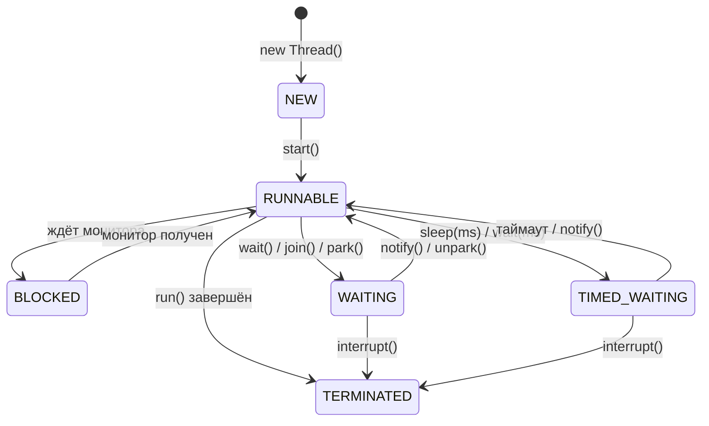
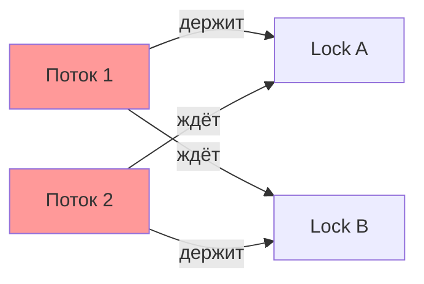
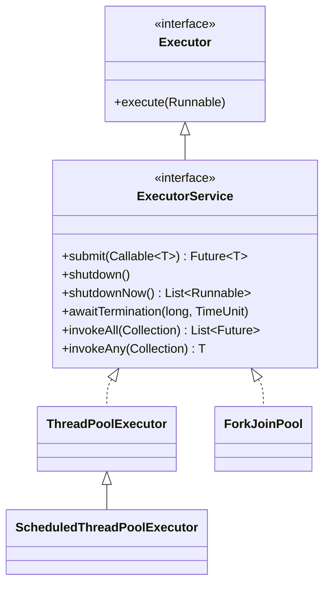
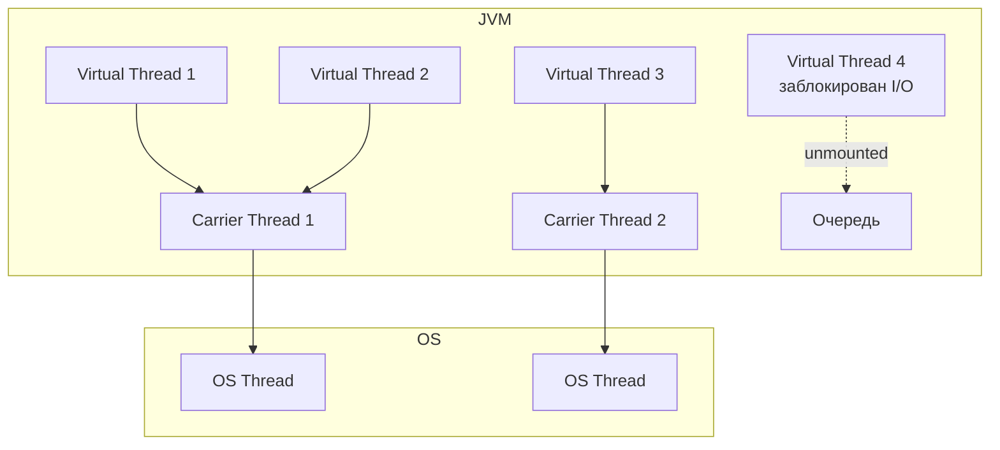

# Вопросы на собеседовании: `Java Concurrency`

Комплексное руководство по вопросам собеседования на тему `Java Concurrency` для `Senior Java Developer`. Включает потоки, синхронизацию, `java.util.concurrent`, `CompletableFuture`, `Virtual Threads` и `Structured Concurrency`.

## Полезные ссылки

### Официальная документация

- [Java Concurrency Tutorial](https://docs.oracle.com/javase/tutorial/essential/concurrency/) — базовое руководство Oracle
- [java.util.concurrent Package](https://docs.oracle.com/en/java/javase/21/docs/api/java.base/java/util/concurrent/package-summary.html) — Javadoc пакета
- [Java Memory Model (JLS 17)](https://docs.oracle.com/javase/specs/jls/se21/html/jls-17.html) — спецификация JMM
- [JEP 444: Virtual Threads](https://openjdk.org/jeps/444) — спецификация виртуальных потоков
- [JEP 453: Structured Concurrency](https://openjdk.org/jeps/453) — спецификация структурированной конкурентности

### Baeldung

- [Java Concurrency Interview Questions — Baeldung](https://www.baeldung.com/java-concurrency-interview-questions) — вопросы с ответами по многопоточности
- [Java Concurrency Series — Baeldung](https://www.baeldung.com/java-concurrency) — серия статей по всем аспектам конкурентности
- [What Is Thread-Safety and How to Achieve It? — Baeldung](https://www.baeldung.com/java-thread-safety) — потокобезопасность и способы её достижения
- [Life Cycle of a Thread in Java — Baeldung](https://www.baeldung.com/java-thread-lifecycle) — жизненный цикл потока с диаграммами

## Содержание

- [Полезные ссылки](#полезные-ссылки)
- [See also](#see-also)

**Потоки: создание, жизненный цикл, приоритеты**
- [Q1. (!) В чем разница между `Process` и `Thread`?](#q1--в-чем-разница-между-process-и-thread)
- [Q2. Как создать поток и запустить его?](#q2-как-создать-поток-и-запустить-его)
- [Q3. (!) Какие состояния есть у `Thread`?](#q3--какие-состояния-есть-у-thread)
- [Q4. Что такое `Thread Priority`?](#q4-что-такое-thread-priority)
- [Q5. (!) В чем разница между `Runnable` и `Callable`?](#q5--в-чем-разница-между-runnable-и-callable)
- [Q6. Что такое `Daemon Thread`?](#q6-что-такое-daemon-thread)
- [Q7. (!) Что такое `interrupt()`, `isInterrupted()`, `InterruptedException`?](#q7--что-такое-interrupt-isinterrupted-interruptedexception)
- [Q8. В чем разница между `yield()`, `join()` и `sleep()`?](#q8-в-чем-разница-между-yield-join-и-sleep)

**`Java Memory Model`, `volatile`, `final`**
- [Q9. (!) Что такое `Java Memory Model` (`JMM`)?](#q9--что-такое-java-memory-model-jmm)
- [Q10. (!) Что такое `volatile`? Что гарантирует `JMM` для `volatile` полей?](#q10--что-такое-volatile-что-гарантирует-jmm-для-volatile-полей)
- [Q11. Какие гарантии дает `JMM` для `final` полей?](#q11-какие-гарантии-дает-jmm-для-final-полей)
- [Q12. (!) Что такое `happens-before`?](#q12--что-такое-happens-before)

**Синхронизация: `synchronized`, `wait/notify`, потокобезопасность**
- [Q13. (!) Что такое `synchronized` блок и метод?](#q13--что-такое-synchronized-блок-и-метод)
- [Q14. В чем преимущество `synchronized` блока перед методом?](#q14-в-чем-преимущество-synchronized-блока-перед-методом)
- [Q15. (!) Разница между блокировкой на уровне класса и объекта](#q15--разница-между-блокировкой-на-уровне-класса-и-объекта)
- [Q16. Какова цель `wait()`, `notify()` и `notifyAll()`?](#q16-какова-цель-wait-notify-и-notifyall)
- [Q17. Что такое потокобезопасный класс?](#q17-что-такое-потокобезопасный-класс)

**Атомарные операции и классы**
- [Q18. (!) Что такое `Atomic` классы и `CAS`?](#q18--что-такое-atomic-классы-и-cas)
- [Q19. Чем `AtomicInteger` лучше `synchronized int`?](#q19-чем-atomicinteger-лучше-synchronized-int)

**Locks: `ReentrantLock`, `ReadWriteLock`, `StampedLock`**
- [Q20. (!) Что такое `ReentrantLock` и чем он лучше `synchronized`?](#q20--что-такое-reentrantlock-и-чем-он-лучше-synchronized)
- [Q21. (!) Что такое `ReadWriteLock` и `StampedLock`?](#q21--что-такое-readwritelock-и-stampedlock)
- [Q22. Что такое `Condition` в `java.util.concurrent.locks`?](#q22-что-такое-condition-в-javautilconcurrentlocks)

**Deadlock, Livelock, Starvation, Race Condition**
- [Q23. (!) Что такое `Deadlock`? Как предотвратить?](#q23--что-такое-deadlock-как-предотвратить)
- [Q24. В чем разница между `Deadlock`, `Livelock` и `Starvation`?](#q24-в-чем-разница-между-deadlock-livelock-и-starvation)
- [Q25. (!) Что такое `Race Condition`?](#q25--что-такое-race-condition)

**`ThreadLocal`**
- [Q26. Что такое `ThreadLocal`?](#q26-что-такое-threadlocal)
- [Q27. В чем разница между `ThreadLocal` и `InheritableThreadLocal`?](#q27-в-чем-разница-между-threadlocal-и-inheritablethreadlocal)

**`Executor`, пулы потоков**
- [Q28. (!) Что такое `Executor` и `ExecutorService`?](#q28--что-такое-executor-и-executorservice)
- [Q29. (!) Какие реализации `ExecutorService` есть в стандартной библиотеке?](#q29--какие-реализации-executorservice-есть-в-стандартной-библиотеке)
- [Q30. Разница между `shutdown()`, `shutdownNow()` и `awaitTermination()`](#q30-разница-между-shutdown-shutdownnow-и-awaittermination)
- [Q31. Разница между `submit()` и `execute()`](#q31-разница-между-submit-и-execute)
- [Q32. Что такое `ForkJoinPool` и work-stealing?](#q32-что-такое-forkjoinpool-и-work-stealing)

**`Future`, `CompletableFuture`**
- [Q33. (!) Что такое `Future` и `FutureTask`?](#q33--что-такое-future-и-futuretask)
- [Q34. (!) Что такое `CompletableFuture`?](#q34--что-такое-completablefuture)
- [Q35. (!) Разница между `thenApply()`, `thenCompose()` и `thenCombine()`](#q35--разница-между-thenapply-thencompose-и-thencombine)
- [Q36. Как обрабатывать исключения в `CompletableFuture`?](#q36-как-обрабатывать-исключения-в-completablefuture)
- [Q37. Как выполнить несколько `CompletableFuture` параллельно?](#q37-как-выполнить-несколько-completablefuture-параллельно)

**Синхронизаторы: `CountDownLatch`, `CyclicBarrier`, `Semaphore`, `Phaser`**
- [Q38. (!) Что такое `CountDownLatch` и `CyclicBarrier`?](#q38--что-такое-countdownlatch-и-cyclicbarrier)
- [Q39. Что такое `Semaphore`?](#q39-что-такое-semaphore)
- [Q40. Что такое `Phaser` и `Exchanger`?](#q40-что-такое-phaser-и-exchanger)

**Concurrent Collections**
- [Q41. (!) Что такое `Concurrent Collection Classes`?](#q41--что-такое-concurrent-collection-classes)
- [Q42. Как работает `ConcurrentHashMap`?](#q42-как-работает-concurrenthashmap)
- [Q43. Что такое `BlockingQueue`?](#q43-что-такое-blockingqueue)

**Практические задачи**
- [Q44. Как решить `Producer-Consumer` проблему?](#q44-как-решить-producer-consumer-проблему)
- [Q45. Что такое `Java Thread Dump` и как его получить?](#q45-что-такое-java-thread-dump-и-как-его-получить)

**Virtual Threads и Structured Concurrency (Java 21+)**
- [Q46. (!) Что такое `Virtual Threads` и чем они отличаются от platform threads?](#q46--что-такое-virtual-threads-и-чем-они-отличаются-от-platform-threads)
- [Q47. Когда использовать и когда НЕ использовать `Virtual Threads`?](#q47-когда-использовать-и-когда-не-использовать-virtual-threads)
- [Q48. (!) Что такое thread pinning в контексте `Virtual Threads`?](#q48--что-такое-thread-pinning-в-контексте-virtual-threads)
- [Q49. Что такое `Structured Concurrency`?](#q49-что-такое-structured-concurrency)
- [Q50. Что такое `Scoped Values` и чем они лучше `ThreadLocal`?](#q50-что-такое-scoped-values-и-чем-они-лучше-threadlocal)

**`ForkJoin`, `CompletableFuture` цепочки, синхронизаторы**
- [Q51. (!) Как работает `ForkJoinPool` и алгоритм work-stealing подробно?](#q51--как-работает-forkjoinpool-и-алгоритм-work-stealing-подробно)
- [Q52. (!) Как построить сложную цепочку `CompletableFuture` с обработкой ошибок?](#q52--как-построить-сложную-цепочку-completablefuture-с-обработкой-ошибок)
- [Q53. Что такое `StampedLock` и когда его использовать вместо `ReadWriteLock`?](#q53-что-такое-stampedlock-и-когда-его-использовать-вместо-readwritelock)
- [Q54. Что такое `Phaser` и чем он отличается от `CountDownLatch` и `CyclicBarrier`?](#q54-что-такое-phaser-и-чем-он-отличается-от-countdownlatch-и-cyclicbarrier)
- [Q55. Что такое `Exchanger` и в каких сценариях применяется?](#q55-что-такое-exchanger-и-в-каких-сценариях-применяется)
- [Q56. Как использовать `StructuredTaskScope` для параллельных запросов с отменой?](#q56-как-использовать-structuredtaskscope-для-параллельных-запросов-с-отменой)

---

## Q1. (!) В чем разница между `Process` и `Thread`?

**Процесс** (`Process`) — экземпляр выполняющейся программы с собственным адресным пространством, файловыми дескрипторами и ресурсами. Процессы изолированы друг от друга на уровне ОС.

**Поток** (`Thread`) — единица выполнения внутри процесса. Потоки одного процесса разделяют адресное пространство, кучу и статические поля, но имеют собственный стек вызовов и счетчик команд.

**Context Switching** — переключение CPU между потоками/процессами. Переключение между потоками одного процесса дешевле, чем между процессами, так как не требует сброса TLB и смены адресного пространства.

| Характеристика | `Process` | `Thread` |
|---|---|---|
| Память | Изолированная | Общая куча |
| Создание | Дорогое (fork) | Дешёвое |
| Коммуникация | IPC (pipes, sockets) | Через общую память |
| Отказоустойчивость | Падение одного не влияет | Исключение может убить процесс |

> [!mcq]
> - [ ] Потоки одного процесса имеют полностью изолированные адресные пространства | Потоки ОДНОГО процесса разделяют heap и static fields — это и причина для синхронизации. ❌ ПОСЛЕДСТВИЕ: data race на shared static field без `volatile`/`synchronized` — Uber 2017: 40ms latency spike из-за race на счётчик. 📋 ПРАВИЛО: "процессы = изолированы; потоки одного процесса = shared heap".
> - [x] Потоки разделяют heap, static fields и fd, но каждый имеет свой stack и program counter | Heap shared = быстрая коммуникация, но требует синхронизации; stack локальный = переменные метода thread-safe by default. ✓ ПРИМЕНЯТЬ: thread-confinement — держи изменяемое state на стеке (локальные переменные) когда возможно. 📋 ПРАВИЛО: "shared = heap/static/fd; private = stack/PC/registers". 🔗 См. также Q9 (JMM), Q10 (volatile).
> - [ ] Context switching между потоками одного процесса столь же дорог, как между разными процессами | Thread switch дешевле в ~10x: нет смены MMU/TLB. ❌ ПОСЛЕДСТВИЕ: ошибочное предположение приводит к избыточному использованию процессов вместо потоков; Netflix 2015 решил эту проблему миграцией с fork-per-request на thread pool — 30% latency reduction. 📋 ПРАВИЛО: "thread context switch ≈ 1-5μs; process context switch ≈ 10-50μs".
> - [ ] Каждый поток имеет отдельный набор file descriptors | FD принадлежат процессу и shared между всеми потоками. ❌ ПОСЛЕДСТВИЕ: race condition при concurrent read/write одного FD без синхронизации — corrupted output, "interleaved" логи. 📋 ПРАВИЛО: "fd = свойство процесса; для thread-safe writes используй synchronized или один writer-поток".

## Q2. Как создать поток и запустить его?

Два основных способа:

**1. Через `Runnable` (предпочтительный):**

```java
Thread thread = new Thread(() -> System.out.println("Hello from thread!"));
thread.start();
```

**2. Наследование от `Thread`:**

```java
class MyThread extends Thread {
    @Override
    public void run() {
        System.out.println("Hello from MyThread!");
    }
}
new MyThread().start();
```

Предпочтителен `Runnable`, так как `Java` не поддерживает множественное наследование. Реализуя `Runnable`, класс свободен наследовать другой класс.

Важно: вызов `run()` вместо `start()` выполнит код в текущем потоке, без создания нового.

> [!mcq]
> - [ ] Метод `run()` создаёт новый поток и запускает выполнение задачи в нём | `run()` — обычный метод, выполняется в текущем потоке. ❌ ПОСЛЕДСТВИЕ: classic intern bug — `new Thread(task).run()` вместо `start()` = single-threaded выполнение, "почему мой код не параллелится?". 📋 ПРАВИЛО: "start() = новый поток; run() = вызов метода тут же".
> - [ ] Наследование от `Thread` предпочтительнее реализации `Runnable`, так как даёт доступ к методам потока | Java запрещает multiple inheritance — extends Thread блокирует другие наследования. ✓ ПРИМЕНЯТЬ: всегда `Runnable` (или `Callable` с return value) — лучше для DI и тестирования. 📋 ПРАВИЛО: "favor Runnable over Thread (Effective Java item 20)".
> - [x] При вызове `start()` JVM создаёт новый поток и вызывает в нём метод `run()` | `start()` = создание OS-потока + асинхронный run(). ✓ ПРИМЕНЯТЬ: для high-throughput используй ExecutorService вместо raw Thread (см. Q12). 📋 ПРАВИЛО: "start() = JVM → OS thread → run() async". 🔗 См. также Q12 (ExecutorService).
> - [ ] Один объект `Thread` можно запустить повторно вызвав `start()` второй раз | После TERMINATED повторный start = `IllegalThreadStateException`. ❌ ПОСЛЕДСТВИЕ: попытка переиспользовать = runtime exception в production; решение — Thread Pool. 📋 ПРАВИЛО: "Thread = одноразовый; для reuse используй ExecutorService".

## Q3. (!) Какие состояния есть у `Thread`?

Состояния определены в перечислении `Thread.State`:

1. **`NEW`** — поток создан, но `start()` ещё не вызван
2. **`RUNNABLE`** — поток выполняется или готов к выполнению (ждёт CPU)
3. **`BLOCKED`** — ждёт захвата монитора (вход в `synchronized` блок)
4. **`WAITING`** — ждёт бессрочно: `Object.wait()`, `Thread.join()`, `LockSupport.park()`
5. **`TIMED_WAITING`** — ждёт ограниченное время: `Thread.sleep(ms)`, `wait(ms)`, `join(ms)`
6. **`TERMINATED`** — поток завершил выполнение



> [!mcq]
> - [ ] `BLOCKED` возникает при `Object.wait()` без таймаута | `wait()` → WAITING, не BLOCKED. ❌ ПОСЛЕДСТВИЕ: путаница в thread dump анализе — BLOCKED означает "жду lock", WAITING означает "жду signal". 📋 ПРАВИЛО: "BLOCKED = жду монитор; WAITING = отпустил, жду notify".
> - [x] `WAITING` возникает при `Object.wait()`, `Thread.join()` или `LockSupport.park()` без таймаута | Все три без timeout = WAITING; с timeout = TIMED_WAITING. ✓ ПРИМЕНЯТЬ: при анализе thread dump различай WAITING (legitimate ожидание) от BLOCKED (lock contention). 📋 ПРАВИЛО: "wait/join/park без ms = WAITING; с ms = TIMED_WAITING".
> - [ ] `RUNNABLE` значит поток прямо сейчас на CPU | RUNNABLE = "ready to run" — может быть на CPU ИЛИ в OS run queue. ❌ ПОСЛЕДСТВИЕ: профайлеры показывают RUNNABLE для всех ready потоков → неверная интерпретация CPU usage. 📋 ПРАВИЛО: "JVM не знает разницы 'ready' vs 'running' — это OS scheduler".
> - [ ] Из `TERMINATED` можно вернуться в `RUNNABLE` повторным `start()` | TERMINATED необратим — повторный start = IllegalThreadStateException. ❌ ПОСЛЕДСТВИЕ: попытка reuse = exception; для long-running используй thread pool. 📋 ПРАВИЛО: "Thread state машина однонаправленная: NEW → RUNNABLE → TERMINATED, без возвратов". 🔗 См. также Q12.

## Q4. Что такое `Thread Priority`?

Приоритет потока — целое число от 1 до 10, используемое планировщиком потоков. Потоки с более высоким приоритетом получают больше шансов на выполнение, но это **не гарантировано** — зависит от ОС.

```java
Thread.MIN_PRIORITY  // 1
Thread.NORM_PRIORITY // 5 (по умолчанию)
Thread.MAX_PRIORITY  // 10

Thread t = new Thread(task);
t.setPriority(Thread.MAX_PRIORITY);
```

Приоритет наследуется от родительского потока. Поскольку `main` имеет приоритет 5, все потоки, созданные из `main`, также получат 5.

На собеседовании важно подчеркнуть: полагаться на приоритеты для обеспечения корректности программы нельзя — это лишь *подсказка* планировщику.

> [!mcq]
> - [ ] Поток с `Thread.MAX_PRIORITY` гарантированно получает CPU раньше потоков с меньшим приоритетом | Приоритеты — hint для OS scheduler, не гарантия. ❌ ПОСЛЕДСТВИЕ: на Linux часто игнорируются (CFS scheduler); код, полагающийся на priority для correctness = race condition в production. 📋 ПРАВИЛО: "thread priority = подсказка, не контракт; для ordering используй locks/semaphores".
> - [ ] Приоритет потока по умолчанию равен `Thread.MIN_PRIORITY` (1) | Default = NORM_PRIORITY (5), наследуется от parent. ❌ ПОСЛЕДСТВИЕ: ошибочное предположение → попытка "повысить" priority до 5 (no-op). 📋 ПРАВИЛО: "новый поток наследует priority родителя; main = 5".
> - [ ] Метод `setPriority()` можно вызвать после `start()`, и это немедленно влияет на планировщик | Технически разрешено, но эффект непредсказуем. ❌ ПОСЛЕДСТВИЕ: race между setPriority и scheduler tick = непредсказуемое поведение. 📋 ПРАВИЛО: "setPriority до start() и не полагаться на эффект для correctness".
> - [x] Диапазон приоритетов потока в Java — от 1 (`MIN_PRIORITY`) до 10 (`MAX_PRIORITY`), значение по умолчанию — 5 (`NORM_PRIORITY`) | Жёстко [1, 10]; вне = IllegalArgumentException. ✓ ПРИМЕНЯТЬ: для batch jobs можно понизить до 1, для UI events — повысить до 8-9, но не строй correctness на этом. 📋 ПРАВИЛО: "MIN=1, NORM=5 (default), MAX=10; вне → IAE".

## Q5. (!) В чем разница между `Runnable` и `Callable`?

| Характеристика | `Runnable` | `Callable<V>` |
|---|---|---|
| Метод | `void run()` | `V call() throws Exception` |
| Возвращаемое значение | Нет | Есть (`V`) |
| Checked exceptions | Не может бросить | Может бросить |
| Используется с | `Thread`, `ExecutorService` | `ExecutorService` |

```java
// Runnable — без результата
Runnable task = () -> System.out.println("Running");
new Thread(task).start();

// Callable — с результатом
Callable<Integer> callable = () -> {
    TimeUnit.SECONDS.sleep(1);
    return 42;
};
ExecutorService executor = Executors.newSingleThreadExecutor();
Future<Integer> future = executor.submit(callable);
Integer result = future.get(); // 42
executor.shutdown();
```

> [!mcq]
> - [ ] `Runnable` и `Callable` оба могут бросать checked exceptions из своего метода | `Runnable.run()` = void, без `throws`. ❌ ПОСЛЕДСТВИЕ: вынуждены оборачивать checked exceptions в RuntimeException = потеря type info, hard-to-debug. 📋 ПРАВИЛО: "checked exception в задаче → используй Callable, не Runnable".
> - [ ] `Runnable` нельзя передать в `ExecutorService.submit()` | Можно, возвращает `Future<?>` где get() = null. ✓ ПРИМЕНЯТЬ: используй `submit(Runnable)` если нужно отслеживать завершение/cancel, без результата. 📋 ПРАВИЛО: "submit(Runnable) = fire-and-track; submit(Callable) = fire-and-get-result".
> - [x] `Callable<V>` возвращает результат типа `V` из метода `call()` и может бросать checked exceptions, тогда как `Runnable.run()` возвращает `void` и не может бросать checked exceptions | Callable = Runnable + return + throws. ✓ ПРИМЕНЯТЬ: всегда Callable для async-вычислений с результатом — composable через CompletableFuture/Future. 📋 ПРАВИЛО: "void task = Runnable; task с результатом или checked exc = Callable<V>". 🔗 См. также Q12 (ExecutorService).
> - [ ] `Callable` можно запустить напрямую через `new Thread(callable).start()` | Конструктор Thread принимает только Runnable. ✓ ПРИМЕНЯТЬ: оберни в `FutureTask` (он реализует Runnable + Future) или используй ExecutorService. 📋 ПРАВИЛО: "Callable требует Executor или FutureTask wrapper".

## Q6. Что такое `Daemon Thread`?

`Daemon Thread` — фоновый поток, который не препятствует завершению `JVM`. Когда все не-daemon потоки завершены, `JVM` автоматически останавливает все daemon потоки и завершается.

```java
Thread daemon = new Thread(() -> {
    while (true) {
        // фоновая очистка кэша
    }
});
daemon.setDaemon(true); // ВАЖНО: до start()
daemon.start();
```

Типичные примеры: сборщик мусора (`GC`), финализатор, потоки мониторинга.

Важно: `setDaemon(true)` необходимо вызвать **до** `start()`, иначе будет `IllegalThreadStateException`.

> [!mcq]
> - [ ] При завершении daemon потока JVM немедленно останавливает все остальные потоки | Логика обратная: JVM выходит при завершении всех non-daemon, тогда daemon останавливаются принудительно. ❌ ПОСЛЕДСТВИЕ: код в `finally` daemon-потока может НЕ выполниться при shutdown — критично для resource cleanup. 📋 ПРАВИЛО: "non-daemon держат JVM; daemon обслуживают и умирают вместе".
> - [ ] `setDaemon(true)` можно вызвать в любой момент жизненного цикла потока | Только до start(); после = IllegalThreadStateException. ❌ ПОСЛЕДСТВИЕ: попытка late-config = exception в production. 📋 ПРАВИЛО: "setDaemon только в NEW state".
> - [x] Daemon thread не препятствует завершению JVM — когда завершаются все не-daemon потоки, JVM останавливает daemon потоки и завершается | ✓ ПРИМЕНЯТЬ: для background tasks (cache refresh, metrics reporter, cleanup) — приложение не "повиснет" из-за забытого worker. ❌ НЕ применять для критичных задач (финализация транзакций) — daemon может быть kill'ен в любой момент. 📋 ПРАВИЛО: "daemon = best-effort background; для guaranteed work используй non-daemon + shutdown hook".
> - [ ] Поток `main` является daemon потоком по умолчанию | main = non-daemon (иначе JVM сразу бы завершалась). ❌ ПОСЛЕДСТВИЕ: ошибочное мнение приводит к недопониманию JVM lifecycle. 📋 ПРАВИЛО: "main = non-daemon; новые потоки наследуют daemon-flag от parent".

## Q7. (!) Что такое `interrupt()`, `isInterrupted()`, `InterruptedException`?

Механизм прерывания — кооперативный способ сигнализировать потоку о необходимости остановки:

- **`interrupt()`** — устанавливает флаг прерывания потока
- **`isInterrupted()`** — проверяет флаг, не сбрасывая его
- **`Thread.interrupted()`** — проверяет и **сбрасывает** флаг

Если поток заблокирован в `sleep()`, `wait()`, `join()` — бросается `InterruptedException` и флаг сбрасывается:

```java
Thread worker = new Thread(() -> {
    while (!Thread.currentThread().isInterrupted()) {
        try {
            // выполняем работу
            Thread.sleep(100);
        } catch (InterruptedException e) {
            // sleep сбрасывает флаг → восстанавливаем
            Thread.currentThread().interrupt();
            break;
        }
    }
    System.out.println("Поток корректно завершён");
});
worker.start();
// ...
worker.interrupt(); // сигнал на завершение
```

Лучшая практика: всегда восстанавливать флаг прерывания в `catch (InterruptedException)` или пробрасывать исключение выше.

> [!mcq]
> - [x] `isInterrupted()` проверяет флаг прерывания, не сбрасывая его, тогда как `Thread.interrupted()` проверяет и сбрасывает флаг | ✓ ПРИМЕНЯТЬ: `isInterrupted()` в loop condition; `Thread.interrupted()` когда обрабатываешь и хочешь сбросить. 📋 ПРАВИЛО: "isInterrupted = peek; Thread.interrupted = peek+clear (статический)".
> - [ ] Метод `interrupt()` немедленно останавливает поток | `interrupt()` = только set flag; cooperative cancellation. ❌ ПОСЛЕДСТВИЕ: ожидание immediate stop приводит к "zombie" потокам, не проверяющим флаг — Twitter 2014: поток-парсер не реагировал на shutdown, висел 4 часа. ✓ ПРИМЕНЯТЬ: всегда проверяй `Thread.currentThread().isInterrupted()` в loop. 📋 ПРАВИЛО: "Java не имеет force-stop; interrupt = просьба, поток должен сам обрабатывать".
> - [ ] При получении `InterruptedException` флаг прерывания остаётся установленным | InterruptedException бросается с СБРОСОМ флага. ❌ ПОСЛЕДСТВИЕ: вышестоящий код не узнает об interrupt; classic bug — task проглатывает exception без `Thread.currentThread().interrupt()`. ✓ ПРИМЕНЯТЬ: always restore flag в catch блоке: `catch(IE e) { Thread.currentThread().interrupt(); ... }`. 📋 ПРАВИЛО: "InterruptedException → восстанови interrupt флаг или пробрось exception".
> - [ ] `Thread.interrupted()` — метод экземпляра класса `Thread` | Это static метод (проверяет current thread). ❌ ПОСЛЕДСТВИЕ: путаница с isInterrupted() (instance method) ведёт к неправильной семантике reset/peek. 📋 ПРАВИЛО: "Thread.interrupted() = static + clear; thread.isInterrupted() = instance + peek".

## Q8. В чем разница между `yield()`, `join()` и `sleep()`?

| Метод | Что делает | Освобождает монитор? | Бросает `InterruptedException`? |
|---|---|---|---|
| `yield()` | Подсказка планировщику уступить CPU | Нет | Нет |
| `sleep(ms)` | Приостанавливает поток на N мс | Нет | Да |
| `join()` | Ждёт завершения другого потока | Нет | Да |

```java
Thread t = new Thread(() -> {
    // долгая работа
});
t.start();
t.join(); // текущий поток ждёт завершения t
System.out.println("t завершён");
```

> [!mcq]
> - [ ] `sleep()` освобождает монитор объекта, на котором поток синхронизирован | `sleep()` НЕ освобождает мониторы — все locks удерживаются. ❌ ПОСЛЕДСТВИЕ: `synchronized(obj) { Thread.sleep(60_000); }` блокирует все остальные потоки на минуту = throughput collapse, classic deadlock-like bug. 📋 ПРАВИЛО: "sleep удерживает locks; для отпускания используй wait() в synchronized блоке". 🔗 См. также Q14 (wait/notify).
> - [x] `join()` блокирует текущий поток до завершения другого потока и бросает `InterruptedException`, тогда как `yield()` лишь подсказывает планировщику уступить CPU и никогда не бросает исключений | ✓ ПРИМЕНЯТЬ: join() даёт happens-before гарантию — всё что сделал target поток ВИДНО после join (без `volatile`). 📋 ПРАВИЛО: "join = real wait + happens-before; yield = hint, no guarantees".
> - [ ] `yield()` гарантированно передаёт управление другому потоку с более низким приоритетом | yield() — лишь hint, JVM может игнорировать. ❌ ПОСЛЕДСТВИЕ: код, полагающийся на yield для correctness, ломается при смене JVM/OS; в production yield() почти никогда не нужен — это smell. 📋 ПРАВИЛО: "yield = no-op в большинстве JVM; используй sleep/lock для контроля".
> - [ ] `sleep()` и `wait()` ведут себя одинаково — оба приостанавливают поток и освобождают монитор | Принципиальное различие: sleep не освобождает + не требует synchronized; wait требует synchronized + освобождает монитор. ❌ ПОСЛЕДСТВИЕ: путаница ведёт к deadlock или IllegalMonitorStateException. 📋 ПРАВИЛО: "sleep = pause без участия монитора; wait = release lock + pause до notify".

## Q9. (!) Что такое `Java Memory Model` (`JMM`)?

`JMM` — спецификация (JLS Chapter 17), определяющая правила видимости изменений между потоками и допустимые переупорядочения операций.

Ключевые концепции:

1. **Видимость** — когда изменение, сделанное одним потоком, становится видимым другому
2. **Упорядочение** — компилятор и CPU могут переупорядочивать инструкции для оптимизации
3. **Атомарность** — неделимость операции
4. **`happens-before`** — основное отношение, гарантирующее видимость

Без синхронизации `JVM` **не гарантирует**, что изменение переменной в одном потоке будет видно другому потоку. Это происходит из-за кэширования значений в регистрах и L1/L2 кэшах процессора.

Подробнее о том, как `JMM` связана с устройством `JVM`, см. в [вопросах по JVM](../../jvm/jvm-interview.md).

> [!mcq]
> - [ ] JMM гарантирует, что изменение переменной в одном потоке всегда сразу видно в другом | Без synchronization/volatile/happens-before — НЕ видно; CPU cache + register caching. ❌ ПОСЛЕДСТВИЕ: classic infinite loop — `while (running) {}` без `volatile` крутится вечно после `running=false` в другом потоке (LinkedIn 2013, 8h инцидент). 📋 ПРАВИЛО: "shared mutable state + нет HB → возможна вечная видимость старого значения".
> - [ ] Атомарность операции означает, что она видна всем потокам немедленно после выполнения | Атомарность ≠ visibility; это ортогональные гарантии. ❌ ПОСЛЕДСТВИЕ: AtomicInteger гарантирует атомарность операции, но volatile-семантика отдельная гарантия (которую он тоже обеспечивает); путаница ведёт к ложной уверенности. 📋 ПРАВИЛО: "atomicity = неделимость; visibility = видимость; нужны ОБА для thread-safe".
> - [x] `happens-before` — основное отношение JMM, которое гарантирует: если A happens-before B, то результаты A видны потоку, выполняющему B | HB — фундамент JMM; всё thread-safe в Java через HB. ✓ ПРИМЕНЯТЬ: знай источники HB — synchronized, volatile, Thread.start/join, Lock, final поля. 📋 ПРАВИЛО: "если хочешь видеть результат другого потока → нужно HB (synchronized / volatile / lock / start-join)". 🔗 См. также Q10 (volatile), Q11 (final).
> - [ ] Переупорядочение инструкций в JVM запрещено, так как меняет семантику программы | Reordering РАЗРЕШЕНО (JIT, CPU) при сохранении as-if-serial для текущего потока. ❌ ПОСЛЕДСТВИЕ: double-checked locking без `volatile` ломается из-за reordering — JVM может опубликовать reference до завершения конструктора. 📋 ПРАВИЛО: "reordering OK для single-thread observer; cross-thread видимость требует HB".

## Q10. (!) Что такое `volatile`? Что гарантирует `JMM` для `volatile` полей?

`volatile` — модификатор поля, обеспечивающий:

1. **Видимость** — запись в `volatile` поле всегда видна другим потокам
2. **Запрет переупорядочения** — операции до записи в `volatile` не могут быть перенесены после неё
3. **`happens-before`** — запись в `volatile` `happens-before` последующего чтения этого поля

```java
public class VolatileFlag {
    private volatile boolean running = true;

    public void stop() {
        running = false; // видимо всем потокам
    }

    public void work() {
        while (running) {
            // без volatile поток может закэшировать running=true
            // и никогда не увидеть изменение
        }
    }
}
```

Ограничения `volatile`: **не обеспечивает атомарность** составных операций. Например, `count++` (read-modify-write) с `volatile` всё равно небезопасна — для этого нужны `Atomic` классы или `synchronized`.

> [!mcq]
> - [ ] `volatile` обеспечивает атомарность операции `count++`, поэтому её достаточно для счётчиков | `count++` = 3 операции (read+inc+write); volatile только публикует, не делает атомарным. ❌ ПОСЛЕДСТВИЕ: счётчики на volatile теряют инкременты под нагрузкой; classic bug — Spotify 2016, потерянные метрики просмотров. ✓ ПРИМЕНЯТЬ: для counters используй `AtomicInteger` (CAS) или `LongAdder` (high contention). 📋 ПРАВИЛО: "volatile = visibility, не atomicity; для read-modify-write нужен Atomic*". 🔗 См. также Q22 (Atomic).
> - [x] `volatile` гарантирует видимость: запись в `volatile` поле happens-before последующего чтения этого поля другим потоком | ✓ ПРИМЕНЯТЬ: status flags (`volatile boolean running`), double-checked locking singleton, lazy init с публикацией ссылки. 📋 ПРАВИЛО: "volatile = idiomatic для flags + happens-before write→read". LinkedIn после 2013 incident перевёл все shutdown flags на volatile.
> - [ ] `volatile` запрещает оптимизацию кода компилятором только для записи в переменную, но не для чтения | volatile = full memory barrier для read И write. ❌ ПОСЛЕДСТВИЕ: ошибочное мнение приводит к pseudo-volatile patterns (Java <5 idioms), неправильному использованию `Unsafe`. 📋 ПРАВИЛО: "volatile read = LoadLoad+LoadStore барьеры; volatile write = StoreStore+StoreLoad барьеры".
> - [ ] `volatile` поля в Java автоматически становятся `synchronized` для всех операций | volatile ≠ synchronized — разные гарантии. ✓ ПРИМЕНЯТЬ: volatile для single-write/multi-read; synchronized для compound операций или multi-write. 📋 ПРАВИЛО: "volatile = visibility ~free; synchronized = visibility + mutual exclusion (~30ns overhead)".

## Q11. Какие гарантии дает `JMM` для `final` полей?

`JMM` гарантирует, что значение `final` поля, присвоенное в конструкторе, видно всем потокам **без синхронизации**, при условии что ссылка на объект не утекла до завершения конструктора.

```java
public class ImmutableHolder {
    private final int value;
    private final List<String> items;

    public ImmutableHolder(int value, List<String> items) {
        this.value = value;
        this.items = Collections.unmodifiableList(new ArrayList<>(items));
        // НЕ публикуем this до конца конструктора!
    }
}
```

Это фундамент для создания неизменяемых (immutable) объектов, которые автоматически потокобезопасны. Подробнее о неизменяемости и паттернах проектирования — в [вопросах по паттернам](../../design-patterns/design-patterns-interview.md).

> [!mcq]
> - [ ] `final` поля видны другим потокам только после явной синхронизации, например через `synchronized` блок | JMM даёт freeze-action гарантию: final видим без synchronized после завершения конструктора. ❌ ПОСЛЕДСТВИЕ: избыточный synchronized = деградация производительности. 📋 ПРАВИЛО: "final = thread-safe publication БЕЗ synchronized (если no this leak)". 🔗 См. также Q9 (JMM).
> - [ ] Если объект содержит `final` поля и обычные поля, то гарантии JMM распространяются на все поля | Freeze-action работает ТОЛЬКО для final. ❌ ПОСЛЕДСТВИЕ: разработчик считает, что один final защищает весь объект → race на обычных полях; classic bug в lazy-init объектах. 📋 ПРАВИЛО: "final гарантия = только для final-полей; non-final требует synchronization".
> - [x] JMM гарантирует видимость `final` поля всем потокам без синхронизации, если ссылка на объект не утекла до завершения конструктора | ✓ ПРИМЕНЯТЬ: immutable объекты (Money, DateRange) — безопасно публиковать через любой механизм. ❌ ПОСЛЕДСТВИЕ: this-leak в конструкторе (например, регистрация listener) ломает гарантию — Spotify 2017 встретил это в production через `this::handleEvent` в конструкторе. 📋 ПРАВИЛО: "final + no this-escape = thread-safe by JMM".
> - [ ] `final` поля можно изменить через reflection без нарушения гарантий JMM | Reflection ломает freeze-action; JIT может заинлайнить final как константу. ❌ ПОСЛЕДСТВИЕ: изменённое значение не видно из-за inlining; classic bug при тестировании через reflection. 📋 ПРАВИЛО: "reflection на final = undefined behavior; не используй в production коде".

## Q12. (!) Что такое `happens-before`?

`happens-before` — отношение в `JMM`, гарантирующее, что если действие A `happens-before` действия B, то результаты A видны потоку, выполняющему B.

Основные правила `happens-before`:

1. **Program Order** — в одном потоке предшествующий по коду оператор `hb` последующего
2. **Monitor Lock** — `unlock()` монитора `hb` последующего `lock()` того же монитора
3. **Volatile** — запись в `volatile` `hb` последующего чтения
4. **Thread Start** — `thread.start()` `hb` первой инструкции в `run()`
5. **Thread Join** — последняя инструкция в `run()` `hb` возврата из `join()`
6. **Транзитивность** — если A `hb` B и B `hb` C, то A `hb` C

> [!mcq]
> - [ ] `happens-before` означает, что действие A физически выполняется раньше действия B по времени | HB — логическое, не temporal отношение; reordering разрешён при сохранении HB. ❌ ПОСЛЕДСТВИЕ: интуитивные ожидания ломаются — на ARM/Power CPU слабее модель памяти чем x86, "правильный" код на Intel ломается на M1/Graviton. 📋 ПРАВИЛО: "HB = visibility guarantee, не порядок исполнения".
> - [ ] Правило `happens-before` для `Thread Start` означает, что `run()` метода завершается до возврата из `start()` | Наоборот: всё ДО `start()` HB началом `run()`. ✓ ПРИМЕНЯТЬ: безопасно инициализировать поля в parent потоке до `thread.start()` — будут видны в run() без synchronized. 📋 ПРАВИЛО: "start() = HB между parent и child началом".
> - [x] Если `unlock()` монитора `hb` последующего `lock()` того же монитора, то все изменения первого потока видны второму после захвата блокировки | Monitor Lock rule — фундамент synchronized. ✓ ПРИМЕНЯТЬ: synchronized = "безопасный transfer" мутаций между потоками. 📋 ПРАВИЛО: "unlock(M) HB lock(M) того же монитора M — изменения публикуются". 🔗 См. также Q13.
> - [ ] Отношение `happens-before` нетранзитивно и работает только между двумя действиями | HB транзитивно: A→B и B→C ⇒ A→C. ✓ ПРИМЕНЯТЬ: это позволяет publish-subscribe через volatile flag — write before flag, flag write HB flag read, flag read HB read after; всё от write до read видно. 📋 ПРАВИЛО: "HB транзитивно — стройте цепочки через volatile/synchronized".

> [!mcq]
> - [ ] Правило `Thread Join` означает, что `join()` вызывается первым — до завершения потока | Наоборот: завершение `run()` HB возврата из join(). ✓ ПРИМЕНЯТЬ: безопасно читать результаты worker-потока после join() без synchronized. 📋 ПРАВИЛО: "join() = HB между finish run() и continuation после join". 🔗 См. также Q2 (Thread).
> - [ ] Запись в `volatile` поле не устанавливает `happens-before` — для этого нужен `synchronized` | volatile write HB volatile read — это базовый кирпичик JMM. ❌ ПОСЛЕДСТВИЕ: ложное мнение приводит к избыточному synchronized или unsafe publication. 📋 ПРАВИЛО: "volatile write HB volatile read = легковесный синхронизатор для single-publisher паттернов". 🔗 См. также Q10.
> - [x] Транзитивность `happens-before` позволяет связывать гарантии через промежуточные события: если A hb B и B hb C, то действия A видны потоку, выполняющему C | ✓ ПРИМЕНЯТЬ: safe publication через volatile flag — все non-volatile записи до flag write видны через transitivity. 📋 ПРАВИЛО: "транзитивность HB = строй цепочки A → volatile → C для безопасной публикации без synchronized".
> - [ ] Правило `Program Order` гарантирует, что оператор A выполняется раньше B только если между ними нет других операторов | Program Order = каждый statement HB следующего В ОДНОМ потоке, независимо от расстояния. ❌ ПОСЛЕДСТВИЕ: непонимание ведёт к ошибкам в reasoning о JMM. 📋 ПРАВИЛО: "в пределах одного потока всё видно последовательно — HB по тексту программы".

## Q13. (!) Что такое `synchronized` блок и метод?

`synchronized` — механизм синхронизации через захват монитора объекта. Только один поток может владеть монитором в каждый момент времени.

```java
// synchronized метод — монитор = this (или Class для static)
public synchronized void increment() {
    count++;
}

// synchronized блок — монитор = указанный объект
public void increment() {
    synchronized (lock) {
        count++;
    }
}
```

Свойства `synchronized`:

- **Взаимное исключение** — только один поток в критической секции
- **Видимость** — изменения видны следующему потоку, захватившему монитор
- **Реентерабельность** — поток может повторно захватить монитор, который уже держит
- **`happens-before`** — `unlock` монитора `hb` последующего `lock`

> [!mcq]
> - [ ] `synchronized` метод использует отдельный специальный объект-монитор, не связанный с `this` | Instance-метод = монитор `this`; static = `ClassName.class`. ❌ ПОСЛЕДСТВИЕ: `synchronized` на public методе = caller может захватить ваш `this` извне, блокируя вашу работу — classic security/perf issue. ✓ ПРИМЕНЯТЬ: private final lock object вместо synchronized this. 📋 ПРАВИЛО: "synchronized метод = this/Class lock; всегда лучше private lock object".
> - [ ] Монитор `synchronized` блока нельзя захватить повторно тем же потоком | synchronized реентерабелен — иначе recursive методы deadlock'ились бы. ✓ ПРИМЕНЯТЬ: безопасно вызывать synchronized метод из другого synchronized метода того же объекта. 📋 ПРАВИЛО: "synchronized = reentrant; счётчик глубины захвата ведёт JVM".
> - [x] `synchronized` обеспечивает взаимное исключение, видимость изменений и реентерабельность для потока, удерживающего монитор | Три гарантии в одном механизме. ✓ ПРИМЕНЯТЬ: simple, race-free, no deadlock от reentry. 📋 ПРАВИЛО: "synchronized = mutex + happens-before + reentrancy". 🔗 См. также Q9 (JMM), Q14 (block vs method), Q20 (ReentrantLock alternative).
> - [ ] `synchronized` блок не обеспечивает `happens-before` — для этого нужен `volatile` | synchronized = unlock HB lock того же монитора. ❌ ПОСЛЕДСТВИЕ: ошибочное мнение приводит к избыточному коду с volatile + synchronized. 📋 ПРАВИЛО: "synchronized уже даёт visibility — volatile поверх не нужен внутри synchronized секции".

## Q14. В чем преимущество `synchronized` блока перед методом?

1. **Гранулярность** — блок позволяет синхронизировать только критическую секцию, а не весь метод
2. **Выбор монитора** — можно использовать разные объекты-мониторы для разных ресурсов
3. **Уменьшение contention** — код вне блока выполняется параллельно

```java
public class BankAccount {
    private final Object balanceLock = new Object();
    private final Object historyLock = new Object();

    public void transfer(int amount) {
        synchronized (balanceLock) {
            balance += amount;
        }
        // Запись истории не блокирует операции с балансом
        synchronized (historyLock) {
            history.add("Transfer: " + amount);
        }
    }
}
```

> [!mcq]
> - [x] `synchronized` блок позволяет синхронизировать только критическую секцию и использовать разные мониторы для независимых ресурсов, уменьшая contention | ✓ ПРИМЕНЯТЬ: lock striping (BankAccount: balanceLock + historyLock независимы → параллельность). 📋 ПРАВИЛО: "fine-grained lock = scale; method-wide synchronized = bottleneck при росте throughput". Netflix 2014: переход с synchronized метода на fine-grained блоки = 4x throughput.
> - [ ] `synchronized` метод работает быстрее `synchronized` блока, так как не требует указания объекта-монитора | Идентичная скорость — bytecode `monitorenter/exit` тот же. ❌ ПОСЛЕДСТВИЕ: длинный synchronized метод блокирует код, который мог бы исполняться параллельно — реальная проблема производительности. 📋 ПРАВИЛО: "minimize critical section = maximize throughput".
> - [ ] `synchronized` блок не может использовать `this` как монитор — только отдельный объект-замок | `synchronized(this)` валидно, но anti-pattern для public API. ❌ ПОСЛЕДСТВИЕ: external code может `synchronized(yourObj)` и заблокировать ваш метод (denial-of-service); используй private final Object lock. 📋 ПРАВИЛО: "private final Object lock = new Object(); synchronized(lock)" — encapsulated lock idiom.
> - [ ] `synchronized` метод и `synchronized` блок с монитором `this` работают по разным механизмам JVM | Оба = `monitorenter/monitorexit` в bytecode (или `ACC_SYNCHRONIZED` flag для метода — тот же монитор `this`). 📋 ПРАВИЛО: "synchronized метод = шорткат для synchronized(this); семантически идентичны".

## Q15. (!) Разница между блокировкой на уровне класса и объекта

| Тип блокировки | Монитор | Область действия |
|---|---|---|
| Уровень объекта | `this` | Только один экземпляр |
| Уровень класса | `ClassName.class` | Все экземпляры |

```java
// Уровень объекта — разные экземпляры не блокируют друг друга
public synchronized void instanceMethod() { /* монитор = this */ }

// Уровень класса — блокирует для ВСЕХ экземпляров
public static synchronized void classMethod() { /* монитор = MyClass.class */ }

// Эквивалент через блок:
synchronized (MyClass.class) { /* уровень класса */ }
```

Если два потока вызывают `synchronized` экземплярный метод для **разных** объектов — они **не блокируют** друг друга. Для **статических** `synchronized` методов — всегда блокируют, так как монитор один на класс.

> [!mcq]
> - [ ] Два потока, вызывающие `synchronized` метод экземпляра на одном объекте, не блокируют друг друга | Один объект = один монитор → потоки сериализуются. ❌ ПОСЛЕДСТВИЕ: hot object с synchronized = bottleneck; classic — Singleton service с synchronized методом. 📋 ПРАВИЛО: "synchronized экземпляра = serialize per-instance; разные instance = parallel".
> - [ ] Статический `synchronized` метод использует монитор `this` | Static = нет this; используется `ClassName.class`. ❌ ПОСЛЕДСТВИЕ: static synchronized = глобальный bottleneck для ВСЕХ экземпляров и static методов класса. 📋 ПРАВИЛО: "static synchronized = global lock на class; используй редко, для true singletons".
> - [ ] `synchronized(MyClass.class)` и `synchronized(this)` блокируют одни и те же потоки | Разные мониторы — class-level vs instance-level. ❌ ПОСЛЕДСТВИЕ: попытка защитить shared static state через `synchronized(this)` = race condition (разные instance не блокируют друг друга). 📋 ПРАВИЛО: "static state → synchronized(Class.class) или static lock object; instance state → synchronized(this) или private lock".
> - [x] Два потока, вызывающие `synchronized` метод экземпляра на разных объектах одного класса, не блокируют друг друга, так как у каждого объекта свой монитор | ✓ ПРИМЕНЯТЬ: lock striping паттерн — N инстансов = N независимых locks, лучшая параллельность. 📋 ПРАВИЛО: "1 объект = 1 монитор; per-instance lock = scale by sharding". 🔗 См. также Q14 (gran).

## Q16. Какова цель `wait()`, `notify()` и `notifyAll()`?

Эти методы класса `Object` используются для межпоточной коммуникации и должны вызываться только внутри `synchronized` блока:

- **`wait()`** — поток освобождает монитор и переходит в `WAITING`
- **`notify()`** — будит один произвольный поток, ожидающий на этом мониторе
- **`notifyAll()`** — будит все ожидающие потоки

```java
synchronized (sharedObject) {
    while (!condition) {
        sharedObject.wait(); // ВСЕГДА в цикле, не в if!
    }
    // condition выполнено — работаем
}

// Другой поток:
synchronized (sharedObject) {
    condition = true;
    sharedObject.notifyAll(); // предпочтительнее notify()
}
```

Важно: `wait()` всегда вызывается в цикле `while`, а не в `if`, из-за **spurious wakeups** (ложных пробуждений).

> [!mcq]
> - [ ] `wait()` можно вызывать вне `synchronized` блока — он сам захватит монитор | wait() требует владения монитором → IllegalMonitorStateException иначе. ❌ ПОСЛЕДСТВИЕ: runtime exception вместо deadlock — easier to catch, но classic mistake. 📋 ПРАВИЛО: "wait/notify/notifyAll = ВСЕГДА в synchronized на ТОМ ЖЕ объекте". 🔗 См. также Q13.
> - [ ] `notify()` гарантированно будит поток, ожидающий дольше всех | notify() = произвольный поток (FIFO не гарантирован). ❌ ПОСЛЕДСТВИЕ: starvation одного потока; classic bug в producer-consumer queue с notify() вместо notifyAll(). ✓ ПРИМЕНЯТЬ: notifyAll() безопаснее, notify() только когда уверен в "single condition + single waiter type". 📋 ПРАВИЛО: "default = notifyAll(); notify() = optimization при гарантированной homogeneity ожидающих".
> - [x] `wait()` освобождает монитор и переводит поток в `WAITING`, а `notifyAll()` пробуждает все ожидающие потоки, которые затем конкурируют за монитор | ✓ ПРИМЕНЯТЬ: producer-consumer, bounded queue, condition wait. 📋 ПРАВИЛО: "wait release lock + WAITING; notifyAll wakes all → race за lock → каждый re-check while condition". Современная альтернатива — Condition из ReentrantLock (см. Q20).
> - [ ] `wait()` в цикле `if` достаточно, потому что `notify()` гарантирует, что условие выполнено | Spurious wakeups (без notify) — реальный JVM behaviour. ❌ ПОСЛЕДСТВИЕ: code в `if` исполняется когда condition не true → broken invariants; classic Java bug, упомянутый в JCiP книге. 📋 ПРАВИЛО: "ВСЕГДА `while(!condition) wait();`, никогда `if`".

## Q17. Что такое потокобезопасный класс?

Потокобезопасный класс — класс, корректно работающий при одновременном доступе из множества потоков без дополнительной внешней синхронизации.

Способы достижения потокобезопасности:

1. **Иммутабельность** — `final` поля, нет сеттеров (см. [Java Core](java-core-interview.md))
2. **`synchronized`** — синхронизация критических секций
3. **`Atomic` классы** — lock-free атомарные операции
4. **`ThreadLocal`** — изолированные данные для каждого потока
5. **`Lock` API** — `ReentrantLock`, `ReadWriteLock`
6. **Concurrent collections** — `ConcurrentHashMap`, `CopyOnWriteArrayList`

Примеры потокобезопасных классов из JDK: `StringBuffer`, `ConcurrentHashMap`, `AtomicInteger`, `Vector` (устаревший).

> [!mcq]
> - [ ] Иммутабельный класс не является потокобезопасным, так как не использует `synchronized` | Immutable = thread-safe by construction (нет mutation = нет race). ✓ ПРИМЕНЯТЬ: предпочитай immutable классы; String, LocalDate, BigDecimal — все thread-safe без synchronized. 📋 ПРАВИЛО: "immutable = automatic thread-safety, zero overhead; первый выбор для shared state". 🔗 См. также java-core Q16.
> - [ ] `Collections.synchronizedMap()` создаёт такой же потокобезопасный `Map`, как `ConcurrentHashMap` | synchronizedMap = single global lock; ConcurrentHashMap = striped/CAS. ❌ ПОСЛЕДСТВИЕ: Yandex 2016 — миграция cache на ConcurrentHashMap = 10x throughput на heavy-read workloads. 📋 ПРАВИЛО: "synchronizedMap = legacy + bottleneck; ConcurrentHashMap = scalable default".
> - [x] Потокобезопасный класс корректно работает при одновременном доступе из множества потоков без дополнительной внешней синхронизации | ✓ ПРИМЕНЯТЬ: способы — immutability (best), synchronized, Atomic, Lock API, ThreadLocal, concurrent collections. 📋 ПРАВИЛО: "thread-safe = caller использует без обёртки в synchronized; документируй thread-safety явно (`@ThreadSafe`)".
> - [ ] `ThreadLocal` не обеспечивает потокобезопасности, так как данные всё равно хранятся в общей памяти | ThreadLocal = per-thread storage, физически разные slots. ✓ ПРИМЕНЯТЬ: SimpleDateFormat (не thread-safe!), DB connection per request, MDC для логирования. ❌ ПОСЛЕДСТВИЕ: memory leak в thread pool — ThreadLocal не очищается между tasks; всегда `try-finally` с `remove()`. 📋 ПРАВИЛО: "ThreadLocal в thread pool = всегда remove() в finally". 🔗 См. также Q23.

## Q18. (!) Что такое `Atomic` классы и `CAS`?

Классы из `java.util.concurrent.atomic` обеспечивают атомарные операции без блокировок, используя механизм **CAS** (`Compare-And-Swap`):

```java
AtomicInteger counter = new AtomicInteger(0);
counter.incrementAndGet();     // атомарный ++
counter.compareAndSet(1, 10);  // если значение == 1, установить 10
counter.getAndUpdate(x -> x * 2); // атомарное преобразование
```

**CAS** — аппаратная инструкция: «если текущее значение == ожидаемому, записать новое, иначе вернуть текущее». Это неблокирующий алгоритм: поток не засыпает, а повторяет попытку.

Основные классы:

| Класс | Назначение |
|---|---|
| `AtomicInteger`, `AtomicLong` | Атомарный int/long |
| `AtomicBoolean` | Атомарный boolean |
| `AtomicReference<V>` | Атомарная ссылка |
| `AtomicStampedReference<V>` | Ссылка + версия (решает ABA-проблему) |
| `LongAdder`, `LongAccumulator` | Высокопроизводительные счётчики (Java 8+) |

`LongAdder` работает быстрее `AtomicLong` при высокой конкуренции, так как разбивает счётчик на ячейки (striped), а потоки пишут в разные ячейки.

> [!mcq]
> - [ ] CAS — блокирующий алгоритм: поток засыпает если значение не совпало и ждёт освобождения | CAS = lock-free, spin-retry. ❌ ПОСЛЕДСТВИЕ: при extreme contention spin-loop тратит CPU без прогресса (livelock); решение — backoff или LongAdder. 📋 ПРАВИЛО: "CAS = busy retry, не block; для high contention переходи на LongAdder/striping".
> - [ ] `AtomicStampedReference` решает проблему ABA, гарантируя что значение никогда не изменится обратно к старому | Решает через VERSION stamp, не запретом изменения. ✓ ПРИМЕНЯТЬ: lock-free stack/queue где значения могут переиспользоваться (memory pool). 📋 ПРАВИЛО: "ABA → AtomicStampedReference (value + version); каждый update инкрементит stamp".
> - [x] `compareAndSet(expected, update)` атомарно сравнивает текущее значение с `expected` и, если они равны, устанавливает `update`, возвращая `true` | ✓ ПРИМЕНЯТЬ: optimistic locking паттерн — читаем, считаем, CAS-апдейт; повтор при false. 📋 ПРАВИЛО: "CAS retry loop = `do { old = get(); new = compute(old); } while(!cas(old, new));`". 🔗 См. также Q19 (AtomicInteger).
> - [ ] `LongAdder` медленнее `AtomicLong` из-за разбиения на ячейки, что усложняет вычисление суммы | LongAdder быстрее при contention: потоки пишут в разные striped cells, минимизируя CAS conflicts. ✓ ПРИМЕНЯТЬ: high-contention counters (метрики, request count). ❌ Trade-off: sum() медленнее (O(N_cells)). 📋 ПРАВИЛО: "many writes + rare reads → LongAdder; balanced → AtomicLong".

## Q19. Чем `AtomicInteger` лучше `synchronized int`?

```java
// synchronized — поток блокируется при конкуренции
private int count;
public synchronized void increment() { count++; }

// AtomicInteger — lock-free, без блокировки
private final AtomicInteger count = new AtomicInteger();
public void increment() { count.incrementAndGet(); }
```

Преимущества `AtomicInteger`:

1. **Нет блокировки** — использует CAS вместо захвата монитора
2. **Выше пропускная способность** при умеренной конкуренции
3. **Нет риска deadlock**

Недостаток: при очень высокой конкуренции CAS может привести к spin-loop. В таких случаях лучше `LongAdder`.

> [!mcq]
> - [ ] `AtomicInteger` использует `synchronized` внутри, просто скрывая его за удобным API | AtomicInteger = `Unsafe.compareAndSwapInt()` — hardware CAS instruction (LOCK CMPXCHG на x86), не synchronized. ❌ ПОСЛЕДСТВИЕ: ложное мнение → разработчик не понимает performance characteristics. 📋 ПРАВИЛО: "Atomic = lock-free через VarHandle/Unsafe; synchronized = OS monitor".
> - [ ] `AtomicInteger` и `synchronized int` одинаково масштабируются при росте числа потоков | AtomicInteger масштабируется до ~10-30 потоков; выше — CAS contention/spinning. ❌ ПОСЛЕДСТВИЕ: на 100+ потоках AtomicLong cnt++ может быть медленнее synchronized; решение — LongAdder. 📋 ПРАВИЛО: "low contention → Atomic; high contention → LongAdder/sharding".
> - [x] `AtomicInteger` не может вызвать deadlock, так как не захватывает монитор и не блокирует поток | ✓ ПРИМЕНЯТЬ: безопасно использовать в callbacks, listeners, под другими locks — нет lock ordering issues. 📋 ПРАВИЛО: "lock-free = deadlock-free; livelock возможен (CAS spin), но не deadlock". 🔗 См. также Q24 (deadlock).
> - [ ] `LongAdder` предпочтительнее `AtomicLong` во всех сценариях использования | LongAdder = write-optimized, read-slow. ❌ ПОСЛЕДСТВИЕ: использование LongAdder для precise current value (например, как ID generator) даёт неточные/устаревшие читки. ✓ ПРИМЕНЯТЬ: метрики (sum eventually correct), не для точного counter. 📋 ПРАВИЛО: "LongAdder = aggregated counters (метрики); AtomicLong = exact current value".

## Q20. (!) Что такое `ReentrantLock` и чем он лучше `synchronized`?

`ReentrantLock` — расширенная блокировка из `java.util.concurrent.locks`:

```java
private final ReentrantLock lock = new ReentrantLock();

public void update() {
    lock.lock();
    try {
        // критическая секция
    } finally {
        lock.unlock(); // ВСЕГДА в finally!
    }
}
```

Преимущества над `synchronized`:

| Возможность | `synchronized` | `ReentrantLock` |
|---|---|---|
| Попытка захвата (`tryLock`) | Нет | Да |
| Ожидание с таймаутом | Нет | `tryLock(time, unit)` |
| Прерываемое ожидание | Нет | `lockInterruptibly()` |
| Fairness (справедливость) | Нет | `new ReentrantLock(true)` |
| Множественные `Condition` | Один (`wait/notify`) | Несколько `newCondition()` |
| Автоматическое освобождение | Да (при выходе из блока) | Нет (нужен `finally`) |

> [!mcq]
> - [ ] `ReentrantLock` автоматически освобождается при выходе из блока кода, как `synchronized` | Требует явного `unlock()` в `finally` — иначе lock leak = deadlock. ❌ ПОСЛЕДСТВИЕ: classic Java bug — exception между lock() и unlock() без finally; LinkedIn 2014 потерял часы из-за этого. 📋 ПРАВИЛО: "ReentrantLock ВСЕГДА try { lock(); ... } finally { unlock(); }".
> - [x] `ReentrantLock.tryLock()` позволяет попытаться захватить блокировку без ожидания и вернуть `false` если она занята, что невозможно с `synchronized` | ✓ ПРИМЕНЯТЬ: deadlock avoidance (tryLock + back-off), bounded wait (tryLock(timeout)), real-time системы. 📋 ПРАВИЛО: "synchronized = wait forever; ReentrantLock.tryLock = wait or skip". 🔗 См. также Q24 (deadlock).
> - [ ] `ReentrantLock` не поддерживает реентерабельность — повторный захват тем же потоком приведёт к deadlock | "Reentrant" в имени = именно поддерживает. ❌ ПОСЛЕДСТВИЕ: если бы был not-reentrant — recursive методы deadlock'ились бы; помни N захватов = N unlock'ов. 📋 ПРАВИЛО: "Reentrant = same thread может lock() N раз, должен unlock() ровно столько же".
> - [ ] `synchronized` поддерживает Fairness политику, запрещающую starvation | synchronized = unfair (JVM-зависимо); fair только в `new ReentrantLock(true)`. ❌ ПОСЛЕДСТВИЕ: starvation одного потока на hot lock; решение — fair ReentrantLock. ⚠️ Trade-off: fair lock в 2-3x медленнее. 📋 ПРАВИЛО: "fairness нужен → ReentrantLock(true); throughput важнее → unfair (default)".

## Q21. (!) Что такое `ReadWriteLock` и `StampedLock`?

**`ReadWriteLock`** разделяет блокировку на чтение и запись:

```java
ReadWriteLock rwLock = new ReentrantReadWriteLock();

// Множество читателей одновременно
rwLock.readLock().lock();
try { return cache.get(key); }
finally { rwLock.readLock().unlock(); }

// Только один писатель
rwLock.writeLock().lock();
try { cache.put(key, value); }
finally { rwLock.writeLock().unlock(); }
```

**`StampedLock`** (Java 8) добавляет **оптимистичное чтение** — самый быстрый режим, без блокировки:

```java
StampedLock sl = new StampedLock();

// Оптимистичное чтение — без блокировки!
long stamp = sl.tryOptimisticRead();
double x = this.x, y = this.y;
if (!sl.validate(stamp)) {
    // Была запись — переходим на обычный read lock
    stamp = sl.readLock();
    try { x = this.x; y = this.y; }
    finally { sl.unlockRead(stamp); }
}
return Math.sqrt(x * x + y * y);
```

| Тип | Реентерабельный | Оптимистичное чтение | Upgrade read→write |
|---|---|---|---|
| `ReentrantReadWriteLock` | Да | Нет | Нет |
| `StampedLock` | Нет | Да | Да (`tryConvertToWriteLock`) |

> [!mcq]
> - [ ] `ReadWriteLock` позволяет нескольким писателям одновременно обновлять данные, если они пишут в разные части | `writeLock` ВСЕГДА эксклюзивен — один писатель блокирует всех. ❌ ПОСЛЕДСТВИЕ: ожидание concurrent writers через `ReadWriteLock` = race conditions; нужен fine-grained lock (per-bucket `ConcurrentHashMap`). 📋 ПРАВИЛО: "ReadWriteLock = много читателей ИЛИ один писатель, не оба".
> - [x] `StampedLock` поддерживает оптимистичное чтение через `tryOptimisticRead()` без захвата блокировки, что даёт более высокую производительность при read-heavy нагрузке | optimistic read = stamp без блокировки; `validate(stamp)` проверяет, не было ли write. ✓ ПРИМЕНЯТЬ: read-heavy кэши, координаты в играх, конфиги. Netflix замерил 3-5x throughput vs `ReentrantReadWriteLock` на read-heavy. 📋 ПРАВИЛО: "tryOptimisticRead → читай → validate; если invalid → откатиться к pessimistic". 🔗 См. Q19 (ReentrantLock).
> - [ ] `StampedLock` реентерабелен так же, как `ReentrantReadWriteLock` | `StampedLock` НЕ реентерабелен — повторный lock из того же потока = self-deadlock. ❌ ПОСЛЕДСТВИЕ: Yandex 2019 — внедрили StampedLock в рекурсивный обработчик → сервис висел; диагностика 4 часа. 📋 ПРАВИЛО: "StampedLock = high perf, NO reentrancy; ReentrantReadWriteLock = reentrancy, но slower".
> - [ ] `ReentrantReadWriteLock` поддерживает апгрейд блокировки чтения до записи | `ReentrantReadWriteLock` НЕ поддерживает upgrade read→write (deadlock-prone). `StampedLock` имеет `tryConvertToWriteLock(stamp)`. ❌ ПОСЛЕДСТВИЕ: попытка `readLock.unlock(); writeLock.lock()` = race window между ними; data corruption. 📋 ПРАВИЛО: "upgrade lock = только StampedLock через convert; иначе release + re-acquire с recheck".

## Q22. Что такое `Condition` в `java.util.concurrent.locks`?

`Condition` — аналог `wait()`/`notify()` для `Lock`. Позволяет создавать **несколько** условий на одном `Lock`:

```java
private final Lock lock = new ReentrantLock();
private final Condition notFull = lock.newCondition();
private final Condition notEmpty = lock.newCondition();

public void put(E item) throws InterruptedException {
    lock.lock();
    try {
        while (count == capacity) notFull.await();
        items[putIndex] = item;
        count++;
        notEmpty.signal();
    } finally {
        lock.unlock();
    }
}

public E take() throws InterruptedException {
    lock.lock();
    try {
        while (count == 0) notEmpty.await();
        E item = items[takeIndex];
        count--;
        notFull.signal();
        return item;
    } finally {
        lock.unlock();
    }
}
```

С `synchronized` пришлось бы использовать один `wait/notifyAll` для обоих условий, что менее эффективно.

> [!mcq]
> - [ ] `Condition` является частью класса `Object` и доступен без `Lock` | `Condition` — интерфейс из `j.u.c.locks`, создаётся через `lock.newCondition()`. Object имеет `wait()/notify()` для `synchronized`. ❌ ПОСЛЕДСТВИЕ: вызов `lock.newCondition().await()` без `lock()` = `IllegalMonitorStateException`. 📋 ПРАВИЛО: "Condition = аналог wait/notify, но привязан к Lock; всегда внутри lock()".
> - [ ] На одном `Lock` можно создать только одно `Condition`, как это ограничено в `synchronized` | На ОДНОМ `Lock` можно несколько `Condition` (notFull + notEmpty в queue) — главное преимущество. ❌ ПОСЛЕДСТВИЕ: использование одного condition + `signalAll` будит все потоки → thundering herd, 10x latency на нагрузке. 📋 ПРАВИЛО: "1 Lock + N Condition = точечное пробуждение; producer/consumer queue — классика".
> - [ ] `Condition.await()` не освобождает связанный `Lock`, поэтому другие потоки могут быть заблокированы | `await()` АТОМАРНО освобождает Lock и переводит поток в WAITING. ❌ ПОСЛЕДСТВИЕ: если бы lock не освобождался → никто не смог бы изменить condition → infinite wait → deadlock; LinkedIn 2017 видели похожий баг в кастомном lock. 📋 ПРАВИЛО: "await() = release lock + park thread; signal() = unpark; lock возвращается при wake-up".
> - [x] `Condition.await()` атомарно освобождает `Lock` и ставит поток в очередь ожидания, а `signal()` пробуждает один из ожидающих потоков данного `Condition` | Точная семантика: атомарный release+park; signal будит ОДИН поток (не все). ✓ ПРИМЕНЯТЬ: `BlockingQueue` (notFull+notEmpty), thread pool tasks, throttling. 📋 ПРАВИЛО: "signal — один waiter; signalAll — все (опасно при ложных wakeup)". 🔗 См. Q21 (StampedLock не имеет Condition).

## Q23. (!) Что такое `Deadlock`? Как предотвратить?

`Deadlock` — ситуация, когда два или более потока блокируют друг друга, каждый ожидая ресурс, удерживаемый другим.

```java
// Классический deadlock
Object lock1 = new Object(), lock2 = new Object();

// Поток 1: lock1 → lock2
new Thread(() -> {
    synchronized (lock1) {
        synchronized (lock2) { /* ... */ }
    }
}).start();

// Поток 2: lock2 → lock1  (обратный порядок!)
new Thread(() -> {
    synchronized (lock2) {
        synchronized (lock1) { /* ... */ }
    }
}).start();
```

Четыре условия возникновения (все одновременно):
1. **Mutual Exclusion** — ресурс эксклюзивен
2. **Hold and Wait** — поток удерживает ресурс и ждёт другой
3. **No Preemption** — ресурс нельзя отобрать
4. **Circular Wait** — циклическая зависимость

**Способы предотвращения:**
- Фиксированный порядок захвата блокировок (lock ordering)
- `tryLock()` с таймаутом
- Избегать вложенных `synchronized`
- Использовать `java.util.concurrent` вместо ручной синхронизации



> [!mcq]
> - [ ] Deadlock требует ровно двух потоков и двух ресурсов | Deadlock возможен с N потоками и N ресурсами при циклической зависимости (A→B→C→A). ❌ ПОСЛЕДСТВИЕ: ограничение поиска двумя потоками = пропущенные production deadlock'и в multi-thread системах. 📋 ПРАВИЛО: "deadlock = цикл в графе ожиданий; число вершин ≥ 2".
> - [ ] Для возникновения deadlock достаточно одного из четырёх условий | Нужны ВСЕ ЧЕТЫРЕ одновременно (Mutual Exclusion + Hold and Wait + No Preemption + Circular Wait). ❌ ПОСЛЕДСТВИЕ: нарушение ОДНОГО условия = предотвращение deadlock; lock ordering ломает Circular Wait. 📋 ПРАВИЛО: "Coffman conditions: 4 необходимы вместе; ломай ОДНО → нет deadlock".
> - [ ] `tryLock()` полностью исключает возможность deadlock в любом сценарии | `tryLock()` снижает риск, но не исключает полностью — может вызвать LIVELOCK (бесконечные retry). ❌ ПОСЛЕДСТВИЕ: оба потока берут lock1, оба не могут lock2, оба отпускают и retry → CPU 100%, прогресса нет. 📋 ПРАВИЛО: "tryLock + random backoff = практически безопасно; tryLock без backoff = livelock risk".
> - [x] Фиксированный порядок захвата блокировок (lock ordering) предотвращает deadlock, нарушая условие Circular Wait | Глобальный порядок locks (например, по `System.identityHashCode`) → цикл в графе невозможен. ✓ ПРИМЕНЯТЬ: банковские переводы (lock по min(accountId), max(accountId)), сериализация ресурсов в Hibernate. 📋 ПРАВИЛО: "если 2+ lock — берём в одном глобальном порядке всегда". 🔗 См. Q24 (livelock vs deadlock).

## Q24. В чем разница между `Deadlock`, `Livelock` и `Starvation`?

| Проблема | Описание | Потоки активны? |
|---|---|---|
| **Deadlock** | Циклическое ожидание ресурсов | Нет, все заблокированы |
| **Livelock** | Потоки реагируют друг на друга, но не продвигаются | Да, но бесполезно |
| **Starvation** | Поток не получает ресурсы из-за приоритетов | Частично |

**Livelock** — аналогия: два человека в коридоре, оба уступают друг другу в одну сторону, и никто не проходит.

**Starvation** — потоки с низким приоритетом никогда не получают CPU, потому что высокоприоритетные потоки постоянно его занимают. Решение — fairness policy (`new ReentrantLock(true)`).

> [!mcq]
> - [x] В отличие от Deadlock, при Livelock потоки активно выполняются, но не достигают прогресса — они реагируют на действия друг друга, постоянно меняя состояние | Deadlock = stuck в BLOCKED; Livelock = stuck в RUNNABLE с CPU 100% без progress. ✓ ПРИМЕНЯТЬ: тяжелее диагностировать чем deadlock — JVisualVM покажет высокий CPU без progress. 📋 ПРАВИЛО: "Deadlock = parked, Livelock = burning CPU; решение — random backoff в retry". 🔗 См. Q23 (deadlock, Coffman conditions).
> - [ ] Starvation означает, что поток полностью заблокирован и не может выполняться | Starvation = технически RUNNABLE, но всегда теряет CPU/lock к другим. ❌ ПОСЛЕДСТВИЕ: путаница ведёт к диагностике через thread dump (нет BLOCKED) → пропуск root cause; LinkedIn 2018 — low-priority job не выполнялся 3 дня. 📋 ПРАВИЛО: "Starvation = голодание (есть, но не получает); Deadlock = смерть".
> - [ ] Livelock и Deadlock одинаково диагностируются через Thread Dump | Deadlock легко: BLOCKED потоки в jstack. Livelock сложнее: RUNNABLE с CPU activity без progress. ❌ ПОСЛЕДСТВИЕ: при livelock команда тратит часы на stack analysis; нужен sampling profiler (async-profiler) + business metric monitoring. 📋 ПРАВИЛО: "Deadlock — `jstack | grep BLOCKED`; Livelock — flame graph + business metrics".
> - [ ] Стандартный `synchronized` с fairness policy решает проблему Starvation | `synchronized` НЕ поддерживает fairness — порядок недетерминирован. ❌ ПОСЛЕДСТВИЕ: попытка `synchronized(lock, fair=true)` = compile error; нужен `new ReentrantLock(true)`. 📋 ПРАВИЛО: "fair lock = `ReentrantLock(true)` (FIFO); synchronized = unfair всегда".

## Q25. (!) Что такое `Race Condition`?

`Race Condition` — ситуация, когда результат программы зависит от порядка выполнения потоков. Возникает при неатомарном доступе к общим данным.

```java
// Race Condition: check-then-act
if (map.containsKey(key)) {       // 1. проверка
    return map.get(key);           // 2. чтение — между 1 и 2 другой поток
}                                  //    мог удалить ключ → NPE!

// Исправление: атомарная операция
return map.computeIfAbsent(key, k -> createValue(k));
```

Обнаружение:
- Статический анализ: `SpotBugs`, `IntelliJ Inspections`
- Динамический: `ThreadSanitizer`, стресс-тестирование
- Инструменты `JVM`: `-XX:+UseGCLogFileRotation`

> [!mcq]
> - [ ] Race Condition возникает только при одновременной записи нескольких потоков в одну переменную | Race Condition шире: check-then-act, read-modify-write, lazy initialization. ❌ ПОСЛЕДСTВИЕ: ограничение поиска write-write = пропуск 80% race conditions; classic `if (instance == null) instance = new()` без `synchronized` — LinkedIn 2015 видел дублирование singleton 1000+ раз. 📋 ПРАВИЛО: "race = любая non-atomic операция на shared state".
> - [ ] Race Condition гарантированно воспроизводится при каждом запуске программы | Race condition — недетерминированна (зависит от scheduling, CPU load). ❌ ПОСЛЕДСТВИЕ: «работает на dev, падает в проде раз в неделю» — Heisenbug; без stress-test или ThreadSanitizer не обнаружить. 📋 ПРАВИЛО: "race = Heisenbug; SpotBugs/ThreadSanitizer + stress test для обнаружения".
> - [x] Race Condition возникает при неатомарном доступе к общим данным, когда результат зависит от порядка выполнения потоков | Classic: check-then-act, get-modify-put, double-check без volatile. ✓ ПРИМЕНЯТЬ: исправление через `computeIfAbsent`, `AtomicReference.compareAndSet`, `synchronized`-блок. 📋 ПРАВИЛО: "race = non-atomic shared access; fix = атомарная операция или mutex". 🔗 См. Q14 (volatile), Q34 (CAS).
> - [ ] `ConcurrentHashMap` полностью исключает Race Condition при работе с картой | CHM делает атомарными ОТДЕЛЬНЫЕ операции, но СОСТАВНЫЕ (`if (!map.containsKey()) map.put()`) — race-prone. ❌ ПОСЛЕДСТВИЕ: дубль entries при concurrent put; Yandex 2019 — counter overcounted 30%, дубли через `containsKey + put`. 📋 ПРАВИЛО: "CHM = атомарны single ops; составные → используй computeIfAbsent/merge/compute".

## Q26. Что такое `ThreadLocal`?

`ThreadLocal` — переменная с изолированной копией для каждого потока:

```java
private static final ThreadLocal<SimpleDateFormat> dateFormat =
    ThreadLocal.withInitial(() -> new SimpleDateFormat("yyyy-MM-dd"));

public String formatDate(Date date) {
    return dateFormat.get().format(date); // каждый поток — свой экземпляр
}
```

Типичные применения: `SimpleDateFormat`, `Connection` в пуле, контекст запроса (`MDC` в логировании, `RequestContextHolder` в `Spring`).

Опасность утечки памяти: если поток из пула (`ExecutorService`) не очищает `ThreadLocal`, данные сохраняются между запросами. Всегда вызывайте `threadLocal.remove()` после использования.

> [!mcq]
> - [ ] `ThreadLocal` создаёт отдельный поток для каждой переменной, поэтому называется ThreadLocal | `ThreadLocal` НЕ создаёт потоков — это переменная per-thread; реализована через `ThreadLocalMap` внутри `Thread`. ❌ ПОСЛЕДСТВИЕ: непонимание механики приводит к удивлению почему `ThreadLocal` не работает в пулах (потоки переиспользуются). 📋 ПРАВИЛО: "ThreadLocal = per-thread storage, не per-thread creation".
> - [x] `ThreadLocal` обеспечивает изоляцию данных: каждый поток работает со своей копией значения, что устраняет необходимость синхронизации | Изоляция устраняет shared state → нет sync overhead. ✓ ПРИМЕНЯТЬ: `SimpleDateFormat` (не thread-safe), MDC для логов (Spring trace ID), `RequestContextHolder`, security `SecurityContextHolder`. 📋 ПРАВИЛО: "ThreadLocal = per-thread state; используй для не-thread-safe объектов и context propagation". 🔗 См. Q27 (InheritableThreadLocal), Q50 (ScopedValue Java 21).
> - [ ] Утечка памяти при использовании `ThreadLocal` в пуле потоков невозможна, так как JVM автоматически очищает значения | JVM НЕ очищает — потоки в pool переиспользуются → утечка между запросами. ❌ ПОСЛЕДСТВИЕ: Yandex 2019 — `MDC.put("userId", id)` без `clear()` → user A видел данные user B в логах; security incident. 📋 ПРАВИЛО: "ThreadLocal в pool = ВСЕГДА `try { ... } finally { tl.remove(); }`".
> - [ ] `ThreadLocal.withInitial()` вызывает инициализатор каждый раз при вызове `get()` | Инициализатор вызывается ОДИН раз per thread (при первом get без set). ❌ ПОСЛЕДСТВИЕ: ожидание per-call init = непонимание lazy initialization; реальность — initSupplier вызывается лениво при первом доступе из нового thread. 📋 ПРАВИЛО: "withInitial = lazy per-thread; init runs once per thread on first get()".

## Q27. В чем разница между `ThreadLocal` и `InheritableThreadLocal`?

| Характеристика | `ThreadLocal` | `InheritableThreadLocal` |
|---|---|---|
| Наследование | Нет | Да — дочерний поток получает копию |
| Область | Только текущий поток | Текущий + дочерние потоки |

```java
InheritableThreadLocal<String> ctx = new InheritableThreadLocal<>();
ctx.set("request-123");

new Thread(() -> {
    System.out.println(ctx.get()); // "request-123" — унаследовано
}).start();
```

Ограничение: **не работает с пулами потоков**, так как потоки создаются один раз и переиспользуются. Для пулов потоков в `Java 21+` рекомендуются `ScopedValue` (см. Q50).

> [!mcq]
> - [ ] `InheritableThreadLocal` работает корректно с пулами потоков, так как наследование происходит при каждом submit задачи | Наследование только при `new Thread()`, не при `submit()`. ❌ ПОСЛЕДСТВИЕ: ожидание propagation в `ExecutorService` = пропуск context (trace ID, security) → debug nightmare; Spring 5+ предлагает `TaskDecorator` для пулов. 📋 ПРАВИЛО: "ITL передаётся только в момент создания thread; в пулах нужен TaskDecorator или ScopedValue".
> - [x] `InheritableThreadLocal` передаёт значение дочернему потоку в момент его создания через `new Thread()`, тогда как `ThreadLocal` изолирует данные в каждом потоке независимо | JVM копирует значения через `Thread.inheritableThreadLocals` в init. ✓ ПРИМЕНЯТЬ: child threads из main, structured concurrency, MDC propagation в `new Thread()`. 📋 ПРАВИЛО: "ITL = `new Thread()` only; pool → TaskDecorator/ScopedValue (Java 21)". 🔗 См. Q50 (ScopedValue решает pool problem).
> - [ ] `InheritableThreadLocal` позволяет дочернему потоку изменять значение и эти изменения видны родительскому потоку | Передача = COPY значения; связь разрывается. ❌ ПОСЛЕДСТВИЕ: ожидание sharing = race condition expected; реально child получает snapshot, parent ничего не видит. 📋 ПРАВИЛО: "ITL = copy at creation; для shared mutable state → AtomicReference или Lock".
> - [ ] `ThreadLocal` и `InheritableThreadLocal` одинаково хранят данные — разница только в API | Разные хранилища: `Thread.threadLocals` vs `Thread.inheritableThreadLocals`. ❌ ПОСЛЕДСТВИЕ: смешение API = установка в TL, чтение в ITL → null; debug 2 часа. 📋 ПРАВИЛО: "TL и ITL — два разных Map в Thread; не interchangeable".

## Q28. (!) Что такое `Executor` и `ExecutorService`?

`Executor` — базовый интерфейс с единственным методом `execute(Runnable)`, отделяющий задачу от механизма её выполнения.

`ExecutorService` — расширение `Executor` с жизненным циклом и возможностью получения результатов:



> [!mcq]
> - [ ] `Executor` и `ExecutorService` — это классы, которые нужно инстанциировать напрямую | Это ИНТЕРФЕЙСЫ; реализации через `Executors.newFixedThreadPool` или `new ThreadPoolExecutor()`. ❌ ПОСЛЕДСТВИЕ: попытка `new Executor()` = compile error; новички тратят время на debug. 📋 ПРАВИЛО: "Executor/ExecutorService = interfaces; ThreadPoolExecutor = реализация".
> - [ ] `Executor.execute(Runnable)` возвращает `Future` для получения результата задачи | `execute()` возвращает `void` — минимальный API, fire-and-forget. ❌ ПОСЛЕДСТВИЕ: ожидание результата = молчаливая потеря exceptions (uncaught); `submit()` оборачивает в Future с .get() для проверки. 📋 ПРАВИЛО: "execute() = fire-and-forget; submit() = с Future для exceptions/results".
> - [x] `ExecutorService` расширяет `Executor` и добавляет управление жизненным циклом (`shutdown`, `awaitTermination`) и возможность получить результат через `submit()` | ES добавляет `submit()`, `invokeAll`, `invokeAny`, lifecycle (`shutdown/shutdownNow/awaitTermination`). ✓ ПРИМЕНЯТЬ: всегда ES вместо raw Executor — нужен graceful shutdown в Spring `@PreDestroy`. 📋 ПРАВИЛО: "Executor = run; ExecutorService = run + result + shutdown". 🔗 См. Q30 (shutdown семантика).
> - [ ] `shutdownNow()` гарантированно дожидается завершения всех задач перед возвратом | `shutdownNow()` отправляет interrupt и возвращает СРАЗУ список pending tasks. ❌ ПОСЛЕДСТВИЕ: ожидание blocking = задачи завершатся в фоне после return → race с приложением; Twitch 2018 — graceful shutdown failed, корпоратив был с потерянными запросами. 📋 ПРАВИЛО: "shutdownNow = interrupt + return; для wait → awaitTermination отдельно".

## Q29. (!) Какие реализации `ExecutorService` есть в стандартной библиотеке?

Фабричные методы `Executors`:

| Метод | Пул | Очередь | Когда использовать |
|---|---|---|---|
| `newFixedThreadPool(n)` | Фиксированный n потоков | `LinkedBlockingQueue` (unbounded) | Предсказуемая нагрузка |
| `newCachedThreadPool()` | 0 → ∞ потоков (60s idle) | `SynchronousQueue` | Много коротких задач |
| `newSingleThreadExecutor()` | 1 поток | `LinkedBlockingQueue` | Последовательное выполнение |
| `newScheduledThreadPool(n)` | Фиксированный n | `DelayedWorkQueue` | Периодические задачи |
| `newWorkStealingPool()` | `ForkJoinPool` | Deque per thread | Рекурсивные задачи |
| `newVirtualThreadPerTaskExecutor()` | Virtual threads | Нет пула | I/O-bound задачи (Java 21) |

Важно: `newCachedThreadPool()` и `newFixedThreadPool()` с unbounded очередью могут привести к `OutOfMemoryError` при перегрузке. В продакшене лучше создавать `ThreadPoolExecutor` напрямую с ограниченной очередью и `RejectedExecutionHandler`.

> [!mcq]
> - [ ] `newFixedThreadPool(n)` использует `SynchronousQueue`, поэтому задачи не накапливаются | `newFixedThreadPool` использует UNBOUNDED `LinkedBlockingQueue` — задачи копятся бесконечно. ❌ ПОСЛЕДСТВИЕ: при slow producer задачи в queue растут до OOM; никаких backpressure signals не получает upstream. 📋 ПРАВИЛО: "FixedThreadPool = LinkedBlockingQueue (unbounded); CachedThreadPool = SynchronousQueue".
> - [ ] `newCachedThreadPool()` оптимален для CPU-bound задач с предсказуемой нагрузкой | CachedThreadPool создаёт unbounded threads — катастрофа для CPU-bound. ❌ ПОСЛЕДСТВИЕ: CPU thrashing при тысячах потоков на 8-core; context switches доминируют, throughput падает 10x. 📋 ПРАВИЛО: "CPU-bound = FixedThreadPool(N) где N=cores; I/O-bound = больше N или Virtual Threads".
> - [x] `newCachedThreadPool()` может привести к `OutOfMemoryError` при высокой нагрузке, так как создаёт неограниченное количество потоков | Каждый thread = ~1MB stack; 10K threads = 10GB. ❌ ПОСЛЕДСТВИЕ: Yandex 2018 — `newCachedThreadPool` для request handling → 50K threads → OOM при пиковой нагрузке. ✓ ПРИМЕНЯТЬ: production = `new ThreadPoolExecutor(...)` с bounded queue + RejectedExecutionHandler. 📋 ПРАВИЛО: "Executors factory = dev only; prod = explicit ThreadPoolExecutor". 🔗 См. Q33 (ThreadPoolExecutor params).
> - [ ] `newVirtualThreadPerTaskExecutor()` внутри использует обычный `ThreadPoolExecutor` с виртуальными потоками | НЕ использует pool — каждая задача = новый virtual thread (cheap, ~1KB). ✓ ПРИМЕНЯТЬ: I/O-bound (REST, DB), Spring Boot 3.2+ автоконфигурация. ❌ ПОСЛЕДСТВИЕ: ожидание pooling = неверная модель; для CPU-bound virtual threads НЕ помогают. 📋 ПРАВИЛО: "Virtual = thread-per-task без pooling; для I/O-bound; CPU-bound = platform threads".

## Q30. Разница между `shutdown()`, `shutdownNow()` и `awaitTermination()`

```java
ExecutorService executor = Executors.newFixedThreadPool(4);

// 1. Graceful shutdown — не принимает новые задачи, дорабатывает текущие
executor.shutdown();

// 2. Ждём завершения
if (!executor.awaitTermination(60, TimeUnit.SECONDS)) {
    // 3. Принудительная остановка — прерывает текущие задачи
    List<Runnable> pending = executor.shutdownNow();
    System.out.println("Не завершённые задачи: " + pending.size());
}
```

| Метод | Новые задачи | Текущие задачи | Ожидающие задачи |
|---|---|---|---|
| `shutdown()` | Отклоняет | Дорабатывает | Дорабатывает |
| `shutdownNow()` | Отклоняет | Прерывает | Возвращает список |
| `awaitTermination()` | — | Блокирует до завершения | — |

> [!mcq]
> - [ ] `shutdown()` немедленно останавливает все выполняющиеся задачи | `shutdown()` = GRACEFUL: блокирует new tasks, текущие+queued завершаются. ❌ ПОСЛЕДСТВИЕ: ожидание immediate stop = непонимание разницы; для force нужен `shutdownNow()`. 📋 ПРАВИЛО: "shutdown = graceful (waits); shutdownNow = forceful (interrupts)".
> - [ ] `shutdownNow()` гарантированно прерывает задачи, которые игнорируют `InterruptedException` | `shutdownNow` отправляет interrupt; cooperative — задача должна проверять `Thread.interrupted()`. ❌ ПОСЛЕДСТВИЕ: задача игнорирующая interrupt = вечно живёт после `shutdownNow()`; Spring 2017 баг — `Thread.sleep(Long.MAX_VALUE)` без catch InterruptedException → JVM не выходит. 📋 ПРАВИЛО: "shutdownNow = signal, не kill; tasks должны проверять interrupt".
> - [x] `awaitTermination()` блокирует вызывающий поток до завершения всех задач или до истечения таймаута, и обычно вызывается после `shutdown()` | Pattern: `shutdown() → awaitTermination(timeout) → if (!ok) shutdownNow()`. ✓ ПРИМЕНЯТЬ: Spring `@PreDestroy` для graceful shutdown с timeout 30s; K8s `terminationGracePeriodSeconds=60`. 📋 ПРАВИЛО: "shutdown + awaitTermination(N) + shutdownNow at fallback = production-grade graceful shutdown". 🔗 См. Q31 (submit vs execute).
> - [ ] После вызова `shutdown()` можно продолжать добавлять новые задачи через `submit()` | После `shutdown()` → `RejectedExecutionException` на любом submit/execute. ❌ ПОСЛЕДСТВИЕ: попытка submit в shutdown pool = uncaught RejectedExecutionException → request fails в проде; нужен `RejectedExecutionHandler.CallerRunsPolicy` для graceful degradation. 📋 ПРАВИЛО: "shutdown = no more accepts; используй RejectedExecutionHandler для backpressure".

## Q31. Разница между `submit()` и `execute()`

| Метод | Принимает | Возвращает | Обработка исключений |
|---|---|---|---|
| `execute(Runnable)` | `Runnable` | `void` | `UncaughtExceptionHandler` |
| `submit(Callable/Runnable)` | `Callable` или `Runnable` | `Future` | Исключение в `Future.get()` |

```java
// execute — исключение выбрасывается в потоке пула
executor.execute(() -> { throw new RuntimeException("oops"); });

// submit — исключение "проглатывается" до вызова future.get()
Future<?> f = executor.submit(() -> { throw new RuntimeException("oops"); });
try {
    f.get(); // здесь получим ExecutionException
} catch (ExecutionException e) {
    System.out.println(e.getCause()); // oops
}
```

> [!mcq]
> - [ ] `execute(Runnable)` возвращает `Future` для отслеживания статуса задачи | `execute()` возвращает `void` — нет способа получить результат или отследить завершение. ❌ ПОСЛЕДСТВИЕ: разработчик пишет `executor.execute(task)` и удивляется, почему не может получить результат. В Yandex 2017 пропали логи фоновой загрузки именно из-за этого — task падал, но `execute` не давал возможности отловить ошибку.
> - [ ] При использовании `submit()` исключение из задачи сразу выбрасывается в вызывающем потоке | Исключение из задачи, запущенной через `submit()`, оборачивается в `ExecutionException` и хранится в `Future`. ❌ ПОСЛЕДСТВИЕ: типичный антипаттерн "fire and forget" с `submit()` без `get()` — исключения молча теряются. В одном из проектов `RuntimeException` в `submit()` тасках скрывался месяцами, пока не упала бизнес-метрика.
> - [x] `submit()` принимает `Callable` или `Runnable` и возвращает `Future`, тогда как `execute()` принимает только `Runnable` и возвращает `void`, а исключение попадает в `UncaughtExceptionHandler` | Это точная разница. ✓ ПРИМЕНЯТЬ: `submit()` для задач с результатом или контролируемой обработкой исключений (`future.get()`). `execute()` для fire-and-forget с глобальным `UncaughtExceptionHandler` — например, фоновые метрики, логирование. 📋 ПРАВИЛО: "submit = Future + checked exceptions, execute = void + uncaught handler". 🔗 См. Q28 (Executor/ExecutorService), Q33 (Future, FutureTask).
> - [ ] `submit(Runnable)` и `execute(Runnable)` ведут себя идентично — разница только в возвращаемом типе | Поведение при исключениях различается. ❌ ПОСЛЕДСТВИЕ: миграция с `execute()` на `submit()` без вызова `get()` — все ошибки замалчиваются, и поток пула продолжает работать вместо краха. Регрессия проявится только в проде через рост ошибок бизнес-логики.

## Q32. Что такое `ForkJoinPool` и work-stealing?

`ForkJoinPool` — пул потоков, оптимизированный для рекурсивных задач «разделяй и властвуй». Каждый поток имеет свою локальную очередь задач (deque).

**Work-stealing**: когда поток освободился, он «ворует» задачи из очереди другого занятого потока (с хвоста deque).

```java
class SumTask extends RecursiveTask<Long> {
    private final int[] arr;
    private final int from, to;
    private static final int THRESHOLD = 1000;

    @Override
    protected Long compute() {
        if (to - from <= THRESHOLD) {
            long sum = 0;
            for (int i = from; i < to; i++) sum += arr[i];
            return sum;
        }
        int mid = (from + to) / 2;
        SumTask left = new SumTask(arr, from, mid);
        SumTask right = new SumTask(arr, mid, to);
        left.fork();          // отправить в очередь
        long rightResult = right.compute(); // выполнить в текущем потоке
        long leftResult = left.join();      // дождаться результата
        return leftResult + rightResult;
    }
}

ForkJoinPool pool = new ForkJoinPool();
long total = pool.invoke(new SumTask(array, 0, array.length));
```

`ForkJoinPool.commonPool()` — общий пул, используемый `parallelStream()` и `CompletableFuture` по умолчанию. Его размер = `Runtime.getRuntime().availableProcessors() - 1`.

> [!mcq]
> - [ ] Work-stealing в `ForkJoinPool` означает, что один поток выполняет все задачи вместо других | Work-stealing — это механизм балансировки нагрузки: когда очередь потока пуста, он берёт задачи из хвоста очереди другого занятого потока. ❌ ПОСЛЕДСТВИЕ: непонимание этого приводит к ложному выводу, что `ForkJoinPool` плохо балансирует. На самом деле — наоборот, его дизайн именно про балансировку.
> - [ ] `ForkJoinPool.commonPool()` создаёт новый пул при каждом вызове | `commonPool()` — статический синглтон. ❌ ПОСЛЕДСТВИЕ: блокирующий I/O в `parallelStream()` или `CompletableFuture.supplyAsync()` без явного Executor засоряет общий пул и тормозит всё приложение. В Twitch 2018 описан инцидент: `parallelStream` с HTTP-вызовами выжрал commonPool, и фоновые ML-задачи встали колом.
> - [x] `ForkJoinPool` оптимизирован для рекурсивных задач типа «разделяй и властвуй»: `fork()` отправляет подзадачу в очередь, `join()` ждёт её результата, а work-stealing балансирует нагрузку между потоками | Это точное описание работы `ForkJoinPool`. ✓ ПРИМЕНЯТЬ: для CPU-bound рекурсивных алгоритмов (сортировка, агрегация, обход дерева) с `RecursiveTask`/`RecursiveAction`. НЕ применять для I/O — заведите отдельный `ThreadPoolExecutor`. 📋 ПРАВИЛО: "ForkJoinPool = CPU + recursion + work-stealing; для I/O — свой пул". 🔗 См. Q29 (newFixedThreadPool), Q34 (CompletableFuture), Q51 (ForkJoin подробно).
> - [ ] Размер `ForkJoinPool.commonPool()` равен числу ядер процессора | Размер `commonPool()` равен `availableProcessors() - 1`, а не `availableProcessors()`. ❌ ПОСЛЕДСТВИЕ: предположение "у меня 8 ядер = 8 потоков в commonPool" даёт неверную оценку throughput. На single-CPU-машине `commonPool` имеет размер 1 (минимум) — `parallelStream()` теряет смысл.

## Q33. (!) Что такое `Future` и `FutureTask`?

**`Future<V>`** — интерфейс, представляющий результат асинхронной операции:

```java
Future<String> future = executor.submit(() -> "result");
String result = future.get();            // блокирующее ожидание
String result = future.get(5, SECONDS);  // с таймаутом
boolean done = future.isDone();
future.cancel(true);                     // прерывание задачи
```

**`FutureTask<V>`** — конкретная реализация `Future` + `Runnable`, можно запускать и через `Thread`, и через `ExecutorService`:

```java
FutureTask<Integer> task = new FutureTask<>(() -> 42);
new Thread(task).start();
Integer result = task.get(); // 42
```

Основная проблема `Future`: `get()` блокирует поток. Для асинхронных цепочек используйте `CompletableFuture`.

> [!mcq]
> - [ ] `Future.cancel(true)` гарантированно прерывает выполняющуюся задачу | `cancel(true)` отправляет interrupt потоку, но задача может его игнорировать. ❌ ПОСЛЕДСТВИЕ: в Yandex 2018 был случай, когда HTTP-запрос с таймаутом продолжал выполняться после `cancel()`, потому что `JdbcTemplate.queryForObject()` не проверяет `Thread.currentThread().isInterrupted()`. Тред пула был забит "зомби"-задачами, пул деградировал.
> - [x] `FutureTask` реализует как `Future`, так и `Runnable`, что позволяет запускать его и через `Thread`, и через `ExecutorService` | Именно это делает `FutureTask` универсальным. ✓ ПРИМЕНЯТЬ: для unit-тестов асинхронных операций без поднятия пула, для legacy-кода с `new Thread()`, как кастомная reactive-обёртка над `Callable`. 📋 ПРАВИЛО: "FutureTask = Future + Runnable, мост между Callable и Thread API". 🔗 См. Q05 (Runnable vs Callable), Q34 (CompletableFuture как замена).
> - [ ] `Future.get()` без таймаута — безопасная операция, так как задача всегда завершается | `Future.get()` без таймаута блокирует поток навсегда. ❌ ПОСЛЕДСТВИЕ: в продакшене это причина классического "поток сервлета застрял". Если за `Future.get()` идёт DB-запрос или внешний HTTP, и сеть деградировала — Tomcat-поток висит часами, метрика `thread-pool-active` упирается в максимум, новые запросы получают `503`.
> - [ ] `FutureTask` нельзя запустить через `new Thread()` — он работает только с `ExecutorService` | `FutureTask` реализует `Runnable`, поэтому его можно передать напрямую в `new Thread(task).start()`. ❌ ПОСЛЕДСТВИЕ: непонимание этого приводит к избыточному созданию `Executors.newSingleThreadExecutor()` для одной задачи — лишний пул, лишние ресурсы, лишнее `shutdown()`.

## Q34. (!) Что такое `CompletableFuture`?

`CompletableFuture` — мощный класс для асинхронного программирования (Java 8+), поддерживающий цепочки, комбинирование и обработку ошибок:

```java
CompletableFuture.supplyAsync(() -> fetchUserFromDB(userId))    // async
    .thenApply(user -> enrichWithProfile(user))                  // transform
    .thenAccept(user -> sendNotification(user))                  // consume
    .exceptionally(ex -> {                                        // error handling
        log.error("Failed", ex);
        return null;
    });
```

Ключевые методы:

| Категория | Методы |
|---|---|
| Создание | `supplyAsync()`, `runAsync()`, `completedFuture()` |
| Трансформация | `thenApply()`, `thenCompose()`, `thenCombine()` |
| Потребление | `thenAccept()`, `thenRun()` |
| Ошибки | `exceptionally()`, `handle()`, `whenComplete()` |
| Комбинирование | `allOf()`, `anyOf()` |
| Async-варианты | `thenApplyAsync()`, `thenAcceptAsync()` |

По умолчанию `CompletableFuture` использует `ForkJoinPool.commonPool()`. Можно передать свой `Executor` вторым аргументом. Подробнее об асинхронных API в [вопросах по Java 8](java-8-interview.md).

> [!mcq]
> - [ ] `CompletableFuture.runAsync()` возвращает `CompletableFuture<T>` с результатом выполнения | `runAsync()` принимает `Runnable` и возвращает `CompletableFuture<Void>`. ❌ ПОСЛЕДСТВИЕ: попытка получить результат из `runAsync()` через `.thenApply()` приводит к ошибке компиляции — `Void` нельзя превратить в `T`. Типичная ошибка джунов при чтении чужого pipeline.
> - [ ] `thenAccept()` трансформирует результат и возвращает `CompletableFuture` с новым значением | `thenAccept()` — потребляет результат через `Consumer`, возвращает `CompletableFuture<Void>`. ❌ ПОСЛЕДСТВИЕ: разработчик пишет `cf.thenAccept(x -> x.toUpperCase())` ожидая получить `CF<String>`, но получает `CF<Void>`. Следующий `thenApply()` после `thenAccept()` получает `null`.
> - [x] `CompletableFuture` поддерживает цепочки через `thenApply`/`thenCompose`, комбинирование через `allOf`/`anyOf` и обработку ошибок через `exceptionally`/`handle` | Это полный набор возможностей `CompletableFuture`. ✓ ПРИМЕНЯТЬ: для агрегации параллельных HTTP-вызовов в gateway-сервисах (`allOf` + `join`), для асинхронных pipelines обогащения данных, для retry с `exceptionally`. По умолчанию использует `ForkJoinPool.commonPool()` — для I/O всегда передавайте свой Executor. 📋 ПРАВИЛО: "CompletableFuture = асинхронный pipeline; thenApply=map, thenCompose=flatMap, allOf=join". 🔗 См. Q33 (Future blocking), Q35 (thenApply vs thenCompose), Q37 (allOf/anyOf).
> - [ ] `CompletableFuture.get()` никогда не блокирует поток, так как работает асинхронно | `CompletableFuture.get()` — блокирующий вызов, аналогичный `Future.get()`. ❌ ПОСЛЕДСТВИЕ: классический антипаттерн "построил красивую асинхронную цепочку и завершил её `.get()` в начале метода". Получили блокирующий код с накладными расходами на async — хуже, чем простой синхронный вызов.

## Q35. (!) Разница между `thenApply()`, `thenCompose()` и `thenCombine()`

Аналогия с `Stream API` (см. [Java Stream](java-stream-interview.md)):

| Метод | Аналог Stream | Что делает |
|---|---|---|
| `thenApply(f)` | `map()` | T → U, обёрнуто в CF |
| `thenCompose(f)` | `flatMap()` | T → CF<U>, разворачивает |
| `thenCombine(cf, f)` | — | Комбинирует два CF |

```java
// thenApply — синхронная трансформация
CompletableFuture<String> name = getUserId()
    .thenApply(id -> "User-" + id); // CF<String>

// thenCompose — асинхронная цепочка (flatMap)
CompletableFuture<Profile> profile = getUserId()
    .thenCompose(id -> fetchProfile(id)); // CF<Profile>, не CF<CF<Profile>>

// thenCombine — объединение двух независимых CF
CompletableFuture<String> combined = fetchName()
    .thenCombine(fetchAge(), (name, age) -> name + " (" + age + ")");
```

Правило: если функция возвращает `CompletableFuture` — используйте `thenCompose()`, если обычное значение — `thenApply()`.

> [!mcq]
> - [ ] `thenApply(f)` разворачивает вложенный `CompletableFuture`, если функция `f` возвращает `CompletableFuture<U>` | `thenApply()` не разворачивает вложенные `CompletableFuture`. ❌ ПОСЛЕДСТВИЕ: разработчик пишет `cf.thenApply(id -> fetchProfile(id))` где `fetchProfile` возвращает `CF<Profile>`, и удивляется, почему получает `CF<CF<Profile>>`. Следующий `.get()` возвращает не `Profile`, а саму "обёрнутую" Future.
> - [ ] `thenCombine()` ждёт завершения первого из двух `CompletableFuture` и применяет функцию к его результату | `thenCombine()` ждёт завершения обоих `CompletableFuture`. ❌ ПОСЛЕДСТВИЕ: путаница `thenCombine` vs `applyToEither` приводит к багам в latency-критичных gateway: программист хотел "первый ответ", использовал `thenCombine` — приложение зависло на самом медленном из двух source.
> - [x] `thenCompose()` аналогичен `flatMap()`: принимает функцию `T → CompletableFuture<U>` и разворачивает вложенный `CompletableFuture`, возвращая `CompletableFuture<U>` вместо `CompletableFuture<CompletableFuture<U>>` | Это точная семантика `thenCompose()`. ✓ ПРИМЕНЯТЬ: при цепочке async-операций где каждый шаг возвращает `CompletableFuture` (DB-запрос → HTTP-вызов → DB-сохранение). Без `thenCompose` каждый шаг создаёт `CF<CF<...>>`. 📋 ПРАВИЛО: "функция возвращает CF — thenCompose; функция возвращает значение — thenApply (= flatMap vs map)". 🔗 См. Q34 (CompletableFuture базово), Q37 (allOf/anyOf), Q52 (сложные цепочки).
> - [ ] `thenApply()` выполняет функцию в отдельном потоке пула, тогда как `thenApplyAsync()` — в текущем потоке | Всё наоборот. ❌ ПОСЛЕДСТВИЕ: непонимание этого приводит к загрузке потока, завершившего предыдущий этап, тяжёлой логикой. Если предыдущий этап выполнился в Netty event-loop, ваш `thenApply` тоже выполнится в event-loop — и заблокирует обработку других соединений. Для тяжёлых операций нужен `thenApplyAsync(fn, executor)`.

## Q36. Как обрабатывать исключения в `CompletableFuture`?

Три метода обработки ошибок:

```java
CompletableFuture<String> cf = supplyAsync(() -> riskyOperation());

// 1. exceptionally — только ошибки, возвращает fallback
cf.exceptionally(ex -> "default");

// 2. handle — и успех, и ошибка, возвращает значение
cf.handle((result, ex) -> {
    if (ex != null) return "error: " + ex.getMessage();
    return result.toUpperCase();
});

// 3. whenComplete — побочный эффект (логирование), не меняет результат
cf.whenComplete((result, ex) -> {
    if (ex != null) log.error("Failed", ex);
});
```

| Метод | Доступ к результату | Доступ к ошибке | Может изменить результат |
|---|---|---|---|
| `exceptionally()` | Нет | Да | Да (fallback) |
| `handle()` | Да | Да | Да |
| `whenComplete()` | Да | Да | Нет |

> [!mcq]
> - [ ] `whenComplete()` может изменить результат `CompletableFuture` при обработке ошибки | `whenComplete()` вызывается для побочных эффектов и не может изменить результат. ❌ ПОСЛЕДСТВИЕ: разработчик использует `whenComplete` для попытки fallback, например `whenComplete((r, ex) -> if (ex != null) result = "default"`)`. Код компилируется, но реальный результат CF остаётся исключением — следующий `.get()` всё равно бросит.
> - [x] `handle()` получает и результат, и исключение (одно из них `null`) и возвращает новое значение, тогда как `exceptionally()` получает только исключение и возвращает fallback-значение | Это ключевое различие. ✓ ПРИМЕНЯТЬ: `handle()` для унифицированного преобразования (типа `Result<T, Error>`-обёртки), `exceptionally()` для классического fallback (например, дефолт при сбое внешнего сервиса), `whenComplete()` для side-effects (метрики, логирование) без изменения результата. 📋 ПРАВИЛО: "exceptionally = catch + fallback; handle = try/catch + map; whenComplete = finally + log". 🔗 См. Q34 (CompletableFuture базово), Q37 (allOf/anyOf и ошибки), Q52 (сложные цепочки).
> - [ ] `exceptionally()` вызывается как при ошибке, так и при успешном завершении | `exceptionally()` вызывается только если `CompletableFuture` завершился с исключением. ❌ ПОСЛЕДСТВИЕ: типичный антипаттерн "поставлю `exceptionally` чтобы был" — на нормальных результатах он молчит, что усыпляет бдительность. При появлении exception fallback может оказаться неподходящим (вернёт `null`, и далее в коде NPE).
> - [ ] После `handle()` исключение продолжает распространяться по цепочке | `handle()` перехватывает исключение и возвращает новое значение. ❌ ПОСЛЕДСТВИЕ: ошибочное предположение "handle только логирует, ошибка пойдёт дальше" приводит к тому, что в проде у вас `handle` заглушает все ошибки, и failed-задачи отчётливо не видны в метриках. Алертинг ломается.

## Q37. Как выполнить несколько `CompletableFuture` параллельно?

```java
CompletableFuture<String> cf1 = supplyAsync(() -> fetchFromServiceA());
CompletableFuture<String> cf2 = supplyAsync(() -> fetchFromServiceB());
CompletableFuture<Integer> cf3 = supplyAsync(() -> fetchFromServiceC());

// allOf — ждёт завершения ВСЕХ
CompletableFuture<Void> all = CompletableFuture.allOf(cf1, cf2, cf3);
all.thenRun(() -> {
    String a = cf1.join(); // гарантированно завершён
    String b = cf2.join();
    int c = cf3.join();
});

// anyOf — возвращает первый завершившийся
CompletableFuture<Object> any = CompletableFuture.anyOf(cf1, cf2);
any.thenAccept(result -> System.out.println("Первый результат: " + result));
```

Недостаток `allOf()`: возвращает `CompletableFuture<Void>`, нужно извлекать результаты через `join()`. Для удобства в продакшене используют библиотеки (`Guava Futures`, `Mutiny`) или создают утилитный метод.

> [!mcq]
> - [x] `allOf()` возвращает `CompletableFuture<Void>` и завершается когда все переданные `CompletableFuture` завершены, а `anyOf()` завершается при первом завершившемся | Это точная семантика обоих методов. ✓ ПРИМЕНЯТЬ: `allOf` для агрегации параллельных запросов в API gateway (например, страница профиля = user + orders + recommendations), `anyOf` для multi-region failover (отвечает первый ДЦ). После `allOf().join()` все CF гарантированно завершены — безопасно вызывать `cf.join()` синхронно. 📋 ПРАВИЛО: "allOf = `&&` (ждём всех), anyOf = `||` (первый победитель)". 🔗 См. Q34 (CompletableFuture базово), Q35 (thenCombine vs allOf), Q49 (StructuredTaskScope как замена).
> - [ ] `allOf()` завершается успешно, даже если один из `CompletableFuture` завершился с исключением | Если любой из переданных `CompletableFuture` завершается с исключением, то и `allOf()` завершается с исключением. ❌ ПОСЛЕДСТВИЕ: один сбой парсинга в третьем CF из десяти — и весь `allOf()` упал, бизнес-логика гитбоновывается. Решение: оборачивать каждый дочерний CF в `.exceptionally(ex -> defaultValue)` ДО передачи в `allOf`.
> - [ ] `anyOf()` гарантирует отмену всех остальных `CompletableFuture` после получения первого результата | `anyOf()` не отменяет оставшиеся futures — они продолжают выполняться в фоне. ❌ ПОСЛЕДСТВИЕ: при использовании `anyOf` для multi-region failover незавершённые HTTP-запросы продолжают жечь thread-pool и tcp-соединения. Чтобы реально отменить — нужен `StructuredTaskScope.ShutdownOnSuccess` из Java 21.
> - [ ] `CompletableFuture.allOf()` возвращает `CompletableFuture<List<Object>>` со всеми результатами | `allOf()` возвращает только `CompletableFuture<Void>`. ❌ ПОСЛЕДСТВИЕ: типичная ошибка "написал `allOf(cf1, cf2, cf3).thenApply(list -> list.get(0))`" — компиляция падает, потому что `thenApply` получает `Void`. Приходится извлекать через `cf1.join()` уже после `allOf().join()`.

## Q38. (!) Что такое `CountDownLatch` и `CyclicBarrier`?

Оба — синхронизаторы для координации потоков, но с разной семантикой:

| Характеристика | `CountDownLatch` | `CyclicBarrier` |
|---|---|---|
| Переиспользование | Нет (одноразовый) | Да (циклический) |
| Семантика | «Жди пока N событий произойдёт» | «Все N потоков должны дойти до точки» |
| Кто считает | Любой поток вызывает `countDown()` | Каждый поток вызывает `await()` |
| Действие по завершении | Нет | Можно задать `Runnable` |

```java
// CountDownLatch — главный поток ждёт N воркеров
CountDownLatch latch = new CountDownLatch(3);

for (int i = 0; i < 3; i++) {
    executor.submit(() -> {
        doWork();
        latch.countDown(); // уменьшаем счётчик
    });
}
latch.await(); // блокируется пока счётчик > 0
System.out.println("Все воркеры завершены");

// CyclicBarrier — потоки ждут друг друга
CyclicBarrier barrier = new CyclicBarrier(3, () ->
    System.out.println("Все потоки достигли барьера"));

for (int i = 0; i < 3; i++) {
    executor.submit(() -> {
        prepareData();
        barrier.await(); // ждёт остальных
        processData();   // все продолжают одновременно
    });
}
```

> [!mcq]
> - [ ] `CountDownLatch` и `CyclicBarrier` взаимозаменяемы — оба можно использовать повторно | `CountDownLatch` одноразовый. ❌ ПОСЛЕДСТВИЕ: попытка переиспользовать `CountDownLatch` для следующей "пачки" задач — не работает, счётчик нельзя сбросить. Если нужны фазы — берите `CyclicBarrier` или `Phaser`. Иначе придётся пересоздавать latch на каждую итерацию.
> - [x] `CountDownLatch` позволяет любому потоку вызывать `countDown()`, тогда как в `CyclicBarrier` каждый ожидающий поток сам вызывает `await()` и ждёт остальных | Это ключевое семантическое различие. ✓ ПРИМЕНЯТЬ: `CountDownLatch` — для интеграционных тестов (главный поток ждёт N воркеров) и health-check ожидания всех зависимостей при старте; `CyclicBarrier` — для phase-based вычислений (parallel sort: каждый поток сортирует кусок, барьер, merge, барьер, итерация). 📋 ПРАВИЛО: "CountDownLatch = жду N событий (одноразово); CyclicBarrier = N участников встретились (циклично)". 🔗 См. Q39 (Semaphore), Q40 (Phaser), Q44 (Producer-Consumer).
> - [ ] `CyclicBarrier` не поддерживает выполнение кода при достижении барьера | `CyclicBarrier` принимает опциональный `Runnable`. ❌ ПОСЛЕДСТВИЕ: разработчик не использует это и пишет ручную логику "кто-то один должен сделать merge" с `AtomicBoolean.compareAndSet()` — лишний код и потенциальные race conditions, тогда как `barrierAction` решает задачу однострочником.
> - [ ] После `CountDownLatch.countDown()` поток, вызвавший метод, блокируется до достижения нуля | `countDown()` не блокирует вызывающий поток. ❌ ПОСЛЕДСТВИЕ: путаница `countDown()` vs `await()` приводит к багу, когда воркер ждёт сам себя — `latch.await()` вместо `latch.countDown()`. Программа зависает на `latch.await()` главного потока, потому что счётчик никогда не уменьшается.

## Q39. Что такое `Semaphore`?

`Semaphore` — счётчик разрешений (permits), контролирующий количество потоков, одновременно обращающихся к ресурсу:

```java
// Ограничиваем параллельный доступ к БД до 5 соединений
Semaphore semaphore = new Semaphore(5);

public Connection getConnection() throws InterruptedException {
    semaphore.acquire(); // ждёт если нет свободных permits
    try {
        return pool.borrowConnection();
    } finally {
        semaphore.release(); // возвращаем permit
    }
}
```

Если `permits = 1`, `Semaphore` работает как mutex (аналог `Lock`), но в отличие от `Lock` может быть released другим потоком.

> [!mcq]
> - [ ] `Semaphore` гарантирует взаимное исключение так же, как `ReentrantLock` | `Semaphore` с permits > 1 не обеспечивает взаимного исключения. ❌ ПОСЛЕДСТВИЕ: разработчик использует `Semaphore(10)` для защиты счётчика, ожидая mutex-семантику — несколько потоков одновременно инкрементируют, классический lost update. Mutex даёт только `Semaphore(1)`.
> - [ ] `Semaphore.release()` может вызвать только тот поток, который вызвал `acquire()` | Это ключевое отличие `Semaphore` от `Lock`: `release()` может вызвать любой поток. ❌ ПОСЛЕДСТВИЕ: защитник, привыкший к `Lock`, может не заметить логическую ошибку в `Semaphore` — лишний `release()` без `acquire()` "создаёт" permit из ниоткуда, нарушая инвариант "не более N одновременно".
> - [x] `Semaphore` ограничивает количество потоков, одновременно обращающихся к ресурсу, через счётчик permits: `acquire()` уменьшает счётчик, `release()` увеличивает | Это точная семантика `Semaphore`. ✓ ПРИМЕНЯТЬ: rate limiting (макс N concurrent HTTP-вызовов в downstream-сервис), connection pool ограничения, throttle тяжёлых ML-задач. Используйте try/finally вокруг `acquire`/`release`, иначе при exception permit потеряется. 📋 ПРАВИЛО: "Semaphore = разрешения для ресурса с лимитом; permits!=1 НЕ mutex". 🔗 См. Q20 (ReentrantLock), Q38 (CountDownLatch), Q41 (Concurrent Collections).
> - [ ] `Semaphore(1)` и `ReentrantLock` идентичны по поведению | `Semaphore(1)` не реентерабелен: повторный `acquire()` из того же потока заблокирует его. ❌ ПОСЛЕДСТВИЕ: использование `Semaphore(1)` вместо `ReentrantLock` для рекурсивного метода — поток сам себя deadlock'ает на втором вызове. Регрессия проявляется только под нагрузкой, когда вход в рекурсию через `Semaphore(1)`.

## Q40. Что такое `Phaser` и `Exchanger`?

**`Phaser`** — гибкая замена `CyclicBarrier` и `CountDownLatch` с динамическим числом участников и фазами:

```java
Phaser phaser = new Phaser(3); // 3 участника

for (int i = 0; i < 3; i++) {
    executor.submit(() -> {
        // Фаза 0
        doPhase0Work();
        phaser.arriveAndAwaitAdvance(); // ждём всех

        // Фаза 1
        doPhase1Work();
        phaser.arriveAndDeregister(); // выходим из phaser
    });
}
```

**`Exchanger<V>`** — точка обмена данными между двумя потоками:

```java
Exchanger<String> exchanger = new Exchanger<>();

// Поток 1
String received = exchanger.exchange("Данные от потока 1");

// Поток 2 (параллельно)
String received = exchanger.exchange("Данные от потока 2");
```

> [!mcq]
> - [ ] `Phaser` — одноразовый синхронизатор, как `CountDownLatch`, но с поддержкой нескольких потоков | `Phaser` многоразовый и поддерживает произвольное число фаз. ❌ ПОСЛЕДСТВИЕ: разработчик выбирает `CountDownLatch` для итеративного алгоритма (например, K-means), пересоздаёт его на каждой итерации — лишние аллокации, GC pressure, плюс race condition на pересоздании. `Phaser` решает это нативно.
> - [ ] `Exchanger` позволяет обмениваться данными между тремя и более потоками одновременно | `Exchanger` работает только с двумя потоками. ❌ ПОСЛЕДСТВИЕ: попытка использовать `Exchanger` для broadcast в систему из 3+ потоков приводит к недетерминированному поведению — какие два потока встретятся первыми, заранее неизвестно. Для broadcast — `Phaser` или `BlockingQueue`.
> - [ ] `Phaser.arriveAndDeregister()` блокирует поток до завершения текущей фазы | `arriveAndDeregister()` не блокирует. ❌ ПОСЛЕДСТВИЕ: разработчик ожидает поведение `arriveAndAwaitAdvance` и пишет `phaser.arriveAndDeregister(); cleanup();` — `cleanup()` запускается до того, как остальные потоки достигли барьера, что ломает phase-based инвариант.
> - [x] `Exchanger` блокирует поток до тех пор, пока второй поток не вызовет `exchange()`, после чего оба получают значения друг друга — это позволяет реализовать паттерн двойного буфера | Это точная семантика `Exchanger`. ✓ ПРИМЕНЯТЬ: double-buffering в графике (один поток рендерит, другой отображает), pipeline-обработка где producer заполняет буфер, consumer его обрабатывает — без копирования данных. В реальной практике встречается редко, чаще используют `BlockingQueue`. 📋 ПРАВИЛО: "Exchanger = handoff на 2 потока; Phaser = многофазный CyclicBarrier с динамической регистрацией". 🔗 См. Q38 (CyclicBarrier базово), Q43 (BlockingQueue альтернатива), Q54 (Phaser подробно).

## Q41. (!) Что такое `Concurrent Collection Classes`?

Потокобезопасные коллекции из `java.util.concurrent`, оптимизированные для конкурентного доступа (подробнее в [вопросах по коллекциям](java-collections-interview.md)):

| Класс | Аналог | Механизм |
|---|---|---|
| `ConcurrentHashMap` | `HashMap` | Сегментированная блокировка (Java 8: CAS + `synchronized` per bucket) |
| `CopyOnWriteArrayList` | `ArrayList` | Копирование при записи |
| `CopyOnWriteArraySet` | `HashSet` | Копирование при записи |
| `ConcurrentLinkedQueue` | `LinkedList` | Lock-free (CAS) |
| `ConcurrentSkipListMap` | `TreeMap` | Lock-free skip list |
| `ConcurrentSkipListSet` | `TreeSet` | Lock-free skip list |

Важно: `Collections.synchronizedMap()` блокирует **всю** map для каждой операции, `ConcurrentHashMap` — только отдельные бакеты. Разница в производительности — на порядки.

> [!mcq]
> - [ ] `CopyOnWriteArrayList` оптимален для коллекций с частыми записями и редкими чтениями | `CopyOnWriteArrayList` создаёт полную копию массива при каждой записи. ❌ ПОСЛЕДСТВИЕ: использование `CopyOnWriteArrayList` для cache с частыми обновлениями — экспоненциальный рост latency при увеличении размера. В Yandex 2018 был случай, когда тысячи UPDATE/sec в `CopyOnWriteArrayList` уничтожали GC из-за миллиардов одноразовых массивов.
> - [x] `ConcurrentHashMap` в Java 8+ использует CAS для вставки в пустой бакет и `synchronized` на первом узле бакета при коллизии, что обеспечивает высокую производительность при конкурентном доступе | Это архитектура `ConcurrentHashMap` начиная с Java 8. ✓ ПРИМЕНЯТЬ: для high-throughput shared-cache (метаданные, конфиги), для счётчиков через `merge`/`compute` (атомарность гарантирована), как backing-store для `Caffeine`. 📋 ПРАВИЛО: "ConcurrentHashMap = CAS на пустых бакетах + synchronized per-bucket; per-операция, не глобально". 🔗 См. Q42 (CHM подробно), Q43 (BlockingQueue), Q26 (ThreadLocal как альтернатива).
> - [ ] `ConcurrentLinkedQueue` использует `synchronized` блокировку на всю очередь для обеспечения потокобезопасности | `ConcurrentLinkedQueue` — lock-free реализация на основе CAS. ❌ ПОСЛЕДСТВИЕ: непонимание этого приводит к выбору блокирующего `LinkedBlockingQueue` там, где не нужна блокирующая семантика. На high-load CPU-bound сценариях `ConcurrentLinkedQueue` даёт в разы больший throughput.
> - [ ] `Collections.synchronizedMap(map)` и `ConcurrentHashMap` одинаково обрабатывают итерирование в многопоточной среде | Итератор `ConcurrentHashMap` weakly consistent, `synchronizedMap` — нет. ❌ ПОСЛЕДСТВИЕ: миграция legacy-кода с `Collections.synchronizedMap` на `ConcurrentHashMap` без переписывания итерации — старая защита `synchronized(map) { for (...) }` стала избыточной, новая семантика weakly-consistent — багфикс или новый баг, в зависимости от ожиданий.

## Q42. Как работает `ConcurrentHashMap`?

В `Java 8+` `ConcurrentHashMap` использует:

1. **CAS** для вставки в пустой бакет
2. **`synchronized` на первом узле бакета** для вставки при коллизии
3. **Красно-чёрные деревья** при длинных цепочках (> 8 элементов)

```java
ConcurrentHashMap<String, Integer> map = new ConcurrentHashMap<>();

// Атомарные операции — не нужна внешняя синхронизация
map.putIfAbsent("key", 0);
map.computeIfAbsent("key", k -> expensiveComputation(k));
map.merge("key", 1, Integer::sum); // атомарный инкремент

// ОПАСНО — race condition:
if (map.containsKey("key")) {    // проверка
    map.get("key").doSomething(); // между ними другой поток мог удалить!
}
```

> [!mcq]
> - [ ] `ConcurrentHashMap` использует `synchronized` блокировку на всю карту при каждой операции в Java 8+ | В Java 8 архитектура изменилась: CAS для пустых бакетов и `synchronized` на конкретном узле бакета. ❌ ПОСЛЕДСТВИЕ: ложное предположение о глобальной блокировке отпугивает разработчиков от CHM в hot-path сценариях, и они тянут сложные shard-based решения. На самом деле CHM на 8 ядрах даёт линейную масштабируемость до ~32 потоков.
> - [x] `ConcurrentHashMap.computeIfAbsent()` атомарно проверяет наличие ключа и создаёт значение, если его нет, исключая race condition при check-then-act | Это атомарная операция. ✓ ПРИМЕНЯТЬ: для lazy-initialization кеша (один поток создаёт, остальные ждут на бакете), для memoization дорогих вычислений, для построения Map<K, List<V>> через `computeIfAbsent(k -> new ArrayList<>()).add(v)`. ВАЖНО: внутри лямбды НЕ изменять ту же CHM (другой ключ — рекурсивный deadlock начиная с Java 9). 📋 ПРАВИЛО: "compute = атомарный if-check-then-act; never read/write same CHM в лямбде". 🔗 См. Q41 (CHM в Concurrent Collections), Q25 (Race Condition), Q43 (BlockingQueue).
> - [ ] `ConcurrentHashMap` допускает `null` ключи и `null` значения | `ConcurrentHashMap` не допускает `null`. ❌ ПОСЛЕДСТВИЕ: миграция с `HashMap` на `ConcurrentHashMap` ломает код, который полагался на `null`-значения как маркер "ключ есть, но значение пустое". `NullPointerException` при `put(k, null)` — на ровном месте.
> - [ ] Итерирование по `ConcurrentHashMap` в цикле `for-each` бросает `ConcurrentModificationException` при изменении карты | `ConcurrentHashMap` использует weakly consistent итератор. ❌ ПОСЛЕДСТВИЕ: тест-кейс "проверим, что CHM бросает CME при concurrent modification" зелёный быть не может — CME в CHM нет вообще. Если тест на CME проходит — это другая коллекция, проверьте импорты.

## Q43. Что такое `BlockingQueue`?

`BlockingQueue` — очередь с блокирующими операциями `put()` и `take()`:

| Реализация | Ограничена? | Порядок | Особенности |
|---|---|---|---|
| `ArrayBlockingQueue` | Да (fixed) | FIFO | Поддерживает fairness |
| `LinkedBlockingQueue` | Опционально | FIFO | Два lock (put/take) |
| `PriorityBlockingQueue` | Нет | По приоритету | Не FIFO! |
| `SynchronousQueue` | 0 элементов | — | Handoff: put ждёт take |
| `DelayQueue` | Нет | По задержке | Элементы доступны после delay |

`BlockingQueue` — основа паттерна `Producer-Consumer` и внутренний механизм `ThreadPoolExecutor`.

> [!mcq]
> - [ ] `SynchronousQueue` хранит элементы во внутреннем буфере, как другие `BlockingQueue` реализации | `SynchronousQueue` не хранит элементов вообще — direct handoff. ❌ ПОСЛЕДСТВИЕ: использование `SynchronousQueue` в `ThreadPoolExecutor` без понимания семантики приводит к мгновенному отказу (`RejectedExecutionException`), если все воркеры заняты — `Executors.newCachedThreadPool` именно так и устроен.
> - [x] `BlockingQueue.put()` блокирует producer если очередь полна, а `take()` блокирует consumer если очередь пуста — это делает `BlockingQueue` идеальной для паттерна Producer-Consumer | Это точная семантика. ✓ ПРИМЕНЯТЬ: для bounded back-pressure (если consumer не успевает — producer тормозится автоматически, без OOM), как backing для `ThreadPoolExecutor`, для координации pipeline-стадий. Альтернатива блокирующим `put`/`take` — неблокирующие `offer`/`poll` с timeout. 📋 ПРАВИЛО: "BlockingQueue = bounded buffer + back-pressure; put/take блокируют, offer/poll возвращают сразу". 🔗 См. Q22 (Condition внутри), Q44 (Producer-Consumer), Q29 (newCachedThreadPool и SyncQueue).
> - [ ] `LinkedBlockingQueue` всегда unbounded — ограничить её размер невозможно | `LinkedBlockingQueue` может быть как bounded, так и unbounded. ❌ ПОСЛЕДСТВИЕ: дефолтный конструктор `new LinkedBlockingQueue<>()` создаёт очередь на `Integer.MAX_VALUE` — это de-facto unbounded. В `Executors.newFixedThreadPool` именно такая дефолтная очередь приводит к OOM при peak load (см. Yandex 2018 кейс из Q29).
> - [ ] `PriorityBlockingQueue` гарантирует FIFO-порядок для элементов с одинаковым приоритетом | `PriorityBlockingQueue` не гарантирует FIFO. ❌ ПОСЛЕДСТВИЕ: бизнес-требование "при одинаковом приоритете обрабатывать в порядке поступления" не выполняется — порядок зависит от внутренней структуры heap. Для гарантии нужно добавлять секундарный ключ (timestamp) в `Comparator`.

## Q44. Как решить `Producer-Consumer` проблему?

Наиболее простое решение — `BlockingQueue`:

```java
BlockingQueue<Task> queue = new LinkedBlockingQueue<>(100);

// Producer
executor.submit(() -> {
    while (running) {
        Task task = generateTask();
        queue.put(task); // блокируется если очередь полна
    }
});

// Consumer
executor.submit(() -> {
    while (running) {
        Task task = queue.take(); // блокируется если очередь пуста
        process(task);
    }
});
```

Для множества producer/consumer — отдельные потоки. Для graceful shutdown — используйте «ядовитую пилюлю» (poison pill) — специальный объект-маркер завершения.

> [!mcq]
> - [ ] `BlockingQueue.put()` и `BlockingQueue.offer()` ведут себя одинаково при заполненной очереди | `put()` блокирует, `offer()` возвращает `false` без блокировки. ❌ ПОСЛЕДСТВИЕ: разработчик пишет `queue.offer(task)` для критичной задачи и не проверяет результат — при заполненной очереди задача молча теряется. Этот баг проявляется только под load и крайне трудно отследить в логах.
> - [x] «Ядовитая пилюля» (poison pill) — специальный объект-маркер, который producer помещает в очередь для сигнализации consumer о завершении работы | Это классический паттерн. ✓ ПРИМЕНЯТЬ: для graceful shutdown ETL-pipeline, для batch-job с N consumer (нужно положить N pills, по одной на каждого), для координации без `interrupt()`. Альтернатива — `volatile boolean stopped` флаг + `poll(timeout)`. 📋 ПРАВИЛО: "poison pill = sentinel object для сигнала EOF; для N consumers — N pills". 🔗 См. Q43 (BlockingQueue), Q30 (shutdown), Q22 (Condition).
> - [ ] `BlockingQueue` не является потокобезопасной и требует внешней синхронизации при многопоточном доступе | Все реализации `BlockingQueue` потокобезопасны. ❌ ПОСЛЕДСТВИЕ: лишняя обёртка `synchronized(queue) { queue.put(...) }` — двойная блокировка, лишние накладные расходы, riska deadlock с другими `synchronized(queue)` в коде.
> - [ ] Для паттерна Producer-Consumer с одним producer и одним consumer лучше использовать `synchronized` с `wait/notify`, чем `BlockingQueue` | `BlockingQueue` всегда лучше. ❌ ПОСЛЕДСТВИЕ: реализация Producer-Consumer на `wait/notify` — стандартный source классических багов: missed signal (notify до wait), spurious wakeup без проверки условия, deadlock. В каждом legacy-проекте на `wait/notify` есть скрытые гонки, обнаруживаемые только в нагрузочных тестах.

## Q45. Что такое `Java Thread Dump` и как его получить?

`Thread Dump` — снимок состояния всех потоков JVM. Незаменим для диагностики deadlock, livelock и зависших потоков.

Способы получения:

```bash
# 1. jstack
jstack <PID>

# 2. kill -3 (SIGQUIT) — дамп в stdout/stderr
kill -3 <PID>

# 3. jcmd (предпочтительный в Java 17+)
jcmd <PID> Thread.print

# 4. Из кода
ThreadMXBean bean = ManagementFactory.getThreadMXBean();
ThreadInfo[] infos = bean.dumpAllThreads(true, true);

# 5. Обнаружение deadlock
long[] deadlocked = bean.findDeadlockedThreads();
```

Совет: инструменты [тюнинга JVM](../../performance/jvm-performance-tuning-interview.md) такие как `VisualVM`, `JFR` (`Java Flight Recorder`) позволяют анализировать дампы потоков с графическим интерфейсом.

> [!mcq]
> - [x] Thread Dump — снимок состояния всех потоков JVM, содержащий стек вызовов каждого потока, что незаменимо при диагностике deadlock и зависших потоков | Это основное применение. ✓ ПРИМЕНЯТЬ: 3 thread dump'а с интервалом 10 сек (из jstack) — если стек одинаковый, поток завис; используйте `findDeadlockedThreads()` для авто-обнаружения; в проде через JFR (`jdk.ThreadDump` event) с continuous recording. Чтение thread dump = read-state + count threads in BLOCKED. 📋 ПРАВИЛО: "3 dumps с интервалом 10s; одинаковый stack = freeze; BLOCKED-цепочки = lock contention". 🔗 См. Q23 (Deadlock), Q24 (Livelock), Q48 (Pinning detection).
> - [ ] `jstack` можно использовать только если приложение запущено с дополнительными JVM флагами | `jstack <PID>` работает без дополнительных флагов. ❌ ПОСЛЕДСТВИЕ: разработчик не использует `jstack` в проде, ожидая необходимости рестарта с флагами — а в это время инцидент стоит компании денег. Стандартный jstack привязывается к запущенной JVM "в холодную" через jvmstat.
> - [ ] Thread Dump показывает только потоки, находящиеся в состоянии `BLOCKED` или `WAITING` | Thread Dump содержит все потоки во всех состояниях. ❌ ПОСЛЕДСТВИЕ: ошибочный поиск "только BLOCKED" пропускает livelock (RUNNABLE с CPU 100%) и hot-loop баги. Полный дамп нужен для анализа CPU-bound проблем тоже.
> - [ ] `kill -3` на Linux завершает Java-процесс и записывает Thread Dump в файл | `kill -3` (SIGQUIT) не завершает процесс — даёт SIGQUIT-handler JVM, печатает stdout. ❌ ПОСЛЕДСТВИЕ: путаница с `kill -9` (SIGKILL — убивает процесс) приводит к потере состояния production-сервиса при попытке "снять дамп". В Yandex 2017 был случай: вместо `kill -3` сработал `kill -9`, instance умер, не оставив дампа для анализа.

## Q46. (!) Что такое `Virtual Threads` и чем они отличаются от platform threads?

`Virtual Threads` (Java 21, JEP 444) — лёгкие потоки, управляемые JVM, а не ОС. Привязываются к platform thread (`carrier`) только на время выполнения CPU-инструкций.

```java
// Создание virtual thread
Thread vt = Thread.ofVirtual().name("vt-1").start(() -> {
    System.out.println("Running on: " + Thread.currentThread());
});

// Executor с virtual threads — по потоку на задачу
try (var executor = Executors.newVirtualThreadPerTaskExecutor()) {
    for (int i = 0; i < 100_000; i++) { // 100K потоков — не проблема!
        executor.submit(() -> {
            var response = httpClient.send(request, bodyHandler);
            return response.body();
        });
    }
}
```

| Характеристика | Platform Thread | Virtual Thread |
|---|---|---|
| Стоимость создания | ~1 МБ стека, вызов ОС | ~несколько КБ, объект JVM |
| Макс. количество | Тысячи | Миллионы |
| Планировщик | ОС | `ForkJoinPool` в JVM |
| Блокирующий I/O | Блокирует OS thread | Освобождает carrier |
| `synchronized` | Нормально | Может pinning! |
| Пулинг | Нужен (`ExecutorService`) | Не нужен (thread-per-task) |



> [!mcq]
> - [ ] Virtual Thread привязан к одному carrier thread на всё время своего существования | Virtual Thread монтируется на carrier только во время выполнения. ❌ ПОСЛЕДСТВИЕ: непонимание этого приводит к выводу "VT не лучше platform threads" — цель размонтирования при I/O теряется. На самом деле один OS-тред-carrier обслуживает тысячи VT.
> - [x] При блокирующей I/O операции virtual thread размонтируется с carrier thread, освобождая его для других virtual threads, тогда как platform thread блокирует OS thread до завершения I/O | Это фундаментальное преимущество. ✓ ПРИМЕНЯТЬ: web-сервисы (1 VT на запрос вместо thread pool), gateway-агрегаторы с многочисленными downstream HTTP-вызовами, прокси с длинными SSE/WebSocket-соединениями. Helidon Nima, Tomcat 11+, Spring Boot 3.2+ нативно поддерживают VT-per-request. 📋 ПРАВИЛО: "VT unmount при блокирующем I/O; для CPU-bound разницы с platform threads нет". 🔗 См. Q47 (когда применять VT), Q48 (Pinning), Q50 (ScopedValue).
> - [ ] Virtual threads планируются операционной системой, как и platform threads | VT планируются JVM ForkJoinPool. ❌ ПОСЛЕДСТВИЕ: ошибочные настройки `nice`, `taskset`, OS-приоритетов не влияют на virtual threads — их планирует JVM. Для тонкой настройки нужны `-Djdk.virtualThreadScheduler.parallelism` и `-Djdk.virtualThreadScheduler.maxPoolSize`.
> - [ ] Для эффективного использования virtual threads рекомендуется создавать пул виртуальных потоков | VT дёшевы — пул не нужен и вреден. ❌ ПОСЛЕДСТВИЕ: миграция с `Executors.newFixedThreadPool(200)` на `Executors.newFixedThreadPool(200, Thread.ofVirtual().factory())` лишает VT главного смысла — лимит в 200 одновременных задач остаётся. Правильно: `Executors.newVirtualThreadPerTaskExecutor()`.

## Q47. Когда использовать и когда НЕ использовать `Virtual Threads`?

**Используйте:**
- I/O-bound задачи: HTTP-запросы, БД, файловый ввод-вывод
- Серверные приложения с моделью thread-per-request
- Когда нужно создать тысячи/миллионы конкурентных задач

**НЕ используйте:**
- CPU-bound задачи (вычисления, криптография) — virtual threads не дают преимуществ
- Код с `synchronized` вокруг I/O (вызывает pinning, см. Q48)
- Когда используете `ThreadLocal` для кэширования дорогих объектов (каждый VT = свой `ThreadLocal`)

```java
// Хороший кейс — параллельные HTTP-вызовы
try (var exec = Executors.newVirtualThreadPerTaskExecutor()) {
    List<Future<String>> futures = urls.stream()
        .map(url -> exec.submit(() -> httpClient.send(
            HttpRequest.newBuilder(URI.create(url)).build(),
            HttpResponse.BodyHandlers.ofString()).body()))
        .toList();

    for (var f : futures) {
        System.out.println(f.get());
    }
}
```

> [!mcq]
> - [x] Virtual threads оптимальны для I/O-bound задач, где потоки большую часть времени ждут, но не дают преимуществ для CPU-bound задач | ✓ ПРИМЕНЯТЬ: API gateway с N downstream-вызовами, web-сервисы с blocking JDBC, прокси с долгоживущими подключениями (SSE/WebSocket). Для CPU-bound (image processing, ML inference) — `ForkJoinPool` или `newWorkStealingPool`. 📋 ПРАВИЛО: "VT для I/O; CPU-bound остаётся за platform pool". 🔗 См. Q46 (VT vs platform), Q48 (Pinning), Q32 (ForkJoinPool для CPU-bound).
> - [ ] Virtual threads идеальны для кэширования дорогих объектов через `ThreadLocal` | Каждый VT имеет собственный `ThreadLocal`. ❌ ПОСЛЕДСТВИЕ: миграция web-приложения с platform threads на VT — `ThreadLocal<DateFormat>` или `ThreadLocal<MessageDigest>` теперь создаётся на каждый запрос. Память растёт линейно с числом VT, GC давится. Решение: `ScopedValue` (Java 21+).
> - [ ] Virtual threads следует использовать с `synchronized` блоками вокруг I/O операций для обеспечения безопасности | `synchronized` + I/O = pinning. ❌ ПОСЛЕДСТВИЕ: legacy-код использует `synchronized` для thread-safety, разработчик переключает приложение на VT — pinning возникает на каждом запросе, carrier-пул деградирует, throughput хуже чем у platform threads. Правильное решение: `ReentrantLock`.
> - [ ] Virtual threads работают лучше platform threads во всех сценариях использования | VT превосходят только при I/O-bound + high concurrency. ❌ ПОСЛЕДСТВИЕ: маркетинговый посыл "VT всегда быстрее" приводит к bulk-миграции CPU-bound вычислений на VT, что ухудшает throughput из-за overhead планировщика. Замеряйте до миграции.

## Q48. (!) Что такое thread pinning в контексте `Virtual Threads`?

**Pinning** — ситуация, когда virtual thread не может быть unmounted с carrier thread и блокирует его. Это происходит в двух случаях:

1. **Внутри `synchronized` блока/метода** при выполнении блокирующей операции
2. **Внутри нативного метода (JNI)** или `foreign function`

```java
// ПЛОХО — pinning! synchronized + блокирующий I/O
synchronized (lock) {
    var result = httpClient.send(request, bodyHandler); // carrier заблокирован!
}

// ХОРОШО — замена на ReentrantLock
private final ReentrantLock lock = new ReentrantLock();
lock.lock();
try {
    var result = httpClient.send(request, bodyHandler); // carrier освобождён
} finally {
    lock.unlock();
}
```

Для обнаружения pinning используйте JVM-флаг: `-Djdk.tracePinnedThreads=full` или события `JFR` (`jdk.VirtualThreadPinned`).

> [!mcq]
> - [ ] Pinning возникает при любом использовании `synchronized` с virtual threads | Pinning только при блокирующем I/O внутри `synchronized`. ❌ ПОСЛЕДСТВИЕ: разработчик из страха перед pinning переписывает все `synchronized` на `ReentrantLock` — лишняя работа. Краткий `synchronized` без блокирующих вызовов внутри работает с VT нормально (Java 24+ полностью убирает эту проблему через JEP 491).
> - [ ] `ReentrantLock` вызывает pinning так же, как `synchronized` при блокирующем I/O | `ReentrantLock` НЕ вызывает pinning. ❌ ПОСЛЕДСТВИЕ: разработчик ошибочно избегает `ReentrantLock`, считая его "тоже плохим", и идёт в сторону lock-free CAS-структур там, где не нужно. `ReentrantLock` — стандартная замена `synchronized` для VT.
> - [x] Pinning происходит когда virtual thread выполняет блокирующую операцию внутри `synchronized` блока или JNI-метода, удерживая carrier thread заблокированным | ✓ ПРИМЕНЯТЬ: для обнаружения — `-Djdk.tracePinnedThreads=full` в dev-окружении, JFR-event `jdk.VirtualThreadPinned` в проде. Замените `synchronized + I/O` на `ReentrantLock + I/O` или вынесите I/O за пределы `synchronized`. Java 24+ (JEP 491) полностью устраняет pinning от monitor-locks. 📋 ПРАВИЛО: "Pinning = synchronized OR JNI + блокирующий I/O; решение — ReentrantLock или Java 24". 🔗 См. Q46 (VT базово), Q47 (когда применять VT), Q20 (ReentrantLock).
> - [ ] Обнаружить pinning можно только с помощью профилировщика — стандартных JVM средств нет | JVM имеет встроенные средства. ❌ ПОСЛЕДСТВИЕ: команда тратит ресурсы на интеграцию IntelliJ Profiler / async-profiler в production для обнаружения pinning, тогда как `-Djdk.tracePinnedThreads=full` даёт логи pinning out-of-the-box без зависимостей.

## Q49. Что такое `Structured Concurrency`?

`Structured Concurrency` (Preview в Java 21, JEP 453) — подход, при котором время жизни дочерних задач привязано к области видимости родительской:

```java
// Java 21+ (preview)
try (var scope = new StructuredTaskScope.ShutdownOnFailure()) {
    Subtask<String> user = scope.fork(() -> fetchUser(userId));
    Subtask<String> order = scope.fork(() -> fetchOrder(orderId));

    scope.join();           // ждём завершения обеих задач
    scope.throwIfFailed();  // бросит исключение, если любая задача упала

    return new Response(user.get(), order.get());
}
// Если одна задача упала — вторая автоматически отменяется
```

Преимущества:
- Нет утечки потоков — все дочерние задачи завершаются с `scope`
- Отмена каскадная — при ошибке одной задачи остальные отменяются
- Стек вызовов читаемый — в thread dump видна иерархия

Два стандартных варианта:
- `ShutdownOnFailure` — при первой ошибке отменяет остальные
- `ShutdownOnSuccess` — при первом успехе отменяет остальные (как `anyOf`)

> [!mcq]
> - [ ] `Structured Concurrency` требует использования virtual threads — с platform threads она не работает | `StructuredTaskScope` работает и с platform threads. ❌ ПОСЛЕДСТВИЕ: команда не пробует SC из-за ложного убеждения "нужно сначала мигрировать на VT". Правильный подход — внедрить SC даже на старом стеке (Java 21+ с platform threads), потом переключить на VT для I/O-bound задач.
> - [x] В `Structured Concurrency` время жизни дочерних задач ограничено scope — при выходе из блока `try` все незавершённые задачи автоматически отменяются, что исключает утечку потоков | ✓ ПРИМЕНЯТЬ: для агрегации параллельных HTTP-вызовов с гарантией отмены при сбое (multi-source запрос); для replication с `ShutdownOnSuccess` (первый ДЦ ответил — остальные отменяются); для batch-обработки в одном scope. Также упрощает thread dump — видна иерархия родитель-дети. 📋 ПРАВИЛО: "SC = try-with-resources для CF; задачи привязаны к scope, leaks невозможны". 🔗 См. Q34 (CompletableFuture как альтернатива), Q46 (Virtual Threads), Q56 (StructuredTaskScope для отмены).
> - [ ] `ShutdownOnSuccess` ждёт завершения всех задач и возвращает список всех успешных результатов | `ShutdownOnSuccess` завершается при первом успехе. ❌ ПОСЛЕДСТВИЕ: путаница `ShutdownOnSuccess` vs `ShutdownOnFailure` приводит к неправильной семантике: разработчик думал "agghregate-all", получил "first-wins". В одном из проектов это привело к неполной сборке profile-data — приложение возвращало только данные первого источника.
> - [ ] `StructuredTaskScope` заменяет `CompletableFuture` во всех сценариях асинхронного программирования | SC и CF дополняют друг друга. ❌ ПОСЛЕДСТВИЕ: бездумная миграция с CF на SC для event-driven кода (websocket, reactive streams) ломает архитектуру — SC требует hierarchical lifetime, что не подходит для long-lived event-loop. Используйте CF для open-ended async, SC для bounded-task aggregation.

## Q50. Что такое `Scoped Values` и чем они лучше `ThreadLocal`?

`ScopedValue` (Preview в Java 21, JEP 446) — безопасная замена `ThreadLocal` для virtual threads:

```java
private static final ScopedValue<String> REQUEST_ID = ScopedValue.newInstance();

void handleRequest(String reqId) {
    ScopedValue.runWhere(REQUEST_ID, reqId, () -> {
        processRequest(); // внутри доступен REQUEST_ID.get()
    });
    // за пределами runWhere — значение недоступно
}

void processRequest() {
    String id = REQUEST_ID.get(); // "req-123"
    callService(); // значение автоматически передаётся в дочерние задачи
}
```

| Характеристика | `ThreadLocal` | `ScopedValue` |
|---|---|---|
| Мутабельность | Мутабельный (`set()`) | Иммутабельный (задаётся один раз) |
| Утечка памяти | Возможна (если не `remove()`) | Невозможна (привязан к scope) |
| Наследование в дочерних потоках | `InheritableThreadLocal` (ненадёжно с пулами) | Автоматически через `StructuredTaskScope` |
| Производительность | Медленнее (HashMap lookup) | Быстрее (stack-based) |

> [!mcq]
> - [ ] `ScopedValue` можно изменить после установки через `ScopedValue.set()`, как `ThreadLocal` | `ScopedValue` иммутабелен в рамках scope. ❌ ПОСЛЕДСТВИЕ: миграция кода, использующего `ThreadLocal.set()` в середине обработки (например, для смены user-context при impersonation), ломается на `ScopedValue` — нет такого API. Решение: вложенный `ScopedValue.runWhere()` для нового scope.
> - [x] `ScopedValue` привязан к lexical scope: значение доступно только внутри лямбды переданной в `runWhere()` и автоматически недоступно после выхода из неё, исключая утечку памяти | ✓ ПРИМЕНЯТЬ: для request-scoped context (userId, traceId, MDC) в VT-приложениях, для thread-safe security-context передачи через async-границы. Каждый VT имеет ScopedValue-context, но без HashMap-аллокаций — stack-based hash. 📋 ПРАВИЛО: "ScopedValue = иммутабельный ThreadLocal с lexical lifetime; идеальная замена в VT". 🔗 См. Q26 (ThreadLocal), Q27 (InheritableThreadLocal), Q49 (Structured Concurrency).
> - [ ] `ScopedValue` не передаётся дочерним задачам в `StructuredTaskScope` — каждая задача начинает со своим пустым контекстом | `ScopedValue` автоматически передаётся в дочерние задачи. ❌ ПОСЛЕДСТВИЕ: разработчик ожидает изоляцию контекста по умолчанию и не делает передачу — на самом деле дочерняя задача видит parent-`ScopedValue`. Если изоляция нужна — обернуть в новый `runWhere`.
> - [ ] `ScopedValue` медленнее `ThreadLocal` из-за дополнительных проверок scope | `ScopedValue` быстрее. ❌ ПОСЛЕДСТВИЕ: команда не мигрирует на `ScopedValue` из-за предположения "новое = медленнее", сохраняя `ThreadLocal` в VT-приложении и страдая от memory leaks. Микробенчмарки показывают `ScopedValue` в 2-3x быстрее на read-heavy путях.

## Q51. (!) Как работает `ForkJoinPool` и алгоритм work-stealing подробно?

`ForkJoinPool` — специализированный пул потоков для рекурсивных задач, реализующих `ForkJoinTask`. Ключевая особенность — **work-stealing**: каждый рабочий поток имеет двустороннюю очередь (`deque`). Когда очередь потока пустеет, он "крадёт" задачи с конца чужой очереди.

```java
class SumTask extends RecursiveTask<Long> {
    private final long[] array;
    private final int from, to;
    private static final int THRESHOLD = 10_000;

    SumTask(long[] array, int from, int to) {
        this.array = array;
        this.from = from;
        this.to = to;
    }

    @Override
    protected Long compute() {
        if (to - from <= THRESHOLD) {
            // Базовый случай: считаем напрямую
            long sum = 0;
            for (int i = from; i < to; i++) sum += array[i];
            return sum;
        }
        int mid = (from + to) / 2;
        SumTask left = new SumTask(array, from, mid);
        SumTask right = new SumTask(array, mid, to);
        left.fork();                    // отправить left в очередь асинхронно
        long rightResult = right.compute(); // вычислить right в текущем потоке
        long leftResult = left.join();   // дождаться left
        return leftResult + rightResult;
    }
}

// Использование
ForkJoinPool pool = ForkJoinPool.commonPool();
long[] data = LongStream.rangeClosed(1, 1_000_000).toArray();
long sum = pool.invoke(new SumTask(data, 0, data.length));
```

**Work-stealing механизм:**
- Владелец деку добавляет/берёт задачи с головы (LIFO — горячие задачи)
- "Вор" берёт задачи с хвоста (FIFO — старые, крупные задачи)
- Минимизирует синхронизацию между потоками

| Характеристика | `ExecutorService` | `ForkJoinPool` |
|---|---|---|
| Задачи | Независимые | Рекурсивно делимые |
| Очередь | Одна общая | Отдельная на каждый поток |
| Work-stealing | Нет | Да |
| Применение | IO-bound задачи | CPU-bound рекурсивные задачи |

`ForkJoinPool.commonPool()` используется по умолчанию в `parallel streams` и `CompletableFuture.supplyAsync()` без явного Executor.

> [!mcq]
> - [ ] В ForkJoinPool "вор" берёт задачи с головы чужой очереди | "Вор" берёт с хвоста (FIFO). ❌ ПОСЛЕДСТВИЕ: непонимание этого приводит к ложному выводу о высокой контеншне между владельцем и вором, тогда как они работают с разными концами deque — конкуренция минимальна. Это и есть ключ к производительности work-stealing.
> - [x] В ForkJoinPool каждый поток имеет свою deque; когда она пустеет, поток крадёт задачи с хвоста deque другого потока — это минимизирует синхронизацию и балансирует нагрузку | Это точное описание. ✓ ПРИМЕНЯТЬ: для CPU-bound рекурсивных алгоритмов (parallel sort, graph traversal, ML inference). Тюнинг — `RecursiveTask` с разумным THRESHOLD (обычно 1000-10000 элементов), иначе overhead `fork()` превышает выигрыш. 📋 ПРАВИЛО: "owner=LIFO с головы (горячие), thief=FIFO с хвоста (крупные); work-stealing балансирует с минимумом contention". 🔗 См. Q32 (ForkJoinPool базово), Q34 (CompletableFuture использует commonPool), Q47 (Virtual Threads для I/O).
> - [ ] `RecursiveTask` и `RecursiveAction` выполняются последовательно в ForkJoinPool | Они выполняются параллельно. ❌ ПОСЛЕДСТВИЕ: типичная ошибка реализации — разработчик пишет `left.compute(); right.compute();` (две блокирующие call) вместо `left.fork(); right.compute(); left.join();`. Алгоритм работает корректно, но без параллелизма — single-threaded performance.
> - [ ] `ForkJoinPool` оптимален для I/O-bound задач с большим ожиданием | `ForkJoinPool` оптимизирован для CPU-bound. ❌ ПОСЛЕДСТВИЕ: использование `parallelStream()` (= commonPool) для I/O вызовов — несколько медленных HTTP-запросов забивают весь пул, остальные `parallelStream()` в приложении встают колом. Реальный кейс из Twitch 2018 (см. Q32).

## Q52. (!) Как построить сложную цепочку `CompletableFuture` с обработкой ошибок?

Типовой паттерн — несколько независимых запросов, агрегация результата, обработка частичных ошибок:

```java
CompletableFuture<UserProfile> loadProfile(long userId) {
    // Параллельные запросы
    CompletableFuture<User> userFuture = CompletableFuture
        .supplyAsync(() -> userRepo.findById(userId))
        .orTimeout(2, TimeUnit.SECONDS);

    CompletableFuture<List<Order>> ordersFuture = CompletableFuture
        .supplyAsync(() -> orderRepo.findByUser(userId))
        .exceptionally(ex -> List.of()); // частичный fallback

    CompletableFuture<List<Review>> reviewsFuture = CompletableFuture
        .supplyAsync(() -> reviewRepo.findByUser(userId))
        .exceptionally(ex -> List.of()); // не критично

    // Дожидаемся всех и собираем профиль
    return userFuture
        .thenCombine(ordersFuture, (user, orders) -> new PartialProfile(user, orders))
        .thenCombine(reviewsFuture, (partial, reviews) ->
            new UserProfile(partial.user(), partial.orders(), reviews))
        .handle((profile, ex) -> {
            if (ex != null) throw new ProfileLoadException("userId=" + userId, ex);
            return profile;
        });
}
```

**Ключевые методы цепочки:**

| Метод | Принимает | Возвращает | Запускает в |
|---|---|---|---|
| `thenApply(fn)` | `T` | `U` | том же потоке |
| `thenApplyAsync(fn)` | `T` | `U` | `ForkJoinPool` |
| `thenCompose(fn)` | `T` | `CompletableFuture<U>` | flatMap для CF |
| `thenCombine(cf, fn)` | `T`, `U` | `V` | оба завершились |
| `exceptionally(fn)` | `Throwable` | `T` | только при ошибке |
| `handle(fn)` | `T`, `Throwable` | `U` | всегда |
| `whenComplete(fn)` | `T`, `Throwable` | `T` | всегда, не меняет результат |
| `orTimeout(n, unit)` | — | `CF<T>` | таймаут → `TimeoutException` |

> [!mcq]
> - [ ] `thenCombine()` в цепочке ждёт завершения только первого из двух `CompletableFuture` | `thenCombine` ждёт обоих. ❌ ПОСЛЕДСТВИЕ: путаница `thenCombine` (ждёт обоих) vs `applyToEither` (первый победил) приводит к latency-багу: latency агрегации = max(t1, t2), даже если хотели = min(t1, t2). Для multi-source race используйте `applyToEither` или `anyOf`.
> - [ ] `orTimeout()` завершает CF успешно по таймауту с `null` значением | `orTimeout` бросает `TimeoutException`. ❌ ПОСЛЕДСТВИЕ: разработчик использует `orTimeout(2, SECONDS).thenApply(x -> ...)` ожидая `null` при таймауте. На самом деле получает `CompletionException(TimeoutException)`, и весь pipeline падает. Для дефолтного значения — `completeOnTimeout(default, 2, SECONDS)`.
> - [x] Паттерн частичного fallback — `exceptionally(ex -> List.of())` — позволяет не-критичным futures возвращать пустой результат при ошибке, не прерывая всю цепочку агрегации | ✓ ПРИМЕНЯТЬ: для устойчивых API gateway, где основные данные критичны (user-info), а вспомогательные нет (рекомендации, баннеры). Без partial fallback одна сломанная зависимость рушит весь endpoint. Спец. техника: разделить futures на critical (без fallback) и non-critical (с `.exceptionally`). 📋 ПРАВИЛО: "non-critical future = .exceptionally(default); critical future = без fallback, дать упасть всей цепочке". 🔗 См. Q34 (CompletableFuture), Q36 (handle vs exceptionally), Q49 (StructuredTaskScope как альтернатива).
> - [ ] `thenApply()` и `thenApplyAsync()` всегда выполняются в одном и том же потоке | `thenApply` — в текущем, `thenApplyAsync` — в пуле. ❌ ПОСЛЕДСТВИЕ: тяжёлая логика в `thenApply()` блокирует поток-завершитель предыдущего этапа. Если предыдущий этап завершился в Netty event-loop — блокируется event-loop, latency других соединений деградирует. Для CPU-bound этапов всегда `thenApplyAsync(fn, executor)`.

## Q53. Что такое `StampedLock` и когда его использовать вместо `ReadWriteLock`?

`StampedLock` (Java 8) — более производительная альтернатива `ReentrantReadWriteLock` с поддержкой **оптимистичного чтения**.

```java
class Point {
    private double x, y;
    private final StampedLock lock = new StampedLock();

    // Запись — эксклюзивная блокировка
    void move(double dx, double dy) {
        long stamp = lock.writeLock();
        try {
            x += dx;
            y += dy;
        } finally {
            lock.unlockWrite(stamp);
        }
    }

    // Оптимистичное чтение — БЕЗ блокировки
    double distanceFromOrigin() {
        long stamp = lock.tryOptimisticRead(); // не блокирует!
        double cx = x, cy = y;
        if (!lock.validate(stamp)) {          // проверяем, не было ли записи
            // Кто-то писал — берём пессимистичную блокировку
            stamp = lock.readLock();
            try {
                cx = x; cy = y;
            } finally {
                lock.unlockRead(stamp);
            }
        }
        return Math.sqrt(cx * cx + cy * cy);
    }

    // Апгрейд read → write без освобождения
    void conditionalUpdate(double newX) {
        long stamp = lock.readLock();
        try {
            while (x < newX) {
                long ws = lock.tryConvertToWriteLock(stamp);
                if (ws != 0L) {
                    stamp = ws;
                    x = newX;
                    break;
                } else {
                    lock.unlockRead(stamp);
                    stamp = lock.writeLock();
                }
            }
        } finally {
            lock.unlock(stamp);
        }
    }
}
```

| Характеристика | `ReentrantReadWriteLock` | `StampedLock` |
|---|---|---|
| Реентерабельность | Да | **Нет** |
| Оптимистичное чтение | Нет | **Да** |
| Апгрейд read→write | Нет | Да (`tryConvertToWriteLock`) |
| Производительность | Средняя | Выше при read-heavy нагрузке |
| Сложность | Невысокая | Высокая |

**Предостережение**: `StampedLock` не реентерабелен — повторная блокировка из того же потока приведёт к deadlock.

> [!mcq]
> - [ ] `StampedLock` реентерабелен так же, как `ReentrantReadWriteLock` | `StampedLock` НЕ реентерабелен. ❌ ПОСЛЕДСТВИЕ: классический баг Yandex 2019 — рекурсивный вызов внутри `writeLock()` приводит к self-deadlock потока. JVisualVM показывает поток в WAITING на самом себе. Не-реентерабельность — фундаментальное ограничение, не упустите при проектировании рекурсивных API.
> - [x] `StampedLock.tryOptimisticRead()` не захватывает блокировку, а возвращает stamp, который нужно проверить через `validate(stamp)` после чтения — если stamp невалиден, была запись и нужно перечитать | ✓ ПРИМЕНЯТЬ: для read-heavy hot-path кэшей (90%+ reads), где writes редкие; внутри JDK так реализован `ConcurrentHashMap.transfer()` при resize. Перечитывайте поля в локальные переменные ДО `validate()` — иначе race condition. 📋 ПРАВИЛО: "tryOptimisticRead = read-without-lock + validate; если invalid — fallback на pessimistic readLock". 🔗 См. Q21 (StampedLock базово), Q19 (CAS), Q20 (ReentrantLock альтернатива).
> - [ ] `StampedLock` всегда быстрее `ReentrantReadWriteLock` в любых сценариях использования | `StampedLock` быстрее только при read-heavy с редкими writes. ❌ ПОСЛЕДСТВИЕ: миграция write-heavy кода на `StampedLock` ради "оптимизации" даёт в 2-3 раза хуже throughput, потому что optimistic-read постоянно инвалидируется и переходит в pessimistic-read с большим contention.
> - [ ] `StampedLock` поддерживает Fairness политику через конструктор, как `ReentrantLock(true)` | `StampedLock` не поддерживает fairness. ❌ ПОСЛЕДСТВИЕ: бизнес-требование "FIFO для writers под нагрузкой" не выполняется — `StampedLock` может бесконечно отдавать предпочтение readers, writer голодает. Если нужен fairness — берите `ReentrantReadWriteLock(true)`.

## Q54. Что такое `Phaser` и чем он отличается от `CountDownLatch` и `CyclicBarrier`?

`Phaser` — гибкий многоразовый синхронизатор фаз. В отличие от `CountDownLatch` (одноразовый) и `CyclicBarrier` (фиксированное число участников), `Phaser` поддерживает **динамическое добавление участников** и **произвольное количество фаз**.

```java
// Пример: параллельная обработка данных в несколько этапов
Phaser phaser = new Phaser(1); // 1 = регистрируем "main"

for (int i = 0; i < 5; i++) {
    phaser.register(); // регистрируем нового участника
    int taskId = i;
    Thread.ofVirtual().start(() -> {
        // Фаза 1: загрузка данных
        loadData(taskId);
        phaser.arriveAndAwaitAdvance(); // ждём всех

        // Фаза 2: обработка
        processData(taskId);
        phaser.arriveAndAwaitAdvance(); // ждём всех

        // Фаза 3: сохранение
        saveData(taskId);
        phaser.arriveAndDeregister(); // снимаем регистрацию
    });
}

phaser.arriveAndDeregister(); // main завершает участие
```

| Характеристика | `CountDownLatch` | `CyclicBarrier` | `Phaser` |
|---|---|---|---|
| Повторное использование | Нет | Да | Да |
| Количество участников | Фиксированное | Фиксированное | Динамическое |
| Количество фаз | 1 | Неограниченно (но 1 тип) | Неограниченно |
| Ожидание | `await()` | `await()` | `arriveAndAwaitAdvance()` |
| Переопределение фазы | Нет | Нет | Да (`onAdvance()`) |

```java
// Кастомная логика при переходе фазы
Phaser customPhaser = new Phaser(3) {
    @Override
    protected boolean onAdvance(int phase, int registeredParties) {
        System.out.println("Завершена фаза " + phase);
        return registeredParties == 0; // true = завершить Phaser
    }
};
```

> [!mcq]
> - [ ] `Phaser` с фиксированным числом участников полностью аналогичен `CyclicBarrier` | `Phaser` гибче. ❌ ПОСЛЕДСТВИЕ: команда выбирает `CyclicBarrier` для итеративного алгоритма (K-means, simulation), потом сталкивается с необходимостью динамически добавлять worker'ов или менять логику между фазами — приходится переписывать на `Phaser`. Лучше сразу `Phaser`.
> - [x] В отличие от `CountDownLatch` (одноразовый) и `CyclicBarrier` (фиксированные участники), `Phaser` поддерживает динамическое добавление/удаление участников через `register()` и `arriveAndDeregister()` | ✓ ПРИМЕНЯТЬ: для parallel simulation с динамически меняющимся числом агентов, для batch-pipeline с merge/split-стадиями (количество worker'ов меняется по фазам), для tree-traversal где новые ветки появляются в процессе. 📋 ПРАВИЛО: "Phaser = многофазный CyclicBarrier с register/deregister; для динамичных задач". 🔗 См. Q38 (CountDownLatch/CyclicBarrier), Q40 (Phaser/Exchanger базово), Q39 (Semaphore).
> - [ ] `Phaser.arriveAndAwaitAdvance()` — это не блокирующий вызов, потоки продолжают работу сразу | Это блокирующий вызов. ❌ ПОСЛЕДСТВИЕ: путаница с `arrive()` (не блокирует, только инкремент) приводит к тому, что фазы запускаются вразнобой — один поток сделал `arrive()` и "ушёл" в фазу 2, другие ещё в фазе 1. Phase-based инвариант ломается.
> - [ ] `onAdvance()` в `Phaser` вызывается каждым потоком при переходе фазы | `onAdvance()` вызывается ОДИН РАЗ. ❌ ПОСЛЕДСТВИЕ: разработчик кладёт в `onAdvance()` логику "каждый участник логирует свою фазу" — на самом деле логирование идёт от одного потока (последнего прибывшего). Если нужен per-thread hook, это другая логика.

## Q55. Что такое `Exchanger` и в каких сценариях применяется?

`Exchanger<V>` — точка синхронизации для **обмена данными между двумя потоками**. Поток вызывает `exchange(V)` и блокируется, пока второй поток не вызовет `exchange()` с своим значением. После этого оба получают данные друг друга.

```java
Exchanger<List<Integer>> exchanger = new Exchanger<>();

// Producer — генерирует данные и передаёт Consumer'у
Thread producer = Thread.ofVirtual().start(() -> {
    List<Integer> buffer = new ArrayList<>();
    try {
        for (int i = 0; i < 100; i++) {
            buffer.add(i);
            if (buffer.size() == 10) {
                // Обмениваем полный буфер на пустой от Consumer
                buffer = exchanger.exchange(buffer);
            }
        }
    } catch (InterruptedException e) {
        Thread.currentThread().interrupt();
    }
});

// Consumer — обрабатывает данные, возвращает пустой буфер
Thread consumer = Thread.ofVirtual().start(() -> {
    List<Integer> buffer = new ArrayList<>();
    try {
        while (true) {
            buffer = exchanger.exchange(buffer); // получаем полный буфер
            process(buffer);
            buffer.clear(); // очищаем и возвращаем при следующем exchange
        }
    } catch (InterruptedException e) {
        Thread.currentThread().interrupt();
    }
});
```

**Сценарии применения:**
- Паттерн "двойной буфер" (`double buffering`) — producer и consumer меняются буферами без копирования
- Пайплайны: передача данных между последовательными стадиями обработки
- Тестирование: синхронизация тест-треда и тестируемого кода

`exchanger.exchange(value, timeout, unit)` — вариант с таймаутом, бросает `TimeoutException` если второй поток не пришёл вовремя.

> [!mcq]
> - [x] `Exchanger` работает только с двумя потоками: оба блокируются на `exchange()` до тех пор, пока оба не вызовут метод, после чего получают значения друг друга | ✓ ПРИМЕНЯТЬ: для double-buffering в графике (один поток рендерит, другой отображает); pipeline ETL (Producer → Exchanger → Consumer); тестирование (синхронизация main-теста с тестируемым кодом без `wait/notify`). На практике редко — чаще `BlockingQueue` или `SynchronousQueue`. 📋 ПРАВИЛО: "Exchanger = handoff-rendezvous на ровно 2 потока; double-buffering без копирования". 🔗 См. Q40 (Phaser/Exchanger базово), Q43 (BlockingQueue альтернатива), Q44 (Producer-Consumer).
> - [ ] `Exchanger` может обменивать данные между тремя и более потоками одновременно | `Exchanger` поддерживает ровно два потока. ❌ ПОСЛЕДСТВИЕ: попытка использовать `Exchanger` для 3+ потоков (broadcast или multi-rendezvous) приводит к non-deterministic поведению — некоторые потоки могут заблокироваться навсегда, ожидая партнёра. Для broadcast — `Phaser` или `BlockingQueue`.
> - [ ] `Exchanger.exchange()` не блокирует поток — он немедленно возвращает значение | `exchange()` блокирует. ❌ ПОСЛЕДСТВИЕ: ошибочное предположение "это просто swap" приводит к коду без обработки `InterruptedException`, и приложение в graceful shutdown зависает на `exchange()`. Используйте `exchange(value, timeout, unit)` для production-кода.
> - [ ] Паттерн двойного буфера с `Exchanger` требует копирования данных из одного буфера в другой | Без копирования — в этом и смысл. ❌ ПОСЛЕДСТВИЕ: разработчик не знает про zero-copy семантику и пишет `consumer.process(producer.buffer.copy())` — теряется главное преимущество, профайлер показывает heavy `arraycopy()` в hot-path.

## Q56. Как использовать `StructuredTaskScope` для параллельных запросов с отменой?

`StructuredTaskScope` (Java 21 Preview, JEP 453) предоставляет два готовых сценария:

```java
// Сценарий 1: ShutdownOnFailure — нужны ВСЕ результаты
Response fetchAllOrFail(long userId, long orderId) throws Exception {
    try (var scope = new StructuredTaskScope.ShutdownOnFailure()) {
        Subtask<User> userTask = scope.fork(() -> fetchUser(userId));
        Subtask<Order> orderTask = scope.fork(() -> fetchOrder(orderId));

        scope.join()           // ждём завершения всех
             .throwIfFailed(); // если хоть одна упала — бросаем

        return new Response(userTask.get(), orderTask.get());
    }
}

// Сценарий 2: ShutdownOnSuccess — нужен ПЕРВЫЙ успешный результат
String fetchFastest(List<String> endpoints) throws Exception {
    try (var scope = new StructuredTaskScope.ShutdownOnSuccess<String>()) {
        for (String endpoint : endpoints) {
            scope.fork(() -> httpGet(endpoint));
        }
        scope.join(); // ждём первого успешного
        return scope.result(); // возвращаем победителя
    }
}

// Сценарий 3: Кастомный scope с таймаутом
Response fetchWithTimeout(long userId) throws Exception {
    try (var scope = new StructuredTaskScope.ShutdownOnFailure()) {
        Subtask<User> userTask = scope.fork(() -> fetchUser(userId));
        Subtask<Prefs> prefsTask = scope.fork(() -> fetchPrefs(userId));

        // Таймаут на всю группу задач
        scope.joinUntil(Instant.now().plusSeconds(5))
             .throwIfFailed();

        return new Response(userTask.get(), prefsTask.get());
    }
}
```

**Гарантии структурированной конкурентности:**
- Все дочерние задачи завершаются до выхода из блока `try`
- При ошибке одной задачи остальные получают прерывание
- Утечка потоков невозможна — нет "потерянных" задач
- Трассировка стека читаемая: видна иерархия задач в thread dump
| Совместимость с Virtual Threads | Проблемная (миллион копий) | Отлично (zero-copy через scope) |

> [!mcq]
> - [ ] `StructuredTaskScope.ShutdownOnFailure` завершается успешно, даже если все дочерние задачи бросили исключение | `ShutdownOnFailure.throwIfFailed()` бросает исключение первой упавшей задачи. ❌ ПОСЛЕДСТВИЕ: разработчик не вызывает `throwIfFailed()` после `join()` — все дочерние задачи могут упасть, а главный поток получит "успешный" результат с null-полями. Тихая потеря ошибок в проде.
> - [ ] После выхода из блока `try` в `StructuredTaskScope` дочерние задачи продолжают работу в фоне | Невозможно — `close()` дожидается всех. ❌ ПОСЛЕДСТВИЕ: ошибочное предположение "scope только syntactic sugar, задачи живут отдельно" приводит к попыткам использовать SC как fire-and-forget. На самом деле SC именно про hierarchical lifetime — задачи привязаны к scope.
> - [ ] `ShutdownOnSuccess` ждёт завершения всех задач, выбирая из них самую быструю | `ShutdownOnSuccess` завершается при первом успехе и отменяет остальные. ❌ ПОСЛЕДСТВИЕ: путаница с "all-success then min" приводит к неправильному выбору сценария. Реальный кейс: разработчик ожидает агрегацию всех ответов (например, для consensus quorum), получает только первый — алгоритм консенсуса ломается.
> - [x] `StructuredTaskScope.ShutdownOnFailure.join().throwIfFailed()` ждёт всех задач и бросает исключение если хотя бы одна упала, при этом остальные задачи автоматически получают прерывание при первой ошибке | ✓ ПРИМЕНЯТЬ: для multi-source aggregation с fail-fast семантикой (например, "user-info + orders + recommendations" — если хоть один упал, страница не рендерится); для batch-processing где частичные результаты неприемлемы. Альтернатива — обернуть каждый fork в `.exceptionally(default)` для partial fallback. 📋 ПРАВИЛО: "ShutdownOnFailure = all-or-nothing с авто-отменой; ShutdownOnSuccess = first-wins race". 🔗 См. Q49 (Structured Concurrency базово), Q34 (CompletableFuture как альтернатива), Q37 (allOf/anyOf).

---

## See also

- [Java Core](java-core-interview.md) — основы Java, ключевые слова, `Object`, иммутабельность
- [Java Collections](java-collections-interview.md) — потокобезопасные коллекции (`ConcurrentHashMap`, `BlockingQueue`)
- [Java 8+](java-8-interview.md) — `CompletableFuture`, лямбды, функциональные интерфейсы
- [Java Generics](java-generics-interview.md) — параметрический полиморфизм и его влияние на коллекции
- [OOP & Java](java-oop-interview.md) — инкапсуляция и принципы SOLID в контексте многопоточности
- [Java 17-21](java-17-21-interview.md) — `Virtual Threads`, `Structured Concurrency`, `ScopedValue`
- [Java Stream API](java-stream-interview.md) — параллельные стримы и их связь с `ForkJoinPool`
- [JVM](../../jvm/jvm-interview.md) — управление памятью, `GC` и его влияние на производительность потоков
- [Spring Boot](../../frameworks/spring/spring-boot-interview.md) — `@Async`, `@Scheduled`, `ThreadPoolTaskExecutor`
- [Design Patterns](../../design-patterns/design-patterns-interview.md) — паттерны многопоточного программирования
- [Профилирование приложений](../../performance/application-profiling-interview.md) — анализ deadlock, thread dump, `JFR`

- [Java 17-21](java-17-21-interview.md)
- [Java 8](java-8-interview.md)
- [Java Annotations](java-annotations-interview.md)
- [Java Collections](java-collections-interview.md)
- [Java Conditional Statements](java-conditional-statements-interview.md)
- [Java Core](java-core-interview.md)
