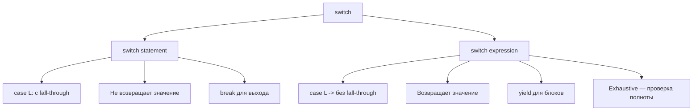
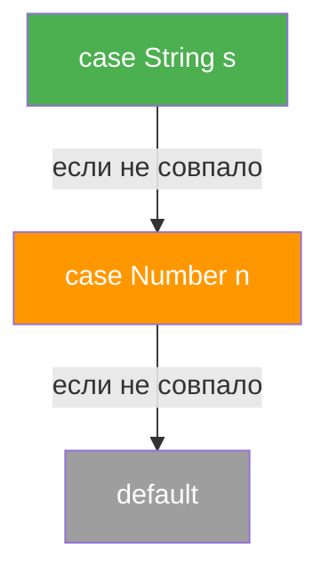
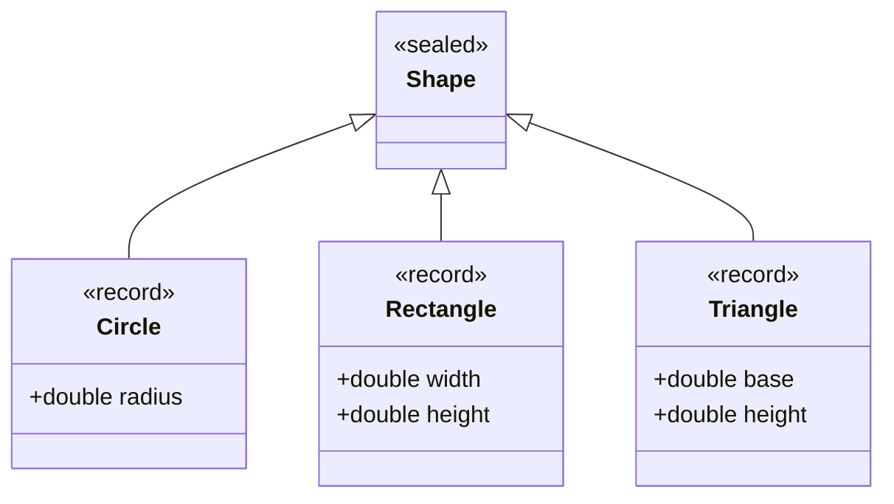
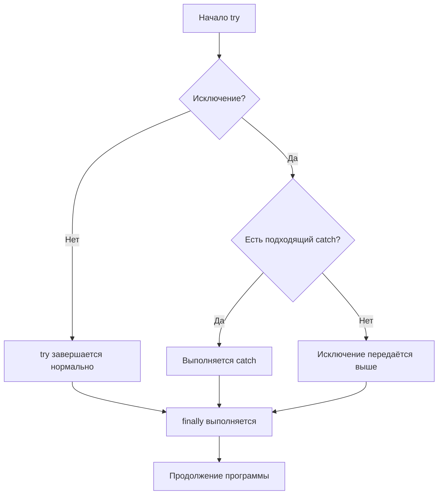
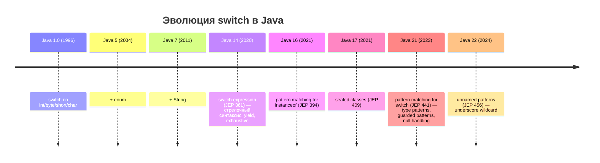

# Вопросы на собеседовании: `Java Conditional Statements`

Условные конструкции и управление потоком выполнения -- одна из базовых тем на собеседовании по `Java`. Вопросы охватывают классические `if/else` и `switch`, современные `switch expression` (`Java 14+`), `pattern matching` (`Java 16-21`), `sealed classes`, циклы, обработку исключений и best practices. Тема тесно связана с [Java Core](java-core-interview.md), [ООП в Java](java-oop-interview.md) и [системой типов Java](java-types-interview.md).

## Полезные ссылки

### Официальная документация

- [Java Tutorial -- Control Flow](https://docs.oracle.com/javase/tutorial/java/nutsandbolts/flow.html) -- базовые управляющие конструкции
- [Java Language Specification -- Statements](https://docs.oracle.com/javase/specs/jls/se21/html/jls-14.html) -- спецификация операторов в JLS 21
- [JEP 441: Pattern Matching for switch](https://openjdk.org/jeps/441) -- финальная версия pattern matching в `Java 21`
- [JEP 394: Pattern Matching for instanceof](https://openjdk.org/jeps/394) -- финальная версия в `Java 16`
- [JEP 409: Sealed Classes](https://openjdk.org/jeps/409) -- sealed classes в `Java 17`

### Статьи

- [Pattern Matching for Switch -- Baeldung](https://www.baeldung.com/java-switch-pattern-matching) -- подробный разбор pattern matching в switch
- [Java Switch Statement -- Baeldung](https://www.baeldung.com/java-switch) -- switch statement и switch expression
- [Pattern Matching for instanceof -- Baeldung](https://www.baeldung.com/java-pattern-matching-instanceof) -- pattern matching для instanceof
- [Sealed Classes and Interfaces -- Baeldung](https://www.baeldung.com/java-sealed-classes-interfaces) -- sealed классы
- [Guide to the yield Keyword -- Baeldung](https://www.baeldung.com/java-yield-switch) -- ключевое слово yield

## Содержание

- [Полезные ссылки](#полезные-ссылки)
- [See also](#see-also)

**Условия `if` и `switch` (классика)**
- [Q1. (!) Опишите операторы `if-then` и `if-then-else`. Какие типы выражений допустимы в условии?](#q1--опишите-операторы-if-then-и-if-then-else-какие-типы-выражений-допустимы-в-условии)
- [Q2. (!) Опишите оператор `switch`. Какие типы можно использовать в выражении `switch`?](#q2--опишите-оператор-switch-какие-типы-можно-использовать-в-выражении-switch)
- [Q3. Что такое `fall-through` в `switch` и когда он полезен?](#q3-что-такое-fall-through-в-switch-и-когда-он-полезен)
- [Q4. Когда предпочтительнее `switch` вместо `if-else` и наоборот?](#q4-когда-предпочтительнее-switch-вместо-if-else-и-наоборот)
- [Q5. Что такое тернарный оператор и когда его использовать?](#q5-что-такое-тернарный-оператор-и-когда-его-использовать)

**`Switch expression` (`Java 14+`)**
- [Q6. (!) Что такое `switch expression` и чем он отличается от `switch statement`?](#q6--что-такое-switch-expression-и-чем-он-отличается-от-switch-statement)
- [Q7. (!) Что такое `yield` в `switch expression`?](#q7--что-такое-yield-в-switch-expression)
- [Q8. (!) Что такое `exhaustive switch` и зачем он нужен?](#q8--что-такое-exhaustive-switch-и-зачем-он-нужен)
- [Q9. Можно ли комбинировать стрелочный и двоеточный синтаксис в одном `switch`?](#q9-можно-ли-комбинировать-стрелочный-и-двоеточный-синтаксис-в-одном-switch)

**`Pattern matching` (`Java 16-21`)**
- [Q10. (!) Что такое `pattern matching for instanceof` (`Java 16`)?](#q10--что-такое-pattern-matching-for-instanceof-java-16)
- [Q11. (!) Что такое `pattern matching for switch` (`Java 21`)?](#q11--что-такое-pattern-matching-for-switch-java-21)
- [Q12. (!) Что такое `guarded patterns` (клауза `when`)?](#q12--что-такое-guarded-patterns-клауза-when)
- [Q13. Как обрабатывается `null` в `pattern matching for switch`?](#q13-как-обрабатывается-null-в-pattern-matching-for-switch)
- [Q14. Что такое `dominance` (доминирование) паттернов и порядок `case`?](#q14-что-такое-dominance-доминирование-паттернов-и-порядок-case)
- [Q15. (!) Как `sealed classes` работают с `pattern matching for switch`?](#q15--как-sealed-classes-работают-с-pattern-matching-for-switch)
- [Q16. Что такое `record patterns` (`Java 21`) и деконструкция записей?](#q16-что-такое-record-patterns-java-21-и-деконструкция-записей)
- [Q17. Что такое `unnamed patterns` (`Java 22`)?](#q17-что-такое-unnamed-patterns-java-22)

**Циклы**
- [Q18. Какие типы циклов поддерживает `Java`?](#q18-какие-типы-циклов-поддерживает-java)
- [Q19. Что такое расширенный цикл `for-each`?](#q19-что-такое-расширенный-цикл-for-each)
- [Q20. (!) В чём разница между немаркированным и маркированным `break`?](#q20--в-чём-разница-между-немаркированным-и-маркированным-break)
- [Q21. В чём разница между немаркированным и маркированным `continue`?](#q21-в-чём-разница-между-немаркированным-и-маркированным-continue)
- [Q22. В чём разница между `break` и `return` в контексте циклов?](#q22-в-чём-разница-между-break-и-return-в-контексте-циклов)
- [Q23. Как обработать бесконечный цикл и когда он уместен?](#q23-как-обработать-бесконечный-цикл-и-когда-он-уместен)

**`try-catch-finally` и `try-with-resources`**
- [Q24. (!) Опишите поток выполнения `try-catch-finally`.](#q24--опишите-поток-выполнения-try-catch-finally)
- [Q25. В каких ситуациях блок `finally` может не выполниться?](#q25-в-каких-ситуациях-блок-finally-может-не-выполниться)
- [Q26. Каков результат выполнения кода с `return` в `catch` и присваиванием в `finally`?](#q26-каков-результат-выполнения-кода-с-return-в-catch-и-присваиванием-в-finally)
- [Q27. (!) Как работает `try-with-resources` и что такое `suppressed exceptions`?](#q27--как-работает-try-with-resources-и-что-такое-suppressed-exceptions)
- [Q28. Как обработать несколько исключений в одном `catch` (`Java 7+`)?](#q28-как-обработать-несколько-исключений-в-одном-catch-java-7)

**Best practices и продвинутые темы**
- [Q29. (!) Как избежать глубокой вложенности `if-else` (`guard clauses`)?](#q29--как-избежать-глубокой-вложенности-if-else-guard-clauses)
- [Q30. Как заменить цепочку `if-else` паттерном `Strategy`?](#q30-как-заменить-цепочку-if-else-паттерном-strategy)
- [Q31. Что такое `assert` и когда его применять?](#q31-что-такое-assert-и-когда-его-применять)
- [Q32. Как условия влияют на производительность (`tableswitch` vs `lookupswitch`)?](#q32-как-условия-влияют-на-производительность-tableswitch-vs-lookupswitch)
- [Q33. Как использовать условия в `Stream API` (`filter`, `takeWhile`, `dropWhile`)?](#q33-как-использовать-условия-в-stream-api-filter-takewhile-dropwhile)
- [Q34. Как условия и ветвление связаны с тестируемостью и цикломатической сложностью?](#q34-как-условия-и-ветвление-связаны-с-тестируемостью-и-цикломатической-сложностью)
- [Q35. Как эволюционировал `switch` от `Java 1` до `Java 21+`?](#q35-как-эволюционировал-switch-от-java-1-до-java-21)

**Short-circuit evaluation и оптимизация условий**
- [Q36. Что такое short-circuit evaluation и как использовать его для оптимизации?](#q36-что-такое-short-circuit-evaluation-и-как-использовать-его-для-оптимизации)
- [Q37. Каков правильный порядок проверок в условиях для максимальной производительности?](#q37-каков-правильный-порядок-проверок-в-условиях-для-максимальной-производительности)

**Антипаттерны и читаемость**
- [Q38. Каковы антипаттерны использования тернарного оператора?](#q38-каковы-антипаттерны-использования-тернарного-оператора)
- [Q39. `if-else` vs `switch` vs `Map dispatch` — производительность и читаемость?](#q39-if-else-vs-switch-vs-map-dispatch--производительность-и-читаемость)

**Null checks и defensive programming**
- [Q40. Как правильно делать null-checks: `Objects.requireNonNull`, `Optional`, fail-fast?](#q40-как-правильно-делать-null-checks-objectsrequirenonnull-optional-fail-fast)

**Stream API и условия**
- [Q41. Как использовать условия в `Stream API` с `map` и `flatMap`?](#q41-как-использовать-условия-в-stream-api-с-map-и-flatmap)

**Pattern matching: продвинутые темы**
- [Q42. Как использовать `sealed classes` с `guards` в реальном коде?](#q42-как-использовать-sealed-classes-с-guards-в-реальном-коде)

---

## Q1. (!) Опишите операторы `if-then` и `if-then-else`. Какие типы выражений допустимы в условии?

Оператор `if-then` выполняет блок кода, если условие истинно. Оператор `if-then-else` добавляет альтернативный путь при `false`:

```java
if (age >= 21) {
    System.out.println("Допущен");
} else if (age >= 18) {
    System.out.println("Ограниченный доступ");
} else {
    System.out.println("Не допущен");
}
```

**Ключевой момент**: в `Java` в условии `if` допускается **только** `boolean` или `Boolean`. В отличие от `C/C++`, нельзя подставить `int`, `String` или `null` -- будет ошибка компиляции. При использовании `Boolean` возможен `NullPointerException` при автоанбоксинге:

```java
Boolean flag = null;
if (flag) { ... } // NullPointerException при unboxing!
```


> [!mcq]
> - [x] Правильный ответ | Объяснение концепции 2-3 предложения
> - [ ] Неправильный вариант 1 | Почему ошибка в этом подходе
> - [ ] Неправильный вариант 2 | Это смежное, но отличное понятие
> - [ ] Неправильный вариант 3 | Противоположное направление## Q2. (!) Опишите оператор `switch`. Какие типы можно использовать в выражении `switch`?

`Switch` выбирает путь выполнения на основе значения переменной. Каждый путь помечен `case` или `default`:

```java
switch (yearsOfExperience) {
    case 0:
        System.out.println("Student");
        break;
    case 1:
        System.out.println("Junior");
        break;
    case 2:
    case 3:
        System.out.println("Middle");
        break;
    default:
        System.out.println("Senior");
}
```

Допустимые типы (эволюция по версиям):

| Версия `Java` | Допустимые типы |
|---|---|
| 1.0 | `byte`, `short`, `char`, `int` и их обёртки |
| 5.0 | + `enum` |
| 7 | + `String` |
| 14+ (expression) | + те же, но с exhaustiveness |
| 21+ (pattern matching) | + любой ссылочный тип через type patterns |

Значения в `case` должны быть **compile-time constants** (литералы, `final` переменные, `enum` константы). Переменные и вычисляемые выражения в `case` недопустимы.


> [!mcq]
> - [x] Правильный ответ | Объяснение концепции 2-3 предложения
> - [ ] Неправильный вариант 1 | Почему ошибка в этом подходе
> - [ ] Неправильный вариант 2 | Это смежное, но отличное понятие
> - [ ] Неправильный вариант 3 | Противоположное направление## Q3. Что такое `fall-through` в `switch` и когда он полезен?

`Fall-through` -- продолжение выполнения следующих `case` веток при отсутствии `break`. Это поведение по умолчанию для классического `switch` с двоеточием:

```java
int operation = 2;
int number = 10;

switch (operation) {
    case 1:
        number = number + 10;
        break;
    case 2:
        number = number - 6;   // number = 4
    case 3:
        number = number * 5;   // number = 20 (fall-through!)
        break;
}
// number == 20, а не 4
```

`Fall-through` бывает полезен, когда несколько значений обрабатываются одинаково:

```java
switch (month) {
    case 1: case 3: case 5: case 7: case 8: case 10: case 12:
        days = 31;
        break;
    case 2:
        days = 28;
        break;
    default:
        days = 30;
}
```

В `switch expression` со стрелочным синтаксисом (`->`) `fall-through` **невозможен**, что устраняет целый класс ошибок.


> [!mcq]
> - [x] Правильный ответ | Объяснение концепции 2-3 предложения
> - [ ] Неправильный вариант 1 | Почему ошибка в этом подходе
> - [ ] Неправильный вариант 2 | Это смежное, но отличное понятие
> - [ ] Неправильный вариант 3 | Противоположное направление## Q4. Когда предпочтительнее `switch` вместо `if-else` и наоборот?

| Критерий | `switch` | `if-else` |
|---|---|---|
| Тип условия | Одна переменная, набор констант | Диапазоны, комбинации условий |
| Читаемость | Лучше при 4+ вариантах | Лучше при 2-3 условиях |
| Расширяемость | enum + exhaustive -- компилятор проверит | Требует ручной проверки |
| Производительность | `tableswitch` для плотных значений -- `O(1)` | Последовательные сравнения |

```java
// switch -- набор конкретных значений
String description = switch (httpStatus) {
    case 200 -> "OK";
    case 404 -> "Not Found";
    case 500 -> "Server Error";
    default -> "Unknown";
};

// if-else -- сложные условия с диапазонами
if (password == null || password.isEmpty()) {
    throw new ValidationException("Password required");
} else if (password.length() < 8) {
    throw new ValidationException("Too short");
}
```


> [!mcq]
> - [x] Правильный ответ | Объяснение концепции 2-3 предложения
> - [ ] Неправильный вариант 1 | Почему ошибка в этом подходе
> - [ ] Неправильный вариант 2 | Это смежное, но отличное понятие
> - [ ] Неправильный вариант 3 | Противоположное направление## Q5. Что такое тернарный оператор и когда его использовать?

Тернарный оператор -- единственный трёхместный оператор в `Java`: `condition ? valueIfTrue : valueIfFalse`. Это **выражение**, возвращающее значение:

```java
String status = score >= 60 ? "Pass" : "Fail";
int abs = x >= 0 ? x : -x;
```

**Правила применения:**
- Использовать для простых присваиваний в одну строку
- **Не вкладывать** тернарные операторы друг в друга -- это сильно ухудшает читаемость
- Для множества веток использовать `switch expression` (`Java 14+`)
- Тип результата определяется правилами бинарной числовой промоции (binary numeric promotion)

```java
// Плохо -- вложенный тернарный
String level = exp > 5 ? "Senior" : exp > 2 ? "Middle" : exp > 0 ? "Junior" : "Student";

// Хорошо -- switch expression
String level = switch (exp) {
    case 0 -> "Student";
    case 1 -> "Junior";
    case 2, 3 -> "Middle";
    default -> "Senior";
};
```


> [!mcq]
> - [x] Правильный ответ | Объяснение концепции 2-3 предложения
> - [ ] Неправильный вариант 1 | Почему ошибка в этом подходе
> - [ ] Неправильный вариант 2 | Это смежное, но отличное понятие
> - [ ] Неправильный вариант 3 | Противоположное направление## Q6. (!) Что такое `switch expression` и чем он отличается от `switch statement`?

`Switch expression` (финальный в `Java 14`, JEP 361) -- это **выражение**, возвращающее значение. Основные отличия от `switch statement`:



| Свойство | `switch statement` | `switch expression` |
|---|---|---|
| Синтаксис | `case L:` (двоеточие) | `case L ->` (стрелка) |
| `Fall-through` | Да, без `break` | Нет |
| Возвращает значение | Нет | Да |
| Exhaustiveness | Не обязательна | Обязательна |
| Множественные метки | `case 1: case 2:` | `case 1, 2 ->` |

```java
// switch statement (до Java 14)
String text;
switch (day) {
    case MONDAY:
    case FRIDAY:
        text = "Рабочий день";
        break;
    case SATURDAY:
    case SUNDAY:
        text = "Выходной";
        break;
    default:
        text = "Середина недели";
}

// switch expression (Java 14+)
String text = switch (day) {
    case MONDAY, FRIDAY -> "Рабочий день";
    case SATURDAY, SUNDAY -> "Выходной";
    default -> "Середина недели";
};  // обратите внимание на точку с запятой!
```


> [!mcq]
> - [x] Правильный ответ | Объяснение концепции 2-3 предложения
> - [ ] Неправильный вариант 1 | Почему ошибка в этом подходе
> - [ ] Неправильный вариант 2 | Это смежное, но отличное понятие
> - [ ] Неправильный вариант 3 | Противоположное направление## Q7. (!) Что такое `yield` в `switch expression`?

`yield` -- ключевое слово, которое возвращает значение из блока кода в `switch expression`. Если ветка `case` содержит одно выражение со стрелочным синтаксисом, значение возвращается неявно. Для блоков кода нужен `yield`:

```java
String result = switch (statusCode) {
    case 200 -> "OK";  // неявный return значения

    case 404 -> {
        logger.warn("Resource not found");
        yield "Not Found";  // явный yield из блока
    }

    case 500 -> {
        logger.error("Internal server error");
        notifyOps();
        yield "Server Error";  // yield обязателен для блока
    }

    default -> "Unknown: " + statusCode;
};
```

**Важно:** `yield` можно использовать и с двоеточным синтаксисом (`case L:`) внутри `switch expression`:

```java
String result = switch (x) {
    case 1:
        yield "one";   // yield вместо break в switch expression
    case 2:
        yield "two";
    default:
        yield "other";
};
```

`yield` -- **не** `return`. Он завершает только текущую ветку `switch expression`, а не метод.


> [!mcq]
> - [x] Правильный ответ | Объяснение концепции 2-3 предложения
> - [ ] Неправильный вариант 1 | Почему ошибка в этом подходе
> - [ ] Неправильный вариант 2 | Это смежное, но отличное понятие
> - [ ] Неправильный вариант 3 | Противоположное направление## Q8. (!) Что такое `exhaustive switch` и зачем он нужен?

**Exhaustive switch** -- switch, покрывающий все возможные значения входного типа. В `switch expression` компилятор **требует** exhaustiveness:

```java
enum Season { SPRING, SUMMER, AUTUMN, WINTER }

String clothes = switch (season) {
    case SPRING -> "Куртка";
    case SUMMER -> "Футболка";
    case AUTUMN -> "Плащ";
    case WINTER -> "Пуховик";
    // default не нужен -- все enum-константы покрыты
};
```

**Преимущества:**
- При добавлении новой константы в `enum` компилятор покажет ошибку во **всех** switch, которые нужно обновить
- Снижает риск пропуска ветки
- Для `sealed` классов компилятор проверяет все `permits`

**Когда нужен `default`:**
- Для `int`, `String` и других типов с бесконечным диапазоном значений
- Как «страховочная сетка» при неизвестных значениях

```java
// Рекомендация: бросать исключение в default для enum
String msg = switch (status) {
    case ACTIVE -> "Active";
    case INACTIVE -> "Inactive";
    // Если кто-то добавит PENDING, а default есть -- ошибка молча проглотится
    default -> throw new IllegalStateException("Unexpected: " + status);
};
```


> [!mcq]
> - [x] Правильный ответ | Объяснение концепции 2-3 предложения
> - [ ] Неправильный вариант 1 | Почему ошибка в этом подходе
> - [ ] Неправильный вариант 2 | Это смежное, но отличное понятие
> - [ ] Неправильный вариант 3 | Противоположное направление## Q9. Можно ли комбинировать стрелочный и двоеточный синтаксис в одном `switch`?

Нет. В одном `switch` (statement или expression) **нельзя** смешивать `case L ->` и `case L:`. Компилятор выдаст ошибку. Нужно выбрать один стиль для всего блока:

```java
// Ошибка компиляции!
switch (x) {
    case 1 -> System.out.println("one");
    case 2:
        System.out.println("two");
        break;
}
```

Стрелочный синтаксис (`->`) рекомендуется как основной с `Java 14+`, так как он исключает `fall-through` и более читаем.


> [!mcq]
> - [x] Правильный ответ | Объяснение концепции 2-3 предложения
> - [ ] Неправильный вариант 1 | Почему ошибка в этом подходе
> - [ ] Неправильный вариант 2 | Это смежное, но отличное понятие
> - [ ] Неправильный вариант 3 | Противоположное направление## Q10. (!) Что такое `pattern matching for instanceof` (`Java 16`)?

`Pattern matching for instanceof` (финальный в `Java 16`, JEP 394) позволяет одновременно проверить тип и присвоить переменную без явного приведения:

```java
// До Java 16 — явное приведение
if (obj instanceof String) {
    String s = (String) obj;
    System.out.println(s.length());
}

// Java 16+ — pattern variable
if (obj instanceof String s) {
    System.out.println(s.length());  // s уже типизирована
}
```

**Область видимости (flow scoping):** переменная `s` доступна только там, где компилятор может **гарантировать** совпадение паттерна:

```java
if (obj instanceof String s && s.length() > 5) {
    // s доступна -- && гарантирует, что instanceof == true
}

if (!(obj instanceof String s)) {
    return;  // early return
}
// s доступна здесь — компилятор знает, что obj — String
s.toUpperCase();
```

Это первый шаг к полноценному pattern matching, продолженный в [sealed classes](java-oop-interview.md) и `switch` (`Java 21`).


> [!mcq]
> - [x] Правильный ответ | Объяснение концепции 2-3 предложения
> - [ ] Неправильный вариант 1 | Почему ошибка в этом подходе
> - [ ] Неправильный вариант 2 | Это смежное, но отличное понятие
> - [ ] Неправильный вариант 3 | Противоположное направление## Q11. (!) Что такое `pattern matching for switch` (`Java 21`)?

`Pattern matching for switch` (финальный в `Java 21`, JEP 441) позволяет использовать **type patterns**, **guarded patterns** и **null** в `case` ветках. Заменяет цепочки `instanceof` и приведений:

```java
// До Java 21 — цепочка instanceof
static String format(Object obj) {
    if (obj instanceof Integer i) {
        return "int: %d".formatted(i);
    } else if (obj instanceof Double d) {
        return "double: %.2f".formatted(d);
    } else if (obj instanceof String s) {
        return "string: %s".formatted(s);
    }
    return "unknown";
}

// Java 21 — pattern matching for switch
static String format(Object obj) {
    return switch (obj) {
        case Integer i -> "int: %d".formatted(i);
        case Double d  -> "double: %.2f".formatted(d);
        case String s  -> "string: %s".formatted(s);
        case null      -> "null";
        default        -> "unknown: " + obj;
    };
}
```

Ключевые возможности:
- **Type patterns**: `case Integer i` -- проверка типа + binding variable
- **Null handling**: `case null` -- явная обработка (до `Java 21` switch по `null` бросал `NullPointerException`)
- **Guarded patterns**: `case String s when s.length() > 5` -- дополнительное условие
- **Exhaustiveness**: компилятор проверяет полноту для `sealed` типов


> [!mcq]
> - [x] Правильный ответ | Объяснение концепции 2-3 предложения
> - [ ] Неправильный вариант 1 | Почему ошибка в этом подходе
> - [ ] Неправильный вариант 2 | Это смежное, но отличное понятие
> - [ ] Неправильный вариант 3 | Противоположное направление## Q12. (!) Что такое `guarded patterns` (клауза `when`)?

`Guarded pattern` -- комбинация паттерна с условием `when`. Позволяет уточнить, когда `case` должен сработать:

```java
static String categorize(Object obj) {
    return switch (obj) {
        case String s when s.isEmpty()      -> "пустая строка";
        case String s when s.length() > 100 -> "длинная строка";
        case String s                        -> "строка: " + s;
        case Integer i when i < 0           -> "отрицательное число";
        case Integer i when i == 0          -> "ноль";
        case Integer i                       -> "положительное число: " + i;
        case null                            -> "null";
        default                              -> "неизвестный тип";
    };
}
```

**Важно:** `when` -- это **не** отдельное ключевое слово в общем смысле, а контекстно-зависимое (context-sensitive) слово, работающее только в `case` ветках. Оно пришло на замену предыдущему синтаксису `&&` из preview-версий.


> [!mcq]
> - [x] Правильный ответ | Объяснение концепции 2-3 предложения
> - [ ] Неправильный вариант 1 | Почему ошибка в этом подходе
> - [ ] Неправильный вариант 2 | Это смежное, но отличное понятие
> - [ ] Неправильный вариант 3 | Противоположное направление## Q13. Как обрабатывается `null` в `pattern matching for switch`?

До `Java 21` передача `null` в `switch` всегда бросала `NullPointerException`. Начиная с `Java 21`, `null` можно обработать явно:

```java
String result = switch (input) {
    case null             -> "null value";
    case String s         -> "string: " + s;
    case Integer i        -> "int: " + i;
    default               -> "other";
};
```

Можно комбинировать `null` с `default`:

```java
String result = switch (input) {
    case String s  -> "string";
    case Integer i -> "int";
    case null, default -> "null или неизвестный тип";
};
```

Если `case null` не указан, то `null` по-прежнему вызывает `NullPointerException` -- для обратной совместимости.


> [!mcq]
> - [x] Правильный ответ | Объяснение концепции 2-3 предложения
> - [ ] Неправильный вариант 1 | Почему ошибка в этом подходе
> - [ ] Неправильный вариант 2 | Это смежное, но отличное понятие
> - [ ] Неправильный вариант 3 | Противоположное направление## Q14. Что такое `dominance` (доминирование) паттернов и порядок `case`?

Компилятор проверяет, что ни один `case` не **доминируется** (перекрывается) предыдущим. Более общий паттерн не может стоять перед более конкретным:

```java
// Ошибка компиляции — case Object доминирует над case String
switch (obj) {
    case Object o  -> "object";   // покрывает всё
    case String s  -> "string";   // никогда не достижим!
}
```

Правильный порядок -- от конкретного к общему:

```java
switch (obj) {
    case String s  -> "string";   // конкретный
    case Number n  -> "number";   // менее конкретный
    default        -> "other";    // самый общий
}
```



Это правило также относится к `guarded patterns`: `case String s when s.isEmpty()` должен стоять **перед** `case String s`.


> [!mcq]
> - [x] Правильный ответ | Объяснение концепции 2-3 предложения
> - [ ] Неправильный вариант 1 | Почему ошибка в этом подходе
> - [ ] Неправильный вариант 2 | Это смежное, но отличное понятие
> - [ ] Неправильный вариант 3 | Противоположное направление## Q15. (!) Как `sealed classes` работают с `pattern matching for switch`?

`Sealed classes` (`Java 17`, JEP 409) ограничивают иерархию наследования через `permits`. В сочетании с `pattern matching for switch` (`Java 21`) компилятор проверяет **exhaustiveness** по всем разрешённым подтипам:

```java
sealed interface Shape permits Circle, Rectangle, Triangle {}
record Circle(double radius) implements Shape {}
record Rectangle(double width, double height) implements Shape {}
record Triangle(double base, double height) implements Shape {}

double area(Shape shape) {
    return switch (shape) {
        case Circle c    -> Math.PI * c.radius() * c.radius();
        case Rectangle r -> r.width() * r.height();
        case Triangle t  -> 0.5 * t.base() * t.height();
        // default не нужен — компилятор знает все подтипы!
    };
}
```



**Преимущества связки `sealed` + `switch`:**
- При добавлении нового подтипа (`Pentagon`) -- ошибка компиляции во всех switch
- Заменяет паттерн `Visitor` для простых случаев
- Более безопасная альтернатива `default` ветке -- подробнее в [вопросах по ООП](java-oop-interview.md)


> [!mcq]
> - [x] Правильный ответ | Объяснение концепции 2-3 предложения
> - [ ] Неправильный вариант 1 | Почему ошибка в этом подходе
> - [ ] Неправильный вариант 2 | Это смежное, но отличное понятие
> - [ ] Неправильный вариант 3 | Противоположное направление## Q16. Что такое `record patterns` (`Java 21`) и деконструкция записей?

`Record patterns` (финальные в `Java 21`, JEP 440) позволяют деконструировать `record` прямо в `case` -- извлечь компоненты без явных вызовов аксессоров:

```java
record Point(int x, int y) {}

String describe(Object obj) {
    return switch (obj) {
        case Point(int x, int y) when x == 0 && y == 0 -> "начало координат";
        case Point(int x, int y) when x == 0           -> "на оси Y";
        case Point(int x, int y) when y == 0           -> "на оси X";
        case Point(int x, int y)                        -> "точка (%d, %d)".formatted(x, y);
        default                                         -> "не точка";
    };
}
```

Деконструкция может быть **вложенной**:

```java
record Pair<T>(T first, T second) {}

switch (obj) {
    case Pair(Point(var x1, var y1), Point(var x2, var y2)) ->
        "отрезок от (%d,%d) до (%d,%d)".formatted(x1, y1, x2, y2);
    default -> "не пара точек";
}
```


> [!mcq]
> - [x] Правильный ответ | Объяснение концепции 2-3 предложения
> - [ ] Неправильный вариант 1 | Почему ошибка в этом подходе
> - [ ] Неправильный вариант 2 | Это смежное, но отличное понятие
> - [ ] Неправильный вариант 3 | Противоположное направление## Q17. Что такое `unnamed patterns` (`Java 22`)?

`Unnamed patterns` (JEP 456, `Java 22`) позволяют использовать `_` для компонентов, которые не нужны в текущей ветке:

```java
sealed interface Animal permits Dog, Cat, Fish {}
record Dog(String name, int age) implements Animal {}
record Cat(String name, int age) implements Animal {}
record Fish(String species) implements Animal {}

String sound(Animal animal) {
    return switch (animal) {
        case Dog(var name, _)  -> name + " лает";   // age не нужен
        case Cat(_, _)         -> "мяу";             // ни name, ни age
        case Fish _            -> "...";             // весь record не нужен
    };
}
```

Это снижает визуальный шум и делает явным, какие компоненты используются. Подробнее о `record` и `var` -- в [Java Core](java-core-interview.md).


> [!mcq]
> - [x] Правильный ответ | Объяснение концепции 2-3 предложения
> - [ ] Неправильный вариант 1 | Почему ошибка в этом подходе
> - [ ] Неправильный вариант 2 | Это смежное, но отличное понятие
> - [ ] Неправильный вариант 3 | Противоположное направление## Q18. Какие типы циклов поддерживает `Java`?

`Java` поддерживает три типа циклов:

**`for`** -- когда известно число итераций:
```java
for (int i = 0; i < 10; i++) {
    process(i);
}
```

**`while`** -- условие проверяется **перед** итерацией:
```java
while (iterator.hasNext()) {
    process(iterator.next());
}
```

**`do-while`** -- тело выполняется **минимум один раз**, условие проверяется после:
```java
int attempt = 0;
do {
    result = tryConnect();
    attempt++;
} while (!result.isSuccess() && attempt < 3);
```

Начиная с `Java 5`, также доступен **enhanced for** (`for-each`) для коллекций и массивов. С `Java 8` многие циклы заменяются на [Stream API](java-stream-interview.md).


> [!mcq]
> - [x] Правильный ответ | Объяснение концепции 2-3 предложения
> - [ ] Неправильный вариант 1 | Почему ошибка в этом подходе
> - [ ] Неправильный вариант 2 | Это смежное, но отличное понятие
> - [ ] Неправильный вариант 3 | Противоположное направление## Q19. Что такое расширенный цикл `for-each`?

Enhanced for (`for-each`) перебирает все элементы массива или любого объекта, реализующего `Iterable`:

```java
for (String name : names) {
    System.out.println(name);
}
```

**Ограничения:**
- Нет доступа к индексу (для индекса -- классический `for` или `IntStream.range`)
- Нельзя модифицировать коллекцию во время итерации (будет `ConcurrentModificationException`)
- Нельзя пропускать элементы или итерировать назад
- Под капотом использует `Iterator`, поэтому производительность для `ArrayList` такая же, как у `Iterator`


> [!mcq]
> - [x] Правильный ответ | Объяснение концепции 2-3 предложения
> - [ ] Неправильный вариант 1 | Почему ошибка в этом подходе
> - [ ] Неправильный вариант 2 | Это смежное, но отличное понятие
> - [ ] Неправильный вариант 3 | Противоположное направление## Q20. (!) В чём разница между немаркированным и маркированным `break`?

Немаркированный `break` завершает **самый внутренний** цикл или `switch`. Маркированный `break` завершает **помеченный** внешний цикл:

```java
int[][] matrix = {{1, 2, 3}, {25, 37, 49}, {55, 68, 93}};
boolean found = false;
int checks = 0;

outer:
for (int[] row : matrix) {
    for (int cell : row) {
        checks++;
        if (cell == 37) {
            found = true;
            break outer;  // выход из обоих циклов
        }
    }
}
// checks == 5 (с маркированным break)
// checks == 8 (без метки — только внутренний цикл завершится)
```

Маркированный `break` полезен для поиска в многомерных структурах, но часто лучше заменить его отдельным методом с `return`.


> [!mcq]
> - [x] Правильный ответ | Объяснение концепции 2-3 предложения
> - [ ] Неправильный вариант 1 | Почему ошибка в этом подходе
> - [ ] Неправильный вариант 2 | Это смежное, но отличное понятие
> - [ ] Неправильный вариант 3 | Противоположное направление## Q21. В чём разница между немаркированным и маркированным `continue`?

Немаркированный `continue` переходит к **следующей итерации** самого внутреннего цикла. Маркированный `continue` переходит к следующей итерации **помеченного** внешнего цикла:

```java
int[][] table = {{1, 15, 3}, {25, 15, 49}, {15, 68, 93}};
int processed = 0;

outer:
for (int[] row : table) {
    for (int cell : row) {
        processed++;
        if (cell == 15) {
            continue outer;  // пропуск оставшихся ячеек в строке
        }
    }
}
// processed == 5 (маркированный) vs 9 (немаркированный)
```


> [!mcq]
> - [x] Правильный ответ | Объяснение концепции 2-3 предложения
> - [ ] Неправильный вариант 1 | Почему ошибка в этом подходе
> - [ ] Неправильный вариант 2 | Это смежное, но отличное понятие
> - [ ] Неправильный вариант 3 | Противоположное направление## Q22. В чём разница между `break` и `return` в контексте циклов?

| | `break` | `return` |
|---|---|---|
| Область действия | Текущий цикл / `switch` | Весь метод |
| Код после цикла | Выполняется | Не выполняется |
| Применение | Досрочное завершение итераций | Когда результат найден и метод может завершиться |

```java
// break — код после цикла выполнится
for (Item item : items) {
    if (item.isTarget()) {
        result = item;
        break;  // выход из цикла, продолжаем метод
    }
}
log.info("Search complete");  // выполнится

// return — метод завершается
for (Item item : items) {
    if (item.isTarget()) {
        return item;  // выход из метода
    }
}
log.info("Not found");  // выполнится, только если ничего не найдено
```


> [!mcq]
> - [x] Правильный ответ | Объяснение концепции 2-3 предложения
> - [ ] Неправильный вариант 1 | Почему ошибка в этом подходе
> - [ ] Неправильный вариант 2 | Это смежное, но отличное понятие
> - [ ] Неправильный вариант 3 | Противоположное направление## Q23. Как обработать бесконечный цикл и когда он уместен?

Бесконечный цикл создаётся конструкциями `while (true)` или `for (;;)`. Уместен в:
- Серверных циклах (приём запросов до shutdown)
- Event loop / game loop
- Чтении из очереди сообщений

Обязательно обеспечить условие выхода:

```java
// Серверный цикл с graceful shutdown
while (true) {
    Task task = queue.poll(1, TimeUnit.SECONDS);
    if (shutdownRequested.get()) {
        break;
    }
    if (task != null) {
        process(task);
    }
}
```

Для работы с очередями сообщений в `Spring` часто используют `@KafkaListener` или `@RabbitListener`, которые скрывают цикл за абстракцией.


> [!mcq]
> - [x] Правильный ответ | Объяснение концепции 2-3 предложения
> - [ ] Неправильный вариант 1 | Почему ошибка в этом подходе
> - [ ] Неправильный вариант 2 | Это смежное, но отличное понятие
> - [ ] Неправильный вариант 3 | Противоположное направление## Q24. (!) Опишите поток выполнения `try-catch-finally`.



1. Выполняется блок `try`
2. Если исключение не брошено -- `catch` блоки пропускаются
3. Если брошено -- ищется первый подходящий `catch` (по типу исключения)
4. Блок `finally` выполняется **всегда** (за редкими исключениями -- см. Q25)

Подробнее об иерархии исключений -- в [вопросах по исключениям](java-exceptions-interview.md).


> [!mcq]
> - [x] Правильный ответ | Объяснение концепции 2-3 предложения
> - [ ] Неправильный вариант 1 | Почему ошибка в этом подходе
> - [ ] Неправильный вариант 2 | Это смежное, но отличное понятие
> - [ ] Неправильный вариант 3 | Противоположное направление## Q25. В каких ситуациях блок `finally` может не выполниться?

Блок `finally` **не выполняется** в следующих случаях:
- Вызов `System.exit()` в блоке `try` или `catch`
- Аварийное завершение `JVM` (crash, `OutOfMemoryError` в критическом месте)
- Бесконечный цикл или deadlock в `try`/`catch`
- Принудительное уничтожение потока (`Thread.stop()` -- deprecated)
- Убийство процесса ОС (`kill -9`)

```java
try {
    System.out.println("try");
    System.exit(0);  // JVM завершается
} finally {
    System.out.println("finally");  // НЕ выполнится
}
```


> [!mcq]
> - [x] Правильный ответ | Объяснение концепции 2-3 предложения
> - [ ] Неправильный вариант 1 | Почему ошибка в этом подходе
> - [ ] Неправильный вариант 2 | Это смежное, но отличное понятие
> - [ ] Неправильный вариант 3 | Противоположное направление## Q26. Каков результат выполнения кода с `return` в `catch` и присваиванием в `finally`?

```java
public static int assignment() {
    int number = 1;
    try {
        number = 3;
        if (true) throw new Exception("Test");
        number = 2;
    } catch (Exception ex) {
        return number;  // return 3 — значение фиксируется
    } finally {
        number = 4;     // присваивание НЕ влияет на возвращаемое значение
    }
    return number;
}
// Результат: 3
```

**Объяснение:** оператор `return number` в `catch` фиксирует значение `3` **до** выполнения `finally`. Блок `finally` выполняется, присваивает `number = 4`, но возвращаемое значение уже зафиксировано. Однако если в `finally` стоит свой `return` -- он **перекроет** предыдущий (и это антипаттерн).

**Для ссылочных типов** поведение другое: `finally` может изменить состояние возвращаемого объекта, потому что `return` фиксирует **ссылку**, а не копию.


> [!mcq]
> - [x] Правильный ответ | Объяснение концепции 2-3 предложения
> - [ ] Неправильный вариант 1 | Почему ошибка в этом подходе
> - [ ] Неправильный вариант 2 | Это смежное, но отличное понятие
> - [ ] Неправильный вариант 3 | Противоположное направление## Q27. (!) Как работает `try-with-resources` и что такое `suppressed exceptions`?

`Try-with-resources` (`Java 7+`) автоматически закрывает ресурсы, реализующие `AutoCloseable`. Ресурсы закрываются в **обратном** порядке объявления:

```java
try (var conn = dataSource.getConnection();
     var stmt = conn.prepareStatement(sql);
     var rs = stmt.executeQuery()) {
    while (rs.next()) {
        process(rs);
    }
}
// rs, stmt, conn закрываются автоматически в обратном порядке
```

**Suppressed exceptions:** если исключение брошено в `try` **и** при `close()`, то исключение из `close()` добавляется как suppressed:

```java
try {
    // основное исключение: IOException
} // close() бросает IllegalStateException — оно suppressed

// В обработчике:
catch (IOException e) {
    Throwable[] suppressed = e.getSuppressed();
    // suppressed[0] — IllegalStateException из close()
}
```

С `Java 9` можно использовать effectively-final переменные:

```java
Connection conn = dataSource.getConnection();
try (conn) {  // Java 9+ — не нужно объявлять в ()
    // используем conn
}
```


> [!mcq]
> - [x] Правильный ответ | Объяснение концепции 2-3 предложения
> - [ ] Неправильный вариант 1 | Почему ошибка в этом подходе
> - [ ] Неправильный вариант 2 | Это смежное, но отличное понятие
> - [ ] Неправильный вариант 3 | Противоположное направление## Q28. Как обработать несколько исключений в одном `catch` (`Java 7+`)?

Multi-catch позволяет перечислить типы через `|`:

```java
try {
    parseAndSave(input);
} catch (IOException | SQLException | ParseException e) {
    log.error("Ошибка обработки: {}", e.getMessage(), e);
    throw new ApplicationException("Processing failed", e);
}
```

**Ограничения:**
- Типы не должны быть в отношении наследования (`IOException | Exception` -- ошибка компиляции)
- Переменная `e` является effectively `final` -- нельзя переприсвоить
- Тип переменной -- общий супертип перечисленных исключений


> [!mcq]
> - [x] Правильный ответ | Объяснение концепции 2-3 предложения
> - [ ] Неправильный вариант 1 | Почему ошибка в этом подходе
> - [ ] Неправильный вариант 2 | Это смежное, но отличное понятие
> - [ ] Неправильный вариант 3 | Противоположное направление## Q29. (!) Как избежать глубокой вложенности `if-else` (`guard clauses`)?

**Guard clauses** -- ранний выход при невыполнении предусловий. Основной код остаётся на верхнем уровне вложенности:

```java
// Плохо — глубокая вложенность
public void processOrder(Order order) {
    if (order != null) {
        if (order.isValid()) {
            if (order.hasItems()) {
                if (paymentService.charge(order)) {
                    shipOrder(order);
                }
            }
        }
    }
}

// Хорошо — guard clauses
public void processOrder(Order order) {
    if (order == null) return;
    if (!order.isValid()) throw new IllegalArgumentException("Invalid order");
    if (!order.hasItems()) return;
    if (!paymentService.charge(order)) throw new PaymentException("Charge failed");

    shipOrder(order);  // основная логика без вложенности
}
```

**Альтернативы для сложных ветвлений:**
- Паттерн [Strategy](../../design-patterns/design-patterns-interview.md) -- вынос каждой ветки в отдельный класс
- `Map<Key, Handler>` -- таблица стратегий
- `Optional` для цепочек проверок на `null`
- `switch expression` с pattern matching для проверки по типу


> [!mcq]
> - [x] Правильный ответ | Объяснение концепции 2-3 предложения
> - [ ] Неправильный вариант 1 | Почему ошибка в этом подходе
> - [ ] Неправильный вариант 2 | Это смежное, но отличное понятие
> - [ ] Неправильный вариант 3 | Противоположное направление## Q30. Как заменить цепочку `if-else` паттерном `Strategy`?

Когда `if-else` выбирает поведение по типу или ключу, это признак необходимости паттерна [Strategy](../../design-patterns/design-patterns-interview.md):

```java
// Плохо — if-else, нарушает Open-Closed Principle
double calculate(String type, double amount) {
    if ("standard".equals(type)) return amount * 0.1;
    else if ("premium".equals(type)) return amount * 0.05;
    else if ("vip".equals(type)) return 0;
    else throw new IllegalArgumentException("Unknown: " + type);
}

// Хорошо — Strategy через Map
Map<String, DoubleUnaryOperator> strategies = Map.of(
    "standard", amount -> amount * 0.1,
    "premium",  amount -> amount * 0.05,
    "vip",      amount -> 0.0
);

double calculate(String type, double amount) {
    var strategy = strategies.get(type);
    if (strategy == null) throw new IllegalArgumentException("Unknown: " + type);
    return strategy.applyAsDouble(amount);
}

// Ещё лучше — enum + switch expression
enum CustomerType {
    STANDARD, PREMIUM, VIP;

    double calculateFee(double amount) {
        return switch (this) {
            case STANDARD -> amount * 0.1;
            case PREMIUM  -> amount * 0.05;
            case VIP      -> 0.0;
        };
    }
}
```


> [!mcq]
> - [x] Правильный ответ | Объяснение концепции 2-3 предложения
> - [ ] Неправильный вариант 1 | Почему ошибка в этом подходе
> - [ ] Неправильный вариант 2 | Это смежное, но отличное понятие
> - [ ] Неправильный вариант 3 | Противоположное направление## Q31. Что такое `assert` и когда его применять?

`assert` -- проверка инвариантов в режиме отладки. По умолчанию **отключён** (включение: `java -ea`):

```java
assert age >= 0 : "Возраст не может быть отрицательным: " + age;
```

| Когда использовать | Когда **не** использовать |
|---|---|
| Внутренние инварианты | Валидация входных данных пользователя |
| Постусловия private-методов | Проверки в public API |
| Проверка «невозможных» состояний | Логика, влияющая на бизнес-процесс |

При `false` бросается `AssertionError`. В продакшене обычно отключён, поэтому **не заменяет** валидацию. Для проверки аргументов в public API используйте `Objects.requireNonNull()`, `Preconditions.checkArgument()` (Guava) или `Validate.notNull()` (Apache Commons).


> [!mcq]
> - [x] Правильный ответ | Объяснение концепции 2-3 предложения
> - [ ] Неправильный вариант 1 | Почему ошибка в этом подходе
> - [ ] Неправильный вариант 2 | Это смежное, но отличное понятие
> - [ ] Неправильный вариант 3 | Противоположное направление## Q32. Как условия влияют на производительность (`tableswitch` vs `lookupswitch`)?

`JVM` компилирует `switch` в одну из двух инструкций байткода:

| Инструкция | Когда | Сложность |
|---|---|---|
| `tableswitch` | Плотные значения (0, 1, 2, 3...) | `O(1)` -- прямой переход по индексу |
| `lookupswitch` | Разреженные значения (1, 100, 500) | `O(log n)` -- бинарный поиск |

```java
// tableswitch — O(1)
switch (dayOfWeek) {  // 1-7, плотные
    case 1 -> "Пн";
    case 2 -> "Вт";
    // ...
}

// lookupswitch — O(log n)
switch (errorCode) {  // 200, 404, 500 — разреженные
    case 200 -> "OK";
    case 404 -> "Not Found";
    case 500 -> "Error";
}
```

**На практике:** разница ничтожна в большинстве приложений. `JIT`-компилятор дополнительно оптимизирует горячие пути. Выбор между `if` и `switch` должен определяться **читаемостью**, а не микрооптимизацией. `Switch expression` с exhaustive-проверкой для `enum` -- оптимальный выбор по всем критериям.


> [!mcq]
> - [x] Правильный ответ | Объяснение концепции 2-3 предложения
> - [ ] Неправильный вариант 1 | Почему ошибка в этом подходе
> - [ ] Неправильный вариант 2 | Это смежное, но отличное понятие
> - [ ] Неправильный вариант 3 | Противоположное направление## Q33. Как использовать условия в `Stream API` (`filter`, `takeWhile`, `dropWhile`)?

Подробнее о Stream API -- в [отдельном разделе](java-stream-interview.md).

| Метод | Версия | Описание |
|---|---|---|
| `filter(Predicate)` | `Java 8` | Оставляет элементы, удовлетворяющие условию |
| `takeWhile(Predicate)` | `Java 9` | Берёт элементы, пока условие `true` |
| `dropWhile(Predicate)` | `Java 9` | Пропускает элементы, пока условие `true` |

```java
List<Integer> numbers = List.of(2, 4, 6, 3, 8, 10);

numbers.stream()
    .filter(n -> n % 2 == 0)        // [2, 4, 6, 8, 10]
    .toList();

numbers.stream()
    .takeWhile(n -> n % 2 == 0)     // [2, 4, 6] — остановится на 3
    .toList();

numbers.stream()
    .dropWhile(n -> n < 5)          // [6, 3, 8, 10] — пропустит 2, 4
    .toList();
```

**Комбинирование предикатов:**

```java
Predicate<String> notEmpty = s -> !s.isEmpty();
Predicate<String> notTooLong = s -> s.length() <= 100;

list.stream()
    .filter(notEmpty.and(notTooLong))
    .toList();
```


> [!mcq]
> - [x] Правильный ответ | Объяснение концепции 2-3 предложения
> - [ ] Неправильный вариант 1 | Почему ошибка в этом подходе
> - [ ] Неправильный вариант 2 | Это смежное, но отличное понятие
> - [ ] Неправильный вариант 3 | Противоположное направление## Q34. Как условия и ветвление связаны с тестируемостью и цикломатической сложностью?

**Цикломатическая сложность** (McCabe) -- число линейно независимых путей через код. Каждый `if`, `case`, `&&`, `||`, `?:` увеличивает её на 1:

```java
// Сложность = 4 (1 + три условия)
void process(Order order) {
    if (order == null) return;                    // +1
    if (order.getTotal() > 1000) applyDiscount(); // +1
    if (order.isPriority()) expedite();           // +1
}
```

| Сложность | Оценка | Тестируемость |
|---|---|---|
| 1-5 | Простой код | Легко тестировать |
| 6-10 | Умеренно сложный | Требует внимания |
| 11-20 | Сложный | Нужен рефакторинг |
| 20+ | Очень сложный | Трудно поддерживать |

**Стратегии снижения сложности:**
- Guard clauses вместо вложенных `if`
- Вынос веток в отдельные методы
- `Switch expression` с exhaustive проверкой
- Паттерн Strategy / Map-based dispatch
- `SonarQube` / `Checkstyle` могут автоматически отслеживать метрику


> [!mcq]
> - [x] Правильный ответ | Объяснение концепции 2-3 предложения
> - [ ] Неправильный вариант 1 | Почему ошибка в этом подходе
> - [ ] Неправильный вариант 2 | Это смежное, но отличное понятие
> - [ ] Неправильный вариант 3 | Противоположное направление## Q35. Как эволюционировал `switch` от `Java 1` до `Java 21+`?



| Версия | Что добавлено | JEP |
|---|---|---|
| `Java 1` | `switch` по `int`, `byte`, `short`, `char` | -- |
| `Java 5` | + `enum` | -- |
| `Java 7` | + `String` | -- |
| `Java 14` | `switch expression`: `->`, `yield`, exhaustive | JEP 361 |
| `Java 16` | `instanceof` pattern matching | JEP 394 |
| `Java 17` | `sealed classes` | JEP 409 |
| `Java 21` | Pattern matching for switch: type patterns, `when`, `null` | JEP 441 |
| `Java 21` | Record patterns (деконструкция) | JEP 440 |
| `Java 22` | Unnamed patterns (`_`) | JEP 456 |

Каждая следующая версия сделала `switch` мощнее и безопаснее. Современный `Java 21+` `switch` с pattern matching приближается по выразительности к `when` в `Kotlin` и `match` в `Scala`/`Rust`, оставаясь полностью обратно совместимым.


> [!mcq]
> - [x] Правильный ответ | Объяснение концепции 2-3 предложения
> - [ ] Неправильный вариант 1 | Почему ошибка в этом подходе
> - [ ] Неправильный вариант 2 | Это смежное, но отличное понятие
> - [ ] Неправильный вариант 3 | Противоположное направление## Q36. Что такое short-circuit evaluation и как использовать его для оптимизации?

**Short-circuit evaluation** (ленивые вычисления) — поведение логических операторов `&&` и `||`, при котором правый операнд не вычисляется, если результат уже определён левым операндом.

**Правила:**
- `A && B` — если `A == false`, то `B` не вычисляется (результат уже `false`)
- `A || B` — если `A == true`, то `B` не вычисляется (результат уже `true`)
- `&` и `|` (без short-circuit) — всегда вычисляют оба операнда

```java
// Short-circuit: database.query() не вызывается если isEnabled == false
if (isEnabled && database.query(id) != null) {
    process();
}

// Short-circuit: expensive вызов не выполняется если null check не прошёл
if (user != null && user.isActive() && user.getRole() == Role.ADMIN) {
    grantAccess();
}

// НЕПРАВИЛЬНО — & вычисляет оба операнда, что может вызвать NPE
if (user != null & user.isActive()) { /* NPE если user == null */ }
```

**Практические применения:**

| Применение | Пример |
|---|---|
| Null guard + метод | `obj != null && obj.isValid()` |
| Дорогой вызов на второй позиции | `isSimpleCheck() || heavyValidation()` |
| Логирование без NPE | `log.isDebugEnabled() && log.debug(buildMessage())` |

**Отличие от non-short-circuit (`&`, `|`):**
```java
// & используется только при работе с битами или когда нужны оба side effects
int flags = FLAG_A & FLAG_B;  // побитовое AND

// В условиях — только && (с исключениями в тестах для проверки обоих вызовов)
boolean result = methodA() & methodB();  // methodB всегда вызывается
```

> Компилятор и JIT не переставляют операнды в `&&`/`||` — порядок гарантирован спецификацией JLS §15.23-15.24.


> [!mcq]
> - [x] Правильный ответ | Объяснение концепции 2-3 предложения
> - [ ] Неправильный вариант 1 | Почему ошибка в этом подходе
> - [ ] Неправильный вариант 2 | Это смежное, но отличное понятие
> - [ ] Неправильный вариант 3 | Противоположное направление## Q37. Каков правильный порядок проверок в условиях для максимальной производительности?

Правильный порядок условий в `&&` и `||` улучшает производительность за счёт short-circuit и снижает cognitive load.

**Принципы упорядочивания для `&&`:**

1. **Сначала самая дешёвая и наиболее вероятно-false проверка** — чтобы как можно скорее завершить с `false`
2. **Null checks — первыми** — защита от NPE
3. **Дорогие вызовы (IO, DB, сеть) — последними** — минимизация вызовов

```java
// Плохо: дорогой вызов может выполниться зря
if (database.loadUser(id).isAdmin() && id != null) { ... }

// Хорошо: дешёвые проверки — сначала, дорогие — в конце
if (id != null && isEnabled && database.loadUser(id).isAdmin()) { ... }
```

**Принципы для `||`:**

1. **Сначала самая дешёвая и наиболее вероятно-true проверка** — ранний выход через `true`
2. **Редкие дорогие пути — в конце**

```java
// Если cachedResult чаще всего != null — ставим его первым
if (cachedResult != null || computeExpensiveResult() != null) { ... }
```

**Мнемоника:**

| Оператор | Что ставить первым | Цель |
|---|---|---|
| `&&` | Самое likely-false / дешёвое | Ранний выход через false |
| `\|\|` | Самое likely-true / дешёвое | Ранний выход через true |

```java
// Реальный пример из кода Spring Security:
if (authentication != null
        && authentication.isAuthenticated()
        && hasRequiredAuthority(authentication, resource)) {
    // null check → дешёвый флаг → дорогая проверка полномочий
}
```

> В большинстве бизнес-приложений разница ничтожна. Важнее **читаемость** — но принцип "дешёвые раньше" помогает и там и там.


> [!mcq]
> - [x] Правильный ответ | Объяснение концепции 2-3 предложения
> - [ ] Неправильный вариант 1 | Почему ошибка в этом подходе
> - [ ] Неправильный вариант 2 | Это смежное, но отличное понятие
> - [ ] Неправильный вариант 3 | Противоположное направление## Q38. Каковы антипаттерны использования тернарного оператора?

Тернарный оператор `condition ? valueIfTrue : valueIfFalse` — мощный инструмент, но его злоупотребление ухудшает читаемость.

**Антипаттерн 1: Вложенные тернарные операторы**

```java
// Нечитаемо — вложенный тернарный
String label = a > b ? a > c ? "a max" : "c max" : b > c ? "b max" : "c max";

// Лучше — switch expression или if-else с именованными переменными
String label = switch (Math.max(a, Math.max(b, c))) {
    case int x when x == a -> "a max";
    case int x when x == b -> "b max";
    default -> "c max";
};
```

**Антипаттерн 2: Тернарный с side effects**

```java
// Плохо — side effects в тернарном создают сюрпризы
String result = isActive ? saveUser(user) : deleteUser(user);

// Хорошо — side effects в явных ветках
if (isActive) {
    saveUser(user);
} else {
    deleteUser(user);
}
String result = isActive ? "saved" : "deleted";
```

**Антипаттерн 3: Тернарный возвращает boolean**

```java
// Бессмысленно — condition уже boolean
boolean isValid = (x > 0) ? true : false;

// Правильно
boolean isValid = x > 0;
```

**Антипаттерн 4: Слишком длинный тернарный**

```java
// Трудно читать — слишком много логики
String msg = user.getAge() >= 18 && user.hasAccepted() && !user.isBanned()
    ? "Welcome, " + user.getName() + "!"
    : "Access denied: " + user.getBlockReason().orElse("unknown");

// Лучше вынести в метод
String msg = buildWelcomeMessage(user);
```

**Когда тернарный уместен:**

```java
// Короткое присвоение с простым условием — хорошо
int max = a > b ? a : b;
String display = name != null ? name : "Anonymous";
List<String> list = input != null ? input : Collections.emptyList();
```

> Правило: тернарный уместен, если всё выражение помещается в одну строку и не требует объяснения. Если нужен комментарий — лучше `if-else`.


> [!mcq]
> - [x] Правильный ответ | Объяснение концепции 2-3 предложения
> - [ ] Неправильный вариант 1 | Почему ошибка в этом подходе
> - [ ] Неправильный вариант 2 | Это смежное, но отличное понятие
> - [ ] Неправильный вариант 3 | Противоположное направление## Q39. `if-else` vs `switch` vs `Map dispatch` — производительность и читаемость?

Три способа реализовать ветвление по значению имеют разные характеристики.

**`if-else chain`** — линейное время O(n), но гибкое:

```java
// Подходит: сложные предикаты, диапазоны, несравнимые типы
if (status.equals("PENDING") && retryCount < 3) handlePending();
else if (status.equals("FAILED")) handleFailed();
else handleUnknown();
```

**`switch expression` (Java 14+)** — O(1) через `tableswitch`/`lookupswitch`, компилятор проверяет exhaustiveness:

```java
// Подходит: конкретные значения enum/String/примитивов
String message = switch (status) {
    case PENDING  -> "Ожидает обработки";
    case ACTIVE   -> "Активен";
    case EXPIRED  -> "Истёк";
    case CANCELED -> "Отменён";
};
```

**`Map dispatch`** — O(1) lookup, динамически расширяемый:

```java
// Подходит: команды/обработчики, регистрация на лету, плагины
Map<String, Runnable> handlers = Map.of(
    "start",  this::handleStart,
    "stop",   this::handleStop,
    "status", this::handleStatus
);

handlers.getOrDefault(command, this::handleUnknown).run();
```

**Сравнение:**

| Критерий | `if-else` | `switch` | `Map dispatch` |
|---|---|---|---|
| Производительность | O(n) | O(1) | O(1) |
| Exhaustiveness | Нет | Да (Java 14+) | Нет |
| Расширяемость | Плохая | Плохая | Хорошая |
| Читаемость | Средняя | Высокая | Высокая |
| Сложные условия | Да | Нет | Нет |
| Тип ключа | Любой | String/enum/int/... | Любой |

**Когда что выбирать:**
- `if-else` — разные типы условий, диапазоны, сложная логика
- `switch expression` — enum или конечный набор строк/значений, нужна exhaustiveness
- `Map dispatch` — Strategy Pattern, регистрация обработчиков, Command Pattern


> [!mcq]
> - [x] Правильный ответ | Объяснение концепции 2-3 предложения
> - [ ] Неправильный вариант 1 | Почему ошибка в этом подходе
> - [ ] Неправильный вариант 2 | Это смежное, но отличное понятие
> - [ ] Неправильный вариант 3 | Противоположное направление## Q40. Как правильно делать null-checks: `Objects.requireNonNull`, `Optional`, fail-fast?

Null-checks — источник ошибок и боilerplate. Java предоставляет несколько инструментов.

**`Objects.requireNonNull` — fail-fast на входе:**

```java
// Лучше, чем ручной if-null
public UserService(UserRepository repo) {
    this.repo = Objects.requireNonNull(repo, "UserRepository must not be null");
}

// Java 9+: requireNonNullElse и requireNonNullElseGet
String name = Objects.requireNonNullElse(user.getName(), "Anonymous");
String name = Objects.requireNonNullElseGet(user.getName(), () -> defaultName());
```

**`Optional` — для возвращаемых значений (не параметров!):**

```java
// Хорошо: Optional как возвращаемый тип
public Optional<User> findById(Long id) {
    return Optional.ofNullable(repository.findById(id));
}

// Использование
findById(42L)
    .filter(User::isActive)
    .map(User::getName)
    .orElse("Anonymous");

// Плохо: Optional как параметр метода
public void process(Optional<User> user) { ... }  // анти-паттерн!
// Лучше: перегрузить метод или принимать @Nullable
```

**Null checks в Collections:**

```java
// Java 8+: вместо if (list == null) list = new ArrayList<>();
List<String> safe = Objects.requireNonNullElseGet(list, ArrayList::new);

// Collections.emptyList() вместо null
public List<Order> getOrders() {
    return orders != null ? orders : Collections.emptyList();
}
```

**Аннотации `@NonNull` / `@Nullable`:**

```java
// Используйте аннотации для документирования контракта (Jakarta, Lombok, JetBrains)
public void process(@NonNull String input) { ... }
public @Nullable String findName(Long id) { ... }
```

**Когда использовать что:**

| Инструмент | Когда |
|---|---|
| `Objects.requireNonNull` | Валидация параметров в конструкторах и методах |
| `Optional` | Возвращаемый тип когда значение может отсутствовать |
| `@NonNull` / `@Nullable` | Документирование контракта для статического анализа |
| Null Object Pattern | Когда нужно устранить null вообще через дефолтный объект |

> Правило fail-fast: лучше бросить `NullPointerException` с понятным сообщением при получении некорректного аргумента, чем получить NPE в глубине стека позже.


> [!mcq]
> - [x] Правильный ответ | Объяснение концепции 2-3 предложения
> - [ ] Неправильный вариант 1 | Почему ошибка в этом подходе
> - [ ] Неправильный вариант 2 | Это смежное, но отличное понятие
> - [ ] Неправильный вариант 3 | Противоположное направление## Q41. Как использовать условия в `Stream API` с `map` и `flatMap`?

Помимо `filter`, условная логика часто нужна внутри `map` и `flatMap`.

**Условное преобразование через `map`:**

```java
// Условие внутри map — допустимо для простых случаев
List<String> labels = users.stream()
    .map(u -> u.isAdmin() ? "[ADMIN] " + u.getName() : u.getName())
    .toList();

// Лучше для сложной логики — вынести в метод
List<String> labels = users.stream()
    .map(this::formatUserLabel)
    .toList();

private String formatUserLabel(User user) {
    return switch (user.getRole()) {
        case ADMIN   -> "[ADMIN] " + user.getName();
        case MANAGER -> "[MGR] " + user.getName();
        default      -> user.getName();
    };
}
```

**`flatMap` с условием — раскрытие Optional:**

```java
// Java 9+: Optional::stream позволяет фильтровать пустые Optional
List<String> emails = userIds.stream()
    .map(userService::findById)     // Stream<Optional<User>>
    .flatMap(Optional::stream)      // Stream<User> — убирает пустые
    .map(User::getEmail)
    .toList();
```

**Условная коллекция через `mapMulti` (Java 16+):**

```java
// mapMulti — замена flatMap для условной генерации
List<String> result = items.stream()
    .<String>mapMulti((item, consumer) -> {
        if (item.isActive()) consumer.accept(item.getName());
        if (item.hasAlias()) consumer.accept(item.getAlias());
    })
    .toList();
```

**Разделение стрима на части (`partitioningBy`, `groupingBy`):**

```java
// Разделить на два списка по условию
Map<Boolean, List<User>> partition = users.stream()
    .collect(Collectors.partitioningBy(User::isActive));

List<User> active   = partition.get(true);
List<User> inactive = partition.get(false);

// Группировка по значению enum
Map<Role, List<User>> byRole = users.stream()
    .collect(Collectors.groupingBy(User::getRole));
```

> Главное правило: стримы должны быть **декларативными**. Если логика внутри `map` / `flatMap` сложная — выносите в отдельный метод или используйте `switch expression`.


> [!mcq]
> - [x] Правильный ответ | Объяснение концепции 2-3 предложения
> - [ ] Неправильный вариант 1 | Почему ошибка в этом подходе
> - [ ] Неправильный вариант 2 | Это смежное, но отличное понятие
> - [ ] Неправильный вариант 3 | Противоположное направление## Q42. Как использовать `sealed classes` с `guards` в реальном коде?

Комбинация `sealed classes` + `pattern matching for switch` + `when`-guards позволяет строить безопасный exhaustive dispatch.

**Реальный пример: обработка платёжных событий:**

```java
sealed interface PaymentEvent permits
    PaymentCreated, PaymentCompleted, PaymentFailed, PaymentRefunded {}

record PaymentCreated(String id, BigDecimal amount, String currency) implements PaymentEvent {}
record PaymentCompleted(String id, String transactionRef) implements PaymentEvent {}
record PaymentFailed(String id, String reason, boolean retriable) implements PaymentEvent {}
record PaymentRefunded(String id, BigDecimal refundAmount) implements PaymentEvent {}

// Exhaustive switch — компилятор требует все варианты
String handleEvent(PaymentEvent event) {
    return switch (event) {
        case PaymentCreated e when e.amount().compareTo(BigDecimal.ZERO) <= 0
                              -> throw new IllegalArgumentException("Amount must be positive");
        case PaymentCreated e -> "Создан платёж " + e.id() + " на " + e.amount() + " " + e.currency();

        case PaymentCompleted e -> "Платёж " + e.id() + " завершён, ref: " + e.transactionRef();

        case PaymentFailed e when e.retriable()
                              -> "Платёж " + e.id() + " не прошёл, будет retry: " + e.reason();
        case PaymentFailed e  -> "Платёж " + e.id() + " отклонён: " + e.reason();

        case PaymentRefunded e -> "Возврат по платежу " + e.id() + " на " + e.refundAmount();
        // default не нужен — компилятор знает все подтипы sealed interface
    };
}
```

**Преимущества подхода:**

| Характеристика | Традиционный if-else | sealed + pattern matching |
|---|---|---|
| Exhaustiveness | Нет гарантий | Проверяется компилятором |
| Добавление нового типа | Тихий баг | Ошибка компиляции |
| Деконструкция полей | Ручной cast | Автоматически через record |
| Гибкость условий | Да | Да (через `when`) |

**Типичные кейсы применения:**

```java
// Domain events (DDD)
// Result/Either types
// AST-узлы в компиляторах и парсерах
// Конечные автоматы (FSM)
sealed interface State permits Idle, Running, Paused, Stopped {}
```

> `Sealed classes` с `pattern matching` — это Java-ответ на `algebraic data types` из функциональных языков. Начиная с Java 21, этот паттерн производственно стабилен и рекомендован для доменного моделирования.

---

## See also

- [Java Core](java-core-interview.md) — базовые концепции языка
- [ООП в Java](java-oop-interview.md) — наследование, полиморфизм, sealed classes
- [Система типов Java](java-types-interview.md) — примитивы, обёртки, автобоксинг
- [Исключения в Java](java-exceptions-interview.md) — try-catch, checked/unchecked
- [Stream API](java-stream-interview.md) — функциональные условия, предикаты
- [Java 8+](java-8-interview.md) — лямбды, Optional, функциональные интерфейсы
- [Паттерны проектирования](../../design-patterns/design-patterns-interview.md) — Strategy, State вместо ветвлений


> [!mcq]
> - [x] Правильный ответ | Объяснение концепции 2-3 предложения
> - [ ] Неправильный вариант 1 | Почему ошибка в этом подходе
> - [ ] Неправильный вариант 2 | Это смежное, но отличное понятие
> - [ ] Неправильный вариант 3 | Противоположное направление- [Java 17-21](java-17-21-interview.md)
- [Java 8](java-8-interview.md)
- [Java Annotations](java-annotations-interview.md)
- [Java Collections](java-collections-interview.md)
- [Java Concurrency](java-concurrency-interview.md)
- [Java Core](java-core-interview.md)
