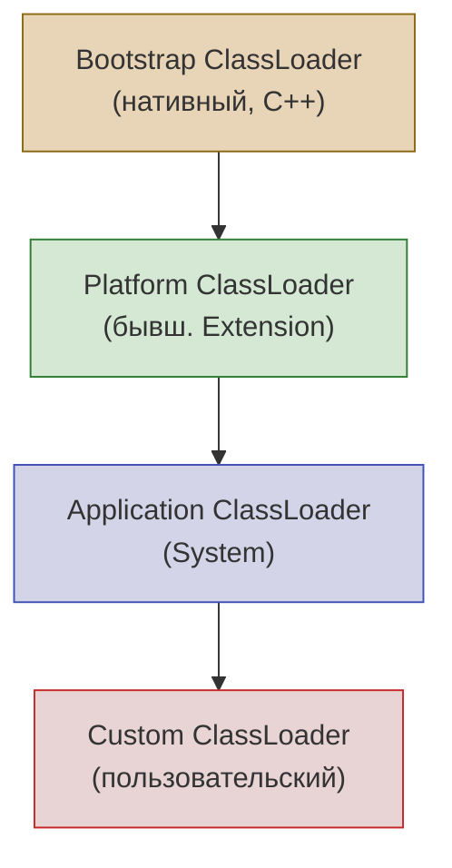
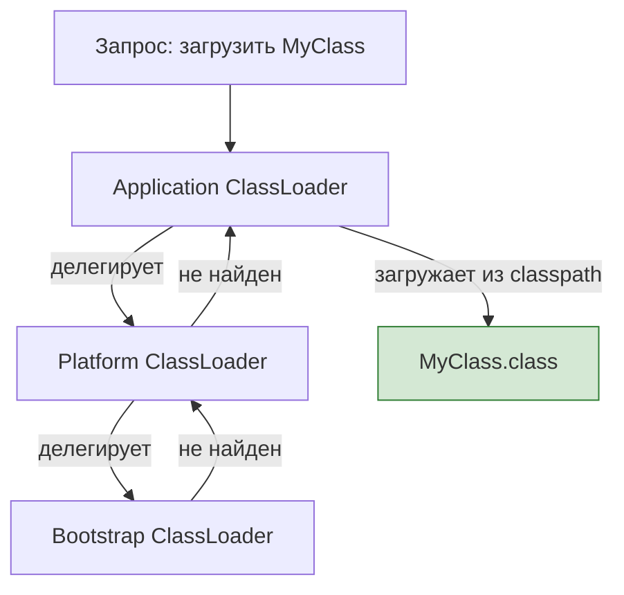

# Вопросы на собеседовании: `Java Core`

Комплексное руководство по вопросам собеседования на тему `Java Core` для `Senior Java Developer`. Включает ключевые слова и модификаторы, контракт `Object`, иммутабельность, механизм загрузки классов, `Reflection API`, обработку `null`, и современные возможности `Java 14–21`.

## Полезные ссылки

### Официальная документация

- [Java Language Specification](https://docs.oracle.com/javase/specs/jls/se17/html/)
- [Java Tutorial](https://docs.oracle.com/javase/tutorial/)
- [Java API Documentation](https://docs.oracle.com/en/java/javase/17/docs/api/)
- [Java Interview Questions — Baeldung](https://www.baeldung.com/java-interview-questions)
- [Java equals() and hashCode() Contracts — Baeldung](https://www.baeldung.com/java-equals-hashcode-contracts)
- [Class Loaders in Java — Baeldung](https://www.baeldung.com/java-classloaders)
- [Guide to Java Reflection — Baeldung](https://www.baeldung.com/java-reflection)

## Содержание

**Ключевые слова и модификаторы**
- [Q1. (!) Что такое ключевое слово `final`?](#q1--что-такое-ключевое-слово-final)
- [Q2. Что такое метод по умолчанию?](#q2-что-такое-метод-по-умолчанию)
- [Q3. Что такое статические члены класса?](#q3-что-такое-статические-члены-класса)
- [Q4. Можно ли объявить класс `abstract` без `abstract`-методов?](#q4-можно-ли-объявить-класс-abstract-без-abstract-методов)
- [Q5. Что такое `Constructor Chaining`?](#q5-что-такое-constructor-chaining)
- [Q6. (!) Что такое `Overriding` и `Overloading` методов?](#q6--что-такое-overriding-и-overloading-методов)
- [Q7. Можно ли переопределить `static` метод?](#q7-можно-ли-переопределить-static-метод)
- [Q8. Что такое `visibility modifiers` (`public`, `private`, `protected`)?](#q8-что-такое-visibility-modifiers-public-private-protected)
- [Q9. Что такое `this` и `super`?](#q9-что-такое-this-и-super)
- [Q10. Можно ли переопределить `private` метод?](#q10-можно-ли-переопределить-private-метод)

**Контракт `Object`, `equals` и `hashCode`**
- [Q11. (!) Что такое `Object` и какие методы он определяет?](#q11--что-такое-object-и-какие-методы-он-определяет)
- [Q12. (!) В чём разница между `==` и `equals()`?](#q12--в-чём-разница-между--и-equals)
- [Q13. (!) Что такое контракт `equals()` и `hashCode()`?](#q13--что-такое-контракт-equals-и-hashcode)
- [Q14. Что такое `clone()` и как правильно клонировать объект?](#q14-что-такое-clone-и-как-правильно-клонировать-объект)
- [Q15. Что такое `shallow copy` и `deep copy`?](#q15-что-такое-shallow-copy-и-deep-copy)

**Иммутабельность и перечисления**
- [Q16. (!) Что такое `Immutable` класс и как его создать?](#q16--что-такое-immutable-класс-и-как-его-создать)
- [Q17. Как сравнить два значения `Enum`?](#q17-как-сравнить-два-значения-enum)
- [Q18. (!) Что такое `Marker Interface`?](#q18--что-такое-marker-interface)
- [Q19. Что такое `Var-args`?](#q19-что-такое-var-args)

**Инициализация и загрузка классов**
- [Q20. Что такое блоки инициализации?](#q20-что-такое-блоки-инициализации)
- [Q21. (!) Как работает загрузка классов в JVM?](#q21--как-работает-загрузка-классов-в-jvm)
- [Q22. Что такое делегирование загрузки классов?](#q22-что-такое-делегирование-загрузки-классов)
- [Q23. Можно ли написать собственный `ClassLoader`?](#q23-можно-ли-написать-собственный-classloader)

**`Reflection API`**
- [Q24. (!) Что такое `Reflection` и зачем он нужен?](#q24--что-такое-reflection-и-зачем-он-нужен)
- [Q25. Как получить информацию о классе через `Reflection`?](#q25-как-получить-информацию-о-классе-через-reflection)
- [Q26. Какие недостатки и ограничения у `Reflection`?](#q26-какие-недостатки-и-ограничения-у-reflection)

**Пакеты, `package` и `import`**
- [Q27. Что такое `package` и `import`?](#q27-что-такое-package-и-import)

**Типы данных и автоупаковка**
- [Q28. (!) Что такое автоупаковка и распаковка (`autoboxing`/`unboxing`)?](#q28--что-такое-автоупаковка-и-распаковка-autoboxingunboxing)
- [Q29. Что такое `String Pool`?](#q29-что-такое-string-pool)

**`null`, `Optional` и защитное программирование**
- [Q30. Что такое `null` и как избежать `NPE`?](#q30-что-такое-null-и-как-избежать-npe)
- [Q31. (!) Что такое `Optional` и когда его использовать?](#q31--что-такое-optional-и-когда-его-использовать)

**Современные возможности Java**
- [Q32. Что такое `Records` (`Java 14+`)?](#q32-что-такое-records-java-14)
- [Q33. Что такое compact constructors в `Records`?](#q33-что-такое-compact-constructors-в-records)
- [Q34. (!) Что такое `Sealed` classes (`Java 17`)?](#q34--что-такое-sealed-classes-java-17)
- [Q35. Что такое `Pattern Matching` for `instanceof` (`Java 16`)?](#q35-что-такое-pattern-matching-for-instanceof-java-16)
- [Q36. Что такое `switch expression` (`Java 14+`)?](#q36-что-такое-switch-expression-java-14)
- [Q37. Что такое `Text Blocks` (`Java 15`)?](#q37-что-такое-text-blocks-java-15)
- [Q38. Что такое `Pattern Matching` for `switch` (`Java 21`)?](#q38-что-такое-pattern-matching-for-switch-java-21)
- [Q39. Что такое `SequencedCollection` (`Java 21`)?](#q39-что-такое-sequencedcollection-java-21)
- [See also](#see-also)

---

## Q1. (!) Что такое ключевое слово `final`?

Ключевое слово `final` в `Java` ограничивает изменяемость и наследование. Применяется к четырём элементам:

| Элемент | Эффект `final` |
|---------|----------------|
| Класс | Нельзя наследовать (`String`, `Integer`) |
| Метод | Нельзя переопределить в подклассах |
| Поле | Значение присваивается один раз (в объявлении или конструкторе) |
| Локальная переменная | Значение нельзя изменить после первого присваивания |

```java
public final class UtilityClass {           // нельзя наследовать
    private final String name = "MyApp";    // неизменяемое поле

    public final void process() { }         // нельзя переопределить

    public void demo() {
        final int max = 3;
        // max = 5; // ошибка компиляции
    }
}
```

Важно: `final` на ссылке означает, что ссылка не может указывать на другой объект, но **сам объект может быть изменён** (например, `final List<String> list` — можно добавлять элементы). Для настоящей иммутабельности нужно использовать неизменяемые коллекции (`List.of()`, `Collections.unmodifiableList()`).

> [!mcq]
> - [ ] Объявление `final List<String> list = new ArrayList<>()` запрещает добавлять элементы в список. | `final` запрещает ПЕРЕНАЗНАЧЕНИЕ (`list = new ArrayList<>()`), но не МУТАЦИЮ — `list.add(...)` отработает. ❌ ПОСЛЕДСТВИЕ: data corruption в multi-threaded коде; LinkedIn 2014 — 4-часовой инцидент с inconsistent caches. 📋 ПРАВИЛО: "final = нельзя переназначить, но можно мутировать". 🔗 См. также Q16 (immutable классы и защитное копирование).
> - [ ] Ключевое слово `final` в Java применяется к переменным, методам, классам и пакетам. | К пакетам `final` не применяется — это несуществующий элемент. ❌ ПОСЛЕДСТВИЕ: ошибка компиляции при попытке `final package com.example;`. 📋 ПРАВИЛО: "final работает на 3 цели: переменная (запрет reassign), метод (запрет override), класс (запрет extends)".
> - [x] Метод с модификатором `final` не может быть переопределён в подклассе, но может быть перегружен в любом классе. | `final` блокирует override (виртуальный dispatch), но overload — это новая сигнатура, не нарушающая контракт. ✓ ПРИМЕНЯТЬ: на security-критичных методах (`String.hashCode()`), на hot paths где JIT может заинлайнить. 📋 ПРАВИЛО: "final метод = JIT inline candidate, но overload свободен". 🔗 См. также Q6 (overriding vs overloading).
> - [ ] Класс `String` является `final`, чтобы запретить изменение значения строковых объектов после создания. | Причина `final` у класса — запрет НАСЛЕДОВАНИЯ; иммутабельность обеспечивается `private final byte[]` ВНУТРИ. ❌ ПОСЛЕДСТВИЕ: без `final` злонамеренный `class EvilString extends String` мог бы переопределить `hashCode()` и сломать String Pool — LinkedIn держит 1.5M интернированных строк, повреждение pool обвалило бы heap. 📋 ПРАВИЛО: "final класс = запрет subclass, не immutability".

> [!mcq]
> - [ ] Лямбда может захватывать локальную переменную только если она объявлена явным `final`; без `final` — ошибка компиляции. | С `Java 8` достаточно `effectively final` — переменной не присваивают новое значение после инициализации; явный `final` опционален. ❌ ПОСЛЕДСТВИЕ: разработчик добавляет `final` ко всем локальным переменным «на всякий случай», превращая код в шум; либо наоборот, удивляется, что лямбда работает без `final`. 📋 ПРАВИЛО: «лямбда захватывает effectively final = `final` неявный, не пиши явно».
> - [ ] Внутри лямбды можно изменять захваченную локальную переменную, если она объявлена `final`. | `final` запрещает переназначение — мутировать саму переменную НЕЛЬЗЯ; обходят через `AtomicInteger`, `int[]{0}` или `final` ссылку на mutable holder. ❌ ПОСЛЕДСТВИЕ: попытка `counter++` в лямбде = compile error «variable used in lambda should be final or effectively final». 📋 ПРАВИЛО: «лямбда читает захваченное, не мутирует — для счётчика `AtomicInteger` или массив длины 1».
> - [ ] `final` параметр метода запрещает передавать в этот метод изменяемые объекты-аргументы. | `final` на параметре запрещает только переназначение ССЫЛКИ внутри метода; переданный `List` остаётся mutable, его можно `add()`. ❌ ПОСЛЕДСТВИЕ: ложное чувство безопасности — API объявляет `void process(final List<X> items)` и мутирует входной список → caller получает повреждённые данные. 📋 ПРАВИЛО: «final параметр = блок reassign внутри метода, НЕ защита аргумента от мутации; для защиты — `List.copyOf()`».
> - [x] Локальная переменная, захваченная лямбдой, должна быть либо явно `final`, либо `effectively final` — без переназначения после инициализации. | JLS §15.27.2: лямбда копирует значение в момент создания, нельзя видеть мутации; `effectively final` — добавлено в Java 8 чтобы убрать ритуальные `final`. ✓ ПРИМЕНЯТЬ: чистый стиль — не пишите явный `final` на локальных, компилятор сам проверит; для счётчиков в лямбде используйте `AtomicInteger`/`LongAdder`. 📋 ПРАВИЛО: «лямбда + локальная = effectively final; иначе compile error». 🔗 См. также Q6 (overriding/overloading), Java 8 lambdas.

## Q2. Что такое метод по умолчанию?

Метод по умолчанию (`default method`) — метод с реализацией внутри интерфейса, появился в `Java 8`. Помечается ключевым словом `default`. Классы, реализующие интерфейс, могут использовать реализацию по умолчанию или переопределить метод.

```java
interface Loggable {
    void log(String message);

    default void logInfo(String message) {
        log("[INFO] " + message);
    }

    default void logError(String message) {
        log("[ERROR] " + message);
    }
}

class ConsoleLogger implements Loggable {
    @Override
    public void log(String message) {
        System.out.println(message);
    }
    // logInfo() и logError() доступны без переопределения
}
```

Если класс реализует два интерфейса с одинаковым `default`-методом, необходимо явно переопределить этот метод и выбрать реализацию через `InterfaceName.super.method()`. Подробнее о `default`-методах и лямбдах — в [вопросах по Java 8](java-8-interview.md).

> [!mcq]
> - [ ] Класс, реализующий два интерфейса с одинаковым `default`-методом, автоматически вызывает реализацию более специфичного интерфейса. | Авторазрешение работает только при линейной иерархии (`B extends A`); для НЕЗАВИСИМЫХ интерфейсов компилятор требует явного override через `Interface.super.method()`. ❌ ПОСЛЕДСТВИЕ: добавление `default` метода в общий util-интерфейс конфликтует с существующими реализациями в зависимых модулях — сборка падает с `class inherits unrelated defaults` до тех пор, пока во всех классах не будет явного выбора.
> - [ ] `default`-метод интерфейса не может быть переопределён в реализующем классе — это его принципиальное отличие от обычного метода. | Реализующий класс свободно переопределяет `default` обычным `@Override`. При diamond-конфликте двух интерфейсов с одинаковым `default` переопределение становится **обязательным** — без него compile error. ❌ ПОСЛЕДСТВИЕ: разработчик ожидает «защищённого» поведения, оборачивает логику в `default` думая что её нельзя сломать — наследник тихо переопределяет, ломая контракт API.
> - [x] `default`-метод введён в `Java 8` и позволяет добавлять новые методы в существующий интерфейс без нарушения обратной совместимости с реализациями. | Без `default` добавление `stream()` в `Collection` потребовало бы перекомпиляции всех реализующих классов. ✓ ПРИМЕНЯТЬ: эволюция публичного API (`Comparator.thenComparing`, `Iterable.forEach`); расширение `Collection`/`List`/`Map` в JDK 8 без слома пользовательских классов. 📋 ПРАВИЛО: «default = backward-compat для интерфейсов; обязателен override только при diamond». 🔗 См. Q1 (final), Q6 (overriding), Q34 (sealed — современная альтернатива default через иерархию).
> - [ ] `default`-метод появился в `Java 9` одновременно с приватными методами интерфейса для шаринга кода между `default`-методами. | `default` — `Java 8` (2014); `private` методы в интерфейсе — `Java 9` (2017): это две разные версии. ❌ ПОСЛЕДСТВИЕ: разработчик отказывается от `default` под предлогом «слишком новой фичи», в реальности она работает уже на JDK 8 — потеря 4 лет совместимости с legacy-кодом.

## Q3. Что такое статические члены класса?

Статические члены принадлежат классу, а не экземпляру. Объявляются с модификатором `static`.

**Статические поля** — общие для всех экземпляров, инициализируются один раз при загрузке класса.

**Статические методы** — вызываются без создания экземпляра (`ClassName.method()`), не имеют доступа к `this` и нестатическим полям/методам.

```java
public class Counter {
    private static int count = 0;   // общее для всех экземпляров

    public Counter() { count++; }

    public static int getCount() {  // вызов: Counter.getCount()
        return count;
    }
}
```

Осторожность: глобальная видимость статических полей может вызывать проблемы с многопоточностью и усложнять тестирование (нельзя замокать статический метод без `Mockito.mockStatic()`).

> [!mcq]
> - [ ] Статическое поле класса хранится в `Heap` наравне с полями экземпляра и собирается GC при отсутствии ссылок на класс. | Статические поля хранятся в `Metaspace` (Java 8+) / `PermGen` (Java 7−) как часть метаданных класса; собираются GC только при выгрузке `ClassLoader`-а, что почти не происходит в обычных приложениях. ❌ ПОСЛЕДСТВИЕ: static `Map<K,V>` без `WeakReference` живёт весь lifecycle сервиса — классический OOM в long-running приложениях через 2-3 недели аптайма.
> - [ ] Статический метод в подклассе переопределяет статический метод родителя через стандартный механизм виртуального диспетчинга. | Это `method hiding`, не `overriding`: для `static` связывание статическое — по типу ссылки на этапе компиляции, а не runtime. ❌ ПОСЛЕДСТВИЕ: `Parent p = new Child(); p.staticMethod()` вызовет `Parent`, не `Child` — разработчик ожидает полиморфизма, получает silent bug; особенно опасно в DI-контейнерах с прокси-цепями.
> - [x] Статический метод не имеет доступа к `this` и нестатическим членам класса; вызывается через имя класса (`ClassName.method()`) и не участвует в полиморфизме. | `static`-метод привязан к классу, а не к экземпляру; `this` физически не существует, dispatch только по типу ссылки. ✓ ПРИМЕНЯТЬ: utility-функции (`Math.abs`, `Collections.sort`), factory-методы (`Optional.of`, `List.of`), точка входа `main()`. 📋 ПРАВИЛО: «static = нет this, нет полиморфизма, нет instance-полей». 🔗 См. Q7 (нельзя override static), Q11 (Object methods), Q21 (classloading).
> - [ ] Статическое поле инициализируется заново при каждом создании нового экземпляра класса оператором `new`. | `static` инициализируется ОДИН РАЗ — в блоке `<clinit>` при первой загрузке класса; `new` к этому не относится. ❌ ПОСЛЕДСТВИЕ: static-state утекает между unit-тестами; без явного reset через `@AfterEach` или `@DirtiesContext` в Spring тесты становятся order-dependent и flaky.


## Q4. Можно ли объявить класс `abstract` без `abstract`-методов?

Да. Такой класс нельзя инстанциировать напрямую — только через подклассы.

Цели:
1. **Запрет на создание экземпляров** — если класс имеет смысл только как базовый
2. **Группировка общей логики** — неабстрактные методы и поля для наследников
3. **Шаблон Template Method** — базовый класс определяет алгоритм, а подклассы переопределяют конкретные шаги

```java
public abstract class AbstractRepository {
    // Нет abstract-методов, но нельзя создать new AbstractRepository()
    public void save(Object entity) {
        validate(entity);
        persist(entity);
    }

    protected void validate(Object entity) { /* общая логика */ }
    protected void persist(Object entity) { /* общая логика */ }
}
```

> [!mcq]
> - [ ] Класс, объявленный `abstract`, обязан содержать хотя бы один `abstract`-метод — иначе compile error. | Компилятор допускает `abstract` класс без `abstract`-методов — единственный эффект ключевого слова в этом случае: запрет инстанциирования через `new`. ❌ ПОСЛЕДСТВИЕ: разработчик добавляет искусственный `abstract` метод «для соответствия правилу» — наследники вынуждены реализовывать пустую заглушку, API замусоривается no-op переопределениями.
> - [ ] `abstract`-класс без `abstract`-методов ничем не отличается от обычного (non-abstract) класса. | Принципиальное отличие — запрет `new` даже без abstract-методов; компилятор enforce этот контракт. ❌ ПОСЛЕДСТВИЕ: разработчик убирает `abstract` «как избыточное», базовый класс начинают инстанциировать напрямую — нарушаются инварианты, которые предполагали обязательную инициализацию через конкретный наследник.
> - [ ] `abstract`-класс не может содержать конструктор, поскольку его невозможно напрямую инстанциировать оператором `new`. | Может и обязан содержать — конструктор вызывается через `super(...)` из конструктора подкласса для инициализации унаследованных `final` полей. ❌ ПОСЛЕДСТВИЕ: убираешь конструктор у `AbstractEntity` базы — наследники не могут инициализировать `id`/`version` через `super(id)`, JPA получает null-поля и валит сохранение.
> - [x] `abstract`-класс без `abstract`-методов нельзя создать через `new`, но можно инстанциировать через конкретный подкласс; конструктор у такого класса обязателен. | `new AbstractRepository()` — compile error; `new ConcreteRepository()` — OK при наличии родительского конструктора. ✓ ПРИМЕНЯТЬ: Template Method (`Spring AbstractController` определяет flow, наследники переопределяют шаги); скрытие тривиальных no-op реализаций (`AbstractList` уже реализует `iterator()`). 📋 ПРАВИЛО: «abstract = запрет new; abstract-метод — отдельная фича, не обязателен». 🔗 См. Q5 (constructor chaining), Q6 (overriding), Q18 (marker interface как альтернатива абстрактному классу).

## Q5. Что такое `Constructor Chaining`?

Цепочка конструкторов — вызов одного конструктора из другого в том же классе (`this(...)`) или в родительском (`super(...)`). Вызов должен быть **первой строкой** конструктора.

```java
public class Connection {
    private final String host;
    private final int port;
    private final int timeout;

    public Connection() {
        this("localhost");              // → Connection(String)
    }

    public Connection(String host) {
        this(host, 8080);              // → Connection(String, int)
    }

    public Connection(String host, int port) {
        this(host, port, 30_000);      // → Connection(String, int, int)
    }

    public Connection(String host, int port, int timeout) {
        this.host = host;
        this.port = port;
        this.timeout = timeout;
    }
}
```

Правила: `this()` и `super()` нельзя использовать одновременно; если конструктор не вызывает `this()` или `super()` явно, компилятор добавляет `super()` автоматически.

> [!mcq]
> - [ ] Вызов `this(args)` или `super(args)` в конструкторе может находиться в любом месте тела конструктора. | `this()`/`super()` обязаны быть **первой** инструкцией; компилятор не допускает кода перед ними (только в Java 22+ через preview-фичу разрешены statements before super). ❌ ПОСЛЕДСТВИЕ: попытка валидации параметров до super → compile error «call to super must be first statement»; разработчик пишет статический helper-метод как обход и получает усложнённую сигнатуру.
> - [ ] В одном конструкторе можно использовать `this(args)` и `super(args)` одновременно — например, на соседних строках. | Эти вызовы взаимоисключающие: оба не могут быть первой строкой одновременно. Если нужен и `this()`, и `super()` — `super()` отрабатывает в делегатном конструкторе. ❌ ПОСЛЕДСТВИЕ: попытка дописать оба = compile error; разработчик не понимает почему, копирует логику в оба конструктора и нарушает DRY.
> - [ ] `this(args)` в конструкторе класса `Child` вызывает конструктор родительского класса `Parent` с теми же аргументами. | `this(args)` вызывает другой конструктор **того же** класса; для родителя — `super(args)`. ❌ ПОСЛЕДСТВИЕ: `Child(int x)` пишет `this(x)` ожидая дёрнуть `Parent(int)` — получает рекурсивный self-call → `StackOverflowError` при первом `new Child(0)`.
> - [x] Если первая инструкция конструктора не является `this(...)` или `super(...)`, компилятор неявно вставляет `super()` без аргументов; при отсутствии у родителя no-args конструктора это даёт compile error. | JVM требует обязательной цепочки до `Object`; default-вставка `super()` срабатывает молча и обнажает отсутствие no-arg ctor у родителя. ✓ ПРИМЕНЯТЬ: знать при наследовании от классов без default-конструктора — JPA-сущности от базового класса с `@AllArgsConstructor`, immutable-родители с обязательными полями. 📋 ПРАВИЛО: «нет явного `this()`/`super()` → компилятор вставит `super()`; родитель обязан иметь доступный no-arg конструктор». 🔗 См. Q4 (abstract class ctor), Q9 (this/super), Q11 (Object root).

## Q6. (!) Что такое `Overriding` и `Overloading` методов?

**Переопределение (`overriding`)** — метод подкласса с той же сигнатурой заменяет реализацию из родителя. Решается в **runtime** (динамическая диспетчеризация).

```java
class Animal {
    public String sound() { return "..."; }
}

class Cat extends Animal {
    @Override
    public String sound() { return "Мяу"; }  // runtime-полиморфизм
}
```

**Перегрузка (`overloading`)** — методы с одним именем, но **разной сигнатурой** (типы/количество аргументов). Решается в **compile time**.

```java
class MathUtils {
    public int add(int a, int b) { return a + b; }
    public double add(double a, double b) { return a + b; }
    public int add(int a, int b, int c) { return a + b + c; }
}
```

| Критерий | `Overriding` | `Overloading` |
|----------|-------------|---------------|
| Сигнатура | Одинаковая | Разная |
| Классы | Родитель + наследник | Один класс |
| Разрешение | Runtime | Compile time |
| Аннотация | `@Override` | Нет |
| Возвращаемый тип | Ковариантный (подтип) | Любой |

Подробнее о полиморфизме — в [вопросах по ООП](java-oop-interview.md).

> [!mcq]
> - [ ] Метод с аннотацией `@Override` может изменить только возвращаемый тип по сравнению с методом родителя; параметры тоже допускается варьировать. | Менять параметры в overriding нельзя — это превратит метод в overload. Возврат можно сузить (ковариантный return). ❌ ПОСЛЕДСТВИЕ: разработчик пишет `@Override int method(String s)` вместо `Object`-родительского — `does not override` compile error; программист добавляет `@SuppressWarnings`, метод становится overload, vtable вызывает родительскую реализацию.
> - [x] Перегрузка разрешается во время компиляции по статическому типу, а переопределение — во время выполнения по фактическому типу объекта. | Overload — static binding по типу ссылки, override — dynamic dispatch по runtime-типу через vtable. ✓ ПРИМЕНЯТЬ: понимание критично при работе с прокси (Spring AOP, Hibernate proxy) — runtime dispatch позволяет перехватить вызов через сабкласс-прокси. 📋 ПРАВИЛО: «overload = compile-time + статический тип; override = runtime + фактический тип». 🔗 См. Q7 (static = hiding, не override), Q10 (private не override), Q24 (Reflection API).
> - [ ] Метод в подклассе считается переопределённым, даже если тип параметра изменился с `Object` на `String`. | Изменение параметра — overload (новый метод), не override; компилятор не свяжет их одной vtable-ячейкой. ❌ ПОСЛЕДСТВИЕ: `Parent p = new Child(); p.handle(obj)` ждёт виртуальный dispatch, на самом деле вызывает родителя для `Object`-параметра — silent bug, заметный только под нагрузкой когда дойдут реальные `String`-аргументы.
> - [ ] Переопределение применимо к `private`-методам, если использовать аннотацию `@Override` для явного указания. | `private` не виден в подклассе → override невозможен по определению; `@Override` на private = compile error. ❌ ПОСЛЕДСТВИЕ: классический баг Spring — `@Transactional` на private-методе не работает (proxy не видит метод), но компилятор не подсказывает, в production транзакция не открывается, данные теряются.

> [!mcq]
> - [ ] Метод, объявленный как `final` в родительском классе, может быть переопределён в подклассе, если подкласс тоже объявлен `final`. | `final`-метод — безусловный запрет override; статус подкласса не имеет значения. ❌ ПОСЛЕДСТВИЕ: попытка переопределить = compile error; разработчик «обходит» через композицию-обёртку, ломая контракт `String.hashCode()`/`Integer.equals()` и hash-таблиц.
> - [ ] Аннотация `@Override` обязательна для переопределения метода в Java — без неё компилятор не привяжет метод к vtable родителя. | `@Override` опциональна для семантики JLS — компилятор привязывает по сигнатуре. Аннотация защищает от опечаток, но не требуется JVM. ❌ ПОСЛЕДСТВИЕ: разработчик пишет `hashcode()` вместо `hashCode()` без `@Override` — это новый метод, не override; `HashMap` использует родительский `hashCode`, ключи не находятся, classic data-loss баг.
> - [ ] Переопределённый метод не может иметь модификатор доступа более строгий, чем у метода родителя, и не может иметь менее строгий. | Правило одностороннее: нельзя **сужать** доступ (`public → protected` — compile error), но **расширять** разрешено (`protected → public`). ❌ ПОСЛЕДСТВИЕ: сужение ломает Liskov — клиент через ссылку базового типа потеряет доступ; компилятор предотвращает, но при рефакторинге через `private → protected` иерархии разработчик путается в направлении.
> - [x] Возвращаемый тип переопределённого метода может быть подтипом возвращаемого типа метода родителя — это называется ковариантный возврат, появился в Java 5. | Подкласс может сузить тип `Animal` → `Dog`; `Object.clone()` в `MyClass` возвращает `MyClass`, не требуя cast у клиента. ✓ ПРИМЕНЯТЬ: factory-методы (`AbstractFactory.create()` → `ConcreteFactory create()` возвращает конкретный тип), builder-паттерн, `Cloneable.clone()`. 📋 ПРАВИЛО: «override может сузить возврат до подтипа, никогда не расширить». 🔗 См. Q1 (final), Q11 (Object methods), Q14 (clone и ковариантный возврат).

## Q7. Можно ли переопределить `static` метод?

Нет. Статический метод принадлежит классу, а не экземпляру. В подклассе метод с тем же именем **скрывает** (`hiding`) метод родителя. Какой метод вызывается, определяется по **типу ссылки**, а не по типу объекта.

```java
class Parent {
    public static void greet() { System.out.println("Parent"); }
}

class Child extends Parent {
    public static void greet() { System.out.println("Child"); }
}

Parent.greet();             // Parent
Child.greet();              // Child
Parent ref = new Child();
ref.greet();                // Parent — по типу ссылки, не объекта!
```

Это принципиальное отличие от `overriding`: нет динамической диспетчеризации, нет полиморфизма.

> [!mcq]
> - [ ] Статический метод `Child` с той же сигнатурой, что у `Parent`, является полноценным переопределением (`overriding`) с runtime-полиморфизмом. | Это **method hiding** (скрытие), не override: dispatch остаётся статическим, по типу ссылки. `@Override` на static компилируется, но не делает dispatch виртуальным — это странность Java. ❌ ПОСЛЕДСТВИЕ: разработчик ставит `@Override` на static, тест `Parent p = new Child(); p.method()` ждёт `Child`, получает `Parent` — баг проходит code-review и проявляется только в проде на полиморфных вызовах.
> - [ ] Статический метод не может быть объявлен в подклассе с той же сигнатурой — попытка вызовет ошибку компиляции. | Объявить можно и это компилируется — механизм называется method hiding. ❌ ПОСЛЕДСТВИЕ: разработчик специально пишет одноимённый static в наследнике, ожидая что компилятор откажет — компилятор молча принимает, образуется hiding с непредсказуемым dispatch при использовании через base reference.
> - [ ] Вызов `Child.greet()` использует динамическое связывание и возвращает результат `Parent.greet()`, если `Child` не объявил свой `greet()`. | Динамического связывания для `static` не существует. Если `Child` не объявил свой — наследуется `Parent.greet()` через статический lookup на этапе компиляции. ❌ ПОСЛЕДСТВИЕ: смешивание static + instance в одной иерархии создаёт «хитрые» правила вызова, которые сложно понять при чтении кода — типичная находка SonarQube rule S2387.
> - [x] При вызове статического метода через ссылку базового типа (`Parent ref = new Child(); ref.greet()`) выполнится метод `Parent.greet()` — связывание идёт по типу ссылки, не по типу объекта. | static = method hiding: binding статический, по compile-time типу. ✓ ПРИМЕНЯТЬ: предпочитать instance-методы для логики с полиморфизмом; static оставлять только для utility (`Math.abs`, factory `Optional.of`); SonarQube rule S2387 как guardrail. 📋 ПРАВИЛО: «static = static binding по типу ссылки; instance = dynamic dispatch по типу объекта». 🔗 См. Q3 (static members), Q6 (override vs overload), Q10 (private не overrides).

## Q8. Что такое `visibility modifiers` (`public`, `private`, `protected`)?

Модификаторы доступа определяют видимость членов класса:

| Модификатор | Класс | Пакет | Подкласс (другой пакет) | Весь мир |
|-------------|-------|-------|-------------------------|----------|
| `private` | Да | Нет | Нет | Нет |
| package-private (без модификатора) | Да | Да | Нет | Нет |
| `protected` | Да | Да | Да | Нет |
| `public` | Да | Да | Да | Да |

Практические рекомендации:
- Поля — `private` (инкапсуляция)
- Методы API — `public`
- Методы для наследников — `protected`
- Внутренняя логика пакета — package-private

> [!mcq]
> - [ ] Модификатор `protected` даёт доступ строго подклассам и никому больше — ни пакету, ни произвольным классам. | `protected` = подклассы (любой пакет) **плюс** все классы своего пакета; для «только подклассам» в Java нет модификатора. ❌ ПОСЛЕДСТВИЕ: разработчик помечает поле `protected` ради «защиты от чужих классов» — соседний класс того же пакета свободно его читает и пишет, инкапсуляция тихо нарушена.
> - [ ] Метод без явного модификатора (`package-private`) виден только внутри своего класса, как `private`. | `package-private` = весь пакет, не только класс. «Только класс» — это `private`. ❌ ПОСЛЕДСТВИЕ: разработчик пишет helper-метод без модификатора ожидая `private`-видимость — соседний класс пакета вызывает «чужой» helper, при рефакторинге вызовы остаются невидимыми и ломают сборку.
> - [ ] Класс без модификатора доступа (`public` отсутствует в декларации) виден из любого пакета. | Класс без `public` — package-private: компилирует, но видим только в своём пакете. ❌ ПОСЛЕДСТВИЕ: попытка `import com.foo.Internal` из другого пакета = compile error «Internal is not public»; разработчик добавляет `public` под давлением, нарушая первоначальное намерение скрытости.
> - [x] `protected`-метод класса `Parent` доступен в подклассе `Child`, даже если `Child` находится в другом пакете — это специальный extension-механизм для иерархий. | `protected` спроектирован для наследования через границы пакетов: package-доступ + наследники в любых пакетах. ✓ ПРИМЕНЯТЬ: extension-points фреймворков (`Spring AbstractController.handleException`, `Hibernate AbstractEntity.preUpdate`); template-method хуки (`AbstractList.modCount`). 📋 ПРАВИЛО: «protected = open for extension across packages, closed for unrelated classes». 🔗 См. Q4 (abstract class), Q6 (overriding), Q10 (private не наследуется).

## Q9. Что такое `this` и `super`?

`this` — ссылка на текущий объект. Используется для:
- Различения полей и параметров (`this.name = name`)
- Вызова другого конструктора (`this(args)`)
- Передачи текущего объекта в метод (`callback.accept(this)`)

`super` — ссылка на суперкласс. Используется для:
- Вызова конструктора суперкласса (`super(args)`)
- Вызова переопределённого метода суперкласса (`super.method()`)

`this()` или `super()` должны быть **первой строкой** конструктора и не могут использоваться одновременно.

> [!mcq]
> - [ ] `this()` и `super()` можно вызвать в одном конструкторе подряд для гибкой инициализации. | Можно использовать ТОЛЬКО ОДИН вызов и только первой строкой. ❌ ПОСЛЕДСТВИЕ: попытка совместить = compile error; для сложных сценариев применяй фабричные методы. 📋 ПРАВИЛО: «один constructor delegation на конструктор: либо this(), либо super(), либо ничего».
> - [ ] `super.field` обращается к полю родителя только когда оно `private`, иначе берётся поле подкласса. | `super.X` нужен когда поле/метод СКРЫТЫ или ПЕРЕОПРЕДЕЛЕНЫ; private наследнику недоступен ВООБЩЕ. ❌ ПОСЛЕДСТВИЕ: путаница со скрытием static-полей (hiding) и переопределением — типичный баг при копипасте полей. 📋 ПРАВИЛО: «super = доступ к скрытому/переопределённому видимому члену».
> - [x] Если первый оператор конструктора не является `this(...)` или `super(...)`, компилятор неявно вставляет `super()` без аргументов. | JVM требует обязательной цепочки до `Object`; если в родителе нет no-arg конструктора — compile error. ✓ ПРИМЕНЯТЬ: знать при наследовании от классов без default ctor (Spring `JpaRepository` базы, immutable родители). 📋 ПРАВИЛО: «нет явного super() → компилятор вставит super(); требуется доступный no-arg ctor у родителя». 🔗 См. также Q5.
> - [ ] Ссылка `this` доступна внутри `static`-метода для обращения к экземпляру класса. | `static` принадлежит классу, не объекту — `this` отсутствует. ❌ ПОСЛЕДСТВИЕ: compile error «non-static variable this cannot be referenced from a static context»; типичная ошибка новичков при обращении к instance-полю из static-метода. 📋 ПРАВИЛО: «static = нет this, нет super; только параметры и static-члены». 🔗 См. также Q3.

## Q10. Можно ли переопределить `private` метод?

Нет. `private`-метод не виден в подклассе. Метод с той же сигнатурой в подклассе — это **новый, независимый метод**, а не переопределение. `@Override` на таком методе вызовет ошибку компиляции.

```java
class Parent {
    private void doWork() { System.out.println("Parent"); }

    public void execute() { doWork(); }
}

class Child extends Parent {
    // Это НЕ override, это новый метод
    private void doWork() { System.out.println("Child"); }
}

new Child().execute(); // "Parent" — вызывается Parent.doWork()
```

Полиморфизм работает только для методов, видимых из суперкласса (`public`, `protected`, package-private в том же пакете).

> [!mcq]
> - [ ] Аннотация `@Override` на `private`-методе подкласса вызывает предупреждение компилятора, но не блокирует сборку. | Это ошибка компиляции, не warning — компилятор не находит совпадающий метод родителя для override. ❌ ПОСЛЕДСТВИЕ: разработчик ставит `@Override` на private думая что аннотация просто «документирует намерение» — получает hard build failure, в команде делают `@SuppressWarnings("override")` как обход и теряют контроль над контрактом.
> - [ ] `private`-метод родителя можно вызвать в подклассе через `super.privateMethod()`. | `private` недоступен наследнику вообще, включая через `super`. ❌ ПОСЛЕДСТВИЕ: попытка обхода — compile error «privateMethod has private access in Parent»; разработчик меняет модификатор на `protected` под давлением, расширяя API без обоснования и провоцируя дальнейшие нарушения инкапсуляции.
> - [ ] Полиморфизм в Java распространяется на `private`-методы при использовании Reflection API с `setAccessible(true)`. | Reflection даёт доступ к методу через `Method.invoke`, но dispatch не виртуальный — invoke всегда выполняет метод конкретного класса, не наследника. ❌ ПОСЛЕДСТВИЕ: разработчик пишет фреймворк-обёртку, рассчитывая что `Method.invoke(child, args)` диспетчирует на override — получает родительскую реализацию, callback-логика ломается.
> - [x] Метод `private` в подклассе с той же сигнатурой, что и в родителе, является новым независимым методом — JVM трактует их как разные сущности, override не происходит. | private не входит в vtable подкласса; одноимённые методы — два разных слота. ✓ ПРИМЕНЯТЬ: знать ограничение Spring AOP — `@Transactional`/`@Async`/`@Cacheable` на private-методе **не работает**: прокси не видит метод, аннотация игнорируется. 📋 ПРАВИЛО: «private = не виден наследнику = не override = не работает с AOP proxy». 🔗 См. Q6 (override vs overload), Q8 (visibility), Q24 (Reflection limits).

## Q11. (!) Что такое `Object` и какие методы он определяет?

`Object` — корневой класс всех классов в `Java`. Каждый класс неявно наследуется от `Object`.

Ключевые методы:

| Метод | Назначение |
|-------|-----------|
| `equals(Object)` | Логическое равенство |
| `hashCode()` | Хэш-код для хэш-коллекций |
| `toString()` | Строковое представление |
| `getClass()` | Класс объекта в runtime |
| `clone()` | Копирование объекта (shallow) |
| `finalize()` | **Deprecated** с `Java 9`, удалён в `Java 18` |
| `wait()` / `notify()` / `notifyAll()` | Механизм ожидания/уведомления потоков |

На собеседовании ожидают знание контракта `equals()`/`hashCode()` (см. Q13) и понимание, почему `finalize()` — антипаттерн (непредсказуемое время вызова, проблемы с производительностью `GC`). Подробнее о потоках и `wait/notify` — в [вопросах по многопоточности](java-concurrency-interview.md).

> [!mcq]
> - [ ] `finalize()` — рекомендованный способ освобождения ресурсов (файлы, сокеты) перед сборкой мусора. | Это антипаттерн: вызов не гарантирован, может вообще не запуститься, тормозит GC; deprecated с Java 9, удалён в Java 18. ❌ ПОСЛЕДСТВИЕ: file descriptors держатся часами, native-память не освобождается, в long-running сервисе через 2-3 недели аптайма получаем OOM на native heap, который Java profiler не видит — приходится снимать pmap дампы, инцидент тянется на сутки.
> - [ ] Массив `int[]` не наследуется от `Object` и не имеет методов вроде `getClass()` или `clone()`. | Любой массив в Java — объект, наследник `Object`: имеет `length`, `clone()`, `getClass()`, `instanceof` работает; `int[].class.getComponentType()` возвращает `int.class`. ❌ ПОСЛЕДСТВИЕ: разработчик строит сериализатор предполагая что массивы — «специальная сущность» — Jackson и старая GSON ломаются на reflection примитивных массивов, выдают пустой JSON.
> - [ ] `wait()` и `notify()` можно вызывать из любого места кода без удержания monitor lock — Java сама захватывает lock при вызове. | Эти методы требуют владения monitor через `synchronized` блок на том же объекте — иначе `IllegalMonitorStateException` в runtime. ❌ ПОСЛЕДСТВИЕ: вызов вне `synchronized` — RuntimeException под нагрузкой; код проходит локальные тесты, в production падает на первой синхронизации потоков, threads висят, request timeout, alert.
> - [x] `getClass()` возвращает runtime-класс объекта и используется в `equals()` для строгой проверки совпадения типов — альтернатива `instanceof` отвергает подклассы. | Выбор `getClass()` vs `instanceof` определяет семантику equals при наследовании: `getClass()` делает symmetric equality, `instanceof` допускает liskov-совместимость подклассов. ✓ ПРИМЕНЯТЬ: `getClass()` для value-objects где подкласс — другая сущность (`Money` vs `DiscountedMoney`); `instanceof` для лёгкого расширения иерархии (`Point` vs `ColorPoint` в Bloch Item 10). 📋 ПРАВИЛО: «getClass() в equals = strict equality; instanceof = liberal equality». 🔗 См. Q12 (`==` vs `equals`), Q13 (контракт), Q14 (clone).

> [!mcq]
> - [ ] `Object.clone()` создаёт глубокую копию объекта, рекурсивно копируя все вложенные ссылочные поля. | `clone()` делает shallow copy: примитивы копируются по значению, ссылочные поля — по ссылке на тот же объект. ❌ ПОСЛЕДСТВИЕ: `original.list.add(x)` отражается в `cloned.list` — два «независимых» DTO делят mutable state; classic prod bug при кэшировании, когда mutate одного объекта меняет «копии» в кэше других пользователей.
> - [ ] Чтобы переопределить `clone()`, достаточно сделать метод `public` без реализации интерфейса `Cloneable`. | Без `Cloneable` вызов `super.clone()` бросает checked `CloneNotSupportedException`; класс должен явно объявить `implements Cloneable` (маркер) для разрешения native-clone. ❌ ПОСЛЕДСТВИЕ: runtime-exception в продакшене вместо compile-time ошибки; команда добавляет `Cloneable` в спешке без понимания контракта, ломая иерархию.
> - [ ] `toString()` по умолчанию возвращает читаемое представление объекта вроде `Person{name=Иван}` со всеми полями. | Default `Object.toString()` возвращает `ClassName@hexHashCode` (например, `com.app.Person@1b6d3586`) — адрес в hex, не данные. ❌ ПОСЛЕДСТВИЕ: лог `INFO User created: com.app.User@4b1210ee` бесполезен при разборе инцидента — пришлось бы заново воспроизводить запрос, теряя контекст; SonarQube rule S2885 жалуется на non-overridden toString в DTO.
> - [x] `Cloneable` + `Object.clone()` — устаревший паттерн (Effective Java Item 13); современная альтернатива — copy-конструктор `new Foo(other)` или статический фабричный `Foo.copyOf(src)`. | Cloneable ломает контракт конструктора (объект создаётся без `new`), плохо работает с `final` полями, требует обработки `CloneNotSupportedException`. ✓ ПРИМЕНЯТЬ: `public Foo(Foo other)` для копии; `record`-ы и immutable классы — возвращай `this`; `List.copyOf` для иммутабельных коллекций. 📋 ПРАВИЛО: «забудь `Cloneable`; copy-constructor / `copyOf` / `record` / `List.copyOf` — современный путь». 🔗 См. Q14 (clone), Q15 (shallow/deep), Q16 (immutable).

## Q12. (!) В чём разница между `==` и `equals()`?

`==` для **примитивов** сравнивает значения, для **ссылочных типов** — адреса (один и тот же объект в памяти).

`equals()` — метод `Object`, по умолчанию работает как `==`. Переопределяется для логического сравнения содержимого.

```java
String s1 = new String("hello");
String s2 = new String("hello");

System.out.println(s1 == s2);      // false — разные объекты в heap
System.out.println(s1.equals(s2)); // true  — одинаковое содержимое

String s3 = "hello";
String s4 = "hello";
System.out.println(s3 == s4);      // true  — один объект из String Pool
```

Контракт `equals()` (пять свойств):
1. **Рефлексивность**: `x.equals(x)` → `true`
2. **Симметричность**: `x.equals(y)` → `y.equals(x)`
3. **Транзитивность**: `x.equals(y)` и `y.equals(z)` → `x.equals(z)`
4. **Консистентность**: многократные вызовы дают одинаковый результат
5. **Null-безопасность**: `x.equals(null)` → `false`

> [!mcq]
> - [ ] `new String("hello") == "hello"` всегда возвращает `true`, потому что у строк одинаковое содержимое. | `==` сравнивает ссылки: `new String("hello")` создаёт новый объект в heap, литерал берётся из String Pool — разные адреса, результат `false`. ❌ ПОСЛЕДСТВИЕ: security-bypass при проверке ролей/токенов через `==` на String, пришедшем из десериализации; пользователь получает доступ к чужим данным потому что `userRole == "ADMIN"` не сработало для десериализованного запроса.
> - [ ] Метод `equals()` обязан учитывать поля `transient` и пересчитывать их в сравнении. | `transient` — концепция сериализации, не identity; включать `transient` поля в equals не запрещено, но обычно это вычисляемые кэши, и их пропуск — норма. ❌ ПОСЛЕДСТВИЕ: разработчик включает `transient` cache в equals «для строгости» — два логически равных объекта не равны из-за разного состояния кэша, `HashMap.get` возвращает `null`.
> - [ ] `x.equals(null)` должно бросать `NullPointerException` для безопасности типов. | Контракт `equals` (пятое свойство) требует вернуть `false`, не бросать NPE; стандартная первая строка реализации — `if (o == null) return false`. ❌ ПОСЛЕДСТВИЕ: NPE из equals ломает `Set.contains(null)`, `Collection.removeAll(coll-with-nulls)`, библиотеки коллекций — нарушение контракта детектируется только в проде когда null затёк через DTO с optional полем.
> - [x] Для ссылочных типов `==` сравнивает адреса в памяти (identity), а не содержимое объектов; одинаковый payload в разных `new` даёт `false`. | Identity-comparison: два `new String("a")` создают разные адреса в heap, `==` сравнивает их. ✓ ПРИМЕНЯТЬ: `==` корректно только для `enum`, null-проверок (`obj == null`), идиомы «один и тот же объект» (Eclipse Collections `tap()`); для логического равенства всегда `equals()`. 📋 ПРАВИЛО: «`==` = identity (адрес); `equals` = логика (содержимое)». 🔗 См. Q17 (enum `==` идиоматично), Q28 (Integer cache), Q29 (String pool).

> [!mcq]
> - [ ] `Integer a = 200; Integer b = 200; a == b` всегда возвращает `true`, потому что значения одинаковы. | Integer Cache в JDK хранит автобоксенные значения только в диапазоне `-128..127` (по умолчанию); для 200 — `Integer.valueOf(200)` создаёт НОВЫЙ объект каждый раз → разные ссылки → `==` = `false`. ❌ ПОСЛЕДСТВИЕ: классический «прыгающий» баг — `==` работает на маленьких числах в тестах и ломается на production-данных; характерный inconsistent test failure для ID > 127. 📋 ПРАВИЛО: «для wrapper-типов всегда `.equals()`; `==` — только для unboxed `int`». 🔗 См. также Q28 (autoboxing).
> - [x] `Integer a = 100; Integer b = 100; a == b` возвращает `true` из-за Integer Cache в диапазоне `-128..127`. | `Integer.valueOf(100)` возвращает закэшированный экземпляр; обе ссылки указывают на один объект → `==` = `true`. ✓ ПРИМЕНЯТЬ: понимание помогает читать legacy-код и отлаживать баги; cache-диапазон расширяется через `-XX:AutoBoxCacheMax=N`. 📋 ПРАВИЛО: «Integer cache `[-128, 127]` → `==` случайно работает; правильный код всё равно `equals()`».
> - [ ] `String.equals()` сравнивает строки через `==` для содержимого после интернирования. | `String.equals()` сравнивает посимвольно через `Arrays.equals(value, anObject.value)` — не использует `==` на содержимом; интернирование (String Pool) — отдельный механизм оптимизации. ❌ ПОСЛЕДСТВИЕ: путаница между intern-pool и equals-логикой; миф что `intern()` обязателен для корректного `equals` (он не обязателен). 📋 ПРАВИЛО: «String.equals = char-by-char compare; intern() = pool optimization, не часть equals».
> - [ ] При сравнении `Long` и `Integer` через `equals()` результат истинен, если значения совпадают. | `Long.equals(Object)` сначала проверяет `o instanceof Long` — для `Integer` вернёт `false` НЕЗАВИСИМО от значения. ❌ ПОСЛЕДСТВИЕ: `Long(5L).equals(Integer.valueOf(5))` = `false`; типичный баг при сравнении ID из разных DTO с разными wrapper-типами. 📋 ПРАВИЛО: «equals() требует одинакового типа; для cross-type сравнения — `.longValue() == other.longValue()` или приведение к одному типу».

## Q13. (!) Что такое контракт `equals()` и `hashCode()`?

Это одна из самых частых тем на собеседованиях. Контракт связывает два метода:

1. Если `a.equals(b) == true`, то `a.hashCode() == b.hashCode()` (обязательно)
2. Если `a.hashCode() != b.hashCode()`, то `a.equals(b) == false`
3. Обратное **не обязательно**: одинаковый `hashCode` не гарантирует `equals` (коллизии)

**Нарушение контракта** приводит к некорректной работе `HashMap`, `HashSet`, `Hashtable`:

> [!mcq]
> - [ ] Если два объекта имеют одинаковый `hashCode()`, они обязаны быть равны по `equals()` — это часть контракта. | Одинаковый hash — необходимое, но не достаточное условие; коллизии нормальны и неизбежны на ограниченном `int`-диапазоне. ❌ ПОСЛЕДСТВИЕ: разработчик «исправляет» equals чтобы вернуть `true` при совпадении hash — два логически разных объекта становятся равными, в Set/Map один заменяет другого, теряются записи.
> - [ ] Можно переопределить только `equals()` и оставить `hashCode()` по умолчанию из `Object` — это работает корректно. | Скомпилируется, но сломает все hash-структуры: дефолтный `hashCode` основан на адресе, два логически равных объекта получат разные hash, попадут в разные бакеты. ❌ ПОСЛЕДСТВИЕ: `HashMap.get()` не находит ключ, `HashSet.contains()` возвращает `false` для логически равного, в production видим silent data loss; SonarQube rule S1206 ловит этот case на CI.
> - [ ] При переопределении `equals()` рекомендуется использовать `Objects.hash()` всегда — это самый производительный способ вычислить `hashCode`. | `Objects.hash(...)` удобен, но создаёт `Object[]` varargs и Integer-боксинг — на hot path заметно медленнее ручной `31 * a + b` (Effective Java Item 11). ❌ ПОСЛЕДСТВИЕ: разработчик ставит `Objects.hash` в `hashCode` ключа hot-кеша — JIT не инлайнит varargs, throughput падает на 30-40%, profiler показывает аллокации в `hashCode` как hotspot.
> - [x] Если `a.equals(b) == true`, то `a.hashCode() == b.hashCode()` обязано быть истинно — иначе объект «теряется» в `HashMap`/`HashSet`. | HashMap сначала вычисляет бакет по hash, потом ищет внутри бакета через equals; разный hash при равном equals — поиск идёт в неправильный бакет. ✓ ПРИМЕНЯТЬ: всегда переопределять `equals` и `hashCode` вместе через IDE-генератор, Lombok `@EqualsAndHashCode` или `record`-ы (auto-generated). 📋 ПРАВИЛО: «переопределил equals → обязан переопределить hashCode». 🔗 См. Q12 (`==` vs `equals`), Q16 (immutable ключи), Q14 (clone и контракт).

> [!mcq]
> - [ ] `HashMap` использует только `equals()` для поиска ключа; `hashCode()` нужен исключительно для оптимизации скорости. | `HashMap.get()` сначала вычисляет бакет через `hashCode() & (capacity-1)`, и **только внутри бакета** сравнивает через `equals`; неверный hash → ключ не находится вообще. ❌ ПОСЛЕДСТВИЕ: разработчик «упрощает» класс убирая hashCode — `Map.put(key, val); Map.get(equalKey)` возвращает `null`, в отчётах внезапно теряются записи на 5% запросов.
> - [ ] Если все ключи `HashMap` возвращают одинаковый `hashCode()`, контракт не нарушен, производительность не страдает. | Контракт формально соблюдён, но все записи попадают в один бакет: O(n) для get/put до Java 7, O(log n) после treeification в Java 8. ❌ ПОСЛЕДСТВИЕ: collision DoS — атакующий шлёт массу ключей с одинаковым hash (CVE-2011-4858 на Tomcat/Jetty), сервис уходит в 100% CPU и валится; Tomcat 7.0.23 закрыли через `maxParameterCount=10000`.
> - [ ] Контракт `equals/hashCode` требует, чтобы `hashCode()` оставался постоянным в течение всей жизни объекта — независимо от изменения полей. | Требование — стабильность **пока объект участвует в hash-структуре**; Object javadoc: «hashCode возвращает одинаковое значение пока поля, влияющие на equals, не менялись». ❌ ПОСЛЕДСТВИЕ: разработчик опирается на «вечную стабильность» и не делает класс immutable — после `obj.setField(x)` ключ в HashMap «теряется», запись остаётся как memory leak.
> - [x] Если ключ `HashMap` мутируется после `put()` так, что меняется его `hashCode()`, то `get()` по тому же ключу вернёт `null`, а запись остаётся в старом бакете как memory leak. | Запись лежит в бакете по старому hash; новый hash ведёт в другой бакет — запись и не находится, и не очищается. ✓ ПРИМЕНЯТЬ: ключи `HashMap` обязаны быть immutable по полям equals/hashCode — `String`, `Integer`, value-objects с `final` полями, Java 14+ `record`-ы. 📋 ПРАВИЛО: «mutable key = lost entry + memory leak; ключи всегда immutable». 🔗 См. Q12 (`==` vs `equals`), Q16 (immutable классы), Q32 (records как ключи).

```java
public class Employee {
    private final String name;
    private final int id;

    public Employee(String name, int id) {
        this.name = name;
        this.id = id;
    }

    @Override
    public boolean equals(Object o) {
        if (this == o) return true;
        if (o == null || getClass() != o.getClass()) return false;
        Employee that = (Employee) o;
        return id == that.id && Objects.equals(name, that.name);
    }

    @Override
    public int hashCode() {
        return Objects.hash(name, id);  // ОБЯЗАТЕЛЬНО при переопределении equals
    }
}
```

**Типичная ошибка**: переопределить `equals()`, но забыть `hashCode()`. Тогда два «равных» объекта попадут в **разные бакеты** `HashMap`, и поиск по ключу не найдёт объект. Это привело к потерям данных в LinkedIn и Uber при миграции с Hashtable на HashMap.

```java
// Без hashCode() — объект "потеряется" в HashMap
Map<Employee, String> map = new HashMap<>();
Employee e1 = new Employee("Иван", 1);
map.put(e1, "отдел продаж");

Employee e2 = new Employee("Иван", 1); // equals(e1) = true
map.get(e2); // null! — потому что hashCode разный, ищет в другом бакете
// Результат: потеря данных или дубликаты в БД
```

## Q14. Что такое `clone()` и как правильно клонировать объект?

`clone()` — `protected`-метод `Object`, создаёт **shallow copy**. Класс должен реализовать маркерный интерфейс `Cloneable`, иначе `CloneNotSupportedException`.

Проблемы `clone()`:
- Нарушает инкапсуляцию (нужен `public` override)
- `Shallow copy` — вложенные объекты не копируются
- Сложный контракт (вызов `super.clone()`)

**Современные альтернативы** (предпочтительнее):

```java
// 1. Копирующий конструктор
public class Address {
    private String city;
    private String street;

    public Address(Address other) {
        this.city = other.city;
        this.street = other.street;
    }
}

// 2. Статический фабричный метод
public static Address copyOf(Address original) {
    return new Address(original.city, original.street);
}
```

Joshua Bloch в «Effective Java» рекомендует **избегать `clone()`** и использовать копирующие конструкторы или фабричные методы.

> [!mcq]
> - [ ] `Object.clone()` по умолчанию делает deep copy, рекурсивно копируя все вложенные объекты. | `clone()` делает shallow copy: примитивы дублируются, ссылочные поля копируются как ссылки на тот же объект. ❌ ПОСЛЕДСТВИЕ: модификация вложенного объекта в «копии» меняет оригинал; classic bug в банковских отчётах — clone `Account` копирует ссылку на список транзакций, edit-операция отражается на оригинале и в БД сохраняется изменённое.
> - [ ] Копирующий конструктор `new Address(other)` работает корректно для иерархий с наследованием — вернёт runtime-тип, как `clone()`. | Возвращает ровно тот тип, который указан в имени конструктора: `new Address(empAddr)` вернёт `Address`, а не `EmployeeAddress`; `clone()` через `super.clone()` сохраняет фактический runtime-тип. ❌ ПОСЛЕДСТВИЕ: object slicing — поля подкласса (`floor`, `room`) теряются при «копировании», копия становится неполной — баг в системе адресов мерчанта.
> - [ ] Метод `clone()` нельзя переопределить — он объявлен `final` в `Object`. | `Object.clone()` — `protected native`, не `final`; именно поэтому его принято переопределять как `public` с возвращаемым подтипом. ❌ ПОСЛЕДСТВИЕ: разработчик отказывается от clone «потому что final», пишет copy-конструктор без поддержки полиморфизма иерархии — наследники не получают правильный тип при копировании.
> - [x] Класс должен реализовывать маркерный интерфейс `Cloneable` и переопределить `clone()` как `public`, иначе `super.clone()` бросает checked `CloneNotSupportedException`. | `Cloneable` — sentinel: native-метод проверяет его на этапе runtime; без него clone отказывается работать. ✓ ПРИМЕНЯТЬ: только для совместимости с legacy-API; в новом коде Effective Java Item 13 рекомендует копирующий конструктор `new Foo(other)` или `Foo.copyOf(src)`. 📋 ПРАВИЛО: «clone() требует Cloneable + public override + try/catch CloneNotSupportedException». 🔗 См. Q11 (Object.clone), Q15 (shallow vs deep), Q18 (Marker Interface).

## Q15. Что такое `shallow copy` и `deep copy`?

**Shallow copy** — копируются значения полей «как есть»: примитивы копируются по значению, ссылки — по ссылке (объекты разделяются).

**Deep copy** — копируются сам объект и **все вложенные объекты** рекурсивно (полная независимость).

```java
class Department {
    String name;
    List<String> employees;

    // Shallow copy — employees указывает на тот же список
    Department shallowCopy() {
        Department copy = new Department();
        copy.name = this.name;
        copy.employees = this.employees; // та же ссылка!
        return copy;
    }

    // Deep copy — employees — новый независимый список
    Department deepCopy() {
        Department copy = new Department();
        copy.name = this.name;
        copy.employees = new ArrayList<>(this.employees); // новый список
        return copy;
    }
}
```

`Object.clone()` по умолчанию делает `shallow copy`. Для `deep copy` — ручная реализация, сериализация или библиотеки (`Apache Commons`, `Cloner`).

> [!mcq]
> - [ ] `Object.clone()` по умолчанию делает `deep copy` всех ссылочных полей. | На самом деле — только `shallow copy`: вложенные объекты разделяются между оригиналом и копией. ❌ ПОСЛЕДСТВИЕ: модификация `original.list.add(x)` отражается в `copy.list`; classic prod баг при кэшировании DTO. 📋 ПРАВИЛО: «`clone()` = поверхностно, deep = руками».
> - [x] Shallow copy копирует ссылки, поэтому изменения вложенного объекта видны в обеих копиях. | Примитивы дублируются, ссылочные поля — общие; `copy.employees == original.employees`. ✓ ПРИМЕНЯТЬ: когда вложенные структуры иммутабельны (`String`, `LocalDate`); для мутабельных — deep copy через `new ArrayList<>(src)` или сериализацию. 📋 ПРАВИЛО: «shallow = разделяемые ссылки; deep = новые объекты рекурсивно». 🔗 См. Q14.
> - [ ] Deep copy всегда быстрее shallow copy за счёт меньшего количества аллокаций. | Наоборот — deep копирует **все** вложенные графы → на порядки больше аллокаций и GC pressure. ❌ ПОСЛЕДСТВИЕ: глубокое клонирование `Order` с тысячью `OrderItem` = существенный hit на throughput. 📋 ПРАВИЛО: «deep дороже shallow всегда — выбирай по нужде, не по дефолту».
> - [ ] Сериализация через `Serializable` гарантирует deep copy без `transient` полей. | Поля `transient` теряются — это не «копия», а потеря данных. ❌ ПОСЛЕДСТВИЕ: deep copy через `ObjectOutputStream` теряет `transient cache`, после восстановления методы возвращают `null`. 📋 ПРАВИЛО: «serialization-based deep copy = осторожно с `transient`».

## Q16. (!) Что такое `Immutable` класс и как его создать?

Неизменяемый класс — объекты нельзя модифицировать после создания. Примеры в JDK: `String`, `Integer`, `LocalDate`.

**Рецепт создания:**
1. Класс объявить `final` (запрет наследования)
2. Все поля — `private final`
3. Только геттеры, без сеттеров
4. Мутабельные поля — **защитное копирование** в конструкторе и геттере
5. Инициализация всех полей в конструкторе

```java
public final class Money {
    private final BigDecimal amount;
    private final Currency currency;
    private final List<String> tags;

    public Money(BigDecimal amount, Currency currency, List<String> tags) {
        this.amount = amount;
        this.currency = currency;
        this.tags = List.copyOf(tags); // защитная копия
    }

    public BigDecimal getAmount() { return amount; }
    public Currency getCurrency() { return currency; }
    public List<String> getTags() { return tags; } // List.copyOf уже immutable
}
```

Преимущества иммутабельных классов:
- **Потокобезопасность** без синхронизации (отсутствие data races)
- Безопасны как ключи `HashMap` (хэш не меняется) — критично для Google Bigtable и других key-value stores
- Легко кэшировать и переиспользовать (String interning экономит 1.5M объектов в LinkedIn)

С `Java 14+` для иммутабельных данных удобно использовать `Record` (см. Q32).

> [!mcq]
> - [ ] Объявление поля как `final` гарантирует, что объект полностью иммутабелен. | `final List list` можно мутировать через `list.add()`. ❌ ПОСЛЕДСТВИЕ: data corruption в multi-threaded коде; LinkedIn 2014 — 4-часовой инцидент с inconsistent caches. 📋 ПРАВИЛО: "final = нельзя ПЕРЕНАЗНАЧИТЬ, но можно МУТИРОВАТЬ". 🔗 См. также Q1.
> - [x] Иммутабельный класс должен защитно копировать мутабельные объекты в конструкторе и геттере. | Без `List.copyOf()` caller может мутировать internal state через сохранённую ссылку. ✓ ПРИМЕНЯТЬ: всегда для `Collection`/`Date`/`Map` параметров; в геттере возвращать `unmodifiableXxx` или новую копию. 📋 ПРАВИЛО: "если поле — ссылка на мутабельное → копируй в конструкторе И в геттере". 🔗 См. также Q13 (hashCode стабильность для HashMap-ключей), Q15 (deep copy).
> - [ ] В иммутабельном классе можно иметь методы, которые возвращают новые объекты с изменённым состоянием — это нарушает иммутабельность. | Это идиома "wither pattern" — `LocalDate.plusDays(1)`, `BigDecimal.add()`. ✓ ПРИМЕНЯТЬ: API immutable классов, functional style. 📋 ПРАВИЛО: "withX/plusX возвращает НОВЫЙ объект — оригинал не меняется = иммутабельность сохраняется".
> - [ ] Иммутабельный объект можно спокойно использовать как ключ HashMap без переопределения `equals()` и `hashCode()`. | Иммутабельность даёт стабильный hash, но default `equals/hashCode` из Object используют identity. ❌ ПОСЛЕДСТВИЕ: два `new Money(100, USD)` будут разными ключами → дубликаты в map; identity-based вместо value-based. 📋 ПРАВИЛО: "immutable + key in HashMap → ОБЯЗАТЕЛЬНО override equals/hashCode по value". 🔗 См. также Q13.

> [!mcq]
> - [x] `record User(String name, List<String> roles)` НЕ является truly immutable — caller может мутировать `roles` через сохранённую ссылку. | `record` генерирует канонический конструктор без защитного копирования и accessor возвращает ту же ссылку → caller с оригинальным `List` может его `add()`/`clear()`. ✓ ПРИМЕНЯТЬ: для truly immutable record писать compact constructor: `User { roles = List.copyOf(roles); }` и/или возвращать `List.copyOf(roles)` из accessor. 📋 ПРАВИЛО: «record = shallow immutable: ссылки final, но указанные объекты могут быть mutable; copy в compact ctor». 🔗 См. также Q33 (Records).
> - [ ] Иммутабельный класс не может содержать ссылки на мутабельные объекты в своих полях. | Может — главное защитно копировать на входе и не отдавать наружу мутабельную ссылку; пример `String` хранит `byte[]` (mutable) и сам остаётся immutable. ❌ ПОСЛЕДСТВИЕ: ложное правило приводит к запрету `Date`/`List` полей и переусложнённым API; правильное правило — копировать в ctor + getter. 📋 ПРАВИЛО: «immutable = инкапсуляция мутабельных полей через копирование, не запрет ссылок на mutable».
> - [ ] Геттер иммутабельного класса может возвращать `Collections.unmodifiableList(internalList)` без защитной копии в конструкторе. | `unmodifiableList` — это VIEW над оригинальным списком; если caller сохранил оригинал, он мутирует → представление меняется → инвариант нарушен. ❌ ПОСЛЕДСТВИЕ: `Money m = new Money(BigDecimal.TEN, USD, externalList); externalList.clear()` — у `m.getTags()` тоже пусто. 📋 ПРАВИЛО: «unmodifiableList = read-only view, не копия; для immutable нужен `List.copyOf()` или `new ArrayList<>(src)` в конструкторе».
> - [ ] Иммутабельные объекты автоматически потокобезопасны только если все поля примитивы. | Иммутабельность гарантирует thread-safety даже с reference-полями, ЕСЛИ поля помечены `final` (JMM safe publication via final field semantics, JLS §17.5). ❌ ПОСЛЕДСТВИЕ: миф приводит к избыточным `volatile`/`synchronized` на immutable классах; либо наоборот, забывают `final` и теряют гарантию видимости после конструктора. 📋 ПРАВИЛО: «immutable + все поля final = thread-safe без synchronized; final обеспечивает safe publication».

## Q17. Как сравнить два значения `Enum`?

Рекомендуется `==`. Значения `Enum` — синглтоны в JVM, поэтому `==` проверяет совпадение одной и той же константы. `equals()` для `Enum` делает то же самое, но `==`:
- Быстрее (нет вызова метода)
- **`NullPointerException`-безопасен**: `null == Color.RED` вернёт `false`, а `null.equals(Color.RED)` — NPE

```java
enum Status { ACTIVE, INACTIVE, PENDING }

Status s = Status.ACTIVE;
if (s == Status.ACTIVE) { /* предпочтительно */ }
if (s.equals(Status.ACTIVE)) { /* работает, но менее идиоматично */ }
```

> [!mcq]
> - [x] `==` для `Enum` безопасен относительно `null` и быстрее чем `equals()`. | `Enum`-константы — синглтоны на `ClassLoader`; `null == Color.RED` → `false`, `null.equals(...)` → NPE. ✓ ПРИМЕНЯТЬ: всегда `==` для enum — стандарт `Effective Java` Item 11; IntelliJ inspection «Enum.equals() called» предупреждает. 📋 ПРАВИЛО: «enum сравнивай через `==` — null-safe и без виртуального вызова». 🔗 См. Q12.
> - [ ] `equals()` для `Enum` может быть переопределён в кастомном `enum` для гибкости сравнения. | Метод `Enum.equals()` объявлен `final` — переопределить нельзя. ❌ ПОСЛЕДСТВИЕ: попытка `@Override public boolean equals(Object o)` в `enum` = compile error «cannot override final method». 📋 ПРАВИЛО: «`Enum.equals()` final — identity-сравнение зафиксировано в JLS».
> - [ ] Сравнение `Enum` через `==` ломается, если `enum` загружен двумя разными `ClassLoader`. | Это правда для обычных классов, но для `Enum` JLS гарантирует, что внутри одного `ClassLoader` — синглтон. В пределах одного приложения проблем нет. ❌ ПОСЛЕДСТВИЕ: только в OSGi/Tomcat при загрузке одного enum несколькими CL — но это патологический сценарий. 📋 ПРАВИЛО: «два CL = два разных типа Enum — не ломай ClassLoader-иерархию».
> - [ ] Метод `Enum.compareTo()` работает по алфавиту имён констант. | `compareTo()` сравнивает по `ordinal()` — порядку объявления, не по алфавиту. ❌ ПОСЛЕДСТВИЕ: разработчик ожидал `ACTIVE < INACTIVE` по строке, получил по позиции; добавление новой константы в середину списка ломает sort-логику. 📋 ПРАВИЛО: «`Enum.compareTo()` = `ordinal()`; перестановка констант = breaking change».

## Q18. (!) Что такое `Marker Interface`?

Маркерный интерфейс — интерфейс без методов. Служит метаданными на уровне типа: «этот класс обладает определённым свойством».

Примеры в JDK:
- `Serializable` — разрешает сериализацию через `ObjectOutputStream`
- `Cloneable` — разрешает `Object.clone()`
- `RandomAccess` — сигнал, что `List` поддерживает быстрый доступ по индексу (`ArrayList`, но не `LinkedList`)

```java
public class Config implements Serializable {
    private static final long serialVersionUID = 1L;
    private String name;
    // ...
}
```

В современном `Java` маркерные интерфейсы часто **заменяются аннотациями** (`@Entity`, `@Deprecated`), но `Serializable` и `Cloneable` остаются по историческим причинам. Преимущество маркерного интерфейса перед аннотацией — возможность использовать его как тип в сигнатуре метода: `void process(Serializable obj)`.

> [!mcq]
> - [ ] Маркерный интерфейс должен содержать хотя бы один `default`-метод для определения поведения. | Маркерный = интерфейс БЕЗ методов; вся семантика через `instanceof`-проверку или JVM-механизм. ❌ ПОСЛЕДСТВИЕ: добавление `default`-метода превращает маркер в обычный интерфейс — теряется семантика «просто метка». 📋 ПРАВИЛО: «marker = пустой интерфейс, метаданные через тип».
> - [x] Преимущество маркерного интерфейса перед аннотацией — использование как тип в сигнатуре метода. | `void process(Serializable obj)` — компилятор требует marker; `@Marker` проверяется только в runtime через рефлексию. ✓ ПРИМЕНЯТЬ: когда нужна compile-time проверка наличия метки (Spring `Persistable`, JDK `Cloneable`); аннотации — для metadata + reflection processing. 📋 ПРАВИЛО: «marker = compile-time type; annotation = runtime metadata».
> - [ ] `Serializable` определяет метод `serialize()`, который должен реализовать каждый класс. | `Serializable` — пустой маркер; механика реализована в `ObjectOutputStream` через рефлексию + JVM-хуки `writeObject`/`readObject`. ❌ ПОСЛЕДСТВИЕ: разработчик ищет «несуществующий» метод и не понимает, как кастомизировать сериализацию — нужно `private void writeObject(ObjectOutputStream)`. 📋 ПРАВИЛО: «`Serializable` = метка для `ObjectOutputStream`, методы опциональные».
> - [ ] `RandomAccess` обещает `O(log n)` доступ к элементам списка. | `RandomAccess` маркирует `O(1)` доступ; `LinkedList` его не имеет — там `O(n)` обход. ❌ ПОСЛЕДСТВИЕ: алгоритм с `for(i=0..n)` без проверки `RandomAccess` на `LinkedList` даёт `O(n²)` вместо `O(n)`; `Collections.binarySearch` сама ветвится по этому маркеру. 📋 ПРАВИЛО: «`RandomAccess` = `O(1)` get(i); `instanceof RandomAccess` ⇒ выбирай индексный обход».

> [!mcq]
> - [x] В современном Java маркерные интерфейсы вытесняются аннотациями: `@FunctionalInterface`, `@Override`, `@Deprecated` несут метаданные без занятия слота наследования. | Аннотации не «съедают» один из лимитированных интерфейсов реализации, поддерживают параметры (`@Deprecated(since="9", forRemoval=true)`) и позволяют RUNTIME/SOURCE/CLASS retention. ✓ ПРИМЕНЯТЬ: новые метки писать через `@interface` с `@Retention`/`@Target`; маркер-интерфейс — только если нужна compile-time проверка через сигнатуру метода. 📋 ПРАВИЛО: «новый маркер = `@interface` (annotation); legacy = `Serializable`/`Cloneable` оставляем как есть». 🔗 См. также Q22 (annotations).
> - [ ] `@FunctionalInterface` — это маркерный интерфейс из `java.util.function`. | `@FunctionalInterface` — это АННОТАЦИЯ (`@interface`), не интерфейс; помечает интерфейс как имеющий ровно один абстрактный метод (SAM). ❌ ПОСЛЕДСТВИЕ: путаница между annotation и marker interface приводит к попыткам `class Foo implements FunctionalInterface` — compile error. 📋 ПРАВИЛО: «`@FunctionalInterface` = аннотация-валидатор SAM; ставится НА интерфейс, не реализуется классом».
> - [ ] Spring `@Component` — пример маркерного интерфейса для DI-контекста. | `@Component` — annotation, не интерфейс; обрабатывается Spring при classpath scanning через рефлексию. ❌ ПОСЛЕДСТВИЕ: разработчик ищет `interface Component` в Spring и не находит; путает marker pattern с annotation processing. 📋 ПРАВИЛО: «Spring stereotype-маркеры (`@Component`/`@Service`/`@Repository`) = annotations; обрабатываются `ClassPathScanningCandidateComponentProvider`».
> - [ ] Аннотации полностью заменяют маркерные интерфейсы и должны использоваться даже для legacy `Serializable`. | Замена `Serializable` на `@Serializable` потребовала бы переписать `ObjectOutputStream` и нарушила бы обратную совместимость; `Serializable` работает через `instanceof`-проверку в JVM-механизме сериализации. ❌ ПОСЛЕДСТВИЕ: попытка ввести `@Serializable` на классе → `NotSerializableException` при `oos.writeObject(obj)`, поскольку JVM проверяет именно `instanceof Serializable`. 📋 ПРАВИЛО: «legacy markers (`Serializable`/`Cloneable`/`RandomAccess`) НЕЛЬЗЯ заменить аннотациями — JVM-механизмы привязаны к интерфейсу».

## Q19. Что такое `Var-args`?

`Varargs` — возможность передать произвольное количество аргументов одного типа. Объявление: `Type... name`. Внутри метода — массив.

```java
public int sum(int... numbers) {
    int total = 0;
    for (int n : numbers) {
        total += n;
    }
    return total;
}

sum(1, 2, 3);  // → 6
sum();          // → 0
sum(new int[]{1, 2}); // можно передать массив
```

Ограничения:
1. `Varargs`-параметр должен быть **последним** в списке аргументов
2. Только **один** `varargs`-параметр на метод
3. При перегрузке может возникнуть неоднозначность (`ambiguity`) — компилятор выдаст ошибку

> [!mcq]
> - [ ] `Varargs`-параметр может быть в любой позиции списка аргументов метода. | Только **последняя** позиция — иначе компилятор не сможет однозначно сматчить аргументы. ❌ ПОСЛЕДСТВИЕ: `void m(int... a, String b)` = compile error «vararg parameter must be last»; идиоматичная сигнатура: `String.format(String fmt, Object... args)`. 📋 ПРАВИЛО: «vararg = всегда последний параметр».
> - [ ] Внутри метода `varargs`-параметр доступен как `List<T>` для удобной работы. | Это **массив** `T[]`, не `List` — потому `for-each` работает, а `numbers.size()` — нет. ❌ ПОСЛЕДСТВИЕ: вызов `numbers.stream()` падает «cannot find symbol» — нужен `Arrays.stream(numbers)` или `List.of(numbers)`. 📋 ПРАВИЛО: «vararg внутри = массив, а не Collection».
> - [x] `Varargs` с дженериками вызывает heap pollution warning, требующий `@SafeVarargs`. | JVM не может создать `T...` из-за type erasure → создаётся `Object[]`, может произойти `ClassCastException` при добавлении неверного типа. ✓ ПРИМЕНЯТЬ: `@SafeVarargs` ставится только на `static`/`final`/`private`-методах, когда вы НЕ записываете в массив; примеры — `List.of(T...)`, `Arrays.asList(T...)`. 📋 ПРАВИЛО: «generic vararg = `@SafeVarargs` или unchecked warning».
> - [ ] Передача `null` в `varargs`-параметр приводит к пустому массиву длины 0. | `null` передаётся как `null`-ссылка на массив — `numbers.length` = NPE, не 0. ❌ ПОСЛЕДСТВИЕ: `sum(null)` падает с NPE; чтобы получить пустой — `sum()` без аргументов или `sum(new int[0])`. 📋 ПРАВИЛО: «vararg + явный null = NPE; пустой вызов = пустой массив».

## Q20. Что такое блоки инициализации?

Два вида блоков инициализации:

**Instance initializer block** `{ ... }` — выполняется при создании **каждого** экземпляра, до конструктора.

**Static initializer block** `static { ... }` — выполняется **один раз** при загрузке класса.

Порядок инициализации:
1. Статические поля и `static`-блоки (сверху вниз, один раз)
2. Instance-поля и instance-блоки (сверху вниз, при каждом `new`)
3. Конструктор

```java
public class InitOrder {
    private static final String STATIC_FIELD;
    private String instanceField;

    static {
        STATIC_FIELD = "загружено";
        System.out.println("1. static блок");
    }

    {
        instanceField = "создано";
        System.out.println("2. instance блок");
    }

    public InitOrder() {
        System.out.println("3. конструктор");
    }
}
// new InitOrder() выведет: 1 → 2 → 3 (при первом вызове)
// new InitOrder() выведет: 2 → 3 (при последующих)
```

> [!mcq]
> - [ ] `static`-блок выполняется при каждом вызове конструктора, как и instance-блок. | `static`-блок выполняется ровно один раз — в момент инициализации класса (`Initialization`-фаза в JVM). ❌ ПОСЛЕДСТВИЕ: разработчик кладёт «дорогую» инициализацию в instance-блок думая что она кэшируется → каждый `new` повторяет работу; например, `Pattern.compile()` для regex. 📋 ПРАВИЛО: «static = один раз на класс; instance = каждый new».
> - [x] Static-поля и static-блоки выполняются сверху вниз в порядке объявления при загрузке класса. | JLS §12.4.2: текстовый порядок определяет последовательность; обращение к `static` форсит инициализацию. ✓ ПРИМЕНЯТЬ: размещать зависимости первыми (`static FOO = ...; static BAR = compute(FOO)`); circular static refs приводят к видимому `null` в одном из полей. 📋 ПРАВИЛО: «static init = top-down, single-pass — порядок объявления == порядок выполнения». 🔗 См. Q21.
> - [ ] Instance-блок выполняется после конструктора родителя и после своего конструктора. | Instance-блок выполняется ПЕРЕД телом своего конструктора (после `super()`); это часть «implicit constructor body». ❌ ПОСЛЕДСТВИЕ: разработчик ожидает, что поля из конструктора видны в instance-блоке — получает default-значения; surprise при отладке Spring beans с `@PostConstruct`-аналогом. 📋 ПРАВИЛО: «порядок: super → instance fields/blocks → этот конструктор».
> - [ ] Исключение в `static`-блоке делает класс «сломанным», но повторный вызов попробует инициализировать его ещё раз. | Исключение в `static` → `ExceptionInInitializerError`, класс помечается failed; **все последующие** обращения = `NoClassDefFoundError`. ❌ ПОСЛЕДСТВИЕ: после single failure класс непригоден до перезапуска JVM; «фантомные» ошибки в логе через минуты после реальной проблемы. 📋 ПРАВИЛО: «static init failure = терминальная для класса, не retryable».

## Q21. (!) Как работает загрузка классов в JVM?

`ClassLoader` — компонент JVM, который загружает `.class`-файлы в память. Три стандартных загрузчика образуют иерархию:



| ClassLoader | Загружает |
|-------------|-----------|
| **Bootstrap** | `java.lang.*`, `java.util.*` — базовые классы JDK |
| **Platform** (Extension) | Модули платформы (`java.sql`, `java.xml`) |
| **Application** (System) | Классы из `classpath` приложения |

Три фазы загрузки класса:
1. **Loading** — чтение байткода (.class файл)
2. **Linking** — верификация, подготовка (выделение памяти), резолвинг ссылок
3. **Initialization** — выполнение `static`-блоков и инициализация `static`-полей

Подробнее об архитектуре JVM — в [вопросах по JVM](../../jvm/jvm-interview.md).

> [!mcq]
> - [ ] Bootstrap ClassLoader реализован на Java и загружает классы приложения. | Bootstrap — нативный (C++), загружает только базовые JDK-классы (`java.lang.*`, `java.util.*`); приложение грузит Application/System CL. ❌ ПОСЛЕДСТВИЕ: попытка `String.class.getClassLoader()` возвращает `null` (Bootstrap не имеет Java-представления); разработчик ищет CL у системного класса и не понимает результат. 📋 ПРАВИЛО: «Bootstrap = native, getClassLoader() = null для JDK-классов».
> - [x] Загрузка класса состоит из трёх фаз: Loading, Linking (verify/prepare/resolve), Initialization. | Loading читает байткод, Linking выделяет память и резолвит ссылки, Initialization запускает `static`-блоки. ✓ ПРИМЕНЯТЬ: понимание фаз критично для отладки `LinkageError`/`VerifyError` и lazy-init паттернов; class loaded ≠ class initialized. 📋 ПРАВИЛО: «load → link (verify/prepare/resolve) → init — три отдельных шага».
> - [ ] Application ClassLoader загружает классы из `JAVA_HOME/lib/ext`. | Это `Platform` (бывш. Extension) ClassLoader; Application грузит `-cp`/`-classpath` приложения. ❌ ПОСЛЕДСТВИЕ: jar в `lib/ext` загружается Platform CL и не видит классы приложения → `NoClassDefFoundError` при попытке доступа к user-классам. 📋 ПРАВИЛО: «Platform = JDK-расширения, Application = classpath приложения».
> - [ ] Класс инициализируется (выполняются `static`-блоки) сразу при первом упоминании в байткоде. | Initialization запускается при первом **активном** использовании: `new`, доступ к non-final static, вызов static-метода. Простое упоминание (`Class.forName` без `initialize=true`, `String.class`) НЕ инициализирует. ❌ ПОСЛЕДСТВИЕ: разработчик кладёт регистрацию JDBC-драйвера в `static`-блок и ожидает что `Class.forName(name, false, cl)` сработает — драйвер не зарегистрирован. 📋 ПРАВИЛО: «active use = init; passive reference = только load+link».

> [!mcq]
> - [ ] Класс с одним и тем же FQN, загруженный родительским и дочерним `ClassLoader`-ами, представляет один и тот же тип в JVM. | Идентичность типа = `(FQN, defining ClassLoader)`; два CL = два разных `Class<?>`-объекта → `instanceof` = false, `ClassCastException` при cast. ❌ ПОСЛЕДСТВИЕ: classic Tomcat hot-reload bug — старая сессия в памяти от предыдущего CL, после reload `session instanceof MySession` = false → залипшие сессии и memory leak до полного `kill -9`. 📋 ПРАВИЛО: «class identity = (name, ClassLoader); двойная загрузка = два типа».
> - [ ] Tomcat и Spring Boot используют parent-first delegation для всех классов webapp-а. | Tomcat WebAppClassLoader использует **child-first** для классов webapp-а (кроме `javax.*`/`java.*`) — изоляция между приложениями; Spring Boot fat-jar использует `LaunchedURLClassLoader` тоже с child-first для nested jar-ов. ❌ ПОСЛЕДСТВИЕ: разработчик ожидает parent-first → удивляется почему его `Hibernate 6` в WEB-INF/lib используется вместо `Hibernate 5` в server/lib. 📋 ПРАВИЛО: «webapp CL = child-first (изоляция); JDK CL = parent-first (безопасность)». 🔗 См. также Q22.
> - [x] Linking-фаза состоит из трёх под-шагов: Verify (проверка байткода), Prepare (выделение памяти под static-поля с дефолтными значениями), Resolve (замена символических ссылок на прямые). | Default-значения при Prepare — 0/null/false; явные значения присваиваются ТОЛЬКО в Initialization. ✓ ПРИМЕНЯТЬ: понимание помогает отлаживать `VerifyError` (битый bytecode) и lazy resolution в OSGi/jigsaw. 📋 ПРАВИЛО: «Linking = Verify → Prepare (zero defaults) → Resolve; Init — отдельная фаза с реальными значениями». 🔗 См. также Q20 (init order).
> - [ ] `Class.forName("X")` и `classLoader.loadClass("X")` — полные синонимы, разницы нет. | `Class.forName(name)` ИНИЦИАЛИЗИРУЕТ класс (запускает `static`-блоки); `loadClass(name)` только загружает + линкует, без init. ❌ ПОСЛЕДСТВИЕ: JDBC `Class.forName("com.mysql.Driver")` работает (драйвер регистрируется в `static`-блоке), а `loadClass(...)` — нет, драйвер не виден `DriverManager`-у. 📋 ПРАВИЛО: «forName = load+link+init; loadClass = load+link только; для side-effects в static нужен forName».

## Q22. Что такое делегирование загрузки классов?

**Delegation Model** (модель делегирования) — фундаментальный принцип `ClassLoader`: перед загрузкой класса загрузчик **делегирует запрос** родительскому загрузчику. Только если родитель не нашёл класс, загрузчик пытается загрузить сам.



Зачем это нужно:
- **Безопасность**: пользовательский код не может подменить `java.lang.String`
- **Уникальность**: класс загружается только одним `ClassLoader`
- **Предсказуемость**: системные классы всегда загружаются из JDK

> [!mcq]
> - [ ] `Application ClassLoader` сначала пытается загрузить класс сам, и только потом обращается к родителю. | Наоборот — parent-first delegation: запрос идёт ВВЕРХ к Bootstrap, если не нашли — обратно вниз. ❌ ПОСЛЕДСТВИЕ: непонимание модели → попытка «подменить» `java.lang.String` своей реализацией не работает (Bootstrap всегда загружает первым); security-rationale модели. 📋 ПРАВИЛО: «delegation = parent FIRST, child LAST; защита core-классов».
> - [x] Delegation model гарантирует, что один и тот же класс загружается только одним `ClassLoader` в иерархии. | После того как родитель загрузил `String` — child никогда не загрузит свой; он используется родительский. ✓ ПРИМЕНЯТЬ: безопасность (нельзя подменить core-классы), консистентность типов в иерархии CL. 📋 ПРАВИЛО: «class loaded by topmost CL that can find it; uniqueness per CL chain». 🔗 См. Q23 (custom CL).
> - [ ] Bootstrap ClassLoader загружает классы из `classpath`. | Bootstrap загружает `rt.jar` (Java 8) / модули `java.base` (Java 9+) — JDK core; classpath — Application CL. ❌ ПОСЛЕДСТВИЕ: путаница приводит к ожиданию, что user-class из classpath загрузится Bootstrap → `IllegalArgumentException` при попытке использовать `null` parent в кастомном CL и ожидать загрузки app-класса. 📋 ПРАВИЛО: «Bootstrap = JDK core (java.base); Platform = JDK extensions; Application = classpath user code».
> - [ ] Все application-серверы (включая Tomcat) строго следуют parent-first delegation. | Tomcat WebApp ClassLoader использует child-first для изоляции webapp-ов друг от друга. ❌ ПОСЛЕДСТВИЕ: ожидание parent-first → недоумение, почему `ClassCastException` для одной и той же библиотеки в WEB-INF/lib и server/lib (две копии загружены разными CL). 📋 ПРАВИЛО: «Tomcat WebApp CL = child-first для изоляции; classic JDK delegation = parent-first; знай чей CL ты в».

## Q23. Можно ли написать собственный `ClassLoader`?

Да. Наследуем `java.lang.ClassLoader` и переопределяем `findClass()`:

```java
public class HotReloadClassLoader extends ClassLoader {

    private final Path classDir;

    public HotReloadClassLoader(Path classDir, ClassLoader parent) {
        super(parent);
        this.classDir = classDir;
    }

    @Override
    protected Class<?> findClass(String name) throws ClassNotFoundException {
        try {
            Path classFile = classDir.resolve(
                name.replace('.', '/') + ".class");
            byte[] bytes = Files.readAllBytes(classFile);
            return defineClass(name, bytes, 0, bytes.length);
        } catch (IOException e) {
            throw new ClassNotFoundException(name, e);
        }
    }
}
```

Реальные применения кастомных `ClassLoader`:
- **Hot-reload** в dev-режиме (Spring DevTools, JRebel)
- **Изоляция плагинов** (Tomcat загружает каждое веб-приложение отдельным `ClassLoader`)
- **Шифрование/обфускация** байткода
- OSGi-модульность

> [!mcq]
> - [ ] Класс, загруженный двумя разными `ClassLoader`-ами, считается одним и тем же типом для `instanceof`. | Идентичность класса = `(name, ClassLoader)`; разные CL = разные типы даже при одинаковом имени. ❌ ПОСЛЕДСТВИЕ: `obj instanceof com.example.User` = false если obj загружен через webapp CL, а проверка в shared CL → `ClassCastException`; classic Tomcat hot-reload bug. 📋 ПРАВИЛО: «class identity = (FQN, ClassLoader); two CLs → two types даже для byte-identical классов». 🔗 См. Q22.
> - [x] Кастомный `ClassLoader` обычно переопределяет `findClass()`, а не `loadClass()`, чтобы сохранить delegation model. | `loadClass()` реализует delegation (родителю → себе); `findClass()` вызывается из `loadClass` если родитель не нашёл. ✓ ПРИМЕНЯТЬ: hot-reload, plugin loaders — `findClass()` достаточно; переопределение `loadClass()` ломает безопасность (можно подменить `java.lang.String`). 📋 ПРАВИЛО: «override findClass(), не loadClass(); delegation сохраняется автоматически». 🔗 См. Q22.
> - [ ] `defineClass()` принимает Java-исходник (String) и компилирует его в classfile. | `defineClass(name, byte[], off, len)` принимает уже скомпилированный bytecode (.class), не source. ❌ ПОСЛЕДСТВИЕ: попытка передать source-string → `ClassFormatError`; для компиляции нужен `JavaCompiler` API (javax.tools). 📋 ПРАВИЛО: «defineClass = bytecode → Class; для source → JavaCompiler API сначала».
> - [ ] Кастомные ClassLoader не используются в реальных production-системах. | Tomcat, Spring DevTools, OSGi, JRebel, Gradle daemon — всё на кастомных CL. ✓ ПРИМЕНЯТЬ: классическая задача — изоляция dependencies между webapps (одна WAR использует Hibernate 5, другая 6). 📋 ПРАВИЛО: «multi-tenant / hot-reload / plugins = реальные сценарии для custom CL».

## Q24. (!) Что такое `Reflection` и зачем он нужен?

`Reflection API` позволяет **инспектировать и модифицировать** структуру классов, методов и полей в runtime. Основные классы: `Class`, `Method`, `Field`, `Constructor` (пакет `java.lang.reflect`).

```java
// Получение класса
Class<?> clazz = Class.forName("com.example.User");

// Создание объекта
Object user = clazz.getDeclaredConstructor().newInstance();

// Вызов private метода
Method method = clazz.getDeclaredMethod("secretMethod");
method.setAccessible(true);  // обход private
Object result = method.invoke(user);

// Чтение private поля
Field field = clazz.getDeclaredField("name");
field.setAccessible(true);
String name = (String) field.get(user);
```

**Где используется:**
- **Spring/Hibernate** — DI, создание бинов, маппинг полей
- **JUnit** — поиск методов с `@Test`
- **Jackson/Gson** — сериализация/десериализация JSON
- **IDE** — автодополнение, рефакторинг

> [!mcq]
> - [x] Reflection позволяет инспектировать и модифицировать структуру класса в runtime, включая private members через `setAccessible(true)`. | `Method.setAccessible(true)` обходит модификаторы доступа; работает на reflection objects. ✓ ПРИМЕНЯТЬ: фреймворки DI (Spring `@Autowired` private поля), JUnit (private @Test нельзя, но private @BeforeEach — да в старых версиях), serializers. 📋 ПРАВИЛО: «reflection = full structural access at runtime; private barrier ломается через setAccessible». 🔗 См. Q26 (ограничения).
> - [ ] Reflection — это compile-time техника, как generics. | Reflection — это РУНТАЙМ-API; в compile-time ничего не делает. ❌ ПОСЛЕДСТВИЕ: путаница с annotation processing (которое compile-time) → ожидание performance generics-уровня от reflection; реально reflection = runtime overhead. 📋 ПРАВИЛО: «reflection = runtime; annotation processing / codegen = compile-time; разные tools для разных задач».
> - [ ] `Class.forName("com.example.User")` загружает класс через тот же `ClassLoader`, что и текущий поток, всегда. | Использует `caller's ClassLoader` (или текущий контекст) — но в multi-classloader (Tomcat, OSGi) можно загрузить класс из другого loader-а. ❌ ПОСЛЕДСТВИЕ: в Tomcat-приложении одна и та же строка имени класса = разные `Class` объекты в разных webapps; `instanceof` фейлится. 📋 ПРАВИЛО: «forName использует контекстный CL; для предсказуемости — `forName(name, init, classLoader)` с явным CL». 🔗 См. Q22.
> - [ ] Получить `Class<?>` можно ТОЛЬКО через `Class.forName()`. | Три способа: `Class.forName("...")`, `MyClass.class`, `obj.getClass()`. ✓ ПРИМЕНЯТЬ: `MyClass.class` — compile-time safe (опечатки ловятся); `forName` — для динамической загрузки; `getClass()` — runtime тип объекта. 📋 ПРАВИЛО: «литерал `.class` если знаем тип; getClass() для runtime; forName для строки-конфига». 🔗 См. Q25.

## Q25. Как получить информацию о классе через `Reflection`?

Три способа получить объект `Class<?>`:

```java
// 1. По имени класса (строка)
Class<?> c1 = Class.forName("java.util.ArrayList");

// 2. Через литерал класса
Class<?> c2 = ArrayList.class;

// 3. Через экземпляр
Class<?> c3 = new ArrayList<>().getClass();
```

Инспекция класса:

```java
Class<?> clazz = MyService.class;

// Все public-методы (включая унаследованные)
Method[] publicMethods = clazz.getMethods();

// Все методы (включая private, но без унаследованных)
Method[] allMethods = clazz.getDeclaredMethods();

// Поля, конструкторы, аннотации
Field[] fields = clazz.getDeclaredFields();
Constructor<?>[] constructors = clazz.getDeclaredConstructors();
Annotation[] annotations = clazz.getAnnotations();

// Иерархия
Class<?> superClass = clazz.getSuperclass();
Class<?>[] interfaces = clazz.getInterfaces();
```

Подробнее об аннотациях — в [вопросах по аннотациям](java-annotations-interview.md).

> [!mcq]
> - [ ] `getMethods()` возвращает все методы класса, включая `private` и унаследованные. | `getMethods()` = только `public` (включая унаследованные); `private` не вернёт. ❌ ПОСЛЕДСТВИЕ: попытка найти `private validate()` через `getMethods()` → `null`; нужно `getDeclaredMethods()`. 📋 ПРАВИЛО: «getMethods() = public + inherited; getDeclaredMethods() = все модификаторы, без inherited».
> - [x] `getDeclaredMethods()` возвращает методы, объявленные в самом классе (любого модификатора), но не унаследованные. | Включает `private`, `protected`, `package-private`, `public` — но только из этого класса. ✓ ПРИМЕНЯТЬ: фреймворки (Spring, JUnit) сканируют `@Test`/`@Autowired` на private методах через `getDeclaredMethods()`. 📋 ПРАВИЛО: «Declared = в этом классе все модификаторы; без Declared = public + inherited».
> - [ ] `Class.forName("Foo")` загружает класс без выполнения статических инициализаторов. | По умолчанию `Class.forName(name)` ВЫПОЛНЯЕТ static initializers; нужна перегрузка `forName(name, false, loader)` чтобы не инициализировать. ❌ ПОСЛЕДСТВИЕ: загрузка класса через рефлексию триггерит side effects в `static {}` блоке (DB-connection, registration); неожиданное поведение в plugin-системах. 📋 ПРАВИЛО: «forName(String) = loads + initializes; forName(name,false,cl) = loads only».
> - [ ] `obj.getClass()` и `MyClass.class` возвращают разные объекты `Class`. | Возвращают тот же singleton `Class` объект — он один на каждый загруженный класс per ClassLoader. ✓ ПРИМЕНЯТЬ: `clazz1 == clazz2` для проверки type identity (быстрее `equals`); ключи в `Map<Class<?>, Handler>`. 📋 ПРАВИЛО: «Class объект = singleton per ClassLoader; `==` достаточно для сравнения». 🔗 См. Q22 (delegation).

## Q26. Какие недостатки и ограничения у `Reflection`?

| Недостаток | Описание |
|-----------|----------|
| **Производительность** | Рефлективные вызовы в 5-50x медленнее прямых (нет JIT-оптимизации, проверки доступа) |
| **Безопасность типов** | Нет проверки типов в compile time — ошибки только в runtime |
| **Инкапсуляция** | `setAccessible(true)` обходит `private` — нарушение модульности |
| **Модульная система** | С `Java 9+` модули блокируют рефлексию (`InaccessibleObjectException`), нужен `--add-opens` |
| **Хрупкость** | Рефакторинг (переименование метода/поля) ломает рефлективный код без ошибок компиляции |

На собеседовании важно показать, что Reflection — **мощный, но опасный инструмент**: хорош для фреймворков, но почти никогда не должен использоваться в бизнес-логике. Альтернативы: `MethodHandle` (`Java 7+`), `VarHandle` (`Java 9+`), code generation (Annotation Processing).

> [!mcq]
> - [ ] Reflection-вызовы в `Java 21+` оптимизируются JIT-компилятором до уровня прямых вызовов. | `Method.invoke()` имеет фиксированный overhead (security checks, varargs, autoboxing); JIT инлайнит частично, но не до zero-cost. ❌ ПОСЛЕДСТВИЕ: использование reflection на hot path в high-throughput сервисах → 5-50× замедление, p99 latency spikes. ✓ ПРИМЕНЯТЬ: `MethodHandle` или code-gen (annotation processing) для production hot path. 📋 ПРАВИЛО: «reflection = старт-ап / framework wiring; для hot path — MethodHandle/codegen».
> - [ ] `setAccessible(true)` всегда работает в Java 17+ для любого класса. | С Java 9 модульная система блокирует доступ к non-exported пакетам → `InaccessibleObjectException`. ❌ ПОСЛЕДСТВИЕ: legacy-фреймворк, дёргающий `java.util.HashMap` через рефлексию, падает на JDK 17 без `--add-opens java.base/java.util=ALL-UNNAMED`. 📋 ПРАВИЛО: «Java 9+: setAccessible требует `--add-opens` или `Exports/Opens` в module-info; иначе runtime exception». 🔗 См. Q21.
> - [x] Reflection ломает compile-time проверки типов и хрупок к рефакторингу. | Имена методов/полей хранятся как строки — IDE рефакторинг (rename) их не меняет. ❌ ПОСЛЕДСТВИЕ: после rename `getName` → `getFullName` рефлективный код «работает», но `getDeclaredMethod("getName")` бросает `NoSuchMethodException` только в runtime; баг находят пользователи. ✓ ПРИМЕНЯТЬ: альтернативы — annotation processing, `MethodHandle` с MethodType, lambdas. 📋 ПРАВИЛО: «reflection = string-based API → no compile safety; используй только когда без него нельзя».
> - [ ] `MethodHandle` (`Java 7+`) и Reflection — одно и то же с разным синтаксисом. | `MethodHandle` инлайнится JIT и быстрее в 5-10× за счёт constant folding; security check один раз при `lookup`. ✓ ПРИМЕНЯТЬ: lambda metafactory (Java 8 lambdas построены на MethodHandle), high-perf framework internals. 📋 ПРАВИЛО: «MethodHandle = JIT-friendly reflection; одна проверка доступа на lookup, потом fast invoke».

## Q27. Что такое `package` и `import`?

`package` — пространство имён для классов, соответствующее структуре каталогов. Полное имя класса: `com.example.service.UserService`.

`import` — подключение класса из другого пакета:
- `import java.util.List;` — конкретный класс
- `import java.util.*;` — все классы пакета (не рекомендуется — затрудняет чтение)
- `import static java.lang.Math.PI;` — статический импорт

Без `package` класс попадает в **безымянный пакет** (default package) — подходит только для обучения, в production недопустимо.

> [!mcq]
> - [ ] `import java.util.*` загружает все классы пакета в память при старте JVM. | `import` — это compile-time директива для разрешения коротких имён; runtime ничего не «загружает». ❌ ПОСЛЕДСТВИЕ: миф приводит к преждевременной оптимизации (запрет wildcard ради «производительности» — нет эффекта); реальная причина запрета — читаемость и неоднозначность имён. 📋 ПРАВИЛО: «import = compile-time лишь; classloading = lazy на первое использование». 🔗 См. Q21.
> - [ ] Класс из того же пакета требует явного `import` для использования. | Внутри одного пакета `import` не нужен — короткие имена видны автоматически. ❌ ПОСЛЕДСТВИЕ: лишние imports в IDE (которые компилятор выкинет) — code review шум; путаница новичков. 📋 ПРАВИЛО: «same package → no import; java.lang → no import тоже».
> - [x] `import static java.lang.Math.PI` позволяет использовать `PI` без префикса `Math.`. | Static import импортирует статические члены класса. ✓ ПРИМЕНЯТЬ: тесты `assertThat`/`assertEquals` (JUnit/Hamcrest), математические формулы, `Collectors.toList`. ❌ Перебор → конфликт имён, теряется контекст. 📋 ПРАВИЛО: «static import = умеренно; для domain DSL и тестов; не злоупотреблять».
> - [ ] `default package` (отсутствие `package`-объявления) можно использовать в production-jar-ах. | Классы default-пакета НЕ видны из именованных пакетов; в Java 9+ модули запрещают default package полностью. ❌ ПОСЛЕДСТВИЕ: jar с default-пакетом не работает в модульной системе; невозможно использовать как библиотеку — компилятор говорит «class not found». 📋 ПРАВИЛО: «production = всегда named package; default package = только для quick scripts/learning».

## Q28. (!) Что такое автоупаковка и распаковка (`autoboxing`/`unboxing`)?

`Autoboxing` — автоматическое преобразование примитива в обёртку. `Unboxing` — обратное. Введено в Java 5 для удобства, но скрывает создание объектов.

```java
Integer boxed = 42;            // autoboxing: int → Integer (создаёт новый объект)
int unboxed = boxed;           // unboxing: Integer → int

List<Integer> list = new ArrayList<>();
list.add(10);                  // autoboxing
int value = list.get(0);      // unboxing
```

**Ловушки:**

```java
// 1. Integer cache: -128..127 кэшируются
Integer a = 127;
Integer b = 127;
System.out.println(a == b);  // true — из кэша (Integer.valueOf())

Integer c = 128;
Integer d = 128;
System.out.println(c == d);  // false — новые объекты! (вне диапазона кэша)

// 2. NPE при unboxing null
Integer nullable = null;
int x = nullable;            // NullPointerException!

// 3. Производительность в цикле (Uber столкнулась: 200ms за миллион)
Long sum = 0L;
for (long i = 0; i < 1_000_000; i++) {
    sum += i;  // создаёт новый объект Long на каждой итерации! О(n) объектов
}
```

> [!mcq]
> - [ ] `Integer.valueOf()` и автоматический `autoboxing` всегда создают новый объект для каждого значения. | `valueOf()` кэширует -128..127 (`IntegerCache`); вне диапазона — `new Integer()`. ❌ ПОСЛЕДСТВИЕ: subtle bugs — `Integer a = 127, b = 127; a == b` true, но `a = 128, b = 128; a == b` false. 📋 ПРАВИЛО: "Integer cache = [-128, 127]; вне → новый объект каждый раз". 🔗 См. также Q12 (== vs equals).
> - [x] Unboxing `null` значения вызывает `NullPointerException`, а не возвращает default. | `Integer.intValue()` на null = NPE мгновенно. ❌ ПОСЛЕДСТВИЕ: `Map<String, Integer> m; int x = m.get("missing")` = NPE если ключа нет; classic bug in payment systems. ✓ ПРИМЕНЯТЬ: `Optional.ofNullable()` или `getOrDefault(key, 0)` для безопасности. 📋 ПРАВИЛО: "unboxing null = NPE; default value НЕ автомагически". 🔗 См. также Q30 (NPE).
> - [ ] В цикле `for (long i = 0; i < 1_000_000; i++) sum += i` где `sum` типа `Long`, нет никакого оверхеда. | На каждой итерации: unbox `sum` → add → box обратно = 1M аллокаций Long. ❌ ПОСЛЕДСТВИЕ: Uber 2018 — 200ms latency spikes на hot path с `Long` в цикле; решение — заменить на примитив `long`. 📋 ПРАВИЛО: "wrapper в цикле = объект на итерацию = GC pressure; используй примитив".
> - [ ] Кэширование Integer от -128 до 127 гарантирует, что `==` и `.equals()` дают одинаковый результат для этого диапазона. | Только в диапазоне кэша; вне — расходятся. ❌ ПОСЛЕДСТВИЕ: код, тестированный на маленьких числах, ломается в production на больших ID-х; classic bug при сравнении user_id. 📋 ПРАВИЛО: "для Integer всегда `.equals()`, никогда `==`". 🔗 См. также Q12.

> [!mcq]
> - [ ] В выражении `boolean cond = ...; Integer x = cond ? 0 : null;` при `cond = true` переменная `x` получит значение `Integer.valueOf(0)`. | Тернарный оператор в Java выводит общий тип ветвей через numeric promotion: `int` и `Integer` → ветви приводятся к `int`, затем результат боксится. При ветви `null` происходит `unboxing` `null` → NPE до того, как `x` будет присвоено. ❌ ПОСЛЕДСТВИЕ: classic puzzler из Bloch «Java Puzzlers» — код выглядит безопасным, падает с NPE; bug в платежных системах при `amount = optional ? value : null`. 📋 ПРАВИЛО: «`?:` смешанный примитив+обёртка → unbox обеих ветвей → null branch = NPE; используй однотипные ветви или if/else».
> - [ ] `Long key1 = 1000L; Long key2 = 1000L; key1 == key2` всегда возвращает `true`, потому что значения малые. | `Long`-кэш как у `Integer` тоже -128..127 (`LongCache`); 1000 — вне кэша → два разных объекта → `==` = false. ❌ ПОСЛЕДСТВИЕ: разработчик помнит «маленькие числа кэшируются» и забывает что у `Long` граница та же — bug в id-сравнениях с миллисекундными timestamp-ами. 📋 ПРАВИЛО: «Integer/Long/Short/Byte cache = -128..127; Character = 0..127; Boolean = TRUE/FALSE; вне диапазона — `.equals()`».
> - [x] Сравнение `Integer a = 200; int b = 200; a == b` вернёт `true`, потому что при сравнении wrapper и примитива происходит unboxing wrapper-а. | Правила JLS §15.21.1: если хотя бы один операнд — числовой примитив, обе стороны приводятся к примитивам через unboxing → сравнение по значению. ✓ ПРИМЕНЯТЬ: безопасно сравнивать `Integer == int` (но осторожно с null wrapper — NPE); для двух Integer всегда `.equals()`. 📋 ПРАВИЛО: «`==` между wrapper и примитивом = unbox wrapper-а → сравнение по значению; `==` между двумя wrapper-ами = identity». 🔗 См. также Q12 (== vs equals).
> - [ ] `Map<String, Integer> map; int count = map.get("key");` безопасно возвращает 0, если ключа нет. | `HashMap.get(missing) = null`; затем unboxing `null → int` = NPE. ❌ ПОСЛЕДСТВИЕ: classic bug в счётчиках/статистике — код выглядит безопасным, падает только когда ключ отсутствует впервые. ✓ ПРИМЕНЯТЬ: `map.getOrDefault("key", 0)` или `Optional.ofNullable(map.get("key")).orElse(0)`. 📋 ПРАВИЛО: «map.get + unbox = NPE при miss; всегда getOrDefault или Integer-тип на принимающей стороне».

Подробнее о типах — в [вопросах по типам данных](java-types-interview.md).

## Q29. Что такое `String Pool`?

`String Pool` — область памяти в `heap` (с `Java 7`), где хранятся уникальные строковые литералы. JVM переиспользует объекты для одинаковых литералов. До Java 7 был в PermGen.

```java
String s1 = "hello";          // создаётся в Pool
String s2 = "hello";          // берётся из Pool
String s3 = new String("hello"); // новый объект в heap, НЕ из Pool

System.out.println(s1 == s2);  // true  — одна ссылка из Pool
System.out.println(s1 == s3);  // false — разные объекты

String s4 = s3.intern();       // помещает в Pool / возвращает из Pool
System.out.println(s1 == s4);  // true
```

Зачем: экономия памяти (одинаковые строки хранятся один раз) — LinkedIn имеет 1.5M строк в Pool. Быстрое сравнение через `==`. Подробнее — в [вопросах по String](java-string-interview.md).

> [!mcq]
> - [ ] `String Pool` расположен в `PermGen` и существует в Java 7 так же, как в Java 5. | До Java 7 — PermGen, с Java 7 — Heap. ❌ ПОСЛЕДСТВИЕ: Java 6 приложения с большим Pool страдали от `OutOfMemoryError: PermGen space`; миграция на Java 7+ решила проблему — pooled strings теперь GC-собираемы. 📋 ПРАВИЛО: "Java 7+ String Pool на Heap, Java 6- в PermGen".
> - [x] Строковый литерал `"hello"` автоматически помещается в String Pool при компиляции, а `new String("hello")` создаёт отдельный объект вне Pool. | Compile-time литералы → Pool; `new String()` → новый Heap-объект всегда. ✓ ПРИМЕНЯТЬ: избегать `new String("...")` — это anti-pattern, дублирует данные. 📋 ПРАВИЛО: "литерал = Pool; new = Heap (даже для одинаковых строк)". 🔗 См. также Q12 (== vs equals).
> - [ ] Метод `String.intern()` гарантированно уменьшает потребление памяти, так что следует вызывать его часто. | `intern()` на динамических строках = утечка в Pool. ❌ ПОСЛЕДСТВИЕ: LinkedIn 2013 — OOM в production из-за `intern()` на строках из логов; uniqueness строк = unbounded grow Pool. ✓ ПРИМЕНЯТЬ: только для ограниченного набора повторяющихся строк (например, имена столбцов БД). 📋 ПРАВИЛО: "intern() = только для finite, repeating strings; для логов/UUID — никогда".
> - [ ] `String Pool` помогает быстро сравнивать строки через `==` вместо `equals()`. | Работает только для pooled, динамические строки = false negative. ❌ ПОСЛЕДСТВИЕ: `userInput == "admin"` всегда false (input не из Pool); реальный security-баг — bypass проверки роли. 📋 ПРАВИЛО: "для String всегда `.equals()`; `==` only для известных enum-like констант".

## Q30. Что такое `null` и как избежать `NPE`?

`null` — специальный литерал, означающий «ссылка не указывает на объект». Вызов метода или обращение к полю через `null` → `NullPointerException`.

Стратегии защиты:

```java
// 1. Objects.requireNonNull — fail-fast в конструкторе
public UserService(UserRepository repo) {
    this.repo = Objects.requireNonNull(repo, "repo must not be null");
}

// 2. Optional для возвращаемого значения
public Optional<User> findById(Long id) {
    return Optional.ofNullable(repo.find(id));
}

// 3. Аннотации @NonNull / @Nullable (IDE + static analysis)
public void process(@NonNull String input) { ... }

// 4. Helpful NullPointerExceptions (Java 14+)
// Сообщение: "Cannot invoke String.length() because this.name is null"
```

Лучшие практики:
- Не возвращать `null` из методов — `Optional` или пустая коллекция (Facebook использует этот подход в FOSS)
- Не принимать `null` как параметр — `Objects.requireNonNull()` для fail-fast (Uber требует это в production)
- Проверка на `null` в начале метода (`fail-fast`) — 50ms спасены на ранней валидации

> [!mcq]
> - [ ] Способ `Optional<T> optional = ...;` и `T value = optional.orElse(null)` полностью избегает `null`. | `orElse(null)` лишь откладывает NPE — Optional теряет смысл. ❌ ПОСЛЕДСТВИЕ: anti-pattern маскирует проблему вместо явной обработки; static analysis тулы (SpotBugs) флагируют это правилом OPTIONAL_GET_WITHOUT_IS_PRESENT. 📋 ПРАВИЛО: "Optional → orElse(default) / orElseThrow() / map().orElse(); никогда orElse(null)".
> - [x] `Objects.requireNonNull()` бросает `NullPointerException` с понятным сообщением при `null`, позволяя быстро поймать ошибку рано. | Fail-fast в конструкторе/методе с явным сообщением о поле. ✓ ПРИМЕНЯТЬ: всегда в конструкторах для обязательных параметров (Uber требует в стайлгайде). ❌ Без него NPE всплывает через 50 фреймов stack trace, отладка занимает часы. 📋 ПРАВИЛО: "обязательный параметр → requireNonNull() в первой строке".
> - [ ] Пустую коллекцию лучше не возвращать, потому что вызывающий может ожидать `null` для обозначения "нет данных". | Возврат null = anti-pattern, заставляет caller делать null-check везде. ✓ ПРИМЕНЯТЬ: `Collections.emptyList()` / `List.of()` — immutable, zero-cost (singleton). ❌ ПОСЛЕДСТВИЕ: один забытый null-check = NPE; Google/Yandex требуют empty collection в стайлгайдах. 📋 ПРАВИЛО: "коллекции = empty, не null; Optional только для скаляров".
> - [ ] `NullPointerException` (Java 14+) с helpful сообщением типа "Cannot invoke ... because this.field is null" делает отладку проще. | JEP 358 показывает точное поле/переменную с null. ✓ ПРИМЕНЯТЬ: production JVM с `-XX:+ShowCodeDetailsInExceptionMessages` (default с Java 14). 📋 ПРАВИЛО: "Java 14+ NPE сообщение указывает виновника; включай в production". Netflix мигрировала на Java 14 именно ради этого — экономия часов отладки на heap dump анализе.

## Q31. (!) Что такое `Optional` и когда его использовать?

`Optional<T>` — контейнер, который может содержать значение или быть пустым. Появился в `Java 8` как альтернатива `null` для возвращаемых значений.

```java
// Создание
Optional<String> present = Optional.of("value");
Optional<String> empty = Optional.empty();
Optional<String> nullable = Optional.ofNullable(maybeNull);

// Использование (функциональный стиль)
String result = findUser(id)
    .map(User::getName)
    .filter(name -> name.length() > 3)
    .orElse("Anonymous");

// ifPresent — без получения значения
findUser(id).ifPresent(user -> sendEmail(user));

// orElseThrow — бросить исключение
User user = findUser(id)
    .orElseThrow(() -> new UserNotFoundException(id));
```

**Когда использовать:**
- Возвращаемое значение метода, где «нет результата» — **нормальный** случай (отсутствие БД записи, поиск без результата)

**Когда НЕ использовать:**
- Поля класса (не сериализуется, усложняет JSON conversion в API)
- Параметры методов (используйте перегрузку или default значения)
- Коллекции (возвращайте пустую коллекцию — это идиоматично в Java)
- `Optional.get()` без `isPresent()` — **антипаттерн** (бросит `NoSuchElementException`, эквивалентно NPE)

> [!mcq]
> - [ ] `Optional` является полной заменой `null` в Java и избегает всех проблем NPE. | Optional — инструмент API design, не магия. ❌ ПОСЛЕДСТВИЕ: `Optional.get()` без `isPresent()` = `NoSuchElementException` (тот же класс что NPE — оба unchecked); просто переименование проблемы. 📋 ПРАВИЛО: "Optional документирует возможность отсутствия, но get() = тот же риск что .field на null".
> - [x] `Optional` лучше всего использовать как возвращаемое значение для обозначения того, что результата может не быть. | Сигнатура `Optional<User> findById(Long id)` явно говорит caller'у "может не быть". ✓ ПРИМЕНЯТЬ: repository/DAO методы поиска, парсеры, lookup в map. ❌ НЕ применять для коллекций (используй empty collection), полей (не Serializable), параметров. 📋 ПРАВИЛО: "Optional = только для return type скаляра; не field/param/collection". 🔗 См. также Q30.
> - [ ] Можно спокойно хранить `Optional` в полях класса — это улучшит читаемость кода. | Optional не Serializable-friendly, увеличивает heap footprint. ❌ ПОСЛЕДСТВИЕ: проблемы с Hibernate/Jackson сериализацией; +16 байт на каждый wrapper; Brian Goetz (Java architect) явно advised против полей. ✓ ПРИМЕНЯТЬ: `@Nullable` аннотация для документирования (NullAway, IDEA). 📋 ПРАВИЛО: "field = T or @Nullable T, никогда Optional<T>".
> - [ ] `Optional.orElseThrow()` и `Optional.get()` — идентичны, можно использовать любой. | Семантически близки, но `get()` deprecated в духе с Java 10 (есть warning в IDE). ✓ ПРИМЕНЯТЬ: `orElseThrow()` без аргументов или с custom exception = выразительнее намерение. 📋 ПРАВИЛО: "orElseThrow() = explicit intent; get() = legacy, избегай". Google Guava и SonarQube рекомендуют `orElseThrow()`.

Подробнее об `Optional` и `Stream API` — в [вопросах по Java 8](java-8-interview.md).

## Q32. Что такое `Records` (`Java 14+`)?

`Record` — компактный способ объявления неизменяемых классов для хранения данных. Компилятор генерирует: конструктор, `final`-поля, геттеры, `equals()`, `hashCode()`, `toString()`.

```java
// Объявление — одна строка вместо 50+
public record Point(int x, int y) { }

// Использование
Point p = new Point(3, 4);
int x = p.x();              // геттер без префикса get
System.out.println(p);      // Point[x=3, y=4]

// equals / hashCode — автоматически по всем полям
Point p2 = new Point(3, 4);
System.out.println(p.equals(p2)); // true
```

Ограничения `Record`:
- Нельзя наследовать (неявно `final`, расширяет `java.lang.Record`)
- Нельзя объявить дополнительные instance-поля
- Все поля — `final` (нельзя изменить после создания)
- Можно добавлять статические поля, методы, реализовывать интерфейсы

Идеальны для: `DTO`, ключей `Map`, value-объектов, ответов `API`.

> [!mcq]
> - [ ] `Record` можно наследовать через `extends MyRecord`, как обычный класс. | Record неявно `final` — наследование запрещено. ❌ ПОСЛЕДСТВИЕ: попытка `class Pixel extends Point` = compile error «cannot inherit from final Point»; нельзя расширить через extends, только реализовать интерфейсы. 📋 ПРАВИЛО: «record = implicit final; extends запрещён, implements разрешён». 🔗 См. Q34 (sealed для иерархий).
> - [x] Компилятор автоматически генерирует `equals()`, `hashCode()`, `toString()` по всем компонентам record-а. | Структурное равенство по всем полям — без boilerplate. ✓ ПРИМЕНЯТЬ: ключи `Map`, элементы `Set`, DTO для бизнес-логики; нет риска забыть поле в `equals`. 📋 ПРАВИЛО: «record = auto equals/hashCode/toString по всем components; добавил поле — равенство пересчиталось». 🔗 См. Q13 (equals/hashCode contract).
> - [ ] Record может содержать `non-final` instance-поля для мутабельного состояния. | Все record-компоненты — `final`; mutable state запрещён. ❌ ПОСЛЕДСТВИЕ: попытка изменить поле через reflection → ломает immutability invariant; equals/hashCode уже закэшированы — баг в HashMap. 📋 ПРАВИЛО: «record = immutable; нужна мутабельность — обычный class». 🔗 См. Q16 (Immutable).
> - [ ] Геттер в record называется `getX()` по convention JavaBeans. | Геттер называется как компонент: `point.x()`, не `getX()`. ❌ ПОСЛЕДСТВИЕ: интеграция с фреймворками, ожидающими JavaBeans (старый Hibernate, BeanUtils) ломается; нужны кастомные ConfigurationProperties / mappers. 📋 ПРАВИЛО: «record accessor = `name()`, не `getName()`; Jackson/Spring 6+ это поддерживают, legacy — нет».

## Q33. Что такое compact constructors в `Records`?

Компактный конструктор в `Record` — конструктор **без списка параметров** и без явного присваивания полей (присваивание генерируется компилятором после тела конструктора).

```java
public record Email(String address) {

    // Компактный конструктор — валидация и нормализация
    public Email {
        Objects.requireNonNull(address, "address must not be null");
        if (!address.contains("@")) {
            throw new IllegalArgumentException("Invalid email: " + address);
        }
        address = address.toLowerCase().strip(); // нормализация
        // this.address = address; — генерируется автоматически!
    }
}

// Использование
Email e = new Email("  USER@Example.COM  ");
System.out.println(e.address()); // "user@example.com"
```

Важно: в компактном конструкторе нельзя писать `this.address = ...` — это делается автоматически. Можно переприсвоить параметр (`address = ...`), и нормализованное значение будет записано в поле.

> [!mcq]
> - [x] В compact constructor параметр-переменная `address` присваивается в поле автоматически после тела конструктора. | Достаточно изменить параметр — компилятор сгенерирует `this.address = address` в конце. ✓ ПРИМЕНЯТЬ: валидация + нормализация (trim, toLowerCase) в одном месте без boilerplate. 📋 ПРАВИЛО: «compact constructor: меняй параметр, поле получит финальное значение автоматически».
> - [ ] Внутри compact constructor разрешено явное присваивание `this.address = address` для clarity. | Запрещено — compile error «cannot assign field in compact constructor». ❌ ПОСЛЕДСТВИЕ: попытка скопировать стиль обычного конструктора → не компилируется; путаница с canonical constructor. 📋 ПРАВИЛО: «compact = no `this.field`; canonical (с параметрами) = можно `this.field`».
> - [ ] Compact constructor может объявлять дополнительные локальные поля экземпляра. | Record вообще запрещает дополнительные instance-поля; compact constructor не исключение. ❌ ПОСЛЕДСТВИЕ: попытка добавить кэш или derived value как instance-поле = compile error; нужно через static или вычислять в accessor. 📋 ПРАВИЛО: «record instance state = только из header; всё остальное = static или derived». 🔗 См. Q32.
> - [ ] Compact constructor не может выбрасывать исключения для валидации. | Можно бросать любые исключения — это идиоматичное место для validation. ✓ ПРИМЕНЯТЬ: `Objects.requireNonNull()`, `IllegalArgumentException` для бизнес-инвариантов record-а; fail-fast при создании. 📋 ПРАВИЛО: «compact constructor = валидация + нормализация; throw приветствуется».

## Q34. (!) Что такое `Sealed` classes (`Java 17`)?

`Sealed`-класс ограничивает список допустимых наследников через `permits`. Каждый наследник должен быть `final`, `sealed` или `non-sealed`.

```java
public sealed interface Shape
    permits Circle, Rectangle, Triangle {
    double area();
}

public record Circle(double radius) implements Shape {
    public double area() { return Math.PI * radius * radius; }
}

public record Rectangle(double width, double height) implements Shape {
    public double area() { return width * height; }
}

public final class Triangle implements Shape {
    private final double base, height;
    public Triangle(double base, double height) {
        this.base = base;
        this.height = height;
    }
    public double area() { return 0.5 * base * height; }
}
```

Зачем:
- **Исчерпывающий `switch`** — компилятор проверяет, что все подтипы обработаны (с `Java 21`)
- **Контролируемая иерархия** — запрет произвольного наследования (безопасность API)
- Идеальная пара с `Records` и `Pattern Matching`

```java
// Java 21: exhaustive switch — все варианты покрыты
double area = switch (shape) {
    case Circle c    -> c.area();
    case Rectangle r -> r.area();
    case Triangle t  -> t.area();
    // нет default — компилятор знает, что все варианты обработаны
};
```

> [!mcq]
> - [ ] `sealed` интерфейс может быть реализован любым классом вне указанного списка `permits`. | `sealed` ограничивает реализации списком `permits`. ❌ ПОСЛЕДСТВИЕ: попытка `class Square implements Shape` без permits = compile error; основная цель — controlled API. 📋 ПРАВИЛО: "sealed = whitelist наследников через permits".
> - [x] Каждый класс в `permits` списке должен быть `final`, `sealed` или `non-sealed` для контроля иерархии. | Каждый наследник обязан явно указать политику дальнейшего расширения. ✓ ПРИМЕНЯТЬ: `final` для конечных листьев, `sealed` для подиерархий, `non-sealed` для open extension. 📋 ПРАВИЛО: "permits ребёнок = final | sealed | non-sealed (одно из трёх)". Uber / Spring используют для immutable record-иерархий с exhaustive switch.
> - [ ] С `sealed` классами невозможно использовать `Pattern Matching` для `instanceof`. | Наоборот — sealed создан для exhaustive pattern matching. ✓ ПРИМЕНЯТЬ: `switch (shape) { case Circle c → ...; case Rectangle r → ... }` без default = compile-time проверка покрытия. 📋 ПРАВИЛО: "sealed + switch = exhaustive analysis в compile-time, нет runtime ClassCastException". 🔗 См. также Q38 (Pattern Matching switch).
> - [ ] Sealed классы были введены для замены абстрактных классов и интерфейсов. | Это ДОПОЛНЕНИЕ, не замена — разные задачи. ✓ ПРИМЕНЯТЬ: abstract = "общее поведение"; sealed = "ограниченный набор реализаций" (как enum, но с разной структурой). 📋 ПРАВИЛО: "abstract = behaviour, sealed = closed type hierarchy; используй вместе для ADT".

## Q35. Что такое `Pattern Matching` for `instanceof` (`Java 16`)?

Паттерн матчинг для `instanceof` объединяет проверку типа и приведение в одну конструкцию:

```java
// До Java 16
if (obj instanceof String) {
    String s = (String) obj;  // явный cast
    System.out.println(s.length());
}

// Java 16+
if (obj instanceof String s) {
    System.out.println(s.length());  // s уже String
}

// Можно использовать в условиях
if (obj instanceof String s && s.length() > 5) {
    process(s);
}
```

Переменная `s` доступна только в scope, где `instanceof` гарантированно `true`. Это называется **flow-scoping**: компилятор отслеживает, когда переменная определена.

```java
// Работает даже в отрицании
if (!(obj instanceof String s)) {
    return; // s НЕ доступна здесь
}
// s доступна здесь — мы знаем, что obj — String
process(s);
```

> [!mcq]
> - [ ] В `if (obj instanceof String s) ... else { use(s) }` переменная `s` доступна и в `else`-ветке. | Flow scoping: `s` доступна только там, где `instanceof` гарантированно `true`. ❌ ПОСЛЕДСТВИЕ: compile error «cannot find symbol s» в `else`; непонимание flow scoping → потеря времени на отладку «почему не видна». 📋 ПРАВИЛО: «pattern variable scope = только true-branch; `else` или после if — недоступна».
> - [x] `if (!(obj instanceof String s)) return;` делает `s` доступной после `if` благодаря flow scoping. | Компилятор анализирует поток: после `return` оставшийся путь = matched. ✓ ПРИМЕНЯТЬ: early-return guard pattern — убирает вложенность, плоский код. 📋 ПРАВИЛО: «negated instanceof + early return = pattern variable доступна в "rest of method"». Idiomatic для validation.
> - [ ] `obj instanceof String s && s.length() > 5` сначала проверяет длину, потом тип. | Short-circuit: сначала type-check, потом — guard. Если `obj` не String, `s.length()` не выполняется. ❌ ПОСЛЕДСТВИЕ: ожидание eager evaluation → попытка обработать ClassCastException, который не возникает. 📋 ПРАВИЛО: «instanceof short-circuits: type → bind → дальнейшие условия с pattern var».
> - [ ] Pattern matching `instanceof` работает только с финальными классами. | Работает с любыми reference-типами, включая интерфейсы и абстрактные классы. ✓ ПРИМЕНЯТЬ: `if (shape instanceof Drawable d) d.draw()` — на интерфейсе. 📋 ПРАВИЛО: «pattern instanceof = любой reference-тип; final/sealed нужен только для exhaustive switch». 🔗 См. Q34.

## Q36. Что такое `switch expression` (`Java 14+`)?

`Switch expression` — `switch` как выражение, возвращающее значение. Нет `fall-through`, стрелочный синтаксис `->`.

```java
// Switch expression — компактно и безопасно
String label = switch (day) {
    case MONDAY, TUESDAY, WEDNESDAY, THURSDAY, FRIDAY -> "Рабочий день";
    case SATURDAY, SUNDAY -> "Выходной";
};

// yield для блоков
int numericGrade = switch (grade) {
    case "A" -> 5;
    case "B" -> 4;
    case "C" -> 3;
    default -> {
        log.warn("Unknown grade: {}", grade);
        yield 0;  // yield вместо return
    }
};
```

Преимущества перед классическим `switch`:
- Нет `fall-through` — не нужен `break`
- Компилятор проверяет **исчерпывающесть** (все варианты покрыты)
- Несколько меток в одном `case`
- Поддержка `null` (`case null ->`)

> [!mcq]
> - [ ] В `switch expression` со стрелочным синтаксисом `->` есть `fall-through`, как в классическом `switch`. | Стрелочный `->` НЕ имеет fall-through — только matched ветка. ❌ ПОСЛЕДСТВИЕ: путаница с `case A, B, C -> ...` (это группировка меток, не fall-through); код, мигрирующий из C/JS, ожидает падение вниз. 📋 ПРАВИЛО: «`->` = no fall-through; `:` старого switch = fall-through (нужен `break`)».
> - [ ] `yield` и `return` взаимозаменяемы внутри блока `case ... -> { ... }`. | `yield` возвращает значение из switch expression, `return` выходит из метода целиком. ❌ ПОСЛЕДСТВИЕ: `return 0` внутри case = ранний выход из метода, не из switch; следующие операции не выполняются — баг в pipelines. 📋 ПРАВИЛО: «yield = из switch; return = из метода».
> - [x] `Switch expression` обязан быть исчерпывающим — для `enum` все значения, для других — `default`. | Иначе compile error «switch expression does not cover all possible input values». ✓ ПРИМЕНЯТЬ: добавление нового enum-значения = compile error в каждом switch без default — safe refactoring. 📋 ПРАВИЛО: «switch expression на enum без default = exhaustiveness check; новый case = compile error везде».
> - [ ] Классический `switch statement` тоже проверяется компилятором на исчерпывающесть. | Только `switch expression` (Java 14+). Старый statement — нет; пропущенный case = silent fall-through. ❌ ПОСЛЕДСТВИЕ: новый enum-вариант не обработан, но компилируется → runtime баг. 📋 ПРАВИЛО: «exhaustiveness = только switch expression; для safety мигрируй legacy statement → expression».

## Q37. Что такое `Text Blocks` (`Java 15`)?

`Text Blocks` — многострочные строковые литералы с тройными кавычками `"""`. Удобны для SQL, JSON, HTML.

```java
// До Java 15
String json = "{\n" +
    "    \"name\": \"Иван\",\n" +
    "    \"age\": 30\n" +
    "}";

// Java 15+
String json = """
        {
            "name": "Иван",
            "age": 30
        }
        """;

// SQL-запрос
String sql = """
        SELECT u.name, u.email
        FROM users u
        WHERE u.active = true
          AND u.role = 'ADMIN'
        ORDER BY u.name
        """;
```

Особенности:
- **Incidental whitespace** — отступы относительно закрывающих `"""` автоматически удаляются
- Поддерживает `\s` (непробельный пробел) и `\` (продолжение строки)
- Работает с `String.formatted()`: `"""Hello, %s""".formatted(name)`

> [!mcq]
> - [ ] Все ведущие пробелы внутри `text block` сохраняются как есть в результирующей строке. | Компилятор удаляет `incidental whitespace` — выравнивает по минимальному отступу относительно закрывающих `"""`. ❌ ПОСЛЕДСТВИЕ: ожидание raw-строки → SQL/JSON в строке имеет лишние пробелы или, наоборот, потерян значимый отступ; форматирование "не как написано". 📋 ПРАВИЛО: «text block отступ = относительно закрывающих `"""`; для значимого пробела — `\s`».
> - [ ] `Text block` создаёт `StringBuilder` в runtime каждый раз, как и обычная конкатенация. | Литерал `text block` это compile-time константа (если без интерполяции) → попадает в String Pool. ✓ ПРИМЕНЯТЬ: SQL-запросы как константы — экономия heap, ускорение `==` на pooled. 📋 ПРАВИЛО: «text block без `+` = compile-time литерал → Pool; не runtime allocation». 🔗 См. Q29.
> - [x] `Text block` поддерживает экранирование `\` в конце строки для продолжения логической строки без `\n`. | `\` в конце = line continuation, убирает разрыв строки. ✓ ПРИМЕНЯТЬ: длинные SQL/regex без артефактов `\n` в строке. 📋 ПРАВИЛО: «`\<newline>` = continuation, убирает `\n`; `\s` = не trim-пробел в конце».
> - [ ] В `text block` нельзя использовать обычные двойные кавычки — только тройные `"""`. | Одиночные `"` внутри text block разрешены без экранирования. ✓ ПРИМЕНЯТЬ: JSON-строки с `"key"` без `\"` — читаемость значительно выше. 📋 ПРАВИЛО: «внутри `"""..."""` одиночные `"` свободны; экранирование нужно только для трёх подряд `\"\"\"`».

## Q38. Что такое `Pattern Matching` for `switch` (`Java 21`)?

Финальная версия `pattern matching` для `switch` в `Java 21`. Позволяет матчить по типам и значениям с `guarded patterns`:

```java
// Матчинг по типу
String describe(Object obj) {
    return switch (obj) {
        case Integer i when i > 0  -> "положительное число: " + i;
        case Integer i             -> "число: " + i;
        case String s when s.isEmpty() -> "пустая строка";
        case String s              -> "строка: " + s;
        case null                  -> "null";
        default                    -> "неизвестный тип";
    };
}

// Вместе с sealed-классами — исчерпывающий switch
sealed interface Result permits Success, Failure {}
record Success(String data) implements Result {}
record Failure(String error) implements Result {}

String handle(Result result) {
    return switch (result) {
        case Success s -> "OK: " + s.data();
        case Failure f -> "Error: " + f.error();
        // default не нужен — sealed + exhaustive
    };
}
```

Ключевые возможности:
- `when` guards (ранее `&&` в preview)
- Матчинг `null` (`case null`)
- Исчерпывающий анализ с `sealed`-типами
- Деконструкция `Record` (`case Point(int x, int y)` — preview в `Java 21`)

> [!mcq]
> - [ ] В `switch` Java 21 `case null` не поддерживается, нужно проверять `null` до `switch`. | `case null` поддерживается в `pattern switch` явно — JEP 441. ❌ ПОСЛЕДСТВИЕ: лишний `if (obj == null)` перед switch — boilerplate; пропуск `case null` в switch на legacy типе → `NullPointerException`. 📋 ПРАВИЛО: «pattern switch → используй `case null` явно; default не покрывает null без него».
> - [x] Pattern matching switch с `sealed`-типом проверяет исчерпывающесть на этапе компиляции. | Компилятор знает все `permits`-наследники → ошибка если case пропущен; `default` не нужен. ✓ ПРИМЕНЯТЬ: ADT (algebraic data types) через `sealed` + `record` + `switch`; type-safe state machines. 📋 ПРАВИЛО: «sealed + switch без default = compile-time exhaustiveness; новый наследник = compile error в каждом switch». 🔗 См. Q34.
> - [ ] `when` guard в `case String s when s.isEmpty()` выполняется до проверки типа. | `when` проверяется ПОСЛЕ успешного type-pattern; порядок: type match → bind → guard. ❌ ПОСЛЕДСТВИЕ: непонимание порядка → `case Integer i when i > 0` на String не вызовет guard, перейдёт к следующему case. 📋 ПРАВИЛО: «pattern порядок: type → bind → when; guard работает только на matched тип».
> - [ ] Деконструкция `record` в `case Point(int x, int y)` — стабильная фича Java 21. | В Java 21 record patterns были `preview`; стабильны с Java 22 (JEP 440). ❌ ПОСЛЕДСТВИЕ: код с record deconstruction компилируется только с `--enable-preview` на Java 21; ломается в production без флага. 📋 ПРАВИЛО: «Java 21 record patterns = preview, требует флаг; Java 22+ = stable».

## Q39. Что такое `SequencedCollection` (`Java 21`)?

`Java 21` ввёл три новых интерфейса в иерархию `Collections Framework` (см. [Java Collections](java-collections-interview.md)):

```
SequencedCollection → List, Deque, LinkedHashSet
SequencedSet        → SortedSet, LinkedHashSet
SequencedMap        → SortedMap, LinkedHashMap
```

Новые методы для работы с первым/последним элементом:

```java
List<String> list = new ArrayList<>(List.of("a", "b", "c"));

// Доступ к первому и последнему
list.getFirst();   // "a" (бросает NoSuchElementException для пустого)
list.getLast();    // "c"

// Добавление
list.addFirst("z"); // ["z", "a", "b", "c"]
list.addLast("d");  // ["z", "a", "b", "c", "d"]

// Удаление
list.removeFirst(); // "z"
list.removeLast();  // "d"

// Обратный порядок (не копия — view!)
SequencedCollection<String> reversed = list.reversed();

// LinkedHashSet теперь поддерживает те же операции
LinkedHashSet<String> set = new LinkedHashSet<>(Set.of("x", "y", "z"));
set.getFirst(); // элемент с наименьшим порядком вставки
```

Ключевые моменты:
- Методы `getFirst()`/`getLast()` унифицируют доступ — раньше нужны были `list.get(0)` и `list.get(list.size()-1)`
- `reversed()` возвращает `view` (изменения отражаются в оригинале)
- `SequencedMap` добавляет `firstEntry()`, `lastEntry()`, `pollFirstEntry()`, `pollLastEntry()`, `reversed()`

> [!mcq]
> - [ ] `reversed()` возвращает новую копию коллекции в обратном порядке. | Возвращает `view` — изменения видны в оригинале и наоборот. ❌ ПОСЛЕДСТВИЕ: ожидание immutable копии → race condition при параллельной модификации; `list.reversed().add(x)` мутирует оригинал. 📋 ПРАВИЛО: «reversed() = view, не copy; для копии — `new ArrayList<>(list.reversed())`».
> - [ ] `getFirst()` на пустом списке возвращает `null`, как у `LinkedList.peekFirst()`. | Бросает `NoSuchElementException`, не возвращает null. ❌ ПОСЛЕДСТВИЕ: NPE-style баг при миграции с `peekFirst()` на `getFirst()`; обработка пустых коллекций ломается. 📋 ПРАВИЛО: «getFirst/getLast = throw на empty; peekFirst/peekLast = nullable». 🔗 См. Q30.
> - [x] `SequencedCollection` унифицирует доступ к первому/последнему элементу для `List`, `Deque`, `LinkedHashSet`. | Раньше `list.get(0)` vs `deque.peekFirst()` vs итератор для `LinkedHashSet` — теперь единый API. ✓ ПРИМЕНЯТЬ: универсальные алгоритмы поверх упорядоченных коллекций; миграция legacy-кода на `getFirst()/getLast()`. 📋 ПРАВИЛО: «упорядоченная коллекция → `SequencedCollection` API, не индексы».
> - [ ] `LinkedHashSet.addFirst()` всегда добавляет элемент в начало даже если он уже есть в наборе. | Если элемент уже есть — он перемещается в начало, дубликат не создаётся (это `Set`). ❌ ПОСЛЕДСТВИЕ: ожидание дубликатов → логика LRU-кэша работает корректно (re-insertion обновляет порядок), но дебаг сюрпризов. 📋 ПРАВИЛО: «`Set.addFirst()` = move-to-front для существующего, insert для нового».

Комбинация `Sealed classes` + `Records` + `Pattern Matching` формирует мощную альтернативу паттерну Visitor из [ООП](java-oop-interview.md).

---

## See also

- [ООП в Java](java-oop-interview.md) — наследование, полиморфизм, инкапсуляция, абстракция
- [Java 8](java-8-interview.md) — лямбды, `Stream API`, `Optional`, функциональные интерфейсы
- [Java Collections](java-collections-interview.md) — `List`, `Set`, `Map`, `HashMap` internals
- [Java Concurrency](java-concurrency-interview.md) — многопоточность, `synchronized`, `volatile`
- [JVM](../../jvm/jvm-interview.md) — устройство JVM, `GC`, память, `JIT`-компиляция
- [Generics](java-generics-interview.md) — дженерики, `type erasure`, `wildcards`
- [Java Exceptions](java-exceptions-interview.md) — обработка исключений, `checked` vs `unchecked`
- [Java String](java-string-interview.md) — строки, `String Pool`, иммутабельность строк
- [Система типов Java](java-types-interview.md) — примитивы, обёртки, `autoboxing`
- [Java Annotations](java-annotations-interview.md) — аннотации, `Retention`, `Target`, `APT`
- [Java 17-21](java-17-21-interview.md) — современные возможности: `sealed`, `records`, `pattern matching`
- [Java Serialization](java-serialization-interview.md) — `Serializable`, `Externalizable`, `transient`
- [Design Patterns](../../design-patterns/design-patterns-interview.md) — паттерны проектирования, применяемые в Java
- [Профилирование приложений](../../performance/application-profiling-interview.md) — поиск узких мест, `heap dump`, `JFR`

- [Java 17-21](java-17-21-interview.md)
- [Java 8](java-8-interview.md)
- [Java Annotations](java-annotations-interview.md)
- [Java Collections](java-collections-interview.md)
- [Java Concurrency](java-concurrency-interview.md)
- [Java Conditional Statements](java-conditional-statements-interview.md)
