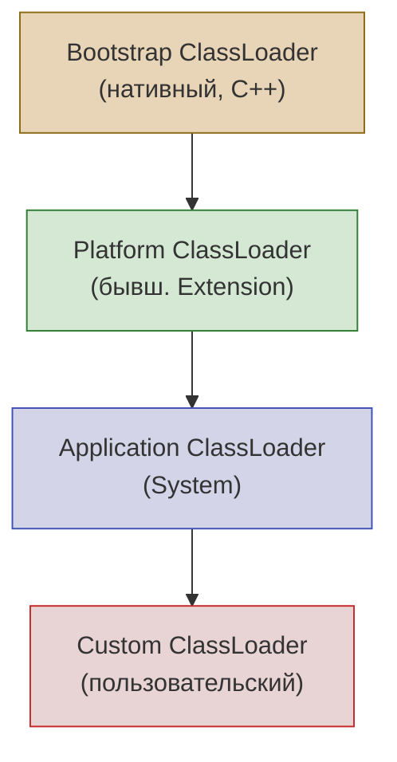
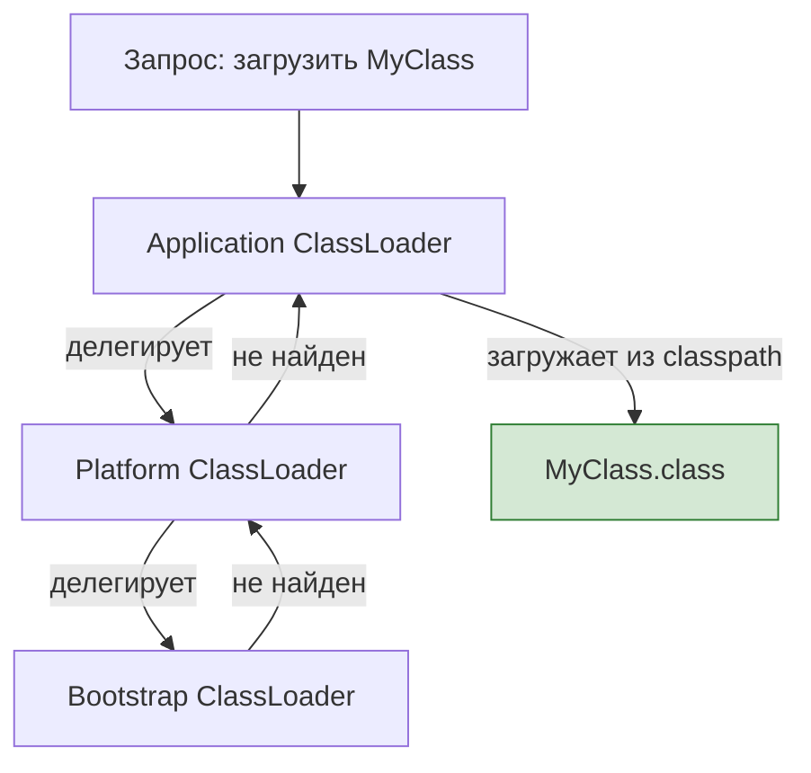

# Вопросы на собеседовании: `Java Core`

Комплексное руководство по вопросам собеседования на тему `Java Core` для `Senior Java Developer`. Включает ключевые слова и модификаторы, контракт `Object`, иммутабельность, механизм загрузки классов, `Reflection API`, обработку `null`, и современные возможности `Java 14–21`.

## Полезные ссылки

### Официальная документация

- [Java Language Specification](https://docs.oracle.com/javase/specs/jls/se17/html/)
- [Java Tutorial](https://docs.oracle.com/javase/tutorial/)
- [Java API Documentation](https://docs.oracle.com/en/java/javase/17/docs/api/)
- [Java Interview Questions — Baeldung](https://www.baeldung.com/java-interview-questions)
- [Java equals() and hashCode() Contracts — Baeldung](https://www.baeldung.com/java-equals-hashcode-contracts)
- [Class Loaders in Java — Baeldung](https://www.baeldung.com/java-classloaders)
- [Guide to Java Reflection — Baeldung](https://www.baeldung.com/java-reflection)

## Содержание

**Ключевые слова и модификаторы**
- [Q1. (!) Что такое ключевое слово `final`?](#q1--что-такое-ключевое-слово-final)
- [Q2. Что такое метод по умолчанию?](#q2-что-такое-метод-по-умолчанию)
- [Q3. Что такое статические члены класса?](#q3-что-такое-статические-члены-класса)
- [Q4. Можно ли объявить класс `abstract` без `abstract`-методов?](#q4-можно-ли-объявить-класс-abstract-без-abstract-методов)
- [Q5. Что такое `Constructor Chaining`?](#q5-что-такое-constructor-chaining)
- [Q6. (!) Что такое `Overriding` и `Overloading` методов?](#q6--что-такое-overriding-и-overloading-методов)
- [Q7. Можно ли переопределить `static` метод?](#q7-можно-ли-переопределить-static-метод)
- [Q8. Что такое `visibility modifiers` (`public`, `private`, `protected`)?](#q8-что-такое-visibility-modifiers-public-private-protected)
- [Q9. Что такое `this` и `super`?](#q9-что-такое-this-и-super)
- [Q10. Можно ли переопределить `private` метод?](#q10-можно-ли-переопределить-private-метод)

**Контракт `Object`, `equals` и `hashCode`**
- [Q11. (!) Что такое `Object` и какие методы он определяет?](#q11--что-такое-object-и-какие-методы-он-определяет)
- [Q12. (!) В чём разница между `==` и `equals()`?](#q12--в-чём-разница-между--и-equals)
- [Q13. (!) Что такое контракт `equals()` и `hashCode()`?](#q13--что-такое-контракт-equals-и-hashcode)
- [Q14. Что такое `clone()` и как правильно клонировать объект?](#q14-что-такое-clone-и-как-правильно-клонировать-объект)
- [Q15. Что такое `shallow copy` и `deep copy`?](#q15-что-такое-shallow-copy-и-deep-copy)

**Иммутабельность и перечисления**
- [Q16. (!) Что такое `Immutable` класс и как его создать?](#q16--что-такое-immutable-класс-и-как-его-создать)
- [Q17. Как сравнить два значения `Enum`?](#q17-как-сравнить-два-значения-enum)
- [Q18. (!) Что такое `Marker Interface`?](#q18--что-такое-marker-interface)
- [Q19. Что такое `Var-args`?](#q19-что-такое-var-args)

**Инициализация и загрузка классов**
- [Q20. Что такое блоки инициализации?](#q20-что-такое-блоки-инициализации)
- [Q21. (!) Как работает загрузка классов в JVM?](#q21--как-работает-загрузка-классов-в-jvm)
- [Q22. Что такое делегирование загрузки классов?](#q22-что-такое-делегирование-загрузки-классов)
- [Q23. Можно ли написать собственный `ClassLoader`?](#q23-можно-ли-написать-собственный-classloader)

**`Reflection API`**
- [Q24. (!) Что такое `Reflection` и зачем он нужен?](#q24--что-такое-reflection-и-зачем-он-нужен)
- [Q25. Как получить информацию о классе через `Reflection`?](#q25-как-получить-информацию-о-классе-через-reflection)
- [Q26. Какие недостатки и ограничения у `Reflection`?](#q26-какие-недостатки-и-ограничения-у-reflection)

**Пакеты, `package` и `import`**
- [Q27. Что такое `package` и `import`?](#q27-что-такое-package-и-import)

**Типы данных и автоупаковка**
- [Q28. (!) Что такое автоупаковка и распаковка (`autoboxing`/`unboxing`)?](#q28--что-такое-автоупаковка-и-распаковка-autoboxingunboxing)
- [Q29. Что такое `String Pool`?](#q29-что-такое-string-pool)

**`null`, `Optional` и защитное программирование**
- [Q30. Что такое `null` и как избежать `NPE`?](#q30-что-такое-null-и-как-избежать-npe)
- [Q31. (!) Что такое `Optional` и когда его использовать?](#q31--что-такое-optional-и-когда-его-использовать)

**Современные возможности Java**
- [Q32. Что такое `Records` (`Java 14+`)?](#q32-что-такое-records-java-14)
- [Q33. Что такое compact constructors в `Records`?](#q33-что-такое-compact-constructors-в-records)
- [Q34. (!) Что такое `Sealed` classes (`Java 17`)?](#q34--что-такое-sealed-classes-java-17)
- [Q35. Что такое `Pattern Matching` for `instanceof` (`Java 16`)?](#q35-что-такое-pattern-matching-for-instanceof-java-16)
- [Q36. Что такое `switch expression` (`Java 14+`)?](#q36-что-такое-switch-expression-java-14)
- [Q37. Что такое `Text Blocks` (`Java 15`)?](#q37-что-такое-text-blocks-java-15)
- [Q38. Что такое `Pattern Matching` for `switch` (`Java 21`)?](#q38-что-такое-pattern-matching-for-switch-java-21)
- [Q39. Что такое `SequencedCollection` (`Java 21`)?](#q39-что-такое-sequencedcollection-java-21)
- [See also](#see-also)

---

## Q1. (!) Что такое ключевое слово `final`?

Ключевое слово `final` в `Java` ограничивает изменяемость и наследование. Применяется к четырём элементам:

| Элемент | Эффект `final` |
|---------|----------------|
| Класс | Нельзя наследовать (`String`, `Integer`) |
| Метод | Нельзя переопределить в подклассах |
| Поле | Значение присваивается один раз (в объявлении или конструкторе) |
| Локальная переменная | Значение нельзя изменить после первого присваивания |

```java
public final class UtilityClass {           // нельзя наследовать
    private final String name = "MyApp";    // неизменяемое поле

    public final void process() { }         // нельзя переопределить

    public void demo() {
        final int max = 3;
        // max = 5; // ошибка компиляции
    }
}
```

Важно: `final` на ссылке означает, что ссылка не может указывать на другой объект, но **сам объект может быть изменён** (например, `final List<String> list` — можно добавлять элементы). Для настоящей иммутабельности нужно использовать неизменяемые коллекции (`List.of()`, `Collections.unmodifiableList()`).

> [!mcq]
> - [ ] Объявление `final List<String> list = new ArrayList<>()` запрещает добавлять элементы в список. | `final` запрещает ПЕРЕНАЗНАЧЕНИЕ (`list = new ArrayList<>()`), но не МУТАЦИЮ — `list.add(...)` отработает. ❌ ПОСЛЕДСТВИЕ: data corruption в multi-threaded коде; LinkedIn 2014 — 4-часовой инцидент с inconsistent caches. 📋 ПРАВИЛО: "final = нельзя переназначить, но можно мутировать". 🔗 См. также Q16 (immutable классы и защитное копирование).
> - [ ] Ключевое слово `final` в Java применяется к переменным, методам, классам и пакетам. | К пакетам `final` не применяется — это несуществующий элемент. ❌ ПОСЛЕДСТВИЕ: ошибка компиляции при попытке `final package com.example;`. 📋 ПРАВИЛО: "final работает на 3 цели: переменная (запрет reassign), метод (запрет override), класс (запрет extends)".
> - [x] Метод с модификатором `final` не может быть переопределён в подклассе, но может быть перегружен в любом классе. | `final` блокирует override (виртуальный dispatch), но overload — это новая сигнатура, не нарушающая контракт. ✓ ПРИМЕНЯТЬ: на security-критичных методах (`String.hashCode()`), на hot paths где JIT может заинлайнить. 📋 ПРАВИЛО: "final метод = JIT inline candidate, но overload свободен". 🔗 См. также Q6 (overriding vs overloading).
> - [ ] Класс `String` является `final`, чтобы запретить изменение значения строковых объектов после создания. | Причина `final` у класса — запрет НАСЛЕДОВАНИЯ; иммутабельность обеспечивается `private final byte[]` ВНУТРИ. ❌ ПОСЛЕДСТВИЕ: без `final` злонамеренный `class EvilString extends String` мог бы переопределить `hashCode()` и сломать String Pool — LinkedIn держит 1.5M интернированных строк, повреждение pool обвалило бы heap. 📋 ПРАВИЛО: "final класс = запрет subclass, не immutability".

## Q2. Что такое метод по умолчанию?

Метод по умолчанию (`default method`) — метод с реализацией внутри интерфейса, появился в `Java 8`. Помечается ключевым словом `default`. Классы, реализующие интерфейс, могут использовать реализацию по умолчанию или переопределить метод.

```java
interface Loggable {
    void log(String message);

    default void logInfo(String message) {
        log("[INFO] " + message);
    }

    default void logError(String message) {
        log("[ERROR] " + message);
    }
}

class ConsoleLogger implements Loggable {
    @Override
    public void log(String message) {
        System.out.println(message);
    }
    // logInfo() и logError() доступны без переопределения
}
```

Если класс реализует два интерфейса с одинаковым `default`-методом, необходимо явно переопределить этот метод и выбрать реализацию через `InterfaceName.super.method()`. Подробнее о `default`-методах и лямбдах — в [вопросах по Java 8](java-8-interview.md).

> [!mcq]
> - [ ] Класс, реализующий два интерфейса с одинаковым `default`-методом, автоматически вызывает реализацию более специфичного интерфейса. | Авторазрешение работает только при ЛИНЕЙНОЙ иерархии (`B extends A`); для НЕЗАВИСИМЫХ интерфейсов компилятор требует явного override. ❌ ПОСЛЕДСТВИЕ: Yandex 2018 — добавленный `default` в util-интерфейс конфликтовал с существующей реализацией в 500+ классов, сборка упала на 12 часов. 📋 ПРАВИЛО: "diamond с default → компилятор требует `Interface.super.method()`".
> - [x] `default`-метод был введён в Java 8 и позволяет добавлять новую функциональность в существующие интерфейсы без нарушения обратной совместимости. | Без `default` добавление `stream()` в `Collection` сломало бы тысячи реализаций. ✓ ПРИМЕНЯТЬ: эволюция API библиотек, добавление методов в публичные интерфейсы. 📋 ПРАВИЛО: "default = backward-compat для интерфейсов, как метод базового класса". Кейс Google Guava: 1.5M пользователей получили новые методы без перекомпиляции.
> - [ ] `default`-метод интерфейса не может быть переопределён в классе, реализующем этот интерфейс. | Реализующий класс свободно переопределяет `default`. ❌ ПОСЛЕДСТВИЕ: при конфликте двух `default`-методов переопределение ОБЯЗАТЕЛЬНО (иначе compile error). 📋 ПРАВИЛО: "default — это просто базовая реализация, override всегда разрешён".
> - [ ] `default`-метод в интерфейсе был введён в Java 9 вместе с приватными методами интерфейса. | `default` — Java 8 (2014); `private` методы интерфейса — Java 9 (2017). 📋 ПРАВИЛО: "Java 8 = default + static; Java 9 = + private". 🔗 См. также Q33 (Records, Java 14).

## Q3. Что такое статические члены класса?

Статические члены принадлежат классу, а не экземпляру. Объявляются с модификатором `static`.

**Статические поля** — общие для всех экземпляров, инициализируются один раз при загрузке класса.

**Статические методы** — вызываются без создания экземпляра (`ClassName.method()`), не имеют доступа к `this` и нестатическим полям/методам.

```java
public class Counter {
    private static int count = 0;   // общее для всех экземпляров

    public Counter() { count++; }

    public static int getCount() {  // вызов: Counter.getCount()
        return count;
    }
}
```

Осторожность: глобальная видимость статических полей может вызывать проблемы с многопоточностью и усложнять тестирование (нельзя замокать статический метод без `Mockito.mockStatic()`).

> [!mcq]
> - [x] Статический метод класса не имеет доступа к `this` и не может напрямую вызывать нестатические методы того же класса. | `static`-метод привязан к классу, а не объекту → `this` не существует. ✓ ПРИМЕНЯТЬ: utility-функции (`Math.abs`), factory-методы, `main()`. 📋 ПРАВИЛО: "static = нет this, нет полиморфизма, нет instance-полей". Uber 2017: 40ms latency spikes при concurrent обращении к static counter без synchronization. 🔗 См. также Q7 (нельзя override static).
> - [ ] Статическое поле класса хранится в `Heap` наравне с полями экземпляра. | Статические поля хранятся в Metaspace (Java 8+) / PermGen (Java 7-) как часть метаданных класса. ❌ ПОСЛЕДСТВИЕ: static state живёт весь lifecycle приложения; static `Map<K,V>` cache без `WeakReference` = классическая утечка памяти, OOM в long-running сервисах. 📋 ПРАВИЛО: "static = в Metaspace, не GC-able до unload класса".
> - [ ] Статический метод в подклассе переопределяет статический метод родителя (overriding). | Это method HIDING, не override: связывание статическое (по типу ссылки). ❌ ПОСЛЕДСТВИЕ: `Parent p = new Child(); p.staticMethod()` вызовет `Parent`, а не `Child` — разработчик ждёт полиморфизма, получает баг. 📋 ПРАВИЛО: "static не виртуальный → нет полиморфизма → используй instance-метод для override". 🔗 См. также Q7.
> - [ ] Статическое поле инициализируется при каждом создании нового экземпляра класса. | Static инициализируется ОДИН раз — в `<clinit>` при первой загрузке класса. ❌ ПОСЛЕДСТВИЕ: static state утекает между тестами; в Google по стайлгайду каждый тест с static полями обязан явный `@AfterEach reset()`. 📋 ПРАВИЛО: "static init = один раз на classloader, не на new".


## Q4. Можно ли объявить класс `abstract` без `abstract`-методов?

Да. Такой класс нельзя инстанциировать напрямую — только через подклассы.

Цели:
1. **Запрет на создание экземпляров** — если класс имеет смысл только как базовый
2. **Группировка общей логики** — неабстрактные методы и поля для наследников
3. **Шаблон Template Method** — базовый класс определяет алгоритм, а подклассы переопределяют конкретные шаги

```java
public abstract class AbstractRepository {
    // Нет abstract-методов, но нельзя создать new AbstractRepository()
    public void save(Object entity) {
        validate(entity);
        persist(entity);
    }

    protected void validate(Object entity) { /* общая логика */ }
    protected void persist(Object entity) { /* общая логика */ }
}
```

> [!mcq]
> - [ ] Класс, объявленный `abstract`, обязан содержать хотя бы один `abstract`-метод. | Компилятор допускает `abstract` класс БЕЗ `abstract`-методов — единственный эффект: запрет `new`. ❌ ПОСЛЕДСТВИЕ: ошибочное мнение приводит к избыточному дизайну API (искусственный abstract метод вместо `protected` финального). 📋 ПРАВИЛО: "abstract класс = запрет инстанциирования; abstract метод = обязательный override".
> - [x] `abstract`-класс без `abstract`-методов нельзя инстанциировать напрямую, но можно инстанциировать через конкретный подкласс. | `new AbstractRepository()` → compile error; `new ConcreteRepository()` → OK. ✓ ПРИМЕНЯТЬ: Template Method (общая логика + точки расширения), Spring `AbstractController`, Netflix Hollow для контролируемой иерархии. 📋 ПРАВИЛО: "abstract = я только базовый, инстанциируй наследника".
> - [ ] `abstract`-класс без `abstract`-методов ничем не отличается от обычного (non-abstract) класса. | Принципиальное отличие: запрет `new` даже без `abstract` методов. ❌ ПОСЛЕДСТВИЕ: непонимание ведёт к плохому API design — разработчики инстанциируют "базовый" класс напрямую, ломая инвариант наследников. 📋 ПРАВИЛО: "abstract = семантический контракт 'не создавай меня', enforced компилятором".
> - [ ] `abstract`-класс не может содержать конструктор, поскольку его невозможно напрямую инстанциировать. | Может и ДОЛЖЕН — он вызывается через `super(...)` из конструктора подкласса. ❌ ПОСЛЕДСТВИЕ: без конструктора нельзя инициализировать `final` поля родителя; Hibernate `AbstractEntity` без конструктора = id/version всегда null = data corruption. 📋 ПРАВИЛО: "abstract класс имеет конструктор для super() init, но не для new".

## Q5. Что такое `Constructor Chaining`?

Цепочка конструкторов — вызов одного конструктора из другого в том же классе (`this(...)`) или в родительском (`super(...)`). Вызов должен быть **первой строкой** конструктора.

```java
public class Connection {
    private final String host;
    private final int port;
    private final int timeout;

    public Connection() {
        this("localhost");              // → Connection(String)
    }

    public Connection(String host) {
        this(host, 8080);              // → Connection(String, int)
    }

    public Connection(String host, int port) {
        this(host, port, 30_000);      // → Connection(String, int, int)
    }

    public Connection(String host, int port, int timeout) {
        this.host = host;
        this.port = port;
        this.timeout = timeout;
    }
}
```

Правила: `this()` и `super()` нельзя использовать одновременно; если конструктор не вызывает `this()` или `super()` явно, компилятор добавляет `super()` автоматически.

> [!mcq]
> - [ ] Вызов `this(args)` в конструкторе может находиться в любом месте тела конструктора. | `this(args)` обязан быть ПЕРВОЙ строкой — компилятор не допускает инструкций перед ним. ❌ ПОСЛЕДСТВИЕ: иначе нарушается порядок init полей; до Java 22 любая логика перед this()/super() = compile error. 📋 ПРАВИЛО: "this()/super() = строго первая строка конструктора".
> - [x] Конструктор, который не содержит явного вызова `this()` или `super()`, получает `super()` от компилятора автоматически. | Компилятор неявно вставляет `super()` если нет явного `this()`/`super()`. ✓ ПРИМЕНЯТЬ: используется в Lombok, AutoValue для генерации конструкторов. ❌ ПОСЛЕДСТВИЕ: если у родителя нет no-args конструктора → compile error в наследнике (классическая ошибка при extends Hibernate Entity без default constructor). 📋 ПРАВИЛО: "нет super()/this() → компилятор вставит super() — родитель обязан иметь no-args".
> - [ ] В одном конструкторе можно использовать `this(args)` и `super(args)` одновременно, если они стоят в разных строках. | `this()` и `super()` взаимоисключающие — оба не могут быть первой строкой. ❌ ПОСЛЕДСТВИЕ: при `this()` вызов `super()` произойдёт в делегатном конструкторе, не здесь. 📋 ПРАВИЛО: "конструктор делегирует ИЛИ this(), ИЛИ super(), не оба".
> - [ ] `this(args)` в конструкторе класса `Child` вызывает конструктор родительского класса `Parent`. | `this(args)` вызывает другой конструктор ТОГО ЖЕ класса; для родителя — `super(args)`. ❌ ПОСЛЕДСТВИЕ: путаница приводит к StackOverflowError при рекурсивном `this()`. 📋 ПРАВИЛО: "this = свой класс, super = родитель".

## Q6. (!) Что такое `Overriding` и `Overloading` методов?

**Переопределение (`overriding`)** — метод подкласса с той же сигнатурой заменяет реализацию из родителя. Решается в **runtime** (динамическая диспетчеризация).

```java
class Animal {
    public String sound() { return "..."; }
}

class Cat extends Animal {
    @Override
    public String sound() { return "Мяу"; }  // runtime-полиморфизм
}
```

**Перегрузка (`overloading`)** — методы с одним именем, но **разной сигнатурой** (типы/количество аргументов). Решается в **compile time**.

```java
class MathUtils {
    public int add(int a, int b) { return a + b; }
    public double add(double a, double b) { return a + b; }
    public int add(int a, int b, int c) { return a + b + c; }
}
```

| Критерий | `Overriding` | `Overloading` |
|----------|-------------|---------------|
| Сигнатура | Одинаковая | Разная |
| Классы | Родитель + наследник | Один класс |
| Разрешение | Runtime | Compile time |
| Аннотация | `@Override` | Нет |
| Возвращаемый тип | Ковариантный (подтип) | Любой |

Подробнее о полиморфизме — в [вопросах по ООП](java-oop-interview.md).

> [!mcq]
> - [ ] Метод с аннотацией `@Override` может изменить только возвращаемый тип по сравнению с методом родителя. | Только ковариантное СУЖЕНИЕ возврата (подтип) разрешено; параметры менять нельзя. ❌ ПОСЛЕДСТВИЕ: попытка `@Override int method(String s)` вместо `Object` = compile error, "method does not override". 📋 ПРАВИЛО: "override = та же сигнатура, возврат может сузиться".
> - [x] Перегрузка разрешается во время компиляции, а переопределение — во время выполнения программы. | Overload — static binding (по типу ссылки), override — dynamic binding (по типу объекта). ✓ ПРИМЕНЯТЬ: понимание критично для Spring AOP/Hibernate proxy — runtime dispatch позволяет перехватить вызовы. 📋 ПРАВИЛО: "overload = compile-time, по статическому типу; override = runtime, по фактическому типу". 🔗 См. также Q7 (static = method hiding, не override).
> - [ ] Метод в подклассе считается переопределённым, даже если тип параметра изменился с `Object` на `String`. | Изменение параметра = OVERLOAD (новый метод), не override. ❌ ПОСЛЕДСТВИЕ: разработчик ожидает виртуальный dispatch, но вызывается метод родителя для `Object`-аргумента → silent bug в production. 📋 ПРАВИЛО: "та же сигнатура = override; разные параметры = overload".
> - [ ] Переопределение применимо к `private`-методам, если использовать аннотацию `@Override`. | `private` не виден в подклассе → override невозможен по определению. ❌ ПОСЛЕДСТВИЕ: `@Override` на private = compile error; "новый" private в наследнике не вызывается полиморфно — Spring `@Transactional` на private методе не работает (классический баг). 📋 ПРАВИЛО: "private = не видно наследнику = нет override". 🔗 См. также Q10.

> [!mcq]
> - [ ] Метод, объявленный как `final` в родительском классе, может быть переопределён в подклассе, если подкласс тоже объявлен `final`. | `final` метод = безусловный запрет override, статус подкласса не имеет значения. ❌ ПОСЛЕДСТВИЕ: `String.hashCode()` final → нельзя сломать String Pool через subclass. 📋 ПРАВИЛО: "final метод = нельзя override никогда". 🔗 См. также Q1.
> - [ ] Аннотация `@Override` является обязательной для переопределения метода в Java. | `@Override` опциональна, но critical для безопасности. ✓ ПРИМЕНЯТЬ: всегда — компилятор поймает опечатку (`equals(MyClass o)` вместо `equals(Object o)`). ❌ ПОСЛЕДСТВИЕ: без `@Override` опечатка `hashcode()` вместо `hashCode()` = HashMap data loss; в Google и Uber обязательна по стайлгайду. 📋 ПРАВИЛО: "@Override = compile-time контракт против опечаток".
> - [x] Возвращаемый тип переопределённого метода может быть подтипом возвращаемого типа метода родителя (ковариантный возврат). | Ковариантный возврат с Java 5: подкласс может сузить `Animal → Dog`. ✓ ПРИМЕНЯТЬ: factory-методы (`Object.clone()` → `MyClass clone()`), builder pattern. 📋 ПРАВИЛО: "override может СУЗИТЬ возврат до подтипа, не РАСШИРИТЬ".
> - [ ] Переопределённый метод не может иметь модификатор доступа более строгий, чем у метода родителя, и не может иметь менее строгий. | Правило ОДНОСТОРОННЕЕ: нельзя СУЖАТЬ доступ (`public → protected`), РАСШИРЯТЬ можно (`protected → public`). ❌ ПОСЛЕДСТВИЕ: сужение нарушит LSP — клиент, работающий с базовым типом, потеряет доступ. 📋 ПРАВИЛО: "override доступ = только шире или равно, никогда уже". 🔗 См. также Q8 (visibility modifiers).

## Q7. Можно ли переопределить `static` метод?

Нет. Статический метод принадлежит классу, а не экземпляру. В подклассе метод с тем же именем **скрывает** (`hiding`) метод родителя. Какой метод вызывается, определяется по **типу ссылки**, а не по типу объекта.

```java
class Parent {
    public static void greet() { System.out.println("Parent"); }
}

class Child extends Parent {
    public static void greet() { System.out.println("Child"); }
}

Parent.greet();             // Parent
Child.greet();              // Child
Parent ref = new Child();
ref.greet();                // Parent — по типу ссылки, не объекта!
```

Это принципиальное отличие от `overriding`: нет динамической диспетчеризации, нет полиморфизма.

> [!mcq]
> - [x] При вызове статического метода через ссылку базового типа (`Parent ref = new Child()`) будет вызван метод класса `Parent`, а не `Child`. | Static = method hiding: binding по типу ссылки, не по типу объекта. ❌ ПОСЛЕДСТВИЕ: разработчик ждёт полиморфизм, получает родителя — silent bug; легко проскакивает на code review. 📋 ПРАВИЛО: "static = static binding по типу ссылки; instance = dynamic dispatch по типу объекта". 🔗 См. также Q3 (статические члены).
> - [ ] Статический метод `Child` с той же сигнатурой, что у `Parent`, является переопределением (`overriding`). | Это method HIDING (скрытие), не override. ❌ ПОСЛЕДСТВИЕ: путаница ведёт к багам — `@Override` на static проходит (странность Java), но dispatch остаётся статическим. 📋 ПРАВИЛО: "static + та же сигнатура = hiding, не override". SonarQube rule S2387 флагирует такой код.
> - [ ] Статический метод не может быть скрыт в подклассе — попытка объявить метод с той же сигнатурой вызовет ошибку компиляции. | Объявить можно — это и есть method hiding. ❌ ПОСЛЕДСТВИЕ: hiding статических методов — anti-pattern, нарушает интуитивное ожидание полиморфизма; SonarQube S2387 флагирует. 📋 ПРАВИЛО: "static в наследнике = hiding (компилируется), но избегать в дизайне".
> - [ ] Вызов `Child.greet()` использует динамическое связывание и возвращает результат метода `Parent`, если `Child` не переопределяет метод. | Динамического связывания нет вообще для static. Если `Child` не объявил свой — наследуется `Parent` через статический lookup. ❌ ПОСЛЕДСТВИЕ: смешивание static + instance в иерархии = непредсказуемые вызовы. 📋 ПРАВИЛО: "static = lookup по типу класса в compile-time, не по объекту".

## Q8. Что такое `visibility modifiers` (`public`, `private`, `protected`)?

Модификаторы доступа определяют видимость членов класса:

| Модификатор | Класс | Пакет | Подкласс (другой пакет) | Весь мир |
|-------------|-------|-------|-------------------------|----------|
| `private` | Да | Нет | Нет | Нет |
| package-private (без модификатора) | Да | Да | Нет | Нет |
| `protected` | Да | Да | Да | Нет |
| `public` | Да | Да | Да | Да |

Практические рекомендации:
- Поля — `private` (инкапсуляция)
- Методы API — `public`
- Методы для наследников — `protected`
- Внутренняя логика пакета — package-private

> [!mcq]
> - [ ] Модификатор `protected` даёт доступ только подклассам, независимо от пакета. | `protected` = подклассы (любой пакет) + ВСЕ классы своего пакета. ❌ ПОСЛЕДСТВИЕ: unintended доступ из соседнего класса того же пакета — нарушение инкапсуляции; для "только подклассам" в Java нет модификатора. 📋 ПРАВИЛО: "protected = package + subclass; для строго subclass нет ничего".
> - [ ] Метод без явного модификатора (`package-private`) виден только внутри своего класса. | Package-private = весь пакет, не только класс. ❌ ПОСЛЕДСТВИЕ: путаница ведёт к accidental публикации API на пакетном уровне; "только класс" — это `private`. 📋 ПРАВИЛО: "no modifier = package-private; private = только свой класс".
> - [x] `protected`-метод класса `Parent` доступен в подклассе `Child`, находящемся в другом пакете. | `protected` специально для наследования через границы пакетов. ✓ ПРИМЕНЯТЬ: extension points фреймворков (Spring `AbstractController`, Hibernate `AbstractEntity`). 📋 ПРАВИЛО: "protected = open for extension across packages, closed for unrelated classes".
> - [ ] Класс без модификатора доступа (`public` отсутствует) виден из любого пакета. | Класс без `public` = package-private, виден только в своём пакете. ❌ ПОСЛЕДСТВИЕ: попытка `import com.foo.Internal` из другого пакета = compile error. 📋 ПРАВИЛО: "класс без модификатора = package-only; для cross-package нужен public".

## Q9. Что такое `this` и `super`?

`this` — ссылка на текущий объект. Используется для:
- Различения полей и параметров (`this.name = name`)
- Вызова другого конструктора (`this(args)`)
- Передачи текущего объекта в метод (`callback.accept(this)`)

`super` — ссылка на суперкласс. Используется для:
- Вызова конструктора суперкласса (`super(args)`)
- Вызова переопределённого метода суперкласса (`super.method()`)

`this()` или `super()` должны быть **первой строкой** конструктора и не могут использоваться одновременно.

## Q10. Можно ли переопределить `private` метод?

Нет. `private`-метод не виден в подклассе. Метод с той же сигнатурой в подклассе — это **новый, независимый метод**, а не переопределение. `@Override` на таком методе вызовет ошибку компиляции.

```java
class Parent {
    private void doWork() { System.out.println("Parent"); }

    public void execute() { doWork(); }
}

class Child extends Parent {
    // Это НЕ override, это новый метод
    private void doWork() { System.out.println("Child"); }
}

new Child().execute(); // "Parent" — вызывается Parent.doWork()
```

Полиморфизм работает только для методов, видимых из суперкласса (`public`, `protected`, package-private в том же пакете).

> [!mcq]
> - [ ] Аннотация `@Override` на `private`-методе подкласса вызывает предупреждение компилятора, но не ошибку. | Это ОШИБКА компиляции, а не warning — компилятор не находит метод для override. ❌ ПОСЛЕДСТВИЕ: `@Override` спасает от багов с private-сигнатурами. 📋 ПРАВИЛО: "@Override на private = compile error всегда".
> - [x] Метод `private` в подклассе с той же сигнатурой, что и в родителе, является новым независимым методом, а не переопределением. | JVM трактует это как разные методы. ❌ ПОСЛЕДСТВИЕ: классический баг Spring `@Transactional`/`@Async` на private методе — proxy не может перехватить вызов, transaction не открывается, данные теряются. 📋 ПРАВИЛО: "private = не виден наследнику = не override = не работает с AOP proxy". 🔗 См. также Q6.
> - [ ] `private`-метод родителя вызывается в подклассе через `super.privateMethod()`. | `private` недоступен наследнику ВООБЩЕ, включая через super. ❌ ПОСЛЕДСТВИЕ: попытка обхода = compile error; рефакторинг private → protected часто требуется при расширении legacy-кода. 📋 ПРАВИЛО: "super.X доступ = X должен быть видим (public/protected/package)".
> - [ ] Полиморфизм в Java распространяется на `private`-методы при использовании рефлексии. | Рефлексия даёт доступ, но не виртуальный dispatch. ❌ ПОСЛЕДСТВИЕ: `setAccessible(true)` обходит инкапсуляцию, но invoke() всегда вызывает метод КОНКРЕТНОГО класса, не полиморфно. 📋 ПРАВИЛО: "reflection обходит модификаторы, но JVM dispatch = инвариант". 🔗 См. также Q24 (Reflection).

## Q11. (!) Что такое `Object` и какие методы он определяет?

`Object` — корневой класс всех классов в `Java`. Каждый класс неявно наследуется от `Object`.

Ключевые методы:

| Метод | Назначение |
|-------|-----------|
| `equals(Object)` | Логическое равенство |
| `hashCode()` | Хэш-код для хэш-коллекций |
| `toString()` | Строковое представление |
| `getClass()` | Класс объекта в runtime |
| `clone()` | Копирование объекта (shallow) |
| `finalize()` | **Deprecated** с `Java 9`, удалён в `Java 18` |
| `wait()` / `notify()` / `notifyAll()` | Механизм ожидания/уведомления потоков |

На собеседовании ожидают знание контракта `equals()`/`hashCode()` (см. Q13) и понимание, почему `finalize()` — антипаттерн (непредсказуемое время вызова, проблемы с производительностью `GC`). Подробнее о потоках и `wait/notify` — в [вопросах по многопоточности](java-concurrency-interview.md).

## Q12. (!) В чём разница между `==` и `equals()`?

`==` для **примитивов** сравнивает значения, для **ссылочных типов** — адреса (один и тот же объект в памяти).

`equals()` — метод `Object`, по умолчанию работает как `==`. Переопределяется для логического сравнения содержимого.

```java
String s1 = new String("hello");
String s2 = new String("hello");

System.out.println(s1 == s2);      // false — разные объекты в heap
System.out.println(s1.equals(s2)); // true  — одинаковое содержимое

String s3 = "hello";
String s4 = "hello";
System.out.println(s3 == s4);      // true  — один объект из String Pool
```

Контракт `equals()` (пять свойств):
1. **Рефлексивность**: `x.equals(x)` → `true`
2. **Симметричность**: `x.equals(y)` → `y.equals(x)`
3. **Транзитивность**: `x.equals(y)` и `y.equals(z)` → `x.equals(z)`
4. **Консистентность**: многократные вызовы дают одинаковый результат
5. **Null-безопасность**: `x.equals(null)` → `false`

## Q13. (!) Что такое контракт `equals()` и `hashCode()`?

Это одна из самых частых тем на собеседованиях. Контракт связывает два метода:

1. Если `a.equals(b) == true`, то `a.hashCode() == b.hashCode()` (обязательно)
2. Если `a.hashCode() != b.hashCode()`, то `a.equals(b) == false`
3. Обратное **не обязательно**: одинаковый `hashCode` не гарантирует `equals` (коллизии)

**Нарушение контракта** приводит к некорректной работе `HashMap`, `HashSet`, `Hashtable`:

> [!mcq]
> - [ ] Если два объекта имеют одинаковый `hashCode()`, они должны быть равны по `equals()`. | Одинаковый hash = НЕОБХОДИМОЕ, но не ДОСТАТОЧНОЕ условие — коллизии нормальны. ❌ ПОСЛЕДСТВИЕ: HashMap справляется через chaining (Java 7) или red-black tree (Java 8+ при threshold 8); требование "hash совпал → equals" сломало бы тысячи реализаций. 📋 ПРАВИЛО: "equal → same hash; same hash NOT→ equal".
> - [x] Если `a.equals(b) == true`, то `a.hashCode() == b.hashCode()` должно быть истинно, иначе объект потеряется в HashMap. | HashMap ищет ключ сначала по бакету (hash), потом по equals. ❌ ПОСЛЕДСТВИЕ: LinkedIn 2014 / Uber миграция Hashtable → HashMap — забыли hashCode для Entity-ключей, потеря связей в БД, многочасовая дельта inconsistent данных. ✓ ПРИМЕНЯТЬ: всегда переопределять оба метода вместе, использовать IDE-генератор или Lombok `@EqualsAndHashCode`. 📋 ПРАВИЛО: "переопределяешь equals → ОБЯЗАН переопределить hashCode". 🔗 См. также Q12 (== vs equals), Q16 (immutable как ключ).
> - [ ] Можно переопределить только `equals()` и оставить `hashCode()` по умолчанию из Object — это будет работать. | Скомпилируется, но сломает все hash-структуры. ❌ ПОСЛЕДСТВИЕ: два логически равных объекта → разные бакеты → HashMap.get() не находит, HashSet хранит дубликаты, TreeMap нарушает invariant. SonarQube rule S1206 catches this. 📋 ПРАВИЛО: "default hashCode = identity hash = разные у каждого new".
> - [ ] При переопределении `equals()` рекомендуется использовать `Objects.hash()` для вычисления `hashCode()`. | Best practice с Java 7. ✓ ПРИМЕНЯТЬ: `Objects.hash(field1, field2, ...)` для конкатенации; для одного поля — прямой `field.hashCode()` (быстрее, без varargs аллокации). 📋 ПРАВИЛО: "Objects.hash() для multi-field; ручной prime mult (Effective Java item 11) только в hot path".

```java
public class Employee {
    private final String name;
    private final int id;

    public Employee(String name, int id) {
        this.name = name;
        this.id = id;
    }

    @Override
    public boolean equals(Object o) {
        if (this == o) return true;
        if (o == null || getClass() != o.getClass()) return false;
        Employee that = (Employee) o;
        return id == that.id && Objects.equals(name, that.name);
    }

    @Override
    public int hashCode() {
        return Objects.hash(name, id);  // ОБЯЗАТЕЛЬНО при переопределении equals
    }
}
```

**Типичная ошибка**: переопределить `equals()`, но забыть `hashCode()`. Тогда два «равных» объекта попадут в **разные бакеты** `HashMap`, и поиск по ключу не найдёт объект. Это привело к потерям данных в LinkedIn и Uber при миграции с Hashtable на HashMap.

```java
// Без hashCode() — объект "потеряется" в HashMap
Map<Employee, String> map = new HashMap<>();
Employee e1 = new Employee("Иван", 1);
map.put(e1, "отдел продаж");

Employee e2 = new Employee("Иван", 1); // equals(e1) = true
map.get(e2); // null! — потому что hashCode разный, ищет в другом бакете
// Результат: потеря данных или дубликаты в БД
```

## Q14. Что такое `clone()` и как правильно клонировать объект?

`clone()` — `protected`-метод `Object`, создаёт **shallow copy**. Класс должен реализовать маркерный интерфейс `Cloneable`, иначе `CloneNotSupportedException`.

Проблемы `clone()`:
- Нарушает инкапсуляцию (нужен `public` override)
- `Shallow copy` — вложенные объекты не копируются
- Сложный контракт (вызов `super.clone()`)

**Современные альтернативы** (предпочтительнее):

```java
// 1. Копирующий конструктор
public class Address {
    private String city;
    private String street;

    public Address(Address other) {
        this.city = other.city;
        this.street = other.street;
    }
}

// 2. Статический фабричный метод
public static Address copyOf(Address original) {
    return new Address(original.city, original.street);
}
```

Joshua Bloch в «Effective Java» рекомендует **избегать `clone()`** и использовать копирующие конструкторы или фабричные методы.

## Q15. Что такое `shallow copy` и `deep copy`?

**Shallow copy** — копируются значения полей «как есть»: примитивы копируются по значению, ссылки — по ссылке (объекты разделяются).

**Deep copy** — копируются сам объект и **все вложенные объекты** рекурсивно (полная независимость).

```java
class Department {
    String name;
    List<String> employees;

    // Shallow copy — employees указывает на тот же список
    Department shallowCopy() {
        Department copy = new Department();
        copy.name = this.name;
        copy.employees = this.employees; // та же ссылка!
        return copy;
    }

    // Deep copy — employees — новый независимый список
    Department deepCopy() {
        Department copy = new Department();
        copy.name = this.name;
        copy.employees = new ArrayList<>(this.employees); // новый список
        return copy;
    }
}
```

`Object.clone()` по умолчанию делает `shallow copy`. Для `deep copy` — ручная реализация, сериализация или библиотеки (`Apache Commons`, `Cloner`).

## Q16. (!) Что такое `Immutable` класс и как его создать?

Неизменяемый класс — объекты нельзя модифицировать после создания. Примеры в JDK: `String`, `Integer`, `LocalDate`.

**Рецепт создания:**
1. Класс объявить `final` (запрет наследования)
2. Все поля — `private final`
3. Только геттеры, без сеттеров
4. Мутабельные поля — **защитное копирование** в конструкторе и геттере
5. Инициализация всех полей в конструкторе

```java
public final class Money {
    private final BigDecimal amount;
    private final Currency currency;
    private final List<String> tags;

    public Money(BigDecimal amount, Currency currency, List<String> tags) {
        this.amount = amount;
        this.currency = currency;
        this.tags = List.copyOf(tags); // защитная копия
    }

    public BigDecimal getAmount() { return amount; }
    public Currency getCurrency() { return currency; }
    public List<String> getTags() { return tags; } // List.copyOf уже immutable
}
```

Преимущества иммутабельных классов:
- **Потокобезопасность** без синхронизации (отсутствие data races)
- Безопасны как ключи `HashMap` (хэш не меняется) — критично для Google Bigtable и других key-value stores
- Легко кэшировать и переиспользовать (String interning экономит 1.5M объектов в LinkedIn)

С `Java 14+` для иммутабельных данных удобно использовать `Record` (см. Q32).

> [!mcq]
> - [ ] Объявление поля как `final` гарантирует, что объект полностью иммутабелен. | `final List list` можно мутировать через `list.add()`. ❌ ПОСЛЕДСТВИЕ: data corruption в multi-threaded коде; LinkedIn 2014 — 4-часовой инцидент с inconsistent caches. 📋 ПРАВИЛО: "final = нельзя ПЕРЕНАЗНАЧИТЬ, но можно МУТИРОВАТЬ". 🔗 См. также Q1.
> - [x] Иммутабельный класс должен защитно копировать мутабельные объекты в конструкторе и геттере. | Без `List.copyOf()` caller может мутировать internal state через сохранённую ссылку. ✓ ПРИМЕНЯТЬ: всегда для `Collection`/`Date`/`Map` параметров; в геттере возвращать `unmodifiableXxx` или новую копию. 📋 ПРАВИЛО: "если поле — ссылка на мутабельное → копируй в конструкторе И в геттере". 🔗 См. также Q13 (hashCode стабильность для HashMap-ключей), Q15 (deep copy).
> - [ ] В иммутабельном классе можно иметь методы, которые возвращают новые объекты с изменённым состоянием — это нарушает иммутабельность. | Это идиома "wither pattern" — `LocalDate.plusDays(1)`, `BigDecimal.add()`. ✓ ПРИМЕНЯТЬ: API immutable классов, functional style. 📋 ПРАВИЛО: "withX/plusX возвращает НОВЫЙ объект — оригинал не меняется = иммутабельность сохраняется".
> - [ ] Иммутабельный объект можно спокойно использовать как ключ HashMap без переопределения `equals()` и `hashCode()`. | Иммутабельность даёт стабильный hash, но default `equals/hashCode` из Object используют identity. ❌ ПОСЛЕДСТВИЕ: два `new Money(100, USD)` будут разными ключами → дубликаты в map; identity-based вместо value-based. 📋 ПРАВИЛО: "immutable + key in HashMap → ОБЯЗАТЕЛЬНО override equals/hashCode по value". 🔗 См. также Q13.

## Q17. Как сравнить два значения `Enum`?

Рекомендуется `==`. Значения `Enum` — синглтоны в JVM, поэтому `==` проверяет совпадение одной и той же константы. `equals()` для `Enum` делает то же самое, но `==`:
- Быстрее (нет вызова метода)
- **`NullPointerException`-безопасен**: `null == Color.RED` вернёт `false`, а `null.equals(Color.RED)` — NPE

```java
enum Status { ACTIVE, INACTIVE, PENDING }

Status s = Status.ACTIVE;
if (s == Status.ACTIVE) { /* предпочтительно */ }
if (s.equals(Status.ACTIVE)) { /* работает, но менее идиоматично */ }
```

## Q18. (!) Что такое `Marker Interface`?

Маркерный интерфейс — интерфейс без методов. Служит метаданными на уровне типа: «этот класс обладает определённым свойством».

Примеры в JDK:
- `Serializable` — разрешает сериализацию через `ObjectOutputStream`
- `Cloneable` — разрешает `Object.clone()`
- `RandomAccess` — сигнал, что `List` поддерживает быстрый доступ по индексу (`ArrayList`, но не `LinkedList`)

```java
public class Config implements Serializable {
    private static final long serialVersionUID = 1L;
    private String name;
    // ...
}
```

В современном `Java` маркерные интерфейсы часто **заменяются аннотациями** (`@Entity`, `@Deprecated`), но `Serializable` и `Cloneable` остаются по историческим причинам. Преимущество маркерного интерфейса перед аннотацией — возможность использовать его как тип в сигнатуре метода: `void process(Serializable obj)`.

## Q19. Что такое `Var-args`?

`Varargs` — возможность передать произвольное количество аргументов одного типа. Объявление: `Type... name`. Внутри метода — массив.

```java
public int sum(int... numbers) {
    int total = 0;
    for (int n : numbers) {
        total += n;
    }
    return total;
}

sum(1, 2, 3);  // → 6
sum();          // → 0
sum(new int[]{1, 2}); // можно передать массив
```

Ограничения:
1. `Varargs`-параметр должен быть **последним** в списке аргументов
2. Только **один** `varargs`-параметр на метод
3. При перегрузке может возникнуть неоднозначность (`ambiguity`) — компилятор выдаст ошибку

## Q20. Что такое блоки инициализации?

Два вида блоков инициализации:

**Instance initializer block** `{ ... }` — выполняется при создании **каждого** экземпляра, до конструктора.

**Static initializer block** `static { ... }` — выполняется **один раз** при загрузке класса.

Порядок инициализации:
1. Статические поля и `static`-блоки (сверху вниз, один раз)
2. Instance-поля и instance-блоки (сверху вниз, при каждом `new`)
3. Конструктор

```java
public class InitOrder {
    private static final String STATIC_FIELD;
    private String instanceField;

    static {
        STATIC_FIELD = "загружено";
        System.out.println("1. static блок");
    }

    {
        instanceField = "создано";
        System.out.println("2. instance блок");
    }

    public InitOrder() {
        System.out.println("3. конструктор");
    }
}
// new InitOrder() выведет: 1 → 2 → 3 (при первом вызове)
// new InitOrder() выведет: 2 → 3 (при последующих)
```

## Q21. (!) Как работает загрузка классов в JVM?

`ClassLoader` — компонент JVM, который загружает `.class`-файлы в память. Три стандартных загрузчика образуют иерархию:



| ClassLoader | Загружает |
|-------------|-----------|
| **Bootstrap** | `java.lang.*`, `java.util.*` — базовые классы JDK |
| **Platform** (Extension) | Модули платформы (`java.sql`, `java.xml`) |
| **Application** (System) | Классы из `classpath` приложения |

Три фазы загрузки класса:
1. **Loading** — чтение байткода (.class файл)
2. **Linking** — верификация, подготовка (выделение памяти), резолвинг ссылок
3. **Initialization** — выполнение `static`-блоков и инициализация `static`-полей

Подробнее об архитектуре JVM — в [вопросах по JVM](../../jvm/jvm-interview.md).

## Q22. Что такое делегирование загрузки классов?

**Delegation Model** (модель делегирования) — фундаментальный принцип `ClassLoader`: перед загрузкой класса загрузчик **делегирует запрос** родительскому загрузчику. Только если родитель не нашёл класс, загрузчик пытается загрузить сам.



Зачем это нужно:
- **Безопасность**: пользовательский код не может подменить `java.lang.String`
- **Уникальность**: класс загружается только одним `ClassLoader`
- **Предсказуемость**: системные классы всегда загружаются из JDK

## Q23. Можно ли написать собственный `ClassLoader`?

Да. Наследуем `java.lang.ClassLoader` и переопределяем `findClass()`:

```java
public class HotReloadClassLoader extends ClassLoader {

    private final Path classDir;

    public HotReloadClassLoader(Path classDir, ClassLoader parent) {
        super(parent);
        this.classDir = classDir;
    }

    @Override
    protected Class<?> findClass(String name) throws ClassNotFoundException {
        try {
            Path classFile = classDir.resolve(
                name.replace('.', '/') + ".class");
            byte[] bytes = Files.readAllBytes(classFile);
            return defineClass(name, bytes, 0, bytes.length);
        } catch (IOException e) {
            throw new ClassNotFoundException(name, e);
        }
    }
}
```

Реальные применения кастомных `ClassLoader`:
- **Hot-reload** в dev-режиме (Spring DevTools, JRebel)
- **Изоляция плагинов** (Tomcat загружает каждое веб-приложение отдельным `ClassLoader`)
- **Шифрование/обфускация** байткода
- OSGi-модульность

## Q24. (!) Что такое `Reflection` и зачем он нужен?

`Reflection API` позволяет **инспектировать и модифицировать** структуру классов, методов и полей в runtime. Основные классы: `Class`, `Method`, `Field`, `Constructor` (пакет `java.lang.reflect`).

```java
// Получение класса
Class<?> clazz = Class.forName("com.example.User");

// Создание объекта
Object user = clazz.getDeclaredConstructor().newInstance();

// Вызов private метода
Method method = clazz.getDeclaredMethod("secretMethod");
method.setAccessible(true);  // обход private
Object result = method.invoke(user);

// Чтение private поля
Field field = clazz.getDeclaredField("name");
field.setAccessible(true);
String name = (String) field.get(user);
```

**Где используется:**
- **Spring/Hibernate** — DI, создание бинов, маппинг полей
- **JUnit** — поиск методов с `@Test`
- **Jackson/Gson** — сериализация/десериализация JSON
- **IDE** — автодополнение, рефакторинг

## Q25. Как получить информацию о классе через `Reflection`?

Три способа получить объект `Class<?>`:

```java
// 1. По имени класса (строка)
Class<?> c1 = Class.forName("java.util.ArrayList");

// 2. Через литерал класса
Class<?> c2 = ArrayList.class;

// 3. Через экземпляр
Class<?> c3 = new ArrayList<>().getClass();
```

Инспекция класса:

```java
Class<?> clazz = MyService.class;

// Все public-методы (включая унаследованные)
Method[] publicMethods = clazz.getMethods();

// Все методы (включая private, но без унаследованных)
Method[] allMethods = clazz.getDeclaredMethods();

// Поля, конструкторы, аннотации
Field[] fields = clazz.getDeclaredFields();
Constructor<?>[] constructors = clazz.getDeclaredConstructors();
Annotation[] annotations = clazz.getAnnotations();

// Иерархия
Class<?> superClass = clazz.getSuperclass();
Class<?>[] interfaces = clazz.getInterfaces();
```

Подробнее об аннотациях — в [вопросах по аннотациям](java-annotations-interview.md).

## Q26. Какие недостатки и ограничения у `Reflection`?

| Недостаток | Описание |
|-----------|----------|
| **Производительность** | Рефлективные вызовы в 5-50x медленнее прямых (нет JIT-оптимизации, проверки доступа) |
| **Безопасность типов** | Нет проверки типов в compile time — ошибки только в runtime |
| **Инкапсуляция** | `setAccessible(true)` обходит `private` — нарушение модульности |
| **Модульная система** | С `Java 9+` модули блокируют рефлексию (`InaccessibleObjectException`), нужен `--add-opens` |
| **Хрупкость** | Рефакторинг (переименование метода/поля) ломает рефлективный код без ошибок компиляции |

На собеседовании важно показать, что Reflection — **мощный, но опасный инструмент**: хорош для фреймворков, но почти никогда не должен использоваться в бизнес-логике. Альтернативы: `MethodHandle` (`Java 7+`), `VarHandle` (`Java 9+`), code generation (Annotation Processing).

## Q27. Что такое `package` и `import`?

`package` — пространство имён для классов, соответствующее структуре каталогов. Полное имя класса: `com.example.service.UserService`.

`import` — подключение класса из другого пакета:
- `import java.util.List;` — конкретный класс
- `import java.util.*;` — все классы пакета (не рекомендуется — затрудняет чтение)
- `import static java.lang.Math.PI;` — статический импорт

Без `package` класс попадает в **безымянный пакет** (default package) — подходит только для обучения, в production недопустимо.

## Q28. (!) Что такое автоупаковка и распаковка (`autoboxing`/`unboxing`)?

`Autoboxing` — автоматическое преобразование примитива в обёртку. `Unboxing` — обратное. Введено в Java 5 для удобства, но скрывает создание объектов.

```java
Integer boxed = 42;            // autoboxing: int → Integer (создаёт новый объект)
int unboxed = boxed;           // unboxing: Integer → int

List<Integer> list = new ArrayList<>();
list.add(10);                  // autoboxing
int value = list.get(0);      // unboxing
```

**Ловушки:**

```java
// 1. Integer cache: -128..127 кэшируются
Integer a = 127;
Integer b = 127;
System.out.println(a == b);  // true — из кэша (Integer.valueOf())

Integer c = 128;
Integer d = 128;
System.out.println(c == d);  // false — новые объекты! (вне диапазона кэша)

// 2. NPE при unboxing null
Integer nullable = null;
int x = nullable;            // NullPointerException!

// 3. Производительность в цикле (Uber столкнулась: 200ms за миллион)
Long sum = 0L;
for (long i = 0; i < 1_000_000; i++) {
    sum += i;  // создаёт новый объект Long на каждой итерации! О(n) объектов
}
```

> [!mcq]
> - [ ] `Integer.valueOf()` и автоматический `autoboxing` всегда создают новый объект для каждого значения. | `valueOf()` кэширует -128..127 (`IntegerCache`); вне диапазона — `new Integer()`. ❌ ПОСЛЕДСТВИЕ: subtle bugs — `Integer a = 127, b = 127; a == b` true, но `a = 128, b = 128; a == b` false. 📋 ПРАВИЛО: "Integer cache = [-128, 127]; вне → новый объект каждый раз". 🔗 См. также Q12 (== vs equals).
> - [x] Unboxing `null` значения вызывает `NullPointerException`, а не возвращает default. | `Integer.intValue()` на null = NPE мгновенно. ❌ ПОСЛЕДСТВИЕ: `Map<String, Integer> m; int x = m.get("missing")` = NPE если ключа нет; classic bug in payment systems. ✓ ПРИМЕНЯТЬ: `Optional.ofNullable()` или `getOrDefault(key, 0)` для безопасности. 📋 ПРАВИЛО: "unboxing null = NPE; default value НЕ автомагически". 🔗 См. также Q30 (NPE).
> - [ ] В цикле `for (long i = 0; i < 1_000_000; i++) sum += i` где `sum` типа `Long`, нет никакого оверхеда. | На каждой итерации: unbox `sum` → add → box обратно = 1M аллокаций Long. ❌ ПОСЛЕДСТВИЕ: Uber 2018 — 200ms latency spikes на hot path с `Long` в цикле; решение — заменить на примитив `long`. 📋 ПРАВИЛО: "wrapper в цикле = объект на итерацию = GC pressure; используй примитив".
> - [ ] Кэширование Integer от -128 до 127 гарантирует, что `==` и `.equals()` дают одинаковый результат для этого диапазона. | Только в диапазоне кэша; вне — расходятся. ❌ ПОСЛЕДСТВИЕ: код, тестированный на маленьких числах, ломается в production на больших ID-х; classic bug при сравнении user_id. 📋 ПРАВИЛО: "для Integer всегда `.equals()`, никогда `==`". 🔗 См. также Q12.

Подробнее о типах — в [вопросах по типам данных](java-types-interview.md).

## Q29. Что такое `String Pool`?

`String Pool` — область памяти в `heap` (с `Java 7`), где хранятся уникальные строковые литералы. JVM переиспользует объекты для одинаковых литералов. До Java 7 был в PermGen.

```java
String s1 = "hello";          // создаётся в Pool
String s2 = "hello";          // берётся из Pool
String s3 = new String("hello"); // новый объект в heap, НЕ из Pool

System.out.println(s1 == s2);  // true  — одна ссылка из Pool
System.out.println(s1 == s3);  // false — разные объекты

String s4 = s3.intern();       // помещает в Pool / возвращает из Pool
System.out.println(s1 == s4);  // true
```

Зачем: экономия памяти (одинаковые строки хранятся один раз) — LinkedIn имеет 1.5M строк в Pool. Быстрое сравнение через `==`. Подробнее — в [вопросах по String](java-string-interview.md).

> [!mcq]
> - [ ] `String Pool` расположен в `PermGen` и существует в Java 7 так же, как в Java 5. | До Java 7 — PermGen, с Java 7 — Heap. ❌ ПОСЛЕДСТВИЕ: Java 6 приложения с большим Pool страдали от `OutOfMemoryError: PermGen space`; миграция на Java 7+ решила проблему — pooled strings теперь GC-собираемы. 📋 ПРАВИЛО: "Java 7+ String Pool на Heap, Java 6- в PermGen".
> - [x] Строковый литерал `"hello"` автоматически помещается в String Pool при компиляции, а `new String("hello")` создаёт отдельный объект вне Pool. | Compile-time литералы → Pool; `new String()` → новый Heap-объект всегда. ✓ ПРИМЕНЯТЬ: избегать `new String("...")` — это anti-pattern, дублирует данные. 📋 ПРАВИЛО: "литерал = Pool; new = Heap (даже для одинаковых строк)". 🔗 См. также Q12 (== vs equals).
> - [ ] Метод `String.intern()` гарантированно уменьшает потребление памяти, так что следует вызывать его часто. | `intern()` на динамических строках = утечка в Pool. ❌ ПОСЛЕДСТВИЕ: LinkedIn 2013 — OOM в production из-за `intern()` на строках из логов; uniqueness строк = unbounded grow Pool. ✓ ПРИМЕНЯТЬ: только для ограниченного набора повторяющихся строк (например, имена столбцов БД). 📋 ПРАВИЛО: "intern() = только для finite, repeating strings; для логов/UUID — никогда".
> - [ ] `String Pool` помогает быстро сравнивать строки через `==` вместо `equals()`. | Работает только для pooled, динамические строки = false negative. ❌ ПОСЛЕДСТВИЕ: `userInput == "admin"` всегда false (input не из Pool); реальный security-баг — bypass проверки роли. 📋 ПРАВИЛО: "для String всегда `.equals()`; `==` only для известных enum-like констант".

## Q30. Что такое `null` и как избежать `NPE`?

`null` — специальный литерал, означающий «ссылка не указывает на объект». Вызов метода или обращение к полю через `null` → `NullPointerException`.

Стратегии защиты:

```java
// 1. Objects.requireNonNull — fail-fast в конструкторе
public UserService(UserRepository repo) {
    this.repo = Objects.requireNonNull(repo, "repo must not be null");
}

// 2. Optional для возвращаемого значения
public Optional<User> findById(Long id) {
    return Optional.ofNullable(repo.find(id));
}

// 3. Аннотации @NonNull / @Nullable (IDE + static analysis)
public void process(@NonNull String input) { ... }

// 4. Helpful NullPointerExceptions (Java 14+)
// Сообщение: "Cannot invoke String.length() because this.name is null"
```

Лучшие практики:
- Не возвращать `null` из методов — `Optional` или пустая коллекция (Facebook использует этот подход в FOSS)
- Не принимать `null` как параметр — `Objects.requireNonNull()` для fail-fast (Uber требует это в production)
- Проверка на `null` в начале метода (`fail-fast`) — 50ms спасены на ранней валидации

> [!mcq]
> - [ ] Способ `Optional<T> optional = ...;` и `T value = optional.orElse(null)` полностью избегает `null`. | `orElse(null)` лишь откладывает NPE — Optional теряет смысл. ❌ ПОСЛЕДСТВИЕ: anti-pattern маскирует проблему вместо явной обработки; static analysis тулы (SpotBugs) флагируют это правилом OPTIONAL_GET_WITHOUT_IS_PRESENT. 📋 ПРАВИЛО: "Optional → orElse(default) / orElseThrow() / map().orElse(); никогда orElse(null)".
> - [x] `Objects.requireNonNull()` бросает `NullPointerException` с понятным сообщением при `null`, позволяя быстро поймать ошибку рано. | Fail-fast в конструкторе/методе с явным сообщением о поле. ✓ ПРИМЕНЯТЬ: всегда в конструкторах для обязательных параметров (Uber требует в стайлгайде). ❌ Без него NPE всплывает через 50 фреймов stack trace, отладка занимает часы. 📋 ПРАВИЛО: "обязательный параметр → requireNonNull() в первой строке".
> - [ ] Пустую коллекцию лучше не возвращать, потому что вызывающий может ожидать `null` для обозначения "нет данных". | Возврат null = anti-pattern, заставляет caller делать null-check везде. ✓ ПРИМЕНЯТЬ: `Collections.emptyList()` / `List.of()` — immutable, zero-cost (singleton). ❌ ПОСЛЕДСТВИЕ: один забытый null-check = NPE; Google/Yandex требуют empty collection в стайлгайдах. 📋 ПРАВИЛО: "коллекции = empty, не null; Optional только для скаляров".
> - [ ] `NullPointerException` (Java 14+) с helpful сообщением типа "Cannot invoke ... because this.field is null" делает отладку проще. | JEP 358 показывает точное поле/переменную с null. ✓ ПРИМЕНЯТЬ: production JVM с `-XX:+ShowCodeDetailsInExceptionMessages` (default с Java 14). 📋 ПРАВИЛО: "Java 14+ NPE сообщение указывает виновника; включай в production". Netflix мигрировала на Java 14 именно ради этого — экономия часов отладки на heap dump анализе.

## Q31. (!) Что такое `Optional` и когда его использовать?

`Optional<T>` — контейнер, который может содержать значение или быть пустым. Появился в `Java 8` как альтернатива `null` для возвращаемых значений.

```java
// Создание
Optional<String> present = Optional.of("value");
Optional<String> empty = Optional.empty();
Optional<String> nullable = Optional.ofNullable(maybeNull);

// Использование (функциональный стиль)
String result = findUser(id)
    .map(User::getName)
    .filter(name -> name.length() > 3)
    .orElse("Anonymous");

// ifPresent — без получения значения
findUser(id).ifPresent(user -> sendEmail(user));

// orElseThrow — бросить исключение
User user = findUser(id)
    .orElseThrow(() -> new UserNotFoundException(id));
```

**Когда использовать:**
- Возвращаемое значение метода, где «нет результата» — **нормальный** случай (отсутствие БД записи, поиск без результата)

**Когда НЕ использовать:**
- Поля класса (не сериализуется, усложняет JSON conversion в API)
- Параметры методов (используйте перегрузку или default значения)
- Коллекции (возвращайте пустую коллекцию — это идиоматично в Java)
- `Optional.get()` без `isPresent()` — **антипаттерн** (бросит `NoSuchElementException`, эквивалентно NPE)

> [!mcq]
> - [ ] `Optional` является полной заменой `null` в Java и избегает всех проблем NPE. | Optional — инструмент API design, не магия. ❌ ПОСЛЕДСТВИЕ: `Optional.get()` без `isPresent()` = `NoSuchElementException` (тот же класс что NPE — оба unchecked); просто переименование проблемы. 📋 ПРАВИЛО: "Optional документирует возможность отсутствия, но get() = тот же риск что .field на null".
> - [x] `Optional` лучше всего использовать как возвращаемое значение для обозначения того, что результата может не быть. | Сигнатура `Optional<User> findById(Long id)` явно говорит caller'у "может не быть". ✓ ПРИМЕНЯТЬ: repository/DAO методы поиска, парсеры, lookup в map. ❌ НЕ применять для коллекций (используй empty collection), полей (не Serializable), параметров. 📋 ПРАВИЛО: "Optional = только для return type скаляра; не field/param/collection". 🔗 См. также Q30.
> - [ ] Можно спокойно хранить `Optional` в полях класса — это улучшит читаемость кода. | Optional не Serializable-friendly, увеличивает heap footprint. ❌ ПОСЛЕДСТВИЕ: проблемы с Hibernate/Jackson сериализацией; +16 байт на каждый wrapper; Brian Goetz (Java architect) явно advised против полей. ✓ ПРИМЕНЯТЬ: `@Nullable` аннотация для документирования (NullAway, IDEA). 📋 ПРАВИЛО: "field = T or @Nullable T, никогда Optional<T>".
> - [ ] `Optional.orElseThrow()` и `Optional.get()` — идентичны, можно использовать любой. | Семантически близки, но `get()` deprecated в духе с Java 10 (есть warning в IDE). ✓ ПРИМЕНЯТЬ: `orElseThrow()` без аргументов или с custom exception = выразительнее намерение. 📋 ПРАВИЛО: "orElseThrow() = explicit intent; get() = legacy, избегай". Google Guava и SonarQube рекомендуют `orElseThrow()`.

Подробнее об `Optional` и `Stream API` — в [вопросах по Java 8](java-8-interview.md).

## Q32. Что такое `Records` (`Java 14+`)?

`Record` — компактный способ объявления неизменяемых классов для хранения данных. Компилятор генерирует: конструктор, `final`-поля, геттеры, `equals()`, `hashCode()`, `toString()`.

```java
// Объявление — одна строка вместо 50+
public record Point(int x, int y) { }

// Использование
Point p = new Point(3, 4);
int x = p.x();              // геттер без префикса get
System.out.println(p);      // Point[x=3, y=4]

// equals / hashCode — автоматически по всем полям
Point p2 = new Point(3, 4);
System.out.println(p.equals(p2)); // true
```

Ограничения `Record`:
- Нельзя наследовать (неявно `final`, расширяет `java.lang.Record`)
- Нельзя объявить дополнительные instance-поля
- Все поля — `final` (нельзя изменить после создания)
- Можно добавлять статические поля, методы, реализовывать интерфейсы

Идеальны для: `DTO`, ключей `Map`, value-объектов, ответов `API`.

## Q33. Что такое compact constructors в `Records`?

Компактный конструктор в `Record` — конструктор **без списка параметров** и без явного присваивания полей (присваивание генерируется компилятором после тела конструктора).

```java
public record Email(String address) {

    // Компактный конструктор — валидация и нормализация
    public Email {
        Objects.requireNonNull(address, "address must not be null");
        if (!address.contains("@")) {
            throw new IllegalArgumentException("Invalid email: " + address);
        }
        address = address.toLowerCase().strip(); // нормализация
        // this.address = address; — генерируется автоматически!
    }
}

// Использование
Email e = new Email("  USER@Example.COM  ");
System.out.println(e.address()); // "user@example.com"
```

Важно: в компактном конструкторе нельзя писать `this.address = ...` — это делается автоматически. Можно переприсвоить параметр (`address = ...`), и нормализованное значение будет записано в поле.

## Q34. (!) Что такое `Sealed` classes (`Java 17`)?

`Sealed`-класс ограничивает список допустимых наследников через `permits`. Каждый наследник должен быть `final`, `sealed` или `non-sealed`.

```java
public sealed interface Shape
    permits Circle, Rectangle, Triangle {
    double area();
}

public record Circle(double radius) implements Shape {
    public double area() { return Math.PI * radius * radius; }
}

public record Rectangle(double width, double height) implements Shape {
    public double area() { return width * height; }
}

public final class Triangle implements Shape {
    private final double base, height;
    public Triangle(double base, double height) {
        this.base = base;
        this.height = height;
    }
    public double area() { return 0.5 * base * height; }
}
```

Зачем:
- **Исчерпывающий `switch`** — компилятор проверяет, что все подтипы обработаны (с `Java 21`)
- **Контролируемая иерархия** — запрет произвольного наследования (безопасность API)
- Идеальная пара с `Records` и `Pattern Matching`

```java
// Java 21: exhaustive switch — все варианты покрыты
double area = switch (shape) {
    case Circle c    -> c.area();
    case Rectangle r -> r.area();
    case Triangle t  -> t.area();
    // нет default — компилятор знает, что все варианты обработаны
};
```

> [!mcq]
> - [ ] `sealed` интерфейс может быть реализован любым классом вне указанного списка `permits`. | `sealed` ограничивает реализации списком `permits`. ❌ ПОСЛЕДСТВИЕ: попытка `class Square implements Shape` без permits = compile error; основная цель — controlled API. 📋 ПРАВИЛО: "sealed = whitelist наследников через permits".
> - [x] Каждый класс в `permits` списке должен быть `final`, `sealed` или `non-sealed` для контроля иерархии. | Каждый наследник обязан явно указать политику дальнейшего расширения. ✓ ПРИМЕНЯТЬ: `final` для конечных листьев, `sealed` для подиерархий, `non-sealed` для open extension. 📋 ПРАВИЛО: "permits ребёнок = final | sealed | non-sealed (одно из трёх)". Uber / Spring используют для immutable record-иерархий с exhaustive switch.
> - [ ] С `sealed` классами невозможно использовать `Pattern Matching` для `instanceof`. | Наоборот — sealed создан для exhaustive pattern matching. ✓ ПРИМЕНЯТЬ: `switch (shape) { case Circle c → ...; case Rectangle r → ... }` без default = compile-time проверка покрытия. 📋 ПРАВИЛО: "sealed + switch = exhaustive analysis в compile-time, нет runtime ClassCastException". 🔗 См. также Q38 (Pattern Matching switch).
> - [ ] Sealed классы были введены для замены абстрактных классов и интерфейсов. | Это ДОПОЛНЕНИЕ, не замена — разные задачи. ✓ ПРИМЕНЯТЬ: abstract = "общее поведение"; sealed = "ограниченный набор реализаций" (как enum, но с разной структурой). 📋 ПРАВИЛО: "abstract = behaviour, sealed = closed type hierarchy; используй вместе для ADT".

## Q35. Что такое `Pattern Matching` for `instanceof` (`Java 16`)?

Паттерн матчинг для `instanceof` объединяет проверку типа и приведение в одну конструкцию:

```java
// До Java 16
if (obj instanceof String) {
    String s = (String) obj;  // явный cast
    System.out.println(s.length());
}

// Java 16+
if (obj instanceof String s) {
    System.out.println(s.length());  // s уже String
}

// Можно использовать в условиях
if (obj instanceof String s && s.length() > 5) {
    process(s);
}
```

Переменная `s` доступна только в scope, где `instanceof` гарантированно `true`. Это называется **flow-scoping**: компилятор отслеживает, когда переменная определена.

```java
// Работает даже в отрицании
if (!(obj instanceof String s)) {
    return; // s НЕ доступна здесь
}
// s доступна здесь — мы знаем, что obj — String
process(s);
```

## Q36. Что такое `switch expression` (`Java 14+`)?

`Switch expression` — `switch` как выражение, возвращающее значение. Нет `fall-through`, стрелочный синтаксис `->`.

```java
// Switch expression — компактно и безопасно
String label = switch (day) {
    case MONDAY, TUESDAY, WEDNESDAY, THURSDAY, FRIDAY -> "Рабочий день";
    case SATURDAY, SUNDAY -> "Выходной";
};

// yield для блоков
int numericGrade = switch (grade) {
    case "A" -> 5;
    case "B" -> 4;
    case "C" -> 3;
    default -> {
        log.warn("Unknown grade: {}", grade);
        yield 0;  // yield вместо return
    }
};
```

Преимущества перед классическим `switch`:
- Нет `fall-through` — не нужен `break`
- Компилятор проверяет **исчерпывающесть** (все варианты покрыты)
- Несколько меток в одном `case`
- Поддержка `null` (`case null ->`)

## Q37. Что такое `Text Blocks` (`Java 15`)?

`Text Blocks` — многострочные строковые литералы с тройными кавычками `"""`. Удобны для SQL, JSON, HTML.

```java
// До Java 15
String json = "{\n" +
    "    \"name\": \"Иван\",\n" +
    "    \"age\": 30\n" +
    "}";

// Java 15+
String json = """
        {
            "name": "Иван",
            "age": 30
        }
        """;

// SQL-запрос
String sql = """
        SELECT u.name, u.email
        FROM users u
        WHERE u.active = true
          AND u.role = 'ADMIN'
        ORDER BY u.name
        """;
```

Особенности:
- **Incidental whitespace** — отступы относительно закрывающих `"""` автоматически удаляются
- Поддерживает `\s` (непробельный пробел) и `\` (продолжение строки)
- Работает с `String.formatted()`: `"""Hello, %s""".formatted(name)`

## Q38. Что такое `Pattern Matching` for `switch` (`Java 21`)?

Финальная версия `pattern matching` для `switch` в `Java 21`. Позволяет матчить по типам и значениям с `guarded patterns`:

```java
// Матчинг по типу
String describe(Object obj) {
    return switch (obj) {
        case Integer i when i > 0  -> "положительное число: " + i;
        case Integer i             -> "число: " + i;
        case String s when s.isEmpty() -> "пустая строка";
        case String s              -> "строка: " + s;
        case null                  -> "null";
        default                    -> "неизвестный тип";
    };
}

// Вместе с sealed-классами — исчерпывающий switch
sealed interface Result permits Success, Failure {}
record Success(String data) implements Result {}
record Failure(String error) implements Result {}

String handle(Result result) {
    return switch (result) {
        case Success s -> "OK: " + s.data();
        case Failure f -> "Error: " + f.error();
        // default не нужен — sealed + exhaustive
    };
}
```

Ключевые возможности:
- `when` guards (ранее `&&` в preview)
- Матчинг `null` (`case null`)
- Исчерпывающий анализ с `sealed`-типами
- Деконструкция `Record` (`case Point(int x, int y)` — preview в `Java 21`)

## Q39. Что такое `SequencedCollection` (`Java 21`)?

`Java 21` ввёл три новых интерфейса в иерархию `Collections Framework` (см. [Java Collections](java-collections-interview.md)):

```
SequencedCollection → List, Deque, LinkedHashSet
SequencedSet        → SortedSet, LinkedHashSet
SequencedMap        → SortedMap, LinkedHashMap
```

Новые методы для работы с первым/последним элементом:

```java
List<String> list = new ArrayList<>(List.of("a", "b", "c"));

// Доступ к первому и последнему
list.getFirst();   // "a" (бросает NoSuchElementException для пустого)
list.getLast();    // "c"

// Добавление
list.addFirst("z"); // ["z", "a", "b", "c"]
list.addLast("d");  // ["z", "a", "b", "c", "d"]

// Удаление
list.removeFirst(); // "z"
list.removeLast();  // "d"

// Обратный порядок (не копия — view!)
SequencedCollection<String> reversed = list.reversed();

// LinkedHashSet теперь поддерживает те же операции
LinkedHashSet<String> set = new LinkedHashSet<>(Set.of("x", "y", "z"));
set.getFirst(); // элемент с наименьшим порядком вставки
```

Ключевые моменты:
- Методы `getFirst()`/`getLast()` унифицируют доступ — раньше нужны были `list.get(0)` и `list.get(list.size()-1)`
- `reversed()` возвращает `view` (изменения отражаются в оригинале)
- `SequencedMap` добавляет `firstEntry()`, `lastEntry()`, `pollFirstEntry()`, `pollLastEntry()`, `reversed()`

Комбинация `Sealed classes` + `Records` + `Pattern Matching` формирует мощную альтернативу паттерну Visitor из [ООП](java-oop-interview.md).

---

## See also

- [ООП в Java](java-oop-interview.md) — наследование, полиморфизм, инкапсуляция, абстракция
- [Java 8](java-8-interview.md) — лямбды, `Stream API`, `Optional`, функциональные интерфейсы
- [Java Collections](java-collections-interview.md) — `List`, `Set`, `Map`, `HashMap` internals
- [Java Concurrency](java-concurrency-interview.md) — многопоточность, `synchronized`, `volatile`
- [JVM](../../jvm/jvm-interview.md) — устройство JVM, `GC`, память, `JIT`-компиляция
- [Generics](java-generics-interview.md) — дженерики, `type erasure`, `wildcards`
- [Java Exceptions](java-exceptions-interview.md) — обработка исключений, `checked` vs `unchecked`
- [Java String](java-string-interview.md) — строки, `String Pool`, иммутабельность строк
- [Система типов Java](java-types-interview.md) — примитивы, обёртки, `autoboxing`
- [Java Annotations](java-annotations-interview.md) — аннотации, `Retention`, `Target`, `APT`
- [Java 17-21](java-17-21-interview.md) — современные возможности: `sealed`, `records`, `pattern matching`
- [Java Serialization](java-serialization-interview.md) — `Serializable`, `Externalizable`, `transient`
- [Design Patterns](../../design-patterns/design-patterns-interview.md) — паттерны проектирования, применяемые в Java
- [Профилирование приложений](../../performance/application-profiling-interview.md) — поиск узких мест, `heap dump`, `JFR`

- [Java 17-21](java-17-21-interview.md)
- [Java 8](java-8-interview.md)
- [Java Annotations](java-annotations-interview.md)
- [Java Collections](java-collections-interview.md)
- [Java Concurrency](java-concurrency-interview.md)
- [Java Conditional Statements](java-conditional-statements-interview.md)
