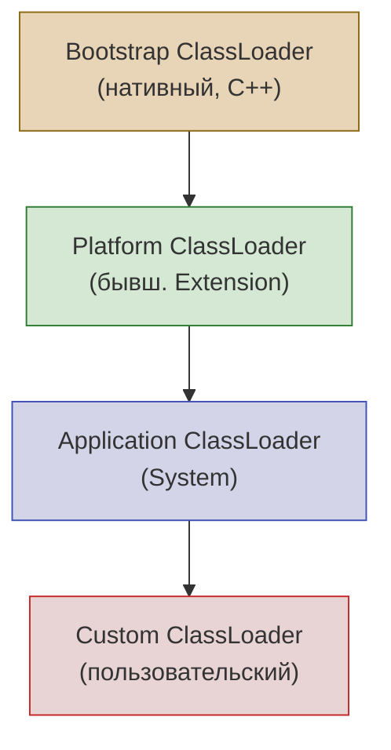
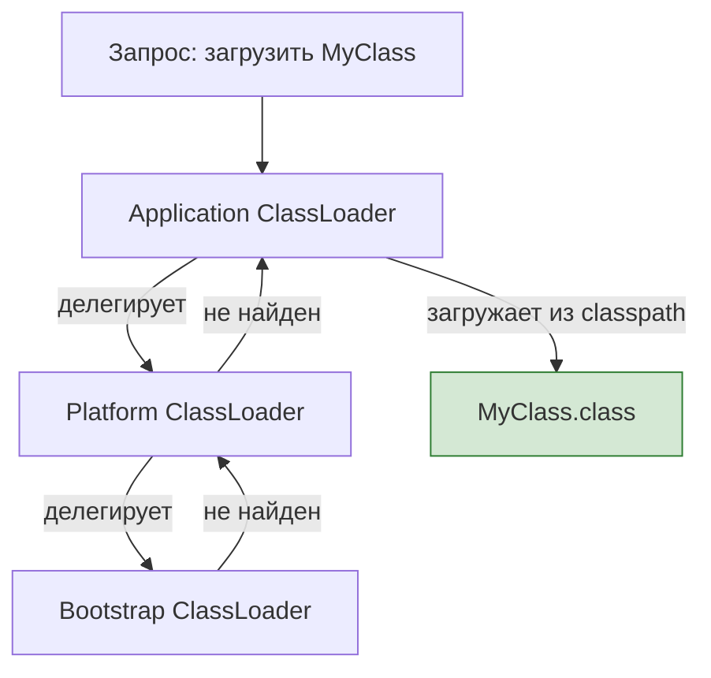

# Вопросы на собеседовании: `Java Core`

Комплексное руководство по вопросам собеседования на тему `Java Core` для `Senior Java Developer`. Включает ключевые слова и модификаторы, контракт `Object`, иммутабельность, механизм загрузки классов, `Reflection API`, обработку `null`, и современные возможности `Java 14–21`.

## Полезные ссылки

### Официальная документация

- [Java Language Specification](https://docs.oracle.com/javase/specs/jls/se17/html/)
- [Java Tutorial](https://docs.oracle.com/javase/tutorial/)
- [Java API Documentation](https://docs.oracle.com/en/java/javase/17/docs/api/)
- [Java Interview Questions — Baeldung](https://www.baeldung.com/java-interview-questions)
- [Java equals() and hashCode() Contracts — Baeldung](https://www.baeldung.com/java-equals-hashcode-contracts)
- [Class Loaders in Java — Baeldung](https://www.baeldung.com/java-classloaders)
- [Guide to Java Reflection — Baeldung](https://www.baeldung.com/java-reflection)

## Содержание

**Ключевые слова и модификаторы**
- [Q1. (!) Что такое ключевое слово `final`?](#q1--что-такое-ключевое-слово-final)
- [Q2. Что такое метод по умолчанию?](#q2-что-такое-метод-по-умолчанию)
- [Q3. Что такое статические члены класса?](#q3-что-такое-статические-члены-класса)
- [Q4. Можно ли объявить класс `abstract` без `abstract`-методов?](#q4-можно-ли-объявить-класс-abstract-без-abstract-методов)
- [Q5. Что такое `Constructor Chaining`?](#q5-что-такое-constructor-chaining)
- [Q6. (!) Что такое `Overriding` и `Overloading` методов?](#q6--что-такое-overriding-и-overloading-методов)
- [Q7. Можно ли переопределить `static` метод?](#q7-можно-ли-переопределить-static-метод)
- [Q8. Что такое `visibility modifiers` (`public`, `private`, `protected`)?](#q8-что-такое-visibility-modifiers-public-private-protected)
- [Q9. Что такое `this` и `super`?](#q9-что-такое-this-и-super)
- [Q10. Можно ли переопределить `private` метод?](#q10-можно-ли-переопределить-private-метод)

**Контракт `Object`, `equals` и `hashCode`**
- [Q11. (!) Что такое `Object` и какие методы он определяет?](#q11--что-такое-object-и-какие-методы-он-определяет)
- [Q12. (!) В чём разница между `==` и `equals()`?](#q12--в-чём-разница-между--и-equals)
- [Q13. (!) Что такое контракт `equals()` и `hashCode()`?](#q13--что-такое-контракт-equals-и-hashcode)
- [Q14. Что такое `clone()` и как правильно клонировать объект?](#q14-что-такое-clone-и-как-правильно-клонировать-объект)
- [Q15. Что такое `shallow copy` и `deep copy`?](#q15-что-такое-shallow-copy-и-deep-copy)

**Иммутабельность и перечисления**
- [Q16. (!) Что такое `Immutable` класс и как его создать?](#q16--что-такое-immutable-класс-и-как-его-создать)
- [Q17. Как сравнить два значения `Enum`?](#q17-как-сравнить-два-значения-enum)
- [Q18. (!) Что такое `Marker Interface`?](#q18--что-такое-marker-interface)
- [Q19. Что такое `Var-args`?](#q19-что-такое-var-args)

**Инициализация и загрузка классов**
- [Q20. Что такое блоки инициализации?](#q20-что-такое-блоки-инициализации)
- [Q21. (!) Как работает загрузка классов в JVM?](#q21--как-работает-загрузка-классов-в-jvm)
- [Q22. Что такое делегирование загрузки классов?](#q22-что-такое-делегирование-загрузки-классов)
- [Q23. Можно ли написать собственный `ClassLoader`?](#q23-можно-ли-написать-собственный-classloader)

**`Reflection API`**
- [Q24. (!) Что такое `Reflection` и зачем он нужен?](#q24--что-такое-reflection-и-зачем-он-нужен)
- [Q25. Как получить информацию о классе через `Reflection`?](#q25-как-получить-информацию-о-классе-через-reflection)
- [Q26. Какие недостатки и ограничения у `Reflection`?](#q26-какие-недостатки-и-ограничения-у-reflection)

**Пакеты, `package` и `import`**
- [Q27. Что такое `package` и `import`?](#q27-что-такое-package-и-import)

**Типы данных и автоупаковка**
- [Q28. (!) Что такое автоупаковка и распаковка (`autoboxing`/`unboxing`)?](#q28--что-такое-автоупаковка-и-распаковка-autoboxingunboxing)
- [Q29. Что такое `String Pool`?](#q29-что-такое-string-pool)

**`null`, `Optional` и защитное программирование**
- [Q30. Что такое `null` и как избежать `NPE`?](#q30-что-такое-null-и-как-избежать-npe)
- [Q31. (!) Что такое `Optional` и когда его использовать?](#q31--что-такое-optional-и-когда-его-использовать)

**Современные возможности Java**
- [Q32. Что такое `Records` (`Java 14+`)?](#q32-что-такое-records-java-14)
- [Q33. Что такое compact constructors в `Records`?](#q33-что-такое-compact-constructors-в-records)
- [Q34. (!) Что такое `Sealed` classes (`Java 17`)?](#q34--что-такое-sealed-classes-java-17)
- [Q35. Что такое `Pattern Matching` for `instanceof` (`Java 16`)?](#q35-что-такое-pattern-matching-for-instanceof-java-16)
- [Q36. Что такое `switch expression` (`Java 14+`)?](#q36-что-такое-switch-expression-java-14)
- [Q37. Что такое `Text Blocks` (`Java 15`)?](#q37-что-такое-text-blocks-java-15)
- [Q38. Что такое `Pattern Matching` for `switch` (`Java 21`)?](#q38-что-такое-pattern-matching-for-switch-java-21)
- [Q39. Что такое `SequencedCollection` (`Java 21`)?](#q39-что-такое-sequencedcollection-java-21)
- [See also](#see-also)

---

## Q1. (!) Что такое ключевое слово `final`?

Ключевое слово `final` в `Java` ограничивает изменяемость и наследование. Применяется к четырём элементам:

| Элемент | Эффект `final` |
|---------|----------------|
| Класс | Нельзя наследовать (`String`, `Integer`) |
| Метод | Нельзя переопределить в подклассах |
| Поле | Значение присваивается один раз (в объявлении или конструкторе) |
| Локальная переменная | Значение нельзя изменить после первого присваивания |

```java
public final class UtilityClass {           // нельзя наследовать
    private final String name = "MyApp";    // неизменяемое поле

    public final void process() { }         // нельзя переопределить

    public void demo() {
        final int max = 3;
        // max = 5; // ошибка компиляции
    }
}
```

Важно: `final` на ссылке означает, что ссылка не может указывать на другой объект, но **сам объект может быть изменён** (например, `final List<String> list` — можно добавлять элементы). Для настоящей иммутабельности нужно использовать неизменяемые коллекции (`List.of()`, `Collections.unmodifiableList()`).

> [!mcq] К каким элементам Java применяется ключевое слово `final` и что оно гарантирует?
>
> - [ ] A. Объявление `final List<String> list = new ArrayList<>()` запрещает добавлять элементы в список.
>
>     **Что на самом деле.** `final` фиксирует только саму ссылку — `list = new ArrayList<>()` запрещён, но `list.add("x")` отрабатывает свободно. Сам объект остаётся mutable.
>
>     **Откуда путаница.** Слово «final» воспринимается как «полностью неизменяемый» по аналогии с `const` из C++ (где `const` распространяется на содержимое). В Java семантика принципиально другая.
>
>     **Если бы это было правдой.** Не существовало бы паттерна defensive copy и `List.copyOf()`; иммутабельные классы вроде `Money` не нуждались бы в копировании списка тегов в конструкторе. Реально без защитной копии `final List` приводит к утечке mutable state из value-object — типичная причина инцидентов с inconsistent caches при многопоточном доступе.
>
>     **Как было бы правильно.** Признать: `final` запрещает reassign, но не мутацию; для истинной неизменяемости содержимого нужен `List.copyOf()` или `Collections.unmodifiableList()`.
>
> - [ ] B. Ключевое слово `final` в Java применяется к переменным, методам, классам и пакетам.
>
>     **Что на самом деле.** `final` применяется к трём целям: переменная (запрет reassign), метод (запрет override), класс (запрет extends). Пакетов с модификатором `final` в Java нет вообще.
>
>     **Откуда путаница.** Желание унифицировать все «языковые единицы»: раз есть пакеты, значит и `final` должен к ним применяться. На самом деле `package` — лишь namespace, не сущность с runtime-семантикой.
>
>     **Если бы это было правдой.** Появилась бы конструкция `final package com.example;` — в JLS её нет, попытка написать такую строку приводит к compile error «illegal modifier for the package».
>
>     **Как было бы правильно.** Перечислить корректно: переменная, метод, класс — три цели; параметр метода тоже считается переменной (там тоже допустим `final`).
>
> - [x] C. Метод с модификатором `final` не может быть переопределён в подклассе, но может быть перегружен в любом классе.
>
>     **Развёрнутое объяснение.** `final` на методе блокирует override — наследник с такой же сигнатурой даст compile error «cannot override final method». При этом overload — это объявление метода с другой сигнатурой (тип/количество параметров), и `final` его не запрещает: получается новый слот в vtable, никакого конфликта с финализованным. JIT агрессивно инлайнит `final`-методы, так как знает: динамический dispatch не нужен.
>
>     **Пример.** `String.hashCode()` и `String.length()` объявлены `final` — нельзя ломать контракт через подкласс. При этом utility-класс `Numbers` может содержать `static final` метод `parse(String)` и одновременно overload `parse(String, int radix)` — две независимые сигнатуры.
>
>     **Когда применять.** На security-критичных методах value-объектов (`String`, `Integer`, `LocalDate`), на template-method хуках где надо гарантировать инвариант flow, на hot path где важна JIT-инлайнинг. Эффективная Java Item 19: «design for inheritance or prohibit it» — `final` это и есть «prohibit».
>
>     **Подводные камни.** `final` на методе мешает мокированию через Mockito 1.x (требует mockito-inline или PowerMock); затрудняет создание AOP-прокси на нём (Spring CGLIB не может subclass-override). Для bean-методов под `@Transactional` — `final` ломает proxy. Решение: разделять «public API для override» и «internal final».
>
>     **Связанные вопросы.** [[java-core-interview#Q6]] overriding vs overloading; [[java-core-interview#Q10]] private не override; [[java-core-interview#Q16]] immutable классы и final поля.
>
> - [ ] D. Класс `String` является `final`, чтобы запретить изменение значения строковых объектов после создания.
>
>     **Что на самом деле.** `final` у класса запрещает наследование. Иммутабельность `String` обеспечивается совсем другим: `private final byte[] value` плюс отсутствие публичных setter-методов плюс защитное копирование в конструкторе от `char[]`. `final` класса лишь делает невозможным появление подкласса, который мог бы добавить mutation.
>
>     **Откуда путаница.** Смешение двух независимых гарантий: «нельзя наследовать» и «нельзя изменить состояние». Они часто комбинируются в иммутабельных классах, но реализуются разными механизмами.
>
>     **Если бы это было правдой.** Тогда `final` на классе сам по себе делал бы любой такой класс immutable — но `final class Counter { int count; }` не immutable, хотя `final`. Реальный риск без `final` у `String`: `class EvilString extends String` мог бы переопределить `hashCode()` и нарушить инварианты String Pool — все интернированные строки внезапно дают неконсистентный hash, hash-таблицы по строковым ключам деградируют до linear scan.
>
>     **Как было бы правильно.** Сказать: `String` final, чтобы запретить subclass (защита от подмены `hashCode/equals`), а immutability обеспечена `final` полем `byte[]` и отсутствием mutator-методов.

> [!mcq] Какие требования предъявляет лямбда к захватываемой локальной переменной?
>
> - [ ] A. Лямбда может захватывать локальную переменную только если она объявлена явным `final`; без `final` — ошибка компиляции.
>
>     **Что на самом деле.** С Java 8 (JLS §15.27.2) достаточно `effectively final` — переменной не присваивают новое значение после инициализации. Явный `final` опционален: компилятор сам выводит «effectively final» по анализу потока.
>
>     **Откуда путаница.** До Java 8 (для анонимных классов) действительно требовался явный `final`. Это правило перенесли в обучающие материалы и устаревшие SonarQube-правила без учёта релаксации в Java 8.
>
>     **Если бы это было правдой.** Каждая лямбда заставляла бы покрывать локальные переменные явным `final`, превращая код в шум: `final int x = 5; final String name = ...;`. На практике это не нужно — компилятор выводит сам.
>
>     **Как было бы правильно.** Сформулировать: переменная должна быть либо явно `final`, либо effectively final — то есть фактически не переназначаться после инициализации.
>
> - [ ] B. Внутри лямбды можно изменять захваченную локальную переменную, если она объявлена `final`.
>
>     **Что на самом деле.** `final` именно запрещает переназначение, а лямбда требует effectively final — мутировать локальную переменную нельзя в любом случае. Обходят через `AtomicInteger`, `LongAdder` или массив-холдер `int[]{0}` (мутирует содержимое массива, не ссылку).
>
>     **Откуда путаница.** Аналогия с замыканиями в JavaScript/Python, где захваченная переменная мутабельна изнутри замыкания. В JVM-модели лямбда работает иначе: захват по значению, а не по ссылке.
>
>     **Если бы это было правдой.** Можно было бы писать `int counter = 0; list.forEach(x -> counter++);` — но это compile error «variable used in lambda should be final or effectively final». Реальный обход: `AtomicInteger counter = new AtomicInteger(0); list.forEach(x -> counter.incrementAndGet());`.
>
>     **Как было бы правильно.** Лямбда читает захваченную переменную «снимком» в момент создания; для счётчика используйте `AtomicInteger`, `LongAdder` или массив длины 1.
>
> - [ ] C. `final` параметр метода запрещает передавать в этот метод изменяемые объекты-аргументы.
>
>     **Что на самом деле.** `final` на параметре запрещает только переназначение самой ссылки внутри тела метода (`items = newList` — compile error). Сам объект, на который ссылается параметр, остаётся mutable: `items.add(x)` работает.
>
>     **Откуда путаница.** Терминологическая: «final аргумент» воспринимается как «весь объект защищён», по аналогии с `const` в C++.
>
>     **Если бы это было правдой.** Аргументы `void process(final List<X> items)` гарантированно защищали бы caller от мутаций. Реально метод спокойно мутирует входной `items` — типичный source of bugs: API объявляет красиво, но caller получает повреждённый список после возврата.
>
>     **Как было бы правильно.** Признать: `final` на параметре — внутренняя защита от reassign в теле метода, не защита аргумента от мутации; для защиты caller-а нужно `List.copyOf(items)` в первой строке метода.
>
> - [x] D. Локальная переменная, захваченная лямбдой, должна быть либо явно `final`, либо `effectively final` — без переназначения после инициализации.
>
>     **Развёрнутое объяснение.** JLS §15.27.2 определяет: лямбда захватывает локальные переменные по «значению на момент создания», без возможности видеть последующие мутации — поэтому компилятор требует, чтобы переменная гарантированно не менялась. Effectively final — добавлено в Java 8 как послабление: убрать ритуальные `final` ключевые слова, если переменная фактически не reassign-нится. Это compile-time анализ: один лишний `x = ...` после инициализации, и компилятор перестаёт считать `x` effectively final, лямбда не компилируется.
>
>     **Пример.** В Spring `WebClient` ретрай по `count`-счётчику: `int count = 0; webClient.get().retryWhen(Retry.fixedDelay(3, Duration.ofSeconds(1)).onRetryExhaustedThrow((spec, signal) -> { /* лямбда не может count++ */ }));`. Решение: вытащить counter в `AtomicInteger counter = new AtomicInteger();` — теперь сам holder effectively final, инкремент идёт через метод.
>
>     **Когда применять.** Современный стиль (Java 8+): не пишите явный `final` на локальных переменных — компилятор и так проверит. Линт IntelliJ и SonarQube рекомендуют удалять избыточные `final`. Для счётчиков/аккумуляторов в лямбдах использовать `AtomicInteger`, `LongAdder` (для high-contention), `StringBuilder` (для строк) — главное, чтобы сама ссылка на holder была effectively final.
>
>     **Подводные камни.** `effectively final` ломается даже одним «мёртвым» присваиванием — `int x = 5; if (false) x = 7;` уже не effectively final, хотя присваивание никогда не выполнится. Также: захват полей объекта (`this.field`) свободен от ограничения — захватывается `this`, а само поле может меняться (что приводит к гонкам данных в многопоточной лямбде).
>
>     **Связанные вопросы.** [[java-core-interview#Q6]] overriding vs overloading; [[java-core-interview#Q9]] this/super в лямбде; [[java-8-interview#Q1]] лямбды и функциональные интерфейсы.

## Q2. Что такое метод по умолчанию?

Метод по умолчанию (`default method`) — метод с реализацией внутри интерфейса, появился в `Java 8`. Помечается ключевым словом `default`. Классы, реализующие интерфейс, могут использовать реализацию по умолчанию или переопределить метод.

```java
interface Loggable {
    void log(String message);

    default void logInfo(String message) {
        log("[INFO] " + message);
    }

    default void logError(String message) {
        log("[ERROR] " + message);
    }
}

class ConsoleLogger implements Loggable {
    @Override
    public void log(String message) {
        System.out.println(message);
    }
    // logInfo() и logError() доступны без переопределения
}
```

Если класс реализует два интерфейса с одинаковым `default`-методом, необходимо явно переопределить этот метод и выбрать реализацию через `InterfaceName.super.method()`. Подробнее о `default`-методах и лямбдах — в [вопросах по Java 8](java-8-interview.md).

> [!mcq] Зачем в Java 8 ввели `default`-методы в интерфейсах и какую главную проблему они решают?
>
> - [ ] A. Класс, реализующий два интерфейса с одинаковым `default`-методом, автоматически вызывает реализацию более специфичного интерфейса.
>
>     **Что на самом деле.** Авторазрешение работает только при линейной иерархии (`B extends A` — `B` побеждает). Для двух независимых интерфейсов компилятор не выбирает сам и требует явного override в классе с указанием `Interface.super.method()`.
>
>     **Откуда путаница.** Аналогия с C++ multiple inheritance, где есть правила приоритета (virtual base, MI resolution rules). Java сознательно избегает этой сложности — заставляет программиста разрулить конфликт явно.
>
>     **Если бы это было правдой.** Добавление `default` метода в общий util-интерфейс молча перекрывало бы методы в зависимых модулях — невидимый breaking change. Реально сборка явно падает с `class X inherits unrelated defaults for method() from types A and B`, пока разработчик не разрулит в каждом конфликтующем классе.
>
>     **Как было бы правильно.** Признать: при diamond-конфликте Java требует явного override; одиночные `default` наследуются автоматически, для конфликта — `Interface.super.method()`.
>
> - [ ] B. `default`-метод интерфейса не может быть переопределён в реализующем классе — это его принципиальное отличие от обычного метода.
>
>     **Что на самом деле.** Реализующий класс свободно переопределяет `default` обычным `@Override`. При diamond-конфликте двух интерфейсов с одинаковым `default` override становится обязательным — без него compile error.
>
>     **Откуда путаница.** Слово «default» воспринимается как «defaults — финальная неизменяемая семантика». На самом деле это значит «реализация по умолчанию, если класс не предоставит свою».
>
>     **Если бы это было правдой.** `default` обеспечивал бы «защищённое» поведение, программисты использовали бы его как способ зафиксировать инвариант API. Реально наследник без проблем затирает default-реализацию — поэтому критичные инварианты ставят в `private final` методах класса, а не в `default` интерфейса.
>
>     **Как было бы правильно.** `default` — это just реализация по умолчанию; override разрешён и часто необходим (особенно при diamond).
>
> - [x] C. `default`-метод введён в Java 8 и позволяет добавлять новые методы в существующий интерфейс без нарушения обратной совместимости с реализациями.
>
>     **Развёрнутое объяснение.** До Java 8 любое добавление метода в публичный интерфейс ломало все классы, которые его реализуют — старые `Collection` нельзя было расширить методом `stream()` без перекомпиляции миллионов клиентских классов. `default` решил это: интерфейс может содержать реализацию по умолчанию, наследники наследуют её автоматически, обратная совместимость сохраняется. JLS §9.4 описывает разрешение конфликтов: класс > интерфейс, более специфичный интерфейс > менее, при равноправии — compile error и обязательный override.
>
>     **Пример.** `java.util.Collection.stream()`, `Iterable.forEach`, `Comparator.thenComparing`, `Comparator.reversed()` — все эти методы добавлены в JDK 8 как `default`. Пользовательские классы, реализующие `List` (например, кастомная коллекция в legacy-проекте), получили `stream()` автоматически без правок. Spring 5 добавил `default` методы в `ApplicationContext`/`ListableBeanFactory` тем же способом.
>
>     **Когда применять.** Эволюция стабильного публичного API, где невозможно перекомпилировать всех клиентов; добавление утилитных методов поверх абстрактных операций (`forEach` выражается через `iterator()`); миксины поведения через множественную имплементацию интерфейсов. Spring Data использует `default` для `findAll(Sort)` поверх примитива `findAll()`.
>
>     **Подводные камни.** Diamond-конфликт двух независимых интерфейсов с одинаковым `default` — compile error, требует явного `Interface.super.method()`. Также: `default` не может переопределить методы `Object` (`equals`, `hashCode`, `toString`) — JLS запрещает явно. И `default` не должен содержать сложного состояния — интерфейс не имеет полей, всё через параметры или абстрактные геттеры.
>
>     **Связанные вопросы.** [[java-core-interview#Q1]] final и интерфейсы; [[java-core-interview#Q6]] overriding vs overloading; [[java-core-interview#Q18]] marker interface vs default-методы.
>
> - [ ] D. `default`-метод появился в Java 9 одновременно с приватными методами интерфейса для шаринга кода между `default`-методами.
>
>     **Что на самом деле.** `default`-методы — Java 8 (март 2014, JEP 126). Private методы в интерфейсе — Java 9 (сентябрь 2017, JEP 213). Это две разные версии с разницей в три года.
>
>     **Откуда путаница.** Обе фичи касаются интерфейсов и часто упоминаются вместе в обзорах «современной Java»; легко слить в одну версию при поверхностном изучении.
>
>     **Если бы это было правдой.** Тогда `Stream API`, `Optional`, лямбды и `default` методы появились бы все одновременно в Java 9. Реально лямбды и stream появились в Java 8, и без `default` они были бы невозможны (`Collection.stream()` — `default` метод).
>
>     **Как было бы правильно.** Указать корректно: `default` — Java 8, private методы интерфейса — Java 9; разница в 3 года и фичи решают разные задачи (backward-compat vs code reuse внутри интерфейса).

## Q3. Что такое статические члены класса?

Статические члены принадлежат классу, а не экземпляру. Объявляются с модификатором `static`.

**Статические поля** — общие для всех экземпляров, инициализируются один раз при загрузке класса.

**Статические методы** — вызываются без создания экземпляра (`ClassName.method()`), не имеют доступа к `this` и нестатическим полям/методам.

```java
public class Counter {
    private static int count = 0;   // общее для всех экземпляров

    public Counter() { count++; }

    public static int getCount() {  // вызов: Counter.getCount()
        return count;
    }
}
```

Осторожность: глобальная видимость статических полей может вызывать проблемы с многопоточностью и усложнять тестирование (нельзя замокать статический метод без `Mockito.mockStatic()`).

> [!mcq] Какое утверждение о статических членах класса в Java верно?
>
> - [ ] A. Статическое поле класса хранится в `Heap` наравне с полями экземпляра и собирается GC при отсутствии ссылок на класс.
>
>     **Что на самом деле.** Статические поля хранятся в области метаданных класса: PermGen в Java 7-, Metaspace в Java 8+ (off-heap, native memory). GC собирает их только при выгрузке всего `ClassLoader`-а, что в обычных приложениях почти не происходит.
>
>     **Откуда путаница.** Все поля — это «состояние объектов», логично думать что они все в heap. На самом деле JVM различает per-instance (heap) и per-class (metaspace).
>
>     **Если бы это было правдой.** Static-кэш `private static Map<UserId, User> cache = new HashMap<>();` собирался бы GC при остановке использования — но в реальности он живёт весь lifecycle JVM. Это и есть классическая причина утечек памяти: static `Map` без `WeakReference` накапливает записи до OOM в long-running сервисах.
>
>     **Как было бы правильно.** Признать: static-поля хранятся в metadata-области класса (Metaspace), GC-релиз только при выгрузке ClassLoader-а — поэтому static-кэши требуют WeakReference или явной очистки.
>
> - [ ] B. Статический метод в подклассе переопределяет статический метод родителя через стандартный механизм виртуального диспетчинга.
>
>     **Что на самом деле.** Это **method hiding**, не overriding. Для `static` связывание статическое — компилятор выбирает метод по типу ссылки, не по runtime-типу объекта. Метод подкласса не попадает в vtable родителя, dispatch остаётся compile-time.
>
>     **Откуда путаница.** Внешний вид кода: одинаковая сигнатура в родителе и наследнике, можно поставить `@Override` (компилятор молча проигнорирует) — выглядит как override. Реально семантика принципиально другая.
>
>     **Если бы это было правдой.** `Parent p = new Child(); p.staticMethod()` должен был бы вызвать `Child.staticMethod()`. Реально вызывается `Parent.staticMethod()` — silent bug, особенно опасный в DI-контейнерах с прокси, где разработчик ожидает полиморфизм.
>
>     **Как было бы правильно.** Сказать: статические методы скрываются (hiding), не переопределяются; для полиморфизма нужны instance-методы.
>
> - [x] C. Статический метод не имеет доступа к `this` и нестатическим членам класса; вызывается через имя класса (`ClassName.method()`) и не участвует в полиморфизме.
>
>     **Развёрнутое объяснение.** `static` привязывает член к классу, а не к экземпляру. Внутри static-метода нет `this` — он физически отсутствует, потому что метод вызывается без объекта. Доступ только к static-полям и static-методам, или через явно переданные параметры. Dispatch строго compile-time: `Parent.staticMethod()` и `((Parent) child).staticMethod()` зовут один и тот же метод по типу ссылки. Это делает static-методы непригодными для polymorphism, но идеальными для utility-функций без состояния.
>
>     **Пример.** `Math.abs(int)`, `Collections.sort(List)`, `Optional.of(T)`, `List.of(T...)`, `main(String[])` — все static, все utility. В Spring `ApplicationContextProvider.getBean()` используется реже именно потому, что static ломает testability: нельзя замокать через обычный Mockito, нужно `mockStatic()` из mockito-inline.
>
>     **Когда применять.** Utility-функции без состояния (`Math.*`, `Objects.*`); factory-методы (`Optional.of`, `List.copyOf`, `Map.entry`); точка входа `main(String[] args)`; константы `public static final int MAX = 100`. Не применять для бизнес-логики, требующей подмены реализации в тестах или конфигурируемости через DI.
>
>     **Подводные камни.** Static-поля = global mutable state — гонки данных между тестами, требуется `@DirtiesContext` в Spring; static-методы плохо мокаются (нужен `mockito-inline`, PowerMock); static-инициализация одного класса может затянуть инициализацию десятков других через цепочку зависимостей (видно по `-XX:+TraceClassLoading`).
>
>     **Связанные вопросы.** [[java-core-interview#Q7]] нельзя override static; [[java-core-interview#Q11]] Object и static-методы; [[java-core-interview#Q21]] classloading и static-init.
>
> - [ ] D. Статическое поле инициализируется заново при каждом создании нового экземпляра класса оператором `new`.
>
>     **Что на самом деле.** `static` инициализируется ровно один раз — в методе `<clinit>` при первой загрузке (точнее, при первом active use) класса. Создание новых экземпляров через `new` к static-инициализации отношения не имеет — instance-конструктор работает с instance-полями.
>
>     **Откуда путаница.** Поля экземпляра действительно «инициализируются на каждый new» — мысль автоматически распространяется на все поля. Static — исключение, привязка к классу, а не к объекту.
>
>     **Если бы это было правдой.** Каждый `new Counter()` обнулял бы `static int instanceCount` — нельзя было бы посчитать количество созданных экземпляров (классический pattern). Также static-кеши пересоздавались бы при каждом `new`, теряя смысл кэша.
>
>     **Как было бы правильно.** Static инициализируется один раз на class loading; instance-поля — при каждом `new`; для подсчёта экземпляров `static int count` инкрементится в каждом конструкторе.


## Q4. Можно ли объявить класс `abstract` без `abstract`-методов?

Да. Такой класс нельзя инстанциировать напрямую — только через подклассы.

Цели:
1. **Запрет на создание экземпляров** — если класс имеет смысл только как базовый
2. **Группировка общей логики** — неабстрактные методы и поля для наследников
3. **Шаблон Template Method** — базовый класс определяет алгоритм, а подклассы переопределяют конкретные шаги

```java
public abstract class AbstractRepository {
    // Нет abstract-методов, но нельзя создать new AbstractRepository()
    public void save(Object entity) {
        validate(entity);
        persist(entity);
    }

    protected void validate(Object entity) { /* общая логика */ }
    protected void persist(Object entity) { /* общая логика */ }
}
```

> [!mcq] Можно ли объявить класс `abstract` без `abstract`-методов и в чём смысл такой конструкции?
>
> - [ ] A. Класс, объявленный `abstract`, обязан содержать хотя бы один `abstract`-метод — иначе compile error.
>
>     **Что на самом деле.** Компилятор допускает `abstract`-класс без единого `abstract`-метода. Единственный эффект ключевого слова в этом случае — запрет инстанциирования через `new`. Все методы могут быть полностью реализованы.
>
>     **Откуда путаница.** В разговорной речи «абстрактный класс» ассоциируется с «классом с абстрактными методами». Логика «раз называется abstract — значит должен иметь abstract-методы» интуитивна, но не соответствует JLS §8.1.1.1.
>
>     **Если бы это было правдой.** Чтобы запретить инстанциирование класса с полностью готовой реализацией, разработчик добавлял бы искусственный `abstract` метод «для соответствия правилу». Наследники вынуждены были бы реализовывать пустую заглушку — API замусоривается no-op переопределениями.
>
>     **Как было бы правильно.** Признать: `abstract` без abstract-методов разрешён; смысл — именно запрет `new` при полном наборе реализаций (template-method skeleton).
>
> - [ ] B. `abstract`-класс без `abstract`-методов ничем не отличается от обычного (non-abstract) класса.
>
>     **Что на самом деле.** Принципиальное отличие — запрет `new`. Даже без abstract-методов компилятор не даст создать `new AbstractRepository()`; нужен конкретный наследник.
>
>     **Откуда путаница.** Логика «функциональность класса = его методы». Если все методы реализованы — кажется, что класс ничем не отличается от обычного. Но `abstract` — это про lifecycle, а не про набор методов.
>
>     **Если бы это было правдой.** Можно было бы безнаказанно убирать `abstract` «как избыточное» из определения. Реально базовый класс начинают инстанциировать напрямую — нарушаются инварианты, которые предполагали инициализацию через конкретный наследник (например, `AbstractEntity` без `id`).
>
>     **Как было бы правильно.** Указать: `abstract` всегда даёт запрет `new`, даже при полностью реализованных методах — это явное архитектурное намерение.
>
> - [ ] C. `abstract`-класс не может содержать конструктор, поскольку его невозможно напрямую инстанциировать оператором `new`.
>
>     **Что на самом деле.** Может и обязан содержать (хотя бы implicit no-arg). Конструктор вызывается через `super(...)` из конструктора подкласса для инициализации унаследованных `final` полей и установки инвариантов базового класса. Если родитель не имеет no-arg ctor — наследник обязан явно вызвать другой `super(args)`.
>
>     **Откуда путаница.** Семантика конструктора: «создание объекта» — раз абстрактный класс нельзя создать, конструктор не нужен. Но конструктор работает и как «инициализатор части объекта», вызываемый в цепочке super-super-super.
>
>     **Если бы это было правдой.** Убирая конструктор у `AbstractEntity` базы JPA, наследники не могли бы инициализировать `id`/`version` через `super(id)`. ORM получала бы null-поля и валилась с `IdentifierGenerationException` или constraint violation.
>
>     **Как было бы правильно.** Abstract-классы обязаны иметь конструктор (явный или implicit no-arg); он вызывается через `super(...)` из наследников.
>
> - [x] D. `abstract`-класс без `abstract`-методов нельзя создать через `new`, но можно инстанциировать через конкретный подкласс; конструктор у такого класса обязателен.
>
>     **Развёрнутое объяснение.** Ключевое слово `abstract` на классе делает две вещи: запрещает `new ClassName()` (compile error «cannot instantiate abstract class») и разрешает классу содержать `abstract` методы (которые могут и отсутствовать). Конструктор обязателен в любом классе — Java сама вставит no-arg ctor, если разработчик не написал явного. При наследовании конкретный подкласс вызовет `super(...)` в своём конструкторе, и тогда инициализируется и абстрактная часть.
>
>     **Пример.** Spring `AbstractController` без abstract-методов, но с template-method `handleRequest`: определяет flow `validate → process → respond`, наследники переопределяют только `process()`. Hibernate `AbstractEntityManagerImpl` — наследуется конкретными `SessionImpl`/`StatelessSessionImpl`, общий код вынесен наверх. `java.util.AbstractList` уже реализует `iterator()`, `equals`, `hashCode` через `get(i)` и `size()` — наследник реализует только 2 метода, получает полный `List` API.
>
>     **Когда применять.** Template Method pattern (общий алгоритм + переопределяемые шаги); skeleton implementation (`AbstractList`, `AbstractSet`); семантический запрет `new` при полностью готовой реализации (наследник обязан явно «принять» базу); защита базовой инициализации (нельзя создать партиально инициализированный объект). Особенно полезно с `final`-полями, требующими значений в момент конструирования.
>
>     **Подводные камни.** Вызовы overridable-методов из конструктора абстрактного класса опасны — наследник может ещё не инициализировать свои поля, в момент `super(...)` его метод-override увидит дефолтные null/0. Эта ловушка описана в Effective Java Item 19; решение: ограничиваться `private`/`final` методами в ctor-цепочке.
>
>     **Связанные вопросы.** [[java-core-interview#Q5]] constructor chaining; [[java-core-interview#Q6]] overriding и template method; [[java-core-interview#Q18]] marker interface как альтернатива абстрактному классу.

## Q5. Что такое `Constructor Chaining`?

Цепочка конструкторов — вызов одного конструктора из другого в том же классе (`this(...)`) или в родительском (`super(...)`). Вызов должен быть **первой строкой** конструктора.

```java
public class Connection {
    private final String host;
    private final int port;
    private final int timeout;

    public Connection() {
        this("localhost");              // → Connection(String)
    }

    public Connection(String host) {
        this(host, 8080);              // → Connection(String, int)
    }

    public Connection(String host, int port) {
        this(host, port, 30_000);      // → Connection(String, int, int)
    }

    public Connection(String host, int port, int timeout) {
        this.host = host;
        this.port = port;
        this.timeout = timeout;
    }
}
```

Правила: `this()` и `super()` нельзя использовать одновременно; если конструктор не вызывает `this()` или `super()` явно, компилятор добавляет `super()` автоматически.

> [!mcq] Какое правило о Constructor Chaining (`this()`/`super()`) верно описано?
>
> - [ ] A. Вызов `this(args)` или `super(args)` в конструкторе может находиться в любом месте тела конструктора.
>
>     **Что на самом деле.** `this()` и `super()` обязаны быть первой инструкцией конструктора. Компилятор не допускает кода перед ними (только Java 22+ ввёл preview-фичу «statements before super» с жёсткими ограничениями).
>
>     **Откуда путаница.** Здравый смысл: «валидация аргументов важнее, должна идти первой». Но JVM требует, чтобы базовая часть объекта была инициализирована до выполнения логики конструктора-наследника.
>
>     **Если бы это было правдой.** Можно было бы валидировать аргументы перед `super(args)`, оставаясь в безопасности. Реально такой код даёт compile error «call to super must be first statement»; разработчик пишет статический helper `validate(arg)` и вызывает его прямо в аргументах: `super(validate(arg))` — обходной приём.
>
>     **Как было бы правильно.** `this()`/`super()` обязаны быть первой строкой; для предварительной валидации использовать static helper или Java 22 preview.
>
> - [ ] B. В одном конструкторе можно использовать `this(args)` и `super(args)` одновременно — например, на соседних строках.
>
>     **Что на самом деле.** Эти вызовы взаимоисключающие: только один может быть первой строкой. Если нужен и `this()`, и `super()` — делегатный конструктор (вызванный через `this(...)`) сам должен дёрнуть `super(...)`.
>
>     **Откуда путаница.** Кажется логичным: «сначала инициализирую родителя через super(), потом подкласс через this()». Но цепочка иначе устроена: this() делегирует другому ctor этого же класса, который в итоге вызовет super().
>
>     **Если бы это было правдой.** Можно было бы обойти DRY-нарушение, явно вызывая super() в каждом ctor. Реально попытка написать оба = compile error «call to this/super must be first statement»; разработчик копирует логику между конструкторами вместо делегирования.
>
>     **Как было бы правильно.** В одном ctor либо `this(...)`, либо `super(...)`, либо ничего (компилятор сам вставит `super()`); цепочка кончается на `super(...)` где-то в графе.
>
> - [ ] C. `this(args)` в конструкторе класса `Child` вызывает конструктор родительского класса `Parent` с теми же аргументами.
>
>     **Что на самом деле.** `this(args)` вызывает другой конструктор того же класса (`Child`), не родительский. Для родителя — `super(args)`. Семантика жёстко зафиксирована JLS.
>
>     **Откуда путаница.** В обычных методах `this` ссылается на текущий объект, а через `this` доступны inherited методы — кажется, что `this(args)` дёрнет parent. На самом деле `this(args)` — это синтаксис именно constructor invocation того же класса.
>
>     **Если бы это было правдой.** `Child(int x) { this(x); }` ожидающий вызвать `Parent(int x)` реально получает рекурсивный self-call → `StackOverflowError` при первом `new Child(0)` (компилятор такой случай ловит как «recursive constructor invocation» при прямой рекурсии, но через цепочку — нет).
>
>     **Как было бы правильно.** Указать: `this(args)` — same class delegation; `super(args)` — parent class.
>
> - [x] D. Если первая инструкция конструктора не является `this(...)` или `super(...)`, компилятор неявно вставляет `super()` без аргументов; при отсутствии у родителя no-args конструктора это даёт compile error.
>
>     **Развёрнутое объяснение.** JVM требует, чтобы каждый объект прошёл цепочку конструкторов от своего класса до `Object` (root). Если разработчик не указал явно `super(...)` или `this(...)` — компилятор молча вставляет `super()` (no-args). Если родитель не имеет доступного no-arg конструктора (например, объявил только `Parent(int id)`) — компилятор не может вставить вызов, выдаёт ошибку «There is no default constructor available in 'Parent'».
>
>     **Пример.** В Hibernate каждая `@Entity` обязана иметь no-arg конструктор (требование JPA для proxy + reflection). Если базовый класс `BaseEntity(UUID id)` имеет только параметризованный ctor, наследник `Order extends BaseEntity` не сможет даже скомпилироваться без явного `super(UUID.randomUUID())` — типичный сюрприз при первом запуске.
>
>     **Когда применять.** Знать при наследовании от классов без default ctor: Lombok `@AllArgsConstructor` + наследник без `@NoArgsConstructor`, immutable родители с обязательными полями (`Money(BigDecimal, Currency)`), JPA-сущности с явным `@AllArgsConstructor`. Решение: явный `super(...)` с разумными default значениями или добавить `@NoArgsConstructor(access = PROTECTED)` родителю.
>
>     **Подводные камни.** Implicit `super()` срабатывает молча — разработчик не видит вызов в коде, но он есть. При рефакторинге родителя (убрали no-arg ctor) ломаются все наследники одновременно — каскадное падение сборки. Также: `super()` в `Throwable`-наследниках вызывает `fillInStackTrace()` — для большого числа exception-ов это perf-cost, обходят через `Throwable(msg, cause, suppression, writableStackTrace)` ctor.
>
>     **Связанные вопросы.** [[java-core-interview#Q4]] abstract class ctor; [[java-core-interview#Q9]] this/super семантика; [[java-core-interview#Q11]] Object как root.

## Q6. (!) Что такое `Overriding` и `Overloading` методов?

**Переопределение (`overriding`)** — метод подкласса с той же сигнатурой заменяет реализацию из родителя. Решается в **runtime** (динамическая диспетчеризация).

```java
class Animal {
    public String sound() { return "..."; }
}

class Cat extends Animal {
    @Override
    public String sound() { return "Мяу"; }  // runtime-полиморфизм
}
```

**Перегрузка (`overloading`)** — методы с одним именем, но **разной сигнатурой** (типы/количество аргументов). Решается в **compile time**.

```java
class MathUtils {
    public int add(int a, int b) { return a + b; }
    public double add(double a, double b) { return a + b; }
    public int add(int a, int b, int c) { return a + b + c; }
}
```

| Критерий | `Overriding` | `Overloading` |
|----------|-------------|---------------|
| Сигнатура | Одинаковая | Разная |
| Классы | Родитель + наследник | Один класс |
| Разрешение | Runtime | Compile time |
| Аннотация | `@Override` | Нет |
| Возвращаемый тип | Ковариантный (подтип) | Любой |

Подробнее о полиморфизме — в [вопросах по ООП](java-oop-interview.md).

> [!mcq] В чём принципиальная разница между overriding и overloading в Java?
>
> - [ ] A. Метод с аннотацией `@Override` может изменить только возвращаемый тип по сравнению с методом родителя; параметры тоже допускается варьировать.
>
>     **Что на самом деле.** Менять параметры в override нельзя — это превратит метод в overload (новый метод с другой сигнатурой). Возврат можно только **сужать** (ковариантный return): `Object` → `String`, `Animal` → `Dog`.
>
>     **Откуда путаница.** Идея «гибкости override» — желание ослабить контракт для удобства. Но именно жёсткость сигнатуры обеспечивает безопасный полиморфизм через vtable.
>
>     **Если бы это было правдой.** Можно было бы написать `@Override int method(String s)` для родительского `int method(Object o)`. Реально компилятор выдаёт «does not override» — у override должна совпадать сигнатура. Если разработчик добавляет `@SuppressWarnings("override")`, метод становится overload, vtable вызывает родительскую реализацию для `Object`-параметра — silent bug.
>
>     **Как было бы правильно.** Сказать: override требует совпадения сигнатуры; разрешено только сужение возврата (covariant return) и расширение модификатора доступа.
>
> - [x] B. Перегрузка разрешается во время компиляции по статическому типу, а переопределение — во время выполнения по фактическому типу объекта.
>
>     **Развёрнутое объяснение.** Overload — это compile-time механизм: компилятор смотрит на статические типы аргументов и выбирает подходящую перегрузку. После компиляции в bytecode зафиксирован вызов конкретного метода. Override работает иначе: bytecode содержит invokevirtual с сигнатурой, а JVM на runtime смотрит фактический класс объекта (через vtable) и вызывает реализацию из него. Это динамический dispatch — основа полиморфизма.
>
>     **Пример.** `MathUtils.add(int, int)` и `MathUtils.add(double, double)` — overload, компилятор выбирает по типам аргументов. `Animal a = new Dog(); a.sound()` — override, JVM на runtime смотрит, что `a` указывает на `Dog`, вызывает `Dog.sound()`. Spring AOP создаёт CGLIB-прокси-подкласс — `invokevirtual` через ссылку базового типа уходит в прокси, который перехватывает вызов через override.
>
>     **Когда применять.** Понимание критично при работе с прокси (Spring AOP, Hibernate lazy proxy) — runtime dispatch позволяет перехватить вызов через сабкласс-прокси. Также важно для производительности: JIT агрессивно инлайнит override-методы при monomorphic call sites (видит, что 99% вызовов идут на один класс).
>
>     **Подводные камни.** При смешении overload + override может возникать неоднозначность: `print(Object)` vs `print(String)` — компилятор предпочитает более конкретный тип (`String`), но если статический тип переменной `Object`, выбирается `print(Object)`. Также: autoboxing в overload-резолюции — `m(int)` vs `m(Integer)` приводит к неочевидному выбору.
>
>     **Связанные вопросы.** [[java-core-interview#Q7]] static = hiding, не override; [[java-core-interview#Q10]] private не override; [[java-core-interview#Q24]] Reflection и dispatch.
>
> - [ ] C. Метод в подклассе считается переопределённым, даже если тип параметра изменился с `Object` на `String`.
>
>     **Что на самом деле.** Изменение типа параметра — это overload (новый метод с другой сигнатурой), не override. Компилятор не свяжет их одной vtable-ячейкой: в родителе остаётся `method(Object)`, в наследнике появляется отдельный `method(String)`.
>
>     **Откуда путаница.** Кажется, что «`String` — это `Object`, значит специализированный метод просто «уточняет» override. Но JLS требует точного совпадения erased-сигнатуры для override.
>
>     **Если бы это было правдой.** `Parent p = new Child(); p.handle(obj)` для `Object obj = "abc"` ждал бы виртуальный dispatch к `Child.handle(String)`. Реально вызывается `Parent.handle(Object)` (compile-time резолвится по типу ссылки и типу аргумента в статике), потому что `Child.handle(String)` — отдельный overload. Баг проявляется только под нагрузкой, когда реальные `String`-аргументы доходят и тестируются ожидаемые ветви.
>
>     **Как было бы правильно.** Override требует совпадения параметров; для специализации использовать pattern matching или явный downcast внутри override-метода с `Object`-параметром.
>
> - [ ] D. Переопределение применимо к `private`-методам, если использовать аннотацию `@Override` для явного указания.
>
>     **Что на самом деле.** `private`-метод не виден в подклассе, override невозможен по определению JLS. `@Override` на private = compile error «method does not override or implement a method from a supertype».
>
>     **Откуда путаница.** Желание «контролировать через override» приватные методы для template-method pattern. Но в Java template-method обычно строится на `protected abstract` или `protected final` методах.
>
>     **Если бы это было правдой.** Можно было бы override-нуть `private boolean validate()` родителя в наследнике. Реальный кейс: классический баг Spring — `@Transactional` на private-методе не работает, потому что Spring AOP создаёт прокси, проксирующий только видимые (public/protected) методы, и self-invocation идёт мимо прокси. Компилятор это не подсказывает, в production транзакция не открывается, данные теряются.
>
>     **Как было бы правильно.** `private` — независимый метод в каждом классе; для override использовать `protected` или `public`.

> [!mcq] Какое утверждение про правила переопределения методов в Java верно?
>
> - [ ] A. Метод, объявленный как `final` в родительском классе, может быть переопределён в подклассе, если подкласс тоже объявлен `final`.
>
>     **Что на самом деле.** `final`-метод — безусловный запрет override; статус подкласса (`final` или нет) не влияет на это правило. JLS §8.4.3.3: `final`-метод не может быть переопределён никогда.
>
>     **Откуда путаница.** Логика «final подкласс — последний в цепочке, override уже никто не сделает дальше, значит можно». Но `final` на методе фиксирует контракт независимо от иерархии.
>
>     **Если бы это было правдой.** Можно было бы переопределить `String.hashCode()` в `final class MyString extends String` (что невозможно, потому что `String` тоже final, но гипотетически). Реально попытка override `final`-метода = compile error «X cannot override Y; overridden method is final».
>
>     **Как было бы правильно.** Признать: `final`-метод фиксирует реализацию навсегда для всех потомков; чтобы изменить — отказ от `final` родительского.
>
> - [ ] B. Аннотация `@Override` обязательна для переопределения метода в Java — без неё компилятор не привяжет метод к vtable родителя.
>
>     **Что на самом деле.** `@Override` — опциональна для семантики JLS. Компилятор привязывает метод к vtable по совпадению сигнатуры, аннотация лишь служит compile-time проверкой «действительно ли это override» — защищает от опечаток в имени.
>
>     **Откуда путаница.** Многие современные практики (Effective Java Item 40, IDE-настройки) требуют `@Override` обязательно — это превращается в воспринимаемое «языковое требование».
>
>     **Если бы это было правдой.** Любой override-метод без `@Override` не работал бы. Реально классический баг: разработчик пишет `hashcode()` вместо `hashCode()` без `@Override` — это новый метод, не override; `HashMap` использует родительский `Object.hashCode()`, ключи не находятся в bucket, classic data-loss bug. `@Override` поймал бы опечатку в compile-time.
>
>     **Как было бы правильно.** Аннотация не обязательна для JVM, но настоятельно рекомендуется как guard от опечаток.
>
> - [ ] C. Переопределённый метод не может иметь модификатор доступа более строгий, чем у метода родителя, и не может иметь менее строгий.
>
>     **Что на самом деле.** Правило одностороннее: нельзя сужать доступ (`public → protected` — compile error), но расширять разрешено (`protected → public`). Это требование Liskov Substitution Principle, зашитое в JLS.
>
>     **Откуда путаница.** Логика «строгая симметрия» — раз нельзя сужать, нельзя и расширять. На самом деле расширение безопасно: клиент видит метод через ссылку базового типа с базовым модификатором, и любое ослабление доступа на конкретном уровне не ломает это.
>
>     **Если бы это было правдой.** Невозможно было бы делать `protected` метод родителя `public` в наследнике (для публичного API). На самом деле это разрешено и часто нужно: `Object.clone()` (protected) сделан public во многих immutable классах.
>
>     **Как было бы правильно.** Сужать доступ нельзя (нарушение LSP); расширять — можно и часто полезно.
>
> - [x] D. Возвращаемый тип переопределённого метода может быть подтипом возвращаемого типа метода родителя — это называется ковариантный возврат, появился в Java 5.
>
>     **Развёрнутое объяснение.** До Java 5 override требовал точного совпадения возвращаемого типа. Java 5 ввёл ковариантный возврат: метод подкласса может вернуть подтип того, что возвращает родитель. Это безопасно с точки зрения LSP: клиент ожидал `Animal`, получит `Dog` (который `extends Animal`) — все операции, доступные для `Animal`, доступны и для `Dog`. JIT и vtable справляются с этим прозрачно.
>
>     **Пример.** `Object.clone()` в родителе возвращает `Object`; в `MyClass extends Object` можно сделать `public MyClass clone()` — клиент получает уже типизированный `MyClass`, не нужен cast. Spring `AbstractApplicationContext.getBean(Class<T>)` возвращает `T`, конкретные подклассы могут вернуть `<T extends ConfigurableApplicationContext>`. Builder pattern: `Builder.build()` возвращает `Product`, конкретный `JsonBuilder.build()` — `JsonProduct`.
>
>     **Когда применять.** Factory-методы (`AbstractFactory.create()` → `ConcreteFactory create()` возвращает конкретный тип, без cast в client коде); builder-паттерн (`builder.withName().withId().build()` возвращает специфичный продукт); реализация `Cloneable.clone()` для удобства клиентов. Эффективная Java Item 13 явно поощряет ковариантный возврат для clone().
>
>     **Подводные камни.** В дженериках ковариантность через `extends` имеет свои нюансы (`List<? extends Number>` — read-only collection); ковариант override + дженерики могут привести к bridge-методам в bytecode (JVM генерирует невидимые мостовые методы для type erasure). Также: возврат сужается, но не расширяется — `Dog → Animal` запрещено.
>
>     **Связанные вопросы.** [[java-core-interview#Q1]] final блокирует override; [[java-core-interview#Q11]] Object и clone; [[java-core-interview#Q14]] clone и ковариантный возврат.

## Q7. Можно ли переопределить `static` метод?

Нет. Статический метод принадлежит классу, а не экземпляру. В подклассе метод с тем же именем **скрывает** (`hiding`) метод родителя. Какой метод вызывается, определяется по **типу ссылки**, а не по типу объекта.

```java
class Parent {
    public static void greet() { System.out.println("Parent"); }
}

class Child extends Parent {
    public static void greet() { System.out.println("Child"); }
}

Parent.greet();             // Parent
Child.greet();              // Child
Parent ref = new Child();
ref.greet();                // Parent — по типу ссылки, не объекта!
```

Это принципиальное отличие от `overriding`: нет динамической диспетчеризации, нет полиморфизма.

> [!mcq] Что произойдёт при вызове `static`-метода через ссылку базового типа на объект подкласса?
>
> - [ ] A. Статический метод `Child` с той же сигнатурой, что у `Parent`, является полноценным переопределением (overriding) с runtime-полиморфизмом.
>
>     **Что на самом деле.** Это **method hiding** (скрытие), не override. Dispatch остаётся статическим — по compile-time типу ссылки. `@Override` на static компилируется (странность Java — компилятор не запрещает аннотацию явно), но семантика не меняется: vtable не задействована.
>
>     **Откуда путаница.** Внешне всё выглядит как override: одинаковая сигнатура, одинаковое имя, наследник вызывается явно через свой класс. Языки с истинным полиморфизмом static-методов (`virtual` в Kotlin companion-объектах, `classmethod` в Python — на самом деле тоже dynamic) формируют ложные ожидания.
>
>     **Если бы это было правдой.** `Parent p = new Child(); p.staticMethod()` всегда вызывал бы `Child.staticMethod()` — но реально вызывается `Parent.staticMethod()`. Баг проходит code-review (выглядит как обычный override) и проявляется только в проде, когда полиморфные сценарии активизируются.
>
>     **Как было бы правильно.** Назвать вещи: статические методы скрываются (hiding), а не переопределяются; для полиморфизма — instance-методы.
>
> - [ ] B. Статический метод не может быть объявлен в подклассе с той же сигнатурой — попытка вызовет ошибку компиляции.
>
>     **Что на самом деле.** Объявить можно, компилируется без ошибок. Механизм называется method hiding и описан в JLS §8.4.8.2. Никаких compile-time barrier-ов.
>
>     **Откуда путаница.** Желание Java «защитить от ошибок» — раз static не полиморфен, логично было бы запретить дублирование сигнатуры. Но язык даёт свободу с риском для разработчика.
>
>     **Если бы это было правдой.** Разработчики могли бы полагаться на compile-time запрет. Реально код принимается, образуется hiding с непредсказуемым dispatch через base reference — типичная находка SonarQube rule S2387 «hiding inherited member».
>
>     **Как было бы правильно.** Объявить можно, но это hiding, а не override; SonarQube S2387 предупреждает.
>
> - [ ] C. Вызов `Child.greet()` использует динамическое связывание и возвращает результат `Parent.greet()`, если `Child` не объявил свой `greet()`.
>
>     **Что на самом деле.** Динамического связывания для static не существует. Если `Child` не объявил свой метод, JVM использует статический lookup в наследовании: на compile-time резолвится `Child.greet` → `Parent.greet` (через class hierarchy table).
>
>     **Откуда путаница.** Смешение понятий «наследование» (lookup в hierarchy) и «динамический dispatch» (vtable). Static-методы наследуются (можно вызвать через имя наследника), но dispatch остаётся compile-time.
>
>     **Если бы это было правдой.** Можно было бы перехватить static-вызов через subclass-прокси. Реально Spring AOP не работает на static, Mockito 1.x не мокает static (нужен mockito-inline). Это и есть причина, почему static плохо тестируется.
>
>     **Как было бы правильно.** Наследование static — через статический lookup при компиляции, не runtime dispatch.
>
> - [x] D. При вызове статического метода через ссылку базового типа (`Parent ref = new Child(); ref.greet()`) выполнится метод `Parent.greet()` — связывание идёт по типу ссылки, не по типу объекта.
>
>     **Развёрнутое объяснение.** JVM использует bytecode-инструкцию `invokestatic` для static-методов. Эта инструкция содержит полное имя класса и метода, выбираемое на compile-time по типу ссылки. Никакой vtable, никакого dynamic dispatch. Если статический тип `ref` — `Parent`, компилятор зафиксирует `invokestatic Parent.greet()`, и runtime просто выполнит этот вызов независимо от того, на какой объект указывает `ref`. Объект `new Child()` тут вообще не участвует — `static`-методы не привязаны к объекту.
>
>     **Пример.** В Mockito 1.x нельзя замокать static-методы — потому что `Mockito.mock(Parent.class)` создаёт subclass-прокси, у которого invokevirtual перехватывается, но invokestatic нет. В тестах с `LocalDateTime.now()` это вынуждало писать обёртку `Clock` и инжектить её. Mockito 3+ ввёл `mockito-inline` с bytecode-манипуляциями, которые «подменяют» class definition в runtime — но это совершенно другой механизм, не override.
>
>     **Когда применять.** Знать про hiding критично при code review: видишь static `@Override` — поднимай флаг. Предпочитать instance-методы для логики, требующей полиморфизма; static — только для utility (`Math.abs`), factory (`Optional.of`, `List.of`), и истинных констант. SonarQube rule S2387 как автоматический guardrail на CI.
>
>     **Подводные камни.** В Java можно вызвать static через instance-ссылку: `myObject.staticMethod()` — компилируется (некрасиво, но валидно), при этом `myObject` вообще не используется, только его статический тип. SonarQube S2440 предупреждает об этом. Также: `null.staticMethod()` не даёт NPE (так как объект не разыменовывается), что иногда удивляет.
>
>     **Связанные вопросы.** [[java-core-interview#Q3]] static members; [[java-core-interview#Q6]] override vs overload; [[java-core-interview#Q10]] private не overrides.

## Q8. Что такое `visibility modifiers` (`public`, `private`, `protected`)?

Модификаторы доступа определяют видимость членов класса:

| Модификатор | Класс | Пакет | Подкласс (другой пакет) | Весь мир |
|-------------|-------|-------|-------------------------|----------|
| `private` | Да | Нет | Нет | Нет |
| package-private (без модификатора) | Да | Да | Нет | Нет |
| `protected` | Да | Да | Да | Нет |
| `public` | Да | Да | Да | Да |

Практические рекомендации:
- Поля — `private` (инкапсуляция)
- Методы API — `public`
- Методы для наследников — `protected`
- Внутренняя логика пакета — package-private

> [!mcq] Какая характеристика visibility modifier-ов в Java верна?
>
> - [ ] A. Модификатор `protected` даёт доступ строго подклассам и никому больше — ни пакету, ни произвольным классам.
>
>     **Что на самом деле.** `protected` = подклассы (любой пакет) **плюс** все классы своего пакета. Для «только подклассам» в Java нет модификатора (в C# есть `protected internal`, в Java эквивалента нет).
>
>     **Откуда путаница.** Аналогия с C++/C#, где `protected` именно «только наследникам». В Java семантика шире — package-access встроен бесплатно.
>
>     **Если бы это было правдой.** Разработчик помечает поле `protected` ради «защиты от чужих классов» в production-коде. Реально соседний класс того же пакета свободно читает и пишет это поле — инкапсуляция тихо нарушена. Особенно опасно в общих утилитных пакетах с десятками классов.
>
>     **Как было бы правильно.** Сказать: `protected` = подклассы (любой пакет) + классы пакета; «только подкласс» — невозможен в Java без runtime-проверок.
>
> - [ ] B. Метод без явного модификатора (`package-private`) виден только внутри своего класса, как `private`.
>
>     **Что на самом деле.** `package-private` = виден всему пакету (другие классы того же пакета), но не за его пределами. «Только класс» — это `private`.
>
>     **Откуда путаница.** Отсутствие модификатора кажется «самым строгим режимом» по аналогии с C++ (где default — `private`). В Java default — package-private.
>
>     **Если бы это было правдой.** Разработчик пишет helper-метод без модификатора, ожидая `private`-видимость. Реально соседний класс пакета свободно вызывает «чужой» helper, при рефакторинге вызовы остаются невидимыми и ломают сборку.
>
>     **Как было бы правильно.** Default-модификатор (package-private) = весь пакет; `private` = только класс.
>
> - [ ] C. Класс без модификатора доступа (`public` отсутствует в декларации) виден из любого пакета.
>
>     **Что на самом деле.** Класс без `public` — package-private: компилируется, но виден только из своего пакета. Попытка `import com.foo.Internal` из другого пакета — compile error «Internal is not public in com.foo».
>
>     **Откуда путаница.** Поскольку класс «вверху файла», часто думают что он «всегда доступен». В Java visibility у класса работает теми же правилами, что и у методов.
>
>     **Если бы это было правдой.** Можно было бы подключать любые классы между пакетами без явного `public`. Реально код вынужден добавлять `public` под давлением, нарушая первоначальное намерение скрытости — internal класс «утекает» в API.
>
>     **Как было бы правильно.** Класс без `public` = package-private; для cross-package видимости требуется `public`.
>
> - [x] D. `protected`-метод класса `Parent` доступен в подклассе `Child`, даже если `Child` находится в другом пакете — это специальный extension-механизм для иерархий.
>
>     **Развёрнутое объяснение.** `protected` спроектирован именно для наследования через границы пакетов. JLS §6.6.2: protected-член доступен внутри своего пакета и в подклассах через свою же иерархию (есть нюанс: в подклассе доступ только через ссылку типа подкласса или его потомка, не через ссылку родителя). Это даёт фреймворкам возможность открывать extension-points для пользователей в любых пакетах, оставляя реализационные детали (`private`/package-private) закрытыми.
>
>     **Пример.** Spring `AbstractController.handleException(HttpServletRequest, Exception)` — protected, наследники в пользовательских пакетах переопределяют. Hibernate `AbstractEntityPersister.checkVersion()` — protected, кастомные persister-ы из user-кода могут добавлять логику. `java.util.AbstractList.modCount` — protected поле, через которое iterator-ы потомков сигнализируют о структурных модификациях.
>
>     **Когда применять.** Extension-points фреймворков (template-method, hook-methods); поля и методы, которые наследник может потребоваться кастомизировать, но не публичный API; абстрактные хуки lifecycle (`init`, `preDestroy`, `prePersist`). Не использовать для «защиты от случайного доступа в своём пакете» — там package-private или `private`.
>
>     **Подводные камни.** Доступ к protected-члену предка через ссылку типа предка из подкласса другого пакета компилятор отвергает: `parent.protectedField` из `Child(otherPackage)` — нужно `this.protectedField` или `(Child)parent.protectedField`. Также: protected ослабляет инкапсуляцию — наследники получают зависимость от внутреннего состояния, что усложняет рефакторинг базового класса.
>
>     **Связанные вопросы.** [[java-core-interview#Q4]] abstract class и protected hooks; [[java-core-interview#Q6]] overriding; [[java-core-interview#Q10]] private не наследуется.

## Q9. Что такое `this` и `super`?

`this` — ссылка на текущий объект. Используется для:
- Различения полей и параметров (`this.name = name`)
- Вызова другого конструктора (`this(args)`)
- Передачи текущего объекта в метод (`callback.accept(this)`)

`super` — ссылка на суперкласс. Используется для:
- Вызова конструктора суперкласса (`super(args)`)
- Вызова переопределённого метода суперкласса (`super.method()`)

`this()` или `super()` должны быть **первой строкой** конструктора и не могут использоваться одновременно.

> [!mcq] Какое утверждение о `this` и `super` в Java корректно?
>
> - [ ] A. `this()` и `super()` можно вызвать в одном конструкторе подряд для гибкой инициализации.
>
>     **Что на самом деле.** Только один вызов на конструктор, и только первой строкой. JLS чётко: `this(...)` и `super(...)` взаимоисключающие — оба не могут быть первой строкой одновременно.
>
>     **Откуда путаница.** Логика «сначала родитель, потом коллега» — кажется естественной. Но Java делегирует через `this()` к другому ctor, который сам вызовет `super()` где-то в графе.
>
>     **Если бы это было правдой.** Можно было бы явно прописывать super-init и this-delegation одновременно. Реально попытка совместить — compile error «call to this/super must be first statement». Для сложных сценариев — фабричные методы.
>
>     **Как было бы правильно.** Один constructor delegation на конструктор: либо `this(...)`, либо `super(...)`, либо ничего (implicit `super()`).
>
> - [ ] B. `super.field` обращается к полю родителя только когда оно `private`, иначе берётся поле подкласса.
>
>     **Что на самом деле.** `super.X` нужен когда поле или метод **скрыты** (для static) или **переопределены** (для instance методов) в подклассе. Для `private` поля родителя — оно вообще недоступно из наследника, ни через `super`, ни напрямую.
>
>     **Откуда путаница.** Семантика «super = parent access, private = parent-only» интуитивна, но в Java private + super несовместимы — `private` полностью изолирует.
>
>     **Если бы это было правдой.** Можно было бы обойти private через super. Реально попытка — compile error «field has private access in Parent». Это и есть гарантия инкапсуляции.
>
>     **Как было бы правильно.** `super` = доступ к скрытому или переопределённому видимому члену родителя; private остаётся недоступен.
>
> - [x] C. Если первый оператор конструктора не является `this(...)` или `super(...)`, компилятор неявно вставляет `super()` без аргументов.
>
>     **Развёрнутое объяснение.** JVM требует, чтобы каждый объект проходил цепочку конструкторов до `Object` — это инвариант инициализации (все наследуемые `final` поля должны быть установлены). Компилятор обеспечивает это автоматически: если ctor не начинается с явного `this(...)` или `super(...)`, в bytecode вставляется `super()` (no-args). Если родитель не имеет no-arg ctor — compile error «There is no default constructor available in 'Parent'». Это срабатывает молча, поэтому удивляет при первом столкновении.
>
>     **Пример.** Spring `JpaRepository` базы (`AbstractEntity`) часто содержат `@AllArgsConstructor` без `@NoArgsConstructor` — наследники вынуждены явно вызывать `super(id, version)`. Immutable родители вроде `Money(BigDecimal, Currency)` — то же самое. Hibernate proxy требует no-arg ctor для всех `@Entity`, что приводит к `@NoArgsConstructor(access = PROTECTED)` как стандартному паттерну.
>
>     **Когда применять.** Знать при наследовании от классов без default ctor — особенно от Lombok `@AllArgsConstructor`-классов или immutable родителей. Решение: добавить `@NoArgsConstructor(access = PROTECTED)` в родителя или явно вызвать `super(args)` с разумными default-ами.
>
>     **Подводные камни.** Implicit `super()` срабатывает молча — разработчик не видит вызов в коде, но он есть. При рефакторинге родителя (убрали no-arg ctor) ломаются все наследники одновременно. Также: implicit super() в наследниках Throwable вызывает `fillInStackTrace()` — для exception-«сигналов» это сразу cost; обходят через `Throwable(msg, cause, suppression, writableStackTrace)` ctor с `writableStackTrace=false`.
>
>     **Связанные вопросы.** [[java-core-interview#Q5]] constructor chaining; [[java-core-interview#Q4]] abstract class и ctor; [[java-core-interview#Q11]] Object root.
>
> - [ ] D. Ссылка `this` доступна внутри `static`-метода для обращения к экземпляру класса.
>
>     **Что на самом деле.** `static` принадлежит классу, не объекту — `this` физически отсутствует. JVM не передаёт receiver через invokestatic, поэтому ссылки нет.
>
>     **Откуда путаница.** Типичная ошибка новичков: смешение per-instance и per-class сущностей. В IDE при автодополнении в static-методе действительно нет `this` в списке — это и есть сигнал.
>
>     **Если бы это было правдой.** Из static-метода можно было бы достучаться до instance-полей. Реально попытка — compile error «non-static variable this cannot be referenced from a static context»; нужен явный параметр объекта или преобразование метода в instance.
>
>     **Как было бы правильно.** Static = нет `this`, нет `super`; доступ только к параметрам и static-членам.

## Q10. Можно ли переопределить `private` метод?

Нет. `private`-метод не виден в подклассе. Метод с той же сигнатурой в подклассе — это **новый, независимый метод**, а не переопределение. `@Override` на таком методе вызовет ошибку компиляции.

```java
class Parent {
    private void doWork() { System.out.println("Parent"); }

    public void execute() { doWork(); }
}

class Child extends Parent {
    // Это НЕ override, это новый метод
    private void doWork() { System.out.println("Child"); }
}

new Child().execute(); // "Parent" — вызывается Parent.doWork()
```

Полиморфизм работает только для методов, видимых из суперкласса (`public`, `protected`, package-private в том же пакете).

> [!mcq] Можно ли в Java переопределить `private`-метод и как ведут себя одноимённые private-методы в иерархии?
>
> - [ ] A. Аннотация `@Override` на `private`-методе подкласса вызывает предупреждение компилятора, но не блокирует сборку.
>
>     **Что на самом деле.** Это hard compile error, не warning. Компилятор не находит совпадающий метод родителя (private не виден наследнику) и выдаёт «method does not override or implement a method from a supertype» — сборка падает.
>
>     **Откуда путаница.** `@Override` многие воспринимают как «document intent» в духе аннотаций Lombok или Bean Validation. Реально это compile-time контрактная проверка.
>
>     **Если бы это было правдой.** Можно было бы помечать private как «эмулирующий override» для документации. Реально команды иногда добавляют `@SuppressWarnings("override")` как обход — но это просто скрывает ошибку, контракт теряется, последующие рефакторинги ломают логику.
>
>     **Как было бы правильно.** `@Override` на private = compile error; используется только для public/protected методов, реально переопределяющих родительский.
>
> - [ ] B. `private`-метод родителя можно вызвать в подклассе через `super.privateMethod()`.
>
>     **Что на самом деле.** `private` недоступен наследнику вообще — ни напрямую, ни через `super`. JLS §6.6: private-член виден только внутри объявляющего его класса.
>
>     **Откуда путаница.** `super` интуитивно воспринимается как «доступ к родителю», в том числе ко всему его содержимому. На практике `super` уважает modifier-ы — недоступное остаётся недоступным.
>
>     **Если бы это было правдой.** Можно было бы экстендить функционал родителя «изнутри» через super. Реально попытка — compile error «privateMethod has private access in Parent»; разработчик под давлением меняет модификатор на `protected`, расширяя API без обоснования и провоцируя дальнейшие нарушения инкапсуляции.
>
>     **Как было бы правильно.** `private` — невидим в наследниках; для доступа из подкласса нужен `protected` или package-private.
>
> - [ ] C. Полиморфизм в Java распространяется на `private`-методы при использовании Reflection API с `setAccessible(true)`.
>
>     **Что на самом деле.** Reflection даёт доступ к private-методу через `Method.invoke()`, но dispatch не виртуальный — `invoke` всегда выполняет метод конкретного класса, на котором был получен Method-объект. Это compile-time выбор (точнее, lookup-time через `clazz.getDeclaredMethod`).
>
>     **Откуда путаница.** `setAccessible(true)` ассоциируется с «снятием всех ограничений» — кажется, что и dispatch меняется. На самом деле это снимает только access-check, оставляя static dispatch.
>
>     **Если бы это было правдой.** Можно было бы строить фреймворки с dynamic-dispatch на private-методах через reflection. Реально `Method m = Parent.class.getDeclaredMethod("priv"); m.invoke(childInstance)` выполнит `Parent.priv()`, не `Child.priv()` — даже если в `Child` есть одноимённый.
>
>     **Как было бы правильно.** Reflection не делает private polymorphic; lookup идёт по конкретному классу, dispatch к нему же.
>
> - [x] D. Метод `private` в подклассе с той же сигнатурой, что и в родителе, является новым независимым методом — JVM трактует их как разные сущности, override не происходит.
>
>     **Развёрнутое объяснение.** Private-методы не попадают в vtable класса вообще — они не подлежат virtual dispatch и недоступны наследникам. JVM использует invokespecial для private-вызовов (не invokevirtual), что фиксирует target на compile-time. Одноимённый `private` метод в наследнике — отдельный slot в его собственной таблице методов, без какой-либо связи с родительским. Это значит: вызов из родительского метода через `this.privateMethod()` всегда уйдёт в private родителя, даже если объект — `Child`.
>
>     **Пример.** Классический баг Spring: `@Transactional` на private-методе не работает. Объяснение: Spring создаёт CGLIB-прокси (subclass), который override-нит публичные методы для перехвата. Private методы не override-ятся (нельзя), не попадают в vtable прокси, AOP-аспект не срабатывает. Аналогично `@Async`, `@Cacheable`, `@Scheduled` — все работают только на public/protected. Также: self-invocation (`this.method()` внутри того же бина) обходит прокси и для public методов, потому что `this` — это раз-проксированный объект.
>
>     **Когда применять.** Знать ограничение Spring AOP — `@Transactional`/`@Async`/`@Cacheable` на private не работают, требуется public/protected. Использовать private для истинно внутренней логики класса, которую не нужно покрывать AOP. Для шаринга логики между методами одного класса при необходимости AOP — выделить в отдельный bean.
>
>     **Подводные камни.** Иногда команды поднимают модификатор private → public только ради AOP — но это утечка implementation detail в API. Правильное решение: выделить логику в отдельный Spring bean, инжектить его, вызывать через ссылку — тогда proxy перехватывает корректно. Также: Mockito 1.x не мокает private (нужен PowerMock или mockito-inline через bytecode-rewrite).
>
>     **Связанные вопросы.** [[java-core-interview#Q6]] override vs overload; [[java-core-interview#Q8]] visibility modifiers; [[java-core-interview#Q24]] Reflection и dispatch ограничения.

## Q11. (!) Что такое `Object` и какие методы он определяет?

`Object` — корневой класс всех классов в `Java`. Каждый класс неявно наследуется от `Object`.

Ключевые методы:

| Метод | Назначение |
|-------|-----------|
| `equals(Object)` | Логическое равенство |
| `hashCode()` | Хэш-код для хэш-коллекций |
| `toString()` | Строковое представление |
| `getClass()` | Класс объекта в runtime |
| `clone()` | Копирование объекта (shallow) |
| `finalize()` | **Deprecated** с `Java 9`, удалён в `Java 18` |
| `wait()` / `notify()` / `notifyAll()` | Механизм ожидания/уведомления потоков |

На собеседовании ожидают знание контракта `equals()`/`hashCode()` (см. Q13) и понимание, почему `finalize()` — антипаттерн (непредсказуемое время вызова, проблемы с производительностью `GC`). Подробнее о потоках и `wait/notify` — в [вопросах по многопоточности](java-concurrency-interview.md).

> [!mcq] Какое утверждение о методах класса `Object` корректно?
>
> - [ ] A. `finalize()` — рекомендованный способ освобождения ресурсов (файлы, сокеты) перед сборкой мусора.
>
>     **Что на самом деле.** `finalize()` — это антипаттерн: вызов не гарантирован, может не запуститься вообще (если JVM завершается до GC), тормозит GC (объекты с finalize требуют дополнительного прохода). Deprecated с Java 9, удалён в Java 18.
>
>     **Откуда путаница.** Семантика «деструктора» из C++ — кажется естественной для управления ресурсами. Но в Java GC недетерминированный, и finalize фундаментально несовместим с детерминированным освобождением.
>
>     **Если бы это было правдой.** File descriptors и native-память закрывались бы автоматически. Реально finalize не вызывается timely — file descriptors держатся часами, native-память не освобождается, в long-running сервисе через 2-3 недели аптайма OOM на native heap, который Java profiler не видит. Приходится снимать pmap-дампы.
>
>     **Как было бы правильно.** Использовать `try-with-resources` с `AutoCloseable`, или `Cleaner` API (Java 9+) для post-mortem cleanup. Finalize — никогда.
>
> - [ ] B. Массив `int[]` не наследуется от `Object` и не имеет методов вроде `getClass()` или `clone()`.
>
>     **Что на самом деле.** Любой массив в Java — это объект, наследник `Object`. Массив имеет `length` (специальное поле), `clone()` (override от Object для shallow copy), `getClass()` (возвращает Class-объект массивного типа), `instanceof` работает. `int[].class.getComponentType()` возвращает `int.class`.
>
>     **Откуда путаница.** Массивы примитивных типов чувствуют себя «специально» — нет new для `int[]`, синтаксис `[]` отличается. Кажется что они выпадают из объектной иерархии.
>
>     **Если бы это было правдой.** Серилизаторы вроде Jackson, не знающие про массивы как объекты, не могли бы их обходить через reflection. Реально Jackson, GSON и Java reflection корректно работают с `int[]` именно потому, что это объект. Разработчик, предполагающий обратное, ломает сериализацию custom-логикой.
>
>     **Как было бы правильно.** Все массивы (включая `int[]`) — объекты, наследники Object с дополнительными свойствами.
>
> - [ ] C. `wait()` и `notify()` можно вызывать из любого места кода без удержания monitor lock — Java сама захватывает lock при вызове.
>
>     **Что на самом деле.** Эти методы требуют владения monitor lock на том же объекте — через `synchronized` блок или `synchronized` метод. Иначе `IllegalMonitorStateException` в runtime.
>
>     **Откуда путаница.** Условные переменные в других языках (POSIX condvar, .NET `Monitor.Wait`) могут иметь разные требования; Java требует уже захваченный lock как инвариант protocol.
>
>     **Если бы это было правдой.** Можно было бы писать `obj.wait()` где угодно. Реально код проходит локальные тесты (если поток вызывает wait и сразу синхронизируется), в production падает на первой синхронизации — threads висят, request timeout, alert.
>
>     **Как было бы правильно.** `wait()`/`notify()` всегда внутри `synchronized(obj) { ... }` на том же объекте.
>
> - [x] D. `getClass()` возвращает runtime-класс объекта и используется в `equals()` для строгой проверки совпадения типов — альтернатива `instanceof` отвергает подклассы.
>
>     **Развёрнутое объяснение.** `getClass()` возвращает фактический runtime-тип объекта (singleton `Class<?>` per ClassLoader). В реализации `equals()` есть выбор между `getClass()` и `instanceof`: первый делает symmetric equality (подкласс ≠ родитель), второй допускает Liskov-совместимость (подкласс может быть равен родителю при совпадении полей). JLS не диктует выбор — это решение разработчика, влияющее на семантику равенства.
>
>     **Пример.** `Money` value-object: `if (o == null || getClass() != o.getClass()) return false` — гарантирует, что `Money` ≠ `DiscountedMoney`, даже при одинаковой `amount`. Apache `EqualsBuilder` использует `getClass()` по умолчанию. Joshua Bloch в Effective Java Item 10 разбирает классический кейс с `Point` vs `ColorPoint`: instanceof-вариант ломает симметрию (`p.equals(cp) == true`, но `cp.equals(p) == false` если color не учитывается).
>
>     **Когда применять.** `getClass()` для строгих value-объектов, где подкласс — другая сущность по бизнес-смыслу; `instanceof` для иерархий, где наследник должен быть совместим с родителем по equality (но это редко делается корректно — Bloch советует избегать). Records в Java 14+ автоматически используют exact class match через generated equals.
>
>     **Подводные камни.** При использовании `getClass()` в equals наследники с Hibernate proxy могут сравниваться некорректно: `entity.getClass()` возвращает `Entity$HibernateProxy$XYZ`, а `realEntity.getClass()` — `Entity`. Решение: `Hibernate.getClass(o)` вместо `o.getClass()` в Hibernate-проектах.
>
>     **Связанные вопросы.** [[java-core-interview#Q12]] `==` vs `equals`; [[java-core-interview#Q13]] контракт equals/hashCode; [[java-core-interview#Q14]] clone и ковариантный возврат.

> [!mcq] Что является современной заменой `Cloneable`/`clone()` для копирования объектов?
>
> - [ ] A. `Object.clone()` создаёт глубокую копию объекта, рекурсивно копируя все вложенные ссылочные поля.
>
>     **Что на самом деле.** `clone()` делает shallow copy: примитивы копируются по значению, ссылочные поля — по ссылке на тот же объект. Никакой рекурсии нет; вложенные mutable объекты остаются общими.
>
>     **Откуда путаница.** Слово «clone» подразумевает полную независимую копию (в биологии — два независимых организма). В Java семантика более узкая — только верхний уровень.
>
>     **Если бы это было правдой.** `original.list.add(x)` не отражался бы в `cloned.list`. Реально два «независимых» DTO делят mutable state — classic prod bug при кэшировании, когда мутация одного объекта меняет «копии» в кэше других пользователей.
>
>     **Как было бы правильно.** `clone()` shallow; для deep copy — ручная реализация (recursive clone каждого ссылочного поля) или сериализация.
>
> - [ ] B. Чтобы переопределить `clone()`, достаточно сделать метод `public` без реализации интерфейса `Cloneable`.
>
>     **Что на самом деле.** Без `Cloneable` (маркер) вызов `super.clone()` бросает checked `CloneNotSupportedException`. Native-clone JVM проверяет наличие маркера и отказывается работать без него.
>
>     **Откуда путаница.** Видя `public Foo clone() { return super.clone(); }` без явного `implements Cloneable`, кажется что код самодостаточен — компилируется.
>
>     **Если бы это было правдой.** Runtime-exception не появлялся бы. Реально команда добавляет `Cloneable` в спешке после получения exception в проде, без понимания контракта — типичное непонимание marker-интерфейса.
>
>     **Как было бы правильно.** `Cloneable` обязателен для native clone; без него — `CloneNotSupportedException`.
>
> - [ ] C. `toString()` по умолчанию возвращает читаемое представление объекта вроде `Person{name=Иван}` со всеми полями.
>
>     **Что на самом деле.** Default `Object.toString()` возвращает `ClassName@hexHashCode` — например, `com.app.Person@1b6d3586`. Это адрес в hex (точнее, identity hashcode), не содержательное представление.
>
>     **Откуда путаница.** Современные IDE автогенерируют `toString` для DTO, многие фреймворки (Lombok `@ToString`) делают это автоматически — кажется, что «адекватный toString» это default.
>
>     **Если бы это было правдой.** Логи `INFO User created: User{id=123, email=...}` работали бы из коробки. Реально без override получаем `INFO User created: com.app.User@4b1210ee` — бесполезно при инциденте; SonarQube rule S2885 предупреждает.
>
>     **Как было бы правильно.** Default toString бесполезен; всегда override (или Lombok `@ToString`, или record auto-generate).
>
> - [x] D. `Cloneable` + `Object.clone()` — устаревший паттерн (Effective Java Item 13); современная альтернатива — copy-конструктор `new Foo(other)` или статический фабричный `Foo.copyOf(src)`.
>
>     **Развёрнутое объяснение.** Joshua Bloch в Effective Java Item 13 «Override clone judiciously» детально разбирает проблемы Cloneable: объект создаётся вне конструктора (нарушение инварианта инициализации), плохо работает с `final` полями (нельзя присвоить после native clone), требует обработки checked `CloneNotSupportedException`, ковариант возврата только с Java 5, shallow-only поведение. Современная альтернатива — copy-конструктор: `new Foo(other)` явно вызывает ctor, инициализация прозрачна, может корректно копировать вложенные mutable объекты с помощью `List.copyOf` и т.п.
>
>     **Пример.** В JDK уже есть `List.copyOf(src)`, `Map.copyOf(src)`, `Set.copyOf(src)` (Java 10+) — возвращают immutable копии. Spring `BeanUtils.copyProperties(src, dst)` для DTO copy. Hibernate `Session.merge(detached)` копирует поля в managed entity. Java records 14+ — структурное копирование через withers: `var copy = original; var modified = new Foo(original.x() + 1, original.y());`.
>
>     **Когда применять.** Copy-constructor для классов с mutable полями (`public Order(Order other) { this.id = other.id; this.items = List.copyOf(other.items); }`). Static factory `copyOf` для библиотечных API. Records — auto-equals, copy через canonical ctor. `List.copyOf`/`Set.copyOf`/`Map.copyOf` для immutable коллекций. Для DTO в Spring — `BeanUtils.copyProperties` или MapStruct generated mappers.
>
>     **Подводные камни.** Copy-конструктор не работает с полиморфизмом из коробки: `new Animal(dog)` создаст `Animal`, а не `Dog` — теряются поля подкласса (object slicing). Для полиморфного копирования — visitor pattern или статический `Foo.copyOf(Foo src)` с instanceof-разбором. Также: List.copyOf требует non-null элементов, бросает NPE при null — для nullable элементов оборачивать через stream + toList.
>
>     **Связанные вопросы.** [[java-core-interview#Q14]] clone и Cloneable детально; [[java-core-interview#Q15]] shallow vs deep copy; [[java-core-interview#Q16]] immutable классы и copy.

## Q12. (!) В чём разница между `==` и `equals()`?

`==` для **примитивов** сравнивает значения, для **ссылочных типов** — адреса (один и тот же объект в памяти).

`equals()` — метод `Object`, по умолчанию работает как `==`. Переопределяется для логического сравнения содержимого.

```java
String s1 = new String("hello");
String s2 = new String("hello");

System.out.println(s1 == s2);      // false — разные объекты в heap
System.out.println(s1.equals(s2)); // true  — одинаковое содержимое

String s3 = "hello";
String s4 = "hello";
System.out.println(s3 == s4);      // true  — один объект из String Pool
```

Контракт `equals()` (пять свойств):
1. **Рефлексивность**: `x.equals(x)` → `true`
2. **Симметричность**: `x.equals(y)` → `y.equals(x)`
3. **Транзитивность**: `x.equals(y)` и `y.equals(z)` → `x.equals(z)`
4. **Консистентность**: многократные вызовы дают одинаковый результат
5. **Null-безопасность**: `x.equals(null)` → `false`

> [!mcq] В чём принципиальная разница между оператором `==` и методом `equals()` для ссылочных типов?
>
> - [ ] A. `new String("hello") == "hello"` всегда возвращает `true`, потому что у строк одинаковое содержимое.
>
>     **Что на самом деле.** `==` сравнивает ссылки (адреса в heap). `new String("hello")` явно создаёт новый объект в heap, а литерал `"hello"` берётся из String Pool — два разных адреса, результат `false`.
>
>     **Откуда путаница.** В скриптовых языках (Python, JavaScript) `==` для строк сравнивает значения. Перенос интуиции на Java приводит к ошибкам в самых неподходящих местах — например, в проверках авторизации.
>
>     **Если бы это было правдой.** Все идиомы сравнения строк работали бы интуитивно. Реально security-bypass при проверке ролей/токенов через `==` на String из десериализации (String pool не содержит десериализованные значения) — пользователь не получает доступ к нужным операциям, либо наоборот, получает к чужим данным потому что `userRole == "ADMIN"` ложно дало false при инверсии логики.
>
>     **Как было бы правильно.** Для String всегда `.equals()`; `==` корректен только для `enum`, null-checks и идиомы «тот же объект».
>
> - [ ] B. Метод `equals()` обязан учитывать поля `transient` и пересчитывать их в сравнении.
>
>     **Что на самом деле.** `transient` — это концепция сериализации (поле не пишется в `ObjectOutputStream`), не identity. Включать transient в equals не запрещено, но обычно это вычисляемые кэши, lazy-инициализированные — их пропуск в equals корректен.
>
>     **Откуда путаница.** «Поле есть в классе — значит часть identity». Но многие поля — вторичные derived values, не определяющие сущность объекта.
>
>     **Если бы это было правдой.** Разработчик включает transient cache в equals «для строгости» — два логически равных объекта не равны из-за разного состояния cache, `HashMap.get` возвращает null. Это типичная ошибка при автогенерации equals в IDE без выбора полей.
>
>     **Как было бы правильно.** В equals включают только identity-поля (бизнес-ключи), не derived/cached/transient значения.
>
> - [ ] C. `x.equals(null)` должно бросать `NullPointerException` для безопасности типов.
>
>     **Что на самом деле.** Контракт equals (пятое свойство JLS 5.0+) требует вернуть `false`, не NPE. Стандартная первая строка реализации — `if (o == null) return false` (или `o instanceof MyClass that && ...`).
>
>     **Откуда путаница.** Концепция «fail-fast» — NPE при null лучше тихого false. Но `equals` — общий контракт коллекций, которые опираются на корректное поведение при null.
>
>     **Если бы это было правдой.** Чёткая обработка null через NPE. Реально NPE из equals ломает `Set.contains(null)`, `Collection.removeAll(coll-with-nulls)`, библиотеки коллекций — нарушение контракта детектируется только в проде, когда null затёк через DTO с optional полем.
>
>     **Как было бы правильно.** `x.equals(null)` всегда `false` по контракту; первая строка реализации проверяет `o == null` или использует `instanceof`.
>
> - [x] D. Для ссылочных типов `==` сравнивает адреса в памяти (identity), а не содержимое объектов; одинаковый payload в разных `new` даёт `false`.
>
>     **Развёрнутое объяснение.** `==` для reference-типов — это identity comparison: операция работает с machine-level ссылками (32-bit или 64-bit pointer, в зависимости от платформы и compressed oops). Два `new String("a")` дают два разных heap-объекта с одинаковым содержимым, но разными адресами — `==` вернёт false. Для логического равенства (по содержимому полей) — метод `equals()`, который класс может override-нуть.
>
>     **Пример.** `String s1 = new String("admin"); String s2 = new String("admin"); s1 == s2` → false; `s1.equals(s2)` → true. Для `Integer a = 200; Integer b = 200; a == b` → false (вне Integer cache), но `a.equals(b)` → true. Для enum `Status.ACTIVE == Status.ACTIVE` → true (синглтоны), `equals` тоже даёт true.
>
>     **Когда применять.** `==` корректно использовать только для: enum (синглтоны), null-проверки (`obj == null`), `Boolean.TRUE/FALSE` (cached), идиомы «один и тот же объект» (например, `entity == oldEntity` для оптимистичной блокировки). Во всех остальных случаях — `equals()` или `Objects.equals(a, b)` (null-safe).
>
>     **Подводные камни.** Integer cache (`-128..127`): `Integer a = 100; Integer b = 100; a == b` → true (из cache), `a = 200; b = 200; a == b` → false (вне cache). String literals в Pool: `"a" == "a"` → true, `new String("a") == "a"` → false. Это и есть типичные источники багов при сравнении wrapper-типов и строк.
>
>     **Связанные вопросы.** [[java-core-interview#Q17]] enum и `==`; [[java-core-interview#Q28]] Integer cache; [[java-core-interview#Q29]] String pool.

> [!mcq] Как Integer Cache влияет на сравнение wrapper-типов через `==` и `equals()`?
>
> - [ ] A. `Integer a = 200; Integer b = 200; a == b` всегда возвращает `true`, потому что значения одинаковы.
>
>     **Что на самом деле.** Integer Cache в JDK хранит автобоксенные значения только в диапазоне `-128..127` (по умолчанию). Для значения 200 `Integer.valueOf(200)` создаёт новый объект каждый раз → разные ссылки → `==` возвращает false.
>
>     **Откуда путаница.** На малых значениях (`Integer a = 100; b = 100; a == b` → true) разработчик «верит» что `==` работает. Тесты с 1, 2, 3 проходят; на production-данных с ID > 127 валится — характерный inconsistent test failure.
>
>     **Если бы это было правдой.** Сравнение через `==` работало бы как `equals`. Реально баг проявляется только для значений вне cache: cache-зависимое поведение делает код непредсказуемым.
>
>     **Как было бы правильно.** Для wrapper-типов всегда `.equals()`; `==` корректен только для unboxed примитивов.
>
> - [x] B. `Integer a = 100; Integer b = 100; a == b` возвращает `true` из-за Integer Cache в диапазоне `-128..127`.
>
>     **Развёрнутое объяснение.** Когда компилятор автоупаковывает `int` в `Integer`, он генерирует вызов `Integer.valueOf(int)`. Эта статическая фабрика проверяет, попадает ли значение в диапазон cache (`-128..127` по умолчанию), и возвращает закэшированный экземпляр. Для 100 обе строки `Integer a = 100; b = 100;` дают одну и ту же ссылку. Для 200 — два новых объекта. Это поведение исторически связано с экономией памяти для частых значений в коллекциях.
>
>     **Пример.** `Map<Integer, String> map = new HashMap<>(); map.put(100, "x"); map.containsKey(100); // true (cache)`. Если ключи — id-шники из БД (`map.put(50001, "x"); map.containsKey(50001)`), `==` через рефлексию не работает — но HashMap использует `equals()`, поэтому всё ок. Cache-диапазон расширяется через JVM-флаг `-XX:AutoBoxCacheMax=10000` (расширяет верхнюю границу).
>
>     **Когда применять.** Знать про cache помогает читать legacy-код и отлаживать «прыгающие» баги. Понимание Integer cache даёт представление о поведении `Boolean.valueOf` (только TRUE/FALSE), `Character.valueOf` (0..127), `Long.valueOf` (-128..127) — все wrapper-типы кэшируют small values.
>
>     **Подводные камни.** Не полагаться на cache в логике сравнения — он implementation detail и может меняться между JVM. Также: `new Integer(100) != Integer.valueOf(100)` — `new` всегда создаёт новый объект, обходя cache. Конструктор `new Integer(int)` deprecated с Java 9, удалён в Java 16.
>
>     **Связанные вопросы.** [[java-core-interview#Q28]] autoboxing и unboxing; [[java-core-interview#Q29]] String pool как аналогичный механизм; [[java-core-interview#Q12]] `==` vs equals в целом.
>
> - [ ] C. `String.equals()` сравнивает строки через `==` для содержимого после интернирования.
>
>     **Что на самом деле.** `String.equals()` сравнивает посимвольно через `Arrays.equals(value, anObject.value)` (где `value` — внутренний `byte[]`). `==` на содержимом не используется. Интернирование (String Pool) — отдельный механизм оптимизации, не часть equals-логики.
>
>     **Откуда путаница.** Миф «после intern все строки в pool, можно сравнивать через ==» сливается с мифом «String.equals сам делает intern + ==».
>
>     **Если бы это было правдой.** `intern()` был бы обязателен для корректного `equals`. Реально `equals` работает на любых строках корректно — это и есть его контракт.
>
>     **Как было бы правильно.** `String.equals` — char-by-char (или byte-by-byte с Java 9+ compact strings); intern() — pool optimization, не часть equals.
>
> - [ ] D. При сравнении `Long` и `Integer` через `equals()` результат истинен, если значения совпадают.
>
>     **Что на самом деле.** `Long.equals(Object)` сначала проверяет `o instanceof Long` — для `Integer` вернёт false независимо от значения. Cross-type равенство wrapper-типов не работает.
>
>     **Откуда путаница.** Численное равенство (5L == 5) для примитивов работает через numeric promotion. Кажется логичным, что и `equals` так же. Но wrapper-типы — разные классы, и `equals` опирается на тип.
>
>     **Если бы это было правдой.** Сравнение ID из разных DTO с разными wrapper-типами работало бы прозрачно. Реально `Long.valueOf(5L).equals(Integer.valueOf(5))` → false, что приводит к тонким багам, например, в условиях `if (userId.equals(orderUserId))` где userId — Long, а orderUserId — Integer.
>
>     **Как было бы правильно.** `equals` требует одинакового типа; для cross-type сравнения — `.longValue() == other.longValue()` или приведение к одному типу.

## Q13. (!) Что такое контракт `equals()` и `hashCode()`?

Это одна из самых частых тем на собеседованиях. Контракт связывает два метода:

1. Если `a.equals(b) == true`, то `a.hashCode() == b.hashCode()` (обязательно)
2. Если `a.hashCode() != b.hashCode()`, то `a.equals(b) == false`
3. Обратное **не обязательно**: одинаковый `hashCode` не гарантирует `equals` (коллизии)

**Нарушение контракта** приводит к некорректной работе `HashMap`, `HashSet`, `Hashtable`:

> [!mcq] Какое утверждение о контракте `equals()`/`hashCode()` корректно?
>
> - [ ] A. Если два объекта имеют одинаковый `hashCode()`, они обязаны быть равны по `equals()` — это часть контракта.
>
>     **Что на самом деле.** Одинаковый hash — необходимое, но не достаточное условие. Коллизии неизбежны при отображении бесконечного пространства объектов в ограниченный 32-bit `int`. Контракт работает только в одну сторону: equals=true ⇒ hash совпадает.
>
>     **Откуда путаница.** Симметричное мышление: «если правило «equal ⇒ same hash», то и обратное должно». На практике инверсия не следует.
>
>     **Если бы это было правдой.** Любые коллизии (`"FB".hashCode() == "Ea".hashCode()`) делали бы объекты equal. Разработчик «исправляет» equals чтобы вернуть true при совпадении hash — два логически разных объекта становятся равными, в Set/Map один заменяет другого, теряются записи.
>
>     **Как было бы правильно.** Контракт: equal ⇒ same hash; обратное не обязательно (коллизии норма).
>
> - [ ] B. Можно переопределить только `equals()` и оставить `hashCode()` по умолчанию из `Object` — это работает корректно.
>
>     **Что на самом деле.** Скомпилируется, но сломает все hash-структуры. Default `Object.hashCode()` основан на идентичности (адресе/identity hash), два логически равных объекта получают разные hash, попадают в разные бакеты `HashMap`/`HashSet`.
>
>     **Откуда путаница.** Если в коде нет HashMap/HashSet — кажется, что hashCode не используется. Но многие другие коллекции (`Collectors.toSet`, distinct в Stream, бесчисленные библиотеки) полагаются на hashCode.
>
>     **Если бы это было правдой.** Можно было бы быть селективным в переопределении. Реально `HashMap.get()` не находит ключ, `HashSet.contains()` → false для логически равного, в production silent data loss; SonarQube rule S1206 ловит этот case на CI.
>
>     **Как было бы правильно.** Переопределил equals → обязан переопределить hashCode (вместе, по тем же полям).
>
> - [ ] C. При переопределении `equals()` рекомендуется использовать `Objects.hash()` всегда — это самый производительный способ вычислить `hashCode`.
>
>     **Что на самом деле.** `Objects.hash(a, b, c)` удобен, но создаёт `Object[]` varargs и автобоксит примитивы — на hot path заметно медленнее ручной формулы `31 * result + ...`. Effective Java Item 11 явно отмечает trade-off.
>
>     **Откуда путаница.** `Objects.hash` подаётся как «правильный современный способ», особенно в IDE-генераторах. Для cold-path (DTO, конфиги) это нормально; для hot-path — нет.
>
>     **Если бы это было правдой.** Можно было бы ставить `Objects.hash` везде. Реально в `hashCode` ключа hot-кеша — JIT не инлайнит varargs, throughput падает на 30-40%, profiler показывает аллокации в hashCode как hotspot.
>
>     **Как было бы правильно.** `Objects.hash` для удобства cold-path; ручной `31 * a + b` для hot-path; records auto-generate оптимально.
>
> - [x] D. Если `a.equals(b) == true`, то `a.hashCode() == b.hashCode()` обязано быть истинно — иначе объект «теряется» в `HashMap`/`HashSet`.
>
>     **Развёрнутое объяснение.** Это первое правило контракта equals/hashCode в JLS и Object javadoc. HashMap работает в два шага: сначала вычисляет бакет по `hashCode() & (capacity-1)`, потом сравнивает ключи внутри бакета через `equals`. Если хеши равных объектов различаются, поиск уходит в неправильный бакет — equal-ключ не найдётся, объект «теряется». Это не теоретическое наблюдение, а ежедневный источник багов в индустрии: SonarQube rule S1206 «hashCode() should be overridden when equals() is» — топ-10 находок на CI.
>
>     **Пример.** Простой кейс — Employee без override hashCode: `Map<Employee, String> map = new HashMap<>(); map.put(new Employee("Иван", 1), "продажи"); map.get(new Employee("Иван", 1));` → null (хеши разные). LinkedIn 2014 при миграции legacy HR-системы потеряли часть таблицы должностей именно так: equals переопределили вручную, hashCode забыли — записи «исчезли».
>
>     **Когда применять.** Всегда переопределять equals и hashCode вместе. Использовать IDE-генератор (IntelliJ Cmd+N → equals/hashCode), Lombok `@EqualsAndHashCode(of = {"id"})`, records (auto-generate по всем компонентам). Для immutable классов records — оптимум: код короче, контракт гарантирован.
>
>     **Подводные камни.** Mutable поля в hashCode-формуле опасны — если объект меняется после `put`, hash меняется, get не находит (memory leak в HashMap). Hibernate proxy: `proxy.equals(realEntity)` может ломаться, если equals использует getClass() — нужен `Hibernate.getClass(o)`. Также: equals/hashCode на коллекциях (`List` в полях) — равенство списков рекурсивно, но порядок может быть значимым для бизнес-смысла.
>
>     **Связанные вопросы.** [[java-core-interview#Q12]] `==` vs `equals`; [[java-core-interview#Q14]] clone и контракт; [[java-core-interview#Q16]] immutable как ключ HashMap.

> [!mcq] Что произойдёт, если изменить mutable-поле ключа `HashMap` после его помещения в карту?
>
> - [ ] A. `HashMap` использует только `equals()` для поиска ключа; `hashCode()` нужен исключительно для оптимизации скорости.
>
>     **Что на самом деле.** `HashMap.get()` сначала вычисляет бакет через `hashCode() & (capacity-1)` (или `hash(key) & (capacity-1)` с дополнительным перемешиванием битов), и **только внутри бакета** сравнивает кандидатов через `equals`. Без правильного hash поиск уходит в неправильный бакет — ключ не находится вообще.
>
>     **Откуда путаница.** Логика «equals = логическое равенство, hashCode = lookup hint» подсказывает что хеш — просто ускорение. На самом деле hash определяет начальную точку поиска; без него поиск стал бы O(n) по всей таблице.
>
>     **Если бы это было правдой.** Можно было бы переопределять только equals. Реально `Map.put(key, val); Map.get(equalKey)` возвращает null, если equalKey даёт другой hash — в отчётах внезапно теряются записи.
>
>     **Как было бы правильно.** HashMap использует hashCode для бакета + equals для финального сравнения; оба обязательны.
>
> - [ ] B. Если все ключи `HashMap` возвращают одинаковый `hashCode()`, контракт не нарушен, производительность не страдает.
>
>     **Что на самом деле.** Контракт формально соблюдён, но все записи попадают в один бакет: операции get/put становятся O(n) до Java 7, O(log n) после treeification в Java 8 (бакет с 8+ collisions превращается в red-black tree). Производительность драматически падает.
>
>     **Откуда путаница.** Контракт «equal ⇒ same hash» — формально выполняется и для константного hash. Но рекомендация «разные ⇒ разные» (отдельный пункт контракта) почти всегда нарушается.
>
>     **Если бы это было правдой.** Не было бы collision-атак. Реально CVE-2011-4858: атакующий шлёт массу ключей с одинаковым hash (легко подобрать для String.hashCode), HashMap деградирует, сервис уходит в 100% CPU. Tomcat 7.0.23 закрыли через `maxParameterCount=10000` как mitigation.
>
>     **Как было бы правильно.** Hash должен быть равномерно распределён — это часть контракта (хоть и не enforced compile-time).
>
> - [ ] C. Контракт `equals/hashCode` требует, чтобы `hashCode()` оставался постоянным в течение всей жизни объекта — независимо от изменения полей.
>
>     **Что на самом деле.** Требование стабильности относится только к периоду, когда объект участвует в hash-структуре. Object javadoc: «hashCode возвращает одинаковое значение пока поля, влияющие на equals, не менялись». Изменение нерелевантных полей не нарушает контракт.
>
>     **Откуда путаница.** Упрощённое правило «hashCode должен быть стабилен» опускает квалификатор. На практике многие классы имеют mutable поля, не участвующие в equals — их можно менять без последствий.
>
>     **Если бы это было правдой.** Класс был бы обязан быть полностью immutable для использования как ключ. Реально достаточно immutable-ности полей, входящих в equals/hashCode; остальное поля могут меняться.
>
>     **Как было бы правильно.** Поля, входящие в equals/hashCode, должны быть стабильны пока ключ в map; остальные могут меняться.
>
> - [x] D. Если ключ `HashMap` мутируется после `put()` так, что меняется его `hashCode()`, то `get()` по тому же ключу вернёт `null`, а запись остаётся в старом бакете как memory leak.
>
>     **Развёрнутое объяснение.** HashMap.put() помещает запись в бакет по текущему hash ключа. Если затем поле ключа меняется и hash тоже — запись физически остаётся в старом бакете (HashMap не отслеживает изменения ключей), но get(key) считает новый hash и ищет в другом бакете. Результат: запись не находится (silent), но и не удаляется — занимает память. Это утечка, которую профайлер показывает как «накапливающиеся HashMap entries» без видимой причины.
>
>     **Пример.** `class Person { String name; int hashCode() { return name.hashCode(); } } Person p = new Person("Alice"); Map<Person, String> map = new HashMap<>(); map.put(p, "data"); p.name = "Bob"; map.get(p); // null — потому что hash(Bob) != hash(Alice)`. Записи стало невозможно достать, но `map.size() == 1` — leak. В Hibernate с lazy-loaded mutable entities этот баг возникал классически, пока команды не перешли на final-поля или records.
>
>     **Когда применять.** Ключи HashMap (и HashSet) обязаны быть immutable по полям equals/hashCode. Идеал: `String`, `Integer`, value-objects с `final` полями, Java 14+ records. Если нужна мутабельность — выносить identity в отдельный final-field `id`, в equals/hashCode использовать только его.
>
>     **Подводные камни.** Hibernate proxy могут ломать contract: `proxy.hashCode()` инициализирует прокси (триггер lazy-loading), что иногда приводит к unexpected N+1 query. Также: `IdentityHashMap` использует `System.identityHashCode` и игнорирует override — для специфических use cases.
>
>     **Связанные вопросы.** [[java-core-interview#Q12]] `==` vs `equals`; [[java-core-interview#Q16]] immutable классы как ключи; [[java-core-interview#Q32]] records и auto-equals.

```java
public class Employee {
    private final String name;
    private final int id;

    public Employee(String name, int id) {
        this.name = name;
        this.id = id;
    }

    @Override
    public boolean equals(Object o) {
        if (this == o) return true;
        if (o == null || getClass() != o.getClass()) return false;
        Employee that = (Employee) o;
        return id == that.id && Objects.equals(name, that.name);
    }

    @Override
    public int hashCode() {
        return Objects.hash(name, id);  // ОБЯЗАТЕЛЬНО при переопределении equals
    }
}
```

**Типичная ошибка**: переопределить `equals()`, но забыть `hashCode()`. Тогда два «равных» объекта попадут в **разные бакеты** `HashMap`, и поиск по ключу не найдёт объект. Это привело к потерям данных в LinkedIn и Uber при миграции с Hashtable на HashMap.

```java
// Без hashCode() — объект "потеряется" в HashMap
Map<Employee, String> map = new HashMap<>();
Employee e1 = new Employee("Иван", 1);
map.put(e1, "отдел продаж");

Employee e2 = new Employee("Иван", 1); // equals(e1) = true
map.get(e2); // null! — потому что hashCode разный, ищет в другом бакете
// Результат: потеря данных или дубликаты в БД
```

## Q14. Что такое `clone()` и как правильно клонировать объект?

`clone()` — `protected`-метод `Object`, создаёт **shallow copy**. Класс должен реализовать маркерный интерфейс `Cloneable`, иначе `CloneNotSupportedException`.

Проблемы `clone()`:
- Нарушает инкапсуляцию (нужен `public` override)
- `Shallow copy` — вложенные объекты не копируются
- Сложный контракт (вызов `super.clone()`)

**Современные альтернативы** (предпочтительнее):

```java
// 1. Копирующий конструктор
public class Address {
    private String city;
    private String street;

    public Address(Address other) {
        this.city = other.city;
        this.street = other.street;
    }
}

// 2. Статический фабричный метод
public static Address copyOf(Address original) {
    return new Address(original.city, original.street);
}
```

Joshua Bloch в «Effective Java» рекомендует **избегать `clone()`** и использовать копирующие конструкторы или фабричные методы.

> [!mcq] Что нужно сделать, чтобы корректно использовать `Object.clone()` в Java?
>
> - [ ] A. `Object.clone()` по умолчанию делает deep copy, рекурсивно копируя все вложенные объекты.
>
>     **Что на самом деле.** `clone()` делает shallow copy: примитивы дублируются по значению, ссылочные поля копируются как ссылки на тот же объект. Никакой рекурсии — вложенные mutable объекты разделяются между оригиналом и копией.
>
>     **Откуда путаница.** Семантическое восприятие слова «clone» как полностью независимой копии. В большинстве языков (Python `deepcopy`, C# `MemberwiseClone` для shallow, IClonable для variants) разделение чёткое; в Java один метод делает shallow.
>
>     **Если бы это было правдой.** `Account` с `List<Transaction>` после clone имел бы независимый список. Реально модификация вложенного списка отражается на оригинале — classic bug в банковских отчётах: clone Account, edit-операция меняет state, в БД сохраняется изменённое.
>
>     **Как было бы правильно.** clone() shallow; для deep — override + рекурсивное копирование каждого ссылочного поля или сериализация.
>
> - [ ] B. Копирующий конструктор `new Address(other)` работает корректно для иерархий с наследованием — вернёт runtime-тип, как `clone()`.
>
>     **Что на самом деле.** Конструктор возвращает ровно тот тип, который указан в его имени. `new Address(empAddr)` создаст `Address`, не `EmployeeAddress` — теряются специфичные поля подкласса. Это «object slicing» (срезание объекта). `clone()` через `super.clone()` сохраняет фактический runtime-тип через native-механизм.
>
>     **Откуда путаница.** Полиморфизм работает для методов через override; кажется, что copy-конструктор тоже «полиморфен». Но конструктор — не виртуальный, всегда создаёт ровно тот класс, на котором вызван.
>
>     **Если бы это было правдой.** Можно было бы заменить clone на copy-constructor без потерь. Реально поля подкласса (`floor`, `room` в `EmployeeAddress`) теряются — баг в системе адресов мерчанта.
>
>     **Как было бы правильно.** Copy-конструктор создаёт ровно свой класс; для полиморфного копирования — visitor pattern, статическая factory с instanceof-разбором, или продолжать использовать clone() в особых случаях.
>
> - [ ] C. Метод `clone()` нельзя переопределить — он объявлен `final` в `Object`.
>
>     **Что на самом деле.** `Object.clone()` объявлен `protected native` — не `final`. Именно поэтому override-практика существует: класс делает `public` clone() с ковариантным возвратом (`public MyClass clone()`).
>
>     **Откуда путаница.** Многие methods в Object действительно final (`getClass`, `notify`, `wait`) — кажется, что и clone в этой группе.
>
>     **Если бы это было правдой.** Невозможно было бы override clone в наследниках. Реально это стандартная практика: каждый Cloneable класс override-ит clone как public + covariant return.
>
>     **Как было бы правильно.** clone protected native в Object; override-ится в наследниках как public.
>
> - [x] D. Класс должен реализовывать маркерный интерфейс `Cloneable` и переопределить `clone()` как `public`, иначе `super.clone()` бросает checked `CloneNotSupportedException`.
>
>     **Развёрнутое объяснение.** `Cloneable` — это marker interface (sentinel) без методов; native-метод `Object.clone()` проверяет `instanceof Cloneable` и при отсутствии бросает checked `CloneNotSupportedException`. Этот контракт необычный: интерфейс ничего не объявляет, но его наличие — runtime-разрешение на нативное копирование. Override обычно делает clone() public (был protected) и возвращает конкретный тип через ковариантный возврат: `public MyClass clone() { try { return (MyClass) super.clone(); } catch (CloneNotSupportedException e) { throw new AssertionError(); } }`.
>
>     **Пример.** `int[] arr1 = new int[]{1,2,3}; int[] arr2 = arr1.clone();` — работает, потому что массивы implicitly implement Cloneable. `class Date implements Cloneable { public Date clone() { try { return (Date) super.clone(); } catch (...) { throw new AssertionError(); } } }` — classic pattern в JDK. Но: `java.util.Date.clone()` deprecated в современных проектах, используют immutable `java.time.LocalDate`.
>
>     **Когда применять.** Только для совместимости с legacy API. В новом коде Effective Java Item 13 рекомендует copy-конструктор `new Foo(other)` или статическую factory `Foo.copyOf(src)`. Для immutable классов — возвращать `this`. Для records — auto-equals, copy через canonical ctor.
>
>     **Подводные камни.** `super.clone()` создаёт объект без вызова конструктора — final-поля не могут быть переинициализированы, конструктор-инварианты обходятся; объект-singleton можно «клонировать» в обход паттерна. Также: `CloneNotSupportedException` — checked, требует обработки; обычно оборачивают в AssertionError (если класс Cloneable, exception невозможен).
>
>     **Связанные вопросы.** [[java-core-interview#Q11]] Object.clone() общая семантика; [[java-core-interview#Q15]] shallow vs deep; [[java-core-interview#Q18]] Marker Interface (Cloneable как пример).

## Q15. Что такое `shallow copy` и `deep copy`?

**Shallow copy** — копируются значения полей «как есть»: примитивы копируются по значению, ссылки — по ссылке (объекты разделяются).

**Deep copy** — копируются сам объект и **все вложенные объекты** рекурсивно (полная независимость).

```java
class Department {
    String name;
    List<String> employees;

    // Shallow copy — employees указывает на тот же список
    Department shallowCopy() {
        Department copy = new Department();
        copy.name = this.name;
        copy.employees = this.employees; // та же ссылка!
        return copy;
    }

    // Deep copy — employees — новый независимый список
    Department deepCopy() {
        Department copy = new Department();
        copy.name = this.name;
        copy.employees = new ArrayList<>(this.employees); // новый список
        return copy;
    }
}
```

`Object.clone()` по умолчанию делает `shallow copy`. Для `deep copy` — ручная реализация, сериализация или библиотеки (`Apache Commons`, `Cloner`).

> [!mcq] Что отличает shallow copy от deep copy в Java?
>
> - [ ] A. `Object.clone()` по умолчанию делает `deep copy` всех ссылочных полей.
>
>     **Что на самом деле.** `Object.clone()` делает только shallow copy: примитивы дублируются по значению, ссылочные поля копируются как ссылки на тот же объект — вложенные структуры разделяются между оригиналом и копией.
>
>     **Откуда путаница.** «Clone» воспринимается как полное независимое копирование, особенно если опыт в Python (`copy.deepcopy`) или функциональных языках.
>
>     **Если бы это было правдой.** Модификация `original.list.add(x)` не отражалась бы в `copy.list`. Реально — отражается; classic prod баг при кэшировании DTO, когда mutation одного «изолированного» объекта меняет другие.
>
>     **Как было бы правильно.** clone() — shallow; для deep нужно вручную копировать вложенные mutable объекты.
>
> - [x] B. Shallow copy копирует ссылки, поэтому изменения вложенного объекта видны в обеих копиях.
>
>     **Развёрнутое объяснение.** Shallow copy — это побитовое копирование полей объекта на верхнем уровне. Примитивы (`int`, `boolean`) дублируются по значению — они и так value-type. Ссылочные поля (`List`, `Date`, кастомные объекты) копируются как ссылки: новый объект имеет своё поле, но указывает на тот же heap-объект, что и оригинал. Деление продолжается рекурсивно вниз — никакого копирования вглубь не происходит.
>
>     **Пример.** `class Department { String name; List<String> employees; }` после `shallowCopy()`: `copy.name = "X"` не влияет на оригинал (String immutable, переприсваивание создаёт новый объект). Но `copy.employees.add("Боб")` добавляет в **тот же** список, виден в `original.employees`. Это и есть classic pitfall при кэшировании.
>
>     **Когда применять.** Когда все вложенные структуры иммутабельны (`String`, `LocalDate`, `Integer`, records с immutable полями) — shallow copy безопасен и быстр. Для DTO с mutable коллекциями или mutable nested entities — deep copy через `new ArrayList<>(src)`, `Map.copyOf(src)` или сериализацию.
>
>     **Подводные камни.** Записанные в массивы примитивов поля — массив сам ссылочный, его mutation видна; `int[]` нужно отдельно копировать через `.clone()` или `Arrays.copyOf()`. Также: shallow copy не клонирует объекты в коллекциях — только сам список и его ссылку.
>
>     **Связанные вопросы.** [[java-core-interview#Q14]] clone и Cloneable; [[java-core-interview#Q16]] immutable как защита; [[java-core-interview#Q11]] Object.clone() семантика.
>
> - [ ] C. Deep copy всегда быстрее shallow copy за счёт меньшего количества аллокаций.
>
>     **Что на самом деле.** Наоборот — deep копирует **все** вложенные графы объектов рекурсивно, что на порядки больше аллокаций и нагрузки на GC по сравнению с shallow.
>
>     **Откуда путаница.** Полная логическая противоположность реальности — возможно, ошибка восприятия «глубокая = эффективная».
>
>     **Если бы это было правдой.** Все коды делали бы deep copy по умолчанию. Реально глубокое клонирование `Order` с тысячью `OrderItem` = существенный hit на throughput; deep копию делают только при необходимости.
>
>     **Как было бы правильно.** Deep дороже shallow всегда — выбор по необходимости, не по дефолту.
>
> - [ ] D. Сериализация через `Serializable` гарантирует deep copy без `transient` полей.
>
>     **Что на самом деле.** Поля `transient` действительно теряются при сериализации — но это не «правильное копирование», а потеря данных. Кэши, ссылки на ресурсы, lazy-инициализированные коллекции — всё это после deep copy через `ObjectOutputStream` обнуляется.
>
>     **Откуда путаница.** Сериализация часто используется как технический deep-clone trick (`ObjectInputStream` от `ObjectOutputStream` даёт независимую копию). Но трюк имеет цену.
>
>     **Если бы это было правдой.** Можно было бы использовать сериализацию как «универсальный deep copy». Реально после восстановления методы, опирающиеся на `transient` cache, возвращают null или некорректно работают.
>
>     **Как было бы правильно.** Serialization-based deep copy осторожно — `transient` поля теряются; либо явно копировать их в `readObject`/`writeObject`, либо использовать другой механизм (Jackson, ручной copy).

## Q16. (!) Что такое `Immutable` класс и как его создать?

Неизменяемый класс — объекты нельзя модифицировать после создания. Примеры в JDK: `String`, `Integer`, `LocalDate`.

**Рецепт создания:**
1. Класс объявить `final` (запрет наследования)
2. Все поля — `private final`
3. Только геттеры, без сеттеров
4. Мутабельные поля — **защитное копирование** в конструкторе и геттере
5. Инициализация всех полей в конструкторе

```java
public final class Money {
    private final BigDecimal amount;
    private final Currency currency;
    private final List<String> tags;

    public Money(BigDecimal amount, Currency currency, List<String> tags) {
        this.amount = amount;
        this.currency = currency;
        this.tags = List.copyOf(tags); // защитная копия
    }

    public BigDecimal getAmount() { return amount; }
    public Currency getCurrency() { return currency; }
    public List<String> getTags() { return tags; } // List.copyOf уже immutable
}
```

Преимущества иммутабельных классов:
- **Потокобезопасность** без синхронизации (отсутствие data races)
- Безопасны как ключи `HashMap` (хэш не меняется) — критично для Google Bigtable и других key-value stores
- Легко кэшировать и переиспользовать (String interning экономит 1.5M объектов в LinkedIn)

С `Java 14+` для иммутабельных данных удобно использовать `Record` (см. Q32).

> [!mcq] Какое правило при создании иммутабельного класса критично соблюсти?
>
> - [ ] A. Объявление поля как `final` гарантирует, что объект полностью иммутабелен.
>
>     **Что на самом деле.** `final List list` блокирует переназначение ссылки (`list = new ArrayList<>()`), но не запрещает мутацию через сам список (`list.add(x)`). Истинная иммутабельность требует и `final`, и защиты содержимого через копирование/unmodifiable.
>
>     **Откуда путаница.** Слово «final» воспринимается как абсолютная неизменяемость — особенно в сравнении с `const` в C++ для типов (где `const Vector` запрещает и mutator-методы).
>
>     **Если бы это было правдой.** Достаточно было бы расставить `final` во всех полях. Реально data corruption в multi-threaded коде продолжает возникать; LinkedIn 2014 имел 4-часовой инцидент с inconsistent caches именно из-за такого недопонимания.
>
>     **Как было бы правильно.** `final` блокирует reassign, но не мутацию; для immutability требуется и `final` поле, и неизменяемое содержимое (`List.copyOf`, defensive copy).
>
> - [x] B. Иммутабельный класс должен защитно копировать мутабельные объекты в конструкторе и геттере.
>
>     **Развёрнутое объяснение.** Истинная иммутабельность не достигается одним `final`. Если конструктор сохраняет ссылку на mutable-параметр напрямую (`this.tags = tags`), caller сохраняет свою ссылку и может потом мутировать содержимое (`originalTags.add("x")`) — изменения отразятся в иммутабельном объекте. Решение: `this.tags = List.copyOf(tags)` создаёт независимую immutable копию в конструкторе; в геттере возвращать либо саму immutable копию, либо `Collections.unmodifiableList(...)`. Это инкапсуляция изменчивости внутри неизменяемой оболочки.
>
>     **Пример.** `public final class Money { private final BigDecimal amount; private final List<String> tags; public Money(BigDecimal amount, List<String> tags) { this.amount = amount; this.tags = List.copyOf(tags); } public List<String> getTags() { return tags; } }`. `List.copyOf` (Java 10+) возвращает immutable список, гарантирует, что caller не сможет мутировать содержимое. В JDK `String` хранит `private final byte[]` — внешним кодом доступ к массиву невозможен.
>
>     **Когда применять.** Всегда для `Collection`/`Map`/`Set` полей; для `Date` (mutable) — копировать через `new Date(other.getTime())` или предпочесть immutable `LocalDate`/`Instant`; для пользовательских mutable классов — копирующий конструктор или `Serializable` deep copy. Records 14+ требуют явного `List.copyOf` в compact constructor.
>
>     **Подводные камни.** `Collections.unmodifiableList(internalList)` — это view, не копия; если caller сохранил оригинальный `internalList`, его мутации отражаются на view. Решение: всегда копировать в ctor (`List.copyOf` или `new ArrayList<>(src)`), а потом уже возвращать unmodifiable view от копии. Также: `List.copyOf` бросает NPE на null-элементах — для nullable использовать stream.collect().
>
>     **Связанные вопросы.** [[java-core-interview#Q13]] hashCode стабильность для HashMap-ключей; [[java-core-interview#Q15]] shallow vs deep copy; [[java-core-interview#Q32]] records и compact constructors.
>
> - [ ] C. В иммутабельном классе можно иметь методы, которые возвращают новые объекты с изменённым состоянием — это нарушает иммутабельность.
>
>     **Что на самом деле.** Это и есть идиома «wither pattern» (или transformer methods) — `LocalDate.plusDays(1)`, `BigDecimal.add(other)`, `String.toUpperCase()`. Каждый такой метод возвращает **новый** объект, оригинал остаётся неизменным — иммутабельность сохраняется.
>
>     **Откуда путаница.** Семантически метод выглядит как «изменение состояния», но он создаёт новый объект. Различие тонкое и не всегда очевидное.
>
>     **Если бы это было правдой.** `LocalDate.plusDays(1)` нарушал бы immutability `LocalDate`. Реально метод возвращает новый `LocalDate`, оригинал не меняется — функциональный стиль работает.
>
>     **Как было бы правильно.** withX/plusX-методы возвращают новый объект — это совместимо с immutability.
>
> - [ ] D. Иммутабельный объект можно спокойно использовать как ключ HashMap без переопределения `equals()` и `hashCode()`.
>
>     **Что на самом деле.** Иммутабельность даёт стабильный hash (потому что поля не меняются), но default `equals/hashCode` из Object используют identity — два логически равных объекта получают разные hash и разные equals.
>
>     **Откуда путаница.** Кажется, что immutability сама по себе решает проблемы HashMap. Но HashMap-контракт требует value-based equality, а Object-default — identity-based.
>
>     **Если бы это было правдой.** `Map<Money, String>` корректно работал бы без переопределения. Реально `new Money(100, USD)` и `new Money(100, USD)` — разные ключи; дубликаты, потеря записей.
>
>     **Как было бы правильно.** Immutable + ключ HashMap → обязательно override equals/hashCode по value; records делают это автоматически.

> [!mcq] Является ли `record User(String name, List<String> roles)` truly immutable по умолчанию?
>
> - [x] A. `record User(String name, List<String> roles)` НЕ является truly immutable — caller может мутировать `roles` через сохранённую ссылку.
>
>     **Развёрнутое объяснение.** Records в Java 14+ генерируют канонический конструктор и accessor-методы автоматически. Но без явных манипуляций defensive copy не делается: canonical ctor сохраняет переданный `List` напрямую (`this.roles = roles`), accessor возвращает ту же ссылку (`return roles`). Это shallow immutability — сам record-объект не меняется (его «поля final»), но указанные объекты могут мутировать. Caller, сохранивший оригинальный `List`, свободно делает `add`/`clear`/`remove`, а result-record «магически меняется» снаружи.
>
>     **Пример.** `List<String> initialRoles = new ArrayList<>(List.of("USER")); User user = new User("Alice", initialRoles); initialRoles.add("ADMIN"); user.roles(); // [USER, ADMIN]` — record «изменился». Правильный pattern: `public record User(String name, List<String> roles) { public User { roles = List.copyOf(roles); } public List<String> roles() { return roles; } }` — compact constructor копирует на входе; accessor может возвращать сохранённый immutable list. List.copyOf уже immutable, повторное копирование не нужно.
>
>     **Когда применять.** Любой record с mutable-полями (`List`, `Map`, `Set`, `Date`, кастомные mutable классы) требует compact constructor с defensive copy. Records отлично работают для DTO с String/primitive/immutable полями (LocalDate, BigDecimal, UUID) — там copy не нужен. Для коллекций используйте `List.copyOf` (Java 10+) или `Set.copyOf`/`Map.copyOf`.
>
>     **Подводные камни.** `List.copyOf` бросает NPE на null-элементах списка — для nullable use `stream().collect(toUnmodifiableList())`. Также: deep copy через records требует копирования вложенных mutable объектов вручную — стандартный compact ctor не делает рекурсии. И: pattern matching record deconstruction в switch (Java 21 preview) даёт прямой доступ к полям — copy в ctor работает только до распаковки.
>
>     **Связанные вопросы.** [[java-core-interview#Q32]] Records; [[java-core-interview#Q33]] compact constructors; [[java-core-interview#Q13]] equals/hashCode для immutable ключей.
>
> - [ ] B. Иммутабельный класс не может содержать ссылки на мутабельные объекты в своих полях.
>
>     **Что на самом деле.** Может, главное — защитно копировать на входе (конструктор) и не отдавать наружу mutable-ссылку (геттер). Пример: `String` хранит `private final byte[] value` (массив — mutable), но String остаётся immutable, потому что байты никогда не возвращаются наружу без копирования.
>
>     **Откуда путаница.** Упрощённое правило «нет mutable полей = immutable» интуитивно. Но реальное правило тоньше: инкапсуляция изменчивости.
>
>     **Если бы это было правдой.** Невозможно было бы держать `List`/`Date`/`Map` в полях immutable класса — переусложнённые API. Реально вполне можно, при условии defensive copy.
>
>     **Как было бы правильно.** Immutable = инкапсуляция mutable полей через копирование, не запрет ссылок на mutable.
>
> - [ ] C. Геттер иммутабельного класса может возвращать `Collections.unmodifiableList(internalList)` без защитной копии в конструкторе.
>
>     **Что на самом деле.** `unmodifiableList` — это view над оригинальным списком, не копия. Если caller сохранил оригинал, его мутации отражаются на view — инвариант нарушен.
>
>     **Откуда путаница.** «UnmodifiableList = read-only» воспринимается как полная защита. Но read-only — только через сам view; через сохранённый оригинал мутации проходят.
>
>     **Если бы это было правдой.** Можно было бы пропускать defensive copy в ctor и полагаться только на unmodifiable view в getter. Реально `Money m = new Money(BigDecimal.TEN, USD, externalList); externalList.clear()` — у `m.getTags()` тоже пусто.
>
>     **Как было бы правильно.** unmodifiableList = read-only view, не копия; для immutable нужен `List.copyOf()` или `new ArrayList<>(src)` в конструкторе.
>
> - [ ] D. Иммутабельные объекты автоматически потокобезопасны только если все поля примитивы.
>
>     **Что на самом деле.** Иммутабельность гарантирует thread-safety даже с reference-полями, если эти поля помечены `final`. JMM (JLS §17.5) гарантирует safe publication через final-field semantics: после завершения конструктора final-поля видны всем потокам без synchronization.
>
>     **Откуда путаница.** Концепция «threading требует синхронизации» применяется тотально, без понимания специальной семантики final.
>
>     **Если бы это было правдой.** Immutable классы с reference-полями требовали бы volatile/synchronized. Реально достаточно final-полей + immutable invariants; LocalDate, BigDecimal, String — все имеют reference-поля, все thread-safe без synchronized.
>
>     **Как было бы правильно.** Immutable + все поля final = thread-safe без synchronized; final обеспечивает safe publication для всех типов полей.

## Q17. Как сравнить два значения `Enum`?

Рекомендуется `==`. Значения `Enum` — синглтоны в JVM, поэтому `==` проверяет совпадение одной и той же константы. `equals()` для `Enum` делает то же самое, но `==`:
- Быстрее (нет вызова метода)
- **`NullPointerException`-безопасен**: `null == Color.RED` вернёт `false`, а `null.equals(Color.RED)` — NPE

```java
enum Status { ACTIVE, INACTIVE, PENDING }

Status s = Status.ACTIVE;
if (s == Status.ACTIVE) { /* предпочтительно */ }
if (s.equals(Status.ACTIVE)) { /* работает, но менее идиоматично */ }
```

> [!mcq] Какой способ сравнения двух значений `Enum` предпочтителен в Java?
>
> - [x] A. `==` для `Enum` безопасен относительно `null` и быстрее чем `equals()`.
>
>     **Развёрнутое объяснение.** Enum-константы — синглтоны в JVM на уровне ClassLoader: каждое значение существует ровно в одном экземпляре, и `==` сравнивает идентичность. Поскольку enum-инстансы одного типа уникальны, `==` совпадает с logical equality. Преимущества `==`: null-safe (`null == Color.RED` → false, не NPE), нет виртуального вызова метода (быстрее на hot path), нет boxing-проблем. `equals()` для Enum тоже работает корректно (final-метод, идентичен `==`), но менее идиоматично.
>
>     **Пример.** `if (status == Status.ACTIVE) { ... }` — стандартный pattern. Если `status` оказался null, `==` корректно вернёт false, и код пойдёт по else-ветке. С `status.equals(Status.ACTIVE)` — NPE. Эффективная Java Item 11 явно рекомендует `==` для enum. IntelliJ inspection «Enum.equals() called» предупреждает при вызове equals на enum.
>
>     **Когда применять.** Всегда `==` для enum-сравнений: switch-блоки, if-условия, тернарные операторы. `equals` — только если код пишется обобщённо для разных типов (например, `equals(Object)` метод сам по себе сравнивает enum через делегирование к ==).
>
>     **Подводные камни.** Если enum загружен двумя разными ClassLoader-ами (Tomcat hot-reload, OSGi с разными bundle), два «одинаковых» значения — разные runtime-объекты, `==` даст false, `equals` тоже даст false (через instanceof проверку класса). Это редкий патологический сценарий. Также: serialization/deserialization enum через readObject не нарушает singleton (specially handled by `Enum.valueOf`).
>
>     **Связанные вопросы.** [[java-core-interview#Q12]] `==` vs `equals`; [[java-core-interview#Q21]] ClassLoader и enum singleton; [[java-core-interview#Q34]] sealed как альтернатива enum.
>
> - [ ] B. `equals()` для `Enum` может быть переопределён в кастомном `enum` для гибкости сравнения.
>
>     **Что на самом деле.** Метод `Enum.equals(Object)` объявлен `final` в `java.lang.Enum` — переопределить нельзя. Семантика identity-сравнения зафиксирована JLS.
>
>     **Откуда путаница.** Кастомные enum могут иметь поля, методы, конструкторы — кажется, что и `equals` можно переопределить для сравнения по полям.
>
>     **Если бы это было правдой.** Можно было бы делать enum «sub-class equality». Реально попытка `@Override public boolean equals(Object o)` в enum = compile error «cannot override final method».
>
>     **Как было бы правильно.** `Enum.equals` final; для сравнения по полям enum-констант — отдельные методы (`status.matches(other)`).
>
> - [ ] C. Сравнение `Enum` через `==` ломается, если `enum` загружен двумя разными `ClassLoader`.
>
>     **Что на самом деле.** Это правда для обычных классов, и для enum тоже: два ClassLoader = два разных типа = разные синглтоны для каждого. Но в пределах одного ClassLoader (нормальное приложение) enum остаётся singleton, и `==` всегда корректен.
>
>     **Откуда путаница.** Утверждение само по себе верное в редких сценариях (Tomcat hot-reload, OSGi), но оно не делает `==` плохим выбором — в нормальном приложении проблема не встречается.
>
>     **Если бы это было правдой.** В обычных Spring Boot приложениях `==` для enum не работал бы. Реально это работает в 99.9% случаев; патологический CL-сценарий — отдельная проблема.
>
>     **Как было бы правильно.** В пределах одного ClassLoader `==` всегда корректен; cross-CL — отдельная архитектурная проблема, не дефект `==`.
>
> - [ ] D. Метод `Enum.compareTo()` работает по алфавиту имён констант.
>
>     **Что на самом деле.** `Enum.compareTo()` сравнивает по `ordinal()` — порядку объявления в исходном коде, не по алфавиту имён. Это зафиксировано JLS и final-методом.
>
>     **Откуда путаница.** Multiple возможных стратегий сравнения (по name(), ordinal(), declaration order) — кажется логичным алфавитный. JLS выбрал ordinal.
>
>     **Если бы это было правдой.** `Status.ACTIVE.compareTo(Status.INACTIVE)` давало бы стабильный порядок по алфавиту. Реально результат зависит от позиции в enum-объявлении; добавление новой константы в середину списка ломает sort-логику в production.
>
>     **Как было бы правильно.** `Enum.compareTo()` = `ordinal()`; для алфавитной сортировки — `Comparator.comparing(Enum::name)` явно.

## Q18. (!) Что такое `Marker Interface`?

Маркерный интерфейс — интерфейс без методов. Служит метаданными на уровне типа: «этот класс обладает определённым свойством».

Примеры в JDK:
- `Serializable` — разрешает сериализацию через `ObjectOutputStream`
- `Cloneable` — разрешает `Object.clone()`
- `RandomAccess` — сигнал, что `List` поддерживает быстрый доступ по индексу (`ArrayList`, но не `LinkedList`)

```java
public class Config implements Serializable {
    private static final long serialVersionUID = 1L;
    private String name;
    // ...
}
```

В современном `Java` маркерные интерфейсы часто **заменяются аннотациями** (`@Entity`, `@Deprecated`), но `Serializable` и `Cloneable` остаются по историческим причинам. Преимущество маркерного интерфейса перед аннотацией — возможность использовать его как тип в сигнатуре метода: `void process(Serializable obj)`.

> [!mcq] В чём ключевое преимущество маркерного интерфейса перед аннотацией?
>
> - [ ] A. Маркерный интерфейс должен содержать хотя бы один `default`-метод для определения поведения.
>
>     **Что на самом деле.** Маркерный интерфейс по определению — интерфейс **без методов**. Вся семантика передаётся через сам факт реализации (`instanceof`-проверка или JVM-механизм). Добавление `default`-метода превращает маркер в обычный интерфейс с поведением.
>
>     **Откуда путаница.** Современные интерфейсы часто содержат default-методы для удобства, кажется что «интерфейс без методов — это плохо».
>
>     **Если бы это было правдой.** `Serializable`, `Cloneable`, `RandomAccess` имели бы default-методы. Реально они пустые — это и есть marker-pattern.
>
>     **Как было бы правильно.** Marker = пустой интерфейс; метаданные передаются через тип (instanceof-проверка) или JVM-хуки.
>
> - [x] B. Преимущество маркерного интерфейса перед аннотацией — использование как тип в сигнатуре метода.
>
>     **Развёрнутое объяснение.** Marker interface даёт compile-time type-safety: `void process(Serializable obj)` — компилятор проверяет в момент компиляции, что аргумент реализует Serializable. Аннотация (`@Marker`) — только runtime-метаданные, проверяется через reflection (`obj.getClass().isAnnotationPresent(Marker.class)`). Если метод требует «помеченного» объекта, marker позволяет переложить проверку на компилятор; аннотация — только runtime exception. Это и есть главное архитектурное различие.
>
>     **Пример.** В Spring `Persistable<ID>` — marker для entities, требующих специальной обработки isNew(). `ObjectOutputStream.writeObject(Serializable obj)` — compile-time гарантия, что объект сериализуем. `Cloneable` — native-метод проверяет через instanceof. Для аннотаций аналог: `@Component` на classpath scanning — но это runtime.
>
>     **Когда применять.** Маркер — когда нужна compile-time проверка метки в сигнатурах (JDK `Cloneable`, `Serializable`, `RandomAccess`); аннотация — для metadata + processing (`@Component`, `@Deprecated`, `@FunctionalInterface`-validator). Современные практики тяготеют к аннотациям, но legacy markers сохраняются из-за JVM-интеграции.
>
>     **Подводные камни.** Маркер занимает один из лимитированных слотов наследования интерфейсов (хотя в Java их формально много, ограничений нет, но логически — extra class в иерархии). Аннотация — нет такого ограничения. Также: marker нельзя параметризовать (`@Deprecated(since="9", forRemoval=true)` — это сила аннотаций).
>
>     **Связанные вопросы.** [[java-core-interview#Q14]] Cloneable как marker; [[java-annotations-interview#Q1]] аннотации vs markers; [[java-core-interview#Q32]] records и Serializable.
>
> - [ ] C. `Serializable` определяет метод `serialize()`, который должен реализовать каждый класс.
>
>     **Что на самом деле.** `Serializable` — пустой маркер без методов. Механика сериализации реализована в `ObjectOutputStream`/`ObjectInputStream` через reflection и JVM-хуки (`writeObject`/`readObject`/`writeReplace`/`readResolve` — приватные методы, опциональные).
>
>     **Откуда путаница.** Интерфейсы обычно определяют контракт через методы — кажется логичным, что Serializable тоже имеет метод.
>
>     **Если бы это было правдой.** Каждый класс должен был бы реализовать `serialize()`. Реально достаточно поставить `implements Serializable` и (опционально) `private static final long serialVersionUID = 1L;`.
>
>     **Как было бы правильно.** Serializable = метка для ObjectOutputStream; кастомизация через приватные методы `writeObject(ObjectOutputStream)`/`readObject(ObjectInputStream)`.
>
> - [ ] D. `RandomAccess` обещает `O(log n)` доступ к элементам списка.
>
>     **Что на самом деле.** `RandomAccess` маркирует `O(1)` доступ — `ArrayList` имеет, `LinkedList` нет (там `O(n)` обход для `get(i)`).
>
>     **Откуда путаница.** Логарифмическая сложность характерна для balanced trees (TreeMap). RandomAccess совершенно другая концепция.
>
>     **Если бы это было правдой.** `ArrayList.get(i)` был бы O(log n), что снизило бы преимущество массивов. Реально O(1) — это и есть raison d'être ArrayList.
>
>     **Как было бы правильно.** `RandomAccess` = O(1) get(i); `Collections.binarySearch` использует `instanceof RandomAccess` для выбора стратегии — индексный обход для ArrayList, итератор для LinkedList.

> [!mcq] Почему legacy marker interfaces (`Serializable`, `Cloneable`) до сих пор существуют и не заменены аннотациями?
>
> - [x] A. В современном Java маркерные интерфейсы вытесняются аннотациями: `@FunctionalInterface`, `@Override`, `@Deprecated` несут метаданные без занятия слота наследования.
>
>     **Развёрнутое объяснение.** Java эволюционирует в сторону аннотаций для метаданных: они не «съедают» слот в иерархии (хотя в Java множественная имплементация интерфейсов формально неограничена, логическая «грязь» от множества пустых markers ощутима), поддерживают параметры (`@Deprecated(since="9", forRemoval=true)`), позволяют разные retention (SOURCE для compile-time, CLASS для bytecode, RUNTIME для reflection). Новый код почти всегда использует аннотации для меток.
>
>     **Пример.** `@FunctionalInterface` валидирует SAM-контракт (single abstract method) при компиляции — если интерфейс случайно получает второй abstract, ошибка. `@Override` ловит опечатки в имени переопределяемого метода. `@Deprecated(since="11")` несёт версию устаревания. Spring `@Component`, JPA `@Entity` — стандартные «отметки» без необходимости имплементировать интерфейс.
>
>     **Когда применять.** Новый код для меток — всегда `@interface` с `@Retention`/`@Target`. Marker interface использовать, только если нужна compile-time проверка через сигнатуру метода (`void serialize(Serializable obj)`) или JVM-механизм опирается на instanceof.
>
>     **Подводные камни.** Аннотации требуют annotation processor для compile-time эффектов (Lombok, MapStruct); чистая аннотация без обработки = просто документация. Также: `@Inherited` нужно явно указывать, чтобы наследники получали аннотацию — interface inheritance работает иначе (более интуитивно для маркеров).
>
>     **Связанные вопросы.** [[java-annotations-interview#Q1]] аннотации; [[java-core-interview#Q14]] Cloneable как marker; [[java-core-interview#Q32]] Records и Serializable.
>
> - [ ] B. `@FunctionalInterface` — это маркерный интерфейс из `java.util.function`.
>
>     **Что на самом деле.** `@FunctionalInterface` — это аннотация (`@interface` декларация), не интерфейс. Она помечает интерфейс как имеющий ровно один абстрактный метод (SAM — Single Abstract Method); компилятор валидирует.
>
>     **Откуда путаница.** Терминологическая: «interface» в `FunctionalInterface` ассоциируется с java interface. Реально это `@interface` (annotation declaration) — другая семантика.
>
>     **Если бы это было правдой.** `class Foo implements FunctionalInterface` компилировался бы. Реально — compile error, потому что `@FunctionalInterface` нельзя имплементировать.
>
>     **Как было бы правильно.** `@FunctionalInterface` = annotation-валидатор SAM-контракта; ставится `НА интерфейс`, не реализуется классом.
>
> - [ ] C. Spring `@Component` — пример маркерного интерфейса для DI-контекста.
>
>     **Что на самом деле.** `@Component` — annotation, не интерфейс. Обрабатывается Spring при classpath scanning через reflection (`ClassPathScanningCandidateComponentProvider`).
>
>     **Откуда путаница.** «Component» как термин ассоциируется со Swing AWT `Component` (который интерфейс/класс). Spring выбрал имя `@Component` для аннотации.
>
>     **Если бы это было правдой.** Разработчик искал бы `interface Component` в Spring и не находил. Реальный pattern: `@Component`, `@Service`, `@Repository`, `@Controller` — все annotations.
>
>     **Как было бы правильно.** Spring stereotype-маркеры — annotations; обрабатываются через ClassPathScanningCandidateComponentProvider.
>
> - [ ] D. Аннотации полностью заменяют маркерные интерфейсы и должны использоваться даже для legacy `Serializable`.
>
>     **Что на самом деле.** Замена `Serializable` на `@Serializable` потребовала бы переписать `ObjectOutputStream` и нарушила бы обратную совместимость. JVM-механизмы (сериализация, native clone, RandomAccess в Collections.binarySearch) опираются именно на `instanceof` проверку interface-маркера.
>
>     **Откуда путаница.** Тренд «всё в аннотации» подсказывает миграцию legacy. Но JDK не может ломать compatibility ради «модернизации».
>
>     **Если бы это было правдой.** `@Serializable` работал бы как `Serializable`. Реально попытка — `NotSerializableException` при `oos.writeObject(obj)`, потому что JVM проверяет именно `instanceof Serializable`.
>
>     **Как было бы правильно.** Legacy markers (Serializable/Cloneable/RandomAccess) нельзя заменить аннотациями без переписывания JVM-механизмов; новые метки — аннотациями.

## Q19. Что такое `Var-args`?

`Varargs` — возможность передать произвольное количество аргументов одного типа. Объявление: `Type... name`. Внутри метода — массив.

```java
public int sum(int... numbers) {
    int total = 0;
    for (int n : numbers) {
        total += n;
    }
    return total;
}

sum(1, 2, 3);  // → 6
sum();          // → 0
sum(new int[]{1, 2}); // можно передать массив
```

Ограничения:
1. `Varargs`-параметр должен быть **последним** в списке аргументов
2. Только **один** `varargs`-параметр на метод
3. При перегрузке может возникнуть неоднозначность (`ambiguity`) — компилятор выдаст ошибку

> [!mcq] Какие ограничения и особенности имеет механизм `varargs` в Java?
>
> - [ ] A. `Varargs`-параметр может быть в любой позиции списка аргументов метода.
>
>     **Что на самом деле.** Только последняя позиция — иначе компилятор не сможет однозначно сматчить аргументы (не знал бы, где заканчивается varargs и начинаются обычные параметры).
>
>     **Откуда путаница.** Логика «гибкое размещение» — кажется удобной. Но это создаёт ambiguity на этапе резолюции вызовов.
>
>     **Если бы это было правдой.** Можно было бы писать `void m(int... a, String b)`. Реально compile error «vararg parameter must be last»; идиоматичная сигнатура: `String.format(String fmt, Object... args)` — vararg всегда в конце.
>
>     **Как было бы правильно.** Vararg = всегда последний параметр.
>
> - [ ] B. Внутри метода `varargs`-параметр доступен как `List<T>` для удобной работы.
>
>     **Что на самом деле.** Это массив `T[]`, не `List`. `for-each` работает (массивы поддерживают), но `numbers.size()` — compile error; нужно `numbers.length`. Для stream — `Arrays.stream(numbers)` (не `numbers.stream()`).
>
>     **Откуда путаница.** В Kotlin vararg внутри — это Array, но IntelliJ предлагает преобразование в List; в других языках (Python *args, PHP ...args) — список.
>
>     **Если бы это было правдой.** Можно было бы вызывать collection-методы. Реально `numbers.stream()` — compile error «cannot find symbol»; нужен `Arrays.stream(numbers)` или `List.of(numbers)`.
>
>     **Как было бы правильно.** Vararg внутри = массив `T[]`; для коллекционных методов — конвертация через `Arrays.asList` или `List.of`.
>
> - [x] C. `Varargs` с дженериками вызывает heap pollution warning, требующий `@SafeVarargs`.
>
>     **Развёрнутое объяснение.** Из-за type erasure JVM не может создать `T...` массив на runtime — компилятор создаёт `Object[]` и кастит. Это создаёт «heap pollution» — массив `Object[]` может содержать значения, не совместимые с заявленным generic-типом, потенциально приводя к ClassCastException на runtime. Compiler warns: «unchecked generic array creation». `@SafeVarargs` — annotation для подавления warning, говорит «я гарантирую, что не пишу в массив».
>
>     **Пример.** `List.of(T... elements)` — generic vararg, помечен `@SafeVarargs` (JDK 9+). `Arrays.asList(T... a)` — то же. Простой кейс: `static <T> List<T> wrap(T... items) { return List.of(items); }` — компилятор предлагает добавить `@SafeVarargs`. Без аннотации — warning, который попадает в build logs и тонет среди других.
>
>     **Когда применять.** `@SafeVarargs` только на `static`/`final`/`private` методах (на overridable нельзя — наследник мог бы нарушить safety). И только когда метод не записывает в массив, не возвращает его наружу (ссылка не должна утечь). Хороший pattern: получили T[] vararg, итерировались по нему, не сохраняли.
>
>     **Подводные камни.** `@SafeVarargs` не гарантирует safety фактически — он только подавляет warning. Если разработчик «нарушит» гарантию (запишет элемент не того типа в массив), ClassCastException всё равно произойдёт. JDK 9+ разрешил аннотацию на private методах; ранее только static/final/constructors.
>
>     **Связанные вопросы.** [[java-generics-interview#Q5]] type erasure; [[java-core-interview#Q24]] Reflection и generic arrays; [[java-core-interview#Q26]] ограничения generics.
>
> - [ ] D. Передача `null` в `varargs`-параметр приводит к пустому массиву длины 0.
>
>     **Что на самом деле.** `null` передаётся как null-ссылка на массив — `numbers.length` бросает NPE при попытке доступа, не возвращает 0.
>
>     **Откуда путаница.** «Vararg может быть пустым» сливается с «null — это пусто».
>
>     **Если бы это было правдой.** `sum(null)` работал бы как `sum()`. Реально `sum(null)` падает с NPE; для пустого — `sum()` без аргументов или `sum(new int[0])`.
>
>     **Как было бы правильно.** Vararg + явный null = NPE; пустой вызов = пустой массив (length=0).

## Q20. Что такое блоки инициализации?

Два вида блоков инициализации:

**Instance initializer block** `{ ... }` — выполняется при создании **каждого** экземпляра, до конструктора.

**Static initializer block** `static { ... }` — выполняется **один раз** при загрузке класса.

Порядок инициализации:
1. Статические поля и `static`-блоки (сверху вниз, один раз)
2. Instance-поля и instance-блоки (сверху вниз, при каждом `new`)
3. Конструктор

```java
public class InitOrder {
    private static final String STATIC_FIELD;
    private String instanceField;

    static {
        STATIC_FIELD = "загружено";
        System.out.println("1. static блок");
    }

    {
        instanceField = "создано";
        System.out.println("2. instance блок");
    }

    public InitOrder() {
        System.out.println("3. конструктор");
    }
}
// new InitOrder() выведет: 1 → 2 → 3 (при первом вызове)
// new InitOrder() выведет: 2 → 3 (при последующих)
```

> [!mcq] В каком порядке выполняются static-поля, instance-поля и блоки инициализации в Java?
>
> - [ ] A. `static`-блок выполняется при каждом вызове конструктора, как и instance-блок.
>
>     **Что на самом деле.** `static`-блок выполняется ровно один раз — в момент инициализации класса (Initialization-фаза JVM), когда класс впервые «активно используется» (первый `new`, доступ к non-final static, вызов static-метода). После — никогда. Instance-блок выполняется при каждом `new`.
>
>     **Откуда путаница.** «Блоки выполняются при инициализации» — общая формула; подробности per-class vs per-instance забываются.
>
>     **Если бы это было правдой.** Каждый `new` повторял бы дорогую static-инициализацию. Разработчик кладёт `Pattern.compile()` для regex в instance-блок, ожидая что он кэшируется как static — каждый `new` повторяет компиляцию regex, на hot path это перформанс-кост.
>
>     **Как было бы правильно.** Static = один раз на класс; instance = каждый new.
>
> - [x] B. Static-поля и static-блоки выполняются сверху вниз в порядке объявления при загрузке класса.
>
>     **Развёрнутое объяснение.** JLS §12.4.2 определяет: при инициализации класса JVM выполняет static-инициализаторы (поля и `static {}` блоки) в текстовом порядке объявления, single-pass top-down. Это создаёт implicit dependency: если static-поле B зависит от A, A должно быть объявлено выше. Циклические зависимости (A зависит от B, B зависит от A) приводят к видимому `null` или default-значению в одном из полей — JVM не возвращается к уже частично инициализированным полям.
>
>     **Пример.** `static final String HOST = "localhost"; static final String URL = "http://" + HOST + "/api";` — HOST первым, URL использует. Если порядок обратный: `URL = "http://" + HOST + "/api"` (HOST ещё null), `HOST = "localhost"` — URL получит `"http://null/api"`. JLS гарантирует консистентность через top-down ordering.
>
>     **Когда применять.** Размещать «фундаментальные» константы первыми (`static FOO = ...; static BAR = compute(FOO);`). Логические зависимости делать визуально явными через порядок объявления. Static factories (`INSTANCE = new Singleton()`) — после static-полей-параметров.
>
>     **Подводные камни.** Circular static refs приводят к видимому null в одном из полей; debug-сюрприз. Также: загрузка одного класса может триггерить загрузку других через static-зависимости, что иногда вызывает caskaded ExceptionInInitializerError. Trace через `-XX:+TraceClassInitialization`.
>
>     **Связанные вопросы.** [[java-core-interview#Q21]] classloading фазы; [[java-core-interview#Q3]] static members; [[java-core-interview#Q4]] abstract class и initialization.
>
> - [ ] C. Instance-блок выполняется после конструктора родителя и после своего конструктора.
>
>     **Что на самом деле.** Instance-блок выполняется **перед телом своего конструктора**, после `super()`. Это часть «implicit constructor body»: super-call → instance fields initialization → instance-блоки → тело конструктора.
>
>     **Откуда путаница.** Иногда говорят «блок инициализации — общий код для всех конструкторов»; кажется, что он логически после тела ctor (как @PostConstruct).
>
>     **Если бы это было правдой.** Можно было бы использовать значения из конструктора в instance-блоке. Реально instance-блок видит только то, что инициализировано раньше (поля по объявлению + super()).
>
>     **Как было бы правильно.** Порядок при `new Child()`: `super()` → super-instance-блоки → super-конструктор → Child instance-поля → Child instance-блоки → Child конструктор.
>
> - [ ] D. Исключение в `static`-блоке делает класс «сломанным», но повторный вызов попробует инициализировать его ещё раз.
>
>     **Что на самом деле.** Исключение в `static {}` → JVM бросает `ExceptionInInitializerError`, класс помечается как failed initialization. Все последующие обращения к этому классу — `NoClassDefFoundError`, без попытки повторной инициализации.
>
>     **Откуда путаница.** Логика «retry» как универсальный паттерн. Но static init — terminal: один раз провалился — мёртв до перезапуска JVM.
>
>     **Если бы это было правдой.** Класс можно было бы «починить» поправив условия. Реально после single failure класс непригоден; «фантомные» NoClassDefFoundError в логе через минуты после реальной проблемы вводят в заблуждение.
>
>     **Как было бы правильно.** Static init failure = terminal для класса; защищать инициализацию try/catch и fallback, либо lazy-init через holder pattern.

## Q21. (!) Как работает загрузка классов в JVM?

`ClassLoader` — компонент JVM, который загружает `.class`-файлы в память. Три стандартных загрузчика образуют иерархию:



| ClassLoader | Загружает |
|-------------|-----------|
| **Bootstrap** | `java.lang.*`, `java.util.*` — базовые классы JDK |
| **Platform** (Extension) | Модули платформы (`java.sql`, `java.xml`) |
| **Application** (System) | Классы из `classpath` приложения |

Три фазы загрузки класса:
1. **Loading** — чтение байткода (.class файл)
2. **Linking** — верификация, подготовка (выделение памяти), резолвинг ссылок
3. **Initialization** — выполнение `static`-блоков и инициализация `static`-полей

Подробнее об архитектуре JVM — в [вопросах по JVM](../../jvm/jvm-interview.md).

> [!mcq] Из каких фаз состоит загрузка класса в JVM?
>
> - [ ] A. Bootstrap ClassLoader реализован на Java и загружает классы приложения.
>
>     **Что на самом деле.** Bootstrap — нативный (написан на C++ как часть JVM), загружает только базовые JDK-классы (`java.lang.*`, `java.util.*`, `java.base` module в JDK 9+). Application/System CL грузит классы приложения.
>
>     **Откуда путаница.** Логично думать, что «всё в Java написано на Java» — но Bootstrap должен существовать до любого Java-кода и не может зависеть от него.
>
>     **Если бы это было правдой.** `String.class.getClassLoader()` возвращал бы non-null. Реально — `null`, потому что Bootstrap не имеет Java-представления; разработчик ищет CL у системного класса и не понимает результат.
>
>     **Как было бы правильно.** Bootstrap = native (C++), getClassLoader() = null для JDK-классов; Application — Java, грузит classpath.
>
> - [x] B. Загрузка класса состоит из трёх фаз: Loading, Linking (verify/prepare/resolve), Initialization.
>
>     **Развёрнутое объяснение.** JVM specification (JVMS §5.3-§5.5) делит жизненный цикл класса на три макрофазы. **Loading**: ClassLoader находит .class файл, читает байткод, создаёт `Class<?>` объект в JVM. **Linking**: внутренне три подшага — `Verify` (проверка байткода на корректность — нет stack overflow, типы совпадают), `Prepare` (выделение памяти под static-поля, инициализация default-значениями: 0, null, false), `Resolve` (замена символьных ссылок на прямые в constant pool). **Initialization**: выполнение `<clinit>` метода — static-блоков и реальных значений static-полей.
>
>     **Пример.** `Class.forName("com.mysql.Driver")` триггерит все три фазы — JDBC-драйвер регистрируется в DriverManager через static-блок в фазе Initialization. `Class.forName(name, false, classLoader)` — только Loading + Linking, без Initialization (драйвер не зарегистрируется). Разница важна для plugin-систем, lazy-init паттернов.
>
>     **Когда применять.** Понимание фаз критично при отладке `LinkageError` (ошибка в Linking), `VerifyError` (битый bytecode, например после байт-код manipulation), `ExceptionInInitializerError` (исключение в Initialization). Также для lazy-init: «class loaded» ≠ «class initialized», и это разница в десятки миллисекунд на cold start.
>
>     **Подводные камни.** Initialization запускается только при «active use» — `new`, доступ к non-final static, вызов static-метода. Passive reference (`String.class`, `Class.forName` без init) не триггерит. Также: failure в Initialization делает класс terminal — NoClassDefFoundError при всех последующих обращениях.
>
>     **Связанные вопросы.** [[java-core-interview#Q20]] static init order; [[java-core-interview#Q22]] delegation model; [[java-core-interview#Q23]] custom ClassLoader.
>
> - [ ] C. Application ClassLoader загружает классы из `JAVA_HOME/lib/ext`.
>
>     **Что на самом деле.** Это `Platform` (бывш. Extension) ClassLoader. Application грузит `-cp`/`-classpath` приложения. В Java 9+ структура изменилась: lib/ext убрали, заменили на модульную систему.
>
>     **Откуда путаница.** Названия меняются между версиями Java (Extension → Platform с Java 9); путаница вокруг легаси-конфигов.
>
>     **Если бы это было правдой.** Подключение jar в lib/ext делало бы их видимыми для Application CL. Реально они грузятся Platform CL и не видят app-classes — NoClassDefFoundError при попытке доступа.
>
>     **Как было бы правильно.** Platform = JDK-расширения; Application = classpath приложения.
>
> - [ ] D. Класс инициализируется (выполняются `static`-блоки) сразу при первом упоминании в байткоде.
>
>     **Что на самом деле.** Initialization запускается при первом active use: `new` оператор, доступ к non-final static-полю, вызов static-метода, использование `Class.forName(name)` (полная форма с init). Passive reference (`String.class`, `MyClass[].class`, ничего не делающие проверки) НЕ инициализирует.
>
>     **Откуда путаница.** «Упоминание = использование» — интуитивное смешение. JVM делит это более тонко для performance (lazy init).
>
>     **Если бы это было правдой.** JDBC `Class.forName("com.mysql.Driver", false, cl)` всё равно регистрировал бы драйвер. Реально без `initialize=true` static-блок не выполнится — драйвер не виден DriverManager.
>
>     **Как было бы правильно.** Active use (new, static-method-call, non-final static read) = init; passive reference = только load+link.

> [!mcq] Из каких подшагов состоит Linking-фаза загрузки класса в JVM?
>
> - [ ] A. Класс с одним и тем же FQN, загруженный родительским и дочерним `ClassLoader`-ами, представляет один и тот же тип в JVM.
>
>     **Что на самом деле.** Идентичность типа = `(FQN, defining ClassLoader)`. Два разных CL — два разных `Class<?>`-объекта, `instanceof` возвращает false для cross-CL объектов, попытка cast — `ClassCastException`.
>
>     **Откуда путаница.** Имя класса воспринимается как глобальный идентификатор. JVM-семантика более точная: имя + ClassLoader.
>
>     **Если бы это было правдой.** Tomcat hot-reload работал бы прозрачно. Реально classic Tomcat hot-reload bug: старая сессия в памяти от предыдущего WebAppClassLoader, после reload `session instanceof MySession` = false (новый CL = новый тип) → залипшие сессии и memory leak до полного `kill -9` Tomcat.
>
>     **Как было бы правильно.** Class identity = (name, ClassLoader); двойная загрузка = два разных типа.
>
> - [ ] B. Tomcat и Spring Boot используют parent-first delegation для всех классов webapp-а.
>
>     **Что на самом деле.** Tomcat WebAppClassLoader использует **child-first** для классов webapp-а (кроме `javax.*`/`java.*`/`org.apache.tomcat.*`) — для изоляции между webapps. Spring Boot fat-jar использует `LaunchedURLClassLoader` тоже с child-first для nested jar-ов.
>
>     **Откуда путаница.** Standard JDK delegation — parent-first; кажется, что все CL так работают.
>
>     **Если бы это было правдой.** Hibernate в WEB-INF/lib всегда уступал бы server/lib версии. Реально в Tomcat ваш WEB-INF/lib/hibernate-6 побеждает над server/lib/hibernate-5 (child-first), что позволяет нескольким webapps использовать разные версии библиотек.
>
>     **Как было бы правильно.** Webapp CL = child-first (изоляция); JDK CL = parent-first (безопасность core классов).
>
> - [x] C. Linking-фаза состоит из трёх под-шагов: Verify (проверка байткода), Prepare (выделение памяти под static-поля с дефолтными значениями), Resolve (замена символических ссылок на прямые).
>
>     **Развёрнутое объяснение.** **Verify** — проверка byteсcode на корректность: типы операндов на стеке совпадают, нет stack overflow/underflow, branch-targets указывают на валидные инструкции, доступ к private членам легален. **Prepare** — выделение памяти под static-поля и инициализация default-значениями: 0 для int/long, 0.0 для double, false для boolean, null для reference. Это до init-фазы. **Resolve** — замена символьных ссылок в constant pool (например, `"java/lang/String"`) на прямые внутренние ссылки на загруженные классы. Может быть lazy (по первому использованию) или eager.
>
>     **Пример.** При Prepare для `static int counter = 42;` память выделяется, поле получает значение 0. Реальное 42 присваивается только в Initialization через `<clinit>` метод (выполняет `counter = 42`). Это значит: если другой класс читает `counter` до завершения Initialization, он видит 0. `VerifyError` означает битый bytecode — обычно после bytecode manipulation (ASM, Javassist) без правильной обработки stack-frames.
>
>     **Когда применять.** Понимание помогает отлаживать `VerifyError` (включается через `-XX:+TraceClassResolution` или `-verbose:class`), lazy resolution в OSGi/jigsaw (где Resolve может откладываться до runtime). Также для JIT-warmup: класс может быть в Linking, но не в Initialization — full performance после init.
>
>     **Подводные камни.** При Prepare default-значения зависят от типа поля, не от объявленного инициализатора — то есть `static int x = 42;` имеет значение 0 в Prepare. Resolve может lazy — это означает, что NoClassDefFoundError может проявиться при первом использовании класса даже после успешного Load.
>
>     **Связанные вопросы.** [[java-core-interview#Q20]] init order и static blocks; [[java-core-interview#Q22]] delegation model; [[java-core-interview#Q3]] static fields и Metaspace.
>
> - [ ] D. `Class.forName("X")` и `classLoader.loadClass("X")` — полные синонимы, разницы нет.
>
>     **Что на самом деле.** `Class.forName(name)` инициализирует класс (запускает static-блоки); `classLoader.loadClass(name)` только загружает + линкует, без init. Разница принципиальна для классов со side-effects в static.
>
>     **Откуда путаница.** API внешне похожи, оба возвращают `Class<?>`. Различие в семантике зарыто в JLS.
>
>     **Если бы это было правдой.** JDBC `Class.forName("com.mysql.Driver")` и `cl.loadClass(...)` работали бы одинаково. Реально только forName запускает static-блок с регистрацией драйвера; loadClass не видит DriverManager.
>
>     **Как было бы правильно.** `Class.forName(name)` = load + link + init; `loadClass(name)` = load + link; для side-effects в static нужен forName (или `Class.forName(name, true, cl)`).

## Q22. Что такое делегирование загрузки классов?

**Delegation Model** (модель делегирования) — фундаментальный принцип `ClassLoader`: перед загрузкой класса загрузчик **делегирует запрос** родительскому загрузчику. Только если родитель не нашёл класс, загрузчик пытается загрузить сам.



Зачем это нужно:
- **Безопасность**: пользовательский код не может подменить `java.lang.String`
- **Уникальность**: класс загружается только одним `ClassLoader`
- **Предсказуемость**: системные классы всегда загружаются из JDK

> [!mcq] Как работает модель делегирования загрузки классов в JVM и какие гарантии она даёт?
>
> - [ ] A. Application ClassLoader сначала пытается загрузить класс сам, и только при неудаче делегирует запрос родителю.
>
>     **Что на самом деле.** Стандартная модель в Java — parent-first: `ClassLoader.loadClass()` сначала зовёт `parent.loadClass(name)`, и только если родитель вернул `ClassNotFoundException`, дочерний CL пытается `findClass()` сам. То есть запрос идёт вверх по цепочке к Bootstrap, а не вниз.
>
>     **Откуда путаница.** Имя «Application ClassLoader» намекает, что именно он «главный для приложения» — отсюда ложный вывод, что он стартует поиск. Реально он лишь конечная точка fallback, когда родители не нашли класс.
>
>     **Если бы это было правдой.** Любой пользовательский jar с классом `java.lang.String` мог бы подменить core-класс — JDK переставал бы доверять собственным API. Реальный child-first используется только в специальных контейнерах (Tomcat WebApp CL) и приводит к классу типа `ClassCastException` между shared- и app-копиями библиотеки.
>
>     **Как было бы правильно.** Application CL делегирует Platform CL, тот — Bootstrap CL; и только если никто не нашёл, Application CL ищет в classpath сам.
>
> - [x] B. Delegation model гарантирует, что один класс с данным именем загружается ровно одним ClassLoader-ом в иерархии, а нижестоящие CL переиспользуют его.
>
>     **Развёрнутое объяснение.** При parent-first delegation запрос «загрузить `java.lang.String`» поднимается по цепочке `Application → Platform → Bootstrap`. Bootstrap находит класс в `java.base` и возвращает уже загруженный `Class` обратно вниз. Каждый CL кэширует результат в своей `ClassLoader.classes` Vector — повторный запрос того же FQN на том же CL возвращает тот же singleton `Class`. Identity класса = пара `(FQN, defining ClassLoader)`: один и тот же класс, загруженный двумя независимыми CL, для JVM = два разных типа.
>
>     **Пример.** Spring Boot fat-jar: `BootLoader` (Bootstrap) загружает `java.lang.*`, `Platform` загружает JDK-модули, а `Launcher.AppClassLoader` подгружает `org.springframework.*` из BOOT-INF/lib. Когда `@Component` ссылается на `String`, все бины видят один и тот же `Class<String>` — иначе DI ломался бы на каждом autowire.
>
>     **Когда применять.** Понимание модели нужно при кастомных CL (hot-reload в DevTools, OSGi-модули, multi-tenant SaaS с изоляцией плагинов). Также при отладке `LinkageError`, `ClassCastException` между shared/webapp jar-ами в Tomcat, при использовании `Thread.currentThread().getContextClassLoader()` в фреймворках.
>
>     **Подводные камни.** Кастомные CL, переопределяющие `loadClass()` вместо `findClass()`, ломают delegation — это документированная ошибка плагин-систем. JNDI/ServiceLoader используют контекстный CL, который может не совпадать с defining-CL вызывающего класса — отсюда `NoClassDefFoundError` «работало в IDE, упало в WAR».
>
>     **Связанные вопросы.** [[java-core-interview#Q21]] фазы загрузки класса; [[java-core-interview#Q23]] кастомные ClassLoader-ы; [[java-core-interview#Q24]] Reflection и `Class.forName`.
>
> - [ ] C. Bootstrap ClassLoader загружает все классы из `classpath`, а Application ClassLoader подгружает только JDK-классы из `java.base`.
>
>     **Что на самом деле.** Ровно наоборот: Bootstrap отвечает за JDK core (`rt.jar` в Java 8, модули `java.base`/`java.desktop`/... в Java 9+), Platform — за расширения JDK (`java.sql`, `java.xml`), а Application CL — за пользовательский код из `-cp`/`--module-path`.
>
>     **Откуда путаница.** Слова «application» и «classpath» интуитивно сопоставляются с «прикладной = главный». На деле «Bootstrap = первый запускаемый» — это native-CL, написанный на C++ внутри JVM.
>
>     **Если бы это было правдой.** Кастомный CL с `super(null)` (родитель — Bootstrap) мог бы автоматически видеть user classes из classpath — реально он получает только JDK API и `ClassNotFoundException` на любой `com.example.*`. Это типовая ловушка авторов плагинных систем.
>
>     **Как было бы правильно.** Bootstrap = JDK core (`java.base`); Platform = JDK extensions (`java.sql`, `java.xml`); Application = classpath/module-path с пользовательским кодом.
>
> - [ ] D. Все application-серверы строго следуют parent-first delegation, чтобы гарантировать единый класс на JVM.
>
>     **Что на самом деле.** Tomcat WebApp ClassLoader намеренно реализует **child-first** (Servlet Spec §10.7.2): сначала пытается загрузить из `WEB-INF/classes` и `WEB-INF/lib`, и только потом делегирует родителю. WildFly/JBoss идут ещё дальше — модульный CL с явными зависимостями. Это сделано для изоляции webapp-ов: каждое приложение может иметь свою версию библиотеки.
>
>     **Откуда путаница.** В учебниках обычно описывают стандартную JDK-модель, не упоминая про сервлет-контейнеры. Разработчик переносит это правило на Tomcat и удивляется неожиданному поведению.
>
>     **Если бы это было правдой.** Невозможно было бы запустить два webapp-а с разными версиями Hibernate в одном Tomcat — одна победила бы из server/lib, остальные сломались. Реально child-first позволяет именно это, ценой `ClassCastException`, если один и тот же тип «течёт» между shared CL и webapp CL.
>
>     **Как было бы правильно.** Стандартная JDK-модель — parent-first; Tomcat WebApp CL и большинство контейнеров плагинов используют child-first ради изоляции; нужно знать, в каком CL живёт твой класс.

## Q23. Можно ли написать собственный `ClassLoader`?

Да. Наследуем `java.lang.ClassLoader` и переопределяем `findClass()`:

```java
public class HotReloadClassLoader extends ClassLoader {

    private final Path classDir;

    public HotReloadClassLoader(Path classDir, ClassLoader parent) {
        super(parent);
        this.classDir = classDir;
    }

    @Override
    protected Class<?> findClass(String name) throws ClassNotFoundException {
        try {
            Path classFile = classDir.resolve(
                name.replace('.', '/') + ".class");
            byte[] bytes = Files.readAllBytes(classFile);
            return defineClass(name, bytes, 0, bytes.length);
        } catch (IOException e) {
            throw new ClassNotFoundException(name, e);
        }
    }
}
```

Реальные применения кастомных `ClassLoader`:
- **Hot-reload** в dev-режиме (Spring DevTools, JRebel)
- **Изоляция плагинов** (Tomcat загружает каждое веб-приложение отдельным `ClassLoader`)
- **Шифрование/обфускация** байткода
- OSGi-модульность

> [!mcq] Что важно знать про написание собственного ClassLoader и низкоуровневый API JVM?
>
> - [ ] A. Класс, загруженный двумя разными ClassLoader-ами, считается одним и тем же типом для `instanceof` и cast — главное чтобы FQN совпадал.
>
>     **Что на самом деле.** Идентичность типа в JVM = пара `(FQN, defining ClassLoader)`. Два байт-идентичных class-файла, загруженных разными CL, для JVM — два независимых типа. `obj instanceof com.example.User` вернёт `false`, если `obj` загружен webapp-CL, а класс `User` в условии — shared CL; cast даст `ClassCastException: com.example.User cannot be cast to com.example.User`.
>
>     **Откуда путаница.** В обычном приложении класс действительно загружается одним CL, и идентичность совпадает с FQN. Опыт обобщается на любые сценарии, включая контейнеры с child-first CL.
>
>     **Если бы это было правдой.** Tomcat hot-reload работал бы прозрачно: пересоздание CL заменяло бы класс без `ClassCastException`. Реально известная ошибка «class X cannot be cast to class X» — именно от этого: instance сериализован через старый CL, новый CL ждёт «другой» X.
>
>     **Как было бы правильно.** Тип в JVM = `(FQN, ClassLoader)`; два CL — два типа, даже если бинарно классы идентичны. Для cross-CL коммуникации используют общий parent-CL или сериализацию через интерфейс из shared layer.
>
> - [x] B. Кастомный ClassLoader обычно переопределяет `findClass()`, а не `loadClass()` — так автоматически сохраняется delegation model и безопасность core-классов.
>
>     **Развёрнутое объяснение.** Базовая реализация `ClassLoader.loadClass(name)` уже инкапсулирует delegation: проверка кэша → вызов `parent.loadClass(name)` → если родитель не нашёл, вызов `findClass(name)`. Если переопределить `findClass()`, остальное поведение наследуется и parent-first сохраняется автоматически. Переопределение `loadClass()` снимает эту защиту: можно случайно (или намеренно) подменить `java.lang.String`, что JVM не запрещает на уровне child-first CL.
>
>     **Пример.** Spring Boot DevTools `RestartClassLoader` extends `URLClassLoader` и переопределяет именно `findClass()`: при изменении файла в `target/classes` создаётся новый `RestartClassLoader`, старый отбрасывается; JDK-классы продолжают приходить от родителя без дублирования. Tomcat `WebappClassLoader`, напротив, переопределяет `loadClass()` — потому что ему нужен child-first, что является осознанным compromise.
>
>     **Когда применять.** Простые сценарии — hot-reload, plugin loader с изоляцией только бизнес-классов, тестовые CL для byte-buddy/Mockito-inline. Если нужна именно стандартная parent-first семантика — переопределение `findClass()` достаточно и безопасно.
>
>     **Подводные камни.** `findClass()` должен вызывать `defineClass(name, bytes, 0, bytes.length)` ровно один раз для одного имени — повторный вызов даёт `LinkageError: attempted duplicate class definition`. Также важно кэшировать результат сам или полагаться на parent-loaders’ cache: иначе при многопоточном `loadClass` создаются дубликаты Class-объектов.
>
>     **Связанные вопросы.** [[java-core-interview#Q21]] фазы загрузки класса; [[java-core-interview#Q22]] delegation model; [[java-core-interview#Q24]] Reflection.
>
> - [ ] C. `defineClass()` принимает Java-исходник в виде String и компилирует его на лету в class-файл.
>
>     **Что на самом деле.** `defineClass(name, byte[], off, len)` принимает уже скомпилированный bytecode — массив байтов в формате class-файла. Компиляция исходника — отдельная задача `javax.tools.JavaCompiler` (JSR 199), вызываемого через `ToolProvider.getSystemJavaCompiler()`.
>
>     **Откуда путаница.** Названия API звучат как «define class from text»; ассоциация с `eval`/`exec` в скриптовых языках усиливает иллюзию compile-on-the-fly.
>
>     **Если бы это было правдой.** Tomcat умел бы перезагружать JSP без отдельного шага компиляции — реально внутри Tomcat сначала JSP-engine генерирует Java-источник, отдаёт его `JavaCompiler` API, и только полученный bytecode передаёт в `defineClass`.
>
>     **Как было бы правильно.** Сначала компиляция через `JavaCompiler` API (или `kotlinc-embeddable`/`groovy.lang.GroovyClassLoader` для других языков), получаешь `byte[]`, и только потом `defineClass` создаёт `Class`.
>
> - [ ] D. Кастомные ClassLoader-ы — академическая концепция; в production-системах их практически не используют.
>
>     **Что на самом деле.** Кастомные CL — ядро многих критичных систем: Tomcat (`WebappClassLoader`, `JasperLoader`), Spring DevTools `RestartClassLoader`, OSGi-фреймворки (Equinox/Felix), JRebel/HotswapAgent для hot-reload, Gradle Daemon worker-CL, Maven Surefire `IsolatedClassLoader`, byte-buddy/cglib AOP-прокси.
>
>     **Откуда путаница.** В обычном Spring Boot CRUD-сервисе разработчик не пишет CL руками, и кажется, что их нет вовсе. На деле фреймворк уже использует кастомные CL под капотом.
>
>     **Если бы это было правдой.** Невозможна была бы динамическая модульность (OSGi-bundle hot-deploy), изоляция плагинов JIRA/Confluence, multi-tenant SaaS с разными версиями зависимостей. Реально все эти системы построены именно на иерархиях CL.
>
>     **Как было бы правильно.** Custom CL — стандартный production-инструмент для hot-reload, изоляции плагинов и multi-tenant архитектур; разработчик редко пишет их сам, но обязан понимать, почему «класс A не равен классу A».

## Q24. (!) Что такое `Reflection` и зачем он нужен?

`Reflection API` позволяет **инспектировать и модифицировать** структуру классов, методов и полей в runtime. Основные классы: `Class`, `Method`, `Field`, `Constructor` (пакет `java.lang.reflect`).

```java
// Получение класса
Class<?> clazz = Class.forName("com.example.User");

// Создание объекта
Object user = clazz.getDeclaredConstructor().newInstance();

// Вызов private метода
Method method = clazz.getDeclaredMethod("secretMethod");
method.setAccessible(true);  // обход private
Object result = method.invoke(user);

// Чтение private поля
Field field = clazz.getDeclaredField("name");
field.setAccessible(true);
String name = (String) field.get(user);
```

**Где используется:**
- **Spring/Hibernate** — DI, создание бинов, маппинг полей
- **JUnit** — поиск методов с `@Test`
- **Jackson/Gson** — сериализация/десериализация JSON
- **IDE** — автодополнение, рефакторинг

> [!mcq] Что верно характеризует Reflection API в Java?
>
> - [x] A. Reflection — runtime-API для инспекции и модификации структуры классов, включая доступ к private-членам через `setAccessible(true)` (при наличии прав модульной системы).
>
>     **Развёрнутое объяснение.** Reflection работает на этапе исполнения: метаданные классов (поля, методы, конструкторы, аннотации) уже загружены JVM, и API `java.lang.reflect.*` даёт к ним доступ через объекты `Class`, `Method`, `Field`, `Constructor`. `setAccessible(true)` отключает access check на этом конкретном reflection-объекте — JVM пропускает проверку модификаторов при вызове `invoke()`/`get()`/`set()`. С Java 9 этот вызов дополнительно требует, чтобы целевой пакет был `opens` для вашего модуля (иначе `InaccessibleObjectException`).
>
>     **Пример.** Spring `AutowiredAnnotationBeanPostProcessor` при инициализации бина обходит все его поля через `clazz.getDeclaredFields()`, находит помеченные `@Autowired` (включая private), вызывает `field.setAccessible(true)` и `field.set(bean, dependency)`. Без reflection пришлось бы либо требовать setter-ы, либо генерировать байт-код вручную.
>
>     **Когда применять.** DI-контейнеры (Spring, Guice), ORM (Hibernate `@Column` маппинг), сериализаторы (Jackson, Gson), JUnit/TestNG (поиск `@Test`-методов), code generators (MapStruct в compile-time через APT — обратите внимание, это не reflection). В прикладном бизнес-коде используем редко — обычно достаточно interface/lambda.
>
>     **Подводные камни.** `Method.invoke()` имеет фиксированный overhead (5–50× медленнее прямого вызова из-за security checks, varargs-обёртки, autoboxing); JIT инлайнит частично, но не до zero-cost — на hot path лучше `MethodHandle`/`VarHandle` или предварительная codegen. Также под `--illegal-access=deny` (Java 17 default) обход private модулей JDK требует явных `--add-opens`.
>
>     **Связанные вопросы.** [[java-core-interview#Q25]] три способа получить `Class`; [[java-core-interview#Q26]] ограничения reflection; [[java-core-interview#Q22]] delegation и `Class.forName`.
>
> - [ ] B. Reflection — это compile-time техника, аналогичная generics, работающая через стирание типов.
>
>     **Что на самом деле.** Reflection — чисто runtime API. На этапе компиляции компилятор лишь видит сигнатуры `getMethod(String)`, `invoke(Object, Object...)` — всё разрешение реальных методов и полей происходит при исполнении. Стирание (type erasure) — отдельный механизм для generics; к reflection отношения не имеет.
>
>     **Откуда путаница.** В одной голове смешиваются три похожих, но разных вещи: reflection, annotation processing (APT, compile-time) и type erasure (compile-time переход generics в raw-types). Все они «про метаинформацию» — отсюда искажение.
>
>     **Если бы это было правдой.** Reflection-вызовы инлайнились бы до прямых, и не было бы 5–50× overhead. Реально benchmark `Method.invoke` vs direct call на простом getter показывает разницу в десятки наносекунд — что и делает reflection непригодным для hot path.
>
>     **Как было бы правильно.** Reflection = runtime introspection; annotation processing (APT) = compile-time codegen; type erasure = compile-time преобразование generic-сигнатур. Это три независимых механизма.
>
> - [ ] C. `Class.forName("com.example.User")` всегда загружает класс через ClassLoader текущего потока, независимо от контекста.
>
>     **Что на самом деле.** `Class.forName(name)` без явного CL использует **caller’s ClassLoader** — тот, что определил вызывающий класс, обнаруживаемый через `Reflection.getCallerClass()`. Это не обязательно `Thread.currentThread().getContextClassLoader()`. В multi-CL средах (Tomcat, OSGi) caller и context CL различаются — результат `forName` может удивить.
>
>     **Откуда путаница.** Простой пример «вызвал forName в main → загрузил из classpath» обобщается на все ситуации. В обычном Spring Boot main-методе caller CL и context CL действительно одно и то же.
>
>     **Если бы это было правдой.** В Tomcat достаточно было бы написать `Class.forName("com.mycompany.Service")` в shared-jar, и метод нашёл бы webapp-класс по контекстному CL. Реально shared-jar использует свой parent CL, webapp-классы оттуда не видны — типичная причина «ClassNotFoundException» в JNDI/ServiceLoader-фреймворках.
>
>     **Как было бы правильно.** `Class.forName(name)` использует caller-CL; для предсказуемости в multi-CL среде передавайте CL явно: `Class.forName(name, initialize, explicitClassLoader)`, обычно `Thread.currentThread().getContextClassLoader()`.
>
> - [ ] D. Получить объект `Class<?>` можно только через `Class.forName()` — это единственный API.
>
>     **Что на самом деле.** Есть три равноправных способа: литерал `MyClass.class` (compile-time константа, опечатки ловятся компилятором), `obj.getClass()` (runtime тип конкретного экземпляра — полезно для proxy/wrapper), `Class.forName("FQN")` (динамическая загрузка по имени-строке). Дополнительно есть `ClassLoader.loadClass()` без инициализации.
>
>     **Откуда путаница.** В туториалах по reflection обычно показывают `forName` как «вход» — он визуально первый, и кажется единственным.
>
>     **Если бы это было правдой.** Невозможен был бы compile-time-safe код вроде `Map<Class<?>, Handler> handlers = Map.of(Order.class, orderHandler)` — все ключи приходилось бы строить через строки. Реально 80% использования reflection в фреймворках идёт через литералы `.class`.
>
>     **Как было бы правильно.** Литерал `.class` — для известного на compile-time типа; `getClass()` — для runtime-типа объекта; `forName` — для динамической загрузки по строке-конфигу.

## Q25. Как получить информацию о классе через `Reflection`?

Три способа получить объект `Class<?>`:

```java
// 1. По имени класса (строка)
Class<?> c1 = Class.forName("java.util.ArrayList");

// 2. Через литерал класса
Class<?> c2 = ArrayList.class;

// 3. Через экземпляр
Class<?> c3 = new ArrayList<>().getClass();
```

Инспекция класса:

```java
Class<?> clazz = MyService.class;

// Все public-методы (включая унаследованные)
Method[] publicMethods = clazz.getMethods();

// Все методы (включая private, но без унаследованных)
Method[] allMethods = clazz.getDeclaredMethods();

// Поля, конструкторы, аннотации
Field[] fields = clazz.getDeclaredFields();
Constructor<?>[] constructors = clazz.getDeclaredConstructors();
Annotation[] annotations = clazz.getAnnotations();

// Иерархия
Class<?> superClass = clazz.getSuperclass();
Class<?>[] interfaces = clazz.getInterfaces();
```

Подробнее об аннотациях — в [вопросах по аннотациям](java-annotations-interview.md).

> [!mcq] Что верно про работу с `Class<?>` и навигацию по структуре класса через Reflection?
>
> - [ ] A. `getMethods()` возвращает все методы класса, включая `private`, package-private и унаследованные.
>
>     **Что на самом деле.** `Class.getMethods()` отдаёт только `public` методы — включая унаследованные от суперклассов и интерфейсов. Чтобы получить методы любых модификаторов, объявленные в самом классе, нужен `getDeclaredMethods()`. Унаследованные private-методы недоступны через reflection в принципе — приватность не наследуется в JLS.
>
>     **Откуда путаница.** В английском «get methods» звучит как «получить все методы». В Java API имена `getX` vs `getDeclaredX` — намеренное различение видимости и принадлежности.
>
>     **Если бы это было правдой.** Spring мог бы находить `@Autowired` на private-полях через `getMethods()` — реально приходится использовать `getDeclaredMethods()`/`getDeclaredFields()` и потом `setAccessible(true)`. Если автор Spring перепутал бы методы — DI на private-полях вообще не работал бы.
>
>     **Как было бы правильно.** `getMethods()` = public + inherited; `getDeclaredMethods()` = все модификаторы, только из этого класса; для полного обхода иерархии — рекурсивно по `getSuperclass()`.
>
> - [x] B. `getDeclaredMethods()` возвращает методы, объявленные в самом классе любых модификаторов (`private`, `protected`, package-private, `public`), но **не** унаследованные.
>
>     **Развёрнутое объяснение.** Семантика «Declared» в `java.lang.Class` — «объявлено в этом классе, без учёта иерархии». Этот API даёт полный доступ к структуре конкретного class-файла: все методы, поля, конструкторы, аннотированные элементы — независимо от модификатора видимости. Для обхода всей иерархии нужно вручную подняться по `clazz.getSuperclass()` в цикле, собирая методы каждого уровня.
>
>     **Пример.** Spring `ReflectionUtils.doWithMethods(clazz, callback)` обходит всю иерархию: `getDeclaredMethods()` на каждом уровне, фильтрация по аннотации `@Autowired`/`@PostConstruct`. Аналогично JUnit 5 находит `@Test` методы любой видимости (включая package-private — рекомендуемая JUnit 5 практика для тестов).
>
>     **Когда применять.** Любые фреймворки, работающие с пользовательскими POJO: DI, ORM (`@Column` на private-полях), сериализация (Jackson читает private-поля при `FAIL_ON_UNKNOWN = false`), test-runners. Для бизнес-кода — крайне редко.
>
>     **Подводные камни.** `getDeclaredMethods()` возвращает synthetic-методы (generated by compiler — например, bridge-методы для generics или access-методы для inner-классов). Их можно отфильтровать через `Method.isSynthetic()`. Также порядок возврата неопределён — для детерминизма сортируйте по имени/сигнатуре.
>
>     **Связанные вопросы.** [[java-core-interview#Q24]] Reflection основы; [[java-core-interview#Q26]] ограничения и модульная система; [[java-annotations-interview#Q1]] обработка аннотаций.
>
> - [ ] C. `Class.forName("Foo")` загружает класс без выполнения статических инициализаторов — последние выполняются только при `new`.
>
>     **Что на самом деле.** `Class.forName(name)` без перегрузки **выполняет** static-инициализаторы класса. Это идентично активному использованию (`active use` в JLS §12.4.1) — `<clinit>` запускается синхронно. Чтобы загрузить без инициализации, нужна перегрузка `Class.forName(name, false, classLoader)`.
>
>     **Откуда путаница.** Кажется, что «загрузить» и «инициализировать» — это две независимые операции, и API должен по умолчанию ограничиваться загрузкой. На деле single-arg overload намеренно сделан «полным» — это исторический интерфейс ещё с Java 1.0 и JDBC driver registration.
>
>     **Если бы это было правдой.** Классический паттерн JDBC `Class.forName("com.mysql.cj.jdbc.Driver")` не работал бы — драйверы регистрируются именно в `static { DriverManager.registerDriver(new Driver()); }`. Реально этот код работает уже 20+ лет именно благодаря тому, что single-arg запускает инициализацию.
>
>     **Как было бы правильно.** `forName(name)` = load + link + init; `forName(name, false, cl)` = load + link, без `<clinit>`. Для plugin-loaders без side effects используйте трёхаргументную форму.
>
> - [ ] D. `obj.getClass()` и `MyClass.class` возвращают разные `Class`-объекты — один runtime, другой compile-time.
>
>     **Что на самом деле.** Оба выражения возвращают один и тот же singleton-объект `Class`, кешированный per ClassLoader. JVM гарантирует: `obj.getClass() == MyClass.class` для любого `MyClass obj`, если obj действительно типа `MyClass` (не подтип). Compile-time vs runtime — это про синтаксис получения ссылки, не про сами объекты.
>
>     **Откуда путаница.** Литерал звучит как «compile-time константа», а вызов метода — как «runtime computed». В случае Class объект один и тот же, просто два способа достучаться.
>
>     **Если бы это было правдой.** `Map<Class<?>, Handler> handlers = ...` не работала бы корректно: ключ, положенный через `Foo.class`, нельзя было бы найти через `foo.getClass()`. Реально оба подхода дают один singleton — основа type-handler паттерна в Jackson, Spring `ConversionService`.
>
>     **Как было бы правильно.** Class-объект — singleton per `(FQN, ClassLoader)`; `obj.getClass()` и `MyClass.class` возвращают одну ссылку; `==` достаточно для сравнения типов.

## Q26. Какие недостатки и ограничения у `Reflection`?

| Недостаток | Описание |
|-----------|----------|
| **Производительность** | Рефлективные вызовы в 5-50x медленнее прямых (нет JIT-оптимизации, проверки доступа) |
| **Безопасность типов** | Нет проверки типов в compile time — ошибки только в runtime |
| **Инкапсуляция** | `setAccessible(true)` обходит `private` — нарушение модульности |
| **Модульная система** | С `Java 9+` модули блокируют рефлексию (`InaccessibleObjectException`), нужен `--add-opens` |
| **Хрупкость** | Рефакторинг (переименование метода/поля) ломает рефлективный код без ошибок компиляции |

На собеседовании важно показать, что Reflection — **мощный, но опасный инструмент**: хорош для фреймворков, но почти никогда не должен использоваться в бизнес-логике. Альтернативы: `MethodHandle` (`Java 7+`), `VarHandle` (`Java 9+`), code generation (Annotation Processing).

> [!mcq] Какое утверждение о недостатках и альтернативах Reflection корректно?
>
> - [ ] A. Reflection-вызовы в Java 21+ оптимизируются JIT до уровня прямых вызовов методов — overhead исчез.
>
>     **Что на самом деле.** `Method.invoke()` остаётся медленнее прямого вызова в 5–50× даже в современных JVM. На каждый invoke происходит проверка прав доступа, упаковка аргументов в `Object[]` (varargs + autoboxing для примитивов), распаковка результата. JIT инлайнит часть пути при сильно стабильном callsite, но overhead-овые слои не убираются полностью — это документировано в JEP 416 и в спецификации `java.lang.invoke`.
>
>     **Откуда путаница.** Многие читали про «invokedynamic» и «lambda metafactory» — эти механизмы действительно делают lambdas быстрыми. По ассоциации кажется, что любая reflection-операция получает то же ускорение.
>
>     **Если бы это было правдой.** Spring, Hibernate, Jackson переключились бы на reflection-only на hot path. Реально они либо используют byte-buddy/cglib для генерации прокси-классов, либо `MethodHandle` с `LambdaMetafactory` для horrified-call перформанса — именно из-за оставшегося overhead-а.
>
>     **Как было bly правильно.** Reflection хорош для startup/wiring; для hot path — `MethodHandle` (constant folding), `VarHandle` (поля), либо предварительная codegen (byte-buddy, ASM, annotation processing).
>
> - [ ] B. `setAccessible(true)` всегда работает в Java 17+ для любого класса — модульная система не препятствует.
>
>     **Что на самом деле.** С Java 9 (JEP 261, Java Platform Module System) `setAccessible(true)` на члене класса из non-`opens`-пакета даёт `InaccessibleObjectException`. В Java 17 это поведение усилено: `--illegal-access` опция удалена, теперь только `--add-opens` явно даёт доступ. Без него reflection на JDK internals (`java.util.HashMap.table`, `java.lang.String.value`) — runtime exception.
>
>     **Откуда путаница.** В Java 8 и более ранних `setAccessible(true)` действительно работал на чём угодно. Опыт переносится на современные версии; миграция legacy-приложений на JDK 17 без `--add-opens` — классический болезненный момент.
>
>     **Если бы это было правдой.** Mockito, EasyMock, byte-buddy могли бы работать «из коробки» на любых классах JDK. Реально в Java 17 проектам приходится класть в build файлы `--add-opens java.base/java.lang=ALL-UNNAMED` для совместимости — частая причина «работало в IDE, упало в JAR».
>
>     **Как было бы правильно.** Java 9+: `setAccessible(true)` требует `opens` в `module-info.java` целевого модуля или JVM-флаг `--add-opens module/package=requesting-module`; иначе `InaccessibleObjectException`.
>
> - [x] C. Reflection ломает compile-time type safety и хрупок к рефакторингу: имена методов/полей хранятся как строки.
>
>     **Развёрнутое объяснение.** Reflection API оперирует строковыми ключами: `getDeclaredMethod("validateInput", String.class)`, `getField("balance")`. Компилятор не знает о связи между этими строками и реальными именами в коде — IDE-рефакторинг (rename) такие строки не меняет. Поэтому: переименовали поле `balance` → `accountBalance` — рефлективный код спокойно компилируется, но при первом вызове `field.get(account)` бросается `NoSuchFieldException`. Опечатка в строке тоже не ловится статически.
>
>     **Пример.** Old-style Hibernate mapping через `Field.get/set` ломается при rename без обновления XML/аннотаций. Современная альтернатива — annotation processor `hibernate-jpamodelgen`, который генерирует typesafe metamodel `Order_.balance` на этапе compile; rename приводит к compile error немедленно.
>
>     **Когда применять.** В исключительных случаях, когда невозможно использовать статически типизированный код: десериализация неизвестного формата, DI на private-полях, доступ к JDK internals в legacy. Для нового кода — выбирайте `MethodHandle` (с `MethodHandles.Lookup`), `lambda` с functional-interface, или codegen.
>
>     **Подводные камни.** Даже современный `MethodHandles.Lookup` использует строки в `findVirtual(clazz, "name", type)`. Полностью безопасна только codegen (APT, byte-buddy) с тестами на сгенерированный код. Hexagonal-архитектура с интерфейсами+lambdas — обычно лучше любого reflection.
>
>     **Связанные вопросы.** [[java-core-interview#Q24]] Reflection API; [[java-core-interview#Q25]] получение `Class`; [[java-core-interview#Q21]] classloading.
>
> - [ ] D. `MethodHandle` (Java 7+) и Reflection — одно и то же, отличаются только синтаксисом вызова.
>
>     **Что на самом деле.** `MethodHandle` (`java.lang.invoke`) — низкоуровневый, JIT-friendly API: проверка прав происходит один раз при `Lookup.findVirtual(...)`, дальше `invokeExact` работает почти как direct call за счёт `invokedynamic`+constant folding. Reflection (`java.lang.reflect`) — проверка на каждом `invoke()`, упаковка аргументов в `Object[]`, всегда runtime.
>
>     **Откуда путаница.** Внешне сигнатуры похожи: оба позволяют вызвать метод по имени и типу. Внутренние механизмы — принципиально разные: MH построен на VM-уровне (используется в LambdaMetafactory), Reflection — высокоуровневый API.
>
>     **Если бы это было правдой.** Lambda-выражения, построенные через `LambdaMetafactory + MethodHandle`, имели бы overhead reflection — что наблюдалось бы в JMH-бенчмарках. Реально лямбды в Java 8+ инлайнятся JIT практически до прямых вызовов именно потому, что MH ≠ reflection.
>
>     **Как было бы правильно.** `MethodHandle` — JIT-friendly, constant-folded; `Reflection` — flexible, но runtime-only с фиксированным overhead. Для hot path — MH, для DI/serialization startup — Reflection.

## Q27. Что такое `package` и `import`?

`package` — пространство имён для классов, соответствующее структуре каталогов. Полное имя класса: `com.example.service.UserService`.

`import` — подключение класса из другого пакета:
- `import java.util.List;` — конкретный класс
- `import java.util.*;` — все классы пакета (не рекомендуется — затрудняет чтение)
- `import static java.lang.Math.PI;` — статический импорт

Без `package` класс попадает в **безымянный пакет** (default package) — подходит только для обучения, в production недопустимо.

> [!mcq] Что верно про `package` и `import` в Java?
>
> - [ ] A. `import java.util.*` загружает все классы пакета в память при старте JVM, увеличивая время запуска.
>
>     **Что на самом деле.** `import` — чисто compile-time директива для разрешения коротких имён в исходнике. На уровне bytecode `import` отсутствует — JVM видит только полные FQN. Classloading lazy: класс загружается при первом активном использовании (`new`, статический член, `Class.forName`), а не из-за наличия `import`.
>
>     **Откуда путаница.** В Python `from module import *` действительно выполняет module-инициализацию и тянет имена в namespace. По аналогии кажется, что Java делает то же. На деле семантика разная: Python — runtime; Java — compile-time.
>
>     **Если бы это было правдой.** Avoiding wildcard imports экономил бы время старта. Реально JMH-замеры показывают: разница 0 ns — `import` вообще не существует на уровне bytecode. Запрет wildcard в стайлгайдах — про читаемость и name conflicts, не про perf.
>
>     **Как было бы правильно.** `import` = compile-time директива для сокращения имён; classloading lazy при первом активном использовании; стиль с wildcard — это вопрос читаемости, а не производительности.
>
> - [ ] B. Класс из того же пакета требует явного `import` для использования.
>
>     **Что на самом деле.** Внутри одного пакета классы видят друг друга без `import` — имена пакета совпадают, компилятор разрешает короткие имена напрямую. То же справедливо для классов из `java.lang` (`String`, `Object`, `Integer`) — они импортируются неявно.
>
>     **Откуда путаница.** Привычка к C++ `#include` или к JS-модулям, где импорт нужен явно для любого внешнего файла, переносится на Java. На деле Java компилятор работает по другому правилу: same-package или `java.lang` — implicit.
>
>     **Если бы это было правдой.** Каждый класс начинался бы с `import com.example.same.package.OtherClass;` — code-review шум, нечитаемо. IDE автоматически удаляет такие `import` именно потому, что компилятор их игнорирует.
>
>     **Как было бы правильно.** Same-package = no import; `java.lang` = implicit no import; всё остальное (`java.util.*`, `com.other.*`) — нужен `import` или fully-qualified name.
>
> - [x] C. `import static java.lang.Math.PI` позволяет писать `PI` вместо `Math.PI`, импортируя статические члены другого класса в namespace текущего файла.
>
>     **Развёрнутое объяснение.** Static import (Java 5+) — отдельная разновидность импорта для статических полей, методов и enum-констант. Синтаксис: `import static <FQN>.<member>` или `import static <FQN>.*` для всех статиков. Внутри файла можно использовать импортированный член без префикса класса, как если бы он был объявлен локально. Компилятор разрешает имя на этапе resolution — runtime ничего нового не происходит.
>
>     **Пример.** В тестах JUnit 5: `import static org.junit.jupiter.api.Assertions.*;` позволяет писать `assertEquals(expected, actual)` без `Assertions.` — короче и читаемее. Hamcrest: `import static org.hamcrest.Matchers.is;` → `assertThat(value, is(equalTo(42)))`. Stream Collectors: `import static java.util.stream.Collectors.toList;` → `.collect(toList())`.
>
>     **Когда применять.** Тесты (assertions, matchers), DSL (Mockito `when/given/then`, AssertJ), математические формулы (`sin`, `cos`, `PI`). Идиоматично в functional-стиле: `Collectors.toList()` → `toList()` после static import.
>
>     **Подводные камни.** Чрезмерное использование — теряется контекст: читатель не понимает, откуда взялся метод `is`/`max`. Конфликт имён: если два класса экспортируют `max`, компилятор требует явного префикса. Также static import нельзя пропустить через wildcard для лучшей навигации в IDE — иногда лучше явный `import static com.example.Foo.bar;`.
>
>     **Связанные вопросы.** [[java-core-interview#Q3]] static члены класса; [[java-core-interview#Q1]] `final` и константы; [[java-core-interview#Q21]] загрузка классов.
>
> - [ ] D. Default package (без `package`-объявления) — нормальная практика для production-jar-ов, особенно для библиотек.
>
>     **Что на самом деле.** Default package пригоден только для quick scripts и обучения. Из именованного пакета **невозможно** импортировать класс из default — JLS §7.5 запрещает `import UnnamedClass;`. В Java 9+ модульная система полностью запрещает default package: классы без объявления `package` не могут находиться в named module.
>
>     **Откуда путаница.** Начинающие учатся на примерах вида `class HelloWorld { public static void main... }` без `package` — работает, кажется «нормальным». Профессиональный код всегда в named package.
>
>     **Если бы это было правдой.** Можно было бы выпускать jar-библиотеки без иерархии — реально такой jar не используется ни одним приличным проектом: классы недоступны для импорта. Maven Central не принимает default-package jars; Java 9+ jlink/jpackage не могут включить такой jar в кастомный JRE.
>
>     **Как было бы правильно.** Production-код — всегда named package (например, `com.company.product.feature`); default package — только для одноразовых скриптов; модульная Java (`module-info.java`) полностью запрещает default package.

## Q28. (!) Что такое автоупаковка и распаковка (`autoboxing`/`unboxing`)?

`Autoboxing` — автоматическое преобразование примитива в обёртку. `Unboxing` — обратное. Введено в Java 5 для удобства, но скрывает создание объектов.

```java
Integer boxed = 42;            // autoboxing: int → Integer (создаёт новый объект)
int unboxed = boxed;           // unboxing: Integer → int

List<Integer> list = new ArrayList<>();
list.add(10);                  // autoboxing
int value = list.get(0);      // unboxing
```

**Ловушки:**

```java
// 1. Integer cache: -128..127 кэшируются
Integer a = 127;
Integer b = 127;
System.out.println(a == b);  // true — из кэша (Integer.valueOf())

Integer c = 128;
Integer d = 128;
System.out.println(c == d);  // false — новые объекты! (вне диапазона кэша)

// 2. NPE при unboxing null
Integer nullable = null;
int x = nullable;            // NullPointerException!

// 3. Производительность в цикле (Uber столкнулась: 200ms за миллион)
Long sum = 0L;
for (long i = 0; i < 1_000_000; i++) {
    sum += i;  // создаёт новый объект Long на каждой итерации! О(n) объектов
}
```

> [!mcq] Какое утверждение о механизмах autoboxing/unboxing в Java корректно?
>
> - [ ] A. `Integer.valueOf()` и autoboxing всегда создают новый объект для каждого значения, не используя пулы.
>
>     **Что на самом деле.** `Integer.valueOf(int)` — это путь, на который автокомпилируется autoboxing (`Integer x = 5;` превращается в `Integer.valueOf(5)`). Внутри есть кэш `IntegerCache` для диапазона `-128..127` (нижняя граница фиксирована JLS, верхнюю можно расширить через `-XX:AutoBoxCacheMax=N`). Значения из кэша возвращаются как singleton; вне диапазона — да, создаётся новый `Integer` объект.
>
>     **Откуда путаница.** Симметрия с примитивами: «каждый раз новое значение» интуитивно переносится на wrapper-ы. Без знания про `IntegerCache` поведение `Integer a = 127, b = 127; a == b` (true) выглядит магическим багом.
>
>     **Если бы это было правдой.** `Integer a = 5; Integer b = 5; a == b` всегда возвращал бы `false`, что противоречит миллионам строк рабочего кода. Реально благодаря кэшу для популярных значений (-128..127) `==` работает «случайно», создавая иллюзию правильности — и именно это рождает баги, когда программа доходит до больших чисел.
>
>     **Как было бы правильно.** `Integer.valueOf()` кэширует `-128..127`; вне — `new Integer(...)`; для сравнения wrapper-ов всегда `.equals()`, никогда `==`.
>
> - [x] B. Unboxing `null` вызывает `NullPointerException` мгновенно — JVM не подставляет default-значение типа.
>
>     **Развёрнутое объяснение.** Unboxing — это вызов `intValue()`/`longValue()`/... на wrapper-ссылке. Если ссылка `null`, JVM пытается вызвать метод на null → NPE на той же строке, где написано присваивание. Никаких «default» (0/false) при unboxing нет — это сознательное дизайн-решение Java 5: явность важнее «удобства».
>
>     **Пример.** `Map<String, Integer> hitsByUserId = ...; int count = hitsByUserId.get(userId);` — если для нового userId записи ещё нет, `get` возвращает `null`, при unboxing — NPE. Защита: `int count = hitsByUserId.getOrDefault(userId, 0);` или `int count = hitsByUserId.computeIfAbsent(userId, k -> 0);`. Это документированная причина инцидентов в analytics-сервисах: counter увеличивается на «новом» ключе и крашит обработчик.
>
>     **Когда применять.** Любой код, работающий с `Map<K, Integer>`, JSON-десериализацией (Jackson может вернуть `null` для отсутствующего поля), JDBC `ResultSet.getInt()` через wrapper (раньше — silent return 0 при NULL в колонке, сейчас — лучше явный `getObject + null check`). Понимание правила = меньше production NPE.
>
>     **Подводные камни.** Тернарный оператор `cond ? 0 : null` смешанного типа: компилятор унифицирует ветви к `int` через unboxing — даже если `cond=true` и null-ветка не выполняется логически, всё равно может произойти unboxing null. Классический puzzler Joshua Bloch. Решение: вынести в `if/else` или сделать обе ветви одного типа.
>
>     **Связанные вопросы.** [[java-core-interview#Q12]] == vs equals; [[java-core-interview#Q30]] null и NPE; [[java-core-interview#Q31]] Optional как альтернатива.
>
> - [ ] C. В цикле `Long sum = 0L; for (long i = 0; i < 1_000_000; i++) sum += i;` нет никакого overhead — компилятор оптимизирует.
>
>     **Что на самом деле.** `sum += i` для `Long sum` развёртывается в `sum = Long.valueOf(sum.longValue() + i)`: каждая итерация — unbox + add + box. `Long.valueOf` для значений >127 создаёт новый объект → миллион аллокаций за миллион итераций. Это превращается в GC pressure, повышает p99 latency, на горячем пути может выдавать sustained CPU 30%+ на minor GC.
>
>     **Откуда путаница.** Современный JIT (C2) часто инлайнит и устраняет некоторые boxing-операции через escape analysis. Но в данном случае sum используется вне цикла → escape analysis обычно не помогает, аллокации остаются.
>
>     **Если бы это было правдой.** Можно было бы безопасно использовать wrapper-типы в производительных циклах — реально SonarQube, FindBugs, IntelliJ Inspections флагируют такой паттерн как «boxing inefficiency». Случай с Long-аккумулятором в сервисе Uber вызывал 200ms p99 spikes, фикс — заменить на примитив `long`.
>
>     **Как было бы правильно.** Локальный аккумулятор в hot-loop — всегда примитив (`long`, `int`, `double`); финальное boxing в `Long.valueOf(sum)` при возврате из метода — однократное.
>
> - [ ] D. Кэш Integer для -128..127 гарантирует одинаковый результат `==` и `.equals()` в этом диапазоне всегда и везде.
>
>     **Что на самом деле.** Для значений в диапазоне `-128..127` Integer.valueOf возвращает singleton — `==` и `.equals()` дают `true`. Но за пределами диапазона `==` — false, `.equals()` — true. Это две разные семантики, которые случайно совпадают только в узком диапазоне. Полагаться на это совпадение опасно: тест `userId = 100` проходит, production с `userId = 1_000_000` — падает.
>
>     **Откуда путаница.** Разработчик пишет unit test для `Integer a = 10, b = 10; assertTrue(a == b)` — проходит. Из этого делается ложный вывод о корректности `==` для Integer.
>
>     **Если бы это было правдой.** Можно было бы сравнивать любые `Integer` через `==`. Реально классический баг — сравнение `userId` (большой `Long`/`Integer`) через `==` в фильтре прав доступа: тест с маленькими ID проходит, production с реальными ID-ми падает; security-уязвимость.
>
>     **Как было бы правильно.** Для wrapper-типов **всегда** `.equals()` или `Objects.equals()`; `==` только для примитивов или для сравнения ссылок на known singletons.

> [!mcq] Какое поведение autoboxing/unboxing в тонких сценариях корректно описано?
>
> - [ ] A. В `boolean cond = ...; Integer x = cond ? 0 : null;` при `cond = true` переменная `x` гарантированно получит `Integer.valueOf(0)` без побочных эффектов.
>
>     **Что на самом деле.** Тернарный оператор должен иметь единый тип результата (JLS §15.25). Когда ветви — `int 0` и `Integer null`, компилятор унифицирует их через numeric promotion: обе приводятся к `int`. Ветка `null` при этом проходит unboxing `((Integer) null).intValue()` → **NPE**, причём в момент вычисления выражения, ещё до присваивания в `x`. Compiles silently, fails loudly.
>
>     **Откуда путаница.** Кажется, что short-circuit вычисления: «если `cond=true`, null-ветка не выполняется». Это верно для `&&`/`||`, но не для `?:` со смешанными типами — JLS требует tipo-promotion **обеих** веток на этапе compile, а unboxing null в одной из них вылетит даже при тестировании cond=true (`null` всё равно проходит через unbox).
>
>     **Если бы это было правдой.** Joshua Bloch не включал бы этот случай в «Java Puzzlers». Реально это в реальном коде вида `BigDecimal amount = paid ? value : null;` (где `value` — примитив `double`) — даёт NPE при попытке записать в `amount`.
>
>     **Как было бы правильно.** Сделать обе ветви одного типа (`Integer` оба или `int` оба), либо заменить `?:` на `if/else`, либо явно `cond ? Integer.valueOf(0) : null` — тогда обе ветви типа `Integer` и unboxing не требуется.
>
> - [ ] B. `Long key1 = 1000L; Long key2 = 1000L; key1 == key2` всегда `true`, потому что 1000 — «небольшое число» и попадает в кэш.
>
>     **Что на самом деле.** `Long` кэширует тот же диапазон `-128..127`, что и `Integer` (см. `Long.LongCache`). 1000 — вне кэша → `Long.valueOf(1000L)` создаёт новый объект каждый вызов → `key1 != key2` по identity → `==` возвращает `false`. То же справедливо для `Short`, `Byte`.
>
>     **Откуда путаница.** «Кэш» в голове ассоциируется с «маленькими числами», и 1000 интуитивно кажется небольшим. На деле граница фиксирована JLS на `-128..127` — менее 1% типичных бизнес-чисел (timestamp в миллисекундах, ID-шники, суммы).
>
>     **Если бы это было правдой.** Сравнение `Long`-ключей по `==` в `Map`-операциях работало бы — реально классический баг в репозиториях, где `Long entityId == anotherEntityId` всегда `false` для ID > 127, и логика поиска ломается.
>
>     **Как было бы правильно.** `Integer/Long/Short/Byte` кэшируют `-128..127`; `Character` — `0..127`; `Boolean` — singletons `TRUE/FALSE`; для всех остальных wrapper-сравнений — `.equals()` или `Objects.equals()`.
>
> - [x] C. `Integer a = 200; int b = 200; a == b` вернёт `true`: при сравнении wrapper с примитивом происходит unboxing wrapper-а, и сравнение идёт по значению.
>
>     **Развёрнутое объяснение.** JLS §15.21.1 определяет numeric equality: если хотя бы один операнд `==` — числовой примитив, второй (если wrapper) автоматически unbox-ится, и сравнение происходит как value-comparison. То есть `Integer == int` всегда сравнивает значения; `Integer == Integer` сравнивает identity (ссылки). Это асимметрично, и понимание правила — основа корректной работы с wrapper-ами.
>
>     **Пример.** В Spring MVC controller-method `@RequestParam Integer page` принимает wrapper (чтобы детектить null). Сравнение `if (page == 0)` сделает unboxing `page` → NPE если page=null, value-compare иначе. Корректно: `if (page != null && page == 0)` или `if (Integer.valueOf(0).equals(page))` для null-safety.
>
>     **Когда применять.** В смешанных API: метод возвращает `Integer` (чтобы передать null как «нет данных»), а локально сравнивается с примитивом-константой. Понимание правила позволяет избегать как NPE, так и identity-bugs.
>
>     **Подводные камни.** `Integer wrapper = null; int prim = 0; if (wrapper == prim)` — NPE при unboxing null. То есть `==` с wrapper unsafe, если wrapper может быть null — нужна явная null-проверка. Также `if (someByte == someShort)` с двумя wrapper-ами разных типов: оба unbox-ятся до общего примитива, сравнение по значению — но `Byte == Short` напрямую — две разные ссылки, identity false.
>
>     **Связанные вопросы.** [[java-core-interview#Q12]] == vs equals; [[java-core-interview#Q30]] null safety; [[java-core-interview#Q11]] Object.equals contract.
>
> - [ ] D. `Map<String, Integer> map; int count = map.get("missing");` безопасно вернёт 0, если ключа нет в карте.
>
>     **Что на самом деле.** `HashMap.get("missing")` возвращает `null` (`V` тип = `Integer`). Затем при присваивании `int count = ...` происходит unboxing `null` → `NullPointerException`. Никакого «default 0» не подставляется.
>
>     **Откуда путаница.** Желание «удобства» — кажется, что для счётчиков отсутствующий ключ логично возвращать 0. На деле JLS строго: unboxing — это вызов `intValue()`, на null это NPE.
>
>     **Если бы это было правдой.** Можно было бы безопасно агрегировать счётчики через `map.get(key)` и арифметику. Реально нужно `map.getOrDefault(key, 0)`, `map.merge(key, 1, Integer::sum)`, или сохранять как `int count = Optional.ofNullable(map.get(key)).orElse(0);`. Иначе при первом «missing» ключе на проде — NPE.
>
>     **Как было бы правильно.** Для `Map<K, Integer>` с unboxing на принимающей стороне используйте `getOrDefault(key, 0)`, `merge`, либо принимайте Integer и явно проверяйте на null.

Подробнее о типах — в [вопросах по типам данных](java-types-interview.md).

## Q29. Что такое `String Pool`?

`String Pool` — область памяти в `heap` (с `Java 7`), где хранятся уникальные строковые литералы. JVM переиспользует объекты для одинаковых литералов. До Java 7 был в PermGen.

```java
String s1 = "hello";          // создаётся в Pool
String s2 = "hello";          // берётся из Pool
String s3 = new String("hello"); // новый объект в heap, НЕ из Pool

System.out.println(s1 == s2);  // true  — одна ссылка из Pool
System.out.println(s1 == s3);  // false — разные объекты

String s4 = s3.intern();       // помещает в Pool / возвращает из Pool
System.out.println(s1 == s4);  // true
```

Зачем: экономия памяти (одинаковые строки хранятся один раз) — LinkedIn имеет 1.5M строк в Pool. Быстрое сравнение через `==`. Подробнее — в [вопросах по String](java-string-interview.md).

> [!mcq]
> - [ ] `String Pool` расположен в `PermGen` и существует в Java 7 так же, как в Java 5. | До Java 7 — PermGen, с Java 7 — Heap. ❌ ПОСЛЕДСТВИЕ: Java 6 приложения с большим Pool страдали от `OutOfMemoryError: PermGen space`; миграция на Java 7+ решила проблему — pooled strings теперь GC-собираемы. 📋 ПРАВИЛО: "Java 7+ String Pool на Heap, Java 6- в PermGen".
> - [x] Строковый литерал `"hello"` автоматически помещается в String Pool при компиляции, а `new String("hello")` создаёт отдельный объект вне Pool. | Compile-time литералы → Pool; `new String()` → новый Heap-объект всегда. ✓ ПРИМЕНЯТЬ: избегать `new String("...")` — это anti-pattern, дублирует данные. 📋 ПРАВИЛО: "литерал = Pool; new = Heap (даже для одинаковых строк)". 🔗 См. также Q12 (== vs equals).
> - [ ] Метод `String.intern()` гарантированно уменьшает потребление памяти, так что следует вызывать его часто. | `intern()` на динамических строках = утечка в Pool. ❌ ПОСЛЕДСТВИЕ: LinkedIn 2013 — OOM в production из-за `intern()` на строках из логов; uniqueness строк = unbounded grow Pool. ✓ ПРИМЕНЯТЬ: только для ограниченного набора повторяющихся строк (например, имена столбцов БД). 📋 ПРАВИЛО: "intern() = только для finite, repeating strings; для логов/UUID — никогда".
> - [ ] `String Pool` помогает быстро сравнивать строки через `==` вместо `equals()`. | Работает только для pooled, динамические строки = false negative. ❌ ПОСЛЕДСТВИЕ: `userInput == "admin"` всегда false (input не из Pool); реальный security-баг — bypass проверки роли. 📋 ПРАВИЛО: "для String всегда `.equals()`; `==` only для известных enum-like констант".

## Q30. Что такое `null` и как избежать `NPE`?

`null` — специальный литерал, означающий «ссылка не указывает на объект». Вызов метода или обращение к полю через `null` → `NullPointerException`.

Стратегии защиты:

```java
// 1. Objects.requireNonNull — fail-fast в конструкторе
public UserService(UserRepository repo) {
    this.repo = Objects.requireNonNull(repo, "repo must not be null");
}

// 2. Optional для возвращаемого значения
public Optional<User> findById(Long id) {
    return Optional.ofNullable(repo.find(id));
}

// 3. Аннотации @NonNull / @Nullable (IDE + static analysis)
public void process(@NonNull String input) { ... }

// 4. Helpful NullPointerExceptions (Java 14+)
// Сообщение: "Cannot invoke String.length() because this.name is null"
```

Лучшие практики:
- Не возвращать `null` из методов — `Optional` или пустая коллекция (Facebook использует этот подход в FOSS)
- Не принимать `null` как параметр — `Objects.requireNonNull()` для fail-fast (Uber требует это в production)
- Проверка на `null` в начале метода (`fail-fast`) — 50ms спасены на ранней валидации

> [!mcq]
> - [ ] Способ `Optional<T> optional = ...;` и `T value = optional.orElse(null)` полностью избегает `null`. | `orElse(null)` лишь откладывает NPE — Optional теряет смысл. ❌ ПОСЛЕДСТВИЕ: anti-pattern маскирует проблему вместо явной обработки; static analysis тулы (SpotBugs) флагируют это правилом OPTIONAL_GET_WITHOUT_IS_PRESENT. 📋 ПРАВИЛО: "Optional → orElse(default) / orElseThrow() / map().orElse(); никогда orElse(null)".
> - [x] `Objects.requireNonNull()` бросает `NullPointerException` с понятным сообщением при `null`, позволяя быстро поймать ошибку рано. | Fail-fast в конструкторе/методе с явным сообщением о поле. ✓ ПРИМЕНЯТЬ: всегда в конструкторах для обязательных параметров (Uber требует в стайлгайде). ❌ Без него NPE всплывает через 50 фреймов stack trace, отладка занимает часы. 📋 ПРАВИЛО: "обязательный параметр → requireNonNull() в первой строке".
> - [ ] Пустую коллекцию лучше не возвращать, потому что вызывающий может ожидать `null` для обозначения "нет данных". | Возврат null = anti-pattern, заставляет caller делать null-check везде. ✓ ПРИМЕНЯТЬ: `Collections.emptyList()` / `List.of()` — immutable, zero-cost (singleton). ❌ ПОСЛЕДСТВИЕ: один забытый null-check = NPE; Google/Yandex требуют empty collection в стайлгайдах. 📋 ПРАВИЛО: "коллекции = empty, не null; Optional только для скаляров".
> - [ ] `NullPointerException` (Java 14+) с helpful сообщением типа "Cannot invoke ... because this.field is null" делает отладку проще. | JEP 358 показывает точное поле/переменную с null. ✓ ПРИМЕНЯТЬ: production JVM с `-XX:+ShowCodeDetailsInExceptionMessages` (default с Java 14). 📋 ПРАВИЛО: "Java 14+ NPE сообщение указывает виновника; включай в production". Netflix мигрировала на Java 14 именно ради этого — экономия часов отладки на heap dump анализе.

## Q31. (!) Что такое `Optional` и когда его использовать?

`Optional<T>` — контейнер, который может содержать значение или быть пустым. Появился в `Java 8` как альтернатива `null` для возвращаемых значений.

```java
// Создание
Optional<String> present = Optional.of("value");
Optional<String> empty = Optional.empty();
Optional<String> nullable = Optional.ofNullable(maybeNull);

// Использование (функциональный стиль)
String result = findUser(id)
    .map(User::getName)
    .filter(name -> name.length() > 3)
    .orElse("Anonymous");

// ifPresent — без получения значения
findUser(id).ifPresent(user -> sendEmail(user));

// orElseThrow — бросить исключение
User user = findUser(id)
    .orElseThrow(() -> new UserNotFoundException(id));
```

**Когда использовать:**
- Возвращаемое значение метода, где «нет результата» — **нормальный** случай (отсутствие БД записи, поиск без результата)

**Когда НЕ использовать:**
- Поля класса (не сериализуется, усложняет JSON conversion в API)
- Параметры методов (используйте перегрузку или default значения)
- Коллекции (возвращайте пустую коллекцию — это идиоматично в Java)
- `Optional.get()` без `isPresent()` — **антипаттерн** (бросит `NoSuchElementException`, эквивалентно NPE)

> [!mcq]
> - [ ] `Optional` является полной заменой `null` в Java и избегает всех проблем NPE. | Optional — инструмент API design, не магия. ❌ ПОСЛЕДСТВИЕ: `Optional.get()` без `isPresent()` = `NoSuchElementException` (тот же класс что NPE — оба unchecked); просто переименование проблемы. 📋 ПРАВИЛО: "Optional документирует возможность отсутствия, но get() = тот же риск что .field на null".
> - [x] `Optional` лучше всего использовать как возвращаемое значение для обозначения того, что результата может не быть. | Сигнатура `Optional<User> findById(Long id)` явно говорит caller'у "может не быть". ✓ ПРИМЕНЯТЬ: repository/DAO методы поиска, парсеры, lookup в map. ❌ НЕ применять для коллекций (используй empty collection), полей (не Serializable), параметров. 📋 ПРАВИЛО: "Optional = только для return type скаляра; не field/param/collection". 🔗 См. также Q30.
> - [ ] Можно спокойно хранить `Optional` в полях класса — это улучшит читаемость кода. | Optional не Serializable-friendly, увеличивает heap footprint. ❌ ПОСЛЕДСТВИЕ: проблемы с Hibernate/Jackson сериализацией; +16 байт на каждый wrapper; Brian Goetz (Java architect) явно advised против полей. ✓ ПРИМЕНЯТЬ: `@Nullable` аннотация для документирования (NullAway, IDEA). 📋 ПРАВИЛО: "field = T or @Nullable T, никогда Optional<T>".
> - [ ] `Optional.orElseThrow()` и `Optional.get()` — идентичны, можно использовать любой. | Семантически близки, но `get()` deprecated в духе с Java 10 (есть warning в IDE). ✓ ПРИМЕНЯТЬ: `orElseThrow()` без аргументов или с custom exception = выразительнее намерение. 📋 ПРАВИЛО: "orElseThrow() = explicit intent; get() = legacy, избегай". Google Guava и SonarQube рекомендуют `orElseThrow()`.

Подробнее об `Optional` и `Stream API` — в [вопросах по Java 8](java-8-interview.md).

## Q32. Что такое `Records` (`Java 14+`)?

`Record` — компактный способ объявления неизменяемых классов для хранения данных. Компилятор генерирует: конструктор, `final`-поля, геттеры, `equals()`, `hashCode()`, `toString()`.

```java
// Объявление — одна строка вместо 50+
public record Point(int x, int y) { }

// Использование
Point p = new Point(3, 4);
int x = p.x();              // геттер без префикса get
System.out.println(p);      // Point[x=3, y=4]

// equals / hashCode — автоматически по всем полям
Point p2 = new Point(3, 4);
System.out.println(p.equals(p2)); // true
```

Ограничения `Record`:
- Нельзя наследовать (неявно `final`, расширяет `java.lang.Record`)
- Нельзя объявить дополнительные instance-поля
- Все поля — `final` (нельзя изменить после создания)
- Можно добавлять статические поля, методы, реализовывать интерфейсы

Идеальны для: `DTO`, ключей `Map`, value-объектов, ответов `API`.

> [!mcq]
> - [ ] `Record` можно наследовать через `extends MyRecord`, как обычный класс. | Record неявно `final` — наследование запрещено. ❌ ПОСЛЕДСТВИЕ: попытка `class Pixel extends Point` = compile error «cannot inherit from final Point»; нельзя расширить через extends, только реализовать интерфейсы. 📋 ПРАВИЛО: «record = implicit final; extends запрещён, implements разрешён». 🔗 См. Q34 (sealed для иерархий).
> - [x] Компилятор автоматически генерирует `equals()`, `hashCode()`, `toString()` по всем компонентам record-а. | Структурное равенство по всем полям — без boilerplate. ✓ ПРИМЕНЯТЬ: ключи `Map`, элементы `Set`, DTO для бизнес-логики; нет риска забыть поле в `equals`. 📋 ПРАВИЛО: «record = auto equals/hashCode/toString по всем components; добавил поле — равенство пересчиталось». 🔗 См. Q13 (equals/hashCode contract).
> - [ ] Record может содержать `non-final` instance-поля для мутабельного состояния. | Все record-компоненты — `final`; mutable state запрещён. ❌ ПОСЛЕДСТВИЕ: попытка изменить поле через reflection → ломает immutability invariant; equals/hashCode уже закэшированы — баг в HashMap. 📋 ПРАВИЛО: «record = immutable; нужна мутабельность — обычный class». 🔗 См. Q16 (Immutable).
> - [ ] Геттер в record называется `getX()` по convention JavaBeans. | Геттер называется как компонент: `point.x()`, не `getX()`. ❌ ПОСЛЕДСТВИЕ: интеграция с фреймворками, ожидающими JavaBeans (старый Hibernate, BeanUtils) ломается; нужны кастомные ConfigurationProperties / mappers. 📋 ПРАВИЛО: «record accessor = `name()`, не `getName()`; Jackson/Spring 6+ это поддерживают, legacy — нет».

## Q33. Что такое compact constructors в `Records`?

Компактный конструктор в `Record` — конструктор **без списка параметров** и без явного присваивания полей (присваивание генерируется компилятором после тела конструктора).

```java
public record Email(String address) {

    // Компактный конструктор — валидация и нормализация
    public Email {
        Objects.requireNonNull(address, "address must not be null");
        if (!address.contains("@")) {
            throw new IllegalArgumentException("Invalid email: " + address);
        }
        address = address.toLowerCase().strip(); // нормализация
        // this.address = address; — генерируется автоматически!
    }
}

// Использование
Email e = new Email("  USER@Example.COM  ");
System.out.println(e.address()); // "user@example.com"
```

Важно: в компактном конструкторе нельзя писать `this.address = ...` — это делается автоматически. Можно переприсвоить параметр (`address = ...`), и нормализованное значение будет записано в поле.

> [!mcq]
> - [x] В compact constructor параметр-переменная `address` присваивается в поле автоматически после тела конструктора. | Достаточно изменить параметр — компилятор сгенерирует `this.address = address` в конце. ✓ ПРИМЕНЯТЬ: валидация + нормализация (trim, toLowerCase) в одном месте без boilerplate. 📋 ПРАВИЛО: «compact constructor: меняй параметр, поле получит финальное значение автоматически».
> - [ ] Внутри compact constructor разрешено явное присваивание `this.address = address` для clarity. | Запрещено — compile error «cannot assign field in compact constructor». ❌ ПОСЛЕДСТВИЕ: попытка скопировать стиль обычного конструктора → не компилируется; путаница с canonical constructor. 📋 ПРАВИЛО: «compact = no `this.field`; canonical (с параметрами) = можно `this.field`».
> - [ ] Compact constructor может объявлять дополнительные локальные поля экземпляра. | Record вообще запрещает дополнительные instance-поля; compact constructor не исключение. ❌ ПОСЛЕДСТВИЕ: попытка добавить кэш или derived value как instance-поле = compile error; нужно через static или вычислять в accessor. 📋 ПРАВИЛО: «record instance state = только из header; всё остальное = static или derived». 🔗 См. Q32.
> - [ ] Compact constructor не может выбрасывать исключения для валидации. | Можно бросать любые исключения — это идиоматичное место для validation. ✓ ПРИМЕНЯТЬ: `Objects.requireNonNull()`, `IllegalArgumentException` для бизнес-инвариантов record-а; fail-fast при создании. 📋 ПРАВИЛО: «compact constructor = валидация + нормализация; throw приветствуется».

## Q34. (!) Что такое `Sealed` classes (`Java 17`)?

`Sealed`-класс ограничивает список допустимых наследников через `permits`. Каждый наследник должен быть `final`, `sealed` или `non-sealed`.

```java
public sealed interface Shape
    permits Circle, Rectangle, Triangle {
    double area();
}

public record Circle(double radius) implements Shape {
    public double area() { return Math.PI * radius * radius; }
}

public record Rectangle(double width, double height) implements Shape {
    public double area() { return width * height; }
}

public final class Triangle implements Shape {
    private final double base, height;
    public Triangle(double base, double height) {
        this.base = base;
        this.height = height;
    }
    public double area() { return 0.5 * base * height; }
}
```

Зачем:
- **Исчерпывающий `switch`** — компилятор проверяет, что все подтипы обработаны (с `Java 21`)
- **Контролируемая иерархия** — запрет произвольного наследования (безопасность API)
- Идеальная пара с `Records` и `Pattern Matching`

```java
// Java 21: exhaustive switch — все варианты покрыты
double area = switch (shape) {
    case Circle c    -> c.area();
    case Rectangle r -> r.area();
    case Triangle t  -> t.area();
    // нет default — компилятор знает, что все варианты обработаны
};
```

> [!mcq]
> - [ ] `sealed` интерфейс может быть реализован любым классом вне указанного списка `permits`. | `sealed` ограничивает реализации списком `permits`. ❌ ПОСЛЕДСТВИЕ: попытка `class Square implements Shape` без permits = compile error; основная цель — controlled API. 📋 ПРАВИЛО: "sealed = whitelist наследников через permits".
> - [x] Каждый класс в `permits` списке должен быть `final`, `sealed` или `non-sealed` для контроля иерархии. | Каждый наследник обязан явно указать политику дальнейшего расширения. ✓ ПРИМЕНЯТЬ: `final` для конечных листьев, `sealed` для подиерархий, `non-sealed` для open extension. 📋 ПРАВИЛО: "permits ребёнок = final | sealed | non-sealed (одно из трёх)". Uber / Spring используют для immutable record-иерархий с exhaustive switch.
> - [ ] С `sealed` классами невозможно использовать `Pattern Matching` для `instanceof`. | Наоборот — sealed создан для exhaustive pattern matching. ✓ ПРИМЕНЯТЬ: `switch (shape) { case Circle c → ...; case Rectangle r → ... }` без default = compile-time проверка покрытия. 📋 ПРАВИЛО: "sealed + switch = exhaustive analysis в compile-time, нет runtime ClassCastException". 🔗 См. также Q38 (Pattern Matching switch).
> - [ ] Sealed классы были введены для замены абстрактных классов и интерфейсов. | Это ДОПОЛНЕНИЕ, не замена — разные задачи. ✓ ПРИМЕНЯТЬ: abstract = "общее поведение"; sealed = "ограниченный набор реализаций" (как enum, но с разной структурой). 📋 ПРАВИЛО: "abstract = behaviour, sealed = closed type hierarchy; используй вместе для ADT".

## Q35. Что такое `Pattern Matching` for `instanceof` (`Java 16`)?

Паттерн матчинг для `instanceof` объединяет проверку типа и приведение в одну конструкцию:

```java
// До Java 16
if (obj instanceof String) {
    String s = (String) obj;  // явный cast
    System.out.println(s.length());
}

// Java 16+
if (obj instanceof String s) {
    System.out.println(s.length());  // s уже String
}

// Можно использовать в условиях
if (obj instanceof String s && s.length() > 5) {
    process(s);
}
```

Переменная `s` доступна только в scope, где `instanceof` гарантированно `true`. Это называется **flow-scoping**: компилятор отслеживает, когда переменная определена.

```java
// Работает даже в отрицании
if (!(obj instanceof String s)) {
    return; // s НЕ доступна здесь
}
// s доступна здесь — мы знаем, что obj — String
process(s);
```

> [!mcq]
> - [ ] В `if (obj instanceof String s) ... else { use(s) }` переменная `s` доступна и в `else`-ветке. | Flow scoping: `s` доступна только там, где `instanceof` гарантированно `true`. ❌ ПОСЛЕДСТВИЕ: compile error «cannot find symbol s» в `else`; непонимание flow scoping → потеря времени на отладку «почему не видна». 📋 ПРАВИЛО: «pattern variable scope = только true-branch; `else` или после if — недоступна».
> - [x] `if (!(obj instanceof String s)) return;` делает `s` доступной после `if` благодаря flow scoping. | Компилятор анализирует поток: после `return` оставшийся путь = matched. ✓ ПРИМЕНЯТЬ: early-return guard pattern — убирает вложенность, плоский код. 📋 ПРАВИЛО: «negated instanceof + early return = pattern variable доступна в "rest of method"». Idiomatic для validation.
> - [ ] `obj instanceof String s && s.length() > 5` сначала проверяет длину, потом тип. | Short-circuit: сначала type-check, потом — guard. Если `obj` не String, `s.length()` не выполняется. ❌ ПОСЛЕДСТВИЕ: ожидание eager evaluation → попытка обработать ClassCastException, который не возникает. 📋 ПРАВИЛО: «instanceof short-circuits: type → bind → дальнейшие условия с pattern var».
> - [ ] Pattern matching `instanceof` работает только с финальными классами. | Работает с любыми reference-типами, включая интерфейсы и абстрактные классы. ✓ ПРИМЕНЯТЬ: `if (shape instanceof Drawable d) d.draw()` — на интерфейсе. 📋 ПРАВИЛО: «pattern instanceof = любой reference-тип; final/sealed нужен только для exhaustive switch». 🔗 См. Q34.

## Q36. Что такое `switch expression` (`Java 14+`)?

`Switch expression` — `switch` как выражение, возвращающее значение. Нет `fall-through`, стрелочный синтаксис `->`.

```java
// Switch expression — компактно и безопасно
String label = switch (day) {
    case MONDAY, TUESDAY, WEDNESDAY, THURSDAY, FRIDAY -> "Рабочий день";
    case SATURDAY, SUNDAY -> "Выходной";
};

// yield для блоков
int numericGrade = switch (grade) {
    case "A" -> 5;
    case "B" -> 4;
    case "C" -> 3;
    default -> {
        log.warn("Unknown grade: {}", grade);
        yield 0;  // yield вместо return
    }
};
```

Преимущества перед классическим `switch`:
- Нет `fall-through` — не нужен `break`
- Компилятор проверяет **исчерпывающесть** (все варианты покрыты)
- Несколько меток в одном `case`
- Поддержка `null` (`case null ->`)

> [!mcq]
> - [ ] В `switch expression` со стрелочным синтаксисом `->` есть `fall-through`, как в классическом `switch`. | Стрелочный `->` НЕ имеет fall-through — только matched ветка. ❌ ПОСЛЕДСТВИЕ: путаница с `case A, B, C -> ...` (это группировка меток, не fall-through); код, мигрирующий из C/JS, ожидает падение вниз. 📋 ПРАВИЛО: «`->` = no fall-through; `:` старого switch = fall-through (нужен `break`)».
> - [ ] `yield` и `return` взаимозаменяемы внутри блока `case ... -> { ... }`. | `yield` возвращает значение из switch expression, `return` выходит из метода целиком. ❌ ПОСЛЕДСТВИЕ: `return 0` внутри case = ранний выход из метода, не из switch; следующие операции не выполняются — баг в pipelines. 📋 ПРАВИЛО: «yield = из switch; return = из метода».
> - [x] `Switch expression` обязан быть исчерпывающим — для `enum` все значения, для других — `default`. | Иначе compile error «switch expression does not cover all possible input values». ✓ ПРИМЕНЯТЬ: добавление нового enum-значения = compile error в каждом switch без default — safe refactoring. 📋 ПРАВИЛО: «switch expression на enum без default = exhaustiveness check; новый case = compile error везде».
> - [ ] Классический `switch statement` тоже проверяется компилятором на исчерпывающесть. | Только `switch expression` (Java 14+). Старый statement — нет; пропущенный case = silent fall-through. ❌ ПОСЛЕДСТВИЕ: новый enum-вариант не обработан, но компилируется → runtime баг. 📋 ПРАВИЛО: «exhaustiveness = только switch expression; для safety мигрируй legacy statement → expression».

## Q37. Что такое `Text Blocks` (`Java 15`)?

`Text Blocks` — многострочные строковые литералы с тройными кавычками `"""`. Удобны для SQL, JSON, HTML.

```java
// До Java 15
String json = "{\n" +
    "    \"name\": \"Иван\",\n" +
    "    \"age\": 30\n" +
    "}";

// Java 15+
String json = """
        {
            "name": "Иван",
            "age": 30
        }
        """;

// SQL-запрос
String sql = """
        SELECT u.name, u.email
        FROM users u
        WHERE u.active = true
          AND u.role = 'ADMIN'
        ORDER BY u.name
        """;
```

Особенности:
- **Incidental whitespace** — отступы относительно закрывающих `"""` автоматически удаляются
- Поддерживает `\s` (непробельный пробел) и `\` (продолжение строки)
- Работает с `String.formatted()`: `"""Hello, %s""".formatted(name)`

> [!mcq]
> - [ ] Все ведущие пробелы внутри `text block` сохраняются как есть в результирующей строке. | Компилятор удаляет `incidental whitespace` — выравнивает по минимальному отступу относительно закрывающих `"""`. ❌ ПОСЛЕДСТВИЕ: ожидание raw-строки → SQL/JSON в строке имеет лишние пробелы или, наоборот, потерян значимый отступ; форматирование "не как написано". 📋 ПРАВИЛО: «text block отступ = относительно закрывающих `"""`; для значимого пробела — `\s`».
> - [ ] `Text block` создаёт `StringBuilder` в runtime каждый раз, как и обычная конкатенация. | Литерал `text block` это compile-time константа (если без интерполяции) → попадает в String Pool. ✓ ПРИМЕНЯТЬ: SQL-запросы как константы — экономия heap, ускорение `==` на pooled. 📋 ПРАВИЛО: «text block без `+` = compile-time литерал → Pool; не runtime allocation». 🔗 См. Q29.
> - [x] `Text block` поддерживает экранирование `\` в конце строки для продолжения логической строки без `\n`. | `\` в конце = line continuation, убирает разрыв строки. ✓ ПРИМЕНЯТЬ: длинные SQL/regex без артефактов `\n` в строке. 📋 ПРАВИЛО: «`\<newline>` = continuation, убирает `\n`; `\s` = не trim-пробел в конце».
> - [ ] В `text block` нельзя использовать обычные двойные кавычки — только тройные `"""`. | Одиночные `"` внутри text block разрешены без экранирования. ✓ ПРИМЕНЯТЬ: JSON-строки с `"key"` без `\"` — читаемость значительно выше. 📋 ПРАВИЛО: «внутри `"""..."""` одиночные `"` свободны; экранирование нужно только для трёх подряд `\"\"\"`».

## Q38. Что такое `Pattern Matching` for `switch` (`Java 21`)?

Финальная версия `pattern matching` для `switch` в `Java 21`. Позволяет матчить по типам и значениям с `guarded patterns`:

```java
// Матчинг по типу
String describe(Object obj) {
    return switch (obj) {
        case Integer i when i > 0  -> "положительное число: " + i;
        case Integer i             -> "число: " + i;
        case String s when s.isEmpty() -> "пустая строка";
        case String s              -> "строка: " + s;
        case null                  -> "null";
        default                    -> "неизвестный тип";
    };
}

// Вместе с sealed-классами — исчерпывающий switch
sealed interface Result permits Success, Failure {}
record Success(String data) implements Result {}
record Failure(String error) implements Result {}

String handle(Result result) {
    return switch (result) {
        case Success s -> "OK: " + s.data();
        case Failure f -> "Error: " + f.error();
        // default не нужен — sealed + exhaustive
    };
}
```

Ключевые возможности:
- `when` guards (ранее `&&` в preview)
- Матчинг `null` (`case null`)
- Исчерпывающий анализ с `sealed`-типами
- Деконструкция `Record` (`case Point(int x, int y)` — preview в `Java 21`)

> [!mcq]
> - [ ] В `switch` Java 21 `case null` не поддерживается, нужно проверять `null` до `switch`. | `case null` поддерживается в `pattern switch` явно — JEP 441. ❌ ПОСЛЕДСТВИЕ: лишний `if (obj == null)` перед switch — boilerplate; пропуск `case null` в switch на legacy типе → `NullPointerException`. 📋 ПРАВИЛО: «pattern switch → используй `case null` явно; default не покрывает null без него».
> - [x] Pattern matching switch с `sealed`-типом проверяет исчерпывающесть на этапе компиляции. | Компилятор знает все `permits`-наследники → ошибка если case пропущен; `default` не нужен. ✓ ПРИМЕНЯТЬ: ADT (algebraic data types) через `sealed` + `record` + `switch`; type-safe state machines. 📋 ПРАВИЛО: «sealed + switch без default = compile-time exhaustiveness; новый наследник = compile error в каждом switch». 🔗 См. Q34.
> - [ ] `when` guard в `case String s when s.isEmpty()` выполняется до проверки типа. | `when` проверяется ПОСЛЕ успешного type-pattern; порядок: type match → bind → guard. ❌ ПОСЛЕДСТВИЕ: непонимание порядка → `case Integer i when i > 0` на String не вызовет guard, перейдёт к следующему case. 📋 ПРАВИЛО: «pattern порядок: type → bind → when; guard работает только на matched тип».
> - [ ] Деконструкция `record` в `case Point(int x, int y)` — стабильная фича Java 21. | В Java 21 record patterns были `preview`; стабильны с Java 22 (JEP 440). ❌ ПОСЛЕДСТВИЕ: код с record deconstruction компилируется только с `--enable-preview` на Java 21; ломается в production без флага. 📋 ПРАВИЛО: «Java 21 record patterns = preview, требует флаг; Java 22+ = stable».

## Q39. Что такое `SequencedCollection` (`Java 21`)?

`Java 21` ввёл три новых интерфейса в иерархию `Collections Framework` (см. [Java Collections](java-collections-interview.md)):

```
SequencedCollection → List, Deque, LinkedHashSet
SequencedSet        → SortedSet, LinkedHashSet
SequencedMap        → SortedMap, LinkedHashMap
```

Новые методы для работы с первым/последним элементом:

```java
List<String> list = new ArrayList<>(List.of("a", "b", "c"));

// Доступ к первому и последнему
list.getFirst();   // "a" (бросает NoSuchElementException для пустого)
list.getLast();    // "c"

// Добавление
list.addFirst("z"); // ["z", "a", "b", "c"]
list.addLast("d");  // ["z", "a", "b", "c", "d"]

// Удаление
list.removeFirst(); // "z"
list.removeLast();  // "d"

// Обратный порядок (не копия — view!)
SequencedCollection<String> reversed = list.reversed();

// LinkedHashSet теперь поддерживает те же операции
LinkedHashSet<String> set = new LinkedHashSet<>(Set.of("x", "y", "z"));
set.getFirst(); // элемент с наименьшим порядком вставки
```

Ключевые моменты:
- Методы `getFirst()`/`getLast()` унифицируют доступ — раньше нужны были `list.get(0)` и `list.get(list.size()-1)`
- `reversed()` возвращает `view` (изменения отражаются в оригинале)
- `SequencedMap` добавляет `firstEntry()`, `lastEntry()`, `pollFirstEntry()`, `pollLastEntry()`, `reversed()`

> [!mcq]
> - [ ] `reversed()` возвращает новую копию коллекции в обратном порядке. | Возвращает `view` — изменения видны в оригинале и наоборот. ❌ ПОСЛЕДСТВИЕ: ожидание immutable копии → race condition при параллельной модификации; `list.reversed().add(x)` мутирует оригинал. 📋 ПРАВИЛО: «reversed() = view, не copy; для копии — `new ArrayList<>(list.reversed())`».
> - [ ] `getFirst()` на пустом списке возвращает `null`, как у `LinkedList.peekFirst()`. | Бросает `NoSuchElementException`, не возвращает null. ❌ ПОСЛЕДСТВИЕ: NPE-style баг при миграции с `peekFirst()` на `getFirst()`; обработка пустых коллекций ломается. 📋 ПРАВИЛО: «getFirst/getLast = throw на empty; peekFirst/peekLast = nullable». 🔗 См. Q30.
> - [x] `SequencedCollection` унифицирует доступ к первому/последнему элементу для `List`, `Deque`, `LinkedHashSet`. | Раньше `list.get(0)` vs `deque.peekFirst()` vs итератор для `LinkedHashSet` — теперь единый API. ✓ ПРИМЕНЯТЬ: универсальные алгоритмы поверх упорядоченных коллекций; миграция legacy-кода на `getFirst()/getLast()`. 📋 ПРАВИЛО: «упорядоченная коллекция → `SequencedCollection` API, не индексы».
> - [ ] `LinkedHashSet.addFirst()` всегда добавляет элемент в начало даже если он уже есть в наборе. | Если элемент уже есть — он перемещается в начало, дубликат не создаётся (это `Set`). ❌ ПОСЛЕДСТВИЕ: ожидание дубликатов → логика LRU-кэша работает корректно (re-insertion обновляет порядок), но дебаг сюрпризов. 📋 ПРАВИЛО: «`Set.addFirst()` = move-to-front для существующего, insert для нового».

Комбинация `Sealed classes` + `Records` + `Pattern Matching` формирует мощную альтернативу паттерну Visitor из [ООП](java-oop-interview.md).

---

## See also

- [ООП в Java](java-oop-interview.md) — наследование, полиморфизм, инкапсуляция, абстракция
- [Java 8](java-8-interview.md) — лямбды, `Stream API`, `Optional`, функциональные интерфейсы
- [Java Collections](java-collections-interview.md) — `List`, `Set`, `Map`, `HashMap` internals
- [Java Concurrency](java-concurrency-interview.md) — многопоточность, `synchronized`, `volatile`
- [JVM](../../jvm/jvm-interview.md) — устройство JVM, `GC`, память, `JIT`-компиляция
- [Generics](java-generics-interview.md) — дженерики, `type erasure`, `wildcards`
- [Java Exceptions](java-exceptions-interview.md) — обработка исключений, `checked` vs `unchecked`
- [Java String](java-string-interview.md) — строки, `String Pool`, иммутабельность строк
- [Система типов Java](java-types-interview.md) — примитивы, обёртки, `autoboxing`
- [Java Annotations](java-annotations-interview.md) — аннотации, `Retention`, `Target`, `APT`
- [Java 17-21](java-17-21-interview.md) — современные возможности: `sealed`, `records`, `pattern matching`
- [Java Serialization](java-serialization-interview.md) — `Serializable`, `Externalizable`, `transient`
- [Design Patterns](../../design-patterns/design-patterns-interview.md) — паттерны проектирования, применяемые в Java
- [Профилирование приложений](../../performance/application-profiling-interview.md) — поиск узких мест, `heap dump`, `JFR`

- [Java 17-21](java-17-21-interview.md)
- [Java 8](java-8-interview.md)
- [Java Annotations](java-annotations-interview.md)
- [Java Collections](java-collections-interview.md)
- [Java Concurrency](java-concurrency-interview.md)
- [Java Conditional Statements](java-conditional-statements-interview.md)
