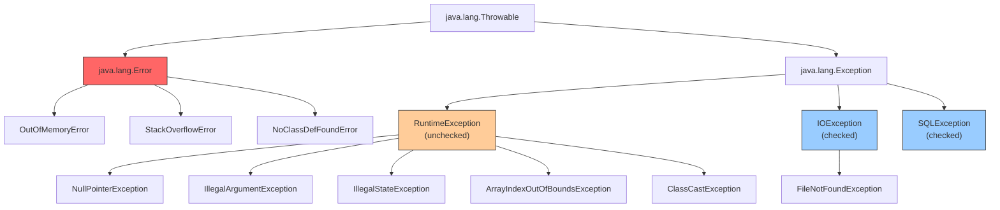
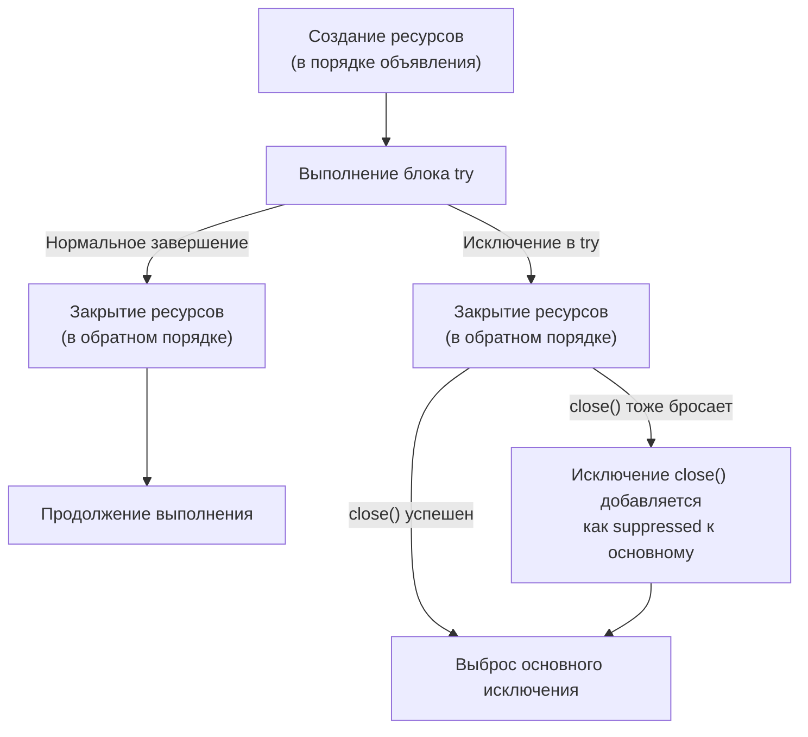
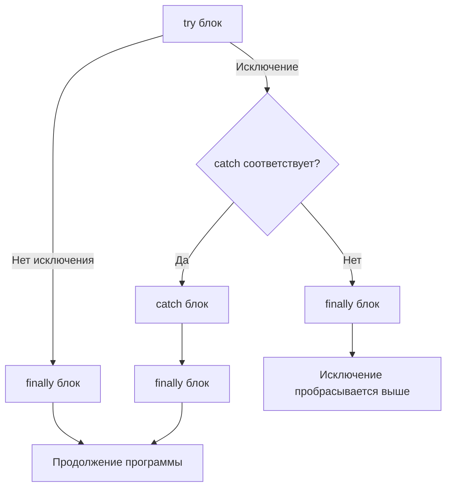

# Вопросы на собеседовании: `Java Exceptions`

Комплексное руководство по вопросам собеседования на тему `Java Exceptions` для `Senior Java Developer`. Включает иерархию исключений, механизмы обработки, `try-with-resources`, кастомные исключения, обработку в многопоточном коде, лямбдах и best practices.

## Полезные ссылки

### Официальная документация

- [Java Exceptions Tutorial](https://docs.oracle.com/javase/tutorial/essential/exceptions/) — официальный туториал Oracle
- [Throwable Hierarchy](https://docs.oracle.com/en/java/javase/17/docs/api/java.base/java/lang/Throwable.html) — Javadoc иерархии `Throwable`
- [Java Exceptions Interview Questions (Baeldung)](https://www.baeldung.com/java-exceptions-interview-questions) — вопросы с ответами
- [Exception Handling in Java (Baeldung)](https://www.baeldung.com/java-exceptions) — обзор обработки исключений
- [Java Try with Resources (Baeldung)](https://www.baeldung.com/java-try-with-resources) — `try-with-resources` в деталях
- [Create a Custom Exception in Java (Baeldung)](https://www.baeldung.com/java-new-custom-exception) — создание кастомных исключений

## Содержание

- [Полезные ссылки](#полезные-ссылки)
- [See also](#see-also)

**Основы и классификация исключений**
- [Q1. (!) Что такое `Exception` и какова иерархия исключений в Java?](#q1--что-такое-exception-и-какова-иерархия-исключений-в-java)
- [Q2. Какова цель ключевых слов `throw` и `throws`?](#q2-какова-цель-ключевых-слов-throw-и-throws)
- [Q3. Как обработать `Exception` с помощью `try-catch-finally`?](#q3-как-обработать-exception-с-помощью-try-catch-finally)
- [Q4. Как поймать несколько `Exceptions`?](#q4-как-поймать-несколько-exceptions)
- [Q5. (!) В чём разница между `Checked` и `Unchecked Exception`?](#q5--в-чём-разница-между-checked-и-unchecked-exception)
- [Q6. (!) В чём разница между `Exception` и `Error`?](#q6--в-чём-разница-между-exception-и-error)
- [Q7. Какой `Exception` будет выброшен при выполнении следующего кода?](#q7-какой-exception-будет-выброшен-при-выполнении-следующего-кода)

**Цепочка, стек и иерархия**
- [Q8. Что такое `Exception Chaining`?](#q8-что-такое-exception-chaining)
- [Q9. (!) Что такое `Stacktrace` и как она связана с `Exception`?](#q9--что-такое-stacktrace-и-как-она-связана-с-exception)
- [Q10. Зачем создавать подклассы `Exception`?](#q10-зачем-создавать-подклассы-exception)
- [Q11. Каковы преимущества механизма `Exceptions`?](#q11-каковы-преимущества-механизма-exceptions)

**`try-with-resources` и управление ресурсами**
- [Q12. (!) Что такое `try-with-resources` и как он работает?](#q12--что-такое-try-with-resources-и-как-он-работает)
- [Q13. (!) Что такое `Suppressed Exceptions` в `try-with-resources`?](#q13--что-такое-suppressed-exceptions-в-try-with-resources)
- [Q14. Что такое `addSuppressed()` и `getSuppressed()`?](#q14-что-такое-addsuppressed-и-getsuppressed)

**Исключения в лямбдах и переопределении методов**
- [Q15. (!) Как выбросить `Exception` внутри лямбда-выражения?](#q15--как-выбросить-exception-внутри-лямбда-выражения)
- [Q16. Как переопределить метод, выбрасывающий `Exception`?](#q16-как-переопределить-метод-выбрасывающий-exception)
- [Q17. Будет ли компилироваться следующий код?](#q17-будет-ли-компилироваться-следующий-код)
- [Q18. Есть ли способ выбросить checked `Exception` из метода без `throws`?](#q18-есть-ли-способ-выбросить-checked-exception-из-метода-без-throws)

**Проектирование и кастомные исключения**
- [Q19. (!) Когда создавать кастомное исключение и как его правильно оформить?](#q19--когда-создавать-кастомное-исключение-и-как-его-правильно-оформить)
- [Q20. Когда использовать `RuntimeException` vs checked `Exception`?](#q20-когда-использовать-runtimeexception-vs-checked-exception)
- [Q21. (!) Best practices при проектировании иерархии исключений](#q21--best-practices-при-проектировании-иерархии-исключений)

**Порядок выполнения и подводные камни**
- [Q22. Что такое `try-catch-finally` и каков порядок выполнения?](#q22-что-такое-try-catch-finally-и-каков-порядок-выполнения)
- [Q23. Что произойдёт, если в `finally` есть `return`?](#q23-что-произойдёт-если-в-finally-есть-return)
- [Q24. Как перехватить все исключения (`catch Throwable`)?](#q24-как-перехватить-все-исключения-catch-throwable)

**Многопоточность и исключения**
- [Q25. (!) Как обработать исключения в многопоточном коде?](#q25--как-обработать-исключения-в-многопоточном-коде)
- [Q26. Что такое `UncaughtExceptionHandler`?](#q26-что-такое-uncaughtexceptionhandler)

**Логирование, тестирование и диагностика**
- [Q27. (!) Как правильно логировать исключения?](#q27--как-правильно-логировать-исключения)
- [Q28. Как тестировать код, выбрасывающий исключения?](#q28-как-тестировать-код-выбрасывающий-исключения)
- [Q29. Что такое `getCause()` и `initCause()`?](#q29-что-такое-getcause-и-initcause)

**Специальные типы и продвинутые темы**
- [Q30. Что такое `AssertionError` и когда использовать `assert`?](#q30-что-такое-assertionerror-и-когда-использовать-assert)
- [Q31. Как обработать `OutOfMemoryError` и `StackOverflowError`?](#q31-как-обработать-outofmemoryerror-и-stackoverflowerror)
- [Q32. Что такое `fail-fast` и `fail-safe` в контексте исключений?](#q32-что-такое-fail-fast-и-fail-safe-в-контексте-исключений)
- [Q33. Как обрабатывать исключения в `Spring` (`@ExceptionHandler`, `@ControllerAdvice`)?](#q33-как-обрабатывать-исключения-в-spring-exceptionhandler-controlleradvice)
- [Q34. Антипаттерны обработки исключений](#q34-антипаттерны-обработки-исключений)

**Продвинутые темы**
- [Q35. Exception Chaining — initCause(), getCause(), addSuppressed()](#q35-exception-chaining--initcause-getcause-addsuppressed)
- [Q36. Multi-catch (Java 7) — синтаксис, ограничения](#q36-multi-catch-java-7--синтаксис-ограничения)
- [Q37. Try-with-resources с AutoCloseable — как работает, порядок закрытия](#q37-try-with-resources-с-autocloseable--как-работает-порядок-закрытия)
- [Q38. Custom Exceptions — best practices, serialVersionUID](#q38-custom-exceptions--best-practices-serializationuid)
- [Q39. Exception в lambda — как обрабатывать checked exceptions](#q39-exception-в-lambda--как-обрабатывать-checked-exceptions)
- [Q40. Логирование исключений — правила, что включать в message](#q40-логирование-исключений--правила-что-включать-в-message)
- [Q41. Performance исключений — стоимость fillInStackTrace, дорогие stack traces](#q41-performance-исключений--стоимость-fillinstacktrace-дорогие-stack-traces)
- [Q42. Global Exception Handling в Spring — @ControllerAdvice, ProblemDetail](#q42-global-exception-handling-в-spring--controlleradvice-problemdetail)

---

## Q1. (!) Что такое `Exception` и какова иерархия исключений в Java?

Исключение (`Exception`) — это ненормальное событие, возникающее во время выполнения программы и нарушающее нормальный поток инструкций. В Java все исключения являются объектами и наследуются от класса `Throwable`.

Иерархия исключений в Java:



Ключевые моменты:
- `Throwable` — корень иерархии; имеет два прямых наследника: `Error` и `Exception`
- `Error` — серьёзные проблемы JVM, от которых обычно невозможно восстановиться
- `Exception` → **checked** (проверяемые): компилятор требует обработки
- `RuntimeException` → **unchecked** (непроверяемые): обработка не обязательна

> [!mcq]
> - [ ] Корнем иерархии исключений в Java является класс `Exception`, от которого наследуются `Error` и `RuntimeException`. | `Error` не наследуется от `Exception` — оба прямые потомки `Throwable`, и `catch (Exception)` не поймает `Error`. ❌ ПОСЛЕДСТВИЕ: команда пишет `try { ... } catch (Exception)` для «всех ошибок», `OutOfMemoryError` пролетает мимо, поток падает молча, инцидент видно только через сутки в метриках availability.
> - [ ] Корнем иерархии исключений в Java является класс `RuntimeException`, от которого наследуются `Error` и `Exception`. | `RuntimeException` — подкласс `Exception`, а не корень иерархии; через `throw` можно бросить только наследников `Throwable`. ❌ ПОСЛЕДСТВИЕ: разработчик пишет `class MyError extends Error extends RuntimeException`, код не компилируется, на собеседовании отвечает «не помню точно» — фейл на базовом вопросе.
> - [x] Корнем иерархии исключений в Java является класс `Throwable`, от которого наследуются `Error` и `Exception`. | `Throwable` — общий предок, единственный тип, который можно бросать через `throw`; `Error` — фатальные сбои JVM, `Exception` — прикладные ошибки, `RuntimeException` — подкласс `Exception` для unchecked. ✓ ПРИМЕНЯТЬ: Spring `@ExceptionHandler(Throwable.class)` как last-resort fallback в `@ControllerAdvice`. 📋 ПРАВИЛО: «`Throwable` — корень, `Error` и `Exception` — две независимые ветки». 🔗 См. Q5, Q6, Q24.
> - [ ] Корнем иерархии исключений в Java является класс `Object`, от которого напрямую наследуются `Exception` и `Error`. | Все классы наследуются от `Object`, но специализированная иерархия исключений стартует с `Throwable` — только он имеет `getStackTrace`/`getCause`. ❌ ПОСЛЕДСТВИЕ: попытка бросить `throw new Object()` — ошибка компиляции «cannot throw non-Throwable», новичок теряет 30 минут на поиск «как же бросить любую ошибку».

> [!mcq]
> - [ ] Все прямые наследники `Throwable` являются checked, а unchecked становятся только подклассы `RuntimeException`, причём `Error` — это checked-ветка. | `Error` — unchecked, несмотря на отсутствие наследования от `RuntimeException`; unchecked = `RuntimeException`+потомки ИЛИ `Error`+потомки. ❌ ПОСЛЕДСТВИЕ: код объявляет `void load() throws Error` для перестраховки, IDE подсвечивает как redundant, на code-review разработчик не может объяснить семантику — MR блокируется, фикс затягивает релиз на день.
> - [ ] `Exception` — checked по факту наследования, поэтому `RuntimeException` (как подкласс `Exception`) тоже автоматически checked. | `RuntimeException` — явное исключение из правила: extends `Exception`, но компилятор НЕ требует декларации. ❌ ПОСЛЕДСТВИЕ: разработчик пишет `throws RuntimeException` в каждой сигнатуре, API-контракт раздут, при миграции на checked-исключения приходится переделывать 200+ методов вручную.
> - [ ] Checked/unchecked определяется по аннотации `@Checked` или `@Unchecked` на классе исключения, а наследование роли не играет. | Таких аннотаций в Java нет — категория полностью определяется иерархией наследования относительно `RuntimeException` и `Error`. ❌ ПОСЛЕДСТВИЕ: разработчик ищет «как сделать checked exception unchecked», тратит час на поиск несуществующей аннотации, вместо `extends RuntimeException` городит `@SneakyThrows`-обвязку — техдолг растёт.
> - [x] Checked/unchecked определяется конкретным местом в иерархии: всё кроме `RuntimeException`+потомков и `Error`+потомков — checked, даже если общий предок `Throwable` един. | Компилятор смотрит на конкретный класс: `IOException extends Exception` — checked, `NullPointerException extends RuntimeException extends Exception` — unchecked; две независимые unchecked-ветки: `RuntimeException` и `Error`. ✓ ПРИМЕНЯТЬ: при создании кастомного бизнес-исключения наследовать от `RuntimeException` (Spring-стиль), от `Exception` — только если caller обязан восстановиться. 📋 ПРАВИЛО: «два unchecked-острова: `RuntimeException` и `Error`, всё остальное checked». 🔗 См. Q5, Q20.

## Q2. Какова цель ключевых слов `throw` и `throws`?

**`throws`** — объявляет в сигнатуре метода, что он может выбросить исключение. Обязывает вызывающий код обрабатывать checked-исключения:

```java
public void readFile(String path) throws IOException {
    Files.readAllBytes(Path.of(path));
}
```

**`throw`** — выбрасывает конкретный объект исключения, прерывая нормальный поток выполнения:

```java
public void setAge(int age) {
    if (age < 0) {
        throw new IllegalArgumentException("Возраст не может быть отрицательным: " + age);
    }
    this.age = age;
}
```

| Аспект | `throw` | `throws` |
|--------|---------|----------|
| Где используется | В теле метода | В сигнатуре метода |
| Что принимает | Объект исключения | Класс(ы) исключений |
| Количество | Одно исключение | Несколько через запятую |
| Обязательность | Программист решает | Компилятор требует для checked |

> [!mcq]
> - [x] `throw` выбрасывает конкретный объект исключения в теле метода, а `throws` объявляет в сигнатуре метода потенциально выбрасываемые типы. | `throw new IllegalArgumentException(...)` прерывает выполнение здесь и сейчас; `throws IOException, SQLException` обязывает caller'а обработать checked-типы. ✓ ПРИМЕНЯТЬ: Spring `Assert.notNull(arg, "msg")` под капотом делает `throw new IllegalArgumentException`. 📋 ПРАВИЛО: «`throw` — действие, `throws` — обещание». 🔗 См. Q5, Q16.
> - [ ] `throw` объявляет исключения в сигнатуре метода, а `throws` выбрасывает конкретный объект исключения внутри метода. | Всё перепутано местами: `throw` — внутри метода для выброса объекта, `throws` — в сигнатуре для декларации. ❌ ПОСЛЕДСТВИЕ: junior пишет `public void foo() throw IOException { throws new IOException(); }` — компилятор ругается двумя ошибками подряд, code-review откатывает MR с пометкой «basics», фрустрация и потерянное время.
> - [ ] `throw` используется только для unchecked-исключений, а `throws` — только для checked-исключений, и они никогда не комбинируются. | `throw` подходит для любых `Throwable`, включая checked; ограничение касается только `throws` (обязателен для checked). ❌ ПОСЛЕДСТВИЕ: разработчик пишет дублирующий код «отдельный путь для checked, отдельный для unchecked» — copy-paste 50 строк, баги расходятся, поддержка дороже.
> - [ ] `throw` и `throws` — синонимы, которые можно использовать взаимозаменяемо в сигнатурах и теле метода. | Это разные ключевые слова с разным синтаксисом и семантикой; компилятор не примет `throw` в сигнатуре и `throws` в теле. ❌ ПОСЛЕДСТВИЕ: код не компилируется, IDE не подсказывает причину, новичок 20 минут гуглит «java throw vs throws» вместо реальной задачи.

## Q3. Как обработать `Exception` с помощью `try-catch-finally`?

Используя конструкцию `try-catch-finally`:

```java
try {
    // «Защищённый» код, который может выбросить исключение
    String content = Files.readString(Path.of("config.yml"));
} catch (NoSuchFileException ex) {
    // Обработка конкретного типа
    log.warn("Файл конфигурации не найден, используем значения по умолчанию", ex);
} catch (IOException ex) {
    // Обработка более общего типа
    log.error("Ошибка чтения конфигурации", ex);
} finally {
    // Выполняется ВСЕГДА — и при нормальном выходе, и при исключении
    log.info("Попытка чтения конфигурации завершена");
}
```

Правила:
- Блок `try` обязателен; `catch` и `finally` — хотя бы один из двух
- Блоки `catch` проверяются последовательно — **дочерний тип должен стоять раньше родительского**, иначе ошибка компиляции
- `finally` выполняется даже при `return` внутри `try` или `catch`

> [!mcq]
> - [ ] Блоки `catch` проверяются в обратном порядке объявления, поэтому родительский тип должен стоять раньше дочернего для корректной обработки. | `catch`-блоки проверяются сверху вниз; родитель раньше ребёнка даст ошибку компиляции «unreachable catch block». ❌ ПОСЛЕДСТВИЕ: компилятор отклоняет код, разработчик меняет местами и получает обратную ошибку, тратит 15 минут на «битву с компилятором», MR блокируется на CI.
> - [ ] Блоки `catch` проверяются в произвольном порядке, определяемом JVM на основе фактического типа исключения в runtime. | JVM не выбирает «лучший» `catch` — порядок строго детерминирован компилятором и зашит в байткод. ❌ ПОСЛЕДСТВИЕ: разработчик надеется на «JVM сама разберётся», ставит `catch (Exception)` первым «для подстраховки», специфичные `catch (IOException)` ниже становятся недостижимы — баги логируются как «общие ошибки» без диагностики.
> - [x] Блоки `catch` проверяются последовательно сверху вниз, поэтому дочерний тип должен стоять раньше родительского для корректной обработки. | Первый подходящий по типу `catch` забирает исключение; если `Exception` идёт раньше `IOException` — последний unreachable, ошибка компиляции. ✓ ПРИМЕНЯТЬ: Spring `JdbcTemplate.translateException` ловит `SQLException` подтипы перед общим (`DataIntegrityViolation` до `DataAccessException`). 📋 ПРАВИЛО: «specific to general — top to bottom». 🔗 См. Q4, Q22.
> - [ ] Блоки `catch` проверяются параллельно, и JVM автоматически выбирает наиболее специфичный тип независимо от порядка объявления. | Обработка строго последовательная и детерминированная — специфичность задаёт программист через порядок. ❌ ПОСЛЕДСТВИЕ: разработчик меняет местами `catch`-блоки в hotfix, ожидая «JVM выберет правильный», вместо `FileNotFoundException` ловится общий `IOException` без специфичной обработки — пользователь видит generic-ошибку.

## Q4. Как поймать несколько `Exceptions`?

Три способа:

**1. Несколько блоков `catch`** (порядок от более специфичного к общему):

```java
try {
    parseAndSave(data);
} catch (JsonParseException ex) {
    log.error("Невалидный JSON", ex);
} catch (IOException ex) {
    log.error("Ошибка ввода-вывода", ex);
}
```

**2. `Multi-catch` блок** (`Java 7+`) — один блок для нескольких несвязанных типов:

```java
try {
    parseAndSave(data);
} catch (JsonParseException | SQLException ex) {
    // ex неявно final; нельзя переприсвоить
    log.error("Ошибка обработки данных", ex);
}
```

**3. Общий `catch`** (антипаттерн — использовать осторожно):

```java
try {
    riskyOperation();
} catch (Exception ex) {
    // Перехватывает ВСЁ, включая непредвиденные RuntimeException
    log.error("Неожиданная ошибка", ex);
}
```

В `multi-catch` типы не могут быть связаны наследованием — `catch (IOException | FileNotFoundException ex)` не скомпилируется, т.к. `FileNotFoundException` — подкласс `IOException`.

> [!mcq]
> - [x] В `multi-catch` типы не могут быть связаны наследованием, а переменная исключения неявно `final` и не переприсваивается. | Тип переменной — общий предок всех указанных типов; переприсваивание нарушило бы type safety при последующем `throw ex`. ✓ ПРИМЕНЯТЬ: типичный паттерн `catch (JsonProcessingException | SQLException e) { throw new RepositoryException(e); }` в DAO-слое Spring. 📋 ПРАВИЛО: «multi-catch — disjoint типы и effectively final переменная». 🔗 См. Q3, Q36.
> - [ ] В `multi-catch` переменная исключения `ex` mutable и её можно переприсваивать любым типом из объявленных через ` | `. | Переменная неявно `final`; переприсваивание запретили, чтобы избежать неоднозначности типа при `throw ex`. ❌ ПОСЛЕДСТВИЕ: разработчик пишет `ex = new IOException("normalized")` для «обогащения», получает ошибку компиляции, обходит через лишнюю переменную — boilerplate растёт, читаемость падает.
> - [ ] В `multi-catch` допускается указывать связанные наследованием типы, поскольку компилятор автоматически выберет более специфичный. | Связанные типы запрещены — `catch (IOException | FileNotFoundException)` не компилируется (родитель + потомок избыточны). ❌ ПОСЛЕДСТВИЕ: code-review бракует MR с дублирующимися типами, разработчик не понимает причину «Types in multi-catch must be disjoint», копирует на StackOverflow и затягивает фикс.
> - [ ] В `multi-catch` можно ловить только unchecked-исключения, т.к. checked-типы требуют отдельных блоков `catch`. | `multi-catch` работает с любыми `Throwable`, включая checked; ограничение — только на наследственные связи. ❌ ПОСЛЕДСТВИЕ: разработчик пишет 3 одинаковых `catch (IOException) { wrap(e); }`/`catch (SQLException) { wrap(e); }` — 30 строк копипасты вместо одной строки multi-catch.

## Q5. (!) В чём разница между `Checked` и `Unchecked Exception`?

| Критерий | `Checked Exception` | `Unchecked Exception` |
|----------|--------------------|-----------------------|
| Наследование | `Exception` (кроме `RuntimeException`) | `RuntimeException` и его подклассы |
| Проверка компилятором | Да — обязательно `try-catch` или `throws` | Нет — обработка опциональна |
| Типичная причина | Внешние условия (I/O, сеть, БД) | Ошибки программирования (логика, валидация) |
| Примеры | `IOException`, `SQLException`, `ClassNotFoundException` | `NullPointerException`, `IllegalArgumentException`, `ArrayIndexOutOfBoundsException` |
| Восстановимость | Предполагается, что можно восстановиться | Обычно указывает на баг в коде |

```java
// Checked — компилятор заставляет обрабатывать
public void readConfig() throws IOException {  // ОБЯЗАТЕЛЬНО
    Files.readString(Path.of("app.conf"));
}

// Unchecked — компилятор не требует обработки
public void process(String value) {
    Objects.requireNonNull(value); // бросает NullPointerException
}
```

На собеседовании важно упомянуть дискуссию о checked exceptions: многие фреймворки (включая `Spring`) предпочитают unchecked-исключения для снижения boilerplate-кода. В `Kotlin`, например, checked exceptions вообще отсутствуют (подробнее в [вопросах по Kotlin Exceptions](../kotlin/kotlin-exceptions-interview.md)).

> [!mcq]
> - [ ] Checked-исключения всегда unchecked в runtime, а unchecked-исключения не ловятся в блоках `catch` вообще. | Путаница терминов: unchecked прекрасно ловятся в `catch`, разница только в требовании компилятора на этапе компиляции. ❌ ПОСЛЕДСТВИЕ: разработчик не пишет `catch (NullPointerException)` веря, что «не поймается», NPE из-за невалидного `@RequestParam` уходит в default-handler, клиент получает 500 без диагностики.
> - [x] Checked-исключения проверяются компилятором и требуют `try-catch` или `throws`, а unchecked (`RuntimeException` и наследники) — нет. | Compile-time проверка — ключевое различие; `IOException` обязывает обработку, `NullPointerException` — нет, хотя оба `Throwable`. ✓ ПРИМЕНЯТЬ: Spring/Hibernate делают исключения unchecked (`DataAccessException`) — caller не обязан декларировать `throws` в каждом методе. 📋 ПРАВИЛО: «checked = compile-time контракт, unchecked = runtime-сигнал». 🔗 См. Q1, Q20.
> - [ ] Checked-исключения наследуются от `Error`, а unchecked — от `Exception`, и эти ветки никогда не пересекаются. | Оба типа наследуются от `Exception`; `Error` — отдельная ветка для JVM-ошибок и не связан с checked/unchecked. ❌ ПОСЛЕДСТВИЕ: разработчик объявляет кастомный `class BizError extends Error` для «бизнес-сбоя», `@ExceptionHandler(Exception)` его не ловит, на проде клиент видит necheckanyy stack trace.
> - [ ] Checked-исключения можно бросать только в статических методах, а unchecked — только в инстанс-методах. | Статичность метода не влияет на тип бросаемых исключений — ограничения определяются только сигнатурой `throws`. ❌ ПОСЛЕДСТВИЕ: разработчик переписывает дизайн, делая методы статическими «для checked» — ломает архитектуру (нет mock'ов в тестах, нельзя инжектить зависимости).

> [!mcq]
> - [ ] В `try-with-resources` checked-исключение из `close()` затирается основным исключением `try`-блока, поэтому декларация `throws` не нужна. | Исключение из `close()` не затирается, а добавляется как suppressed; если в `try` ошибки не было — оно становится основным и требует `throws`. ❌ ПОСЛЕДСТВИЕ: разработчик надеется на «затирание», убирает `throws IOException`, код не компилируется, во время демо у клиента билд красный, релиз сдвигается.
> - [ ] `try-with-resources` автоматически конвертирует все checked-исключения из `close()` в `RuntimeException`, поэтому `throws` никогда не нужен. | Никакой автоконвертации нет — оригинальный тип сохраняется; `IOException` из `close()` так и полетит. ❌ ПОСЛЕДСТВИЕ: разработчик пишет `try (BufferedReader r = ...) { ... }` без `throws IOException`, ожидая магии, билд красный — фрустрация, копипаст с SO без понимания.
> - [ ] `AutoCloseable.close()` всегда объявляет только unchecked-исключения, поэтому checked в этом контексте невозможны. | `AutoCloseable.close() throws Exception` — самый общий checked-тип; `Closeable.close() throws IOException` — checked. ❌ ПОСЛЕДСТВИЕ: разработчик считает кастомный `MyResource implements AutoCloseable` свободным от checked-обязательств, пишет `throws SQLException` в `close()`, caller'у приходится оборачивать через wrap-метод — лишний boilerplate.
> - [x] Если `AutoCloseable.close()` объявляет checked-исключение (как `IOException` у `Closeable`), `try-with-resources` обязывает его обработать или объявить в `throws` — даже если в `try` этого исключения не было. | Компилятор видит неявный вызов `close()` и применяет стандартные правила checked-проверки. ✓ ПРИМЕНЯТЬ: `BufferedReader`/`InputStream` в `try-with-resources` всегда требуют `throws IOException` в сигнатуре или внешний `catch`. 📋 ПРАВИЛО: «`close()` участвует в checked-проверке наравне с телом `try`». 🔗 См. Q12, Q13, Q37.

## Q6. (!) В чём разница между `Exception` и `Error`?

| Критерий | `Exception` | `Error` |
|----------|------------|---------|
| Наследование | `Throwable` → `Exception` | `Throwable` → `Error` |
| Восстановимость | Можно и нужно обрабатывать | Обычно невосстановимые |
| Источник | Логика приложения, внешние системы | JVM, системные ресурсы |
| Обработка | Рекомендуется | Не рекомендуется (кроме логирования) |

Основные `Error`:
- **`OutOfMemoryError`** — JVM не может выделить память, `GC` не помогает
- **`StackOverflowError`** — переполнение стека (глубокая рекурсия)
- **`NoClassDefFoundError`** — класс был доступен при компиляции, но не найден в runtime
- **`ExceptionInInitializerError`** — исключение в статическом инициализаторе
- **`UnsupportedClassVersionError`** — `.class` файл скомпилирован более новой версией Java

```java
// Пример StackOverflowError — бесконечная рекурсия
public int factorial(int n) {
    return n * factorial(n - 1); // нет базового условия!
}
```

> [!mcq]
> - [ ] `Error` сигнализирует о проблемах в бизнес-логике приложения, а `Exception` — о критических сбоях JVM, требующих перезапуска. | Разбиение перевёрнуто: `Error` (OOM, SOE) — JVM-уровень, `Exception` — уровень приложения и внешних систем. ❌ ПОСЛЕДСТВИЕ: разработчик создаёт `class OrderError extends Error` для бизнес-логики, `@ControllerAdvice(Exception.class)` его не ловит, клиент получает 500 без `ProblemDetail`.
> - [x] `Error` сигнализирует о проблемах уровня JVM (память, стек, classloader) и обычно невосстановим, а `Exception` — это восстановимые ошибки уровня приложения. | `OutOfMemoryError`/`StackOverflowError` — невосстановимые сбои runtime; `IOException`/`SQLException` предполагают осмысленную обработку (retry, fallback). ✓ ПРИМЕНЯТЬ: Kubernetes liveness probe + `-XX:+ExitOnOutOfMemoryError` для рестарта pod'а вместо попыток восстановления внутри JVM. 📋 ПРАВИЛО: «`Error` — JVM-уровень, не лечим; `Exception` — приложение, лечим». 🔗 См. Q1, Q31.
> - [ ] `Error` и `Exception` — полные синонимы в Java, и разница только в исторически сложившихся именах классов. | Они принципиально различаются семантически и по рекомендуемой обработке: `Error` — не бизнес-код, `Exception` — уровень приложения. ❌ ПОСЛЕДСТВИЕ: разработчик пишет `catch (Throwable)` «для универсальности», ловит `OutOfMemoryError`, продолжает работу с разрушенным состоянием — в БД пишутся частичные данные.
> - [ ] `Error` в Java всегда checked и требует обработки, а `Exception` всегда unchecked и обработки не требует. | `Error` — unchecked (отдельная ветка `Throwable`); checked/unchecked определяется подклассификацией `Exception`, а не именем. ❌ ПОСЛЕДСТВИЕ: разработчик пишет `throws Error` в сигнатуре «для compile-time гарантии», IDE подсвечивает как redundant, MR блокируется на review с пометкой «basics».

> [!mcq]
> - [ ] При `OutOfMemoryError` достаточно поймать его в `catch` и сделать retry — следующий вызов получит свежую память от JVM. | Куча уже заполнена, `new` в catch-блоке скорее всего тоже бросит OOM или приведёт к каскадным сбоям; retry без освобождения ресурсов проблему не решает. ❌ ПОСЛЕДСТВИЕ: сервис в while-loop с retry на OOM — каждый цикл аллоцирует, каждый раз падает; Kubernetes liveness не видит проблему (поток жив), 100% CPU, никакой полезной работы.
> - [ ] `OutOfMemoryError` нужно обязательно обрабатывать в каждом сервисе, иначе JVM не вызовет `System.gc()` для освобождения памяти. | `System.gc()` — лишь рекомендация JVM и вызывается до OOM, не после; catch на OOM не запускает GC. ❌ ПОСЛЕДСТВИЕ: разработчик окружает каждый метод `try { } catch (OOM) { System.gc(); }` — production OOM по-прежнему происходит, но stack traces исчезают (catch проглатывает), диагностика инцидента становится невозможна.
> - [ ] `OutOfMemoryError` — recoverable error, после catch JVM автоматически перезапускает поток с очищенным локальным стеком. | Автоматического перезапуска потоков нет — после OOM состояние JVM непредсказуемо: demon-потоки, finalizer, GC могли упасть. ❌ ПОСЛЕДСТВИЕ: вера в «автоматическое восстановление» — нет supervisor'а, после OOM все worker-потоки в неопределённом состоянии, jobs встают, очередь Kafka растёт, lag = 1M.
> - [x] `OutOfMemoryError` ловить для retry бессмысленно: heap уже исчерпан, и любая последующая аллокация (включая создание объекта в catch-блоке) с высокой вероятностью снова бросит OOM. | Даже логирование может упасть из-за невозможности создать `String`; корректная стратегия — graceful shutdown через `Thread.setDefaultUncaughtExceptionHandler` без новых аллокаций. ✓ ПРИМЕНЯТЬ: `-XX:+ExitOnOutOfMemoryError` + `-XX:+HeapDumpOnOutOfMemoryError` + Kubernetes restart pod'а — снять heap dump, дать оркестратору поднять чистую JVM. 📋 ПРАВИЛО: «OOM = exit, не recover». 🔗 См. Q24, Q31.

## Q7. Какой `Exception` будет выброшен при выполнении следующего кода?

```java
Integer[][] ints = {{1, 2, 3}, {null}, {7, 8, 9}};
System.out.println("value = " + ints[1][1].intValue());
```

Будет выброшен `ArrayIndexOutOfBoundsException`. Второй вложенный массив `{null}` содержит только один элемент (с индексом 0), а мы обращаемся к индексу 1 (`ints[1][1]`), который выходит за границы массива.

Обратите внимание: если бы обращение было к `ints[1][0].intValue()`, то был бы `NullPointerException`, т.к. `ints[1][0]` равно `null`.

> [!mcq]
> - [ ] Будет выброшен `NullPointerException`, потому что элемент по индексу `[1][1]` равен `null` и разыменование невозможно. | До разыменования `null` дело не доходит — `ints[1]` имеет длину 1, индекс `[1]` уже out-of-bounds; NPE был бы при `ints[1][0].intValue()`. ❌ ПОСЛЕДСТВИЕ: разработчик добавляет `if (ints[1][1] == null) return defaultValue` — фактическая ошибка `AIOOBE` остаётся, но теперь скрыта за лишней проверкой; debug идёт по неверному пути.
> - [ ] Будет выброшен `ClassCastException`, потому что `Integer[]` не может быть приведён к `int` автоматически. | Автобоксинг/анбоксинг работает без CCE; CCE возникает только при некорректном приведении типов объектов (`(String) Object`). ❌ ПОСЛЕДСТВИЕ: разработчик пишет `(int) ints[1][1]` для «ручного приведения», получает ту же `AIOOBE`, тратит время на гипотезу о type-casting вместо boundary-check.
> - [x] Будет выброшен `ArrayIndexOutOfBoundsException`, потому что `ints[1]` имеет длину 1, а мы обращаемся к индексу 1 (выход за границу). | `{null}` — массив длиной 1 с единственным индексом 0; bound-check выполняется до разыменования, поэтому NPE недостижим. ✓ ПРИМЕНЯТЬ: `Arrays.asList(...).indexOf(...)` или явная проверка `ints[1].length > 1` перед обращением — типичная защита в legacy-парсерах CSV. 📋 ПРАВИЛО: «bound-check предшествует null-check». 🔗 См. Q1, Q5.
> - [ ] Будет выброшен `NumberFormatException`, потому что `null` нельзя преобразовать в числовое значение через `intValue()`. | NFE связан только с парсингом строк (`Integer.parseInt`), не с `intValue()` на wrapper-типах; `intValue()` на `null`-ссылке дал бы NPE. ❌ ПОСЛЕДСТВИЕ: разработчик оборачивает в `try { ... } catch (NumberFormatException e)`, реальная `AIOOBE` улетает выше как unhandled, мониторинг ругается на необработанные runtime-ошибки.

## Q8. Что такое `Exception Chaining`?

Цепочка исключений (`Exception Chaining`) — это механизм оборачивания одного исключения в другое для сохранения полной истории ошибки. Оригинальное исключение передаётся как `cause`:

```java
public Order processOrder(OrderRequest request) {
    try {
        return repository.save(mapToOrder(request));
    } catch (DataAccessException ex) {
        throw new OrderProcessingException(
            "Не удалось сохранить заказ: " + request.getId(), ex  // ex — cause
        );
    }
}
```

Преимущества:
- Сохраняется полный стек вызовов от первоначальной ошибки
- Верхний уровень видит доменное исключение, а не инфраструктурное
- Логгер выводит всю цепочку: основное → cause → cause of cause

Доступ к причине: `exception.getCause()` возвращает вложенное исключение.

> [!mcq]
> - [ ] `Exception Chaining` — это автоматическое объединение нескольких одновременно выброшенных исключений в один composite-объект. | Это описание `addSuppressed`, а не chaining; chaining связывает «причину и следствие», а не параллельные ошибки. ❌ ПОСЛЕДСТВИЕ: разработчик путает термины на собеседовании, на проде использует `addSuppressed` вместо `initCause` — log-аппендер форматирует только primary, root cause теряется в `Suppressed:` секции.
> - [ ] `Exception Chaining` — это механизм повторного выброса одного и того же объекта исключения на разных уровнях стека без потери контекста. | Повторный выброс (`throw ex`) сам по себе не создаёт цепочку — chaining оборачивает одно исключение в другое через `cause`. ❌ ПОСЛЕДСТВИЕ: разработчик пишет `catch (SQLException e) { throw e; }` в каждом слое, на верху ловится `SQLException` без доменного контекста (`OrderId=123`) — диагностика инцидента дольше в разы.
> - [ ] `Exception Chaining` — это последовательность `catch`-блоков от специфичного к общему, формирующая «цепочку» обработки. | Порядок `catch`-блоков — отдельная концепция; chaining относится к связи между объектами исключений через поле `cause`. ❌ ПОСЛЕДСТВИЕ: разработчик «правильно выстраивает цепочку catch», но не оборачивает причину — `getCause()` возвращает `null`, `ExceptionUtils.getRootCause` бесполезен.
> - [x] `Exception Chaining` — это механизм оборачивания одного исключения в другое через поле `cause` для сохранения первопричины. | `throw new OrderException("msg", ex)` сохраняет оригинальную `DataAccessException` как cause; stack trace выводит «Caused by:» цепочку. ✓ ПРИМЕНЯТЬ: Spring `JdbcTemplate.translateException` оборачивает `SQLException` в `DataAccessException` с сохранением cause — caller видит доменный тип, а root cause доступен через `getCause()`. 📋 ПРАВИЛО: «cause через конструктор при wrap». 🔗 См. Q29, Q35.

## Q9. (!) Что такое `Stacktrace` и как она связана с `Exception`?

`Stack trace` — это снимок стека вызовов в момент создания исключения. Показывает цепочку вызовов методов от точки возникновения до корня потока:

```
com.app.OrderService.processOrder(OrderService.java:45)
com.app.OrderController.createOrder(OrderController.java:23)
...
java.lang.Thread.run(Thread.java:829)
```

Ключевые методы:
- `exception.getStackTrace()` — возвращает `StackTraceElement[]`
- `exception.printStackTrace()` — выводит в `System.err` (не использовать в production!)
- `exception.setStackTrace(StackTraceElement[])` — позволяет изменять стек (редко используется)

Полезные советы:
- Стек формируется при **создании** исключения (`new`), а не при `throw`
- Создание стека — **дорогая операция**; для исключений, которые бросаются часто, можно переопределить `fillInStackTrace()` и вернуть `this` для оптимизации
- Используйте `log.error("message", ex)` вместо `ex.printStackTrace()` — подробнее в [вопросах по логированию](../../logging/logging-interview.md)

> [!mcq]
> - [ ] Стек формируется в момент вызова `throw`, а создание объекта только аллоцирует память без обхода стека. | `fillInStackTrace()` вызывается из конструктора `Throwable` — создание исключения уже дорого, даже если его не бросить. ❌ ПОСЛЕДСТВИЕ: разработчик кеширует `new RuntimeException()` как поле класса для «оптимизации», ожидая дешёвой аллокации, но stack trace зафиксирован в момент инициализации (init-thread) — все логи показывают неверный поток.
> - [x] Стек формируется в момент создания объекта исключения (`new`) через `fillInStackTrace()`, а не в момент `throw`. | Именно поэтому существует sentinel-паттерн (закэшировать исключение, бросать многократно) и конструктор `Throwable(msg, cause, suppression, writableStackTrace=false)` для оптимизации. ✓ ПРИМЕНЯТЬ: Netty `Recycler` и Hystrix используют sentinel-исключения с отключённым stack trace для горячих путей. 📋 ПРАВИЛО: «стек снимается в `new`, не в `throw`». 🔗 См. Q9, Q41.
> - [ ] Стек формируется только при первом вызове `getStackTrace()`, реализуя lazy-инициализацию. | Никакой lazy-инициализации нет — стек собирается сразу в конструкторе; `getStackTrace()` лишь возвращает готовый массив. ❌ ПОСЛЕДСТВИЕ: разработчик создаёт исключение «впрок» и долго его держит для последующего `getStackTrace()`, ожидая, что цена отложится — на самом деле цена уже уплачена в `new`, и stack trace показывает не тот поток.
> - [ ] Стек формируется в момент `catch`, чтобы показать путь от обработчика до источника. | `catch` не модифицирует стек — он фиксируется при создании и далее неизменен. ❌ ПОСЛЕДСТВИЕ: разработчик удивляется, почему в `@ExceptionHandler` stack trace «обрывается на сервисе» — на самом деле он полный с момента `new`, а ниже handler-а ничего и быть не может.

> [!mcq]
> - [x] `fillInStackTrace()` — native-вызов, обходящий все кадры стека потока, и его стоимость на порядок (примерно 10×) выше, чем создание обычного объекта; для hot path рекомендуется кэшировать sentinel-исключение или переопределять метод как `return this`. | Бенчмарки показывают разницу 10-20× между `new RuntimeException()` и `new Object()`; JIT иногда оптимизирует через `OmitStackTraceInFastThrow`. ✓ ПРИМЕНЯТЬ: Netty/Hystrix кешируют sentinel-исключения через 4-аргументный конструктор `Throwable(msg, null, true, false)` с `writableStackTrace=false`. 📋 ПРАВИЛО: «exception в hot path = sentinel + writableStackTrace=false». 🔗 См. Q41.
> - [ ] Создание `Throwable` дешёвое, потому что `fillInStackTrace()` — это просто копирование указателя на текущий thread, без обхода кадров стека. | `fillInStackTrace` — native-метод, проходящий по всем кадрам стека и формирующий `StackTraceElement[]`; стоимость пропорциональна глубине стека. ❌ ПОСЛЕДСТВИЕ: разработчик использует `Integer.parseInt` через try-catch для валидации пользовательского ввода в hot path, p99 поднимается с 5ms до 200ms, мониторинг алертит на latency, root cause не очевиден.
> - [ ] Стоимость создания исключения сравнима с обычным методом, поэтому исключения можно безопасно использовать для control flow. | Использование исключений для control flow — известный антипаттерн; производительность падает на порядки, семантика искажается. ❌ ПОСЛЕДСТВИЕ: команда строит CSV-парсер на `try { Integer.parseInt } catch`, при батче 100K строк с 30% невалидных — обработка идёт 60 секунд вместо 3, ETL-job не успевает в SLA-окно.
> - [ ] `Throwable.getStackTrace()` собирает стек только при первом вызове и кэширует результат — поэтому повторные вызовы стоят O(1). | Стек собирается в конструкторе через `fillInStackTrace`; `getStackTrace()` лишь возвращает массив — стоимость размазана между конструктором (тяжёлый) и геттером (лёгкий), а не наоборот. ❌ ПОСЛЕДСТВИЕ: разработчик пишет «отложенное логирование» через `if (logger.isDebugEnabled()) logger.debug("", e)` думая, что без `getStackTrace()` стек не строится, latency не падает.

## Q10. Зачем создавать подклассы `Exception`?

Создание подклассов (subclassing) нужно, когда:
1. Ни одно стандартное исключение не описывает ситуацию семантически точно
2. Нужно добавить дополнительный контекст (поля с кодами ошибок, ID ресурса и т.д.)
3. Нужна доменная иерархия для группировки ошибок

```java
public class PaymentException extends RuntimeException {
    private final String paymentId;
    private final ErrorCode errorCode;

    public PaymentException(String message, String paymentId, ErrorCode errorCode) {
        super(message);
        this.paymentId = paymentId;
        this.errorCode = errorCode;
    }

    public PaymentException(String message, String paymentId, ErrorCode errorCode, Throwable cause) {
        super(message, cause);
        this.paymentId = paymentId;
        this.errorCode = errorCode;
    }
    // getters
}
```

Правило выбора базового класса: если вызывающий код **может и должен** восстановиться — наследовать от `Exception` (checked). Если это ошибка программиста или невосстановимая ситуация — от `RuntimeException` (unchecked).

> [!mcq]
> - [x] Подклассы создают для доменной семантики, добавления контекстных полей и группировки связанных ошибок в иерархию. | `OrderNotFoundException` с полем `orderId` несёт бизнес-смысл; общий `PaymentException` позволяет ловить все платёжные ошибки без перечисления конкретных подтипов. ✓ ПРИМЕНЯТЬ: Spring `DataAccessException` иерархия — общий тип + специфичные подтипы (`DuplicateKeyException`, `OptimisticLockingFailureException`). 📋 ПРАВИЛО: «доменный смысл + контекст + иерархия». 🔗 См. Q19, Q21, Q38.
> - [ ] Подклассы создают, чтобы увеличить размер stack trace и получить более детальную диагностическую информацию от JVM. | Размер stack trace не зависит от типа исключения, а определяется глубиной стека; пользовательские подклассы не меняют механизм сборки трейса. ❌ ПОСЛЕДСТВИЕ: разработчик создаёт 50 подклассов «для лучшей диагностики», getCause-цепочка раздувается, обработка `@ExceptionHandler` усложняется без прироста полезной информации.
> - [ ] Подклассы создают только ради обхода требования `throws` на checked-исключения. | Обход через `RuntimeException` — побочный эффект; основная причина — доменная семантика, а выбор checked/unchecked зависит от того, обязан ли caller восстановиться. ❌ ПОСЛЕДСТВИЕ: разработчик плодит классы «чтобы убрать `throws Exception`» без бизнес-смысла, иерархия плоская, на собеседовании не может объяснить разницу `OrderNotFound` vs `OrderInvalid`.
> - [ ] Подклассы обязательны для любого исключения — стандартные типы Java нельзя использовать напрямую. | `IllegalArgumentException`, `IllegalStateException`, `UnsupportedOperationException` рекомендуется переиспользовать там, где они уместны. ❌ ПОСЛЕДСТВИЕ: разработчик создаёт `class MyServiceIllegalArgumentException extends RuntimeException` для каждого сервиса, code-base раздувается, новички не знают, какой конкретный тип ловить.

## Q11. Каковы преимущества механизма `Exceptions`?

1. **Разделение логики и обработки ошибок** — основной код не засорён проверками возвращаемых кодов
2. **Распространение по стеку вызовов** — исключение автоматически поднимается до обработчика, не нужно передавать вручную
3. **Группировка по типам** — можно ловить `IOException` для всех I/O-ошибок, а не каждую по отдельности
4. **Обязательность обработки** — для checked-исключений компилятор гарантирует, что ошибка не проигнорирована
5. **Информативность** — объект исключения несёт message, cause, stack trace

В отличие от подхода с кодами ошибок (как в C), механизм исключений Java предотвращает ситуацию, когда ошибка «тихо проглатывается».

> [!mcq]
> - [ ] Механизм исключений в Java быстрее и эффективнее по памяти, чем проверка кодов возврата из функций. | Наоборот: создание исключения с `fillInStackTrace` в 10-100× дороже простого `if`-check; преимущества — в структурированности, не в перфомансе. ❌ ПОСЛЕДСТВИЕ: разработчик заменяет `if (input.isEmpty()) return false` на `throw new ValidationException`, в hot path при 10K RPS — CPU тратится на построение stack trace, p95 вырастает в разы.
> - [ ] Механизм исключений позволяет пропускать ошибки без всякой обработки, что уменьшает boilerplate-код. | Checked-исключения как раз требуют явной обработки или декларации; «тихое проглатывание» (`catch (Exception e) {}`) — антипаттерн, а не фича. ❌ ПОСЛЕДСТВИЕ: команда пишет пустые catch-блоки «для лаконичности», `OrderProcessingException` теряется без логов, биллинг-несоответствия выявляются через неделю аудита.
> - [ ] Механизм исключений автоматически откатывает все изменения состояния при выбросе, подобно транзакциям в БД. | Java не предоставляет автоматический rollback — восстановление состояния делается программистом через `finally` или `try-with-resources`. ❌ ПОСЛЕДСТВИЕ: разработчик полагается на «магический rollback», файл частично записан, кэш частично обновлён — после исключения система в неконсистентном состоянии, требуется ручная чистка.
> - [x] Механизм исключений отделяет happy-path от обработки ошибок, автоматически распространяет их по стеку вызовов и гарантирует обработку checked-типов. | Не нужно проверять `if (result == ERROR)` после каждого вызова; исключение само поднимается до обработчика, компилятор не даёт забыть про checked. ✓ ПРИМЕНЯТЬ: Spring `@Transactional` rollback на `RuntimeException` — естественное распространение по стеку до прокси-обёртки, без ручного «передаём ошибку наверх». 📋 ПРАВИЛО: «happy path чистый, ошибки идут отдельным каналом». 🔗 См. Q5, Q34.

## Q12. (!) Что такое `try-with-resources` и как он работает?

`try-with-resources` (`Java 7+`) — конструкция, которая автоматически закрывает ресурсы, реализующие интерфейс `AutoCloseable`, после выхода из блока `try`:

```java
// Java 7+ — ресурс объявляется в try(...)
try (var reader = new BufferedReader(new FileReader("data.csv"));
     var writer = new BufferedWriter(new FileWriter("output.csv"))) {

    String line;
    while ((line = reader.readLine()) != null) {
        writer.write(transform(line));
        writer.newLine();
    }
} // reader и writer закрываются автоматически, в обратном порядке
```

```java
// Java 9+ — можно использовать effectively final переменные
BufferedReader reader = new BufferedReader(new FileReader("data.csv"));
try (reader) {  // reader — effectively final
    return reader.readLine();
}
```

Порядок работы:



Преимущества перед ручным `finally`:
- Нет boilerplate-кода проверки на `null` и вызова `close()`
- Гарантия закрытия даже при исключении
- Suppressed exceptions не теряются (в отличие от ручного `finally`, где исключение в `close()` затирает основное)

> [!mcq]
> - [x] `try-with-resources` автоматически закрывает объекты, реализующие `AutoCloseable`, в обратном порядке объявления, и сохраняет исключения через `addSuppressed`. | Три ключевых свойства: LIFO-закрытие, требование только `AutoCloseable`, сохранение ошибок из `close()` как suppressed. ✓ ПРИМЕНЯТЬ: типичный JDBC-паттерн `try (Connection conn = ds.getConnection(); PreparedStatement ps = conn.prepareStatement(sql); ResultSet rs = ps.executeQuery())` — корректное закрытие в обратном порядке. 📋 ПРАВИЛО: «LIFO-close + suppressed для cleanup». 🔗 См. Q13, Q14, Q37.
> - [ ] `try-with-resources` закрывает ресурсы в том же порядке, в котором они были объявлены в блоке `try(...)`. | Порядок обратный (LIFO): `Connection` открывается первым, но закрывается последним — иначе зависимый ресурс упадёт на мёртвом родителе. ❌ ПОСЛЕДСТВИЕ: разработчик пишет ручной finally `conn.close(); stmt.close(); rs.close();` — `rs.close()` бросает «ResultSet is closed», suppressed-ошибки заполняют логи, реальная ошибка теряется.
> - [ ] `try-with-resources` требует, чтобы ресурсы реализовывали интерфейс `Closeable` (не `AutoCloseable`), т.к. только он гарантирует корректное закрытие. | Достаточно `AutoCloseable` — он введён именно для `try-with-resources` в Java 7; `Closeable extends AutoCloseable` для I/O. ❌ ПОСЛЕДСТВИЕ: разработчик заставляет бизнес-класс `MeasuredTimer implements Closeable` бросать `throws IOException` — caller вынужден ловить ненужный checked, API замусорен.
> - [ ] `try-with-resources` не поддерживает несколько ресурсов в одной конструкции — для каждого нужен отдельный вложенный блок. | Несколько ресурсов объявляются через `;` в одной паре скобок и закрываются в обратном порядке. ❌ ПОСЛЕДСТВИЕ: разработчик плодит вложенные `try (a) { try (b) { try (c) { ... } } }` — pyramid of doom, читать невозможно, suppressed-семантика теряется при ручной вложенности.

> [!mcq]
> - [ ] В Java 9+ внутри `try(...)` всегда нужно объявлять новую переменную, даже если ресурс уже создан выше — синтаксис без объявления остался запрещён. | Именно в Java 9 (JEP 213) разрешили использовать существующую effectively final ссылку без переобъявления. ❌ ПОСЛЕДСТВИЕ: разработчик плодит alias-переменные `try (var r = existingResource)` для legacy-API, читаемость падает, junior на code-review не понимает зачем нужен `r`.
> - [ ] В Java 9+ переменная в `try(...)` может быть mutable и переприсваиваться внутри блока — управление закрытием возьмёт JVM на момент выхода. | Ссылка должна быть effectively final, иначе нет гарантии, что закроется именно тот объект, что был открыт. ❌ ПОСЛЕДСТВИЕ: разработчик переприсваивает `resource = newResource` внутри try, ожидая закрытия обоих, на деле — leak первого ресурса, после серии операций OOM по file descriptors.
> - [ ] Синтаксис `try (resource) { }` без объявления был доступен с Java 7, а Java 9 только формализовал требование effectively final. | В Java 7-8 синтаксис `try(...)` строго требовал нового объявления переменной внутри скобок; поддержка использования существующих effectively final переменных появилась именно в Java 9 (JEP 213). ❌ ПОСЛЕДСТВИЕ: разработчик пишет код для Java 8 в новом синтаксисе, локально на Java 11 всё ОК, билд CI на Java 8 падает с syntax error, релиз сдвигается на день, мерж конфликты копятся.
> - [x] Java 9+ (JEP 213) позволяет использовать существующую `final` или effectively final переменную в `try(resource)` без переобъявления, что устраняет «глупую» локальную переменную из старого синтаксиса. | До Java 9 приходилось писать `try (var r = existingResource) { }` где `r` — лишний alias; теперь `try (existingResource) { }`. Требование effectively final гарантирует закрытие ровно того объекта, что был открыт. ✓ ПРИМЕНЯТЬ: в Spring Cloud Gateway фильтрах удобно использовать `try (request) { ... }` для уже полученного closable-объекта без переобъявления. 📋 ПРАВИЛО: «Java 9+ — try на existing effectively final переменной». 🔗 См. Q12.

## Q13. (!) Что такое `Suppressed Exceptions` в `try-with-resources`?

Когда в блоке `try` возникает исключение И при закрытии ресурса (`close()`) тоже возникает исключение — исключение из `close()` не теряется, а добавляется к основному как **suppressed**:

```java
public class FaultyResource implements AutoCloseable {
    public void doWork() {
        throw new RuntimeException("Ошибка в doWork");
    }

    @Override
    public void close() {
        throw new RuntimeException("Ошибка в close");
    }
}

try (var resource = new FaultyResource()) {
    resource.doWork();
}
// Результат:
// Exception: "Ошибка в doWork"
//   Suppressed: "Ошибка в close"
```

Доступ к suppressed:

```java
try {
    // ...
} catch (RuntimeException ex) {
    log.error("Основная ошибка: {}", ex.getMessage());
    for (Throwable suppressed : ex.getSuppressed()) {
        log.error("  Suppressed: {}", suppressed.getMessage());
    }
}
```

Без `try-with-resources` (ручной `finally`) исключение в `close()` **затирает** исключение из `try` — suppressed-механизм решает эту проблему.

> [!mcq]
> - [ ] Suppressed exceptions — это исключения, которые полностью игнорируются JVM и не попадают в стектрейс ни при каких условиях. | Они сохраняются именно для диагностики и выводятся в stack trace под меткой `Suppressed:` через `printStackTrace`. ❌ ПОСЛЕДСТВИЕ: разработчик не проверяет `ex.getSuppressed()` в логировании, в production вторая ошибка (close() rollback) остаётся невидимой, root cause utility-проблем не находится неделями.
> - [ ] Suppressed exceptions — это исключения, подавленные аннотацией `@SuppressWarnings` и не генерирующие предупреждений компилятора. | `@SuppressWarnings` работает с compile-time warnings, никак не связано с runtime-механизмом `Throwable.addSuppressed`. ❌ ПОСЛЕДСТВИЕ: на собеседовании разработчик путает термины, теряет балл; в коде ставит `@SuppressWarnings("exception")` ожидая магии, реальные ошибки продолжают падать.
> - [x] Suppressed exceptions — это исключения из `close()`, которые прикрепляются к основному исключению из `try`-блока через `addSuppressed` без его подмены. | В ручном `finally` второе исключение затёрло бы первое; `try-with-resources` автоматически сохраняет обе ошибки — основное и suppressed доступны через `getSuppressed()`. ✓ ПРИМЕНЯТЬ: при batch-процессинге через `try (Connection)` — если транзакция упала и rollback в close() тоже, оба видны в логах. 📋 ПРАВИЛО: «primary throws, secondary suppressed — обе сохраняются». 🔗 См. Q12, Q14, Q35.
> - [ ] Suppressed exceptions — это те, которые не распространяются по стеку и автоматически конвертируются в `RuntimeException`. | Suppressed не влияют на распространение основного исключения и не конвертируются — они просто «прицеплены» через поле. ❌ ПОСЛЕДСТВИЕ: разработчик ожидает «фоновую» обработку suppressed, не пишет catch для основного, исключение всё равно поднимается, поток падает с unhandled.

> [!mcq]
> - [ ] `addSuppressed(this)` — допустимый способ пометить исключение как «не распространяемое», JVM проигнорирует такое исключение при распространении. | Добавление исключения к самому себе запрещено — `IllegalArgumentException` (защита `Throwable` от циклических ссылок). ❌ ПОСЛЕДСТВИЕ: разработчик пишет «трюк» для тестов с `e.addSuppressed(e)`, тест падает с IAE, отладка занимает час, тест-фреймворк CI помечает падение как flaky.
> - [ ] `addSuppressed` — package-private метод, доступный только из пакета `java.lang`, поэтому пользовательский код не может его вызывать. | Метод public с Java 7 — любой код может его вызывать на любом `Throwable` (если suppression не отключён 4-аргументным конструктором). ❌ ПОСЛЕДСТВИЕ: разработчик создаёт обходной reflection-вызов, считая метод закрытым, ломает sealed-API в Java 17, тратит часы на «обход» несуществующей проблемы.
> - [ ] `addSuppressed` можно вызвать только один раз — повторный вызов перезаписывает предыдущий suppressed-Throwable. | Путаница с `initCause` (тот действительно один раз); `addSuppressed` накапливает в массив без перезаписи — все добавленные сохраняются. ❌ ПОСЛЕДСТВИЕ: при batch-cleanup нескольких ресурсов разработчик «бережёт» один вызов, теряет 3 из 4 ошибок closeAll — диагностика мульти-ресурсного fail невозможна.
> - [x] `Throwable.addSuppressed(Throwable)` — публичный API для ручного добавления suppressed-исключений, но запрещено добавлять `null` (NPE) и сам объект (`IllegalArgumentException`); вызывать можно многократно. | Метод предназначен и для JVM (try-with-resources), и для пользовательского кода; suppressed-механизм можно отключить через `Throwable(message, cause, enableSuppression=false, ...)`. ✓ ПРИМЕНЯТЬ: ручная агрегация ошибок при `closeAll(List<AutoCloseable>)` — primary + addSuppressed для остальных. 📋 ПРАВИЛО: «addSuppressed многократен; null/this запрещены». 🔗 См. Q13, Q14.

## Q14. Что такое `addSuppressed()` и `getSuppressed()`?

Методы класса `Throwable` для работы с подавленными исключениями:

- `addSuppressed(Throwable)` — добавляет подавленное исключение
- `getSuppressed()` — возвращает массив `Throwable[]` подавленных исключений

JVM использует их автоматически в `try-with-resources`. В пользовательском коде полезны при освобождении нескольких ресурсов вручную:

```java
public void closeAll(List<AutoCloseable> resources) {
    Throwable primary = null;
    for (AutoCloseable resource : resources) {
        try {
            resource.close();
        } catch (Exception ex) {
            if (primary == null) {
                primary = ex;
            } else {
                primary.addSuppressed(ex); // не теряем ошибки при close
            }
        }
    }
    if (primary != null) {
        throw new RuntimeException("Ошибка при закрытии ресурсов", primary);
    }
}
```

> [!mcq]
> - [ ] `addSuppressed` и `getSuppressed` — это методы `Exception`, доступные только в checked-ветке иерархии. | Методы определены в базовом `Throwable`, поэтому доступны и `Exception`, и `Error`, и `RuntimeException`. ❌ ПОСЛЕДСТВИЕ: разработчик не пользуется suppressed для `OutOfMemoryError`-тёго cleanup'а, теряет вторичную диагностику в OOM-инцидентах.
> - [ ] `addSuppressed` можно вызывать только один раз — повторный вызов приведёт к `IllegalStateException` (как у `initCause`). | Ограничение «один раз» — у `initCause`; `addSuppressed` можно вызывать многократно, исключения накапливаются в массиве. ❌ ПОСЛЕДСТВИЕ: разработчик пишет if-guard «уже добавлено», теряет последующие ошибки в multi-resource cleanup, диагностика батч-операций неполная.
> - [x] `addSuppressed` и `getSuppressed` — это методы `Throwable`, используемые `try-with-resources` автоматически и доступные для ручной работы. | JVM вызывает `addSuppressed` при сбое в `close()`; программист использует для своей логики cleanup или агрегации ошибок. ✓ ПРИМЕНЯТЬ: Apache Commons `IOUtils.closeQuietly` устаревший — современная замена через try-with-resources с автоматическим suppressed. 📋 ПРАВИЛО: «`addSuppressed`/`getSuppressed` — на любом `Throwable`». 🔗 См. Q13, Q35.
> - [ ] `getSuppressed()` возвращает `List<Throwable>`, изменения в котором автоматически отражаются в объекте исключения. | Возвращаемый тип — `Throwable[]` (массив), это копия, не живая ссылка; изменения не влияют на внутреннее состояние. ❌ ПОСЛЕДСТВИЕ: разработчик пишет `e.getSuppressed().clear()` ожидая «очистки», получает UnsupportedOperationException на List или просто игнорирование на массиве — confusing API behaviour.

## Q15. (!) Как выбросить `Exception` внутри лямбда-выражения?

Стандартные функциональные интерфейсы (`Function`, `Consumer`, `Supplier`) **не объявляют checked exceptions** в сигнатуре. Поэтому:

**Unchecked — работают напрямую:**

```java
List<Integer> numbers = List.of(3, 9, 7, 0, 10);
numbers.forEach(i -> {
    if (i == 0) {
        throw new IllegalArgumentException("Ноль недопустим");
    }
    System.out.println(100 / i);
});
```

**Checked — нужен обходной путь.** Три подхода:

1. **Обернуть в unchecked внутри лямбды:**
```java
files.forEach(path -> {
    try {
        Files.readString(path);
    } catch (IOException e) {
        throw new UncheckedIOException(e); // стандартный враппер
    }
});
```

2. **Создать свой функциональный интерфейс с `throws`:**
```java
@FunctionalInterface
public interface CheckedConsumer<T> {
    void accept(T t) throws Exception;
}

public static <T> Consumer<T> unchecked(CheckedConsumer<T> consumer) {
    return t -> {
        try {
            consumer.accept(t);
        } catch (Exception e) {
            throw new RuntimeException(e);
        }
    };
}

// Использование
files.forEach(unchecked(path -> Files.readString(path)));
```

3. **Sneaky throws** (трюк со стиранием типов — см. Q18)

Подробнее о лямбдах — в [вопросах по Java 8](java-8-interview.md).

> [!mcq]
> - [ ] Стандартные функциональные интерфейсы (`Function`, `Consumer`) объявляют `throws Exception`, поэтому checked-исключения внутри лямбд бросаются без проблем. | Они НЕ объявляют `throws` checked — именно поэтому требуется обёртывание (`UncheckedIOException`) или кастомный `ThrowingFunction`. ❌ ПОСЛЕДСТВИЕ: разработчик пишет `paths.stream().map(Files::readString)` уверенный в работе, билд красный, копирует обходные паттерны со SO без понимания — техдолг растёт.
> - [ ] Unchecked-исключения внутри лямбды компилятор запрещает бросать, требуя оборачивать их в `try-catch`. | Unchecked (`RuntimeException`, NPE) работают в лямбдах напрямую — проблема только с checked. ❌ ПОСЛЕДСТВИЕ: разработчик оборачивает каждый `IllegalArgumentException` в try-catch внутри stream-pipeline, читаемость падает, защитный код вытесняет бизнес-логику.
> - [x] Checked-исключения внутри лямбды нужно оборачивать в unchecked (например, `UncheckedIOException`) или использовать кастомный функциональный интерфейс с `throws`. | Стандартные интерфейсы не объявляют checked в сигнатуре, поэтому обходные пути — обёртка через `UncheckedIOException` или `ThrowingFunction.wrap` с собственным `throws Exception`. ✓ ПРИМЕНЯТЬ: `Files.lines(path)` использует `UncheckedIOException` как стандарт JDK для I/O в stream-цепочках. 📋 ПРАВИЛО: «checked в lambda — обернуть в unchecked». 🔗 См. Q15, Q39.
> - [ ] Любые исключения из лямбды автоматически проглатываются Stream API, поэтому обработку нужно делать через `Optional`. | Stream API не проглатывает исключения — они пробрасываются из терминальной операции (`collect`, `forEach`); `Optional` не связан с error-handling. ❌ ПОСЛЕДСТВИЕ: разработчик надеется на «магическое проглатывание», NPE из `map` уходит в default-handler, batch-обработка из 1000 элементов падает на первом — потеря 999 успешных.

> [!mcq]
> - [ ] В асинхронных pipeline `CompletableFuture` исключения из лямбд `thenApply`/`thenCompose` обрываются молча — без `try-catch` они просто игнорируются. | Они оборачиваются в `CompletionException` и пробрасываются по цепочке до первого `exceptionally`/`handle`/`get()` — не игнорируются, а откладываются. ❌ ПОСЛЕДСТВИЕ: команда не ставит `.exceptionally`, future остаётся в failed-состоянии без логов; `cf.thenAccept(...)` молчит, через сутки QA замечает «событие не отправлено» — исходная ошибка утеряна.
> - [ ] `CompletableFuture.exceptionally` ловит только checked-исключения, для unchecked нужно использовать `handle` или `whenComplete`. | `exceptionally` принимает `Function<Throwable, T>` и срабатывает на любой `Throwable`, включая unchecked, checked и `Error`; разделения по checked/unchecked у CompletableFuture нет в принципе — все упаковываются в `CompletionException`. ❌ ПОСЛЕДСТВИЕ: разработчик дублирует логику recovery в `whenComplete` для NPE и в `exceptionally` для IOException, поведение расходится между ветками, refactor болезненный, на проде fallback срабатывает не для всех типов сбоев — частичная деградация сервиса.
> - [ ] В `CompletableFuture` исключение из лямбды автоматически конвертируется в `RuntimeException` и теряет оригинальный тип, поэтому `instanceof`-проверки бесполезны. | Оригинальный `Throwable` сохраняется как cause внутри `CompletionException`; через `getCause()` или `Throwable.unwrap` тип доступен. ❌ ПОСЛЕДСТВИЕ: разработчик пишет `if (ex instanceof IOException)` и проверка не срабатывает (видит `CompletionException`), retry на сетевые ошибки не работает, биллинг-сервис теряет транзакции под нагрузкой.
> - [x] Для асинхронных лямбд в `CompletableFuture` используются `exceptionally(Throwable -> T)` для recovery и `handle(BiFunction<T,Throwable,U>)` для unified-обработки результата и ошибки в одной точке. | `exceptionally` срабатывает только при ошибке и даёт fallback; `handle` всегда вызывается и получает либо результат, либо причину; `whenComplete` — side-effect без трансформации. ✓ ПРИМЕНЯТЬ: Spring `@Async` сервисы с downstream-вызовами через `WebClient` — `exceptionally` для retry/fallback, `handle` для metrics + конвертации. 📋 ПРАВИЛО: «exceptionally — recovery, handle — unified, whenComplete — side-effect». 🔗 См. Q15, Q25.

## Q16. Как переопределить метод, выбрасывающий `Exception`?

Правила контракта `throws` при переопределении (контравариантность по исключениям):

| Родительский метод | Дочерний метод может |
|---|---|
| Нет `throws` | Только unchecked (любые) |
| `throws IOException` | `throws FileNotFoundException` (уже или равно), не `throws Exception` (шире) |
| `throws RuntimeException` | Любые unchecked |

```java
class Parent {
    void process() throws IOException { }
}

class Child extends Parent {
    @Override
    void process() throws FileNotFoundException { }  // OK: подтип IOException
    // void process() throws Exception { }           // ОШИБКА: шире чем IOException
    // void process() throws SQLException { }        // ОШИБКА: другой checked
}
```

Причина: вызывающий код работает с типом `Parent` и обрабатывает только `IOException`. Если бы `Child` мог бросать `SQLException`, обработчик бы его не поймал.

Это связано с принципом подстановки Лисков (LSP) — подробнее в [вопросах по Java OOP](java-oop-interview.md).

> [!mcq]
> - [ ] Дочерний метод может расширять объявленный список checked-исключений, добавляя новые типы, не указанные в родительском. | Расширение нарушает LSP — caller, работающий с родителем, не обрабатывает новые типы; компилятор запрещает. ❌ ПОСЛЕДСТВИЕ: разработчик пишет `class ChildImpl { void process() throws SQLException }` поверх `Parent.process() throws IOException`, билд падает с «overridden method does not throw SQLException», MR блокируется.
> - [ ] Дочерний метод обязан объявлять тот же список `throws`, что и родительский, без каких-либо изменений. | Список можно сужать (убирать или заменять на подтипы) — лишь бы не расширять; это контравариантность по исключениям. ❌ ПОСЛЕДСТВИЕ: разработчик копирует `throws IOException, SQLException, JsonProcessingException` в каждой реализации интерфейса, API замусорен, caller вынужден ловить лишнее.
> - [ ] Дочерний метод может бросать любые unchecked-исключения, но только если родитель их явно объявил в `throws`. | Unchecked не требуют декларации в `throws` ни на каком уровне иерархии; их можно бросать свободно. ❌ ПОСЛЕДСТВИЕ: разработчик переопределяет интерфейс `Repository.find()` без объявленных runtime-исключений, не пишет `Objects.requireNonNull` веря, что unchecked нужно декларировать — NPE из `null`-аргумента уходит без диагностики.
> - [x] Дочерний метод может сужать список checked-исключений (до подтипа или убирать совсем) и свободно бросать unchecked — но не расширять. | Контравариантность по исключениям из LSP: `throws FileNotFoundException` вместо `throws IOException` корректно, `throws Exception` — нет. ✓ ПРИМЕНЯТЬ: Spring Data JPA `Repository.findAll()` не объявляет checked-исключения; реализация `JpaRepository` не может расширять контракт checked'ом. 📋 ПРАВИЛО: «дочерний throws ⊆ родительского». 🔗 См. Q2, Q5.

## Q17. Будет ли компилироваться следующий код?

```java
void doSomething() {
    throw new RuntimeException(new Exception("Chained Exception"));
}
```

**Да**, код компилируется. `RuntimeException` — unchecked, поэтому не требует `throws` в сигнатуре. Внутренний `Exception` передаётся как `cause` через конструктор `RuntimeException(Throwable cause)` — это обычная цепочка исключений. Компилятор проверяет только тип **выбрасываемого** исключения, а не его причины.

> [!mcq]
> - [ ] Код не компилируется, потому что `Exception` — checked, и его нужно либо обрабатывать в `try-catch`, либо декларировать в `throws`. | `Exception` здесь — аргумент конструктора, не самостоятельно выбрасываемое исключение; декларация `throws` нужна только для реально бросаемых checked-типов. ❌ ПОСЛЕДСТВИЕ: разработчик добавляет `throws Exception` в `doSomething()` «на всякий случай», IDE подсвечивает как redundant, на code-review MR откатывают за «избыточный контракт».
> - [ ] Код не компилируется, потому что `RuntimeException` нельзя создавать с `cause` типа `Exception` — только `RuntimeException`. | Конструктор `RuntimeException(Throwable)` принимает любой `Throwable`, включая checked — это базовая семантика exception chaining. ❌ ПОСЛЕДСТВИЕ: разработчик не оборачивает `IOException` в `RuntimeException` думая, что нельзя, теряет cause при пробросе через слой — root cause недоступен в логах.
> - [x] Код компилируется, потому что бросается `RuntimeException` (unchecked), а `Exception` внутри — всего лишь `cause` и проверяется только тип самого выброса. | Компилятор смотрит на тип объекта в `throw`, а не на его поля; cause может быть любым `Throwable`, включая checked. ✓ ПРИМЕНЯТЬ: Spring `JdbcTemplate` оборачивает checked `SQLException` в unchecked `DataAccessException` с сохранением cause — caller не обязан декларировать `throws`. 📋 ПРАВИЛО: «`throws` проверяет тип выброса, не cause». 🔗 См. Q5, Q8, Q35.
> - [ ] Код компилируется, но только если добавить `throws Exception` в сигнатуру метода `doSomething`. | Декларация `throws` не требуется — бросается unchecked-тип, compiler доволен. ❌ ПОСЛЕДСТВИЕ: разработчик из перестраховки пишет `throws Exception` везде, caller вынужден ловить общий `Exception`, типизация теряется, статический анализ бесполезен.

## Q18. Есть ли способ выбросить checked `Exception` из метода без `throws`?

Да, через трюк с дженериками и стиранием типов (**sneaky throw**):

```java
@SuppressWarnings("unchecked")
public static <T extends Throwable> void sneakyThrow(Throwable ex) throws T {
    throw (T) ex;  // компилятор выводит T = RuntimeException
}

public void methodWithoutThrows() {
    sneakyThrow(new IOException("Checked, но без throws!"));
    // Компилятор считает, что бросается RuntimeException
    // В runtime реально летит IOException
}
```

Этот подход используется в библиотеках (`Lombok @SneakyThrows`, `Vavr`). Однако это **антипаттерн** в бизнес-коде — вызывающий код не ожидает checked exception и не обрабатывает его.

> [!mcq]
> - [ ] Нет, компилятор строго запрещает бросать checked-исключения без `throws` и не обойти это средствами языка. | Через type erasure и generic-метод (sneaky throw) компилятор обманывается; `Lombok @SneakyThrows` и Vavr используют этот приём. ❌ ПОСЛЕДСТВИЕ: разработчик не знает о sneaky throw, на собеседовании теряет балл; в коде вместо чистого Spring-`@SneakyThrows` плодит ручные `throws` через все слои API.
> - [ ] Да, но только через JNI и вызов нативного кода, реализующего `Throwable.throw` на низком уровне JVM. | JNI не нужен — трюк реализуется на чистой Java через generics и type erasure. ❌ ПОСЛЕДСТВИЕ: разработчик пишет JNI-код для «безобидного hack'а», добавляет нативную зависимость, ломает кросс-платформенность билда, deployment-pipeline ломается на ARM64.
> - [ ] Да, но только для исключений, помеченных аннотацией `@Unchecked`, введённой в Java 17. | Такой аннотации в Java нет; checked/unchecked определяется иерархией наследования от `RuntimeException`. ❌ ПОСЛЕДСТВИЕ: разработчик добавляет `@Unchecked` ожидая магии, IDE подсвечивает как unknown аннотацию, compile проходит, но семантика не меняется — путаница и потеря времени.
> - [x] Да, через sneaky throw — трюк со стиранием типов и generic-методом `<T extends Throwable>`, который обманывает compile-time проверку. | Во время компиляции `T` выводится как `RuntimeException`, в runtime летит реальный checked-тип; `Lombok @SneakyThrows`/Vavr — стандартные реализации. ✓ ПРИМЕНЯТЬ: `Lombok @SneakyThrows` в lambda-обёртках Stream API, чтобы избежать `try-catch` boilerplate. Использовать осознанно — caller не подозревает о checked. 📋 ПРАВИЛО: «sneaky throw — обход компилятора через generic erasure». 🔗 См. Q15, Q39.

## Q19. (!) Когда создавать кастомное исключение и как его правильно оформить?

**Когда создавать:**
- Нужна доменная семантика (например, `OrderNotFoundException`, `InsufficientFundsException`)
- Нужно передать дополнительный контекст (коды ошибок, ID ресурсов)
- Стандартные исключения недостаточно точно описывают ситуацию

**Правила оформления:**

```java
public class OrderNotFoundException extends RuntimeException {

    private final String orderId;

    // Минимум 2 конструктора: с message и с message + cause
    public OrderNotFoundException(String orderId) {
        super("Заказ не найден: " + orderId);
        this.orderId = orderId;
    }

    public OrderNotFoundException(String orderId, Throwable cause) {
        super("Заказ не найден: " + orderId, cause);
        this.orderId = orderId;
    }

    public String getOrderId() {
        return orderId;
    }
}
```

**Best practices:**
- Суффикс `Exception` в имени класса
- Наследовать от наиболее подходящего типа, а не просто от `Exception`
- Обязательно конструктор с `Throwable cause` для цепочки
- Сделать поля `final` и класс `Serializable` (если может сериализоваться)
- Не создавать слишком глубокую иерархию — обычно достаточно 1-2 уровней
- Переиспользовать стандартные исключения (`IllegalArgumentException`, `IllegalStateException`) где уместно

> [!mcq]
> - [x] Кастомное исключение должно иметь конструкторы с message и с message+cause, включать контекстные поля (final) и суффикс `Exception` в имени. | Три правила обеспечивают chaining (cause), диагностический контекст (контекстные поля) и читаемость (суффикс); опционально `serialVersionUID` при сериализации. ✓ ПРИМЕНЯТЬ: Spring `OptimisticLockingFailureException(String message, Throwable cause)` + наследники — образцовая реализация. 📋 ПРАВИЛО: «message+cause+context+суффикс Exception». 🔗 См. Q10, Q21, Q38.
> - [ ] Кастомное исключение должно иметь только один конструктор без параметров — `message` и `cause` устанавливаются через сеттеры после создания. | `Throwable` не имеет сеттеров для `message`; стандарт — минимум два конструктора (message и message+cause). ❌ ПОСЛЕДСТВИЕ: разработчик создаёт `MyException()` + setter-методы, обнаруживает что `setMessage` не существует, костылит через reflection, тесты падают на immutability проверках.
> - [ ] Кастомное исключение должно наследоваться строго от `Exception` или `Throwable`, но не от `RuntimeException` — последний зарезервирован для JVM. | `RuntimeException` предназначен для наследования (`IllegalArgumentException`, `IllegalStateException`); современная практика — большинство доменных исключений unchecked. ❌ ПОСЛЕДСТВИЕ: команда выбирает checked-наследование, каждый сервисный метод обвешен `throws OrderException, PaymentException`, при добавлении нового исключения переписывается 50 сигнатур.
> - [ ] Кастомное исключение должно иметь метод `handle()` для самостоятельной обработки — это снимает ответственность с вызывающего кода. | Обработка — ответственность catch-блока, не самого исключения; `handle()` в классе исключения смешивает данные и поведение. ❌ ПОСЛЕДСТВИЕ: разработчик пишет `e.handle()` в catch вместо нормального error-handling, при тестировании mock-фреймворк не знает что мокать, тесты переплетены с self-handling логикой.

## Q20. Когда использовать `RuntimeException` vs checked `Exception`?

| Критерий | Checked `Exception` | `RuntimeException` |
|----------|---------------------|--------------------|
| Когда | Вызывающий может и должен восстановиться | Ошибка программиста или невосстановимая ситуация |
| Примеры | `IOException`, `SQLException` | `NullPointerException`, `IllegalArgumentException` |
| Тренд индустрии | Реже в новых API | Чаще — `Spring`, `Hibernate`, `Kotlin` |
| `throws` в сигнатуре | Обязательно | Нет |

Современная практика (особенно в `Spring`-экосистеме): почти все доменные исключения — **unchecked**. Checked используются только для ситуаций, где вызывающий код **обязан** принять решение (повторить, использовать fallback и т.д.).

> [!mcq]
> - [ ] Использовать `RuntimeException` только для критических ошибок (JVM), а все бизнес-ошибки делать checked для явной обработки. | Устаревший взгляд: Spring/Hibernate почти все доменные исключения делают unchecked для снижения boilerplate. ❌ ПОСЛЕДСТВИЕ: команда строит на checked, через 6 месяцев каждый сервисный метод обвешан `throws BusinessException, IOException, SQLException`, разработчики массово начинают писать `throws Exception` — checked-механизм теряет смысл.
> - [ ] Использовать checked exception всегда, когда ошибка возможна — это гарантирует, что компилятор заставит её обработать. | Избыточный checked приводит к `throws Exception`-загрязнению и паттерну «поймал и проглотил» через пустой catch. ❌ ПОСЛЕДСТВИЕ: разработчики, чтобы убрать compile errors, пишут `catch (Exception e) {}` пустыми, реальные ошибки теряются — `OrderProcessingException` не логируется, биллинг ошибки находятся через сутки.
> - [ ] Использовать `RuntimeException` для ошибок на уровне контроллера, а checked — для сервисного слоя, разделяя по архитектурным слоям. | Тип определяется семантикой ошибки (восстановима или нет), а не слоем; checked везде — это про reusability контракта, а не про слой. ❌ ПОСЛЕДСТВИЕ: при перемещении логики между слоями приходится перебрасывать checked в unchecked, тесты падают на mock-фреймворке, deployment затягивается.
> - [x] Использовать checked, когда вызывающий может и должен восстановиться (retry/fallback), иначе — `RuntimeException` для ошибок программиста и невосстановимых ситуаций. | Оригинальный критерий Джошуа Блоха: `IOException` при сетевой ошибке (можно повторить) — checked, `IllegalArgumentException` (баг) — unchecked. ✓ ПРИМЕНЯТЬ: `WebClient` бросает unchecked `WebClientResponseException`; Resilience4j retry на специфичных подтипах. 📋 ПРАВИЛО: «checked — обязан восстановиться, unchecked — баг или фатально». 🔗 См. Q5, Q19, Q21.

## Q21. (!) Best practices при проектировании иерархии исключений

1. **Наследовать от подходящего базового типа** — не от `Exception` напрямую, если есть более подходящий
2. **Включать контекст** — сообщение, cause, дополнительные поля
3. **Документировать `@throws`** в Javadoc
4. **Переиспользовать стандартные** где уместно:
   - `IllegalArgumentException` — невалидный аргумент
   - `IllegalStateException` — объект в неправильном состоянии
   - `UnsupportedOperationException` — операция не поддерживается
   - `NullPointerException` — аргумент `null` (с Java 14 — информативное сообщение)
5. **Не создавать исключение на каждую ошибку** — группировать по смыслу
6. **Именование**: `<Причина>Exception` — `OrderNotFoundException`, `PaymentDeclinedException`

```java
// Хорошая иерархия для платёжной системы
public abstract class PaymentException extends RuntimeException { ... }
public class PaymentDeclinedException extends PaymentException { ... }
public class PaymentTimeoutException extends PaymentException { ... }
public class InsufficientFundsException extends PaymentException { ... }

// Вызывающий код может ловить как конкретные, так и общий PaymentException
try {
    paymentService.charge(order);
} catch (InsufficientFundsException ex) {
    notifyUser("Недостаточно средств");
} catch (PaymentException ex) {
    retryLater(order);
}
```

> [!mcq]
> - [ ] Создавать одно общее исключение на весь модуль без подтипов — простота важнее гранулярности. | Теряется семантика: caller не различит «недостаточно средств» (показать UI) и «timeout» (retry) по типу — придётся парсить строки message. ❌ ПОСЛЕДСТВИЕ: фронт делает `if (err.message.contains("funds"))` — рефакторинг сообщений в backend ломает UI без compile-ошибок, инциденты находят пользователи.
> - [ ] Наследовать все доменные исключения напрямую от `Throwable`, минуя `Exception` — это уменьшает overhead. | Наследование от `Throwable` обходит инфраструктуру catch-блоков, которые ловят `Exception`/`RuntimeException`; overhead одинаков. ❌ ПОСЛЕДСТВИЕ: разработчик создаёт `MyDomainError extends Throwable`, `@ExceptionHandler(Exception.class)` его не ловит, в production клиент видит unhandled stack trace.
> - [ ] Создавать максимально глубокую иерархию (5+ уровней) для каждого нюанса ошибки — это упрощает рефакторинг. | Глубокая иерархия усложняет поддержку: catch-блок не знает какой уровень ловить, рефакторинг каскадный. Практика — 1-2 уровня. ❌ ПОСЛЕДСТВИЕ: иерархия `Throwable → DomainException → BusinessException → PaymentException → CardException → DeclinedException` — 6 уровней, при добавлении нового типа разработчик не знает куда вставить, copy-paste разрастается.
> - [x] Создать абстрактный базовый класс домена (`PaymentException`) и наследовать от него конкретные подтипы, чтобы можно было ловить как общий родитель, так и частный случай. | Гибкость: caller может отреагировать на конкретный `InsufficientFundsException` или fallback на общий `PaymentException` для retry. ✓ ПРИМЕНЯТЬ: Spring Data `DataAccessException` → `DataIntegrityViolationException` → `DuplicateKeyException` — образцовая 3-уровневая иерархия с reuse в `@ExceptionHandler`. 📋 ПРАВИЛО: «1-2 уровня: domain root + concrete subtypes». 🔗 См. Q10, Q19, Q38.

## Q22. Что такое `try-catch-finally` и каков порядок выполнения?

Порядок выполнения:



```java
public String readFirstLine(String path) {
    BufferedReader reader = null;
    try {
        reader = new BufferedReader(new FileReader(path));
        return reader.readLine(); // (1) return здесь
    } catch (IOException ex) {
        log.error("Ошибка чтения", ex);
        return "default";          // (2) или return здесь
    } finally {
        // (3) Выполнится ВСЕГДА — даже после return!
        if (reader != null) {
            try { reader.close(); } catch (IOException ignored) {}
        }
    }
}
```

Начиная с `Java 7`, предпочтительнее использовать `try-with-resources` (см. Q12).

> [!mcq]
> - [ ] Блок `finally` выполняется только если в `try` не было исключения, для очистки ресурсов после успешной операции. | `finally` выполняется всегда: и при нормальном завершении, и при исключении, и при `return` из `try`/`catch` — в этом его суть. ❌ ПОСЛЕДСТВИЕ: разработчик помещает `connection.close()` после `try`-блока (а не в finally), при exception — connection leak, через 24 часа сервис исчерпывает pool, новые запросы зависают.
> - [ ] Блок `finally` выполняется только если соответствующий `catch` пойман, иначе исключение проходит мимо него к вышестоящему обработчику. | `finally` выполняется даже если ни один `catch` не подошёл, после чего исключение пробрасывается дальше по стеку. ❌ ПОСЛЕДСТВИЕ: разработчик пишет cleanup в catch блоке (один из), при unhandled exception cleanup не происходит — file handle leak, при загрузке постепенно ломается.
> - [ ] Блок `finally` можно опустить, только если есть минимум три блока `catch`, иначе компилятор потребует его наличия. | Правило простое: `try` требует минимум один `catch` ИЛИ `finally`; количество `catch` не влияет на обязательность finally. ❌ ПОСЛЕДСТВИЕ: разработчик плодит лишние catch-блоки «для соблюдения правила трёх», compiler доволен, но dead code раздувает code-base.
> - [x] Блок `finally` выполняется всегда: и после успешного `try`, и после пойманного `catch`, и даже при `return` из них. | Единственный способ не выполнить `finally` — `System.exit()`, фатальный сбой JVM или бесконечный цикл в `try`. ✓ ПРИМЕНЯТЬ: legacy-cleanup до Java 7 (без try-with-resources) — `finally { closeQuietly(stream); }` гарантирует освобождение ресурсов. 📋 ПРАВИЛО: «`finally` всегда, кроме System.exit и infinite loop». 🔗 См. Q3, Q23, Q37.

## Q23. Что произойдёт, если в `finally` есть `return`?

`return` в блоке `finally` **перезаписывает** `return` из `try` или `catch` — это известный антипаттерн:

```java
public int getValue() {
    try {
        return 1;
    } finally {
        return 2; // ВСЕГДА вернёт 2!
    }
}
```

Ещё хуже — `return` в `finally` **подавляет исключения**:

```java
public int getValue() {
    try {
        throw new RuntimeException("Ошибка!");
    } finally {
        return 0; // Исключение ПОТЕРЯНО! Метод тихо вернёт 0
    }
}
```

Это одна из причин, почему **никогда не следует использовать `return` в `finally`**. IDE и статические анализаторы предупреждают об этом.

> [!mcq]
> - [ ] `return` в `finally` игнорируется JVM, фактический возврат идёт из `try`/`catch`. | Неверно: JIT-байткод выполняет `finally` после загрузки return-значения, и `return` в `finally` перетирает его. ❌ ПОСЛЕДСТВИЕ: разработчик уверен что вернул `1`, юнит-тест зелёный на mock'е, в проде функция возвращает `2` — silent data corruption.
> - [x] `return` в `finally` перезаписывает `return` из `try`/`catch` И подавляет проброс исключения. | `finally` выполняется последним, его `return` затирает значение и «съедает» исключение. ✓ ПРИМЕНЯТЬ: никогда не возвращать из `finally` — только `close`/`unlock`. 📋 ПРАВИЛО: «finally for cleanup, never for control flow». 🔗 См. Q22.
> - [ ] Компилятор Java запрещает `return` в `finally` начиная с Java 7. | Неверно: компилятор лишь выдаёт warning (`finally block does not complete normally`), код собирается и работает. ❌ ПОСЛЕДСТВИЕ: команда полагается на «компилятор поймает» — баг доезжает до прода и тихо ломает API-контракт.
> - [ ] `return` в `finally` пробрасывает исключение, но возвращает значение из `finally` через `getCause()`. | Неверно: исключение полностью теряется, метод возвращается нормально, у вызывающего нет способа узнать о сбое. ❌ ПОСЛЕДСТВИЕ: `OrderService.charge()` бросает `PaymentDeclined`, `finally { return null; }` глотает — биллинг видит «успех» при отказе банка.

## Q24. Как перехватить все исключения (`catch Throwable`)?

`catch (Throwable t)` перехватывает и `Exception`, и `Error`:

```java
try {
    riskyOperation();
} catch (Throwable t) {
    log.error("Критическая ошибка", t);
    // Попытка graceful shutdown
}
```

**Когда допустимо ловить `Throwable`:**
- В верхнеуровневом обработчике потока (логирование перед завершением)
- В фреймворках (контейнер сервлетов, `Spring`)
- В `UncaughtExceptionHandler`

**Когда НЕ надо:**
- В обычном бизнес-коде — ловить конкретные типы
- Нельзя «восстановиться» после `OutOfMemoryError` или `StackOverflowError`

Правило: в бизнес-логике ловите `Exception` или конкретные подтипы; `Throwable` — только на границах системы.

> [!mcq]
> - [ ] `catch (Throwable t)` безопасно использовать везде — он ловит и `Exception`, и `Error`, упрощая код. | Неверно: после `OutOfMemoryError` или `StackOverflowError` JVM в неконсистентном состоянии, продолжать работу нельзя. ❌ ПОСЛЕДСТВИЕ: сервис ловит OOM, «возвращается» в while-loop, через минуту всё снова падает — Kubernetes liveness не видит проблему, restart не происходит.
> - [ ] `catch (Throwable t)` идентичен `catch (Exception e)` — `Error` всё равно ловится через `Exception`. | Неверно: `Error` и `Exception` — независимые подклассы `Throwable`, `catch (Exception)` не поймает `OutOfMemoryError`. ❌ ПОСЛЕДСТВИЕ: разработчик уверен что «всё под контролем», `OutOfMemoryError` пролетает мимо, поток умирает молча, jobs встают.
> - [x] `catch (Throwable t)` оправдан только на границе системы (top-level worker, `UncaughtExceptionHandler`) для логирования и graceful shutdown. | В бизнес-коде ловить конкретные подтипы; `Throwable` — последняя линия обороны для алёрта. ✓ ПРИМЕНЯТЬ: `Thread.setDefaultUncaughtExceptionHandler` для всех потоков пула. 📋 ПРАВИЛО: «Throwable only at system boundaries». 🔗 См. Q25.
> - [ ] `catch (Throwable t)` достаточно для перехвата `System.exit()` и нативных сбоев JVM. | Неверно: `System.exit()` бросает `SecurityException` только при наличии `SecurityManager`; SIGSEGV и hard-VM-error через try/catch не ловятся. ❌ ПОСЛЕДСТВИЕ: вера в «универсальный catch» приводит к отсутствию external supervisor — JVM падает без алёрта.

## Q25. (!) Как обработать исключения в многопоточном коде?

Исключение в потоке **не пробрасывается** в создавший его поток — каждый поток имеет свой стек. Способы обработки:

**1. `Thread.setUncaughtExceptionHandler`** — для «сырых» потоков:

```java
Thread thread = new Thread(() -> {
    throw new RuntimeException("Ошибка в потоке");
});
thread.setUncaughtExceptionHandler((t, ex) ->
    log.error("Необработанное исключение в потоке {}: {}", t.getName(), ex.getMessage(), ex)
);
thread.start();
```

**2. `Future.get()`** — через `ExecutorService`:

```java
ExecutorService executor = Executors.newSingleThreadExecutor();
Future<String> future = executor.submit(() -> {
    throw new IOException("Ошибка I/O");
});

try {
    String result = future.get(); // блокирующий вызов
} catch (ExecutionException ex) {
    Throwable cause = ex.getCause(); // IOException — оригинальное исключение
    log.error("Задача завершилась с ошибкой", cause);
}
```

**3. `CompletableFuture`** — реактивная обработка:

```java
CompletableFuture.supplyAsync(() -> riskyOperation())
    .exceptionally(ex -> {
        log.error("Ошибка: {}", ex.getMessage());
        return fallbackValue;
    })
    .thenAccept(result -> process(result));
```

Подробнее — в [вопросах по Java Concurrency](java-concurrency-interview.md).

> [!mcq]
> - [ ] Исключение из `Runnable.run()` автоматически пробрасывается в поток, вызвавший `thread.start()`. | Неверно: каждый поток имеет свой стек, исключение не пересекает границы потоков, вызывающий не узнает о сбое. ❌ ПОСЛЕДСТВИЕ: `executor.submit(task)` без `future.get()` — таска кидает `NPE`, лог пуст, бизнес-операция не выполнена, инцидент обнаружится через сутки.
> - [ ] `Future.get()` возвращает `null` при сбое в задаче, проверять надо через `future.isDone()`. | Неверно: `future.get()` бросает `ExecutionException` с оригинальным `cause`, `isDone()` true и при успехе, и при сбое. ❌ ПОСЛЕДСТВИЕ: код проверяет только `isDone()`, считает результат успехом, NPE-ошибка из таски молча игнорируется.
> - [x] Использовать `Future.get()` (ловить `ExecutionException` и разворачивать `getCause()`) или `CompletableFuture.exceptionally()` для реактивного pipeline. | Только эти механизмы поднимают ошибку из worker-потока в caller. ✓ ПРИМЕНЯТЬ: `submit` для проверяемого результата, `CompletableFuture` для async-цепочек. 📋 ПРАВИЛО: «exception crosses threads only via Future or handler». 🔗 См. Q26.
> - [ ] `executor.execute(runnable)` гарантирует пробрасывание исключения через `RejectedExecutionException`. | Неверно: `RejectedExecutionException` бросается только при отказе очереди (saturation), runtime-ошибки внутри задачи теряются. ❌ ПОСЛЕДСТВИЕ: батч из 1000 заказов через `execute()` — половина падает с `NPE`, лог пуст, метрика «processed» врёт.

## Q26. Что такое `UncaughtExceptionHandler`?

Интерфейс `Thread.UncaughtExceptionHandler` вызывается, когда поток завершается из-за необработанного исключения:

```java
// Глобальный обработчик для всех потоков
Thread.setDefaultUncaughtExceptionHandler((thread, ex) -> {
    log.error("FATAL: Необработанное исключение в потоке '{}': {}",
        thread.getName(), ex.getMessage(), ex);
    // Можно отправить алерт, записать метрику и т.д.
});
```

Порядок поиска обработчика JVM:
1. Обработчик конкретного потока (`thread.setUncaughtExceptionHandler`)
2. Обработчик `ThreadGroup`
3. Дефолтный обработчик (`Thread.setDefaultUncaughtExceptionHandler`)
4. Если не найден — стек-трейс в `System.err`

> [!mcq]
> - [x] `UncaughtExceptionHandler` срабатывает только при необработанном исключении в потоке: ищется handler потока → `ThreadGroup` → default → `System.err`. | Цепочка делегирования: установить default-handler — last-resort защита. ✓ ПРИМЕНЯТЬ: `setDefaultUncaughtExceptionHandler` в `main()` для алёрта на необработанные ошибки. 📋 ПРАВИЛО: «every thread leak must hit default handler». 🔗 См. Q26.
> - [ ] `UncaughtExceptionHandler` вызывается для любого исключения в потоке, включая пойманные через `try/catch`. | Неверно: handler срабатывает только когда исключение поднимается до `Thread.run()` без обработки. ❌ ПОСЛЕДСТВИЕ: рассчитывать на handler как на «общий лог» — он молчит при наличии `catch (Exception e)`, реальные ошибки не попадают в alerting.
> - [ ] `UncaughtExceptionHandler` для `ExecutorService` устанавливается через `executor.setUncaughtExceptionHandler()`. | Неверно: такого метода у `ExecutorService` нет — handler ставится через `ThreadFactory` при создании executor'а. ❌ ПОСЛЕДСТВИЕ: код компилируется через рефлексию IDE-подсказки, runtime — `NoSuchMethodError`, либо handler никогда не цепляется.
> - [ ] `Thread.setDefaultUncaughtExceptionHandler(null)` удаляет handler и восстанавливает поведение по умолчанию из JLS. | Неверно: после `null` уже установленный default остаётся (метод не сбрасывает) — точнее, он сбрасывает, но `getDefaultUncaughtExceptionHandler()` возвращает `null`, и поток печатает в `System.err` напрямую. ❌ ПОСЛЕДСТВИЕ: misconception приводит к попыткам «сбросить» handler в тестах, остаются глобальные побочные эффекты между тестами.

## Q27. (!) Как правильно логировать исключения?

```java
// ПРАВИЛЬНО — передаём исключение как последний аргумент
log.error("Ошибка обработки заказа orderId={}", orderId, exception);

// НЕПРАВИЛЬНО — теряется stack trace!
log.error("Ошибка: " + exception.getMessage());

// НЕПРАВИЛЬНО — конкатенация строк (performance)
log.error("Ошибка: " + exception);

// НЕПРАВИЛЬНО — printStackTrace() вместо логгера
exception.printStackTrace(); // идёт в System.err, не в лог-файл
```

| Уровень | Когда использовать |
|---------|-------------------|
| `ERROR` | Неожиданные ошибки, требующие внимания |
| `WARN` | Ожидаемые ошибки: retry, fallback |
| `DEBUG` | Бизнес-валидация, информационные |

**Антипаттерны:**
- «Проглотить» исключение: пустой `catch` без логирования
- Логировать И пробрасывать — двойное логирование одной ошибки
- Логировать только `getMessage()` без стек-трейса

Подробнее — в [вопросах по логированию](../../logging/logging-interview.md).

> [!mcq]
> - [ ] `log.error("Ошибка: " + e.getMessage())` — корректный паттерн, лаконично включает суть ошибки. | Неверно: конкатенация теряет stack trace, `getMessage()` часто `null` (NPE), нет cause-цепочки. ❌ ПОСЛЕДСТВИЕ: в логе строка «Ошибка: null» — невозможно понять что упало, post-mortem занимает часы вместо минут.
> - [ ] `e.printStackTrace()` достаточно для production — JVM перенаправит вывод в лог-файл. | Неверно: `printStackTrace()` пишет в `System.err`, не в logback/log4j; в k8s/Docker stderr может быть отдельным потоком, MDC не применяется. ❌ ПОСЛЕДСТВИЕ: трейсы попадают в stderr контейнера, ELK их не парсит, MDC (`requestId`, `userId`) теряется.
> - [x] `log.error("Ошибка обработки orderId={}", orderId, exception)` — exception как последний аргумент, контекст через placeholder'ы. | SLF4J распознаёт последний `Throwable`-аргумент и форматирует stack trace отдельно. ✓ ПРИМЕНЯТЬ: всегда передавать exception как последний параметр + бизнес-ID. 📋 ПРАВИЛО: «exception always last, never in message». 🔗 См. Q27.
> - [ ] Логировать на каждом уровне catch-блоков — для полной картины stack trace в логах. | Неверно: double-logging — одна ошибка попадает в лог 3-5 раз, заполняя storage и путая investigation. ❌ ПОСЛЕДСТВИЕ: 10MB логов на 1 ошибку, alerting срабатывает 5 раз на один инцидент, дежурный получает дубликаты.

## Q28. Как тестировать код, выбрасывающий исключения?

**JUnit 5 — `assertThrows`:**

```java
@Test
void shouldThrowWhenOrderNotFound() {
    var exception = assertThrows(OrderNotFoundException.class,
        () -> orderService.findById("non-existent-id")
    );

    assertEquals("non-existent-id", exception.getOrderId());
    assertThat(exception.getMessage()).contains("не найден");
}
```

**AssertJ — более выразительный синтаксис:**

```java
@Test
void shouldThrowWhenInvalidInput() {
    assertThatThrownBy(() -> service.process(null))
        .isInstanceOf(IllegalArgumentException.class)
        .hasMessageContaining("не может быть null")
        .hasNoCause();
}

// Или через catchThrowable
Throwable thrown = catchThrowable(() -> service.process(null));
assertThat(thrown).isInstanceOf(IllegalArgumentException.class);
```

**Проверка, что исключение НЕ выбрасывается:**

```java
@Test
void shouldNotThrow() {
    assertDoesNotThrow(() -> service.process(validInput));
}
```

Подробнее о тестировании — в [вопросах по модульному тестированию](../../testing/unit-testing-interview.md).

> [!mcq]
> - [ ] `try { service.process(null); fail(); } catch (Exception e) { /* ok */ }` — классический способ проверки исключения в JUnit. | Неверно: ловит `Exception` слишком широко (включая `NullPointerException` от багов в самом тесте), не проверяет тип исключения и сообщение. ❌ ПОСЛЕДСТВИЕ: тест зелёный когда метод бросает `NPE` вместо ожидаемого `IllegalArgumentException` — баг в production проходит в релиз.
> - [x] `assertThrows(OrderNotFoundException.class, () -> service.findById("x"))` или `assertThatThrownBy(...).isInstanceOf(...).hasMessageContaining(...)` | `JUnit 5` `assertThrows` возвращает само исключение для дальнейших проверок; `AssertJ` даёт fluent-API для типа, message, cause. ✓ ПРИМЕНЯТЬ: всегда проверять конкретный тип + ключевые поля сообщения. 📋 ПРАВИЛО: «assertThrows + проверка типа и контекста». 🔗 См. Q28.
> - [ ] `@Test(expected = OrderNotFoundException.class)` — современный идиоматичный способ в `JUnit 5`. | Неверно: атрибут `expected` существовал в `JUnit 4`, в `JUnit 5` он удалён в пользу `assertThrows`; нельзя проверить сообщение или поля. ❌ ПОСЛЕДСТВИЕ: код не компилируется на `JUnit 5`, миграция тестов превращается в массовые правки.
> - [ ] `assertDoesNotThrow(() -> service.process(input))` для всех тестов — гарантирует отсутствие непредвиденных ошибок. | Неверно: `assertDoesNotThrow` нужен только когда мы хотим явно зафиксировать, что метод НЕ бросает; в обычном happy-path он избыточен — достаточно проверить результат. ❌ ПОСЛЕДСТВИЕ: тесты раздуваются, теряется фокус на бизнес-логике, важные ассерты на возвращаемые значения теряются.

## Q29. Что такое `getCause()` и `initCause()`?

Методы `Throwable` для работы с цепочкой исключений:

```java
// getCause() — получить причину
try {
    processOrder();
} catch (OrderProcessingException ex) {
    Throwable root = ex.getCause();          // DataAccessException
    Throwable deeper = root.getCause();      // SQLException
    log.error("Корневая причина: {}", deeper.getMessage());
}

// initCause() — установить причину (один раз!)
IOException ioEx = new IOException("Ошибка чтения");
ioEx.initCause(new DiskFailureException("Диск повреждён"));
// Повторный вызов initCause() бросит IllegalStateException
```

Предпочтительнее использовать конструктор с `Throwable cause` вместо `initCause()` — это более идиоматично. Метод `initCause()` существует для обратной совместимости с исключениями, у которых нет конструктора с `cause`.

> [!mcq]
> - [ ] `initCause()` можно вызывать многократно — каждый вызов добавляет новую причину в цепочку. | Неверно: `initCause()` можно вызвать ТОЛЬКО ОДИН РАЗ; повторный вызов бросает `IllegalStateException`. Для нескольких связанных ошибок есть `addSuppressed()`. ❌ ПОСЛЕДСТВИЕ: код в catch-блоке падает с `IllegalStateException` поверх оригинальной ошибки — debugging усложняется, теряется первопричина.
> - [ ] `getCause()` возвращает корневую причину (root cause), пройдя всю цепочку до конца. | Неверно: `getCause()` возвращает только НЕПОСРЕДСТВЕННУЮ причину (один шаг), а не root cause; чтобы дойти до корня — `ExceptionUtils.getRootCause()` (Apache Commons) или ручной обход в while-цикле. ❌ ПОСЛЕДСТВИЕ: лог показывает промежуточный `DataAccessException` вместо реального `SQLException("connection refused")` — диагностика идёт по ложному пути.
> - [x] Предпочитать конструктор `new MyException(message, cause)` вместо `initCause()` — компилятор не даст забыть и код читается лучше. | Конструктор `Throwable(String, Throwable)` явно фиксирует причину при создании; `initCause` — legacy-API для исключений без такого конструктора. ✓ ПРИМЕНЯТЬ: всегда определять конструктор с `cause` в кастомных исключениях. 📋 ПРАВИЛО: «cause через конструктор, не через setter». 🔗 См. Q29.
> - [ ] Если у исключения нет cause, `getCause()` возвращает `null`, поэтому всегда нужен null-check. | Неверно: `getCause()` возвращает `null` только если cause не был установлен или равен `this` (отсутствует); для безопасного обхода цепочки используют `ExceptionUtils.getRootCause()` или цикл `while (cause.getCause() != null)`. ❌ ПОСЛЕДСТВИЕ: NPE в логирующем коде при попытке `e.getCause().getMessage()` — handler сам падает, оригинальная ошибка теряется.

## Q30. Что такое `AssertionError` и когда использовать `assert`?

`AssertionError` — наследник `Error`, выбрасывается при нарушении assert-условия:

```java
public void processAge(int age) {
    assert age >= 0 : "Возраст не может быть отрицательным: " + age;
    // ...
}
```

Ключевые моменты:
- По умолчанию assertions **отключены** в JVM; включаются флагом `-ea` (`-enableassertions`)
- Используются для **инвариантов** и **внутренних допущений** (не для проверки входных данных!)
- В тестах используется `assert` из JUnit/AssertJ, а не `assert` из языка
- **Не заменяют** валидацию аргументов — для этого `Objects.requireNonNull()`, `IllegalArgumentException`

```java
// НЕ использовать assert для проверки аргументов публичного API!
public void setName(String name) {
    // НЕПРАВИЛЬНО: assert name != null;
    // ПРАВИЛЬНО:
    Objects.requireNonNull(name, "name must not be null");
}
```

> [!mcq]
> - [x] `assert` — для внутренних инвариантов и допущений; для валидации публичного API использовать `Objects.requireNonNull` и `IllegalArgumentException`. | Assertions по умолчанию ВЫКЛЮЧЕНЫ в JVM (нужен флаг `-ea`); полагаться на них для валидации входных данных нельзя. ✓ ПРИМЕНЯТЬ: `assert` — только для проверки «такого не может быть» внутри метода. 📋 ПРАВИЛО: «assert для инвариантов, requireNonNull для контракта». 🔗 См. Q30.
> - [ ] `assert` идеально подходит для валидации параметров публичного API — он атомарен и быстрее `if`. | Неверно: `assert` ОТКЛЮЧЁН по умолчанию, в production проверка не сработает; кроме того `AssertionError` наследует `Error`, а не `Exception`, и не подходит для бизнес-валидации. ❌ ПОСЛЕДСТВИЕ: prod без флага `-ea` принимает `null`/невалидные значения, NPE/`IllegalStateException` всплывает на 5 уровней глубже — debugging идёт через всё приложение.
> - [ ] `AssertionError` следует ловить и обрабатывать в catch-блоках для надёжности кода. | Неверно: `AssertionError` — наследник `Error`, сигнализирует о баге в коде (нарушенный инвариант); ловить и продолжать — маскировать баг и оставлять JVM в неконсистентном состоянии. ❌ ПОСЛЕДСТВИЕ: программа продолжает работать с нарушенными предположениями, данные тихо портятся, баг проявляется через часы или дни в другом месте.
> - [ ] Assertions включены в JVM по умолчанию начиная с Java 11. | Неверно: assertions ВСЕГДА выключены по умолчанию во всех версиях Java; включаются явно флагом `-ea` (для всех классов) или `-ea:com.example...` (для пакета). ❌ ПОСЛЕДСТВИЕ: разработчик уверен, что `assert` сработает в prod, но проверки молча игнорируются — критические инварианты не проверяются.

## Q31. Как обработать `OutOfMemoryError` и `StackOverflowError`?

Оба наследуют `Error` и обычно сигнализируют о серьёзных проблемах, не решаемых в runtime.

**`OutOfMemoryError`:**
- Не ловить в бизнес-коде — после OOM состояние JVM непредсказуемо
- Диагностика: `-XX:+HeapDumpOnOutOfMemoryError` для автоматического heap dump
- Профилактика: мониторинг памяти, поиск утечек (Eclipse MAT, VisualVM), увеличение `-Xmx`
- Подробнее — в [вопросах по управлению памятью](../../performance/memory-management-interview.md)

**`StackOverflowError`:**
- Причина: слишком глубокая рекурсия (обычно бесконечная)
- Исправление: добавить базовый случай рекурсии, заменить на итеративный алгоритм
- Увеличить стек потока: `-Xss` (временная мера)

```java
// Безопасная рекурсия с базовым случаем
public int factorial(int n) {
    if (n < 0) throw new IllegalArgumentException("n < 0");
    if (n <= 1) return 1;        // базовый случай!
    return n * factorial(n - 1);
}
```

Ловить `Error` допустимо только для логирования и graceful shutdown.

> [!mcq]
> - [ ] При `OutOfMemoryError` нужно поймать его и освободить память (`cache.clear()`, `System.gc()`) для восстановления. | Неверно: после OOM JVM в непредсказуемом состоянии — finalize-методы могли частично сработать, потоки могли упасть в неконсистентном состоянии, lock-и могут быть не отпущены; `System.gc()` — лишь подсказка. ❌ ПОСЛЕДСТВИЕ: приложение продолжает работать с разрушенным состоянием, данные в БД пишутся частично, инциденты усложняются, root cause-утечка не диагностируется.
> - [ ] `StackOverflowError` решается увеличением `-Xss` до 32MB — это снимает проблему с рекурсией. | Неверно: `-Xss` — паллиатив, реальная причина обычно бесконечная или нерациональная рекурсия (отсутствие базового случая, циклические ссылки в `toString`); увеличение стека просто отодвигает падение. ❌ ПОСЛЕДСТВИЕ: при 1000 потоках памяти на стеки нужно `1000 × 32MB = 32GB` — OOM при старте; основной баг (рекурсия без выхода) остаётся.
> - [x] `OutOfMemoryError` не ловить в бизнес-коде; настроить `-XX:+HeapDumpOnOutOfMemoryError` и анализировать через Eclipse MAT/VisualVM; `StackOverflowError` исправлять в коде (базовый случай, итерация). | Оба — наследники `Error`, говорят о фундаментальных проблемах JVM/архитектуры; правильный путь — диагностика и фикс root cause, а не try-catch. ✓ ПРИМЕНЯТЬ: heap dump on OOM + jstack для SOE + переход к итерации/tail-call-замене. 📋 ПРАВИЛО: «Error диагностируем, не ловим». 🔗 См. Q31.
> - [ ] `Error` в Java можно безопасно ловить через `catch (Throwable e)` — это рекомендованный способ для критичных систем. | Неверно: `catch Throwable` ловит ещё и `ThreadDeath`, `OutOfMemoryError`, `LinkageError` — после них JVM/поток в неконсистентном состоянии; единственный валидный use-case — в самом верхнем слое (main/handler) для logging+graceful shutdown. ❌ ПОСЛЕДСТВИЕ: системные ошибки маскируются, потоки кажутся живыми, но не делают полезной работы; production «зависает» молча, без алертов.

## Q32. Что такое `fail-fast` и `fail-safe` в контексте исключений?

| Критерий | `Fail-fast` | `Fail-safe` |
|----------|------------|-------------|
| Поведение | При ошибке немедленно бросить исключение | Продолжить работу, избежав сбоя |
| Пример в коллекциях | `ArrayList` iterator → `ConcurrentModificationException` | `CopyOnWriteArrayList` — работает с копией |
| Пример в API | `Objects.requireNonNull()` в начале метода | Возврат default-значения или `Optional.empty()` |
| Когда использовать | Баги должны обнаруживаться рано | Доступность важнее строгой корректности |

```java
// Fail-fast: валидация аргументов в начале метода
public void createUser(String email, String name) {
    Objects.requireNonNull(email, "email");
    Objects.requireNonNull(name, "name");
    if (!email.contains("@")) {
        throw new IllegalArgumentException("Невалидный email: " + email);
    }
    // ... основная логика только после проверок
}

// Fail-fast в коллекциях
List<String> list = new ArrayList<>(List.of("a", "b", "c"));
for (String s : list) {
    list.remove(s); // ConcurrentModificationException!
}
```

Рекомендация: в бизнес-логике — **fail-fast** (обнаруживать баги рано); на границах системы — **fail-safe** с логированием (не ронять весь сервис из-за одного запроса).

> [!mcq]
> - [ ] `fail-safe` всегда лучше `fail-fast` — приложение должно работать любой ценой, даже при невалидных данных. | Неверно: `fail-safe` без проверок маскирует баги — ошибочные данные расползаются по системе и портят БД/кэш; `fail-fast` ловит баги на входе, ближе к источнику. ❌ ПОСЛЕДСТВИЕ: невалидный `userId=null` тихо проходит, в БД пишется запись с null-foreign-key, через неделю отчёт показывает «-30% выручки» — root cause искать нереально.
> - [ ] `ConcurrentModificationException` от `ArrayList.iterator` — это пример `fail-safe` поведения, защищающего данные. | Неверно: `ConcurrentModificationException` — это именно `fail-fast`-механизм; iterator замечает модификацию через `modCount` и СРАЗУ бросает исключение, не позволяя получить неконсистентный результат. `fail-safe` — это `CopyOnWriteArrayList`, который работает с копией. ❌ ПОСЛЕДСТВИЕ: путаница терминов на собеседовании, неправильный выбор коллекции — `ArrayList` в многопоточном коде падает с CME под нагрузкой.
> - [x] `fail-fast` — в бизнес-логике (баги обнаруживать рано: `Objects.requireNonNull` на входе); `fail-safe` — на границах системы (HTTP-handler, message consumer) с fallback и логированием. | `fail-fast` минимизирует blast radius бага; `fail-safe` сохраняет доступность сервиса для остальных запросов. ✓ ПРИМЕНЯТЬ: внутри — fail-fast, на границе — fail-safe + log + retry. 📋 ПРАВИЛО: «fail-fast внутри, fail-safe на границе». 🔗 См. Q32.
> - [ ] `Optional.empty()` всегда лучше, чем бросать исключение — это идиоматичный fail-safe. | Неверно: `Optional` подходит для «ожидаемого отсутствия» (поиск, не нашли); для НАРУШЕНИЯ контракта (невалидный аргумент, нарушенный инвариант) нужно исключение — иначе caller легко проигнорирует `Optional.empty()` и баг утечёт дальше. ❌ ПОСЛЕДСТВИЕ: метод возвращает `Optional.empty()` при невалидном email, caller вызывает `.orElse(defaultEmail)` — невалидный email (`""`) попадает в БД, рассылка падает на этапе SMTP.

## Q33. Как обрабатывать исключения в `Spring` (`@ExceptionHandler`, `@ControllerAdvice`)?

`Spring MVC` предоставляет централизованный механизм обработки исключений для REST API:

```java
@RestControllerAdvice
public class GlobalExceptionHandler {

    @ExceptionHandler(OrderNotFoundException.class)
    @ResponseStatus(HttpStatus.NOT_FOUND)
    public ErrorResponse handleNotFound(OrderNotFoundException ex) {
        return new ErrorResponse(
            HttpStatus.NOT_FOUND.value(),
            ex.getMessage(),
            LocalDateTime.now()
        );
    }

    @ExceptionHandler(IllegalArgumentException.class)
    @ResponseStatus(HttpStatus.BAD_REQUEST)
    public ErrorResponse handleBadRequest(IllegalArgumentException ex) {
        return new ErrorResponse(
            HttpStatus.BAD_REQUEST.value(),
            ex.getMessage(),
            LocalDateTime.now()
        );
    }

    @ExceptionHandler(Exception.class)
    @ResponseStatus(HttpStatus.INTERNAL_SERVER_ERROR)
    public ErrorResponse handleGeneral(Exception ex) {
        log.error("Необработанная ошибка", ex);
        return new ErrorResponse(
            HttpStatus.INTERNAL_SERVER_ERROR.value(),
            "Внутренняя ошибка сервера",  // Не раскрывать детали клиенту!
            LocalDateTime.now()
        );
    }
}

public record ErrorResponse(int status, String message, LocalDateTime timestamp) {}
```

Приоритет поиска обработчика:
1. `@ExceptionHandler` в самом контроллере
2. `@ExceptionHandler` в `@ControllerAdvice` / `@RestControllerAdvice`
3. Дефолтный обработчик Spring

Подробнее — в [вопросах по Spring Boot](../../frameworks/spring/spring-boot-interview.md) и [Spring MVC](../../frameworks/spring/spring-mvc-interview.md).

> [!mcq]
> - [ ] `@ExceptionHandler` в каждом контроллере — гарантирует, что исключения обрабатываются локально, ближе к источнику. | Неверно: дублирование handler-методов в каждом контроллере = массовый copy-paste; ошибочный JSON-формат расходится по сервисам, поведение для одних и тех же исключений отличается. ❌ ПОСЛЕДСТВИЕ: фронт получает разные форматы ошибок от разных эндпоинтов, error-handling в UI превращается в спагетти, OpenAPI-документация не отражает единый формат.
> - [x] Централизованный `@RestControllerAdvice` с `@ExceptionHandler`-методами для каждого типа бизнес-исключения; общий fallback `Exception.class` — без раскрытия деталей клиенту. | Один источник правды для error-формата (`ProblemDetail`/`ErrorResponse`), приоритет более специфичных handler-ов над общими. ✓ ПРИМЕНЯТЬ: один `@RestControllerAdvice` на сервис + специфичные handler-ы на бизнес-исключения. 📋 ПРАВИЛО: «один advice — один формат ошибок». 🔗 См. Q33.
> - [ ] `@ExceptionHandler(Exception.class)` должен возвращать `ex.getMessage()` клиенту — это удобно для debug. | Неверно: `getMessage()` может содержать SQL-запрос, путь к файлу, имя класса — утечка информации помогает атакующему; в prod детали логируем, клиенту — generic-сообщение. ❌ ПОСЛЕДСТВИЕ: `org.postgresql.util.PSQLException: ERROR: relation "users_secret_table" does not exist` уходит во фронт — атакующий получает структуру БД, имя схемы, версию драйвера.
> - [ ] `@ControllerAdvice` обрабатывает только `RuntimeException`; checked exceptions нужно ловить вручную в каждом контроллере. | Неверно: `@ExceptionHandler` обрабатывает ЛЮБОЙ `Throwable` — checked, unchecked, error; ограничения только в типе аргумента метода-handler. ❌ ПОСЛЕДСТВИЕ: разработчик пишет лишний `try-catch` в каждом методе контроллера, дублирует логику обработки `IOException`/`SQLException`, advice не работает.

## Q34. Антипаттерны обработки исключений

Наиболее частые ошибки при работе с исключениями:

**1. Пустой `catch` (swallowing exceptions):**
```java
// ПЛОХО — ошибка полностью потеряна
try {
    riskyOperation();
} catch (Exception e) {
    // ничего
}
```

**2. `catch (Exception e)` везде:**
```java
// ПЛОХО — ловит всё подряд, включая NullPointerException
try {
    process();
} catch (Exception e) {
    return defaultValue;
}
```

**3. Логирование + пробрасывание (double logging):**
```java
// ПЛОХО — одна ошибка залогируется дважды
try {
    process();
} catch (IOException e) {
    log.error("Ошибка", e);
    throw e;  // Обработчик выше тоже залогирует
}
```

**4. Использование исключений для flow control:**
```java
// ПЛОХО — исключения дорогие, не использовать для обычной логики
try {
    int value = Integer.parseInt(input);
    return value;
} catch (NumberFormatException e) {
    return 0; // "нормальный" сценарий через исключение
}
```

**5. `throw new Exception()` (потеря типизации):**
```java
// ПЛОХО — вызывающий код не знает, что именно произошло
throw new Exception("Что-то пошло не так");
// ХОРОШО — конкретный тип
throw new OrderNotFoundException(orderId);
```

Следование этим правилам — признак зрелого разработчика, что ценится на собеседовании.

> [!mcq]
> - [ ] `try { ... } catch (Exception e) { return defaultValue; }` — корректный fallback-паттерн, защищающий от падений. | Неверно: широкий `catch (Exception e)` ловит `NullPointerException` (баг!), `IllegalStateException` (баг!), `RuntimeException` от Spring proxy — все они маскируются под «временную ошибку», baseline-bug-и не видны. ❌ ПОСЛЕДСТВИЕ: NPE в коде маскируется default-значением, неверные данные пишутся в БД, реальный баг живёт месяцами и проявляется в виде расхождения отчётов.
> - [ ] `throw new Exception("что-то сломалось")` — приемлемо для прототипа, можно уточнить позже. | Неверно: тип `Exception` теряет всю типизацию — caller не может различить разные ошибки и вынужден ловить общий `Exception`; усиливает каскадный антипаттерн. ❌ ПОСЛЕДСТВИЕ: catch-блок в API-слое не знает, отдавать 404 (not found) или 503 (downstream down), все ошибки уходят как 500, мониторинг не различает severity.
> - [x] Антипаттерны: пустой catch, ловля `Exception` подряд, double-logging (log + throw), исключения для flow control, `throw new Exception("...")` без типа. | Каждый из них либо теряет информацию, либо маскирует баги, либо имеет производительностные последствия. ✓ ПРИМЕНЯТЬ: ловить узкий тип, либо логировать, либо пробрасывать; исключения только для исключительных ситуаций. 📋 ПРАВИЛО: «узкий catch, no double-log, no flow-control». 🔗 См. Q34.
> - [ ] `Integer.parseInt` в try-catch — нормальный способ проверить, что строка число (вместо regex). | Неверно: создание `NumberFormatException` стоит в 1000-100000 раз дороже if-проверки из-за `fillInStackTrace`; для парсинга чисел в hot path использовать `StringUtils.isNumeric` (Apache) или regex/manual-check. ❌ ПОСЛЕДСТВИЕ: при 10k RPS на endpoint с парсингом 50% невалидных строк CPU тратится на построение stack trace, latency p95 растёт с 5ms до 200ms.

---

## Q35. Exception Chaining — initCause(), getCause(), addSuppressed()

**Exception Chaining** — механизм сохранения первопричины исключения при оборачивании в другое.

**initCause() и getCause():**
```java
// При оборачивании всегда передавать original exception как cause
public User loadUser(long id) {
    try {
        return userRepository.findById(id);
    } catch (SQLException e) {
        // ХОРОШО — cause сохранён
        throw new UserLoadException("Failed to load user " + id, e);
        // Эквивалентно:
        // UserLoadException ex = new UserLoadException("...");
        // ex.initCause(e); throw ex;
    }
}

// Доступ к причине
try {
    loadUser(42L);
} catch (UserLoadException e) {
    Throwable cause = e.getCause();          // SQLException
    Throwable rootCause = ExceptionUtils.getRootCause(e);  // Apache Commons — идёт по цепочке
    log.error("Root cause: {}", rootCause.getMessage());
}
```

**addSuppressed() / getSuppressed():**
```java
// Исключение в блоке finally не должно подавлять основное
Exception primaryException = null;
try {
    connection.execute(sql);
} catch (Exception e) {
    primaryException = e;
    throw e;
} finally {
    try {
        connection.close();
    } catch (Exception closeException) {
        if (primaryException != null) {
            primaryException.addSuppressed(closeException);  // не теряем info
        }
        // Иначе просто пробрасываем closeException
    }
}
// try-with-resources делает это автоматически!

// Получить suppressed
for (Throwable suppressed : exception.getSuppressed()) {
    log.warn("Suppressed: {}", suppressed.getMessage());
}
```

**Правило:** никогда не создавать исключение без передачи cause — `throw new ServiceException("error")` без `e` теряет стектрейс первопричины.

> [!mcq]
> - [ ] `catch (SQLException e) { throw new ServiceException("DB error: " + e.getMessage()); }` — правильное оборачивание, message сохранён. | Неверно: cause НЕ передан в конструктор — stack trace `SQLException` потерян; `getMessage()` часто `null` для DB-исключений; debug в production невозможен. ❌ ПОСЛЕДСТВИЕ: лог показывает «ServiceException: DB error: null», исходный SQL и проблемный stack-frame утеряны, вместо 5 минут diagnose занимает 5 часов.
> - [x] `throw new ServiceException("Failed to load user " + id, e)` — конструктор с `cause`, или `addSuppressed(closeException)` для ошибки в finally. | Сохраняем оригинальный stack trace через `cause`; `addSuppressed` — для дополнительных ошибок (например, ошибка close), которые не должны затирать primary exception. ✓ ПРИМЕНЯТЬ: всегда передавать `cause`; в `finally` — `addSuppressed`, а не `throw`. 📋 ПРАВИЛО: «cause при wrap, suppressed при cleanup». 🔗 См. Q35.
> - [ ] `addSuppressed(throwable)` — то же самое, что `initCause(throwable)`, оба добавляют в цепочку. | Неверно: это разные механизмы. `cause` — ОДНА первопричина (что вызвало это исключение); `suppressed` — МАССИВ дополнительных ошибок (например, primary бросил, и close() в finally тоже бросил). `try-with-resources` использует именно `addSuppressed`. ❌ ПОСЛЕДСТВИЕ: путаница в реализации кастомного try-finally, вторая ошибка либо теряется, либо затирает первую — потеря важной диагностической информации.
> - [ ] `getRootCause()` — стандартный метод `Throwable`, возвращает корневое исключение в цепочке. | Неверно: в JDK у `Throwable` НЕТ `getRootCause()`; есть только `getCause()` (один шаг). Метод `getRootCause()` есть в `Apache Commons Lang` (`ExceptionUtils.getRootCause`) или Spring (`NestedExceptionUtils`). ❌ ПОСЛЕДСТВИЕ: код не компилируется без зависимости, разработчик пишет ручной обход цепочки с риском бесконечного цикла при self-referencing causes.

---

## Q36. Multi-catch (Java 7) — синтаксис, ограничения

**Multi-catch** — перехват нескольких типов исключений в одном `catch`:

```java
// До Java 7 — дублирование
try {
    processRequest(request);
} catch (IOException e) {
    log.error("IO error", e);
    throw new ServiceException(e);
} catch (ParseException e) {
    log.error("Parse error", e);
    throw new ServiceException(e);
}

// Java 7+ — multi-catch (pipe separator)
try {
    processRequest(request);
} catch (IOException | ParseException e) {
    // e имеет тип: наиболее специфичный общий предок (Throwable, если нет общего)
    log.error("Processing error", e);
    throw new ServiceException(e);
}
```

**Ограничения multi-catch:**
```java
// 1. Нельзя поймать связанные иерархически типы
try { ... }
catch (Exception | IOException e) { }  // ОШИБКА КОМПИЛЯЦИИ: IOException extends Exception

// 2. Переменная e в multi-catch — effectively final (нельзя переприсвоить)
catch (IOException | ParseException e) {
    e = new IOException("other");  // ОШИБКА КОМПИЛЯЦИИ
}

// 3. Если нужна разная обработка — отдельные блоки catch
catch (IOException e) { handleIo(e); }
catch (ParseException e) { handleParse(e); }
```

**Практическое применение:**
```java
// Упрощение catch аналогичных «технических» исключений
catch (JdbcException | DataAccessException e) {
    throw new RepositoryException("DB error", e);
}
```

> [!mcq]
> - [ ] `catch (Exception | IOException e)` — корректный multi-catch для всех ошибок ввода-вывода. | Неверно: `IOException extends Exception` — нельзя указывать в multi-catch типы из ОДНОЙ иерархии (родитель + потомок); компилятор ругается «Types in multi-catch must be disjoint». ❌ ПОСЛЕДСТВИЕ: код не компилируется, разработчик не понимает причину ошибки и пишет два отдельных catch-блока с дублированной логикой.
> - [x] `catch (IOException | ParseException e)` — multi-catch для несвязанных типов с одинаковой обработкой; `e` — effectively final, тип — общий супертип (часто `Exception`). | Multi-catch (Java 7+) убирает дублирование catch-блоков для несвязанных типов; внутри блока `e` нельзя переприсваивать. ✓ ПРИМЕНЯТЬ: для одинаковой обработки несвязанных исключений (типичный случай — wrapping в один общий тип). 📋 ПРАВИЛО: «multi-catch — только для disjoint типов». 🔗 См. Q36.
> - [ ] В multi-catch можно переприсваивать переменную: `catch (IOException | ParseException e) { e = new IOException(); throw e; }` | Неверно: переменная multi-catch — implicitly final (Java 7+); попытка присвоения вызывает ошибку компиляции. Это сделано, чтобы `throw e` работал предсказуемо для любой ветки. ❌ ПОСЛЕДСТВИЕ: код не компилируется при попытке «нормализовать» исключение; разработчик использует обходной путь с лишней переменной.
> - [ ] Multi-catch вынуждает указывать `throws` всех типов в сигнатуре метода — даже если бросается только один. | Неверно: компилятор анализирует, какие именно типы могут бросаться внутри `try`, и в `throws` нужны только реально возможные; multi-catch улучшает анализ, но не расширяет требования к сигнатуре. ❌ ПОСЛЕДСТВИЕ: разработчик добавляет лишние `throws` в сигнатуру, API метода захламляется, caller вынужден ловить несуществующие исключения.

---

## Q37. Try-with-resources с AutoCloseable — как работает, порядок закрытия

**try-with-resources** компилируется в код с finally и addSuppressed. Ресурсы закрываются в **обратном порядке** объявления.

```java
// Несколько ресурсов — закрытие в обратном порядке (LIFO)
try (
    Connection conn = dataSource.getConnection();      // открыт первым
    PreparedStatement stmt = conn.prepareStatement(sql);  // открыт вторым
    ResultSet rs = stmt.executeQuery()                 // открыт третьим
) {
    while (rs.next()) {
        process(rs.getString("name"));
    }
}
// Закрытие: rs.close() → stmt.close() → conn.close()
// Каждый close() вызывается даже если предыдущий бросил исключение
```

**Кастомный AutoCloseable:**
```java
public class MeasuredTimer implements AutoCloseable {
    private final String name;
    private final long start = System.nanoTime();

    public MeasuredTimer(String name) { this.name = name; }

    @Override
    public void close() {
        long elapsed = System.nanoTime() - start;
        log.info("{} took {}ms", name, elapsed / 1_000_000);
    }
}

// Использование
try (MeasuredTimer t = new MeasuredTimer("processOrder")) {
    orderService.process(order);
}
// После выполнения блока — автоматически логирует время

// Lock в try-with-resources:
public class AutoLock implements AutoCloseable {
    private final Lock lock;
    public AutoLock(Lock lock) { this.lock = lock; lock.lock(); }
    @Override public void close() { lock.unlock(); }
}

try (AutoLock lock = new AutoLock(reentrantLock)) {
    // критическая секция — lock всегда освободится
}
```

**Что происходит при исключении в close():**
- Если тело блока бросило исключение И close() тоже — основное исключение пробрасывается, исключение из close() добавляется через `addSuppressed`.
- Если тело не бросало исключений — исключение из close() пробрасывается как основное.

> [!mcq]
> - [ ] Ресурсы в `try-with-resources` закрываются в порядке объявления (сверху вниз: `conn → stmt → rs`). | Неверно: ресурсы закрываются в ОБРАТНОМ порядке (LIFO): сначала `rs`, потом `stmt`, потом `conn` — иначе закрытие зависимого ресурса сломает зависимый. ❌ ПОСЛЕДСТВИЕ: при ручной реализации без try-with-resources разработчик закрывает `Connection` до `ResultSet` — `rs.close()` бросает `Connection is closed`, suppressed-ошибки заполняют логи.
> - [x] Ресурсы закрываются в обратном порядке (LIFO); если тело И `close()` бросают исключения — основное пробрасывается, ошибка `close()` идёт в `getSuppressed()`. | Компилятор разворачивает try-with-resources в эквивалент try-finally с `addSuppressed`, который сохраняет ОБА исключения. ✓ ПРИМЕНЯТЬ: всегда try-with-resources для `AutoCloseable`; не реализовывать вручную. 📋 ПРАВИЛО: «LIFO close + suppressed для cleanup-ошибок». 🔗 См. Q37.
> - [ ] Если тело блока бросило исключение, `close()` НЕ вызывается — JVM прерывает выполнение. | Неверно: `close()` вызывается ВСЕГДА (как в `finally`), даже если тело бросило; именно поэтому try-with-resources заменяет ручной try-finally — гарантирует освобождение ресурсов. ❌ ПОСЛЕДСТВИЕ: разработчик добавляет лишний `finally { resource.close(); }` — двойное закрытие, либо exception "stream closed", либо лишний код.
> - [ ] Кастомный класс должен реализовывать `Closeable` (не `AutoCloseable`), чтобы работать в try-with-resources. | Неверно: try-with-resources работает с любым `AutoCloseable` (Java 7+); `Closeable extends AutoCloseable` и существовал для I/O ещё до Java 7, но НЕ обязателен. ❌ ПОСЛЕДСТВИЕ: разработчик заставляет свой класс бросать `IOException` (контракт `Closeable`) для бизнес-ресурса, который к I/O отношения не имеет — caller ловит лишнее checked-исключение.

---

## Q38. Custom Exceptions — best practices, serialVersionUID

**Правила создания кастомных исключений:**

```java
// 1. Расширяй подходящий базовый тип
// RuntimeException — unchecked (не требует объявления throws)
// Exception        — checked (требует объявления или обработки)

public class OrderNotFoundException extends RuntimeException {
    // 2. serialVersionUID обязателен (Serializable → Exception → Throwable)
    @Serial
    private static final long serialVersionUID = 1L;

    // 3. Включать бизнес-контекст в конструктор
    private final Long orderId;

    // 4. Конструкторы: message, message+cause, cause
    public OrderNotFoundException(Long orderId) {
        super("Order not found: " + orderId);
        this.orderId = orderId;
    }

    public OrderNotFoundException(Long orderId, Throwable cause) {
        super("Order not found: " + orderId, cause);
        this.orderId = orderId;
    }

    // 5. Геттер для контекстных данных (для логирования/обработки)
    public Long getOrderId() { return orderId; }
}

// 6. Иерархия: базовое исключение домена + конкретные подтипы
public abstract class DomainException extends RuntimeException {
    protected DomainException(String message) { super(message); }
    protected DomainException(String message, Throwable cause) { super(message, cause); }
}

public class InsufficientStockException extends DomainException {
    @Serial private static final long serialVersionUID = 1L;
    private final int requested;
    private final int available;

    public InsufficientStockException(int requested, int available) {
        super(String.format("Insufficient stock: requested=%d, available=%d", requested, available));
        this.requested = requested;
        this.available = available;
    }
}
```

**Зачем serialVersionUID:** `Exception` реализует `Serializable`. Если поле отсутствует, Java генерирует его автоматически на основе сигнатуры класса — при изменении класса ID меняется и возможна `InvalidClassException` при десериализации. Явный `1L` даёт контроль.

> [!mcq]
> - [ ] Кастомное исключение должно расширять `Exception` (checked) — это заставляет вызывающий код явно обрабатывать ошибку. | Неверно: для бизнес-исключений в современной Java принято расширять `RuntimeException` — checked-исключения создают шумные сигнатуры, ухудшают композицию (lambdas, streams) и часто игнорируются вызывающими через `throws Exception`. ❌ ПОСЛЕДСТВИЕ: каждый метод сервиса засоряется `throws OrderException, PaymentException, ...`; разработчики начинают писать `throws Exception` — checked-механизм теряет смысл.
> - [x] Расширять `RuntimeException` для бизнес-исключений; добавлять `serialVersionUID`, конструктор `(String, Throwable)`, контекстные поля (`orderId`, `userId`) с геттерами для логирования. | Контекст в полях (а не только в message) позволяет handler-ам структурно реагировать; `serialVersionUID` страхует от `InvalidClassException` при сериализации. ✓ ПРИМЕНЯТЬ: иерархия `DomainException` → конкретные подтипы + контекстные поля. 📋 ПРАВИЛО: «RuntimeException + контекст + serialVersionUID». 🔗 См. Q38.
> - [ ] Поле `serialVersionUID` нужно только если класс используется с RMI или JMS — для обычных исключений необязательно. | Неверно: `Exception → Throwable → Serializable`, поэтому ЛЮБОЕ исключение сериализуемо; без явного `serialVersionUID` Java генерирует его автоматически на основе сигнатуры — изменение класса (новое поле, метод) ломает сериализацию. ❌ ПОСЛЕДСТВИЕ: при репликации сессии в кластере (`HttpSession`) или в логах с serializable-фреймворком после деплоя — `InvalidClassException`, кластерные ноды не понимают друг друга.
> - [ ] Кастомное исключение должно быть immutable — поэтому всегда `final` класс с `final` полями и без сеттеров. | Не совсем неверно для полей, но: класс не должен быть `final` — это ломает наследование (типичная иерархия `DomainException → OrderException → OrderNotFoundException`); поля должны быть `private final`, но сам класс открыт для расширения. ❌ ПОСЛЕДСТВИЕ: невозможно построить иерархию доменных исключений, для каждого случая создаются несвязанные классы — нет общей точки для `@ExceptionHandler(DomainException.class)`.

---

## Q39. Exception в lambda — как обрабатывать checked exceptions

**Проблема:** функциональные интерфейсы (`Function`, `Consumer`, `Supplier`) не объявляют checked exceptions → компилятор запрещает их бросать.

```java
// ПРОБЛЕМА: Files.readString бросает IOException (checked)
List<String> contents = paths.stream()
    .map(path -> Files.readString(path))  // ОШИБКА КОМПИЛЯЦИИ
    .collect(toList());
```

**Решения:**

**1. Обернуть в try-catch внутри лямбды:**
```java
List<String> contents = paths.stream()
    .map(path -> {
        try {
            return Files.readString(path);
        } catch (IOException e) {
            throw new UncheckedIOException(e);  // оборачиваем в unchecked
        }
    })
    .collect(toList());
```

**2. Вспомогательный wrapper-метод:**
```java
@FunctionalInterface
public interface ThrowingFunction<T, R> {
    R apply(T t) throws Exception;

    static <T, R> Function<T, R> wrap(ThrowingFunction<T, R> f) {
        return t -> {
            try { return f.apply(t); }
            catch (RuntimeException e) { throw e; }
            catch (Exception e) { throw new RuntimeException(e); }
        };
    }
}

// Использование
List<String> contents = paths.stream()
    .map(ThrowingFunction.wrap(Files::readString))
    .collect(toList());
```

**3. Sneaky throw (Lombok @SneakyThrows):**
```java
@SneakyThrows  // Lombok — "пробрасывает" checked без объявления
public String readFile(Path path) {
    return Files.readString(path);
}
// Компилятор доволен, но exception всё равно летит — осторожно с обработкой!
```

**4. Unchecked-обёртки стандартной библиотеки:**
```java
// java.io предоставляет UncheckedIOException
throw new UncheckedIOException(ioException);
```

**Рекомендация:** предпочитать вариант 1 (явный try-catch) или вариант 2 (ThrowingFunction). Sneaky throw скрывает информацию от вызывающего кода.

> [!mcq]
> - [ ] Стандартный `Function<T,R>` поддерживает checked exceptions — достаточно объявить `throws IOException` в lambda. | Неверно: интерфейсы `Function/Consumer/Supplier` НЕ объявляют `throws` checked-исключений; компилятор не разрешит бросить `IOException` из lambda без обёртки. ❌ ПОСЛЕДСТВИЕ: ошибка компиляции «unhandled exception type IOException» в `stream().map(Files::readString)`, разработчик вынужден переписывать код через for-each.
> - [x] Обернуть в try-catch внутри lambda и пробросить как `UncheckedIOException`/RuntimeException; либо использовать вспомогательный `ThrowingFunction.wrap(...)` для явного контракта. | Сохраняет stream-композицию, не ломает функциональные интерфейсы; `UncheckedIOException` — стандарт JDK для I/O-ошибок в lambda. ✓ ПРИМЕНЯТЬ: для одноразовых случаев — try-catch внутри lambda; для частых — общий `ThrowingFunction` wrapper. 📋 ПРАВИЛО: «оборачивать checked в unchecked внутри lambda». 🔗 См. Q39.
> - [ ] `@SneakyThrows` (Lombok) — лучшее решение, потому что не меняет сигнатуру и не требует try-catch. | Неверно (как «лучшее»): `@SneakyThrows` обходит компилятор, но checked-исключение всё равно летит — caller не подозревает о нём и не пишет catch; усложняет debug, скрывает контракт. Использовать только осознанно для конкретных случаев. ❌ ПОСЛЕДСТВИЕ: caller вызывает метод без catch, в production вылетает `IOException`, который Spring-обработчик не ожидает — 500-ка с непонятной причиной.
> - [ ] `CompletableFuture.supplyAsync` автоматически разворачивает checked exceptions в RuntimeException — поэтому в lambda можно бросать что угодно. | Неверно: `Supplier<T>` в `supplyAsync` не объявляет `throws` — checked-исключение нужно обернуть вручную; `CompletableFuture` запоминает исключение и пробрасывает через `CompletionException` при `.get()`/`.join()`. ❌ ПОСЛЕДСТВИЕ: код не компилируется в lambda с `Files.readString`; разработчик не понимает, почему `Function`-обёртка не помогает, и сваливается обратно на synchronous-код.

---

## Q40. Логирование исключений — правила, что включать в message

**Правила логирования:**

```java
// ПРАВИЛО 1: передавать exception как второй аргумент (не в строку!)
// ПЛОХО — теряем стектрейс в некоторых logback appenders
log.error("Error processing order: " + e.getMessage());

// ХОРОШО — логгер сам форматирует стектрейс
log.error("Error processing order {}", orderId, e);  // {} + exception как 3й аргумент

// ПРАВИЛО 2: включать контекст (что, где, с какими данными)
log.error("Failed to process order [orderId={}, userId={}, amount={}]",
          orderId, userId, amount, e);

// ПРАВИЛО 3: не логировать и не пробрасывать одновременно (double logging)
// ПЛОХО:
catch (Exception e) {
    log.error("Error", e);
    throw new ServiceException(e);  // обработчик выше залогирует снова!
}
// ХОРОШО — либо логировать, либо пробрасывать:
catch (Exception e) {
    throw new ServiceException("Failed to process order " + orderId, e);
}
// Логировать на верхнем уровне (GlobalExceptionHandler)

// ПРАВИЛО 4: уровни логирования
// ERROR — непредвиденные ошибки (баги, недоступность внешних систем)
// WARN  — предвиденные, но нежелательные ситуации (retry, fallback)
// INFO  — бизнес-события (заказ создан, платёж принят)
// DEBUG — технические детали (SQL, запросы, параметры)

// ПРАВИЛО 5: структурированное логирование (MDC)
MDC.put("orderId", String.valueOf(orderId));
MDC.put("userId", String.valueOf(userId));
try {
    processOrder();
} catch (Exception e) {
    log.error("Order processing failed", e);  // MDC-поля автоматически включены
} finally {
    MDC.clear();
}
```

**Что включать в message:** ключевые ID (orderId, userId, requestId), состояние входных данных (кратко), что пытались сделать. Не включать: пароли, токены, PII (персональные данные).

> [!mcq]
> - [ ] `log.error("Order failed: " + e.getMessage())` — компактный паттерн логирования. | Неверно: конкатенация теряет stack trace целиком (передаём только String, не Throwable); `getMessage()` часто `null` для NPE/SQLException — лог покажет «Order failed: null». ❌ ПОСЛЕДСТВИЕ: при инциденте видим «Order failed: null» без stack trace и без cause — debug невозможен, нужен повторный запуск с DEBUG-логированием для воспроизведения.
> - [x] `log.error("Order failed [orderId={}, userId={}]", orderId, userId, e)` — exception ПОСЛЕДНИМ аргументом, бизнес-контекст через placeholder'ы; данные в MDC; в message не включать пароли/PII. | SLF4J распознаёт последний `Throwable` и форматирует stack trace отдельно; MDC даёт сквозные поля (`requestId`, `userId`) во всех записях запроса. ✓ ПРИМЕНЯТЬ: exception всегда последний; контекст — через placeholder'ы или MDC. 📋 ПРАВИЛО: «exception last, context structured». 🔗 См. Q40.
> - [ ] При логировании в catch-блоке нужно ВСЕГДА вызвать `log.error` ИЛИ пробросить — но не оба, иначе double-log. Поэтому правило: log.error везде. | Неверно про «log.error везде»: правильно — либо логировать на ВЕРХНЕМ уровне (`@ControllerAdvice`/handler), либо пробрасывать с обогащением; промежуточные слои должны добавлять контекст и пробрасывать, не логируя. ❌ ПОСЛЕДСТВИЕ: одна ошибка попадает в лог 5 раз (по числу слоёв), alerting срабатывает 5 раз на инцидент, дежурный получает дубликаты, sizing storage вырастает.
> - [ ] `e.printStackTrace()` пишет в SLF4J-логгер, поэтому это валидная альтернатива `log.error`. | Неверно: `printStackTrace()` пишет напрямую в `System.err` (не через логгер), не использует appender, не попадает в файлы logback/log4j, MDC игнорируется; в k8s/Docker stderr идёт отдельным потоком. ❌ ПОСЛЕДСТВИЕ: stack trace отсутствует в Kibana/ELK (логи берутся из stdout), MDC-контекст потерян, корреляция запросов невозможна.

---

## Q41. Performance исключений — стоимость fillInStackTrace, дорогие stack traces

**Создание исключения — дорогая операция**, потому что конструктор `Throwable` вызывает `fillInStackTrace()` — нативный метод, который обходит стек вызовов и создаёт массив `StackTraceElement`.

**Измерения (примерные):**
```
Создание Exception (с стектрейсом) ~ 1-10 мкс (зависит от глубины стека)
Создание Exception без стектрейса  ~ 10-100 нс
Обычный if-check                   ~ 1 нс
→ Exception в 1000-100000x дороже condition-check
```

**Не использовать исключения для flow control:**
```java
// ПЛОХО — исключение для "нормального" сценария
public int parseOrDefault(String s, int defaultVal) {
    try {
        return Integer.parseInt(s);
    } catch (NumberFormatException e) {
        return defaultVal;  // это "нормальный" путь — не нужно исключение
    }
}
// ХОРОШО:
public int parseOrDefault(String s, int defaultVal) {
    if (s == null || s.isBlank()) return defaultVal;
    try { return Integer.parseInt(s); }
    catch (NumberFormatException e) { return defaultVal; }
}
// Или: Optional.ofNullable(s).map(Integer::parseInt).orElse(defaultVal)
```

**Оптимизация — кастомное исключение без стектрейса:**
```java
// Для sentinel-исключений (например, сигнал "нет элемента" в потоке)
public class NoMoreElementsException extends RuntimeException {
    public static final NoMoreElementsException INSTANCE = new NoMoreElementsException();

    private NoMoreElementsException() {
        super(null, null, true, false);  // 4й параметр: writableStackTrace=false
    }
}

// Базовый класс с отключённым стектрейсом
public class LightweightException extends RuntimeException {
    public LightweightException(String message) {
        super(message, null, true, false);  // writableStackTrace = false
    }
}
```

**JIT и исключения:** JVM может оптимизировать повторяющиеся исключения. В HotSpot: если исключение бросается очень часто из одного места, JIT может убрать fillInStackTrace (стектрейс будет пустым). Это неожиданное поведение в production — логи теряют стектрейс.

> [!mcq]
> - [ ] Создание `Exception` дешёвое — это просто аллокация объекта на heap. | Неверно: основная стоимость не в аллокации, а в нативном `fillInStackTrace()` — обходе всего стека вызовов и материализации `StackTraceElement[]`; на глубоком стеке может быть микросекундами против наносекунд для обычной операции. ❌ ПОСЛЕДСТВИЕ: использование исключений как flow-control в hot path (parseOrDefault, find-or-throw) увеличивает latency p95 в десятки раз; CPU тратится на построение stack trace вместо полезной работы.
> - [x] Создание `Exception` ~ 1-10 мкс из-за `fillInStackTrace`; для sentinel-исключений в hot path — конструктор `super(msg, null, true, false)` отключает stack trace. | `Throwable(String, Throwable, boolean, boolean)` (Java 7+) с `writableStackTrace=false` создаёт исключение без обхода стека; стоимость падает на 2-3 порядка. ✓ ПРИМЕНЯТЬ: для sentinel-исключений (внутренние сигналы, `NoSuchElementException`-аналоги в горячих путях) — отключать stack trace. 📋 ПРАВИЛО: «не использовать exceptions для flow control; отключать стек для sentinel». 🔗 См. Q41.
> - [ ] HotSpot JIT всегда сохраняет полный stack trace — это гарантировано спецификацией JVM. | Неверно: HotSpot имеет оптимизацию (`-XX:-OmitStackTraceInFastThrow` чтобы выключить): после многократного бросания исключения из одного и того же места JIT может скомпилировать его БЕЗ stack trace для скорости — в логах видно «Exception» без trace. ❌ ПОСЛЕДСТВИЕ: в production видим `NullPointerException` без stack trace после прогрева JIT, разработчик 2 часа ищет баг в неверном месте, пока не вспомнит про эту оптимизацию.
> - [ ] `try { Integer.parseInt(input); } catch (NumberFormatException e) {}` — приемлемо для парсинга 10000 значений в секунду. | Неверно: на 50% невалидных данных и 10k RPS — это 5000 исключений/сек × ~5 мкс = 25 мс CPU/сек на hot path; latency p95 значительно деградирует. Использовать pre-validation regex или `StringUtils.isNumeric`. ❌ ПОСЛЕДСТВИЕ: endpoint парсинга показывает p95=200ms вместо 5ms, мониторинг алертит на latency, real cause скрыт за NumberFormatException stack traces в логах.

---

## Q42. Global Exception Handling в Spring — @ControllerAdvice, ProblemDetail

**@ControllerAdvice + @ExceptionHandler** — централизованная обработка исключений для всех контроллеров:

```java
@RestControllerAdvice
@Slf4j
public class GlobalExceptionHandler {

    // Бизнес-исключения → 404
    @ExceptionHandler(OrderNotFoundException.class)
    public ResponseEntity<ProblemDetail> handleNotFound(OrderNotFoundException ex) {
        ProblemDetail problem = ProblemDetail.forStatusAndDetail(
            HttpStatus.NOT_FOUND,
            ex.getMessage()
        );
        problem.setTitle("Order Not Found");
        problem.setProperty("orderId", ex.getOrderId());
        return ResponseEntity.status(HttpStatus.NOT_FOUND).body(problem);
    }

    // Ошибки валидации → 422
    @ExceptionHandler(MethodArgumentNotValidException.class)
    public ResponseEntity<ProblemDetail> handleValidation(MethodArgumentNotValidException ex) {
        ProblemDetail problem = ProblemDetail.forStatus(HttpStatus.UNPROCESSABLE_ENTITY);
        problem.setTitle("Validation Failed");
        List<String> errors = ex.getBindingResult().getFieldErrors().stream()
            .map(e -> e.getField() + ": " + e.getDefaultMessage())
            .toList();
        problem.setProperty("errors", errors);
        return ResponseEntity.unprocessableEntity().body(problem);
    }

    // Неожиданные ошибки → 500
    @ExceptionHandler(Exception.class)
    public ResponseEntity<ProblemDetail> handleUnexpected(Exception ex, HttpServletRequest request) {
        log.error("Unexpected error on {}", request.getRequestURI(), ex);
        ProblemDetail problem = ProblemDetail.forStatusAndDetail(
            HttpStatus.INTERNAL_SERVER_ERROR,
            "An unexpected error occurred"
        );
        return ResponseEntity.internalServerError().body(problem);
    }
}
```

**ProblemDetail (RFC 7807 / Spring 6+):**
```java
// Spring Boot 3+ включает ProblemDetail из коробки
// application.yml:
// spring.mvc.problemdetails.enabled: true

// Стандартный формат ответа:
// {
//   "type": "https://example.com/errors/order-not-found",
//   "title": "Order Not Found",
//   "status": 404,
//   "detail": "Order not found: 12345",
//   "instance": "/api/orders/12345",
//   "orderId": 12345    ← кастомное расширение
// }

problem.setType(URI.create("https://api.example.com/errors/order-not-found"));
problem.setInstance(URI.create(request.getRequestURI()));
```

**Порядок приоритетов обработчиков:** более специфичный тип исключения имеет приоритет над более общим. Если несколько `@ControllerAdvice` — использовать `@Order` для управления порядком.

> [!mcq]
> - [ ] `@ControllerAdvice(annotations = RestController.class)` — недопустимое сужение, advice должен быть глобальным. | Неверно: сужение через `annotations`, `basePackages`, `assignableTypes` — стандартная фича `@ControllerAdvice` для разделения ошибок REST и MVC-страниц; рекомендованный подход в больших приложениях. ❌ ПОСЛЕДСТВИЕ: разработчик не использует сужение, REST-API возвращает HTML error pages вместо JSON `ProblemDetail`, фронт ломается при парсинге.
> - [x] Один `@RestControllerAdvice` с handler-ами для бизнес-исключений + общий fallback на `Exception.class`; формат — `ProblemDetail` (RFC 7807) со status, title, detail, instance, кастомные поля через `setProperty`. | RFC 7807 — стандартный формат ошибок HTTP API; `ProblemDetail` встроен в Spring 6+, поддерживает кастомные расширения. ✓ ПРИМЕНЯТЬ: единый формат ошибок через `ProblemDetail`, специфичные handler-ы для известных типов, generic-fallback для неизвестных. 📋 ПРАВИЛО: «один advice, один формат, ProblemDetail + спецификация». 🔗 См. Q42.
> - [ ] `@ExceptionHandler(Exception.class)` в advice должен возвращать `ResponseEntity<String>(ex.toString(), 500)` — это даёт максимум информации клиенту. | Неверно: `ex.toString()` раскрывает имя класса исключения и сообщение (часто SQL/путь/PII) — утечка внутренней информации; для клиента нужно generic-сообщение, детали — только в логе. ❌ ПОСЛЕДСТВИЕ: атакующий через `?id=' OR 1=1--` получает `org.postgresql.util.PSQLException: syntax error...` — узнаёт версию БД, схему, имя драйвера; готовит точечную атаку.
> - [ ] При наличии нескольких `@ControllerAdvice` Spring выбирает их в случайном порядке — для предсказуемости нужен только один advice. | Неверно: порядок управляется `@Order` или реализацией `Ordered`; более низкое значение `@Order` = выше приоритет; несколько advice — нормальная архитектура (разделение по слоям/модулям). ❌ ПОСЛЕДСТВИЕ: разработчик объединяет всё в один файл из 500 строк, поддержка усложняется, конфликты handler-ов между модулями становятся неразрешимыми.

---

## See also

- [Java Core](java-core-interview.md) — базовые вопросы по Java
- [Java 8](java-8-interview.md) — лямбды, `Stream API`, `Optional`
- [Java I/O и NIO](java-io-nio-interview.md) — ввод-вывод и работа с ресурсами
- [Java Concurrency](java-concurrency-interview.md) — многопоточность и обработка ошибок в потоках
- [Java OOP](java-oop-interview.md) — наследование и полиморфизм (контракт `throws`)
- [Spring Boot](../../frameworks/spring/spring-boot-interview.md) — `@ExceptionHandler`, `@ControllerAdvice`
- [Логирование](../../logging/logging-interview.md) — логирование исключений

- [Java 17-21](java-17-21-interview.md)
- [Java 8](java-8-interview.md)
- [Java Annotations](java-annotations-interview.md)
- [Java Collections](java-collections-interview.md)
- [Java Concurrency](java-concurrency-interview.md)
- [Java Conditional Statements](java-conditional-statements-interview.md)
- [Шпаргалка: Java: обработка исключений](../../../languages/java/java-exceptions.md) — теория
