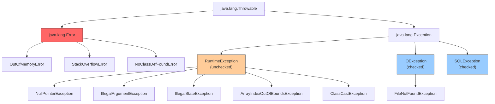
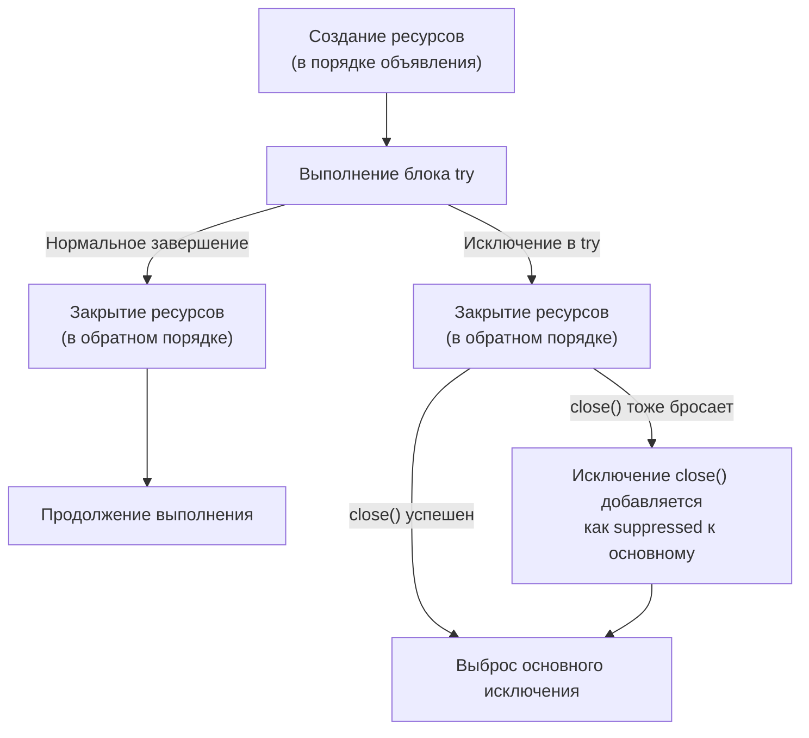
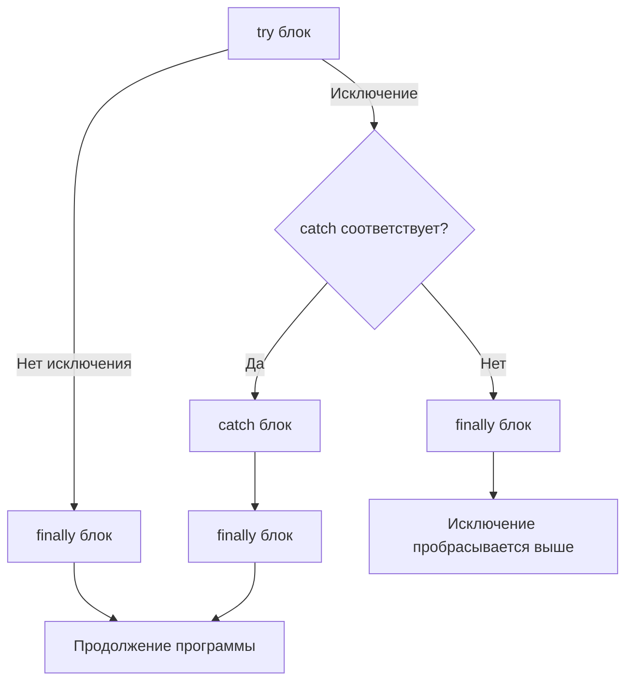

# Вопросы на собеседовании: `Java Exceptions`

Комплексное руководство по вопросам собеседования на тему `Java Exceptions` для `Senior Java Developer`. Включает иерархию исключений, механизмы обработки, `try-with-resources`, кастомные исключения, обработку в многопоточном коде, лямбдах и best practices.

## Полезные ссылки

### Официальная документация

- [Java Exceptions Tutorial](https://docs.oracle.com/javase/tutorial/essential/exceptions/) — официальный туториал Oracle
- [Throwable Hierarchy](https://docs.oracle.com/en/java/javase/17/docs/api/java.base/java/lang/Throwable.html) — Javadoc иерархии `Throwable`
- [Java Exceptions Interview Questions (Baeldung)](https://www.baeldung.com/java-exceptions-interview-questions) — вопросы с ответами
- [Exception Handling in Java (Baeldung)](https://www.baeldung.com/java-exceptions) — обзор обработки исключений
- [Java Try with Resources (Baeldung)](https://www.baeldung.com/java-try-with-resources) — `try-with-resources` в деталях
- [Create a Custom Exception in Java (Baeldung)](https://www.baeldung.com/java-new-custom-exception) — создание кастомных исключений

## Содержание

- [Полезные ссылки](#полезные-ссылки)
- [See also](#see-also)

**Основы и классификация исключений**
- [Q1. (!) Что такое `Exception` и какова иерархия исключений в Java?](#q1--что-такое-exception-и-какова-иерархия-исключений-в-java)
- [Q2. Какова цель ключевых слов `throw` и `throws`?](#q2-какова-цель-ключевых-слов-throw-и-throws)
- [Q3. Как обработать `Exception` с помощью `try-catch-finally`?](#q3-как-обработать-exception-с-помощью-try-catch-finally)
- [Q4. Как поймать несколько `Exceptions`?](#q4-как-поймать-несколько-exceptions)
- [Q5. (!) В чём разница между `Checked` и `Unchecked Exception`?](#q5--в-чём-разница-между-checked-и-unchecked-exception)
- [Q6. (!) В чём разница между `Exception` и `Error`?](#q6--в-чём-разница-между-exception-и-error)
- [Q7. Какой `Exception` будет выброшен при выполнении следующего кода?](#q7-какой-exception-будет-выброшен-при-выполнении-следующего-кода)

**Цепочка, стек и иерархия**
- [Q8. Что такое `Exception Chaining`?](#q8-что-такое-exception-chaining)
- [Q9. (!) Что такое `Stacktrace` и как она связана с `Exception`?](#q9--что-такое-stacktrace-и-как-она-связана-с-exception)
- [Q10. Зачем создавать подклассы `Exception`?](#q10-зачем-создавать-подклассы-exception)
- [Q11. Каковы преимущества механизма `Exceptions`?](#q11-каковы-преимущества-механизма-exceptions)

**`try-with-resources` и управление ресурсами**
- [Q12. (!) Что такое `try-with-resources` и как он работает?](#q12--что-такое-try-with-resources-и-как-он-работает)
- [Q13. (!) Что такое `Suppressed Exceptions` в `try-with-resources`?](#q13--что-такое-suppressed-exceptions-в-try-with-resources)
- [Q14. Что такое `addSuppressed()` и `getSuppressed()`?](#q14-что-такое-addsuppressed-и-getsuppressed)

**Исключения в лямбдах и переопределении методов**
- [Q15. (!) Как выбросить `Exception` внутри лямбда-выражения?](#q15--как-выбросить-exception-внутри-лямбда-выражения)
- [Q16. Как переопределить метод, выбрасывающий `Exception`?](#q16-как-переопределить-метод-выбрасывающий-exception)
- [Q17. Будет ли компилироваться следующий код?](#q17-будет-ли-компилироваться-следующий-код)
- [Q18. Есть ли способ выбросить checked `Exception` из метода без `throws`?](#q18-есть-ли-способ-выбросить-checked-exception-из-метода-без-throws)

**Проектирование и кастомные исключения**
- [Q19. (!) Когда создавать кастомное исключение и как его правильно оформить?](#q19--когда-создавать-кастомное-исключение-и-как-его-правильно-оформить)
- [Q20. Когда использовать `RuntimeException` vs checked `Exception`?](#q20-когда-использовать-runtimeexception-vs-checked-exception)
- [Q21. (!) Best practices при проектировании иерархии исключений](#q21--best-practices-при-проектировании-иерархии-исключений)

**Порядок выполнения и подводные камни**
- [Q22. Что такое `try-catch-finally` и каков порядок выполнения?](#q22-что-такое-try-catch-finally-и-каков-порядок-выполнения)
- [Q23. Что произойдёт, если в `finally` есть `return`?](#q23-что-произойдёт-если-в-finally-есть-return)
- [Q24. Как перехватить все исключения (`catch Throwable`)?](#q24-как-перехватить-все-исключения-catch-throwable)

**Многопоточность и исключения**
- [Q25. (!) Как обработать исключения в многопоточном коде?](#q25--как-обработать-исключения-в-многопоточном-коде)
- [Q26. Что такое `UncaughtExceptionHandler`?](#q26-что-такое-uncaughtexceptionhandler)

**Логирование, тестирование и диагностика**
- [Q27. (!) Как правильно логировать исключения?](#q27--как-правильно-логировать-исключения)
- [Q28. Как тестировать код, выбрасывающий исключения?](#q28-как-тестировать-код-выбрасывающий-исключения)
- [Q29. Что такое `getCause()` и `initCause()`?](#q29-что-такое-getcause-и-initcause)

**Специальные типы и продвинутые темы**
- [Q30. Что такое `AssertionError` и когда использовать `assert`?](#q30-что-такое-assertionerror-и-когда-использовать-assert)
- [Q31. Как обработать `OutOfMemoryError` и `StackOverflowError`?](#q31-как-обработать-outofmemoryerror-и-stackoverflowerror)
- [Q32. Что такое `fail-fast` и `fail-safe` в контексте исключений?](#q32-что-такое-fail-fast-и-fail-safe-в-контексте-исключений)
- [Q33. Как обрабатывать исключения в `Spring` (`@ExceptionHandler`, `@ControllerAdvice`)?](#q33-как-обрабатывать-исключения-в-spring-exceptionhandler-controlleradvice)
- [Q34. Антипаттерны обработки исключений](#q34-антипаттерны-обработки-исключений)

**Продвинутые темы**
- [Q35. Exception Chaining — initCause(), getCause(), addSuppressed()](#q35-exception-chaining--initcause-getcause-addsuppressed)
- [Q36. Multi-catch (Java 7) — синтаксис, ограничения](#q36-multi-catch-java-7--синтаксис-ограничения)
- [Q37. Try-with-resources с AutoCloseable — как работает, порядок закрытия](#q37-try-with-resources-с-autocloseable--как-работает-порядок-закрытия)
- [Q38. Custom Exceptions — best practices, serialVersionUID](#q38-custom-exceptions--best-practices-serializationuid)
- [Q39. Exception в lambda — как обрабатывать checked exceptions](#q39-exception-в-lambda--как-обрабатывать-checked-exceptions)
- [Q40. Логирование исключений — правила, что включать в message](#q40-логирование-исключений--правила-что-включать-в-message)
- [Q41. Performance исключений — стоимость fillInStackTrace, дорогие stack traces](#q41-performance-исключений--стоимость-fillinstacktrace-дорогие-stack-traces)
- [Q42. Global Exception Handling в Spring — @ControllerAdvice, ProblemDetail](#q42-global-exception-handling-в-spring--controlleradvice-problemdetail)

---

## Q1. (!) Что такое `Exception` и какова иерархия исключений в Java?

Исключение (`Exception`) — это ненормальное событие, возникающее во время выполнения программы и нарушающее нормальный поток инструкций. В Java все исключения являются объектами и наследуются от класса `Throwable`.

Иерархия исключений в Java:



Ключевые моменты:
- `Throwable` — корень иерархии; имеет два прямых наследника: `Error` и `Exception`
- `Error` — серьёзные проблемы JVM, от которых обычно невозможно восстановиться
- `Exception` → **checked** (проверяемые): компилятор требует обработки
- `RuntimeException` → **unchecked** (непроверяемые): обработка не обязательна

## Q2. Какова цель ключевых слов `throw` и `throws`?

**`throws`** — объявляет в сигнатуре метода, что он может выбросить исключение. Обязывает вызывающий код обрабатывать checked-исключения:

```java
public void readFile(String path) throws IOException {
    Files.readAllBytes(Path.of(path));
}
```

**`throw`** — выбрасывает конкретный объект исключения, прерывая нормальный поток выполнения:

```java
public void setAge(int age) {
    if (age < 0) {
        throw new IllegalArgumentException("Возраст не может быть отрицательным: " + age);
    }
    this.age = age;
}
```

| Аспект | `throw` | `throws` |
|--------|---------|----------|
| Где используется | В теле метода | В сигнатуре метода |
| Что принимает | Объект исключения | Класс(ы) исключений |
| Количество | Одно исключение | Несколько через запятую |
| Обязательность | Программист решает | Компилятор требует для checked |

## Q3. Как обработать `Exception` с помощью `try-catch-finally`?

Используя конструкцию `try-catch-finally`:

```java
try {
    // «Защищённый» код, который может выбросить исключение
    String content = Files.readString(Path.of("config.yml"));
} catch (NoSuchFileException ex) {
    // Обработка конкретного типа
    log.warn("Файл конфигурации не найден, используем значения по умолчанию", ex);
} catch (IOException ex) {
    // Обработка более общего типа
    log.error("Ошибка чтения конфигурации", ex);
} finally {
    // Выполняется ВСЕГДА — и при нормальном выходе, и при исключении
    log.info("Попытка чтения конфигурации завершена");
}
```

Правила:
- Блок `try` обязателен; `catch` и `finally` — хотя бы один из двух
- Блоки `catch` проверяются последовательно — **дочерний тип должен стоять раньше родительского**, иначе ошибка компиляции
- `finally` выполняется даже при `return` внутри `try` или `catch`

## Q4. Как поймать несколько `Exceptions`?

Три способа:

**1. Несколько блоков `catch`** (порядок от более специфичного к общему):

```java
try {
    parseAndSave(data);
} catch (JsonParseException ex) {
    log.error("Невалидный JSON", ex);
} catch (IOException ex) {
    log.error("Ошибка ввода-вывода", ex);
}
```

**2. `Multi-catch` блок** (`Java 7+`) — один блок для нескольких несвязанных типов:

```java
try {
    parseAndSave(data);
} catch (JsonParseException | SQLException ex) {
    // ex неявно final; нельзя переприсвоить
    log.error("Ошибка обработки данных", ex);
}
```

**3. Общий `catch`** (антипаттерн — использовать осторожно):

```java
try {
    riskyOperation();
} catch (Exception ex) {
    // Перехватывает ВСЁ, включая непредвиденные RuntimeException
    log.error("Неожиданная ошибка", ex);
}
```

В `multi-catch` типы не могут быть связаны наследованием — `catch (IOException | FileNotFoundException ex)` не скомпилируется, т.к. `FileNotFoundException` — подкласс `IOException`.

## Q5. (!) В чём разница между `Checked` и `Unchecked Exception`?

| Критерий | `Checked Exception` | `Unchecked Exception` |
|----------|--------------------|-----------------------|
| Наследование | `Exception` (кроме `RuntimeException`) | `RuntimeException` и его подклассы |
| Проверка компилятором | Да — обязательно `try-catch` или `throws` | Нет — обработка опциональна |
| Типичная причина | Внешние условия (I/O, сеть, БД) | Ошибки программирования (логика, валидация) |
| Примеры | `IOException`, `SQLException`, `ClassNotFoundException` | `NullPointerException`, `IllegalArgumentException`, `ArrayIndexOutOfBoundsException` |
| Восстановимость | Предполагается, что можно восстановиться | Обычно указывает на баг в коде |

```java
// Checked — компилятор заставляет обрабатывать
public void readConfig() throws IOException {  // ОБЯЗАТЕЛЬНО
    Files.readString(Path.of("app.conf"));
}

// Unchecked — компилятор не требует обработки
public void process(String value) {
    Objects.requireNonNull(value); // бросает NullPointerException
}
```

На собеседовании важно упомянуть дискуссию о checked exceptions: многие фреймворки (включая `Spring`) предпочитают unchecked-исключения для снижения boilerplate-кода. В `Kotlin`, например, checked exceptions вообще отсутствуют (подробнее в [вопросах по Kotlin Exceptions](../kotlin/kotlin-exceptions-interview.md)).

## Q6. (!) В чём разница между `Exception` и `Error`?

| Критерий | `Exception` | `Error` |
|----------|------------|---------|
| Наследование | `Throwable` → `Exception` | `Throwable` → `Error` |
| Восстановимость | Можно и нужно обрабатывать | Обычно невосстановимые |
| Источник | Логика приложения, внешние системы | JVM, системные ресурсы |
| Обработка | Рекомендуется | Не рекомендуется (кроме логирования) |

Основные `Error`:
- **`OutOfMemoryError`** — JVM не может выделить память, `GC` не помогает
- **`StackOverflowError`** — переполнение стека (глубокая рекурсия)
- **`NoClassDefFoundError`** — класс был доступен при компиляции, но не найден в runtime
- **`ExceptionInInitializerError`** — исключение в статическом инициализаторе
- **`UnsupportedClassVersionError`** — `.class` файл скомпилирован более новой версией Java

```java
// Пример StackOverflowError — бесконечная рекурсия
public int factorial(int n) {
    return n * factorial(n - 1); // нет базового условия!
}
```

## Q7. Какой `Exception` будет выброшен при выполнении следующего кода?

```java
Integer[][] ints = {{1, 2, 3}, {null}, {7, 8, 9}};
System.out.println("value = " + ints[1][1].intValue());
```

Будет выброшен `ArrayIndexOutOfBoundsException`. Второй вложенный массив `{null}` содержит только один элемент (с индексом 0), а мы обращаемся к индексу 1 (`ints[1][1]`), который выходит за границы массива.

Обратите внимание: если бы обращение было к `ints[1][0].intValue()`, то был бы `NullPointerException`, т.к. `ints[1][0]` равно `null`.

## Q8. Что такое `Exception Chaining`?

Цепочка исключений (`Exception Chaining`) — это механизм оборачивания одного исключения в другое для сохранения полной истории ошибки. Оригинальное исключение передаётся как `cause`:

```java
public Order processOrder(OrderRequest request) {
    try {
        return repository.save(mapToOrder(request));
    } catch (DataAccessException ex) {
        throw new OrderProcessingException(
            "Не удалось сохранить заказ: " + request.getId(), ex  // ex — cause
        );
    }
}
```

Преимущества:
- Сохраняется полный стек вызовов от первоначальной ошибки
- Верхний уровень видит доменное исключение, а не инфраструктурное
- Логгер выводит всю цепочку: основное → cause → cause of cause

Доступ к причине: `exception.getCause()` возвращает вложенное исключение.

## Q9. (!) Что такое `Stacktrace` и как она связана с `Exception`?

`Stack trace` — это снимок стека вызовов в момент создания исключения. Показывает цепочку вызовов методов от точки возникновения до корня потока:

```
com.app.OrderService.processOrder(OrderService.java:45)
com.app.OrderController.createOrder(OrderController.java:23)
...
java.lang.Thread.run(Thread.java:829)
```

Ключевые методы:
- `exception.getStackTrace()` — возвращает `StackTraceElement[]`
- `exception.printStackTrace()` — выводит в `System.err` (не использовать в production!)
- `exception.setStackTrace(StackTraceElement[])` — позволяет изменять стек (редко используется)

Полезные советы:
- Стек формируется при **создании** исключения (`new`), а не при `throw`
- Создание стека — **дорогая операция**; для исключений, которые бросаются часто, можно переопределить `fillInStackTrace()` и вернуть `this` для оптимизации
- Используйте `log.error("message", ex)` вместо `ex.printStackTrace()` — подробнее в [вопросах по логированию](../../logging/logging-interview.md)

## Q10. Зачем создавать подклассы `Exception`?

Создание подклассов (subclassing) нужно, когда:
1. Ни одно стандартное исключение не описывает ситуацию семантически точно
2. Нужно добавить дополнительный контекст (поля с кодами ошибок, ID ресурса и т.д.)
3. Нужна доменная иерархия для группировки ошибок

```java
public class PaymentException extends RuntimeException {
    private final String paymentId;
    private final ErrorCode errorCode;

    public PaymentException(String message, String paymentId, ErrorCode errorCode) {
        super(message);
        this.paymentId = paymentId;
        this.errorCode = errorCode;
    }

    public PaymentException(String message, String paymentId, ErrorCode errorCode, Throwable cause) {
        super(message, cause);
        this.paymentId = paymentId;
        this.errorCode = errorCode;
    }
    // getters
}
```

Правило выбора базового класса: если вызывающий код **может и должен** восстановиться — наследовать от `Exception` (checked). Если это ошибка программиста или невосстановимая ситуация — от `RuntimeException` (unchecked).

## Q11. Каковы преимущества механизма `Exceptions`?

1. **Разделение логики и обработки ошибок** — основной код не засорён проверками возвращаемых кодов
2. **Распространение по стеку вызовов** — исключение автоматически поднимается до обработчика, не нужно передавать вручную
3. **Группировка по типам** — можно ловить `IOException` для всех I/O-ошибок, а не каждую по отдельности
4. **Обязательность обработки** — для checked-исключений компилятор гарантирует, что ошибка не проигнорирована
5. **Информативность** — объект исключения несёт message, cause, stack trace

В отличие от подхода с кодами ошибок (как в C), механизм исключений Java предотвращает ситуацию, когда ошибка «тихо проглатывается».

## Q12. (!) Что такое `try-with-resources` и как он работает?

`try-with-resources` (`Java 7+`) — конструкция, которая автоматически закрывает ресурсы, реализующие интерфейс `AutoCloseable`, после выхода из блока `try`:

```java
// Java 7+ — ресурс объявляется в try(...)
try (var reader = new BufferedReader(new FileReader("data.csv"));
     var writer = new BufferedWriter(new FileWriter("output.csv"))) {

    String line;
    while ((line = reader.readLine()) != null) {
        writer.write(transform(line));
        writer.newLine();
    }
} // reader и writer закрываются автоматически, в обратном порядке
```

```java
// Java 9+ — можно использовать effectively final переменные
BufferedReader reader = new BufferedReader(new FileReader("data.csv"));
try (reader) {  // reader — effectively final
    return reader.readLine();
}
```

Порядок работы:



Преимущества перед ручным `finally`:
- Нет boilerplate-кода проверки на `null` и вызова `close()`
- Гарантия закрытия даже при исключении
- Suppressed exceptions не теряются (в отличие от ручного `finally`, где исключение в `close()` затирает основное)

## Q13. (!) Что такое `Suppressed Exceptions` в `try-with-resources`?

Когда в блоке `try` возникает исключение И при закрытии ресурса (`close()`) тоже возникает исключение — исключение из `close()` не теряется, а добавляется к основному как **suppressed**:

```java
public class FaultyResource implements AutoCloseable {
    public void doWork() {
        throw new RuntimeException("Ошибка в doWork");
    }

    @Override
    public void close() {
        throw new RuntimeException("Ошибка в close");
    }
}

try (var resource = new FaultyResource()) {
    resource.doWork();
}
// Результат:
// Exception: "Ошибка в doWork"
//   Suppressed: "Ошибка в close"
```

Доступ к suppressed:

```java
try {
    // ...
} catch (RuntimeException ex) {
    log.error("Основная ошибка: {}", ex.getMessage());
    for (Throwable suppressed : ex.getSuppressed()) {
        log.error("  Suppressed: {}", suppressed.getMessage());
    }
}
```

Без `try-with-resources` (ручной `finally`) исключение в `close()` **затирает** исключение из `try` — suppressed-механизм решает эту проблему.

## Q14. Что такое `addSuppressed()` и `getSuppressed()`?

Методы класса `Throwable` для работы с подавленными исключениями:

- `addSuppressed(Throwable)` — добавляет подавленное исключение
- `getSuppressed()` — возвращает массив `Throwable[]` подавленных исключений

JVM использует их автоматически в `try-with-resources`. В пользовательском коде полезны при освобождении нескольких ресурсов вручную:

```java
public void closeAll(List<AutoCloseable> resources) {
    Throwable primary = null;
    for (AutoCloseable resource : resources) {
        try {
            resource.close();
        } catch (Exception ex) {
            if (primary == null) {
                primary = ex;
            } else {
                primary.addSuppressed(ex); // не теряем ошибки при close
            }
        }
    }
    if (primary != null) {
        throw new RuntimeException("Ошибка при закрытии ресурсов", primary);
    }
}
```

## Q15. (!) Как выбросить `Exception` внутри лямбда-выражения?

Стандартные функциональные интерфейсы (`Function`, `Consumer`, `Supplier`) **не объявляют checked exceptions** в сигнатуре. Поэтому:

**Unchecked — работают напрямую:**

```java
List<Integer> numbers = List.of(3, 9, 7, 0, 10);
numbers.forEach(i -> {
    if (i == 0) {
        throw new IllegalArgumentException("Ноль недопустим");
    }
    System.out.println(100 / i);
});
```

**Checked — нужен обходной путь.** Три подхода:

1. **Обернуть в unchecked внутри лямбды:**
```java
files.forEach(path -> {
    try {
        Files.readString(path);
    } catch (IOException e) {
        throw new UncheckedIOException(e); // стандартный враппер
    }
});
```

2. **Создать свой функциональный интерфейс с `throws`:**
```java
@FunctionalInterface
public interface CheckedConsumer<T> {
    void accept(T t) throws Exception;
}

public static <T> Consumer<T> unchecked(CheckedConsumer<T> consumer) {
    return t -> {
        try {
            consumer.accept(t);
        } catch (Exception e) {
            throw new RuntimeException(e);
        }
    };
}

// Использование
files.forEach(unchecked(path -> Files.readString(path)));
```

3. **Sneaky throws** (трюк со стиранием типов — см. Q18)

Подробнее о лямбдах — в [вопросах по Java 8](java-8-interview.md).

## Q16. Как переопределить метод, выбрасывающий `Exception`?

Правила контракта `throws` при переопределении (контравариантность по исключениям):

| Родительский метод | Дочерний метод может |
|---|---|
| Нет `throws` | Только unchecked (любые) |
| `throws IOException` | `throws FileNotFoundException` (уже или равно), не `throws Exception` (шире) |
| `throws RuntimeException` | Любые unchecked |

```java
class Parent {
    void process() throws IOException { }
}

class Child extends Parent {
    @Override
    void process() throws FileNotFoundException { }  // OK: подтип IOException
    // void process() throws Exception { }           // ОШИБКА: шире чем IOException
    // void process() throws SQLException { }        // ОШИБКА: другой checked
}
```

Причина: вызывающий код работает с типом `Parent` и обрабатывает только `IOException`. Если бы `Child` мог бросать `SQLException`, обработчик бы его не поймал.

Это связано с принципом подстановки Лисков (LSP) — подробнее в [вопросах по Java OOP](java-oop-interview.md).

## Q17. Будет ли компилироваться следующий код?

```java
void doSomething() {
    throw new RuntimeException(new Exception("Chained Exception"));
}
```

**Да**, код компилируется. `RuntimeException` — unchecked, поэтому не требует `throws` в сигнатуре. Внутренний `Exception` передаётся как `cause` через конструктор `RuntimeException(Throwable cause)` — это обычная цепочка исключений. Компилятор проверяет только тип **выбрасываемого** исключения, а не его причины.

## Q18. Есть ли способ выбросить checked `Exception` из метода без `throws`?

Да, через трюк с дженериками и стиранием типов (**sneaky throw**):

```java
@SuppressWarnings("unchecked")
public static <T extends Throwable> void sneakyThrow(Throwable ex) throws T {
    throw (T) ex;  // компилятор выводит T = RuntimeException
}

public void methodWithoutThrows() {
    sneakyThrow(new IOException("Checked, но без throws!"));
    // Компилятор считает, что бросается RuntimeException
    // В runtime реально летит IOException
}
```

Этот подход используется в библиотеках (`Lombok @SneakyThrows`, `Vavr`). Однако это **антипаттерн** в бизнес-коде — вызывающий код не ожидает checked exception и не обрабатывает его.

## Q19. (!) Когда создавать кастомное исключение и как его правильно оформить?

**Когда создавать:**
- Нужна доменная семантика (например, `OrderNotFoundException`, `InsufficientFundsException`)
- Нужно передать дополнительный контекст (коды ошибок, ID ресурсов)
- Стандартные исключения недостаточно точно описывают ситуацию

**Правила оформления:**

```java
public class OrderNotFoundException extends RuntimeException {

    private final String orderId;

    // Минимум 2 конструктора: с message и с message + cause
    public OrderNotFoundException(String orderId) {
        super("Заказ не найден: " + orderId);
        this.orderId = orderId;
    }

    public OrderNotFoundException(String orderId, Throwable cause) {
        super("Заказ не найден: " + orderId, cause);
        this.orderId = orderId;
    }

    public String getOrderId() {
        return orderId;
    }
}
```

**Best practices:**
- Суффикс `Exception` в имени класса
- Наследовать от наиболее подходящего типа, а не просто от `Exception`
- Обязательно конструктор с `Throwable cause` для цепочки
- Сделать поля `final` и класс `Serializable` (если может сериализоваться)
- Не создавать слишком глубокую иерархию — обычно достаточно 1-2 уровней
- Переиспользовать стандартные исключения (`IllegalArgumentException`, `IllegalStateException`) где уместно

## Q20. Когда использовать `RuntimeException` vs checked `Exception`?

| Критерий | Checked `Exception` | `RuntimeException` |
|----------|---------------------|--------------------|
| Когда | Вызывающий может и должен восстановиться | Ошибка программиста или невосстановимая ситуация |
| Примеры | `IOException`, `SQLException` | `NullPointerException`, `IllegalArgumentException` |
| Тренд индустрии | Реже в новых API | Чаще — `Spring`, `Hibernate`, `Kotlin` |
| `throws` в сигнатуре | Обязательно | Нет |

Современная практика (особенно в `Spring`-экосистеме): почти все доменные исключения — **unchecked**. Checked используются только для ситуаций, где вызывающий код **обязан** принять решение (повторить, использовать fallback и т.д.).

## Q21. (!) Best practices при проектировании иерархии исключений

1. **Наследовать от подходящего базового типа** — не от `Exception` напрямую, если есть более подходящий
2. **Включать контекст** — сообщение, cause, дополнительные поля
3. **Документировать `@throws`** в Javadoc
4. **Переиспользовать стандартные** где уместно:
   - `IllegalArgumentException` — невалидный аргумент
   - `IllegalStateException` — объект в неправильном состоянии
   - `UnsupportedOperationException` — операция не поддерживается
   - `NullPointerException` — аргумент `null` (с Java 14 — информативное сообщение)
5. **Не создавать исключение на каждую ошибку** — группировать по смыслу
6. **Именование**: `<Причина>Exception` — `OrderNotFoundException`, `PaymentDeclinedException`

```java
// Хорошая иерархия для платёжной системы
public abstract class PaymentException extends RuntimeException { ... }
public class PaymentDeclinedException extends PaymentException { ... }
public class PaymentTimeoutException extends PaymentException { ... }
public class InsufficientFundsException extends PaymentException { ... }

// Вызывающий код может ловить как конкретные, так и общий PaymentException
try {
    paymentService.charge(order);
} catch (InsufficientFundsException ex) {
    notifyUser("Недостаточно средств");
} catch (PaymentException ex) {
    retryLater(order);
}
```

## Q22. Что такое `try-catch-finally` и каков порядок выполнения?

Порядок выполнения:



```java
public String readFirstLine(String path) {
    BufferedReader reader = null;
    try {
        reader = new BufferedReader(new FileReader(path));
        return reader.readLine(); // (1) return здесь
    } catch (IOException ex) {
        log.error("Ошибка чтения", ex);
        return "default";          // (2) или return здесь
    } finally {
        // (3) Выполнится ВСЕГДА — даже после return!
        if (reader != null) {
            try { reader.close(); } catch (IOException ignored) {}
        }
    }
}
```

Начиная с `Java 7`, предпочтительнее использовать `try-with-resources` (см. Q12).

## Q23. Что произойдёт, если в `finally` есть `return`?

`return` в блоке `finally` **перезаписывает** `return` из `try` или `catch` — это известный антипаттерн:

```java
public int getValue() {
    try {
        return 1;
    } finally {
        return 2; // ВСЕГДА вернёт 2!
    }
}
```

Ещё хуже — `return` в `finally` **подавляет исключения**:

```java
public int getValue() {
    try {
        throw new RuntimeException("Ошибка!");
    } finally {
        return 0; // Исключение ПОТЕРЯНО! Метод тихо вернёт 0
    }
}
```

Это одна из причин, почему **никогда не следует использовать `return` в `finally`**. IDE и статические анализаторы предупреждают об этом.

## Q24. Как перехватить все исключения (`catch Throwable`)?

`catch (Throwable t)` перехватывает и `Exception`, и `Error`:

```java
try {
    riskyOperation();
} catch (Throwable t) {
    log.error("Критическая ошибка", t);
    // Попытка graceful shutdown
}
```

**Когда допустимо ловить `Throwable`:**
- В верхнеуровневом обработчике потока (логирование перед завершением)
- В фреймворках (контейнер сервлетов, `Spring`)
- В `UncaughtExceptionHandler`

**Когда НЕ надо:**
- В обычном бизнес-коде — ловить конкретные типы
- Нельзя «восстановиться» после `OutOfMemoryError` или `StackOverflowError`

Правило: в бизнес-логике ловите `Exception` или конкретные подтипы; `Throwable` — только на границах системы.

## Q25. (!) Как обработать исключения в многопоточном коде?

Исключение в потоке **не пробрасывается** в создавший его поток — каждый поток имеет свой стек. Способы обработки:

**1. `Thread.setUncaughtExceptionHandler`** — для «сырых» потоков:

```java
Thread thread = new Thread(() -> {
    throw new RuntimeException("Ошибка в потоке");
});
thread.setUncaughtExceptionHandler((t, ex) ->
    log.error("Необработанное исключение в потоке {}: {}", t.getName(), ex.getMessage(), ex)
);
thread.start();
```

**2. `Future.get()`** — через `ExecutorService`:

```java
ExecutorService executor = Executors.newSingleThreadExecutor();
Future<String> future = executor.submit(() -> {
    throw new IOException("Ошибка I/O");
});

try {
    String result = future.get(); // блокирующий вызов
} catch (ExecutionException ex) {
    Throwable cause = ex.getCause(); // IOException — оригинальное исключение
    log.error("Задача завершилась с ошибкой", cause);
}
```

**3. `CompletableFuture`** — реактивная обработка:

```java
CompletableFuture.supplyAsync(() -> riskyOperation())
    .exceptionally(ex -> {
        log.error("Ошибка: {}", ex.getMessage());
        return fallbackValue;
    })
    .thenAccept(result -> process(result));
```

Подробнее — в [вопросах по Java Concurrency](java-concurrency-interview.md).

## Q26. Что такое `UncaughtExceptionHandler`?

Интерфейс `Thread.UncaughtExceptionHandler` вызывается, когда поток завершается из-за необработанного исключения:

```java
// Глобальный обработчик для всех потоков
Thread.setDefaultUncaughtExceptionHandler((thread, ex) -> {
    log.error("FATAL: Необработанное исключение в потоке '{}': {}",
        thread.getName(), ex.getMessage(), ex);
    // Можно отправить алерт, записать метрику и т.д.
});
```

Порядок поиска обработчика JVM:
1. Обработчик конкретного потока (`thread.setUncaughtExceptionHandler`)
2. Обработчик `ThreadGroup`
3. Дефолтный обработчик (`Thread.setDefaultUncaughtExceptionHandler`)
4. Если не найден — стек-трейс в `System.err`

## Q27. (!) Как правильно логировать исключения?

```java
// ПРАВИЛЬНО — передаём исключение как последний аргумент
log.error("Ошибка обработки заказа orderId={}", orderId, exception);

// НЕПРАВИЛЬНО — теряется stack trace!
log.error("Ошибка: " + exception.getMessage());

// НЕПРАВИЛЬНО — конкатенация строк (performance)
log.error("Ошибка: " + exception);

// НЕПРАВИЛЬНО — printStackTrace() вместо логгера
exception.printStackTrace(); // идёт в System.err, не в лог-файл
```

| Уровень | Когда использовать |
|---------|-------------------|
| `ERROR` | Неожиданные ошибки, требующие внимания |
| `WARN` | Ожидаемые ошибки: retry, fallback |
| `DEBUG` | Бизнес-валидация, информационные |

**Антипаттерны:**
- «Проглотить» исключение: пустой `catch` без логирования
- Логировать И пробрасывать — двойное логирование одной ошибки
- Логировать только `getMessage()` без стек-трейса

Подробнее — в [вопросах по логированию](../../logging/logging-interview.md).

## Q28. Как тестировать код, выбрасывающий исключения?

**JUnit 5 — `assertThrows`:**

```java
@Test
void shouldThrowWhenOrderNotFound() {
    var exception = assertThrows(OrderNotFoundException.class,
        () -> orderService.findById("non-existent-id")
    );

    assertEquals("non-existent-id", exception.getOrderId());
    assertThat(exception.getMessage()).contains("не найден");
}
```

**AssertJ — более выразительный синтаксис:**

```java
@Test
void shouldThrowWhenInvalidInput() {
    assertThatThrownBy(() -> service.process(null))
        .isInstanceOf(IllegalArgumentException.class)
        .hasMessageContaining("не может быть null")
        .hasNoCause();
}

// Или через catchThrowable
Throwable thrown = catchThrowable(() -> service.process(null));
assertThat(thrown).isInstanceOf(IllegalArgumentException.class);
```

**Проверка, что исключение НЕ выбрасывается:**

```java
@Test
void shouldNotThrow() {
    assertDoesNotThrow(() -> service.process(validInput));
}
```

Подробнее о тестировании — в [вопросах по модульному тестированию](../../testing/unit-testing-interview.md).

## Q29. Что такое `getCause()` и `initCause()`?

Методы `Throwable` для работы с цепочкой исключений:

```java
// getCause() — получить причину
try {
    processOrder();
} catch (OrderProcessingException ex) {
    Throwable root = ex.getCause();          // DataAccessException
    Throwable deeper = root.getCause();      // SQLException
    log.error("Корневая причина: {}", deeper.getMessage());
}

// initCause() — установить причину (один раз!)
IOException ioEx = new IOException("Ошибка чтения");
ioEx.initCause(new DiskFailureException("Диск повреждён"));
// Повторный вызов initCause() бросит IllegalStateException
```

Предпочтительнее использовать конструктор с `Throwable cause` вместо `initCause()` — это более идиоматично. Метод `initCause()` существует для обратной совместимости с исключениями, у которых нет конструктора с `cause`.

## Q30. Что такое `AssertionError` и когда использовать `assert`?

`AssertionError` — наследник `Error`, выбрасывается при нарушении assert-условия:

```java
public void processAge(int age) {
    assert age >= 0 : "Возраст не может быть отрицательным: " + age;
    // ...
}
```

Ключевые моменты:
- По умолчанию assertions **отключены** в JVM; включаются флагом `-ea` (`-enableassertions`)
- Используются для **инвариантов** и **внутренних допущений** (не для проверки входных данных!)
- В тестах используется `assert` из JUnit/AssertJ, а не `assert` из языка
- **Не заменяют** валидацию аргументов — для этого `Objects.requireNonNull()`, `IllegalArgumentException`

```java
// НЕ использовать assert для проверки аргументов публичного API!
public void setName(String name) {
    // НЕПРАВИЛЬНО: assert name != null;
    // ПРАВИЛЬНО:
    Objects.requireNonNull(name, "name must not be null");
}
```

## Q31. Как обработать `OutOfMemoryError` и `StackOverflowError`?

Оба наследуют `Error` и обычно сигнализируют о серьёзных проблемах, не решаемых в runtime.

**`OutOfMemoryError`:**
- Не ловить в бизнес-коде — после OOM состояние JVM непредсказуемо
- Диагностика: `-XX:+HeapDumpOnOutOfMemoryError` для автоматического heap dump
- Профилактика: мониторинг памяти, поиск утечек (Eclipse MAT, VisualVM), увеличение `-Xmx`
- Подробнее — в [вопросах по управлению памятью](../../performance/memory-management-interview.md)

**`StackOverflowError`:**
- Причина: слишком глубокая рекурсия (обычно бесконечная)
- Исправление: добавить базовый случай рекурсии, заменить на итеративный алгоритм
- Увеличить стек потока: `-Xss` (временная мера)

```java
// Безопасная рекурсия с базовым случаем
public int factorial(int n) {
    if (n < 0) throw new IllegalArgumentException("n < 0");
    if (n <= 1) return 1;        // базовый случай!
    return n * factorial(n - 1);
}
```

Ловить `Error` допустимо только для логирования и graceful shutdown.

## Q32. Что такое `fail-fast` и `fail-safe` в контексте исключений?

| Критерий | `Fail-fast` | `Fail-safe` |
|----------|------------|-------------|
| Поведение | При ошибке немедленно бросить исключение | Продолжить работу, избежав сбоя |
| Пример в коллекциях | `ArrayList` iterator → `ConcurrentModificationException` | `CopyOnWriteArrayList` — работает с копией |
| Пример в API | `Objects.requireNonNull()` в начале метода | Возврат default-значения или `Optional.empty()` |
| Когда использовать | Баги должны обнаруживаться рано | Доступность важнее строгой корректности |

```java
// Fail-fast: валидация аргументов в начале метода
public void createUser(String email, String name) {
    Objects.requireNonNull(email, "email");
    Objects.requireNonNull(name, "name");
    if (!email.contains("@")) {
        throw new IllegalArgumentException("Невалидный email: " + email);
    }
    // ... основная логика только после проверок
}

// Fail-fast в коллекциях
List<String> list = new ArrayList<>(List.of("a", "b", "c"));
for (String s : list) {
    list.remove(s); // ConcurrentModificationException!
}
```

Рекомендация: в бизнес-логике — **fail-fast** (обнаруживать баги рано); на границах системы — **fail-safe** с логированием (не ронять весь сервис из-за одного запроса).

## Q33. Как обрабатывать исключения в `Spring` (`@ExceptionHandler`, `@ControllerAdvice`)?

`Spring MVC` предоставляет централизованный механизм обработки исключений для REST API:

```java
@RestControllerAdvice
public class GlobalExceptionHandler {

    @ExceptionHandler(OrderNotFoundException.class)
    @ResponseStatus(HttpStatus.NOT_FOUND)
    public ErrorResponse handleNotFound(OrderNotFoundException ex) {
        return new ErrorResponse(
            HttpStatus.NOT_FOUND.value(),
            ex.getMessage(),
            LocalDateTime.now()
        );
    }

    @ExceptionHandler(IllegalArgumentException.class)
    @ResponseStatus(HttpStatus.BAD_REQUEST)
    public ErrorResponse handleBadRequest(IllegalArgumentException ex) {
        return new ErrorResponse(
            HttpStatus.BAD_REQUEST.value(),
            ex.getMessage(),
            LocalDateTime.now()
        );
    }

    @ExceptionHandler(Exception.class)
    @ResponseStatus(HttpStatus.INTERNAL_SERVER_ERROR)
    public ErrorResponse handleGeneral(Exception ex) {
        log.error("Необработанная ошибка", ex);
        return new ErrorResponse(
            HttpStatus.INTERNAL_SERVER_ERROR.value(),
            "Внутренняя ошибка сервера",  // Не раскрывать детали клиенту!
            LocalDateTime.now()
        );
    }
}

public record ErrorResponse(int status, String message, LocalDateTime timestamp) {}
```

Приоритет поиска обработчика:
1. `@ExceptionHandler` в самом контроллере
2. `@ExceptionHandler` в `@ControllerAdvice` / `@RestControllerAdvice`
3. Дефолтный обработчик Spring

Подробнее — в [вопросах по Spring Boot](../../frameworks/spring/spring-boot-interview.md) и [Spring MVC](../../frameworks/spring/spring-mvc-interview.md).

## Q34. Антипаттерны обработки исключений

Наиболее частые ошибки при работе с исключениями:

**1. Пустой `catch` (swallowing exceptions):**
```java
// ПЛОХО — ошибка полностью потеряна
try {
    riskyOperation();
} catch (Exception e) {
    // ничего
}
```

**2. `catch (Exception e)` везде:**
```java
// ПЛОХО — ловит всё подряд, включая NullPointerException
try {
    process();
} catch (Exception e) {
    return defaultValue;
}
```

**3. Логирование + пробрасывание (double logging):**
```java
// ПЛОХО — одна ошибка залогируется дважды
try {
    process();
} catch (IOException e) {
    log.error("Ошибка", e);
    throw e;  // Обработчик выше тоже залогирует
}
```

**4. Использование исключений для flow control:**
```java
// ПЛОХО — исключения дорогие, не использовать для обычной логики
try {
    int value = Integer.parseInt(input);
    return value;
} catch (NumberFormatException e) {
    return 0; // "нормальный" сценарий через исключение
}
```

**5. `throw new Exception()` (потеря типизации):**
```java
// ПЛОХО — вызывающий код не знает, что именно произошло
throw new Exception("Что-то пошло не так");
// ХОРОШО — конкретный тип
throw new OrderNotFoundException(orderId);
```

Следование этим правилам — признак зрелого разработчика, что ценится на собеседовании.

---

## Q35. Exception Chaining — initCause(), getCause(), addSuppressed()

**Exception Chaining** — механизм сохранения первопричины исключения при оборачивании в другое.

**initCause() и getCause():**
```java
// При оборачивании всегда передавать original exception как cause
public User loadUser(long id) {
    try {
        return userRepository.findById(id);
    } catch (SQLException e) {
        // ХОРОШО — cause сохранён
        throw new UserLoadException("Failed to load user " + id, e);
        // Эквивалентно:
        // UserLoadException ex = new UserLoadException("...");
        // ex.initCause(e); throw ex;
    }
}

// Доступ к причине
try {
    loadUser(42L);
} catch (UserLoadException e) {
    Throwable cause = e.getCause();          // SQLException
    Throwable rootCause = ExceptionUtils.getRootCause(e);  // Apache Commons — идёт по цепочке
    log.error("Root cause: {}", rootCause.getMessage());
}
```

**addSuppressed() / getSuppressed():**
```java
// Исключение в блоке finally не должно подавлять основное
Exception primaryException = null;
try {
    connection.execute(sql);
} catch (Exception e) {
    primaryException = e;
    throw e;
} finally {
    try {
        connection.close();
    } catch (Exception closeException) {
        if (primaryException != null) {
            primaryException.addSuppressed(closeException);  // не теряем info
        }
        // Иначе просто пробрасываем closeException
    }
}
// try-with-resources делает это автоматически!

// Получить suppressed
for (Throwable suppressed : exception.getSuppressed()) {
    log.warn("Suppressed: {}", suppressed.getMessage());
}
```

**Правило:** никогда не создавать исключение без передачи cause — `throw new ServiceException("error")` без `e` теряет стектрейс первопричины.

---

## Q36. Multi-catch (Java 7) — синтаксис, ограничения

**Multi-catch** — перехват нескольких типов исключений в одном `catch`:

```java
// До Java 7 — дублирование
try {
    processRequest(request);
} catch (IOException e) {
    log.error("IO error", e);
    throw new ServiceException(e);
} catch (ParseException e) {
    log.error("Parse error", e);
    throw new ServiceException(e);
}

// Java 7+ — multi-catch (pipe separator)
try {
    processRequest(request);
} catch (IOException | ParseException e) {
    // e имеет тип: наиболее специфичный общий предок (Throwable, если нет общего)
    log.error("Processing error", e);
    throw new ServiceException(e);
}
```

**Ограничения multi-catch:**
```java
// 1. Нельзя поймать связанные иерархически типы
try { ... }
catch (Exception | IOException e) { }  // ОШИБКА КОМПИЛЯЦИИ: IOException extends Exception

// 2. Переменная e в multi-catch — effectively final (нельзя переприсвоить)
catch (IOException | ParseException e) {
    e = new IOException("other");  // ОШИБКА КОМПИЛЯЦИИ
}

// 3. Если нужна разная обработка — отдельные блоки catch
catch (IOException e) { handleIo(e); }
catch (ParseException e) { handleParse(e); }
```

**Практическое применение:**
```java
// Упрощение catch аналогичных «технических» исключений
catch (JdbcException | DataAccessException e) {
    throw new RepositoryException("DB error", e);
}
```

---

## Q37. Try-with-resources с AutoCloseable — как работает, порядок закрытия

**try-with-resources** компилируется в код с finally и addSuppressed. Ресурсы закрываются в **обратном порядке** объявления.

```java
// Несколько ресурсов — закрытие в обратном порядке (LIFO)
try (
    Connection conn = dataSource.getConnection();      // открыт первым
    PreparedStatement stmt = conn.prepareStatement(sql);  // открыт вторым
    ResultSet rs = stmt.executeQuery()                 // открыт третьим
) {
    while (rs.next()) {
        process(rs.getString("name"));
    }
}
// Закрытие: rs.close() → stmt.close() → conn.close()
// Каждый close() вызывается даже если предыдущий бросил исключение
```

**Кастомный AutoCloseable:**
```java
public class MeasuredTimer implements AutoCloseable {
    private final String name;
    private final long start = System.nanoTime();

    public MeasuredTimer(String name) { this.name = name; }

    @Override
    public void close() {
        long elapsed = System.nanoTime() - start;
        log.info("{} took {}ms", name, elapsed / 1_000_000);
    }
}

// Использование
try (MeasuredTimer t = new MeasuredTimer("processOrder")) {
    orderService.process(order);
}
// После выполнения блока — автоматически логирует время

// Lock в try-with-resources:
public class AutoLock implements AutoCloseable {
    private final Lock lock;
    public AutoLock(Lock lock) { this.lock = lock; lock.lock(); }
    @Override public void close() { lock.unlock(); }
}

try (AutoLock lock = new AutoLock(reentrantLock)) {
    // критическая секция — lock всегда освободится
}
```

**Что происходит при исключении в close():**
- Если тело блока бросило исключение И close() тоже — основное исключение пробрасывается, исключение из close() добавляется через `addSuppressed`.
- Если тело не бросало исключений — исключение из close() пробрасывается как основное.

---

## Q38. Custom Exceptions — best practices, serialVersionUID

**Правила создания кастомных исключений:**

```java
// 1. Расширяй подходящий базовый тип
// RuntimeException — unchecked (не требует объявления throws)
// Exception        — checked (требует объявления или обработки)

public class OrderNotFoundException extends RuntimeException {
    // 2. serialVersionUID обязателен (Serializable → Exception → Throwable)
    @Serial
    private static final long serialVersionUID = 1L;

    // 3. Включать бизнес-контекст в конструктор
    private final Long orderId;

    // 4. Конструкторы: message, message+cause, cause
    public OrderNotFoundException(Long orderId) {
        super("Order not found: " + orderId);
        this.orderId = orderId;
    }

    public OrderNotFoundException(Long orderId, Throwable cause) {
        super("Order not found: " + orderId, cause);
        this.orderId = orderId;
    }

    // 5. Геттер для контекстных данных (для логирования/обработки)
    public Long getOrderId() { return orderId; }
}

// 6. Иерархия: базовое исключение домена + конкретные подтипы
public abstract class DomainException extends RuntimeException {
    protected DomainException(String message) { super(message); }
    protected DomainException(String message, Throwable cause) { super(message, cause); }
}

public class InsufficientStockException extends DomainException {
    @Serial private static final long serialVersionUID = 1L;
    private final int requested;
    private final int available;

    public InsufficientStockException(int requested, int available) {
        super(String.format("Insufficient stock: requested=%d, available=%d", requested, available));
        this.requested = requested;
        this.available = available;
    }
}
```

**Зачем serialVersionUID:** `Exception` реализует `Serializable`. Если поле отсутствует, Java генерирует его автоматически на основе сигнатуры класса — при изменении класса ID меняется и возможна `InvalidClassException` при десериализации. Явный `1L` даёт контроль.

---

## Q39. Exception в lambda — как обрабатывать checked exceptions

**Проблема:** функциональные интерфейсы (`Function`, `Consumer`, `Supplier`) не объявляют checked exceptions → компилятор запрещает их бросать.

```java
// ПРОБЛЕМА: Files.readString бросает IOException (checked)
List<String> contents = paths.stream()
    .map(path -> Files.readString(path))  // ОШИБКА КОМПИЛЯЦИИ
    .collect(toList());
```

**Решения:**

**1. Обернуть в try-catch внутри лямбды:**
```java
List<String> contents = paths.stream()
    .map(path -> {
        try {
            return Files.readString(path);
        } catch (IOException e) {
            throw new UncheckedIOException(e);  // оборачиваем в unchecked
        }
    })
    .collect(toList());
```

**2. Вспомогательный wrapper-метод:**
```java
@FunctionalInterface
public interface ThrowingFunction<T, R> {
    R apply(T t) throws Exception;

    static <T, R> Function<T, R> wrap(ThrowingFunction<T, R> f) {
        return t -> {
            try { return f.apply(t); }
            catch (RuntimeException e) { throw e; }
            catch (Exception e) { throw new RuntimeException(e); }
        };
    }
}

// Использование
List<String> contents = paths.stream()
    .map(ThrowingFunction.wrap(Files::readString))
    .collect(toList());
```

**3. Sneaky throw (Lombok @SneakyThrows):**
```java
@SneakyThrows  // Lombok — "пробрасывает" checked без объявления
public String readFile(Path path) {
    return Files.readString(path);
}
// Компилятор доволен, но exception всё равно летит — осторожно с обработкой!
```

**4. Unchecked-обёртки стандартной библиотеки:**
```java
// java.io предоставляет UncheckedIOException
throw new UncheckedIOException(ioException);
```

**Рекомендация:** предпочитать вариант 1 (явный try-catch) или вариант 2 (ThrowingFunction). Sneaky throw скрывает информацию от вызывающего кода.

---

## Q40. Логирование исключений — правила, что включать в message

**Правила логирования:**

```java
// ПРАВИЛО 1: передавать exception как второй аргумент (не в строку!)
// ПЛОХО — теряем стектрейс в некоторых logback appenders
log.error("Error processing order: " + e.getMessage());

// ХОРОШО — логгер сам форматирует стектрейс
log.error("Error processing order {}", orderId, e);  // {} + exception как 3й аргумент

// ПРАВИЛО 2: включать контекст (что, где, с какими данными)
log.error("Failed to process order [orderId={}, userId={}, amount={}]",
          orderId, userId, amount, e);

// ПРАВИЛО 3: не логировать и не пробрасывать одновременно (double logging)
// ПЛОХО:
catch (Exception e) {
    log.error("Error", e);
    throw new ServiceException(e);  // обработчик выше залогирует снова!
}
// ХОРОШО — либо логировать, либо пробрасывать:
catch (Exception e) {
    throw new ServiceException("Failed to process order " + orderId, e);
}
// Логировать на верхнем уровне (GlobalExceptionHandler)

// ПРАВИЛО 4: уровни логирования
// ERROR — непредвиденные ошибки (баги, недоступность внешних систем)
// WARN  — предвиденные, но нежелательные ситуации (retry, fallback)
// INFO  — бизнес-события (заказ создан, платёж принят)
// DEBUG — технические детали (SQL, запросы, параметры)

// ПРАВИЛО 5: структурированное логирование (MDC)
MDC.put("orderId", String.valueOf(orderId));
MDC.put("userId", String.valueOf(userId));
try {
    processOrder();
} catch (Exception e) {
    log.error("Order processing failed", e);  // MDC-поля автоматически включены
} finally {
    MDC.clear();
}
```

**Что включать в message:** ключевые ID (orderId, userId, requestId), состояние входных данных (кратко), что пытались сделать. Не включать: пароли, токены, PII (персональные данные).

---

## Q41. Performance исключений — стоимость fillInStackTrace, дорогие stack traces

**Создание исключения — дорогая операция**, потому что конструктор `Throwable` вызывает `fillInStackTrace()` — нативный метод, который обходит стек вызовов и создаёт массив `StackTraceElement`.

**Измерения (примерные):**
```
Создание Exception (с стектрейсом) ~ 1-10 мкс (зависит от глубины стека)
Создание Exception без стектрейса  ~ 10-100 нс
Обычный if-check                   ~ 1 нс
→ Exception в 1000-100000x дороже condition-check
```

**Не использовать исключения для flow control:**
```java
// ПЛОХО — исключение для "нормального" сценария
public int parseOrDefault(String s, int defaultVal) {
    try {
        return Integer.parseInt(s);
    } catch (NumberFormatException e) {
        return defaultVal;  // это "нормальный" путь — не нужно исключение
    }
}
// ХОРОШО:
public int parseOrDefault(String s, int defaultVal) {
    if (s == null || s.isBlank()) return defaultVal;
    try { return Integer.parseInt(s); }
    catch (NumberFormatException e) { return defaultVal; }
}
// Или: Optional.ofNullable(s).map(Integer::parseInt).orElse(defaultVal)
```

**Оптимизация — кастомное исключение без стектрейса:**
```java
// Для sentinel-исключений (например, сигнал "нет элемента" в потоке)
public class NoMoreElementsException extends RuntimeException {
    public static final NoMoreElementsException INSTANCE = new NoMoreElementsException();

    private NoMoreElementsException() {
        super(null, null, true, false);  // 4й параметр: writableStackTrace=false
    }
}

// Базовый класс с отключённым стектрейсом
public class LightweightException extends RuntimeException {
    public LightweightException(String message) {
        super(message, null, true, false);  // writableStackTrace = false
    }
}
```

**JIT и исключения:** JVM может оптимизировать повторяющиеся исключения. В HotSpot: если исключение бросается очень часто из одного места, JIT может убрать fillInStackTrace (стектрейс будет пустым). Это неожиданное поведение в production — логи теряют стектрейс.

---

## Q42. Global Exception Handling в Spring — @ControllerAdvice, ProblemDetail

**@ControllerAdvice + @ExceptionHandler** — централизованная обработка исключений для всех контроллеров:

```java
@RestControllerAdvice
@Slf4j
public class GlobalExceptionHandler {

    // Бизнес-исключения → 404
    @ExceptionHandler(OrderNotFoundException.class)
    public ResponseEntity<ProblemDetail> handleNotFound(OrderNotFoundException ex) {
        ProblemDetail problem = ProblemDetail.forStatusAndDetail(
            HttpStatus.NOT_FOUND,
            ex.getMessage()
        );
        problem.setTitle("Order Not Found");
        problem.setProperty("orderId", ex.getOrderId());
        return ResponseEntity.status(HttpStatus.NOT_FOUND).body(problem);
    }

    // Ошибки валидации → 422
    @ExceptionHandler(MethodArgumentNotValidException.class)
    public ResponseEntity<ProblemDetail> handleValidation(MethodArgumentNotValidException ex) {
        ProblemDetail problem = ProblemDetail.forStatus(HttpStatus.UNPROCESSABLE_ENTITY);
        problem.setTitle("Validation Failed");
        List<String> errors = ex.getBindingResult().getFieldErrors().stream()
            .map(e -> e.getField() + ": " + e.getDefaultMessage())
            .toList();
        problem.setProperty("errors", errors);
        return ResponseEntity.unprocessableEntity().body(problem);
    }

    // Неожиданные ошибки → 500
    @ExceptionHandler(Exception.class)
    public ResponseEntity<ProblemDetail> handleUnexpected(Exception ex, HttpServletRequest request) {
        log.error("Unexpected error on {}", request.getRequestURI(), ex);
        ProblemDetail problem = ProblemDetail.forStatusAndDetail(
            HttpStatus.INTERNAL_SERVER_ERROR,
            "An unexpected error occurred"
        );
        return ResponseEntity.internalServerError().body(problem);
    }
}
```

**ProblemDetail (RFC 7807 / Spring 6+):**
```java
// Spring Boot 3+ включает ProblemDetail из коробки
// application.yml:
// spring.mvc.problemdetails.enabled: true

// Стандартный формат ответа:
// {
//   "type": "https://example.com/errors/order-not-found",
//   "title": "Order Not Found",
//   "status": 404,
//   "detail": "Order not found: 12345",
//   "instance": "/api/orders/12345",
//   "orderId": 12345    ← кастомное расширение
// }

problem.setType(URI.create("https://api.example.com/errors/order-not-found"));
problem.setInstance(URI.create(request.getRequestURI()));
```

**Порядок приоритетов обработчиков:** более специфичный тип исключения имеет приоритет над более общим. Если несколько `@ControllerAdvice` — использовать `@Order` для управления порядком.

---

## See also

- [Java Core](java-core-interview.md) — базовые вопросы по Java
- [Java 8](java-8-interview.md) — лямбды, `Stream API`, `Optional`
- [Java I/O и NIO](java-io-nio-interview.md) — ввод-вывод и работа с ресурсами
- [Java Concurrency](java-concurrency-interview.md) — многопоточность и обработка ошибок в потоках
- [Java OOP](java-oop-interview.md) — наследование и полиморфизм (контракт `throws`)
- [Spring Boot](../../frameworks/spring/spring-boot-interview.md) — `@ExceptionHandler`, `@ControllerAdvice`
- [Логирование](../../logging/logging-interview.md) — логирование исключений

- [Java 17-21](java-17-21-interview.md)
- [Java 8](java-8-interview.md)
- [Java Annotations](java-annotations-interview.md)
- [Java Collections](java-collections-interview.md)
- [Java Concurrency](java-concurrency-interview.md)
- [Java Conditional Statements](java-conditional-statements-interview.md)
- [Шпаргалка: Java: обработка исключений](../../../languages/java/java-exceptions.md) — теория
