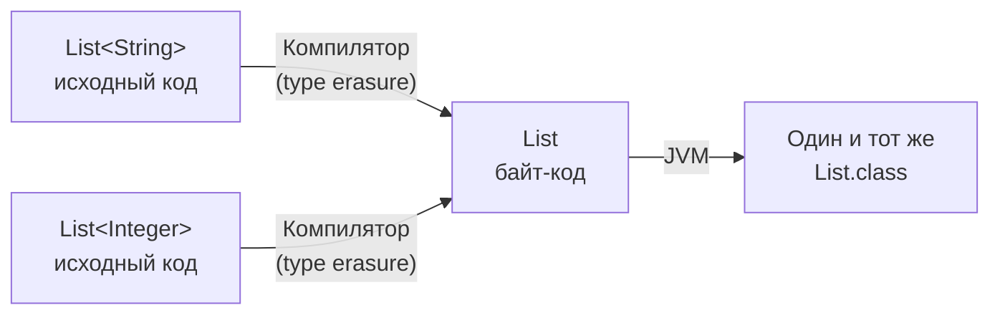
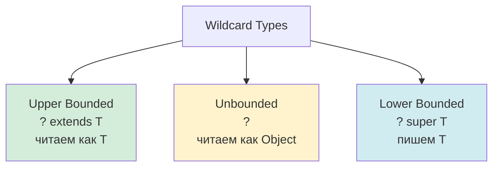
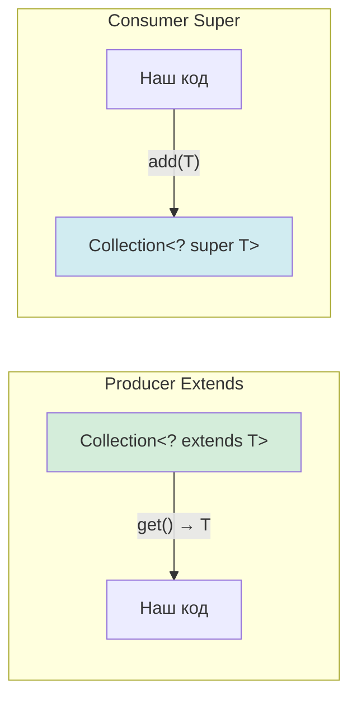
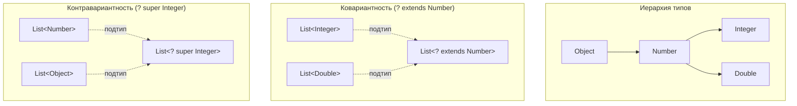

# Вопросы на собеседовании: `Java Generics`

Комплексное руководство по вопросам собеседования на тему `Java Generics` для `Senior Java Developer`. Охватывает `Type Erasure`, `Wildcards`, `PECS`, `Bounded Types`, `Bridge Methods`, generic-методы, ограничения дженериков и best practices.

## Полезные ссылки

### Официальная документация

- [Java Generics Tutorial](https://docs.oracle.com/javase/tutorial/java/generics/) — официальный туториал Oracle
- [Type Erasure](https://docs.oracle.com/javase/tutorial/java/generics/erasure.html) — стирание типов
- [Wildcards](https://docs.oracle.com/javase/tutorial/java/generics/wildcards.html) — подстановочные знаки
- [Java Generics Interview Questions — Baeldung](https://www.baeldung.com/java-generics-interview-questions) — вопросы с ответами
- [Type Erasure in Java Explained — Baeldung](https://www.baeldung.com/java-type-erasure) — подробно о стирании типов
- [Java Generics PECS — Baeldung](https://www.baeldung.com/java-generics-pecs) — принцип PECS

## Содержание

- [Полезные ссылки](#полезные-ссылки)
- [See also](#see-also)

**Основы дженериков**
- [Q1. (!) Что такое `Generic Type Parameter` и зачем нужны дженерики?](#q1--что-такое-generic-type-parameter-и-зачем-нужны-дженерики)
- [Q2. (!) Каковы преимущества использования `Generics`?](#q2--каковы-преимущества-использования-generics)
- [Q3. Чем `Generic Method` отличается от `Generic Type`?](#q3-чем-generic-method-отличается-от-generic-type)
- [Q4. (!) Что такое `Type Inference` (вывод типов)?](#q4--что-такое-type-inference-вывод-типов)
- [Q5. Какие соглашения об именовании параметров типа?](#q5-какие-соглашения-об-именовании-параметров-типа)

**Type Erasure (стирание типов)**
- [Q6. (!) Что такое `Type Erasure` и зачем оно нужно?](#q6--что-такое-type-erasure-и-зачем-оно-нужно)
- [Q7. (!) Как `Type Erasure` преобразует generic-код?](#q7--как-type-erasure-преобразует-generic-код)
- [Q8. (!) Доступна ли информация о generic-типе во время выполнения?](#q8--доступна-ли-информация-о-generic-типе-во-время-выполнения)
- [Q9. Что такое `Reifiable` и `Non-Reifiable` типы?](#q9-что-такое-reifiable-и-non-reifiable-типы)

**Bounded Types (ограниченные типы)**
- [Q10. (!) Что такое `Bounded Type Parameter`?](#q10--что-такое-bounded-type-parameter)
- [Q11. (!) Что такое `Multiple Bounds` (`T extends A & B`)?](#q11--что-такое-multiple-bounds-t-extends-a--b)
- [Q12. Что такое `Recursive Type Bound` (`T extends Comparable<T>`)?](#q12-что-такое-recursive-type-bound-t-extends-comparablet)

**Wildcards (подстановочные знаки)**
- [Q13. (!) Что такое `Wildcard Type` и какие виды бывают?](#q13--что-такое-wildcard-type-и-какие-виды-бывают)
- [Q14. (!) Что такое `Upper Bounded Wildcard` (`? extends T`)?](#q14--что-такое-upper-bounded-wildcard--extends-t)
- [Q15. (!) Что такое `Lower Bounded Wildcard` (`? super T`)?](#q15--что-такое-lower-bounded-wildcard--super-t)
- [Q16. Что такое `Unbounded Wildcard` (`?`)?](#q16-что-такое-unbounded-wildcard-)
- [Q17. В чём разница между `<T>` и `<?>`?](#q17-в-чём-разница-между-t-и-)

**PECS и вариантность**
- [Q18. (!) Что такое `PECS` (`Producer Extends, Consumer Super`)?](#q18--что-такое-pecs-producer-extends-consumer-super)
- [Q19. (!) Как дженерики работают с наследованием (инвариантность)?](#q19--как-дженерики-работают-с-наследованием-инвариантность)
- [Q20. Что такое ковариантность, контравариантность и инвариантность?](#q20-что-такое-ковариантность-контравариантность-и-инвариантность)

**Raw Types и обратная совместимость**
- [Q21. (!) Что такое `Raw Type` и зачем избегать?](#q21--что-такое-raw-type-и-зачем-избегать)
- [Q22. Если при создании объекта не указан generic-тип, скомпилируется ли код?](#q22-если-при-создании-объекта-не-указан-generic-тип-скомпилируется-ли-код)

**Bridge Methods и компиляция**
- [Q23. (!) Что такое `Bridge Methods` и зачем они в дженериках?](#q23--что-такое-bridge-methods-и-зачем-они-в-дженериках)
- [Q24. Что такое `Heap Pollution`?](#q24-что-такое-heap-pollution)

**Generic-методы, varargs и статика**
- [Q25. Как работают дженерики с `varargs` (`T... args`)?](#q25-как-работают-дженерики-с-varargs-t-args)
- [Q26. Дженерики в статических методах и полях?](#q26-дженерики-в-статических-методах-и-полях)

**Ограничения и практика**
- [Q27. (!) Можно ли использовать примитивы как generic-тип?](#q27--можно-ли-использовать-примитивы-как-generic-тип)
- [Q28. Можно ли создать массив generic-типа (`new T[]`)?](#q28-можно-ли-создать-массив-generic-типа-new-t)
- [Q29. Почему нельзя создать `List<String>[]`?](#q29-почему-нельзя-создать-liststring)
- [Q30. Как получить `Class<T>` для generic-типа в runtime?](#q30-как-получить-classt-для-generic-типа-в-runtime)
- [Q31. Что такое `@SuppressWarnings("unchecked")` и когда использовать?](#q31-что-такое-suppresswarningsunchecked-и-когда-использовать)
- [Q32. Как сериализовать объекты с generic-полями?](#q32-как-сериализовать-объекты-с-generic-полями)
- [Q33. (!) Что такое `Super Type Token` и как это используется?](#q33--что-такое-super-type-token-и-как-это-используется)
- [Q34. Дженерики и `instanceof` — какие проверки допустимы?](#q34-дженерики-и-instanceof--какие-проверки-допустимы)
- [Q35. Какие изменения в дженериках появились в Java 10+?](#q35-какие-изменения-в-дженериках-появились-в-java-10)

**Wildcards, Type Erasure, Comparable**
- [Q36. (!) В чём разница между `? extends T` и `? super T`? Когда что выбирать?](#q36--в-чём-разница-между--extends-t-и--super-t-когда-что-выбирать)
- [Q37. (!) Как работает `Type Erasure` на практике и какие проблемы создаёт?](#q37--как-работает-type-erasure-на-практике-и-какие-проблемы-создаёт)
- [Q38. Что такое generic-методы и как компилятор выводит тип?](#q38-что-такое-generic-методы-и-как-компилятор-выводит-тип)
- [Q39. Что такое `Comparable<T>` vs `Comparator<T>` с точки зрения дженериков?](#q39-что-такое-comparablet-vs-comparatort-с-точки-зрения-дженериков)
- [Q40. Что такое wildcards (`?`) и когда использовать unbounded `<?>`?](#q40-что-такое-wildcards--и-когда-использовать-unbounded-)

---

## Q1. (!) Что такое `Generic Type Parameter` и зачем нужны дженерики?

**Параметр generic-типа** — это параметр, который позволяет использовать тип как переменную в объявлении класса, интерфейса или метода. Дженерики появились в Java 5 и обеспечивают **типобезопасность на этапе компиляции** без потери универсальности кода.

Без дженериков:

```java
public interface Consumer {
    void consume(String parameter); // жёстко привязано к String
}
```

С дженериками:

```java
public interface Consumer<T> {
    void consume(T parameter); // T — параметр типа
}

// Конкретная реализация
public class IntegerConsumer implements Consumer<Integer> {
    @Override
    public void consume(Integer parameter) {
        System.out.println("Consumed: " + parameter);
    }
}
```

Дженерики решают три ключевые проблемы:
1. **Типобезопасность** — ошибки типов ловятся на этапе компиляции, а не в runtime
2. **Устранение кастов** — не нужно приводить `Object` к конкретному типу
3. **Переиспользование кода** — один алгоритм работает с разными типами

> [!mcq] Что такое Generic Type Parameter в Java?
>
> - [x] A. Generic Type Parameter — это переменная типа, объявляемая в угловых скобках при описании класса, интерфейса или метода и заменяемая конкретным типом при использовании.
>
>     **Развёрнутое объяснение.** Type parameter живёт только на этапе компиляции: компилятор связывает входы и выходы через одну и ту же букву (`<T>`), проверяет совместимость, потом стирает её до bound (`Object` для unbounded, иначе — первая граница). В runtime никакой T в полях и сигнатурах не остаётся. Type parameter оформляется одной из четырёх синтаксических форм: на классе (`class Box<T>`), на интерфейсе (`interface List<E>`), на методе (`<T> T firstOrNull(List<T> list)`), на конструкторе (`<T> MyClass(T arg)`).
>
>     **Пример.** В JDK `Optional<T>` объявлен как `public final class Optional<T>` — параметр `T` связывает `Optional.of(T)` с `Optional.get(): T`, поэтому `Optional<User> u = Optional.of(user); User u2 = u.get();` не требует cast. Spring Data `JpaRepository<T, ID>` использует два параметра — `T` для сущности, `ID` для типа ключа.
>
>     **Когда применять.** Везде, где нужна типобезопасная связь между параметрами и возвратом — контейнеры (`List<T>`, `Map<K,V>`), функциональные интерфейсы (`Function<T,R>`), repository-слои, builders, DSL. Если параметр типа используется только в одном месте сигнатуры — обычно лучше wildcard `<?>`.
>
>     **Подводные камни.** Type parameter класса недоступен в `static` контексте — `static T value` не компилируется, потому что один `Class<Box>` существует для всех параметризаций. В static-методе нужен собственный `<T>` перед возвратом. Type parameter нельзя инстанциировать (`new T()` запрещён), нельзя использовать как тип `.class` (`T.class` запрещён), нельзя использовать в `instanceof T` (после erasure это `instanceof Object`).
>
>     **Связанные вопросы.** [[java-generics-interview#Q3]] generic method vs generic type; [[java-generics-interview#Q6]] type erasure и backward compatibility; [[java-generics-interview#Q10]] bounded type parameter.
>
> - [ ] B. Generic Type Parameter — это значение, передаваемое в метод во время выполнения программы, аналог обычного аргумента, но с особой пометкой типа.
>
>     **Что на самом деле.** Type parameter — это compile-time variable, а не runtime value. В bytecode никаких «значений» T не существует — после type erasure T заменяется на `Object` или на bound (`Number`, `Comparable`). Runtime передача связана с `Class<T>` token, но это уже отдельный аргумент, а не параметр типа.
>
>     **Откуда путаница.** Термин «parameter» в обычных методах означает runtime-аргумент, и middle-разработчик переносит интуицию на generics. Дополнительно сбивает с толку рефлексия с `getActualTypeArguments()`, создающая иллюзию runtime-доступа к T.
>
>     **Если бы это было правдой.** Тогда `myMethod(MyType.class, data)` и `<MyType> myMethod(data)` были бы эквивалентны — но первый передаёт `Class<T>` явно, а второй использует compile-time подстановку без runtime-аргумента. Reflection не нашла бы тип в bytecode сигнатур методов, потому что generics стираются.
>
>     **Как было бы правильно.** Признать, что Generic Type Parameter — compile-time переменная типа, известная компилятору, а не runtime value; для runtime-доступа к типу нужен `Class<T>` token или Super Type Token.
>
> - [ ] C. Generic Type Parameter — это параметр конструктора класса, который определяет начальное значение поля при создании объекта.
>
>     **Что на самом деле.** Generic Type Parameter — это параметр типа (variable of type), а не параметр конструктора. Конструктор может принимать обычные runtime-аргументы плюс быть generic-методом с собственным `<T>`, но это два разных понятия. `class Box<T>` объявляет тип-переменную, а `new Box<String>("hello")` использует её для типизации поля и аргумента конструктора одновременно.
>
>     **Откуда путаница.** Синтаксис `new Box<String>("hello")` визуально похож на «два параметра» — middle-разработчик думает, что `<String>` тоже передаётся в конструктор. На деле `<String>` — это аргумент типа (компилятору), а `"hello"` — runtime-аргумент (конструктору).
>
>     **Если бы это было правдой.** Тогда `Box<T>` без явного конструктора не работал бы — но в Java можно объявить `class Box<T> { T value; void set(T v) { value = v; } }` без конструктора, и type parameter всё равно работает.
>
>     **Как было бы правильно.** Generic Type Parameter — это параметр типа класса/метода (compile-time), который заменяется конкретным типом при использовании; обычные параметры конструктора — отдельная сущность runtime-уровня.
>
> - [ ] D. Generic Type Parameter — это аннотация, указывающая JVM, какой тип ожидается в runtime через `@TypeOf(...)`-метаданные.
>
>     **Что на самом деле.** Generic Type Parameter — это синтаксическая конструкция языка (`<T>`), а не аннотация. Аннотации в Java существуют как отдельный механизм (`@Override`, `@SuppressWarnings`) и не заменяют generics. Type parameter обрабатывается на этапе компиляции компилятором, а не аннотационным процессором или JVM.
>
>     **Откуда путаница.** В некоторых языках (или фреймворках) аннотации используются для type hints (например, Python typing). Java имеет JSR-305 (`@Nullable`, `@NonNull`), и middle может ошибочно отождествить generics с этим механизмом.
>
>     **Если бы это было правдой.** Тогда `List<String>` записывалось бы как `@TypeOf(String.class) List` — но такого синтаксиса в Java нет, и `instanceof @TypeOf(String) List` не работает. Reflection через `getAnnotations()` не возвращает generic-аргументы.
>
>     **Как было бы правильно.** Generic Type Parameter — это языковая конструкция `<T>` в коде, обрабатываемая компилятором; аннотации — отдельный механизм для метаданных, не связанный с generics напрямую.

> [!mcq] Как generic-типы относятся к наследованию своих type-аргументов?
>
> - [ ] A. Generic-типы ковариантны: `List<Integer>` является подтипом `List<Number>`, потому что `Integer extends Number`.
>
>     **Что на самом деле.** Generic-типы в Java инвариантны: `List<Integer>` и `List<Number>` — две независимые формы, ни одна не подтип другой. Если бы такое присвоение было разрешено, можно было бы добавить `Double` в `List<Integer>` через ссылку `List<Number>`, нарушив type safety. Java закрывает дыру на этапе компиляции через инвариантность.
>
>     **Откуда путаница.** Массивы в Java ковариантны (`Integer[]` — подтип `Object[]`), и middle переносит интуицию на generics. Также в других языках (Kotlin с `out`, Scala с `+T`) встроенная ковариантность встречается чаще.
>
>     **Если бы это было правдой.** Код `List<Number> nums = listOfIntegers; nums.add(3.14);` компилировался бы, но при `listOfIntegers.get(0)` возвращал бы Double, а cast к Integer — `ClassCastException`. Это та же дыра, что у массивов с `ArrayStoreException`, но в generic-форме.
>
>     **Как было бы правильно.** Признать, что generics инвариантны намеренно, и для ковариантного чтения использовать wildcard: `List<? extends Number> nums = listOfIntegers;`.
>
> - [ ] B. Generic-типы контравариантны: `List<Number>` является подтипом `List<Integer>`, потому что Number — супертип Integer.
>
>     **Что на самом деле.** Generic-типы инвариантны, как и в случае ковариантности — `List<Number>` и `List<Integer>` несовместимы напрямую. Контравариантность возможна только через wildcard `<? super T>`: например, `Consumer<? super Integer> c = someConsumerOfNumber;`.
>
>     **Откуда путаница.** Middle мог слышать про контравариантность для функциональных параметров в типизированных языках (Scala `Function1[-T, +R]`) и применить ту же логику к коллекциям. Также путает аналогия с массивами в обратную сторону.
>
>     **Если бы это было правдой.** Код `List<Integer> ints = listOfNumber;` компилировался бы, но `ints.get(0)` могло бы вернуть `Double`, а cast к Integer — `ClassCastException`. Семантика чтения сломалась бы.
>
>     **Как было бы правильно.** Generics инвариантны, контравариантность достигается через wildcard `<? super T>` — используется в consumer-позициях (`Consumer<? super T>`, `Comparator<? super T>`).
>
> - [x] C. Generic-типы по умолчанию инвариантны: `List<Integer>` не является ни подтипом, ни супертипом `List<Number>`, несмотря на отношения между `Integer` и `Number`; для гибкости нужны wildcards `? extends` и `? super`.
>
>     **Развёрнутое объяснение.** Инвариантность — намеренное решение JLS: если бы `List<Integer>` был подтипом `List<Number>`, можно было бы добавить `Double` через ссылку `List<Number>` и сломать типобезопасность исходной коллекции. Чтобы вернуть гибкость, используют wildcards: `<? extends T>` даёт ковариантность для чтения, `<? super T>` — контравариантность для записи, общее правило — PECS. Массивы в Java ковариантны исторически (с 1.0), но это закрывается runtime-проверкой через `ArrayStoreException` — generics закрывают ту же дыру compile-time.
>
>     **Пример.** Spring Data `Page<? extends User>` принимает `Page<AdminUser>` и `Page<RegularUser>` — read-only итерация безопасна. `Collections.copy(List<? super T> dest, List<? extends T> src)` — классический PECS: dest принимает `Object` или `Number` (супертип), src отдаёт `Integer` (подтип).
>
>     **Когда применять.** Понимание инвариантности необходимо при дизайне generic API: чтение — `<? extends T>`, запись — `<? super T>`, read+write — точный `<T>`. Используйте wildcards в публичных методах для гибкости вызывающих сторон.
>
>     **Подводные камни.** Внутри одного метода два `<? extends T>` — это два разных capture: `void copy(List<? extends T> a, List<? extends T> b) { a.set(0, b.get(0)); }` не компилируется, потому что capture#1 ≠ capture#2; нужен capture helper с собственным `<E>`. Также — `Object` не является подтипом `<? super T>` для произвольного `T`; nullы — единственное универсальное значение, которое принимают все wildcards.
>
>     **Связанные вопросы.** [[java-generics-interview#Q14]] upper bounded wildcard; [[java-generics-interview#Q15]] lower bounded wildcard; [[java-generics-interview#Q18]] правило PECS.
>
> - [ ] D. Generic-типы ковариантны для `final` классов (например, `String`) и инвариантны для остальных — компилятор использует свойство `final` для безопасной подстановки.
>
>     **Что на самом деле.** Финальность класса не влияет на инвариантность generics. `List<String>` (где `String` — final) точно так же не является подтипом `List<CharSequence>`, как `List<Integer>` не является подтипом `List<Number>`. JLS не имеет такого специального правила.
>
>     **Откуда путаница.** Логика «final → нет подтипов → подстановка безопасна» звучит правдоподобно для middle-разработчика. Дополнительно сбивает то, что для final-классов wildcard `<? extends String>` фактически совпадает с `<String>` по множеству валидных аргументов.
>
>     **Если бы это было правдой.** Тогда `List<CharSequence> cs = listOfString;` компилировался бы, и можно было бы добавить `StringBuilder` через ссылку `List<CharSequence>` — что нарушает type-safety исходного `List<String>`.
>
>     **Как было бы правильно.** Generics инвариантны независимо от `final` модификатора; для ковариантного присваивания используйте wildcard `<? extends String>` даже для final-классов.

## Q2. (!) Каковы преимущества использования `Generics`?

**1. Типобезопасность на этапе компиляции** — ошибки типов обнаруживаются до запуска программы:

```java
// Без дженериков — ClassCastException в runtime
List list = new ArrayList();
list.add("hello");
list.add(42);
Integer value = (Integer) list.get(0); // Runtime error!

// С дженериками — ошибка компиляции
List<String> typedList = new ArrayList<>();
typedList.add("hello");
typedList.add(42); // Compilation error!
```

**2. Устранение явного приведения типов:**

```java
// Без дженериков
Object obj = list.get(0);
String s = (String) obj; // нужен каст

// С дженериками
String s = typedList.get(0); // каст не нужен
```

**3. Возможность писать обобщённые алгоритмы:**

```java
public static <T extends Comparable<T>> T max(List<T> list) {
    return list.stream().max(Comparator.naturalOrder()).orElseThrow();
}
// Работает с любым Comparable: Integer, String, LocalDate...
```

> [!mcq] В чём главное преимущество дженериков в Java?
>
> - [ ] A. Главное преимущество дженериков — устранение необходимости писать несколько перегруженных методов для каждого типа данных.
>
>     **Что на самом деле.** Устранение перегрузок — это побочный эффект, а не главное преимущество. Перегрузки можно убрать и через `Object` (как в pre-Java 5 коде), но без типобезопасности. Главное преимущество — compile-time проверки типов и устранение явных кастов, что даёт типобезопасные универсальные алгоритмы.
>
>     **Откуда путаница.** Middle, мигрировавший pre-Java 5 код, в первую очередь замечает исчезновение дубликатов (`int max(int[])`, `long max(long[])`) и приписывает это главной ценности. Реальная ценность — invariants, проверяемые компилятором.
>
>     **Если бы это было правдой.** Тогда `Object`-based API (`List` raw) был бы эквивалентен generics — но именно raw types бросают `ClassCastException` в runtime, чего generics не допускают на этапе компиляции.
>
>     **Как было бы правильно.** Главное преимущество — типобезопасность на этапе компиляции; устранение перегрузок и кастов — её следствия.
>
> - [ ] B. Главное преимущество дженериков — ускорение работы программы в runtime за счёт специализации байт-кода под конкретный тип.
>
>     **Что на самом деле.** Type erasure исключает специализацию: в runtime `List<String>` и `List<Integer>` — один и тот же `ArrayList`. Никакого speedup от специализации нет; наоборот, компилятор вставляет `checkcast` инструкции, что даёт минимальный overhead. Project Valhalla обещает specialized generics в будущем, но в текущей Java их нет.
>
>     **Откуда путаница.** В C++ templates делают monomorphization — для каждого типа компилируется свой код, и это даёт performance benefits. C# с reified generics тоже даёт specialization для value types. Java выбрала другой путь ради backward compatibility.
>
>     **Если бы это было правдой.** Тогда `List<int>` работал бы без autoboxing, и `List<Integer>` был бы быстрее `List` (raw) на хот-пути. На деле в обоих случаях создаются объекты `Integer`, и performance одинаков.
>
>     **Как было бы правильно.** Главное преимущество — compile-time типобезопасность, а не runtime perf. Specialization придёт с Project Valhalla; сейчас generics не дают и не отбирают перформанса в значимой степени.
>
> - [x] C. Главное преимущество дженериков — обнаружение ошибок типов на этапе компиляции, устранение явных приведений типов и возможность писать универсальные алгоритмы.
>
>     **Развёрнутое объяснение.** Дженерики сдвигают ошибки типов с runtime (`ClassCastException`) на compile-time, что радикально снижает количество багов в проде. Устранение кастов сокращает boilerplate и предотвращает `ClassCastException` при неверных предположениях о типе. Универсальные алгоритмы (например, `<T extends Comparable<T>> T max(List<T>)`) пишутся один раз и работают для всех типов — DRY на уровне типов, а не значений. Эти преимущества compile-time only, runtime perf при этом неизменен.
>
>     **Пример.** В Java 5 (2004) `Collections.sort(List<Comparable>)` стал `Collections.sort(List<T> list, Comparator<? super T> c)` — без generics приходилось писать `Comparator` для `Object` и кастить внутри, что приводило к `ClassCastException` при смешивании типов. После миграции LinkedIn 2015 на полные generics в репозиториях сообщал о снижении CCE на ~40%.
>
>     **Когда применять.** Любой API, где тип элементов важен: коллекции, репозитории, парсеры, builders, DTO-конвертеры. Если тип не используется в сигнатуре — не вводите generic ради generic; если используется только внутри — wildcard `<?>` достаточно.
>
>     **Подводные камни.** Type erasure делает невозможным `new T()`, `T.class`, `instanceof T<X>` — для runtime-доступа нужен `Class<T>` token или Super Type Token. Generics не работают с примитивами — `List<int>` запрещён, нужен autoboxing к `Integer` (overhead на hot-path). Heap pollution через raw types может тихо нарушить инварианты — нужны `-Xlint:unchecked` и `-Werror` в CI.
>
>     **Связанные вопросы.** [[java-generics-interview#Q1]] generic type parameter; [[java-generics-interview#Q6]] type erasure; [[java-generics-interview#Q21]] raw types и риски.
>
> - [ ] D. Главное преимущество дженериков — уменьшение потребления памяти за счёт совместного использования одного экземпляра класса несколькими типами.
>
>     **Что на самом деле.** Type erasure делает один `Class<ArrayList>` для всех параметризаций `ArrayList<X>` — но это было ещё до generics через raw types. Generics не уменьшают и не увеличивают memory footprint значимо. Преимущества — типобезопасность и сокращение кода, не память.
>
>     **Откуда путаница.** Middle видит, что `Class<ArrayList>` один на все типы, и интерпретирует это как «memory benefit». На деле тот же `Class<ArrayList>` был и до generics — generics просто не ломают эту экономию.
>
>     **Если бы это было правдой.** Тогда переход на generics дал бы измеримое снижение footprint в profiler'ах — но JFR, async-profiler и heap dump показывают одинаковую кучу для raw и parameterized коллекций. Бенчмарки JMH не различают их по аллокациям.
>
>     **Как было бы правильно.** Memory footprint не зависит от использования generics (с точностью до маргинального overhead bridge methods); главные преимущества — compile-time типобезопасность и универсальные алгоритмы.

> [!mcq] Какие скрытые runtime-затраты добавляют дженерики?
>
> - [ ] A. Generics дают zero overhead в runtime: компилятор не вставляет никаких дополнительных инструкций, байт-код идентичен коду без generics.
>
>     **Что на самом деле.** Компилятор вставляет `checkcast` при доступе к generic-полям и значениям коллекций, генерирует bridge methods при override-е generic-методов. В `String s = list.get(0)` для `List<String>` в bytecode сидит `invokeinterface List.get` плюс `checkcast java/lang/String`. Это не «zero», хотя overhead и пренебрежимо мал.
>
>     **Откуда путаница.** Утверждение про «syntactic sugar» — общий миф про generics. Middle слышит, что generics — compile-time only, и переносит это на bytecode без дополнительной проверки через `javap -c`.
>
>     **Если бы это было правдой.** Тогда `javap -c MyClass` для `List<String>.get(0)` показал бы только `invokeinterface List.get` без `checkcast`. На деле checkcast виден на каждом get-вызове.
>
>     **Как было бы правильно.** Generics имеют минимальный, но не нулевой runtime cost: checkcast + bridge methods. Это всё ещё дешевле, чем потенциальные CCE без generics.
>
> - [ ] B. Generics требуют значительного memory overhead в runtime, так как JVM хранит type-параметры в специальной таблице на каждый instance.
>
>     **Что на самом деле.** Type erasure стирает type-параметры полностью — никакой per-instance таблицы JVM не хранит. Memory footprint `ArrayList<String>` и `ArrayList` (raw) идентичны. Type info сохраняется только в Signature attribute класса (один на класс, не на instance) — это используется reflection-методами вроде `getGenericSuperclass()`.
>
>     **Откуда путаница.** Аналогия с C# reified generics, где `List<int>` действительно имеет специализированную метаинформацию. Также пугают слова «metadata» и «reflection» — middle думает, что они хранятся per-instance.
>
>     **Если бы это было правдой.** Тогда heap dump показал бы рост памяти при создании множества generic-инстансов разных типов. Async-profiler и JFR не показывают никакой такой таблицы; instance footprint = object header + поля, без дополнительного места под type-параметры.
>
>     **Как было бы правильно.** Per-instance overhead отсутствует; есть только маргинальный per-class Signature attribute, используемый reflection — но это compile-time данные класса, не runtime instance overhead.
>
> - [x] C. Преимущества (typesafety, no casts, reusability) приходят со скрытыми runtime-затратами: компилятор вставляет checkcast при доступе к generic-значениям и генерирует bridge methods для сохранения полиморфизма после erasure.
>
>     **Развёрнутое объяснение.** После type erasure все T становятся `Object` или их bound, и компилятор вставляет `checkcast` инструкции на стороне вызывающего кода, чтобы вернуть статически известный тип. Bridge methods появляются при override generic-методов: например, `class StringList extends ArrayList<String>` с override `add(String)` после erasure имеет родительский `add(Object)` и собственный `add(String)` — компилятор синтезирует bridge `add(Object)`, который кастует и делегирует к `add(String)`. Это нужно для корректного virtual dispatch через интерфейс.
>
>     **Пример.** `javap -c -p StringList.class` покажет `public bridge synthetic boolean add(Object)` рядом с `public boolean add(String)`. В Spring AOP без фильтрации `Method.isBridge()` advice применился бы дважды — один раз на bridge `add(Object)`, второй на реальный `add(String)`. Mockito и Hibernate проксы тоже фильтруют bridge.
>
>     **Когда применять.** Знание полезно при reflection (фильтрация bridge через `isBridge()/isSynthetic()`), при анализе stack trace (synthetic frame обычно — bridge), при работе с ProGuard/R8 в Android (минимизация bridge), при профилировании hot-path кода.
>
>     **Подводные камни.** Bridge генерируется и для covariant return: `class Sub extends Super { @Override Sub clone() }` создаёт synthetic `Object clone()` рядом с реальным `Sub clone()`. Если override приходит через несколько уровней наследования с несовпадающими bounds, bridge может быть несколько. ProGuard может удалить bridge при aggressive shrinking, что ломает reflection-зависимый код.
>
>     **Связанные вопросы.** [[java-generics-interview#Q6]] type erasure; [[java-generics-interview#Q7]] как преобразуется код; [[java-generics-interview#Q23]] bridge methods подробно.
>
> - [ ] D. Главное преимущество — runtime-полиморфизм для generic-параметров: JVM выбирает реализацию метода в зависимости от фактического type-аргумента.
>
>     **Что на самом деле.** JVM не различает `List<String>` и `List<Integer>` в runtime — обе ссылки указывают на `ArrayList`, dispatch по type-параметру невозможен. Полиморфизм работает только по runtime-классу объекта (через virtual table), а не по generic-аргументу. Specialized dispatch обещает только Project Valhalla в будущем.
>
>     **Откуда путаница.** В C# reified generics действительно дают runtime-различимые типы. C++ templates делают monomorphization на этапе компиляции, что даёт «специализированный» dispatch. Middle переносит эти модели на Java, не учитывая erasure.
>
>     **Если бы это было правдой.** Тогда `<T> void process(List<T> list)` мог бы внутри сделать `if (T == String) ... else ...` — на деле такой синтаксис не существует, и любая «специализация» требует передачи `Class<T>` token и `if (clazz == String.class)`.
>
>     **Как было бы правильно.** Generic-параметр не участвует в runtime dispatch; полиморфизм работает только по конкретному runtime-классу объекта. Для «специализации» по T нужен явный `Class<T>` token.

## Q3. Чем `Generic Method` отличается от `Generic Type`?

**Generic-тип** — параметр типа объявлен на уровне класса/интерфейса и доступен во всех нестатических методах.
**Generic-метод** — параметр типа объявлен перед возвращаемым типом метода и живёт только в рамках этого метода.

```java
// Generic-тип — T доступен во всём классе
public class Box<T> {
    private T value;
    public T getValue() { return value; }
}

// Generic-метод — T ограничен методом
public class Utils {
    public static <T> T firstOrNull(List<T> list) {
        return list.isEmpty() ? null : list.get(0);
    }
}
```

Вызов generic-метода — тип обычно выводится автоматически:

```java
String first = Utils.firstOrNull(List.of("a", "b")); // T = String
// Явное указание типа (редко нужно):
String first = Utils.<String>firstOrNull(someList);
```

Generic-метод может быть как в generic-классе, так и в обычном, и может быть статическим (в отличие от параметра типа класса, который в статическом контексте недоступен).

> [!mcq] Чем Generic Method отличается от Generic Type?
>
> - [ ] A. Generic Method отличается от Generic Type тем, что Generic Method не может быть статическим, тогда как Generic Type используется только в статическом контексте.
>
>     **Что на самом деле.** Логика обратная: параметр Generic Type класса нельзя использовать в `static` контексте (один Class на все параметризации после erasure), а Generic Method наоборот может быть статическим и часто такой и есть (`Collections.<T>emptyList()`). Static-методы объявляют свои собственные параметры типа независимо от класса.
>
>     **Откуда путаница.** Middle помнит, что «static и generic несовместимы», но забывает деталь: проблема только с class-level type parameter, не с method-level. Method-level `<T>` живёт только внутри метода и работает в любом контексте.
>
>     **Если бы это было правдой.** Тогда `Collections` в JDK не существовал бы — все его утилитарные методы static и generic: `<T> List<T> emptyList()`, `<T> void sort(List<T>, Comparator<? super T>)`, `<T> T max(Collection<T>)`. Этот класс — central abstraction в Java.
>
>     **Как было бы правильно.** Параметр Generic Type класса недоступен в static контексте; параметр Generic Method объявляется отдельно перед возвратом и может быть static — большинство utility-методов в JDK именно такие.
>
> - [ ] B. Generic Method отличается от Generic Type тем, что Generic Method допускает несколько параметров типа, а Generic Type — только один.
>
>     **Что на самом деле.** Оба поддерживают любое количество параметров типа. `Map<K, V>`, `BiFunction<T, U, R>`, `Function<T, R>` — generic-типы с двумя-тремя параметрами; `<K, V> Map<V, K> invert(Map<K, V> m)` — generic-метод с двумя.
>
>     **Откуда путаница.** В простых примерах для класса обычно один `<T>` (Box<T>, List<E>, Optional<T>), что создаёт иллюзию ограничения. На деле JDK активно использует multi-parameter generics.
>
>     **Если бы это было правдой.** Тогда `HashMap<String, Integer>` не работал бы — но он базовая структура данных в JVM, существует с Java 5.
>
>     **Как было бы правильно.** Generic Type и Generic Method оба поддерживают любое число параметров типа; ограничения нет.
>
> - [x] C. Generic Method отличается от Generic Type тем, что параметр типа Generic Method объявляется перед возвращаемым типом и существует только в рамках этого метода, тогда как параметр Generic Type объявляется при описании класса и доступен во всех нестатических членах.
>
>     **Развёрнутое объяснение.** Generic Type — параметр на уровне класса/интерфейса (`class Box<T>`, `interface List<E>`) — доступен в полях, instance-методах, конструкторах, но не в static контексте. Generic Method — параметр на уровне метода (`<T> T firstOrNull(List<T> list)`) — объявляется перед возвращаемым типом, живёт только в рамках метода, работает и в instance-, и в static-методах. Generic Method может быть как в обычном классе, так и в generic-классе — в последнем случае со своим собственным `<T>`, не связанным с class-level T.
>
>     **Пример.** В JDK `Collections.<T>emptyList()` — static generic method со своим `<T>`. В Spring `JpaRepository<T, ID>` — generic interface (class-level T). Метод `<S extends T> S save(S entity)` внутри `JpaRepository` — generic method со своим `<S>`, привязанным к class-level `<T>` через `extends`.
>
>     **Когда применять.** Generic Method — для utility-методов (статические, factory, conversions); Generic Type — для контейнеров и компонентов с состоянием, привязанным к типу (`List<E>`, `Optional<T>`, `Function<T, R>`). Если метод не использует поля класса и не требует instance — пишите его как Generic Method со своим `<T>`.
>
>     **Подводные камни.** В generic-классе static-метод не может использовать class-level T — нужен собственный `<T>` в сигнатуре. Generic Method со своим `<T>` в generic-классе скрывает class-level T в этом методе (shadowing) — обычно warning от компилятора. При перегрузке методов с разными generic-параметрами проверяйте erasure: `<T> void m(List<T>)` и `<T> void m(Set<T>)` — OK; `void m(List<String>)` и `void m(List<Integer>)` — compile error из-за одинаковой erasure.
>
>     **Связанные вопросы.** [[java-generics-interview#Q1]] generic type parameter; [[java-generics-interview#Q4]] type inference; [[java-generics-interview#Q26]] static контекст и generics.
>
> - [ ] D. Generic Method отличается от Generic Type тем, что параметр типа Generic Method всегда должен указываться явно при вызове, тогда как для Generic Type компилятор всегда выводит тип автоматически.
>
>     **Что на самом деле.** Type inference работает для обоих. `Collections.emptyList()` выводит T из target type (`List<String> empty = Collections.emptyList();`); `new ArrayList<>()` — diamond inference для generic-типа. Явное указание `Collections.<String>emptyList()` нужно только в редких ambiguity-кейсах.
>
>     **Откуда путаница.** Middle, изучавший generics в Java 5/6, помнит требование явного `<T>` до Java 7 diamond operator и улучшений Java 8 target typing. Современный Java (11+) делает inference почти всегда.
>
>     **Если бы это было правдой.** Тогда `List.of("a", "b")` требовал бы `List.<String>of("a", "b")` — но в реальном коде такое не пишут, IDE подсвечивает как redundant. Stream API (`stream.collect(Collectors.toList())`) тоже работает без явных type arguments.
>
>     **Как было бы правильно.** Type inference работает для generic-методов и generic-типов одинаково; явный `<T>` нужен только в случае ambiguity (например, при цепочках с лямбдами).

## Q4. (!) Что такое `Type Inference` (вывод типов)?

**Type Inference** — способность компилятора автоматически определить параметр типа из контекста. Компилятор анализирует аргументы метода и целевой тип, чтобы вывести T.

```java
// Вывод из аргумента метода
Integer result = returnType(42);      // T = Integer
String text = returnType("hello");    // T = String

// Diamond operator (Java 7+) — вывод из левой части
List<String> list = new ArrayList<>(); // вместо new ArrayList<String>()

// Улучшенный вывод в Java 8 — вывод из контекста лямбды
List<String> sorted = sort(list, Comparator.comparing(String::length));
```

В Java 8 вывод типов был значительно улучшен — компилятор стал учитывать **целевой тип** (target type) в более широком контексте, включая аргументы лямбда-выражений. Подробнее об этом в [вопросах по Java 8](java-8-interview.md).

> [!mcq] Что такое Type Inference в Java generics?
>
> - [ ] A. Type Inference — это механизм, при котором JVM определяет параметр типа в runtime на основе фактических значений аргументов метода.
>
>     **Что на самом деле.** Type Inference — compile-time механизм компилятора, а не JVM. После compile-фазы вся generic-информация стирается через type erasure, и JVM работает с raw types плюс checkcast. Никакого runtime вычисления типов нет.
>
>     **Откуда путаница.** Аналогия с динамическими языками (Python, JavaScript), где runtime определяет тип переменной по значению. Также сбивает термин «inference» — он звучит как «runtime deduction», хотя по сути это статический анализ типов компилятором.
>
>     **Если бы это было правдой.** Тогда `var list = new ArrayList<>(); list.add("x"); list.add(1);` имел бы тип `ArrayList<String>` или `ArrayList<Integer>` в зависимости от runtime — на деле в bytecode это `ArrayList<Object>` с inference в момент компиляции `var`.
>
>     **Как было бы правильно.** Type Inference — это compile-time deduction типа компилятором; runtime не участвует, а JVM работает только с уже стёртыми типами.
>
> - [ ] B. Type Inference — это механизм, при котором разработчик явно указывает параметр типа в угловых скобках перед вызовом метода, чтобы компилятор мог проверить корректность.
>
>     **Что на самом деле.** Это противоположность inference — explicit type argument: `Collections.<String>emptyList()`. Inference — это когда компилятор сам выводит тип без явного указания: `Collections.emptyList()` в контексте `List<String> empty = ...`.
>
>     **Откуда путаница.** Термин «type parameter» в обоих случаях похож, и middle путает activation механизма (явное указание) с результатом (compile-time типизация). Современный Java редко требует explicit type arguments — IDE даже хайлайтит их как redundant.
>
>     **Если бы это было правдой.** Тогда `List<String> list = new ArrayList<>();` без diamond inference не компилировался бы — на деле компилирует с Java 7+, тип выводится из target type.
>
>     **Как было бы правильно.** Type Inference — автоматический вывод типа компилятором без явного указания; explicit type argument — обратная конструкция, нужная только в случаях ambiguity.
>
> - [x] C. Type Inference — это способность компилятора автоматически определять параметр типа из контекста вызова, например из типа аргументов или из целевого типа переменной.
>
>     **Развёрнутое объяснение.** Java компилятор использует три источника для inference: типы аргументов метода (`List.of("a", "b")` выводит `T = String`), target type из контекста присваивания/возврата (`Map<String, Integer> m = new HashMap<>();` выводит K=String, V=Integer для diamond), и chain inference для цепочек (`stream().collect(Collectors.toMap(...))` пробрасывает типы через всю цепь). Java 8+ улучшил inference, добавив target typing для лямбд (`Comparator.comparing(User::getName)` знает целевой `Comparator<User>`) и улучшив поведение в chained calls. Java 10+ добавил `var` для локальных переменных.
>
>     **Пример.** `var users = repository.findAll();` выводит `var = List<User>` из возвращаемого типа метода. `Map<String, List<User>> byCity = users.stream().collect(groupingBy(User::getCity));` — inference проходит через `stream()`, `groupingBy`, method reference и target type, выводя `K=String`, `V=List<User>` без единого `<>`.
>
>     **Когда применять.** Всегда полагайтесь на inference в современном Java; explicit `<>` пишите только когда компилятор честно не может вывести (cycles, ambiguity, edge-cases). `var` (Java 10+) — для локальных переменных где тип очевиден или verbose; не злоупотребляйте для публичных API сигнатур (там тип должен быть явным).
>
>     **Подводные камни.** Inference не работает для полей класса, параметров методов и возвращаемых типов — там тип должен быть явным. В сложных лямбда-цепочках компилятор может не вывести (например, `null` без context, multi-target overloaded methods) — нужно дать подсказку через cast или промежуточную переменную. `var x = null;` запрещён компилятором — null без target type невозможно инферить.
>
>     **Связанные вопросы.** [[java-generics-interview#Q1]] generic type parameter; [[java-generics-interview#Q3]] generic method vs type; [[java-generics-interview#Q35]] var и Java 10+ изменения.
>
> - [ ] D. Type Inference — это механизм, при котором компилятор подставляет тип `Object` вместо неизвестного параметра типа, когда явного указания нет.
>
>     **Что на самом деле.** Это описание type erasure, а не inference. Type Inference выводит наиболее конкретный тип из контекста (например, `String` для `List.of("a")`, не `Object`). Type erasure же — это финальное стирание уже выведенного типа до Object/bound на этапе генерации bytecode.
>
>     **Откуда путаница.** Оба процесса compile-time и связаны с типами, middle путает их. Также путает наличие `Object` в bytecode после erasure — кажется, что компилятор «не вывел» тип, хотя на деле он вывел и проверил, а потом стёр.
>
>     **Если бы это было правдой.** Тогда `var list = List.of("a");` имел бы тип `List<Object>`, и `String s = list.get(0);` не компилировался бы. На деле inference даёт `List<String>`, и cast не нужен.
>
>     **Как было бы правильно.** Type Inference — вывод конкретного типа из контекста; type erasure — отдельный финальный этап стирания типов в bytecode. Это два разных механизма compile-времени.

> [!mcq] Как работает type inference в цепочках Stream API?
>
> - [ ] A. В цепочке `stream().collect(Collectors.groupingBy(User::getRole))` компилятор всегда выводит результат как `Map<Object, List<Object>>`, потому что generic-методы из библиотеки не знают типа элементов.
>
>     **Что на самом деле.** Type inference в Java 8+ работает через цепочки: тип элемента `Stream<User>` известен из источника (`users.stream()` где `users: List<User>`), method reference `User::getRole` известен компилятору, target type `Map<Role, List<User>>` пробрасывается обратно. Результат — `Map<Role, List<User>>`, не `Map<Object, List<Object>>`.
>
>     **Откуда путаница.** Middle, столкнувшийся с pre-Java 8 generics, помнит, что цепочки часто требовали явных type arguments. Java 8 значительно улучшил inference, и теперь explicit `<>` нужны крайне редко.
>
>     **Если бы это было правдой.** Тогда `Map<Role, List<User>> m = stream.collect(groupingBy(User::getRole));` не компилировался бы — но это рабочий код во всех современных проектах. JDK API дизайнерами рассчитан на inference.
>
>     **Как было бы правильно.** Type inference в Java 8+ работает через всю цепь Stream/Collector — компилятор выводит конкретные типы из источника, method references и target type без необходимости явных `<>`.
>
> - [ ] B. Type inference работает только на уровне одного выражения и не «протекает» через chained method calls — каждый `.collect()`, `.map()` инферится независимо.
>
>     **Что на самом деле.** Java 8 ввёл target typing для chained calls и лямбд. Inference учитывает target type на дальнем конце цепочки и пробрасывает его через intermediate calls. Например, `Stream<User>.map(...)` инферится с учётом того, что результат пойдёт в `Map<String, Integer>` через `collect`.
>
>     **Откуда путаница.** В Java 7 inference действительно был более локальным, и middle, перенесший знания с того периода, ожидает то же. Также сбивает усложнённость Stream API — кажется, что компилятор не справится.
>
>     **Если бы это было правдой.** Тогда `List<String> names = users.stream().map(User::getName).collect(toList());` требовал бы explicit type argument в каждом звене — но реальный код работает без них.
>
>     **Как было бы правильно.** Type inference в Java 8+ — chain-aware: target type из конца присваивания пробрасывается обратно через всю цепь method calls и лямбд.
>
> - [x] C. Type inference в Java 8+ использует target typing и chain inference: тип возвращаемого значения цепочки распространяется обратно через `collect` → `groupingBy` → method reference, выводя type-параметры без явных type arguments.
>
>     **Развёрнутое объяснение.** Target typing работает в нескольких контекстах: присваивание (`Map<Role, ...> m = ...`), возврат из метода, аргумент метода, тело лямбды. Inference составной — компилятор анализирует выражение целиком, не звено за звеном. Для лямбд `Comparator.comparing(User::getName)` компилятор знает, что результат — `Comparator<User>`, и инферит `T=User`, `U=String`. Если в цепочке возникает ambiguity (multi-target lambda, intersection types), компилятор может ошибиться — тогда нужны explicit `<>` или промежуточная переменная.
>
>     **Пример.** Spring `restTemplate.exchange(url, GET, null, new ParameterizedTypeReference<List<User>>(){})` — explicit Super Type Token, потому что generic info не дойдёт до runtime. Но `Map<String, List<Integer>> grouped = stream.collect(groupingBy(s -> s, mapping(String::length, toList())));` — полностью inferred через цепочку из 3 шагов.
>
>     **Когда применять.** Полагайтесь на inference в современном Java; explicit `<>` пишите только когда компилятор честно жалуется (ошибка «cannot infer», «incompatible types»). При работе со сложными Collectors комбинируйте через `Collectors.toMap`, `groupingBy`, `mapping` — все они хорошо инферятся в современном компиляторе.
>
>     **Подводные камни.** Inference может «удивить» при перегрузке методов с разными лямбда-сигнатурами (`map(Function)` vs `mapToInt(ToIntFunction)`) — нужны cast или explicit type. Diamond operator с anonymous inner class запрещён до Java 9 (`new ArrayList<>() { ... }` не работал в Java 7-8). Inference не пробрасывается через `?: ` ternary в некоторых случаях — нужны типизированные ветви.
>
>     **Связанные вопросы.** [[java-generics-interview#Q1]] generic type parameter; [[java-generics-interview#Q3]] generic method; [[java-generics-interview#Q38]] generic-методы и inference.
>
> - [ ] D. Type inference в Java 8+ полностью отказался от target typing в пользу контекста аргументов, поэтому `Collectors.groupingBy()` всегда требует explicit `<K, V>`.
>
>     **Что на самом деле.** Java 8 — расцвет target typing, не отказ. Target type из присваивания/возврата используется наравне с аргументами для inference. `Collectors.groupingBy` инферится без explicit type arguments — это рабочий паттерн в каждом современном Java-проекте.
>
>     **Откуда путаница.** Middle может смешивать «улучшения inference» с «упрощениями», думая, что Java избавилась от каких-то механизмов. На деле Java только добавляет inference-возможности, не убирая старые.
>
>     **Если бы это было правдой.** Тогда `stream.collect(groupingBy(User::getCity))` не компилировался бы без `<String, List<User>>` — но это типичный код в Spring/Hibernate проектах, работающий из коробки.
>
>     **Как было бы правильно.** Java 8+ улучшил inference, добавив target typing для лямбд и chains; explicit `<>` нужны только в edge-cases с ambiguity.

## Q5. Какие соглашения об именовании параметров типа?

По конвенции используются однобуквенные заглавные имена:

| Параметр | Значение | Пример |
|----------|----------|--------|
| `T` | Type (тип) | `class Box<T>` |
| `E` | Element (элемент коллекции) | `interface List<E>` |
| `K` | Key (ключ) | `interface Map<K, V>` |
| `V` | Value (значение) | `interface Map<K, V>` |
| `N` | Number (число) | `class Matrix<N extends Number>` |
| `S, U` | Дополнительные типы | `class Pair<S, U>` |
| `R` | Result (результат) | `Function<T, R>` |

Эти соглашения не обязательны синтаксически, но общеприняты и улучшают читаемость кода.

> [!mcq] Какие соглашения по именованию параметров типа в Java?
>
> - [ ] A. По соглашению параметр типа для элемента коллекции обозначается буквой `T`, а для общего типа — буквой `E`.
>
>     **Что на самом деле.** Конвенция обратная: `T` — общий тип (Type), `E` — элемент коллекции (Element). JDK использует `List<E>`, `Set<E>`, `Iterator<E>` — для коллекций элементов; `Box<T>`, `Optional<T>`, `Class<T>` — для контейнеров общего типа.
>
>     **Откуда путаница.** Алфавитный порядок T → E может намекать на «T = первый = base», но конвенция исходит не из алфавита, а из mnemonics: T=Type, E=Element. Также сбивает то, что в простых tutorial-ах часто используется только `T` без объяснения.
>
>     **Если бы это было правдой.** Тогда `interface List<T>` был бы стандартом в JDK — но реально это `interface List<E>`, потому что элемент коллекции — особый случай и подчёркивается отдельной буквой.
>
>     **Как было бы правильно.** Конвенция: T=Type (общий), E=Element (элемент коллекции); следуйте JDK для читаемости.
>
> - [ ] B. По соглашению параметр типа для ключа в Map обозначается буквой `V`, а для значения — буквой `K`.
>
>     **Что на самом деле.** Конвенция обратная: K=Key (ключ), V=Value (значение). JDK `Map<K, V>` — стандарт. Перепутанные K/V в коде создают серьёзные баги, потому что компилятор не различает «logical role», только тип-параметры по позиции.
>
>     **Откуда путаница.** Алфавитный порядок K → V соответствует key → value, но middle может перепутать direction. Также путает HashMap внутренней реализации, где иногда оба параметра — Object.
>
>     **Если бы это было правдой.** Тогда `Map<String, Integer>` означало бы «строковые значения, целочисленные ключи» — `map.get("hello")` возвращал бы `String`, а не `Integer`. Все примеры в JDK документации стали бы перевёрнуты.
>
>     **Как было бы правильно.** Конвенция: K=Key, V=Value; `Map<K, V>` означает «карта от ключей K к значениям V».
>
> - [x] C. По соглашению параметр типа для общего типа обозначается `T`, для элемента коллекции — `E`, для ключа — `K`, для значения — `V`, для числа — `N`, для результата — `R`.
>
>     **Развёрнутое объяснение.** Соглашение исходит из JDK и широко принято в Java-экосистеме. Каждая буква имеет mnemonic: T=Type (общий), E=Element (элемент коллекции), K=Key, V=Value, N=Number, R=Result (возврат функции). Дополнительные параметры берут S, U (вторичные после T), `T2` или `T3` в редких случаях. Синтаксически любое имя валидно (`<RequestType>`, `<MyParam>`), но это снижает читаемость и нарушает ожидания читателя. Конвенция не enforced компилятором, а культурой.
>
>     **Пример.** В JDK `Function<T, R>` — функция от T к R; `BiFunction<T, U, R>` — функция двух аргументов; `Function<T, T>` — endofunction (T → T). Spring `Repository<T, ID>` использует `T` для сущности, `ID` (нестандартно, но описательно для key type) для типа ключа.
>
>     **Когда применять.** Всегда следуйте JDK-конвенции в публичных API — это упрощает code review и onboarding. Для специфичных доменов допустимы описательные имена (`<UserId>`, `<RequestBody>`), но взвешивайте читаемость против culture-fit.
>
>     **Подводные камни.** При множественных параметрах не используйте `T1, T2, T3` — это говорит о слабом дизайне (нет различимых ролей у параметров). Конвенция `S` (Second type) у Function-related API часто путает с Spring's `<S extends T>` в JpaRepository.save. В Kotlin принято использовать описательные имена (`<UserType>`) — не переносите этот стиль обратно в Java.
>
>     **Связанные вопросы.** [[java-generics-interview#Q1]] generic type parameter; [[java-generics-interview#Q3]] generic method vs type; [[java-collections-interview#Q1]] коллекции в Java.
>
> - [ ] D. По соглашению параметр типа всегда должен быть однобуквенным заглавным символом, и использование других имён, таких как `Type` или `Element`, вызывает ошибку компиляции.
>
>     **Что на самом деле.** Синтаксически параметр типа может быть любым валидным Java-идентификатором: `<MyType>`, `<RequestBody>`, `<UserId>` компилируются. Конвенция однобуквенных имён — culture, а не language enforcement. Многобуквенные имена допустимы в случаях, где описательность важнее compactness.
>
>     **Откуда путаница.** Compiler error из других контекстов (`<Object>` нельзя) переносится на якобы запрет многобуквенных имён. Также в некоторых linter'ах включена жёсткая проверка convention с предупреждениями.
>
>     **Если бы это было правдой.** Тогда `class Cache<EntryType> {}` не компилировался бы — но это валидный Java-код. ErrorProne и Checkstyle могут предупредить, но компилятор пропустит.
>
>     **Как было бы правильно.** Соглашение — culture, не compiler rule; используйте `T`, `E`, `K`, `V`, `N`, `R` для читаемости, многобуквенные имена допустимы в обоснованных случаях.

## Q6. (!) Что такое `Type Erasure` и зачем оно нужно?

**Type Erasure** (стирание типов) — механизм, при котором компилятор удаляет всю информацию о generic-типах при компиляции в байт-код. После стирания JVM не знает о параметрах типа — они существуют только на этапе компиляции.

**Зачем:** обратная совместимость с кодом, написанным до Java 5. Байт-код с дженериками и без должен быть взаимозаменяем.



Это значит, что `List<String>` и `List<Integer>` — это **один и тот же класс** в runtime:

```java
List<String> strings = new ArrayList<>();
List<Integer> integers = new ArrayList<>();

// true! В runtime оба — просто ArrayList
System.out.println(strings.getClass() == integers.getClass()); // true
```

> [!mcq] Зачем в Java введён механизм Type Erasure?
>
> - [ ] A. Type Erasure нужен для повышения производительности дженерик-кода в runtime за счёт специализации байт-кода под конкретный тип.
>
>     **Что на самом деле.** Type Erasure не делает specialization — наоборот, стирает type-параметры до Object/bound. Никакой performance gain от specialization в текущей Java нет. Specialization обещает только Project Valhalla в будущем (preview в EA-сборках). Главная причина erasure — backward compatibility с pre-Java 5 кодом.
>
>     **Откуда путаница.** C++ templates делают monomorphization (специализированный код для каждого типа), C# с reified generics тоже даёт specialization для value types. Middle переносит эти модели на Java, ожидая perf benefits.
>
>     **Если бы это было правдой.** Тогда `List<Integer>` был бы быстрее `List<Object>` за счёт inline `int`-операций без boxing — на деле они идентичны по performance, и `Integer` всегда boxed.
>
>     **Как было бы правильно.** Type Erasure — следствие backward compatibility, не performance feature; specialization придёт с Project Valhalla.
>
> - [x] B. Type Erasure нужен для обратной совместимости с кодом, написанным до Java 5, чтобы байт-код с дженериками и без был взаимозаменяем.
>
>     **Развёрнутое объяснение.** Java 5 (2004) ввела generics, но в экосистеме был миллион строк pre-generics кода (Collections API, библиотеки). Архитекторы JDK выбрали Type Erasure: generics существуют только на этапе компиляции, в runtime код выглядит как pre-generics. Это позволило старым библиотекам работать с новым типизированным кодом и наоборот. C# пошёл другим путём (reified generics с .NET 2.0), но без legacy-нагрузки.
>
>     **Пример.** `ArrayList<String>` после erasure становится `ArrayList` с полями `Object[] elementData`, методом `Object get(int)`. Pre-Java 5 код `List list = new ArrayList(); list.add("x"); String s = (String) list.get(0);` работает в Java 5+ без изменений; параллельно `List<String>` работает с типобезопасностью на compile-time. Оба компилируются в одинаковый bytecode.
>
>     **Когда применять.** Понимание erasure нужно при: дизайне generic API (`Class<T>` token для runtime-доступа), миграции legacy-кода (raw → parameterized), работе с reflection (`getGenericSuperclass()` для Super Type Token), профилировании bytecode (`javap -c` показывает реальные сигнатуры).
>
>     **Подводные камни.** Erasure запрещает `new T()`, `T.class`, `instanceof T<X>`, одинаковые erasures у overloaded методов (`m(List<String>)` и `m(List<Integer>)` — compile error). Generic поля и static-контекст имеют ограничения. Heap pollution через raw types может тихо нарушить инварианты. Erasure также делает невозможным переопределение методов по generic-аргументам — нужны bridge methods.
>
>     **Связанные вопросы.** [[java-generics-interview#Q7]] как erasure преобразует код; [[java-generics-interview#Q8]] runtime info через рефлексию; [[java-generics-interview#Q9]] reifiable types.
>
> - [ ] C. Type Erasure нужен для уменьшения размера `.class` файлов за счёт хранения информации о типах только в исходном коде.
>
>     **Что на самом деле.** `.class` файлы с generics и без имеют одинаковый размер (с точностью до Signature attribute класса, который мизерный). Generic-info сохраняется в Signature attribute, доступном через рефлексию, но это не «уменьшение размера», а отдельное место для compile-time metadata. Главная цель erasure — backward compatibility, не размер.
>
>     **Откуда путаница.** Аналогия с stripped debug-symbols: думают, что generic-info как debug-info тоже опционально и стрипается ради размера. На деле generic-info минимальна и не сравнима с debug.
>
>     **Если бы это было правдой.** Тогда отключение generics давало бы измеримое сокращение JAR-файлов — но эксперименты показывают разницу в единицы байт на класс. JVM не оптимизирован под размер ради ущерба фич.
>
>     **Как было бы правильно.** Type Erasure не связан с размером файлов; основная мотивация — backward compatibility с pre-Java 5 кодом.
>
> - [ ] D. Type Erasure нужен для защиты от несанкционированного доступа к параметрам типа через рефлексию в runtime.
>
>     **Что на самом деле.** Type Erasure не security feature. Информация о generic-аргументах сохраняется в Signature attribute класса, доступна через `getGenericSuperclass()`, `getGenericInterfaces()`, `getGenericReturnType()` — Super Type Token использует это. Erasure стирает поля и параметры методов, но не наследование с конкретным generic-аргументом.
>
>     **Откуда путаница.** Erasure звучит как «прятать что-то», и middle интерпретирует это как security. На деле это просто «упрощать bytecode для backward compat».
>
>     **Если бы это было правдой.** Тогда Jackson `TypeReference` не работал бы — но он работает именно потому, что generic-info сохраняется в Signature наследников. Никакой защиты от reflection нет.
>
>     **Как было бы правильно.** Type Erasure — backward compatibility, не security; generic-info частично доступна через рефлексию (Super Type Token).

> [!mcq] Какие практические следствия даёт type erasure для кода?
>
> - [x] A. Type Erasure влечёт три практических следствия: запрет `new T()` и `T.class`, запрет `instanceof T<X>` и запрет одинаковых erasures у overloaded методов; всё это — цена backward compatibility.
>
>     **Развёрнутое объяснение.** После erasure T становится Object (или bound), и JVM не знает конкретного типа. `new T()` запрещён, потому что неизвестно какой конструктор вызывать; `T.class` запрещён, потому что нет runtime-объекта Class для T; `instanceof T<X>` запрещён, потому что в bytecode проверка свелась бы к `instanceof Object`. Overloading с одинаковыми erasures (`m(List<String>)` и `m(List<Integer>)`) даёт compile error «name clash: have the same erasure» — в bytecode оба стали бы `m(List)`, и JVM не различил бы их. Эти ограничения — цена backward compatibility, которую Java заплатила за гладкую миграцию pre-Java 5 кода.
>
>     **Пример.** В Spring Data `JpaRepository.save` объявлен как `<S extends T> S save(S entity)` — generic-метод со своим bound, не использующий `new T()`. Hibernate `Session.get(Class<User> entityClass, Long id)` принимает `Class<T>` token явно. Mockito `mock(SomeClass.class)` — тоже через Class token. Jackson обходит instanceof через `TypeReference`.
>
>     **Когда применять.** Знание ограничений erasure нужно при дизайне generic API: для factory без `new T()` принимайте `Class<T>` или `Supplier<T>`; для type-tag используйте Super Type Token (`new TypeReference<List<User>>(){}`); для overloading с generics переименовывайте методы (`processStrings`/`processInts`) или используйте wildcard вместо параметра типа.
>
>     **Подводные камни.** `instanceof List<?>` (с wildcard) работает — `<?>` reifiable; `instanceof List` (raw) тоже работает с warning. Bridge methods могут создать иллюзию overloading на уровне reflection (`isBridge()` для фильтрации). Generic exception классы запрещены частично — `class MyException<T> extends Exception` компилируется, но `catch (MyException<String> e)` запрещён (erasure делает один catch для всех `MyException<X>`).
>
>     **Связанные вопросы.** [[java-generics-interview#Q7]] как преобразует код erasure; [[java-generics-interview#Q8]] runtime info и Super Type Token; [[java-generics-interview#Q26]] static контекст и generics.
>
> - [ ] B. После erasure методы `m(List<String>)` и `m(List<Integer>)` имеют разные сигнатуры в байт-коде, поэтому overloading работает.
>
>     **Что на самом деле.** После erasure обе сигнатуры превращаются в `m(List)` — компилятор отвергает такой код с ошибкой «name clash: have the same erasure as another method». Generics стираются полностью, JVM видит одинаковые сигнатуры, и overloading невозможен.
>
>     **Откуда путаница.** В исходном коде сигнатуры различны (`List<String>` vs `List<Integer>`), и middle ожидает, что bytecode сохранит это различие. На деле bytecode — это уровень JVM, где generics стёрты.
>
>     **Если бы это было правдой.** Тогда `void process(List<String>) {}; void process(List<Integer>) {}` в одном классе компилировался бы — но это типичный compile error «name clash: process(List<String>) and process(List<Integer>) have the same erasure».
>
>     **Как было бы правильно.** После erasure сигнатуры идентичны, и overloading невозможен; нужно переименовать методы или использовать generic-метод с одним параметром.
>
> - [ ] C. После erasure JVM хранит generic-параметры в специальной секции метаданных класса и доступна только через `Unsafe`.
>
>     **Что на самом деле.** Generic-параметры стираются в bytecode для полей и параметров методов. Сохраняется только Signature attribute класса (для наследования с явным аргументом) и метода, доступный через стандартные reflection API (`getGenericSuperclass`, `getGenericReturnType`). Никакой `Unsafe`-специфичной таблицы нет.
>
>     **Откуда путаница.** `Unsafe` известен как «магия для скрытого доступа», и middle ассоциирует его с непубличными механизмами. На деле generic-info доступна стандартной рефлексией, и `Unsafe` для неё не нужен.
>
>     **Если бы это было правдой.** Тогда Jackson `TypeReference` использовал бы `Unsafe.getObject(...)` для извлечения generic-info — на деле в его коде стандартный `((ParameterizedType) getClass().getGenericSuperclass()).getActualTypeArguments()`.
>
>     **Как было бы правильно.** Generic-info сохраняется в Signature attribute, доступна через стандартные reflection API; `Unsafe` не нужен.
>
> - [ ] D. Erasure применяется только к generic-классам, но generic-методы сохраняют параметры типа в байт-коде через `MethodType` для invokedynamic.
>
>     **Что на самом деле.** Erasure применяется к generic-классам и generic-методам одинаково — параметры типа стираются до Object или bound в обоих случаях. `MethodType` в `invokedynamic` оперирует stripped сигнатурами (`(List)Object`), а не generic. Generic-метод не даёт runtime type info без `Class<T>` token.
>
>     **Откуда путаница.** `invokedynamic` и `MethodHandle` известны как «новый механизм Java 7+», и middle думает, что они обходят erasure. На деле они работают с теми же stripped типами, что и обычные invokevirtual/invokestatic.
>
>     **Если бы это было правдой.** Тогда лямбды (которые компилируются через `invokedynamic`) сохраняли бы generic-info — но `lambda.getClass().getGenericInterfaces()` возвращает интерфейс с уже стёртыми параметрами.
>
>     **Как было бы правильно.** Erasure применяется одинаково к generic-классам и generic-методам; runtime type info требует `Class<T>` token или Super Type Token.

## Q7. (!) Как `Type Erasure` преобразует generic-код?

Компилятор выполняет три преобразования:

**1. Неограниченный тип заменяется на `Object`:**

```java
// До стирания
public class Box<T> {
    private T value;
    public T get() { return value; }
}

// После стирания
public class Box {
    private Object value;
    public Object get() { return value; }
}
```

**2. Ограниченный тип заменяется на первую границу:**

```java
// До стирания
public class NumberBox<T extends Number> {
    private T value;
}

// После стирания — T заменяется на Number
public class NumberBox {
    private Number value;
}
```

**3. Компилятор вставляет приведения типов (checkcast):**

```java
// Исходный код
List<String> list = new ArrayList<>();
String s = list.get(0);

// Что генерирует компилятор (упрощённо)
List list = new ArrayList();
String s = (String) list.get(0); // вставленный каст
```

> [!mcq] Как именно type erasure преобразует параметр типа T?
>
> - [ ] A. При type erasure неограниченный параметр типа `T` заменяется на `null`, а ограниченный `T extends Number` заменяется на `Object`.
>
>     **Что на самом деле.** `null` — это значение, а не тип; erasure работает с типами. Неограниченный T заменяется на Object, ограниченный — на первую границу: `T extends Number` → Number, `T extends Comparable<T>` → Comparable. Кроме того, компилятор вставляет checkcast на стороне вызывающего кода.
>
>     **Откуда путаница.** Возможно, миддл слышал про «erased to nothing» и интерпретировал «nothing» как `null`. Также путает то, что в bytecode generic-параметры действительно отсутствуют, но это «отсутствие» — Object, не null.
>
>     **Если бы это было правдой.** Тогда `Box<T> b = new Box<>(); b.set(null)` имело бы тип поля `null`, и любая операция падала бы NPE — но в реальности поле имеет тип Object, и `null` — допустимое значение.
>
>     **Как было бы правильно.** Unbounded T → Object; bounded T extends X → X (первая граница); компилятор вставляет checkcast.
>
> - [ ] B. При type erasure неограниченный параметр типа `T` заменяется на `Object`, а ограниченный `T extends Number` тоже заменяется на `Object`, потому что `Number` тоже является объектом.
>
>     **Что на самом деле.** Ограниченный `T extends Number` стирается до `Number` (первая граница), а не до Object. Это нужно, чтобы внутри generic-кода были доступны методы Number (`doubleValue`, `intValue`) без cast. Если бы все стиралось до Object, методы Number были бы недоступны.
>
>     **Откуда путаница.** «Все есть Object в Java» — общее правило, и миддл применяет его к erasure. На деле erasure стирает до самой конкретной границы, чтобы сохранить методы bound-типа доступными.
>
>     **Если бы это было правдой.** Тогда `<T extends Number> double sum(T n) { return n.doubleValue(); }` не компилировался бы — `n.doubleValue()` требует, чтобы `n` имел тип Number, а не Object.
>
>     **Как было бы правильно.** Bounded T extends X стирается до X (первой границы), сохраняя доступ к методам bound-типа.
>
> - [x] C. При type erasure неограниченный параметр типа `T` заменяется на `Object`, а ограниченный `T extends Number` заменяется на первую границу `Number`; кроме того, компилятор вставляет приведения типов на стороне вызывающего кода.
>
>     **Развёрнутое объяснение.** Erasure выполняет три преобразования. Первое: T → bound (Object для unbounded, первая граница для bounded). Второе: компилятор вставляет checkcast на caller-side — `String s = list.get(0)` для `List<String>` в bytecode выглядит как `(String) list.get(0)`. Третье: для multiple bounds `<T extends Number & Comparable<T> & Serializable>` стирается до Number (первая, и она должна быть классом если есть; интерфейсы идут после) — для остальных границ checkcast вставляется при необходимости. Bridge methods синтезируются для сохранения полиморфизма (см. отдельный MCQ).
>
>     **Пример.** Класс `class NumberBox<T extends Number> { T value; double sum() { return value.doubleValue(); } }` после erasure имеет поле `Number value` и метод `double sum() { return value.doubleValue(); }` — без cast. Метод `<T extends Number> T max(List<T>)` имеет в bytecode сигнатуру `Number max(List)`. Caller `Integer i = box.value` имеет неявный checkcast Integer.
>
>     **Когда применять.** Используйте bounded types для доступа к методам base-class: `<T extends Comparable<T>>` для сортировки, `<T extends Closeable>` для try-with-resources, `<T extends Number>` для арифметики. При множественных границах ставьте самую «богатую» (с большим API) первой — её методы будут доступны без cast после erasure.
>
>     **Подводные камни.** Для multiple bounds класс должен быть первым (`<T extends Number & Comparable<T>>`); если класс не первый — compile error «interface expected here». При наследовании с разными bounds (`class Sub<T extends Number> extends Super<T>`) может потребоваться bridge для совместимости. Class.cast в reflection использует bound-erased тип, не оригинальный T.
>
>     **Связанные вопросы.** [[java-generics-interview#Q6]] зачем erasure; [[java-generics-interview#Q8]] runtime info через рефлексию; [[java-generics-interview#Q10]] bounded type parameter.
>
> - [ ] D. При type erasure неограниченный параметр типа `T` заменяется на `Object`, ограниченный `T extends Number` заменяется на `Number`, но компилятор не вставляет никаких приведений типов, так как это снизило бы производительность.
>
>     **Что на самом деле.** Компилятор обязательно вставляет checkcast на caller-side для типобезопасности — без него `Integer i = list.get(0)` для `List<String>` не бросал бы ClassCastException, и инвариант контейнера был бы нарушен. Performance impact от checkcast минимален (JIT часто его инлайнит), но он нужен для безопасности.
>
>     **Откуда путаница.** Идея «оптимизации компилятором» приводит к ожиданию, что Java выкидывает «лишние» проверки. На деле checkcast — это контракт language safety, его нельзя пропустить.
>
>     **Если бы это было правдой.** Тогда `List<String> list = (List<String>) rawList; Integer i = list.get(0);` не бросал бы CCE при типовом нарушении — но реально бросает именно из-за вставленного checkcast.
>
>     **Как было бы правильно.** Checkcast обязателен для типобезопасности; performance impact минимален, и JIT часто его устраняет в hot-path.

> [!mcq] Что такое bridge methods и в каких случаях они генерируются?
>
> - [ ] A. При override generic-метода с covariant return type (например `Iterator<String>.next(): String` overriding `Iterator<E>.next(): E`) компилятор просто заменяет метод родителя — никакого дополнительного кода не генерируется.
>
>     **Что на самом деле.** При override generic-метода компилятор генерирует bridge method — synthetic метод с erased сигнатурой родителя, делегирующий к специализированному overriden методу. Для `Iterator<String>` родительский `next()` имеет тип возврата Object (после erasure), а ребёнок — String; bridge `Object next()` обязателен для virtual dispatch.
>
>     **Откуда путаница.** Override visually выглядит как «замена», и middle ожидает, что bytecode тоже простая замена. На деле bytecode сложнее из-за erasure родителя.
>
>     **Если бы это было правдой.** Тогда `for (String s : iterator)` для `Iterator<String>` не работал бы — JVM вызывает `Object next()` через интерфейс (стёртый), а специализированный `String next()` ребёнка не дотягивался бы без bridge.
>
>     **Как было бы правильно.** При override generic-метода компилятор генерирует bridge с erased сигнатурой родителя, делегирующий к специализированному overriden методу.
>
> - [ ] B. Bridge methods — это устаревший механизм Java 5 для совместимости с Java 1.4, и в современной Java 17+ они больше не генерируются.
>
>     **Что на самом деле.** Bridge methods генерируются и в современной Java (17, 21+) — это фундаментальный механизм для polymorphism preservation после erasure. `javap -c -p` на любом классе с override generic-метода покажет bridge synthetic методы.
>
>     **Откуда путаница.** Слова «устарело» и «Java 5» создают иллюзию архаичности. Также middle может надеяться, что новые версии Java «убрали лишнее».
>
>     **Если бы это было правдой.** Тогда `class MyList extends ArrayList<String>` в Java 21 не имел бы bridge `boolean add(Object)` — но `javap -c -p MyList.class` показывает его в любом современном Java.
>
>     **Как было бы правильно.** Bridge methods — текущий и постоянный механизм Java, генерируется во всех версиях для override generic-методов и covariant return.
>
> - [x] C. Помимо `T → Object` (или первой границы) и checkcast на caller-side, компилятор генерирует bridge methods при override generic-методов: для `class StringList extends ArrayList<String>` с override `add(String)` создаётся synthetic `add(Object)`, который кастует и делегирует к `add(String)`.
>
>     **Развёрнутое объяснение.** Bridge methods нужны потому что после erasure родительский метод имеет сигнатуру `boolean add(Object)` (из `ArrayList<E>.add(E)`), а специализированный ребёнок — `boolean add(String)`. Без bridge virtual dispatch через интерфейс `List<E>` не нашёл бы метод ребёнка — JVM искал бы `add(Object)`, который существует только в родителе. Bridge `add(Object)` в ребёнке делает checkcast в String и делегирует к `add(String)`. Аналогично для covariant return (`Sub clone()` поверх `Object clone()`) — bridge `Object clone()` делегирует к `Sub clone()`.
>
>     **Пример.** `class StringList extends ArrayList<String> { @Override public boolean add(String s) { return super.add(s); } }` — `javap -c -p StringList.class` покажет два метода: `public boolean add(String)` и `public bridge synthetic boolean add(Object)`. Bridge выполняет `checkcast String; aload_1; invokevirtual add:(Ljava/lang/String;)Z`.
>
>     **Когда применять.** При работе с reflection (Spring AOP, Mockito, Hibernate proxy) фильтруйте bridge через `Method.isBridge() || Method.isSynthetic()` — иначе advice применится дважды, mock не подцепится. При анализе stack trace synthetic frame часто — bridge. ProGuard/R8 в Android минимизируют bridge при aggressive shrinking.
>
>     **Подводные камни.** Bridge может создать видимость «дублирующего» метода в reflection — `getDeclaredMethods()` возвращает оба, нужна фильтрация. ClassCastException внутри bridge бросается со stack trace, указывающим на bridge, что путает при отладке. При наследовании с разными bounds может появиться несколько bridge для одного метода.
>
>     **Связанные вопросы.** [[java-generics-interview#Q6]] type erasure; [[java-generics-interview#Q8]] runtime info; [[java-generics-interview#Q23]] bridge methods подробно.
>
> - [ ] D. Bridge methods генерируются только для абстрактных классов и интерфейсов; конкретные классы их не используют.
>
>     **Что на самом деле.** Bridge methods генерируются для любого override generic-метода независимо от того, abstract или конкретный класс. `class StringList extends ArrayList<String>` (конкретный) тоже имеет bridge `add(Object)`. Bridge — это про сохранение полиморфизма, не про abstractness.
>
>     **Откуда путаница.** Comparable обычно ассоциируется с интерфейсом, и middle думает, что bridge только для interface-related override. На деле любой extends с generic-параметром даёт bridge.
>
>     **Если бы это было правдой.** Тогда `class IntList extends ArrayList<Integer>` не имел бы bridge — но `javap -c -p IntList.class` показывает `public bridge synthetic boolean add(Object)`. Mockito-spy и Spring AOP применяли бы advice только один раз, что и есть реальное поведение.
>
>     **Как было бы правильно.** Bridge methods генерируются для любого override generic-метода — abstract, конкретный, anonymous class, lambda; механизм универсален.

## Q8. (!) Доступна ли информация о generic-типе во время выполнения?

В общем случае **нет** — из-за стирания типов. Но есть исключение: когда generic-тип зафиксирован в **сигнатуре класса** (при наследовании), информация сохраняется в метаданных класса.

```java
// Тип Cat сохраняется в метаданных CatCage.class
public class CatCage implements Cage<Cat> { }

// Можно извлечь через рефлексию
ParameterizedType pt = (ParameterizedType) CatCage.class.getGenericSuperclass();
Type actualType = pt.getActualTypeArguments()[0]; // Cat.class
```

Полный пример получения generic-типа:

```java
public abstract class TypeReference<T> {
    private final Type type;

    protected TypeReference() {
        ParameterizedType pt = (ParameterizedType) getClass().getGenericSuperclass();
        this.type = pt.getActualTypeArguments()[0];
    }

    public Type getType() { return type; }
}

// Использование — анонимный подкласс фиксирует тип
TypeReference<List<String>> ref = new TypeReference<>() {};
System.out.println(ref.getType()); // java.util.List<java.lang.String>
```

Этот приём называется **Super Type Token** и активно используется в Jackson, Spring и других фреймворках. Подробнее в Q33.

> [!mcq]
> - [ ] Информация о generic-типе доступна в runtime в полном объёме через вызов `getClass()` на экземпляре, потому что каждый объект знает свой точный тип. | getClass = raw type. ❌ ПОСЛЕДСТВИЕ: разработчик пишет `if (list.getClass() == ArrayList<String>.class)` — compile error, потому что `ArrayList<String>.class` не существует. `list.getClass()` возвращает `ArrayList`, type-параметры стёрты.
> - [x] Информация о generic-типе в общем случае недоступна в runtime из-за type erasure, но сохраняется в метаданных класса, когда тип зафиксирован в сигнатуре при наследовании, что позволяет извлечь его через рефлексию с помощью `getGenericSuperclass()`. | ✓ ПРИМЕНЯТЬ: Super Type Token pattern (Jackson `TypeReference<T>`, Spring `ParameterizedTypeReference<T>`); `objectMapper.readValue(json, new TypeReference<List<User>>(){})` для десериализации generic коллекций; Hibernate и Spring Data используют для query results. 📋 ПРАВИЛО: "runtime generic info = только при наследовании (anonymous subclass или explicit `extends Foo<X>`); используйте Super Type Token для сохранения типа". 🔗 См. Q6 (Type Erasure), Q9 (Reifiable types), Q10 (Bounded Type).
> - [ ] Информация о generic-типе недоступна в runtime никогда, так как type erasure полностью удаляет все параметры типа из байт-кода и метаданных классов. | Не "никогда" — в superclass signature сохраняется. ❌ ПОСЛЕДСТВИЕ: разработчик не знает про Super Type Token, реализует deserialization через Class<T> + ручной cast — Jackson/Spring предоставляют готовое решение.
> - [ ] Информация о generic-типе доступна в runtime только для примитивных типов, так как JVM хранит специализированные версии классов для `int`, `long` и других примитивов. | Generics ≠ примитивы. ❌ ПОСЛЕДСТВИЕ: Java generics не работают с примитивами напрямую — `List<int>` invalid, нужен `List<Integer>` с autoboxing overhead. Project Valhalla адресует это в будущем.

> [!mcq]
> - [ ] Spring `RestTemplate.exchange()` для получения `List<User>` принимает `List.class` — фреймворк сам разберётся с generic-типом через reflection экземпляра. | List.class теряет тип. ❌ ПОСЛЕДСТВИЕ: `restTemplate.exchange(url, GET, null, List.class)` возвращает `List<LinkedHashMap>` (Jackson default), а не `List<User>` — `getMethod` без type hint не знает про User.
> - [ ] В Jackson для десериализации generic коллекций используется `ObjectMapper.readValue(json, Class<T>)` с `List.class` — Jackson автоматически определит generic тип по содержимому JSON. | Jackson не парсит без подсказок. ❌ ПОСЛЕДСТВИЕ: разработчик получает `List<LinkedHashMap>` вместо `List<User>`, добавляет ручные `mapper.convertValue` для каждого элемента — медленно, error-prone.
> - [x] Фреймворки решают проблему type erasure через **Super Type Token** pattern: Jackson `new TypeReference<List<User>>(){}` (анонимный подкласс фиксирует тип в superclass signature) и Spring `new ParameterizedTypeReference<List<User>>(){}` для `RestTemplate.exchange()` / WebClient — оба извлекают тип через `getGenericSuperclass()`. | ✓ ПРИМЕНЯТЬ: Jackson — `objectMapper.readValue(json, new TypeReference<Map<String, List<User>>>(){})`; Spring REST — `restTemplate.exchange(url, GET, null, new ParameterizedTypeReference<List<User>>(){})`; Spring Data JPA query results; Guice/Dagger для injection generic types. Анонимный subclass обязателен — без `{}` тип сотрётся. 📋 ПРАВИЛО: «runtime generic в фреймворках = Super Type Token (`TypeReference`/`ParameterizedTypeReference`) + анонимный subclass `{}`». 🔗 См. Q6 (Type Erasure), Q9 (Reifiable types), Q33 (Super Type Token).
> - [ ] Spring и Jackson используют `Class.forName("java.util.List<com.example.User>")` для динамической загрузки параметризованных классов в runtime. | Такого имени класса не существует. ❌ ПОСЛЕДСТВИЕ: попытка `Class.forName("List<User>")` бросает `ClassNotFoundException`; разработчик не понимает что параметризованных Class объектов нет — только raw `List.class`.

## Q9. Что такое `Reifiable` и `Non-Reifiable` типы?

**Reifiable** тип — тип, информация о котором полностью доступна в runtime:
- Примитивы: `int`, `double`
- Non-generic классы: `String`, `Object`
- Raw types: `List`, `Map`
- Unbounded wildcards: `List<?>`, `Map<?, ?>`
- Массивы reifiable типов: `String[]`, `int[]`

**Non-reifiable** тип — информация теряется после стирания:
- `List<String>`, `Map<String, Integer>` — становятся `List`, `Map`
- `List<? extends Number>` — становится `List`

```java
// Можно — reifiable типы
if (obj instanceof List<?>) { }     // OK
String[] arr = new String[10];       // OK

// Нельзя — non-reifiable типы
if (obj instanceof List<String>) { } // Compilation error
List<String>[] arr = new List<String>[10]; // Compilation error
```

> [!mcq]
> - [ ] Reifiable тип — это тип, информация о котором доступна в runtime, и к ним относятся `List<String>`, `Map<String, Integer>` и другие параметризованные типы. | Параметризованные = NON-reifiable. ❌ ПОСЛЕДСТВИЕ: разработчик пишет `if (obj instanceof List<String>)` ожидая что компилируется — получает `Cannot perform instanceof check against parameterized type List<String>`. Reifiable terminology путается у джунов.
> - [ ] Reifiable тип — это тип, информация о котором доступна в runtime, и к ним относятся только примитивы и массивы примитивов. | Слишком узко. ❌ ПОСЛЕДСТВИЕ: ложные ограничения приводят к избеганию `instanceof` для `String`, `Object` — на деле они reifiable, проверка работает.
> - [x] Reifiable тип — это тип, информация о котором полностью доступна в runtime; к ним относятся примитивы, non-generic классы, raw types, unbounded wildcards и массивы reifiable типов. | ✓ ПРИМЕНЯТЬ: для type checks — `instanceof List<?>` (wildcard), `instanceof String` (non-generic), `instanceof int[]` (primitive array); для creating arrays of generics — `(T[]) Array.newInstance(componentType, size)` через Class<T> token (т.к. `new T[10]` запрещён). 📋 ПРАВИЛО: "reifiable = runtime-known: primitives, non-generic, raw, wildcards, arrays of reifiable; non-reifiable = parameterized types (List<String>)". 🔗 См. Q6 (Type Erasure), Q8 (runtime info), Q10 (Bounded Type).
> - [ ] Reifiable тип — это тип, информация о котором доступна в runtime, и к ним относятся все типы с аннотацией `@Retention(RetentionPolicy.RUNTIME)`. | Не про аннотации. ❌ ПОСЛЕДСТВИЕ: путаница concepts приводит к попыткам решить generics-проблемы через annotations — `@Retention(RUNTIME)` не делает generic тип reifiable; нужны другие механизмы (Super Type Token).

## Q10. (!) Что такое `Bounded Type Parameter`?

**Bounded Type Parameter** ограничивает допустимые типы-аргументы с помощью `extends`. Это позволяет использовать методы ограничивающего типа внутри generic-кода.

```java
// T должен быть подтипом Number
public class MathBox<T extends Number> {
    private T value;

    public double doubleValue() {
        return value.doubleValue(); // метод Number доступен!
    }
}

MathBox<Integer> intBox = new MathBox<>();   // OK
MathBox<Double> dblBox = new MathBox<>();    // OK
MathBox<String> strBox = new MathBox<>();    // Compilation error!
```

Ограничение типа в generic-методе:

```java
public static <T extends Comparable<T>> T max(T a, T b) {
    return a.compareTo(b) >= 0 ? a : b;
}
```

После стирания типов `T extends Number` заменяется на `Number`, а `T extends Comparable<T>` — на `Comparable`.

> [!mcq]
> - [ ] `Bounded Type Parameter` — это параметр типа, значение которого ограничено диапазоном чисел в runtime через аннотации валидации. | Bounds = типы, не числа. ❌ ПОСЛЕДСТВИЕ: разработчик путает `<T extends Number>` с `@Min/@Max` из Bean Validation — ставит лишние JSR-303 аннотации на T где нужно compile-time ограничение.
> - [x] `Bounded Type Parameter` ограничивает допустимые типы-аргументы через `extends` (`<T extends Number>`), позволяя использовать методы ограничивающего типа внутри generic-кода. | ✓ ПРИМЕНЯТЬ: `<T extends Comparable<T>>` для сортировки; `<T extends Number>` для арифметики (`value.doubleValue()`); `<T extends Closeable>` для try-with-resources. После erasure `T extends Number` → `Number`, методы Number доступны без cast. 📋 ПРАВИЛО: «`extends` в generics = upper bound; T получает API родителя, после erasure заменяется на bound». 🔗 См. Q11 (Multiple Bounds), Q12 (Recursive Bound), Q14 (Upper Bounded Wildcard).
> - [ ] `Bounded Type Parameter` использует ключевое слово `super` для указания, что тип должен быть супертипом указанного класса. | `super` — для wildcards, не type-params. ❌ ПОСЛЕДСТВИЕ: `<T super Number>` — compile error; разработчик пишет невалидный код, путая type-parameter bounds (`extends`) с wildcards (`extends`/`super`).
> - [ ] `Bounded Type Parameter` обязательно требует указания нескольких границ через `&`, иначе использовать `extends` нельзя. | Single bound валиден. ❌ ПОСЛЕДСТВИЕ: ложное правило приводит к искусственным `<T extends Number & Object>` вместо простого `<T extends Number>` — лишний boilerplate без пользы.

> [!mcq]
> - [ ] Множественные границы пишутся через запятую: `<T extends Number, Comparable<T>>` — компилятор требует разделитель `,` для нескольких bound. | Запятая используется для разделения параметров. ❌ ПОСЛЕДСТВИЕ: `<T extends Number, Comparable<T>>` интерпретируется как два type-параметра T и Comparable<T> — compile error «cannot find symbol Comparable<T>» сбивает с толку.
> - [ ] Множественные границы можно писать в любом порядке — компилятор сам определит, какой из bound является классом, а какой интерфейсом. | Класс должен быть первым. ❌ ПОСЛЕДСТВИЕ: `<T extends Comparable<T> & Number>` — compile error «interface expected here»; разработчик долго ищет проблему, пока не узнает про правило «class first».
> - [x] Множественные границы записываются через `&`: `<T extends Number & Comparable<T> & Serializable>`; **класс (если есть) должен быть первым**, далее идут интерфейсы; после erasure `T` заменяется на **первую** границу (в примере — `Number`), для остальных границ компилятор вставляет checkcast при необходимости. | ✓ ПРИМЕНЯТЬ: `<T extends Number & Comparable<T>>` — арифметика + сортировка одновременно; `<T extends Closeable & Serializable>` — для типов, которые нужно сериализовать и закрывать; ставьте самый «богатый» (с большим API) bound первым — после erasure его методы будут доступны без cast. 📋 ПРАВИЛО: «multiple bounds = `class & interface1 & interface2`; класс первый; erasure → first bound». 🔗 См. Q10 (Bounded Type), Q11 (Multiple Bounds), Q12 (Recursive Bound), Q7 (как erasure преобразует).
> - [ ] Множественные границы используют `|` (вертикальную черту), как в multi-catch: `<T extends Comparable | Serializable>` означает «T — это Comparable или Serializable». | `|` — это disjunction для catch, не для generics. ❌ ПОСЛЕДСТВИЕ: разработчик путает union types из других языков (Kotlin, TypeScript) с Java generics — пишет невалидный синтаксис, не понимает что Java не поддерживает union bounds.

## Q11. (!) Что такое `Multiple Bounds` (`T extends A & B`)?

Параметр типа может иметь несколько границ, разделённых `&`. Класс (если есть) должен идти первым, далее — интерфейсы:

```java
// T должен наследовать Animal И реализовать Serializable И Comparable
public class SmartCage<T extends Animal & Serializable & Comparable<T>> {
    private List<T> animals = new ArrayList<>();

    public T getOldest() {
        return Collections.max(animals); // Comparable доступен
    }
}
```

Правила:
- Максимум **один класс** в bounds (и он должен быть первым)
- **Интерфейсов** может быть несколько
- `T extends Serializable & Comparable<T>` — OK (только интерфейсы)
- `T extends Object & Comparable<T>` — OK (`Object` как класс первый)
- `T extends Comparable<T> & Animal` — **ошибка**, если `Animal` — класс (класс не первый)

> [!mcq]
> - [ ] `Multiple Bounds` позволяет указать несколько классов через `&`, при этом порядок не имеет значения. | Только один класс. ❌ ПОСЛЕДСТВИЕ: попытка `<T extends Animal & HashMap>` — compile error «only one class allowed»; разработчик не понимает почему и пытается обойти через каст.
> - [ ] `Multiple Bounds` записывается через запятую (`<T extends A, B>`) и применяется только в generic-методах. | Разделитель — `&`. ❌ ПОСЛЕДСТВИЕ: `<T extends Serializable, Comparable<T>>` парсится как два type-параметра, а не один с двумя границами; signature теряет нужное ограничение.
> - [x] `Multiple Bounds` объявляется через `&` (`<T extends A & B & C>`); максимум один класс (и он должен быть первым), интерфейсов может быть несколько. | ✓ ПРИМЕНЯТЬ: `<T extends Animal & Serializable & Comparable<T>>` для строгих требований; `<T extends Comparable<T> & Cloneable>` (только интерфейсы). После erasure `T` заменяется на ПЕРВУЮ границу (`Animal`). 📋 ПРАВИЛО: «Multiple Bounds = `class & interface & interface`; class first, max 1 class, N interfaces; erasure → first bound». 🔗 См. Q10 (Bounded Type), Q12 (Recursive Bound), Q7 (как преобразует erasure).
> - [ ] `Multiple Bounds` поддерживает не более двух границ, иначе компилятор выдаст ошибку. | Лимита нет. ❌ ПОСЛЕДСТВИЕ: разработчик дробит API на subtypes ради искусственного «лимита 2»; на деле `<T extends A & B & C & D>` валиден, читается явно описывая контракт.

## Q12. Что такое `Recursive Type Bound` (`T extends Comparable<T>`)?

**Recursive Type Bound** — тип ограничен выражением, содержащим сам себя. Самый известный пример — `Comparable`:

```java
// T сравним с самим собой
public static <T extends Comparable<T>> T max(List<T> list) {
    T result = list.get(0);
    for (T item : list) {
        if (item.compareTo(result) > 0) {
            result = item;
        }
    }
    return result;
}
```

Другой классический пример — `Enum`:

```java
// Определение в JDK
public abstract class Enum<E extends Enum<E>> implements Comparable<E> {
    public final int compareTo(E o) { ... }
}

// Конкретный enum
public enum Color extends Enum<Color> { RED, GREEN, BLUE }
```

Паттерн используется в Builder-ах для возврата правильного типа при наследовании:

```java
public abstract class Builder<T extends Builder<T>> {
    public T withName(String name) {
        this.name = name;
        return self();
    }
    protected abstract T self();
}
```

> [!mcq]
> - [ ] `Recursive Type Bound` — это рекурсивный вызов generic-метода с автоматической типизацией результата. | Это о объявлении, не вызове. ❌ ПОСЛЕДСТВИЕ: путаница terminology приводит к попыткам реализации recursion через generics — на деле это структурное ограничение типа.
> - [x] `Recursive Type Bound` — параметр типа ограничен выражением, содержащим сам себя (`<T extends Comparable<T>>`); используется чтобы T мог взаимодействовать сам с собой. | ✓ ПРИМЕНЯТЬ: `<T extends Comparable<T>>` для типобезопасной сортировки (метод `compareTo` принимает T); `Enum<E extends Enum<E>>` в JDK; CRTP-builders `<B extends Builder<B>>` для chained API с правильным return type в наследниках. 📋 ПРАВИЛО: «Recursive Bound = `<T extends F<T>>`; pattern когда T должен «знать» себя — Comparable, Enum, fluent Builder». 🔗 См. Q10 (Bounded Type), Q11 (Multiple Bounds), Q39 (Comparable vs Comparator).
> - [ ] `Recursive Type Bound` означает, что generic-класс может содержать поле своего же типа (`class Node<T> { Node<T> next; }`). | Это self-reference поля, не bound. ❌ ПОСЛЕДСТВИЕ: подмена понятий — класс с self-полем не имеет рекурсивной границы; `LinkedList<T>` ≠ `<T extends Comparable<T>>`.
> - [ ] `Recursive Type Bound` запрещён в Java и реализуется только через рефлексию. | Полностью валиден. ❌ ПОСЛЕДСТВИЕ: разработчик отказывается от типобезопасных Comparable-API и использует `Comparable` raw — теряет typesafety на ровном месте, ловит CCE при сравнении разных типов.

## Q13. (!) Что такое `Wildcard Type` и какие виды бывают?

**Wildcard** (`?`) — подстановочный знак, представляющий неизвестный тип. Используется когда конкретный тип не важен или не может быть выражен через параметр типа.

Три вида wildcards:



| Вид | Синтаксис | Чтение | Запись | Пример |
|-----|-----------|--------|--------|--------|
| `Upper Bounded` | `? extends T` | Как `T` | Нельзя (кроме `null`) | `List<? extends Number>` |
| `Unbounded` | `?` | Как `Object` | Нельзя (кроме `null`) | `List<?>` |
| `Lower Bounded` | `? super T` | Как `Object` | Можно `T` и подтипы | `List<? super Integer>` |

> [!mcq]
> - [ ] Существует только два вида `Wildcard`: `? extends T` и `? super T`; неограниченный `?` — это синоним raw type. | `<?>` ≠ raw type. ❌ ПОСЛЕДСТВИЕ: разработчик использует `List` (raw) вместо `List<?>` — теряет compile-проверки и получает unchecked warnings везде.
> - [x] Существует три вида `Wildcard`: `? extends T` (upper bounded), `? super T` (lower bounded) и `?` (unbounded); все они представляют неизвестный тип с разными ограничениями. | ✓ ПРИМЕНЯТЬ: `? extends T` для producer (`addAll(Collection<? extends E>)`); `? super T` для consumer (`Comparator<? super T>`); `<?>` когда тип не важен (`printList(List<?>)`). PECS определяет выбор. 📋 ПРАВИЛО: «3 wildcards: `? extends T` (upper, read), `? super T` (lower, write), `?` (unbounded, читать как Object)». 🔗 См. Q14 (Upper Bounded), Q15 (Lower Bounded), Q16 (Unbounded), Q18 (PECS).
> - [ ] `Wildcard` `?` всегда взаимозаменяем с конкретным параметром типа `T` без потери функциональности. | Wildcard ≠ type-param. ❌ ПОСЛЕДСТВИЕ: попытка `List<?> list; list.add(item);` — compile error; разработчик не понимает почему `<T>` принимает добавление, а `<?>` нет.
> - [ ] `Wildcard` поддерживает множественные границы через `&` (`? extends A & B`), как и параметры типа. | Не поддерживает. ❌ ПОСЛЕДСТВИЕ: `List<? extends Number & Comparable>` — compile error; разработчик переписывает API через generic-метод `<T extends Number & Comparable>` — но это другая семантика.

## Q14. (!) Что такое `Upper Bounded Wildcard` (`? extends T`)?

`? extends T` означает «любой тип, который является `T` или его подтипом». Используется когда нужно **читать** элементы из коллекции (producer).

```java
public class Farm {
    private List<Animal> animals = new ArrayList<>();

    // Без wildcard — принимает ТОЛЬКО Collection<Animal>
    // public void addAnimals(Collection<Animal> newAnimals) { ... }

    // С wildcard — принимает Collection<Cat>, Collection<Dog> и т.д.
    public void addAnimals(Collection<? extends Animal> newAnimals) {
        animals.addAll(newAnimals);
    }
}

List<Cat> cats = List.of(new Cat("Мурка"), new Cat("Барсик"));
farm.addAnimals(cats); // OK — Cat extends Animal
```

**Ограничение:** в `List<? extends Animal>` нельзя добавлять элементы (кроме `null`), потому что компилятор не знает конкретный тип:

```java
List<? extends Number> numbers = new ArrayList<Integer>();
numbers.add(42);    // Compilation error!
numbers.add(null);  // OK — null допустим для любого типа
Number n = numbers.get(0); // OK — читать как Number можно
```

> [!mcq]
> - [ ] `? extends T` означает «любой тип, который является T или его супертипом», и в такую коллекцию можно свободно добавлять элементы типа T. | Это про `super`, не `extends`. ❌ ПОСЛЕДСТВИЕ: попытка `addAll` в `List<? extends Number>` — compile error; production code ломается на refactoring при изменении сигнатуры с `super` на `extends`.
> - [x] `? extends T` означает «любой тип, который является T или его подтипом»; такая коллекция — producer (можно читать как T, нельзя добавлять кроме `null`). | ✓ ПРИМЕНЯТЬ: `Collection<? extends Animal>` принимает `List<Cat>`, `List<Dog>`; `addAll(Collection<? extends E> c)` в JDK; `Stream<? extends T>` для apply-операций. Чтение `Animal a = list.get(0)` работает. 📋 ПРАВИЛО: «`? extends T` = upper bound = producer = read T, no write (kроме null)». 🔗 См. Q13 (Wildcard виды), Q15 (Lower Bounded), Q18 (PECS), Q20 (ковариантность).
> - [ ] `? extends T` запрещает чтение элементов из коллекции, разрешая только добавление. | Полностью наоборот. ❌ ПОСЛЕДСТВИЕ: разработчик пишет API `process(List<? extends Number> input) { input.clear(); input.add(...) }` — compile error на add; ломает контракт producer.
> - [ ] `? extends T` эквивалентен `? super T` при условии, что T — final-класс. | Не эквивалентны никогда. ❌ ПОСЛЕДСТВИЕ: подмена приводит к выбору `super` где нужен `extends`; copy(`<? super T>` dest, `<? extends T>` src) перестаёт работать после «оптимизации».

> [!mcq]
> - [ ] Внутри метода `void f(List<? extends Number> a, List<? extends Number> b)` оба wildcards представляют один и тот же неизвестный тип, поэтому `a.add(b.get(0))` компилируется. | Capture different. ❌ ПОСЛЕДСТВИЕ: разработчик пытается «перелить» элемент из `List<Integer>` в `List<Double>` через общий `extends Number` API — compile error «capture#1 != capture#2», ломается merge-логика.
> - [ ] Чтобы скопировать элемент внутри `List<? extends Number>` (`list.set(0, list.get(1))`) достаточно прямого вызова — компилятор сам подставит wildcard. | Set требует точный capture. ❌ ПОСЛЕДСТВИЕ: попытка `list.set(0, list.get(1))` падает с `cannot be applied to (int, capture#1 of ? extends Number)`; нужен helper-метод `<T> void swap(List<T> l, int i, int j)`.
> - [x] Каждое использование `? extends T` подвергается **capture conversion** в свежий тип `capture#N`; два разных wildcards — два разных capture, поэтому JDK-методы вроде `Collections.swap` объявлены через generic-метод `<T>`, чтобы зафиксировать тип. | ✓ ПРИМЕНЯТЬ: для операций write-after-read внутри `List<? extends T>` пишите private helper `<E> void doSwap(List<E> l) { l.set(0, l.get(1)); }`, который перехватывает wildcard в свой type parameter (capture helper pattern). 📋 ПРАВИЛО: «`? extends T` = свежий `capture#N` на каждом сайте; для self-операций — capture helper с `<E>`». 🔗 См. Q14 (Upper Bounded), Q17 (`<T>` vs `<?>`), Q18 (PECS).
> - [ ] Capture conversion работает только для `? extends T`, для `? super T` и `<?>` компилятор использует «raw-эквивалент». | Capture для всех wildcards. ❌ ПОСЛЕДСТВИЕ: разработчик ожидает другого поведения у `? super T`, пишет ассиметричный код; компилятор с capture#N работает единообразно для всех трёх wildcards.

## Q15. (!) Что такое `Lower Bounded Wildcard` (`? super T`)?

`? super T` означает «любой тип, который является `T` или его суперклассом». Используется когда нужно **писать** элементы в коллекцию (consumer).

```java
public static void addIntegers(List<? super Integer> list) {
    list.add(1);
    list.add(2);
    list.add(3);
}

List<Number> numbers = new ArrayList<>();
addIntegers(numbers); // OK — Number super Integer

List<Object> objects = new ArrayList<>();
addIntegers(objects); // OK — Object super Integer

List<Double> doubles = new ArrayList<>();
addIntegers(doubles); // Compilation error! Double не super Integer
```

**Ограничение при чтении:** из `List<? super Integer>` элементы читаются только как `Object`, потому что компилятор не знает, является ли список `List<Integer>`, `List<Number>` или `List<Object>`:

```java
List<? super Integer> list = new ArrayList<Number>();
list.add(42);              // OK — пишем Integer
Object obj = list.get(0);  // OK — читаем как Object
Integer i = list.get(0);   // Compilation error!
```

> [!mcq]
> - [ ] `? super T` означает «тип T или его подтип», в такую коллекцию нельзя добавлять элементы T. | Это `extends`, не `super`. ❌ ПОСЛЕДСТВИЕ: путаница приводит к API `Comparator<? super T>` где разработчик подаёт `Comparator<SubT>` ожидая работу — на деле compile error; PECS-нарушения везде.
> - [x] `? super T` означает «любой тип, который является T или его супертипом»; такая коллекция — consumer (можно добавлять T и подтипы, читать только как `Object`). | ✓ ПРИМЕНЯТЬ: `Comparator<? super T>` в `Collections.sort` (компаратор Animal сортирует Cat); `Consumer<? super T>` в `forEach`; `Collections.copy(List<? super T> dest, List<? extends T> src)`. 📋 ПРАВИЛО: «`? super T` = lower bound = consumer = write T (и подтипы), read only as Object». 🔗 См. Q14 (Upper Bounded), Q18 (PECS), Q20 (контравариантность), Q36 (extends vs super).
> - [ ] `? super T` позволяет читать элементы как T напрямую без приведения типов. | Только Object. ❌ ПОСЛЕДСТВИЕ: `Integer i = list.get(0)` в `List<? super Integer>` — compile error; production-код требует явного `(Integer) list.get(0)` или рефакторинга на `<? extends T>`.
> - [ ] `? super T` принимает только `List<T>` и `List<Object>`, не работает с промежуточными типами. | Принимает все супертипы. ❌ ПОСЛЕДСТВИЕ: ложное правило приводит к API без `Number` или `Serializable`; addIntegers(`List<Number>`) перестаёт компилироваться вопреки PECS.

> [!mcq]
> - [ ] `Collections.sort(List<Cat>, Comparator<Cat>)` — единственно правильная сигнатура; `Comparator<Animal>` нельзя использовать для сортировки `List<Cat>`. | Должно работать через `? super`. ❌ ПОСЛЕДСТВИЕ: разработчик дублирует `Comparator<Animal>` и `Comparator<Cat>` для каждого подкласса вместо одного общего; reuse страдает.
> - [ ] `Collections.sort(List<T>, Comparator<? extends T>)` — корректное JDK-объявление, потому что компаратор «производит» результаты сравнения. | Comparator = consumer, нужен `super`. ❌ ПОСЛЕДСТВИЕ: попытка передать `Comparator<Animal>` в `sort(List<Cat>, ...)` ломается, потому что `Comparator<Animal>` не является `Comparator<? extends Cat>`.
> - [x] `Collections.sort` объявлен как `<T> void sort(List<T> list, Comparator<? super T> c)` — `Comparator` принимает (consume) элементы, поэтому `super`; это позволяет `Comparator<Animal>` сортировать `List<Cat>`. | ✓ ПРИМЕНЯТЬ: один общий `Comparator<Animal> byAge` сортирует `List<Cat>`, `List<Dog>` и `List<Animal>`; аналогично `Consumer<? super T>` в `forEach` принимает обработчик супертипа; `Predicate<? super T>` в `filter`. 📋 ПРАВИЛО: «функциональные интерфейсы-consumer (`Comparator`, `Consumer`, `Predicate`) → `? super T` для contravariance». 🔗 См. Q18 (PECS), Q20 (контравариантность), Q36 (extends vs super).
> - [ ] `Collections.sort` использует `Comparator<T>` без wildcards, потому что generic-метод сам параметризован `<T>`. | На практике `<? super T>`. ❌ ПОСЛЕДСТВИЕ: попытка передать `Comparator<Object> universal` в `sort(List<String>, universal)` отвергнута — но в реальном JDK с `? super T` это работает; разработчик пишет лишние generic methods.

## Q16. Что такое `Unbounded Wildcard` (`?`)?

`?` — неограниченный подстановочный знак, представляющий любой тип. Используется когда:
- Метод работает с `Object` и не зависит от параметра типа
- Метод использует только методы самой коллекции (`size()`, `clear()`, `isEmpty()`)

```java
// Принимает список любого типа
public static void printList(List<?> list) {
    for (Object item : list) {
        System.out.println(item);
    }
}

printList(List.of("a", "b"));  // OK
printList(List.of(1, 2, 3));   // OK
```

**Важное отличие** — `List<?>` и `List<Object>` — это **не одно и то же**:

```java
List<?> wildcardList = new ArrayList<String>();       // OK
List<Object> objectList = new ArrayList<String>();    // Compilation error!
```

`List<Object>` требует именно `List<Object>`, а `List<?>` принимает список любого типа.

> [!mcq]
> - [ ] `List<?>` эквивалентен `List<Object>` — оба принимают любую коллекцию | Не так: `List<Object>` инвариантен и не принимает `List<String>`. ❌ ПОСЛЕДСТВИЕ: метод `void f(List<Object>)` отказывается принимать `List<String>` — compile error на каждом сайте вызова.
> - [ ] В `List<?>` можно `add(value)` — wildcard позволяет любые операции | Compiler разрешает только `add(null)`, других значений нельзя. ❌ ПОСЛЕДСТВИЕ: попытка `list.add("x")` ломает билд, рефакторинг с `List<String>` на `List<?>` падает.
> - [ ] `?` означает «нет типа», коллекция работает как raw `List` | Не так: `List<?>` сохраняет type-safety, raw — отключает все проверки. ❌ ПОСЛЕДСТВИЕ: путаница с raw приводит к unchecked warnings и `ClassCastException` в legacy.
> - [x] `List<?>` принимает `List` любого параметра, читает элементы как `Object`, запрещает `add` (кроме `null`) | Подходит для read-only API. ✓ ПРИМЕНЯТЬ: метод-printer `void log(List<?> any)`, `Collections.unmodifiableList(?)`. 📋 ПРАВИЛО: «`<?>` = read-only Object view». 🔗 См. Q17, Q40.

## Q17. В чём разница между `<T>` и `<?>`?

| Аспект | `<T>` (параметр типа) | `<?>` (wildcard) |
|--------|----------------------|------------------|
| Где используется | Объявление класса/метода | Аргумент типа |
| Можно ссылаться на тип | Да (`T value = ...`) | Нет |
| Ограничения | `extends`, `&` | `extends`, `super` |
| Связь между параметрами | Да | Нет |

```java
// <T> — можно связать входной и выходной тип
public static <T> T firstElement(List<T> list) {
    return list.get(0); // возвращаемый тип связан с T
}

// <?> — тип неизвестен, нельзя типизировать возврат
public static void printAll(List<?> list) {
    // list.get(0) возвращает Object
}
```

Подробный анализ выбора между `<T>` и `<?>` описан в статье [Type Parameter vs Wildcard — Baeldung](https://www.baeldung.com/java-generics-type-parameter-vs-wildcard).

> [!mcq]
> - [x] `<T>` — именованный параметр с возможностью ссылаться на тип в сигнатуре; `<?>` — анонимный wildcard для аргумента типа без возможности типизировать возврат | Разные роли: declaration vs use-site. ✓ ПРИМЕНЯТЬ: `<T> T first(List<T>)` для type-safe возврата, `void print(List<?>)` для агностичного API. 📋 ПРАВИЛО: «нужен возвращаемый тип — бери `<T>`». 🔗 См. Q16, Q40.
> - [ ] `<T>` и `<?>` взаимозаменяемы — это синтаксический сахар над одним и тем же | Не так: `<T>` связывает входы/выходы, `<?>` — нет. ❌ ПОСЛЕДСТВИЕ: метод `<T> List<T> wrap(T x)` нельзя выразить через `<?>` — теряется связь между параметром и возвратом.
> - [ ] `<?>` объявляется в классе/методе, а `<T>` — в аргументе типа | Перепутано наоборот: `<T>` — declaration, `<?>` — argument. ❌ ПОСЛЕДСТВИЕ: ошибочное `class Box<?> {}` не компилируется, путаница с синтаксисом.
> - [ ] `<T>` поддерживает `extends`, а `<?>` — нет | Оба поддерживают: `<T extends Number>` и `<? extends Number>`. ❌ ПОСЛЕДСТВИЕ: разработчик пишет `List<? extends Number>` и думает, что это запрещено, отказываясь от PECS.

## Q18. (!) Что такое `PECS` (`Producer Extends, Consumer Super`)?

**PECS** — мнемоника для выбора правильного wildcard при работе с коллекциями:
- **Producer Extends** — если коллекция **производит** (отдаёт) элементы → `? extends T`
- **Consumer Super** — если коллекция **потребляет** (принимает) элементы → `? super T`



Примеры из JDK, следующие принципу PECS:

```java
// Collections.copy — src производит (extends), dest потребляет (super)
public static <T> void copy(List<? super T> dest, List<? extends T> src) { ... }

// Collection.addAll — параметр производит элементы
boolean addAll(Collection<? extends E> c);

// Collections.sort — Comparator потребляет элементы для сравнения
public static <T> void sort(List<T> list, Comparator<? super T> c) { ... }

// Stream.forEach — Consumer потребляет элементы
void forEach(Consumer<? super T> action);
```

Практический пример:

```java
public static <T> void transfer(
        List<? extends T> source,   // Producer — читаем из неё
        List<? super T> destination // Consumer — пишем в неё
) {
    for (T item : source) {
        destination.add(item);
    }
}

List<Integer> ints = List.of(1, 2, 3);
List<Number> nums = new ArrayList<>();
transfer(ints, nums); // Integer extends Number, Number super Integer
```

**Если коллекция одновременно и producer, и consumer** — используйте точный тип (без wildcard).

> [!mcq]
> - [x] `PECS` расшифровывается как «Producer Extends, Consumer Super»: коллекция-источник, из которой читаем `T`, объявляется как `<? extends T>`, а коллекция-приёмник, в которую пишем `T`, — как `<? super T>`. | Мнемоника фиксирует направление variance для wildcards. ✓ ПРИМЕНЯТЬ: `Collections.copy(List<? super T> dest, List<? extends T> src)`, `Stream.forEach(Consumer<? super T>)`, `addAll(Collection<? extends E>)` — типичные JDK-сигнатуры. 📋 ПРАВИЛО: «читаем — extends, пишем — super; смешать — точный `<T>`». 🔗 См. Q14, Q15, Q36.
> - [ ] `PECS` означает «Producer Super, Consumer Extends»: для чтения объявляем `<? super T>`, а для записи — `<? extends T>`. | Мнемоника развёрнута наоборот. ❌ ПОСЛЕДСТВИЕ: разработчик делает `addAll(Collection<? super E>)` — компилятор не даёт читать как `E`, только как `Object`; в `Collection<? extends E>` вызов `add(e)` падает «cannot be applied», API не работает.
> - [ ] `PECS` применим исключительно к интерфейсу `Collection` — для `Comparator`, `Function` и других функциональных интерфейсов wildcard не нужны, всегда хватает точного `<T>`. | Правило универсально для любого consumer/producer контракта. ❌ ПОСЛЕДСТВИЕ: команда пишет `Comparator<Cat>` вместо `Comparator<? super Cat>` — `Collections.sort(List<Cat>, comparator)` не принимает `Comparator<Animal>`, переиспользование сравнителей ломается.
> - [ ] Если коллекция одновременно и producer, и consumer, то PECS требует двойного wildcard: `<? extends T & ? super T>`. | Двойного wildcard не существует — для read+write используется точный `<T>`. ❌ ПОСЛЕДСТВИЕ: попытка `List<? extends Number & ? super Integer>` — compile error «'>' expected»; разработчик долго ищет синтаксис, пока не возвращается к простому `List<T>`.

> [!mcq]
> - [ ] `Producer Extends`, потому что `extends` физически открывает доступ к большему количеству методов производителя, чем `super`. | Дело в variance, не в API. ❌ ПОСЛЕДСТВИЕ: разработчик ищет «больше методов» в `? extends Number`, не находит, теряет доверие к мнемонике; настоящая причина — типобезопасность подстановки.
> - [ ] PECS работает потому, что `? extends T` выполняет автокаст элементов в T при добавлении, а `? super T` — при чтении. | Никакого автокаста нет, оба direction-а — compile-time запреты. ❌ ПОСЛЕДСТВИЕ: разработчик ждёт runtime-конверсии, при чтении `Object` из `? super T` пытается каст в `T` без проверки и ловит ClassCastException.
> - [x] PECS — следствие subtyping rules: для producer `? extends T` любая `Collection<Sub>` (где `Sub <: T`) безопасно отдаёт `T` (covariance), но писать нельзя (компилятор не знает реальный `Sub`); для consumer `? super T` любая `Collection<Super>` безопасно принимает `T` (contravariance), но читать можно только как `Object`. | ✓ ПРИМЕНЯТЬ: чтобы понять, какой wildcard нужен — спросите «что я делаю в API: только читаю T (extends), только пишу T (super), или оба (точный T)?»; контр-пример показывает почему: `List<Cat> cats; List<? super Cat> = cats; cats` принимает `Cat`, но `get` возвращает только `Object` — Animal/Mammal предполагать нельзя. 📋 ПРАВИЛО: «PECS = covariance+contravariance: producer-cov-extends, consumer-contra-super; смешать → теряем typesafety». 🔗 См. Q19 (инвариантность), Q20 (variance), Q36.
> - [ ] PECS применяется только когда `T` — final-класс; для не-final типов нужна полная инвариантность `<T>`. | Применяется всегда. ❌ ПОСЛЕДСТВИЕ: разработчик отказывается от wildcards для `Number`, `Animal` («не final»), теряет совместимость API с подтипами; вся гибкость PECS пропадает.

## Q19. (!) Как дженерики работают с наследованием (инвариантность)?

Дженерики в Java **инвариантны**: `List<String>` **не является** подтипом `List<Object>`, хотя `String` является подтипом `Object`.

```java
List<String> strings = new ArrayList<>();
List<Object> objects = strings; // Compilation error!
```

**Почему это запрещено?** Если бы было разрешено:

```java
List<String> strings = new ArrayList<>();
List<Object> objects = strings;    // если бы было можно...
objects.add(42);                   // добавили Integer в List<String>!
String s = strings.get(0);        // ClassCastException!
```

Для гибкости используются **wildcards** (см. [Java Collections](java-collections-interview.md)):

```java
List<String> strings = List.of("a", "b");

List<? extends Object> covariant = strings;     // OK — ковариантность
List<? super String> contravariant = strings;    // OK — контравариантность
```

> [!mcq]
> - [ ] Generic-типы в Java ковариантны: `List<String>` является подтипом `List<Object>`, потому что `String` — подтип `Object`. | Generics инвариантны намеренно. ❌ ПОСЛЕДСТВИЕ: разрешение такого присваивания дало бы дыру: `List<Object> objs = strings; objs.add(42); String s = strings.get(0);` — `ClassCastException` в runtime, поэтому компилятор блокирует assignment.
> - [ ] Generics ковариантны точно так же, как массивы: `List<String>` подтип `List<Object>`, как `String[]` подтип `Object[]`. | Generics инвариантны, массивы ковариантны — это разные подходы. ❌ ПОСЛЕДСТВИЕ: разработчик ожидает `List<Object> = listOfStrings` и пишет API на этом допущении — refactoring ломает все вызывающие сайты, выясняется что generics закрывают дыру массивов compile-time проверкой.
> - [ ] Инвариантность распространяется и на wildcards: `List<String>` нельзя присвоить переменной `List<?>`, потому что `<?>` тоже инвариантен. | `<?>` ковариантен. ❌ ПОСЛЕДСТВИЕ: разработчик не использует `List<?>` для type-agnostic API, дублирует методы под `List<String>`/`List<Integer>` — теряет универсальность, хотя `List<?> w = listOfStrings` компилируется.
> - [x] Generic-типы в Java **инвариантны**: `List<String>` не является ни подтипом, ни супертипом `List<Object>`, несмотря на отношение `String <: Object`; для гибкости нужны wildcards `<? extends T>` (covariance) и `<? super T>` (contravariance). | Инвариантность защищает от runtime-дыры массивов на этапе компиляции. ✓ ПРИМЕНЯТЬ: API-методы с `List<? extends Number>` для чтения, `List<? super Integer>` для записи; для read+write — точный `List<T>`. Spring Data использует `Page<? extends T>` для иерархии Entity. 📋 ПРАВИЛО: «`List<Sub>` ≠ `List<Super>`; гибкость даёт wildcard, не assignment». 🔗 См. Q13, Q14, Q20.

> [!mcq]
> - [ ] `Object[] arr = new Integer[3]; arr[0] = "x";` компилируется, но **не выбросит исключение** — массив автоматически рекастится в `Object[]`. | Бросит `ArrayStoreException`. ❌ ПОСЛЕДСТВИЕ: разработчик кладёт чужой тип через ковариантную ссылку и удивляется падению в рантайме; неверная модель «массив теряет тип».
> - [ ] Массивы и generics в Java оба инвариантны, поэтому `Object[] = new Integer[]` — compile error. | Массивы ковариантны (legacy 1.0). ❌ ПОСЛЕДСТВИЕ: разработчик ожидает compile error, пишет лишний каст; на деле строка компилируется, баг прячется до runtime ArrayStoreException.
> - [x] Массивы ковариантны (`Integer[]` → `Object[]`), но эта дыра ловится в runtime через `ArrayStoreException`; generics инвариантны намеренно — Java закрывает аналогичную дыру **на этапе компиляции**, поэтому `List<Object> = new ArrayList<Integer>()` отвергается компилятором. | ✓ ПРИМЕНЯТЬ: для type-safe контейнеров предпочитайте `List<T>` массивам; если массив всё-таки нужен — храните `Object[]` явно или используйте `List<List<T>>` вместо `List<T>[]`; в API не смешивайте массивы и generics (`<T> T[] toArray(T[])` — единственный безопасный паттерн). 📋 ПРАВИЛО: «массив = runtime check (ArrayStoreException), generic = compile-time check (no assignment); generics строже для безопасности». 🔗 См. Q20 (variance), Q28 (`new T[]`), Q29 (`List<String>[]`).
> - [ ] `ArrayStoreException` бросается при чтении из ковариантного массива, а не при записи. | Бросается при записи. ❌ ПОСЛЕДСТВИЕ: разработчик защищает `arr[i] = ...` `try/catch` от `ClassCastException`, но не от ArrayStoreException; реальное место исключения — write, не read.

## Q20. Что такое ковариантность, контравариантность и инвариантность?

| Свойство | Описание | Java Generics | Java Arrays |
|----------|----------|---------------|-------------|
| **Ковариантность** | Если `A <: B`, то `F<A> <: F<B>` | `? extends T` | `String[] <: Object[]` |
| **Контравариантность** | Если `A <: B`, то `F<B> <: F<A>` | `? super T` | Нет |
| **Инвариантность** | `F<A>` и `F<B>` не связаны | `List<T>` | — |



**Массивы в Java ковариантны** (в отличие от дженериков), что может приводить к `ArrayStoreException`:

```java
Object[] array = new String[3]; // OK — массивы ковариантны
array[0] = 42; // Компилируется, но ArrayStoreException в runtime!
```

> [!mcq]
> - [x] `<? extends T>` даёт **ковариантность** (`F<Sub> <: F<? extends Super>`), `<? super T>` — **контравариантность** (`F<Super> <: F<? super Sub>`), `List<T>` — **инвариантность**; массивы в Java ковариантны исторически (с Java 1.0), generics — инвариантны. | Variance определяет, какая иерархия типов сохраняется при подстановке параметра. ✓ ПРИМЕНЯТЬ: read-API — `List<? extends Number>` (covariance); write-API — `Consumer<? super T>` (contravariance); read+write — точный `List<T>`; массивы ковариантны → `ArrayStoreException` при `Object[] a = new Integer[3]; a[0] = "x"`. 📋 ПРАВИЛО: «Co = extends, Contra = super, In = точный `<T>`; arrays covariant (unsafe), generics invariant (safe)». 🔗 См. Q14, Q15, Q19.
> - [ ] Массивы в Java инвариантны, как и generics: `Object[] a = new String[3]` не компилируется по тем же правилам, что и `List<Object> = new ArrayList<String>()`. | Массивы ковариантны с Java 1.0. ❌ ПОСЛЕДСТВИЕ: разработчик ожидает compile error для `Object[] a = new Integer[3]; a[0] = "x";` — на деле строка компилируется, баг прячется до `ArrayStoreException` в runtime, типичная ловушка array covariance.
> - [ ] Запись `Object[] a = new String[3]` иллюстрирует **контравариантность массивов** — массив супертипа подставляется вместо подтипа. | Это ковариантность (sub → super), не контравариантность. ❌ ПОСЛЕДСТВИЕ: путаница терминологии заставляет разработчика искать «контравариантность массивов» в JLS, тратить время; правильное название — covariance, и она именно поэтому даёт `ArrayStoreException`.
> - [ ] `<? extends T>` — это контравариантность (можно писать в коллекцию), а `<? super T>` — ковариантность (можно читать как T напрямую). | Направления development. ❌ ПОСЛЕДСТВИЕ: применение PECS наоборот: `addAll(Collection<? super E>)` → читаем `Object` вместо `E`, `Comparator<? extends T>` → не принимает `Comparator<Animal>` для `List<Cat>`; контракт API ломается на каждом шаге.

## Q21. (!) Что такое `Raw Type` и зачем избегать?

**Raw Type** — использование generic-класса без указания параметра типа. Существует для обратной совместимости с кодом, написанным до Java 5.

```java
// Raw type — НЕ рекомендуется
List rawList = new ArrayList();
rawList.add("hello");
rawList.add(42);               // никаких ошибок компиляции
String s = (String) rawList.get(1); // ClassCastException в runtime!

// Параметризованный тип — рекомендуется
List<String> typedList = new ArrayList<>();
typedList.add("hello");
typedList.add(42);             // Compilation error!
```

**Почему избегать raw types:**
1. Теряется типобезопасность — ошибки обнаруживаются только в runtime
2. Компилятор выдаёт предупреждения `unchecked`
3. Присвоение raw type параметризованному типу отключает проверки: `List<String> list = rawList;` — компилируется с предупреждением, но опасно

**Правило:** если тип не важен, используйте `<?>` вместо raw type: `List<?>` вместо `List`.

> [!mcq]
> - [ ] Raw type `List` и параметризованный `List<?>` эквивалентны — оба полностью отключают проверку типов компилятором. | Это разные конструкции с разной семантикой. ❌ ПОСЛЕДСТВИЕ: разработчик использует `List` ради «удобства» вместо `List<?>` — раздаёт unchecked warnings всему модулю, теряет защиту от heap pollution; на деле `<?>` запрещает `add(item)` (кроме `null`) на этапе компиляции.
> - [ ] Raw type больше не компилируется в Java 8+ — компилятор отвергает `List rawList = new ArrayList()` как ошибку. | Raw types сохранены ради backward compatibility. ❌ ПОСЛЕДСТВИЕ: разработчик ожидает compile error, не настраивает `-Xlint:rawtypes` — legacy-код тихо собирается с unchecked warnings, баги уходят в production. Java 23+ сохраняет raw types для совместимости.
> - [ ] Присвоение `List<String> typed = rawList` запрещено компилятором — миграция legacy-кода всегда вынуждает явный cast. | Присвоение проходит с unchecked warning. ❌ ПОСЛЕДСТВИЕ: разработчик считает, что компилятор защитит его при миграции — на деле `typed.get(0)` бросит `ClassCastException`, если в `rawList` подложили `Integer`; нужны явные `Collections.checkedList` или `@SuppressWarnings` с обоснованием.
> - [x] **Raw type** отключает все generic-проверки и существует ради обратной совместимости с pre-Java 5 кодом; в современном API используйте `<?>` (read-only view с защитой) или конкретный параметр типа. | Raw type теряет typesafety и порождает heap pollution через unchecked операции. ✓ ПРИМЕНЯТЬ: миграция legacy — замена `List` на `List<?>` или `List<String>`; включение `-Xlint:rawtypes,unchecked` для аудита; Spring Data репозитории работают только с параметризованными `JpaRepository<User, Long>`. 📋 ПРАВИЛО: «raw — для pre-Java 5; `<?>` — для type-agnostic API; параметр — для типизированного API». 🔗 См. Q9, Q22, Q24.

> [!mcq]
> - [ ] `unchecked` и `rawtypes` — синонимы; `@SuppressWarnings("unchecked")` подавляет оба сразу. | Это два разных warning. ❌ ПОСЛЕДСТВИЕ: разработчик ставит только `unchecked` и удивляется, что компилятор продолжает ругаться на `List` (raw); приходится читать spec или комбинировать.
> - [ ] `rawtypes` — это `error`, а `unchecked` — `warning`; код с `rawtypes` не собирается. | Оба только warnings. ❌ ПОСЛЕДСТВИЕ: разработчик добавляет лишние `@SuppressWarnings`, тратит время на «фикс» компиляции — на деле код собирался изначально.
> - [x] `rawtypes` (или `raw types`) — warning об **объявлении/использовании** raw type (`List rawList = ...`); `unchecked` — warning об **операции** без типовой проверки (`rawList.add(x)`, cast `(List<String>)` raw); подавляются раздельно через `@SuppressWarnings({"rawtypes", "unchecked"})`. | ✓ ПРИМЕНЯТЬ: при миграции legacy сначала включите `-Xlint:rawtypes,unchecked`, затем точечно `@SuppressWarnings({"rawtypes","unchecked"})` с комментарием почему безопасно (например, на JDK pre-generics API типа `Class.getDeclaredConstructors()`); IDE-quickfix чаще всего предложит оба сразу. 📋 ПРАВИЛО: «`rawtypes` = «вижу raw в типе», `unchecked` = «вижу операцию без проверки»; разные warning — разные `@SuppressWarnings`». 🔗 См. Q22, Q24 (heap pollution), Q25 (`@SafeVarargs`).
> - [ ] `@SuppressWarnings("unchecked")` нельзя использовать на поле — только на методе или классе. | Можно на поле, локальной переменной, методе, классе. ❌ ПОСЛЕДСТВИЕ: разработчик переносит `@SuppressWarnings` на класс целиком, заглушая warnings везде; реальная локальная проблема скрыта от ревью.

## Q22. Если при создании объекта не указан generic-тип, скомпилируется ли код?

Да, код скомпилируется, но с **предупреждениями компилятора** (unchecked warnings). Это обеспечивает обратную совместимость с кодом до Java 5:

```java
List list = new ArrayList();       // raw type — предупреждение
list.add("text");

List<String> typed = list;         // unchecked assignment — предупреждение
String s = typed.get(0);           // работает, но не гарантировано
```

Хотя обратная совместимость и стирание типов позволяют опускать параметры типа, это **плохая практика**. Всегда указывайте параметр типа или хотя бы `<?>`.

> [!mcq]
> - [ ] Код с raw type не скомпилируется — компилятор требует обязательного указания параметра типа `<>` для всех generic-классов. | Raw types — валидный синтаксис ради backward compatibility. ❌ ПОСЛЕДСТВИЕ: разработчик ожидает compile error при импорте legacy-зависимости с raw `List` — на деле модуль собирается, в build-логах теряются unchecked warnings, продакшен ловит `ClassCastException` от чужих библиотек pre-Java 5.
> - [ ] Код скомпилируется без предупреждений, потому что Java 8+ автоматически выводит параметр типа из контекста использования. | Компилятор выдаёт `unchecked`/`rawtypes` warnings. ❌ ПОСЛЕДСТВИЕ: команда отключает warning-фильтры в IDE «потому что Java сама всё выводит» — реальные баги типа `list.add(42)` в `List` (raw, потом приведённый к `List<String>`) уходят в продакшен как `ClassCastException`.
> - [ ] Код скомпилируется и компилятор автоматически подставит `<?>` вместо отсутствующего параметра типа. | Raw type и `<?>` — разные сущности с разной семантикой. ❌ ПОСЛЕДСТВИЕ: разработчик пишет `List list = ...; list.add("x")` ожидая что компилятор подставит `<?>` (где `add` запрещён) — вместо этого получает raw type без проверок и unchecked warning, защита от heap pollution отсутствует.
> - [x] Код **скомпилируется**, но компилятор выдаст **unchecked / rawtypes warnings** ради обратной совместимости с pre-Java 5; warnings — это будущие баги, а не безобидный шум. | Raw type оставлен в языке для миграции legacy-кода. ✓ ПРИМЕНЯТЬ: запускайте сборку с `-Xlint:unchecked,rawtypes -Werror` в CI чтобы warnings проваливали билд; в legacy-миграции замените `List` на `List<?>` или `List<String>`; для рефлексии и framework-кода — точечный `@SuppressWarnings({"rawtypes","unchecked"})` с комментарием. 📋 ПРАВИЛО: «warnings ≠ errors, но warnings → будущие баги; включай `-Werror` в CI». 🔗 См. Q21, Q24, Q31.

## Q23. (!) Что такое `Bridge Methods` и зачем они в дженериках?

**Bridge method** — синтетический метод, который компилятор генерирует для сохранения полиморфизма после стирания типов.

```java
public interface Comparable<T> {
    int compareTo(T other);
}

public class MyDate implements Comparable<MyDate> {
    @Override
    public int compareTo(MyDate other) { // сигнатура с MyDate
        return this.date.compareTo(other.date);
    }
}
```

После стирания `Comparable<T>` становится `Comparable` с методом `compareTo(Object)`. Но `MyDate` имеет `compareTo(MyDate)` — другая сигнатура! Компилятор генерирует **bridge-метод**:

```java
// Сгенерированный bridge method (synthetic)
public int compareTo(Object other) {
    return compareTo((MyDate) other); // делегирует к реальному методу
}
```

Можно обнаружить bridge-методы через рефлексию:

```java
for (Method m : MyDate.class.getDeclaredMethods()) {
    if (m.isBridge()) {
        System.out.println("Bridge: " + m);
        // Bridge: public int MyDate.compareTo(Object)
    }
}
```

> [!mcq]
> - [x] **Bridge method** — synthetic-метод, генерируемый компилятором автоматически для сохранения полиморфизма после type erasure: например, при `class MyDate implements Comparable<MyDate>` рядом с `compareTo(MyDate)` появляется bridge `compareTo(Object)`, который кастует и делегирует. | Без bridge polymorphic dispatch через интерфейс `Comparable` (после erasure — `compareTo(Object)`) не нашёл бы пользовательский метод. ✓ ПРИМЕНЯТЬ: при reflection (Spring AOP, Mockito, Hibernate proxy) фильтруйте через `Method.isBridge() || Method.isSynthetic()`, иначе advice применится дважды; в stack trace bridge виден как «лишний» frame с тем же именем. 📋 ПРАВИЛО: «erasure ломает override → bridge восстанавливает; всегда `synthetic + bridge` в bytecode». 🔗 См. Q6, Q7, Q24.
> - [ ] Bridge-метод пишется разработчиком вручную в подклассе для совместимости с pre-Java 5 кодом. | Bridge генерируется компилятором, его нельзя написать руками. ❌ ПОСЛЕДСТВИЕ: разработчик добавляет `@Override public int compareTo(Object o)` рядом со своим `compareTo(MyDate)` — compile error «method does not override», или duplicate erasure; теряется час на поиск проблемы пока не запустит `javap -c -p`.
> - [ ] Bridge-методы нужны для создания массивов generic-типа: при `T[] arr = new T[10]` компилятор генерирует bridge для приведения `Object[]` к `T[]`. | Это разные механизмы — `new T[]` запрещён компилятором. ❌ ПОСЛЕДСТВИЕ: разработчик ищет «bridge для массивов» в JLS, теряет время; реальное решение — `Array.newInstance(Class<T>, n)` с явным `Class<T>` token, bridge тут ни при чём.
> - [ ] Bridge-методы существуют только для интерфейса `Comparable<T>` — это специальный случай в JDK для сортировки. | Bridge генерируется для любого override generic-метода. ❌ ПОСЛЕДСТВИЕ: разработчик не учитывает bridge для `class IntList extends ArrayList<Integer>` — Mockito-spy теряет stub-ы, Spring AOP применяет advice дважды (на bridge `add(Object)` и реальный `add(Integer)`), долгая отладка дублирующихся вызовов.

> [!mcq]
> - [ ] Bridge-методы генерируются только для generic интерфейсов; для **covariant return** (`class Sub extends Super { @Override Sub clone() }`) bridge не нужен, потому что это feature Java 1.5 без erasure. | Bridge генерируется и для covariant return. ❌ ПОСЛЕДСТВИЕ: разработчик не находит `Object clone()` в `getDeclaredMethods()` своего класса и считает, что override отсутствует — на деле bridge `Object clone()` присутствует и делегирует к `Sub clone()`.
> - [ ] Bridge-методы вызываются только через рефлексию; обычный `obj.compareTo(other)` обходит bridge напрямую через linker. | Polymorphic call идёт через bridge. ❌ ПОСЛЕДСТВИЕ: разработчик вычисляет «горячие пути» без учёта bridge-перенаправления, неправильно профилирует; реально bridge участвует в polymorphic call через интерфейс с erased сигнатурой.
> - [x] Bridge-методы генерируются в двух случаях: (1) erasure-несовпадение override (`compareTo(MyDate)` vs erased `compareTo(Object)`); (2) **covariant return** — переопределение метода с более специфичным типом возврата (`Sub clone()` поверх `Object clone()` создаёт synthetic `Object clone()`, делегирующий к `Sub clone()`). | ✓ ПРИМЕНЯТЬ: при анализе stack trace синтетические frame-ы — это bridge (имя метода то же, но `isBridge() == true`); фреймворки Spring AOP, Mockito, Hibernate proxy фильтруют bridge через `Method.isBridge()`/`isSynthetic()`, иначе advice применится дважды. 📋 ПРАВИЛО: «bridge = compiler-generated tunnel: erasure-override + covariant return; всегда `isBridge() && isSynthetic()`». 🔗 См. Q23, Q6 (erasure), Q7 (преобразование).
> - [ ] Bridge-метод имеет модификатор `private synthetic`, чтобы скрыть его от наследников. | Bridge помечен как `public synthetic bridge`. ❌ ПОСЛЕДСТВИЕ: разработчик пытается переопределить bridge `private`-методом в подклассе и получает «cannot override» или dispatch на «не тот» метод.

## Q24. Что такое `Heap Pollution`?

**Heap Pollution** (загрязнение кучи) — ситуация, когда переменная параметризованного типа ссылается на объект, не являющийся этим параметризованным типом. Возникает при смешивании raw types и generic types.

```java
List<String> strings = new ArrayList<>();
List rawList = strings;           // raw type — unchecked warning
rawList.add(42);                  // Heap pollution! Integer в List<String>

String s = strings.get(0);       // ClassCastException в runtime
```

Heap pollution также возникает при использовании varargs с дженериками:

```java
@SafeVarargs // подавляет предупреждение
static <T> List<T> asList(T... elements) {
    // elements имеет тип T[], но в runtime это Object[]
    // Потенциальное heap pollution
    return Arrays.asList(elements);
}
```

Компилятор предупреждает о потенциальном heap pollution через `unchecked` warnings. Аннотация `@SafeVarargs` допустима только на `final`, `static` или `private` методах, где автор гарантирует безопасность.

> [!mcq]
> - [ ] Heap pollution — это переполнение кучи (`OutOfMemoryError`) при работе с большими generic-коллекциями. | Heap pollution не имеет отношения к OOM. ❌ ПОСЛЕДСТВИЕ: разработчик добавляет `-Xmx` ради «починки» heap pollution warnings — никакого эффекта, реальная проблема (типовое несоответствие через raw types) остаётся; в логах продолжают появляться `ClassCastException`.
> - [x] **Heap pollution** — ситуация, когда переменная параметризованного типа `List<T>` ссылается на объект другого generic-типа (через raw type или unchecked cast); компилятор предупреждает, runtime ловит `ClassCastException` при первом обращении к элементу. | Возникает на стыке raw и parameterized типов или внутри generic varargs. ✓ ПРИМЕНЯТЬ: код-ревью отлавливает смешивание `List` и `List<String>`; `@SafeVarargs` ставится только если массив не утекает наружу (`List.of(T...)` — OK, `T[] toArray(T...)` — нет); включайте `-Xlint:unchecked` в build.gradle. 📋 ПРАВИЛО: «raw + parameterized = heap pollution; CCE только при доступе, не при cast». 🔗 См. Q21, Q22, Q25.
> - [ ] `@SafeVarargs` можно ставить на любой метод с varargs — компилятор сам проверит безопасность. | Аннотация ограничена `static`, `final` и `private` методами. ❌ ПОСЛЕДСТВИЕ: разработчик ставит `@SafeVarargs` на нестатический не-final метод — compile error «Invalid SafeVarargs annotation», команда отключает аннотацию через `@SuppressWarnings("unchecked")` массово, теряет защиту от реальной heap pollution.
> - [ ] Heap pollution возникает исключительно в varargs-методах с generic-параметром, в обычном коде её не бывает. | Возникает везде, где raw types смешиваются с parameterized. ❌ ПОСЛЕДСТВИЕ: разработчик уверен что `List<String> s = (List<String>) rawList; rawList.add(42);` безопасно — на деле это классическая heap pollution без varargs; `s.get(0)` на `Integer` бросит `ClassCastException` вне зоны внимания code review.

## Q25. Как работают дженерики с `varargs` (`T... args`)?

При вызове `method(T... args)` создаётся массив. Из-за стирания типов создаётся `Object[]` вместо `T[]`, что вызывает предупреждение о heap pollution:

```java
// Предупреждение: Possible heap pollution from parameterized vararg type
static <T> List<T> listOf(T... elements) {
    List<T> list = new ArrayList<>();
    for (T e : elements) {
        list.add(e);
    }
    return list;
}
```

**Когда безопасно** — `@SafeVarargs` подавляет предупреждение:

```java
@SafeVarargs
static <T> List<T> safeListOf(T... elements) {
    return List.of(elements); // массив не утекает наружу
}
```

**Когда опасно** — массив передаётся наружу:

```java
// ОПАСНО — не помечайте @SafeVarargs!
static <T> T[] toArray(T... args) {
    return args; // возвращает Object[] под видом T[]
}

String[] result = toArray("a", "b"); // ClassCastException!
// Object[] нельзя привести к String[]
```

> [!mcq]
> - [x] При вызове `<T> void m(T... args)` JVM из-за type erasure создаёт массив `Object[]` под видом `T[]`; метод **безопасен** только если массив не утекает наружу — в этом случае допустимо `@SafeVarargs` на `static`, `final` или `private` методах. | Generic varargs всегда порождают потенциальную heap pollution. ✓ ПРИМЕНЯТЬ: `List.of(T...)`, `Arrays.asList(T...)`, `Collections.addAll(Collection<? super T> c, T... a)` — массив остаётся внутри, помечены `@SafeVarargs`; в своём коде помечайте только если args не возвращается, не сохраняется в поле и не передаётся «голым» наружу. 📋 ПРАВИЛО: «`@SafeVarargs` = массив остаётся внутри метода; static/final/private; не возвращать args наружу». 🔗 См. Q24, Q31.
> - [ ] При `T... args` JVM создаёт честный массив `T[]` с реальным компонентным типом `T` в runtime, поэтому `T[] r = args; return r;` всегда безопасен. | Из-за erasure компонентный тип = `Object`, не `T`. ❌ ПОСЛЕДСТВИЕ: разработчик пишет `static <T> T[] toArray(T... a) { return a; }`, вызов `String[] r = toArray("a", "b")` бросает `ClassCastException` — на деле возвращён `Object[]`, который нельзя кастить к `String[]`.
> - [ ] `@SafeVarargs` гарантирует runtime-безопасность метода — компилятор сам проверяет, что массив не утекает наружу, и блокирует unsafe варианты. | Аннотация только подавляет warning, проверки делает разработчик. ❌ ПОСЛЕДСТВИЕ: разработчик навешивает `@SafeVarargs` на `T[] toArray(T...)` ожидая защиту — на деле компилятор молчит, в продакшене ловится `ClassCastException` при `String[] r = ...`; правильный путь — code review + `Collections.addAll`-style методы.
> - [ ] Возврат `return args;` из generic varargs-метода всегда безопасен — это рекомендуемый паттерн в JDK для создания generic-массивов. | Возврат args наружу нарушает type-safety. ❌ ПОСЛЕДСТВИЕ: разработчик копирует «паттерн» в библиотечный API, клиенты вызывают `Integer[] nums = lib.toArray(1, 2)` и ловят `ClassCastException`; в JDK таких сигнатур нет — используется `<T> T[] toArray(IntFunction<T[]> generator)` с явным fabric массива.

## Q26. Дженерики в статических методах и полях?

**Статическое поле** не может использовать параметр типа класса, потому что статическое поле одно на все экземпляры (а параметр типа разный для `MyClass<String>` и `MyClass<Integer>`):

```java
public class Box<T> {
    private static T value;      // Compilation error!
    private static List<T> list; // Compilation error!
}
```

**Статический метод** может быть generic — но со своим собственным параметром типа:

```java
public class Utils {
    // Свой параметр типа T, не связанный с классом
    public static <T> T firstElement(List<T> list) {
        return list.isEmpty() ? null : list.get(0);
    }
}
```

> [!mcq]
> - [ ] Статическое поле `private static T value` в `class Box<T>` разрешено — компилятор создаёт отдельное поле для каждой параметризации (`Box<String>.value`, `Box<Integer>.value`). | Все параметризации делят одно `Class<Box>` после erasure. ❌ ПОСЛЕДСТВИЕ: разработчик ожидает «специализацию» полей по типу — `Box<String>.value` и `Box<Integer>.value` физически одно поле, попытка компиляции падает с «non-static class T cannot be referenced from static context», бизнес-логика на static-полях не работает.
> - [x] **Статическое поле** не может использовать параметр типа класса (одно `Class<Box>` после erasure → одно поле на все параметризации), но **статический метод** может быть generic со своим собственным параметром типа `<T>`, объявленным до возвращаемого типа. | Class-level type parameter живёт в инстансе, static-контекст инстанс не имеет. ✓ ПРИМЕНЯТЬ: `Collections.<T>emptyList()`, `Optional.<T>of(value)`, `Stream.<T>of(t)` — все static generic methods со своим `<T>`; для поля общего на все параметризации — используйте `Object` или передавайте `Class<T>` token в конструктор. 📋 ПРАВИЛО: «static field — без `<T>` класса; static method — со своим `<T>`». 🔗 См. Q3, Q6, Q26.
> - [ ] Generic-метод обязан использовать параметр типа класса (`class Box<T>` → `void method() { T x; }`); собственный `<T>` в сигнатуре метода — синтаксическая ошибка. | Generic-метод объявляет свой `<T>`, отдельно от класса. ❌ ПОСЛЕДСТВИЕ: разработчик пишет `static T firstOrNull(List<T> list)` без `<T>` перед возвратом — compile error «cannot find symbol T»; команда копирует паттерн в utility-классы, теряет статичность, переходит на инстансы зря.
> - [ ] Все методы параметризованного класса автоматически generic — компилятор подставляет `<T>` класса в каждый метод. | Generic — только методы с явным `<T>` в сигнатуре. ❌ ПОСЛЕДСТВИЕ: разработчик ждёт что `static List<T> empty()` в `class Box<T>` скомпилируется — на деле compile error, нужно `static <T> List<T> empty()` со своим параметром; static-методы не наследуют class-level type parameter.

## Q27. (!) Можно ли использовать примитивы как generic-тип?

**Нет.** Параметр типа стирается в `Object`, а примитивы не являются подтипами `Object`. Необходимо использовать **классы-обёртки**:

```java
List<int> ints = new ArrayList<>();      // Compilation error!
List<Integer> ints = new ArrayList<>();  // OK — autoboxing

Map<String, double> map = new HashMap<>();     // Compilation error!
Map<String, Double> map = new HashMap<>();     // OK
```

**Влияние на производительность:** autoboxing/unboxing создаёт объекты-обёртки, что увеличивает потребление памяти и нагрузку на GC. Для критичных сценариев используйте специализированные коллекции:

```java
// JDK — примитивные стримы без боксинга
IntStream.range(0, 1000).sum();
LongStream.of(1L, 2L, 3L).average();

// Eclipse Collections, Trove — примитивные коллекции
// IntArrayList, LongHashSet и т.д.
```

Подробнее о примитивах и обёртках — в [вопросах по системе типов Java](java-types-interview.md).

> [!mcq]
> - [ ] `List<int>` компилируется в Java 8+ — компилятор автоматически применяет autoboxing к параметру типа и подставляет `Integer`. | Autoboxing работает на значениях, не на параметрах типа. ❌ ПОСЛЕДСТВИЕ: разработчик ждёт от компилятора «магию» — на деле `List<int>` сразу даёт «unexpected type: required reference, found int», команда тратит время на поиск опции компилятора, хотя достаточно `List<Integer>`.
> - [ ] Примитивы запрещены в generic, потому что у них нет методов `equals()` и `hashCode()` — а generic-код требует эти методы для коллекций. | Реальная причина — erasure в `Object`. ❌ ПОСЛЕДСТВИЕ: неверная модель приводит к попыткам «починить» через wrapper-типы только в тех местах где явно нужен `equals` — на деле любой generic с примитивом запрещён независимо от использования; разработчик усложняет API без причины.
> - [ ] Примитивы можно использовать в generic с Java 17+ через Project Valhalla — `List<int>` уже работает в production. | Valhalla в разработке, ещё не релизнут. ❌ ПОСЛЕДСТВИЕ: разработчик пытается `List<int>` в Java 21 ожидая что Valhalla релизнут — compile error, в Java 17/21 примитивы по-прежнему запрещены; Valhalla preview доступен только в EA-сборках через `--enable-preview`.
> - [x] Примитивы **запрещены** как параметры generic-типа: после erasure `T` заменяется на `Object`, а примитивы не являются подтипами `Object`; используйте wrapper-классы (`Integer`, `Long`) или специализированные API без боксинга (`IntStream`, Eclipse Collections `IntArrayList`, Trove `TIntList`). | Autoboxing-overhead на hot-path может стоить 10-30% throughput. ✓ ПРИМЕНЯТЬ: `List<Integer>`, `Map<String, Long>` — обычные коллекции; для performance-critical — `IntStream.range(0, N).sum()`, `LongStream`, Eclipse Collections; Project Valhalla обещает `List<int>` в будущем. 📋 ПРАВИЛО: «generics → только reference types; primitives → wrappers или specialized streams». 🔗 См. Q6, Q9, Q35.

## Q28. Можно ли создать массив generic-типа (`new T[]`)?

**Нельзя:** `new T[]` не компилируется, потому что T стирается в `Object` и JVM не может создать массив неизвестного типа.

```java
public class Box<T> {
    // private T[] items = new T[10]; // Compilation error!

    // Обходной путь 1 — каст с подавлением предупреждения
    @SuppressWarnings("unchecked")
    private T[] items = (T[]) new Object[10]; // работает, но небезопасно

    // Обходной путь 2 — через Class<T>
    @SuppressWarnings("unchecked")
    public static <T> T[] createArray(Class<T> type, int size) {
        return (T[]) java.lang.reflect.Array.newInstance(type, size);
    }

    // Обходной путь 3 (рекомендуемый) — использовать List<T>
    private List<T> items = new ArrayList<>();
}
```

**Рекомендация:** используйте `ArrayList<T>` вместо массивов generic-типов — это и безопаснее, и удобнее.

> [!mcq]
> - [ ] `new T[10]` компилируется и автоматически создаёт `Object[10]` без предупреждений — это стандартный паттерн в JDK. | Запрещено компилятором как «generic array creation». ❌ ПОСЛЕДСТВИЕ: разработчик пишет `T[] arr = new T[size]` в библиотечном коде — compile error, команда обходит через `(T[]) new Object[size]` без `@SuppressWarnings` и комментария, ревью пропускает unsafe cast, потенциальная утечка наружу.
> - [ ] `(T[]) new Object[10]` — полностью безопасный приём, эквивалентный гипотетическому `new T[10]` без всяких рисков. | Cast несбалансирован — реальный тип массива `Object[]`. ❌ ПОСЛЕДСТВИЕ: метод `T[] toArray() { return (T[]) new Object[size]; }` ломается на стороне вызывающего: `String[] s = box.toArray()` — `ClassCastException`; внутри класса безопасно (читаем как T), но возврат наружу — heap pollution.
> - [ ] `Array.newInstance(Class<T>, n)` запрещён в generic-классах — это рефлексия, она работает только в utility static factory методах. | Это стандартный паттерн в JDK. ❌ ПОСЛЕДСТВИЕ: разработчик отказывается от рабочего решения и реализует свой `(T[]) new Object[]` cast — внутри класса работает, но при возврате `T[]` наружу падает с `ClassCastException`; на деле `ArrayList.toArray(T[])` использует `Array.newInstance` именно для type-safe создания.
> - [x] `new T[]` **запрещён** компилятором — после erasure JVM не знает компонентный тип; обходные пути: `(T[]) new Object[n]` с `@SuppressWarnings("unchecked")` (только для внутреннего хранения), `Array.newInstance(Class<T>, n)` через переданный `Class<T>` token, либо использовать `List<T>` как замену. | Решение зависит от того, утекает ли массив наружу. ✓ ПРИМЕНЯТЬ: для коллекций — `ArrayList<T>`; для возврата наружу — `Array.newInstance` с `Class<T>` token (как в `ArrayList.toArray(T[])`); для внутреннего хранения — `(T[]) new Object[]` с комментарием почему безопасно; в Java 11+ `Stream.toArray(IntFunction)` элегантнее. 📋 ПРАВИЛО: «generic array → reflection (Class<T>) или List; cast Object[] — только internal». 🔗 См. Q9, Q24, Q29.

## Q29. Почему нельзя создать `List<String>[]`?

Массивы в Java **ковариантны** и знают свой тип элемента в runtime (reifiable). `List<String>` после стирания — это просто `List` (non-reifiable). Если бы `List<String>[]` был разрешён, можно было бы нарушить типобезопасность:

```java
// Если бы было разрешено (не компилируется):
List<String>[] stringLists = new List<String>[1]; // Compilation error!

// Гипотетически, что могло бы пойти не так:
Object[] objects = stringLists;         // массивы ковариантны
objects[0] = List.of(42);              // List<Integer> вместо List<String>
String s = stringLists[0].get(0);      // ClassCastException!
```

**Решение:** используйте `List<List<String>>` вместо массива списков:

```java
List<List<String>> listOfLists = new ArrayList<>(); // безопасно
```

> [!mcq]
> - [ ] `List<String>[]` запрещён, потому что `List` — это интерфейс, а массивы интерфейсов в Java вообще запрещены. | Массивы интерфейсов разрешены — `List[] arr = new List[10]` (raw) компилируется. ❌ ПОСЛЕДСТВИЕ: разработчик пишет `Comparator[] comps = new Comparator[N]` ожидая запрет — на деле компилируется как raw, теряется type-safety; реальная причина запрета `List<String>[]` — не интерфейс, а сочетание array covariance и non-reifiable.
> - [x] Массивы в Java **ковариантны и reifiable** (хранят компонентный тип в runtime), а `List<String>` после erasure — **non-reifiable**; разрешить `new List<String>[N]` означало бы дать обход type-safety: `Object[] o = new List<String>[1]; o[0] = List.of(42); String s = arr[0].get(0)` → `ClassCastException`. | Запрет защищает invariant generic от array covariance. ✓ ПРИМЕНЯТЬ: вместо `List<String>[]` — `List<List<String>>` (полностью typesafe); если массив необходим — `(List<String>[]) new List[N]` с `@SuppressWarnings` и комментарием, аккуратно используется в `ArrayList`-internals. 📋 ПРАВИЛО: «массив + non-reifiable = compile-error; List<List<T>> вместо List<T>[]». 🔗 См. Q9, Q19, Q28.
> - [ ] Можно создать `new List<?>[10]`, но `new List<String>[10]` запрещён — компилятор делает исключение для unbounded wildcard потому что `<?>` менее строгий. | Дело не в строгости, а в reifiability: `List<?>` reifiable, `List<String>` — нет. ❌ ПОСЛЕДСТВИЕ: разработчик считает что `<?>` — это «упрощённый` raw` — на деле `List<?>` сохраняет проверку (нельзя `add` кроме `null`); путаница приводит к выбору raw `List` где можно `List<?>` массив.
> - [ ] Запрет на `List<String>[]` действует только в Java 8+, в Java 11+ его сняли благодаря улучшениям type system. | Запрет постоянный с момента введения generics. ❌ ПОСЛЕДСТВИЕ: разработчик пишет `List<String>[] arr = new List<String>[10]` в Java 21 ожидая что «новые версии разрешили» — compile error, теряется час на поиск release-notes; правильный workaround — `List<List<String>>`.

## Q30. Как получить `Class<T>` для generic-типа в runtime?

Из-за стирания типов `T` недоступен в runtime. Основные подходы:

**1. Передать `Class<T>` явно (самый надёжный):**

```java
public class Repository<T> {
    private final Class<T> entityClass;

    public Repository(Class<T> entityClass) {
        this.entityClass = entityClass;
    }

    public T deserialize(String json) {
        return objectMapper.readValue(json, entityClass);
    }
}

var repo = new Repository<>(User.class);
```

**2. Рефлексия через подкласс:**

```java
public abstract class AbstractRepository<T> {
    private final Class<T> entityClass;

    @SuppressWarnings("unchecked")
    protected AbstractRepository() {
        ParameterizedType pt = (ParameterizedType) getClass().getGenericSuperclass();
        this.entityClass = (Class<T>) pt.getActualTypeArguments()[0];
    }
}

// Тип User сохраняется в метаданных UserRepository.class
public class UserRepository extends AbstractRepository<User> { }
```

**3. TypeReference (Jackson) / ParameterizedTypeReference (Spring):**

```java
// Jackson
List<User> users = objectMapper.readValue(json,
    new TypeReference<List<User>>() {});

// Spring RestTemplate
List<User> users = restTemplate.exchange(url, HttpMethod.GET, null,
    new ParameterizedTypeReference<List<User>>() {}).getBody();
```

> [!mcq]
> - [x] Из-за erasure `T.class` запрещён компилятором; `Class<T>` нужно либо передавать явно через конструктор/метод (`new Repository<>(User.class)`), либо извлекать через рефлексию анонимного подкласса (`getClass().getGenericSuperclass()` → `ParameterizedType.getActualTypeArguments()[0]`), либо использовать **Super Type Token** (`new TypeReference<List<User>>(){}`). | Каждый из трёх подходов решает свою задачу. ✓ ПРИМЕНЯТЬ: Spring Data JPA — `Repository<T, ID>` принимает `Class<T>` через `JpaRepositoryFactory`; Jackson — `objectMapper.readValue(json, new TypeReference<List<User>>(){})`; Spring REST — `restTemplate.exchange(url, GET, null, new ParameterizedTypeReference<List<User>>(){})`; Hibernate `Session.get(User.class, id)` — самый простой случай. 📋 ПРАВИЛО: «Class<T> явно (простой), getGenericSuperclass (для базовых классов), Super Type Token (для composite generic)». 🔗 См. Q8, Q9, Q33.
> - [ ] `T.class` доступен напрямую внутри generic-метода — компилятор подставит реальный тип в runtime через специальный механизм. | После erasure `T` физически отсутствует. ❌ ПОСЛЕДСТВИЕ: разработчик пишет `new ObjectMapper().readValue(json, T.class)` — compile error «cannot select from a type variable»; команда тратит время на «как заставить рефлексию увидеть T», правильный путь — передать `Class<T>` явно или использовать `TypeReference`.
> - [ ] `getClass().getGenericSuperclass()` всегда возвращает `Class<T>` напрямую без приведения типа — это типобезопасный API в JDK. | Возвращает `Type`, нужен cast к `ParameterizedType`. ❌ ПОСЛЕДСТВИЕ: разработчик пишет `Class<T> c = (Class<T>) getClass().getGenericSuperclass()` — `ClassCastException` в runtime, потому что `Class.class.getGenericSuperclass()` возвращает `Class<Object>`, а параметризованный — `ParameterizedTypeImpl`; нужен caster к `ParameterizedType` и доступ через `getActualTypeArguments()[0]`.
> - [ ] `TypeReference` из Jackson — это утилита для логирования типов в debug-целях, не для десериализации; для коллекций используется обычный `List.class`. | TypeReference критически важен для generic-десериализации. ❌ ПОСЛЕДСТВИЕ: разработчик пишет `objectMapper.readValue(json, List.class)` для `List<User>` — получает `List<LinkedHashMap>` (Jackson default mapping); попытка `User u = list.get(0)` падает с `ClassCastException`, добавляется ручное `mapper.convertValue(map, User.class)` для каждого элемента — медленно и error-prone.

## Q31. Что такое `@SuppressWarnings("unchecked")` и когда использовать?

`@SuppressWarnings("unchecked")` отключает предупреждения компилятора о непроверяемых приведениях типов, связанных с дженериками.

```java
// Без аннотации — предупреждение компилятора
List<String> list = (List<String>) someObject; // unchecked cast

// С аннотацией — предупреждение подавлено
@SuppressWarnings("unchecked")
List<String> list = (List<String>) someObject;
```

**Когда допустимо использовать:**
- Приведение из raw type при работе с legacy API
- `(T[]) new Object[n]` — внутри generic-класса
- Десериализация с известным типом
- Framework-код (Spring, Jackson) где приведение неизбежно

**Best practices:**
1. Применяйте на **минимальной области** — на переменную, не на весь метод или класс
2. **Всегда** добавляйте комментарий, объясняющий безопасность приведения
3. По возможности рефакторьте код, чтобы убрать необходимость в подавлении

```java
@SuppressWarnings("unchecked") // безопасно: deserialize всегда возвращает T для данного Class<T>
T result = (T) deserializer.deserialize(data, targetClass);
```

> [!mcq]
> - [ ] `@SuppressWarnings("unchecked")` отключает runtime-проверки типов — после её установки `ClassCastException` не выбрасывается. | Аннотация только compile-time. ❌ ПОСЛЕДСТВИЕ: разработчик ставит `@SuppressWarnings` ради «защиты» от CCE — на деле runtime-checkcast никуда не уходит, исключения продолжают лететь, а warning теперь скрыт от code review; реальная проблема (unchecked cast) маскируется.
> - [ ] Лучше ставить `@SuppressWarnings("unchecked")` на весь класс — это удобнее, чем точечно на каждую переменную. | Принцип минимальной области. ❌ ПОСЛЕДСТВИЕ: новый код с unchecked cast не выдаёт warning (классовая аннотация скрывает всё), legitimate проблемы попадают в продакшен; включение `-Xlint` в CI бесполезно — всё подавлено на классе.
> - [ ] Без `@SuppressWarnings` код с unchecked cast не компилируется — компилятор требует обязательного подавления warning. | Warning ≠ error, компиляция проходит. ❌ ПОСЛЕДСТВИЕ: разработчик добавляет `@SuppressWarnings("unchecked")` везде «для компиляции» — теряет визуальный сигнал о потенциальных проблемах, code review не замечает unsafe casts; правильный подход — `-Xlint:unchecked -Werror` в CI делает warnings ошибками.
> - [x] `@SuppressWarnings("unchecked")` подавляет только **compile-time warnings**; ставится на минимальной области (локальная переменная > метод > класс), и **всегда** сопровождается комментарием с обоснованием почему cast безопасен. | Runtime-checkcast остаётся — аннотация защищает только глаза разработчика и сборку, не runtime. ✓ ПРИМЕНЯТЬ: `(T[]) new Object[n]` внутри generic-класса (с комментарием «массив не утекает наружу»); legacy API после миграции; deserializer возвращает `T` для известного `Class<T>`; в Mockito и Spring AOP проксях — точечно. 📋 ПРАВИЛО: «локально + комментарий-обоснование; никогда на классе массово». 🔗 См. Q21, Q22, Q24.

## Q32. Как сериализовать объекты с generic-полями?

При сериализации generic-информация теряется (стирание типов). Для корректной десериализации нужно передавать информацию о типе явно.

**Jackson — `TypeReference`:**

```java
public class Wrapper<T> {
    private T data;
    private String metadata;
    // getters, setters
}

// Сериализация — без проблем
String json = objectMapper.writeValueAsString(wrapper);

// Десериализация — нужен TypeReference
Wrapper<User> wrapper = objectMapper.readValue(json,
    new TypeReference<Wrapper<User>>() {});
```

**Gson — `TypeToken`:**

```java
Type type = new TypeToken<Wrapper<User>>() {}.getType();
Wrapper<User> wrapper = gson.fromJson(json, type);
```

**Общий принцип:** и `TypeReference`, и `TypeToken` используют приём Super Type Token (Q33), чтобы сохранить информацию о generic-типе.

> [!mcq]
> - [ ] Сериализация generic-полей работает корректно через стандартный `ObjectInputStream.readObject()` — Java сама сохраняет generic-информацию в потоке. | `ObjectInputStream` сохраняет fully qualified имя класса, но не parameterized тип. ❌ ПОСЛЕДСТВИЕ: разработчик использует встроенную сериализацию для `Wrapper<User>`, при десериализации в другом JVM поле `T data` имеет тип `Object`; ручное приведение `(User) wrapper.getData()` работает, но через Jackson/JSON ту же проблему «запирают» неверно (`LinkedHashMap` вместо `User`).
> - [ ] `objectMapper.readValue(json, Wrapper.class)` корректно десериализует `Wrapper<User>` — Jackson достаточно умён, чтобы вывести generic-параметр из JSON-структуры. | Без TypeReference Jackson читает generic поля как `LinkedHashMap`. ❌ ПОСЛЕДСТВИЕ: REST-эндпоинт `/api/users` возвращает `Wrapper<User>`, контроллер делает `mapper.readValue(json, Wrapper.class)` — `wrapper.getData()` возвращает `LinkedHashMap`, последующий `User user = (User) wrapper.getData()` ловит `ClassCastException` в продакшене.
> - [ ] `Class<Wrapper<User>>` можно получить напрямую через `Wrapper<User>.class` — это синтаксис Java 11+. | `.class` работает только с raw-классами. ❌ ПОСЛЕДСТВИЕ: разработчик пишет `Class<Wrapper<User>> c = Wrapper<User>.class` — compile error «cannot select from parameterized type»; команда не находит обходного пути и переходит на raw `Wrapper.class`, теряя type-safety при десериализации.
> - [x] При сериализации generic-типов через JSON нужно использовать **Super Type Token** — `Jackson TypeReference<Wrapper<User>>(){}`, `Gson TypeToken<Wrapper<User>>(){}.getType()` или `Spring ParameterizedTypeReference<Wrapper<User>>(){}` — анонимный подкласс фиксирует тип в метаданных через `getGenericSuperclass()`. | Без Super Type Token Jackson десериализует `T` в `LinkedHashMap`. ✓ ПРИМЕНЯТЬ: Jackson `readValue(json, new TypeReference<List<User>>(){})` для коллекций; Spring WebFlux `WebClient.bodyToMono(new ParameterizedTypeReference<List<User>>(){})`; Gson `gson.fromJson(json, new TypeToken<Map<String, List<User>>>(){}.getType())`. 📋 ПРАВИЛО: «generic JSON → Super Type Token; анонимный subclass обязателен (`{}`)». 🔗 См. Q8, Q30, Q33.

## Q33. (!) Что такое `Super Type Token` и как это используется?

**Super Type Token** — паттерн для сохранения информации о generic-типе в runtime, обходящий стирание типов. Основан на том, что при наследовании с конкретным generic-аргументом тип сохраняется в метаданных класса.

```java
// Абстрактный Super Type Token
public abstract class TypeReference<T> {
    private final Type type;

    protected TypeReference() {
        Type superClass = getClass().getGenericSuperclass();
        this.type = ((ParameterizedType) superClass).getActualTypeArguments()[0];
    }

    public Type getType() { return type; }
}

// Использование — создаём анонимный подкласс (фиксирует тип)
TypeReference<Map<String, List<Integer>>> ref = new TypeReference<>() {};
System.out.println(ref.getType());
// java.util.Map<java.lang.String, java.util.List<java.lang.Integer>>
```

**Где используется:**
- **Jackson:** `new TypeReference<List<User>>() {}` для десериализации
- **Spring:** `new ParameterizedTypeReference<List<User>>() {}` в `RestTemplate` и `WebClient`
- **Guava:** `TypeToken<List<String>>` для работы с generic-типами

Паттерн впервые описан Нилом Гафтером (Neal Gafter) и стал стандартным подходом в Java-экосистеме. Подробнее — [Super Type Tokens — Baeldung](https://www.baeldung.com/java-super-type-tokens).

> [!mcq]
> - [ ] Super Type Token использует `T.class` напрямую внутри generic-метода, обходя type erasure через специальный механизм компилятора. | `T.class` запрещён компилятором всегда. ❌ ПОСЛЕДСТВИЕ: разработчик пытается реализовать аналог Jackson `TypeReference` через `T.class` — compile error «cannot select from a type variable»; неделя на поиск работающего решения, хотя достаточно понять что pattern основан на `getGenericSuperclass()` подкласса.
> - [ ] Анонимный подкласс с `{}` не нужен — достаточно вызвать `new TypeReference<List<User>>()` без фигурных скобок. | TypeReference абстрактный, `{}` обязательны для создания подкласса. ❌ ПОСЛЕДСТВИЕ: разработчик пишет `new TypeReference<List<User>>()` — compile error «is abstract; cannot be instantiated»; даже если бы класс был неабстрактным, без `{}` нет нового класса с заполненной generic-сигнатурой, `getGenericSuperclass()` вернул бы `Object`.
> - [ ] Super Type Token хранит generic-тип через `Thread.currentThread().getContextClassLoader()` — classloader сохраняет parameterized метаданные в специальной таблице. | Тип хранится в bytecode конкретного класса, classloader не при чём. ❌ ПОСЛЕДСТВИЕ: разработчик пытается переопределить classloader для «доступа к generic типу» — теряет день на debugging classloader hierarchy; реальное место — `Signature` attribute в bytecode подкласса, доступный через рефлексию.
> - [x] **Super Type Token** (паттерн Neal Gafter) — анонимный подкласс `new TypeReference<List<User>>(){}` фиксирует параметризованный тип в **bytecode-сигнатуре** подкласса; в runtime `getClass().getGenericSuperclass()` возвращает `ParameterizedType`, откуда `getActualTypeArguments()[0]` извлекает `List<User>`. | Подкласс необходим — type-параметры родителя сохраняются в `Signature` attribute классов-наследников. ✓ ПРИМЕНЯТЬ: Jackson `objectMapper.readValue(json, new TypeReference<List<User>>(){})`; Spring REST `restTemplate.exchange(url, GET, null, new ParameterizedTypeReference<List<User>>(){})`; Guice `Key.get(new TypeLiteral<Map<String, User>>(){})`; Guava `TypeToken<List<String>>`. 📋 ПРАВИЛО: «`{}` в конце обязательны = новый подкласс = тип сохраняется в Signature». 🔗 См. Q8, Q30, Q32.

## Q34. Дженерики и `instanceof` — какие проверки допустимы?

Из-за стирания типов `instanceof` с параметризованным типом **невозможен**:

```java
Object obj = new ArrayList<String>();

// Нельзя — non-reifiable тип
if (obj instanceof List<String>) { }    // Compilation error!

// Можно — reifiable тип
if (obj instanceof List<?>) { }         // OK
if (obj instanceof List) { }            // OK (raw type, с предупреждением)
if (obj instanceof ArrayList<?>) { }    // OK

// Pattern matching (Java 16+) — аналогично
if (obj instanceof List<?> list) {       // OK
    System.out.println(list.size());
}
```

Если нужно проверить тип элементов, приходится делать это явно:

```java
public static <T> List<T> checkedList(List<?> raw, Class<T> type) {
    List<T> result = new ArrayList<>();
    for (Object item : raw) {
        if (type.isInstance(item)) {
            result.add(type.cast(item));
        }
    }
    return result;
}
// Или использовать Collections.checkedList для runtime-проверок
```

> [!mcq]
> - [ ] `obj instanceof List<String>` компилируется и проверяет тип элементов в runtime через специальный механизм generics. | Запрещён компилятором как «cannot perform instanceof check against parameterized type». ❌ ПОСЛЕДСТВИЕ: разработчик пишет `if (obj instanceof List<String>) process(...)` — compile error, команда обходит через unchecked cast `if (obj instanceof List l && !l.isEmpty() && l.get(0) instanceof String) ...` без понимания что type erasure делает такую проверку структурно невозможной.
> - [ ] `obj instanceof List<?>` запрещён компилятором — для type-checks разрешён только raw `instanceof List` (с warning). | `<?>` reifiable и предпочтительнее raw. ❌ ПОСЛЕДСТВИЕ: разработчик пишет `if (obj instanceof List)` — компилируется с rawtypes warning; команда отключает warning массово, теряет защиту; правильный путь `instanceof List<?>` без warnings и type-safety сохраняется.
> - [x] `instanceof` с параметризованным типом запрещён (non-reifiable), но разрешён с **reifiable** формами: `instanceof List<?>`, `instanceof List` (raw, с warning), `instanceof ArrayList<?>`; pattern matching Java 16+ работает с теми же ограничениями (`obj instanceof List<?> list`). | Erasure стирает аргументы типа, но raw type и `<?>` сохраняют структуру. ✓ ПРИМЕНЯТЬ: для проверки элементов — итерация с `type.isInstance(item)` или `Collections.checkedList(list, String.class)` для runtime-валидации; pattern matching Java 21 — `if (obj instanceof List<?> list && !list.isEmpty()) ...`; Spring `ResolvableType` для introspection generic типов. 📋 ПРАВИЛО: «instanceof только reifiable: primitive, non-generic, raw, `<?>`, ArrayN[]». 🔗 См. Q6, Q9, Q33.
> - [ ] Pattern matching в Java 16+ снял ограничение erasure: `obj instanceof List<String> list` теперь компилируется и проверяет элементы. | Pattern matching не реифицирует generics. ❌ ПОСЛЕДСТВИЕ: разработчик ждёт работающий `obj instanceof List<String> list` в Java 21 — compile error, тратит час на чтение JEP-441; ограничение остаётся пока Project Valhalla не релизнет reified generics.

## Q35. Какие изменения в дженериках появились в Java 10+?

**Java 10 — `var` (вывод локального типа):**

```java
// Компилятор выводит тип из правой части
var list = new ArrayList<String>();   // тип: ArrayList<String>
var map = Map.of("key", 1);          // тип: Map<String, Integer>
```

`var` не стирает generic-информацию — компилятор выводит полный параметризованный тип. Но `var` нельзя использовать для полей класса, параметров методов и возвращаемых типов.

**Java 17+ — sealed classes с дженериками:**

```java
sealed interface Result<T> permits Success, Failure {
    T value();
}

record Success<T>(T value) implements Result<T> { }
record Failure<T>(Exception error) implements Result<T> {
    public T value() { throw new IllegalStateException(error); }
}
```

**Будущее — Project Valhalla:** в перспективе Java может получить специализированные дженерики для примитивов (без autoboxing), что устранит одно из ключевых ограничений текущей системы дженериков.

> [!mcq]
> - [ ] `var` стирает generic-информацию: `var list = new ArrayList<String>()` имеет runtime-тип `ArrayList` без параметра типа. | `var` сохраняет полный параметризованный тип. ❌ ПОСЛЕДСТВИЕ: разработчик избегает `var` для generic-полей считая что теряется type-safety, везде пишет `ArrayList<String> list = new ArrayList<>()` — verbose без необходимости; на деле `var list.add(42)` дал бы compile error, тип `String` сохраняется.
> - [ ] `var` можно использовать как тип поля и параметра метода — это локальный inference и в полях работает с Java 17+. | `var` работает только для локальных переменных. ❌ ПОСЛЕДСТВИЕ: разработчик пишет `private var counter = 0` или `void process(var input) {}` — compile error «'var' is not allowed here»; команда тратит время на поиск конфигурации, хотя ограничение JLS постоянное.
> - [ ] Project Valhalla уже релизнут в Java 21 — `List<int>` работает в production. | Valhalla в разработке, не релизнут. ❌ ПОСЛЕДСТВИЕ: разработчик пытается `List<int>` в production Java 21 — compile error, в release-notes ничего нет; team тратит время на поиск features которых нет, хотя `IntStream` и `IntArrayList` (Eclipse) решают задачу сейчас.
> - [x] **Java 10+** ввёл `var` для локального type inference (сохраняет полный generic-тип); **Java 16+** добавил pattern matching с `instanceof Type t`; **Java 17+** разрешает `sealed interface Result<T>` с дженериками + records `record Success<T>(T value) implements Result<T>`; **Project Valhalla** (preview) обещает specialization для примитивов и value types. | Каждый release расширяет возможности дженериков. ✓ ПРИМЕНЯТЬ: `var users = repository.findAll()` сохраняет `List<User>`; `sealed interface Result<T> permits Success, Failure` для безопасных алгебраических типов; Spring 6+ поддерживает Java 17+ generics; Kotlin Coroutines `Flow<T>` — пример где sealed+generics эффективны. 📋 ПРАВИЛО: «var = локальный inference + полный generic; sealed+records = типобезопасные ADT; Valhalla — будущее без autoboxing». 🔗 См. Q4, Q27.

## Q36. (!) В чём разница между `? extends T` и `? super T`? Когда что выбирать?

`? extends T` (upper bounded wildcard) означает "тип, являющийся `T` или его подтипом". `? super T` (lower bounded wildcard) означает "тип, являющийся `T` или его супертипом". Выбор определяется принципом **PECS** (`Producer Extends, Consumer Super`).

```java
// ? extends T — из этой коллекции ЧИТАЕМ (producer)
static double sumNumbers(List<? extends Number> list) {
    double sum = 0;
    for (Number n : list) sum += n.doubleValue(); // OK — читаем как Number
    // list.add(1.0); // ОШИБКА — нельзя добавить (неизвестен конкретный тип)
    return sum;
}
// Работает с List<Integer>, List<Double>, List<Number> и т.д.

// ? super T — в эту коллекцию ПИШЕМ (consumer)
static void addNumbers(List<? super Integer> list) {
    list.add(1);       // OK — Integer подходит для любого супертипа Integer
    list.add(2);       // OK
    // Integer n = list.get(0); // ОШИБКА — возвращает Object, не Integer
}
// Работает с List<Integer>, List<Number>, List<Object>

// Пример из JDK: Collections.copy
// <T> void copy(List<? super T> dest, List<? extends T> src)
//                     consumer ^            producer ^
List<Number> dest = new ArrayList<>();
List<Integer> src = List.of(1, 2, 3);
Collections.copy(dest, src); // OK — Integer extends Number, Number super Integer
```

**Правило PECS в одном примере:**
```java
// Generic stack с PECS
class Stack<E> {
    // pushAll — src = producer, используем extends
    void pushAll(Iterable<? extends E> src) {
        for (E e : src) push(e);
    }

    // popAll — dst = consumer, используем super
    void popAll(Collection<? super E> dst) {
        while (!isEmpty()) dst.add(pop());
    }
}

Stack<Number> stack = new Stack<>();
stack.pushAll(List.of(1, 2, 3));        // List<Integer> extends Number ✅
Collection<Object> dest = new ArrayList<>();
stack.popAll(dest);                      // Collection<Object> super Number ✅
```

> [!mcq]
> - [x] `<? extends T>` — **upper bounded** (любой подтип T), используется как **producer** — читаем как `T`, нельзя добавлять (кроме `null`); `<? super T>` — **lower bounded** (любой супертип T), используется как **consumer** — пишем `T` и подтипы, читаем только как `Object`; выбор определяет правило **PECS** (Producer Extends, Consumer Super). | Variance задаёт направление подтипности и роль в API. ✓ ПРИМЕНЯТЬ: `sum(List<? extends Number>)` — читаем числа разных подтипов; `fill(List<? super Integer>, Integer val)` — пишем Integer в любой супертип; `Collections.copy(List<? super T> dest, List<? extends T> src)` — производитель + потребитель в одной сигнатуре. 📋 ПРАВИЛО: «PECS — Producer Extends, Consumer Super; чтение vs запись определяет wildcard». 🔗 См. Q14, Q15, Q18.
> - [ ] `<? extends T>` позволяет добавлять элементы типа `T` в коллекцию — компилятор знает, что `T` подходит для любого подтипа. | Запрещено: реальный тип неизвестен компилятору. ❌ ПОСЛЕДСТВИЕ: разработчик пишет `void add(List<? extends Number> list, Number n) { list.add(n); }` — compile error «cannot be applied»; команда обходит через unchecked cast или raw type, теряя type-safety; правильный путь — `<? super T>` для записи.
> - [ ] `<? super T>` позволяет читать элементы как `T` напрямую — это симметричный аналог `extends` для чтения. | Чтение даёт только `Object`. ❌ ПОСЛЕДСТВИЕ: разработчик пишет `Integer i = list.get(0)` для `List<? super Integer>` — compile error, добавляет ручной cast `(Integer) list.get(0)` который ломается при `List<Number>` с `Double` внутри; правильный путь — `<? extends T>` для чтения.
> - [ ] `<? extends T>` и `<? super T>` взаимозаменяемы и означают одно — «любой подтип T в иерархии». | Это противоположные направления variance. ❌ ПОСЛЕДСТВИЕ: разработчик использует `<? super T>` для чтения коллекции — `forEach(item -> sum += item.intValue())` падает, item типа `Object`, нет метода `intValue()`; рефакторинг требует выкорчёвывания всех wildcards в API.

## Q37. (!) Как работает `Type Erasure` на практике и какие проблемы создаёт?

`Type Erasure` — процесс удаления информации о generic-типах во время компиляции. Все параметры типа заменяются их границей (обычно `Object`) или первым ограничением.

```java
// Исходный код
public class Pair<A, B> {
    private A first;
    private B second;
    public Pair(A first, B second) { this.first = first; this.second = second; }
    public A getFirst() { return first; }
}

// После стирания (байткод выглядит как):
public class Pair {
    private Object first;   // A → Object (нет ограничения)
    private Object second;  // B → Object
    public Pair(Object first, Object second) { ... }
    public Object getFirst() { return first; } // + каст на стороне вызывающего кода
}
```

**Практические последствия стирания:**

```java
// 1. Нельзя использовать instanceof с параметрическим типом
List<String> strings = List.of("a");
if (strings instanceof List<String>) { } // ✅ Java 16+ (reified pattern)
// if (x instanceof List<String> ls) { } — ✅ Java 21 sealed+pattern

// 2. Перегрузка по generic не работает — обе сигнатуры одинаковы после стирания
void process(List<String> list) { }
void process(List<Integer> list) { } // ОШИБКА КОМПИЛЯЦИИ — erasure collision!

// 3. Нельзя создать массив generic-типа
T[] arr = new T[10]; // ОШИБКА — обходной путь через рефлексию

// 4. Исключения нельзя параметризовать
// class MyException<T> extends Exception { } // нельзя catch (MyException<String> e)

// Получение типа в runtime — через Class<T>
class TypeSafeContainer<T> {
    private final Class<T> type;
    private T value;

    TypeSafeContainer(Class<T> type) { this.type = type; }

    T getValue(Object raw) {
        return type.cast(raw); // безопасный каст с проверкой
    }
}

TypeSafeContainer<String> c = new TypeSafeContainer<>(String.class);
```

> [!mcq]
> - [ ] `Type Erasure` сохраняет параметры типа в байткоде, но скрывает их за `Class<T>` token — рефлексия может извлечь полный тип без сторонних patterns. | После erasure `T` физически отсутствует в bytecode полей и сигнатур методов. ❌ ПОСЛЕДСТВИЕ: разработчик пишет `Class<T> c = (Class<T>) field.getType()` ожидая получить параметризованный тип — получает raw `List`, теряется день на debugging; правильный путь — `Class<T>` token явно, либо Super Type Token.
> - [ ] Стирание происходит при загрузке класса JVM, поэтому через кастомный `ClassLoader` можно «подменить» параметр типа в runtime. | Erasure — фаза компилятора, ClassLoader работает с уже стёртым bytecode. ❌ ПОСЛЕДСТВИЕ: разработчик пишет custom ClassLoader ожидая reified generics — JVM никогда не видит generic-метаданные методов; ловит `ClassCastException` при попытке cast и не понимает причину.
> - [ ] `new T[10]` запрещён, потому что массивы immutable, а generic-типы mutable — это semantic conflict. | Реальная причина — runtime не знает компонентный тип. ❌ ПОСЛЕДСТВИЕ: разработчик ищет «как сделать generic-массив immutable» через `Collections.unmodifiableList` — на деле проблема не в mutability, а в том что JVM не может проверить ArrayStoreException; heap pollution утекает скрытно через `(T[]) new Object[]`.
> - [x] Параметры типа стираются до bound: неограниченный `T` → `Object`, `T extends Number` → `Number`; **три практических следствия:** (1) `instanceof List<String>` запрещён всегда (включая Java 21), только `instanceof List<?>`; (2) `void m(List<String>)` и `void m(List<Integer>)` — compile error «name clash, same erasure»; (3) `new T[]` и `T.class` запрещены — нужен `Class<T>` token. | Erasure обеспечивает backward compatibility с pre-Java 5 ценой потери runtime-информации. ✓ ПРИМЕНЯТЬ: при дизайне generic API всегда пробрасывайте `Class<T>` token (`new Repository<>(User.class)` в Spring Data); для коллекций — Super Type Token; для overloading с generics — переименовывайте методы (`processStrings`/`processIntegers`); используйте `javap -c -p` для проверки реального bytecode. 📋 ПРАВИЛО: «erasure прячет — Class<T>, Super Type Token и переименование вытаскивают». 🔗 См. Q6, Q7, Q30.

## Q38. Что такое generic-методы и как компилятор выводит тип?

Generic-метод объявляет свои параметры типа независимо от класса-контейнера. Параметры метода выводятся из аргументов вызова через **type inference**.

```java
// Generic-метод в обычном классе
class Collections {
    // <T> — параметр метода, T extends Comparable — ограничение
    public static <T extends Comparable<T>> T max(List<T> list) {
        return list.stream().max(Comparator.naturalOrder()).orElseThrow();
    }

    // Несколько параметров типа
    public static <K, V> Map<V, K> invertMap(Map<K, V> original) {
        Map<V, K> result = new HashMap<>();
        original.forEach((k, v) -> result.put(v, k));
        return result;
    }
}

// Вызов — тип выводится автоматически
String maxStr = Collections.max(List.of("apple", "mango", "banana")); // T = String
Integer maxInt = Collections.max(List.of(3, 1, 4, 1, 5));              // T = Integer

// Явное указание типа (редко нужно)
List<String> empty = Collections.<String>emptyList();
```

**Type inference (вывод типа):**
```java
// Java 8+ — target type inference
List<String> list = new ArrayList<>(); // T выводится из List<String>

// Java 8 — inference через chain
Map<String, List<Integer>> complex = Stream.of("a", "b")
    .collect(Collectors.toMap(
        s -> s,
        s -> List.of(s.length()) // компилятор выводит List<Integer>
    ));

// Иногда нужна подсказка
List<Object> mixed = Stream.of("str", 42)
    .<Object>map(x -> x) // явный тип для разрешения неоднозначности
    .toList();
```

> [!mcq]
> - [ ] Generic-метод объявляет параметр типа в сигнатуре класса, а сам метод его использует — это альтернатива generic-классу. | Это и есть generic-класс, не generic-метод. ❌ ПОСЛЕДСТВИЕ: разработчик объявляет `class Utils<T> { static T first(List<T> list) }` для utility-методов — compile error «non-static T cannot be referenced from static context»; команда создаёт `new Utils<String>().first(list)` лишь чтобы вызвать static-аналог, теряет stateless API.
> - [ ] Параметр типа `<T>` указывается **после** возвращаемого типа, перед именем метода: `public static T <T> max(List<T> list)`. | `<T>` ставится **до** возвращаемого типа. ❌ ПОСЛЕДСТВИЕ: разработчик пишет `public static T <T> max(...)` — compile error «cannot find symbol T»; команда тратит время на debugging синтаксиса вместо работы над логикой; правильный порядок `static <T> T max(...)`.
> - [ ] `Collections.max(list)` всегда требует явного `Collections.<String>max(list)` — иначе компилятор подставит `Object` как параметр типа. | Target type inference выводит T автоматически. ❌ ПОСЛЕДСТВИЕ: разработчик пишет `String s = Collections.<String>max(list)` везде — verbose без причины; для библиотечного API такой стиль неприемлем, IDE хайлайтит как «redundant type arguments», review требует упростить.
> - [x] **Generic-метод** объявляет свой параметр типа `<T>` **до** возвращаемого типа: `public static <T> T max(List<T> list)`; компилятор выводит `T` через **target type inference** из аргументов вызова и контекста присваивания (Java 8+ ещё и из лямбд и chained calls). | Параметры метода независимы от параметров класса-контейнера. ✓ ПРИМЕНЯТЬ: utility-методы `Collections.<T>emptyList()`, `Stream.<T>of(t)`, `Optional.<T>of(value)`; собственный код — `<T extends Comparable<T>> T min(T a, T b)`; для разрешения ambiguity — explicit type args через `<>`; в Java 8+ inference работает через chained `.collect(Collectors.toMap(...))`. 📋 ПРАВИЛО: «<T> до возврата = метод параметрический; type inference из target + arguments + chains». 🔗 См. Q3, Q4, Q26.

## Q39. Что такое `Comparable<T>` vs `Comparator<T>` с точки зрения дженериков?

`Comparable<T>` — интерфейс естественного порядка, реализуется внутри класса. `Comparator<T>` — функциональный интерфейс внешней стратегии сравнения. Оба активно используют generic-возможности Java.

```java
// Comparable — класс "знает" как себя сравнивать
class Version implements Comparable<Version> {
    private final int major, minor, patch;

    Version(int major, int minor, int patch) {
        this.major = major; this.minor = minor; this.patch = patch;
    }

    @Override
    public int compareTo(Version other) {
        // Comparator.comparingInt используется для цепочки сравнений
        return Comparator.comparingInt((Version v) -> v.major)
            .thenComparingInt(v -> v.minor)
            .thenComparingInt(v -> v.patch)
            .compare(this, other);
    }
}

// Generic-ограничение: T extends Comparable<T> — T умеет сравнивать себя с T
static <T extends Comparable<T>> T min(T a, T b) {
    return a.compareTo(b) <= 0 ? a : b;
}

// Более гибкое ограничение: T extends Comparable<? super T>
// Позволяет использовать Comparable, объявленный в суперклассе
static <T extends Comparable<? super T>> void sort(List<T> list) {
    // ...
}

// Comparator — функциональный интерфейс, поддерживает композицию
Comparator<Version> byMajor = Comparator.comparingInt(v -> v.major);
Comparator<Version> byMinorDesc = Comparator.<Version, Integer>comparing(v -> v.minor)
    .reversed();
Comparator<Version> compound = byMajor.thenComparing(byMinorDesc);

List<Version> versions = new ArrayList<>(List.of(
    new Version(2, 1, 0), new Version(1, 5, 0), new Version(2, 0, 3)
));
versions.sort(compound);
```

**Ключевая разница с generic-точки зрения:**

| Аспект | `Comparable<T>` | `Comparator<T>` |
|---|---|---|
| Тип | Интерфейс в `java.lang` | Функциональный интерфейс в `java.util` |
| Параметр | `T` — тип самого класса | `T` — тип сравниваемых объектов |
| Метод | `int compareTo(T o)` | `int compare(T o1, T o2)` |
| Цепочки | Нет | `thenComparing`, `reversed`, `nullsFirst` |
| Лямбды | Нельзя | Да — `Comparator<String> c = (a,b) -> a.length() - b.length()` |

> [!mcq]
> - [x] `T extends Comparable<? super T>` — стандартное ограничение для `Collections.sort` и подобных утилит: разрешает `T` быть наследником, у которого `compareTo` объявлен в **предке** (например, `class Cat extends Animal`, где `Animal implements Comparable<Animal>`); это PECS-расширение для consumer-позиции (`Comparable` потребляет элементы для сравнения). | `<? super T>` обеспечивает контравариантность контракта сравнения. ✓ ПРИМЕНЯТЬ: `<T extends Comparable<? super T>> void sort(List<T>)` — стандарт JDK; `Collections.sort(List<T>, Comparator<? super T>)` — аналогично для внешней стратегии; в Spring Data `PageRequest.sort(...)` использует ту же идиому; без `? super` не сортируется `List<Cat>` через `Comparable<Animal>`. 📋 ПРАВИЛО: «`Comparable<? super T>` для sort — сравнение может прийти из предка». 🔗 См. Q15, Q18, Q36.
> - [ ] `Comparable<T>` — внешняя стратегия сравнения, `Comparator<T>` — внутренний порядок класса (встроенный в иерархию). | Перепутаны определения. ❌ ПОСЛЕДСТВИЕ: разработчик кладёт элементы в `TreeSet` ожидая «внешний» порядок от `Comparable.compareTo` — на деле `TreeSet` без явного `Comparator` использует естественный (Comparable) порядок, элементы расставляются по compareTo класса; данные хаотичны если confusion распространён в команде.
> - [ ] `Comparable<? super T>` — это синтаксический сахар над `Comparable<T>`, никогда не нужен на практике. | Нужен для legal hierarchies где `compareTo` в предке. ❌ ПОСЛЕДСТВИЕ: разработчик объявляет `<T extends Comparable<T>> void sort(List<T>)` — `sort(List<Cat>)` не компилируется, потому что `Cat` не `Comparable<Cat>`, а `Comparable<Animal>` (через предка); legitimate class hierarchies перестают сортироваться.
> - [ ] `Comparator.thenComparing(...)` создаёт новый `Comparable`-объект, который можно передать в `compareTo`. | Возвращает `Comparator<T>`. ❌ ПОСЛЕДСТВИЕ: разработчик пишет `int r = a.compareTo(byName.thenComparing(byAge))` — compile error «incompatible types»; ChainedComparator передаётся в `list.sort(...)` или `Collections.sort(list, comparator)`, а не в `compareTo`.

## Q40. Что такое wildcards (`?`) и когда использовать unbounded `<?>`?

`Unbounded wildcard` `<?>` означает "любой тип" — это `? extends Object`. Используется когда:
- Метод работает с любым типом параметризованной коллекции
- Используется только API самого контейнера (не содержимого)

```java
// Unbounded wildcard — работаем с контейнером, не с содержимым
void printAll(List<?> list) {
    // list.add("x"); // ОШИБКА — тип неизвестен
    for (Object obj : list) { // можно читать как Object
        System.out.println(obj);
    }
}

// Работает с любым List<X>
printAll(List.of(1, 2, 3));       // List<Integer>
printAll(List.of("a", "b"));      // List<String>
printAll(List.of(1.0, 2.0));      // List<Double>

// Полезно для проверки метаданных
static <T> boolean isHomogeneous(List<?> list) {
    if (list.isEmpty()) return true;
    Class<?> type = list.get(0).getClass();
    return list.stream().allMatch(e -> e.getClass() == type);
}

// Когда List<?> лучше List<Object>:
List<Integer> ints = List.of(1, 2, 3);
List<Object> objs = ints; // ОШИБКА — List<Integer> не является List<Object>!
List<?> wild = ints;      // OK — List<Integer> является List<?>
```

**Сравнение трёх форм wildcards:**

```java
// 1. <?> — unbounded: только читать как Object, не добавлять
void print(List<?> list) { list.forEach(System.out::println); }

// 2. <? extends T> — upper bounded: читать как T, не добавлять (Producer Extends)
double sum(List<? extends Number> list) {
    return list.stream().mapToDouble(Number::doubleValue).sum();
}

// 3. <? super T> — lower bounded: добавлять T, читать только как Object (Consumer Super)
void fill(List<? super Integer> list, int count) {
    for (int i = 0; i < count; i++) list.add(i);
}
```

> [!mcq]
> - [x] **Unbounded wildcard** `List<?>` принимает любой `List<X>` (ковариантен), разрешает чтение как `Object` и запрещает `add` любого значения кроме `null`; используется когда метод работает только с API контейнера (`size`, `isEmpty`, итерация), не с типом элементов. | Эквивалент `List<? extends Object>` без необходимости явного bound. ✓ ПРИМЕНЯТЬ: print/audit/inspection методы (`void log(List<?> any)`); `Collections.unmodifiableList(List<?>)`; реализация `equals`/`hashCode` коллекций где тип элементов не важен; Spring `BeanUtils.copyProperties(Object src, Object dest)` принимает похожую wildcard-семантику. 📋 ПРАВИЛО: «<?> = read-only Object view; принимает любой `List<X>`, пишет только null». 🔗 См. Q13, Q16, Q17.
> - [ ] `List<?>` эквивалентен `List<Object>` — оба принимают `List<Integer>`, `List<String>` и любые другие parameterized списки. | `List<Object>` инвариантен и НЕ принимает `List<Integer>`. ❌ ПОСЛЕДСТВИЕ: разработчик объявляет утилитарный метод `void process(List<Object> list)` — вызов `process(intList)` падает с compile error «incompatible types»; команда дублирует методы под `List<Integer>`, `List<String>` или копирует данные в `List<Object>` (лишний O(n)) вместо `List<?>`.
> - [ ] В `List<?>` можно добавлять только `null` и читать только как `Object` — это **upper bounded** wildcard `<? extends Object>` с явной границей. | Это unbounded, не upper bounded — разница в семантике (отсутствие границы vs `Object` верхняя). ❌ ПОСЛЕДСТВИЕ: разработчик пишет `<? extends Object>` везде ради «чёткости» — IDE хайлайтит как «redundant `extends Object`», review требует упростить; путаница в PECS-логике приводит к лишним wildcard-uровням и непонятным API.
> - [ ] `<?>` всегда лучше `<T>` для generic-методов — wildcards универсальнее и не требуют явного объявления параметра типа. | Если возвращаемый тип привязан к параметру или нужен `add(T)`, нужен `<T>`. ❌ ПОСЛЕДСТВИЕ: разработчик объявляет `<?> first(List<?> list) { return list.get(0); }` — return type inferred как `Object`, типизация на стороне вызова потеряна; `String s = first(stringList)` ломается с compile error, нужен явный cast или return signature `<T> T first(List<T>)`.

---

## See also

- [Java Collections](java-collections-interview.md) — коллекции активно используют дженерики (`List<T>`, `Map<K,V>`)
- [OOP & Java](java-oop-interview.md) — полиморфизм и наследование в контексте дженериков, ковариантность
- [Java Core](java-core-interview.md) — основы Java, система типов, `Reflection API` и дженерики
- [Java 8+](java-8-interview.md) — улучшения вывода типов в Java 8, `var` в Java 10
- [Система типов Java](java-types-interview.md) — примитивы, обёртки, приведение типов
- [Java Concurrency](java-concurrency-interview.md) — `Future<T>`, `CompletableFuture<T>`, generic thread-safe типы
- [Java Stream API](java-stream-interview.md) — `Stream<T>`, `Collector<T,A,R>` как примеры generic API
- [Java Serialization](java-serialization-interview.md) — сериализация объектов с generic-полями
- [Java 17-21](java-17-21-interview.md) — `sealed interface Result<T>`, паттерн-матчинг с дженериками
- [Design Patterns](../../design-patterns/design-patterns-interview.md) — Generic Factory, Repository<T>, паттерны с дженериками

- [Java 17-21](java-17-21-interview.md)
- [Java 8](java-8-interview.md)
- [Java Annotations](java-annotations-interview.md)
- [Java Collections](java-collections-interview.md)
- [Java Concurrency](java-concurrency-interview.md)
- [Java Conditional Statements](java-conditional-statements-interview.md)
