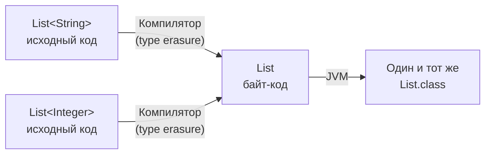
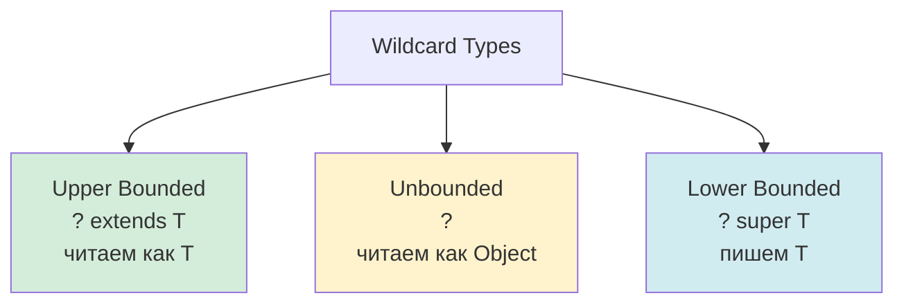
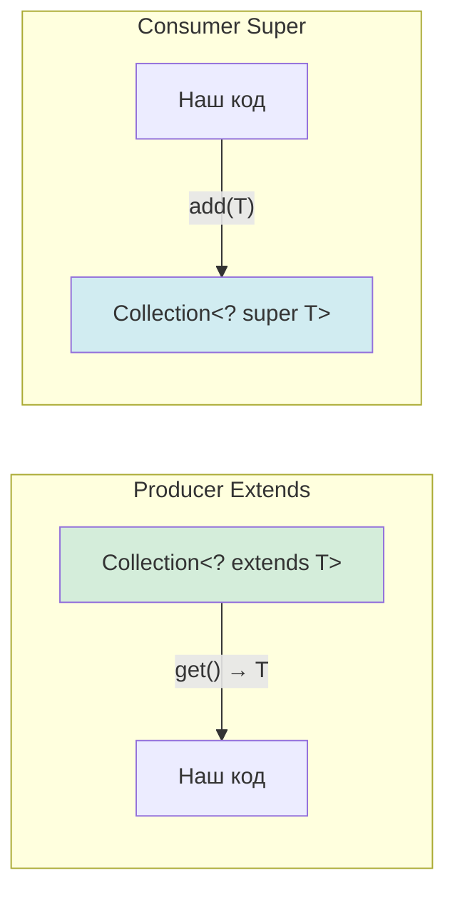
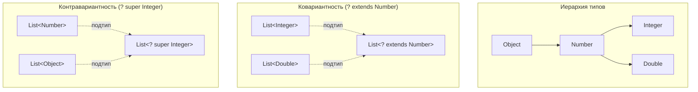

# Вопросы на собеседовании: `Java Generics`

Комплексное руководство по вопросам собеседования на тему `Java Generics` для `Senior Java Developer`. Охватывает `Type Erasure`, `Wildcards`, `PECS`, `Bounded Types`, `Bridge Methods`, generic-методы, ограничения дженериков и best practices.

## Полезные ссылки

### Официальная документация

- [Java Generics Tutorial](https://docs.oracle.com/javase/tutorial/java/generics/) — официальный туториал Oracle
- [Type Erasure](https://docs.oracle.com/javase/tutorial/java/generics/erasure.html) — стирание типов
- [Wildcards](https://docs.oracle.com/javase/tutorial/java/generics/wildcards.html) — подстановочные знаки
- [Java Generics Interview Questions — Baeldung](https://www.baeldung.com/java-generics-interview-questions) — вопросы с ответами
- [Type Erasure in Java Explained — Baeldung](https://www.baeldung.com/java-type-erasure) — подробно о стирании типов
- [Java Generics PECS — Baeldung](https://www.baeldung.com/java-generics-pecs) — принцип PECS

## Содержание

- [Полезные ссылки](#полезные-ссылки)
- [See also](#see-also)

**Основы дженериков**
- [Q1. (!) Что такое `Generic Type Parameter` и зачем нужны дженерики?](#q1--что-такое-generic-type-parameter-и-зачем-нужны-дженерики)
- [Q2. (!) Каковы преимущества использования `Generics`?](#q2--каковы-преимущества-использования-generics)
- [Q3. Чем `Generic Method` отличается от `Generic Type`?](#q3-чем-generic-method-отличается-от-generic-type)
- [Q4. (!) Что такое `Type Inference` (вывод типов)?](#q4--что-такое-type-inference-вывод-типов)
- [Q5. Какие соглашения об именовании параметров типа?](#q5-какие-соглашения-об-именовании-параметров-типа)

**Type Erasure (стирание типов)**
- [Q6. (!) Что такое `Type Erasure` и зачем оно нужно?](#q6--что-такое-type-erasure-и-зачем-оно-нужно)
- [Q7. (!) Как `Type Erasure` преобразует generic-код?](#q7--как-type-erasure-преобразует-generic-код)
- [Q8. (!) Доступна ли информация о generic-типе во время выполнения?](#q8--доступна-ли-информация-о-generic-типе-во-время-выполнения)
- [Q9. Что такое `Reifiable` и `Non-Reifiable` типы?](#q9-что-такое-reifiable-и-non-reifiable-типы)

**Bounded Types (ограниченные типы)**
- [Q10. (!) Что такое `Bounded Type Parameter`?](#q10--что-такое-bounded-type-parameter)
- [Q11. (!) Что такое `Multiple Bounds` (`T extends A & B`)?](#q11--что-такое-multiple-bounds-t-extends-a--b)
- [Q12. Что такое `Recursive Type Bound` (`T extends Comparable<T>`)?](#q12-что-такое-recursive-type-bound-t-extends-comparablet)

**Wildcards (подстановочные знаки)**
- [Q13. (!) Что такое `Wildcard Type` и какие виды бывают?](#q13--что-такое-wildcard-type-и-какие-виды-бывают)
- [Q14. (!) Что такое `Upper Bounded Wildcard` (`? extends T`)?](#q14--что-такое-upper-bounded-wildcard--extends-t)
- [Q15. (!) Что такое `Lower Bounded Wildcard` (`? super T`)?](#q15--что-такое-lower-bounded-wildcard--super-t)
- [Q16. Что такое `Unbounded Wildcard` (`?`)?](#q16-что-такое-unbounded-wildcard-)
- [Q17. В чём разница между `<T>` и `<?>`?](#q17-в-чём-разница-между-t-и-)

**PECS и вариантность**
- [Q18. (!) Что такое `PECS` (`Producer Extends, Consumer Super`)?](#q18--что-такое-pecs-producer-extends-consumer-super)
- [Q19. (!) Как дженерики работают с наследованием (инвариантность)?](#q19--как-дженерики-работают-с-наследованием-инвариантность)
- [Q20. Что такое ковариантность, контравариантность и инвариантность?](#q20-что-такое-ковариантность-контравариантность-и-инвариантность)

**Raw Types и обратная совместимость**
- [Q21. (!) Что такое `Raw Type` и зачем избегать?](#q21--что-такое-raw-type-и-зачем-избегать)
- [Q22. Если при создании объекта не указан generic-тип, скомпилируется ли код?](#q22-если-при-создании-объекта-не-указан-generic-тип-скомпилируется-ли-код)

**Bridge Methods и компиляция**
- [Q23. (!) Что такое `Bridge Methods` и зачем они в дженериках?](#q23--что-такое-bridge-methods-и-зачем-они-в-дженериках)
- [Q24. Что такое `Heap Pollution`?](#q24-что-такое-heap-pollution)

**Generic-методы, varargs и статика**
- [Q25. Как работают дженерики с `varargs` (`T... args`)?](#q25-как-работают-дженерики-с-varargs-t-args)
- [Q26. Дженерики в статических методах и полях?](#q26-дженерики-в-статических-методах-и-полях)

**Ограничения и практика**
- [Q27. (!) Можно ли использовать примитивы как generic-тип?](#q27--можно-ли-использовать-примитивы-как-generic-тип)
- [Q28. Можно ли создать массив generic-типа (`new T[]`)?](#q28-можно-ли-создать-массив-generic-типа-new-t)
- [Q29. Почему нельзя создать `List<String>[]`?](#q29-почему-нельзя-создать-liststring)
- [Q30. Как получить `Class<T>` для generic-типа в runtime?](#q30-как-получить-classt-для-generic-типа-в-runtime)
- [Q31. Что такое `@SuppressWarnings("unchecked")` и когда использовать?](#q31-что-такое-suppresswarningsunchecked-и-когда-использовать)
- [Q32. Как сериализовать объекты с generic-полями?](#q32-как-сериализовать-объекты-с-generic-полями)
- [Q33. (!) Что такое `Super Type Token` и как это используется?](#q33--что-такое-super-type-token-и-как-это-используется)
- [Q34. Дженерики и `instanceof` — какие проверки допустимы?](#q34-дженерики-и-instanceof--какие-проверки-допустимы)
- [Q35. Какие изменения в дженериках появились в Java 10+?](#q35-какие-изменения-в-дженериках-появились-в-java-10)

**Wildcards, Type Erasure, Comparable**
- [Q36. (!) В чём разница между `? extends T` и `? super T`? Когда что выбирать?](#q36--в-чём-разница-между--extends-t-и--super-t-когда-что-выбирать)
- [Q37. (!) Как работает `Type Erasure` на практике и какие проблемы создаёт?](#q37--как-работает-type-erasure-на-практике-и-какие-проблемы-создаёт)
- [Q38. Что такое generic-методы и как компилятор выводит тип?](#q38-что-такое-generic-методы-и-как-компилятор-выводит-тип)
- [Q39. Что такое `Comparable<T>` vs `Comparator<T>` с точки зрения дженериков?](#q39-что-такое-comparablet-vs-comparatort-с-точки-зрения-дженериков)
- [Q40. Что такое wildcards (`?`) и когда использовать unbounded `<?>`?](#q40-что-такое-wildcards--и-когда-использовать-unbounded-)

---

## Q1. (!) Что такое `Generic Type Parameter` и зачем нужны дженерики?

**Параметр generic-типа** — это параметр, который позволяет использовать тип как переменную в объявлении класса, интерфейса или метода. Дженерики появились в Java 5 и обеспечивают **типобезопасность на этапе компиляции** без потери универсальности кода.

Без дженериков:

```java
public interface Consumer {
    void consume(String parameter); // жёстко привязано к String
}
```

С дженериками:

```java
public interface Consumer<T> {
    void consume(T parameter); // T — параметр типа
}

// Конкретная реализация
public class IntegerConsumer implements Consumer<Integer> {
    @Override
    public void consume(Integer parameter) {
        System.out.println("Consumed: " + parameter);
    }
}
```

Дженерики решают три ключевые проблемы:
1. **Типобезопасность** — ошибки типов ловятся на этапе компиляции, а не в runtime
2. **Устранение кастов** — не нужно приводить `Object` к конкретному типу
3. **Переиспользование кода** — один алгоритм работает с разными типами

## Q2. (!) Каковы преимущества использования `Generics`?

**1. Типобезопасность на этапе компиляции** — ошибки типов обнаруживаются до запуска программы:

```java
// Без дженериков — ClassCastException в runtime
List list = new ArrayList();
list.add("hello");
list.add(42);
Integer value = (Integer) list.get(0); // Runtime error!

// С дженериками — ошибка компиляции
List<String> typedList = new ArrayList<>();
typedList.add("hello");
typedList.add(42); // Compilation error!
```

**2. Устранение явного приведения типов:**

```java
// Без дженериков
Object obj = list.get(0);
String s = (String) obj; // нужен каст

// С дженериками
String s = typedList.get(0); // каст не нужен
```

**3. Возможность писать обобщённые алгоритмы:**

```java
public static <T extends Comparable<T>> T max(List<T> list) {
    return list.stream().max(Comparator.naturalOrder()).orElseThrow();
}
// Работает с любым Comparable: Integer, String, LocalDate...
```

## Q3. Чем `Generic Method` отличается от `Generic Type`?

**Generic-тип** — параметр типа объявлен на уровне класса/интерфейса и доступен во всех нестатических методах.
**Generic-метод** — параметр типа объявлен перед возвращаемым типом метода и живёт только в рамках этого метода.

```java
// Generic-тип — T доступен во всём классе
public class Box<T> {
    private T value;
    public T getValue() { return value; }
}

// Generic-метод — T ограничен методом
public class Utils {
    public static <T> T firstOrNull(List<T> list) {
        return list.isEmpty() ? null : list.get(0);
    }
}
```

Вызов generic-метода — тип обычно выводится автоматически:

```java
String first = Utils.firstOrNull(List.of("a", "b")); // T = String
// Явное указание типа (редко нужно):
String first = Utils.<String>firstOrNull(someList);
```

Generic-метод может быть как в generic-классе, так и в обычном, и может быть статическим (в отличие от параметра типа класса, который в статическом контексте недоступен).

## Q4. (!) Что такое `Type Inference` (вывод типов)?

**Type Inference** — способность компилятора автоматически определить параметр типа из контекста. Компилятор анализирует аргументы метода и целевой тип, чтобы вывести T.

```java
// Вывод из аргумента метода
Integer result = returnType(42);      // T = Integer
String text = returnType("hello");    // T = String

// Diamond operator (Java 7+) — вывод из левой части
List<String> list = new ArrayList<>(); // вместо new ArrayList<String>()

// Улучшенный вывод в Java 8 — вывод из контекста лямбды
List<String> sorted = sort(list, Comparator.comparing(String::length));
```

В Java 8 вывод типов был значительно улучшен — компилятор стал учитывать **целевой тип** (target type) в более широком контексте, включая аргументы лямбда-выражений. Подробнее об этом в [[java-8-interview|вопросах по Java 8]].

## Q5. Какие соглашения об именовании параметров типа?

По конвенции используются однобуквенные заглавные имена:

| Параметр | Значение | Пример |
|----------|----------|--------|
| `T` | Type (тип) | `class Box<T>` |
| `E` | Element (элемент коллекции) | `interface List<E>` |
| `K` | Key (ключ) | `interface Map<K, V>` |
| `V` | Value (значение) | `interface Map<K, V>` |
| `N` | Number (число) | `class Matrix<N extends Number>` |
| `S, U` | Дополнительные типы | `class Pair<S, U>` |
| `R` | Result (результат) | `Function<T, R>` |

Эти соглашения не обязательны синтаксически, но общеприняты и улучшают читаемость кода.

## Q6. (!) Что такое `Type Erasure` и зачем оно нужно?

**Type Erasure** (стирание типов) — механизм, при котором компилятор удаляет всю информацию о generic-типах при компиляции в байт-код. После стирания JVM не знает о параметрах типа — они существуют только на этапе компиляции.

**Зачем:** обратная совместимость с кодом, написанным до Java 5. Байт-код с дженериками и без должен быть взаимозаменяем.



Это значит, что `List<String>` и `List<Integer>` — это **один и тот же класс** в runtime:

```java
List<String> strings = new ArrayList<>();
List<Integer> integers = new ArrayList<>();

// true! В runtime оба — просто ArrayList
System.out.println(strings.getClass() == integers.getClass()); // true
```

## Q7. (!) Как `Type Erasure` преобразует generic-код?

Компилятор выполняет три преобразования:

**1. Неограниченный тип заменяется на `Object`:**

```java
// До стирания
public class Box<T> {
    private T value;
    public T get() { return value; }
}

// После стирания
public class Box {
    private Object value;
    public Object get() { return value; }
}
```

**2. Ограниченный тип заменяется на первую границу:**

```java
// До стирания
public class NumberBox<T extends Number> {
    private T value;
}

// После стирания — T заменяется на Number
public class NumberBox {
    private Number value;
}
```

**3. Компилятор вставляет приведения типов (checkcast):**

```java
// Исходный код
List<String> list = new ArrayList<>();
String s = list.get(0);

// Что генерирует компилятор (упрощённо)
List list = new ArrayList();
String s = (String) list.get(0); // вставленный каст
```

## Q8. (!) Доступна ли информация о generic-типе во время выполнения?

В общем случае **нет** — из-за стирания типов. Но есть исключение: когда generic-тип зафиксирован в **сигнатуре класса** (при наследовании), информация сохраняется в метаданных класса.

```java
// Тип Cat сохраняется в метаданных CatCage.class
public class CatCage implements Cage<Cat> { }

// Можно извлечь через рефлексию
ParameterizedType pt = (ParameterizedType) CatCage.class.getGenericSuperclass();
Type actualType = pt.getActualTypeArguments()[0]; // Cat.class
```

Полный пример получения generic-типа:

```java
public abstract class TypeReference<T> {
    private final Type type;

    protected TypeReference() {
        ParameterizedType pt = (ParameterizedType) getClass().getGenericSuperclass();
        this.type = pt.getActualTypeArguments()[0];
    }

    public Type getType() { return type; }
}

// Использование — анонимный подкласс фиксирует тип
TypeReference<List<String>> ref = new TypeReference<>() {};
System.out.println(ref.getType()); // java.util.List<java.lang.String>
```

Этот приём называется **Super Type Token** и активно используется в Jackson, Spring и других фреймворках. Подробнее в Q33.

## Q9. Что такое `Reifiable` и `Non-Reifiable` типы?

**Reifiable** тип — тип, информация о котором полностью доступна в runtime:
- Примитивы: `int`, `double`
- Non-generic классы: `String`, `Object`
- Raw types: `List`, `Map`
- Unbounded wildcards: `List<?>`, `Map<?, ?>`
- Массивы reifiable типов: `String[]`, `int[]`

**Non-reifiable** тип — информация теряется после стирания:
- `List<String>`, `Map<String, Integer>` — становятся `List`, `Map`
- `List<? extends Number>` — становится `List`

```java
// Можно — reifiable типы
if (obj instanceof List<?>) { }     // OK
String[] arr = new String[10];       // OK

// Нельзя — non-reifiable типы
if (obj instanceof List<String>) { } // Compilation error
List<String>[] arr = new List<String>[10]; // Compilation error
```

## Q10. (!) Что такое `Bounded Type Parameter`?

**Bounded Type Parameter** ограничивает допустимые типы-аргументы с помощью `extends`. Это позволяет использовать методы ограничивающего типа внутри generic-кода.

```java
// T должен быть подтипом Number
public class MathBox<T extends Number> {
    private T value;

    public double doubleValue() {
        return value.doubleValue(); // метод Number доступен!
    }
}

MathBox<Integer> intBox = new MathBox<>();   // OK
MathBox<Double> dblBox = new MathBox<>();    // OK
MathBox<String> strBox = new MathBox<>();    // Compilation error!
```

Ограничение типа в generic-методе:

```java
public static <T extends Comparable<T>> T max(T a, T b) {
    return a.compareTo(b) >= 0 ? a : b;
}
```

После стирания типов `T extends Number` заменяется на `Number`, а `T extends Comparable<T>` — на `Comparable`.

## Q11. (!) Что такое `Multiple Bounds` (`T extends A & B`)?

Параметр типа может иметь несколько границ, разделённых `&`. Класс (если есть) должен идти первым, далее — интерфейсы:

```java
// T должен наследовать Animal И реализовать Serializable И Comparable
public class SmartCage<T extends Animal & Serializable & Comparable<T>> {
    private List<T> animals = new ArrayList<>();

    public T getOldest() {
        return Collections.max(animals); // Comparable доступен
    }
}
```

Правила:
- Максимум **один класс** в bounds (и он должен быть первым)
- **Интерфейсов** может быть несколько
- `T extends Serializable & Comparable<T>` — OK (только интерфейсы)
- `T extends Object & Comparable<T>` — OK (`Object` как класс первый)
- `T extends Comparable<T> & Animal` — **ошибка**, если `Animal` — класс (класс не первый)

## Q12. Что такое `Recursive Type Bound` (`T extends Comparable<T>`)?

**Recursive Type Bound** — тип ограничен выражением, содержащим сам себя. Самый известный пример — `Comparable`:

```java
// T сравним с самим собой
public static <T extends Comparable<T>> T max(List<T> list) {
    T result = list.get(0);
    for (T item : list) {
        if (item.compareTo(result) > 0) {
            result = item;
        }
    }
    return result;
}
```

Другой классический пример — `Enum`:

```java
// Определение в JDK
public abstract class Enum<E extends Enum<E>> implements Comparable<E> {
    public final int compareTo(E o) { ... }
}

// Конкретный enum
public enum Color extends Enum<Color> { RED, GREEN, BLUE }
```

Паттерн используется в Builder-ах для возврата правильного типа при наследовании:

```java
public abstract class Builder<T extends Builder<T>> {
    public T withName(String name) {
        this.name = name;
        return self();
    }
    protected abstract T self();
}
```

## Q13. (!) Что такое `Wildcard Type` и какие виды бывают?

**Wildcard** (`?`) — подстановочный знак, представляющий неизвестный тип. Используется когда конкретный тип не важен или не может быть выражен через параметр типа.

Три вида wildcards:



| Вид | Синтаксис | Чтение | Запись | Пример |
|-----|-----------|--------|--------|--------|
| `Upper Bounded` | `? extends T` | Как `T` | Нельзя (кроме `null`) | `List<? extends Number>` |
| `Unbounded` | `?` | Как `Object` | Нельзя (кроме `null`) | `List<?>` |
| `Lower Bounded` | `? super T` | Как `Object` | Можно `T` и подтипы | `List<? super Integer>` |

## Q14. (!) Что такое `Upper Bounded Wildcard` (`? extends T`)?

`? extends T` означает «любой тип, который является `T` или его подтипом». Используется когда нужно **читать** элементы из коллекции (producer).

```java
public class Farm {
    private List<Animal> animals = new ArrayList<>();

    // Без wildcard — принимает ТОЛЬКО Collection<Animal>
    // public void addAnimals(Collection<Animal> newAnimals) { ... }

    // С wildcard — принимает Collection<Cat>, Collection<Dog> и т.д.
    public void addAnimals(Collection<? extends Animal> newAnimals) {
        animals.addAll(newAnimals);
    }
}

List<Cat> cats = List.of(new Cat("Мурка"), new Cat("Барсик"));
farm.addAnimals(cats); // OK — Cat extends Animal
```

**Ограничение:** в `List<? extends Animal>` нельзя добавлять элементы (кроме `null`), потому что компилятор не знает конкретный тип:

```java
List<? extends Number> numbers = new ArrayList<Integer>();
numbers.add(42);    // Compilation error!
numbers.add(null);  // OK — null допустим для любого типа
Number n = numbers.get(0); // OK — читать как Number можно
```

## Q15. (!) Что такое `Lower Bounded Wildcard` (`? super T`)?

`? super T` означает «любой тип, который является `T` или его суперклассом». Используется когда нужно **писать** элементы в коллекцию (consumer).

```java
public static void addIntegers(List<? super Integer> list) {
    list.add(1);
    list.add(2);
    list.add(3);
}

List<Number> numbers = new ArrayList<>();
addIntegers(numbers); // OK — Number super Integer

List<Object> objects = new ArrayList<>();
addIntegers(objects); // OK — Object super Integer

List<Double> doubles = new ArrayList<>();
addIntegers(doubles); // Compilation error! Double не super Integer
```

**Ограничение при чтении:** из `List<? super Integer>` элементы читаются только как `Object`, потому что компилятор не знает, является ли список `List<Integer>`, `List<Number>` или `List<Object>`:

```java
List<? super Integer> list = new ArrayList<Number>();
list.add(42);              // OK — пишем Integer
Object obj = list.get(0);  // OK — читаем как Object
Integer i = list.get(0);   // Compilation error!
```

## Q16. Что такое `Unbounded Wildcard` (`?`)?

`?` — неограниченный подстановочный знак, представляющий любой тип. Используется когда:
- Метод работает с `Object` и не зависит от параметра типа
- Метод использует только методы самой коллекции (`size()`, `clear()`, `isEmpty()`)

```java
// Принимает список любого типа
public static void printList(List<?> list) {
    for (Object item : list) {
        System.out.println(item);
    }
}

printList(List.of("a", "b"));  // OK
printList(List.of(1, 2, 3));   // OK
```

**Важное отличие** — `List<?>` и `List<Object>` — это **не одно и то же**:

```java
List<?> wildcardList = new ArrayList<String>();       // OK
List<Object> objectList = new ArrayList<String>();    // Compilation error!
```

`List<Object>` требует именно `List<Object>`, а `List<?>` принимает список любого типа.

## Q17. В чём разница между `<T>` и `<?>`?

| Аспект | `<T>` (параметр типа) | `<?>` (wildcard) |
|--------|----------------------|------------------|
| Где используется | Объявление класса/метода | Аргумент типа |
| Можно ссылаться на тип | Да (`T value = ...`) | Нет |
| Ограничения | `extends`, `&` | `extends`, `super` |
| Связь между параметрами | Да | Нет |

```java
// <T> — можно связать входной и выходной тип
public static <T> T firstElement(List<T> list) {
    return list.get(0); // возвращаемый тип связан с T
}

// <?> — тип неизвестен, нельзя типизировать возврат
public static void printAll(List<?> list) {
    // list.get(0) возвращает Object
}
```

Подробный анализ выбора между `<T>` и `<?>` описан в статье [Type Parameter vs Wildcard — Baeldung](https://www.baeldung.com/java-generics-type-parameter-vs-wildcard).

## Q18. (!) Что такое `PECS` (`Producer Extends, Consumer Super`)?

**PECS** — мнемоника для выбора правильного wildcard при работе с коллекциями:
- **Producer Extends** — если коллекция **производит** (отдаёт) элементы → `? extends T`
- **Consumer Super** — если коллекция **потребляет** (принимает) элементы → `? super T`



Примеры из JDK, следующие принципу PECS:

```java
// Collections.copy — src производит (extends), dest потребляет (super)
public static <T> void copy(List<? super T> dest, List<? extends T> src) { ... }

// Collection.addAll — параметр производит элементы
boolean addAll(Collection<? extends E> c);

// Collections.sort — Comparator потребляет элементы для сравнения
public static <T> void sort(List<T> list, Comparator<? super T> c) { ... }

// Stream.forEach — Consumer потребляет элементы
void forEach(Consumer<? super T> action);
```

Практический пример:

```java
public static <T> void transfer(
        List<? extends T> source,   // Producer — читаем из неё
        List<? super T> destination // Consumer — пишем в неё
) {
    for (T item : source) {
        destination.add(item);
    }
}

List<Integer> ints = List.of(1, 2, 3);
List<Number> nums = new ArrayList<>();
transfer(ints, nums); // Integer extends Number, Number super Integer
```

**Если коллекция одновременно и producer, и consumer** — используйте точный тип (без wildcard).

## Q19. (!) Как дженерики работают с наследованием (инвариантность)?

Дженерики в Java **инвариантны**: `List<String>` **не является** подтипом `List<Object>`, хотя `String` является подтипом `Object`.

```java
List<String> strings = new ArrayList<>();
List<Object> objects = strings; // Compilation error!
```

**Почему это запрещено?** Если бы было разрешено:

```java
List<String> strings = new ArrayList<>();
List<Object> objects = strings;    // если бы было можно...
objects.add(42);                   // добавили Integer в List<String>!
String s = strings.get(0);        // ClassCastException!
```

Для гибкости используются **wildcards** (см. [[java-collections-interview|Java Collections]]):

```java
List<String> strings = List.of("a", "b");

List<? extends Object> covariant = strings;     // OK — ковариантность
List<? super String> contravariant = strings;    // OK — контравариантность
```

## Q20. Что такое ковариантность, контравариантность и инвариантность?

| Свойство | Описание | Java Generics | Java Arrays |
|----------|----------|---------------|-------------|
| **Ковариантность** | Если `A <: B`, то `F<A> <: F<B>` | `? extends T` | `String[] <: Object[]` |
| **Контравариантность** | Если `A <: B`, то `F<B> <: F<A>` | `? super T` | Нет |
| **Инвариантность** | `F<A>` и `F<B>` не связаны | `List<T>` | — |



**Массивы в Java ковариантны** (в отличие от дженериков), что может приводить к `ArrayStoreException`:

```java
Object[] array = new String[3]; // OK — массивы ковариантны
array[0] = 42; // Компилируется, но ArrayStoreException в runtime!
```

## Q21. (!) Что такое `Raw Type` и зачем избегать?

**Raw Type** — использование generic-класса без указания параметра типа. Существует для обратной совместимости с кодом, написанным до Java 5.

```java
// Raw type — НЕ рекомендуется
List rawList = new ArrayList();
rawList.add("hello");
rawList.add(42);               // никаких ошибок компиляции
String s = (String) rawList.get(1); // ClassCastException в runtime!

// Параметризованный тип — рекомендуется
List<String> typedList = new ArrayList<>();
typedList.add("hello");
typedList.add(42);             // Compilation error!
```

**Почему избегать raw types:**
1. Теряется типобезопасность — ошибки обнаруживаются только в runtime
2. Компилятор выдаёт предупреждения `unchecked`
3. Присвоение raw type параметризованному типу отключает проверки: `List<String> list = rawList;` — компилируется с предупреждением, но опасно

**Правило:** если тип не важен, используйте `<?>` вместо raw type: `List<?>` вместо `List`.

## Q22. Если при создании объекта не указан generic-тип, скомпилируется ли код?

Да, код скомпилируется, но с **предупреждениями компилятора** (unchecked warnings). Это обеспечивает обратную совместимость с кодом до Java 5:

```java
List list = new ArrayList();       // raw type — предупреждение
list.add("text");

List<String> typed = list;         // unchecked assignment — предупреждение
String s = typed.get(0);           // работает, но не гарантировано
```

Хотя обратная совместимость и стирание типов позволяют опускать параметры типа, это **плохая практика**. Всегда указывайте параметр типа или хотя бы `<?>`.

## Q23. (!) Что такое `Bridge Methods` и зачем они в дженериках?

**Bridge method** — синтетический метод, который компилятор генерирует для сохранения полиморфизма после стирания типов.

```java
public interface Comparable<T> {
    int compareTo(T other);
}

public class MyDate implements Comparable<MyDate> {
    @Override
    public int compareTo(MyDate other) { // сигнатура с MyDate
        return this.date.compareTo(other.date);
    }
}
```

После стирания `Comparable<T>` становится `Comparable` с методом `compareTo(Object)`. Но `MyDate` имеет `compareTo(MyDate)` — другая сигнатура! Компилятор генерирует **bridge-метод**:

```java
// Сгенерированный bridge method (synthetic)
public int compareTo(Object other) {
    return compareTo((MyDate) other); // делегирует к реальному методу
}
```

Можно обнаружить bridge-методы через рефлексию:

```java
for (Method m : MyDate.class.getDeclaredMethods()) {
    if (m.isBridge()) {
        System.out.println("Bridge: " + m);
        // Bridge: public int MyDate.compareTo(Object)
    }
}
```

## Q24. Что такое `Heap Pollution`?

**Heap Pollution** (загрязнение кучи) — ситуация, когда переменная параметризованного типа ссылается на объект, не являющийся этим параметризованным типом. Возникает при смешивании raw types и generic types.

```java
List<String> strings = new ArrayList<>();
List rawList = strings;           // raw type — unchecked warning
rawList.add(42);                  // Heap pollution! Integer в List<String>

String s = strings.get(0);       // ClassCastException в runtime
```

Heap pollution также возникает при использовании varargs с дженериками:

```java
@SafeVarargs // подавляет предупреждение
static <T> List<T> asList(T... elements) {
    // elements имеет тип T[], но в runtime это Object[]
    // Потенциальное heap pollution
    return Arrays.asList(elements);
}
```

Компилятор предупреждает о потенциальном heap pollution через `unchecked` warnings. Аннотация `@SafeVarargs` допустима только на `final`, `static` или `private` методах, где автор гарантирует безопасность.

## Q25. Как работают дженерики с `varargs` (`T... args`)?

При вызове `method(T... args)` создаётся массив. Из-за стирания типов создаётся `Object[]` вместо `T[]`, что вызывает предупреждение о heap pollution:

```java
// Предупреждение: Possible heap pollution from parameterized vararg type
static <T> List<T> listOf(T... elements) {
    List<T> list = new ArrayList<>();
    for (T e : elements) {
        list.add(e);
    }
    return list;
}
```

**Когда безопасно** — `@SafeVarargs` подавляет предупреждение:

```java
@SafeVarargs
static <T> List<T> safeListOf(T... elements) {
    return List.of(elements); // массив не утекает наружу
}
```

**Когда опасно** — массив передаётся наружу:

```java
// ОПАСНО — не помечайте @SafeVarargs!
static <T> T[] toArray(T... args) {
    return args; // возвращает Object[] под видом T[]
}

String[] result = toArray("a", "b"); // ClassCastException!
// Object[] нельзя привести к String[]
```

## Q26. Дженерики в статических методах и полях?

**Статическое поле** не может использовать параметр типа класса, потому что статическое поле одно на все экземпляры (а параметр типа разный для `MyClass<String>` и `MyClass<Integer>`):

```java
public class Box<T> {
    private static T value;      // Compilation error!
    private static List<T> list; // Compilation error!
}
```

**Статический метод** может быть generic — но со своим собственным параметром типа:

```java
public class Utils {
    // Свой параметр типа T, не связанный с классом
    public static <T> T firstElement(List<T> list) {
        return list.isEmpty() ? null : list.get(0);
    }
}
```

## Q27. (!) Можно ли использовать примитивы как generic-тип?

**Нет.** Параметр типа стирается в `Object`, а примитивы не являются подтипами `Object`. Необходимо использовать **классы-обёртки**:

```java
List<int> ints = new ArrayList<>();      // Compilation error!
List<Integer> ints = new ArrayList<>();  // OK — autoboxing

Map<String, double> map = new HashMap<>();     // Compilation error!
Map<String, Double> map = new HashMap<>();     // OK
```

**Влияние на производительность:** autoboxing/unboxing создаёт объекты-обёртки, что увеличивает потребление памяти и нагрузку на GC. Для критичных сценариев используйте специализированные коллекции:

```java
// JDK — примитивные стримы без боксинга
IntStream.range(0, 1000).sum();
LongStream.of(1L, 2L, 3L).average();

// Eclipse Collections, Trove — примитивные коллекции
// IntArrayList, LongHashSet и т.д.
```

Подробнее о примитивах и обёртках — в [[java-types-interview|вопросах по системе типов Java]].

## Q28. Можно ли создать массив generic-типа (`new T[]`)?

**Нельзя:** `new T[]` не компилируется, потому что T стирается в `Object` и JVM не может создать массив неизвестного типа.

```java
public class Box<T> {
    // private T[] items = new T[10]; // Compilation error!

    // Обходной путь 1 — каст с подавлением предупреждения
    @SuppressWarnings("unchecked")
    private T[] items = (T[]) new Object[10]; // работает, но небезопасно

    // Обходной путь 2 — через Class<T>
    @SuppressWarnings("unchecked")
    public static <T> T[] createArray(Class<T> type, int size) {
        return (T[]) java.lang.reflect.Array.newInstance(type, size);
    }

    // Обходной путь 3 (рекомендуемый) — использовать List<T>
    private List<T> items = new ArrayList<>();
}
```

**Рекомендация:** используйте `ArrayList<T>` вместо массивов generic-типов — это и безопаснее, и удобнее.

## Q29. Почему нельзя создать `List<String>[]`?

Массивы в Java **ковариантны** и знают свой тип элемента в runtime (reifiable). `List<String>` после стирания — это просто `List` (non-reifiable). Если бы `List<String>[]` был разрешён, можно было бы нарушить типобезопасность:

```java
// Если бы было разрешено (не компилируется):
List<String>[] stringLists = new List<String>[1]; // Compilation error!

// Гипотетически, что могло бы пойти не так:
Object[] objects = stringLists;         // массивы ковариантны
objects[0] = List.of(42);              // List<Integer> вместо List<String>
String s = stringLists[0].get(0);      // ClassCastException!
```

**Решение:** используйте `List<List<String>>` вместо массива списков:

```java
List<List<String>> listOfLists = new ArrayList<>(); // безопасно
```

## Q30. Как получить `Class<T>` для generic-типа в runtime?

Из-за стирания типов `T` недоступен в runtime. Основные подходы:

**1. Передать `Class<T>` явно (самый надёжный):**

```java
public class Repository<T> {
    private final Class<T> entityClass;

    public Repository(Class<T> entityClass) {
        this.entityClass = entityClass;
    }

    public T deserialize(String json) {
        return objectMapper.readValue(json, entityClass);
    }
}

var repo = new Repository<>(User.class);
```

**2. Рефлексия через подкласс:**

```java
public abstract class AbstractRepository<T> {
    private final Class<T> entityClass;

    @SuppressWarnings("unchecked")
    protected AbstractRepository() {
        ParameterizedType pt = (ParameterizedType) getClass().getGenericSuperclass();
        this.entityClass = (Class<T>) pt.getActualTypeArguments()[0];
    }
}

// Тип User сохраняется в метаданных UserRepository.class
public class UserRepository extends AbstractRepository<User> { }
```

**3. TypeReference (Jackson) / ParameterizedTypeReference (Spring):**

```java
// Jackson
List<User> users = objectMapper.readValue(json,
    new TypeReference<List<User>>() {});

// Spring RestTemplate
List<User> users = restTemplate.exchange(url, HttpMethod.GET, null,
    new ParameterizedTypeReference<List<User>>() {}).getBody();
```

## Q31. Что такое `@SuppressWarnings("unchecked")` и когда использовать?

`@SuppressWarnings("unchecked")` отключает предупреждения компилятора о непроверяемых приведениях типов, связанных с дженериками.

```java
// Без аннотации — предупреждение компилятора
List<String> list = (List<String>) someObject; // unchecked cast

// С аннотацией — предупреждение подавлено
@SuppressWarnings("unchecked")
List<String> list = (List<String>) someObject;
```

**Когда допустимо использовать:**
- Приведение из raw type при работе с legacy API
- `(T[]) new Object[n]` — внутри generic-класса
- Десериализация с известным типом
- Framework-код (Spring, Jackson) где приведение неизбежно

**Best practices:**
1. Применяйте на **минимальной области** — на переменную, не на весь метод или класс
2. **Всегда** добавляйте комментарий, объясняющий безопасность приведения
3. По возможности рефакторьте код, чтобы убрать необходимость в подавлении

```java
@SuppressWarnings("unchecked") // безопасно: deserialize всегда возвращает T для данного Class<T>
T result = (T) deserializer.deserialize(data, targetClass);
```

## Q32. Как сериализовать объекты с generic-полями?

При сериализации generic-информация теряется (стирание типов). Для корректной десериализации нужно передавать информацию о типе явно.

**Jackson — `TypeReference`:**

```java
public class Wrapper<T> {
    private T data;
    private String metadata;
    // getters, setters
}

// Сериализация — без проблем
String json = objectMapper.writeValueAsString(wrapper);

// Десериализация — нужен TypeReference
Wrapper<User> wrapper = objectMapper.readValue(json,
    new TypeReference<Wrapper<User>>() {});
```

**Gson — `TypeToken`:**

```java
Type type = new TypeToken<Wrapper<User>>() {}.getType();
Wrapper<User> wrapper = gson.fromJson(json, type);
```

**Общий принцип:** и `TypeReference`, и `TypeToken` используют приём Super Type Token (Q33), чтобы сохранить информацию о generic-типе.

## Q33. (!) Что такое `Super Type Token` и как это используется?

**Super Type Token** — паттерн для сохранения информации о generic-типе в runtime, обходящий стирание типов. Основан на том, что при наследовании с конкретным generic-аргументом тип сохраняется в метаданных класса.

```java
// Абстрактный Super Type Token
public abstract class TypeReference<T> {
    private final Type type;

    protected TypeReference() {
        Type superClass = getClass().getGenericSuperclass();
        this.type = ((ParameterizedType) superClass).getActualTypeArguments()[0];
    }

    public Type getType() { return type; }
}

// Использование — создаём анонимный подкласс (фиксирует тип)
TypeReference<Map<String, List<Integer>>> ref = new TypeReference<>() {};
System.out.println(ref.getType());
// java.util.Map<java.lang.String, java.util.List<java.lang.Integer>>
```

**Где используется:**
- **Jackson:** `new TypeReference<List<User>>() {}` для десериализации
- **Spring:** `new ParameterizedTypeReference<List<User>>() {}` в `RestTemplate` и `WebClient`
- **Guava:** `TypeToken<List<String>>` для работы с generic-типами

Паттерн впервые описан Нилом Гафтером (Neal Gafter) и стал стандартным подходом в Java-экосистеме. Подробнее — [Super Type Tokens — Baeldung](https://www.baeldung.com/java-super-type-tokens).

## Q34. Дженерики и `instanceof` — какие проверки допустимы?

Из-за стирания типов `instanceof` с параметризованным типом **невозможен**:

```java
Object obj = new ArrayList<String>();

// Нельзя — non-reifiable тип
if (obj instanceof List<String>) { }    // Compilation error!

// Можно — reifiable тип
if (obj instanceof List<?>) { }         // OK
if (obj instanceof List) { }            // OK (raw type, с предупреждением)
if (obj instanceof ArrayList<?>) { }    // OK

// Pattern matching (Java 16+) — аналогично
if (obj instanceof List<?> list) {       // OK
    System.out.println(list.size());
}
```

Если нужно проверить тип элементов, приходится делать это явно:

```java
public static <T> List<T> checkedList(List<?> raw, Class<T> type) {
    List<T> result = new ArrayList<>();
    for (Object item : raw) {
        if (type.isInstance(item)) {
            result.add(type.cast(item));
        }
    }
    return result;
}
// Или использовать Collections.checkedList для runtime-проверок
```

## Q35. Какие изменения в дженериках появились в Java 10+?

**Java 10 — `var` (вывод локального типа):**

```java
// Компилятор выводит тип из правой части
var list = new ArrayList<String>();   // тип: ArrayList<String>
var map = Map.of("key", 1);          // тип: Map<String, Integer>
```

`var` не стирает generic-информацию — компилятор выводит полный параметризованный тип. Но `var` нельзя использовать для полей класса, параметров методов и возвращаемых типов.

**Java 17+ — sealed classes с дженериками:**

```java
sealed interface Result<T> permits Success, Failure {
    T value();
}

record Success<T>(T value) implements Result<T> { }
record Failure<T>(Exception error) implements Result<T> {
    public T value() { throw new IllegalStateException(error); }
}
```

**Будущее — Project Valhalla:** в перспективе Java может получить специализированные дженерики для примитивов (без autoboxing), что устранит одно из ключевых ограничений текущей системы дженериков.

## Q36. (!) В чём разница между `? extends T` и `? super T`? Когда что выбирать?

`? extends T` (upper bounded wildcard) означает "тип, являющийся `T` или его подтипом". `? super T` (lower bounded wildcard) означает "тип, являющийся `T` или его супертипом". Выбор определяется принципом **PECS** (`Producer Extends, Consumer Super`).

```java
// ? extends T — из этой коллекции ЧИТАЕМ (producer)
static double sumNumbers(List<? extends Number> list) {
    double sum = 0;
    for (Number n : list) sum += n.doubleValue(); // OK — читаем как Number
    // list.add(1.0); // ОШИБКА — нельзя добавить (неизвестен конкретный тип)
    return sum;
}
// Работает с List<Integer>, List<Double>, List<Number> и т.д.

// ? super T — в эту коллекцию ПИШЕМ (consumer)
static void addNumbers(List<? super Integer> list) {
    list.add(1);       // OK — Integer подходит для любого супертипа Integer
    list.add(2);       // OK
    // Integer n = list.get(0); // ОШИБКА — возвращает Object, не Integer
}
// Работает с List<Integer>, List<Number>, List<Object>

// Пример из JDK: Collections.copy
// <T> void copy(List<? super T> dest, List<? extends T> src)
//                     consumer ^            producer ^
List<Number> dest = new ArrayList<>();
List<Integer> src = List.of(1, 2, 3);
Collections.copy(dest, src); // OK — Integer extends Number, Number super Integer
```

**Правило PECS в одном примере:**
```java
// Generic stack с PECS
class Stack<E> {
    // pushAll — src = producer, используем extends
    void pushAll(Iterable<? extends E> src) {
        for (E e : src) push(e);
    }

    // popAll — dst = consumer, используем super
    void popAll(Collection<? super E> dst) {
        while (!isEmpty()) dst.add(pop());
    }
}

Stack<Number> stack = new Stack<>();
stack.pushAll(List.of(1, 2, 3));        // List<Integer> extends Number ✅
Collection<Object> dest = new ArrayList<>();
stack.popAll(dest);                      // Collection<Object> super Number ✅
```

## Q37. (!) Как работает `Type Erasure` на практике и какие проблемы создаёт?

`Type Erasure` — процесс удаления информации о generic-типах во время компиляции. Все параметры типа заменяются их границей (обычно `Object`) или первым ограничением.

```java
// Исходный код
public class Pair<A, B> {
    private A first;
    private B second;
    public Pair(A first, B second) { this.first = first; this.second = second; }
    public A getFirst() { return first; }
}

// После стирания (байткод выглядит как):
public class Pair {
    private Object first;   // A → Object (нет ограничения)
    private Object second;  // B → Object
    public Pair(Object first, Object second) { ... }
    public Object getFirst() { return first; } // + каст на стороне вызывающего кода
}
```

**Практические последствия стирания:**

```java
// 1. Нельзя использовать instanceof с параметрическим типом
List<String> strings = List.of("a");
if (strings instanceof List<String>) { } // ✅ Java 16+ (reified pattern)
// if (x instanceof List<String> ls) { } — ✅ Java 21 sealed+pattern

// 2. Перегрузка по generic не работает — обе сигнатуры одинаковы после стирания
void process(List<String> list) { }
void process(List<Integer> list) { } // ОШИБКА КОМПИЛЯЦИИ — erasure collision!

// 3. Нельзя создать массив generic-типа
T[] arr = new T[10]; // ОШИБКА — обходной путь через рефлексию

// 4. Исключения нельзя параметризовать
// class MyException<T> extends Exception { } // нельзя catch (MyException<String> e)

// Получение типа в runtime — через Class<T>
class TypeSafeContainer<T> {
    private final Class<T> type;
    private T value;

    TypeSafeContainer(Class<T> type) { this.type = type; }

    T getValue(Object raw) {
        return type.cast(raw); // безопасный каст с проверкой
    }
}

TypeSafeContainer<String> c = new TypeSafeContainer<>(String.class);
```

## Q38. Что такое generic-методы и как компилятор выводит тип?

Generic-метод объявляет свои параметры типа независимо от класса-контейнера. Параметры метода выводятся из аргументов вызова через **type inference**.

```java
// Generic-метод в обычном классе
class Collections {
    // <T> — параметр метода, T extends Comparable — ограничение
    public static <T extends Comparable<T>> T max(List<T> list) {
        return list.stream().max(Comparator.naturalOrder()).orElseThrow();
    }

    // Несколько параметров типа
    public static <K, V> Map<V, K> invertMap(Map<K, V> original) {
        Map<V, K> result = new HashMap<>();
        original.forEach((k, v) -> result.put(v, k));
        return result;
    }
}

// Вызов — тип выводится автоматически
String maxStr = Collections.max(List.of("apple", "mango", "banana")); // T = String
Integer maxInt = Collections.max(List.of(3, 1, 4, 1, 5));              // T = Integer

// Явное указание типа (редко нужно)
List<String> empty = Collections.<String>emptyList();
```

**Type inference (вывод типа):**
```java
// Java 8+ — target type inference
List<String> list = new ArrayList<>(); // T выводится из List<String>

// Java 8 — inference через chain
Map<String, List<Integer>> complex = Stream.of("a", "b")
    .collect(Collectors.toMap(
        s -> s,
        s -> List.of(s.length()) // компилятор выводит List<Integer>
    ));

// Иногда нужна подсказка
List<Object> mixed = Stream.of("str", 42)
    .<Object>map(x -> x) // явный тип для разрешения неоднозначности
    .toList();
```

## Q39. Что такое `Comparable<T>` vs `Comparator<T>` с точки зрения дженериков?

`Comparable<T>` — интерфейс естественного порядка, реализуется внутри класса. `Comparator<T>` — функциональный интерфейс внешней стратегии сравнения. Оба активно используют generic-возможности Java.

```java
// Comparable — класс "знает" как себя сравнивать
class Version implements Comparable<Version> {
    private final int major, minor, patch;

    Version(int major, int minor, int patch) {
        this.major = major; this.minor = minor; this.patch = patch;
    }

    @Override
    public int compareTo(Version other) {
        // Comparator.comparingInt используется для цепочки сравнений
        return Comparator.comparingInt((Version v) -> v.major)
            .thenComparingInt(v -> v.minor)
            .thenComparingInt(v -> v.patch)
            .compare(this, other);
    }
}

// Generic-ограничение: T extends Comparable<T> — T умеет сравнивать себя с T
static <T extends Comparable<T>> T min(T a, T b) {
    return a.compareTo(b) <= 0 ? a : b;
}

// Более гибкое ограничение: T extends Comparable<? super T>
// Позволяет использовать Comparable, объявленный в суперклассе
static <T extends Comparable<? super T>> void sort(List<T> list) {
    // ...
}

// Comparator — функциональный интерфейс, поддерживает композицию
Comparator<Version> byMajor = Comparator.comparingInt(v -> v.major);
Comparator<Version> byMinorDesc = Comparator.<Version, Integer>comparing(v -> v.minor)
    .reversed();
Comparator<Version> compound = byMajor.thenComparing(byMinorDesc);

List<Version> versions = new ArrayList<>(List.of(
    new Version(2, 1, 0), new Version(1, 5, 0), new Version(2, 0, 3)
));
versions.sort(compound);
```

**Ключевая разница с generic-точки зрения:**

| Аспект | `Comparable<T>` | `Comparator<T>` |
|---|---|---|
| Тип | Интерфейс в `java.lang` | Функциональный интерфейс в `java.util` |
| Параметр | `T` — тип самого класса | `T` — тип сравниваемых объектов |
| Метод | `int compareTo(T o)` | `int compare(T o1, T o2)` |
| Цепочки | Нет | `thenComparing`, `reversed`, `nullsFirst` |
| Лямбды | Нельзя | Да — `Comparator<String> c = (a,b) -> a.length() - b.length()` |

## Q40. Что такое wildcards (`?`) и когда использовать unbounded `<?>`?

`Unbounded wildcard` `<?>` означает "любой тип" — это `? extends Object`. Используется когда:
- Метод работает с любым типом параметризованной коллекции
- Используется только API самого контейнера (не содержимого)

```java
// Unbounded wildcard — работаем с контейнером, не с содержимым
void printAll(List<?> list) {
    // list.add("x"); // ОШИБКА — тип неизвестен
    for (Object obj : list) { // можно читать как Object
        System.out.println(obj);
    }
}

// Работает с любым List<X>
printAll(List.of(1, 2, 3));       // List<Integer>
printAll(List.of("a", "b"));      // List<String>
printAll(List.of(1.0, 2.0));      // List<Double>

// Полезно для проверки метаданных
static <T> boolean isHomogeneous(List<?> list) {
    if (list.isEmpty()) return true;
    Class<?> type = list.get(0).getClass();
    return list.stream().allMatch(e -> e.getClass() == type);
}

// Когда List<?> лучше List<Object>:
List<Integer> ints = List.of(1, 2, 3);
List<Object> objs = ints; // ОШИБКА — List<Integer> не является List<Object>!
List<?> wild = ints;      // OK — List<Integer> является List<?>
```

**Сравнение трёх форм wildcards:**

```java
// 1. <?> — unbounded: только читать как Object, не добавлять
void print(List<?> list) { list.forEach(System.out::println); }

// 2. <? extends T> — upper bounded: читать как T, не добавлять (Producer Extends)
double sum(List<? extends Number> list) {
    return list.stream().mapToDouble(Number::doubleValue).sum();
}

// 3. <? super T> — lower bounded: добавлять T, читать только как Object (Consumer Super)
void fill(List<? super Integer> list, int count) {
    for (int i = 0; i < count; i++) list.add(i);
}
```

---

## See also

- [[java-collections-interview|Java Collections]] — коллекции активно используют дженерики (`List<T>`, `Map<K,V>`)
- [[java-oop-interview|OOP & Java]] — полиморфизм и наследование в контексте дженериков, ковариантность
- [[java-core-interview|Java Core]] — основы Java, система типов, `Reflection API` и дженерики
- [[java-8-interview|Java 8+]] — улучшения вывода типов в Java 8, `var` в Java 10
- [[java-types-interview|Система типов Java]] — примитивы, обёртки, приведение типов
- [[java-concurrency-interview|Java Concurrency]] — `Future<T>`, `CompletableFuture<T>`, generic thread-safe типы
- [[java-stream-interview|Java Stream API]] — `Stream<T>`, `Collector<T,A,R>` как примеры generic API
- [[java-serialization-interview|Java Serialization]] — сериализация объектов с generic-полями
- [[java-17-21-interview|Java 17-21]] — `sealed interface Result<T>`, паттерн-матчинг с дженериками
- [[design-patterns-interview|Design Patterns]] — Generic Factory, Repository<T>, паттерны с дженериками

- [[java-17-21-interview|Java 17-21]]
- [[java-8-interview|Java 8]]
- [[java-annotations-interview|Java Annotations]]
- [[java-collections-interview|Java Collections]]
- [[java-concurrency-interview|Java Concurrency]]
- [[java-conditional-statements-interview|Java Conditional Statements]]
