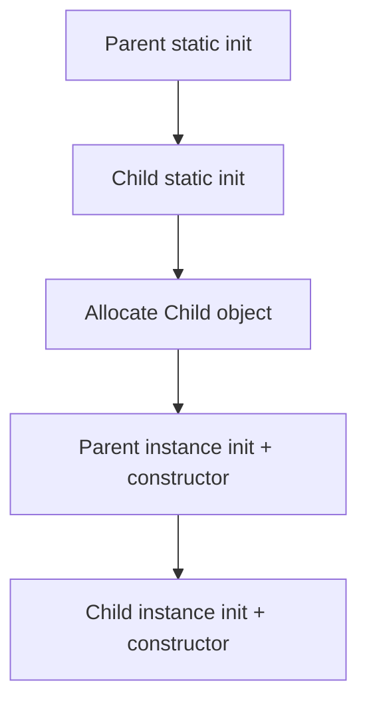
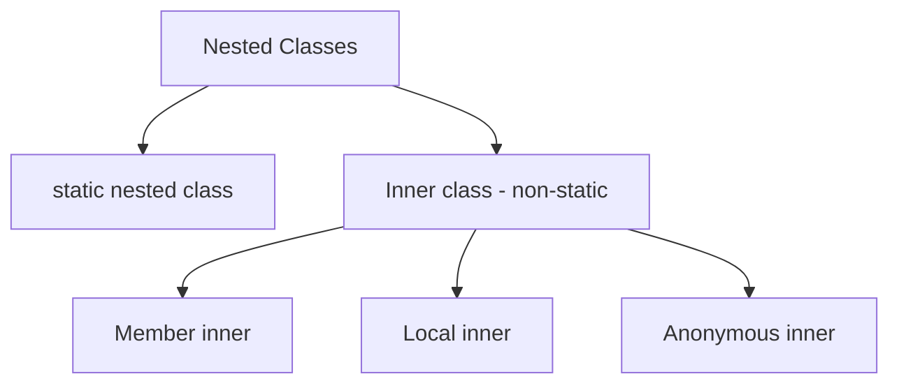

# Вопросы на собеседовании: `Java Class Structure and Initialization`

Подробный разбор устройства классов и порядка инициализации в `Java`: конструкторы, `static` и instance-блоки, nested / inner / local / anonymous классы, `final`, `static`, правила наследования и вызов `super()`. Темы критичны для middle/senior собеседования: кандидата почти всегда спрашивают «что напечатается?» с вложенными классами и блоками.

## Полезные ссылки

### Официальная документация

- [Java Language Specification §12.4 — Class Initialization](https://docs.oracle.com/javase/specs/jls/se21/html/jls-12.html#jls-12.4) — формальные правила инициализации
- [JLS §8.6 — Instance Initializers](https://docs.oracle.com/javase/specs/jls/se21/html/jls-8.html#jls-8.6)
- [JLS §8.7 — Static Initializers](https://docs.oracle.com/javase/specs/jls/se21/html/jls-8.html#jls-8.7)
- [Oracle Tutorial — Nested Classes](https://docs.oracle.com/javase/tutorial/java/javaOO/nested.html)
- [Oracle Tutorial — Initializing Fields](https://docs.oracle.com/javase/tutorial/java/javaOO/initial.html)

### Baeldung

- [Java Structure and Initialization Interview Questions](https://www.baeldung.com/java-classes-initialization-questions)
- [A Guide to Java Initialization](https://www.baeldung.com/java-initialization)
- [Static vs. Instance Initializer Block in Java](https://www.baeldung.com/java-static-instance-initializer-blocks)
- [`<init>` and `<clinit>` Methods in the JVM](https://www.baeldung.com/jvm-init-clinit-methods)
- [Nested Classes in Java](https://www.baeldung.com/java-nested-classes)

## Содержание

- [Полезные ссылки](#полезные-ссылки)
- [See also](#see-also)

**Конструкторы**
- [Q1. (!) Что такое конструктор и чем он отличается от метода?](#q1--что-такое-конструктор-и-чем-он-отличается-от-метода)
- [Q2. (!) Что такое конструктор по умолчанию и когда он создаётся?](#q2--что-такое-конструктор-по-умолчанию-и-когда-он-создаётся)
- [Q3. Что такое конструктор копирования в Java?](#q3-что-такое-конструктор-копирования-в-java)
- [Q4. (!) Для чего нужны `this()` и `super()` в конструкторе?](#q4--для-чего-нужны-this-и-super-в-конструкторе)
- [Q5. Можно ли сделать конструктор `private` / `final` / `abstract`?](#q5-можно-ли-сделать-конструктор-private--final--abstract)
- [Q6. Что такое конструктор `record`?](#q6-что-такое-конструктор-record)

**Блоки инициализации**
- [Q7. (!) Что такое `static`-блок инициализации?](#q7--что-такое-static-блок-инициализации)
- [Q8. (!) Что такое instance-блок инициализации?](#q8--что-такое-instance-блок-инициализации)
- [Q9. Когда использовать init-блоки вместо конструктора?](#q9-когда-использовать-init-блоки-вместо-конструктора)
- [Q10. Может ли `static`-блок бросать checked-исключение?](#q10-может-ли-static-блок-бросать-checked-исключение)

**Порядок инициализации**
- [Q11. (!) Какой порядок инициализации класса в JVM?](#q11--какой-порядок-инициализации-класса-в-jvm)
- [Q12. (!) Какой порядок инициализации при наследовании?](#q12--какой-порядок-инициализации-при-наследовании)
- [Q13. (!) Что такое методы `<clinit>` и `<init>`?](#q13--что-такое-методы-clinit-и-init)
- [Q14. Когда именно класс загружается и инициализируется?](#q14-когда-именно-класс-загружается-и-инициализируется)
- [Q15. Что напечатает код с наследованием и init-блоками?](#q15-что-напечатает-код-с-наследованием-и-init-блоками)

**Final, Static, Immutable**
- [Q16. (!) Какие отличия между `static` и instance-полями?](#q16--какие-отличия-между-static-и-instance-полями)
- [Q17. (!) Что такое `final`-поле и как оно инициализируется?](#q17--что-такое-final-поле-и-как-оно-инициализируется)
- [Q18. В чём разница между `static final` и просто `final`?](#q18-в-чём-разница-между-static-final-и-просто-final)
- [Q19. Что такое constant folding и как он связан с `static final`?](#q19-что-такое-constant-folding-и-как-он-связан-со-static-final)

**Nested / Inner / Local / Anonymous классы**
- [Q20. (!) Какие виды вложенных классов есть в Java?](#q20--какие-виды-вложенных-классов-есть-в-java)
- [Q21. (!) В чём разница между `static nested` и inner-классом?](#q21--в-чём-разница-между-static-nested-и-inner-классом)
- [Q22. Что такое local-класс и где его используют?](#q22-что-такое-local-класс-и-где-его-используют)
- [Q23. (!) Что такое анонимный класс и чем он отличается от лямбды?](#q23--что-такое-анонимный-класс-и-чем-он-отличается-от-лямбды)
- [Q24. Почему анонимный / local класс видит только `effectively final` переменные?](#q24-почему-анонимный--local-класс-видит-только-effectively-final-переменные)
- [Q25. Как inner-класс ссылается на outer-экземпляр?](#q25-как-inner-класс-ссылается-на-outer-экземпляр)

**Записи (records) и sealed**
- [Q26. Как инициализируется `record` и что такое compact constructor?](#q26-как-инициализируется-record-и-что-такое-compact-constructor)
- [Q27. Как устроена инициализация `enum`?](#q27-как-устроена-инициализация-enum)

## Q1. (!) Что такое конструктор и чем он отличается от метода?

(!) Что такое конструктор и чем он отличается от метода?

**Конструктор** — специальный блок, который вызывается при создании объекта и инициализирует его поля.

Отличия от обычного метода:

| Свойство | Конструктор | Метод |
|---|---|---|
| Имя | совпадает с именем класса | любое |
| Тип возврата | отсутствует (даже `void` нельзя писать) | обязателен |
| Вызов | через `new` | по ссылке на объект или `ClassName.method()` |
| Наследование | не наследуется | наследуется |
| Модификатор | любой (включая `private`) | любой |

```java
public class User {
    private final String name;

    public User(String name) {   // конструктор
        this.name = name;
    }

    public String getName() {    // метод
        return name;
    }
}
```

**Итог:** конструктор не метод, его задача — перевести объект из «сырой памяти» в валидное состояние.

## Q2. (!) Что такое конструктор по умолчанию и когда он создаётся?

**Конструктор по умолчанию (default constructor)** — конструктор без параметров, который компилятор генерирует сам, если в классе **не объявлено ни одного конструктора**.

```java
public class Foo {}                // компилятор создаст Foo() { super(); }

public class Bar {
    public Bar(int x) {}           // явный конструктор — default уже НЕ создастся
}

new Bar();                         // ❌ compile error: no default constructor
```

Default constructor просто вызывает `super()` у родителя. Если у родителя нет no-args конструктора (например, только `Parent(int)`), компилятор не сможет сгенерировать default constructor у наследника — код не соберётся.

**Вывод:** добавляя параметризованный конструктор, явно объявляй и no-args (если нужен) — иначе сломаешь сериализацию и framework-магию (`Jackson`, `JPA`).

## Q3. Что такое конструктор копирования в Java?

В `Java` нет языкового **copy-constructor** как в `C++`, но паттерн пишут руками:

```java
public class Point {
    private final int x, y;

    public Point(int x, int y) { this.x = x; this.y = y; }

    public Point(Point other) {          // конструктор копирования
        this(other.x, other.y);
    }
}
```

Используется как альтернатива `clone()` — безопаснее, явно видно что копируется.

## Q4. (!) Для чего нужны `this()` и `super()` в конструкторе?

- `this(args)` — вызов **другого конструктора того же класса** (chaining).
- `super(args)` — вызов конструктора **родительского класса**.

Правила:

- Должны стоять **первой** строкой конструктора (до `Java 22`; в Java 22+ допустимы `statements before super()` через превью-фичу).
- В одном конструкторе нельзя использовать и `this()` и `super()` одновременно.
- Если ни `this()`, ни `super()` не указаны явно — компилятор вставляет `super()` (вызов no-args конструктора родителя).

```java
public class Rectangle extends Shape {
    public Rectangle(int w, int h) {
        super("rectangle");     // вызов Shape(String)
        this.w = w; this.h = h;
    }

    public Rectangle() {
        this(10, 10);           // делегируем своему же конструктору
    }
}
```

**Итог:** `super()` инициализирует родителя до потомка, `this()` исключает дублирование логики между перегрузками.

## Q5. Можно ли сделать конструктор `private` / `final` / `abstract`?

| Модификатор | Можно? | Смысл |
|---|---|---|
| `private` | ✅ | Singleton, фабрики, утилитные классы |
| `public` / `protected` / package-private | ✅ | обычное использование |
| `final` | ❌ | конструктор и так не наследуется |
| `abstract` | ❌ | у конструктора нет тела без реализации, теряет смысл |
| `static` | ❌ | конструктор работает на экземпляре |
| `synchronized` | ❌ | объект ещё не опубликован, синхронизироваться не с кем |

```java
public class Holder {
    private Holder() {}                   // singleton
    public static Holder INSTANCE = new Holder();
}
```

## Q6. Что такое конструктор `record`?

`record` автоматически получает **canonical constructor** с параметрами, совпадающими с компонентами:

```java
public record Point(int x, int y) {
    // компилятор генерирует: public Point(int x, int y) { this.x = x; this.y = y; }
}
```

Виды конструкторов у `record`:

- **Canonical** — точно повторяет компоненты (генерируется автоматически).
- **Compact** — без списка параметров, валидация/нормализация, компилятор сам присваивает поля после тела:
  ```java
  public record Age(int value) {
      public Age {
          if (value < 0) throw new IllegalArgumentException();
          // this.value = value — добавит компилятор
      }
  }
  ```
- **Дополнительный** — только при обязательной делегации через `this(...)` в canonical.

Подробнее в [java-17-21-interview](java-17-21-interview.md) и [java-oop-interview](java-oop-interview.md).

## Q7. (!) Что такое `static`-блок инициализации?

Это блок кода, помеченный `static`, который выполняется **один раз при инициализации класса** — до первого обращения к полям/методам/конструктору.

```java
public class Config {
    static final Map<String, String> DEFAULTS;

    static {
        DEFAULTS = new HashMap<>();
        DEFAULTS.put("region", "ru");
        DEFAULTS.put("tz", "UTC");
    }
}
```

Свойства:

- В классе может быть несколько `static`-блоков — выполняются сверху вниз.
- Выполняется **до** `main()`, если класс уже загружен.
- Удобен для сложной инициализации `static` полей (try/catch, вычисления, reflection).

**Итог:** используй, когда одним присваиванием поле не инициализировать.

## Q8. (!) Что такое instance-блок инициализации?

Блок `{ ... }` без `static` на уровне класса — выполняется **при каждом создании экземпляра** до тела конструктора.

```java
public class Cache {
    private final Map<String, Object> data;

    {
        data = new ConcurrentHashMap<>();
        System.out.println("instance block");
    }

    public Cache() {
        System.out.println("constructor");
    }
}
```

Компилятор встраивает instance-блоки в **каждый** конструктор класса (сразу после `super(...)`). Редко используется в реальном коде — обычно проще поместить логику в конструктор. Полезен для анонимных классов, у которых конструктор не объявить:

```java
Map<String, Integer> m = new HashMap<>() {{
    put("a", 1);   // double brace initialization — instance-блок анонимного класса
    put("b", 2);
}};
```

**Предупреждение:** double-brace создаёт лишний анонимный класс и утечку ссылки на enclosing instance — в production лучше `Map.of(...)`.

## Q9. Когда использовать init-блоки вместо конструктора?

| Ситуация | Решение |
|---|---|
| Сложная инициализация `static` поля (loop, try/catch) | `static`-блок |
| Однажды-вычисляемая константа таблиц (`static final Map`) | `static`-блок |
| Одинаковый код в нескольких конструкторах | instance-блок или `this()` |
| Анонимный класс, которому нужен конструктор | instance-блок |
| Обычное присваивание поля | инициализатор поля `= ...` |

Правило хорошего тона: init-блок уместен, когда явно нужно выполнить последовательность действий до конструктора у **всех** перегрузок.

## Q10. Может ли `static`-блок бросать checked-исключение?

Нет. `static`-блок не может выбросить checked-исключение — декларировать `throws` негде. Если в `static`-блоке произошло исключение, оно оборачивается в `ExceptionInInitializerError` — это `Error`, класс помечается как **erroneous** и дальше не используется.

```java
static {
    try {
        loadConfig();
    } catch (IOException e) {
        throw new ExceptionInInitializerError(e);
    }
}
```

**Вывод:** ошибки в `static`-инициализации фатальны — класс нельзя будет использовать до перезапуска JVM.

## Q11. (!) Какой порядок инициализации класса в JVM?

**Инициализация класса (без наследования):**

1. `static` поля получают **zero-значения** (по типу: `0`, `null`, `false`).
2. `static`-инициализаторы полей + `static`-блоки выполняются **сверху вниз** в порядке объявления.
3. Класс помечен как initialized.

**Создание экземпляра:**

4. Instance-поля получают zero-значения.
5. Выполняется `super(...)` (или `super()` неявно).
6. Instance-инициализаторы полей + instance-блоки выполняются сверху вниз.
7. Тело конструктора.

```java
class A {
    static int s = init("static field");
    static { System.out.println("static block"); }
    int i = init("instance field");
    { System.out.println("instance block"); }
    A() { System.out.println("constructor"); }

    static int init(String name) { System.out.println(name); return 0; }
}

new A();
// static field
// static block
// instance field
// instance block
// constructor
```

## Q12. (!) Какой порядок инициализации при наследовании?

При `new Child()` (где `Child extends Parent`):

1. Загружается `Parent`, инициализируются `Parent.static` поля + `static`-блоки.
2. Загружается `Child`, инициализируются `Child.static` поля + `static`-блоки.
3. Аллоцируется объект `Child`, все instance-поля обнуляются.
4. Вызывается `Parent` конструктор: `Parent` instance-поля + instance-блоки → тело конструктора.
5. Вызывается `Child` конструктор: `Child` instance-поля + instance-блоки → тело конструктора.



**Подводный камень:** если `Parent` конструктор вызывает переопределяемый метод, тот выполнится у **Child**, хотя его поля ещё не проинициализированы — это классический baited interview-вопрос.

```java
class Parent {
    Parent() { print(); }         // виртуальный вызов
    void print() { System.out.println("parent"); }
}
class Child extends Parent {
    String name = "child";
    void print() { System.out.println(name); }
}
new Child();    // напечатает "null" — name ещё null
```

**Вывод:** никогда не вызывай переопределяемые методы из конструктора.

## Q13. (!) Что такое методы `<clinit>` и `<init>`?

Компилятор `javac` генерирует в байт-коде два специальных метода:

- `<clinit>` (class initializer) — объединяет все `static`-инициализаторы полей и `static`-блоки. Выполняется **один раз** при инициализации класса. JVM гарантирует потокобезопасность `<clinit>` — одновременный запуск невозможен.
- `<init>` (instance initializer) — каждый конструктор компилируется в свой `<init>`. В него встраиваются instance-поля-инициализаторы и instance-блоки (после `super()`).

Посмотреть можно через `javap -c -p ClassName`:

```text
static {};   // <clinit>
  Code: ...

public Foo(int);  // <init>
  Code:
    aload_0
    invokespecial Object.<init>
    ...
```

**Итог:** `<clinit>` отвечает за «состояние класса», `<init>` — за «состояние объекта».

## Q14. Когда именно класс загружается и инициализируется?

**Загрузка (load)** — когда `ClassLoader` впервые нашёл и прочитал `.class`. Обычно при первом обращении.

**Инициализация (initialize)** — запуск `<clinit>` — откладывается до **first active use**:

- Создание экземпляра (`new`).
- Обращение к `static` полю, **не являющемуся** `static final` константой compile-time.
- Вызов `static` метода.
- Присваивание `static` поля.
- Отражение через `Class.forName("Foo")` (с `initialize=true`, по умолчанию).
- Инициализация подкласса.
- Обращение к `main()` как entry point.

**Не триггерит** инициализацию:

- Обращение к `static final` compile-time константе примитива/`String` (значение зашито в вызывающий класс — constant folding).
- `Foo.class` литерал.
- `ClassLoader.loadClass()` без `initialize=true`.

Подробнее о classloader в [jvm-interview](../../jvm/jvm-interview.md).

## Q15. Что напечатает код с наследованием и init-блоками?

Классический interview-пример:

```java
class A {
    static { System.out.println("1"); }
    { System.out.println("2"); }
    A() { System.out.println("3"); }
}

class B extends A {
    static { System.out.println("4"); }
    { System.out.println("5"); }
    B() { System.out.println("6"); }
}

public class Main {
    public static void main(String[] args) {
        new B();
        new B();
    }
}
```

Вывод:

```text
1        ← A static
4        ← B static (B загружается из-за new B)
2        ← A instance
3        ← A constructor
5        ← B instance
6        ← B constructor
2        ← A instance (второй new)
3
5
6
```

**Мнемоника:** «static parent → static child → (для каждого new) instance parent → ctor parent → instance child → ctor child».

## Q16. (!) Какие отличия между `static` и instance-полями?

| Свойство | `static` | instance |
|---|---|---|
| Живёт в | `Metaspace` (класс-метаданные) | `Heap` (объект) |
| Экземпляров | одно на `ClassLoader` | по одному на объект |
| Обращение | `ClassName.field` | `obj.field` |
| Видимость из `static`-метода | напрямую | требует ссылку на `this` |
| Инициализация | `<clinit>`, один раз | `<init>`, при каждом `new` |
| Сериализация | не включается в `Serializable` | включается |

```java
class Counter {
    static int total;     // общий счётчик
    int id;               // персональный
}
```

## Q17. (!) Что такое `final`-поле и как оно инициализируется?

`final`-поле — поле, которое после инициализации нельзя переназначить.

Способы инициализации:

- Инициализатор: `private final int x = 10;`
- Instance-блок: `{ this.x = computeX(); }`
- Конструктор (каждый путь через `new` должен присвоить `final` ровно один раз).

```java
class Foo {
    final int x;
    final int y;
    final int z = 3;

    Foo(int a) {
        this.x = a;
        this.y = a * 2;
        // z уже инициализирован
    }
}
```

**DU (Definite assignment):** компилятор проверяет, что каждое `final`-поле гарантированно инициализируется ровно один раз по любому пути через конструктор. Это правило **definitely unassigned & then assigned**.

**JMM-гарантия:** при корректной инициализации `final`-поля (без утечки `this` из конструктора) его значение **видно всем потокам без синхронизации** после завершения конструктора.

## Q18. В чём разница между `static final` и просто `final`?

| Характеристика | `final` | `static final` |
|---|---|---|
| Область | поле экземпляра | поле класса |
| Когда инициализируется | в конструкторе / инициализаторе | в `static`-блоке / инициализаторе, один раз |
| Может ли отличаться у объектов | да (разные объекты — разные `final` значения) | нет, одно на JVM |
| Где хранится | `Heap` | `Metaspace` |
| Используется для | immutable поля объекта | константы |

```java
public static final int MAX = 100;   // константа
public final String id;              // immutable свойство
```

**Правило:** `static final` — для значений, которые не зависят от объекта.

## Q19. Что такое constant folding и как он связан с `static final`?

Если `static final` имеет **compile-time constant expression** примитива или `String`, компилятор **встраивает** значение прямо в использующий класс (constant folding):

```java
// A.java
public class A {
    public static final int SIZE = 100;
}

// B.java
int x = A.SIZE;   // в байт-коде B будет `bipush 100`, а не чтение A.SIZE
```

**Следствия:**

- Доступ к такой константе **не триггерит** инициализацию класса-владельца.
- Если в `A` потом поменять `SIZE = 200` и **не перекомпилировать** `B` — `B` будет использовать старое `100`. Классический баг в многомодульных сборках.

Чтобы избежать folding, делают так:

```java
public static final int SIZE = Integer.parseInt("100");   // уже не compile-time constant
```

## Q20. (!) Какие виды вложенных классов есть в Java?

Четыре вида:



| Вид | Где объявлен | Имеет ссылку на outer? | Имя | Можно `static` члены |
|---|---|---|---|---|
| `static nested` | на уровне класса | нет | да | да |
| member inner | на уровне класса, без `static` | да (`Outer.this`) | да | `static final` compile-time с Java 16+ |
| local | внутри метода/блока | да (если нестатический контекст) | да | `static final` с Java 16+ |
| anonymous | в выражении `new` | да (если нестатический контекст) | нет | только `static final` поля |

```java
class Outer {
    static class StaticNested {}            // 1
    class Inner {}                          // 2

    void method() {
        class Local {}                      // 3
        Runnable r = new Runnable() {       // 4
            public void run() {}
        };
    }
}
```

## Q21. (!) В чём разница между `static nested` и inner-классом?

| Характеристика | `static nested` | inner (non-static) |
|---|---|---|
| Ссылка на outer | нет | скрытое поле `Outer.this` |
| Создание | `new Outer.Nested()` | `outer.new Inner()` или `new Inner()` изнутри outer |
| Доступ к instance-членам outer | только через ссылку | напрямую, включая `private` |
| Может иметь `static` члены | да | до Java 16 — нет; с 16+ — да |
| Сериализация | обычная | сериализация «тянет» outer — часто ломается |
| Утечки памяти | нет | удержание outer в коллекции → утечка |

**Рекомендация:** если вложенный класс **не нуждается** в доступе к instance-полям outer — делай его `static`. Меньше памяти, нет сюрпризов с сериализацией.

## Q22. Что такое local-класс и где его используют?

**Local class** — класс, объявленный внутри метода / конструктора / блока инициализации. Виден только в своей области видимости.

```java
public List<String> upper(List<String> items) {
    class Upper {
        String apply(String s) { return s.toUpperCase(); }
    }
    Upper u = new Upper();
    return items.stream().map(u::apply).toList();
}
```

В современном коде почти вытеснены лямбдами. Редко полезны, когда нужно:

- Несколько методов и состояние (полноценный класс).
- Сослаться на класс по имени (например, для рекурсии).

## Q23. (!) Что такое анонимный класс и чем он отличается от лямбды?

Анонимный класс — одноразовая реализация интерфейса/класса прямо в выражении `new`:

```java
Runnable r = new Runnable() {
    @Override public void run() { System.out.println("hi"); }
};
```

Отличия от лямбды:

| Свойство | Анонимный класс | Лямбда |
|---|---|---|
| Генерация | отдельный `.class` (`Outer$1.class`) | `invokedynamic` + `LambdaMetafactory`, без отдельного класса |
| `this` | ссылается на анонимный экземпляр | ссылается на enclosing instance |
| Тип | любой класс/интерфейс (1+ абстрактных методов) | только `functional interface` (1 abstract method) |
| Поля / конструктор | может иметь | нет |
| Создание при каждом вызове | да | может быть закэширован |

**Итог:** лямбды дешевле и читаемее; анонимный класс нужен, если требуется состояние или расширение класса.

## Q24. Почему анонимный / local класс видит только `effectively final` переменные?

Потому что такие классы **захватывают копию** значения локальной переменной в скрытое поле. Если бы переменная менялась в методе после создания класса, копия внутри класса осталась бы старой, что привело бы к неочевидному расхождению.

```java
void method() {
    int x = 10;
    Runnable r = () -> System.out.println(x);
    // x = 20;  ❌ тогда x перестанет быть effectively final — compile error
    r.run();
}
```

**Effectively final** = переменная нигде не переприсваивается после инициализации — компилятор допускает её захват без `final` ключевого слова (с Java 8).

Обходной путь для «мутабельности» — массив/`AtomicReference`:

```java
int[] counter = {0};
Runnable r = () -> counter[0]++;
```

## Q25. Как inner-класс ссылается на outer-экземпляр?

Компилятор добавляет в inner-класс скрытое поле `this$0` с ссылкой на внешний объект. Поле инициализируется в скрытом конструкторе, принимающем `Outer` первым параметром.

```java
class Outer {
    int x = 10;
    class Inner {
        int read() { return x; }    // фактически: return Outer.this.x
    }
}
```

Декомпиляция:

```java
class Outer$Inner {
    final Outer this$0;
    Outer$Inner(Outer outer) { this$0 = outer; }
    int read() { return this$0.x; }
}
```

Явное обращение к outer — через `Outer.this` (нужно при конфликте имён):

```java
class Outer {
    int x;
    class Inner {
        int x;
        int readOuter() { return Outer.this.x; }
    }
}
```

**Последствие:** коллекция из inner-экземпляров удерживает все связанные outer-объекты — можно получить утечку памяти.

## Q26. Как инициализируется `record` и что такое compact constructor?

`record` — класс с автоматическими:

- Финальными полями (компонентами).
- Canonical-конструктором.
- `equals` / `hashCode` / `toString`.
- Аксессорами (методы без префикса `get`: `point.x()`).

**Compact constructor** позволяет валидировать / нормализовать параметры **без** повторного перечисления списка и присваивания:

```java
public record Range(int from, int to) {
    public Range {                                    // compact
        if (from > to) throw new IllegalArgumentException();
        // присваивание this.from / this.to выполнит компилятор
    }
}
```

Полноценный canonical-конструктор тоже допустим, но тогда присваивания делаешь сам:

```java
public record Range(int from, int to) {
    public Range(int from, int to) {                  // canonical
        if (from > to) throw new IllegalArgumentException();
        this.from = from; this.to = to;
    }
}
```

Подробнее о `record` — в [java-17-21-interview](java-17-21-interview.md).

## Q27. Как устроена инициализация `enum`?

`enum` — это `final` класс, расширяющий `Enum<T>`. Константы — `public static final` экземпляры, создаваемые в `<clinit>` в порядке объявления.

```java
public enum Status {
    ACTIVE,
    INACTIVE;

    private final String label;
    Status() { this.label = name().toLowerCase(); }
}
```

Особенности:

- Конструктор `enum` всегда `private` (даже если не указать).
- Инициализация `enum`-констант выполняется один раз, потокобезопасно через `<clinit>` — отсюда идиома **`enum Singleton`** (`INSTANCE`).
- Нельзя использовать `new` для создания новых `enum`-значений.
- `switch` по `enum` оптимизирован через таблицу индексов (`ordinal`).

```java
public enum Singleton {
    INSTANCE;

    public void doWork() { /* ... */ }
}
```

**Вывод:** `enum` гарантирует ровно один экземпляр на каждую константу — идеальный lazy-free singleton.

## See also

- [java-core-interview](java-core-interview.md) — основы Java, `Object`, `equals/hashCode`, final, ссылки
- [java-17-21-interview](java-17-21-interview.md) — `record`, `sealed`, pattern matching, Java 16+ новинки в nested классах
- [java-types-interview](java-types-interview.md) — примитивы, boxing/unboxing, autoboxing и инициализация
- [java-modules-interview](java-modules-interview.md) — JPMS, видимость пакетов и влияние на рефлексивный доступ к классам
- [java-concurrency-interview](java-concurrency-interview.md) — `final`-поля и JMM, безопасная публикация объектов
- [java-serialization-interview](java-serialization-interview.md) — `serialVersionUID`, `readObject`, инициализация при десериализации
- [jvm-interview](../../jvm/jvm-interview.md) — загрузка классов, `<clinit>`, `<init>`, ClassLoader, Metaspace
- [java-annotations-interview](java-annotations-interview.md) — `@PostConstruct` и порядок инициализации бинов в Spring
- [java-exceptions-interview](java-exceptions-interview.md) — `ExceptionInInitializerError`, ошибки в static-блоках
