# Вопросы на собеседовании: `Java IO / NIO`

Комплексное руководство по вопросам собеседования на тему `Java IO / NIO / NIO.2` для `Senior Java Developer`. Включает детальные объяснения концепций, примеры кода, диаграммы архитектуры и практические рекомендации.

## Полезные ссылки

### Официальная документация

- [Java Tutorial — Basic I/O](https://docs.oracle.com/javase/tutorial/essential/io/) — официальное руководство Oracle
- [Java NIO (java.nio)](https://docs.oracle.com/en/java/javase/17/docs/api/java.base/java/nio/package-summary.html) — Javadoc пакета `java.nio`
- [NIO.2 (Path, Files)](https://docs.oracle.com/javase/tutorial/essential/io/fileio.html) — руководство по `NIO.2`
- [Java IO vs NIO — Baeldung](https://www.baeldung.com/java-io-vs-nio) — сравнение IO и NIO
- [Guide to ByteBuffer — Baeldung](https://www.baeldung.com/java-bytebuffer) — руководство по `ByteBuffer`
- [Introduction to the Java NIO Selector — Baeldung](https://www.baeldung.com/java-nio-selector) — селекторы в NIO
- [Java NIO2 Path API — Baeldung](https://www.baeldung.com/java-nio-2-path) — API пути в NIO.2
- [NIO vs NIO.2 — Baeldung](https://www.baeldung.com/java-nio-vs-nio-2) — отличия NIO и NIO.2

## Содержание

- [Полезные ссылки](#полезные-ссылки)
- [See also](#see-also)

**Основы: `Java IO` и `Java NIO`**
- [Q1. (!) Что такое `Java IO` и `Java NIO` и в чём их ключевое различие?](#q1--что-такое-java-io-и-java-nio-и-в-чём-их-ключевое-различие)
- [Q2. (!) В чём разница между потоково-ориентированным и буферо-ориентированным подходом?](#q2--в-чём-разница-между-потоково-ориентированным-и-буферо-ориентированным-подходом)
- [Q3. Что такое блокирующий и неблокирующий ввод-вывод?](#q3-что-такое-блокирующий-и-неблокирующий-ввод-вывод)
- [Q4. (!) Какие преимущества и недостатки у `Java IO` и `Java NIO`?](#q4--какие-преимущества-и-недостатки-у-java-io-и-java-nio)

**Классы и иерархия `Java IO`**
- [Q5. Какие основные классы и интерфейсы используются в `Java IO`?](#q5-какие-основные-классы-и-интерфейсы-используются-в-java-io)
- [Q6. (!) В чём разница между байтовыми и символьными потоками?](#q6--в-чём-разница-между-байтовыми-и-символьными-потоками)
- [Q7. Как работает паттерн `Decorator` в иерархии `Java IO`?](#q7-как-работает-паттерн-decorator-в-иерархии-java-io)
- [Q8. Какие классы используются для чтения и записи текстовых файлов?](#q8-какие-классы-используются-для-чтения-и-записи-текстовых-файлов)
- [Q9. Какие классы используются для работы с сетевыми соединениями в `Java IO`?](#q9-какие-классы-используются-для-работы-с-сетевыми-соединениями-в-java-io)

**Каналы и буферы `Java NIO`**
- [Q10. (!) Что такое `Channel` и `Buffer` в `Java NIO` и как они связаны?](#q10--что-такое-channel-и-buffer-в-java-nio-и-как-они-связаны)
- [Q11. Какие реализации `Channel` существуют и для чего каждая?](#q11-какие-реализации-channel-существуют-и-для-чего-каждая)
- [Q12. (!) Как устроен `ByteBuffer`: `capacity`, `position`, `limit`, `mark`?](#q12--как-устроен-bytebuffer-capacity-position-limit-mark)
- [Q13. Что делают методы `flip()`, `clear()`, `compact()`, `rewind()` в `ByteBuffer`?](#q13-что-делают-методы-flip-clear-compact-rewind-в-bytebuffer)
- [Q14. (!) В чём разница между `direct buffer` и `heap buffer`?](#q14--в-чём-разница-между-direct-buffer-и-heap-buffer)
- [Q15. Что такое `scatter/gather` операции в `NIO`?](#q15-что-такое-scattergather-операции-в-nio)

**Селекторы и неблокирующий ввод-вывод**
- [Q16. (!) Как работает механизм `Selector` в `Java NIO`?](#q16--как-работает-механизм-selector-в-java-nio)
- [Q17. Что такое `SelectionKey` и какие операции он поддерживает?](#q17-что-такое-selectionkey-и-какие-операции-он-поддерживает)
- [Q18. (!) Как реализовать неблокирующий сервер на `NIO`?](#q18--как-реализовать-неблокирующий-сервер-на-nio)

**`NIO.2` — `Path`, `Files`, `FileSystem`**
- [Q19. (!) Что такое `NIO.2` и чем он отличается от классического `NIO`?](#q19--что-такое-nio2-и-чем-он-отличается-от-классического-nio)
- [Q20. Как работать с `Path` и `Paths`?](#q20-как-работать-с-path-и-paths)
- [Q21. Какие основные операции предоставляет класс `Files`?](#q21-какие-основные-операции-предоставляет-класс-files)
- [Q22. Как копировать, перемещать и удалять файлы через `NIO.2`?](#q22-как-копировать-перемещать-и-удалять-файлы-через-nio2)
- [Q23. Что такое `FileVisitor` и как обходить дерево каталогов?](#q23-что-такое-filevisitor-и-как-обходить-дерево-каталогов)
- [Q24. Что такое `WatchService` и как отслеживать изменения файлов?](#q24-что-такое-watchservice-и-как-отслеживать-изменения-файлов)

**`FileChannel` и работа с файлами**
- [Q25. Как работает `FileChannel` и чем он отличается от потоков?](#q25-как-работает-filechannel-и-чем-он-отличается-от-потоков)
- [Q26. (!) Как использовать `Memory-mapped` files (`MappedByteBuffer`)?](#q26--как-использовать-memory-mapped-files-mappedbytebuffer)
- [Q27. Что такое `transferTo()` / `transferFrom()` в `FileChannel`?](#q27-что-такое-transferto--transferfrom-в-filechannel)
- [Q28. Как обрабатывать большие файлы, не загружая их целиком в память?](#q28-как-обрабатывать-большие-файлы-не-загружая-их-целиком-в-память)

**Асинхронный ввод-вывод**
- [Q29. (!) Что такое `AsynchronousFileChannel` и как он работает?](#q29--что-такое-asynchronousfilechannel-и-как-он-работает)
- [Q30. Что такое `AsynchronousSocketChannel` и `AsynchronousServerSocketChannel`?](#q30-что-такое-asynchronoussocketchannel-и-asynchronousserversocketchannel)
- [Q31. В чём разница между `Future` и `CompletionHandler` в асинхронных каналах?](#q31-в-чём-разница-между-future-и-completionhandler-в-асинхронных-каналах)

**Кодировки, сериализация и архивы**
- [Q32. Как работает кодировка при чтении/записи текста (`Charset`)?](#q32-как-работает-кодировка-при-чтениизаписи-текста-charset)
- [Q33. Какие классы используются для сериализации и десериализации объектов?](#q33-какие-классы-используются-для-сериализации-и-десериализации-объектов)
- [Q34. Какие классы используются для работы с архивами (`ZIP`, `GZIP`)?](#q34-какие-классы-используются-для-работы-с-архивами-zip-gzip)

**Ресурсы, исключения и практика**
- [Q35. (!) Как правильно закрывать ресурсы (`try-with-resources`)?](#q35--как-правильно-закрывать-ресурсы-try-with-resources)
- [Q36. Какие исключения типичны для `Java IO/NIO` и как их обрабатывать?](#q36-какие-исключения-типичны-для-java-ionio-и-как-их-обрабатывать)
- [Q37. В чём разница между `FileInputStream` и `Files.newInputStream`?](#q37-в-чём-разница-между-fileinputstream-и-filesnewinputstream)
- [Q38. (!) Когда предпочесть `InputStream`/`OutputStream`, а когда `Channel`/`ByteBuffer`?](#q38--когда-предпочесть-inputstreamoutputstream-а-когда-channelbytebuffer)
- [Q39. Что такое `Pipe` в `NIO` и для чего он используется?](#q39-что-такое-pipe-в-nio-и-для-чего-он-используется)
- [Q40. Что такое `HttpClient` (`Java` 11+) и когда его использовать?](#q40-что-такое-httpclient-java-11-и-когда-его-использовать)

---

## Q1. (!) Что такое `Java IO` и `Java NIO` и в чём их ключевое различие?

Это два разных API ввода-вывода. Ключевое различие: `IO` обрабатывает данные **по одному элементу за раз** через потоки, а `NIO` — **порциями** через каналы и буферы и умеет работать неблокирующе.

`Java IO` (`java.io`) — классический API, основанный на **потоковой модели** (stream-oriented). Данные обрабатываются последовательно, байт за байтом или символ за символом, всегда блокирующе.

`Java NIO` (`java.nio`, появился в Java 1.4) — API на **буферах и каналах** (buffer-oriented). Данные читаются порциями в буфер, затем обрабатываются из него. Канал двунаправленный и может работать в неблокирующем режиме, а один поток через `Selector` обслуживает множество соединений.

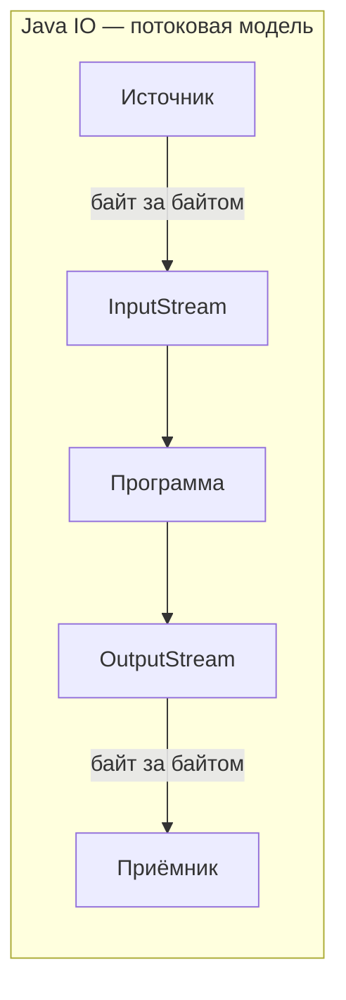

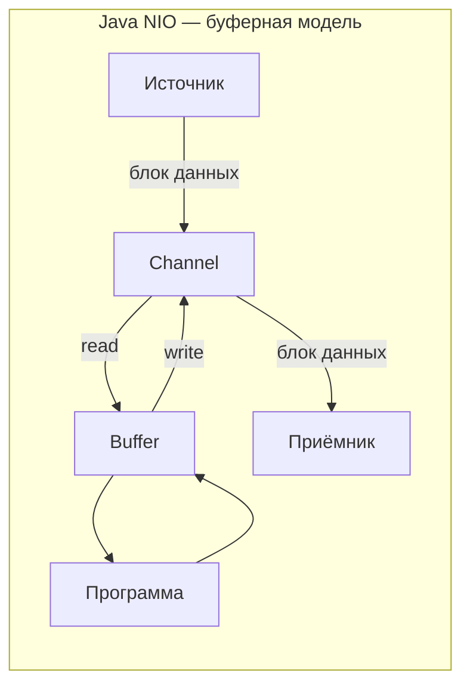

| Характеристика | `Java IO` | `Java NIO` |
|---|---|---|
| Модель | Потоково-ориентированная | Буферо-ориентированная |
| Направление | Однонаправленные потоки | Двунаправленные каналы |
| Блокировка | Только блокирующий | Блокирующий и неблокирующий |
| Мультиплексирование | Нет (поток на соединение) | `Selector` (один поток — много каналов) |
| Появился | Java 1.0 | Java 1.4 |

## Q2. (!) В чём разница между потоково-ориентированным и буферо-ориентированным подходом?

Разница в том, **где живут данные во время обработки** и можно ли по ним перемещаться.

**Потоково-ориентированный** (`Java IO`): данные читаются/записываются последовательно, прямо из потока. Перемотать назад нельзя — прочитанный байт ушёл навсегда. Если нужно вернуться к данным, придётся самому сложить их в структуру (буфер, список, строку).

**Буферо-ориентированный** (`Java NIO`): данные сначала попадают в `Buffer`, и уже там их обрабатывают. По буферу можно двигаться вперёд и назад (`position`, `mark`, `reset`), перечитывать. Это гибче, но накладывает ответственность: нужно самому проверять, что в буфере накопились все нужные данные (например, целая строка или весь заголовок протокола).

```java
// Java IO — потоковое чтение
try (BufferedReader reader = new BufferedReader(new FileReader("data.txt"))) {
    String line;
    while ((line = reader.readLine()) != null) {
        System.out.println(line); // данные обработаны, назад не вернуться
    }
}

// Java NIO — буферное чтение
try (FileChannel channel = FileChannel.open(Path.of("data.txt"), StandardOpenOption.READ)) {
    ByteBuffer buffer = ByteBuffer.allocate(1024);
    while (channel.read(buffer) != -1) {
        buffer.flip(); // переключаем в режим чтения
        while (buffer.hasRemaining()) {
            System.out.print((char) buffer.get());
        }
        buffer.clear(); // готовим к следующей записи
    }
}
```

## Q3. Что такое блокирующий и неблокирующий ввод-вывод?

Разница в том, **ждёт ли поток данные или сразу возвращает управление**.

**Блокирующий I/O** (`Java IO`): вызов `read()`/`write()` приостанавливает поток до завершения операции. Если данных ещё нет — поток просто стоит и ждёт. Отсюда модель «поток на соединение»: пока поток висит на одном медленном клиенте, он ничего больше не делает, и при тысячах соединений нужны тысячи потоков — это плохо масштабируется.

**Неблокирующий I/O** (`Java NIO`): `read()`/`write()` возвращают управление немедленно, сколько бы данных ни было готово. Результат — индикатор состояния, а не блокировка:

```java
// Неблокирующий канал
SocketChannel channel = SocketChannel.open();
channel.configureBlocking(false); // неблокирующий режим

ByteBuffer buffer = ByteBuffer.allocate(256);
int bytesRead = channel.read(buffer); // возвращает сразу, даже если данных нет
// bytesRead == 0 — данных пока нет
// bytesRead == -1 — конец потока
// bytesRead > 0 — есть данные
```

Поскольку вызов больше не блокирует, один поток может опросить много каналов и заняться тем, который готов. Это и есть основа масштабируемости `NIO`: один поток через `Selector` обслуживает тысячи соединений (см. Q16).

**Подводный камень:** `FileChannel` неблокирующий режим **не поддерживает** — он всегда блокирующий. Неблокирующий режим есть только у сетевых каналов (`SocketChannel`, `ServerSocketChannel`, `DatagramChannel`).

## Q4. (!) Какие преимущества и недостатки у `Java IO` и `Java NIO`?

Коротко: `IO` выигрывает в простоте, `NIO` — в масштабируемости и контроле над памятью. За эту мощь `NIO` платит сложностью API, где легко допустить ошибку.

| | `Java IO` | `Java NIO` |
|---|---|---|
| **Плюсы** | Простой API, легко читается | Неблокирующий I/O, масштабируемость |
| | Широкая поддержка типов данных | Эффективная работа с буферами |
| | Много готовых обёрток (`Buffered*`, `Data*`) | `Selector` для мультиплексирования |
| | Хорошо для простого файлового I/O | Direct buffers — zero-copy с ОС |
| **Минусы** | Блокирующий — поток на соединение | Сложный API, легко допустить ошибку |
| | Плохо масштабируется для серверов | `flip()`/`clear()` — частый источник багов |
| | Нет мультиплексирования | Отладка сложнее |

**Когда что выбирать:**
- **`Java IO`** — простые файловые операции, работа с текстом, небольшое число соединений
- **`Java NIO`** — высоконагруженные серверы, тысячи одновременных соединений, обработка больших файлов
- **На практике** — часто используют фреймворки поверх NIO: `Netty`, `Spring WebFlux`, которые скрывают сложность API

## Q5. Какие основные классы и интерфейсы используются в `Java IO`?

Вся иерархия `Java IO` вырастает из четырёх абстрактных базовых классов, по два на каждый вид данных: `InputStream`/`OutputStream` — для байтов, `Reader`/`Writer` — для символов. Всё остальное (`Buffered*`, `Data*`, `File*`, `Object*`) — их конкретные подклассы и декораторы.

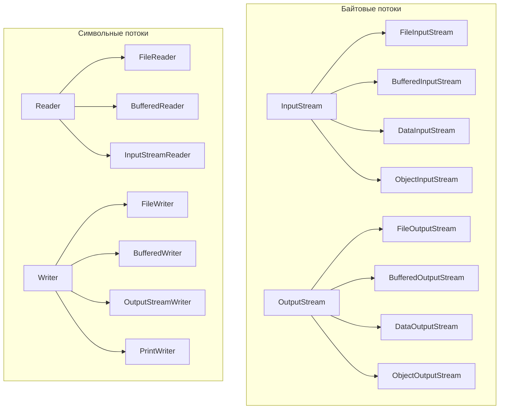

Основные классы:

| Класс | Назначение |
|---|---|
| `InputStream` / `OutputStream` | Абстрактные классы для байтовых потоков |
| `Reader` / `Writer` | Абстрактные классы для символьных потоков |
| `FileInputStream` / `FileOutputStream` | Чтение/запись файлов в байтах |
| `BufferedReader` / `BufferedWriter` | Буферизированное чтение/запись символов |
| `InputStreamReader` / `OutputStreamWriter` | Мост байты ↔ символы с указанием кодировки |
| `DataInputStream` / `DataOutputStream` | Чтение/запись примитивных типов |
| `ObjectInputStream` / `ObjectOutputStream` | Сериализация/десериализация объектов |
| `PrintWriter` / `PrintStream` | Форматированный вывод |
| `RandomAccessFile` | Произвольный доступ к файлу |

## Q6. (!) В чём разница между байтовыми и символьными потоками?

Разница в единице данных: байтовые потоки оперируют сырыми байтами, символьные — символами `Unicode` с учётом кодировки. Отсюда правило выбора: бинарные данные — байтовый поток, текст — символьный.

**Байтовые потоки** (`InputStream` / `OutputStream`) работают с сырыми байтами и ничего не знают о кодировке. Подходят для бинарных данных: изображения, архивы, сериализованные объекты.

**Символьные потоки** (`Reader` / `Writer`) работают с символами `Unicode` (16-битный `char`) и сами выполняют преобразование байты↔символы по указанной кодировке. Подходят для текста — иначе пришлось бы вручную декодировать байты.

```java
// Байтовый поток — работа с бинарными данными
try (FileInputStream fis = new FileInputStream("image.png");
     FileOutputStream fos = new FileOutputStream("copy.png")) {
    byte[] buffer = new byte[8192];
    int bytesRead;
    while ((bytesRead = fis.read(buffer)) != -1) {
        fos.write(buffer, 0, bytesRead);
    }
}

// Символьный поток — работа с текстом
try (BufferedReader reader = new BufferedReader(
        new InputStreamReader(new FileInputStream("text.txt"), StandardCharsets.UTF_8));
     BufferedWriter writer = new BufferedWriter(
        new OutputStreamWriter(new FileOutputStream("copy.txt"), StandardCharsets.UTF_8))) {
    String line;
    while ((line = reader.readLine()) != null) {
        writer.write(line);
        writer.newLine();
    }
}
```

Мост между ними — `InputStreamReader` и `OutputStreamWriter`, которые преобразуют байты в символы и обратно с указанной кодировкой. Подробнее о кодировках см. [Java Core](java-core-interview.md).

## Q7. Как работает паттерн `Decorator` в иерархии `Java IO`?

Иерархия `Java IO` — хрестоматийный пример паттерна [Decorator](../../design-patterns/design-patterns-interview.md). Идея: базовый поток (например, чтение из файла) оборачивается слоями-обёртками, и каждый слой добавляет одну возможность, не меняя предыдущие. Так буферизацию, чтение примитивов и сжатие комбинируют в любом порядке вместо того, чтобы плодить классы вроде `BufferedDataGZIPFileInputStream`.

```java
// Каждый слой добавляет своё поведение
InputStream raw = new FileInputStream("data.bin");        // сырое чтение из файла
InputStream buffered = new BufferedInputStream(raw);       // + буферизация
DataInputStream data = new DataInputStream(buffered);      // + чтение примитивов

int value = data.readInt();    // читает 4 байта как int
double d = data.readDouble();  // читает 8 байт как double
```

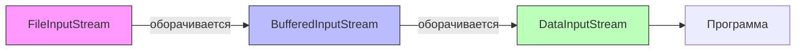

**Что это даёт:**
- комбинирование поведений без комбинаторного взрыва классов наследования;
- гибкость — слои добавляются и убираются независимо;
- каждый декоратор отвечает за одну задачу (`Single Responsibility`).

## Q8. Какие классы используются для чтения и записи текстовых файлов?

В современном коде для текстовых файлов берут `Files` из `NIO.2` — короче и безопаснее. `BufferedReader`/`BufferedWriter` оставляют для построчной обработки, а `Scanner` — для парсинга по токенам. Ниже подходы в порядке предпочтения (от современного к классическому):

```java
// 1. NIO.2 Files (рекомендуемый способ, Java 7+)
Path path = Path.of("data.txt");

// Чтение всех строк
List<String> lines = Files.readAllLines(path, StandardCharsets.UTF_8);

// Чтение потоком строк (ленивое, для больших файлов)
try (Stream<String> stream = Files.lines(path, StandardCharsets.UTF_8)) {
    stream.filter(line -> !line.isBlank())
          .forEach(System.out::println);
}

// Запись строк
Files.writeString(path, "содержимое", StandardCharsets.UTF_8);
Files.write(path, lines, StandardCharsets.UTF_8);

// 2. BufferedReader / BufferedWriter (классический Java IO)
try (BufferedReader reader = Files.newBufferedReader(path, StandardCharsets.UTF_8);
     BufferedWriter writer = Files.newBufferedWriter(Path.of("out.txt"), StandardCharsets.UTF_8)) {
    String line;
    while ((line = reader.readLine()) != null) {
        writer.write(line);
        writer.newLine();
    }
}

// 3. Scanner (удобен для парсинга)
try (Scanner scanner = new Scanner(path, StandardCharsets.UTF_8)) {
    while (scanner.hasNextLine()) {
        String line = scanner.nextLine();
    }
}
```

Для работы с `Stream<String>` используется [Java Stream API](java-stream-interview.md).

## Q9. Какие классы используются для работы с сетевыми соединениями в `Java IO`?

Сетевой блок `java.io`/`java.net` строится на четырёх классах: пара для TCP (`Socket`, `ServerSocket`) и пара для UDP (`DatagramSocket`, `DatagramPacket`).

| Класс | Протокол | Назначение |
|---|---|---|
| `Socket` | TCP | Клиентское сокетное соединение |
| `ServerSocket` | TCP | Серверный сокет, принимает входящие соединения |
| `DatagramSocket` | UDP | Отправка/приём датаграмм |
| `DatagramPacket` | UDP | Пакет данных для UDP |

```java
// TCP-сервер на Java IO (один поток на соединение)
try (ServerSocket serverSocket = new ServerSocket(8080)) {
    while (true) {
        Socket client = serverSocket.accept(); // блокирующий вызов
        new Thread(() -> {
            try (BufferedReader in = new BufferedReader(
                     new InputStreamReader(client.getInputStream()));
                 PrintWriter out = new PrintWriter(client.getOutputStream(), true)) {
                String request = in.readLine();
                out.println("Echo: " + request);
            } catch (IOException e) {
                e.printStackTrace();
            }
        }).start();
    }
}
```

Проблема: каждое соединение требует отдельного потока. При 10 000 соединений — 10 000 потоков, что неэффективно. Именно эту проблему решает `NIO` с `Selector` (см. Q16–Q18).

## Q10. (!) Что такое `Channel` и `Buffer` в `Java NIO` и как они связаны?

Это два кирпичика `NIO`, и они всегда работают в паре: **канал — это труба к источнику данных, буфер — контейнер, через который данные проходят**. Программа никогда не читает из канала напрямую — только через буфер.

**`Channel`** — двунаправленный канал к файлу или сокету. В отличие от одностороннего потока `IO`, через один канал можно и читать, и писать. Но сам он данные не хранит — обмен идёт через `Buffer`.

**`Buffer`** — контейнер фиксированного размера, посредник между каналом и программой. Канал читает данные в буфер (`channel.read(buffer)`), программа достаёт их из буфера (`buffer.get()`), и наоборот при записи.

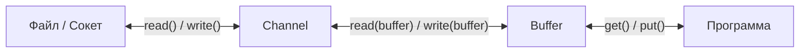

```java
// Чтение файла через Channel + Buffer
try (FileChannel channel = FileChannel.open(Path.of("data.txt"), StandardOpenOption.READ)) {
    ByteBuffer buffer = ByteBuffer.allocate(1024);

    while (channel.read(buffer) != -1) {  // данные: канал → буфер
        buffer.flip();                     // переключаем буфер в режим чтения
        while (buffer.hasRemaining()) {
            byte b = buffer.get();         // данные: буфер → программа
        }
        buffer.clear();                    // готовим буфер к следующему циклу записи
    }
}
```

Типы буферов: `ByteBuffer`, `CharBuffer`, `ShortBuffer`, `IntBuffer`, `LongBuffer`, `FloatBuffer`, `DoubleBuffer`. Все наследуют абстрактный `Buffer`.

## Q11. Какие реализации `Channel` существуют и для чего каждая?

Каналы делятся по источнику данных (файл / TCP / UDP / межпоточный pipe) и по модели работы (блокирующий, неблокирующий, асинхронный). Главное, что спрашивают: `FileChannel` всегда блокирующий, а сетевые каналы умеют и неблокирующий режим.

| Канал | Назначение | Блокирующий | Неблокирующий |
|---|---|---|---|
| `FileChannel` | Чтение/запись файлов, memory-mapping | Да | **Нет** |
| `SocketChannel` | TCP-клиент | Да | Да |
| `ServerSocketChannel` | TCP-сервер (accept) | Да | Да |
| `DatagramChannel` | UDP | Да | Да |
| `AsynchronousFileChannel` | Асинхронные файловые операции | — | Асинхронный |
| `AsynchronousSocketChannel` | Асинхронный TCP-клиент | — | Асинхронный |
| `Pipe.SourceChannel` / `Pipe.SinkChannel` | Межпоточная передача данных | Да | Да |

```java
// Открытие различных каналов
FileChannel fileChannel = FileChannel.open(Path.of("file.txt"), StandardOpenOption.READ);
SocketChannel socketChannel = SocketChannel.open(new InetSocketAddress("example.com", 80));
ServerSocketChannel serverChannel = ServerSocketChannel.open();
DatagramChannel datagramChannel = DatagramChannel.open();
```

## Q12. (!) Как устроен `ByteBuffer`: `capacity`, `position`, `limit`, `mark`?

У `ByteBuffer` нет отдельных режимов «чтение» и «запись» — есть четыре указателя, и операции работают между `position` и `limit`. Понимание этих четырёх чисел снимает почти всю «магию» буферов. Всегда выполняется инвариант — указатели упорядочены и не выходят за `capacity`:

```
Инвариант: 0 <= mark <= position <= limit <= capacity
```

| Атрибут | Описание |
|---|---|
| `capacity` | Максимальный размер буфера (неизменяем после создания) |
| `position` | Текущая позиция для чтения или записи (следующий элемент) |
| `limit` | Граница, до которой можно читать или писать |
| `mark` | Сохранённая позиция для возврата через `reset()` |

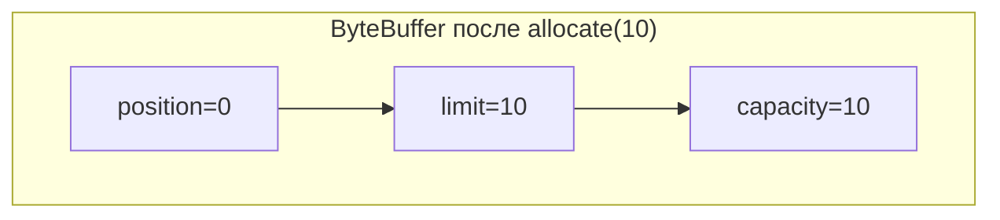

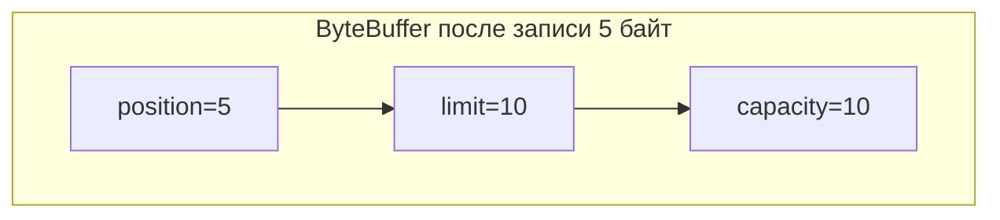

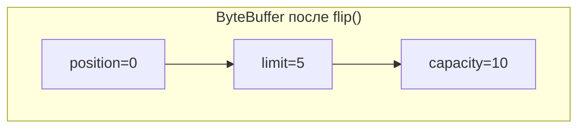

```java
ByteBuffer buffer = ByteBuffer.allocate(10); // capacity=10, position=0, limit=10

buffer.put((byte) 'H');  // position=1
buffer.put((byte) 'i');  // position=2

buffer.flip();            // position=0, limit=2  — готов к чтению

byte b1 = buffer.get();  // 'H', position=1
byte b2 = buffer.get();  // 'i', position=2

buffer.clear();           // position=0, limit=10 — готов к записи
```

## Q13. Что делают методы `flip()`, `clear()`, `compact()`, `rewind()` в `ByteBuffer`?

Все четыре метода переставляют указатели `position` и `limit`, переключая буфер между «записью» и «чтением» — данные при этом не копируются и не стираются, меняются только границы. Запомнить проще через сценарии: записал → `flip()` → прочитал → `clear()` (начать заново) или `compact()` (дописать к остатку).

**Самый частый баг:** забыть `flip()` после записи перед чтением — тогда `get()` читает мусор из «пустой» части буфера или сразу упирается в `limit`.

| Метод | `position` | `limit` | Когда использовать |
|---|---|---|---|
| `flip()` | → 0 | → старый `position` | После записи, перед чтением |
| `clear()` | → 0 | → `capacity` | Перед новой записью (данные не стираются!) |
| `compact()` | → кол-во оставшихся | → `capacity` | Перенести непрочитанные данные в начало, продолжить запись |
| `rewind()` | → 0 | не меняется | Перечитать данные заново |

```java
ByteBuffer buffer = ByteBuffer.allocate(10);

// Запись в буфер
buffer.put("Hello".getBytes()); // position=5, limit=10

// Переключение в режим чтения
buffer.flip();                  // position=0, limit=5

// Читаем 3 байта
byte[] dst = new byte[3];
buffer.get(dst);                // position=3, limit=5

// compact(): оставшиеся 2 байта перемещаются в начало, можно дописывать
buffer.compact();               // position=2, limit=10
// буфер содержит: ['l', 'o', ?, ?, ...], position=2

// rewind(): перечитать с начала
buffer.rewind();                // position=0, limit не меняется
```

## Q14. (!) В чём разница между `direct buffer` и `heap buffer`?

Разница в том, **где физически лежат данные**: heap buffer — в куче JVM, direct buffer — в нативной памяти ОС. Отсюда компромисс: direct быстрее в I/O (ОС работает с памятью напрямую, без лишнего копирования), но дороже в создании и не управляется GC напрямую.

| Характеристика | `Heap Buffer` | `Direct Buffer` |
|---|---|---|
| Создание | `ByteBuffer.allocate(size)` | `ByteBuffer.allocateDirect(size)` |
| Расположение | В куче JVM | В нативной памяти ОС |
| GC | Управляется GC | Освобождается при GC обёртки |
| Скорость I/O | Требует копирования в нативную память | Нет лишних копирований (zero-copy) |
| Скорость создания | Быстрое | Медленное |
| `isDirect()` | `false` | `true` |

```java
// Heap buffer — данные в куче JVM
ByteBuffer heapBuffer = ByteBuffer.allocate(1024);

// Direct buffer — данные в нативной памяти
ByteBuffer directBuffer = ByteBuffer.allocateDirect(1024);

System.out.println(heapBuffer.isDirect());  // false
System.out.println(directBuffer.isDirect()); // true
```

**Когда использовать `direct buffer`:**
- Долгоживущие буферы для интенсивного I/O (сетевые серверы)
- Передача данных в нативный код (JNI)
- `MappedByteBuffer` (всегда direct)

**Когда использовать `heap buffer`:**
- Короткоживущие операции
- Когда нужен доступ к внутреннему массиву (`array()`)
- Небольшие объёмы данных

На собеседовании важно упомянуть: при I/O с heap buffer JVM всё равно копирует данные во временный direct buffer — именно поэтому для частых I/O операций direct buffer эффективнее.

## Q15. Что такое `scatter/gather` операции в `NIO`?

Это чтение/запись через **массив буферов** вместо одного. Канал последовательно «разбрасывает» (scatter) входящие данные по нескольким буферам или «собирает» (gather) их из нескольких буферов в один поток.

**Scatter read** — чтение из одного канала в **несколько** буферов: данные сначала заполняют первый буфер до его `limit`, затем переливаются во второй и т.д.

**Gather write** — обратная операция: запись в один канал из **нескольких** буферов по порядку.

```java
// Scatter read — чтение заголовка и тела протокола в разные буферы
ByteBuffer header = ByteBuffer.allocate(128);  // фиксированный заголовок
ByteBuffer body = ByteBuffer.allocate(4096);   // тело сообщения

ByteBuffer[] buffers = {header, body};

try (FileChannel channel = FileChannel.open(Path.of("message.bin"), StandardOpenOption.READ)) {
    // Scatter: сначала заполнит header, затем body
    channel.read(buffers);
}

// Gather write — запись из нескольких буферов в один канал
header.flip();
body.flip();
try (FileChannel outChannel = FileChannel.open(Path.of("out.bin"),
        StandardOpenOption.WRITE, StandardOpenOption.CREATE)) {
    outChannel.write(buffers); // сначала header, затем body
}
```

**Сценарий применения:** протоколы с фиксированным заголовком (HTTP, бинарные протоколы). Заголовок сразу попадает в свой буфер, тело — в свой, и парсер работает с ними отдельно, без ручной нарезки одного большого буфера.

## Q16. (!) Как работает механизм `Selector` в `Java NIO`?

`Selector` — это мультиплексор: он позволяет **одному потоку** следить сразу за множеством каналов и просыпаться только когда какой-то из них готов к чтению, записи или приёму соединения. Вместо «поток на соединение» получается «один поток на тысячи соединений» — это и есть паттерн **Reactor** (подробнее в [Design Patterns](../../design-patterns/design-patterns-interview.md)).

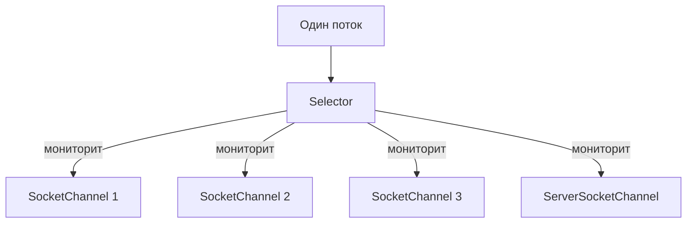

Цикл работы (event loop):
1. создать `Selector` через `Selector.open()`;
2. зарегистрировать каналы (в неблокирующем режиме!) с интересующими операциями;
3. в цикле вызывать `selector.select()` — блокируется, пока хотя бы один канал не станет готов;
4. обработать готовые ключи из `selector.selectedKeys()`;
5. **обязательно** удалить обработанный ключ из набора — иначе он останется там и будет обработан повторно на следующей итерации.

```java
Selector selector = Selector.open();

ServerSocketChannel serverChannel = ServerSocketChannel.open();
serverChannel.bind(new InetSocketAddress(8080));
serverChannel.configureBlocking(false); // обязательно неблокирующий!

// Регистрация канала с интересующей операцией
serverChannel.register(selector, SelectionKey.OP_ACCEPT);

while (true) {
    int readyChannels = selector.select(); // блокируется до готовности
    if (readyChannels == 0) continue;

    Set<SelectionKey> selectedKeys = selector.selectedKeys();
    Iterator<SelectionKey> it = selectedKeys.iterator();

    while (it.hasNext()) {
        SelectionKey key = it.next();

        if (key.isAcceptable()) {
            // новое входящее соединение
        } else if (key.isReadable()) {
            // данные готовы для чтения
        } else if (key.isWritable()) {
            // канал готов для записи
        }

        it.remove(); // важно: удалить обработанный ключ!
    }
}
```

## Q17. Что такое `SelectionKey` и какие операции он поддерживает?

`SelectionKey` — это «токен регистрации» канала в селекторе. Он отвечает на два вопроса: какие операции нас интересуют (`interestOps`) и какие из них уже готовы (`readyOps`, проверяется методами `isReadable()`/`isWritable()`/`isAcceptable()`/`isConnectable()`). Дополнительно через `attach()` к ключу можно прицепить произвольный объект — обычно буфер или состояние соединения, чтобы не вести отдельную `Map<Channel, State>`.

Четыре поддерживаемые операции (битовые флаги, комбинируются через `|`):

| Операция | Константа | Для каких каналов |
|---|---|---|
| Accept | `SelectionKey.OP_ACCEPT` | `ServerSocketChannel` |
| Connect | `SelectionKey.OP_CONNECT` | `SocketChannel` |
| Read | `SelectionKey.OP_READ` | `SocketChannel`, `DatagramChannel` |
| Write | `SelectionKey.OP_WRITE` | `SocketChannel`, `DatagramChannel` |

```java
// Регистрация с несколькими операциями (побитовое ИЛИ)
SelectionKey key = channel.register(selector,
    SelectionKey.OP_READ | SelectionKey.OP_WRITE);

// Проверка готовности
if (key.isReadable()) { /* ... */ }
if (key.isWritable()) { /* ... */ }

// Attachment — хранение состояния для канала
ByteBuffer buffer = ByteBuffer.allocate(256);
key.attach(buffer);
ByteBuffer attached = (ByteBuffer) key.attachment();

// Изменение интересующих операций
key.interestOps(SelectionKey.OP_READ); // теперь только чтение
```

## Q18. (!) Как реализовать неблокирующий сервер на `NIO`?

Схема всегда одна: неблокирующий `ServerSocketChannel` регистрируется на `OP_ACCEPT`, а в бесконечном event loop селектор раздаёт готовые ключи — новые соединения принимаются в `handleAccept`, входящие данные читаются в `handleRead`. Полный echo-сервер:

```java
public class NioEchoServer {
    public static void main(String[] args) throws IOException {
        Selector selector = Selector.open();
        ServerSocketChannel serverChannel = ServerSocketChannel.open();
        serverChannel.bind(new InetSocketAddress(8080));
        serverChannel.configureBlocking(false);
        serverChannel.register(selector, SelectionKey.OP_ACCEPT);

        System.out.println("Сервер запущен на порту 8080");

        while (true) {
            selector.select();
            Iterator<SelectionKey> it = selector.selectedKeys().iterator();

            while (it.hasNext()) {
                SelectionKey key = it.next();
                it.remove();

                if (key.isAcceptable()) {
                    handleAccept(selector, key);
                } else if (key.isReadable()) {
                    handleRead(key);
                }
            }
        }
    }

    private static void handleAccept(Selector selector, SelectionKey key) throws IOException {
        ServerSocketChannel server = (ServerSocketChannel) key.channel();
        SocketChannel client = server.accept();
        client.configureBlocking(false);
        client.register(selector, SelectionKey.OP_READ, ByteBuffer.allocate(256));
        System.out.println("Клиент подключён: " + client.getRemoteAddress());
    }

    private static void handleRead(SelectionKey key) throws IOException {
        SocketChannel client = (SocketChannel) key.channel();
        ByteBuffer buffer = (ByteBuffer) key.attachment();
        int bytesRead = client.read(buffer);

        if (bytesRead == -1) {
            client.close();
            return;
        }

        buffer.flip();
        client.write(buffer); // echo обратно
        buffer.compact();
    }
}
```

В реальных проектах вместо написания NIO-серверов вручную используют `Netty` или `Spring WebFlux`, которые строятся поверх NIO, но предоставляют удобный API. Подробнее в [Java Concurrency](java-concurrency-interview.md).

## Q19. (!) Что такое `NIO.2` и чем он отличается от классического `NIO`?

`NIO.2` (Java 7, пакет `java.nio.file`) — это **высокоуровневый файловый API**, а не замена классическому `NIO`. Если оригинальный `NIO` дал низкоуровневые каналы, буферы и селекторы, то `NIO.2` решает другую задачу — удобную работу с файлами и каталогами, заменяя громоздкий и небезопасный `java.io.File` на `Path` + `Files`.

| | Классический `NIO` (Java 1.4) | `NIO.2` (Java 7) |
|---|---|---|
| Пакет | `java.nio`, `java.nio.channels` | `java.nio.file` |
| Фокус | Каналы, буферы, селекторы | Файловые операции |
| Ключевые классы | `Channel`, `Buffer`, `Selector` | `Path`, `Files`, `FileSystem` |
| Замена для | `java.net.Socket` | `java.io.File` |
| Асинхронность | Неблокирующий I/O через `Selector` | `AsynchronousFileChannel`, `AsynchronousSocketChannel` |
| Дополнительно | — | `WatchService`, `FileVisitor`, атрибуты файлов |

```java
// NIO.2 заменяет устаревший java.io.File
// Старый способ
File file = new File("/path/to/file.txt");
boolean exists = file.exists();

// Новый способ (NIO.2)
Path path = Path.of("/path/to/file.txt");
boolean exists2 = Files.exists(path);
```

**Что важно сказать на собеседовании:** «NIO» и «NIO.2» — это разные слои, а не версии одного. `NIO.2` не отменяет `Channel`/`Selector`, а добавляет к ним `Path`, `Files`, `WatchService`, `FileVisitor`, атрибуты файлов и асинхронные каналы.

## Q20. Как работать с `Path` и `Paths`?

`Path` — это интерфейс-представление пути в файловой системе, замена `java.io.File`. Важно: сам `Path` — лишь описание пути, он не обращается к диску; реальные операции (чтение, проверка существования) делает класс `Files`. `Paths.get(...)` — старая фабрика, в Java 11+ её заменил статический `Path.of(...)`.

Большинство методов `Path` — чисто строковые манипуляции с путём:

```java
// Создание Path
Path p1 = Path.of("/Users/dev/file.txt");         // Java 11+
Path p2 = Path.of("src", "main", "java");          // из частей
Path p3 = Paths.get("/Users/dev/file.txt");         // до Java 11
Path p4 = Path.of(URI.create("file:///tmp/test"));  // из URI

// Основные операции
Path fileName = p1.getFileName();     // file.txt
Path parent = p1.getParent();         // /Users/dev
Path root = p1.getRoot();             // /
int nameCount = p1.getNameCount();    // 3

// Разрешение путей
Path base = Path.of("/Users/dev");
Path resolved = base.resolve("projects/app"); // /Users/dev/projects/app

// Относительный путь
Path from = Path.of("/a/b");
Path to = Path.of("/a/c/d");
Path relative = from.relativize(to); // ../c/d

// Нормализация
Path messy = Path.of("/a/b/../c/./d");
Path clean = messy.normalize(); // /a/c/d

// Реальный путь (разрешение символических ссылок)
Path real = path.toRealPath();
```

## Q21. Какие основные операции предоставляет класс `Files`?

`Files` — утилитный класс, который выполняет все реальные операции с файлами: проверки, чтение, запись, создание, чтение атрибутов. В отличие от `Path` (чисто описание пути) именно `Files` обращается к диску. Ключевые группы методов:

```java
Path path = Path.of("example.txt");

// Проверки
boolean exists = Files.exists(path);
boolean isDir = Files.isDirectory(path);
boolean isRegular = Files.isRegularFile(path);
boolean isReadable = Files.isReadable(path);

// Чтение
byte[] bytes = Files.readAllBytes(path);
List<String> lines = Files.readAllLines(path, StandardCharsets.UTF_8);
String content = Files.readString(path); // Java 11+
Stream<String> lineStream = Files.lines(path); // ленивое чтение

// Запись
Files.write(path, bytes);
Files.writeString(path, "содержимое"); // Java 11+
Files.write(path, lines, StandardCharsets.UTF_8,
    StandardOpenOption.CREATE, StandardOpenOption.APPEND);

// Создание
Files.createFile(path);
Files.createDirectory(Path.of("newDir"));
Files.createDirectories(Path.of("a/b/c")); // рекурсивно
Path temp = Files.createTempFile("prefix", ".tmp");

// Атрибуты
long size = Files.size(path);
FileTime modified = Files.getLastModifiedTime(path);
```

## Q22. Как копировать, перемещать и удалять файлы через `NIO.2`?

Все три операции — статические методы `Files`: `copy()`, `move()`, `delete()`. Их поведение настраивается опциями: `REPLACE_EXISTING` (перезаписать), `ATOMIC_MOVE` (атомарное перемещение), `COPY_ATTRIBUTES` (сохранить метаданные). Удаление есть в двух вариантах: `delete()` бросает исключение при отсутствии файла, `deleteIfExists()` — нет.

```java
Path src = Path.of("source.txt");
Path dst = Path.of("target.txt");

// Копирование
Files.copy(src, dst);
Files.copy(src, dst, StandardCopyOption.REPLACE_EXISTING);
Files.copy(src, dst, StandardCopyOption.COPY_ATTRIBUTES);

// Копирование из/в поток
try (InputStream in = new URL("https://example.com/data").openStream()) {
    Files.copy(in, dst, StandardCopyOption.REPLACE_EXISTING);
}
try (OutputStream out = Files.newOutputStream(dst)) {
    Files.copy(src, out);
}

// Перемещение (атомарное, если на одной файловой системе)
Files.move(src, dst, StandardCopyOption.REPLACE_EXISTING,
    StandardCopyOption.ATOMIC_MOVE);

// Удаление
Files.delete(path);              // бросает NoSuchFileException если нет файла
Files.deleteIfExists(path);      // не бросает, если файла нет

// Рекурсивное удаление каталога
Files.walkFileTree(dir, new SimpleFileVisitor<>() {
    @Override
    public FileVisitResult visitFile(Path file, BasicFileAttributes attrs) throws IOException {
        Files.delete(file);
        return FileVisitResult.CONTINUE;
    }
    @Override
    public FileVisitResult postVisitDirectory(Path dir, IOException exc) throws IOException {
        Files.delete(dir);
        return FileVisitResult.CONTINUE;
    }
});
```

**Подводный камень:** `Files.delete()` удаляет только пустой каталог (иначе `DirectoryNotEmptyException`). Поэтому для рекурсивного удаления каталог обходят через `walkFileTree`, удаляя сначала все файлы (`visitFile`), а сам каталог — после выхода из него (`postVisitDirectory`), когда он уже пуст.

## Q23. Что такое `FileVisitor` и как обходить дерево каталогов?

`FileVisitor<Path>` — интерфейс-обработчик для рекурсивного обхода дерева каталогов. `Files.walkFileTree()` сам спускается по дереву и вызывает коллбэки visitor'а на каждый файл и каталог — вам остаётся написать только логику обработки. На практике наследуют `SimpleFileVisitor`, переопределяя нужные методы.

Когда не нужен полный контроль над обходом, проще взять стримовые `Files.walk()` / `Files.find()` — они возвращают `Stream<Path>`, который удобно фильтровать.

```java
// Поиск всех .java файлов
List<Path> javaFiles = new ArrayList<>();

Files.walkFileTree(Path.of("src"), new SimpleFileVisitor<>() {
    @Override
    public FileVisitResult visitFile(Path file, BasicFileAttributes attrs) {
        if (file.toString().endsWith(".java")) {
            javaFiles.add(file);
        }
        return FileVisitResult.CONTINUE;
    }
});

// Альтернатива через Files.walk() (Java 8+) — возвращает Stream<Path>
try (Stream<Path> paths = Files.walk(Path.of("src"))) {
    List<Path> result = paths
        .filter(p -> p.toString().endsWith(".java"))
        .toList();
}

// Files.find() — с фильтрацией по атрибутам
try (Stream<Path> paths = Files.find(Path.of("src"), 10,
        (path, attrs) -> attrs.isRegularFile() && path.toString().endsWith(".java"))) {
    paths.forEach(System.out::println);
}
```

Четыре коллбэка `FileVisitor` (вызываются в этом порядке для каждого каталога):
- `preVisitDirectory()` — перед входом в каталог (здесь можно вернуть `SKIP_SUBTREE`, чтобы не заходить внутрь);
- `visitFile()` — на каждый файл внутри;
- `visitFileFailed()` — если файл не удалось прочитать (нет прав, удалён в процессе);
- `postVisitDirectory()` — после выхода из каталога, когда все его файлы уже обработаны.

## Q24. Что такое `WatchService` и как отслеживать изменения файлов?

`WatchService` (NIO.2, Java 7) — встроенный механизм слежения за изменениями в каталоге: создание, удаление, изменение файлов. Под капотом он использует событийный механизм ОС (inotify в Linux, аналоги в других системах), а не периодический опрос — поэтому работает дёшево. Схема использования: зарегистрировать каталог на нужные виды событий, в цикле забирать `WatchKey` через `take()` и после обработки обязательно вызывать `key.reset()`.

```java
WatchService watchService = FileSystems.getDefault().newWatchService();

Path dir = Path.of("/tmp/watched");
dir.register(watchService,
    StandardWatchEventKinds.ENTRY_CREATE,
    StandardWatchEventKinds.ENTRY_DELETE,
    StandardWatchEventKinds.ENTRY_MODIFY);

System.out.println("Наблюдаем за каталогом: " + dir);

while (true) {
    WatchKey key = watchService.take(); // блокируется до события

    for (WatchEvent<?> event : key.pollEvents()) {
        WatchEvent.Kind<?> kind = event.kind();
        Path fileName = (Path) event.context();

        System.out.printf("Событие: %s, файл: %s%n", kind.name(), fileName);
    }

    boolean valid = key.reset(); // сбрасываем ключ для следующих событий
    if (!valid) break;           // каталог стал недоступен
}
```

**Сценарии применения:**
- горячая перезагрузка конфигурации (property reload);
- мониторинг «входящей» папки для обработки появляющихся файлов;
- синхронизация каталогов;
- автоматическая пересборка при изменении исходников (как в IDE).

**Подводный камень:** `WatchService` следит **только за одним уровнем** каталога, не рекурсивно. Чтобы наблюдать за вложенными папками, нужно регистрировать каждый подкаталог отдельно (и регистрировать новые подкаталоги при их появлении).

## Q25. Как работает `FileChannel` и чем он отличается от потоков?

`FileChannel` — канал `NIO` для работы с файлами, который умеет то, чего нет у обычных файловых потоков: произвольный доступ по позиции, memory-mapping, блокировку файла и zero-copy передачу между каналами. Поток (`FileInputStream`) читает строго последовательно от начала к концу; канал позволяет прыгать по файлу и работает на более низком уровне. При этом `FileChannel` всегда блокирующий.

Чем `FileChannel` богаче потоков:

| Возможность | `FileInputStream` | `FileChannel` |
|---|---|---|
| Произвольный доступ | Нет (только последовательный) | Да (`position(long)`) |
| Memory-mapping | Нет | Да (`map()`) |
| Блокировка файла | Нет | Да (`lock()`, `tryLock()`) |
| `transferTo/From` | Нет | Да (zero-copy между каналами) |
| Scatter/Gather | Нет | Да |

```java
try (FileChannel channel = FileChannel.open(Path.of("data.bin"),
        StandardOpenOption.READ, StandardOpenOption.WRITE)) {

    // Произвольный доступ
    channel.position(100); // перемещаемся на 100-й байт

    ByteBuffer buffer = ByteBuffer.allocate(256);
    channel.read(buffer);

    // Размер файла
    long size = channel.size();

    // Усечение файла
    channel.truncate(1024);

    // Принудительная запись на диск
    channel.force(true); // включая метаданные

    // Блокировка файла (для координации между процессами)
    try (FileLock lock = channel.lock()) {
        // эксклюзивный доступ к файлу
    }
}
```

## Q26. (!) Как использовать `Memory-mapped` files (`MappedByteBuffer`)?

`MappedByteBuffer` — это файл (или его участок), **отображённый прямо в адресное пространство процесса**. Работаешь с ним как с обычным `ByteBuffer` в памяти, а операционная система сама подгружает нужные страницы файла с диска по обращению и сбрасывает изменения обратно. Никакого явного `read()`/`write()` — чтение и запись превращаются в обращения к памяти. Это очень эффективно для больших файлов с частым произвольным доступом.

Получают его через `channel.map(mode, offset, size)`:

```java
try (FileChannel channel = FileChannel.open(Path.of("large-file.dat"),
        StandardOpenOption.READ, StandardOpenOption.WRITE)) {

    // Отображение первых 1 МБ файла в память
    MappedByteBuffer mappedBuffer = channel.map(
        FileChannel.MapMode.READ_WRITE,  // режим
        0,                                // начало (offset)
        Math.min(channel.size(), 1024 * 1024) // размер
    );

    // Чтение — как обычный ByteBuffer
    byte firstByte = mappedBuffer.get(0);

    // Запись
    mappedBuffer.put(0, (byte) 0xFF);

    // Принудительная запись на диск
    mappedBuffer.force();
}
```

Режимы отображения:
- `READ_ONLY` — только чтение, попытка записи → `ReadOnlyBufferException`
- `READ_WRITE` — чтение и запись, изменения отражаются в файле
- `PRIVATE` — copy-on-write, изменения видны только этому буферу

**Когда использовать:**
- Большие файлы с частым произвольным доступом (индексы, базы данных)
- Межпроцессное взаимодействие через общий файл
- **Не использовать** для маленьких файлов — overhead маппинга не окупится

## Q27. Что такое `transferTo()` / `transferFrom()` в `FileChannel`?

Это методы **zero-copy** передачи данных напрямую между двумя каналами, минуя память JVM. `transferTo()` шлёт данные из текущего канала в целевой, `transferFrom()` — наоборот. Главное — данные не проходят через пользовательское пространство (user space): обычное копирование делает 4 переключения буферов (диск → kernel → JVM → kernel → диск), а zero-copy перекладывает данные внутри ядра через DMA. Это разгружает CPU и память, что особенно заметно на больших файлах и сетевой отдаче.

```java
// Копирование файла через transferTo (zero-copy)
try (FileChannel src = FileChannel.open(Path.of("source.dat"), StandardOpenOption.READ);
     FileChannel dst = FileChannel.open(Path.of("target.dat"),
         StandardOpenOption.WRITE, StandardOpenOption.CREATE)) {

    long transferred = src.transferTo(0, src.size(), dst);
    // Или наоборот:
    // dst.transferFrom(src, 0, src.size());
}
```

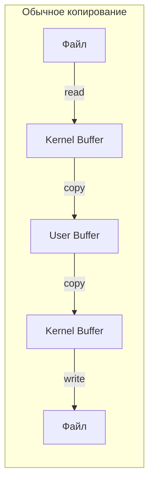

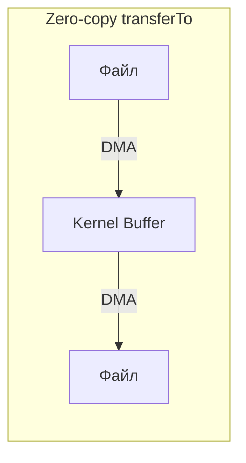

На диаграммах видно суть: обычный путь гоняет данные через kernel- и user-буферы (множество копирований), zero-copy передаёт их между дескрипторами напрямую через DMA.

## Q28. Как обрабатывать большие файлы, не загружая их целиком в память?

Главный принцип — **не читать файл целиком** (`readAllLines`/`readAllBytes` на гигабайтном файле дадут `OutOfMemoryError`), а обрабатывать его порциями с постоянным потреблением памяти. Выбор инструмента зависит от характера данных:

- **текст построчно** → `Files.lines()` (ленивый стрим) или `BufferedReader`;
- **бинарные данные порциями** → `FileChannel` + переиспользуемый `ByteBuffer`;
- **произвольный доступ к участкам большого файла** → `MappedByteBuffer` по окнам.

```java
Path largePath = Path.of("huge-file.log");

// 1. Потоковое чтение строк (ленивое, O(1) по памяти)
try (Stream<String> lines = Files.lines(largePath, StandardCharsets.UTF_8)) {
    long errorCount = lines
        .filter(line -> line.contains("ERROR"))
        .count();
}

// 2. BufferedReader с буфером (классический подход)
try (BufferedReader reader = Files.newBufferedReader(largePath)) {
    String line;
    while ((line = reader.readLine()) != null) {
        // обработка по строкам
    }
}

// 3. FileChannel с ByteBuffer (бинарные данные)
try (FileChannel channel = FileChannel.open(largePath, StandardOpenOption.READ)) {
    ByteBuffer buffer = ByteBuffer.allocateDirect(64 * 1024); // 64 КБ
    while (channel.read(buffer) != -1) {
        buffer.flip();
        processBuffer(buffer); // обработка порции
        buffer.clear();
    }
}

// 4. MappedByteBuffer с окном (произвольный доступ к частям)
try (FileChannel channel = FileChannel.open(largePath, StandardOpenOption.READ)) {
    long fileSize = channel.size();
    long chunkSize = 64 * 1024 * 1024; // 64 МБ за раз
    for (long offset = 0; offset < fileSize; offset += chunkSize) {
        long size = Math.min(chunkSize, fileSize - offset);
        MappedByteBuffer mapped = channel.map(FileChannel.MapMode.READ_ONLY, offset, size);
        processBuffer(mapped);
    }
}
```

Для работы со `Stream<String>` см. [Java Stream API](java-stream-interview.md).

## Q29. (!) Что такое `AsynchronousFileChannel` и как он работает?

`AsynchronousFileChannel` (NIO.2, Java 7) — асинхронный канал для файлов: вызов `read()`/`write()` сразу возвращает управление, а сама операция выполняется в фоновом пуле потоков. Результат вы получаете одним из двух способов: либо через `Future` (запросить позже методом `get()`), либо через `CompletionHandler` (коллбэк вызовется по завершении). Это отличается от неблокирующего `SocketChannel`: там нужен `Selector` и event loop, а здесь фоновый пул сам выполнит операцию и уведомит вас.

```java
// Вариант 1: через Future
AsynchronousFileChannel channel = AsynchronousFileChannel.open(
    Path.of("data.txt"), StandardOpenOption.READ);

ByteBuffer buffer = ByteBuffer.allocate(1024);
Future<Integer> result = channel.read(buffer, 0); // position = 0

// Поток свободен для другой работы...

int bytesRead = result.get(); // блокируется до завершения
buffer.flip();

// Вариант 2: через CompletionHandler (полностью асинхронно)
channel.read(buffer, 0, buffer, new CompletionHandler<Integer, ByteBuffer>() {
    @Override
    public void completed(Integer bytesRead, ByteBuffer attachment) {
        attachment.flip();
        // обработка прочитанных данных
        System.out.println("Прочитано: " + bytesRead + " байт");
    }

    @Override
    public void failed(Throwable exc, ByteBuffer attachment) {
        System.err.println("Ошибка чтения: " + exc.getMessage());
    }
});
```

Асинхронная запись:

```java
AsynchronousFileChannel writeChannel = AsynchronousFileChannel.open(
    Path.of("output.txt"),
    StandardOpenOption.WRITE, StandardOpenOption.CREATE);

ByteBuffer data = ByteBuffer.wrap("Асинхронная запись".getBytes(StandardCharsets.UTF_8));
Future<Integer> writeResult = writeChannel.write(data, 0);
writeResult.get(); // ожидаем завершения
```

## Q30. Что такое `AsynchronousSocketChannel` и `AsynchronousServerSocketChannel`?

Это асинхронные аналоги `SocketChannel` и `ServerSocketChannel` из NIO.2. Они позволяют писать сетевые серверы **без ручного `Selector` и event loop**: вместо опроса готовности каналов вы передаёте `CompletionHandler`, и JDK сам вызовет `completed()`, когда соединение принято или данные прочитаны. Под капотом работает встроенный пул потоков, а не один selector-поток. Типичный приём — в обработчике `accept` сразу вызвать `server.accept(this)`, чтобы продолжить принимать следующие соединения:

```java
// Асинхронный TCP-сервер
AsynchronousServerSocketChannel server =
    AsynchronousServerSocketChannel.open().bind(new InetSocketAddress(8080));

server.accept(null, new CompletionHandler<AsynchronousSocketChannel, Void>() {
    @Override
    public void completed(AsynchronousSocketChannel client, Void att) {
        // Принимаем следующее соединение
        server.accept(null, this);

        // Обрабатываем текущее
        ByteBuffer buffer = ByteBuffer.allocate(1024);
        client.read(buffer, buffer, new CompletionHandler<Integer, ByteBuffer>() {
            @Override
            public void completed(Integer bytesRead, ByteBuffer buf) {
                buf.flip();
                client.write(buf); // echo
            }

            @Override
            public void failed(Throwable exc, ByteBuffer buf) {
                try { client.close(); } catch (IOException e) { /* ignore */ }
            }
        });
    }

    @Override
    public void failed(Throwable exc, Void att) {
        System.err.println("Accept failed: " + exc.getMessage());
    }
});

// Не даём main завершиться
Thread.currentThread().join();
```

**Компромисс vs `Selector`:** коллбэки избавляют от ручного event loop и читаются проще на старте, но при цепочках операций (принять → прочитать → записать → снова прочитать) превращаются во вложенные обработчики — тот самый callback hell. Поэтому в продакшене высоконагруженные серверы чаще строят на `Netty` поверх `Selector`, а не на голом асинхронном канале.

## Q31. В чём разница между `Future` и `CompletionHandler` в асинхронных каналах?

Это два способа получить результат асинхронной операции. `Future` — модель «спросить позже»: вы запускаете операцию, а потом сами зовёте `get()` (который заблокирует поток) или опрашиваете `isDone()`. `CompletionHandler` — модель «уведомить меня»: операция сама вызовет ваш коллбэк `completed()` или `failed()`, не блокируя ни один из ваших потоков. То есть `Future` — лишь полу-асинхронность (блокировка просто отложена), а `CompletionHandler` — полная асинхронность.

| | `Future<Integer>` | `CompletionHandler<Integer, A>` |
|---|---|---|
| Стиль | Полу-асинхронный (polling / blocking get) | Полностью асинхронный (callback) |
| Блокировка | `get()` блокирует поток | Никогда не блокирует |
| Обработка ошибок | `ExecutionException` при `get()` | Метод `failed()` |
| Состояние | Можно проверить `isDone()` | Передаётся через attachment |
| Композиция | Нет встроенной | Через вложенные коллбэки |

```java
AsynchronousFileChannel ch = AsynchronousFileChannel.open(path, StandardOpenOption.READ);
ByteBuffer buf = ByteBuffer.allocate(4096);

// Future — блокирующее ожидание
Future<Integer> future = ch.read(buf, 0);
while (!future.isDone()) {
    // можно делать что-то другое
}
int bytesRead = future.get(); // может бросить ExecutionException

// CompletionHandler — полностью асинхронно
ch.read(buf, 0, "context", new CompletionHandler<Integer, String>() {
    @Override
    public void completed(Integer result, String attachment) {
        System.out.println(attachment + ": прочитано " + result + " байт");
    }
    @Override
    public void failed(Throwable exc, String attachment) {
        System.err.println(attachment + ": ошибка — " + exc.getMessage());
    }
});
```

**Эмпирическое правило:** `CompletionHandler` — для серверов и сценариев, где блокировать поток нельзя; `Future` — для простых одноразовых операций, где не жалко подождать на `get()`.

## Q32. Как работает кодировка при чтении/записи текста (`Charset`)?

`Charset` — это таблица соответствия между байтами на диске и символами в памяти. На диске и в сети текст всегда живёт байтами, а в Java — `char`'ами; кодировка задаёт, как одно превращается в другое. Когда при записи берут одну кодировку, а при чтении другую, и получаются «кракозябры» — байты декодируются по неверной таблице.

```java
// Стандартные кодировки (не бросают исключений)
Charset utf8 = StandardCharsets.UTF_8;
Charset latin1 = StandardCharsets.ISO_8859_1;
Charset utf16 = StandardCharsets.UTF_16;

// По имени (может бросить UnsupportedCharsetException)
Charset windows1251 = Charset.forName("Windows-1251");

// Кодирование / декодирование
String text = "Привет";
byte[] bytes = text.getBytes(utf8);
String decoded = new String(bytes, utf8);

// Чтение файла с кодировкой
List<String> lines = Files.readAllLines(path, utf8);
String content = Files.readString(path, utf8);

// Запись с кодировкой
Files.writeString(path, "текст", utf8);

// Мост байты→символы с явной кодировкой (Java IO)
try (BufferedReader reader = new BufferedReader(
        new InputStreamReader(new FileInputStream("file.txt"), utf8))) {
    // ...
}
```

Важно: **всегда** указывайте кодировку явно. Конструкторы `FileReader(String)` и `FileWriter(String)` до Java 18 использовали кодировку платформы (`file.encoding`), что приводило к багам при переносе между ОС. Подробнее о `String` см. [Java String](java-string-interview.md).

## Q33. Какие классы используются для сериализации и десериализации объектов?

Ядро штатной сериализации — пара `ObjectOutputStream` (объект → байты) и `ObjectInputStream` (байты → объект). Сериализуемый класс обязан реализовать маркерный интерфейс `Serializable`. На практике эти потоки оборачивают в `Buffered*` поверх файлового потока. Подробнее см. [Java Serialization](java-serialization-interview.md).

```java
// Сериализация
public class User implements Serializable {
    private static final long serialVersionUID = 1L;
    private String name;
    private transient String password; // не сериализуется
}

// Запись объекта
try (ObjectOutputStream oos = new ObjectOutputStream(
        new BufferedOutputStream(new FileOutputStream("users.ser")))) {
    oos.writeObject(new User("Alice"));
}

// Чтение объекта
try (ObjectInputStream ois = new ObjectInputStream(
        new BufferedInputStream(new FileInputStream("users.ser")))) {
    User user = (User) ois.readObject();
}
```

Ключевые моменты для собеседования:
- Класс должен реализовывать `Serializable` (маркерный интерфейс)
- `serialVersionUID` — версия сериализации, при несовпадении → `InvalidClassException`
- `transient` — поле не сериализуется
- `Externalizable` — полный контроль через `writeExternal()`/`readExternal()`
- Стандартная сериализация Java считается **устаревшей** — предпочтительнее JSON/Protobuf

## Q34. Какие классы используются для работы с архивами (`ZIP`, `GZIP`)?

Архивы — это потоки-декораторы из `java.util.zip`. `ZipOutputStream`/`ZipInputStream` работают с многофайловым ZIP-контейнером (каждый файл — `ZipEntry`), а `GZIPOutputStream`/`GZIPInputStream` сжимают **один** поток без понятия «файлов внутри». Их надевают поверх обычных файловых потоков. Отдельно стоит NIO.2-подход: ZIP можно открыть как `FileSystem` и работать с его содержимым через привычный `Files`.

```java
// Создание ZIP-архива
try (ZipOutputStream zos = new ZipOutputStream(
        new BufferedOutputStream(new FileOutputStream("archive.zip")))) {
    // Добавление файла в архив
    ZipEntry entry = new ZipEntry("document.txt");
    zos.putNextEntry(entry);
    zos.write("Содержимое файла".getBytes(StandardCharsets.UTF_8));
    zos.closeEntry();
}

// Чтение ZIP-архива
try (ZipInputStream zis = new ZipInputStream(
        new BufferedInputStream(new FileInputStream("archive.zip")))) {
    ZipEntry entry;
    while ((entry = zis.getNextEntry()) != null) {
        System.out.println("Файл: " + entry.getName());
        byte[] content = zis.readAllBytes();
        zis.closeEntry();
    }
}

// GZIP — сжатие одного файла
try (GZIPOutputStream gos = new GZIPOutputStream(
        new FileOutputStream("data.gz"))) {
    gos.write(Files.readAllBytes(Path.of("data.txt")));
}

// NIO.2: работа с ZIP как файловой системой (!)
try (FileSystem zipFs = FileSystems.newFileSystem(Path.of("archive.zip"))) {
    Path pathInZip = zipFs.getPath("/document.txt");
    String content = Files.readString(pathInZip);
    // Можно использовать Files.walk(), Files.copy() и т.д.
}
```

Интересный факт: `NIO.2` позволяет работать с ZIP-архивом **как с файловой системой** через `FileSystem` — можно использовать все методы `Files` для операций внутри архива.

## Q35. (!) Как правильно закрывать ресурсы (`try-with-resources`)?

Правильный ответ один: `try-with-resources` (Java 7+). Любой ресурс, реализующий `AutoCloseable` (потоки, каналы, сокеты), держит дескриптор ОС, и его нужно гарантированно закрыть — иначе утечка файловых дескрипторов рано или поздно положит приложение. `try-with-resources` закрывает ресурсы автоматически, в обратном порядке открытия, и корректно работает даже при исключении. Ручной `finally` для этого ненадёжен. Подробнее об обработке ошибок см. [Java Exceptions](java-exceptions-interview.md).

Что важно знать про этот синтаксис:
- ресурсы закрываются в порядке, **обратном** объявлению;
- если исключение бросают и тело, и `close()`, то исключение из `close()` **подавляется** (suppressed) и доступно через `getSuppressed()` — основным остаётся исключение из тела;
- с Java 9 в `try (...)` можно указывать уже созданные effectively final переменные, не объявляя их внутри скобок.

```java
// Правильно: try-with-resources
try (InputStream in = Files.newInputStream(path);
     BufferedReader reader = new BufferedReader(new InputStreamReader(in, StandardCharsets.UTF_8))) {
    String line = reader.readLine();
}
// Ресурсы закрываются в обратном порядке: reader → in

// Подавленные исключения
try (FileChannel channel = FileChannel.open(path)) {
    // Если здесь бросается IOException...
    channel.read(buffer);
} // ...и close() тоже бросает IOException,
  // то close-исключение подавляется (suppressed)
  // и доступно через exc.getSuppressed()

// Java 9+: можно использовать effectively final переменные
FileChannel channel = FileChannel.open(path);
try (channel) { // channel — effectively final
    channel.read(buffer);
}

// Антипаттерн: ручное закрытие (легко забыть, или close() бросит исключение)
FileInputStream fis = null;
try {
    fis = new FileInputStream("file.txt");
    // ...
} finally {
    if (fis != null) {
        try { fis.close(); } catch (IOException e) { /* потеря исключения! */ }
    }
}
```

## Q36. Какие исключения типичны для `Java IO/NIO` и как их обрабатывать?

Корень всей иерархии — `IOException` (checked, обязывает обработать). Дальше идёт деление по слоям: `java.io` даёт `FileNotFoundException`/`EOFException`, NIO.2 (`java.nio.file`) — более точные `NoSuchFileException`, `AccessDeniedException`, `DirectoryNotEmptyException`, а слой каналов и буферов — `ClosedChannelException`, `BufferOverflowException`/`BufferUnderflowException`. Принцип обработки — ловить **конкретное** исключение раньше общего `IOException`, чтобы реагировать осмысленно (отдельно «нет прав», отдельно «файл уже есть»).

| Исключение | Пакет | Когда возникает |
|---|---|---|
| `IOException` | `java.io` | Базовое исключение ввода-вывода |
| `FileNotFoundException` | `java.io` | Файл не найден |
| `EOFException` | `java.io` | Неожиданный конец файла |
| `NoSuchFileException` | `java.nio.file` | Файл не найден (NIO.2 аналог) |
| `FileAlreadyExistsException` | `java.nio.file` | Файл уже существует |
| `AccessDeniedException` | `java.nio.file` | Нет прав доступа |
| `DirectoryNotEmptyException` | `java.nio.file` | Попытка удалить непустой каталог |
| `ClosedChannelException` | `java.nio.channels` | Операция на закрытом канале |
| `BufferOverflowException` | `java.nio` | Запись за пределы буфера |
| `BufferUnderflowException` | `java.nio` | Чтение за пределы данных буфера |
| `OverlappingFileLockException` | `java.nio.channels` | Перекрывающаяся блокировка файла |

```java
// Обработка конкретных NIO.2 исключений
try {
    Files.copy(src, dst);
} catch (FileAlreadyExistsException e) {
    System.err.println("Файл уже существует: " + e.getFile());
} catch (AccessDeniedException e) {
    System.err.println("Нет прав доступа: " + e.getFile());
} catch (IOException e) {
    System.err.println("Ошибка I/O: " + e.getMessage());
}
```

## Q37. В чём разница между `FileInputStream` и `Files.newInputStream`?

Оба открывают поток чтения файла, но `Files.newInputStream()` — современный NIO.2-вариант и в новом коде предпочтительнее. Он принимает `Path` и `OpenOption`, интегрирован с произвольными `FileSystem` (например, внутри ZIP) и, в отличие от старого `FileInputStream`, не тащит за собой `finalize()`, создававший лишнее давление на GC.

| | `FileInputStream` | `Files.newInputStream()` |
|---|---|---|
| API | `java.io` (Java 1.0) | `java.nio.file` (Java 7) |
| Аргумент | `File` или `String` | `Path` + `OpenOption...` |
| Гибкость | Минимальная | Опции открытия, интеграция с `FileSystem` |
| Finalizer | Имеет `finalize()` (deprecated!) | Нет |
| Рекомендация | Устаревший подход | **Предпочтительный** в новом коде |

```java
// Старый способ
InputStream old = new FileInputStream("/path/to/file");

// Новый способ (рекомендуемый)
InputStream modern = Files.newInputStream(Path.of("/path/to/file"), StandardOpenOption.READ);
```

Практический аргумент: `FileInputStream` имел метод `finalize()`, который создавал давление на GC. В Java 18+ `finalize()` помечен как deprecated for removal. `Files.newInputStream()` не использует финализацию.

## Q38. (!) Когда предпочесть `InputStream`/`OutputStream`, а когда `Channel`/`ByteBuffer`?

Эмпирическое правило: **по умолчанию берите `Files` + потоки/`Reader`** — они проще и покрывают 90% задач. Переходите на `Channel`/`ByteBuffer`, только когда нужна конкретная их возможность: неблокирующий сетевой I/O (`Selector`), zero-copy, memory-mapping или произвольный доступ к большому файлу. Не усложняйте код NIO там, где хватает `Files.readString()`.

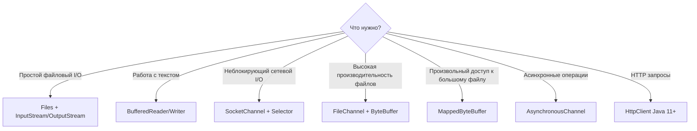

| Сценарий | Рекомендуемый API |
|---|---|
| Чтение конфига, маленького файла | `Files.readString()`, `Files.readAllLines()` |
| Обработка большого текстового файла | `Files.lines()` + `Stream` |
| Копирование файлов | `Files.copy()` или `FileChannel.transferTo()` |
| Бинарная обработка порциями | `FileChannel` + `ByteBuffer` |
| TCP-сервер на тысячи соединений | `Selector` + `SocketChannel` (или Netty) |
| Простой TCP-клиент | `Socket` + `InputStream/OutputStream` |
| Асинхронный файловый I/O | `AsynchronousFileChannel` |

## Q39. Что такое `Pipe` в `NIO` и для чего он используется?

`Pipe` — однонаправленный канал для передачи данных **между потоками внутри одного процесса** (не путать с межпроцессным OS pipe). Он состоит из двух концов: в `SinkChannel` пишет производитель, из `SourceChannel` читает потребитель. По сути это связь «писатель → читатель» в терминах каналов NIO.

```java
Pipe pipe = Pipe.open();

// Поток-производитель
Thread producer = new Thread(() -> {
    try {
        Pipe.SinkChannel sink = pipe.sink();
        ByteBuffer buffer = ByteBuffer.wrap("Hello from producer".getBytes());
        sink.write(buffer);
        sink.close();
    } catch (IOException e) {
        e.printStackTrace();
    }
});

// Поток-потребитель
Thread consumer = new Thread(() -> {
    try {
        Pipe.SourceChannel source = pipe.source();
        ByteBuffer buffer = ByteBuffer.allocate(256);
        source.read(buffer);
        buffer.flip();
        System.out.println(StandardCharsets.UTF_8.decode(buffer));
        source.close();
    } catch (IOException e) {
        e.printStackTrace();
    }
});

producer.start();
consumer.start();
```

**Сценарий применения:** связь «производитель–потребитель» без временных файлов, когда читателю удобно работать именно с каналом NIO. **На практике встречается редко:** для обмена объектами между потоками проще и привычнее `BlockingQueue` из [Java Concurrency](java-concurrency-interview.md) — `Pipe` оправдан в основном там, где данные уже в форме `ByteBuffer`.

## Q40. Что такое `HttpClient` (`Java` 11+) и когда его использовать?

`HttpClient` (`java.net.http`, Java 11) — современный встроенный HTTP-клиент, пришедший на смену неудобному `HttpURLConnection`. В отличие от предшественника он сразу умеет HTTP/2, синхронные и асинхронные запросы (через `CompletableFuture`), `WebSocket` и настраиваемые таймауты — без сторонних библиотек. Модель простая: один переиспользуемый `HttpClient` создаёт `HttpRequest` и отправляет его через `send()` (блокирующе) или `sendAsync()` (асинхронно), а тип ответа задаётся через `BodyHandlers`.

```java
// Создание клиента
HttpClient client = HttpClient.newBuilder()
    .version(HttpClient.Version.HTTP_2)
    .connectTimeout(Duration.ofSeconds(10))
    .followRedirects(HttpClient.Redirect.NORMAL)
    .build();

// Синхронный GET-запрос
HttpRequest request = HttpRequest.newBuilder()
    .uri(URI.create("https://api.example.com/users"))
    .header("Accept", "application/json")
    .GET()
    .build();

HttpResponse<String> response = client.send(request, HttpResponse.BodyHandlers.ofString());
System.out.println("Status: " + response.statusCode());
System.out.println("Body: " + response.body());

// Асинхронный POST-запрос
HttpRequest postRequest = HttpRequest.newBuilder()
    .uri(URI.create("https://api.example.com/users"))
    .header("Content-Type", "application/json")
    .POST(HttpRequest.BodyPublishers.ofString("{\"name\":\"Alice\"}"))
    .build();

CompletableFuture<HttpResponse<String>> future =
    client.sendAsync(postRequest, HttpResponse.BodyHandlers.ofString());

future.thenAccept(resp -> System.out.println("Async response: " + resp.statusCode()));

// Скачивание файла
HttpResponse<Path> fileResponse = client.send(
    HttpRequest.newBuilder(URI.create("https://example.com/file.zip")).build(),
    HttpResponse.BodyHandlers.ofFile(Path.of("downloaded.zip")));
```

**Возможности:** HTTP/1.1 и HTTP/2, синхронные и асинхронные вызовы, `WebSocket`, настраиваемые таймауты и редиректы, `BodyHandlers` под разные типы ответов (`String`, `byte[]`, `Path`, `InputStream`).

**Когда применять:** как замену `HttpURLConnection` и лёгкую альтернативу сторонним клиентам, когда хватает базовой функциональности. **В Spring-приложениях** обычно предпочитают `WebClient` или `RestClient` — они лучше интегрированы с экосистемой.

---

## See also

- [Java Concurrency](java-concurrency-interview.md) — `Selector`, `AsynchronousChannel`, `CompletableFuture` — неблокирующий I/O и многопоточность
- [Java Core](java-core-interview.md) — `try-with-resources`, `AutoCloseable` — идиоматическое закрытие потоков и каналов
- [Java Serialization](java-serialization-interview.md) — сериализация объектов через `ObjectInputStream`/`ObjectOutputStream`
- [Java Stream API](java-stream-interview.md) — `Files.lines()`, `Files.walk()` возвращают `Stream<String>`/`Stream<Path>`
- [Java Exceptions](java-exceptions-interview.md) — иерархия `IOException`: `FileNotFoundException`, `SocketException`, обработка ошибок I/O
- [Java 17-21](java-17-21-interview.md) — `Virtual Threads` и NIO: Project Loom меняет подходы к блокирующему I/O
- [Spring Framework](../../frameworks/spring/spring-framework-interview.md) — `ResourceLoader`, `MultipartFile`, `WebClient` — Spring-абстракции над Java NIO

- [Java 17-21](java-17-21-interview.md)
- [Java 8](java-8-interview.md)
- [Java Annotations](java-annotations-interview.md)
- [Java Collections](java-collections-interview.md)
- [Java Concurrency](java-concurrency-interview.md)
- [Java Conditional Statements](java-conditional-statements-interview.md)
- [Шпаргалка: Java IO/NIO: работа с файлами и потоками](../../../languages/java/java-io-nio.md) — теория
