# Вопросы на собеседовании: `Java IO / NIO`

Комплексное руководство по вопросам собеседования на тему `Java IO / NIO / NIO.2` для `Senior Java Developer`. Включает детальные объяснения концепций, примеры кода, диаграммы архитектуры и практические рекомендации.

## Полезные ссылки

### Официальная документация

- [Java Tutorial — Basic I/O](https://docs.oracle.com/javase/tutorial/essential/io/) — официальное руководство Oracle
- [Java NIO (java.nio)](https://docs.oracle.com/en/java/javase/17/docs/api/java.base/java/nio/package-summary.html) — Javadoc пакета `java.nio`
- [NIO.2 (Path, Files)](https://docs.oracle.com/javase/tutorial/essential/io/fileio.html) — руководство по `NIO.2`
- [Java IO vs NIO — Baeldung](https://www.baeldung.com/java-io-vs-nio) — сравнение IO и NIO
- [Guide to ByteBuffer — Baeldung](https://www.baeldung.com/java-bytebuffer) — руководство по `ByteBuffer`
- [Introduction to the Java NIO Selector — Baeldung](https://www.baeldung.com/java-nio-selector) — селекторы в NIO
- [Java NIO2 Path API — Baeldung](https://www.baeldung.com/java-nio-2-path) — API пути в NIO.2
- [NIO vs NIO.2 — Baeldung](https://www.baeldung.com/java-nio-vs-nio-2) — отличия NIO и NIO.2

## Содержание

- [Полезные ссылки](#полезные-ссылки)
- [See also](#see-also)

**Основы: `Java IO` и `Java NIO`**
- [Q1. (!) Что такое `Java IO` и `Java NIO` и в чём их ключевое различие?](#q1--что-такое-java-io-и-java-nio-и-в-чём-их-ключевое-различие)
- [Q2. (!) В чём разница между потоково-ориентированным и буферо-ориентированным подходом?](#q2--в-чём-разница-между-потоково-ориентированным-и-буферо-ориентированным-подходом)
- [Q3. Что такое блокирующий и неблокирующий ввод-вывод?](#q3-что-такое-блокирующий-и-неблокирующий-ввод-вывод)
- [Q4. (!) Какие преимущества и недостатки у `Java IO` и `Java NIO`?](#q4--какие-преимущества-и-недостатки-у-java-io-и-java-nio)

**Классы и иерархия `Java IO`**
- [Q5. Какие основные классы и интерфейсы используются в `Java IO`?](#q5-какие-основные-классы-и-интерфейсы-используются-в-java-io)
- [Q6. (!) В чём разница между байтовыми и символьными потоками?](#q6--в-чём-разница-между-байтовыми-и-символьными-потоками)
- [Q7. Как работает паттерн `Decorator` в иерархии `Java IO`?](#q7-как-работает-паттерн-decorator-в-иерархии-java-io)
- [Q8. Какие классы используются для чтения и записи текстовых файлов?](#q8-какие-классы-используются-для-чтения-и-записи-текстовых-файлов)
- [Q9. Какие классы используются для работы с сетевыми соединениями в `Java IO`?](#q9-какие-классы-используются-для-работы-с-сетевыми-соединениями-в-java-io)

**Каналы и буферы `Java NIO`**
- [Q10. (!) Что такое `Channel` и `Buffer` в `Java NIO` и как они связаны?](#q10--что-такое-channel-и-buffer-в-java-nio-и-как-они-связаны)
- [Q11. Какие реализации `Channel` существуют и для чего каждая?](#q11-какие-реализации-channel-существуют-и-для-чего-каждая)
- [Q12. (!) Как устроен `ByteBuffer`: `capacity`, `position`, `limit`, `mark`?](#q12--как-устроен-bytebuffer-capacity-position-limit-mark)
- [Q13. Что делают методы `flip()`, `clear()`, `compact()`, `rewind()` в `ByteBuffer`?](#q13-что-делают-методы-flip-clear-compact-rewind-в-bytebuffer)
- [Q14. (!) В чём разница между `direct buffer` и `heap buffer`?](#q14--в-чём-разница-между-direct-buffer-и-heap-buffer)
- [Q15. Что такое `scatter/gather` операции в `NIO`?](#q15-что-такое-scattergather-операции-в-nio)

**Селекторы и неблокирующий ввод-вывод**
- [Q16. (!) Как работает механизм `Selector` в `Java NIO`?](#q16--как-работает-механизм-selector-в-java-nio)
- [Q17. Что такое `SelectionKey` и какие операции он поддерживает?](#q17-что-такое-selectionkey-и-какие-операции-он-поддерживает)
- [Q18. (!) Как реализовать неблокирующий сервер на `NIO`?](#q18--как-реализовать-неблокирующий-сервер-на-nio)

**`NIO.2` — `Path`, `Files`, `FileSystem`**
- [Q19. (!) Что такое `NIO.2` и чем он отличается от классического `NIO`?](#q19--что-такое-nio2-и-чем-он-отличается-от-классического-nio)
- [Q20. Как работать с `Path` и `Paths`?](#q20-как-работать-с-path-и-paths)
- [Q21. Какие основные операции предоставляет класс `Files`?](#q21-какие-основные-операции-предоставляет-класс-files)
- [Q22. Как копировать, перемещать и удалять файлы через `NIO.2`?](#q22-как-копировать-перемещать-и-удалять-файлы-через-nio2)
- [Q23. Что такое `FileVisitor` и как обходить дерево каталогов?](#q23-что-такое-filevisitor-и-как-обходить-дерево-каталогов)
- [Q24. Что такое `WatchService` и как отслеживать изменения файлов?](#q24-что-такое-watchservice-и-как-отслеживать-изменения-файлов)

**`FileChannel` и работа с файлами**
- [Q25. Как работает `FileChannel` и чем он отличается от потоков?](#q25-как-работает-filechannel-и-чем-он-отличается-от-потоков)
- [Q26. (!) Как использовать `Memory-mapped` files (`MappedByteBuffer`)?](#q26--как-использовать-memory-mapped-files-mappedbytebuffer)
- [Q27. Что такое `transferTo()` / `transferFrom()` в `FileChannel`?](#q27-что-такое-transferto--transferfrom-в-filechannel)
- [Q28. Как обрабатывать большие файлы, не загружая их целиком в память?](#q28-как-обрабатывать-большие-файлы-не-загружая-их-целиком-в-память)

**Асинхронный ввод-вывод**
- [Q29. (!) Что такое `AsynchronousFileChannel` и как он работает?](#q29--что-такое-asynchronousfilechannel-и-как-он-работает)
- [Q30. Что такое `AsynchronousSocketChannel` и `AsynchronousServerSocketChannel`?](#q30-что-такое-asynchronoussocketchannel-и-asynchronousserversocketchannel)
- [Q31. В чём разница между `Future` и `CompletionHandler` в асинхронных каналах?](#q31-в-чём-разница-между-future-и-completionhandler-в-асинхронных-каналах)

**Кодировки, сериализация и архивы**
- [Q32. Как работает кодировка при чтении/записи текста (`Charset`)?](#q32-как-работает-кодировка-при-чтениизаписи-текста-charset)
- [Q33. Какие классы используются для сериализации и десериализации объектов?](#q33-какие-классы-используются-для-сериализации-и-десериализации-объектов)
- [Q34. Какие классы используются для работы с архивами (`ZIP`, `GZIP`)?](#q34-какие-классы-используются-для-работы-с-архивами-zip-gzip)

**Ресурсы, исключения и практика**
- [Q35. (!) Как правильно закрывать ресурсы (`try-with-resources`)?](#q35--как-правильно-закрывать-ресурсы-try-with-resources)
- [Q36. Какие исключения типичны для `Java IO/NIO` и как их обрабатывать?](#q36-какие-исключения-типичны-для-java-ionio-и-как-их-обрабатывать)
- [Q37. В чём разница между `FileInputStream` и `Files.newInputStream`?](#q37-в-чём-разница-между-fileinputstream-и-filesnewinputstream)
- [Q38. (!) Когда предпочесть `InputStream`/`OutputStream`, а когда `Channel`/`ByteBuffer`?](#q38--когда-предпочесть-inputstreamoutputstream-а-когда-channelbytebuffer)
- [Q39. Что такое `Pipe` в `NIO` и для чего он используется?](#q39-что-такое-pipe-в-nio-и-для-чего-он-используется)
- [Q40. Что такое `HttpClient` (`Java` 11+) и когда его использовать?](#q40-что-такое-httpclient-java-11-и-когда-его-использовать)

---

## Q1. (!) Что такое `Java IO` и `Java NIO` и в чём их ключевое различие?

`Java IO` (`java.io`) — классический API ввода-вывода, основанный на **потоковой модели** (stream-oriented). Данные обрабатываются последовательно, байт за байтом или символ за символом.

`Java NIO` (`java.nio`, появился в Java 1.4) — новый API, основанный на **буферах и каналах** (buffer-oriented). Данные читаются порциями в буфер, затем обрабатываются из него.

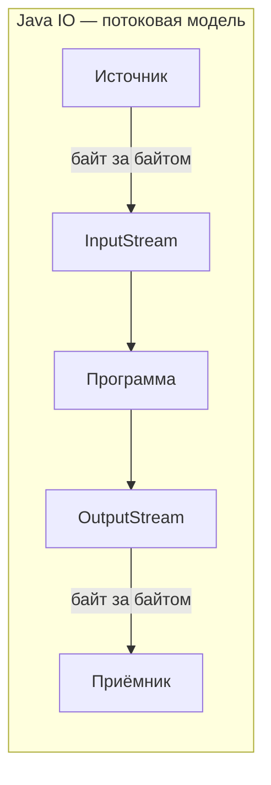

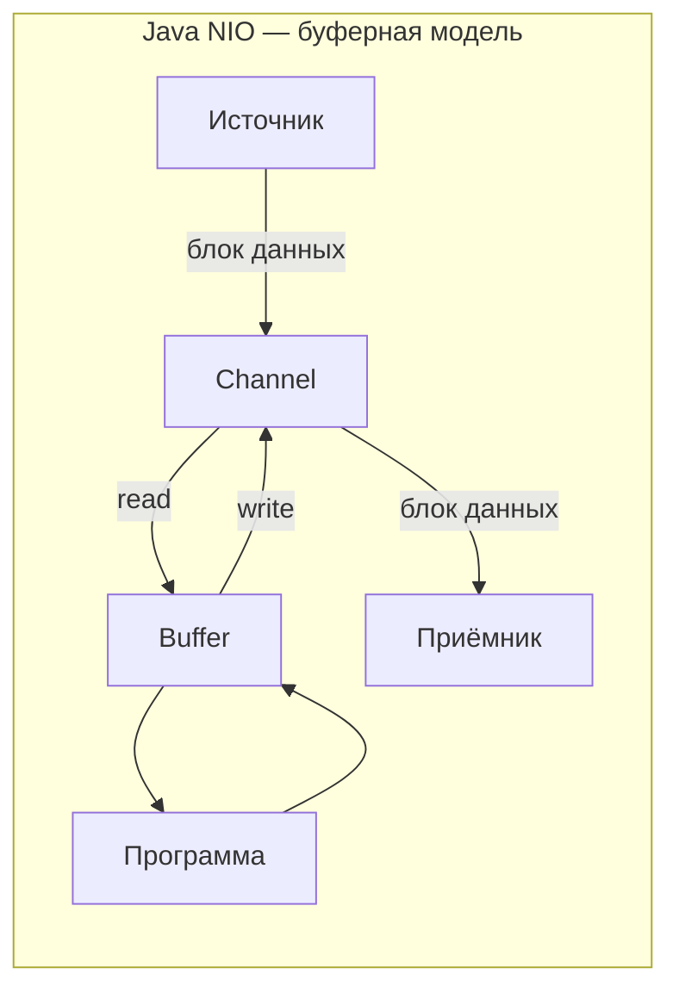

| Характеристика | `Java IO` | `Java NIO` |
|---|---|---|
| Модель | Потоково-ориентированная | Буферо-ориентированная |
| Направление | Однонаправленные потоки | Двунаправленные каналы |
| Блокировка | Только блокирующий | Блокирующий и неблокирующий |
| Мультиплексирование | Нет (поток на соединение) | `Selector` (один поток — много каналов) |
| Появился | Java 1.0 | Java 1.4 |

> [!mcq]
> - [ ] `Java IO` использует буферы, а `Java NIO` работает напрямую с потоками байтов | Противоположно действительности: `Java IO` — потоковый, `Java NIO` ввёл буферный подход с `ByteBuffer`. ❌ ПОСЛЕДСТВИЕ: команда выбирает `Java IO` для high-load API gateway, на 5000 RPS thread-per-connection даёт OOM через 4 часа, p99 растёт с 50ms до 2s.
> - [ ] Оба API блокирующие, но `Java NIO` поддерживает более широкий набор кодировок | Кодировки не ключевое отличие — главное различие в модели данных (поток vs буфер) и возможности non-blocking I/O. ❌ ПОСЛЕДСТВИЕ: выбор технологии по «поддержке кодировок» игнорирует модель блокировки, сервер не масштабируется выше 200 connections, упирается в лимит потоков ОС.
> - [ ] `Java IO` поддерживает только файлы, а `Java NIO` — только сетевые соединения | Оба API поддерживают и файлы, и сеть: `Socket`/`ServerSocket` в IO, `FileChannel`/`SocketChannel`/`DatagramChannel` в NIO. ❌ ПОСЛЕДСТВИЕ: «один API для файлов, другой для сети» даёт зоопарк IO-классов в проекте 200K LOC, дублирование зависимостей и copy-paste баги с ресурсами.
> - [x] `Java IO` работает с данными последовательно (поток), а `Java NIO` читает порциями в буфер, который затем обрабатывается программой | Потоковая модель `IO` — байт за байтом, `Buffer` в `NIO` позволяет произвольный порядок обработки. ✓ ПРИМЕНЯТЬ: Netty/Spring WebFlux строят high-load серверы на NIO `Selector` (10000+ соединений); Apache Kafka использует `FileChannel` + mmap для zero-copy. 📋 ПРАВИЛО: «IO = stream of bytes, NIO = buffered chunks + multiplexing». 🔗 См. Q3, Q10, Q11.

> [!mcq]
> - [ ] `Java IO` неблокирующий благодаря `BufferedInputStream`, а `Java NIO` блокирующий по умолчанию | `Java IO` ВСЕГДА блокирующий, буферизация не меняет семантику; `NIO` поддерживает оба режима, но `configureBlocking(false)` включается явно. ❌ ПОСЛЕДСТВИЕ: вера в «неблокирующий BufferedInputStream» на `Socket.getInputStream()` для 5000 connections — `read()` всё равно блокирует поток, OOM из-за тысяч stack-frames.
> - [ ] Java 21 Virtual Threads сделали `NIO` устаревшим: thread-per-connection теперь масштабируется бесплатно | Virtual threads сделали `Java IO` конкурентоспособным, но `NIO` по-прежнему нужен для zero-copy (`transferTo`), mmap, низколатентных протоколов. ❌ ПОСЛЕДСТВИЕ: команда выбрасывает Netty «потому что Loom», теряет zero-copy file→socket, throughput Kafka producer падает на 30%.
> - [ ] `Java NIO` всегда быстрее `Java IO` на одном соединении | На одном соединении разницы почти нет — оверхед `Selector` и `flip/clear` может замедлить sequential I/O; NIO выигрывает на масштабе или mmap/transferTo. ❌ ПОСЛЕДСТВИЕ: переписывание CLI-копировщика с `Files.copy` на `FileChannel`+`ByteBuffer` — код в 5 раз длиннее, скорость та же, баги с `flip()`.
> - [x] `Java IO` реализует `thread-per-connection`, а `Java NIO` через `Selector` даёт event-loop — один поток на тысячи каналов с `epoll`/`kqueue` | Фундаментальная разница в concurrency: `IO` масштабируется через число потоков, `NIO` — через мультиплексирование. ✓ ПРИМЕНЯТЬ: Tomcat NIO connector обрабатывает 10000+ keep-alive соединений на 200 потоках; Netty `EventLoopGroup` — каноничный event-loop. 📋 ПРАВИЛО: «IO = thread-per-connection, NIO = event-loop с Selector». 🔗 См. Q3, Q9, Q16.

## Q2. (!) В чём разница между потоково-ориентированным и буферо-ориентированным подходом?

**Потоково-ориентированный** (`Java IO`): данные читаются/записываются последовательно. Нельзя «перемотать» назад — прочитанные данные ушли. Для обработки нужно читать весь поток в структуру данных самостоятельно.

**Буферо-ориентированный** (`Java NIO`): данные сначала помещаются в `Buffer`, затем обрабатываются. Можно двигаться по буферу вперёд и назад (`position`, `mark`, `reset`). Это даёт гибкость, но требует проверки, что буфер содержит все нужные данные.

```java
// Java IO — потоковое чтение
try (BufferedReader reader = new BufferedReader(new FileReader("data.txt"))) {
    String line;
    while ((line = reader.readLine()) != null) {
        System.out.println(line); // данные обработаны, назад не вернуться
    }
}

// Java NIO — буферное чтение
try (FileChannel channel = FileChannel.open(Path.of("data.txt"), StandardOpenOption.READ)) {
    ByteBuffer buffer = ByteBuffer.allocate(1024);
    while (channel.read(buffer) != -1) {
        buffer.flip(); // переключаем в режим чтения
        while (buffer.hasRemaining()) {
            System.out.print((char) buffer.get());
        }
        buffer.clear(); // готовим к следующей записи
    }
}
```

> [!mcq]
> - [ ] В потоково-ориентированном подходе данные читаются порциями в буфер с возможностью двигаться вперёд-назад | Это описание буферо-ориентированного `NIO`; в `Java IO` прочитанные байты недоступны повторно. ❌ ПОСЛЕДСТВИЕ: разработчик ждёт «переигрывания» `InputStream.read()`, пишет повторный парсинг на тех же данных — на 5GB файле `EOFException`, поток исчерпан, странные NPE на десериализации.
> - [ ] В буферо-ориентированном подходе компилятор автоматически выбирает размер буфера | Размер задаётся явно (`ByteBuffer.allocate(1024)`), компилятор не влияет на runtime. ❌ ПОСЛЕДСТВИЕ: вера в «автоматику» приводит к `allocate(1)` (syscall на байт, throughput падает в 100×) или `allocate(100MB)` direct buffer → `OOMError: Direct buffer memory`, не считается в Heap.
> - [ ] В потоково-ориентированном подходе можно читать `scatter/gather`, а буферо-ориентированный работает только с одним каналом | Наоборот: `scatter/gather` — фича `Java NIO` (`GatheringByteChannel`), потоковый `IO` не поддерживает. ❌ ПОСЛЕДСТВИЕ: попытка ручного «scatter» поверх `InputStream` в разные `byte[]` — между чтениями тред переключается, данные интерливятся, гонки в парсере HTTP/2-фрейма.
> - [x] В потоково-ориентированном нельзя вернуться к прочитанным данным; в буферо-ориентированном позицию контролируют `position`/`mark`/`reset` | `Java IO` forward-only; `ByteBuffer` хранит данные и позволяет перечитывать их в любом порядке. ✓ ПРИМЕНЯТЬ: парсеры Kafka wire protocol и Cassandra CQL frame используют `mark()`/`reset()` для look-ahead; Spring WebFlux `DataBuffer` поверх той же модели. 📋 ПРАВИЛО: «stream = forward-only, buffer = random-access». 🔗 См. Q1, Q10, Q11.

> [!mcq]
> - [ ] `allocateDirect()` всегда быстрее `allocate()`, так как обходит JVM | Быстрее только при I/O syscalls; на `get()`/`put()` direct медленнее (JNI через `Unsafe`), создание в 100× дороже. ❌ ПОСЛЕДСТВИЕ: замена всех буферов на direct «для скорости» даёт регрессию throughput 25% на in-memory protobuf-parsing.
> - [ ] Direct buffer освобождается обычным GC, как любой объект | Освобождение через `Cleaner`/`PhantomReference` асинхронно, может задерживаться. Native память не в heap — утечь без OOM в куче. ❌ ПОСЛЕДСТВИЕ: low-traffic сервис не триггерит GC, direct memory копится сутки → `OOMError: Direct buffer memory` на ровном месте.
> - [ ] `Buffer.array()` всегда возвращает backing-массив для любого типа буфера | Метод бросает `UnsupportedOperationException` для direct и read-only буферов; проверка через `hasArray()`. ❌ ПОСЛЕДСТВИЕ: `MappedByteBuffer.array()` падает в проде, на dev-машине с `allocate()` работало — типовой «у меня работает».
> - [x] `ByteBuffer.allocate()` создаёт heap buffer, а `allocateDirect()` — direct buffer в нативной памяти ОС вне `-Xmx`, дающий zero-copy при native I/O, но дороже в создании | Direct выделяется через `Unsafe.allocateMemory()`, обходит копирование в kernel buffer при `read()`/`write()`. ✓ ПРИМЕНЯТЬ: Netty `PooledByteBufAllocator` пулит direct для долгоживущих TCP; короткоживущие парсеры — heap buffer. 📋 ПРАВИЛО: «direct = долгоживущий I/O, heap = короткоживущий внутри JVM». 🔗 См. Q14, Q26, Q10.

## Q3. Что такое блокирующий и неблокирующий ввод-вывод?

**Блокирующий I/O** (`Java IO`): вызов `read()` или `write()` приостанавливает поток до завершения операции. Если данных нет — поток ждёт. Каждому соединению нужен свой поток, что плохо масштабируется.

**Неблокирующий I/O** (`Java NIO`): вызов `read()` или `write()` возвращает управление немедленно. Если данных нет — метод возвращает 0 (прочитано 0 байт). Один поток через `Selector` обслуживает тысячи соединений.

```java
// Неблокирующий канал
SocketChannel channel = SocketChannel.open();
channel.configureBlocking(false); // неблокирующий режим

ByteBuffer buffer = ByteBuffer.allocate(256);
int bytesRead = channel.read(buffer); // возвращает сразу, даже если данных нет
// bytesRead == 0 — данных пока нет
// bytesRead == -1 — конец потока
// bytesRead > 0 — есть данные
```

Важно: `FileChannel` **не поддерживает** неблокирующий режим — он всегда блокирующий. Неблокирующий режим доступен только для сетевых каналов (`SocketChannel`, `ServerSocketChannel`, `DatagramChannel`).

> [!mcq]
> - [ ] `FileChannel` в `NIO` поддерживает неблокирующий режим, так же как `SocketChannel`. | `FileChannel` всегда работает в блокирующем режиме. Неблокирующий режим доступен только для сетевых каналов: `SocketChannel`, `ServerSocketChannel`, `DatagramChannel`. ❌ ПОСЛЕДСТВИЕ: разработчик пишет `fileChannel.configureBlocking(false)` — `IllegalBlockingModeException` в runtime. На locally быстром диске не воспроизводится, на проде с сетевой ФС (NFS, S3FS) приложение зависает на 30 секунд по syscall. Для асинхронных файловых операций нужен `AsynchronousFileChannel` (Java 7+).
> - [x] При неблокирующем вызове `channel.read(buffer)` метод немедленно возвращает 0, если данных ещё нет, не блокируя вызывающий поток. | Неблокирующий режим — основа `Selector`-модели: поток опрашивает каналы через `Selector` и обрабатывает только те, у которых есть данные. Возврат 0 означает «данных нет сейчас, попробуй позже». ✓ ПРИМЕНЯТЬ: Netty `EventLoop` использует именно эту модель — один поток обслуживает 10000+ соединений, реагируя только на готовые каналы. AWS SDK 2.x использует `AsynchronousSocketChannel` для неблокирующих вызовов, чтобы не держать поток на каждый HTTP-запрос. 📋 ПРАВИЛО: «non-blocking read = 0 (нет данных), -1 (EOF), >0 (данные)». 🔗 См. Q1 (IO vs NIO), Q9 (сетевые классы IO), Q11 (Channel реализации).
> - [ ] При блокирующем I/O вызов `read()` возвращает 0, если данных нет, и -1 при закрытии потока. | При блокирующем I/O вызов `read()` не возвращает 0: он ждёт, пока данные не появятся. Значение 0 при `read()` характерно для неблокирующего режима. ❌ ПОСЛЕДСТВИЕ: разработчик пишет `while (in.read() == 0) retry();` для блокирующего `Socket.getInputStream()` — цикл никогда не итерируется, потому что `read()` блокируется до данных. Под нагрузкой логика timeout не срабатывает, тред висит несколько часов, пока TCP keep-alive не прибьёт соединение.
> - [ ] Один `Selector` может мониторить не более 10 каналов одновременно из-за ограничений ОС. | Ограничений в 10 каналов нет. `Selector` может мониторить тысячи каналов — именно это делает его мощным инструментом для масштабируемых серверов. ❌ ПОСЛЕДСТВИЕ: команда боится «ограничения в 10» и создаёт пул из 100 `Selector`-ов. Контекст переключения между ними ест CPU, накладные расходы съедают преимущество. Реальный лимит — это `ulimit -n` (file descriptors), который ставится в Linux на 1M+. Netflix/Twitch держат на одном `Selector` десятки тысяч соединений.

## Q4. (!) Какие преимущества и недостатки у `Java IO` и `Java NIO`?

| | `Java IO` | `Java NIO` |
|---|---|---|
| **Плюсы** | Простой API, легко читается | Неблокирующий I/O, масштабируемость |
| | Широкая поддержка типов данных | Эффективная работа с буферами |
| | Много готовых обёрток (`Buffered*`, `Data*`) | `Selector` для мультиплексирования |
| | Хорошо для простого файлового I/O | Direct buffers — zero-copy с ОС |
| **Минусы** | Блокирующий — поток на соединение | Сложный API, легко допустить ошибку |
| | Плохо масштабируется для серверов | `flip()`/`clear()` — частый источник багов |
| | Нет мультиплексирования | Отладка сложнее |

**Когда что выбирать:**
- **`Java IO`** — простые файловые операции, работа с текстом, небольшое число соединений
- **`Java NIO`** — высоконагруженные серверы, тысячи одновременных соединений, обработка больших файлов
- **На практике** — часто используют фреймворки поверх NIO: `Netty`, `Spring WebFlux`, которые скрывают сложность API

> [!mcq]
> - [ ] `Java IO` рекомендуется для высоконагруженных серверов, потому что проще отлаживать | Простота отладки не делает IO лучше для нагрузок: модель «поток на соединение» плохо масштабируется. ❌ ПОСЛЕДСТВИЕ: thread-per-connection на 5000 RPS даёт 5000 платформенных потоков, OS-планировщик ест 30% CPU на context switch, GC stop-the-world растёт до 500ms.
> - [ ] `Java NIO` всегда быстрее `Java IO` вне зависимости от сценария | Для простых последовательных операций IO не медленнее; NIO выигрывает на тысячах соединений или mmap/direct. ❌ ПОСЛЕДСТВИЕ: переписывание скрипт-копировщика с `BufferedReader` на `FileChannel`+`ByteBuffer` даёт код в 3× длиннее, баги с `flip()`/`clear()`, +2% скорости — ROI отрицательный.
> - [ ] `Java NIO` не поддерживает буферизацию символов, только бинарные потоки | NIO имеет `CharBuffer`, `CharsetEncoder`/`CharsetDecoder`; `Files.newBufferedReader()` поверх NIO. ❌ ПОСЛЕДСТВИЕ: отказ от NIO для текста теряет `MappedByteBuffer` для логов 100GB — `BufferedReader` грузит по 8KB, mmap даёт OS-кеширование и в 5–10× быстрее.
> - [x] `Java IO` для простых файловых операций и малого числа соединений; `Java NIO` — для high-load серверов с тысячами соединений | NIO `Selector` позволяет одному потоку обслужить тысячи каналов. ✓ ПРИМЕНЯТЬ: CLI-утилиты — `Files.readAllLines()`; high-load gateway — Netty/Undertow поверх NIO; Spring WebFlux на NIO, MVC (servlet) на IO. 📋 ПРАВИЛО: «IO для скриптов, NIO для серверов с N>1000 connections». 🔗 См. Q1, Q3, Q11.

> [!mcq]
> - [ ] Virtual Threads сделали `NIO` устаревшим — Netty и Spring WebFlux больше не нужны | Loom не даёт zero-copy, scatter/gather, mmap; Netty/WebFlux также дают backpressure (Reactive Streams), которой нет в blocking API. ❌ ПОСЛЕДСТВИЕ: миграция WebFlux→MVC+Loom без анализа теряет backpressure, при перегрузке upstream OOM из-за неограниченного буфера запросов.
> - [ ] `Java IO` всегда быстрее `Java NIO` для маленьких файлов из-за простоты API | Throughput для маленьких файлов сопоставим; простота API — design-преимущество, а не perf. ❌ ПОСЛЕДСТВИЕ: выбор API «по скорости» без замеров игнорирует поддерживаемость и выразительность, проект становится зоопарком IO-классов.
> - [ ] `Java NIO` не поддерживает text-обработку, только бинарные данные | `CharBuffer`, `CharsetDecoder`, `Files.newBufferedReader()` — NIO-инфраструктура для текста. ❌ ПОСЛЕДСТВИЕ: легаси-команда не применяет `Files.lines()` для streaming логов, читает 5GB лог в `List<String>` через `readAllLines()` → OOM.
> - [x] Java 21 Virtual Threads сократили разрыв между `IO` и `NIO` для thread-per-connection: миллионы виртуальных потоков на blocking `Socket.read()` дёшевы, но `NIO` незаменим для zero-copy, mmap и async file I/O | Virtual threads park'ят на blocking syscalls, IO снова масштабируется; но zero-copy/mmap живут только в NIO. ✓ ПРИМЕНЯТЬ: микросервис на Java 21+ — `Thread.startVirtualThread()` + IO; Kafka brokers, CDN — `FileChannel.transferTo`. 📋 ПРАВИЛО: «Loom+IO для бизнеса, NIO для специфики». 🔗 См. Q1, Q3, Q27.

## Q5. Какие основные классы и интерфейсы используются в `Java IO`?

Иерархия `Java IO` строится на четырёх абстрактных классах:

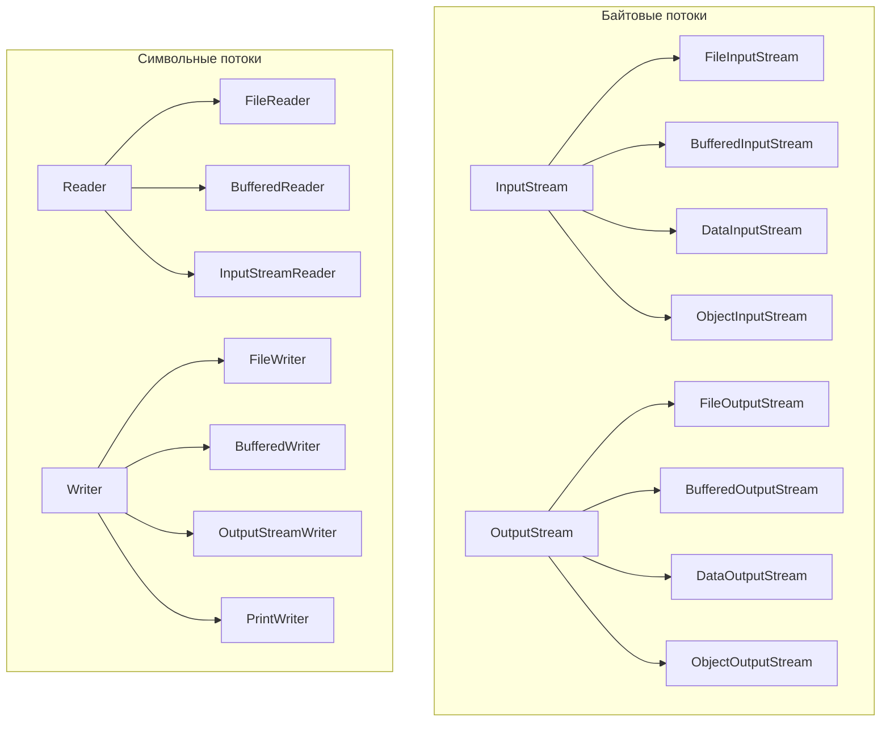

Основные классы:

| Класс | Назначение |
|---|---|
| `InputStream` / `OutputStream` | Абстрактные классы для байтовых потоков |
| `Reader` / `Writer` | Абстрактные классы для символьных потоков |
| `FileInputStream` / `FileOutputStream` | Чтение/запись файлов в байтах |
| `BufferedReader` / `BufferedWriter` | Буферизированное чтение/запись символов |
| `InputStreamReader` / `OutputStreamWriter` | Мост байты ↔ символы с указанием кодировки |
| `DataInputStream` / `DataOutputStream` | Чтение/запись примитивных типов |
| `ObjectInputStream` / `ObjectOutputStream` | Сериализация/десериализация объектов |
| `PrintWriter` / `PrintStream` | Форматированный вывод |
| `RandomAccessFile` | Произвольный доступ к файлу |

> [!mcq]
> - [ ] `ObjectInputStream` является символьным потоком, потому что работает с Java-объектами. | `ObjectInputStream` — байтовый поток (наследует `InputStream`). Объекты сериализуются в бинарный формат, а не в символьный. ❌ ПОСЛЕДСТВИЕ: разработчик оборачивает `ObjectInputStream` в `InputStreamReader` для «корректной кодировки» — `IOException: invalid stream header`. Бинарный protocol (Magic number 0xACED) ломается при попытке декодирования как UTF-8. Java Serialization также источник CVE-2017-9805 (Equifax breach 2017) при unsafe deserialization.
> - [ ] `Scanner` является байтовым потоком, потому что считывает данные посимвольно через `nextLine()`. | `Scanner` — не потоковый класс в иерархии `InputStream`/`Reader`. Он может работать поверх любого потока. `nextLine()` возвращает `String`, но сам класс не относится ни к байтовым, ни к символьным потокам. ❌ ПОСЛЕДСТВИЕ: разработчик путает `Scanner` с `BufferedReader` в high-throughput коде. `Scanner` использует regex для каждого `nextLine()`, что в 5-10 раз медленнее. На 10M строк лога обработка идёт час вместо 6 минут — типовой баг в data-pipeline скриптах.
> - [x] Байтовые потоки работают с сырыми байтами и подходят для бинарных данных, а символьные потоки работают с `Unicode char` и автоматически учитывают кодировку. | `InputStream`/`OutputStream` — для байтов (изображения, бинарные файлы). `Reader`/`Writer` — для символов, мост реализован через `InputStreamReader`/`OutputStreamWriter` с явной кодировкой. ✓ ПРИМЕНЯТЬ: PDF/PNG/protobuf — байтовые потоки (`FileInputStream`); CSV/JSON/XML — символьные с явной `StandardCharsets.UTF_8`. Spring `MultipartFile.getInputStream()` возвращает байтовый поток (универсально для любых файлов), а REST контроллеры используют `Reader` с заголовком `Content-Type: charset=UTF-8`. 📋 ПРАВИЛО: «байты для бинарного, символы для текста + явный Charset». 🔗 См. Q6 (мост байты ↔ символы), Q7 (Decorator), Q8 (текстовые файлы).
> - [ ] Символьные потоки работают только с кодировкой `ASCII`, а байтовые поддерживают `UTF-8`. | Символьные потоки поддерживают любую кодировку, включая `UTF-8`, `UTF-16`, `Windows-1251`. Именно символьные потоки правильно обрабатывают многобайтовые символы. ❌ ПОСЛЕДСТВИЕ: разработчик читает UTF-8 файл через `FileInputStream` побайтово, не оборачивая в `InputStreamReader`. Эмодзи и кириллица «плывут» — каждый кириллический символ занимает 2 байта в UTF-8, побайтовое чтение режет посередине. Yandex 2018: классический баг с парсингом запросов в legacy gateway, исправлено через `InputStreamReader(in, UTF_8)`.

## Q6. (!) В чём разница между байтовыми и символьными потоками?

**Байтовые потоки** (`InputStream` / `OutputStream`) работают с сырыми байтами. Подходят для бинарных данных: изображения, архивы, сериализованные объекты.

**Символьные потоки** (`Reader` / `Writer`) работают с символами `Unicode` (16-битный `char`). Подходят для текстовых данных. Автоматически учитывают кодировку.

```java
// Байтовый поток — работа с бинарными данными
try (FileInputStream fis = new FileInputStream("image.png");
     FileOutputStream fos = new FileOutputStream("copy.png")) {
    byte[] buffer = new byte[8192];
    int bytesRead;
    while ((bytesRead = fis.read(buffer)) != -1) {
        fos.write(buffer, 0, bytesRead);
    }
}

// Символьный поток — работа с текстом
try (BufferedReader reader = new BufferedReader(
        new InputStreamReader(new FileInputStream("text.txt"), StandardCharsets.UTF_8));
     BufferedWriter writer = new BufferedWriter(
        new OutputStreamWriter(new FileOutputStream("copy.txt"), StandardCharsets.UTF_8))) {
    String line;
    while ((line = reader.readLine()) != null) {
        writer.write(line);
        writer.newLine();
    }
}
```

Мост между ними — `InputStreamReader` и `OutputStreamWriter`, которые преобразуют байты в символы и обратно с указанной кодировкой. Подробнее о кодировках см. [Java Core](java-core-interview.md).

> [!mcq]
> - [ ] `FileReader` является байтовым потоком, поскольку читает файл с диска побайтово. | `FileReader` — символьный поток (наследует `Reader`). Он внутри использует `StreamDecoder`, который преобразует байты в символы с кодировкой платформы по умолчанию. ❌ ПОСЛЕДСТВИЕ: разработчик использует `new FileReader("config.txt")` без указания кодировки. На Linux всё ОК (по умолчанию UTF-8), при деплое контейнера на Windows-разработчика — сломанные символы, потому что Windows использует cp1251. До Java 18 это была классическая ловушка; Java 18+ изменил дефолт на UTF-8 (JEP 400).
> - [ ] `InputStreamReader` работает только с `FileInputStream` и не поддерживает другие источники. | `InputStreamReader` принимает любой `InputStream`: `System.in`, `socket.getInputStream()`, `ByteArrayInputStream` и любой другой. Это общий мост байты → символы. ❌ ПОСЛЕДСТВИЕ: разработчик пишет дублирующий код для каждого источника («for socket», «for byte array», «for file»), потому что не знает универсальности `InputStreamReader`. 200 строк boilerplate в проекте, который можно заменить одной утилитой `IOUtils.toString(InputStream, Charset)` (Apache Commons).
> - [x] `InputStreamReader` служит мостом между байтовыми и символьными потоками, позволяя явно указать кодировку при преобразовании байтов в символы. | `InputStreamReader(InputStream, Charset)` декодирует байты в символы с указанной кодировкой. `OutputStreamWriter` делает обратное. Без явного указания кодировки используется кодировка платформы, что может вызвать проблемы при переносе. ✓ ПРИМЕНЯТЬ: HTTP-запрос-ответы (Spring `HttpInputMessage.getBody()` отдаёт `InputStream`, оборачивается в `InputStreamReader(in, UTF_8)`); `Process.getInputStream()` для CLI-вывода + `new InputStreamReader(p.getInputStream(), Charset.forName("cp866"))` под Windows консоль. 📋 ПРАВИЛО: «`new InputStreamReader(in, UTF_8)` — никогда без явного Charset». 🔗 См. Q5 (классы IO), Q7 (Decorator), Q8 (Files.newBufferedReader).
> - [ ] Символьные потоки (`Reader`/`Writer`) нельзя буферизировать с помощью `BufferedReader`/`BufferedWriter`. | Буферизация доступна для любых потоков. `BufferedReader` оборачивает любой `Reader`, в том числе `InputStreamReader`, добавляя буферизацию и метод `readLine()`. ❌ ПОСЛЕДСТВИЕ: команда читает файл через голый `FileReader` без буферизации, делая syscall на каждый символ. Чтение 100MB лога занимает 5 минут вместо 5 секунд. Profiler показывает CPU в `read0` JNI, fix — обернуть в `new BufferedReader(reader, 8192)`. Типовой инцидент в скриптах миграции данных.

> [!mcq]
> - [x] `InputStreamReader`/`OutputStreamWriter` — обязательный мост между байтовым и символьным миром, и Charset нужно указывать ЯВНО: до Java 18 дефолтом была кодировка платформы (Windows cp1251, Linux UTF-8), что давало классический баг «у меня на Linux работает, на Windows — кракозябры»; с JEP 400 (Java 18+) дефолт стал UTF-8, но явный Charset всё равно правильная практика | До Java 18 `Charset.defaultCharset()` зависел от `file.encoding`, который на Windows был cp1251, на Linux UTF-8, на macOS UTF-8. JEP 400 унифицировал дефолт на UTF-8, но `new FileReader("x.txt")` без charset до Java 11 не имел перегрузки с charset вообще. ✓ ПРИМЕНЯТЬ: всегда `new InputStreamReader(in, StandardCharsets.UTF_8)`, `Files.newBufferedReader(path, StandardCharsets.UTF_8)`; для legacy-ETL где гарантированно cp866/cp1251 — указывать явно. Sonar-правило `S5778` ловит вызовы без charset. 📋 ПРАВИЛО: «никогда не оборачивай байты в Reader/Writer без явного Charset». 🔗 См. Q5 (классы IO), Q8 (текстовые файлы), Q32 (Charset).
> - [ ] После JEP 400 `new FileReader("x.txt")` гарантированно использует UTF-8 на всех версиях Java | JEP 400 (Java 18+) изменил дефолт ТОЛЬКО на новых версиях. Код на Java 8/11/17 без явного charset продолжает зависеть от платформы. ❌ ПОСЛЕДСТВИЕ: разработчик тестирует на Java 21, всё работает; downgrade-сборка на Java 11 (требование клиента) ломает кириллицу в продакшене.
> - [ ] `InputStreamReader` декодирует байты быстрее, чем `Charset.decode(ByteBuffer)`, потому что использует heap-буферы | Производительность сопоставима, оба используют `CharsetDecoder` под капотом. Разница не в скорости, а в API: первый — для streaming I/O, второй — для готового `ByteBuffer`. ❌ ПОСЛЕДСТВИЕ: ложные оптимизации в hot path, переписывание рабочего кода без эффекта.
> - [ ] `InputStreamReader` сам определяет кодировку файла по BOM или по содержимому | `InputStreamReader` НЕ детектит кодировку — использует переданный или дефолтный charset. Для авто-детекции есть `juniversalchardet` (стороннее) или ICU `CharsetDetector`. ❌ ПОСЛЕДСТВИЕ: команда грузит CSV «UTF-8 with BOM», ожидая авто-обработки BOM — первый символ `` ломает парсинг заголовка `id,name`, потому что `id` становится `id`.

## Q7. Как работает паттерн `Decorator` в иерархии `Java IO`?

Иерархия `Java IO` — классический пример паттерна [Decorator](../../design-patterns/design-patterns-interview.md). Базовые потоки оборачиваются дополнительными слоями, каждый из которых добавляет функциональность:

```java
// Каждый слой добавляет своё поведение
InputStream raw = new FileInputStream("data.bin");        // сырое чтение из файла
InputStream buffered = new BufferedInputStream(raw);       // + буферизация
DataInputStream data = new DataInputStream(buffered);      // + чтение примитивов

int value = data.readInt();    // читает 4 байта как int
double d = data.readDouble();  // читает 8 байт как double
```

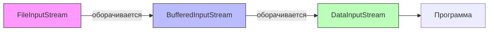

Преимущества подхода:
- Комбинирование поведений без наследования
- Гибкость — можно добавлять/убирать слои
- Каждый декоратор — `Single Responsibility`

> [!mcq]
> - [ ] `BufferedInputStream` оборачивает `FileInputStream` и добавляет возможность читать строки через `readLine()`. | Метод `readLine()` есть у `BufferedReader`, а не у `BufferedInputStream`. `BufferedInputStream` работает с байтами и добавляет только буферизацию, но не построчное чтение. ❌ ПОСЛЕДСТВИЕ: разработчик пытается читать UTF-8 текст через `BufferedInputStream.readLine()` (он есть deprecated в InputStream через `DataInputStream` API). Получает мусор для не-ASCII символов, потому что метод считает кодировкой ISO-8859-1 побайтово. Правильный путь — `new BufferedReader(new InputStreamReader(in, UTF_8))`.
> - [x] В паттерне Decorator иерархии `Java IO` каждый класс-обёртка добавляет поведение базовому потоку, не изменяя его интерфейс, что позволяет комбинировать слои без наследования. | `FileInputStream` → `BufferedInputStream` → `DataInputStream` — каждый уровень добавляет функциональность (буферизацию, чтение примитивов), сохраняя контракт `InputStream`. Это классический Decorator. ✓ ПРИМЕНЯТЬ: Apache Commons `IOUtils`, Spring `Resource.getInputStream()` всегда возвращают «голый» `InputStream` — потребитель сам оборачивает по необходимости (`new GZIPInputStream(new BufferedInputStream(raw))` для распакованных HTTP-ответов). Java IO — каноничный пример паттерна Decorator из GoF. 📋 ПРАВИЛО: «оборачивай слоями: raw → buffered → typed (Data/Object)». 🔗 См. [Design Patterns](../../design-patterns/design-patterns-interview.md), Q5 (классы IO), Q6 (мост байты/символы).
> - [ ] Паттерн Decorator в `Java IO` используется только для байтовых потоков и не применяется к символьным (`Reader`/`Writer`). | Decorator используется и для символьных потоков: `FileReader` → `BufferedReader`, `OutputStreamWriter` → `BufferedWriter`. Паттерн единообразно применён во всей иерархии `Java IO`. ❌ ПОСЛЕДСТВИЕ: команда дублирует функциональность буферизации для `Reader` («раз Decorator только для байтов»), пишет свой `BufferedCharReader` на 200 строк. Code review разворачивает на месяц, тратится время на ревизии — на самом деле в JDK уже есть `BufferedReader`. Простой паттерн пропустили из-за непонимания.
> - [ ] `DataInputStream` расширяет `FileInputStream` и поэтому может работать только с файлами. | `DataInputStream` оборачивает любой `InputStream` (наследует через декоратор, не через `FileInputStream`). Его можно использовать поверх `SocketInputStream`, `ByteArrayInputStream` и любого другого источника. ❌ ПОСЛЕДСТВИЕ: разработчик не использует `DataInputStream` для парсинга бинарного протокола поверх `Socket` (например, MySQL wire protocol), потому что «он только для файлов». Пишет ручной парсинг big-endian int/long на 100 строк вместо `dataIn.readInt()`. Хуже того, при ошибках в bit-shifting протокол ломается на разных платформах.

## Q8. Какие классы используются для чтения и записи текстовых файлов?

Основные подходы в порядке предпочтения (от современного к классическому):

```java
// 1. NIO.2 Files (рекомендуемый способ, Java 7+)
Path path = Path.of("data.txt");

// Чтение всех строк
List<String> lines = Files.readAllLines(path, StandardCharsets.UTF_8);

// Чтение потоком строк (ленивое, для больших файлов)
try (Stream<String> stream = Files.lines(path, StandardCharsets.UTF_8)) {
    stream.filter(line -> !line.isBlank())
          .forEach(System.out::println);
}

// Запись строк
Files.writeString(path, "содержимое", StandardCharsets.UTF_8);
Files.write(path, lines, StandardCharsets.UTF_8);

// 2. BufferedReader / BufferedWriter (классический Java IO)
try (BufferedReader reader = Files.newBufferedReader(path, StandardCharsets.UTF_8);
     BufferedWriter writer = Files.newBufferedWriter(Path.of("out.txt"), StandardCharsets.UTF_8)) {
    String line;
    while ((line = reader.readLine()) != null) {
        writer.write(line);
        writer.newLine();
    }
}

// 3. Scanner (удобен для парсинга)
try (Scanner scanner = new Scanner(path, StandardCharsets.UTF_8)) {
    while (scanner.hasNextLine()) {
        String line = scanner.nextLine();
    }
}
```

Для работы с `Stream<String>` используется [Java Stream API](java-stream-interview.md).

> [!mcq]
> - [ ] `Files.readAllLines()` загружает файл построчно лениво, не загружая всё содержимое в память сразу. | `Files.readAllLines()` загружает все строки в `List<String>` сразу. Для ленивого потокового чтения нужен `Files.lines()`, который возвращает `Stream<String>` и читает строки по мере необходимости. ❌ ПОСЛЕДСТВИЕ: разработчик использует `Files.readAllLines()` для лога 5GB, ожидая ленивости — `OutOfMemoryError: Java heap space` на старте. На локальном тесте с файлом 10MB всё ок, на проде падает мгновенно. Booking.com 2017: класс инцидентов с processing pipeline, исправлено через `Files.lines()` + stream обработка.
> - [ ] `Files.lines()` автоматически закрывает поток после завершения операции и не требует `try-with-resources`. | `Files.lines()` возвращает `Stream<String>`, который удерживает файловый дескриптор. Для надёжного закрытия необходимо использовать `try-with-resources`, иначе возможна утечка ресурсов. ❌ ПОСЛЕДСТВИЕ: команда не оборачивает `Files.lines()` в try-with-resources, потому что «Stream же закроется». В сервисе с throughput 100 reads/sec через 30 минут — `Too many open files (24)`. Linux ulimit -n переполнен, остальные модули тоже падают. Профилировщик показывает FD leak на конкретной строке кода.
> - [ ] `FileReader` является рекомендуемым способом чтения текстовых файлов в новом коде, потому что это стандартный класс. | `FileReader(String)` до Java 18 использовал кодировку платформы по умолчанию, что вызывало проблемы при переносе. Рекомендуется `Files.newBufferedReader(path, charset)` с явной кодировкой. ❌ ПОСЛЕДСТВИЕ: легаси-код с `new FileReader("data.txt")` работает на Linux (UTF-8 default), ломается на Windows (cp1251). После миграции в Docker-контейнер на Mac — снова работает, но при деплое на CI с другим locale — снова сломан. Вечная проблема «у меня работает» — fix в JEP 400 (Java 18+).
> - [x] `Files.readAllLines()` читает все строки в `List<String>`, а `Files.lines()` возвращает ленивый `Stream<String>` — для больших файлов предпочтительнее второй. | `Files.readAllLines()` загружает весь файл в память. `Files.lines()` читает строки лениво через `Stream`, что позволяет обрабатывать файлы размером больше оперативной памяти. ✓ ПРИМЕНЯТЬ: маленький файл конфигурации (<10MB) — `Files.readAllLines()` для удобства; CSV в 1GB — `try (Stream<String> s = Files.lines(path)) { s.filter(...).map(...) }`. Apache Spark и Flink используют похожую модель ленивого чтения. 📋 ПРАВИЛО: «всё в память — readAllLines, поточно — lines() + try-with-resources». 🔗 См. [Java Stream API](java-stream-interview.md), Q5 (классы IO), Q9 (сетевые классы).

## Q9. Какие классы используются для работы с сетевыми соединениями в `Java IO`?

| Класс | Протокол | Назначение |
|---|---|---|
| `Socket` | TCP | Клиентское сокетное соединение |
| `ServerSocket` | TCP | Серверный сокет, принимает входящие соединения |
| `DatagramSocket` | UDP | Отправка/приём датаграмм |
| `DatagramPacket` | UDP | Пакет данных для UDP |

```java
// TCP-сервер на Java IO (один поток на соединение)
try (ServerSocket serverSocket = new ServerSocket(8080)) {
    while (true) {
        Socket client = serverSocket.accept(); // блокирующий вызов
        new Thread(() -> {
            try (BufferedReader in = new BufferedReader(
                     new InputStreamReader(client.getInputStream()));
                 PrintWriter out = new PrintWriter(client.getOutputStream(), true)) {
                String request = in.readLine();
                out.println("Echo: " + request);
            } catch (IOException e) {
                e.printStackTrace();
            }
        }).start();
    }
}
```

Проблема: каждое соединение требует отдельного потока. При 10 000 соединений — 10 000 потоков, что неэффективно. Именно эту проблему решает `NIO` с `Selector` (см. Q16–Q18).

> [!mcq]
> - [ ] `ServerSocket.accept()` — неблокирующий вызов, поэтому сервер может принимать несколько соединений одновременно. | `ServerSocket.accept()` — блокирующий вызов. Он ждёт входящего соединения, блокируя поток. Для одновременной обработки нескольких соединений нужно создавать отдельный поток для каждого клиента или использовать `NIO` с `Selector`. ❌ ПОСЛЕДСТВИЕ: разработчик пишет single-threaded TCP-сервер с одним `accept()` в цикле, ожидая, что он «принимает все соединения». Сервер обрабатывает только одно соединение за раз — остальные клиенты висят в TCP backlog очереди ОС, через 50 пакетов получают `Connection refused`. Стандартный fix — `Thread.start()` после `accept()` или переход на `NIO Selector`.
> - [x] В `Java IO`-сервере для каждого клиентского соединения создаётся отдельный поток, что не масштабируется при тысячах соединений, — именно эту проблему решает `NIO` с `Selector`. | Каждый поток потребляет память (стек, метаданные) и создаёт накладные расходы при переключении контекста. `NIO` `Selector` позволяет одному потоку мультиплексировать тысячи каналов. ✓ ПРИМЕНЯТЬ: для прототипа TCP-чата на 50 клиентов — `ExecutorService.newFixedThreadPool(50)` с `Java IO`; для 50000 WebSocket-сессий — Netty/Vert.x на NIO. Java 21+ Virtual Threads дают альтернативу: `Thread.startVirtualThread(...)` поверх IO даёт миллион «потоков» дёшево. 📋 ПРАВИЛО: «N<100 — IO + thread pool, N>1000 — NIO Selector или virtual threads». 🔗 См. Q1 (модели IO/NIO), Q3 (блокировка), Q11 (типы Channel).
> - [ ] `DatagramSocket` используется для установки TCP-соединений, а `Socket` — для UDP-датаграмм. | Это наоборот. `Socket` / `ServerSocket` — для TCP, `DatagramSocket` / `DatagramPacket` — для UDP без установки соединения. ❌ ПОСЛЕДСТВИЕ: разработчик пытается отправить UDP через `Socket` — компиляция ОК, на runtime `IOException: Connection refused` или непредсказуемое поведение. Для DNS-запросов, NTP, video streaming нужен UDP (`DatagramSocket`); для HTTP, MySQL, gRPC — TCP (`Socket`). Перепутать = неработающий протокол.
> - [ ] `Socket.getInputStream()` возвращает `Reader`, который автоматически декодирует входящие байты в символы. | `Socket.getInputStream()` возвращает `InputStream` (байтовый поток). Для работы с символами нужно обернуть его в `InputStreamReader` с явной кодировкой. ❌ ПОСЛЕДСТВИЕ: разработчик ожидает `Reader` от `Socket`, пишет `socket.getInputStream().readLine()` — compile error. Хуже: пишет `new BufferedReader(socket.getInputStream())` — не компилируется. Правильно: `new BufferedReader(new InputStreamReader(socket.getInputStream(), UTF_8))`. Без UTF_8 на Windows протокол ломается.

## Q10. (!) Что такое `Channel` и `Buffer` в `Java NIO` и как они связаны?

**`Channel`** — двунаправленный канал для передачи данных. В отличие от потоков `IO`, канал может как читать, так и писать. Чтение/запись всегда происходит через `Buffer`.

**`Buffer`** — контейнер фиксированного размера для данных. Работает как посредник между каналом и программой.

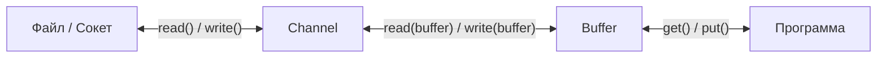

```java
// Чтение файла через Channel + Buffer
try (FileChannel channel = FileChannel.open(Path.of("data.txt"), StandardOpenOption.READ)) {
    ByteBuffer buffer = ByteBuffer.allocate(1024);

    while (channel.read(buffer) != -1) {  // данные: канал → буфер
        buffer.flip();                     // переключаем буфер в режим чтения
        while (buffer.hasRemaining()) {
            byte b = buffer.get();         // данные: буфер → программа
        }
        buffer.clear();                    // готовим буфер к следующему циклу записи
    }
}
```

Типы буферов: `ByteBuffer`, `CharBuffer`, `ShortBuffer`, `IntBuffer`, `LongBuffer`, `FloatBuffer`, `DoubleBuffer`. Все наследуют абстрактный `Buffer`.

> [!mcq]
> - [ ] `Channel` является однонаправленным (только чтение или только запись), аналогично `InputStream` и `OutputStream`. | `Channel` двунаправленный: один и тот же `FileChannel` или `SocketChannel` может и читать, и писать. Именно это отличает каналы от потоков `Java IO`. ❌ ПОСЛЕДСТВИЕ: разработчик создаёт два отдельных `FileChannel` для чтения и записи в один файл. Они блокируют друг друга через ОС-уровень file lock (`OverlappingFileLockException`), и хуже — нарушают invariants (читатель видит частично записанные данные). Правильно: один `FileChannel` с `READ, WRITE` опциями + `position()` для перемещения.
> - [ ] Чтение из `FileChannel` происходит напрямую в программу, минуя буфер, для максимальной скорости. | В `NIO` данные всегда проходят через `Buffer`. `channel.read(buffer)` помещает данные в буфер, из которого программа их затем читает через `buffer.get()`. ❌ ПОСЛЕДСТВИЕ: разработчик ищет «zero-copy без Buffer» — упускает реальный механизм `FileChannel.transferTo()` (sendfile syscall на Linux), который копирует данные между двумя `Channel` без копий в user-space. Apache Kafka использует именно `transferTo()` для отправки данных из disk в socket — отсюда легендарный throughput 100K+ msg/sec.
> - [x] `Channel` двунаправленный и работает только через `Buffer`: `channel.read(buffer)` помещает данные из канала в буфер, а `channel.write(buffer)` — из буфера в канал. | Этот поток данных «канал ↔ буфер ↔ программа» — основа `NIO`-модели. `Buffer` — обязательный посредник, без него операции чтения/записи через `Channel` невозможны. ✓ ПРИМЕНЯТЬ: Netty `ByteBuf` (улучшенная версия `ByteBuffer`) — основа для всех высоконагруженных Java-серверов; Apache Kafka хранит сообщения в memory-mapped `MappedByteBuffer` поверх `FileChannel`. Cassandra / Lucene — та же модель. 📋 ПРАВИЛО: «NIO = Channel + Buffer, всегда вместе, никогда раздельно». 🔗 См. Q1 (модели IO/NIO), Q3 (блокировка), Q11 (типы Channel).
> - [ ] `Buffer` в `Java NIO` — неизменяемый контейнер данных: после записи данных его нельзя перезаписать. | `Buffer` изменяемый. `clear()` и `compact()` позволяют сбросить буфер для повторной записи. Именно управление состоянием буфера (`flip`/`clear`/`compact`) — один из частых источников ошибок в `NIO`. ❌ ПОСЛЕДСТВИЕ: разработчик создаёт новый `ByteBuffer.allocate(8192)` на каждый цикл чтения, потому что «он immutable». 1000 reads/sec = 1000 аллокаций по 8KB = 8MB/sec мусора в Eden, GC pressure растёт, p99 спайки. Fix: переиспользовать буфер через `clear()` или `BufferPool` (Netty `PooledByteBufAllocator`). Booking.com 2017: подобная регрессия после рефакторинга, исправлено путём пула буферов.

> [!mcq]
> - [x] `FileChannel.transferTo(position, count, target)` реализует zero-copy: на Linux вызывает `sendfile(2)`, копируя данные между двумя FD прямо в kernel-space, минуя user-space buffers — отсюда легендарный throughput Apache Kafka и Netflix CDN | Обычный путь file→socket: kernel→user (read) + user→kernel (write) = 4 копирования, 2 context switch. `sendfile` делает kernel→kernel = 2 копирования, 0 context switch в user-space. Прирост throughput на больших файлах: 30-65%, CPU usage падает в 2-3 раза. ✓ ПРИМЕНЯТЬ: Apache Kafka `FileMessageSet.writeTo(SocketChannel)` использует `transferTo()` — основной секрет 100K+ msg/sec; Netflix Open Connect отдаёт видео-чанки через `transferTo()`; nginx `sendfile on` — тот же syscall на C. 📋 ПРАВИЛО: «file→socket = `transferTo` (zero-copy), file→file = `transferFrom` или `Files.copy`». 🔗 См. Q14 (direct buffer), Q26 (mmap), Q27 (transferTo подробно).
> - [ ] `transferTo()` копирует данные через user-space buffer, как обычный `read+write` | Это противоположно — главное преимущество в обходе user-space. На JVM-уровне `transferTo` транслируется в `sendfile` syscall, JNI просто пробрасывает FD двух каналов. ❌ ПОСЛЕДСТВИЕ: разработчик ожидает «zero-copy = просто без `ByteBuffer`», использует свой цикл `read+write` через `ByteBuffer.allocateDirect(8MB)` — те же 4 копирования, throughput не растёт.
> - [ ] `transferTo()` работает только между двумя `FileChannel` и не поддерживает `SocketChannel` | Метод принимает любой `WritableByteChannel`: `FileChannel`, `SocketChannel`, `Pipe.SinkChannel`. Самое популярное применение — file→socket (HTTP file serving). ❌ ПОСЛЕДСТВИЕ: команда не использует `transferTo` для отдачи статики через embedded HTTP-сервер, throughput на отдаче 1GB файлов в 3 раза ниже, чем у nginx с тем же диском.
> - [ ] На Windows `transferTo()` всегда даёт zero-copy, как и на Linux | Windows имеет `TransmitFile` (только для socket, kernel-mode), но JVM поддержка ограничена; на старых JVM `transferTo` может фоллбекаться к обычному `read+write`. Прирост на Windows может быть меньше, чем на Linux. ❌ ПОСЛЕДСТВИЕ: бенчмарки на Linux показали +50%, при деплое на Windows-server такой же прирост ожидался — фактически +5%, capacity planning неверен.

## Q11. Какие реализации `Channel` существуют и для чего каждая?

| Канал | Назначение | Блокирующий | Неблокирующий |
|---|---|---|---|
| `FileChannel` | Чтение/запись файлов, memory-mapping | Да | **Нет** |
| `SocketChannel` | TCP-клиент | Да | Да |
| `ServerSocketChannel` | TCP-сервер (accept) | Да | Да |
| `DatagramChannel` | UDP | Да | Да |
| `AsynchronousFileChannel` | Асинхронные файловые операции | — | Асинхронный |
| `AsynchronousSocketChannel` | Асинхронный TCP-клиент | — | Асинхронный |
| `Pipe.SourceChannel` / `Pipe.SinkChannel` | Межпоточная передача данных | Да | Да |

```java
// Открытие различных каналов
FileChannel fileChannel = FileChannel.open(Path.of("file.txt"), StandardOpenOption.READ);
SocketChannel socketChannel = SocketChannel.open(new InetSocketAddress("example.com", 80));
ServerSocketChannel serverChannel = ServerSocketChannel.open();
DatagramChannel datagramChannel = DatagramChannel.open();
```

> [!mcq]
> - [ ] `FileChannel` поддерживает неблокирующий режим, как `SocketChannel`. | `FileChannel` всегда блокирующий — для асинхронной работы с файлами есть отдельный `AsynchronousFileChannel`. ❌ ПОСЛЕДСТВИЕ: команда пишет `fileChannel.configureBlocking(false)` — `IllegalBlockingModeException` в runtime; на проде с медленной NFS код висит на чтении 10+ секунд, тред-пул вырабатывается, healthcheck падает.
> - [x] `DatagramChannel` используется для UDP, а `SocketChannel`/`ServerSocketChannel` — для TCP, причём все три поддерживают и блокирующий, и неблокирующий режим. | `DatagramChannel` — UDP-каналы (datagram-сообщения без установления соединения). `SocketChannel`/`ServerSocketChannel` — TCP. Все сетевые каналы можно перевести в неблокирующий режим через `configureBlocking(false)`. ✓ ПРИМЕНЯТЬ: telemetry-агенты (StatsD, Graphite) шлют метрики через `DatagramChannel` — потеря пакетов не критична, скорость важнее. Netty TCP-сервер строится на `ServerSocketChannel` + `Selector`. 📋 ПРАВИЛО: «`Datagram` = UDP, `Socket` = TCP-клиент, `ServerSocket` = TCP-приёмник». 🔗 См. Q3 (блок vs неблок), Q10 (Channel + Buffer), Q16 (Selector).
> - [ ] `Pipe.SinkChannel` и `Pipe.SourceChannel` используются для межпроцессной коммуникации между разными JVM. | `Pipe` работает только внутри одной JVM между потоками. Для межпроцессной коммуникации нужны сокеты, shared memory или mmap. ❌ ПОСЛЕДСТВИЕ: разработчик пытается через `Pipe` связать два независимых сервиса; в тестах с одним процессом всё работает, на проде — два разных JVM, никаких данных не передаётся, integration-тест падает с timeout.
> - [ ] `AsynchronousFileChannel` поддерживает только асинхронную работу через `CompletableFuture`. | `AsynchronousFileChannel` поддерживает два варианта: `Future<Integer>` и `CompletionHandler<V, A>`. `CompletableFuture` напрямую не возвращается — нужно оборачивать вручную. ❌ ПОСЛЕДСТВИЕ: разработчик ищет в API метод, возвращающий `CompletableFuture`, его нет — пишет «временный» wrapper через `Future.get()` в worker-треде, что аннулирует асинхронность и снижает throughput.

## Q12. (!) Как устроен `ByteBuffer`: `capacity`, `position`, `limit`, `mark`?

`ByteBuffer` имеет четыре ключевых атрибута, которые управляют чтением и записью:

```
Инвариант: 0 <= mark <= position <= limit <= capacity
```

| Атрибут | Описание |
|---|---|
| `capacity` | Максимальный размер буфера (неизменяем после создания) |
| `position` | Текущая позиция для чтения или записи (следующий элемент) |
| `limit` | Граница, до которой можно читать или писать |
| `mark` | Сохранённая позиция для возврата через `reset()` |

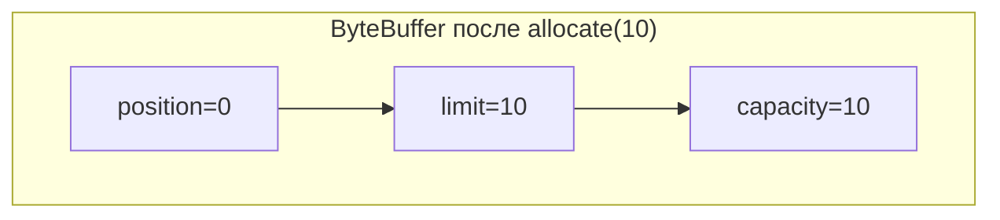

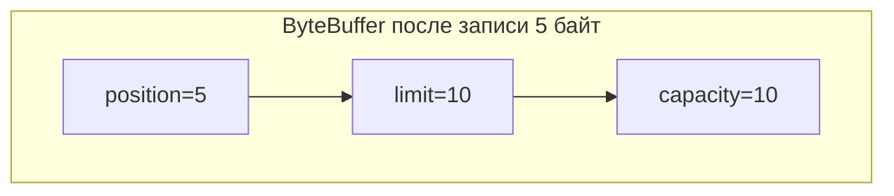

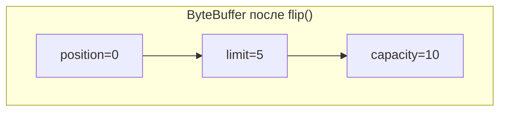

```java
ByteBuffer buffer = ByteBuffer.allocate(10); // capacity=10, position=0, limit=10

buffer.put((byte) 'H');  // position=1
buffer.put((byte) 'i');  // position=2

buffer.flip();            // position=0, limit=2  — готов к чтению

byte b1 = buffer.get();  // 'H', position=1
byte b2 = buffer.get();  // 'i', position=2

buffer.clear();           // position=0, limit=10 — готов к записи
```

> [!mcq]
> - [ ] `clear()` физически очищает все байты в буфере, заполняя его нулями. | `clear()` НЕ стирает данные — только сбрасывает `position=0` и `limit=capacity`. Старые байты остаются в памяти и могут быть перезаписаны новой записью. ❌ ПОСЛЕДСТВИЕ: разработчик логирует «остатки» из `ByteBuffer` для дебага после `clear()` — в логи попадают токены/пароли с предыдущих запросов; security-аудит фиксирует утечку чувствительных данных в `prod.log`.
> - [ ] `capacity` можно изменить во время работы через `setCapacity(int)`. | `capacity` устанавливается при создании буфера и неизменна. Чтобы «увеличить» буфер, нужно создать новый и скопировать данные через `put(oldBuffer)`. ❌ ПОСЛЕДСТВИЕ: разработчик ищет несуществующий метод, в итоге пишет цикл с пересозданием `ByteBuffer.allocate()` в горячей точке — постоянные аллокации в young gen, пауза GC растёт с 10ms до 100ms на 1000 RPS.
> - [x] Инвариант `0 <= mark <= position <= limit <= capacity` — нарушение даёт `InvalidMarkException` или `IllegalArgumentException`, а `position` указывает на следующий читаемый/пишемый байт. | Это базовый контракт `ByteBuffer`. `mark` сохраняется через `mark()`, восстанавливается через `reset()`. Если `mark` сброшен (например, `flip()` его инвалидирует), `reset()` бросит `InvalidMarkException`. ✓ ПРИМЕНЯТЬ: парсеры протоколов (Kafka wire protocol, HTTP/2 frames) используют `mark()`/`reset()` для look-ahead — заглянуть на N байт вперёд, при несоответствии откатиться к началу фрейма. 📋 ПРАВИЛО: «`mark <= position <= limit <= capacity`, `flip` инвалидирует `mark`». 🔗 См. Q13 (`flip`/`clear`), Q14 (direct vs heap), Q15 (scatter/gather).
> - [ ] `position` всегда совпадает с `limit` — это два разных названия одного и того же поля. | `position` и `limit` — разные атрибуты с разными ролями. `position` — текущий курсор, `limit` — граница допустимых операций. Совпадение даёт «нечего читать/писать». ❌ ПОСЛЕДСТВИЕ: разработчик путает их при ручной манипуляции, выставляет `buffer.position(buffer.limit())` перед записью — сразу `BufferOverflowException`, спорадические NPE в продакшене с binary-протоколом.

> [!mcq]
> - [ ] `flip()` и `clear()` — синонимы, оба готовят буфер к чтению | `flip()` готовит к чтению (`limit=position; position=0`), `clear()` готовит к ЗАПИСИ (`position=0; limit=capacity`). ❌ ПОСЛЕДСТВИЕ: после записи делают `clear()` вместо `flip()` перед `channel.write(buffer)` — пишут весь capacity (включая мусорные байты), а не реальные данные.
> - [ ] `compact()` идентичен `clear()`, но «безопаснее» из-за названия | `compact()` СОХРАНЯЕТ непрочитанные байты (сдвигает их в начало), `clear()` — нет. ❌ ПОСЛЕДСТВИЕ: использование `clear()` после частичного чтения в дуплексном `SocketChannel` теряет хвост входящего сообщения, протокол ломается на длинных payload.
> - [x] После записи `flip()` переключает в режим чтения (`limit=position; position=0`); после полного чтения `clear()` сбрасывает к записи; при частичном чтении `compact()` сохраняет хвост | Три режима жизненного цикла буфера: write→flip→read→clear→write, либо write→flip→read→compact→write для streaming. ✓ ПРИМЕНЯТЬ: echo-сервер на NIO — `compact()` после write, чтобы не потерять байты, не успевшие уйти из-за non-blocking. 📋 ПРАВИЛО: «`flip` = write→read, `clear` = read→write (drop), `compact` = read→write (keep tail)». 🔗 См. Q13, Q18.
> - [ ] `rewind()` сбрасывает `mark` и `limit`, как `clear()` | `rewind()` устанавливает только `position=0` и сбрасывает `mark`; `limit` не трогает. ❌ ПОСЛЕДСТВИЕ: ожидание «полной перезаписи» после `rewind()` приводит к `BufferOverflowException`, если `limit` уже был сужен предыдущим `flip()`.

## Q13. Что делают методы `flip()`, `clear()`, `compact()`, `rewind()` в `ByteBuffer`?

Эти методы управляют переключением буфера между режимами чтения и записи. Частый источник багов — забыть вызвать `flip()` перед чтением.

| Метод | `position` | `limit` | Когда использовать |
|---|---|---|---|
| `flip()` | → 0 | → старый `position` | После записи, перед чтением |
| `clear()` | → 0 | → `capacity` | Перед новой записью (данные не стираются!) |
| `compact()` | → кол-во оставшихся | → `capacity` | Перенести непрочитанные данные в начало, продолжить запись |
| `rewind()` | → 0 | не меняется | Перечитать данные заново |

```java
ByteBuffer buffer = ByteBuffer.allocate(10);

// Запись в буфер
buffer.put("Hello".getBytes()); // position=5, limit=10

// Переключение в режим чтения
buffer.flip();                  // position=0, limit=5

// Читаем 3 байта
byte[] dst = new byte[3];
buffer.get(dst);                // position=3, limit=5

// compact(): оставшиеся 2 байта перемещаются в начало, можно дописывать
buffer.compact();               // position=2, limit=10
// буфер содержит: ['l', 'o', ?, ?, ...], position=2

// rewind(): перечитать с начала
buffer.rewind();                // position=0, limit не меняется
```

> [!mcq]
> - [x] `flip()` готовит буфер к чтению после записи (`limit=position`, `position=0`), `compact()` переносит непрочитанный остаток в начало и оставляет режим записи. | `flip` — переключение write→read; `compact` — частичное чтение прошло, оставшиеся данные сдвигаются в начало, можно дописывать новые. Это типичный паттерн для socket I/O. ✓ ПРИМЕНЯТЬ: NIO echo-сервер цикл «read → flip → write часть → compact → продолжить read» — гарантирует, что недописанные байты не теряются между select-итерациями. 📋 ПРАВИЛО: «`flip` = write→read, `compact` = read→write с остатком, `clear` = read→write полный сброс». 🔗 См. Q12 (атрибуты ByteBuffer), Q15 (scatter/gather), Q18 (NIO server).
> - [ ] `clear()` очищает память буфера, поэтому после него нельзя прочитать ранее записанные байты. | `clear()` лишь сбрасывает указатели (`position=0`, `limit=capacity`), физически данные остаются — следующее чтение из «свежего» буфера прочитает старый мусор. ❌ ПОСЛЕДСТВИЕ: разработчик считает `clear()` безопасным «обнулением», после `clear()` делает `get(byte[100])` для дебага и видит остатки чужих TLS-пакетов; security-инцидент с раскрытием данных другой сессии.
> - [ ] `rewind()` сбрасывает `position=0` и `limit=capacity`, что эквивалентно `clear()`. | `rewind()` сбрасывает только `position=0`, `limit` остаётся прежним. Это нужно для повторного чтения тех же данных, а не для подготовки буфера к записи. ❌ ПОСЛЕДСТВИЕ: разработчик использует `rewind()` вместо `clear()` перед очередной записью — `BufferOverflowException` при достижении старого `limit`, в логах продакшена «random» сбои на 30% запросов.
> - [ ] `compact()` всегда копирует все байты буфера в начало, даже если они уже прочитаны. | `compact()` копирует только непрочитанный остаток (`position..limit`) в начало; уже прочитанные данные отбрасываются. Полное копирование было бы бессмысленно. ❌ ПОСЛЕДСТВИЕ: разработчик пишет тесты, ожидающие «полную копию», после рефакторинга часть прочитанных байт «теряется» — на самом деле работает корректно, но команда часами ищет несуществующий баг.

## Q14. (!) В чём разница между `direct buffer` и `heap buffer`?

| Характеристика | `Heap Buffer` | `Direct Buffer` |
|---|---|---|
| Создание | `ByteBuffer.allocate(size)` | `ByteBuffer.allocateDirect(size)` |
| Расположение | В куче JVM | В нативной памяти ОС |
| GC | Управляется GC | Освобождается при GC обёртки |
| Скорость I/O | Требует копирования в нативную память | Нет лишних копирований (zero-copy) |
| Скорость создания | Быстрое | Медленное |
| `isDirect()` | `false` | `true` |

```java
// Heap buffer — данные в куче JVM
ByteBuffer heapBuffer = ByteBuffer.allocate(1024);

// Direct buffer — данные в нативной памяти
ByteBuffer directBuffer = ByteBuffer.allocateDirect(1024);

System.out.println(heapBuffer.isDirect());  // false
System.out.println(directBuffer.isDirect()); // true
```

**Когда использовать `direct buffer`:**
- Долгоживущие буферы для интенсивного I/O (сетевые серверы)
- Передача данных в нативный код (JNI)
- `MappedByteBuffer` (всегда direct)

**Когда использовать `heap buffer`:**
- Короткоживущие операции
- Когда нужен доступ к внутреннему массиву (`array()`)
- Небольшие объёмы данных

На собеседовании важно упомянуть: при I/O с heap buffer JVM всё равно копирует данные во временный direct buffer — именно поэтому для частых I/O операций direct buffer эффективнее.

> [!mcq]
> - [ ] `Direct buffer` всегда быстрее `heap buffer` — нужно использовать его везде. | Direct buffer медленный в создании (требует syscall) и не управляется обычным GC. Для коротких/мелких операций heap buffer быстрее. ❌ ПОСЛЕДСТВИЕ: команда меняет все `allocate()` на `allocateDirect()` «для скорости». Через час нагрузки `OutOfMemoryError: Direct buffer memory` — direct memory не учитывается в `-Xmx`, а `-XX:MaxDirectMemorySize` по умолчанию = `Xmx`, лимит исчерпан, JVM падает.
> - [ ] `Heap buffer` хранится в native памяти, поэтому быстрее работает с native I/O. | Это противоположно действительности. `Heap buffer` хранится в куче JVM, и при I/O JVM копирует его данные во временный direct buffer для передачи в native код. ❌ ПОСЛЕДСТВИЕ: разработчик в высоконагруженном Netty-приложении ставит `allocate()` для всех буферов, надеясь на «native скорость» — на каждый syscall лишнее копирование, throughput сетевого сервера падает на 25%.
> - [x] `Direct buffer` живёт в нативной памяти ОС вне Java heap, что устраняет копирование при native I/O, но создаётся медленнее и не учитывается в `-Xmx` (нужен `-XX:MaxDirectMemorySize`). | `allocateDirect()` выделяет память через `Unsafe.allocateMemory()` напрямую у ОС. JVM может писать/читать без промежуточной копии в kernel buffer. Освобождение через `Cleaner` (бывший `sun.misc.Cleaner`) при сборке обёртки. ✓ ПРИМЕНЯТЬ: Netty `PooledByteBufAllocator` пулит direct buffers для долгоживущих TCP-соединений; Kafka `RecordAccumulator` использует direct memory для сетевых батчей. 📋 ПРАВИЛО: «direct = native память, zero-copy I/O, но lifecycle через `Cleaner`». 🔗 См. Q12 (ByteBuffer атрибуты), Q26 (mmap), Q38 (когда Channel/Buffer).
> - [ ] `MappedByteBuffer` — это вид heap buffer, который хранится в куче JVM. | `MappedByteBuffer` ВСЕГДА direct — это отображение файла в нативную память через `mmap()`. Хранение в куче JVM невозможно для memory-mapped операций. ❌ ПОСЛЕДСТВИЕ: разработчик путает классификацию, добавляет `mappedBuf.array()` для оптимизации — `UnsupportedOperationException` (у direct buffer нет backing array); прод-инцидент при горячем фиче-релизе.

> [!mcq]
> - [x] Лимит direct memory регулируется `-XX:MaxDirectMemorySize`; по умолчанию ≈ `-Xmx`; превышение → `OOMError: Direct buffer memory` без падения heap | Direct buffers НЕ учитываются в `-Xmx`, имеют собственный лимит. Освобождение через `Cleaner` асинхронно — может отставать от аллокаций. ✓ ПРИМЕНЯТЬ: явно задавать `-XX:MaxDirectMemorySize=512m` для контейнеров, мониторить `BufferPoolMXBean` (jconsole/JMX). 📋 ПРАВИЛО: «direct memory = отдельный лимит, явно задавать в k8s». 🔗 См. Q14 (heap vs direct), Q26 (mmap).
> - [ ] `DirectByteBuffer` освобождается `сразу` после выхода из scope, как локальная переменная | Освобождение идёт через `Cleaner`/`PhantomReference` при GC обёртки — может произойти через минуты под слабой нагрузкой. ❌ ПОСЛЕДСТВИЕ: «протекающая» direct memory в low-traffic сервисе, native OOM спустя сутки без видимых причин в heap dump.
> - [ ] `ByteBuffer.allocateDirect(1024)` создаёт буфер, обнуляемый только при первом доступе (lazy zeroing) | JVM гарантирует zero-init сразу при выделении (как и для обычных Java-объектов). ❌ ПОСЛЕДСТВИЕ: ожидание «грязных» байт приводит к ошибочной отладке security-сценария.
> - [ ] `MaxDirectMemorySize` по умолчанию `64 MB` независимо от `-Xmx` | Значение по умолчанию ≈ `-Xmx` (с Java 8u4+); раньше было `64m`. ❌ ПОСЛЕДСТВИЕ: ложное чувство безопасности, неверный capacity planning при миграции с старых JDK.

## Q15. Что такое `scatter/gather` операции в `NIO`?

**Scatter read** — чтение из одного канала в **несколько** буферов последовательно. Данные заполняют первый буфер, затем второй и т.д.

**Gather write** — запись в один канал из **нескольких** буферов последовательно.

```java
// Scatter read — чтение заголовка и тела протокола в разные буферы
ByteBuffer header = ByteBuffer.allocate(128);  // фиксированный заголовок
ByteBuffer body = ByteBuffer.allocate(4096);   // тело сообщения

ByteBuffer[] buffers = {header, body};

try (FileChannel channel = FileChannel.open(Path.of("message.bin"), StandardOpenOption.READ)) {
    // Scatter: сначала заполнит header, затем body
    channel.read(buffers);
}

// Gather write — запись из нескольких буферов в один канал
header.flip();
body.flip();
try (FileChannel outChannel = FileChannel.open(Path.of("out.bin"),
        StandardOpenOption.WRITE, StandardOpenOption.CREATE)) {
    outChannel.write(buffers); // сначала header, затем body
}
```

Применение: протоколы с фиксированными заголовками (HTTP, custom binary protocols) — можно разделить парсинг заголовка и тела без лишнего копирования.

> [!mcq]
> - [ ] `scatter` пишет один буфер `параллельно` в несколько каналов | Это противоположное направление и неверная семантика. ❌ ПОСЛЕДСТВИЕ: попытка «распараллелить» запись приведёт к `NonWritableChannelException` или порче данных.
> - [x] `scatter` читает из одного канала `последовательно` в массив `ByteBuffer[]` | Каналы поддерживают `read(ByteBuffer[])` — заполняют буферы по порядку. ✓ ПРИМЕНЯТЬ: разделение фиксированного заголовка и тела протокола без лишнего `memcpy`. 📋 ПРАВИЛО: «один канал → массив буферов по порядку». 🔗 См. Q12.
> - [ ] `scatter` читает из одного канала `параллельно` во все буферы | Заполнение строго последовательное, не параллельное. ❌ ПОСЛЕДСТВИЕ: ожидание concurrency приведёт к гонкам в логике парсера.
> - [ ] `gather` объединяет несколько каналов в один `ByteBuffer` | `gather` — это запись из массива буферов в один канал, а не объединение каналов. ❌ ПОСЛЕДСТВИЕ: путаница приведёт к неверной обработке `transferFrom` сценариев.

## Q16. (!) Как работает механизм `Selector` в `Java NIO`?

`Selector` позволяет одному потоку мониторить несколько каналов и реагировать на готовность к операциям ввода-вывода. Это реализация паттерна **Reactor** (подробнее в [Design Patterns](../../design-patterns/design-patterns-interview.md)).

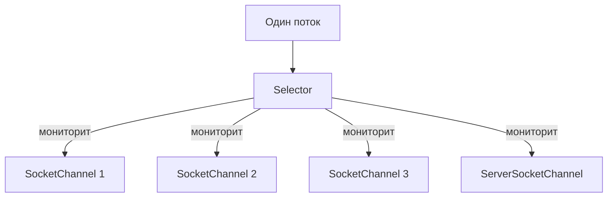

Принцип работы:
1. Создать `Selector` через `Selector.open()`
2. Зарегистрировать каналы с интересующими операциями
3. В цикле вызывать `selector.select()` — блокируется до готовности хотя бы одного канала
4. Обработать готовые ключи из `selector.selectedKeys()`
5. Удалить обработанные ключи из набора

```java
Selector selector = Selector.open();

ServerSocketChannel serverChannel = ServerSocketChannel.open();
serverChannel.bind(new InetSocketAddress(8080));
serverChannel.configureBlocking(false); // обязательно неблокирующий!

// Регистрация канала с интересующей операцией
serverChannel.register(selector, SelectionKey.OP_ACCEPT);

while (true) {
    int readyChannels = selector.select(); // блокируется до готовности
    if (readyChannels == 0) continue;

    Set<SelectionKey> selectedKeys = selector.selectedKeys();
    Iterator<SelectionKey> it = selectedKeys.iterator();

    while (it.hasNext()) {
        SelectionKey key = it.next();

        if (key.isAcceptable()) {
            // новое входящее соединение
        } else if (key.isReadable()) {
            // данные готовы для чтения
        } else if (key.isWritable()) {
            // канал готов для записи
        }

        it.remove(); // важно: удалить обработанный ключ!
    }
}
```

> [!mcq]
> - [ ] Канал должен быть в `блокирующем` режиме перед регистрацией в `Selector` | Регистрация требует строго `configureBlocking(false)`. ❌ ПОСЛЕДСТВИЕ: `IllegalBlockingModeException` при `register()`.
> - [ ] После обработки ключ из `selectedKeys()` удаляется `автоматически` | Нужно вручную вызывать `it.remove()` — иначе ключ останется в наборе. ❌ ПОСЛЕДСТВИЕ: бесконечная обработка одного и того же события, 100% CPU.
> - [ ] `selector.select()` возвращает все каналы, `даже не готовые` | Возвращаются только готовые к указанным операциям. ❌ ПОСЛЕДСТВИЕ: попытка `read` на неготовом канале — 0 байт и busy-loop.
> - [x] Один поток обслуживает много каналов через `epoll/kqueue` | `Selector` — обёртка над OS-механизмом мультиплексирования. ✓ ПРИМЕНЯТЬ: серверы на тысячи соединений (Netty, Tomcat NIO). 📋 ПРАВИЛО: «один поток → много готовых каналов». 🔗 См. Q3.

> [!mcq]
> - [ ] `Selector` использует один и тот же системный вызов на всех ОС (`select(2)`) | На Linux — `epoll`, на macOS/BSD — `kqueue`, на Windows — `IOCP`/`select`, на Solaris — `/dev/poll`. JVM выбирает оптимальный backend через `SelectorProvider`. ❌ ПОСЛЕДСТВИЕ: бенчмарки на macOS не отражают prod-производительность Linux, ошибочный capacity planning.
> - [ ] `select()` сканирует все `N` зарегистрированных каналов на каждом вызове за `O(N)` | Старый `select(2)` — да, но `epoll`/`kqueue` работают за `O(готовых)`, а не `O(N)`. Именно поэтому масштабируется до 100k соединений. ❌ ПОСЛЕДСТВИЕ: миф о «деградации Selector на больших N», переход на менее эффективные пулы потоков «для надёжности».
> - [x] На Linux `Selector` использует `epoll`, на macOS/BSD — `kqueue`, на Windows — нативный механизм; готовность каналов возвращается за `O(ready)`, а не `O(registered)` | `SelectorProvider.provider()` возвращает платформо-зависимый backend; Netty явно подключает `EpollEventLoop` через JNI для обхода накладных расходов JDK-обёртки. ✓ ПРИМЕНЯТЬ: высоконагруженные серверы — `Netty` + `EpollEventLoopGroup` на Linux даёт +10–20% throughput vs JDK NIO. 📋 ПРАВИЛО: «`Selector` = OS-мультиплексор; на Linux лучше явно `epoll`». 🔗 См. Q16, Q18.
> - [ ] `wakeup()` на `Selector` — это `Thread.interrupt()` для блокирующего `select()` | `wakeup()` — отдельный механизм через self-pipe trick (или event-fd на Linux); `interrupt()` НЕ разбудит `select()` (он не отвечает на interrupt). ❌ ПОСЛЕДСТВИЕ: попытка остановить event-loop через `interrupt()` не работает, поток зависает на `select()` навсегда.

## Q17. Что такое `SelectionKey` и какие операции он поддерживает?

`SelectionKey` — связь между зарегистрированным каналом и `Selector`. Содержит информацию о готовых операциях и позволяет хранить произвольные данные (attachment).

| Операция | Константа | Для каких каналов |
|---|---|---|
| Accept | `SelectionKey.OP_ACCEPT` | `ServerSocketChannel` |
| Connect | `SelectionKey.OP_CONNECT` | `SocketChannel` |
| Read | `SelectionKey.OP_READ` | `SocketChannel`, `DatagramChannel` |
| Write | `SelectionKey.OP_WRITE` | `SocketChannel`, `DatagramChannel` |

```java
// Регистрация с несколькими операциями (побитовое ИЛИ)
SelectionKey key = channel.register(selector,
    SelectionKey.OP_READ | SelectionKey.OP_WRITE);

// Проверка готовности
if (key.isReadable()) { /* ... */ }
if (key.isWritable()) { /* ... */ }

// Attachment — хранение состояния для канала
ByteBuffer buffer = ByteBuffer.allocate(256);
key.attach(buffer);
ByteBuffer attached = (ByteBuffer) key.attachment();

// Изменение интересующих операций
key.interestOps(SelectionKey.OP_READ); // теперь только чтение
```

> [!mcq]
> - [x] Регистрация нескольких операций — через `побитовое ИЛИ` (`OP_READ | OP_WRITE`) | `interestOps` — это битовая маска. ✓ ПРИМЕНЯТЬ: `register(selector, OP_READ \| OP_WRITE)` для дуплексного сокета. 📋 ПРАВИЛО: «битовая маска через `\|`». 🔗 См. Q16.
> - [ ] `OP_ACCEPT` поддерживается у `SocketChannel` | `OP_ACCEPT` — только для `ServerSocketChannel`. ❌ ПОСЛЕДСТВИЕ: `IllegalArgumentException` при регистрации с неподдерживаемой операцией.
> - [ ] `attachment()` хранит данные `глобально для Selector` | Attachment привязан к конкретному ключу/каналу, а не к `Selector`. ❌ ПОСЛЕДСТВИЕ: путаница в состоянии — буферы клиентов перепутаются между соединениями.
> - [ ] `OP_CONNECT` используется для `ServerSocketChannel` | `OP_CONNECT` — только для `SocketChannel` (клиентская сторона). ❌ ПОСЛЕДСТВИЕ: бесконечное ожидание события, которое никогда не произойдёт.

## Q18. (!) Как реализовать неблокирующий сервер на `NIO`?

Полный пример echo-сервера с `Selector`:

```java
public class NioEchoServer {
    public static void main(String[] args) throws IOException {
        Selector selector = Selector.open();
        ServerSocketChannel serverChannel = ServerSocketChannel.open();
        serverChannel.bind(new InetSocketAddress(8080));
        serverChannel.configureBlocking(false);
        serverChannel.register(selector, SelectionKey.OP_ACCEPT);

        System.out.println("Сервер запущен на порту 8080");

        while (true) {
            selector.select();
            Iterator<SelectionKey> it = selector.selectedKeys().iterator();

            while (it.hasNext()) {
                SelectionKey key = it.next();
                it.remove();

                if (key.isAcceptable()) {
                    handleAccept(selector, key);
                } else if (key.isReadable()) {
                    handleRead(key);
                }
            }
        }
    }

    private static void handleAccept(Selector selector, SelectionKey key) throws IOException {
        ServerSocketChannel server = (ServerSocketChannel) key.channel();
        SocketChannel client = server.accept();
        client.configureBlocking(false);
        client.register(selector, SelectionKey.OP_READ, ByteBuffer.allocate(256));
        System.out.println("Клиент подключён: " + client.getRemoteAddress());
    }

    private static void handleRead(SelectionKey key) throws IOException {
        SocketChannel client = (SocketChannel) key.channel();
        ByteBuffer buffer = (ByteBuffer) key.attachment();
        int bytesRead = client.read(buffer);

        if (bytesRead == -1) {
            client.close();
            return;
        }

        buffer.flip();
        client.write(buffer); // echo обратно
        buffer.compact();
    }
}
```

В реальных проектах вместо написания NIO-серверов вручную используют `Netty` или `Spring WebFlux`, которые строятся поверх NIO, но предоставляют удобный API. Подробнее в [Java Concurrency](java-concurrency-interview.md).

> [!mcq]
> - [ ] Принимающий канал `ServerSocketChannel` может оставаться `блокирующим` при работе с `Selector` | Все каналы в `Selector` обязаны быть `non-blocking`. ❌ ПОСЛЕДСТВИЕ: `IllegalBlockingModeException` уже на этапе `register`.
> - [x] После `selector.select()` `обязательно` вызывать `it.remove()` для каждого ключа | `Selector` не очищает `selectedKeys` сам. ✓ ПРИМЕНЯТЬ: `it.next(); it.remove();` в начале итерации. 📋 ПРАВИЛО: «обработал → удалил из set». 🔗 См. Q16.
> - [ ] При `bytesRead == -1` нужно `продолжить чтение` без закрытия канала | `-1` означает закрытие соединения клиентом — канал нужно `close()`. ❌ ПОСЛЕДСТВИЕ: утечка дескрипторов, `Too many open files` через несколько часов.
> - [ ] `client.write(buffer)` гарантированно запишет `все` байты за один вызов | В `non-blocking` режиме `write` может вернуть меньше — нужен цикл/`OP_WRITE`. ❌ ПОСЛЕДСТВИЕ: потеря части ответа, обрезанные сообщения.

> [!mcq]
> - [ ] При `write()` возвращающем `< buffer.remaining()` нужно `повторять в цикле` пока не запишется всё | Цикл блокирует event-loop поток — пока один медленный клиент не освободит TCP send-buffer, остальные соединения «висят». ❌ ПОСЛЕДСТВИЕ: один тормозной клиент (slowloris/мобильный edge) роняет throughput всего сервера в 100×.
> - [x] При неполном `write()` оставить недописанный `ByteBuffer` в attachment, переключить `interestOps` на `OP_WRITE`, дописать в `handleWrite()` после готовности канала | Правильная асинхронная обработка backpressure: ОС сообщит через `Selector`, когда send-buffer освободится. После полного слива — снять `OP_WRITE`, чтобы не получить busy-loop (канал «всегда готов к записи», когда буфер пуст). ✓ ПРИМЕНЯТЬ: любой production NIO-сервер; в Netty это спрятано в `ChannelOutboundBuffer`. 📋 ПРАВИЛО: «partial write → `OP_WRITE` → дописал → снять `OP_WRITE`». 🔗 См. Q16, Q17.
> - [ ] `OP_WRITE` нужно держать включённым `всё время`, чтобы запись была быстрой | Канал «готов к записи», когда есть место в send-buffer — почти всегда. Постоянно включённый `OP_WRITE` → 100% CPU busy-loop. ❌ ПОСЛЕДСТВИЕ: один сервер забивает ядро CPU не делая полезной работы, алерт на `cpu.user` без явных запросов.
> - [ ] `SocketChannel.write()` может бросить `BufferOverflowException` при заполненном TCP send-buffer | В non-blocking режиме `write()` просто возвращает количество записанных байт (может быть `0`), а не бросает исключение. ❌ ПОСЛЕДСТВИЕ: лишний `try/catch BufferOverflowException` маскирует реальную диагностику и сбивает с толку при ревью.

## Q19. (!) Что такое `NIO.2` и чем он отличается от классического `NIO`?

`NIO.2` (появился в Java 7) — это пакет `java.nio.file`, дополняющий классический `NIO` высокоуровневым файловым API.

| | Классический `NIO` (Java 1.4) | `NIO.2` (Java 7) |
|---|---|---|
| Пакет | `java.nio`, `java.nio.channels` | `java.nio.file` |
| Фокус | Каналы, буферы, селекторы | Файловые операции |
| Ключевые классы | `Channel`, `Buffer`, `Selector` | `Path`, `Files`, `FileSystem` |
| Замена для | `java.net.Socket` | `java.io.File` |
| Асинхронность | Неблокирующий I/O через `Selector` | `AsynchronousFileChannel`, `AsynchronousSocketChannel` |
| Дополнительно | — | `WatchService`, `FileVisitor`, атрибуты файлов |

```java
// NIO.2 заменяет устаревший java.io.File
// Старый способ
File file = new File("/path/to/file.txt");
boolean exists = file.exists();

// Новый способ (NIO.2)
Path path = Path.of("/path/to/file.txt");
boolean exists2 = Files.exists(path);
```

`NIO.2` не заменяет `Channel/Selector`, а дополняет их удобными файловыми операциями.

> [!mcq]
> - [ ] `NIO.2` `заменяет` классический `NIO` (`Channel`, `Buffer`, `Selector`) | `NIO.2` дополняет, не заменяет — `Selector` остался актуален. ❌ ПОСЛЕДСТВИЕ: попытка переписать рабочий `Selector`-сервер на `Files` API — потеря функциональности.
> - [ ] `NIO.2` появился в `Java 1.4` | `NIO.2` (`java.nio.file`) — это `Java 7`; `Java 1.4` — это первый `NIO`. ❌ ПОСЛЕДСТВИЕ: `ClassNotFoundException: java.nio.file.Path` при сборке под Java 6.
> - [ ] `Path` и `File` — это `один и тот же` интерфейс | `Path` (`java.nio.file`) — современная замена `java.io.File`. ❌ ПОСЛЕДСТВИЕ: попытка кастовать `Path` к `File` — `ClassCastException`.
> - [x] `NIO.2` добавляет `WatchService`, `FileVisitor`, `AsynchronousFileChannel` | Высокоуровневый файловый API + асинхронные каналы поверх существующего `NIO`. ✓ ПРИМЕНЯТЬ: hot-reload конфигов через `WatchService`, обход дерева через `Files.walk`. 📋 ПРАВИЛО: «`NIO.2` = `java.nio.file` + async». 🔗 См. Q24.

## Q20. Как работать с `Path` и `Paths`?

`Path` — интерфейс, представляющий путь в файловой системе. Заменяет `java.io.File`.

```java
// Создание Path
Path p1 = Path.of("/Users/dev/file.txt");         // Java 11+
Path p2 = Path.of("src", "main", "java");          // из частей
Path p3 = Paths.get("/Users/dev/file.txt");         // до Java 11
Path p4 = Path.of(URI.create("file:///tmp/test"));  // из URI

// Основные операции
Path fileName = p1.getFileName();     // file.txt
Path parent = p1.getParent();         // /Users/dev
Path root = p1.getRoot();             // /
int nameCount = p1.getNameCount();    // 3

// Разрешение путей
Path base = Path.of("/Users/dev");
Path resolved = base.resolve("projects/app"); // /Users/dev/projects/app

// Относительный путь
Path from = Path.of("/a/b");
Path to = Path.of("/a/c/d");
Path relative = from.relativize(to); // ../c/d

// Нормализация
Path messy = Path.of("/a/b/../c/./d");
Path clean = messy.normalize(); // /a/c/d

// Реальный путь (разрешение символических ссылок)
Path real = path.toRealPath();
```

> [!mcq]
> - [ ] `Path.of(...)` — рекомендуемый способ начиная с `Java 7` | `Path.of()` появился в `Java 11`; в `Java 7-10` использовался `Paths.get()`. ❌ ПОСЛЕДСТВИЕ: `NoSuchMethodError` при сборке под Java 8.
> - [ ] `path.normalize()` гарантирует существование файла на диске | `normalize()` — чисто синтаксическая операция (`./`, `../`), не проверяет ФС. ❌ ПОСЛЕДСТВИЕ: уверенность в существовании несуществующего файла, `NoSuchFileException` при доступе.
> - [x] `base.resolve(other)` склеивает пути с учётом абсолютности `other` | Если `other` абсолютный — возвращается он; иначе склейка от `base`. ✓ ПРИМЕНЯТЬ: построение путей `configDir.resolve("app.yml")`. 📋 ПРАВИЛО: «`resolve` уважает абсолютность». 🔗 См. Q22.
> - [ ] `Path` — это `класс`, а `Paths` — `интерфейс` | Наоборот: `Path` — интерфейс, `Paths` — utility-класс со статическими методами. ❌ ПОСЛЕДСТВИЕ: попытка `new Path(...)` — ошибка компиляции.

## Q21. Какие основные операции предоставляет класс `Files`?

`Files` — утилитный класс со статическими методами для файловых операций:

```java
Path path = Path.of("example.txt");

// Проверки
boolean exists = Files.exists(path);
boolean isDir = Files.isDirectory(path);
boolean isRegular = Files.isRegularFile(path);
boolean isReadable = Files.isReadable(path);

// Чтение
byte[] bytes = Files.readAllBytes(path);
List<String> lines = Files.readAllLines(path, StandardCharsets.UTF_8);
String content = Files.readString(path); // Java 11+
Stream<String> lineStream = Files.lines(path); // ленивое чтение

// Запись
Files.write(path, bytes);
Files.writeString(path, "содержимое"); // Java 11+
Files.write(path, lines, StandardCharsets.UTF_8,
    StandardOpenOption.CREATE, StandardOpenOption.APPEND);

// Создание
Files.createFile(path);
Files.createDirectory(Path.of("newDir"));
Files.createDirectories(Path.of("a/b/c")); // рекурсивно
Path temp = Files.createTempFile("prefix", ".tmp");

// Атрибуты
long size = Files.size(path);
FileTime modified = Files.getLastModifiedTime(path);
```

> [!mcq]
> - [ ] `Files.lines(path)` загружает `весь файл` в память сразу | `Files.lines` — ленивый `Stream`, читает построчно. ❌ ПОСЛЕДСТВИЕ: ошибочный отказ от метода для больших файлов, изобретение «велосипеда» с `BufferedReader`.
> - [x] `Files.lines(path)` нужно `закрывать` через `try-with-resources` | Возвращаемый `Stream` держит открытый файловый дескриптор. ✓ ПРИМЕНЯТЬ: `try (Stream<String> s = Files.lines(p)) { ... }`. 📋 ПРАВИЛО: «`Stream` от `Files` = ресурс, закрывай». 🔗 См. Q35.
> - [ ] `Files.readAllBytes` безопасно работает с `файлом 10 ГБ` | Метод грузит весь файл в `byte[]` — `OutOfMemoryError`. ❌ ПОСЛЕДСТВИЕ: падение JVM при попытке прочитать большой лог.
> - [ ] `Files.createDirectory(a/b/c)` создаст промежуточные `a` и `b`, если их нет | Только `createDirectories` создаёт цепочку; `createDirectory` бросит `NoSuchFileException`. ❌ ПОСЛЕДСТВИЕ: падение приложения при первом запуске на чистой машине.

## Q22. Как копировать, перемещать и удалять файлы через `NIO.2`?

```java
Path src = Path.of("source.txt");
Path dst = Path.of("target.txt");

// Копирование
Files.copy(src, dst);
Files.copy(src, dst, StandardCopyOption.REPLACE_EXISTING);
Files.copy(src, dst, StandardCopyOption.COPY_ATTRIBUTES);

// Копирование из/в поток
try (InputStream in = new URL("https://example.com/data").openStream()) {
    Files.copy(in, dst, StandardCopyOption.REPLACE_EXISTING);
}
try (OutputStream out = Files.newOutputStream(dst)) {
    Files.copy(src, out);
}

// Перемещение (атомарное, если на одной файловой системе)
Files.move(src, dst, StandardCopyOption.REPLACE_EXISTING,
    StandardCopyOption.ATOMIC_MOVE);

// Удаление
Files.delete(path);              // бросает NoSuchFileException если нет файла
Files.deleteIfExists(path);      // не бросает, если файла нет

// Рекурсивное удаление каталога
Files.walkFileTree(dir, new SimpleFileVisitor<>() {
    @Override
    public FileVisitResult visitFile(Path file, BasicFileAttributes attrs) throws IOException {
        Files.delete(file);
        return FileVisitResult.CONTINUE;
    }
    @Override
    public FileVisitResult postVisitDirectory(Path dir, IOException exc) throws IOException {
        Files.delete(dir);
        return FileVisitResult.CONTINUE;
    }
});
```

> [!mcq]
> - [ ] `Files.delete(dir)` `рекурсивно` удаляет непустой каталог | `Files.delete` бросит `DirectoryNotEmptyException` для непустого каталога. ❌ ПОСЛЕДСТВИЕ: ошибочное предположение «всё удалилось», на проде остаётся мусор.
> - [x] `ATOMIC_MOVE` гарантирует атомарность только в `пределах одной` файловой системы | На разные ФС ОС не может переименовать атомарно. ✓ ПРИМЕНЯТЬ: при работе в одном томе для ротации файлов. 📋 ПРАВИЛО: «atomic move = same FS». 🔗 См. Q21.
> - [ ] Без `REPLACE_EXISTING` `Files.copy` `молча` перезапишет цель | По умолчанию бросит `FileAlreadyExistsException`. ❌ ПОСЛЕДСТВИЕ: непойманное исключение прерывает batch-копирование.
> - [ ] `Files.deleteIfExists` бросает `NoSuchFileException`, если файла нет | В отличие от `delete`, метод просто возвращает `false` без исключения. ❌ ПОСЛЕДСТВИЕ: лишние `try/catch` загромождают код.

## Q23. Что такое `FileVisitor` и как обходить дерево каталогов?

`FileVisitor<Path>` — интерфейс для обхода дерева файлов. Метод `Files.walkFileTree()` вызывает его коллбэки при посещении каждого файла и каталога.

```java
// Поиск всех .java файлов
List<Path> javaFiles = new ArrayList<>();

Files.walkFileTree(Path.of("src"), new SimpleFileVisitor<>() {
    @Override
    public FileVisitResult visitFile(Path file, BasicFileAttributes attrs) {
        if (file.toString().endsWith(".java")) {
            javaFiles.add(file);
        }
        return FileVisitResult.CONTINUE;
    }
});

// Альтернатива через Files.walk() (Java 8+) — возвращает Stream<Path>
try (Stream<Path> paths = Files.walk(Path.of("src"))) {
    List<Path> result = paths
        .filter(p -> p.toString().endsWith(".java"))
        .toList();
}

// Files.find() — с фильтрацией по атрибутам
try (Stream<Path> paths = Files.find(Path.of("src"), 10,
        (path, attrs) -> attrs.isRegularFile() && path.toString().endsWith(".java"))) {
    paths.forEach(System.out::println);
}
```

Коллбэки `FileVisitor`:
- `preVisitDirectory()` — перед входом в каталог
- `visitFile()` — при посещении файла
- `visitFileFailed()` — при ошибке доступа к файлу
- `postVisitDirectory()` — после выхода из каталога

> [!mcq]
> - [ ] `Files.walk` обходит каталог `только до глубины 1` по умолчанию | По умолчанию обход `Integer.MAX_VALUE` уровней, есть перегрузка с `maxDepth`. ❌ ПОСЛЕДСТВИЕ: ошибочный поиск только в корне, пропуск файлов в подкаталогах.
> - [ ] `Files.walk` `автоматически` закрывает возвращённый `Stream<Path>` | `Stream` держит дескриптор и требует `try-with-resources`. ❌ ПОСЛЕДСТВИЕ: утечка дескрипторов на длинных циклах обхода.
> - [x] Для рекурсивного удаления `сначала visitFile`, затем `postVisitDirectory` | Сначала чистим файлы, потом «снизу вверх» удаляем сами каталоги. ✓ ПРИМЕНЯТЬ: реализация `rm -rf` через `SimpleFileVisitor`. 📋 ПРАВИЛО: «снизу вверх — удалять детей раньше родителей». 🔗 См. Q22.
> - [ ] `visitFileFailed` — это `terminal` коллбэк, который останавливает обход | Вернув `CONTINUE`, можно продолжить обход; `TERMINATE` — остановить. ❌ ПОСЛЕДСТВИЕ: одна ошибка прав ломает весь скан репозитория.

## Q24. Что такое `WatchService` и как отслеживать изменения файлов?

`WatchService` (NIO.2, Java 7) — позволяет наблюдать за изменениями в каталогах: создание, удаление, изменение файлов.

```java
WatchService watchService = FileSystems.getDefault().newWatchService();

Path dir = Path.of("/tmp/watched");
dir.register(watchService,
    StandardWatchEventKinds.ENTRY_CREATE,
    StandardWatchEventKinds.ENTRY_DELETE,
    StandardWatchEventKinds.ENTRY_MODIFY);

System.out.println("Наблюдаем за каталогом: " + dir);

while (true) {
    WatchKey key = watchService.take(); // блокируется до события

    for (WatchEvent<?> event : key.pollEvents()) {
        WatchEvent.Kind<?> kind = event.kind();
        Path fileName = (Path) event.context();

        System.out.printf("Событие: %s, файл: %s%n", kind.name(), fileName);
    }

    boolean valid = key.reset(); // сбрасываем ключ для следующих событий
    if (!valid) break;           // каталог стал недоступен
}
```

Применения:
- Горячая перезагрузка конфигурации в Spring (property reload)
- Мониторинг «входящей» папки для обработки файлов
- Синхронизация каталогов
- Автоматическая пересборка при изменении исходников (как в IDE)

Важно: `WatchService` наблюдает **только за одним уровнем** каталога, не рекурсивно. Для рекурсивного наблюдения нужно регистрировать каждый подкаталог.

> [!mcq]
> - [x] `WatchService` отслеживает `только один уровень` — подкаталоги нужно регистрировать отдельно | Рекурсия не встроена; обход + `register` для каждого подкаталога. ✓ ПРИМЕНЯТЬ: hot-reload конфигов в одной папке. 📋 ПРАВИЛО: «`Watch` = один уровень, рекурсию пишем сами». 🔗 См. Q23.
> - [ ] После обработки событий `key.reset()` вызывать `необязательно` | Без `reset()` ключ становится недействительным и события теряются. ❌ ПОСЛЕДСТВИЕ: мониторинг работает один раз, потом «замолкает».
> - [ ] `event.context()` возвращает `абсолютный` путь к файлу | Это относительный `Path` (имя файла) — нужно склеить с `dir`. ❌ ПОСЛЕДСТВИЕ: `NoSuchFileException` при попытке открыть файл из события.
> - [ ] `WatchService` использует `polling` каждые 100 мс | Использует native-механизмы ОС (`inotify`/`kqueue`/`ReadDirectoryChangesW`). ❌ ПОСЛЕДСТВИЕ: ожидание задержки 100 мс приводит к неверным выводам о производительности.

## Q25. Как работает `FileChannel` и чем он отличается от потоков?

`FileChannel` — канал для чтения/записи файлов. Основные отличия от `FileInputStream`/`FileOutputStream`:

| Возможность | `FileInputStream` | `FileChannel` |
|---|---|---|
| Произвольный доступ | Нет (только последовательный) | Да (`position(long)`) |
| Memory-mapping | Нет | Да (`map()`) |
| Блокировка файла | Нет | Да (`lock()`, `tryLock()`) |
| `transferTo/From` | Нет | Да (zero-copy между каналами) |
| Scatter/Gather | Нет | Да |

```java
try (FileChannel channel = FileChannel.open(Path.of("data.bin"),
        StandardOpenOption.READ, StandardOpenOption.WRITE)) {

    // Произвольный доступ
    channel.position(100); // перемещаемся на 100-й байт

    ByteBuffer buffer = ByteBuffer.allocate(256);
    channel.read(buffer);

    // Размер файла
    long size = channel.size();

    // Усечение файла
    channel.truncate(1024);

    // Принудительная запись на диск
    channel.force(true); // включая метаданные

    // Блокировка файла (для координации между процессами)
    try (FileLock lock = channel.lock()) {
        // эксклюзивный доступ к файлу
    }
}
```

> [!mcq]
> - [ ] `FileInputStream` поддерживает `произвольный доступ` через `seek()` | Только `FileChannel.position(long)` или `RandomAccessFile`; у `FileInputStream` нет seek. ❌ ПОСЛЕДСТВИЕ: попытка работы с бинарными форматами через `FileInputStream` — потоковое перечитывание целиком.
> - [x] `FileChannel.force(true)` сбрасывает `данные и метаданные` на диск | `true` — fsync включая метаданные; `false` — только данные. ✓ ПРИМЕНЯТЬ: durability в WAL/журналах БД. 📋 ПРАВИЛО: «`force(true)` = `fsync`, `force(false)` = `fdatasync`». 🔗 См. Q35.
> - [ ] `channel.lock()` блокирует файл `внутри JVM` от других потоков | Это OS-level lock между процессами; для потоков JVM нужна `synchronized`/`ReentrantLock`. ❌ ПОСЛЕДСТВИЕ: гонки данных между потоками одной JVM.
> - [ ] `FileChannel` `не поддерживает` scatter/gather операции | Поддерживает: `read(ByteBuffer[])`, `write(ByteBuffer[])`. ❌ ПОСЛЕДСТВИЕ: ручное копирование заголовка/тела вместо одного syscall.

## Q26. (!) Как использовать `Memory-mapped` files (`MappedByteBuffer`)?

`MappedByteBuffer` — отображение файла (или его части) в память. Операционная система управляет подгрузкой страниц, что эффективно для больших файлов с произвольным доступом.

```java
try (FileChannel channel = FileChannel.open(Path.of("large-file.dat"),
        StandardOpenOption.READ, StandardOpenOption.WRITE)) {

    // Отображение первых 1 МБ файла в память
    MappedByteBuffer mappedBuffer = channel.map(
        FileChannel.MapMode.READ_WRITE,  // режим
        0,                                // начало (offset)
        Math.min(channel.size(), 1024 * 1024) // размер
    );

    // Чтение — как обычный ByteBuffer
    byte firstByte = mappedBuffer.get(0);

    // Запись
    mappedBuffer.put(0, (byte) 0xFF);

    // Принудительная запись на диск
    mappedBuffer.force();
}
```

Режимы отображения:
- `READ_ONLY` — только чтение, попытка записи → `ReadOnlyBufferException`
- `READ_WRITE` — чтение и запись, изменения отражаются в файле
- `PRIVATE` — copy-on-write, изменения видны только этому буферу

**Когда использовать:**
- Большие файлы с частым произвольным доступом (индексы, базы данных)
- Межпроцессное взаимодействие через общий файл
- **Не использовать** для маленьких файлов — overhead маппинга не окупится

> [!mcq]
> - [ ] Размер mapping в `channel.map(...)` ограничен только размером файла | Параметр `size` — `long`, но фактический предел — `Integer.MAX_VALUE` (~2 ГБ) на один map. ❌ ПОСЛЕДСТВИЕ: попытка отобразить 10 ГБ файл одним вызовом — `IllegalArgumentException`.
> - [x] `MappedByteBuffer` освобождается `только при GC` `DirectByteBuffer`-обёртки | Нет публичного `unmap()` — память висит до сборки мусора, файл остаётся «занят». ✓ ПРИМЕНЯТЬ: учитывать на Windows (нельзя удалить файл) и использовать chunks. 📋 ПРАВИЛО: «mmap живёт до GC». 🔗 См. Q14.
> - [ ] Запись через `mappedBuffer.put` `мгновенно` попадает на диск | Запись идёт в page cache; для гарантии — `force()`. ❌ ПОСЛЕДСТВИЕ: потеря данных при сбое электропитания, рассинхрон WAL.
> - [ ] `READ_ONLY` режим позволяет `модифицировать` буфер для оптимизации | Любая попытка `put` бросает `ReadOnlyBufferException`. ❌ ПОСЛЕДСТВИЕ: runtime-падение в production-обработчике.

> [!mcq]
> - [ ] Один `channel.map()` может отобразить файл любого размера, до `Long.MAX_VALUE` байт | Параметр `size` — `long`, но фактический предел одного mapping — `Integer.MAX_VALUE` (~2 ГБ): индексация в `MappedByteBuffer` идёт через `int`. ❌ ПОСЛЕДСТВИЕ: попытка отобразить 50 ГБ лог-файл одним вызовом → `IllegalArgumentException: Size exceeds Integer.MAX_VALUE`, миграция на JDK 21+ с `MemorySegment` не была спланирована.
> - [x] Файлы > 2 ГБ нужно отображать кусками (chunking) — несколько mapping по `Integer.MAX_VALUE`, либо использовать `MemorySegment` (Java 21+) с `long`-индексацией | Классический паттерн: разбить файл на регионы по 1–2 ГБ, маппить по требованию. `MemorySegment` из Foreign Memory API снимает 32-битное ограничение через native `long` offsets. ✓ ПРИМЕНЯТЬ: индексы Lucene, mmap'ed columnar storage (Parquet-like), Cassandra commitlog. 📋 ПРАВИЛО: «`MappedByteBuffer` ≤ 2 ГБ; > 2 ГБ → chunks или `MemorySegment`». 🔗 См. Q26, Q14.
> - [ ] Превышение `Integer.MAX_VALUE` в `map()` приводит к `OutOfMemoryError` | Будет `IllegalArgumentException` (валидация размера в JDK), а не OOM — это валидационная ошибка API. ❌ ПОСЛЕДСТВИЕ: ловят `OutOfMemoryError` в catch, не отрабатывают реальный валидационный сценарий.
> - [ ] Можно обойти лимит, передав `size = Integer.MAX_VALUE + 1` через cast `(int)` | Cast переполнит `int` в отрицательное число → `IllegalArgumentException: Negative size`. ❌ ПОСЛЕДСТВИЕ: «костыль» падает на pre-prod, переписывание под дедлайн релиза.

## Q27. Что такое `transferTo()` / `transferFrom()` в `FileChannel`?

Эти методы обеспечивают **zero-copy** передачу данных между каналами, минуя пользовательское пространство:

```java
// Копирование файла через transferTo (zero-copy)
try (FileChannel src = FileChannel.open(Path.of("source.dat"), StandardOpenOption.READ);
     FileChannel dst = FileChannel.open(Path.of("target.dat"),
         StandardOpenOption.WRITE, StandardOpenOption.CREATE)) {

    long transferred = src.transferTo(0, src.size(), dst);
    // Или наоборот:
    // dst.transferFrom(src, 0, src.size());
}
```

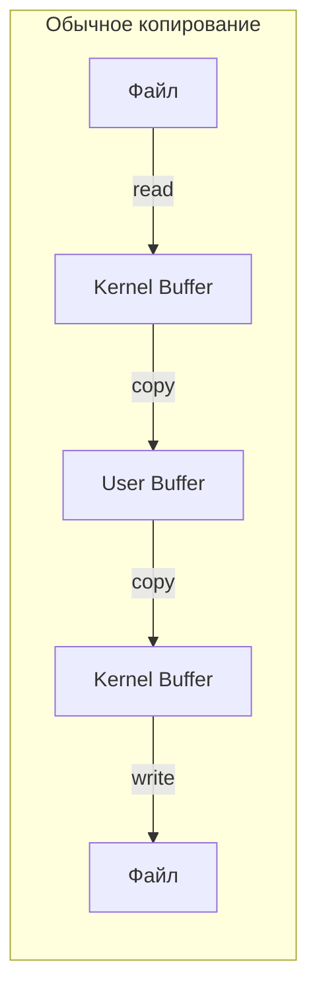

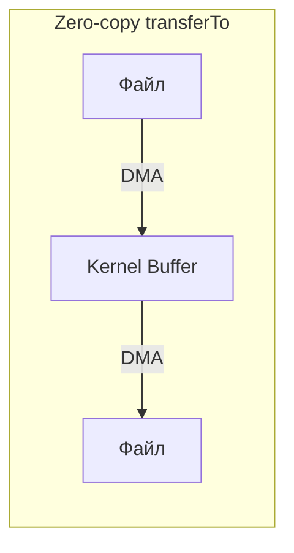

Преимущество: ОС передаёт данные напрямую между дескрипторами, без копирования в пользовательское пространство. Особенно эффективно для больших файлов и сетевой отправки.

> [!mcq]
> - [x] `transferTo` использует системный вызов `sendfile` для zero-copy | Linux `sendfile`/macOS `sendfile`/Windows `TransmitFile` — данные не копируются в user-space. ✓ ПРИМЕНЯТЬ: отдача статики, репликация файлов, Kafka log transfer. 📋 ПРАВИЛО: «file→socket = `sendfile`». 🔗 См. Q25.
> - [ ] `transferTo(0, src.size(), dst)` гарантирует передачу `всех` байт за вызов | Может вернуть меньше — нужен цикл с обновлением offset. ❌ ПОСЛЕДСТВИЕ: «недокопированные» файлы при больших объёмах, незаметная потеря данных.
> - [ ] Zero-copy полностью пропускает `kernel buffer` | Данные идут через kernel buffer, но не копируются в user-space. ❌ ПОСЛЕДСТВИЕ: неверная ментальная модель → неправильная диагностика производительности.
> - [ ] `transferTo` работает только между двумя `FileChannel` | Целевым каналом может быть `WritableByteChannel` (включая `SocketChannel`) — это и есть основной use-case. ❌ ПОСЛЕДСТВИЕ: ручное копирование file→socket вместо одного `sendfile`.

## Q28. Как обрабатывать большие файлы, не загружая их целиком в память?

Несколько стратегий в зависимости от задачи:

```java
Path largePath = Path.of("huge-file.log");

// 1. Потоковое чтение строк (ленивое, O(1) по памяти)
try (Stream<String> lines = Files.lines(largePath, StandardCharsets.UTF_8)) {
    long errorCount = lines
        .filter(line -> line.contains("ERROR"))
        .count();
}

// 2. BufferedReader с буфером (классический подход)
try (BufferedReader reader = Files.newBufferedReader(largePath)) {
    String line;
    while ((line = reader.readLine()) != null) {
        // обработка по строкам
    }
}

// 3. FileChannel с ByteBuffer (бинарные данные)
try (FileChannel channel = FileChannel.open(largePath, StandardOpenOption.READ)) {
    ByteBuffer buffer = ByteBuffer.allocateDirect(64 * 1024); // 64 КБ
    while (channel.read(buffer) != -1) {
        buffer.flip();
        processBuffer(buffer); // обработка порции
        buffer.clear();
    }
}

// 4. MappedByteBuffer с окном (произвольный доступ к частям)
try (FileChannel channel = FileChannel.open(largePath, StandardOpenOption.READ)) {
    long fileSize = channel.size();
    long chunkSize = 64 * 1024 * 1024; // 64 МБ за раз
    for (long offset = 0; offset < fileSize; offset += chunkSize) {
        long size = Math.min(chunkSize, fileSize - offset);
        MappedByteBuffer mapped = channel.map(FileChannel.MapMode.READ_ONLY, offset, size);
        processBuffer(mapped);
    }
}
```

Для работы со `Stream<String>` см. [Java Stream API](java-stream-interview.md).

> [!mcq]
> - [ ] `Files.readAllLines` подходит для файлов `любого размера` | Грузит все строки в `List<String>` — `OutOfMemoryError` на больших логах. ❌ ПОСЛЕДСТВИЕ: падение JVM при анализе многогигабайтных логов.
> - [x] `Files.lines` + `Stream` обрабатывает файл `построчно` лениво | `Stream<String>` тянет строки по требованию через `BufferedReader`. ✓ ПРИМЕНЯТЬ: фильтрация, агрегация по логам/CSV. 📋 ПРАВИЛО: «`Files.lines` = lazy line-by-line». 🔗 См. Q21.
> - [ ] `BufferedReader.readLine()` загружает `все строки` сразу в память | Читает по одной строке из внутреннего буфера — O(1) по памяти. ❌ ПОСЛЕДСТВИЕ: ошибочный отказ от классического подхода в пользу более тяжёлых решений.
> - [ ] `MappedByteBuffer` решает проблему `файлов > 10 ГБ` одним вызовом `map` | Один `map` ограничен `Integer.MAX_VALUE` байт; нужны окна. ❌ ПОСЛЕДСТВИЕ: `IllegalArgumentException` при попытке map огромного файла.

## Q29. (!) Что такое `AsynchronousFileChannel` и как он работает?

`AsynchronousFileChannel` (NIO.2, Java 7) — асинхронный канал для файловых операций. Не блокирует вызывающий поток, результат получается через `Future` или `CompletionHandler`.

```java
// Вариант 1: через Future
AsynchronousFileChannel channel = AsynchronousFileChannel.open(
    Path.of("data.txt"), StandardOpenOption.READ);

ByteBuffer buffer = ByteBuffer.allocate(1024);
Future<Integer> result = channel.read(buffer, 0); // position = 0

// Поток свободен для другой работы...

int bytesRead = result.get(); // блокируется до завершения
buffer.flip();

// Вариант 2: через CompletionHandler (полностью асинхронно)
channel.read(buffer, 0, buffer, new CompletionHandler<Integer, ByteBuffer>() {
    @Override
    public void completed(Integer bytesRead, ByteBuffer attachment) {
        attachment.flip();
        // обработка прочитанных данных
        System.out.println("Прочитано: " + bytesRead + " байт");
    }

    @Override
    public void failed(Throwable exc, ByteBuffer attachment) {
        System.err.println("Ошибка чтения: " + exc.getMessage());
    }
});
```

Асинхронная запись:

```java
AsynchronousFileChannel writeChannel = AsynchronousFileChannel.open(
    Path.of("output.txt"),
    StandardOpenOption.WRITE, StandardOpenOption.CREATE);

ByteBuffer data = ByteBuffer.wrap("Асинхронная запись".getBytes(StandardCharsets.UTF_8));
Future<Integer> writeResult = writeChannel.write(data, 0);
writeResult.get(); // ожидаем завершения
```

> [!mcq]
> - [x] `AsynchronousFileChannel` поддерживает `Future` и `CompletionHandler` | Два API: polling-стиль через `Future.get()` и callback через `CompletionHandler`. ✓ ПРИМЕНЯТЬ: callback для серверов, `Future` для одноразовых задач. 📋 ПРАВИЛО: «callback не блокирует, `Future.get()` блокирует». 🔗 См. Q31.
> - [ ] `Future.get()` `не блокирует` вызывающий поток | `get()` блокируется до результата — это не настоящая асинхронность. ❌ ПОСЛЕДСТВИЕ: thread starvation в reactive pipeline.
> - [ ] `AsynchronousFileChannel` использует `Selector` под капотом | Использует пул потоков (`AsynchronousChannelGroup`), не `Selector`. ❌ ПОСЛЕДСТВИЕ: путаница в архитектуре, неверное конфигурирование пула.
> - [ ] Метод `read(buffer, position, ...)` начинает чтение с `текущей` позиции канала | У async канала нет «текущей» позиции — `position` обязателен в каждом вызове. ❌ ПОСЛЕДСТВИЕ: всё чтение с offset 0, дубликаты данных.

## Q30. Что такое `AsynchronousSocketChannel` и `AsynchronousServerSocketChannel`?

Асинхронные сетевые каналы (NIO.2) позволяют строить серверы без `Selector`, используя callback-модель:

```java
// Асинхронный TCP-сервер
AsynchronousServerSocketChannel server =
    AsynchronousServerSocketChannel.open().bind(new InetSocketAddress(8080));

server.accept(null, new CompletionHandler<AsynchronousSocketChannel, Void>() {
    @Override
    public void completed(AsynchronousSocketChannel client, Void att) {
        // Принимаем следующее соединение
        server.accept(null, this);

        // Обрабатываем текущее
        ByteBuffer buffer = ByteBuffer.allocate(1024);
        client.read(buffer, buffer, new CompletionHandler<Integer, ByteBuffer>() {
            @Override
            public void completed(Integer bytesRead, ByteBuffer buf) {
                buf.flip();
                client.write(buf); // echo
            }

            @Override
            public void failed(Throwable exc, ByteBuffer buf) {
                try { client.close(); } catch (IOException e) { /* ignore */ }
            }
        });
    }

    @Override
    public void failed(Throwable exc, Void att) {
        System.err.println("Accept failed: " + exc.getMessage());
    }
});

// Не даём main завершиться
Thread.currentThread().join();
```

Отличие от NIO `Selector`: вместо ручного event loop используются коллбэки. Проще в использовании, но при большом количестве вложенных коллбэков код может стать трудночитаемым (callback hell).

> [!mcq]
> - [ ] Async-сетевые каналы `требуют` явного `Selector` | Async API сам управляет диспатчингом через `AsynchronousChannelGroup` — `Selector` не нужен. ❌ ПОСЛЕДСТВИЕ: переусложнение кода, дублирование инфраструктуры.
> - [x] После принятия соединения нужно `повторно вызвать` `server.accept()` | Async accept — одноразовый, для следующего соединения требуется новый вызов (часто `this` из callback). ✓ ПРИМЕНЯТЬ: рекурсивный `server.accept(null, this)` в `completed`. 📋 ПРАВИЛО: «один accept — одно соединение». 🔗 См. Q18.
> - [ ] Множественные вложенные `CompletionHandler` улучшают читаемость кода | Это известный «callback hell» — лучше использовать `CompletableFuture`/реактивный код. ❌ ПОСЛЕДСТВИЕ: нечитаемый код, сложная отладка.
> - [ ] Async-каналы используют `один поток` для всех клиентов | Используется `AsynchronousChannelGroup` — пул потоков для callback’ов. ❌ ПОСЛЕДСТВИЕ: блокирующая работа в callback подвешивает всех клиентов.

## Q31. В чём разница между `Future` и `CompletionHandler` в асинхронных каналах?

| | `Future<Integer>` | `CompletionHandler<Integer, A>` |
|---|---|---|
| Стиль | Полу-асинхронный (polling / blocking get) | Полностью асинхронный (callback) |
| Блокировка | `get()` блокирует поток | Никогда не блокирует |
| Обработка ошибок | `ExecutionException` при `get()` | Метод `failed()` |
| Состояние | Можно проверить `isDone()` | Передаётся через attachment |
| Композиция | Нет встроенной | Через вложенные коллбэки |

```java
AsynchronousFileChannel ch = AsynchronousFileChannel.open(path, StandardOpenOption.READ);
ByteBuffer buf = ByteBuffer.allocate(4096);

// Future — блокирующее ожидание
Future<Integer> future = ch.read(buf, 0);
while (!future.isDone()) {
    // можно делать что-то другое
}
int bytesRead = future.get(); // может бросить ExecutionException

// CompletionHandler — полностью асинхронно
ch.read(buf, 0, "context", new CompletionHandler<Integer, String>() {
    @Override
    public void completed(Integer result, String attachment) {
        System.out.println(attachment + ": прочитано " + result + " байт");
    }
    @Override
    public void failed(Throwable exc, String attachment) {
        System.err.println(attachment + ": ошибка — " + exc.getMessage());
    }
});
```

На практике `CompletionHandler` предпочтительнее для серверов, `Future` — для простых одноразовых операций.

> [!mcq]
> - [ ] `Future.get()` — это `неблокирующий` способ получить результат | `get()` блокирует поток до завершения; `isDone()` — для polling. ❌ ПОСЛЕДСТВИЕ: блокировка event-loop потока, потеря throughput.
> - [x] `CompletionHandler` — `полностью` асинхронный (никогда не блокирует поток) | Callback вызывается из пула — текущий поток остаётся свободен. ✓ ПРИМЕНЯТЬ: высоконагруженные серверы, обработка тысяч соединений. 📋 ПРАВИЛО: «callback = no blocking». 🔗 См. Q30.
> - [ ] `Future` поддерживает `встроенную композицию` через `thenCompose` | У `Future` нет такого API; композиция есть у `CompletableFuture`. ❌ ПОСЛЕДСТВИЕ: попытка вызвать несуществующий метод, невозможность связать операции.
> - [ ] Ошибки в `CompletionHandler` приходят в `completed()` через `null` | Ошибки приходят в отдельный метод `failed(Throwable, A)`. ❌ ПОСЛЕДСТВИЕ: NPE в `completed`, скрытые ошибки IO.

## Q32. Как работает кодировка при чтении/записи текста (`Charset`)?

`Charset` определяет соответствие между байтами и символами. Неправильная кодировка — частая причина «кракозябров».

```java
// Стандартные кодировки (не бросают исключений)
Charset utf8 = StandardCharsets.UTF_8;
Charset latin1 = StandardCharsets.ISO_8859_1;
Charset utf16 = StandardCharsets.UTF_16;

// По имени (может бросить UnsupportedCharsetException)
Charset windows1251 = Charset.forName("Windows-1251");

// Кодирование / декодирование
String text = "Привет";
byte[] bytes = text.getBytes(utf8);
String decoded = new String(bytes, utf8);

// Чтение файла с кодировкой
List<String> lines = Files.readAllLines(path, utf8);
String content = Files.readString(path, utf8);

// Запись с кодировкой
Files.writeString(path, "текст", utf8);

// Мост байты→символы с явной кодировкой (Java IO)
try (BufferedReader reader = new BufferedReader(
        new InputStreamReader(new FileInputStream("file.txt"), utf8))) {
    // ...
}
```

Важно: **всегда** указывайте кодировку явно. Конструкторы `FileReader(String)` и `FileWriter(String)` до Java 18 использовали кодировку платформы (`file.encoding`), что приводило к багам при переносе между ОС. Подробнее о `String` см. [Java String](java-string-interview.md).

> [!mcq]
> - [ ] `new FileReader("file.txt")` всегда читает в UTF-8 | До Java 18 использует platform default (`file.encoding`), на Linux часто UTF-8, на Windows — Cp1251/Cp1252. ❌ ПОСЛЕДСТВИЕ: «кракозябры» при перевозке кода между ОС/контейнерами.
> - [ ] `String.getBytes()` без аргументов безопасен — всегда UTF-8 | Использует platform default до Java 18; в JDK 18+ — UTF-8 по умолчанию (JEP 400). ❌ ПОСЛЕДСТВИЕ: silent corruption байтов в protocol-data.
> - [x] Всегда передавайте `Charset` явно: `Files.readString(path, StandardCharsets.UTF_8)`, `new String(bytes, UTF_8)`, `new InputStreamReader(in, UTF_8)`; `StandardCharsets` не бросает `UnsupportedCharsetException` (в отличие от `Charset.forName("...")`) | Защита от platform-зависимостей. ✓ ПРИМЕНЯТЬ: всегда при чтении/записи текста. 📋 ПРАВИЛО: «без Charset нет I/O». 🔗 См. Q1, Q35.
> - [ ] `Charset.forName("UTF-8")` идентичен `StandardCharsets.UTF_8` | Первый ищет по имени и может бросить `UnsupportedCharsetException` (если изменить `-Dfile.encoding`/JRE-конфиг). ❌ ПОСЛЕДСТВИЕ: рандомный fail при unusual JVM.

## Q33. Какие классы используются для сериализации и десериализации объектов?

Подробнее о сериализации см. [Java Serialization](java-serialization-interview.md).

```java
// Сериализация
public class User implements Serializable {
    private static final long serialVersionUID = 1L;
    private String name;
    private transient String password; // не сериализуется
}

// Запись объекта
try (ObjectOutputStream oos = new ObjectOutputStream(
        new BufferedOutputStream(new FileOutputStream("users.ser")))) {
    oos.writeObject(new User("Alice"));
}

// Чтение объекта
try (ObjectInputStream ois = new ObjectInputStream(
        new BufferedInputStream(new FileInputStream("users.ser")))) {
    User user = (User) ois.readObject();
}
```

Ключевые моменты для собеседования:
- Класс должен реализовывать `Serializable` (маркерный интерфейс)
- `serialVersionUID` — версия сериализации, при несовпадении → `InvalidClassException`
- `transient` — поле не сериализуется
- `Externalizable` — полный контроль через `writeExternal()`/`readExternal()`
- Стандартная сериализация Java считается **устаревшей** — предпочтительнее JSON/Protobuf

> [!mcq]
> - [ ] `transient`-поля сериализуются вместе с обычными | `transient` явно исключает поле из стандартной Java-сериализации. ❌ ПОСЛЕДСТВИЕ: пароли/секреты улетают в файл.
> - [ ] `serialVersionUID` опционален — Java сама генерирует совместимый | Java вычисляет UID по структуре класса; малейшее изменение полей → `InvalidClassException` при десериализации старых данных. ❌ ПОСЛЕДСТВИЕ: rolling deploy роняет prod-данные.
> - [x] Java-сериализация считается устаревшей и небезопасной (RCE через gadget chains, JEP 290 фильтры обязательны); предпочтительные форматы — JSON (Jackson), Protobuf, Avro | Современный stack обходит java.io.Serializable. ✓ ПРИМЕНЯТЬ: для нового кода всегда JSON/Protobuf, не `ObjectOutputStream`. 📋 ПРАВИЛО: «Serializable = legacy + CVE risk». 🔗 См. Q5, Q36.
> - [ ] `Externalizable` тяжелее `Serializable` и редко нужен | На практике `Externalizable` даёт полный контроль и часто быстрее, но обоих следует избегать в пользу Protobuf/JSON. ❌ ПОСЛЕДСТВИЕ: ложная уверенность, что `Serializable` безопаснее.

## Q34. Какие классы используются для работы с архивами (`ZIP`, `GZIP`)?

```java
// Создание ZIP-архива
try (ZipOutputStream zos = new ZipOutputStream(
        new BufferedOutputStream(new FileOutputStream("archive.zip")))) {
    // Добавление файла в архив
    ZipEntry entry = new ZipEntry("document.txt");
    zos.putNextEntry(entry);
    zos.write("Содержимое файла".getBytes(StandardCharsets.UTF_8));
    zos.closeEntry();
}

// Чтение ZIP-архива
try (ZipInputStream zis = new ZipInputStream(
        new BufferedInputStream(new FileInputStream("archive.zip")))) {
    ZipEntry entry;
    while ((entry = zis.getNextEntry()) != null) {
        System.out.println("Файл: " + entry.getName());
        byte[] content = zis.readAllBytes();
        zis.closeEntry();
    }
}

// GZIP — сжатие одного файла
try (GZIPOutputStream gos = new GZIPOutputStream(
        new FileOutputStream("data.gz"))) {
    gos.write(Files.readAllBytes(Path.of("data.txt")));
}

// NIO.2: работа с ZIP как файловой системой (!)
try (FileSystem zipFs = FileSystems.newFileSystem(Path.of("archive.zip"))) {
    Path pathInZip = zipFs.getPath("/document.txt");
    String content = Files.readString(pathInZip);
    // Можно использовать Files.walk(), Files.copy() и т.д.
}
```

Интересный факт: `NIO.2` позволяет работать с ZIP-архивом **как с файловой системой** через `FileSystem` — можно использовать все методы `Files` для операций внутри архива.

> [!mcq]
> - [ ] `ZipOutputStream.putNextEntry()` автоматически закрывает предыдущую entry | Нужно вызвать `closeEntry()` перед следующей `putNextEntry()` — иначе данные могут потеряться/смешаться. ❌ ПОСЛЕДСТВИЕ: corrupted ZIP-archive.
> - [ ] `GZIPOutputStream` поддерживает несколько файлов в одном архиве | GZIP сжимает только ОДИН поток; для нескольких файлов нужен `tar+gzip` или `zip`. ❌ ПОСЛЕДСТВИЕ: попытка put-эntry на GZIPOutputStream → ошибка.
> - [x] `FileSystems.newFileSystem(Path.of("archive.zip"))` открывает ZIP как `FileSystem` (NIO.2 ZIP provider), позволяя `Files.walk`, `Files.copy`, `Files.readString` оперировать содержимым архива по `Path` | ZIP как обычная FS. ✓ ПРИМЕНЯТЬ: модификация JAR/ZIP без распаковки. 📋 ПРАВИЛО: «ZIP = FileSystem через newFileSystem». 🔗 См. Q9, Q11.
> - [ ] Для записи в архив достаточно `OutputStream`, без `BufferedOutputStream` | Без буферизации запись посимвольная в ZipOutputStream — крайне медленна. ❌ ПОСЛЕДСТВИЕ: timeouts на больших архивах.

## Q35. (!) Как правильно закрывать ресурсы (`try-with-resources`)?

Все ресурсы, реализующие `AutoCloseable`, нужно закрывать для освобождения дескрипторов. `try-with-resources` (Java 7+) — единственно правильный способ. Подробнее об обработке ошибок см. [Java Exceptions](java-exceptions-interview.md).

```java
// Правильно: try-with-resources
try (InputStream in = Files.newInputStream(path);
     BufferedReader reader = new BufferedReader(new InputStreamReader(in, StandardCharsets.UTF_8))) {
    String line = reader.readLine();
}
// Ресурсы закрываются в обратном порядке: reader → in

// Подавленные исключения
try (FileChannel channel = FileChannel.open(path)) {
    // Если здесь бросается IOException...
    channel.read(buffer);
} // ...и close() тоже бросает IOException,
  // то close-исключение подавляется (suppressed)
  // и доступно через exc.getSuppressed()

// Java 9+: можно использовать effectively final переменные
FileChannel channel = FileChannel.open(path);
try (channel) { // channel — effectively final
    channel.read(buffer);
}

// Антипаттерн: ручное закрытие (легко забыть, или close() бросит исключение)
FileInputStream fis = null;
try {
    fis = new FileInputStream("file.txt");
    // ...
} finally {
    if (fis != null) {
        try { fis.close(); } catch (IOException e) { /* потеря исключения! */ }
    }
}
```

> [!mcq]
> - [ ] Ресурсы в `try-with-resources` закрываются в порядке открытия (FIFO) | Закрываются в **обратном** порядке (LIFO): последний открытый закрывается первым. ❌ ПОСЛЕДСТВИЕ: ошибка ресурса-зависимости (writer закрывается после потока — поток уже мёртв).
> - [x] Ресурсы должны реализовывать `AutoCloseable` (или `Closeable`); закрываются в обратном порядке (LIFO); если в `try` бросается exception A и в `close()` — exception B, то B становится `suppressed` исключением A (доступ через `getSuppressed()`); Java 9+ принимает effectively final переменные в круглых скобках | Гарантия освобождения дескрипторов + сохранение всех исключений. ✓ ПРИМЕНЯТЬ: всегда для I/O, JDBC, Stream, locks. 📋 ПРАВИЛО: «AutoCloseable + LIFO + suppressed». 🔗 См. Q22, Q36.
> - [ ] `try-with-resources` молча проглатывает исключение из `close()` | Не проглатывает: добавляет как `suppressed`, главное исключение тела сохраняется первым. ❌ ПОСЛЕДСТВИЕ: ложная вера, что close-ошибки потеряны.
> - [ ] `try-with-resources` работает только для `InputStream`/`OutputStream` | Любой `AutoCloseable`: `Connection`, `ReentrantLock`-обёртка, `Stream` из `Files.lines`. ❌ ПОСЛЕДСТВИЕ: ручное `finally` для коннекшна, утечки соединений.

> [!mcq]
> - [ ] `Files.lines(path)` — обычный `Stream<String>`, его не нужно закрывать (как `list.stream()`) | `Files.lines()` держит открытый файловый дескриптор и реализует `AutoCloseable` — без `try-with-resources` дескриптор течёт. ❌ ПОСЛЕДСТВИЕ: парсер логов через `Files.lines()` без try-with-resources на 10k файлов → `Too many open files`, сервис падает в k8s через час после старта.
> - [ ] Достаточно `terminal operation` (`count()`, `forEach`) — она сама закроет stream | Terminal операция НЕ закрывает stream автоматически; это касается только некоторых стримов (`Stream.of`, `IntStream.range`), но НЕ `Files.lines`/`Files.walk`/`Files.find`. ❌ ПОСЛЕДСТВИЕ: ложная вера, что `.count()` достаточно — leak detector в проде показывает накопление дескрипторов.
> - [x] `Files.lines()`, `Files.walk()`, `Files.find()`, `Files.list()` возвращают `Stream`, владеющий файловым дескриптором — оборачивать в `try-with-resources` ОБЯЗАТЕЛЬНО | Эти методы документированы как «must be closed»; без закрытия дескриптор живёт до GC, который может не наступить в low-pressure heap. ✓ ПРИМЕНЯТЬ: `try (Stream<String> s = Files.lines(p)) { s.filter(...).count(); }`. 📋 ПРАВИЛО: «`Files.lines/walk/find/list` → `try (Stream s = ...)`». 🔗 См. Q21, Q23, Q28.
> - [ ] `Files.readAllLines()` тоже требует `try-with-resources` | `readAllLines()` возвращает `List<String>` (eager), внутри уже закрывает дескриптор; ручное закрытие не нужно. ❌ ПОСЛЕДСТВИЕ: лишний код, путаница с lazy `Files.lines()` (который закрывать НАДО).

## Q36. Какие исключения типичны для `Java IO/NIO` и как их обрабатывать?

| Исключение | Пакет | Когда возникает |
|---|---|---|
| `IOException` | `java.io` | Базовое исключение ввода-вывода |
| `FileNotFoundException` | `java.io` | Файл не найден |
| `EOFException` | `java.io` | Неожиданный конец файла |
| `NoSuchFileException` | `java.nio.file` | Файл не найден (NIO.2 аналог) |
| `FileAlreadyExistsException` | `java.nio.file` | Файл уже существует |
| `AccessDeniedException` | `java.nio.file` | Нет прав доступа |
| `DirectoryNotEmptyException` | `java.nio.file` | Попытка удалить непустой каталог |
| `ClosedChannelException` | `java.nio.channels` | Операция на закрытом канале |
| `BufferOverflowException` | `java.nio` | Запись за пределы буфера |
| `BufferUnderflowException` | `java.nio` | Чтение за пределы данных буфера |
| `OverlappingFileLockException` | `java.nio.channels` | Перекрывающаяся блокировка файла |

```java
// Обработка конкретных NIO.2 исключений
try {
    Files.copy(src, dst);
} catch (FileAlreadyExistsException e) {
    System.err.println("Файл уже существует: " + e.getFile());
} catch (AccessDeniedException e) {
    System.err.println("Нет прав доступа: " + e.getFile());
} catch (IOException e) {
    System.err.println("Ошибка I/O: " + e.getMessage());
}
```

> [!mcq]
> - [ ] `FileNotFoundException` и `NoSuchFileException` идентичны — обе из `java.io` | `FileNotFoundException` — старый IO (`java.io`); `NoSuchFileException` — NIO.2 (`java.nio.file`), несут разную информацию (`getFile()` в NIO.2). ❌ ПОСЛЕДСТВИЕ: catch одного не ловит другой.
> - [x] Catch специфичных NIO.2 исключений (`NoSuchFileException`, `AccessDeniedException`, `FileAlreadyExistsException`) — точная диагностика и `e.getFile()` для пути; широкий catch `IOException` — fallback для остальных | NIO.2 даёт богаче иерархию, чем legacy `IOException`. ✓ ПРИМЕНЯТЬ: для пользовательских сообщений и ретраев. 📋 ПРАВИЛО: «специфичный → широкий → IOException». 🔗 См. Q35, Q37.
> - [ ] `BufferOverflowException` — checked, нужно ловить явно | Это `RuntimeException`. ❌ ПОСЛЕДСТВИЕ: незаметный краш потока на write за пределы буфера.
> - [ ] `EOFException` всегда означает ошибку чтения файла | Это нормальный сигнал конца у `DataInputStream.readInt()`/`readUTF()` — бывает ожидаемым. ❌ ПОСЛЕДСТВИЕ: лишний alert на нормальное завершение.

## Q37. В чём разница между `FileInputStream` и `Files.newInputStream`?

| | `FileInputStream` | `Files.newInputStream()` |
|---|---|---|
| API | `java.io` (Java 1.0) | `java.nio.file` (Java 7) |
| Аргумент | `File` или `String` | `Path` + `OpenOption...` |
| Гибкость | Минимальная | Опции открытия, интеграция с `FileSystem` |
| Finalizer | Имеет `finalize()` (deprecated!) | Нет |
| Рекомендация | Устаревший подход | **Предпочтительный** в новом коде |

```java
// Старый способ
InputStream old = new FileInputStream("/path/to/file");

// Новый способ (рекомендуемый)
InputStream modern = Files.newInputStream(Path.of("/path/to/file"), StandardOpenOption.READ);
```

Практический аргумент: `FileInputStream` имел метод `finalize()`, который создавал давление на GC. В Java 18+ `finalize()` помечен как deprecated for removal. `Files.newInputStream()` не использует финализацию.

> [!mcq]
> - [ ] `FileInputStream` быстрее `Files.newInputStream` за счёт прямого native call | Производительность одинакова на чтение; `FileInputStream` хуже из-за `finalize()` и давления на GC. ❌ ПОСЛЕДСТВИЕ: лишний выбор устаревшего API.
> - [x] `Files.newInputStream(Path, OpenOption...)` рекомендуется в новом коде: гибкие опции (`READ`/`WRITE`/`APPEND`/`SYNC`), интеграция с `FileSystem` (zip/jrt/custom), отсутствие `finalize()` (давления на GC) | Современный NIO.2 API. ✓ ПРИМЕНЯТЬ: всегда вместо `FileInputStream`. 📋 ПРАВИЛО: «Path + OpenOption — современный путь». 🔗 См. Q4, Q34.
> - [ ] `FileInputStream` поддерживает `FileSystem`-интеграцию для ZIP/JAR | Только `java.nio.file.Files` умеет работать с custom `FileSystem`. ❌ ПОСЛЕДСТВИЕ: попытка читать файл из ZIP старым API падает.
> - [ ] `Files.newInputStream` всегда выделяет direct buffer | Возвращает обычный stream поверх `FileChannel`, никаких ByteBuffer. ❌ ПОСЛЕДСТВИЕ: ложные предположения о производительности.

## Q38. (!) Когда предпочесть `InputStream`/`OutputStream`, а когда `Channel`/`ByteBuffer`?

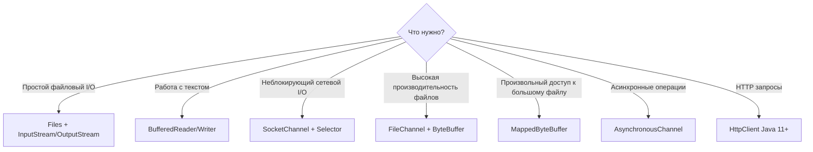

| Сценарий | Рекомендуемый API |
|---|---|
| Чтение конфига, маленького файла | `Files.readString()`, `Files.readAllLines()` |
| Обработка большого текстового файла | `Files.lines()` + `Stream` |
| Копирование файлов | `Files.copy()` или `FileChannel.transferTo()` |
| Бинарная обработка порциями | `FileChannel` + `ByteBuffer` |
| TCP-сервер на тысячи соединений | `Selector` + `SocketChannel` (или Netty) |
| Простой TCP-клиент | `Socket` + `InputStream/OutputStream` |
| Асинхронный файловый I/O | `AsynchronousFileChannel` |

> [!mcq]
> - [ ] `Channel`/`ByteBuffer` всегда быстрее `InputStream`/`OutputStream` | Для простых текстовых задач разница ничтожна, а API сложнее (`flip`/`clear`/`compact`). ❌ ПОСЛЕДСТВИЕ: over-engineering простого чтения конфига.
> - [x] `Channel` + `ByteBuffer` — для **non-blocking сетевых операций** (тысячи коннекшенов через `Selector`), **zero-copy** (`FileChannel.transferTo`), **mmap** (`MappedByteBuffer`); `InputStream`/`OutputStream` — для последовательного blocking I/O, чтения текста и небольших файлов | Выбор по сценарию, не по «новизне». ✓ ПРИМЕНЯТЬ: NIO для high-throughput, IO для простоты. 📋 ПРАВИЛО: «non-blocking + zero-copy = NIO; blocking + simple = IO». 🔗 См. Q14, Q40.
> - [ ] `Selector` работает поверх `InputStream` | `Selector` требует `SelectableChannel`; `InputStream` блокирующий, не selectable. ❌ ПОСЛЕДСТВИЕ: nonsensical архитектура.
> - [ ] `AsynchronousFileChannel` — это callback-only API, без Future | Поддерживает оба: `CompletionHandler` И `Future<Integer>`. ❌ ПОСЛЕДСТВИЕ: разработчик пишет лишний boilerplate.

## Q39. Что такое `Pipe` в `NIO` и для чего он используется?

`Pipe` — однонаправленный канал для передачи данных **между потоками** в одном процессе. Состоит из `SinkChannel` (запись) и `SourceChannel` (чтение).

```java
Pipe pipe = Pipe.open();

// Поток-производитель
Thread producer = new Thread(() -> {
    try {
        Pipe.SinkChannel sink = pipe.sink();
        ByteBuffer buffer = ByteBuffer.wrap("Hello from producer".getBytes());
        sink.write(buffer);
        sink.close();
    } catch (IOException e) {
        e.printStackTrace();
    }
});

// Поток-потребитель
Thread consumer = new Thread(() -> {
    try {
        Pipe.SourceChannel source = pipe.source();
        ByteBuffer buffer = ByteBuffer.allocate(256);
        source.read(buffer);
        buffer.flip();
        System.out.println(StandardCharsets.UTF_8.decode(buffer));
        source.close();
    } catch (IOException e) {
        e.printStackTrace();
    }
});

producer.start();
consumer.start();
```

Применение: связь «производитель–потребитель» без временных файлов или `BlockingQueue`. На практике `Pipe` используется редко — чаще берут `BlockingQueue` из [Java Concurrency](java-concurrency-interview.md).

> [!mcq]
> - [ ] `Pipe` в `NIO` — это межпроцессный канал, как Unix-pipe | `Pipe` — внутрипроцессный, между потоками одной JVM, не имеет дела с OS-pipe. ❌ ПОСЛЕДСТВИЕ: неверная архитектура IPC.
> - [ ] `Pipe` двунаправленный — оба `SinkChannel` и `SourceChannel` могут читать и писать | Однонаправленный: `sink` — только запись, `source` — только чтение. ❌ ПОСЛЕДСТВИЕ: попытка `source.write` → `NonWritableChannelException`.
> - [x] `Pipe` — однонаправленный канал между потоками одной JVM (`SinkChannel` пишет, `SourceChannel` читает); на практике используется редко, обычно предпочтительнее `BlockingQueue` из `java.util.concurrent` | Узкая ниша «producer→consumer» без аллокации очереди. ✓ ПРИМЕНЯТЬ: только при необходимости работы с `Selector`. 📋 ПРАВИЛО: «Pipe = тонкий внутрипроцессный канал». 🔗 См. Q14, Q26.
> - [ ] `Pipe.open()` гарантирует thread-safety без дополнительных синхронизаций | Безопасен для одного producer + одного consumer, при множественных readers/writers нужна синхронизация. ❌ ПОСЛЕДСТВИЕ: гонки при множественных потребителях.

## Q40. Что такое `HttpClient` (`Java` 11+) и когда его использовать?

`HttpClient` (`java.net.http`, Java 11) — стандартный API для HTTP-запросов. Заменяет устаревший `HttpURLConnection`.

```java
// Создание клиента
HttpClient client = HttpClient.newBuilder()
    .version(HttpClient.Version.HTTP_2)
    .connectTimeout(Duration.ofSeconds(10))
    .followRedirects(HttpClient.Redirect.NORMAL)
    .build();

// Синхронный GET-запрос
HttpRequest request = HttpRequest.newBuilder()
    .uri(URI.create("https://api.example.com/users"))
    .header("Accept", "application/json")
    .GET()
    .build();

HttpResponse<String> response = client.send(request, HttpResponse.BodyHandlers.ofString());
System.out.println("Status: " + response.statusCode());
System.out.println("Body: " + response.body());

// Асинхронный POST-запрос
HttpRequest postRequest = HttpRequest.newBuilder()
    .uri(URI.create("https://api.example.com/users"))
    .header("Content-Type", "application/json")
    .POST(HttpRequest.BodyPublishers.ofString("{\"name\":\"Alice\"}"))
    .build();

CompletableFuture<HttpResponse<String>> future =
    client.sendAsync(postRequest, HttpResponse.BodyHandlers.ofString());

future.thenAccept(resp -> System.out.println("Async response: " + resp.statusCode()));

// Скачивание файла
HttpResponse<Path> fileResponse = client.send(
    HttpRequest.newBuilder(URI.create("https://example.com/file.zip")).build(),
    HttpResponse.BodyHandlers.ofFile(Path.of("downloaded.zip")));
```

Возможности: HTTP/1.1 и HTTP/2, синхронные и асинхронные вызовы, `WebSocket`, настраиваемые таймауты, `BodyHandlers` для разных типов ответов (`String`, `byte[]`, `Path`, `InputStream`).

Использовать вместо: `HttpURLConnection` (устаревший), сторонних библиотек (когда достаточно базовой функциональности). Для Spring-приложений часто предпочтительнее `WebClient` или `RestClient`.

> [!mcq]
> - [ ] `HttpClient` поддерживает только синхронные вызовы | Поддерживает оба: `client.send(...)` (sync) и `client.sendAsync(...)` → `CompletableFuture<HttpResponse<T>>`. ❌ ПОСЛЕДСТВИЕ: ложный отказ от стандартного API в пользу OkHttp/Apache.
> - [x] `HttpClient` (Java 11+) поддерживает HTTP/1.1+HTTP/2, sync (`send`) и async (`sendAsync`→`CompletableFuture`), `BodyHandlers` (`ofString`/`ofByteArray`/`ofFile`/`ofInputStream`), `WebSocket`; настраивается через builder (timeout, redirects, version) | Современный стандартный HTTP-стек JDK. ✓ ПРИМЕНЯТЬ: для не-Spring приложений и lightweight-сервисов. 📋 ПРАВИЛО: «HttpClient = sync + async + WS + HTTP/2». 🔗 См. Q26, Q38.
> - [ ] `HttpClient` thread-unsafe, нужен per-request | Thread-safe и переиспользуем — рекомендация: один singleton-инстанс на приложение. ❌ ПОСЛЕДСТВИЕ: создание клиента в hot path жжёт CPU/connections.
> - [ ] `HttpURLConnection` остаётся рекомендованным API в JDK 21 | `HttpURLConnection` deprecated for new code — `HttpClient` стандарт с Java 11. ❌ ПОСЛЕДСТВИЕ: новый код пишется на legacy.

---

## See also

- [Java Concurrency](java-concurrency-interview.md) — `Selector`, `AsynchronousChannel`, `CompletableFuture` — неблокирующий I/O и многопоточность
- [Java Core](java-core-interview.md) — `try-with-resources`, `AutoCloseable` — идиоматическое закрытие потоков и каналов
- [Java Serialization](java-serialization-interview.md) — сериализация объектов через `ObjectInputStream`/`ObjectOutputStream`
- [Java Stream API](java-stream-interview.md) — `Files.lines()`, `Files.walk()` возвращают `Stream<String>`/`Stream<Path>`
- [Java Exceptions](java-exceptions-interview.md) — иерархия `IOException`: `FileNotFoundException`, `SocketException`, обработка ошибок I/O
- [Java 17-21](java-17-21-interview.md) — `Virtual Threads` и NIO: Project Loom меняет подходы к блокирующему I/O
- [Spring Framework](../../frameworks/spring/spring-framework-interview.md) — `ResourceLoader`, `MultipartFile`, `WebClient` — Spring-абстракции над Java NIO

- [Java 17-21](java-17-21-interview.md)
- [Java 8](java-8-interview.md)
- [Java Annotations](java-annotations-interview.md)
- [Java Collections](java-collections-interview.md)
- [Java Concurrency](java-concurrency-interview.md)
- [Java Conditional Statements](java-conditional-statements-interview.md)
- [Шпаргалка: Java IO/NIO: работа с файлами и потоками](../../../languages/java/java-io-nio.md) — теория
