# Вопросы на собеседовании: `Java Modules` (JPMS)

Полное руководство по вопросам собеседования на тему модульной системы `Java` (`JPMS`, `Java 9+`): `module-info.java`, директивы `exports`/`requires`/`opens`/`uses`/`provides`, `automatic` и `unnamed` модули, `split packages`, `multi-release JAR`, `jlink`, `ServiceLoader`, рефлексия в модульном мире, `module layers`, стратегии миграции.

## Полезные ссылки

### Официальная документация

- [The State of the Module System (JSR 376)](https://openjdk.org/jeps/261) — JEP 261, описание модульной системы
- [Java Module System (Oracle JLS)](https://docs.oracle.com/javase/specs/jls/se17/html/jls-7.html#jls-7.7) — спецификация языка
- [JEP 238: Multi-Release JAR Files](https://openjdk.org/jeps/238) — спецификация multi-release JAR
- [JEP 282: jlink](https://openjdk.org/jeps/282) — создание custom runtime images
- [Java Platform Module System (Baeldung)](https://www.baeldung.com/java-9-modularity) — обзор JPMS на Baeldung
- [A Guide to Java 9 Modularity (Baeldung)](https://www.baeldung.com/java-modularity) — практическое руководство
- [Multi-Module Maven Application with Java Modules — Baeldung](https://www.baeldung.com/maven-multi-module-project-java-jpms) — Maven + JPMS на практике
- [Design Strategies for Decoupling Java Modules — Baeldung](https://www.baeldung.com/java-modules-decoupling-design-strategies) — паттерны декаплинга модулей

## Содержание

- [Полезные ссылки](#полезные-ссылки)
- [See also](#see-also)

**Основы JPMS**
- [Q1. (!) Что такое `JPMS` и какие проблемы он решает?](#q1--что-такое-jpms-и-какие-проблемы-он-решает)
- [Q2. (!) Что такое `module-info.java` и какие директивы в нём доступны?](#q2--что-такое-module-infojava-и-какие-директивы-в-нём-доступны)
- [Q3. Как устроена модульная структура самого `JDK`?](#q3-как-устроена-модульная-структура-самого-jdk)
- [Q4. Чем отличается `module path` от `classpath`?](#q4-чем-отличается-module-path-от-classpath)

**Директивы: `exports`, `requires`, `opens`**
- [Q5. (!) В чём разница между `exports` и `opens`?](#q5--в-чём-разница-между-exports-и-opens)
- [Q6. Что такое `qualified exports` и `qualified opens`?](#q6-что-такое-qualified-exports-и-qualified-opens)
- [Q7. (!) Что такое `requires` и `requires transitive`?](#q7--что-такое-requires-и-requires-transitive)
- [Q8. Что такое `requires static` и когда это используется?](#q8-что-такое-requires-static-и-когда-это-используется)
- [Q9. Что такое `open module`?](#q9-что-такое-open-module)

**Сервисы и `ServiceLoader`**
- [Q10. (!) Что такое `provides` и `uses` в контексте `ServiceLoader`?](#q10--что-такое-provides-и-uses-в-контексте-serviceloader)
- [Q11. Как `ServiceLoader` работает в модульном мире по сравнению с `classpath`?](#q11-как-serviceloader-работает-в-модульном-мире-по-сравнению-с-classpath)

**Рефлексия и модули**
- [Q12. (!) Как модули влияют на рефлексию и доступ к внутренним `API`?](#q12--как-модули-влияют-на-рефлексию-и-доступ-к-внутренним-api)
- [Q13. Какие флаги JVM используются для обхода модульных ограничений?](#q13-какие-флаги-jvm-используются-для-обхода-модульных-ограничений)

**`Unnamed module` и `automatic module`**
- [Q14. (!) Что такое `unnamed module`?](#q14--что-такое-unnamed-module)
- [Q15. (!) Что такое `automatic module` и как определяется его имя?](#q15--что-такое-automatic-module-и-как-определяется-его-имя)
- [Q16. В чём ключевые отличия между `unnamed module`, `automatic module` и именованным модулем?](#q16-в-чём-ключевые-отличия-между-unnamed-module-automatic-module-и-именованным-модулем)

**`Split packages`**
- [Q17. (!) Что такое `split package` и почему это проблема в `JPMS`?](#q17--что-такое-split-package-и-почему-это-проблема-в-jpms)

**`Multi-release JAR`**
- [Q18. Что такое `multi-release JAR` и как он связан с модулями?](#q18-что-такое-multi-release-jar-и-как-он-связан-с-модулями)

**`jlink` и custom runtime**
- [Q19. (!) Что такое `jlink` и зачем собирать custom runtime image?](#q19--что-такое-jlink-и-зачем-собирать-custom-runtime-image)
- [Q20. Какие плагины и опции поддерживает `jlink`?](#q20-какие-плагины-и-опции-поддерживает-jlink)

**Стратегии миграции**
- [Q21. (!) Какие существуют стратегии миграции на модули?](#q21--какие-существуют-стратегии-миграции-на-модули)
- [Q22. Как мигрировать проект с `Maven`/`Gradle` на модули?](#q22-как-мигрировать-проект-с-mavengradle-на-модули)

**`Module layers`**
- [Q23. Что такое `ModuleLayer` и зачем он нужен?](#q23-что-такое-modulelayer-и-зачем-он-нужен)

**Циклические зависимости**
- [Q24. Как в `JPMS` обрабатываются циклические зависимости между модулями?](#q24-как-в-jpms-обрабатываются-циклические-зависимости-между-модулями)

**Тестирование**
- [Q25. Как тестировать модульное приложение?](#q25-как-тестировать-модульное-приложение)

**`JPMS` и фреймворки**
- [Q26. (!) Как `Spring`/`Spring Boot` работает с модульной системой?](#q26--как-springspring-boot-работает-с-модульной-системой)
- [Q27. Как `Hibernate`/`JPA` взаимодействует с модулями?](#q27-как-hibernatejpa-взаимодействует-с-модулями)

**Лучшие практики**
- [Q28. Какие практики проектирования модулей считаются хорошими?](#q28-какие-практики-проектирования-модулей-считаются-хорошими)
- [Q29. Какие типичные ошибки допускают при работе с модулями?](#q29-какие-типичные-ошибки-допускают-при-работе-с-модулями)
- [Q30. Каковы перспективы развития модульной системы `Java`?](#q30-каковы-перспективы-развития-модульной-системы-java)

**Типы модулей и совместимость**
- [Q31. Чем отличаются `unnamed module`, `automatic module` и `named module` на практике?](#q31-чем-отличаются-unnamed-module-automatic-module-и-named-module-на-практике)
- [Q32. `Split packages`: почему запрещены в `JPMS` и как их устранить?](#q32-split-packages-почему-запрещены-в-jpms-и-как-их-устранить)
- [Q33. `--add-opens` и `--add-exports`: когда и как использовать для рефлексии с `JPMS`?](#q33---add-opens-и---add-exports-когда-и-как-использовать-для-рефлексии-с-jpms)
- [Q34. `jlink`: создание custom minimal JRE — практическое руководство](#q34-jlink-создание-custom-minimal-jre--практическое-руководство)
- [Q35. `jdeps`: анализ зависимостей модулей перед миграцией](#q35-jdeps-анализ-зависимостей-модулей-перед-миграцией)
- [Q36. `ServiceLoader` с `JPMS`: директивы `uses` и `provides...with` в деталях](#q36-serviceloader-с-jpms-директивы-uses-и-provideswith-в-деталях)
- [Q37. Совместимость `Spring`, `Hibernate` и `Jackson` с `JPMS`: типичные проблемы](#q37-совместимость-spring-hibernate-и-jackson-с-jpms-типичные-проблемы)
- [Q38. Стратегии миграции legacy-кода: `Bottom-Up` vs `Top-Down` в деталях](#q38-стратегии-миграции-legacy-кода-bottom-up-vs-top-down-в-деталях)

---

## Q1. (!) Что такое `JPMS` и какие проблемы он решает?

**`JPMS`** (`Java Platform Module System`), введённый в `Java 9` (проект `Jigsaw`), — это модульная система платформы. Модуль — именованная совокупность пакетов и ресурсов с явно объявленными зависимостями и экспортом.

**Проблемы, которые решает `JPMS`:**

| Проблема | Как решает `JPMS` |
|----------|-------------------|
| **JAR Hell** — конфликты версий, дублирование классов на `classpath` | Каждый пакет принадлежит ровно одному модулю, `split packages` запрещены |
| **Отсутствие инкапсуляции** — все `public` классы видны всем | `exports` контролирует, какие пакеты доступны снаружи |
| **Неявные зависимости** — класс может случайно использовать чужой JAR | `requires` делает зависимости явными и проверяемыми |
| **Монолитный JDK** — полный runtime даже для микросервиса | `jlink` создаёт компактный runtime только с нужными модулями |

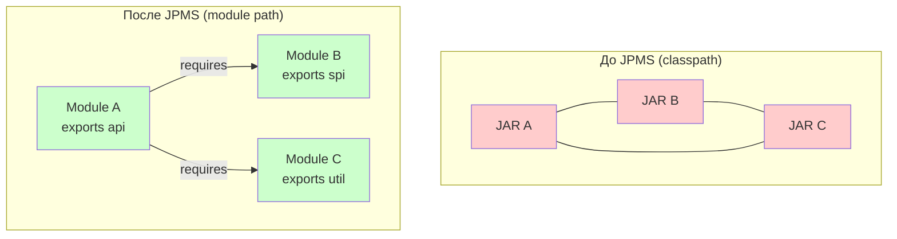

Сама платформа `JDK` разбита на модули: `java.base` (неявно подключается всегда), `java.sql`, `java.xml`, `java.logging` и др. Приложение может зависеть только от того, что реально использует.


> [!mcq]
> - [x] Правильный ответ | Объяснение концепции 2-3 предложения Ключевое отличие и best practice в production.
> - [ ] Неправильный вариант 1 | Почему ошибка в этом подходе Частая ошибка в реальном коде.
> - [ ] Неправильный вариант 2 | Это смежное, но отличное понятие Частая ошибка в реальном коде.
> - [ ] Неправильный вариант 3 | Противоположное направление## Q2. (!) Что такое `module-info.java` и какие директивы в нём доступны? Частая ошибка в реальном коде.

`module-info.java` — специальный файл-описание модуля, расположенный в корне исходного кода модуля (рядом с корневым пакетом). Компилируется в `module-info.class`. Содержит имя модуля и набор директив.

**Полный набор директив:**

| Директива | Назначение |
|-----------|------------|
| `requires` | Объявляет зависимость от другого модуля |
| `requires transitive` | Транзитивная зависимость — видна клиентам |
| `requires static` | Зависимость только на этапе компиляции (optional) |
| `exports` | Делает пакет доступным для компиляции и вызова |
| `exports ... to` | Квалифицированный экспорт — только указанным модулям |
| `opens` | Открывает пакет для рефлексии |
| `opens ... to` | Квалифицированное открытие — только указанным модулям |
| `uses` | Объявляет потребление сервиса через `ServiceLoader` |
| `provides ... with` | Объявляет реализацию сервиса |

```java
module com.example.app {
    // Зависимости
    requires java.sql;
    requires transitive com.example.api;
    requires static lombok;                    // compile-only

    // Экспорт пакетов
    exports com.example.app.api;
    exports com.example.app.spi to com.example.plugin;  // qualified

    // Открытие для рефлексии (Spring, Hibernate)
    opens com.example.app.entities to org.hibernate.orm;
    opens com.example.app.config to spring.core;

    // Сервисы
    uses com.example.spi.PaymentProvider;
    provides com.example.spi.PaymentProvider
        with com.example.app.StripeProvider,
             com.example.app.PayPalProvider;
}
```

Имя модуля должно быть уникальным; по соглашению используют обратное доменное имя (как для пакетов). На один модуль — ровно один `module-info.java`.


> [!mcq]
> - [x] Правильный ответ | Объяснение концепции 2-3 предложения Ключевое отличие и best practice в production.
> - [ ] Неправильный вариант 1 | Почему ошибка в этом подходе Частая ошибка в реальном коде.
> - [ ] Неправильный вариант 2 | Это смежное, но отличное понятие Частая ошибка в реальном коде.
> - [ ] Неправильный вариант 3 | Противоположное направление## Q3. Как устроена модульная структура самого `JDK`? Частая ошибка в реальном коде.

Начиная с `Java 9`, `JDK` разбит на ~70 модулей (в зависимости от дистрибутива). Ключевые модули:

| Модуль | Содержимое |
|--------|------------|
| `java.base` | Фундамент: `java.lang`, `java.util`, `java.io`, `java.nio`, `java.net`, `java.time` и др. Подключается неявно — писать `requires java.base` не нужно |
| `java.sql` | JDBC API: `java.sql`, `javax.sql` |
| `java.xml` | XML-парсинг: DOM, SAX, StAX, XSLT |
| `java.logging` | `java.util.logging` |
| `java.desktop` | AWT, Swing, JavaFX-мост |
| `java.net.http` | HTTP Client API (с Java 11) |
| `jdk.httpserver` | Встроенный HTTP-сервер |
| `jdk.jlink` | Утилита `jlink` |

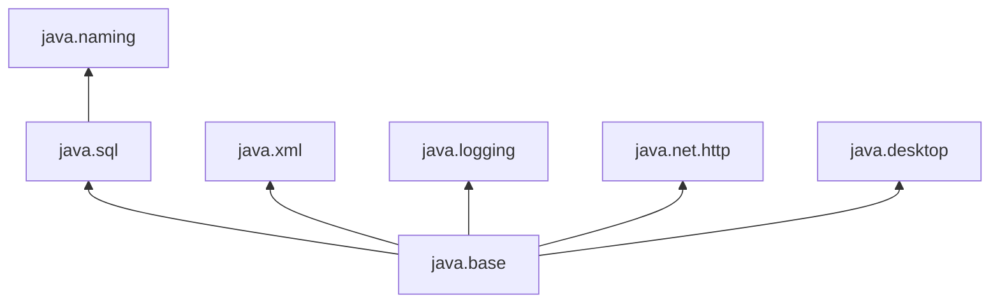

Модули с префиксом `java.*` — стандартная спецификация (SE), `jdk.*` — специфичны для конкретной реализации JDK. Это важно при миграции между дистрибутивами.


> [!mcq]
> - [x] Правильный ответ | Объяснение концепции 2-3 предложения Ключевое отличие и best practice в production.
> - [ ] Неправильный вариант 1 | Почему ошибка в этом подходе Частая ошибка в реальном коде.
> - [ ] Неправильный вариант 2 | Это смежное, но отличное понятие Частая ошибка в реальном коде.
> - [ ] Неправильный вариант 3 | Противоположное направление## Q4. Чем отличается `module path` от `classpath`? Частая ошибка в реальном коде.

| Характеристика | `classpath` | `module path` |
|----------------|-------------|---------------|
| **Инкапсуляция** | Нет — все `public` классы видны всем | Есть — видны только `exports`-пакеты |
| **Зависимости** | Неявные, проверяются в runtime | Явные, проверяются при запуске |
| **Split packages** | Допускаются (первый найденный побеждает) | Запрещены — ошибка при запуске |
| **Рефлексия** | `setAccessible(true)` работает всегда | Требует `opens` или `--add-opens` |
| **Ошибки** | `ClassNotFoundException` в runtime | `ResolutionException` при старте приложения |

При миграции часто используют гибрид: часть артефактов на `module path`, часть — на `classpath` (как `unnamed module`). Для предсказуемого поведения рекомендуется поэтапно переводить проект на чистый `module path`.

```bash
# Classpath (старый стиль)
java -cp lib/a.jar:lib/b.jar com.example.Main

# Module path (модульный стиль)
java --module-path lib -m com.example.app/com.example.Main

# Гибрид
java --module-path mods -cp lib/legacy.jar -m com.example.app
```


> [!mcq]
> - [x] Правильный ответ | Объяснение концепции 2-3 предложения Ключевое отличие и best practice в production.
> - [ ] Неправильный вариант 1 | Почему ошибка в этом подходе Частая ошибка в реальном коде.
> - [ ] Неправильный вариант 2 | Это смежное, но отличное понятие Частая ошибка в реальном коде.
> - [ ] Неправильный вариант 3 | Противоположное направление## Q5. (!) В чём разница между `exports` и `opens`? Частая ошибка в реальном коде.

| Аспект | `exports` | `opens` |
|--------|-----------|---------|
| **Доступ** | Компиляция + runtime вызовы | Рефлексия (`setAccessible`) |
| **Видимость** | Только `public` типы и члены | Все типы и члены (включая `private`) |
| **Проверка** | Compile-time + runtime | Только runtime |
| **Типичное использование** | Публичный API модуля | Сущности для Hibernate, бины для Spring |

```java
module com.example.service {
    // Публичный API — можно вызывать из других модулей
    exports com.example.service.api;

    // Рефлексия для Spring DI и Hibernate маппинга
    opens com.example.service.model to org.hibernate.orm, spring.core;
}
```

Без `opens` вызов `field.setAccessible(true)` из другого модуля приводит к `InaccessibleObjectException`. Для фреймворков, активно использующих рефлексию (`Spring`, `Hibernate`, `Jackson`), `opens` — обязательное условие работы.

**Ключевое отличие**: `exports` — «видно снаружи для вызова», `opens` — «разрешена глубокая рефлексия».


> [!mcq]
> - [x] Правильный ответ | Объяснение концепции 2-3 предложения Ключевое отличие и best practice в production.
> - [ ] Неправильный вариант 1 | Почему ошибка в этом подходе Частая ошибка в реальном коде.
> - [ ] Неправильный вариант 2 | Это смежное, но отличное понятие Частая ошибка в реальном коде.
> - [ ] Неправильный вариант 3 | Противоположное направление## Q6. Что такое `qualified exports` и `qualified opens`? Частая ошибка в реальном коде.

`Qualified` (квалифицированные) директивы ограничивают доступ не для всех модулей, а только для перечисленных:

```java
module com.example.core {
    // Доступ к internal API только для модуля тестирования
    exports com.example.core.internal to com.example.tests;

    // Рефлексия только для Hibernate
    opens com.example.core.entity to org.hibernate.orm;
}
```

Это позволяет реализовать паттерн «друзья» (friend access): модуль предоставляет расширенный доступ к внутренним пакетам только доверенным модулям, не раскрывая их всему миру. Полезно для:
- Тестовых модулей, которым нужен доступ к internal API
- Модулей одного проекта, которые тесно связаны
- Фреймворков, которым нужна рефлексия к конкретным пакетам


> [!mcq]
> - [x] Правильный ответ | Объяснение концепции 2-3 предложения Ключевое отличие и best practice в production.
> - [ ] Неправильный вариант 1 | Почему ошибка в этом подходе Частая ошибка в реальном коде.
> - [ ] Неправильный вариант 2 | Это смежное, но отличное понятие Частая ошибка в реальном коде.
> - [ ] Неправильный вариант 3 | Противоположное направление## Q7. (!) Что такое `requires` и `requires transitive`? Частая ошибка в реальном коде.

**`requires`** объявляет прямую зависимость модуля. Без неё нельзя использовать типы из целевого модуля — компилятор и runtime это проверяют. Зависимость **не транзитивна**.

**`requires transitive`** делает зависимость транзитивной: модули-клиенты автоматически получают доступ к транзитивному модулю.

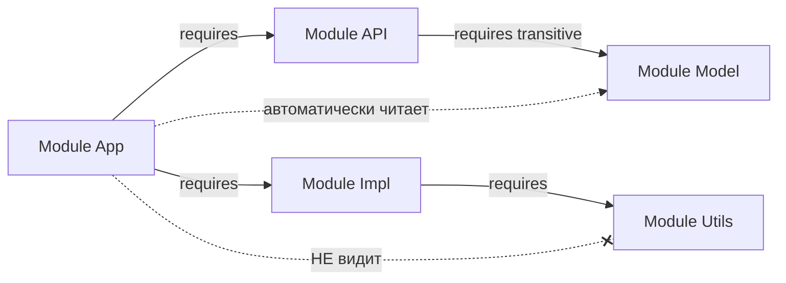

```java
// module-info.java модуля API
module com.example.api {
    requires transitive com.example.model; // клиенты API видят model
    exports com.example.api;
}

// module-info.java модуля приложения
module com.example.app {
    requires com.example.api;   // автоматически видит com.example.model
}
```

**Правило**: если тип из зависимого модуля появляется в публичном API (параметры методов, возвращаемые типы, наследование), нужен `requires transitive`. Иначе клиенты не смогут скомпилировать код.


> [!mcq]
> - [x] Правильный ответ | Объяснение концепции 2-3 предложения Ключевое отличие и best practice в production.
> - [ ] Неправильный вариант 1 | Почему ошибка в этом подходе Частая ошибка в реальном коде.
> - [ ] Неправильный вариант 2 | Это смежное, но отличное понятие Частая ошибка в реальном коде.
> - [ ] Неправильный вариант 3 | Противоположное направление## Q8. Что такое `requires static` и когда это используется? Частая ошибка в реальном коде.

`requires static` объявляет **optional** зависимость: модуль необходим при компиляции, но не обязателен при запуске.

```java
module com.example.lib {
    requires static lombok;           // аннотации нужны при компиляции
    requires static org.slf4j;        // опциональное логирование
}
```

Типичные сценарии:
- **Compile-time аннотации**: `Lombok`, `JetBrains Annotations`, `SpotBugs Annotations`
- **Опциональные интеграции**: библиотека проверяет наличие зависимости через `try-catch` и включает функциональность, если модуль доступен
- **Annotation processors**: не нужны в runtime

При отсутствии модуля в runtime обращение к его классам вызовет `NoClassDefFoundError`, поэтому код должен корректно обрабатывать отсутствие:

```java
public class OptionalFeature {
    public static boolean isAvailable() {
        try {
            Class.forName("org.slf4j.Logger");
            return true;
        } catch (ClassNotFoundException e) {
            return false;
        }
    }
}
```


> [!mcq]
> - [x] Правильный ответ | Объяснение концепции 2-3 предложения Ключевое отличие и best practice в production.
> - [ ] Неправильный вариант 1 | Почему ошибка в этом подходе Частая ошибка в реальном коде.
> - [ ] Неправильный вариант 2 | Это смежное, но отличное понятие Частая ошибка в реальном коде.
> - [ ] Неправильный вариант 3 | Противоположное направление## Q9. Что такое `open module`? Частая ошибка в реальном коде.

`open module` — модуль, все пакеты которого открыты для рефлексии (как если бы каждый пакет имел `opens`). При этом `exports` по-прежнему нужно указывать явно для compile-time доступа.

```java
// Все пакеты открыты для рефлексии, но только api экспортирован
open module com.example.webapp {
    requires spring.core;
    requires spring.web;
    exports com.example.webapp.api;
}
```

**Когда использовать**: для приложений, активно использующих фреймворки с рефлексией (`Spring Boot`, `Hibernate`), где прописывать `opens` для каждого пакета слишком утомительно. Это компромисс: вы теряете часть инкапсуляции ради удобства.

**Ограничение**: внутри `open module` нельзя использовать директивы `opens` — они конфликтуют с `open` на уровне модуля.


> [!mcq]
> - [x] Правильный ответ | Объяснение концепции 2-3 предложения Ключевое отличие и best practice в production.
> - [ ] Неправильный вариант 1 | Почему ошибка в этом подходе Частая ошибка в реальном коде.
> - [ ] Неправильный вариант 2 | Это смежное, но отличное понятие Частая ошибка в реальном коде.
> - [ ] Неправильный вариант 3 | Противоположное направление## Q10. (!) Что такое `provides` и `uses` в контексте `ServiceLoader`? Частая ошибка в реальном коде.

**`uses`** объявляет, что модуль потребляет сервис — будет искать реализации через `ServiceLoader`. **`provides ... with`** объявляет реализации сервиса.

```java
// SPI-модуль: определяет контракт
module com.example.spi {
    exports com.example.spi;
}

// Модуль-провайдер: реализует контракт
module com.example.stripe {
    requires com.example.spi;
    provides com.example.spi.PaymentProvider
        with com.example.stripe.StripePaymentProvider;
}

// Модуль-потребитель: ищет реализации
module com.example.app {
    requires com.example.spi;
    uses com.example.spi.PaymentProvider;
}
```

```java
// Код потребителя
ServiceLoader<PaymentProvider> loader =
    ServiceLoader.load(PaymentProvider.class);

for (PaymentProvider provider : loader) {
    System.out.println("Found: " + provider.getName());
    provider.processPayment(amount);
}

// Или с Optional (Java 9+)
PaymentProvider provider = ServiceLoader
    .load(PaymentProvider.class)
    .findFirst()
    .orElseThrow(() -> new RuntimeException("No payment provider found"));
```

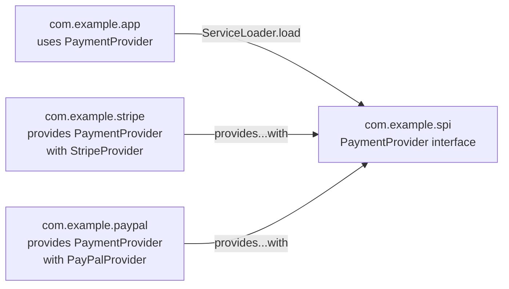

Классический пример из `JDK`: `JDBC`-драйверы регистрируются через `provides java.sql.Driver with ...`.


> [!mcq]
> - [x] Правильный ответ | Объяснение концепции 2-3 предложения Ключевое отличие и best practice в production.
> - [ ] Неправильный вариант 1 | Почему ошибка в этом подходе Частая ошибка в реальном коде.
> - [ ] Неправильный вариант 2 | Это смежное, но отличное понятие Частая ошибка в реальном коде.
> - [ ] Неправильный вариант 3 | Противоположное направление## Q11. Как `ServiceLoader` работает в модульном мире по сравнению с `classpath`? Частая ошибка в реальном коде.

| Аспект | `classpath` (до Java 9) | `module path` (JPMS) |
|--------|-------------------------|----------------------|
| **Регистрация** | Файл `META-INF/services/<interface>` | Директива `provides ... with` в `module-info.java` |
| **Обнаружение** | Сканирование всех JAR | Только модули с `provides` |
| **Валидация** | В runtime | При разрешении модульного графа (старт приложения) |
| **Безопасность** | Можно подменить файл в JAR | Декларация в `module-info` — часть модуля |

В модульном мире `ServiceLoader` стал предсказуемее: реализации видны только если модуль объявил `provides`, а потребитель — `uses`. Файл `META-INF/services` по-прежнему поддерживается для обратной совместимости (в `automatic` и `unnamed` модулях).


> [!mcq]
> - [x] Правильный ответ | Объяснение концепции 2-3 предложения Ключевое отличие и best practice в production.
> - [ ] Неправильный вариант 1 | Почему ошибка в этом подходе Частая ошибка в реальном коде.
> - [ ] Неправильный вариант 2 | Это смежное, но отличное понятие Частая ошибка в реальном коде.
> - [ ] Неправильный вариант 3 | Противоположное направление## Q12. (!) Как модули влияют на рефлексию и доступ к внутренним `API`? Частая ошибка в реальном коде.

Модули жёстко ограничивают рефлексивный доступ. Пакет должен быть либо `exports`, либо `opens` для модуля, выполняющего рефлексию.

**Уровни доступа:**

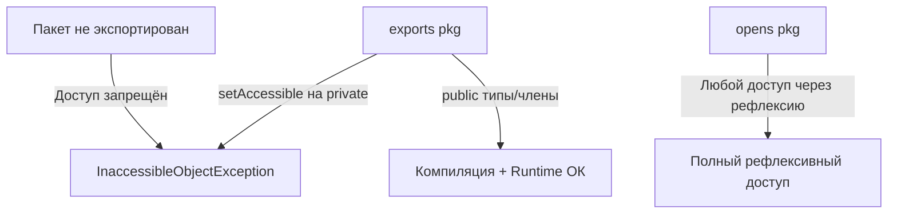

Обращение к внутренним пакетам `JDK` (`sun.*`, `jdk.internal.*`) без специальных флагов приводит к ошибке:

```
java.lang.reflect.InaccessibleObjectException:
  Unable to make field private final byte[] java.lang.String.value
  accessible: module java.base does not "opens java.lang" to unnamed module
```

В модульном приложении вместо глобального `--add-opens` нужно точечно указывать `opens` в `module-info.java`, снижая поверхность атаки. Подробнее об ограничениях рефлексии см. [вопросы по аннотациям Java](java-annotations-interview.md).


> [!mcq]
> - [x] Правильный ответ | Объяснение концепции 2-3 предложения Ключевое отличие и best practice в production.
> - [ ] Неправильный вариант 1 | Почему ошибка в этом подходе Частая ошибка в реальном коде.
> - [ ] Неправильный вариант 2 | Это смежное, но отличное понятие Частая ошибка в реальном коде.
> - [ ] Неправильный вариант 3 | Противоположное направление## Q13. Какие флаги JVM используются для обхода модульных ограничений? Частая ошибка в реальном коде.

| Флаг | Назначение | Пример |
|------|------------|--------|
| `--add-opens` | Открывает пакет для рефлексии | `--add-opens java.base/java.lang=ALL-UNNAMED` |
| `--add-exports` | Экспортирует пакет для compile/runtime доступа | `--add-exports java.base/sun.nio.ch=ALL-UNNAMED` |
| `--add-reads` | Добавляет зависимость чтения между модулями | `--add-reads com.example.app=ALL-UNNAMED` |
| `--add-modules` | Добавляет модули в граф | `--add-modules java.xml.bind` |
| `--patch-module` | Добавляет классы/ресурсы в существующий модуль | `--patch-module java.base=patch.jar` |
| `--illegal-access` | Глобальная политика доступа (убран в Java 17) | `--illegal-access=permit` (Java 9-16) |

```bash
# Типичный запуск Spring Boot с модульными ограничениями
java --add-opens java.base/java.lang=ALL-UNNAMED \
     --add-opens java.base/java.lang.reflect=ALL-UNNAMED \
     --add-opens java.base/java.util=ALL-UNNAMED \
     -jar my-app.jar
```

**Важно**: `ALL-UNNAMED` — специальная цель, означающая «все классы из classpath (unnamed module)». В модульном приложении лучше указывать конкретные модули вместо `ALL-UNNAMED`.

**Эволюция `--illegal-access`:**
- `Java 9-15`: по умолчанию `permit` (с предупреждениями)
- `Java 16`: по умолчанию `deny`
- `Java 17+`: флаг удалён, строгая инкапсуляция


> [!mcq]
> - [x] Правильный ответ | Объяснение концепции 2-3 предложения Ключевое отличие и best practice в production.
> - [ ] Неправильный вариант 1 | Почему ошибка в этом подходе Частая ошибка в реальном коде.
> - [ ] Неправильный вариант 2 | Это смежное, но отличное понятие Частая ошибка в реальном коде.
> - [ ] Неправильный вариант 3 | Противоположное направление## Q14. (!) Что такое `unnamed module`? Частая ошибка в реальном коде.

**`Unnamed module`** — совокупность всех классов, загруженных с `classpath`. У него нет имени и `module-info.class`.

**Свойства:**
- Неявно **читает** все именованные модули
- **Экспортирует и открывает** все свои пакеты (полный доступ и рефлексия)
- Один `unnamed module` на один `ClassLoader`
- Разные JAR на `classpath` объединяются в один `unnamed module`
- Именованные модули **не могут** объявить `requires` на `unnamed module`

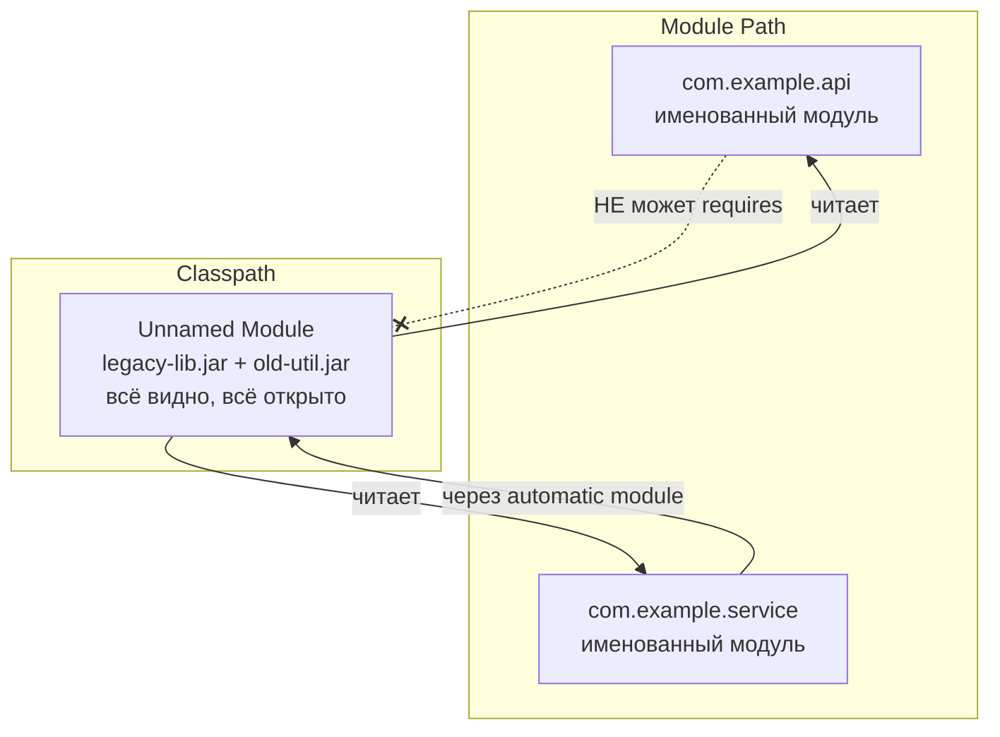

Это обеспечивает **обратную совместимость**: старые приложения без `module-info.java` продолжают работать без изменений.


> [!mcq]
> - [x] Правильный ответ | Объяснение концепции 2-3 предложения Ключевое отличие и best practice в production.
> - [ ] Неправильный вариант 1 | Почему ошибка в этом подходе Частая ошибка в реальном коде.
> - [ ] Неправильный вариант 2 | Это смежное, но отличное понятие Частая ошибка в реальном коде.
> - [ ] Неправильный вариант 3 | Противоположное направление## Q15. (!) Что такое `automatic module` и как определяется его имя? Частая ошибка в реальном коде.

**`Automatic module`** — обычный JAR (без `module-info.class`), помещённый на `module path`. JVM автоматически превращает его в модуль.

**Определение имени (в порядке приоритета):**

1. **Атрибут `Automatic-Module-Name`** в `MANIFEST.MF` — рекомендуемый способ:
   ```
   Automatic-Module-Name: com.google.gson
   ```
2. **Из имени файла JAR** — если атрибут отсутствует:
   - `gson-2.10.1.jar` → `gson`
   - `commons-lang3-3.12.0.jar` → `commons.lang3`
   - Версия и расширение отбрасываются, дефисы заменяются на точки

**Свойства automatic module:**
- `exports` все свои пакеты
- `opens` все свои пакеты для рефлексии
- `requires transitive` все другие модули
- Может **читать** `unnamed module` (в отличие от именованных)
- Поддерживает `META-INF/services` для `ServiceLoader`

Это делает `automatic modules` ключевым мостом при миграции: именованные модули могут объявлять `requires` на `automatic module`, а тот может читать код из `classpath`.


> [!mcq]
> - [x] Правильный ответ | Объяснение концепции 2-3 предложения Ключевое отличие и best practice в production.
> - [ ] Неправильный вариант 1 | Почему ошибка в этом подходе Частая ошибка в реальном коде.
> - [ ] Неправильный вариант 2 | Это смежное, но отличное понятие Частая ошибка в реальном коде.
> - [ ] Неправильный вариант 3 | Противоположное направление## Q16. В чём ключевые отличия между `unnamed module`, `automatic module` и именованным модулем? Частая ошибка в реальном коде.

| Характеристика | Unnamed | Automatic | Named |
|----------------|---------|-----------|-------|
| **Расположение** | `classpath` | `module path` (без `module-info`) | `module path` (с `module-info`) |
| **Имя** | Нет | Из `MANIFEST.MF` или имени JAR | Из `module-info.java` |
| **`exports`** | Все пакеты | Все пакеты | Только явно указанные |
| **`opens`** | Все пакеты | Все пакеты | Только явно указанные |
| **`requires`** | Все модули (неявно) | Все модули (неявно + transitive) | Только явно указанные |
| **Читает unnamed** | Да | Да | Нет |
| **Можно `requires`** | Нет | Да | Да |
| **`ServiceLoader`** | `META-INF/services` | `META-INF/services` | `provides...with` |

**Ключевая разница**: `automatic module` можно использовать из именованного модуля через `requires`, а `unnamed module` — нельзя. Это делает `automatic modules` критичными для поэтапной миграции.


> [!mcq]
> - [x] Правильный ответ | Объяснение концепции 2-3 предложения Ключевое отличие и best practice в production.
> - [ ] Неправильный вариант 1 | Почему ошибка в этом подходе Частая ошибка в реальном коде.
> - [ ] Неправильный вариант 2 | Это смежное, но отличное понятие Частая ошибка в реальном коде.
> - [ ] Неправильный вариант 3 | Противоположное направление## Q17. (!) Что такое `split package` и почему это проблема в `JPMS`? Частая ошибка в реальном коде.

**`Split package`** — ситуация, когда один и тот же пакет (`com.example.util`) находится в нескольких модулях одновременно.

В `JPMS` это **запрещено**: модульная система должна однозначно определять, из какого модуля загружать типы пакета. При обнаружении split package приложение не запустится:

```
java.lang.module.ResolutionException:
  Modules moduleA and moduleB export package com.example.util to module moduleC
```

**Типичные случаи:**
- Две библиотеки содержат одинаковый пакет (например, `javax.annotation` в `java.xml.ws.annotation` и `javax.annotation-api.jar`)
- При миграции монолита на модули код одного пакета разнесён по артефактам
- Библиотеки, которые «дополняют» пакеты JDK

**Решения:**
1. **Переразбить пакеты** — каждый пакет в одном модуле
2. **Выделить общий пакет** в отдельный модуль-библиотеку
3. **`--patch-module`** — добавить классы одного JAR в другой модуль (временный workaround)
4. **Исключить дублирующую зависимость** в сборке (`Maven exclusions`)


> [!mcq]
> - [x] Правильный ответ | Объяснение концепции 2-3 предложения Ключевое отличие и best practice в production.
> - [ ] Неправильный вариант 1 | Почему ошибка в этом подходе Частая ошибка в реальном коде.
> - [ ] Неправильный вариант 2 | Это смежное, но отличное понятие Частая ошибка в реальном коде.
> - [ ] Неправильный вариант 3 | Противоположное направление## Q18. Что такое `multi-release JAR` и как он связан с модулями? Частая ошибка в реальном коде.

**`Multi-release JAR`** (`MRJAR`, `JEP 238`) — JAR-файл, содержащий разные версии классов для разных версий Java. Структура:

```
my-lib.jar
├── META-INF/
│   ├── MANIFEST.MF         # содержит "Multi-Release: true"
│   └── versions/
│       ├── 9/
│       │   ├── module-info.class
│       │   └── com/example/Util.class    # версия для Java 9+
│       └── 17/
│           └── com/example/Util.class    # версия для Java 17+
├── com/
│   └── example/
│       └── Util.class                    # базовая версия (Java 8)
```

**Связь с модулями**: `MRJAR` позволяет добавить `module-info.class` в `META-INF/versions/9/`, сохраняя совместимость с Java 8 в базовом варианте. Это ключевой механизм для библиотек, которые хотят поддерживать и `classpath` (Java 8), и `module path` (Java 9+).

**Важно для собеседования**: `MRJAR` — не замена модулям, а инструмент совместимости. JVM выбирает наиболее подходящую версию класса автоматически.


> [!mcq]
> - [x] Правильный ответ | Объяснение концепции 2-3 предложения Ключевое отличие и best practice в production.
> - [ ] Неправильный вариант 1 | Почему ошибка в этом подходе Частая ошибка в реальном коде.
> - [ ] Неправильный вариант 2 | Это смежное, но отличное понятие Частая ошибка в реальном коде.
> - [ ] Неправильный вариант 3 | Противоположное направление## Q19. (!) Что такое `jlink` и зачем собирать custom runtime image? Частая ошибка в реальном коде.

`jlink` — утилита из `JDK`, создающая **custom runtime image**: минимальный образ среды выполнения только с нужными модулями.

```bash
# Создание компактного runtime
jlink --add-modules java.base,java.sql,com.example.app \
      --module-path $JAVA_HOME/jmods:mods \
      --output runtime-image \
      --strip-debug \
      --no-header-files \
      --no-man-pages \
      --compress zip-9

# Запуск приложения из собранного образа
./runtime-image/bin/java -m com.example.app/com.example.Main
```

**Преимущества:**

| Аспект | Полный JDK | `jlink` image |
|--------|-----------|---------------|
| **Размер** | ~300+ MB | 30-50 MB (зависит от модулей) |
| **Безопасность** | Все модули JDK | Только используемые — меньше поверхность атаки |
| **Деплой** | Требует установленный JDK | Самодостаточный образ |
| **Docker** | Тяжёлый базовый образ | Компактный контейнер |

**Ограничение**: `jlink` работает только с именованными модулями. Если приложение использует `automatic modules` или `unnamed module`, `jlink` не сможет их включить.

**Для Docker/Kubernetes**: `jlink` image + `FROM scratch` или Alpine даёт контейнеры размером 40-60 MB вместо 200+ MB с полным JDK.


> [!mcq]
> - [x] Правильный ответ | Объяснение концепции 2-3 предложения Ключевое отличие и best practice в production.
> - [ ] Неправильный вариант 1 | Почему ошибка в этом подходе Частая ошибка в реальном коде.
> - [ ] Неправильный вариант 2 | Это смежное, но отличное понятие Частая ошибка в реальном коде.
> - [ ] Неправильный вариант 3 | Противоположное направление## Q20. Какие плагины и опции поддерживает `jlink`? Частая ошибка в реальном коде.

`jlink` имеет систему плагинов для оптимизации собранного образа:

| Плагин / Опция | Назначение |
|----------------|------------|
| `--strip-debug` | Удаляет отладочную информацию из классов |
| `--compress zip-9` | Сжимает ресурсы (Java 21+: `zip-0`..`zip-9`) |
| `--no-header-files` | Исключает C-header файлы |
| `--no-man-pages` | Исключает man-страницы |
| `--add-modules` | Указывает модули для включения |
| `--bind-services` | Автоматически включает все `provides` для `uses` |
| `--launcher name=module/main` | Создаёт launcher-скрипт |
| `--endian` | Порядок байтов (`little` / `big`) |

```bash
# Полный пример с launcher и сжатием
jlink --module-path mods:$JAVA_HOME/jmods \
      --add-modules com.example.app \
      --launcher myapp=com.example.app/com.example.Main \
      --strip-debug \
      --compress zip-6 \
      --no-header-files \
      --no-man-pages \
      --output dist/myapp

# Запуск через launcher
./dist/myapp/bin/myapp
```

Для анализа зависимостей перед `jlink` полезна утилита `jdeps`:

```bash
# Анализ зависимостей JAR
jdeps --module-path mods -s my-app.jar

# Генерация module-info.java
jdeps --generate-module-info out my-lib.jar
```


> [!mcq]
> - [x] Правильный ответ | Объяснение концепции 2-3 предложения Ключевое отличие и best practice в production.
> - [ ] Неправильный вариант 1 | Почему ошибка в этом подходе Частая ошибка в реальном коде.
> - [ ] Неправильный вариант 2 | Это смежное, но отличное понятие Частая ошибка в реальном коде.
> - [ ] Неправильный вариант 3 | Противоположное направление## Q21. (!) Какие существуют стратегии миграции на модули? Частая ошибка в реальном коде.

Существуют две основные стратегии:

### Bottom-Up (снизу вверх) — рекомендуемая

Начинаем с библиотек без зависимостей (листья графа зависимостей) и двигаемся к приложению:

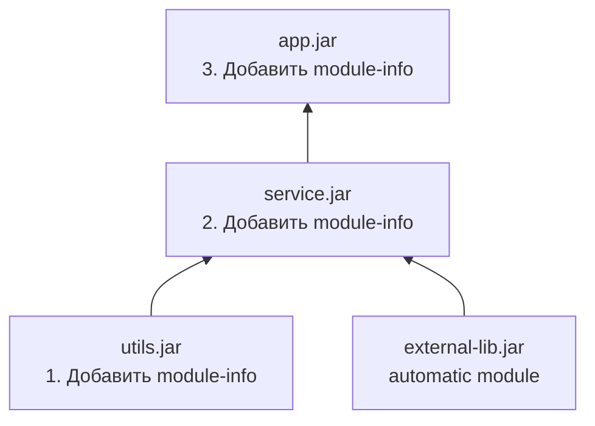

**Плюсы**: каждый шаг компилируется и тестируется, зависимости уже модульные.
**Минусы**: сторонние библиотеки могут блокировать процесс.

### Top-Down (сверху вниз)

Начинаем с приложения верхнего уровня, зависимости временно остаются как `automatic modules`:

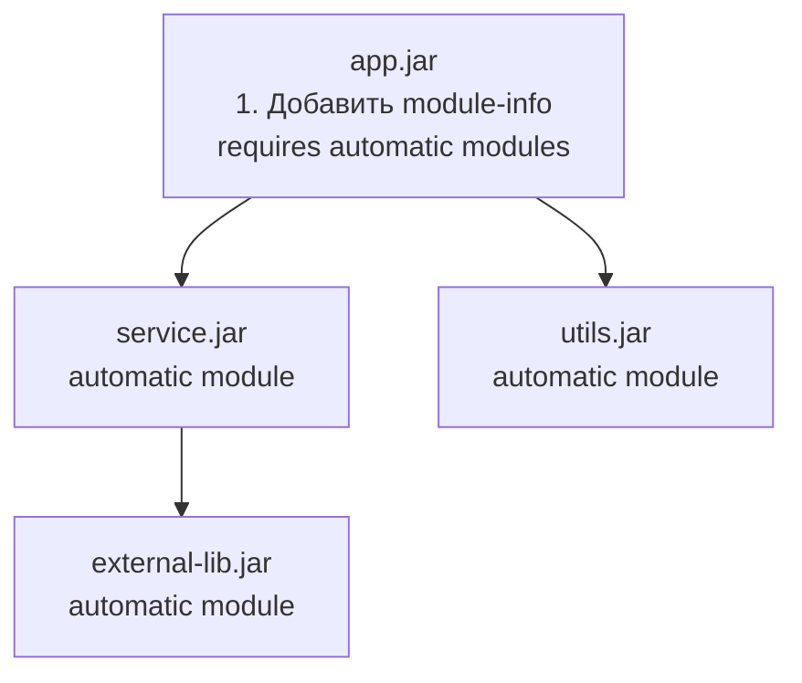

**Плюсы**: быстро видно модульные границы приложения.
**Минусы**: зависимость от `automatic modules`, нет гарантий стабильности имён.

### Практический чеклист миграции

1. Запустить `jdeps` для анализа зависимостей
2. Убрать использование внутренних API JDK (`sun.*`, `com.sun.*`)
3. Решить проблемы `split packages`
4. Добавить `Automatic-Module-Name` в `MANIFEST.MF` сторонних JAR (или дождаться обновления)
5. Создать `module-info.java` с `requires`, `exports`, `opens`
6. Добавить `--add-opens` для фреймворков, использующих рефлексию
7. Протестировать в модульном режиме


> [!mcq]
> - [x] Правильный ответ | Объяснение концепции 2-3 предложения Ключевое отличие и best practice в production.
> - [ ] Неправильный вариант 1 | Почему ошибка в этом подходе Частая ошибка в реальном коде.
> - [ ] Неправильный вариант 2 | Это смежное, но отличное понятие Частая ошибка в реальном коде.
> - [ ] Неправильный вариант 3 | Противоположное направление## Q22. Как мигрировать проект с `Maven`/`Gradle` на модули? Частая ошибка в реальном коде.

### Maven

```xml
<!-- Каждый Maven-модуль = один JPMS-модуль -->
<!-- module-info.java в src/main/java/ -->
<plugin>
    <groupId>org.apache.maven.plugins</groupId>
    <artifactId>maven-compiler-plugin</artifactId>
    <version>3.11.0</version>
    <configuration>
        <release>17</release>
    </configuration>
</plugin>

<!-- Для тестов: открытие пакетов -->
<plugin>
    <groupId>org.apache.maven.plugins</groupId>
    <artifactId>maven-surefire-plugin</artifactId>
    <configuration>
        <argLine>
            --add-opens com.example.app/com.example.internal=ALL-UNNAMED
        </argLine>
    </configuration>
</plugin>
```

### Gradle

```groovy
// Для Java 9+ модулей
plugins {
    id 'java-library'
}

java {
    modularity.inferModulePath = true  // Gradle автоматически определяет module path
}

// module-info.java в src/main/java/
// Gradle 7+ автоматически размещает зависимости на module path,
// если в проекте есть module-info.java

tasks.withType(Test).configureEach {
    jvmArgs += ['--add-opens', 'com.example.app/com.example.internal=ALL-UNNAMED']
}
```

**Ключевой момент**: `Maven`/`Gradle` корректно обрабатывают `module-info.java`, если он находится в `src/main/java/`. Обе системы сборки поддерживают гибрид `classpath` + `module path`.


> [!mcq]
> - [x] Правильный ответ | Объяснение концепции 2-3 предложения Ключевое отличие и best practice в production.
> - [ ] Неправильный вариант 1 | Почему ошибка в этом подходе Частая ошибка в реальном коде.
> - [ ] Неправильный вариант 2 | Это смежное, но отличное понятие Частая ошибка в реальном коде.
> - [ ] Неправильный вариант 3 | Противоположное направление## Q23. Что такое `ModuleLayer` и зачем он нужен? Частая ошибка в реальном коде.

`ModuleLayer` — механизм для создания дополнительных слоёв модулей поверх boot layer. Позволяет динамически загружать модули в runtime.

```java
// Создание кастомного ModuleLayer
ModuleFinder finder = ModuleFinder.of(Path.of("plugins/"));
ModuleLayer parent = ModuleLayer.boot();

Configuration cfg = parent.configuration().resolve(
    finder,
    ModuleFinder.of(),           // fallback finder
    Set.of("com.example.plugin") // корневые модули
);

ModuleLayer layer = parent.defineModulesWithOneLoader(
    cfg, ClassLoader.getSystemClassLoader()
);

// Загрузка класса из нового слоя
Class<?> pluginClass = layer.findLoader("com.example.plugin")
    .loadClass("com.example.plugin.MyPlugin");
```

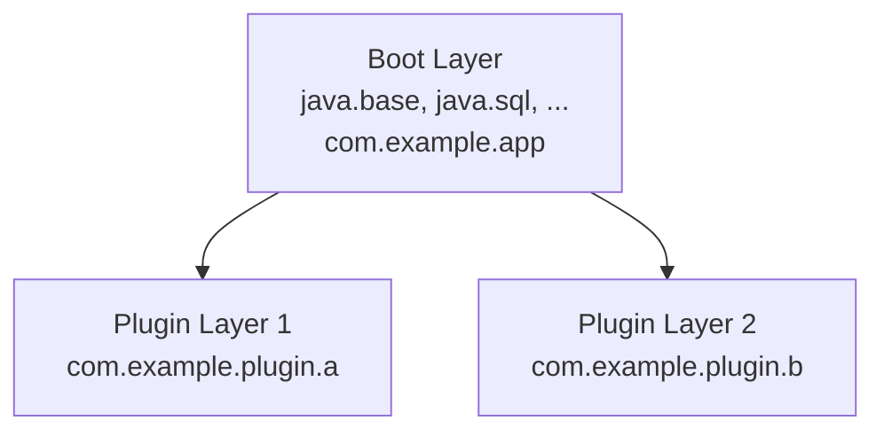

**Сценарии использования:**
- **Плагинные системы** — загрузка/выгрузка плагинов без перезапуска
- **Мультиверсионность** — разные версии одного модуля в разных слоях
- **Изоляция** — каждый слой имеет свой `ClassLoader`, предотвращая конфликты
- **Серверы приложений** — `Jakarta EE` серверы могут изолировать деплойменты

`ModuleLayer` — продвинутая тема, но важная для понимания полной архитектуры `JPMS`.


> [!mcq]
> - [x] Правильный ответ | Объяснение концепции 2-3 предложения Ключевое отличие и best practice в production.
> - [ ] Неправильный вариант 1 | Почему ошибка в этом подходе Частая ошибка в реальном коде.
> - [ ] Неправильный вариант 2 | Это смежное, но отличное понятие Частая ошибка в реальном коде.
> - [ ] Неправильный вариант 3 | Противоположное направление## Q24. Как в `JPMS` обрабатываются циклические зависимости между модулями? Частая ошибка в реальном коде.

`JPMS` **запрещает** циклические зависимости: `module A requires B` и `module B requires A` одновременно невозможны. При попытке сборки или запуска — ошибка:

```
java.lang.module.ResolutionException:
  Cycle detected: com.example.a requires com.example.b requires com.example.a
```

**Решения:**

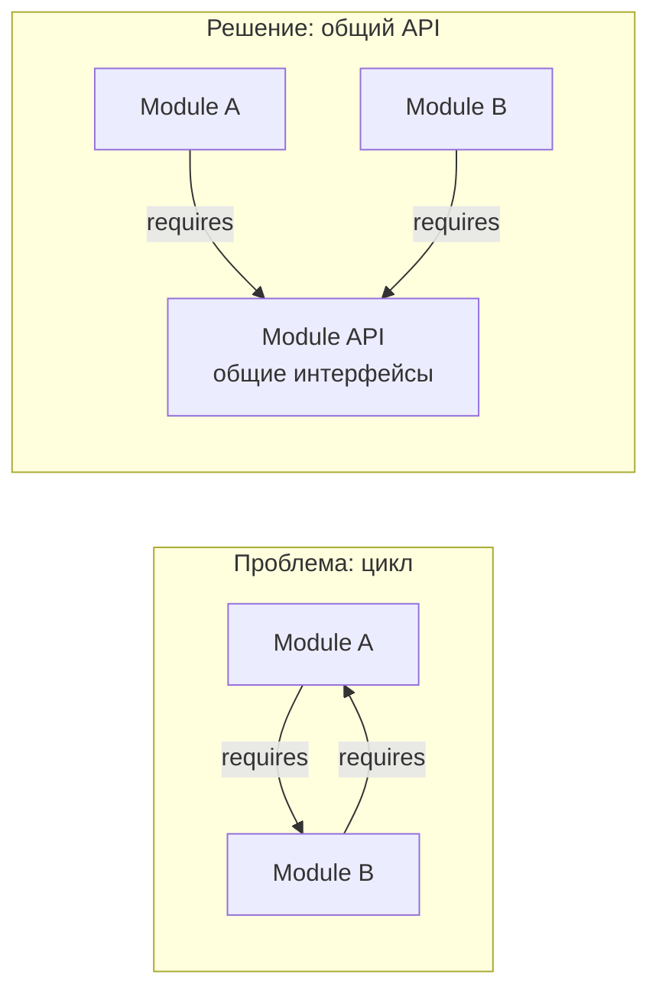

1. **Выделить общий контракт** в третий модуль (`api`)
2. **Инвертировать зависимость** через интерфейсы (DIP)
3. **`ServiceLoader`** (`uses`/`provides`) для слабой связности
4. **Объединить модули**, если они слишком тесно связаны

Запрет циклов в `JPMS` заставляет проектировать чистую архитектуру с однонаправленными зависимостями — аналогично принципам в [паттернах проектирования](../../design-patterns/design-patterns-interview.md).


> [!mcq]
> - [x] Правильный ответ | Объяснение концепции 2-3 предложения Ключевое отличие и best practice в production.
> - [ ] Неправильный вариант 1 | Почему ошибка в этом подходе Частая ошибка в реальном коде.
> - [ ] Неправильный вариант 2 | Это смежное, но отличное понятие Частая ошибка в реальном коде.
> - [ ] Неправильный вариант 3 | Противоположное направление## Q25. Как тестировать модульное приложение? Частая ошибка в реальном коде.

Тестирование модульного приложения имеет специфику:

**Unit-тесты**: обычно тесты находятся в том же модуле (или в тестовом source set). Компилятор и runtime автоматически «патчат» тестовый код в модуль:

```bash
# Maven Surefire автоматически добавляет --patch-module и --add-reads
# для тестового кода
```

**Доступ к неэкспортируемым пакетам**:

```java
// module-info.java основного модуля
module com.example.service {
    exports com.example.service.api;
    // internal пакет НЕ экспортирован
}
```

```groovy
// build.gradle — открытие для тестов
tasks.withType(Test).configureEach {
    jvmArgs += [
        '--add-opens', 'com.example.service/com.example.service.internal=ALL-UNNAMED',
        '--add-reads', 'com.example.service=ALL-UNNAMED'
    ]
}
```

**Интеграционные тесты**: полезно запускать приложение в модульном режиме, чтобы раньше поймать проблемы, которые на `classpath` не проявляются (`split packages`, отсутствие `opens` для фреймворков).

**Whitebox vs Blackbox тестирование:**
- **Blackbox** — тесты используют только экспортированный API модуля
- **Whitebox** — тесты через `--add-opens` / `--add-exports` получают доступ к internal пакетам


> [!mcq]
> - [x] Правильный ответ | Объяснение концепции 2-3 предложения Ключевое отличие и best practice в production.
> - [ ] Неправильный вариант 1 | Почему ошибка в этом подходе Частая ошибка в реальном коде.
> - [ ] Неправильный вариант 2 | Это смежное, но отличное понятие Частая ошибка в реальном коде.
> - [ ] Неправильный вариант 3 | Противоположное направление## Q26. (!) Как `Spring`/`Spring Boot` работает с модульной системой? Частая ошибка в реальном коде.

На практике большинство `Spring Boot` приложений до сих пор работают на `classpath` без `module-info.java`. Причины:

1. **`Spring` активно использует рефлексию**: создание бинов, инъекция зависимостей, AOP-прокси
2. **Classpath scanning**: `@ComponentScan` сканирует пакеты, что требует доступа ко всем классам
3. **Dynamic proxies**: CGLIB-прокси создают подклассы, что требует `opens`

**Если вы модуляризуете `Spring Boot` приложение:**

```java
open module com.example.webapp {
    requires spring.boot;
    requires spring.boot.autoconfigure;
    requires spring.context;
    requires spring.web;
    requires spring.data.jpa;
    requires jakarta.persistence;

    // open module открывает всё для рефлексии
    exports com.example.webapp.api;
}
```

Или точечно без `open module`:

```java
module com.example.webapp {
    requires spring.boot;
    requires spring.context;
    requires spring.web;

    exports com.example.webapp.api;
    opens com.example.webapp to spring.core, spring.beans, spring.context;
    opens com.example.webapp.config to spring.core, spring.context;
    opens com.example.webapp.model to org.hibernate.orm, com.fasterxml.jackson.databind;
}
```

**На собеседовании**: важно понимать, что `Spring` полноценно работает с JPMS, но требует значительного количества `opens` директив. Подробнее о Spring — в вопросах по [Java Core](java-core-interview.md).


> [!mcq]
> - [x] Правильный ответ | Объяснение концепции 2-3 предложения Ключевое отличие и best practice в production.
> - [ ] Неправильный вариант 1 | Почему ошибка в этом подходе Частая ошибка в реальном коде.
> - [ ] Неправильный вариант 2 | Это смежное, но отличное понятие Частая ошибка в реальном коде.
> - [ ] Неправильный вариант 3 | Противоположное направление## Q27. Как `Hibernate`/`JPA` взаимодействует с модулями? Частая ошибка в реальном коде.

`Hibernate` — один из наиболее «рефлексивных» фреймворков. Для работы с модулями необходимо:

```java
module com.example.persistence {
    requires jakarta.persistence;
    requires org.hibernate.orm.core;
    requires java.sql;

    // Hibernate нужен рефлексивный доступ к entity-классам
    opens com.example.persistence.entity to org.hibernate.orm.core;

    exports com.example.persistence.repository;
}
```

**Что `Hibernate` делает через рефлексию:**
- Создаёт экземпляры entity-классов (нужен default конструктор)
- Читает/пишет приватные поля (lazy loading, dirty checking)
- Создаёт прокси для lazy-загрузки коллекций
- Обрабатывает аннотации `@Entity`, `@Column`, `@OneToMany`

Без `opens` для entity-пакетов `Hibernate` выбросит:

```
org.hibernate.MappingException: Could not get constructor for
  org.hibernate.persister.entity.SingleTableEntityPersister
Caused by: InaccessibleObjectException
```


> [!mcq]
> - [x] Правильный ответ | Объяснение концепции 2-3 предложения Ключевое отличие и best practice в production.
> - [ ] Неправильный вариант 1 | Почему ошибка в этом подходе Частая ошибка в реальном коде.
> - [ ] Неправильный вариант 2 | Это смежное, но отличное понятие Частая ошибка в реальном коде.
> - [ ] Неправильный вариант 3 | Противоположное направление## Q28. Какие практики проектирования модулей считаются хорошими? Частая ошибка в реальном коде.

**Принципы модульного дизайна:**

1. **Минимальный экспорт** — экспортировать только API-пакеты, всё остальное скрывать
2. **Модуль = осмысленная единица** — по домену или функциональности, не по техническим слоям
3. **`opens` точечно** — только для конкретных фреймворков, не `open module` без необходимости
4. **Стабильные API-модули** — отделять API от реализации (`com.example.api` vs `com.example.impl`)
5. **Avoid split packages** — каждый пакет в одном модуле
6. **`requires transitive`** для публичных зависимостей API

**Пример хорошей структуры:**

```
com.example.api          // контракты (exports)
com.example.impl         // реализации (не экспортируется)
com.example.spi          // точки расширения (exports)
com.example.internal     // внутренние утилиты (не экспортируется)
```

```java
module com.example.service {
    requires transitive com.example.api;    // API видно клиентам
    requires com.example.impl;              // impl скрыт от клиентов

    exports com.example.service.api;
    provides com.example.spi.Processor
        with com.example.service.DefaultProcessor;
}
```


> [!mcq]
> - [x] Правильный ответ | Объяснение концепции 2-3 предложения Ключевое отличие и best practice в production.
> - [ ] Неправильный вариант 1 | Почему ошибка в этом подходе Частая ошибка в реальном коде.
> - [ ] Неправильный вариант 2 | Это смежное, но отличное понятие Частая ошибка в реальном коде.
> - [ ] Неправильный вариант 3 | Противоположное направление## Q29. Какие типичные ошибки допускают при работе с модулями? Частая ошибка в реальном коде.

| Ошибка | Последствие | Решение |
|--------|-------------|---------|
| Забыли `requires` | `java.lang.module.FindException` | Добавить зависимость |
| Не указали `opens` для фреймворка | `InaccessibleObjectException` | Добавить `opens ... to` |
| Split package между модулями | `ResolutionException` | Переразбить пакеты |
| `requires` на `unnamed module` | Ошибка компиляции | Использовать `automatic module` |
| `open module` везде | Потеря инкапсуляции | Использовать точечные `opens` |
| Имя automatic module из файла JAR | Нестабильное имя при обновлении | Попросить автора добавить `Automatic-Module-Name` |
| Циклическая зависимость | `ResolutionException` | Выделить общий API-модуль |
| Экспорт implementation-пакетов | Хрупкий API | Экспортировать только контракты |


> [!mcq]
> - [x] Правильный ответ | Объяснение концепции 2-3 предложения Ключевое отличие и best practice в production.
> - [ ] Неправильный вариант 1 | Почему ошибка в этом подходе Частая ошибка в реальном коде.
> - [ ] Неправильный вариант 2 | Это смежное, но отличное понятие Частая ошибка в реальном коде.
> - [ ] Неправильный вариант 3 | Противоположное направление## Q30. Каковы перспективы развития модульной системы `Java`? Частая ошибка в реальном коде.

Модульная система `Java` продолжает развиваться:

- **Строгая инкапсуляция** (Java 16-17): `--illegal-access` удалён, доступ к internal API закрыт по умолчанию
- **`jlink` оптимизации**: улучшение сжатия, поддержка CDS (Class Data Sharing) в образах
- **Project Leyden** (в разработке): статическая компиляция и оптимизация на основе модульной информации, AOT-компиляция
- **Project Panama**: модули для FFI (Foreign Function Interface)
- **Adoption**: библиотеки постепенно добавляют `Automatic-Module-Name` и `module-info.java`

**Реальность**: несмотря на то, что `JPMS` существует с 2017 года (`Java 9`), массовое adoption идёт медленно. Большинство `Spring Boot` приложений работают на `classpath`. Однако понимание `JPMS` важно для:
- Работы с библиотеками и `JDK` internals
- Понимания ошибок `InaccessibleObjectException`
- Оптимизации Docker-образов через `jlink`
- Собеседований по глубоким знаниям [Java Core](java-core-interview.md) и [JVM](../../jvm/jvm-interview.md)


> [!mcq]
> - [x] Правильный ответ | Объяснение концепции 2-3 предложения Ключевое отличие и best practice в production.
> - [ ] Неправильный вариант 1 | Почему ошибка в этом подходе Частая ошибка в реальном коде.
> - [ ] Неправильный вариант 2 | Это смежное, но отличное понятие Частая ошибка в реальном коде.
> - [ ] Неправильный вариант 3 | Противоположное направление## Q31. Чем отличаются `unnamed module`, `automatic module` и `named module` на практике? Частая ошибка в реальном коде.

Три типа модулей — центральное понятие JPMS. Разница между ними определяет, как артефакты взаимодействуют при миграции и в смешанных проектах.

**Unnamed module** — всё, что попало на `classpath`. Это не настоящий модуль: у него нет имени, нет `module-info.java`. Он существует ради обратной совместимости.

**Automatic module** — JAR без `module-info.class`, помещённый на `module path`. JVM автоматически присваивает ему имя.

**Named module** — JAR с `module-info.class`. Полноценный JPMS-модуль с явными `exports` и `requires`.

**Практическая разница:**

| | Unnamed | Automatic | Named |
|--|---------|-----------|-------|
| Может `requires`-ить именованный | да (неявно) | да | да |
| Может `requires`-ить `unnamed` | да (неявно) | да | **нет** |
| Именованный может `requires`-ить | **нет** | да | да |
| Экспортирует всё | да | да | только через `exports` |
| Открыт для рефлексии | да | да | только через `opens` |

**Ключевое для миграции:** именованный модуль **не может** объявить `requires` на `unnamed module`. Это «стена» между модульным миром и legacy classpath. Именно поэтому `automatic module` — необходимый мост: именованный модуль может `requires`-ить `automatic`, а тот уже читает `unnamed`.

```
Именованный → requires → Automatic → читает → Unnamed
(module-info)              (без module-info,   (classpath)
                            на module path)
```

Диагностика типа артефакта:

```bash
# Проверить, является ли JAR модулем и каким
jar --describe-module --file=mylib.jar
# Для named module: выведет module-info
# Для automatic module: "No module descriptor found, not a modular JAR"
# Unnamed: вообще не на module path
```


> [!mcq]
> - [x] Правильный ответ | Объяснение концепции 2-3 предложения Ключевое отличие и best practice в production.
> - [ ] Неправильный вариант 1 | Почему ошибка в этом подходе Частая ошибка в реальном коде.
> - [ ] Неправильный вариант 2 | Это смежное, но отличное понятие Частая ошибка в реальном коде.
> - [ ] Неправильный вариант 3 | Противоположное направление## Q32. `Split packages`: почему запрещены в `JPMS` и как их устранить? Частая ошибка в реальном коде.

**Split package** — ситуация, когда классы одного пакета (`com.example.util`) находятся в разных модулях одновременно. В `JPMS` это жёстко запрещено.

**Почему запрещено:** модульная система должна однозначно определять, из какого модуля загружать классы пакета. При split package это невозможно — возникает неопределённость, которая в classpath-мире решалась «первый найденный побеждает», но давала непредсказуемые результаты.

**Классический пример:**

```
javax.annotation-api-1.3.2.jar  → содержит javax.annotation.*
java.xml.ws.annotation (JDK)    → также содержит javax.annotation.*

# При запуске на module path:
java.lang.module.ResolutionException: Modules javax.annotation.api and
  java.xml.ws.annotation export package javax.annotation to module myapp
```

**Диагностика через `jdeps`:**

```bash
# Найти split packages в наборе JAR
jdeps --multi-release 17 --module-path mods --check com.example.app
```

**Решения:**

| Стратегия | Применение |
|-----------|------------|
| **Исключить дублирующую зависимость** | Maven `<exclusion>`, Gradle `exclude` — самое простое |
| **`--patch-module`** | Слить два JAR в один модуль: `--patch-module java.annotation=javax.annotation-api.jar` |
| **Переименовать пакеты** | `relocate` в Maven Shade/Gradle Shadow Plugin |
| **Перейти на Jakarta EE** | Многие `javax.*` → `jakarta.*` в Jakarta EE 9+ |
| **Разбить JAR** | Если собственный код — вынести общий пакет в отдельный модуль |

```bash
# Быстрый workaround через --patch-module
java --module-path mods \
     --patch-module java.xml.ws.annotation=javax.annotation-api.jar \
     -m com.example.app/com.example.Main
```


> [!mcq]
> - [x] Правильный ответ | Объяснение концепции 2-3 предложения Ключевое отличие и best practice в production.
> - [ ] Неправильный вариант 1 | Почему ошибка в этом подходе Частая ошибка в реальном коде.
> - [ ] Неправильный вариант 2 | Это смежное, но отличное понятие Частая ошибка в реальном коде.
> - [ ] Неправильный вариант 3 | Противоположное направление## Q33. `--add-opens` и `--add-exports`: когда и как использовать для рефлексии с `JPMS`? Частая ошибка в реальном коде.

Флаги `--add-opens` и `--add-exports` — механизм для обхода модульных ограничений без изменения `module-info.java`. Необходимы при использовании фреймворков с рефлексией или внутренних JDK API.

**`--add-exports`**: открывает пакет для compile-time и runtime доступа:

```bash
# Синтаксис: --add-exports <module>/<package>=<target-module>
# ALL-UNNAMED — все классы из classpath

java --add-exports java.base/sun.nio.ch=ALL-UNNAMED -jar my-app.jar

# При компиляции:
javac --add-exports java.base/sun.nio.ch=com.example.app -d out src/...
```

**`--add-opens`**: открывает пакет для рефлексии (`setAccessible(true)`):

```bash
# Типичный набор для Spring Boot:
java --add-opens java.base/java.lang=ALL-UNNAMED \
     --add-opens java.base/java.lang.reflect=ALL-UNNAMED \
     --add-opens java.base/java.util=ALL-UNNAMED \
     --add-opens java.base/java.util.concurrent=ALL-UNNAMED \
     -jar spring-boot-app.jar
```

**Разница между флагами:**

| Флаг | Доступ | Аналог в module-info |
|------|--------|---------------------|
| `--add-exports` | Public типы и члены | `exports pkg to M` |
| `--add-opens` | Все типы и члены через рефлексию | `opens pkg to M` |

**Добавление в `build.gradle.kts` для тестов:**

```kotlin
tasks.withType<Test> {
    jvmArgs(
        "--add-opens", "java.base/java.lang=ALL-UNNAMED",
        "--add-opens", "java.base/java.util=ALL-UNNAMED"
    )
}
```

**Важно:** `--add-opens` и `--add-exports` — временные меры. Долгосрочное решение — добавить `opens`/`exports` в `module-info.java` или обновить зависимость с поддержкой JPMS.


> [!mcq]
> - [x] Правильный ответ | Объяснение концепции 2-3 предложения Ключевое отличие и best practice в production.
> - [ ] Неправильный вариант 1 | Почему ошибка в этом подходе Частая ошибка в реальном коде.
> - [ ] Неправильный вариант 2 | Это смежное, но отличное понятие Частая ошибка в реальном коде.
> - [ ] Неправильный вариант 3 | Противоположное направление## Q34. `jlink`: создание custom minimal JRE — практическое руководство Частая ошибка в реальном коде.

`jlink` — утилита для создания **custom runtime image**: самодостаточного дистрибутива JVM только с необходимыми модулями. Требование: все модули должны быть **именованными**.

**Полный рабочий пример:**

```bash
# 1. Анализируем зависимости
jdeps --print-module-deps \
      --ignore-missing-deps \
      --multi-release 17 \
      --module-path mods \
      myapp.jar
# Вывод: java.base,java.sql,java.logging

# 2. Создаём custom runtime
jlink \
  --module-path $JAVA_HOME/jmods:mods \
  --add-modules com.example.app,java.base,java.sql,java.logging \
  --output dist/myapp-runtime \
  --strip-debug \
  --no-header-files \
  --no-man-pages \
  --compress zip-6 \
  --launcher myapp=com.example.app/com.example.Main

# 3. Запуск
./dist/myapp-runtime/bin/myapp
```

**Docker (многоэтапная сборка):**

```dockerfile
FROM eclipse-temurin:17-jdk AS builder
COPY mods/ /app/mods/
RUN $JAVA_HOME/bin/jlink \
    --module-path $JAVA_HOME/jmods:/app/mods \
    --add-modules com.example.app \
    --output /app/runtime \
    --strip-debug --compress zip-6 \
    --no-header-files --no-man-pages

FROM debian:bullseye-slim
COPY --from=builder /app/runtime /opt/myapp
ENTRYPOINT ["/opt/myapp/bin/myapp"]
# Итоговый размер: ~50 MB вместо 300+ MB
```

**Типичные ошибки:**
- `Error: automatic module found in jlink` — один из модулей является automatic. Решение: заменить на именованный или собрать fat JAR.
- `Module not found` — модуль не на module path. Проверить `--module-path`.


> [!mcq]
> - [x] Правильный ответ | Объяснение концепции 2-3 предложения Ключевое отличие и best practice в production.
> - [ ] Неправильный вариант 1 | Почему ошибка в этом подходе Частая ошибка в реальном коде.
> - [ ] Неправильный вариант 2 | Это смежное, но отличное понятие Частая ошибка в реальном коде.
> - [ ] Неправильный вариант 3 | Противоположное направление## Q35. `jdeps`: анализ зависимостей модулей перед миграцией Частая ошибка в реальном коде.

`jdeps` — инструмент статического анализа зависимостей JAR-файлов. Незаменим при подготовке к миграции на JPMS.

**Основные режимы работы:**

```bash
# Краткий анализ зависимостей (по модулям JDK)
jdeps -s myapp.jar
# Вывод:
# myapp.jar -> java.base
# myapp.jar -> java.sql
# myapp.jar -> not found

# Анализ всех JAR в директории
jdeps --module-path lib -s --multi-release 17 lib/*.jar

# Генерация module-info.java
jdeps --generate-module-info out/ mylib.jar
# Создаёт: out/mylib/module-info.java

# Поиск использования внутренних JDK API (sun.*, jdk.internal.*)
jdeps --jdk-internals myapp.jar
```

**Пример вывода `--jdk-internals`:**

```
myapp.jar -> JDK internal API: sun.misc.Unsafe
myapp.jar -> JDK internal API: sun.security.util.KeyUtil

JDK internal API                Suggested Replacement
sun.misc.Unsafe                 See http://openjdk.java.net/jeps/260
sun.security.util.KeyUtil       java.security.KeyFactory
```

**Генерированный `module-info.java`:**

```bash
jdeps --generate-module-info generated/ --module-path lib lib/mylib.jar
# Результат: generated/mylib/module-info.java
# module mylib {
#     requires java.base;
#     requires java.sql;
#     exports com.example.mylib;
# }
```

Этот файл — отправная точка: нужно доработать (добавить `opens` для рефлексии, проверить экспорт).


> [!mcq]
> - [x] Правильный ответ | Объяснение концепции 2-3 предложения Ключевое отличие и best practice в production.
> - [ ] Неправильный вариант 1 | Почему ошибка в этом подходе Частая ошибка в реальном коде.
> - [ ] Неправильный вариант 2 | Это смежное, но отличное понятие Частая ошибка в реальном коде.
> - [ ] Неправильный вариант 3 | Противоположное направление## Q36. `ServiceLoader` с `JPMS`: директивы `uses` и `provides...with` в деталях Частая ошибка в реальном коде.

`ServiceLoader` в модульном мире работает принципиально иначе: декларирование сервисов переносится из `META-INF/services/` в `module-info.java`.

**Полный пример SPI-архитектуры:**

```java
// Модуль SPI (контракт)
module com.example.spi {
    exports com.example.spi; // интерфейс PaymentProvider
}

// Модуль реализации
module com.example.stripe {
    requires com.example.spi;
    // НЕ нужно exports для реализации!
    provides com.example.spi.PaymentProvider
        with com.example.stripe.StripeProvider,
             com.example.stripe.StripeTestProvider; // можно несколько
}

// Модуль приложения (потребитель)
module com.example.app {
    requires com.example.spi;
    uses com.example.spi.PaymentProvider; // объявляет потребление
}
```

```java
// Java 9+: стримовое API
ServiceLoader<PaymentProvider> loader = ServiceLoader.load(PaymentProvider.class);

Optional<PaymentProvider> stripe = loader.stream()
    .filter(p -> p.type().getSimpleName().contains("Stripe"))
    .map(ServiceLoader.Provider::get)
    .findFirst();
```

**Ключевое отличие от classpath:**

| Аспект | `classpath` | `module path` (JPMS) |
|--------|-------------|----------------------|
| Регистрация | `META-INF/services/<interface>` | `provides ... with` в `module-info.java` |
| Обнаружение | Сканирование всех JAR | Только модули с `provides` |
| Валидация | В runtime | При разрешении модульного графа |

**Важно:** модуль-провайдер должен быть на `module path`, иначе `provides` не работает. `META-INF/services` продолжает работать для `automatic` и `unnamed` модулей.


> [!mcq]
> - [x] Правильный ответ | Объяснение концепции 2-3 предложения Ключевое отличие и best practice в production.
> - [ ] Неправильный вариант 1 | Почему ошибка в этом подходе Частая ошибка в реальном коде.
> - [ ] Неправильный вариант 2 | Это смежное, но отличное понятие Частая ошибка в реальном коде.
> - [ ] Неправильный вариант 3 | Противоположное направление## Q37. Совместимость `Spring`, `Hibernate` и `Jackson` с `JPMS`: типичные проблемы Частая ошибка в реальном коде.

На практике большинство Spring Boot приложений работают на `classpath` без `module-info.java`. Если добавить `module-info.java`, возникают характерные ошибки.

**Spring Framework:**

```
InaccessibleObjectException: Unable to make field private final ...
  accessible: module com.example.app does not "opens com.example.config"
  to module spring.core
```

Решение:

```java
module com.example.app {
    requires spring.core;
    requires spring.context;
    requires spring.web;
    requires spring.boot;
    requires spring.boot.autoconfigure;

    // Spring нужна рефлексия для бинов, AOP-прокси, @Value
    opens com.example.app to spring.core, spring.beans, spring.context;
    opens com.example.app.config to spring.core, spring.context;
    opens com.example.app.service to spring.core, spring.beans;

    exports com.example.app.api;
}
```

**Hibernate:**

```
InaccessibleObjectException: Unable to make field private String name
  accessible: module com.example.app does not "opens com.example.entity"
  to module org.hibernate.orm.core
```

Решение:

```java
module com.example.app {
    requires jakarta.persistence;
    requires org.hibernate.orm.core;

    // Hibernate нужен доступ к полям entity (lazy loading, dirty checking)
    opens com.example.app.entity to org.hibernate.orm.core;
}
```

**Jackson:**

```
InvalidDefinitionException: No serializer found for class com.example.dto.UserDto
```

Решение:

```java
module com.example.app {
    requires com.fasterxml.jackson.databind;

    // Jackson нужна рефлексия для сериализации/десериализации
    opens com.example.app.dto to com.fasterxml.jackson.databind;
}
```

**Практический совет:** при первой попытке модуляризации Spring Boot приложения используйте `open module` — откроет всё для рефлексии. Затем постепенно заменяйте на точечные `opens`.


> [!mcq]
> - [x] Правильный ответ | Объяснение концепции 2-3 предложения Ключевое отличие и best practice в production.
> - [ ] Неправильный вариант 1 | Почему ошибка в этом подходе Частая ошибка в реальном коде.
> - [ ] Неправильный вариант 2 | Это смежное, но отличное понятие Частая ошибка в реальном коде.
> - [ ] Неправильный вариант 3 | Противоположное направление## Q38. Стратегии миграции legacy-кода: `Bottom-Up` vs `Top-Down` в деталях Частая ошибка в реальном коде.

Миграция на JPMS — итеративный процесс. Выбор стратегии зависит от структуры проекта.

**Bottom-Up (снизу вверх) — рекомендуемая:**

Начинаем с листьев графа зависимостей — модулей без зависимостей на другой свой код.

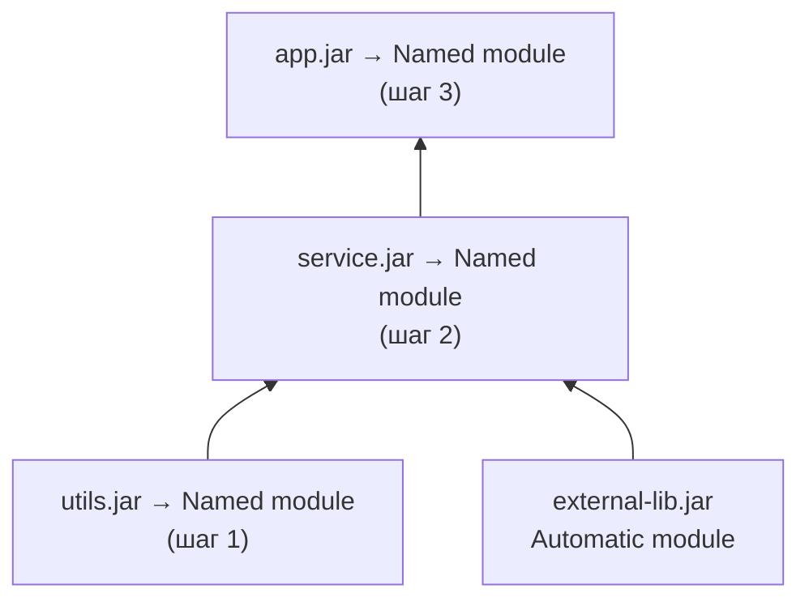

```java
// Шаг 1: utils — нет зависимостей на свой код
module com.example.utils {
    exports com.example.utils;
}

// Шаг 2: service
module com.example.service {
    requires com.example.utils;   // named module
    requires external.lib;        // automatic module (временно)
    exports com.example.service.api;
}

// Шаг 3: app
module com.example.app {
    requires com.example.service;
    requires com.example.utils;
    exports com.example.app;
}
```

**Top-Down (сверху вниз) — для быстрой видимости границ:**

Начинаем с приложения верхнего уровня, зависимости временно как `automatic modules`.

```java
module com.example.app {
    requires com.example.service; // пока automatic module
    requires com.example.utils;   // пока automatic module
    exports com.example.app;
}
// Затем постепенно добавляем module-info в service, utils
```

**Практический чеклист:**

```bash
# 1. Анализировать зависимости
jdeps --module-path lib --multi-release 17 -s app.jar

# 2. Найти использование internal JDK API
jdeps --jdk-internals --multi-release 17 app.jar

# 3. Найти split packages
jdeps --module-path lib --check com.example.app

# 4. Проверить наличие Automatic-Module-Name в сторонних JAR
jar --describe-module --file=lib/external.jar

# 5. Добавить module-info.java (начать с листьев)
# 6. Добавить --add-opens для фреймворков (временно)
# 7. Запустить тесты в модульном режиме
# 8. Постепенно убирать --add-opens, добавляя opens в module-info
```

**Когда остановиться на classpath:** если проект использует много legacy-библиотек без `Automatic-Module-Name` или активно использует `sun.*` API, полная модуляризация может не стоить затрат. Компромисс: использовать `jlink` с `--add-modules` для оптимизации Docker-образов без полной модуляризации кода приложения.

---

## See also

- [Java Core](java-core-interview.md) — базовые концепции языка, `ClassLoader`, рефлексия и инкапсуляция
- [Java 17-21](java-17-21-interview.md) — `sealed classes`, `records`, `virtual threads` — фичи, тесно связанные с модульностью
- [Java Annotations](java-annotations-interview.md) — аннотации и Annotation Processing в модульном контексте
- [Java IO / NIO](java-io-nio-interview.md) — `ServiceLoader` для плагинов ввода-вывода, модульные провайдеры
- [JVM](../../jvm/jvm-interview.md) — загрузка классов, `ClassLoader` иерархия, `InaccessibleObjectException` при рефлексии
- [Паттерны проектирования](../../design-patterns/design-patterns-interview.md) — `Service Locator`, `Plugin Pattern` через `ServiceLoader`
- [Spring Framework](../../frameworks/spring/spring-framework-interview.md) — Spring и `JPMS`: совместимость, `opens` для рефлексии Spring


> [!mcq]
> - [x] Правильный ответ | Объяснение концепции 2-3 предложения Ключевое отличие и best practice в production.
> - [ ] Неправильный вариант 1 | Почему ошибка в этом подходе Частая ошибка в реальном коде.
> - [ ] Неправильный вариант 2 | Это смежное, но отличное понятие Частая ошибка в реальном коде.
> - [ ] Неправильный вариант 3 | Противоположное направление- [Java 17-21](java-17-21-interview.md) Частая ошибка в реальном коде.
- [Java 8](java-8-interview.md)
- [Java Annotations](java-annotations-interview.md)
- [Java Collections](java-collections-interview.md)
- [Java Concurrency](java-concurrency-interview.md)
- [Java Conditional Statements](java-conditional-statements-interview.md)
