# Вопросы на собеседовании: `Java Modules` (JPMS)

Полное руководство по вопросам собеседования на тему модульной системы `Java` (`JPMS`, `Java 9+`): `module-info.java`, директивы `exports`/`requires`/`opens`/`uses`/`provides`, `automatic` и `unnamed` модули, `split packages`, `multi-release JAR`, `jlink`, `ServiceLoader`, рефлексия в модульном мире, `module layers`, стратегии миграции.

## Полезные ссылки

### Официальная документация

- [The State of the Module System (JSR 376)](https://openjdk.org/jeps/261) — JEP 261, описание модульной системы
- [Java Module System (Oracle JLS)](https://docs.oracle.com/javase/specs/jls/se17/html/jls-7.html#jls-7.7) — спецификация языка
- [JEP 238: Multi-Release JAR Files](https://openjdk.org/jeps/238) — спецификация multi-release JAR
- [JEP 282: jlink](https://openjdk.org/jeps/282) — создание custom runtime images
- [Java Platform Module System (Baeldung)](https://www.baeldung.com/java-9-modularity) — обзор JPMS на Baeldung
- [A Guide to Java 9 Modularity (Baeldung)](https://www.baeldung.com/java-modularity) — практическое руководство
- [Multi-Module Maven Application with Java Modules — Baeldung](https://www.baeldung.com/maven-multi-module-project-java-jpms) — Maven + JPMS на практике
- [Design Strategies for Decoupling Java Modules — Baeldung](https://www.baeldung.com/java-modules-decoupling-design-strategies) — паттерны декаплинга модулей

## Содержание

- [Полезные ссылки](#полезные-ссылки)
- [See also](#see-also)

**Основы JPMS**
- [Q1. (!) Что такое `JPMS` и какие проблемы он решает?](#q1--что-такое-jpms-и-какие-проблемы-он-решает)
- [Q2. (!) Что такое `module-info.java` и какие директивы в нём доступны?](#q2--что-такое-module-infojava-и-какие-директивы-в-нём-доступны)
- [Q3. Как устроена модульная структура самого `JDK`?](#q3-как-устроена-модульная-структура-самого-jdk)
- [Q4. Чем отличается `module path` от `classpath`?](#q4-чем-отличается-module-path-от-classpath)

**Директивы: `exports`, `requires`, `opens`**
- [Q5. (!) В чём разница между `exports` и `opens`?](#q5--в-чём-разница-между-exports-и-opens)
- [Q6. Что такое `qualified exports` и `qualified opens`?](#q6-что-такое-qualified-exports-и-qualified-opens)
- [Q7. (!) Что такое `requires` и `requires transitive`?](#q7--что-такое-requires-и-requires-transitive)
- [Q8. Что такое `requires static` и когда это используется?](#q8-что-такое-requires-static-и-когда-это-используется)
- [Q9. Что такое `open module`?](#q9-что-такое-open-module)

**Сервисы и `ServiceLoader`**
- [Q10. (!) Что такое `provides` и `uses` в контексте `ServiceLoader`?](#q10--что-такое-provides-и-uses-в-контексте-serviceloader)
- [Q11. Как `ServiceLoader` работает в модульном мире по сравнению с `classpath`?](#q11-как-serviceloader-работает-в-модульном-мире-по-сравнению-с-classpath)

**Рефлексия и модули**
- [Q12. (!) Как модули влияют на рефлексию и доступ к внутренним `API`?](#q12--как-модули-влияют-на-рефлексию-и-доступ-к-внутренним-api)
- [Q13. Какие флаги JVM используются для обхода модульных ограничений?](#q13-какие-флаги-jvm-используются-для-обхода-модульных-ограничений)

**`Unnamed module` и `automatic module`**
- [Q14. (!) Что такое `unnamed module`?](#q14--что-такое-unnamed-module)
- [Q15. (!) Что такое `automatic module` и как определяется его имя?](#q15--что-такое-automatic-module-и-как-определяется-его-имя)
- [Q16. В чём ключевые отличия между `unnamed module`, `automatic module` и именованным модулем?](#q16-в-чём-ключевые-отличия-между-unnamed-module-automatic-module-и-именованным-модулем)

**`Split packages`**
- [Q17. (!) Что такое `split package` и почему это проблема в `JPMS`?](#q17--что-такое-split-package-и-почему-это-проблема-в-jpms)

**`Multi-release JAR`**
- [Q18. Что такое `multi-release JAR` и как он связан с модулями?](#q18-что-такое-multi-release-jar-и-как-он-связан-с-модулями)

**`jlink` и custom runtime**
- [Q19. (!) Что такое `jlink` и зачем собирать custom runtime image?](#q19--что-такое-jlink-и-зачем-собирать-custom-runtime-image)
- [Q20. Какие плагины и опции поддерживает `jlink`?](#q20-какие-плагины-и-опции-поддерживает-jlink)

**Стратегии миграции**
- [Q21. (!) Какие существуют стратегии миграции на модули?](#q21--какие-существуют-стратегии-миграции-на-модули)
- [Q22. Как мигрировать проект с `Maven`/`Gradle` на модули?](#q22-как-мигрировать-проект-с-mavengradle-на-модули)

**`Module layers`**
- [Q23. Что такое `ModuleLayer` и зачем он нужен?](#q23-что-такое-modulelayer-и-зачем-он-нужен)

**Циклические зависимости**
- [Q24. Как в `JPMS` обрабатываются циклические зависимости между модулями?](#q24-как-в-jpms-обрабатываются-циклические-зависимости-между-модулями)

**Тестирование**
- [Q25. Как тестировать модульное приложение?](#q25-как-тестировать-модульное-приложение)

**`JPMS` и фреймворки**
- [Q26. (!) Как `Spring`/`Spring Boot` работает с модульной системой?](#q26--как-springspring-boot-работает-с-модульной-системой)
- [Q27. Как `Hibernate`/`JPA` взаимодействует с модулями?](#q27-как-hibernatejpa-взаимодействует-с-модулями)

**Лучшие практики**
- [Q28. Какие практики проектирования модулей считаются хорошими?](#q28-какие-практики-проектирования-модулей-считаются-хорошими)
- [Q29. Какие типичные ошибки допускают при работе с модулями?](#q29-какие-типичные-ошибки-допускают-при-работе-с-модулями)
- [Q30. Каковы перспективы развития модульной системы `Java`?](#q30-каковы-перспективы-развития-модульной-системы-java)

**Типы модулей и совместимость**
- [Q31. Чем отличаются `unnamed module`, `automatic module` и `named module` на практике?](#q31-чем-отличаются-unnamed-module-automatic-module-и-named-module-на-практике)
- [Q32. `Split packages`: почему запрещены в `JPMS` и как их устранить?](#q32-split-packages-почему-запрещены-в-jpms-и-как-их-устранить)
- [Q33. `--add-opens` и `--add-exports`: когда и как использовать для рефлексии с `JPMS`?](#q33---add-opens-и---add-exports-когда-и-как-использовать-для-рефлексии-с-jpms)
- [Q34. `jlink`: создание custom minimal JRE — практическое руководство](#q34-jlink-создание-custom-minimal-jre--практическое-руководство)
- [Q35. `jdeps`: анализ зависимостей модулей перед миграцией](#q35-jdeps-анализ-зависимостей-модулей-перед-миграцией)
- [Q36. `ServiceLoader` с `JPMS`: директивы `uses` и `provides...with` в деталях](#q36-serviceloader-с-jpms-директивы-uses-и-provideswith-в-деталях)
- [Q37. Совместимость `Spring`, `Hibernate` и `Jackson` с `JPMS`: типичные проблемы](#q37-совместимость-spring-hibernate-и-jackson-с-jpms-типичные-проблемы)
- [Q38. Стратегии миграции legacy-кода: `Bottom-Up` vs `Top-Down` в деталях](#q38-стратегии-миграции-legacy-кода-bottom-up-vs-top-down-в-деталях)

---

## Q1. (!) Что такое `JPMS` и какие проблемы он решает?

**`JPMS`** (`Java Platform Module System`) — модульная система платформы, появившаяся в `Java 9` (проект `Jigsaw`). Она добавляет уровень структуры выше пакета: модуль — это именованная группа пакетов и ресурсов, которая явно объявляет, от кого зависит (`requires`) и что отдаёт наружу (`exports`). Всё остальное по умолчанию скрыто, даже `public`-классы.

Суть в том, что до `JPMS` единственной единицей сборки был JAR на `classpath`, а у JAR нет ни границ, ни контракта: любой `public`-класс виден всем, зависимости нигде не записаны. Модуль превращает JAR в самоописываемую единицу с проверяемыми границами.

**Проблемы, которые решает `JPMS`:**

| Проблема | Как решает `JPMS` |
|----------|-------------------|
| **JAR Hell** — конфликты версий, дублирование классов на `classpath` | Каждый пакет принадлежит ровно одному модулю, `split packages` запрещены |
| **Отсутствие инкапсуляции** — все `public` классы видны всем | `exports` контролирует, какие пакеты доступны снаружи |
| **Неявные зависимости** — класс может случайно использовать чужой JAR | `requires` делает зависимости явными и проверяемыми |
| **Монолитный JDK** — полный runtime даже для микросервиса | `jlink` создаёт компактный runtime только с нужными модулями |

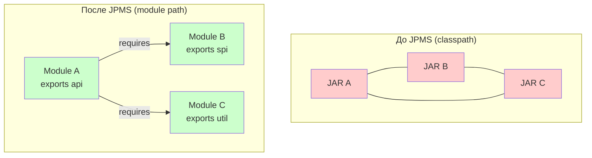

Сама платформа `JDK` тоже разбита на модули: `java.base` (неявно подключается всегда), `java.sql`, `java.xml`, `java.logging` и др. Благодаря этому приложение может зависеть только от того, что реально использует, а не тянуть весь runtime целиком — именно это и делает возможным `jlink`.

## Q2. (!) Что такое `module-info.java` и какие директивы в нём доступны?

`module-info.java` — дескриптор модуля: файл, который объявляет имя модуля и его контракт. Лежит в корне исходников модуля (рядом с корневым пакетом) и компилируется в `module-info.class`. Его наличие и отличает именованный модуль от обычного JAR.

Содержимое — это имя модуля плюс набор директив, отвечающих на три вопроса: от чего модуль зависит, что отдаёт наружу и какие сервисы публикует/потребляет.

**Полный набор директив:**

| Директива | Назначение |
|-----------|------------|
| `requires` | Объявляет зависимость от другого модуля |
| `requires transitive` | Транзитивная зависимость — видна клиентам |
| `requires static` | Зависимость только на этапе компиляции (optional) |
| `exports` | Делает пакет доступным для компиляции и вызова |
| `exports ... to` | Квалифицированный экспорт — только указанным модулям |
| `opens` | Открывает пакет для рефлексии |
| `opens ... to` | Квалифицированное открытие — только указанным модулям |
| `uses` | Объявляет потребление сервиса через `ServiceLoader` |
| `provides ... with` | Объявляет реализацию сервиса |

```java
module com.example.app {
    // Зависимости
    requires java.sql;
    requires transitive com.example.api;
    requires static lombok;                    // compile-only

    // Экспорт пакетов
    exports com.example.app.api;
    exports com.example.app.spi to com.example.plugin;  // qualified

    // Открытие для рефлексии (Spring, Hibernate)
    opens com.example.app.entities to org.hibernate.orm;
    opens com.example.app.config to spring.core;

    // Сервисы
    uses com.example.spi.PaymentProvider;
    provides com.example.spi.PaymentProvider
        with com.example.app.StripeProvider,
             com.example.app.PayPalProvider;
}
```

Имя модуля должно быть уникальным в графе; по соглашению берут обратное доменное имя, как для пакетов (`com.example.app`). На один модуль приходится ровно один `module-info.java` — он и задаёт границу модуля.

## Q3. Как устроена модульная структура самого `JDK`?

Начиная с `Java 9`, монолитный `rt.jar` исчез: `JDK` разбит на ~70 модулей (точное число зависит от дистрибутива). Это и позволяет `jlink` собирать образ только из нужных частей платформы. Ключевые модули:

| Модуль | Содержимое |
|--------|------------|
| `java.base` | Фундамент: `java.lang`, `java.util`, `java.io`, `java.nio`, `java.net`, `java.time` и др. Подключается неявно — писать `requires java.base` не нужно |
| `java.sql` | JDBC API: `java.sql`, `javax.sql` |
| `java.xml` | XML-парсинг: DOM, SAX, StAX, XSLT |
| `java.logging` | `java.util.logging` |
| `java.desktop` | AWT, Swing, JavaFX-мост |
| `java.net.http` | HTTP Client API (с Java 11) |
| `jdk.httpserver` | Встроенный HTTP-сервер |
| `jdk.jlink` | Утилита `jlink` |

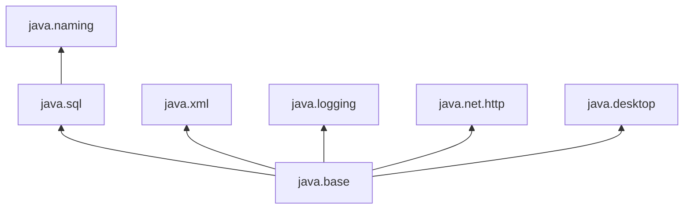

Различать префиксы важно на практике: `java.*` — это стандарт Java SE, гарантированный любым совместимым JDK; `jdk.*` — модули конкретной реализации, которых в другом дистрибутиве может не быть. Поэтому зависеть от `jdk.*` в портируемом коде рискованно — при смене дистрибутива модуль может пропасть.

## Q4. Чем отличается `module path` от `classpath`?

Коротко: `module path` знает о границах и зависимостях модулей и проверяет их при старте, а `classpath` — плоский список JAR без какой-либо инкапсуляции, где проблемы всплывают только в runtime. Принципиальная разница — в том, что валидация графа сдвинута на старт приложения, а доступ к чужим пакетам теперь нужно явно разрешать.

| Характеристика | `classpath` | `module path` |
|----------------|-------------|---------------|
| **Инкапсуляция** | Нет — все `public` классы видны всем | Есть — видны только `exports`-пакеты |
| **Зависимости** | Неявные, проверяются в runtime | Явные, проверяются при запуске |
| **Split packages** | Допускаются (первый найденный побеждает) | Запрещены — ошибка при запуске |
| **Рефлексия** | `setAccessible(true)` работает всегда | Требует `opens` или `--add-opens` |
| **Ошибки** | `ClassNotFoundException` в runtime | `ResolutionException` при старте приложения |

**На практике:** при миграции часто работают в гибридном режиме — часть артефактов лежит на `module path`, часть на `classpath` (превращаясь в один `unnamed module`). Это допустимо как переходное состояние, но поведение тут менее предсказуемо: правила доступа смешиваются. Поэтому конечная цель — поэтапно перевести проект на чистый `module path`.

```bash
# Classpath (старый стиль)
java -cp lib/a.jar:lib/b.jar com.example.Main

# Module path (модульный стиль)
java --module-path lib -m com.example.app/com.example.Main

# Гибрид
java --module-path mods -cp lib/legacy.jar -m com.example.app
```

## Q5. (!) В чём разница между `exports` и `opens`?

Обе директивы открывают пакет наружу, но для разных видов доступа. `exports` даёт доступ на уровне языка — другие модули могут компилироваться против `public`-типов пакета и вызывать их. `opens` даёт доступ на уровне рефлексии — другие модули могут через `setAccessible(true)` залезть даже в `private`-члены. Это ортогональные вещи: пакет можно экспортировать, но не открывать (обычный API), открывать, но не экспортировать (только для рефлексии фреймворка), и то и другое сразу.

| Аспект | `exports` | `opens` |
|--------|-----------|---------|
| **Доступ** | Компиляция + runtime вызовы | Рефлексия (`setAccessible`) |
| **Видимость** | Только `public` типы и члены | Все типы и члены (включая `private`) |
| **Проверка** | Compile-time + runtime | Только runtime |
| **Типичное использование** | Публичный API модуля | Сущности для Hibernate, бины для Spring |

```java
module com.example.service {
    // Публичный API — можно вызывать из других модулей
    exports com.example.service.api;

    // Рефлексия для Spring DI и Hibernate маппинга
    opens com.example.service.model to org.hibernate.orm, spring.core;
}
```

Без `opens` вызов `field.setAccessible(true)` из другого модуля упирается в `InaccessibleObjectException`. Поэтому для фреймворков, которые живут рефлексией (`Spring`, `Hibernate`, `Jackson`), `opens` — не опция, а обязательное условие работы: им мало `public`-API, им нужно лезть в приватные поля сущностей и бинов.

**Запомнить одной фразой**: `exports` — «видно снаружи для вызова», `opens` — «разрешена глубокая рефлексия».

## Q6. Что такое `qualified exports` и `qualified opens`?

Квалифицированные (`qualified`) формы `exports ... to` и `opens ... to` открывают пакет не всему миру, а только перечисленным модулям. Обычный `exports pkg` виден любому, кто `requires` ваш модуль; `exports pkg to a, b` — только модулям `a` и `b`, для остальных пакет остаётся скрытым.

```java
module com.example.core {
    // Доступ к internal API только для модуля тестирования
    exports com.example.core.internal to com.example.tests;

    // Рефлексия только для Hibernate
    opens com.example.core.entity to org.hibernate.orm;
}
```

Это реализует «дружественный доступ» (friend access): модуль приоткрывает внутренние пакеты только доверенным соседям, не раскрывая их всему миру и сохраняя инкапсуляцию для остальных. Типичные сценарии:

- **Тестовые модули**, которым нужен доступ к internal API тестируемого кода.
- **Тесно связанные модули одного проекта**, которым удобно делиться внутренностями между собой, но не с внешними потребителями.
- **Фреймворки**, которым через `opens ... to` дают рефлексию строго к нужным пакетам, а не открывают модуль целиком.

## Q7. (!) Что такое `requires` и `requires transitive`?

**`requires`** объявляет прямую зависимость: без неё типы из целевого модуля недоступны, и это проверяют и компилятор, и runtime. Важная деталь — зависимость **не транзитивна**: если `App` требует `API`, а `API` требует `Model`, то `App` сам по себе `Model` не видит.

**`requires transitive`** как раз пробрасывает зависимость дальше: всякий, кто требует ваш модуль, автоматически получает доступ и к транзитивному модулю. Это способ сказать «мой API нельзя использовать без вот этого модуля».

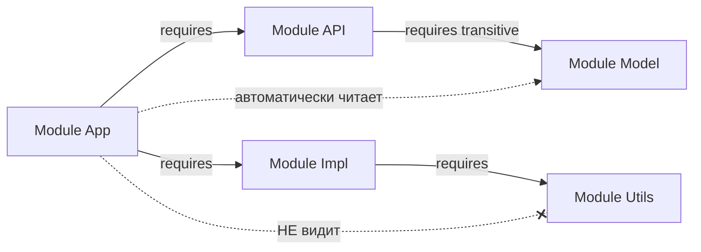

```java
// module-info.java модуля API
module com.example.api {
    requires transitive com.example.model; // клиенты API видят model
    exports com.example.api;
}

// module-info.java модуля приложения
module com.example.app {
    requires com.example.api;   // автоматически видит com.example.model
}
```

**Эмпирическое правило**: если тип из зависимого модуля «протекает» в ваш публичный API — стоит в параметрах методов, возвращаемых типах или базовых классах, — нужен `requires transitive`. Иначе клиент увидит ваш метод, но не сможет назвать тип его аргумента и не скомпилируется. Если же зависимость используется только внутри реализации — достаточно обычного `requires`, и тогда вы не навязываете её клиентам.

## Q8. Что такое `requires static` и когда это используется?

`requires static` объявляет **опциональную** зависимость: модуль обязателен при компиляции, но необязателен при запуске. Идея в том, что некоторые библиотеки нужны только во время сборки (генерация кода, аннотации) или включаются «если есть» — и тянуть их в runtime без необходимости не хочется.

```java
module com.example.lib {
    requires static lombok;           // аннотации нужны при компиляции
    requires static org.slf4j;        // опциональное логирование
}
```

**Типичные сценарии:**

- **Compile-time аннотации**: `Lombok`, `JetBrains Annotations`, `SpotBugs Annotations` — нужны компилятору, но в собранном артефакте бесполезны.
- **Опциональные интеграции**: библиотека проверяет наличие зависимости и включает фичу, только если соответствующий модуль реально присутствует.
- **Annotation processors**: работают на этапе сборки, в runtime их быть не должно.

**Подводный камень**: раз модуль может отсутствовать при запуске, обращение к его классам без проверки бросит `NoClassDefFoundError`. Поэтому опциональную интеграцию нужно защищать проверкой доступности:

```java
public class OptionalFeature {
    public static boolean isAvailable() {
        try {
            Class.forName("org.slf4j.Logger");
            return true;
        } catch (ClassNotFoundException e) {
            return false;
        }
    }
}
```

## Q9. Что такое `open module`?

`open module` — модуль, у которого все пакеты автоматически открыты для рефлексии, как если бы на каждом стоял `opens`. Это удобная оптовая замена множеству `opens`-директив. Важно: открытость касается только рефлексии — `exports` по-прежнему нужно указывать явно, иначе compile-time доступа к пакетам не будет.

```java
// Все пакеты открыты для рефлексии, но только api экспортирован
open module com.example.webapp {
    requires spring.core;
    requires spring.web;
    exports com.example.webapp.api;
}
```

**Сценарий применения**: приложения поверх фреймворков с активной рефлексией (`Spring Boot`, `Hibernate`), где прописывать `opens` для каждого пакета поодиночке слишком муторно и легко что-то забыть.

**Компромисс**: вы жертвуете инкапсуляцией на уровне рефлексии ради удобства — любой пакет становится доступен для `setAccessible`. Поэтому `open module` хорош как стартовая точка миграции, а в зрелом коде его обычно заменяют точечными `opens`.

**Ограничение**: внутри `open module` нельзя писать отдельные `opens` — они избыточны и конфликтуют с уже открытым на уровне модуля.

## Q10. (!) Что такое `provides` и `uses` в контексте `ServiceLoader`?

Это две стороны механизма сервисов в `JPMS`. **`uses`** объявляет, что модуль — потребитель: он будет искать реализации интерфейса через `ServiceLoader`. **`provides ... with`** объявляет, что модуль — поставщик: вот интерфейс и вот его реализации. Связь между ними слабая: потребитель не знает имён реализаций и не зависит от модулей-поставщиков напрямую — их подбирает `ServiceLoader` по графу модулей. Это классическая инверсия зависимости через SPI.

```java
// SPI-модуль: определяет контракт
module com.example.spi {
    exports com.example.spi;
}

// Модуль-провайдер: реализует контракт
module com.example.stripe {
    requires com.example.spi;
    provides com.example.spi.PaymentProvider
        with com.example.stripe.StripePaymentProvider;
}

// Модуль-потребитель: ищет реализации
module com.example.app {
    requires com.example.spi;
    uses com.example.spi.PaymentProvider;
}
```

```java
// Код потребителя
ServiceLoader<PaymentProvider> loader =
    ServiceLoader.load(PaymentProvider.class);

for (PaymentProvider provider : loader) {
    System.out.println("Found: " + provider.getName());
    provider.processPayment(amount);
}

// Или с Optional (Java 9+)
PaymentProvider provider = ServiceLoader
    .load(PaymentProvider.class)
    .findFirst()
    .orElseThrow(() -> new RuntimeException("No payment provider found"));
```

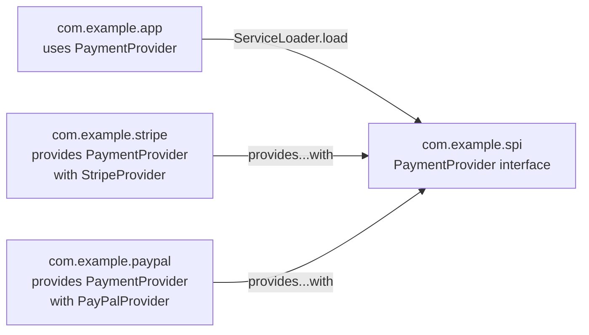

Классический пример из самого `JDK`: `JDBC`-драйверы публикуют себя через `provides java.sql.Driver with ...`, а `DriverManager` находит их через `ServiceLoader` — поэтому драйвер достаточно положить на путь, без явной регистрации.

## Q11. Как `ServiceLoader` работает в модульном мире по сравнению с `classpath`?

| Аспект | `classpath` (до Java 9) | `module path` (JPMS) |
|--------|-------------------------|----------------------|
| **Регистрация** | Файл `META-INF/services/<interface>` | Директива `provides ... with` в `module-info.java` |
| **Обнаружение** | Сканирование всех JAR | Только модули с `provides` |
| **Валидация** | В runtime | При разрешении модульного графа (старт приложения) |
| **Безопасность** | Можно подменить файл в JAR | Декларация в `module-info` — часть модуля |

Главное изменение: регистрация сервиса переехала из текстового файла `META-INF/services/` в декларацию `module-info.java`. От этого `ServiceLoader` стал предсказуемее и проверяемее — реализация подхватится, только если поставщик объявил `provides`, а потребитель `uses`; компилятор видит обе декларации. Файл `META-INF/services` никуда не делся — он по-прежнему работает для обратной совместимости, но только в `automatic` и `unnamed` модулях, не в именованных.

## Q12. (!) Как модули влияют на рефлексию и доступ к внутренним `API`?

Модули закрывают лазейку, которой раньше пользовались все: до `Java 9` `setAccessible(true)` пробивал любую инкапсуляцию. Теперь рефлексия подчиняется границам модуля — чтобы достучаться до пакета, он должен быть либо `exports` (только `public`-члены), либо `opens` (любые члены, включая `private`) для того модуля, который рефлексирует.

**Уровни доступа:**

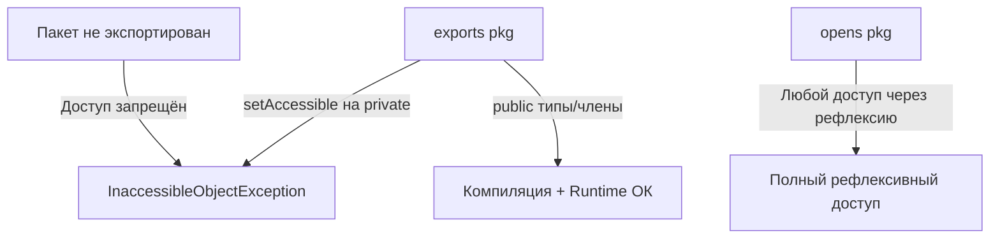

Обращение к внутренним пакетам `JDK` (`sun.*`, `jdk.internal.*`) без специальных флагов приводит к ошибке:

```
java.lang.reflect.InaccessibleObjectException:
  Unable to make field private final byte[] java.lang.String.value
  accessible: module java.base does not "opens java.lang" to unnamed module
```

**Рекомендация**: в модульном приложении вместо глобального флага `--add-opens` лучше точечно прописать `opens` в `module-info.java` — так открывается ровно нужный пакет нужному модулю, а не вся инкапсуляция целиком, и поверхность атаки минимальна. Подробнее об ограничениях рефлексии см. [вопросы по аннотациям Java](java-annotations-interview.md).

## Q13. Какие флаги JVM используются для обхода модульных ограничений?

Когда исправить `module-info.java` нельзя (чужая библиотека, legacy-код, временный обход), границы модулей раздвигают флагами командной строки. Они работают как «внешние» `requires`/`exports`/`opens`, не трогая исходники:

| Флаг | Назначение | Пример |
|------|------------|--------|
| `--add-opens` | Открывает пакет для рефлексии | `--add-opens java.base/java.lang=ALL-UNNAMED` |
| `--add-exports` | Экспортирует пакет для compile/runtime доступа | `--add-exports java.base/sun.nio.ch=ALL-UNNAMED` |
| `--add-reads` | Добавляет зависимость чтения между модулями | `--add-reads com.example.app=ALL-UNNAMED` |
| `--add-modules` | Добавляет модули в граф | `--add-modules java.xml.bind` |
| `--patch-module` | Добавляет классы/ресурсы в существующий модуль | `--patch-module java.base=patch.jar` |
| `--illegal-access` | Глобальная политика доступа (убран в Java 17) | `--illegal-access=permit` (Java 9-16) |

```bash
# Типичный запуск Spring Boot с модульными ограничениями
java --add-opens java.base/java.lang=ALL-UNNAMED \
     --add-opens java.base/java.lang.reflect=ALL-UNNAMED \
     --add-opens java.base/java.util=ALL-UNNAMED \
     -jar my-app.jar
```

**Важно**: `ALL-UNNAMED` — специальная цель «все классы с classpath (unnamed module)». Она удобна, потому что открывает доступ всему legacy-коду разом, но именно поэтому слишком широка: в чисто модульном приложении лучше указывать конкретный целевой модуль, чтобы не открывать пакет кому попало.

**Эволюция `--illegal-access`:**
- `Java 9-15`: по умолчанию `permit` (с предупреждениями)
- `Java 16`: по умолчанию `deny`
- `Java 17+`: флаг удалён, строгая инкапсуляция

## Q14. (!) Что такое `unnamed module`?

**`Unnamed module`** — «свалка» из всех классов, загруженных с `classpath`. У него нет имени и нет `module-info.class`. Это не полноценный модуль, а механизм обратной совместимости: чтобы старый код, ничего не знающий про `JPMS`, продолжал работать в новом JDK.

Чтобы такой код не падал на каждом шагу, `unnamed module` намеренно сделан максимально «открытым» и одновременно ограниченным с точки зрения именованных модулей.

**Свойства:**
- Неявно **читает** все именованные модули
- **Экспортирует и открывает** все свои пакеты (полный доступ и рефлексия)
- Один `unnamed module` на один `ClassLoader`
- Разные JAR на `classpath` объединяются в один `unnamed module`
- Именованные модули **не могут** объявить `requires` на `unnamed module`

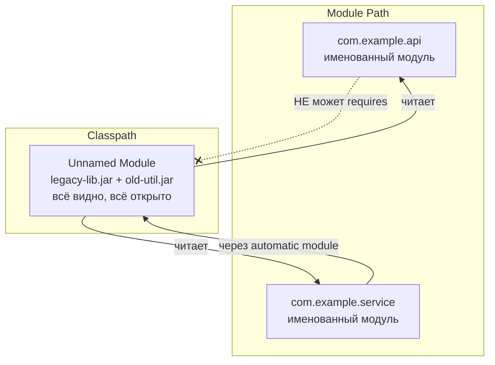

Последнее свойство — ключевое ограничение: раз именованный модуль не может объявить `requires` на безымянный, чисто модульный код не может зависеть от того, что лежит на classpath. Именно эту стену обходят через `automatic module` (см. Q15). А благодаря «всё видно, всё открыто» старые приложения без `module-info.java` запускаются на новом JDK без единой правки.

## Q15. (!) Что такое `automatic module` и как определяется его имя?

**`Automatic module`** — обычный JAR без `module-info.class`, который положили не на classpath, а на `module path`. JVM автоматически «обворачивает» его в полноценный модуль, придумывая имя и открывая всё наружу. Это переходный мостик: он позволяет именованному модулю объявить `requires` на ещё не модуляризованную библиотеку.

**Определение имени (в порядке приоритета):**

1. **Атрибут `Automatic-Module-Name`** в `MANIFEST.MF` — рекомендуемый способ:
   ```
   Automatic-Module-Name: com.google.gson
   ```
2. **Из имени файла JAR** — если атрибут отсутствует:
   - `gson-2.10.1.jar` → `gson`
   - `commons-lang3-3.12.0.jar` → `commons.lang3`
   - Версия и расширение отбрасываются, дефисы заменяются на точки

**Свойства automatic module:**

- `exports` все свои пакеты — внутренней инкапсуляции нет.
- `opens` все свои пакеты для рефлексии — фреймворки работают без настройки.
- Неявно `requires transitive` все остальные модули графа — видит всё и пробрасывает это дальше.
- Может **читать** `unnamed module` (чего именованный модуль не умеет) — поэтому и служит мостом к classpath.
- Поддерживает `META-INF/services` для `ServiceLoader`.

Из-за двух последних свойств `automatic module` — ключевой инструмент поэтапной миграции: именованный модуль легально объявляет `requires` на него, а он сам дотягивается до старого кода с classpath. Цена — нестабильное имя (если оно выведено из имени файла) и полное отсутствие инкапсуляции.

## Q16. В чём ключевые отличия между `unnamed module`, `automatic module` и именованным модулем?

| Характеристика | Unnamed | Automatic | Named |
|----------------|---------|-----------|-------|
| **Расположение** | `classpath` | `module path` (без `module-info`) | `module path` (с `module-info`) |
| **Имя** | Нет | Из `MANIFEST.MF` или имени JAR | Из `module-info.java` |
| **`exports`** | Все пакеты | Все пакеты | Только явно указанные |
| **`opens`** | Все пакеты | Все пакеты | Только явно указанные |
| **`requires`** | Все модули (неявно) | Все модули (неявно + transitive) | Только явно указанные |
| **Читает unnamed** | Да | Да | Нет |
| **Можно `requires`** | Нет | Да | Да |
| **`ServiceLoader`** | `META-INF/services` | `META-INF/services` | `provides...with` |

**Главное, что спрашивают**: на именованный или `automatic` модуль можно сослаться через `requires`, а на `unnamed` — нельзя. Именно эта асимметрия делает `automatic module` обязательным звеном при поэтапной миграции: он стоит между «модульным» и «classpath»-мирами и связывает их.

## Q17. (!) Что такое `split package` и почему это проблема в `JPMS`?

**`Split package`** — когда один и тот же пакет (например, `com.example.util`) живёт сразу в нескольких модулях.

`JPMS` это **запрещает по фундаментальной причине**: в модульной модели каждый пакет принадлежит ровно одному модулю — это якорь, по которому система решает, кому пакет читать и кому открывать. Если пакет в двух модулях, правило «пакет = один модуль» рушится, и однозначно выбрать источник типа невозможно. Поэтому split package ловится не в runtime, а на этапе разрешения графа — приложение просто не стартует:

```
java.lang.module.ResolutionException:
  Modules moduleA and moduleB export package com.example.util to module moduleC
```

**Где это всплывает на практике:**

- Две библиотеки тащат одинаковый пакет — классический случай `javax.annotation` в модуле `java.xml.ws.annotation` и в `javax.annotation-api.jar`.
- При распиле монолита на модули классы одного пакета случайно разъехались по разным артефактам.
- Библиотека «дополняет» стандартный пакет JDK своими классами.

**Решения (от чистого к временному):**

1. **Переразбить пакеты** — самое правильное: каждый пакет физически в одном модуле.
2. **Выделить общий пакет** в отдельный модуль-библиотеку, от которого зависят оба прежних.
3. **Исключить дублирующую зависимость** в сборке (`Maven exclusions`) — если один из источников просто лишний.
4. **`--patch-module`** — слить классы одного JAR в чужой модуль; рабочий, но временный обход, а не архитектурное решение.

## Q18. Что такое `multi-release JAR` и как он связан с модулями?

**`Multi-release JAR`** (`MRJAR`, `JEP 238`) — один JAR, внутри которого лежат разные версии одного и того же класса под разные версии Java. JVM на старте сама выбирает самую подходящую под текущую версию. Это решает задачу «одна библиотека, один артефакт, но хочу пользоваться новыми API там, где они есть». Структура:

```
my-lib.jar
├── META-INF/
│   ├── MANIFEST.MF         # содержит "Multi-Release: true"
│   └── versions/
│       ├── 9/
│       │   ├── module-info.class
│       │   └── com/example/Util.class    # версия для Java 9+
│       └── 17/
│           └── com/example/Util.class    # версия для Java 17+
├── com/
│   └── example/
│       └── Util.class                    # базовая версия (Java 8)
```

**Связь с модулями**: именно `MRJAR` позволяет библиотеке стать модульной, не бросая Java 8. `module-info.class` кладут в `META-INF/versions/9/`, где его подхватит только Java 9+, а базовый вариант остаётся «безмодульным» и спокойно работает на Java 8. Так один артефакт одновременно годится и для `classpath` (Java 8), и для `module path` (Java 9+).

**Важно для собеседования**: `MRJAR` — не альтернатива модулям, а механизм совместимости. Он отвечает на вопрос «как опубликовать модульную библиотеку, не сломав пользователей на старой Java», и не имеет отношения к структуре зависимостей.

## Q19. (!) Что такое `jlink` и зачем собирать custom runtime image?

`jlink` — утилита из `JDK`, которая собирает **custom runtime image**: самодостаточный мини-JRE, куда вшиты только те модули JDK (и ваши модули), которые приложению реально нужны. Это стало возможным именно потому, что JDK теперь модульный (см. Q3): можно взять `java.base` плюс пару модулей вместо целого runtime.

Смысл — не таскать с собой 300+ MB полного JDK, особенно в контейнерах, где каждый мегабайт образа на счету.

```bash
# Создание компактного runtime
jlink --add-modules java.base,java.sql,com.example.app \
      --module-path $JAVA_HOME/jmods:mods \
      --output runtime-image \
      --strip-debug \
      --no-header-files \
      --no-man-pages \
      --compress zip-9

# Запуск приложения из собранного образа
./runtime-image/bin/java -m com.example.app/com.example.Main
```

**Преимущества:**

| Аспект | Полный JDK | `jlink` image |
|--------|-----------|---------------|
| **Размер** | ~300+ MB | 30-50 MB (зависит от модулей) |
| **Безопасность** | Все модули JDK | Только используемые — меньше поверхность атаки |
| **Деплой** | Требует установленный JDK | Самодостаточный образ |
| **Docker** | Тяжёлый базовый образ | Компактный контейнер |

**Главное ограничение**: `jlink` работает только с именованными модулями. `automatic module` (JAR без `module-info`) и `unnamed module` он включить не может — и это частая боль на практике: если хоть одна зависимость не модуляризована, образ собрать не выйдет, пока её не привести к именованному модулю или не упаковать в fat JAR.

**Для Docker/Kubernetes**: `jlink`-образ поверх `FROM scratch` или Alpine даёт контейнеры на 40-60 MB вместо 200+ MB с полным JDK — это и есть основной мотив использовать `jlink`.

## Q20. Какие плагины и опции поддерживает `jlink`?

`jlink` устроен как конвейер плагинов: каждый шаг что-то выкидывает из образа или преобразует его, и так получается минимальный runtime. Самые ходовые опции:

| Плагин / Опция | Назначение |
|----------------|------------|
| `--strip-debug` | Удаляет отладочную информацию из классов |
| `--compress zip-9` | Сжимает ресурсы (Java 21+: `zip-0`..`zip-9`) |
| `--no-header-files` | Исключает C-header файлы |
| `--no-man-pages` | Исключает man-страницы |
| `--add-modules` | Указывает модули для включения |
| `--bind-services` | Автоматически включает все `provides` для `uses` |
| `--launcher name=module/main` | Создаёт launcher-скрипт |
| `--endian` | Порядок байтов (`little` / `big`) |

```bash
# Полный пример с launcher и сжатием
jlink --module-path mods:$JAVA_HOME/jmods \
      --add-modules com.example.app \
      --launcher myapp=com.example.app/com.example.Main \
      --strip-debug \
      --compress zip-6 \
      --no-header-files \
      --no-man-pages \
      --output dist/myapp

# Запуск через launcher
./dist/myapp/bin/myapp
```

Отдельно стоит выделить `--bind-services`: без него `jlink` включает только модули, явно перечисленные в `--add-modules`, и провайдеры сервисов в образ не попадут, хотя в коде есть `uses`. С `--bind-services` он подтянет все модули, которые `provides` нужный сервис.

Чтобы понять, какие модули вообще указывать в `--add-modules`, перед `jlink` запускают `jdeps`:

```bash
# Анализ зависимостей JAR
jdeps --module-path mods -s my-app.jar

# Генерация module-info.java
jdeps --generate-module-info out my-lib.jar
```

## Q21. (!) Какие существуют стратегии миграции на модули?

Модуляризацию делают не разом, а постепенно, и направление обхода графа зависимостей задаёт стратегию. Их две, и выбор между ними сводится к тому, что вам важнее: устойчивость каждого шага или быстрая видимость результата.

### Bottom-Up (снизу вверх) — рекомендуемая

Идём от листьев графа — библиотек без собственных зависимостей — вверх, к приложению. К моменту, когда вы модуляризуете очередной модуль, всё, от чего он зависит, уже стало именованными модулями:

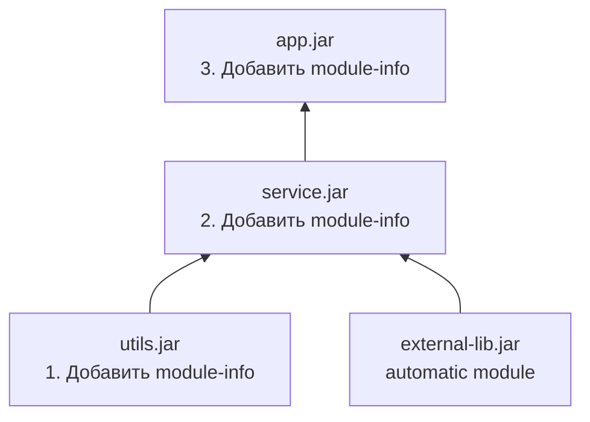

**Плюсы**: каждый шаг компилируется и тестируется в полностью модульном окружении — никаких костылей.
**Минусы**: если корневая сторонняя библиотека ещё не модуляризована, она может застопорить весь процесс снизу.

### Top-Down (сверху вниз)

Идём от приложения верхнего уровня вниз. Его зависимости временно оставляем `automatic modules` и модуляризуем потом:

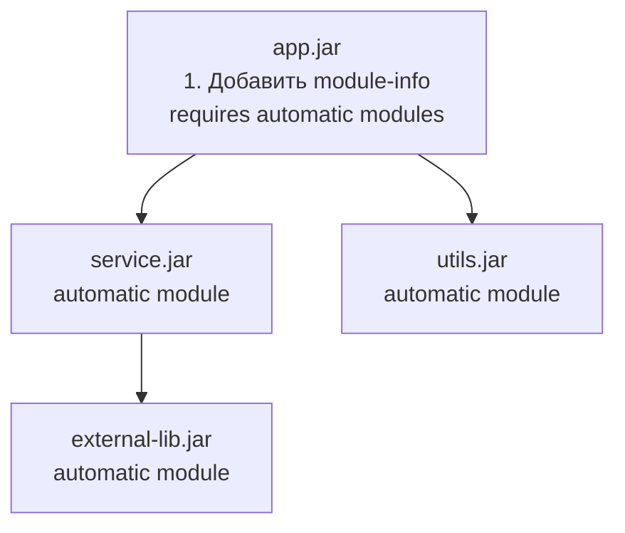

**Плюсы**: сразу проявляются модульные границы самого приложения, можно стартовать, не дожидаясь модуляризации всех зависимостей.
**Минусы**: вы временно опираетесь на `automatic modules`, а их имена (если выведены из имени файла) нестабильны — обновление зависимости может сломать `requires`.

### Практический чеклист миграции

1. Запустить `jdeps` для анализа зависимостей
2. Убрать использование внутренних API JDK (`sun.*`, `com.sun.*`)
3. Решить проблемы `split packages`
4. Добавить `Automatic-Module-Name` в `MANIFEST.MF` сторонних JAR (или дождаться обновления)
5. Создать `module-info.java` с `requires`, `exports`, `opens`
6. Добавить `--add-opens` для фреймворков, использующих рефлексию
7. Протестировать в модульном режиме

## Q22. Как мигрировать проект с `Maven`/`Gradle` на модули?

Главное, что нужно понять: ни Maven, ни Gradle не «знают» о JPMS как о новой сущности. Они просто видят `module-info.java` в `src/main/java/` и переключаются в модульный режим — раскладывают зависимости по `module path` вместо `classpath`. То есть один Maven/Gradle-модуль становится одним JPMS-модулем, а основная ручная работа — написать сам `module-info.java` и добавить `--add-opens` для тестов и фреймворков.

### Maven

```xml
<!-- Каждый Maven-модуль = один JPMS-модуль -->
<!-- module-info.java в src/main/java/ -->
<plugin>
    <groupId>org.apache.maven.plugins</groupId>
    <artifactId>maven-compiler-plugin</artifactId>
    <version>3.11.0</version>
    <configuration>
        <release>17</release>
    </configuration>
</plugin>

<!-- Для тестов: открытие пакетов -->
<plugin>
    <groupId>org.apache.maven.plugins</groupId>
    <artifactId>maven-surefire-plugin</artifactId>
    <configuration>
        <argLine>
            --add-opens com.example.app/com.example.internal=ALL-UNNAMED
        </argLine>
    </configuration>
</plugin>
```

### Gradle

```groovy
// Для Java 9+ модулей
plugins {
    id 'java-library'
}

java {
    modularity.inferModulePath = true  // Gradle автоматически определяет module path
}

// module-info.java в src/main/java/
// Gradle 7+ автоматически размещает зависимости на module path,
// если в проекте есть module-info.java

tasks.withType(Test).configureEach {
    jvmArgs += ['--add-opens', 'com.example.app/com.example.internal=ALL-UNNAMED']
}
```

**Ключевой момент**: триггер модульного режима — `module-info.java` именно в `src/main/java/`. Обе системы поддерживают гибрид `classpath` + `module path`, что и позволяет мигрировать постепенно: часть зависимостей едет по модульному пути, часть остаётся на classpath как `unnamed module`.

## Q23. Что такое `ModuleLayer` и зачем он нужен?

`ModuleLayer` — способ собрать новый граф модулей в runtime и положить его слоем поверх boot layer (того, что JVM создаёт при старте). Зачем: статический `module path` фиксируется при запуске и потом не меняется, а `ModuleLayer` позволяет догрузить модули динамически — со своим `ClassLoader`, своим разрешением зависимостей и изоляцией от остального приложения. Это фундамент плагинных систем и серверов приложений.

```java
// Создание кастомного ModuleLayer
ModuleFinder finder = ModuleFinder.of(Path.of("plugins/"));
ModuleLayer parent = ModuleLayer.boot();

Configuration cfg = parent.configuration().resolve(
    finder,
    ModuleFinder.of(),           // fallback finder
    Set.of("com.example.plugin") // корневые модули
);

ModuleLayer layer = parent.defineModulesWithOneLoader(
    cfg, ClassLoader.getSystemClassLoader()
);

// Загрузка класса из нового слоя
Class<?> pluginClass = layer.findLoader("com.example.plugin")
    .loadClass("com.example.plugin.MyPlugin");
```

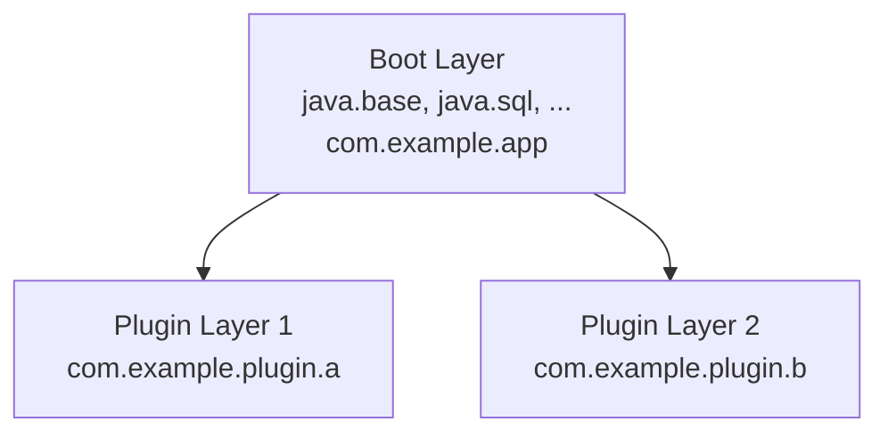

**Сценарии применения:**

- **Плагинные системы** — загрузка и выгрузка плагинов без перезапуска приложения.
- **Мультиверсионность** — разные версии одного модуля живут в разных слоях, не конфликтуя.
- **Изоляция** — у каждого слоя свой `ClassLoader`, поэтому классы с одинаковыми именами из разных слоёв не пересекаются.
- **Серверы приложений** — `Jakarta EE`-серверы так изолируют деплойменты друг от друга.

Все эти сценарии опираются на одно свойство: отдельный `ClassLoader` на слой даёт изоляцию пространств имён. `ModuleLayer` — продвинутая тема, на собеседовании достаточно понимать, что это динамический аналог `module path` для рантайма.

## Q24. Как в `JPMS` обрабатываются циклические зависимости между модулями?

`JPMS` **запрещает** циклы между модулями: `module A requires B` и `module B requires A` одновременно невозможны. Это не ограничение реализации, а сознательное решение — модульный граф должен быть направленным ациклическим (DAG), чтобы система могла однозначно разрешить порядок и читаемость. Цикл ловится при сборке или старте:

```
java.lang.module.ResolutionException:
  Cycle detected: com.example.a requires com.example.b requires com.example.a
```

**Решения:**

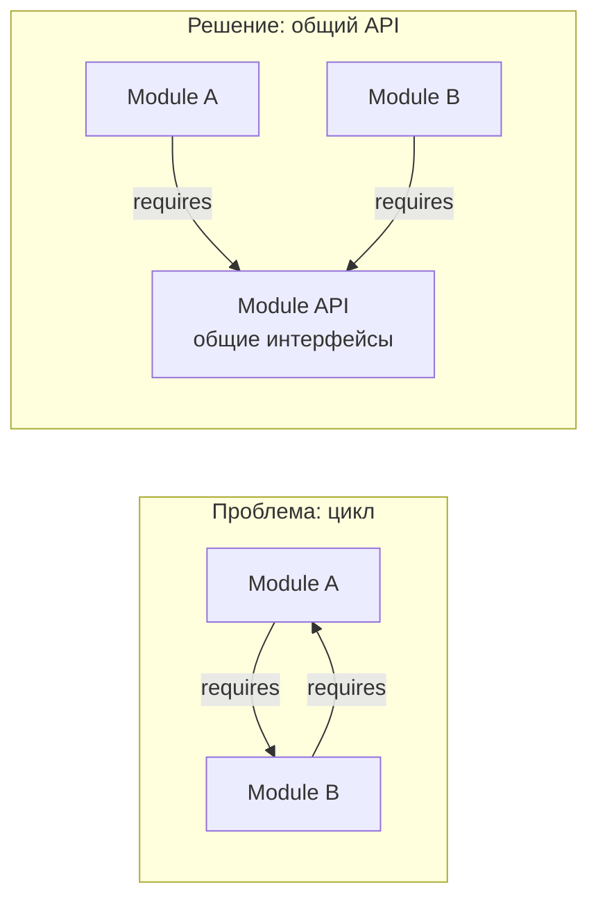

1. **Выделить общий контракт** в третий модуль `api`, от которого зависят оба — цикл превращается в две стрелки в одну сторону.
2. **Инвертировать зависимость** через интерфейсы (принцип DIP): один модуль зависит от абстракции, а не от конкретного соседа.
3. **`ServiceLoader`** (`uses`/`provides`) — заменить жёсткий `requires` на слабую связь через сервис.
4. **Объединить модули**, если они настолько срослись, что граница между ними искусственна.

По сути, запрет циклов — это не помеха, а встроенный архитектурный надзор: он заставляет держать зависимости однонаправленными, тех же принципов добиваются в [паттернах проектирования](../../design-patterns/design-patterns-interview.md).

## Q25. Как тестировать модульное приложение?

Главная сложность тестов в модульном мире — конфликт интересов: продуктовый код хочет инкапсуляции и не экспортирует internal-пакеты, а тестам как раз нужно лезть в эти internal-пакеты. Решается это через `--patch-module` (тесты «вшиваются» в тот же модуль) и точечные `--add-opens`/`--add-reads`.

**Unit-тесты**: тесты обычно живут в том же модуле (тестовый source set). Maven Surefire и Gradle сами добавляют `--patch-module` и `--add-reads`, чтобы тестовый код считался частью продуктового модуля и видел его внутренности:

```bash
# Maven Surefire автоматически добавляет --patch-module и --add-reads
# для тестового кода
```

**Доступ к неэкспортируемым пакетам**:

```java
// module-info.java основного модуля
module com.example.service {
    exports com.example.service.api;
    // internal пакет НЕ экспортирован
}
```

```groovy
// build.gradle — открытие для тестов
tasks.withType(Test).configureEach {
    jvmArgs += [
        '--add-opens', 'com.example.service/com.example.service.internal=ALL-UNNAMED',
        '--add-reads', 'com.example.service=ALL-UNNAMED'
    ]
}
```

**Интеграционные тесты**: их стоит гонять именно в модульном режиме, а не на classpath. На classpath многие модульные проблемы не проявляются (`split packages`, забытый `opens` для фреймворка), и тогда они вылезут уже в продакшене. Модульный прогон ловит их раньше.

**Whitebox vs Blackbox:**

- **Blackbox** — тест ходит только в экспортированный API модуля, как настоящий клиент. Не требует флагов, проверяет публичный контракт.
- **Whitebox** — тест через `--add-opens` / `--add-exports` дотягивается до internal-пакетов. Нужен, когда хочется протестировать внутреннюю логику в обход публичного API.

## Q26. (!) Как `Spring`/`Spring Boot` работает с модульной системой?

Короткий ответ: технически `Spring` совместим с `JPMS`, но на практике почти все `Spring Boot`-приложения по-прежнему живут на `classpath` без `module-info.java`. Причина — Spring построен на рефлексии, а рефлексия в модульном мире требует обильных `opens`, что съедает всю выгоду от инкапсуляции.

**Что именно требует рефлексии:**

1. **Создание и связывание бинов**: DI, инъекция в приватные поля, обработка `@Value` и `@Autowired`.
2. **Classpath scanning**: `@ComponentScan` обходит пакеты в поисках компонентов — ему нужен доступ к классам.
3. **Dynamic proxies**: CGLIB-прокси создают подклассы ваших бинов на лету, а для этого пакет должен быть `open`.

**Если вы модуляризуете `Spring Boot` приложение:**

```java
open module com.example.webapp {
    requires spring.boot;
    requires spring.boot.autoconfigure;
    requires spring.context;
    requires spring.web;
    requires spring.data.jpa;
    requires jakarta.persistence;

    // open module открывает всё для рефлексии
    exports com.example.webapp.api;
}
```

Или точечно без `open module`:

```java
module com.example.webapp {
    requires spring.boot;
    requires spring.context;
    requires spring.web;

    exports com.example.webapp.api;
    opens com.example.webapp to spring.core, spring.beans, spring.context;
    opens com.example.webapp.config to spring.core, spring.context;
    opens com.example.webapp.model to org.hibernate.orm, com.fasterxml.jackson.databind;
}
```

**На собеседовании** достаточно сформулировать так: `Spring` с `JPMS` работает, но ценой множества `opens`-директив — поэтому в индустрии чаще остаются на classpath. Подробнее о Spring — в вопросах по [Java Core](java-core-interview.md).

## Q27. Как `Hibernate`/`JPA` взаимодействует с модулями?

`Hibernate` — один из самых «рефлексивных» фреймворков: он не вызывает ваши сущности через публичный API, а напрямую читает и пишет их приватные поля. Поэтому ему мало `exports` — обязательно нужен `opens` для пакета с entity, иначе он не сможет ни создать сущность, ни загрузить её поля:

```java
module com.example.persistence {
    requires jakarta.persistence;
    requires org.hibernate.orm.core;
    requires java.sql;

    // Hibernate нужен рефлексивный доступ к entity-классам
    opens com.example.persistence.entity to org.hibernate.orm.core;

    exports com.example.persistence.repository;
}
```

**Что `Hibernate` делает через рефлексию:**

- Создаёт экземпляры entity через конструктор по умолчанию.
- Читает и пишет приватные поля напрямую — это основа lazy loading и dirty checking.
- Генерирует прокси для отложенной загрузки коллекций и связей.
- Разбирает аннотации `@Entity`, `@Column`, `@OneToMany` на ваших классах.

Если пакет с entity не открыт через `opens`, `Hibernate` не сможет даже создать persister и упадёт ещё на старте:

```
org.hibernate.MappingException: Could not get constructor for
  org.hibernate.persister.entity.SingleTableEntityPersister
Caused by: InaccessibleObjectException
```

## Q28. Какие практики проектирования модулей считаются хорошими?

Все хорошие практики `JPMS` вытекают из одной идеи: модуль должен раскрывать минимум и зависеть явно. Конкретно это означает:

1. **Минимальный экспорт** — наружу отдаём только API-пакеты, реализацию и утилиты прячем. Чем меньше `exports`, тем меньше публичный контракт, который потом нельзя ломать.
2. **Модуль = осмысленная единица** — делим по домену или функциональности, а не по техническим слоям (`web`/`service`/`dao`), иначе модули будут постоянно тянуть друг друга.
3. **`opens` точечно** — открываем конкретный пакет конкретному фреймворку, а не объявляем весь модуль `open` без нужды.
4. **API отдельно от реализации** — стабильный `com.example.api` против изменчивого `com.example.impl`; клиенты зависят только от API.
5. **Никаких split packages** — каждый пакет ровно в одном модуле.
6. **`requires transitive`** для зависимостей, которые протекают в публичный API, чтобы клиенты не дописывали `requires` за вас.

**Пример хорошей структуры:**

```
com.example.api          // контракты (exports)
com.example.impl         // реализации (не экспортируется)
com.example.spi          // точки расширения (exports)
com.example.internal     // внутренние утилиты (не экспортируется)
```

```java
module com.example.service {
    requires transitive com.example.api;    // API видно клиентам
    requires com.example.impl;              // impl скрыт от клиентов

    exports com.example.service.api;
    provides com.example.spi.Processor
        with com.example.service.DefaultProcessor;
}
```

## Q29. Какие типичные ошибки допускают при работе с модулями?

Большинство ошибок новичка в `JPMS` — это либо забытая декларация (`requires`/`opens`), либо попытка обойти инкапсуляцию там, где её нужно настроить правильно. Симптом почти всегда говорит, чего именно не хватает:

| Ошибка | Последствие | Решение |
|--------|-------------|---------|
| Забыли `requires` | `java.lang.module.FindException` | Добавить зависимость |
| Не указали `opens` для фреймворка | `InaccessibleObjectException` | Добавить `opens ... to` |
| Split package между модулями | `ResolutionException` | Переразбить пакеты |
| `requires` на `unnamed module` | Ошибка компиляции | Использовать `automatic module` |
| `open module` везде | Потеря инкапсуляции | Использовать точечные `opens` |
| Имя automatic module из файла JAR | Нестабильное имя при обновлении | Попросить автора добавить `Automatic-Module-Name` |
| Циклическая зависимость | `ResolutionException` | Выделить общий API-модуль |
| Экспорт implementation-пакетов | Хрупкий API | Экспортировать только контракты |

## Q30. Каковы перспективы развития модульной системы `Java`?

Вектор развития один: модульная информация всё чаще используется не как «опция для дисциплины», а как вход для оптимизаций платформы.

- **Строгая инкапсуляция** (Java 16-17): флаг `--illegal-access` удалён, доступ к internal API закрыт по умолчанию — обходные пути требуют явных флагов.
- **`jlink`-оптимизации**: лучшее сжатие образов и поддержка CDS (Class Data Sharing) внутри собранного runtime.
- **Project Leyden** (в разработке): статическая и AOT-компиляция, опирающаяся на знание о модульном графе для агрессивных оптимизаций.
- **Project Panama**: модули для FFI (Foreign Function Interface) — нативная интеграция в модульном мире.
- **Adoption**: экосистема постепенно добавляет `Automatic-Module-Name` и полноценные `module-info.java`, но медленно.

**Реальность**: несмотря на то, что `JPMS` существует с 2017 года (`Java 9`), массовое adoption идёт медленно. Большинство `Spring Boot` приложений работают на `classpath`. Однако понимание `JPMS` важно для:
- Работы с библиотеками и `JDK` internals
- Понимания ошибок `InaccessibleObjectException`
- Оптимизации Docker-образов через `jlink`
- Собеседований по глубоким знаниям [Java Core](java-core-interview.md) и [JVM](../../jvm/jvm-interview.md)

## Q31. Чем отличаются `unnamed module`, `automatic module` и `named module` на практике?

Три типа модулей — центральное понятие `JPMS`, и различают их по двум осям: где лежит артефакт (`classpath` или `module path`) и есть ли у него `module-info.class`. Эта пара признаков и определяет всё поведение — видимость, инкапсуляцию и то, можно ли на модуль сослаться.

**Unnamed module** — всё, что попало на `classpath`. Не настоящий модуль: ни имени, ни `module-info.java`. Существует только ради обратной совместимости.

**Automatic module** — JAR без `module-info.class`, но положенный на `module path`. JVM автоматически даёт ему имя и открывает наружу.

**Named module** — JAR с `module-info.class`. Полноценный `JPMS`-модуль с явными `exports`, `requires` и реальной инкапсуляцией.

**Практическая разница:**

| | Unnamed | Automatic | Named |
|--|---------|-----------|-------|
| Может `requires`-ить именованный | да (неявно) | да | да |
| Может `requires`-ить `unnamed` | да (неявно) | да | **нет** |
| Именованный может `requires`-ить | **нет** | да | да |
| Экспортирует всё | да | да | только через `exports` |
| Открыт для рефлексии | да | да | только через `opens` |

**Ключевое для миграции:** именованный модуль **не может** объявить `requires` на `unnamed module`. Это «стена» между модульным миром и legacy classpath. Именно поэтому `automatic module` — необходимый мост: именованный модуль может `requires`-ить `automatic`, а тот уже читает `unnamed`.

```
Именованный → requires → Automatic → читает → Unnamed
(module-info)              (без module-info,   (classpath)
                            на module path)
```

Диагностика типа артефакта:

```bash
# Проверить, является ли JAR модулем и каким
jar --describe-module --file=mylib.jar
# Для named module: выведет module-info
# Для automatic module: "No module descriptor found, not a modular JAR"
# Unnamed: вообще не на module path
```

## Q32. `Split packages`: почему запрещены в `JPMS` и как их устранить?

**Split package** — когда классы одного пакета (`com.example.util`) разбросаны по нескольким модулям сразу. В `JPMS` это жёстко запрещено.

**Почему запрещено:** в модульной модели пакет — атомарная единица принадлежности: ровно один модуль «владеет» пакетом и решает, кому его читать. Split package ломает это правило — система не может однозначно сказать, чей это пакет. На classpath проблему «решало» правило «первый найденный побеждает», но оно давало недетерминированный результат в зависимости от порядка JAR. `JPMS` предпочёл ранний явный отказ молчаливой непредсказуемости.

**Классический пример:**

```
javax.annotation-api-1.3.2.jar  → содержит javax.annotation.*
java.xml.ws.annotation (JDK)    → также содержит javax.annotation.*

# При запуске на module path:
java.lang.module.ResolutionException: Modules javax.annotation.api and
  java.xml.ws.annotation export package javax.annotation to module myapp
```

**Диагностика через `jdeps`:**

```bash
# Найти split packages в наборе JAR
jdeps --multi-release 17 --module-path mods --check com.example.app
```

**Решения:**

| Стратегия | Применение |
|-----------|------------|
| **Исключить дублирующую зависимость** | Maven `<exclusion>`, Gradle `exclude` — самое простое |
| **`--patch-module`** | Слить два JAR в один модуль: `--patch-module java.annotation=javax.annotation-api.jar` |
| **Переименовать пакеты** | `relocate` в Maven Shade/Gradle Shadow Plugin |
| **Перейти на Jakarta EE** | Многие `javax.*` → `jakarta.*` в Jakarta EE 9+ |
| **Разбить JAR** | Если собственный код — вынести общий пакет в отдельный модуль |

```bash
# Быстрый workaround через --patch-module
java --module-path mods \
     --patch-module java.xml.ws.annotation=javax.annotation-api.jar \
     -m com.example.app/com.example.Main
```

## Q33. `--add-opens` и `--add-exports`: когда и как использовать для рефлексии с `JPMS`?

Эти два флага делают то же, что директивы в `module-info.java`, только снаружи — из командной строки. Они нужны ровно тогда, когда дескриптор править нельзя или нецелесообразно: чужая библиотека, доступ к internal-пакетам JDK, временный обход на время миграции. Разница между флагами повторяет разницу `exports` и `opens`: `--add-exports` даёт доступ на уровне языка, `--add-opens` — на уровне рефлексии.

**`--add-exports`** = внешний аналог `exports pkg to M`: открывает пакет для compile-time и runtime доступа к `public`-членам:

```bash
# Синтаксис: --add-exports <module>/<package>=<target-module>
# ALL-UNNAMED — все классы из classpath

java --add-exports java.base/sun.nio.ch=ALL-UNNAMED -jar my-app.jar

# При компиляции:
javac --add-exports java.base/sun.nio.ch=com.example.app -d out src/...
```

**`--add-opens`** = внешний аналог `opens pkg to M`: открывает пакет для глубокой рефлексии, включая `setAccessible(true)` на приватных членах:

```bash
# Типичный набор для Spring Boot:
java --add-opens java.base/java.lang=ALL-UNNAMED \
     --add-opens java.base/java.lang.reflect=ALL-UNNAMED \
     --add-opens java.base/java.util=ALL-UNNAMED \
     --add-opens java.base/java.util.concurrent=ALL-UNNAMED \
     -jar spring-boot-app.jar
```

**Разница между флагами:**

| Флаг | Доступ | Аналог в module-info |
|------|--------|---------------------|
| `--add-exports` | Public типы и члены | `exports pkg to M` |
| `--add-opens` | Все типы и члены через рефлексию | `opens pkg to M` |

**Добавление в `build.gradle.kts` для тестов:**

```kotlin
tasks.withType<Test> {
    jvmArgs(
        "--add-opens", "java.base/java.lang=ALL-UNNAMED",
        "--add-opens", "java.base/java.util=ALL-UNNAMED"
    )
}
```

**Подводный камень:** воспринимайте оба флага как временные меры, а не как штатный способ настройки. Они «лечат симптом» снаружи и легко расползаются по скриптам запуска. Долгосрочное решение — прописать `opens`/`exports` в `module-info.java` или обновить зависимость до версии с поддержкой `JPMS`.

## Q34. `jlink`: создание custom minimal JRE — практическое руководство

`jlink` собирает **custom runtime image** — самодостаточный дистрибутив JVM, в который вшиты только нужные модули. Жёсткое требование: все модули в графе должны быть **именованными**; `automatic` и `unnamed` он не переварит, и об этом часто спотыкаются.

Рабочий процесс всегда один и тот же: сначала `jdeps` подсказывает список модулей, потом `jlink` собирает образ, потом запуск через сгенерированный launcher.

**Полный рабочий пример:**

```bash
# 1. Анализируем зависимости
jdeps --print-module-deps \
      --ignore-missing-deps \
      --multi-release 17 \
      --module-path mods \
      myapp.jar
# Вывод: java.base,java.sql,java.logging

# 2. Создаём custom runtime
jlink \
  --module-path $JAVA_HOME/jmods:mods \
  --add-modules com.example.app,java.base,java.sql,java.logging \
  --output dist/myapp-runtime \
  --strip-debug \
  --no-header-files \
  --no-man-pages \
  --compress zip-6 \
  --launcher myapp=com.example.app/com.example.Main

# 3. Запуск
./dist/myapp-runtime/bin/myapp
```

**Docker (многоэтапная сборка):**

```dockerfile
FROM eclipse-temurin:17-jdk AS builder
COPY mods/ /app/mods/
RUN $JAVA_HOME/bin/jlink \
    --module-path $JAVA_HOME/jmods:/app/mods \
    --add-modules com.example.app \
    --output /app/runtime \
    --strip-debug --compress zip-6 \
    --no-header-files --no-man-pages

FROM debian:bullseye-slim
COPY --from=builder /app/runtime /opt/myapp
ENTRYPOINT ["/opt/myapp/bin/myapp"]
# Итоговый размер: ~50 MB вместо 300+ MB
```

**Подводные камни:**

- `Error: automatic module found in jlink` — в графе оказался `automatic module`. `jlink` именованные модули требует категорически: либо модуляризовать зависимость, либо схлопнуть её в fat JAR.
- `Module not found` — модуля нет на `module path`. Проверьте `--module-path` (часто забывают добавить `$JAVA_HOME/jmods`).

## Q35. `jdeps`: анализ зависимостей модулей перед миграцией

`jdeps` — статический анализатор зависимостей JAR-файлов и первый инструмент, который берут в руки перед миграцией на `JPMS`. Он отвечает на три вопроса, без которых нельзя написать `module-info.java`: от каких модулей JDK зависит код, не использует ли он внутренних API (`sun.*`), и как мог бы выглядеть дескриптор. По сути `jdeps` превращает миграцию из угадывания в проверяемый план.

**Основные режимы работы:**

```bash
# Краткий анализ зависимостей (по модулям JDK)
jdeps -s myapp.jar
# Вывод:
# myapp.jar -> java.base
# myapp.jar -> java.sql
# myapp.jar -> not found

# Анализ всех JAR в директории
jdeps --module-path lib -s --multi-release 17 lib/*.jar

# Генерация module-info.java
jdeps --generate-module-info out/ mylib.jar
# Создаёт: out/mylib/module-info.java

# Поиск использования внутренних JDK API (sun.*, jdk.internal.*)
jdeps --jdk-internals myapp.jar
```

**Пример вывода `--jdk-internals`:**

```
myapp.jar -> JDK internal API: sun.misc.Unsafe
myapp.jar -> JDK internal API: sun.security.util.KeyUtil

JDK internal API                Suggested Replacement
sun.misc.Unsafe                 See http://openjdk.java.net/jeps/260
sun.security.util.KeyUtil       java.security.KeyFactory
```

**Генерированный `module-info.java`:**

```bash
jdeps --generate-module-info generated/ --module-path lib lib/mylib.jar
# Результат: generated/mylib/module-info.java
# module mylib {
#     requires java.base;
#     requires java.sql;
#     exports com.example.mylib;
# }
```

Сгенерированный файл — черновик, а не готовый дескриптор: `jdeps` видит только статические зависимости и не знает про рефлексию. Поэтому его дорабатывают вручную — добавляют `opens` для фреймворков и сужают `exports` до настоящего API.

## Q36. `ServiceLoader` с `JPMS`: директивы `uses` и `provides...with` в деталях

Принципиальное изменение в модульном мире: регистрация сервиса больше не текстовый файл `META-INF/services/`, а декларация в `module-info.java`. Связка из трёх ролей: модуль-контракт `exports` интерфейс, модуль-реализация объявляет `provides ... with`, модуль-потребитель — `uses`. Реализация при этом остаётся скрытой: её пакет не экспортируется, наружу торчит только интерфейс из SPI-модуля.

**Полный пример SPI-архитектуры:**

```java
// Модуль SPI (контракт)
module com.example.spi {
    exports com.example.spi; // интерфейс PaymentProvider
}

// Модуль реализации
module com.example.stripe {
    requires com.example.spi;
    // НЕ нужно exports для реализации!
    provides com.example.spi.PaymentProvider
        with com.example.stripe.StripeProvider,
             com.example.stripe.StripeTestProvider; // можно несколько
}

// Модуль приложения (потребитель)
module com.example.app {
    requires com.example.spi;
    uses com.example.spi.PaymentProvider; // объявляет потребление
}
```

```java
// Java 9+: стримовое API
ServiceLoader<PaymentProvider> loader = ServiceLoader.load(PaymentProvider.class);

Optional<PaymentProvider> stripe = loader.stream()
    .filter(p -> p.type().getSimpleName().contains("Stripe"))
    .map(ServiceLoader.Provider::get)
    .findFirst();
```

**Ключевое отличие от classpath:**

| Аспект | `classpath` | `module path` (JPMS) |
|--------|-------------|----------------------|
| Регистрация | `META-INF/services/<interface>` | `provides ... with` в `module-info.java` |
| Обнаружение | Сканирование всех JAR | Только модули с `provides` |
| Валидация | В runtime | При разрешении модульного графа |

**Подводный камень:** `provides` работает, только если модуль-провайдер лежит на `module path`; на classpath декларация молча игнорируется. Для `automatic` и `unnamed` модулей роль регистрации по-прежнему играет `META-INF/services` — поэтому в гибридных проектах сервис может «потеряться» именно из-за того, что провайдер оказался не на том пути.

## Q37. Совместимость `Spring`, `Hibernate` и `Jackson` с `JPMS`: типичные проблемы

У всех трёх фреймворков одна и та же причина проблем — рефлексия, и один и тот же класс ошибки — `InaccessibleObjectException` (у Jackson — «нет сериализатора»). Симптом всегда называет конкретный пакет и модуль-фреймворк, которому в этот пакет нужно открыть `opens`. Поэтому лечение однотипное: добавить `opens <ваш пакет> to <модуль фреймворка>`. Ниже — три характерных случая.

**Spring Framework:**

```
InaccessibleObjectException: Unable to make field private final ...
  accessible: module com.example.app does not "opens com.example.config"
  to module spring.core
```

Решение:

```java
module com.example.app {
    requires spring.core;
    requires spring.context;
    requires spring.web;
    requires spring.boot;
    requires spring.boot.autoconfigure;

    // Spring нужна рефлексия для бинов, AOP-прокси, @Value
    opens com.example.app to spring.core, spring.beans, spring.context;
    opens com.example.app.config to spring.core, spring.context;
    opens com.example.app.service to spring.core, spring.beans;

    exports com.example.app.api;
}
```

**Hibernate:**

```
InaccessibleObjectException: Unable to make field private String name
  accessible: module com.example.app does not "opens com.example.entity"
  to module org.hibernate.orm.core
```

Решение:

```java
module com.example.app {
    requires jakarta.persistence;
    requires org.hibernate.orm.core;

    // Hibernate нужен доступ к полям entity (lazy loading, dirty checking)
    opens com.example.app.entity to org.hibernate.orm.core;
}
```

**Jackson:**

```
InvalidDefinitionException: No serializer found for class com.example.dto.UserDto
```

Решение:

```java
module com.example.app {
    requires com.fasterxml.jackson.databind;

    // Jackson нужна рефлексия для сериализации/десериализации
    opens com.example.app.dto to com.fasterxml.jackson.databind;
}
```

**Рекомендация:** на первой модуляризации `Spring Boot`-приложения начните с `open module` — он откроет всё для рефлексии и снимет лавину `InaccessibleObjectException` разом. Когда приложение поднялось, постепенно заменяйте `open module` на точечные `opens ... to`, возвращая инкапсуляцию там, где она реально нужна.

## Q38. Стратегии миграции legacy-кода: `Bottom-Up` vs `Top-Down` в деталях

Миграция на `JPMS` — всегда итеративный процесс, а две стратегии отличаются направлением обхода графа зависимостей и тем, в каком окружении работает каждый промежуточный шаг.

**Bottom-Up (снизу вверх) — рекомендуемая:**

Идём от листьев графа — модулей, которые не зависят от другого вашего кода. К моменту модуляризации очередного модуля все его собственные зависимости уже именованные, поэтому шаг проходит в «чистом» модульном окружении.

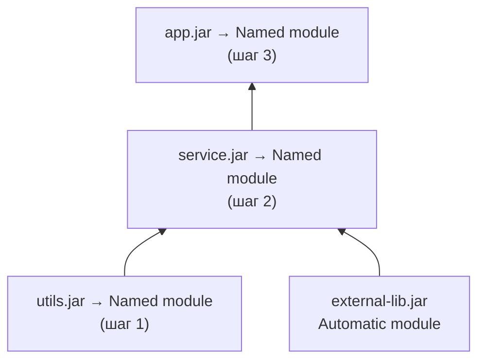

```java
// Шаг 1: utils — нет зависимостей на свой код
module com.example.utils {
    exports com.example.utils;
}

// Шаг 2: service
module com.example.service {
    requires com.example.utils;   // named module
    requires external.lib;        // automatic module (временно)
    exports com.example.service.api;
}

// Шаг 3: app
module com.example.app {
    requires com.example.service;
    requires com.example.utils;
    exports com.example.app;
}
```

**Top-Down (сверху вниз) — для быстрой видимости границ:**

Идём от приложения верхнего уровня, оставляя ещё не тронутые зависимости как `automatic modules`. Так модульные границы самого приложения проявляются сразу, но платой становится временная опора на `automatic`-имена.

```java
module com.example.app {
    requires com.example.service; // пока automatic module
    requires com.example.utils;   // пока automatic module
    exports com.example.app;
}
// Затем постепенно добавляем module-info в service, utils
```

**Практический чеклист:**

```bash
# 1. Анализировать зависимости
jdeps --module-path lib --multi-release 17 -s app.jar

# 2. Найти использование internal JDK API
jdeps --jdk-internals --multi-release 17 app.jar

# 3. Найти split packages
jdeps --module-path lib --check com.example.app

# 4. Проверить наличие Automatic-Module-Name в сторонних JAR
jar --describe-module --file=lib/external.jar

# 5. Добавить module-info.java (начать с листьев)
# 6. Добавить --add-opens для фреймворков (временно)
# 7. Запустить тесты в модульном режиме
# 8. Постепенно убирать --add-opens, добавляя opens в module-info
```

**Когда честнее остаться на classpath:** если проект тащит много legacy-библиотек без `Automatic-Module-Name` или активно завязан на `sun.*` API, полная модуляризация съест больше, чем принесёт. Разумный компромисс — не модуляризовать код приложения целиком, но всё равно выжать из модулей главную практическую выгоду: собрать компактный Docker-образ через `jlink` с `--add-modules` поверх модульного JDK.

---

## See also

- [Java Core](java-core-interview.md) — базовые концепции языка, `ClassLoader`, рефлексия и инкапсуляция
- [Java 17-21](java-17-21-interview.md) — `sealed classes`, `records`, `virtual threads` — фичи, тесно связанные с модульностью
- [Java Annotations](java-annotations-interview.md) — аннотации и Annotation Processing в модульном контексте
- [Java IO / NIO](java-io-nio-interview.md) — `ServiceLoader` для плагинов ввода-вывода, модульные провайдеры
- [JVM](../../jvm/jvm-interview.md) — загрузка классов, `ClassLoader` иерархия, `InaccessibleObjectException` при рефлексии
- [Паттерны проектирования](../../design-patterns/design-patterns-interview.md) — `Service Locator`, `Plugin Pattern` через `ServiceLoader`
- [Spring Framework](../../frameworks/spring/spring-framework-interview.md) — Spring и `JPMS`: совместимость, `opens` для рефлексии Spring
- [Java 8](java-8-interview.md)
- [Java Annotations](java-annotations-interview.md)
- [Java Collections](java-collections-interview.md)
- [Java Concurrency](java-concurrency-interview.md)
- [Java Conditional Statements](java-conditional-statements-interview.md)
