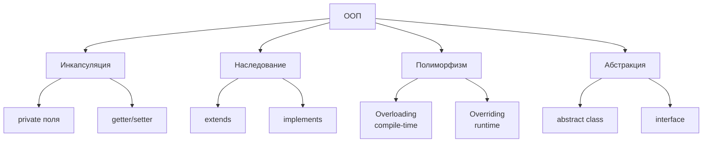
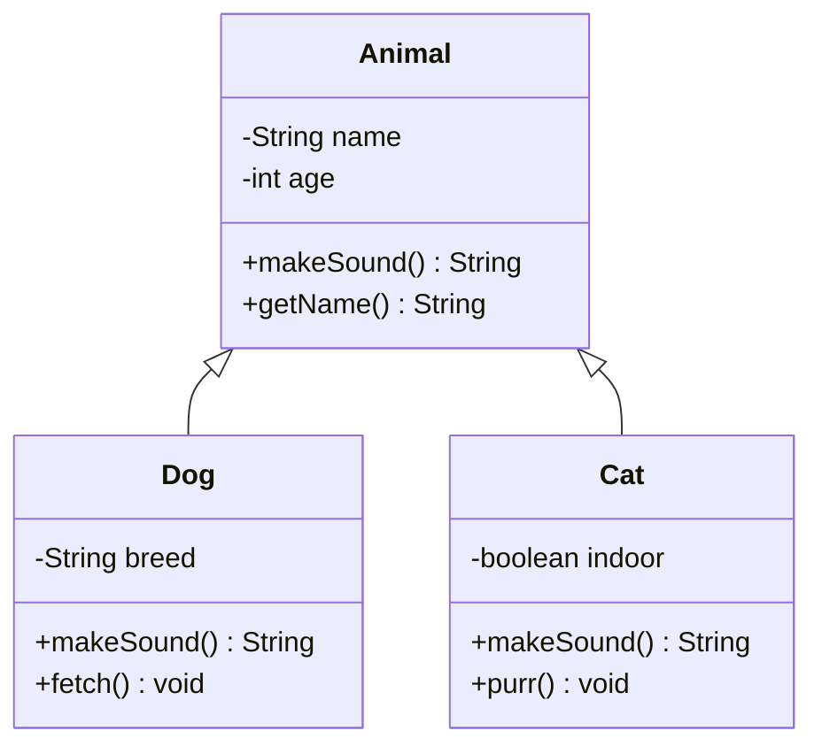
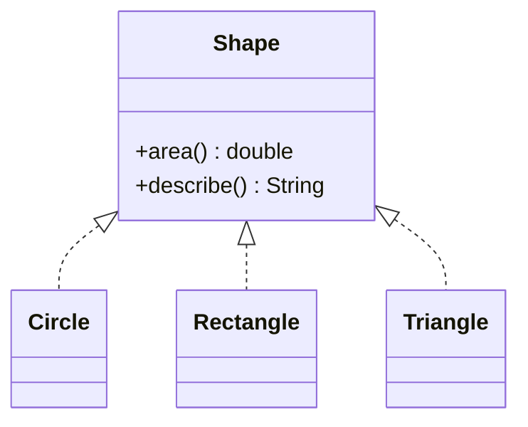
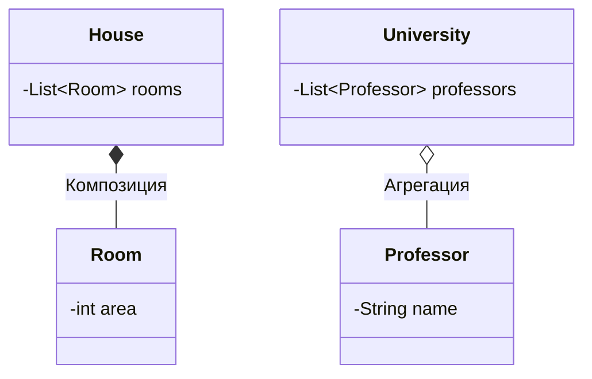
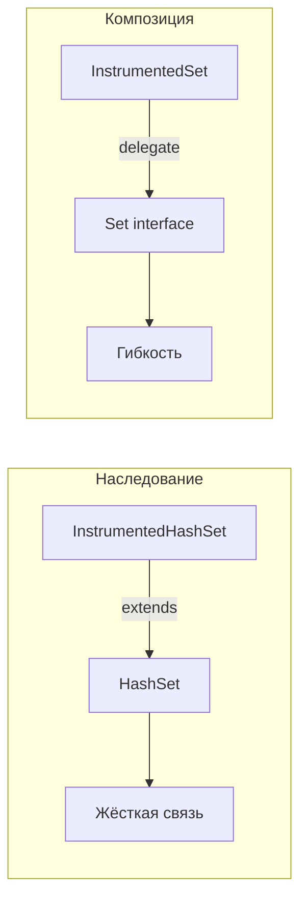
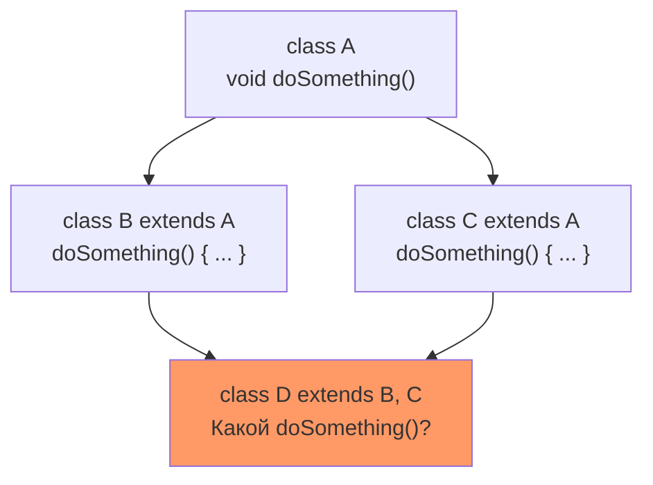
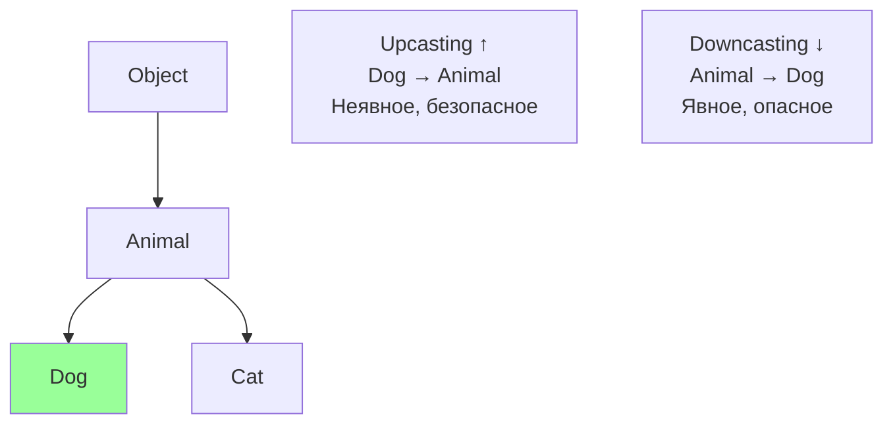
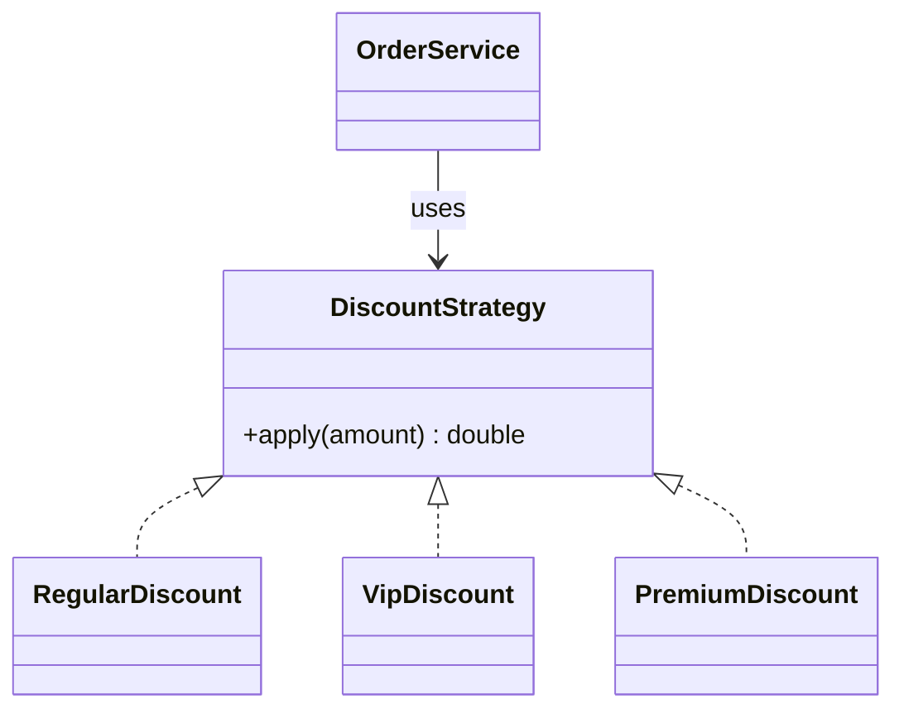
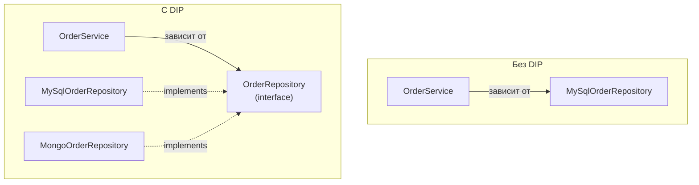
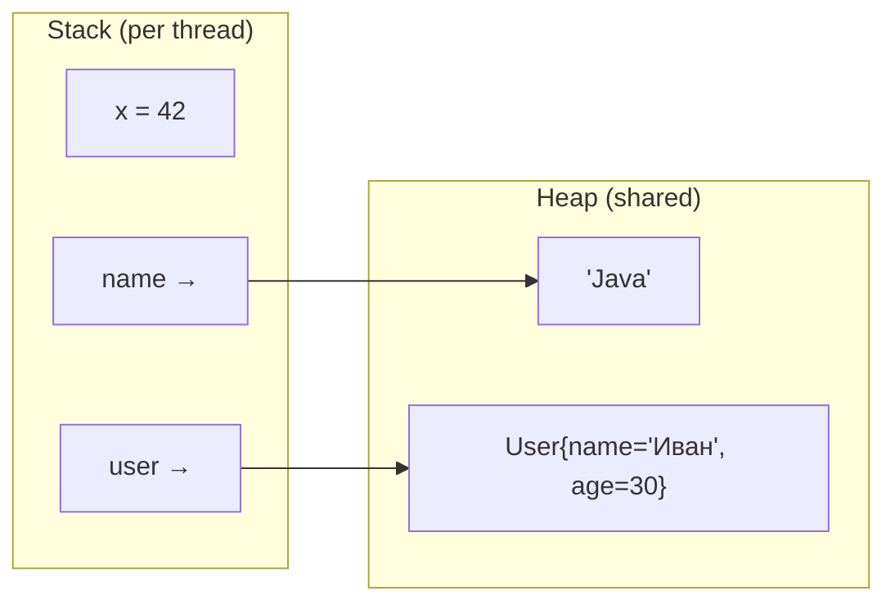

# Вопросы на собеседовании: `OOP` & `Java`

Комплексное руководство по вопросам собеседования на тему `OOP` в `Java` для `Senior Java Developer`. Включает детальные объяснения принципов ООП, примеры кода, диаграммы, `SOLID`, паттерны проектирования и практические рекомендации.

## Полезные ссылки

### Официальная документация

- [Oracle Java Documentation](https://docs.oracle.com/en/java/)
- [Java Language Specification](https://docs.oracle.com/javase/specs/jls/se17/html/)
- [Java Tutorial - Object-Oriented Programming Concepts](https://docs.oracle.com/javase/tutorial/java/concepts/)
- [A Solid Guide to SOLID Principles — Baeldung](https://www.baeldung.com/solid-principles)
- [Polymorphism in Java — Baeldung](https://www.baeldung.com/java-polymorphism)
- [Inheritance and Composition in Java — Baeldung](https://www.baeldung.com/java-inheritance-composition)
- [Using an Interface vs. Abstract Class — Baeldung](https://www.baeldung.com/java-interface-vs-abstract-class)

## Содержание

- [Полезные ссылки](#полезные-ссылки)
- [See also](#see-also)

**Основы ООП**
- [Q1. (!) Что такое ООП и каковы его основные принципы?](#q1--что-такое-ооп-и-каковы-его-основные-принципы)
- [Q2. (!) Что такое инкапсуляция?](#q2--что-такое-инкапсуляция)
- [Q3. (!) Что такое наследование?](#q3--что-такое-наследование)
- [Q4. (!) Что такое полиморфизм?](#q4--что-такое-полиморфизм)
- [Q5. Что такое абстракция?](#q5-что-такое-абстракция)
- [Q6. Что такое класс, объект и интерфейс?](#q6-что-такое-класс-объект-и-интерфейс)
- [Q7. В чем преимущества и недостатки ООП?](#q7-в-чем-преимущества-и-недостатки-ооп)

**Наследование и типы отношений**
- [Q8. (!) В чём разница между композицией и агрегацией?](#q8--в-чём-разница-между-композицией-и-агрегацией)
- [Q9. Что означают отношения is-a и has-a?](#q9-что-означают-отношения-is-a-и-has-a)
- [Q10. (!) Почему композиция предпочтительнее наследования?](#q10--почему-композиция-предпочтительнее-наследования)
- [Q11. Что такое множественное наследование и почему в Java его нет?](#q11-что-такое-множественное-наследование-и-почему-в-java-его-нет)
- [Q12. (!) В чём разница между абстрактным классом и интерфейсом?](#q12--в-чём-разница-между-абстрактным-классом-и-интерфейсом)
- [Q13. Что такое `default`-методы в интерфейсах?](#q13-что-такое-default-методы-в-интерфейсах)
- [Q14. Что такое `sealed`-классы?](#q14-что-такое-sealed-классы)

**Полиморфизм и связывание**
- [Q15. (!) В чём разница между перегрузкой и переопределением методов?](#q15--в-чём-разница-между-перегрузкой-и-переопределением-методов)
- [Q16. Что такое статическое и динамическое связывание?](#q16-что-такое-статическое-и-динамическое-связывание)
- [Q17. (!) В чём разница между Downcasting и Upcasting?](#q17--в-чём-разница-между-downcasting-и-upcasting)
- [Q18. Что такое ковариантный возвращаемый тип?](#q18-что-такое-ковариантный-возвращаемый-тип)

**SOLID и принципы проектирования**
- [Q19. (!) Принцип единственной ответственности (SRP)](#q19--принцип-единственной-ответственности-srp)
- [Q20. (!) Принцип открытости/закрытости (OCP)](#q20--принцип-открытостизакрытости-ocp)
- [Q21. (!) Принцип подстановки Лисков (LSP)](#q21--принцип-подстановки-лисков-lsp)
- [Q22. (!) Принцип разделения интерфейса (ISP)](#q22--принцип-разделения-интерфейса-isp)
- [Q23. (!) Принцип инверсии зависимостей (DIP)](#q23--принцип-инверсии-зависимостей-dip)
- [Q24. Принцип DRY](#q24-принцип-dry)
- [Q25. Принцип KISS](#q25-принцип-kiss)
- [Q26. Принцип YAGNI](#q26-принцип-yagni)

**Классы, модификаторы, память**
- [Q27. Что такое модификаторы доступа в Java?](#q27-что-такое-модификаторы-доступа-в-java)
- [Q28. Какие ещё модификаторы есть в Java?](#q28-какие-ещё-модификаторы-есть-в-java)
- [Q29. (!) В чем разница между Stack и Heap?](#q29--в-чем-разница-между-stack-и-heap)
- [Q30. Как передаются данные в Java — по ссылке или по значению?](#q30-как-передаются-данные-в-java--по-ссылке-или-по-значению)
- [Q31. (!) Какие есть методы у класса Object?](#q31--какие-есть-методы-у-класса-object)
- [Q32. Почему String является immutable?](#q32-почему-string-является-immutable)

**Продвинутые темы ООП**
- [Q33. Что такое Enum и как его использовать в ООП?](#q33-что-такое-enum-и-как-его-использовать-в-ооп)
- [Q34. Что такое Reflection?](#q34-что-такое-reflection)
- [Q35. Какова цель интерфейса Serializable?](#q35-какова-цель-интерфейса-serializable)
- [Q36. Что такое immutable объекты и как их создавать?](#q36-что-такое-immutable-объекты-и-как-их-создавать)
- [Q37. Что такое анонимные классы и лямбда-выражения?](#q37-что-такое-анонимные-классы-и-лямбда-выражения)
- [Q38. В чём разница между Comparable и Comparator?](#q38-в-чём-разница-между-comparable-и-comparator)

**Современные фичи ООП в Java**
- [Q39. (!) Что такое `Records` и как они меняют подход к написанию DTO?](#q39--что-такое-records-и-как-они-меняют-подход-к-написанию-dto)
- [Q40. (!) Что такое `sealed`-классы и зачем они нужны?](#q40--что-такое-sealed-классы-и-зачем-они-нужны)
- [Q41. Что такое `pattern matching` для `instanceof` и как его использовать?](#q41-что-такое-pattern-matching-для-instanceof-и-как-его-использовать)
- [Q42. В чём ключевые отличия `abstract class` от `interface` в современной Java?](#q42-в-чём-ключевые-отличия-abstract-class-от-interface-в-современной-java)
- [Q43. Что такое `static`-методы в интерфейсах и чем они отличаются от `default`?](#q43-что-такое-static-методы-в-интерфейсах-и-чем-они-отличаются-от-default)

---

## Q1. (!) Что такое ООП и каковы его основные принципы?

**Объектно-ориентированное программирование (ООП)** — парадигма программирования, основанная на концепции объектов, которые объединяют данные (поля) и поведение (методы).

Четыре основных принципа ООП:

| Принцип | Суть | Механизм в Java |
|---------|------|-----------------|
| **Инкапсуляция** | Скрытие внутренних деталей, доступ через публичный API | `private` поля + геттеры/сеттеры |
| **Наследование** | Создание новых классов на основе существующих | `extends`, `implements` |
| **Полиморфизм** | Один интерфейс — разные реализации | Переопределение, перегрузка |
| **Абстракция** | Выделение существенного, сокрытие деталей | `abstract class`, `interface` |



На собеседовании важно не просто перечислить принципы, а показать, как они взаимосвязаны: инкапсуляция защищает данные, абстракция определяет контракт, наследование переиспользует реализацию, а полиморфизм позволяет работать с разными типами через единый интерфейс.

## Q2. (!) Что такое инкапсуляция?

**Инкапсуляция** — принцип ООП, объединяющий данные и методы в единый объект и скрывающий внутреннюю реализацию от внешнего кода. Доступ к данным осуществляется только через контролируемый публичный API.

### Модификаторы доступа

| Модификатор | Класс | Пакет | Подкласс | Весь мир |
|------------|-------|-------|----------|----------|
| `private` | + | - | - | - |
| `package-private` | + | + | - | - |
| `protected` | + | + | + | - |
| `public` | + | + | + | + |

### Пример инкапсуляции с валидацией

```java
public class BankAccount {
    private String accountNumber;
    private BigDecimal balance;

    public BankAccount(String accountNumber, BigDecimal initialBalance) {
        this.accountNumber = Objects.requireNonNull(accountNumber);
        if (initialBalance.compareTo(BigDecimal.ZERO) < 0) {
            throw new IllegalArgumentException("Баланс не может быть отрицательным");
        }
        this.balance = initialBalance;
    }

    public void deposit(BigDecimal amount) {
        if (amount.compareTo(BigDecimal.ZERO) <= 0) {
            throw new IllegalArgumentException("Сумма должна быть положительной");
        }
        this.balance = this.balance.add(amount);
    }

    public void withdraw(BigDecimal amount) {
        if (amount.compareTo(balance) > 0) {
            throw new IllegalStateException("Недостаточно средств");
        }
        this.balance = this.balance.subtract(amount);
    }

    public BigDecimal getBalance() {
        return balance; // нет setBalance() — баланс меняется только через операции
    }
}
```

Ключевые моменты для собеседования:
- Инкапсуляция — это **не просто приватные поля + геттеры/сеттеры**. Настоящая инкапсуляция — это скрытие *поведения*, а не просто данных
- `setBalance()` в примере выше отсутствует намеренно: баланс изменяется только через бизнес-операции `deposit()` и `withdraw()`
- Валидация в методах гарантирует инвариант объекта (баланс >= 0)

## Q3. (!) Что такое наследование?

**Наследование** — механизм ООП, позволяющий создавать новые классы на основе существующих, наследуя их поля и методы. Подкласс расширяет суперкласс через ключевое слово `extends`.



```java
public abstract class Animal {
    private String name;
    private int age;

    public Animal(String name, int age) {
        this.name = name;
        this.age = age;
    }

    public abstract String makeSound();

    public String getName() { return name; }
}

public class Dog extends Animal {
    private String breed;

    public Dog(String name, int age, String breed) {
        super(name, age); // вызов конструктора родителя
        this.breed = breed;
    }

    @Override
    public String makeSound() {
        return "Гав!";
    }

    public void fetch() {
        System.out.println(getName() + " приносит палку");
    }
}

public class Cat extends Animal {
    public Cat(String name, int age) {
        super(name, age);
    }

    @Override
    public String makeSound() {
        return "Мяу!";
    }
}
```

### Правила наследования в Java

- Класс может наследоваться только от **одного** класса (`extends` — single inheritance)
- Класс может реализовывать **несколько** интерфейсов (`implements`)
- Конструкторы **не наследуются** — нужно вызывать `super()`
- `private`-члены суперкласса **не доступны** в подклассе напрямую
- `final`-классы **нельзя** наследовать, `final`-методы — переопределять

## Q4. (!) Что такое полиморфизм?

**Полиморфизм** — принцип ООП, позволяющий объектам разных типов реагировать на один и тот же вызов метода по-разному. В `Java` выделяют два вида:

### Полиморфизм времени компиляции (перегрузка, `overloading`)

Выбор метода происходит на этапе компиляции по сигнатуре (количество и типы параметров):

```java
public class Calculator {
    public int add(int a, int b) {
        return a + b;
    }

    public double add(double a, double b) {
        return a + b;
    }

    public int add(int a, int b, int c) {
        return a + b + c;
    }
}
```

### Полиморфизм времени выполнения (переопределение, `overriding`)

Вызываемый метод определяется реальным типом объекта в рантайме:

```java
public interface Shape {
    double area();
    String describe();
}

public class Circle implements Shape {
    private final double radius;

    public Circle(double radius) { this.radius = radius; }

    @Override
    public double area() { return Math.PI * radius * radius; }

    @Override
    public String describe() { return "Круг с радиусом " + radius; }
}

public class Rectangle implements Shape {
    private final double width, height;

    public Rectangle(double width, double height) {
        this.width = width;
        this.height = height;
    }

    @Override
    public double area() { return width * height; }

    @Override
    public String describe() { return "Прямоугольник " + width + "x" + height; }
}

// Полиморфный вызов — код не знает конкретный тип
public class ShapePrinter {
    public void printInfo(Shape shape) {
        System.out.println(shape.describe() + ", площадь = " + shape.area());
    }
}
```



На собеседовании часто спрашивают: «Можно ли переопределить `static`-метод?» Нет — `static`-методы связываются статически (по типу ссылки). Это называется *method hiding*, а не переопределение. Подробнее о перегрузке операторов: в `Java` её **нет** (в отличие от C++ или Kotlin).

## Q5. Что такое абстракция?

**Абстракция** — принцип ООП, позволяющий выделить существенные характеристики объекта и скрыть несущественные детали реализации. В `Java` абстракция реализуется через `abstract class` и `interface`.

```java
// Абстракция — контракт "что делать", без "как"
public interface PaymentProcessor {
    PaymentResult process(Payment payment);
    void refund(String transactionId);
}

// Конкретная реализация — "как именно"
public class StripePaymentProcessor implements PaymentProcessor {
    private final StripeClient client;

    @Override
    public PaymentResult process(Payment payment) {
        // Детали взаимодействия со Stripe API скрыты
        return client.charge(payment.getAmount(), payment.getCurrency());
    }

    @Override
    public void refund(String transactionId) {
        client.refund(transactionId);
    }
}
```

Абстракция отличается от инкапсуляции: инкапсуляция *скрывает данные*, а абстракция *скрывает сложность реализации*, предоставляя упрощённый интерфейс. На практике они работают вместе.

## Q6. Что такое класс, объект и интерфейс?

| Понятие | Определение | Аналогия |
|---------|-------------|----------|
| **Класс** | Шаблон (blueprint) для создания объектов | Чертёж дома |
| **Объект** | Конкретный экземпляр класса | Построенный дом |
| **Интерфейс** | Контракт, определяющий набор методов | Стандарт розетки |

```java
// Интерфейс — контракт
public interface Drivable {
    void accelerate(int speed);
    void brake();
}

// Класс — шаблон, реализующий контракт
public class Car implements Drivable {
    private String model;
    private int currentSpeed;

    public Car(String model) {
        this.model = model;
    }

    @Override
    public void accelerate(int speed) {
        this.currentSpeed += speed;
    }

    @Override
    public void brake() {
        this.currentSpeed = 0;
    }
}

// Объект — экземпляр класса
Car myCar = new Car("Tesla Model 3");
myCar.accelerate(60);
```

Начиная с `Java 16` (`JEP 395`) для простых data-классов рекомендуется использовать `record` — см. [[java-core-interview|Java Core]]:

```java
public record Point(double x, double y) {
    // Автоматически: конструктор, equals(), hashCode(), toString()
}
```

## Q7. В чем преимущества и недостатки ООП?

### Преимущества

- **Модульность** — код организован в классы с чёткими обязанностями
- **Повторное использование** — наследование и композиция позволяют переиспользовать код
- **Расширяемость** — новые классы добавляются без изменения существующего кода (OCP)
- **Понятность** — код моделирует реальные объекты предметной области
- **Тестируемость** — полиморфизм и DIP позволяют подменять зависимости моками

### Недостатки

- **Overhead** — дополнительные уровни абстракции увеличивают сложность и размер кода
- **Overengineering** — соблазн создать глубокую иерархию наследования там, где хватило бы функции
- **Производительность** — виртуальные вызовы, dynamic dispatch, лишние аллокации объектов
- **Gorilla-banana problem** — при наследовании приходится тащить весь суперкласс, даже если нужна одна функция

На собеседовании полезно упомянуть альтернативные парадигмы: функциональное программирование (лямбды, `Stream API`), data-oriented design. Современная `Java` поддерживает гибридный подход.

## Q8. (!) В чём разница между композицией и агрегацией?

Оба отношения относятся к типу `has-a` (имеет), но отличаются семантикой владения и жизненным циклом:

| Критерий | Композиция | Агрегация |
|----------|-----------|-----------|
| Владение | Сильное — часть принадлежит целому | Слабое — часть независима |
| Жизненный цикл | Часть уничтожается вместе с целым | Часть живёт независимо |
| Создание | Целое создаёт часть | Часть передаётся извне |
| UML | Закрашенный ромб ◆ | Незакрашенный ромб ◇ |



```java
// Композиция: Room не может существовать без House
public class House {
    private final List<Room> rooms;

    public House(int roomCount) {
        this.rooms = new ArrayList<>();
        for (int i = 0; i < roomCount; i++) {
            rooms.add(new Room(20 + i * 5)); // House создаёт Room
        }
    }
}

// Агрегация: Professor существует независимо от University
public class University {
    private final List<Professor> professors = new ArrayList<>();

    public void hire(Professor professor) {
        professors.add(professor); // Professor приходит извне
    }
}
```

## Q9. Что означают отношения is-a и has-a?

- **is-a** (является) — отношение наследования. `Dog` *is-a* `Animal` → `class Dog extends Animal`
- **has-a** (имеет) — отношение композиции/агрегации. `Car` *has-a* `Engine` → `class Car { private Engine engine; }`

Принцип Лисков (`LSP`) — надёжный тест на корректность is-a: если подкласс нельзя подставить вместо суперкласса без нарушения контракта, наследование неуместно. Классический антипример: `Square extends Rectangle` нарушает LSP, потому что `setWidth()` у квадрата меняет и высоту.

## Q10. (!) Почему композиция предпочтительнее наследования?

Правило из книги *Effective Java* (Joshua Bloch, Item 18): **"Favor composition over inheritance"**.

### Проблемы наследования

1. **Нарушение инкапсуляции** — подкласс зависит от деталей реализации суперкласса
2. **Хрупкий базовый класс** — изменение суперкласса может сломать подклассы
3. **Жёсткая связь** — наследование определяется в compile-time и не меняется
4. **Единственное наследование** — в `Java` нельзя наследоваться от нескольких классов

### Композиция решает эти проблемы

```java
// Плохо: наследование ради переиспользования
public class InstrumentedHashSet<E> extends HashSet<E> {
    private int addCount = 0;

    @Override
    public boolean add(E e) {
        addCount++;
        return super.add(e); // Проблема: super.addAll() вызывает add()!
    }

    @Override
    public boolean addAll(Collection<? extends E> c) {
        addCount += c.size();
        return super.addAll(c); // Двойной подсчёт!
    }
}

// Хорошо: композиция + делегирование
public class InstrumentedSet<E> implements Set<E> {
    private final Set<E> delegate;
    private int addCount = 0;

    public InstrumentedSet(Set<E> delegate) {
        this.delegate = delegate;
    }

    @Override
    public boolean add(E e) {
        addCount++;
        return delegate.add(e);
    }

    @Override
    public boolean addAll(Collection<? extends E> c) {
        addCount += c.size();
        return delegate.addAll(c); // Нет двойного подсчёта
    }

    // Остальные методы делегируются...
}
```



Когда наследование уместно: если отношение is-a **действительно** выполняется и суперкласс спроектирован для наследования (см. `abstract class`). Подробнее — [[design-patterns-interview|Design Patterns]] (Strategy, Decorator).

## Q11. Что такое множественное наследование и почему в Java его нет?

**Множественное наследование** — возможность класса наследоваться от нескольких классов одновременно (как в C++). В `Java` это запрещено из-за **проблемы ромбовидного наследования** (diamond problem):



Решения в `Java`:
- Реализация **нескольких интерфейсов** (`implements A, B, C`)
- `default`-методы в интерфейсах (с `Java 8`)
- При конфликте `default`-методов класс **обязан** явно переопределить метод

```java
public interface Flyable {
    default void move() { System.out.println("Летит"); }
}

public interface Swimmable {
    default void move() { System.out.println("Плывёт"); }
}

// Конфликт — нужно явно разрешить
public class Duck implements Flyable, Swimmable {
    @Override
    public void move() {
        Flyable.super.move(); // явный выбор
    }
}
```

## Q12. (!) В чём разница между абстрактным классом и интерфейсом?

| Критерий | `abstract class` | `interface` |
|----------|-----------------|-------------|
| Наследование | Одиночное (`extends`) | Множественное (`implements`) |
| Конструктор | Есть | Нет |
| Поля | Любые (включая `private`, mutable) | Только `public static final` |
| Методы | Любые | `public abstract`, `default`, `static`, `private` (с Java 9) |
| Состояние | Может хранить состояние | Не хранит состояние |
| Когда использовать | Общая реализация для связанных классов | Контракт для несвязанных классов |

```java
// Абстрактный класс — общая реализация для связанных классов
public abstract class AbstractRepository<T> {
    protected final JdbcTemplate jdbc;

    protected AbstractRepository(JdbcTemplate jdbc) {
        this.jdbc = jdbc;
    }

    // Шаблонный метод — общая логика
    public T findById(Long id) {
        return jdbc.queryForObject(getSelectSql(), getRowMapper(), id);
    }

    // Конкретные классы определяют детали
    protected abstract String getSelectSql();
    protected abstract RowMapper<T> getRowMapper();
}

// Интерфейс — контракт для несвязанных классов
public interface Auditable {
    LocalDateTime getCreatedAt();
    LocalDateTime getUpdatedAt();
    String getCreatedBy();
}
```

**Правило выбора**: если нужно **разделить реализацию** между связанными классами — `abstract class`. Если нужно определить **контракт** (возможно для несвязанных классов) — `interface`. Предпочитайте интерфейсы: они дают бoльшую гибкость благодаря множественной реализации.

## Q13. Что такое `default`-методы в интерфейсах?

`default`-методы (с `Java 8`) позволяют добавлять реализацию в интерфейсы, не ломая существующие реализации:

```java
public interface Collection<E> {
    // Добавлен в Java 8 — не сломал ни одну существующую реализацию
    default Stream<E> stream() {
        return StreamSupport.stream(spliterator(), false);
    }
}
```

Основные правила:
- Класс всегда побеждает `default`-метод интерфейса
- Более специфичный интерфейс побеждает менее специфичный
- При конфликте — класс обязан явно переопределить метод

Подробнее о `Stream API` — [[java-stream-interview|Java Stream API]], о новых возможностях `Java 8` — [[java-8-interview|Java 8]].

## Q14. Что такое `sealed`-классы?

`sealed`-классы (с `Java 17`, `JEP 409`) ограничивают набор классов, которые могут наследоваться от данного класса:

```java
public sealed interface Shape
        permits Circle, Rectangle, Triangle {
    double area();
}

public record Circle(double radius) implements Shape {
    public double area() { return Math.PI * radius * radius; }
}

public record Rectangle(double w, double h) implements Shape {
    public double area() { return w * h; }
}

public final class Triangle implements Shape {
    private final double base, height;
    // ...
    public double area() { return 0.5 * base * height; }
}
```

`sealed`-классы делают иерархию **исчерпывающей** — компилятор знает все подтипы, что позволяет использовать pattern matching в `switch` без `default`.

## Q15. (!) В чём разница между перегрузкой и переопределением методов?

| Критерий | Перегрузка (`overloading`) | Переопределение (`overriding`) |
|----------|--------------------------|-------------------------------|
| Когда | Compile-time | Runtime |
| Где | В одном классе | В подклассе |
| Сигнатура | Разные параметры | Одинаковая сигнатура |
| Возвращаемый тип | Может отличаться | Тот же или ковариантный |
| Аннотация | Не требуется | `@Override` (рекомендуется) |
| `static` методы | Могут перегружаться | Не переопределяются (hiding) |

```java
public class OverloadingExample {
    // Перегрузка — разные параметры, одно имя
    public String format(int value) {
        return String.valueOf(value);
    }

    public String format(double value) {
        return String.format("%.2f", value);
    }

    public String format(String value) {
        return "\"" + value + "\"";
    }
}

public class OverridingExample {
    static class Logger {
        public void log(String message) {
            System.out.println("[LOG] " + message);
        }
    }

    static class JsonLogger extends Logger {
        @Override
        public void log(String message) {
            // Переопределение — та же сигнатура, другое поведение
            System.out.println("{\"message\": \"" + message + "\"}");
        }
    }
}
```

Распространённая ошибка: путать перегрузку и переопределение при `equals()`. `public boolean equals(MyClass other)` — это **перегрузка** (другой тип параметра), а не переопределение `equals(Object)`. Всегда используйте `@Override` для проверки компилятором.

## Q16. Что такое статическое и динамическое связывание?

**Статическое связывание** (early binding) — разрешение вызова на этапе компиляции. Применяется к:
- `static`-методам
- `private`-методам
- `final`-методам
- Конструкторам
- Перегруженным методам

**Динамическое связывание** (late binding) — разрешение вызова в рантайме на основе реального типа объекта. Применяется к:
- Переопределённым экземплярным методам

```java
Animal animal = new Dog(); // Тип ссылки: Animal, тип объекта: Dog
animal.makeSound();        // Динамическое связывание → Dog.makeSound()

Animal.staticMethod();     // Статическое связывание → всегда Animal.staticMethod()
```

Динамическое связывание — это основа runtime-полиморфизма в `Java`. JVM использует vtable (virtual method table) для эффективного dispatch.

## Q17. (!) В чём разница между Downcasting и Upcasting?

```java
// Upcasting — неявное, всегда безопасное
Animal animal = new Dog("Бобик", 3, "Лабрадор"); // Dog → Animal

// Downcasting — явное, потенциально опасное
Dog dog = (Dog) animal;  // Animal → Dog (OK, потому что реальный тип — Dog)
Cat cat = (Cat) animal;  // ClassCastException! Реальный тип — Dog

// Безопасный downcasting с instanceof
if (animal instanceof Dog d) {  // pattern matching (Java 16+)
    d.fetch();  // переменная d уже приведена к Dog
}
```



**Совет**: если вы часто используете `instanceof` и downcasting — это code smell. Пересмотрите дизайн в пользу полиморфизма. Исключение — pattern matching в `switch` с `sealed`-классами.

## Q18. Что такое ковариантный возвращаемый тип?

С `Java 5` переопределённый метод может возвращать **более специфичный тип** (подтип возвращаемого типа родителя):

```java
public class Animal {
    public Animal create() {
        return new Animal();
    }
}

public class Dog extends Animal {
    @Override
    public Dog create() {  // Ковариантный возврат: Dog вместо Animal
        return new Dog();
    }
}
```

Это полезно в паттерне Builder и методах-фабриках — позволяет клиентскому коду работать с конкретным типом без явного приведения.

## Q19. (!) Принцип единственной ответственности (`SRP`)

**Single Responsibility Principle**: каждый класс должен иметь **одну причину для изменения** (одну зону ответственности).

```java
// Нарушение SRP: класс отвечает и за данные, и за сохранение, и за отправку
public class Employee {
    public void calculatePay() { /* бизнес-логика */ }
    public void saveToDatabase() { /* persistence */ }
    public void sendReport() { /* notification */ }
}

// Соблюдение SRP: каждый класс — одна ответственность
public class Employee {
    private String name;
    private BigDecimal salary;
    // Только данные и бизнес-логика домена
    public BigDecimal calculatePay() { return salary; }
}

public class EmployeeRepository {
    public void save(Employee employee) { /* persistence */ }
}

public class EmployeeNotificationService {
    public void sendReport(Employee employee) { /* notification */ }
}
```

На собеседовании обычно просят привести пример нарушения SRP из реальной практики. Типичный случай — god-class `UserService`, который содержит регистрацию, аутентификацию, профиль, уведомления и статистику.

## Q20. (!) Принцип открытости/закрытости (`OCP`)

**Open/Closed Principle**: классы должны быть **открыты для расширения, но закрыты для модификации**.

```java
// Нарушение OCP: добавление нового типа требует изменения существующего кода
public class DiscountCalculator {
    public double calculate(String customerType, double amount) {
        if ("regular".equals(customerType)) return amount * 0.95;
        if ("vip".equals(customerType)) return amount * 0.85;
        if ("premium".equals(customerType)) return amount * 0.80; // новый тип → меняем класс
        return amount;
    }
}

// Соблюдение OCP: расширение через новые классы, без изменения существующих
public interface DiscountStrategy {
    double apply(double amount);
}

public class RegularDiscount implements DiscountStrategy {
    public double apply(double amount) { return amount * 0.95; }
}

public class VipDiscount implements DiscountStrategy {
    public double apply(double amount) { return amount * 0.85; }
}

// Добавление нового типа — просто новый класс, без изменений
public class PremiumDiscount implements DiscountStrategy {
    public double apply(double amount) { return amount * 0.80; }
}
```



OCP тесно связан с паттерном Strategy — см. [[design-patterns-interview|Design Patterns]].

## Q21. (!) Принцип подстановки Лисков (`LSP`)

**Liskov Substitution Principle**: объекты подтипа должны быть **заменяемы** объектами базового типа без нарушения корректности программы.

```java
// Классический пример нарушения LSP: квадрат — не прямоугольник
public class Rectangle {
    protected int width, height;

    public void setWidth(int w) { this.width = w; }
    public void setHeight(int h) { this.height = h; }
    public int area() { return width * height; }
}

public class Square extends Rectangle {
    @Override
    public void setWidth(int w) {
        this.width = w;
        this.height = w; // Нарушение LSP: неожиданный побочный эффект
    }

    @Override
    public void setHeight(int h) {
        this.width = h;
        this.height = h;
    }
}

// Код, который ожидает Rectangle, сломается с Square:
void resize(Rectangle r) {
    r.setWidth(5);
    r.setHeight(10);
    assert r.area() == 50; // FAIL для Square! area() == 100
}
```

**Правило**: если `B extends A`, то везде, где используется `A`, можно подставить `B` без сюрпризов. Если подстановка ломает контракт — используйте композицию вместо наследования.

## Q22. (!) Принцип разделения интерфейса (`ISP`)

**Interface Segregation Principle**: клиенты не должны зависеть от методов, которые они не используют. Лучше много маленьких интерфейсов, чем один большой.

```java
// Нарушение ISP: "толстый" интерфейс
public interface Worker {
    void work();
    void eat();
    void sleep();
}

// Робот не ест и не спит — вынужден бросать исключения
public class Robot implements Worker {
    public void work() { /* OK */ }
    public void eat() { throw new UnsupportedOperationException(); }  // Проблема
    public void sleep() { throw new UnsupportedOperationException(); } // Проблема
}

// Соблюдение ISP: разделённые интерфейсы
public interface Workable { void work(); }
public interface Feedable { void eat(); }
public interface Sleepable { void sleep(); }

public class Human implements Workable, Feedable, Sleepable {
    public void work() { /* ... */ }
    public void eat() { /* ... */ }
    public void sleep() { /* ... */ }
}

public class Robot implements Workable {
    public void work() { /* ... */ }
    // Не нужно реализовывать ненужные методы
}
```

## Q23. (!) Принцип инверсии зависимостей (`DIP`)

**Dependency Inversion Principle**: модули верхнего уровня не должны зависеть от модулей нижнего уровня. Оба должны зависеть от **абстракций**.

```java
// Нарушение DIP: бизнес-логика зависит от конкретной реализации
public class OrderService {
    private final MySqlOrderRepository repository = new MySqlOrderRepository(); // жёсткая зависимость

    public void createOrder(Order order) {
        repository.save(order);
    }
}

// Соблюдение DIP: зависимость от абстракции, инъекция через конструктор
public interface OrderRepository {
    void save(Order order);
    Optional<Order> findById(Long id);
}

public class OrderService {
    private final OrderRepository repository; // зависимость от абстракции

    public OrderService(OrderRepository repository) {
        this.repository = repository; // инъекция зависимости
    }

    public void createOrder(Order order) {
        repository.save(order);
    }
}
```



DIP — основа `Dependency Injection` в `Spring`. `@Autowired`, `@Inject` и конструкторная инъекция — механизмы реализации DIP.

## Q24. Принцип `DRY`

**Don't Repeat Yourself** — каждый элемент знания должен иметь единственное, однозначное представление в системе.

Нарушение `DRY`:
- Копирование кода (copy-paste programming)
- Дублирование бизнес-правил в разных слоях
- Повторение конфигурации

Способы устранения:
- Выделение общего кода в метод, класс или утилиту
- Использование шаблонов (`Template Method`, `Strategy`)
- Вынесение конфигурации в единый источник (`application.yml`)
- `@ConfigurationProperties` в Spring для типобезопасной конфигурации

Важно: DRY — это про **знание**, а не про код. Два одинаковых фрагмента кода, представляющие разные бизнес-правила, **не являются** нарушением DRY.

## Q25. Принцип `KISS`

**Keep It Simple, Stupid** — простота решения важнее его "элегантности".

Признаки нарушения `KISS`:
- Абстракция ради абстракции (интерфейс с единственной реализацией "на будущее")
- Глубокие иерархии наследования (5+ уровней)
- Over-engineered паттерны: `AbstractSingletonProxyFactoryBean` (реальный класс в Spring!)
- Преждевременная оптимизация

Совет: начните с самого простого решения. Усложняйте только когда появится реальная необходимость.

## Q26. Принцип `YAGNI`

**You Aren't Gonna Need It** — не добавляйте функциональность, пока она действительно не понадобится.

```java
// Нарушение YAGNI: написали поддержку 5 баз данных "на всякий случай"
public interface UserRepository {
    void save(User user);
}
public class MySqlUserRepository implements UserRepository { /* ... */ }
public class PostgresUserRepository implements UserRepository { /* ... */ }
public class MongoUserRepository implements UserRepository { /* ... */ }
public class CassandraUserRepository implements UserRepository { /* ... */ }
public class RedisUserRepository implements UserRepository { /* ... */ }
// В проекте используется только PostgreSQL...
```

YAGNI, KISS и DRY работают в связке: не дублируй, не усложняй, не делай лишнего.

## Q27. Что такое модификаторы доступа в Java?

`Java` предоставляет четыре уровня доступа:

| Модификатор | Область видимости |
|------------|-------------------|
| `private` | Только внутри класса |
| `package-private` (по умолчанию) | В пределах пакета |
| `protected` | Пакет + подклассы |
| `public` | Везде |

Правила использования:
- Поля — всегда `private` (инкапсуляция)
- Методы API — `public`
- Вспомогательные методы — `private`
- Методы для переопределения в подклассах — `protected`
- Утилитарные классы внутри пакета — `package-private`

## Q28. Какие ещё модификаторы есть в Java?

| Модификатор | Применение | Смысл |
|------------|-----------|-------|
| `static` | Поля, методы, классы | Принадлежит классу, а не экземпляру |
| `final` | Переменные, методы, классы | Нельзя изменить / переопределить / наследовать |
| `abstract` | Классы, методы | Нет реализации, обязателен для реализации в подклассе |
| `synchronized` | Методы, блоки | Монопольный доступ потока (подробнее — [[java-concurrency-interview|Java Concurrency]]) |
| `volatile` | Переменные | Видимость между потоками (happens-before) |
| `transient` | Поля | Исключение из сериализации |
| `native` | Методы | Реализация на нативном языке (JNI) |
| `strictfp` | Классы, методы | Строгие вычисления с плавающей точкой |

## Q29. (!) В чем разница между `Stack` и `Heap`?

| Критерий | Stack | Heap |
|----------|-------|------|
| Что хранит | Локальные переменные, ссылки, параметры | Объекты, массивы |
| Размер | Фиксированный (`-Xss`, по умолчанию 512KB-1MB) | Настраиваемый (`-Xmx`) |
| Скорость | Быстрый (LIFO) | Медленнее (требует GC) |
| Область видимости | Поток (каждый поток — свой стек) | Общая для всех потоков |
| Управление | Автоматическое (LIFO) | Сборщик мусора (GC) |
| Ошибка переполнения | `StackOverflowError` | `OutOfMemoryError` |

```java
public class MemoryExample {
    public static void main(String[] args) {     // args → Stack
        int x = 42;                               // x → Stack (примитив)
        String name = "Java";                     // name (ссылка) → Stack
                                                  // "Java" (объект) → Heap (String pool)
        User user = new User("Иван", 30);         // user (ссылка) → Stack
                                                  // new User(...) → Heap
    }
}
```



## Q30. Как передаются данные в Java — по ссылке или по значению?

`Java` **всегда** передаёт аргументы **по значению**:

- **Примитивы**: копируется значение → изменение копии не влияет на оригинал
- **Объекты**: копируется **ссылка** (не объект!) → можно изменить объект через копию ссылки, но нельзя заменить саму ссылку

```java
public void swap(int a, int b) {
    int temp = a; a = b; b = temp;
    // Не влияет на вызывающий код — a и b — копии
}

public void modify(List<String> list) {
    list.add("новый элемент"); // Изменяет оригинальный объект ✓
    list = new ArrayList<>();  // Не влияет на оригинальную ссылку ✗
}
```

На собеседовании часто путают "передачу ссылки по значению" с "передачей по ссылке". Ключевое отличие: в `Java` нельзя сделать `swap(a, b)` для объектов (как в C++ с `&`), потому что переназначение параметра внутри метода не затронет вызывающий код.

## Q31. (!) Какие есть методы у класса `Object`?

Все классы в `Java` неявно наследуются от `Object`. Его методы:

| Метод | Назначение |
|-------|-----------|
| `equals(Object)` | Логическое равенство объектов |
| `hashCode()` | Хеш-код (контракт с `equals`) |
| `toString()` | Строковое представление |
| `getClass()` | Метаданные класса (`Class<?>`) |
| `clone()` | Поверхностная копия (требует `Cloneable`) |
| `finalize()` | Вызывается перед GC (**deprecated с Java 9**) |
| `wait()` / `notify()` / `notifyAll()` | Межпоточная синхронизация через монитор |

Контракт `equals` + `hashCode`:
- Если `a.equals(b)`, то `a.hashCode() == b.hashCode()`
- Обратное **не гарантировано** (коллизии хешей допустимы)
- При переопределении `equals` **всегда** переопределяйте `hashCode`

Подробнее о `equals`/`hashCode` — [[java-core-interview|Java Core]].

## Q32. Почему `String` является `immutable`?

`String` в `Java` неизменяем по нескольким причинам:

1. **String pool** — JVM кеширует строки; если бы строки были мутабельны, изменение одной затронуло бы все ссылки на ту же строку
2. **Безопасность хеш-кода** — `hashCode()` вычисляется один раз и кешируется; строки безопасны как ключи `HashMap`
3. **Потокобезопасность** — immutable объекты thread-safe по определению
4. **Безопасность** — строки используются для паролей, путей, URL; мутабельность позволила бы изменить критические данные

```java
String s = "Hello";
s.concat(" World"); // НЕ меняет s — возвращает новый объект
System.out.println(s); // "Hello"

// Для мутабельных строк — StringBuilder (не thread-safe) или StringBuffer (thread-safe)
StringBuilder sb = new StringBuilder("Hello");
sb.append(" World"); // Изменяет sb на месте
```

Подробнее — [[java-string-interview|Java String]].

## Q33. Что такое `Enum` и как его использовать в ООП?

`Enum` — специальный тип класса для определения набора именованных констант. В отличие от примитивных констант, `enum` обеспечивает типобезопасность, может содержать поля, методы и реализовывать интерфейсы.

```java
public enum OrderStatus implements Displayable {
    NEW("Новый", true),
    PROCESSING("В обработке", true),
    SHIPPED("Отправлен", false),
    DELIVERED("Доставлен", false),
    CANCELLED("Отменён", false);

    private final String displayName;
    private final boolean cancellable;

    OrderStatus(String displayName, boolean cancellable) {
        this.displayName = displayName;
        this.cancellable = cancellable;
    }

    public boolean isCancellable() { return cancellable; }

    @Override
    public String getDisplayName() { return displayName; }
}
```

Особенности:
- `enum` неявно `final` (нельзя наследоваться) и `extends Enum<E>`
- Экземпляры создаются один раз (singleton per value) → потокобезопасность
- Поддерживает `abstract`-методы для strategy per constant
- Часто используется для реализации State Machine, Strategy — подробнее в [[design-patterns-interview|Design Patterns]]

## Q34. Что такое `Reflection`?

**Reflection** — механизм `Java`, позволяющий анализировать и изменять структуру программы во время выполнения: получать метаданные о классах, вызывать методы, создавать объекты, обращаться к приватным полям.

```java
Class<?> clazz = Class.forName("com.example.User");
Object user = clazz.getDeclaredConstructor(String.class).newInstance("Иван");

Method method = clazz.getDeclaredMethod("getName");
String name = (String) method.invoke(user);

Field field = clazz.getDeclaredField("age");
field.setAccessible(true); // доступ к private полю
field.set(user, 30);
```

Где используется:
- `Spring` — DI, `@Autowired`, создание бинов
- `Hibernate`/JPA — маппинг полей на колонки
- `JUnit` — вызов тестовых методов
- Сериализация (`Jackson`, `Gson`)

Ограничения:
- Модульная система (`Java 9+`) ограничивает доступ к закрытым членам чужих модулей
- Reflection медленнее прямых вызовов (нет inline-оптимизаций)
- Нарушает инкапсуляцию — используйте только когда действительно необходимо

## Q35. Какова цель интерфейса `Serializable`?

`Serializable` — маркерный интерфейс, сигнализирующий JVM, что объекты данного класса можно сериализовать (преобразовать в байтовый поток) и десериализовать (восстановить из байтов).

```java
public class User implements Serializable {
    private static final long serialVersionUID = 1L; // контроль версии

    private String name;
    private transient String password; // исключено из сериализации
    private int age;
}
```

Ключевые моменты:
- `serialVersionUID` — идентификатор версии класса; если не указан, генерируется автоматически и может сломать десериализацию при изменении класса
- `transient`-поля не сериализуются
- Подклассы `Serializable`-класса тоже сериализуемы
- Для тонкой настройки — `Externalizable` или кастомные `writeObject`/`readObject`

В современных проектах `Java Serialization` часто заменяют на `JSON` (`Jackson`), `Protocol Buffers` или `Avro`. Подробнее — [[java-serialization-interview|Java Serialization]].

## Q36. Что такое immutable объекты и как их создавать?

**Immutable объект** — объект, состояние которого нельзя изменить после создания.

### Правила создания immutable-класса

1. Класс объявлен как `final` (нельзя наследовать)
2. Все поля — `private final`
3. Нет сеттеров
4. Мутабельные поля копируются в конструкторе (defensive copy) и при возврате

```java
public final class Money {
    private final BigDecimal amount;
    private final Currency currency;

    public Money(BigDecimal amount, Currency currency) {
        this.amount = Objects.requireNonNull(amount);
        this.currency = Objects.requireNonNull(currency);
    }

    public Money add(Money other) {
        if (!this.currency.equals(other.currency)) {
            throw new IllegalArgumentException("Разные валюты");
        }
        return new Money(this.amount.add(other.amount), this.currency);
    }

    public BigDecimal getAmount() { return amount; }
    public Currency getCurrency() { return currency; }
}

// С Java 16+ — record (immutable по умолчанию)
public record Money(BigDecimal amount, Currency currency) {
    public Money {
        Objects.requireNonNull(amount);
        Objects.requireNonNull(currency);
    }

    public Money add(Money other) {
        if (!this.currency.equals(other.currency)) {
            throw new IllegalArgumentException("Разные валюты");
        }
        return new Money(this.amount.add(other.amount), this.currency);
    }
}
```

Преимущества immutable:
- **Thread-safety** без синхронизации
- Безопасны как ключи в `HashMap`
- Отсутствие побочных эффектов → проще рассуждать о коде
- Можно свободно кешировать и разделять между потоками

## Q37. Что такое анонимные классы и лямбда-выражения?

**Анонимный класс** — безымянная реализация интерфейса или подкласса, объявленная в месте использования:

```java
// Анонимный класс
Comparator<String> comparator = new Comparator<>() {
    @Override
    public int compare(String s1, String s2) {
        return s1.length() - s2.length();
    }
};

// Лямбда (Java 8+) — краткая форма для функциональных интерфейсов
Comparator<String> comparator = (s1, s2) -> s1.length() - s2.length();

// Ссылка на метод
Comparator<String> comparator = Comparator.comparingInt(String::length);
```

Различия:

| Критерий | Анонимный класс | Лямбда |
|----------|----------------|--------|
| Тип | Может расширять класс или интерфейс | Только функциональный интерфейс |
| `this` | Ссылается на анонимный класс | Ссылается на внешний класс |
| Компиляция | Отдельный `.class`-файл | `invokedynamic` (эффективнее) |
| Состояние | Может иметь поля | Только effectively final переменные |

Подробнее о лямбдах и `Stream API` — [[java-8-interview|Java 8]] и [[java-stream-interview|Java Stream API]].

## Q38. В чём разница между `Comparable` и `Comparator`?

| Критерий | `Comparable<T>` | `Comparator<T>` |
|----------|----------------|----------------|
| Пакет | `java.lang` | `java.util` |
| Метод | `compareTo(T)` | `compare(T, T)` |
| Место реализации | В самом классе | Отдельно |
| Количество | Одна "естественная" сортировка | Сколько угодно стратегий |
| Использование | `Collections.sort(list)` | `Collections.sort(list, comparator)` |

```java
// Comparable — естественный порядок
public class Employee implements Comparable<Employee> {
    private String name;
    private int salary;

    @Override
    public int compareTo(Employee other) {
        return Integer.compare(this.salary, other.salary); // по зарплате
    }
}

// Comparator — альтернативные стратегии сортировки
Comparator<Employee> byName = Comparator.comparing(Employee::getName);
Comparator<Employee> bySalaryDesc = Comparator.comparingInt(Employee::getSalary).reversed();
Comparator<Employee> byNameThenSalary = byName.thenComparingInt(Employee::getSalary);

employees.sort(byNameThenSalary);
```

Контракт: `compareTo()` должен быть согласован с `equals()` — если `a.compareTo(b) == 0`, то желательно `a.equals(b) == true`. Нарушение этого контракта приводит к неожиданному поведению в `TreeSet` и `TreeMap`.

## Q39. (!) Что такое `Records` и как они меняют подход к написанию DTO?

`Record` (Java 16) — специальный вид класса-данных, автоматически генерирующий конструктор, геттеры, `equals()`, `hashCode()`, `toString()`. Устраняет шаблонный код для иммутабельных носителей данных.

```java
// Традиционный DTO — ~50 строк с Lombok или ~100 строк без
public record Point(double x, double y) {
    // Компилятор генерирует:
    // - public Point(double x, double y) { this.x = x; this.y = y; }
    // - public double x() { return x; }
    // - public double y() { return y; }
    // - equals, hashCode, toString

    // Компактный конструктор для валидации
    public Point {
        if (Double.isNaN(x) || Double.isNaN(y)) {
            throw new IllegalArgumentException("Координаты не могут быть NaN");
        }
    }

    // Можно добавлять методы
    public double distanceTo(Point other) {
        return Math.sqrt(Math.pow(x - other.x, 2) + Math.pow(y - other.y, 2));
    }

    // Можно добавлять статические фабричные методы
    public static Point origin() { return new Point(0, 0); }
}

// Использование
Point p1 = new Point(3.0, 4.0);
Point p2 = new Point(3.0, 4.0);
System.out.println(p1.x());          // 3.0 (геттер без get-префикса)
System.out.println(p1.equals(p2));   // true (структурное равенство)
System.out.println(p1);              // Point[x=3.0, y=4.0]

// Records в switch/pattern matching
Object obj = new Point(1.0, 2.0);
String desc = switch (obj) {
    case Point(var x, var y) when x == 0 -> "на оси Y";  // Java 21 record patterns
    case Point p -> "точка (" + p.x() + ", " + p.y() + ")";
    default -> "не точка";
};
```

**Ограничения Records:**
- Все поля `private final` — иммутабельность обязательна
- Нельзя наследоваться от другого класса (неявно наследует `Record`)
- Нельзя объявить не-`final` поля экземпляра
- Можно реализовывать интерфейсы

## Q40. (!) Что такое `sealed`-классы и зачем они нужны?

`Sealed` классы (Java 17) ограничивают список допустимых подклассов. Используются для **алгебраических типов данных** (ADT) — когда набор вариантов закрытый и известен заранее.

```java
// Sealed hierarchy — все варианты известны компилятору
sealed interface Shape permits Circle, Rectangle, Triangle {}

record Circle(double radius) implements Shape {}
record Rectangle(double width, double height) implements Shape {}
final class Triangle implements Shape {
    private final double a, b, c;
    Triangle(double a, double b, double c) {
        this.a = a; this.b = b; this.c = c;
    }
    // ... методы
}

// Исчерпывающий switch БЕЗ default — компилятор проверяет полноту
double area(Shape shape) {
    return switch (shape) {
        case Circle c       -> Math.PI * c.radius() * c.radius();
        case Rectangle r    -> r.width() * r.height();
        case Triangle t     -> calculateTriangleArea(t);
        // default не нужен — компилятор знает все варианты!
    };
}

// Пример из реального кода: результат операции
sealed interface Result<T> permits Result.Success, Result.Failure {
    record Success<T>(T value) implements Result<T> {}
    record Failure<T>(String message, Exception cause) implements Result<T> {}
}

// Обработка без instanceof-цепочек
Result<String> result = callRemoteService();
String display = switch (result) {
    case Result.Success<String> s -> "OK: " + s.value();
    case Result.Failure<String> f -> "Error: " + f.message();
};
```

**Правила `sealed`:**
- Подклассы должны быть в том же пакете (или модуле)
- Подклассы обязаны быть `sealed`, `non-sealed` или `final`
- `non-sealed` — открывает иерархию снова для дальнейшего наследования

## Q41. Что такое `pattern matching` для `instanceof` и как его использовать?

`Pattern matching` для `instanceof` (Java 16) устраняет явный каст после проверки типа.

```java
// До Java 16 — дублирование
Object obj = getObject();
if (obj instanceof String) {
    String s = (String) obj; // явный каст
    System.out.println(s.toLowerCase());
}

// Java 16+ — pattern variable
if (obj instanceof String s) {
    System.out.println(s.toLowerCase()); // s сразу String
}

// С дополнительным условием
if (obj instanceof String s && s.length() > 5) {
    System.out.println("Длинная строка: " + s);
}

// В switch (Java 21) — полный pattern matching
Object value = getValue();
String result = switch (value) {
    case Integer i when i < 0   -> "отрицательное: " + i;
    case Integer i              -> "положительное: " + i;
    case String s when s.isEmpty() -> "пустая строка";
    case String s               -> "строка: " + s;
    case null                   -> "null";
    default                     -> "другой тип: " + value.getClass();
};

// Deconstruction patterns (Java 21) — с Records
if (obj instanceof Point(var x, var y) && x > 0) {
    System.out.println("Правая полуплоскость, y = " + y);
}
```

**Область видимости `pattern variable`:**
- Видна только в ветке `if`, где instanceof вернул `true`
- При `&&` видна правее: `obj instanceof String s && s.isEmpty()` — корректно
- При `||` недоступна: `obj instanceof String s || s.isEmpty()` — ошибка компиляции

## Q42. В чём ключевые отличия `abstract class` от `interface` в современной Java?

С появлением `default`-методов в Java 8 и `sealed`-классов в Java 17 граница между абстрактным классом и интерфейсом сблизилась, но принципиальные отличия остались.

```java
// Abstract class — частичная реализация с состоянием
abstract class AbstractTemplate {
    private final String name; // состояние (поля экземпляра)

    AbstractTemplate(String name) { this.name = name; } // конструктор

    // Шаблонный метод — задаёт алгоритм
    final void execute() {
        before();
        doWork();  // abstract — переопределяется подклассом
        after();
    }

    protected abstract void doWork();

    private void before() { System.out.println("[" + name + "] start"); }
    private void after()  { System.out.println("[" + name + "] end"); }
}

// Interface — контракт поведения (с Java 8 — c default-методами)
interface Validator<T> {
    boolean isValid(T value);  // абстрактный

    default boolean isInvalid(T value) { // default — переопределяемый
        return !isValid(value);
    }

    static <T> Validator<T> of(Predicate<T> predicate) { // static-фабрика
        return predicate::test;
    }
}
```

**Сравнительная таблица (современная Java):**

| Характеристика | `abstract class` | `interface` |
|---|---|---|
| Поля экземпляра | Да | Только `static final` (константы) |
| Конструктор | Да | Нет |
| Множественное наследование | Нет | Да (множественная реализация) |
| `default`-методы | Да (обычные методы) | Да (с `default`) |
| `static`-методы | Да | Да (с Java 8) |
| `private`-методы | Да | Да (с Java 9) |
| Управление доступом | Полное (`private`, `protected`) | `public`/`private` (методы) |
| Sealed иерархии | Да | Да |

**Когда выбирать что:**
- `abstract class`: нужно состояние, конструктор, шаблонный метод, `protected` API
- `interface`: контракт без состояния, множественная реализация, функциональный интерфейс

## Q43. Что такое `static`-методы в интерфейсах и чем они отличаются от `default`?

`static`-методы в интерфейсах (Java 8) — вспомогательные методы, привязанные к интерфейсу, не наследуемые реализациями.

```java
interface StringValidator {
    boolean validate(String s);

    // default — переопределяется, доступен через объект
    default StringValidator and(StringValidator other) {
        return s -> this.validate(s) && other.validate(s);
    }

    default StringValidator or(StringValidator other) {
        return s -> this.validate(s) || other.validate(s);
    }

    // static — фабричный метод, НЕ наследуется
    static StringValidator nonEmpty() {
        return s -> s != null && !s.isEmpty();
    }

    static StringValidator maxLength(int max) {
        return s -> s != null && s.length() <= max;
    }

    // private — вспомогательный (Java 9+), не виден снаружи
    private static boolean isNullSafe(String s) {
        return s != null;
    }
}

// Использование
StringValidator validator = StringValidator.nonEmpty()  // static-метод через интерфейс
    .and(StringValidator.maxLength(100));               // default-метод через объект

validator.validate("hello"); // true

// static-метод НЕ наследуется — нельзя вызвать через реализацию
class MyValidator implements StringValidator {
    public boolean validate(String s) { return true; }
    // MyValidator.nonEmpty() — ошибка компиляции!
    // StringValidator.nonEmpty() — правильно
}
```

**Разница `default` vs `static`:**

| Характеристика | `default`-метод | `static`-метод |
|---|---|---|
| Наследуется | Да — в реализующих классах | Нет |
| Переопределяется | Да | Нет |
| Вызов | Через объект (`obj.method()`) | Через интерфейс (`Interface.method()`) |
| Доступ к `this` | Да | Нет |
| Цель | Расширение API без ломки совместимости | Фабричные методы, утилиты |

---

## See also

- [[java-core-interview|Java Core]] — основы Java (`equals`/`hashCode`, `Records`, иммутабельность)
- [[java-concurrency-interview|Java Concurrency]] — многопоточность, потокобезопасность и SOLID
- [[design-patterns-interview|Design Patterns]] — паттерны проектирования как практика ООП
- [[java-generics-interview|Java Generics]] — обобщённое программирование, ковариантность
- [[java-collections-interview|Java Collections]] — `Comparable`, `Comparator`, структуры данных
- [[java-exceptions-interview|Java Exceptions]] — иерархия исключений как пример ООП-дизайна
- [[java-8-interview|Java 8+]] — лямбды, функциональные интерфейсы, `default`-методы
- [[java-17-21-interview|Java 17-21]] — `sealed classes`, `records` как эволюция ООП в Java
- [[java-annotations-interview|Java Annotations]] — аннотации как метаданные ООП-компонентов
- [[spring-boot-interview|Spring Boot]] — IoC, DI, как реализация принципа DIP
- [[java-serialization-interview|Java Serialization]] — `Serializable`, `marker interface` в ООП-контексте

- [[java-17-21-interview|Java 17-21]]
- [[java-8-interview|Java 8]]
- [[java-annotations-interview|Java Annotations]]
- [[java-collections-interview|Java Collections]]
- [[java-concurrency-interview|Java Concurrency]]
- [[java-conditional-statements-interview|Java Conditional Statements]]
