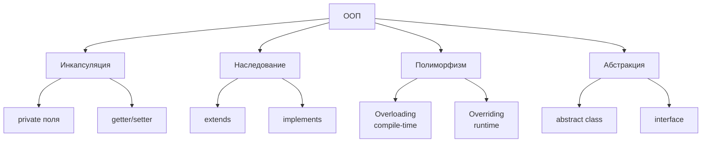
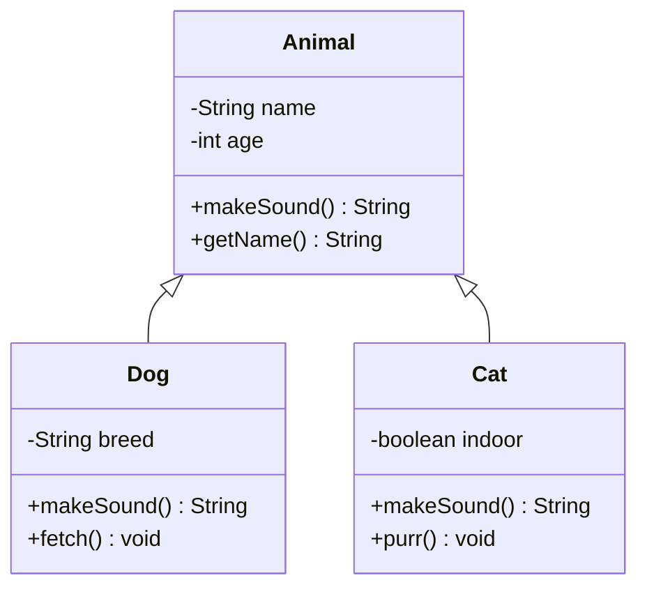
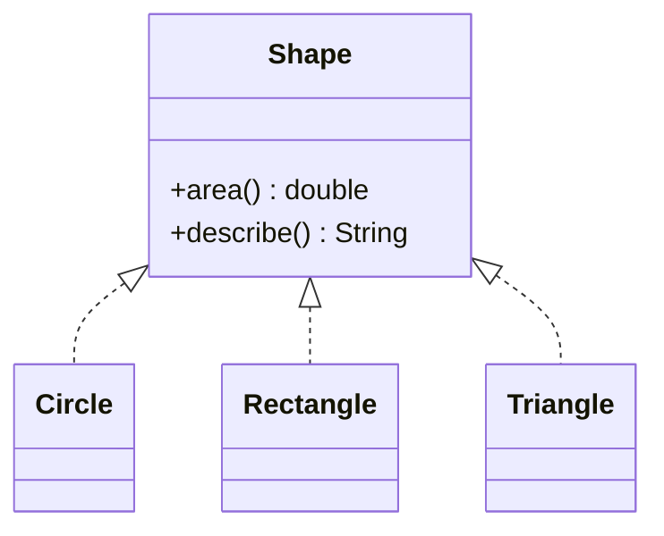
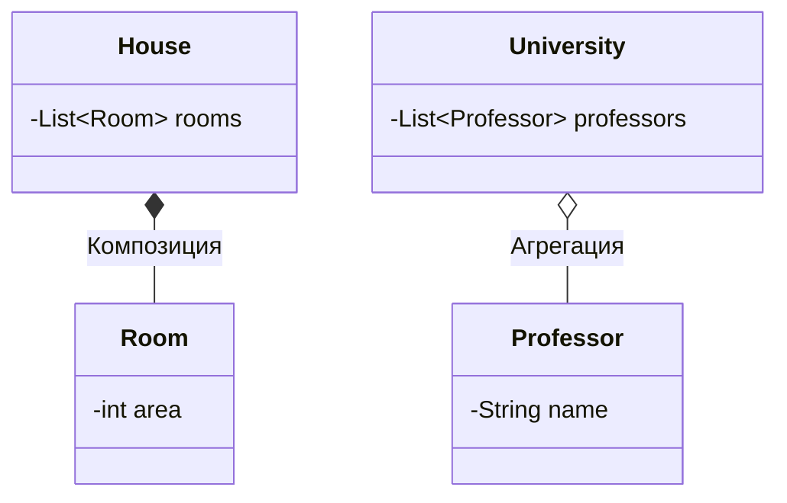
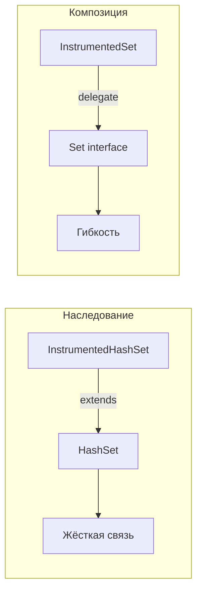
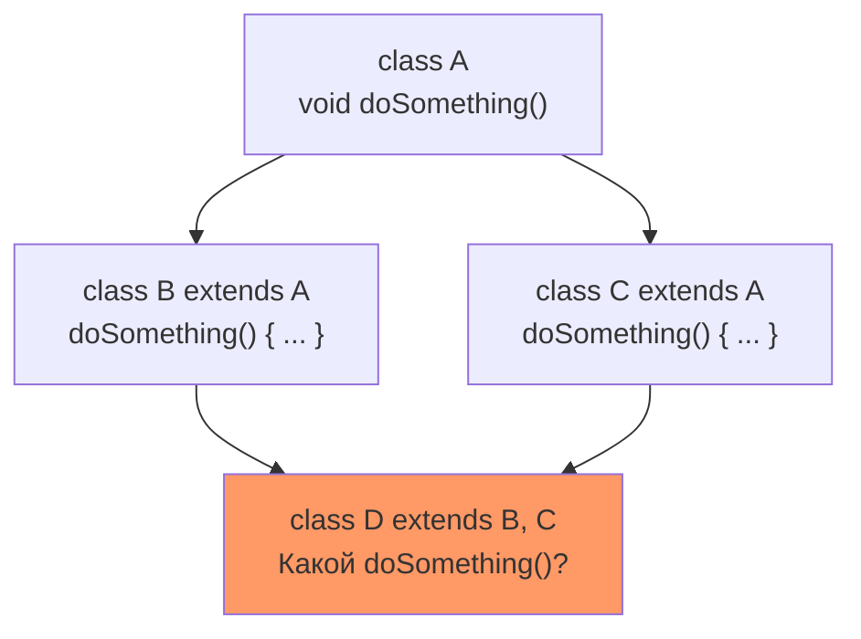
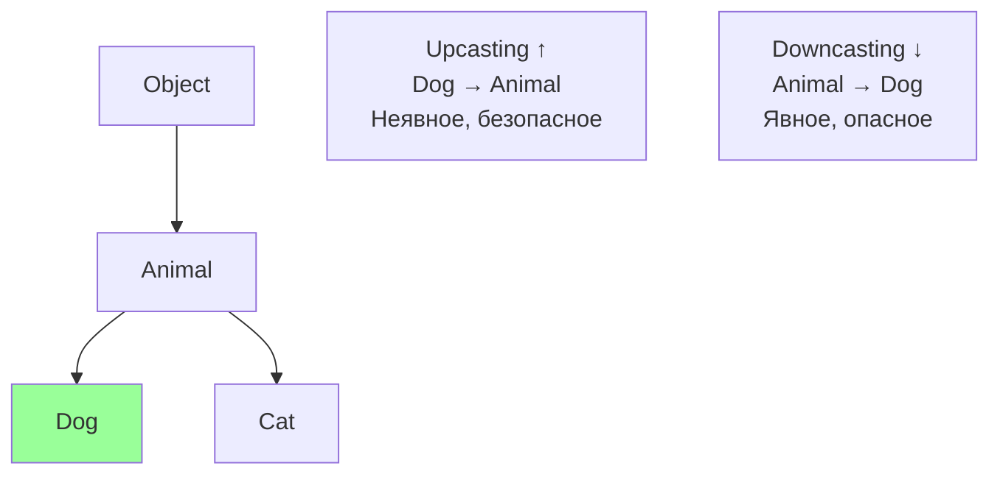
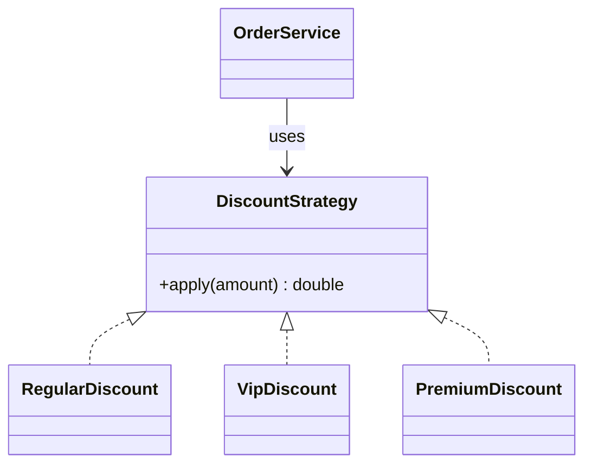
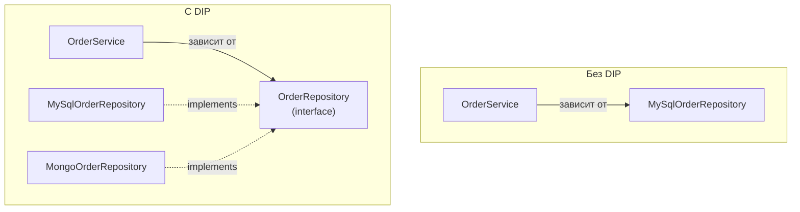
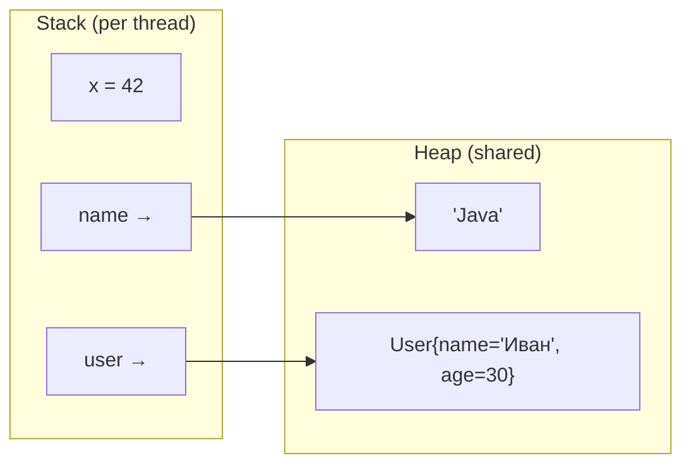

# Вопросы на собеседовании: `OOP` & `Java`

Комплексное руководство по вопросам собеседования на тему `OOP` в `Java` для `Senior Java Developer`. Включает детальные объяснения принципов ООП, примеры кода, диаграммы, `SOLID`, паттерны проектирования и практические рекомендации.

## Полезные ссылки

### Официальная документация

- [Oracle Java Documentation](https://docs.oracle.com/en/java/)
- [Java Language Specification](https://docs.oracle.com/javase/specs/jls/se17/html/)
- [Java Tutorial - Object-Oriented Programming Concepts](https://docs.oracle.com/javase/tutorial/java/concepts/)
- [A Solid Guide to SOLID Principles — Baeldung](https://www.baeldung.com/solid-principles)
- [Polymorphism in Java — Baeldung](https://www.baeldung.com/java-polymorphism)
- [Inheritance and Composition in Java — Baeldung](https://www.baeldung.com/java-inheritance-composition)
- [Using an Interface vs. Abstract Class — Baeldung](https://www.baeldung.com/java-interface-vs-abstract-class)

## Содержание

- [Полезные ссылки](#полезные-ссылки)
- [See also](#see-also)

**Основы ООП**
- [Q1. (!) Что такое ООП и каковы его основные принципы?](#q1--что-такое-ооп-и-каковы-его-основные-принципы)
- [Q2. (!) Что такое инкапсуляция?](#q2--что-такое-инкапсуляция)
- [Q3. (!) Что такое наследование?](#q3--что-такое-наследование)
- [Q4. (!) Что такое полиморфизм?](#q4--что-такое-полиморфизм)
- [Q5. Что такое абстракция?](#q5-что-такое-абстракция)
- [Q6. Что такое класс, объект и интерфейс?](#q6-что-такое-класс-объект-и-интерфейс)
- [Q7. В чем преимущества и недостатки ООП?](#q7-в-чем-преимущества-и-недостатки-ооп)

**Наследование и типы отношений**
- [Q8. (!) В чём разница между композицией и агрегацией?](#q8--в-чём-разница-между-композицией-и-агрегацией)
- [Q9. Что означают отношения is-a и has-a?](#q9-что-означают-отношения-is-a-и-has-a)
- [Q10. (!) Почему композиция предпочтительнее наследования?](#q10--почему-композиция-предпочтительнее-наследования)
- [Q11. Что такое множественное наследование и почему в Java его нет?](#q11-что-такое-множественное-наследование-и-почему-в-java-его-нет)
- [Q12. (!) В чём разница между абстрактным классом и интерфейсом?](#q12--в-чём-разница-между-абстрактным-классом-и-интерфейсом)
- [Q13. Что такое `default`-методы в интерфейсах?](#q13-что-такое-default-методы-в-интерфейсах)
- [Q14. Что такое `sealed`-классы?](#q14-что-такое-sealed-классы)

**Полиморфизм и связывание**
- [Q15. (!) В чём разница между перегрузкой и переопределением методов?](#q15--в-чём-разница-между-перегрузкой-и-переопределением-методов)
- [Q16. Что такое статическое и динамическое связывание?](#q16-что-такое-статическое-и-динамическое-связывание)
- [Q17. (!) В чём разница между Downcasting и Upcasting?](#q17--в-чём-разница-между-downcasting-и-upcasting)
- [Q18. Что такое ковариантный возвращаемый тип?](#q18-что-такое-ковариантный-возвращаемый-тип)

**SOLID и принципы проектирования**
- [Q19. (!) Принцип единственной ответственности (SRP)](#q19--принцип-единственной-ответственности-srp)
- [Q20. (!) Принцип открытости/закрытости (OCP)](#q20--принцип-открытостизакрытости-ocp)
- [Q21. (!) Принцип подстановки Лисков (LSP)](#q21--принцип-подстановки-лисков-lsp)
- [Q22. (!) Принцип разделения интерфейса (ISP)](#q22--принцип-разделения-интерфейса-isp)
- [Q23. (!) Принцип инверсии зависимостей (DIP)](#q23--принцип-инверсии-зависимостей-dip)
- [Q24. Принцип DRY](#q24-принцип-dry)
- [Q25. Принцип KISS](#q25-принцип-kiss)
- [Q26. Принцип YAGNI](#q26-принцип-yagni)

**Классы, модификаторы, память**
- [Q27. Что такое модификаторы доступа в Java?](#q27-что-такое-модификаторы-доступа-в-java)
- [Q28. Какие ещё модификаторы есть в Java?](#q28-какие-ещё-модификаторы-есть-в-java)
- [Q29. (!) В чем разница между Stack и Heap?](#q29--в-чем-разница-между-stack-и-heap)
- [Q30. Как передаются данные в Java — по ссылке или по значению?](#q30-как-передаются-данные-в-java--по-ссылке-или-по-значению)
- [Q31. (!) Какие есть методы у класса Object?](#q31--какие-есть-методы-у-класса-object)
- [Q32. Почему String является immutable?](#q32-почему-string-является-immutable)

**Продвинутые темы ООП**
- [Q33. Что такое Enum и как его использовать в ООП?](#q33-что-такое-enum-и-как-его-использовать-в-ооп)
- [Q34. Что такое Reflection?](#q34-что-такое-reflection)
- [Q35. Какова цель интерфейса Serializable?](#q35-какова-цель-интерфейса-serializable)
- [Q36. Что такое immutable объекты и как их создавать?](#q36-что-такое-immutable-объекты-и-как-их-создавать)
- [Q37. Что такое анонимные классы и лямбда-выражения?](#q37-что-такое-анонимные-классы-и-лямбда-выражения)
- [Q38. В чём разница между Comparable и Comparator?](#q38-в-чём-разница-между-comparable-и-comparator)

**Современные фичи ООП в Java**
- [Q39. (!) Что такое `Records` и как они меняют подход к написанию DTO?](#q39--что-такое-records-и-как-они-меняют-подход-к-написанию-dto)
- [Q40. (!) Что такое `sealed`-классы и зачем они нужны?](#q40--что-такое-sealed-классы-и-зачем-они-нужны)
- [Q41. Что такое `pattern matching` для `instanceof` и как его использовать?](#q41-что-такое-pattern-matching-для-instanceof-и-как-его-использовать)
- [Q42. В чём ключевые отличия `abstract class` от `interface` в современной Java?](#q42-в-чём-ключевые-отличия-abstract-class-от-interface-в-современной-java)
- [Q43. Что такое `static`-методы в интерфейсах и чем они отличаются от `default`?](#q43-что-такое-static-методы-в-интерфейсах-и-чем-они-отличаются-от-default)

---

## Q1. (!) Что такое ООП и каковы его основные принципы?

**Объектно-ориентированное программирование (ООП)** — парадигма программирования, основанная на концепции объектов, которые объединяют данные (поля) и поведение (методы).

Четыре основных принципа ООП:

| Принцип | Суть | Механизм в Java |
|---------|------|-----------------|
| **Инкапсуляция** | Скрытие внутренних деталей, доступ через публичный API | `private` поля + геттеры/сеттеры |
| **Наследование** | Создание новых классов на основе существующих | `extends`, `implements` |
| **Полиморфизм** | Один интерфейс — разные реализации | Переопределение, перегрузка |
| **Абстракция** | Выделение существенного, сокрытие деталей | `abstract class`, `interface` |



На собеседовании важно не просто перечислить принципы, а показать, как они взаимосвязаны: инкапсуляция защищает данные, абстракция определяет контракт, наследование переиспользует реализацию, а полиморфизм позволяет работать с разными типами через единый интерфейс.

> [!mcq]
> - [ ] Инкапсуляция скрывает детали, наследование позволяет создавать подклассы, полиморфизм означает переопределение методов, а абстракция реализуется только через `abstract class` — без интерфейсов. | Абстракция реализуется и через `interface`, и через `abstract class`. Ограничение «только abstract class» — распространённое заблуждение: интерфейсы являются одним из ключевых механизмов абстракции в Java.
> - [ ] Полиморфизм — это возможность класса реализовывать несколько интерфейсов одновременно; наследование — способ скрыть данные через `private` поля; инкапсуляция — объединение состояния и поведения в одном классе. | Здесь перепутаны определения: `private` поля — механизм инкапсуляции, а не наследования. Полиморфизм — это «один интерфейс, разные реализации» (overriding/overloading), а не множественная реализация интерфейсов.
> - [x] ООП объединяет четыре принципа: инкапсуляция скрывает внутренние детали через `private` поля и публичный API, наследование позволяет создавать иерархии через `extends`/`implements`, полиморфизм обеспечивает разное поведение через overriding и overloading, абстракция скрывает реализацию через `abstract class` и `interface`. | Это канонические определения четырёх столпов ООП. Важно понимать взаимодействие: инкапсуляция защищает данные, абстракция определяет контракт (что делать), наследование переиспользует реализацию, полиморфизм позволяет работать с разными типами через единый интерфейс.
> - [ ] ООП определяет три принципа: инкапсуляция, наследование и полиморфизм; абстракция — это не самостоятельный принцип, а следствие инкапсуляции, автоматически достигаемое скрытием деталей реализации. | Абстракция — самостоятельный четвёртый принцип ООП. Между инкапсуляцией и абстракцией есть принципиальная разница: инкапсуляция скрывает *данные*, абстракция скрывает *сложность реализации*, предоставляя упрощённый контракт.

## Q2. (!) Что такое инкапсуляция?

**Инкапсуляция** — принцип ООП, объединяющий данные и методы в единый объект и скрывающий внутреннюю реализацию от внешнего кода. Доступ к данным осуществляется только через контролируемый публичный API.

### Модификаторы доступа

| Модификатор | Класс | Пакет | Подкласс | Весь мир |
|------------|-------|-------|----------|----------|
| `private` | + | - | - | - |
| `package-private` | + | + | - | - |
| `protected` | + | + | + | - |
| `public` | + | + | + | + |

### Пример инкапсуляции с валидацией

```java
public class BankAccount {
    private String accountNumber;
    private BigDecimal balance;

    public BankAccount(String accountNumber, BigDecimal initialBalance) {
        this.accountNumber = Objects.requireNonNull(accountNumber);
        if (initialBalance.compareTo(BigDecimal.ZERO) < 0) {
            throw new IllegalArgumentException("Баланс не может быть отрицательным");
        }
        this.balance = initialBalance;
    }

    public void deposit(BigDecimal amount) {
        if (amount.compareTo(BigDecimal.ZERO) <= 0) {
            throw new IllegalArgumentException("Сумма должна быть положительной");
        }
        this.balance = this.balance.add(amount);
    }

    public void withdraw(BigDecimal amount) {
        if (amount.compareTo(balance) > 0) {
            throw new IllegalStateException("Недостаточно средств");
        }
        this.balance = this.balance.subtract(amount);
    }

    public BigDecimal getBalance() {
        return balance; // нет setBalance() — баланс меняется только через операции
    }
}
```

Ключевые моменты для собеседования:
- Инкапсуляция — это **не просто приватные поля + геттеры/сеттеры**. Настоящая инкапсуляция — это скрытие *поведения*, а не просто данных
- `setBalance()` в примере выше отсутствует намеренно: баланс изменяется только через бизнес-операции `deposit()` и `withdraw()`
- Валидация в методах гарантирует инвариант объекта (баланс >= 0)

> [!mcq]
> - [x] Настоящая инкапсуляция — это скрытие не только данных, но и поведения: класс `BankAccount` не имеет `setBalance()`, потому что баланс изменяется только через бизнес-операции `deposit()` и `withdraw()`, которые содержат валидацию инварианта. | Инкапсуляция гарантирует, что объект всегда находится в корректном состоянии. Если добавить `setBalance(BigDecimal v)`, любой внешний код сможет установить отрицательный баланс, нарушив бизнес-инвариант. Скрытие метода — такая же часть инкапсуляции, как и скрытие поля.
> - [ ] Инкапсуляция достигается добавлением `private` к каждому полю класса и созданием публичных геттеров и сеттеров для каждого поля — это стандартный JavaBean-паттерн, обеспечивающий полную инкапсуляцию. | Это распространённое заблуждение: механический JavaBean с геттером и сеттером для каждого поля не обеспечивает настоящей инкапсуляции. `setBalance()` открывает прямой доступ к изменению состояния в обход бизнес-логики и валидации.
> - [ ] Инкапсуляция и абстракция — это одно и то же: оба принципа скрывают внутреннюю реализацию от внешнего кода, поэтому в Java они реализуются через один и тот же механизм — модификаторы доступа `private` и `protected`. | Абстракция и инкапсуляция решают разные задачи. Инкапсуляция защищает состояние объекта через модификаторы доступа. Абстракция скрывает сложность реализации, предоставляя упрощённый контракт через `interface` или `abstract class`, — модификаторы доступа здесь вторичны.
> - [ ] Модификатор `protected` обеспечивает более строгую инкапсуляцию, чем `package-private`, потому что ограничивает доступ только классами в той же иерархии наследования, исключая классы из других пакетов того же пакета. | На самом деле `protected` — более широкий доступ, чем `package-private`. `package-private` открывает доступ всем классам в пакете, но закрывает подклассам из других пакетов. `protected` добавляет доступ подклассам из любых пакетов, что делает его менее строгим.

## Q3. (!) Что такое наследование?

**Наследование** — механизм ООП, позволяющий создавать новые классы на основе существующих, наследуя их поля и методы. Подкласс расширяет суперкласс через ключевое слово `extends`.



```java
public abstract class Animal {
    private String name;
    private int age;

    public Animal(String name, int age) {
        this.name = name;
        this.age = age;
    }

    public abstract String makeSound();

    public String getName() { return name; }
}

public class Dog extends Animal {
    private String breed;

    public Dog(String name, int age, String breed) {
        super(name, age); // вызов конструктора родителя
        this.breed = breed;
    }

    @Override
    public String makeSound() {
        return "Гав!";
    }

    public void fetch() {
        System.out.println(getName() + " приносит палку");
    }
}

public class Cat extends Animal {
    public Cat(String name, int age) {
        super(name, age);
    }

    @Override
    public String makeSound() {
        return "Мяу!";
    }
}
```

### Правила наследования в Java

- Класс может наследоваться только от **одного** класса (`extends` — single inheritance)
- Класс может реализовывать **несколько** интерфейсов (`implements`)
- Конструкторы **не наследуются** — нужно вызывать `super()`
- `private`-члены суперкласса **не доступны** в подклассе напрямую
- `final`-классы **нельзя** наследовать, `final`-методы — переопределять

> [!mcq]
> - [ ] Класс в Java может наследоваться от нескольких классов одновременно через `extends A, B`, и конструкторы родителя автоматически вызываются при создании подкласса. | В Java запрещено множественное наследование классов — только одиночное через `extends`. Конструкторы родителя не наследуются и не вызываются автоматически: подкласс обязан явно вызвать `super(...)` первой строкой своего конструктора (или компилятор вставит `super()` без параметров).
> - [x] Наследование реализуется через `extends`: подкласс получает все не-`private` поля и методы родителя, вызывает его конструктор через `super(...)`, может переопределять методы и не может наследоваться от нескольких классов, а также от `final`-классов. | Это канонический набор правил наследования в Java. Ключевые ограничения — одиночное наследование классов (множественное только для интерфейсов через `implements`), `final`-классы запрещают наследование (`String`, `Integer`), `final`-методы — переопределение.
> - [ ] Через `extends` подкласс получает доступ к `private`-полям суперкласса напрямую, так как наследование переопределяет модификаторы доступа в рамках иерархии. | `private`-члены суперкласса недоступны в подклассе напрямую — это фундаментальное правило инкапсуляции, которое не меняется при наследовании. Для доступа используются `protected`/`package-private` поля или `protected`-геттеры.
> - [ ] Наследование и реализация интерфейса — это одно и то же: оба используют `extends`, оба позволяют множественное наследование, оба передают реализацию методов. | Наследование классов и реализация интерфейсов — разные механизмы. Класс наследуется через `extends` (только один класс), интерфейсы реализуются через `implements` (несколько). До Java 8 интерфейсы не могли передавать реализацию, а только контракт.

## Q4. (!) Что такое полиморфизм?

**Полиморфизм** — принцип ООП, позволяющий объектам разных типов реагировать на один и тот же вызов метода по-разному. В `Java` выделяют два вида:

### Полиморфизм времени компиляции (перегрузка, `overloading`)

Выбор метода происходит на этапе компиляции по сигнатуре (количество и типы параметров):

```java
public class Calculator {
    public int add(int a, int b) {
        return a + b;
    }

    public double add(double a, double b) {
        return a + b;
    }

    public int add(int a, int b, int c) {
        return a + b + c;
    }
}
```

### Полиморфизм времени выполнения (переопределение, `overriding`)

Вызываемый метод определяется реальным типом объекта в рантайме:

```java
public interface Shape {
    double area();
    String describe();
}

public class Circle implements Shape {
    private final double radius;

    public Circle(double radius) { this.radius = radius; }

    @Override
    public double area() { return Math.PI * radius * radius; }

    @Override
    public String describe() { return "Круг с радиусом " + radius; }
}

public class Rectangle implements Shape {
    private final double width, height;

    public Rectangle(double width, double height) {
        this.width = width;
        this.height = height;
    }

    @Override
    public double area() { return width * height; }

    @Override
    public String describe() { return "Прямоугольник " + width + "x" + height; }
}

// Полиморфный вызов — код не знает конкретный тип
public class ShapePrinter {
    public void printInfo(Shape shape) {
        System.out.println(shape.describe() + ", площадь = " + shape.area());
    }
}
```



На собеседовании часто спрашивают: «Можно ли переопределить `static`-метод?» Нет — `static`-методы связываются статически (по типу ссылки). Это называется *method hiding*, а не переопределение. Подробнее о перегрузке операторов: в `Java` её **нет** (в отличие от C++ или Kotlin).

> [!mcq]
> - [ ] Перегрузка (overloading) и переопределение (overriding) — синонимы: оба термина описывают создание методов с одинаковым именем в одном классе, отличающихся только реализацией. | Это два принципиально разных механизма. Перегрузка — несколько методов с одинаковым именем, но разной сигнатурой (параметры) в одном классе, разрешается на этапе компиляции. Переопределение — замена метода родителя в подклассе с той же сигнатурой, разрешается в рантайме.
> - [ ] Полиморфизм в Java работает только с классами и не применим к интерфейсам: нельзя вызывать метод интерфейса через ссылку на интерфейс и получать разное поведение в зависимости от реализации. | Как раз интерфейсы — главный инструмент полиморфизма в Java. `Shape s = new Circle(); s.area()` — типичный полиморфный вызов через интерфейс, реальный метод определяется типом объекта в рантайме.
> - [x] В Java два вида полиморфизма: compile-time (перегрузка через разные сигнатуры) и runtime (переопределение методов, разрешающееся через dynamic dispatch по реальному типу объекта), причём `static`-методы нельзя переопределить — только скрыть (method hiding). | Это классическая классификация полиморфизма в Java. Overloading разрешается компилятором по типам аргументов, overriding — JVM по типу объекта через vtable. `static`-методы привязаны к типу ссылки и не участвуют в dynamic dispatch.
> - [ ] Перегрузка операторов в Java разрешена только для оператора `+` применительно к `String`, а для всех остальных типов и операторов — запрещена пользовательская перегрузка. | Формально в Java нет пользовательской перегрузки операторов вообще. `+` для `String` — это не перегрузка, а специальная поддержка, встроенная в язык на уровне компилятора (вызов `StringBuilder.append`). Пользователь не может определить своих операторов — в отличие от C++ или Kotlin.

## Q5. Что такое абстракция?

**Абстракция** — принцип ООП, позволяющий выделить существенные характеристики объекта и скрыть несущественные детали реализации. В `Java` абстракция реализуется через `abstract class` и `interface`.

```java
// Абстракция — контракт "что делать", без "как"
public interface PaymentProcessor {
    PaymentResult process(Payment payment);
    void refund(String transactionId);
}

// Конкретная реализация — "как именно"
public class StripePaymentProcessor implements PaymentProcessor {
    private final StripeClient client;

    @Override
    public PaymentResult process(Payment payment) {
        // Детали взаимодействия со Stripe API скрыты
        return client.charge(payment.getAmount(), payment.getCurrency());
    }

    @Override
    public void refund(String transactionId) {
        client.refund(transactionId);
    }
}
```

Абстракция отличается от инкапсуляции: инкапсуляция *скрывает данные*, а абстракция *скрывает сложность реализации*, предоставляя упрощённый интерфейс. На практике они работают вместе.

> [!mcq]
> - [ ] Абстракция и инкапсуляция — это один и тот же принцип ООП, описываемый разными словами: оба скрывают детали реализации от внешнего кода. | Это разные принципы. Инкапсуляция скрывает *данные* через модификаторы доступа (`private`), гарантируя инварианты состояния. Абстракция скрывает *сложность реализации* через контракт (интерфейс/абстрактный класс), определяя «что делать» без «как».
> - [ ] Абстракция в Java достигается только через `abstract class` — интерфейсы не являются инструментом абстракции, так как они описывают контракт, а не абстрактное поведение. | Интерфейсы — основной инструмент абстракции в Java. Они определяют контракт поведения («что делать») без привязки к реализации («как»). `abstract class` — дополнительный механизм для случая, когда нужна частичная реализация или состояние.
> - [ ] Абстракция требует обязательного наличия хотя бы одного `abstract`-метода в классе, иначе компилятор не считает класс абстрактным, даже если он помечен `abstract`. | Класс может быть объявлен `abstract` без единого абстрактного метода — это валидно и иногда используется, чтобы запретить инстанцирование класса. Наоборот, интерфейс с `default`-методами может не содержать ни одного абстрактного метода.
> - [x] Абстракция выделяет существенные характеристики и скрывает детали реализации через `interface` или `abstract class`, задавая контракт «что делать» без «как», причём инкапсуляция (скрытие данных) и абстракция (скрытие сложности) работают вместе, но решают разные задачи. | Это корректное определение абстракции. В Java оба механизма (интерфейс и абстрактный класс) используются для разных сценариев: интерфейс — чистый контракт, абстрактный класс — частичная реализация со состоянием.

## Q6. Что такое класс, объект и интерфейс?

| Понятие | Определение | Аналогия |
|---------|-------------|----------|
| **Класс** | Шаблон (blueprint) для создания объектов | Чертёж дома |
| **Объект** | Конкретный экземпляр класса | Построенный дом |
| **Интерфейс** | Контракт, определяющий набор методов | Стандарт розетки |

```java
// Интерфейс — контракт
public interface Drivable {
    void accelerate(int speed);
    void brake();
}

// Класс — шаблон, реализующий контракт
public class Car implements Drivable {
    private String model;
    private int currentSpeed;

    public Car(String model) {
        this.model = model;
    }

    @Override
    public void accelerate(int speed) {
        this.currentSpeed += speed;
    }

    @Override
    public void brake() {
        this.currentSpeed = 0;
    }
}

// Объект — экземпляр класса
Car myCar = new Car("Tesla Model 3");
myCar.accelerate(60);
```

Начиная с `Java 16` (`JEP 395`) для простых data-классов рекомендуется использовать `record` — см. [Java Core](java-core-interview.md):

```java
public record Point(double x, double y) {
    // Автоматически: конструктор, equals(), hashCode(), toString()
}
```

> [!mcq]
> - [x] Класс — шаблон для создания объектов с полями и методами, объект — конкретный экземпляр класса в памяти, интерфейс — контракт, определяющий набор методов без реализации; с Java 16 для data-классов доступен `record` как компактная альтернатива обычному классу. | Это канонические определения. Класс описывает структуру и поведение, объект — конкретное состояние (экземпляр в Heap), интерфейс — чистый контракт. `record` — специализированный вид класса для иммутабельных DTO.
> - [ ] Класс и интерфейс — это одно и то же с точки зрения JVM: оба определяют тип, имеют методы и могут иметь поля экземпляра, а объект — просто ссылка в стеке без собственного состояния. | На уровне JVM класс и интерфейс — разные сущности с разными опкодами (`invokevirtual` vs `invokeinterface`). Интерфейс не имеет полей экземпляра (только `public static final` константы). Объект — не просто ссылка, а размещённая в Heap структура со своим состоянием.
> - [ ] Объект в Java создаётся при объявлении переменной класса (`Car myCar;`), а оператор `new` просто инициализирует уже существующий объект значениями по умолчанию. | Объявление переменной только создаёт ссылку (которая изначально `null`), а не объект. Объект создаётся именно через `new`, который выделяет память в Heap, вызывает конструктор и возвращает ссылку. Без `new` обращение к полям даст `NullPointerException`.
> - [ ] Интерфейс в современной Java (с Java 8+) полностью эквивалентен абстрактному классу и может содержать конструкторы, поля экземпляра и `private static`-блоки инициализации. | Даже в современной Java интерфейс не может иметь конструктор, поля экземпляра или блоки инициализации. Он получил `default`/`static`/`private`-методы, но принципиальное отличие от абстрактного класса (нет состояния, нет конструктора) сохранилось.

## Q7. В чем преимущества и недостатки ООП?

### Преимущества

- **Модульность** — код организован в классы с чёткими обязанностями
- **Повторное использование** — наследование и композиция позволяют переиспользовать код
- **Расширяемость** — новые классы добавляются без изменения существующего кода (OCP)
- **Понятность** — код моделирует реальные объекты предметной области
- **Тестируемость** — полиморфизм и DIP позволяют подменять зависимости моками

### Недостатки

- **Overhead** — дополнительные уровни абстракции увеличивают сложность и размер кода
- **Overengineering** — соблазн создать глубокую иерархию наследования там, где хватило бы функции
- **Производительность** — виртуальные вызовы, dynamic dispatch, лишние аллокации объектов
- **Gorilla-banana problem** — при наследовании приходится тащить весь суперкласс, даже если нужна одна функция

На собеседовании полезно упомянуть альтернативные парадигмы: функциональное программирование (лямбды, `Stream API`), data-oriented design. Современная `Java` поддерживает гибридный подход.

> [!mcq]
> - [ ] Главное преимущество ООП — оно всегда даёт лучшую производительность, чем процедурный или функциональный подход, за счёт компиляции в более эффективный байт-код. | Наоборот, ООП часто проигрывает по производительности из-за виртуальных вызовов (dynamic dispatch), лишних аллокаций объектов и уровней абстракции. Функциональный и data-oriented подходы могут быть быстрее на hot path.
> - [x] ООП даёт модульность, переиспользование, расширяемость (OCP), понятность и тестируемость (через полиморфизм и DIP), но платит за это overhead абстракций, риск overengineering (глубокие иерархии), накладные расходы на виртуальные вызовы и gorilla-banana problem при наследовании. | Это сбалансированная картина плюсов и минусов. Современная практика советует гибридный подход: ООП для доменной модели и границ, функциональный стиль для обработки данных (Stream API, lambdas), data-oriented — для hot path.
> - [ ] Недостаток ООП — невозможность тестирования: абстракции и полиморфизм усложняют написание unit-тестов, поэтому тестируемость в ООП-коде ниже, чем в процедурном. | На самом деле ООП улучшает тестируемость через полиморфизм и DIP: зависимости можно подменять моками/стабами. Именно процедурный код с глобальным состоянием и жёсткими зависимостями труднее тестировать.
> - [ ] «Gorilla-banana problem» — это проблема избыточной оперативной памяти в ООП-приложениях, возникающая из-за того, что каждый объект несёт внутри себя полную копию иерархии классов. | «Gorilla-banana» описывает проблему наследования: «ты просил банан, а получил гориллу с джунглями». Она не про память, а про связанность — подкласс вынужден тащить поведение суперкласса, даже если нужна только часть. Решается композицией.

## Q8. (!) В чём разница между композицией и агрегацией?

Оба отношения относятся к типу `has-a` (имеет), но отличаются семантикой владения и жизненным циклом:

| Критерий | Композиция | Агрегация |
|----------|-----------|-----------|
| Владение | Сильное — часть принадлежит целому | Слабое — часть независима |
| Жизненный цикл | Часть уничтожается вместе с целым | Часть живёт независимо |
| Создание | Целое создаёт часть | Часть передаётся извне |
| UML | Закрашенный ромб ◆ | Незакрашенный ромб ◇ |



```java
// Композиция: Room не может существовать без House
public class House {
    private final List<Room> rooms;

    public House(int roomCount) {
        this.rooms = new ArrayList<>();
        for (int i = 0; i < roomCount; i++) {
            rooms.add(new Room(20 + i * 5)); // House создаёт Room
        }
    }
}

// Агрегация: Professor существует независимо от University
public class University {
    private final List<Professor> professors = new ArrayList<>();

    public void hire(Professor professor) {
        professors.add(professor); // Professor приходит извне
    }
}
```

> [!mcq]
> - [ ] Композиция и агрегация — полные синонимы: оба описывают отношение has-a и одинаково реализуются через поле-ссылку на другой объект, разница только в терминологии UML. | Разница не только терминологическая. Композиция — сильное владение (часть создаётся и уничтожается целым), агрегация — слабое владение (часть передаётся извне и живёт независимо). В UML: закрашенный ромб ◆ vs незакрашенный ◇.
> - [ ] В агрегации часть уничтожается вместе с целым, а в композиции — живёт независимо; это отличает агрегацию как более «сильное» отношение от композиции как более «слабого». | Всё наоборот: композиция — сильная связь с общим жизненным циклом (комната не существует без дома), агрегация — слабая (профессор существует независимо от университета).
> - [x] Композиция — сильное владение (часть создаётся целым и уничтожается вместе с ним, закрашенный ромб ◆), агрегация — слабое владение (часть передаётся извне и живёт независимо, незакрашенный ромб ◇); оба относятся к отношению has-a. | Это корректное разграничение. Практический признак композиции — поле создаётся внутри конструктора целого (`new Room()`), признак агрегации — поле получается через конструктор/сеттер извне.
> - [ ] Композиция возможна только между классами одной иерархии наследования, а агрегация — между классами из разных иерархий. | Принадлежность к иерархии наследования не имеет отношения к композиции/агрегации. Оба отношения — это has-a, которое реализуется через поле-ссылку независимо от иерархии классов.

## Q9. Что означают отношения is-a и has-a?

- **is-a** (является) — отношение наследования. `Dog` *is-a* `Animal` → `class Dog extends Animal`
- **has-a** (имеет) — отношение композиции/агрегации. `Car` *has-a* `Engine` → `class Car { private Engine engine; }`

Принцип Лисков (`LSP`) — надёжный тест на корректность is-a: если подкласс нельзя подставить вместо суперкласса без нарушения контракта, наследование неуместно. Классический антипример: `Square extends Rectangle` нарушает LSP, потому что `setWidth()` у квадрата меняет и высоту.

> [!mcq]
> - [ ] Отношение is-a моделируется композицией (поле-ссылка на другой объект), а has-a — наследованием (`extends`), так как is-a означает «использует», а has-a означает «является». | Всё ровно наоборот. is-a («является») — это наследование (`Dog is-a Animal` → `Dog extends Animal`). has-a («имеет») — это композиция или агрегация (`Car has-a Engine` → поле `Engine` внутри `Car`).
> - [ ] is-a и has-a — оба реализуются через `implements`: класс имеет интерфейс (`implements A`) и является реализацией этого интерфейса, поэтому различие между ними стирается в современной Java. | `implements` — это is-a-отношение с интерфейсом (`Car is-a Drivable`), has-a через `implements` не выражается. has-a — это поле-ссылка внутри класса, никакого отношения к `implements` не имеет.
> - [ ] Тест LSP применим только к отношению has-a: он проверяет, что агрегированный объект можно заменить любым другим совместимым, а в наследовании (is-a) LSP не работает. | LSP — это тест именно для is-a (наследования): если подкласс нельзя подставить вместо суперкласса без нарушения контракта, отношение «Square is-a Rectangle» неуместно. К has-a LSP не применяется — там нет проблемы подстановки.
> - [x] is-a реализуется через наследование (`class Dog extends Animal`), has-a — через композицию/агрегацию (поле-ссылка), а тест корректности is-a — принцип Лисков: подкласс должен безопасно заменять суперкласс; классический антипример — `Square extends Rectangle`, где `setWidth()` у квадрата ломает контракт прямоугольника. | Это полный ответ на вопрос. Практическое правило: если вы не можете сказать «X является Y» без оговорок, скорее всего нужна композиция, а не наследование.

## Q10. (!) Почему композиция предпочтительнее наследования?

Правило из книги *Effective Java* (Joshua Bloch, Item 18): **"Favor composition over inheritance"**.

### Проблемы наследования

1. **Нарушение инкапсуляции** — подкласс зависит от деталей реализации суперкласса
2. **Хрупкий базовый класс** — изменение суперкласса может сломать подклассы
3. **Жёсткая связь** — наследование определяется в compile-time и не меняется
4. **Единственное наследование** — в `Java` нельзя наследоваться от нескольких классов

### Композиция решает эти проблемы

```java
// Плохо: наследование ради переиспользования
public class InstrumentedHashSet<E> extends HashSet<E> {
    private int addCount = 0;

    @Override
    public boolean add(E e) {
        addCount++;
        return super.add(e); // Проблема: super.addAll() вызывает add()!
    }

    @Override
    public boolean addAll(Collection<? extends E> c) {
        addCount += c.size();
        return super.addAll(c); // Двойной подсчёт!
    }
}

// Хорошо: композиция + делегирование
public class InstrumentedSet<E> implements Set<E> {
    private final Set<E> delegate;
    private int addCount = 0;

    public InstrumentedSet(Set<E> delegate) {
        this.delegate = delegate;
    }

    @Override
    public boolean add(E e) {
        addCount++;
        return delegate.add(e);
    }

    @Override
    public boolean addAll(Collection<? extends E> c) {
        addCount += c.size();
        return delegate.addAll(c); // Нет двойного подсчёта
    }

    // Остальные методы делегируются...
}
```



Когда наследование уместно: если отношение is-a **действительно** выполняется и суперкласс спроектирован для наследования (см. `abstract class`). Подробнее — [Design Patterns](../../design-patterns/design-patterns-interview.md) (Strategy, Decorator).

> [!mcq]
> - [x] Наследование нарушает инкапсуляцию (подкласс зависит от деталей реализации родителя), создаёт проблему хрупкого базового класса (изменения родителя ломают подклассы) и жёстко фиксирует связь в compile-time; композиция через делегирование даёт гибкость, поддерживает множественную реализацию и не страдает проблемой двойного подсчёта (как в `InstrumentedHashSet`). | Это ключевые аргументы из Effective Java Item 18. `InstrumentedHashSet` — классический пример: `super.addAll()` внутри `HashSet` вызывает `add()`, что приводит к двойному подсчёту. Композиция + делегирование эту проблему устраняют.
> - [ ] Наследование всегда быстрее композиции на уровне JVM, поскольку прямой вызов метода родителя эффективнее делегирования через внешнее поле, поэтому композиция предпочтительна только в редких случаях. | Разница в производительности между наследованием и композицией в JVM пренебрежимо мала (один лишний виртуальный вызов). Выбор делается по дизайну и гибкости, а не по скорости.
> - [ ] Наследование запрещено в современной Java (начиная с Java 17), и единственный способ переиспользовать код — композиция через делегирование, поэтому предпочтение композиции — это требование языка. | Наследование не запрещено и активно используется. Правило «composition over inheritance» — это рекомендация по дизайну, а не ограничение языка. Иерархии классов по-прежнему распространены (например, иерархии исключений).
> - [ ] Композиция предпочтительнее наследования, потому что она автоматически реализует множественное наследование полей родительских классов, что невозможно при одиночном `extends`. | Композиция не «реализует множественное наследование полей» — она использует делегирование к отдельным объектам. Поля остаются в этих объектах, а не «сливаются» в один, как при множественном наследовании в C++.

## Q11. Что такое множественное наследование и почему в Java его нет?

**Множественное наследование** — возможность класса наследоваться от нескольких классов одновременно (как в C++). В `Java` это запрещено из-за **проблемы ромбовидного наследования** (diamond problem):



Решения в `Java`:
- Реализация **нескольких интерфейсов** (`implements A, B, C`)
- `default`-методы в интерфейсах (с `Java 8`)
- При конфликте `default`-методов класс **обязан** явно переопределить метод

```java
public interface Flyable {
    default void move() { System.out.println("Летит"); }
}

public interface Swimmable {
    default void move() { System.out.println("Плывёт"); }
}

// Конфликт — нужно явно разрешить
public class Duck implements Flyable, Swimmable {
    @Override
    public void move() {
        Flyable.super.move(); // явный выбор
    }
}
```

> [!mcq]
> - [ ] Множественное наследование полностью поддерживается в Java через `extends A, B`, а diamond problem в Java отсутствует, потому что JVM автоматически выбирает первый в списке суперкласс. | В Java нет множественного наследования классов через `extends`. Класс может наследоваться только от одного класса (плюс реализовывать несколько интерфейсов через `implements`). Никакого «автоматического выбора» первого класса нет.
> - [x] В Java запрещено множественное наследование классов из-за diamond problem (неоднозначность при двух унаследованных реализациях одного метода); вместо этого поддерживается множественная реализация интерфейсов (`implements A, B`), а конфликты `default`-методов (с Java 8) должны явно разрешаться через `Interface.super.method()`. | Это корректное объяснение. Классический пример разрешения — `Flyable.super.move()` в подклассе. Без явного переопределения компилятор выдаст ошибку при конфликтующих default-методах.
> - [ ] `default`-методы интерфейсов полностью решают проблему отсутствия множественного наследования, включая наследование полей экземпляра — с Java 8 интерфейсы могут хранить состояние. | Интерфейсы, даже с `default`-методами (Java 8) и `private`-методами (Java 9), не могут иметь полей экземпляра — только `public static final` константы. Множественное наследование состояния в Java остаётся запрещено.
> - [ ] Diamond problem — это проблема только времени выполнения: она возникает, когда JVM обнаруживает конфликт методов при загрузке класса, и обходится через reflection. | Diamond problem разрешается на уровне компиляции, а не рантайма. Для конфликтующих default-методов компилятор требует явного переопределения — код без явного разрешения не скомпилируется.

## Q12. (!) В чём разница между абстрактным классом и интерфейсом?

| Критерий | `abstract class` | `interface` |
|----------|-----------------|-------------|
| Наследование | Одиночное (`extends`) | Множественное (`implements`) |
| Конструктор | Есть | Нет |
| Поля | Любые (включая `private`, mutable) | Только `public static final` |
| Методы | Любые | `public abstract`, `default`, `static`, `private` (с Java 9) |
| Состояние | Может хранить состояние | Не хранит состояние |
| Когда использовать | Общая реализация для связанных классов | Контракт для несвязанных классов |

```java
// Абстрактный класс — общая реализация для связанных классов
public abstract class AbstractRepository<T> {
    protected final JdbcTemplate jdbc;

    protected AbstractRepository(JdbcTemplate jdbc) {
        this.jdbc = jdbc;
    }

    // Шаблонный метод — общая логика
    public T findById(Long id) {
        return jdbc.queryForObject(getSelectSql(), getRowMapper(), id);
    }

    // Конкретные классы определяют детали
    protected abstract String getSelectSql();
    protected abstract RowMapper<T> getRowMapper();
}

// Интерфейс — контракт для несвязанных классов
public interface Auditable {
    LocalDateTime getCreatedAt();
    LocalDateTime getUpdatedAt();
    String getCreatedBy();
}
```

**Правило выбора**: если нужно **разделить реализацию** между связанными классами — `abstract class`. Если нужно определить **контракт** (возможно для несвязанных классов) — `interface`. Предпочитайте интерфейсы: они дают бoльшую гибкость благодаря множественной реализации.

> [!mcq]
> - [ ] `abstract class` и `interface` полностью эквивалентны с Java 8: оба могут содержать `default`-методы, `static`-методы, поля и конструкторы; выбор между ними — исключительно дело вкуса. | Даже в современной Java остаются принципиальные отличия: интерфейс не имеет полей экземпляра (только `public static final` константы), не имеет конструктора, поддерживает множественную реализацию (`implements A, B, C`), а `abstract class` — одиночное наследование (`extends`).
> - [ ] Интерфейс предпочтительнее абстрактного класса только потому, что он быстрее на уровне JVM: `invokeinterface` всегда оптимизируется лучше, чем `invokevirtual`. | Наоборот, `invokevirtual` (для абстрактных классов) обычно быстрее `invokeinterface` на уровне JIT из-за более простой vtable. Но на практике разница незначительна, и выбор делается по гибкости дизайна, а не по скорости.
> - [x] `abstract class` даёт одиночное наследование, поля экземпляра (в т.ч. mutable), конструктор и `protected`-API для общей реализации связанных классов; `interface` даёт множественную реализацию, только `public static final` поля, без конструктора — для контракта несвязанных классов; правило — предпочитать интерфейсы ради гибкости. | Это корректное разграничение. Типичный пример: `AbstractRepository<T>` со `JdbcTemplate` и шаблонным методом `findById` — абстрактный класс. `Auditable`, `Serializable`, `Comparable` — интерфейсы-контракты.
> - [ ] Интерфейс в Java не может иметь `private`-методов — это противоречит принципу открытости контракта; только `abstract class` поддерживает приватные вспомогательные методы. | С Java 9 интерфейсы поддерживают `private`-методы (как экземплярные, так и статические) — они используются как вспомогательные внутри `default`/`static`-методов, не являясь частью контракта.

## Q13. Что такое `default`-методы в интерфейсах?

`default`-методы (с `Java 8`) позволяют добавлять реализацию в интерфейсы, не ломая существующие реализации:

```java
public interface Collection<E> {
    // Добавлен в Java 8 — не сломал ни одну существующую реализацию
    default Stream<E> stream() {
        return StreamSupport.stream(spliterator(), false);
    }
}
```

Основные правила:
- Класс всегда побеждает `default`-метод интерфейса
- Более специфичный интерфейс побеждает менее специфичный
- При конфликте — класс обязан явно переопределить метод

Подробнее о `Stream API` — [Java Stream API](java-stream-interview.md), о новых возможностях `Java 8` — [Java 8](java-8-interview.md).

> [!mcq]
> - [ ] `default`-методы появились в Java 7 специально для добавления `forEach` в `Iterable` и с тех пор не развиваются — в Java 9+ они были заменены на `private`-методы. | `default`-методы появились в Java 8 (не 7), и `private`-методы (Java 9) их не заменили, а дополнили — используются как вспомогательные внутри `default`/`static`-методов. Оба механизма работают вместе.
> - [ ] При конфликте `default`-методов (один и тот же метод в двух реализуемых интерфейсах) компилятор автоматически выбирает метод первого в списке `implements` интерфейса. | Компилятор никакого автоматического выбора не делает. При конфликте `default`-методов класс обязан явно переопределить метод, иначе код не скомпилируется. Для вызова конкретной реализации используется `Interface.super.method()`.
> - [ ] `default`-метод интерфейса всегда побеждает одноимённый метод экземпляра класса-реализации — это сделано, чтобы расширение API через `default` работало единообразно. | Всё наоборот: «class wins» — метод класса всегда побеждает `default`-метод интерфейса. Это гарантирует обратную совместимость: добавление `default`-метода в интерфейс не сломает классы, у которых уже есть метод с тем же именем.
> - [x] `default`-методы (Java 8) позволяют добавлять реализацию в интерфейсы без ломки существующих реализаций; правила разрешения — класс побеждает `default`, более специфичный интерфейс побеждает менее специфичный, при конфликте одинаковой специфичности класс обязан явно переопределить. | Это корректный набор правил. Главная цель `default`-методов — эволюция API (пример: `Collection.stream()` в Java 8 не сломал ни одну существующую реализацию `Collection`).

## Q14. Что такое `sealed`-классы?

`sealed`-классы (с `Java 17`, `JEP 409`) ограничивают набор классов, которые могут наследоваться от данного класса:

```java
public sealed interface Shape
        permits Circle, Rectangle, Triangle {
    double area();
}

public record Circle(double radius) implements Shape {
    public double area() { return Math.PI * radius * radius; }
}

public record Rectangle(double w, double h) implements Shape {
    public double area() { return w * h; }
}

public final class Triangle implements Shape {
    private final double base, height;
    // ...
    public double area() { return 0.5 * base * height; }
}
```

`sealed`-классы делают иерархию **исчерпывающей** — компилятор знает все подтипы, что позволяет использовать pattern matching в `switch` без `default`.

> [!mcq]
> - [x] `sealed`-классы (Java 17, JEP 409) через `permits` ограничивают набор разрешённых подтипов, делая иерархию исчерпывающей; это позволяет компилятору верифицировать полноту `switch` без `default` и моделировать алгебраические типы данных (ADT). | Это корректное описание. Подклассы `sealed`-типа должны быть `final`, `sealed` или `non-sealed` и находиться в том же пакете/модуле. Типичный пример: `sealed interface Shape permits Circle, Rectangle, Triangle`.
> - [ ] `sealed`-классы (Java 11) запрещают наследование полностью — это синтаксический сахар для `final`-класса, расширяющий запрет наследования с одиночного класса на всю иерархию. | `sealed` появился в Java 17 (preview в Java 15/16), не Java 11. И он не запрещает наследование — он **ограничивает** список разрешённых подтипов через `permits`. `final` полностью запрещает наследование, `sealed` — контролирует его.
> - [ ] Подклассы `sealed`-класса могут быть объявлены в любом месте codebase и даже в других модулях — главное условие, чтобы их имена были перечислены в `permits`. | Подклассы `sealed`-класса должны быть в том же пакете (или модуле, если используется JPMS). Это не просто синтаксическое требование — это гарантирует, что компилятор на этапе компиляции видит всю иерархию.
> - [ ] Все подклассы `sealed`-типа обязаны быть `final`: `sealed` разрешает только запечатанную иерархию глубины 1, вложенная иерархия запрещена. | Подклассы могут быть `final`, `sealed` (продолжать запечатывание) или `non-sealed` (явно открывать подтип для дальнейшего наследования). Глубина иерархии не ограничена, запечатанность каскадируется.

## Q15. (!) В чём разница между перегрузкой и переопределением методов?

| Критерий | Перегрузка (`overloading`) | Переопределение (`overriding`) |
|----------|--------------------------|-------------------------------|
| Когда | Compile-time | Runtime |
| Где | В одном классе | В подклассе |
| Сигнатура | Разные параметры | Одинаковая сигнатура |
| Возвращаемый тип | Может отличаться | Тот же или ковариантный |
| Аннотация | Не требуется | `@Override` (рекомендуется) |
| `static` методы | Могут перегружаться | Не переопределяются (hiding) |

```java
public class OverloadingExample {
    // Перегрузка — разные параметры, одно имя
    public String format(int value) {
        return String.valueOf(value);
    }

    public String format(double value) {
        return String.format("%.2f", value);
    }

    public String format(String value) {
        return "\"" + value + "\"";
    }
}

public class OverridingExample {
    static class Logger {
        public void log(String message) {
            System.out.println("[LOG] " + message);
        }
    }

    static class JsonLogger extends Logger {
        @Override
        public void log(String message) {
            // Переопределение — та же сигнатура, другое поведение
            System.out.println("{\"message\": \"" + message + "\"}");
        }
    }
}
```

Распространённая ошибка: путать перегрузку и переопределение при `equals()`. `public boolean equals(MyClass other)` — это **перегрузка** (другой тип параметра), а не переопределение `equals(Object)`. Всегда используйте `@Override` для проверки компилятором.

> [!mcq]
> - [ ] Перегрузка происходит в подклассе (один класс переопределяет метод другого), переопределение — в одном классе (несколько методов с разными параметрами). | Определения перепутаны: перегрузка — в одном классе с разными параметрами (compile-time), переопределение — в подклассе с той же сигнатурой (runtime). `@Override` помечает именно переопределение.
> - [x] Перегрузка (overloading) — несколько методов с одинаковым именем и разными параметрами в одном классе, разрешается на этапе компиляции; переопределение (overriding) — замена метода родителя в подклассе с той же сигнатурой, разрешается в рантайме через dynamic dispatch; `static`-методы можно перегружать, но не переопределять (method hiding). | Это классическое разграничение. `equals(MyClass other)` — типичная ошибка: это перегрузка, а не переопределение `equals(Object)`, поэтому `HashMap` и `Set` вызовут оригинальный `Object.equals`. `@Override` ловит такие ошибки на компиляции.
> - [ ] Переопределённый метод должен возвращать тот же тип, что и метод родителя — иначе это будет перегрузка, а не переопределение; ковариантные возвращаемые типы появились только в Java 21. | Ковариантные возвращаемые типы есть с Java 5 (более 20 лет). Переопределённый метод может возвращать подтип того, что возвращает метод родителя. Это не превращает его в перегрузку.
> - [ ] Перегрузка и переопределение разрешаются одинаково — через vtable в рантайме, с той лишь разницей, что перегрузка использует таблицу по именам, а переопределение — по сигнатурам. | Перегрузка разрешается на этапе компиляции (выбор конкретного метода по типам аргументов), а не в рантайме. В рантайме используется vtable только для переопределения — dynamic dispatch по реальному типу объекта.

## Q16. Что такое статическое и динамическое связывание?

**Статическое связывание** (early binding) — разрешение вызова на этапе компиляции. Применяется к:
- `static`-методам
- `private`-методам
- `final`-методам
- Конструкторам
- Перегруженным методам

**Динамическое связывание** (late binding) — разрешение вызова в рантайме на основе реального типа объекта. Применяется к:
- Переопределённым экземплярным методам

```java
Animal animal = new Dog(); // Тип ссылки: Animal, тип объекта: Dog
animal.makeSound();        // Динамическое связывание → Dog.makeSound()

Animal.staticMethod();     // Статическое связывание → всегда Animal.staticMethod()
```

Динамическое связывание — это основа runtime-полиморфизма в `Java`. JVM использует vtable (virtual method table) для эффективного dispatch.

> [!mcq]
> - [ ] Статическое связывание применяется только к `static`-методам, а все экземплярные методы связываются динамически, включая `private` и `final`. | `private` и `final`-методы связываются статически, несмотря на то, что они экземплярные: `private` не может быть переопределён (не виден в подклассе), `final` запрещает переопределение явно. Конструкторы тоже связываются статически.
> - [ ] Динамическое связывание всегда медленнее статического в 10-100 раз — именно поэтому в критичных по производительности местах рекомендуется объявлять все методы `final`. | Разница между статическим и динамическим dispatch в современной JVM минимальна благодаря JIT-оптимизациям (inlining, monomorphic/polymorphic inline caches). Объявлять методы `final` только ради скорости — преждевременная оптимизация.
> - [x] Статическое связывание (early binding) разрешается компилятором по типу ссылки для `static`/`private`/`final`-методов и конструкторов; динамическое (late binding) — JVM в рантайме по реальному типу объекта через vtable для переопределённых экземплярных методов; именно динамическое связывание — основа runtime-полиморфизма. | Это корректная классификация. Практический пример: `Animal a = new Dog(); a.makeSound()` — динамическое связывание вызывает `Dog.makeSound()`; `Animal.staticMethod()` — статическое связывание, всегда `Animal`.
> - [ ] Статическое связывание — это когда метод вызывается через имя класса, а динамическое — через объект; различие определяется синтаксисом вызова, а не модификаторами метода. | Синтаксис вызова не определяет тип связывания. `obj.staticMethod()` компилируется в тот же байт-код, что `ClassName.staticMethod()` — оба статические. Тип связывания определяется свойствами метода (`static`, `private`, `final`, переопределённый).

## Q17. (!) В чём разница между Downcasting и Upcasting?

```java
// Upcasting — неявное, всегда безопасное
Animal animal = new Dog("Бобик", 3, "Лабрадор"); // Dog → Animal

// Downcasting — явное, потенциально опасное
Dog dog = (Dog) animal;  // Animal → Dog (OK, потому что реальный тип — Dog)
Cat cat = (Cat) animal;  // ClassCastException! Реальный тип — Dog

// Безопасный downcasting с instanceof
if (animal instanceof Dog d) {  // pattern matching (Java 16+)
    d.fetch();  // переменная d уже приведена к Dog
}
```



**Совет**: если вы часто используете `instanceof` и downcasting — это code smell. Пересмотрите дизайн в пользу полиморфизма. Исключение — pattern matching в `switch` с `sealed`-классами.

> [!mcq]
> - [ ] Upcasting опасен и требует явного приведения (`(Animal) dog`), а downcasting безопасен и выполняется неявно, потому что подкласс всегда содержит все методы родителя. | Всё наоборот: upcasting (подкласс → родитель) всегда безопасен и неявный (`Animal a = new Dog()`). Downcasting (родитель → подкласс) опасен и требует явного приведения, так как может привести к `ClassCastException`.
> - [ ] Downcasting проверяется компилятором и никогда не приводит к runtime-исключениям: если код скомпилировался, приведение гарантированно корректно. | Downcasting проверяется только в рантайме. Компилятор пропустит `(Dog) animal`, но если реальный тип не `Dog` (например, `Cat`), JVM выбросит `ClassCastException`. Для безопасности нужен `instanceof` или pattern matching.
> - [ ] `instanceof` с pattern-переменной (`if (obj instanceof String s)`) не устраняет необходимость явного каста — это чисто косметическое улучшение, переменная `s` всё равно имеет тип `Object`. | Pattern matching для `instanceof` (Java 16) реально устраняет каст: переменная `s` уже имеет тип `String` в скоупе `if`-ветки. Это не косметика, а полноценная типизация.
> - [x] Upcasting (подкласс → родитель) всегда безопасен и выполняется неявно; downcasting (родитель → подкласс) требует явного каста и может привести к `ClassCastException`, если реальный тип объекта несовместим; безопасный способ — `instanceof` с pattern-переменной (Java 16+): `if (animal instanceof Dog d) { d.fetch(); }`. | Это корректное разграничение. Частое использование downcasting — code smell, указывающий на недоработанный полиморфизм. Исключение — pattern matching в `switch` с `sealed`-иерархиями (как замена visitor-паттерну).

## Q18. Что такое ковариантный возвращаемый тип?

С `Java 5` переопределённый метод может возвращать **более специфичный тип** (подтип возвращаемого типа родителя):

```java
public class Animal {
    public Animal create() {
        return new Animal();
    }
}

public class Dog extends Animal {
    @Override
    public Dog create() {  // Ковариантный возврат: Dog вместо Animal
        return new Dog();
    }
}
```

Это полезно в паттерне Builder и методах-фабриках — позволяет клиентскому коду работать с конкретным типом без явного приведения.

> [!mcq]
> - [x] Ковариантный возвращаемый тип (Java 5+) позволяет переопределённому методу возвращать подтип того, что возвращает метод родителя (`Dog create()` вместо `Animal create()`), что избавляет клиента от явного приведения типа и полезно в Builder-паттерне и методах-фабриках. | Это корректное описание. В Java 5 ковариантные возвращаемые типы были добавлены для улучшения паттернов вроде `clone()` (вернуть `Dog` вместо `Object`) и Builder (вернуть конкретный builder вместо абстрактного).
> - [ ] Ковариантный возвращаемый тип означает, что метод может возвращать `Object` вместо конкретного типа — это позволяет одному методу возвращать разные типы в зависимости от логики. | Это противоположность ковариантности — расширение, а не сужение. Ковариантность позволяет вернуть более специфичный (подтип), а не более общий тип. «Разные типы в зависимости от логики» — это про `Object` или generics, не ковариантность.
> - [ ] Ковариантный возвращаемый тип доступен только в интерфейсах с `default`-методами, а в обычных классах возвращаемый тип переопределённого метода должен строго совпадать с родительским. | Ковариантность работает в обычных классах с Java 5 — задолго до появления `default`-методов (Java 8). Она применима и к классам, и к интерфейсам.
> - [ ] Ковариантные возвращаемые типы — это то же самое, что и ковариантные generics (`List<? extends Number>`): оба позволяют подставлять подтипы вместо родительского типа. | Это два разных механизма. Ковариантные возвращаемые типы — про override метода с возвращаемым подтипом. Ковариантность generics (`? extends T`) — про использование параметризованных типов как read-only с подтипами.

## Q19. (!) Принцип единственной ответственности (`SRP`)

**Single Responsibility Principle**: каждый класс должен иметь **одну причину для изменения** (одну зону ответственности).

```java
// Нарушение SRP: класс отвечает и за данные, и за сохранение, и за отправку
public class Employee {
    public void calculatePay() { /* бизнес-логика */ }
    public void saveToDatabase() { /* persistence */ }
    public void sendReport() { /* notification */ }
}

// Соблюдение SRP: каждый класс — одна ответственность
public class Employee {
    private String name;
    private BigDecimal salary;
    // Только данные и бизнес-логика домена
    public BigDecimal calculatePay() { return salary; }
}

public class EmployeeRepository {
    public void save(Employee employee) { /* persistence */ }
}

public class EmployeeNotificationService {
    public void sendReport(Employee employee) { /* notification */ }
}
```

На собеседовании обычно просят привести пример нарушения SRP из реальной практики. Типичный случай — god-class `UserService`, который содержит регистрацию, аутентификацию, профиль, уведомления и статистику.

> [!mcq]
> - [ ] Согласно SRP класс должен иметь ровно один публичный метод — это гарантирует, что класс выполняет единственное действие и не нарушает принцип. | SRP — не про количество методов, а про *одну причину для изменения* (одну зону ответственности). Класс может иметь десятки методов, если все они относятся к одной ответственности (например, `EmployeeRepository` с `save`, `findById`, `delete` и т.д.).
> - [x] Single Responsibility Principle: у класса должна быть только одна причина для изменения (одна зона ответственности); типичное нарушение — god-class вроде `Employee` с `calculatePay()`, `saveToDatabase()`, `sendReport()`, который меняется при изменении бизнес-логики, схемы БД или шаблона отчёта. | Это каноническая формулировка SRP (Robert Martin). Решение — разделить ответственности: доменная логика в `Employee`, persistence в `EmployeeRepository`, нотификации в `EmployeeNotificationService`.
> - [ ] SRP требует, чтобы каждый класс реализовывал только один интерфейс — реализация двух или более интерфейсов автоматически нарушает принцип. | SRP никак не ограничивает количество реализуемых интерфейсов. Класс может реализовывать несколько интерфейсов, если все они относятся к одной ответственности (например, `Comparable` + `Serializable`). Ограничение интерфейсов — это ISP, а не SRP.
> - [ ] Разделение ответственностей в SRP должно быть сделано на уровне пакетов, а не классов: один пакет = одна ответственность, а внутри пакета классы могут содержать произвольный набор методов. | SRP применяется именно на уровне классов (и даже методов), а не только пакетов. Уровень пакетов — это отдельный принцип (Common Closure Principle). SRP не допускает god-class внутри «правильного» пакета.

## Q20. (!) Принцип открытости/закрытости (`OCP`)

**Open/Closed Principle**: классы должны быть **открыты для расширения, но закрыты для модификации**.

```java
// Нарушение OCP: добавление нового типа требует изменения существующего кода
public class DiscountCalculator {
    public double calculate(String customerType, double amount) {
        if ("regular".equals(customerType)) return amount * 0.95;
        if ("vip".equals(customerType)) return amount * 0.85;
        if ("premium".equals(customerType)) return amount * 0.80; // новый тип → меняем класс
        return amount;
    }
}

// Соблюдение OCP: расширение через новые классы, без изменения существующих
public interface DiscountStrategy {
    double apply(double amount);
}

public class RegularDiscount implements DiscountStrategy {
    public double apply(double amount) { return amount * 0.95; }
}

public class VipDiscount implements DiscountStrategy {
    public double apply(double amount) { return amount * 0.85; }
}

// Добавление нового типа — просто новый класс, без изменений
public class PremiumDiscount implements DiscountStrategy {
    public double apply(double amount) { return amount * 0.80; }
}
```



OCP тесно связан с паттерном Strategy — см. [Design Patterns](../../design-patterns/design-patterns-interview.md).

> [!mcq]
> - [ ] OCP означает, что класс должен быть объявлен как `final`, чтобы быть закрытым для модификации, и одновременно реализовывать интерфейс, чтобы быть открытым для расширения. | Объявление `final` не требуется OCP. Принцип про архитектуру модуля, а не про модификаторы: *новое поведение добавляется через новые классы*, а не изменение существующих. `final` здесь не играет роли.
> - [ ] OCP полностью запрещает модификацию существующего кода — любое исправление бага нарушает принцип, поэтому баги должны исправляться только через создание новых классов. | OCP — не про запрет правок в принципе, а про *изменение поведения через расширение*, а не через переписывание работающего кода. Исправление бага — обычная модификация, которая OCP не нарушает.
> - [x] Open/Closed Principle: классы открыты для расширения (новое поведение через новые классы), но закрыты для модификации (существующий код не меняется); в примере с `DiscountCalculator` цепочка `if/else` нарушает OCP — добавление `"premium"` требует правки метода, а интерфейс `DiscountStrategy` с реализациями `RegularDiscount`/`VipDiscount`/`PremiumDiscount` соблюдает OCP. | Это корректное описание OCP (Bertrand Meyer, усовершенствовано Робертом Мартином). OCP тесно связан с паттерном Strategy и часто реализуется через полиморфизм.
> - [ ] OCP требует, чтобы каждый класс был открыт для наследования через `extends` без ограничений: `final`-классы и `sealed`-иерархии нарушают принцип. | OCP говорит про расширяемость поведения через абстракции (интерфейсы), а не обязательное наследование конкретных классов. `final`-классы и `sealed`-иерархии совместимы с OCP, если расширяемость достигается через интерфейсы/стратегии.

## Q21. (!) Принцип подстановки Лисков (`LSP`)

**Liskov Substitution Principle**: объекты подтипа должны быть **заменяемы** объектами базового типа без нарушения корректности программы.

```java
// Классический пример нарушения LSP: квадрат — не прямоугольник
public class Rectangle {
    protected int width, height;

    public void setWidth(int w) { this.width = w; }
    public void setHeight(int h) { this.height = h; }
    public int area() { return width * height; }
}

public class Square extends Rectangle {
    @Override
    public void setWidth(int w) {
        this.width = w;
        this.height = w; // Нарушение LSP: неожиданный побочный эффект
    }

    @Override
    public void setHeight(int h) {
        this.width = h;
        this.height = h;
    }
}

// Код, который ожидает Rectangle, сломается с Square:
void resize(Rectangle r) {
    r.setWidth(5);
    r.setHeight(10);
    assert r.area() == 50; // FAIL для Square! area() == 100
}
```

**Правило**: если `B extends A`, то везде, где используется `A`, можно подставить `B` без сюрпризов. Если подстановка ломает контракт — используйте композицию вместо наследования.

> [!mcq]
> - [ ] LSP требует, чтобы подкласс имел ровно те же поля и методы, что и суперкласс — добавление новых полей в подклассе автоматически нарушает принцип подстановки. | LSP не ограничивает добавление новых полей или методов в подклассе — это обычное расширение. Принцип требует *сохранения контракта* уже существующих методов: подкласс не должен ломать ожидания кода, работающего через родительский тип.
> - [ ] LSP работает только на уровне генериков (`List<? super T>`): он описывает правила вариантности параметризованных типов и не применим к обычному наследованию. | LSP — принцип SOLID, применимый к обычному наследованию и реализации интерфейсов. Связь с вариантностью generics косвенная: там используются подобные идеи, но LSP в SOLID формулируется для иерархий классов и контрактов.
> - [ ] `Square extends Rectangle` не нарушает LSP: квадрат — это частный случай прямоугольника с равными сторонами, и такая иерархия семантически корректна. | Это классический антипример LSP. Код `void resize(Rectangle r) { r.setWidth(5); r.setHeight(10); assert r.area() == 50; }` работает для `Rectangle`, но падает для `Square` (area == 100). Квадрат нарушает поведенческий контракт прямоугольника.
> - [x] Liskov Substitution Principle: объекты подтипа должны быть заменяемы объектами базового типа без нарушения корректности программы; классический антипример — `Square extends Rectangle`, где `setWidth(5); setHeight(10)` у квадрата даёт area == 100 вместо ожидаемых 50, нарушая контракт прямоугольника. | Это точная формулировка LSP (Барбара Лисков). Практический тест: если метод `resize(Rectangle r)` ломается при подстановке `Square`, иерархия неуместна — нужна композиция или отдельные классы.

## Q22. (!) Принцип разделения интерфейса (`ISP`)

**Interface Segregation Principle**: клиенты не должны зависеть от методов, которые они не используют. Лучше много маленьких интерфейсов, чем один большой.

```java
// Нарушение ISP: "толстый" интерфейс
public interface Worker {
    void work();
    void eat();
    void sleep();
}

// Робот не ест и не спит — вынужден бросать исключения
public class Robot implements Worker {
    public void work() { /* OK */ }
    public void eat() { throw new UnsupportedOperationException(); }  // Проблема
    public void sleep() { throw new UnsupportedOperationException(); } // Проблема
}

// Соблюдение ISP: разделённые интерфейсы
public interface Workable { void work(); }
public interface Feedable { void eat(); }
public interface Sleepable { void sleep(); }

public class Human implements Workable, Feedable, Sleepable {
    public void work() { /* ... */ }
    public void eat() { /* ... */ }
    public void sleep() { /* ... */ }
}

public class Robot implements Workable {
    public void work() { /* ... */ }
    // Не нужно реализовывать ненужные методы
}
```

> [!mcq]
> - [x] Interface Segregation Principle: клиенты не должны зависеть от методов, которые они не используют; вместо «толстого» `Worker { work(); eat(); sleep(); }` лучше разделённые `Workable`, `Feedable`, `Sleepable`, чтобы `Robot` реализовывал только `Workable` и не бросал `UnsupportedOperationException` для ненужных методов. | Это корректная формулировка ISP. Типичный признак нарушения — классы, бросающие `UnsupportedOperationException` на часть методов интерфейса. Решение — декомпозиция интерфейса на cohesive части.
> - [ ] ISP требует, чтобы интерфейс имел ровно один абстрактный метод (функциональный интерфейс): только такие интерфейсы обеспечивают полную изоляцию клиентов. | ISP не требует ограничения одним методом. Функциональные интерфейсы — частный случай. ISP позволяет несколько связанных методов в одном интерфейсе (как `Comparable` с единственным методом, но и `List` с множеством методов остаётся cohesive для своих клиентов).
> - [ ] ISP и SRP — разные формулировки одного принципа: оба говорят про ограничение ответственности, только SRP — про классы, ISP — про интерфейсы, и оба требуют «одна штука = одна ответственность». | ISP и SRP — разные принципы. SRP про *одну причину изменения* у класса, ISP про *клиент-специфичные интерфейсы*. Класс может соблюдать SRP, но нарушать ISP, если его публичный интерфейс слишком широк для конкретных клиентов.
> - [ ] ISP можно применять только к интерфейсам Java — к абстрактным классам он не относится, так как абстрактные классы по определению предназначены для наследования, а не для клиентской зависимости. | ISP применим к любому контракту — включая абстрактные классы и конкретные классы, на которые клиенты смотрят через их публичный API. Интерфейсы Java — частая область применения, но не единственная.

## Q23. (!) Принцип инверсии зависимостей (`DIP`)

**Dependency Inversion Principle**: модули верхнего уровня не должны зависеть от модулей нижнего уровня. Оба должны зависеть от **абстракций**.

```java
// Нарушение DIP: бизнес-логика зависит от конкретной реализации
public class OrderService {
    private final MySqlOrderRepository repository = new MySqlOrderRepository(); // жёсткая зависимость

    public void createOrder(Order order) {
        repository.save(order);
    }
}

// Соблюдение DIP: зависимость от абстракции, инъекция через конструктор
public interface OrderRepository {
    void save(Order order);
    Optional<Order> findById(Long id);
}

public class OrderService {
    private final OrderRepository repository; // зависимость от абстракции

    public OrderService(OrderRepository repository) {
        this.repository = repository; // инъекция зависимости
    }

    public void createOrder(Order order) {
        repository.save(order);
    }
}
```



DIP — основа `Dependency Injection` в `Spring`. `@Autowired`, `@Inject` и конструкторная инъекция — механизмы реализации DIP.

> [!mcq]
> - [ ] DIP требует, чтобы модули нижнего уровня (repository, DAO) напрямую зависели от модулей верхнего уровня (service) — именно это имя «инверсии»: классическая зависимость перевёрнута. | Определение перепутано. DIP: модули верхнего уровня (service) не должны зависеть от модулей нижнего уровня (repository); оба должны зависеть от абстракций. «Инверсия» — это инверсия направления зависимости относительно процедурной модели: service зависит от интерфейса, а конкретный repository тоже реализует его.
> - [x] Dependency Inversion Principle: модули верхнего уровня не должны зависеть от модулей нижнего уровня — оба должны зависеть от абстракций; в примере `OrderService` зависит от интерфейса `OrderRepository`, а не от конкретного `MySqlOrderRepository`, причём реализация инъектируется через конструктор. DIP — основа DI в Spring. | Это корректное описание DIP. Конструкторная инъекция — рекомендуемая форма DI в Spring (лучше, чем `@Autowired` на полях). Она делает зависимости явными и позволяет создавать immutable-сервисы.
> - [ ] DIP и DI (Dependency Injection) — синонимы: «инверсия зависимостей» — это просто более формальное название для паттерна внедрения зависимостей через `@Autowired`. | DIP и DI — разные вещи. DIP — принцип SOLID (архитектурная идея про зависимости через абстракции), DI — паттерн/механизм реализации этой идеи. DIP можно соблюдать и без DI-фреймворка (ручная передача через конструктор), а DI-фреймворк можно использовать неправильно, нарушая DIP.
> - [ ] Для соблюдения DIP достаточно пометить поля аннотацией `@Autowired` — это автоматически делает зависимости абстрактными и инвертирует их направление. | `@Autowired` сам по себе не гарантирует DIP. Если `@Autowired` стоит на конкретном классе (`@Autowired MySqlOrderRepository repo`), DIP нарушается — зависимость остаётся на конкретной реализации. DIP требует зависимости именно от абстракции (интерфейса).

## Q24. Принцип `DRY`

**Don't Repeat Yourself** — каждый элемент знания должен иметь единственное, однозначное представление в системе.

Нарушение `DRY`:
- Копирование кода (copy-paste programming)
- Дублирование бизнес-правил в разных слоях
- Повторение конфигурации

Способы устранения:
- Выделение общего кода в метод, класс или утилиту
- Использование шаблонов (`Template Method`, `Strategy`)
- Вынесение конфигурации в единый источник (`application.yml`)
- `@ConfigurationProperties` в Spring для типобезопасной конфигурации

Важно: DRY — это про **знание**, а не про код. Два одинаковых фрагмента кода, представляющие разные бизнес-правила, **не являются** нарушением DRY.

> [!mcq]
> - [ ] DRY означает «Don't Repeat Yourself» и запрещает наличие в кодовой базе любых двух одинаковых фрагментов кода — их всегда нужно выносить в общий метод. | Механическое избавление от дубликатов — антипаттерн (Tight Coupling). DRY — про *знания* (бизнес-правила, концепции), а не про текст кода. Два одинаковых фрагмента, отражающих разные независимые правила, лучше оставить раздельными.
> - [ ] DRY — это принцип, применяемый только к unit-тестам: production-код может содержать дубликаты, а тесты должны быть максимально параметризованы. | DRY применяется ко всему коду — и production, и тестам. При этом в тестах иногда допустима умеренная дупликация для читаемости (AAA-паттерн, явные данные в тесте).
> - [x] DRY: «Don't Repeat Yourself» — каждое знание должно иметь единственное, однозначное представление в системе; нарушения — copy-paste кода, дублирование бизнес-правил в разных слоях, дублированная конфигурация; устраняется через выделение методов/классов, шаблонные методы, `@ConfigurationProperties`; при этом DRY — про знания, а не про код: два похожих фрагмента с разной семантикой не являются нарушением. | Это корректная формулировка DRY (Hunt & Thomas, Pragmatic Programmer). Важный нюанс: преждевременное обобщение часто вреднее дупликации (wrong abstraction > duplicated code — правило Сэнди Мец).
> - [ ] DRY требует использования Lombok, AspectJ и кодогенерации в любом Java-проекте: без этих инструментов невозможно избавиться от шаблонного кода. | DRY можно соблюдать без каких-либо инструментов — через рефакторинг, методы, классы-утилиты. Lombok помогает устранить boilerplate (геттеры/сеттеры), но это не требование принципа. С Java 16+ `record` во многих случаях заменяет Lombok.

## Q25. Принцип `KISS`

**Keep It Simple, Stupid** — простота решения важнее его "элегантности".

Признаки нарушения `KISS`:
- Абстракция ради абстракции (интерфейс с единственной реализацией "на будущее")
- Глубокие иерархии наследования (5+ уровней)
- Over-engineered паттерны: `AbstractSingletonProxyFactoryBean` (реальный класс в Spring!)
- Преждевременная оптимизация

Совет: начните с самого простого решения. Усложняйте только когда появится реальная необходимость.

> [!mcq]
> - [ ] KISS требует, чтобы каждый класс имел не более 100 строк кода и не более 5 публичных методов — это формальные метрики принципа. | KISS — не про формальные метрики строк или методов, а про простоту дизайна и понятность решения. Можно иметь класс на 200 строк, соблюдающий KISS, и класс на 50 строк, нарушающий его через over-engineered паттерны.
> - [ ] KISS противоречит SOLID и требует отказа от интерфейсов и абстракций: чем меньше абстракций, тем проще код, тем лучше принцип соблюдён. | KISS и SOLID не противоречат — они дополняют друг друга. KISS предупреждает про *преждевременное* введение абстракций (интерфейс с единственной реализацией «на будущее»). Правильные абстракции упрощают понимание, а не усложняют его.
> - [ ] KISS — это принцип оптимизации производительности: проще код работает быстрее, потому что содержит меньше виртуальных вызовов и объектов. | KISS — про читаемость и поддерживаемость, а не про производительность. Простой код часто может быть медленнее оптимизированного, и наоборот. Преждевременная оптимизация — распространённое нарушение KISS.
> - [x] Keep It Simple, Stupid: простота решения важнее «элегантности»; признаки нарушения — абстракция ради абстракции (интерфейс с единственной реализацией «на будущее»), глубокие иерархии наследования 5+ уровней, over-engineered паттерны вроде `AbstractSingletonProxyFactoryBean`, преждевременная оптимизация; совет — начинать с самого простого и усложнять только при реальной необходимости. | Это корректное описание KISS. Правило «YAGNI driven design» хорошо дополняет KISS: не делай того, что не нужно прямо сейчас, даже если это «правильно» архитектурно.

## Q26. Принцип `YAGNI`

**You Aren't Gonna Need It** — не добавляйте функциональность, пока она действительно не понадобится.

```java
// Нарушение YAGNI: написали поддержку 5 баз данных "на всякий случай"
public interface UserRepository {
    void save(User user);
}
public class MySqlUserRepository implements UserRepository { /* ... */ }
public class PostgresUserRepository implements UserRepository { /* ... */ }
public class MongoUserRepository implements UserRepository { /* ... */ }
public class CassandraUserRepository implements UserRepository { /* ... */ }
public class RedisUserRepository implements UserRepository { /* ... */ }
// В проекте используется только PostgreSQL...
```

YAGNI, KISS и DRY работают в связке: не дублируй, не усложняй, не делай лишнего.

> [!mcq]
> - [x] You Aren't Gonna Need It: не добавляйте функциональность, пока она действительно не понадобится; классический антипример — написать 5 репозиториев (`MySql`, `Postgres`, `Mongo`, `Cassandra`, `Redis`) «на всякий случай», когда в проекте используется только PostgreSQL; YAGNI, KISS и DRY дополняют друг друга: не дублируй, не усложняй, не делай лишнего. | Это корректное описание YAGNI (Extreme Programming, Kent Beck). Код, написанный «на будущее», обычно не подходит, когда будущее наступает, и требует переделки. Лучше добавить абстракцию, когда появляется вторая реальная реализация.
> - [ ] YAGNI требует удаления уже написанного кода, если он используется менее 50% времени работы приложения — это гарантирует минимальный footprint. | YAGNI — про то, что *не надо писать* функциональность «про запас». К уже написанному коду принцип формально не относится, хотя dead code, конечно, следует удалять (это скорее общая гигиена, чем YAGNI).
> - [ ] YAGNI запрещает любое использование интерфейсов: интерфейс с одной реализацией автоматически нарушает принцип, поэтому всегда нужно начинать с конкретного класса. | Интерфейс с одной реализацией не всегда нарушение YAGNI — он может быть нужен для мокирования в тестах, для публичного API библиотеки или при явной потребности в абстракции. YAGNI про *преждевременные* абстракции «на всякий случай», а не про все интерфейсы.
> - [ ] YAGNI применяется только к разработке backend-сервисов: для библиотек и SDK принцип неприменим, так как там нужно продумывать будущие use-cases. | YAGNI применим везде — и в сервисах, и в библиотеках. В библиотеках YAGNI даже критичнее: публичный API тяжело менять после релиза, поэтому туда добавляют *только то, что точно нужно*, оставляя остальное на следующие версии.

## Q27. Что такое модификаторы доступа в Java?

`Java` предоставляет четыре уровня доступа:

| Модификатор | Область видимости |
|------------|-------------------|
| `private` | Только внутри класса |
| `package-private` (по умолчанию) | В пределах пакета |
| `protected` | Пакет + подклассы |
| `public` | Везде |

Правила использования:
- Поля — всегда `private` (инкапсуляция)
- Методы API — `public`
- Вспомогательные методы — `private`
- Методы для переопределения в подклассах — `protected`
- Утилитарные классы внутри пакета — `package-private`

> [!mcq]
> - [ ] `package-private` — это модификатор, явно записываемый как `package`: `package int field;` — означает доступ только внутри пакета. | В Java нет ключевого слова `package` для доступа. `package-private` — это *отсутствие* модификатора (по умолчанию). Запись `package int field;` даст ошибку компиляции.
> - [x] В Java четыре уровня доступа: `private` (только внутри класса), `package-private` (по умолчанию, в пределах пакета), `protected` (пакет + подклассы из других пакетов), `public` (везде); от самого строгого к самому слабому, и между `package-private` и `protected` разница — `protected` добавляет доступ подклассам из других пакетов. | Это корректное упорядочивание модификаторов. Частый вопрос на собеседовании: «Что строже — `protected` или `package-private`?» — `package-private` строже, потому что не открывает доступ подклассам из других пакетов.
> - [ ] `protected`-поле доступно только в подклассах и недоступно в других классах того же пакета — это делает `protected` более строгим, чем `package-private`. | `protected`-поле доступно **и** в подклассах (включая в других пакетах), **и** в классах того же пакета. То есть `protected` = `package-private` + подклассы, что делает его *менее* строгим, чем `package-private`.
> - [ ] `private`-члены класса видны также во вложенных классах только если они объявлены как `static` — обычные inner-классы не могут обращаться к приватным полям внешнего класса. | И внешний, и inner-классы (включая `static nested` и обычные inner) *могут* обращаться к `private`-членам друг друга. Компилятор генерирует синтетические accessor-методы для обхода языкового ограничения. Это одна из особенностей nested классов.

## Q28. Какие ещё модификаторы есть в Java?

| Модификатор | Применение | Смысл |
|------------|-----------|-------|
| `static` | Поля, методы, классы | Принадлежит классу, а не экземпляру |
| `final` | Переменные, методы, классы | Нельзя изменить / переопределить / наследовать |
| `abstract` | Классы, методы | Нет реализации, обязателен для реализации в подклассе |
| `synchronized` | Методы, блоки | Монопольный доступ потока (подробнее — [Java Concurrency](java-concurrency-interview.md)) |
| `volatile` | Переменные | Видимость между потоками (happens-before) |
| `transient` | Поля | Исключение из сериализации |
| `native` | Методы | Реализация на нативном языке (JNI) |
| `strictfp` | Классы, методы | Строгие вычисления с плавающей точкой |

> [!mcq]
> - [ ] `volatile`-переменная автоматически обеспечивает атомарность всех операций над ней, включая инкремент (`i++`), — это делает её безопасной для многопоточного счётчика. | `volatile` гарантирует *видимость* между потоками (happens-before), но не *атомарность* составных операций. `i++` — это read-modify-write, которая не атомарна даже для `volatile int`. Для атомарного счётчика нужен `AtomicInteger` или `synchronized`.
> - [ ] `final`-поле можно инициализировать в любом методе класса — главное, чтобы это произошло до первого чтения поля. | `final`-поле можно инициализировать *только* в объявлении, в блоке инициализации экземпляра или в конструкторе. Инициализация в обычном методе компилятор не разрешит. Это гарантирует, что поле становится неизменяемым сразу после создания объекта.
> - [x] В Java есть «нефункциональные» модификаторы помимо доступа: `static` (принадлежит классу), `final` (запрет изменения/переопределения/наследования), `abstract` (без реализации), `synchronized` (эксклюзивный доступ потока), `volatile` (видимость между потоками через happens-before), `transient` (исключение из сериализации), `native` (реализация на C/C++ через JNI), `strictfp` (строгая арифметика float). | Это полный набор. Важные нюансы: `strictfp` с Java 17 стал default-поведением и модификатор фактически устарел; `synchronized`-блоки используются чаще, чем `synchronized`-методы.
> - [ ] `transient` применяется к методам и означает, что метод не будет включён в `toString()` автоматически. | `transient` — модификатор полей, а не методов, и относится только к сериализации (`Serializable`): поле пропускается при сериализации и инициализируется значением по умолчанию при десериализации. К `toString()` он отношения не имеет.

## Q29. (!) В чем разница между `Stack` и `Heap`?

| Критерий | Stack | Heap |
|----------|-------|------|
| Что хранит | Локальные переменные, ссылки, параметры | Объекты, массивы |
| Размер | Фиксированный (`-Xss`, по умолчанию 512KB-1MB) | Настраиваемый (`-Xmx`) |
| Скорость | Быстрый (LIFO) | Медленнее (требует GC) |
| Область видимости | Поток (каждый поток — свой стек) | Общая для всех потоков |
| Управление | Автоматическое (LIFO) | Сборщик мусора (GC) |
| Ошибка переполнения | `StackOverflowError` | `OutOfMemoryError` |

```java
public class MemoryExample {
    public static void main(String[] args) {     // args → Stack
        int x = 42;                               // x → Stack (примитив)
        String name = "Java";                     // name (ссылка) → Stack
                                                  // "Java" (объект) → Heap (String pool)
        User user = new User("Иван", 30);         // user (ссылка) → Stack
                                                  // new User(...) → Heap
    }
}
```



> [!mcq]
> - [ ] Stack хранит все объекты приложения (включая `User user = new User(...)`), а Heap хранит только примитивы и ссылки — именно поэтому Heap обычно намного меньше Stack. | Всё наоборот. Heap хранит все объекты (`new User(...)`), Stack — только локальные переменные (примитивы и ссылки на объекты, лежащие в Heap). Поэтому Heap обычно гораздо больше Stack (Xmx в гигабайтах, Xss — сотни КБ).
> - [ ] Переполнение Stack приводит к `OutOfMemoryError`, а переполнение Heap — к `StackOverflowError`. | Ошибки перепутаны. Переполнение Stack — `StackOverflowError` (обычно из-за неограниченной рекурсии). Переполнение Heap — `OutOfMemoryError: Java heap space` (объекты не успевают собираться GC).
> - [ ] Heap и Stack — общие для всех потоков JVM, поэтому доступ к локальным переменным в Stack требует синхронизации при многопоточности. | Stack — *per thread*: каждый поток имеет свой собственный Stack, поэтому локальные переменные автоматически thread-local и не требуют синхронизации. Heap — общий для всех потоков, именно оттуда возникают проблемы race condition.
> - [x] Stack хранит локальные переменные, параметры и ссылки (per thread, фиксированный размер `-Xss`, LIFO, быстрый, ошибка — `StackOverflowError`); Heap хранит объекты и массивы (общий для всех потоков, настраиваемый размер `-Xmx`, управляется GC, ошибка — `OutOfMemoryError`); примитивы в параметрах — в Stack, `new User(...)` — в Heap, ссылка на объект — в Stack. | Это корректное разграничение. Дополнительно: строковые литералы попадают в String Pool (часть Heap с Java 7+), метаинформация классов — в Metaspace (Java 8+, не Heap).

## Q30. Как передаются данные в Java — по ссылке или по значению?

`Java` **всегда** передаёт аргументы **по значению**:

- **Примитивы**: копируется значение → изменение копии не влияет на оригинал
- **Объекты**: копируется **ссылка** (не объект!) → можно изменить объект через копию ссылки, но нельзя заменить саму ссылку

```java
public void swap(int a, int b) {
    int temp = a; a = b; b = temp;
    // Не влияет на вызывающий код — a и b — копии
}

public void modify(List<String> list) {
    list.add("новый элемент"); // Изменяет оригинальный объект ✓
    list = new ArrayList<>();  // Не влияет на оригинальную ссылку ✗
}
```

На собеседовании часто путают "передачу ссылки по значению" с "передачей по ссылке". Ключевое отличие: в `Java` нельзя сделать `swap(a, b)` для объектов (как в C++ с `&`), потому что переназначение параметра внутри метода не затронет вызывающий код.

> [!mcq]
> - [x] Java всегда передаёт аргументы по значению: для примитивов копируется значение, для объектов — копируется ссылка (не сам объект); через копию ссылки можно изменить состояние объекта (`list.add(...)` — изменит оригинал), но переназначение параметра (`list = new ArrayList<>()`) не влияет на оригинальную ссылку, поэтому `swap(a, b)` для объектов невозможен. | Это корректная модель. Путаница возникает из-за фразы «ссылка передаётся» — но она передаётся *по значению* (копируется), что принципиально отличается от pass-by-reference в C++ (`&`).
> - [ ] Примитивы в Java передаются по значению, а объекты — по ссылке, поэтому `swap(Integer a, Integer b)` будет работать как в C++. | `Integer` — это объект (обёртка над `int`). Переназначение параметра `a = b` внутри метода не меняет оригинальную ссылку в вызывающем коде. Более того, `Integer` иммутабелен, поэтому даже через копию ссылки нельзя изменить внутреннее состояние. `swap` для `Integer` невозможен.
> - [ ] В Java объекты передаются по ссылке, что позволяет делать `swap` через переназначение параметров и возвращать изменения в вызывающий код. | Это распространённое заблуждение. В Java *нет* pass-by-reference (в отличие от C++ с `&` или C#/Kotlin с `out`/`ref`). Переназначение параметра меняет только локальную копию ссылки, не оригинал.
> - [ ] Для реализации swap в Java нужно использовать reflection: через `Field.set()` можно подменить значение в вызывающем коде. | Reflection работает с полями объектов, а не с локальными переменными или параметрами метода в вызывающем коде. Локальные переменные вызывающего недоступны из вызываемого метода никакими средствами Java. Swap в Java делается через возврат пары (массив, Tuple, record) или через обёртку с mutable-полем.

## Q31. (!) Какие есть методы у класса `Object`?

Все классы в `Java` неявно наследуются от `Object`. Его методы:

| Метод | Назначение |
|-------|-----------|
| `equals(Object)` | Логическое равенство объектов |
| `hashCode()` | Хеш-код (контракт с `equals`) |
| `toString()` | Строковое представление |
| `getClass()` | Метаданные класса (`Class<?>`) |
| `clone()` | Поверхностная копия (требует `Cloneable`) |
| `finalize()` | Вызывается перед GC (**deprecated с Java 9**) |
| `wait()` / `notify()` / `notifyAll()` | Межпоточная синхронизация через монитор |

Контракт `equals` + `hashCode`:
- Если `a.equals(b)`, то `a.hashCode() == b.hashCode()`
- Обратное **не гарантировано** (коллизии хешей допустимы)
- При переопределении `equals` **всегда** переопределяйте `hashCode`

Подробнее о `equals`/`hashCode` — [Java Core](java-core-interview.md).

> [!mcq]
> - [ ] Класс `Object` содержит только `equals()`, `hashCode()` и `toString()` — остальные методы появились в `Class<?>` и `Thread`, а не в `Object`. | У `Object` есть и другие методы: `getClass()`, `clone()`, `finalize()` (deprecated с Java 9), а также межпоточные `wait()`, `notify()`, `notifyAll()`. Они все объявлены именно в `Object` и наследуются всеми классами.
> - [x] `Object` содержит `equals(Object)`, `hashCode()`, `toString()`, `getClass()`, `clone()` (требует `Cloneable`), `finalize()` (deprecated с Java 9), `wait()`/`notify()`/`notifyAll()` (межпоточная синхронизация через монитор); ключевой контракт — если `a.equals(b)`, то `a.hashCode() == b.hashCode()`, обратное не гарантировано (коллизии). | Это полный список методов `Object`. Финализатор помечен `@Deprecated(forRemoval = true)` начиная с Java 18 — вместо него используют `Cleaner` или `try-with-resources`.
> - [ ] Контракт `equals`/`hashCode` требует, чтобы из `a.hashCode() == b.hashCode()` следовало `a.equals(b)` — это гарантирует корректную работу `HashMap`. | Наоборот: из `a.equals(b)` следует `a.hashCode() == b.hashCode()`, но обратное не обязано (разные объекты могут иметь одинаковый хэш — это коллизии). Именно поэтому `HashMap` после поиска по бакету сравнивает ключи через `equals`.
> - [ ] Методы `wait()` и `notify()` относятся к классу `Thread`, а не к `Object` — поэтому их можно вызывать только из кода, работающего в потоке. | `wait()`, `notify()` и `notifyAll()` — методы `Object`, а не `Thread`. Это связано с тем, что монитор (для synchronized) есть у каждого объекта. Вызывать их можно только из synchronized-блока на соответствующем мониторе, иначе `IllegalMonitorStateException`.

## Q32. Почему `String` является `immutable`?

`String` в `Java` неизменяем по нескольким причинам:

1. **String pool** — JVM кеширует строки; если бы строки были мутабельны, изменение одной затронуло бы все ссылки на ту же строку
2. **Безопасность хеш-кода** — `hashCode()` вычисляется один раз и кешируется; строки безопасны как ключи `HashMap`
3. **Потокобезопасность** — immutable объекты thread-safe по определению
4. **Безопасность** — строки используются для паролей, путей, URL; мутабельность позволила бы изменить критические данные

```java
String s = "Hello";
s.concat(" World"); // НЕ меняет s — возвращает новый объект
System.out.println(s); // "Hello"

// Для мутабельных строк — StringBuilder (не thread-safe) или StringBuffer (thread-safe)
StringBuilder sb = new StringBuilder("Hello");
sb.append(" World"); // Изменяет sb на месте
```

Подробнее — [Java String](java-string-interview.md).

> [!mcq]
> - [ ] `String` в Java иммутабелен только с точки зрения стиля программирования — его внутренний массив `char[]`/`byte[]` можно изменить через reflection без каких-либо последствий. | Через reflection изменить внутренний массив технически можно, но это приведёт к катастрофическим последствиям: строка в String Pool изменится для всех, кто её использует, сломаются хэш-коды в `HashMap`, где `String` — ключ. Java *гарантирует* иммутабельность `String` на уровне контракта.
> - [ ] `String` иммутабелен, потому что в Java все классы по умолчанию иммутабельны — для мутабельных объектов нужно явно указывать `mutable`. | В Java классы по умолчанию мутабельны. `String` иммутабелен потому, что его поля `final`, `String` объявлен `final` (нельзя наследоваться и сломать контракт) и внутренний `byte[]` недоступен извне. Специального `mutable` ключевого слова в Java нет.
> - [x] `String` иммутабелен по четырём причинам: String Pool (кеширование одинаковых литералов), безопасность кэшированного `hashCode` (критично для `HashMap`-ключей), автоматическая потокобезопасность (immutable thread-safe by design), безопасность критичных данных (пути, URL, пароли); для мутабельных строк есть `StringBuilder` (не thread-safe) и `StringBuffer` (synchronized, thread-safe). | Это корректные причины. Историческая деталь: с Java 9 `String` использует `byte[]` вместо `char[]` (JEP 254 Compact Strings), но иммутабельность и все причины сохранились.
> - [ ] `StringBuilder` и `StringBuffer` — одно и то же, разница только в имени: оба потокобезопасны, оба позволяют изменять строку на месте. | `StringBuilder` (Java 5+) — *не* потокобезопасен, но быстрее. `StringBuffer` (исторический, с Java 1.0) — методы `synchronized`, поэтому thread-safe, но медленнее. В однопоточном коде предпочтителен `StringBuilder`.

## Q33. Что такое `Enum` и как его использовать в ООП?

`Enum` — специальный тип класса для определения набора именованных констант. В отличие от примитивных констант, `enum` обеспечивает типобезопасность, может содержать поля, методы и реализовывать интерфейсы.

```java
public enum OrderStatus implements Displayable {
    NEW("Новый", true),
    PROCESSING("В обработке", true),
    SHIPPED("Отправлен", false),
    DELIVERED("Доставлен", false),
    CANCELLED("Отменён", false);

    private final String displayName;
    private final boolean cancellable;

    OrderStatus(String displayName, boolean cancellable) {
        this.displayName = displayName;
        this.cancellable = cancellable;
    }

    public boolean isCancellable() { return cancellable; }

    @Override
    public String getDisplayName() { return displayName; }
}
```

Особенности:
- `enum` неявно `final` (нельзя наследоваться) и `extends Enum<E>`
- Экземпляры создаются один раз (singleton per value) → потокобезопасность
- Поддерживает `abstract`-методы для strategy per constant
- Часто используется для реализации State Machine, Strategy — подробнее в [Design Patterns](../../design-patterns/design-patterns-interview.md)

> [!mcq]
> - [ ] `enum` в Java — синтаксический сахар для набора `public static final int` констант и не может содержать полей, методов или реализовывать интерфейсы. | `enum` — полноценный класс, неявно наследующий `Enum<E>`. Может иметь поля, конструктор (приватный), методы, реализовывать интерфейсы. Именно это отличает Java-`enum` от `#define`-подобных констант в C.
> - [ ] Каждое обращение к значению `enum` создаёт новый экземпляр, поэтому `OrderStatus.NEW == OrderStatus.NEW` вернёт `false` при многократном вызове. | Значения `enum` — singleton per value: каждое значение создаётся один раз (при загрузке класса) и всегда возвращается тот же экземпляр. Именно поэтому `==` безопасно использовать для сравнения enum (и это даже предпочтительнее `equals`).
> - [ ] `enum` нельзя использовать в `switch`-конструкции — компилятор требует явного `String` или `int` для case-меток. | `enum` — один из основных типов для `switch` в Java, с изящным синтаксисом: `switch (status) { case NEW -> ...; case SHIPPED -> ...; }`. Компилятор даже предупреждает, если не все значения покрыты (особенно с Java 21 pattern matching).
> - [x] `Enum` — специальный вид класса для набора именованных констант; может иметь поля, конструктор (private), методы и реализовывать интерфейсы; неявно `final` и `extends Enum<E>`; экземпляры — singleton per value (потокобезопасны и безопасны для `==`-сравнения); часто используется для State Machine, Strategy и конфигурации с поведением per constant (через `abstract`-методы). | Это корректное описание. Также `enum` даёт «бесплатно» `values()`, `valueOf(String)`, `name()`, `ordinal()` и работает как ключ в `EnumMap`/`EnumSet` — оптимизированных структурах данных.

## Q34. Что такое `Reflection`?

**Reflection** — механизм `Java`, позволяющий анализировать и изменять структуру программы во время выполнения: получать метаданные о классах, вызывать методы, создавать объекты, обращаться к приватным полям.

```java
Class<?> clazz = Class.forName("com.example.User");
Object user = clazz.getDeclaredConstructor(String.class).newInstance("Иван");

Method method = clazz.getDeclaredMethod("getName");
String name = (String) method.invoke(user);

Field field = clazz.getDeclaredField("age");
field.setAccessible(true); // доступ к private полю
field.set(user, 30);
```

Где используется:
- `Spring` — DI, `@Autowired`, создание бинов
- `Hibernate`/JPA — маппинг полей на колонки
- `JUnit` — вызов тестовых методов
- Сериализация (`Jackson`, `Gson`)

Ограничения:
- Модульная система (`Java 9+`) ограничивает доступ к закрытым членам чужих модулей
- Reflection медленнее прямых вызовов (нет inline-оптимизаций)
- Нарушает инкапсуляцию — используйте только когда действительно необходимо

> [!mcq]
> - [x] Reflection — механизм Java, позволяющий в рантайме анализировать метаданные класса (`Class<?>`), вызывать методы, создавать объекты, читать/изменять поля (включая `private` через `setAccessible(true)`); используется в Spring (DI, бины), Hibernate/JPA (маппинг), JUnit (вызов тестов), Jackson/Gson (сериализация); ограничения — медленнее прямых вызовов, ломает инкапсуляцию, JPMS (Java 9+) ограничивает доступ к закрытым членам чужих модулей. | Это полное описание reflection. Практическая рекомендация: для высоконагруженного кода используйте `MethodHandle` (быстрее reflection) или кодогенерацию (Lombok, аннотационные процессоры, ByteBuddy).
> - [ ] Reflection в Java возможна только для `public`-членов класса — доступ к `private`-полям и методам через reflection запрещён на уровне JVM для обеспечения безопасности. | Через `setAccessible(true)` reflection позволяет читать и изменять `private`-члены. Это именно тот механизм, который использует Spring для инъекции в `private`-поля и Jackson — для маппинга без публичных сеттеров. SecurityManager или JPMS могут ограничить это.
> - [ ] Reflection работает только с интерфейсами и абстрактными классами — конкретные классы не содержат достаточной метаинформации для runtime-анализа. | Reflection работает со всеми типами: конкретными классами, абстрактными, интерфейсами, enum, records, lambda-функциями и массивами. JVM хранит метаинформацию для каждого загруженного класса в Metaspace.
> - [ ] Reflection работает одинаково быстро с прямыми вызовами благодаря JIT-оптимизациям: с Java 8 разница в производительности полностью устранена. | Reflection медленнее прямых вызовов (особенно при первом вызове — из-за поиска метода через `getDeclaredMethod`). JIT частично оптимизирует, но полного паритета нет. Для горячего кода используют `MethodHandle` (с Java 7), `VarHandle` (Java 9) или кодогенерацию.

## Q35. Какова цель интерфейса `Serializable`?

`Serializable` — маркерный интерфейс, сигнализирующий JVM, что объекты данного класса можно сериализовать (преобразовать в байтовый поток) и десериализовать (восстановить из байтов).

```java
public class User implements Serializable {
    private static final long serialVersionUID = 1L; // контроль версии

    private String name;
    private transient String password; // исключено из сериализации
    private int age;
}
```

Ключевые моменты:
- `serialVersionUID` — идентификатор версии класса; если не указан, генерируется автоматически и может сломать десериализацию при изменении класса
- `transient`-поля не сериализуются
- Подклассы `Serializable`-класса тоже сериализуемы
- Для тонкой настройки — `Externalizable` или кастомные `writeObject`/`readObject`

В современных проектах `Java Serialization` часто заменяют на `JSON` (`Jackson`), `Protocol Buffers` или `Avro`. Подробнее — [Java Serialization](java-serialization-interview.md).

> [!mcq]
> - [ ] `Serializable` — обычный интерфейс с одним методом `serialize()`, который класс обязан реализовать для поддержки сериализации. | `Serializable` — *маркерный* интерфейс: у него нет ни одного метода. Его наличие — сигнал JVM, что объекты класса можно сериализовать. Реализация сериализации выполняется JVM автоматически через рефлексию, опционально через `writeObject`/`readObject`.
> - [x] `Serializable` — маркерный интерфейс (без методов), сигнализирующий JVM, что объекты можно преобразовать в байтовый поток и восстановить; `serialVersionUID` контролирует совместимость версий, `transient`-поля исключаются из сериализации; альтернатива для тонкой настройки — `Externalizable` или `writeObject`/`readObject`; в современных проектах Java Serialization чаще заменяют на JSON/Jackson, Protobuf, Avro из-за проблем с безопасностью и производительностью. | Это корректное описание. Java Serialization имел серьёзные CVE (например, десериализация непроверенных данных → RCE), поэтому JEP 290 ввёл фильтры десериализации, а Secure Coding Guidelines рекомендуют избегать его в публичном API.
> - [ ] Если не указать `serialVersionUID`, сериализация не будет работать — JVM требует этот идентификатор явно. | Если `serialVersionUID` не указан, он вычисляется автоматически по хэшу структуры класса. Проблема в том, что при любом изменении класса этот хэш меняется, и десериализация старых данных может упасть с `InvalidClassException`. Поэтому `serialVersionUID` рекомендуется всегда указывать явно.
> - [ ] `transient`-поля сериализуются так же, как и обычные — модификатор применяется только к `volatile` и управляет видимостью между потоками. | `transient` пропускает поле при сериализации: в сериализованном потоке его нет, а при десериализации оно получит значение по умолчанию (`null`, `0`, `false`). `transient` никак не связан с `volatile` и межпоточной видимостью.

## Q36. Что такое immutable объекты и как их создавать?

**Immutable объект** — объект, состояние которого нельзя изменить после создания.

### Правила создания immutable-класса

1. Класс объявлен как `final` (нельзя наследовать)
2. Все поля — `private final`
3. Нет сеттеров
4. Мутабельные поля копируются в конструкторе (defensive copy) и при возврате

```java
public final class Money {
    private final BigDecimal amount;
    private final Currency currency;

    public Money(BigDecimal amount, Currency currency) {
        this.amount = Objects.requireNonNull(amount);
        this.currency = Objects.requireNonNull(currency);
    }

    public Money add(Money other) {
        if (!this.currency.equals(other.currency)) {
            throw new IllegalArgumentException("Разные валюты");
        }
        return new Money(this.amount.add(other.amount), this.currency);
    }

    public BigDecimal getAmount() { return amount; }
    public Currency getCurrency() { return currency; }
}

// С Java 16+ — record (immutable по умолчанию)
public record Money(BigDecimal amount, Currency currency) {
    public Money {
        Objects.requireNonNull(amount);
        Objects.requireNonNull(currency);
    }

    public Money add(Money other) {
        if (!this.currency.equals(other.currency)) {
            throw new IllegalArgumentException("Разные валюты");
        }
        return new Money(this.amount.add(other.amount), this.currency);
    }
}
```

Преимущества immutable:
- **Thread-safety** без синхронизации
- Безопасны как ключи в `HashMap`
- Отсутствие побочных эффектов → проще рассуждать о коде
- Можно свободно кешировать и разделять между потоками

> [!mcq]
> - [ ] Достаточно объявить все поля `private final`, чтобы класс был immutable — наследование и defensive copy не имеют значения. | Недостаточно. Если класс не `final`, подкласс может добавить mutable-поля или переопределить методы, сломав иммутабельность. Если `final`-поле ссылается на mutable-объект (например, `Date` или `List`), без defensive copy внешний код может изменить внутреннее состояние через эту ссылку.
> - [ ] `final`-поле гарантирует, что объект, на который оно ссылается, тоже иммутабелен — поэтому `private final List<String> items` автоматически делает items неизменным. | `final` применяется к *ссылке*, а не к объекту. `private final List<String> items` гарантирует, что ссылка не будет переназначена, но сам список можно менять (`items.add(...)`). Для настоящей иммутабельности нужен `List.copyOf(...)` или `Collections.unmodifiableList(...)`.
> - [x] Immutable-класс требует: (1) `final`-класс (нельзя наследоваться), (2) `private final` поля, (3) отсутствие сеттеров, (4) defensive copy mutable-полей в конструкторе и геттерах; либо можно использовать `record` (Java 16+), который даёт иммутабельность «из коробки»; преимущества — thread-safety без синхронизации, безопасность ключей в `HashMap`, отсутствие побочных эффектов. | Это полный набор правил (Effective Java Item 17). `record` автоматически даёт `final`-поля и конструктор с копированием, но защита от внешних изменений mutable-коллекций всё равно на разработчике.
> - [ ] Immutable-объекты медленнее mutable из-за постоянного создания новых экземпляров при каждой операции — поэтому их использование оправдано только в однопоточных сценариях. | Наоборот: immutable-объекты особенно полезны в многопоточных сценариях, где они исключают race condition и не требуют синхронизации. Накладные расходы на создание новых экземпляров компенсируются exception-safety, кэшируемостью и простотой рассуждения о коде. Для горячего кода помогает escape analysis и scalar replacement в JIT.

## Q37. Что такое анонимные классы и лямбда-выражения?

**Анонимный класс** — безымянная реализация интерфейса или подкласса, объявленная в месте использования:

```java
// Анонимный класс
Comparator<String> comparator = new Comparator<>() {
    @Override
    public int compare(String s1, String s2) {
        return s1.length() - s2.length();
    }
};

// Лямбда (Java 8+) — краткая форма для функциональных интерфейсов
Comparator<String> comparator = (s1, s2) -> s1.length() - s2.length();

// Ссылка на метод
Comparator<String> comparator = Comparator.comparingInt(String::length);
```

Различия:

| Критерий | Анонимный класс | Лямбда |
|----------|----------------|--------|
| Тип | Может расширять класс или интерфейс | Только функциональный интерфейс |
| `this` | Ссылается на анонимный класс | Ссылается на внешний класс |
| Компиляция | Отдельный `.class`-файл | `invokedynamic` (эффективнее) |
| Состояние | Может иметь поля | Только effectively final переменные |

Подробнее о лямбдах и `Stream API` — [Java 8](java-8-interview.md) и [Java Stream API](java-stream-interview.md).

> [!mcq]
> - [ ] Лямбда в Java — это обязательно анонимный класс под капотом: компилятор всегда генерирует отдельный `.class`-файл для каждой лямбды в коде. | Лямбды реализуются через `invokedynamic` (JSR 292), без генерации отдельного класса при компиляции. Это эффективнее анонимных классов и экономит память (нет лишних `.class`-файлов). Именно в этом их преимущество.
> - [ ] Лямбда может захватывать любые локальные переменные вызывающего контекста и изменять их — так же как анонимный класс. | Ни лямбда, ни анонимный класс *не могут* изменять захваченные локальные переменные — те должны быть `final` или *effectively final*. Это связано с тем, что переменные копируются в замыкание. Изменение возможно только через wrapper-объект (например, `AtomicReference`).
> - [ ] В лямбде `this` ссылается на саму лямбду, так же как в анонимном классе `this` ссылается на сам анонимный класс. | В лямбде `this` ссылается на *внешний* класс (enclosing instance), а не на саму лямбду. В анонимном классе `this` ссылается на *анонимный класс*. Это одно из ключевых различий — особенно заметно при регистрации обработчиков событий.
> - [x] Анонимный класс — безымянная реализация интерфейса/подкласса с возможностью полей, состояния и `this`, ссылающимся на сам класс, компилируется в отдельный `.class`-файл; лямбда (Java 8+) — краткая форма для функционального интерфейса, без полей, с effectively final-захватом переменных, `this` ссылается на внешний класс, реализована через `invokedynamic`; для ссылок на метод используется синтаксис `Class::method`. | Это полное сравнение. Практическое правило: используйте лямбду для функциональных интерфейсов, анонимный класс — для расширения абстрактных классов или когда нужно состояние/сложная логика.

## Q38. В чём разница между `Comparable` и `Comparator`?

| Критерий | `Comparable<T>` | `Comparator<T>` |
|----------|----------------|----------------|
| Пакет | `java.lang` | `java.util` |
| Метод | `compareTo(T)` | `compare(T, T)` |
| Место реализации | В самом классе | Отдельно |
| Количество | Одна "естественная" сортировка | Сколько угодно стратегий |
| Использование | `Collections.sort(list)` | `Collections.sort(list, comparator)` |

```java
// Comparable — естественный порядок
public class Employee implements Comparable<Employee> {
    private String name;
    private int salary;

    @Override
    public int compareTo(Employee other) {
        return Integer.compare(this.salary, other.salary); // по зарплате
    }
}

// Comparator — альтернативные стратегии сортировки
Comparator<Employee> byName = Comparator.comparing(Employee::getName);
Comparator<Employee> bySalaryDesc = Comparator.comparingInt(Employee::getSalary).reversed();
Comparator<Employee> byNameThenSalary = byName.thenComparingInt(Employee::getSalary);

employees.sort(byNameThenSalary);
```

Контракт: `compareTo()` должен быть согласован с `equals()` — если `a.compareTo(b) == 0`, то желательно `a.equals(b) == true`. Нарушение этого контракта приводит к неожиданному поведению в `TreeSet` и `TreeMap`.

> [!mcq]
> - [x] `Comparable<T>` (`java.lang`) задаёт *естественный* порядок через `compareTo(T)` внутри самого класса — одна сортировка на класс, используется `Collections.sort(list)`; `Comparator<T>` (`java.util`) — внешняя стратегия через `compare(T, T)`, сколько угодно альтернативных порядков, используется `sort(list, comparator)`, поддерживает `thenComparing`, `reversed`, `Comparator.comparing(getter)`; `compareTo` должен быть consistent with equals для корректной работы `TreeSet`/`TreeMap`. | Это полное сравнение. Типичный паттерн: `Comparable` для доменно-естественного порядка (сортировка employee по зарплате по умолчанию), `Comparator` — для альтернативных стратегий (по имени, по дате).
> - [ ] `Comparable` и `Comparator` — полные синонимы: выбор между ними зависит только от стиля кода команды. | Это разные механизмы. `Comparable` — внутренний (реализуется самим классом), `Comparator` — внешний (отдельный объект). `Comparable` даёт один естественный порядок, `Comparator` — произвольное число альтернатив. Оба используются в разных сценариях.
> - [ ] Метод `compareTo` должен возвращать `true` или `false` — аналогично `equals`, но с учётом порядка. | `compareTo` возвращает `int`: отрицательное значение (если `this < other`), ноль (если равны), положительное (если `this > other`). Возврат `boolean` даст ошибку компиляции. То же относится к `Comparator.compare`.
> - [ ] `TreeSet` и `TreeMap` используют только `equals()` для определения равенства — `compareTo()` применяется лишь для сортировки. | `TreeSet` и `TreeMap` используют *только* `compareTo()` (или `Comparator`) и для сортировки, и для определения равенства. Если `compareTo` возвращает 0 — элементы считаются равными, даже если `equals` вернёт `false`. Именно поэтому важно «consistent with equals».

## Q39. (!) Что такое `Records` и как они меняют подход к написанию DTO?

`Record` (Java 16) — специальный вид класса-данных, автоматически генерирующий конструктор, геттеры, `equals()`, `hashCode()`, `toString()`. Устраняет шаблонный код для иммутабельных носителей данных.

```java
// Традиционный DTO — ~50 строк с Lombok или ~100 строк без
public record Point(double x, double y) {
    // Компилятор генерирует:
    // - public Point(double x, double y) { this.x = x; this.y = y; }
    // - public double x() { return x; }
    // - public double y() { return y; }
    // - equals, hashCode, toString

    // Компактный конструктор для валидации
    public Point {
        if (Double.isNaN(x) || Double.isNaN(y)) {
            throw new IllegalArgumentException("Координаты не могут быть NaN");
        }
    }

    // Можно добавлять методы
    public double distanceTo(Point other) {
        return Math.sqrt(Math.pow(x - other.x, 2) + Math.pow(y - other.y, 2));
    }

    // Можно добавлять статические фабричные методы
    public static Point origin() { return new Point(0, 0); }
}

// Использование
Point p1 = new Point(3.0, 4.0);
Point p2 = new Point(3.0, 4.0);
System.out.println(p1.x());          // 3.0 (геттер без get-префикса)
System.out.println(p1.equals(p2));   // true (структурное равенство)
System.out.println(p1);              // Point[x=3.0, y=4.0]

// Records в switch/pattern matching
Object obj = new Point(1.0, 2.0);
String desc = switch (obj) {
    case Point(var x, var y) when x == 0 -> "на оси Y";  // Java 21 record patterns
    case Point p -> "точка (" + p.x() + ", " + p.y() + ")";
    default -> "не точка";
};
```

**Ограничения Records:**
- Все поля `private final` — иммутабельность обязательна
- Нельзя наследоваться от другого класса (неявно наследует `Record`)
- Нельзя объявить не-`final` поля экземпляра
- Можно реализовывать интерфейсы

> [!mcq]
> - [ ] `Record` в Java появился в Java 8 как часть функционального API и предоставлял mutable-классы данных со встроенными `equals`/`hashCode`. | `Record` появился в Java 14 (preview) и стал стабильным в Java 16. Это *immutable* классы (все поля `private final`), а не mutable. С функциональным API он напрямую не связан — это отдельная фича языка для data-классов.
> - [x] `Record` (Java 16) — компактный синтаксис для иммутабельного data-класса: автоматически генерируются канонический конструктор, accessor-методы (без `get`-префикса: `point.x()`), `equals` по значениям, `hashCode`, `toString`; поддерживает компактный конструктор для валидации, статические методы, реализацию интерфейсов и deconstruction patterns (Java 21); ограничения — все поля `private final`, нет наследования от класса, только имплементация интерфейсов. | Это корректное описание `record`. Главное применение — DTO, value objects, события, результаты (вместо `Tuple`). Заменяет 50-100 строк boilerplate одной строкой.
> - [ ] `Record` может расширять любой класс — это просто альтернативный синтаксис объявления класса, который даёт те же возможности, что и обычный `class`. | `Record` не может наследоваться от другого класса — он неявно наследуется от `Record`. Но может *реализовывать* интерфейсы. Это принципиальное ограничение, связанное с иммутабельностью и автогенерацией методов.
> - [ ] Accessor-методы `record` называются по стандартной JavaBean-конвенции (`getX()`, `getY()`) для совместимости со Spring и Hibernate. | Accessor-методы в `record` называются без `get`-префикса: `point.x()`, `point.y()`. Это решение дизайнеров языка. Для совместимости с JavaBean-библиотеками (Hibernate, старые версии Jackson) могут потребоваться дополнительные аннотации или адаптеры, современные версии Jackson уже поддерживают record «из коробки».

## Q40. (!) Что такое `sealed`-классы и зачем они нужны?

`Sealed` классы (Java 17) ограничивают список допустимых подклассов. Используются для **алгебраических типов данных** (ADT) — когда набор вариантов закрытый и известен заранее.

```java
// Sealed hierarchy — все варианты известны компилятору
sealed interface Shape permits Circle, Rectangle, Triangle {}

record Circle(double radius) implements Shape {}
record Rectangle(double width, double height) implements Shape {}
final class Triangle implements Shape {
    private final double a, b, c;
    Triangle(double a, double b, double c) {
        this.a = a; this.b = b; this.c = c;
    }
    // ... методы
}

// Исчерпывающий switch БЕЗ default — компилятор проверяет полноту
double area(Shape shape) {
    return switch (shape) {
        case Circle c       -> Math.PI * c.radius() * c.radius();
        case Rectangle r    -> r.width() * r.height();
        case Triangle t     -> calculateTriangleArea(t);
        // default не нужен — компилятор знает все варианты!
    };
}

// Пример из реального кода: результат операции
sealed interface Result<T> permits Result.Success, Result.Failure {
    record Success<T>(T value) implements Result<T> {}
    record Failure<T>(String message, Exception cause) implements Result<T> {}
}

// Обработка без instanceof-цепочек
Result<String> result = callRemoteService();
String display = switch (result) {
    case Result.Success<String> s -> "OK: " + s.value();
    case Result.Failure<String> f -> "Error: " + f.message();
};
```

**Правила `sealed`:**
- Подклассы должны быть в том же пакете (или модуле)
- Подклассы обязаны быть `sealed`, `non-sealed` или `final`
- `non-sealed` — открывает иерархию снова для дальнейшего наследования

> [!mcq]
> - [ ] `Sealed`-классы полностью запрещают наследование, заменяя `final` с расширенной семантикой — подклассы любого `sealed`-класса выдают ошибку компиляции. | `sealed` не запрещает наследование, а *ограничивает* список разрешённых подклассов через `permits`. Разрешённые подклассы существуют и расширяют `sealed`-класс. Полный запрет наследования — это `final`.
> - [ ] `Sealed`-иерархии поддерживают только 2 уровня глубины — подклассы обязаны быть `final` и не могут иметь собственные подклассы. | `sealed`-иерархии могут быть любой глубины. Подкласс может быть `final` (лист иерархии), `sealed` (продолжить запечатывание глубже) или `non-sealed` (явно открыть для дальнейшего свободного наследования).
> - [x] `Sealed`-классы (Java 17) ограничивают список разрешённых подтипов через `permits`, моделируя алгебраические типы данных (ADT); компилятор знает все варианты и позволяет исчерпывающий `switch` без `default`; подклассы должны быть в том же пакете/модуле и объявлены `final`, `sealed` или `non-sealed`; типичное применение — `sealed interface Result<T> permits Success, Failure` для обработки без `instanceof`-цепочек. | Это корректное описание. Связь с pattern matching в `switch` (Java 21) — ключевая мотивация: компилятор гарантирует покрытие всех случаев.
> - [ ] Pattern matching в `switch` с `sealed`-иерархией требует явного `default`-case — компилятор не умеет проверять полноту даже для закрытых иерархий. | Для `sealed`-иерархий компилятор именно *умеет* проверять полноту: если все варианты покрыты, `default` не нужен. Это основное преимущество `sealed` перед обычными иерархиями. Если варианты не покрыты — компилятор даст ошибку.

## Q41. Что такое `pattern matching` для `instanceof` и как его использовать?

`Pattern matching` для `instanceof` (Java 16) устраняет явный каст после проверки типа.

```java
// До Java 16 — дублирование
Object obj = getObject();
if (obj instanceof String) {
    String s = (String) obj; // явный каст
    System.out.println(s.toLowerCase());
}

// Java 16+ — pattern variable
if (obj instanceof String s) {
    System.out.println(s.toLowerCase()); // s сразу String
}

// С дополнительным условием
if (obj instanceof String s && s.length() > 5) {
    System.out.println("Длинная строка: " + s);
}

// В switch (Java 21) — полный pattern matching
Object value = getValue();
String result = switch (value) {
    case Integer i when i < 0   -> "отрицательное: " + i;
    case Integer i              -> "положительное: " + i;
    case String s when s.isEmpty() -> "пустая строка";
    case String s               -> "строка: " + s;
    case null                   -> "null";
    default                     -> "другой тип: " + value.getClass();
};

// Deconstruction patterns (Java 21) — с Records
if (obj instanceof Point(var x, var y) && x > 0) {
    System.out.println("Правая полуплоскость, y = " + y);
}
```

**Область видимости `pattern variable`:**
- Видна только в ветке `if`, где instanceof вернул `true`
- При `&&` видна правее: `obj instanceof String s && s.isEmpty()` — корректно
- При `||` недоступна: `obj instanceof String s || s.isEmpty()` — ошибка компиляции

> [!mcq]
> - [ ] Pattern matching для `instanceof` появился в Java 8 вместе с лямбдами и был частью функциональной модели. | Pattern matching для `instanceof` появился как preview в Java 14 и стал стабильным в Java 16 (JEP 394). В Java 8 появились только лямбды, функциональные интерфейсы и Stream API — pattern matching к тому времени ещё не существовал в языке.
> - [ ] Pattern variable в `instanceof` имеет область видимости всей окружающей функции, независимо от результата `instanceof`. | Pattern variable виден только в той ветке, где `instanceof` вернул `true`. При `&&` видимость распространяется вправо (binding scope), при `||` — нет. Вне `if`-ветки переменная недоступна.
> - [ ] Deconstruction pattern для `Records` (Java 21) работает только в `switch` и не поддерживается в `if (obj instanceof Point(var x, var y))`. | Deconstruction pattern работает и в `if (obj instanceof Point(var x, var y))` — это часть pattern matching для `instanceof`. В `switch` (Java 21) он тоже доступен, причём с более богатыми возможностями (guard clauses через `when`).
> - [x] Pattern matching для `instanceof` (Java 16) устраняет явный каст после проверки типа: `if (obj instanceof String s)` даёт переменную `s` уже типа `String` в области видимости `true`-ветки (включая продолжение через `&&`); Java 21 расширяет pattern matching до `switch` (с `when`-guards, null-case, record deconstruction); это основа ADT-обработки вместо `instanceof`-цепочек. | Это корректное описание. Эволюция: `instanceof` pattern (Java 16) → `switch` pattern (Java 21) → record patterns (Java 21) — движение к декларативному pattern matching, как в Scala или Kotlin.

## Q42. В чём ключевые отличия `abstract class` от `interface` в современной Java?

С появлением `default`-методов в Java 8 и `sealed`-классов в Java 17 граница между абстрактным классом и интерфейсом сблизилась, но принципиальные отличия остались.

```java
// Abstract class — частичная реализация с состоянием
abstract class AbstractTemplate {
    private final String name; // состояние (поля экземпляра)

    AbstractTemplate(String name) { this.name = name; } // конструктор

    // Шаблонный метод — задаёт алгоритм
    final void execute() {
        before();
        doWork();  // abstract — переопределяется подклассом
        after();
    }

    protected abstract void doWork();

    private void before() { System.out.println("[" + name + "] start"); }
    private void after()  { System.out.println("[" + name + "] end"); }
}

// Interface — контракт поведения (с Java 8 — c default-методами)
interface Validator<T> {
    boolean isValid(T value);  // абстрактный

    default boolean isInvalid(T value) { // default — переопределяемый
        return !isValid(value);
    }

    static <T> Validator<T> of(Predicate<T> predicate) { // static-фабрика
        return predicate::test;
    }
}
```

**Сравнительная таблица (современная Java):**

| Характеристика | `abstract class` | `interface` |
|---|---|---|
| Поля экземпляра | Да | Только `static final` (константы) |
| Конструктор | Да | Нет |
| Множественное наследование | Нет | Да (множественная реализация) |
| `default`-методы | Да (обычные методы) | Да (с `default`) |
| `static`-методы | Да | Да (с Java 8) |
| `private`-методы | Да | Да (с Java 9) |
| Управление доступом | Полное (`private`, `protected`) | `public`/`private` (методы) |
| Sealed иерархии | Да | Да |

**Когда выбирать что:**
- `abstract class`: нужно состояние, конструктор, шаблонный метод, `protected` API
- `interface`: контракт без состояния, множественная реализация, функциональный интерфейс

> [!mcq]
> - [x] В современной Java (8+) `abstract class` и `interface` сблизились, но сохранили принципиальные отличия: `abstract class` имеет поля экземпляра, конструктор, одиночное наследование и полное управление доступом (`private`/`protected`); `interface` — только `public static final` константы, нет конструктора, множественная реализация, с Java 8 есть `default`/`static`, с Java 9 — `private`; правило выбора — `abstract class` для состояния и шаблонного метода, `interface` для контракта и множественной реализации. | Это корректное разграничение. Практика: для «шаблонного метода» (Template Method pattern) со `final execute()` и `protected abstract doWork()` — абстрактный класс. Для чистого контракта — интерфейс.
> - [ ] С Java 8 `interface` может содержать поля экземпляра (не только константы), что полностью стирает разницу с `abstract class`. | Даже в Java 21 интерфейс *не может* иметь полей экземпляра — только `public static final` константы. Это фундаментальное различие с абстрактным классом, обеспечивающее отсутствие состояния в контракте.
> - [ ] `abstract class` запрещает наличие не-абстрактных методов, а `interface` с Java 8 разрешает — это главное отличие в современной Java. | Абстрактный класс *может* иметь не-абстрактные (обычные, конкретные) методы и всегда мог — это одна из его особенностей. Абстрактных методов может не быть вообще: класс с `abstract` просто нельзя инстанцировать. Шаблонный метод — типичный пример.
> - [ ] Интерфейсы в современной Java поддерживают конструкторы с Java 11, что позволяет инициализировать поля экземпляра через параметры. | В интерфейсах *нет* конструкторов ни в одной версии Java (включая Java 21). Это связано с отсутствием полей экземпляра и множественной реализацией (иначе пришлось бы решать, какой конструктор вызвать при наследовании нескольких интерфейсов).

## Q43. Что такое `static`-методы в интерфейсах и чем они отличаются от `default`?

`static`-методы в интерфейсах (Java 8) — вспомогательные методы, привязанные к интерфейсу, не наследуемые реализациями.

```java
interface StringValidator {
    boolean validate(String s);

    // default — переопределяется, доступен через объект
    default StringValidator and(StringValidator other) {
        return s -> this.validate(s) && other.validate(s);
    }

    default StringValidator or(StringValidator other) {
        return s -> this.validate(s) || other.validate(s);
    }

    // static — фабричный метод, НЕ наследуется
    static StringValidator nonEmpty() {
        return s -> s != null && !s.isEmpty();
    }

    static StringValidator maxLength(int max) {
        return s -> s != null && s.length() <= max;
    }

    // private — вспомогательный (Java 9+), не виден снаружи
    private static boolean isNullSafe(String s) {
        return s != null;
    }
}

// Использование
StringValidator validator = StringValidator.nonEmpty()  // static-метод через интерфейс
    .and(StringValidator.maxLength(100));               // default-метод через объект

validator.validate("hello"); // true

// static-метод НЕ наследуется — нельзя вызвать через реализацию
class MyValidator implements StringValidator {
    public boolean validate(String s) { return true; }
    // MyValidator.nonEmpty() — ошибка компиляции!
    // StringValidator.nonEmpty() — правильно
}
```

**Разница `default` vs `static`:**

| Характеристика | `default`-метод | `static`-метод |
|---|---|---|
| Наследуется | Да — в реализующих классах | Нет |
| Переопределяется | Да | Нет |
| Вызов | Через объект (`obj.method()`) | Через интерфейс (`Interface.method()`) |
| Доступ к `this` | Да | Нет |
| Цель | Расширение API без ломки совместимости | Фабричные методы, утилиты |

> [!mcq]
> - [ ] `static`-методы в интерфейсах (Java 8) наследуются в реализациях — можно вызвать `MyValidator.nonEmpty()` так же, как и через сам интерфейс. | `static`-методы интерфейса *не* наследуются. Вызов `MyValidator.nonEmpty()` даст ошибку компиляции, даже если `MyValidator implements StringValidator`. Нужно вызывать через сам интерфейс: `StringValidator.nonEmpty()`.
> - [x] В интерфейсе `default`-методы наследуются реализациями, переопределяемы и вызываются через объект (`obj.method()`), имеют доступ к `this`, служат для расширения API без ломки совместимости; `static`-методы не наследуются, не переопределяются, вызываются через сам интерфейс (`Interface.method()`), без доступа к `this`, используются для фабричных методов и утилит. | Это корректное разграничение. Пример из JDK: `List.of(1, 2, 3)` — статический фабричный метод, `list.forEach(...)` — default-метод интерфейса `Iterable`.
> - [ ] `default`-методы и `static`-методы в интерфейсе — одно и то же: оба вызываются через объект и оба могут переопределяться в реализациях. | Они принципиально разные. `default` наследуется и переопределяется, `static` — нет. `default` вызывается через объект, `static` — через интерфейс. `default` имеет `this`, `static` — нет.
> - [ ] `static`-методы в интерфейсах могут быть `abstract` — это означает, что реализация обязана предоставить статический метод с таким же именем. | `static abstract` для методов интерфейса запрещён компилятором — это противоречие. `static`-метод по определению привязан к типу (интерфейсу) и не имеет полиморфного поведения. Абстрактный метод в интерфейсе — это метод экземпляра по умолчанию (без `default`).

---

## See also

- [Java Core](java-core-interview.md) — основы Java (`equals`/`hashCode`, `Records`, иммутабельность)
- [Java Concurrency](java-concurrency-interview.md) — многопоточность, потокобезопасность и SOLID
- [Design Patterns](../../design-patterns/design-patterns-interview.md) — паттерны проектирования как практика ООП
- [Java Generics](java-generics-interview.md) — обобщённое программирование, ковариантность
- [Java Collections](java-collections-interview.md) — `Comparable`, `Comparator`, структуры данных
- [Java Exceptions](java-exceptions-interview.md) — иерархия исключений как пример ООП-дизайна
- [Java 8+](java-8-interview.md) — лямбды, функциональные интерфейсы, `default`-методы
- [Java 17-21](java-17-21-interview.md) — `sealed classes`, `records` как эволюция ООП в Java
- [Java Annotations](java-annotations-interview.md) — аннотации как метаданные ООП-компонентов
- [Spring Boot](../../frameworks/spring/spring-boot-interview.md) — IoC, DI, как реализация принципа DIP
- [Java Serialization](java-serialization-interview.md) — `Serializable`, `marker interface` в ООП-контексте

- [Java 17-21](java-17-21-interview.md)
- [Java 8](java-8-interview.md)
- [Java Annotations](java-annotations-interview.md)
- [Java Collections](java-collections-interview.md)
- [Java Concurrency](java-concurrency-interview.md)
- [Java Conditional Statements](java-conditional-statements-interview.md)
