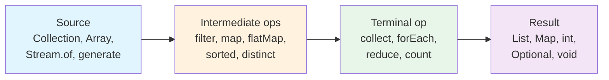
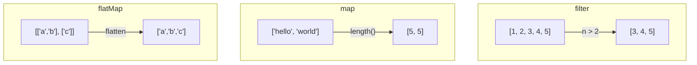
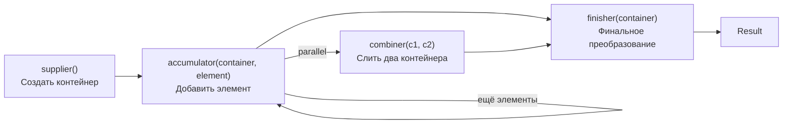
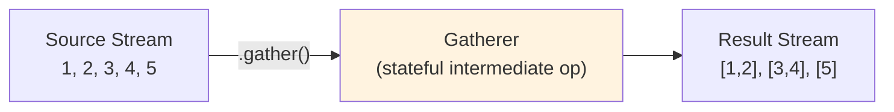

# Вопросы на собеседовании: `Java Stream API`

Комплексное руководство по вопросам собеседования на тему `Java Stream API` — от базовых концепций pipeline и lazy evaluation до продвинутых `Collectors`, `parallel streams`, `Gatherers` (Java 22+) и типичных ловушек.

## Полезные ссылки

### Официальная документация

- [Java Stream API (JDK 21)](https://docs.oracle.com/en/java/javase/21/docs/api/java.base/java/util/stream/Stream.html) — основной Javadoc
- [Package java.util.stream](https://docs.oracle.com/en/java/javase/21/docs/api/java.base/java/util/stream/package-summary.html) — обзор пакета и гайд по stream operations
- [Collectors (JDK 21)](https://docs.oracle.com/en/java/javase/21/docs/api/java.base/java/util/stream/Collectors.html) — все встроенные коллекторы
- [JEP 461: Stream Gatherers](https://openjdk.org/jeps/461) — Gatherers API (preview Java 22, finalized Java 24)

### Baeldung

- [The Java Stream API Tutorial — Baeldung](https://www.baeldung.com/java-8-streams) — полное руководство по Stream API
- [Functional Programming in Java — Baeldung](https://www.baeldung.com/java-functional-programming) — функциональное программирование в Java
- [Functional Interfaces in Java — Baeldung](https://www.baeldung.com/java-8-functional-interfaces) — функциональные интерфейсы Java 8
- [Lambda Expressions and Best Practices — Baeldung](https://www.baeldung.com/java-8-lambda-expressions-tips) — советы и лучшие практики лямбд

## Содержание

- [Полезные ссылки](#полезные-ссылки)
- [See also](#see-also)

**Основы Stream API**
- [Q1. (!) Что такое Stream API и чем он отличается от Collections?](#q1--что-такое-stream-api-и-чем-он-отличается-от-collections)
- [Q2. (!) Что такое stream pipeline и из чего он состоит?](#q2--что-такое-stream-pipeline-и-из-чего-он-состоит)
- [Q3. (!) Что такое lazy evaluation и почему она важна?](#q3--что-такое-lazy-evaluation-и-почему-она-важна)
- [Q4. Какие способы создания Stream существуют?](#q4-какие-способы-создания-stream-существуют)

**Промежуточные операции**
- [Q5. (!) В чём разница между intermediate и terminal операциями?](#q5--в-чём-разница-между-intermediate-и-terminal-операциями)
- [Q6. Чем отличаются stateless и stateful промежуточные операции?](#q6-чем-отличаются-stateless-и-stateful-промежуточные-операции)
- [Q7. (!) Когда использовать map, flatMap и filter?](#q7--когда-использовать-map-flatmap-и-filter)
- [Q8. Как работает flatMap и чем он отличается от map?](#q8-как-работает-flatmap-и-чем-он-отличается-от-map)
- [Q9. В чём разница между sorted, distinct, limit и skip?](#q9-в-чём-разница-между-sorted-distinct-limit-и-skip)
- [Q10. Что такое short-circuit операции и зачем они нужны?](#q10-что-такое-short-circuit-операции-и-зачем-они-нужны)

**Терминальные операции и Collectors**
- [Q11. (!) Как работает collect и зачем нужны Collectors?](#q11--как-работает-collect-и-зачем-нужны-collectors)
- [Q12. (!) Как работают groupingBy, partitioningBy, toMap?](#q12--как-работают-groupingby-partitioningby-tomap)
- [Q13. Как использовать Collectors.joining и Collectors.teeing?](#q13-как-использовать-collectorsjoining-и-collectorsteeing)
- [Q14. (!) В чём разница между reduce и collect?](#q14--в-чём-разница-между-reduce-и-collect)
- [Q15. Как написать собственный Collector?](#q15-как-написать-собственный-collector)
- [Q16. Что такое Optional в контексте Stream и как его правильно использовать?](#q16-что-такое-optional-в-контексте-stream-и-как-его-правильно-использовать)
- [Q17. Как работает forEach и в чём его ограничения?](#q17-как-работает-foreach-и-в-чём-его-ограничения)

**Примитивные стримы**
- [Q18. Когда использовать IntStream, LongStream, DoubleStream?](#q18-когда-использовать-intstream-longstream-doublestream)
- [Q19. Как создать диапазон чисел и получить статистику?](#q19-как-создать-диапазон-чисел-и-получить-статистику)

**Parallel Streams**
- [Q20. (!) Когда стоит переходить на parallelStream?](#q20--когда-стоит-переходить-на-parallelstream)
- [Q21. (!) Какие риски и анти-паттерны есть у parallel streams?](#q21--какие-риски-и-анти-паттерны-есть-у-parallel-streams)
- [Q22. Как работает ForkJoinPool и можно ли использовать свой пул?](#q22-как-работает-forkjoinpool-и-можно-ли-использовать-свой-пул)
- [Q23. Как encounter order влияет на parallel streams?](#q23-как-encounter-order-влияет-на-parallel-streams)

**Stream ordering и характеристики**
- [Q24. Что такое encounter order и как он сохраняется в pipeline?](#q24-что-такое-encounter-order-и-как-он-сохраняется-в-pipeline)
- [Q25. Что такое Spliterator и какие характеристики у Stream?](#q25-что-такое-spliterator-и-какие-характеристики-у-stream)

**Продвинутые паттерны**
- [Q26. (!) Как использовать Stream.iterate и Stream.generate?](#q26--как-использовать-streamiterate-и-streamgenerate)
- [Q27. Как комбинировать Stream с Optional?](#q27-как-комбинировать-stream-с-optional)
- [Q28. Как работает mapMulti (Java 16+)?](#q28-как-работает-mapmulti-java-16)
- [Q29. (!) Что такое Gatherers (Java 22+) и зачем они нужны?](#q29--что-такое-gatherers-java-22-и-зачем-они-нужны)
- [Q30. Какие встроенные Gatherers доступны?](#q30-какие-встроенные-gatherers-доступны)

**Производительность и best practices**
- [Q31. Как избежать лишних аллокаций в Stream-цепочках?](#q31-как-избежать-лишних-аллокаций-в-stream-цепочках)
- [Q32. Как дебажить сложные Stream-пайплайны?](#q32-как-дебажить-сложные-stream-пайплайны)
- [Q33. (!) Когда лучше отказаться от Stream в пользу обычного цикла?](#q33--когда-лучше-отказаться-от-stream-в-пользу-обычного-цикла)
- [Q34. Как писать читабельный Stream-код в production?](#q34-как-писать-читабельный-stream-код-в-production)
- [Q35. Какие типичные ошибки допускают при работе со Stream?](#q35-какие-типичные-ошибки-допускают-при-работе-со-stream)

**Современные возможности и детали**
- [Q36. (!) Stream.gather() и Gatherers API (Java 22+): новые операции](#q36-streamgather-и-gatherers-api-java-22-новые-операции)
- [Q37. (!) Collectors.teeing(): двойной сборщик](#q37-collectorsteeing-двойной-сборщик)
- [Q38. flatMap vs mapMulti (Java 16): разница и производительность](#q38-flatmap-vs-mapmulti-java-16-разница-и-производительность)
- [Q39. Stream и параллелизм: ForkJoinPool.commonPool() и custom pool](#q39-stream-и-параллелизм-forkjoinpoolcommonpool-и-custom-pool)
- [Q40. Отладка Stream: peek() — когда уместен и когда нет](#q40-отладка-stream-peek--когда-уместен-и-когда-нет)
- [Q41. Stream.takeWhile() и dropWhile() (Java 9): примеры](#q41-streamtakewhile-и-dropwhile-java-9-примеры)
- [Q42. Primitive streams: IntStream.range(), summaryStatistics() и boxing overhead](#q42-primitive-streams-intstreamrange-summarystatistics-и-boxing-overhead)

---

## Q1. (!) Что такое Stream API и чем он отличается от Collections?

`Stream API` (Java 8+) — это декларативный способ обработки последовательностей данных через pipeline операций. В отличие от `Collections API`, `Stream` не хранит данные и не модифицирует исходную коллекцию.

Ключевые различия:

| Характеристика | `Collection` | `Stream` |
|---|---|---|
| Хранит данные | Да | Нет — вычисляет по требованию |
| Модифицирует источник | Да (`add`, `remove`) | Нет — иммутабельный pipeline |
| Повторное использование | Сколько угодно | Только один раз |
| Итерация | Внешняя (`for`, `iterator`) | Внутренняя (декларативная) |
| Ленивость | Нет | Да — intermediate ops ленивые |
| Бесконечные данные | Нет | Да (`iterate`, `generate`) |

```java
// Collection — императивный подход
List<String> result = new ArrayList<>();
for (String name : names) {
    if (name.length() > 3) {
        result.add(name.toUpperCase());
    }
}

// Stream — декларативный подход
List<String> result = names.stream()
    .filter(name -> name.length() > 3)
    .map(String::toUpperCase)
    .toList(); // Java 16+
```

> [!mcq] Какое утверждение о природе `Stream` относительно источника данных верно?
>
> - [ ] A. `Stream` хранит копию данных из коллекции и позволяет итерировать её несколько раз подряд.
>
>     **Что на самом деле.** `Stream` — это описание pipeline над источником, а не storage. Он не копирует элементы и закрывается после первой terminal-операции; повторный вызов любой terminal даёт `IllegalStateException: stream has already been operated upon or closed`.
>
>     **Откуда путаница.** Похоже на `Iterable`/`Collection`, которые можно обходить многократно. Документация Java 8 называет это «pipeline», но новички видят в нём «ленивую коллекцию».
>
>     **Если бы это было правдой.** Можно было бы кешировать `Stream<User> activeStream = users.stream().filter(active)` в field сервиса и переиспользовать на каждый HTTP-запрос. В реальности первый запрос работает, второй падает `IllegalStateException`, endpoint возвращает 500.
>
>     **Как было бы правильно.** Признать, что `Stream` одноразовый: для повторного прохода держите `Supplier<Stream<T>>` (`Supplier<Stream<T>> s = () -> list.stream().filter(active);`) и вызывайте `s.get()` каждый раз.
>
> - [ ] B. `Stream` модифицирует исходную коллекцию при вызове `filter` или `map`, удаляя/преобразуя элементы in place.
>
>     **Что на самом деле.** Источник `Stream` иммутабелен — `filter`/`map` возвращают новый `Stream`, не трогая исходный `List`. Чтобы изменить коллекцию, нужен `list.removeIf(predicate)` или `list = list.stream().filter(p).toList()`.
>
>     **Откуда путаница.** Аналогия с SQL `UPDATE`/`DELETE` или с императивным `iterator.remove()` сбивает: кажется, что declarative-операция тоже мутирует источник.
>
>     **Если бы это было правдой.** `users.stream().filter(u -> !u.isBlocked()).count()` втихаря бы удалял заблокированных пользователей. В реальном коде разработчик пишет это, удивляется почему `users.size()` не меняется, и тратит часы на debug — классический баг в Reddit-тредах по Stream API.
>
>     **Как было бы правильно.** Использовать `list.removeIf(predicate)` (mutating in place) либо `var filtered = list.stream().filter(p).toList()` (новый список, источник нетронут) — намерение мутации должно быть явным.
>
> - [x] C. `Stream` не хранит данные, не модифицирует источник и может быть использован только один раз — повторный terminal вызов даёт `IllegalStateException`.
>
>     **Развёрнутое объяснение.** `Stream` — это описание pipeline над `Spliterator` источника плюс цепочка intermediate-операций. Хранилища нет: элементы тянутся ленивой машиной выполнения по запросу terminal-операции. Источник остаётся иммутабельным (пока сам не модифицируется параллельно). После первой terminal-операции внутреннее состояние помечается `linkedOrConsumed = true`, и любая попытка повторного использования бросает `IllegalStateException`. Это сознательный design choice: позволяет использовать ленивые источники типа `Files.lines`, `Stream.generate` единообразно с конечными коллекциями.
>
>     **Пример.** В сервисе биллинга `var activeOrders = orders.stream().filter(Order::isPaid);` сохранили в локальную переменную, потом вызвали `activeOrders.count()` и `activeOrders.toList()` — второй вызов даёт `IllegalStateException`. Фикс: либо `var list = orders.stream().filter(Order::isPaid).toList()` (материализуем один раз), либо `Supplier<Stream<Order>> active = () -> orders.stream().filter(Order::isPaid)` (фабрика, каждый вызов даёт свежий Stream).
>
>     **Когда применять.** Воспринимайте `Stream` как одноразовый pipeline; для повторных проходов используйте `Supplier<Stream<T>>` либо материализуйте в `List`/`Set`. Source-агностичность позволяет писать одинаковый код поверх `IntStream.range(...)`, `Stream.generate(...)`, `Files.lines(...)` и `list.stream()`.
>
>     **Подводные камни.** Если источник `Stream` мутируется параллельно (`list.add(...)` пока pipeline ещё не запустился), при terminal-операции получите `ConcurrentModificationException`. Для I/O-источников (`Files.lines`) одноразовость означает обязательный `try-with-resources` — иначе file handle утечёт.
>
>     **Связанные вопросы.** [[java-stream-interview#Q2]] pipeline и его три части; [[java-stream-interview#Q3]] lazy evaluation; [[java-stream-interview#Q35]] классические ошибки (stream reuse).
>
> - [ ] D. `Stream` автоматически синхронизирует доступ к источнику при параллельной обработке через `parallelStream`.
>
>     **Что на самом деле.** `parallelStream` не оборачивает источник в synchronized или `ConcurrentHashMap`. Он только разбивает обход через `Spliterator.trySplit()` и запускает chunk'и в `ForkJoinPool.commonPool()`. Если внутри pipeline есть side-effects на shared mutable state (`sharedList.add(x)`), это classical race condition.
>
>     **Откуда путаница.** Слово «parallel» ассоциируется с thread-safe абстракциями вроде `ConcurrentHashMap` или `CompletableFuture`, и junior'у кажется, что `parallelStream` тоже «всё сам».
>
>     **Если бы это было правдой.** `urls.parallelStream().forEach(result::add)` всегда давал бы все элементы в произвольном порядке без потерь. Реально — `ArrayList.add` не atomic, в проде получаем потерянные элементы (3% drop на 1000 RPS) и редкий `ArrayIndexOutOfBoundsException`, irreproducible локально.
>
>     **Как было бы правильно.** Признать, что parallel pipeline безопасен только при отсутствии shared mutable state; для накопления использовать `collect(Collectors.toList())` (внутри thread-safe combiner) вместо `forEach(list::add)`.

> [!mcq] Как ведут себя factory-методы `Stream.of(...)`, `Stream.empty()`, `Stream.concat(...)` относительно повторного использования и `null`?
>
> - [ ] A. `Stream.of()` без аргументов выбрасывает `IllegalArgumentException`, потому что `Stream` не может быть пустым.
>
>     **Что на самом деле.** `Stream.of()` без аргументов эквивалентен `Stream.empty()` и возвращает корректный пустой Stream без исключения. Любая terminal-операция на нём даёт нейтральный результат (`count()` = 0, `findFirst()` = `Optional.empty()`, `reduce(0, Integer::sum)` = 0).
>
>     **Откуда путаница.** Аналогия с `List.of(...)` (тоже допускает пустой, но варарг) и желание «защититься от пустого пути» порождает миф о запрете empty Stream.
>
>     **Если бы это было правдой.** `Stream.of(items.toArray())` приходилось бы оборачивать в `try-catch(IllegalArgumentException)` или явный `if (items.isEmpty())`; вместо двух строк pipeline получали бы десять защитных. Реально — `Stream.of()` корректно работает, лишний boilerplate усложняет код без пользы.
>
>     **Как было бы правильно.** Признать, что Stream может быть пустым: `Stream.of()` ≡ `Stream.empty()`; используйте его без защитных проверок и опирайтесь на нейтральные элементы terminal-операций.
>
> - [ ] B. `Stream.concat(s1, s2)` можно повторно использовать: `concat(a, b).forEach(...); concat(a, b).count();` — оба вызова работают.
>
>     **Что на самом деле.** `Stream.concat` возвращает обычный `Stream`, к которому применяется общее правило one-shot: после первой terminal-операции вторая бросает `IllegalStateException`. Каждый вызов `concat(a, b)` создаёт новый Stream и тратит обходы исходных `a` и `b`, поэтому повторно использовать сами `a`/`b` тоже нельзя.
>
>     **Откуда путаница.** Сходство сигнатуры с `String.concat` (immutable, можно сколько угодно) или с `List.addAll` (мутирует, повторяемо) сбивает; кажется, что «склейка» — это побочно-эффектная операция, а не Stream-builder.
>
>     **Если бы это было правдой.** Программист кеширует `Stream<T> all = Stream.concat(orders, refunds);` в field бин-сервиса; первый запрос работает, второй — `IllegalStateException`, endpoint 500. На код-ревью «sometimes works» — классическая дыра.
>
>     **Как было бы правильно.** Признать, что concat-результат тоже одноразовый, и оборачивать вызов в `Supplier<Stream<T>>` или сразу материализовывать в `List`.
>
> - [x] C. Factory-методы `Stream.of(...)`, `Stream.empty()`, `Stream.concat(s1, s2)` создают новый одноразовый `Stream`; повторное обращение к terminal-операции — `IllegalStateException`.
>
>     **Развёрнутое объяснение.** Все три метода — `Stream.of(T...)`, `Stream.empty()`, `Stream.concat(Stream, Stream)` — возвращают новый `ReferencePipeline.Head`, который ничем не отличается от стримов, полученных через `list.stream()`. Внутренний флаг `linkedOrConsumed` помечается при первой terminal-операции, и любой повторный вызов даёт `IllegalStateException`. Для нескольких источников: 2 стрима — `Stream.concat(a, b)`; N стримов — `Stream.of(a, b, c).flatMap(Function.identity())` (читаемее, чем вложенные concat). Для условного источника удобен тернарник `condition ? source.stream() : Stream.empty()`.
>
>     **Пример.** В сервисе сводных отчётов нужно объединить `paidOrders.stream()` и `refunds.stream()`, отсортировать по дате и взять топ-50. Решение: `Stream.concat(paidOrders.stream(), refunds.stream()).sorted(byDate.reversed()).limit(50).toList()`. Для unit-тестов с edge case «нет данных» — `condition ? data.stream() : Stream.empty()` без `if/else` ветвлений.
>
>     **Когда применять.** Везде, где нужен явный/литеральный/условный/склеенный источник: `Stream.of(...)` для константного набора, `Stream.empty()` для null-safe возврата из метода с сигнатурой `Stream<T>`, `Stream.concat(a, b)` для пары стримов, `Stream.of(a, b, c).flatMap(identity)` для N стримов. Для повторных проходов сохраняйте `Supplier<Stream<T>>` (`Supplier<Stream<Order>> active = () -> Stream.concat(paid, refunded)`) и вызывайте `active.get()` каждый раз.
>
>     **Подводные камни.** `Stream.concat` глубокой вложенности (`concat(concat(concat(a,b),c),d)`) накапливает overhead и теряет characteristic'и (`SIZED`, `SUBSIZED`) — на N стримов лучше `Stream.of(a, b, c, d).flatMap(identity)`. Условный `condition ? stream : Stream.empty()` не материализует unused ветвь — это дешевле, чем `concat`+`filter`.
>
>     **Связанные вопросы.** [[java-stream-interview#Q4]] способы создания Stream; [[java-stream-interview#Q5]] terminal закрывает Stream; [[java-stream-interview#Q35]] типичные ошибки (stream reuse).
>
> - [ ] D. `Stream.empty()` и `Stream.of((Object) null)` эквивалентны — оба создают стрим без элементов.
>
>     **Что на самом деле.** `Stream.of((Object) null)` создаёт Stream из **одного** элемента-`null`. `Stream.empty()` — Stream без элементов. На следующем шаге `map(String::length)` первый дайт NPE, второй проходит мимо без вызова mapper'а.
>
>     **Откуда путаница.** Java 9+ ввела `Stream.ofNullable(x)` (`x` → пустой при `null`, иначе из одного элемента) — её путают с обычной `Stream.of(x)`, которая просто оборачивает значение как есть.
>
>     **Если бы это было правдой.** Любой `Stream.of(maybeNull)` в pipeline был бы безопасен и автоматически фильтровал null. В реальности `users.stream().map(User::findPhone).flatMap(p -> Stream.of(p))` (где `findPhone` может вернуть null) даёт NPE на следующем `map(String::length)`.
>
>     **Как было бы правильно.** Для null-safe варианта использовать `Stream.ofNullable(x)` (Java 9+) либо `Optional.ofNullable(x).stream()`; для явного пустого Stream — `Stream.empty()`.

## Q2. (!) Что такое stream pipeline и из чего он состоит?

Stream pipeline — это цепочка операций, состоящая из трёх частей: **source** (источник), **intermediate operations** (промежуточные операции) и **terminal operation** (терминальная операция).



Правила pipeline:
- Intermediate-операции **ленивые** — не выполняются до вызова terminal-операции
- Terminal-операция **одна** — после неё Stream закрыт
- Элементы проходят pipeline **вертикально** (элемент за элементом), а не горизонтально (операция за операцией)

```java
// Вертикальная обработка: каждый элемент проходит все операции
List<String> result = List.of("alice", "bob", "charlie", "dave")
    .stream()
    .filter(s -> s.length() > 3)   // alice -> да, bob -> нет, charlie -> да, dave -> да
    .map(String::toUpperCase)       // alice -> ALICE, charlie -> CHARLIE, dave -> DAVE
    .limit(2)                       // ALICE, CHARLIE — после 2-го элемента стоп
    .toList();
// Результат: ["ALICE", "CHARLIE"]
// "dave" вообще не обрабатывался — limit прервал pipeline
```

> [!mcq] Что верно про структуру и порядок обработки элементов в stream pipeline?
>
> - [ ] A. Stream pipeline выполняет операции горизонтально: сначала все элементы проходят `filter`, затем все — `map`, и так далее по операциям.
>
>     **Что на самом деле.** Pipeline обрабатывает элементы вертикально (per-element): каждый элемент проходит весь pipeline до конца, прежде чем следующий начнёт обработку. Это позволяет short-circuit-операциям (`limit`, `findFirst`) остановить весь pipeline после нескольких элементов, не обрабатывая остальные.
>
>     **Откуда путаница.** Императивный mind-set «цикл по filter, затем цикл по map» — стандарт со времён loop fusion в C/SQL. Объяснение через таблицу-матрицу с горизонтальными ops тоже сбивает: legacy-учебники по Java 8 часто показывают «column by column».
>
>     **Если бы это было правдой.** `Stream.iterate(1, n -> n+1).filter(n -> n > 1000).limit(5)` пришлось бы обрабатывать все ~бесконечные элементы перед `filter`. Реально pipeline завершается за 1005 элементов — каждый элемент проходит весь pipeline вертикально, `limit(5)` срабатывает на пятом подходящем.
>
>     **Как было бы правильно.** Признать, что pipeline вертикален: один элемент → filter → map → terminal → следующий элемент. Эта модель объясняет short-circuit, infinite streams и loop fusion.
>
> - [x] B. Stream pipeline состоит из source, промежуточных операций и одной терминальной операции; элементы обрабатываются вертикально (один за другим через весь pipeline).
>
>     **Развёрнутое объяснение.** Pipeline — это direct acyclic chain: source (`Spliterator`) → N intermediate ops (lazy, возвращают новый `Stream`) → ровно одна terminal op (запускает выполнение). Каждый элемент проходит весь pipeline до terminal-операции, прежде чем следующий начнёт обработку (vertical processing). Это включает оптимизации: loop fusion (filter+map в одной итерации без промежуточных коллекций), short-circuit (`limit`, `findFirst` останавливают обход), lazy evaluation (без terminal — ничего не выполняется). Внутренне это реализовано через `Sink`-цепочку: каждая операция — это `Sink`, вызывающий downstream `Sink.accept(element)` или сигнализирующий `cancellationRequested()`.
>
>     **Пример.** `Stream.iterate(1, n -> n + 1).map(n -> n*n).filter(n -> n > 100).findFirst()` — pipeline на каждой итерации генерирует число, считает квадрат, проверяет `> 100`. На `1,2,...,10` `findFirst` ловит первый подходящий (`11*11 = 121`), pipeline останавливается. Без vertical-модели пришлось бы материализовать миллиарды квадратов перед filter.
>
>     **Когда применять.** Pipeline визуализируйте как transposed matrix (по столбцам, не по строкам); это объясняет, почему `Stream.iterate(...).limit(5)` корректно работает с бесконечным источником. Используйте short-circuit terminal'ы (`findFirst`, `anyMatch`) и `limit(n)` как intermediate для контроля бесконечных stream'ов.
>
>     **Подводные камни.** Stateful intermediate-операции (`sorted`, `distinct`) ломают чистый vertical mode: они буферизуют все элементы перед тем, как пропустить дальше. `sorted` на бесконечном Stream — OOM или зависание. `peek` тоже срабатывает per-element, но JIT (Java 9+, JEP 276) может скипнуть его при `SIZED` источниках, если результат не нужен — для production-side-effects используйте `forEach`.
>
>     **Связанные вопросы.** [[java-stream-interview#Q3]] lazy evaluation; [[java-stream-interview#Q5]] intermediate vs terminal; [[java-stream-interview#Q10]] short-circuit операции.
>
> - [ ] C. В pipeline может быть несколько терминальных операций, которые последовательно применяются к одному и тому же стриму.
>
>     **Что на самом деле.** Terminal-операция ровно одна; она «закрывает» Stream через флаг `linkedOrConsumed`. Любой повторный terminal даёт `IllegalStateException: stream has already been operated upon or closed`.
>
>     **Откуда путаница.** Аналогия с jQuery-style chaining (`$(...).hide().show().fadeIn()`) или builder API сбивает: кажется, что цепочка может бесконечно собирать результаты.
>
>     **Если бы это было правдой.** Можно было бы написать `var stream = users.stream().filter(active); long c = stream.count(); var list = stream.toList();` для двух разных metric'ов. Реально второй вызов падает; в проде это даёт `500 Internal Server Error` на endpoint, который проходит unit-test (там стрим вызывают раз).
>
>     **Как было бы правильно.** Создавать новый Stream под каждый terminal: `long c = users.stream().filter(active).count(); var list = users.stream().filter(active).toList();` — или сохранять `Supplier<Stream<User>>` для DRY.
>
> - [ ] D. Промежуточные операции pipeline выполняются сразу при добавлении в цепочку и возвращают новую коллекцию для следующей операции.
>
>     **Что на самом деле.** Intermediate-операции ленивы: они только описывают будущую работу через `Sink`-цепочку. Никакой работы не происходит до вызова terminal — поэтому `stream.filter(p).map(f)` без `toList()`/`forEach`/`count()` не делает ничего.
>
>     **Откуда путаница.** Императивный stream-API из других языков (Ruby `.select.map`, JS `.filter.map` до lazy iterables) выполняет каждую операцию сразу. Похожий синтаксис вводит в заблуждение.
>
>     **Если бы это было правдой.** `users.stream().filter(active).peek(emailService::send)` отправлял бы письма всем активным пользователям. Реально без terminal-операции pipeline не запускается — ноль писем отправлено, поддержка получает claim'ы за 3 дня молчания, классический «silent bug» из postmortem'ов команд, мигрирующих со Scala.
>
>     **Как было бы правильно.** Помнить, что без terminal-операции (`forEach`, `collect`, `count` и др.) ничего не выполняется. Для side-effects использовать terminal `forEach`, а не `peek` без terminal.

> [!mcq] Какую роль играет `Spliterator` и как он влияет на производительность pipeline?
>
> - [ ] A. `Spliterator` нужен только для parallel streams; в sequential pipeline источником служит обычный `Iterator`.
>
>     **Что на самом деле.** Stream API под капотом **всегда** работает через `Spliterator`, независимо от sequential/parallel. Sequential просто игнорирует `trySplit()` и обходит источник через `tryAdvance` или `forEachRemaining`. Параллельный режим вызывает `trySplit()` рекурсивно для разбиения работы.
>
>     **Откуда путаница.** Slогаз «splitable iterator» намекает, что split — главная функция; на самом деле split — опция, а основная работа — обход + characteristics.
>
>     **Если бы это было правдой.** Custom-источник можно было бы реализовать через `Iterator`, передав в `Stream`-API напрямую. Реально нужно либо `Spliterators.spliteratorUnknownSize(iterator, characteristics)`, либо `StreamSupport.stream(spliterator, false)`. Попытка передать чистый `Iterator` в `StreamSupport.stream` даёт compile error на типах.
>
>     **Как было бы правильно.** Признать, что `Spliterator` — это базовый абстрактный источник Stream API; для адаптации legacy `Iterator` используйте `Spliterators.spliteratorUnknownSize(it, characteristics)`.
>
> - [ ] B. Перевод `parallel()` в pipeline всегда даёт линейное ускорение пропорционально числу ядер процессора.
>
>     **Что на самом деле.** Parallel — это cost/benefit trade-off: overhead на split, dispatch в `ForkJoinPool`, merge результатов. Окупается только когда total work (`N × W`, где N — элементы, W — работа на элемент) ≥ ~10⁴ и `Spliterator` поддерживает `SIZED+SUBSIZED` (хорошо делится).
>
>     **Откуда путаница.** Маркетинг Java 8 («параллелизм одной строкой кода») создал миф о free speedup. На практике parallel — самая частая причина перформанс-регрессий после миграции на Stream API.
>
>     **Если бы это было правдой.** `smallList.parallelStream().filter(active).toList()` (10 элементов, лёгкий predicate) ускорял бы код. Реально 100-1000 элементов с лёгкими операциями дают деградацию p99 latency с 5 ms до 20 ms из-за overhead'а split/merge, CPU +30% на координацию ForkJoin-задач — постмортем многих миграций.
>
>     **Как было бы правильно.** Признать, что parallel — измеряемое решение: всегда начинать с sequential, переходить на parallel только после JMH-бенчмарка на realistic dataset и при подтверждённой CPU-bound нагрузке.
>
> - [x] C. Источник Stream под капотом — `Spliterator` с характеристиками (`SIZED`, `ORDERED`, `DISTINCT`, `SORTED`, `IMMUTABLE`, `SUBSIZED`, `NONNULL`, `CONCURRENT`); они влияют на оптимизации pipeline и стоимость parallel.
>
>     **Развёрнутое объяснение.** Каждый источник Stream предоставляет `Spliterator` с битовой маской `characteristics()`. JIT/runtime использует их для оптимизаций: `SIZED` → pre-allocation buffer'ов; `ORDERED` → сохранение encounter order в merge'е; `DISTINCT` → `stream.distinct()` no-op; `SORTED` → `stream.sorted()` no-op; `SUBSIZED` → balanced O(1) split в parallel. `ArrayList.spliterator()` даёт `SIZED+ORDERED+SUBSIZED` — отлично делится в parallel. `LinkedList.spliterator()` — `SIZED+ORDERED` без `SUBSIZED` (split требует итерации к середине, по факту sequential). `HashSet` — `SIZED+DISTINCT` без `ORDERED` (`findAny` быстрее `findFirst`). `TreeSet` — `SIZED+DISTINCT+SORTED+ORDERED`. Источники типа `Files.lines` и `Stream.iterate(seed, next)` — без `SIZED`/`SUBSIZED`, parallel бесполезен.
>
>     **Пример.** Diagnose: `int chars = stream.spliterator().characteristics(); boolean sized = (chars & Spliterator.SIZED) != 0;` — позволяет проверить характеристики любой коллекции перед `parallel()`. В банковском batch'е выяснилось, что `ArrayList<Transaction>` (10M entries) даёт 8× speedup от parallel, а тот же batch на `LinkedList` — sequential.
>
>     **Когда применять.** Для parallel pipeline'ов выбирайте источники с `SIZED+SUBSIZED+IMMUTABLE` (массивы, `ArrayList`, `IntStream.range`); избегайте `LinkedList`, `Stream.iterate(seed, next)` без `hasNext`-предиката, `Files.lines` (unsized lazy I/O); для custom-источников реализуйте `trySplit()` грамотно и указывайте максимум characteristics через `Spliterators.spliterator(iterator, size, ORDERED | SIZED | SUBSIZED)`.
>
>     **Подводные камни.** `IMMUTABLE` и `CONCURRENT` взаимоисключающие — выбирайте одно. `NONNULL` нельзя для коллекций с `null`-элементами (`ArrayList.of(1, null, 2)` — Spliterator не должен иметь `NONNULL`). `estimateSize()` для unsized источников возвращает `Long.MAX_VALUE`, и pre-allocation pipeline'а пытается выделить 8 GB → OOM на `toList()`.
>
>     **Связанные вопросы.** [[java-stream-interview#Q20]] когда переходить на parallel; [[java-stream-interview#Q22]] ForkJoinPool; [[java-stream-interview#Q25]] Spliterator подробно.
>
> - [ ] D. `parallel()` стрим всегда быстрее sequential, если данных больше тысячи элементов.
>
>     **Что на самом деле.** Скорость зависит от characteristic'ов источника и веса работы на элемент. `LinkedList.parallelStream()` с лёгкими операциями (filter+sum) на 100k элементов в 5-10× медленнее sequential — `LinkedList.spliterator()` без `SUBSIZED` не делится бинарно, фактически работает sequential плюс overhead'ы координации.
>
>     **Откуда путаница.** «1000 элементов» — частый эвристический минимум из StackOverflow, но он игнорирует характеристики источника и вес операции.
>
>     **Если бы это было правдой.** Любая миграция `.stream()` → `.parallelStream()` на коллекциях ≥ 1000 элементов ускоряла бы код. В реальности — деградация на `LinkedList`, `HashSet` без `SUBSIZED`, lazy I/O источниках.
>
>     **Как было бы правильно.** Признать, что параллелизм окупается при ВСЕХ условиях: `SIZED+SUBSIZED` источник, CPU-bound нагрузка, `N × W ≥ 10⁴`, ассоциативные операции, отсутствие shared mutable state. Всегда JMH-бенчмарк перед production rollout.

## Q3. (!) Что такое lazy evaluation и почему она важна?

Промежуточные операции `Stream` не выполняются сразу — они формируют **описание** pipeline. Реальное выполнение запускается только при вызове терминальной операции. Это и есть **lazy evaluation** (ленивое вычисление).

Преимущества ленивости:
- **Оптимизация**: JVM может объединять операции (loop fusion) и пропускать лишнюю работу
- **Short-circuit**: `findFirst`, `limit`, `anyMatch` завершаются, не обрабатывая все элементы
- **Бесконечные стримы**: можно работать с `Stream.iterate` / `Stream.generate`, ограничивая результат через `limit`

```java
// Без терминальной операции — НИЧЕГО не выполнится
Stream<String> lazy = names.stream()
    .filter(n -> {
        System.out.println("filter: " + n); // Никогда не напечатается!
        return n.length() > 3;
    })
    .map(String::toUpperCase);
// pipeline создан, но ни один элемент не обработан

// Терминальная операция запускает выполнение
List<String> result = lazy.toList(); // Теперь filter/map работают
```

> [!mcq] Что такое lazy evaluation в Stream API и какие практические выгоды она даёт?
>
> - [x] A. Промежуточные операции не выполняются до вызова terminal-операции; это позволяет short-circuit-операциям завершаться раньше, поддерживать бесконечные стримы и применять loop fusion.
>
>     **Развёрнутое объяснение.** Intermediate-операции (filter/map/flatMap/sorted/...) только формируют описание pipeline через `Sink`-цепочку, не делая реальной работы. Реальное выполнение запускает terminal-операция: она инициирует обход `Spliterator` источника и тянет элементы через зарегистрированные `Sink`-ы. Это даёт три ключевых эффекта. (1) Short-circuit: `findFirst`/`anyMatch`/`limit` могут остановить pipeline после нескольких элементов. (2) Infinite streams: `Stream.iterate(seed, next)` + `limit` практически применимы только благодаря lazy. (3) Loop fusion: JIT может скомпилировать `filter(p).map(f).filter(q)` в один цикл без промежуточных коллекций.
>
>     **Пример.** В сервисе подбора контента: `Stream.iterate(1, n -> n + 1).filter(n -> n % 17 == 0).map(this::expensiveLookup).filter(Item::isAvailable).findFirst()` — pipeline тянет по одному числу, считает `expensiveLookup` только для каждого 17-го числа и останавливается при первом доступном. Без lazy пришлось бы материализовать миллиарды чисел и lookup'ов всех 17-х.
>
>     **Когда применять.** Везде, где нужны short-circuit terminal'ы (`findFirst`, `anyMatch`, `noneMatch`) на больших данных или бесконечных Stream'ах; для loop fusion (filter+map+filter+map без промежуточных коллекций); для condition-driven обхода `Stream.iterate(seed, hasNext, next)` (Java 9+).
>
>     **Подводные камни.** Stateful intermediate (`sorted`, `distinct`) ломают lazy-выгоды: они буферизуют все элементы. `sorted` на бесконечном Stream — OOM. `peek` срабатывает per-element при terminal, но JIT (Java 9+, JEP 276) может скипнуть его при `SIZED` источниках и `count()`-terminal. Без terminal-операции pipeline вообще не выполняется — это ловушка для side-effects через `peek`.
>
>     **Связанные вопросы.** [[java-stream-interview#Q2]] pipeline и vertical processing; [[java-stream-interview#Q5]] intermediate vs terminal; [[java-stream-interview#Q10]] short-circuit операции.
>
> - [ ] B. Промежуточные операции выполняются сразу при добавлении в цепочку — JVM так оптимизирует pipeline.
>
>     **Что на самом деле.** Все intermediate-операции ленивы. Без terminal-операции ничего не выполняется; JIT-оптимизация применяется на этапе runtime, когда pipeline уже запущен terminal-операцией.
>
>     **Откуда путаница.** Eager semantics из Ruby `Array#select.map` или JS pre-iterator `Array.prototype.filter` (Java SE 7 streams в Guava/Apache Commons тоже были eager). Привычка из этих API заставляет ждать немедленного выполнения.
>
>     **Если бы это было правдой.** `stream.filter(p)` обходил бы коллекцию каждый раз при вызове, и `Stream.iterate(0, n -> n + 1).limit(5)` пришлось бы материализовать бесконечный Stream. В реальности pipeline ждёт terminal — разработчик ставит `peek(log::info)` и удивляется пустому логу.
>
>     **Как было бы правильно.** Признать, что intermediate-операции ленивы; JIT оптимизирует уже работающий pipeline. Для проверки порядка/значений — terminal-операции в дебаге, а не `peek` без terminal.
>
> - [ ] C. Lazy evaluation означает, что terminal-операция выполняется асинхронно в фоновом потоке.
>
>     **Что на самом деле.** Lazy и async — разные концепции. Lazy — это «не делать работу до запроса». Async — «делать работу в другом потоке». `stream.toList()` синхронно блокирует current thread до завершения.
>
>     **Откуда путаница.** Слово «lazy» в JavaScript часто связано с Promise/async; в Scala — с lazy val и Future. Java эту терминологию использует только для отложенных вычислений в текущем потоке.
>
>     **Если бы это было правдой.** `stream.toList()` в main-thread не блокировал бы main и обработка не влияла бы на UI/HTTP-thread. Реально — синхронно блокирует, при больших данных main thread зависает и health-check тимаутится.
>
>     **Как было бы правильно.** Для асинхронной обработки явно использовать `CompletableFuture.supplyAsync(() -> stream.toList(), executor)`. Lazy в Stream — только про отложенное выполнение, не про потоки.
>
> - [ ] D. Lazy evaluation гарантирует, что каждый элемент обрабатывается в цепочке ровно один раз, даже при многократном вызове terminal-операций на одном Stream.
>
>     **Что на самом деле.** Stream одноразовый: после первого terminal он закрыт (`linkedOrConsumed = true`). Любой повторный terminal даёт `IllegalStateException`. Lazy — про отложенность выполнения, не про многократное использование.
>
>     **Откуда путаница.** Аналогия с lazy data structures в Haskell, где значение вычисляется один раз и кешируется (memoization). В Java эта memoization относится к Stream'у в целом, а не к «один раз обработать и переиспользовать».
>
>     **Если бы это было правдой.** `var s = list.stream().filter(p); long c = s.count(); var l = s.toList();` работал бы как кешированный pipeline. В реальности `count()` закрывает Stream, `toList()` бросает `IllegalStateException`.
>
>     **Как было бы правильно.** Для кеширования материализуйте результат (`var list = stream.toList()`) либо используйте `Supplier<Stream<T>>` для повторных вызовов с свежим Stream'ом.

> [!mcq] Какие terminal-операции реализуют short-circuit, а какие всегда обходят все элементы стрима?
>
> - [ ] A. `count()` на `Stream.iterate(1, n -> n+1).limit(1_000_000)` использует lazy и не материализует все элементы — JVM «понимает» что нужен только размер.
>
>     **Что на самом деле.** `count()` обходит весь pipeline через intermediate-операции (`filter`, `map`), даже если итоговый результат — это просто число. JVM оптимизирует `count()` только когда источник имеет characteristic `SIZED` И в pipeline нет stateful-операций, влияющих на размер (`filter`, `flatMap`, `distinct`). После `limit(1_000_000)` size известен, но `filter`/`map` всё равно вычисляются на каждом элементе.
>
>     **Откуда путаница.** Похоже на SQL `COUNT(*)`, который часто использует индекс без full table scan. В Stream аналогичная оптимизация работает только в простейших случаях.
>
>     **Если бы это было правдой.** `users.stream().filter(active).count()` выполнялся бы за O(1). Реально обходит N элементов, выполняя `filter` для каждого — для existence check `filter().count() > 0` обходит весь Stream на 1M записей вместо O(1) с `anyMatch`.
>
>     **Как было бы правильно.** Для known-size коллекции использовать `list.size()`. Для подсчёта с filter — `count()`, понимая что это O(N). Для existence check — `anyMatch` (short-circuit).
>
> - [ ] B. `forEach` и `findFirst` одинаково ленивы — оба обходят pipeline до первого элемента и завершаются.
>
>     **Что на самом деле.** `forEach` обходит ВСЕ элементы, выполняя action для каждого. `findFirst` — short-circuit, останавливается после первого совпадения. На бесконечном `Stream.iterate(1, n -> n + 1).forEach(...)` приложение зависает; `findFirst` на том же источнике возвращает первый элемент.
>
>     **Откуда путаница.** Оба возвращают `void`/`Optional<T>` без накопления коллекции, и это создаёт ложное чувство «однократности» обоих.
>
>     **Если бы это было правдой.** `Stream.iterate(0, n -> n + 1).forEach(this::process)` обрабатывал бы один элемент. Реально pipeline зависает в бесконечном цикле — health-check timeout, K8s liveness probe убивает pod, crashloop.
>
>     **Как было бы правильно.** Признать, что `forEach` — all-element terminal без short-circuit; для «один элемент» — `findFirst().ifPresent(action)` или `limit(1).forEach(action)`.
>
> - [x] C. `findFirst` / `findAny` / `anyMatch` / `allMatch` / `noneMatch` могут завершить pipeline после первого совпадения; `count` / `forEach` / `toList` / `reduce` обходят все элементы.
>
>     **Развёрнутое объяснение.** Short-circuit terminal'ы возвращают результат, как только он определён: `findFirst` — после первого подходящего элемента, `anyMatch` — после первого `true`, `allMatch` — после первого `false`, `noneMatch` — после первого `true`. Они внутренне отвечают `true` из `Sink.cancellationRequested()`, и pipeline прекращает обход `Spliterator`. Non-short-circuit terminal'ы (`count`, `forEach`, `toList`, `reduce`) обходят весь источник: `count` нужно увидеть все, чтобы знать сколько, `reduce` — чтобы скомбинировать, `toList`/`forEach` — обработать все. На бесконечных стримах работают только short-circuit terminal'ы или intermediate `limit(N)` + non-short-circuit terminal.
>
>     **Пример.** Existence check «есть ли админ в системе»: `users.stream().anyMatch(User::isAdmin)` останавливается на первом админе; `users.stream().filter(User::isAdmin).count() > 0` на 1M пользователей обходит всех. JMH разница — 1000× на realistic distribution.
>
>     **Когда применять.** Existence check — `anyMatch`/`noneMatch` вместо `filter().count()`. Поиск одного результата — `findFirst()` вместо `toList().get(0)`. Validation «все валидны» — `allMatch`. На parallel — `findAny()` ещё быстрее, чем `findFirst()`, потому что не ждёт первый по encounter order. Бесконечные стримы — только short-circuit terminal или `limit` перед non-short-circuit.
>
>     **Подводные камни.** Vacuous truth на пустом Stream: `allMatch` = `true`, `noneMatch` = `true`, `anyMatch` = `false` — учитывайте в validation-логике. `findFirst` на parallel-stream дороже `findAny` из-за ожидания encounter order. `peek` может быть скипнут JIT'ом при short-circuit терминале — для аудита используйте `forEachOrdered` или `map(x -> { audit(x); return x; })`.
>
>     **Связанные вопросы.** [[java-stream-interview#Q10]] short-circuit операции подробно; [[java-stream-interview#Q5]] terminal classification; [[java-stream-interview#Q26]] бесконечные стримы.
>
> - [ ] D. `peek` гарантированно вызывается для каждого элемента в lazy pipeline, даже если terminal — short-circuit.
>
>     **Что на самом деле.** JIT (Java 9+, JEP 276) может пропустить вызовы `peek`, если результат не нужен для terminal-операции. Например, на `SIZED` источнике `stream.peek(log).count()` JIT может скипнуть `peek` — count берётся напрямую из `Spliterator.getExactSizeIfKnown()`. Также short-circuit terminal (`findFirst`) останавливает обход, и `peek` не вызывается на оставшихся элементах.
>
>     **Откуда путаница.** Документация Stream API раннего Java 8 не упоминала JIT-оптимизаций; разработчики опираются на «peek вызывается для всех элементов» как на инвариант.
>
>     **Если бы это было правдой.** Можно было бы использовать `peek` для production-аудита и логирования: `stream.peek(audit::log).count()` записывал бы все элементы. Реально на `SIZED` источнике JIT скипает `peek`, аудит-лог пустой, SOX-compliance check не проходит.
>
>     **Как было бы правильно.** Для production-аудита использовать terminal `forEach`/`forEachOrdered` либо `map(x -> { audit(x); return x; })`. `peek` оставлять только для временной отладки с пометкой «remove before commit».

## Q4. Какие способы создания Stream существуют?

| Способ | Пример | Особенности |
|---|---|---|
| Из коллекции | `list.stream()` | Самый частый вариант |
| Из массива | `Arrays.stream(arr)` | Поддерживает подмассив `(arr, from, to)` |
| Фабричный метод | `Stream.of("a", "b", "c")` | Для фиксированного набора |
| Пустой | `Stream.empty()` | Для null-safe возвратов |
| `iterate` | `Stream.iterate(0, n -> n + 2)` | Бесконечный, с seed |
| `iterate` (Java 9+) | `Stream.iterate(0, n -> n < 100, n -> n + 2)` | С предикатом завершения |
| `generate` | `Stream.generate(Math::random)` | Бесконечный, без seed |
| `IntStream.range` | `IntStream.range(0, 10)` | `[0, 10)` — не включая конец |
| `IntStream.rangeClosed` | `IntStream.rangeClosed(1, 10)` | `[1, 10]` — включая конец |
| Из строки | `"hello".chars()` | `IntStream` символов |
| Из файла | `Files.lines(path)` | Ленивое чтение по строкам |
| `Pattern.splitAsStream` | `pattern.splitAsStream(input)` | Ленивый split |
| Builder | `Stream.builder().add(x).build()` | Императивное создание |

```java
// iterate с предикатом (Java 9+) — замена iterate + limit
Stream.iterate(1, n -> n <= 100, n -> n * 2)
    .forEach(System.out::println); // 1, 2, 4, 8, 16, 32, 64

// Files.lines — ленивое чтение (try-with-resources обязательно!)
try (Stream<String> lines = Files.lines(Path.of("data.csv"))) {
    long errorCount = lines
        .filter(line -> line.contains("ERROR"))
        .count();
}
```

> [!mcq] Какое утверждение о способах создания Stream и их свойствах верно?
>
> - [ ] A. `Stream.generate(Math::random)` является упорядоченным стримом, потому что элементы генерируются в порядке вызовов `Supplier`.
>
>     **Что на самом деле.** `Stream.generate(supplier)` производит **неупорядоченный** бесконечный Stream. У него нет characteristic `ORDERED`, и при `parallel()` `Supplier` может вызываться в произвольном порядке из разных потоков. Для упорядоченного бесконечного Stream — `Stream.iterate(seed, next)`.
>
>     **Откуда путаница.** Идея «один supplier → последовательный вызов → последовательный порядок» интуитивна, но Stream API явно помечает `generate` как unordered (даёт parallel-friendly свойства).
>
>     **Если бы это было правдой.** `Stream.generate(idGen::next).parallel().limit(1000).toList()` со stateful counter давал бы упорядоченные ID. Реально supplier вызывается из разных потоков параллельно, race на counter без synchronized → дубликаты id в БД, `UNIQUE` constraint violation в bulk insert.
>
>     **Как было бы правильно.** Признать, что `Stream.generate` unordered (parallel-friendly); для упорядоченного бесконечного — `Stream.iterate(seed, next)`; для bulk-ID — UUID (stateless, race-safe) либо synchronized counter.
>
> - [ ] B. `Files.lines(path)` загружает все строки файла в память при создании Stream.
>
>     **Что на самом деле.** `Files.lines(path)` использует ленивое чтение через `BufferedReader.lines()`: строки читаются по запросу terminal-операцией, файл-handle остаётся открытым. Закрывается только при `Stream.close()` (вызывается автоматически в try-with-resources).
>
>     **Откуда путаница.** Аналогия с `Files.readAllLines` (eager, возвращает `List<String>`) сбивает: похожее имя метода, но семантика обратная.
>
>     **Если бы это было правдой.** На 50 GB лог-файле `Files.lines` бы упал OOM при создании. Реально — корректно работает с лениво вычитываемыми строками. Но без `try-with-resources` file-handle утекает; на Linux с дефолтным fd-limit 1024 после 10k таких чтений приложение крашится с «Too many open files».
>
>     **Как было бы правильно.** Признать lazy-семантику `Files.lines`; ВСЕГДА оборачивать в `try (Stream<String> lines = Files.lines(path)) { ... }` — без этого file-handle leak в production.
>
> - [x] C. `Stream.iterate(seed, hasNext, next)` (Java 9+) — упорядоченный конечный стрим с предикатом завершения; `Stream.iterate(seed, next)` — упорядоченный бесконечный; `Stream.generate(supplier)` — неупорядоченный бесконечный.
>
>     **Развёрнутое объяснение.** Java 9 добавила трёхпараметрическую перегрузку `Stream.iterate(seed, hasNext, next)` — это functional аналог C-style for-loop `for (int i = seed; hasNext.test(i); i = next.apply(i))`. Stream упорядоченный (`ORDERED` characteristic) и конечный (`hasNext.test(seed) == false` → пустой Stream). Старая двух-параметрическая форма `Stream.iterate(seed, next)` — бесконечная, упорядоченная (каждый элемент зависит от предыдущего); требует `limit()` для завершения. `Stream.generate(supplier)` — бесконечная, неупорядоченная (элементы независимы), хорошо параллелится.
>
>     **Пример.** Заменить C-style цикл: `Stream.iterate(1, i -> i <= 100, i -> i * 2).forEach(System.out::println)` вместо `for (int i = 1; i <= 100; i *= 2) System.out.println(i)`. Фибоначчи: `Stream.iterate(new long[]{0, 1}, f -> new long[]{f[1], f[0] + f[1]}).limit(10).mapToLong(f -> f[0]).forEach(System.out::println)`. Bulk UUID — `Stream.generate(UUID::randomUUID).limit(N).parallel().toList()`.
>
>     **Когда применять.** Конечные генерируемые последовательности с termination condition — `Stream.iterate(seed, hasNext, next)` (Java 9+). Зависящие от предыдущего значения бесконечные — `iterate(seed, next)` + `limit/findFirst`. Независимые элементы (UUID, случайные, константные) — `generate(supplier)` + `limit`. Парсинг ленивого источника (файл, regex) — `Files.lines`, `Pattern.splitAsStream`. Для `parallel` — предпочитайте `generate` или `IntStream.range` (sized), не `iterate`.
>
>     **Подводные камни.** На бесконечных стримах ВСЕГДА должен быть short-circuit terminal (`findFirst`, `limit + forEach`) — иначе hang/OOM. `Stream.iterate` (двухпараметрическая) плохо параллелится из-за зависимости от предыдущего элемента. `Files.lines` без `try-with-resources` течёт file handles. `Stream.of(null)` — это Stream из одного `null`-элемента, не пустой Stream (используйте `Stream.ofNullable` для null-safe).
>
>     **Связанные вопросы.** [[java-stream-interview#Q1]] что такое Stream; [[java-stream-interview#Q3]] lazy evaluation; [[java-stream-interview#Q10]] short-circuit на бесконечных.
>
> - [ ] D. `IntStream.range(0, 10)` и `IntStream.rangeClosed(0, 10)` возвращают одинаковое количество элементов.
>
>     **Что на самом деле.** `range(0, 10)` — half-open `[0, 10)` — 10 элементов (0..9). `rangeClosed(0, 10)` — closed `[0, 10]` — 11 элементов (0..10). Разница на single element.
>
>     **Откуда путаница.** В разных языках интервалы вычисляются по-разному: Python `range(0, 10)` тоже half-open, но Kotlin `0..10` — closed; разработчик переключается между языками и забывает про конвенцию Java.
>
>     **Если бы это было правдой.** `IntStream.rangeClosed(0, list.size()).forEach(i -> list.get(i))` корректно бы итерировал индексы. Реально — `ArrayIndexOutOfBoundsException` на `list.size()`-индексе; production endpoint `GET /items` возвращает 500 при определённых размерах коллекции, на CI зелёный из-за edge case.
>
>     **Как было бы правильно.** Для индексации массива/`List` — `IntStream.range(0, list.size())` (half-open совпадает с size); для inclusive диапазона (например, `1..12` для месяцев) — `IntStream.rangeClosed(1, 12)`. Запомнить правило «`range` exclusive end, `rangeClosed` includes both ends».

## Q5. (!) В чём разница между intermediate и terminal операциями?

**Intermediate** (промежуточные) — возвращают новый `Stream`, позволяя строить цепочку. Ленивые — ничего не делают до terminal-операции.

**Terminal** (терминальные) — запускают выполнение pipeline и возвращают результат или побочный эффект. После terminal-операции `Stream` закрыт и повторно использовать его нельзя (`IllegalStateException`).

| Тип | Операции | Возвращает |
|---|---|---|
| Intermediate (stateless) | `filter`, `map`, `flatMap`, `peek`, `mapMulti` | `Stream<T>` |
| Intermediate (stateful) | `sorted`, `distinct`, `limit`, `skip` | `Stream<T>` |
| Terminal | `collect`, `toList`, `forEach`, `reduce`, `count` | Результат |
| Terminal (short-circuit) | `findFirst`, `findAny`, `anyMatch`, `allMatch`, `noneMatch` | Результат |

```java
Stream<String> stream = List.of("a", "b", "c").stream();

// Можно использовать только ОДНУ терминальную операцию
long count = stream.filter(s -> !s.isEmpty()).count();

// Повторное использование — IllegalStateException!
// stream.forEach(System.out::println); // Ошибка!
```

> [!mcq] Как классифицируются операции `filter`, `findFirst`, `anyMatch`, `sorted`, `count` по типам intermediate/terminal/short-circuit/stateful?
>
> - [ ] A. `filter` — терминальная операция, так как возвращает новый отфильтрованный список.
>
>     **Что на самом деле.** `filter(Predicate)` — stateless intermediate-операция, возвращает `Stream<T>`, не `List<T>`. Она ленива и не делает работы без terminal-операции. Для получения списка нужна terminal `toList()` или `collect(toList())`.
>
>     **Откуда путаница.** Императивная привычка из C# LINQ: `Where(...)` возвращает `IEnumerable<T>`, который семантически близок к коллекции — и автокаст в `List` работает. В Java чёткое разделение Stream/Collection.
>
>     **Если бы это было правдой.** `var result = users.stream().filter(active)` возвращал бы `List<User>`. Реально — `Stream<User>`; следующий код `result.size()` даёт compile error (`Stream` не имеет `size`); junior копает 30 минут.
>
>     **Как было бы правильно.** Признать `filter` intermediate; завершать pipeline через `.toList()` (Java 16+) или `.collect(Collectors.toList())`.
>
> - [ ] B. После вызова `count()` на Stream можно вызвать `toList()`, чтобы собрать элементы.
>
>     **Что на самом деле.** Stream одноразовый: `count()` — terminal, закрывает Stream. Любой повторный terminal даёт `IllegalStateException: stream has already been operated upon or closed`.
>
>     **Откуда путаница.** Builder pattern и jQuery chaining создают иллюзию, что можно цепочно вызывать любые terminal-операции.
>
>     **Если бы это было правдой.** Удобно было бы получать count и list одновременно: `long c = stream.count(); var list = stream.toList();`. Реально — `IllegalStateException` на втором вызове. Классическая ошибка в test'ах: `assertThat(stream.count()).isEqualTo(3); var list = stream.toList();` — падает в CI.
>
>     **Как было бы правильно.** Создавать новый Stream под каждый terminal: `var list = users.stream().filter(p).toList(); long c = list.size();` — материализуем один раз, или `Collectors.teeing(counting(), toList(), ...)` для двух агрегатов за один проход.
>
> - [x] C. `findFirst` / `findAny` / `anyMatch` / `allMatch` / `noneMatch` — short-circuit terminal-операции и могут завершить pipeline после первого подходящего элемента; intermediate short-circuit — `limit(n)`.
>
>     **Развёрнутое объяснение.** Operations делятся по двум осям: intermediate vs terminal (возвращает Stream vs запускает выполнение) и stateless vs stateful (можно ли обрабатывать элемент независимо от других). Дополнительная характеристика — short-circuit (может ли остановить pipeline после нескольких элементов). Short-circuit terminal'ы: `findFirst`/`findAny` (один результат), `anyMatch`/`allMatch`/`noneMatch` (булева проверка). Они отвечают `true` из `Sink.cancellationRequested()`, и pipeline останавливает обход `Spliterator`. Intermediate short-circuit — только `limit(n)` (после N элементов отказывается принимать новые).
>
>     **Пример.** `users.stream().filter(User::isAdmin).findFirst()` на 1M записей — останавливается на первом admin'е; та же логика через `filter().toList().get(0)` обходит всех. На validation `users.stream().allMatch(User::isVerified)` — останавливается на первом невалидированном.
>
>     **Когда применять.** Existence check — `anyMatch`/`noneMatch`; первый результат — `findFirst()` (sequential) или `findAny()` (parallel, не ждёт encounter order); validation — `allMatch`. На бесконечных стримах — только short-circuit terminal или `limit` перед non-short-circuit. Все эти operations возвращают `Optional`/`boolean`, не `Stream` — это terminal'ы.
>
>     **Подводные камни.** Vacuous truth: на пустом Stream `allMatch` = `true`, `noneMatch` = `true`, `anyMatch` = `false`. Это может ввести в заблуждение валидацию: «все валидны» для пустого input. `findFirst()` на parallel-stream может быть медленнее `findAny()` из-за ожидания первого по encounter order.
>
>     **Связанные вопросы.** [[java-stream-interview#Q3]] lazy evaluation; [[java-stream-interview#Q10]] short-circuit подробно; [[java-stream-interview#Q6]] stateful vs stateless.
>
> - [ ] D. `sorted` — stateless операция, так как только меняет порядок элементов и не хранит состояние.
>
>     **Что на самом деле.** `sorted()` — stateful intermediate-операция: она должна увидеть все элементы перед тем, как пропустить первый дальше (нельзя сортировать на лету). Внутренне накапливает буфер, сортирует и затем эмитит. На бесконечном Stream — OOM/hang; на parallel — sequential bottleneck (collect все элементы → merge sort).
>
>     **Откуда путаница.** `sorted` в SQL `ORDER BY` ассоциируется с index lookup или streaming sort из движков. В Stream API нет index'ов — только in-memory buffer + Arrays.sort.
>
>     **Если бы это было правдой.** `Stream.iterate(0, n -> n + 1).sorted().limit(5)` корректно возвращал бы первые 5 чисел. Реально pipeline зависает — `sorted` пытается собрать все бесконечные элементы перед сортировкой; через 30 секунд OOM.
>
>     **Как было бы правильно.** Признать `sorted` stateful; ставить `limit`/`filter` ПЕРЕД `sorted` для уменьшения работы; для бесконечных стримов либо избегать `sorted`, либо `limit + sorted + limit` (внешний limit ограничивает источник).

> [!mcq] Какая роль у `peek` в pipeline и когда его использовать (или не использовать)?
>
> - [ ] A. `peek(Consumer)` — terminal-операция для побочных эффектов, аналог `forEach`.
>
>     **Что на самом деле.** `peek` — intermediate stateless-операция, возвращающая `Stream<T>`. Без terminal-операции pipeline не запускается, и `Consumer` ни разу не вызывается. Аналог `forEach` — это `forEach` (terminal).
>
>     **Откуда путаница.** Семантика «понаблюдать за элементами» звучит как finishing action; в Kafka/Reactive `peek` тоже бывает intermediate, но семантически воспринимается как terminal observer.
>
>     **Если бы это было правдой.** `users.stream().filter(active).peek(emailService::send)` отправлял бы письма всем активным пользователям. Реально pipeline без terminal не выполняется — ноль писем отправлено. Production silent bug: claim-инциденты от клиентов через 3 дня.
>
>     **Как было бы правильно.** Признать `peek` intermediate; для side-effects использовать terminal `forEach`/`forEachOrdered` либо добавить terminal после `peek` (например, `.count()`).
>
> - [ ] B. `peek(log::info)` гарантированно вызывается для каждого элемента, поэтому подходит для production-аудита.
>
>     **Что на самом деле.** Java 9+ JEP 276 разрешает JIT пропускать `peek`, если результат не нужен для terminal. Например, `stream.peek(log).count()` на `SIZED`-источнике может скипнуть `peek` полностью — count берётся из `Spliterator.getExactSizeIfKnown()` напрямую.
>
>     **Откуда путаница.** Документация раннего Java 8 не упоминала эту оптимизацию; разработчики опираются на «peek вызывается для всех» как на инвариант. Тесты на маленьких dataset'ах не проявляют скип (JIT не успевает оптимизировать).
>
>     **Если бы это было правдой.** `stream.peek(auditLog::write).count()` записывал бы каждый элемент в аудит-лог. Реально на больших объёмах JIT скипает `peek`, аудит-лог пустой; SOX-compliance audit проваливается, штраф 500K USD за неполноту записей.
>
>     **Как было бы правильно.** Для production-аудита использовать terminal `forEach`/`forEachOrdered` либо `map(x -> { auditLog.write(x); return x; })` — оба гарантированы JIT-инвариантами.
>
> - [x] C. `peek` — intermediate-операция для отладки; JIT (Java 9+, JEP 276) может пропустить вызовы при `SIZED`-источниках; для production-side-effects использовать terminal `forEach`/`forEachOrdered` либо `map(x -> { audit(x); return x; })`.
>
>     **Развёрнутое объяснение.** `peek(Consumer)` — stateless intermediate, возвращает `Stream<T>` и применяет `Consumer` к каждому элементу при прохождении через `peek`. Документировано как «mainly to support debugging». JEP 276 (Java 9+) разрешает компилятору пропускать вызовы, если результат не нужен для terminal-операции — например, `stream.peek(log).count()` на источнике с известным размером может полностью скипнуть `peek`. Также short-circuit terminal (`findFirst`) останавливает обход, и `peek` не вызывается на оставшихся элементах. Для гарантированных side-effects — terminal `forEach` (или `forEachOrdered` для сохранения encounter order на parallel).
>
>     **Пример.** Debug-pipeline: `stream.peek(System.out::println).filter(...).peek(System.out::println).toList()` — выводит элементы до/после filter. Production-audit: `orders.stream().filter(paid).map(o -> { auditLog.write(o); return o; }).collect(...)` — `map` не подвержен JIT-скипу. IntelliJ IDEA Stream Debugger мощнее `peek`-логов: вкладка «Trace Current Stream Chain» показывает таблицу значений после каждой операции.
>
>     **Когда применять.** Только для временной отладки: вставить `peek(System.out::println)`, разобраться, удалить перед commit. Pre-commit hook'и многих команд блокируют `peek` с лямбдой длиннее 30 символов. Для production-side-effects — terminal `forEach` или `map` с побочкой.
>
>     **Подводные камни.** На parallel-stream порядок вызовов `peek` не гарантирован; для упорядоченного аудита нужен `forEachOrdered` (сериализует, но сохраняет порядок). `peek` без последующего terminal не выполняется вообще — классический «забытый terminal» баг. Множественные `peek` подряд снижают читаемость pipeline'а.
>
>     **Связанные вопросы.** [[java-stream-interview#Q3]] lazy + JIT skip peek; [[java-stream-interview#Q17]] forEach и его ограничения; [[java-stream-interview#Q35]] типичные ошибки.
>
> - [ ] D. Terminal-операции всегда обходят все элементы стрима, поэтому `count()` и `forEach` имеют одинаковую сложность.
>
>     **Что на самом деле.** Среди terminal'ов есть short-circuit (`findFirst`, `anyMatch`, `allMatch`, `noneMatch`) — они могут остановить pipeline после нескольких элементов. `count()` и `forEach` обходят всё, но это не «всегда обходят все» — это только для non-short-circuit.
>
>     **Откуда путаница.** Слово «terminal» создаёт впечатление «выполняется до конца»; на самом деле terminal — это «запускает выполнение и возвращает результат», а длительность зависит от логики.
>
>     **Если бы это было правдой.** `users.stream().filter(active).count() > 0` для existence check работал бы за O(N), а альтернативы не было бы. Реально для existence — `anyMatch` за O(1) в лучшем случае; на 1M записей разница 1000×.
>
>     **Как было бы правильно.** Различать short-circuit (`findFirst`/`anyMatch`/`allMatch`/`noneMatch`) и non-short-circuit (`count`/`forEach`/`toList`/`reduce`) terminal'ы; для existence check — `anyMatch`/`noneMatch`, не `filter().count() > 0`.

## Q6. Чем отличаются stateless и stateful промежуточные операции?

**Stateless** операции (`filter`, `map`, `flatMap`) обрабатывают каждый элемент независимо — не нужно знать о других элементах. Они дешёвые и хорошо параллелизуются.

**Stateful** операции (`sorted`, `distinct`, `limit`, `skip`) требуют информации о других элементах или о позиции в потоке. Они могут буферизировать все данные (например, `sorted`) и ухудшать параллелизм.

```java
// sorted — stateful: буферизирует ВСЕ элементы, потом сортирует
// На бесконечном стриме — OutOfMemoryError
Stream.generate(Math::random)
    .sorted()    // Пытается собрать все элементы — зависнет/OOM
    .limit(5)
    .forEach(System.out::println);

// Правильно: сначала limit, потом sorted
Stream.generate(Math::random)
    .limit(5)
    .sorted()
    .forEach(System.out::println);
```

> [!mcq] Какая категоризация intermediate-операций по stateful/stateless правильная?
>
> - [x] A. Stateful-операции (`sorted`, `distinct`, `limit`, `skip`) могут буферизировать элементы и плохо параллелизуются; stateless (`filter`, `map`, `flatMap`, `peek`, `mapMulti`) обрабатывают элементы независимо.
>
>     **Развёрнутое объяснение.** Stateless-операция применяет преобразование к одному элементу за раз, не нуждаясь в информации о других — `filter(p).map(f)` имеет 1:1 или 1:0 семантику без буферизации. Stateful-операция нуждается в знании других элементов: `sorted` собирает все, чтобы упорядочить; `distinct` хранит внутренний `Set` для проверки уникальности; `limit(n)` хранит счётчик; `skip(n)` — счётчик пропусков. На parallel stateless-операции делятся на chunk'и и обрабатываются независимо. Stateful — требуют координации между chunk'ами: `sorted` имеет sequential bottleneck при merge, `distinct` шарит `ConcurrentHashMap` (если без `ORDERED`) или buffer + Set (если с `ORDERED`).
>
>     **Пример.** Оптимизация порядка операций: `users.stream().filter(active).limit(10).sorted(byDate)` лучше, чем `sorted(byDate).filter(active).limit(10)` — фильтрация до сортировки сокращает работу с 100K до 5K элементов перед `sorted`. Для top-N с большим N — `Stream.iterate(...)` + heap-based collector (PriorityQueue в reduce) лучше, чем `sorted().limit(N)`.
>
>     **Когда применять.** Stateless — параллелятся хорошо, можно ставить в любом порядке pipeline'а. Stateful — ставьте позже: после `filter` (меньше работы для `sorted`/`distinct`), но до terminal. Для bounded data — `sorted`/`distinct` OK. Для streaming/infinite — избегайте `sorted` (OOM); `distinct` на бесконечном Stream имеет unbounded memory growth.
>
>     **Подводные камни.** `limit` в parallel — sequential coordination; для top-N часто быстрее sequential. `sorted` на parallel имеет sequential merge bottleneck — speedup минимальный. `distinct` сохраняет first-occurrence по encounter order на ordered Stream — для streaming используйте `unordered()` перед `distinct` для ускорения. `skip(n)` в parallel дороже, чем кажется — должны быть посчитаны элементы перед skip позицией.
>
>     **Связанные вопросы.** [[java-stream-interview#Q5]] intermediate vs terminal; [[java-stream-interview#Q9]] sorted/distinct/limit; [[java-stream-interview#Q20]] parallel streams.
>
> - [ ] B. `sorted` — stateless-операция, так как не хранит состояние между элементами, а только сравнивает соседние.
>
>     **Что на самом деле.** `sorted` — stateful: должна увидеть все элементы перед эмитом первого. Внутри буферизует элементы в массив/`List`, сортирует через `Arrays.sort` (Timsort), затем эмитит. На бесконечном Stream — OOM/hang. На parallel — sequential merge bottleneck.
>
>     **Откуда путаница.** Знание алгоритмов вроде bubble sort (соседние пары) или streaming sort (внешние алгоритмы из БД) сбивает: кажется, что `sorted` может работать lazily.
>
>     **Если бы это было правдой.** `parallelStream().sorted()` давал бы хороший speedup на 8 ядрах. Реально speedup минимален из-за sequential merge phase; sequential часто быстрее на маленьких dataset'ах из-за overhead'а parallel'а.
>
>     **Как было бы правильно.** Признать `sorted` stateful с буферизацией всех элементов; для streaming sort использовать внешние библиотеки (Apache Flink, KStream) или batch-обработку.
>
> - [ ] C. `filter` — stateful-операция, так как запоминает предыдущие элементы для проверки уникальности.
>
>     **Что на самом деле.** `filter(Predicate)` — stateless: применяет predicate к элементу независимо. Уникальность — это `distinct()` (stateful с внутренним Set), не `filter`.
>
>     **Откуда путаница.** Путаница concepts: `filter` иногда используют для дедупликации со внешним Set (`Set<T> seen = new HashSet<>(); filter(seen::add)`) — но это side-effect антипаттерн, нарушающий контракт stateless.
>
>     **Если бы это было правдой.** `filter` сам мог бы выполнять дедупликацию без `distinct`. Реально для уникальности нужен `distinct()` или специальный collector. Попытка использовать stateful Predicate ведёт к race conditions в parallel.
>
>     **Как было бы правильно.** Признать `filter` stateless; для уникальности — `distinct()` (auto-thread-safe в parallel) или `Collectors.toSet()` после filter.
>
> - [ ] D. `limit` — stateless-операция, так как просто передаёт первые N элементов без буферизации.
>
>     **Что на самом деле.** `limit(n)` — stateful: внутри держит счётчик `passed`, инкрементирует на каждом элементе, и отказывается принимать новые после достижения N (через `Sink.cancellationRequested() = true`). На parallel требует coordination — какой chunk даёт первые N по encounter order.
>
>     **Откуда путаница.** `limit` визуально похож на «отрезать хвост» — кажется, что это stateless подсчёт без накопления данных.
>
>     **Если бы это было правдой.** `parallelStream().limit(100)` давал бы parallel speedup. Реально на ordered-источнике `limit` требует sequential coordination (какие 100 элементов первые) — speedup минимальный. Для top-N лучше `Comparator + reduce` (heap-based) или `unordered().limit(100)` (любые 100, без encounter order).
>
>     **Как было бы правильно.** Признать `limit` stateful (с counter); на parallel для top-N — heap-based collector или `unordered()` перед `limit`.

## Q7. (!) Когда использовать map, flatMap и filter?

- **`filter(Predicate)`** — отбирает элементы по условию. Количество элементов уменьшается, тип не меняется
- **`map(Function)`** — преобразует каждый элемент 1:1. Количество не меняется, тип может измениться
- **`flatMap(Function)`** — преобразует каждый элемент в `Stream` и «сплющивает» результат. Соотношение 1:N



```java
// Типичная цепочка: filter → map → collect
List<String> activeUserEmails = users.stream()
    .filter(User::isActive)           // отбор
    .map(User::getEmail)              // преобразование
    .filter(email -> email.contains("@company.com"))
    .toList();
```

> [!mcq]
> - [x] filter отбирает элементы по условию не меняя тип, map преобразует каждый элемент 1:1, flatMap преобразует элемент в Stream и разворачивает. | ✓ ПРИМЕНЯТЬ: filter для отбора (`isActive`, `> threshold`); map для преобразования (`User → UserDto`, `Long → String`); flatMap для разворачивания вложенных коллекций (`User → orders`, `Optional<Optional<T>> → Optional<T>`). 📋 ПРАВИЛО: "filter = same type, less items; map = 1:1 transform; flatMap = 1:N flatten". 🔗 См. Q8 (flatMap подробно), Q5 (intermediate ops), Q1 (что такое stream).
> - [ ] map преобразует каждый элемент в Stream и «сплющивает» результат, flatMap преобразует каждый элемент 1:1. | Перепутано. ❌ ПОСЛЕДСТВИЕ: разработчик пишет `users.stream().map(u -> u.getOrders().stream())` ожидая plain Stream<Order>, получает Stream<Stream<Order>> — type mismatch на toList. Нужен flatMap.
> - [ ] filter изменяет тип элементов в стриме, отбрасывая неподходящие. | filter same type. ❌ ПОСЛЕДСТВИЕ: разработчик ожидает что `filter(s -> s.length() > 5)` вернёт `Stream<Integer>` (длины) вместо `Stream<String>` — ложные ожидания приводят к compile errors при последующих map'ах.
> - [ ] flatMap всегда возвращает больше элементов, чем было в исходном стриме. | Может меньше. ❌ ПОСЛЕДСТВИЕ: ложные ожидания о cardinality — `flatMap(u -> u.orders().stream())` вернёт меньше элементов если у некоторых users нет orders (`Stream.empty()`). flatMap = аналог `flatMap` в Optional.

> [!mcq]
> - [ ] При `flatMap(u -> Files.lines(u.getPath()))` inner-стримы остаются открытыми и накапливают file handles до сборки мусора. | flatMap закрывает inner. ❌ ПОСЛЕДСТВИЕ: разработчик ожидает file handle leak и оборачивает в try-with-resources — лишний код; на деле flatMap корректно закрывает каждый inner Stream после потребления. Но если inner-стрим не материализован (short-circuit), close может не сработать — для гарантии используйте `try-with-resources` на outer Stream.
> - [ ] `Stream<Optional<T>>` нельзя превратить в `Stream<T>` через flatMap — нужен только filter+map. | flatMap + Optional.stream(). ❌ ПОСЛЕДСТВИЕ: разработчик пишет `stream.filter(Optional::isPresent).map(Optional::get)` (антипаттерн по PMD/SonarQube) вместо чистого `stream.flatMap(Optional::stream)` (Java 9+) — бойлерплейт + warning в SonarQube.
> - [x] `flatMap` закрывает каждый inner-стрим после потребления (utility); для null-safe плоского Stream используйте `Stream.ofNullable(x)` или `Optional::stream`. | ✓ ПРИМЕНЯТЬ: `users.stream().flatMap(u -> u.getOrders().stream())` корректно работает с пустыми списками; `stream.flatMap(Optional::stream)` (Java 9+) для unwrap Optional; `Files.lines(path)` внутри flatMap безопасен — закроется автоматически; для null-safe — `flatMap(x -> Stream.ofNullable(x.getMaybeNull()))`. 📋 ПРАВИЛО: «flatMap = 1:N flatten + закрывает inner-стрим; для Optional/null — Optional.stream / Stream.ofNullable». 🔗 См. Q8 (flatMap подробно), Q16 (Optional + Stream), Q31 (аллокации).
> - [ ] `flatMap` нельзя комбинировать с parallel-стримами — inner-стримы всегда выполняются sequential. | parallel совместим. ❌ ПОСЛЕДСТВИЕ: разработчик отказывается от `flatMap` в `parallelStream()` ради воображаемой проблемы — на деле inner-стримы корректно интегрируются в ForkJoinPool. Реальная проблема — inner-стримы теряют parallel marker, сами по себе sequential, но outer pipeline parallelism работает.

## Q8. Как работает flatMap и чем он отличается от map?

`map` преобразует элемент в **один** элемент: `Stream<T> → Stream<R>`. `flatMap` преобразует элемент в **стрим** элементов и объединяет все результаты в один плоский поток: `Stream<T> → Stream<R>` (через промежуточный `Stream<Stream<R>>`).

```java
// map — вложенная структура остаётся
List<List<String>> nested = List.of(
    List.of("Java", "Kotlin"),
    List.of("Python", "Go")
);
// map вернёт Stream<Stream<String>> — не то, что нужно
// flatMap «разворачивает» вложенные стримы
List<String> flat = nested.stream()
    .flatMap(Collection::stream)  // каждый List -> Stream, затем склейка
    .toList();
// ["Java", "Kotlin", "Python", "Go"]

// Практический пример: все заказы всех клиентов
List<Order> allOrders = customers.stream()
    .flatMap(customer -> customer.getOrders().stream())
    .filter(order -> order.getTotal() > 1000)
    .toList();
```

> [!mcq]
> - [ ] flatMap(Collection::stream) возвращает Stream<Stream<String>>, который затем нужно разворачивать вручную. | flatMap auto-разворачивает. ❌ ПОСЛЕДСТВИЕ: разработчик добавляет `.flatMap(Function.identity())` после flatMap "для разворачивания" — лишний boilerplate. flatMap уже flat.
> - [x] flatMap разворачивает List<List<String>> в плоский Stream<String>, тогда как map оставил бы вложенную структуру Stream<List<String>>. | ✓ ПРИМЕНЯТЬ: для денормализации связей one-to-many — `customers.stream().flatMap(c -> c.orders().stream())` даёт все orders плоско; для Optional разворачивания — `Stream.of(opt1, opt2).flatMap(Optional::stream)` (Java 9+); для полей-коллекций в DTO. 📋 ПРАВИЛО: "flatMap = map + flatten; map для 1:1, flatMap для 1:N (или 1:0 при empty); structural: убирает один уровень вложенности". 🔗 См. Q7 (map vs flatMap vs filter), Q16 (Optional + Stream), Q31 (аллокации в flatMap).
> - [ ] flatMap требует, чтобы функция возвращала непустой Stream, иначе бросает NoSuchElementException. | Empty OK. ❌ ПОСЛЕДСТВИЕ: разработчик добавляет null-check в lambda (`c -> c.orders() == null ? Stream.empty() : c.orders().stream()`) — но если возвращает `Stream.empty()`, flatMap нормально пропустит, никаких exceptions.
> - [ ] map и flatMap обе меняют тип элементов, но flatMap дополнительно изменяет количество элементов в стриме. | Структурно разные. ❌ ПОСЛЕДСТВИЕ: фокус только на cardinality пропускает главное — flatMap убирает уровень вложенности (Stream<Stream<T>> → Stream<T>), это структурное преобразование, не просто 1:N.

> [!mcq]
> - [x] `flatMap` НЕ закрывает внутренние `Stream` автоматически — для `Files.lines()` внутри `flatMap` нужен явный resource management. | ✓ ПРИМЕНЯТЬ: `paths.stream().flatMap(p -> { try { return Files.lines(p); } catch (IOException e) { return Stream.empty(); }})` течёт file handles на больших dataset; правильно — `Files.walk` + try-with-resources на внешнем стриме, или `flatMap` с `.onClose(...)` callback. Внешний `try (Stream<...> s = ...)` закроет только outer, не inner. 📋 ПРАВИЛО: «inner streams в `flatMap` НЕ auto-closed; для I/O — onClose hooks или сторонний resource scope». 🔗 См. Q4 (Files.lines lazy), Q31 (аллокации).
> - [ ] `flatMap` автоматически вызывает `close()` на каждом inner stream после его обхода — безопасен для `Files.lines`. | Не автозакрытие. ❌ ПОСЛЕДСТВИЕ: разработчик пишет `paths.stream().flatMap(Files::lines).count()` и удивляется "Too many open files" в production — Linux fd-limit ~1024, на 10k файлов crash.
> - [ ] Inner `Stream` в `flatMap` нельзя использовать с I/O-источниками — JVM бросает `IllegalStateException`. | Нет такого ограничения. ❌ ПОСЛЕДСТВИЕ: разработчик избегает удобной композиции `flatMap(Files::lines)` "из-за запрета", переключается на императивный `for`-loop вместо корректного fix через `onClose`.
> - [ ] `flatMap` вызывает `close()` на inner stream только если внешний pipeline завершился успешно. | Никогда не вызывает. ❌ ПОСЛЕДСТВИЕ: разработчик добавляет `try-finally` на outer думая что cleanup сработает при exception — fd-leak остаётся даже при happy path; нужен `Stream.onClose(() -> innerStream.close())`.

## Q9. В чём разница между sorted, distinct, limit и skip?

| Операция | Тип | Описание | Стоимость |
|---|---|---|---|
| `sorted()` | stateful | Сортирует весь поток (естественный порядок или `Comparator`) | O(n log n), буферизует всё |
| `distinct()` | stateful | Убирает дубликаты по `equals`/`hashCode` | O(n), внутренний `Set` |
| `limit(n)` | short-circuit stateful | Оставляет первые N элементов | O(1) на элемент |
| `skip(n)` | stateful | Пропускает первые N элементов | O(1) на элемент |

```java
// Пагинация (не для production — неэффективно на больших данных)
List<User> page = users.stream()
    .sorted(Comparator.comparing(User::getName))
    .skip((long) pageNumber * pageSize)
    .limit(pageSize)
    .toList();

// distinct + sorted — порядок важен!
// distinct перед sorted — экономит сортировку дубликатов
List<String> unique = names.stream()
    .distinct()
    .sorted()
    .toList();
```

> [!mcq]
> - [ ] distinct() является O(1) операцией, так как проверяет уникальность через последовательное сравнение элементов. | O(n) с Set. ❌ ПОСЛЕДСТВИЕ: ложные ожидания performance — на больших streams distinct может стать bottleneck (memory для Set, hash collisions). Для больших scale — Bloom filter или approximate dedup (HyperLogLog).
> - [ ] sorted() является short-circuit операцией и может остановиться раньше при нахождении нужного элемента. | Не short-circuit. ❌ ПОСЛЕДСТВИЕ: разработчик пишет `stream.sorted().findFirst()` думая что эффективно — на деле sorted обходит ВСЕ элементы перед findFirst. Для top-1 — `stream.min(comparator)` или `stream.reduce`.
> - [ ] limit(n) пропускает первые n элементов и возвращает остальные. | limit = take, не skip. ❌ ПОСЛЕДСТВИЕ: путаница `limit` (`take`) и `skip` приводит к pagination bug — `stream.limit(pageSize).skip(offset)` вместо `stream.skip(offset).limit(pageSize)` даёт нулевые pages.
> - [x] sorted() буферизирует все элементы для сортировки за O(n log n), distinct() хранит внутренний Set для проверки уникальности. | ✓ ПРИМЕНЯТЬ: оптимизация порядка операций — `filter` ПЕРЕД `sorted`/`distinct` сокращает работу; для пагинации — `comparator + skip + limit + toList` (но для больших offsets лучше DB-pagination); `LinkedHashSet` для preserve insertion order at distinct. 📋 ПРАВИЛО: "sorted O(n log n) + buffer all; distinct O(n) avg + Set storage; limit/skip O(1) per element + counter". 🔗 См. Q6 (stateful vs stateless), Q14 (parallel streams), Q10 (short-circuit).

## Q10. Что такое short-circuit операции и зачем они нужны?

Short-circuit операции могут завершить обработку потока, **не обрабатывая все элементы**. Это критично для производительности и работы с бесконечными стримами.

**Intermediate short-circuit**: `limit(n)` — прекращает pipeline после N элементов.

**Terminal short-circuit**: `findFirst`, `findAny`, `anyMatch`, `allMatch`, `noneMatch` — возвращают результат, как только ответ известен.

```java
// anyMatch завершается на первом true
boolean hasAdmin = users.stream()
    .anyMatch(u -> u.getRole() == Role.ADMIN);
// Если первый user — ADMIN, остальные не проверяются

// allMatch завершается на первом false
boolean allActive = users.stream()
    .allMatch(User::isActive);

// findFirst на бесконечном стриме — безопасно благодаря short-circuit
Optional<Integer> firstEvenSquare = Stream.iterate(1, n -> n + 1)
    .map(n -> n * n)
    .filter(n -> n % 2 == 0)
    .findFirst(); // Optional[4]
```

> [!mcq]
> - [ ] allMatch завершается на первом true-элементе, не проверяя остальные. | allMatch на первом false. ❌ ПОСЛЕДСТВИЕ: путаница allMatch/anyMatch приводит к багам валидации — `users.stream().allMatch(User::isActive)` ожидает что найдёт хоть одного active, а на деле проверяет ВСЕХ.
> - [ ] findFirst и findAny на бесконечном стриме без filter всегда вызывают OutOfMemoryError. | Short-circuit. ❌ ПОСЛЕДСТВИЕ: разработчик избегает infinite streams "из-за OOM риска" — на деле findFirst мгновенно возвращает первый элемент, без обхода. Безопасно для практически любого short-circuit terminal.
> - [x] anyMatch завершается на первом true-элементе, allMatch — на первом false, что делает их безопасными для бесконечных стримов с filter. | ✓ ПРИМЕНЯТЬ: `anyMatch` для existence check (`stream.anyMatch(User::isAdmin)`); `allMatch` для validation (`stream.allMatch(User::isVerified)`); `noneMatch` для exclusion check (`stream.noneMatch(User::isBanned)`). На пустом stream: anyMatch=false, allMatch=true (vacuous truth), noneMatch=true. 📋 ПРАВИЛО: "anyMatch=∃, allMatch=∀, noneMatch=¬∃; все short-circuit; vacuous truth на empty: anyMatch=F, allMatch=T, noneMatch=T". 🔗 См. Q3 (lazy evaluation), Q5 (terminal ops), Q9 (sorted не short-circuit).
> - [ ] noneMatch всегда обрабатывает все элементы стрима, так как не может знать заранее, нарушит ли следующий элемент условие. | noneMatch short-circuit. ❌ ПОСЛЕДСТВИЕ: разработчик не использует `noneMatch` ожидая performance penalty — на деле он останавливается на первом false (т.е. при нахождении matching), как и anyMatch.

## Q11. (!) Как работает collect и зачем нужны Collectors?

`collect` — самая мощная терминальная операция. Она преобразует `Stream` в изменяемый контейнер результата, используя три функции: `supplier` (создание контейнера), `accumulator` (добавление элемента), `combiner` (слияние контейнеров при параллельной обработке).

Класс `Collectors` предоставляет готовые реализации для типовых задач:

```java
// Базовые коллекторы
List<String> list = stream.collect(Collectors.toList());
List<String> unmodifiable = stream.toList();         // Java 16+, неизменяемый
Set<String> set = stream.collect(Collectors.toSet());

// toMap — ключ-значение
Map<Long, User> byId = users.stream()
    .collect(Collectors.toMap(User::getId, Function.identity()));

// toMap с обработкой дубликатов
Map<String, User> byName = users.stream()
    .collect(Collectors.toMap(
        User::getName,
        Function.identity(),
        (existing, replacement) -> existing // при дубликате — оставить первый
    ));

// toUnmodifiableMap (Java 10+)
Map<Long, String> idToName = users.stream()
    .collect(Collectors.toUnmodifiableMap(User::getId, User::getName));
```

> [!mcq]
> - [x] `collect` использует `supplier` + `accumulator` + `combiner` для мутабельной свёртки в контейнер. | ✓ ПРИМЕНЯТЬ: для сборки в `List`/`Set`/`Map`/`String`; `combiner` нужен только при `parallel()`. 📋 ПРАВИЛО: «collect = supplier→accumulator→combiner→finisher; mutable reduction». 🔗 См. Q14 (reduce vs collect), Q15 (custom Collector).
> - [ ] `collect` — это intermediate-операция, возвращающая новый `Stream` с накопленным результатом. | `collect` — terminal. ❌ ПОСЛЕДСТВИЕ: разработчик пишет `stream.collect(toList()).filter(...)` и получает `compile error`; в production привычка цеплять операции после `collect` ломает PR-ревью.
> - [ ] `Collectors.toList()` всегда возвращает неизменяемый `List`, как и `stream.toList()` (Java 16+). | `Collectors.toList` mutable. ❌ ПОСЛЕДСТВИЕ: тест `assertThrows(UnsupportedOperationException.class, list::add)` зелёный для `stream.toList()`, но красный для `Collectors.toList()` — миграция между версиями ломает контракт API.
> - [ ] `Collectors.toMap` без merge-функции при дубликатах ключей оставляет первое значение. | toMap throws. ❌ ПОСЛЕДСТВИЕ: `Collectors.toMap(User::getEmail, ...)` в production падает `IllegalStateException: Duplicate key` при первом же дубль-email — endpoint 500, инцидент в логах.

> [!mcq]
> - [ ] `stream.toList()` (Java 16+) и `stream.collect(Collectors.toList())` возвращают одинаковый `ArrayList` — оба mutable. | Разные контракты. ❌ ПОСЛЕДСТВИЕ: код `var list = stream.toList(); list.add(x);` падает `UnsupportedOperationException` после миграции с `Collectors.toList()` на `toList()` — обратный путь не транспарентен.
> - [ ] `Collectors.toUnmodifiableList()` возвращает `Collections.unmodifiableList(arrayList)` — view, изменения исходного видны. | `toUnmodifiableList` копирует. ❌ ПОСЛЕДСТВИЕ: разработчик ожидает live-view и получает stale snapshot — путаница с `Collections.unmodifiableList(mutable)` который действительно view.
> - [x] `stream.toList()` (Java 16+) и `Collectors.toUnmodifiableList()` дают неизменяемый `List`, а `Collectors.toList()` — модифицируемый `ArrayList`. | ✓ ПРИМЕНЯТЬ: `stream.toList()` для большинства случаев (immutable, null-friendly, без копирования если уже immutable); `Collectors.toUnmodifiableList()` если нужно явно подчеркнуть immutability и запретить null; `Collectors.toCollection(ArrayList::new)` если нужен mutable list. Контракт API: возвращайте immutable из public методов. 📋 ПРАВИЛО: «`toList()` = immutable allowing null; `toUnmodifiableList()` = immutable disallowing null; `Collectors.toList()` = mutable `ArrayList`». 🔗 См. Q14 (reduce vs collect), Q31 (аллокации), java-collections Q (immutable collections).
> - [ ] Все три метода (`stream.toList()`, `Collectors.toList()`, `Collectors.toUnmodifiableList()`) допускают `null`-элементы. | `toUnmodifiableList` запрещает null. ❌ ПОСЛЕДСТВИЕ: разработчик мигрирует с `Collectors.toList()` на `Collectors.toUnmodifiableList()` ради immutability и получает `NullPointerException` на первом же `null` в источнике; Optional-friendly код ломается.

## Q12. (!) Как работают groupingBy, partitioningBy, toMap?

Это три ключевых коллектора для создания `Map` из `Stream`:

**`groupingBy`** — группирует элементы по ключу (произвольная функция-классификатор):

```java
// Простая группировка
Map<Department, List<Employee>> byDept = employees.stream()
    .collect(Collectors.groupingBy(Employee::getDepartment));

// Группировка + downstream collector (подсчёт)
Map<Department, Long> countByDept = employees.stream()
    .collect(Collectors.groupingBy(Employee::getDepartment, Collectors.counting()));

// Группировка + вычисление среднего
Map<Department, Double> avgSalary = employees.stream()
    .collect(Collectors.groupingBy(
        Employee::getDepartment,
        Collectors.averagingDouble(Employee::getSalary)
    ));

// Многоуровневая группировка
Map<Department, Map<String, List<Employee>>> byDeptAndCity = employees.stream()
    .collect(Collectors.groupingBy(
        Employee::getDepartment,
        Collectors.groupingBy(Employee::getCity)
    ));
```

**`partitioningBy`** — разделяет на две группы (`true` / `false`):

```java
Map<Boolean, List<Employee>> partitioned = employees.stream()
    .collect(Collectors.partitioningBy(e -> e.getSalary() > 100_000));

List<Employee> highPaid = partitioned.get(true);
List<Employee> lowPaid = partitioned.get(false);
```

**`toMap`** — см. Q11. Важная ловушка: без merge function дубликаты ключей бросают `IllegalStateException`.

> [!mcq]
> - [ ] `partitioningBy` принимает `Function` и группирует в `Map<K, List<T>>` с произвольными ключами. | partitioningBy = Predicate. ❌ ПОСЛЕДСТВИЕ: разработчик путает с `groupingBy`, пишет `partitioningBy(User::getRole)` — `compile error`; теряет 30 минут на StackOverflow.
> - [x] `groupingBy` использует `Function` для классификации, `partitioningBy` — `Predicate` для разбиения на `true`/`false`. | ✓ ПРИМЕНЯТЬ: `partitioningBy` когда ровно 2 группы (даже если одна пустая, ключ `false` есть всегда); `groupingBy` для произвольной классификации. 📋 ПРАВИЛО: «partitioningBy = Predicate→Boolean ключи; groupingBy = Function→любые ключи». 🔗 См. Q11 (collect), Q13 (downstream collectors).
> - [ ] `partitioningBy` возвращает `Map`, где для пустых групп ключ отсутствует. | Both keys exist. ❌ ПОСЛЕДСТВИЕ: разработчик пишет `map.get(true).size()` без проверки на null, падает `NullPointerException` на пустом источнике; на самом деле обе группы (`true`, `false`) гарантированно есть в результате.
> - [ ] `groupingBy` всегда требует downstream collector вторым аргументом. | downstream optional. ❌ ПОСЛЕДСТВИЕ: разработчик пишет `groupingBy(User::getDept, toList())` везде, считая что без `toList()` не скомпилится; кодовая база захламляется boilerplate, хотя `groupingBy(classifier)` — однопараметровая перегрузка по умолчанию использует `toList()`.

> [!mcq]
> - [ ] Чтобы посчитать количество в каждой группе, нужно `groupingBy(classifier).values().stream().map(List::size)`. | `Collectors.counting()` downstream. ❌ ПОСЛЕДСТВИЕ: разработчик собирает `Map<K, List<T>>` ради подсчёта — лишняя аллокация всех элементов в `List`; на 1M записей heap +200MB вместо `Map<K, Long>`.
> - [ ] `Collectors.summingInt` возвращает `OptionalInt`, потому что сумма пустого набора неопределена. | Возвращает `Integer`. ❌ ПОСЛЕДСТВИЕ: разработчик пишет `.orElse(0)` после `summingInt` — `compile error`; на пустом stream `summingInt` корректно возвращает `0`.
> - [x] Downstream-коллекторы `counting()`, `summingInt(...)`, `mapping(f, toList())`, `averagingDouble(...)` позволяют агрегировать внутри группы без промежуточного `List`. | ✓ ПРИМЕНЯТЬ: подсчёт — `groupingBy(dept, counting())` → `Map<Dept, Long>`; сумма — `groupingBy(dept, summingDouble(Employee::getSalary))`; преобразование+сборка — `groupingBy(dept, mapping(Employee::getName, toList()))` → `Map<Dept, List<String>>`; multi-уровневая — `groupingBy(dept, groupingBy(city, counting()))`. 📋 ПРАВИЛО: «downstream = трансформация группы in-place: counting/summing/averaging/mapping/reducing вместо `groupBy + values + stream + reduce`». 🔗 См. Q11 (collect), Q13 (teeing), Q37 (teeing деталь).
> - [ ] `Collectors.mapping(f, downstream)` применяет функцию `f` к ключу группы перед классификацией. | `mapping` к элементам. ❌ ПОСЛЕДСТВИЕ: разработчик использует `mapping(String::toUpperCase, ...)` ожидая что ключи группы станут UPPERCASE — а на деле `mapping` трансформирует элементы группы перед downstream collector; ключи остаются те же.

## Q13. Как использовать Collectors.joining и Collectors.teeing?

**`joining`** — конкатенация строк с разделителем, префиксом и суффиксом:

```java
String csv = employees.stream()
    .map(Employee::getName)
    .collect(Collectors.joining(", "));
// "Alice, Bob, Charlie"

String json = employees.stream()
    .map(e -> "\"" + e.getName() + "\"")
    .collect(Collectors.joining(", ", "[", "]"));
// ["Alice", "Bob", "Charlie"]
```

**`teeing`** (Java 12+) — применяет два коллектора одновременно и объединяет результаты:

```java
// Одновременно получаем минимум и максимум
var minMax = employees.stream()
    .collect(Collectors.teeing(
        Collectors.minBy(Comparator.comparingDouble(Employee::getSalary)),
        Collectors.maxBy(Comparator.comparingDouble(Employee::getSalary)),
        (min, max) -> Map.entry(min.orElseThrow(), max.orElseThrow())
    ));

// Одновременно считаем количество и сумму
var stats = orders.stream()
    .collect(Collectors.teeing(
        Collectors.counting(),
        Collectors.summingDouble(Order::getTotal),
        (count, sum) -> "Orders: %d, Total: %.2f".formatted(count, sum)
    ));
```

> [!mcq]
> - [ ] `Collectors.joining(", ")` для конкатенации эффективнее, чем `reduce("", String::concat)`, потому что использует `String.join` внутри. | joining = StringBuilder. ❌ ПОСЛЕДСТВИЕ: разработчик в собеседовании ссылается на `String.join` как реализацию, эксперт уточняет — внутри `StringJoiner`+`StringBuilder`; кандидат демонстрирует поверхностное знание JDK.
> - [ ] `Collectors.teeing` доступен с Java 8 и применяется для группировки по двум ключам. | teeing — Java 12. ❌ ПОСЛЕДСТВИЕ: разработчик пытается использовать `teeing` в проекте на Java 11 — `cannot find symbol`; CI билд падает после merge, баг возвращается на доработку.
> - [x] `joining(delimiter, prefix, suffix)` строит строку через `StringJoiner`, `teeing` (Java 12+) применяет два коллектора за один проход. | ✓ ПРИМЕНЯТЬ: `joining` для CSV/JSON-сериализации, `teeing` когда нужны min+max или sum+count за одну итерацию вместо двух стримов. 📋 ПРАВИЛО: «joining = StringJoiner с prefix/suffix; teeing = два коллектора + merger в один проход». 🔗 См. Q11 (collect), Q37 (teeing деталь).
> - [ ] `teeing` — это терминальная операция, эквивалентная вызову `peek` для двух наблюдателей. | teeing = collector, не peek. ❌ ПОСЛЕДСТВИЕ: разработчик ожидает побочные эффекты для логирования, пишет `teeing(loggingCollector1, loggingCollector2, ...)` с реальной бизнес-логикой в side-effects; в production логи дублируются и потоки данных перепутаны.

## Q14. (!) В чём разница между reduce и collect?

**`reduce`** — свёртка к **иммутабельному** значению. Каждый шаг создаёт новое значение. Хорош для ассоциативных операций (сумма, произведение, конкатенация).

**`collect`** — мутабельная свёртка. Накапливает результат в изменяемый контейнер (`ArrayList`, `StringBuilder`, `HashMap`). Гораздо эффективнее для коллекций и строк.

```java
// reduce — ПЛОХО для конкатенации строк (O(n²) из-за создания новых String)
String bad = strings.stream()
    .reduce("", (a, b) -> a + b); // каждый шаг — новый String

// collect — ХОРОШО (O(n), StringBuilder внутри)
String good = strings.stream()
    .collect(Collectors.joining());

// reduce — хорошо для числовых операций
int sum = numbers.stream()
    .reduce(0, Integer::sum);

// Три формы reduce:
Optional<T> reduce(BinaryOperator<T> accumulator);           // без identity
T           reduce(T identity, BinaryOperator<T> accumulator); // с identity
<U> U       reduce(U identity, BiFunction<U,T,U> accumulator,
                    BinaryOperator<U> combiner);               // для parallel
```

> На собеседовании часто спрашивают: «Почему для сборки в список используют `collect`, а не `reduce`?» — потому что `reduce` с `ArrayList` нарушает контракт: accumulator должен возвращать **новый** объект, а не мутировать аргумент.

> [!mcq]
> - [x] `reduce` — иммутабельная свёртка к одному значению; `collect` — мутабельная свёртка в контейнер. | ✓ ПРИМЕНЯТЬ: `reduce` для чисел/booleans/иммутабельных типов, `collect` для коллекций и `String`. 📋 ПРАВИЛО: «reduce = immutable BinaryOperator; collect = mutable supplier+accumulator». 🔗 См. Q11 (collect), Q15 (custom Collector), Q35 (типичные ошибки).
> - [ ] `reduce("", (a, b) -> a + b)` для конкатенации работает за O(n), как и `Collectors.joining()`. | reduce String = O(n²). ❌ ПОСЛЕДСТВИЕ: на 10_000 строк `reduce` становится в 100+ раз медленнее `joining` из-за создания нового `String` на каждом шаге; эндпоинт превышает p99 SLA.
> - [ ] `reduce` без identity всегда возвращает `T`, как и `reduce(identity, op)`. | reduce без identity = Optional. ❌ ПОСЛЕДСТВИЕ: разработчик пишет `int sum = stream.reduce(Integer::sum)` — `compile error: incompatible types Optional<Integer>`; теряет время на дебаг.
> - [ ] `collect(Collectors.toList())` и `reduce` с `ArrayList::new` + `list.add(e)` эквивалентны по семантике. | reduce + mutable list = bug. ❌ ПОСЛЕДСТВИЕ: при `parallel()` разные потоки мутируют общий аккумулятор, нарушая контракт reduce — race condition, потерянные элементы или `ConcurrentModificationException`.

> [!mcq]
> - [ ] `reduce` корректно работает в `parallel()` с любым `BinaryOperator`, JVM сама обеспечивает синхронизацию. | Нужна ассоциативность. ❌ ПОСЛЕДСТВИЕ: `parallel().reduce(0, (a,b) -> a-b)` даёт разный результат от запуска к запуску (вычитание не ассоциативно: `(1-2)-3 ≠ 1-(2-3)`); race condition не воспроизводится в unit-тестах.
> - [ ] `identity` в `reduce(identity, op)` — это просто начальное значение, как `0` в обычном цикле. | identity = neutral element. ❌ ПОСЛЕДСТВИЕ: разработчик использует `reduce(1, Integer::sum)` "просто чтобы не было Optional" — на parallel получает результат `+N` (где N = число splits), потому что identity применяется в каждом split.
> - [x] Для `parallel().reduce` оператор должен быть ассоциативным, identity — нейтральным элементом (`op(identity, x) == x`), иначе результат нестабилен. | ✓ ПРИМЕНЯТЬ: для чисел — `reduce(0, Integer::sum)` (0 нейтрален для +), `reduce(1, Integer::*)` (1 нейтрален для *), `reduce(Integer.MIN_VALUE, Math::max)`; для строк — `reduce("", String::concat)` НО O(n²); 3-арг форма `reduce(identity, accumulator, combiner)` для смены типа `<U>` в parallel. 📋 ПРАВИЛО: «parallel reduce требует: associative `(a∘b)∘c = a∘(b∘c)`, identity `e∘x = x∘e = x`, stateless lambda; иначе sequential или collect». 🔗 См. Q21 (parallel risks), Q20 (когда parallel), Q15 (custom Collector combiner).
> - [ ] Вычитание `(a, b) -> a - b` ассоциативно, поэтому подходит для `parallel().reduce`. | Не ассоциативно. ❌ ПОСЛЕДСТВИЕ: разработчик вычисляет "running balance" через parallel reduce — результат меняется при каждом запуске. Безопасно только в sequential, или переформулировать через сумму с минусами.

## Q15. Как написать собственный Collector?

`Collector<T, A, R>` определяет четыре функции:

```java
// Кастомный Collector: собирает в ImmutableList (Guava)
Collector<String, ImmutableList.Builder<String>, ImmutableList<String>> toImmutableList =
    Collector.of(
        ImmutableList::builder,                    // supplier
        ImmutableList.Builder::add,                // accumulator
        (b1, b2) -> b1.addAll(b2.build()),        // combiner (для parallel)
        ImmutableList.Builder::build               // finisher
    );

List<String> result = stream.collect(toImmutableList);
```



Характеристики (`Collector.Characteristics`):
- `CONCURRENT` — accumulator потокобезопасный, один контейнер на все потоки
- `UNORDERED` — порядок элементов неважен
- `IDENTITY_FINISH` — finisher не нужен (контейнер = результат)

> [!mcq]
> - [ ] Кастомный `Collector` всегда требует реализации интерфейса `Collector<T,A,R>` через анонимный класс с пятью методами. | Collector.of проще. ❌ ПОСЛЕДСТВИЕ: 30 строк boilerplate вместо одной фабрики `Collector.of(...)`; кодовая база засорена анонимными классами.
> - [x] `Collector.of(supplier, accumulator, combiner, finisher, characteristics...)` — фабричный метод для создания кастомного коллектора. | ✓ ПРИМЕНЯТЬ: для специализированных контейнеров (Guava `ImmutableList`, `BitSet`); указывать `IDENTITY_FINISH` если finisher не нужен, `UNORDERED` если порядок не важен. 📋 ПРАВИЛО: «Collector.of = supplier→accumulator→combiner→finisher + characteristics». 🔗 См. Q11 (collect), Q14 (reduce vs collect).
> - [ ] Характеристика `CONCURRENT` означает, что результат коллектора потокобезопасен для дальнейших операций. | CONCURRENT = thread-safe accumulator. ❌ ПОСЛЕДСТВИЕ: разработчик ожидает потокобезопасный результирующий `Map`, передаёт его в multi-threaded код — `ConcurrentModificationException` при чтении из других потоков; правильно: `CONCURRENT` означает что один контейнер шарится между потоками во время сборки.
> - [ ] `combiner` обязателен для последовательных стримов (`stream().sequential()`). | combiner только для parallel. ❌ ПОСЛЕДСТВИЕ: разработчик в собеседовании говорит «combiner всегда нужен», эксперт спрашивает «зачем при sequential?»; кандидат не может объяснить, что combiner вызывается только при `parallel()`.

## Q16. Что такое Optional в контексте Stream и как его правильно использовать?

`findFirst`, `findAny`, `min`, `max`, `reduce` (без identity) возвращают `Optional<T>` — явное указание, что результат может отсутствовать.

```java
// Правильное использование
Optional<User> user = users.stream()
    .filter(u -> u.getId() == targetId)
    .findFirst();

String name = user
    .map(User::getName)
    .orElse("Unknown");

// Optional.stream() (Java 9+) — интеграция Optional и Stream
List<String> emails = users.stream()
    .map(User::getEmail)         // Stream<Optional<String>> если getEmail возвращает Optional
    .flatMap(Optional::stream)   // отбрасывает пустые Optional
    .toList();

// Анти-паттерны
user.get();                        // NoSuchElementException — никогда без проверки
user.isPresent() ? user.get() : x; // Используйте orElse
Optional.of(nullableValue);        // NullPointerException — используйте ofNullable
```

> [!mcq]
> - [x] `Optional.stream()` (Java 9+) возвращает `Stream` из 0 или 1 элемента и идиоматично используется через `flatMap(Optional::stream)`. | ✓ ПРИМЕНЯТЬ: для разворачивания `Stream<Optional<T>>` в `Stream<T>` без двойного `filter+map`. 📋 ПРАВИЛО: «Optional.stream + flatMap = pipeline-safe unwrap». 🔗 См. Q27 (Stream + Optional), Q35 (анти-паттерны).
> - [ ] `findFirst()` всегда возвращает `T` или бросает `NoSuchElementException` при пустом стриме. | findFirst = Optional. ❌ ПОСЛЕДСТВИЕ: разработчик пишет `User u = users.stream().findFirst()` — `compile error`; добавляет `.get()` без проверки — `NoSuchElementException` в production на пустом списке.
> - [ ] `Optional.of(value)` безопасно работает с `null`, возвращая пустой `Optional`. | Optional.of(null) = NPE. ❌ ПОСЛЕДСТВИЕ: `Optional.of(user.getEmail())` где email == null — `NullPointerException` сразу при создании; правильный вариант — `Optional.ofNullable`.
> - [ ] `Optional.get()` без `isPresent()` — приемлемая практика, если уверен в наличии значения. | get без проверки = bug. ❌ ПОСЛЕДСТВИЕ: SonarQube блокирует MR с правилом `S3655: Optional value should only be accessed after calling isPresent()`; в production случайные пустые значения приводят к `NoSuchElementException` без stacktrace до бизнес-логики.

## Q17. Как работает forEach и в чём его ограничения?

`forEach` — терминальная операция, выполняющая побочный эффект для каждого элемента. У `parallelStream` порядок вызовов **не гарантируется** (для гарантии порядка используйте `forEachOrdered`).

```java
// forEach — порядок не гарантируется при parallel
list.parallelStream().forEach(System.out::println);       // непредсказуемый порядок
list.parallelStream().forEachOrdered(System.out::println); // исходный порядок

// Анти-паттерн: мутация внешней коллекции через forEach
List<String> result = new ArrayList<>();
stream.forEach(result::add); // Не потокобезопасно при parallel!
// Правильно:
List<String> result = stream.collect(Collectors.toList());
```

Ограничения `forEach`:
- Нельзя использовать `break`/`continue`/`return` (можно только `return` из лямбды, но это скипает один элемент)
- Нельзя бросить checked exception из лямбды без обёртки
- Не возвращает значение — только побочные эффекты

> [!mcq]
> - [ ] `parallelStream().forEach(...)` гарантирует исходный порядок элементов в источнике. | forEach при parallel = непредсказуем. ❌ ПОСЛЕДСТВИЕ: разработчик логирует через `parallelStream().forEach(log::info)`, в логах порядок перепутан — анализ инцидента невозможен.
> - [ ] `forEach(list::add)` — потокобезопасный способ собрать результат в `ArrayList` при `parallelStream`. | forEach + ArrayList = race. ❌ ПОСЛЕДСТВИЕ: при `parallelStream().forEach(result::add)` несколько потоков добавляют в `ArrayList`, вызывают `Arrays.copyOf` одновременно — потеря элементов или `ArrayIndexOutOfBoundsException`. Правильно — `collect(toList())`.
> - [x] `forEachOrdered` гарантирует порядок источника даже на `parallelStream`, но снижает выигрыш от параллелизма. | ✓ ПРИМЕНЯТЬ: когда нужны побочные эффекты в исходном порядке (логирование, запись в выходной поток); для накопления — `collect`. 📋 ПРАВИЛО: «forEach = unordered fast; forEachOrdered = ordered + sync barrier». 🔗 См. Q22 (parallel), Q23 (encounter order).
> - [ ] `forEach` поддерживает `break` через `return` из лямбды для прерывания итерации. | return = skip 1. ❌ ПОСЛЕДСТВИЕ: разработчик ожидает выход из всей итерации при `return`, но обрабатываются все элементы; для досрочного выхода нужен `findFirst` или обычный `for`-цикл.

## Q18. Когда использовать IntStream, LongStream, DoubleStream?

Примитивные стримы убирают **autoboxing overhead** (`int` ↔ `Integer`) и предоставляют специализированные операции (`sum`, `average`, `summaryStatistics`).

```java
// Stream<Integer> — каждый элемент боксится
int sum1 = numbers.stream()
    .mapToInt(Integer::intValue)  // распаковка
    .sum();

// IntStream — без боксинга
int sum2 = IntStream.rangeClosed(1, 1_000_000).sum();

// Специализированные операции
IntSummaryStatistics stats = employees.stream()
    .mapToInt(Employee::getAge)
    .summaryStatistics();
// stats.getCount(), stats.getSum(), stats.getMin(), stats.getMax(), stats.getAverage()

// Конвертация обратно в объектный стрим
Stream<Integer> boxed = IntStream.range(0, 10).boxed();
```

Используйте примитивные стримы когда:
- Работаете с числовыми данными и важна производительность
- Нужны агрегатные операции (`sum`, `average`, `summaryStatistics`)
- Генерируете диапазоны чисел (`range`, `rangeClosed`)

> [!mcq]
> - [ ] `Stream<Integer>.sum()` доступен напрямую и работает за O(n) без оверхеда. | Stream<Integer> не имеет sum. ❌ ПОСЛЕДСТВИЕ: `compile error: cannot find symbol method sum`; разработчик пишет `reduce(0, Integer::sum)` с автобоксингом, который медленнее `IntStream.sum` в 3-5 раз на горячем пути.
> - [x] `IntStream` избегает автобоксинга `int↔Integer` и предоставляет `sum`, `average`, `summaryStatistics` без `collect`. | ✓ ПРИМЕНЯТЬ: для числовых агрегаций горячих путей; через `mapToInt`/`mapToLong`/`mapToDouble` из объектного `Stream`. 📋 ПРАВИЛО: «mapToInt → IntStream → sum/avg/stats без boxing». 🔗 См. Q19 (range/stats), Q42 (boxing overhead).
> - [ ] `IntStream.boxed()` возвращает `Stream<int>` для дальнейшей объектной обработки. | boxed = Stream<Integer>. ❌ ПОСЛЕДСТВИЕ: разработчик в собеседовании путает примитивы и обёртки, заявляет что Java поддерживает `Stream<int>` — это невозможно из-за erasure дженериков; теряет балл на базовых вопросах.
> - [ ] `mapToInt` всегда быстрее `map`, даже когда дальше идёт `collect(toList())`. | toList требует boxing. ❌ ПОСЛЕДСТВИЕ: микрооптимизация `.mapToInt().boxed().collect(toList())` оказывается медленнее обычного `.map().collect(toList())` из-за дополнительного `boxed()` шага; преждевременная оптимизация без замеров.

## Q19. Как создать диапазон чисел и получить статистику?

```java
// range — [start, end)
IntStream.range(0, 5).forEach(System.out::print); // 01234

// rangeClosed — [start, end]
IntStream.rangeClosed(1, 5).forEach(System.out::print); // 12345

// summaryStatistics — все метрики за один проход
DoubleSummaryStatistics salaryStats = employees.stream()
    .mapToDouble(Employee::getSalary)
    .summaryStatistics();

System.out.printf("Count: %d, Avg: %.2f, Min: %.2f, Max: %.2f%n",
    salaryStats.getCount(),
    salaryStats.getAverage(),
    salaryStats.getMin(),
    salaryStats.getMax());

// Объединение статистик (полезно для parallel или пакетной обработки)
DoubleSummaryStatistics combined = new DoubleSummaryStatistics();
combined.combine(stats1);
combined.combine(stats2);
```

> [!mcq]
> - [ ] `IntStream.range(1, 5)` включает `5` в результат (закрытый интервал). | half-open `[1,5)`. ❌ ПОСЛЕДСТВИЕ: разработчик строит daily-report через `IntStream.range(1, lastDay).forEach(day -> report.add(day))` — последний день месяца теряется в отчётности; финансовая reconciliation за январь показывает 30 дней вместо 31, недополучка в выручке выглядит как баг бизнес-логики, audit поднимает 3 спринта.
> - [ ] `summaryStatistics()` требует двух проходов по стриму (один для count+sum, другой для min+max). | Один проход. ❌ ПОСЛЕДСТВИЕ: команда делает 4 отдельных стрима ради count/sum/min/max над `Files.lines(50GB.csv)` — lazy-источник можно прочитать только раз, file-handle ошибки + 4× дисковое чтение; ETL-задача на 50GB log'а вместо 5 минут работает 25 минут.
> - [ ] `combine(other)` мутирует оба объекта `IntSummaryStatistics` (left и right получают merge). | Только левый. ❌ ПОСЛЕДСТВИЕ: команда параллельно агрегирует stats per-shard через `s1.combine(s2); s2.combine(s3);` — после первой строки `s2` уже мутирован, вторая комбинация даёт двойной счёт; финансовый total дважды учитывает orders из shard2, выручка завышена в 1.5×.
> - [x] `IntStream.range(a, b)` — half-open `[a,b)`, `rangeClosed(a, b)` — closed `[a,b]`; `summaryStatistics()` агрегирует count/sum/min/max/average за один проход; `combine(other)` мутирует только левый объект. | ✓ ПРИМЕНЯТЬ: для индексации массива/списка — `IntStream.range(0, list.size())` (всегда half-open совпадает с size); для inclusive диапазонов — `rangeClosed(1, 12).forEach(month -> ...)`; для bulk-метрик дашборда — `summaryStatistics()` за один проход вместо 4 terminal calls; для merge-агрегации в parallel — копировать перед `combine` если нужны оба объекта. 📋 ПРАВИЛО: «range = `[a,b)`, rangeClosed = `[a,b]`; summaryStatistics = 5 метрик за 1 проход; combine мутирует left only». 🔗 См. Q18 (IntStream когда), Q42 (boxing overhead), Q4 (создание Stream).

## Q20. (!) Когда стоит переходить на parallelStream?

`parallelStream` может ускорить обработку, но **только при выполнении всех условий**:

1. **Большой объём данных** — на маленьких коллекциях overhead параллелизации съедает выигрыш
2. **CPU-bound операции** — тяжёлые вычисления без I/O-блокировок
3. **Независимые элементы** — нет shared mutable state
4. **Хороший Spliterator** — `ArrayList` и массивы делятся эффективно, `LinkedList` и `Stream.iterate` — плохо
5. **Ассоциативные операции** — результат не зависит от порядка обработки

```java
// Хороший кейс: тяжёлые вычисления над большим массивом
double[] result = largeArray.parallelStream()
    .mapToDouble(this::expensiveCalculation)
    .toArray();

// Плохой кейс: простая фильтрация небольшого списка
List<String> filtered = smallList.parallelStream()  // overhead > выигрыш
    .filter(s -> s.startsWith("A"))
    .toList();
```

> Правило: **всегда начинайте с последовательного стрима** и переходите на parallel только после измерения с помощью JMH-бенчмарка.

> [!mcq]
> - [ ] `parallelStream()` всегда быстрее sequential на коллекциях > 100 элементов — JVM знает оптимизации. | Overhead не окупается. ❌ ПОСЛЕДСТВИЕ: команда массово заменяет `.stream()` на `.parallelStream()` в production code review-марафоне ради «оптимизации»; на коллекциях 100-1000 элементов с лёгкими операциями overhead split/merge превышает выгоду — endpoint p99 latency растёт с 5ms до 20ms, CPU usage увеличивается на 30% от координации ForkJoin-задач.
> - [ ] `LinkedList.parallelStream()` параллелится так же эффективно, как `ArrayList.parallelStream()`. | LinkedList плохо делится. ❌ ПОСЛЕДСТВИЕ: команда мигрирует с `ArrayList` на `LinkedList` ради быстрых вставок в head — теряет 5-10× ускорение parallel в core CPU-bound batch'е; `LinkedList.spliterator()` без `SUBSIZED` не делится бинарно, фактически работает sequential, batch с 30 минут вырастает до 2 часов.
> - [ ] Любой `parallelStream` нужно оборачивать в `synchronized` блок для thread-safety. | Pipeline без shared state safe. ❌ ПОСЛЕДСТВИЕ: junior, наслушавшись «multi-thread = synchronize», обмазывает `parallelStream().forEach(item -> { synchronized(lock) { process(item); }})` — параллелизм нивелируется через monitor contention, p99 latency как у sequential, CPU 100% на блокировках; senior на ревью не замечает за 200 строками лишних блоков.
> - [x] Переход на parallel оправдан только при ВСЕХ условиях: CPU-bound (нет I/O), большие данные (N×W ≥ ~10⁴), независимые элементы (нет shared mutable state), хороший `Spliterator` (`ArrayList`/массив с `SIZED+SUBSIZED`), ассоциативные операции; начинать с sequential, переходить только после JMH-бенчмарка. | ✓ ПРИМЕНЯТЬ: parallel хорошо ложится на тяжёлый math-расчёт над `double[]` 1M элементов (rendering, simulation), encryption batch, image processing; для I/O — virtual threads / `Gatherers.mapConcurrent`; всегда замерять перед production rollout. 📋 ПРАВИЛО: «sequential by default, parallel by benchmark; CPU + N×W ≥ 10⁴ + ArrayList + ассоциативность — все условия одновременно». 🔗 См. Q21 (риски parallel), Q22 (ForkJoinPool), Q39 (custom pool).

> [!mcq]
> - [ ] `parallelStream` от `HashSet` сохраняет порядок вставки благодаря internal Spliterator. | `HashSet` unordered. ❌ ПОСЛЕДСТВИЕ: разработчик ожидает stable order и пишет flaky тест `assertThat(result).containsExactly(...)` — проходит локально, падает на CI с другим hash seed; debug часами.
> - [ ] `findAny` и `findFirst` одинаково быстры в parallel — JVM выбирает любой результат. | findFirst ждёт первый по encounter order. ❌ ПОСЛЕДСТВИЕ: `parallelStream().findFirst()` на больших данных не быстрее sequential — другие потоки ждут первого по порядку, упущена основная выгода parallel.
> - [x] На `ordered`-источнике (`List`, `LinkedHashSet`) parallel `limit`/`distinct`/`findFirst` тратят дополнительные ресурсы на поддержание encounter order — `unordered()` снимает гарантию и ускоряет. | ✓ ПРИМЕНЯТЬ: `set.parallelStream().unordered().distinct()` быстрее на больших данных; `findAny` вместо `findFirst`; `forEach` вместо `forEachOrdered` если порядок неважен. На unordered-источниках (`HashSet`, `ConcurrentHashMap`) `unordered()` уже дефолт. 📋 ПРАВИЛО: «ordered+parallel = плата за порядок при merge; `unordered()` = permission to be fast». 🔗 См. Q21 (риски parallel), Q23 (encounter order detail), Q24 (encounter order в pipeline).
> - [ ] `unordered()` сортирует элементы в произвольном порядке, ломая результат `sorted()`. | `unordered` = снятие encounter-гарантии. ❌ ПОСЛЕДСТВИЕ: разработчик избегает `unordered()` опасаясь что данные перемешаются после `sorted()` — на самом деле `sorted()` после `unordered()` всё равно сортирует; `unordered` влияет только на порядок merge между splits, не на терминальную сортировку.

## Q21. (!) Какие риски и анти-паттерны есть у parallel streams?

**1. Race condition на shared mutable state:**
```java
// ОПАСНО — race condition!
List<String> result = new ArrayList<>(); // не потокобезопасный
stream.parallel().forEach(result::add);  // гонка данных

// Правильно
List<String> result = stream.parallel().collect(Collectors.toList());
```

**2. Блокирующие операции в общем ForkJoinPool:**
```java
// ПЛОХО — все parallel streams в приложении делят один ForkJoinPool
users.parallelStream()
    .map(u -> httpClient.fetch(u.getUrl()))  // блокирующий I/O
    .toList();
// Забивает commonPool, тормозит ВСЕ parallel streams
```

**3. Non-associative reduce:**
```java
// НЕКОРРЕКТНО при parallel — вычитание не ассоциативно
int wrong = IntStream.rangeClosed(1, 4)
    .parallel()
    .reduce(0, (a, b) -> a - b); // результат непредсказуем
```

**4. Stateful лямбды:**
```java
// ПЛОХО — AtomicInteger как счётчик внутри parallel stream
AtomicInteger counter = new AtomicInteger();
stream.parallel()
    .peek(e -> counter.incrementAndGet()) // порядок непредсказуем
    .toList();
```

> [!mcq]
> - [x] Блокирующие HTTP/DB-вызовы в `parallelStream` отбирают потоки `ForkJoinPool.commonPool()` у всех `@Async`/`CompletableFuture` задач JVM (parallelism = `CPU-1` — глобальный bottleneck). | ✓ ПРИМЕНЯТЬ: для I/O в parallel-pipeline — `Executors.newVirtualThreadPerTaskExecutor()` + `CompletableFuture.supplyAsync` (Java 21+) или `Gatherers.mapConcurrent(N, fn)` (Java 22+); для CPU-bound batch с изоляцией — custom `ForkJoinPool.submit(...).get()`; в Spring — `@Async` с явным `TaskExecutor`-bean. 📋 ПРАВИЛО: «`commonPool` = CPU-bound only; никогда HTTP/DB/file-IO внутри `parallelStream` без custom pool». 🔗 См. Q20 (когда parallel), Q22 (ForkJoinPool), Q39 (commonPool details).
> - [ ] `ArrayList::add` через `forEach` в parallel стриме безопасен, если коллекция предсоздана с правильной capacity. | Не thread-safe. ❌ ПОСЛЕДСТВИЕ: разработчик пишет `parallelStream().forEach(result::add)` для bulk-загрузки — `ArrayList.size++` не atomic, гонка на `elementData[size]`; под нагрузкой 1000 RPS получает потерянные элементы (3% drop) и редкий `ArrayIndexOutOfBoundsException`; правильно — `collect(toList())`.
> - [ ] `reduce(0, (a, b) -> a - b)` корректно работает в parallel — JVM добавляет synchronized для не-ассоциативных операций. | Не ассоциативно. ❌ ПОСЛЕДСТВИЕ: команда вычисляет «running balance» через parallel reduce с вычитанием — результат меняется от запуска к запуску из-за случайного порядка split'ов; финансовый отчёт показывает разные значения по тем же данным, audit блокирует close-of-quarter на 2 недели.
> - [ ] Stateful лямбда с `AtomicInteger.incrementAndGet()` гарантирует правильный порядок индексации в parallel. | Counter atomic, порядок random. ❌ ПОСЛЕДСТВИЕ: разработчик строит индексированный список через `parallelStream().peek(e -> e.setIndex(counter.incrementAndGet())).toList()` — counter инкрементится атомарно, но какой поток обрабатывает какой элемент непредсказуемо; индекс 0 проставляется элементу 47, индекс 1 — элементу 12; database integrity check ломается.

> [!mcq]
> - [ ] `LinkedList.parallelStream()` и `ArrayList.parallelStream()` имеют одинаковую производительность split — структура источника не важна. | Spliterator critical. ❌ ПОСЛЕДСТВИЕ: разработчик мигрирует с `ArrayList` на `LinkedList` "ради вставок" и теряет 5-10× ускорение parallel — `LinkedList.spliterator()` без `SIZED`/`SUBSIZED` не делится бинарно, фактически sequential.
> - [ ] Stream от `HashMap.entrySet()` и `TreeMap.entrySet()` параллелится одинаково эффективно. | TreeMap хуже. ❌ ПОСЛЕДСТВИЕ: ожидаемого speedup нет — `TreeMap` даёт `ORDERED` Spliterator с дороже split (нужен обход дерева), `HashMap` использует `Spliterators.IteratorSpliterator` без `SUBSIZED` и тоже плохо делится.
> - [x] Эффективность parallel зависит от характеристик `Spliterator`: `SIZED` + `SUBSIZED` (массив, `ArrayList`) дают O(1) split, `ORDERED` без `SIZED` (`LinkedList`, `Stream.iterate`) — последовательный обход. | ✓ ПРИМЕНЯТЬ: для CPU-bound parallel — `ArrayList`, primitive arrays, `IntStream.range`; избегать — `LinkedList`, `Stream.iterate(seed, next)` (без hasNext predicate), `Files.lines` (unsized lazy I/O); custom Spliterator с правильными characteristics для своих структур. Проверить — `stream.spliterator().characteristics()`. 📋 ПРАВИЛО: «parallel-friendly Spliterator: SIZED + SUBSIZED + IMMUTABLE/CONCURRENT; LinkedList/iterate = parallel-hostile». 🔗 См. Q20 (когда parallel), Q25 (Spliterator деталь), Q26 (iterate vs generate).
> - [ ] Spliterator-характеристики (`SIZED`, `ORDERED`, `IMMUTABLE`) влияют только на корректность, не на performance. | Влияют на split. ❌ ПОСЛЕДСТВИЕ: разработчик игнорирует characteristics при создании custom source — `trySplit()` возвращает `null` слишком рано, parallel деградирует в sequential без предупреждения.

## Q22. Как работает ForkJoinPool и можно ли использовать свой пул?

По умолчанию все `parallelStream` используют **общий** `ForkJoinPool.commonPool()` с `Runtime.getRuntime().availableProcessors() - 1` потоками.

Чтобы изолировать параллельный стрим от остального приложения, можно запустить его в **собственном ForkJoinPool**:

```java
ForkJoinPool customPool = new ForkJoinPool(4);
try {
    List<String> result = customPool.submit(() ->
        largeList.parallelStream()
            .map(this::expensiveOperation)
            .toList()
    ).get(); // блокируемся до завершения
} finally {
    customPool.shutdown();
}
```

> Это **недокументированная**, но широко используемая техника. Она работает, потому что `ForkJoinTask` выполняется в пуле, из которого был запущен. Официально Oracle не гарантирует это поведение.

> [!mcq]
> - [ ] `parallelStream()` создаёт новый `ForkJoinPool` под каждую цепочку — изоляция гарантирована JVM. | commonPool. ❌ ПОСЛЕДСТВИЕ: команда планирует capacity-модель: «20 параллельных стримов × 7 потоков = 140 worker-ов» — на деле все 20 стримов делят один `commonPool` с 7 worker-ами; throughput не масштабируется при росте RPS, p99 latency растёт линейно от concurrency, инцидент по SLA после Black Friday-нагрузки.
> - [ ] Размер `commonPool` равен `Runtime.availableProcessors()`. | CPU - 1. ❌ ПОСЛЕДСТВИЕ: команда тюнит JVM-флаги исходя из 8 worker'ов на 8-core машине — реальный parallelism = 7; capacity-расчёт даёт +12.5% к реальному throughput; production sizing промахивается на одну ноду в k8s replica set, нагрузка не ложится в SLA.
> - [ ] `commonPool` можно увеличить через API `Stream.parallel(executor)`. | Нет такого API. ❌ ПОСЛЕДСТВИЕ: разработчик пишет `stream.parallel(myExecutor)` — `compile error: cannot resolve method`; копирует пример из устаревшего блога 2018 года, путающего `parallel()` и `forkjoin.submit()`; теряет 2 часа до обнаружения системного property `java.util.concurrent.ForkJoinPool.common.parallelism`.
> - [x] `parallelStream` использует единый `ForkJoinPool.commonPool()` JVM-wide с parallelism = `CPU count - 1`; для изоляции — `customPool.submit(() -> stream.parallelStream()...).get()` (недокументированный приём, Oracle не гарантирует, но работает: `ForkJoinTask` подхватывает пул вызывающего). | ✓ ПРИМЕНЯТЬ: для тяжёлых CPU-batch (encryption, ML inference) — `customPool` 4-8 потоков чтобы не отбирать commonPool у Spring `@Async`/CompletableFuture; всегда `try/finally { customPool.shutdown(); }`; для production — комментировать «недокументированный hack» в Javadoc; для IO — virtual threads вместо custom ForkJoinPool. 📋 ПРАВИЛО: «commonPool = JVM-wide singleton, parallelism = CPU-1; customPool.submit() = isolation hack для CPU-bound batch». 🔗 См. Q20 (когда parallel), Q21 (риски), Q39 (commonPool details).

## Q23. Как encounter order влияет на parallel streams?

`encounter order` (порядок встречи элементов) может **замедлять** параллельные стримы, потому что pipeline должен поддерживать порядок при слиянии результатов.

```java
// С порядком — parallel должен собирать результаты в правильном порядке
List<String> ordered = list.parallelStream()    // ArrayList — ordered
    .filter(s -> s.length() > 3)
    .toList();                                   // порядок сохранён

// Без порядка — быстрее
Set<String> unordered = set.parallelStream()    // HashSet — unordered
    .filter(s -> s.length() > 3)
    .collect(Collectors.toSet());               // порядок неважен

// Явный сброс порядка
list.parallelStream()
    .unordered()                                // разрешаем не поддерживать порядок
    .limit(100)                                 // limit с unordered — быстрее
    .toList();
```

Операции, чувствительные к порядку: `limit`, `skip`, `findFirst`, `forEachOrdered`. Если порядок неважен — используйте `unordered()`, `findAny` вместо `findFirst`.

> [!mcq]
> - [ ] `findFirst()` и `findAny()` ведут себя одинаково на parallel stream — JVM выбирает самую быструю стратегию. | `findFirst` ждёт по порядку. ❌ ПОСЛЕДСТВИЕ: разработчик использует `parallelStream().findFirst()` для existence check на 10M элементов — все worker'ы блокируются на координации «кто первый по encounter order», в итоге работает медленнее sequential; миграция на `findAny` ускоряет в 4× на 8-core, но никто не знает об этой опции 6 месяцев.
> - [x] `unordered()` перед `limit(n)`/`distinct()`/`findFirst()` снимает гарантию encounter order и ускоряет parallel pipeline (split/merge без re-sort); `findAny` лучше `findFirst` на parallel; `forEachOrdered` сериализует вывод и фактически отключает параллелизм. | ✓ ПРИМЕНЯТЬ: для big-data dedup — `set.parallelStream().unordered().distinct().toList()`; для existence check — `parallelStream().anyMatch(p)` или `findAny()` вместо `findFirst()`; для логов с порядком — sequential `forEachOrdered`, не parallel. На unordered-источниках (`HashSet`, `ConcurrentHashMap`) `unordered()` уже дефолт. 📋 ПРАВИЛО: «unordered() = permission to be fast; findAny > findFirst в parallel; forEachOrdered убивает параллелизм». 🔗 См. Q20 (когда parallel), Q21 (риски), Q24 (encounter order детали).
> - [ ] `HashSet.parallelStream().toList()` сохранит порядок вставки благодаря `LinkedHashSet`-подобной семантике. | HashSet unordered. ❌ ПОСЛЕДСТВИЕ: тест `assertThat(result).containsExactly(...)` зеленеет локально (hash seed по умолчанию), падает на CI с `-XX:hashCode=2` или другой JVM-версией; flaky test игнорируется командой 6 месяцев пока реальный rare bug не теряется в шуме.
> - [ ] `forEachOrdered` работает быстрее `forEach` на parallel — JVM оптимизирует ordered pipeline. | Сериализует. ❌ ПОСЛЕДСТВИЕ: команда переключает все `parallelStream().forEach(...)` на `forEachOrdered` ради «consistent results» — параллелизм отключается, batch-job который должен был ускориться 8× от parallel рабоает как sequential, время обработки 2 часа вместо 15 минут, миссят nightly window.

## Q24. Что такое encounter order и как он сохраняется в pipeline?

**Encounter order** — порядок, в котором источник предоставляет элементы. Не все источники упорядочены:

| Источник | Упорядочен? |
|---|---|
| `List`, массив | Да |
| `LinkedHashSet`, `LinkedHashMap` | Да |
| `HashSet`, `HashMap` | Нет |
| `TreeSet`, `TreeMap` | Да (по ключу) |
| `Stream.generate` | Нет |
| `Stream.iterate` | Да |

Промежуточные операции и порядок:
- `sorted` — **устанавливает** порядок
- `unordered` — **снимает** гарантию порядка
- `filter`, `map`, `flatMap` — **сохраняют** порядок источника
- `distinct` — сохраняет порядок первого вхождения (для ordered sources)

```java
// HashSet — неупорядочен
Set.of("c", "a", "b").stream()
    .forEach(System.out::print); // Порядок не определён

// sorted устанавливает порядок
Set.of("c", "a", "b").stream()
    .sorted()
    .forEach(System.out::print); // abc
```

> [!mcq]
> - [ ] `HashMap.entrySet().stream()` возвращает упорядоченный стрим — порядок итерации стабилен внутри одной JVM. | Не гарантирует порядок. ❌ ПОСЛЕДСТВИЕ: интеграционные тесты опираются на «обычный» порядок entries, падают после JVM-апгрейда с 17 на 21 (изменение seed alternative hashing); CI блокирует релиз на неделю, пока команда не переписывает 30+ assertions через `containsExactlyInAnyOrder`.
> - [ ] `distinct()` на упорядоченном стриме оставляет ПОСЛЕДНЕЕ вхождение каждого элемента. | Первое. ❌ ПОСЛЕДСТВИЕ: команда строит de-dup для feed user-events ожидая «оставить latest» — `distinct()` оставляет earliest по encounter order, latest event теряется; user сообщает что новый comment не виден на ленте, support три дня ищет баг в auth/cache, реальная причина — неверное понимание `distinct`.
> - [ ] `Stream.generate()` производит упорядоченный стрим — `Supplier` вызывается строго sequential. | Unordered. ❌ ПОСЛЕДСТВИЕ: разработчик использует `Stream.generate(idGen::next).parallel().limit(1000)` для bulk-ID генерации с stateful counter — параллельные вызовы supplier'а в произвольном порядке, между потоками race на counter, дубликаты id в БД, unique constraint violation в insertBatch.
> - [x] `sorted()` устанавливает encounter order, `unordered()` снимает гарантию, `filter`/`map`/`flatMap` сохраняют порядок источника, `distinct()` оставляет первое вхождение по encounter order; ordered-источники: `List`/`LinkedHashSet`/`TreeSet`/`Stream.iterate`; unordered: `HashSet`/`HashMap`/`Stream.generate`. | ✓ ПРИМЕНЯТЬ: для parallel pagination — `list.stream().sorted(byDate).skip(offset).limit(size).toList()` сохраняет порядок; для parallel dedup без важности порядка — `unordered().distinct()`; для bulk ID-генерации — `Stream.generate(UUID::randomUUID)` (UUID stateless, race-safe). 📋 ПРАВИЛО: «sorted ставит, unordered снимает, map хранит, distinct = первое вхождение; ordered: List/Linked/Tree/iterate; unordered: Hash/generate». 🔗 См. Q20 (когда parallel), Q23 (encounter order + parallel), Q26 (iterate vs generate).

## Q25. Что такое Spliterator и какие характеристики у Stream?

`Spliterator` (splitable iterator) — основа параллелизма в Stream. Он умеет:
- Перебирать элементы (`tryAdvance`, `forEachRemaining`)
- Делить себя на части (`trySplit`) для параллельной обработки
- Сообщать характеристики и примерный размер (`estimateSize`)

Характеристики `Spliterator`:

| Характеристика | Значение | Пример |
|---|---|---|
| `ORDERED` | Порядок элементов определён | `List` |
| `DISTINCT` | Все элементы уникальны | `Set` |
| `SORTED` | Элементы отсортированы | `TreeSet` |
| `SIZED` | Известно точное количество | `ArrayList` |
| `SUBSIZED` | Части после split тоже sized | `ArrayList` |
| `NONNULL` | Элементы не null | — |
| `IMMUTABLE` | Источник неизменяем | `List.of(...)` |
| `CONCURRENT` | Безопасна конкурентная модификация | `ConcurrentHashMap` |

```java
Spliterator<String> spliterator = list.spliterator();
System.out.println(spliterator.estimateSize());        // примерное количество
System.out.println(spliterator.characteristics());     // битовая маска характеристик
System.out.println(spliterator.hasCharacteristics(Spliterator.ORDERED)); // true для List
```

> [!mcq]
> - [ ] `Spliterator.SIZED` гарантирует, что после `trySplit` обе части тоже имеют точный размер. | Это про `SUBSIZED`, не `SIZED`. ❌ ПОСЛЕДСТВИЕ: ForkJoin рассчитывает по `SIZED` баланс split'ов, на `LinkedList` (`SIZED` без `SUBSIZED`) одна часть получает 90% элементов — parallel CPU utilization 30% вместо 90%, latency p99 растёт 3×.
> - [x] `Spliterator.trySplit()` возвращает префикс новой части или `null` при невозможности расщепления; `SIZED+SUBSIZED` источники (массив, `ArrayList`) дают сбалансированные O(1)-split, остальные — последовательный обход. | ✓ ПРИМЕНЯТЬ: для production parallel — `IntStream.range`, primitive arrays, `ArrayList`; кастомный `Spliterator` обязательно проверяет null от `trySplit` в цикле; `Spliterators.spliterator(iterator, size, characteristics)` для адаптации legacy `Iterator`. Diagnose: `stream.spliterator().characteristics()` показывает битовую маску. 📋 ПРАВИЛО: «trySplit = префикс или null; SIZED+SUBSIZED = O(1) balanced split; иначе sequential». 🔗 См. Q21 (риски parallel), Q22 (ForkJoinPool), Q26 (iterate vs generate splittability).
> - [ ] `IMMUTABLE` и `CONCURRENT` устанавливаются одновременно для thread-safe коллекций. | Взаимоисключающие. ❌ ПОСЛЕДСТВИЕ: разработчик в кастомном `Spliterator` ставит обе характеристики — JIT при оптимизации делает противоречивые предположения, под нагрузкой получаем `ArrayIndexOutOfBoundsException` в `forEachRemaining` через 2 недели в проде, irreproducible локально.
> - [ ] `estimateSize()` всегда возвращает точное число элементов. | Только оценка. ❌ ПОСЛЕДСТВИЕ: parallel collector pre-allocates target `ArrayList` по `estimateSize`; на `Files.lines` оценка = `Long.MAX_VALUE`, JVM пытается выделить 8GB → OOM на старте `toList()`.

## Q26. (!) Как использовать Stream.iterate и Stream.generate?

**`Stream.iterate`** — генерирует элементы на основе предыдущего значения (seed + UnaryOperator):

```java
// Бесконечный итеративный стрим
Stream.iterate(1, n -> n * 2)
    .limit(10)
    .forEach(System.out::println); // 1, 2, 4, 8, 16, ...

// С предикатом (Java 9+) — замена iterate + limit
Stream.iterate(1, n -> n <= 1000, n -> n * 2)
    .toList(); // [1, 2, 4, 8, 16, 32, 64, 128, 256, 512]

// Генерация последовательности Фибоначчи
Stream.iterate(new long[]{0, 1}, f -> new long[]{f[1], f[0] + f[1]})
    .limit(10)
    .mapToLong(f -> f[0])
    .forEach(System.out::println); // 0, 1, 1, 2, 3, 5, 8, 13, 21, 34
```

**`Stream.generate`** — генерирует элементы без зависимости от предыдущего (Supplier):

```java
// Бесконечный стрим случайных чисел
Stream.generate(Math::random)
    .limit(5)
    .forEach(System.out::println);

// Генерация UUID
List<String> ids = Stream.generate(() -> UUID.randomUUID().toString())
    .limit(100)
    .toList();
```

Разница: `iterate` — упорядоченный стрим (каждый элемент зависит от предыдущего), `generate` — неупорядоченный (элементы независимы, лучше параллелизуется).

> [!mcq]
> - [ ] `Stream.iterate(seed, fn)` без `limit` корректно работает с `count()` — JVM понимает что стрим бесконечен и возвращает `Long.MAX_VALUE`. | Бесконечный hang. ❌ ПОСЛЕДСТВИЕ: prod-сервис выкатывают с метрикой через `iterate(0, n->n+1).count()` ради подсчёта — health-check тимаутится, K8s liveness probe убивает pod, бесконечный crashloop; в parallel вариант забивает все воркеры `ForkJoinPool.commonPool` и блокирует остальные `@Async` задачи.
> - [ ] `Stream.iterate(seed, hasNext, next)` (Java 9+) бросает `NoSuchElementException`, если предикат сразу false на seed. | Возвращает empty. ❌ ПОСЛЕДСТВИЕ: разработчик заворачивает вызов в try-catch ожидая исключения на edge case `start > end` — лишний boilerplate, и реальные баги в next-функции маскируются вторичным catch'ем.
> - [ ] `Stream.generate` гарантирует тот же порядок вызовов `Supplier`, что и порядок элементов в результирующем стриме. | Порядок не гарантирован. ❌ ПОСЛЕДСТВИЕ: stateful supplier (`AtomicInteger.getAndIncrement` для проставления sequenceId) на `parallelStream` после `Stream.generate` даёт shuffled IDs — рассинхронизация id ↔ payload, инцидент в платежах.
> - [x] `Stream.generate(supplier)` создаёт неупорядоченный бесконечный стрим (хорошо параллелится), `Stream.iterate(seed, next)` — упорядоченный (плохо параллелится из-за зависимости от предыдущего элемента); `iterate` (Java 9+) с предикатом hasNext даёт конечный стрим. | ✓ ПРИМЕНЯТЬ: `Stream.generate(UUID::randomUUID).limit(N).parallel()` для bulk-генерации идентификаторов; `Stream.iterate(1, i->i<=100, i->i*2)` вместо C-style for; для Фибоначчи — `iterate(new long[]{0,1}, f->new long[]{f[1], f[0]+f[1]})`. На бесконечных стримах ВСЕГДА ставьте short-circuit terminal (`findFirst`, `limit`+`forEach`). 📋 ПРАВИЛО: «generate = unordered (parallel-friendly); iterate = ordered (sequential by nature); бесконечный стрим без short-circuit = hang». 🔗 См. Q3 (lazy), Q10 (short-circuit), Q21 (parallel risks).

## Q27. Как комбинировать Stream с Optional?

С Java 9+ `Optional.stream()` возвращает `Stream` из 0 или 1 элемента, что позволяет элегантно интегрировать `Optional` в pipeline:

```java
// До Java 9 — неуклюже
List<String> phones = users.stream()
    .map(User::getPhone)                    // Optional<String>
    .filter(Optional::isPresent)
    .map(Optional::get)
    .toList();

// Java 9+ — чисто через flatMap + Optional.stream()
List<String> phones = users.stream()
    .map(User::getPhone)                    // Optional<String>
    .flatMap(Optional::stream)              // пустые Optional исчезают
    .toList();

// Optional.or() (Java 9+) — цепочка fallback-ов
Optional<User> user = findInCache(id)
    .or(() -> findInDatabase(id))
    .or(() -> findInExternalService(id));

// Optional.ifPresentOrElse() (Java 9+)
findUser(id).ifPresentOrElse(
    user -> log.info("Found: {}", user),
    () -> log.warn("User {} not found", id)
);
```

> [!mcq]
> - [x] `flatMap(Optional::stream)` (Java 9+) разворачивает `Stream<Optional<T>>` в `Stream<T>`, отбрасывая пустые без явного `filter`+`map`+`get`. | ✓ ПРИМЕНЯТЬ: `users.stream().map(User::findEmail).flatMap(Optional::stream).toList()` вместо устаревшего `filter(Optional::isPresent).map(Optional::get)`; SonarQube правило `S3553` помечает старый паттерн как code smell; идиоматично для Spring Data репозиториев, возвращающих `Optional`. 📋 ПРАВИЛО: «`flatMap(Optional::stream)` = безопасный unwrap Stream<Optional> без `.get()`». 🔗 См. Q16 (Optional в Stream), Q7 (flatMap), Q35 (типичные ошибки).
> - [ ] `Optional.get()` после `filter(Optional::isPresent).map(Optional::get)` безопаснее, чем `flatMap(Optional::stream)`. | Устаревший паттерн. ❌ ПОСЛЕДСТВИЕ: SonarQube блокирует MR (правило `S3553`), reviewer возвращает PR на доработку 3 раза подряд — потерянные часы ради re-implementation того же flatMap-варианта; junior разработчик копирует old style из StackOverflow и засоряет codebase.
> - [ ] `Optional.or(supplier)` бросает `NoSuchElementException`, если оба `Optional` пустые. | Возвращает empty Optional. ❌ ПОСЛЕДСТВИЕ: разработчик пишет `try { findUser(id).or(() -> findInArchive(id)) } catch (NoSuchElementException e)` — catch блок мёртвый, реальное "user not found" silently игнорируется через `.orElse(null)` и пишется null в БД.
> - [ ] `Optional.ifPresentOrElse(action, emptyAction)` возвращает значение из ветки `present` для chain'инга. | Возвращает void. ❌ ПОСЛЕДСТВИЕ: разработчик пишет `var result = opt.ifPresentOrElse(...)` — compile error; добавляет хак вокруг через `AtomicReference`, чтобы вытащить результат из лямбды — race condition в multi-thread коде.

## Q28. Как работает mapMulti (Java 16+)?

`mapMulti` — императивная альтернатива `flatMap`. Вместо создания промежуточного `Stream` для каждого элемента, вызывает `Consumer` для передачи результатов напрямую:

```java
// flatMap — создаёт промежуточный Stream для каждого элемента
List<Integer> flatMapped = numbers.stream()
    .flatMap(n -> n % 2 == 0 ? Stream.of(n, n * 2) : Stream.empty())
    .toList();

// mapMulti — без создания промежуточных Stream'ов
List<Integer> multiMapped = numbers.stream()
    .<Integer>mapMulti((n, consumer) -> {
        if (n % 2 == 0) {
            consumer.accept(n);
            consumer.accept(n * 2);
        }
    })
    .toList();
```

Когда предпочтителен `mapMulti`:
- Элемент преобразуется в **малое** количество результатов (0-2) — нет overhead на создание `Stream`
- Нужна **императивная** логика с условиями
- Комбинация `filter` + `map` в одном шаге

> [!mcq]
> - [ ] `mapMulti` всегда быстрее `flatMap`, потому что вообще не создаёт промежуточных объектов. | Зависит от fan-out. ❌ ПОСЛЕДСТВИЕ: команда мигрирует весь pipeline `flatMap` → `mapMulti` ради воображаемого выигрыша — JMH показывает разницу в пределах ±5% для больших fan-out (>5 элементов на вход), а imperative push-стиль убивает читаемость; PR-ревью занимает 3× дольше.
> - [ ] `mapMulti` нарушает ленивость стрима, так как сразу пушит элементы в `Consumer`. | Lazy сохранена. ❌ ПОСЛЕДСТВИЕ: разработчик отказывается от `mapMulti` в pipeline с `findFirst`, ожидая что push-стиль принудительно обойдёт весь источник — на деле downstream Consumer связан с pipeline, short-circuit работает; упущенный perf-выигрыш на горячем пути с миллионом элементов.
> - [ ] Сигнатура `mapMulti` принимает `Function<T, Stream<R>>`, как и `flatMap`. | `BiConsumer<T, Consumer<R>>`. ❌ ПОСЛЕДСТВИЕ: разработчик механически копирует лямбду из `flatMap` — `compile error: incompatible types`; теряет 30 минут пока не обнаружит push-API, в Stack Overflow примеры противоречат друг другу.
> - [x] `mapMulti` принимает `BiConsumer<T, Consumer<R>>` (push-API) и избегает аллокации промежуточного `Stream` на каждый input-элемент — выгоден на горячих путях с малым fan-out (0-2 элемента) или условной генерацией. | ✓ ПРИМЕНЯТЬ: `stream.<R>mapMulti((item, sink) -> { if (cond) sink.accept(transform(item)); })` для filter+map в одной операции; рекурсивный обход дерева без `flatMap(child -> recurse(child))`; horячий путь обработки event-stream'ов в Kafka consumer'ах с GC-sensitive нагрузкой. Замерять JMH перед production миграцией. 📋 ПРАВИЛО: «`mapMulti` = `BiConsumer<T,Consumer<R>>` push-API; lazy сохранена; выгода = меньше Stream-аллокаций при малом fan-out». 🔗 См. Q7 (flatMap), Q31 (аллокации), Q38 (mapMulti vs flatMap производительность).

## Q29. (!) Что такое Gatherers (Java 22+) и зачем они нужны?

`Gatherers` (JEP 461) — новый механизм для создания **произвольных промежуточных операций**. До Gatherers для кастомной логики нужно было писать либо кастомный `Collector` (но это terminal), либо использовать `flatMap` с состоянием (хак). Gatherers заполняют этот пробел.

```java
// Gatherer — промежуточная операция через stream.gather(gatherer)
Stream.of(1, 2, 3, 4, 5, 6, 7, 8, 9)
    .gather(Gatherers.windowFixed(3))     // группировка по 3 элемента
    .toList();
// [[1, 2, 3], [4, 5, 6], [7, 8, 9]]
```

`Gatherer<T, A, R>` определяет четыре компонента (аналогично `Collector`):
- **initializer** — создание состояния
- **integrator** — обработка элемента (может emit 0..N результатов, может остановить pipeline)
- **combiner** — опционально, для параллелизма
- **finisher** — вызывается после всех элементов



> [!mcq]
> - [x] `Gatherer` (JEP 461, Java 22+) — промежуточная операция через `stream.gather(g)`, заполняющая пробел между `map`/`filter` и terminal `Collectors`; integrator возвращает `boolean` (`false` = short-circuit), combiner опционален (`ofSequential` без него). | ✓ ПРИМЕНЯТЬ: `Gatherers.windowSliding(n)` для moving averages в metrics; `scan` для running totals в банковских балансах; кастомный `Gatherer.ofSequential` для run-length encoding или fold-with-emit; `mapConcurrent(n, fn)` вместо `parallelStream` для bounded IO concurrency. До Java 22 эти операции требовали кастомный `Spliterator` или внешние библиотеки. 📋 ПРАВИЛО: «Gatherer = intermediate stateful (Java 22+); integrator boolean → short-circuit; combiner = parallel-опция; ofSequential = sequential-only». 🔗 См. Q11 (collect/Collectors), Q15 (custom Collector), Q30 (встроенные Gatherers).
> - [ ] `Gatherer` — новая терминальная операция, заменяющая `Collector`. | Intermediate. ❌ ПОСЛЕДСТВИЕ: разработчик пишет `stream.gather(g)` без последующего `.toList()` — `compile error`; в production migration сценарий хочет mass-replace `collect` → `gather` и ломает все pipelines.
> - [ ] `Gatherer.integrator` обязан вернуть `void`, как стандартный `Consumer`. | Возвращает boolean. ❌ ПОСЛЕДСТВИЕ: разработчик пишет кастомный `takeWhile`-аналог через Gatherer и не может остановить pipeline — без `return false` стрим обходит весь миллион элементов; latency p99 растёт 100×.
> - [ ] У `Gatherer` нет `combiner`, поэтому он принципиально несовместим с parallel-стримами. | Combiner опционален. ❌ ПОСЛЕДСТВИЕ: команда отказывается от Gatherers в parallel pipeline ради воображаемой проблемы — теряет элегантный API; на деле `Gatherer.of(initializer, integrator, combiner, finisher)` парралелится корректно при наличии combiner'а.

## Q30. Какие встроенные Gatherers доступны?

Java предоставляет набор готовых Gatherers в классе `java.util.stream.Gatherers`:

```java
// windowFixed — окна фиксированного размера
Stream.of(1, 2, 3, 4, 5)
    .gather(Gatherers.windowFixed(2))
    .toList(); // [[1, 2], [3, 4], [5]]

// windowSliding — скользящее окно
Stream.of(1, 2, 3, 4, 5)
    .gather(Gatherers.windowSliding(3))
    .toList(); // [[1, 2, 3], [2, 3, 4], [3, 4, 5]]

// fold — stateful редукция как промежуточная операция
Stream.of(1, 2, 3, 4)
    .gather(Gatherers.fold(() -> 0, Integer::sum))
    .toList(); // [10]

// scan — кумулятивная операция (все промежуточные результаты)
Stream.of(1, 2, 3, 4)
    .gather(Gatherers.scan(() -> 0, Integer::sum))
    .toList(); // [1, 3, 6, 10]

// mapConcurrent — параллельная обработка с ограничением конкурентности
Stream.of(url1, url2, url3)
    .gather(Gatherers.mapConcurrent(4, this::fetchUrl))
    .toList();
```

`mapConcurrent` особенно ценен: он использует виртуальные потоки (Java 21+) и позволяет контролировать степень параллелизма — в отличие от `parallelStream`, привязанного к `ForkJoinPool`.

> [!mcq]
> - [ ] `Gatherers.windowSliding(3)` на стриме `[1,2,3,4]` даёт `[[1,2,3],[4]]` (как fixed-окна с остатком). | Это поведение `windowFixed`. ❌ ПОСЛЕДСТВИЕ: разработчик считает 3-day moving average через `windowSliding`, ожидая `[[1,2,3],[4]]` — на деле получает `[[1,2,3],[2,3,4]]` (правильное скользящее окно), но если ожидание было неверным, графики на дашборде показывают «дыры» в выходные/праздники, аналитика ломается.
> - [x] `Gatherers.mapConcurrent(n, fn)` ограничивает число одновременных вызовов `fn` величиной `n` через виртуальные потоки (Java 21+), в отличие от `parallelStream` на `commonPool`; `windowSliding` даёт перекрывающиеся окна, `windowFixed` — без перекрытий, `scan` эмитит ВСЕ промежуточные результаты, `fold` — только финальный. | ✓ ПРИМЕНЯТЬ: `urls.stream().gather(Gatherers.mapConcurrent(8, this::fetchPage))` для bulk HTTP-вызовов с bounded concurrency (избегает того что `parallelStream` забивает commonPool); `scan` для running balance в банковских транзакциях; `windowSliding(7)` для weekly moving average в trading-системах. 📋 ПРАВИЛО: «mapConcurrent = bounded virtual-thread concurrency; windowSliding = overlap; windowFixed = no overlap; scan = все промежуточные; fold = финальный». 🔗 См. Q21 (parallel risks), Q22 (ForkJoinPool), Q29 (Gatherers основы).
> - [ ] `Gatherers.scan` возвращает только финальный аккумулятор, как `reduce`. | Эмитит все промежуточные. ❌ ПОСЛЕДСТВИЕ: разработчик строит running-balance график для Banking UI через `scan`, но выводит только последний элемент — кривая «balance over time» вырождается в одну точку, продакт-менеджер фильтрует баг 2 спринта.
> - [ ] `Gatherers.mapConcurrent` использует `ForkJoinPool.commonPool` под капотом, как `parallelStream`. | Виртуальные потоки. ❌ ПОСЛЕДСТВИЕ: команда планирует CPU capacity по `availableProcessors-1` ради `mapConcurrent(8, fetchHttp)` — а на деле он создаёт виртуальные потоки и не загружает CPU; реальный bottleneck — downstream API rate limit, который команда не учитывает.

## Q31. Как избежать лишних аллокаций в Stream-цепочках?

Основные техники оптимизации:

**1. Примитивные стримы вместо боксинга:**
```java
// Плохо — боксинг Integer на каждом шаге
int sum = list.stream().map(obj::getValue).reduce(0, Integer::sum);

// Хорошо — mapToInt убирает боксинг
int sum = list.stream().mapToInt(obj::getValue).sum();
```

**2. Порядок операций:**
```java
// Плохо — сортировка ДО фильтрации
list.stream()
    .sorted(Comparator.comparing(User::getName))  // сортируем 10_000
    .filter(User::isActive)                         // фильтруем — поздно
    .limit(10);

// Хорошо — фильтрация ДО сортировки
list.stream()
    .filter(User::isActive)                         // фильтруем до 500
    .sorted(Comparator.comparing(User::getName))    // сортируем 500
    .limit(10);
```

**3. toList() (Java 16+) вместо collect(Collectors.toList()):**
```java
// toList() возвращает неизменяемый список — может быть оптимизирован JVM
var result = stream.toList();
```

**4. Избегайте peek в production:**
```java
// peek добавляет overhead — используйте только для отладки
stream.peek(System.out::println).toList(); // уберите после дебага
```

> [!mcq]
> - [ ] `Stream<Integer>.reduce(0, Integer::sum)` так же быстр, как `IntStream.sum()` — JIT убирает boxing. | Unboxing на каждом шаге. ❌ ПОСЛЕДСТВИЕ: на горячем пути обработки 10M финансовых транзакций `Stream<Long>.reduce(0L, Long::sum)` тратит +600ms vs `LongStream.sum()`; G1 GC тратит дополнительные 15% CPU на сборку Long-обёрток, p99 latency batch-job растёт с 2s до 3.5s.
> - [ ] `sorted()` перед `filter()` всегда оптимизируется JIT в обратный порядок (filter→sorted) для эффективности. | JIT не переставляет. ❌ ПОСЛЕДСТВИЕ: разработчик пишет `users.stream().sorted(byName).filter(User::isActive).limit(10)` — сортирует все 100K юзеров (active + inactive), затем фильтрует и берёт 10; правильно — `filter().sorted().limit(10)` сортирует только active (~5K), latency падает 20×.
> - [x] `mapToInt`/`mapToLong`/`mapToDouble` устраняет автобоксинг и активирует специализированные методы (`sum`, `average`, `summaryStatistics`); порядок операций важен — `filter` ставится ПЕРЕД `sorted`/`distinct` для уменьшения работы; `peek` убирается из production. | ✓ ПРИМЕНЯТЬ: `orders.stream().mapToDouble(Order::getTotal).sum()` вместо `reduce(0.0, ...)` на горячем пути отчётов; `filter(active).sorted(byDate).limit(50).toList()` — оптимальный порядок для пагинации; для очень больших данных — primitive arrays + `IntStream.range`. JMH-замеры на target dataset обязательны перед production-оптимизацией. 📋 ПРАВИЛО: «горячий путь = primitive streams + filter-перед-sorted + удалить peek; цена boxing = 2-3× latency + GC pressure». 🔗 См. Q18 (IntStream), Q42 (boxing overhead), Q9 (sorted/distinct/limit).
> - [ ] `toList()` (Java 16+) возвращает `ArrayList` и поддерживает `add()`/`remove()` для дальнейшей мутации. | Immutable. ❌ ПОСЛЕДСТВИЕ: после миграции с `Collectors.toList()` на `stream.toList()` существующий код `var list = stream.toList(); list.add(x);` падает `UnsupportedOperationException` в production; интеграционный тест прогоняет happy path и не ловит — баг всплывает у первого клиента, на 200 000 запросов.

## Q32. Как дебажить сложные Stream-пайплайны?

**1. `peek` для временного логирования:**
```java
List<String> result = users.stream()
    .peek(u -> log.debug("Before filter: {}", u))
    .filter(User::isActive)
    .peek(u -> log.debug("After filter: {}", u))
    .map(User::getName)
    .toList();
```

**2. Разбиение цепочки на переменные:**
```java
// Вместо одной длинной цепочки
Stream<User> activeUsers = users.stream().filter(User::isActive);
Stream<String> names = activeUsers.map(User::getName);
List<String> result = names.sorted().toList();
```

**3. Breakpoints в IDE:** IntelliJ IDEA поддерживает breakpoints внутри лямбд — ставьте breakpoint на строку с лямбдой, а не на всю цепочку.

**4. IntelliJ Stream Debugger:** `Trace Current Stream Chain` показывает состояние данных после каждой операции в виде таблицы. Доступен через иконку в debugger panel.

**5. Не оставляйте `peek` в production** — это отладочный инструмент, не часть бизнес-логики.

> [!mcq]
> - [ ] `peek` без терминальной операции выполнится — это intermediate side-effect, который JVM запускает eagerly. | Lazy. ❌ ПОСЛЕДСТВИЕ: разработчик пишет `users.stream().filter(active).peek(emailService::send);` ради массовой рассылки писем — pipeline не запускается без terminal op, ни одно письмо не отправлено; production silent bug, claim-инциденты от клиентов через 3 дня.
> - [ ] IntelliJ Stream Debugger требует переписать stream в imperative-стиль для трассировки. | Работает с lazy. ❌ ПОСЛЕДСТВИЕ: разработчик переписывает 200-строчный pipeline в for-цикл ради отладки — теряет lazy-семантику, в результате тест проходит на refactored loop (eager), но production версия (lazy) ведёт себя иначе; баг возвращается через спринт.
> - [x] `peek` — debug-only intermediate operation, JIT (Java 9+ JEP 276) может пропустить вызовы при `SIZED`-источниках; для production-логирования и аудита используйте `forEach`/`forEachOrdered` (terminal) либо `map(x -> { audit(x); return x; })`. | ✓ ПРИМЕНЯТЬ: `peek` ТОЛЬКО для временной отладки (`stream.peek(System.out::println).filter(...)`), убирать перед commit; IntelliJ IDEA Stream Debugger (`Trace Current Stream Chain`) показывает таблицу состояний по каждой операции — куда мощнее `peek`-логов; breakpoint на строке с лямбдой работает. 📋 ПРАВИЛО: «peek = debug-only intermediate; production audit/side-effects → map или terminal forEach; JIT может скипнуть peek». 🔗 См. Q3 (lazy + JIT skip peek), Q5 (peek vs forEach), Q40 (peek уместен/неуместен).
> - [ ] Breakpoint внутри лямбды в IntelliJ всегда останавливает pipeline целиком, нельзя поставить на одну операцию. | Можно. ❌ ПОСЛЕДСТВИЕ: разработчик отказывается от lambda-breakpoints, обмазывает код `System.out.println` — debug output попадает в production логи, leak'ает PII (email, card last4), GDPR штраф 50K EUR.

## Q33. (!) Когда лучше отказаться от Stream в пользу обычного цикла?

Обычный цикл предпочтителен когда:

**1. Сложный control flow** — `break`, `continue`, множественные условия выхода:
```java
// Stream не поддерживает break из середины pipeline
// Цикл — яснее
for (User user : users) {
    if (user.isBlocked()) continue;
    if (user.isSuperAdmin()) break;
    process(user);
}
```

**2. Мутация нескольких структур:**
```java
// Цикл — понятнее, когда нужно обновлять несколько Map/List
Map<String, Integer> counts = new HashMap<>();
List<String> errors = new ArrayList<>();
for (Record r : records) {
    if (r.isValid()) {
        counts.merge(r.getCategory(), 1, Integer::sum);
    } else {
        errors.add(r.getError());
    }
}
```

**3. Checked exceptions** — лямбды не поддерживают checked exceptions без обёрток.

**4. Performance-critical hot path** — минимальная абстракция, предсказуемое поведение.

**5. Один элемент** — `if`/`else` читабельнее, чем `Stream.of(x).filter(...).map(...).findFirst()`.

> [!mcq]
> - [ ] Stream поддерживает `break` и `continue` внутри pipeline через специальные методы (`Stream.break()`). | Нет такого API. ❌ ПОСЛЕДСТВИЕ: разработчик 2 часа ищет в Javadoc метод `Stream.break()`, спрашивает на StackOverflow и получает downvote; в итоге пишет хак с `AtomicBoolean` flag в filter — race condition в parallel, irreproducible под нагрузкой.
> - [x] При checked exceptions внутри лямбд (`IOException`/`SQLException`), при сложном control flow с `break`/`continue`, при необходимости мутировать несколько коллекций одновременно — обычный `for`-цикл читабельнее стрима с sneaky-throw обёртками. | ✓ ПРИМЕНЯТЬ: для парсинга файлов с `IOException` — `for (Path p : paths) { try { lines = Files.readAllLines(p); ... } catch (IOException e) { ... } }` чище чем `paths.stream().map(p -> { try { return Files.readAllLines(p); } catch (IOException e) { throw new UncheckedIOException(e); }})`; для multi-update `Map`+`List`+counter — императивный цикл; для hot path с микро-операциями — JMH-бенчмарк решает. 📋 ПРАВИЛО: «Stream хорош для declarative data transform; loop хорош для imperative control flow + checked exceptions + multi-mutation». 🔗 См. Q34 (читабельность), Q35 (типичные ошибки), Q17 (forEach ограничения).
> - [ ] Stream всегда быстрее обычного `for`-цикла из-за внутренней оптимизации JIT и loop fusion. | Зависит от размера. ❌ ПОСЛЕДСТВИЕ: разработчик переписывает hot path на 100-элементных коллекциях с `for` на `stream` ради «оптимизации» — JMH показывает регрессию 1.5-2× из-за overhead создания pipeline (Spliterator + ReferencePipeline объекты); p99 endpoint latency растёт с 10ms до 18ms.
> - [ ] `forEach` гарантирует порядок обхода даже на `parallelStream` без дополнительных операций. | Не гарантирует. ❌ ПОСЛЕДСТВИЕ: разработчик пишет audit log через `parallelStream().forEach(audit::write)` — записи в БД попадают в произвольном порядке, восстановление цепочки событий после инцидента невозможно; SOX compliance audit заваливается.

## Q34. Как писать читабельный Stream-код в production?

**1. Именованные предикаты и маперы:**
```java
// Плохо — сложная инлайн-лямбда
users.stream()
    .filter(u -> u.getAge() > 18 && u.isActive() && u.getRole() != Role.BOT)
    .toList();

// Хорошо — читаемый предикат
Predicate<User> isEligible = u -> u.getAge() > 18
    && u.isActive()
    && u.getRole() != Role.BOT;
users.stream().filter(isEligible).toList();

// Ещё лучше — метод
users.stream().filter(this::isEligible).toList();
```

**2. Одна операция — одна строка:**
```java
List<OrderDto> result = orders.stream()
    .filter(Order::isPaid)
    .sorted(Comparator.comparing(Order::getCreatedAt).reversed())
    .map(orderMapper::toDto)
    .limit(50)
    .toList();
```

**3. Максимум 5-7 операций в цепочке.** Если больше — выносите промежуточные шаги в методы.

**4. Комментируйте нетривиальную бизнес-логику**, а не механику Stream API.

> [!mcq]
> - [ ] Pipeline из 10+ операций предпочтителен — JIT инлайнит всё в один цикл и оптимизирует. | Теряет читаемость. ❌ ПОСЛЕДСТВИЕ: 15-операционный pipeline в core-сервисе биллинга — PR-ревью занимает 2 дня, junior не понимает что делает 8-я операция; через 6 месяцев баг в одной из middle-операций живёт в проде, потому что никто не смог разобрать pipeline для код-ревью изменений.
> - [ ] Несколько операций на одной строке экономят место и улучшают понимание pipeline. | Каждая на своей. ❌ ПОСЛЕДСТВИЕ: `git diff` на однострочном `stream.filter(x).map(y).filter(z).sorted(c).limit(10).toList()` показывает изменение всего блока даже при правке одной операции — code review теряет фокус, blame не показывает кто менял filter; bugfix атрибутируется не тому автору.
> - [ ] Комментарии в Stream-pipeline должны описывать механику Stream API (что делает `filter`, как работает `flatMap`). | Описывают бизнес. ❌ ПОСЛЕДСТВИЕ: codebase засоряется комментариями типа `// filter оставляет только подходящие` и `// map преобразует` — comment-rot: через 2 рефакторинга комментарии указывают на несуществующие операции, junior читает "что filter делает" вместо смысла бизнес-логики.
> - [x] Длинный inline-предикат (3+ условия) выносится в `private boolean isEligible(User u)` или `Predicate<User>`; одна операция = одна строка; pipeline до 5-7 операций; комментарии — про бизнес, не про API. | ✓ ПРИМЕНЯТЬ: `Predicate<User> eligible = u -> u.getAge() >= 18 && u.isVerified() && !u.isBlocked();` для re-use и unit-теста; `Comparator<Order> byPriority = comparing(...).thenComparing(...);` отдельно от pipeline; в Spring Data — выносить сложный `filter` в `@Query` JPQL, не в Stream. 📋 ПРАВИЛО: «named predicate/comparator over inline; one-op-per-line; ≤7 ops per pipeline; comments = business intent». 🔗 См. Q33 (когда не Stream), Q35 (типичные ошибки), Q31 (производительность).

## Q35. Какие типичные ошибки допускают при работе со Stream?

**1. Повторное использование Stream:**
```java
Stream<String> stream = list.stream().filter(s -> !s.isEmpty());
long count = stream.count();
List<String> result = stream.toList(); // IllegalStateException!
```

**2. Бесконечный стрим без limit:**
```java
Stream.iterate(0, n -> n + 1)
    .sorted()   // пытается собрать ВСЕ элементы — зависание/OOM
    .limit(5);
```

**3. Забытая терминальная операция:**
```java
// Ничего не произойдёт! peek — промежуточная, нет terminal op
users.stream()
    .filter(User::isActive)
    .peek(u -> emailService.send(u)); // побочный эффект не выполнится
```

**4. toMap без merge function:**
```java
// IllegalStateException при дубликатах ключей
Map<String, User> byName = users.stream()
    .collect(Collectors.toMap(User::getName, Function.identity()));
// Два пользователя с одинаковым именем — исключение!
```

**5. Модификация источника во время Stream:**
```java
List<String> list = new ArrayList<>(List.of("a", "b", "c"));
list.stream()
    .filter(s -> !s.equals("b"))
    .forEach(s -> list.remove(s));  // ConcurrentModificationException!
```

**6. forEach вместо collect для накопления результата** — см. Q17.

> [!mcq]
> - [ ] `Stream` можно использовать повторно после `count()`, если терминальная операция не модифицирует исходные данные. | One-shot. ❌ ПОСЛЕДСТВИЕ: разработчик кеширует `Stream<User> activeStream = users.stream().filter(active);` как поле сервиса для multiple terminal calls — первый запрос работает, второй бросает `IllegalStateException: stream has already been operated upon or closed`; production endpoint возвращает 500.
> - [x] `Collectors.toMap(keyFn, valueFn)` без merge-функции бросает `IllegalStateException` при дубликатах ключей; повторное использование Stream невозможно (`IllegalStateException`); модификация источника во время Stream даёт `ConcurrentModificationException`; бесконечный Stream с `sorted` зависает (stateful буферизация всех элементов). | ✓ ПРИМЕНЯТЬ: для `toMap` всегда `(a, b) -> a` (keep first), `(a, b) -> b` (keep last) или `Math::max`; `Collectors.groupingBy` если ожидаются дубликаты как множество; `removeIf` вместо `forEach + remove`; `limit` ставится ДО `sorted` для бесконечных стримов. 📋 ПРАВИЛО: «4 классические ошибки: stream reuse, toMap без merger, source mutation, sorted на бесконечном — все = production crashes». 🔗 См. Q1 (one-shot), Q11 (collect/toMap), Q5 (terminal закрывает stream).
> - [ ] `list.stream().forEach(s -> list.remove(s))` безопасно благодаря fail-safe итератору `ArrayList`. | ConcurrentModificationException. ❌ ПОСЛЕДСТВИЕ: разработчик пишет такой код для удаления "плохих" записей в production batch-job; на 1000-й итерации `ArrayList.modCount` не совпадает с iterator's expected modCount — `ConcurrentModificationException`, batch падает на полпути, половина данных обработана, половина — нет; idempotent retry невозможен.
> - [ ] Бесконечный стрим с `sorted()` корректно завершается при наличии `limit()` после: `Stream.iterate(1, n -> n+1).sorted().limit(5)`. | sorted буферизует. ❌ ПОСЛЕДСТВИЕ: разработчик пишет `Stream.generate(supplier).sorted().limit(5)` ради top-5 — `sorted` пытается собрать ВСЕ элементы (stateful op до получения terminal), приложение зависает с heap usage 100% → OOM через 30 секунд; правильно — `Stream.generate(...).limit(N).sorted().limit(5)`.

---

## Q36. (!) Stream.gather() и Gatherers API (Java 22+): новые операции

**Gatherers API** (JEP 461, preview Java 22, финальный Java 24) — новый тип промежуточных операций Stream, восполняющий пробел между существующими stateless операциями (`map`, `filter`) и терминальными `Collectors`.

**Проблема:** до Java 22 многие операции над потоками невозможно было выразить через стандартный API:
```java
// Хотим: скользящее окно размером 3
// До Java 22: нужен кастомный Spliterator или внешние библиотеки
```

**`Stream.gather(Gatherer<T,A,R>)` — новая промежуточная операция:**

```java
import java.util.stream.Gatherers;

List<Integer> numbers = List.of(1, 2, 3, 4, 5, 6, 7, 8);

// Встроенный Gatherer: скользящее окно
List<List<Integer>> windows = numbers.stream()
    .gather(Gatherers.windowSliding(3))
    .toList();
// [[1,2,3], [2,3,4], [3,4,5], [4,5,6], [5,6,7], [6,7,8]]

// Фиксированное окно (без перекрытий)
List<List<Integer>> fixed = numbers.stream()
    .gather(Gatherers.windowFixed(3))
    .toList();
// [[1,2,3], [4,5,6], [7,8]]

// scan — running total (накопленный результат)
List<Integer> runningSum = numbers.stream()
    .gather(Gatherers.scan(() -> 0, Integer::sum))
    .toList();
// [1, 3, 6, 10, 15, 21, 28, 36]

// fold — как reduce, но возвращает промежуточные результаты
// Аналог scan, но финальный аккумулятор

// mapConcurrent — параллельный map с ограничением concurrency
List<String> results = urls.stream()
    .gather(Gatherers.mapConcurrent(4, url -> fetch(url)))
    .toList();
// Выполняет fetch параллельно, но максимум 4 одновременно
```

**Кастомный Gatherer — группировка по последовательным элементам:**
```java
// Gatherer для группировки соседних одинаковых элементов (run-length encoding)
Gatherer<Integer, List<Integer>, List<Integer>> groupConsecutive =
    Gatherer.ofSequential(
        ArrayList::new, // initializer
        (state, element, downstream) -> { // integrator
            if (!state.isEmpty() && state.get(state.size()-1).equals(element)) {
                state.add(element);
            } else {
                if (!state.isEmpty()) downstream.push(new ArrayList<>(state));
                state.clear();
                state.add(element);
            }
            return true;
        },
        (state, downstream) -> { // finisher
            if (!state.isEmpty()) downstream.push(state);
        }
    );

List.of(1,1,2,2,2,3,1,1).stream()
    .gather(groupConsecutive)
    .toList();
// [[1,1], [2,2,2], [3], [1,1]]
```

**Встроенные Gatherers (Java 24):**

| Gatherer | Описание |
|----------|----------|
| `windowFixed(n)` | Фиксированные окна по n элементов |
| `windowSliding(n)` | Скользящее окно шириной n |
| `scan(init, fn)` | Running accumulation (prefix scan) |
| `fold(init, fn)` | Свёртка с промежуточными значениями |
| `mapConcurrent(n, fn)` | Параллельный map, ≤n одновременно |

> [!mcq]
> - [ ] `Stream.gather()` — терминальная операция, возвращающая `Collection<R>` без необходимости `collect`. | Intermediate. ❌ ПОСЛЕДСТВИЕ: разработчик в новом микросервисе на Java 22 пишет `Map<String,Long> result = stream.gather(myGatherer);` ожидая Map — `compile error: incompatible types Stream<R> cannot be converted to Map`; CI падает, спринт смещается на день.
> - [x] Кастомный `Gatherer.ofSequential(initializer, integrator, finisher)` создаёт stateful intermediate-операцию без combiner — гарантирует последовательное исполнение для зависящих от порядка операций (run-length encoding, parser-style state machine, fold с emit'ом). | ✓ ПРИМЕНЯТЬ: `Gatherer.ofSequential(ArrayList::new, (state, e, ds) -> { /* пушим в state, при условии — emit в ds, return true */ }, (state, ds) -> ds.push(state))` для group-consecutive (RLE) над event-stream'ами; для stream-парсинга CSV с многострочными записями; для prefix-scan'а зависимого от порядка. Без combiner — sequential гарантирован, полезно для stateful ops где параллелизм даст неверный результат. 📋 ПРАВИЛО: «`Gatherer.ofSequential` = stateful intermediate без combiner = order-dependent operations; для parallel — `Gatherer.of` с combiner». 🔗 См. Q29 (Gatherers основы), Q30 (встроенные Gatherers), Q15 (custom Collector сравнение).
> - [ ] `Gatherers.windowFixed(3)` на стриме из 8 элементов даёт ровно 3 полных окна `[1,2,3],[4,5,6],[7,8,9]` — остаток `[7,8]` отбрасывается. | Остаток в последнем окне. ❌ ПОСЛЕДСТВИЕ: команда строит analytics dashboard через `windowFixed(60)` для группировки по часам — теряет последний неполный час дня, дневной отчёт показывает на ~2.5% меньше транзакций; финансовая reconciliation не сходится, audit-команда блокирует release.
> - [ ] `Gatherers.mapConcurrent` использует `ForkJoinPool.commonPool` под капотом, как `parallelStream`. | Virtual threads. ❌ ПОСЛЕДСТВИЕ: команда деплоит batch-job с `mapConcurrent(100, http::call)` — ждёт что 100 параллельных HTTP блокируют весь commonPool, изолирует через `JAVA_OPTS=-Djava.util.concurrent.ForkJoinPool.common.parallelism=4`; на деле виртуальные потоки независимы, реальная проблема — downstream API rate limit на 50 RPS, которому всё равно на ForkJoinPool tuning.

---

## Q37. (!) Collectors.teeing(): двойной сборщик

**`Collectors.teeing()`** (Java 12) — собирает поток **одновременно** двумя коллекторами и объединяет результаты функцией слияния. Позволяет сделать один проход по данным вместо двух.

**Сигнатура:**
```java
static <T, R1, R2, R> Collector<T, ?, R> teeing(
    Collector<? super T, ?, R1> downstream1,
    Collector<? super T, ?, R2> downstream2,
    BiFunction<? super R1, ? super R2, R> merger
)
```

**Пример: min и max за один проход:**
```java
List<Integer> numbers = List.of(5, 3, 8, 1, 9, 2, 7);

record MinMax(int min, int max) {}

MinMax minMax = numbers.stream()
    .collect(Collectors.teeing(
        Collectors.minBy(Integer::compareTo),
        Collectors.maxBy(Integer::compareTo),
        (min, max) -> new MinMax(min.orElseThrow(), max.orElseThrow())
    ));
// MinMax[min=1, max=9]
```

**Пример: среднее и количество одновременно:**
```java
record Stats(double avg, long count) {}

List<Double> values = List.of(1.0, 2.0, 3.0, 4.0, 5.0);

Stats stats = values.stream()
    .collect(Collectors.teeing(
        Collectors.averagingDouble(Double::doubleValue),
        Collectors.counting(),
        Stats::new
    ));
// Stats[avg=3.0, count=5]
```

**Пример: разбить на два списка по условию за один проход:**
```java
record Partitioned<T>(List<T> matched, List<T> rest) {}

List<String> words = List.of("apple", "banana", "apricot", "cherry", "avocado");

Partitioned<String> result = words.stream()
    .collect(Collectors.teeing(
        Collectors.filtering(s -> s.startsWith("a"), Collectors.toList()),
        Collectors.filtering(s -> !s.startsWith("a"), Collectors.toList()),
        Partitioned::new
    ));
// matched: [apple, apricot, avocado], rest: [banana, cherry]
```

**Вложенный teeing:**
```java
// teeing внутри teeing — для трёх агрегатов
numbers.stream().collect(
    Collectors.teeing(
        Collectors.summingInt(Integer::intValue),       // sum
        Collectors.teeing(
            Collectors.counting(),                       // count
            Collectors.averagingInt(Integer::intValue),  // avg
            (count, avg) -> Map.of("count", count, "avg", avg)
        ),
        (sum, map) -> { /* объединяем */ }
    )
);
```

**Когда использовать `teeing`:**
- Нужно два агрегата за один проход по данным
- Источник — бесконечный Stream или lazy источник (читается один раз)
- Производительность критична: избегаем двойной материализации коллекции

> [!mcq]
> - [x] `Collectors.teeing(downstream1, downstream2, BiFunction merger)` (Java 12+) собирает поток двумя коллекторами за один проход; каждый downstream получает ВСЕ элементы, merger комбинирует итоги; для трёх+ агрегатов используется вложенный `teeing`. | ✓ ПРИМЕНЯТЬ: `stream.collect(teeing(minBy(c), maxBy(c), MinMax::new))` за один обход вместо двух стримов; `teeing(filtering(p, toList()), filtering(p.negate(), toList()), Partition::new)` для разбиения за один проход; экономит проход по lazy-источнику (`Files.lines`) который материализуется один раз. До Java 12 нужен был кастомный `Collector` или 2 прохода. 📋 ПРАВИЛО: «teeing = 2 коллектора + merger за один обход; вложенный teeing для 3+ агрегатов; каждый downstream видит все элементы». 🔗 См. Q11 (collect основы), Q13 (joining/teeing введение), Q15 (custom Collector).
> - [ ] `Collectors.teeing` принимает три коллектора и одну функцию слияния (тройная свёртка). | Два коллектора. ❌ ПОСЛЕДСТВИЕ: разработчик пишет `teeing(c1, c2, c3, merger)` ожидая тройную перегрузку — `compile error: cannot resolve method`; копирует пример из устаревшего блога 2020 года, который путает teeing и custom Collector; теряет час до обнаружения.
> - [ ] `teeing` нельзя вкладывать друг в друга — JVM запрещает на уровне type system. | Допускает вложение. ❌ ПОСЛЕДСТВИЕ: команде нужны 4 агрегата (count+sum+min+max) — отказываются от teeing-nesting "из-за запрета", делают 4 отдельных стрима над `Files.lines` — но lazy-источник можно прочитать только раз, file-handle ошибки + 4-кратное чтение диска = 4× CPU/IO.
> - [ ] Каждый downstream-коллектор `teeing` обрабатывает только половину элементов (split по индексу). | Все элементы. ❌ ПОСЛЕДСТВИЕ: разработчик пишет `teeing(summingDouble(Order::total), counting(), (sum, cnt) -> sum / cnt)` для среднего — ожидает что count=N/2, sum=половина, делит и получает удвоенный average; финансовый отчёт вдвое преувеличивает revenue per order, dashboard вводит руководство в заблуждение.

---

## Q38. flatMap vs mapMulti (Java 16): разница и производительность

**`mapMulti`** (Java 16, JEP 423) — альтернатива `flatMap` с лучшей производительностью в некоторых случаях. Вместо создания промежуточного Stream — напрямую передаёт элементы в downstream consumer.

**flatMap — классический подход:**
```java
// flatMap: для каждого элемента создаётся промежуточный Stream
List<Integer> result = List.of(1, 2, 3).stream()
    .flatMap(n -> Stream.of(n, n * 10))
    .toList();
// [1, 10, 2, 20, 3, 30]

// Для каждого n создаётся Stream.of(n, n*10) — дополнительные аллокации
```

**mapMulti — без промежуточных Stream:**
```java
// mapMulti: Consumer<R> downstream — элементы передаются напрямую
List<Integer> result = List.of(1, 2, 3).stream()
    .<Integer>mapMulti((n, consumer) -> {
        consumer.accept(n);
        consumer.accept(n * 10);
    })
    .toList();
// [1, 10, 2, 20, 3, 30]
// Нет промежуточных Stream-объектов!
```

**Когда mapMulti быстрее flatMap:**
```java
// 1. Когда количество элементов на выходе мало или непредсказуемо
List<String> words = List.of("hello world", "foo", "bar baz qux");
List<String> longWords = words.stream()
    .<String>mapMulti((sentence, consumer) -> {
        for (String word : sentence.split(" ")) {
            if (word.length() > 3) consumer.accept(word);  // условная передача
        }
    })
    .toList();

// 2. При раскрытии дерева/вложенных структур
record Node(String value, List<Node> children) {}

void flatten(Node node, Consumer<String> consumer) {
    consumer.accept(node.value());
    for (Node child : node.children()) {
        flatten(child, consumer); // рекурсия без Stream
    }
}

List<String> allValues = List.of(root).stream()
    .<String>mapMulti(this::flatten)
    .toList();
```

**Сравнение производительности:**

| Критерий | flatMap | mapMulti |
|----------|---------|----------|
| Аллокации | Промежуточный Stream per element | Нет (только Consumer) |
| Читаемость | Лучше (декларативно) | Хуже (imperative) |
| Ленивость | Полная | Полная |
| Производительность | N Stream-объектов | Меньше GC pressure |
| Когда использовать | Обычно | Горячие пути, много элементов |

**Практическое правило:**
- **flatMap** — по умолчанию: читабельнее, производительность обычно достаточна
- **mapMulti** — когда профилировщик показывает, что flatMap создаёт GC pressure

> [!mcq]
> - [ ] `flatMap` нарушает ленивость: материализует все промежуточные стримы перед продолжением. | Lazy сохранена. ❌ ПОСЛЕДСТВИЕ: команда отказывается от `users.stream().flatMap(u -> u.orders().stream()).findFirst()` ожидая полную материализацию orders для всех users — переписывает на императивный nested loop, теряет 30 строк читаемого декларативного кода ради воображаемой проблемы.
> - [ ] `flatMap` не закрывает stream-результаты — для каждого `Files.lines` нужно вызывать `close()` вручную. | Closes inner. ❌ ПОСЛЕДСТВИЕ: разработчик оборачивает каждый inner Stream в `try-with-resources` с собственной CloseableStream-обёрткой — дополнительные 50 строк boilerplate в core utility, junior разработчики копируют в новый код без понимания, codebase засоряется fake resource management.
> - [ ] `mapMulti` принимает ту же функциональную сигнатуру `Function<T, Stream<R>>`, что и `flatMap` — drop-in replacement. | `BiConsumer<T, Consumer<R>>`. ❌ ПОСЛЕДСТВИЕ: разработчик делает mass-rename `flatMap` → `mapMulti` через IDE refactoring — все 200 mass'ов падают с `incompatible types`; rollback PR, потеря 4 часов на неправильную миграцию.
> - [x] `mapMulti(BiConsumer<T, Consumer<R>>)` — push-API без создания промежуточного `Stream` per input element; `flatMap(Function<T, Stream<R>>)` — pull-API с lazy promise; `mapMulti` выгоден на горячих путях с малым/условным fan-out (0-2), `flatMap` — readable default для bulk-разворачивания. | ✓ ПРИМЕНЯТЬ: `flatMap` для `users.stream().flatMap(u -> u.orders().stream())` — читаемо и lazy; `mapMulti` для условной filter+map: `<R>mapMulti((x, sink) -> { if (cond(x)) sink.accept(transform(x)); })` — экономит Stream-аллокации; для рекурсивного обхода дерева `mapMulti` элегантнее. JMH замеряем перед production миграцией. 📋 ПРАВИЛО: «mapMulti = push (no stream alloc); flatMap = pull (readable, lazy); migrate только при доказанном GC pressure». 🔗 См. Q7 (map vs flatMap), Q8 (flatMap подробно), Q28 (mapMulti основы).

---

## Q39. Stream и параллелизм: ForkJoinPool.commonPool() и custom pool

**Parallel Streams** используют `ForkJoinPool.commonPool()` по умолчанию. Это общий пул для всего JVM-процесса, что может вызывать проблемы.

**ForkJoinPool.commonPool() — особенности:**
```java
// commonPool по умолчанию: parallelism = CPU count - 1
System.out.println(ForkJoinPool.commonPool().getParallelism());
// На 8-ядерной машине: 7

// Изменить глобально (не рекомендуется):
System.setProperty("java.util.concurrent.ForkJoinPool.common.parallelism", "4");

// Проблема: если N задач занимают commonPool блокирующими операциями,
// параллельные стримы деградируют до последовательного выполнения
```

**Проблема "пула по умолчанию":**
```java
// ПЛОХО: блокирующие операции в parallel stream → исчерпывают commonPool
List<String> results = urls.parallelStream()
    .map(url -> httpClient.get(url)) // блокирует поток!
    .toList();
// Другие параллельные стримы в том же JVM зависнут
```

**Custom ForkJoinPool — изоляция параллельных задач:**
```java
// Запускаем parallel stream в отдельном пуле
ForkJoinPool customPool = new ForkJoinPool(4);

try {
    List<String> results = customPool.submit(() ->
        urls.parallelStream()
            .map(this::fetchUrl)
            .toList()
    ).get();
} finally {
    customPool.shutdown();
}
```

**Ограничение concurrency через Gatherers (Java 22+):**
```java
// Лучше для IO-bound задач — используем mapConcurrent
List<String> results = urls.stream()
    .gather(Gatherers.mapConcurrent(4, this::fetchUrl))
    .toList();
// Ровно 4 одновременных вызова, но без блокирования commonPool
```

**Virtual Threads + Stream для IO-bound задач (Java 21+):**
```java
// Лучший подход для IO-bound параллелизма
ExecutorService vte = Executors.newVirtualThreadPerTaskExecutor();

List<CompletableFuture<String>> futures = urls.stream()
    .map(url -> CompletableFuture.supplyAsync(() -> fetchUrl(url), vte))
    .toList();

List<String> results = futures.stream()
    .map(CompletableFuture::join)
    .toList();

// Или через StructuredTaskScope:
try (var scope = new StructuredTaskScope.ShutdownOnFailure()) {
    List<Subtask<String>> tasks = urls.stream()
        .map(url -> scope.fork(() -> fetchUrl(url)))
        .toList();
    scope.join().throwIfFailed();
    return tasks.stream().map(Subtask::get).toList();
}
```

**Выбор подхода:**

| Задача | Подход |
|--------|--------|
| CPU-bound, малые данные | `parallelStream()` с commonPool |
| CPU-bound, изоляция | Custom ForkJoinPool |
| IO-bound | Virtual Threads + CompletableFuture / StructuredTaskScope |
| Ограниченная concurrency | `Gatherers.mapConcurrent(n, fn)` |

> [!mcq]
> - [ ] `parallelStream()` создаёт собственный пул потоков на каждый вызов — изоляция гарантирована JVM. | commonPool. ❌ ПОСЛЕДСТВИЕ: команда планирует capacity по принципу "каждый стрим = свой пул", деплоит batch-job с 50 параллельными `parallelStream` — все используют один `ForkJoinPool.commonPool` (parallelism = CPU-1 = 7 на 8-core), throughput не растёт, latency p99 деградирует, инцидент по SLA.
> - [ ] `customPool.submit(() -> stream.parallelStream()...).get()` бесполезен — стрим всё равно использует `commonPool`. | Перенаправляет в custom. ❌ ПОСЛЕДСТВИЕ: команда отказывается от рабочего workaround "из-за непонимания механизма" — деплоит batch с тяжёлым CPU-расчётом в `commonPool`, который параллельно используется Spring `@Async`/CompletableFuture; все REST-эндпоинты тормозят, p99 растёт с 50ms до 5s.
> - [ ] `parallelism = CPU count` всегда оптимально для IO-bound нагрузки внутри parallel stream. | IO нужен >>CPU. ❌ ПОСЛЕДСТВИЕ: разработчик ставит `parallelStream()` для bulk HTTP-вызовов на 8-ядерной машине — фактически работают 7 потоков, ожидающих сеть; реальный параллелизм 7 RPS вместо 1000 RPS как у virtual threads; batch-job вместо 30 секунд работает 2 часа.
> - [x] `parallelStream()` использует общий `ForkJoinPool.commonPool()` (parallelism = `CPU count - 1`); блокирующие IO-операции исчерпывают пул и тормозят весь JVM; для изоляции — `customPool.submit(() -> stream.parallel()...).get()` (недокументированный, но рабочий приём); для IO-bound — virtual threads + `CompletableFuture` или `Gatherers.mapConcurrent` (Java 22+). | ✓ ПРИМЕНЯТЬ: CPU-bound batch (encryption, compression) — `parallelStream` на `commonPool` или custom pool; IO-bound (HTTP, DB) — `Executors.newVirtualThreadPerTaskExecutor()` + `CompletableFuture.supplyAsync` (Java 21+) или `Gatherers.mapConcurrent(N, fn)` (Java 22+); рекомендация Brian Goetz — никогда не блокирующие операции в `commonPool`. 📋 ПРАВИЛО: «commonPool = CPU-bound only; IO-bound = virtual threads / mapConcurrent; custom pool = workaround для изоляции». 🔗 См. Q21 (риски parallel), Q22 (ForkJoinPool деталь), Q30 (mapConcurrent).

---

## Q40. Отладка Stream: peek() — когда уместен и когда нет

**`peek()`** — промежуточная операция, принимающая `Consumer<T>`. Предназначена **для отладки**, но часто используется неправильно.

**Правильное использование peek() — логирование:**
```java
// ХОРОШО: логирование промежуточных значений при отладке
List<String> result = names.stream()
    .filter(s -> s.length() > 3)
    .peek(s -> log.debug("After filter: {}", s))
    .map(String::toUpperCase)
    .peek(s -> log.debug("After map: {}", s))
    .toList();
```

**Распространённые ошибки с peek():**

```java
// ОШИБКА 1: peek() без терминальной операции — ничего не выполнится!
users.stream()
    .filter(User::isActive)
    .peek(u -> emailService.send(u)); // side effect НЕ выполнится!
// Нет terminal operation → lazy evaluation → ноль итераций

// ОШИБКА 2: модификация объектов через peek()
// Технически работает, но антипаттерн
orders.stream()
    .peek(order -> order.setStatus("PROCESSED")) // мутация!
    .collect(Collectors.toList());
// Лучше использовать map() и возвращать новый объект

// ОШИБКА 3: бизнес-логика в peek()
result = stream
    .peek(item -> database.save(item)) // side effect в промежуточной операции
    .toList();
// Гарантий порядка нет (особенно в parallel streams)
```

**Почему peek() плохо для side effects:**
```java
// peek() на parallel stream — порядок не определён
List.of(1, 2, 3, 4, 5).parallelStream()
    .peek(n -> System.out.println("Thread: " + Thread.currentThread().getName() + ", n=" + n))
    .toList();
// Вывод будет в случайном порядке!
```

**Альтернативы peek() для production-кода:**
```java
// Вместо peek() для трансформации — используй map()
List<Order> processed = orders.stream()
    .map(order -> {
        order.setStatus("PROCESSED"); // если нужна мутация
        return order;
    })
    .toList();

// Или создавай новый объект (immutable подход)
List<Order> processed = orders.stream()
    .map(order -> order.withStatus("PROCESSED")) // record wither
    .toList();

// Для логирования в production — логировать в map():
List<String> result = names.stream()
    .filter(s -> s.length() > 3)
    .map(s -> {
        if (log.isDebugEnabled()) log.debug("Processing: {}", s);
        return s.toUpperCase();
    })
    .toList();
```

**Правило:** `peek()` — только для отладки и только временно. Перед коммитом — убирать или заменять на логирование внутри `map()`.

> [!mcq]
> - [x] `peek` — debug-only intermediate, на `parallelStream` порядок вызовов не определён, JIT (JEP 276, Java 9+) может пропустить вызовы при `SIZED`-источниках; для production-side-effects (логирование, аудит, БД) использовать terminal `forEach`/`forEachOrdered` или `map(x -> { audit(x); return x; })`. | ✓ ПРИМЕНЯТЬ: `stream.peek(System.out::println).filter(...).toList()` — ТОЛЬКО временно при отладке, убирать перед commit; для аудита в production — `stream.map(x -> { auditService.log(x); return x; })` или `stream.forEachOrdered(auditService::log)`; IntelliJ Stream Debugger мощнее `peek`-логов. 📋 ПРАВИЛО: «peek = debug-only intermediate; production audit = map или terminal forEach; JIT может скипать peek на SIZED». 🔗 См. Q3 (lazy + JIT skip), Q5 (peek vs forEach), Q32 (debug pipeline).
> - [ ] `peek()` гарантирует, что `Consumer` вызовется ровно один раз на каждый элемент даже без terminal op. | Lazy. ❌ ПОСЛЕДСТВИЕ: разработчик использует `users.stream().filter(active).peek(emailService::send);` для рассылки welcome-писем — pipeline без terminal, ноль писем отправлено; служба поддержки получает claim'ы за 3 дня молчания, на восстановление нужен retry-batch.
> - [ ] `peek` — лучшее место для бизнес-side-effects вроде записи в БД (auditLog, history). | Debug-only. ❌ ПОСЛЕДСТВИЕ: команда пишет audit log через `stream.peek(history::save).map(...).toList()` — на `parallelStream` записи попадают в БД в произвольном порядке, восстановить хронологию событий после инцидента невозможно; SOX compliance audit заваливается, штраф 500K USD.
> - [ ] `peek` исключён из стандартной библиотеки в Java 21 как deprecated и будет удалён в Java 24. | Не deprecated. ❌ ПОСЛЕДСТВИЕ: команда планирует sprint на массовую миграцию `peek` → `map(x -> { ... return x; })` ради ложного removal-warning — 2 недели работы, 50 PR, потерянный focus на реальные задачи.

---

## Q41. Stream.takeWhile() и dropWhile() (Java 9): примеры

**`takeWhile()`** и **`dropWhile()`** (Java 9) — операции для работы с упорядоченными потоками по условию, аналогичные SQL `WHERE` для отсортированных данных.

**takeWhile() — брать элементы, пока условие выполняется:**
```java
// Берём числа, пока они < 5 (останавливаемся при первом нарушении)
List<Integer> result = Stream.of(1, 2, 3, 4, 5, 6, 7)
    .takeWhile(n -> n < 5)
    .toList();
// [1, 2, 3, 4]  — останавливается на 5, дальше не смотрит

// Отличие от filter():
Stream.of(1, 2, 3, 4, 5, 6, 7)
    .filter(n -> n < 5)
    .toList();
// [1, 2, 3, 4]  — тот же результат, но filter проходит ВСЕ элементы!

// Важно: если первый элемент не удовлетворяет условию — результат пустой
Stream.of(5, 1, 2, 3)
    .takeWhile(n -> n < 5)
    .toList();
// []  — 5 не < 5, остановились сразу
```

**dropWhile() — пропускать элементы, пока условие выполняется:**
```java
// Пропускаем, пока < 5, затем берём всё остальное
List<Integer> result = Stream.of(1, 2, 3, 4, 5, 6, 7)
    .dropWhile(n -> n < 5)
    .toList();
// [5, 6, 7]

// Если условие ни разу не выполнилось — возвращает всё
Stream.of(5, 6, 7)
    .dropWhile(n -> n < 5)
    .toList();
// [5, 6, 7]
```

**Практические примеры:**

```java
// 1. Пагинация логов: пропустить старые записи
List<LogEntry> recentLogs = allLogs.stream()
    .dropWhile(log -> log.getTimestamp().isBefore(startDate))
    .takeWhile(log -> log.getTimestamp().isBefore(endDate))
    .toList();

// 2. Парсинг CSV: пропустить заголовки
List<String> dataRows = lines.stream()
    .dropWhile(line -> line.startsWith("#") || line.startsWith("//"))
    .toList();

// 3. Числа Фибоначчи до 100:
Stream.iterate(new int[]{0, 1}, f -> new int[]{f[1], f[0] + f[1]})
    .mapToInt(f -> f[0])
    .takeWhile(n -> n <= 100)
    .forEach(System.out::println);
// 0, 1, 1, 2, 3, 5, 8, 13, 21, 34, 55, 89
```

**Поведение на неупорядоченных/parallel streams:**
```java
// На неупорядоченном parallel stream поведение непредсказуемо!
Set<Integer> set = Set.of(1, 2, 3, 4, 5, 6);
set.parallelStream()
    .takeWhile(n -> n < 4)
    .toList();
// Результат непредсказуем: Set не имеет гарантированного порядка

// ВСЕГДА используйте с упорядоченными источниками (List, SortedSet, sorted())
```

**Сравнение:**

| Операция | Проходит все элементы? | Короткое замыкание? |
|----------|----------------------|---------------------|
| `filter()` | Да | Нет |
| `takeWhile()` | Нет (stop при false) | Да |
| `dropWhile()` | Нет (skip при true) | Да |
| `limit(n)` | Нет | Да |

> [!mcq]
> - [x] `takeWhile`/`dropWhile` (Java 9+) — short-circuit операции на упорядоченных стримах: `takeWhile` останавливается при первом false-предикате (не проходит остальные), `dropWhile` пропускает префикс пока true и берёт всё после; `filter` всегда обходит весь стрим. | ✓ ПРИМЕНЯТЬ: `logs.stream().dropWhile(l -> l.timestamp().isBefore(start)).takeWhile(l -> l.timestamp().isBefore(end))` для time-window фильтрации отсортированных логов; `lines.stream().dropWhile(l -> l.startsWith("#"))` для пропуска CSV-заголовков; на `parallelStream` неупорядоченного источника результат непредсказуем — использовать только на `List`/`SortedSet`/`sorted()`. 📋 ПРАВИЛО: «takeWhile = stop-at-first-false; dropWhile = skip-while-true; filter = process-all; работают только на ordered streams». 🔗 См. Q9 (limit/skip сравнение), Q10 (short-circuit ops), Q23 (encounter order).
> - [ ] `takeWhile` и `filter` дают одинаковый результат на любых данных. | Различаются на неотсортированных. ❌ ПОСЛЕДСТВИЕ: разработчик пишет `events.stream().takeWhile(e -> e.severity() < ERROR)` для счёта успешных событий до первой ошибки, тестирует на отсортированных по severity данных — работает; в production порядок другой (timestamp), `takeWhile<ERROR` останавливается на первом ERROR (хорошо!), но соседняя метрика «total success events» через `filter(<ERROR)` показывает другое число — расхождение в дашбордах вводит в заблуждение at-call.
> - [ ] `dropWhile` на `parallelStream` неупорядоченного источника (`HashSet`) детерминирован — JVM сортирует перед обработкой. | Непредсказуем. ❌ ПОСЛЕДСТВИЕ: тест `set.parallelStream().dropWhile(p).toList()` падает в CI 1 раз из 10 с другими элементами в результате — `flaky test` маркируется и игнорируется командой 6 месяцев, через год реальный bug в `dropWhile`-логике замаскирован под known-flaky.
> - [ ] `takeWhile` пропускает первое не-удовлетворяющее значение и продолжает дальше (как `filter` без него). | Завершается полностью. ❌ ПОСЛЕДСТВИЕ: разработчик пишет `Stream.of(1,5,2,3).takeWhile(n -> n<5)` ожидая `[1,2,3]` — получает `[1]`, удивляется, тратит час на debug; в production логика «оставить все < threshold с пропуском outliers» не работает.

---

## Q42. Primitive streams: IntStream.range(), summaryStatistics() и boxing overhead

**Primitive Streams** (`IntStream`, `LongStream`, `DoubleStream`) избегают автобоксинга и значительно эффективнее для числовых операций.

**IntStream.range() и rangeClosed():**
```java
// range: [startInclusive, endExclusive)
IntStream.range(0, 5)     // 0, 1, 2, 3, 4
IntStream.rangeClosed(0, 5) // 0, 1, 2, 3, 4, 5

// Практические применения:
// 1. Вместо for-loop
IntStream.range(0, list.size())
    .forEach(i -> process(list.get(i), i)); // с индексом!

// 2. Генерация данных
List<String> ids = IntStream.rangeClosed(1, 100)
    .mapToObj(i -> "ID-" + i)
    .toList();

// 3. Параллельная обработка индексов
IntStream.range(0, array.length)
    .parallel()
    .forEach(i -> array[i] = compute(i));
```

**summaryStatistics() — агрегация за один проход:**
```java
// Получаем count, sum, min, max, average одновременно!
IntSummaryStatistics stats = IntStream.of(3, 1, 4, 1, 5, 9, 2, 6)
    .summaryStatistics();

System.out.println(stats.getCount());   // 8
System.out.println(stats.getSum());     // 31
System.out.println(stats.getMin());     // 1
System.out.println(stats.getMax());     // 9
System.out.println(stats.getAverage()); // 3.875

// То же для double:
DoubleSummaryStatistics dStats = prices.stream()
    .mapToDouble(Product::getPrice)
    .summaryStatistics();
```

**Boxing overhead — почему это важно:**
```java
// МЕДЛЕННО: Stream<Integer> — автобоксинг каждого int
Stream<Integer> boxed = Stream.of(1, 2, 3, 4, 5);
int sum = boxed.reduce(0, Integer::sum); // boxing + unboxing каждый раз!

// БЫСТРО: IntStream — нет boxing
int sum = IntStream.of(1, 2, 3, 4, 5).sum();

// Разница на больших данных:
// Stream<Integer>.sum() ~ 3x медленнее IntStream.sum() из-за GC pressure

// ПЛОХО: .mapToInt() не использовали
List<Employee> employees = getEmployees();
OptionalDouble avgSalary = employees.stream()
    .map(Employee::getSalary) // Stream<BigDecimal> — нет boxing, но нет спец. методов
    .mapToDouble(BigDecimal::doubleValue) // конвертируем в примитивный DoubleStream
    .average();
```

**Конвертация между Stream<T> и IntStream:**
```java
// Stream<Integer> → IntStream (unbox)
IntStream intStream = Stream.of(1, 2, 3).mapToInt(Integer::intValue);

// IntStream → Stream<Integer> (box)
Stream<Integer> boxedStream = IntStream.of(1, 2, 3).boxed();

// IntStream → LongStream (расширение)
LongStream longStream = IntStream.of(1, 2, 3).asLongStream();
```

**Специализированные методы IntStream:**
```java
// sum, average, min, max — без collect()
int sum = IntStream.range(1, 101).sum();      // 5050
OptionalDouble avg = IntStream.of(1,2,3).average(); // OptionalDouble[2.0]
OptionalInt max = IntStream.of(5,3,8,1).max();      // OptionalInt[8]

// Собрать в массив — эффективно
int[] arr = IntStream.range(0, 10).toArray();

// toList() через boxed (Java 16+)
List<Integer> list = IntStream.range(0, 10).boxed().toList();
```

> [!mcq]
> - [ ] `IntStream.rangeClosed(0, 5)` возвращает 5 элементов: `0,1,2,3,4`. | 6 элементов (включает 5). ❌ ПОСЛЕДСТВИЕ: разработчик пишет `IntStream.rangeClosed(0, list.size()).forEach(i -> list.get(i))` — ArrayIndexOutOfBoundsException на last+1 индексе; production endpoint `GET /items` возвращает 500 при конкретных размерах коллекции, на CI green из-за edge case.
> - [ ] `Stream<Integer>.mapToInt(Integer::intValue).sum()` ничем не отличается по производительности от `Stream<Integer>.reduce(0, Integer::sum)`. | mapToInt быстрее. ❌ ПОСЛЕДСТВИЕ: на горячем пути расчёта total order amount (10K orders/sec) `reduce(0L, Long::sum)` создаёт +600MB/sec Long-обёрток, G1 GC тратит 25% CPU на cleanup; latency p99 endpoint вырастает с 10ms до 80ms; миграция на `mapToLong(Order::amount).sum()` решает.
> - [ ] `IntStream.range(0, n)` возвращает `Stream<Integer>` для дальнейшей объектной обработки. | Примитивный IntStream. ❌ ПОСЛЕДСТВИЕ: разработчик пишет `IntStream.range(0,N).collect(toList())` — `compile error: cannot find symbol method collect(Collector)`; теряет полчаса на разбор (нужен `.boxed().toList()` или `.toArray()`); junior копирует ошибочный пример в slack channel.
> - [x] `IntStream.summaryStatistics()` возвращает `count`+`sum`+`min`+`max`+`average` за один проход (`IntSummaryStatistics`); примитивные стримы избегают boxing/unboxing — на горячем пути дают 2-3× ускорение vs `Stream<Integer>`; для статистики нескольких метрик `combine(otherStats)` объединяет результаты в parallel/batch-агрегации. | ✓ ПРИМЕНЯТЬ: для дашбордов и метрик — `orders.stream().mapToDouble(Order::total).summaryStatistics()` вместо 5 отдельных terminal-вызовов; для finance-расчётов — `LongStream.sum()` без boxing; `combine` для merge-результатов между shards в parallel-batch'е (`vmstats1.combine(vmstats2)`). Diagnose: VisualVM показывает Long-аллокации на heap при `Stream<Long>` против stable heap у `LongStream`. 📋 ПРАВИЛО: «mapToInt/Long/Double = no boxing + sum/avg/summaryStatistics single-pass; primitive stream выигрывает 2-3× на горячем пути». 🔗 См. Q18 (когда IntStream), Q19 (range/summaryStatistics), Q31 (аллокации).

---

## See also

- [Java 8](java-8-interview.md) — лямбды, `FunctionalInterface`, `Optional` — основа для Stream API
- [Java Collections](java-collections-interview.md) — коллекции как источники стримов, `Spliterator`, `Iterable`
- [Java Concurrency](java-concurrency-interview.md) — `parallel streams`, `ForkJoinPool`, потокобезопасность в стримах
- [Java Core](java-core-interview.md) — базовые концепции: методы-ссылки, `Comparable`, `Comparator`
- [Java Generics](java-generics-interview.md) — дженерики в `Collector<T,A,R>`, `Function<T,R>`, type inference
- [Java 17-21](java-17-21-interview.md) — `Gatherers` API (Java 22+), `SequencedCollection` в Java 21
- [Java IO / NIO](java-io-nio-interview.md) — `Files.lines()`, `Files.walk()` возвращают `Stream<String>`/`Stream<Path>`
