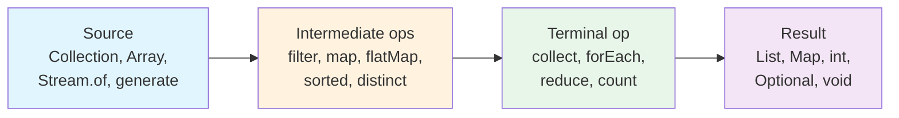
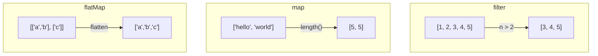
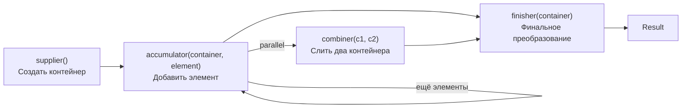
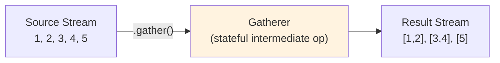

# Вопросы на собеседовании: `Java Stream API`

Комплексное руководство по вопросам собеседования на тему `Java Stream API` — от базовых концепций pipeline и lazy evaluation до продвинутых `Collectors`, `parallel streams`, `Gatherers` (Java 22+) и типичных ловушек.

Дата последнего обновления: 2026-04-13

## Полезные ссылки

### Официальная документация

- [Java Stream API (JDK 21)](https://docs.oracle.com/en/java/javase/21/docs/api/java.base/java/util/stream/Stream.html) — основной Javadoc
- [Package java.util.stream](https://docs.oracle.com/en/java/javase/21/docs/api/java.base/java/util/stream/package-summary.html) — обзор пакета и гайд по stream operations
- [Collectors (JDK 21)](https://docs.oracle.com/en/java/javase/21/docs/api/java.base/java/util/stream/Collectors.html) — все встроенные коллекторы
- [JEP 461: Stream Gatherers](https://openjdk.org/jeps/461) — Gatherers API (preview Java 22, finalized Java 24)

### Baeldung

- [The Java Stream API Tutorial — Baeldung](https://www.baeldung.com/java-8-streams) — полное руководство по Stream API
- [Functional Programming in Java — Baeldung](https://www.baeldung.com/java-functional-programming) — функциональное программирование в Java
- [Functional Interfaces in Java — Baeldung](https://www.baeldung.com/java-8-functional-interfaces) — функциональные интерфейсы Java 8
- [Lambda Expressions and Best Practices — Baeldung](https://www.baeldung.com/java-8-lambda-expressions-tips) — советы и лучшие практики лямбд

## Содержание

- [Полезные ссылки](#полезные-ссылки)
- [See also](#see-also)

**Основы Stream API**
- [Q1. (!) Что такое Stream API и чем он отличается от Collections?](#q1--что-такое-stream-api-и-чем-он-отличается-от-collections)
- [Q2. (!) Что такое stream pipeline и из чего он состоит?](#q2--что-такое-stream-pipeline-и-из-чего-он-состоит)
- [Q3. (!) Что такое lazy evaluation и почему она важна?](#q3--что-такое-lazy-evaluation-и-почему-она-важна)
- [Q4. Какие способы создания Stream существуют?](#q4-какие-способы-создания-stream-существуют)

**Промежуточные операции**
- [Q5. (!) В чём разница между intermediate и terminal операциями?](#q5--в-чём-разница-между-intermediate-и-terminal-операциями)
- [Q6. Чем отличаются stateless и stateful промежуточные операции?](#q6-чем-отличаются-stateless-и-stateful-промежуточные-операции)
- [Q7. (!) Когда использовать map, flatMap и filter?](#q7--когда-использовать-map-flatmap-и-filter)
- [Q8. Как работает flatMap и чем он отличается от map?](#q8-как-работает-flatmap-и-чем-он-отличается-от-map)
- [Q9. В чём разница между sorted, distinct, limit и skip?](#q9-в-чём-разница-между-sorted-distinct-limit-и-skip)
- [Q10. Что такое short-circuit операции и зачем они нужны?](#q10-что-такое-short-circuit-операции-и-зачем-они-нужны)

**Терминальные операции и Collectors**
- [Q11. (!) Как работает collect и зачем нужны Collectors?](#q11--как-работает-collect-и-зачем-нужны-collectors)
- [Q12. (!) Как работают groupingBy, partitioningBy, toMap?](#q12--как-работают-groupingby-partitioningby-tomap)
- [Q13. Как использовать Collectors.joining и Collectors.teeing?](#q13-как-использовать-collectorsjoining-и-collectorsteeing)
- [Q14. (!) В чём разница между reduce и collect?](#q14--в-чём-разница-между-reduce-и-collect)
- [Q15. Как написать собственный Collector?](#q15-как-написать-собственный-collector)
- [Q16. Что такое Optional в контексте Stream и как его правильно использовать?](#q16-что-такое-optional-в-контексте-stream-и-как-его-правильно-использовать)
- [Q17. Как работает forEach и в чём его ограничения?](#q17-как-работает-foreach-и-в-чём-его-ограничения)

**Примитивные стримы**
- [Q18. Когда использовать IntStream, LongStream, DoubleStream?](#q18-когда-использовать-intstream-longstream-doublestream)
- [Q19. Как создать диапазон чисел и получить статистику?](#q19-как-создать-диапазон-чисел-и-получить-статистику)

**Parallel Streams**
- [Q20. (!) Когда стоит переходить на parallelStream?](#q20--когда-стоит-переходить-на-parallelstream)
- [Q21. (!) Какие риски и анти-паттерны есть у parallel streams?](#q21--какие-риски-и-анти-паттерны-есть-у-parallel-streams)
- [Q22. Как работает ForkJoinPool и можно ли использовать свой пул?](#q22-как-работает-forkjoinpool-и-можно-ли-использовать-свой-пул)
- [Q23. Как encounter order влияет на parallel streams?](#q23-как-encounter-order-влияет-на-parallel-streams)

**Stream ordering и характеристики**
- [Q24. Что такое encounter order и как он сохраняется в pipeline?](#q24-что-такое-encounter-order-и-как-он-сохраняется-в-pipeline)
- [Q25. Что такое Spliterator и какие характеристики у Stream?](#q25-что-такое-spliterator-и-какие-характеристики-у-stream)

**Продвинутые паттерны**
- [Q26. (!) Как использовать Stream.iterate и Stream.generate?](#q26--как-использовать-streamiterate-и-streamgenerate)
- [Q27. Как комбинировать Stream с Optional?](#q27-как-комбинировать-stream-с-optional)
- [Q28. Как работает mapMulti (Java 16+)?](#q28-как-работает-mapmulti-java-16)
- [Q29. (!) Что такое Gatherers (Java 22+) и зачем они нужны?](#q29--что-такое-gatherers-java-22-и-зачем-они-нужны)
- [Q30. Какие встроенные Gatherers доступны?](#q30-какие-встроенные-gatherers-доступны)

**Производительность и best practices**
- [Q31. Как избежать лишних аллокаций в Stream-цепочках?](#q31-как-избежать-лишних-аллокаций-в-stream-цепочках)
- [Q32. Как дебажить сложные Stream-пайплайны?](#q32-как-дебажить-сложные-stream-пайплайны)
- [Q33. (!) Когда лучше отказаться от Stream в пользу обычного цикла?](#q33--когда-лучше-отказаться-от-stream-в-пользу-обычного-цикла)
- [Q34. Как писать читабельный Stream-код в production?](#q34-как-писать-читабельный-stream-код-в-production)
- [Q35. Какие типичные ошибки допускают при работе со Stream?](#q35-какие-типичные-ошибки-допускают-при-работе-со-stream)

**Современные возможности и детали**
- [Q36. (!) Stream.gather() и Gatherers API (Java 22+): новые операции](#q36-streamgather-и-gatherers-api-java-22-новые-операции)
- [Q37. (!) Collectors.teeing(): двойной сборщик](#q37-collectorsteeing-двойной-сборщик)
- [Q38. flatMap vs mapMulti (Java 16): разница и производительность](#q38-flatmap-vs-mapmulti-java-16-разница-и-производительность)
- [Q39. Stream и параллелизм: ForkJoinPool.commonPool() и custom pool](#q39-stream-и-параллелизм-forkjoinpoolcommonpool-и-custom-pool)
- [Q40. Отладка Stream: peek() — когда уместен и когда нет](#q40-отладка-stream-peek--когда-уместен-и-когда-нет)
- [Q41. Stream.takeWhile() и dropWhile() (Java 9): примеры](#q41-streamtakewhile-и-dropwhile-java-9-примеры)
- [Q42. Primitive streams: IntStream.range(), summaryStatistics() и boxing overhead](#q42-primitive-streams-intstreamrange-summarystatistics-и-boxing-overhead)

---

## Q1. (!) Что такое Stream API и чем он отличается от Collections?

`Stream API` (Java 8+) — это декларативный способ обработки последовательностей данных через pipeline операций. В отличие от `Collections API`, `Stream` не хранит данные и не модифицирует исходную коллекцию.

Ключевые различия:

| Характеристика | `Collection` | `Stream` |
|---|---|---|
| Хранит данные | Да | Нет — вычисляет по требованию |
| Модифицирует источник | Да (`add`, `remove`) | Нет — иммутабельный pipeline |
| Повторное использование | Сколько угодно | Только один раз |
| Итерация | Внешняя (`for`, `iterator`) | Внутренняя (декларативная) |
| Ленивость | Нет | Да — intermediate ops ленивые |
| Бесконечные данные | Нет | Да (`iterate`, `generate`) |

```java
// Collection — императивный подход
List<String> result = new ArrayList<>();
for (String name : names) {
    if (name.length() > 3) {
        result.add(name.toUpperCase());
    }
}

// Stream — декларативный подход
List<String> result = names.stream()
    .filter(name -> name.length() > 3)
    .map(String::toUpperCase)
    .toList(); // Java 16+
```

## Q2. (!) Что такое stream pipeline и из чего он состоит?

Stream pipeline — это цепочка операций, состоящая из трёх частей: **source** (источник), **intermediate operations** (промежуточные операции) и **terminal operation** (терминальная операция).



Правила pipeline:
- Intermediate-операции **ленивые** — не выполняются до вызова terminal-операции
- Terminal-операция **одна** — после неё Stream закрыт
- Элементы проходят pipeline **вертикально** (элемент за элементом), а не горизонтально (операция за операцией)

```java
// Вертикальная обработка: каждый элемент проходит все операции
List<String> result = List.of("alice", "bob", "charlie", "dave")
    .stream()
    .filter(s -> s.length() > 3)   // alice -> да, bob -> нет, charlie -> да, dave -> да
    .map(String::toUpperCase)       // alice -> ALICE, charlie -> CHARLIE, dave -> DAVE
    .limit(2)                       // ALICE, CHARLIE — после 2-го элемента стоп
    .toList();
// Результат: ["ALICE", "CHARLIE"]
// "dave" вообще не обрабатывался — limit прервал pipeline
```

## Q3. (!) Что такое lazy evaluation и почему она важна?

Промежуточные операции `Stream` не выполняются сразу — они формируют **описание** pipeline. Реальное выполнение запускается только при вызове терминальной операции. Это и есть **lazy evaluation** (ленивое вычисление).

Преимущества ленивости:
- **Оптимизация**: JVM может объединять операции (loop fusion) и пропускать лишнюю работу
- **Short-circuit**: `findFirst`, `limit`, `anyMatch` завершаются, не обрабатывая все элементы
- **Бесконечные стримы**: можно работать с `Stream.iterate` / `Stream.generate`, ограничивая результат через `limit`

```java
// Без терминальной операции — НИЧЕГО не выполнится
Stream<String> lazy = names.stream()
    .filter(n -> {
        System.out.println("filter: " + n); // Никогда не напечатается!
        return n.length() > 3;
    })
    .map(String::toUpperCase);
// pipeline создан, но ни один элемент не обработан

// Терминальная операция запускает выполнение
List<String> result = lazy.toList(); // Теперь filter/map работают
```

## Q4. Какие способы создания Stream существуют?

| Способ | Пример | Особенности |
|---|---|---|
| Из коллекции | `list.stream()` | Самый частый вариант |
| Из массива | `Arrays.stream(arr)` | Поддерживает подмассив `(arr, from, to)` |
| Фабричный метод | `Stream.of("a", "b", "c")` | Для фиксированного набора |
| Пустой | `Stream.empty()` | Для null-safe возвратов |
| `iterate` | `Stream.iterate(0, n -> n + 2)` | Бесконечный, с seed |
| `iterate` (Java 9+) | `Stream.iterate(0, n -> n < 100, n -> n + 2)` | С предикатом завершения |
| `generate` | `Stream.generate(Math::random)` | Бесконечный, без seed |
| `IntStream.range` | `IntStream.range(0, 10)` | `[0, 10)` — не включая конец |
| `IntStream.rangeClosed` | `IntStream.rangeClosed(1, 10)` | `[1, 10]` — включая конец |
| Из строки | `"hello".chars()` | `IntStream` символов |
| Из файла | `Files.lines(path)` | Ленивое чтение по строкам |
| `Pattern.splitAsStream` | `pattern.splitAsStream(input)` | Ленивый split |
| Builder | `Stream.builder().add(x).build()` | Императивное создание |

```java
// iterate с предикатом (Java 9+) — замена iterate + limit
Stream.iterate(1, n -> n <= 100, n -> n * 2)
    .forEach(System.out::println); // 1, 2, 4, 8, 16, 32, 64

// Files.lines — ленивое чтение (try-with-resources обязательно!)
try (Stream<String> lines = Files.lines(Path.of("data.csv"))) {
    long errorCount = lines
        .filter(line -> line.contains("ERROR"))
        .count();
}
```

## Q5. (!) В чём разница между intermediate и terminal операциями?

**Intermediate** (промежуточные) — возвращают новый `Stream`, позволяя строить цепочку. Ленивые — ничего не делают до terminal-операции.

**Terminal** (терминальные) — запускают выполнение pipeline и возвращают результат или побочный эффект. После terminal-операции `Stream` закрыт и повторно использовать его нельзя (`IllegalStateException`).

| Тип | Операции | Возвращает |
|---|---|---|
| Intermediate (stateless) | `filter`, `map`, `flatMap`, `peek`, `mapMulti` | `Stream<T>` |
| Intermediate (stateful) | `sorted`, `distinct`, `limit`, `skip` | `Stream<T>` |
| Terminal | `collect`, `toList`, `forEach`, `reduce`, `count` | Результат |
| Terminal (short-circuit) | `findFirst`, `findAny`, `anyMatch`, `allMatch`, `noneMatch` | Результат |

```java
Stream<String> stream = List.of("a", "b", "c").stream();

// Можно использовать только ОДНУ терминальную операцию
long count = stream.filter(s -> !s.isEmpty()).count();

// Повторное использование — IllegalStateException!
// stream.forEach(System.out::println); // Ошибка!
```

## Q6. Чем отличаются stateless и stateful промежуточные операции?

**Stateless** операции (`filter`, `map`, `flatMap`) обрабатывают каждый элемент независимо — не нужно знать о других элементах. Они дешёвые и хорошо параллелизуются.

**Stateful** операции (`sorted`, `distinct`, `limit`, `skip`) требуют информации о других элементах или о позиции в потоке. Они могут буферизировать все данные (например, `sorted`) и ухудшать параллелизм.

```java
// sorted — stateful: буферизирует ВСЕ элементы, потом сортирует
// На бесконечном стриме — OutOfMemoryError
Stream.generate(Math::random)
    .sorted()    // Пытается собрать все элементы — зависнет/OOM
    .limit(5)
    .forEach(System.out::println);

// Правильно: сначала limit, потом sorted
Stream.generate(Math::random)
    .limit(5)
    .sorted()
    .forEach(System.out::println);
```

## Q7. (!) Когда использовать map, flatMap и filter?

- **`filter(Predicate)`** — отбирает элементы по условию. Количество элементов уменьшается, тип не меняется
- **`map(Function)`** — преобразует каждый элемент 1:1. Количество не меняется, тип может измениться
- **`flatMap(Function)`** — преобразует каждый элемент в `Stream` и «сплющивает» результат. Соотношение 1:N



```java
// Типичная цепочка: filter → map → collect
List<String> activeUserEmails = users.stream()
    .filter(User::isActive)           // отбор
    .map(User::getEmail)              // преобразование
    .filter(email -> email.contains("@company.com"))
    .toList();
```

## Q8. Как работает flatMap и чем он отличается от map?

`map` преобразует элемент в **один** элемент: `Stream<T> → Stream<R>`. `flatMap` преобразует элемент в **стрим** элементов и объединяет все результаты в один плоский поток: `Stream<T> → Stream<R>` (через промежуточный `Stream<Stream<R>>`).

```java
// map — вложенная структура остаётся
List<List<String>> nested = List.of(
    List.of("Java", "Kotlin"),
    List.of("Python", "Go")
);
// map вернёт Stream<Stream<String>> — не то, что нужно
// flatMap «разворачивает» вложенные стримы
List<String> flat = nested.stream()
    .flatMap(Collection::stream)  // каждый List -> Stream, затем склейка
    .toList();
// ["Java", "Kotlin", "Python", "Go"]

// Практический пример: все заказы всех клиентов
List<Order> allOrders = customers.stream()
    .flatMap(customer -> customer.getOrders().stream())
    .filter(order -> order.getTotal() > 1000)
    .toList();
```

## Q9. В чём разница между sorted, distinct, limit и skip?

| Операция | Тип | Описание | Стоимость |
|---|---|---|---|
| `sorted()` | stateful | Сортирует весь поток (естественный порядок или `Comparator`) | O(n log n), буферизует всё |
| `distinct()` | stateful | Убирает дубликаты по `equals`/`hashCode` | O(n), внутренний `Set` |
| `limit(n)` | short-circuit stateful | Оставляет первые N элементов | O(1) на элемент |
| `skip(n)` | stateful | Пропускает первые N элементов | O(1) на элемент |

```java
// Пагинация (не для production — неэффективно на больших данных)
List<User> page = users.stream()
    .sorted(Comparator.comparing(User::getName))
    .skip((long) pageNumber * pageSize)
    .limit(pageSize)
    .toList();

// distinct + sorted — порядок важен!
// distinct перед sorted — экономит сортировку дубликатов
List<String> unique = names.stream()
    .distinct()
    .sorted()
    .toList();
```

## Q10. Что такое short-circuit операции и зачем они нужны?

Short-circuit операции могут завершить обработку потока, **не обрабатывая все элементы**. Это критично для производительности и работы с бесконечными стримами.

**Intermediate short-circuit**: `limit(n)` — прекращает pipeline после N элементов.

**Terminal short-circuit**: `findFirst`, `findAny`, `anyMatch`, `allMatch`, `noneMatch` — возвращают результат, как только ответ известен.

```java
// anyMatch завершается на первом true
boolean hasAdmin = users.stream()
    .anyMatch(u -> u.getRole() == Role.ADMIN);
// Если первый user — ADMIN, остальные не проверяются

// allMatch завершается на первом false
boolean allActive = users.stream()
    .allMatch(User::isActive);

// findFirst на бесконечном стриме — безопасно благодаря short-circuit
Optional<Integer> firstEvenSquare = Stream.iterate(1, n -> n + 1)
    .map(n -> n * n)
    .filter(n -> n % 2 == 0)
    .findFirst(); // Optional[4]
```

## Q11. (!) Как работает collect и зачем нужны Collectors?

`collect` — самая мощная терминальная операция. Она преобразует `Stream` в изменяемый контейнер результата, используя три функции: `supplier` (создание контейнера), `accumulator` (добавление элемента), `combiner` (слияние контейнеров при параллельной обработке).

Класс `Collectors` предоставляет готовые реализации для типовых задач:

```java
// Базовые коллекторы
List<String> list = stream.collect(Collectors.toList());
List<String> unmodifiable = stream.toList();         // Java 16+, неизменяемый
Set<String> set = stream.collect(Collectors.toSet());

// toMap — ключ-значение
Map<Long, User> byId = users.stream()
    .collect(Collectors.toMap(User::getId, Function.identity()));

// toMap с обработкой дубликатов
Map<String, User> byName = users.stream()
    .collect(Collectors.toMap(
        User::getName,
        Function.identity(),
        (existing, replacement) -> existing // при дубликате — оставить первый
    ));

// toUnmodifiableMap (Java 10+)
Map<Long, String> idToName = users.stream()
    .collect(Collectors.toUnmodifiableMap(User::getId, User::getName));
```

## Q12. (!) Как работают groupingBy, partitioningBy, toMap?

Это три ключевых коллектора для создания `Map` из `Stream`:

**`groupingBy`** — группирует элементы по ключу (произвольная функция-классификатор):

```java
// Простая группировка
Map<Department, List<Employee>> byDept = employees.stream()
    .collect(Collectors.groupingBy(Employee::getDepartment));

// Группировка + downstream collector (подсчёт)
Map<Department, Long> countByDept = employees.stream()
    .collect(Collectors.groupingBy(Employee::getDepartment, Collectors.counting()));

// Группировка + вычисление среднего
Map<Department, Double> avgSalary = employees.stream()
    .collect(Collectors.groupingBy(
        Employee::getDepartment,
        Collectors.averagingDouble(Employee::getSalary)
    ));

// Многоуровневая группировка
Map<Department, Map<String, List<Employee>>> byDeptAndCity = employees.stream()
    .collect(Collectors.groupingBy(
        Employee::getDepartment,
        Collectors.groupingBy(Employee::getCity)
    ));
```

**`partitioningBy`** — разделяет на две группы (`true` / `false`):

```java
Map<Boolean, List<Employee>> partitioned = employees.stream()
    .collect(Collectors.partitioningBy(e -> e.getSalary() > 100_000));

List<Employee> highPaid = partitioned.get(true);
List<Employee> lowPaid = partitioned.get(false);
```

**`toMap`** — см. Q11. Важная ловушка: без merge function дубликаты ключей бросают `IllegalStateException`.

## Q13. Как использовать Collectors.joining и Collectors.teeing?

**`joining`** — конкатенация строк с разделителем, префиксом и суффиксом:

```java
String csv = employees.stream()
    .map(Employee::getName)
    .collect(Collectors.joining(", "));
// "Alice, Bob, Charlie"

String json = employees.stream()
    .map(e -> "\"" + e.getName() + "\"")
    .collect(Collectors.joining(", ", "[", "]"));
// ["Alice", "Bob", "Charlie"]
```

**`teeing`** (Java 12+) — применяет два коллектора одновременно и объединяет результаты:

```java
// Одновременно получаем минимум и максимум
var minMax = employees.stream()
    .collect(Collectors.teeing(
        Collectors.minBy(Comparator.comparingDouble(Employee::getSalary)),
        Collectors.maxBy(Comparator.comparingDouble(Employee::getSalary)),
        (min, max) -> Map.entry(min.orElseThrow(), max.orElseThrow())
    ));

// Одновременно считаем количество и сумму
var stats = orders.stream()
    .collect(Collectors.teeing(
        Collectors.counting(),
        Collectors.summingDouble(Order::getTotal),
        (count, sum) -> "Orders: %d, Total: %.2f".formatted(count, sum)
    ));
```

## Q14. (!) В чём разница между reduce и collect?

**`reduce`** — свёртка к **иммутабельному** значению. Каждый шаг создаёт новое значение. Хорош для ассоциативных операций (сумма, произведение, конкатенация).

**`collect`** — мутабельная свёртка. Накапливает результат в изменяемый контейнер (`ArrayList`, `StringBuilder`, `HashMap`). Гораздо эффективнее для коллекций и строк.

```java
// reduce — ПЛОХО для конкатенации строк (O(n²) из-за создания новых String)
String bad = strings.stream()
    .reduce("", (a, b) -> a + b); // каждый шаг — новый String

// collect — ХОРОШО (O(n), StringBuilder внутри)
String good = strings.stream()
    .collect(Collectors.joining());

// reduce — хорошо для числовых операций
int sum = numbers.stream()
    .reduce(0, Integer::sum);

// Три формы reduce:
Optional<T> reduce(BinaryOperator<T> accumulator);           // без identity
T           reduce(T identity, BinaryOperator<T> accumulator); // с identity
<U> U       reduce(U identity, BiFunction<U,T,U> accumulator,
                    BinaryOperator<U> combiner);               // для parallel
```

> На собеседовании часто спрашивают: «Почему для сборки в список используют `collect`, а не `reduce`?» — потому что `reduce` с `ArrayList` нарушает контракт: accumulator должен возвращать **новый** объект, а не мутировать аргумент.

## Q15. Как написать собственный Collector?

`Collector<T, A, R>` определяет четыре функции:

```java
// Кастомный Collector: собирает в ImmutableList (Guava)
Collector<String, ImmutableList.Builder<String>, ImmutableList<String>> toImmutableList =
    Collector.of(
        ImmutableList::builder,                    // supplier
        ImmutableList.Builder::add,                // accumulator
        (b1, b2) -> b1.addAll(b2.build()),        // combiner (для parallel)
        ImmutableList.Builder::build               // finisher
    );

List<String> result = stream.collect(toImmutableList);
```



Характеристики (`Collector.Characteristics`):
- `CONCURRENT` — accumulator потокобезопасный, один контейнер на все потоки
- `UNORDERED` — порядок элементов неважен
- `IDENTITY_FINISH` — finisher не нужен (контейнер = результат)

## Q16. Что такое Optional в контексте Stream и как его правильно использовать?

`findFirst`, `findAny`, `min`, `max`, `reduce` (без identity) возвращают `Optional<T>` — явное указание, что результат может отсутствовать.

```java
// Правильное использование
Optional<User> user = users.stream()
    .filter(u -> u.getId() == targetId)
    .findFirst();

String name = user
    .map(User::getName)
    .orElse("Unknown");

// Optional.stream() (Java 9+) — интеграция Optional и Stream
List<String> emails = users.stream()
    .map(User::getEmail)         // Stream<Optional<String>> если getEmail возвращает Optional
    .flatMap(Optional::stream)   // отбрасывает пустые Optional
    .toList();

// Анти-паттерны
user.get();                        // NoSuchElementException — никогда без проверки
user.isPresent() ? user.get() : x; // Используйте orElse
Optional.of(nullableValue);        // NullPointerException — используйте ofNullable
```

## Q17. Как работает forEach и в чём его ограничения?

`forEach` — терминальная операция, выполняющая побочный эффект для каждого элемента. У `parallelStream` порядок вызовов **не гарантируется** (для гарантии порядка используйте `forEachOrdered`).

```java
// forEach — порядок не гарантируется при parallel
list.parallelStream().forEach(System.out::println);       // непредсказуемый порядок
list.parallelStream().forEachOrdered(System.out::println); // исходный порядок

// Анти-паттерн: мутация внешней коллекции через forEach
List<String> result = new ArrayList<>();
stream.forEach(result::add); // Не потокобезопасно при parallel!
// Правильно:
List<String> result = stream.collect(Collectors.toList());
```

Ограничения `forEach`:
- Нельзя использовать `break`/`continue`/`return` (можно только `return` из лямбды, но это скипает один элемент)
- Нельзя бросить checked exception из лямбды без обёртки
- Не возвращает значение — только побочные эффекты

## Q18. Когда использовать IntStream, LongStream, DoubleStream?

Примитивные стримы убирают **autoboxing overhead** (`int` ↔ `Integer`) и предоставляют специализированные операции (`sum`, `average`, `summaryStatistics`).

```java
// Stream<Integer> — каждый элемент боксится
int sum1 = numbers.stream()
    .mapToInt(Integer::intValue)  // распаковка
    .sum();

// IntStream — без боксинга
int sum2 = IntStream.rangeClosed(1, 1_000_000).sum();

// Специализированные операции
IntSummaryStatistics stats = employees.stream()
    .mapToInt(Employee::getAge)
    .summaryStatistics();
// stats.getCount(), stats.getSum(), stats.getMin(), stats.getMax(), stats.getAverage()

// Конвертация обратно в объектный стрим
Stream<Integer> boxed = IntStream.range(0, 10).boxed();
```

Используйте примитивные стримы когда:
- Работаете с числовыми данными и важна производительность
- Нужны агрегатные операции (`sum`, `average`, `summaryStatistics`)
- Генерируете диапазоны чисел (`range`, `rangeClosed`)

## Q19. Как создать диапазон чисел и получить статистику?

```java
// range — [start, end)
IntStream.range(0, 5).forEach(System.out::print); // 01234

// rangeClosed — [start, end]
IntStream.rangeClosed(1, 5).forEach(System.out::print); // 12345

// summaryStatistics — все метрики за один проход
DoubleSummaryStatistics salaryStats = employees.stream()
    .mapToDouble(Employee::getSalary)
    .summaryStatistics();

System.out.printf("Count: %d, Avg: %.2f, Min: %.2f, Max: %.2f%n",
    salaryStats.getCount(),
    salaryStats.getAverage(),
    salaryStats.getMin(),
    salaryStats.getMax());

// Объединение статистик (полезно для parallel или пакетной обработки)
DoubleSummaryStatistics combined = new DoubleSummaryStatistics();
combined.combine(stats1);
combined.combine(stats2);
```

## Q20. (!) Когда стоит переходить на parallelStream?

`parallelStream` может ускорить обработку, но **только при выполнении всех условий**:

1. **Большой объём данных** — на маленьких коллекциях overhead параллелизации съедает выигрыш
2. **CPU-bound операции** — тяжёлые вычисления без I/O-блокировок
3. **Независимые элементы** — нет shared mutable state
4. **Хороший Spliterator** — `ArrayList` и массивы делятся эффективно, `LinkedList` и `Stream.iterate` — плохо
5. **Ассоциативные операции** — результат не зависит от порядка обработки

```java
// Хороший кейс: тяжёлые вычисления над большим массивом
double[] result = largeArray.parallelStream()
    .mapToDouble(this::expensiveCalculation)
    .toArray();

// Плохой кейс: простая фильтрация небольшого списка
List<String> filtered = smallList.parallelStream()  // overhead > выигрыш
    .filter(s -> s.startsWith("A"))
    .toList();
```

> Правило: **всегда начинайте с последовательного стрима** и переходите на parallel только после измерения с помощью JMH-бенчмарка.

## Q21. (!) Какие риски и анти-паттерны есть у parallel streams?

**1. Race condition на shared mutable state:**
```java
// ОПАСНО — race condition!
List<String> result = new ArrayList<>(); // не потокобезопасный
stream.parallel().forEach(result::add);  // гонка данных

// Правильно
List<String> result = stream.parallel().collect(Collectors.toList());
```

**2. Блокирующие операции в общем ForkJoinPool:**
```java
// ПЛОХО — все parallel streams в приложении делят один ForkJoinPool
users.parallelStream()
    .map(u -> httpClient.fetch(u.getUrl()))  // блокирующий I/O
    .toList();
// Забивает commonPool, тормозит ВСЕ parallel streams
```

**3. Non-associative reduce:**
```java
// НЕКОРРЕКТНО при parallel — вычитание не ассоциативно
int wrong = IntStream.rangeClosed(1, 4)
    .parallel()
    .reduce(0, (a, b) -> a - b); // результат непредсказуем
```

**4. Stateful лямбды:**
```java
// ПЛОХО — AtomicInteger как счётчик внутри parallel stream
AtomicInteger counter = new AtomicInteger();
stream.parallel()
    .peek(e -> counter.incrementAndGet()) // порядок непредсказуем
    .toList();
```

## Q22. Как работает ForkJoinPool и можно ли использовать свой пул?

По умолчанию все `parallelStream` используют **общий** `ForkJoinPool.commonPool()` с `Runtime.getRuntime().availableProcessors() - 1` потоками.

Чтобы изолировать параллельный стрим от остального приложения, можно запустить его в **собственном ForkJoinPool**:

```java
ForkJoinPool customPool = new ForkJoinPool(4);
try {
    List<String> result = customPool.submit(() ->
        largeList.parallelStream()
            .map(this::expensiveOperation)
            .toList()
    ).get(); // блокируемся до завершения
} finally {
    customPool.shutdown();
}
```

> Это **недокументированная**, но широко используемая техника. Она работает, потому что `ForkJoinTask` выполняется в пуле, из которого был запущен. Официально Oracle не гарантирует это поведение.

## Q23. Как encounter order влияет на parallel streams?

`encounter order` (порядок встречи элементов) может **замедлять** параллельные стримы, потому что pipeline должен поддерживать порядок при слиянии результатов.

```java
// С порядком — parallel должен собирать результаты в правильном порядке
List<String> ordered = list.parallelStream()    // ArrayList — ordered
    .filter(s -> s.length() > 3)
    .toList();                                   // порядок сохранён

// Без порядка — быстрее
Set<String> unordered = set.parallelStream()    // HashSet — unordered
    .filter(s -> s.length() > 3)
    .collect(Collectors.toSet());               // порядок неважен

// Явный сброс порядка
list.parallelStream()
    .unordered()                                // разрешаем не поддерживать порядок
    .limit(100)                                 // limit с unordered — быстрее
    .toList();
```

Операции, чувствительные к порядку: `limit`, `skip`, `findFirst`, `forEachOrdered`. Если порядок неважен — используйте `unordered()`, `findAny` вместо `findFirst`.

## Q24. Что такое encounter order и как он сохраняется в pipeline?

**Encounter order** — порядок, в котором источник предоставляет элементы. Не все источники упорядочены:

| Источник | Упорядочен? |
|---|---|
| `List`, массив | Да |
| `LinkedHashSet`, `LinkedHashMap` | Да |
| `HashSet`, `HashMap` | Нет |
| `TreeSet`, `TreeMap` | Да (по ключу) |
| `Stream.generate` | Нет |
| `Stream.iterate` | Да |

Промежуточные операции и порядок:
- `sorted` — **устанавливает** порядок
- `unordered` — **снимает** гарантию порядка
- `filter`, `map`, `flatMap` — **сохраняют** порядок источника
- `distinct` — сохраняет порядок первого вхождения (для ordered sources)

```java
// HashSet — неупорядочен
Set.of("c", "a", "b").stream()
    .forEach(System.out::print); // Порядок не определён

// sorted устанавливает порядок
Set.of("c", "a", "b").stream()
    .sorted()
    .forEach(System.out::print); // abc
```

## Q25. Что такое Spliterator и какие характеристики у Stream?

`Spliterator` (splitable iterator) — основа параллелизма в Stream. Он умеет:
- Перебирать элементы (`tryAdvance`, `forEachRemaining`)
- Делить себя на части (`trySplit`) для параллельной обработки
- Сообщать характеристики и примерный размер (`estimateSize`)

Характеристики `Spliterator`:

| Характеристика | Значение | Пример |
|---|---|---|
| `ORDERED` | Порядок элементов определён | `List` |
| `DISTINCT` | Все элементы уникальны | `Set` |
| `SORTED` | Элементы отсортированы | `TreeSet` |
| `SIZED` | Известно точное количество | `ArrayList` |
| `SUBSIZED` | Части после split тоже sized | `ArrayList` |
| `NONNULL` | Элементы не null | — |
| `IMMUTABLE` | Источник неизменяем | `List.of(...)` |
| `CONCURRENT` | Безопасна конкурентная модификация | `ConcurrentHashMap` |

```java
Spliterator<String> spliterator = list.spliterator();
System.out.println(spliterator.estimateSize());        // примерное количество
System.out.println(spliterator.characteristics());     // битовая маска характеристик
System.out.println(spliterator.hasCharacteristics(Spliterator.ORDERED)); // true для List
```

## Q26. (!) Как использовать Stream.iterate и Stream.generate?

**`Stream.iterate`** — генерирует элементы на основе предыдущего значения (seed + UnaryOperator):

```java
// Бесконечный итеративный стрим
Stream.iterate(1, n -> n * 2)
    .limit(10)
    .forEach(System.out::println); // 1, 2, 4, 8, 16, ...

// С предикатом (Java 9+) — замена iterate + limit
Stream.iterate(1, n -> n <= 1000, n -> n * 2)
    .toList(); // [1, 2, 4, 8, 16, 32, 64, 128, 256, 512]

// Генерация последовательности Фибоначчи
Stream.iterate(new long[]{0, 1}, f -> new long[]{f[1], f[0] + f[1]})
    .limit(10)
    .mapToLong(f -> f[0])
    .forEach(System.out::println); // 0, 1, 1, 2, 3, 5, 8, 13, 21, 34
```

**`Stream.generate`** — генерирует элементы без зависимости от предыдущего (Supplier):

```java
// Бесконечный стрим случайных чисел
Stream.generate(Math::random)
    .limit(5)
    .forEach(System.out::println);

// Генерация UUID
List<String> ids = Stream.generate(() -> UUID.randomUUID().toString())
    .limit(100)
    .toList();
```

Разница: `iterate` — упорядоченный стрим (каждый элемент зависит от предыдущего), `generate` — неупорядоченный (элементы независимы, лучше параллелизуется).

## Q27. Как комбинировать Stream с Optional?

С Java 9+ `Optional.stream()` возвращает `Stream` из 0 или 1 элемента, что позволяет элегантно интегрировать `Optional` в pipeline:

```java
// До Java 9 — неуклюже
List<String> phones = users.stream()
    .map(User::getPhone)                    // Optional<String>
    .filter(Optional::isPresent)
    .map(Optional::get)
    .toList();

// Java 9+ — чисто через flatMap + Optional.stream()
List<String> phones = users.stream()
    .map(User::getPhone)                    // Optional<String>
    .flatMap(Optional::stream)              // пустые Optional исчезают
    .toList();

// Optional.or() (Java 9+) — цепочка fallback-ов
Optional<User> user = findInCache(id)
    .or(() -> findInDatabase(id))
    .or(() -> findInExternalService(id));

// Optional.ifPresentOrElse() (Java 9+)
findUser(id).ifPresentOrElse(
    user -> log.info("Found: {}", user),
    () -> log.warn("User {} not found", id)
);
```

## Q28. Как работает mapMulti (Java 16+)?

`mapMulti` — императивная альтернатива `flatMap`. Вместо создания промежуточного `Stream` для каждого элемента, вызывает `Consumer` для передачи результатов напрямую:

```java
// flatMap — создаёт промежуточный Stream для каждого элемента
List<Integer> flatMapped = numbers.stream()
    .flatMap(n -> n % 2 == 0 ? Stream.of(n, n * 2) : Stream.empty())
    .toList();

// mapMulti — без создания промежуточных Stream'ов
List<Integer> multiMapped = numbers.stream()
    .<Integer>mapMulti((n, consumer) -> {
        if (n % 2 == 0) {
            consumer.accept(n);
            consumer.accept(n * 2);
        }
    })
    .toList();
```

Когда предпочтителен `mapMulti`:
- Элемент преобразуется в **малое** количество результатов (0-2) — нет overhead на создание `Stream`
- Нужна **императивная** логика с условиями
- Комбинация `filter` + `map` в одном шаге

## Q29. (!) Что такое Gatherers (Java 22+) и зачем они нужны?

`Gatherers` (JEP 461) — новый механизм для создания **произвольных промежуточных операций**. До Gatherers для кастомной логики нужно было писать либо кастомный `Collector` (но это terminal), либо использовать `flatMap` с состоянием (хак). Gatherers заполняют этот пробел.

```java
// Gatherer — промежуточная операция через stream.gather(gatherer)
Stream.of(1, 2, 3, 4, 5, 6, 7, 8, 9)
    .gather(Gatherers.windowFixed(3))     // группировка по 3 элемента
    .toList();
// [[1, 2, 3], [4, 5, 6], [7, 8, 9]]
```

`Gatherer<T, A, R>` определяет четыре компонента (аналогично `Collector`):
- **initializer** — создание состояния
- **integrator** — обработка элемента (может emit 0..N результатов, может остановить pipeline)
- **combiner** — опционально, для параллелизма
- **finisher** — вызывается после всех элементов



## Q30. Какие встроенные Gatherers доступны?

Java предоставляет набор готовых Gatherers в классе `java.util.stream.Gatherers`:

```java
// windowFixed — окна фиксированного размера
Stream.of(1, 2, 3, 4, 5)
    .gather(Gatherers.windowFixed(2))
    .toList(); // [[1, 2], [3, 4], [5]]

// windowSliding — скользящее окно
Stream.of(1, 2, 3, 4, 5)
    .gather(Gatherers.windowSliding(3))
    .toList(); // [[1, 2, 3], [2, 3, 4], [3, 4, 5]]

// fold — stateful редукция как промежуточная операция
Stream.of(1, 2, 3, 4)
    .gather(Gatherers.fold(() -> 0, Integer::sum))
    .toList(); // [10]

// scan — кумулятивная операция (все промежуточные результаты)
Stream.of(1, 2, 3, 4)
    .gather(Gatherers.scan(() -> 0, Integer::sum))
    .toList(); // [1, 3, 6, 10]

// mapConcurrent — параллельная обработка с ограничением конкурентности
Stream.of(url1, url2, url3)
    .gather(Gatherers.mapConcurrent(4, this::fetchUrl))
    .toList();
```

`mapConcurrent` особенно ценен: он использует виртуальные потоки (Java 21+) и позволяет контролировать степень параллелизма — в отличие от `parallelStream`, привязанного к `ForkJoinPool`.

## Q31. Как избежать лишних аллокаций в Stream-цепочках?

Основные техники оптимизации:

**1. Примитивные стримы вместо боксинга:**
```java
// Плохо — боксинг Integer на каждом шаге
int sum = list.stream().map(obj::getValue).reduce(0, Integer::sum);

// Хорошо — mapToInt убирает боксинг
int sum = list.stream().mapToInt(obj::getValue).sum();
```

**2. Порядок операций:**
```java
// Плохо — сортировка ДО фильтрации
list.stream()
    .sorted(Comparator.comparing(User::getName))  // сортируем 10_000
    .filter(User::isActive)                         // фильтруем — поздно
    .limit(10);

// Хорошо — фильтрация ДО сортировки
list.stream()
    .filter(User::isActive)                         // фильтруем до 500
    .sorted(Comparator.comparing(User::getName))    // сортируем 500
    .limit(10);
```

**3. toList() (Java 16+) вместо collect(Collectors.toList()):**
```java
// toList() возвращает неизменяемый список — может быть оптимизирован JVM
var result = stream.toList();
```

**4. Избегайте peek в production:**
```java
// peek добавляет overhead — используйте только для отладки
stream.peek(System.out::println).toList(); // уберите после дебага
```

## Q32. Как дебажить сложные Stream-пайплайны?

**1. `peek` для временного логирования:**
```java
List<String> result = users.stream()
    .peek(u -> log.debug("Before filter: {}", u))
    .filter(User::isActive)
    .peek(u -> log.debug("After filter: {}", u))
    .map(User::getName)
    .toList();
```

**2. Разбиение цепочки на переменные:**
```java
// Вместо одной длинной цепочки
Stream<User> activeUsers = users.stream().filter(User::isActive);
Stream<String> names = activeUsers.map(User::getName);
List<String> result = names.sorted().toList();
```

**3. Breakpoints в IDE:** IntelliJ IDEA поддерживает breakpoints внутри лямбд — ставьте breakpoint на строку с лямбдой, а не на всю цепочку.

**4. IntelliJ Stream Debugger:** `Trace Current Stream Chain` показывает состояние данных после каждой операции в виде таблицы. Доступен через иконку в debugger panel.

**5. Не оставляйте `peek` в production** — это отладочный инструмент, не часть бизнес-логики.

## Q33. (!) Когда лучше отказаться от Stream в пользу обычного цикла?

Обычный цикл предпочтителен когда:

**1. Сложный control flow** — `break`, `continue`, множественные условия выхода:
```java
// Stream не поддерживает break из середины pipeline
// Цикл — яснее
for (User user : users) {
    if (user.isBlocked()) continue;
    if (user.isSuperAdmin()) break;
    process(user);
}
```

**2. Мутация нескольких структур:**
```java
// Цикл — понятнее, когда нужно обновлять несколько Map/List
Map<String, Integer> counts = new HashMap<>();
List<String> errors = new ArrayList<>();
for (Record r : records) {
    if (r.isValid()) {
        counts.merge(r.getCategory(), 1, Integer::sum);
    } else {
        errors.add(r.getError());
    }
}
```

**3. Checked exceptions** — лямбды не поддерживают checked exceptions без обёрток.

**4. Performance-critical hot path** — минимальная абстракция, предсказуемое поведение.

**5. Один элемент** — `if`/`else` читабельнее, чем `Stream.of(x).filter(...).map(...).findFirst()`.

## Q34. Как писать читабельный Stream-код в production?

**1. Именованные предикаты и маперы:**
```java
// Плохо — сложная инлайн-лямбда
users.stream()
    .filter(u -> u.getAge() > 18 && u.isActive() && u.getRole() != Role.BOT)
    .toList();

// Хорошо — читаемый предикат
Predicate<User> isEligible = u -> u.getAge() > 18
    && u.isActive()
    && u.getRole() != Role.BOT;
users.stream().filter(isEligible).toList();

// Ещё лучше — метод
users.stream().filter(this::isEligible).toList();
```

**2. Одна операция — одна строка:**
```java
List<OrderDto> result = orders.stream()
    .filter(Order::isPaid)
    .sorted(Comparator.comparing(Order::getCreatedAt).reversed())
    .map(orderMapper::toDto)
    .limit(50)
    .toList();
```

**3. Максимум 5-7 операций в цепочке.** Если больше — выносите промежуточные шаги в методы.

**4. Комментируйте нетривиальную бизнес-логику**, а не механику Stream API.

## Q35. Какие типичные ошибки допускают при работе со Stream?

**1. Повторное использование Stream:**
```java
Stream<String> stream = list.stream().filter(s -> !s.isEmpty());
long count = stream.count();
List<String> result = stream.toList(); // IllegalStateException!
```

**2. Бесконечный стрим без limit:**
```java
Stream.iterate(0, n -> n + 1)
    .sorted()   // пытается собрать ВСЕ элементы — зависание/OOM
    .limit(5);
```

**3. Забытая терминальная операция:**
```java
// Ничего не произойдёт! peek — промежуточная, нет terminal op
users.stream()
    .filter(User::isActive)
    .peek(u -> emailService.send(u)); // побочный эффект не выполнится
```

**4. toMap без merge function:**
```java
// IllegalStateException при дубликатах ключей
Map<String, User> byName = users.stream()
    .collect(Collectors.toMap(User::getName, Function.identity()));
// Два пользователя с одинаковым именем — исключение!
```

**5. Модификация источника во время Stream:**
```java
List<String> list = new ArrayList<>(List.of("a", "b", "c"));
list.stream()
    .filter(s -> !s.equals("b"))
    .forEach(s -> list.remove(s));  // ConcurrentModificationException!
```

**6. forEach вместо collect для накопления результата** — см. Q17.

---

## Q36. (!) Stream.gather() и Gatherers API (Java 22+): новые операции

**Gatherers API** (JEP 461, preview Java 22, финальный Java 24) — новый тип промежуточных операций Stream, восполняющий пробел между существующими stateless операциями (`map`, `filter`) и терминальными `Collectors`.

**Проблема:** до Java 22 многие операции над потоками невозможно было выразить через стандартный API:
```java
// Хотим: скользящее окно размером 3
// До Java 22: нужен кастомный Spliterator или внешние библиотеки
```

**`Stream.gather(Gatherer<T,A,R>)` — новая промежуточная операция:**

```java
import java.util.stream.Gatherers;

List<Integer> numbers = List.of(1, 2, 3, 4, 5, 6, 7, 8);

// Встроенный Gatherer: скользящее окно
List<List<Integer>> windows = numbers.stream()
    .gather(Gatherers.windowSliding(3))
    .toList();
// [[1,2,3], [2,3,4], [3,4,5], [4,5,6], [5,6,7], [6,7,8]]

// Фиксированное окно (без перекрытий)
List<List<Integer>> fixed = numbers.stream()
    .gather(Gatherers.windowFixed(3))
    .toList();
// [[1,2,3], [4,5,6], [7,8]]

// scan — running total (накопленный результат)
List<Integer> runningSum = numbers.stream()
    .gather(Gatherers.scan(() -> 0, Integer::sum))
    .toList();
// [1, 3, 6, 10, 15, 21, 28, 36]

// fold — как reduce, но возвращает промежуточные результаты
// Аналог scan, но финальный аккумулятор

// mapConcurrent — параллельный map с ограничением concurrency
List<String> results = urls.stream()
    .gather(Gatherers.mapConcurrent(4, url -> fetch(url)))
    .toList();
// Выполняет fetch параллельно, но максимум 4 одновременно
```

**Кастомный Gatherer — группировка по последовательным элементам:**
```java
// Gatherer для группировки соседних одинаковых элементов (run-length encoding)
Gatherer<Integer, List<Integer>, List<Integer>> groupConsecutive =
    Gatherer.ofSequential(
        ArrayList::new, // initializer
        (state, element, downstream) -> { // integrator
            if (!state.isEmpty() && state.get(state.size()-1).equals(element)) {
                state.add(element);
            } else {
                if (!state.isEmpty()) downstream.push(new ArrayList<>(state));
                state.clear();
                state.add(element);
            }
            return true;
        },
        (state, downstream) -> { // finisher
            if (!state.isEmpty()) downstream.push(state);
        }
    );

List.of(1,1,2,2,2,3,1,1).stream()
    .gather(groupConsecutive)
    .toList();
// [[1,1], [2,2,2], [3], [1,1]]
```

**Встроенные Gatherers (Java 24):**

| Gatherer | Описание |
|----------|----------|
| `windowFixed(n)` | Фиксированные окна по n элементов |
| `windowSliding(n)` | Скользящее окно шириной n |
| `scan(init, fn)` | Running accumulation (prefix scan) |
| `fold(init, fn)` | Свёртка с промежуточными значениями |
| `mapConcurrent(n, fn)` | Параллельный map, ≤n одновременно |

---

## Q37. (!) Collectors.teeing(): двойной сборщик

**`Collectors.teeing()`** (Java 12) — собирает поток **одновременно** двумя коллекторами и объединяет результаты функцией слияния. Позволяет сделать один проход по данным вместо двух.

**Сигнатура:**
```java
static <T, R1, R2, R> Collector<T, ?, R> teeing(
    Collector<? super T, ?, R1> downstream1,
    Collector<? super T, ?, R2> downstream2,
    BiFunction<? super R1, ? super R2, R> merger
)
```

**Пример: min и max за один проход:**
```java
List<Integer> numbers = List.of(5, 3, 8, 1, 9, 2, 7);

record MinMax(int min, int max) {}

MinMax minMax = numbers.stream()
    .collect(Collectors.teeing(
        Collectors.minBy(Integer::compareTo),
        Collectors.maxBy(Integer::compareTo),
        (min, max) -> new MinMax(min.orElseThrow(), max.orElseThrow())
    ));
// MinMax[min=1, max=9]
```

**Пример: среднее и количество одновременно:**
```java
record Stats(double avg, long count) {}

List<Double> values = List.of(1.0, 2.0, 3.0, 4.0, 5.0);

Stats stats = values.stream()
    .collect(Collectors.teeing(
        Collectors.averagingDouble(Double::doubleValue),
        Collectors.counting(),
        Stats::new
    ));
// Stats[avg=3.0, count=5]
```

**Пример: разбить на два списка по условию за один проход:**
```java
record Partitioned<T>(List<T> matched, List<T> rest) {}

List<String> words = List.of("apple", "banana", "apricot", "cherry", "avocado");

Partitioned<String> result = words.stream()
    .collect(Collectors.teeing(
        Collectors.filtering(s -> s.startsWith("a"), Collectors.toList()),
        Collectors.filtering(s -> !s.startsWith("a"), Collectors.toList()),
        Partitioned::new
    ));
// matched: [apple, apricot, avocado], rest: [banana, cherry]
```

**Вложенный teeing:**
```java
// teeing внутри teeing — для трёх агрегатов
numbers.stream().collect(
    Collectors.teeing(
        Collectors.summingInt(Integer::intValue),       // sum
        Collectors.teeing(
            Collectors.counting(),                       // count
            Collectors.averagingInt(Integer::intValue),  // avg
            (count, avg) -> Map.of("count", count, "avg", avg)
        ),
        (sum, map) -> { /* объединяем */ }
    )
);
```

**Когда использовать `teeing`:**
- Нужно два агрегата за один проход по данным
- Источник — бесконечный Stream или lazy источник (читается один раз)
- Производительность критична: избегаем двойной материализации коллекции

---

## Q38. flatMap vs mapMulti (Java 16): разница и производительность

**`mapMulti`** (Java 16, JEP 423) — альтернатива `flatMap` с лучшей производительностью в некоторых случаях. Вместо создания промежуточного Stream — напрямую передаёт элементы в downstream consumer.

**flatMap — классический подход:**
```java
// flatMap: для каждого элемента создаётся промежуточный Stream
List<Integer> result = List.of(1, 2, 3).stream()
    .flatMap(n -> Stream.of(n, n * 10))
    .toList();
// [1, 10, 2, 20, 3, 30]

// Для каждого n создаётся Stream.of(n, n*10) — дополнительные аллокации
```

**mapMulti — без промежуточных Stream:**
```java
// mapMulti: Consumer<R> downstream — элементы передаются напрямую
List<Integer> result = List.of(1, 2, 3).stream()
    .<Integer>mapMulti((n, consumer) -> {
        consumer.accept(n);
        consumer.accept(n * 10);
    })
    .toList();
// [1, 10, 2, 20, 3, 30]
// Нет промежуточных Stream-объектов!
```

**Когда mapMulti быстрее flatMap:**
```java
// 1. Когда количество элементов на выходе мало или непредсказуемо
List<String> words = List.of("hello world", "foo", "bar baz qux");
List<String> longWords = words.stream()
    .<String>mapMulti((sentence, consumer) -> {
        for (String word : sentence.split(" ")) {
            if (word.length() > 3) consumer.accept(word);  // условная передача
        }
    })
    .toList();

// 2. При раскрытии дерева/вложенных структур
record Node(String value, List<Node> children) {}

void flatten(Node node, Consumer<String> consumer) {
    consumer.accept(node.value());
    for (Node child : node.children()) {
        flatten(child, consumer); // рекурсия без Stream
    }
}

List<String> allValues = List.of(root).stream()
    .<String>mapMulti(this::flatten)
    .toList();
```

**Сравнение производительности:**

| Критерий | flatMap | mapMulti |
|----------|---------|----------|
| Аллокации | Промежуточный Stream per element | Нет (только Consumer) |
| Читаемость | Лучше (декларативно) | Хуже (imperative) |
| Ленивость | Полная | Полная |
| Производительность | N Stream-объектов | Меньше GC pressure |
| Когда использовать | Обычно | Горячие пути, много элементов |

**Практическое правило:**
- **flatMap** — по умолчанию: читабельнее, производительность обычно достаточна
- **mapMulti** — когда профилировщик показывает, что flatMap создаёт GC pressure

---

## Q39. Stream и параллелизм: ForkJoinPool.commonPool() и custom pool

**Parallel Streams** используют `ForkJoinPool.commonPool()` по умолчанию. Это общий пул для всего JVM-процесса, что может вызывать проблемы.

**ForkJoinPool.commonPool() — особенности:**
```java
// commonPool по умолчанию: parallelism = CPU count - 1
System.out.println(ForkJoinPool.commonPool().getParallelism());
// На 8-ядерной машине: 7

// Изменить глобально (не рекомендуется):
System.setProperty("java.util.concurrent.ForkJoinPool.common.parallelism", "4");

// Проблема: если N задач занимают commonPool блокирующими операциями,
// параллельные стримы деградируют до последовательного выполнения
```

**Проблема "пула по умолчанию":**
```java
// ПЛОХО: блокирующие операции в parallel stream → исчерпывают commonPool
List<String> results = urls.parallelStream()
    .map(url -> httpClient.get(url)) // блокирует поток!
    .toList();
// Другие параллельные стримы в том же JVM зависнут
```

**Custom ForkJoinPool — изоляция параллельных задач:**
```java
// Запускаем parallel stream в отдельном пуле
ForkJoinPool customPool = new ForkJoinPool(4);

try {
    List<String> results = customPool.submit(() ->
        urls.parallelStream()
            .map(this::fetchUrl)
            .toList()
    ).get();
} finally {
    customPool.shutdown();
}
```

**Ограничение concurrency через Gatherers (Java 22+):**
```java
// Лучше для IO-bound задач — используем mapConcurrent
List<String> results = urls.stream()
    .gather(Gatherers.mapConcurrent(4, this::fetchUrl))
    .toList();
// Ровно 4 одновременных вызова, но без блокирования commonPool
```

**Virtual Threads + Stream для IO-bound задач (Java 21+):**
```java
// Лучший подход для IO-bound параллелизма
ExecutorService vte = Executors.newVirtualThreadPerTaskExecutor();

List<CompletableFuture<String>> futures = urls.stream()
    .map(url -> CompletableFuture.supplyAsync(() -> fetchUrl(url), vte))
    .toList();

List<String> results = futures.stream()
    .map(CompletableFuture::join)
    .toList();

// Или через StructuredTaskScope:
try (var scope = new StructuredTaskScope.ShutdownOnFailure()) {
    List<Subtask<String>> tasks = urls.stream()
        .map(url -> scope.fork(() -> fetchUrl(url)))
        .toList();
    scope.join().throwIfFailed();
    return tasks.stream().map(Subtask::get).toList();
}
```

**Выбор подхода:**

| Задача | Подход |
|--------|--------|
| CPU-bound, малые данные | `parallelStream()` с commonPool |
| CPU-bound, изоляция | Custom ForkJoinPool |
| IO-bound | Virtual Threads + CompletableFuture / StructuredTaskScope |
| Ограниченная concurrency | `Gatherers.mapConcurrent(n, fn)` |

---

## Q40. Отладка Stream: peek() — когда уместен и когда нет

**`peek()`** — промежуточная операция, принимающая `Consumer<T>`. Предназначена **для отладки**, но часто используется неправильно.

**Правильное использование peek() — логирование:**
```java
// ХОРОШО: логирование промежуточных значений при отладке
List<String> result = names.stream()
    .filter(s -> s.length() > 3)
    .peek(s -> log.debug("After filter: {}", s))
    .map(String::toUpperCase)
    .peek(s -> log.debug("After map: {}", s))
    .toList();
```

**Распространённые ошибки с peek():**

```java
// ОШИБКА 1: peek() без терминальной операции — ничего не выполнится!
users.stream()
    .filter(User::isActive)
    .peek(u -> emailService.send(u)); // side effect НЕ выполнится!
// Нет terminal operation → lazy evaluation → ноль итераций

// ОШИБКА 2: модификация объектов через peek()
// Технически работает, но антипаттерн
orders.stream()
    .peek(order -> order.setStatus("PROCESSED")) // мутация!
    .collect(Collectors.toList());
// Лучше использовать map() и возвращать новый объект

// ОШИБКА 3: бизнес-логика в peek()
result = stream
    .peek(item -> database.save(item)) // side effect в промежуточной операции
    .toList();
// Гарантий порядка нет (особенно в parallel streams)
```

**Почему peek() плохо для side effects:**
```java
// peek() на parallel stream — порядок не определён
List.of(1, 2, 3, 4, 5).parallelStream()
    .peek(n -> System.out.println("Thread: " + Thread.currentThread().getName() + ", n=" + n))
    .toList();
// Вывод будет в случайном порядке!
```

**Альтернативы peek() для production-кода:**
```java
// Вместо peek() для трансформации — используй map()
List<Order> processed = orders.stream()
    .map(order -> {
        order.setStatus("PROCESSED"); // если нужна мутация
        return order;
    })
    .toList();

// Или создавай новый объект (immutable подход)
List<Order> processed = orders.stream()
    .map(order -> order.withStatus("PROCESSED")) // record wither
    .toList();

// Для логирования в production — логировать в map():
List<String> result = names.stream()
    .filter(s -> s.length() > 3)
    .map(s -> {
        if (log.isDebugEnabled()) log.debug("Processing: {}", s);
        return s.toUpperCase();
    })
    .toList();
```

**Правило:** `peek()` — только для отладки и только временно. Перед коммитом — убирать или заменять на логирование внутри `map()`.

---

## Q41. Stream.takeWhile() и dropWhile() (Java 9): примеры

**`takeWhile()`** и **`dropWhile()`** (Java 9) — операции для работы с упорядоченными потоками по условию, аналогичные SQL `WHERE` для отсортированных данных.

**takeWhile() — брать элементы, пока условие выполняется:**
```java
// Берём числа, пока они < 5 (останавливаемся при первом нарушении)
List<Integer> result = Stream.of(1, 2, 3, 4, 5, 6, 7)
    .takeWhile(n -> n < 5)
    .toList();
// [1, 2, 3, 4]  — останавливается на 5, дальше не смотрит

// Отличие от filter():
Stream.of(1, 2, 3, 4, 5, 6, 7)
    .filter(n -> n < 5)
    .toList();
// [1, 2, 3, 4]  — тот же результат, но filter проходит ВСЕ элементы!

// Важно: если первый элемент не удовлетворяет условию — результат пустой
Stream.of(5, 1, 2, 3)
    .takeWhile(n -> n < 5)
    .toList();
// []  — 5 не < 5, остановились сразу
```

**dropWhile() — пропускать элементы, пока условие выполняется:**
```java
// Пропускаем, пока < 5, затем берём всё остальное
List<Integer> result = Stream.of(1, 2, 3, 4, 5, 6, 7)
    .dropWhile(n -> n < 5)
    .toList();
// [5, 6, 7]

// Если условие ни разу не выполнилось — возвращает всё
Stream.of(5, 6, 7)
    .dropWhile(n -> n < 5)
    .toList();
// [5, 6, 7]
```

**Практические примеры:**

```java
// 1. Пагинация логов: пропустить старые записи
List<LogEntry> recentLogs = allLogs.stream()
    .dropWhile(log -> log.getTimestamp().isBefore(startDate))
    .takeWhile(log -> log.getTimestamp().isBefore(endDate))
    .toList();

// 2. Парсинг CSV: пропустить заголовки
List<String> dataRows = lines.stream()
    .dropWhile(line -> line.startsWith("#") || line.startsWith("//"))
    .toList();

// 3. Числа Фибоначчи до 100:
Stream.iterate(new int[]{0, 1}, f -> new int[]{f[1], f[0] + f[1]})
    .mapToInt(f -> f[0])
    .takeWhile(n -> n <= 100)
    .forEach(System.out::println);
// 0, 1, 1, 2, 3, 5, 8, 13, 21, 34, 55, 89
```

**Поведение на неупорядоченных/parallel streams:**
```java
// На неупорядоченном parallel stream поведение непредсказуемо!
Set<Integer> set = Set.of(1, 2, 3, 4, 5, 6);
set.parallelStream()
    .takeWhile(n -> n < 4)
    .toList();
// Результат непредсказуем: Set не имеет гарантированного порядка

// ВСЕГДА используйте с упорядоченными источниками (List, SortedSet, sorted())
```

**Сравнение:**

| Операция | Проходит все элементы? | Короткое замыкание? |
|----------|----------------------|---------------------|
| `filter()` | Да | Нет |
| `takeWhile()` | Нет (stop при false) | Да |
| `dropWhile()` | Нет (skip при true) | Да |
| `limit(n)` | Нет | Да |

---

## Q42. Primitive streams: IntStream.range(), summaryStatistics() и boxing overhead

**Primitive Streams** (`IntStream`, `LongStream`, `DoubleStream`) избегают автобоксинга и значительно эффективнее для числовых операций.

**IntStream.range() и rangeClosed():**
```java
// range: [startInclusive, endExclusive)
IntStream.range(0, 5)     // 0, 1, 2, 3, 4
IntStream.rangeClosed(0, 5) // 0, 1, 2, 3, 4, 5

// Практические применения:
// 1. Вместо for-loop
IntStream.range(0, list.size())
    .forEach(i -> process(list.get(i), i)); // с индексом!

// 2. Генерация данных
List<String> ids = IntStream.rangeClosed(1, 100)
    .mapToObj(i -> "ID-" + i)
    .toList();

// 3. Параллельная обработка индексов
IntStream.range(0, array.length)
    .parallel()
    .forEach(i -> array[i] = compute(i));
```

**summaryStatistics() — агрегация за один проход:**
```java
// Получаем count, sum, min, max, average одновременно!
IntSummaryStatistics stats = IntStream.of(3, 1, 4, 1, 5, 9, 2, 6)
    .summaryStatistics();

System.out.println(stats.getCount());   // 8
System.out.println(stats.getSum());     // 31
System.out.println(stats.getMin());     // 1
System.out.println(stats.getMax());     // 9
System.out.println(stats.getAverage()); // 3.875

// То же для double:
DoubleSummaryStatistics dStats = prices.stream()
    .mapToDouble(Product::getPrice)
    .summaryStatistics();
```

**Boxing overhead — почему это важно:**
```java
// МЕДЛЕННО: Stream<Integer> — автобоксинг каждого int
Stream<Integer> boxed = Stream.of(1, 2, 3, 4, 5);
int sum = boxed.reduce(0, Integer::sum); // boxing + unboxing каждый раз!

// БЫСТРО: IntStream — нет boxing
int sum = IntStream.of(1, 2, 3, 4, 5).sum();

// Разница на больших данных:
// Stream<Integer>.sum() ~ 3x медленнее IntStream.sum() из-за GC pressure

// ПЛОХО: .mapToInt() не использовали
List<Employee> employees = getEmployees();
OptionalDouble avgSalary = employees.stream()
    .map(Employee::getSalary) // Stream<BigDecimal> — нет boxing, но нет спец. методов
    .mapToDouble(BigDecimal::doubleValue) // конвертируем в примитивный DoubleStream
    .average();
```

**Конвертация между Stream<T> и IntStream:**
```java
// Stream<Integer> → IntStream (unbox)
IntStream intStream = Stream.of(1, 2, 3).mapToInt(Integer::intValue);

// IntStream → Stream<Integer> (box)
Stream<Integer> boxedStream = IntStream.of(1, 2, 3).boxed();

// IntStream → LongStream (расширение)
LongStream longStream = IntStream.of(1, 2, 3).asLongStream();
```

**Специализированные методы IntStream:**
```java
// sum, average, min, max — без collect()
int sum = IntStream.range(1, 101).sum();      // 5050
OptionalDouble avg = IntStream.of(1,2,3).average(); // OptionalDouble[2.0]
OptionalInt max = IntStream.of(5,3,8,1).max();      // OptionalInt[8]

// Собрать в массив — эффективно
int[] arr = IntStream.range(0, 10).toArray();

// toList() через boxed (Java 16+)
List<Integer> list = IntStream.range(0, 10).boxed().toList();
```

---

## See also

- [Java 8](java-8-interview.md) — лямбды, `FunctionalInterface`, `Optional` — основа для Stream API
- [Java Collections](java-collections-interview.md) — коллекции как источники стримов, `Spliterator`, `Iterable`
- [Java Concurrency](java-concurrency-interview.md) — `parallel streams`, `ForkJoinPool`, потокобезопасность в стримах
- [Java Core](java-core-interview.md) — базовые концепции: методы-ссылки, `Comparable`, `Comparator`
- [Java Generics](java-generics-interview.md) — дженерики в `Collector<T,A,R>`, `Function<T,R>`, type inference
- [Java 17-21](java-17-21-interview.md) — `Gatherers` API (Java 22+), `SequencedCollection` в Java 21
- [Java IO / NIO](java-io-nio-interview.md) — `Files.lines()`, `Files.walk()` возвращают `Stream<String>`/`Stream<Path>`
