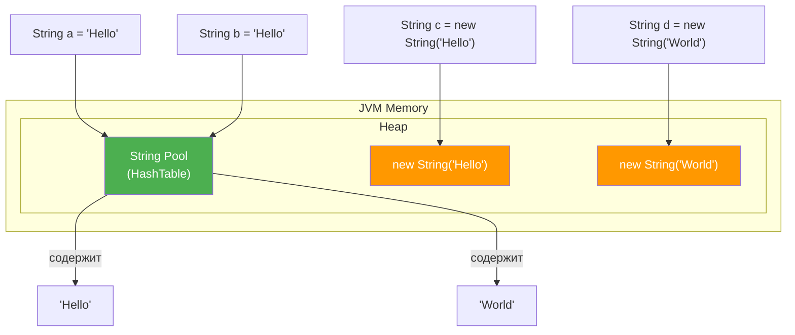
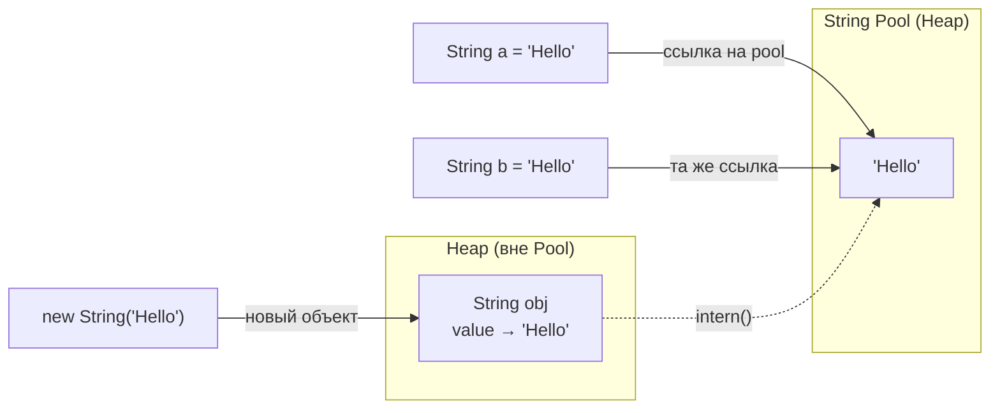

# Вопросы на собеседовании: `Java String`

Комплексное руководство по вопросам собеседования на тему `Java String` для `Senior Java Developer`. Включает детальные объяснения иммутабельности, `String Pool`, методов `intern()`, сравнение `StringBuilder`/`StringBuffer`, регулярные выражения, text blocks и современные `String API`.

## Полезные ссылки

### Официальная документация

- [Java String Documentation](https://docs.oracle.com/en/java/javase/17/docs/api/java.base/java/lang/String.html) — Javadoc класса `String`
- [Java Tutorial — Strings](https://docs.oracle.com/javase/tutorial/java/data/strings.html) — официальный туториал Oracle
- [JEP 254: Compact Strings](https://openjdk.org/jeps/254) — компактные строки в Java 9
- [JEP 378: Text Blocks](https://openjdk.org/jeps/378) — text blocks в Java 15

### Статьи

- [Java String Interview Questions — Baeldung](https://www.baeldung.com/java-string-interview-questions) — подборка вопросов с ответами
- [Guide to Java String Pool — Baeldung](https://www.baeldung.com/java-string-pool) — устройство String Pool
- [Why String Is Immutable in Java — Baeldung](https://www.baeldung.com/java-string-immutable) — причины иммутабельности
- [Compact Strings in Java — Baeldung](https://www.baeldung.com/java-9-compact-string) — компактные строки Java 9
- [String Performance Hints — Baeldung](https://www.baeldung.com/java-string-performance) — производительность строк

## Содержание

- [Полезные ссылки](#полезные-ссылки)
- [See also](#see-also)

**Основы: создание и внутреннее устройство**
- [Q1. (!) Что такое `String` и как он устроен внутри?](#q1--что-такое-string-и-как-он-устроен-внутри)
- [Q2. Как создать `String`?](#q2-как-создать-string)
- [Q3. Наследуется ли `String` от `Object`?](#q3-наследуется-ли-string-от-object)
- [Q4. Почему `String` объявлен как `final`?](#q4-почему-string-объявлен-как-final)

**Иммутабельность**
- [Q5. (!) Каковы преимущества иммутабельности `String`?](#q5--каковы-преимущества-иммутабельности-string)
- [Q6. (!) Как реализована иммутабельность `String` на уровне кода?](#q6--как-реализована-иммутабельность-string-на-уровне-кода)
- [Q7. Можно ли изменить содержимое `String` через Reflection?](#q7-можно-ли-изменить-содержимое-string-через-reflection)
- [Q8. (!) Является ли `String` потокобезопасным?](#q8--является-ли-string-потокобезопасным)

**Память, `String Pool` и интернирование**
- [Q9. (!) Что такое `String Pool` и где он расположен?](#q9--что-такое-string-pool-и-где-он-расположен)
- [Q10. (!) Как `String` хранится в памяти?](#q10--как-string-хранится-в-памяти)
- [Q11. (!) Что делает метод `String.intern()`?](#q11--что-делает-метод-stringintern)
- [Q12. Подходят ли интернированные `String` для сборки мусора?](#q12-подходят-ли-интернированные-string-для-сборки-мусора)
- [Q13. Что такое Compact Strings (Java 9)?](#q13-что-такое-compact-strings-java-9)
- [Q14. Что такое String Deduplication в G1 GC?](#q14-что-такое-string-deduplication-в-g1-gc)

**Сравнение строк**
- [Q15. (!) В чём разница между `==` и `equals()` для строк?](#q15--в-чём-разница-между--и-equals-для-строк)
- [Q16. Как правильно сравнивать строки без учёта регистра?](#q16-как-правильно-сравнивать-строки-без-учёта-регистра)
- [Q17. Что такое `Locale` и зачем он нужен при работе со строками?](#q17-что-такое-locale-и-зачем-он-нужен-при-работе-со-строками)
- [Q18. Какая базовая кодировка для `String`?](#q18-какая-базовая-кодировка-для-string)

**`StringBuilder`, `StringBuffer` и конкатенация**
- [Q19. (!) Разница между `String`, `StringBuffer` и `StringBuilder`?](#q19--разница-между-string-stringbuffer-и-stringbuilder)
- [Q20. (!) Как эффективно конкатенировать много строк?](#q20--как-эффективно-конкатенировать-много-строк)
- [Q21. Что такое `StringJoiner` и `Collectors.joining()`?](#q21-что-такое-stringjoiner-и-collectorsjoining)
- [Q22. Как компилятор оптимизирует конкатенацию строк?](#q22-как-компилятор-оптимизирует-конкатенацию-строк)

**Преобразования и форматирование**
- [Q23. Как разделить `String`?](#q23-как-разделить-string)
- [Q24. Как преобразовать `String` в int и обратно?](#q24-как-преобразовать-string-в-int-и-обратно)
- [Q25. Что такое `String.format()` и `formatted()`?](#q25-что-такое-stringformat-и-formatted)
- [Q26. Как преобразовать `String` в верхний и нижний регистр?](#q26-как-преобразовать-string-в-верхний-и-нижний-регистр)
- [Q27. Как получить `char[]` и `byte[]` из `String`?](#q27-как-получить-char-и-byte-из-string)

**Регулярные выражения**
- [Q28. (!) Как работать с регулярными выражениями (`Pattern`, `Matcher`)?](#q28--как-работать-с-регулярными-выражениями-pattern-matcher)
- [Q29. Какие методы `String` используют regex под капотом?](#q29-какие-методы-string-используют-regex-под-капотом)

**Алгоритмы и типичные задачи**
- [Q30. Как проверить, являются ли две строки анаграммами?](#q30-как-проверить-являются-ли-две-строки-анаграммами)
- [Q31. Как перевернуть `String`?](#q31-как-перевернуть-string)
- [Q32. Как проверить, является ли `String` палиндромом?](#q32-как-проверить-является-ли-string-палиндромом)
- [Q33. Как подсчитать количество вхождений символа в строку?](#q33-как-подсчитать-количество-вхождений-символа-в-строку)

**Современные возможности (Java 11+)**
- [Q34. (!) Что такое text blocks (Java 15+) и зачем они нужны?](#q34--что-такое-text-blocks-java-15-и-зачем-они-нужны)
- [Q35. Что такое `String.isBlank()` и `String.strip()` (Java 11)?](#q35-что-такое-stringisblank-и-stringstrip-java-11)
- [Q36. Как разбить строку по переводу строки?](#q36-как-разбить-строку-по-переводу-строки)
- [Q37. Чем отличаются `repeat()`, `indent()` и `transform()` (Java 11+)?](#q37-чем-отличаются-repeat-indent-и-transform-java-11)
- [Q38. Что такое String Templates (Java 21+)?](#q38-что-такое-string-templates-java-21)

**Безопасность**
- [Q39. (!) Почему безопаснее хранить пароли в `char[]`, а не в `String`?](#q39--почему-безопаснее-хранить-пароли-в-char-а-не-в-string)

---

## Q1. (!) Что такое `String` и как он устроен внутри?

`String` в `Java` -- это неизменяемый (immutable) объект, представляющий последовательность символов. Внутреннее устройство менялось с версиями:

- **Java 8 и ранее**: строка хранится как `char[]` (массив 16-битных символов `UTF-16`)
- **Java 9+** (`JEP 254` -- Compact Strings): строка хранится как `byte[]` + флаг `coder`. Если все символы однобайтовые -- используется `Latin-1` (1 байт на символ), иначе -- `UTF-16` (2 байта на символ)

```java
// Внутренняя структура String (Java 9+, упрощённо)
public final class String implements Serializable, Comparable<String>, CharSequence {
    @Stable
    private final byte[] value;  // данные строки
    private final byte coder;    // LATIN1 = 0, UTF16 = 1
    private int hash;            // кэшированный хэш-код
}
```

Это изменение прозрачно для разработчика -- API `String` остался прежним, но потребление памяти снизилось на 10-15% для типичных приложений.

> [!mcq]
> - [ ] В Java 9+ строка хранится как `char[]` с флагом `coder`, переключающим между `Latin-1` и `UTF-16`. | Нет, `char[]` использовался в Java 8 и ранее, а не в Java 9+. В Java 9 тип внутреннего массива изменился на `byte[]`.
> - [ ] В любой версии Java строка хранится как `char[]` (2 байта на символ в кодировке `UTF-16`). | Это верно только для Java 8 и ранее. Начиная с Java 9 внутреннее представление изменилось благодаря JEP 254 Compact Strings.
> - [x] В Java 9+ строка хранится как `byte[]` с флагом `coder`, а в Java 8 и ранее — как `char[]` в `UTF-16`. | Верно: JEP 254 Compact Strings заменил `char[]` на `byte[]` с адаптивной кодировкой (`Latin-1` или `UTF-16`), что снизило потребление памяти на 10-15%.
> - [ ] В Java 9+ строка хранится как `String[]` фрагментов, что ускоряет конкатенацию и снижает нагрузку на GC. | Такого представления не существует. `String` никогда не хранился как массив фрагментов.

## Q2. Как создать `String`?

Два основных способа:

```java
// 1. Строковый литерал — берётся из String Pool
String s1 = "Hello";

// 2. Через new — всегда создаётся новый объект в heap
String s2 = new String("Hello");

// 3. Из массива символов
char[] chars = {'H', 'e', 'l', 'l', 'o'};
String s3 = new String(chars);

// 4. Из массива байтов с указанием кодировки
byte[] bytes = {72, 101, 108, 108, 111};
String s4 = new String(bytes, StandardCharsets.UTF_8);
```

Критическое различие: литерал `"Hello"` помещается в `String Pool` и переиспользуется, а `new String("Hello")` создаёт отдельный объект в heap (хотя литерал `"Hello"` всё равно попадает в pool).

> [!mcq]
> - [ ] Оператор `new String("Hello")` размещает объект в `String Pool` и возвращает ссылку на пул. | Нет, `new String(...)` всегда создаёт новый объект в обычном heap, а не в пуле. Для получения ссылки из пула нужно вызвать `intern()`.
> - [x] Строковый литерал `"Hello"` берётся из `String Pool`, а `new String("Hello")` создаёт отдельный объект в heap. | Верно: литерал автоматически интернируется в пул и переиспользуется, тогда как `new String(...)` всегда порождает новый объект в heap независимо от наличия строки в пуле.
> - [ ] Оба способа — литерал и `new String(...)` — создают объект в `String Pool`, если такой строки там ещё нет. | Нет, `new String(...)` не помещает объект в пул. Литерал `"Hello"` попадает в пул как константа, но сам объект `new String(...)` остаётся в heap.
> - [ ] Строковый литерал создаётся в heap, а `new String("Hello")` сначала ищет строку в `String Pool`, а затем копирует её. | Логика перепутана: литерал идёт в пул, а `new String(...)` всегда создаёт новый объект в heap без поиска в пуле.

## Q3. Наследуется ли `String` от `Object`?

Да, `String` наследуется от `Object`, как и любой другой класс в Java. Но у него есть особенности, делающие его похожим на примитив:

1. **Литеральный синтаксис**: `String s = "abc"` -- без `new`
2. **Оператор `+`**: конкатенация через `+`, как у примитивов
3. **`String Pool`**: специальная область памяти для переиспользования
4. **`switch`**: можно использовать в `switch`-выражениях (с Java 7)

```java
// String ведёт себя как примитив, но это полноценный объект
String s = "test";
s.getClass();         // class java.lang.String
s instanceof Object;  // true
```

> [!mcq]
> - [ ] Класс `String` является примитивным типом данных и поэтому не наследуется от `Object`. | Нет, `String` — это полноценный объект-класс. Примитивными являются `int`, `char`, `boolean` и другие, но не `String`.
> - [ ] Класс `String` не наследуется от `Object`, потому что он объявлен как `final` и не может иметь родительских классов. | Неверно: `final` означает невозможность наследования от `String`, а не от `Object`. Каждый класс в Java неявно наследуется от `Object`.
> - [x] Да, `String` наследуется от `Object`, как и любой другой класс в Java, хотя внешне ведёт себя схоже с примитивами. | Верно: в Java всегда работает единая иерархия, и `Object` — корень для всех классов. Литеральный синтаксис и оператор `+` лишь создают иллюзию примитива.
> - [ ] Класс `String` наследуется не от `Object`, а от абстрактного класса `CharSequence`, который сам наследуется от `Object`. | Неверно: `CharSequence` — это интерфейс, а не класс. `String` реализует `CharSequence`, но наследуется именно от `Object`.

## Q4. Почему `String` объявлен как `final`?

Класс `String` объявлен как `final`, чтобы его нельзя было наследовать:

```java
public final class String { ... }
```

Причины:
1. **Безопасность**: если бы можно было создать подкласс `String`, злоумышленник мог бы переопределить методы и, например, изменять URL/путь к файлу после проверки безопасности
2. **Гарантия иммутабельности**: подкласс мог бы добавить мутабельные поля и нарушить контракт неизменяемости
3. **Корректность `hashCode()`**: кэширование `hashCode` работает только при гарантии неизменности, что важно для использования в `HashMap`/`HashSet` (см. [Java Collections](java-collections-interview.md))
4. **Оптимизации JVM**: `final` позволяет JVM применять агрессивные оптимизации

> [!mcq]
> - [ ] Класс `String` объявлен `final` только для производительности: JVM оптимизирует вызовы методов `final`-класса лучше, чем обычного. | Это лишь одна из второстепенных причин. Главными являются безопасность и гарантия иммутабельности, без которых `String Pool` был бы невозможен.
> - [ ] Ключевое слово `final` на классе `String` предотвращает изменение его внутреннего массива `byte[]` после создания объекта. | Неверно: за неизменяемость массива отвечает `private final byte[] value`, а не `final` на классе. `final` на классе запрещает наследование.
> - [x] Класс `String` объявлен `final`, чтобы исключить наследование: подкласс мог бы нарушить иммутабельность, переопределить методы и обойти проверки безопасности. | Верно: без `final` злоумышленник мог бы создать мутабельный подкласс `String` и передать его туда, где ожидается неизменяемая строка, нарушив контракт безопасности.
> - [ ] Класс `String` объявлен `final` потому, что он реализует интерфейс `Serializable`, а сериализуемые классы не могут иметь подклассов. | Это неверно: наличие `Serializable` не запрещает наследование. Многие сериализуемые классы имеют подклассы.

## Q5. (!) Каковы преимущества иммутабельности `String`?

Иммутабельность `String` -- одно из ключевых архитектурных решений в Java:

1. **`String Pool`**: пул строк возможен только потому, что строки не меняются после создания -- иначе изменение одной ссылки затронуло бы все остальные
2. **Потокобезопасность**: неизменяемые объекты inherently thread-safe -- не нужна синхронизация (подробнее в [Java Concurrency](java-concurrency-interview.md))
3. **Безопасность**: строка не может быть изменена после проверки (например, имя файла, URL, SQL-запрос)
4. **Кэширование `hashCode`**: вычисляется один раз и кэшируется в поле `hash`, что ускоряет работу с `HashMap`/`HashSet`
5. **Безопасность как ключ**: строки широко используются как ключи в `Map` и элементы `Set` -- мутация ключа сломала бы структуру данных

```java
// hashCode вычисляется лениво и кэшируется
String key = "important";
Map<String, Integer> map = new HashMap<>();
map.put(key, 42);
// Если бы String был мутабельный и key изменился,
// map.get(key) мог бы вернуть null
```

> [!mcq]
> - [x] Иммутабельность `String` делает `String Pool` возможным, обеспечивает потокобезопасность и позволяет безопасно кэшировать `hashCode`. | Верно: три эти свойства взаимосвязаны. Без иммутабельности одна ссылка из пула могла бы изменить значение для всех остальных пользователей той же строки.
> - [ ] Главное преимущество иммутабельности `String` — экономия памяти за счёт `String Pool`, остальные свойства — второстепенны и редко используются на практике. | Неверно: потокобезопасность и кэширование `hashCode` критически важны. Строки как ключи `HashMap` требуют стабильного `hashCode`, а многопоточный доступ без синхронизации возможен только из-за иммутабельности.
> - [ ] Иммутабельность `String` затрудняет его использование как ключа `Map`, поскольку `hashCode` не может меняться вместе с содержимым. | Ровно наоборот: именно благодаря иммутабельности `String` — идеальный ключ `Map`. `hashCode` кэшируется и никогда не станет некорректным.
> - [ ] Иммутабельность `String` полезна только для безопасности: без неё злоумышленник мог бы изменить URL или SQL-запрос после проверки, а преимущества для GC отсутствуют. | Неполно: иммутабельность также снижает нагрузку на GC через переиспользование пула, обеспечивает потокобезопасность и стабильный `hashCode`.

> [!mcq]
> - [ ] `String` является потокобезопасным только при наличии `synchronized` методов, аналогично `StringBuffer`. | Нет, `String` потокобезопасен из-за иммутабельности, а не синхронизации. `StringBuffer` использует `synchronized`, потому что он мутабельный.
> - [ ] `String` не является полностью потокобезопасным: поле `hash` может быть прочитано одним потоком до его инициализации другим. | Это теоретический риск, но JMM гарантирует корректность через `final` поля и happens-before для `int hash`. На практике `String` признаётся потокобезопасным.
> - [x] `String` является потокобезопасным, поскольку его состояние неизменяемо после создания, и никакой синхронизации для разделения строки между потоками не требуется. | Верно: иммутабельность — самый сильный вид потокобезопасности. Нельзя получить race condition на объекте, состояние которого никогда не меняется.
> - [ ] `String` является потокобезопасным только в рамках одной JVM: при передаче между JVM через сеть данные могут быть повреждены. | Это касается сериализации и передачи данных, а не потокобезопасности. Потокобезопасность — свойство доступа к объекту внутри одной JVM.

## Q6. (!) Как реализована иммутабельность `String` на уровне кода?

Иммутабельность `String` обеспечивается несколькими механизмами:

```java
public final class String {           // 1. final класс — нельзя наследовать
    private final byte[] value;        // 2. final поле — нельзя переназначить
    // 3. Нет сеттеров и мутирующих методов
    // 4. Все методы возвращают новый String
    // 5. Defensive copy при создании из char[]/byte[]
}
```

Ключевые аспекты:
- Класс `final` -- предотвращает наследование
- Внутренний массив `private final` -- нет прямого доступа
- Методы вроде `substring()`, `replace()`, `toUpperCase()` создают **новый** объект `String`
- Конструктор `String(char[])` делает **копию** массива, а не сохраняет ссылку

> [!mcq]
> - [ ] Иммутабельность `String` обеспечивается исключительно ключевым словом `final` на классе: оно запрещает любые изменения объекта. | Нет: `final` на классе запрещает наследование, а не изменение состояния. За неизменяемость данных отвечают `private final byte[] value` и отсутствие сеттеров.
> - [ ] Иммутабельность `String` обеспечивается тем, что все его методы (`substring()`, `replace()`) модифицируют внутренний массив на месте и возвращают `this`. | Нет, это описание мутабельного поведения. В действительности каждый метод создаёт и возвращает новый объект `String`, не затрагивая исходный.
> - [x] Иммутабельность `String` обеспечивается сочетанием `final` класса, `private final byte[]` поля, отсутствия сеттеров и defensive copy в конструкторах. | Верно: ни один из этих механизмов в отдельности не достаточен. Только их совокупность гарантирует, что после создания объекта никто не сможет изменить его содержимое.
> - [ ] Иммутабельность `String` обеспечивается только уровнем JVM: компилятор генерирует байткод, запрещающий запись в поля `String` без создания нового объекта. | Нет, иммутабельность задаётся на уровне Java-кода (видимость, `final`, отсутствие мутаций), а не специальными инструкциями байткода.

## Q7. Можно ли изменить содержимое `String` через Reflection?

Технически -- да, но это хак, который нарушает контракт:

```java
String s = "Hello";
Field valueField = String.class.getDeclaredField("value");
valueField.setAccessible(true); // в Java 9+ может бросить InaccessibleObjectException
valueField.set(s, "World".getBytes()); // ОПАСНО!
```

С Java 9 модульная система (`JPMS`) ограничивает доступ к внутренним полям. С Java 16 `--illegal-access=deny` стал дефолтным. На практике **никогда** не делайте этого:
- Нарушает `String Pool` -- все ссылки на тот же литерал получат изменённое значение
- Ломает `hashCode` кэширование
- Приводит к непредсказуемому поведению `HashMap`, `HashSet`, логгирования

> [!mcq]
> - [x] Изменение `String` через Reflection технически возможно, но нарушает `String Pool`: все ссылки на один литерал получат изменённое значение, что ломает `HashMap` и `HashSet`. | Верно: поскольку строки из пула разделяются между всеми владельцами ссылки, мутация одного объекта затронет всех. Начиная с Java 16 `--illegal-access=deny` дополнительно блокирует такой доступ.
> - [ ] Изменение `String` через Reflection безопасно, если вызвать `s.intern()` перед модификацией: это создаст новую независимую копию в пуле. | Нет, `intern()` не создаёт независимую копию. Он возвращает ссылку на уже существующий объект в пуле, что только усиливает риск его мутации.
> - [ ] Изменение `String` через Reflection невозможно в любой версии Java, потому что `final` поля полностью защищены от записи через `Field.set()`. | Неверно: `Field.setAccessible(true)` позволял обходить ограничения вплоть до Java 16. С Java 16+ модульная система блокирует это, но технически это было возможно.
> - [ ] Изменение `String` через Reflection возможно и безвредно, если строка не находится в `String Pool`, то есть создана через `new String(...)`. | Даже для объектов вне пула изменение через Reflection ломает кэшированный `hashCode` и нарушает контракты методов. Это опасно независимо от места хранения объекта.

## Q8. (!) Является ли `String` потокобезопасным?

Да, `String` потокобезопасен, и вот почему:

- **Иммутабельность** -- после создания состояние объекта не меняется, поэтому race conditions невозможны
- **Безопасная публикация** -- `final` поля гарантируют, что все потоки видят полностью сконструированный объект (happens-before из JMM)
- Все методы (`substring()`, `charAt()`, `length()`) работают с неизменяемыми данными

```java
// String можно безопасно разделять между потоками без синхронизации
private static final String SHARED = "shared-config-value";

// Но если вам нужна мутабельная строка в многопоточном контексте:
StringBuffer sb = new StringBuffer(); // потокобезопасный
// НЕ StringBuilder — он НЕ потокобезопасный
```

Подробнее о потокобезопасности и `happens-before` -- в [Java Concurrency](java-concurrency-interview.md).

> [!mcq]
> - [ ] Для построения строки в нескольких потоках нужно использовать `StringBuilder`, поскольку он безопаснее `StringBuffer` при параллельном доступе. | Нет, всё наоборот: `StringBuffer` синхронизирован и потокобезопасен, а `StringBuilder` не имеет синхронизации и не предназначен для многопоточного доступа.
> - [x] Для построения строки в нескольких потоках нужно использовать `StringBuffer`, поскольку он синхронизирован, тогда как `StringBuilder` не является потокобезопасным. | Верно: `StringBuffer` помечает все изменяющие методы как `synchronized`. Однако на практике лучше собирать строку в каждом потоке отдельно через `StringBuilder`, а результаты объединять.
> - [ ] Для построения строки в нескольких потоках нужно использовать `String`, конкатенируя через `+`, поскольку иммутабельность делает конкатенацию потокобезопасной. | Технически `String` потокобезопасен, но конкатенация через `+` в цикле неэффективна и не решает проблему разделяемого мутабельного состояния между потоками.
> - [ ] Для построения строки в нескольких потоках нужно использовать `StringJoiner` с `ConcurrentLinkedQueue` под капотом, обеспечивающим lock-free доступ. | `StringJoiner` не имеет никакой конкурентной реализации и не является потокобезопасным для параллельного `add()`.

## Q9. (!) Что такое `String Pool` и где он расположен?

`String Pool` (пул строк) -- это специальная структура данных (`HashTable`), в которой JVM хранит уникальные строковые литералы для переиспользования.



Эволюция расположения `String Pool`:
- **Java 6 и ранее**: в `PermGen` (фиксированный размер, не подлежал GC) -- часто приводил к `OutOfMemoryError: PermGen space`
- **Java 7+**: перемещён в основной `Heap` -- строки из пула подлежат сборке мусора
- **Java 8**: `PermGen` заменён на `Metaspace`, но `String Pool` уже был в `Heap`

Размер пула настраивается через `-XX:StringTableSize` (по умолчанию ~60013 в Java 11+). Подробнее об управлении памятью JVM -- в [JVM](../../jvm/jvm-interview.md) и [Управление памятью](../../performance/memory-management-interview.md).

> [!mcq]
> - [ ] `String Pool` расположен в `PermGen` во всех версиях Java и не подлежит сборке мусора, что обеспечивает постоянный доступ к строковым литералам. | Это верно только для Java 6 и ранее. В Java 7 пул переместился в основной Heap, а `PermGen` был полностью удалён в Java 8.
> - [x] В Java 7+ `String Pool` расположен в основном `Heap`, что позволяет GC собирать неиспользуемые строки из пула в отличие от `PermGen` в Java 6. | Верно: перемещение в Heap устранило проблему `OutOfMemoryError: PermGen space` при интенсивном использовании `intern()`. Теперь строки из пула подлежат обычной сборке мусора.
> - [ ] `String Pool` расположен в `Metaspace` в Java 8+, поскольку именно `Metaspace` заменил `PermGen` и теперь хранит все строковые константы. | Нет: в `Metaspace` хранятся метаданные классов. `String Pool` был перемещён в основной Heap ещё в Java 7, ещё до замены `PermGen` на `Metaspace` в Java 8.
> - [ ] `String Pool` расположен в стеке вызовов каждого потока, что обеспечивает потокоизолированный доступ к строковым литералам без синхронизации. | Нет, стек потока хранит локальные переменные и фреймы вызовов, но не разделяемые объекты. `String Pool` — единая глобальная структура, разделяемая всеми потоками JVM.

> [!mcq]
> - [ ] `String Pool` — это массив строк фиксированного размера 1024, который заполняется при загрузке классов и не может расти в рантайме. | Нет: пул реализован как `HashTable` переменного размера, настраиваемого через `-XX:StringTableSize`. Он не ограничен фиксированным числом записей.
> - [ ] `String Pool` реализован как `LinkedList` для быстрой вставки новых строк через `intern()` без хэш-коллизий. | Нет, `String Pool` реализован как `HashTable` для O(1) поиска по содержимому строки. `LinkedList` дал бы O(n) поиск, что неприемлемо для пула.
> - [x] `String Pool` реализован как `HashTable` и хранит уникальные строки, позволяя нескольким ссылкам указывать на один объект и экономить память. | Верно: хэш-таблица обеспечивает эффективный поиск при каждом создании литерала или вызове `intern()`. Размер таблицы регулируется флагом `-XX:StringTableSize`.
> - [ ] `String Pool` реализован как `WeakHashMap`, поэтому строки автоматически удаляются из пула, как только на них не остаётся сильных ссылок извне. | `String Pool` не является `WeakHashMap`. Строки в пуле доступны для GC, но механизм управления памятью реализован на уровне JVM, а не через стандартный `WeakHashMap`.

## Q10. (!) Как `String` хранится в памяти?



```java
String s1 = "Hello";              // литерал → String Pool
String s2 = "Hello";              // тот же объект из Pool
String s3 = new String("Hello");  // новый объект в heap
String s4 = s3.intern();          // ссылка на Pool

System.out.println(s1 == s2);     // true  — одна ссылка из Pool
System.out.println(s1 == s3);     // false — разные объекты
System.out.println(s1 == s4);     // true  — intern() вернул ссылку из Pool
```

При создании `new String("Hello")` создаётся **до двух объектов**:
1. Литерал `"Hello"` в `String Pool` (если его там ещё нет)
2. Новый объект `String` в обычном heap

> [!mcq]
> - [ ] Выражение `s1 == s2` для двух литералов `"Hello"` вернёт `false`, поскольку каждый литерал создаёт независимый объект в heap. | Нет: компилятор помещает одинаковые литералы в `String Pool`, поэтому `s1` и `s2` указывают на один объект, и `==` вернёт `true`.
> - [x] Выражение `s1 == s2` для двух литералов `"Hello"` вернёт `true`, поскольку оба указывают на один объект в `String Pool`. | Верно: JVM оптимизирует литералы через пул, и `s1 == s2` возвращает `true`. При этом `s1 == new String("Hello")` вернёт `false`, так как `new` всегда создаёт объект в heap.
> - [ ] Выражение `s1 == new String("Hello")` вернёт `true`, если вызвать `s1.intern()` до сравнения, поскольку `intern()` заменяет объект в heap ссылкой из пула. | Нет: `intern()` возвращает ссылку, но не изменяет переменную `s1`. Нужно использовать результат: `s1.intern() == new String("Hello").intern()` вернёт `true`.
> - [ ] При создании `new String("Hello")` создаётся ровно один объект в heap, а литерал `"Hello"` не добавляется в `String Pool`, поскольку объект создаётся явно через `new`. | Неверно: при компиляции литерал `"Hello"` всё равно попадает в пул как константа. Поэтому `new String("Hello")` может создавать до двух объектов.

## Q11. (!) Что делает метод `String.intern()`?

Метод `intern()` проверяет, есть ли строка с таким содержимым в `String Pool`:
- Если **есть** -- возвращает ссылку на существующий объект из пула
- Если **нет** -- добавляет строку в пул и возвращает ссылку на неё

```java
String s1 = "Baeldung";                      // автоматически в Pool
String s2 = new String("Baeldung");          // новый объект в heap
String s3 = new String("Baeldung").intern(); // возвращает ссылку из Pool

System.out.println(s1 == s2);  // false — разные объекты
System.out.println(s1 == s3);  // true  — intern() нашёл в Pool
```

**Когда использовать `intern()`:**
- Парсинг больших файлов с повторяющимися строками (например, XML-теги, CSV-колонки)
- Экономия памяти при массовой обработке данных с ограниченным словарём значений

**Когда НЕ использовать:**
- Для уникальных строк -- бессмысленно, только добавляет накладные расходы
- В больших масштабах без контроля -- может раздуть `String Pool` и замедлить поиск в нём

> [!mcq]
> - [ ] Метод `intern()` создаёт копию строки в `String Pool` и возвращает новый объект, независимый от исходного. | Нет: `intern()` не создаёт копию, если строка уже есть в пуле. Он возвращает ссылку на существующий объект пула, а не создаёт новый.
> - [ ] Метод `intern()` сравнивает строки по ссылке и помещает исходный объект в пул, если там нет эквивалентного, изменяя адрес объекта в памяти. | Нет: `intern()` не перемещает объекты. Он возвращает ссылку на объект из пула (либо добавляет строку в пул), но исходный объект в heap остаётся на месте.
> - [x] Метод `intern()` проверяет пул по содержимому строки: если строка есть — возвращает ссылку из пула, если нет — добавляет строку и возвращает ссылку на неё. | Верно: именно поэтому `new String("Baeldung").intern() == "Baeldung"` возвращает `true`. `intern()` гарантирует, что возвращаемая ссылка указывает на объект в пуле.
> - [ ] Метод `intern()` автоматически вызывается для всех строк, создаваемых через конкатенацию `+`, поэтому `"a" + "b" == "ab"` всегда возвращает `true`. | Нет: компилятор оптимизирует только конкатенацию константных литералов. Для динамических строк `intern()` не вызывается автоматически.

## Q12. Подходят ли интернированные `String` для сборки мусора?

Зависит от версии Java:

| Аспект | Java 6 и ранее | Java 7+ |
|--------|---------------|---------|
| Расположение Pool | `PermGen` | `Heap` |
| GC для Pool | Не собирается | Собирается GC |
| Риски | `OutOfMemoryError: PermGen` | Минимальные |

С Java 7 строки в `String Pool` подлежат сборке мусора, если на них нет живых ссылок. Строковые литералы из кода, однако, живут столько же, сколько и загрузивший их `ClassLoader` (обычно -- всё время работы приложения).

```java
// Эта строка НЕ будет собрана GC — литерал из кода
String literal = "permanent";

// Эта строка может быть собрана GC после обнуления ссылки
String interned = new String("temp-" + System.nanoTime()).intern();
interned = null; // теперь может быть собрана, если нет других ссылок
```

> [!mcq]
> - [ ] Интернированные строки никогда не собираются GC, потому что `String Pool` хранит на них постоянные сильные ссылки независимо от версии Java. | Это было верно для Java 6 с `PermGen`, но в Java 7+ пул перенесён в Heap. Строки из пула подлежат GC, если на них нет живых ссылок извне пула.
> - [x] В Java 7+ интернированные строки подлежат сборке мусора при отсутствии живых ссылок, в отличие от Java 6, где пул в `PermGen` не собирался GC. | Верно: перемещение пула в Heap в Java 7 сделало его строки кандидатами для GC. Литералы из кода, однако, живут столько же, сколько загрузивший их `ClassLoader`.
> - [ ] В Java 7+ интернированные строки никогда не собираются GC, потому что каждый вызов `intern()` создаёт постоянную сильную ссылку в `ClassLoader`. | Нет: `intern()` не создаёт ссылку в `ClassLoader`. Литералы из кода живут долго через ClassLoader, но строки, добавленные в пул через `intern()` динамически, доступны для GC.
> - [ ] В Java 7+ интернированные строки собираются GC немедленно после того, как локальная переменная, хранящая ссылку, выходит из области видимости. | Нет: GC не гарантирует немедленный сбор. Строка становится кандидатом на сборку, но реальное освобождение памяти происходит в следующем цикле GC.

## Q13. Что такое Compact Strings (Java 9)?

`Compact Strings` (`JEP 254`) -- оптимизация внутреннего представления строк в Java 9. Вместо `char[]` (2 байта на символ) используется `byte[]` с адаптивной кодировкой:

```java
// Latin-1 строка (1 байт на символ) — 5 байт
String ascii = "Hello";     // coder = LATIN1

// UTF-16 строка (2 байта на символ) — 12 байт
String unicode = "Привет";  // coder = UTF16
```

Результат: снижение потребления памяти на 10-15% для типичных приложений, где большинство строк содержат ASCII-символы. Эта оптимизация полностью прозрачна -- API `String` не изменился.

Отключить можно флагом `-XX:-CompactStrings`, но на практике это не требуется.

> [!mcq]
> - [ ] Compact Strings изменяет публичный API `String`: методы `length()` теперь возвращают количество байт, а не символов, что ускоряет обработку ASCII-текста. | Нет: API `String` остался полностью прежним. `length()` по-прежнему возвращает количество символов (`char` units). Изменение внутреннее и полностью прозрачно для разработчика.
> - [ ] Compact Strings заменяет `byte[]` на `char[]` для строк, содержащих только ASCII, что вдвое сокращает занимаемую ими память по сравнению с Java 8. | Логика перепутана: в Java 8 был `char[]` (2 байта), а Java 9+ перешёл на `byte[]` (1 байт для Latin-1). Сокращение памяти правильное, но направление изменения — наоборот.
> - [x] Compact Strings хранит строки в `byte[]` с флагом `coder`: 1 байт на символ для Latin-1 строк и 2 байта для UTF-16, что снижает потребление памяти без изменения API. | Верно: JEP 254 адаптирует кодировку к содержимому строки. Типичные приложения с ASCII-строками получают снижение потребления памяти на 10-15%.
> - [ ] Compact Strings включается только для строк длиннее 8 символов, поскольку для коротких строк накладные расходы на проверку `coder` перевешивают выгоду от экономии памяти. | Нет: оптимизация применяется ко всем строкам независимо от длины. Решение принимается на основе содержимого символов, а не длины строки.

## Q14. Что такое String Deduplication в G1 GC?

`String Deduplication` -- оптимизация сборщика мусора, которая находит строки с одинаковым содержимым и заставляет их разделять один и тот же внутренний массив `byte[]`:

```bash
# Включение (G1 GC)
java -XX:+UseG1GC -XX:+UseStringDeduplication -jar app.jar

# Доступно также в ZGC, Serial GC, Parallel GC (с Java 18)
```

Отличие от `intern()`:
- `intern()` -- работает на уровне ссылок `String` (один объект в pool)
- `String Deduplication` -- работает на уровне внутреннего массива `byte[]` (разные объекты `String`, но один `byte[]`)
- `intern()` -- явный вызов программиста; deduplication -- автоматическая работа GC

Применяется к долгоживущим объектам (пережившим несколько циклов GC). Эффективно для приложений с большим количеством дублирующихся строк.

> [!mcq]
> - [ ] `String Deduplication` и `intern()` работают идентично: оба объединяют ссылки на дублирующиеся строки в один объект `String` в `String Pool`. | Нет: `intern()` объединяет объекты на уровне ссылок, тогда как deduplication работает на уровне внутреннего `byte[]`. После deduplication объекты `String` остаются разными, но разделяют один массив.
> - [x] `String Deduplication` разделяет внутренний `byte[]` между дублирующимися объектами `String`, тогда как `intern()` объединяет сами объекты через `String Pool`. | Верно: это фундаментальное различие. Deduplication не меняет ссылки на объекты, а только оптимизирует внутренние данные. `intern()` же влияет на ссылочную идентичность строк.
> - [ ] `String Deduplication` работает только при использовании `intern()`: сначала `intern()` добавляет строку в пул, затем GC дедуплицирует внутренние массивы. | Нет: deduplication полностью независим от `intern()`. Это автоматический процесс GC, применяемый к долгоживущим объектам, и не требует явных вызовов `intern()`.
> - [ ] `String Deduplication` заменяет `String Pool` в Java 9+, поскольку более эффективно управляет памятью строк через GC без необходимости поддерживать отдельную хэш-таблицу. | Нет: `String Pool` и String Deduplication — независимые механизмы, существующие одновременно. Deduplication не заменяет пул, а дополняет его для динамически создаваемых строк.

## Q15. (!) В чём разница между `==` и `equals()` для строк?

Это один из самых частых вопросов на собеседовании:

```java
String s1 = "Hello";
String s2 = "Hello";
String s3 = new String("Hello");

// == сравнивает ССЫЛКИ (адреса в памяти)
System.out.println(s1 == s2);      // true  — оба из String Pool
System.out.println(s1 == s3);      // false — разные объекты

// equals() сравнивает СОДЕРЖИМОЕ
System.out.println(s1.equals(s3)); // true  — одинаковое содержимое

// intern() позволяет использовать == для содержимого
System.out.println(s1 == s3.intern()); // true
```

**Правило**: всегда используйте `equals()` для сравнения строк. Оператор `==` допустим только если вы **осознанно** сравниваете ссылки (например, после `intern()`).

**Нюанс**: `"Hello" == "Hel" + "lo"` вернёт `true`, потому что компилятор выполняет конкатенацию литералов на этапе компиляции.

> [!mcq]
> - [ ] Оператор `==` для строк сравнивает содержимое, потому что `String` переопределяет оператор `==` через метод `equals()`. | Нет: Java не поддерживает перегрузку операторов. `==` всегда сравнивает ссылки (адреса в памяти), а не содержимое, и это нельзя переопределить.
> - [ ] Оператор `==` для строк сравнивает содержимое только если обе строки находятся в `String Pool`, иначе возвращает `false` даже при одинаковых значениях. | Не совсем: `==` сравнивает ссылки. Если обе ссылки указывают на один объект в пуле — результат `true`. Но это следствие одинаковой ссылки, а не сравнения содержимого.
> - [x] Оператор `==` сравнивает ссылки на объекты, а `equals()` сравнивает содержимое: для строк всегда нужно использовать `equals()`, если важно значение. | Верно: это базовое правило Java. Использование `==` вместо `equals()` для строк — распространённая ошибка, приводящая к трудно воспроизводимым багам при работе с динамически созданными строками.
> - [ ] Метод `equals()` для строк сравнивает ссылки, а `compareTo()` сравнивает содержимое лексикографически, поэтому для проверки равенства нужен `compareTo() == 0`. | Нет: `equals()` сравнивает содержимое, а не ссылки. `compareTo() == 0` тоже работает, но является избыточным и неидиоматичным для проверки равенства.

## Q16. Как правильно сравнивать строки без учёта регистра?

```java
String s1 = "Hello";
String s2 = "hello";

// Способ 1: equalsIgnoreCase()
s1.equalsIgnoreCase(s2); // true

// Способ 2: привести к одному регистру (менее предпочтительно)
s1.toLowerCase(Locale.ROOT).equals(s2.toLowerCase(Locale.ROOT));

// ВАЖНО: указывайте Locale для корректности!
// Турецкая "I" → "ı" (без точки), а не "i"
"TITLE".toLowerCase(Locale.forLanguageTag("tr")); // "tıtle"
"TITLE".toLowerCase(Locale.ENGLISH);               // "title"
```

**Best practice**: для сравнения строк, не зависящих от локали (идентификаторы, enum-ы, технические значения), используйте `Locale.ROOT`.

> [!mcq]
> - [ ] Метод `equalsIgnoreCase()` корректно обрабатывает все языки, включая турецкий, поэтому использование `Locale` при сравнении без учёта регистра не требуется. | Нет: `equalsIgnoreCase()` использует правила Unicode, которые могут давать неожиданные результаты для турецких символов `I`/`ı`. Для технических строк безопаснее использовать `toLowerCase(Locale.ROOT).equals(...)`.
> - [x] Для сравнения строк без учёта регистра предпочтителен `equalsIgnoreCase()`, а для технических идентификаторов — приведение к нижнему регистру через `toLowerCase(Locale.ROOT)`. | Верно: `equalsIgnoreCase()` удобен в большинстве случаев, но для технических строк (ключи конфигурации, имена полей) `Locale.ROOT` даёт предсказуемый результат независимо от системной локали.
> - [ ] Метод `equalsIgnoreCase()` использует дефолтную системную `Locale` для преобразования регистра, поэтому результат может отличаться на разных серверах. | `equalsIgnoreCase()` не зависит от системной локали — он использует правила Unicode. Зависимость от локали появляется при `toUpperCase()`/`toLowerCase()` без явного указания `Locale`.
> - [ ] Правильный способ сравнения строк без учёта регистра — использование `==` после приведения обеих строк к верхнему регистру через `toUpperCase()`. | Нет: `toUpperCase()` создаёт новые объекты, не попадающие в пул, поэтому `==` вернёт `false`. Нужен `equals()` после приведения регистра, но предпочтительнее просто `equalsIgnoreCase()`.

## Q17. Что такое `Locale` и зачем он нужен при работе со строками?

`Locale` определяет язык, страну и культурные параметры, влияющие на обработку строк:

```java
// Форматирование чисел зависит от локали
String.format(Locale.US, "%,.2f", 1234.56);     // "1,234.56"
String.format(Locale.GERMANY, "%,.2f", 1234.56); // "1.234,56"

// Преобразование регистра зависит от локали
"straße".toUpperCase(Locale.GERMAN);  // "STRASSE" (ß → SS)
```

Операции, зависящие от `Locale`:
1. **Преобразование регистра**: `toUpperCase()`, `toLowerCase()`
2. **Форматирование**: `String.format()`, `NumberFormat`, `DateFormat`
3. **Сортировка строк**: `Collator.getInstance(locale)`
4. **Сравнение**: `compareToIgnoreCase()` -- турецкая проблема с `I`/`ı`

> [!mcq]
> - [ ] `Locale` влияет только на форматирование чисел и дат в `String.format()`, но не на сравнение или преобразование регистра строк. | Нет: `Locale` влияет также на `toUpperCase()`, `toLowerCase()` и сортировку через `Collator`. Турецкая буква `I` превращается в `ı` при турецкой локали, что ломает технические сравнения.
> - [x] `Locale` влияет на преобразование регистра (`toUpperCase`, `toLowerCase`), форматирование чисел и дат, а также на сортировку строк через `Collator`. | Верно: использование методов без явного `Locale` приводит к зависимости от системной настройки сервера. Best practice — всегда передавать `Locale.ROOT` для технических строк и конкретную локаль для текста, отображаемого пользователю.
> - [ ] `Locale` влияет только на `String.format()` при форматировании чисел: разделители тысяч и десятичная точка зависят от локали, остальные операции со строками локаленезависимы. | Неверно: преобразование регистра через `toUpperCase()` и `toLowerCase()` тоже зависит от локали. Именно из-за этого вызов `toUpperCase()` без `Locale` помечается как потенциальный баг в статическом анализе.
> - [ ] `Locale` не влияет на работу со строками в Java — он нужен только для классов `DateFormat` и `NumberFormat` из пакета `java.text`. | Нет: методы класса `String` (`toUpperCase()`, `toLowerCase()`, `String.format()`) принимают `Locale` и учитывают его при преобразованиях.

## Q18. Какая базовая кодировка для `String`?

| Версия Java | Внутреннее представление | Кодировка |
|-------------|------------------------|-----------|
| Java 1.0 - 8 | `char[]` | `UTF-16` (2 байта на символ) |
| Java 9+ | `byte[]` + `coder` | `Latin-1` или `UTF-16` (адаптивно) |

Тип `char` в Java -- 16-битный, представляет один code unit `UTF-16`. Символы за пределами BMP (Basic Multilingual Plane), например эмодзи, занимают **два** `char` (surrogate pair):

```java
String emoji = "😀";
emoji.length();        // 2 (два char — surrogate pair)
emoji.codePointCount(0, emoji.length()); // 1 (один code point)
emoji.codePoints().count(); // 1
```

> [!mcq]
> - [ ] Метод `length()` для строки `"😀"` вернёт 1, поскольку эмодзи — это один символ, и Java автоматически считает code points, а не `char` units. | Нет: `length()` возвращает количество `char` units в UTF-16, а не code points. Эмодзи вне BMP занимает surrogate pair из двух `char`, поэтому `length()` вернёт 2.
> - [x] Метод `length()` для строки `"😀"` вернёт 2, потому что эмодзи кодируется как surrogate pair из двух `char` в UTF-16, а `codePointCount()` вернёт 1. | Верно: это важное различие при работе с Unicode. Для подсчёта реальных символов используйте `codePointCount()` или `codePoints().count()`, а не `length()`.
> - [ ] Метод `length()` для строки `"😀"` вернёт 4, потому что эмодзи кодируется как 4 байта в UTF-8, а Java 9+ использует `byte[]` внутри `String`. | Нет: `length()` не зависит от внутренней кодировки. Он всегда возвращает число `char` units в UTF-16, которых для данного эмодзи ровно 2.
> - [ ] Метод `length()` вернёт 2 для `"😀"`, но при использовании `String.format()` эмодзи будет считаться одним символом, что может приводить к ошибкам форматирования. | Это некорректное обобщение. `String.format()` использует `length()` и воспринимает строку как последовательность `char` units. Проблемы с шириной полей реальны, но это отдельная тема форматирования.

## Q19. (!) Разница между `String`, `StringBuffer` и `StringBuilder`?

| Характеристика | `String` | `StringBuilder` | `StringBuffer` |
|---------------|----------|-----------------|----------------|
| Мутабельность | Immutable | Mutable | Mutable |
| Потокобезопасность | Да (immutable) | Нет | Да (synchronized) |
| Производительность | Новый объект на каждое изменение | Быстрый | Медленнее из-за `synchronized` |
| Когда использовать | Константы, ключи | Однопоточные операции | Многопоточные операции (редко) |

```java
// StringBuilder — основной выбор для мутабельных строк
StringBuilder sb = new StringBuilder(64); // указывайте capacity!
for (String part : parts) {
    sb.append(part).append(", ");
}
String result = sb.toString();

// StringBuffer — только когда строку строят несколько потоков
StringBuffer sbuf = new StringBuffer();
// synchronized методы: append(), insert(), delete()...
```

**На практике** `StringBuffer` почти не используется. Для многопоточных сценариев лучше собрать строку в каждом потоке отдельно и объединить результаты. Подробнее -- в [Java Concurrency](java-concurrency-interview.md).

> [!mcq]
> - [ ] `String`, `StringBuilder` и `StringBuffer` все иммутабельны: их методы всегда возвращают новый объект, а исходный остаётся неизменённым. | Нет: `StringBuilder` и `StringBuffer` — мутабельные классы. Они изменяют внутренний буфер на месте и возвращают `this` для цепочки вызовов, а не новые объекты.
> - [ ] `StringBuilder` потокобезопасен, поскольку его методы `append()` используют `volatile` переменные для видимости изменений между потоками. | Нет: `StringBuilder` не является потокобезопасным и не использует `volatile` или `synchronized`. Для многопоточного доступа нужен `StringBuffer`.
> - [x] `String` иммутабелен и потокобезопасен, `StringBuilder` мутабелен и непотокобезопасен, `StringBuffer` мутабелен и потокобезопасен за счёт `synchronized` методов. | Верно: это ключевые различия. `StringBuilder` следует использовать в однопоточных сценариях для производительности, а `StringBuffer` — в редких случаях многопоточной записи в одну строку.
> - [ ] `String` иммутабелен, `StringBuilder` иммутабелен и потокобезопасен, `StringBuffer` мутабелен и потокобезопасен — они отличаются только наличием синхронизации. | Неверно: `StringBuilder` мутабелен. Именно его мутабельность делает его быстрым в однопоточных сценариях, а отсутствие синхронизации — непригодным для многопоточного доступа.

> [!mcq]
> - [ ] `StringBuffer` — предпочтительный выбор для большинства задач: он безопаснее `StringBuilder` и незначительно медленнее из-за синхронизации, которая не заметна на практике. | Нет: накладные расходы `synchronized` вполне ощутимы в высоконагруженных сценариях. В однопоточном коде `StringBuilder` всегда предпочтительнее `StringBuffer`.
> - [ ] `StringBuilder` — предпочтительный выбор для многопоточных задач: он быстрее `StringBuffer` и при аккуратном использовании потокобезопасен. | Нет: `StringBuilder` не является потокобезопасным. Для многопоточных сценариев нужен `StringBuffer`, хотя на практике лучше собирать строку локально в каждом потоке.
> - [x] `StringBuilder` — предпочтительный выбор для однопоточных задач, `StringBuffer` — для многопоточных, но на практике последний почти не используется из-за лучших альтернатив. | Верно: в реальных проектах многопоточное построение строки лучше решается через локальные `StringBuilder` в каждом потоке с последующим объединением, а не через `StringBuffer`.
> - [ ] `StringJoiner` является предпочтительной заменой как `StringBuilder`, так и `StringBuffer`: он потокобезопасен и поддерживает разделители, что делает `StringBuffer` устаревшим. | Нет: `StringJoiner` не является потокобезопасным и не заменяет `StringBuffer`. Он предназначен для построения строк с разделителями, а не для универсального построения.

## Q20. (!) Как эффективно конкатенировать много строк?

```java
// ❌ ПЛОХО: конкатенация в цикле через +
String result = "";
for (String s : list) {
    result += s; // каждая итерация создаёт новый String!
}

// ✅ ХОРОШО: StringBuilder с заданным capacity
StringBuilder sb = new StringBuilder(list.size() * 20);
for (String s : list) {
    sb.append(s);
}
String result = sb.toString();

// ✅ ХОРОШО: String.join()
String result = String.join(", ", list);

// ✅ ХОРОШО: Stream API
String result = list.stream()
    .collect(Collectors.joining(", ", "[", "]"));
```

**Почему `+` в цикле плох?** Каждая итерация создаёт новый `StringBuilder`, копирует накопленную строку, добавляет новую часть, вызывает `toString()`. Сложность -- O(n^2) по памяти.

**Однократная конкатенация** `String s = a + b + c` -- компилятор оптимизирует, `StringBuilder` не нужен.

> [!mcq]
> - [ ] Конкатенация строк через `+` в цикле имеет сложность O(n) по памяти, поскольку компилятор оптимизирует каждую итерацию в единый `StringBuilder`. | Нет: компилятор создаёт новый `StringBuilder` на каждой итерации, что даёт O(n²) по памяти. Оптимизация применяется только к однократным выражениям вне цикла.
> - [x] Конкатенация через `+` в цикле имеет сложность O(n²) по памяти, поэтому для цикла нужен явный `StringBuilder` с заданным `capacity`. | Верно: каждая итерация создаёт новый `StringBuilder`, копирует накопленную строку и вызывает `toString()`. Явный `StringBuilder` с `new StringBuilder(estimatedSize)` устраняет это.
> - [ ] Метод `String.join()` медленнее `StringBuilder` в цикле, поскольку он создаёт промежуточные строки для каждого элемента перед объединением. | Нет: `String.join()` внутри использует `StringJoiner`, который эффективно накапливает части без промежуточных объектов. Он сопоставим по производительности с `StringBuilder`.
> - [ ] `Collectors.joining()` эффективен только для потоков с менее чем 100 элементами: для больших коллекций производительность падает из-за промежуточных буферов. | Нет: `Collectors.joining()` использует `StringJoiner` и эффективен для коллекций любого размера. Нет порогового значения, после которого производительность падает.

## Q21. Что такое `StringJoiner` и `Collectors.joining()`?

```java
// StringJoiner — с разделителем, префиксом и суффиксом
StringJoiner joiner = new StringJoiner(", ", "[", "]");
joiner.add("Red").add("Green").add("Blue");
System.out.println(joiner); // [Red, Green, Blue]

// Пустой joiner с setEmptyValue
StringJoiner empty = new StringJoiner(", ", "[", "]");
empty.setEmptyValue("empty");
System.out.println(empty); // empty

// Collectors.joining() — аналог для Stream API
String colors = Stream.of("Red", "Green", "Blue")
    .collect(Collectors.joining(", ", "[", "]"));
// [Red, Green, Blue]

// String.join() — простейший вариант без Stream
String csv = String.join(",", "a", "b", "c"); // "a,b,c"
```

> [!mcq]
> - [ ] `StringJoiner` и `Collectors.joining()` — полностью независимые реализации: `StringJoiner` использует массив, а `Collectors.joining()` использует `StringBuilder` напрямую. | Нет: `Collectors.joining()` реализован через `StringJoiner`. Это одна и та же логика, просто завёрнутая в коллектор для удобства использования в стримах.
> - [x] `Collectors.joining()` — это обёртка над `StringJoiner` для использования в Stream API, поэтому оба поддерживают разделитель, префикс и суффикс. | Верно: `StringJoiner` — нижний уровень, `Collectors.joining()` — удобный способ применить его в потоке данных. Оба имеют одинаковую семантику для пустых коллекций и разделителей.
> - [ ] `String.join()` является предпочтительным методом для объединения строк из `Stream`: он оптимизирован JVM лучше, чем `Collectors.joining()`. | Нет: `String.join()` работает с `Iterable` и varargs, но не принимает `Stream` напрямую. Для стримов нужен `Collectors.joining()`.
> - [ ] `StringJoiner` позволяет задать только разделитель, тогда как `Collectors.joining()` дополнительно поддерживает префикс и суффикс. | Нет: `StringJoiner` поддерживает все три параметра через конструктор `StringJoiner(delimiter, prefix, suffix)`. Оба инструмента функционально эквивалентны.

## Q22. Как компилятор оптимизирует конкатенацию строк?

С Java 9 (`JEP 280`) конкатенация строк использует `invokedynamic` вместо `StringBuilder`:

```java
// Исходный код
String s = "Hello, " + name + "! Age: " + age;

// Java 8: компилятор генерирует
new StringBuilder().append("Hello, ").append(name)
    .append("! Age: ").append(age).toString();

// Java 9+: компилятор генерирует invokedynamic
// JVM сама выбирает оптимальную стратегию в рантайме
```

**Преимущества `invokedynamic`**:
- JVM может выбрать лучшую стратегию (предвычислить размер буфера, использовать `byte[]` напрямую)
- Не зависит от конкретной реализации `StringBuilder`
- Лучшая производительность (до 2x быстрее на микробенчмарках)

**Но в цикле** конкатенация по-прежнему создаёт объекты на каждой итерации -- используйте `StringBuilder`.

> [!mcq]
> - [ ] В Java 9+ компилятор транслирует `a + b + c` в цепочку вызовов `StringBuilder.append()`, что медленнее, чем старый подход через `String.concat()`. | Нет: в Java 9+ используется `invokedynamic` (JEP 280), что быстрее подхода через `StringBuilder`, а не медленнее. `String.concat()` работает только для двух строк и не участвует в оптимизации.
> - [ ] В Java 8 компилятор транслирует `a + b + c` в вызовы `String.concat()` для максимальной производительности, а `StringBuilder` используется только в Java 9+. | Нет: Java 8 транслирует конкатенацию в `StringBuilder.append()` цепочку. `String.concat()` компилятор не использует. `invokedynamic` появился именно в Java 9 с JEP 280.
> - [x] В Java 9+ конкатенация строк использует `invokedynamic`: JVM сама выбирает оптимальную стратегию в рантайме, что быстрее фиксированного `StringBuilder` из Java 8. | Верно: `invokedynamic` позволяет JVM оптимизировать конкатенацию под конкретный случай — предвычислить размер буфера, использовать `byte[]` напрямую. На микробенчмарках прирост до 2x.
> - [ ] В Java 9+ конкатенация строк всегда компилируется в метод `String.formatted()`, который быстрее `StringBuilder` благодаря шаблонной оптимизации. | Нет: `String.formatted()` — это форматирование в стиле `printf`, а не оптимизация конкатенации. `invokedynamic` и `formatted()` — разные механизмы.

## Q23. Как разделить `String`?

```java
// split() с regex
String[] parts = "john,peter,mary".split(",");
// ["john", "peter", "mary"]

// Осторожно с regex-спецсимволами!
"192.168.1.1".split("\\.");  // нужно экранировать точку
"a|b|c".split("\\|");        // и pipe

// split с лимитом
"a,b,c,d".split(",", 2);     // ["a", "b,c,d"]
"a,b,c,".split(",");         // ["a", "b", "c"] — trailing пустые удаляются
"a,b,c,".split(",", -1);     // ["a", "b", "c", ""] — все элементы

// Хитрость: пустая строка
"".split(",");     // [""] — массив с одним пустым элементом!
"".split(",", -1); // [""]
```

Для сложных случаев используйте `Pattern.compile(regex).split(input)` -- предкомпиляция regex экономит время при многократном использовании.

> [!mcq]
> - [ ] Вызов `"a,b,c,".split(",")` вернёт массив `["a", "b", "c", ""]` с пустым последним элементом, сохраняя trailing пустые строки. | Нет: по умолчанию `split()` удаляет trailing пустые строки. Результат будет `["a", "b", "c"]`. Для сохранения пустых строк нужно передать лимит `-1`: `split(",", -1)`.
> - [x] Вызов `"a,b,c,".split(",")` вернёт `["a", "b", "c"]` без пустого элемента: `split()` по умолчанию отбрасывает trailing пустые строки. | Верно: стандартное поведение без лимита удаляет пустые строки в конце. Чтобы получить `["a", "b", "c", ""]`, нужно `split(",", -1)`.
> - [ ] Вызов `"192.168.1.1".split(".")` вернёт `["192", "168", "1", "1"]`, поскольку `split()` обрабатывает точку как обычный символ. | Нет: в regex точка — это метасимвол, означающий «любой символ». `"192.168.1.1".split(".")` вернёт пустой массив. Нужно экранировать: `split("\\.")`.
> - [ ] Вызов `"".split(",")` вернёт пустой массив `[]`, поскольку пустая строка не содержит элементов для разбиения. | Нет: `"".split(",")` возвращает массив с одним элементом — пустой строкой `[""]`. Это поведение часто удивляет разработчиков.

## Q24. Как преобразовать `String` в int и обратно?

```java
// String → int
int num = Integer.parseInt("42");           // 42
int hex = Integer.parseInt("FF", 16);       // 255
Integer wrapped = Integer.valueOf("42");    // кэшированный Integer

// int → String
String s1 = Integer.toString(42);           // "42"
String s2 = String.valueOf(42);             // "42"
String s3 = "" + 42;                        // "42" (менее читаемо)

// Обработка ошибок
try {
    int bad = Integer.parseInt("not a number");
} catch (NumberFormatException e) {
    // Всегда обрабатывайте!
}
```

**Различие `parseInt()` и `valueOf()`**: `parseInt()` возвращает примитив `int`, а `valueOf()` -- объект `Integer` (с кэшированием для значений -128..127).

> [!mcq]
> - [x] `Integer.parseInt("42")` возвращает примитив `int`, а `Integer.valueOf("42")` возвращает объект `Integer` с кэшированием для значений от -128 до 127. | Верно: выбор между ними зависит от контекста. Если нужен примитив — используйте `parseInt()`. Если объект (например, для коллекций) — `valueOf()` эффективнее из-за кэширования.
> - [ ] `Integer.parseInt("42")` возвращает объект `Integer`, а `Integer.valueOf("42")` возвращает примитив `int` — они заменяют друг друга в зависимости от версии Java. | Нет: это обратная ситуация. `parseInt()` всегда возвращал примитив, `valueOf()` — объект. Это не менялось между версиями Java.
> - [ ] `Integer.parseInt("FF")` вернёт числовое значение 255 без дополнительных параметров, поскольку `parseInt()` автоматически определяет шестнадцатеричный формат. | Нет: для парсинга hex нужно явно указать основание: `Integer.parseInt("FF", 16)`. Без второго параметра будет выброшен `NumberFormatException`.
> - [ ] При передаче нечислового значения в `Integer.parseInt()` возвращается 0 по умолчанию, а не выбрасывается исключение, чтобы упростить обработку ввода. | Нет: `parseInt()` выбрасывает `NumberFormatException` при нечисловом вводе. Для значения по умолчанию нужно явно обрабатывать исключение в `try-catch`.

## Q25. Что такое `String.format()` и `formatted()`?

```java
// String.format() — статический метод
String msg = String.format("User %s has %d items", "John", 5);

// formatted() — instance метод (Java 15+)
String msg = "User %s has %d items".formatted("John", 5);

// С локалью
String price = String.format(Locale.US, "$%,.2f", 1234.567);
// "$1,234.57"

// Основные спецификаторы
// %s — строка, %d — целое число, %f — дробное, %n — перенос строки
// %tF — дата ISO, %tT — время, %b — boolean
String info = String.format(
    "Name: %s%nAge: %d%nScore: %.1f%%",
    "Alice", 30, 95.5
);
```

> [!mcq]
> - [ ] `"User %s has %d items".formatted("John", 5)` является статическим методом `String`, доступным с Java 11, и полностью заменяет `String.format()`. | Нет: `formatted()` — это instance-метод (вызывается на объекте строки), а не статический метод. Появился в Java 15, а не в Java 11.
> - [x] `formatted()` — instance-метод `String` (Java 15+), эквивалентный `String.format()`, но с более читаемым синтаксисом в цепочке вызовов и text blocks. | Верно: `"template".formatted(args)` читается более естественно, особенно при использовании с text blocks. Функционально оба метода идентичны.
> - [ ] `String.format()` без явного `Locale` всегда использует `Locale.US`, что делает его безопасным для форматирования чисел независимо от настроек сервера. | Нет: `String.format()` без `Locale` использует `Locale.getDefault()`, которая зависит от настроек JVM. Это может привести к разным результатам на серверах с разными локалями.
> - [ ] `String.format()` быстрее `StringBuilder` для всех видов форматирования, поскольку использует `invokedynamic` в Java 9+. | Нет: `String.format()` парсирует шаблон при каждом вызове и медленнее прямого `StringBuilder`. `invokedynamic` относится к конкатенации через `+`, а не к `String.format()`.

## Q26. Как преобразовать `String` в верхний и нижний регистр?

```java
String s = "Welcome to Java!";

// Всегда указывайте Locale!
s.toUpperCase(Locale.US);   // "WELCOME TO JAVA!"
s.toLowerCase(Locale.UK);   // "welcome to java!"

// Для технических строк — Locale.ROOT
"Content-Type".toLowerCase(Locale.ROOT); // "content-type"

// Без Locale — используется дефолтная локаль системы
// ОПАСНО: может давать неожиданные результаты в разных средах
s.toUpperCase(); // зависит от Locale.getDefault()
```

> [!mcq]
> - [ ] Метод `toUpperCase()` без `Locale` всегда возвращает одинаковый результат для латинских букв, поскольку правила ASCII не зависят от локали. | Это верно для чисто ASCII-строк, но небезопасно как общее правило. Для технических строк рекомендуется `Locale.ROOT`, чтобы исключить неожиданное поведение при смене окружения.
> - [x] Методы `toUpperCase()` и `toLowerCase()` без явного `Locale` используют системную локаль JVM, что может давать разный результат на серверах с разными настройками. | Верно: best practice — всегда передавать явный `Locale`. Для технических идентификаторов используйте `Locale.ROOT`, для пользовательского текста — соответствующую локаль языка.
> - [ ] `Locale.ROOT` и `Locale.ENGLISH` дают идентичные результаты для всех строк, поэтому их можно использовать взаимозаменяемо при преобразовании регистра. | Нет: они могут давать разные результаты для специфических символов. `Locale.ROOT` — нейтральная локаль без языковых правил, `Locale.ENGLISH` имеет английские правила Unicode.
> - [ ] Метод `toUpperCase(Locale.ROOT)` преобразует строку в верхний регистр согласно правилам ASCII, удаляя все не-ASCII символы из результата. | Нет: `Locale.ROOT` применяет нейтральные Unicode-правила без удаления каких-либо символов. Не-ASCII символы сохраняются, просто преобразование не зависит от языковых правил конкретной локали.

## Q27. Как получить `char[]` и `byte[]` из `String`?

```java
// String → char[]
char[] chars = "hello".toCharArray();
// ['h', 'e', 'l', 'l', 'o']

// String → byte[] (ВСЕГДА указывайте кодировку!)
byte[] utf8 = "hello".getBytes(StandardCharsets.UTF_8);
byte[] ascii = "hello".getBytes(StandardCharsets.US_ASCII);

// byte[] → String
String s = new String(utf8, StandardCharsets.UTF_8);

// ⚠️ Без кодировки — используется платформенная, результат непредсказуем
byte[] bad = "hello".getBytes(); // НЕ делайте так в продакшене
```

> [!mcq]
> - [ ] Метод `toCharArray()` возвращает прямую ссылку на внутренний массив `String`, поэтому изменение элементов массива изменит содержимое строки. | Нет: `toCharArray()` делает defensive copy и возвращает новый массив. Изменение возвращённого массива не влияет на содержимое исходной строки.
> - [ ] Метод `getBytes()` без аргументов безопасно возвращает байты в UTF-8 на всех современных JVM, поскольку UTF-8 стал стандартной кодировкой с Java 17. | Нет: `getBytes()` использует `Charset.defaultCharset()`, которая зависит от настроек JVM и ОС. Даже в Java 17+ это не гарантированно UTF-8 без `-Dfile.encoding=UTF-8`.
> - [x] `getBytes(StandardCharsets.UTF_8)` — правильный способ получить байты строки: явная кодировка даёт предсказуемый результат на любой платформе. | Верно: всегда указывайте кодировку явно. `getBytes()` без аргумента использует платформенную кодировку, что может дать разные результаты на Windows (Cp1251) и Linux (UTF-8).
> - [ ] Метод `toCharArray()` работает с `char` (UTF-16), а `getBytes(UTF_8)` с байтами: для строк, содержащих эмодзи, оба метода вернут одинаковое количество элементов. | Нет: `toCharArray()` для эмодзи вернёт 2 элемента (surrogate pair), а `getBytes(UTF_8)` — 4 байта. Размеры будут различаться.

## Q28. (!) Как работать с регулярными выражениями (`Pattern`, `Matcher`)?

`Pattern` и `Matcher` из `java.util.regex` -- основные классы для работы с regex:

```java
// Компиляция паттерна (делайте ОДИН раз, используйте многократно)
private static final Pattern EMAIL_PATTERN =
    Pattern.compile("^[\\w.-]+@[\\w.-]+\\.[a-zA-Z]{2,}$");

// Проверка
boolean valid = EMAIL_PATTERN.matcher("user@example.com").matches();

// Поиск и группы захвата
Pattern datePattern = Pattern.compile("(\\d{4})-(\\d{2})-(\\d{2})");
Matcher m = datePattern.matcher("Date: 2026-04-12");
if (m.find()) {
    String year  = m.group(1); // "2026"
    String month = m.group(2); // "04"
    String day   = m.group(3); // "12"
}

// Именованные группы (Java 7+)
Pattern p = Pattern.compile("(?<year>\\d{4})-(?<month>\\d{2})");
Matcher m2 = p.matcher("2026-04");
if (m2.find()) {
    String year = m2.group("year"); // "2026"
}

// Замена
String result = Pattern.compile("\\d+")
    .matcher("abc123def456")
    .replaceAll("NUM"); // "abcNUMdefNUM"
```

**Производительность**: всегда компилируйте `Pattern` заранее в `static final` поле. Метод `String.matches(regex)` каждый раз компилирует паттерн заново.

> [!mcq]
> - [ ] Класс `Pattern` является мутабельным: при каждом вызове `matcher()` он перестраивает внутренние структуры, поэтому создавать его как `static final` не имеет смысла. | Нет: `Pattern` является иммутабельным (thread-safe) после компиляции. Именно поэтому его следует создавать один раз в `static final` поле и переиспользовать.
> - [x] `Pattern` следует создавать в `static final` поле и переиспользовать, потому что компиляция regex — дорогостоящая операция, а `String.matches(regex)` компилирует паттерн заново при каждом вызове. | Верно: компиляция паттерна включает разбор регулярного выражения и построение автомата. Переиспользование `Pattern` даёт значительный прирост производительности в высоконагруженных сценариях.
> - [ ] Метод `Matcher.find()` и `Matcher.matches()` дают одинаковые результаты: оба проверяют соответствие всей строки паттерну. | Нет: `matches()` проверяет соответствие всей строки, а `find()` ищет подстроку, соответствующую паттерну. Разница критична: `find()` вернёт `true` для частичного совпадения.
> - [ ] Именованные группы захвата `(?<name>...)` доступны только в Java 8+: в более ранних версиях нужно использовать нумерованные группы `(...)`. | Нет: именованные группы доступны с Java 7. В Java 6 их не было, но утверждение о Java 8 некорректно.

> [!mcq]
> - [ ] Метод `Matcher.group(1)` и `Matcher.group("name")` дают одинаковые результаты только если индекс группы совпадает с порядком объявления именованной группы в паттерне. | Это частично верно, но не является полным описанием. Нумерованные и именованные группы можно использовать взаимозаменяемо, но именованные группы делают код более читаемым и устойчивым к изменениям паттерна.
> - [ ] Метод `replaceAll()` класса `Matcher` изменяет исходную строку на месте, поскольку `Matcher` хранит ссылку на неё. | Нет: `String` иммутабелен, `replaceAll()` возвращает новую строку. `Matcher` хранит ссылку только для поиска.
> - [x] Для замены нескольких вхождений в строке нужен `Matcher.replaceAll()`, который применяет замену ко всем совпадениям и возвращает новую строку. | Верно: `replaceAll()` обрабатывает все совпадения за один проход. Альтернатива — `String.replaceAll(regex, replacement)`, но она компилирует паттерн при каждом вызове.
> - [ ] Класс `Matcher` является потокобезопасным, поэтому один экземпляр `Matcher` можно разделять между несколькими потоками для параллельного поиска по строке. | Нет: `Matcher` не является потокобезопасным. Для параллельного использования нужно создавать отдельный `Matcher` для каждого потока через `Pattern.matcher()`.

## Q29. Какие методы `String` используют regex под капотом?

```java
// Эти методы компилируют regex на КАЖДЫЙ вызов:
s.matches(regex);         // Pattern.compile(regex).matcher(s).matches()
s.split(regex);           // Pattern.compile(regex).split(s)
s.replaceAll(regex, rep); // Pattern.compile(regex).matcher(s).replaceAll(rep)
s.replaceFirst(regex, rep);

// Если вызываете в цикле — предкомпилируйте!
Pattern p = Pattern.compile(",");
for (String line : lines) {
    String[] parts = p.split(line); // быстрее чем line.split(",")
}

// Методы БЕЗ regex (быстрее):
s.replace("old", "new");     // литеральная замена, НЕ regex
s.contains("text");          // литеральный поиск
s.startsWith("prefix");
s.endsWith("suffix");
s.indexOf("sub");
```

> [!mcq]
> - [x] Метод `String.replace("old", "new")` выполняет литеральную замену без regex, а `String.replaceAll("old", "new")` компилирует паттерн и работает медленнее при каждом вызове. | Верно: `replace()` использует прямой поиск подстроки, а `replaceAll()` компилирует regex. Если нужна литеральная замена, всегда предпочтительнее `replace()`.
> - [ ] Метод `String.replace(".", "X")` заменит только точки в строке, поскольку `replace()` всегда работает с литеральными символами, а не regex. | Это утверждение верное, но не является поводом для ошибки. `replace()` работает с литералами — точка заменится как точка. Именно поэтому `replace()` безопаснее `replaceAll()` для литеральных замен.
> - [ ] Метод `String.matches(regex)` кэширует скомпилированный `Pattern` при повторных вызовах с одним и тем же regex, поэтому его можно использовать в циклах без потерь производительности. | Нет: `String.matches(regex)` компилирует паттерн при каждом вызове без кэширования. Для использования в цикле нужно явно создать `Pattern.compile(regex)` и переиспользовать его.
> - [ ] Методы `contains()`, `startsWith()` и `endsWith()` используют regex под капотом, что делает их медленнее прямого сравнения через `charAt()`. | Нет: эти методы используют прямое сравнение символов без regex. Они быстрее regex-методов именно потому, что избегают накладных расходов на компиляцию и выполнение регулярного выражения.

## Q30. Как проверить, являются ли две строки анаграммами?

```java
public static boolean areAnagrams(String s1, String s2) {
    if (s1.length() != s2.length()) return false;

    // Способ 1: сортировка
    char[] a = s1.toLowerCase(Locale.ROOT).toCharArray();
    char[] b = s2.toLowerCase(Locale.ROOT).toCharArray();
    Arrays.sort(a);
    Arrays.sort(b);
    return Arrays.equals(a, b);
}

// Способ 2: подсчёт символов (O(n), без сортировки)
public static boolean areAnagramsFast(String s1, String s2) {
    if (s1.length() != s2.length()) return false;
    int[] counts = new int[26]; // для ASCII букв
    for (char c : s1.toLowerCase(Locale.ROOT).toCharArray()) counts[c - 'a']++;
    for (char c : s2.toLowerCase(Locale.ROOT).toCharArray()) counts[c - 'a']--;
    for (int count : counts) if (count != 0) return false;
    return true;
}
```

Подробнее об алгоритмических задачах -- в [Алгоритмы](../../algorithms/algorithms-interview.md).

> [!mcq]
> - [ ] Сортировочный алгоритм проверки анаграмм имеет сложность O(n), поскольку `Arrays.sort()` для `char[]` использует counting sort. | Нет: `Arrays.sort()` для `char[]` использует dual-pivot quicksort со сложностью O(n log n). Counting sort не применяется автоматически.
> - [x] Алгоритм через подсчёт символов с массивом `int[26]` имеет сложность O(n) по времени и O(1) по памяти и быстрее сортировочного подхода O(n log n). | Верно: подсчёт символов линеен по времени и не зависит от длины строки по памяти (массив фиксированного размера). Сортировочный подход проще, но медленнее для больших строк.
> - [ ] Оба алгоритма проверки анаграмм — через сортировку и через подсчёт — корректно работают со строками, содержащими Unicode-символы вне ASCII диапазона. | Нет: массив `int[26]` рассчитан только на строчные латинские буквы. Для Unicode нужен `Map<Character, Integer>` или массив большего размера, либо `HashMap` для подсчёта.
> - [ ] Самый быстрый алгоритм проверки анаграмм — `s1.chars().sorted().toArray()` через Stream API, поскольку он использует параллельную сортировку под капотом. | Нет: `chars().sorted()` не использует параллельную сортировку. Stream API добавляет накладные расходы, и этот подход обычно медленнее прямого `Arrays.sort()` на `char[]`.

## Q31. Как перевернуть `String`?

```java
// Способ 1: StringBuilder.reverse()
String reversed = new StringBuilder("baeldung").reverse().toString();
// "gnudleab"

// Способ 2: ручная итерация
public static String reverse(String s) {
    char[] chars = s.toCharArray();
    int left = 0, right = chars.length - 1;
    while (left < right) {
        char temp = chars[left];
        chars[left++] = chars[right];
        chars[right--] = temp;
    }
    return new String(chars);
}

// ⚠️ Осторожно с surrogate pairs!
// "😀hello" — reverse() может сломать эмодзи
// Для Unicode-безопасного разворота используйте code points:
String safe = new StringBuilder("😀hi")
    .reverse().toString(); // StringBuilder.reverse() корректно обрабатывает surrogates
```

> [!mcq]
> - [ ] Метод `StringBuilder.reverse()` некорректно обрабатывает эмодзи: для Unicode-безопасного разворота нужно явно итерировать по code points и разворачивать их вручную. | Нет: `StringBuilder.reverse()` корректно обрабатывает surrogate pairs согласно документации. Метод меняет местами surrogate пары целиком, не разрывая их.
> - [x] `StringBuilder.reverse()` — предпочтительный способ разворота строки: он корректно обрабатывает surrogate pairs и проще, чем ручная итерация через `char[]`. | Верно: `StringBuilder.reverse()` единственный стандартный метод, гарантирующий корректный разворот Unicode-строк включая эмодзи. Ручная реализация через `char[]` требует дополнительной обработки surrogate pairs.
> - [ ] Разворот строки через `new StringBuilder(s).reverse().toString()` имеет сложность O(n²) по памяти, поскольку создаёт промежуточные строки при каждом `append()`. | Нет: `StringBuilder.reverse()` работает с внутренним массивом на месте, сложность O(n) по времени и O(n) по памяти — только для самого `StringBuilder`, без промежуточных строк.
> - [ ] Ручной разворот через два указателя на `char[]` работает быстрее `StringBuilder.reverse()` и при этом корректно обрабатывает surrogate pairs. | Нет: ручной разворот через `char[]` без явной обработки surrogate pairs может сломать эмодзи. `StringBuilder.reverse()` решает эту проблему автоматически.

## Q32. Как проверить, является ли `String` палиндромом?

```java
public static boolean isPalindrome(String s) {
    // Способ 1: через StringBuilder
    String reversed = new StringBuilder(s).reverse().toString();
    return s.equals(reversed);
}

// Способ 2: двумя указателями (эффективнее по памяти)
public static boolean isPalindromeTwoPointers(String s) {
    int left = 0, right = s.length() - 1;
    while (left < right) {
        if (s.charAt(left++) != s.charAt(right--)) return false;
    }
    return true;
}

// Способ 3: игнорируя не-буквенные символы
public static boolean isPalindromeClean(String s) {
    String clean = s.replaceAll("[^a-zA-Z0-9]", "").toLowerCase(Locale.ROOT);
    return isPalindromeTwoPointers(clean);
}

// isPalindromeClean("A man, a plan, a canal: Panama") → true
```

> [!mcq]
> - [ ] Подход через `new StringBuilder(s).reverse().toString().equals(s)` является самым эффективным по памяти способом проверки палиндрома. | Нет: этот способ создаёт дополнительный `StringBuilder` и новую строку — O(n) дополнительной памяти. Двухуказательный подход использует только два индекса и O(1) дополнительной памяти.
> - [x] Проверка палиндрома двумя указателями с двух концов строки эффективнее по памяти, чем через `StringBuilder.reverse()`, поскольку не создаёт новых объектов. | Верно: достаточно сравнивать `s.charAt(left)` и `s.charAt(right)` по мере схождения. Это O(n) по времени и O(1) по дополнительной памяти, тогда как `reverse()` создаёт копию.
> - [ ] Для корректной проверки палиндроматипа «A man, a plan, a canal: Panama» достаточно вызвать `s.equals(new StringBuilder(s).reverse().toString())` без предварительной чистки. | Нет: без удаления пробелов, пунктуации и приведения к нижнему регистру такая фраза не будет распознана как палиндром. Нужен предварительный `replaceAll("[^a-zA-Z0-9]", "").toLowerCase()`.
> - [ ] Проверка палиндрома через рекурсию всегда быстрее итеративного подхода двумя указателями, поскольку JVM оптимизирует хвостовую рекурсию. | Нет: HotSpot JVM не выполняет tail-call optimization. Рекурсия добавляет накладные расходы на стек вызовов и может привести к `StackOverflowError` на длинных строках.

## Q33. Как подсчитать количество вхождений символа в строку?

```java
String text = "hello world";

// Способ 1: Stream API (Java 8+)
long count = text.chars()
    .filter(ch -> ch == 'l')
    .count(); // 3

// Способ 2: цикл
int count2 = 0;
for (char c : text.toCharArray()) {
    if (c == 'l') count2++;
}

// Способ 3: replace + length
int count3 = text.length() - text.replace("l", "").length(); // 3

// Подсчёт подстроки
long substringCount = (text.length()
    - text.replace("ll", "").length()) / 2; // 1
```

> [!mcq]
> - [ ] Способ `text.length() - text.replace("l", "").length()` всегда быстрее, чем `text.chars().filter(ch -> ch == 'l').count()`, потому что не использует Stream API. | Нет: `replace()` создаёт промежуточную строку, что требует аллокации. `chars().filter().count()` работает с примитивным `IntStream` без боксинга и часто быстрее на JIT-оптимизированном коде.
> - [ ] Подсчёт вхождений подстроки `"ll"` через `(text.length() - text.replace("ll", "").length())` возвращает корректное число без деления на длину подстроки. | Нет: при удалении подстроки длины k разница длин равна `count * k`, поэтому нужно разделить на длину подстроки: `/ 2` для `"ll"`. Без этого результат будет в k раз завышен.
> - [x] Для подсчёта вхождений символа в Java 8+ идиоматический вариант — `text.chars().filter(ch -> ch == 'c').count()`, возвращающий `long` без создания промежуточных объектов. | Верно: `chars()` возвращает `IntStream`, `filter` не аллоцирует новых строк, а `count()` даёт `long`. Это самый лаконичный и эффективный способ в современной Java.
> - [ ] Метод `text.chars()` возвращает `Stream<Character>`, поэтому для подсчёта символа нужно использовать `text.chars().filter(c -> c.equals('l')).count()`. | Нет: `String.chars()` возвращает `IntStream`, а не `Stream<Character>`. Сравнение идёт через `==` с примитивом `char`, никакого `.equals()` на примитиве не вызвать.

## Q34. (!) Что такое text blocks (Java 15+) и зачем они нужны?

Text blocks -- многострочные строковые литералы в тройных кавычках `"""`:

```java
// ❌ Без text blocks — тяжело читать
String json = "{\n" +
    "    \"name\": \"John\",\n" +
    "    \"age\": 30\n" +
    "}";

// ✅ С text blocks — чистый и читаемый код
String json = """
        {
            "name": "John",
            "age": 30
        }
        """;

// SQL
String sql = """
        SELECT u.name, u.email
        FROM users u
        WHERE u.active = true
        ORDER BY u.name
        """;

// HTML
String html = """
        <html>
            <body>
                <p>Hello, %s!</p>
            </body>
        </html>
        """.formatted("World");
```

**Ключевые правила:**
1. Открывающие `"""` должны быть на отдельной строке (после них -- перенос)
2. Закрывающие `"""` определяют уровень отступа (incidental whitespace удаляется)
3. Спецсимволы: `\s` (пробел, не удаляется strip), `\` в конце строки (продолжение без переноса)
4. Результат -- обычный `String`, можно вызывать все методы

> [!mcq]
> - [ ] Text blocks создают специальный тип `TextBlock`, отличный от `String`, для которого доступны особые методы многострочной работы. | Нет: text block — это синтаксический сахар, результат компиляции — обычный `String`. Никакого отдельного типа не существует, доступны все стандартные методы `String`.
> - [x] Уровень отступа в text block определяется позицией закрывающих `"""`: весь incidental whitespace слева от этой позиции удаляется компилятором автоматически. | Верно: компилятор находит минимальный отступ среди непустых строк (включая строку закрывающих кавычек) и удаляет его у всех строк. Это называется incidental whitespace stripping.
> - [ ] Открывающие `"""` могут находиться на той же строке, что и первый символ содержимого, если после них поставить пробел. | Нет: спецификация требует, чтобы после открывающих `"""` был line terminator. Иначе — ошибка компиляции: text block должен начинаться на новой строке.
> - [ ] Text blocks не поддерживают escape-последовательности вроде `\n` и `\t`: переносы строк задаются только физически. | Нет: все стандартные escape-последовательности работают. Дополнительно вводятся `\s` (неудаляемый пробел) и `\` в конце строки (line continuation без `\n`).

## Q35. Что такое `String.isBlank()` и `String.strip()` (Java 11)?

```java
// isBlank() — пустая или только пробельные символы
"".isBlank();       // true
"   ".isBlank();    // true
" hi ".isBlank();   // false

// strip() vs trim()
String s = "\u2003 Hello \u2003"; // \u2003 = Unicode em space

s.trim();           // "\u2003 Hello \u2003" — trim НЕ знает Unicode-пробелы
s.strip();          // "Hello"               — strip() понимает ВСЕ Unicode-пробелы

// Одностороннее удаление
"  Hello  ".stripLeading();   // "Hello  "
"  Hello  ".stripTrailing();  // "  Hello"
```

**Правило**: с Java 11 используйте `strip()` вместо `trim()`. `trim()` удаляет только символы с кодом <= `U+0020`, а `strip()` использует `Character.isWhitespace()` и корректно обрабатывает Unicode-пробелы.

> [!mcq]
> - [ ] Методы `trim()` и `strip()` функционально идентичны: оба используют `Character.isWhitespace()` для определения пробельных символов. | Нет: `trim()` удаляет только символы с кодом <= `U+0020`. `strip()` использует `Character.isWhitespace()` и понимает Unicode-пробелы вроде ` ` (em space).
> - [x] Для корректной обработки Unicode-пробелов следует использовать `strip()`, а не `trim()`: последний не распознаёт такие символы, как ` ` (em space) или ` ` (non-breaking space). | Верно: `trim()` был написан до Unicode-aware whitespace и остался для обратной совместимости. На практике с Java 11+ всегда предпочитаем `strip()`, особенно при работе с пользовательским вводом.
> - [ ] Метод `isBlank()` возвращает `true` только для строк нулевой длины, эквивалентно `isEmpty()`. | Нет: `isBlank()` дополнительно возвращает `true` для строк, состоящих только из whitespace (`"   "`, `"\t\n"`). `isEmpty()` проверяет именно длину ноль.
> - [ ] Методы `stripLeading()` и `stripTrailing()` появились в Java 8 вместе со Stream API и всегда работают быстрее `strip()`, поскольку обрабатывают только одну сторону. | Нет: они появились в Java 11 вместе со `strip()`. Разница в скорости минимальна и зависит от того, где расположены пробелы — оптимизация не гарантирована.

## Q36. Как разбить строку по переводу строки?

```java
String text = "line1\nline2\r\nline3\rline4";

// Способ 1: String.lines() (Java 11) — самый чистый
text.lines().forEach(System.out::println);
// Возвращает Stream<String>, разделяя по \n, \r, \r\n

// Способ 2: split с универсальным regex
String[] lines = text.split("\\R"); // \R — любой перенос строки

// Способ 3: для файлов
List<String> fileLines = Files.readAllLines(Path.of("file.txt"));
// или лениво:
try (Stream<String> stream = Files.lines(Path.of("file.txt"))) {
    stream.filter(line -> !line.isBlank())
          .forEach(System.out::println);
}
```

> [!mcq]
> - [ ] Разбиение через `text.split("\n")` корректно работает на всех платформах и одинаково разбивает Windows и Unix переносы строк. | Нет: `"\n"` не распознаёт `\r\n` (Windows) или `\r` (старый Mac) как полные разделители. Для кроссплатформенности нужен regex `\\R`, покрывающий все виды line terminators.
> - [x] Идиоматический способ разбить строку по переносам строк в Java 11+ — `text.lines()`, который возвращает `Stream<String>` и корректно обрабатывает `\n`, `\r\n` и `\r`. | Верно: `String.lines()` написан специально для этой задачи и покрывает все стандартные line terminators. Плюс возвращает ленивый `Stream<String>`, что удобно для последующей обработки.
> - [ ] Регулярное выражение `\\R` в `split()` — это то же самое, что `\\n`: оба подхода идентичны по результату и производительности. | Нет: `\R` — это составной escape, матчащий любой line terminator, включая `\r\n` как один токен. `\n` разбивает только по LF, оставляя `\r` в конце строк.
> - [ ] `Files.readAllLines()` предпочтительнее `Files.lines()` для больших файлов, поскольку лучше оптимизирован JVM. | Нет: `readAllLines()` загружает весь файл в `List<String>` — O(n) памяти. `Files.lines()` возвращает ленивый `Stream<String>` и работает с постоянным объёмом памяти, что критично для больших файлов.

## Q37. Чем отличаются `repeat()`, `indent()` и `transform()` (Java 11+)?

```java
// repeat(int n) — Java 11: повторяет строку
"ab".repeat(3);           // "ababab"
"-".repeat(40);           // "----------------------------------------"

// indent(int n) — Java 12: добавляет/удаляет отступ
"hello\nworld".indent(4);
// "    hello\n    world\n"

"    hello".indent(-2);
// "  hello\n"

// transform(Function) — Java 12: цепочка преобразований
String result = "  Hello, World!  "
    .transform(String::strip)
    .transform(s -> s.replace("World", "Java"))
    .transform(String::toLowerCase);
// "hello, java!"
```

Все методы возвращают **новую строку** -- иммутабельность `String` не нарушается.

> [!mcq]
> - [ ] Метод `indent(int n)` модифицирует исходную строку на месте, добавляя `n` пробелов к каждой строке, что нарушает иммутабельность `String`. | Нет: `indent()` возвращает новую строку, как и все методы `String`. Иммутабельность строго соблюдается — это фундаментальное свойство класса.
> - [x] Метод `transform(Function<String, R>)` позволяет выстраивать цепочку преобразований в fluent-стиле, применяя функцию к строке и возвращая результат. | Верно: `transform` удобен для цепочечных вызовов с пользовательскими лямбдами и method references. Возвращает тип, определяемый функцией — это может быть `String`, а может быть любой другой тип.
> - [ ] Метод `repeat(int n)` при `n == 0` выбрасывает `IllegalArgumentException`, поскольку нулевое повторение не имеет смысла. | Нет: `repeat(0)` возвращает пустую строку `""`. `IllegalArgumentException` выбрасывается только при отрицательном `n`.
> - [ ] `indent(0)` не делает ничего и возвращает ту же строку без изменений. | Нет: `indent(0)` нормализует переносы строк, добавляя `\n` в конце каждой строки, если он отсутствует. Это документированное поведение для унификации line terminators.

## Q38. Что такое String Templates (Java 21+)?

String Templates -- механизм для безопасной интерполяции строк, представленный как preview feature в Java 21:

```java
// String Templates (Java 21 preview)
String name = "World";
int age = 30;

// STR processor — простая интерполяция
String msg = STR."Hello, \{name}! Age: \{age}";
// "Hello, World! Age: 30"

// Выражения внутри \{...}
String info = STR."Sum: \{2 + 3}, Upper: \{name.toUpperCase()}";

// FMT processor — с форматированием
String formatted = FMT."Price: %.2f\{price} EUR";
```

**Важно**: String Templates -- preview feature и могут измениться. На момент Java 21-23 требуют `--enable-preview`. В стабильных проектах используйте `String.format()` или `formatted()`.

**Преимущество перед конкатенацией**: безопасность -- template processor может валидировать и экранировать вставляемые значения (например, для SQL или HTML).

> [!mcq]
> - [ ] String Templates стали стабильной фичей в Java 21 и могут использоваться в продакшене без дополнительных флагов компилятора. | Нет: это preview feature, требующая `--enable-preview`. Более того, в Java 23 функциональность была удалена для переработки — полагаться на неё в стабильных проектах рискованно.
> - [x] Ключевое преимущество String Templates перед `String.format()` — безопасность: template processor может валидировать и экранировать вставляемые значения, предотвращая SQL-инъекции и XSS. | Верно: в отличие от конкатенации и `format()`, процессор видит структуру шаблона и сами значения раздельно. Это позволяет писать безопасные SQL-процессоры или HTML-экранирующие процессоры.
> - [ ] Синтаксис `STR."Hello, \{name}"` эквивалентен `"Hello, " + name`, только с явным указанием процессора. | Формально результат совпадает для `STR`, но семантика принципиально иная. Процессор может трансформировать значения перед вставкой, чего простая конкатенация не умеет — именно это и даёт безопасность.
> - [ ] Внутри `\{...}` можно размещать только простые ссылки на переменные; полные выражения вроде вызовов методов запрещены спецификацией. | Нет: внутри `\{...}` допустимы любые Java-выражения, включая вызовы методов, арифметику, тернарники и обращения к полям. Это делает templates существенно выразительнее простой интерполяции.

## Q39. (!) Почему безопаснее хранить пароли в `char[]`, а не в `String`?

```java
// ❌ String — пароль остаётся в памяти
String password = "secret123";
// После использования:
password = null;
// НО! "secret123" всё ещё в String Pool или heap
// до следующей сборки мусора (или навсегда, если в Pool)

// ✅ char[] — можно обнулить вручную
char[] password = {'s','e','c','r','e','t','1','2','3'};
try {
    authenticate(password);
} finally {
    Arrays.fill(password, '\0'); // явно затираем
}
```

Причины:
1. **Иммутабельность `String`**: нельзя перезаписать содержимое -- пароль живёт в памяти до GC
2. **`String Pool`**: литералы могут жить очень долго, увеличивая окно атаки
3. **Heap dump**: пароль в `String` легко найти в дампе памяти
4. **Логи**: `String` может случайно попасть в лог (`toString()`), а `char[]` напечатает `[C@hashcode`

Именно поэтому `java.io.Console.readPassword()` и Spring Security `PasswordEncoder` работают с `char[]`, а не `String`.

> [!mcq]
> - [ ] Хранение пароля в `String` безопасно, если сразу после использования присвоить переменной `null` — сборщик мусора немедленно очистит память. | Нет: `password = null` обнуляет ссылку, но сам объект `String` продолжает жить в heap до следующего GC. А если пароль попал в `String Pool` через литерал или `intern()`, он может не удаляться вообще.
> - [x] `char[]` для паролей предпочтительнее `String`, потому что позволяет явно затереть содержимое через `Arrays.fill(password, '\0')` сразу после использования. | Верно: массив можно перезаписать в памяти, сокращая окно, в котором пароль доступен в heap dump. У `String` такой возможности нет из-за иммутабельности.
> - [ ] Разница между `String` и `char[]` для хранения паролей — чисто теоретическая: на современных JVM с ZGC пароль из `String` удаляется за миллисекунды. | Нет: длительность жизни пароля в heap зависит от GC-циклов, но даже миллисекунды достаточно для снятия heap dump. Явное затирание `char[]` гарантирует отсутствие следа.
> - [ ] Spring Security `PasswordEncoder` принимает `String` именно потому, что `char[]` считается устаревшим подходом для хранения паролей. | Наоборот: `PasswordEncoder.matches()` принимает `CharSequence`, а многие реализации предпочитают `char[]` именно для возможности затирания. `String` используется там, где API-контракт старее и не был пересмотрен.

---

## See also

- [Java Core](java-core-interview.md) — базовые вопросы: `equals()`/`hashCode()` для `String`, `Comparable`
- [Java OOP](java-oop-interview.md) — иммутабельность, `final` классы, почему `String` нельзя наследовать
- [Java Collections](java-collections-interview.md) — `String` как ключ `HashMap`: контракт `hashCode`/`equals`
- [Java Concurrency](java-concurrency-interview.md) — иммутабельность `String` и потокобезопасность, `StringBuffer`
- [Java Stream API](java-stream-interview.md) — методы `String.chars()`, `String.lines()` возвращают стримы
- [Java Types](java-types-interview.md) — `String` vs примитивы, `char[]`, `CharSequence` иерархия
- [Java 17-21](java-17-21-interview.md) — text blocks (Java 15+), форматирование ``, `String.formatted()`
- [JVM](../../jvm/jvm-interview.md) — `String Pool` в `Metaspace`, `intern()`, влияние на GC и память

- [Java 17-21](java-17-21-interview.md)
- [Java 8](java-8-interview.md)
- [Java Annotations](java-annotations-interview.md)
- [Java Collections](java-collections-interview.md)
- [Java Concurrency](java-concurrency-interview.md)
- [Java Conditional Statements](java-conditional-statements-interview.md)
