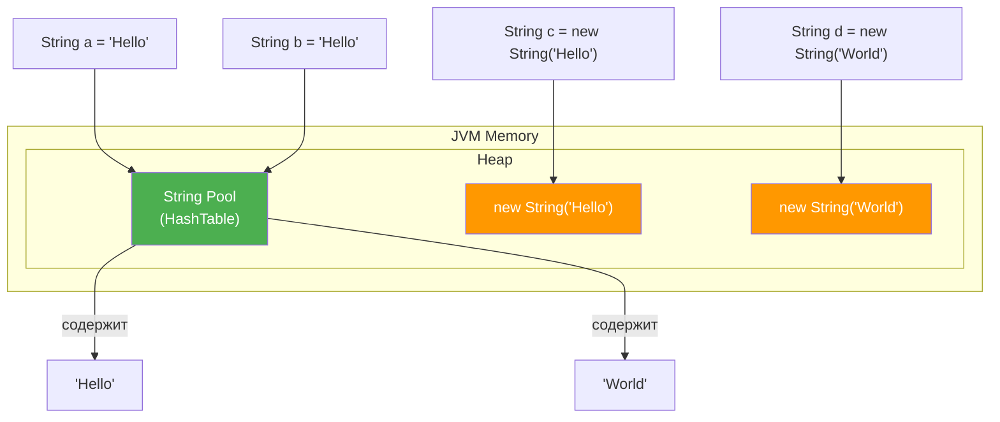
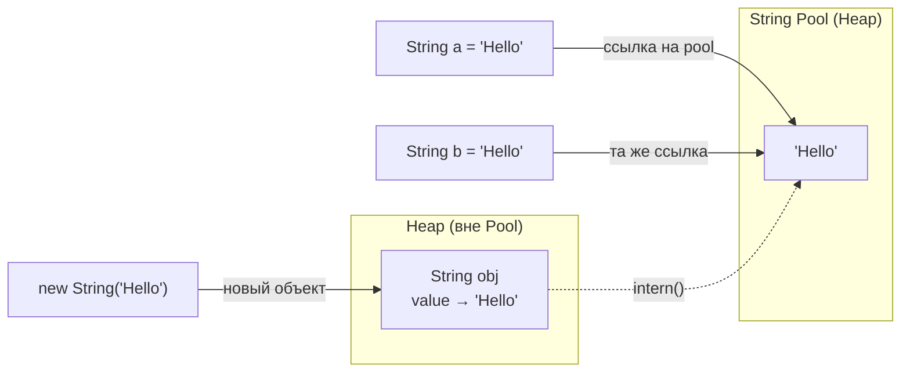

# Вопросы на собеседовании: `Java String`

Комплексное руководство по вопросам собеседования на тему `Java String` для `Senior Java Developer`. Включает детальные объяснения иммутабельности, `String Pool`, методов `intern()`, сравнение `StringBuilder`/`StringBuffer`, регулярные выражения, text blocks и современные `String API`.

## Полезные ссылки

### Официальная документация

- [Java String Documentation](https://docs.oracle.com/en/java/javase/17/docs/api/java.base/java/lang/String.html) — Javadoc класса `String`
- [Java Tutorial — Strings](https://docs.oracle.com/javase/tutorial/java/data/strings.html) — официальный туториал Oracle
- [JEP 254: Compact Strings](https://openjdk.org/jeps/254) — компактные строки в Java 9
- [JEP 378: Text Blocks](https://openjdk.org/jeps/378) — text blocks в Java 15

### Статьи

- [Java String Interview Questions — Baeldung](https://www.baeldung.com/java-string-interview-questions) — подборка вопросов с ответами
- [Guide to Java String Pool — Baeldung](https://www.baeldung.com/java-string-pool) — устройство String Pool
- [Why String Is Immutable in Java — Baeldung](https://www.baeldung.com/java-string-immutable) — причины иммутабельности
- [Compact Strings in Java — Baeldung](https://www.baeldung.com/java-9-compact-string) — компактные строки Java 9
- [String Performance Hints — Baeldung](https://www.baeldung.com/java-string-performance) — производительность строк

## Содержание

- [Полезные ссылки](#полезные-ссылки)
- [See also](#see-also)

**Основы: создание и внутреннее устройство**
- [Q1. (!) Что такое `String` и как он устроен внутри?](#q1--что-такое-string-и-как-он-устроен-внутри)
- [Q2. Как создать `String`?](#q2-как-создать-string)
- [Q3. Наследуется ли `String` от `Object`?](#q3-наследуется-ли-string-от-object)
- [Q4. Почему `String` объявлен как `final`?](#q4-почему-string-объявлен-как-final)

**Иммутабельность**
- [Q5. (!) Каковы преимущества иммутабельности `String`?](#q5--каковы-преимущества-иммутабельности-string)
- [Q6. (!) Как реализована иммутабельность `String` на уровне кода?](#q6--как-реализована-иммутабельность-string-на-уровне-кода)
- [Q7. Можно ли изменить содержимое `String` через Reflection?](#q7-можно-ли-изменить-содержимое-string-через-reflection)
- [Q8. (!) Является ли `String` потокобезопасным?](#q8--является-ли-string-потокобезопасным)

**Память, `String Pool` и интернирование**
- [Q9. (!) Что такое `String Pool` и где он расположен?](#q9--что-такое-string-pool-и-где-он-расположен)
- [Q10. (!) Как `String` хранится в памяти?](#q10--как-string-хранится-в-памяти)
- [Q11. (!) Что делает метод `String.intern()`?](#q11--что-делает-метод-stringintern)
- [Q12. Подходят ли интернированные `String` для сборки мусора?](#q12-подходят-ли-интернированные-string-для-сборки-мусора)
- [Q13. Что такое Compact Strings (Java 9)?](#q13-что-такое-compact-strings-java-9)
- [Q14. Что такое String Deduplication в G1 GC?](#q14-что-такое-string-deduplication-в-g1-gc)

**Сравнение строк**
- [Q15. (!) В чём разница между `==` и `equals()` для строк?](#q15--в-чём-разница-между--и-equals-для-строк)
- [Q16. Как правильно сравнивать строки без учёта регистра?](#q16-как-правильно-сравнивать-строки-без-учёта-регистра)
- [Q17. Что такое `Locale` и зачем он нужен при работе со строками?](#q17-что-такое-locale-и-зачем-он-нужен-при-работе-со-строками)
- [Q18. Какая базовая кодировка для `String`?](#q18-какая-базовая-кодировка-для-string)

**`StringBuilder`, `StringBuffer` и конкатенация**
- [Q19. (!) Разница между `String`, `StringBuffer` и `StringBuilder`?](#q19--разница-между-string-stringbuffer-и-stringbuilder)
- [Q20. (!) Как эффективно конкатенировать много строк?](#q20--как-эффективно-конкатенировать-много-строк)
- [Q21. Что такое `StringJoiner` и `Collectors.joining()`?](#q21-что-такое-stringjoiner-и-collectorsjoining)
- [Q22. Как компилятор оптимизирует конкатенацию строк?](#q22-как-компилятор-оптимизирует-конкатенацию-строк)

**Преобразования и форматирование**
- [Q23. Как разделить `String`?](#q23-как-разделить-string)
- [Q24. Как преобразовать `String` в int и обратно?](#q24-как-преобразовать-string-в-int-и-обратно)
- [Q25. Что такое `String.format()` и `formatted()`?](#q25-что-такое-stringformat-и-formatted)
- [Q26. Как преобразовать `String` в верхний и нижний регистр?](#q26-как-преобразовать-string-в-верхний-и-нижний-регистр)
- [Q27. Как получить `char[]` и `byte[]` из `String`?](#q27-как-получить-char-и-byte-из-string)

**Регулярные выражения**
- [Q28. (!) Как работать с регулярными выражениями (`Pattern`, `Matcher`)?](#q28--как-работать-с-регулярными-выражениями-pattern-matcher)
- [Q29. Какие методы `String` используют regex под капотом?](#q29-какие-методы-string-используют-regex-под-капотом)

**Алгоритмы и типичные задачи**
- [Q30. Как проверить, являются ли две строки анаграммами?](#q30-как-проверить-являются-ли-две-строки-анаграммами)
- [Q31. Как перевернуть `String`?](#q31-как-перевернуть-string)
- [Q32. Как проверить, является ли `String` палиндромом?](#q32-как-проверить-является-ли-string-палиндромом)
- [Q33. Как подсчитать количество вхождений символа в строку?](#q33-как-подсчитать-количество-вхождений-символа-в-строку)

**Современные возможности (Java 11+)**
- [Q34. (!) Что такое text blocks (Java 15+) и зачем они нужны?](#q34--что-такое-text-blocks-java-15-и-зачем-они-нужны)
- [Q35. Что такое `String.isBlank()` и `String.strip()` (Java 11)?](#q35-что-такое-stringisblank-и-stringstrip-java-11)
- [Q36. Как разбить строку по переводу строки?](#q36-как-разбить-строку-по-переводу-строки)
- [Q37. Чем отличаются `repeat()`, `indent()` и `transform()` (Java 11+)?](#q37-чем-отличаются-repeat-indent-и-transform-java-11)
- [Q38. Что такое String Templates (Java 21+)?](#q38-что-такое-string-templates-java-21)

**Безопасность**
- [Q39. (!) Почему безопаснее хранить пароли в `char[]`, а не в `String`?](#q39--почему-безопаснее-хранить-пароли-в-char-а-не-в-string)

---

## Q1. (!) Что такое `String` и как он устроен внутри?

`String` в `Java` -- это неизменяемый (immutable) объект, инкапсулирующий последовательность символов. Сам символьный массив строка не отдаёт наружу и не позволяет менять, поэтому содержимое нельзя изменить после создания. Внутреннее устройство этого массива менялось с версиями Java:

- **Java 8 и ранее**: строка хранит данные в `char[]` -- массиве 16-битных символов `UTF-16`. Каждый символ занимает 2 байта независимо от того, ASCII он или нет
- **Java 9+** (`JEP 254` -- Compact Strings): данные хранятся в `byte[]` плюс флаг `coder`. Если все символы строки помещаются в один байт -- используется `Latin-1` (1 байт на символ), иначе -- `UTF-16` (2 байта). Это даёт экономию памяти на ASCII-строках, которых в реальных приложениях большинство

```java
// Внутренняя структура String (Java 9+, упрощённо)
public final class String implements Serializable, Comparable<String>, CharSequence {
    @Stable
    private final byte[] value;  // данные строки
    private final byte coder;    // LATIN1 = 0, UTF16 = 1
    private int hash;            // кэшированный хэш-код
}
```

Главное: изменение прозрачно для разработчика. Публичный API `String` остался прежним, код переписывать не нужно, а потребление памяти на типичных приложениях снизилось на 10-15%.

## Q2. Как создать `String`?

Два принципиально разных пути -- литерал и `new` (плюс конструкторы из массивов). Разница между ними не косметическая: литерал переиспользует объект из пула, а `new` всегда создаёт новый.

```java
// 1. Строковый литерал — берётся из String Pool
String s1 = "Hello";

// 2. Через new — всегда создаётся новый объект в heap
String s2 = new String("Hello");

// 3. Из массива символов
char[] chars = {'H', 'e', 'l', 'l', 'o'};
String s3 = new String(chars);

// 4. Из массива байтов с указанием кодировки
byte[] bytes = {72, 101, 108, 108, 111};
String s4 = new String(bytes, StandardCharsets.UTF_8);
```

**Ключевое различие.** Литерал `"Hello"` попадает в `String Pool` и переиспользуется: два одинаковых литерала -- это одна и та же ссылка. А `new String("Hello")` всегда создаёт отдельный объект в heap, даже если такая строка уже есть в пуле (при этом сам литерал `"Hello"` всё равно туда попадает). Поэтому `new` в подавляющем большинстве случаев не нужен -- он лишь тратит память на лишний объект.

## Q3. Наследуется ли `String` от `Object`?

Да. `String` -- обычный класс-наследник `Object`, как и любой другой класс в Java. Но JVM и компилятор дают ему привилегии, которых нет у других объектов, поэтому в коде он ведёт себя почти как примитив:

1. **Литеральный синтаксис**: `String s = "abc"` -- без `new`, как у примитива
2. **Оператор `+`**: конкатенация через `+` (для остальных объектов перегрузки операторов в Java нет)
3. **`String Pool`**: отдельная область памяти, где одинаковые литералы переиспользуются
4. **`switch`**: строку можно подавать в `switch` (с Java 7)

При этом под капотом это полноценный объект со своими методами и иерархией наследования.

```java
// String ведёт себя как примитив, но это полноценный объект
String s = "test";
s.getClass();         // class java.lang.String
s instanceof Object;  // true
```

## Q4. Почему `String` объявлен как `final`?

`final` запрещает наследование, и для `String` это сознательное решение: подкласс мог бы сломать гарантии, на которых держится весь язык.

```java
public final class String { ... }
```

Что именно ломал бы наследник:
1. **Иммутабельность**: подкласс мог бы добавить мутабельные поля или переопределить методы так, что содержимое стало бы изменяемым -- а на неизменности строки строится всё остальное в этом списке
2. **Безопасность**: имея подкласс `String`, можно было бы подменить методы и, например, поменять путь к файлу или URL уже после того, как код прошёл проверку безопасности
3. **Корректность `hashCode()`**: `String` кэширует свой `hashCode`; это работает только пока строка неизменна. Без этого сломалось бы использование строк как ключей `HashMap`/`HashSet` (см. [Java Collections](java-collections-interview.md))
4. **Оптимизации JVM**: зная, что класс `final` и не имеет наследников, JVM применяет более агрессивные оптимизации (например, девиртуализацию вызовов)

## Q5. (!) Каковы преимущества иммутабельности `String`?

Иммутабельность -- одно из ключевых архитектурных решений в Java: почти все «бесплатные» свойства строки вытекают именно из того, что её содержимое нельзя изменить.

1. **`String Pool` вообще возможен только благодаря этому**: пул переиспользует один объект для всех одинаковых литералов. Если бы строку можно было менять, правка через одну ссылку незаметно изменила бы значение у всех остальных
2. **Потокобезопасность бесплатно**: неизменяемый объект безопасно читать из любого числа потоков без синхронизации -- менять-то нечего, поэтому гонок данных нет (подробнее в [Java Concurrency](java-concurrency-interview.md))
3. **Безопасность**: значение, прошедшее проверку, уже нельзя подменить -- имя файла, URL или SQL-запрос остаются теми, что проверили
4. **Кэширование `hashCode`**: хэш вычисляется один раз и кэшируется в поле `hash`. Это законно лишь потому, что строка не меняется, и заметно ускоряет работу с `HashMap`/`HashSet`
5. **Надёжный ключ**: строки повсеместно служат ключами `Map` и элементами `Set`. Если бы ключ можно было изменить после вставки, его `hashCode` разошёлся бы с корзиной -- и структура данных сломалась бы

```java
// hashCode вычисляется лениво и кэшируется
String key = "important";
Map<String, Integer> map = new HashMap<>();
map.put(key, 42);
// Если бы String был мутабельный и key изменился,
// map.get(key) мог бы вернуть null
```

## Q6. (!) Как реализована иммутабельность `String` на уровне кода?

Одного `final`-поля недостаточно: оно лишь запрещает переназначить ссылку на массив, но не мешает менять элементы массива. Поэтому иммутабельность держится сразу на нескольких приёмах, работающих вместе:

```java
public final class String {           // 1. final класс — нельзя наследовать
    private final byte[] value;        // 2. final поле — нельзя переназначить
    // 3. Нет сеттеров и мутирующих методов
    // 4. Все методы возвращают новый String
    // 5. Defensive copy при создании из char[]/byte[]
}
```

Как это работает в совокупности:
- Класс `final` -- нет наследников, способных добавить мутирующее поведение
- Массив `private` -- наружу не отдаётся, прямого доступа к нему нет
- Нет ни одного метода, меняющего `value`. «Изменяющие» методы (`substring()`, `replace()`, `toUpperCase()`) не трогают исходную строку, а возвращают **новый** объект `String`
- Конструктор `String(char[])` копирует переданный массив (defensive copy), а не сохраняет ссылку на него -- иначе вызывающий код мог бы менять символы строки извне после создания

## Q7. Можно ли изменить содержимое `String` через Reflection?

Технически -- да: через Reflection можно добраться до приватного поля `value` и подменить его. Но это грубый хак, который нарушает контракт неизменности и почти всегда ломает программу.

```java
String s = "Hello";
Field valueField = String.class.getDeclaredField("value");
valueField.setAccessible(true); // в Java 9+ может бросить InaccessibleObjectException
valueField.set(s, "World".getBytes()); // ОПАСНО!
```

Современные версии Java активно этому сопротивляются: с Java 9 модульная система (`JPMS`) закрывает доступ к внутренним полям `java.base`, а с Java 16 `--illegal-access=deny` стал поведением по умолчанию, так что `setAccessible(true)` тут уже бросает исключение.

Почему этого **нельзя** делать, даже если доступ удалось получить:
- **Заражает `String Pool`**: если изменить литерал, все ссылки на ту же строку в пуле «увидят» новое значение -- баг прилетит в совершенно несвязанном коде
- **Ломает кэш `hashCode`**: содержимое поменялось, а закэшированный хэш остался старым
- **Делает непредсказуемыми `HashMap`, `HashSet` и логи**: объект попал в корзину по старому хэшу, а теперь у него другое содержимое -- `get()` его уже не найдёт

## Q8. (!) Является ли `String` потокобезопасным?

Да, `String` потокобезопасен -- и это следствие иммутабельности, а не отдельной синхронизации:

- **Менять нечего**: после создания состояние объекта не меняется, поэтому два потока физически не могут «испортить» его одновременно -- race condition невозможен в принципе
- **Безопасная публикация**: `final`-поля гарантируют, что любой поток, получивший ссылку, увидит полностью сконструированный объект (гарантия happens-before из `JMM`) -- без частично проинициализированных значений
- **Все методы read-only**: `substring()`, `charAt()`, `length()` только читают неизменяемые данные и не пишут в общий стейт

```java
// String можно безопасно разделять между потоками без синхронизации
private static final String SHARED = "shared-config-value";

// Но если вам нужна мутабельная строка в многопоточном контексте:
StringBuffer sb = new StringBuffer(); // потокобезопасный
// НЕ StringBuilder — он НЕ потокобезопасный
```

Подробнее о потокобезопасности и `happens-before` -- в [Java Concurrency](java-concurrency-interview.md).

## Q9. (!) Что такое `String Pool` и где он расположен?

`String Pool` (пул строк) -- внутренняя хэш-таблица JVM, где хранится по одному экземпляру каждого уникального строкового литерала. Смысл прост: одинаковые литералы не дублируются в памяти, а ссылаются на один и тот же объект. Это работает только потому, что строки иммутабельны (см. Q5) -- иначе общий объект нельзя было бы безопасно переиспользовать.



**Где он лежит -- и почему это менялось.** Расположение важно потому, что от него зависит, может ли пул переполниться и собирается ли он GC:
- **Java 6 и ранее**: в `PermGen` -- области фиксированного размера, не подлежащей сборке мусора. Активный `intern()` легко приводил к `OutOfMemoryError: PermGen space`
- **Java 7+**: пул перенесён в обычный `Heap`. Теперь неиспользуемые строки из пула собираются GC, и проблема переполнения почти исчезла
- **Java 8**: `PermGen` целиком заменён на `Metaspace`, но `String Pool` к тому моменту уже жил в `Heap`

Размер хэш-таблицы пула настраивается флагом `-XX:StringTableSize` (по умолчанию ~60013 бакетов в Java 11+); чем больше бакетов, тем быстрее поиск при большом числе интернированных строк. Подробнее об управлении памятью JVM -- в [JVM](../../jvm/jvm-interview.md) и [Управление памятью](../../performance/memory-management-interview.md).

## Q10. (!) Как `String` хранится в памяти?



```java
String s1 = "Hello";              // литерал → String Pool
String s2 = "Hello";              // тот же объект из Pool
String s3 = new String("Hello");  // новый объект в heap
String s4 = s3.intern();          // ссылка на Pool

System.out.println(s1 == s2);     // true  — одна ссылка из Pool
System.out.println(s1 == s3);     // false — разные объекты
System.out.println(s1 == s4);     // true  — intern() вернул ссылку из Pool
```

При создании `new String("Hello")` создаётся **до двух объектов**:
1. Литерал `"Hello"` в `String Pool` (если его там ещё нет)
2. Новый объект `String` в обычном heap

## Q11. (!) Что делает метод `String.intern()`?

`intern()` принудительно кладёт строку в `String Pool` и возвращает её каноническую версию из пула. Это позволяет вручную добиться того, что для литералов происходит автоматически: одинаковое содержимое -- одна и та же ссылка.

Алгоритм метода:
- Если строка с таким содержимым **уже есть** в пуле -- вернётся ссылка на существующий объект (ваш исходный объект остаётся в heap и может быть собран GC)
- Если **нет** -- строка добавляется в пул, и возвращается ссылка на неё

```java
String s1 = "Baeldung";                      // автоматически в Pool
String s2 = new String("Baeldung");          // новый объект в heap
String s3 = new String("Baeldung").intern(); // возвращает ссылку из Pool

System.out.println(s1 == s2);  // false — разные объекты
System.out.println(s1 == s3);  // true  — intern() нашёл в Pool
```

**Когда применять.** Выгода появляется только при большом числе повторов из ограниченного словаря значений:
- Парсинг больших файлов с повторяющимися строками (XML-теги, имена CSV-колонок, ключи)
- Экономия памяти при массовой обработке данных, где значений мало, а самих строк -- много

**Когда не стоит.** Для уникальных или редко повторяющихся строк `intern()` только вредит:
- Для уникальных строк экономии нет -- лишь накладные расходы на поиск и вставку в пул
- При неконтролируемом массовом интернировании пул раздувается, а поиск в нём замедляется, и можно упереться в память

## Q12. Подходят ли интернированные `String` для сборки мусора?

Да -- начиная с Java 7. Ответ напрямую зависит от того, где живёт пул:

| Аспект | Java 6 и ранее | Java 7+ |
|--------|---------------|---------|
| Расположение Pool | `PermGen` | `Heap` |
| GC для Pool | Не собирается | Собирается GC |
| Риски | `OutOfMemoryError: PermGen` | Минимальные |

С Java 7 пул переехал в обычный heap, поэтому интернированная строка собирается GC, как только на неё не остаётся живых ссылок. Важный нюанс: строковые литералы, записанные прямо в коде, на практике не собираются -- их удерживает константный пул класса, и живут они столько же, сколько загрузивший класс `ClassLoader` (обычно -- всё время работы приложения).

```java
// Эта строка НЕ будет собрана GC — литерал из кода
String literal = "permanent";

// Эта строка может быть собрана GC после обнуления ссылки
String interned = new String("temp-" + System.nanoTime()).intern();
interned = null; // теперь может быть собрана, если нет других ссылок
```

## Q13. Что такое Compact Strings (Java 9)?

`Compact Strings` (`JEP 254`) -- оптимизация внутреннего представления строк в Java 9. Идея: раньше `char[]` тратил по 2 байта на каждый символ, даже на ASCII, где старший байт всегда нулевой. Теперь данные хранятся в `byte[]`, а кодировка выбирается адаптивно по содержимому:

```java
// Latin-1 строка (1 байт на символ) — 5 байт
String ascii = "Hello";     // coder = LATIN1

// UTF-16 строка (2 байта на символ) — 12 байт
String unicode = "Привет";  // coder = UTF16
```

**Результат**: на типичных приложениях, где большинство строк -- ASCII, потребление памяти под строки падает на 10-15%. Оптимизация полностью прозрачна: публичный API `String` не изменился, переписывать код не нужно.

**Отключение**: можно вернуть старое поведение флагом `-XX:-CompactStrings`, но на практике это почти никогда не оправдано.

## Q14. Что такое String Deduplication в G1 GC?

`String Deduplication` -- оптимизация сборщика мусора: GC находит разные объекты `String` с одинаковым содержимым и заставляет их делить один и тот же внутренний массив `byte[]`. Сами объекты остаются разными, но дублирующиеся данные схлопываются в одну копию -- так экономится память без участия программиста.

```bash
# Включение (G1 GC)
java -XX:+UseG1GC -XX:+UseStringDeduplication -jar app.jar

# Доступно также в ZGC, Serial GC, Parallel GC (с Java 18)
```

**Чем отличается от `intern()`** -- их часто путают, но уровень работы разный:
- `intern()` схлопывает на уровне **самих объектов** `String`: остаётся один объект в пуле, и все ссылки указывают на него
- `String Deduplication` схлопывает на уровне внутреннего массива: объектов `String` остаётся столько же, но их `byte[]` -- общий
- `intern()` вызывает программист явно; deduplication GC делает сам, автоматически

**Когда срабатывает.** Только для долгоживущих строк, переживших несколько циклов GC (свежие объекты не трогаются, чтобы не тратить время впустую). Реальный выигрыш -- в приложениях с большим количеством одинаковых строк.

## Q15. (!) В чём разница между `==` и `equals()` для строк?

Коротко: `==` сравнивает ссылки (тот же это объект в памяти или нет), а `equals()` -- содержимое (одинаковые ли символы). Для строк почти всегда нужно содержимое, поэтому правильный выбор -- `equals()`. Это один из самых частых вопросов на собеседовании, и подвох в том, что для литералов из пула `==` иногда «случайно» возвращает `true`, создавая ложное ощущение, что он работает.

```java
String s1 = "Hello";
String s2 = "Hello";
String s3 = new String("Hello");

// == сравнивает ССЫЛКИ (адреса в памяти)
System.out.println(s1 == s2);      // true  — оба из String Pool
System.out.println(s1 == s3);      // false — разные объекты

// equals() сравнивает СОДЕРЖИМОЕ
System.out.println(s1.equals(s3)); // true  — одинаковое содержимое

// intern() позволяет использовать == для содержимого
System.out.println(s1 == s3.intern()); // true
```

**Правило**: всегда используйте `equals()` для сравнения строк. Оператор `==` допустим только если вы **осознанно** сравниваете ссылки (например, после `intern()`).

**Нюанс**: `"Hello" == "Hel" + "lo"` вернёт `true`, потому что компилятор выполняет конкатенацию литералов на этапе компиляции.

## Q16. Как правильно сравнивать строки без учёта регистра?

Предпочтительный способ -- `equalsIgnoreCase()`: он сравнивает строки посимвольно **без учёта регистра** и не создаёт промежуточных строк. Приведение обеих строк к одному регистру тоже работает, но порождает два временных объекта и требует явного `Locale`.

```java
String s1 = "Hello";
String s2 = "hello";

// Способ 1: equalsIgnoreCase()
s1.equalsIgnoreCase(s2); // true

// Способ 2: привести к одному регистру (менее предпочтительно)
s1.toLowerCase(Locale.ROOT).equals(s2.toLowerCase(Locale.ROOT));

// ВАЖНО: указывайте Locale для корректности!
// Турецкая "I" → "ı" (без точки), а не "i"
"TITLE".toLowerCase(Locale.forLanguageTag("tr")); // "tıtle"
"TITLE".toLowerCase(Locale.ENGLISH);               // "title"
```

Почему `Locale` обязателен при втором способе: смена регистра зависит от языка. В турецкой локали `toLowerCase` превращает `I` в `ı` (без точки), и две «одинаковые» технические строки внезапно перестают совпадать. Эта «турецкая проблема» -- классический баг в коде, который сравнивает идентификаторы через приведение регистра без указания локали.

**Рекомендация**: для строк, не зависящих от языка (идентификаторы, enum-ы, имена заголовков, технические значения), всегда указывайте `Locale.ROOT` -- он даёт стабильный результат на любой машине независимо от системной локали.

## Q17. Что такое `Locale` и зачем он нужен при работе со строками?

`Locale` -- это набор языковых и культурных параметров (язык, страна, иногда вариант письма), от которых зависит, как обрабатывается строка. Одна и та же операция при разной локали даёт разный результат, поэтому для строк, чувствительных к языку, локаль нужно задавать явно -- иначе подставится системная, и поведение будет отличаться от машины к машине.

```java
// Форматирование чисел зависит от локали
String.format(Locale.US, "%,.2f", 1234.56);     // "1,234.56"
String.format(Locale.GERMANY, "%,.2f", 1234.56); // "1.234,56"

// Преобразование регистра зависит от локали
"straße".toUpperCase(Locale.GERMAN);  // "STRASSE" (ß → SS)
```

Операции, зависящие от `Locale`:
1. **Преобразование регистра**: `toUpperCase()`, `toLowerCase()`
2. **Форматирование**: `String.format()`, `NumberFormat`, `DateFormat`
3. **Сортировка строк**: `Collator.getInstance(locale)`
4. **Сравнение**: `compareToIgnoreCase()` -- турецкая проблема с `I`/`ı`

## Q18. Какая базовая кодировка для `String`?

Логическая модель `String` всегда одна и та же -- это `UTF-16`. Менялось лишь физическое хранение под капотом:

| Версия Java | Внутреннее представление | Кодировка |
|-------------|------------------------|-----------|
| Java 1.0 - 8 | `char[]` | `UTF-16` (2 байта на символ) |
| Java 9+ | `byte[]` + `coder` | `Latin-1` или `UTF-16` (адаптивно) |

Практическое следствие для разработчика -- в типе `char`. Он 16-битный и представляет один code unit `UTF-16`, а не один символ. Поэтому символы за пределами BMP (Basic Multilingual Plane) -- например, эмодзи -- кодируются **двумя** `char` (surrogate pair). Из-за этого `length()` считает code unit'ы, а не «видимые символы»:

```java
String emoji = "😀";
emoji.length();        // 2 (два char — surrogate pair)
emoji.codePointCount(0, emoji.length()); // 1 (один code point)
emoji.codePoints().count(); // 1
```

## Q19. (!) Разница между `String`, `StringBuffer` и `StringBuilder`?

Все три представляют последовательность символов, но различаются по двум осям -- изменяемость и потокобезопасность; из них вытекает и производительность, и сценарий применения.

- `String` -- неизменяемый: любое «изменение» создаёт новый объект
- `StringBuilder` -- изменяемый и **не** синхронизированный, поэтому самый быстрый
- `StringBuffer` -- то же, что `StringBuilder`, но методы `synchronized`, и за это платится скоростью

| Характеристика | `String` | `StringBuilder` | `StringBuffer` |
|---------------|----------|-----------------|----------------|
| Мутабельность | Immutable | Mutable | Mutable |
| Потокобезопасность | Да (immutable) | Нет | Да (synchronized) |
| Производительность | Новый объект на каждое изменение | Быстрый | Медленнее из-за `synchronized` |
| Когда использовать | Константы, ключи | Однопоточные операции | Многопоточные операции (редко) |

```java
// StringBuilder — основной выбор для мутабельных строк
StringBuilder sb = new StringBuilder(64); // указывайте capacity!
for (String part : parts) {
    sb.append(part).append(", ");
}
String result = sb.toString();

// StringBuffer — только когда строку строят несколько потоков
StringBuffer sbuf = new StringBuffer();
// synchronized методы: append(), insert(), delete()...
```

**На практике** `StringBuffer` почти не используется. Для многопоточных сценариев лучше собрать строку в каждом потоке отдельно и объединить результаты. Подробнее -- в [Java Concurrency](java-concurrency-interview.md).

## Q20. (!) Как эффективно конкатенировать много строк?

Главное правило: никогда не конкатенируйте строки через `+` в цикле. Каждая итерация порождает новый объект и копирует уже накопленное -- получается квадратичная сложность. Правильные инструменты -- `StringBuilder` (с заранее заданным capacity), `String.join()` или `Collectors.joining()`.

```java
// ❌ ПЛОХО: конкатенация в цикле через +
String result = "";
for (String s : list) {
    result += s; // каждая итерация создаёт новый String!
}

// ✅ ХОРОШО: StringBuilder с заданным capacity
StringBuilder sb = new StringBuilder(list.size() * 20);
for (String s : list) {
    sb.append(s);
}
String result = sb.toString();

// ✅ ХОРОШО: String.join()
String result = String.join(", ", list);

// ✅ ХОРОШО: Stream API
String result = list.stream()
    .collect(Collectors.joining(", ", "[", "]"));
```

**Почему `+` в цикле плох?** Каждая итерация создаёт новый `StringBuilder`, копирует накопленную строку, добавляет новую часть, вызывает `toString()`. Сложность -- O(n^2) по памяти.

**Однократная конкатенация** `String s = a + b + c` -- компилятор оптимизирует, `StringBuilder` не нужен.

## Q21. Что такое `StringJoiner` и `Collectors.joining()`?

Оба собирают строку из частей с разделителем -- и при этом сами корректно ставят разделитель только между элементами, без «висящей» запятой в конце. Разница в точке входа: `StringJoiner` работает императивно (через `add`), а `Collectors.joining()` -- это терминальная операция для Stream API.

```java
// StringJoiner — с разделителем, префиксом и суффиксом
StringJoiner joiner = new StringJoiner(", ", "[", "]");
joiner.add("Red").add("Green").add("Blue");
System.out.println(joiner); // [Red, Green, Blue]

// Пустой joiner с setEmptyValue
StringJoiner empty = new StringJoiner(", ", "[", "]");
empty.setEmptyValue("empty");
System.out.println(empty); // empty

// Collectors.joining() — аналог для Stream API
String colors = Stream.of("Red", "Green", "Blue")
    .collect(Collectors.joining(", ", "[", "]"));
// [Red, Green, Blue]

// String.join() — простейший вариант без Stream
String csv = String.join(",", "a", "b", "c"); // "a,b,c"
```

## Q22. Как компилятор оптимизирует конкатенацию строк?

Зависит от версии. До Java 9 компилятор разворачивал `a + b + c` в цепочку вызовов `StringBuilder`. С Java 9 (`JEP 280`) на этом месте генерируется `invokedynamic` -- вместо жёстко зашитой стратегии JVM сама выбирает оптимальную реализацию в рантайме:

```java
// Исходный код
String s = "Hello, " + name + "! Age: " + age;

// Java 8: компилятор генерирует
new StringBuilder().append("Hello, ").append(name)
    .append("! Age: ").append(age).toString();

// Java 9+: компилятор генерирует invokedynamic
// JVM сама выбирает оптимальную стратегию в рантайме
```

**Преимущества `invokedynamic`**:
- JVM может выбрать лучшую стратегию (предвычислить размер буфера, использовать `byte[]` напрямую)
- Не зависит от конкретной реализации `StringBuilder`
- Лучшая производительность (до 2x быстрее на микробенчмарках)

**Но в цикле** конкатенация по-прежнему создаёт объекты на каждой итерации -- используйте `StringBuilder`.

## Q23. Как разделить `String`?

Основной инструмент -- `split()`, но его главная ловушка в том, что аргумент трактуется как **регулярное выражение**, а не как обычная строка. Поэтому символы-спецсимволы regex (`.`, `|`, `\`, `*` и т.д.) нужно экранировать.

```java
// split() с regex
String[] parts = "john,peter,mary".split(",");
// ["john", "peter", "mary"]

// Осторожно с regex-спецсимволами!
"192.168.1.1".split("\\.");  // нужно экранировать точку
"a|b|c".split("\\|");        // и pipe

// split с лимитом
"a,b,c,d".split(",", 2);     // ["a", "b,c,d"]
"a,b,c,".split(",");         // ["a", "b", "c"] — trailing пустые удаляются
"a,b,c,".split(",", -1);     // ["a", "b", "c", ""] — все элементы

// Хитрость: пустая строка
"".split(",");     // [""] — массив с одним пустым элементом!
"".split(",", -1); // [""]
```

**Подводный камень** -- хвостовые пустые строки: по умолчанию `split` отбрасывает пустые элементы в конце, а параметр `-1` их сохраняет (см. примеры с `"a,b,c,"` выше). Об этом легко забыть, парся CSV.

Для частого разбиения по одному и тому же шаблону используйте предкомпилированный `Pattern.compile(regex).split(input)` -- это избавляет от повторной компиляции regex на каждом вызове.

## Q24. Как преобразовать `String` в int и обратно?

В обе стороны работают статические методы класса `Integer` и `String`. Главное -- помнить, что при невалидном вводе разбор кидает `NumberFormatException` (unchecked), и его нужно осознанно обрабатывать.

```java
// String → int
int num = Integer.parseInt("42");           // 42
int hex = Integer.parseInt("FF", 16);       // 255
Integer wrapped = Integer.valueOf("42");    // кэшированный Integer

// int → String
String s1 = Integer.toString(42);           // "42"
String s2 = String.valueOf(42);             // "42"
String s3 = "" + 42;                        // "42" (менее читаемо)

// Обработка ошибок
try {
    int bad = Integer.parseInt("not a number");
} catch (NumberFormatException e) {
    // Всегда обрабатывайте!
}
```

**Различие `parseInt()` и `valueOf()`**: `parseInt()` возвращает примитив `int`, а `valueOf()` -- объект `Integer` (с кэшированием для значений -128..127). Когда нужен именно примитив, берите `parseInt()` -- он не создаёт обёртку. `valueOf()` уместен, если результат сразу кладётся в коллекцию или `Optional`, где всё равно нужен `Integer`.

## Q25. Что такое `String.format()` и `formatted()`?

Оба строят строку по шаблону со спецификаторами (`%s`, `%d`, `%f`...) -- это идиоматичная замена ручной конкатенации, когда нужен контроль над форматом. Разница чисто синтаксическая: `String.format()` -- статический метод, а `formatted()` (с Java 15) -- метод экземпляра, вызываемый прямо на шаблоне, что особенно удобно с text blocks.

```java
// String.format() — статический метод
String msg = String.format("User %s has %d items", "John", 5);

// formatted() — instance метод (Java 15+)
String msg = "User %s has %d items".formatted("John", 5);

// С локалью
String price = String.format(Locale.US, "$%,.2f", 1234.567);
// "$1,234.57"

// Основные спецификаторы
// %s — строка, %d — целое число, %f — дробное, %n — перенос строки
// %tF — дата ISO, %tT — время, %b — boolean
String info = String.format(
    "Name: %s%nAge: %d%nScore: %.1f%%",
    "Alice", 30, 95.5
);
```

## Q26. Как преобразовать `String` в верхний и нижний регистр?

Методы `toUpperCase()` и `toLowerCase()` возвращают новую строку (исходная не меняется -- `String` иммутабелен). Ключевое правило: всегда передавайте `Locale`, иначе подставится системная локаль, и на разных машинах результат может отличаться (та же «турецкая проблема», что в Q16).

```java
String s = "Welcome to Java!";

// Всегда указывайте Locale!
s.toUpperCase(Locale.US);   // "WELCOME TO JAVA!"
s.toLowerCase(Locale.UK);   // "welcome to java!"

// Для технических строк — Locale.ROOT
"Content-Type".toLowerCase(Locale.ROOT); // "content-type"

// Без Locale — используется дефолтная локаль системы
// ОПАСНО: может давать неожиданные результаты в разных средах
s.toUpperCase(); // зависит от Locale.getDefault()
```

## Q27. Как получить `char[]` и `byte[]` из `String`?

`char[]` -- это символы (code unit'ы `UTF-16`), а `byte[]` -- байты в конкретной кодировке. Поэтому для `char[]` всё однозначно, а для `byte[]` обязательно указывайте кодировку явно: без неё применяется платформенная, и результат становится непредсказуемым между средами.

```java
// String → char[]
char[] chars = "hello".toCharArray();
// ['h', 'e', 'l', 'l', 'o']

// String → byte[] (ВСЕГДА указывайте кодировку!)
byte[] utf8 = "hello".getBytes(StandardCharsets.UTF_8);
byte[] ascii = "hello".getBytes(StandardCharsets.US_ASCII);

// byte[] → String
String s = new String(utf8, StandardCharsets.UTF_8);

// ⚠️ Без кодировки — используется платформенная, результат непредсказуем
byte[] bad = "hello".getBytes(); // НЕ делайте так в продакшене
```

## Q28. (!) Как работать с регулярными выражениями (`Pattern`, `Matcher`)?

Работа с regex в Java разделена на два класса из `java.util.regex`: `Pattern` -- это **скомпилированный** шаблон (компиляция дорогая, поэтому делается один раз), а `Matcher` -- одноразовый «движок», который применяет этот шаблон к конкретной входной строке и хранит состояние поиска. Типичный путь: `Pattern.compile(...)` → `pattern.matcher(input)` → `matches()` / `find()` / `replaceAll()`.

```java
// Компиляция паттерна (делайте ОДИН раз, используйте многократно)
private static final Pattern EMAIL_PATTERN =
    Pattern.compile("^[\\w.-]+@[\\w.-]+\\.[a-zA-Z]{2,}$");

// Проверка
boolean valid = EMAIL_PATTERN.matcher("user@example.com").matches();

// Поиск и группы захвата
Pattern datePattern = Pattern.compile("(\\d{4})-(\\d{2})-(\\d{2})");
Matcher m = datePattern.matcher("Date: 2026-04-12");
if (m.find()) {
    String year  = m.group(1); // "2026"
    String month = m.group(2); // "04"
    String day   = m.group(3); // "12"
}

// Именованные группы (Java 7+)
Pattern p = Pattern.compile("(?<year>\\d{4})-(?<month>\\d{2})");
Matcher m2 = p.matcher("2026-04");
if (m2.find()) {
    String year = m2.group("year"); // "2026"
}

// Замена
String result = Pattern.compile("\\d+")
    .matcher("abc123def456")
    .replaceAll("NUM"); // "abcNUMdefNUM"
```

**Производительность**: всегда компилируйте `Pattern` заранее в `static final` поле. Метод `String.matches(regex)` каждый раз компилирует паттерн заново.

## Q29. Какие методы `String` используют regex под капотом?

Часть «удобных» методов `String` -- это обёртки над `Pattern`, которые **компилируют regex заново при каждом вызове**. В цикле это заметно бьёт по производительности, поэтому regex стоит вынести в предкомпилированный `Pattern`. Отдельно есть методы без regex -- они работают с литералами и потому быстрее, когда шаблон не нужен.

```java
// Эти методы компилируют regex на КАЖДЫЙ вызов:
s.matches(regex);         // Pattern.compile(regex).matcher(s).matches()
s.split(regex);           // Pattern.compile(regex).split(s)
s.replaceAll(regex, rep); // Pattern.compile(regex).matcher(s).replaceAll(rep)
s.replaceFirst(regex, rep);

// Если вызываете в цикле — предкомпилируйте!
Pattern p = Pattern.compile(",");
for (String line : lines) {
    String[] parts = p.split(line); // быстрее чем line.split(",")
}

// Методы БЕЗ regex (быстрее):
s.replace("old", "new");     // литеральная замена, НЕ regex
s.contains("text");          // литеральный поиск
s.startsWith("prefix");
s.endsWith("suffix");
s.indexOf("sub");
```

## Q30. Как проверить, являются ли две строки анаграммами?

Анаграммы -- это строки из одинакового набора символов в разном порядке, поэтому задача сводится к проверке, что мультимножества символов совпадают. Два подхода: отсортировать обе строки и сравнить (`O(n log n)`, короткий код) или подсчитать частоты символов (`O(n)`, но требует знания алфавита). На собеседовании ценят именно второй -- он показывает понимание сложности.

```java
public static boolean areAnagrams(String s1, String s2) {
    if (s1.length() != s2.length()) return false;

    // Способ 1: сортировка
    char[] a = s1.toLowerCase(Locale.ROOT).toCharArray();
    char[] b = s2.toLowerCase(Locale.ROOT).toCharArray();
    Arrays.sort(a);
    Arrays.sort(b);
    return Arrays.equals(a, b);
}

// Способ 2: подсчёт символов (O(n), без сортировки)
public static boolean areAnagramsFast(String s1, String s2) {
    if (s1.length() != s2.length()) return false;
    int[] counts = new int[26]; // для ASCII букв
    for (char c : s1.toLowerCase(Locale.ROOT).toCharArray()) counts[c - 'a']++;
    for (char c : s2.toLowerCase(Locale.ROOT).toCharArray()) counts[c - 'a']--;
    for (int count : counts) if (count != 0) return false;
    return true;
}
```

Подробнее об алгоритмических задачах -- в [Алгоритмы](../../algorithms/algorithms-interview.md).

## Q31. Как перевернуть `String`?

Готовый и правильный ответ -- `StringBuilder.reverse()`: одна строка, и он корректно обрабатывает surrogate pairs (эмодзи и прочие символы вне BMP). Ручную итерацию указателями стоит показать, только если на собеседовании просят реализовать разворот «без библиотек».

```java
// Способ 1: StringBuilder.reverse()
String reversed = new StringBuilder("baeldung").reverse().toString();
// "gnudleab"

// Способ 2: ручная итерация
public static String reverse(String s) {
    char[] chars = s.toCharArray();
    int left = 0, right = chars.length - 1;
    while (left < right) {
        char temp = chars[left];
        chars[left++] = chars[right];
        chars[right--] = temp;
    }
    return new String(chars);
}

// ⚠️ Осторожно с surrogate pairs!
// "😀hello" — reverse() может сломать эмодзи
// Для Unicode-безопасного разворота используйте code points:
String safe = new StringBuilder("😀hi")
    .reverse().toString(); // StringBuilder.reverse() корректно обрабатывает surrogates
```

## Q32. Как проверить, является ли `String` палиндромом?

Палиндром читается одинаково слева направо и справа налево. Самый компактный способ -- развернуть строку и сравнить с исходной, но эффективнее идти двумя указателями с краёв к центру: это `O(n)` по времени и `O(1)` по памяти, без создания второй строки. На реальных задачах (вроде LeetCode «Valid Palindrome») обычно ещё требуется игнорировать регистр и не-буквенные символы -- для этого строку предварительно чистят.

```java
public static boolean isPalindrome(String s) {
    // Способ 1: через StringBuilder
    String reversed = new StringBuilder(s).reverse().toString();
    return s.equals(reversed);
}

// Способ 2: двумя указателями (эффективнее по памяти)
public static boolean isPalindromeTwoPointers(String s) {
    int left = 0, right = s.length() - 1;
    while (left < right) {
        if (s.charAt(left++) != s.charAt(right--)) return false;
    }
    return true;
}

// Способ 3: игнорируя не-буквенные символы
public static boolean isPalindromeClean(String s) {
    String clean = s.replaceAll("[^a-zA-Z0-9]", "").toLowerCase(Locale.ROOT);
    return isPalindromeTwoPointers(clean);
}

// isPalindromeClean("A man, a plan, a canal: Panama") → true
```

## Q33. Как подсчитать количество вхождений символа в строку?

Есть три типичных подхода: декларативный через Stream (`chars()` + `filter` + `count`), классический цикл по символам и трюк через `replace` + `length` (длина до и после удаления символа отличается ровно на число вхождений). Для подстрок последний приём тоже работает, но разницу длин нужно поделить на длину искомой подстроки.

```java
String text = "hello world";

// Способ 1: Stream API (Java 8+)
long count = text.chars()
    .filter(ch -> ch == 'l')
    .count(); // 3

// Способ 2: цикл
int count2 = 0;
for (char c : text.toCharArray()) {
    if (c == 'l') count2++;
}

// Способ 3: replace + length
int count3 = text.length() - text.replace("l", "").length(); // 3

// Подсчёт подстроки
long substringCount = (text.length()
    - text.replace("ll", "").length()) / 2; // 1
```

## Q34. (!) Что такое text blocks (Java 15+) и зачем они нужны?

Text blocks -- многострочные строковые литералы в тройных кавычках `"""`:

```java
// ❌ Без text blocks — тяжело читать
String json = "{\n" +
    "    \"name\": \"John\",\n" +
    "    \"age\": 30\n" +
    "}";

// ✅ С text blocks — чистый и читаемый код
String json = """
        {
            "name": "John",
            "age": 30
        }
        """;

// SQL
String sql = """
        SELECT u.name, u.email
        FROM users u
        WHERE u.active = true
        ORDER BY u.name
        """;

// HTML
String html = """
        <html>
            <body>
                <p>Hello, %s!</p>
            </body>
        </html>
        """.formatted("World");
```

**Ключевые правила:**
1. Открывающие `"""` должны быть на отдельной строке (после них -- перенос)
2. Закрывающие `"""` определяют уровень отступа (incidental whitespace удаляется)
3. Спецсимволы: `\s` (пробел, не удаляется strip), `\` в конце строки (продолжение без переноса)
4. Результат -- обычный `String`, можно вызывать все методы

## Q35. Что такое `String.isBlank()` и `String.strip()` (Java 11)?

Это Unicode-грамотные замены старых проверок и `trim()`, добавленные в Java 11. `isBlank()` отвечает на вопрос «строка пустая или состоит только из пробелов», а `strip()` обрезает пробелы по краям -- но, в отличие от `trim()`, понимает все Unicode-пробелы, а не только символы с кодом ≤ `U+0020`.

```java
// isBlank() — пустая или только пробельные символы
"".isBlank();       // true
"   ".isBlank();    // true
" hi ".isBlank();   // false

// strip() vs trim()
String s = "\u2003 Hello \u2003"; // \u2003 = Unicode em space

s.trim();           // "\u2003 Hello \u2003" — trim НЕ знает Unicode-пробелы
s.strip();          // "Hello"               — strip() понимает ВСЕ Unicode-пробелы

// Одностороннее удаление
"  Hello  ".stripLeading();   // "Hello  "
"  Hello  ".stripTrailing();  // "  Hello"
```

**Правило**: с Java 11 используйте `strip()` вместо `trim()`. `trim()` удаляет только символы с кодом <= `U+0020`, а `strip()` использует `Character.isWhitespace()` и корректно обрабатывает Unicode-пробелы.

## Q36. Как разбить строку по переводу строки?

Лучший выбор -- `String.lines()` (Java 11): он возвращает ленивый `Stream<String>` и сам распознаёт все варианты перевода строки (`\n`, `\r`, `\r\n`), не требуя возни с regex. Это снимает классическую проблему совместимости Windows/Unix-переносов.

```java
String text = "line1\nline2\r\nline3\rline4";

// Способ 1: String.lines() (Java 11) — самый чистый
text.lines().forEach(System.out::println);
// Возвращает Stream<String>, разделяя по \n, \r, \r\n

// Способ 2: split с универсальным regex
String[] lines = text.split("\\R"); // \R — любой перенос строки

// Способ 3: для файлов
List<String> fileLines = Files.readAllLines(Path.of("file.txt"));
// или лениво:
try (Stream<String> stream = Files.lines(Path.of("file.txt"))) {
    stream.filter(line -> !line.isBlank())
          .forEach(System.out::println);
}
```

## Q37. Чем отличаются `repeat()`, `indent()` и `transform()` (Java 11+)?

Это три независимых утилитных метода из Java 11-12, каждый решает свою задачу:
- `repeat(n)` -- повторяет строку n раз (удобно для разделителей и заполнителей)
- `indent(n)` -- добавляет (или при отрицательном n убирает) отступ у каждой строки и нормализует переводы строк
- `transform(fn)` -- применяет к строке функцию, позволяя выстроить цепочку преобразований в fluent-стиле вместо вложенных вызовов

```java
// repeat(int n) — Java 11: повторяет строку
"ab".repeat(3);           // "ababab"
"-".repeat(40);           // "----------------------------------------"

// indent(int n) — Java 12: добавляет/удаляет отступ
"hello\nworld".indent(4);
// "    hello\n    world\n"

"    hello".indent(-2);
// "  hello\n"

// transform(Function) — Java 12: цепочка преобразований
String result = "  Hello, World!  "
    .transform(String::strip)
    .transform(s -> s.replace("World", "Java"))
    .transform(String::toLowerCase);
// "hello, java!"
```

Все методы возвращают **новую строку** -- иммутабельность `String` не нарушается.

## Q38. Что такое String Templates (Java 21+)?

String Templates -- механизм интерполяции строк (вставки выражений прямо в литерал через `\{...}`), появившийся как preview feature в Java 21. Ключевое отличие от обычной конкатенации -- не просто синтаксис покороче, а возможность безопасно валидировать и экранировать вставляемые значения через template processor:

```java
// String Templates (Java 21 preview)
String name = "World";
int age = 30;

// STR processor — простая интерполяция
String msg = STR."Hello, \{name}! Age: \{age}";
// "Hello, World! Age: 30"

// Выражения внутри \{...}
String info = STR."Sum: \{2 + 3}, Upper: \{name.toUpperCase()}";

// FMT processor — с форматированием
String formatted = FMT."Price: %.2f\{price} EUR";
```

**Преимущество перед конкатенацией**: безопасность. Template processor (`STR`, `FMT` или ваш собственный) получает части шаблона и значения по отдельности и может их валидировать и экранировать -- например, защититься от SQL-инъекции или XSS, чего голая конкатенация не умеет.

**Важно**: это preview feature, API ещё может измениться. На Java 21-23 требуется флаг `--enable-preview`, поэтому в стабильных проектах пока используйте `String.format()` или `formatted()`.

## Q39. (!) Почему безопаснее хранить пароли в `char[]`, а не в `String`?

Корень проблемы -- иммутабельность: `String` нельзя очистить вручную, и пароль остаётся лежать в памяти до сборки мусора (а литерал в `String Pool` -- фактически навсегда), расширяя окно для атаки через heap dump. `char[]` -- массив изменяемый, поэтому сразу после использования его можно затереть нулями.

```java
// ❌ String — пароль остаётся в памяти
String password = "secret123";
// После использования:
password = null;
// НО! "secret123" всё ещё в String Pool или heap
// до следующей сборки мусора (или навсегда, если в Pool)

// ✅ char[] — можно обнулить вручную
char[] password = {'s','e','c','r','e','t','1','2','3'};
try {
    authenticate(password);
} finally {
    Arrays.fill(password, '\0'); // явно затираем
}
```

Причины:
1. **Иммутабельность `String`**: нельзя перезаписать содержимое -- пароль живёт в памяти до GC
2. **`String Pool`**: литералы могут жить очень долго, увеличивая окно атаки
3. **Heap dump**: пароль в `String` легко найти в дампе памяти
4. **Логи**: `String` может случайно попасть в лог (`toString()`), а `char[]` напечатает `[C@hashcode`

Именно поэтому `java.io.Console.readPassword()` и Spring Security `PasswordEncoder` работают с `char[]`, а не `String`.

---

## See also

- [Java Core](java-core-interview.md) — базовые вопросы: `equals()`/`hashCode()` для `String`, `Comparable`
- [Java OOP](java-oop-interview.md) — иммутабельность, `final` классы, почему `String` нельзя наследовать
- [Java Collections](java-collections-interview.md) — `String` как ключ `HashMap`: контракт `hashCode`/`equals`
- [Java Concurrency](java-concurrency-interview.md) — иммутабельность `String` и потокобезопасность, `StringBuffer`
- [Java Stream API](java-stream-interview.md) — методы `String.chars()`, `String.lines()` возвращают стримы
- [Java Types](java-types-interview.md) — `String` vs примитивы, `char[]`, `CharSequence` иерархия
- [Java 17-21](java-17-21-interview.md) — text blocks (Java 15+), форматирование ``, `String.formatted()`
- [JVM](../../jvm/jvm-interview.md) — `String Pool` в `Metaspace`, `intern()`, влияние на GC и память

- [Java 17-21](java-17-21-interview.md)
- [Java 8](java-8-interview.md)
- [Java Annotations](java-annotations-interview.md)
- [Java Collections](java-collections-interview.md)
- [Java Concurrency](java-concurrency-interview.md)
- [Java Conditional Statements](java-conditional-statements-interview.md)
