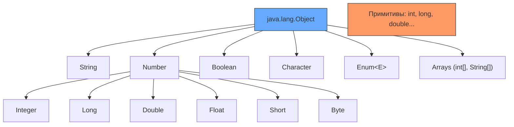
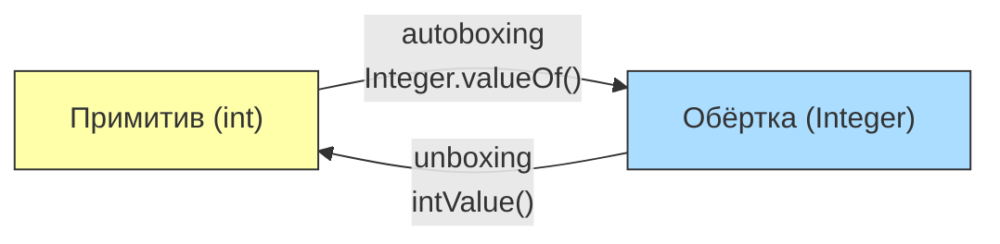
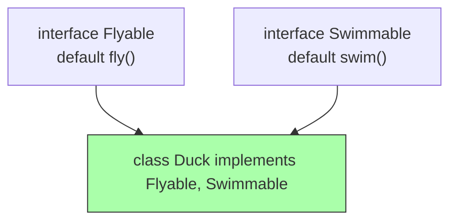
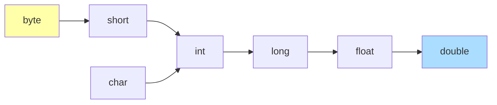
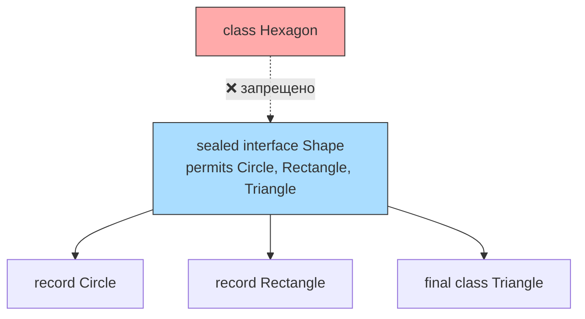

# Вопросы на собеседовании: `Java Types`

Система типов `Java` — фундаментальная тема на собеседованиях. Она охватывает примитивные и ссылочные типы, механизмы `autoboxing`/`unboxing`, классы-обёртки, современные конструкции (`record`, `sealed`, `var`) и правила приведения типов. Понимание этих концепций критично для написания корректного и производительного кода.

## Полезные ссылки

### Официальная документация

- [Java Tutorial — Primitive Data Types](https://docs.oracle.com/javase/tutorial/java/nutsandbolts/datatypes.html) — официальное руководство по примитивам
- [Java Language Specification — Types](https://docs.oracle.com/javase/specs/jls/se17/html/jls-4.html) — спецификация системы типов
- [Wrapper Classes in Java — Baeldung](https://www.baeldung.com/java-wrapper-classes) — обёртки и autoboxing
- [Java Primitives vs Objects — Baeldung](https://www.baeldung.com/java-primitives-vs-objects) — сравнение примитивов и объектов
- [Sealed Classes and Interfaces — Baeldung](https://www.baeldung.com/java-sealed-classes-interfaces) — sealed-классы
- [Java Type System Interview Questions — Baeldung](https://www.baeldung.com/java-type-system-interview-questions) — вопросы по системе типов с ответами

## Содержание

- [Полезные ссылки](#полезные-ссылки)
- [See also](#see-also)

**Иерархия типов и `Object`**
- [Q1. (!) Опишите иерархию типов в Java. Какое место занимает `Object`?](#q1--опишите-иерархию-типов-в-java-какое-место-занимает-object)
- [Q2. В чём разница между примитивными и ссылочными типами?](#q2-в-чём-разница-между-примитивными-и-ссылочными-типами)
- [Q3. (!) Какие есть примитивные типы и каковы их характеристики?](#q3--какие-есть-примитивные-типы-и-каковы-их-характеристики)
- [Q4. В чём разница между `equals()` и `==`?](#q4-в-чём-разница-между-equals-и-)

**Классы-обёртки и `autoboxing`**
- [Q5. (!) Что такое классы-обёртки? Что такое `autoboxing` и `unboxing`?](#q5--что-такое-классы-обёртки-что-такое-autoboxing-и-unboxing)
- [Q6. (!) Что такое `Integer Cache` и как он влияет на сравнение?](#q6--что-такое-integer-cache-и-как-он-влияет-на-сравнение)
- [Q7. Какие подводные камни у `autoboxing`/`unboxing`?](#q7-какие-подводные-камни-у-autoboxingunboxing)
- [Q8. Примитивы vs обёртки: когда что использовать?](#q8-примитивы-vs-обёртки-когда-что-использовать)

**Классы, интерфейсы и наследование**
- [Q9. (!) В чём разница между `abstract class` и `interface`?](#q9--в-чём-разница-между-abstract-class-и-interface)
- [Q10. Каковы ограничения для членов типа `interface`?](#q10-каковы-ограничения-для-членов-типа-interface)
- [Q11. (!) В чём разница между `inner class` и `static nested class`?](#q11--в-чём-разница-между-inner-class-и-static-nested-class)
- [Q12. Есть ли множественное наследование в Java?](#q12-есть-ли-множественное-наследование-в-java)
- [Q13. Что такое анонимный класс?](#q13-что-такое-анонимный-класс)

**Проверка типа и приведение**
- [Q14. (!) Как проверить тип объекта во время выполнения?](#q14--как-проверить-тип-объекта-во-время-выполнения)
- [Q15. Что такое приведение типов (`casting`) и какие исключения оно вызывает?](#q15-что-такое-приведение-типов-casting-и-какие-исключения-оно-вызывает)

**Современные возможности: `record`, `sealed`, `var`**
- [Q16. (!) Что такое `record` и чем он отличается от обычного класса?](#q16--что-такое-record-и-чем-он-отличается-от-обычного-класса)
- [Q17. (!) Что такое `sealed class` и зачем он нужен?](#q17--что-такое-sealed-class-и-зачем-он-нужен)
- [Q18. В чём разница между `var` и явным типом?](#q18-в-чём-разница-между-var-и-явным-типом)
- [Q19. В чём разница между `final` классом и `sealed` классом?](#q19-в-чём-разница-между-final-классом-и-sealed-классом)

**`Enum`**
- [Q20. (!) Что такое `enum` и как он устроен внутри?](#q20--что-такое-enum-и-как-он-устроен-внутри)

**`Generics` и вариантность**
- [Q21. Что такое `type erasure` в `generics`?](#q21-что-такое-type-erasure-в-generics)
- [Q22. Что такое `wildcard` в `generics` и что такое `PECS`?](#q22-что-такое-wildcard-в-generics-и-что-такое-pecs)
- [Q23. Что такое ковариантность и контравариантность в контексте типов?](#q23-что-такое-ковариантность-и-контравариантность-в-контексте-типов)

**Массивы, `Optional`, сериализация**
- [Q24. В чём разница между примитивным массивом и ссылочным массивом?](#q24-в-чём-разница-между-примитивным-массивом-и-ссылочным-массивом)
- [Q25. Что такое `Optional` и когда его использовать?](#q25-что-такое-optional-и-когда-его-использовать)
- [Q26. Как типы влияют на сериализацию?](#q26-как-типы-влияют-на-сериализацию)

**Дополнительные темы**
- [Q27. Что такое `value-based` классы?](#q27-что-такое-value-based-классы)
- [Q28. Как типы связаны с перегрузкой методов?](#q28-как-типы-связаны-с-перегрузкой-методов)
- [Q29. Что такое локальный класс и когда его применять?](#q29-что-такое-локальный-класс-и-когда-его-применять)
- [Q30. Когда использовать абстрактный класс, а когда интерфейс?](#q30-когда-использовать-абстрактный-класс-а-когда-интерфейс)

**Современные возможности: расширенные темы**
- [Q31. (!) Как работает pattern matching в `switch` (Java 21)?](#q31--как-работает-pattern-matching-в-switch-java-21)
- [Q32. (!) Что такое `text blocks` и как они обрабатывают отступы?](#q32--что-такое-text-blocks-и-как-они-обрабатывают-отступы)
- [Q33. (!) Какие производительностные различия между примитивами и обёртками?](#q33--какие-производительностные-различия-между-примитивами-и-обёртками)
- [Q34. Какие подводные камни у `var` при выводе типов?](#q34-какие-подводные-камни-у-var-при-выводе-типов)
- [Q35. (!) `EnumSet` и `EnumMap` — зачем нужны и как устроены?](#q35--enumset-и-enummap--зачем-нужны-и-как-устроены)
- [Q36. Как `sealed class` работает с `permits` в разных файлах?](#q36-как-sealed-class-работает-с-permits-в-разных-файлах)
- [Q37. Что такое компактный конструктор `record` и каноническая форма?](#q37-что-такое-компактный-конструктор-record-и-каноническая-форма)
- [Q38. Как решается diamond problem с `default`-методами интерфейсов?](#q38-как-решается-diamond-problem-с-default-методами-интерфейсов)

## Q1. (!) Опишите иерархию типов в Java. Какое место занимает `Object`?

`java.lang.Object` — корень иерархии классов. Все классы наследуются от него явно или неявно. Массивы тоже являются объектами — у них есть `length`, методы `Object` (`equals`, `hashCode`, `toString`) и они могут быть присвоены переменной типа `Object`.

Однако **8 примитивных типов** (`boolean`, `byte`, `short`, `char`, `int`, `float`, `long`, `double`) **не наследуются от `Object`** — это не объекты, а значения.



**Лямбда-выражения** нельзя присвоить переменной типа `Object` напрямую — лямбда требует функционального интерфейса. Но можно через приведение:

```java
// Ошибка компиляции: Object — не функциональный интерфейс
// Object obj = () -> System.out.println("hello");

// Рабочие варианты
Runnable r = () -> System.out.println("hello");
Object obj = r;  // upcast к Object
Object obj2 = (Runnable) () -> System.out.println("hello");  // cast + assign
```

## Q2. В чём разница между примитивными и ссылочными типами?

| Характеристика | Примитивный тип | Ссылочный тип |
|---|---|---|
| Наследование | Не наследуется от `Object` | Наследуется от `Object` |
| Значение по умолчанию | `0`, `false`, `\u0000` | `null` |
| Хранение | В стеке (локальная) или inline в объекте | Ссылка в стеке → объект в куче |
| Передача | По значению (копия) | Ссылка по значению (копия ссылки) |
| `null` | Не может быть `null` | Может быть `null` |
| Коллекции | Не могут храниться в `List`, `Map` | Могут храниться в коллекциях |
| Накладные расходы | Нет заголовка объекта | Заголовок объекта 12-16 байт |

```java
// Примитив — значение копируется
int a = 10;
int b = a;   // b = 10, независимая копия
b = 20;      // a по-прежнему 10

// Ссылка — копируется адрес, объект общий
int[] arr1 = {1, 2, 3};
int[] arr2 = arr1;  // arr2 ссылается на тот же массив
arr2[0] = 99;       // arr1[0] тоже стал 99
```

Подробнее о хранении объектов в памяти — в [вопросах по JVM](../../jvm/jvm-interview.md).

## Q3. (!) Какие есть примитивные типы и каковы их характеристики?

`Java` имеет **8 примитивных типов**:

| Тип | Размер | Диапазон | Значение по умолчанию | Обёртка |
|---|---|---|---|---|
| `boolean` | ~1 бит* | `true`/`false` | `false` | `Boolean` |
| `byte` | 8 бит | -128 .. 127 | `0` | `Byte` |
| `short` | 16 бит | -32 768 .. 32 767 | `0` | `Short` |
| `char` | 16 бит | 0 .. 65 535 (Unicode) | `'\u0000'` | `Character` |
| `int` | 32 бит | ≈ ±2.1 млрд | `0` | `Integer` |
| `long` | 64 бит | ≈ ±9.2 × 10¹⁸ | `0L` | `Long` |
| `float` | 32 бит | IEEE 754 | `0.0f` | `Float` |
| `double` | 64 бит | IEEE 754 | `0.0d` | `Double` |

*\* Размер `boolean` не определён в JLS; JVM обычно использует 1 байт или даже `int` (4 байта) для отдельной переменной.*

```java
// Литералы
int decimal = 42;
int hex = 0x2A;          // 42 в шестнадцатеричной
int binary = 0b101010;   // 42 в двоичной
long big = 3_000_000_000L; // _ для читаемости, L — long
float f = 3.14f;         // f обязательна для float
double d = 3.14;         // double по умолчанию
char c = 'A';            // или '\u0041'
```

## Q4. В чём разница между `equals()` и `==`?

**`==`** сравнивает:
- Для примитивов: **значения** (`5 == 5` → `true`)
- Для ссылочных типов: **ссылки** (указывают ли на один и тот же объект)

**`equals()`** — метод из `Object`, предназначенный для сравнения **по содержимому**. По умолчанию работает как `==`, но переопределяется в большинстве классов.

```java
String s1 = new String("hello");
String s2 = new String("hello");

s1 == s2;       // false — разные объекты в куче
s1.equals(s2);  // true — одинаковое содержимое

// Строковый пул (string interning)
String s3 = "hello";
String s4 = "hello";
s3 == s4;       // true — один объект из пула

// Integer cache: значения -128..127 кэшируются
Integer i1 = 127;
Integer i2 = 127;
i1 == i2;       // true — один объект из кэша

Integer i3 = 128;
Integer i4 = 128;
i3 == i4;       // false — разные объекты!
i3.equals(i4);  // true
```

> **Правило**: для объектов **всегда используйте `equals()`**, а не `==`. Исключение — сравнение с `null` (только `==`).

## Q5. (!) Что такое классы-обёртки? Что такое `autoboxing` и `unboxing`?

**Классы-обёртки** (`Wrapper classes`) — объектные аналоги примитивных типов. Каждый примитив имеет соответствующий класс-обёртку: `int` → `Integer`, `boolean` → `Boolean` и т.д.

**`Autoboxing`** — автоматическое преобразование примитива в обёртку. **`Unboxing`** — обратное преобразование.

```java
// Autoboxing: int → Integer (компилятор вставляет Integer.valueOf(42))
Integer boxed = 42;

// Unboxing: Integer → int (компилятор вставляет boxed.intValue())
int unboxed = boxed;

// Autoboxing в коллекциях — примитивы нельзя положить напрямую
List<Integer> list = new ArrayList<>();
list.add(10);         // autoboxing: 10 → Integer.valueOf(10)
int value = list.get(0); // unboxing: Integer → int
```



Подробнее о влиянии обёрток на коллекции — в [вопросах по коллекциям](java-collections-interview.md).

## Q6. (!) Что такое `Integer Cache` и как он влияет на сравнение?

`Integer.valueOf(int)` кэширует объекты для значений от **-128 до 127** (по умолчанию). Это означает, что для этих значений `valueOf()` возвращает **один и тот же объект**.

```java
Integer a = 127;   // Integer.valueOf(127) — из кэша
Integer b = 127;   // тот же объект из кэша
System.out.println(a == b);      // true (один объект)
System.out.println(a.equals(b)); // true

Integer c = 128;   // Integer.valueOf(128) — новый объект
Integer d = 128;   // ещё один новый объект
System.out.println(c == d);      // false (разные объекты!)
System.out.println(c.equals(d)); // true
```

**Важные детали:**
- Верхнюю границу кэша можно увеличить через JVM-флаг `-XX:AutoBoxCacheMax=N`
- `Byte`, `Short`, `Long` тоже кэшируют -128..127
- `Character` кэширует 0..127
- `Boolean` кэширует `TRUE` и `FALSE` (всего 2 объекта)
- `Float` и `Double` **не кэшируются**

> **Для собеседования**: этот вопрос — классическая ловушка. Всегда используйте `equals()` для сравнения обёрток, а не `==`.

## Q7. Какие подводные камни у `autoboxing`/`unboxing`?

**1. `NullPointerException` при `unboxing` `null`:**

```java
Integer nullValue = null;
int primitive = nullValue; // NPE! unboxing вызывает nullValue.intValue()
```

**2. Лишние аллокации в циклах:**

```java
// Плохо: каждая итерация создаёт объект Integer через autoboxing
Long sum = 0L;
for (long i = 0; i < 1_000_000; i++) {
    sum += i;  // unboxing sum → long, сложение, autoboxing → Long
}

// Хорошо: используем примитив
long sum = 0L;
for (long i = 0; i < 1_000_000; i++) {
    sum += i;  // операция с примитивами, без боксинга
}
```

**3. Неожиданное поведение `==`:**

```java
Integer x = 100;
Integer y = 100;
System.out.println(x == y);  // true (кэш)

Integer a = 200;
Integer b = 200;
System.out.println(a == b);  // false (разные объекты!)
```

**4. Autoboxing в тернарном операторе:**

```java
Integer a = null;
Integer b = 2;
// Ошибка: компилятор может решить unbox обе стороны → NPE
int result = true ? a : b; // NPE из-за unboxing a
```

## Q8. Примитивы vs обёртки: когда что использовать?

| Когда | Используйте |
|---|---|
| Локальные переменные, счётчики, вычисления | Примитивы (`int`, `long`, `double`) |
| Коллекции (`List`, `Map`, `Set`) | Обёртки (`Integer`, `Long`) |
| Nullable-поля в БД (через [Hibernate](../../databases/hibernate-interview.md)) | Обёртки (`null` = отсутствие значения) |
| Поля `record` / `DTO` | Зависит: примитивы для обязательных, обёртки для nullable |
| `generics` (`Comparable<T>`, `Optional<T>`) | Обёртки (примитивы не параметризуют `generics`) |
| Горячие участки (hot path) | Примитивы (нет overhead на объект) |

> **Для `Stream API`** используйте специализированные стримы: `IntStream`, `LongStream`, `DoubleStream` — они работают без боксинга. Подробнее в [вопросах по Stream API](java-stream-interview.md).

## Q9. (!) В чём разница между `abstract class` и `interface`?

| Критерий | `abstract class` | `interface` |
|---|---|---|
| Наследование | Один класс (`extends`) | Несколько (`implements`) |
| Поля | Любые (в т.ч. mutable) | Только `public static final` |
| Конструктор | Да | Нет |
| Методы | Любые (abstract, concrete, static) | `abstract`, `default`, `static`, `private` (с Java 9) |
| Состояние | Может хранить состояние | Нет состояния экземпляра |
| Множественное наследование | Нет | Да (через несколько `implements`) |

```java
// Абстрактный класс: общее состояние и шаблон
public abstract class Shape {
    protected final String color;
    
    protected Shape(String color) { this.color = color; }
    
    public abstract double area();
    
    public String describe() { return color + " shape, area=" + area(); }
}

// Интерфейс: контракт без состояния
public interface Drawable {
    void draw();
    
    default void drawWithBorder() {
        draw();
        System.out.println("border drawn");
    }
}

// Класс наследует один abstract class + реализует несколько interface
public class Circle extends Shape implements Drawable, Serializable {
    private final double radius;
    
    public Circle(String color, double radius) {
        super(color);
        this.radius = radius;
    }
    
    @Override public double area() { return Math.PI * radius * radius; }
    @Override public void draw() { System.out.println("Drawing circle"); }
}
```

Подробнее о наследовании — в [вопросах по ООП](java-oop-interview.md).

## Q10. Каковы ограничения для членов типа `interface`?

**Поля** интерфейса неявно `public static final` — это константы. Нельзя объявить `private` или нестатическое поле:

```java
public interface Constants {
    int MAX_SIZE = 100;  // неявно public static final
    // private int x = 5;  // ошибка компиляции
}
```

**Методы** интерфейса:
- `public abstract` (по умолчанию) — контракт без реализации
- `default` (Java 8+) — реализация по умолчанию, наследуется
- `static` (Java 8+) — статический метод, вызывается через имя интерфейса
- `private` (Java 9+) — вспомогательный метод для `default`-методов

```java
public interface Validator<T> {
    boolean isValid(T value);            // abstract
    
    default boolean isInvalid(T value) { // default
        return !isValid(value);
    }
    
    static <T> Validator<T> not(Validator<T> v) { // static
        return value -> !v.isValid(value);
    }
    
    private void log(String msg) {       // private (Java 9+)
        System.out.println("[Validator] " + msg);
    }
}
```

## Q11. (!) В чём разница между `inner class` и `static nested class`?

| Критерий | `Inner class` | `Static nested class` |
|---|---|---|
| Ключевое слово | Без `static` | С `static` |
| Доступ к внешнему классу | Все члены, включая `private` | Только `static` члены |
| Создание | `outer.new Inner()` | `new Outer.Nested()` |
| Ссылка на внешний объект | Хранит неявную ссылку `Outer.this` | Нет ссылки |
| Утечка памяти | Возможна (удерживает внешний объект) | Нет риска |

```java
public class Outer {
    private int value = 42;
    
    // Inner class — имеет неявную ссылку на Outer.this
    class Inner {
        int getValue() { return value; } // доступ к private полю
    }
    
    // Static nested class — независим от экземпляра Outer
    static class Nested {
        // int getValue() { return value; }  // ошибка: нет доступа к instance полям
        static String greet() { return "Hello from Nested"; }
    }
}

// Создание
Outer outer = new Outer();
Outer.Inner inner = outer.new Inner();      // нужен экземпляр Outer
Outer.Nested nested = new Outer.Nested();   // не нужен экземпляр Outer
```

> **На практике**: предпочитайте `static nested class`, если не нужен доступ к полям внешнего класса. Это предотвращает утечки памяти и упрощает сериализацию.

## Q12. Есть ли множественное наследование в Java?

Нет, `Java` не поддерживает множественное наследование **классов** — можно наследовать только от одного класса (`extends`). Это сделано для избежания **diamond problem** (проблемы ромбовидного наследования).

Однако класс может реализовывать **несколько интерфейсов** (`implements`), что даёт множественное наследование **типов** (и поведения через `default`-методы).



При конфликте `default`-методов из разных интерфейсов класс **обязан** переопределить метод:

```java
interface A { default void hello() { System.out.println("A"); } }
interface B { default void hello() { System.out.println("B"); } }

class C implements A, B {
    @Override
    public void hello() {
        A.super.hello(); // явный выбор реализации
    }
}
```

## Q13. Что такое анонимный класс?

Анонимный класс — класс без имени, создаваемый «на месте» для расширения класса или реализации интерфейса:

```java
// Реализация интерфейса
Comparator<String> comp = new Comparator<String>() {
    @Override
    public int compare(String a, String b) {
        return a.length() - b.length();
    }
};

// С Java 8 для функциональных интерфейсов лучше использовать лямбду
Comparator<String> comp2 = (a, b) -> a.length() - b.length();
```

**Особенности:**
- Имеет доступ к `final` и `effectively final` переменным внешнего `scope`
- Может обращаться к полям внешнего класса (аналогично `inner class`)
- Не может иметь явный конструктор (используется блок инициализации `{}`)
- С приходом лямбд используется реже — только когда нужен не-функциональный интерфейс или расширение класса

## Q14. (!) Как проверить тип объекта во время выполнения?

**Три способа:**

**1. `instanceof`** — проверяет тип с учётом наследования:
```java
Object obj = "hello";
if (obj instanceof String) { /* true */ }
if (obj instanceof CharSequence) { /* true — String implements CharSequence */ }
```

**2. Pattern matching для `instanceof`** (Java 16+) — проверка + приведение в одно выражение:
```java
// До Java 16
if (obj instanceof String) {
    String s = (String) obj;
    System.out.println(s.toUpperCase());
}

// Java 16+: переменная s сразу доступна
if (obj instanceof String s) {
    System.out.println(s.toUpperCase());
}
```

**3. `getClass()`** — возвращает **точный** класс (без учёта наследования):
```java
obj.getClass() == String.class;        // true только для String
obj.getClass() == CharSequence.class;  // false! CharSequence — интерфейс
```

**4. `Class.isInstance()`** — динамическая проверка через объект `Class`:
```java
Class<?> clazz = String.class;
clazz.isInstance(obj);  // true — аналог instanceof, но тип определяется в runtime
```

| Способ | Учитывает наследование | Работает с `null` |
|---|---|---|
| `instanceof` | Да | `null instanceof X` → `false` |
| `getClass() ==` | Нет (точное совпадение) | `NPE` если `null` |
| `isInstance()` | Да | `false` если `null` |

## Q15. Что такое приведение типов (`casting`) и какие исключения оно вызывает?

**Расширение** (widening) — безопасное, неявное приведение к более широкому типу:
```java
int i = 42;
long l = i;      // int → long — автоматически
double d = l;    // long → double — автоматически
Object obj = "hello"; // String → Object — upcast
```

**Сужение** (narrowing) — требует явного приведения, может потерять данные:
```java
long l = 1_000_000_000_000L;
int i = (int) l;   // потеря данных! переполнение

double d = 3.99;
int truncated = (int) d;  // 3 — дробная часть отбрасывается

Object obj = "hello";
String s = (String) obj;       // downcast — OK
Integer n = (Integer) obj;     // ClassCastException!
```



*Стрелки — направление неявного расширения примитивов.*

## Q16. (!) Что такое `record` и чем он отличается от обычного класса?

`record` (Java 14 preview, Java 16 stable) — компактный тип для неизменяемых данных. Компилятор автоматически генерирует: конструктор, геттеры (по имени компонента), `equals()`, `hashCode()`, `toString()`.

```java
// Обычный класс — ~30 строк boilerplate
public class UserDto {
    private final String name;
    private final int age;
    public UserDto(String name, int age) { this.name = name; this.age = age; }
    public String getName() { return name; }
    public int getAge() { return age; }
    // + equals(), hashCode(), toString()
}

// Record — одна строка
public record UserDto(String name, int age) {}

// Использование
var user = new UserDto("Alice", 30);
user.name();  // "Alice" — метод, не поле
user.age();   // 30
```

**Ограничения `record`:**
- Все поля `final` — неизменяемый
- Нельзя наследовать (`extends`) от другого класса (неявно `extends Record`)
- Может реализовывать интерфейсы
- Может иметь `compact constructor` для валидации:

```java
public record Email(String value) {
    public Email {  // compact constructor — без скобок
        if (!value.contains("@")) {
            throw new IllegalArgumentException("Invalid email: " + value);
        }
        value = value.toLowerCase(); // нормализация
    }
}
```

## Q17. (!) Что такое `sealed class` и зачем он нужен?

`sealed` (Java 17) ограничивает иерархию наследования: только перечисленные в `permits` типы могут наследовать/реализовывать `sealed` класс или интерфейс.

```java
public sealed interface Shape permits Circle, Rectangle, Triangle {}

public record Circle(double radius) implements Shape {}
public record Rectangle(double w, double h) implements Shape {}
public final class Triangle implements Shape { /* ... */ }
```

**Главная ценность** — **exhaustive switch** (Java 21+): компилятор знает все подтипы и проверяет полноту:

```java
double area = switch (shape) {
    case Circle c    -> Math.PI * c.radius() * c.radius();
    case Rectangle r -> r.w() * r.h();
    case Triangle t  -> t.area();
    // нет default — компилятор знает, что все варианты покрыты
};
```



**Подтипы `sealed` класса обязаны быть:**
- `final` — закрытая ветка
- `sealed` — продолжение ограниченной иерархии
- `non-sealed` — открытая ветка (любой может наследовать)

## Q18. В чём разница между `var` и явным типом?

`var` (Java 10) — вывод типа локальной переменной компилятором. Тип определяется из инициализатора и остаётся **статическим** (не динамическим):

```java
var list = new ArrayList<String>(); // тип: ArrayList<String>
var stream = list.stream();         // тип: Stream<String>
var entry = Map.entry("key", 1);    // тип: Map.Entry<String, Integer>
```

**Ограничения `var`:**
- Только локальные переменные с инициализатором
- Нельзя для полей, параметров, возвращаемых типов
- Нельзя `var x = null;` (тип не выводится)
- Нельзя `var x = {1, 2, 3};` (array initializer)
- Нельзя для лямбд без target type: `var f = (x) -> x;` (ошибка)

**Когда использовать:**
```java
// Хорошо: тип очевиден из правой части
var users = userRepository.findAll();
var config = new HashMap<String, List<Integer>>();

// Плохо: тип неочевиден, ухудшает читаемость
var result = process(data); // что возвращает process?
```

## Q19. В чём разница между `final` классом и `sealed` классом?

| Критерий | `final` | `sealed` |
|---|---|---|
| Наследование | Полностью запрещено | Разрешено только для `permits`-типов |
| Подклассы | 0 | Ограниченное число |
| Pattern matching | Нет смысла (один тип) | Exhaustive switch по подтипам |
| Пример | `String`, `Integer` | Алгебраические типы данных |

```java
// final — никаких наследников
public final class ImmutablePoint {
    private final int x, y;
    public ImmutablePoint(int x, int y) { this.x = x; this.y = y; }
}

// sealed — контролируемая иерархия
public sealed interface Result<T> permits Success, Failure {}
record Success<T>(T value) implements Result<T> {}
record Failure<T>(String error) implements Result<T> {}
```

## Q20. (!) Что такое `enum` и как он устроен внутри?

`enum` — тип с фиксированным набором именованных экземпляров. В `Java` `enum` — это **класс**, неявно наследующий `java.lang.Enum<E>`.

```java
public enum OrderStatus {
    NEW("Новый"),
    PROCESSING("В обработке"),
    SHIPPED("Отправлен"),
    DELIVERED("Доставлен");
    
    private final String displayName;
    
    OrderStatus(String displayName) { // конструктор всегда private
        this.displayName = displayName;
    }
    
    public String getDisplayName() { return displayName; }
}

// Использование
OrderStatus status = OrderStatus.NEW;
String name = status.name();          // "NEW"
int ordinal = status.ordinal();       // 0
OrderStatus[] all = OrderStatus.values();
OrderStatus parsed = OrderStatus.valueOf("NEW");
```

**Внутреннее устройство:** компилятор генерирует `final class`, наследующий `Enum`, с `public static final` полями для каждой константы. Каждая константа — singleton.

**`enum` с абстрактными методами** (strategy pattern):
```java
public enum Operation {
    ADD  { public int apply(int a, int b) { return a + b; } },
    SUB  { public int apply(int a, int b) { return a - b; } },
    MUL  { public int apply(int a, int b) { return a * b; } };
    
    public abstract int apply(int a, int b);
}
```

`enum` реализует `Comparable` (по `ordinal`) и `Serializable`; безопасен для использования в `switch`, `EnumSet`, `EnumMap`.

## Q21. Что такое `type erasure` в `generics`?

`Type erasure` — стирание информации о generic-параметрах при компиляции. В байт-коде `List<String>` становится `List` (raw type), параметр `T` заменяется на `Object` (или на границу типа).

```java
// Исходный код
public class Box<T> {
    private T value;
    public T get() { return value; }
}

// После erasure (в байт-коде)
public class Box {
    private Object value;
    public Object get() { return value; }
}
```

**Последствия:**
- Нельзя `new T()` или `new T[]` — тип неизвестен в runtime
- Нельзя `instanceof List<String>` — параметр стёрт
- Перегрузка по generic-типу невозможна:

```java
// Ошибка компиляции: оба метода после erasure имеют сигнатуру process(List)
// void process(List<String> list) { }
// void process(List<Integer> list) { }

// Обход: передать Class<T> для рефлексии
public <T> T[] toArray(List<T> list, Class<T> clazz) {
    @SuppressWarnings("unchecked")
    T[] arr = (T[]) Array.newInstance(clazz, list.size());
    return list.toArray(arr);
}
```

Подробнее — в [вопросах по Generics](java-generics-interview.md).

## Q22. Что такое `wildcard` в `generics` и что такое `PECS`?

`Wildcard` (`?`) — неизвестный тип в generic-выражении:

| Форма | Значение | Можно читать как | Можно записывать |
|---|---|---|---|
| `<?>` | Любой тип | `Object` | Ничего (кроме `null`) |
| `<? extends T>` | T или подтип | `T` | Ничего |
| `<? super T>` | T или супертип | `Object` | `T` и подтипы T |

**PECS** — **P**roducer **E**xtends, **C**onsumer **S**uper:

```java
// Producer (читаем из коллекции) → extends
public static double sum(List<? extends Number> numbers) {
    double sum = 0;
    for (Number n : numbers) { // читаем как Number
        sum += n.doubleValue();
    }
    return sum;
}
sum(List.of(1, 2, 3));       // List<Integer> — OK
sum(List.of(1.5, 2.5));      // List<Double> — OK

// Consumer (пишем в коллекцию) → super
public static void addIntegers(List<? super Integer> list) {
    list.add(1);   // записываем Integer
    list.add(2);
}
addIntegers(new ArrayList<Number>());  // OK
addIntegers(new ArrayList<Object>());  // OK
```

## Q23. Что такое ковариантность и контравариантность в контексте типов?

**Ковариантность** — сохранение направления подтипов: если `A` подтип `B`, то `F(A)` подтип `F(B)`.

**Контравариантность** — обращение направления: если `A` подтип `B`, то `F(B)` подтип `F(A)`.

**Инвариантность** — нет связи подтипов.

| Конструкция | Вариантность | Пример |
|---|---|---|
| Массивы | Ковариантные | `String[]` подтип `Object[]` |
| `List<T>` | Инвариантный | `List<String>` **не** подтип `List<Object>` |
| `List<? extends T>` | Ковариантный (чтение) | `List<? extends Number>` принимает `List<Integer>` |
| `List<? super T>` | Контравариантный (запись) | `List<? super Integer>` принимает `List<Number>` |
| Возвращаемый тип метода | Ковариантный | Override может сузить возвращаемый тип |

```java
// Ковариантность массивов — опасна!
Object[] array = new String[3]; // компилятор разрешает
array[0] = 42;                  // ArrayStoreException в runtime!

// Generic-коллекции инвариантны — безопаснее
// List<Object> list = new ArrayList<String>(); // ошибка компиляции
```

## Q24. В чём разница между примитивным массивом и ссылочным массивом?

| Критерий | Примитивный (`int[]`) | Ссылочный (`String[]`) |
|---|---|---|
| Хранение | Значения подряд в памяти | Массив ссылок → объекты в куче |
| Значение по умолчанию | `0`, `false` | `null` |
| Кэш-эффективность | Высокая (данные рядом) | Низкая (разбросаны по куче) |
| Ковариантность | Нет (нет наследования примитивов) | Да (`String[]` → `Object[]`) |
| Использование в `generics` | Невозможно (`List<int[]>` — ОК, но `List<int>` — нет) | Свободное |

```java
int[] prims = new int[3];       // [0, 0, 0] — инициализировано нулями
String[] refs = new String[3];  // [null, null, null]

// Ковариантность ссылочных массивов
Object[] objArr = refs;         // OK — String[] подтип Object[]
// Object[] objArr = prims;     // ошибка компиляции — int[] не подтип Object[]

// Но int[] сам является объектом
Object obj = prims;             // OK — массив → Object
```

## Q25. Что такое `Optional` и когда его использовать?

`Optional<T>` — контейнер, который может содержать значение типа `T` или быть пустым. Заменяет `null` для возвращаемых значений.

```java
// Создание
Optional<String> present = Optional.of("hello");
Optional<String> empty = Optional.empty();
Optional<String> nullable = Optional.ofNullable(getValue()); // null → empty

// Использование
String result = present
    .filter(s -> s.length() > 3)
    .map(String::toUpperCase)
    .orElse("default");

// Не рекомендуемые паттерны
optional.get();              // NoSuchElementException если пусто — не используйте!
optional.isPresent();        // ifPresent/orElse — лучше
```

**Когда использовать:**
- Возвращаемые значения методов, где результат может отсутствовать
- **НЕ** для полей классов, параметров методов или коллекций

**Специализированные версии** для примитивов (без боксинга): `OptionalInt`, `OptionalLong`, `OptionalDouble`.

Подробнее — в [вопросах по Java 8+](java-8-interview.md).

## Q26. Как типы влияют на сериализацию?

Для стандартной Java-сериализации объект должен реализовать маркерный интерфейс `Serializable`:

```java
public class User implements Serializable {
    private static final long serialVersionUID = 1L; // версия класса
    
    private String name;          // сериализуется
    private transient String password; // НЕ сериализуется
    private static int counter;   // НЕ сериализуется (static)
    private int age;              // примитив — сериализуется
}
```

**Ключевые правила:**
- Примитивные поля сериализуются всегда
- Ссылочные поля должны тоже быть `Serializable`, иначе — `NotSerializableException`
- `transient` поля пропускаются
- `static` поля не сериализуются (принадлежат классу, а не объекту)
- Если родитель не `Serializable` — при десериализации его поля инициализируются конструктором по умолчанию
- `serialVersionUID` фиксирует версию для совместимости

Подробнее — в [вопросах по сериализации](java-serialization-interview.md).

## Q27. Что такое `value-based` классы?

`Value-based` классы — классы, идентичность которых определяется **значением полей**, а не ссылкой. Для них не гарантируется уникальность объекта (т.е. `==` может врать).

**Признаки value-based класса:**
- `final` и неизменяемый
- `equals()`/`hashCode()` определяются по значению полей
- Нет доступного конструктора — создание через фабричные методы (`valueOf`, `of`)
- Не следует использовать `==`, `synchronized`, `identityHashCode`

**Примеры**: `Integer`, `Long`, `Double`, `LocalDate`, `LocalTime`, `Optional`, все `record`-типы.

```java
// Нельзя синхронизироваться на value-based классах
Integer lock = 42;
synchronized (lock) { /* warning: synchronization on value-based class */ }

// record — типичный value-based
record Point(int x, int y) {}
var p1 = new Point(1, 2);
var p2 = new Point(1, 2);
p1.equals(p2); // true — по значению полей
```

> В `Project Valhalla` (будущие версии Java) value-based классы станут основой для **value types** — inline-типов без заголовка объекта.

## Q28. Как типы связаны с перегрузкой методов?

Перегрузка (`overloading`) выбирается **на этапе компиляции** по типам аргументов. Правила разрешения (в порядке приоритета):

1. **Точное совпадение** типов
2. **Расширение примитива** (`int` → `long`)
3. **Autoboxing** (`int` → `Integer`)
4. **Varargs** (`int...`)

```java
public class Overload {
    void process(int x)     { System.out.println("int"); }
    void process(long x)    { System.out.println("long"); }
    void process(Integer x) { System.out.println("Integer"); }
    void process(int... x)  { System.out.println("varargs"); }
}

var o = new Overload();
o.process(42);    // "int"     — точное совпадение
o.process(42L);   // "long"    — точное совпадение
// Если убрать process(int): o.process(42) → "long" (расширение, не autoboxing!)
```

**Ловушка на собеседовании:**

```java
void test(Object obj) { System.out.println("Object"); }
void test(String str) { System.out.println("String"); }

test(null); // "String" — выбирается наиболее специфичный тип
```

## Q29. Что такое локальный класс и когда его применять?

Локальный класс — класс, объявленный **внутри метода**. Виден только в пределах метода, имеет доступ к `final`/effectively final переменным:

```java
public List<String> filterAndFormat(List<String> items, String prefix) {
    
    class Formatter { // локальный класс — виден только в этом методе
        String format(String item) {
            return prefix + ": " + item.toUpperCase(); // доступ к effectively final prefix
        }
    }
    
    var formatter = new Formatter();
    return items.stream()
        .filter(item -> item.startsWith(prefix))
        .map(formatter::format)
        .toList();
}
```

На практике локальные классы используются редко — лямбды и анонимные классы покрывают большинство случаев. Локальный класс оправдан, когда нужно переиспользовать его несколько раз в методе и он требует несколько методов (анонимный класс и лямбда не подходят).

## Q30. Когда использовать абстрактный класс, а когда интерфейс?

| Ситуация | Выбор |
|---|---|
| Нужен общий контракт для несвязанных классов | `interface` |
| Нужно общее состояние (поля) для подклассов | `abstract class` |
| Шаблонный метод (Template Method pattern) | `abstract class` |
| Множественное наследование поведения | `interface` с `default`-методами |
| Моделирование закрытой иерархии (ADT) | `sealed interface` + `record` |
| Маркер для фреймворка | `interface` (напр. `Serializable`) |

```java
// Абстрактный класс: общий шаблон с состоянием
public abstract class AbstractRepository<T> {
    protected final DataSource ds;
    
    protected AbstractRepository(DataSource ds) { this.ds = ds; }
    
    public final T findById(long id) {  // Template Method
        var sql = buildSelectQuery(id);
        return executeQuery(sql);
    }
    
    protected abstract String buildSelectQuery(long id);
    protected abstract T executeQuery(String sql);
}

// Интерфейс: контракт без состояния
public interface Auditable {
    Instant createdAt();
    Instant updatedAt();
    
    default Duration age() {
        return Duration.between(createdAt(), Instant.now());
    }
}
```

> **Совет на собеседовании**: начинайте с интерфейса. Переходите к абстрактному классу только когда реально нужны общие поля или конструктор. Подробнее — в [вопросах по паттернам проектирования](../../design-patterns/design-patterns-interview.md).

## Q31. (!) Как работает pattern matching в `switch` (Java 21)?

Java 21 сделал **pattern matching в `switch`** стабильной фичей (JEP 441). Теперь `case` может содержать паттерн типа, а не только константу.

```java
sealed interface Shape permits Circle, Rectangle, Triangle {}
record Circle(double radius) implements Shape {}
record Rectangle(double w, double h) implements Shape {}
record Triangle(double base, double height) implements Shape {}

// Pattern matching в switch
double area = switch (shape) {
    case Circle c    -> Math.PI * c.radius() * c.radius();
    case Rectangle r -> r.w() * r.h();
    case Triangle t  -> 0.5 * t.base() * t.height();
    // default не нужен — компилятор видит sealed-иерархию
};
```

**Guarded patterns** (охраняемые паттерны) — условие `when` после паттерна:

```java
String describe(Object obj) {
    return switch (obj) {
        case Integer i when i < 0  -> "отрицательное: " + i;
        case Integer i when i == 0 -> "ноль";
        case Integer i             -> "положительное: " + i;
        case String s when s.isEmpty() -> "пустая строка";
        case String s  -> "строка: " + s;
        case null      -> "null";
        default        -> "другой тип: " + obj.getClass().getSimpleName();
    };
}
```

**Паттерн деконструкции record** (Java 21+):

```java
// Без деконструкции
if (shape instanceof Circle c) {
    System.out.println(c.radius());
}

// С деконструкцией в switch
switch (shape) {
    case Circle(double r) -> System.out.println("Радиус: " + r);
    case Rectangle(double w, double h) -> System.out.println(w + "x" + h);
}
```

**Важно**: для `switch` по `sealed`-иерархии компилятор проверяет полноту покрытия (exhaustiveness) — если добавить новый `permits`-тип, код перестанет компилироваться.

## Q32. (!) Что такое `text blocks` и как они обрабатывают отступы?

`Text blocks` (Java 15, стабильно) — многострочные строковые литералы с автоматической обработкой отступов. Открывается `"""` плюс перевод строки, закрывается `"""`.

```java
// Обычная строка с JSON — неудобно
String json = "{\n  \"name\": \"Alice\",\n  \"age\": 30\n}";

// Text block — чисто и читаемо
String json = """
        {
          "name": "Alice",
          "age": 30
        }
        """;
```

**Алгоритм удаления отступов (re-indentation):** компилятор находит минимальный отступ среди всех непустых строк (включая строку с закрывающим `"""`) и удаляет его из каждой строки.

```java
// Закрывающий """ влияет на отступ!
String a = """
           hello
           """;    // удалит 11 пробелов → "hello\n"

String b = """
           hello
    """;           // удалит только 4 пробела → "       hello\n"
```

**Специальные escape-последовательности:**

| Последовательность | Значение |
|--------------------|----------|
| `\n` | Перевод строки (обычный) |
| `\` в конце строки | Продолжение строки без `\n` |
| `\s` | Пробел (защищает концевые пробелы от удаления) |

```java
String noNewline = """
        Hello, \
        World!
        """;  // → "Hello, World!\n"

String keepSpaces = """
        "name": "Alice",\s
        """;  // пробел перед \s сохраняется
```

**Кавычки** внутри text block не нужно экранировать (кроме `"""`):

```java
String html = """
        <a href="https://example.com">link</a>
        """; // кавычки без экранирования
```

## Q33. (!) Какие производительностные различия между примитивами и обёртками?

Разница между `int` и `Integer` критична для высоконагруженных приложений:

**Память:**

| Тип | Размер |
|-----|--------|
| `int` | 4 байта в стеке/массиве |
| `Integer` | 16 байт в куче (заголовок объекта) + 4 байта поле + ссылка 4/8 байт |

```java
// int[] — 400 байт (100 * 4)
int[] ints = new int[100];

// Integer[] — ~2400 байт (100 ссылок + 100 объектов по ~16 байт)
Integer[] integers = new Integer[100];
```

**Производительность boxing/unboxing:**

```java
// Скрытый boxing в цикле — медленно!
Long sum = 0L;
for (long i = 0; i < 1_000_000; i++) {
    sum += i; // Long += long → unbox Long, add, box Long → миллион объектов!
}

// Правильно — примитив
long sum = 0L;
for (long i = 0; i < 1_000_000; i++) {
    sum += i; // никакого boxing
}
```

**Integer Cache:** `Integer.valueOf(-128..127)` возвращает кэшированные объекты — `==` работает в этом диапазоне, но это ловушка:

```java
Integer a = 127, b = 127; // a == b → true (кэш)
Integer c = 128, d = 128; // c == d → false (новые объекты)
```

**Когда обёртки оправданы:**
- Коллекции (`List<Integer>`, `Map<String, Long>`)
- `null`-значение как сигнал отсутствия
- Рефлексия, дженерики
- `Optional<Integer>` вместо `OptionalInt` (когда нужна цепочка map)

**Когда строго примитивы:**
- Математические вычисления, циклы
- Массивы для числовых данных
- Поля в domain-классах без `null`

## Q34. Какие подводные камни у `var` при выводе типов?

`var` (Java 10) удобен, но создаёт несколько нетривиальных ситуаций:

**1. Тип выводится как конкретный, а не как интерфейс:**

```java
// Тип переменной — ArrayList<String>, а не List<String>!
var list = new ArrayList<String>();
list.trimToSize(); // метод ArrayList, недоступный через List

// Лучше явно:
List<String> list = new ArrayList<>();
```

**2. Анонимные классы расширяют возможности `var`:**

```java
// var захватывает анонимный тип с дополнительным методом!
var obj = new Object() {
    String greet() { return "hello"; }
};
obj.greet(); // работает — тип виден компилятору в локальном scope
```

**3. Инициализатор определяет тип — изменить нельзя:**

```java
var x = 42;    // тип int, не Integer
var y = 42L;   // тип long
var z = 42.0;  // тип double
// x = "hello"; // ошибка компиляции — тип уже зафиксирован
```

**4. Потеря информации о wildcard:**

```java
// Плохо: тип выводится как List<capture#1>, не List<? extends Number>
var numbers = getNumbers(); // возвращает List<? extends Number>
// Лучше явно указать тип, если wildcard важен
```

**5. `var` в lambda и method reference — нельзя:**

```java
// Ошибка: нет target type для вывода
// var fn = (x) -> x * 2;

// Нужно явно:
Function<Integer, Integer> fn = (x) -> x * 2;

// Но в Java 11 var можно в параметрах лямбды (для аннотаций):
(@NonNull var x, var y) -> x + y;
```

## Q35. (!) `EnumSet` и `EnumMap` — зачем нужны и как устроены?

`EnumSet` и `EnumMap` — специализированные коллекции для `enum`-ключей с максимальной производительностью.

**`EnumSet`** — реализация `Set` только для `enum`-констант. Внутри использует `long` как битовую маску (`RegularEnumSet` — для <= 64 констант, `JumboEnumSet` — для больших):

```java
public enum Permission { READ, WRITE, EXECUTE, DELETE }

// Создание
EnumSet<Permission> readOnly = EnumSet.of(Permission.READ);
EnumSet<Permission> all      = EnumSet.allOf(Permission.class);
EnumSet<Permission> none     = EnumSet.noneOf(Permission.class);
EnumSet<Permission> writeOps = EnumSet.of(Permission.WRITE, Permission.DELETE);

// Complement — дополнение
EnumSet<Permission> noWrite  = EnumSet.complementOf(writeOps);

// Операции O(1)
readOnly.add(Permission.EXECUTE);
readOnly.contains(Permission.WRITE); // false

// Пересечение, объединение
EnumSet<Permission> intersection = EnumSet.copyOf(readOnly);
intersection.retainAll(all);
```

**`EnumMap`** — реализация `Map`, где ключами служат `enum`-константы. Внутри — простой массив, индексированный по `ordinal()`:

```java
EnumMap<Permission, String> descriptions = new EnumMap<>(Permission.class);
descriptions.put(Permission.READ,    "Чтение файлов");
descriptions.put(Permission.WRITE,   "Запись файлов");
descriptions.put(Permission.EXECUTE, "Выполнение");
descriptions.put(Permission.DELETE,  "Удаление");

// Итерация в порядке объявления enum-констант (гарантировано!)
descriptions.forEach((perm, desc) -> System.out.println(perm + ": " + desc));
```

**Сравнение с `HashSet`/`HashMap`:**

| | `EnumSet` | `HashSet` | `EnumMap` | `HashMap` |
|--|-----------|-----------|-----------|-----------|
| Память | O(1) — битовая маска | O(n) — хэш-таблица | O(n) — массив по ordinal | O(n) — хэш-таблица |
| Скорость | O(1) — битовые операции | O(1) амортизировано | O(1) — прямой доступ | O(1) амортизировано |
| Порядок | По `ordinal()` | Не гарантирован | По `ordinal()` | Не гарантирован |
| `null` ключ | Нет | Да | Нет | Да |

**Когда использовать:** всегда, когда ключи — значения `enum`. Используйте `EnumSet` вместо `Set<MyEnum>` и `EnumMap` вместо `Map<MyEnum, V>` — это быстрее и эффективнее по памяти.

## Q36. Как `sealed class` работает с `permits` в разных файлах?

По умолчанию все `permits`-типы должны быть в том же пакете, что и `sealed`-тип. Но они могут быть в разных файлах:

```java
// Shape.java
public sealed interface Shape permits Circle, Rectangle, Triangle {}

// Circle.java
public record Circle(double radius) implements Shape {}

// Rectangle.java
public record Rectangle(double w, double h) implements Shape {}

// Triangle.java — non-sealed, открыта для наследования
public non-sealed class Triangle implements Shape {
    private double base, height;
    // ...
}
```

**Ключевые правила:**
- `permits` можно опустить, если все подтипы объявлены в **том же файле** (компилятор выводит их автоматически)
- Начиная с Java 21, sealed-классы работают с **named modules**: подклассы могут быть в том же модуле (но не обязательно в том же пакете)
- Каждый `permits`-тип должен явно `extends`/`implements` родительский sealed-тип

**Три варианта для подкласса:**

```java
// 1. final — закрытая конечная ветка
public final class Circle implements Shape { }

// 2. sealed — продолжение ограниченной иерархии
public sealed interface Polygon extends Shape permits Triangle, Quadrilateral { }

// 3. non-sealed — открытая ветка (любой может наследовать)
public non-sealed class FreeShape implements Shape { }
```

## Q37. Что такое компактный конструктор `record` и каноническая форма?

`Record` (Java 16) генерирует **канонический конструктор** — конструктор, принимающий все компоненты в порядке объявления. Его можно переопределить в **компактной** или **явной** форме.

**Компактный конструктор** (compact constructor) — без списка параметров и без присваивания полей; компилятор добавляет их сам:

```java
public record Range(int min, int max) {
    // Компактный конструктор — только валидация и нормализация
    public Range {
        if (min > max) throw new IllegalArgumentException("min > max");
        // Изменение параметров — ДОПУСТИМО (компилятор присвоит после)
        min = Math.max(min, 0); // нормализуем отрицательное min
    }
    // Компилятор добавит: this.min = min; this.max = max;
}
```

**Явный канонический конструктор** — полная форма с параметрами и присваиванием:

```java
public record Point(int x, int y) {
    public Point(int x, int y) {
        this.x = x; // здесь присваиваем сами
        this.y = y;
    }
}
```

**Дополнительные конструкторы** должны делегировать каноническому:

```java
public record Point(int x, int y) {
    // Дополнительный конструктор
    public Point(int coord) {
        this(coord, coord); // ОБЯЗАТЕЛЬНО делегировать this(...)
    }
}
```

**Ограничения record:**
- Все компоненты неявно `private final`
- Нет `extends` (только `implements`)
- Не может быть `abstract`
- Внутренний `record` всегда `static`
- Нельзя объявлять поля экземпляра, только статические

## Q38. Как решается diamond problem с `default`-методами интерфейсов?

**Diamond problem** возникает, когда класс наследует одинаковый `default`-метод из нескольких интерфейсов. Java решает это через **явный override с вызовом нужного супертипа**.

**Правила разрешения конфликтов (в порядке приоритета):**

1. **Класс выигрывает у интерфейса** — если класс (или его суперкласс) переопределяет метод, он всегда побеждает
2. **Более специфичный интерфейс выигрывает** — если интерфейс A extends интерфейс B, default-метод из A приоритетнее
3. **Конфликт** — если нет явного победителя, класс **обязан** переопределить метод

```java
interface A {
    default String greet() { return "Hello from A"; }
}

interface B {
    default String greet() { return "Hello from B"; }
}

// Правило 3: конфликт — компилятор требует переопределения
class C implements A, B {
    @Override
    public String greet() {
        // Явный выбор через InterfaceName.super.method()
        return A.super.greet() + " and " + B.super.greet();
    }
}
```

**Правило 2 — специфичность:**

```java
interface Animal {
    default String sound() { return "..."; }
}

interface Dog extends Animal {
    @Override
    default String sound() { return "Woof"; }
}

// Cat наследует от обоих, но Dog.sound() специфичнее Animal.sound()
class Cat implements Dog, Animal {
    // Переопределять НЕ нужно — Dog::sound выиграл автоматически
}
new Cat().sound(); // "Woof"
```

**Правило 1 — класс выигрывает:**

```java
class Base {
    public String greet() { return "Hello from Base"; }
}

class Child extends Base implements A, B {
    // Base::greet выигрывает у A::greet и B::greet — конфликта нет!
}
```

> **На собеседовании:** упомяните, что `abstract` класс не может иметь `default`-методы (это только у интерфейсов). `abstract class` использует `abstract` методы, которые обязаны переопределяться. Путать нельзя.

---

## See also

- [Java Generics](java-generics-interview.md) — дженерики, `type erasure`, `wildcard` — обобщённые типы как расширение системы типов Java
- [OOP & Java](java-oop-interview.md) — наследование, полиморфизм, инкапсуляция — как типы взаимодействуют через объектную модель
- [Java Collections](java-collections-interview.md) — коллекции и их связь с типами: `List<Integer>` vs `int[]`, boxing overhead
- [Java Core](java-core-interview.md) — основы языка: `Object` как корень иерархии, `equals`/`hashCode` и boxing
- [Java 8+](java-8-interview.md) — лямбды, `Stream API`, `Optional` — функциональные типы и `var` в Java 10+
- [JVM](../../jvm/jvm-interview.md) — представление типов в байт-коде, `checkcast`, `instanceof` на уровне JVM, boxing в памяти
- [Java 17-21](java-17-21-interview.md) — `record`, `sealed classes`, pattern matching — новые конструкции системы типов
