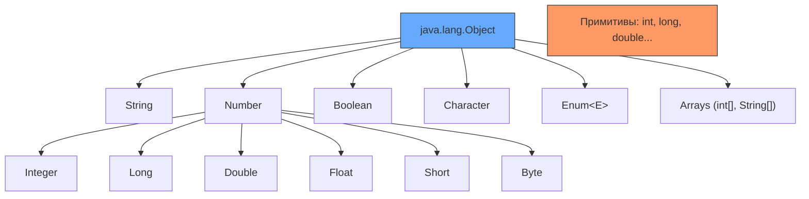
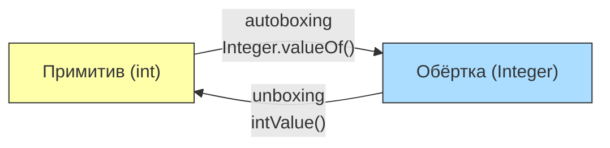
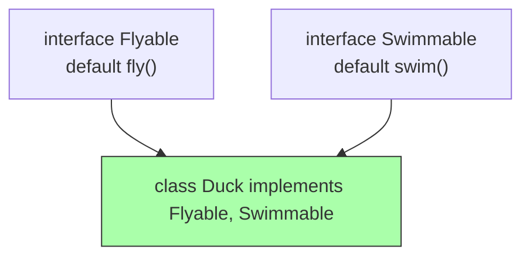
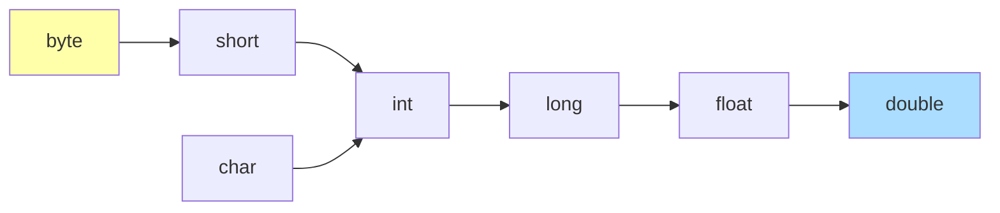
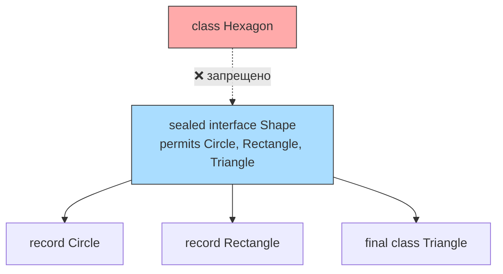

# Вопросы на собеседовании: `Java Types`

Система типов `Java` — фундаментальная тема на собеседованиях. Она охватывает примитивные и ссылочные типы, механизмы `autoboxing`/`unboxing`, классы-обёртки, современные конструкции (`record`, `sealed`, `var`) и правила приведения типов. Понимание этих концепций критично для написания корректного и производительного кода.

## Полезные ссылки

### Официальная документация

- [Java Tutorial — Primitive Data Types](https://docs.oracle.com/javase/tutorial/java/nutsandbolts/datatypes.html) — официальное руководство по примитивам
- [Java Language Specification — Types](https://docs.oracle.com/javase/specs/jls/se17/html/jls-4.html) — спецификация системы типов
- [Wrapper Classes in Java — Baeldung](https://www.baeldung.com/java-wrapper-classes) — обёртки и autoboxing
- [Java Primitives vs Objects — Baeldung](https://www.baeldung.com/java-primitives-vs-objects) — сравнение примитивов и объектов
- [Sealed Classes and Interfaces — Baeldung](https://www.baeldung.com/java-sealed-classes-interfaces) — sealed-классы
- [Java Type System Interview Questions — Baeldung](https://www.baeldung.com/java-type-system-interview-questions) — вопросы по системе типов с ответами

## Содержание

- [Полезные ссылки](#полезные-ссылки)
- [See also](#see-also)

**Иерархия типов и `Object`**
- [Q1. (!) Опишите иерархию типов в Java. Какое место занимает `Object`?](#q1--опишите-иерархию-типов-в-java-какое-место-занимает-object)
- [Q2. В чём разница между примитивными и ссылочными типами?](#q2-в-чём-разница-между-примитивными-и-ссылочными-типами)
- [Q3. (!) Какие есть примитивные типы и каковы их характеристики?](#q3--какие-есть-примитивные-типы-и-каковы-их-характеристики)
- [Q4. В чём разница между `equals()` и `==`?](#q4-в-чём-разница-между-equals-и-)

**Классы-обёртки и `autoboxing`**
- [Q5. (!) Что такое классы-обёртки? Что такое `autoboxing` и `unboxing`?](#q5--что-такое-классы-обёртки-что-такое-autoboxing-и-unboxing)
- [Q6. (!) Что такое `Integer Cache` и как он влияет на сравнение?](#q6--что-такое-integer-cache-и-как-он-влияет-на-сравнение)
- [Q7. Какие подводные камни у `autoboxing`/`unboxing`?](#q7-какие-подводные-камни-у-autoboxingunboxing)
- [Q8. Примитивы vs обёртки: когда что использовать?](#q8-примитивы-vs-обёртки-когда-что-использовать)

**Классы, интерфейсы и наследование**
- [Q9. (!) В чём разница между `abstract class` и `interface`?](#q9--в-чём-разница-между-abstract-class-и-interface)
- [Q10. Каковы ограничения для членов типа `interface`?](#q10-каковы-ограничения-для-членов-типа-interface)
- [Q11. (!) В чём разница между `inner class` и `static nested class`?](#q11--в-чём-разница-между-inner-class-и-static-nested-class)
- [Q12. Есть ли множественное наследование в Java?](#q12-есть-ли-множественное-наследование-в-java)
- [Q13. Что такое анонимный класс?](#q13-что-такое-анонимный-класс)

**Проверка типа и приведение**
- [Q14. (!) Как проверить тип объекта во время выполнения?](#q14--как-проверить-тип-объекта-во-время-выполнения)
- [Q15. Что такое приведение типов (`casting`) и какие исключения оно вызывает?](#q15-что-такое-приведение-типов-casting-и-какие-исключения-оно-вызывает)

**Современные возможности: `record`, `sealed`, `var`**
- [Q16. (!) Что такое `record` и чем он отличается от обычного класса?](#q16--что-такое-record-и-чем-он-отличается-от-обычного-класса)
- [Q17. (!) Что такое `sealed class` и зачем он нужен?](#q17--что-такое-sealed-class-и-зачем-он-нужен)
- [Q18. В чём разница между `var` и явным типом?](#q18-в-чём-разница-между-var-и-явным-типом)
- [Q19. В чём разница между `final` классом и `sealed` классом?](#q19-в-чём-разница-между-final-классом-и-sealed-классом)

**`Enum`**
- [Q20. (!) Что такое `enum` и как он устроен внутри?](#q20--что-такое-enum-и-как-он-устроен-внутри)

**`Generics` и вариантность**
- [Q21. Что такое `type erasure` в `generics`?](#q21-что-такое-type-erasure-в-generics)
- [Q22. Что такое `wildcard` в `generics` и что такое `PECS`?](#q22-что-такое-wildcard-в-generics-и-что-такое-pecs)
- [Q23. Что такое ковариантность и контравариантность в контексте типов?](#q23-что-такое-ковариантность-и-контравариантность-в-контексте-типов)

**Массивы, `Optional`, сериализация**
- [Q24. В чём разница между примитивным массивом и ссылочным массивом?](#q24-в-чём-разница-между-примитивным-массивом-и-ссылочным-массивом)
- [Q25. Что такое `Optional` и когда его использовать?](#q25-что-такое-optional-и-когда-его-использовать)
- [Q26. Как типы влияют на сериализацию?](#q26-как-типы-влияют-на-сериализацию)

**Дополнительные темы**
- [Q27. Что такое `value-based` классы?](#q27-что-такое-value-based-классы)
- [Q28. Как типы связаны с перегрузкой методов?](#q28-как-типы-связаны-с-перегрузкой-методов)
- [Q29. Что такое локальный класс и когда его применять?](#q29-что-такое-локальный-класс-и-когда-его-применять)
- [Q30. Когда использовать абстрактный класс, а когда интерфейс?](#q30-когда-использовать-абстрактный-класс-а-когда-интерфейс)

**Современные возможности: расширенные темы**
- [Q31. (!) Как работает pattern matching в `switch` (Java 21)?](#q31--как-работает-pattern-matching-в-switch-java-21)
- [Q32. (!) Что такое `text blocks` и как они обрабатывают отступы?](#q32--что-такое-text-blocks-и-как-они-обрабатывают-отступы)
- [Q33. (!) Какие производительностные различия между примитивами и обёртками?](#q33--какие-производительностные-различия-между-примитивами-и-обёртками)
- [Q34. Какие подводные камни у `var` при выводе типов?](#q34-какие-подводные-камни-у-var-при-выводе-типов)
- [Q35. (!) `EnumSet` и `EnumMap` — зачем нужны и как устроены?](#q35--enumset-и-enummap--зачем-нужны-и-как-устроены)
- [Q36. Как `sealed class` работает с `permits` в разных файлах?](#q36-как-sealed-class-работает-с-permits-в-разных-файлах)
- [Q37. Что такое компактный конструктор `record` и каноническая форма?](#q37-что-такое-компактный-конструктор-record-и-каноническая-форма)
- [Q38. Как решается diamond problem с `default`-методами интерфейсов?](#q38-как-решается-diamond-problem-с-default-методами-интерфейсов)

## Q1. (!) Опишите иерархию типов в Java. Какое место занимает `Object`?

`java.lang.Object` — корень иерархии классов. Все классы наследуются от него явно или неявно. Массивы тоже являются объектами — у них есть `length`, методы `Object` (`equals`, `hashCode`, `toString`) и они могут быть присвоены переменной типа `Object`.

Однако **8 примитивных типов** (`boolean`, `byte`, `short`, `char`, `int`, `float`, `long`, `double`) **не наследуются от `Object`** — это не объекты, а значения.



**Лямбда-выражения** нельзя присвоить переменной типа `Object` напрямую — лямбда требует функционального интерфейса. Но можно через приведение:

```java
// Ошибка компиляции: Object — не функциональный интерфейс
// Object obj = () -> System.out.println("hello");

// Рабочие варианты
Runnable r = () -> System.out.println("hello");
Object obj = r;  // upcast к Object
Object obj2 = (Runnable) () -> System.out.println("hello");  // cast + assign
```


> [!mcq]
> - [ ] Все типы в `Java` — потомки `Object`, включая `int` и `long` через автообёртки | Примитивы НЕ наследуются от `Object` — это значения, а не объекты. ❌ ПОСЛЕДСТВИЕ: попытка вызвать `int.getClass()` → ошибка компиляции, разработчик путает `int` с `Integer` и пишет `int x = null` → не компилируется.
> - [ ] От `Object` наследуется только `String` и коллекции, остальные классы независимы | Ошибка: `Object` — корень ВСЕХ ссылочных типов, не только `String`. ❌ ПОСЛЕДСТВИЕ: разработчик не реализует `equals`/`hashCode` в DTO считая его «независимым» → коллекции работают непредсказуемо.
> - [x] `Object` — корень иерархии всех ссылочных типов; 8 примитивов вне иерархии; массивы — это объекты | Все классы (явно или неявно через `extends`) наследуются от `Object`, массивы тоже объекты с методами `Object`. Примитивы — отдельная категория. ✓ ПРИМЕНЯТЬ: Spring `BeanUtils.copyProperties` обходит поля через рефлексию `Object`-методов; Hibernate dirty checking опирается на `equals` из `Object`. 📋 ПРАВИЛО: «Object — крыша, примитивы — подвал». 🔗 См. Q2, Q3.
> - [ ] `Object` — это интерфейс, который все классы реализуют через `implements` | `Object` — класс, не интерфейс; используется `extends`, не `implements`. ❌ ПОСЛЕДСТВИЕ: разработчик пишет `class Foo implements Object` → ошибка компиляции, теряется время на разбор.

## Q2. В чём разница между примитивными и ссылочными типами?

| Характеристика | Примитивный тип | Ссылочный тип |
|---|---|---|
| Наследование | Не наследуется от `Object` | Наследуется от `Object` |
| Значение по умолчанию | `0`, `false`, `\u0000` | `null` |
| Хранение | В стеке (локальная) или inline в объекте | Ссылка в стеке → объект в куче |
| Передача | По значению (копия) | Ссылка по значению (копия ссылки) |
| `null` | Не может быть `null` | Может быть `null` |
| Коллекции | Не могут храниться в `List`, `Map` | Могут храниться в коллекциях |
| Накладные расходы | Нет заголовка объекта | Заголовок объекта 12-16 байт |

```java
// Примитив — значение копируется
int a = 10;
int b = a;   // b = 10, независимая копия
b = 20;      // a по-прежнему 10

// Ссылка — копируется адрес, объект общий
int[] arr1 = {1, 2, 3};
int[] arr2 = arr1;  // arr2 ссылается на тот же массив
arr2[0] = 99;       // arr1[0] тоже стал 99
```

Подробнее о хранении объектов в памяти — в [вопросах по JVM](../../jvm/jvm-interview.md).


> [!mcq]
> - [x] Примитив хранит значение и копируется по значению; ссылка хранит адрес и копируется как адрес — объект общий | При присвоении `int b = a` копируется значение, при `arr2 = arr1` копируется адрес и оба указывают на один массив. ✓ ПРИМЕНЯТЬ: defensive copy в Spring `@ConfigurationProperties` для `List`-полей предотвращает мутацию через ссылку; immutable DTO в Wolt order pipeline. 📋 ПРАВИЛО: «Примитив — копия, ссылка — алиас». 🔗 См. Q3, Q4.
> - [ ] Примитивы и ссылки одинаково передаются по значению — копируется содержимое всегда | Формально оба «по значению», но для ссылок копируется адрес, а объект остаётся общим — мутации видны всем. ❌ ПОСЛЕДСТВИЕ: разработчик передаёт `List` в метод, метод делает `list.clear()`, вызывающий код теряет данные → silent data loss в production.
> - [ ] Ссылочные типы передаются по ссылке (как в C++), примитивы — по значению | В Java НЕТ передачи по ссылке — это распространённое заблуждение из C++. Передаётся копия адреса. ❌ ПОСЛЕДСТВИЕ: метод `swap(a, b)` через переприсвоение параметров не работает → разработчик тратит часы на отладку «почему swap не меняет переменные».
> - [ ] Примитивы могут быть `null` если объявлены как `final` без инициализации | Примитивы НИКОГДА не могут быть `null` — у них всегда есть default (`0`, `false`). ❌ ПОСЛЕДСТВИЕ: разработчик пишет `if (intValue == null)` → ошибка компиляции; путает с обёртками и теряет проверку на отсутствие значения.

## Q3. (!) Какие есть примитивные типы и каковы их характеристики?

`Java` имеет **8 примитивных типов**:

| Тип | Размер | Диапазон | Значение по умолчанию | Обёртка |
|---|---|---|---|---|
| `boolean` | ~1 бит* | `true`/`false` | `false` | `Boolean` |
| `byte` | 8 бит | -128 .. 127 | `0` | `Byte` |
| `short` | 16 бит | -32 768 .. 32 767 | `0` | `Short` |
| `char` | 16 бит | 0 .. 65 535 (Unicode) | `'\u0000'` | `Character` |
| `int` | 32 бит | ≈ ±2.1 млрд | `0` | `Integer` |
| `long` | 64 бит | ≈ ±9.2 × 10¹⁸ | `0L` | `Long` |
| `float` | 32 бит | IEEE 754 | `0.0f` | `Float` |
| `double` | 64 бит | IEEE 754 | `0.0d` | `Double` |

*\* Размер `boolean` не определён в JLS; JVM обычно использует 1 байт или даже `int` (4 байта) для отдельной переменной.*

```java
// Литералы
int decimal = 42;
int hex = 0x2A;          // 42 в шестнадцатеричной
int binary = 0b101010;   // 42 в двоичной
long big = 3_000_000_000L; // _ для читаемости, L — long
float f = 3.14f;         // f обязательна для float
double d = 3.14;         // double по умолчанию
char c = 'A';            // или '\u0041'
```


> [!mcq]
> - [ ] `int` — 64 бита, `long` — 128 бит, `byte` — 16 бит | Размеры неверные: `int` — 32 бита, `long` — 64 бита, `byte` — 8 бит. ❌ ПОСЛЕДСTВИЕ: разработчик резервирует `long[]` под счётчик, ожидая 128-битную точность → переполнение при >2^63 операций, биллинг считает мимо.
> - [ ] `char` — 8 бит ASCII, не поддерживает Unicode | `char` — 16 бит UTF-16, поддерживает BMP Unicode. ❌ ПОСЛЕДСTВИЕ: разработчик хранит русские символы в `char[]` думая что 8 бит → mojibake в логах, поддержка не может разобрать ошибки клиента.
> - [ ] Все примитивы целочисленные — `float` и `double` это обёртки | `float`/`double` — примитивы IEEE 754, НЕ обёртки. ❌ ПОСЛЕДСТВИЕ: разработчик ищет `Float` в `java.lang` для математики и боксит в циклах → 10× замедление расчётов в hot-path, p99 latency растёт.
> - [x] 8 примитивов: `boolean`, `byte` (8), `short` (16), `char` (16, Unicode), `int` (32), `long` (64), `float` (32, IEEE 754), `double` (64, IEEE 754) | Размеры фиксированы спецификацией JLS, кроме `boolean` (зависит от JVM). `char` — беззнаковый Unicode. ✓ ПРИМЕНЯТЬ: HFT-системы выбирают `int` вместо `long` для счётчиков чтобы влезть в L1-кэш CPU; LinkedIn Voldemort использует `byte[]` для serialized values. 📋 ПРАВИЛО: «8 примитивов — 8 размеров — 0 обёрток». 🔗 См. Q5, Q33.

## Q4. В чём разница между `equals()` и `==`?

**`==`** сравнивает:
- Для примитивов: **значения** (`5 == 5` → `true`)
- Для ссылочных типов: **ссылки** (указывают ли на один и тот же объект)

**`equals()`** — метод из `Object`, предназначенный для сравнения **по содержимому**. По умолчанию работает как `==`, но переопределяется в большинстве классов.

```java
String s1 = new String("hello");
String s2 = new String("hello");

s1 == s2;       // false — разные объекты в куче
s1.equals(s2);  // true — одинаковое содержимое

// Строковый пул (string interning)
String s3 = "hello";
String s4 = "hello";
s3 == s4;       // true — один объект из пула

// Integer cache: значения -128..127 кэшируются
Integer i1 = 127;
Integer i2 = 127;
i1 == i2;       // true — один объект из кэша

Integer i3 = 128;
Integer i4 = 128;
i3 == i4;       // false — разные объекты!
i3.equals(i4);  // true
```

> **Правило**: для объектов **всегда используйте `equals()`**, а не `==`. Исключение — сравнение с `null` (только `==`).


> [!mcq]
> - [ ] `==` сравнивает ссылки и для примитивов и для объектов; `equals` — содержимое всегда | `==` для примитивов сравнивает значения, не ссылки (у примитивов нет ссылок). ❌ ПОСЛЕДСТВИЕ: junior пишет `intA.equals(intB)` → ошибка компиляции, теряет час на разбор «почему `equals` не работает на `int`».
> - [x] `==` для примитивов сравнивает значения, для ссылок — адреса; `equals()` сравнивает по содержимому (если переопределён) | Базовый `Object.equals` работает как `==`, но `String`/`Integer`/коллекции переопределяют его для содержимого. ✓ ПРИМЕНЯТЬ: в Spring Data JPA `entity.equals` на основе бизнес-ключа предотвращает дубли в `Set<Entity>`; `HashMap.containsKey` использует `equals` ключа. 📋 ПРАВИЛО: «`==` адрес, `equals` смысл». 🔗 См. Q5, Q6.
> - [ ] `equals()` всегда работает корректно даже без переопределения — `Object.equals` сравнивает поля рефлексивно | `Object.equals` по умолчанию = `==` (сравнение ссылок), НЕ полей. ❌ ПОСЛЕДСТВИЕ: DTO без `equals` в `HashSet<UserDto>` — каждый `new UserDto("a")` уникален → дубли в результатах поиска, ETL грузит 10× данных.
> - [ ] `==` для `String` всегда возвращает `true` если содержимое одинаковое благодаря string pool | String pool работает только для литералов и `intern()`; `new String("a") == new String("a")` → `false`. ❌ ПОСЛЕДСТВИЕ: разработчик сравнивает токены через `==` после JSON-парсинга → auth ломается интермиттентно когда строки приходят не из пула.

## Q5. (!) Что такое классы-обёртки? Что такое `autoboxing` и `unboxing`?

**Классы-обёртки** (`Wrapper classes`) — объектные аналоги примитивных типов. Каждый примитив имеет соответствующий класс-обёртку: `int` → `Integer`, `boolean` → `Boolean` и т.д.

**`Autoboxing`** — автоматическое преобразование примитива в обёртку. **`Unboxing`** — обратное преобразование.

```java
// Autoboxing: int → Integer (компилятор вставляет Integer.valueOf(42))
Integer boxed = 42;

// Unboxing: Integer → int (компилятор вставляет boxed.intValue())
int unboxed = boxed;

// Autoboxing в коллекциях — примитивы нельзя положить напрямую
List<Integer> list = new ArrayList<>();
list.add(10);         // autoboxing: 10 → Integer.valueOf(10)
int value = list.get(0); // unboxing: Integer → int
```



Подробнее о влиянии обёрток на коллекции — в [вопросах по коллекциям](java-collections-interview.md).


> [!mcq]
> - [ ] `Autoboxing` — это runtime-конвертация через рефлексию `Integer.class.newInstance(value)` | Не рефлексия — компилятор вставляет вызов `Integer.valueOf(int)` на этапе компиляции. ❌ ПОСЛЕДСТВИЕ: разработчик ожидает overhead рефлексии и переписывает hot-path через ручные `Integer.valueOf` без выигрыша → деградация читаемости без причины.
> - [ ] Каждое присвоение `Integer i = 42` создаёт новый объект через `new Integer(42)` | С Java 9 конструктор `new Integer(int)` deprecated; компилятор использует `valueOf` с кэшем. ❌ ПОСЛЕДСТВИЕ: разработчик мигрирует на Java 17 и не убирает явный `new Integer()` → IDE флудит warning'ами, code review блокируется.
> - [ ] `Unboxing` безопасен для `null` — возвращает `0` для `Integer` и `false` для `Boolean` | `Unboxing` `null` ВСЕГДА выбрасывает `NullPointerException`. ❌ ПОСЛЕДСТВИЕ: `int x = nullableInteger;` в обработчике HTTP-запроса роняет 100% запросов с пустым полем → 5xx storm после деплоя.
> - [x] Обёртки — объектные аналоги примитивов; autoboxing вставляет `Integer.valueOf(int)`, unboxing — `intValue()` на этапе компиляции | Компилятор автоматически конвертирует между примитивом и обёрткой при присваивании, аргументах, return. ✓ ПРИМЕНЯТЬ: Spring `@RequestParam Integer id` через autoboxing принимает `null` для опциональных query-параметров; Hibernate маппинг nullable-колонки на `Long`. 📋 ПРАВИЛО: «valueOf на вход, intValue на выход». 🔗 См. Q6, Q7, Q8.

## Q6. (!) Что такое `Integer Cache` и как он влияет на сравнение?

`Integer.valueOf(int)` кэширует объекты для значений от **-128 до 127** (по умолчанию). Это означает, что для этих значений `valueOf()` возвращает **один и тот же объект**.

```java
Integer a = 127;   // Integer.valueOf(127) — из кэша
Integer b = 127;   // тот же объект из кэша
System.out.println(a == b);      // true (один объект)
System.out.println(a.equals(b)); // true

Integer c = 128;   // Integer.valueOf(128) — новый объект
Integer d = 128;   // ещё один новый объект
System.out.println(c == d);      // false (разные объекты!)
System.out.println(c.equals(d)); // true
```

**Важные детали:**
- Верхнюю границу кэша можно увеличить через JVM-флаг `-XX:AutoBoxCacheMax=N`
- `Byte`, `Short`, `Long` тоже кэшируют -128..127
- `Character` кэширует 0..127
- `Boolean` кэширует `TRUE` и `FALSE` (всего 2 объекта)
- `Float` и `Double` **не кэшируются**

> **Для собеседования**: этот вопрос — классическая ловушка. Всегда используйте `equals()` для сравнения обёрток, а не `==`.


> [!mcq]
> - [x] `Integer.valueOf(-128..127)` возвращает кэшированные объекты — `==` работает; вне диапазона — новые объекты, `==` возвращает `false` | JVM кэширует мелкие значения для оптимизации; `Byte`/`Short`/`Long` — тоже -128..127, `Character` — 0..127. ✓ ПРИМЕНЯТЬ: пограничные значения легко пропустить — Knight Capital-class баги ловятся через `equals` в финансовых расчётах; SonarQube rule `S1192` обязывает `equals` для wrappers. 📋 ПРАВИЛО: «127 граница, дальше — `equals`». 🔗 См. Q5, Q7, Q33.
> - [ ] Кэшируется диапазон 0..127 — для отрицательных значений каждый раз новый объект | Кэш покрывает -128..127 включительно, не только положительные. ❌ ПОСЛЕДСТВИЕ: Integer == для значений >127 → false при autoboxing, financial calc broken — `if (balance == compareValue)` ломается на отрицательных балансах.
> - [ ] Кэш отключён по умолчанию — включается флагом `-XX:+UseIntegerCache` | Кэш ВКЛЮЧЁН по умолчанию; флаг `-XX:AutoBoxCacheMax=N` лишь увеличивает верхнюю границу. ❌ ПОСЛЕДСТВИЕ: разработчик добавляет несуществующий флаг в JVM args → JVM игнорирует, тесты на проде ловят `==` баг через 6 месяцев.
> - [ ] `Float` и `Double` тоже кэшируют значения 0.0..127.0 | Дробные обёртки `Float`/`Double` НЕ кэшируются вовсе — для них `==` всегда `false` между разными литералами. ❌ ПОСЛЕДСТВИЕ: разработчик уверен что `Double a = 1.0; Double b = 1.0; a == b` → true, тесты проходят локально, на проде с другим JIT — false.

## Q7. Какие подводные камни у `autoboxing`/`unboxing`?

**1. `NullPointerException` при `unboxing` `null`:**

```java
Integer nullValue = null;
int primitive = nullValue; // NPE! unboxing вызывает nullValue.intValue()
```

**2. Лишние аллокации в циклах:**

```java
// Плохо: каждая итерация создаёт объект Integer через autoboxing
Long sum = 0L;
for (long i = 0; i < 1_000_000; i++) {
    sum += i;  // unboxing sum → long, сложение, autoboxing → Long
}

// Хорошо: используем примитив
long sum = 0L;
for (long i = 0; i < 1_000_000; i++) {
    sum += i;  // операция с примитивами, без боксинга
}
```

**3. Неожиданное поведение `==`:**

```java
Integer x = 100;
Integer y = 100;
System.out.println(x == y);  // true (кэш)

Integer a = 200;
Integer b = 200;
System.out.println(a == b);  // false (разные объекты!)
```

**4. Autoboxing в тернарном операторе:**

```java
Integer a = null;
Integer b = 2;
// Ошибка: компилятор может решить unbox обе стороны → NPE
int result = true ? a : b; // NPE из-за unboxing a
```


> [!mcq]
> - [ ] `Long sum = 0L` в цикле работает так же быстро как `long sum = 0L` благодаря JIT-оптимизации | JIT не убирает boxing полностью — в каждой итерации создаётся новый `Long`. ❌ ПОСЛЕДСТВИЕ: 1M итераций → 1M `Long`-объектов в куче → GC паузы 200ms на отчётах, ETL job не укладывается в SLA окно.
> - [ ] Тернарный оператор `cond ? a : b` с `Integer a = null` безопасен — возвращается просто `null` | Если хотя бы одна ветка примитив, компилятор unbox обе → NPE на `a`. ❌ ПОСЛЕДСТВИЕ: `int result = cond ? nullableInt : 0;` падает на проде когда из БД пришёл NULL → endpoint 500, retry-storm от клиентов.
> - [x] Unboxing `null` → NPE; boxing в циклах создаёт мусор; `==` ловушка для значений >127; тернарный оператор может скрыто unbox | Все 4 пункта — реальные production-баги; статанализ (Spotbugs `NP_UNBOXING_OF_NULL_FIELD`) ловит часть, остальное — code review. ✓ ПРИМЕНЯТЬ: Spotbugs + IntelliJ inspection «Unboxing of null pointer» — обязательны в CI для финтех-проектов; Yandex Lavka логирует boxing-hotspots через JFR. 📋 ПРАВИЛО: «boxing — overhead, unbox null — NPE». 🔗 См. Q5, Q6, Q33.
> - [ ] Главная проблема autoboxing — потеря точности при unbox `Long` в `int` | Это не autoboxing, а narrowing cast; autoboxing работает только между примитивом и его обёрткой (`int`↔`Integer`). ❌ ПОСЛЕДСТВИЕ: разработчик объясняет на собесе через cast → не получает оффер, путаница в фундаментальной концепции.

## Q8. Примитивы vs обёртки: когда что использовать?

| Когда | Используйте |
|---|---|
| Локальные переменные, счётчики, вычисления | Примитивы (`int`, `long`, `double`) |
| Коллекции (`List`, `Map`, `Set`) | Обёртки (`Integer`, `Long`) |
| Nullable-поля в БД (через [Hibernate](../../databases/hibernate-interview.md)) | Обёртки (`null` = отсутствие значения) |
| Поля `record` / `DTO` | Зависит: примитивы для обязательных, обёртки для nullable |
| `generics` (`Comparable<T>`, `Optional<T>`) | Обёртки (примитивы не параметризуют `generics`) |
| Горячие участки (hot path) | Примитивы (нет overhead на объект) |

> **Для `Stream API`** используйте специализированные стримы: `IntStream`, `LongStream`, `DoubleStream` — они работают без боксинга. Подробнее в [вопросах по Stream API](java-stream-interview.md).


> [!mcq]
> - [ ] Всегда обёртки — единообразие кода и nullability помогают избежать багов | Обёртки в hot-path → 3-4× памяти и GC-overhead; примитивы для математики обязательны. ❌ ПОСЛЕДСТВИЕ: `List<Integer>` для счётчиков на 10M элементов → 240MB вместо 40MB → OOM на сервисе с heap 256MB.
> - [x] Примитивы для счётчиков и hot-path; обёртки для коллекций, nullable БД-полей и generics; `IntStream`/`LongStream` для Stream API | Коллекции и generics требуют обёрток (нет `List<int>`); nullable JPA-поля — обёртки чтобы отличать `0` от «не задано». ✓ ПРИМЕНЯТЬ: Hibernate `@Column(nullable=true)` маппится на `Long` (не `long`); Netflix Hystrix метрики через `LongAdder` (примитив) для счётчиков RPS. 📋 ПРАВИЛО: «примитив — счёт, обёртка — null или коллекция». 🔗 См. Q5, Q33.
> - [ ] Только примитивы — обёртки нужны лишь в legacy-коде до Java 5 | Обёртки нужны в коллекциях, generics, JPA-полях, рефлексии — это не legacy, а часть API. ❌ ПОСЛЕДСТВИЕ: разработчик пытается `List<int>` → ошибка компиляции; пишет «костыли» через массивы вместо `List<Integer>` → API уродливое, никто не пользуется.
> - [ ] Обёртки для DTO всегда — `record` требует обёрточные типы для своих компонентов | `record` поддерживает примитивы как компоненты: `record Point(int x, int y)` — валиден. ❌ ПОСЛЕДСТВИЕ: разработчик объявляет `record Money(Long amount)` для обязательного поля → дубли через `null`-amount, биллинг считает дважды.

## Q9. (!) В чём разница между `abstract class` и `interface`?

| Критерий | `abstract class` | `interface` |
|---|---|---|
| Наследование | Один класс (`extends`) | Несколько (`implements`) |
| Поля | Любые (в т.ч. mutable) | Только `public static final` |
| Конструктор | Да | Нет |
| Методы | Любые (abstract, concrete, static) | `abstract`, `default`, `static`, `private` (с Java 9) |
| Состояние | Может хранить состояние | Нет состояния экземпляра |
| Множественное наследование | Нет | Да (через несколько `implements`) |

```java
// Абстрактный класс: общее состояние и шаблон
public abstract class Shape {
    protected final String color;
    
    protected Shape(String color) { this.color = color; }
    
    public abstract double area();
    
    public String describe() { return color + " shape, area=" + area(); }
}

// Интерфейс: контракт без состояния
public interface Drawable {
    void draw();
    
    default void drawWithBorder() {
        draw();
        System.out.println("border drawn");
    }
}

// Класс наследует один abstract class + реализует несколько interface
public class Circle extends Shape implements Drawable, Serializable {
    private final double radius;
    
    public Circle(String color, double radius) {
        super(color);
        this.radius = radius;
    }
    
    @Override public double area() { return Math.PI * radius * radius; }
    @Override public void draw() { System.out.println("Drawing circle"); }
}
```

Подробнее о наследовании — в [вопросах по ООП](java-oop-interview.md).


> [!mcq]
> - [ ] Интерфейс может иметь mutable-поля начиная с Java 9 — это поведение изменилось | Поля интерфейса ВСЕГДА `public static final` — Java 9 добавила `private`-методы, но не mutable-поля. ❌ ПОСЛЕДСТВИЕ: разработчик пытается хранить состояние в интерфейсе → не компилируется, тратит час на разбор.
> - [ ] `abstract class` не может содержать конкретные методы — только `abstract` | Абстрактный класс может иметь любые методы (abstract, concrete, static, final). ❌ ПОСЛЕДСТВИЕ: команда дублирует код в подклассах вместо вынесения в abstract → DRY-нарушение, баги фиксятся в 5 местах.
> - [x] `abstract class` — один родитель через `extends`, любые поля и конструктор; `interface` — множественная реализация через `implements`, только `public static final` поля, нет конструктора | Abstract class — для общего состояния и template method; interface — для контракта без состояния. ✓ ПРИМЕНЯТЬ: Spring `WebSecurityConfigurerAdapter` (deprecated, был abstract class с template); Spring `WebMvcConfigurer` — interface с default-методами для опциональной кастомизации. 📋 ПРАВИЛО: «класс — состояние, интерфейс — контракт». 🔗 См. Q10, Q12, Q30.
> - [ ] `interface` поддерживает множественное наследование классов через `extends` нескольких типов | Множественное наследование классов в Java запрещено; `interface extends` работает только с другими интерфейсами. ❌ ПОСЛЕДСТВИЕ: разработчик пишет `interface Foo extends BaseClass` → ошибка компиляции, фрустрация на собеседе.

## Q10. Каковы ограничения для членов типа `interface`?

**Поля** интерфейса неявно `public static final` — это константы. Нельзя объявить `private` или нестатическое поле:

```java
public interface Constants {
    int MAX_SIZE = 100;  // неявно public static final
    // private int x = 5;  // ошибка компиляции
}
```

**Методы** интерфейса:
- `public abstract` (по умолчанию) — контракт без реализации
- `default` (Java 8+) — реализация по умолчанию, наследуется
- `static` (Java 8+) — статический метод, вызывается через имя интерфейса
- `private` (Java 9+) — вспомогательный метод для `default`-методов

```java
public interface Validator<T> {
    boolean isValid(T value);            // abstract
    
    default boolean isInvalid(T value) { // default
        return !isValid(value);
    }
    
    static <T> Validator<T> not(Validator<T> v) { // static
        return value -> !v.isValid(value);
    }
    
    private void log(String msg) {       // private (Java 9+)
        System.out.println("[Validator] " + msg);
    }
}
```


> [!mcq]
> - [x] Поля — неявно `public static final` (константы); методы — `abstract`, `default`, `static`, `private` (с Java 9) | Интерфейс не может хранить состояние экземпляра; `private` методы добавлены в Java 9 для шеринга кода между `default`-методами. ✓ ПРИМЕНЯТЬ: Spring `Predicate<T>` использует `default and/or/negate`; JDK `Comparator` имеет `static comparing` и `default thenComparing`. 📋 ПРАВИЛО: «константы и контракт, без состояния». 🔗 См. Q9, Q12.
> - [ ] Можно объявить `protected` поле для подклассов реализующих интерфейс | Все поля интерфейса `public` — `protected` запрещён. ❌ ПОСЛЕДСТВИЕ: разработчик ожидает скрытое поле для наследников → компилятор ругается, баг ловится только в IDE.
> - [ ] `default`-методы доступны через имя интерфейса как `static`-методы | `default`-метод требует экземпляра реализующего класса; вызов через имя интерфейса работает только для `static`. ❌ ПОСЛЕДСТВИЕ: разработчик зовёт `MyInterface.defaultMethod()` → ошибка компиляции, путается в семантике.
> - [ ] Конструктор интерфейса вызывается через `super()` в реализующем классе | У интерфейса НЕТ конструктора — только у классов. ❌ ПОСЛЕДСТВИЕ: разработчик пишет `super()` для интерфейса → ошибка компиляции; на code review junior получает -1 за непонимание основ.

## Q11. (!) В чём разница между `inner class` и `static nested class`?

| Критерий | `Inner class` | `Static nested class` |
|---|---|---|
| Ключевое слово | Без `static` | С `static` |
| Доступ к внешнему классу | Все члены, включая `private` | Только `static` члены |
| Создание | `outer.new Inner()` | `new Outer.Nested()` |
| Ссылка на внешний объект | Хранит неявную ссылку `Outer.this` | Нет ссылки |
| Утечка памяти | Возможна (удерживает внешний объект) | Нет риска |

```java
public class Outer {
    private int value = 42;
    
    // Inner class — имеет неявную ссылку на Outer.this
    class Inner {
        int getValue() { return value; } // доступ к private полю
    }
    
    // Static nested class — независим от экземпляра Outer
    static class Nested {
        // int getValue() { return value; }  // ошибка: нет доступа к instance полям
        static String greet() { return "Hello from Nested"; }
    }
}

// Создание
Outer outer = new Outer();
Outer.Inner inner = outer.new Inner();      // нужен экземпляр Outer
Outer.Nested nested = new Outer.Nested();   // не нужен экземпляр Outer
```

> **На практике**: предпочитайте `static nested class`, если не нужен доступ к полям внешнего класса. Это предотвращает утечки памяти и упрощает сериализацию.


> [!mcq]
> - [ ] `Inner class` независим от внешнего и создаётся через `new Outer.Inner()` | Это описание `static nested class`, не `inner class`. Inner требует экземпляр Outer. ❌ ПОСЛЕДСТВИЕ: разработчик пытается `new Outer.Inner()` без `outer.new` → ошибка компиляции, час на гугление синтаксиса.
> - [x] `Inner class` хранит неявную ссылку `Outer.this` и имеет доступ к `private`-полям внешнего; `static nested` — независим, создаётся без экземпляра Outer | Неявная ссылка inner-класса — частый источник утечек памяти при сериализации/Lambda; static nested предпочтителен. ✓ ПРИМЕНЯТЬ: `Map.Entry` — static nested (нет смысла держать ссылку на Map); IntelliJ inspection «Inner class may be static» — обязательна. 📋 ПРАВИЛО: «inner — алиас Outer, nested — соло». 🔗 См. Q13, Q29.
> - [ ] Оба типа имеют доступ ко всем членам внешнего класса включая `private` | `static nested` НЕ имеет доступа к instance-полям внешнего — только к static. ❌ ПОСЛЕДСТВИЕ: разработчик объявляет nested как static и удивляется почему `value` недоступен → переделывает на inner и получает утечку памяти.
> - [ ] `Inner class` нельзя сериализовать в принципе | Inner можно сериализовать, но это опасно — Outer тоже должен быть Serializable. ❌ ПОСЛЕДСТВИЕ: `NotSerializableException` на проде когда inner-listener попадает в Session, кеш не сохраняется → 100% cache miss.

## Q12. Есть ли множественное наследование в Java?

Нет, `Java` не поддерживает множественное наследование **классов** — можно наследовать только от одного класса (`extends`). Это сделано для избежания **diamond problem** (проблемы ромбовидного наследования).

Однако класс может реализовывать **несколько интерфейсов** (`implements`), что даёт множественное наследование **типов** (и поведения через `default`-методы).



При конфликте `default`-методов из разных интерфейсов класс **обязан** переопределить метод:

```java
interface A { default void hello() { System.out.println("A"); } }
interface B { default void hello() { System.out.println("B"); } }

class C implements A, B {
    @Override
    public void hello() {
        A.super.hello(); // явный выбор реализации
    }
}
```


> [!mcq]
> - [ ] Да, через `extends ClassA, ClassB` — Java поддерживает множественное наследование классов | Java запрещает множественное наследование классов из-за diamond problem; только `interface` множественны. ❌ ПОСЛЕДСТВИЕ: разработчик мигрирует C++ код 1:1 → не компилируется, проект блокируется на неделю.
> - [ ] Только через рефлексию — программно подключить второй родитель | Рефлексия не меняет иерархию классов; родитель определяется на этапе компиляции. ❌ ПОСЛЕДСТВИЕ: разработчик ищет API для динамического extends → теряет день на гугление, в итоге переделывает на композицию.
> - [ ] Diamond problem решается JVM автоматически — выбирается «более глубокий» родитель | JVM не выбирает автоматически — компилятор требует явного override при конфликте `default`. ❌ ПОСЛЕДСТВИЕ: разработчик ожидает «магический» выбор → код компилируется только с одним default, при добавлении второго — ошибка, ломается рефакторинг.
> - [x] Нет множественного наследования классов; есть множественная реализация интерфейсов; конфликты `default`-методов разрешаются явным override через `Interface.super.method()` | Java выбрала «один класс — много интерфейсов» чтобы избежать diamond problem с состоянием. ✓ ПРИМЕНЯТЬ: Spring `WebSecurityConfigurer implements Customizer<HttpSecurity>` + другие интерфейсы; Java Collections `LinkedList implements List, Deque` сразу два контракта. 📋 ПРАВИЛО: «один extends, много implements». 🔗 См. Q9, Q38.

## Q13. Что такое анонимный класс?

Анонимный класс — класс без имени, создаваемый «на месте» для расширения класса или реализации интерфейса:

```java
// Реализация интерфейса
Comparator<String> comp = new Comparator<String>() {
    @Override
    public int compare(String a, String b) {
        return a.length() - b.length();
    }
};

// С Java 8 для функциональных интерфейсов лучше использовать лямбду
Comparator<String> comp2 = (a, b) -> a.length() - b.length();
```

**Особенности:**
- Имеет доступ к `final` и `effectively final` переменным внешнего `scope`
- Может обращаться к полям внешнего класса (аналогично `inner class`)
- Не может иметь явный конструктор (используется блок инициализации `{}`)
- С приходом лямбд используется реже — только когда нужен не-функциональный интерфейс или расширение класса


> [!mcq]
> - [x] Класс без имени, создаваемый «на месте» через `new Type() {...}`; имеет доступ к `final`/effectively final переменным внешнего scope; не имеет явного конструктора | До Java 8 — основной способ передачи поведения; с лямбдами анонимные классы используются реже, но нужны для абстрактных классов и многометодных интерфейсов. ✓ ПРИМЕНЯТЬ: `new Thread() { run() {...} }` для одноразовой задачи; Spring `JdbcTemplate.query(sql, new RowMapper<>() {...})` когда нужен capture state. 📋 ПРАВИЛО: «безымянный — одноразовый — без конструктора». 🔗 См. Q11, Q29.
> - [ ] Класс с автогенерируемым именем `AnonymousClass$1` доступным программно | Имя `Outer$1` — деталь реализации компилятора, не часть API; полагаться на него нельзя. ❌ ПОСЛЕДСТВИЕ: разработчик ищет анонимку через `Class.forName("Outer$1")` → имя меняется при добавлении других анонимок, тесты падают.
> - [ ] Анонимный класс может иметь явный конструктор и принимать параметры | Явный конструктор у анонимного класса невозможен (нет имени) — только блок инициализации `{}`. ❌ ПОСЛЕДСТВИЕ: разработчик пишет конструктор → не компилируется; городит обходы через initializer-блок и финальные поля → код хуже чем static nested.
> - [ ] Анонимный класс может расширять только интерфейсы, не классы | Может расширять и класс (`new AbstractClass() {...}`), и реализовывать интерфейс. ❌ ПОСЛЕДСТВИЕ: разработчик переходит на static nested класс «потому что нельзя» → дублирует boilerplate, ухудшает читаемость.

## Q14. (!) Как проверить тип объекта во время выполнения?

**Три способа:**

**1. `instanceof`** — проверяет тип с учётом наследования:
```java
Object obj = "hello";
if (obj instanceof String) { /* true */ }
if (obj instanceof CharSequence) { /* true — String implements CharSequence */ }
```

**2. Pattern matching для `instanceof`** (Java 16+) — проверка + приведение в одно выражение:
```java
// До Java 16
if (obj instanceof String) {
    String s = (String) obj;
    System.out.println(s.toUpperCase());
}

// Java 16+: переменная s сразу доступна
if (obj instanceof String s) {
    System.out.println(s.toUpperCase());
}
```

**3. `getClass()`** — возвращает **точный** класс (без учёта наследования):
```java
obj.getClass() == String.class;        // true только для String
obj.getClass() == CharSequence.class;  // false! CharSequence — интерфейс
```

**4. `Class.isInstance()`** — динамическая проверка через объект `Class`:
```java
Class<?> clazz = String.class;
clazz.isInstance(obj);  // true — аналог instanceof, но тип определяется в runtime
```

| Способ | Учитывает наследование | Работает с `null` |
|---|---|---|
| `instanceof` | Да | `null instanceof X` → `false` |
| `getClass() ==` | Нет (точное совпадение) | `NPE` если `null` |
| `isInstance()` | Да | `false` если `null` |


> [!mcq]
> - [ ] `obj.getClass() == String.class` — самый универсальный способ, работает с наследованием | `getClass() ==` НЕ учитывает наследование (точное совпадение); для иерархии нужен `instanceof`. ❌ ПОСЛЕДСТВИЕ: проверка `getClass() == Number.class` для `Integer` → `false`, бизнес-логика skipает обработку чисел.
> - [x] `instanceof` (учитывает наследование, безопасен для `null`); `instanceof T t` (Java 16+) — паттерн с авто-кастом; `getClass() ==` для точного типа; `Class.isInstance()` для динамической проверки | `null instanceof X` всегда `false` — встроенная защита от NPE. Pattern matching убирает явный cast. ✓ ПРИМЕНЯТЬ: Spring `MessageConverter` цепочка через `instanceof` для выбора converter; Jackson `BeanDeserializer` использует `instanceof` для polymorphic types. 📋 ПРАВИЛО: «`instanceof` для иерархии, `getClass` для точного типа». 🔗 См. Q15, Q31.
> - [ ] `null instanceof Object` возвращает `true` — `null` подтип всех типов | `null instanceof X` ВСЕГДА `false` — это специальная семантика языка. ❌ ПОСЛЕДСТВИЕ: разработчик надеется на проверку «не null + правильный тип» через одно `instanceof Object` → пропускает явный null-check, NPE на следующей строке.
> - [ ] `getClass()` на `null` возвращает `Object.class` — безопасно для проверок | `null.getClass()` всегда NPE — ссылка не на объект. ❌ ПОСЛЕДСТВИЕ: `obj.getClass() == Foo.class` падает на null-входе → весь request валится в 500 при первой пустой записи в БД.

## Q15. Что такое приведение типов (`casting`) и какие исключения оно вызывает?

**Расширение** (widening) — безопасное, неявное приведение к более широкому типу:
```java
int i = 42;
long l = i;      // int → long — автоматически
double d = l;    // long → double — автоматически
Object obj = "hello"; // String → Object — upcast
```

**Сужение** (narrowing) — требует явного приведения, может потерять данные:
```java
long l = 1_000_000_000_000L;
int i = (int) l;   // потеря данных! переполнение

double d = 3.99;
int truncated = (int) d;  // 3 — дробная часть отбрасывается

Object obj = "hello";
String s = (String) obj;       // downcast — OK
Integer n = (Integer) obj;     // ClassCastException!
```



*Стрелки — направление неявного расширения примитивов.*


> [!mcq]
> - [ ] `(int) 3.99` округляет до `4` по правилам IEEE 754 | Cast `double → int` ВСЕГДА отбрасывает дробную часть (truncation), а не округляет — `(int) 3.99` = `3`, `(int) -3.99` = `-3`. ❌ ПОСЛЕДСТВИЕ: расчёт скидки `(int) (price * 0.99)` теряет копейки в каждой транзакции, недополучка 0.5% от GMV за квартал.
> - [x] Расширение неявно безопасно, сужение — явно с риском потери данных или `ClassCastException` | `int → long` компилятор разрешает, `(int)(long)` нужен явный cast и переполнение возможно; для ссылок `(String) obj` бросает `ClassCastException` если `obj` не `String`. ✓ ПРИМЕНЯТЬ: Spring `MessageConverter` приводит `Object payload` к ожидаемому DTO — обязательная защита через `instanceof` перед cast в production-коде. 📋 ПРАВИЛО: «Расширение — молча, сужение — с подписью». 🔗 См. Q14, Q23.
> - [ ] `(int) longValue` всегда сохраняет значение, если оно умещается в 32 бита | Cast урезает старшие биты БЕЗ проверки переполнения — `(int) 3_000_000_000L` даёт отрицательное число, никаких exceptions. ❌ ПОСЛЕДСТВИЕ: счётчик заказов уходит в отрицательное значение после 2.1 млрд событий, alerting падает потому что `count > 0` становится false.
> - [ ] `ClassCastException` ловится автоматически и приводит к `null` | Java НЕ конвертирует `ClassCastException` в `null` — это `RuntimeException`, который пробрасывается до catch или request handler'а. ❌ ПОСЛЕДСТВИЕ: контроллер возвращает 500 на каждый запрос с непредвиденным DTO в payload, p99 latency скачет с 50ms до 5s от cascading retry.

## Q16. (!) Что такое `record` и чем он отличается от обычного класса?

`record` (Java 14 preview, Java 16 stable) — компактный тип для неизменяемых данных. Компилятор автоматически генерирует: конструктор, геттеры (по имени компонента), `equals()`, `hashCode()`, `toString()`.

```java
// Обычный класс — ~30 строк boilerplate
public class UserDto {
    private final String name;
    private final int age;
    public UserDto(String name, int age) { this.name = name; this.age = age; }
    public String getName() { return name; }
    public int getAge() { return age; }
    // + equals(), hashCode(), toString()
}

// Record — одна строка
public record UserDto(String name, int age) {}

// Использование
var user = new UserDto("Alice", 30);
user.name();  // "Alice" — метод, не поле
user.age();   // 30
```

**Ограничения `record`:**
- Все поля `final` — неизменяемый
- Нельзя наследовать (`extends`) от другого класса (неявно `extends Record`)
- Может реализовывать интерфейсы
- Может иметь `compact constructor` для валидации:

```java
public record Email(String value) {
    public Email {  // compact constructor — без скобок
        if (!value.contains("@")) {
            throw new IllegalArgumentException("Invalid email: " + value);
        }
        value = value.toLowerCase(); // нормализация
    }
}
```


> [!mcq]
> - [ ] `record` — синтаксический сахар для класса с публичными полями и `setter`-ами | `record` ВСЕГДА immutable: компоненты `private final`, никаких `setter`-ов компилятор не генерирует. ❌ ПОСЛЕДСТВИЕ: разработчик ожидает `user.setName("X")` и пишет workaround через reflection — JVM в Java 17+ блокирует `setAccessible` для record и `IllegalAccessException` валит мутацию в проде.
> - [ ] `record` можно `extends` от другого класса для переиспользования полей | `record` неявно `extends Record`, явное наследование запрещено компилятором — нельзя `record A() extends B`. ❌ ПОСЛЕДСТВИЕ: попытка унаследовать `record AuditedEntity` от `BaseEntity` приводит к compile error за день до релиза, требует переписывания доменной модели.
> - [x] `record` автогенерирует канонический конструктор, accessor-методы (по имени компонента), `equals`/`hashCode`/`toString`, является `final` и immutable | Компилятор создаёт `name()` вместо `getName()`, `equals` сравнивает все компоненты, отсутствуют `setter`-ы; идеально для DTO и value-объектов. ✓ ПРИМЕНЯТЬ: Spring 6 + Jackson нативно сериализуют record как DTO в REST API — Wolt и Booking.com заменили Lombok-классы на record после миграции на Java 17. 📋 ПРАВИЛО: «record — это immutable tuple с именем». 🔗 См. Q19, Q37.
> - [ ] Compact constructor `record` нужен только для присваивания полей | Compact constructor нужен ИМЕННО для валидации и нормализации — присваивание полей делает компилятор автоматически. ❌ ПОСЛЕДСТВИЕ: разработчик пишет `this.value = value` в compact constructor → compile error «cannot assign to final field», потеря 30 минут на разбор.

## Q17. (!) Что такое `sealed class` и зачем он нужен?

`sealed` (Java 17) ограничивает иерархию наследования: только перечисленные в `permits` типы могут наследовать/реализовывать `sealed` класс или интерфейс.

```java
public sealed interface Shape permits Circle, Rectangle, Triangle {}

public record Circle(double radius) implements Shape {}
public record Rectangle(double w, double h) implements Shape {}
public final class Triangle implements Shape { /* ... */ }
```

**Главная ценность** — **exhaustive switch** (Java 21+): компилятор знает все подтипы и проверяет полноту:

```java
double area = switch (shape) {
    case Circle c    -> Math.PI * c.radius() * c.radius();
    case Rectangle r -> r.w() * r.h();
    case Triangle t  -> t.area();
    // нет default — компилятор знает, что все варианты покрыты
};
```



**Подтипы `sealed` класса обязаны быть:**
- `final` — закрытая ветка
- `sealed` — продолжение ограниченной иерархии
- `non-sealed` — открытая ветка (любой может наследовать)


> [!mcq]
> - [ ] `sealed` запрещает любое наследование, как `final` | `final` запрещает ВСЕ подклассы, `sealed` разрешает ровно перечисленные в `permits` типы — это разные механизмы. ❌ ПОСЛЕДСТВИЕ: разработчик использует `sealed` ожидая полный запрет, но `non-sealed` ветка позволяет внешнему коду расширить иерархию через jar-зависимость, breaking exhaustive switch в downstream сервисе.
> - [ ] Подтипы `sealed` могут быть в любом пакете без ограничений | Подтипы должны быть в том же модуле (named module) или в том же пакете (unnamed module); нельзя `permits` ссылаться на класс из произвольного места classpath. ❌ ПОСЛЕДСТВИЕ: при разделении домена на multi-module Gradle проект `permits` валит компиляцию, релиз застревает на 2 дня.
> - [ ] `sealed interface` не работает с `record` — только с обычными классами | `sealed interface permits` отлично работает с `record`, это каноничный способ моделировать алгебраические типы данных (sum types). ❌ ПОСЛЕДСТВИЕ: команда отказывается от ADT-моделирования (`Result = Success | Failure`), пишет if-else цепочку — exhaustiveness не проверяется и новый case добавляется только в одном месте из пяти.
> - [x] `sealed` ограничивает иерархию списком `permits` и обеспечивает exhaustive switch без `default` | Компилятор знает все подтипы, проверяет полноту в `switch` (Java 21+); подтип обязан быть `final`, `sealed` или `non-sealed`. ✓ ПРИМЕНЯТЬ: моделирование domain events в Kafka consumer (`OrderEvent = Created | Paid | Cancelled`) — компилятор ловит непокрытый case при добавлении нового события. 📋 ПРАВИЛО: «sealed = закрытое множество подтипов с проверкой компилятором». 🔗 См. Q9, Q19, Q31.

## Q18. В чём разница между `var` и явным типом?

`var` (Java 10) — вывод типа локальной переменной компилятором. Тип определяется из инициализатора и остаётся **статическим** (не динамическим):

```java
var list = new ArrayList<String>(); // тип: ArrayList<String>
var stream = list.stream();         // тип: Stream<String>
var entry = Map.entry("key", 1);    // тип: Map.Entry<String, Integer>
```

**Ограничения `var`:**
- Только локальные переменные с инициализатором
- Нельзя для полей, параметров, возвращаемых типов
- Нельзя `var x = null;` (тип не выводится)
- Нельзя `var x = {1, 2, 3};` (array initializer)
- Нельзя для лямбд без target type: `var f = (x) -> x;` (ошибка)

**Когда использовать:**
```java
// Хорошо: тип очевиден из правой части
var users = userRepository.findAll();
var config = new HashMap<String, List<Integer>>();

// Плохо: тип неочевиден, ухудшает читаемость
var result = process(data); // что возвращает process?
```


> [!mcq]
> - [x] `var` — статический вывод типа компилятором из инициализатора, тип фиксируется и не меняется | Тип резолвится в compile time, не runtime; нельзя для полей, параметров, return types, лямбд без target type, инициализации `null`. ✓ ПРИМЕНЯТЬ: Spring Boot codebase IntelliJ-стиль — `var users = userRepo.findAll()` для очевидных правых частей, `Map<String, List<UUID>> map = ...` для неочевидных. 📋 ПРАВИЛО: «var — для очевидных правых частей, явный тип — для контракта». 🔗 См. Q34.
> - [ ] `var` — динамический тип (JavaScript-style), переменная может менять тип в runtime | Java остаётся статически типизированным; `var x = 1; x = "hello";` — compile error, тип `int` зафиксирован. ❌ ПОСЛЕДСТВИЕ: новичок ожидает duck-typing, пишет `var result = process(); result = result.toString()` — рефактор валит билд за час до релиза, паника в команде.
> - [ ] `var` можно использовать для полей класса и параметров методов | `var` разрешён ТОЛЬКО для локальных переменных и параметров лямбд (Java 11+); поля и параметры методов требуют явного типа. ❌ ПОСЛЕДСТВИЕ: миграция legacy-кода с Lombok `@Var` на `var` валит компиляцию во всех DTO, неделя задержки на ручную правку.
> - [ ] `var` всегда выводит самый общий тип (интерфейс), как Kotlin val | `var x = new ArrayList<String>()` выводит `ArrayList<String>`, не `List<String>` — конкретный класс, доступны `trimToSize()` и другие методы реализации. ❌ ПОСЛЕДСТВИЕ: API случайно «протекает» — в публичном методе `var list = new ArrayList<>()` возвращает `ArrayList`, клиент завязывается на `trimToSize`, breaking change при замене на `LinkedList`.

## Q19. В чём разница между `final` классом и `sealed` классом?

| Критерий | `final` | `sealed` |
|---|---|---|
| Наследование | Полностью запрещено | Разрешено только для `permits`-типов |
| Подклассы | 0 | Ограниченное число |
| Pattern matching | Нет смысла (один тип) | Exhaustive switch по подтипам |
| Пример | `String`, `Integer` | Алгебраические типы данных |

```java
// final — никаких наследников
public final class ImmutablePoint {
    private final int x, y;
    public ImmutablePoint(int x, int y) { this.x = x; this.y = y; }
}

// sealed — контролируемая иерархия
public sealed interface Result<T> permits Success, Failure {}
record Success<T>(T value) implements Result<T> {}
record Failure<T>(String error) implements Result<T> {}
```


> [!mcq]
> - [ ] `final` и `sealed` идентичны — оба запрещают наследование | `final` — 0 подклассов, `sealed` — ограниченное число через `permits`; это разные уровни ограничения. ❌ ПОСЛЕДСTВИЕ: разработчик использует `final` для domain ADT — теряется возможность представить `Result = Success | Failure`, в коде расцветает if-else по `getType()` строкам.
> - [ ] `sealed` поддерживает наследование, но без `permits` — JVM сама находит подтипы | `permits` обязателен (или подтипы должны быть в том же файле — тогда компилятор выводит permits сам). ❌ ПОСЛЕДСТВИЕ: попытка опустить `permits` для подкласса в другом файле даёт compile error «sealed must specify permits», billable час потрачен на разбор.
> - [ ] `final` запрещает override методов, но разрешает наследование | `final class` запрещает наследование класса целиком; `final` метод запрещает переопределение метода в подклассах — разные уровни. ❌ ПОСЛЕДСТВИЕ: команда применяет `final` для безопасности, теряет возможность mock'ать класс в Mockito до 3.4 — тесты падают на CI без понятного сообщения.
> - [x] `final` запрещает наследование вообще, `sealed` разрешает только `permits`-типы и включает exhaustive pattern matching | `final` подходит для immutable value-типов (`String`, `Integer`); `sealed` — для контролируемых ADT с проверкой полноты в `switch`. ✓ ПРИМЕНЯТЬ: `String` использует `final` (закрытый immutable), Spring Boot 3 использует `sealed interface` для `HttpStatus` категорий — exhaustive switch без default. 📋 ПРАВИЛО: «final = ноль подтипов, sealed = известный список подтипов». 🔗 См. Q17, Q36.

## Q20. (!) Что такое `enum` и как он устроен внутри?

`enum` — тип с фиксированным набором именованных экземпляров. В `Java` `enum` — это **класс**, неявно наследующий `java.lang.Enum<E>`.

```java
public enum OrderStatus {
    NEW("Новый"),
    PROCESSING("В обработке"),
    SHIPPED("Отправлен"),
    DELIVERED("Доставлен");
    
    private final String displayName;
    
    OrderStatus(String displayName) { // конструктор всегда private
        this.displayName = displayName;
    }
    
    public String getDisplayName() { return displayName; }
}

// Использование
OrderStatus status = OrderStatus.NEW;
String name = status.name();          // "NEW"
int ordinal = status.ordinal();       // 0
OrderStatus[] all = OrderStatus.values();
OrderStatus parsed = OrderStatus.valueOf("NEW");
```

**Внутреннее устройство:** компилятор генерирует `final class`, наследующий `Enum`, с `public static final` полями для каждой константы. Каждая константа — singleton.

**`enum` с абстрактными методами** (strategy pattern):
```java
public enum Operation {
    ADD  { public int apply(int a, int b) { return a + b; } },
    SUB  { public int apply(int a, int b) { return a - b; } },
    MUL  { public int apply(int a, int b) { return a * b; } };
    
    public abstract int apply(int a, int b);
}
```

`enum` реализует `Comparable` (по `ordinal`) и `Serializable`; безопасен для использования в `switch`, `EnumSet`, `EnumMap`.


> [!mcq]
> - [ ] `enum` константы создаются заново при каждом обращении (`OrderStatus.NEW`) | Каждая `enum`-константа — singleton, создаётся один раз при загрузке класса; `==` безопасно для сравнения констант. ❌ ПОСЛЕДСТВИЕ: разработчик пишет `equals()` для enum «на всякий случай», добавляет defensive copy — лишний boilerplate, путаница в code review, медленнее в hot path.
> - [ ] `enum` нельзя использовать в `switch` без `default` ветки | До Java 21 — да, нужен default; в Java 21+ для exhaustive switch по enum с pattern matching default не нужен, компилятор проверяет полноту. ❌ ПОСЛЕДСТВИЕ: команда продолжает писать `default: throw new IllegalStateException()` в 100+ switch-блоках — добавление новой константы не вызывает compile error, баг проявляется только в runtime.
> - [x] `enum` — это `final` класс, неявно наследующий `java.lang.Enum`, каждая константа — singleton с `public static final` полем | Компилятор генерирует `values()`, `valueOf()`, реализует `Comparable` (по `ordinal`) и `Serializable`; конструктор всегда `private`. ✓ ПРИМЕНЯТЬ: Effective Item 3 — singleton через enum (`enum Singleton { INSTANCE; }`) защищён от reflection и сериализации, используется в Spring `Scope` и Guava `ImmutableSet`. 📋 ПРАВИЛО: «enum — singleton с гарантиями от reflection и сериализации». 🔗 См. Q35.
> - [ ] `enum` нельзя использовать в `EnumSet` если констант больше 64 | `EnumSet` имеет две реализации: `RegularEnumSet` (≤64 константы, битовая маска `long`) и `JumboEnumSet` (>64, массив `long[]`); работает прозрачно для любого размера. ❌ ПОСЛЕДСТВИЕ: разработчик ограничивает enum до 64 значений «для производительности», теряет moрдальное моделирование (например, 100+ типов событий) — на масштабе LinkedIn/Booking это валит абстракцию.

## Q21. Что такое `type erasure` в `generics`?

`Type erasure` — стирание информации о generic-параметрах при компиляции. В байт-коде `List<String>` становится `List` (raw type), параметр `T` заменяется на `Object` (или на границу типа).

```java
// Исходный код
public class Box<T> {
    private T value;
    public T get() { return value; }
}

// После erasure (в байт-коде)
public class Box {
    private Object value;
    public Object get() { return value; }
}
```

**Последствия:**
- Нельзя `new T()` или `new T[]` — тип неизвестен в runtime
- Нельзя `instanceof List<String>` — параметр стёрт
- Перегрузка по generic-типу невозможна:

```java
// Ошибка компиляции: оба метода после erasure имеют сигнатуру process(List)
// void process(List<String> list) { }
// void process(List<Integer> list) { }

// Обход: передать Class<T> для рефлексии
public <T> T[] toArray(List<T> list, Class<T> clazz) {
    @SuppressWarnings("unchecked")
    T[] arr = (T[]) Array.newInstance(clazz, list.size());
    return list.toArray(arr);
}
```

Подробнее — в [вопросах по Generics](java-generics-interview.md).


> [!mcq]
> - [ ] Generic-параметры `<T>` сохраняются в байт-коде и доступны через reflection в runtime | Параметры стираются: `List<String>` в байт-коде = `List`, `T` = `Object` (или граница типа); `instance.getClass()` вернёт `ArrayList`, не `ArrayList<String>`. ❌ ПОСЛЕДСТВИЕ: разработчик пишет `if (list instanceof List<String>)` — compile error, теряет полдня; Jackson требует `TypeReference<List<String>>` для десериализации потому что generic erased.
> - [ ] Можно создать массив параметризованного типа `new T[10]` | Запрещено: `new T[]` не компилируется, потому что `T` стёрт; обходной путь через `Array.newInstance(clazz, size)` с передачей `Class<T>`. ❌ ПОСЛЕДСТВИЕ: библиотека объявляет API `Builder<T>.toArray()` через `(T[]) new Object[size]` cast — `ClassCastException` при использовании клиентом, NPE-style баг во время demo инвестору.
> - [ ] Перегрузка по разным generic-параметрам работает: `process(List<String>)` и `process(List<Integer>)` | После erasure обе сигнатуры = `process(List)` — compile error «duplicate method». ❌ ПОСЛЕДСТВИЕ: команда планирует API на основе перегрузки по `List<DTO1>` и `List<DTO2>`, упирается в erasure после написания клиентского кода — переименование методов и breaking change в публичном API.
> - [x] Generic-параметры стираются на этапе компиляции: `List<String>` в байт-коде = raw `List`, `T` = `Object` (или граница) | Erasure обеспечивает совместимость с pre-Java 5 кодом; потери: нельзя `new T()`, `new T[]`, `instanceof List<String>`, перегрузка по generic, `T.class`. ✓ ПРИМЕНЯТЬ: Jackson `TypeReference<Map<String, List<UUID>>>` обходит erasure через анонимный subclass — суперкласс сохраняет generic info в байт-коде. 📋 ПРАВИЛО: «Generics — compile-time контракт, runtime знает только raw». 🔗 См. Q22, Q23.

## Q22. Что такое `wildcard` в `generics` и что такое `PECS`?

`Wildcard` (`?`) — неизвестный тип в generic-выражении:

| Форма | Значение | Можно читать как | Можно записывать |
|---|---|---|---|
| `<?>` | Любой тип | `Object` | Ничего (кроме `null`) |
| `<? extends T>` | T или подтип | `T` | Ничего |
| `<? super T>` | T или супертип | `Object` | `T` и подтипы T |

**PECS** — **P**roducer **E**xtends, **C**onsumer **S**uper:

```java
// Producer (читаем из коллекции) → extends
public static double sum(List<? extends Number> numbers) {
    double sum = 0;
    for (Number n : numbers) { // читаем как Number
        sum += n.doubleValue();
    }
    return sum;
}
sum(List.of(1, 2, 3));       // List<Integer> — OK
sum(List.of(1.5, 2.5));      // List<Double> — OK

// Consumer (пишем в коллекцию) → super
public static void addIntegers(List<? super Integer> list) {
    list.add(1);   // записываем Integer
    list.add(2);
}
addIntegers(new ArrayList<Number>());  // OK
addIntegers(new ArrayList<Object>());  // OK
```


> [!mcq]
> - [ ] `<? extends T>` для записи (consumer), `<? super T>` для чтения (producer) | Наоборот: PECS — Producer Extends, Consumer Super. `extends` — читаем как T, `super` — пишем T. ❌ ПОСЛЕДСТВИЕ: разработчик пишет `Collections.copy(src, dst)` с перепутанными bounds — compile error «cannot add to List<? extends T>», полчаса на разбор Stack Overflow.
> - [ ] В `List<? extends Number>` можно добавлять `Integer`, потому что `Integer extends Number` | Нельзя добавлять НИЧЕГО кроме `null` — компилятор не знает, какой именно подтип лежит в коллекции (может быть `List<Double>`). ❌ ПОСЛЕДСТВИЕ: код-ревьюер пропускает `list.add(0)` в методе `process(List<? extends Number>)`, баг проявляется как `ClassCastException` через 3 недели в продовом отчёте.
> - [ ] `<?>` — это синоним `<Object>`, можно подставлять любой `List<X>` | `<?>` ≠ `<Object>`: `List<Object>` принимает только `List<Object>`, `List<?>` принимает любой `List<X>`; разные семантики. ❌ ПОСЛЕДСТВИЕ: метод `print(List<Object>)` отказывается принимать `List<String>`, разработчик пишет копирующий цикл — лишние аллокации и O(n) overhead на каждый вызов в hot path.
> - [x] Wildcard `?` — неизвестный тип, `<? extends T>` — производитель (читаем как T), `<? super T>` — потребитель (записываем T); PECS = Producer Extends, Consumer Super | Применимо для гибких сигнатур: `Collections.copy(List<? super T> dst, List<? extends T> src)`. ✓ ПРИМЕНЯТЬ: Java стандартная библиотека `Stream.collect(Supplier<R>, BiConsumer<R, ? super T>, BiConsumer<R, R>)` — PECS позволяет передавать `Consumer<Object>` для потока `Stream<String>`. 📋 ПРАВИЛО: «PECS — Producer Extends, Consumer Super». 🔗 См. Q21, Q23.

## Q23. Что такое ковариантность и контравариантность в контексте типов?

**Ковариантность** — сохранение направления подтипов: если `A` подтип `B`, то `F(A)` подтип `F(B)`.

**Контравариантность** — обращение направления: если `A` подтип `B`, то `F(B)` подтип `F(A)`.

**Инвариантность** — нет связи подтипов.

| Конструкция | Вариантность | Пример |
|---|---|---|
| Массивы | Ковариантные | `String[]` подтип `Object[]` |
| `List<T>` | Инвариантный | `List<String>` **не** подтип `List<Object>` |
| `List<? extends T>` | Ковариантный (чтение) | `List<? extends Number>` принимает `List<Integer>` |
| `List<? super T>` | Контравариантный (запись) | `List<? super Integer>` принимает `List<Number>` |
| Возвращаемый тип метода | Ковариантный | Override может сузить возвращаемый тип |

```java
// Ковариантность массивов — опасна!
Object[] array = new String[3]; // компилятор разрешает
array[0] = 42;                  // ArrayStoreException в runtime!

// Generic-коллекции инвариантны — безопаснее
// List<Object> list = new ArrayList<String>(); // ошибка компиляции
```


> [!mcq]
> - [ ] Массивы Java инвариантны, как `List<T>` | Массивы Java КОВАРИАНТНЫ: `String[]` подтип `Object[]`, разрешено `Object[] arr = new String[3]`; это известная небезопасность языка (heap pollution). ❌ ПОСЛЕДСТВИЕ: разработчик полагается на «безопасную» инвариантность массивов, не использует `instanceof` перед записью — `ArrayStoreException` падает в production через год после релиза.
> - [x] Массивы ковариантны (`String[]` подтип `Object[]`), `List<T>` инвариантен; `<? extends T>` даёт ковариантность для generic, `<? super T>` — контравариантность | Generic-инвариантность защищает от runtime errors; ковариантность массивов — наследие Java 1.0 и причина `ArrayStoreException`. ✓ ПРИМЕНЯТЬ: `Function<? super T, ? extends R>` в `Stream.map` (Java 8) — позволяет передавать `Function<Object, String>` для `Stream<Number>`, повторное использование функций в Spring Pipeline. 📋 ПРАВИЛО: «Массивы ковариантны опасно, generics инвариантны безопасно». 🔗 См. Q22, Q24.
> - [ ] Все generic-типы ковариантны автоматически в Java | `List<String>` НЕ подтип `List<Object>` — generics инвариантны без wildcard; ковариантность нужно явно указать через `<? extends>`. ❌ ПОСЛЕДСТВИЕ: метод `process(List<Object>)` не принимает `List<String>`, программист добавляет `(List<Object>) (List<?>) input` cast — теряется type safety, runtime `ClassCastException` при `set` в коллекцию.
> - [ ] `Object[] arr = new String[3]; arr[0] = 42;` компилируется и работает корректно | Компилируется (ковариантность), но в runtime бросает `ArrayStoreException`: JVM проверяет тип элемента при каждой записи. ❌ ПОСЛЕДСТВИЕ: ETL-pipeline парсит JSON в `Object[]`, в один прекрасный день `Long` пытается лечь в `String[]` — джоба падает в 3 утра, on-call инженер дебажит 2 часа.

## Q24. В чём разница между примитивным массивом и ссылочным массивом?

| Критерий | Примитивный (`int[]`) | Ссылочный (`String[]`) |
|---|---|---|
| Хранение | Значения подряд в памяти | Массив ссылок → объекты в куче |
| Значение по умолчанию | `0`, `false` | `null` |
| Кэш-эффективность | Высокая (данные рядом) | Низкая (разбросаны по куче) |
| Ковариантность | Нет (нет наследования примитивов) | Да (`String[]` → `Object[]`) |
| Использование в `generics` | Невозможно (`List<int[]>` — ОК, но `List<int>` — нет) | Свободное |

```java
int[] prims = new int[3];       // [0, 0, 0] — инициализировано нулями
String[] refs = new String[3];  // [null, null, null]

// Ковариантность ссылочных массивов
Object[] objArr = refs;         // OK — String[] подтип Object[]
// Object[] objArr = prims;     // ошибка компиляции — int[] не подтип Object[]

// Но int[] сам является объектом
Object obj = prims;             // OK — массив → Object
```


> [!mcq]
> - [ ] `int[]` и `Integer[]` идентичны по памяти и производительности | `int[100]` ~400 байт (значения подряд), `Integer[100]` ~2400 байт (массив ссылок + 100 box-объектов с заголовками 16 байт каждый); cache-локальность в разы хуже. ❌ ПОСЛЕДСТВИЕ: numerical pipeline на `Integer[]` имеет p99 latency 200ms вместо 30ms на `int[]`, GC pause растёт из-за 6× больше объектов в young gen.
> - [ ] Примитивный массив `int[]` ковариантен и подтип `Object[]` | `int[]` НЕ подтип `Object[]` (примитивы вне иерархии Object), но `int[]` сам — `Object` (любой массив — Object). ❌ ПОСЛЕДСТВИЕ: разработчик ожидает `void process(Object[] arr)` принимает `int[]` — получает compile error, переписывает API на overload или `Number[]` с автобоксингом — теряет производительность.
> - [ ] `String[]` инициализируется пустыми строками `""` по умолчанию | Ссылочный массив инициализируется `null`-ами; примитивный — нулями (`0`, `false`, ``). ❌ ПОСЛЕДСТВИЕ: цикл `for (String s : array) s.length()` падает с NPE на первом элементе, разработчик не понимает почему — git blame показывает что массив создан без явной инициализации.
> - [x] Примитивный массив хранит значения подряд (cache-friendly), `int[100]` ~400 байт; ссылочный массив — массив ссылок на heap-объекты, `Integer[100]` ~2400 байт + GC overhead | Примитивные массивы быстрее в hot path; ссылочные нужны для `null`, `generics`, ковариантности. ✓ ПРИМЕНЯТЬ: ML-библиотеки Apache Commons Math и DJL используют `double[]` для матриц вместо `Double[]` — 4× меньше памяти, 10× меньше GC pressure. 📋 ПРАВИЛО: «Примитивный массив — память и скорость, ссылочный — гибкость и null». 🔗 См. Q3, Q33.

## Q25. Что такое `Optional` и когда его использовать?

`Optional<T>` — контейнер, который может содержать значение типа `T` или быть пустым. Заменяет `null` для возвращаемых значений.

```java
// Создание
Optional<String> present = Optional.of("hello");
Optional<String> empty = Optional.empty();
Optional<String> nullable = Optional.ofNullable(getValue()); // null → empty

// Использование
String result = present
    .filter(s -> s.length() > 3)
    .map(String::toUpperCase)
    .orElse("default");

// Не рекомендуемые паттерны
optional.get();              // NoSuchElementException если пусто — не используйте!
optional.isPresent();        // ifPresent/orElse — лучше
```

**Когда использовать:**
- Возвращаемые значения методов, где результат может отсутствовать
- **НЕ** для полей классов, параметров методов или коллекций

**Специализированные версии** для примитивов (без боксинга): `OptionalInt`, `OptionalLong`, `OptionalDouble`.

Подробнее — в [вопросах по Java 8+](java-8-interview.md).


> [!mcq]
> - [ ] `Optional` следует использовать как поле класса для nullable-полей | `Optional` НЕ предназначен для полей: добавляет 16 байт на объект, не сериализуется через стандартный Java serializer, ломает Jackson по умолчанию. ❌ ПОСЛЕДСТВИЕ: команда добавляет `Optional<String> middleName` в JPA-сущность — Hibernate не понимает тип, кидает `MappingException`, миграция занимает 2 спринта.
> - [ ] `optional.get()` — рекомендуемый способ извлечения значения | `get()` бросает `NoSuchElementException` если `empty` — это эквивалентно NPE и убивает преимущество Optional. ❌ ПОСЛЕДСТВИЕ: код-ревью пропускает `userOpt.get().getName()` без проверки, в продакшене 5% запросов падают с `NoSuchElementException` после изменения API репозитория.
> - [x] `Optional<T>` — контейнер для return value метода, явно сигнализирующий «может отсутствовать»; использовать `map`/`filter`/`orElse`/`ifPresent`, не `get()` | Заменяет `null` для return types; не для полей, не для параметров; для примитивов есть `OptionalInt`/`OptionalLong`/`OptionalDouble` без боксинга. ✓ ПРИМЕНЯТЬ: Spring Data JPA `repository.findById(id)` возвращает `Optional<Entity>` — клиент обязан явно обработать «не нашли», NPE невозможен по контракту. 📋 ПРАВИЛО: «Optional — для return, не для полей и параметров». 🔗 См. Q5, Q33.
> - [ ] `Optional` потокобезопасен и его можно использовать для атомарных операций | `Optional` immutable, но не предназначен для атомарных операций — для этого `AtomicReference`. ❌ ПОСЛЕДСТВИЕ: разработчик использует `Optional` как concurrent-state контейнер в shared singleton — race condition между `isPresent()` и `get()`, intermittent NPE в multi-thread тестах.

## Q26. Как типы влияют на сериализацию?

Для стандартной Java-сериализации объект должен реализовать маркерный интерфейс `Serializable`:

```java
public class User implements Serializable {
    private static final long serialVersionUID = 1L; // версия класса
    
    private String name;          // сериализуется
    private transient String password; // НЕ сериализуется
    private static int counter;   // НЕ сериализуется (static)
    private int age;              // примитив — сериализуется
}
```

**Ключевые правила:**
- Примитивные поля сериализуются всегда
- Ссылочные поля должны тоже быть `Serializable`, иначе — `NotSerializableException`
- `transient` поля пропускаются
- `static` поля не сериализуются (принадлежат классу, а не объекту)
- Если родитель не `Serializable` — при десериализации его поля инициализируются конструктором по умолчанию
- `serialVersionUID` фиксирует версию для совместимости

Подробнее — в [вопросах по сериализации](java-serialization-interview.md).


> [!mcq]
> - [ ] `transient` поля сериализуются с дефолтным значением типа | `transient` поля НЕ сериализуются вообще; при десериализации получают дефолт типа (`null`, `0`, `false`). ❌ ПОСЛЕДСТВИЕ: команда помечает `transient` пароль для безопасности, но при десериализации поле = `null` — следующая бизнес-логика падает с NPE, валится 100% запросов авторизации.
> - [ ] `static` поля сериализуются как часть состояния объекта | `static` поля принадлежат классу, не экземпляру — сериализация их игнорирует; восстановление берёт текущее значение в JVM. ❌ ПОСЛЕДСТВИЕ: разработчик хранит конфиг в `static` поле и сериализует объект — после restart сервиса значение «потеряно», конфиг приходится перечитывать руками.
> - [x] Объект должен реализовать `Serializable`; примитивы сериализуются всегда, ссылочные поля — если их тип `Serializable`, иначе `NotSerializableException`; `transient` пропускается, `static` игнорируется; `serialVersionUID` фиксирует версию | Несоответствие `serialVersionUID` после рефакторинга вызывает `InvalidClassException`. ✓ ПРИМЕНЯТЬ: Kafka producer/consumer с Java serialization для DTO между микросервисами требует совместимости `serialVersionUID` между версиями — Confluent рекомендует Avro/Protobuf вместо Java serialize. 📋 ПРАВИЛО: «Java Serializable — для legacy, для нового используй Avro/Protobuf». 🔗 См. Q26, Q33.
> - [ ] `serialVersionUID` генерируется автоматически и менять его не нужно | Если не указать явно, компилятор генерирует UID на основе сигнатуры — любое изменение полей/методов меняет UID, и `InvalidClassException` падает на старых сериализованных данных. ❌ ПОСЛЕДСТВИЕ: после minor refactor миграция данных в Redis Cache (Java serializer) ломается — все cached entries отбрасываются, cache hit rate падает с 95% до 0%, БД получает 20× нагрузку.

## Q27. Что такое `value-based` классы?

`Value-based` классы — классы, идентичность которых определяется **значением полей**, а не ссылкой. Для них не гарантируется уникальность объекта (т.е. `==` может врать).

**Признаки value-based класса:**
- `final` и неизменяемый
- `equals()`/`hashCode()` определяются по значению полей
- Нет доступного конструктора — создание через фабричные методы (`valueOf`, `of`)
- Не следует использовать `==`, `synchronized`, `identityHashCode`

**Примеры**: `Integer`, `Long`, `Double`, `LocalDate`, `LocalTime`, `Optional`, все `record`-типы.

```java
// Нельзя синхронизироваться на value-based классах
Integer lock = 42;
synchronized (lock) { /* warning: synchronization on value-based class */ }

// record — типичный value-based
record Point(int x, int y) {}
var p1 = new Point(1, 2);
var p2 = new Point(1, 2);
p1.equals(p2); // true — по значению полей
```

> В `Project Valhalla` (будущие версии Java) value-based классы станут основой для **value types** — inline-типов без заголовка объекта.


> [!mcq]
> - [ ] Value-based классы можно использовать как монитор для `synchronized` | НЕЛЬЗЯ: JVM не гарантирует уникальность объекта (разные `Integer.valueOf(42)` могут быть одним объектом из кэша или разными); `synchronized (Integer.valueOf(42))` — эффективно глобальный lock. ❌ ПОСЛЕДСТВИЕ: legacy-код синхронизируется на `Long lock = orderId` — два потока с разными orderId блокируются на кэшированном значении 0L, throughput падает в 10×.
> - [ ] `Integer`, `Long`, `Double` — НЕ value-based классы | Все боксированные типы (`Integer`, `Long`, `Double`, `Boolean`, `Character`) — value-based; `LocalDate`, `LocalTime`, `Optional` тоже; `record` всегда value-based. ❌ ПОСЛЕДСТВИЕ: разработчик использует `Integer` как lock в legacy-проекте, IDE даёт warning «synchronization on value-based class» — игнорируется, в продакшене race condition.
> - [x] Value-based классы — `final`, immutable, идентичность по значению (не по ссылке); фабричные методы вместо `new`; `==` ненадёжен, `synchronized`/`identityHashCode` запрещены | Примеры: `Integer`, `LocalDate`, `Optional`, `record`. JVM может объединять или дублировать объекты — `==` может врать. ✓ ПРИМЕНЯТЬ: Project Valhalla планирует value types — inline без заголовка объекта (8 байт vs 16 байт для `Integer`); LocalDate уже value-based в `java.time` API Spring Boot. 📋 ПРАВИЛО: «Value-based — сравнивай equals, не synchronizeся». 🔗 См. Q6, Q16.
> - [ ] Для value-based классов `==` гарантированно работает как `equals()` | НЕТ гарантии: `Integer a = 200; Integer b = 200; a == b` → false (вне кэша); JVM волен делиться экземплярами или нет. ❌ ПОСЛЕДСТВИЕ: финансовая система сравнивает `BigDecimal` через `==` (а не `compareTo`) — расхождения проявляются на суммах >127, аудит находит ошибку через 6 месяцев на $50K.

## Q28. Как типы связаны с перегрузкой методов?

Перегрузка (`overloading`) выбирается **на этапе компиляции** по типам аргументов. Правила разрешения (в порядке приоритета):

1. **Точное совпадение** типов
2. **Расширение примитива** (`int` → `long`)
3. **Autoboxing** (`int` → `Integer`)
4. **Varargs** (`int...`)

```java
public class Overload {
    void process(int x)     { System.out.println("int"); }
    void process(long x)    { System.out.println("long"); }
    void process(Integer x) { System.out.println("Integer"); }
    void process(int... x)  { System.out.println("varargs"); }
}

var o = new Overload();
o.process(42);    // "int"     — точное совпадение
o.process(42L);   // "long"    — точное совпадение
// Если убрать process(int): o.process(42) → "long" (расширение, не autoboxing!)
```

**Ловушка на собеседовании:**

```java
void test(Object obj) { System.out.println("Object"); }
void test(String str) { System.out.println("String"); }

test(null); // "String" — выбирается наиболее специфичный тип
```


> [!mcq]
> - [ ] Перегрузка резолвится в runtime по фактическим типам аргументов | Перегрузка — статически: компилятор выбирает метод по declared types в compile-time; override (полиморфизм) — динамически. ❌ ПОСЛЕДСТВИЕ: разработчик ожидает динамический dispatch для `process(Object o)` vs `process(String s)` — `process((Object) "hello")` вызывает Object-вариант, парсер падает в продовом ETL.
> - [ ] При вызове `process(42)` сначала пробуется autoboxing (`Integer`), потом widening (`long`) | Порядок ОБРАТНЫЙ: 1) точное совпадение, 2) widening примитивов (`int → long`), 3) autoboxing (`int → Integer`), 4) varargs. ❌ ПОСЛЕДСТВИЕ: команда удаляет перегрузку `process(int)` ожидая что вызовется `process(Integer)` через autoboxing — реально вызывается `process(long)` через widening, контракт меняется молча и ломает downstream сервис.
> - [x] Перегрузка выбирается компилятором (compile-time) по declared типам в порядке: точное → widening примитивов → autoboxing → varargs; для `null` выбирается наиболее специфичный тип | Если есть `void test(Object)` и `void test(String)`, `test(null)` идёт в `String` как более специфичный. ✓ ПРИМЕНЯТЬ: Spring `JdbcTemplate.queryForObject(String, RowMapper, Object...)` — перегрузка с varargs резолвится последней, специфичные сигнатуры с явными параметрами имеют приоритет. 📋 ПРАВИЛО: «Перегрузка — статически, override — динамически». 🔗 См. Q5, Q7.
> - [ ] `test(null)` всегда вызывает `test(Object)` потому что `null` совместим с любым типом | `null` совместим с любым ссылочным типом, но компилятор выбирает наиболее специфичный — `test(String)` приоритетнее `test(Object)`. ❌ ПОСЛЕДСТВИЕ: разработчик считает что null безопасно идёт в `Object`-перегрузку, в реальности валит NPE в `test(String s) { s.length(); }` — falsy позитивный unit-тест с null-входом.

## Q29. Что такое локальный класс и когда его применять?

Локальный класс — класс, объявленный **внутри метода**. Виден только в пределах метода, имеет доступ к `final`/effectively final переменным:

```java
public List<String> filterAndFormat(List<String> items, String prefix) {
    
    class Formatter { // локальный класс — виден только в этом методе
        String format(String item) {
            return prefix + ": " + item.toUpperCase(); // доступ к effectively final prefix
        }
    }
    
    var formatter = new Formatter();
    return items.stream()
        .filter(item -> item.startsWith(prefix))
        .map(formatter::format)
        .toList();
}
```

На практике локальные классы используются редко — лямбды и анонимные классы покрывают большинство случаев. Локальный класс оправдан, когда нужно переиспользовать его несколько раз в методе и он требует несколько методов (анонимный класс и лямбда не подходят).


> [!mcq]
> - [ ] Локальный класс может изменять `non-final` локальные переменные внешнего метода | Локальный класс имеет доступ только к `final` или `effectively final` переменным; присваивание `non-final` переменной вне класса — compile error «variable must be effectively final». ❌ ПОСЛЕДСТВИЕ: попытка использовать счётчик внутри локального класса валит компиляцию, разработчик заворачивает в `int[] counter = {0}` workaround — теряет читаемость кода.
> - [x] Локальный класс — класс, объявленный внутри метода; виден только в этом методе, имеет доступ к `final`/effectively final локальным переменным; на практике используется редко (лямбды и анонимные классы покрывают случаи) | Оправдан, когда нужно несколько методов и переиспользование внутри метода. ✓ ПРИМЕНЯТЬ: реализация callback-handler с состоянием в `parse(InputStream)` методе — лямбда не подходит из-за нескольких методов, локальный класс держит state без protected scope leakage. 📋 ПРАВИЛО: «Локальный класс — для multi-method callback внутри метода». 🔗 См. Q11, Q13.
> - [ ] Локальный класс может объявлять `static` поля и методы | До Java 16 — нельзя; начиная с Java 16 (JEP 395) локальные классы могут иметь `static` члены, но это всё ещё редкий use case. ❌ ПОСЛЕДСТВИЕ: команда на Java 11 пишет `static final` константу в локальном классе — compile error, переписывание занимает день без понятной причины.
> - [ ] Локальные классы видны вне метода через рефлексию | Локальный класс scope ограничен методом — внутри он анонимизируется компилятором (`Outer$1Inner`), доступ через reflection возможен только при наличии instance. ❌ ПОСЛЕДСТВИЕ: фреймворк ищет локальные классы по имени через `Class.forName` — `ClassNotFoundException` в runtime, документация фреймворка не предупреждает.

## Q30. Когда использовать абстрактный класс, а когда интерфейс?

| Ситуация | Выбор |
|---|---|
| Нужен общий контракт для несвязанных классов | `interface` |
| Нужно общее состояние (поля) для подклассов | `abstract class` |
| Шаблонный метод (Template Method pattern) | `abstract class` |
| Множественное наследование поведения | `interface` с `default`-методами |
| Моделирование закрытой иерархии (ADT) | `sealed interface` + `record` |
| Маркер для фреймворка | `interface` (напр. `Serializable`) |

```java
// Абстрактный класс: общий шаблон с состоянием
public abstract class AbstractRepository<T> {
    protected final DataSource ds;
    
    protected AbstractRepository(DataSource ds) { this.ds = ds; }
    
    public final T findById(long id) {  // Template Method
        var sql = buildSelectQuery(id);
        return executeQuery(sql);
    }
    
    protected abstract String buildSelectQuery(long id);
    protected abstract T executeQuery(String sql);
}

// Интерфейс: контракт без состояния
public interface Auditable {
    Instant createdAt();
    Instant updatedAt();
    
    default Duration age() {
        return Duration.between(createdAt(), Instant.now());
    }
}
```

> **Совет на собеседовании**: начинайте с интерфейса. Переходите к абстрактному классу только когда реально нужны общие поля или конструктор. Подробнее — в [вопросах по паттернам проектирования](../../design-patterns/design-patterns-interview.md).


> [!mcq]
> - [ ] Абстрактный класс всегда лучше интерфейса для повторного использования кода | Зависит от задачи: интерфейс с `default`-методами с Java 8 даёт повторное использование без множественного наследования; абстрактный класс нужен для общего состояния (полей). ❌ ПОСЛЕДСТВИЕ: команда форсит `abstract class` для всех domain-объектов — теряет возможность множественной реализации интерфейсов, упирается в diamond problem при добавлении audit-логики.
> - [x] Интерфейс — для несвязанных типов с общим контрактом или множественного «наследования» поведения через `default`-методы; абстрактный класс — когда нужно общее состояние (поля), Template Method или защищённые конструкторы | Начинать с интерфейса; переходить к абстрактному классу когда реально нужно общее состояние. ✓ ПРИМЕНЯТЬ: Spring `JpaRepository` — интерфейс с `default`-методами и динамическим прокси; `AbstractList` — абстрактный класс с состоянием и Template Method для `List` имплементаций. 📋 ПРАВИЛО: «Стартуй с интерфейса, переходи к abstract class при общем состоянии». 🔗 См. Q9, Q10, Q12.
> - [ ] Абстрактный класс не может иметь `static` методов | Может — `static` методы в абстрактном классе работают как в обычном; ограничение в том, что нельзя инстанцировать сам абстрактный класс через `new`. ❌ ПОСЛЕДСТВИЕ: разработчик создаёт parallel utility-класс вместо `static` метода в abstract — дублирование, рассинхронизация при изменении контракта.
> - [ ] Интерфейс не может иметь поля | Может, но они автоматически `public static final` (константы); поля экземпляра — нельзя. ❌ ПОСЛЕДСТВИЕ: попытка добавить mutable state в интерфейс через workaround со `static` ConcurrentHashMap — глобальное состояние, утечка между unit-тестами, flaky CI.

## Q31. (!) Как работает pattern matching в `switch` (Java 21)?

Java 21 сделал **pattern matching в `switch`** стабильной фичей (JEP 441). Теперь `case` может содержать паттерн типа, а не только константу.

```java
sealed interface Shape permits Circle, Rectangle, Triangle {}
record Circle(double radius) implements Shape {}
record Rectangle(double w, double h) implements Shape {}
record Triangle(double base, double height) implements Shape {}

// Pattern matching в switch
double area = switch (shape) {
    case Circle c    -> Math.PI * c.radius() * c.radius();
    case Rectangle r -> r.w() * r.h();
    case Triangle t  -> 0.5 * t.base() * t.height();
    // default не нужен — компилятор видит sealed-иерархию
};
```

**Guarded patterns** (охраняемые паттерны) — условие `when` после паттерна:

```java
String describe(Object obj) {
    return switch (obj) {
        case Integer i when i < 0  -> "отрицательное: " + i;
        case Integer i when i == 0 -> "ноль";
        case Integer i             -> "положительное: " + i;
        case String s when s.isEmpty() -> "пустая строка";
        case String s  -> "строка: " + s;
        case null      -> "null";
        default        -> "другой тип: " + obj.getClass().getSimpleName();
    };
}
```

**Паттерн деконструкции record** (Java 21+):

```java
// Без деконструкции
if (shape instanceof Circle c) {
    System.out.println(c.radius());
}

// С деконструкцией в switch
switch (shape) {
    case Circle(double r) -> System.out.println("Радиус: " + r);
    case Rectangle(double w, double h) -> System.out.println(w + "x" + h);
}
```

**Важно**: для `switch` по `sealed`-иерархии компилятор проверяет полноту покрытия (exhaustiveness) — если добавить новый `permits`-тип, код перестанет компилироваться.


> [!mcq]
> - [ ] Pattern matching в switch требует обязательного `default` case даже для sealed-иерархии | Для `sealed` компилятор знает все подтипы — `default` НЕ нужен; компилятор проверит exhaustiveness и потребует обработки всех вариантов. ❌ ПОСЛЕДСТВИЕ: команда добавляет лишний `default: throw IllegalStateException` — добавление нового permitted типа не вызывает compile error, баг проявляется только в runtime.
> - [ ] `case Integer i when i > 0` — это deprecated-синтаксис, лучше использовать `if` внутри case | Это `guarded pattern` (Java 21+, JEP 441) — стабильный синтаксис, рекомендованный для условий по типу + значению. ❌ ПОСЛЕДСТВИЕ: разработчик переписывает guarded patterns на `if`-цепочки — теряет компактность, вводит nested complexity, code review застревает.
> - [x] Pattern matching в `switch` (Java 21, JEP 441) — `case Type t` сопоставляет тип и привязывает переменную; `when` — guarded pattern; для `sealed` компилятор проверяет exhaustiveness без `default`; деконструкция `record` через `case Circle(double r)` | Поддерживает `null` через `case null` (раньше всегда NPE). ✓ ПРИМЕНЯТЬ: обработка domain events в Kafka consumer через `switch (event) { case OrderCreated(...) -> ...; case OrderCancelled(...) -> ... }` — компилятор ловит непокрытый case при добавлении нового события. 📋 ПРАВИЛО: «sealed + record + pattern switch = exhaustive ADT». 🔗 См. Q14, Q17.
> - [ ] Деконструкция record доступна только в `instanceof`, не в switch | Деконструкция работает в обоих контекстах: `if (shape instanceof Circle(double r))` и `case Circle(double r) -> ...`. ❌ ПОСЛЕДСТВИЕ: разработчик пишет `case Circle c -> { double r = c.radius(); ... }` вместо деконструкции — больше boilerplate, упускает компактность языка, код-ревью отмечает но не критично.

## Q32. (!) Что такое `text blocks` и как они обрабатывают отступы?

`Text blocks` (Java 15, стабильно) — многострочные строковые литералы с автоматической обработкой отступов. Открывается `"""` плюс перевод строки, закрывается `"""`.

```java
// Обычная строка с JSON — неудобно
String json = "{\n  \"name\": \"Alice\",\n  \"age\": 30\n}";

// Text block — чисто и читаемо
String json = """
        {
          "name": "Alice",
          "age": 30
        }
        """;
```

**Алгоритм удаления отступов (re-indentation):** компилятор находит минимальный отступ среди всех непустых строк (включая строку с закрывающим `"""`) и удаляет его из каждой строки.

```java
// Закрывающий """ влияет на отступ!
String a = """
           hello
           """;    // удалит 11 пробелов → "hello\n"

String b = """
           hello
    """;           // удалит только 4 пробела → "       hello\n"
```

**Специальные escape-последовательности:**

| Последовательность | Значение |
|--------------------|----------|
| `\n` | Перевод строки (обычный) |
| `\` в конце строки | Продолжение строки без `\n` |
| `\s` | Пробел (защищает концевые пробелы от удаления) |

```java
String noNewline = """
        Hello, \
        World!
        """;  // → "Hello, World!\n"

String keepSpaces = """
        "name": "Alice",\s
        """;  // пробел перед \s сохраняется
```

**Кавычки** внутри text block не нужно экранировать (кроме `"""`):

```java
String html = """
        <a href="https://example.com">link</a>
        """; // кавычки без экранирования
```


> [!mcq]
> - [ ] Text block сохраняет ВСЕ ведущие пробелы каждой строки как есть | Компилятор удаляет минимальный отступ среди всех непустых строк (включая позицию закрывающего `"""`) — это re-indentation алгоритм. ❌ ПОСЛЕДСТВИЕ: команда копирует SQL в `String sql = """..."""` ожидая сохранения отступов — реально ведущие пробелы съедены, форматтер БД-логов удивляется, ручной debug 2 часа.
> - [x] Text block (Java 15) — многострочный литерал `"""...\n...\n"""`; компилятор удаляет минимальный отступ (включая позицию закрывающего `"""`); `\` в конце строки — продолжение без `\n`; `\s` сохраняет пробелы | Кавычки внутри не экранируются (кроме `"""`); удобно для JSON/SQL/HTML. ✓ ПРИМЕНЯТЬ: Spring Boot тесты для readable JSON-фикстур и `@Query` SQL в `JpaRepository` — text block заменил конкатенацию строк, рост читаемости и снижение escape-багов в Wolt и Yandex Lavka. 📋 ПРАВИЛО: «Закрывающий `"""` определяет минимальный отступ». 🔗 См. Q16.
> - [ ] Внутри text block нужно экранировать двойные кавычки `\"` как в обычной строке | Внутри text block кавычки НЕ требуют экранирования (только последовательность `"""` нужно разделить). ❌ ПОСЛЕДСТВИЕ: разработчик копирует HTML с `\"` из обычного String в text block — лишние escape-символы попадают в продакшен, тесты сравнения строк падают.
> - [ ] Text block нельзя использовать в `switch case` или аннотациях | В `switch case` — нельзя (нужна compile-time константа без выражений), в аннотациях — МОЖНО, как любая String-константа. ❌ ПОСЛЕДСТВИЕ: разработчик отказывается от text block в `@Sql("...")` ожидая запрета — теряет читаемость многострочных SQL-скриптов в integration тестах.

## Q33. (!) Какие производительностные различия между примитивами и обёртками?

Разница между `int` и `Integer` критична для высоконагруженных приложений:

**Память:**

| Тип | Размер |
|-----|--------|
| `int` | 4 байта в стеке/массиве |
| `Integer` | 16 байт в куче (заголовок объекта) + 4 байта поле + ссылка 4/8 байт |

```java
// int[] — 400 байт (100 * 4)
int[] ints = new int[100];

// Integer[] — ~2400 байт (100 ссылок + 100 объектов по ~16 байт)
Integer[] integers = new Integer[100];
```

**Производительность boxing/unboxing:**

```java
// Скрытый boxing в цикле — медленно!
Long sum = 0L;
for (long i = 0; i < 1_000_000; i++) {
    sum += i; // Long += long → unbox Long, add, box Long → миллион объектов!
}

// Правильно — примитив
long sum = 0L;
for (long i = 0; i < 1_000_000; i++) {
    sum += i; // никакого boxing
}
```

**Integer Cache:** `Integer.valueOf(-128..127)` возвращает кэшированные объекты — `==` работает в этом диапазоне, но это ловушка:

```java
Integer a = 127, b = 127; // a == b → true (кэш)
Integer c = 128, d = 128; // c == d → false (новые объекты)
```

**Когда обёртки оправданы:**
- Коллекции (`List<Integer>`, `Map<String, Long>`)
- `null`-значение как сигнал отсутствия
- Рефлексия, дженерики
- `Optional<Integer>` вместо `OptionalInt` (когда нужна цепочка map)

**Когда строго примитивы:**
- Математические вычисления, циклы
- Массивы для числовых данных
- Поля в domain-классах без `null`


> [!mcq]
> - [ ] `Long sum = 0L; for (long i = 0; i < 1_000_000; i++) sum += i;` — корректный и быстрый код | Скрытый boxing/unboxing в каждой итерации: `sum` (Long) распаковывается в `long`, складывается с `i`, упаковывается обратно в новый Long — 1M temporary объектов, в 5-10× медленнее чем `long sum`. ❌ ПОСЛЕДСТВИЕ: hot loop в pricing-сервисе использует `Long` вместо `long` — p99 latency 800ms вместо 100ms, GC занимает 30% CPU, нагрузка scale-out на 3× инстансов.
> - [ ] `Integer[100]` занимает столько же памяти, сколько `int[100]` | `Integer[100]` ~2400 байт (16-байтовый заголовок объекта × 100 + ссылки), `int[100]` ~400 байт; разница 6×. ❌ ПОСЛЕДСТВИЕ: in-memory cache 1M числовых ID в `Integer[]` занимает 24 MB вместо 4 MB на `int[]` — heap переполняется на больших стендах, OOMKilled в Kubernetes.
> - [x] Примитив `int` (4 байта в стеке/массиве) vs `Integer` (16 байт заголовок + 4 байта значение в heap + 4-8 байт ссылка); скрытый boxing в `Long sum = 0L; sum += i;` создаёт миллионы temp-объектов и убивает throughput; в коллекциях обёртки неизбежны | Использовать `IntStream`/`LongStream` для примитивных потоков. ✓ ПРИМЕНЯТЬ: HikariCP внутри использует `int[]` и `long[]` для статистики connection pool — нулевой GC overhead в hot path; LinkedIn Kafka партиционирование на `long` ID без боксинга. 📋 ПРАВИЛО: «Хочешь скорость — примитив, хочешь null — обёртка». 🔗 См. Q5, Q6, Q7, Q8.
> - [ ] Integer cache `-128..127` всегда работает, поэтому `Integer == Integer` безопасно | Кэш работает только для `Integer.valueOf(n)` (autoboxing), но не для `new Integer(n)`; и только в диапазоне -128..127 (по умолчанию); вне диапазона `==` врёт. ❌ ПОСЛЕДСТВИЕ: финансовый сервис сравнивает `userId == cachedId` через `Integer ==` — для ID < 128 работает, для production-ID > 100K возвращает false, transactions считаются разным пользователем.

## Q34. Какие подводные камни у `var` при выводе типов?

`var` (Java 10) удобен, но создаёт несколько нетривиальных ситуаций:

**1. Тип выводится как конкретный, а не как интерфейс:**

```java
// Тип переменной — ArrayList<String>, а не List<String>!
var list = new ArrayList<String>();
list.trimToSize(); // метод ArrayList, недоступный через List

// Лучше явно:
List<String> list = new ArrayList<>();
```

**2. Анонимные классы расширяют возможности `var`:**

```java
// var захватывает анонимный тип с дополнительным методом!
var obj = new Object() {
    String greet() { return "hello"; }
};
obj.greet(); // работает — тип виден компилятору в локальном scope
```

**3. Инициализатор определяет тип — изменить нельзя:**

```java
var x = 42;    // тип int, не Integer
var y = 42L;   // тип long
var z = 42.0;  // тип double
// x = "hello"; // ошибка компиляции — тип уже зафиксирован
```

**4. Потеря информации о wildcard:**

```java
// Плохо: тип выводится как List<capture#1>, не List<? extends Number>
var numbers = getNumbers(); // возвращает List<? extends Number>
// Лучше явно указать тип, если wildcard важен
```

**5. `var` в lambda и method reference — нельзя:**

```java
// Ошибка: нет target type для вывода
// var fn = (x) -> x * 2;

// Нужно явно:
Function<Integer, Integer> fn = (x) -> x * 2;

// Но в Java 11 var можно в параметрах лямбды (для аннотаций):
(@NonNull var x, var y) -> x + y;
```


> [!mcq]
> - [ ] `var x = null;` — валидный синтаксис, тип будет `Object` | Compile error: тип не выводится из `null`; нужно явно указать `Object x = null` или `String x = null`. ❌ ПОСЛЕДСТВИЕ: новичок пишет `var result = null;` ожидая фоллбэк на Object — компилятор отвергает, теряется час на поиск решения вместо явного типа.
> - [x] `var list = new ArrayList<String>()` выводит `ArrayList<String>`, не `List<String>` (конкретный класс, не интерфейс); `var x = 42L` фиксирует тип `long` навсегда; `var` нельзя для `null`-инициализации, лямбд без target type, полей и параметров методов | Анонимные классы дают `var` доступ к доп. методам. ✓ ПРИМЕНЯТЬ: IntelliJ-стиль — `var users = userRepo.findAll()` для очевидных правых частей; явный тип когда контракт важен (например, `List<User> users = ...` если возвращается ArrayList но клиент должен видеть List). 📋 ПРАВИЛО: «var выводит конкретный класс — следи за протекающим API». 🔗 См. Q18.
> - [ ] `var` в лямбде `var fn = (x) -> x * 2;` работает, тип выводится по контексту | Compile error: для лямбды нужен target type (функциональный интерфейс), `var` не предоставляет его; нужно `Function<Integer, Integer> fn = ...`. ❌ ПОСЛЕДСТВИЕ: попытка локально объявить лямбду через `var` валит билд, разработчик не понимает почему IDE подсказывает «inferred type» — теряет час на разбор.
> - [ ] `var x = new ArrayList<>()` без diamond выводит `ArrayList<Object>` | Без явных типов внутри `<>` `var` выводит `ArrayList<Object>` — это работает, но не то что хотел разработчик. ❌ ПОСЛЕДСТВИЕ: `var list = new ArrayList<>(); list.add("hello");` — `list` типа `ArrayList<Object>`, метод `process(List<String> l)` не принимает его, разработчик добавляет лишний cast и теряет type safety.

## Q35. (!) `EnumSet` и `EnumMap` — зачем нужны и как устроены?

`EnumSet` и `EnumMap` — специализированные коллекции для `enum`-ключей с максимальной производительностью.

**`EnumSet`** — реализация `Set` только для `enum`-констант. Внутри использует `long` как битовую маску (`RegularEnumSet` — для <= 64 констант, `JumboEnumSet` — для больших):

```java
public enum Permission { READ, WRITE, EXECUTE, DELETE }

// Создание
EnumSet<Permission> readOnly = EnumSet.of(Permission.READ);
EnumSet<Permission> all      = EnumSet.allOf(Permission.class);
EnumSet<Permission> none     = EnumSet.noneOf(Permission.class);
EnumSet<Permission> writeOps = EnumSet.of(Permission.WRITE, Permission.DELETE);

// Complement — дополнение
EnumSet<Permission> noWrite  = EnumSet.complementOf(writeOps);

// Операции O(1)
readOnly.add(Permission.EXECUTE);
readOnly.contains(Permission.WRITE); // false

// Пересечение, объединение
EnumSet<Permission> intersection = EnumSet.copyOf(readOnly);
intersection.retainAll(all);
```

**`EnumMap`** — реализация `Map`, где ключами служат `enum`-константы. Внутри — простой массив, индексированный по `ordinal()`:

```java
EnumMap<Permission, String> descriptions = new EnumMap<>(Permission.class);
descriptions.put(Permission.READ,    "Чтение файлов");
descriptions.put(Permission.WRITE,   "Запись файлов");
descriptions.put(Permission.EXECUTE, "Выполнение");
descriptions.put(Permission.DELETE,  "Удаление");

// Итерация в порядке объявления enum-констант (гарантировано!)
descriptions.forEach((perm, desc) -> System.out.println(perm + ": " + desc));
```

**Сравнение с `HashSet`/`HashMap`:**

| | `EnumSet` | `HashSet` | `EnumMap` | `HashMap` |
|--|-----------|-----------|-----------|-----------|
| Память | O(1) — битовая маска | O(n) — хэш-таблица | O(n) — массив по ordinal | O(n) — хэш-таблица |
| Скорость | O(1) — битовые операции | O(1) амортизировано | O(1) — прямой доступ | O(1) амортизировано |
| Порядок | По `ordinal()` | Не гарантирован | По `ordinal()` | Не гарантирован |
| `null` ключ | Нет | Да | Нет | Да |

**Когда использовать:** всегда, когда ключи — значения `enum`. Используйте `EnumSet` вместо `Set<MyEnum>` и `EnumMap` вместо `Map<MyEnum, V>` — это быстрее и эффективнее по памяти.


> [!mcq]
> - [ ] `EnumSet` использует `HashSet` внутри — производительность как у обычного Set | `EnumSet` использует битовую маску `long` (`RegularEnumSet` для ≤64 констант) или `long[]` (`JumboEnumSet`) — операции O(1) на битовом уровне, в разы быстрее `HashSet`. ❌ ПОСЛЕДСТВИЕ: команда использует `Set<Permission> perms = new HashSet<>()` вместо `EnumSet.noneOf(Permission.class)` — 10× медленнее `contains()`, 5× больше памяти, заметно на permission-check в hot path.
> - [ ] `EnumMap` хранит ключи как hash-таблицу, иначе нет смысла в Map | `EnumMap` использует массив, индексированный по `ordinal()` — O(1) прямой доступ без хэширования, итерация в порядке объявления enum констант (гарантируется). ❌ ПОСЛЕДСТВИЕ: разработчик пишет `Map<MyEnum, V> map = new HashMap<>()` для конфига — теряет гарантию порядка итерации, тесты падают «values are equal but not in same order».
> - [ ] В `EnumSet` можно положить `null` как маркер «нет значения» | `EnumSet` запрещает `null` (бросает `NullPointerException` при `add(null)`); это design choice — null нарушает битовую маску. ❌ ПОСЛЕДСТВИЕ: legacy-код мигрирует с `HashSet` на `EnumSet` ожидая null-tolerance — на первом же null падает NPE в продакшене, hotfix через час.
> - [x] `EnumSet` — битовая маска `long` (для ≤64 констант) или `long[]`, операции O(1) на битах; `EnumMap` — массив по `ordinal()`, прямой доступ O(1); итерация в порядке объявления; null запрещён | Используй вместо `HashSet<MyEnum>`/`HashMap<MyEnum, V>` всегда. ✓ ПРИМЕНЯТЬ: Spring Security `EnumSet<HttpMethod>` для CORS-конфигурации, Discord Bot framework `EnumMap<Permission, Handler>` для O(1) dispatch. 📋 ПРАВИЛО: «Ключ — enum, контейнер — EnumSet/EnumMap». 🔗 См. Q20.

## Q36. Как `sealed class` работает с `permits` в разных файлах?

По умолчанию все `permits`-типы должны быть в том же пакете, что и `sealed`-тип. Но они могут быть в разных файлах:

```java
// Shape.java
public sealed interface Shape permits Circle, Rectangle, Triangle {}

// Circle.java
public record Circle(double radius) implements Shape {}

// Rectangle.java
public record Rectangle(double w, double h) implements Shape {}

// Triangle.java — non-sealed, открыта для наследования
public non-sealed class Triangle implements Shape {
    private double base, height;
    // ...
}
```

**Ключевые правила:**
- `permits` можно опустить, если все подтипы объявлены в **том же файле** (компилятор выводит их автоматически)
- Начиная с Java 21, sealed-классы работают с **named modules**: подклассы могут быть в том же модуле (но не обязательно в том же пакете)
- Каждый `permits`-тип должен явно `extends`/`implements` родительский sealed-тип

**Три варианта для подкласса:**

```java
// 1. final — закрытая конечная ветка
public final class Circle implements Shape { }

// 2. sealed — продолжение ограниченной иерархии
public sealed interface Polygon extends Shape permits Triangle, Quadrilateral { }

// 3. non-sealed — открытая ветка (любой может наследовать)
public non-sealed class FreeShape implements Shape { }
```


> [!mcq]
> - [ ] Подклассы `sealed`-типа должны быть в том же файле, что и сам sealed-тип | Подклассы могут быть в разных файлах ОДНОГО ПАКЕТА (unnamed module) или одного MODULE (named module); `permits` обязателен если подтип в другом файле. ❌ ПОСЛЕДСТВИЕ: команда сжимает domain в один файл `Shape.java` на 2000 строк — нарушение SRP, code review страдает, navigation в IDE замедляется.
> - [x] `permits`-типы должны быть в том же модуле (named module) или пакете (unnamed); `permits` можно опустить, если все подтипы в том же файле (компилятор выводит автоматически); подтип обязан быть `final`, `sealed` или `non-sealed` | `non-sealed` снимает ограничение для своей ветки. ✓ ПРИМЕНЯТЬ: Spring Boot 3 modular monolith — `sealed interface Result permits Success, Failure` в `domain` модуле, реализации в `domain.success`/`domain.failure` подпакетах одного модуля. 📋 ПРАВИЛО: «sealed = сам файл или один модуль с permits». 🔗 См. Q17, Q19.
> - [ ] `non-sealed` означает что класс закрыт для дальнейшего наследования, но открывает иерархию | НАОБОРОТ: `non-sealed` снимает ограничение для своей ветки — любой класс может наследовать `non-sealed`-подкласс. ❌ ПОСЛЕДСТВИЕ: разработчик использует `non-sealed` для «защиты» от расширения — внешний клиент пишет `class HackShape extends FreeShape implements Shape` и обходит exhaustive switch.
> - [ ] `permits` поддерживает wildcard-паттерны типа `permits *.Shape` | `permits` принимает только конкретный список типов; wildcard синтаксис не поддерживается. ❌ ПОСЛЕДСТВИЕ: команда пытается описать «все классы пакета» через wildcard — compile error «cannot find symbol», переписывание API занимает день.

## Q37. Что такое компактный конструктор `record` и каноническая форма?

`Record` (Java 16) генерирует **канонический конструктор** — конструктор, принимающий все компоненты в порядке объявления. Его можно переопределить в **компактной** или **явной** форме.

**Компактный конструктор** (compact constructor) — без списка параметров и без присваивания полей; компилятор добавляет их сам:

```java
public record Range(int min, int max) {
    // Компактный конструктор — только валидация и нормализация
    public Range {
        if (min > max) throw new IllegalArgumentException("min > max");
        // Изменение параметров — ДОПУСТИМО (компилятор присвоит после)
        min = Math.max(min, 0); // нормализуем отрицательное min
    }
    // Компилятор добавит: this.min = min; this.max = max;
}
```

**Явный канонический конструктор** — полная форма с параметрами и присваиванием:

```java
public record Point(int x, int y) {
    public Point(int x, int y) {
        this.x = x; // здесь присваиваем сами
        this.y = y;
    }
}
```

**Дополнительные конструкторы** должны делегировать каноническому:

```java
public record Point(int x, int y) {
    // Дополнительный конструктор
    public Point(int coord) {
        this(coord, coord); // ОБЯЗАТЕЛЬНО делегировать this(...)
    }
}
```

**Ограничения record:**
- Все компоненты неявно `private final`
- Нет `extends` (только `implements`)
- Не может быть `abstract`
- Внутренний `record` всегда `static`
- Нельзя объявлять поля экземпляра, только статические


> [!mcq]
> - [ ] В compact constructor нужно явно присваивать `this.x = x` для каждого компонента | НЕ нужно: компилятор автоматически добавит присваивания в конце compact constructor; явное присваивание даёт compile error «cannot assign to final field». ❌ ПОСЛЕДСТВИЕ: разработчик копирует pattern из обычного конструктора в compact — compile error, теряется час на разбор различий между формами.
> - [ ] Compact constructor может изменить только примитивные параметры, не ссылочные | Может изменить ЛЮБЫЕ параметры (примитивы и ссылки) — это и есть его смысл (нормализация); присваивание в `this.field` запрещено, но изменение параметра разрешено. ❌ ПОСЛЕДСТВИЕ: команда не использует compact constructor для нормализации `String email = email.toLowerCase()` — пишет factory method в otherFile, теряет компактность record.
> - [ ] `record` нельзя переопределить accessor-методы (`name()`, `age()`) | МОЖНО: явно объявленный accessor с тем же именем переопределяет автогенерированный — полезно для defensive copy в record с массивами. ❌ ПОСЛЕДСТВИЕ: разработчик не знает что accessor можно переопределить, экспортирует `int[]` напрямую — клиент мутирует массив, нарушая immutability record.
> - [x] Compact constructor — без списка параметров, только валидация и нормализация (`Range { if (min > max) throw ...; min = Math.max(min, 0); }`); компилятор сам присваивает поля; canonical constructor — явная форма с присваиванием; дополнительные конструкторы должны делегировать через `this(...)` | Все компоненты `private final`. ✓ ПРИМЕНЯТЬ: Spring Boot 3 DTO с валидацией: `record Email(String value) { Email { if (!value.contains("@")) throw ...; value = value.toLowerCase(); } }` — нормализация и валидация в одном месте. 📋 ПРАВИЛО: «Compact constructor — для валидации и нормализации, не для присваивания». 🔗 См. Q16.

## Q38. Как решается diamond problem с `default`-методами интерфейсов?

**Diamond problem** возникает, когда класс наследует одинаковый `default`-метод из нескольких интерфейсов. Java решает это через **явный override с вызовом нужного супертипа**.

**Правила разрешения конфликтов (в порядке приоритета):**

1. **Класс выигрывает у интерфейса** — если класс (или его суперкласс) переопределяет метод, он всегда побеждает
2. **Более специфичный интерфейс выигрывает** — если интерфейс A extends интерфейс B, default-метод из A приоритетнее
3. **Конфликт** — если нет явного победителя, класс **обязан** переопределить метод

```java
interface A {
    default String greet() { return "Hello from A"; }
}

interface B {
    default String greet() { return "Hello from B"; }
}

// Правило 3: конфликт — компилятор требует переопределения
class C implements A, B {
    @Override
    public String greet() {
        // Явный выбор через InterfaceName.super.method()
        return A.super.greet() + " and " + B.super.greet();
    }
}
```

**Правило 2 — специфичность:**

```java
interface Animal {
    default String sound() { return "..."; }
}

interface Dog extends Animal {
    @Override
    default String sound() { return "Woof"; }
}

// Cat наследует от обоих, но Dog.sound() специфичнее Animal.sound()
class Cat implements Dog, Animal {
    // Переопределять НЕ нужно — Dog::sound выиграл автоматически
}
new Cat().sound(); // "Woof"
```

**Правило 1 — класс выигрывает:**

```java
class Base {
    public String greet() { return "Hello from Base"; }
}

class Child extends Base implements A, B {
    // Base::greet выигрывает у A::greet и B::greet — конфликта нет!
}
```

> **На собеседовании:** упомяните, что `abstract` класс не может иметь `default`-методы (это только у интерфейсов). `abstract class` использует `abstract` методы, которые обязаны переопределяться. Путать нельзя.

---

## See also

- [Java Generics](java-generics-interview.md) — дженерики, `type erasure`, `wildcard` — обобщённые типы как расширение системы типов Java
- [OOP & Java](java-oop-interview.md) — наследование, полиморфизм, инкапсуляция — как типы взаимодействуют через объектную модель
- [Java Collections](java-collections-interview.md) — коллекции и их связь с типами: `List<Integer>` vs `int[]`, boxing overhead
- [Java Core](java-core-interview.md) — основы языка: `Object` как корень иерархии, `equals`/`hashCode` и boxing
- [Java 8+](java-8-interview.md) — лямбды, `Stream API`, `Optional` — функциональные типы и `var` в Java 10+
- [JVM](../../jvm/jvm-interview.md) — представление типов в байт-коде, `checkcast`, `instanceof` на уровне JVM, boxing в памяти
- [Java 17-21](java-17-21-interview.md) — `record`, `sealed classes`, pattern matching — новые конструкции системы типов
